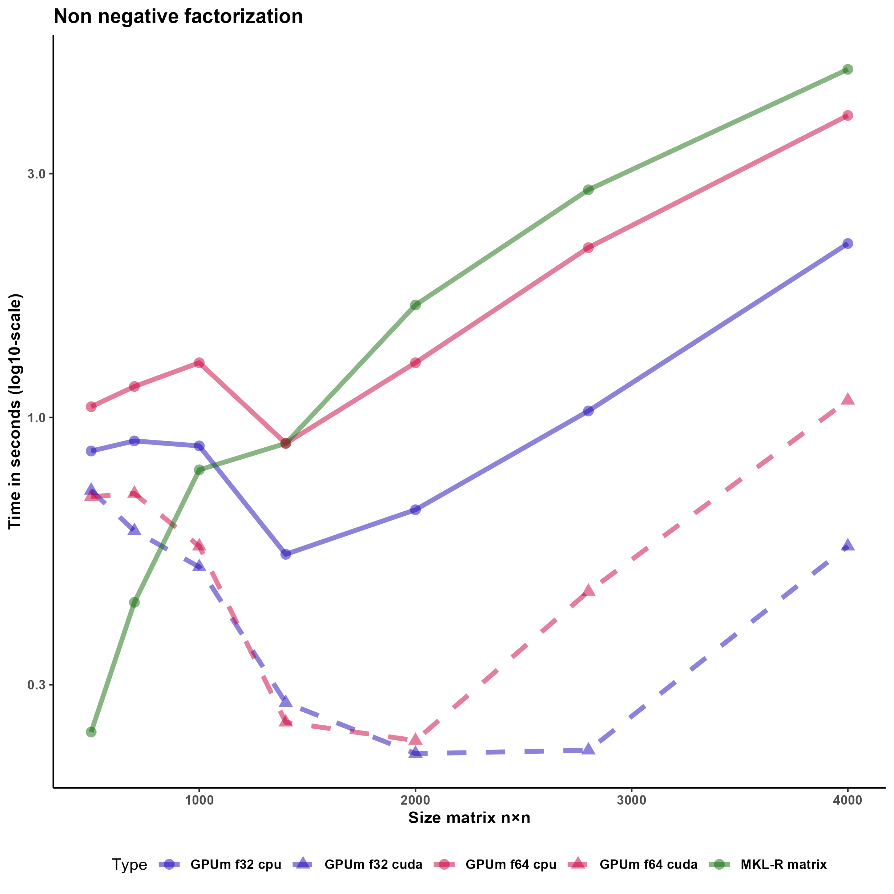
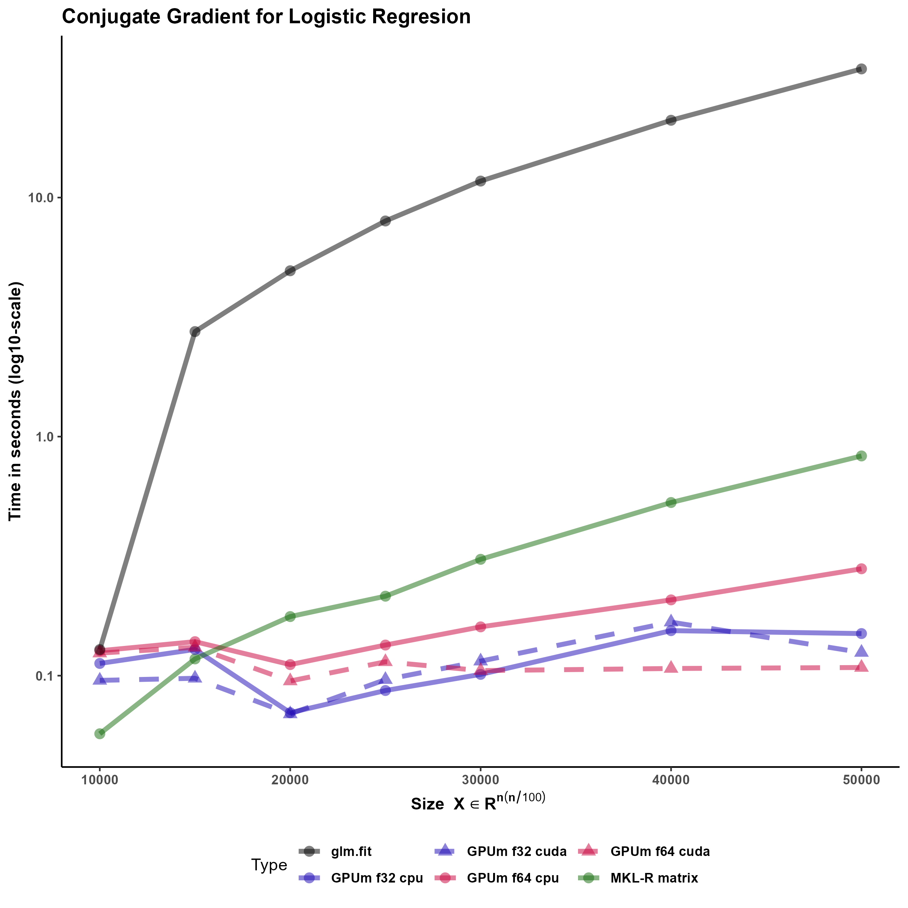
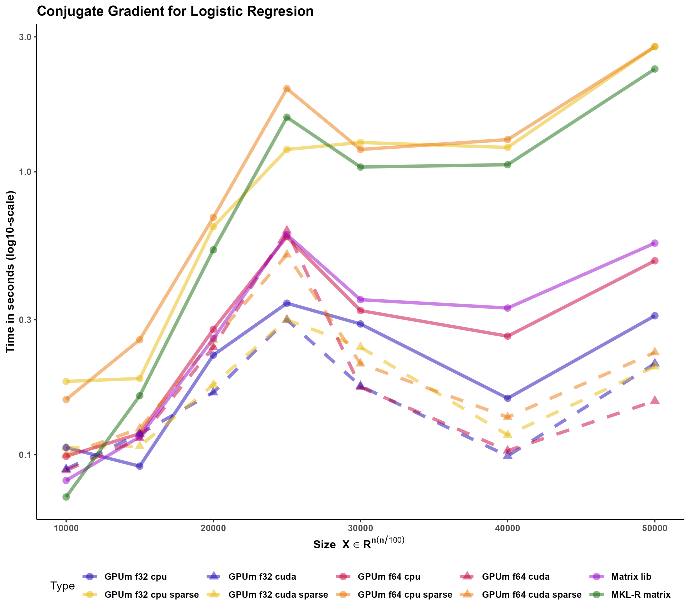
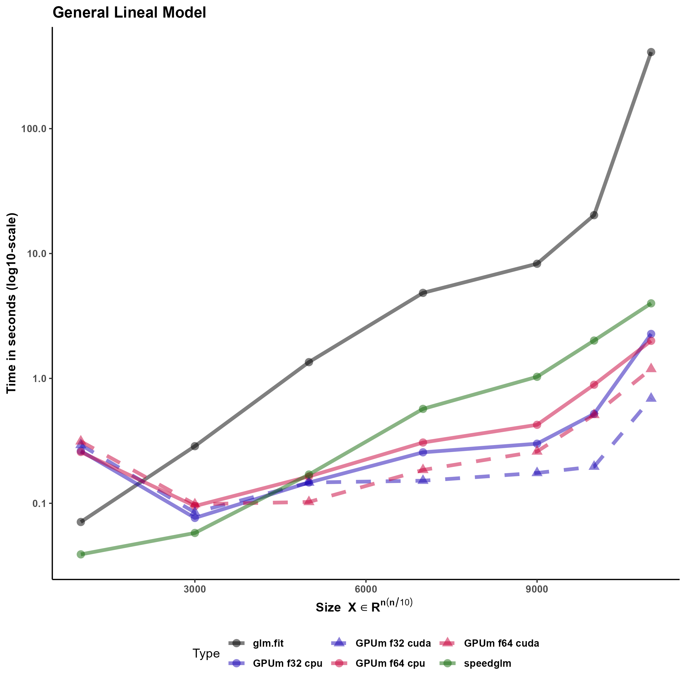
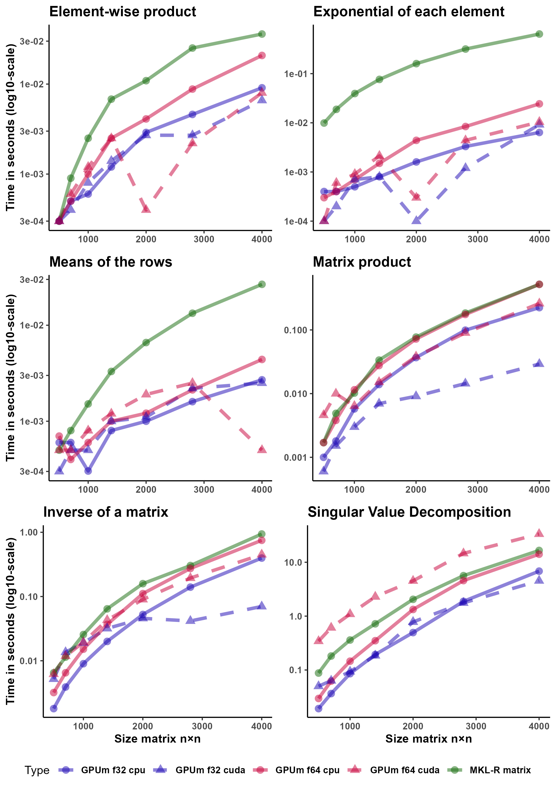
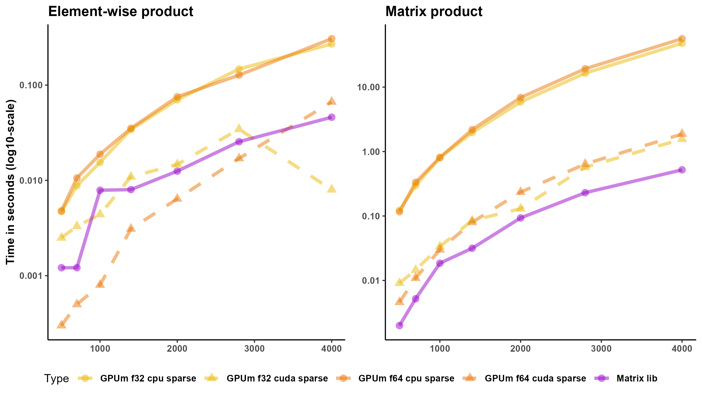

```{r setup, include=FALSE}
knitr::opts_chunk$set(echo = FALSE, warning = FALSE, message = FALSE)
library(plotly)
library(ggplot2)
library(palmerpenguins)
#library(kableExtra)
library(Matrix)
```

# Introduction

R[@R] is a programming language broadly used in statistics and computational biology. R is part of a collaborative and open project where users can publish packages that extend its base configuration. CRAN (Comprehensive R Archive Network) and Bioconductor are repositories where R packages are stored after passing strict code quality criteria.

Graphics Processing Units (GPUs) perform computations in parallel, making them exceptionally powerful for tasks involving large amounts of data processing. At the hardware level, GPUs consist of many processing cores that can execute thousands of threads simultaneously. These threads are organised into groups called warps (in NVIDIA GPUs) or wavefronts (in AMD GPUs), which typically contain 32 or 64 threads. All threads within a warp operate in lockstep, following the Single Instruction, Multiple Thread (SIMT) model. This means that each thread executes the same instruction at the same time, but on different data elements, enabling massive parallelism and high throughput for suitable tasks.

While the SIMT architecture excels at parallel execution, it presents challenges when threads within a warp need to follow different execution paths due to conditional statements or branching. Matrix operations are particularly well suited to GPUs due to their regular computational patterns and minimal branching. Operations such as matrix multiplication, element-wise arithmetic and linear algebra computations involve applying the same operation to large data sets, which fits perfectly with the SIMT execution model. This makes matrix computations highly efficient on GPUs, leading to significant performance gains in applications such as machine learning, scientific simulation and data analysis. 

Statistical and machine learning methods are mostly based on linear algebra operations. Using a GPU for these operations greatly increases the computational power. Since R is a language designed for these types of methods, adapting it to use the GPU would result in a significant computational improvement.

There have been previous attempts to exploit the power of the GPU using R packages. Some of these have been method-specific - such as cuRnet [@cuRnet] for graph analysis, qrpca [@qrpca] for PCA analysis, rgtsvm [@wang2017rgtsvm] for support vector machines, \CRANpkg{xgboost} [@XGBoost] for extreme grading boosting, and \CRANpkg{gputools} [@gputools] for microarray analysis. \CRANpkg{gpuR} [@gpuR], on the other hand, provided "GPU-enabled functions in a simple and accessible way". gpuMagic [@gpuMagic], allows users to compile R functions in OpenCL and run the code on the GPU. None of these are currently available on CRAN or Bioconductor except gpuMagic and xgboost.

\CRANpkg{torch} [@torch] and \CRANpkg{tensorflow} [@tensorflow] are other GPU-enabled packages for R that target machine learning methods whose workhorse are tensor-like objects, a generalization of the concepts of scalar, vector, and matrix. These packages provide the functionality of the Python packages PyTorch and Tensorflow respectively. Both are available on CRAN and are GPU enabled. Both are maintained by developers from RStudio [@RStudio] (now Posit). Both packages represent a rather complex learning process for the standard R user as they focus on machine learning rather than linear algebra and the syntax is reminiscent of its ''Pythonic'' origins.

Here we present **\CRANpkg{GPUmatrix}** which, by including methods for most statistical and linear algebra functions, allows the full functionality of R to be used for GPU computation with almost no learning for the user, making it very easy to adapt to existing programs. GPUmatrix uses either Torch or Tensorflow internally to perform the computations.

The paper is organized as follows: in the first section we give a general description of the package, its objects and features. In the second section we show several statistical applications of the package and their respective performance improvements. The third section contains the results of the comparison of the speed of the operations and functions using either CPUs or GPUs. In the last section we discuss these results.

# Overall Description

GPUmatrix is based on the S4 object structure provided by R, and mimics the behavior of the \CRANpkg{Matrix} package [@Matrix]. It implements sparse matrices and \CRANpkg{float} [@float2017guide] data types (from Matrix and float packages) as part of the gpu.matrix objects. It includes casting operations i.e conversions from one object type to a different one between gpu.matrix objects, Matrix -including sparse-, float32, and the default matrix objects in R.

For a list of all available methods, see Tables T2, T3 and T4 in the package vignette. These include the standard operations on matrices (sum, difference, inverse, standard matrix product, Hadamard product, etc.), access to matrix elements (entry, rows, columns, submatrices, etc.), matrix factorizations (qr, svd, chol, lu, etc.), algorithms for sorting, computing the fft of a vector, etc. GPUmatrix also includes operations from the \CRANpkg{matrixStats} package [@matrixStats] (rowMedians, rowMaxs, etc.)

Installing GPUmatrix itself is straightforward. It depends on the installation of either torch or tensorflow, which is more involved. In turn, if GPU processing is required, torch and tensorflow depend on specific versions of CUDA (not necessarily identical). In the GPUmatrix vignette we have included a brief explanation on how to install these packages.

GPUmatrix requires either torch or tensorflow to be installed. GPUmatrix can be used if any of them is installed. For this reason, neither of them are strictly required(if the other is available) an we have included no dependencies between GPUmatrix and torch or tensorflow.

## Examples of Use

The GPUmatrix package is based on S4 objects in R and we have added a constructor function that similar to the default `matrix()` constructor in R for CPU matrices. The constructor function is `gpu.matrix()` and takes the same parameters as `matrix()`:

```{r,echo=TRUE,message=TRUE,warning=TRUE}
library(GPUmatrix)
#R matrix initialization
m <- matrix(c(1:10)+40,5,2)
#Show CPU matrix
m

#GPU matrix initialization
Gm <- gpu.matrix(c(1:10)+40,5,2)
#Show GPU matrix
Gm
```

Although the indexing of tensors in both torch and tensorflow is 0-based, the indexing of GPUmatrix objects is 1-based, making it as close as possible to working with native R matrices and more convenient for the user. In the previous example, a normal R CPU matrix called `m` and its GPU counterpart `Gm` are created. Just like regular matrices, the created GPU matrices allow for indexing their elements and assigning values to them. The concatenation operators `rbind()` and `cbind()` work independently of the type of matrices being concatenated, resulting in a `gpu.matrix()`:

```{r,echo=TRUE}
Gm[c(2,3),1]

Gm[,2]
 
Gm2 <- cbind(Gm[c(1,2),], Gm[c(3,4),])
Gm2

Gm2[1,3] <- 0
Gm2
```

It is also possible to initialize the data with NaN values:

```{r,echo=TRUE}
Gm3 <- gpu.matrix(nrow = 2,ncol=3)
Gm3[,2]
Gm3[1,2] <- 1 
Gm3
Gm3[1,3] <- 0
Gm3
```

These examples demonstrate that, contrary to standard R, subsetting a gpu.matrix —even when selecting only one column or row— still results in a gpu.matrix. This behavior is analogous to using `drop=FALSE` in standard R. The default standard matrices in R have limitations. The only allowed numeric data types are int and float64. It neither natively allows the creation or handling of sparse matrices. To make up for this lack of functionality, other R packages hosted in CRAN have been created to manage these types.

## Cast from other packages

GPUmatrix allows for compatibility with sparse matrices and different data types such as float32. For this reason, casting operations between different matrix types from multiple packages to GPUmatrix type have been implemented (Table `r knitr::asis_output(ifelse(knitr::is_html_output(), '\\@ref(tab:cast-packages-html)', '\\@ref(tab:cast-packages-latex)'))`).

```{r,echo=FALSE}
df <- data.frame(
  MatrixClass = c("matrix", "data.frame", "integer", "numeric", "dgeMatrix", "ddiMatrix", "dpoMatrix", "dgCMatrix", "float32", "torch_tensor", "tensorflow.tensor"),
  Package = c("base", "base", "base", "base", "Matrix", "Matrix", "Matrix", "Matrix", "float", "torch", "tensorflow"),
  DataTypeDefault = c("float64", "float64", "float64", "float64", "float64", "float64", "float64", "float64", "float32", "float64", "float64"),
  SPARSE = c(FALSE, FALSE, FALSE, FALSE, FALSE, TRUE, FALSE, TRUE, FALSE, "Depends of tensor type", "Depends of tensor type"),
  BackCast = c(TRUE, TRUE, TRUE, TRUE, FALSE, FALSE, FALSE, FALSE, FALSE, TRUE, TRUE)
)
```

```{r cast-packages-latex, eval = knitr::is_latex_output()}
 knitr::kable(df, format = "latex", booktabs=TRUE, caption = "Cast options from other packages. If back cast is TRUE, then it is possible to convert a gpu.matrix to this object and vice versa. If is FALSE, it is possible to convert these objects to gpu.matrix but not vice versa.")
```

```{r cast-packages-html, eval = knitr::is_html_output()}
 knitr::kable(df, format = "html",booktabs=TRUE, caption = "Cast options from other packages. If back cast is TRUE, then it is possible to convert a gpu.matrix to this object and vice versa. If is FALSE, it is possible to convert these objects to gpu.matrix but not vice versa.")
```

There are two functions for casting to create a `gpu.matrix`: `as.gpu.matrix()**` and the `gpu.matrix()` constructor itself. Both have the same input parameters for casting: the object to be cast and extra parameters to create a GPUmatrix.

Create 'Gm' from 'm' matrix R-base:

```{r, echo=TRUE}
m <- matrix(c(1:10)+40,5,2)
Gm <- gpu.matrix(m)
Gm
```

Create 'Gm' from 'M' with Matrix package:

```{r, echo=TRUE}
library(Matrix)
M <- Matrix(c(1:10)+40,5,2)
Gm <- gpu.matrix(M)
Gm
```

Create 'Gm' from 'mfloat32' with float package:

```{r, echo=TRUE}
library(float)
mfloat32 <- fl(m)
Gm <- gpu.matrix(mfloat32)
Gm
```

Interestingly, GPUmatrix returns a float32 data type matrix if the input is a float matrix. It is also possible to a gpu.matrix create 'Gms' type sparse from 'Ms' type sparse dgCMatrix, dgeMatrix, ddiMatrix or dpoMatrix with Matrix package:

```{r, echo=TRUE}
Ms <- Matrix(sample(0:1, 10, replace = TRUE), nrow=5, ncol=2, sparse=TRUE)
Ms
 
Gms <- gpu.matrix(Ms)
Gms
```

## Data type and sparsity

The data types allowed for GPUmatrix are: **float64**, **float32**, **int**, **bool** or **logical**, **complex64** and exclusively in torch **complex32**. We can create a GPU matrix with a specific data type using the `dtype**` parameter of the `gpu.matrix()**` constructor function. It is also possible change the data type of a previously created GPU matrix using the `dtype()**` function. The same applies to GPU sparse matrices, we can create them from the constructor using the `sparse**` parameter, which will return Boolean value of `TRUE`/`FALSE` depending on whether we want the resulting matrix to be sparse or not. We can also modify the sparsity of an existing GPU matrix with the functions `to\_dense()**`, if we want it to change it from sparse to dense, and `to\_sparse()**`, if we want it to go from dense to sparse.

Creating a float32 matrix:

```{r, echo=TRUE}
Gm32 <- gpu.matrix(c(1:10)+40,5,2, dtype = "float32")
Gm32
```

Creating a non sparse matrix with data type float32 from a sparse matrix type float64:

```{r, echo=TRUE}
Ms <- Matrix(sample(0:1, 10, replace = TRUE), nrow=5, ncol=2, sparse=TRUE)
Gm32 <- gpu.matrix(Ms, dtype = "float32", sparse = F)
Gm32
```

Convert Gm32 in sparse matrix Gms32:

```{r, echo=TRUE}
Gms32 <- to_sparse(Gm32)
Gms32
```

Convert data type Gms32 into float64:

```{r, echo=TRUE}
Gms64 <- Gms32
dtype(Gms64) <- "float64"
Gms64
```

## GPUmatrix functions

### Arithmetic and comparison operators

GPUmatrix supports all of the basic arithmetic operators in R: `+`, `-`, `*`, `\^{`}, `/`, `\%*\%` and `\%\%`. Its usage is the same as for basic R matrices, and it allows compatibility with other matrix objects from the packages mentioned above.

```{r, echo=TRUE}
(Gm + Gm) == (m + m)

(Gm + M) == (mfloat32 + Gm)

(M + M) == (mfloat32 + Gm)
```

As seen in the previous examples, the comparison operators (`==`, `!=`, `\textgreater{`}, `\textless{`}, `\textgreater{`=}, `\textless{`=}) also work following the same dynamic of the arithmetic operators.

### Math operators

Similarly to arithmetic operators, mathematical operators follow the same operation they would perform on regular matrices of R. `Gm` is a `gpu.matrix` variable (Table `r knitr::asis_output(ifelse(knitr::is_html_output(), '\\@ref(tab:math-operators-html)', '\\@ref(tab:math-operators)'))`).

```{r, echo=FALSE}
df_operators <- data.frame(
  MathematicalOperators = c("log", "log2", "log10", "cos", "cosh", "acos", "acosh", "sin", "sinh", "asin", "asinh", "tan", "atan", "tanh", "atanh", "sqrt", "abs", "sign", "ceiling", "floor", "cumsum", "cumprod", "exp", "expm1"),
  Usage = c("log(Gm)", "log2(Gm)", "log10(Gm)", "cos(Gm)", "cosh(Gm)", "acos(Gm)", "acosh(Gm)", "sin(Gm)", "sinh(Gm)", "asin(Gm)", "asinh(Gm)", "tan(Gm)", "atan(Gm)", "tanh(Gm)", "atanh(Gm)", "sqrt(Gm)", "abs(Gm)", "sign(Gm)", "ceiling(Gm)", "floor(Gm)", "cumsum(Gm)", "cumprod(Gm)", "exp(Gm)", "expm1(Gm)")
)
```

```{r math-operators, eval = knitr::is_latex_output()}
 knitr::kable(df_operators, format = "latex",booktabs=TRUE, caption = "Mathematical operators that accept a gpu.matrix as input.")
```

```{r math-operators-html, eval = knitr::is_html_output()}
 knitr::kable(df_operators, format = "html",booktabs=TRUE, caption = "Mathematical operators that accept a gpu.matrix as input.")
```

### Complex operators

There are certain functions only applicable to numbers of complex type. In R these functions are grouped as complex operators and all of them are available for GPUmatrix matrices with the same functionality as in R base. `Gm` is a `gpu.matrix` variable (Table `r knitr::asis_output(ifelse(knitr::is_html_output(), '\\@ref(tab:complex-operators-html)', '\\@ref(tab:complex-operators)'))`).

```{r, echo=FALSE}
df_complex <- data.frame(
  MathematicalOperators = c("Re", "Im", "Conj", "Arg", "Mod"),
  Usage = c("Re(Gm)", "Im(Gm)", "Conj(Gm)", "Arg(Gm)", "Mod(Gm)")
)

```

```{r complex-operators, eval = knitr::is_latex_output()}
 knitr::kable(df_complex, format = "latex",booktabs=TRUE, caption = "Complex operators that accept a gpu.matrix with complex type as input.")
```

```{r complex-operators-html, eval = knitr::is_html_output()}
 knitr::kable(df_complex, format = "html",booktabs=TRUE, caption = "Complex operators that accept a gpu.matrix with complex type as input.")
```

### Other functions

In the manual, we can find a number of functions that can be applied to `gpu.matrix` type matrices. Most of these functions are from base R and can be applied to `gpu.matrix` matrices in the same way they would be applied to regular R matrices. There are other functions from other packages like **Matrix** or **matrixStats**, which have been implemented due to their widespread use within the R community, such as `rowVars` or `colMaxs`. The output of these functions, which originally produced R default matrix type objects, will now return `gpu.matrix` type matrices when the input type of the function is `gpu.matrix`.

```{r, echo=TRUE}
library(GPUmatrix)
m <- matrix(c(1:10)+40,5,2)
Gm <- gpu.matrix(c(1:10)+40,5,2)

head(tcrossprod(m),2)

head(tcrossprod(Gm),2)

Gm <- tail(Gm,3)
rownames(Gm) <- c("a","b","c")
tail(Gm,2)

colMaxs(Gm)
```

There is a wide variety of functions implemented in GPUmatrix, and they are adapted to be used just like regular R matrices.

## Using GPUMatrix on CPU

In the GPUmatrix constructor, when using torch, we can specify the location of the matrix, i.e., we can decide to host it on the GPU or in RAM memory to use it with the CPU. As a package, oriented towards algebraic operations in R using the GPU, it is hosted on the GPU by default, but it allows the same functionalities to be used with the CPU. To do this, we use the `device` attribute of the constructor and assign it the value `"cpu"`.

```{r, echo=TRUE}
#GPUmatrix initialization with CPU option
Gm <- gpu.matrix(c(1:10)+40,5,2,device="cpu")
#Show CPU matrix from GPUmatrix
Gm
```

Notice that instead of CUDADoubleType, now the object is CPUDoubleType.

The standard distribution of R includes a version of basic linear algebra subprograms (BLAS) that is not multithreaded and not fully optimized for present computers. R can be modified to use non-standard BLAS libraries such as OpenBlas, Intel MKL or Accelerate. Switching from Standard R to R using MKL implies changing the default behavior of R and there can be side-effects. For example, some standard packages such as igraph do not work in this case.

The standard BLAS is so slow, that we excluded it from the comparison. We have compared the CUDA-GPU (using GPUmatrix) with base R using Intel MKL (MKL-R).

Torch also runs on the CPU and its backend is MKL. Therefore, the performance between using MKL-R or using the GPUMatrix library on the CPU should be similar. The only differences would be related to the overhead from translating the objects or the different versions of the MKL library.

Interestingly, the standard R matrix operations are indeed slightly slower than using the GPUMatrix package -perhaps owing to a more recent version of the MKL library- (Fig 2), especially in element-wise operations, where MKL-R does not seem to exploit the multithreaded implementation of the Intel MKL BLAS version and Torch does.

In addition, MKL-R does not provide acceleration for float32 -since base R does not include this type of variable-. The multiplication of float32 matrices on MKL-R is, in fact, much slower than multiplying float64 matrices (data not shown). Torch and Tensorflow do include MKL for float32 and there is an improvement in the performance (they are around about twice faster that the float64 counterparts).

# Examples of Statistical Applications

The main advantage of GPUmatrix is its versatility: R code needs only minor changes to adapt it to work in the CPU. We are showing here three statistical applications where its advantages are more apparent.

## Non negative factorization of a matrix

The non-negative factorization (NMF) of a matrix is an approximate factorization were an initial matrix **V** is approximated by the product of two matrices **W** and **H** so that,

$$
\mathbf{V}_{m \times n} \approx \mathbf{W}_{m \times k}\mathbf{H}_{k \times n}
$$

We have implemented our own non-negative matrix factorization (NMF) function using Lee and Seung[@Lee1999] multiplicative update rules.

These rules are $$
\mathbf{W}_{[i, j]}^{n+1} \leftarrow \mathbf{W}_{[i, j]}^n \frac{\left(\mathbf{V}\left(\mathbf{H}^{n+1}\right)^T\right)_{[i, j]}}{\left(\mathbf{W}^n \mathbf{H}^{n+1}\left(\mathbf{H}^{n+1}\right)^T\right)_{[i, j]}}
$$ and $$
\mathbf{H}_{[i, j]}^{n+1} \leftarrow \mathbf{H}_{[i, j]}^n \frac{\left(\left(\mathbf{W}^n\right)^T \mathbf{V}\right)_{[i, j]}}{\left(\left(\mathbf{W}^n\right)^T \mathbf{W}^n \mathbf{H}^n\right)_{[i, j]}}
$$ to update the $\mathbf{W}$ and $\mathbf{H}$ respectively.

```{r plotNMFgpumatrix, out.width = "100%", out.height = "50%", fig.cap = "Computation time (in seconds) of non-negative factorization for MKL-R (i.e. R with the optimized MKL BLAS library, solid green), solid lines for CPU, dashed lines for GPU with CUDA, pink lines for GPUmatrix with float64, and blue lines for GPUmatrix with float32. Time shown in y-axis is in logarithmic scale. All calculations are performed on square matrices. The x-axis represents the number of rows in the matrices. The internal size of the factorization is 10."}

```

The implemented function is `NMFgpumatrix`. This function operates in the same way with basic R matrices as with GPUmatrix matrices, and it does not require any additional changes beyond initializing the input matrix as a GPUmatrix. Indeed, the input matrices **W**, **H**, and **V** can be either gpu.matrix or R base matrices interchangeably. Figure \@ref(fig:plotNMFgpumatrix) shows that using GPUmatrix boosts the performance using both GPU and CPU. This improvement is especially apparent with float32 matrices.

## Logistic regression of large models

Logistic regression is a widespread statistical analysis technique that is the "first to test" method for classification problems where the outcome is binary. R-base implements it in the `glm` function. However, `glm` can be very slow for big models and, in addition, does not accept sparse coefficient matrices as input. In this example, we have implemented a logistic regression solver that accepts as input both dense or sparse matrices.

The developed function performs the logistic regression using the Conjugate Gradient method (CG) Figure \@ref(fig:LRGC). This method has shown to be very effective for logistic regression of big models [@minka2003comparison]. The code is general enough to accommodate standard R matrices, sparse matrices from the Matrix package and, more interestingly, GPUmatrices from the GPUmatrix package.

```{r LRGC, out.width = "100%", out.height = "50%", fig.cap = "Computation time (in seconds) of the logistic regression using the conjugate gradient method for MKL-R (i.e. R with the optimized MKL BLAS library, solid green), solid lines for CPU, dashed lines for GPU with CUDA, pink lines for GPUmatrix with float64, and blue lines for GPUmatrix with float32. Time shown in y-axis is in logarithmic scale. The calculations are performed on random matrices whose size are n x (n/100). Therefore, the leftmost part of the graph shows the computing time for a 10,000 x 100 matrix and the rightmost part a 50,000 x 500 matrix."}

```

We would like to stress several points here. Firstly, the conjugate gradient is an efficient technique that outperforms glm.fit in this case. Secondly, this code runs on matrix, Matrix or GPUmatrix objects without the need of carefully selecting the type of input. Thirdly, using the GPUmatrix accelerates the computation time two-fold if compared to standard R (and more than ten fold if compared to glm.fit function)

```{r LRGC-sparse, out.width = "100%", out.height = "50%", fig.cap = "Computation time (in seconds) of the logistic regression using the conjugate gradient method in a sparse matrix. Solid green for MKL-R dense case  (i.e. the computation is performed without any consideration of the sparsity of the matrix). Solid lines for CPU, dashed lines for GPU with CUDA, pink lines for GPUmatrix dense with float64, blue lines for GPUmatrix dense with float32, yellow lines for GPUmatrix sparse with float32, orange lines for GPUmatrix sparse with float64. Violet line, using Matrix package(that implicitly considers the matrix to be sparse). Time shown in y-axis is in logarithmic scale. The calculations are performed on random matrices whose size are n x (n/100). Therefore, the leftmost part of the graph shows the computing time for a 10,000 x 100 matrix and the rightmost part a 50,000 x 500 matrix."}


```

We have tested the function also using a sparse input. In this case, the memory requirements are much smaller. However, there are no advantages in execution time (despite the sparsity is 90 %). Torch (and Tensorflow) for R only provides a type of sparse matrices: the "coo" coding where each element is described by its position (i and j) and its value. Matrix (and torch and tensorflow for Python) include other storage models (column compressed format, for example) where the matrix computations can be better optimized. It seems that there is still room for improvement in the sparse matrix algebra in Torch for R.

Sparse Matrix -that includes the column compressed form- performs extraordinary well in this case Figure \@ref(fig:LRGC-sparse). Despite Matrix is single-threaded, it is roughly ten times faster than GPUmatrix in sparse matrices.

## General Linear Models

One of the most frequently used functions in R is `glm`, that stands for generalized linear models. In turn, `glm` relies on the `glm.fit`. This function uses the iteratively reweighted least squares algorithm to provide the solution of a generalized linear model. glm.fit, subsequently, calls a C function to do the "hard work" for solving the linear models, including the least squares solution of the intermediate linear systems.

Since glm.fit calls a C function is not easy to develop a "plug-in" substitute using GPUmatrix. Specifically, the qr algorithm in torch or tensorflow for R and in the C function (that is similar to base R) substantially differ: in torch the function returns directly the Q and R matrices whereas the C function called by glm.fit returns a matrix and several auxiliary vectors that can be used to reconstruct the Q and R matrices.

One side-effect of the dependency of base glm on a C function is that, even if R is compiled to use an optimized linear algebra library, the function does not exploit that and the execution time is much longer than expected for this task.

In order to ameliorate this problem, there are other packages (\CRANpkg{fastlm} and \CRANpkg{speedglm}) that mimic the behavior of the base glm. fastlm relies on using multithreaded RcppEigen functions to boost the performance. On the contrary, speedglm is written in plain R and the performance is increased especially if R runs using an optimized BLAS library.

We have used speedglm as starting point for our glm implementation in the GPU since all the code is written in R and includes no calls to external functions. Specifically, the most time-consuming task for large general linear models, is the solution of the intermediate least squares problems. In the GPUmatrix implementation, we used most of the code of speed.glm. The only changes are casts on the matrix of the least squares problem and the corresponding independent term to solve the problem using the GPU. Timing results of the last section show that `GPUglm` outperforms speed.glm for large models.

The following script illustrates how to use the `GPUglm` function in toy examples.

```{r, echo=TRUE}

# Standard glm

counts <- c(18,17,15,20,10,20,25,13,12)
outcome <- gl(3,1,9)
treatment <- gl(3,3)
glm.D93 <- glm(counts ~ outcome + treatment, family = poisson())
summary(glm.D93)


# Using speedglm
library(speedglm)
sglm.D93 <- speedglm(counts ~ outcome + treatment, family = poisson())
summary(sglm.D93)

# GPU glm
library(GPUmatrix)
gpu.glm.D93 <- GPUglm(counts ~ outcome + treatment, family = poisson())
summary(gpu.glm.D93)
```

Results are identical in this test. Figure \@ref(fig:GLMplot) compares the timing of the implementation using speedglm, glm and the implementation of glm in GPUmatrix. GPUmatrix outperforms speedglm with R-MKL. This is especially apparent for float32 matrices.

```{r GLMplot, out.width = "100%", out.height = "50%", fig.cap = "Computation time (in seconds) of general linear model using *speedglm* function with MKL-R matrix (i.e. R with the optimized MKL BLAS library, solid green), solid black line for glm function, solid lines for CPU, dashed lines for GPU with CUDA, pink lines for GPUmatrix with float64, and blue lines for GPUmatrix with float32. Time shown in y-axis is in logarithmic scale. The calculations are performed on random matrices whose size are n x (n/10). Therefore, the leftmost part of the graph shows the computing time for a 1,000 x 100 matrix and the rightmost part a 10,000 x 1000 matrix."}

```

# Performance comparison

We have compared the computation time for different matrix functions, different precision types and running the operations either on the GPU or on the CPU (using both GPUmatrix and R with MKL as linear algebra library).

The functions that we tested are `*` (Hadamard or element-wise product of matrices), `exp`, (exponential of each element of a matrix), `rowMeans` (means of the rows of a matrix), `\%*\%` (standard product of matrices), `solve` (inverse of a matrix) and `svd` (singular value decomposition of a matrix).

These functions were tested on square matrices whose row sizes are 500, 700, 1000, 1400, 2000, 2800 and 4000.

```{r FunctionTime, out.width = "100%", out.height = "80%", fig.cap = "Computation time (in seconds) where MKL-R solid green, solid lines for CPU, dashed lines for GPU with CUDA, pink lines for GPUmatrix with float64 and blue lines for GPUmatrix with float32. All calculations are performed on square matrices. The x-axis represents the number of rows in the matrices. The operations are the element-wise or Hadamard product of two matrices, the exponential of each element of a matrix, the mean of the rows of a matrix, the standard matrix product, the inverse of a matrix, and the singular value decomposition of a matrix (SVD)."}

```

Figure \@ref(fig:FunctionTime) compares the different computational architectures, namely, CPU -standard R matrices running on MKL on FP64-, CPU64 -GPUmatrix matrices computed on the CPU with FP64-, CPU32 -similar to the previous using FP32-, GPU64 -GPUmatrix matrices stored and computed on the GPU with FP64- and GPU32 -identical to the previous using FP32-.

It is important to note that the y-axis is in logarithmic scale. For example, the element-wise product of a matrix on GPU32 is around five times faster than the same operation on CPU. The results show that the GPU is particularly effective for element-wise operations (Hadamard product, exponential of a matrix). For these operations, it is easier to fully utilize the huge number of cores of a GPU. R-MKL seems to use a single core to perform element-wise operations. The torch implementation is much faster, but not as much as using the GPU. rowMeans is also faster on the GPU than on the CPU. In this case, the GPUmatrix CPU implementation is on par with the GPU. When the operations become more complex, as in the standard product of matrices and computing the inverse, CPU and GPU (using double precision) are closer to each other. However, GPU32 is still much faster than its CPU32 counterpart. Finally, it is not advisable -in terms of speed- to use the GPU for even more complex operations such as the SVD. In this case, GPU64 is the slowest method. GPU32 hardly stands up the comparison with CPU32.

Regarding sparse matrices, Torch or Tensorflow for R have very limited support for them. In many cases, it is necessary to cast the sparse matrix to a full matrix and perform the operations on the full matrix. However, there are two operations that do not require this casting: element-wise multiplication of matrices and multiplication of a sparse matrix and a full matrix. We created four sparse matrices. The size of two of them (small ones) is 2,000 x 2,000. The fraction of nonzero entries is 0.01 and 0.001. The size of the other two (large ones) is 20,000 x 20,000. The fraction of non-null entries is also 0.01 and 0.001. Figure \@ref(fig:SparseFunctionTime) shows the results for these matrices. The element-wise multiplication is faster using GPUmatrix. On the contrary, the time to multiply a sparse and a full matrices is similar using Matrix and GPUmatrix. As mentioned earlier, the implementation of sparse operations in torch or tensorflow for R is far from perfect, probably, because the only storage mode is "coo" in their respective R packages.

```{r SparseFunctionTime, out.width = "100%", out.height = "30%", fig.cap = "Computation time (in seconds) for the Matrix package (solid violet), yellow lines for GPUmatrix with float32, orange lines for GPUmatrix with float64, solid lines for CPU and dashed lines for GPU with CUDA. Time shown in y-axis is in logarithmic scale. The small model is a random square matrix of size 2,000 x 2,000. The proportion of non-zero elements is either 0.001 or 0.01. The large model is a 20,000 x 20,000 matrix with the same proportion of non-zero elements. The element-wise multiplication is performed on the sparse matrix. The right panel shows the time required to multiply these matrices by dense matrices whose sizes are 2,000 x 500 and 20,000 x 500, respectively."}

```

# Discusion

GPUmatrix is an R package that facilitates the use of GPUs for linear algebra operations. It relies heavily on either the torch or tensorflow packages. GPUmatrix will work as long as torch or tensorflow work. Currently, the R implementation of these packages lags behind their Python counterparts. For example, in the case of sparse matrices, only the coo sparse tensor implementation is allowed, although compressed row and column formats are readily available in Python torch. Nevertheless, we have shown that GPUmatrix is a convenient package for easily integrating GPU computations into R programs.

GPUmatrix, like any software that performs a computation on the GPU, has some drawbacks. There is a large overhead associated with moving data from main memory to GPU memory. For simple operations with small objects, the time required to move the object can be greater than the computation itself. We have taken special care to avoid unnecessary movements from CPU to GPU memory and vice versa. In some cases -- an operation with a matrix in the CPU and a matrix in the GPU -- this overhead is unavoidable. In this case, we favored the GPU memory and the result will be a GPU matrix.

GPUmatrix also introduces some overhead due to casting objects from one type to another. These considerations lead to an important question: when is it worth using the GPU for linear algebra operations? The answer, of course, is that it depends. Here are some factors that affect the answer to this question.

It depends on the size of the operations and the type of operations. GPU is faster (and compensates the burden of moving the data from the CPU to the GPU memory) only when the operations are performed on large matrices (each dimension is at least in the hundreds or even the thousands of elements). It also depends on the nature of the operations. Element-wise operations are easily parallelized. However, more complex algorithms such as the SVD factorizations are much harder to implement in parallel, so the improvement from using the GPU is small (if any).

Of course, it also depends on the relative performance of the CPU and GPU. We tested GPUmatrix on several systems (Computer 1: i7-10700 plus RTX 2080Ti, Computer 2: i7-11700 plus RTX 3060 Ti, Computer 3: i9-10940X and RTX A4000). Only results for Computer 1 are shown. These desktops can be considered mid-range to high-end in terms of both GPU and CPU. Computer 3 has an i9 processor with 14 cores. Although the graphics card is slightly better for this computer - unless using FP32 - the CPU is generally faster than the GPU in this case. In Computer 2, the RTX3060Ti is particularly fast with FP32 operations, and this definitely affects its performance.

One of the key points is that GPUs excel at FP32 operations. In the case of a CPU, FP32 operations are about twice as fast as FP64. In the case of GPUs, this gain theoretically skyrockets to 32 times faster (for the NVIDIA 2080Ti and the A4000) or even 64 times faster (for the 3060Ti). In practice, these factors are smaller, closer to 10 or 20. Still, the difference is huge, especially when compared to the CPU. If the operations can be done in FP32, then the GPU is usually the fastest method regardless of the type of operation.

Another crucial point is the linear algebra library installed on the CPU. The standard R library does not take advantage of multiple cores, and all operations run in a single thread. OpenBlas, Intel MKL, or Accelerate (for Mac OS) are popular substitutes to enhance the standard linear algebra library. Using these libraries requires tweaking the R installation, and in some cases there may be unwanted side effects. In addition, although OpenBlas (in Linux) and Accelerate accept FP32 data as input and speed up about two times compared to FP64 data, the Microsoft R implementation of MKL does not include any speedup for FP32. In fact, FP32 data from the float package is forced to use single-threaded operations. As a result, CPU operations for FP32 are even slower than for FP64 and therefore, these results were not included.

Torch is the default backbone for GPUmatrix, although Tensorflow can also be used. An advantage of Torch is that operations can be performed on either the GPU or the CPU. Torch implements a very efficient version of MKL on the CPU. Even if a GPU is not available, using GPUmatrix makes it possible to use MKL (even for FP32 data) without changing standard R. Since the standard R library is unchanged, there are no problems with packages that depend on specific functions of it. Operations on torch tensors are slightly faster than on tensorflow tensors (data not shown). Surprisingly, performing the operations on either CPU64 or CPU32 (i.e., using the GPUmatrix package) is slightly faster than using the CPU with R-MKL optimization.

GPUmatrix stands "on the shoulders of giants". As long as either torch or tensorflow is properly installed and GPU enabled, GPUmatrix will take advantage of it. Since these packages are the workhorses of Rstudio, they will be maintained for the foreseeable future, guaranteeing the functionality of GPUmatrix. GPUmatrix is a first approach to filling the gap of harnessing GPU power in R programs. It is easy to use and allows seamless use of GPU power with little change to the standard code.

# Acknowledgments

This research was funded by Cancer Research UK [C355/A26819] and FC AECC and AIRC under the Accelerator Award Programme, the project PIBA_2020_1_0055 (funded by the Basque Government) and the Synlethal Project (RETOS Investigacion, Spanish Government). Conflict of Interest: none declared.

# Summary

To see more available functions, check the \CRANpkg{GPUmatrix} package on CRAN.
