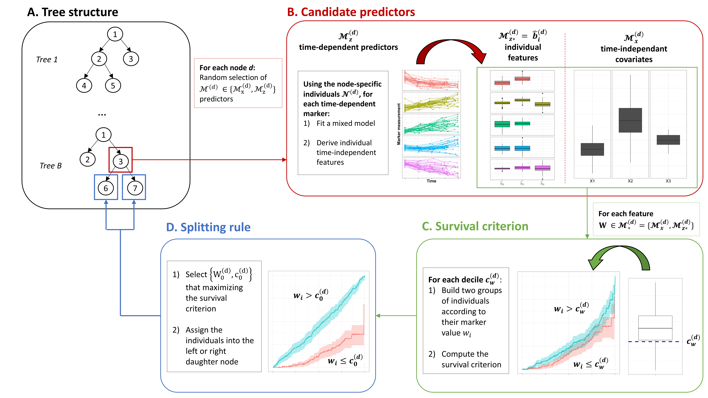

```{r setup, include=FALSE}
knitr::opts_chunk$set(echo = FALSE, warning = FALSE, message = FALSE, fig.align = "center")
library(ggplot2)
library(cowplot)
library(kableExtra)
```

# Introduction

Random forests are a non-parametric, powerful method for prediction purposes. Introduced by Breiman [@breiman_random_2001] for classification (categorical outcome) and regression (continuous outcome) frameworks, random forests are particularly designed to tackle modeling issues in high-dimensional contexts ($n << p$). They can also easily take into account complex associations between the outcome and the predictors without any pre-specification, where regression models are rapidly limited.

Recently, this methodology was extended to survival data [@ishwaran_random_2008] and competing events [@ishwaran_random_2014]. Random forests were implemented in several R [@R_2019] packages such as \CRANpkg{randomForestSRC} [@ishwaran_fast_2022], \CRANpkg{ranger} [@wright_ranger_2017] or \CRANpkg{xgboost} [@chen_xgboost_2016], among others. However, these packages are all limited to time-fixed predictors. Yet, in many applications, it may be relevant to include predictors that are repeatedly measured at multiple occasions (regular or irregular times) with measurement errors to more accurately predict the outcome. This is the case, in particular, in health research where a health outcome is to be predicted according to the history of individual information.

We developed an original random forests methodology to tackle this issue and incorporate longitudinal predictors that may be prone to error and possibly intermittently measured [@devaux_random_2023]. The present paper aims to describe the \CRANpkg{DynForest} R package associated with this methodology, allowing the prediction of a continuous, categorical, or survival outcome using multivariate time-dependent predictors.

In section 2, we briefly present \CRANpkg{DynForest} methodology through its algorithm. In section 3, we present the different functions of \CRANpkg{DynForest}, and we illustrate them in section 4 for a survival outcome and in section 5 for a categorical outcome. An illustration for a continuous outcome can be found in the \CRANpkg{DynForest} vignette. To conclude, we discuss in section 6 the limitations and future improvements.

# DynForest principle

\CRANpkg{DynForest} is a random forest methodology which can include both time-fixed predictors of any nature and time-dependent predictors possibly measured at irregular times. The purpose of \CRANpkg{DynForest} is to predict an outcome which can be categorical, continuous or survival (with possibly competing events).

The random forest should first be built on a learning dataset of $N$ subjects including: $Y$ the outcome; $\mathcal{M}_x$ an ensemble of $P$ time-fixed predictors; $\mathcal{M}_z$ an ensemble of $Q$ time-dependent predictors. The random forest consists of an ensemble of $B$ trees which are grown as detailed below.

```{r dynforestRgraph, out.width = "100%", out.height = "30%", fig.cap = "Overall scheme of the tree building in DynForest with (A) the tree structure, (B) the node-specific treatment of time-dependent predictors to obtain time-fixed features, (C) the dichotomization of the time-fixed features, (D) the splitting rule."}

```

## The tree building

The tree building process, summarized in figure \@ref(fig:dynforestRgraph), aims to recursively partition the subjects into groups/nodes that are the most homogeneous regarding the outcome $Y$.

For each tree $b$ $(b = 1, ..., B)$, we first draw a bootstrap sample from the original dataset of $N$ subjects ($N$ draws among the $N$ subjects with replacement). The subjects excluded by the bootstrap constitute the out-of-bag (OOB) sample, noted $OOB^b$ for tree $b$. At each node $d \in \mathcal{D}^b$ of the tree, we recursively repeat the following steps using the $N^{(d)}$ subjects located at node $d$:

1. An ensemble of $\mathcal{M}^{(d)}=\{\mathcal{M}_x^{(d)},\mathcal{M}_z^{(d)}\}$ candidate predictors is randomly selected among $\{\mathcal{M}_x,\mathcal{M}_z\}$ (see figure \@ref(fig:dynforestRgraph)B). The size of $\mathcal{M}^{(d)}$ is defined by the hyperparameter $mtry$.

2. For each time-dependent predictor in $\mathcal{M}_z^{(d)}$:
    a. We independently model the trajectory of the predictor using a flexible linear mixed model [@laird_random_effects_1982] according to time (the specification of the model is defined by the user). It is defined as: $Z_{ij} = X1_{ij}(t_{ij})\beta + X2_{ij}(t_{ij})b_i + \epsilon_{ij}$ where $Z_{ij}$ is the value of predictor $Z$ for subject $i$ at occasion $j$, $X1_{ij}$ and $X2_{ij}$ are vectors of time functions and covariates to be specified by the user and $t_{ij}$ is the time at occasion $j$ for subject $i$. $\beta$ are population effects, and $b_i$ individual random effects which follow a multivariate normal distribution. $\epsilon_{ij}$ are the zero-mean independent Gaussian errors of measurement.
    b. We predict the vector of random-effects $\hat{b}_i$ using the available information of individual $i = 1, ..., N^{(d)}$. Predictions $\hat{b}_i$ constitute time-independent features summarizing each time-dependent predictor. We thus derive the ensemble $\mathcal{M}_{z \star}^{(d)}$ for all the variables in $\mathcal{M}_z^{(d)}$.

3. We define $\mathcal{M}_\star^{(d)}=\{\mathcal{M}_x^{(d)},\mathcal{M}_{z \star}^{(d)}\}$ as our new ensemble of time-independent candidate features.

4. For each candidate feature $W \in \mathcal{M}_\star^{(d)}$:
    a. We build a series of splits $c_W^{(d)}$ according to the feature values if continuous, or subsets of categories otherwise (see figure \@ref(fig:dynforestRgraph)C), leading each time to two groups.
    b. We quantify the distance between the two groups according to the nature of $Y$:
        * If $Y$ continuous: we compute the weighted within-group variance with the proportion of subjects in each group as weights
        * If $Y$ categorical: we compute the weighted within-group Shannon entropy [@shannon_mathematical_1948] (i.e., the amount of uncertainty) with the proportion of subjects in each group as weights
        * If $Y$ survival \underline{without} competing events: we compute the log-rank statistic test [@peto_asymptotically_1972]
        * If $Y$ survival \underline{with} competing events: we compute the Fine \& Gray statistic test [@gray_class_1988]

5. We split the subjects into the two groups that minimize (for continuous and categorical outcome) or maximize (for survival outcome) the quantity defined previously. We denote $\{W_0^d,c_0^d\}$ as the optimal couple used to split the subjects and assign them to the left and right daughter nodes $2d$ and $2d + 1$, respectively (see figure \@ref(fig:dynforestRgraph)D and A).

6. Step 1 to 5 are iterated on the daughter nodes until stopping criteria are met.

We define two stopping criteria: `nodesize`, the minimal number of subjects in a node required to reiterate the split, and `minsplit`, the minimal number of events required to split the node. `minsplit` is only defined with a survival outcome. In the following, we call leaves the terminal nodes.

In each leaf $h \in \mathcal{H}^b$ of tree $b$, a summary $\pi^{h^b}$ is computed using the individuals belonging to the leaf. The leaf summary is defined according to the outcome:

* the mean, for $Y$ continuous
* the category with the highest probability, for $Y$ categorical
* the cumulative incidence function over time computed using the Nelson-Aalen cumulative hazard function estimator [@nelson_hazard_1969; @aalen_nonparametric_1976], for $Y$ single cause time-to-event
* the cumulative incidence function over time computed using the non-parametric Aalen-Johansen estimator [@aalen_empirical_1978], for $Y$ time-to-event with multiple causes

NOTE: Step 2 involves the estimation of a parametric mixed model for each time-dependent predictor. The specification of this model should be carefully determined in preliminary analyses by the user, keeping in mind that there should be a trade-off between goodness-of-fit and parameter parsimony. The critical point is to adequately specify the trajectory shape over time at the population and individual levels. Different bases of time functions can be considered (e.g., fractional polynomials, splines, adhoc) and compared in terms of fit.

## Individual prediction of the outcome

### Out-Of-Bag individual prediction

The overall OOB prediction $\hat{\pi}_{ \star}$ for a subject $\star$ can be computed by averaging the tree-based predictions of $\star$ over the random forest as follows:
\begin{equation}
  \hat{\pi}_{ \star} = \frac{1}{|\mathcal{O}_\star|} \sum_{b \in \mathcal{O}_\star} \hat{\pi}^{h_\star^b}
\end{equation}
where $\mathcal{O}_\star$ is the ensemble of trees where $\star$ is $OOB$ and $|\mathcal{O}_\star|$ denotes its cardinality. The prediction $\hat{\pi}^{h_\star^b}$ is obtained by dropping down subject $\star$ along tree $b$. At each node $d \in \mathcal{D}^b$, the subject $\star$ is assigned to the left or right node according to his/her data and the optimal couple $\{W_0^d,c_0^d\}$. $W_0^d$ is a random-effect feature, its value for $\star$ is predicted from the individual repeated measures using the estimated parameters from the linear mixed model.

### Individual dynamic prediction from a landmark time

With a survival outcome, the OOB prediction described in the previous paragraph can be extended to compute the individual probability of event from a landmark time $s$ by exploiting the repeated measures of subject $\star$ only until $s$. For a new subject $\star$, we thus define the individual probability of event, noted $\hat{\pi}_{\star}(s,s+t)$, as the probability of experiencing the event by time $s+t$ given the information prior to landmark time $s$:
\begin{equation}
  \hat{\pi}_{\star}(s,s+t) = \frac{1}{B} \sum_{b=1}^B \hat{\pi}^{h_\star^b}(s,s+t)
\end{equation}
where $\hat{\pi}^{h_\star^b}(s,s+t)$ is the tree-based probability of event at time $s+t$ computed by dropping down $\star$ along the tree by considering longitudinal predictors collected until $s$ and time-fixed predictors. Note that any horizon $t$ can be considered provided $s+t$ remains in the time window on which the random forest was trained. In the \CRANpkg{DynForest} package, by default, the probability is computed at all the observed event times after the landmark time.

## Out-Of-Bag prediction error

Using the OOB individual predictions, an OOB prediction error can be internally assessed. The OOB prediction error quantifies the difference between the observed and the predicted values. It is defined according to the nature of $Y$ as:

* for $Y$ continuous, the mean square error (MSE) defined by:

\begin{equation}
  errOOB = \frac{1}{N} \sum_{i=1}^N ( \hat{\pi}_i - \pi_i^0 )^2
\end{equation}

* for $Y$ categorical, the misclassification error defined by:

\begin{equation}
  errOOB = \frac{1}{N} \sum_{i=1}^N {1}_{( \hat{\pi}_i \neq \pi_i^0 )}
\end{equation}

* for $Y$ survival, the Integrated Brier Score (IBS) [@sene_individualized_2016] between $\tau_1$ and $\tau_2$ defined by:

\begin{equation}
  errOOB = \int_{\tau_1}^{\tau_2} \frac{1}{N} \sum_{i=1}^{N}  \hat{\omega}_i(t) \Big\{ I(T_i \leq t, \delta_i = k) -
  \hat{\pi}_{ik}(t) \Big) \Big\}^2 dt
\end{equation}
with $T$ the time-to-event, $k$ the cause of interest and $\hat{\omega}(t)$ the estimated weights using Inverse Probability of Censoring Weights (IPCW) technique that accounts for censoring [@gerds_consistent_2006].

The OOB error of prediction is used, in particular, to tune the random forest by determining the hyperparameters (i.e., `mtry`, `nodesize` and `minsplit`) which give the smallest OOB prediction error.

## Explore the most predictive variables

### Variable importance

The variable importance (VIMP) measures the loss of predictive performance [@ishwaran_random_2008] when removing the link between a predictor and the outcome. The link is removed by permuting the predictor values at the subject level for time-fixed predictors or at the observation level for time-dependent predictors. A large VIMP value indicates a good predictive ability for the predictor.

However, in the case of correlated predictors, the VIMP may not properly quantify the variable importance [@gregorutti_correlation_2017] as the information of the predictor may still be present. To better handle situations with highly correlated predictors, the grouped variable importance (gVIMP) can be computed indirectly. It consists of simultaneously evaluating the importance of a group of predictors defined by the user. The computation is the same as for the VIMP except the permutation is performed simultaneously on all the predictors of the group. A large gVIMP value indicates a good predictive ability for the group of predictors.

### Minimal depth

The minimal depth is another statistic to quantify the importance of a variable. It assesses the distance between the root node and the first node for which the predictor is used to split the subjects (1 for first level, 2 for second level, 3 for third level, ...). This statistic can be computed at the predictor level or at the feature level, allowing us to fully understand the tree building process.

We strongly advise computing the minimal depth with the `mtry` hyperparameter chosen at its maximum to ensure that all predictors are systematically among candidate predictors for splitting the subjects.

# The \CRANpkg{DynForest} R package

\CRANpkg{DynForest} methodology was implemented in the R package \CRANpkg{DynForest} [@devaux_dynforest_2024] freely available on The Comprehensive R Archive Network (CRAN) to users.

The package includes two main functions: `dynforest()` and `predict()` for the learning and the prediction steps. These functions are fully described in section 3.1 and 3.2. Other functions available are briefly described in the table below. These functions are illustrated in examples, one for a survival outcome and one for a categorical outcome.

| Function | Description |
| ----------- | ----------- |
| *Learning and prediction steps* |  |
| `dynforest()` | Function that builds the random forest |
| `predict()` | Function for S3 class `dynforest` predicting the outcome on new subjects using the individual-specific information |
| *Assessment function* |  |
| `compute_ooberror()` | Function that computes the Out-Of-Bag error to be minimized to tune the random forest |
| *Exploring functions* |  |
| `compute_vimp()` | Function that computes the importance of variables |
| `compute_gvimp()` | Function that computes the importance of a group of variables |
| `compute_vardepth()` | Function that extracts information about the tree building process |
| *plot() functions for S3 class:* | |
| `dynforest` | Plot the estimated CIF for given tree nodes or subjects |
| `dynforestpred` | Plot the predicted CIF for the cause of interest for given subjects |
| `dynforestvimp` | Plot the importance of variables by value or percentage |
| `dynforestgvimp` | Plot the importance of a group of variables by value or percentage |
| `dynforestvardepth` | Plot the minimal depth by predictors or features |
| *Other functions* | |
| `summary()` | Function for class S3 `dynforest` or `dynforestoob` displaying information about the type of random forest, predictors included, parameters used, Out-Of-Bag error (only for `dynforestoob` class) and brief summaries about the leaves |
| `print()` | Function to print object of class `dynforest`, `dynforestoob`, `dynforestvimp`, `dynforestgvimp`, `dynforestvardepth` and `dynforestpred` |
| `get_tree()` | Function that extracts the tree structure for a given tree |
| `get_treenode()` | Function that extracts the terminal node identifiers for a given tree |

## `dynforest()` function

`dynforest()` is the function to build the random forest. The call of this function is:

```{r, eval = FALSE, echo = TRUE}
dynforest(
  timeData = NULL, fixedData = NULL, idVar = NULL,
  timeVar = NULL, timeVarModel = NULL, Y = NULL,
  ntree = 200, mtry = NULL, nodesize = 1, minsplit = 2, cause = 1,
  nsplit_option = "quantile", ncores = NULL,
  seed = 1234, verbose = TRUE
)
```

### Arguments

`timeData` is an optional argument that contains the dataframe in longitudinal format (i.e., one observation per row) for the time-dependent predictors. In addition to time-dependent predictors, this dataframe should include a unique identifier and the measurement times. This argument is set to `NULL` if no time-dependent predictor is included. Argument `fixedData` contains the dataframe in wide format (i.e., one subject per row) for the time-fixed predictors. In addition to time-fixed predictors, this dataframe should also include the same identifier as used in `timeData.` This argument is set to `NULL` if no time-fixed predictor is included. Argument `idVar` provides the name of the identifier variable included in `timeData` and `fixedData` dataframes. Argument `timeVar` provides the name of the time variable included in `timeData` dataframe. Argument `timeVarModel` contains as many lists as time-dependent predictors defined in `timeData` to specify the structure of the mixed models assumed for each predictor. For each time-dependent predictor, the list should contain a `fixed` and a `random` argument to define the formula of a mixed model to be estimated with \CRANpkg{lcmm} R package [@proust_lima_estimation_2017]. `fixed` defines the formula for the fixed-effects and `random` for the random-effects (e.g., `list(Y1 = list(fixed = Y1 ~ time, random = ~ time))`.  Argument `Y` contains a list of two elements `type` and `Y`. Element `type` defines the nature of the outcome (`surv` for survival outcome with possibly competing causes, `numeric` for continuous outcome and `factor` for categorical outcome) and element `Y` defines the dataframe which includes the identifier (same as in `timeData` and `fixedData` dataframes) and outcome variables.

Arguments `ntree`, `mtry`, `nodesize` and `minsplit` are the hyperparameters of the random forest. Argument `ntree` controls the number of trees in the random forest (200 by default). Argument `mtry` indicates the number of variables randomly drawn at each node (square root of the total number of predictors by default). Argument `nodesize` indicates the minimal number of subjects allowed in the leaves (1 by default). Argument `minsplit` controls the minimal number of events required to split the node (2 by default).

For a survival outcome, argument `cause` indicates the event of interest. Argument `nsplit_option` indicates the method to build the two groups of individuals at each node. By default, we build the groups according to deciles (`quantile` option) but they could be built according to random values (`sample` option).

Argument `ncores` indicates the number of cores used to grow the trees in parallel mode. By default, we set the number of cores of the computer minus 1. Argument `seed` specifies the random seed. It can be fixed to replicate the results. Argument `verbose` allows to display a progression bar during the execution of the function.

### Values

`dynforest()` function returns an object of class `dynforest` containing several elements:

* `data` a list with longitudinal predictors (`Longitudinal` element), continuous predictors (`Numeric` element) and categorical predictors (`Factor` element)
* `rf` is a dataframe with one column per tree containing a list with several elements, which includes:
    * `leaves` the leaf identifier for each subject used to grow the tree
    * `idY` the identifiers for each subject used to grow the tree
    * `V_split` the split summary (more detailed below)
    * `Y_pred` the estimated outcome in each leaf
    * `model_param` the estimated parameters of the mixed model for the longitudinal predictors used to split the subjects at each node
    * `Ytype`, `hist_nodes`, `Y`, `boot` and `Ylevels` internal information used in other functions

* `type` the nature of the outcome
* `times` the event times (only for survival outcome)
* `cause` the cause of interest (only for survival outcome)
* `causes` the unique causes (only for survival outcome)
* `Inputs` the list of predictors names for `Longitudinal` (longitudinal predictor), `Continuous` (continuous predictor) and `Factor` (categorical predictor)
* `Longitudinal.model` the mixed model specification for each longitudinal predictor
* `param` a list of hyperparameters used to grow the random forest
* `comput.time` the computation time

\noindent The main information returned by `rf` is the `V_split` element which can also be extracted using the `get_tree()` function. This element contains a table sorted by the node/leaf identifier (`id_node` column) with each row representing a node/leaf. Each column provides information about the splits:

* `type`: the nature of the predictor (`Longitudinal` for longitudinal predictor, `Numeric` for continuous predictor or `Factor` for categorical predictor) if the node was split, `Leaf` otherwise;
* `var_split`: the predictor used for the split defined by its order in `timeData` and `fixedData`;
* `feature`: the feature used for the split defined by its position in random statistic;
* `threshold`: the threshold used for the split (only with `Longitudinal` and `Numeric`). No information is returned for `Factor`;
* `N`: the number of subjects in the node/leaf;
* `Nevent`: the number of events of interest in the node/leaf (only with survival outcome);
* `depth`: the depth level of the node/leaf.

### Additional information about the dependencies

`dynforest()` function internally calls other functions from related packages to build the random forest:

* `hlme()` function (from \CRANpkg{lcmm} package [@proust_lima_estimation_2017]) to fit the mixed models for the time-dependent predictors defined in `timeData` and `timeVarModel` arguments
* `Entropy()` function (from base package) to compute the Shannon entropy
* `survdiff()` function (from \CRANpkg{survival} package [@therneau_2022_survival]) to compute the log-rank statistic test
* `crr()` function (from \CRANpkg{cmprsk} package [@gray_cmprsk_2020]) to compute the Fine \& Gray statistic test

## `predict()` function

`predict()` is the S3 function for class `dynforest` to predict the outcome on new subjects. Landmark time can be specified to consider only longitudinal data collected up to this time to compute the prediction. The call of this function is:

```{r, eval = FALSE, echo = TRUE}
predict(object, timeData = NULL, fixedData = NULL, idVar, timeVar, t0 = NULL)
```

### Arguments

Argument `object` contains a `dynforest` object resulting from the `dynforest()` function. Argument `timeData` contains the dataframe in longitudinal format (i.e., one observation per row) for the time-dependent predictors of new subjects. In addition to time-dependent predictors, this dataframe should also include a unique identifier and the time measurements. This argument can be set to `NULL` if no time-dependent predictor is included. Argument `fixedData` contains the dataframe in wide format (i.e., one subject per row) for the time-fixed predictors of new subjects. In addition to time-fixed predictors, this dataframe should also include a unique identifier. This argument can be set to `NULL` if no time-fixed predictor is included. Argument `idVar` provides the name of the identifier variable included in `timeData` and `fixedData` dataframes. Argument `timeVar` provides the name of the time-measurement variable included in `timeData` dataframe. Argument `t0` defines the landmark time; only the longitudinal data collected up to this time are to be considered. This argument should be set to `NULL` to include all longitudinal data.

### Values

`predict()` function returns several elements:

* `t0` the landmark time defined in the argument (`NULL` by default)
* `times` times used to compute the individual predictions (only with survival outcome). The times are defined according to the time-to-event subjects used to build the random forest.
* `pred_indiv` the predicted outcome for the new subject. With survival outcome, predictions are provided for each time defined in the `times` element.
* `pred_leaf` a table giving for each tree (in column) the leaf in which each subject is assigned (in row)
* `pred_indiv_proba` the proportion of the trees leading to the category prediction for each subject (only with categorical outcome)

# How to use \CRANpkg{DynForest} R package with a survival outcome? {short-title="How to use DynForest R package with a survival outcome?" #sec:dynforestR_surv}

```{r, include = FALSE}
load("data/DynForest_fit_surv_all.RData")
```

## Illustrative dataset: `pbc2` dataset

The `pbc2` dataset [@murtaugh_primary_1994] is loaded with the package \CRANpkg{DynForest} to illustrate its functionalities. `pbc2` data come from a clinical trial conducted by the Mayo Clinic between 1974 and 1984 to treat primary biliary cholangitis (PBC), a chronic liver disease. A total of 312 patients were enrolled in a clinical trial to evaluate the effectiveness of D-penicillamine compared to a placebo to treat PBC and were followed until the clinical trial ended, leading to a total of 1945 observations. During the follow-up, several clinical continuous markers were collected over time such as: the level of serum bilirubin (`serBilir`), the level of serum cholesterol (`serChol`), the level of albumin (`albumin`), the level of alkaline (`alkaline`), the level of aspartate aminotransferase (`SGOT`), platelets count (`platelets`), and the prothrombin time (`prothrombin`). Four non-continuous time-dependent predictors were also collected: the presence of ascites (`ascites`), the presence of hepatomegaly (`hepatomegaly`), the presence of blood vessel malformations in the skin (`spiders`), and the edema levels (`edema`). These time-dependent predictors were recorded according to the `time` variable. In addition to these time-dependent predictors, a few predictors were collected at enrollment: sex (`sex`), age (`age`), and the drug treatment (`drug`). During the follow-up, 140 patients died before transplantation, 29 patients were transplanted, and 143 patients were censored alive (`event`). The time of the first event (censored alive or any event) was considered as the event time (`years`)

```{r, echo = TRUE, message = FALSE}
library("DynForest")
data(pbc2)
pbc2[1:5, c(
  "id", "time", "serBilir", "SGOT", "albumin", "alkaline",
  "age", "drug", "sex", "years", "event"
)]
```

For the illustration, 4 time-dependent predictors (`serBilir`, `SGOT`, `albumin` and `alkaline`) and 3 predictors measured at enrollment (`sex`, `age` and `drug`) were considered. We aim to predict death without transplantation in patients suffering from primary biliary cholangitis (PBC) using clinical and socio-demographic predictors, considering transplantation as a competing event.

## Data management

To begin, we split the subjects into two datasets: (i) one dataset to train the random forest using $2/3$ of patients; (ii) one dataset to predict on the other $1/3$ of patients. The random seed is set to 1234 for replication purposes.

```{r, eval = FALSE, echo = TRUE}
set.seed(1234)
id <- unique(pbc2$id)
id_sample <- sample(id, length(id) * 2 / 3)
id_row <- which(pbc2$id %in% id_sample)
pbc2_train <- pbc2[id_row, ]
pbc2_pred <- pbc2[-id_row, ]
```

Then, we build the dataframe `timeData_train` in the longitudinal format (i.e., one observation per row) for the longitudinal predictors including: `id` the unique patient identifier; `time` the observed time measurements; `serBilir`, `SGOT`, `albumin` and `alkaline` the longitudinal predictors. We also build the dataframe `fixedData_train` with the time-fixed predictors including: `id` the unique patient identifier; `age`, `drug` and `sex` predictors measured at enrollment. The nature of each predictor needs to be properly defined with the `as.factor()` function for categorical predictors (e.g., `drug` and `sex`).

```{r, eval = FALSE, echo = TRUE}
timeData_train <- pbc2_train[,
  c("id", "time", "serBilir", "SGOT", "albumin", "alkaline")
]
fixedData_train <- unique(pbc2_train[, c("id", "age", "drug", "sex")])
```

## Specification of the models for the time-dependent predictors

The first step of the random forest building consists of specifying the mixed model of each longitudinal predictor through a list containing the fixed and random formula for the fixed effect and random effects of the mixed models, respectively. Here, we assume a linear trajectory for `serBilir`, `albumin` and `alkaline`, and a quadratic trajectory for `SGOT.` Although we restricted this example to linear and quadratic functions of time, we note that any function can be considered, including splines.

```{r, eval = FALSE, echo = TRUE}
timeVarModel <- list(
  serBilir = list(fixed = serBilir ~ time, random = ~time),
  SGOT = list(fixed = SGOT ~ time + I(time^2), random = ~ time + I(time^2)),
  albumin = list(fixed = albumin ~ time, random = ~time),
  alkaline = list(fixed = alkaline ~ time, random = ~time)
)
```

For this illustration, the outcome object contains a list with `type` set to `surv` (for survival data) and `Y` contains a dataframe in wide format (one subject per row) with: `id` the unique patient identifier; `years` the time-to-event data; `event` the event indicator.

```{r, eval = FALSE, echo = TRUE}
Y <- list(type = "surv", Y = unique(pbc2_train[, c("id", "years", "event")]))
```

## Random forest building

We build the random forest using `dynforest()` function with the following code:

```{r, eval = FALSE, echo = TRUE}
res_dyn <- dynforest(
  timeData = timeData_train,
  fixedData = fixedData_train,
  timeVar = "time", idVar = "id",
  timeVarModel = timeVarModel, Y = Y,
  ntree = 200, mtry = 3, nodesize = 2, minsplit = 3,
  cause = 2, ncores = 7, seed = 1234
)
```

In a survival context with multiple events, it is necessary to specify the event of interest with the argument `cause.` We thus fix `cause` = 2 to specify the event of interest (i.e., the death event). For the hyperparameters, we arbitrarily chose `mtry` = 3, `nodesize` = 2, and `minsplit` = 3, and we will discuss this point in section 4.8.

Overall information about the random forest can be output with the `summary()` function as displayed below for our example:

```{r, echo = TRUE}
summary(res_dyn)
```

We executed the `dynforest()` function for a survival outcome with competing events. In this mode, we use the Fine \& Gray statistic test as the splitting rule and the cumulative incidence function (CIF) as the leaf statistic. To build the random forest, we included 208 subjects with 4 longitudinal (`Longitudinal`), 1 continuous (`Numeric`) and 2 categorical (`Factor`) predictors. The `summary()` function returns some statistics about the trees. For instance, we have on average 4.8 subjects and 1.9 death events per leaf. The number of subjects per leaf should always be higher than the `nodesize` hyperparameter. OOB error should first be computed using the `compute_ooberror()` function (see section 4.5) to be displayed on summary output.

To further investigate the tree structure, the split details can be output using the `get_tree()` function with the following code (for tree 1):

```{r, echo = TRUE}
head(get_tree(dynforest_obj = res_dyn, tree = 1))
```

```{r, echo = TRUE}
tail(get_tree(dynforest_obj = res_dyn, tree = 1))
```

\noindent Looking at the head of the `get_tree()` function output, we see that subjects were split at node 1 (`id_node`) using the first random-effect (`feature` = 1) of the third `Longitudinal` predictor (`var_split` = 3) with `threshold` = -0.1273. `var_split` = 3 corresponds to `albumin`, so subjects at node 1 with `albumin` values below -0.1273 are assigned to node 2, otherwise to node 3. The last rows of the random forest given by the tail of `get_tree()` function output provide the leaves descriptions. For instance, in row 53, 4 subjects are included in leaf 251, and 2 subjects have the event of interest.

Estimated cumulative incidence function (CIF) within each leaf of a tree can be displayed using the `plot()` function. For instance, the CIF of the cause of interest for leaf 251 in tree 1 can be displayed using the following code:

```{r, eval = FALSE}
plot(res_dyn, tree = 1, nodes = 251)
```

CIF of a single tree is not meant to be interpreted alone. The CIF should be averaged over all trees of the random forest. For a subject, the estimated CIF over the random forest is obtained by averaging all the tree-specific CIFs of the tree-leaf where the subject belongs. This can be done with the `plot()` function such as:

```{r DynForestRCIF, echo = TRUE, out.width = "80%", out.height = "30%", fig.cap = "Estimated cumulative incidence functions for subject 104 over 9 trees."}
plot(res_dyn, id = 104, max_tree = 9)
```

In this example, we display in figure \@ref(fig:DynForestRCIF) for subject 104 the tree-specific CIFs for the first 9 trees where this subject is used to grow the trees. This figure shows how the estimated CIF can differ across the trees and requires to be averaged as each is calculated from information of the few subjects belonging to a leaf.

## Out-Of-Bag error

The Out-Of-Bag error (OOB) aims at assessing the predictive abilities of the random forest. With a survival outcome, the OOB error is evaluated using the Integrated Brier Score (IBS) [@gerds_consistent_2006]. It is computed using the `compute_ooberror()` function with an object of class `dynforest` as the main argument, such as:

```{r, eval = FALSE, echo = TRUE}
res_dyn_OOB <- compute_ooberror(dynforest_obj = res_dyn)
```

`compute_ooberror()` returns the OOB errors by individual. The overall OOB error for the random forest is obtained by averaging the individual specific OOB errors, and can be displayed using `print()` or directly by calling the object.

```{r, echo = TRUE}
res_dyn_OOB
```

We obtain an IBS of 0.127 computed from time 0 to the maximum event time. The time range can be modified using `IBS.min` and `IBS.max` arguments to define the minimum and maximum, respectively. To maximize the predictive ability of the random forest, the hyperparameters can be tuned, that is, chosen as those that minimize the OOB error (see section 4.8).

## Individual prediction of the outcome

The `predict()` function allows prediction of the outcome for a new subject using the trained random forest. The function requires the individual data: time-dependent predictors in `timeData` and time-fixed predictors in `fixedData.` For a survival outcome, dynamic predictions can be computed by fixing a prediction time (called landmark time, argument `t0`) from which the prediction is made. In this case, only the history of the individual up to this landmark time (including the longitudinal and time-fixed predictors) will be used. In particular, if the landmark time is fixed to 0, only the information at time 0 will be considered for predicting the outcome.

For the illustration, we only select the subjects still at risk at the landmark time of 4 years. We build the dataframe for those subjects and we predict the individual-specific CIF using the `predict()` function as follows:

```{r, eval = FALSE, echo = TRUE}
id_pred <- unique(pbc2_pred$id[which(pbc2_pred$years > 4)])
pbc2_pred_tLM <- pbc2_pred[which(pbc2_pred$id %in% id_pred), ]
timeData_pred <- pbc2_pred_tLM[,
  c("id", "time", "serBilir", "SGOT", "albumin", "alkaline")
]
fixedData_pred <- unique(pbc2_pred_tLM[, c("id", "age", "drug", "sex")])
pred_dyn <- predict(
  object = res_dyn,
  timeData = timeData_pred,
  fixedData = fixedData_pred,
  idVar = "id",
  timeVar = "time",
  t0 = 4
)
```

The `predict()` function provides several elements as described in section 3.2. In addition, the `plot()` function can be used to display the CIF of the outcome (here death before transplantation) for subjects indicated with argument `id`. For instance, we compute the CIF for subjects 102 and 260 with the following code and display them in figure \@ref(fig:DynForestRpredCIF).

```{r DynForestRpredCIF, eval = TRUE, out.width = "80%", out.height = "30%", fig.cap = "Predicted cumulative incidence function for subjects 102 and 260 from landmark time of 4 years (represented by the dashed vertical line)"}
plot(pred_dyn, id = c(102, 260))
```

In the first year after the landmark time (at 4 years), we observe a rapid increase in the risk of death for subject 260 compared to subject 102. We also notice that after 10 years from the landmark time, subject 260 has a probability of death almost three times higher than that of subject 102.

## Predictiveness of the variables

### Variable importance

The main objective of the random forest is to predict an outcome. But usually, we are interested in identifying which predictors are the most predictive. The VIMP statistic [@ishwaran_random_2008] can be computed using the `compute_vimp()` function. This function returns the VIMP statistic for each predictor with the `$Importance` element. These results can also be displayed using the `plot()` function, either in absolute value by default or in percentage with the `PCT` argument set to `TRUE`.

```{r, eval = FALSE, echo = TRUE}
res_dyn_VIMP <- compute_vimp(dynforest_obj = res_dyn, seed = 123)
```

```{r, echo = TRUE, fig.show='hide'}
p1 <- plot(res_dyn_VIMP, PCT = TRUE)
```

The VIMP results are displayed in figure \@ref(fig:DynForestRVIMPgVIMP)A. The most predictive variables are `serBilir`, `albumin` and `age` with the largest VIMP percentage. By removing the association between `serBilir` and the event, the OOB error was increased by 30\%.

In the case of correlated predictors, the predictors can be regrouped into dimensions and the VIMP can be computed at the dimension group level with the gVIMP statistic. Permutation is done for each variable of the group simultaneously. The gVIMP is computed with the `compute_gvimp()` function in which the `group` argument defines the group of predictors as a list. For instance, with two groups of predictors (named group1 and group2), the gVIMP statistic is computed using the following code:

```{r, eval = FALSE, echo = TRUE}
group <- list(
  group1 = c("serBilir", "SGOT"),
  group2 = c("albumin", "alkaline")
)
res_dyn_gVIMP <- compute_gvimp(dynforest_obj = res_dyn, group = group, seed = 123)
```

```{r, echo = TRUE, fig.show='hide'}
p2 <- plot(res_dyn_gVIMP, PCT = TRUE)
```

Similar to the VIMP statistic, the gVIMP results can be displayed using the `plot()` function. The figure \@ref(fig:DynForestRVIMPgVIMP)B shows that group1 has the highest gVIMP percentage with 34\%.

```{r DynForestRVIMPgVIMP, echo = TRUE, out.width = "80%", out.height = "30%", fig.cap = "(A) VIMP statistic and (B) grouped-VIMP statistic displayed as a percentage of loss in OOB error of prediction. group1 includes serBilir and SGOT; group2 includes albumin and alkaline."}
plot_grid(p1, p2, labels = c("A", "B"))
```

To compute the gVIMP statistic, the groups can be defined regardless of the number of predictors. However, the comparison between the groups may be harder when group sizes are very different.

### Minimal depth

To go further into the understanding of the tree building process, the `compute_vardepth()` function extracts information about the average minimal depth by feature (`$min_depth`), the minimal depth for each feature and each tree (`$var_node_depth`), and the number of times that the feature is used for splitting for each feature and each tree (`$var_count`).

Using an object from the `compute_vardepth()` function, the `plot()` function allows us to plot the distribution of the average minimal depth across the trees. The `plot_level` argument defines how the average minimal depth is plotted, by predictor or feature.

The distribution of the minimal depth level is displayed in figure \@ref(fig:DynForestRmindepth) by predictor and feature. Note that the minimal depth level should always be interpreted with the number of trees where the predictor/feature is found. Indeed, to accurately appreciate the importance of a variable's minimal depth, the variable has to be systematically part of the candidates at each node. This is why we strongly advise computing the minimal depth on a random forest with the `mtry` hyperparameter chosen at its maximum (as done below).

```{r, eval = FALSE, echo = TRUE}
res_dyn_max <- dynforest(
  timeData = timeData_train,
  fixedData = fixedData_train,
  timeVar = "time", idVar = "id",
  timeVarModel = timeVarModel, Y = Y,
  ntree = 200, mtry = 7, nodesize = 2, minsplit = 3,
  cause = 2, ncores = 7, seed = 1234
)
```

```{r, echo = TRUE, eval = TRUE, fig.show='hide'}
depth_dyn <- compute_vardepth(dynforest_obj = res_dyn_max)
p1 <- plot(depth_dyn, plot_level = "predictor")
p2 <- plot(depth_dyn, plot_level = "feature")
```

```{r DynForestRmindepth, echo = TRUE, eval = TRUE, out.width = "80%", out.height = "30%", fig.cap = "Average minimal depth level by predictor (A) and feature (B)."}
plot_grid(p1, p2, labels = c("A", "B"))
```

In our example, we ran a random forest with the mtry hyperparameter set to its maximum (i.e., `mtry` = 7) and we computed the minimal depth on this random forest. We observe that `serBilir`, `albumin` and `age` have the lowest minimal depth, indicating these predictors are used to split the subjects at early stages in 200 out of 200 trees, i.e., 100\% for `serBilir`, `age` and in 199 out of 200 for `albumin` (figure \@ref(fig:DynForestRmindepth)A). The minimal depth level by feature (figure \@ref(fig:DynForestRmindepth)B) provides more advanced details about the tree building process. For instance, we can see that the random effects of `serBilir` (indicated by bi0 and bi1 in the graph) are the earliest features used on 199 and 197 out of 200 trees, respectively.

## Guidelines to tune the hyperparameters

The predictive performance of the random forest strongly depends on the hyperparameters `mtry`, `nodesize` and `minsplit.` They should therefore be chosen carefully. The `nodesize` and `minsplit` hyperparameters control the tree depth. The trees need to be deep enough to ensure that the predictions are accurate. By default, we fixed `nodesize` and `minsplit` at the minimum, that is `nodesize` = 1 and `minsplit` = 2. However, with a large number of individuals, the tree depth could be slightly decreased by increasing these hyperparameters in order to reduce the computation time.

The `mtry` hyperparameter defines the number of predictors randomly drawn at each node. By default, we chose `mtry` equal to the square root of the number of predictors as usually recommended [@bernard_influence_2009]. However, this hyperparameter should be carefully tuned with possible values between 1 and the number of predictors. Indeed, the predictive performance of the random forest is highly related to this hyperparameter.

In the illustration, we tuned `mtry` for every possible value (1 to 7). Figure \@ref(fig:DynForestRmtrytuned) displays the OOB error according to the `mtry` hyperparameter.

```{r DynForestRmtrytuned, echo = FALSE, include = TRUE, out.width = "80%", out.height = "30%", fig.cap = "OOB error according to mtry hyperparameter. The optimal value was found for the maximum value mtry = 7."}
ggplot(data.frame(mtry = seq(7), OOB.error = err.OOB), aes(x = mtry, y = OOB.error)) +
  geom_line(color = "red") +
  geom_point(color = "red", size = 1) +
  ylab("OOB error") +
  theme_bw() +
  theme(
    axis.title.x = element_text(face = "bold"),
    axis.title.y = element_text(face = "bold")
  )
```

We can see in this figure large OOB error differences according to the `mtry` hyperparameter. In particular, we observe the worst predictive performance for `mtry` = 1. The minimum OOB error value is obtained for `mtry` = 7 although differences from `mtry` = 3 to `mtry` = 7 seem relatively minimal. Moreover, a larger `mtry` value has a significant impact on the computation time. Using 7 cores in this example, the `dynforest()` function has been executed in 1.7, 2.8, 3.8, 4.7, 5.4, 6.2 and 7.2 minutes, for `mtry` values ranging from 1 to 7, respectively. The number of subjects, time measurements, trees, and their depths may also contribute to longer computation time.

# How to use \CRANpkg{DynForest} R package with a categorical outcome? {short-title="How to use DynForest R package with a categorical outcome?"}

```{r}
load("data/DynForest_fit_factor_all.RData")
```

In this section, we use \CRANpkg{DynForest} in a classification perspective using `pbc2` data. For illustration purposes, we want to predict death between 4 and 10 years on subjects still at risk at 4 years from the repeated data up to 4 years. Note that this is only for illustrative purposes as this technique does not handle the censoring of death times correctly.

## Data management

For the illustration, we select patients still at risk at 4 years and we recode the `event` variable with `event` = 1 for subjects who died between 4 years and 10 years, whereas subjects with transplantation were recoded `event` = 0, as were the subjects still alive. We split the subjects into two datasets: (i) one dataset to train the random forest using $2/3$ of patients; (ii) one dataset to predict on the other $1/3$ of patients.

```{r, echo = TRUE, message = FALSE}
pbc2 <- pbc2[which(pbc2$years > 4 & pbc2$time <= 4), ]
pbc2$event <- ifelse(pbc2$event == 2, 1, 0)
pbc2$event[which(pbc2$years > 10)] <- 0
set.seed(1234)
id <- unique(pbc2$id)
id_sample <- sample(id, length(id) * 2 / 3)
id_row <- which(pbc2$id %in% id_sample)
pbc2_train <- pbc2[id_row, ]
pbc2_pred <- pbc2[-id_row, ]
```

We use the same strategy as in the survival context (section 4) to build the random forest, with the same predictors and the same association for time-dependent predictors.

```{r, eval = FALSE, echo = TRUE}
timeData_train <- pbc2_train[,
  c("id", "time", "serBilir", "SGOT", "albumin", "alkaline")
]
timeVarModel <- list(
  serBilir = list(fixed = serBilir ~ time, random = ~time),
  SGOT = list(fixed = SGOT ~ time + I(time^2), random = ~ time + I(time^2)),
  albumin = list(fixed = albumin ~ time, random = ~time),
  alkaline = list(fixed = alkaline ~ time, random = ~time)
)
fixedData_train <- unique(pbc2_train[, c("id", "age", "drug", "sex")])
```

With a categorical outcome, the definition of the output object is slightly different. We should specify `type`="factor" to define the outcome as categorical, and the dataframe in `Y` should contain only 2 columns, the variable identifier `id` and the outcome `event`.

```{r, eval = FALSE, echo = TRUE}
Y <- list(
  type = "factor",
  Y = unique(pbc2_train[, c("id", "event")])
)
```

## The random forest building

We executed the `dynforest()` function to build the random forest with hyperparameters `mtry` = 7 and `nodesize` = 2 as follows:

```{r, eval = FALSE, echo = TRUE}
res_dyn <- dynforest(
  timeData = timeData_train,
  fixedData = fixedData_train,
  timeVar = "time", idVar = "id",
  timeVarModel = timeVarModel,
  mtry = 7, nodesize = 2,
  Y = Y, ncores = 7, seed = 1234
)
```

## Out-Of-Bag error

With a categorical outcome, the OOB prediction error is evaluated using a misclassification criterion. This criterion can be computed with the `compute_ooberror()` function and the results of the random forest can be displayed using `summary()`:

```{r, eval = FALSE, echo = TRUE}
res_dyn_OOB <- compute_ooberror(dynforest_obj = res_dyn)
```

```{r, eval = TRUE, echo = TRUE}
summary(res_dyn_OOB)
```

In this illustration, we built the random forest using 150 subjects because we only kept the subjects still at risk at the landmark time at 4 years and split the dataset in $2/3$ for training and $1/3$ for testing. We have on average 5.7 subjects per leaf, and the average depth level per tree is 5.9. This random forest predicted the wrong outcome for 23\% of the subjects. The random forest performance can be optimized by choosing the `mtry` and `nodesize` hyperparameters that minimize the OOB misclassification.

## Prediction of the outcome

We can predict the probability of death between 4 and 10 years for subjects still at risk at the landmark time at 4 years. In classification mode, the predictions are performed using the majority vote. The prediction over the trees is thus a category of the outcome along with the proportion of the trees that lead to this category. Predictions are computed using the `predict()` function, then a dataframe can be easily built from the returning object to get the prediction and probability of the outcome for each subject:

```{r, eval = FALSE, echo = TRUE}
timeData_pred <- pbc2_pred[,
  c("id", "time", "serBilir", "SGOT", "albumin", "alkaline")
]
fixedData_pred <- unique(pbc2_pred[, c("id", "age", "drug", "sex")])
pred_dyn <- predict(
  object = res_dyn,
  timeData = timeData_pred,
  fixedData = fixedData_pred,
  idVar = "id", timeVar = "time",
  t0 = 4
)
```

```{r, eval = TRUE, echo = TRUE}
head(data.frame(
  pred = pred_dyn$pred_indiv,
  proba = pred_dyn$pred_indiv_proba
))
```

As shown in this example, some predictions are made with varying confidence from 57.5\% for subject 112 to 94.5\% for subject 101. We predict, for instance, no event for subject 101 with a probability of 94.5\% and an event for subject 106 with a probability of 60.0\%.

## Predictiveness variables

### Variable importance

The most predictive variables can be identified using the `compute_vimp()` function and displayed using the `plot()` function as follows:

```{r, eval = FALSE, echo = TRUE}
res_dyn_VIMP <- compute_vimp(dynforest_obj = res_dyn_OOB, seed = 123)
plot(res_dyn_VIMP, PCT = TRUE)
```

Again, we found that the most predictive variable is `serBilir`. When perturbing `serBilir`, the OOB prediction error was increased by 15\%.

### Minimal depth

The minimal depth is computed using the `compute_vardepth()` function and is displayed at predictor and feature levels using the `plot()` function. The results are displayed in figure \@ref(fig:DynForestRfactormindepth) using the random forest with maximal `mtry` hyperparameter value (i.e., `mtry` = 7) for a better understanding.

```{r, eval = TRUE, echo = TRUE, fig.show='hide'}
depth_dyn <- compute_vardepth(dynforest_obj = res_dyn_OOB)
p1 <- plot(depth_dyn, plot_level = "predictor")
p2 <- plot(depth_dyn, plot_level = "feature")
```

```{r DynForestRfactormindepth, eval = TRUE, echo = TRUE, out.width = "80%", out.height = "30%", fig.cap = "Average minimal depth by predictor (A) and feature (B)."}
plot_grid(p1, p2, labels = c("A", "B"))
```

We observe that `serBilir` and `albumin` have the lowest minimal depth and are used to split the subjects in almost all the trees (199 and 196 out of 200 trees, respectively) (figure \@ref(fig:DynForestRfactormindepth)A). Figure \@ref(fig:DynForestRfactormindepth)B provides further results. In particular, this graph shows that the random intercept (indicated by bi0) of `serBilir` and `albumin` are the earliest predictors used to split the subjects and are present in 192 and 191 out of 200 trees, respectively.

# Discussion

The \CRANpkg{DynForest} R package provides an easy-to-use random forests methodology for predictors that may contain longitudinal variables possibly measured irregularly with error. Note that the method can also be used without any longitudinal predictors, as in other random forests packages.

We implemented several statistics to identify the predictive ability of each variable with the VIMP, gVIMP and average minimal depth. For the survival outcome, compared to the \CRANpkg{randomForestSRC} R package, we considered two different stopping criteria `nodesize` and `minsplit` to favor the deepest forests possible and avoid suboptimal splits. We designed \CRANpkg{DynForest} to be as user-friendly as possible. To achieve that, we implemented various functions to summarize and display the results, and provided a step-by-step analysis in survival and categorical modes. As \CRANpkg{DynForest} involves mixed models to be updated within each tree building, the program can be numerically demanding despite efforts to speed up computations (parallel computing, history of previous estimations). A substantial computational burden is especially expected when the sample is very large and/or a very large set of time-dependent predictors is considered.

Several improvements could be considered in the future. We used linear mixed models for longitudinal continuous outcomes, but alternative strategies could be considered such as the PACE algorithm [@yao_functional_2005] based on functional data analysis. We could also consider different natures of longitudinal predictors (e.g., binary) for which generalized linear mixed models could be used. \CRANpkg{DynForest} currently handles continuous, categorical and survival (with possibly competing events) outcomes. But other outcomes could be envisaged such as curves, recurrent events or interval-censored time-to-events. We leave these perspectives for future releases.

# Computational details {-}

The results in this paper were obtained using R 4.4.1 with the \CRANpkg{DynForest} 1.2.0 package on a virtualized Windows Server 2016 Remote Desktop Server with 48GB RAM. R itself and all packages used are available from the Comprehensive R Archive Network (CRAN) at [https://CRAN.R-project.org/](https://CRAN.R-project.org/).

# Acknowledgments {-}

We thank Dr. Louis Capitaine for FrechForest R code used in \CRANpkg{DynForest}.

This work was funded by the French National Research Agency (ANR-18-CE36-0004-01 for project DyMES), and the French government in the framework of the PIA3 ("Investment for the future") (project reference 17-EURE-0019) and in the framework of the University of Bordeaux's IdEx "Investments for the Future" program / RRI PHDS.
