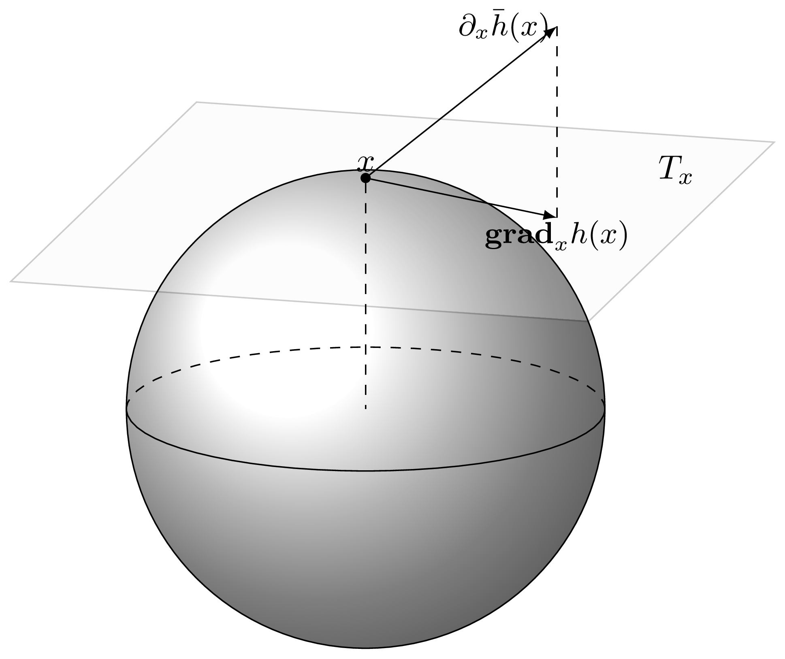
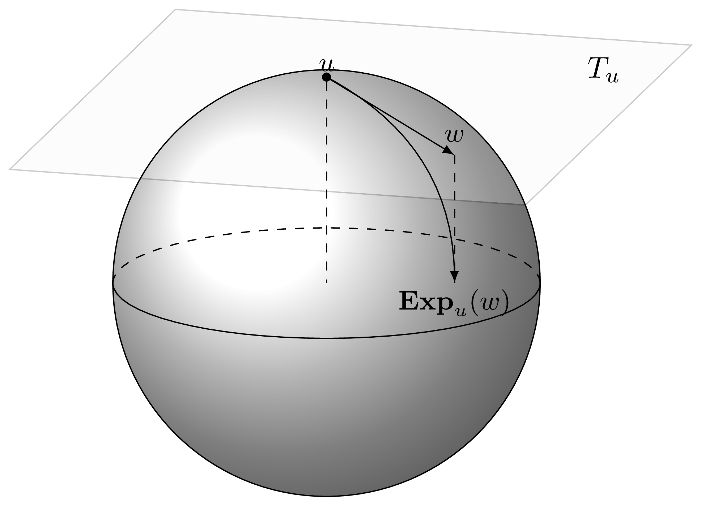
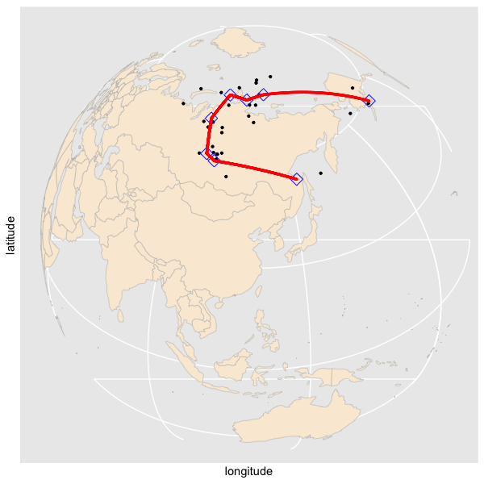
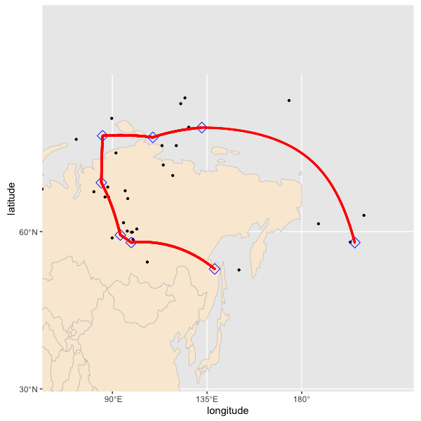
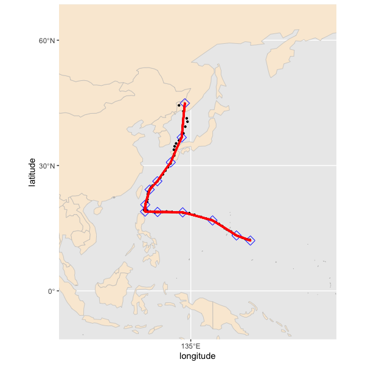

```{r setup, include=FALSE}
knitr::opts_chunk$set(echo = FALSE, warning = FALSE, message = FALSE)
```

# Introduction

This paper aims to introduce an R package \CRANpkg{spheresmooth}, which implements a penalization method for fitting piecewise geodesic curves to spherical data. Spherical data observed over a continuum arise frequently in various fields including cardiology, computer vision, physiology, and geophysics; see, for example, @gould1969regression, @jupp1987fitting, @kume2007shape, @su2012fitting, @thompson1982robust, and the references therein. We propose an adaptive curve fitting method based on sparsity-inducing penalization, and develop an R package to enable researchers from various fields to easily utilize it for their applications.

Smoothing methods for data observed on a manifold can be broadly categorized into two categories. The methods falling into the first category utilize conventional techniques applied to Euclidean data after mapping the data to the tangent space. Examples include the smoothing spline method based on the rolling and wrapping procedures introduced by @jupp1987fitting and related works employing parallel transport as in @kume2007shape and @kim2021smoothing. The second category involves performing intrinsic optimization on the manifold without explicitly mapping the data to a plane. Approaches based on variational calculus with regularizing constraints fall into this category; for details,  refer to @camarinha1995splines, @noakes1989cubic, @samir2012gradient, @su2012fitting, @machado2006riemannian. More recently, @bak2023intrinsic introduced an intrinsic curve fitting method based on the generalized Bézier curve and a local penalization scheme on the unit sphere.

The penalized intrinsic Bézier curve fitting method proposed by @bak2023intrinsic has the advantage of adaptively detecting local trends in the data. Furthermore, it takes a form that is easily understandable for researchers in applied fields, akin to an extension of polynomial regression models to the sphere. Spherical spline smoothing methods provide a natural extension of Bézier curve-based approaches. By utilizing spherical splines, one can flexibly model local changes in the data without compromising the overall smoothness. Developing intrinsic spline methods for smoothing spherical data is expected to facilitate the easy understanding and analysis of intricate and dynamically changing patterns of spherical data.

Spherical coordinates and the analysis of spherical data are also highly relevant in astronomy. Many methods and tools for spherical data analysis have been developed and motivated by astronomical observations, such as the Cosmic Microwave Background (CMB) maps produced by the Wilkinson Microwave Anisotropy Probe (WMAP) and Planck satellites. The popular HEALPix (Hierarchical Equal Area isoLatitude Pixelization) scheme was specifically developed by astronomers for the analysis of CMB data from WMAP [@gorski2005healpix]. Such tools have been foundational in handling all-sky observations and have inspired further developments in the field of spherical data analysis. The methods introduced in this paper can be viewed as contributing to this broader context of spherical data applications in fields including astronomy.

In this paper, we consider an intrinsic curve fitting method based on the piecewise geodesic curve and a local penalization scheme on a sphere. The proposed method can be understood as an extension of the linear spline method for spherical data. The performance of the spline-type method is determined by the number and location of the control points. We develop a penalization scheme based on the velocity of the curve to ensure sparsity among the corresponding control points. This allows for the data-adaptive selection of the control points, which guarantees that the curve fits the given spherical data well and identifies the change points on the sphere. The proposed method is implemented with a Riemannian block coordinate descent algorithm.

To the best of our knowledge, no available R packages offer methods for fitting a smooth path to a given set of noisy spherical data observed at known times. We introduce the \CRANpkg{spheresmooth} package that implements the proposed piecewise geodesic curve fitting method. This package includes a main function for smoothing spherical data along with several auxiliary functions necessary for data processing. The usages of these functions are explained with examples in detail. Piecewise geodesic curves can be understood as piecewise linear methods on manifolds, making them intuitive and easily applicable for researchers in various fields. Moreover, all processes including the selection of complexity parameters are automatically handled so that users can readily apply the method to data even in exploratory stages. To illustrate the practical utility of the \CRANpkg{spheresmooth} package, we provide examples of applying the proposed methodology to Triassic and Jurassic polar wander data for North America [@kent2010influence] and tropical cyclone data provided by the Regional Specialized Meteorological Center (RSMC) Tokyo Typhoon Center.

Visualization of the generated curve requires loading \CRANpkg{sphereplot} [@sphereplot-ref], which includes the packages \CRANpkg{rgl} [@rgl-ref]. These packages are used for generating and manipulating 3D graphics for spherical data. To visualize the fitted curve on a map, we load the packages \CRANpkg{rworldmap} [@rworldmap-ref] and \CRANpkg{ggplot2} [@ggplot2-ref].
The \CRANpkg{sf} package provides a standardized and efficient way to handle spatial data using simple features, making it easy to perform geographic operations and analyses within the R environment.

```{r echo = TRUE}
library(spheresmooth)
library(sphereplot)
library(rworldmap)
library(ggplot2)
library(sf)
```

The remainder of this paper is organized as follows. [Section 2](#prelim) collects mathematical preliminaries related to the spherical geometry. [Section 3](#ppgc) defines the penalized piecewise curve fitting method and summarizes the implementation scheme based on the Riemannian block coordinate descent algorithm. [Section 4](#package) outlines the structure and usage of the \CRANpkg{spheresmooth} package, followed by practical application examples in [Section 5](#application). [Section 6](#conclusion) provides a summary of the results presented in this paper.

# Preliminaries {#prelim}

This section reviews some basic concepts of Riemannian geometry used in this paper. One may refer to, for example, @carmo1976differential and @carmo1992riemannian for a detailed overview of the relevant mathematical backgrounds.

## Spherical distance and geodesic segment {-}

In this work, the term 'geodesic segment' is equivalent to a 'great circle segment' on a sphere. This distinction is made due to differences in terminology preferences across various academic disciplines.

Let $u$ and $v$ be points on the unit sphere and \(\theta, 0\leq\theta\leq\pi\), be the angle formed by $u$ and $v$ relative to the origin of the sphere. Define the spherical distance between two points $u$ and $v$ as
\[\text{d}(u, v) = \arccos(u^{\top}v).\]
Observe $\text{d}(u, v) = \theta$ on the unit sphere.

Let \(\mathbb{S}\) be the two-dimensional unit sphere embedded in $\mathbb{R}^3$.
A geodesic segment \(\alpha: I = [0, 1] \rightarrow \mathbb{S}\) between two points $u$ and $v$ on \(\mathbb{S}\) is defined as
\[
\alpha(t; u, v) =
\frac{\sin((1-t)\theta)}{\sin(\theta)}u
 + \frac{\sin(t \theta)}{\sin(\theta)}v,\quad t \in I
\]
where \(\theta = \text{d}(u, v)\). Figure \@ref(fig:dist-geodesic) illustrates a geodesic segment between $u$ and $v$ on $\mathbb{S}$ in the red line. Here, the length of the red line represents the spherical distance between $u$ and $v$.

```{r dist-geodesic, fig.show='hold', out.width="40%", fig.cap="Illustration of geodesic segment between $u$ and $v$ and spherical distance.", fig.subcap=c("",""), fig.align='center'}
knitr::include_graphics("figures/geodesic_dist.png")
```

## Piecewise geodesic curve {-}
The methodology proposed in this paper aims to fit a linear spherical spline or piecewise geodesic curve to spherical data observed over time in a data-adaptive way. To define a piecewise geodesic curve, the time interval needs to be divided into subintervals, and corresponding control points on the sphere should be determined. Given a time interval $I$, we consider a sequence of knots \(\tau_0 < \tau_1 < \tau_2 < \dots < \tau_J\) that defines subintervals
\[
I_0 = [\tau_0, \tau_1), \quad
I_1 = [\tau_1, \tau_2),\quad  \cdots \quad , \quad I_{J-1} = [\tau_{J-1}, \tau_J).
\]
Let \(\xi = (\xi_0,\ldots, \xi_J)\) be a set of control points in $\mathbb{S}$ corresponding to the knot sequence \(\tau_1, \ldots, \tau_J\). The associated piecewise geodesic (linear spherical spline) curve is defined as
\[
\gamma(t;\xi_1, \ldots, \xi_J) = \sum_{j=0}^{J-1}\alpha\left(\dfrac{t-\tau_j}{\tau_{j+1}-\tau_j}; \xi_j, \xi_{j+1}\right) \mathsf{ind}(t\in I_j),
\]
where \(\mathsf{ind}(\cdot)\) denotes the indicator function.
The sequence of points on the sphere need not necessarily correspond to different time instances.
Rather, they represent a collection of spatial locations that may or may not be observed sequentially in time.
This is further discussed in Section 4.

## Riemannian gradient and exponential map {-}
A blockwise gradient descent algorithm is employed as the algorithm for implementing the spherical smoothing method. The key elements in deriving the algorithm are the Riemannian gradient and the exponential map. The Riemannian gradient is a projection of the Euclidean gradient onto the tangent space. Define the Euclidean gradient as
\[
\partial_x \bar{h}(x) = \left[ \frac{\partial\bar{h}(x)}{x_j}(x) \right] \quad \text{for} \quad x \in \mathbb{S}, \quad j \leq J
\]
where \(h:\mathbb{S} \to \mathbb{R}\) and \(\bar{h}\) is a differentiable extension of \(h\) to \(\mathbb{R}^3\). Denote \(P_x = I - xx^\top\) as a projection operation onto the tangent space at \(x\). The Riemannian gradient of \(h\) with respect to \(x\) is defined as
\[
\mathsf{grad}_x h(x) = P_x \partial_x \bar{h}(x).
\]

The exponential map is a map from a subset of a tangent space \(T_u(\mathbb{S})\), \(u \in \mathbb{S}\) to \(\mathbb {S}\) itself.
If \(w \in T_u(\mathbb{S})\) is a nonzero vector, a point on \(\mathbb{S}\) corresponding to \(w\) is denoted as \(\mathsf{Exp}_u(w)\). When \(w = 0\), then \(\mathsf{Exp}_u(w) = u\). The exponential map is a distance-preserving map in the sense that \(\vert{u-w}\vert = d(u, \mathsf{Exp}_u(w))\) for \(u, w \in \mathbb{S}\), where \(\vert{\cdot}\vert\) is the Euclidean \(\ell_2\) norm. Figure \@ref(fig:riemann) illustrates the Riemannian gradient and exponential map.

```{r riemann, fig.show='hold', out.width="49%", fig.cap="Illustration of (left) Riemannian gradient and (right) exponential map.", fig.subcap=c("",""), fig.align='center'}


```

# Penalized piecewise geodesic curve fitting {#ppgc}

## Penalized piecewise geodesic curve {-}

Let $\{(t_n, y_n)\}_{n=1}^N$ be a set of data, where $t_n \in I$ are the given time points and $y_n$ are the associated data points on $\mathbb{S}$. Our goal is to find a piecewise geodesic curve that fits the data well. To this end, we adopt the squared distance loss function
\[
\ell(\xi) = \sum_{n = 1}^N d^2(y_n, \gamma(t_n; \xi)) \quad \text{for} \quad \xi \in \mathbb{S}^{J+1}
\]
where \(\mathbb{S}^{J+1}\) is the \(J+1\) product of \(\mathbb{S}\).

The most important aspect of fitting a piecewise curve is selecting the appropriate number of pieces. The number of pieces is determined by the number of knots and the corresponding control points. To avoid the issues of oversmoothing and undersmoothing, we propose a penalty function that allows us to select the number of control points in a data-adaptive way. This enables the fitted spherical curve to capture local trends in the data without compromising the overall smoothness. We introduce a smoothness penalty function
$$
\mathsf{p}(\xi)
=
\sum_{j=1}^{J-1}
\lvert D_j(\xi) \rvert \quad \text{for} \quad D_j(\xi) = \frac{1}{\tau_{j+1} - \tau_j} \dot{\alpha}(0; \xi_j, \xi_{j+1}) - \frac{1}{\tau_j - \tau_{j-1}} \dot{\alpha}(1; \xi_{j-1}, \xi_j),
$$
which regularizes the number of geodesic segments needed to fit the data. Here, $\cdot$ above a curve denotes its derivative with respect to $t$ and $|\cdot|$ denotes the Euclidean $\ell_2$-norm of a vector.

The velocity-based penalty function induces sparsity on the control points. As $\lambda$ increases, the difference $\lvert D_j(\xi) \rvert$ in the penalty term tends to zero.
Suppose that $\lvert D_j(\xi) \rvert = 0$ for some $1 \le j \le J-1$ and $\lambda$. This implies that the geodesic segments $\alpha(\cdot; \xi_{j-1}, \xi_j)$ and $\alpha(\cdot; \xi_j, \xi_{j+1})$ are on the same great circle. Then, we eliminate the inactive control point $\xi_j$ and replace the two geodesic segments with $\alpha(\cdot; \xi_{j-1}, \xi_{j+1})$. The elimination process reduces the number of the control points by one. Figure \@ref(fig:elimination) illustrates the elimination process that starts with two geodesic segments.

The objective function to minimize is given by
$$
\ell^\lambda(\xi) = \ell(\xi) + \lambda\mathsf{p}(\xi) \quad \text{for} \quad \xi \in \mathbb{S}^{J+1},
$$
where $\lambda > 0$ is the complexity parameter.
For a fixed $\lambda$, the penalized piecewise geodesic (linear spherical spline) curve is defined as
\[
\gamma_J(\cdot;\hat{\xi}_\lambda),
\]
where
\[
\hat{\xi}_\lambda = \underset{\xi \in \mathbb{S}^J}{\operatorname{argmin}} \ell^\lambda(\xi).
\]

```{r elimination, fig.show='hold', out.width="33%", fig.cap="Example of elimination process of the piecewise geodesic curve with three control points. Blue arrow vector indicates tangent vector of $\\xi_2$ in consecutive geodesic segments. The left plot shows the spline curve with small value of complexity parameter. As the complexity parameter $\\lambda$ increases, $\\xi_2$ moves into the geodesic between $\\xi_1$ and $\\xi_3$ and the difference between tangent vectors becomes zero. The middle plot shows that step. When the difference between tangent vectors is zero, control point is removed. The right plot shows the resulting curve after control point is removed in the middle plot.", fig.subcap=c("","",""), fig.align='center'}


```

## Block coordinate descent algorithm {-}

To obtain \(\hat{\xi}_\lambda\), we adopt a block coordinate descent method, where each block consists of the three-dimensional coordinates of each control point.
First, we set the initial values of $\xi$ by $J+1$ number of data points $y_n$ associated with \mbox{$(j/J)$th} quantiles of the time points $t_n$ for $j=0,1,\ldots, J$. Denote the initial values by $\xi^{(0)} = (\xi^{(0)}_0, \ldots, \xi^{(0)}_J)$. Then, we obtain the Riemannian gradient of \(\ell^\lambda\) with respect to \(\xi_j\) and apply the gradient descent algorithm to update the control points. Since the updated points belong to a tangent space of \(\mathbb{S}\), we apply the exponential function to map the points into \(\mathbb{S}\).

Let $\xi_j^{(l)}$ denote the current values of the control point $\xi_j$ in the $l$-th iteration for $j=0,\ldots, J$. For $l=1,2,\cdots$, the update formula has the following form:
\begin{align*}
\xi_0^{(l)} &\leftarrow \mathsf{Exp}_{\xi_0^{(l-1)}} \left[-\rho_{l, 0} \mathsf{grad}_{\xi_0} \ell^\lambda \left(\xi_0^{(l-1)}, \xi_1^{(l-1)}, \xi_2^{(l-1)}, \ldots, \xi_J^{(l-1)}\right) \right]
\\
\xi_1^{(l)} &\leftarrow \mathsf{Exp}_{\xi_1^{(l-1)}} \left[-\rho_{l, 1} \mathsf{grad}_{\xi_1} \ell^\lambda \left(\xi_0^{(l)}, \xi_1^{(l-1)}, \xi_2^{(l-1)}, \ldots, \xi_J^{(l-1)}\right) \right]
\\
\xi_2^{(l)} &\leftarrow \mathsf{Exp}_{\xi_2^{(l-1)}} \left[-\rho_{l, 2} \mathsf{grad}_{\xi_2} \ell^\lambda \left(\xi_0^{(l)}, \xi_1^{(l)}, \xi_2^{(l-1)}, \ldots, \xi_J^{(l-1)}\right) \right]
\\
&\cdots
\\
\xi_J^{(l)} &\leftarrow \mathsf{Exp}_{\xi_J^{(l-1)}} \left[-\rho_{l, J} \mathsf{grad}_{\xi_J} \ell^\lambda \left(\xi_0^{(l)}, \xi_1^{(l)}, \xi_2^{(l)}, \ldots, \xi_J^{(l-1)}\right) \right],
\end{align*}
where $\rho_{l,j}$ denotes a specified step size for the update of $\xi_j$ in the $l$th cycle. The specific form of the update formula is derived below.

As a line search strategy, we adopt the step-halving method to determine the step size $\rho_{l,j}$ to guarantee the stable convergence of the proposed algorithm.
When the objective function does not decrease with the current step size, the step size is halved. The step-halving procedure is repeated until the objective function decreases with the reduced step size. The iteration stops when the difference between the current and
the updated values of the objective function $\ell^\lambda$ is less than $\varepsilon = 10^{-5}$.

## Derivation of the coordinate-wise update formula {-}

The derivation of the update formula is based on the result in @bak2023intrinsic.
For notational convenience, denote
$$
C(z) = \cos(z), \quad S(z) = \sin(z) \quad \text{and} \quad R_s(z) = \frac{S(sz)}{S(z)}
$$
for $s \in I$ and $z \in \mathbb{R}$. With this notation, the parametrized geodesic segment between control points $u$ and $v$ is expressed as
$$
\alpha(t; u, v) = R_{1-t} (\theta) u + R_t(\theta) v,
\quad t \in I,
$$
with $\theta = \text{d}(u, v)$.
We first obtain the Euclidean derivative of the geodesic segment with respect to each endpoint.

Theorem 3.1 in @bak2023intrinsic implies that the derivatives of $\alpha$ with respect to the control points are given by
$$
\left(\frac{d}{du} \gamma(t; u, v) \right)^\top
=
R_{1-t}(\theta) I + Q_{1-t}(\theta) v u^\top + Q_t(\theta) v v^\top,
$$
and
$$
\left(\frac{d}{dv} \gamma(t; u, v) \right)^\top
=
R_{t}(\theta) I + Q_{1-t}(\theta) u u^\top + Q_t(\theta) u v^\top,
$$
where
$$
Q_s(z)
\triangleq
\frac{S_s(z) C(z) - s C_s(z) S(z)}{S^3 (z)}
\quad \text{for} \quad s \in I \quad \text{and} \quad z \in \mathbb{R}
.
$$

Consider now a piecewise geodesic curve $\gamma(\cdot, \xi)$ defined by a set of control points $\xi = (\xi_1, \ldots, \xi_J)$.
Since the spline curve consists of connected geodesic segments, we have
$$
\frac{d}{d \xi_j} \gamma(t;\xi) =
\begin{cases}
\frac{d}{d \xi_0} \alpha\left(\frac{t - \tau_0}{\tau_{1} - \tau_0};\xi_0, \xi_1\right) \quad \text{for} \quad j = 0 \\
\frac{d}{d \xi_J} \alpha\left(\frac{t - \tau_{J-1}}{\tau_{J} - \tau_{J-1}};\xi_{J-1}, \xi_J\right)  \quad \text{for} \quad j = J \\
\frac{d}{d \xi_j} \alpha\left(\frac{t - \tau_{j-1}}{\tau_{j} - \tau_{j-1}};\xi_{j-1}, \xi_j\right)
+
\frac{d}{d \xi_j} \alpha\left(\frac{t - \tau_{j-1}}{\tau_{j} - \tau_{j-1}};\xi_{j}, \xi_{j+1}\right) & \text{o.w.}
\end{cases}
$$
Combining the results, we are able to obtain the derivatives of $\gamma(\cdot, \xi)$ with respect to each control point. This enables us to compute the Riemannian gradient of the squared distance loss:
$$
\textsf{grad}_{\xi_k} \ell(\xi)
=
- \sum_{n=1}^N \frac{\phi_n}{S(\phi_n)} P_{\xi_k} \left(\frac{d \gamma(t_n;\xi)}{d\xi_k}\right)^\top y_n,
$$
where $\phi_n \triangleq \mathsf{d}(y_n, \gamma(t_n; \xi))$.

In addition to the result above, the Riemannian gradient of the velocity difference penalty is needed to derive a coordinate-wise update formula. Following Theorem 3.4 in @bak2023intrinsic,
for a fixed $1 \le j \le J-1$, we have
\begin{align*}
\textsf{grad}_{\xi_{j-1}} \lvert D_j(\xi) \rvert
&=
P_{\xi_{j-1}}
\frac{1}{\tau_j - \tau_{j-1}} \left[
\frac{C(\theta_{j-1})\theta_{j-1} - S(\theta_{j-1})}{S^3(\theta_{j-1})} \xi_j \xi_{j-1}^\top + \frac{\theta_{j-1}}{S(\theta_{j-1})} I
\right]
\frac{D_j (\xi)}{\lvert D_j (\xi) \rvert},
\\
\textsf{grad}_{\xi_{j+1}} \lvert D_j (\xi) \rvert
&=
\frac{1}{\tau_{j+1} - \tau_j} P_{\xi_{j+1}}
\left[
\frac{C(\theta_j)\theta_j - S(\theta_j)}{S^3(\theta_j)} \xi_j \xi_{j+1}^\top + \frac{\theta_j}{S(\theta_j)} I
\right]
\frac{D_j (\xi)}{\lvert D_j (\xi) \rvert},
\end{align*}
and
\begin{align*}
\textsf{grad}_{\xi_j} \lvert D_j (\xi) \rvert
&=
\frac{1}{\tau_{j+1} - \tau_j} P_{\xi_j} \left[\frac{C(\theta_j)\theta_j - S(\theta_j)}{S^3(\theta_j)} \xi_{j+1} \xi_{j+1}^\top - \frac{\theta_j C(\theta_j)}{S(\theta_j)} I\right]
\frac{D_j (\xi)}{\lvert D_j (\xi) \rvert}
\\
& \hspace{-0.5cm} +
\frac{1}{\tau_j - \tau_{j-1}} P_{\xi_j} \left[
\frac{C(\theta_{j-1}) \theta_{j-1} - S(\theta_{j-1})}{S^3(\theta_{j-1})} \xi_{j-1} \xi_{j-1}^\top - \frac{\theta_{j-1} C(\theta_{j-1})}{S(\theta_{j-1})} I
\right]
\frac{D_j (\xi)}{\lvert D_j (\xi) \rvert}.
\end{align*}
Combining the derivatives of the loss function and the penalty function yields the required Riemannian gradient of the objective function with respect to the control points.

## Selection of optimal tuning parameter {-}

The procedure for finding the optimal complexity parameter is as follows. The piecewise geodesic curves that minimize the objective function are computed for an increasing sequence of the complexity parameters
$\lambda_1 < \cdots < \lambda_K$, where $\lambda_K$ is sufficiently large. As the complexity parameter increases, we eliminate the control points that are no longer active.

In general, the choice of the control points plays a crucial role in the spline-type curve fitting problem. We begin by setting $\lambda_K$ to a sufficiently large value and $\lambda_1$ to a value close to zero, ensuring the flexibility of the model. As the complexity parameter increases, the elimination process leads to data-adaptive control point selection. Then, we determine the optimal complexity parameter and the corresponding optimal curve whose control points are adaptively determined by the given set of data.

To choose an optimal complexity parameter, we use a modified version of the Bayes information criterion ($\text{BIC}$); see @schwarz1978. The $\text{BIC}$ for a sequence of the complexity parameters is defined as
$$
\text{BIC}_k = N \log \ell(\hat{\xi}_{\lambda_k}) +
3 J_k \log N \quad \text{for} \quad k = 1, \ldots, K
$$
where $J_k$ denotes the number of control points for $\lambda_k$.
The optimal value for $\lambda$ is chosen as $\lambda_{\hat{k}}$, where
$$
\hat{k} = \underset{1 \le k \le K}{\operatorname{argmin}}  \text{BIC}_k.
$$

# The `spheresmooth` package: structure and functionality {#package}

## Overall structure and available functions {-}

The \CRANpkg{spheresmooth} package is a versatile toolkit designed for performing mathematical and geometric operations on the sphere, with a primary focus on smoothing spherical data observed at known time points. It finds applications across various fields such as geography, geometry, physics, and computer graphics. Table \@ref(tab:pakcage-functions) contains a compact summary of the available functions. When the name of a function is in uppercase, it means it computes the output for multiple points simultaneously except for `exp_map()` function. The package includes a corresponding internal function for a single point calculation. For example, the `geodesic()` function computes the coordinates of a geodesic curve at multiple time points, which is the result of multiple internal executions of the `geodesic_lower()` function for a single time point. These functions take arguments in the form of numeric matrices.

Spherical data may be given in the form of spherical coordinates or Cartesian coordinates depending on the case. We may need to switch between the two coordinate systems as necessary. The `cartesian_to_spherical()` function converts Cartesian coordinates to spherical coordinates, which is crucial for representing points on a spherical surface accurately. The `spherical_to_cartesian()` function performs the opposite operation. The input data for the main function must be in the form of Cartesian coordinates. Therefore, if the data is given in spherical coordinates, one can use the `spherical_to_cartesian()` function to perform coordinate transformation before applying the proposed method.

The proposed method is based on the calculation of piecewise geodesic paths. To this end, we need functions that compute the geodesic segments and partition the given time interval. The `geodesic()` function computes the value of the geodesic curve connecting two points $p$ and $q$ on the sphere at specified time points. On the other hand, the `knots_quantile()` function generates a sequence of knots for a given set of time points based on the quantile values, thereby offering support for interpolating and approximating time-series data using spherical spline curves. The `piecewise_geodesic()` function is one of the core functions in the package. It computes the coordinates of the piecewise geodesic curve at the input time point for the given knots in the time interval and the corresponding control points on the sphere.

To evaluate the goodness-of-fit of the fitted curve, a distance-based loss function is needed. The `spherical_dist()` function calculates the geodesic distance between two input points. Based on this function, the `calculate_loss()` calculates the loss function based on the squared spherical distances between observed values and predicted values on the curve. Finally, the main function `penalized_linear_spherical_spline()` fits the penalized piecewise geodesic curve to the given data. In summary, the \CRANpkg{spheresmooth} package provides core functions for smoothing spherical data, along with several useful functions for handling spherical data.

```{r pakcage-functions, echo = FALSE}
library(knitr)
library(kableExtra)

# Create the data frame with function names and descriptions
spheresmooth_functions <- data.frame(
  Function = c(
    "calculate\\_loss",
    "cartesian\\_to\\_spherical",
    "cross",
    "dot",
    "edp",
    "exp\\_map",
    "geodesic",
    "knots\\_quantile",
    "norm2",
    "normalize",
    "penalized\\_linear\\_spherical\\_spline",
    "piecewise\\_geodesic",
    "spherical\\_dist",
    "spherical\\_to\\_cartesian"
  ),
  Description = c(
    "Calculates the loss function based on the squared spherical distances between observed values and predicted values on the curve.",
    "Converts Cartesian coordinates to spherical coordinates.",
    "Computes the cross product of two input vectors",
    "Computes the dot product of two input vectors $u$ and $v$.",
    "Computes the equal-distance projection of a point $p$ onto the xy plane.",
    "Computes the exponential map on the unit sphere given a base point $x$ and a vector $v$.",
    "Computes the value of the geodesic curve connecting two points $p$ and $q$ on the unit sphere at specified time points.",
    "Generates a sequence of knots for a given set of time points based on the quantiles.",
    "Computes the L2 norm (Euclidean norm) of the input vector.",
    "Normalizes the rows of the input matrix $x$ by dividing each row by its L2 norm (Euclidean norm).",
    "Fits a penalized linear spherical spline (piecewise geodesic) curve to the given data.",
    "Computes a piecewise geodesic path between control points.",
    "Calculates the spherical distance between two vectors.",
    "converts spherical coordinates ($\\theta$, $\\phi$) to Cartesian coordinates."
  ),
  stringsAsFactors = FALSE
)

# Create the table using knitr::kable with kableExtra formatting
tab <- kable(spheresmooth_functions,
      caption = "Summary of the functions in the spheresmooth package.",
      align = c("l", "l"),
      col.names = c("Function", "Description"),
      booktabs = TRUE,
      longtable = FALSE,
      escape = FALSE)
    
if (knitr::is_latex_output()) {
  tab <- tab |>
    column_spec(1, monospace = TRUE) |>
    column_spec(2, width = "7cm")
}
tab

```

## Basic functions for handling spherical data {-}

Before delving into the main functions of the package, we introduce several useful functions for handling spherical data within the package. These functions are essential for performing core functionalities of the package but can also be applied to other spherical data analysis tasks. Only a subset of the functions listed in Table \@ref(tab:pakcage-functions) is illustrated based on their frequency of use.

The `spherical_dist()` function is used to compute the geodesic distance between two points on the unit sphere. For example, the distance along the geodesic segment between $(1,0,0)$ and $(0,1,0)$ is one-fourth of the circumference of a great circle containing two points, which is $2\pi$, and it is calculated as follows in code:

```{r echo = TRUE}
x <- c(1, 0, 0)
y <- c(0, 1, 0)
spherical_dist(x, y)
```

Consider another example involving the point $(1/\sqrt{3}, 1/\sqrt{3}, 1/\sqrt{3})$. The antipodal point to this given point is $(-1/\sqrt{3}, -1/\sqrt{3}, -1/\sqrt{3})$, which traverses half the circumference of the associated great circle, resulting in a length of $\pi$. This can be checked with the following code.

```{r echo = TRUE}
x <- c(1/sqrt(3), 1/sqrt(3), 1/sqrt(3))
y <- c(-1/sqrt(3), -1/sqrt(3), -1/sqrt(3))
spherical_dist(x, y)
```

Another useful function is the `cross` function with `normalize = TRUE` argument used to obtain a unit vector orthogonal to a pair of given vectors. For example, we can use this function to obtain a unit vector $(0,0,1)$ orthogonal to the plane spanned by $(1,0,0)$ and $(0,1,0)$.

```{r echo = TRUE}
x <- c(1, 0, 0)
y <- c(0, 1, 0)
cross(x, y, normalize = TRUE)
```

Besides standard utility functions, there are two crucial auxiliary functions in spherical data analysis: `cartesian_to_spherical()` and `spherical_to_cartesian()`. These transformations have already been discussed earlier in this section. For basic spherical operations, it is utilized as described previously. When data is given in Cartesian coordinates, the `cartesian_to_spherical()` function computes spherical coordinates, enabling visualization and other analyses. On the other hand, when the data is given in spherical coordinates, the main function of the \CRANpkg{spheresmooth} package, `penalized_linear_spherical_spline()`, cannot be directly applied. In such cases, the `spherical_to_cartesian()` function allows the transformation of data into the required format.
The following code demonstrates examples implementing these transformations.

```{r echo = TRUE}
# example: cartesian_to_spherical
cartesian_points <- matrix(c(1, 0, 0, 0, 1, 0, 0, 0, 1), ncol = 3, byrow = TRUE)
cartesian_to_spherical(cartesian_points)

# example: spherical_to_cartesian
theta_phi <- matrix(c(pi/4, pi/3, pi/6, pi/4), ncol = 2, byrow = TRUE)
spherical_to_cartesian(theta_phi)
```
The following code demonstrates that these two functions perform inverse operations.

```{r echo = TRUE}
theta_phi <- matrix(c(pi/4, pi/3, pi/6, pi/4), ncol = 2, byrow = TRUE)
theta_phi
cartesian_to_spherical(spherical_to_cartesian(theta_phi))
```

## Piecewise geodesic curve {-}

As illustrated in [Section 2](#prelim), we need to provide a sequence of knots and associated control points to define a piecewise geodesic curve. Although we introduce our methodology targeting data observed over time, it is important to note that the argument of a parametrized curve, denoted as $t$, does not necessarily imply physical time. This methodology can be applied to the smoothing problem of any directional data evolving over a continuous domain. The only requirements for computing a piecewise geodesic curve are the knots and their corresponding control points. The function that returns the coordinates of the curve at a given $t$ point is the `piecewise_geodesic()` function. Table \@ref(tab:piecewisegeodesic) summarizes the arguments of the function.

Table: (\#tab:piecewisegeodesic) Summary of the arguments of the `piecewise_geodesic()` function.

| Argument      | Description                              |
|---------------|------------------------------------------|
| t             | A numeric vector representing the time or location. |
| control_points | A matrix of control points where each row represents a control point. |
| knots         | A numeric vector of knot values. |

Here, the `control_points` is a matrix where each row represents a point in Cartesian coordinates that determines the geodesic segments. Since a pair of points defines a geodesic segment, this function can be used to compute the geodesic curve between two points if the `knots` is given as two endpoints. The `knots` is a vector of points separating the curve in the time domain. The `piecewise_geodesic()` function performs the following steps. First, it initializes an empty matrix to store the generated points on the curve. Second, it iterates over the separated geodesic segments to find the segment to which the `t` values belong. Then, it internally calls the `geodesic()` function for the corresponding segment to compute the coordinates of those points on the curve and appends the generated points to the initialized matrix. Finally, it returns the matrix containing all the points corresponding to the given `t` values.

```{r piecewise, fig.show='hold', out.width="40%", fig.cap="Plot of (left) piecewise geodesic curve with the control points at (1, 0, 0), (1/$\\sqrt{2}$, 1/$\\sqrt{2}$, 0), (-1/$\\sqrt{3}$, 1/$\\sqrt{3}$, 1/$\\sqrt{3}$), and (0, 0, 1) and (right) piecewise geodesic curve with the control points at (1/$\\sqrt{3}$, 1/$\\sqrt{3}$, 1/$\\sqrt{3}$), (1/$\\sqrt{3}$, 1/$\\sqrt{3}$, -1/$\\sqrt{3}$), (-1/$\\sqrt{3}$, 1/$\\sqrt{3}$, 1/$\\sqrt{3}$), and (-1/$\\sqrt{3}$, 1/$\\sqrt{3}$, -1/$\\sqrt{3}$).", fig.subcap=c("",""), fig.align='center'}
knitr::include_graphics("figures/piecewise_geo1.png")
knitr::include_graphics("figures/piecewise_geo2.png")
```

In the Figure \@ref(fig:piecewise), the left plot depicts a piecewise geodesic curve determined by the control points ($1$, $0$, $0$), ($1/\sqrt{2}$, $1/\sqrt{2}$, $0$), ($-1/\sqrt{3}$, $1/\sqrt{3}$, $1/\sqrt{3}$), and ($0$, $0$, $1$). The function `piecewise_geodesic()` is used to compute the coordinates of the curve at given time points.
The `piecewise_geodesic` function presented here is roughly equivalent to the `rgl.sphline()` function from the \CRANpkg{sphereplot} package, which also generates great circle line segments. However, `piecewise_geodesic` provides additional flexibility for handling complex geometries and segmentations, making it a suitable choice for a broader range of applications.
In the following code, we create a variable called `control_points`, which is a matrix containing four control points. The control points are used to determine the curve on the sphere while the `knots` indicate the points where transitions occur in the time domain. To obtain a smooth curve for visualization, we generate `t_example` by slicing the interval from $0$ to $4$ into increments of $0.01$, and evaluate the coordinates of the curve at those points using the `piecewise_geodesic()` function. The following code yields the left plot of Figure \@ref(fig:piecewise).

```{r message=FALSE, warning=FALSE, cache=TRUE, cache.lazy=FALSE, echo = TRUE}
control_points <- matrix(c(1, 0, 0,                               # Control point 1
                           1/sqrt(2), 1/sqrt(2), 0,               # Control point 2
                           -1/sqrt(3), 1/sqrt(3), 1/sqrt(3),      # Control point 3
                           0, 0, 1),                              # Control point 4
                         nrow = 4, byrow = TRUE)
knots <- c(1, 2, 3, 3.5)  # Knots indicating transitions
# Example of generating piecewise geodesic curve
t_example <- seq(0, 4, by = 0.01)
gamma_example <- piecewise_geodesic(t_example, control_points, knots)
# Plotting the piecewise geodesic curve
rgl.sphgrid(deggap = 15, col.long = "skyblue", col.lat = "skyblue")
spheres3d(x = 0, y = 0, z = 0, radius = 1, col = "grey", alpha = 0.05)
pch3d(control_points, col = "blue", cex = 0.2, pch = 19)
lines3d(gamma_example, col = "red", lty = 1, lwd = 2)
```

The right plot of Figure \@ref(fig:piecewise) is an example of the curve with control points located at (1/$\sqrt{3}$, 1/$\sqrt{3}$, 1/$\sqrt{3}$), (1/$\sqrt{3}$, 1/$\sqrt{3}$, -1/$\sqrt{3}$), (-1/$\sqrt{3}$, 1/$\sqrt{3}$, 1/$\sqrt{3}$), and (-1/$\sqrt{3}$, 1/$\sqrt{3}$, -1/$\sqrt{3}$). Below is the code that computes the curve and draws the corresponding plot.

```{r message=FALSE, warning=FALSE, cache=TRUE, cache.lazy=FALSE, echo = TRUE}
control_points <- matrix(c(1/sqrt(3), 1/sqrt(3), 1/sqrt(3),       # Control point 1
                           1/sqrt(3), 1/sqrt(3), -1/sqrt(3),      # Control point 2
                           -1/sqrt(3), 1/sqrt(3), 1/sqrt(3),      # Control point 3
                           -1/sqrt(3), 1/sqrt(3), -1/sqrt(3)),    # Control point 4
                         nrow = 4, byrow = TRUE)
knots <- c(1, 2, 3, 3.5)  # Knots indicating transitions
# Example of generating piecewise geodesic curve
t_example <- seq(0, 4, by = 0.01)
gamma_example <- piecewise_geodesic(t_example, control_points, knots)
# Plotting the piecewise geodesic curve
rgl.sphgrid(deggap = 15, col.long = "skyblue", col.lat = "skyblue")
spheres3d(x = 0, y = 0, z = 0, radius = 1, col = "grey", alpha = 0.05)
pch3d(control_points, col = "blue", cex = 0.2, pch = 19)
lines3d(gamma_example, col = "red", lty = 1, lwd = 2)
```

## Penalized piecewise geodesic curve fitting {-}

The main function `penalized_linear_spherical_spline()` fits a penalized piecewise geodesic curve to the given spherical data as illustrated in [Section 3](#ppgc). As implied by the name of the function, this approach can also be understood as using a penalized linear spline method on the sphere. The crucial aspect here is the selection of knots that capture the points of change within the given time domain. The strategy proposed in this paper involves generating a sufficient number of initial knots using the `knots_quantile()` function and then adaptively selecting knots and control points based on penalization. The initial control points corresponding to the generated knots are determined by the corresponding data points $y_i$ on the given spherical surface.

After ensuring the flexibility of the model by setting the number of initial knots and control points sufficiently large, piecewise geodesic curves are computed for an increasing sequence of the complexity parameters $\lambda_1 < \cdots < \lambda_{\text{max}}$. As the complexity parameter increases, we prune or delete the knots that are no longer active. If $\lambda$ is small, then so is the amount of penalization, resulting in a wiggly fit. On the other hand, the fitted curve gets smoother as $\lambda$ gets larger. If one wishes to consider as many possibilities as possible to find the optimal curve, it is possible to generate complexity parameters densely starting from very small values, and ensuring that $\lambda_{\text{max}}$ is sufficiently large to yield a least squares geodesic curve. Among the fitted curves, we can select the optimal curve based on the BIC, thus obtaining a data-adaptive piecewise geodesic curve.

The `penalized_linear_spherical_spline()` function is designed to automatically perform all these steps when initial knots and initial control points are not specified, aiming to enhance convenience for researchers. If there are valid numbers of knots determined through exploratory data analysis and preliminary research, along with coordinates for initial control points, they can be used as arguments. Table \@ref(tab:penalized-linear-spherical-spline) summarizes the arguments of the function.

Table: (\#tab:penalized-linear-spherical-spline) Summary of the arguments of the `penalized_linear_spherical_spline()` function.

| Argument      | Description                              |
|---------------|------------------------------------------|
| t             | A numeric vector representing the time or location. |
| y             | A matrix where each row represents a data point. |
| initial_control_points  | An optional matrix specifying initial control points. Default is NULL. |
| dimension     | An integer specifying the dimension of the spline. |
| initial_knots | An optional numeric vector specifying initial knots. Default is NULL. |
| lambdas       | A numeric vector specifying the penalization parameters. |
| step_size     | A numeric value specifying the step size for optimization. Default is 0.01. |
| maxiter       | An integer specifying the maximum number of iterations. Default is 1000. |
| epsilon_iter  | A numeric value specifying the convergence criterion for iterations. Default is 1e-05. |
| jump_eps      | A numeric value specifying the threshold for pruning control points based on jump size. Default is 1e-02. |
| verbose       | A logical value indicating whether to print progress information. Default is FALSE. |

The function returns a list containing the fitted result for each complexity parameter, the dimension and BIC values associated with the complexity parameters required for model selection. The BIC values are stored in the last element of the list. It is possible to directly examine the BIC values and their corresponding fitted curves. Unless there is a specific reason, it is recommended to consider the $\lambda$ that attains the minimum BIC value as the optimal complexity parameter and select the corresponding fitted curve as the final fitted model. The usage of the function and the model selection process are illustrated in [Section 5](#application).

# Applications {#application}

## APW Data {-}
The data considered in this section is the polar wander dataset presented in @kent2010influence. They argued that previous estimates of Triassic and Jurassic paleolatitudes for North America tend to be biased because of inclination error in sedimentary rocks. They constructed a new composite APW path for Triassic through Paleogene based on igneous rocks. The $17$ Triassic/Jurassic cratonic poles from other major cratons are rotated into North American coordinates and combined with the $14$ observations from North America. We apply the proposed method to these $31$ observations ranging in age from $243$ to $144$ Ma (millions of years ago), which covers the late Triassic and Jurassic periods.

The APW dataset is included in the \CRANpkg{spheresmooth}. The data consists of the time, longitude, and latitude values for $31$ observations. It can be loaded as follows.

```{r echo = TRUE}
dim(apw_spherical)
```

The APW data is represented in spherical coordinates. To apply the main function, it is necessary to convert the given data into Cartesian coordinates. We apply the `spherical_to_cartesian()` function to the second and third columns of the datasets, since the first column represents the time points.

```{r echo = TRUE}
apw_cartesian = spherical_to_cartesian(apw_spherical[, 2:3])
```

To ensure sufficient flexibility of the model, we set the initial dimension to $15$, where the dimension refers to the number of knots or the corresponding number of control points. The knot sequence corresponding to the specified dimension is created using the knots_quantile() function. The grid for tuning the complexity parameter is determined as a sequence of 40 values ranging from $10^{-7}$ to $1$ on a logarithmic scale. We compute the fitted curves using the `penalized_linear_spherical_spline()` function.

```{r echo = TRUE, cache = TRUE, cache.lazy = FALSE}
t = apw_spherical[, 1]
dimension = 15
initial_knots = knots_quantile(t, dimension = dimension)
lambda_seq = exp(seq(log(1e-07), log(1), length = 40))

fit = penalized_linear_spherical_spline(t = t, y = apw_cartesian,
                                        dimension = dimension,
                                        initial_knots = initial_knots,
                                        lambdas = lambda_seq)
```

As explained in the previous section, the returned result is a list containing the information about $40$ fitted curves and the dimension and BIC values for model selection.

```{r echo = TRUE}
class(fit)
length(fit)
fit$dimension_list
fit$bic_list
```

The best model according to the BIC can be selected as follows.

```{r echo = TRUE}
# choose a curve that minimizes the BIC
best_index = which.min(fit$bic_list)
best_index
# obtained control points for the piecewise geodesic curve
fit[[best_index]]$control_points
```

The optimal complexity parameter is determined as

```{r echo = TRUE}
lambda_seq[best_index]
```

\noindent and the corresponding dimension is $8$. Since we started with the initial dimension $15$, the result illustrates the sparsity-inducing property of the proposed method.

The code begins by retrieving a world map using the `getMap()` function, which is then converted to an `sf` object (`worldMap_sf`) using `st_as_sf()` for easier handling in spatial analyses.
Control points are transformed from Cartesian coordinates to spherical coordinates using the `cartesian_to_spherical` function, with the resulting coordinates converted to degrees (latitude and longitude) to create `cp_long_lat_df`. The latitude values are adjusted to range from 0 to 90 degrees instead of being measured from the center.
The `apw_spherical` data is also converted into a data frame (`apw_spherical_df`), where the latitude and longitude values are transformed from radians to degrees, making them suitable for mapping.
Then, a geodesic curve is fitted using the `piecewise_geodesic` function, generating a fitted curve (`fitted_geodesic_curve`). This fitted curve is converted from Cartesian to spherical coordinates (`fitted_cs`), and then transformed into a data frame (`fitted_cs_long_lat_df`) with latitude and longitude values in degrees.
Finally, three data frames (`apw_spherical_df`, `cp_long_lat_df`, `fitted_cs_long_lat_df`) are converted to `sf` objects for further geospatial analysis, specifying the appropriate coordinate reference system (EPSG:4326) to facilitate geographic visualizations and operations.

```{r echo = TRUE, eval = FALSE}
worldMap = getMap()
worldMap_sf = st_as_sf(worldMap)

cp_best = cartesian_to_spherical(fit[[best_index]]$control_points)
cp_long_lat = cp_best * 180 / pi
cp_long_lat_df = data.frame(latitude = 90-cp_long_lat[, 1],
                            longitude = cp_long_lat[,2])

apw_spherical_df = data.frame(apw_spherical)
apw_spherical_df$latitude = 90 - apw_spherical_df$latitude * 180 / pi
apw_spherical_df$longitude = apw_spherical_df$longitude * 180 / pi

fitted_geodesic_curve = piecewise_geodesic(seq(0, 1, length = 2000),
                                           fit[[best_index]]$control_points,
                                           fit[[best_index]]$knots)
fitted_cs = cartesian_to_spherical(fitted_geodesic_curve)
fitted_cs_long_lat = fitted_cs * 180 / pi
fitted_cs_long_lat_df = data.frame(latitude = 90 - fitted_cs_long_lat[, 1],
                             longitude = fitted_cs_long_lat[, 2])

apw_spherical_df_sf = st_as_sf(apw_spherical_df,
                               coords = c("longitude", "latitude"), crs = 4326)
cp_long_lat_df_sf = st_as_sf(cp_long_lat_df,
                             coords = c("longitude", "latitude"), crs = 4326)
fitted_cs_long_lat_df_sf = st_as_sf(fitted_cs_long_lat_df,
                                    coords = c("longitude", "latitude"), crs = 4326)
```

The optimal fitted curve is visualized in the left plot of Figure \@ref(fig:APW) using the following code. It presents the obtained APW path (red line) and the associated control points (blue rhombus-shaped points) with the observations in the geographic coordinates.
The visualization was generated using the `coord_sf()` function with the `+proj=ortho` option, providing an orthographic projection of the spherical data.
The fitted curve shows that the obtained APW path has a clockwise rotational trend.

```{r echo = TRUE, eval = FALSE}
worldmap = ggplot() +
  geom_sf(data = worldMap_sf, color = "grey", fill = "antiquewhite") +
  geom_sf(data = apw_spherical_df_sf, size = 0.8) +
  geom_sf(data = cp_long_lat_df_sf, color = "blue", shape = 23, size = 4) +
  geom_sf(data = fitted_cs_long_lat_df_sf, color = "red", size = 0.5) +
  xlab("longitude") +
  ylab("latitude") +
  scale_y_continuous(breaks = (-2:2) * 30) +
  scale_x_continuous(breaks = (-4:4) * 45) +
  coord_sf(crs = "+proj=ortho +lat_0=38 +lon_0=120 +y_0=0 +ellps=WGS84 +no_defs")
worldmap
```

A zoomed version of the plot obtained from the following code is presented in the right panel of Figure \@ref(fig:APW).

```{r echo = TRUE, eval = FALSE}
mar = 20
zoommap = ggplot() +
  geom_sf(data = worldMap_sf, color = "grey", fill = "antiquewhite") +
  geom_sf(data = apw_spherical_df_sf, size = 0.8) +
  geom_sf(data = cp_long_lat_df_sf, color = "blue", shape = 23, size = 4) +
  geom_sf(data = fitted_cs_long_lat_df_sf, color = "red", size = 0.5) +
  xlab("longitude") +
  ylab("latitude") +
  scale_y_continuous(breaks = (-2:2) * 30) +
  scale_x_continuous(breaks = (-4:4) * 45) +
  coord_sf(xlim = c(min(cp_long_lat_df$longitude) - mar,
                    max(cp_long_lat_df$longitude) + mar),
           ylim = c(min(cp_long_lat_df$latitude) - mar,
                    max(cp_long_lat_df$latitude) + mar))
zoommap
```

```{r APW, fig.show='hold', out.width="49%", fig.cap="Plots of the APW path (red line) and the associated control points (blue points) obtained from the proposed method. The path goes from left to right in the plots. The left plot displays the path on the globe, and the right plot is a zoomed in version of the left plot on the projection map.", fig.subcap=c("",""), fig.align='center'}


```

## Goni Data {-}

This section considers the tropical cyclone (TC) data provided by the Regional Specialized Meteorological Center (RSMC) Tokyo Typhoon Center. This data consists of the variables TC name, time, latitude, longitude, TC central pressure, and maximum sustained wind speed. To illustrate the proposed method and the \CRANpkg{spheresmooth} package, we select the data concerning a cyclone named Goni observed from August 13th, 2015, to August 29th, 2015. The number of data points for Goni is 69, corresponding to each time point.

The Goni dataset is also included in the \CRANpkg{spheresmooth} and can be loaded as follows.

```{r echo = TRUE}
goni_cartesian = spherical_to_cartesian(goni_spherical[, 2:3])
```

The code used for analysis is very similar to that used for computing the APW path. It involves transforming the data given in spherical coordinates to Cartesian coordinates, setting the initial dimension to 15, and fitting it with a sequence of complexity parameters. Subsequently, the optimal curve is selected using the BIC, and the coordinates of the corresponding control points are determined.

```{r echo = TRUE, eval = TRUE}
t = goni_spherical[, 1]
dimension = 15
initial_knots = knots_quantile(t, dimension = dimension)
lambda_seq = exp(seq(log(1e-07), log(1), length = 40))

fit = penalized_linear_spherical_spline(t = t, y = goni_cartesian,
                                        dimension = dimension,
                                        initial_knots = initial_knots,
                                        lambdas = lambda_seq)
# choose a curve that minimizes the BIC
best_index = which.min(fit$bic_list)
best_index
fit$dimension_list[best_index]
fit[[best_index]]$control_points
```

The index of the curve that minimizes BIC is $23$ with the corresponding dimension $12$. The optimal complexity parameter is determined as

```{r echo = TRUE}
lambda_seq[best_index]
```

```{r Goni, fig.show='hold', out.width="49%", fig.cap="Plots of the Goni path (red line) and the associated control points (blue points) obtained from the proposed method. The path goes from left to right in the plots. The left plot displays the path on the globe, and the right plot is a zoomed in version of the left plot on the projection map.", fig.subcap=c("",""), fig.align='center'}
knitr::include_graphics("figures/Gonidata_worldmap.png")

```

We can visualize the fitted curve and obtain Figure \@ref(fig:Goni) by executing code similar to that used in the previous section. The obtained path for Goni (red line) and the corresponding control points (blue rhombus-shaped points) are visualized along with the observations in Figure \@ref(fig:Goni). Although the remaining control points may appear somewhat dense, in reality, these points are not redundant. The proposed penalization method utilizes the difference in velocity vectors to induce sparsity. Therefore, even control points that do not appear visually active on a map can provide valuable information for further analysis when viewed alongside time points, as they represent points where the velocity changes.

```{r echo = FALSE, eval = FALSE}
worldMap = getMap()
worldMap_sf = st_as_sf(worldMap)

cp_best = cartesian_to_spherical(fit[[best_index]]$control_points)
cp_long_lat = cp_best * 180 / pi
cp_long_lat_df = data.frame(latitude = 90-cp_long_lat[, 1],
                            longitude = cp_long_lat[,2])

goni_spherical_df = data.frame(goni_spherical)
goni_spherical_df$latitude = 90 - goni_spherical_df$latitude * 180 / pi
goni_spherical_df$longitude = goni_spherical_df$longitude * 180 / pi

fitted_geodesic_curve = piecewise_geodesic(seq(0, 1, length = 2000),
                                           fit[[best_index]]$control_points,
                                           fit[[best_index]]$knots)
fitted_cs = cartesian_to_spherical(fitted_geodesic_curve)
fitted_cs_long_lat = fitted_cs * 180 / pi
fitted_cs_long_lat_df = data.frame(latitude = 90 - fitted_cs_long_lat[, 1],
                                   longitude = fitted_cs_long_lat[, 2])

goni_spherical_df_sf = st_as_sf(goni_spherical_df,
                                coords = c("longitude", "latitude"), crs = 4326)
cp_long_lat_df_sf = st_as_sf(cp_long_lat_df,
                             coords = c("longitude", "latitude"), crs = 4326)
fitted_cs_long_lat_df_sf = st_as_sf(fitted_cs_long_lat_df,
                                    coords = c("longitude", "latitude"), crs = 4326)

worldmap = ggplot() +
  geom_sf(data = worldMap_sf, color = "grey", fill = "antiquewhite") +
  geom_sf(data = goni_spherical_df_sf, size = 0.8) +
  geom_sf(data = cp_long_lat_df_sf, color = "blue", shape = 23, size = 4) +
  geom_sf(data = fitted_cs_long_lat_df_sf, color = "red", size = 0.5) +
  xlab("longitude") +
  ylab("latitude") +
  scale_y_continuous(breaks = (-2:2) * 30) +
  scale_x_continuous(breaks = (-4:4) * 45) +
  coord_sf(crs = "+proj=ortho +lat_0=38 +lon_0=120 +y_0=0 +ellps=WGS84 +no_defs")
worldmap

mar = 20
zoommap = ggplot() +
  geom_sf(data = worldMap_sf, color = "grey", fill = "antiquewhite") +
  geom_sf(data = goni_spherical_df_sf, size = 0.8) +
  geom_sf(data = cp_long_lat_df_sf, color = "blue", shape = 23, size = 4) +
  geom_sf(data = fitted_cs_long_lat_df_sf, color = "red", size = 0.5) +
  xlab("longitude") +
  ylab("latitude") +
  scale_y_continuous(breaks = (-2:2) * 30) +
  scale_x_continuous(breaks = (-4:4) * 45) +
  coord_sf(xlim = c(min(cp_long_lat_df$longitude) - mar,
                    max(cp_long_lat_df$longitude) + mar),
           ylim = c(min(cp_long_lat_df$latitude) - mar,
                    max(cp_long_lat_df$latitude) + mar))
zoommap
```

# Summary {#conclusion}

This paper introduced the \CRANpkg{spheresmooth} package. We proposed a piecewise geodesic curve fitting method based on a velocity-based penalization scheme. The \CRANpkg{spheresmooth} package implements the proposed method with the Riemannian block coordinate descent algorithm. It provides an automatic procedure for fitting a smooth path to a given set of noisy spherical data at known times. The \CRANpkg{spheresmooth} package demonstrated its usefulness by applying the functions to the polar wander path data and tropical cyclone data.
The methods presented in this paper not only advance spherical data analysis in general but also hold significant potential for application in astronomy, where spherical coordinate systems and data are foundational. For example, these methods could be effectively utilized in analyzing celestial data, similar to the work conducted with CMB maps by the WMAP and Planck missions, demonstrating the versatility and applicability of our approach in handling complex, all-sky astronomical observations.
We expect that the \CRANpkg{spheresmooth} package will be helpful for applications in various fields, including statistics, machine learning, astronomy, cardiology, computer vision, physiology, and geophysics.

# Acknowledgments

The work of Jae-Hwan Jhong was supported by the National Research Foundation of Korea(NRF) grant funded by the Korea government(MSIT)(RS-2024-00342014 and RS-2024-00440787).
The work of Ja-Yong Koo was supported by the National Research Foundation of Korea(NRF) grant funded by the Korea government(MSIT)(RS-2023-00253020 and RS-2023-00219212).
The work of Kwan-Young Bak was supported by the National Research Foundation of Korea(NRF) grant funded by the Korea government(MSIT)(RS-2024-00342014 and RS-2022-00165581).
