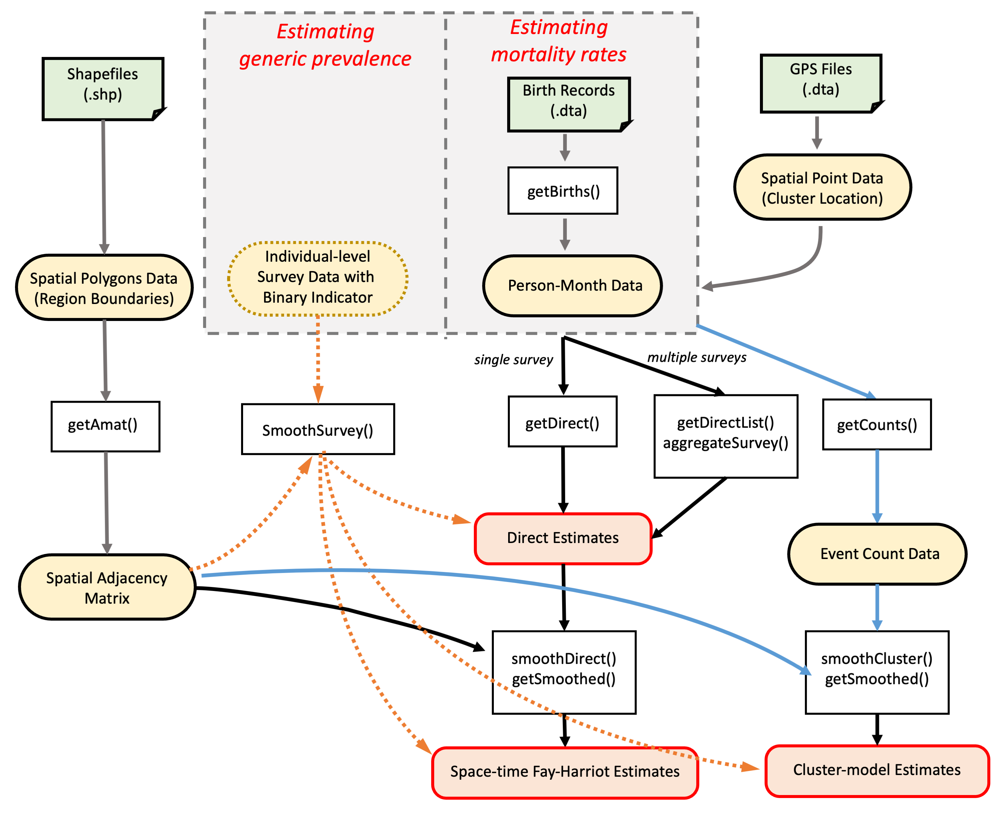

<script type="text/x-mathjax-config">
MathJax.Hub.Config({
  TeX: { equationNumbers: { autoNumber: "AMS" } }
});
</script>

```{r, echo = FALSE, message = FALSE, warning = FALSE, note = FALSE}
library(formatR)
library(knitr)
ref <- function(label){
    knitr::asis_output(ifelse(knitr::is_html_output(),
            paste0("[\\@ref(fig:", label, ")]"),
            paste0("\\ref{fig:", label, "}")
            ))
}
ctv <- function(label){
    knitr::asis_output(ifelse(knitr::is_html_output(),
            paste0("[", label, "]", "(https://cran.r-project.org/web/views/", label, ".html)"),
            paste0("\\ctv{", label, "}")
            ))
}

options(scipen=1, digits=2)
knitr::opts_chunk$set(fig.width=9, fig.height=5, out.width = '100%', message = FALSE, warning = FALSE, note = FALSE, cache = TRUE)
knitr::opts_chunk$set(tidy=FALSE, eval = TRUE, echo = TRUE)
knitr::opts_chunk$set(fig.pos = "!ht", out.extra = "")

options(formatR.arrow=TRUE, width=90)
knitr::opts_chunk$set(dev = 'png', dpi = 400)
read_chunk('SUMMER-RJ.R')
```

<!----------------------------------------------------------------->
<!----------------------------------------------------------------->
# Introduction
<!----------------------------------------------------------------->
<!----------------------------------------------------------------->

A wealth of health and demographic indicators are now collected across the world, and interest often focuses on patterns in space and time. Spatial patterns indicate potential disparities, while temporal trends are important for determining the impact of interventions and to assess whether targets, such as the sustainable development goals (SDGs), are being met [@macfeely20]. In low- and middle-income countries (LMIC), the most reliable data with sufficient spatial resolution are often collected under complex sampling designs. Common sources of data include the Demographic Health Surveys (DHS) and Multiple Indicator Cluster Surveys (MICS), both of which use multi-stage cluster sampling. A two-stage cluster design is most common for these surveys. A sampling frame of *clusters* (for example, enumeration areas) is constructed, often from a census, and then strata are formed. The strata consist of some administrative geographical partition crossed with urban/rural (with countries having their own definitions of this dichotomy). Then a pre-specified number of clusters are sampled from these strata under some probabilistic scheme, for example, with probability proportional to size (PPS). Different surveys are powered to different geographical levels. Then, within the selected clusters, households are randomly sampled and individuals are sampled within these households, and asked questions on a range of health and demographic variables. This data collection process must be acknowledged in the analysis to reduce bias and obtain proper uncertainty measures in the prevalence estimates.

Various packages are available within R for small area estimation (SAE) of prevalence, including the \CRANpkg{sae} package [@molina_marhuenda_15] that supports the popular book of @rao_molina_15 and includes the famous @fay_herriot_79 model and spatial smoothing options. Other packages include  \CRANpkg{rsae} [@rsae], \CRANpkg{hbsae} [@hbsae], \CRANpkg{BayesSAE} [@BayesSAE] and \CRANpkg{msae} [@permatasari2021msae].
A more comprehensive list of related packages is described at `r ctv("OfficialStatistics")`. Most of the existing packages focus on classical SAE models and provide very limited options for fitting spatial and space-time smoothing models.

In this paper we introduce the R package, \CRANpkg{SUMMER}^[The name originally arises from 'Spatio-temporal Under-five Mortality Methods for Estimation in R'. As the package becomes a more general toolkit, it now stands for 'Sae Unit/area Models and Methods for Estimation in R']. This package and its details are available on CRAN. \CRANpkg{SUMMER} provides a computational framework and a collection of tools for smoothing and mapping the prevalence of indicators with complex survey data over space and time, with a special focus on estimating mortality rates. Smoothing is important to avoid unstable estimates and combine information from multiple surveys over time. Originally developed for small area estimation of the under-5 child mortality rate (U5MR), the \CRANpkg{SUMMER} package has been extended to broader mortality rate estimation and more general tasks in SAE. The implemented methods have already been successfully applied to a range of data, e.g., subnational estimates of mortality rates [@mercer_etal_15; @li_etal_19; @schluter2021space; @fuglstad2021two], HIV prevalence [@wakefield_okonek_pedersen_20] and vaccination coverage [@dong_wakefield_20]. Recently, the \CRANpkg{SUMMER} package was used to obtain the official United Nations Inter-Agency Group for Mortality Estimation (UN IGME) yearly estimates (1990--2021) of U5MR at administrative level $2$ below the national level (admin-2 estimates) for $31$ countries in Africa and Asia [@un2023]. Previously, the UN IGME only produced national estimates using the _B3 model_ [@alkema_new_14]. The results of these endeavors are available online at \url{https://childmortality.org}.

The main focus of this paper is to provide an overview of the different prevalence models using survey data and how they can be implemented in \CRANpkg{SUMMER}. The rest of the paper is organized as follows. We first briefly describe  different methods to estimate prevalence using survey data. We start with a generic binary indicator and proceed with estimating mortality rates. We then provide an overview of the \CRANpkg{SUMMER} package and the workflows of using \CRANpkg{SUMMER} for prevalence mapping. We then discuss three examples for spatial and space-time smoothing of binary and composite indicators with increasing complexity. The first two examples use simulated data that are included in the \CRANpkg{SUMMER} package. The last example uses the most recent DHS survey from Malawi. Then we illustrate various visualization and model checking tools in the \CRANpkg{SUMMER} package. Finally, we conclude with future work.

<!----------------------------------------------------------------->
<!----------------------------------------------------------------->
# Space-time smoothing using complex survey data

In this section we review different methods to estimate the prevalence of a health outcome from complex survey data. We begin by discussing design-based, *direct* estimates [@rao_molina_15] which are based on response data from that area only. Next, we describe space-time smoothing of the direct estimates using a Fay-Herriot model [@fay_herriot_79]. We discuss both estimating the prevalence of a single binary indicator and the composite indicators such as U5MR. We then describe a cluster-level model to estimate prevalence at finer spatial and temporal resolutions.

## Estimating the prevalence of a generic binary indicator

Consider a study region that is partitioned into $n$ areas,  with interest focusing on estimating the prevalence of a binary indicator in each area, possibly over time. The data are collected via some complex survey design. For each individual $j$, let $y_j$ denote the individual's outcome, and $w_j$ denote the design weight associated with this individual. Further, let $s_{it}$ represent the indexes of individuals sampled in area $i$ and in time period $t$. The design-based estimator [@horvitz_thompson_52; @hajek_71] is
\begin{equation}
\hat p_{it}^{\texttt{HT}} = \frac{\sum_{j \in s_{it}} w_{j}y_j}{\sum_{j \in s_{it}} w_{j}}.
\end{equation}
This is an example of a direct estimate.
The variance of $\hat p_{it}^{\texttt{HT}}$ can be calculated using standard methods [@wolter_07] and can be easily computed using the \CRANpkg{survey} package. Let $V^{\texttt{HT}}_{it}$ denote the design-based variance of $\mbox{logit}(p_{it}^{\texttt{HT}})$, obtained from the design-based variance of $p_{it}^{\texttt{HT}}$ via linearization (the delta method). We take the logit transformed direct estimates as input data and estimate the true prevalence with the random effects model,
\begin{align}
\label{eq:smooth-direct}
\mbox{logit}(\hat p_{it}^{\texttt{HT}}) | \lambda_{it} &\sim \mbox{Normal}(\lambda_{it}, V^{\texttt{HT}}_{it}),\\
\label{eq:smooth-direct2}
\lambda_{it} &= x_{it}^\intercal\beta + \alpha_t + \epsilon_t + S_i + e_i + \delta_{it}.
\end{align}
In this model, which is a space-time smoothing extension of the @fay_herriot_79 model, $\mbox{expit}(\lambda_{it})$ is the true prevalence we aim to estimate, and $x_{it}$ are area-level covariates. The rest of the terms are normally distributed random effects including structured time trends $\alpha_t$, unstructured, independent and identically distributed (iid), temporal terms $\epsilon_t$, structured spatial trends $S_i$, unstructured spatial terms $e_i$, and space-time interaction terms $\delta_{it}$. The terms $e_i+S_i$ are implemented via the BYM2 parameterization [@riebler_etal_16], a reparameterization of the classical BYM model [@besagbayesian] that combines iid error terms with intrinsic conditional autoregressive (ICAR) random effects. Several different temporal models are implemented in \CRANpkg{SUMMER} for the structured temporal trends and space-time interaction effects, including random walks of order 1 and 2, and autoregressive models [@rue_knorrheld_05] with additional linear trends. The interaction term $\delta_{it}$ can be one of the type I to IV interactions of the chosen temporal model and the ICAR model in space, as described in @knorrheld_00.
In order for the model to be identifiable, we impose sum-to-zero constraints on each group of random effects. More details on the prior choices are provided in the supplementary materials.

## Estimating mortality rates using area-level models

For composite indicators such as mortality rates, the direct estimates require additional modeling. Here we focus on the estimation of the U5MR, one of the most critical and widely available population health indicators. The methodology and the functions in \CRANpkg{SUMMER} are readily applicable to mortality rates of other age groups as well, but we note that modeling mortality beyond age 5 is usually more challenging in practice because death becomes rarer, and survey data alone are not sufficient for reliable inference.

The \CRANpkg{SUMMER} package implements the discrete hazards model described in @mercer_etal_15. We use discrete time survival analysis to estimate age-specific monthly probabilities of dying in user-defined age groups. We assume constant hazards within the age bands. The default choice uses the monthly age bands
$$[0, 1), [1, 12), [12, 24), [24, 36), [36, 48), [48, 60)$$
for U5MR and they can be easily specified by the user. The U5MR for area $i$ and time $t$ can be calculated as,
\begin{equation}
\hat p_{it}^{\texttt{HT}} = {}_{60}{\hat q}^{it}_{0} = 1 - \prod_{a = 1}^6 \left( 1 -  {}_{n_a}{\hat q}^{it}_{x_a}\right),
\end{equation}
where $x_a$ and $n_a$ are the start and end of the $a$-th age group, and ${}_{n_a}{q}^{it}_{x_a}$ is the probability of death in age group $[x_a, x_a + n_a)$ in area $i$ and time $t$, with ${}_{n_a}{\hat q}^{it}_{x_a}$ the estimate of this quantity. This calculation follows the synthetic cohort life table approach in which mortality probabilities for each age segment based on real cohort mortality experience are combined. This allows the full use of the most recent data, which is especially useful when survey data are sparse and is the default approach that @dhsspatial uses.

The constant one-month hazards in each age band can be estimated by a weighted logistic regression model [@binder_83]:
\begin{equation}
\mbox{logit}\left(
{}_{1}{q}^{it}_{m}
\right) = \beta_{a[m]}^{it},
\end{equation}
where $a[m]$ is the age band indicator for the $m$-th month, i.e.
\begin{equation}
a[m] = \left\{
\begin{array}{ll}
1 & \mbox{if }m=0,\\
2 & \mbox{if }m=1,\dots,11,\\
3 & \mbox{if }m=12,\dots,23,\\
4 & \mbox{if }m=24,\dots,35,\\
5 & \mbox{if }m=36,\dots,47,\\
6 & \mbox{if }m=48,\dots,59.
\end{array}
\right.
\label{eq:am}
\end{equation}
The design-based variance of $\mbox{logit}(\hat p_{it}^{\texttt{HT}})$ may then be estimated using the delta method or resampling methods such as the jackknife [@pedersenandliu_2012]. The smoothing of the direct estimates can then proceed using the model described in equations (\ref{eq:smooth-direct}) -- (\ref{eq:smooth-direct2}). When multiple surveys exist, one may choose to either model the survey-specific effects as fixed or random [@mercer_etal_15] or first aggregate the direct estimates from multiple surveys to obtain a "meta-analysis" estimate in each area and time period [@li_etal_19], i.e., at each time $t$, we combine the $K_t$ available direct estimates from multiple surveys to form the estimate
\[
  \hat p_{it}^{\texttt{meta}} = \mbox{expit}\Big(\sum_{k = 1}^{K_t} \frac{(\hat V_{it, k}^{\texttt{HT}})^{-1}}{\sum_{k'=1}^{K_t} (\hat V_{it, k'}^{\texttt{HT}})^{-1}} \mbox{logit}(\hat p_{it}^{\texttt{HT}}) \Big),
\]
 and the associated design-based variance on the logit scale is $\Big(\sum_{k'=1}^{K_t} (\hat V_{it, k'}^{\texttt{HT}})^{-1}\Big)^{-1}$.
 To mitigate the sparsity of available data in each year, @li_etal_19 also considers a temporal model defined at the yearly level while the direct estimates are calculated at multi-year periods. All these variations can be fit using the \CRANpkg{SUMMER} package.

## Estimating mortality rates with cluster-level models {#sec:model-cluster}

The space-time Fay-Herriot estimates are useful when there are enough observations at the spatial and temporal unit of the analysis. When the target of inference is at finer resolution, e.g., on a yearly time scale with admin-2 areas and surveys stratified at admin-1 levels, the direct estimates may contain many $0$s or $1$s and the design-based variance cannot be calculated reliably. In this case, we can consider unit-level models where the individual survey responses are modeled. In the rest of this section, we describe a model for the cluster-level risk, where we account for the additional within-cluster variation by allowing overdispersion in the likelihood. More detailed comparisons of this modeling choice were examined in [@dong_wakefield_20]. In a two-stage cluster design, the clusters are referred to as primary sampling units (PSUs) and the households are referred to as secondary sampling units (SSUs). Thus we refer to such models as `cluster-level model` to avoid confusion. We describe the model for the mortality estimation problem below, while the same formulation applies to the case of any generic binary indicators as well.

In the most general setting, we consider multiple surveys over time, indexed by $k$. The sampling frame that was used for survey $k$, will be denoted by $r[k]$. We assume a discrete hazards model as before. We consider a beta-binomial model for  the probability (hazard) of death from month $m$ to $m+1$ in survey $k$ and at cluster $c$ in year $t$. This model allows for overdispersion relative to the binomial model. Assuming constant hazards within age bands, we assume the number of deaths occurring within age band $a[m]$, in cluster $c$, time $t$, and survey $k$ follow the beta-binomial distribution,
\begin{equation}\label{eq:BB1-age}
Y_{a[m],k,c,t} ~|~  p_{a[m],k,c,t} \sim \mbox{BetaBinomial}\left(~ n_{a[m],k,c,t}~,~ p_{m,k,c,t}~,d~
\right),
\end{equation}
where $p_{m,k,c,t}$ is the monthly hazard at $m$-th month of age, in cluster $c$, time $t$, and survey $k$ and $d$ is the overdispersion parameter.
The latent logistic model we use is,
\begin{align}
p_{m,k,c,t} =& \mbox{expit}( \alpha_{m,c,k,t} +   \epsilon_t + b_k),\\ \nonumber
\alpha_{m,k,c,t} =&
\beta_{a[m],r[k],t}I(s_c \in \mbox{ rural }) +
\gamma_{a[m],r[k],t} I(s_c \in \mbox{ urban }) \\
&\;+
S_{i[s_c]} + e_{i[s_c]}  +\delta_{i[s_c],t} + \mbox{BIAS}_{k,t}.
\label{eq:pred}
\end{align}

This form consists of a collection of terms that are used for prediction and a number that are not, as we now describe. We include a survey fixed effect $b_k$ with the constraint $\sum_{k} b_k \mathbf{1}_{r[k] = r} = 0$ for each sampling frame $r$, so that the main temporal trends are identifiable for each sampling frame. The $b_k$ terms are not included in the prediction, i.e., they are set to zero.  The $\epsilon_t$ are unstructured temporal effects that allow for perturbations over time. It is a contextual choice whether they are used in predictions. We include terms in (\ref{eq:pred}) that are analogous to those in equations (\ref{eq:smooth-direct})--(\ref{eq:smooth-direct2}), in particular the spatial main effects $S_i$ and $e_i$ and the space-time interactions $\delta_{it}$.

For the temporal main effects $\beta_{a[m],r[k],t}$ and $\gamma_{a[m],r[k],t}$, we have stratum-specific distinct trends for each age group $a[m]$ in surveys from each sampling frame. We include separate urban and rural temporal terms to acknowledge the sampling design; often urban clusters are oversampled and have different risk from rural clusters, and so it is important to acknowledge this aspect in the model [@paige_etal_20]. The urban-rural stratification effects may also be parameterized as time-invariant fixed effects, i.e., restricting $\beta_{a[m],r[k],t} = \gamma_{a[m],r[k],t} + \Delta_{a[m],r[k]}$. For a detailed discussion of the parameterization of stratification effects, we refer readers to @wu2021spatial. In addition, it is usually reasonable to assume shared temporal trends up to a constant shift across some age groups. For example, we may let
\[
    \beta_{a[m],r[k],t} = \beta_{a[m],r[k], 0} + \beta^\star_{a^\star[m], r[k], t}
\]
where $\beta^\star_{a^\star[m], r[k], t}$ is a collection of temporal random effects with sum-to-zero constraint $\sum_{t} \beta^\star_{a^\star[m], r[k], t} = 0$, and $a^\star[m]$ is a reduced set of age bands. The default choice for U5MR in the package is
\begin{equation}
a^\star[m] = \left\{
\begin{array}{ll}
1 & \mbox{if }m=0,\\
2 & \mbox{if }m=1,\dots,11, \\
3 & \mbox{if }m=12,\dots,59.
\end{array}
\right.
\label{eq:astar}
\end{equation}
That is, we assume the temporal trends for logit hazards in the last four age groups are parallel and only differ by the intercept term $\beta_{a[m],r[k], 0}$.

In situations where biases are known for particular surveys and/or years, we can adjust for bias following @wakefield_etal_19 by including the bias ratio term, $\mbox{BIAS}_{k,t} = \mbox{U5MR}^\star_{t} / \widehat{\mbox{U5MR}}_{k, t}$, where $\mbox{U5MR}^\star_{t}$ is the expected U5MR in year $t$ and $\widehat{\mbox{U5MR}}_{k, t}$ is the biased version.
This approach has been used to adjust for mothers who have died from AIDS [@walker_etal_12]; such mothers cannot be surveyed, and their children are more likely to have died, so the missingness is informative.

The predicted U5MRs in urban and rural regions of area $i$  and at time $t$ according to sampling frame $r$ are,
\begin{eqnarray}\label{eq:U5MR}
\mbox{U5MR}_{i,t,U,r} &=&
1- \prod_{a=1}^6
\left[ \frac{1}{1+\exp(
\beta_{a,r,t}  + S_{i} + e_{i}  +\delta_{i,t}) }\right]^{z[a]}\\
 \mbox{U5MR}_{i,t,R,r} &=&
1- \prod_{a=1}^6
\left[ \frac{1}{1+\exp(
\gamma_{a,r,t} + S_{i} + e_{i}  +\delta_{i,t}) }\right]^{z[a]},
\end{eqnarray}
where $z[a]=1,11,12,12,12,12$, for the default choice of age bands.
 The aggregate risk in area $i$ and in year $t$ according to sampling frame $r$ is
\begin{equation}\label{eq:agg2}
p_{itr} = q_{itr}\times \mbox{U5MR}_{i,t,U,r} + (1-q_{itr})\times  \mbox{U5MR}_{i,t,R,r},
\end{equation}
where $q_{itr}$ and  $1-q_{itr}$ are the proportions of the under-5 population in area $i$ that are urban and rural in year $t$ according to the classification of sampling frame $r$. The final aggregation over different sampling frames can be done using meta-analysis combination, so that,
\[
\widehat{\mbox{U5MR}}_{it} = \mbox{expit}\left(\sum_r w_{itr} \times \mbox{logit}(p_{itr})\right),
\]
where $w_{itr}=U_{itr}^{-1}/\sum_{r'} U_{itr'}^{-1}$ is the scaled inverse of $U_{itr}$, which is the posterior variance of $\mbox{logit}(\widehat{\mbox{U5MR}}_{it}^{(r)})$. Beyond point estimates, we obtain the full posterior of $\mbox{U5MR}_{it}$, and various summaries can be reported or mapped. The estimate constructed for U5MR is not relevant to any child, because that child would have to experience the hazards for each age group simultaneously in time period $t$, rather than moving through age groups over multiple time periods. Nevertheless, the resultant U5MR is a useful summary and the conventional measure that is used to inform on child mortality.

<!------------------------------------------------------------------>
<!------------------------------------------------------------------>
# Overview of SUMMER {#sec:summer-overview}

The \CRANpkg{SUMMER} package provides a collection of functions for SAE with complex survey data. The package can be installed in R directly by

```{r, eval=FALSE}
install.packages("SUMMER")
```

The \CRANpkg{SUMMER} package requires the \pkg{INLA} package [@rue_etal_09] to be installed. All analyses in this package are conducted with \CRANpkg{SUMMER} package version $1.4.0$ and \pkg{INLA} version $24.03.09$. \pkg{INLA} can be installed with

```{r, eval = FALSE, tidy=FALSE}
  install.packages("INLA", repos=c(getOption("repos"),
                    INLA="https://inla.r-inla-download.org/R/stable"), dep=TRUE)
```

The \CRANpkg{SUMMER} package implements a variety of space-time smoothing models using survey data. There are three main functions to implement these models, discussed below and in the three examples in the following sections.

+ `smoothSurvey()` produces direct and Fay-Herriot estimates for a generic binary indicator from raw survey data.
+ `smoothDirect()` takes direct estimates as input and produces the Fay-Herriot estimates for mortality estimation discussed in @li_etal_19.
+ `smoothCluster()` performs cluster-level smoothing using the Beta-Binomial model discussed in the previous section, and with more details discussed in @wu2021spatial and @fuglstad2021two.

We note that `smoothDirect()` and `smoothCluster()` include many more features in modeling composite indicators such as child mortality. In comparison, `smoothSurvey()` can only model generic binary indicators, but it has a simpler interface and workflow, which is appealing for broader communities of practitioners.

The main sources of data required for these methods are the survey data and the corresponding spatial adjacency matrix, which can be derived from spatial polygons data describing region boundaries. For cluster-level modeling, we also need to know which region each cluster belongs to. In the context of modeling DHS data, the survey data and cluster locations are usually recorded in separate files.  Figure `r ref("workflow")` shows schematically the workflow of data processing and smoothing for generic binary indicators and mortality estimates using the \CRANpkg{SUMMER} package. In this paper, our workflow starts with the birth records and GPS files in .dta files as an example. Such files can be directly downloaded from the DHS data portal. It is also straightforward to load data in other formats and supply the R objects into the functions. The entire pipeline of analysis can be carried out using functions in \CRANpkg{SUMMER}. The analysis of the main paper can be reproduced without registering for data access. We include a more extensive analysis of DHS data in the supplementary materials, which requires registration with DHS program for data access.

```{r workflow, echo = FALSE, out.width = "100%", fig.cap = "Workflow of the SUMMER package. Rounded blocks represent data types and rectangular blocks represent functions in the SUMMER package. Output estimates are highlighted in the boxes with red borders. The dotted yellow arrows represent the workflow using \\texttt{smoothSurvey()} to estimate the prevalence of a generic binary indicator. The black solid arrows represent the workflow using \\texttt{smoothDirect()} to perform area-level smoothing of mortality rates. The blue solid arrows represent the workflow using \\texttt{smoothCluster()} to perform cluster-level smoothing of mortality rates."}

```

Before demonstrating the utilities of these functions in the following examples, we first load the packages for the analysis, data processing and visualization. For the analysis presented in this paper, we use the \CRANpkg{ggplot2} package [@wickham_ggplot2] and \CRANpkg{patchwork} package [@patchwork] to make further customizations to the visualization produced by \CRANpkg{SUMMER}.

```{r load-package}
```

# Example 1: prevalence estimation for a binary indicator

We start by considering the simplest scenario of estimating the prevalence of a binary indicator using a dataset from the Behavioral Risk Factor Surveillance System (BRFSS) survey. BRFSS is an annual telephone health survey conducted by the Centers for Disease Control and Prevention (CDC) that tracks health conditions and risk behaviors in the United States and its territories since 1984. The BRFSS sampling scheme is complex, with high variability in the sampling weights. In this example, we estimate the prevalence of Type II diabetes in health reporting areas (HRAs) in the King County of Washington using BRFSS data. We will compare the direct estimates and the Fay-Herriot estimates.

The `BRFSS` dataset in \CRANpkg{SUMMER} contains the full BRFSS dataset with $16,283$ observations. The `diab2` variable is the binary indicator of Type II diabetes, `strata` is the strata indicator, and `rwt_llcp` is the final design weight. For the purpose of this analysis, we first remove records with missing HRA codes or diabetes status from this dataset.

```{r brfss-1}
```

The `KingCounty` dataset in \CRANpkg{SUMMER} contains the map of the HRAs in the King County. We first extract the spatial adjacency matrix for the HRAs using the `getAmat()` function.

```{r brfss-2}
```

We then use the `smoothSurvey()` function to obtain both the direct and Fay-Herriot estimates by HRA. The function requires specifications of the variables that determine the survey design, including sampling weights (`weightVar`), strata indicator (`strataVar`), and cluster identifiers (`clusterVar`). In this dataset, there are no clusters so we use the formula `~1` in this situation [@lumley2004analysis]. We also need to specify region indicators (`regionVar`) in the data frame that match the column and row names of the spatial adjacency matrix.

```{r brfss-3}
```

The fitted object is of class `SUMMERmodel.svy`, and the direct (`$direct`) and Fay-Herriot estimates (`$smooth`) are saved as data frames in the fitted objects. Notice that since the analysis is performed on the logit of the prevalence, estimates on both the logit and the probability scales are returned in the output. We use the `mapPlot()` function in \CRANpkg{SUMMER} to show the estimates on a map. In essence, the `mapPlot()` function takes a data frame, a `SpatialPolygonsDataFrame` object, the column names indexing regions in both the data frame and the polygons, and returns a `ggplot` object. Additional function arguments are available to more easily customize the visualizations. Figure `r ref("brfss-4")` compares the point estimates on the map and the effect of spatial smoothing can be easily seen.

```{r brfss-4, fig.height = 3, fig.width = 9, fig.cap = "Direct and Fay-Herriot estimates of the prevalence of Type II diabetes in King county HRAs."}
```

Similar analysis can be implemented for Gaussian observations, and can include temporal smoothing or covariates in the smoothing model. The hyperpriors can also be further customized. For more details and examples, we refer the readers to the package documentation under the `smoothSurvey()` section.

<!----------------------------------------------------------------->
<!----------------------------------------------------------------->
# Example 2: area-level model of NMR and U5MR using simulated data

In the second example, we consider estimating mortality rates using multiple surveys. We use the NMR and U5MR as two examples, but the implementation in the \CRANpkg{SUMMER} package allows straightforward extensions to other age groups. We use a simulated survey dataset in this example. A more detailed case study using cluster-level models is provided in the supplementary materials.

We load the `DemoData` dataset from the \CRANpkg{SUMMER} package. The `DemoData` is a list that contains full birth history data from simulated surveys with stratified cluster sampling design, similar to most of the DHS surveys. It has been pre-processed into the person-month format, where for each list entry, each row represents one person-month record. Each record contains columns for the cluster ID (`clustid`), household ID (`id`), strata membership (`strata`) and survey weights (`weights`). The region and time period associated with each person-month record has also been pre-computed. The age variable in this data frame is in the form of $a_1$-$a_2$, i.e., $1$-$11$ corresponds to age group with 1 to 11 completed months, whereas age groups with only one month are stored using a single number representation, e.g., age group $0$. This is also the data structure in the output of the \code{getBirths} function in the \CRANpkg{SUMMER} package. In all the analyses of this paper, we use the default age bands as described before. If a different set of age bands is desired, they can be specified by the `month.cut` argument in the \code{getBirths} function.

```{r direct-estimate-1}
```

In order to compute NMR, we create a new list of surveys with only deaths within age group $0$.

```{r direct-estimate-2}
```

We now turn to the estimation of NMR and U5MR using four simulated surveys in `DemoData`. For multiple surveys, we combine the person-month records into a list and use the `getDirectList()` function to obtain the survey-specific direct estimates. When there are no deaths in a given area and time period, or when more than half of the age groups do not exist in the person-month data, the direct estimates cannot be reliably computed and are set to NA. When only a small fraction of the age groups are not observed, they will be combined with the previous age groups when fitting the discrete hazard model.

```{r direct-estimate-3}
```

The direct estimates from multiple surveys can be combined to produce a "meta-analysis" estimator using the `aggregateSurvey()` function.

```{r direct-estimate-4}
```

Once the direct estimates are calculated, we fit the space-time Fay-Herriot model in the same fashion as in the previous example. The argument `year.label` specifies the order of the years column in the direct estimates, so that it does not have to be integer valued, and can easily allow extensions to future and past time periods not in the data. We can also fit the temporal model at the yearly level even though the direct estimates are in five year periods [@li_etal_19]. In this case, we need to specify the proper range of the time periods (`year_range`) encoded by the time periods in `year.label`, and the number of years in each period (`m`). Unequal periods are not supported at this time. The `smoothDirect()` function returns a fitted object of class `SUMMERmodel`.

```{r smooth-direct-estimate-1}
```

The Fay-Herriot estimates can be summarized by the `getSmoothed()` function. The desired posterior credible intervals are specified by the `CI` argument. It organizes the estimates into a data frame of class `SUMMERproj`, which can be directly viewed or plotted using the `plot` method. Additional customization can be added using the syntax of \CRANpkg{ggplot2}, as shown in Figure `r ref("smooth-direct-estimate-2")`.

```{r smooth-direct-estimate-2, fig.height = 10, fig.width = 10, fig.cap = "Smoothed direct estimates of NMR (top row) and U5MR (bottom row) on the yearly scale (dots) and 5-year period scale (triangles) in the simulated dataset. The vertical error bars correspond to 95% credible interval of the 5-year estimates. The plots on the left are from the default plot function. The plots on the right show simple customization of the default plots."}
```

# Example 3: cluster-level model of U5MR using Malawi DHS data

We now consider a more realistic example of estimating U5MR at the admin-2 level using the 2015--2016 Malawi DHS survey. The full dataset is available on the DHS website at [https://dhsprogram.com/data/available-datasets.cfm?ctryid=24](https://dhsprogram.com/data/available-datasets.cfm?ctryid=24). Access to the full micro-level data requires registration with the DHS. Once access is approved, the \CRANpkg{rdhs} [@rdhs] package can be used to load data directly from the DHS API in R. We document the process to read the raw DHS files and process the birth records in the supplementary materials.

For reproducibility of the examples in this paper, we start with the aggregated count data from the 2015 Malawi DHS. The pre-processed count data is available in the supplementary materials. This aggregated dataset consists of the counts of deaths occurring within each age band and the total number of person-months by cluster and year. This aggregated dataset and the full data acquisition and cleaning steps to obtain this dataset are described in the supplementary materials. The processing steps involve primarily the `getBirths()` and `getCounts()` functions and some data cleaning in region names. The supplementary materials also include workflows and results on fitting several other smoothing models on the Malawi DHS data.

Subnational spatial polygon files can usually be found on the DHS spatial data repository [@dhsspatial] or the GADM database of global administrative areas [@areas2012gadm]. The admin-2 region polygon of Malawi is included in the \CRANpkg{SUMMER} package already and can be directly loaded.

```{r load-map-1}
```

We then load the pre-processed count data and fit the cluster-level model using the `smoothCluster()` function. We consider the observations from 2007 to 2015 and project the mortality rates to 2019.  To simplify results, we fit the unstratified model in this example by removing the `strata` variable from the data frame or setting it to `NA`. The supplementary materials contain additional details to fit stratified cluster-level models.

```{r bb-sub-1, cache.lazy = FALSE}
```
Sometimes, additional information is available to adjust the estimates from the surveys. For example, in countries with high prevalence of HIV, estimates of U5MR can be biased, particularly before ART treatment became widely available. Pre-treatment, HIV positive women had a high risk of dying, and such women who had given birth were therefore less likely to appear in surveys. The children of HIV positive women are also more likely to have a higher probability of dying compared to those born to HIV negative women. Hence, we expect that the U5MR is underestimated if we do not adjust for the missing women. For the two surveys in Malawi, the calculated HIV adjustment ratios as described in @walker_etal_12 are stored in the \CRANpkg{SUMMER} as `MalawiData$HIV.yearly`. The unstratified cluster-level model can be fitted using the `smoothCluster()` function.

```{r bb-sub-2, cache.lazy = FALSE}
```

When not specified explicitly, the space-time interaction term inherits the same temporal dependency structure defined by `time.model`. We can use different models for the interaction term by specifying the `st.time.model` argument. For example, in the model above, we can model the main temporal trends using random walks of order 2, and model the space-time interaction using the interaction of a temporal AR(1) process and an ICAR process in space. To allow each region to have more flexible temporal trends, we add region-specific random slopes to the interaction terms by specifying the priors `pc.st.slope.u` and `pc.st.slope.alpha`. These arguments specify that the probability of the absolute temporal change from the shared temporal trend (on the logit scale) over the entire time period exceeding `pc.st.slope.u` is `pc.st.slope.alpha`. The `age.group`, `age.n` and `age.time.group` specify the age groups, their corresponding length (in months), and how they are grouped when modeling the temporal trends, i.e., the $\alpha^\star[m]$ term defined before.

After we fit the model, we use the `getSmoothed()` function to obtain the posterior summaries of the prevalence by taking `nsim` draws from the posterior distribution. Since for the cluster-level models, the estimates may not be a linear combination of the random effect terms in the case of a composite indicator, the posterior summaries are obtained via posterior samples. For the cluster-level model, the `getSmoothed()` function returns an object of class `SUMMERprojlist`, which includes potentially multiple projections for each stratum (`$stratified`), sampling frame (`$overall`), and aggregated over different sampling frames (`$final`) if applicable. In this example, since we fit an unstratified model with only one sampling frame, the estimates stored in `est.bb$stratified` and `est.bb$overall` are the same. In addition, by specifying `save.draws = TRUE`, the full posterior draws are stored, which can be re-used to speed up other functions that require access to posterior samples of internal model parameters.

```{r bb-sub-3, cache.lazy = FALSE}
```

# Visualization and model checking

In addition to the plots shown in the previous sections, the \CRANpkg{SUMMER} package provides a collection of visualization tools to assess model fit and uncertainty in the estimates. Assessment of uncertainty is a key step in analysis as maps of point estimates can be intoxicating, but often hide huge uncertainty, which should temper initial enthusiasm. Most of the visualization options return a \CRANpkg{ggplot2} object, which can be further customized. In this section, we use the fitted models for Malawi 2015 -- 2016 DHS as an example.

The first set of visualizations are the line plots that we have shown before. Figure `r ref("vis-1")` shows subnational posterior median U5MR estimates over time for the five northern regions. We also scale the estimates to be deaths per $1,000$ live births using the `per1000` argument.

```{r vis-1, fig.width = 7, fig.height = 5, out.width = "50%", fig.cap = "Subnational temporal trends of U5MR using the 2015--2016 DHS in Malawi in four regions.", fig.align = 'center'}
```

By default, subnational estimates do not show the intervals to avoid many overlapping vertical bars, but they can be added back with the `plot.CI` option as illustrated in previous examples. We also compare the smoothed estimates with the pre-computed direct estimates in Figure `r ref("vis-1b")`, where the shrinkage in point estimates and the reduction in uncertainty intervals can be easily seen. The direct estimate computation is detailed in the supplementary materials.

```{r vis-1b, fig.width = 10, fig.height = 5, out.width = "100%", fig.cap = "Comparing subnational temporal trends of U5MR under cluster-level model and direct estimates, using the 2015--2016 DHS in Malawi in four regions.", fig.align = 'center'}
```

The `mapPlot()` function visualizes the estimates on a map. The estimates, `est.bb$overall`, are in the long format where estimates of each year and period are stacked. This is specified with the `is.long` argument. Figure `r ref("vis-2")` maps the changes over time. The drops in U5MR in all regions are apparent, though there is great spatial heterogeneity.

```{r vis-2, fig.width = 7, fig.height = 3, out.width = "100%", fig.cap = "Spatial distribution of U5MR using the 2015--2016 DHS in Malawi over selected years."}
```

The `hatchPlot()` function plots additional hatching lines on the map indicating the width of the uncertainty intervals. Denser hatching lines represent higher uncertainty. Usually, estimates of the early years have higher uncertainty, as shown in Figure `r ref("vis-3")`. It also clearly shows the increase in uncertainty in the projections. We also note that both `mapPlot()` and `hatchPlot()` functions can be used in broader cases as they provide a general tool to visualize rectangular data on a map.

```{r vis-3, fig.width = 12, fig.height = 4, out.width = "100%", fig.cap = "Subnational estimates of U5MR using the 2015--2016 DHS in Malawi over selected years, with hatching lines indicating the width of the 95\\% credible intervals of the estimates. Denser hatching correspond to higher uncertainty. Estimates for 2019 in the last column are from the model projection and thus have higher uncertainty."}
```

The `ridgePlot()` function provides another visual comparison of the estimates and their associated uncertainty. Figure `r ref("vis-4")` shows one such example where the marginal posterior densities of the estimates in the selected years are plotted with regions sorted by their posterior medians in the last plotted period. The posterior densities can also be grouped with all estimates in each region plotted in the same panel using the `by.year = FALSE` argument in the `ridgePlot()` function. These plots are particularly useful to quickly identify regions with high and low estimates, while also showing the uncertainties associated with the rankings as well. The ranking of areas is often an important endeavor, since it can inform interventions in areas that are performing poorly or, more optimistically, allow areas with better outcomes to be examined to see if covariates (for example) are explaining their more positive performance.

```{r vis-4, fig.width = 10, fig.height = 5, out.width = "100%", fig.cap = "Posterior densities of the subnational estimates of U5MR using the 2015--2016 DHS in Malawi over selected years. Admin-2 regions are ordered by their median estimates in 2019. Estimates for 2019 in the last column are from the model projection and thus have higher uncertainty."}
```

Finally, as models get more complicated, it becomes increasingly important to examine the estimated random effects for idiosyncratic behavior that may be evidence of model misspecification. The \CRANpkg{SUMMER} package provides tools to easily extract and plot posterior marginal distributions for each of the random effect components. We can use the `getDiag()` function to extract the posterior marginal distributions of the spatial, temporal, and space-time interaction terms from the fitted models, which can then be plotted in a similar fashion as the estimates. The space-time interaction term in the fitted model contains a sum of a region-specific linear trend and an AR(1) random effect. Thus, we need posterior samples to compute their marginal distributions. We can feed the saved posterior draws from the `est.bb` here to speed up the computation.

```{r check-1}
```

The extracted posterior summaries of the random effects can then be examined and visualized. Figure `r ref("check-2")` shows the posterior summaries of the temporal, spatial, and interaction terms in the model.

```{r check-2, fig.width = 14, fig.height = 6, out.width = "100%", fig.cap = "Posterior medians for the random effect terms in the cluster-level model using Malawi 2015--2016 DHS. Left: posterior medians and 95\\% credible intervals of the age-specific temporal effects and the IID temporal shocks. Middle: posterior medians of the spatial effects. Right: posterior medians of the space-time interaction effects."}
```

# Discussion

The present paper aims to provide a general overview of the R package \CRANpkg{SUMMER} for space-time smoothing of demographic and health indicators. The particular focus of this paper is on mortality estimation and the demonstration of the workflow for practitioners to fit flexible Bayesian smoothing models with DHS data. The implementation using \pkg{INLA} allows fast computation of these smoothing models. The Fay-Herriot estimates can usually be fit within seconds to minutes depending on the number of regions and time period. The cluster-level model may require longer computation time, especially with surveys containing many samples. We leave the fitting of more time-consuming models in the supplementary materials.

The \CRANpkg{SUMMER} package is in constant development. This paper introduces the core functionalities of the package. There are many more functionalities to tackle application-specific issues, such as different age-time interactions, aggregation over urban/rural strata, benchmarking to external national estimates, etc. We are also expanding the package to include more options for the traditional SAE models with fast implementations built on our current computational framework. Recent extensions built on \CRANpkg{SUMMER} functionalities include the recent addition of SAE methods in the \CRANpkg{survey} package [@survey44] and the \CRANpkg{surveyPrev} package  [@surveyPrev] which provides a general pipeline to download, process, and map a broad variety of DHS indicators.

In the future, we have several plans to improve the functionality of \CRANpkg{SUMMER}. In the cluster-level model, we would like to allow different overdispersion parameters for different age groups. We plan to incorporate methods for child mortality estimation using summary birth history data [@hill_etal_15; @wilson2021child] in which women provide only information on the number of children born, and number died, without the dates of these events. We also expect to extend the core functionalities to model other demographic and health indicators such as fertility. In our examples in this paper, we did not include covariates. In both the area-level and the cluster-level models, covariates can be included; see @wakefield_okonek_pedersen_20 for an example in the context of HIV prevalence mapping in Malawi. Finally, in the long term, we would like to incorporate continuous spatial models as well.
