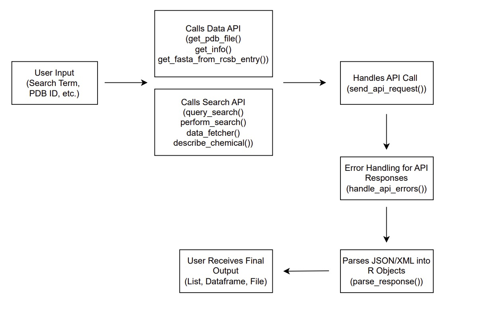
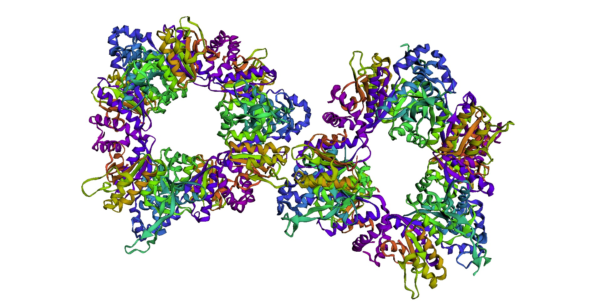
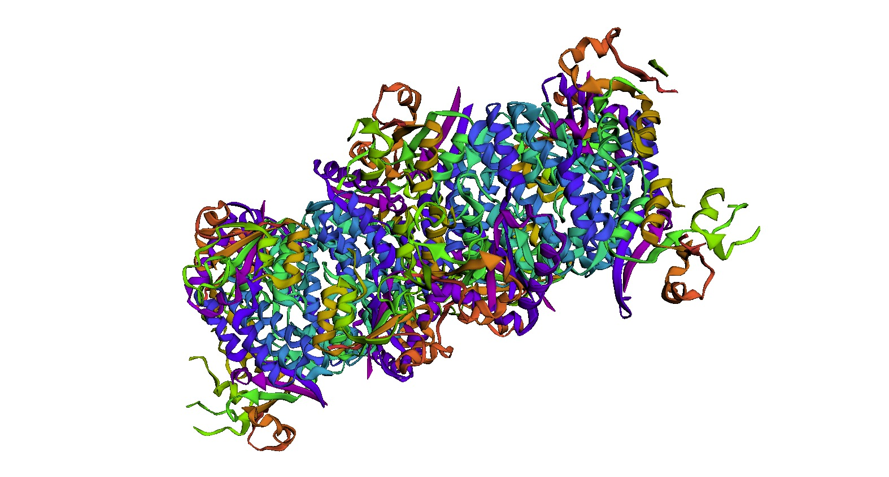
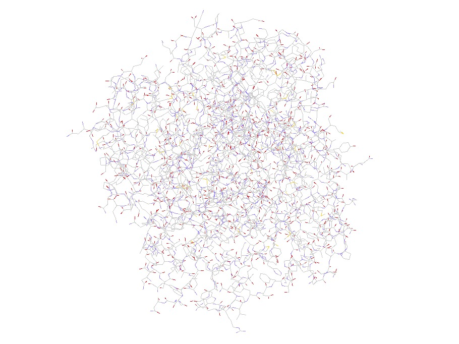

```{r setup, include=FALSE}
knitr::opts_chunk$set(echo = FALSE, warning = FALSE, message = FALSE, fig.pos = "H", out.extra = "")
library(rPDBapi)
library(webshot)
Sys.setenv(CHROMOTE_TIMEOUT = 2000)
```

# Introduction

The RCSB Protein Data Bank (PDB) is an essential resource in bioinformatics and structural biology, offering a vast repository of 3D structural data of large biological molecules [@burley2022rcsb]. This data is crucial for researchers aiming to unravel molecular functions and interactions, playing a pivotal role in advancing drug discovery and genomic studies [@korkmaz2018investigation]. Traditionally, access to the PDB has been facilitated through various web interfaces and a suite of programmatic tools, with Python-based solutions like PyPDB being particularly prominent [@gilpin2016pypdb]. However, the breadth and depth of data housed within the PDB necessitate diverse access methods to cater to the specific needs and technical preferences of the global research community.

The complexity and sheer volume of the data underscore the importance of developing more intuitive and flexible tools that can streamline the process of data retrieval and analysis, thereby enhancing the efficiency of scientific research and innovation. In this context, the accessibility of the PDB through these platforms not only democratizes the availability of critical scientific data but also encourages the continuous evolution of computational tools designed to meet the growing demands of multidisciplinary research fields.

To support diverse queries, ranging from atomic interactions to protein-protein interactions within large assemblies, the PDB data hierarchy is structured to provide detailed information at various levels of biological organization. At the core are individual atoms, which are grouped into residues. Residues are organized into chains, typically representing a single protein or nucleic acid molecule. Chains are then assembled into biological assemblies, which may represent complete macromolecular complexes as they exist in biological systems. This hierarchical structure facilitates the comprehensive representation of complex biological entities.

To elaborate, the PDB data organization can be detailed as follows:

**Entry:**

* Each structure in the PDB is designated by a unique alphanumeric ID (PDB ID, e.g., 1Q2W) and includes annotations such as the title of the structure, the list of depositors, deposition date, release date, and experimental details.
* The entry also includes information about the methodology used for structure determination (e.g., X-ray crystallography, NMR spectroscopy, cryo-electron microscopy) and the resolution of the structure if applicable.
* Additional metadata may include the biological significance of the structure, references to related literature, and the conditions under which the structure was determined.

**Entity:**

This level describes the distinct molecules within entries, categorized into three types:

* **polymer_entity:**

    + Represents macromolecules such as proteins, DNA, and RNA, defined by their amino acid or nucleotide sequences.
    + Annotations at this level include details about the biological source, such as the organism from which the sequence was derived, expression system, and any modifications to the sequence (e.g., post-translational modifications in proteins).
    + Polymer entities also include secondary structure annotations, domains, and functional sites (e.g., active sites in enzymes).

* **branched_entity:**

    + Encompasses carbohydrates composed of saccharide units linked by glycosidic bonds, which can be linear or branched.
    + These entities often play crucial roles in biological recognition processes, such as cell-cell communication, and are annotated with information about their specific linkages and glycosidic bond types.
    + The branched entity level may also include annotations about the biological function of the carbohydrate, its involvement in glycoproteins, and interactions with other biomolecules.

* **nonpolymer_entity:**

    + Covers small molecules like enzyme cofactors, ligands, inhibitors, ions, and solvent molecules.
    + Annotations at this level include details about the chemical structure (e.g., SMILES, InChI), molecular weight, charge, and other relevant physicochemical properties.
    + Nonpolymer entities are often involved in critical biological processes, such as enzyme catalysis, signaling, or structural stability, and are annotated with their roles within the macromolecular complex.

**Entity Instance:**

* Refers to the specific copies of entities within entries, often called "chains."
* This level provides information that can vary between instances, such as structural connectivity, secondary structure, and domain organization.
* It also includes details about the conformation of the chain in the structure, including information on any alternative conformations (e.g., alternate locations of side chains or backbone conformers).
* The entity instance level allows the representation of multiple conformations of the same entity within a single structure, which can be critical for understanding dynamic aspects of biomolecular function.

**Assembly:**

* Describes the biological assemblies, which represent the quaternary structure of the macromolecular complex as it exists in vivo.
* Annotations include details about the number and types of chains involved in the assembly, the symmetry and transformations required to generate the assembly, and evidence supporting the biological relevance of the assembly (e.g., experimental validation, computational prediction).
 * The assembly level may also include information about the stoichiometry of the complex, interactions between different chains (e.g., protein-protein or protein-nucleic acid interactions), and the overall topology of the assembly.
* For multimeric complexes, this level is crucial for understanding the functional organization and cooperative interactions within the assembly.

**Chemical Component:**

* Includes all residues (e.g., amino acids in proteins, nucleotides in DNA/RNA) and small molecules found in entries.
* Annotations at this level encompass chemical descriptors such as SMILES (Simplified Molecular Input Line Entry System) and InChI (International Chemical Identifier), chemical formula, systematic names, and alternative names (e.g., common names or trade names for small molecules).
* The chemical component level also includes information about covalent modifications, such as post-translational modifications in proteins (e.g., phosphorylation, glycosylation) or synthetic modifications in nucleic acids.
* For ligands and cofactors, this level may also include details about binding affinities, interaction partners, and the specific role of the chemical component in the biological function of the macromolecular complex.

This hierarchical data organization in the PDB ensures that the complex nature of biological macromolecules and their interactions are accurately represented, enabling researchers to extract detailed insights from structural data. Whether the focus is on atomic-level interactions, the role of specific residues, or the overall architecture of a large protein complex, the PDB structure allows for comprehensive and flexible data exploration.

A notable gap remains in providing streamlined, R-based access to the PDB—a gap that the \CRANpkg{rPDBapi} package seeks to close [@KorkmazYamasan2024]. By offering a user-friendly, powerful interface to the PDB designed for the R programming community, \CRANpkg{rPDBapi} significantly enhances the accessibility of critical PDB data. This leap in accessibility is particularly impactful given R's widespread adoption across statistical computing and bioinformatics, disciplines that rely heavily on comprehensive and intricate data analysis.

\CRANpkg{rPDBapi} leverages the PDB's existing XML-based API to streamline the process of crafting custom queries, thereby simplifying what was once a complex task. This facility to generate customized queries with ease represents a fundamental shift towards more versatile and efficient data retrieval practices. It ensures that researchers can quickly adapt their data-gathering strategies to suit the unique needs of their projects, from exploratory analyses in genomic studies to the identification of potential drug targets.

Moreover, \CRANpkg{rPDBapi} introduces advanced functionalities within R, such as specialized search capabilities, sequence retrieval, and direct data manipulation. The package's ability to construct customized JSON queries for specific data retrieval needs, coupled with its support for extracting FASTA sequences and performing nuanced searches across the PDB, exemplifies the breadth of its utility. Whether facilitating the download of structure files for molecular modeling, enabling batch queries for sequence analysis, or providing direct access to paper titles and chemical descriptions within the PDB, \CRANpkg{rPDBapi} stands as a testament to the evolving landscape of bioinformatics tools. It not only simplifies access to a vast array of structural biology data but also fosters an environment where scientific discovery is accelerated through efficient data analysis and workflow integration. The workflow for querying and retrieving data from the RCSB PDB using the rPDBapi package is illustrated in Figure 1, highlighting the interaction between core functions, API requests, and downstream data processing.

```{r figure1, out.width = "100%", fig.cap = "Data Retrieval and Query Workflow for RCSB PDB API Using rPDBapi Package"}
 
```

In essence, \CRANpkg{rPDBapi} aims to significantly improve the way researchers interact with the RCSB PDB through programmatic means. By offering a more accessible pathway for R users to engage with PDB data, the package seeks to enhance the usability and flexibility of data exploration and analysis within the fields of bioinformatics and structural biology.

# Using the Package

The accessibility and retrieval of specific data from the RCSB PDB are facilitated through various search functions, each designed to meet the nuanced needs of the scientific community. These functions are built on a foundation of low-level core functions—`send_api_request`, `handle_api_errors`, and `parse_response`—which ensure efficient interaction with the RCSB PDB's APIs. `send_api_request` handles the actual communication with the PDB server, while `handle_api_errors` manages potential issues during the request, and parse_response processes and extracts the relevant data from the server’s responses. This section explores the details of these search functions, illuminating their utility in fetching lists of PDB IDs based on diverse search criteria.

## Installation and Setup

\CRANpkg{rPDBapi} package can be installed from CRAN (The Comprehensive R Archive Network) and loaded as follows:

```{r load, echo = TRUE}
# install.packages("rPDBapi", repos = "http://cran.us.r-project.org")
library("rPDBapi")
```
The package is currently in a state of active development. The latest version in development can be accessed via GitHub (https://github.com/selcukorkmaz/rPDBapi). This paper was composed utilizing \CRANpkg{rPDBapi} version 2.1.

## Retrieving PDB IDs 

Utilizing `query_search` function to query PDB database enables researchers to uncover a wealth of structural information pertinent to specific biological entities or processes. These queries can range from searches for structures associated with particular terms, such as specific molecules or complexes like hemoglobin, to more refined strategies targeting data linked to unique PubMed IDs, source organisms identified by NCBI Taxonomy IDs, or structures determined by specific experimental methodologies. Further, the PDB's functionality to compare protein structure similarities and conduct advanced searches based on authorship, organism, UniProt IDs, or PFAM numbers exemplifies the database's versatility and its role in facilitating detailed comparative analyses and structural elucidation. 

A primary method of querying the PDB involves searching for structures related to a specific term, such as a biological molecule or complex. For instance, executing a query for *hemoglobin* yields a list of PDB IDs corresponding to structures associated with hemoglobin assemblies. This search modality is instrumental in gathering a broad spectrum of structural data pertinent to a particular molecule or complex, facilitating comparative analyses and structural elucidation.

The following code snippet exemplifies a search that returns the first 6 PDB IDs related to hemoglobin, showcasing the breadth of data available for this fundamental biological machinery.

```{r query_search_hemoglobin, echo = TRUE}
pdbs = query_search(search_term = "hemoglobin")
head(pdbs)
```

Another refined search strategy involves querying the PDB using PubMed ID numbers. This approach allows researchers to find structures that are directly linked to specific scientific publications, ensuring a bridge between the structural data and the corresponding bibliographic sources.

```{r query_search_PubmedIdQuery, echo = TRUE}
pdbs = query_search(search_term = 32453425, query_type = "PubmedIdQuery")
pdbs
```

Here, structures associated with a given PubMed ID are retrieved, offering a targeted exploration of structural data underpinned by the scientific literature.

Advanced search functions further refine data retrieval capabilities. Queries can be constructed based on authorship, enabling the exploration of contributions from specific researchers or research groups. Similarly, searches can target structures derived from particular organisms or those associated with specific UniProt IDs or PFAM numbers, enhancing the precision and relevance of search results. Building on the advanced search capabilities, researchers can explore deeper into the structural biology landscape by querying the PDB for entries associated with specific Pfam IDs. Pfam IDs are used to identify protein domains, which are conserved parts of a protein's sequence and structure. The following example focuses on the Pfam ID "PF00069", which corresponds to the protein kinase domain, a common and functionally important domain in many signaling proteins.

```{r query_search_pfam, echo = TRUE}
# Search by PFAM number (protein kinase domain)
pdbs = query_search(search_term = "PF00069", query_type="pfam")  
head(pdbs)
```

By querying the PDB for this specific Pfam ID, we can retrieve all related PDB entries and analyze the distribution of protein lengths within this domain family. This analysis provides insights into the structural variability and conservation of domain length among different proteins.

We then focus on the first 100 PDB entries for analysis, although this number can be adjusted according to research needs:

```{r query_search_pdbs, echo=TRUE}
# Load necessary libraries
library(rPDBapi)
library(Biostrings)
library(ggplot2)

# Get first 100 entries
pdbs <- pdbs[1:100]

```

The next step involves calculating the length of each protein sequence associated with the retrieved PDB IDs. The get_protein_length function is used to fetch the FASTA sequence for each PDB ID, convert it into an AAString using the \CRANpkg{Biostrings} package, and then determine the number of amino acids (protein length) in the sequence:

```{r get_protein_length, echo=TRUE}

get_protein_length <- function(pdb_id) {
  fasta <- get_fasta_from_rcsb_entry(pdb_id, chain_id = "A")
  sequence <- AAString(fasta)
  return(nchar(sequence))
}

# Apply the function to all retrieved PDB IDs
protein_lengths <- sapply(pdbs, get_protein_length)

# Create a data frame for plotting
length_data <- data.frame(PDB_ID = names(protein_lengths), Length = protein_lengths)

head(length_data)
```

Finally, we visualize the distribution of protein lengths using a histogram (Figure 2). This plot provides a clear representation of how protein lengths vary within the protein kinase domain family, offering valuable insights into the structural characteristics of this important protein domain.

```{r figure2, echo=TRUE, out.width = "75%", fig.width=3, fig.height=3, fig.cap = "Histogram of protein lengths in the kinase domain family."}
# Plot the distribution of protein lengths
ggplot(length_data, aes(x = Length)) +
  geom_histogram(binwidth = 10, fill = "blue", color = "black", alpha = 0.7) +
  labs(x = "Protein Length (Amino Acids)",
       y = "Frequency") +
  theme_minimal() +
  theme(
    plot.title = element_text(size = 10),   
    axis.title.x = element_text(size = 8),  
    axis.title.y = element_text(size = 8),  
    axis.text = element_text(size = 7)      
  )
```

These examples illustrate the depth and versatility of search functions available for querying the PDB, each designed to support specific research objectives and inquiries. Through these search mechanisms, the PDB continues to serve as an invaluable resource for the scientific community, enabling the advancement of knowledge in the structural biology domain. For more examples and additional functionalities, please refer to the package documentation.

## Data Search

To enhance the utility of the RCSB PDB database for researchers, the rPDBapi package provides functions such as `perform_search`, `data_fetcher`, and `describe_chemical.` While these functions facilitate advanced search capabilities and streamlined data retrieval, it is important to acknowledge that they primarily serve as wrappers for building queries and parsing responses from the powerful RCSB PDB Data API. The real strength of these functions lies in their ability to simplify and customize API interactions, enabling users to execute refined searches and efficiently fetch data based on specific criteria without needing to directly interact with the API itself.

### `perform_search(…)` function

The perform_search function is designed to enhance the way researchers interact with the RCSB PDB database by allowing for highly customizable searches. Here is a general overview of the function:

```{r perform_search, eval=FALSE, echo=TRUE}
perform_search(
  search_operator,
  return_type = "ENTRY",
  request_options = NULL,
  return_with_scores = FALSE,
  return_raw_json_dict = FALSE,
  verbosity = TRUE
)
``` 

This function connects with the RCSB PDB's RESTful API and lets users search the database using specific criteria provided through the search_operator parameter. This capability is particularly useful for complex searches where precise results are needed.

To refine searches, the `perform_search` function can be combined with various custom search operators. These operators enable the construction of complex search queries customized to specific needs. Detailed documentation for each search operator is available in the RCSB PDB Search Operators (https://search.rcsb.org/#search-operators). Moreover, Searchable attributes include annotations from the mmCIF dictionary, external resources, and additional annotations provided by RCSB PDB. Internal additions to the mmCIF dictionary and external resource annotations are prefixed with 'rcsb_'. For a comprehensive list of available attributes for text searches, refer to the Structure Attributes Search (https://search.rcsb.org/structure-search-attributes.html) and Chemical Attributes Search (https://search.rcsb.org/chemical-search-attributes.html) pages.

**Default Search Operator**

The DefaultOperator function constructs a basic search operator using a single value. This operator is useful for general searches where a straightforward query is required.

```{r DefaultOperator, eval=FALSE, echo=TRUE}
DefaultOperator <- function(value) {
  res <- list(value = value)
  structure(res, class = c("DefaultOperator", class(res)))
}
``` 

**Exact Match Search Operator**

The ExactMatchOperator function allows for precise search operations by matching an exact attribute value. This is particularly useful when the user needs to retrieve entries that exactly match a given criterion.

```{r ExactMatchOperator, eval=FALSE, echo=TRUE}
ExactMatchOperator <- function(attribute, value) {
  res <- list(attribute = attribute, value = value, operator = "exact_match")
  structure(res, class = c("ExactMatchOperator", class(res)))
}
``` 

**Inclusion Search Operator**

The InOperator function is designed for scenarios where the search needs to include values from a specified set. This operator is ideal for filtering results based on a list of possible values.

```{r InOperator, eval=FALSE, echo=TRUE}
InOperator <- function(attribute, value) {
  res <- list(attribute = attribute, operator = "in", value = value)
  structure(res, class = c("InOperator", class(res)))
}
``` 

**Contains Words and Contains Phrase Operators**

For text-based searches, the ContainsWordsOperator and ContainsPhraseOperator functions are invaluable. These operators search for attributes containing certain words or specific phrases, respectively, making them perfect for querying descriptive fields.

```{r ContainsOperators, eval=FALSE, echo=TRUE}
ContainsWordsOperator <- function(attribute, value) {
  res <- list(attribute = attribute, operator = "contains_words", value = value)
  structure(res, class = c("ContainsWordsOperator", class(res)))
}

ContainsPhraseOperator <- function(attribute, value) {
  res <- list(attribute = attribute, operator = "contains_phrase", value = value)
  structure(res, class = c("ContainsPhraseOperator", class(res)))
}
``` 

**Comparison and Range Search Operators**

The ComparisonOperator and RangeOperator functions enable users to perform comparison checks or specify a range for attribute values. These operators are essential when the search requires evaluating attributes against numerical or date ranges.

```{r ContainsAndRangeOperators, eval=FALSE, echo=TRUE}
ComparisonOperator <- function(attribute, value, comparison_type) {
  if (ComparisonType[[comparison_type]] == "not_equal") {
    param_dict <- list(operator = "equals", negation = TRUE)
  } else {
    param_dict <- list(operator = ComparisonType[[comparison_type]])
  }
  param_dict$attribute <- attribute
  param_dict$value <- value
  structure(param_dict, class = c("ComparisonOperator", class(param_dict)))
}

RangeOperator <- function(attribute, from_value, to_value, include_lower = TRUE, 
                          include_upper = TRUE, negation = FALSE) {
  res <- list(
    operator = "range",
    attribute = attribute,
    negation = negation,
    value = list(from = from_value, to = to_value)
  )
  structure(res, class = c("RangeOperator", class(res)))
}
``` 

**Comparison and Range Search Operators**

Lastly, the ExistsOperator function checks the existence of a specific attribute within the database, ensuring that the search results only include entries where the attribute is present.

```{r ExistsOperator, eval=FALSE, echo=TRUE}
ExistsOperator <- function(attribute) {
  res <- list(attribute = attribute, operator = "exists")
  structure(res, class = c("ExistsOperator", class(res)))
}
``` 

One of the key features of `perform_search` is its ability to return different types of data depending on the user's needs. By default, it returns general information about PDB entries, but users can adjust this to retrieve specific types of data, such as structural or assembly details. 

This function allows users to specify the format of the returned data by setting the return_type parameter. This parameter determines the level of detail and specificity of the search results. The available return types include:

* **entry:** Returns a list of PDB IDs, providing a general overview of relevant entries.

* **assembly:** Returns a list of PDB IDs appended with assembly IDs, formatted as [pdb_id]-[assembly_id]. This is particularly useful for researchers interested in biological assemblies.

* **polymer_entity:** Returns a list of PDB IDs appended with entity IDs in the format [pdb_id]_[entity_id], corresponding to polymeric molecular entities. This is ideal for focusing on specific protein or nucleic acid chains within the structure.

* **non_polymer_entity:** Returns a list of PDB IDs appended with entity IDs in the format [pdb_id]_[entity_id], corresponding to non-polymeric entities, such as ligands. This allows for the identification of small molecules or other non-polymeric components within a structure.

* **polymer_instance:** Returns a list of PDB IDs appended with asym IDs in the format [pdb_id].[asym_id], corresponding to instances of certain polymeric molecular entities, also known as chains. The asym_id corresponds to the _label_asym_id from the mmCIF schema, which may differ from the _auth_asym_id selected by the author at the time of deposition.

* **mol_definition:** Returns a list of molecular definition identifiers, which include chemical component entries identified by alphanumeric codes (e.g., ATP, ZN) and BIRD entries identified by BIRD IDs (e.g., PRD_000154). This return type is useful for chemical and molecular component searches.

Additionally, the perform_search function allows for further customization through options like request_options, which can be used to fine-tune the search, such as filtering results by certain criteria or setting constraints like date ranges or experimental methods.

For users who want to prioritize the most relevant results, the function can include relevance scores with the search results by setting the return_with_scores option to TRUE. This helps in quickly identifying the most pertinent entries in a large set of results.

In some cases, researchers may want to access the raw data returned by the PDB API. The return_raw_json_dict option allows users to retrieve this data in its original JSON format for further processing or analysis.

Finally, the verbosity option controls how much information is displayed during the search process. When enabled, it provides detailed feedback on the search, which can be helpful for understanding how the function is working or troubleshooting any issues.

To further enhance the search experience, the RCSB PDB Search API consolidates requests to a variety of specialized search services, allowing for highly targeted data retrieval. These services include:

* **text:** Performs attribute searches against textual annotations associated with PDB structures. This service is useful for searching within structure-related information.

* **text_chem:** Similar to the text service but focuses on molecular definitions. It's ideal for searching through chemical attributes associated with PDB entries.

* **full_text:** Executes unstructured searches across multiple text attributes related to both PDB structures and molecular definitions, making it a powerful tool for broad searches that need to cover a wide range of text fields.

* **sequence:** Employs the MMseqs2 software to perform fast sequence matching searches, similar to BLAST, based on a user-provided FASTA sequence. It supports protein, DNA, and RNA sequence searches with configurable cutoffs like E-value or percentage identity.

* **seqmotif:** Allows for short motif searches against nucleotide or protein sequences using simple patterns, PROSITE-like syntax, or regular expressions.

* **structure:** Conducts fast 3D shape matching searches using a BioZernike descriptor strategy, which can be performed in strict or relaxed modes depending on the desired accuracy.

* **strucmotif:** Facilitates structure motif searches across all available PDB structures, providing a focused approach to identifying similar structural motifs.

* **chemical:** Offers comprehensive chemical searches based on molecular formula, chemical structure, and a variety of matching criteria. It includes powerful tools for searching chemical fingerprints and performing graph-based matching for exact, strict, or relaxed criteria.

Each of these services allows researchers to customize their searches precisely to their needs, whether they are looking for specific chemical components, structural motifs, or sequence patterns. 

Consider a scenario where a researcher wishes to find all non-polymer entities related to "Mus musculus" and "Homo sapiens" within the PDB. The `perform_search` function can be configured as follows:

```{r search_operator_InOperator, echo = TRUE}
search_operator = InOperator(value=c("Mus musculus", "Homo sapiens"),
                             attribute="rcsb_entity_source_organism.taxonomy_lineage.name")
return_type = "NONPOLYMER_ENTITY"
results = perform_search(search_operator, return_type)
head(results)
```

Faceted queries (or facets) add another layer of functionality to the perform_search function by allowing users to group and perform calculations on PDB data through a simple search query. Facets organize search results into categories, or "buckets," based on specified field values.

When the facets property is included in the request_options of a search request, the results are returned along with numerical counts that indicate how many matching IDs were found for each facet term. This allows researchers to quickly gauge the distribution of search results across different categories. If the query context is omitted in the search request but facets are specified, the response will contain only the facet counts, offering a summary view of the data distribution.

By combining faceted queries with the other flexible search operators and return types, the perform_search function becomes an incredibly powerful tool for bioinformatics research, enabling users to conduct comprehensive and precise searches within the RCSB PDB database.

Below is an example that demonstrates how to use the ComparisonOperator to filter results based on a specific date (2019-08-20), along with faceted queries to categorize the search results by experimental methods.

```{r faceted_queries, echo=TRUE}
# Create the ComparisonOperator for the date
operator_date <- ComparisonOperator(
    attribute = "rcsb_accession_info.initial_release_date",
    value = "2019-08-20",
    comparison_type = "GREATER"
)

# Define the facets for request options
request_options <- list(
    facets = list(
        list(
            name = "Methods",
            aggregation_type = "terms",
            attribute = "exptl.method"
        )
    )
)

# Specify the return type
return_type <- "ENTRY"

# Perform the search with the specified return type and request options
results <- perform_search(
    search_operator = operator_date,
    return_type = return_type,
    request_options = request_options
)

# Display the results
results
```

Kinases are a large family of enzymes that play crucial roles in signal transduction and cellular regulation. To analyze the sequence identity among different kinase-related proteins, we first perform a search for PDB entries using the keyword "protein kinase."

```{r protein kinase, echo=TRUE}
# Load necessary libraries
library(rPDBapi)
library(Biostrings)
library(msa)
library(r3dmol)
library(gplots)

set.seed(123)
# Define the search operator for a full-text search using the keyword "protein kinase"
search_operator <- list(
  type = "terminal",
  service = "full_text",
  parameters = list(value = "protein kinase")
)

# Perform the search for PDB entries
protein_entities <- perform_search(
  search_operator = search_operator,
  return_type = "ENTRY"
)

# Display the first 10 PDB IDs retrieved
protein_entities <- protein_entities[1:10]
protein_entities
```

The search retrieves PDB entries associated with protein kinases. We then select the first 10 entries for further analysis. The next step involves retrieving the amino acid sequences for these proteins and performing multiple sequence alignment using the \CRANpkg{msa} package.

```{r get_protein_sequence, echo=TRUE}
# Function to retrieve and process protein sequences
get_protein_sequence <- function(pdb_id) {
  fasta <- get_fasta_from_rcsb_entry(pdb_id, chain_id = "A")
  AAString(fasta)
}

# Retrieve protein sequences for the selected PDB IDs
sequences <- lapply(protein_entities, get_protein_sequence)
names(sequences) <- protein_entities

# Perform multiple sequence alignment
alignment <- msa(AAStringSet(sequences), method = "ClustalW")

# Convert alignment to a matrix for pairwise sequence identity calculation
alignment_matrix <- as.matrix(alignment)

```

We calculate the pairwise sequence identity between the aligned sequences, allowing us to quantify the similarity between the kinase-related proteins, and create a heatmap using the \CRANpkg{gplots} package (Figure 3).

```{r figure3, out.width = "100%", out.height = "50%", echo=TRUE, fig.cap="Heatmap of sequence identity among kinase proteins."}
# Function to calculate pairwise sequence identity
pairwise_identity <- function(seq1, seq2) {
  sum(seq1 == seq2) / length(seq1) * 100
}

# Calculate pairwise sequence identity
n <- length(sequences)
identity_matrix <- matrix(NA, n, n)
rownames(identity_matrix) <- names(sequences)
colnames(identity_matrix) <- names(sequences)

for (i in 1:n) {
  for (j in i:n) {
    identity_matrix[i, j] <- pairwise_identity(alignment_matrix[i, ], 
                                               alignment_matrix[j, ])
    identity_matrix[j, i] <- identity_matrix[i, j]
  }
}

par(cex.main=1)

# Visualize the pairwise sequence identity as a heatmap
heatmap.2(identity_matrix, xlab = "PDB ID", ylab = "PDB ID", 
          col = colorRampPalette(c("blue", "white", "red"))(100),
          labRow = rownames(identity_matrix), labCol = colnames(identity_matrix),
          trace = "none", key = TRUE, key.title = "Identity", key.xlab = "Scale", 
          density.info = "none", scale = "none")

```

The resulting heatmap provides a visual representation of the sequence identity among the selected kinase proteins, with higher identity values indicated by warmer colors.

In addition to sequence analysis, visualizing the 3D structures of proteins can provide valuable insights into their functional mechanisms. We use the \CRANpkg{r3dmol} package to create an interactive visualization of the protein structures (Figure 4-5).

```{r visualize_structure, echo=TRUE}
# Function to visualize the structures using r3dmol with color
visualize_structure <- function(pdb_id) {
  pdb_path <- get_pdb_file(pdb_id, filetype = "pdb", save = TRUE)$path

  viewer <- r3dmol() %>%
    m_add_model(pdb_path, format = "pdb") %>%
    m_set_style(style = m_style_cartoon(
      color = "spectrum"
    )) %>%
    m_zoom_to()

  return(viewer)
}

```

```{r figure4NotEval, echo=TRUE, eval=FALSE}
# Visualize the first protein structure
visualize_structure(protein_entities[1])
```

```{r figure4, out.width = "100%", fig.align='center', fig.height=5, fig.width=5, fig.cap = "3D structure of the first kinase protein."}
 
```

```{r figure5NotEval, echo=TRUE, eval=FALSE}
# Visualize the second protein structure
visualize_structure(protein_entities[2])
```

```{r figure5, out.width = "100%", fig.align='center', fig.height=5, fig.width=5, fig.cap = "3D structure of the second kinase protein."}
 
```

Here, we retrieve and visualize the first two protein structures from the list of kinase-related PDB entries. The visualization uses a "spectrum" color scheme to highlight different regions of the protein structure, providing an intuitive understanding of the protein's 3D conformation.

### `data_fetcher(…)` function

In the rapidly evolving field of structural biology, efficient access to specific datasets from the RCSB PDB is crucial for researchers aiming to conduct detailed analyses of biological structures. To cater to this need, the `data_fetcher` function has been developed, streamlining the process of fetching data based on user-defined IDs, data types, and properties. This function exemplifies a customized approach to data retrieval, offering flexibility in how data is fetched and presented, thereby enhancing research workflows.

Consider a scenario where a researcher is interested in retrieving and analyzing CRISPR-associated entries from the RCSB PDB database to elucidate trends over time in the deposition of CRISPR-related structures. The query_search function is employed to identify entries related to CRISPR, leveraging specified properties including molecular weight metric (molecular_weight), experimental method (method), and accession information (deposit_date). 

```{r query_search_CRISPR, echo=TRUE}
properties <- list(rcsb_entry_info = c("molecular_weight"),
                    exptl = "method",
                    rcsb_accession_info = "deposit_date")

ids =  query_search("CRISPR")

head(ids)
```

The data fetched by `data_fetcher` is structured as a dataframe for analytical convenience, with entries uniquely identified and their deposit dates converted to a standard date format to facilitate temporal analysis. 

```{r data_fetcher, echo=TRUE}
df = data_fetcher(
   id = ids,
   data_type = "ENTRY",
   properties = properties,
   return_as_dataframe = TRUE
 )

head(df)
```

Subsequent processing extracts the deposit year for each entry, enabling the aggregation of data on an annual basis. 

```{r dataManuplation, echo=TRUE}
# Convert character vector to Date
df$deposit_date <- as.Date(df$deposit_date, "%Y-%m-%dT%H:%M:%SZ")

# Adding year column
df$year <- as.numeric(format(df$deposit_date, "%Y"))

# Counting entries per year
df_summary <- aggregate(ID ~ year, data = df, FUN = length)

head(df_summary)
```

The use of the \CRANpkg{ggplot2} library facilitates the visualization of this aggregated data, with a line plot generated to display the trend in the number of CRISPR-related database deposits over time (Figure 6).

```{r figure6, echo=TRUE, out.width = "100%", out.height = "40%", fig.cap = "Number of CRISPR Deposits by Year", fig.alt="Number of CRISPR Deposits by Year"}
ggplot(df_summary, aes(x = year, y = ID)) +
   geom_line(color = "red") +
   xlim(c(min(df_summary$year), max(df_summary$year)+1)) +
   geom_point() +
   labs( x = 'Year', y = 'Number of Deposits')
```

The `data_type` argument can be one of the following: `ENTRY`, `POLYMER_ENTITY`, `BRANCHED_ENTITY`, `NONPOLYMER_ENTITY`, `POLYMER_ENTITY_INSTANCE`, `BRANCHED_ENTITY_INSTANCE`, `NONPOLYMER_ENTITY_INSTANCE`, `ASSEMBLY`, and `CHEMICAL_COMPONENT`. The properties for each of these data types are available in JSON format on the RCSB website (https://data.rcsb.org/#data-schema). Additionally, we have provided Supplementary files that list the properties for each data type. These files help users identify the appropriate keywords for their queries.

In the following example, we retrieve information on polymer entities, such as taxonomy and cluster membership, for specific IDs.

```{r POLYMER_ENTITY, echo=TRUE}
properties <- list(rcsb_entity_source_organism =  c("ncbi_taxonomy_id", 
                                                    "ncbi_scientific_name"),
                   rcsb_cluster_membership =  c("cluster_id", "identity"))

ids =  c("4HHB_1", "12CA_1", "3PQR_1")

df = data_fetcher(
  id = ids,
  data_type = "POLYMER_ENTITY",
  properties = properties,
  return_as_dataframe = TRUE
)

df
```

For more examples and details on additional functionalities, please consult the package documentation.

### `describe_chemical(…)` function

Beyond macromolecular structures, the PDB also houses extensive data on chemical compounds that play crucial roles in biological processes and interactions. To facilitate access to this valuable information, the `describe_chemical` function allows researchers to retrieve comprehensive descriptions of chemical compounds based on their unique RCSB PDB identifiers.

The `describe_chemical` function is designed to query the RCSB PDB for detailed descriptions of chemical compounds, utilizing their 3-character chemical ID as the query parameter. This function provides a detailed examination of chemical compounds, including their chemical composition, molecular properties such as formula weight and charge, and key identification markers like unique IDs and names. It furnishes standardized chemical descriptors, such as SMILES and InChI strings, facilitating computational analysis and database searches. Additionally, the function connects compounds to external databases (e.g., DrugBank, PubChem) for expanded research opportunities, and lists synonyms and alternative names to aid in cross-referencing across scientific literature. For compounds with biological significance, it may include information on molecular interactions and potential drug targets, alongside a historical record of the compound's database entries, highlighting the evolution of its scientific understanding. This comprehensive suite of data supports a wide range of scientific inquiries, from basic chemical analysis to complex pharmacological research.

A typical application of the `describe_chemical` function involves querying the database for information on adenosine triphosphate, a central molecule in cellular energy transfer, using its chemical ID 'ATP':

```{r describe_chemical, echo=TRUE}
chem_desc <- describe_chemical('ATP')
chem_desc$rcsb_chem_comp_descriptor$smiles
```

This example demonstrates how to retrieve the SMILES notation for ATP from the RCSB PDB using the describe_chemical function. ATP is fundamental to biochemistry and molecular biology, making its detailed chemical description highly valuable for a broad spectrum of research applications.

## Data Retrieval 

Accessing the RCSB PDB data is crucial for researchers aiming to model, visualize, and understand the molecular mechanisms underlying biological processes and diseases. The \CRANpkg{rPDBapi} package offers functions such as `get_pdb_file`, `get_info`, and `get_fasta_from_rcsb_entry` to facilitate efficient data retrieval. However, it is important to acknowledge that these functions largely act as wrappers around the robust RCSB PDB Data API, which handles the majority of the search and retrieval tasks. Moreover, `get_pdb_file` relies on the \CRANpkg{bio3d} package’s `read.pdb` function to process PDB files. While these functions simplify interaction with the API and external tools by providing options for various file formats, optional compression, and FASTA sequence extraction, their primary contribution is streamlining access to existing resources rather than creating entirely new functionality.

### `get_pdb_file(…)` function

Access to structural data for proteins, nucleic acids, and complex assemblies is vital for researchers aiming to model, visualize, and understand the molecular mechanisms underlying biological processes and diseases. Recognizing the importance of efficient data retrieval, the `get_pdb_file` function has been developed to facilitate the downloading of PDB files from the RCSB PDB database. This function supports various file formats and offers options for optional compression, addressing the need for streamlined access to structural data.

The `get_pdb_file` function is designed to enhance user access to the RCSB PDB by allowing the downloading of files in different formats, including the traditional PDB format, the newer CIF format, XML for those who prefer it, and structure factor files for entries where these are available. By default, the function opts for CIF files due to their compactness and comprehensive nature, and it advises the use of compression to expedite the download process.

To demonstrate the utility of `get_pdb_file`, consider the retrieval of the CIF file for hemoglobin (PDB ID: 4HHB):

```{r get_pdb_file, echo=TRUE}
pdb_file <- get_pdb_file(pdb_id = "4HHB", filetype = "cif")
```

Upon execution, `get_pdb_file` returns a list object of class *pdb* encompassing several components:

*atom:* A dataframe containing detailed atomic coordinate data for both ATOM and HETATM records.

```{r pdb_file_atom, echo=TRUE}
head(pdb_file$atom)
```

*xyz:* A numeric matrix representing the spatial coordinates of the atomic and heteroatomic data.

```{r pdb_file_xyz, echo=TRUE}
head(pdb_file$xyz[1,])
```

*calpha:* A logical vector indicating the presence of C-alpha elements within the dataset.

```{r pdb_file_calpha, echo=TRUE}
head(pdb_file$calpha)
```

Building on this foundation, secondary structure determination is a critical step in understanding protein function and interaction. Using the PDB file retrieved, we can visualize the secondary structure elements—such as alpha helices, beta sheets, and coils—using the \CRANpkg{r3dmol} package.

The following example demonstrates how to load and visualize the secondary structure of a protein from a PDB file, with distinct coloring applied to different structural elements (Figure 7):

```{r figure7NotEval, echo=TRUE, eval=FALSE}
# Load necessary libraries
library(rPDBapi)
library(r3dmol)

# Retrieve and save a PDB structure
pdb_path <- get_pdb_file("1XYZ", filetype = "pdb", save = TRUE)
pdb_file <- pdb_path$path  # Use the path returned by get_pdb_file

# Load the structure into r3dmol and set visualization styles
viewer <- r3dmol() %>%
  m_add_model(pdb_file, format = "pdb") %>%
  m_set_style(
    sel = m_sel(ss = "helix"),  # Select alpha helices
    style = m_style_cartoon(color = "red")  # Color helices red
  ) %>%
  m_set_style(
    sel = m_sel(ss = "sheet"),  # Select beta sheets
    style = m_style_cartoon(color = "yellow")  # Color sheets yellow
  ) %>%
  m_set_style(
    sel = m_sel(ss = "coil"),  # Select coils/turns
    style = m_style_cartoon(color = "blue")  # Color coils blue
  ) %>%
  m_zoom_to()

# Display the viewer with secondary structure
viewer
```

```{r figure7, out.width = "100%", fig.align='center', fig.height=5, fig.width=5, fig.cap = "Secondary structure visualization of protein 1XYZ with color-coded elements."}
 
```

This code provides a clear visualization of the secondary structure of the protein encoded by PDB ID 1XYZ. By applying distinct colors to alpha helices, beta sheets, and coils, the viewer can quickly identify and analyze the structural elements within the protein. The \CRANpkg{r3dmol} package facilitates this visualization with a simple yet powerful API, making it an essential tool for structural biology research.

For further examples, please refer to the package documentation.

### `get_info(…)` function

The ability to efficiently retrieve information about specific PDB entries is crucial for researchers conducting structural analyses, comparative studies, and drug design. To facilitate this, the `get_info` function has been developed to query the RCSB PDB using its REST API, enabling the retrieval of comprehensive information for any given PDB ID. This function exemplifies the integration of web-based services into bioinformatics workflows, offering streamlined access to a wealth of structural data.

The `get_info` function serves as a gateway to the vast data repository of the PDB, allowing users to look up detailed information about a specific PDB entry by utilizing the REST API. The function is designed to handle JSON data and HTTP requests efficiently, ensuring that users can easily convert and access information associated with both current and legacy PDB entry identifiers.

A typical use case involves querying information for hemoglobin (PDB ID: "4HHB"):

```{r get_info, echo=TRUE}
hemoglobin_info <- get_info(pdb_id = "4HHB")
```

The query for hemoglobin (PDB ID: "4HHB") through the `get_info` function yields extensive data, reflecting the structure's rich historical and scientific significance.

Key contributors such as Fermi, G., and Perutz, M.F., are acknowledged, highlighting the collaborative efforts behind the structure's elucidation.

```{r audit_author, echo=TRUE}
hemoglobin_info$audit_author
```

Detailed crystallographic data, including cell dimensions and symmetry space group ("P 1 21 1"), are provided, essential for understanding the structure's geometric context.

```{r cell, echo=TRUE}
hemoglobin_info$cell
```

```{r symmetry, echo=TRUE}
hemoglobin_info$symmetry
```

In addition to retrieving detailed information about specific PDB entries, researchers can also perform more complex analyses, such as multiple sequence alignment, leveraging the get_info function to further investigate structural and experimental characteristics. Below is a step-by-step guide demonstrating how to perform such an analysis:

```{r structural_data, echo=TRUE}
# Load necessary libraries
library(rPDBapi)
library(Biostrings)
library(msa)
library(ggplot2)

# Step 1: Perform a search for kinase-related PDB entries
search_operator <- list(
  type = "terminal",
  service = "full_text",
  parameters = list(value = "kinase")
)

# Perform the search and limit the number of entries
protein_entities <- perform_search(
  search_operator = search_operator,
  return_type = "ENTRY"
)
protein_entities <- protein_entities[1:10]  # Select the first 10 entries

# Step 2: Fetch sequence data and perform multiple sequence alignment
get_protein_sequence <- function(pdb_id) {
  fasta <- get_fasta_from_rcsb_entry(pdb_id)
  AAString(fasta[[1]])
}

# Retrieve and align protein sequences
sequences <- lapply(protein_entities, get_protein_sequence)
names(sequences) <- protein_entities
alignment <- msa(AAStringSet(sequences), method = "ClustalW")
alignment_matrix <- as.matrix(alignment)

# Step 3: Calculate pairwise sequence similarity
pairwise_similarity <- function(seq1, seq2) {
  sum(seq1 == seq2) / length(seq1) * 100
}

n <- length(sequences)
similarity_matrix <- matrix(NA, n, n)
rownames(similarity_matrix) <- names(sequences)
colnames(similarity_matrix) <- names(sequences)
for (i in 1:n) {
  for (j in i:n) {
    similarity_matrix[i, j] <- pairwise_similarity(alignment_matrix[i, ], 
                                                   alignment_matrix[j, ])
    similarity_matrix[j, i] <- similarity_matrix[i, j]
  }
}

# Step 4: Fetch and analyze structural and experimental information using get_info
get_structural_info <- function(pdb_id) {
  info <- get_info(pdb_id)

  # Extract relevant structural and experimental data
  resolution <- info$rcsb_entry_info$diffrn_resolution_high$value
  r_free <- info$refine$ls_rfactor_rfree
  r_work <- info$refine$ls_rfactor_rwork
  molecular_weight <- info$rcsb_entry_info$molecular_weight
  citation_year <- info$rcsb_primary_citation$year

  return(list(
    pdb_id = pdb_id,
    resolution = resolution,
    r_free = r_free,
    r_work = r_work,
    molecular_weight = molecular_weight,
    citation_year = citation_year
  ))
}

structural_info <- lapply(protein_entities, get_structural_info)

# Step 5: Compile the structural information into a data frame
structural_data <- data.frame(
  PDB_ID = sapply(structural_info, function(x)
    if (!is.null(x$pdb_id))
      x$pdb_id
    else
      NA_character_),
  Resolution = sapply(structural_info, function(x)
    if (!is.null(x$resolution))
      x$resolution
    else
      NA_real_),
  R_free = sapply(structural_info, function(x)
    if (!is.null(x$r_free))
      x$r_free
    else
      NA_real_),
  R_work = sapply(structural_info, function(x)
    if (!is.null(x$r_work))
      x$r_work
    else
      NA_real_),
  Molecular_Weight = sapply(structural_info, function(x)
    if (!is.null(x$molecular_weight))
      x$molecular_weight
    else
      NA_real_),
  Citation_Year = sapply(structural_info, function(x)
    if (!is.null(x$citation_year))
      x$citation_year
    else
      NA_integer_)
)

structural_data
```

This example demonstrates how to integrate the get_info function into a more extensive workflow that includes searching for specific proteins, aligning their sequences, calculating pairwise sequence similarity, and retrieving associated structural and experimental information. The combination of sequence analysis and detailed structural data retrieval enables comprehensive studies on protein function, evolutionary relationships, and potential applications in drug design.

### `get_fasta_from_rcsb_entry(…)` function

A crucial component of RCSB PDB is the FASTA sequence, which represents the primary structure of proteins or nucleic acids in a concise and standardized format. The `get_fasta_from_rcsb_entry` function is designed to streamline the process of fetching FASTA sequences from the PDB for specified entry IDs. This function enhances the accessibility of sequence data, supporting a wide array of bioinformatics analyses and research applications. The function operates by issuing an HTTP request to the PDB's RESTful API, specifically targeting the endpoint associated with FASTA sequence data. 

An example use case involves retrieving the FASTA sequence for hemoglobin (PDB ID: "4HHB"), illustrating the function's applicability:

```{r get_fasta_from_rcsb_entry, echo=TRUE}
fasta_sequence <- get_fasta_from_rcsb_entry(rcsb_id = "4HHB", 
                                            chain_id = "A", 
                                            verbosity = FALSE)
```

Upon successful execution, the function returns a structured list containing the FASTA sequence data for the specified PDB entry. For "4HHB", the output encapsulates critical details, including entity ID, chains, sequence and FASTA header:

```{r fasta_sequence, echo=TRUE}
# Split the sequence into chunks of 60 characters
split_sequence <- strsplit(fasta_sequence, '(?<=.{60})', perl = TRUE)[[1]]

# Print the split sequence with line breaks
cat(split_sequence, sep = "\n") 
```

In this scenario, the function queries the RCSB PDB for the FASTA file associated with "4HHB", returning a list of FASTA sequences that represent the various polypeptide chains within the hemoglobin structure. 

To further illustrate the utility of the `get_fasta_from_rcsb_entry` function, we conducted a sequence analysis and motif search using hemoglobin sequences retrieved from PDB entries 4HHB and 1A6M.

```{r retrieve_fasta, echo=TRUE}
library(rPDBapi)
library(Biostrings)

# Retrieve the FASTA sequence for the first PDB entry (4HHB)
fasta_sequence_1 <- get_fasta_from_rcsb_entry("4HHB", chain_id = "B")
protein_sequence_1 <- fasta_sequence_1

# Convert the first sequence to an AAStringSet object for protein sequences
aa_sequence_1 <- AAStringSet(protein_sequence_1)

# Retrieve the FASTA sequence for a second PDB entry (1A6M)
fasta_sequence_2 <- get_fasta_from_rcsb_entry("1A6M", chain_id = "A")
protein_sequence_2 <- fasta_sequence_2

# Convert the second sequence to an AAString object for alignment
aa_sequence_2 <- AAString(protein_sequence_2)
```

Next, we performed a pairwise alignment between the two protein sequences using the `pairwiseAlignment` function from the \CRANpkg{Biostrings} package. The sequences were aligned using the BLOSUM62 substitution matrix, which is commonly used for protein sequence alignment due to its balanced scoring of amino acid substitutions. This alignment allowed us to examine the similarities and differences between the sequences at the amino acid level:

```{r alignment, echo=TRUE}
# Perform pairwise alignment between the two protein sequences
alignment <- pairwiseAlignment(
  aa_sequence_1,
  aa_sequence_2,
  substitutionMatrix = "BLOSUM62",
  gapOpening = 10,
  gapExtension = 0.5
)
alignment
```
Finally, we conducted a motif search on the 4HHB sequence to identify specific amino acid patterns:

```{r pattern, echo=TRUE}
# Search for motifs (e.g., a specific amino acid pattern) in the first sequence
motif <- "VHLTPEEKS"
match_positions <- vmatchPattern(motif, aa_sequence_1)
match_positions
```
The motif search successfully identified the presence and positions of the specified pattern within the 4HHB sequence.

We further quantified the alignment by calculating the alignment score and the percentage identity between the two sequences:

```{r score, echo=TRUE}
# Extract the alignment score
alignment_score <- score(alignment)
cat("Alignment Score:", alignment_score, "\n")

# Calculate the percentage identity
identity <- pid(alignment)
cat("Percentage Identity:", identity, "%\n")

```

Furthermore, phylogenetic analysis is a powerful tool in bioinformatics, enabling researchers to explore evolutionary relationships between proteins, nucleic acids, or organisms based on sequence data. The R package ecosystem, including \CRANpkg{ape}, \CRANpkg{phangorn}, and \CRANpkg{ggtree}, provides comprehensive tools for constructing and visualizing phylogenetic trees.

In this example, we demonstrate how to construct a phylogenetic tree for a set of hemoglobin-related protein sequences retrieved from the RCSB PDB using the query_search and get_fasta_from_rcsb_entry functions. The process involves multiple sequence alignment, distance matrix calculation, tree construction using the Neighbor-Joining method, and tree visualization with enhanced styling.

```{r phylogenetic, echo=TRUE}
# Load necessary libraries
library(rPDBapi)
library(Biostrings)
library(ape)
library(ggtree)
library(msa)
library(phangorn)

# Step 1: Use query_search to retrieve PDB IDs related to a specific keyword
pdb_ids <- query_search(search_term = "hemoglobin")

# Filter or limit to the first 50 PDB IDs for demonstration purposes
pdb_ids <- pdb_ids[1:50]

# Function to retrieve sequences
get_protein_sequence <- function(pdb_id) {
  fasta <- get_fasta_from_rcsb_entry(pdb_id, chain_id = "A")
  return(AAString(fasta))
}

# Retrieve sequences for all PDB IDs
sequences <- lapply(pdb_ids, get_protein_sequence)

# Combine sequences into a single AAStringSet object
combined_sequences <- AAStringSet(sequences)
names(combined_sequences) <- pdb_ids

# Perform multiple sequence alignment
alignment <- msa(combined_sequences, method = "ClustalW")
alignment

```

The multiple sequence alignment step aligns the sequences to identify conserved regions, which is crucial for constructing a meaningful phylogenetic tree. The aligned sequences are then converted into a format suitable for phylogenetic analysis:

```{r dist_matrix, echo=TRUE}
# Convert the aligned sequences to a matrix
alignment_matrix <- as.matrix(alignment)

# Convert the alignment matrix to a phyDat object
alignment_phyDat <- phyDat(alignment_matrix, type = "AA")

# Construct a distance matrix using a protein distance measure
dist_matrix <- dist.ml(alignment_phyDat)

# Construct the tree using Neighbor-Joining method
tree <- NJ(dist_matrix)

tree
```

The Neighbor-Joining method [@saitou1987neighbor] was used to construct the phylogenetic tree, which is commonly employed due to its efficiency and ability to produce unrooted trees that represent the evolutionary distances between sequences. The resulting tree can then be visualized using the \CRANpkg{ggtree} package (Figure 8), which offers extensive customization options:

```{r figure8, echo=TRUE, out.width = "100%", out.height = "50%", fig.cap="Phylogenetic tree of hemoglobin-related proteins with styled nodes for clarity."}
# Visualize the phylogenetic tree using ggtree with enhanced styling
ggtree(tree) +
  geom_tiplab(aes(label = label), size = 2, fontface = "italic", align = TRUE) +
  geom_nodepoint(color = "blue", size = 3, shape = 21, fill = "lightblue") +
  geom_treescale(x = 0, y = -2, width = 0.05) +
  theme_tree2() +
  labs(title = "Phylogenetic Tree of Selected PDB Entries",
       subtitle = "Based on Multiple Sequence Alignment") +
  theme(plot.title = element_text(hjust = 0.5, size = 10, face = "bold"),
        plot.subtitle = element_text(hjust = 0.5, size = 8),
        plot.caption = element_text(size = 8, face = "italic"))
```

The phylogenetic tree allows for the clear presentation of evolutionary relationships between the selected hemoglobin-related proteins. It highlights how sequences cluster based on similarity, providing insights into the evolutionary history of these proteins. The enhanced styling, including colored nodes and labels, improves the readability and interpretability of the phylogenetic tree, making it a valuable tool for both research and presentation.

## Retrieving Specific Fields and Papers 

To enhance the utility of this PDB database for targeted data exploration, we introduce two R functions: find_results and find_papers. These functions allow for precise retrieval of specific data fields from search results, customized to the unique informational needs of researchers.

The `find_results` function executes a search in the PDB using a provided term and retrieves information for a designated field (e.g., citation) from each search result. It leverages the `query_search` and `get_info` functions for searching the PDB and fetching the requested details. This approach enables users to specify the search term and the field of interest, with a default focus on citation information. The versatility of `find_results` is further enhanced by its support for a wide array of fields, including but not limited to audit_author, exptl_crystal_grow, and struct_keywords, allowing for comprehensive data mining customized to the researcher's needs.

Retrieving citation information for structures related to *CRISPR*:

```{r find_results, echo=TRUE}
crispr_citations <- find_results("CRISPR", field = "citation")
crispr_citations[[1]]
```

This example underscores the function's efficacy in aggregating citation information, facilitating researchers in keeping abreast of recent structural investigations related to CRISPR, a revolutionary genome editing technology.

The `find_papers` function is specifically designed for bibliographic data retrieval, fetching paper titles from the PDB related to a given search term. This facilitates an efficient overview of scholarly articles pertaining to a specific subject area.

To compile titles of papers related to *CRISPR*:

```{r find_papers, echo=TRUE}
covid_paper_titles <- find_papers("CRISPR", max_results = 5)

# Truncate paper titles to 50 characters
covid_paper_titles <- lapply(covid_paper_titles, function(title) {
  if(nchar(title) > 50) {
    paste0(substr(title, 1, 47), "...")
  } else {
    title
  }
})

# Display the truncated titles
covid_paper_titles
```

Focusing on *CRISPR*, this example facilitates access to pertinent literature, assisting researchers in staying abreast of ongoing studies and findings.

To further demonstrate the power of these functions, let's explore entries related to "ligase," a key enzyme involved in the process of joining two molecules. We will analyze the structural data and related literature to gain insights into the scientific focus surrounding ligase research.

First, we load the necessary R libraries required for performing searches. We will use \CRANpkg{tm} for text processing, and \CRANpkg{wordcloud} for visualization. Next, we define the search operator, specifying that we want to find PDB entries related to "ligase." The perform_search function will later use this operator to query the PDB database.

```{r search_operator, echo=TRUE}
# Load necessary libraries
library(rPDBapi)  
library(tm)       
library(wordcloud) 

# Define the search operator to find PDB entries related to "ligase"
search_operator <- list(
  type = "terminal",
  service = "full_text",
  parameters = list(value = "ligase")
)
```

We perform the search in the PDB using the previously defined operator. The return_type is set to "ENTRY" to ensure that we retrieve specific PDB entries related to ligase.

```{r ligase_entries, echo=TRUE}
# Perform the search with the return type set to "ENTRY"
ligase_entries <- perform_search(
  search_operator = search_operator,
  return_type = "ENTRY"
)
```

Since the search might return a large number of results, we select a manageable subset (e.g., the first 100 entries) for detailed analysis.

```{r ligase_entries_100, echo=TRUE}
# Select a subset of entries for analysis (e.g., the first 100)
pdb_ids <- ligase_entries[1:100]
```

For each selected PDB ID, we fetch both the structural information and related papers using the find_results and find_papers functions. This helps in linking the structural data with the corresponding scientific literature.

```{r fetch_pdb_info, echo=TRUE}
# Function to fetch results and related papers for a given PDB ID
fetch_pdb_info <- function(pdb_id) {
  results <- find_results(pdb_id)  # Fetch structural data
  papers <- find_papers(pdb_id)    # Fetch related papers

  return(list(results = results, papers = papers))
}

# Apply the function to all selected PDB IDs
pdb_info <- lapply(pdb_ids, fetch_pdb_info)
```

This section analyzes the fetched PDB information, focusing on the number of related papers and their titles. This helps in understanding the research focus and the amount of attention each structure has received in the scientific community.

```{r pdb_analysis, echo=TRUE}
# Function to analyze PDB info
analyze_pdb_info <- function(info) {
  # Extract the number of related papers
  num_papers <- length(info$papers[[1]])

  # Extract titles of related papers
  paper_titles <- paste(info$papers[[1]], collapse = "; ")

  return(list(num_papers = num_papers, paper_titles = paper_titles))
}

# Apply the analysis to each PDB ID
pdb_analysis <- lapply(pdb_info, analyze_pdb_info)
```

For easier analysis and visualization, we convert the list of results into a data frame. This data frame will contain the PDB IDs, the number of related papers, and the titles of those papers.

```{r pdb_analysis_df, echo=TRUE}
# Convert the list into a data frame for easier analysis
pdb_analysis_df <- data.frame(
  PDB_ID = pdb_ids,
  Number_of_Papers = sapply(pdb_analysis, function(x) x$num_papers),
  Paper_Titles = sapply(pdb_analysis, function(x) x$paper_titles)
)

# Truncate with ellipses if the title is longer than 50 characters
pdb_analysis_df_truncated <- pdb_analysis_df
pdb_analysis_df_truncated$Paper_Titles <-
  ifelse(
    nchar(pdb_analysis_df_truncated$Paper_Titles) > 50,
    paste0(substr(
      pdb_analysis_df_truncated$Paper_Titles, 1, 47
    ), "..."),
    pdb_analysis_df_truncated$Paper_Titles
  )

head(pdb_analysis_df_truncated)  
```

To identify common themes and keywords in the related papers, we perform a word frequency analysis. This involves creating a text corpus, cleaning the text, and generating a word cloud that visually represents the most frequent terms.

```{r corpus, echo=TRUE}
# Combine all paper titles into a single string
all_titles <- paste(pdb_analysis_df$Paper_Titles, collapse = " ")

# Create a corpus and clean the text
corpus <- Corpus(VectorSource(all_titles))
corpus <- tm_map(corpus, content_transformer(tolower))
corpus <- tm_map(corpus, removePunctuation)
corpus <- tm_map(corpus, removeNumbers)
corpus <- tm_map(corpus, removeWords, stopwords("en"))
```

Finally, we create a term-document matrix from the cleaned corpus and generate a word cloud (Figure 9). This visualization highlights the most common words in the paper titles, providing insights into the main research topics associated with the selected ligase-related structures.

```{r figure9, echo=TRUE, fig.width=2, fig.height=2, fig.cap="Word cloud showing frequent terms in paper titles related to ligase structures."}
# Create a term-document matrix
tdm <- TermDocumentMatrix(corpus)
m <- as.matrix(tdm)
word_freqs <- sort(rowSums(m), decreasing = TRUE)
word_freqs_df <- data.frame(word = names(word_freqs), freq = word_freqs)

# Generate a word cloud to visualize common themes
wordcloud(words = word_freqs_df$word, freq = word_freqs_df$freq, min.freq = 2,
          max.words = 100, random.order = FALSE, colors = brewer.pal(8, "Dark2"))
```

## Constructing JSON Queries 

Efficient access and retrieval of specific subsets of RCSB PDB data are essential for supporting a broad range of scientific inquiries. The `generate_json_query` function represents a sophisticated tool designed to facilitate this process, enabling researchers to construct customized JSON queries based on specific criteria such as identifiers, data types, and desired properties. This function exemplifies the integration of programmable queries into research workflows, enhancing the accessibility and utility of PDB data.

Consider a scenario where a researcher wishes to retrieve specific information about two PDB entries, identified by "1XYZ" and "2XYZ", focusing on certain cell and experimental properties:

```{r generate_json_query, echo=TRUE}
ids <- c("1XYZ", "2XYZ")
properties <- list(cell = c("volume", "angle_beta"), exptl = c("method"))
json_query <- generate_json_query(ids, "ENTRY", properties)

# Insert a single break line after "entry_ids: [\"1XYZ\", \"2XYZ\"]"
json_query <- gsub("(\\[\"1XYZ\", \"2XYZ\"\\])", "\\1\n", json_query)

# Display the modified output with one break line
json_query
```

This example demonstrates the function's utility in generating a JSON query that targets specific PDB entries and requests detailed information about their cellular dimensions and experimental methods. The generated query can then be used to fetch the relevant data from the PDB, facilitating targeted analyses and research activities.

# Discussion

The development and integration of the \CRANpkg{rPDBapi} package into the bioinformatics and structural biology research toolkit represent a significant advancement in the accessibility and utility of the RCSB PDB for the R community. By providing a comprehensive interface, \CRANpkg{rPDBapi} facilitates a streamlined and intuitive approach to data retrieval and analysis, addressing the critical need for direct access to PDB resources within R.

\CRANpkg{rPDBapi} offers an array of powerful functions that simplify the process of accessing and analyzing PDB data. These functions, such as constructing customized JSON queries, retrieving FASTA sequences, and performing nuanced searches, empower researchers to efficiently customize their data retrieval strategies. This customization is crucial for accommodating the diverse needs of projects, whether they involve exploratory analyses in genomics or the identification of potential drug targets. The flexibility in data gathering provided by the package allows researchers to adapt quickly to unique project goals, improving the overall efficiency of research workflows and enabling more sophisticated analyses.

Several key R packages were incorporated into the functionality of \CRANpkg{rPDBapi} to enhance data handling and visualization capabilities. Packages such as \CRANpkg{dplyr} [@Wickham2023aa], \CRANpkg{purrr} [@Wickham2023ab], and \CRANpkg{magrittr} [@Bache2022aa] streamline data management and manipulation, providing a user-friendly interface for working with large datasets retrieved from the PDB. Communication with the RCSB PDB API is handled through \CRANpkg{httr} [@Wickham2023ac], \CRANpkg{jsonlite} [@Ooms2014aa], and \CRANpkg{xml2} [@Wickham2023ad], ensuring efficient data access and retrieval. Additionally, the \CRANpkg{bio3d} [@BJ2006aa] package is utilized for downloading and storing biological molecule structures across various formats, enriching the package’s utility in structural biology research.

To support downstream analysis, several key R packages were integrated throughout this manuscript. The \CRANpkg{Biostrings} [@Biostrings2024] and \CRANpkg{msa} [@bodenhofer2015msa] packages were instrumental in performing sequence alignment and calculating pairwise sequence identity from the retrieved FASTA sequences. These packages enabled the in-depth sequence analysis of proteins retrieved via \CRANpkg{rPDBapi}, allowing for comparison and evolutionary insight into the sequences. For text mining and thematic exploration of PDB-related literature, we utilized the \CRANpkg{tm} [@Feinerer2024tm] and \CRANpkg{wordcloud} [@Fellows2018] packages. These were used to extract, clean, and visualize keywords from the titles and abstracts of papers associated with specific PDB entries, generating a word cloud that highlighted the most frequent terms in the dataset.

The \CRANpkg{gplots} [@Gregory2024] package played a crucial role in visualizing the pairwise sequence identity data through heatmaps, providing a clear visual representation of the similarity among the aligned protein sequences. Additionally, the \CRANpkg{r3dmol} [@Su2021] package was utilized for 3D molecular visualization, which allowed interactive exploration of protein structures retrieved via \CRANpkg{rPDBapi}. This integration provided visual insight into structural features, enhancing the analysis of protein conformation and interactions.

For phylogenetic analysis, we incorporated the \CRANpkg{ape} [@Paradis2024], \CRANpkg{phangorn} [@Schliep2023], and \CRANpkg{ggtree} [@yu2017ggtree] packages. These were essential for constructing and visualizing phylogenetic trees, which provided insights into the evolutionary relationships among proteins based on their sequence alignment. This comprehensive analysis pipeline, starting with sequence retrieval from \CRANpkg{rPDBapi} and concluding with evolutionary tree construction, demonstrates the package's integration with the broader R ecosystem for complex downstream analyses.

The streamlined data access offered by \CRANpkg{rPDBapi}, combined with the aforementioned downstream analysis tools, has the potential to accelerate scientific discovery in bioinformatics and structural biology. Immediate access to a vast repository of structural information enables rapid hypothesis testing, iterative analysis, and exploratory research, which can lead to novel insights into molecular mechanisms, disease pathology, and therapeutic targets.

In addition to its core features, \CRANpkg{rPDBapi} promotes collaborative and interdisciplinary research efforts by democratizing access to PDB data within R. The integration of structural biology data into broader research initiatives across computational biology, genomics, and pharmacology is crucial for addressing complex biological questions. By making PDB data more accessible to R users, the package fosters a cross-disciplinary approach that enhances the scope and depth of bioinformatics research.

While \CRANpkg{rPDBapi} is a significant advancement for the R community, it is essential to recognize similar tools available in other programming environments. Libraries such as PyPDB for Python [@gilpin2016pypdb], BioJava [@lafita2019biojava], and BioPython [@cock2009biopython] offer robust access to PDB data for their respective communities, enabling similar functionalities in querying and analyzing biological structures.

Looking ahead, the continued development of \CRANpkg{rPDBapi} will be instrumental in addressing emerging challenges and opportunities in structural biology research. Future updates could include enhanced integration with other bioinformatics resources, support for novel structural determination methodologies, and tools for visualizing and interactively exploring molecular structures. As the PDB grows in complexity, innovative approaches to data analysis and management will be essential, and \CRANpkg{rPDBapi} will remain an important tool for the evolving landscape of bioinformatics research.

# Conclusion

\CRANpkg{rPDBapi} provides an essential tool for the R community to access and interact with the RCSB Protein Data Bank (PDB), bridging a significant gap in bioinformatics and structural biology research. By offering a streamlined interface for querying, retrieving, and analyzing PDB data, the package simplifies the process of handling complex biological datasets. While rPDBapi largely serves as a wrapper around existing RCSB PDB APIs and other packages like bio3d, its key contribution lies in enhancing accessibility and usability for R users. The package's ability to integrate advanced query functions and support flexible data formats allows researchers to efficiently navigate PDB datasets and customize data retrieval to specific research needs. As a result, \CRANpkg{rPDBapi} represents a valuable addition to the R ecosystem, promoting a more efficient workflow for bioinformatics and structural biology studies.
