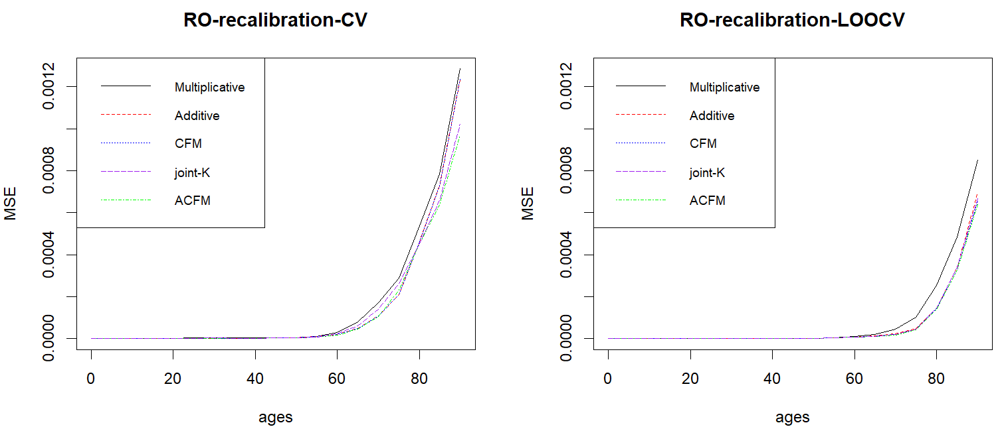
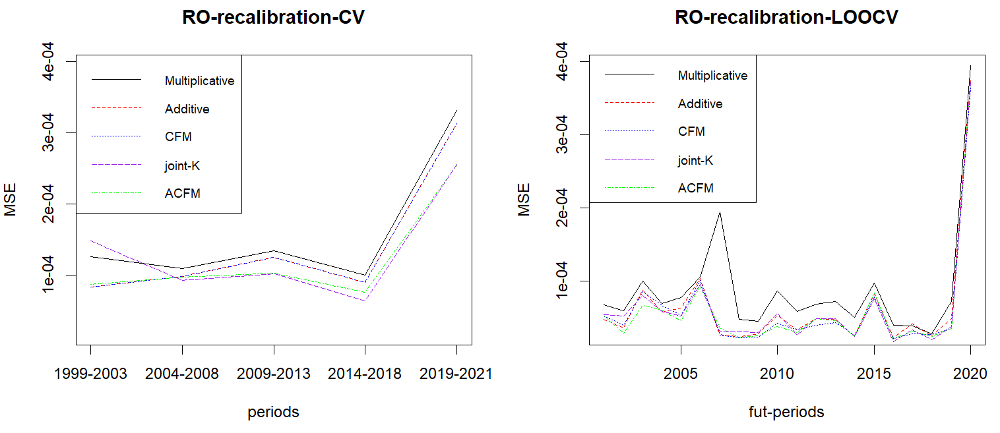
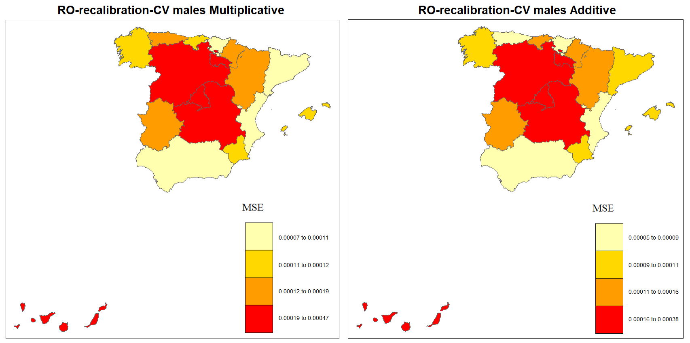

::::: article
## Introduction {#sec:intro}

\
Currently, the loss of clear and defined borders between
states/countries is leading populations worldwide to experience a
similar dynamic of mortality. Indeed, mortality improvements or
reductions can rapidly spread to other countries, causing correlated
mortality dynamics, as observed with the COVID-19 pandemic. Thus,
multipopulation mortality models provide a valuable approach for
considering mortality membership in a group rather than individually (N.
Li and Lee 2005). These models enable the joint fitting of multiple
populations, regions in the same country, or both sexes simultaneously.

On the basis of the original Lee and Carter (1992) model, many
researchers have developed models to fit the mortality of related
populations or countries with similar socioeconomic statutes or even
both sexes in the same population (Brouhns, Denuit, and Vermunt 2002;
Debón, Montes, and Martı́nez-Ruiz 2011; Dowd et al. 2011; Jarner and
Kryger 2011; J. S.-H. Li and Hardy 2011; Russolillo, Giordano, and
Haberman 2011; Villegas and Haberman 2014; Danesi, Haberman, and
Millossovich 2015; Chen and Millossovich 2018; Bégin, Sanders, and Xu
2023). The application of these multipopulation mortality models is
relevant in diverse contexts, facilitating the concurrent modelling of
multiple populations. This is particularly true within the field of life
insurance, where companies operate worldwide and make assumptions about
future mortality trends. Therefore, using such models ensures the
consistency and reliability of the products across different countries.
Notably, in the European Union, where gender-neutral pricing is
enforced, it is necessary to model both sexes simultaneously (Ahmadi and
Li 2014). Moreover, multipopulation mortality models can include the
correlation structure among populations when projecting future trends
(Antonio et al. 2017; Bozikas and Pitselis 2020).

The rise of "big data" has shifted the focus of many problems, and its
methods have become a new field complementary to statistics. Within this
domain, "resampling methods" are fundamental tools; these techniques are
based on repeatedly drawing samples from a dataset and refitting models
to obtain additional information. Advances in computational power have
increased researchers' interest in these methods, which were developed
in 1990. The two most common types of "resampling methods" are bootstrap
and "cross-validation" (CV) methods (James, Witten, Hastie, and
Tibshirani 2013).

Bootstrap is a fundamental tool in the actuarial field that has had
multiple applications throughout the literature. This method has been
employed for various purposes, such as prediction errors in claim
insurance (England and Verrall 1999), establishing confidence bounds for
discounted reserves (Hoedemakers et al. 2003), and estimating confidence
intervals in mortality through different bootstrap versions (Brouhns,
Denuit, and Van Keilegom 2005; Koissi, Shapiro, and Högnäs 2006; Debón,
Montes, and Puig 2008; Liu and Braun 2010; D'Amato et al. 2012). The CV
method divides sample data into k folds, where $k-1$ subsets are
typically employed to train the model(s), and the remaining set is used
to test the forecasting accuracy (Hastie, Tibshirani, and Friedman
2009). The process is iterated k times. For time series data, preserving
the chronological order of the sets is necessary. This technique has
been employed in other fields, such as finance, biology, and marketing.
When applying CV methods to mortality modelling, these techniques must
be adapted to time series analysis to use all available data for both
testing and training (Tashman 2000; Bergmeir and Benı́tez 2012), which
are also known as time series CVs (Hastie, Tibshirani, and Friedman
2009). Specifically, in each iteration, the training set must consist of
observations that chronologically occurred before the test set
observations corresponding to the end of each series (Hyndman and
Athanasopoulos 2021). Furthermore, in our analysis, each observation
corresponds to a three-way array involving three categories: age, period
and region or country. As a result, these methods have been adapted to
assess the forecasting ability of multipopulation mortality models
appropriately.

In the context of mortality modelling it should be noted that only
recently researchers have applied CV techniques. However, most
applications have focused on single-population models, see, for
instance, Villegas et al. (2017; Hyndman et al. 2019; Atance, Debón, and
Navarro 2020; Kessy et al. 2022; SriDaran et al. 2022; Lindholm and
Palmborg 2022), and Barigou et al. (2023). To the best of our knowledge,
the existing literature on the use of resampling methods in mortality
modelling has focused on single-population mortality models, and among
these studies, only one SriDaran et al. (2022) introduced a CV function
designed for fitting, forecasting, and testing out-of-sample
age-specific probabilities of death, with the selection of the testing
period based on the mean squared error (MSE) measure.

This paper introduces the
[CvmortalityMult](https://cran.r-project.org/web/packages/CvmortalityMult/index.html)
*R* package, which allows us to fit and forecast five multipopulation
mortality models. Moreover, this package enables the application of CV
methods to select the "best" multipopulation mortality model in
forecasting among different scenarios. The idea is to determine which
model produces the best forecasting outcomes for the period and the
selected countries or regions. To achieve this goal, we implement
several CV techniques following the terminology established by Tashman
(2000) and Bergmeir and Benı́tez (2012) for evaluating time-series
forecasts. Additionally, we adapt the methodology proposed by Atance,
Debón, and Navarro (2020), which is primarily designed for
single-population mortality models, to evaluate the forecasting ability
of multipopulation mortality models over short, medium and long term
horizons. The package incorporates multiple CV techniques to facilitate
this evaluation.

Moreover, the package includes five variations of the classical Lee and
Carter (1992) model to fit and forecast mortality in regions/populations
that form part of a group rather than considering them individually.
First, Russolillo, Giordano, and Haberman (2011) proposed adding a new
multiplicative effect to represent different countries/regions within a
multiplicative mortality model. Second, Debón, Montes, and Martı́nez-Ruiz
(2011) integrated the region/country effect as an additive index through
an additive model. Third, Carter and Lee (1992) and N. Li and Lee (2005)
first modelled the entire group and then incorporated a specific term
for each region/country using the common-factor model. Fourth, Carter
and Lee (1992) and Wilmoth and Valkonen (2001) proposed the joint-K
model, which includes two specific country/region terms along with a
common trend. Finally, N. Li and Lee (2005) and Hyndman and Ullah (2007)
extended the common-factor model by incorporating two additional
region/country terms with the augmented common-factor model. These five
multipopulation mortality models were chosen because of their promising
results compared with those of other mortality models (Debón, Montes,
and Martı́nez-Ruiz 2011; Dong et al. 2020), and their frequent usage in
multipopulation modelling literature (Villegas et al. 2017). We
introduce into the
[CvmortalityMult](https://cran.r-project.org/web/packages/CvmortalityMult/index.html)
*R* package several functions that allow us to fit, forecast and
evaluate those five multipopulation mortality models. However, if the
functions detect only one population, they can fit the well-known Lee
and Carter (1992) model.

The paper is structured as follows. Section 2 focuses on describing
multipopulation mortality models. Section 3 discusses the CV methods in
multipopulation mortality models. Section 4 presents the
[CvmortalityMult](https://cran.r-project.org/web/packages/CvmortalityMult/index.html)
*R* package, installation and the main functions. Section 5 presents a
case study detailing the use of the package. Finally, Section 6 draws
conclusions from the results in the previous section.

## Models {#sec:models}

In this section, we introduce five of the most important multipopulation
mortality models, which serve as benchmarks to test the forecasting
accuracy using CV methods. Indeed, the
[CvmortalityMult](https://cran.r-project.org/web/packages/CvmortalityMult/index.html)
*R* package requires a set of crude age-specific probabilities of death
for age $x$, period $t$ and, in each region $i$, $\dot{q}_{x,t,i}$.
These crude rates are directly obtained as
$\dot{q}_{x,t,i}=d_{x,t,i}/E^{0}_{x,t,i}$, where $d_{x,t,i}$ represents
the number of recorded deaths and $E_{x,t,i}$ denotes the initial
population exposed to risk for an age $x$, period $t$ and, region $i$.
Crude mortality rates, along with other life table indicators, can be
obtained using the `LifeTable` function from the **MortalityLaws** *R*
package (Pascariu 2022). This set of crude probabilities is then used to
generate smoothed and forecasted estimates, $\hat{q}_{x,t,i}$, of the
true but unknown mortality probabilities $q_{x,t,i}$. Therefore, in the
context of multipopulation mortality data, "one observation ahead"
corresponds to a set of data containing the probabilities of death for
all ages and populations considered for the following year.

### Multiplicative mortality model

Russolillo, Giordano, and Haberman (2011) proposed incorporating a
multiplicative index term into the Lee and Carter (1992) model to shift
the mortality for each region in the population group. That is:
$$\textrm{logit}\left(q_{x,t,i} \right)=\textrm{log}\left(\frac{q_{x,t,i}}{1-q_{x,t,i}}\right)=a_x + b_x \cdot k_t \cdot I_i + \varepsilon_{x,t,i};
\label{EQ_ruso}   (\#eq:EQ-ruso)$$
where $a_x$ captures the general age shape of the mortality curve, $k_t$
describes the general trend of the group of populations over time, $b_x$
represents how each age-specific probability of death reacts to changes
in the general level of mortality, and $I_i$ represents a multiplicative
index associated with mortality for each member of the group of
populations considered. Both $a_x$ and $b_x$ are the common
age-dependent and time-independent parameters for all the regions
considered respectively, whereas $k_t$ is the same for all considered
regions and corresponds with the time-dependent parameter, as in the
initial version of Lee and Carter (1992), $I_i$ is a different index for
each population considered.

Notably, the logit link function is employed to fit the age-specific
probabilities of death. The logit transformation ensures that values of
$q_{x,t,i}$ between 0 and 1 (Lee 2000) are obtained. This transformation
also maintains the historical ties to the early actuarial work of Perks
(1932), as noted by Haberman and Renshaw (2011).

### Additive mortality model

Debón, Montes, and Martı́nez-Ruiz (2011) propose incorporating an
additive index term into the Lee-Carter structure to modify the
mortality of each region in the multipopulation model. Its expression is
as follows:
$$\textrm{logit}\left(q_{x,t,i} \right)=\textrm{log}\left(\frac{q_{x,t,i}}{1-q_{x,t,i}}\right)=a_x + b_x \cdot k_t + I_i + \varepsilon_{x,t,i}.
\label{EQ_addit}   (\#eq:EQ-addit)$$
As in the previous model, the same components $a_x$, $b_x$ and $k_t$ are
shared across all the studied regions (populations). This fact is a
necessary and sufficient condition to avoid divergence in the
forecasting of age-specific probabilities of death of subpopulations;
see Debón, Montes, and Martı́nez-Ruiz (2011) and Ahcan et al. (2014). The
number of parameters is the same as that in the model of Russolillo,
Giordano, and Haberman (2011), with similar interpretations except for
$I_i$; more details are given in Debón, Montes, and Martı́nez-Ruiz
(2011). However, the additive formulation provides a more
straightforward structure than the multiplicative formulation does
because it incorporates regional effects through an additive index term.

### Common-factor mortality model

Carter and Lee (1992) and N. Li and Lee (2005) proposed modelling the
mortality of different populations through a common long-term component
for the whole group combined with an age-dependent specific term for
each population $i$. This model is represented as:
$$\textrm{logit}\left(q_{x,t,i} \right)=\textrm{log}\left(\frac{q_{x,t,i}}{1-q_{x,t,i}}\right)=a_{x,i} + B_x \cdot K_t + \varepsilon_{x,t,i},
\label{EQ_CFM}   (\#eq:EQ-CFM)$$
where $a_{x,i}$ represents the baseline shape of the mortality curve for
each $i$th specific population, while the long-term change over time
across the whole mortality group is captured by $B_x \cdot K_t$. These
parameters serve the same function as $b_x$ and $k_t$ do in previous
mortality models but apply to the whole group of populations.

### Joint-k mortality model

Carter and Lee (1992) and Wilmoth and Valkonen (2001) introduced a model
that assumes two specific population age-dependent terms, and a common
trend among the group of populations, is given by:
$$\textrm{logit}\left(q_{x,t,i} \right)=\textrm{log}\left(\frac{q_{x,t,i}}{1-q_{x,t,i}}\right)=a_{x,i} + b_{x,i} \cdot k_{t} + \varepsilon_{x,t,i}.
\label{EQ_jointk}   (\#eq:EQ-jointk)$$
where $k_{t}$ represents a common mortality trend among the different
considered populations while $a_{x_{i}}$ and $b_{x_{i}}$ are specific
for each population $i$. Indeed, the $a_{x_{i}}$ parameter retains the
same meaning as in the common factor mortality model, and $b_{x_{i}}$
captures the effect of a time-varying mortality index $k_t$ at age $x$
for each population $i$.

### Augmented common-factor mortality model

N. Li and Lee (2005) and Hyndman, Booth, and Yasmeen (2013) introduced
two population-specific terms to the common factor model. This model is
expressed as:
$$\textrm{logit}\left(q_{x,t,i} \right)=\textrm{log}\left(\frac{q_{x,t,i}}{1-q_{x,t,i}}\right)=a_{x,i} + B_x \cdot K_t + b_{x,i} \cdot k_{t,i} + \varepsilon_{x,t,i}.
\label{EQ_ACFM}   (\#eq:EQ-ACFM)$$
The first three terms correspond to the components of the common-factor
mortality model \@ref(eq:EQ-CFM), whereas $b_{x_i} \cdot k_{t_i}$
captures deviations in the short to medium-term changes in the
age-specific probability of death for each population $i$ to the common
trend. Importantly, including the population-specific terms $b_{x_i}$
and $k_{t_i}$ may imply significant divergences in the mortality
forecasts across different populations. Our choice of capital letters in
Equations \@ref(eq:EQ-CFM) and \@ref(eq:EQ-ACFM) follows the notation
introduced by N. Li and Lee (2005), who use upper-case symbols to denote
the common (or "group-wide") Lee--Carter factor and lower-case symbols
for the population-specific effects.

All the models discussed are implemented using the software R Core Team
(2022) via the **gnm** library (Turner and Firth 2023). Details on the
calibration approach can be found in Debón, Montes, and Martı́nez-Ruiz
(2011). The parameters are obtained by maximizing the model's
log-likelihood, assuming a quasi-Binomial distribution of deaths in all
considered models:
$$L\left( q_{x,t,i}; \hat{q}_{x,t,i}\right) = \sum_{x} \sum_{t} \sum_{i} w_{x,t,i} \left\lbrace q_{x,t,i} \cdot \log \left( \hat{q}_{x,t,i}\right) + \left(1 - q_{x,t,i}\right) \cdot \log\left(1-\hat{q}_{x,t,i}\right) + \textrm{cte} \right\rbrace,$$
where $w_{x,t,i}$ corresponds to weights assigned to each age, period,
and population considered, $\hat{q}_{x,t,i}$ is derived by rearranging
the terms in Equation \@ref(eq:EQ-ruso):
$$\hat{q}_{x,t,i} = \frac{e^{a_x + b_x \cdot k_t \cdot I_i}}{1+e^{a_x + b_x \cdot k_t \cdot I_i}},$$
in the case of the multiplicative model. For the other models, the
corresponding inverse transformations apply for \@ref(eq:EQ-addit) --
\@ref(eq:EQ-ACFM). We maximize the log-likelihood function because it is
an effective estimation method in the actuarial and demography
literature for the parameter estimation process (Brouhns, Denuit, and
Vermunt 2002; Renshaw and Haberman 2006; A. J. Cairns et al. 2009).

### Forecasting multipopulation mortality models

To project the age-specific probabilities of death, $q_{x,t,i}$, it is
essential to forecast the value of the trend parameters $k_{t_{n}}$,
$k_{t_{n},i}$, and $K_{t_n}$ for all the multipopulation mortality
models. These models are formulated as follows:
$$\begin{split}
\textrm{Multiplicative} & \rightarrow \textrm{logit} \left(q_{x,t_n + s,i} \right) = a_x + b_x \cdot k_{t_n + s} \cdot I_i,\\
\textrm{Additive} & \rightarrow \textrm{logit} \left(q_{x,t_n + s,i} \right) = a_x + b_x \cdot k_{t_n + s} + I_i,\\
\textrm{Common-factor} & \rightarrow \textrm{logit} \left(q_{x,t_n + s,i} \right) = a_{x,i} + B_x \cdot K_{t_n + s},\\
\textrm{Joint-k} & \rightarrow \textrm{logit} \left(q_{x,t_n + s,i} \right) = a_{x,i} + b_{x,i} \cdot k_{t_n + s},\\
\textrm{Augmented common-factor} & \rightarrow \textrm{logit} \left(q_{x,t_n + s,i} \right) = a_{x,i} + B_x \cdot K_{t_n + s} + b_{x,i} \cdot k_{t_{\left({n} + s\right)},i},\\
\end{split}$$
where $q_{x,t_n + s,i}$ corresponds to the forecasted age-specific
probability of death for age $x$, period $t_{n} + s$ and population $i$,
and $k_{t_n + s}$, $k_{t_{\left({n} + s\right)},i}$, $K_{t_n + s}$ are
the projections of the trend parameters $k_{t_{n}}$, $k_{t_{n},i}$, and
$K_{t_n}$ considering that $t_n$ is the last in-sample period.

In the
[CvmortalityMult](https://cran.r-project.org/web/packages/CvmortalityMult/index.html)
*R* package, three alternative approaches are considered to project the
time series $k_t$, $K_{t}$ and $k_{t_i}$, assuming they follow ARIMA
(autoregressive integrated moving average model) independent processes.
First, a random walk with drift (ARIMA (0,1,0) with drift) is assumed,
which is a common assumption in the actuarial literature (A. Cairns,
Blake, and Dowd 2006; Haberman and Renshaw 2011; Villegas, Kaishev, and
Millossovich 2018). Second, the
[CvmortalityMult](https://cran.r-project.org/web/packages/CvmortalityMult/index.html)
*R* package allows the user to assume the best ARIMA (p,d,q) model
according to the `auto.arima` function in the **forecast** R- package
(Hyndman and Khandakar 2008; Hyndman et al. 2023) for each trend
parameter $k_t$, $K_{t}$ and/or $k_{t_i}$, as described by Debón,
Montes, and Puig (2008), Villegas, Kaishev, and Millossovich (2018) and
Hunt and Blake (2020). The `auto.arima` function determines the best
ARIMA (p,d,q) model on the basis of the outcomes according to the
corrected Akaike information criterion (AICc). Third, users can specify
the (p, d, q) order for each ARIMA model by setting the corresponding
parameters. Across the three approaches, the user can decide whether to
include different ARIMA configurations by changing the arguments in the
`auto.arima` or `Arima` functions as in the **forecast** *R* package.

## Cross-validation methods {#sCV}

CV is a tool that focuses on assessing the predictive power of models.
Identifying the best model benefits insurance companies in actuarial and
financial applications, such as pricing and reserving, where forecasting
is arguably more relevant than explanation (SriDaran et al. 2022). Thus,
this methodology is valuable for identifying which model is the most
accurate forecaster for single-population mortality models (Atance,
Debón, and Navarro 2020) and can be used for a set of related
populations. This section describes the CV methods (Burman 1989;
Bergmeir and Benı́tez 2012) applied to evaluate the out-of-sample
accuracy of multipopulation models.

The performance of a model varies between in-sample and out-of-sample
evaluations (Bartolomei and Sweet 1989; Pant and Starbuck 1990).
Therefore, partitioning data into training and test sets is fundamental
for accurately assessing the forecasting ability of models. Various
possibilities exist for evaluating time series forecasts, also referred
to as the CV in time series (Hastie, Tibshirani, and Friedman 2009).
These methods differ on the basis of the forecast horizon and the method
of forecasting the out-of-sample validation, also known as "last block
evaluation" in individual time series analysis (Tashman 2000; Bergmeir
and Benı́tez 2012). Among the different available methods, we have
adapted several approaches in
[CvmortalityMult](https://cran.r-project.org/web/packages/CvmortalityMult/index.html)
*R* package to assess the forecasting ability of multipopulation
mortality models from different perspectives. Specifically, we follow
the terminology established by Tashman (2000) and Bergmeir and Benı́tez
(2012) to evaluate time series forecasting but adapt it for
multipopulation mortality models.

### Fixed-origin evaluation

Fixed-origin evaluation, also known as the out-of-sample test or
hold-out method (Lachenbruch and Mickey 1968; Tashman 2000), is one of
the most commonly used methods for assessing the forecasting accuracy of
mortality models (Ahcan et al. 2014; Atance, Balbás, and Navarro 2020).
In this approach, adapted for time series analysis, the dataset is
chronologically divided only once into training and test sets. The model
is fitted using the training set, with its final point as the fixed
origin for forecasting, as shown [1](#fig1){reference-type="ref"
reference="fig1"} for a three-way array that incorporates three
dimensions: ages in rows, periods in columns, and regions in the third
dimension. This fixed-origin method generates a single forecast to
predict all or specific periods in the test set. The forecasting
accuracy is then evaluated for different forecast horizons.

This CV approach has also been employed for assessing the forecasting
ability of multipopulation mortality models; see, for instance, Danesi,
Haberman, and Millossovich (2015), Antonio et al. (2017) and Bozikas and
Pitselis (2020).

{#fig1 width="100%"
alt="graphic without alt text"}

### Rolling-origin-recalibration evaluation

In rolling-origin-recalibration (RO-recalibration) evaluation for time
series, we initiate the procedure by partitioning the sample into "k"
subsets of data, while maintaining the chronological order. The first
subset corresponds to the training set, and forecasts are generated with
a fixed horizon to assess the model's performance. In each iteration,
the model is recalibrated by incorporating all preceding information in
the training set (Armstrong and Grohman 1972; Tashman 2000; Bergmeir and
Benı́tez 2012; Hyndman and Athanasopoulos 2021). The test set periods are
sequentially added to the training set to forecast the next set of
periods, as shown in [2](#fig2){reference-type="ref" reference="fig2"}.
Consequently, the beginning of the evaluation shifts forward at each
iteration. The model's accuracy is assessed using the average
forecasting performance across the $k$ iterations:
$$\textrm{RO-recalibration}_k = \frac{1}{k}\sum^k_{i=1} \textrm{Goodness of fit measure}_i.
\label{Eq.KFold}   (\#eq:Eq-KFold)$$
In this type of time series CV, the specific variant of rolling-origin
(RO) recalibration applied depends on the size of the initial training
set and the forecast horizon of each test set. For instance, k-fold CV
(Hastie, Tibshirani, and Friedman 2009; James, Witten, Hastie,
Tibshirani, and others 2013; Bergmeir, Hyndman, and Koo 2018) requires
the training set size and forecast horizon for each test set to be
equal. Notably, to our knowledge, the application of the k-fold CV for
analysing the forecasting proficiency of multipopulation mortality
models has yet to be documented. We recommend that the initial training
set contain more periods than the forecast horizon does to ensure
reliable results. If the training and test set sizes differ, the common
version RO-recalibration should be applied.

Notably, the "leave-one-out CV" (LOOCV) (Burman 1989; Shao 1993) is a
special case of RO-recalibration, where the forecast horizon is equal to
one, regardless of the initial training set size. Unlike approaches that
generate two subsets of comparable size, LOOCV is a distinct approach
that involves selecting and forecasting a single observation as the test
set, whereas the preceding available observations constitute the
training set. To implement this approach, the procedure is repeated (n -
`trainset1`) times, where $n$ denotes the total number of observations
in the dataset and (`trainset1`) is the size of the initial training
set.

Among the different resampling methods, this technique is widely
acknowledged for assessing the predictive performance of single
mortality models, as evidenced in various studies, such as those in H.
Li and O'Hare (2019), Atance, Debón, and Navarro (2020), Barigou et al.
(2023), and Atance and Navarro (2024). Additionally, only one
preliminary work Atance and Debón (2022) applied RO-recalibration LOOCV,
i.e., the prediction of multipopulation mortality models moving forward
by one year for each iteration.

{#fig2 width="100%"
alt="graphic without alt text"}

### Rolling-window evaluation

"Rolling-window evaluation" is similar to RO-recalibration but maintains
a constant training set size across each forecast iteration (Armstrong
and Grohman 1972; Tashman 2000). It is also referred to as "time series
CV" (TSCV) (Hart 1994; Bergmeir and Benı́tez 2012), "fixed-size
rolling-window" (Swanson and White 1997), or "fixed-size rolling sample"
(Callen et al. 1996). Data are partitioned into training and test sets
as in previous techniques. In each iteration, the training set
incorporates the forecasted periods from the test set while discarding
the earliest observations and preserving chronological order, as shown
in [3](#fig3){reference-type="ref" reference="fig3"}. The model and the
forecast origin are also recalibrated at each window/iteration. The
forecasting accuracy of the model is assessed using the same procedure
as that in RO-recalibration, as expressed in Eq. (\@ref(eq:Eq-KFold)).

Similar to the RO-recalibration technique, there are different variants
of rolling-window evaluation. Indeed, the common CV, k-fold CV and LOOCV
approaches are also variants. However, in these approaches, the training
set size is constant throughout the iterations.

{#fig3 width="100%"
alt="graphic without alt text"}

To our knowledge, the
[CvmortalityMult](https://cran.r-project.org/web/packages/CvmortalityMult/index.html)
*R* package provides the first function for analysing the forecasting
ability of multipopulation mortality models using CV techniques.
Notably, RO recalibration and rolling-window evaluation have not
previously been implemented in any *R* package for assessing the
forecasting accuracy of multipopulation mortality models. The
[CvmortalityMult](https://cran.r-project.org/web/packages/CvmortalityMult/index.html)
*R* package addresses this gap by enabling the application of various
time series CV methods.

## The CvmortalityMult R-package {#sec:description of CvmortalityMult}

Table [1](#tab:T1){reference-type="ref" reference="T_functions"}
introduces the main functions incorporated in the
[CvmortalityMult](https://cran.r-project.org/web/packages/CvmortalityMult/index.html)
*R* package, along with a brief description of every function.
Furthermore, these functions have been categorized into four groups:
fitting, forecasting, plotting, and CV. In the following sections, we
explain with several examples the procedural details and parameter
structure essential for using the primary functions of the package.

Initially, the procedure involves the use of five mortality
multipopulation functions to calibrate age-specific probabilities of
death across various regions (populations). Notably, the
[CvmortalityMult](https://cran.r-project.org/web/packages/CvmortalityMult/index.html)
*R* package allows for the fitting of a single-mortality model when the
user provides data for only one population.

During the forecasting stage, the package subsequently facilitates
age-specific probabilities of death projections under various
$ARIMA (p,d,q)$ specifications, employing the object obtained in the
preceding step. During the plotting stage, users have the opportunity to
visualize the parameters obtained in the initial fitting stage,
forecasts of the age-specific probability of death, and displays
specific values across the Spanish regions in a geographical map. This
procedure allows for a comprehensive understanding of the behaviour
exhibited by each population under consideration.

Finally, during the CV stage, we introduce the function for applying
different resampling methods to assess the forecasting accuracy of
multipopulation mortality models. This function enables the modification
of the fitting and forecasting periods, uses the functions of the
preceding steps, and allows for the evaluation of the model forecasting
performance using various goodness-of-fit measures. Notably, the
structure of the multipopulation mortality data was aligned with a
three-way array (age $\times$ time $\times$ region/population). For each
probability of death, data are available for different ages, periods and
regions/populations. Consequently, the applications of CV techniques
need to be adapted to evaluate the projecting ability of these models
effectively.

Notably, this paper does not include an example of every function
argument. However, the reader is referred to the function documentation
and the package vignette for a complete description of the
[CvmortalityMult](https://cran.r-project.org/web/packages/CvmortalityMult/index.html)
*R* package.

::: {#T_functions}
  ----------------------------------------------------------------------------------------------------------------------------------
                         Function name               Brief description
  ---------------------- --------------------------- -------------------------------------------------------------------------------
  Fitting                `fitLCmulti()`              Fitting the multiplicative, additive,

                                                     common-factor, joint-k or

                                                     augmented common-factor multipopulation

                                                     mortality models, and the single version

                                                     of the Lee-Carter model.

  Forecasting            `forecast.fitLCmulti()`     Forecasting the multiplicative, additive,

                         or S3 method `forecast()`   common-factor, joint-k or

                                                     augmented common-factor multipopulation

                                                     mortality models, and the single version

                                                     of the Lee-Carter model.

  Plotting               `plot.fitLCmulti()`         Plot the parameters for

                         the S3 method `plot()`      the multipopulation or single-population

                                                     mortality models.

                         `plot.forLCmulti()`         Plot the forecasting parameters for

                         the S3 method `plot()`      the multipopulation or single-population

                                                     mortality models.

                         `SpainMap()`                Plot the regions of

                                                     Spain with the percentiles of the

                                                     variable chosen by the users.

  CV                     `multipopulation_cv()`      CV techniques using the

                                                     methods described in Section [3](#sCV){reference-type="ref" reference="sCV"}.

  Measures of accuracy   `MeasureAccuracy()`         Measure for testing the accuracy

                                                     of the single-population or multipopulation

                                                     mortality models.
  ----------------------------------------------------------------------------------------------------------------------------------

  : (#tab:T1) Summary of the main functions in the
  [CvmortalityMult](https://cran.r-project.org/web/packages/CvmortalityMult/index.html)
  *R* package.
:::

Two datasets are included in the package: `SpainRegions` and `SpainNat`.
These datasets originate from the Spanish National Institute (Instituto
Nacional de Estadística, INE). Life tables and abridged lifetables were
obtained with the methodology proposed by Muriel, Cantalapiedra, and
López (2010) on the basis of the work in Elandt-Johnson and Johnson
(1980). On the one hand, the `SpainRegions` dataset comprises 10800
observations, encompassing 20 age groups, 30 periods (1990 - 2020), and
18 regions for both males and females in Spain, including national data
(the regions in Spain are referred to as autonomous communities). On the
other hand, the `SpainNat` dataset contains 600 observations,
corresponding to national data for males and females in Spain covering
20 age groups, 30 periods (this dataset was created for the application
of a single-population mortality model, and it can be obtained as a
subgroup of the `SpainRegions` database). These datasets are structured
as a data frame and include the following variables:

- `ccaa`: A vector of the 17 different regions of Spain, including
  national data. Figure [4](#Spainmap){reference-type="ref"
  reference="Spainmap"} shows the identification of each region on the
  Spanish map.

- `years`: A vector of the period range, spanning from 1990 - 2020 for
  both datasets.

- `ages`: A vector of the age groups (children under 1 year, between 1
  year and 5 years, and then by groups of 5 years, with the last group
  being between 90 and 94 years).

- `qx_male`: A vector of the age-specific probabilities of death for the
  male population.

- `qx_female`: A vector of the age-specific probabilities of death for
  the female population.

- `lx_male`: A vector of the estimated number of individual males living
  in each age group during each period in a specific region/population,
  based on an initial group of $l_{0}=100,000$ individuals aged 0
  (Pitacco et al. 2009).

- `lx_female`: A vector of the estimated number of individual females
  alive in each age group during each period in a specific
  region/population.

- `series`: The sex included in both datasets "male and female
  population".

- `label`: A tag indicating the dataset type, either "Spain regions" or
  "Spain National population".

{#fig4 width="100%"
alt="graphic without alt text"}

Furthermore, we have included the dataset `regions`, which contains the
geographical values of the Spanish regions. The `SpainMap` function
facilitates the creation of a map displaying the Spanish regions along
with the variables incorporated in this dataset.

## Application of the CvmortalityMult R- package {#sec:application}

### Fitting {#sec:fitting}

Model fitting of the age-specific probabilities of death, $q_{x,t,i}$
(at age $x$, period $t$, and $i$ region/population), under a
quasi-Binomial distribution of deaths and a logit link is performed
using the **gnm** package developed by Turner and Firth (2023).

The proposed multipopulation mortality models present challenges related
to parameter identifiability. The parameter solution for the considered
multipopulation mortality models
$\left(a_{x}, a_{x_{i}}, b_{x}, B_{x}, b_{x_{i}}, k_{t}, K_{t}, k_{t_{i}}, I_{i}\right)$
are not unique, as any transformation of these parameters that preserves
the model structure is also a solution, highlighting inherent
identifiability problems in mortality models (Enchev, Kleinow, and
Cairns 2017; Villegas, Kaishev, and Millossovich 2018). This
identifiability problem is addressed as follows: by setting
$k_{t_0} = 0$, $b_0 = 1$ and $I_1 = 1$ for the multiplicative model; by
setting $k_{t_0} = 0$, $b_0 = 1$ and $I_1 = 0$ for the additive model
(Debón, Montes, and Martı́nez-Ruiz 2011), by setting $B_{0}=1$, and
$K_{t_0}=0$ for the common-factor model (Carter and Lee 1992), by
setting $b_{0,1}=1$, and $k_{t_0} = 0$ for the joint-K model (Carter and
Lee 1992), and by setting $B_{0}=1$, $b_{0,1}=1$, $K_{t_0}=0$, and
$k_{t_{0,1}}=0$ for the augmented-common-factor model (N. Li and Lee
2005).

The `fitLCmulti()` facilitates the fitting of multipopulation mortality
models, including the multiplicative model (Russolillo, Giordano, and
Haberman 2011), additive model (Debón, Montes, and Martı́nez-Ruiz 2011),
common-factor model (CFM) (Carter and Lee 1992), joint-K model (Carter
and Lee 1992) and augmented common-factor model (ACFM) (N. Li and Lee
2005). It also supports fitting a single version of the Lee-Carter model
(Lee and Carter 1992) in the
[CvmortalityMult](https://cran.r-project.org/web/packages/CvmortalityMult/index.html)
*R* package. The synopsis of this function is outlined below:

``` r
fitLCmulti(model, qxt, periods, ages, nPop, lxt = NULL)
```

The fitting function requires the following information as input:

- The `model` refers to the multipopulation mortality model chosen to
  fit the mortality rates. The available options include
  `c(’additive’, ’multiplicative’, ’CFM’, ’joint-K’, ’ACFM’)`. Users
  must select one model to fit.

- `qxt` is a vector or matrix containing the crude age-specific
  probabilities of death for every age, period, and region. The function
  automatically identifies the data structure (vector or matrix) that
  users provide.

- `lxt` is a vector or matrix with the estimated number of individual
  males alive in each age group during each period in a specific region.
  The function automatically identifies the data structure (vector or
  matrix) that users provide. If this argument is not included (`NULL`),
  the function internally estimates this value to obtain the parameters
  for fitting the multipopulation mortality model.

- The `periods`, and `ages` vectors reflect the period range and age
  range, respectively, from the dataset.

- `nPop` is a numeric value that indicates the number of
  populations/regions considered in the dataset.

Importantly, for the effective utilization of the fitting functions, the
array or matrix containing the `qxt` and `lxt` (if it is included)
should be organized chronologically with the primary or general
population placed first. This fact is essential for the ACFM, which
needs to fit first the mortality of the whole group. In the dataset
labelled `SpainRegions`, the principal population pertains to the
mortality data encompassing the entire nation of Spain and is positioned
as the first entry in the dataset.

We demonstrate the application of this function by fitting the additive
and multiplicative multipopulation mortality models to the
`SpainRegions` dataset for both male and female cases. However, the
other multipopulation mortality models can be applied only by modifying
the `model` input. Indeed, in the explanation of the function
`fitLCmulti()` in the
[CvmortalityMult](https://cran.r-project.org/web/packages/CvmortalityMult/index.html)
*R* package, users can find examples of how other multipopulation
mortality models (common-factor, joint-k and augmented common-factor)
are fitted and forecasted for male Spain regions. Additionally, we
generate a vector containing the lower age in each age group considered
in the paper.

``` r
> SpainRegions
Mortality Data
Spain Regions for males and females
Years 1991 : 2020
Abridged Ages 0 : 90
> ages <- c(0, 1, 5, 10, 15, 20, 25, 30, 35, 40,
+          45, 50, 55, 60, 65, 70, 75, 80, 85, 90)
```

In fact, multiplicative and additive multipopulation mortality models
can be fitted using the following code:

``` r
> additive_Spainmales <- fitLCmulti(model= 'additive', qxt = SpainRegions$qx_male,
+	periods = c(1991:2020), ages = c(ages), nPop = 18, lxt = SpainRegions$lx_male)
> additive_Spainfemales <- fitLCmulti(model= 'additive', qxt = SpainRegions$qx_female,
+	periods = c(1991:2020), ages = c(ages), nPop = 18, lxt = SpainRegions$lx_female)
> multi_Spainmales <- fitLCmulti(model= 'multiplicative', qxt = SpainRegions$qx_male,
+	periods = c(1991:2020), ages = c(ages), nPop = 18, lxt = SpainRegions$lx_male)
> multi_Spainfemales <- fitLCmulti(model = 'multiplicative', qxt = SpainRegions$qx_female,
+	periods = c(1991:2020), ages = c(ages), nPop = 18, lxt = SpainRegions$lx_female)
```

The output from the fitting functions is an object of the class
`fitLCmulti`, which provides a brief summary of the fitting process,
including among other things, the following information:

- `ax`, `bx`, `kt`, and `Ii` are the estimated parameters for the
  multipopulation mortality models.

- `formula`, and `model` refer to the gnm formula and the fitted
  multipopulation mortality model, respectively.

- `data.used` includes mortality rates to fit the mortality data.

- `qxt.crude` refers to the crude values of the probabilities of death
  for every age, period, and region. These values are provided by the
  user for fitting the selected mortality model.

- `qxt.fitted`, and `logit.qxt.fitted` are the fitted values of the
  probabilities of death for every age, period, and region using the
  multipopulation mortality model on a probability or logit scale
  $\left(\frac{q_{x,t}}{1-q_{x,t}} \right)$.

Once we have adjusted the crude age-specific probabilities of death for
different groups of ages, periods, and regions, the `plot.fitLCmulti()`
function allows us to show the parameters obtained.
Figures [5](#MultipliParam){reference-type="ref"
reference="MultipliParam"} and [6](#AdditiveParam){reference-type="ref"
reference="AdditiveParam"} provide the fitted parameters of the additive
and multiplicative multipopulation mortality models, respectively, for
male populations in Spain. The plots are generated using the following
code:

``` r
> plot(additive_Spainmales)
> plot(multiplicative_Spainmales)
```

Notably, the `plot.fitLCmulti()` function generates different plots
depending on the selected model. For example, if the augmented
common-factor model is chosen by setting `model = ’ACFM’`, the plot
function will display the estimated parameters, $a_{x_i}$, $B_x$, $K_t$,
$b_{x_i}$, and $k_{t_i}$, for the provided populations.

Our example is the dataset of Spanish regions. We have included the
`SpainMap` function in the package. This function facilitates the
plotting of the $I_i$ parameters of the regions of Spain in
Figure [7](#Iiparams){reference-type="ref" reference="Iiparams"}. We
recommend reviewing the `regions` dataset to identify the order of the
regions before using the `SpainMap` function. In the context of
multipopulation mortality models, the multiplicative and additive
indices for the regions of Spain (with the reminder that the first
population is the national dataset and will not be shown) can be
obtained with the following code:

``` r
> SpainMap(multiplicative_Spainmales$Ii[2:18],
+	main = c("Multiplicative for males"),
+	name = c("Ii"))
> SpainMap(regionvalue = additive_Spainmales$Ii[2:18],
+	main = c("Additive for males"),
+	name = c("Ii"), bigred = FALSE)
```

{#MultipliParam width="100%"
alt="graphic without alt text"}

Additionally, the fitting function applies to a single population.
Specifically, we design this function to fit cases where mortality data
are provided for only one population, and the Lee-Carter mortality model
for a single population is fitted. Users can implement this by using the
following *R* code:

``` r
> LC_SpainNatmales <- fitLCmulti(model = 'additive', qxt = SpainNat$qx_male,
+	periods = c(1991:2020), ages = c(ages), nPop = 1, lxt = SpainNat$lx_male)
> LC_SpainNatfemales <- fitLCmulti(model = 'multiplicative', qxt = SpainNat$qx_female,
+	periods = c(1991:2020), ages = c(ages), nPop = 1, lxt = SpainNat$lx_female)
```

We use two of the five multipopulation models to demonstrate the
operation of the function for one-single population independently of the
model provided. However, there is no need to specify this argument in
the `fitLCmulti` function, as it inherently fits the Lee-Carter version
for a single population.

Similarly, the parameters of the Lee-Carter model for single-population
mortality can be plotted using the `plot.fitLCmulti()` function.
Therefore, Figure [8](#LCParam){reference-type="ref"
reference="LCParam"} can be obtained using the following code:

``` r
plot(LC_SpainNatmales)
```

{#AdditiveParam width="100%"
alt="graphic without alt text"}

{#Iiparams width="100%"
alt="graphic without alt text"}

{#LCParam width="100%"
alt="graphic without alt text"}

From Figures [5](#MultipliParam){reference-type="ref"
reference="MultipliParam"}-[8](#LCParam){reference-type="ref"
reference="LCParam"}, several interesting results emerge:

- All the left panels, $a_x$, correspond to the average behaviour of
  age-specific probabilities of death across all studied periods and
  regions.

- The second panels, $b_x$, demonstrate how age-specific probabilities
  of death for each age group (considering all regions) respond to
  changes in mortality trend, as captured by $k_t$. Large values of
  $b_x$ are observed among Spanish males between 20 and 40 years of age;
  therefore, there is a substantial reduction in the age-specific
  probabilities of death in this age group (1991 - 2020). This
  phenomenon is attributed to the impact of AIDS and drugs on Spanish
  males during the 1980s and 1990s, which led to an initial increase in
  age-specific probabilities of death and total deaths in these age
  groups, followed by a significant decline in age-specific
  probabilities of death due to the introduction of new therapies and
  medications during the 1990s and 2000s (Felipe, Guillén, and
  Perez-Marin 2002; Debón et al. 2008; Atance, Balbás, and Navarro
  2020), as can be observed in $b_{x}$ for the additive and
  multiplicative models.

- The third panels reveal the impact of the COVID-19 pandemic on the
  trend parameter $k_t$ for all considered models among males in Spain.
  Similar trends can be observed for females, although these trends are
  not shown. However, they can be generated by modifying the fitting
  object in the plot function. The incorporation of 2020 into the model
  fitting process induces an upturn in age-specific probabilities of
  death in the final observed period, disrupting the declining trend
  observed in the preceding years (1990 - 2019).

- Finally, the right panels, $I_i$, in the multipopulation approach
  depict the geographical distribution of the indices corresponding to
  each region. These panels allow us to discern distinct regional
  behaviours on the basis of the chosen multipopulation approach. To
  complement this presentation, we have included
  Figure [7](#Iiparams){reference-type="ref" reference="Iiparams"},
  which displays the values of $I_i$ for Spanish males in each region
  using the additive and multiplicative models with the regions with the
  highest mortality highlighted in red. Notably, the parameter $I_i$
  leads to a different interpretation in each model. In the
  multiplicative model, higher values indicate lower age-specific
  probabilities of death as the region value is multiplied by the trend
  parameter. Therefore, with a decreasing trend parameter, as observed
  in the case of Spain, higher values of $I_i$ correspond to lower
  age-specific probabilities of death. Conversely, the additive model
  incorporates the region index to the general trend among the regions
  ($a_x + b_x \cdot k_t$). Consequently, lower values or the most
  negative index regions present lower age-specific probabilities of
  death.

### Forecasting

The
[CvmortalityMult](https://cran.r-project.org/web/packages/CvmortalityMult/index.html)
*R* package enables the projection of future age-specific probabilities
of death using the ARIMA (p,d,q) processes. This projection applies to
the trend parameters, $k_t$, $K_t$, and $k_{t,i}$ in multipopulation
mortality models. Two common assumptions for the trend parameters $k_t$,
$K_t$, and $k_{t,i}$ in the actuarial and demography literature are
often considered: first, a multivariate random walk with drift
(ARIMA(0,1,0)) (A. Cairns, Blake, and Dowd 2006; A. J. Cairns et al.
2009; Haberman and Renshaw 2011; Villegas et al. 2017), and second, the
selection of the best ARIMA (p,d,q) process (Renshaw and Haberman 2006;
Debón, Montes, and Puig 2008; Villegas et al. 2017; Atance, Balbás, and
Navarro 2020) for estimating the future values of $k_t$, $K_t$, and
$k_{t_i}$. To estimate the future values of the trend parameters $k_t$,
$K_t$, and $k_{t_i}$, we employ the `forecast` function from the
**forecast** *R* package (Hyndman and Khandakar 2008), allowing the
projection of the future values for various types of ARIMA processes
considered in our package. In the
[CvmortalityMult](https://cran.r-project.org/web/packages/CvmortalityMult/index.html)
*R* package, users can choose different ARIMA processes,
`ktmethod=c(’arima010’,’arimapdq’, ’arimauser’)`. The selection process
is applied for single or all trend parameters considered in each
multipopulation or single-population mortality model. The ellipsis
argument (`...`) provides users with the flexibility to include
different ARIMA configurations, changing the arguments in the
`auto.arima` or `Arima` functions, depending on the `ktmethod` provided.
This functionality mirrors the behavior of the **forecast** *R* package
for time series (Hyndman and Khandakar 2008). Additionally, users must
provide `nahead`, indicating the number of periods to forecast the
future value of age-specific probabilities of death for each considered
region. For example, the code below provides future age-specific
probabilities of death for Spanish male and female regions for the next
ten years (`nahead = 10`), using different ARIMA options in the package:

``` r
> fut_additive_Spainmales <- forecast(object = additive_Spainmales,
+	nahead = 10, ktmethod = 'arimapdq')
> fut_multiplicative_Spainmales <- forecast(object = multiplicative_Spainmales,
+	nahead = 10, ktmethod = 'arima010')
> fut_additive_Spainfemales <- forecast(object = additive_Spainfemales,
+	nahead = 10, ktmethod = 'arimapdq')
> fut_multiplicative_Spainfemales <- forecast(object = multiplicative_Spainfemales,
+	nahead = 10, ktmethod = 'arima010')
```

The outputs from these forecast functions are objects of the class
`forLCmulti`, which provides a brief summary of the forecasting process,
with the following information:

- `ax`, `bx`, `kt`, and `Ii` provide the estimated parameters for the
  multipopulation mortality models.

- `arimakt` provides the ARIMA (p,d,q) process considered to adjust the
  time series $k_t$, $K_t$, or $k_{t_i}$ and the obtained coefficients.

- `kt.fut` provides the future values of $k_t$, $K_t$, or $k_{t,i}$
  using the selected ARIMA (p,d,q) configurations for the `nahead`
  periods.

- `kt.futintervals` provides estimates of the future values of $k_t$,
  $K_t$, or $k_{t,i}$ for the point forecast (`kt.fut`). Additionally,
  it includes the lower and upper 80% and 95% confidence intervals,
  utilizing the chosen ARIMA (p,d,q) process for the specified `nahead`
  periods.

- `formula` and `model` define the `gnm` formula and the forecasted
  multipopulation mortality model, respectively.

- `qxt.crude` represents the crude values of the probabilities of death
  for every age, period, and region. These values are provided by the
  user for fitting the selected mortality models.

- `qxt.future`, and `logit.qxt.future` represent the future values of
  the probabilities of death for every, age, period and region using the
  chosen multipopulation mortality model in the probability or logit
  scale.

Once we have projected the age-specific probabilities of death from
different ages, periods, and regions, the `plot.forLCmulti()` function
allows us to show the projected values of trend parameters $k_t$, $K_t$,
and $k_{t_i}$. The logit death probabilities for the mean in-sample age
and the out-of-sample forecast are shown for all the populations
considered. Figures [9](#ForecasMult){reference-type="ref"
reference="ForecasMult"} and [10](#ForecastAddi){reference-type="ref"
reference="ForecastAddi"} provide these interesting results for the
additive and multiplicative multipopulation mortality models,
respectively, for males in Spain. The visualizations are generated with
the following code:

``` r
> plot(fut_additive_Spainmales)
> plot(fut_multiplicative_Spainmales)
```

{#ForecasMult width="100%"
alt="graphic without alt text"}

{#ForecastAddi width="100%"
alt="graphic without alt text"}

Similarly, during the forecasting process, users can employ the same
function to project future values of age-specific probabilities of death
when providing data for a single population. Specifically, the function
forecasts age-specific probabilities of death using the Lee-Carter model
for a single population, as demonstrated below:

``` r
> fut_LC_Spainmales <- forecast(object = LC_SpainNatmales,
+	nahead = 10, ktmethod = 'arimapdq')
> fut_LC_Spainfemales <- forecast(object = LC_SpainNatfemales,
+	nahead = 10, ktmethod = 'arima010')
```

Equally, for the single-population mortality model, users can plot two
remarkable results. For example,
Figure [11](#ForecastLC){reference-type="ref" reference="ForecastLC"}
can be obtained using the following code:

``` r
> plot(fut_LC_Spainmales)
```

{#ForecastLC width="100%"
alt="graphic without alt text"}

### Cross-Validation

In this section, we present the CV function developed in the
[CvmortalityMult](https://cran.r-project.org/web/packages/CvmortalityMult/index.html)
*R* package to evaluate the forecasting ability of multipopulation
mortality models with different CV methods. Thus, the CV time series
function uses the next synopsis:

``` r
multipopulation_cv(qxt, model = c('multiplicative', 'additive', 'CFM', 'joint-K', 'ACFM'),
+	periods, ages, nPop, lxt = NULL,
+	nahead, trainset1, fixed_train_origin = TRUE,
+	ktmethod = c('arimapdq', 'arima010', 'arimauser'), order = NULL,
+	measures = c('SSE', 'MSE', 'MAE', 'MAPE', 'All'))
```

This CV function requires the following information as input:

- `qxt`, `lxt`, `periods`, `ages`, `nPop`, `ktmethod` and `order` should
  match the corresponding values used as in the fitting and forecasting
  functions for the multipopulation and single mortality models as
  inputs.

- `model = c(’multiplicative’, ’additive’, ’CFM’, ’joint-K’, ’ACFM’)`
  specifies the multipopulation mortality model that users wish to
  assess for forecasting ability using the specific resampling
  technique. Users can apply the multiplicative, additive,
  common-factor, joint-K, and augmented common-factor multipopulation
  models and the single version of the Lee-Carter model presented in
  this paper separately.

- `measures = c(’SSE’, ’MSE’, ’MAE’, ’MAPE’, ’All’)` denotes the
  adjustment measure that users wish to employ for testing the
  forecasting ability of the model using the specific resampling
  technique. If `measures = c(’All’)`, all the measures will be provided
  by the function. Additionally, each accuracy measure has a dedicated
  help function to clarify the underlying equations. Users can access
  this help function in the
  [CvmortalityMult](https://cran.r-project.org/web/packages/CvmortalityMult/index.html)
  *R* package using the following code: `?MeasureAccuracy`, where users
  can select the specific measure of accuracy for testing the
  age-specific mortality rates (SSE, MSE, MAE or MAPE).

- `trainset1` specifies the number of chronological periods to consider
  as the initial training set. This value must be greater than 2 to meet
  the minimum time series size (Hyndman and Khandakar 2008).
  Additionally, we recommend that this value be greater than `nahead` to
  maintain consistency among the forecasts in every iteration (Tashman
  2000).

- `nahead` is the number of periods to project ahead in each iteration
  and the size of each test set among the selected CV techniques.
  Moreover, it should be noted that the `multipopulation_cv()` function
  aims to maintain a uniform length for all the testing sets
  (iterations). However, the last test set may have fewer periods to
  align with the total number of periods provided by the user as
  (`periods`).

- `fixed_train_origin = c(TRUE, FALSE, ’add_remove1’)` is a logical
  variable that specifies whether the starting point of the initial
  training set remains fixed throughout the CV process. This option
  allows users to maintain a constant starting point where the model
  will be fitted in every iteration or allow it to shift, thereby
  determining whether a rolling window evaluation is applied. By
  default, the package sets `fixed_train_origin = TRUE`, meaning that
  the first period in the training set remains fixed across all
  iterations and the model recalibrations of the CV method. However,
  users can opt to allow the training set starting point to shift by
  setting `fixed_train_origin = FALSE` or
  `fixed_train_origin = ’add_remove1’`, thereby implementing a
  rolling-window evaluation while keeping the training set size constant
  in each iteration, defined by the user by `nahead` argument. When
  `fixed_train_origin = FALSE`, in every iteration, the user-defined
  `nahead` periods are removed from the beginning of the training set,
  while the next `nahead` periods are added to the training set from the
  previous test set. Consequently, the number of projected periods
  (`nahead`) also determines how many periods are added or deleted in
  every iteration. In contrast, when
  `fixed_train_origin = ’add_remove1’`, the training set size is also
  fixed across iterations. However, only one new period is added and one
  period is removed in each forecast. This process allows users to
  evaluate the forecasting accuracy of `nahead`-step-ahead projections
  using more test samples. Users may specify
  `fixed_train_origin = ’add_remove1’`, and any value of `nahead`
  greater than or equal to one, provided it is consistent with the
  number of periods available in the dataset. Notably, when
  `nahead = 1`, the configuration `fixed_train_origin = ’add_remove1’`
  yields results equivalent to those obtained using
  `fixed_train_origin = FALSE`, which means in a LOOCV method keeping
  the same size of the training set (`trainset1`) across iterations.

The sizes of `nahead` and `trainset1` can be determined by the temporal
correlation within the values of the analysed series by using "blocks"
of data rather than choosing data randomly (Racine 2000; Bergmeir and
Benı́tez 2012).

With this function, the user can apply different CV methods for
multipopulation models depending on three main inputs that must be
provided: `nahead`, `trainset1`, and `fixed_train_origin`. Indeed, the
following CV techniques can be applied:

1.  **Fixed-origin evaluation** is implemented by setting the arguments
    so that `nahead` + `trainset1` = `periods` while keeping the default
    value of `fixed_train_origin = TRUE`.

2.  **RO-recalibration evaluation** requires that `trainset1` \> 2 and
    that `fixed_train_origin = TRUE` remain at its default value,
    regardless of the value assigned to `nahead`. Specifically, when
    `nahead = 1`, leave-one-out CV (LOOCV) is applied. When
    `nahead = trainset1`, k-fold CV (CV) is performed. For all other
    values, a standard time series CV approach is used while keeping the
    origin of the first training set fixed in all possible options.

3.  **Rolling-window evaluation** requires setting
    `fixed_train_origin = FALSE` or
    `fixed_train_origin = ’add_remove1’`, independently of the values
    assigned to `nahead` and `trainset1`. As in the previous CV
    technique, if `nahead = 1`, a LOOCV approach with a rolling window
    of 1 is applied, which remains equivalent whether
    `fixed_train_origin` is set to `FALSE` or `’add_remove1’`. When
    `nahead > 1` and `fixed_train_origin = FALSE`, the training set is
    updated by incorporating and discarding `nahead` periods in each
    iteration. Conversely, when `fixed_train_origin = ’add_remove1’`,
    the training set updates by adding and removing only one observation
    per iteration while forecasting `nahead` periods.

We present the results for RO-recalibration using the standard CV
approach for male Spanish regions. The main input parameters are set as
follows: `trainset1 = 8`, `nahead = 5` and `fixed_train_origin = TRUE`
(default value). This procedure is applied to the five multipopulation
mortality models included in the package. To replicate these results,
the user can use the following code:

``` r
> SpainRegions
> ages <- c(0, 1, 5, 10, 15, 20, 25, 30, 35, 40,
+	45, 50, 55, 60, 65, 70, 75, 80, 85, 90)

> cv_SM_multi <- multipopulation_cv(qxt = SpainRegions$qx_male,
+	model = c('multiplicative'), #see options below
+	periods = c(1991:2020), ages = c(ages), nPop = 18, lxt = SpainRegions$lx_male,
+	trainset1 = 8, nahead = 5, ktmethod = c('arimapdq'), measures = c("MSE"))
```

While we executed to female Spanish regions an RO-recalibration was
performed using `trainset1 = 10`, `nahead = 1` and
`fixed_train_origin = TRUE` (default value). This configuration
corresponds to a LOOCV approach, which fixes the origin in the first
training, using the following code:

``` r
> loocv_SF_multi <- multipopulation_cv(qxt = SpainRegions$qx_female,
+	model = c('multiplicative'), #see options below
+	periods =  c(1991:2020), ages = c(ages), nPop = 18, lxt = SpainRegions$lx_female,
+	trainset1 = 10, nahead = 1, ktmethod = c('arimapdq'), measures = c("MSE"))
```

Available values for
`model = ’additive’, ’multiplicative’, ’CFM’, ’joint-K’`, and `’ACFM’`.
Changing the string assigned to `model` is sufficient to switch to the
corresponding specification. The output from the CV function is an
object of the `MultiCv` class, which provides a brief summary of the CV
method employed, including the following information:

- `ax`, `bx`, `Ii`, `kt.fitted`, `kt.future`, and `kt.arima` correspond
  to the same outputs as those in the adjustment and forecast functions.
  However, since the adjustment process has been repeated several times
  (depending on the process), each of these outputs is a list of the
  iterations executed, denoted as follows:
  `loop-h from period-1 to period-2`, where "h" denotes the
  corresponding iteration.

- `meas_ages`, `meas_periodsfut`, `meas_pop`, and `meas_total` represent
  the accuracy measures provided by the resampling technique, each
  emphasizing different aspects of the forecasting ability. Indeed, the
  objective of the
  [CvmortalityMult](https://cran.r-project.org/web/packages/CvmortalityMult/index.html)
  *R* package is to provide a tool for evaluating the forecasting
  accuracy of multipopulation models from various ages, namely, across
  different age groups, future periods, regions considered, or a global
  measure spanning all ages, future periods, and regions considered.
  This function allows users the flexibility to choose the specific
  viewpoint they wish to prioritize in the decision-making process
  regarding forecasting capabilities.

- `model`, and `CV_method` designate the multipopulation mortality model
  and the CV-method that users wish to apply for testing the forecasting
  ability, respectively. Users can apply both, the multiplicative and
  additive models presented in this paper separately.

Figures [12](#MSE_ages){reference-type="ref"
reference="MSE_ages"}-[13](#MSE_per){reference-type="ref"
reference="MSE_per"} present the results of the CV techniques for the
five multipopulation mortality models applied across ages, periods and
regions, respectively. Additionally, we have included Figures
[14](#MSE_block){reference-type="ref" reference="MSE_block"} and
[15](#MSE_loocv){reference-type="ref" reference="MSE_loocv"} with the
MSE measure throughout different regions of Spain only for the
multiplicative and additive multipopulation mortality models. The result
of the other models are available upon request to the authors and can be
found in the reproduction file. These plots can be reproduced using the
R script entitled `CvmortalityMult_reproduction.R`. From
Figures [13](#MSE_per){reference-type="ref"
reference="MSE_per"}-[15](#MSE_loocv){reference-type="ref"
reference="MSE_loocv"}, we note the following points:

- The ACFM and joint-K models present lower forecasting results when the
  MSE measure is used across the ages and future periods considered,
  using both CV time series techniques.

- The five considered models yield similar results for the age range 0 -
  60, whereas for the last section of the mortality curve (60 - 90), the
  ACFM and joint-K model perform better in terms of the forecasting
  results.

- Concerning the forecasting periods, the ACFM and joint-K models
  demonstrate better forecasting results in the medium term, as captured
  by RO-recalibration CV. However, while the five models exhibit
  comparable results when evaluating short-term forecasting ability,
  RO-recalibration LOOCV with the multiplicative model yields the worst
  result.

- The MSE measures for the different regions of Spain considered for
  each CV method are shown in Figures 
  [14](#MSE_block){reference-type="ref" reference="MSE_block"} and
  [15](#MSE_loocv){reference-type="ref" reference="MSE_loocv"}. The
  multipopulation mortality model produces different results depending
  on the region. Specifically, the multiplicative model yields the best
  forecasting results for Galicia, Pais Vasco, Cataluña, and Comunidad
  Valencia. In contrast, depending on the CV model and population
  considered, the additive model produces superior outcomes for Galicia,
  Asturias, Pais Vasco, Cataluña, Comunidad Valencia, and Andalucia.

Notably, the CV function allows the computation of global measures of
forecasting ability considering all ages, future periods, and regions,
as shown in Table [2](#tab:T2){reference-type="ref"
reference="T_GlobalMEAS"}. The results indicate that the ACFM and
joint-K model for standard CV, whereas the CFM and ACFM for LOOCV
demonstrate better forecasting ability when all available forecasting
information is used. This finding is consistent with the observations
mentioned above.

Therefore, the
[CvmortalityMult](https://cran.r-project.org/web/packages/CvmortalityMult/index.html)
*R* package displays the forecasting ability of the multipopulation
mortality models in various ways, allowing the user to determine the
most suitable model for their specific objectives. We present two
alternatives to assess the forecasting ability of the models but there
are other additional CV time series techniques that can be implemented
with the `multipopulation_cv()` function modifying `nahead`, `trainset1`
and `fixed_train_origin`.

::: {#T_GlobalMEAS}
+------------+------------------------------------------------------------+
| CV method  | Multipopulation mortality model                            |
+:===========+:===============+:=========+:=========+:=========+:=========+
| Common CV  | Multiplicative | Additive | CFM      | joint-K  | ACFM     |
| males      |                |          |          |          |          |
+------------+----------------+----------+----------+----------+----------+
| MSE        | 0.000160       | 0.000142 | 0.000142 | 0.000132 | 0.000124 |
+------------+----------------+----------+----------+----------+----------+
| LOOCV      | Multiplicative | Additive | CFM      | joint-K  | ACFM     |
| females    |                |          |          |          |          |
+------------+----------------+----------+----------+----------+----------+
| MSE        | 0.000089       | 0.000066 | 0.000061 | 0.000062 | 0.000059 |
+------------+----------------+----------+----------+----------+----------+

: (#tab:T2) Summary of the MSE global measure of forecasting
ability.
:::

<figure id="MSE_ages">

<p>multipopulation mortality models. <span id="MSE_ages"
data-label="MSE_ages"></span></p>
<figcaption>Figure 12: Plot visualizing the MSE over the group of ages
considered in regions of Spain for males and females, applying CV time
series techniques for five</figcaption>
</figure>

<figure id="MSE_per">

<p>multipopulation mortality models. <span id="MSE_per"
data-label="MSE_per"></span></p>
<figcaption>Figure 13: Plot visualizing the MSE over the test sets of
future periods considered in regions of Spain for males and females,
applying two CV time series techniques for five</figcaption>
</figure>

<figure id="MSE_block">

<p>multipopulation mortality models. <span id="MSE_block"
data-label="MSE_block"></span></p>
<figcaption>Figure 14: Plot visualizing the MSE in regions of Spain for
males, applying RO-recalibration CV for the multiplicative and
additive</figcaption>
</figure>

{#MSE_loocv
width="100%" alt="graphic without alt text"}

## Summary and discussion {#sec:summary}

Accurately forecasting age-specific probabilities of death is essential
for dealing with life-contingent risk, ensuring solvency within the
European (re)insurance industry, and addressing the sustainability of
public pension system plans, among other purposes. Multipopulation
mortality models offer a valuable approach to forecasting age-specific
probabilities of death. These models allow the incorporation of data
from regions in the same country or group of countries with similar
characteristics, transcending borders in a globalized context, where
national and international movements occur daily. Moreover, these models
are recommended to enrich mortality data with observations from
different regions in the same country or group of countries sharing
similar characteristics. The
[CvmortalityMult](https://cran.r-project.org/web/packages/CvmortalityMult/index.html)
*R* package facilitates access to five of these multipopulation
mortality models, providing an *R* interface to the functions necessary
for model fitting and forecasting simply.

Furthermore, comparing various models can be challenging when the most
suitable model is selected. Indeed, CV methods offer a valuable tool for
evaluating the forecasting ability of models. The
[CvmortalityMult](https://cran.r-project.org/web/packages/CvmortalityMult/index.html)
*R* package allows the application of several CV time series techniques,
for assessing the forecasting ability of multiple populations over
short, medium and long term horizon. To the best of our knowledge, the
[CvmortalityMult](https://cran.r-project.org/web/packages/CvmortalityMult/index.html)
*R* package is the first to apply these methods to multipopulation
mortality models, especially for three-way array data. Users only need
to provide multipopulation mortality data, specify the number of periods
to be used as the training or testing set, and decide whether it remains
fixed at the origin of the first training set. Then, the
[CvmortalityMult](https://cran.r-project.org/web/packages/CvmortalityMult/index.html)
*R* package computes various measures highlighting different forecasting
ability aspects. Consequently, users can prioritize selecting the most
appropriate multipopulation mortality model on the basis of their
specific requirements and perspectives.

## Acknowledgements

The authors express their gratitude to the anonymous referees for their
thorough review and valuable feedback on the manuscript. Appreciation is
also extended to Christoph Bergmeir for clarifying doubts related to
cross-validation terminology in time series, which has influenced the
final version of the manuscript.\
A. Debón's work was partially supported by grants PID2023-152106OB-I00
and CIAICO/2023/272, funded by MCIN/AEI/10.13039/501100011033 and the
Generalitat Valenciana, respectively.\
D. Atance acknowledges the support of Generalitat Valenciana through
projects CIGE/2023/7 (Conselleria de Educación, Universidades y Empleo).
:::::

:::::::::::::::::::::::::::::::::::::::::::::::::::::::::::::::::::::::::::::: {#refs .references .csl-bib-body .hanging-indent entry-spacing="0"}
::: {#ref-Ahcan2014 .csl-entry}
Ahcan, Ales, Darko Medved, Annamaria Olivieri, and Ermanno Pitacco.
2014. "Forecasting Mortality for Small Populations by Mixing Mortality
Data." *Insurance: Mathematics and Economics* 54: 12--27.
:::

::: {#ref-Ahmadi2014 .csl-entry}
Ahmadi, Seyed Saeed, and Johnny Siu-Hang Li. 2014. "Coherent Mortality
Forecasting with Generalized Linear Models: A Modified
Time--Transformation Approach." *Insurance: Mathematics and Economics*
59: 194--221.
:::

::: {#ref-Antonio2017 .csl-entry}
Antonio, Katrien, Sander Devriendt, Wouter de Boer, Robert de Vries,
Anja De Waegenaere, Hok-Kwan Kan, Egbert Kromme, et al. 2017. "Producing
the Dutch and Belgian Mortality Projections: A Stochastic
Multi--Population Standard." *European Actuarial Journal* 7: 297--336.
:::

::: {#ref-Armstrong1972 .csl-entry}
Armstrong, J Scott, and Michael C Grohman. 1972. "A Comparative Study of
Methods for Long--Range Market Forecasting." *Management Science* 19
(2): 211--21.
:::

::: {#ref-Atance2020const .csl-entry}
Atance, David, Alejandro Balbás, and Eliseo Navarro. 2020. "Constructing
Dynamic Life Tables with a Single--Factor Model." *Decisions in
Economics and Finance* 43 (2): 787--825.
:::

::: {#ref-risk2022 .csl-entry}
Atance, David, and Ana Debón. 2022. "Contributions to Risk Analysis:
RISK 2022." In, edited by José María Sarabia, Manuela Alcañiz, Faustino
Prieto, and Montserrat Guillén, 51--58. Fundación MAPFRE.
:::

::: {#ref-Atance2020 .csl-entry}
Atance, David, Ana Debón, and Eliseo Navarro. 2020. "A Comparison of
Forecasting Mortality Models Using Resampling Methods." *Mathematics* 8
(9): 1550.
:::

::: {#ref-Atance2024 .csl-entry}
Atance, David, and Eliseo Navarro. 2024. "A Simplified Model for
Measuring Longevity Risk for Life Insurance Products." *Financial
Innovation* 1: 61.
:::

::: {#ref-Barigou2023 .csl-entry}
Barigou, Karim, Pierre-Olivier Goffard, Stéphane Loisel, and Yahia
Salhi. 2023. "Bayesian Model Averaging for Mortality Forecasting Using
Leave--Future--Out Validation." *International Journal of Forecasting*
39 (2): 674--90.
:::

::: {#ref-Bartolomei1989 .csl-entry}
Bartolomei, Sonia M, and Arnold L Sweet. 1989. "A Note on a Comparison
of Exponential Smoothing Methods for Forecasting Seasonal Series."
*International Journal of Forecasting* 5 (1): 111--16.
:::

::: {#ref-Begin2023 .csl-entry}
Bégin, Jean-François, Barbara Sanders, and Xueyi Xu. 2023. "Modeling and
Forecasting Subnational Mortality in the Presence of Aggregated Data."
*North American Actuarial Journal* 0 (0): 1--27.
<https://doi.org/10.1080/10920277.2023.2231996>.
:::

::: {#ref-Berg2012 .csl-entry}
Bergmeir, Christoph, and José M Benı́tez. 2012. "On the Use of
Cross-Validation for Time Series Predictor Evaluation." *Information
Sciences* 191: 192--213.
:::

::: {#ref-Bergmeir2018 .csl-entry}
Bergmeir, Christoph, Rob J Hyndman, and Bonsoo Koo. 2018. "A Note on the
Validity of Cross--Validation for Evaluating Autoregressive Time Series
Prediction." *Computational Statistics & Data Analysis* 120: 70--83.
:::

::: {#ref-Bozikas2020 .csl-entry}
Bozikas, Apostolos, and Georgios Pitselis. 2020. "Incorporating Crossed
Classification Credibility into the Lee--Carter Model for
Multi-Population Mortality Data." *Insurance: Mathematics and Economics*
93: 353--68.
:::

::: {#ref-Brouhns2005 .csl-entry}
Brouhns, Natacha, Michel Denuit, and Ingrid Van Keilegom. 2005.
"Bootstrapping the Poisson Log--Bilinear Model for Mortality
Forecasting." *Scandinavian Actuarial Journal* 2005 (3): 212--24.
:::

::: {#ref-Brouhns2002 .csl-entry}
Brouhns, Natacha, Michel Denuit, and Jeroen K Vermunt. 2002. "A Poisson
Log--Bilinear Regression Approach to the Construction of Projected
Lifetables." *Insurance: Mathematics and Economics* 31 (3): 373--93.
:::

::: {#ref-Bur1989 .csl-entry}
Burman, Prabir. 1989. "A Comparative Study of Ordinary Cross-Validation,
v-Fold Cross-Validation and the Repeated Learning-Testing Methods."
*Biometrika* 76 (3): 503--14.
:::

::: {#ref-Cairns2006 .csl-entry}
Cairns, AJG, David Blake, and Kevin Dowd. 2006. "A Two--Factor Model for
Stochastic Mortality with Parameter Uncertainty: Theory and
Calibration." *Journal of Risk and Insurance* 73 (4): 687--718.
:::

::: {#ref-Cairns2009 .csl-entry}
Cairns, Andrew JG, David Blake, Kevin Dowd, Guy D Coughlan, David
Epstein, Alen Ong, and Igor Balevich. 2009. "A Quantitative Comparison
of Stochastic Mortality Models Using Data from England and Wales and the
United States." *North American Actuarial Journal* 13 (1): 1--35.
:::

::: {#ref-Callen1996 .csl-entry}
Callen, Jeffrey L, Clarence CY Kwan, Patrick CY Yip, and Yufei Yuan.
1996. "Neural Network Forecasting of Quarterly Accounting Earnings."
*International Journal of Forecasting* 12 (4): 475--82.
:::

::: {#ref-Carter1992 .csl-entry}
Carter, Lawrence R, and Ronald D Lee. 1992. "Modeling and Forecasting US
Sex Differentials in Mortality." *International Journal of Forecasting*
8 (3): 393--411.
:::

::: {#ref-Chen2018 .csl-entry}
Chen, Ree Yongqing, and Pietro Millossovich. 2018. "Sex--Specific
Mortality Forecasting for UK Countries: A Coherent Approach." *European
Actuarial Journal* 8 (1): 69--95.
:::

::: {#ref-Damato2012 .csl-entry}
D'Amato, Valeria, Steven Haberman, Gabriella Piscopo, and Maria
Russolillo. 2012. "Modelling Dependent Data for Longevity Projections."
*Insurance: Mathematics and Economics* 51 (3): 694--701.
:::

::: {#ref-Danesi2015 .csl-entry}
Danesi, Ivan Luciano, Steven Haberman, and Pietro Millossovich. 2015.
"Forecasting Mortality in Subpopulations Using Lee--Carter Type Models:
A Comparison." *Insurance: Mathematics and Economics* 62: 151--61.
:::

::: {#ref-Debon2008modelling .csl-entry}
Debón, Ana, F Montes, Jorge Mateu, Emilio Porcu, and Moreno Bevilacqua.
2008. "Modelling Residuals Dependence in Dynamic Life Tables: A
Geostatistical Approach." *Computational Statistics & Data Analysis* 52
(6): 3128--47.
:::

::: {#ref-Debon2011 .csl-entry}
Debón, Ana, Francisco Montes, and Francisco Martı́nez-Ruiz. 2011.
"Statistical Methods to Compare Mortality for a Group with
Non--Divergent Populations: An Application to Spanish Regions."
*European Actuarial Journal* 1 (2): 291--308.
:::

::: {#ref-Debon2008 .csl-entry}
Debón, Ana, Francisco Montes, and Francisco Puig. 2008. "Modelling and
Forecasting Mortality in Spain." *European Journal of Operational
Research* 189 (3): 624--37.
:::

::: {#ref-Dong2020 .csl-entry}
Dong, Yumo, Fei Huang, Honglin Yu, and Steven Haberman. 2020.
"Multi--Population Mortality Forecasting Using Tensor Decomposition."
*Scandinavian Actuarial Journal* 2020 (8): 754--75.
:::

::: {#ref-Dowd2011 .csl-entry}
Dowd, Kevin, Andrew JG Cairns, David Blake, Guy D Coughlan, and Marwa
Khalaf-Allah. 2011. "A Gravity Model of Mortality Rates for Two Related
Populations." *North American Actuarial Journal* 15 (2): 334--56.
:::

::: {#ref-Elandt-Johnson80 .csl-entry}
Elandt-Johnson, R. C., and N. L. Johnson. 1980. *Survival Models and
Data Analysis*. Wiley, New York.
:::

::: {#ref-Enchev2017 .csl-entry}
Enchev, Vasil, Torsten Kleinow, and Andrew JG Cairns. 2017.
"Multi--Population Mortality Models: Fitting, Forecasting and
Comparisons." *Scandinavian Actuarial Journal* 2017 (4): 319--42.
:::

::: {#ref-England1999 .csl-entry}
England, Peter, and Richard Verrall. 1999. "Analytic and Bootstrap
Estimates of Prediction Errors in Claims Reserving." *Insurance:
Mathematics and Economics* 25 (3): 281--93.
:::

::: {#ref-Felipe2002 .csl-entry}
Felipe, A, M Guillén, and AM Perez-Marin. 2002. "Recent Mortality Trends
in the Spanish Population." *British Actuarial Journal* 8 (4): 757--86.
:::

::: {#ref-Haberman2011 .csl-entry}
Haberman, Steven, and Arthur Renshaw. 2011. "A Comparative Study of
Parametric Mortality Projection Models." *Insurance: Mathematics and
Economics* 48 (1): 35--55.
:::

::: {#ref-Hart1994 .csl-entry}
Hart, Jeffrey D. 1994. "Automated Kernel Smoothing of Dependent Data by
Using Time Series Cross--Validation." *Journal of the Royal Statistical
Society Series B: (Methodological)* 56 (3): 529--42.
:::

::: {#ref-Hastie2009 .csl-entry}
Hastie, Trevor, Robert Tibshirani, and Jerome H Friedman. 2009. *The
Elements of Statistical Learning: Data Mining, Inference, and
Prediction*. Vol. 2. Springer Series: New York, NY, USA.
:::

::: {#ref-Hoedemakers2003 .csl-entry}
Hoedemakers, Tom, Jan Beirlant, Marc J Goovaerts, and Jan Dhaene. 2003.
"Confidence Bounds for Discounted Loss Reserves." *Insurance:
Mathematics and Economics* 33 (2): 297--316.
:::

::: {#ref-Hunt2020 .csl-entry}
Hunt, Andrew, and David Blake. 2020. "Identifiability in
Age/Period/Cohort Mortality Models." *Annals of Actuarial Science* 14
(2): 500--536.
:::

::: {#ref-Hyndman2021 .csl-entry}
Hyndman, Rob J, and George Athanasopoulos. 2021. *Forecasting:
Principles and Practice*. 3rd edition. Melbourne, Australia: OTexts.
<http://OTexts.org/fpp3/>.
:::

::: {#ref-Hyndman2023 .csl-entry}
Hyndman, Rob J, George Athanasopoulos, Christoph Bergmeir, Gabriel
Caceres, Leanne Chhay, Mitchell O'Hara-Wild, Fotios Petropoulos, Slava
Razbash, Earo Wang, and Farah Yasmeen. 2023. *[forecast]{.nocase}:
Forecasting Functions for Time Series and Linear Models*.
<https://pkg.robjhyndman.com/forecast/>.
:::

::: {#ref-Hyndman2019 .csl-entry}
Hyndman, Rob J, Heather Booth, Leonie Tickle, and John Maindonald. 2019.
*Demography: Forecasting Mortality, Fertility, Migration and Population
Data*. <https://CRAN.R-project.org/package=demography>.
:::

::: {#ref-Hyndman2013 .csl-entry}
Hyndman, Rob J, Heather Booth, and Farah Yasmeen. 2013. "Coherent
Mortality Forecasting: The Product--Ratio Method with Functional Time
Series Models." *Demography* 50: 261--83.
:::

::: {#ref-Hyndman2008 .csl-entry}
Hyndman, Rob J, and Yeasmin Khandakar. 2008. "Automatic Time Series
Forecasting: The Forecast Package for R." *Journal of Statistical
Software* 26 (3): 1--22. <https://doi.org/10.18637/jss.v027.i03>.
:::

::: {#ref-Hyndman2007 .csl-entry}
Hyndman, Rob J, and Md Shahid Ullah. 2007. "Robust Forecasting of
Mortality and Fertility Rates: A Functional Data Approach."
*Computational Statistics & Data Analysis* 51 (10): 4942--56.
:::

::: {#ref-James2013 .csl-entry}
James, Gareth, Daniela Witten, Trevor Hastie, Robert Tibshirani, et al.
2013. *An Introduction to Statistical Learning with Application in R*.
Vol. 112. Springer Series: New York, NY USA.
:::

::: {#ref-Gareth2013 .csl-entry}
James, Gareth, Daniela Witten, Trevor Hastie, and Robert Tibshirani.
2013. *An Introduction to Statistical Learning: With Applications in R*.
Vol. 1. Springer: New York, NY, USA.
:::

::: {#ref-Jarner2011 .csl-entry}
Jarner, Søren Fiig, and Esben Masotti Kryger. 2011. "Modelling Adult
Mortality in Small Populations: The SAINT Model." *ASTIN Bulletin* 41
(2): 377--418.
:::

::: {#ref-Kessy2022 .csl-entry}
Kessy, Salvatory R, Michael Sherris, Andrés M Villegas, and Jonathan
Ziveyi. 2022. "Mortality Forecasting Using Stacked Regression
Ensembles." *Scandinavian Actuarial Journal* 2022 (7): 591--626.
:::

::: {#ref-Koissi2006 .csl-entry}
Koissi, Marie-Claire, Arnold F Shapiro, and Göran Högnäs. 2006.
"Evaluating and Extending the Lee--Carter Model for Mortality
Forecasting: Bootstrap Confidence Interval." *Insurance: Mathematics and
Economics* 38 (1): 1--20.
:::

::: {#ref-Lachenbruch1968 .csl-entry}
Lachenbruch, Peter A, and M Ray Mickey. 1968. "Estimation of Error Rates
in Discriminant Analysis." *Technometrics* 10 (1): 1--11.
:::

::: {#ref-Lee2000 .csl-entry}
Lee, Ronald D. 2000. "The Lee--Carter Method for Forecasting Mortality,
with Various Extensions and Applications." *North American Actuarial
Journal* 4 (1): 80--91.
:::

::: {#ref-Lee1992 .csl-entry}
Lee, Ronald D, and Lawrence R Carter. 1992. "Modeling and Forecasting US
Mortality." *Journal of the American Statistical Association* 87 (419):
659--71.
:::

::: {#ref-Li2019 .csl-entry}
Li, Han, and Colin O'Hare. 2019. "Mortality Forecasting: How Far Back
Should We Look in Time?" *Risks* 7 (1): 22.
:::

::: {#ref-Li2011 .csl-entry}
Li, Johnny Siu-Hang, and Mary R Hardy. 2011. "Measuring Basis Risk in
Longevity Hedges." *North American Actuarial Journal* 15 (2): 177--200.
:::

::: {#ref-Li2005 .csl-entry}
Li, Nan, and Ronald D Lee. 2005. "Coherent Mortality Forecasts for a
Group of Populations: An Extension of the Lee-Carter Method."
*Demography* 42 (3): 575--94.
:::

::: {#ref-Lindholm2022 .csl-entry}
Lindholm, Mathias, and Lina Palmborg. 2022. "Efficient Use of Data for
LSTM Mortality Forecasting." *European Actuarial Journal* 12: 749--78.
:::

::: {#ref-Liu2010 .csl-entry}
Liu, Xiaoming, and W John Braun. 2010. "Investigating Mortality
Uncertainty Using the Block Bootstrap." *Journal of Probability and
Statistics* 2010: 1--15.
:::

::: {#ref-ine10b .csl-entry}
Muriel, S., M. Cantalapiedra, and F. López. 2010. "Towards Advanced
Methods for Computing Life Tables." Instituto Nacional de Estadı́stica.
[www.ine.es](https://www.ine.es).
:::

::: {#ref-Pant1990 .csl-entry}
Pant, P Narayan, and William H Starbuck. 1990. "Innocents in the Forest:
Forecasting and Research Methods." *Journal of Management* 16 (2):
433--60.
:::

::: {#ref-Pascariu2022 .csl-entry}
Pascariu, M. D. 2022. *[MortalityLaws: Parametric Mortality Models, Life
Tables and HMD]{.nocase}*.
<https://CRAN.R-project.org/package=MortalityLaws>.
:::

::: {#ref-Perks1932 .csl-entry}
Perks, Wilfred. 1932. "On Some Experiments in the Graduation of
Mortality Statistics." *Journal of the Institute of Actuaries* 63 (1):
12--57.
:::

::: {#ref-Pitacco2009 .csl-entry}
Pitacco, Ermanno, Michel Denuit, Steven Haberman, and Annamaria
Olivieri. 2009. *Modelling Longevity Dynamics for Pensions and Annuity
Business*. Oxford University Press, Oxford.
:::

::: {#ref-R2022 .csl-entry}
R Core Team. 2022. *R: A Language and Environment for Statistical
Computing*. Vienna, Austria: R Foundation for Statistical Computing.
<https://www.R-project.org/>.
:::

::: {#ref-Racine2000 .csl-entry}
Racine, Jeff. 2000. "Consistent Cross--Validatory Model--Selection for
Dependent Data: Hv--Block Cross--Validation." *Journal of Econometrics*
99 (1): 39--61.
:::

::: {#ref-Renshaw2006 .csl-entry}
Renshaw, Arthur E, and Steven Haberman. 2006. "A Cohort--Based Extension
to the Lee--Carter Model for Mortality Reduction Factors." *Insurance:
Mathematics and Economics* 38 (3): 556--70.
:::

::: {#ref-Russolillo2011 .csl-entry}
Russolillo, Maria, Giuseppe Giordano, and Steven Haberman. 2011.
"Extending the Lee--Carter Model: A Three--Way Decomposition."
*Scandinavian Actuarial Journal* 2011 (2): 96--117.
:::

::: {#ref-Shao1993 .csl-entry}
Shao, Jun. 1993. "Linear Model Selection by Cross--Validation." *Journal
of the American Statistical Association* 88 (422): 486--94.
:::

::: {#ref-Sridaran2022 .csl-entry}
SriDaran, Dilan, Michael Sherris, Andrés M Villegas, and Jonathan
Ziveyi. 2022. "A Group Regularisation Approach for Constructing
Generalised Age--Period--Cohort Mortality Projection Models." *ASTIN
Bulletin* 52 (1): 247--89.
:::

::: {#ref-Swanson1997 .csl-entry}
Swanson, Norman R, and Halbert White. 1997. "Forecasting Economic Time
Series Using Flexible Versus Fixed Specification and Linear Versus
Nonlinear Econometric Models." *International Journal of Forecasting* 13
(4): 439--61.
:::

::: {#ref-Tashman2000 .csl-entry}
Tashman, Leonard J. 2000. "Out--of--Sample Tests of Forecasting
Accuracy: An Analysis and Review." *International Journal of
Forecasting* 16 (4): 437--50.
:::

::: {#ref-Turner2023 .csl-entry}
Turner, Heather, and David Firth. 2023. *Gnm: Generalized Nonlinear
Models*. <https://CRAN.R-project.org/package=gnm>.
:::

::: {#ref-Villegas2014 .csl-entry}
Villegas, Andrés M, and Steven Haberman. 2014. "On the Modeling and
Forecasting of Socioeconomic Mortality Differentials: An Application to
Deprivation and Mortality in England." *North American Actuarial
Journal* 18 (1): 168--93.
:::

::: {#ref-Villegas2017 .csl-entry}
Villegas, Andrés M, Steven Haberman, Vladimir K Kaishev, and Pietro
Millossovich. 2017. "A Comparative Study of Two--Population Models for
the Assessment of Basis Risk in Longevity Hedges." *ASTIN Bulletin* 47
(3): 631--79.
:::

::: {#ref-Villegas2018 .csl-entry}
Villegas, Andrés M, Vladimir K. Kaishev, and Pietro Millossovich. 2018.
"StMoMo: An R Package for Stochastic Mortality Modeling." *Journal of
Statistical Software* 84 (3): 1--38.
<https://doi.org/10.18637/jss.v084.i03>.
:::

::: {#ref-Wilmoth2001 .csl-entry}
Wilmoth, John, and Tapani Valkonen. 2001. "A Parametric Representation
of Mortality Differentials over Age and Time." In *[Fifth Seminar of the
EAPS Working Group on Differentials in Health, Morbidity and Mortality
in Europe, Pontignano, Italy]{.nocase}*.
:::
::::::::::::::::::::::::::::::::::::::::::::::::::::::::::::::::::::::::::::::
