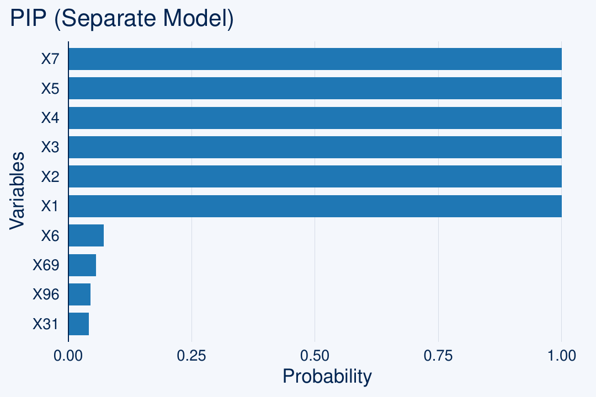
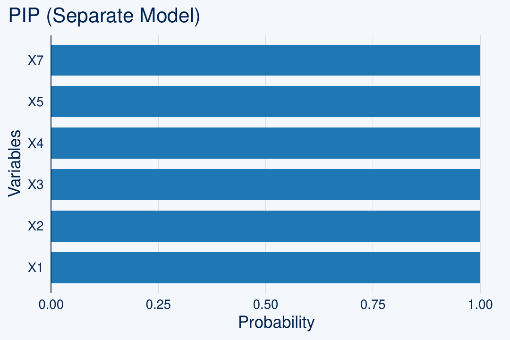
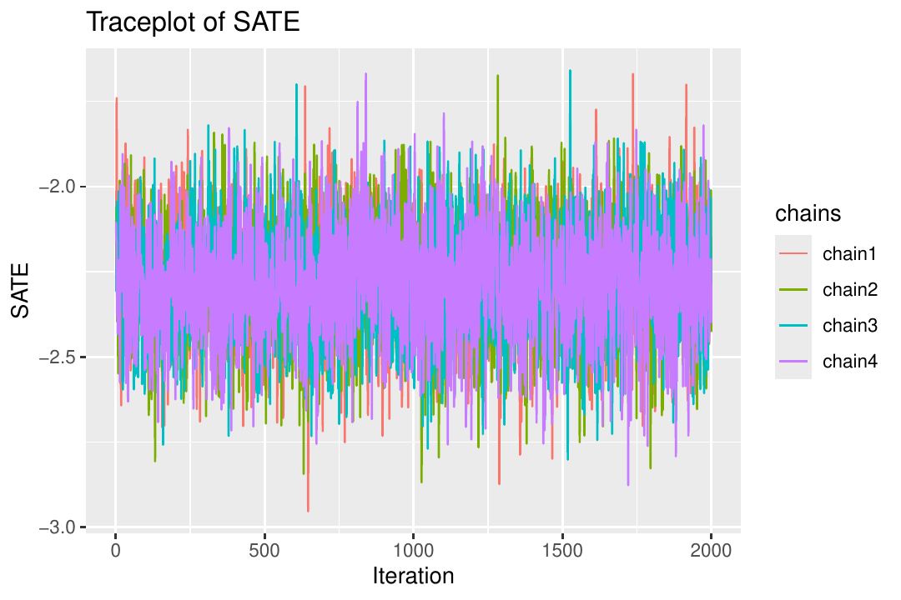
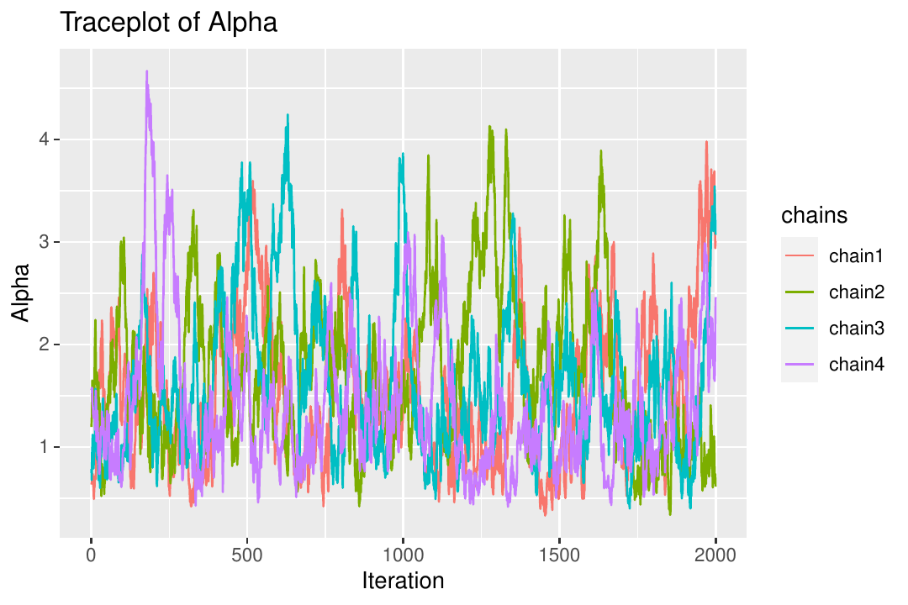
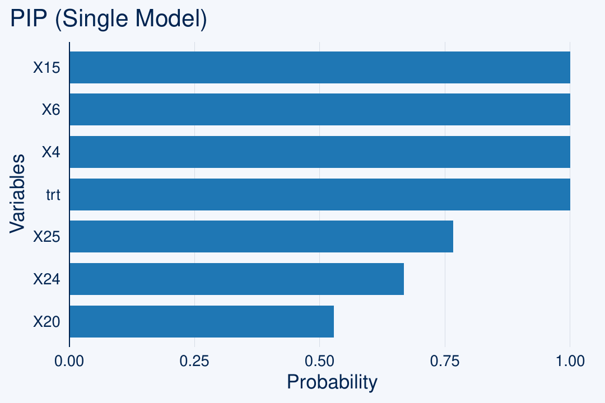
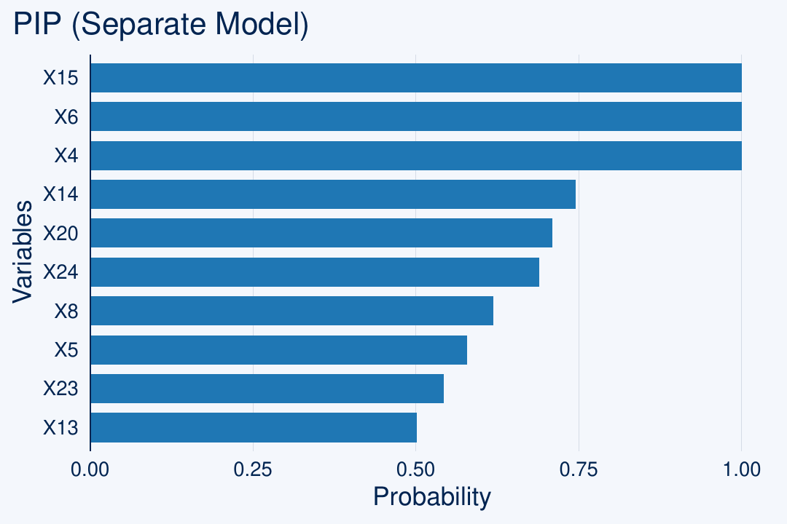
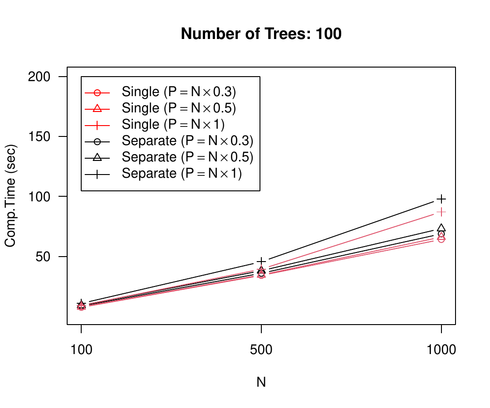
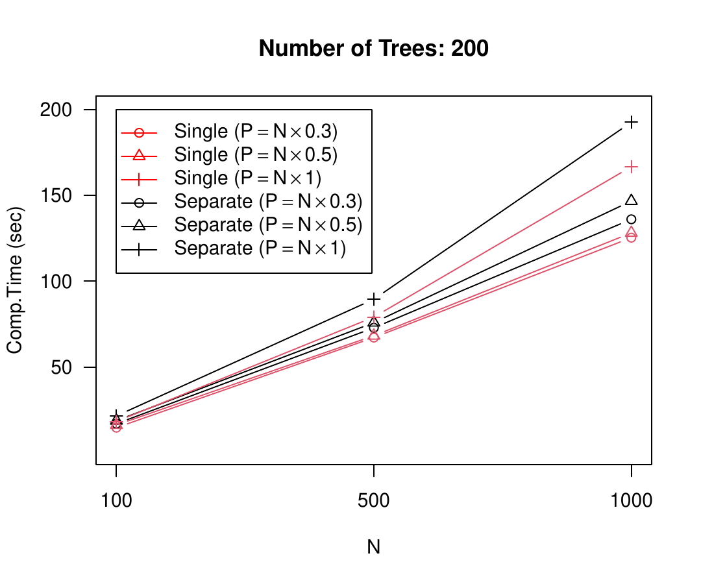
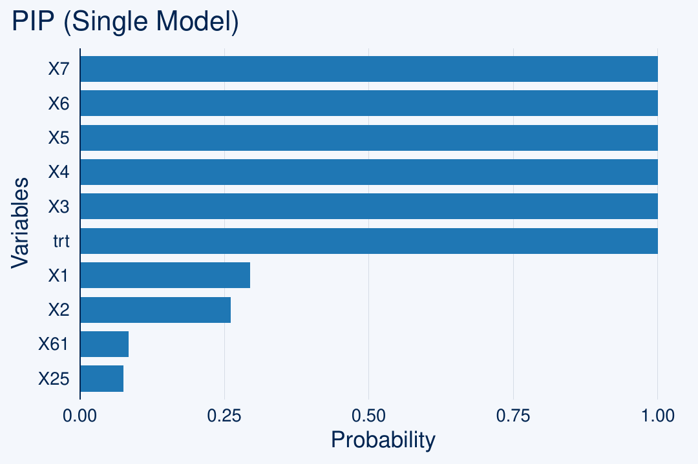
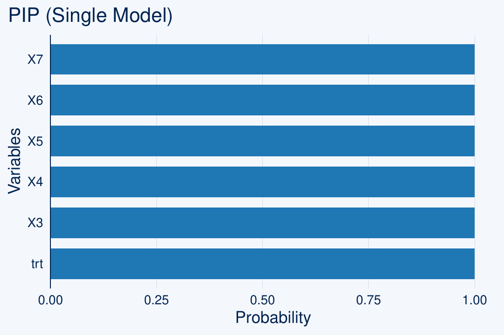

::::: article
## Introduction

In observational studies, drawing causality often relies on the
ignorability assumption [@rosenbaum_central_1983] that all confounders
are included in the adjustment procedure. Alternative approaches, such
as difference-in-differences [@abadie2005semiparametric], still seek to
address confounding without relying on ignorability by adopting a
different set of assumptions (e.g., the parallel trends assumption). A
confounder or confounding variable is a common cause that simultaneously
affects both exposure and outcome (Figure
[1](#fig:dag){reference-type="ref" reference="fig:dag"} (a)). Two groups
with different exposure levels, distinguished by the distribution of the
confounding variable, also experience its impact on their respective
outcome values. Therefore, to estimate the causal relationship between
exposure and outcome, it is crucial to select this common cause in the
data and adjust for it. In many recent applications, the number of
potential confounders is often enormous, making it difficult to select
the optimal set of true confounders among them. In this context, the
optimal set is a confounder set with an appropriate level of uncertainty
that reduces bias in estimating the final causal effect.

The main distinction between confounder selection and the traditional
variable selection method is that variables that meet the ignorability
assumption should be chosen. Several criteria need to be met by the
selected confounders in order to reduce the bias of estimated causal
effects. Among them, "disjunctive cause
criterion"[@vanderweele2019principles] requires that the chosen
variables be related to exposure and/or outcome. In Figure
[1](#fig:dag){reference-type="ref" reference="fig:dag"} (a), a
confounder set $\boldsymbol{X}$ that satisfies the disjunctive cause
criterion consists of variables that either affect exposure $A$, affect
outcome $Y$, or simultaneously affect both $A$ and $Y$. A better
condition than this is "disjunctive cause criterion without
instruments"[@vanderweele2019principles], which removes the variables
related to exposure but not directly associated with outcome. An
instrument, or instrumental variable, is a variable that influences
exposure $A$ but does not affect outcome $Y$. It is known to amplify
bias in causal effect estimation when there is an unmeasured confounder
[@myers2011effects]. In Figure [1](#fig:dag){reference-type="ref"
reference="fig:dag"} (b), if a certain confounder from $\boldsymbol{X}$
is unmeasured and not adjusted for (i.e., in the presence of an
unmeasured confounder), conducting adjustment for instrument $Z$ leads
to additional bias, known as "$Z$-bias\" [@ding2017instrumental].
Therefore, the best practice is to remove this instrument during the
covariate adjustment process. However, manually identifying a set of
confounders that meet these criteria among a large number of potential
confounders is challenging.

Methods based on data and statistical models for performing such
confounder selection have recently been proposed. One such method is the
Bayesian adjustment for confounding (BAC) method proposed by
[@wang2012bayesian; @lefebvre2014extending], which connects exposure and
outcome models through common variable inclusion indicator variables to
identify confounders. [@wang2015accounting] later modified the BAC
method to work with generalized linear outcome models.
[@wilson2014confounder] suggested a method based on decision theory with
a similar goal, which performs well for a variety of sample sizes. In
terms of selecting relevant covariates for use in propensity score,
[@shortreed2017outcome] proposed the outcome-adaptive LASSO method. In
addition, [@haggstrom2018data] proposed a method for identifying the
causal structure and estimating the causal effect using a probability
graphical model.

Despite the advantages of the previously mentioned methods, they each
have limitations. To address these shortcomings, [@kim2023bnp] proposed
a novel Bayesian non-parametric model that aims to overcome these
limitations. They suggested a new method that employs Bayesian additive
regression trees (BART; [@chipman2010bart]) with a shared prior for the
selection probabilities, which links the exposure and outcome models.
This approach allows for the flexibility and precision of a Bayesian
nonparametric model, while also identifying and integrating covariates
that are related to both the exposure and outcome into the final
estimator. [@caron2022shrinkage] similarly applied a sparsity-inducing
Dirichlet prior to the selection probabilities in the outcome model of
Bayesian Causal Forest, a variant of BART proposed by
[@hahn2020bayesian]. However, while their approach focuses on inducing
sparsity among variables used within the trees, our method introduces a
common prior shared by both the outcome and exposure models to
facilitate confounder identification. This paper introduces
[bartcs](https://CRAN.R-project.org/package=bartcs), a new R package
developed by [@bartcs] that implements the Bayesian additive regression
trees method for confounder selection proposed by [@kim2023bnp]. The
package, which is written in C++ and integrated into R via Rcpp for fast
computation and easy use, can be downloaded from the Comprehensive R
Archive Network (CRAN) at <https://cran.r-project.org/package=bartcs>.
Certain sections of the code referred to the
[BART](https://cran.r-project.org/web/packages/BART/index.html) package
by [@BART] under the GPL license, with modifications. In particular, the
development of efficient code involved referencing the existing
[BART](https://cran.r-project.org/web/packages/BART/index.html) package
algorithm in following aspects: 1) code related to obtaining residuals
in the Bayesian backfitting process; 2) code dedicated to efficiently
searching for variables eligible for splitting when proposing a
splitting variable during the tree alteration process; 3) code for
calculating the $\mu$ parameter value of leaf nodes; 4) code for
obtaining sufficient statistics for all bottom nodes.

{#fig:dag width="100%"
alt="graphic without alt text"}

In this paper, we provide an overview of the package, including
installation instructions, usage examples, and a demonstration of its
performance on simulated data. We also include a comparison with other
existing confounder selection methods. Our aim is to provide researchers
with a useful tool for identifying relevant confounders in their causal
inference studies and to enable them to make more accurate causal
inferences.

::: {#tab:models}
  ---------------------------------------------------------------------------------------------------------------------------------------------------------------------------------------------------------------------------------------------------------------------------------------------------------------------------------------------------------------------------------------------------------------------------------------------------------------------------------------------------------------------------------------------------------------------------------------------------------------------
  Package                                                                            Lang.   Description
  ---------------------------------------------------------------------------------- ------- --------------------------------------------------------------------------------------------------------------------------------------------------------------------------------------------------------------------------------------------------------------------------------------------------------------------------------------------------------------------------------------------------------------------------------------------------------------------------------------------------------------------------
  [bacr](https://CRAN.R-project.org/package=bacr) [@wang2015accounting]              R       Assume (generalized-) linear models (i.e., *parametric* models) for exposure and outcome. Supports binomial, Poisson, Gaussian exposure and outcome.

  [BayesPen](https://cran.r-project.org/package=BayesPen) [@bayespen]                R       Assume linear models (i.e., *parametric* models) for exposure and outcome. Support continuous outcome.

  [CovSelHigh](https://cran.r-project.org/package=CovSelHigh) [@covselhigh]          R       Confounder selection performed via either Markov/Bayesian networks (model-free selection of confounders).

  [BART](https://cran.r-project.org/package=BART) [@BART]                            C++     Incorporate the Dirichlet sparse prior of [@linero2018bayesian] for variable selection in the BART outcome model. Support various outcome types (categorical, continuous, binary, survival outcome). *This does not primarily focus on confounder selection, but rather variable selection,* and this variable selection functionality is enabled by setting `sparse=TRUE` in `wbart` (continuous outcome) `pbart/lbart` (binary outcome) `mbart/mbart2` (categorical outcome) `surv.bart` (survival outcome) functions.

  [bcf](https://cran.r-project.org/package=bcf) $^\dagger$ [@hahn2020bayesian]       C++     Specify different BART models for confounding adjustment and heterogeneous effect estimation, and regularizing the treatment effect directly. *This model lacks the ability for both variable selection and confounder selection.* Support continuous outcome.

  [bartCause](https://cran.r-project.org/package=bartCause)$^\dagger$ [@bartcause]   C++     Fit exposure and outcome models using the BART algorithm, producing estimates of treatment effects. *This model lacks the ability for both variable selection and confounder selection.* Support continuous and binary outcome.

  [bartcs](https://CRAN.R-project.org/package=bartcs) [@bartcs]                      C++     Use BART outcome and exposure models with the common Dirichlet prior for confounder selection. Support binary and continuous exposure, and continuous outcome.
  ---------------------------------------------------------------------------------------------------------------------------------------------------------------------------------------------------------------------------------------------------------------------------------------------------------------------------------------------------------------------------------------------------------------------------------------------------------------------------------------------------------------------------------------------------------------------------------------------------------------------

  : (#tab:T1) Summary of different confounder selection methods.
:::

## Overview of model {#sec:models}

We first express causal estimation within a potential outcome framework
[@rubin1974estimating]. For each unit $i=1, \cdots, N$, the potential
outcome for the $i$-th unit is defined as $Y_i(a)$, representing the
potential value of the outcome $Y_i$ that could be observed under the
binary exposure $A_i=a \in \{0,1\}$. Under the Stable Unit Treatment
Value Assumption (SUTVA) [@rubin_discussion_1980], the potential
outcomes correspond to the observed outcome as follows: $Y_i = Y_i(A_i)$
for $A_i \in \{0, 1\}$. The target causal estimand is
$$\Delta(1,0) = E[Y_i(1) - Y_i(0)],$$
which represents the average difference between two potential outcomes
under two exposure levels $0$ and $1$. In the later section, we will
also explain the utilization of the proposed model by extending it for
cases involving continuous exposure.

However, unlike randomized trials, the exposure assignment is not
randomized in observational studies, making it impossible to directly
identify either $E[Y_i(1)]$ or $E[Y_i(0)]$ from observed data. With no
unmeasured confounders $\boldsymbol{X}_i$, the following strong
ignorable treatment assignment assumption [@rosenbaum_central_1983]
holds
$$\{Y_i(1), Y_i(0)\} \perp A_i | \boldsymbol{X}_i,$$
and $0 < Pr(A_i=1 | \boldsymbol{X}_i=\boldsymbol{x}) < 1$ for all
$\boldsymbol{x}$; $i=1, \cdots, N$. The first part is also known as the
unconfoundedness assumption, and the second part is referred to as the
positivity or overlap assumption, which states that each unit has a
non-zero probability of being assigned to each treatment condition. This
strong ignorable treatment assignment assumption is sufficient to
identify the target causal estimand $\Delta(1,0)$
[@rosenbaum_central_1983; @ding2018causal; @li2023bayesian]. In
practice, even if the true treatment assignment mechanism satisfies the
above conditions, finite observed data may have only one treatment
condition value for certain combinations of $\boldsymbol{X}$. In this
case, a non-overlap region occurs for that $\boldsymbol{X}$ combination,
and target causal estimates in such cases inevitably rely on
extrapolation dependent on the model. When non-overlap is severe, it can
amplify bias in the target causal estimate. Therefore, recent research
interest lies in whether estimates in such regions are provided with an
appropriate level of uncertainty
[@papadogeorgou2020invited; @oganisian2020invited; @li2023bayesian]. Any
method based on outcome regression cannot provide accurate estimation in
the non-overlapping region. Further discussion on this topic is
available in [@li2023bayesian].

Another notable aspect of this assumption is that it is untestable.
Therefore, it is not possible to conduct tests based on the data to
determine which confounder $X$ satisfies the above assumption. However,
confounders $\boldsymbol{X}$ that meet the criteria presented in the
introduction (disjunctive cause criterion or disjunctive cause criterion
without an instrument; [@vanderweele2019principles]) can be considered a
minimum basis for a "proper" confounder set. With this strong ignorable
treatment assignment assumption in place, we can identify the causal
effect by the following equation of the observable quantities:
$$\Delta(1, 0; \boldsymbol{x}) = E[Y_i|A_i=1, \boldsymbol{X}_i=\boldsymbol{x}]-E[Y_i|A_i=0, \boldsymbol{X}_i=\boldsymbol{x}],$$
and finally identify and estimate the target estimand $\Delta(1, 0)$ by
averaging over confounders $\boldsymbol{X}$. Thus, the two key tasks in
estimating causal effects are identifying the confounders among a
potentially large set of covariates, and determining the outcome model
(i.e., $E[Y_i|A_i=a, \boldsymbol{X}_i=\boldsymbol{x}]$,
$a \in \{0, 1\}$) with flexibility and precision. The
[bartcs](https://CRAN.R-project.org/package=bartcs) R package was
developed to address these challenges by utilizing Bayesian additive
regression trees (BART) models for confounder selection and causal
effect estimation.

### Overview of BART

The BART model [@chipman2010bart] is an ensemble of decision trees that
can be represented by the following equations:

$$\begin{aligned}
y_i &=&  \mu_0+f(\boldsymbol{X}_i) + \epsilon_i \\
 f(\boldsymbol{X}_i) &=& \sum_{t=1}^T g(\boldsymbol{X}_i ; \mathcal{T}_t, \mathcal{M}_t),
\end{aligned}$$
where $\epsilon_i$ follows a normal distribution with mean 0 and
variance $\sigma^2$, and
$g(\boldsymbol{X}_i; \mathcal{T}_t, \mathcal{M}_t)$ is a function that
maps the tree structure and parameters to the response, for all
$i=1, \cdots, N$. We specify a BART prior on $f$, comprised primarily of
two components: a prior concerning the complexity of each tree,
$\mathcal{T}_t$, and a prior concerning its terminal nodes,
$\mathcal{M}_t$. For each of $T$ distinct trees, $\mathcal{T}_t$
represents the structure of the $t$-th tree and
$\mathcal{M}_t = \{\mu_{t,1}, \mu_{t,2}, \cdots, \mu_{t,n_t}\}$
represents its mean parameters at the terminal nodes. Each tree has
internal nodes that are split based on a "splitting variable" $X_j$ and
"splitting value" $c$ (Figure [2](#fig:bart){reference-type="ref"
reference="fig:bart"}). In many papers that use continuous outcome data,
the outcome variable $y$ is centered. In this case, $\mu_0$ is set to
$0$. As mentioned in [@sparapani2016nonparametric], when the sample size
is moderate or larger, centering is not necessarily required due to the
flexibility of $f$. Proceeding with the assumption that the outcome data
has also been centered, $\mu_0 = 0$ for the explanation here.

In the Markov Chain Monte Carlo (MCMC) update, Bayesian
backfitting[@hastie2000bayesian] is utilized within a
Metropolis-within-Gibbs sampler. This involves fitting each tree in the
ensemble sequentially, using the residual responses:
$\mathbf{R}_{-t} : = \mathbf{y} - \sum_{j \neq t} g(\boldsymbol{X}; \mathcal{T}_j, \mathcal{M}_j)$
where $\mathbf{R}_{-t}$ denotes unexplained outcome residuals for the
$t$-th tree. In each iteration of the MCMC update, a new tree structure
is proposed by randomly selecting one of three possible tree
alterations:

-   GROW: Choose a terminal node at random, and create two new terminal
    nodes. This process involves randomly selecting a predictor, $X_j$,
    and its associated "splitting value," $c$, to create the two new
    terminal nodes.

-   PRUNE: Pick an internal node at random where both children are
    terminal nodes (known as a "singly internal node"
    [@kapelner2013bartmachine]) and remove both of its children (thus
    making it a terminal node).

-   CHANGE: Select an internal node at random and modify its splitting
    variable and value according to the priors.

When BART was first introduced by @chipman2010bart, four tree alteration
steps (GROW, PRUNE, CHANGE, and SWAP) were considered. However,
following work by @kapelner2013bartmachine, who proposed the
`bartMachine` package for BART implementation, demonstrated that
omitting the SWAP step does not significantly affect the performance in
terms of tree updates or parameter mixing. Notably, since GROW and PRUNE
are paired as opposite moves, and CHANGE moves are reversible through
opposite-direction CHANGE moves, the detailed balance condition
continues to hold without the SWAP step. Specifically, when using the
grow and change alterations, a new covariate is randomly selected from a
set of $P$ available covariates as the splitting variable, according to
the assumed prior. The original BART model used a uniform prior of
$\{1/P, 1/P, \cdots, 1/P\}$ on the selection probabilities
$\boldsymbol{s} = (s_1, s_2, \cdots, s_P)$. However, to promote
sparsity, Linero (2018) proposed using a Dirichlet prior
$(s_1, s_2, \cdots, s_P) \sim \mathcal{D}(\alpha/P, \cdots, \alpha/P)$.
This prior specification, as outlined in Table
[1](#tab:T1){reference-type="ref" reference="tab:models"}, enables the
variable selection functionality of the
[BART](https://cran.r-project.org/package=BART) package. Through this,
it can be utilized as a Bayesian variable selection method to choose
important predictors in regression problems. [@kim2023bnp] have adapted
this method for causal inference, proposing a way to select confounders.
By specifying a common Dirichlet prior on the selection probabilities of
the outcome and exposure models, it allows for the selection of
important variables (i.e., confounders) in both models. Additionally, it
is worth noting that a tree rotation proposal [@pratola2016efficient]
has been suggested to enable more radical mixing than the classical
'change' alteration step. This aspect is planned to be incorporated into
the future updates of the
[bartcs](https://CRAN.R-project.org/package=bartcs) package. In the
following section, we will explain the specific setting of this method
and the steps involved in computing the posterior distributions.

{#fig:bart width="100%"
alt="graphic without alt text"}

### BART confounder selection

The [bartcs](https://CRAN.R-project.org/package=bartcs) package in R is
designed for selecting confounding variables, particularly when a large
number of potential confounding variables are present, and for
estimating the average treatment effect (ATE) given the chosen set of
confounding variables. To accomplish this, the package uses the Bayesian
additive regression trees (BART) model to specify the exposure and
outcome models as follows:
$$\begin{aligned}
P(A_i=1) &=& \Phi\left(\mu_1+f_1(\boldsymbol{X}_i)\right) \label{eq:1}
\end{aligned}   (\#eq:1)$$

$$\begin{aligned}
f_1(\boldsymbol{X}_i) &=&  \sum_{t=1}^T g_1(\boldsymbol{X}_i ; \mathcal{T}_t, \mathcal{M}_t) \nonumber
\end{aligned}$$

$$\begin{aligned}
{\underline{Separate Outcome Models}}: \quad  Y_i | A_i =a &=&  \mu_2^a + f_2^a(\boldsymbol{X}_i)+ \epsilon_i^a, \quad \epsilon_i^a \sim N(0, \sigma_a^2) \label{eq:2}
\end{aligned}   (\#eq:2)$$

$$\begin{aligned}
f_2^a(\boldsymbol{X}_i) &=&  \sum_{t=1}^T g_2^a(\boldsymbol{X}_i ; \mathcal{T}_t^a, \mathcal{M}_t^a) \nonumber
\end{aligned}$$

$$\begin{aligned}
{\underline{Single Outcome Model}}: \qquad \qquad  \qquad Y_i & = & \mu_3 +  f_3(A_i, \boldsymbol{X}_i)+ \epsilon_i, \quad \epsilon_i \sim N(0, \sigma^2), \label{eq:3} 
\end{aligned}   (\#eq:3)$$

$$\begin{aligned}
f_3(A_i, \boldsymbol{X}_i) & = & \sum_{t=1}^T g_3(A_i, \boldsymbol{X}_i ; \mathcal{T}_t^\prime, \mathcal{M}_t^\prime) \nonumber\\
f_1  \sim  \text{BART} ,&& f_2^a  \sim  \text{BART},  \qquad  f_3  \sim  \text{BART} \nonumber
\end{aligned}$$
for $i=1, \cdots, N$ in Equations \@ref(eq:1) and \@ref(eq:3), and for
$i \in \mathcal{I}_a$ where $\mathcal{I}_a$ denotes a set of units under
each exposure arm $a \in \{0, 1\}$ in Equation \@ref(eq:2). In
Equation \@ref(eq:1), $\Phi(\cdot)$ is the standard normal cumulative
distribution function. Note that it is required to replace
Equation \@ref(eq:1) with
$A_i = \mu_1+f_1(\boldsymbol{X}_i) + \epsilon_i$ where
$\epsilon_i \sim N(0, \tau^2)$ when considering a continuous exposure
(in Section 5). As mentioned earlier, here we will proceed with the
assumption that the outcome data has been centered, setting $\mu_1$,
$\mu_2^a$, and $\mu_3$ to 0 for the purpose of elaborating on the
methodology. We incorporate a common sparsity-inducing Dirichlet prior
$\boldsymbol{s}_{12}=(s_1, s_2, \cdots, s_P) \sim \mathcal{D}(\alpha/P, \cdots, \alpha/P)$
in the exposure model (Equation \@ref(eq:1)) and the outcome model
(Equation \@ref(eq:2)) resulting in a conjugate update (Figure
[3](#fig:connection){reference-type="ref" reference="fig:connection"}).
Alternatively, a common Dirichlet prior is introduced on
$\boldsymbol{s}_{13} = (s_0, s_1, s_2, \cdots , s_P)$ in the single
outcome model (Equation \@ref(eq:3)), where $s_0$ represents the
probability of exposure $A$, and the transformed form of
$\boldsymbol{s}_{13}$ is incorporated as the selection probability in
the exposure model. We will delve into this aspect in detail later.

If a particular covariate, $X_j$, is frequently used as a splitting
variable in either the model for $A$ or the model for $Y$, the model
will assign more weight to the selection probability $s_j$ through
larger numbers of splits on $X_j$. This means that the selection
probabilities will tend to favor covariates that have a relationship
with $A$, $Y$, or both $A$ and $Y$. The final confounders chosen for
effect estimation in the model for $Y$ will be those that were proposed
for splitting through this prior and were accepted during the updating
step of the model for $Y$, which will further prioritize variables that
have a relationship with $Y$. This characteristic satisfies the
"disjunctive cause criterion without instruments" in confounder
selection.

{#fig:connection
width="100%" alt="graphic without alt text"}

#### Remark

The proposed method assumes that the available set of high-dimensional
covariates in the dataset includes all true confounders. Therefore, it
is not necessary (and indeed may be detrimental) to pre-select
covariates, as doing so could inadvertently exclude true confounders. By
providing all available $P$ covariates (potential confounders) as input,
the proposed method will select confounders in a data-driven manner.

However, if there are unmeasured confounders (i.e., if not all true
confounders are included in the set of potential confounders), our
method cannot entirely avoid biases (e.g., Z-bias, M-bias, etc.). If you
suspect that important confounders are unmeasured (thus missing from the
potential confounders set), we recommend excluding, in advance,
variables that are suspected of being instrumental variables (which
affect only the exposure but not the outcome), as well as potential
colliders (variables that are believed to have no direct effects on both
exposure and outcome), before applying the proposed method.

#### Separate outcome models

For a binary exposure, we separate the outcome model into two distinct
sub-models, in order to align the dimensions of the covariates in both
the exposure and outcome models (note that the outcome model includes
exposure $A$ as an additional covariate if a single outcome model is
specified). For Equations \@ref(eq:1) and \@ref(eq:2), a
sparsity-inducing prior is applied to
$\boldsymbol{s}_{12} = (s_1, s_2, \cdots, s_P)$, which is shared among
three models: one for exposure and two for outcomes.

We use "Bayesian backfitting"[@hastie2000bayesian] to obtain posterior
samples for the exposure and outcome models. For the exposure model,
this involves a Metropolis-within-Gibbs sampler, where we fit each tree
$\mathcal{T}_t$ iteratively using residual responses :
$$R_{i,-t} = Z_i - \sum_{j \neq t}g_1(\boldsymbol{X}_i; \mathcal{T}_j, \mathcal{M}_j)$$
for $i=1, \cdots, N$ where $Z_i$ is a latent variable for the binary
exposure constructed based on [@albert1993bayesian] as follows
$$Z_i \sim \left\{ \begin{array}{ll}
         N\left(f_1(\boldsymbol{X}_i), 1\right)I_{(Z_i  > 0)} & for A_i =1 ;\\
        N\left(f_1(\boldsymbol{X}_i), 1\right)I_{(Z_i  \leq 0)} & for A_i = 0 .\end{array} \right.$$
Note that the variance parameter ($\sigma^2$) is assigned a value of $1$
as a result of the construction of the latent variable. For each tree
$\mathcal{T}_t$ for the exposure model, we propose a new tree structure
$\mathcal{T}_t$ from the full conditional
$[\mathcal{T}_t | R_{1, -t}, \cdots, R_{n, -t}]$ (i.e., grow, prune or
change alterations), and update the parameters within the tree through
the full conditional
$[\mathcal{M}_t | \mathcal{T}_t, R_{1, -t}, \cdots, R_{n, -t}]$.

To draw samples for $\mathcal{M}_t$, we assume a prior
$\mu \sim N(\mu_\mu/T, \sigma^2_\mu)$ on each of the leaf parameters
$\mathcal{M}_t=\{\mu_1, \mu_2, \cdots, \mu_{t_b}\}$, where ${t_b}$ is
the number of terminal nodes in tree $\mathcal{T}_t$. The range center
of latent variable $Z_i$'s is set as the mean, $\mu_\mu$, and
$\sigma^2_\mu$ is empirically determined to satisfy
$T \mu_\mu - 2 \sqrt{T} \sigma_\mu = Z_{\text{min}}$ and
$T \mu_\mu + 2 \sqrt{T} \sigma_\mu = Z_{\text{max}}$ where
$Z_{\text{min}}$ and $Z_{\text{max}}$ represent the minimum and maximum
values of $Z_i$'s [@kapelner2013bartmachine].

We generate a sample $\mu_\eta$ from the posterior distribution for the
$\eta$-th terminal node in tree $\mathcal{T}_t$ by using the following
equation:
$$\mu_\eta \sim N\left(\frac{1}{1/\sigma_\mu^2+n_\eta/\sigma^2} \left(\frac{\mu_\mu/T}{\sigma^2_\mu}+\frac{\sum_{i\in \mathcal{O}_\eta} R_{i, -t}}{\sigma^2}\right), \left(\frac{1}{\sigma_\mu^2}+\frac{n_\eta}{\sigma^2}\right)^{-1}\right),$$
where $\mathcal{O}_\eta$ and $n_\eta$ correspond to the observation
indices and the number of observations, respectively, for the $\eta$-th
terminal node. In our implementation, we set the $\mu_\mu$ value to 0,
and consequently, the
[bartcs](https://CRAN.R-project.org/package=bartcs) package is
constructed to shift the $Y$ and $Z$ variables to have a mean value of
0.

For separate outcome models, we also perform a backfitting step to draw
samples from
$P(\mathcal{T}_1^a, \cdots, \mathcal{T}_T^a, \allowbreak \mathcal{M}_1^a, \cdots, \mathcal{M}_T^a, \sigma^2_a | \boldsymbol{D})$
for each $A = a \in \{0, 1\}$ by computing the residual responses
iteratively as follows:
$$H_{i,-t}^a = y_i - \sum_{j\neq t} g_2^a(\boldsymbol{X}_i; \mathcal{T}_j^a, \mathcal{M}_j^a) \,\, \text{ for } i \in \mathcal{I}_a,$$
where $\mathcal{I}_a$ represents the set of observations corresponding
to $A=a \in \{0,1\}$. Afterwards, a process is undertaken to update each
tree based on $[\mathcal{T}_t^a | H_{\cdot, -t}^a, \sigma_a^2]$ and the
parameters of its corresponding terminal nodes from
$[\mathcal{M}_t^a | \mathcal{T}_t^a, H_{\cdot, -t}, \sigma_a^2]$ for
each exposure level $a \in \{0,1\}$. This process is analogous to the
one described earlier for the exposure model.

For each MCMC iteration, once all the tree structures and corresponding
parameters have been updated, we proceed to update the variance
parameter ($\sigma^2_a$ in each outcome model (\@ref(eq:2))) using the
Gibbs sampler. This is achieved by sampling from the inverse gamma
distribution given by:
$$\sigma^2_{a} \sim \text{Inv.Gamma}\left(a_\sigma+\frac{|\mathcal{I}_a|}{2}, b_\sigma+\frac{1}{2}\left\{\sum_{i \in \mathcal{I}_a} \left(y_i - \sum_{t=1}^T g_2^a(\boldsymbol{X}_i; \mathcal{T}_t^a, \mathcal{M}_t^a)\right) \right\}\right),$$
where $a_\sigma=b_\sigma=3$.

Next, we update the parameter $\alpha$ in the prior distribution of
selection probabilities
$\boldsymbol{s}_{12} \sim \mathcal{D}(\alpha/P, \cdots, \alpha/P)$ based
on a prior of the form $\alpha/(\alpha+P) \sim \text{Beta}(a_0, b_0)$,
where $a_0=0.5$ and $b_0=1$ [@linero2018bayesian]. The
Metropolis-Hastings algorithm is then used to update the parameter. To
delve deeper into the $\alpha$ prior in high-dimensional data, refer to
[@BART]. Finally, we update $\boldsymbol{s}_{12}$ using a conjugate
sampling update as follows:
$\boldsymbol{s}_{12} \sim \mathcal{D}(\alpha/P+n_{1,1}+n_{1,21}+n_{1,20}, \cdots, \alpha/P+n_{P,1}+n_{P,21}+n_{P,20})$,
where $n_{j,21}$ and $n_{j,20}$ represent the numbers of splits on the
confounder $X_j$ in two separate outcome models, and $n_{j,1}$
represents the number of splits on $X_j$ in the exposure model.

The posterior computation process for the approach employing the
separate outcome models strategy is outlined in Algorithm 1 through
pseudocode.

{#alg:separate width="100%"
alt="graphic without alt text"}

#### Single outcome model

Using two separate outcome models for two exposure levels, as outlined
in [@bartcause] and [@hahn2020bayesian], can result in biased estimates
if there is a lack of common support in confounders. While a single
outcome model can be a viable alternative, it can be challenging to
apply a shared sparsity-inducing prior to
$\boldsymbol{s}_{12} = (s_1, s_2, \cdots, s_P)$ due to differences in
covariate dimensions between the exposure and outcome models. Let
$\boldsymbol{s}_{13} =(s_0, s_1, s_2, \cdots, s_P)$ represent the
selection probabilities, with $s_0$ denoting the probability of exposure
$A$ used in the outcome model. To apply this vector to the exposure
model, $\boldsymbol{s}_{13}$ is transformed to
$\boldsymbol{s}_{13}^\prime = (s_1/(1-s_0), s_2/(1-s_0), \cdots, s_P/(1-s_0))$.
Then, updating $\boldsymbol{s}_{13}$ is based on the following equation
(likelihood $\times$ prior):
$$Q = \left(1-s_0\right)^{-n_{\cdot,1}} s_0^{n_{0,3}+\alpha/P-1} s_1^{n_{1,3}+n_{1,1}+\alpha/P-1} \cdots s_P^{n_{P,3}+n_{P,1}+\alpha/P-1},$$
using the Metropolis-Hastings algorithm, where $n_{j,3}$ represents the
number of splits on the confounder $X_j$ in the single outcome model and
$n_{\cdot, 1} = \sum_{j=1}^P n_{j,1}$. The proposal distribution for
$\boldsymbol{s}_{13}$ is designed to follow the full conditional in the
separate outcome models,
$\mathcal{D}(n_{0,3}+c+\alpha/P, n_{1,1}+n_{1,3}+\alpha/P, n_{2,1}+n_{2,3}+\alpha/P, \cdots, n_{P,1}+n_{P,3}+\alpha/P)$,
and a positive value $c$ is added to prevent proposals for infrequent
exposure. In the [bartcs](https://cran.r-project.org/package=bartcs)
package, the value of $c$ is set to the number of splits on $A$ in the
outcome model ($n_{0,3}$). This is to ensure sufficient proposal
probability for exposure. Whether the proposed variables are actually
accepted is determined through the M-H step, so based on our experience,
this setting does not significantly affect the performance of confounder
selection.

All posterior computation steps are identical to the separate outcome
models method, except for the difference that there is only one outcome
model. Therefore, updates for the trees and parameters of the outcome
model are based on one
$[\mathcal{T}_t^\prime | \boldsymbol{H}_{\cdot, -t}, \sigma^2]$ and one
$[\mathcal{M}^\prime_t | \mathcal{T}_t^\prime, \boldsymbol{H}_{\cdot, -t}, \sigma^2]$
for each tree $t$. Subsequently, sampling for $\sigma^2$ is carried out
based on the following inverse gamma distribution:
$$\sigma^2 \sim \text{Inv.Gamma}\left(a_\sigma+\frac{N}{2}, b_\sigma+\frac{1}{2}\left\{\sum_{i=1}^{N} \left(Y_i - \sum_{t=1}^T g_3(\boldsymbol{X}_i; \mathcal{T}_t^\prime, \mathcal{M}_t^\prime)\right) \right\}\right),$$
where $a_\sigma=b_\sigma=3$. The posterior computation process for the
approach employing the single outcome model strategy is outlined in
Algorithm 2 through pseudocode.

{#alg:single width="100%"
alt="graphic without alt text"}

Given the $M$ set of posterior samples for BART parameters, the causal
effect estimand $\Delta(1, 0)$ can be estimated using either the
separate models or the single model. For the separate outcome models,
the estimate is obtained by
$$\hat{\Delta}(1,0) = \frac{1}{N} \sum_{i=1}^N\left[\frac{1}{M} \sum_{m=1}^M \left\{f_2^{1,(m)}(\boldsymbol{X}_i) - f_2^{0,(m)}(\boldsymbol{X}_i) \right\}\right],$$
where $f_2^{a,(m)}$ is the $m$-th posterior samples for
$A = a\in\{0, 1\}$. For the single outcome model, the estimate is
obtained by
$$\hat{\Delta}(1,0) = \frac{1}{N} \sum_{i=1}^N\left[\frac{1}{M} \sum_{m=1}^M \left\{f_3^{(m)}(1, \boldsymbol{X}_i) - f_3^{(m)}(0, \boldsymbol{X}_i)\right\}\right],$$
where $f_3^{(m)}$ is the $m$-th posterior samples.

## Simulated example {#sec:simulated}

The [bartcs](https://CRAN.R-project.org/package=bartcs) R package makes
it easy to implement the confounder selection process described in the
previous section. It includes two main functions, `separate_bart()` for
the separate outcome models and `single_bart()` for the single outcome
model. The package not only offers a summary of the estimated causal
effects but also includes visualizations of posterior inclusion
probabilities and convergence.

The [bartcs](https://CRAN.R-project.org/package=bartcs) package offers
multi-threading support through Open Multi-Processing (OpenMP), an API
for shared memory parallel programming that manages thread creation,
management, and synchronization for efficient data and computation
division among different threads. This allows
[bartcs](https://CRAN.R-project.org/package=bartcs) to specify intensive
computations as parallel regions, leading to improved computational
efficiency through parallel computing.

The [bartcs](https://CRAN.R-project.org/package=bartcs) package is
available under the general public license (GPL $\geq3$) from the
Comprehensive R Archive Network (CRAN) at
[https://cran.r-project.org/package=bartcs](https://CRAN.R-project.org/package=bartcs)
and can be installed and loaded into the current R session as follows:

``` r
install.packages("bartcs", dependencies=TRUE)
library("bartcs")
```

We will showcase the practical usage of the features in the
[bartcs](https://CRAN.R-project.org/package=bartcs) package using
simulated examples and the Infant Health and Development Program (IHDP)
data.

As a simple example of the
[bartcs](https://CRAN.R-project.org/package=bartcs) package, we use a
simulated dataset from Scenario 1 in [@kim2023bnp] to illustrate its
features. The data-generating model incorporates both the non-linear
propensity score and outcome models, and serves to evaluate the ability
to detect 5 true confounding variables out of a huge set of possible
covariates, along with the precision of the model's estimation. The
dataset consists of 300 observations with 100 potential confounders
($X_1 - X_{100}$), each generated from a normal distribution with mean 0
and variance 1. Of the 100 possible confounders, $X_1 - X_5$ are true
confounders. The outcome model includes the five true confounders and
two additional predictors, $X_6$ and $X_7$ as follows:

$$\begin{aligned}
P(A_i=1) &=& \Phi(0.5+h_1(X_{i,1}) + h_2(X_{i,2}) - 0.5 |X_{i,3}-1| +1.5 X_{i,4} X_{i,5})\\
Y_i & = & f(\boldsymbol{X}_i) + \epsilon_i, \quad \epsilon_i \sim N(0, 0.3^2) \\
f(\boldsymbol{X}_i) & = & h_1(X_{i,1}) + 1. 5 h_2(X_{i,2}) - A_i + 2 |X_{i,3}+1| + 2 X_{i,4} + \exp(0.5 X_{i,5}) \\
& & - 0.5 A_i |X_{i,6}| - A_i |X_{i,7}+1|
\end{aligned}$$
where $h_1(x) = (-1)^{I(x<0)}$ and $h_2(x) = (-1)^{I(x\geq0)}$ for
$i=1, \cdots, 300$. The data was generated with the following code:

``` r
set.seed(42)
N <- 300
P <- 100
cov <- list()
for (i in 1:P) {
     cov[[i]] <- rnorm(N, 0, 1)
   }
X <- do.call(cbind, cov)
h1 <- ifelse(X[, 1] < 0, 1, -1)
h2 <- ifelse(X[, 2] < 0, -1, 1)
prob <- pnorm(0.5 + h1 + h2 - 0.5 * abs(X[, 3] - 1) + 1.5 * X[, 4] * X[, 5])
Trt <- rbinom(N, 1, prob) 
mu1 <- 1 * h1 + 1.5 * h2 - 1 + 2 * abs(X[, 3] + 1) + 2 * X[, 4] + exp(0.5 * X[, 5]) - 
     0.5 * 1 * abs(X[, 6]) - 1 * 1 * abs(X[, 7] + 1)
mu0 <- 1 * h1 + 1.5 * h2 - 0 + 2 * abs(X[, 3] + 1) + 2 * X[, 4] + exp(0.5 * X[, 5]) - 
     0.5 * 0 * abs(X[, 6]) - 1 * 0 * abs(X[, 7] + 1)
Y1 <- rnorm(N, mu1, 0.3)
Y0 <- rnorm(N, mu0, 0.3)
Y <- Trt * Y1 + (1 - Trt) * Y0
```

For users' convenience, the same data can be generated using the
built-in function `synthetic_data( )` from the
[bartcs](https://CRAN.R-project.org/package=bartcs) package with the
following arguments settings: `N` = 300 (sample size), `P` = 100 (number
of potential confounders), and `seed` = 42 (seed number).

Examining the standardized mean differences (SMD) of the (potential)
confounders generated through the data generating process above, the
following observations can be made. The standardized mean differences
(SMD) values presented below were computed using the
[tableone](https://cran.r-project.org/package=tableone) R package
[@tableone], which can be installed from CRAN.

``` r
library("tableone")
Xdata <- as.data.frame(cbind(Trt,X))
names(Xdata) <- c("Trt", paste0(rep("X", 100),1:100))
Table <- CreateTableOne(vars = paste0(rep("X", 12),1:12), strata = "Trt", 
     data = Xdata, test = FALSE)
print(Table, smd = TRUE)
                 Stratified by Trt
                  0            1            SMD   
  n                 164          136              
  X1 (mean (SD))   0.28 (0.96) -0.39 (0.90)  0.718
  X2 (mean (SD))  -0.25 (0.99)  0.24 (0.92)  0.517
  X3 (mean (SD))  -0.14 (1.02)  0.03 (0.90)  0.178
  X4 (mean (SD))   0.06 (1.08) -0.07 (1.04)  0.118
  X5 (mean (SD))  -0.08 (0.86)  0.01 (1.05)  0.091
  X6 (mean (SD))  -0.03 (1.06)  0.15 (0.98)  0.177
  X7 (mean (SD))  -0.04 (1.03)  0.01 (0.94)  0.050
  X8 (mean (SD))  -0.11 (0.99)  0.20 (1.00)  0.312
  X9 (mean (SD))   0.07 (1.04)  0.05 (1.02)  0.017
  X10 (mean (SD)) -0.04 (1.13) -0.13 (0.96)  0.087
  X11 (mean (SD))  0.05 (1.02) -0.12 (0.98)  0.169
  X12 (mean (SD))  0.13 (1.01) -0.23 (0.99)  0.363
```

When looking at the results for the first 12 $X$ variables, it is noted
that for true confounders $X_1$ and $X_2$, SMD values greater than 0.1,
indicative of inadequate covariate balance between the groups, are
observed. Similar lack of covariate balance between the groups is also
noticed for $X_3$ and $X_4$. However, due to randomness, differences
between the groups are observed for some covariates other than the true
confounders. In this simulation scenario, with the partial presence of
the signal from some covariates other than true confounders, the goal is
to assess the performance of the model under consideration.

With a generated data set, we fit the BART confounder selection model
(the separate outcome models) using `separate_bart()`.

``` r
library("bartcs")
separate_fit <- separate_bart(
     Y = Y, trt = Trt, X = X, num_tree = 200, num_chain = 4, 
     num_burn_in = 10000, num_thin = 5, num_post_sample = 2000
   )
```

The following are the main arguments used in the `separate_bart()`
function call:

-   `Y` represents a vector of observed outcome values.

-   `trt` denotes a vector of exposure(treatment) values, which is
    binary. Binary treatment values need to be either $0$ or $1$.
    Continuous exposure values can be handled in `single_bart()`
    function.

-   `X` is a data frame of potential confounders.

The following are the remaining settings for the fit: 4 MCMC chains
(`num_chain`) with 200 trees (`num_tree`) are used. Each MCMC chain runs
20000 iterations, with 10000 burn-in iterations (`num_burn_in`) and a
thinning factor of 5 (`num_thin`). There are other optional arguments
available for hyper-parameter settings with the following default
values:

-   $\alpha=0.95$ (`alpha`) and $\beta=2$ (`beta`): these govern the
    probability that a node at depth $d$ is nonterminal as follows
    $$\alpha(1+d)^{-\beta}.$$

-   $\nu=3$ (`nu`) and $q = 0.95$ (`q`): to set a conjugate prior for
    the variance $\sigma^2$ with
    $\sigma^2 \sim \nu \lambda / \chi_\nu^2$, we use the following
    equation to determine the values $P(\sigma < \hat{\sigma}) = q$,
    where $\hat{\sigma}$ represents the residual standard deviation
    obtained from a linear regression of $Y$ on $X$.

-   $P_\text{GROW}=0.28, P_\text{PRUNE}=0.28, P_\text{CHANGE}=0.44$
    (`step_prob =  c(0.28, 0.28, 0.44)`): probabilities of three tree
    alteration steps.

-   `dir_alpha` = 5: this is an initial value for hyperparameter
    $\alpha$ in the sparsity inducing Dirichlet prior
    $\mathcal{D}(\alpha/P, \alpha/P, \cdots, \alpha/P)$.

``` r
separate_fit

`bartcs` fit by `separate_bart()`

           mean       2.5%      97.5%
SATE -2.2851546 -2.6022894 -1.9692134
Y1    0.7195622  0.4663024  0.9833689
Y0    3.0047169  2.8116436  3.1946016
```

The `separate_bart()` returns a S3
[bartcs](https://CRAN.R-project.org/package=bartcs) object. A
[bartcs](https://CRAN.R-project.org/package=bartcs) object includes the
posterior means and 95% credible intervals for the sample average
treatment effect ($SATE$), and the potential outcomes $Y(1)$ and $Y(0)$.
It is important to note that the true values for the $SATE$, $E[Y(1)]$,
and $E[Y(0)]$ are $-2.55$, $0.64$, and $3.19$ respectively, and the 95%
credible intervals produced by the `separate_bart()` function include
these values.

For a more in-depth understanding of the output, the `summary()`
function can be used. It provides details regarding the treatment
values, tree structure, MCMC chain, and outcomes for each of the chains.

``` r
summary(separate_fit)

`bartcs` fit by `separate_bart()`

Treatment Value
  Treated group    :      1
  Control group    :      0

Tree Parameters
  Number of Tree   :    200		Value  of alpha    :   0.95
  Prob.  of Grow   :   0.28		Value  of beta     :      2
  Prob.  of Prune  :   0.28		Value  of nu       :      3
  Prob.  of Change :   0.44		Value  of q        :   0.95

Chain Parameters
  Number of Chains :      4		Number of burn-in  :  10000
  Number of Iter   :  20000		Number of thinning :      5
  Number of Sample :   2000

Outcome 
 estimand chain       2.5%         1Q       mean     median         3Q      97.5%
     SATE     1 -2.6070044 -2.3892357 -2.2830389 -2.2800555 -2.1765359 -1.9757766
     SATE     2 -2.6013548 -2.4017854 -2.2877997 -2.2877071 -2.1798863 -1.9611401
     SATE     3 -2.5961329 -2.3952700 -2.2794876 -2.2793208 -2.1609143 -1.9644475
     SATE     4 -2.6090523 -2.4001084 -2.2902924 -2.2923171 -2.1812900 -1.9761443
     SATE   agg -2.6022894 -2.3965077 -2.2851546 -2.2842764 -2.1748201 -1.9692134
       Y1     1  0.4705203  0.6322748  0.7174467  0.7174147  0.8027479  0.9668359
       Y1     2  0.4707973  0.6305094  0.7223111  0.7213076  0.8153911  0.9851455
       Y1     3  0.4653391  0.6277828  0.7190511  0.7194586  0.8080547  0.9804701
       Y1     4  0.4614500  0.6273396  0.7194400  0.7175295  0.8087480  0.9920899
       Y1   agg  0.4663024  0.6292846  0.7195622  0.7185828  0.8087121  0.9833689
       Y0     1  2.8082437  2.9361088  3.0004857  2.9998629  3.0664869  3.1897135
       Y0     2  2.8189069  2.9442181  3.0101107  3.0107896  3.0778268  3.2013420
       Y0     3  2.8002284  2.9362280  2.9985387  2.9972708  3.0646989  3.1920314
       Y0     4  2.8210957  2.9427012  3.0097324  3.0133450  3.0772579  3.1960383
       Y0   agg  2.8116436  2.9404458  3.0047169  3.0053406  3.0713420  3.1946016
```

For each estimand category, there are five results (rows) that represent
the output from each of the 4 MCMC chains and an aggregated output.

For visualization purposes, there are two options available as S3
methods for the [bartcs](https://CRAN.R-project.org/package=bartcs)
object. The first option is the posterior inclusion probability (PIP)
plot. PIP is the probability that a variable is used as a splitting
variable, and can be interpreted as the importance of a variable. The
`inclusion_plot()` function is a wrapper for the `bar_chart()` function
from the [ggcharts](https://cran.r-project.org/package=ggcharts) package
[@ggcharts], allowing the use of its arguments to customize the plot.
The recommended arguments to use are `top_n` and `threshold`.

``` r
plot(separate_fit, method = "pip", top_n = 10)
plot(separate_fit, method = "pip", threshold = 0.5)
```

<figure id="fig:pip">
<table>
<caption> </caption>
<tbody>
<tr>
<td style="text-align: center;"></td>
<td style="text-align: center;"></td>
</tr>
<tr>
<td style="text-align: center;">a. Plotting PIP with <code>top_n</code>
argument</td>
<td style="text-align: center;">b. Plotting PIP with
<code>threshold</code> argument</td>
</tr>
</tbody>
</table>
<figcaption>Figure 4: Posterior inclusion probability (PIP)
plots</figcaption>
</figure>

In Figure [4](#fig:pip){reference-type="ref" reference="fig:pip"}, the
argument `top_n` allows us to select variables with the top `top_n`
highest PIPs. The argument `threshold` displays variables with PIP
greater than `threshold`. From a decision-theoretical perspective
[@barbieri2004optimal; @linero2018bayesian], variables with PIPs larger
than 0.5 can be considered chosen confounders. It is worth noting that
the five true confounders $X_1-X_5$ are all correctly selected as true
confounders with PIPs of 1, along with one extra predictor $X_7$ in the
outcome model.

The second option for visualization is the traceplot, which is mainly
used to check MCMC convergence. The function provides a traceplot of the
sample average treatment effect (SATE) for each MCMC chain. Traceplots
of other parameters such as `dir_alpha` (the hyperparameter $\alpha$ in
the sparsity-inducing Dirichlet prior
$\mathcal{D}(\alpha/P, \cdots, \alpha/P)$) and `sigma2_out` (the
variance parameter in the outcome model) are also available by using the
argument `parameter`.

``` r
plot(separate_fit, method = 'trace')
plot(separate_fit, method = 'trace', parameter = 'dir_alpha')
```

In Figure [5](#fig:traceplot){reference-type="ref"
reference="fig:traceplot"}, the traceplots of the SATE and `dir_alpha`
parameters are shown for four different MCMC chains. Concerning the
`dir_alpha` parameter ($\alpha$), the actual value employed as the
hyper-parameter for the Dirichlet prior is derived by dividing the total
number of potential confounders, denoted as $P$ (i.e., $\alpha /P$). In
the setting of simulation data where $P=100$ is utilized, the
hyper-parameter to be estimated is notably small, represented as
$\alpha /100$. Hence, compared to the variability observed in the
traceplot, the variability of the actual $\alpha /P$ (illustrated within
the range of 0.5/100 to 4.5/100 in Figure
[5](#fig:traceplot){reference-type="ref" reference="fig:traceplot"}.(b))
can be interpreted as substantially smaller. Alternatively, extending
the chain length for sampling the $\alpha$ parameter could be
considered. However, in this dataset, due to the significant presence of
confounders (i.e., the counts of splits $n_{j,1}, n_{j,21}, n_{j,20}$
added to $\alpha/P$ during the conjugate update are quite large),
confounder selection is minimally influenced by the current $\alpha$
samples.

Although traceplots offer a convenient means of visual inspection, it is
recommended to employ the Gelman-Rubin diagnostics provided by the
`gelman.diag()` function in the
[coda](https://cran.r-project.org/package=coda) package [@CODA] for a
comprehensive convergence assessment, as illustrated in the subsequent
section. Furthermore, despite the suggestion of a modified $\hat{R}$
[@vehtari2021] as an alternative to the Gelman-Rubin diagnostic, it is
presently unsupported in the
[coda](https://cran.r-project.org/package=coda) package. Nonetheless,
once the `mcmc.list` object is generated (explained later in this
section), it can be directly employed if a function for computing the
modified $\hat{R}$ becomes available within the coda package in the
future.

<figure id="fig:traceplot">
<table>
<caption> </caption>
<tbody>
<tr>
<td style="text-align: center;"></td>
<td style="text-align: center;"></td>
</tr>
<tr>
<td style="text-align: center;">a. Traceplot of <span
class="math inline"><em>S</em><em>A</em><em>T</em><em>E</em></span></td>
<td style="text-align: center;">b. Traceplot of <code>dir-alpha</code>
parameter</td>
</tr>
</tbody>
</table>
<figcaption>Figure 5: Traceplots for multiple MCMC chains</figcaption>
</figure>

We evaluated the performance of
[bartcs](https://CRAN.R-project.org/package=bartcs) in comparison to
other models, including those generated by the
[bacr](https://CRAN.R-project.org/package=bacr) R package
[@wang2015accounting] that inspired our model development. The
[bacr](https://CRAN.R-project.org/package=bacr) package is easily
installed via CRAN and loaded into the current R session as follows:

``` r
install.packages("bacr", dependencies=TRUE)
library("bacr")
```

To fit the model of this package, we used the `bac()` function where the
input data needs to be provided in the form of a data frame. To fit the
exposure and outcome models in this case, a generalized linear model is
used, and it is necessary to specify the family of the model based on
the data type (e.g.. `familyX="binomial"` and `familyY="gaussian"`). The
MCMC algorithm was run for 10000 iterations after discarding the first
10000 iterations as burn-ins. Additionally, no interaction between the
exposure and each confounder was assumed.

``` r
Z <- as.data.frame(cbind(Y,Trt,X))
fit.bac <- bac(
     data = Z, exposure = "Trt", outcome = "Y", 
     confounders = paste("V", 3:(P + 2), sep = ""),
     interactors = NULL, familyX = "binomial", familyY = "gaussian", 
     omega = Inf, num_its = 20000, burnM = 10000, burnB = 10000, thin = 5
   )
```

The result can be checked through the `summary()` function as follows:

``` r
summary(fit.bac)

BAC objects:

Exposure effect estimate:
        posterior mean     95% posterior interval     
                  -1.6               (-2.1, -1.3)     


Covariates with posterior inclusion probability > 0.5:
    posterior inclusion probability
V3                          1.00000
V4                          1.00000
V5                          1.00000
V6                          1.00000
V7                          1.00000
V99                         0.92100
V14                         0.70305
V54                         0.67480
V90                         0.62345
```

The posterior mean of the SATE was estimated to be $-1.6$, which was
significantly different from the true SATE value of $-2.55$. Moreover,
the 95% credible interval $(-2.1, -1.3)$ did not include the true value.
When considering the importance of selected confounders based on the
posterior inclusion probability,
[bacr](https://CRAN.R-project.org/package=bacr) included all important
confounders $X_1-X_5$ (that is, $V3-V7$ in the summary), but also added
$X_{12}, X_{52}, X_{88}, \text {and } X_{97}$ (that is,
$V14, V54, V90, V99$ in the summary) with high PIPs, which were not true
confounders. Notably, $X_6$ and $X_7$, which are additional predictors
of the outcome model, were not included. This result may be attributed
to the fact that [bacr](https://CRAN.R-project.org/package=bacr) relies
on a parametric model and therefore may struggle to account for the
non-linear and complex data structure.

### Connection to coda package

To summarize the results, generic functions such as `summary()` and
`plot()` were adapted to work on the
[bartcs](https://CRAN.R-project.org/package=bartcs) objects.
Additionally, `mcmc.list` objects were included as components in the
[bartcs](https://CRAN.R-project.org/package=bartcs) object to allow for
the use of functions from the
[coda](https://cran.r-project.org/package=coda) R package [@CODA]. The
`mcmc_list` component of the
[bartcs](https://CRAN.R-project.org/package=bartcs) object can produce
summary statistics for each of $E[Y(1)], E[Y(0)], SATE$ using the
summary function and generate trace plots and posterior densities for
parameters using the plot function. Figure
[6](#fig:mcmc_list){reference-type="ref" reference="fig:mcmc_list"}
displays plot of `mcmc_list` based on
[coda](https://cran.r-project.org/package=coda) package.

``` r
summary(separate_fit$mcmc_list)

Iterations = 10005:20000
Thinning interval = 5 
Number of chains = 4 
Sample size per chain = 2000 

1. Empirical mean and standard deviation for each variable,
   plus standard error of the mean:

                 Mean        SD  Naive SE Time-series SE
SATE        -2.285155 0.1639173 1.833e-03      2.489e-03
Y1           0.719562 0.1328857 1.486e-03      2.122e-03
Y0           3.004717 0.0977850 1.093e-03      1.790e-03
dir_alpha    1.576421 0.7317213 8.181e-03      6.836e-02
sigma2_out1  0.001731 0.0003359 3.756e-06      5.533e-06
sigma2_out0  0.001310 0.0002334 2.609e-06      3.784e-06

2. Quantiles for each variable:

                  2.5%       25%       50%       75%     97.5%
SATE        -2.6022894 -2.396508 -2.284276 -2.174820 -1.969213
Y1           0.4663024  0.629285  0.718583  0.808712  0.983369
Y0           2.8116436  2.940446  3.005341  3.071342  3.194602
dir_alpha    0.5772667  1.024000  1.423480  2.003651  3.390765
sigma2_out1  0.0011718  0.001490  0.001698  0.001935  0.002483
sigma2_out0  0.0009263  0.001146  0.001289  0.001446  0.001845
```

``` r
plot(separate_fit$mcmc_list)
```

{#fig:mcmc_list width="100%"
alt="graphic without alt text"}

The convergence of the MCMC can be assessed by utilizing the convergence
diagnostics offered by the
[coda](https://cran.r-project.org/package=coda) package. To examine the
convergence of six parameters, we can employ the `gelman.diag()`
function on the `mcmc.list` object, specifically on
`separate_fit$mcmc_list`.

``` r
library("coda")
gelman.diag(separate_fit$mcmc_list)

Potential scale reduction factors:

            Point est. Upper C.I.
ATE               1.00       1.00
Y1                1.00       1.00
Y0                1.00       1.01
dir_alpha         1.02       1.07
sigma2_out1       1.00       1.00
sigma2_out0       1.00       1.00

Multivariate psrf

1.02
```

Based on the convergence diagnostics, it can be concluded that there are
no issues with the convergence of the MCMC, similar to the visual
inspection.

## Real data example {#sec:real_data}

In the previous section, the `separate_bart()` function was used to
demonstrate a separate outcome model strategy. In this section, a single
outcome model is tested using the `single_bart()` function, based on the
Infant Health and Development Program (IHDP) dataset as an example. This
dataset was collected from a longitudinal study that tracked the
development of low-birth-weight premature infants. The study
participants in the treatment group received intensive care and home
visits from trained providers and their cognitive test scores were
evaluated at the end of the intervention period. The dataset includes a
variety of pretreatment variables, including 6 continuous and 19 binary
covariates. The original IHDP data is generated from a randomized
experiment setting. However, the IHDP data used by [@bartcause] and
[@louizos:2017] was manipulated to induce covariate imbalance between
treatment groups by removing a subset of the treated group.
Specifically, all children with nonwhite mothers were removed from the
treated group. We utilize a synthesized variant of the IHDP data as
presented in [@louizos:2017]. This version was created employing the
[NPCI](https://github.com/vdorie/npci) package [@npci] to ascertain the
true counterfactual values. As seen in Figure
[7](#fig:ioverlap){reference-type="ref" reference="fig:ioverlap"}, the
data generated in this manner significantly violates the overlap
assumption for estimating the sample average treatment effect (SATE).
This figure depicts the degree of overlap between two groups (Treated vs
Control) for selected covariates. Red crosses represent the control
group, and blue triangles represent the treated group. In certain
intervals of extreme values for each covariate, there are regions where
only control group data exists, or very few data points from the treated
group are present. For example, in the interval where the $X_5$
covariate is less than $-4$, there is no data from the treated group.
Non-overlap occurs in these regions. In the case of the binary covariate
$X_{18}$, there is only one data point from the treated group at the
value of 0. Therefore, technically speaking, situations like non-overlap
can occur in the estimation process. In such a scenario, one of the
objectives is to investigate whether a single outcome model can properly
estimate the true SATE.

The IHDP data can be loaded by

``` r
data("ihdp", package = "bartcs")
```

and Table [2](#tab:T2){reference-type="ref" reference="tab:iphd"}
displays the summary statistics of the variables. In the dataset,
`y_factual` is the observed outcome $Y$ (i.e., $Y(A)$) and `y_cfactual`
is the counterfactual outcome $Y$ (i.e., $Y(1-A)$).

::: {#tab:iphd}
  -------------------------------------------------------------------------------------------------
                     Treatment = 1 (n=139)                   Treatment = 0 (n=608)  
  ----------------- ----------------------- --------------- ----------------------- ---------------
  Variable                   Mean                 IQR                Mean                 IQR

  $Y$                        6.43            (5.83, 7.34)            2.41            (1.45, 3.08)

  $X^{\star}_{1}$            0.21            (-0.40, 0.95)           -0.05           (-0.75, 0.79)

  $X^{\star}_{2}$            0.18            (-0.20, 0.60)           -0.04           (-0.60, 0.60)

  $X^{\star}_{3}$            -0.04           (-0.73, 0.38)           0.01            (-0.73, 0.76)

  $X^{\star}_{4}$            -0.22           (-0.88, 0.16)           0.05            (-0.88, 0.16)

  $X^{\star}_{5}$            -0.14           (-0.69, 0.56)           0.03            (-0.50, 0.68)

  $X^{\star}_{6}$            0.21            (-0.53, 0.96)           -0.05           (-0.86, 0.63)

  $X_{7}$                    0.52            (0.00, 1.00)            0.51            (0.00, 1.00)

  $X_{8}$                    0.09            (0.00, 0.00)             0.1            (0.00, 0.00)

  $X_{9}$                    0.68            (0.00, 1.00)            0.49            (0.00, 1.00)

  $X_{10}$                   0.29            (0.00, 1.00)            0.38            (0.00, 1.00)

  $X_{11}$                   0.25            (0.00, 0.50)            0.27            (0.00, 1.00)

  $X_{12}$                   0.22            (0.00, 0.00)            0.22            (0.00, 0.00)

  $X_{13}$                   0.38            (0.00, 1.00)            0.35            (0.00, 1.00)

  $X_{14}$                   1.58            (1.00, 2.00)            1.44            (1.00, 2.00)

  $X_{15}$                   0.14            (0.00, 0.00)            0.14            (0.00, 0.00)

  $X_{16}$                   0.94            (1.00, 1.00)            0.97            (1.00, 1.00)

  $X_{17}$                   0.69            (0.00, 1.00)            0.57            (0.00, 1.00)

  $X_{18}$                   0.99            (1.00, 1.00)            0.96            (1.00, 1.00)

  $X_{19}$                   0.15            (0.00, 0.00)            0.13            (0.00, 0.00)

  $X_{20}$                   0.06            (0.00, 0.00)            0.15            (0.00, 0.00)

  $X_{21}$                   0.17            (0.00, 0.00)            0.15            (0.00, 0.00)

  $X_{22}$                   0.04            (0.00, 0.00)            0.09            (0.00, 0.00)

  $X_{23}$                   0.01            (0.00, 0.00)            0.09            (0.00, 0.00)

  $X_{24}$                   0.06            (0.00, 0.00)            0.14            (0.00, 0.00)

  $X_{25}$                   0.27            (0.00, 1.00)            0.13            (0.00, 0.00)
  -------------------------------------------------------------------------------------------------

  : (#tab:T2) Summary statistics for the IHDP data set. $\star$
  denotes a continuous potential confounder.
:::

{#fig:ioverlap width="100%"
alt="graphic without alt text"}

We fit the single outcome model using the `single_bart()` function.

``` r
single_fit <- single_bart(
  Y               = ihdp$y_factual,
  trt             = ihdp$treatment,
  X               = ihdp[, 6:30],
  num_tree        = 50,
  num_chain       = 4,
  num_post_sample = 2000,
  num_thin        = 5,
  num_burn_in     = 10000
)
single_fit

`bartcs` fit by `single_bart()`

         mean     2.5%    97.5%
SATE 3.964842 3.747028 4.180764
Y1   6.382810 6.188199 6.581852
Y0   2.417969 2.338264 2.496962
```

The function `single_bart()` returns a
[bartcs](https://CRAN.R-project.org/package=bartcs) object, which
displays the posterior means and 95% credible intervals for the sample
average treatment effect (SATE), and the potential outcomes $Y(1)$ and
$Y(0)$. The `summary()` and `plot()` functions can also be used with
this [bartcs](https://CRAN.R-project.org/package=bartcs) object
generated by `single_bart()`.

``` r
summary(single_fit)

`bartcs` fit by `single_bart()`

Treatment Value
  Treated group    :      1
  Control group    :      0

Tree Parameters
  Number of Tree   :     50		Value  of alpha    :   0.95
  Prob.  of Grow   :   0.28		Value  of beta     :      2
  Prob.  of Prune  :   0.28		Value  of nu       :      3
  Prob.  of Change :   0.44		Value  of q        :   0.95

Chain Parameters
  Number of Chains :      4		Number of burn-in  :  10000
  Number of Iter   :  20000		Number of thinning :      5
  Number of Sample :   2000

Outcome 
 estimand chain     2.5%       1Q     mean   median       3Q    97.5%
      SATE    1 3.758373 3.894465 3.969119 3.968867 4.042380 4.183131
      SATE    2 3.744731 3.886575 3.957434 3.956101 4.026455 4.165961
      SATE    3 3.760480 3.905973 3.980315 3.980162 4.054086 4.206488
      SATE    4 3.730287 3.879606 3.952498 3.953050 4.028315 4.158430
      SATE  agg 3.747028 3.891543 3.964842 3.965384 4.038288 4.180764
       Y1     1 6.196530 6.318675 6.387760 6.387443 6.453303 6.589611
       Y1     2 6.181788 6.310026 6.376027 6.376233 6.439727 6.573960
       Y1     3 6.196317 6.329945 6.396885 6.397153 6.464297 6.601299
       Y1     4 6.169429 6.303404 6.370570 6.371514 6.435679 6.562172
       Y1   agg 6.188199 6.314489 6.382810 6.382215 6.449542 6.581852
       Y0     1 2.339020 2.391137 2.418640 2.418824 2.446414 2.498677
       Y0     2 2.336131 2.392407 2.418593 2.418124 2.446167 2.495229
       Y0     3 2.337997 2.388738 2.416570 2.416414 2.444457 2.495583
       Y0     4 2.340288 2.389536 2.418073 2.418218 2.446018 2.497264
       Y0   agg 2.338264 2.390199 2.417969 2.418042 2.445718 2.496962
```

We also fitted separate outcome models to the `ihdp` data and compared
the results from the single outcome model.

``` r
separate_fit <- separate_bart(
     Y               = ihdp$y_factual,
     trt             = ihdp$treatment,
     X               = ihdp[, 6:30],
     num_tree        = 50,
     num_chain       = 4,
     num_post_sample = 2000,
     num_thin        = 5, 
     num_burn_in     = 10000
   )
separate_fit

`bartcs` fit by `separate_bart()`

         mean     2.5%    97.5%
SATE 3.924013 3.702316 4.148937
Y1   6.342504 6.134043 6.550242
Y0   2.418491 2.340920 2.497081
```

Similar to the separate outcome models strategy, in `single_bart()`, the
`plot()` function for the
[bartcs](https://CRAN.R-project.org/package=bartcs) object can also be
employed to check the convergence of the MCMC chain. The traceplots for
the ATE is presented in Figure [8](#fig:ihdp_trace){reference-type="ref"
reference="fig:ihdp_trace"} with the following line.

``` r
plot(single_fit, method = 'trace')
```

{#fig:ihdp_trace width="100%"
alt="graphic without alt text"}

As this is a simulated version of the IHDP data, the true values are
known and are 4.02 for the sample average treatment effect (SATE), 6.45
for $E[Y(1)]$, and 2.43 for $E[Y(0)]$. The outputs from the two models
accurately reflect these true values within their 95% credible
intervals. Additionally, the PIP plots (Figure
[9](#fig:ihdp_pip){reference-type="ref" reference="fig:ihdp_pip"})
depict chosen confounders with PIP values larger than 0.5.

The important aspect here is that in the case of the single outcome
model, the exposure variable (`trt`) is also incorporated into the
selection process. As indicated in Equation \@ref(eq:2), because the
exposure variable is included as one of the covariates in the outcome
model, it is subject to variable selection. This means that in the
computation of PIP, it is treated similarly to other confounders,
producing the following plot (a) in Figure
[9](#fig:ihdp_pip){reference-type="ref" reference="fig:ihdp_pip"}. In
Figure [9](#fig:ihdp_pip){reference-type="ref"
reference="fig:ihdp_pip"}, plot (a) displays the potential confounders
for the single outcome model, which have a posterior inclusion
probability of 0.5 or more, while plot (b) illustrates the confounders
with a posterior inclusion probability of 0.5 or more when the separate
outcome models strategy is used. It is noteworthy that $X_4$, $X_6$, and
$X_{15}$ were consistently chosen as confounders with posterior
inclusion probability 1.

<figure id="fig:ihdp_pip">
<table>
<caption> </caption>
<tbody>
<tr>
<td style="text-align: center;"></td>
<td style="text-align: center;"></td>
</tr>
<tr>
<td style="text-align: center;">a. <span>PIP plot of single
model</span></td>
<td style="text-align: center;">b. <span>PIP plot of separate
model</span></td>
</tr>
</tbody>
</table>
<figcaption>Figure 9: PIP plot for IHDP dataset</figcaption>
</figure>

### Computation speed {#sec:speed}

In Figure [10](#fig:speed){reference-type="ref" reference="fig:speed"},
the computational speed of two models, the separate and single models,
is depicted for two different settings of the number of trees (100 vs.
200) based on the scenario in Section 3. The speed was assessed using
5000 MCMC iterations across various combinations of $N$ and $P$. We
considered three values of $N$ (100, 500, and 1000) and three values of
$P$ (circle for $N\times 0.3$, triangle for $N\times 0.5$, and cross for
$N\times 1$).

For 100 BART trees, the separate models required 8 to 98 seconds (18 to
190 seconds for 200 BART trees) for computation, while the single model
took 7 to 86 seconds (14 to 168 seconds for 200 BART trees), depending
on the ($N, P$) combination. Both models exhibited similar computational
speeds overall, considering the MCMC iterations. However, the single
model, which fits two BART models (exposure and one outcome model), was
found to be more efficient with slightly smaller biases and mean square
errors (MSEs) across various scenarios [@kim2023bnp]. Therefore, it is
recommended to utilize the single model (`single_bart()` function),
especially when $N$ is large, due to its faster computational speed.

Additionally, depending on the number of trees used, a significant
improvement in computation speed can be observed. It is generally
suggested to start with 50 trees as a "good starting value,"
[@kapelner2013bartmachine] so using a smaller number of trees is also
advised to gain computational advantages in terms of speed. The results
in this manuscript were obtained using R 4.3.0 on a Mac Studio with a M1
chip and 128 GB of memory.
[bartcs](https://cran.r-project.org/package=bartcs) 1.2.2 and
[bacr](https://cran.r-project.org/package=bacr) 1.0.1 were used for the
analysis.

<figure id="fig:speed">
<table>
<caption> </caption>
<tbody>
<tr>
<td style="text-align: center;"></td>
<td style="text-align: center;"></td>
</tr>
</tbody>
</table>
<figcaption>Figure 10: The computation times for both the single outcome
model (red) and separate outcome models (black) based on the number of
observations (<span class="math inline"><em>N</em></span>) under two
different numbers of trees. A cross symbol (+) represents the scenario
where the number of potential confounders (<span
class="math inline"><em>P</em></span>) is equal to the number of
observations (<span class="math inline"><em>N</em></span>), a triangle
(<span class="math inline">△</span>) represents the scenario where <span
class="math inline"><em>P</em> = <em>N</em> × 0.5</span> and a circle
(<span class="math inline">○</span>) represents the scenario where <span
class="math inline"><em>P</em> = <em>N</em> × 0.3</span>. These results
are obtained from 5000 MCMC iterations based on the scenario in Section
3.</figcaption>
</figure>

## Continuous exposure example {#sec:continuous}

When it comes to a continuous exposure variable, the formula in
Equation \@ref(eq:1) is changed as follows:
$$\begin{aligned}
A_i & = &\mu_1 +  f_1(\boldsymbol{X}_i) + \epsilon_i, \quad \epsilon_j \sim N(0, \tau^2). \label{eq:4}\\
f_1(\boldsymbol{X}_i) & = &\sum_{t=1}^T g_1(\boldsymbol{X}_i ; \mathcal{T}_t, \mathcal{M}_t) \nonumber 
\end{aligned}   (\#eq:4)$$
This altered formula is used in conjunction with the single outcome
model to perform confounder selection. However, the separate outcome
models strategy, which fits two distinct outcome models based on the two
exposure levels, is not suitable for the continuous exposure variable.
The `single_bart()` function has the versatility to handle both binary
and continuous treatments, and automatically identifies the binary
treatment when there are only two unique values. To demonstrate this, we
generate a data set similar to the previous example.

``` r
set.seed(42)
N <- 300
P <- 100
cov <- list()
for (i in 1:P) {
     cov[[i]] <- rnorm(N, 0, 1)
   }
X <- do.call(cbind, cov)
h1 <- ifelse(X[, 1] < 0, 1, -1)
h2 <- ifelse(X[, 2] < 0, -1, 1)
mu_trt <- 0.5 + h1 + h2 - 0.5 * abs(X[, 3] - 1) + 0.5 * X[, 4] * X[, 5]
Trt <- rnorm(N, mu_trt, 0.3)
mu_y <- 1 * h1 + 1 * h2 - Trt + 1 * abs(X[, 3] + 1) + 1 * X[, 4] + exp(0.5 * X[, 5]) -
     0.5 * Trt * abs(X[, 6]) - 0.5 * Trt * abs(X[, 7] + 1)
Y <- rnorm(N, mu_y, 0.3)
treatment <- quantile(Trt, 0.75)
control <- quantile(Trt, 0.25)
```

We use the function `single_bart()` to fit the generated data. The first
and third quantile values of `Trt` will serve as the basis for comparing
two different exposure levels. As arguments in `single_bart()`, we need
to provide these two pre-specified exposure levels ($a=$`trt_treated`
and $a^\prime=$`trt_control`). In the this case, the causal estimand is
$\Delta(a, a^\prime) = E[(Y(a)-Y(a^\prime)]$.

``` r
single_fit <- single_bart(
    Y = Y, trt = Trt, X = X, 
    trt_treated = treatment, trt_control = control,
    num_tree = 200, num_chain = 4, 
    num_burn_in = 10000, num_thin = 5, num_post_sample = 2000
  )
single_fit

`bartcs` fit by `single_bart()`

           mean       2.5%     97.5%
SATE -2.8097339 -4.2581469 -1.732448
Y1    0.9982417  0.2753606  1.677726
Y0    3.8079756  3.0967180  4.740133
```

Similar to other [bartcs](https://CRAN.R-project.org/package=bartcs)
objects, the `summary()` and `plot()` functions can be applied to the
continuous exposure scenario. Figure
[11](#fig:conti_pip){reference-type="ref" reference="fig:conti_pip"}
displays a PIP plot, which demonstrates that out of 100 possible
confounders, all of the true confounders except $X_1$, $X_2$, and two
additional predictors were captured effectively, with high PIP values.

<figure id="fig:conti_pip">
<table>
<caption> </caption>
<tbody>
<tr>
<td style="text-align: center;"></td>
<td style="text-align: center;"></td>
</tr>
<tr>
<td style="text-align: center;">a. <span>Plotting PIP with
<code>top_n</code> argument</span></td>
<td style="text-align: center;">b. <span>Plotting PIP with
<code>threshold = 0.5</code> argument</span></td>
</tr>
</tbody>
</table>
<figcaption>Figure 11: PIP plot for continuous exposure</figcaption>
</figure>

## Heterogeneous effects {#sec:hetero}

The proposed method not only estimates the SATE but also provides
posterior samples of $Y_i(1)$ and $Y_i(0)$, enabling inference on
individual heterogeneous treatment effects. The return object includes a
component called `chains`, which is a list containing the results from
each MCMC chain. Each element in this list is an `mcmc.list` object
(from the
[coda](https://cran.r-project.org/web/packages/coda/index.html) package)
that holds the posterior samples of $Y_i(1)$ and $Y_i(0)$. The following
explains how to extract posterior samples when applying the separate
model to the generated data from Section 3.

``` r
separate_fit <- separate_bart(
  Y = Y, trt = Trt, X = X, num_tree = 200, num_chain = 4,
  num_burn_in = 10000, num_thin = 5, num_post_sample = 2000
)

# Y(1) samples from the 1st MCMC chain
separate_fit$chains[[1]]$Y1_sample
# Y(0) samples from the 1st MCMC chain
separate_fit$chains[[1]]$Y0_sample
```

The posterior means of $Y_i(1)$ and $Y_i(0)$ for $i=1, \cdots, N$ can be
obtained by aggregating the posterior samples across multiple chains, as
shown below:

``` r
Y1_sample <- do.call(cbind, lapply(separate_fit$chains, function(x) x$Y1_sample))
rowMeans(Y1_sample)
Y0_sample <- do.call(cbind, lapply(separate_fit$chains, function(x) x$Y0_sample))
rowMeans(Y0_sample)
```

## Summary and discussion {#sec:summary}

In conclusion, the [bartcs](https://CRAN.R-project.org/package=bartcs) R
package is a powerful tool for causal inference using BART. It allows
users to adjust for confounders and estimate treatment effects using a
flexible non-parametric method. The package's ability to handle
high-dimensional and non-linear confounding, binary exposure, and
continuous exposure makes it a versatile tool for a wide range of
applications. Additionally, the package's support for parallel computing
and visualization of results make it a user-friendly and
easy-to-interpret tool. The
[bartcs](https://CRAN.R-project.org/package=bartcs) package is a
valuable resource for researchers in various fields.

In this paper, we assessed the performance of the proposed method in a
scenario where all true confounders are included in the potential
confounder pool, and additional predictors for the outcome model are
also present within the potential confounder pool. In this scenario, the
proposed method demonstrated precise average treatment effect (SATE)
estimation and accurately identified the true confounders. Moreover, in
the study by [@kim2023bnp], the proposed method exhibited accurate
confounder selection performance and reliable estimation of SATEs even
in scenarios involving instrumental variables in the data generating
process. This success is attributed to the satisfaction of the
disjunctive cause criterion without instruments by the proposed method,
as outlined in the introduction section [@vanderweele2019principles].
Additionally, the method demonstrated outstanding results in simulation
scenarios with diverse effect sizes and varying numbers of true
confounders.

The single outcome model and separate outcome models introduced in this
paper both demonstrate excellent performance in confounder selection and
average treatment effect estimation. However, in cases where a
continuous treatment variable is required, the single outcome model
should be applied. Additionally, as indicated in Section 4, the single
outcome model has a slightly faster computation speed than the separate
outcome models when the sample size is large because it uses one less
BART model. On the other hand, the separate outcome models strategy has
the advantage of relatively faster convergence of the MCMC chain during
the process of updating the selection probability vector of the BART
prior using a simple Gibbs update. Therefore, it is necessary to
selectively choose between the two models based on the context of the
data being applied.

While not currently integrated into the
[bartcs](https://CRAN.R-project.org/package=bartcs) package, the
confounder selection method presented here using BART holds potential
for extension to various data types. For count or categorical outcomes,
it might be feasible to substitute the proposed outcome model with the
log-linear BART model suggested by [@murray2021log]. Similarly, for
survival outcomes, the survival BART model proposed by
[@sparapani2016nonparametric] could serve as the outcome model.
Exploring the specific computation algorithms for these extensions could
be a fruitful avenue for future research.

One limitation of the proposed method is its lack of consideration for
correlation and temporal relationships among potential confounders.
Currently, no research has explored the distribution of weights in the
selection probability vector when high correlation exists among
covariates in the potential confounder pool. An approach worth
investigating may involve leveraging a causal Directed Acyclic Graph
(DAG) to constrain the selection of certain covariates in the prior
setting of the selection probability vector. This too presents a
promising direction for future research. Furthermore, our model
currently assumes a common hyper-prior for all hyperparameters
$\boldsymbol{\alpha}$ associated with the selection probability vector.
This approach restricts our ability to incorporate differing prior
weights across potential confounders. Exploring more flexible
specifications, such as assigning separate hyper-priors to each
$\alpha$, represents an important avenue for future research.

Another limitation, as mentioned previously in the remark in Section 2,
is that biases arising from unmeasured confounders are inherently
unavoidable when the set of potential confounders does not include all
true confounders. If important confounding variables are suspected to be
missing from the available data, one should carefully exclude---prior to
using the proposed method---variables suspected to be instruments (which
influence the exposure but not the outcome) and potential colliders
(which do not directly affect both exposure and outcome).

## Computational details {#computational-details .unnumbered}

R itself and all packages used are available from the Comprehensive R
Archive Network (CRAN) at <https://CRAN.R-project.org/>. The results in
this manuscript were obtained using R 4.3.0 on a Mac Studio with a M1
chip and 128 GB of memory.
[bartcs](https://cran.r-project.org/package=bartcs) 1.3.0 and
[bacr](https://cran.r-project.org/package=bacr) 1.0.1 were used for the
analysis.

## Acknowledgments {#acknowledgments .unnumbered}

This work is supported by the National Research Foundation of Korea
(NRF) grants funded by the Korea government (RS-2025-00554477,
RS-2024-00407300, NRF-2022R1F1A1062904).

## Appendix {#appendix .unnumbered}

The appendix presents results from simulation studies conducted under
various scenarios that were not covered in the main text.

### Scenario A: 5 true confounders and 2 additional predictors {#scenario-a-5-true-confounders-and-2-additional-predictors .unnumbered}

The results from applying the single model to the example in Section 3
demonstrate that the estimates closely match the true values of SATE
(-2.55), $E[Y(1)]$ (0.64), and $E[Y(0)]$ (3.19), consistent with
findings from the separate model. Notably, all corresponding 95%
credible intervals contain the true parameter values.

``` r
attach(synthetic_data(N = 300, P = 100, seed = 42))
single_fit <- single_bart(
    Y = Y, trt = Trt, X = X, 
    num_tree = 200, num_chain = 4, 
    num_burn_in = 10000, num_thin = 5, num_post_sample = 2000
  )
single_fit

`bartcs` fit by `single_bart()`

           mean       2.5%      97.5%
SATE -2.4219319 -2.6327170 -2.2125321
Y1    0.7077994  0.5664953  0.8491844
Y0    3.1297313  3.0100750  3.2520308
```

For a more in-depth understanding of the output, the `summary()`
function can be used. It provides details regarding the treatment
values, tree structure, MCMC chain, and outcomes for each of the chains.

``` r
summary(single_fit)

`bartcs` fit by `single_bart()`

Treatment Value
  Treated group    :      1
  Control group    :      0

Tree Parameters
  Number of Tree   :    200		Value  of alpha    :   0.95
  Prob.  of Grow   :   0.28		Value  of beta     :      2
  Prob.  of Prune  :   0.28		Value  of nu       :      3
  Prob.  of Change :   0.44		Value  of q        :   0.95

Chain Parameters
  Number of Chains :      4		Number of burn-in  :  10000
  Number of Iter   :  20000		Number of thinning :      5
  Number of Sample :   2000

Outcome 
 estimand chain       2.5%         1Q       mean     median         3Q      97.5%
      SATE    1 -2.6372424 -2.4971912 -2.4278177 -2.4274520 -2.3559219 -2.2195278
      SATE    2 -2.6347996 -2.4962662 -2.4236981 -2.4257645 -2.3521617 -2.2205205
      SATE    3 -2.6229176 -2.4872413 -2.4163175 -2.4188511 -2.3472130 -2.1968565
      SATE    4 -2.6321432 -2.4898965 -2.4198942 -2.4185564 -2.3492909 -2.2160691
      SATE  agg -2.6327170 -2.4929933 -2.4219319 -2.4229442 -2.3510791 -2.2125321
       Y1     1  0.5635365  0.6562010  0.7044118  0.7037438  0.7524049  0.8418673
       Y1     2  0.5678166  0.6558246  0.7050962  0.7054015  0.7548294  0.8466451
       Y1     3  0.5718781  0.6606816  0.7112623  0.7108116  0.7596594  0.8529911
       Y1     4  0.5598710  0.6626540  0.7104274  0.7117518  0.7603410  0.8518614
       Y1   agg  0.5664953  0.6587662  0.7077994  0.7082389  0.7566797  0.8491844
       Y0     1  3.0100293  3.0916675  3.1322295  3.1333000  3.1735625  3.2536797
       Y0     2  3.0101642  3.0857730  3.1287944  3.1295026  3.1688030  3.2518096
       Y0     3  3.0067741  3.0866910  3.1275798  3.1257193  3.1693086  3.2485622
       Y0     4  3.0158387  3.0909104  3.1303216  3.1291042  3.1697493  3.2501879
       Y0   agg  3.0100750  3.0885669  3.1297313  3.1291107  3.1705643  3.2520308
```

To evaluate the performance of confounder selection, 500 simulated
datasets were generated using the data-generating process described in
Section 3, with five true confounders and two additional predictors
included in the outcome model. Figure [12](#Fig:A1){reference-type="ref"
reference="Fig:A1"} presents the average posterior inclusion
probabilities across these datasets, comparing the separate model (top
panel) with the single model (bottom panel). The results clearly
indicate that all five true confounders (highlighted by red circles) are
selected with posterior probability equal to one, while irrelevant noise
variables are consistently excluded. Additionally, in the single model,
the starred point representing the treatment variable is also selected
with probability one.

{#Fig:A1 width="100%"
alt="graphic without alt text"}

### Scenario B: 20 true confounders {#scenario-b-20-true-confounders .unnumbered}

This scenario is designed to assess the performance of confounder
selection when there are 20 true confounders among 100 potential
confounders. Data were generated using the following data-generating
prcoess:

``` r
set.seed(42)
N <- 600
P <- 100
cov <- list()
for (i in seq_len(P)) {
  cov[[i]] <- rnorm(N, 0, 1)
}
X <- do.call(cbind, cov)
h1 <- ifelse(X[, 1] < 0, 1, -1)
h2 <- ifelse(X[, 2] < 0, -1, 1)
prob <- pnorm(0.5 + h1 + h2 - 0.5 * abs(X[, 3] - 1) +
                1.5 * X[, 4] * X[, 5] + X[, 6:20] %*% rep(0.5, 15))
Trt <- rbinom(N, 1, prob)
mu1 <- 1 * h1 + 1.5 * h2 - 1 + 2 * abs(X[, 3] + 1) + 2 * X[, 4] + exp(0.5 * X[, 5]) -
  0.5 * 1 * abs(X[, 6]) - 1 * 1 * abs(X[, 7] + 1) + X[, 6:20] %*% rep(0.5, 15)
mu0 <- 1 * h1 + 1.5 * h2 - 0 + 2 * abs(X[, 3] + 1) + 2 * X[, 4] + exp(0.5 * X[, 5]) -
  0.5 * 0 * abs(X[, 6]) - 1 * 0 * abs(X[, 7] + 1) + X[, 6:20] %*% rep(0.5, 15)
Y1 <- rnorm(N, mu1, 0.3)
Y0 <- rnorm(N, mu0, 0.3)
Y <- Trt * Y1 + (1 - Trt) * Y0
```

Examining the results from the separate model shows that the estimated
SATE slightly deviates from its true value of -2.55. This deviation
stems primarily from a minor bias in the estimation of $E[Y(0)]$. Such
bias arises because, as the number of confounders increases, achieving
adequate overlap in confounder distributions between treatment groups
becomes more challenging within a limited sample size.

``` r
separate_fit <- separate_bart(
     Y = Y, trt = Trt, X = X, num_tree = 200, num_chain = 4,
     num_burn_in = 10000, num_thin = 5, num_post_sample = 2000
)

separate_fit
`bartcs` fit by `separate_bart()`

          mean       2.5%     97.5%
SATE -2.207329 -2.4512574 -1.958840
Y1    1.050447  0.8839941  1.224950
Y0    3.257776  3.0882004  3.425323
```

In the case of the single model, the bias is noticeably smaller. This
reflects the relative advantage of the single model, as also discussed
in [@kim2023bnp].

``` r
single_fit
`bartcs` fit by `single_bart()`

          mean       2.5%     97.5%
SATE -2.352218 -2.5377421 -2.162899
Y1    1.011433  0.9065068  1.120402
Y0    3.363651  3.2602485  3.465711

single_fit
`bartcs` fit by `single_bart()`

          mean       2.5%     97.5%
SATE -2.352218 -2.5377421 -2.162899
Y1    1.011433  0.9065068  1.120402
Y0    3.363651  3.2602485  3.465711
```

To assess confounder selection performance, 500 simulated datasets were
generated based on the data-generating process described above,
including 20 true confounders. Figure [13](#Fig:A2){reference-type="ref"
reference="Fig:A2"} shows the average posterior inclusion probabilities
obtained across these datasets, comparing results from the separate
model (top panel) and the single model (bottom panel). The results
clearly demonstrate that all 20 true confounders (marked with red
circles) are consistently selected with posterior probabilities equal to
one, whereas irrelevant noise variables are effectively excluded from
the models.

{#Fig:A2
width="100%" alt="graphic without alt text"}

### Scenario C: 5 true confounders and 2 instrumental variables {#scenario-c-5-true-confounders-and-2-instrumental-variables .unnumbered}

This scenario includes 5 true confounders among 100 potential
confounders, and in particular, it includes 2 instrumental variables
(i.e., variables that affect only the exposure). The data generating
process for this scenario is as follows:

``` r
set.seed(42)
N <- 300
P <- 100
cov <- list()
for (i in seq_len(P)) {
  cov[[i]] <- rnorm(N, 0, 1)
}
X <- do.call(cbind, cov)
h1 <- ifelse(X[, 1] < 0, 1, -1)
h2 <- ifelse(X[, 2] < 0, -1, 1)
prob <- pnorm(0.5 + h1 + h2 - 0.5 * abs(X[, 3] - 1) +
                1.5 * X[, 4] * X[, 5] + 1.5 * X[, 6] - 1 * X[, 7])
Trt <- rbinom(N, 1, prob)
mu1 <- 1 * h1 + 1.5 * h2 - 1 + 2 * abs(X[, 3] + 1) +
  2 * X[, 4] + exp(0.5 * X[, 5]) 
mu0 <- 1 * h1 + 1.5 * h2 - 0 + 2 * abs(X[, 3] + 1) +
  2 * X[, 4] + exp(0.5 * X[, 5])
Y1 <- rnorm(N, mu1, 0.3)
Y0 <- rnorm(N, mu0, 0.3)
Y <- Trt * Y1 + (1 - Trt) * Y0
```

When the separate model is fitted, the 95% credible intervals
successfully capture the true values of SATE, E\[Y(1)\], and E\[Y(0)\],
which are -0.98, 2.21, and 3.19, respectively. Similarly, the single
model also provides accurate estimates of the true values.

``` r
separate_fit <- separate_bart(
     Y = Y, trt = Trt, X = X, num_tree = 200, num_chain = 4,
     num_burn_in = 10000, num_thin = 5, num_post_sample = 2000
)

separate_fit
`bartcs` fit by `separate_bart()`

          mean      2.5%     97.5%
SATE -0.905955 -1.172369 -0.634617
Y1    2.173088  1.976194  2.375582
Y0    3.079043  2.898203  3.261354
```

``` r
single_fit <- single_bart(
     Y = Y, trt = Trt, X = X, num_tree = 200, num_chain = 4,
     num_burn_in = 10000, num_thin = 5, num_post_sample = 2000
)

single_fit
`bartcs` fit by `single_bart()`

           mean      2.5%      97.5%
SATE -0.9421112 -1.116511 -0.7714885
Y1    2.1999294  2.089350  2.3124345
Y0    3.1420407  3.040003  3.2451105
```

To assess confounder selection performance, 500 simulated datasets were
generated based on the data-generating process described above,
including 5 true confounders and 2 instrumental variables. Figure
[14](#Fig:A3){reference-type="ref" reference="Fig:A3"} shows the average
posterior inclusion probabilities obtained across these datasets,
comparing results from the separate model (top panel) and the single
model (bottom panel). The results clearly demonstrate that all 5 true
confounders (marked with red circles) are consistently selected with
posterior probabilities equal to one, whereas irrelevant noise variables
are effectively excluded from the models.

{#Fig:A3 width="100%"
alt="graphic without alt text"}
:::::
