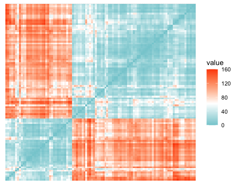
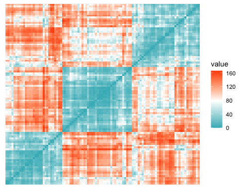
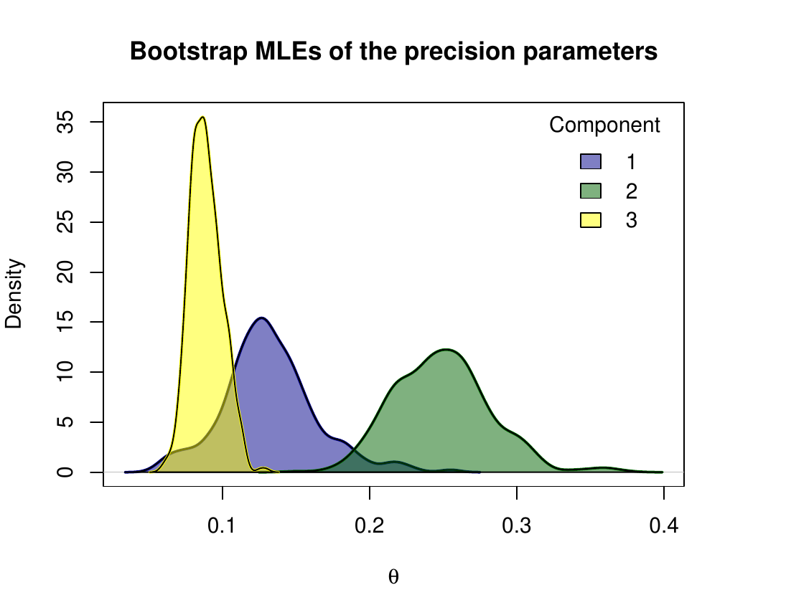
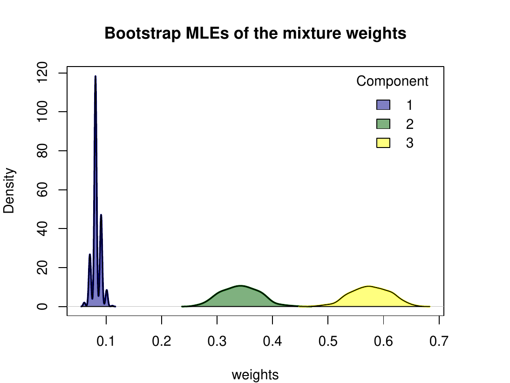

::::::: article
## Introduction

Ranking data play a pivotal role in numerous research and practical
domains, where the focus is on comparing and ordering a set of $n$ items
according to personal preferences or other relevant criteria. From
market surveys to sports competitions, from academic assessments to
online recommendation systems, rankings are ubiquitous in modern society
to capture human choice behaviors or, more generally, ordinal comparison
processes in various contexts.

Ranking data analysis has attracted significant attention, as evidenced
by the extensive literature on the subject [see
@critchlow91probability; @Marden1995 for fundamental reviews] and by the
development of a broad spectrum of probabilistic models designed to
capture meaningful choice patterns and quantify estimation uncertainty.
Traditionally, four main classes of parametric models have been
identified, each representing a distinct ranking generative process. The
first category, order statistics models (OSs), is originally attributed
to [@thurstone27law] and conceptualizes rankings as arising from the
ordering of latent item utilities. The second, paired comparison models,
is exemplified by the Bradley-Terry model (BT) proposed by
@bradley1952rank and is based on the possibility to decompose a ranking
sequence into the corresponding set of pairwise comparisons. The third
category, stagewise models, breaks the ranking process into sequential
stages and is well represented by the popular Plackett-Luce model (PL)
introduced by [@Luce1959] and [@Plackett1975]. Finally, distance-based
models, often referred to as *Mallows models* (MMs), trace their origins
to the seminal work by @Mallows1957. In this paper, we focus on the last
class, which provides an ideal option for applications where a
meaningful consensus ranking can be identified in the sample and,
consequently, offers a valuable parametric tool for rank aggregation
tasks [@Marden1995]. For further insights into probabilistic ranking
models and their unique characteristics, that can support the critical
choice of suitable parametric families for specific real contexts, the
reader is referred to @Liu2019 and @AlvoYu2014.

The MM is based on the assumption that a modal consensus ranking of the
$n$ items exists in the population, effectively capturing the collective
preferences. Under this framework, the likelihood of observing any
particular ranking decreases as its distance from the consensus
increases. While the distance measure in the MM induces distinct
probabilistic models, it only needs to satisfy minimal properties. This
simplicity offers researchers remarkable flexibility to choose the
distance that best fits their scientific context. For example, Kendall
and Cayley distances are well suited for sorting problems, Hamming works
well in coding theory, and Spearman distance is particularly suitable
for applications involving human preferences or social choice
[@Diaconis1988]. Traditionally, the choice of the distance in the MM was
mainly driven by computational considerations, specifically the
availability of a closed-form expression for the model normalizing
constant (or *partition function*). This favored the use of Kendall,
Cayley, and Hamming distances, while the Spearman distance has been
relatively underexplored due to its perceived intractability, despite
its relevance in preference domains. However, @crispino23efficient
recently demonstrated that the Spearman distance is a metric that
combines both computational feasibility and interpretability. By
leveraging the unique properties of the Spearman distance, and by means
of a novel approximation of the model partition function, the authors
addressed the critical inferential challenges that historically limited
its application. Their approach enabled the development of an efficient
strategy to fit the MM with Spearman distance (MMS) for datasets with
arbitrary forms of partial rankings. Moreover, they extended the model
to finite mixtures, allowing the capture of possible unobserved sample
heterogeneity.

Clustering ranking data to detect and characterize groups with similar
preferences has long been a major motivation for extending traditional
methods beyond their basic forms. This practical need is reflected in
the fact that nearly all R packages dedicated to ranking
analysis include clustering methods. From a methodological perspective,
the clustering problem has been tackled using both model-based
strategies and machine learning approaches. For example, the **PLMIX**
package [@mollica2020plmix] fits finite PL mixtures for partial top
rankings within the Bayesian framework [@mollica2017bayesian], which
notably recovers the maximum likelihood estimation (MLE) described in
[@gormley2006analysis] as a special case when a noninformative prior is
specified. For the same parametric class, the **PlackettLuce** package
[@turner2020] implements MLE procedures for generalizations of the PL
model that are capable of handling partial and tied rankings, as well as
including covariates to achieve model-based partitioning via PL trees.
Concerning OSs, the **StatRank** package addresses the estimation of
finite mixture generalizations from both full and partial rankings
through the generalized method of moments [@soufiani]. Additionally, the
R package **Rankcluster** [@Rankcluster], offers an
innovative model-based clustering approach through mixtures of Insertion
Sort Rank data models [@Jacques2014], which is able to handle partial
rankings with arbitrary patterns of incompleteness and, if needed, with
multivariate (hierarchical) structures. An additional contribution to
rankings with missing data is provided by the **prefmod** package
[@prefmod2012], which primarily analyzes preference data in the form of
paired comparisons, hence also rankings as a by-product, by using the BT
and extensions thereof to accommodate ties, subject- and item-specific
covariates, as well as partial observations with different censoring
forms and missingness processes. However, the extension proposed in
@prefmod2012 for clustering heterogeneous data relies on the
introduction of non-parametric random-effects models that, in the case
of rankings, are implemented only for completely-observed sequences
[@prefmod.package].

Regarding the availability of software which is more related to our
proposal, one can first notice that only a few packages of the
Comprehensive R Archive Network (CRAN) implement MMs and generalizations
thereof. **BayesMallows** [@BayesMallows] is the unique package adopting
the Bayesian perspective to perform inference for the MM and its finite
mixture extension. The flexibility of **BayesMallows** stands in the
wide range of supported distances (including Spearman) and ranked data
formats (complete and partial rankings, as well as pairwise
comparisons). Moreover, **BayesMallows** provides estimation uncertainty
by building posterior credible sets for the model parameters. Although
Bayesian inference of ranking data is effectively addressed, the
R packages adopting the frequentist perspective provide
users with less flexibility and computational performance. For example,
**pmr** [@pmr_R] performs MLE of several ranking models, including the
MM with Kendall, Footrule, and Spearman distances. However, despite the
variety of parametric distributions, **pmr** does not handle partial
rankings nor mixtures. Additionally, the estimation routines require the
enumeration of all $n!$ permutations for the global search of the
consensus ranking MLE and the naïve computation of the partition
function, implying that the analysis of ranking datasets with $n\geq 12$
items is unfeasible. The **rankdist** package [@rankdist] fits mixtures
of MMs with various basic and weighted metrics [@lee2012mixtures],
including the Spearman, on a sample of either full or top-$k$ partial
rankings. While the implementation for the Kendall distance is highly
efficient, it shares similar drawbacks with **pmr**, since the partition
function of the MMS is computed by summing over all $n!$ permutations,
and the MLE of the consensus ranking is obtained through a
time-consuming local search. As a result, the procedures can be highly
demanding, especially in mixture model applications. Moreover, the
package does not support the analysis of full rankings with $n\geq12$
items or of top-$k$ rankings with $n\geq8$ items. Other packages related
to the MM, but limited to the Kendall distance, are **RMallow**
[@rmallow], which fits the MM and mixtures thereof to both full or
partially-observed ranking data, and **ExtMallows** [@extmallows], which
supports the MM and the extended MM [@EMMjasa].

Our review underscores that most of the available packages for
frequentist estimation of the MM focus on distances admitting a
convenient analytical expression of the model normalizing constant (more
often, the Kendall), in the attempt to simplify the estimation task.
Moreover, regardless of the chosen metric, these packages face common
limitations, particularly in handling large datasets and partial
rankings, typically restricted to top-$k$ sequences. These computational
constraints impose restrictions on the sample size, the number of items,
and the censoring patterns they can feasibly handle. Finally, the
current implementations generally lack methods for quantifying MLE
uncertainty, particularly for the consensus ranking or when a finite
mixture is assumed.

**MSmix** efficiently enlarges the current suite of methods for
model-based clustering of full and partial rankings via mixture-based
analysis, by achieving several methodological and computational advances
that overcome the practical limitations experienced with the existing
packages, namely: 1) implementation of a recent normalizing constant
approximation and of the closed-form MLE of the consensus ranking, to
allow inference for the MMS even with a large number of items; 2)
analysis of arbitrary forms of incompleteness in the observed sample of
partial rankings via data augmentation strategies; 3) availability of
routines for measuring estimation uncertainty of all model parameters,
through bootstrap and asymptotic confidence intervals (CIs); 4) possible
parallel execution of the Expectation-Maximization (EM) algorithms over
multiple starting points, to better and more efficiently explore the
critical mixed-type parameter space.

The paper is organized as follows. In Section 2, we first provide the
methodological background of the MMS specification and its finite
mixture extension within the frequentist domain. We then detail the
approaches considered for the quantification of inferential uncertainty.
Section 3 outlines the package architecture, the main computational
aspects, and shows a comparison with existing packages. Section 4
represents the core part of the paper, illustrating the usage of the
routines included in **MSmix**, with applications to brand new ranking
datasets and simulations. Finally, Section 5 discusses possible
directions for future releases of our package.

## Methodological background {#sec:background}

In this work, we consider ranking experiments where the same set of $n$
items is presented to the assessors for comparative evaluation.
Respondents can provide either a full ranking, by completely and
uniquely attributing the $n$ positions to the items, or a partial
ranking, by assigning distinct positions only to a subset of the items
and leaving the attribution of the remaining ranks undetermined. The
novel R package **MSmix** implements finite mixtures of
MMS (MMS-mix) for full and partial rankings with the following key
features: i) the unranked items are treated as missing data and are
implicitly assumed to occupy the non-assigned positions; ii) missing
data may occur at any position within the observed partial ranking,
i.e., not necessarily in bottom positions as in the top-$k$ rankings;
iii) inferential procedures rely on the implementation of EM algorithms
assuming that the missing data generative process is Missing at Random
(MAR), see [@little2011calibrated] and references therein for a general
discussion on ignorable missingness in likelihood-based methods.

### The Mallows model with Spearman distance and its mixture extension {#ssec:inference_complete}

Let $\boldsymbol{\mathbf{r}}=(r_1,\dots,r_n)$ be a full ranking of $n$
items, with the generic entry $r_i$ indicating the rank assigned to item
$i$. A full ranking $\boldsymbol{\mathbf{r}}$ is a permutation of the
first $n$ integers and belongs to the finite discrete space of
permutations, $\mathcal{P}_n$. The MMS assumes that the probability of
observing the ranking $\boldsymbol{\mathbf{r}}$ is
$$
\mathbb{P}(\boldsymbol{\mathbf{r}}\,\vert \boldsymbol{\mathbf{\rho}},\theta)
=\frac{e^{-\theta\, d(\boldsymbol{\mathbf{r}},\boldsymbol{\mathbf{\rho}})}}{Z(\theta)}
\qquad\qquad\boldsymbol{\mathbf{r}}\in\mathcal{P}_n,   $$
where $\boldsymbol{\mathbf{\rho}}\in\mathcal{P}_n$ is the *consensus
ranking*, $\theta\in\mathbb{R}_0^+$ is the *concentration*,
$d(\boldsymbol{\mathbf{r}},\boldsymbol{\mathbf{\rho}})=\sum_{i=1}^n(r_i-\rho_i)^2$
is the Spearman distance, and
$Z(\theta)=\sum_{\boldsymbol{\mathbf{r}} \in \mathcal{P}_{n}} e^{-\theta\, d(\boldsymbol{\mathbf{r}},\boldsymbol{\mathbf{e}})}$,
with $\boldsymbol{\mathbf{e}}=(1, 2, ..., n)$, is the normalizing
constant.

Let
$\underline{\boldsymbol{\mathbf{r}}}=\{\boldsymbol{\mathbf{r_1}},\dots,\boldsymbol{\mathbf{r_N\}}}$
be a random sample of $N$ full rankings drawn from the MMS and $N_l$ be
the frequency of the $l$-th distinct observed ranked sequence
$\boldsymbol{\mathbf{r_l}}$, such that $\sum_{l=1}^L N_l=N$. As shown in
[@crispino23efficient], the observed-data log-likelihood can be written
as follows
$$\begin{split}
\ell(\boldsymbol{\mathbf{\rho}},\theta\vert\underline{\boldsymbol{\mathbf{r}}})
=-N\left(\log{Z(\theta)}+2\theta\left(c_n-\boldsymbol{\mathbf{\rho^T}}{\boldsymbol{\mathbf{\bar r}}}\right)\right),
\end{split}$$
where $c_n=n(n+1)(2n+1)/6$, the symbol $^T$ denotes the transposition
(row vector),
${\boldsymbol{\mathbf{\bar{r}}}}=(\bar{r}_1,\ldots,\bar{r}_n)$ is the
sample mean rank vector whose $i$-th entry is
$\bar{r}_i=\frac{1}{N}\sum_{l=1}^LN_lr_{li}$, and
$\boldsymbol{\mathbf{\rho}}^T{\boldsymbol{\mathbf{\bar{r}}}}=\sum_{i=1}^n\rho_i\bar{r}_i$
is the scalar product. The MLE of the consensus ranking is given by the
ranking arising from ordering the items according to their sample
average rank,
$$\hat{\boldsymbol{\mathbf{\rho}}}=(\hat\rho_1,\ldots,\hat\rho_i,\ldots,\hat\rho_n)\quad\text{with}\quad\hat\rho_i=\text{rank}(\bar{\boldsymbol{\mathbf{r}}})_i \,.$$

The MLE $\hat\theta$ of the concentration parameter is the value
equating the expected Spearman distance under the MMS,
$\mathbb{E}_\theta(D)$, to the sample average Spearman distance
$\overline{d}=\frac{1}{N}\sum_{l=1}^LN_ld(\boldsymbol{\mathbf{r}}_l,\hat{\boldsymbol{\mathbf{\rho}}})$.
The root of this equation can be found numerically, provided that one
can evaluate the expected Spearman distance, given by
$$\mathbb{E}_{\theta}[D] = \frac{\sum_{\boldsymbol{\mathbf{r}} \in \mathcal{P}_{n}} d(\boldsymbol{\mathbf{r}},\boldsymbol{\mathbf{e}}) e^{-\theta\, d(\boldsymbol{\mathbf{r}},\boldsymbol{\mathbf{e}})}}{Z(\theta)}=
\frac{\sum_{d\in\mathcal{D}_n}dN_d \,e^{-d\theta}}{\sum_{d\in\mathcal{D}_n}N_d \,e^{-d\theta}},$$
with
$\mathcal{D}_n=\left\{d=2h\, : \, h\in\mathbb{N}_0\text{ and } 0\leq d\leq 2\binom{n+1}{3}\right\}$
and
$N_d=\vert\{\boldsymbol{\mathbf{r}}\in\mathcal{P}_{n}\,:\,d(\boldsymbol{\mathbf{r}},\boldsymbol{\mathbf{e}})=d\}\vert$.
The exact values of the frequencies $N_d$ are available for $n\leq 20$
(sequence A175929 in the Online Encyclopedia of Integer Sequences). In
order to tackle inference on rankings of a larger number of items,
[@crispino23efficient] introduced an approximation of the Spearman
distance distribution. In **MSmix**, we implement their strategy, so
that when the normalizing constant and the expected Spearman distance
cannot be computed exactly, inference targets an approximation.
Algorithm [1](#alg:full){reference-type="ref" reference="alg:full"}
reported in Appendix A1 illustrates the steps described above.

In order to account for the unobserved sample heterogeneity typical in
real ranking data and, more generally, to increase the model
flexibility, an MMS-mix can be adopted. Under the MMS-mix, the sampling
distribution is assumed to be
$$
\mathbb{P}(\boldsymbol{\mathbf{r}}|\underline{\boldsymbol{\mathbf{\rho}}},{\boldsymbol{\mathbf{\theta}}},{\boldsymbol{\mathbf{\omega}}})
=\sum_{g=1}^G\omega_g\mathbb{P}(\boldsymbol{\mathbf{r}}\,|\boldsymbol{\mathbf{\rho}}_g,\theta_g)
=\sum_{g=1}^G\omega_g\frac{e^{-2\theta_g\, \left(c_n-\boldsymbol{\mathbf{\rho}}_g^T\boldsymbol{\mathbf{r}}\right)}}{Z(\theta_g)}\qquad\qquad\boldsymbol{\mathbf{r}}\in\mathcal{P}_n,  $$
with $\omega_g$ and $(\boldsymbol{\mathbf{\rho}}_g,\theta_g)$ denoting
respectively the weight and the pair of MMS parameters of the $g$-th
mixture component. [@MurphyMartin2003] first proposed an EM algorithm to
fit such mixture models, but the more efficient version described by
[@crispino23efficient] is implemented in the **MSmix** package
(Algorithm [2](#alg:full_mixture){reference-type="ref"
reference="alg:full_mixture"} in Appendix A1).

### Inference on partial rankings {#ssec:partial}

**MSmix** implements two schemes to draw inference from partial rankings
with arbitrary types of censoring. One is the recent proposal of
[@crispino23efficient], which extends the method originally described by
[@beckett93maximum] to the finite mixture framework. The key idea is to
augment each distinct partially observed ranking
$\boldsymbol{\mathbf{r_l}}$ with the corresponding set
$\mathcal{C}(\boldsymbol{\mathbf{r_l}})\subset \mathcal{P}_n$ of
compatible full rankings and then maximize the complete-data
log-likelihood
$$\label{eq:loglik_compl}
\ell_c(\underline{\boldsymbol{\mathbf{\rho}}},{\boldsymbol{\mathbf{\theta}}},{\boldsymbol{\mathbf{\omega}}},\underline{\boldsymbol{\mathbf{z}}},\underline{\boldsymbol{\mathbf{r}}}^*\vert\underline{\boldsymbol{\mathbf{r}}})
=\sum_{m=1}^M\sum_{g=1}^GN_mz_{mg}\left(\log\omega_g-2\theta_g\left(c_n-{\boldsymbol{\mathbf{\rho}}^T_g}\boldsymbol{\mathbf{r}}^*_m\right)-\log Z(\theta_g)\right),   (\#eq:loglik-compl)$$
where $\boldsymbol{\mathbf{r}}^*_m$ is a generic full ranking belonging
to $\mathcal{C}(\boldsymbol{\mathbf{r_l}})$, $N_m$ is its latent
frequency,
$\sum_{m=1}^MN_m=\vert\cup_{l=1}^L\mathcal{C}(\boldsymbol{\mathbf{r_l}})\vert$,
and $\boldsymbol{\mathbf{z_m}} = (z_{m1},\dots, z_{mG})$ is its latent
group membership. The algorithm to maximize \@ref(eq:loglik-compl) is
outlined in Algorithm [3](#alg:partial_mixture){reference-type="ref"
reference="alg:partial_mixture"} in Appendix A1.

Algorithm [3](#alg:partial_mixture){reference-type="ref"
reference="alg:partial_mixture"} requires the computationally intensive
construction and iterative computations on the sets
$\mathcal{C}(\boldsymbol{\mathbf{r_l}})$ associated to each partial
observation. This typically demands a lot of memory, especially in the
case of many censored positions (greater than 10, say) and large sample
sizes. To address this issue, in **MSmix** we propose the use of a
second scheme to draw inference on partial rankings, that uses a Monte
Carlo (MC) step in place of the complete augmentation, giving rise to a
MCEM-type algorithm [@wei_tanner]. Let $\kappa > 0$ be a tuning constant
and $\mathcal{I}_{s}\subset \{1,2,\dots,n\}$ be the subset of items
actually ranked in the observed partial ranking
$\boldsymbol{\mathbf{r}}_s$.[^1] The core idea is to iteratively
complete the missing ranks by sampling from the postulated MMS-mix
conditionally on the current values of the parameters. Specifically, the
MC step is designed as follows:

MC step:

:   for $s=1,\dots,N$, simulate
    $$\begin{aligned}
    \tilde{\boldsymbol{\mathbf{z}}}_s\,\vert\,\hat{\boldsymbol{\mathbf{z}}}_s&\sim\text{Multinom}\big(1,(\hat z_{s1},\dots,\hat z_{sG})\big) \label{eq:mcem1}\\
    \end{aligned}   (\#eq:mcem1)$$

    $$\begin{aligned}
    \tilde{\boldsymbol{\mathbf{r}}}_s\,\vert\,\underline{\boldsymbol{\mathbf{\rho}}},{\boldsymbol{\mathbf{\theta}}},\tilde{\boldsymbol{\mathbf{z}}}_s&\sim\sum_{g=1}^G\tilde{z}_{sg}\mathbb{P}\left(\boldsymbol{\mathbf{r}}|\boldsymbol{\mathbf{\rho}}_{g},\kappa\theta_{g}\right)
    \label{eq:mcem1bis}
    \end{aligned}   (\#eq:mcem1bis)$$

    and complete the partial ranking $\boldsymbol{\mathbf{r_s}}$ with
    the full sequence
    $\boldsymbol{\mathbf{r}}^*_s=(r^*_{s1},\dots,r^*_{sn})$ such that
    $r^*_{si}=r_{si}$ for $i\in\mathcal{I}_s$ whereas, for
    $i\notin\mathcal{I}_s$, the positions must be assigned to the items
    so that their relative ranks match those in
    $\tilde{\boldsymbol{\mathbf{r}}}_s$.

The tuning constant in \@ref(eq:mcem1bis) serves to possibly increase
the variability (for $0<\kappa<1$) or the concentration (for
$\kappa >1$) of the sampled rankings around the current consensus
ranking. The MCEM scheme is detailed in Algorithm
[4](#alg:partial_mcem){reference-type="ref"
reference="alg:partial_mcem"} in Appendix A1.

### Uncertainty quantification {#ssec:uncertainty}

To quantify estimation uncertainty, we constructed confidence sets using
both asymptotic likelihood theory and bootstrap procedures.

Concerning the former approach, [@critchlow85metric] showed that,
although the MMS-mix model is not regular due to the presence of the
discrete component $\mathcal{P}_n$ in the parameter space, the
likelihood asymptotically behaves as if the consensus ranking parameters
were known [@Marden1995]. This result justifies the construction of CIs
based on the asymptotic likelihood theory for the continuous parameters
of the MMS-mix. In particular, we adopt the methodology described in
@mclachan2000, which allows us to derive the standard errors from the
output of the EM algorithm without an additional computational burden.

Since asymptotic CIs rely on large sample approximations, their validity
depends on having a sufficiently large sample size. This is especially
crucial in mixture models, where the required sample size must be very
large [@mclachan2000]. Therefore, we also employ a non-parametric
bootstrap approach [@efron82boot]. Specifically, for $b=1,\dots,B$, we
draw with replacement a sample
$\underline{\boldsymbol{\mathbf{r}}}^{(b)} =\{\boldsymbol{\mathbf{r_1^{(b)}}},\dots,\boldsymbol{\mathbf{r_N^{(b)}}}\}$
from the observed data $\underline{\boldsymbol{\mathbf{r}}}$, and then
compute the MLEs $\hat{\boldsymbol{\mathbf{\rho}}}^{(b)}$ and
$\hat{\theta}^{(b)}$.[^2] Then, to summarize the uncertainty on
$\hat{\boldsymbol{\mathbf{\rho}}}$, we construct itemwise CIs, providing
plausible sets of ranks separately for each item. To guarantee narrower
intervals as well as a proper account of possible multimodality, these
are obtained as highest probability regions of the $n$ bootstrap
first-order marginals, that is the sets of most likely ranks for each
item at the given $100(1-\alpha)\%$ level of confidence. We also provide
a way to visualize the variability of the bootstrap MLEs through a
heatmap of the corresponding first-order marginals, that is, the
$n\times n$ matrix whose $(i,j)-$th element is given by
$\frac{1}{B}\sum_{b=1}^{B} \mathbb{I}_{[\hat{\rho}^{(b)}_i=j]}$. For the
continuous concentration parameter, the bounds of the $100(1-\alpha)\%$
CIs are determined as the quantiles at level $\alpha/2$ and
$(1 - \alpha/2)$ of the MLE bootstrap sample.

In the presence of multiple mixture components ($G>1$), the bootstrap
CIs of the component-specific parameters are determined using the
non-parametric bootstrap method applied on each subsample of rankings
allocated to the $G$ clusters [@taushanov2019bootstrap]. We considered
two approaches to perform this allocation: i) the deterministic *Maximum
A Posteriori* (MAP) classification (*separated method*) or ii) a
simulated classification at each iteration $b$ from a multinomial
distribution with the estimated posterior membership probabilities
$\underline{\hat{\boldsymbol{\mathbf{z}}}}$ (*soft method*). The key
difference between the two methods is that the separated one ignores the
uncertainty in cluster assignment, hence, it does not return CIs for the
mixture weights and, in general, leads to narrower CIs for the
component-specific parameters. In contrast, the soft method accounts for
this uncertainty, allowing the construction of intervals for the mixture
weights and providing more conservative CIs.

## Package architecture and implementation {#sec:package_arch}

The **MSmix** package is available on the CRAN at
<https://cran.r-project.org/web/packages/MSmix>. The software is mainly
written in R language, but several strategies have been
designed to effectively address the computational challenges, especially
related to the analysis of large samples of partial rankings with a wide
set of alternatives. The key approaches adopted to limit execution time
and memory load are described below.

-   Even though the input ranking dataset is required in non-aggregated
    form, as detailed in Section 4.1, most of the proposed inferential
    algorithms first determine the frequency distribution of the
    observations, and then work at aggregated level. This step reduces
    data volume and, consequently, the overall computational burden.

-   For very large $n$, the approximate Spearman distance distribution
    is evaluated over a predefined grid of distance values. This
    approach prevents the computation of frequencies $N_d$ from becoming
    numerically intractable or prohibitive, both in terms of
    computational time and memory allocation.

-   The ranking spaces $\mathcal{P}_n$ for $n\leq 11$, needed for the
    data augmentation of partial rankings in Algorithm
    [3](#alg:partial_mixture){reference-type="ref"
    reference="alg:partial_mixture"}, are internally stored in the
    package and available for offline use.

-   **MSmix** is one of the few R packages for ranking
    data which includes the parallelization option of the iterative
    estimation procedures over multiple initializations. This is crucial
    to guarantee a good parameter space exploration and convergence
    achievement at significantly reduced costs in terms of execution
    time.

-   The implementation of some critical steps is optimized with a call
    to functions coded in the [C++]{.sans-serif} language, such as the
    essential computation of the Spearman distance.

According to their specific task, the objects contained in **MSmix** can
be grouped into five main categories, namely

Ranking data functions:

:   objects denoted with the prefix `"data_"` that allow to apply
    several transformations or summaries to the ranking data.

Model functions:

:   all the routines aimed at performing an MMS-mix analysis.

Ranking datasets:

:   objects of class `"data.frame"` denoted with the prefix `"ranks_"`,
    which collect the observed rankings in the first $n$ columns and
    possible covariates. Most of them are original datasets never
    analyzed earlier in the literature.

Spearman distance functions:

:   a series of routines related to the Spearman distance computation
    and its distributional properties.

S3 class methods:

:   generic functions for the S3 class objects associated with the main
    routines.

In Section 4, we extensively describe the usage of the above objects
through applications on simulated and real-world data.

### Performance benchmarking

The algorithms developed in **MSmix** result in impressive gains in
terms of overall efficiency compared to the few existing
R packages for the frequentist analysis of ranking data
with the MMS, that is, **pmr** and **rankdist**. Their general
characteristics are outlined in Table [1](#tab:T1){reference-type="ref"
reference="tab:compare"}, highlighting the greater flexibility of
**MSmix** to handle different forms of partial rankings in a finite
mixture framework.

::: {#tab:compare}
  -------------- --------------------------- --------------------------- --------------------------- --------------------------- --------------------------- ---------------------------
                      **Full rankings**                                        **Top partial**                                      **Arbitrary partial**

                            $G=1$                       $G>1$                       $G=1$                       $G>1$                       $G=1$                       $G>1$

         **pmr**  [✓]{style="color: green"}    [✗]{style="color: red"}     [✗]{style="color: red"}     [✗]{style="color: red"}     [✗]{style="color: red"}     [✗]{style="color: red"}

    **rankdist**  [✓]{style="color: green"}   [✓]{style="color: green"}   [✓]{style="color: green"}   [✓]{style="color: green"}    [✗]{style="color: red"}     [✗]{style="color: red"}

       **MSmix**  [✓]{style="color: green"}   [✓]{style="color: green"}   [✓]{style="color: green"}   [✓]{style="color: green"}   [✓]{style="color: green"}   [✓]{style="color: green"}
  -------------- --------------------------- --------------------------- --------------------------- --------------------------- --------------------------- ---------------------------

  : (#tab:T1) Characteristics of the existing R
  packages for the MLE of MMS mixtures.
:::

Table [2](#tab:T2){reference-type="ref" reference="tab:comp1"} reports
the execution times for an experiment with full rankings and $G=1$,
representing the only case supported by all the three packages.
Specifically, we simulated $N=100$ full rankings from the MMS with
increasing number of items $n$ and then fitted the true model. The
comparison shows that **MSmix** outperforms the other packages in all
scenarios and its remarkable speed seems almost not to be impacted by
$n$, at least up to $n=20$. This happens because, for the homogeneous
case, **MSmix** exploits the theoretical properties of the Spearman
distance and conveniently implements the MLEs as a one-step procedure,
without the need to iterate (nor to locally search).

::: {#tab:comp1}
  --------------------------------------------------------------------------
              **MSmix**        **rankdist**                 **pmr**
  ---------- ----------- ------------------------- -------------------------
   $n = 5$      0.004              0.01                      0.263

   $n = 6$      0.004              0.028                     3.955

   $n = 7$      0.003              0.276                    137.781

   $n = 8$      0.004              2.748                   *not run*

   $n = 9$      0.004              32.1                    *not run*

   $n = 10$     0.004             538.71                   *not run*

   $n = 15$     0.004     [✗]{style="color: red"}   [✗]{style="color: red"}

   $n = 20$     0.004     [✗]{style="color: red"}   [✗]{style="color: red"}

   $n = 50$     0.031     [✗]{style="color: red"}   [✗]{style="color: red"}

   $n=100$      0.485     [✗]{style="color: red"}   [✗]{style="color: red"}
  --------------------------------------------------------------------------

  : (#tab:T2) Comparison among **MSmix**, **rankdist** and **pmr**
  in terms of computational times (seconds) to fit the basic MMS ($G=1$)
  on full rankings with increasing number of items. Note: *not run*
  indicates that we did not perform the fit because of the excessive
  computing time and the symbol [✗]{style="color: red"} indicates that
  the fit is not supported.
:::

The results of two additional experiments, both supported exclusively by
**MSmix** and **rankdist**, are reported in Table
[3](#tab:T3){reference-type="ref" reference="tab:comp2"}. The first
(left panel) concerns inference of a basic MMS on top partial rankings:
we simulated $N=100$ full rankings of $n=7$ items from the MMS, and then
censor them with decreasing number of top-$k$ ranked items. The second
(right panel) concerns inference of MMS-mix with full rankings: we
simulated $N=100$ full rankings of increasing length $n$ from the
MMS-mix with $G=2$ components, and then estimated the true model. Again,
**MSmix** turns out to be particularly fast and more efficient when
compared to the competing package. Moreover, the choice of $n=7$ is
motivated by the fact that **rankdist** only works with a maximum of 7
items in the case partial rankings are considered.

The comparative analysis of this section was performed using
R version 4.4.0 on a macOS Monterey 12.7.3 (2.5GHz Intel
Core i7 quad-core). For further results and discussion on the
computational performance of the **MSmix** package, see Appendix A2.

::: {#tab:comp2}
  ---------------------------------------------------------------------------------
            **MSmix**   **rankdist**                      **MSmix**   **rankdist**
  ------- ----------- -------------- ------- ----------- ----------- --------------
    $k=5$       0.029          0.301          $n = 5$       0.049          0.089

    $k=4$       0.041          0.321          $n = 6$       0.035          0.185

    $k=3$       0.064          0.386          $n = 7$       0.023          0.262

    $k=2$       0.103          0.543          $n = 8$       0.024          0.411

    $k=1$       0.122          0.673          $n = 9$       0.018          0.612
  ---------------------------------------------------------------------------------

  : (#tab:T3) Comparison between **Msmix** and **rankdist** to fit a
  basic MMS on partial top$-k$ rankings (left) and a MMS-mix with $G=2$
  components on full rankings (right). Computational times (in seconds)
  averaged over 100 independent replications.
:::


## Using the **MSmix** package {#sec:format}

### Data format {#subsec:format}

The knowledge of the data format adopted in a package is, especially for
ranked sequences, crucial before safely conducting any ranking data
analysis. The **MSmix** package privileges the ranking data format,
which is a natural choice for the MM, and the non-aggregate form,
meaning that observations must be provided as an integer $N\times n$
`matrix` or `data.frame` with each row representing individual observed
partial rankings. Missing positions must be coded as `NA`s and ties are
not allowed.

We start the illustration of the main functionalities of **MSmix** by
using a new full ranking dataset contained in the package, called
`ranks_antifragility`. This dataset, stemming from a 2021 survey on
Italian startups during the COVID-19 outbreak, collects rankings of
$n=7$ crucial antifragility features.[^3] Since covariates are also
included, the $N=99$ full rankings can be extracted from the first $n=7$
columns as follows

``` r
R> n <- 7
R> ranks_AF <- ranks_antifragility[, 1:n]
R> str(ranks_AF)

'data.frame':	99 obs. of  7 variables:
 $ Absorption        : int  4 1 3 4 2 2 1 2 4 4 ...
 $ Redundancy        : int  2 4 4 2 3 1 4 1 3 3 ...
 $ Small_stressors   : int  1 3 1 7 4 6 5 4 6 6 ...
 $ Non_monotonicity  : int  3 2 2 1 1 3 2 5 1 7 ...
 $ Requisite_variety : int  5 7 7 3 7 7 7 3 7 2 ...
 $ Emergence         : int  6 6 6 6 6 5 6 7 2 1 ...
 $ Uncoupling        : int  7 5 5 5 5 4 3 6 5 5 ...
```

To facilitate the visualization of the outputs, let us shorten the item
labels, and then see the appearance of the rankings provided by the very
first three startups.

``` r
R> names(ranks_AF) <- substr(x = names(ranks_AF), start = 1, stop = 3)
R> ranks_AF[1:3, ]
  Abs Red Sma Non Req Eme Unc
1   4   2   1   3   5   6   7
2   1   4   3   2   7   6   5
3   3   4   1   2   7   6   5
```

The switch to the ordering format (and vice versa) can be easily
realized with the `data_conversion` routine, that has the flexibility to
support partial sequences with arbitrary patterns of censoring. Here is
the transformation into orderings of the above three full rankings.

``` r
R> data_conversion(data = ranks_AF[1:3, ])
  [,1] [,2] [,3] [,4] [,5] [,6] [,7]
1    3    2    4    1    5    6    7
2    1    4    3    2    7    6    5
3    3    4    1    2    7    6    5
```

### Data description and manipulation {#subsec:descr}

Descriptive statistics and other useful sample summaries can be obtained
with the `data_description` routine that, differently from analogous
functions supplied by other R packages, can handle
partial observations with arbitrary type of censoring. The output is a
list of S3 class `"data_descr"`, whose components can be displayed with
the `print.data_descr` method. For the entire Antifragility sample, the
basic application of these commands is the following

``` r
R> data_descr_AF <- data_description(rankings = ranks_AF)
R> print(data_descr_AF)

Sample size: 99
N. of items: 7

Frequency distribution of the number of ranked items:
 1  2  3  4  5  6  7
 0  0  0  0  0  0 99

Number of missing positions for each item:
Abs Red Sma Non Req Eme Unc
  0   0   0   0   0   0   0

Mean rank of each item:
 Abs  Red  Sma  Non  Req  Eme  Unc
2.45 3.27 4.02 2.71 5.38 5.01 5.15

Borda ordering:
"Abs" "Non" "Red" "Sma" "Eme" "Unc" "Req"

First-order marginals:
      Abs Red Sma Non Req Eme Unc Sum
Rank1  37  13   6  34   3   3   3  99
Rank2  28  25  10  18   3   9   6  99
Rank3  13  20  22  18  10   7   9  99
Rank4   6  18  28  16  11   9  11  99
Rank5   6  12  14   4  19  20  24  99
Rank6   6   8   9   3  16  39  18  99
Rank7   3   3  10   6  37  12  28  99
Sum    99  99  99  99  99  99  99 693

Pairwise comparison matrix:
    Abs Red Sma Non Req Eme Unc
Abs   0  67  80  52  86  83  82
Red  32   0  63  41  79  79  75
Sma  19  36   0  33  75  68  64
Non  47  58  66   0  86  84  84
Req  13  20  24  13   0  43  47
Eme  16  20  31  15  56   0  59
Unc  17  24  35  15  52  40   0
```

where the two displayed matrices correspond, respectively, to the
first-order marginals, with the $(j,i)$-th entry indicating the number
of times that item $i$ is ranked in position $j$, and the pairwise
comparison matrix, with the $(i,i')$-th entry indicating the number of
times that item $i$ is preferred to item $i'$. The function
`data_description` also includes an optional `subset` argument which
allows to summarize specific subsamples defined, for example, through a
condition on some of the available covariates. The idea is to facilitate
a preliminary exploration of possible different preference patterns
influenced, for example, by some of the observed subjects'
characteristics.

Finally, we created a further generic method for the class
`"data_descr"` to offer a more attractive and intuitive rendering of the
fundamental summaries, that is, the function `plot.data_descr`. This
method produces a list of five plots by relying on the fancy graphical
tools implemented in the **ggplot2** package [@ggplot], namely: 1) the
barplot with the percentages of the number of ranked items in the
observed rankings, 2) the pictogram of the mean rank vector, 3) the
heatmap of the first-order marginals (either by item or by rank), 4) the
Empirical Cumulative Distribution Functions (ECDFs) of the marginal rank
distributions and 5) the bubble plot of the pairwise comparison matrix.
For the Antifragility dataset, the following code snippet illustrates
the creation of the above graphics and how to access, separately, to the
ECDFs and the bubble plot displayed in Figure
[1](#fig:plot.data_descr){reference-type="ref"
reference="fig:plot.data_descr"}.

``` r
R> p_descr_AF <- plot(data_descr_AF)
R> p_descr_AF$ecdf()
R> p_descr_AF$pc()
```

{#fig:plot.data_descr
width="100%" alt="graphic without alt text"}

Concerning ranking data manipulation, **MSmix** provides functions
designed to switch from complete to partial sequences, with the routine
`data_censoring`, or from partial to complete sequences, with the
routines `data_augmentation` and `data_completion`. These functions are
particularly useful in simulation scenarios for evaluating the
robustness of inferential procedures in recovering the actual
data-generating mechanisms under various types and extents of censoring
and different data augmentation strategies for handling partial data.

With `data_censoring`, complete rankings can be converted into partial
rankings in two distinct ways. One approach obscures only the bottom
ranks to produce a top partial ranking (set `topk = TRUE`), while the
other obscures ranks at any position (set `topk = FALSE`). In both
cases, users can specify how many positions are retained for each
sequence through two schemes: (i) a deterministic method, where an
integer vector (of length $N$) is provided to the `nranked` argument
specifying the desired number of ranks to be retained in each partial
sequence; (ii) a stochastic method, where `nranked = NULL` (default) and
a numeric vector is provided to the `probs` argument defining the
$(n-1)$ probabilities associated with retaining different number of
ranks (from 1 to $n-1$). These probabilities determine the random number
of ranks to be retained in each partial sequence after censoring.[^4] An
example of a deterministic top-$k$ censoring scheme is implemented below
to covert the complete Antifragility ranking data into top-3 rankings.

``` r
R> N <- nrow(ranks_AF)
R> top3_AF <- data_censoring(rankings = ranks_AF, topk = TRUE, nranked = rep(3,N))
R> top3_AF$part_rankings[1:3,]
  Abs Red Sma Non Req Eme Unc
1  NA   2   1   3  NA  NA  NA
2   1  NA   3   2  NA  NA  NA
3   3  NA   1   2  NA  NA  NA
> table(top3_AF$nranked)
 3
99
```

The output of `data_censoring` is a list with a first component, named
`part_rankings`, corresponding to the input complete data matrix
`rankings` with suitably censored (`NA`) entries, and a second
component, named `nranked`, corresponding to the vector with the number
of actually visible positions in each partial ranking.

An example of stochastic top-$k$ censoring scheme on the same dataset,
that will result in a random number of bottom positions obscured, can be
run as follows

``` r
R> top_AF <- data_censoring(rankings = ranks_AF, topk = TRUE, probs = c(1:(n-2),0))
R> top_AF$part_rankings[1:3,]
  Abs Red Sma Non Req Eme Unc
1   4   2   1   3   5  NA  NA
2   1  NA   3   2  NA  NA  NA
3   3  NA   1   2  NA  NA  NA

R> table(top_AF$nranked)
 1  2  3  4  5
 1 14 16 19 49
```

In this case, the vector `probs` assigns an increasing chance of
retaining a higher number of top positions, with the exception of a zero
value in the last entry, forcing the non-occurrence of full rankings
after censoring. Apart from the different setting for the `topk`
argument, applying a censoring scheme to arbitrary positions requires a
similar syntax to the top-$k$. The main difference is that, instead of
the censoring process acting only on the bottom part of the rankings,
the positions to be censored are determined uniformly at random once the
number of ranks to be kept is specified by the user (either
deterministically or stochastically).

We conclude this section with an illustration of the counterpart
commands of `data_censoring` available in **MSmix**, which act on
partial rankings and fill in the missing positions with different
criteria. The first, called `data_augmentation`, is the key function for
estimating a MMS-mix on partial rankings via Algorithm
[3](#alg:partial_mixture){reference-type="ref"
reference="alg:partial_mixture"}. Here is a toy example with only two
partial rankings characterized by different types of censoring.

``` r
R> ranks_toy <- rbind(c(2, NA, 1, NA, 3), c(NA, 4, NA, 1, NA))
R> ranks_toy
     [,1] [,2] [,3] [,4] [,5]
[1,]    2   NA    1   NA    3
[2,]   NA    4   NA    1   NA

R> data_augmentation(rankings = ranks_toy)
[[1]]
     [,1] [,2] [,3] [,4] [,5]
[1,]    2    4    1    5    3
[2,]    2    5    1    4    3

[[2]]
     [,1] [,2] [,3] [,4] [,5]
[1,]    2    4    3    1    5
[2,]    3    4    2    1    5
[3,]    3    4    5    1    2
[4,]    2    4    5    1    3
[5,]    5    4    2    1    3
[6,]    5    4    3    1    2
```

The output list contains the matrices of all full rankings compatible
with each partial sequence.[^5] We remark that, despite the name
`rankings` of the input (partially ranked) data matrix, the function
`data_augmentation` can also be applied to partial observations
expressed in ordering format. In general, it supports the data
augmentation of sequences containing at most 10 missing entries.

The second function, named `data_completion`, completes each partial
ranking with a single compatible full ranking. To complete the rankings
in `ranks_toy`, one needs to set the `ref_rho` argument equal to a
matrix of the same dimensions as `ranks_toy`, containing the reference
full rankings in each row. In the example below, we use the identity
permutation and its opposite as the reference sequences for completion.

``` r
R> data_completion(rankings = ranks_toy, ref_rho = rbind(1:5, 5:1))
     [,1] [,2] [,3] [,4] [,5]
[1,]    2    4    1    5    3
[2,]    5    4    3    1    2
```

The output is the matrix obtained by filling in the missing entries of
each partial sequence with the relative positions of the unranked items
according to the reference full ranking.[^6] The `data_completion`
command accommodates any type of censoring, similar to
`data_augmentation`, but without the need to enumerate all possible
orders of missing positions. Consequently, there is no upper limit on
the number of `NA` entries in the partial sequences.

### Sampling {#subsec:sampling}

The function devoted to simulating an i.i.d. sample of full rankings
from a MMS-mix is `rMSmix`, which relies on the Metropolis-Hastings (MH)
procedure implemented in the R package **BayesMallows**
[@BayesMallows]. When $n\leq 10$, the routine also offers the
possibility to perform exact sampling by setting the logical `mh`
argument to `FALSE`.

The `rMSmix` function requires the user to specify: i) the desired
number of rankings (`sample_size`), ii) the number of items (`n_items`)
and iii) the number of mixture components (`n_clust`). The mixture
parameters can be separately passed with the (optional) arguments `rho`,
`theta` and `weights`, set to `NULL` by default. If the user does not
input the above parameters, the concentrations are sampled uniformly in
the interval $(1/n^2,3/n^{3/2})$,[^7] while the simulation of the
consensus parameters and the weights can be selected with the logical
argument `uniform`. The option `uniform = TRUE` consists in generating
the non-specified parameters uniformly in their support. Here is an
example where $N=100$ full rankings of $n=8$ items are exactly generated
from a 3-component MMS-mix, with assigned and equal concentrations
$\boldsymbol{\mathbf{\theta}}=(.15,.15,.15)$ and the other parameters
sampled uniformly at random.

``` r
R> sam_unif <- rMSmix(sample_size = 100, n_items = 8, n_clust = 3, theta = rep(.15, 3),
+               uniform = TRUE, mh = FALSE)
```

The function `rMSmix` returns a list of five named objects: the
$N\times n$ matrix with the simulated complete rankings (`samples`), the
model parameters actually used for the simulation (`rho`, `theta` and
`weights`) and the simulated group membership labels (`classification`).
For the previous example, they can be extracted as follows

``` r
R> sam_unif$samples[1:3,]
     [,1] [,2] [,3] [,4] [,5] [,6] [,7] [,8]
[1,]    6    1    7    5    8    3    2    4
[2,]    2    1    3    7    5    4    8    6
[3,]    6    2    7    5    8    3    1    4

R> sam_unif$rho
     [,1] [,2] [,3] [,4] [,5] [,6] [,7] [,8]
[1,]    6    2    1    5    4    3    8    7
[2,]    4    2    5    3    8    7    1    6
[3,]    6    2    8    4    7    3    1    5

R> sam_unif$weights
[1] 0.49165535 0.04123627 0.46710838

R> table(sam_unif$classification)
 1  2  3
35  5 60
```

One can note that, with uniform sampling, cluster separation and balance
of the drawings among the mixture components are not guaranteed. In
fact, cluster 2 has a very small weight ($\omega_2 \approx 0.04$)
corresponding to only 5 observations; moreover, the consensus rankings
of clusters 2 and 3 are quite similar, as testified by their low
relative Spearman distance obtained by dividing the output of command
`spear_dist` included in **MSmix** by the maximum value of the
metric.[^8]

``` r
R> max_spear_dist <- 2*choose(8+1,3)
R> spear_dist(rankings = sam_unif$rho[2,], rho = sam_unif$rho[3,])/max_spear_dist
[1] 0.1904762
```

To ensure separation among the mixture components and non-sparse
weights, the user can set the option `uniform = FALSE`. Specifically,
the consensus rankings are drawn with a minimum Spearman distance from
each other equal to $\frac{2}{G}\binom{n+1}{3}$, and the mixing weights
are sampled from a symmetric Dirichlet distribution with (large) shape
parameters $\boldsymbol{\mathbf{\alpha}}=(2G,\dots,2G)$ to favour
populated and balanced clusters.

``` r
R> sam_sep <- rMSmix(sample_size = 100, n_items = 8, n_clust = 3, theta = rep(.15, 3),
+               uniform = FALSE, mh = FALSE)
```

The three clusters are now more balanced and their central rankings have
a larger relative distance.

``` r
R> sam_sep$weights
[1] 0.5214495 0.2594782 0.2190723

R> spear_dist(rankings = sam_sep$rho)/max_spear_dist
     1         2
2 0.6309524
3 0.7023810 0.6666667
```

<figure id="fig:s1">
<table>
<caption> </caption>
<tbody>
<tr>
<td style="text-align: center;"></td>
<td style="text-align: center;"></td>
</tr>
<tr>
<td style="text-align: center;">a. <span>Samples with uniformly
generated parameters.</span></td>
<td style="text-align: center;">b. <span>Samples from separated
clusters.</span></td>
</tr>
</tbody>
</table>
<figcaption>Figure 2: Heatmap of the Spearman distance matrix between
all pairs of full rankings for two simulated samples from a 3-component
MMS-mix, obtained by setting <code>uniform = TRUE</code> (a) and
<code>uniform = FALSE</code> (b) in the <code>rMSmix</code>
routine.</figcaption>
</figure>

In Figure [2](#fig:s1){reference-type="ref" reference="fig:s1"}, we show
the separation among clusters in the two examples through the Spearman
distance matrix of the simulated samples, which quantifies the
dissimilarity between each pair of observations. Specifically, Figures
[2](#fig:s1){reference-type="ref" reference="fig:s1"}a and
[2](#fig:s1){reference-type="ref" reference="fig:s1"}b can be
constructed as follows[^9]

``` r
R> plot(spear_dist(rankings = sam_unif$samples), show_labels = FALSE)
R> plot(spear_dist(rankings = sam_sep$samples), show_labels = FALSE)
```

where the argument `show_labels = FALSE` allows to drop the labels of
the observations over the axes in the case of large samples. The
heatmaps indicate the presence of only two well-separated clusters in
the sample obtained with uniformly generated parameters (Figure
[2](#fig:s1){reference-type="ref" reference="fig:s1"}a), while three
groups are evident when the simulation is performed by controlling the
distance among components (Figure [2](#fig:s1){reference-type="ref"
reference="fig:s1"}b).

In conclusion, `rMSmix` is designed to facilitate the implementation of
alternative sampling schemes, that can be fruitful to assess the
performance of the inferential procedures and their robustness under a
variety of simulation scenarios.

### Application on full rankings {#subsec:est_full}

In this section, we show how to perform a mixture model analysis on the
Antifragility rankings. To this aim, we use the command `fitMSmix`, the
core function of the **MSmix** package, which performs MLE of the
MMS-mix on the input `rankings` via EM algorithm with the desired number
`n_clust` of components. The number of multiple starting points, needed
to address the issue of local maxima, can be set through the argument
`n_start`, and the list `init` possibly allows to configure initial
values of the parameters for each starting point.

The code below shows how to estimate the MMS-mix with a number of
components ranging from 1 to 6 and save the values of the Bayesian
information criterion (BIC) in a separate vector for then choosing the
optimal number of clusters.

``` r
R> FIT.try <- list()
R> BIC <- setNames(numeric(6), paste0('G = ', 1:6))
R> for(i in 1:6){
+    FIT.try[[i]] <- fitMSmix(rankings = ranks_AF, n_clust = i, n_start = 50)
+    BIC[i] <- FIT.try[[i]]$mod$bic}
```

The BIC values of the six estimated models are

``` r
R> print(BIC)
   G = 1    G = 2    G = 3    G = 4    G = 5    G = 6
1494.435 1461.494 1442.749 1444.223 1449.714 1453.101
```

{#f:antifr_plot1
width="100%" alt="graphic without alt text"}

suggesting `G = 3` as the optimal number of groups (lowest BIC). The
function `fitMSmix` creates an object of S3 class `"emMSmix"`, which is
a list whose main component, named `mod`, describes the best fitted
model over the `n_start` initializations. It includes, for example, the
MLE of the parameters (`rho`, `theta` and `weights`), the fitting
measures (`log_lik` and `bic`), the estimated posterior membership
probabilities (`z_hat`) and the related MAP allocation
(`map_classification`) as well as the binary indicator of convergence
achievement (`conv`).

The MLEs of the best fitted model can be shown also through the generic
method `summary.emMSmix`,

``` r
R> summary(object = FIT.try[[3]])
Call:
fitMSmix(rankings = ranks_AF, n_clust = 3, n_start = 50)

-----------------------------
--- MLE of the parameters ---
-----------------------------

Component-specific consensus rankings:
       Abs Red Sma Non Req Eme Unc
Group1   5   6   4   7   2   1   3
Group2   1   3   4   2   5   6   7
Group3   2   3   4   1   7   6   5

Component-specific consensus orderings:
       Rank1 Rank2 Rank3 Rank4 Rank5 Rank6 Rank7
Group1 "Eme" "Req" "Unc" "Sma" "Abs" "Red" "Non"
Group2 "Abs" "Non" "Red" "Sma" "Req" "Eme" "Unc"
Group3 "Non" "Abs" "Red" "Sma" "Unc" "Eme" "Req"

Component-specific precisions:
Group1 Group2 Group3
 0.111  0.241  0.087

Mixture weights:
Group1 Group2 Group3
 0.083  0.343  0.574
```

which also displays the estimated modal orderings in the rows of the
second output matrix. The generic function `plot.emMSmix` is also
associated to the class `"emMSmix"` and constructs a list of two fancy
plots, see commands below.

``` r
R> p_fit3_AF <- plot(FIT.try[[3]])
R> p_fit3_AF$bump_plot()
R> p_fit3_AF$est_clust_prob()
```

The first one is the bump plot (Figure
[3](#f:antifr_plot1){reference-type="ref" reference="f:antifr_plot1"})
depicting the consensus ranking of each cluster, with different colors
assigned to each item, circle sizes proportional to the estimated
weights and lines to better highlight item positions in the modal
orderings of the various components. For this example, we note that the
size of the second cluster is almost half that of the third cluster,
while the first cluster is very small. Moreover, the two larger groups
(2 and 3) exhibit very similar modal rankings and quite opposite
preferences with respect to the first cluster (items such as
"Emergence", "Requisite variety", and "Uncoupling" are ranked at the top
in cluster 1, but placed at the bottom in groups 2 and 3).

Figure [4](#f:antifr_plot2){reference-type="ref"
reference="f:antifr_plot2"} shows, instead, the individual cluster
memberships probabilities, describing the uncertainty with which each
observation could be assigned to the mixture components. For example,
the units 10, 15, 19, 20, 71, 74, 78 and 94 have high probabilities
(close to 1) of belonging to group 1. Instead, some units (e.g., unit 8,
28, 36, and 44) have similar membership probabilities of belonging to
clusters 2 or 3, indicating less confidence in their assignment to one
of the two groups. On the other hand, when some clusters are close on
the ranking space, a certain degree of uncertainty in recovering the
true membership is expected.

{#f:antifr_plot2
width="100%" alt="graphic without alt text"}

The package provides also routines for computing the CIs, working with
the object of class `"emMSmix"` as first input argument. For example, we
can produce asymptotic CIs for the precisions and mixture weights with
`confintMSmix`, which is a function specific for full ranking data. With
the default confidence level (`conf_level = 0.95`), one obtains

``` r
R> confintMSmix(object = FIT.try[[3]])
Asymptotic 95%CIs for the precisions:
       lower upper
Group1 0.000 0.226
Group2 0.153 0.329
Group3 0.068 0.106

Asymptotic 95%CIs for the mixture weights:
       lower upper
Group1 0.021 0.144
Group2 0.195 0.491
Group3 0.473 0.676
```

Another possibility relies on bootstrap CI calculation. Let us opt for
the soft bootstrap method (the default choice when $G>1$) which, unlike
the separated one (`type = "separated"`), produces CIs also for weights.
We require `n_boot = 500` bootstrap samples and then print the output
object of class `"bootMSmix"` through the generic function
`print.bootMSmix`.

``` r
R> CI_bootSoft <- bootstrapMSmix(object = FIT.try[[3]], n_boot = 500, all = TRUE)
R> print(CI_bootSoft)
Bootstrap itemwise 95%CIs for the consensus rankings:

       Abs           Red         Sma           Non     Req         Eme
Group1 "{3,4,5,6,7}" "{4,5,6,7}" "{2,3,4,5,6}" "{6,7}" "{1,2,3,4}" "{1,2}"
Group2 "{1}"         "{2,3}"     "{4}"         "{2,3}" "{5}"       "{6}"
Group3 "{1,2,3}"     "{2,3}"     "{4,5}"       "{1,2}" "{7}"       "{5,6}"
       Unc
Group1 "{2,3,4,5}"
Group2 "{7}"
Group3 "{4,5,6}"

Bootstrap 95%CIs for the precisions:
       lower upper
Group1 0.068 0.212
Group2 0.193 0.314
Group3 0.069 0.112

Bootstrap 95%CIs for the mixture weights:
       lower upper
Group1 0.071 0.101
Group2 0.283 0.404
Group3 0.505 0.636
```

The logical argument `all` indicates whether the MLEs estimates obtained
from the bootstrap samples must be returned in the output. When
`all = TRUE`, as in this case, the user can visualize the bootstrap
sample variability with the generic function `plot.bootMSmix`. It
returns a list with the heatmap of the first-order marginals of the
bootstrap samples, and the kernel densities for the precisions and
weights. For this application, the latter two plots
(Figure [5](#fig:boot_theta_weights){reference-type="ref"
reference="fig:boot_theta_weights"}) are obtained as follows.

``` r
R> p_ci_soft <- plot(CI_bootSoft)
R> p_ci_soft$theta_density()
R> p_ci_soft$weights_density()
```

<figure id="fig:boot_theta_weights">
<table>
<caption> </caption>
<tbody>
<tr>
<td style="text-align: center;"></td>
<td style="text-align: center;"></td>
</tr>
</tbody>
</table>
<figcaption>Figure 5: Kernel densities of the soft bootstrap MLEs of the
precision parameters (left) and the weights (right) for the
<code>ranks_antifragility</code> dataset. These plots correspond,
respectively, to the elements named <code>theta_density</code> and
<code>weights_density</code> of the output list returned by the generic
method <code>plot.bootMSmix</code>.</figcaption>
</figure>

### Application on partial rankings {#subsec:est_partial}

In this section, we illustrate how to perform inference on the partial
rankings collected in the original `ranks_beers` dataset. These data
were gathered through an online survey administered to the participants
of the 2018 Pint of Science festival held in Grenoble. A sample of
$N = 105$ subjects provided their partial rankings of $n=20$ beers
according to their personal tastes. The partial rankings, characterized
by different censoring patterns (that is, not exclusively top-$k$
sequences), are recorded in the first 20 columns of the dataset, while
column 21 contains a covariate regarding respondents' residency.

The barplot with the percentages of the number of beers actually ranked
by the participants is reported in Figure
[6](#fig:descr_beers){reference-type="ref" reference="fig:descr_beers"}.
We restrict the analysis to partial rankings with maximum 8 missing
positions, to show both the data augmentation schemes (Algorithms
[3](#alg:partial_mixture){reference-type="ref"
reference="alg:partial_mixture"} and
[4](#alg:partial_mcem){reference-type="ref"
reference="alg:partial_mcem"}) implemented in the package. Note that,
since our EM algorithms rely on the MAR assumption, we preliminarily
conducted an empirical evaluation to assess whether the realized
missingness pattern significantly deviates from this hypothesis. This
check is described in Appendix A3.

Thanks to the `subset` argument of `fitMSmix`, we can specify the
subsample of observations to be considered directly in the fit command.
To speed up the estimation process, we parallelize the multiple starting
points by setting `parallel = TRUE`.[^10]

``` r
R> rankings <- ranks_beers[,1:20]
R> subset_beers <- (rowSums(is.na(rankings)) <= 8)
R> library(doParallel)
R> registerDoParallel(cores = detectCores())
R> FIT_aug <- fitMSmix(rankings,n_clust = 1, n_start = 15,
+                     subset = subset_beers, mc_em = FALSE, parallel = TRUE)
R> FIT_mcem <- fitMSmix(rankings, n_clust = 1, n_start = 15,
+                      subset = subset_beers, mc_em = TRUE, parallel = TRUE)
```

{#fig:descr_beers
width="100%" alt="graphic without alt text"}

The logical `mc_em` argument indicates whether the MCEM scheme
(Algorithm [4](#alg:partial_mcem){reference-type="ref"
reference="alg:partial_mcem"}) must be applied. When `mc_em = FALSE`
(default), Algorithm [3](#alg:partial_mixture){reference-type="ref"
reference="alg:partial_mixture"} is implemented.[^11] We note that, for
this application, the results of the two methods are very similar.

``` r
R> spear_dist(FIT_aug$mod$rho,FIT_mcem$mod$rho)/(2*choose(20+1,3))
[1] 0.001503759

R> c('theta_aug' = FIT_aug$mod$theta, 'theta_mcem' = FIT_mcem$mod$theta)
  theta_aug  theta_mcem
0.008580397 0.008964391
```

One can then evaluate the uncertainty associated to the consensus
ranking estimated via the MCEM with the non-parametric bootstrap
(default for $G=1$). Also in this case, we can parallelize over the
multiple starting points of the EM algorithm used to fit the bootstrap
samples.

``` r
R> boot_mcem <- bootstrapMSmix(object = FIT_mcem, n_boot = 300, n_start = 15,
                             all = TRUE, parallel = TRUE)

R> print(boot_mcem)
Bootstrap itemwise 95%CIs for the consensus rankings:

       Stella                   Kwak          KronKron  Faro
Group1 "{12,13,14,15,16,17,18}" "{2,3,4,5,6}" "{19,20}" "{8,9,10,11,12,13,14,15}"
       Kron1664           Chimay  Pelforth           KronCarls
Group1 "{14,15,16,17,18}" "{1,2}" "{11,12,13,14,15}" "{12,13,14,15,16,17,18}"
       KronKanter Hoegaarden           Grimbergen      Pietra
Group1 "{19,20}"  "{6,7,8,9,10,11,12}" "{2,3,4,5,6,7}" "{6,7,8,9,10,11,12,13}"
       Affligem         Goudale           Leffe             Heineken
Group1 "{3,4,5,6,7,8}" "{4,5,6,7,8,9,10}" "{6,7,8,9,10,11}" "{14,15,16,17,18}"
       Duvel             Choulette                Orval
Group1 "{2,3,4,5,6,7,8}" "{12,13,14,15,16,17,18}" "{5,6,7,8,9,10,11,12,13,15}"
       Karmeliet
Group1 "{1,2,3,4,5,6}"

Bootstrap 95%CIs for the precisions:
       lower upper
Group1 0.007 0.013
R> plot(boot_mcem)$rho_heatmap()
```

The heatmap of the bootstrap output, displayed in Figure
[7](#fig:heat_beers){reference-type="ref" reference="fig:heat_beers"},
helps in understanding the variability and confidence in the rankings of
the beers. In fact, the top ranked beer (Chimay) and the two bottom
ranked ones (KronKanter and KronKron) are quite reliably ranked in those
positions. On the contrary, the ranks of the other beers are more
uncertain, with itemwise 95% bootstrap-based CIs for some beers being as
wide as 10 positions (out of 20). Note also that some itemwise regions
can result in subsets of non-contiguous ranks, as in the case of `Orval`
whose CI does not include rank 14.

{#fig:heat_beers
width="100%" alt="graphic without alt text"}

We conclude this section by stressing that the application to the beers
dataset represents a non-trivial case of ranking data analysis, since
currently there are no other R packages supporting MLE of
the MM on partially-ranked sequences with arbitrary missing positions.

### Additional options

The **MSmix** package also supplies some functions to deal with the
distribution of the Spearman distance. Although these functions are
primarily used internally to fit the model (see the algorithms in
Appendix A1), they are made available for external use due to their
standalone utility.

The function `spear_dist_distr` returns the (log-)frequency distribution
of the Spearman distance under the uniform model. If $n\leq 20$, the
function returns the exact distribution by relying on a call to the
`get_cardinalities` routine of **BayesMallows**. Here is an example with
$n=5$.

``` r
R> spear_dist_distr(n_items = 5)
$distances
 [1]  0  2  4  6  8 10 12 14 16 18 20 22 24 26 28 30 32 34 36 38 40
$logcard
 [1] 0.000000 1.386294 1.098612 1.791759 1.945910 1.791759 1.386294 2.302585
 [9] 1.791759 2.302585 1.791759 2.302585 1.791759 2.302585 1.386294 1.791759
[17] 1.945910 1.791759 1.098612 1.386294 0.000000
```

When $n> 20$, the approximate distribution introduced by
[@crispino23efficient] is returned and, in the case $n\geq 170$, its
calculation is restricted over a fixed grid of values of the Spearman
distance to limit computational burden.

The functions `partition_fun_spear`, `expected_spear_dist` and
`var_spear_dist` provide, respectively, the partition function
$Z(\theta)$, the expected value $\mathbb{E}_{\theta}[D]$ and the
variance $\mathbb{V}_{\theta}[D]$ of the Spearman distance under the
MMS. For $n=5$, one has

``` r
R> partition_fun_spear(theta = 0.1, n_items = 5)
[1] 3.253889
R> expected_spear_dist(theta = 0.1, n_items = 5)
[1] 2.421115
R> var_spear_dist(theta = 0.1, n_items = 5)
[1] 4.202741
```

For these functions, the computation is exact or approximate according
to the same principle described for `spear_dist_distr`.

## Conclusions {#sec:concl}

The new **MSmix** package enriches the R software
environment with functions to analyze finite mixtures of MMS on full and
partial rankings with arbitrary patterns of censoring. Inference is
conducted within the ML framework via EM algorithms. Estimation
uncertainty is quantified with bootstrap methods and approximate CIs
from the asymptotic likelihood theory.

The innovative contributions of **MSmix** span from both methodological
and computational advancements to address the lacks and limitations
found in most of the existing packages, especially the possibility of
realizing a ranking data analysis with many items and missing positions
or assessing estimation uncertainty of model parameters. Moreover, the
estimation procedures have been generalized and optimized to work
effectively across a spectrum of censoring patterns, rather than being
limited solely to the top-$k$ scenario. The package also exploits the
construction of S3 class objects and related generic methods to offer a
unified and original analysis framework. In this regard, a special
attention was devoted to the development of effective visualization
tools and summaries, that can assist the users in the reporting results
and designing conclusions with a more transparent account of the
associated uncertainty.

Our inferential procedures rely on EM algorithms assuming a MAR missing
data mechanism. Under the MAR assumption, missingness does not depend on
the unobserved preferences, allowing the EM algorithm to yield unbiased
estimates without explicitly modeling the missing data process
[@rubin1976inference; @little2019statistical]. Although MAR is a common
simplifying assumption in partial ranking analysis
[@beckett93maximum; @Jacques2014; @piancastelli2025time], it may not
hold in real-world settings. For instance, top-$k$ rankings can arise
when respondents omit to rank certain items due to unfamiliarity or low
popularity, indicating that missingness depends on unobserved
preferences and could, thus, significantly depart from the pure MAR
assumption. It is well known that ignoring the missingness process under
non-MAR scenarios can bias estimates obtained from standard EM
algorithms [@little2019statistical]. However, the effects of MAR
violations on the estimation accuracy of EM algorithms, as well as
methods to address non-ignorable missingness, remain largely unexplored
in the partial ranking literature. In this context, extending the
methods provided by **MSmix** to better handle missing data in ranking
models would represent a valuable methodological contribution for future
research.

The package architecture and its computational achievements can
facilitate code extensibility for accomplishing these innovative
directions. For example, its flexibility in accommodating diverse data
censoring patterns could be of support for exploring the plausibility of
the standard MAR assumption or developing extensions of parametric
mixture models incorporating non-ignorable missing data mechanisms.
Moreover, the package capability to analyze data characterized by a
large number of alternatives could motivate the interest in clustering
similar items, as recently proposed for the MM in @piancastelli, or even
in developing methods to solve bi-clustering problems. Finally, to
better characterize choice processes, the EM algorithms could be
integrated with an additional step for estimating the impact of
individual and/or item-specific covariates - a typical but complex task
in preference analysis from ranking data [see e.g.,
@gormley2008mixture; @zhu21partition]. We are currently working in this
direction with a proposal to enrich the MMS-mix with a *Mixture of
Experts* model [@jacobs; @jordan], that is, a mixture model in which the
weights are functions of the covariates [@crispinoMoE]. Future releases
of **MSmix** will also include functions to deal with different
distances among rankings.

## Acknowledgments

The authors would like to thank the anonymous reviewers for their
constructive and insightful comments that greatly improved the
manuscript and the package. The authors wish to thank Prof. Luca
Tardella and Prof. Enrico Casadio Tarabusi for the insightful
discussions on various aspects of the methodology used in this paper.
Additionally, the authors wish to thank Prof Maria Vincenza Ciasullo,
Dr. Nicola Cucari, Dr. Raffaella Montera, Prof Maria Iannario and Prof.
Rosaria Simone for generously sharing their data.\
The opinions expressed are those of the authors and do not necessarily
reflect the views of the Bank of Italy or the Eurosystem.

## Appendix {.appendix}

### Estimation algorithms {#app:Algo}

We here provide the pseudo-code of the estimation algorithms implemented
in **MSmix**. In the heterogeneous case ($G>1$), the latent group
membership of the $l$-th distinct observed ranking
$\boldsymbol{\mathbf{r}}_l$ is denoted with
$\boldsymbol{\mathbf{z_l = (z_{l1},\dots, z_{lG})}}$, where $z_{lg} = 1$
if the observation belongs to component $g$ and $z_{lg} = 0$ otherwise.

---

<figure id="alg:full">
<figcaption>Algorithm 1: MLE of the MMS parameters from full
rankings</figcaption>
</figure>


**Input**:
$\underline{\boldsymbol{\mathbf{r}}}=\{\boldsymbol{\mathbf{r}}_1,\dots,\boldsymbol{\mathbf{r}}_N\}$
full $n$-rankings.

1.  **Preliminary steps**:

    -   For $l=1,\dots,L$, compute the frequency $N_l$ of each distinct
        observed ranking $\boldsymbol{\mathbf{r}}_l$.

    -   Compute either the exact or the approximate frequency
        distribution of the Spearman distance
        $\{d,N_d\}_{d\in\mathcal{D}_n}$.

2.  Compute the MLE of the consensus ranking
    $\boldsymbol{\mathbf{\rho}}$:

    1.  Compute the sample mean rank vector
        ${\boldsymbol{\mathbf{\bar r}}}=(\bar{r}_1,\ldots,\bar{r}_n)$.

    2.  Compute
        $\hat{\boldsymbol{\mathbf{\rho}}}=\text{rank}({\boldsymbol{\mathbf{\bar r}}})$.

3.  Compute the MLE of the concentration parameter $\theta$:

    1.  Compute the sample average distance
        $\bar d=\frac{1}{N}\sum_{l=1}^LN_ld(\boldsymbol{\mathbf{r}}_l,\hat{\boldsymbol{\mathbf{\rho}}})=2(c_n-\hat{\boldsymbol{\mathbf{\rho}}}^T{\boldsymbol{\mathbf{\bar r}}})$.

    2.  Apply `uniroot` to find the solution of the equation
        $\mathbb{E}_{\theta}(D) = 2(c_n-\hat{\boldsymbol{\mathbf{\rho}}}^T{\boldsymbol{\mathbf{\bar r}}})$
        in $\theta$.

**Output**: $\hat{\boldsymbol{\mathbf{\rho}}}$ and $\hat{\theta}$.

---

---

<figure id="alg:full_mixture">
<figcaption>Algorithm 2: MLE of the MMS-mix parameters from full
rankings</figcaption>
</figure>


**Input**:
$\underline{\boldsymbol{\mathbf{r}}}=\{\boldsymbol{\mathbf{r}}_1,\dots,\boldsymbol{\mathbf{r}}_N\}$
full $n$-rankings; $G$ number of clusters;
$\underline{\boldsymbol{\mathbf{\rho}}}^{(0)}, \boldsymbol{\mathbf{\theta}}^{(0)}, \boldsymbol{\mathbf{\omega}}^{(0)}$
initial values.

1.  **Preliminary steps**:

    -   For $l=1,\dots,L$, compute the frequency $N_l$ of each distinct
        observed ranking $\boldsymbol{\mathbf{r}}_l$.

    -   Compute either the exact or the approximate frequency
        distribution of the Spearman distance
        $\{d,N_d\}_{d\in\mathcal{D}_n}$.

2.  Repeat the E- and M-step below until convergence:

3.  **E-step**: for $l=1,\dots,L$ and $g=1,\dots,G$, compute
    $\hat z_{lg} = \frac{\hat\omega_g\mathbb{P}(\boldsymbol{\mathbf{r}}_l\,|\hat{\boldsymbol{\mathbf{\rho}}}_g,\hat\theta_g)}{\sum_{g\prime=1}^G\hat\omega_{g\prime}\mathbb{P}(\boldsymbol{\mathbf{r}}_l\,|\hat{\boldsymbol{\mathbf{\rho}}}_{g\prime},\hat\theta_{g\prime})}$.

4.  **M-step**: for $g=1,\dots,G$ compute

    1.  $\hat \omega_g =\hat{N}_g/N$ with
        $\hat{N}_g =\sum_{l=1}^L N_l \hat z_{lg}$.

    2.  The MLE of $\boldsymbol{\mathbf{\rho_g}}$ as in step 1 of
        Algorithm [1](#alg:full){reference-type="ref"
        reference="alg:full"}, by replacing
        $\bar{\boldsymbol{\mathbf{r}}}$ with\
        $\bar{\boldsymbol{\mathbf{r}}}_g = (\bar r_{g1},\dots, \bar r_{gn})$,
        where
        $\bar r_{gi} = \frac{1}{\hat N_g}\sum_{l=1}^L N_l\hat z_{lg}r_{li}$.

    3.  The MLE of $\theta_g$ as in step 2 of Algorithm
        [1](#alg:full){reference-type="ref" reference="alg:full"}, by
        replacing $\bar{\boldsymbol{\mathbf{r}}}$ with
        $\bar{\boldsymbol{\mathbf{r}}}_g$ and
        $\hat{\boldsymbol{\mathbf{\rho}}}$ with
        $\hat{\boldsymbol{\mathbf{\rho}}}_g$.

**Output**:
$\underline{\hat{\boldsymbol{\mathbf{\rho}}}}=\{\hat{\boldsymbol{\mathbf{\rho}}}_1,\dots,\hat{\boldsymbol{\mathbf{\rho}}}_G\},{\hat{\boldsymbol{\mathbf{\theta}}}}=\{\hat{\theta}_1,\dots,\hat{\theta}_G\},{\hat{\boldsymbol{\mathbf{\omega}}}}=\{\hat\omega_1,\dots,\hat\omega_G\}$, and $\underline{\hat{\boldsymbol{\mathbf{z}}}}=\{\boldsymbol{\mathbf{\hat z_1}},\dots,\boldsymbol{\mathbf{\hat z_N}}\}$.

---

---

<figure id="alg:partial_mixture">
<figcaption>Algorithm 3: MLE of the MMS-mix parameters from partial
rankings</figcaption>
</figure>


**Input**:
$\underline{\boldsymbol{\mathbf{r}}}=\{\boldsymbol{\mathbf{r}}_1,\dots,\boldsymbol{\mathbf{r}}_N\}$
partial $n$-rankings; $G$ number of clusters;
$\underline{\boldsymbol{\mathbf{\rho}}}^{(0)}, \boldsymbol{\mathbf{\theta}}^{(0)}, \boldsymbol{\mathbf{\omega}}^{(0)}$
initial values.

1.  **Preliminary steps**: for $l=1,\dots,L$,

    -   compute the frequency $N_l$ of each distinct observed ranking
        $\boldsymbol{\mathbf{r}}_l$.

    -   Compute and store the sets
        $\mathcal{C}(\boldsymbol{\mathbf{r_l}})$ of full rankings
        compatible with each distinct $\boldsymbol{\mathbf{r}}_l$.

2.  Repeat the E- and M-step below until convergence:

3.  **E-step**:

    1.  For each distinct $\boldsymbol{\mathbf{r_l}}$ with $l=1,\dots,L$
        and for each
        $\boldsymbol{\mathbf{r}}^*_{m^\prime}\in\mathcal{C}(\boldsymbol{\mathbf{r_l}})$,
        compute

        $$\hat{p}_{lm^\prime}=\mathbb{P}(\boldsymbol{\mathbf{r}}^*_{m^\prime}\,|\boldsymbol{\mathbf{r}}_l,\underline{\hat{\boldsymbol{\mathbf{\rho}}}},{\hat{\boldsymbol{\mathbf{\theta}}}},{\hat{\boldsymbol{\mathbf{\omega}}}})
          =\frac{\sum_{g=1}^G \hat\omega_g e^{-2\hat\theta_g\left(c_n-{\hat{\boldsymbol{\mathbf{\rho}}}_g^T}\boldsymbol{\mathbf{r}}^*_{m^\prime}\right)-\log Z\left(\hat\theta_g\right)}}{\sum_{\boldsymbol{\mathbf{s}}^*\in \mathcal{C}(\boldsymbol{\mathbf{r}}_l)}\sum_{g=1}^G \hat\omega_ge^{-2\hat\theta_g\left(c_n-\hat{\boldsymbol{\mathbf{\rho}}}^T_{g}\boldsymbol{\mathbf{s}}^*\right)-\log Z\left(\hat\theta_g\right)}}
          .$$

    2.  For $m=1,\dots,M$, compute
        $\hat{N}_m=\sum_{l:\,\boldsymbol{\mathbf{r}}^*_{m^\prime}\in\mathcal{C}(\boldsymbol{\mathbf{r}}_l)} N_l \hat{p}_{lm^\prime}$.

    3.  For $m=1,\dots,M$, and $g=1,\dots,G$, compute
        $\hat z_{mg}=\dfrac{\hat\omega_g\mathbb{P}\big(\boldsymbol{\mathbf{r}}^*_m\big\vert\hat{\boldsymbol{\mathbf{\rho}}}_g,\hat\theta_g\big)}{\sum_{g'=1}^G\hat\omega_{g'}\mathbb{P}\big(\boldsymbol{\mathbf{r}}^*_m\big\vert\hat{\boldsymbol{\mathbf{\rho}}}_{g'},\hat\theta_{g'}\big)}$.

4.  **M-step**: for $g=1,\dots,G$, compute

    -   $\hat\omega_g =\hat{N}_g/N$ with
        $\hat{N}_g=\sum_{m=1}^M\hat{N}_m\hat z_{mg}$.

    -   The MLE of $\boldsymbol{\mathbf{\rho_g}}$ as in M-step (b) of
        Algorithm [2](#alg:full_mixture){reference-type="ref"
        reference="alg:full_mixture"}, by replacing
        $\bar{\boldsymbol{\mathbf{r}}}_g$ with\
        $\bar{\boldsymbol{\mathbf{r}}}^*_g = (\bar r^*_{g1},\dots, \bar r^*_{gn})$,
        where
        $\bar r^*_{gi} = \frac{1}{\hat N_g}\sum_{m=1}^M \hat N_m \hat z_{mg}r^*_{mi}$.

    -   The MLE of $\theta_g$ as in M-step (c) of Algorithm
        [2](#alg:full_mixture){reference-type="ref"
        reference="alg:full_mixture"}, by substituting
        $\bar{\boldsymbol{\mathbf{r}}}_g$ with
        $\bar{\boldsymbol{\mathbf{r}}}^*_g$.

**Output**:
$\underline{\hat{\boldsymbol{\mathbf{\rho}}}}=\{\hat{\boldsymbol{\mathbf{\rho}}}_1,\dots,\hat{\boldsymbol{\mathbf{\rho}}}_G\},{\hat{\boldsymbol{\mathbf{\theta}}}}=\{\hat{\theta}_1,\dots,\hat{\theta}_G\},{\hat{\boldsymbol{\mathbf{\omega}}}}=\{\hat\omega_1,\dots,\hat\omega_G\}\text{ and }\underline{\hat{\boldsymbol{\mathbf{z}}}}=\{\boldsymbol{\mathbf{\hat z_1}},\dots,\boldsymbol{\mathbf{\hat z_N}}\}$.

---

---

<figure id="alg:partial_mcem">
<figcaption>Algorithm 4: MLE of the MMS-mix parameters from partial rankings
(MCEM)</figcaption>
</figure>


**Input**:
$\underline{\boldsymbol{\mathbf{r}}}=\{\boldsymbol{\mathbf{r}}_1,\dots,\boldsymbol{\mathbf{r}}_N\}$
partial $n$-rankings; $G$ number of clusters;
$\underline{\boldsymbol{\mathbf{\rho}}}^{(0)}, \boldsymbol{\mathbf{\theta}}^{(0)}, \boldsymbol{\mathbf{\omega}}^{(0)}$
initial values.

1.  **Preliminary step**: for $s=1,\dots,N$, complete
    $\boldsymbol{\mathbf{r}}_s$ at random, obtaining a full ranking
    $\boldsymbol{\mathbf{r}}^*_s\in \mathcal{C}(\boldsymbol{\mathbf{r_s}})$.

2.  Repeat the E-, M- and MC-step below until convergence:

3.  **E-step**: for $s=1,\dots,N$, compute
    $\hat{\boldsymbol{\mathbf{z}}}_s$ as in E-step of Algorithm
    [2](#alg:full_mixture){reference-type="ref"
    reference="alg:full_mixture"}, by replacing
    $\boldsymbol{\mathbf{r_l}}$ with $\boldsymbol{\mathbf{r^*_s}}$.

4.  **M-step**: same as in Algorithm
    [2](#alg:full_mixture){reference-type="ref"
    reference="alg:full_mixture"}.

5.  **MC step**: for $s=1,\dots,N$, complete $\boldsymbol{\mathbf{r}}_s$
    with the scheme \@ref(eq:mcem1)-\@ref(eq:mcem1bis), obtaining an
    updated
    $\boldsymbol{\mathbf{r}}^*_s\in\mathcal{C}(\boldsymbol{\mathbf{r_s}})$.

**Output**:
$\underline{\hat{\boldsymbol{\mathbf{\rho}}}}=\{\hat{\boldsymbol{\mathbf{\rho}}}_1,\dots,\hat{\boldsymbol{\mathbf{\rho}}}_G\},{\hat{\boldsymbol{\mathbf{\theta}}}}=\{\hat{\theta}_1,\dots,\hat{\theta}_G\},{\hat{\boldsymbol{\mathbf{\omega}}}}=\{\hat\omega_1,\dots,\hat\omega_G\}$,
and
$\underline{\hat{\boldsymbol{\mathbf{z}}}}=\{\boldsymbol{\mathbf{\hat z_1}},\dots,\boldsymbol{\mathbf{\hat z_N}}\}$.

---

### Performance of the algorithms {#app:scalability}

In this section, we further explore and discuss the computational
efficiency of the estimation algorithms under a variety of scenarios
illustrated in the following:

-   *Homogeneous data ($G = 1$)*. When the data is homogeneous, the
    Algorithm [1](#alg:full){reference-type="ref" reference="alg:full"}
    performs efficiently even for large sample sizes $N$ (see Table
    [4](#tab:T4){reference-type="ref" reference="largeN"}). This is
    because the typical computational challenges associated to the MLE
    of $\boldsymbol{\mathbf{\rho}}$ (the consensus ranking) with other
    distance specification in the MM are eliminated. In fact, with
    Spearman distance the problem simplifies to the straightforward
    application of the Borda rank aggregation method, where items are
    ranked based on their sample average rank. This closed-form solution
    avoids the need of time consuming iterative estimation procedures
    and multiple initializations for addressing issues of local optima.
    This is a major advantage over existing R packages, which rely on
    global or local search methods that quickly become computationally
    prohibitive as $n$ increases. Concerning the MLE of $\theta$ (the
    dispersion parameter), we recall that this step relates to $N$
    through the sample average Spearman distance, whose computation is
    optimized with the use of an internal C++ routine called from the
    **BayesMallows** package. Moreover, the analytical approximation of
    the expected Spearman distance proposed by [@crispino23efficient],
    and implemented in **MSmix**, improves the computational efficiency
    for the MLE of $\theta$, particularly for large $n$.

    ::: {#largeN}
      ----------------------------------------------------------------
      $N$        500     1000   5000   10000   20000   50000   1e+05
      ---------- ------- ------ ------ ------- ------- ------- -------
      time (s)   0.009   0.01   0.08   0.29    1.04    8.3     54.56

      ----------------------------------------------------------------

      : (#tab:T4) Computational times (seconds) of Algorithm
      [1](#alg:full){reference-type="ref" reference="alg:full"} applied
      on rankings of $n=20$ items sampled from a MMS with increasing
      sample size $N$.
    :::

-   *Heterogeneous data ($G > 1$)*. as $G$ increases, the computational
    burden naturally grows since the EM algorithm must iteratively
    estimate both the cluster-specific parameters and the individual
    cluster membership probabilities. However, Algorithm
    [2](#alg:full_mixture){reference-type="ref"
    reference="alg:full_mixture"} maintains efficiency by leveraging the
    Borda method for estimating the cluster-specific consensus rankings,
    significantly simplifying a critical step in the clustering process.
    Nevertheless, since clustering involves iterative updates, our
    package optimizes the E- and M-steps to ensure computational
    efficiency, even in large $N$ and $G$ scenarios, as shown in Table
    [5](#tab:T5){reference-type="ref" reference="largeG"}. Let us also
    add that, in general, more complex problems - such as when clusters
    are less distinct - require a great number of initializations to
    reliably reach the global optimum. The number of starting points is
    controlled by the argument `n_start` of the `fitMSmix` function and
    a parallelization of the EM algorithm over multiple initializations
    is also possible thanks to the `parallel` argument. These options
    enlarge the applicability and efficiency of MMS-mixtures, and reduce
    computational time by improving the exploration of the mixed-type
    parameter space for increasing $G$.

    ::: {#largeG}
      -------------------------------------------
      $G$          5    10     15     30     60
      ---------- ----- ----- ------ ------ ------
      time (s)    3.1   4.6   15.8   27.1   47.6

      -------------------------------------------

      : (#tab:T5) Computational times (seconds) of Algorithm
      [2](#alg:full_mixture){reference-type="ref"
      reference="alg:full_mixture"} running with 10 starting points on
      $N=5000$ rankings of $n=20$ items sampled from a MMS-mix with
      increasing number $G$ of clusters.
    :::

-   *Big data scenarios*. In the context of ranking data, "big data"
    typically refers to cases with a large number of items ($n$) and a
    small sample size ($N$), where the primary focus is on rank
    aggregation. Even in such cases, Algorithm
    [1](#alg:full){reference-type="ref" reference="alg:full"} remains
    efficient (see Table [6](#tab:T6){reference-type="ref"
    reference="bigdata"}). For extremely large $n$, the main
    computational challenge is the computation of the partition function
    which, in our implementation, relies on the approximation of the
    frequency distribution of the Spearman distance among $n$-rankings
    (provided by the `spear_dist_distr` function in the package). When
    $n>170$, the function returns an approximation restricted over a
    fixed grid of values for the Spearman distance to limit both the
    computational and memory load.

    ::: {#bigdata}
      ----------------------------------------------
      $n$         200    500    1000   5000   10000
      ---------- ------ ------ ------ ------ -------
      time (s)    2.74   2.58   3.38   3.66    3.9

      ----------------------------------------------

      : (#tab:T6) Computational times (seconds) of Algorithm
      [1](#alg:full){reference-type="ref" reference="alg:full"} applied
      on $N=200$ rankings sampled from a MMS with increasing number $n$
      of items.
    :::

### Empirical evaluation of the MAR assumption for a subsample of the Beers dataset {#app:censoring_beers}

In the reduced Beers dataset used in our application, 18 respondents
(39%) provided full rankings, while 28 (61%) ranked only a subset of the
alternatives.

``` r
  R> n_items <- 20
  R> rankings <- ranks_beers[,1:n_items]
  R> subset_beers <- (rowSums(is.na(rankings)) <= 8)
  R> rankings_subset <- rankings[subset_beers,]
  R> is_partial <- rowSums(is.na(rankings_subset))>1
  R> cbind(Freq = table(is_partial), '\%' = round(100*prop.table(table(is_partial))))
       Freq  \%
  FALSE   18 39
  TRUE    28 61
```

Notably, although the survey design did not require respondents to
prioritize their most liked items, the incomplete rankings exhibit a
clear top-like censoring pattern, as highlighted by the higher rate of
missingness for bottom positions.

``` r
  R> rankings_subset_part <- rankings_subset[is_partial,]
  R> orderings_subset_part <- data_conversion(rankings_subset_part)
  R> na_perc_by_rank <- round(100*colMeans(is.na(orderings_subset_part)),1)
  R> names(na_perc_by_rank) <- paste("Rank", 1:n_items)
  R> na_perc_by_rank
   Rank 1  Rank 2  Rank 3  Rank 4  Rank 5  Rank 6  Rank 7  Rank 8  Rank 9 Rank 10
      7.1     7.1     3.6     3.6     3.6     7.1     7.1    14.3     3.6     7.1
  Rank 11 Rank 12 Rank 13 Rank 14 Rank 15 Rank 16 Rank 17 Rank 18 Rank 19 Rank 20
     28.6    32.1    35.7    39.3    42.9    50.0    53.6    46.4    46.4    46.4
```

In the case of top-$k$ rankings, missing data could be significantly
related to lower preferences, suggesting a Missing Not At Random (MNAR)
process. To assess a possible critical deviation from the assumed MAR
mechanism, we checked whether items which are more frequently missing in
partial sequences systematically receive lower preferences from
respondents who provided full rankings. Specifically, we explored the
relationship between the average ranks resulting from the complete
rankings and the missingness rate of each item in the partial rankings.
The code below shows that, thanks to descriptive tools supplied by
**MSmix** designed to facilitate a focused analysis of subsamples, the
computation of these quantities is straightforward.

``` r
  R> descr_full=data_description(rankings_subset,subset=!is_partial)
  R> descr_part=data_description(rankings_subset,subset=is_partial)
  R> na_prop_part_by_item <- descr_part\$n_ranks_by_item[1,]/nrow(rankings_subset_part)
```

The relationship was first evaluated through a graphical inspection as
follows.

``` r
  R> plot(na_prop_part_by_item, descr_full\$mean_rank,
       xlab="Missingness proportion in partial rankings",
       ylab="Mean rank from full rankings",
       cex.lab=0.9, pch=20)
```

{#fig:scat_beers
width="100%" alt="graphic without alt text"}

The scatterplot in the Figure [8](#fig:scat_beers){reference-type="ref"
reference="fig:scat_beers"} does not reveal a clear association pattern.
To formally assess this, we performed a rank-correlation test[^12] as
follows

``` r
  R> library(coin)
  R> test_df=data.frame(NaProp=na_prop_part_by_item, AvgRank=descr_full\$mean_rank)
  R> perm_test <- spearman_test(AvgRank ~ NaProp, data = test_df,
                               distribution = approximate(nresample = 10000))
  R> perm_test
    Approximative Spearman Correlation Test
  data:  AvgRank by NaProp
  Z = -0.18296, p-value = 0.8603
  alternative hypothesis: true rho is not equal to 0
```

The resulting $p$-value is well above the conventional 0.05 threshold,
indicating no statistically significant evidence against the MAR
assumption.

[^1]: Note that for a better account of sampling variability and
    exploration of the parameter space, the MCEM algorithm works at the
    level of the single observed units, indexed by $s=1,\dots,N$,
    instead of the aggregated data
    $(\boldsymbol{\mathbf{r_l, N_l}})_{l=1,\dots,L}$.

[^2]: For full rankings and a single mixture component, the **MSmix**
    package also offers the parametric bootstrap method, where each
    simulated sample $\underline{\boldsymbol{\mathbf{r}}}^{(b)}$ is
    obtained by randomly sampling from the fitted MMS rather than from
    the observed data.

[^3]: The antifragility properties reflect a company's ability to not
    only adapt but also improve its activity and grow in response to
    stressors, volatility and disorders caused by critical and
    unexpected events.

[^4]: Recall that a partial sequence with $(n-1)$ observed entries
    corresponds to a full ranking.

[^5]: These correspond to the sets
    $\mathcal{C}(\boldsymbol{\mathbf{r}})$ introduced in Section 2.2.

[^6]: These sequences correspond to the result of data completion from
    the MC step described in Section 2.2.

[^7]: The concentration parameters play a delicate role. In fact, if
    $\theta$ is too close to zero, the MMS turns out to be
    indistinguishable from the uniform distribution on $\mathcal{P}_n$,
    while if $\theta$ is too large the MMS distribution would tend to a
    Dirac on the consensus ranking $\boldsymbol{\mathbf{\rho}}$. The
    critical magnitude turns out to be $\theta\sim c/n^2$ with $c > 0$
    fixed [@zhong2021mallows].

[^8]: The maximum Spearman distance among two rankings of a given length
    $n$ is equal to $2\binom{n+1}{3}$.

[^9]: Notably, the `plot.dist` function of **MSmix** fills in the gap of
    a generic method for objects of class `"dist"` in R,
    since it allows to visualize, and hence compare, distance matrices
    of any metric.

[^10]: Note that exact reproducibility of this section may not be
    possible due to the use of parallelization, which can lead to minor
    variations in inferential results between runs.

[^11]: This type of data augmentation is supported for up to 10 missing
    positions in the partial rankings. However, it is important to note
    that while this operation may be feasible in principle for some
    datasets, it can be slow and memory-intensive. For instance,
    augmenting and storing all rankings compatible with the subset of
    the beers dataset with a maximum of 10 missing positions requires
    more than 3GB of storage space.

[^12]: We opted for the permutation test based on the Spearman
    correlation, as it is nonparametric and allows to better captures
    monotonic relationships in the case of small samples and ties
    occurring after rank-transformation.

:::::::
