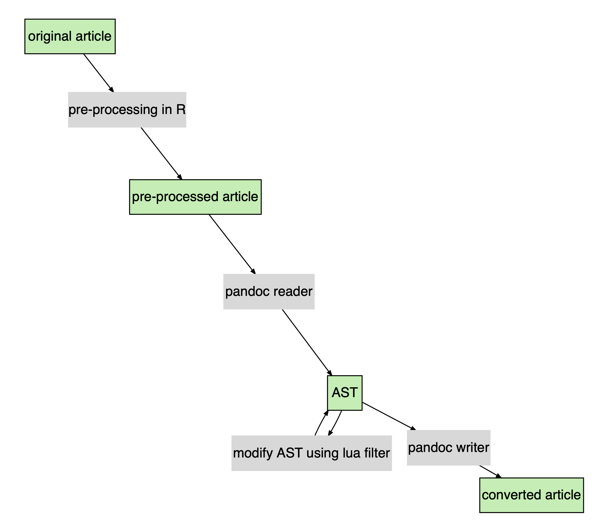
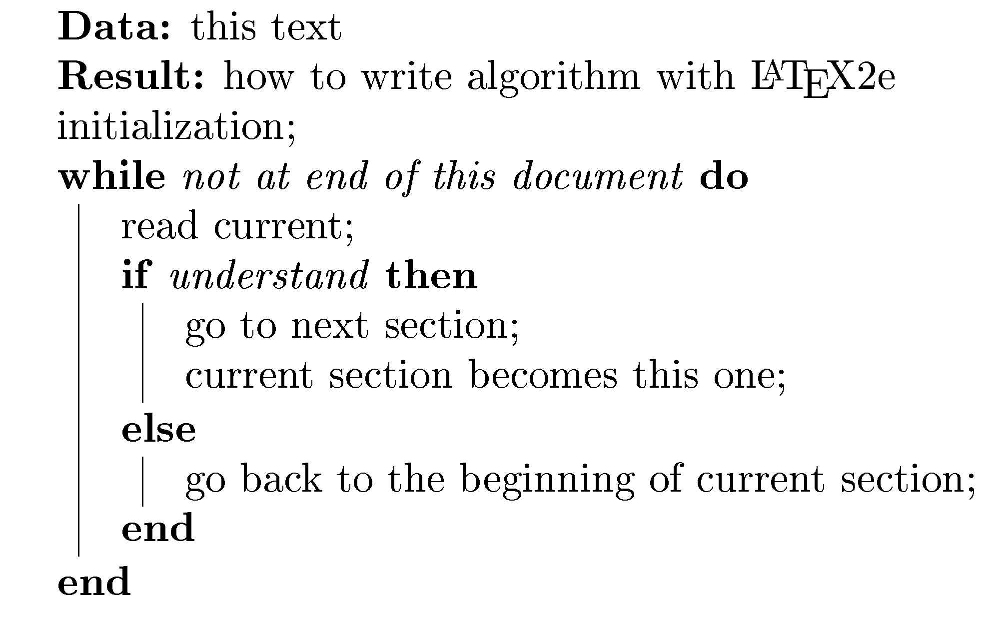

```{r setup, include=FALSE}
knitr::opts_chunk$set(echo = FALSE, warning = FALSE, message = FALSE)
library(plotly)
library(ggplot2)
```

# Introduction

The R Journal is the primary open-access outlet for publications produced by the R community. It was started in 2009, evolving from the R News newsletter that ran from 2001, to become a more formal publication that encourages and provides credit for the documentation of statistical computing research. 

The tooling behind the production of the R Journal is regularly updated. Early articles were typeset using LaTeX [@latex], based on a specific, but changing, template. Using LaTeX requires that code is separated from the documentation, and there is a chance that code chunks in the paper don't reproduce the results reported. With the emergence of dynamic document systems such as R Markdown [@rmarkdown], a tight coupling of code and documentation is possible. Code chunks are dynamically executed when the document is typeset using a system like \CRANpkg{knitr} [@knitr], making reporting of computing research more reproducible.  

In 2019, with the help of funding from the R Consortium, work began to update operations to adopt an R Markdown template, that would produce both HTML and PDF versions of the paper. In mind, was also to develop, adopt and encourage good standards for R Journal articles.

There are numerous benefits of HTML format: 

1. Articles can include interactive graphics (to allow readers to query, re-focus, and watch an animation, for example) and interactive tables (enabling re-sorting in different ways to better digest the information). 
2. It is the best format for accessibility [@Daisy]. Screen readers and other assistive technologies can deliver the content to print-disabled readers. (See @W3C for current guidelines.)
3. HTML provides a more comfortable reading experience on mobile devices, which are increasingly used as researchers work on the move and share work via social media.
4. Search engines can easily access the full text of articles, facilitating the discovery of published articles.

These provide the motivations for converting all of the legacy R Journal articles into HTML. 

A key decision when designing the conversion software was whether to convert the LaTeX source to HTML; the PDF output to HTML; or the LaTeX source to R Markdown, which would then be converted to HTML using the current journal tools. The latter approach was decided to be the most versatile and useful. If an article can be converted from LaTeX to R Markdown, it would help authors make the transition to reproducible publishing, beyond what the R Journal needed. Once an article is in R Markdown format it can be adapted to include the code for dynamic execution.

In addition to the article format, changes to the website structure were important for delivering the publication. Website architectures are also constantly evolving, and the emergence of \CRANpkg{distill} [@distill] allows the journal website to optimally deliver R Markdown articles.

The \CRANpkg{rjtools} was developed to create articles using R Markdown for the R Journal and to embed them into the journal website. The packages described here, \CRANpkg{texor} and \CRANpkg{rebib}, describe software to convert legacy LaTeX format articles into R Markdown, so that they can be rendered in HTML in the new website. 

The paper is organised as follows. Section 2 gives an overview of the conversion process, which includes pre-processing using regular expressions, post-processing using Lua filters, and handling of figures, tables and equations. Section 3 describes the \CRANpkg{texor} package that handles most of the conversion. Section 4 describes tools for special handling of bibliography files. The supplementary materials have folders containing specific examples that can be used for understanding how the conversions are done.

<!--
Describe changes in templates, and web site. Desirability to convert the legacy articles. Decided to convert latex input to Rmd, rather than directly html and why.

- R Journal latex template and formatting
- Quirks of the legacy articles
-->

# The internals of converting from LaTeX to R Markdown {#internals}

The decision to convert to R Markdown format means that the final output to PDF and HTML will depend on Pandoc [@pandoc].  Pandoc is a versatile document conversion program written in Haskell that is core to numerous documentation systems, including R Markdown and Quarto. Pandoc first converts a document into an abstract syntax tree. From this, it can convert to a different format, including custom ones. <!-- Although creating bespoke writers/readers in `Lua` can be challenging, pandoc includes filters that allow users to customize the output generated based on matching patterns plus some logic to modify them. -->

Pandoc can be used to do the conversion from LaTeX to R Markdown also. However, some pre-processing is necessary to handle special R Journal LaTeX styling. And further post-processing is necessary to handle specific R Journal R Markdown styling. The \CRANpkg{texor} package contains functionality to handle this pre- and post-processing of the document, in a workflow illustrated in Figure \@ref(fig:wf-fig). 

```{r workflow, eval=FALSE}
library(DiagrammeR)
wf <- create_node_df(
        n=8,
        type=c("a", "b", "a", "b", 
               "a", "b", "b", "a"),
        label=c("original article", "pre-processing in R",
                "pre-processed article", "pandoc reader",
                "AST", 
                "modify AST using lua filter",
                "pandoc writer", 
                "converted article"
                ),
        shape="rectangle",
        width=c(1.3, 1.7, 1.9, 1.3, 0.5, 2.3, 1.2, 1.5),
        fillcolor = c("darkseagreen2", "grey85", "darkseagreen2", "grey85", "darkseagreen2", "grey85", "grey85", "darkseagreen2"),
        color = c("black", "grey85", "black", "grey85", "black", "grey85", "grey85", "black"),
        fontcolor="black",
        x=c(1,1,1,1,1,2,1,1),
        y=c(1,2,3,4,5,5,6,6),
        fontsize=14
        )
wf_arrows <- create_edge_df(from = c(1, 2, 3, 4, 5, 6, 5, 7),
                            to = c(2, 3, 4, 5, 6, 5, 7, 8),
                            color="black")
wf_graph <- create_graph(wf, wf_arrows, 
                   directed = TRUE, attr_theme = "tb")
set.seed(7)
render_graph(wf_graph, layout="fr", height=500)
```

```{r wf-fig, fig.cap="Workflow of the document conversion conducted by texor. (Note: AST is pandoc's abstract syntax tree.)", out.width="100%", fig.align='center', fig.width=3, fig.height=5, layout="l-body", fig.alt="Flow diagram showing original article pre-processed in R passed to pandoc which creates the AST and modifies using many lua filters then passed to pacdoc writer to produce the converted article."}

```

## Pre-processing using regular expressions 

LaTeX is a very descriptive language, that allows authors substantial freedom for customization. Markdown [@markdown], on which R Markdown is based, is more restrictive and was designed to make it easier to create web pages without the distraction of a gazillion HTML tags. The beauty of Markdown is that it allows the author to focus on writing, without format cluttering the text. The drawback is that it is simple typesetting, optimized for web delivery.

While Pandoc can do most of the heavy lifting, it cannot cope with all the freedom with which LaTeX documents are written. An example of this is with formatting of code. Pandoc only handles the `verbatim` environment, but there are many ways to format code in LaTeX, and the R Journal template has a special `\code{}` command. If the code environment is not verbatim, then Pandoc will also try to process the actual code content as LaTeX commands and will likely lose details. It is better to convert these synonyms into `verbatim` environments prior to passing the document to Pandoc.

The functions in \CRANpkg{texor} that handle the pre-processing using regular expressions are:

- `stream_editor()`: operates like the `sed` function in unix [@unix] and allows generic text pattern matching and replacement.
- `patch_code_env()`: replaces the common code environments, `code`, `example`, `Sin`, `Sout`, `Scode`, `Sinput`, `smallverbatim`, `boxedverbatim`, `smallexample` with `verbatim`.
- `patch_equations()`: handles various equation environments.
- `patch_figure_env()`: handles various figure environments.
- `patch_table_env()`: handles various table environments.

These functions are verbose and describe all the changes being made. They also create a backup of the original file before making the changes. 

## Post-processing using Lua filters

Lua [@lua] is a programming language, that is lightweight and fast: ideal for procedural operations.  It is embedded in many other applications to allow custom scripting for extensibility. Pandoc allows users to provide custom Lua filters to produce custom output formats. The \CRANpkg{texor} package handles the post-processing of the R Markdown document into the special format for the R Journal using a suite of Lua filters. 

Here is an example of a Lua filter available in \CRANpkg{texor}:

```Lua
function Div(el)
    if el.classes[1] == 'thebibliography' then
        return { }
    end
end
```

This filter reads the abstract syntax tree, selecting all the Div elements. Then it looks for the class "thebibliography." This Div element contains the LaTeX bibliographic records, that appear at the very end of papers. It should not be in the document when using the "RJ-web-article" layout, because it is added from meta-data when the R Markdown is knitted. So the Lua filter removes this section.

## Figures

### Standard, single figure

Figure definitions in LaTeX are many and varied! The standard, single-figure definition with the `figure` environment and raster image format such as PNG or JPG, is handled by Pandoc. It will convert:

```latex
\begin{figure}[htbp]
  \centering
  \includegraphics[width=0.35\textwidth]{Rlogo-5.png}
  \caption{The logo of R.}
  \label{figure:rlogo}
\end{figure}
```

to 

```html
<figure id="figure:rlogo">

<figcaption>Figure 1: The logo of R.</figcaption>
</figure>
```

### PDF format images

Images in PDF format are converted to PNG, in the pre-processing of the LaTeX document, and then post-processed using Pandoc as described above. 

### Multiple figures

Multiple figures are supported with the latest versions of Pandoc, so definitions like:

```latex
\begin{figure*}[htbp]
  \centering
  \includegraphics[width=0.45\textwidth]{Rlogo-5.png}
  \includegraphics[width=0.45\textwidth]{normal}
  \caption{Images side by side}
  \label{fig:twoimages}
\end{figure*}
```

will be converted to:

```html
<figure id="fig:twoimages">
<p></p>
<figcaption>Figure 3: Images side by side</figcaption>
</figure>
```

### `tikz` format images

Some legacy articles define images using `tikz` commands, such as:

```latex
\begin{figure}

%% Generated Image will included as a PNG above automatically
  \centering
\tikzstyle{process} = [rectangle, rounded corners,
minimum width=3cm, 
minimum height=1cm,
text centered, 
draw=black]
\tikzstyle{arrow} = [thick,->,>=stealth]
\begin{tikzpicture}[node distance=4cm]
%Nodes
...

```

This is handled by pre-processing the LaTeX to create the image, as both PDF, and then PNG, for inclusion in the R Markdown document using:

```html
<figure id="fig:tikz">


<figcaption>Figure 5: Tikz Image example</figcaption>
</figure>
```

### Algorithm2e graphics as figures

Algorithm2e graphics using the `algorithm2e` package in LaTeX  are supported, and the following description will yield the result in Figure \@ref(fig:alghow).

```latex
\begin{algorithm}[htbp]
\SetAlgoLined
\KwData{this text}
\KwResult{how to write algorithm with \LaTeX2e }
initialization\;
\While{not at end of this document}{
read current\;
\eIf{understand}{
go to next section\;
current section becomes this one\;
}{
go back to the beginning of current section\;
}
}
\caption{How to write algorithms}
  \label{alg:how}
\end{algorithm}
```

```html
<figure id="alg:how">


<figcaption>Algorithm 1: How to write algorithms</figcaption>
</figure>
```

```{r alghow, fig.cap="How to write algorithms.", out.width="60%", fig.align='center', fig.alt="Illustration of an algorithm starting with Data and Result, followed by a while, and an if/else block."}

```

## Equations

Math is handled primarily by Pandoc. The inline math and equation descriptions are unchanged between LaTeX and R Markdown. 

The HTML output renders math using MathJax. This does mean that some functionality, like `\bm`, `\boldmath` and `\mathbbm` are not supported, and special definitions can only be handled in a limited capacity. 

The numbering of equations is a bit trickier. LaTeX automatically numbers equations, unless specifically instructed not to. Equation numbering in R Markdown requires specific labeling using `(\#eq:xx)` as described in @bookdown. The \CRANpkg{texor} helps by adding the labeling using a Lua filter to convert the existing `\label{..}` to `(\#eq:xx)`.

## Tables

Tables form one of the biggest challenges in migrating from LaTeX to R Markdown, because the sophistication is not completely replicated. However, there have been many improvements in table definitions for R Markdown that are increasingly producing the beautifully crafted tables possible in LaTeX. The conversion in \CRANpkg{texor} can mostly handle the simple tables, and for producing more complex tables it may be necessary to manually edit the resulting `Rmd` file to make conditional tables, one to render specifically for HTML output using packages such as \CRANpkg{kableExtra} [@kableExtra], \CRANpkg{gt} [@gt], \CRANpkg{htmlTable} [@htmlTable], \CRANpkg{tableHTML} [@tableHTML], \CRANpkg{tables} [@tables] or \CRANpkg{DT} [@DT]. A benefit of using conditional markup is that it can take advantage of HTML-specific features, such as sortable columns or paged tables.

### Generic tables

Simple LaTeX tables are converted into traditional markdown format tables by Pandoc. So this table definition:

```latex
\begin{table}[htbp]
\centering
\begin{tabular}{l | llll }
 \hline
 Graphics Format & LaTeX & Markdown & Rmarkdown & HTML \\
 \hline
 PNG       & Yes & Yes & Yes & Yes \\
 JPG       & Yes & Yes & Yes & Yes \\
 PDF       & Yes & No & No & No \\
 SVG       & No & Yes & Yes & Yes \\
 Tikz      & Yes & No & Yes & No \\
 Algorithm & Yes & No & No & No \\
\hline
\end{tabular}
\caption{Image Format support in various Markup/Typesetting Languages}
\label{table:1}
\end{table}
```

will be converted to:

```markdown
::: {#table:1}
  -------------------------------------------------------
  Graphics Format   LaTeX   Markdown   Rmarkdown   HTML
  ----------------- ------- ---------- ----------- ------
  PNG               Yes     Yes        Yes         Yes

  JPG               Yes     Yes        Yes         Yes

  PDF               Yes     No         No          No

  SVG               No      Yes        Yes         Yes

  Tikz              Yes     No         Yes         No

  Algorithm         Yes     No         No          No
  -------------------------------------------------------

  : Table 1: Image Format support in various Markup/Typesetting
  Languages
:::
```

### Multicolumn tables

A multicolumn table requires:

1. The stream editor modifies the `\multicolumn{..}` to
    `\multicolumnx{..}`.

2. A LaTeX macro is used to redefine the `\multicolumnx{..}` to
    `\multicolumn{---}` (which is accepted by pandoc).

3. Pandoc reads the table and transforms it to markdown.

```{asis echo=knitr::is_latex_output()}
\begin{table*}[htbp]
\begin{center}
\begin{tabular}{l | llll }
 \hline
 \multicolumn{1}{c |}{EXAMPLE} & \multicolumn{2}{c}{$X$} &
\multicolumn{2}{c}{$Y$} \\
 \hline
  & 1 & 2 & 1 & 2 \\
 EX1  & X11 & X12 &  Y11  & Y12 \\
 EX2  & X21 & X22 &  Y21  & Y22 \\
 EX3  & X31 & X32 &  Y31  & Y32 \\
 EX4  & X41 & X42 &  Y41  & Y42\\
 EX5  & X51 & X52 &  Y51  & Y52 \\
\hline
\end{tabular}
\caption{An example multicolumn table.}
\label{table:2}
\end{center}
\end{table*}
```

```{asis echo=knitr::is_html_output()}
::: center
::: {#table:2}
  -------------------------------------
  EXAMPLE   \(X\)         \(Y\)   
  --------- ------- ----- ------- -----
            1       2     1       2

  EX1       X11     X12   Y11     Y12

  EX2       X21     X22   Y21     Y22

  EX3       X31     X32   Y31     Y32

  EX4       X41     X42   Y41     Y42

  EX5       X51     X52   Y51     Y52
  -------------------------------------

  : Table 2: An Example Table with Multicolumn
:::
:::
```

Also note that the stream editor is used to rename `table*` environment to `table` environment because the HTML format is single column, so the asterisk indicating that the table should be drawn over the full width of the page is redundant in this case.

### Other tables

Tables with images, math, code or links in the cells are generally handled. Also `widetable` tables that allow for specific width or wrapping of tables into blocks are also partially handled.

# Using \CRANpkg{texor} {#texor}

The package `texor` can be installed from CRAN and the development version from https://github.com/Abhi-1U/texor. The website for the package, https://abhi-1u.github.io/texor, has vignettes documenting usage. 

Note that you will need to use [Pandoc Version > 3.0.0 (if possible latest)](https://pandoc.org/installing.html) for the best results. You can check your version with:

```r
rmarkdown::pandoc_version()
```

The only function that a user will typically require is `latex_to_web()`. This creates the R Journal style R Markdown file from a given R Journal style LaTeX file. 
This is achieved by several sequential steps: `convert_to_markdown()`, `generate_rmd()`, and `produce_html()`. 

For converting the 14 years of legacy R Journal articles, batch processing of issues was conducted. 

For individuals who are interested in submitting their paper to the R Journal but have written their article using the legacy LaTeX format and wish to convert it to the current R Markdown format, you can use the `latex_to_web()` function on your paper directory. This will get you about 80% of the way to an R Markdown version of your paper. You will then want to: 

- Edit the lines where figures are included. The conversion will create HTML code to define the image. This should be changed into Markdown description `` or using `knitr::include_graphic(Image)` in an R code chunk, in order for both HTML and PDF versions of the paper to be created when the `rjtools` article template is knitted.
- Edit the tables for aesthetics. The conversion will create Markdown tables, which will convert appropriately to HTML and PDF. However, to have more control and to create more elegant tables using `knitr::kable` provides a finer level of control.
- Include your R code to dynamically do the computing described in your article. If any code block is time-consuming to complete, saving intermediate output, or caching would be recommended.

# Managing the bibliography using \CRANpkg{rebib} {#rebib}

Typically bibliographies are generated during the processing of a LaTeX article using the BibTeX software [@bibtex] operating on a `.bib` list of references. The current R Journal template requires the inclusion of the `.bib` file. But LaTeX actually uses a `.bbl` format for references, which is what BibTeX generates as an intermediate format during the article processing. 

The instructions for R Journal authors have changed over time. Initially, authors were instructed to run BibTeX on their article and to include the `.bbl` formatted references directly in the `.tex` file. This was to avoid clashes in citation keys between multiple articles in an issue. Later on, authors were instructed to provide a `.bib` file instead.
During the conversion of legacy articles, it was discovered that some papers had references in both the `.tex` file and in separate `.bbl` or `.bib` files. Usually, the different files were equivalent, but sometimes references were only found in one source and in some cases the files contained conflicting information! While LaTeX can technically handle either `.bbl` or `.bib` formatted references, R Markdown can only handle `.bib`. 

The \CRANpkg{rebib} package was developed to handle these tricky situations. It converts embedded LaTeX bibliographies into a close BibTeX equivalent. The features of the package are:

- extracting embedded bibliographic entries from a `.tex` file;
- creating the mandatory title and author fields;
- creating the optional URL, ISBN, publisher, pages and year fields, when available;
- storing remaining information in `"journal"` (internally) and `"publisher"` (when writing BibTeX file);
- ignoring commented LaTeX code;
- tracking citations included in the document, and
- aggregating references from embedded bibliographic entries with references from supplementary `.bbl` and `.bib` files.

<!-- The \CRANpkg{rebib} package addresses the issue with LaTeX articles using built-in bibliography options with or without BibTeX files. While this works well with LaTeX, it won't work with Rmarkdown. Initially, the goal was to use external software like Biber to convert the embedded bibliography to BibTeX. However the integration of external software was not viable, hence the experimental idea of a bibliography parser gained momentum. 

It was initially a part of the \CRANpkg{texor} package, as those functions grew in features and became more involved; at that point, it made sense to move those functions as a separate package. Initially, there were some reservations about the usage of \CRANpkg{rebib} and its stability with various formats. However, the package has improved over time and proven to be a good performer.-->

<!-- ## Using \CRANpkg{rebib}-->

The package `rebib` can be installed from CRAN and the development version from https://github.com/Abhi-1U/rebib. The website for the package, https://abhi-1u.github.io/rebib, has vignettes documenting usage.  

# The process of converting all the legacy articles

The R Journal has been operating since 2009 and has published 682 articles through 2022 in addition to numerous editorials and news items. These LaTeX articles are the main focus of the conversions made with \CRANpkg{texor} and \CRANpkg{rebib}.

## Batch processing

The code is designed to process all the articles in an issue at a time, by operating on all the files in the directory housing the issue. Each processing function, from pre-processing the text in the LaTeX file to post-processing accepts a directory name as the argument. Generally, if a problem is encountered with one article, the processing will skip to the next. The vignette [Introduction to texor](https://abhi-1u.github.io/texor/articles/introduction-to-texor.html) provides more details. 

## Known problems requiring manual fixes

The problems encountered with some articles are many and varied, and include:

- The table format is often not as neat in the HTML as in the LaTeX. It can be made close to the original with extra effort in the R Markdown description.
- Some of the figure files are missing - so the figure may need to be extracted from the pdf file and included with `knitr::include_graphics()`.
- Figures and equations may need some resizing. Sometimes the figure or equation might extend outside the text region in the HTML, which can be fixed by specifying the preferred size, or breaks in the equation lines. 
- Alignment in multi-line equations may need adjusting.
- Alignment of columns in a table may not be the same as the original, for example, the text might be center-aligned, instead of the original left-aligned.
- Specialty LaTeX definitions included by an author for their article may not be recognized by Pandoc, leaving the original command as is, in the article. 

## Plan for release

The HTML versions of all successfully converted legacy articles will be on the [R Journal website](https://journal.r-project.org) late in 2023. The final step in the integration requires the R Markdown file to be knitted in place to capture the metadata for each article. 

## Reporting problems

As a consequence of this project, the journal website has been furnished with an additional link titled "CONTRIBUTE". Visiting this link will give you details on how to report a problem with an article that you are reading, or even to make a suggestion on improving operations.

# Summary

The original motivation for the \CRANpkg{texor} and \CRANpkg{rebib} packages was to convert legacy LaTeX articles into HTML format for accessibility. Thus it only creates an `.Rmd` (R Markdown) file which is used to produce only an HTML version. The original PDF remains as published. The goal is to use the packages for future articles where the authors have chosen to submit only in the legacy LaTeX template. 

However, the software can also be used by authors themselves to convert to dynamic documents, by providing an initial R Markdown version of their LaTeX, that with some modification, such as including their R code for computations directly in the document, will produce both PDF and HTML versions of their submitted paper. 

Adopting the new R Markdown template also provides better standards for R Journal articles. It encourages authors to be more conscious that their work is reproducible. There is more standardization of file names and file structure, and this helps the editors and reviewers check papers. This in turn makes it easier to build the issues, eliminating some common errors that authors make that cause compilation failure. 

There are many benefits of providing good standards, though, and an important one is that this can have positive spillover effects for the R community. Authors can become more aware of good practice. For example, one of the useful elements when an article is in HTML format is that figures can be made richer with an `alt-text` (alternative text) element. In an R Markdown code chunk generating a figure, this can be set using `fig.alt`. Alt-text provides a textual alternative to non-text content in HTML documents, and serves various purposes: screen readers can deliver the content to print-disabled people, it is displayed in place of the image if it fails to load, and can serve to assist search engines. It is a work in progress: to encourage adoption by authors of new article submissions, and it would be useful to edit into the converted legacy articles at a later date. 

There are many other journals that have a similar backlog of legacy articles. A current and ongoing project is being conducted by @arxiv to convert their collection of articles from LaTeX (shared as PDF) to HTML, utilizing LaTeXML [@latexML]. The work conducted for the R Journal might be of interest to similarly small journals that operate without paid staff. Converting legacy articles provides accessibility to a wealth of educational material.

After the change was made to use R Markdown, a new development for the open-source scientific and technical publishing community has emerged: quarto [@quarto]. Although R Markdown would suggest a focus on R, it was always possible to include code chunks written in other languages. But Quarto makes this cleaner, and thus more appealing for non-R developers. It also provides a cleaner typesetting. At some point, the R Journal will likely shift to a Quarto template, which is reasonably straightforward, but for the present R Markdown is a suitable dynamic document delivery system for the R Journal.

# Acknowledgments {-}

The authors wish to thank the [Google Summer of Code](https://summerofcode.withgoogle.com) program for financially supporting Abhishek Ulayil's work on this project, and the R Project organization for their support. Heather Turner was supported by the Engineering and Physical Sciences Research Council [EPSRC EP/V052128/1] during this project. Also in the initial stages of the development, Zola Batsaikhan carefully checked the conversion of articles, listing and fixing the problems after the conversion. This helped to refine the software to catch these problems and fix in the automatic conversion.

# Supplementary materials {-}

The supplementary materials has example folders containing LaTeX documents that allow the reader to see how different common patterns in the legacy documents are handled with the conversion. These include:

- `code-env`: Explains how different code environments defined by the R Journal style are handled, and additional details such as code in figure environments, and code in table environments. 
- `math-env`: Examples of inline math, display math, and how equation numbering is handled by a Lua filter to convert from LaTeX labeling to R Markdown labeling. 
- `figure-env`: Explains how the variety of figure definitions are handled in the conversion, including different image formats, numbering, captions, labeling, multiple images, and `tikz` images with an example adapted from [@casflow].
- `table-env`: Examples of how a variety of table types are converted, including multicolumn, complex and wide tables.
- `lua-filters`: Overview and lots of small examples of Lua filters to handle the custom output needed for the R Markdown format.
- `metadata`: This has a collection of additional format handling including extracting metadata like author names and affiliations, article identifiers used in the review process, and handling citations, footnotes and links.
- `bibliography`: The bibliography was handled differently over the years of the journal, and this details how to use the `rebib` functionality to handle `bbl` files, embedded `bbl`, to convert into the standard `.bib` format.

In each of these folders there is a `RJwrapper.tex`, and `.tex` file, with the extra template files `RJournal.sty` and `Rlogo-5.png` and `.bib` files. These match the legacy template file structure, from which the `RJwrapper.pdf` file is created. To test the conversion for each of these examples, set the path directory to one of the folders and use the `latex_to_web()` function as follows:

```r
article_dir <- "path-to-this supplementary folder"
texor::latex_to_web(article_dir)
```

This will create an `.Rmd` and `.html` files in the same directory, that demonstrate the converted R Markdown version and the HTML output format.

You'll need to ensure that you have the latest versions of \CRANpkg{texor} and \CRANpkg{rebib}, and Pandoc (at least later than version 3.0.0).

## Source materials {-}

The \CRANpkg{texor} and \CRANpkg{rebib} source code and materials to reproduce this paper are available at:

- \CRANpkg{texor}: Version 1.3.0 https://abhi-1u.github.io/texor
- \CRANpkg{rebib}: Version 0.3.2 https://abhi-1u.github.io/rebib/
- This paper: https://github.com/Abhi-1U/texor-rjarticle
- More details on \CRANpkg{rjtools} are at https://rjournal.github.io/rjtools/
