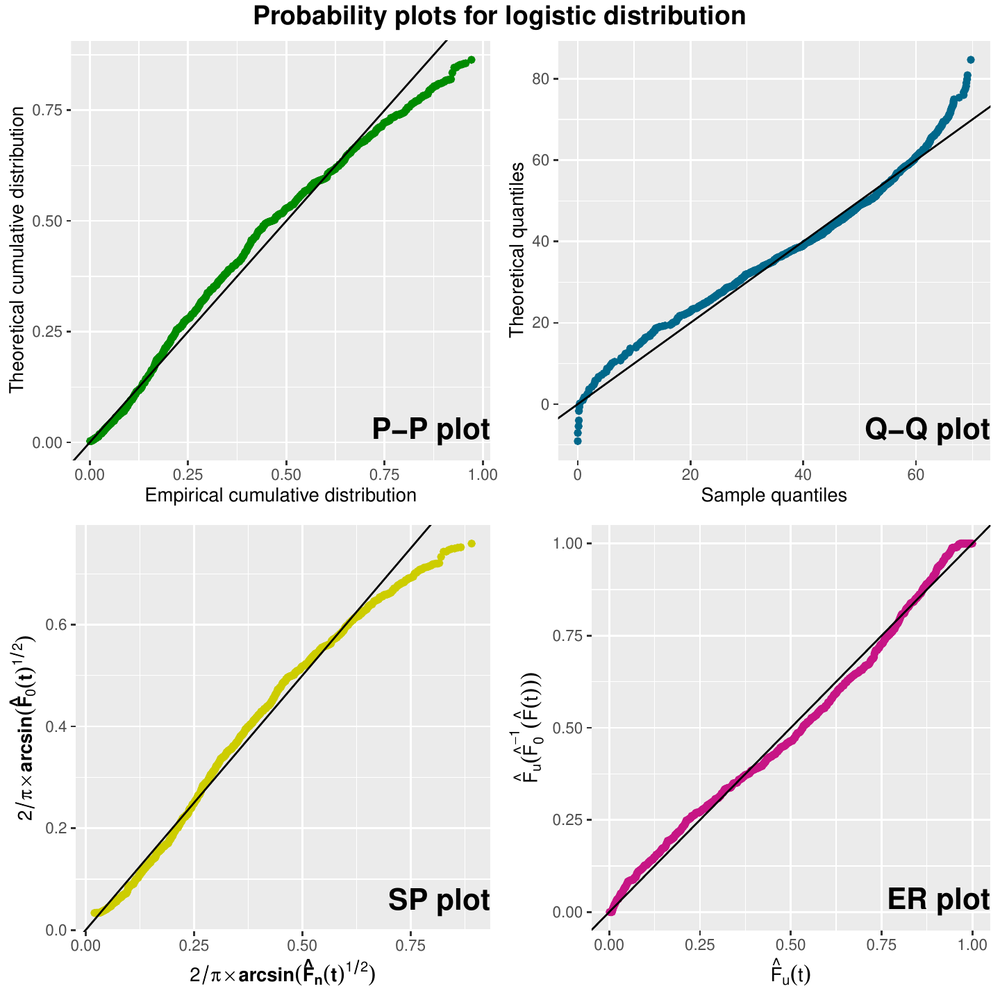

::::: article
## Introduction

Goodness-of-fit techniques are important to test the validity of
parametric models and to ensure that the modeling assumptions hold true.
Historically, goodness-of-fit tests have been developed for complete
data, that is, when all the individual sample measurements have been
observed. The Kolmogorov-Smirnov, Cramér-von Mises, and Anderson-Darling
statistics are among the most commonly used goodness-of-fit tests. They
are based on a measure of the discrepancy between the empirical and
theoretical distribution functions.

In order to account for censored data, these statistics can be modified
replacing the empirical distribution function by the product-limit
estimator of the distribution function. Modifications of
Kolmogorov-Smirnov statistics for censored or truncated data go back to
@FOOH and @KB. Pioneer extensions of Cramér-von Mises and
Anderson-Darling goodness-of-fit statistics to account for random
right-censored data are found in @pettitt76 and @koziol76. Concerning
chi-squared tests, @mihalko80 propose an extension to censored data,
specifically for type II right-censored data.

When the theoretical distribution function is completely specified and
the data are uncensored, the above tests are all distribution-free, with
known distributions. However, this property no longer holds when data
are censored or when the theoretical distribution function involves
unknown parameters. Moreover, there is no general theory of asymptotic
optimality in such cases [@lehmann05]. In fact, any test can achieve
high asymptotic power or perform uniformly well against local or
contiguous alternatives, especially when the family of possible
alternatives is extensive [@janssen2000]. Given these limitations,
graphical techniques have become a standard and straightforward way to
assess distributional assumptions. They allow for a more intuitive
examination of model fit. In addition, graphical methods complement
formal goodness-of-fit tests. They often provide insights that the tests
alone may not reveal.

The most well-known plots for assessing goodness-of-fit are probability
plots. These include the Probability--Probability (P--P) plot, which
compares the theoretical and estimated cumulative distribution
functions, and the Quantile--Quantile (Q--Q) plot, which compares
theoretical and estimated quantiles. There are also two alternatives to
these plots: the Stabilised Probability plot [@Mi], which transforms the
axes of the P-P plot to approximately get the same variance in each
plotted point, and the Empirically Rescaled plot [@WT], which is very
useful when there is a high percentage of random right-censored data.

Goodness-of-fit methods for complete data and right-censored
observations are widely available. However, many of these methods are
not implemented in `R`, and those that are tend to be scattered across
different packages. Among the publicly available computational tools in
`R`, the **fitdistrplus** package [@DD; @fitdistrplus1] provides the
function `fitdistcens()`, which returns the result of the fit of any
parametric distribution to a possibly right-censored data set. The
function `cdfcomp()` of the same package can be used to graphically
compare multiple fitted distributions with uncensored data. The
`probplot()` function from the **e1071** package [@e1071] generates
probability plots for specified theoretical distribution. Additionally,
the `distChooseCensored()` function from the **EnvStats** package
[@envstats; @EnvStats1] performs Shapiro-Wilk and Shapiro-Francia
goodness-of-fit tests for normal, log-normal, and Gamma distributions,
handling both complete and singly censored data [@Roy93].

In this work, we present the `R` package **GofCens** [@gofcens], which
provides various analytical methods and graphical tools to assess the
goodness of fit of parametric models for non-negative, right-censored
lifetime data. These tools can also be applied to complete lifetime
data. Right censoring is restricted to type I or random censoring, and
non-informative censoring is assumed for the failure time. In what
follows, we review the analytical and graphical goodness-of-fit
techniques for complete and right-censored data implemented in
**GofCens**. Thereafter, the main functions of the **GofCens** package
are presented and applied to a real data set, respectively. We conclude
the paper with some final remarks on the current state of the package
and possible enhancements.

## Methods {#sec:methodse}

Let $T$ denote the time to an event of interest, with distribution
function $F$. The **GofCens** package provides goodness-of-fit methods
to assess whether a univariate sample from $T$, either right-censored or
complete, comes from a specified distribution family $F_0(t; \theta)$,
such as the Weibull, where $\theta$ is a vector of unknown parameters.
Formally, the null hypothesis in a goodness-of-fit test is given by
$H_0\!: F(t)=F_0(t;\theta)$. Specifically, the **GofCens** package
provides implementations of well-known tests such as the
Kolmogorov-Smirnov, Cramér-von Mises, and Anderson-Darling tests based
on the empirical distribution function for complete data and their
extensions for right-censored data. Additionally, **GofCens** includes a
chi-squared-type test based on the squared differences between observed
and expected counts using random cells, with an extension tailored for
right-censored data. Recognizing that these tests may not always yield
high power, **GofCens** complements them with a series of graphical
tools to aid in selecting the most suitable parametric model.

Goodness-of-fit tests based on the empirical distribution function are
typically developed under a fully specified null hypothesis
$H_0\!: F(t) = F_0(t; \theta^*)$, such as a Weibull distribution with
known parameters (e.g., $\alpha = 2$ and $\beta = 1$). They are less
often formulated for the more general case $H_0\!: F(t)=F_0(t;\theta)$ ,
where $\theta$ is unknown. This distinction has important implications
for how such tests are applied in practice. This situation is common
when fitting empirical data to parametric distributions with unknown
parameters. To address it, we replace the unknown parameter $\theta$
with its maximum likelihood estimator $\hat\theta$. Following the
recommendations in @Cap09, the implementation of the four tests
---Kolmogorov-Smirnov, Cramér-von Mises, Anderson-Darling, and
chi-squared tests--- uses bootstrap techniques that involve the
maximum-likelihood re-estimation of the unknown parameters $\theta$ in
each simulated sample as we describe in Subsection Bootstrap methods.

In what follows, we briefly outline the theory underlying these methods
for testing $H_0\!: F(t) = F_0(t; \theta^*)$ assuming that the data
consist of a sample of $n$ individuals, each subject to random right
censoring. We denote by $T_1, \dotsc, T_n$ independent random variables
with a common distribution $F(\cdot)$ and by $C_1, \dotsc, C_n$
independent censoring random variables with a common distribution
$H(\cdot)$, independent of $T_1, \dotsc, T_n$. The observed variables
are defined as $Y_i = \min(T_i, C_i)$ and
$\delta_i = \mathbf{1}\{T_i\leq C_i\},\, i = 1, \dotsc, n$.

### Tests based on empirical distribution functions {#susec:tests}

In order to test $H_0\!: F(t) = F_0(t; \theta^*)$ for all $t\geq 0$, we
can use statistics based on a distance between $F_0(t; \theta^*)$ and
$\widehat{F}_n(t)$, the empirical distribution function for complete
data, or either the Kaplan-Meier or the Nelson-Aalen estimator, if
right-censored data are present. In both cases, large values of the
distance indicate evidence against the hypothesized model.

#### Kolmogorov-Smirnov test

The Kolmogorov-Smirnov goodness-of-fit test is the most used analytical
method to test goodness of fit when one is dealing with uncensored data.
@FOOH published a modification of the Kolmogorov-Smirnov test in an
attempt to obtain increased power when applied to uncensored data. They
also generalized this test for arbitrarily right-censored data.

For complete data, the Kolmogorov-Smirnov statistic is defined as
$D_n = \sup_t |\widehat{F}_n(t)- F_0(t; \theta^*)|$, where
$\widehat{F}_n(t)$ is the empirical distribution function. To account
for right-censored data, the Kolmogorov-Smirnov statistic is modified as
$$\label{eq:KSstat}
\widehat{D}_n = \sup_{0\leq t\leq t_m}  |\widehat{F}_n(t)-F_0(t; \theta^*)| =
  \sup_{0\leq t\leq t_m} \left|\int_0^t \frac{\widehat{S}_n(t)S_0(s; \theta^*)}{\widehat{S}_n(s)}d\big[\widehat{\Lambda}_n(s)-\Lambda_0(s; \theta^*)\big]\right|.   (\#eq:KSstat)$$
Here, $\widehat{F}_n$, is replaced by
$\widehat{F}_n = 1 - \widehat{S}_n = 1 - e^{-\widehat{\Lambda}_n}$,
being $\widehat{\Lambda}_n$ the Nelson-Aalen estimator of the cumulative
hazard function. In this case, $S_0$ and $\Lambda_0$ denote the survival
and the cumulative hazard function of the hypothesized distribution
$F_0$, respectively, and $t_m$ is the largest observed time in the
sample.

The standardized modified Kolmogorov-Smirnov statistic for censored data
converges in distribution to
$\sup_{0\leq t\leq F_0(t_m; \theta^*)} |B(F_0(t; \theta^*))|$, where
$B(t)$ is a Brownian bridge. According to the results in @KB, the
asymptotic distribution of $\widehat{D}_n$ is given by
$$\label{eq:aprxKS}
  \lim_{n\rightarrow\infty} P(\sqrt{n}\widehat{D}_n\leq k) =
    \sum_{j = -\infty}^\infty (-1)^{j}e^{-2j^2k^2} P\Big(\Big|Z-2jk \sqrt{\frac{1-T}{T}} \Big| < k \sqrt{\frac{1}{T - T^2}}\Big),   (\#eq:aprxKS)$$
where $Z$ is a standard normal random variable and
$T = F_0(t_m; \theta^*)$. An approximation for the $p$ value is proposed
by [@FOOH], which is considered acceptable when the $p$ value is less
than 0.8 and excellent when it is less than 0.2.

#### Cramér-von Mises-type test {#sususec:CvMtest}

For uncensored data, the Cramér-von Mises statistic is given by
$$M_n = n\int_{-\infty}^{+\infty}\big(\widehat{F}_n(t)-F_0(t; \theta^*)\big)^2dF_0(t).$$

For right-censored data, let $Y_1, \dotsc, Y_{n_r}$ represent the $n_r$
observed failure times, that is, $\sum_{i = 1}^n \delta_i = n_r$. If we
transform the order failure times $Y_{(1)}, \dotsc, Y_{(n_r)}$ into
Uniform$(0,1)$ random variables $u_{(1)}, \dotsc, u_{(n_r)}$, defined as
$u_{(i)} = F_0(Y_{(i)};\theta^*)$, and adopt the convention that
$u_{(0)} = 0$ and $u_{(n_r + 1)} = 1$, we can express the modified
Cramér-von Mises statistic as
$$\label{eq:CvMstat}
  \widehat{M}_n = n_r\sum_{j=1}^{n_r+1} \widehat{F}_n(u_{(j-1)})(u_{(j)}-u_{(j-1)}) \left(\widehat{F}_n(u_{(j-1)})-(u_{(j)}+u_{(j-1)})\right) + \frac{n_r}{3},   (\#eq:CvMstat)$$
which can be easily computed. However, although the asymptotic
distribution of $\widehat{M}_n$ has been studied by @pettitt76 and
@koziol76, its practical implementation is not straightforward.

#### Anderson-Darling test {#sususec:ADtest}

The Anderson-Darling test statistic is a modification of $M_n$ where the
integrand is weighted by the inverse of $F_0(t)(1 - F_0(t))$:
$$A_n = n\int_{-\infty}^{+\infty}(\widehat{F}_n(t)-F_0(t; \theta^*))^2\frac{dF_0(t; \theta^*)}{F_0(t; \theta^*)(1-F_0(t; \theta^*)}.$$

For right-censored data, using the same notation as in the Cramér-von
Mises statistic, the Anderson-Darling statistic is computed as
$$\begin{aligned}
\label{eq:ADstat}
\begin{split}
  \widehat{A}_n = -n_r &+ n_r\sum_{j = 1}^{n_r}(\widehat{F}_n(u_{(j - 1)}) - 1)^2 \left[\log|1 - u_{(j-1)}| - \log|1 - u_{(j)}|\right]\\
 &+ n_r\sum_{j=1}^{n_r-1}\widehat{F}_n^2(u_{(j)})\left[ \log |u_{(j+1)}| - \log |u_{(j)}| \right]-n_r\log|u_{(n)}|.
\end{split}
\end{aligned}   (\#eq:ADstat)$$
As with the Cramér-von Mises statistic, the asymptotic distribution of
$\widehat{A}_n$ has been studied by @pettitt76 but its practical
implementation is not straightforward.

#### Chi-squared type tests {#susec:chisq}

@Ki introduced a general class of $\chi^2$ goodness-of-fit statistics
for randomly right-censored data, extending Pearson's statistic where
the cells are replaced by random cells.

Random cells are built as intervals in $\mathbb{R}$ whose boundaries
depend on some sample summaries. These boundaries are defined by a
vector $\varphi$ of $r$ statistics, yielding intervals
$I_j(\varphi)=(a_{j-1}(\varphi),\,a_{j}(\varphi)]$, where
$j = 1, \dotsc, M$, and
$-\infty=a_0(\varphi) < \, a_1(\varphi) \, < \,\dotsb < \, a_M(\varphi) = \infty$.
For instance, we might take the quantiles $1/M,\, 2/M, \dotsc, 1$ as
random cells boundaries $a_1(\varphi), \dotsc, a_M(\varphi)$.

The observed frequency of cell $j$,
$N_{nj}(\varphi) = n\int_{I_j(\varphi)} d\widehat{F}_n$, is calculated
using either the empirical distribution function or 1 minus the
Kaplan-Meier estimator of the survival function if there are
right-censored data. The expected probability of cell $j$ under the null
hypothesis of a fully specified distribution, $F_0(t; \theta^*)$, is
denoted by $p_j(\theta^*, \varphi_n)$.

The class of $\chi^2$ statistics is defined as
$$\label{eq:Chistat}
  T_n = V_n^\top(\theta^*, \varphi_n) \cdot K_n(\theta^*, \varphi_n)\cdot V_n(\theta^*,\varphi_n),   (\#eq:Chistat)$$
where $K_n(\theta^*,\varphi)$ is a symmetric, non-negative definite
matrix. $K_n(\theta^*,\varphi)$ is, in most cases, the inverse of a
consistent estimator of the asymptotic variance-covariance matrix of the
random vector $V_n(\theta^*,\varphi_n)$. The matrix can be computed
following formulas (3.1) in [@Ki]. The vector
$V_n(\theta^*,\varphi) = (\nu_{nj})_{j = 1, \dotsc, M}$, contains
differences between observed and expected frequencies. Each component is
defined as
$$\nu_{nj}(\theta^*, \varphi_n) = n^{-\frac12}N_{nj}(\varphi_n) - n^{\frac12} \cdot p_j(\theta^*, \varphi_n).$$
The limiting distribution of $T_n$ is a linear combination of
independent noncentral $\chi^2$-distributed variables which is complex
to implement.

### Computation of test statistic's distribution

The limiting distributions of the statistics in \@ref(eq:CvMstat),
\@ref(eq:ADstat), and \@ref(eq:Chistat) under the null hypothesis
$H_0\!: F(t) = F_0(t; \theta),$ when the parameter $\theta$ is unknown
and replaced by its maximum likelihood estimate $\hat\theta$, are too
complex to implement directly. Therefore, the corresponding $p$ values
are computed using bootstrap methods (see Subsubsection Bootstrap
methods for right-censored data). For consistency, the $p$ values of the
Kolmogorov-Smirnov test are also obtained using bootstrap.

The function `KScens()` of the **GofCens** package calculates the value
of the test statistic of the Kolmogorov-Smirnov test, and, by default,
approximates the $p$ value using bootstrap methods. Alternatively, the
function also allows $p$ value computation based on the asymptotic
distribution given in \@ref(eq:aprxKS). The function `CvMcens()` in the
**GofCens** package calculates the observed Cramér-von Mises statistic
adapted for right-censored data, and provides an approximation of the
corresponding $p$ value using bootstrap methods. The function `ADcens()`
in the **GofCens** package calculates the observed Anderson-Darling
statistic for right-censored data and provides an approximation of the
corresponding $p$ value using bootstrap methods. The `chisqcens()`
function in the **GofCens** package uses bootstrap techniques to compute
the $p$ values.

#### Bootstrap methods for right-censored data {#Subsec:Bootstrap}

Since the asymptotic distributions of the described goodness-of-fit
statistics are unknown when the null hypothesis is not fully specified,
bootstrap techniques offer a practical alternative for computing
$p$ values. The bootstrap method is as well a practical alternative if
$H_0$ is fully specified, but the asymptotic distribution depends on a
complex expression. This section describes the application of
bootstrapping to derive $p$ values for tests presented in the previous
subsection. We use the notation $G_n$ to refer to any of the following
test statistics: the Kolmogorov--Smirnov statistic defined in
\@ref(eq:KSstat), the Cramér--von Mises statistic in \@ref(eq:CvMstat),
the Anderson--Darling statistic in \@ref(eq:ADstat), and the chi-squared
statistic in \@ref(eq:Chistat).

To test the null hypothesis $H_0\!:F(t) = F_0(t; \theta)$ using complete
and right-censored data, we follow the guidelines of @Cap09.
Accordingly, the observed data is utilized to estimate the parameter
$\theta$, denoted as $\hat\theta_n$, using maximum likelihood
estimation. Subsequently, we generate $B$ independent bootstrap samples
of the same size ($n$) as the original data set as follows.
Specifically, for each iteration $b$, $b = 1, \dotsc, B$, we compute the
bootstrap statistic $(\widehat{G}_n^{\hat{\theta}_n})_b$ carrying out
the following steps:

1.  Generation of survival times $T_1^b, \dotsc, T_n^b$ from the fitted
    distribution $F_0(t;\hat{\theta}_n)$.

2.  Generation of censoring times $C_1^b, \dotsc, C_n^b$ from the
    non-parametric estimation of $H$ obtained with the Kaplan-Meier
    estimator.

3.  Generation of observed survival times $Y_i^b = \min(T_i^b, C_i^b)$,
    and event indicators
    $\delta_i^b = \mathbf{1}\{T_i^b \le C_i^b\}, i = 1, \dotsc n$.

4.  Maximum likelihood estimation of the parameter, $\hat{\theta}_n^b$,
    given $(Y_i^b, \delta_i^b), i = 1, \dotsc n$.

5.  Computation of the bootstrap statistic,
    $(\widehat{G}_n^{\hat{\theta}_n})_b$.

By repeating this process for many bootstrap samples ---the default
value of the functions `KScens()`, `CvMcens()`, `ADcens()`, and
`chisqcens()` is $B = 999$---, the sequence of bootstrap statistics,
$(\widehat{G}_n^{\hat{\theta}_n})_b$, $b = 1, \cdots, B$, represents the
empirical distribution of the statistic $G_n$ under the null hypothesis.

The $p$ value is calculated by comparing the observed test statistic
$\widehat{G}_n$ to the empirical distribution of the bootstrap
statistic. Specifically, the $p$ value is the proportion of bootstrap
statistic values $(\widehat{G}_n^{\hat{\theta}_n})_b$ greater than or
equal to the observed statistic $\widehat{G}_n$:
$$p = \frac{1}{B + 1} \big(\sum_{i=1}^B \mathbf{1}\{\widehat{G}_n \leq (\widehat{G}_n^{\hat{\theta}_n})_b\} + 1\big),$$
where adding 1 in both the numerator and the denominator avoids a zero
$p$ value.

Note that steps 2 and 3, which involve generating the right-censored
sample, are crucial. This is because the distribution of $G_n$ depends
not only on $F_0$ but also on $H$ and the proportion of censored data.
The functions `KScens()`, `CvMcens()`, `ADcens()`, and `chisqcens()` are
designed so that, if the original data contains no right-censored
observations, the censoring times in step 2 are automatically set to
$\infty$.

Moreover, as explained and illustrated in Section 'Goodness-of-fit
tests' below, these functions allow testing the null hypothesis of a
fully specified choice of the parameters,
$H_0\!:F(t) = F_0(t;\theta^*)$. In this case, the survival times in step
1 are generated from $F_0(t;\theta^*)$.

### Goodness-of-fit plots

The **GofCens** package provides six different plots for evaluating
goodness of fit, applicable to both right-censored and complete data. In
most cases, a roughly straight line formed by the points suggests good
agreement with the hypothesized theoretical distribution.

#### Probability-probability and Stabilized Probability plots

The probability-probability plot (P-P plot) maps $\widehat{F}_0(t)$
against $\widehat{F}_n(t)$, where $\widehat{F}_0(t)$ corresponds to
either $F_0(t;\theta)$ with the unknown parameters replaced by their
maximum likelihood estimates or to $F_0(t;\theta^*)$. $\widehat{F}_n$
represents either the empirical distribution function or 1 minus the
Kaplan-Meier estimator of the survival function, if right-censored data
are present.

In order to enhance the interpretability of the P-P plot and because
some of the plotted points have a larger variability than others, @Mi
proposed the Stabilized Probability plot (SP plot). In the same way as
the $\arcsin$ transformation can be used to stabilize the variance of a
uniform order statistic, this function can be applied to stabilize the
variance of $\widehat{F}_0(t)$. The variances of the resulting SP
plotted points are all approximately equal.

#### Quantile-quantile plot

The quantile-quantile plot (Q-Q plot) maps the theoretical quantiles
against the estimated quantiles, that is,
$\widehat{F}_0^{-1}(\widehat{F}_n(t))$ against $t$. An empirical
rescaling of the axes can help to overcome the problem that the plotted
points might not be evenly spread, in particular in the presence of
right-censored data. The Empirically Rescaled plot (ER plot) plots
$\widehat{F}_u(\widehat{F}_0^{-1}(\widehat{F}_n(t)))$ against
$\widehat{F}_u(t)$, where $\widehat{F}_u(t)$ is the empirical cumulative
distribution function of the points corresponding to the uncensored
observations [@WT].

Table [1](#tab:T1){reference-type="ref" reference="tab:T1"} provides an
overview of the axes of the probability and quantile-quantile plots.

::: {#tab:T1}
  --------------------------------------------------------------------------------------------------------------------------------------
  Plot                                 Abscissa                                                      Ordinate
  ---------- ------------------------------------------------------------- -------------------------------------------------------------
  P-P plot                        $\widehat{F}_n(t)$                                            $\widehat{F}_0(t)$

  Q-Q plot                                $t$                                         $\widehat{F}_0^{-1}(\widehat{F}_n(t))$

  SP plot     $\frac{\pi}{2} \arcsin\big(\widehat{F}_n(t)^{\frac12}\big)$   $\frac{\pi}{2} \arcsin\big(\widehat{F}_0(t)^{\frac12}\big)$

  ER plot                         $\widehat{F}_u(t)$                           $\widehat{F}_u(\widehat{F}_0^{-1}(\widehat{F}_n(t)))$
  --------------------------------------------------------------------------------------------------------------------------------------

  : (#tab:T1) Probability and quantile-quantile plots to assess
  goodness of fit.
:::

#### Cumulative hazard and Kaplan-Meier plots

Another set of plots consists of cumulative hazard plots, derived from
transforming the cumulative hazard function $\Lambda$ in such a way that
it becomes linear in $t$ or in $\log(t)$. The Nelson-Aalen estimator
$\widehat{\Lambda}$ of $\Lambda$ is computed from the data, and the
distribution-specific transformation $A(\widehat{\Lambda}(t))$ is then
plotted against either $t$ or its natural logarithm. The transformations
for all the distributions considered in the **GofCens** package are
detailed in Table [2](#tab:T2){reference-type="ref"
reference="tab:dists"}.

In addition, the **GofCens** package includes a function to graphically
compare the Kaplan-Meier estimate of the survival function
($1 - \widehat{F}_n(t)$) with the parametric estimations of the survival
function from the parametric models under study
($1 - \widehat{F}_0(t)$).

::: {#tab:dists}
  --------------------------------------------------------------------------------------------------------------------------------------------------------------------------------------------------------------------------------------------------------------------------------------------------------------------
  Distribution                                                                           Survival function                                                                 Cum. hazard function                                                                        Plot
  --------------------------------------------------- ---------------------------------------------------------------------------------------- ----------------------------------------------------------------------------- -----------------------------------------------------------------------------------------
  Exponential \[Exp$(\beta)$\]                                                  $\displaystyle e^{-\frac{t}{\beta}}$                                                         $\frac{t}{\beta}$                                                             $\widehat{\Lambda}(t)$ vs $t$

  Weibull \[Wei($\alpha,\,\beta$)\]                                        $\displaystyle e^{-(\frac{t}{\beta})^\alpha}$                                                $(\frac{t}{\beta})^\alpha$                                                    $\log \widehat{\Lambda}(t)$ vs $\log t$

  Gumbel \[Gum($\mu,\,\beta$)\]                                          $\displaystyle 1 - e^{-e^{-\frac{t-\mu}{\beta}}}$                                  $-\log\big(1 - e^{-e^{-\frac{t-\mu}{\beta}}}\big)$                            $-\log\big(\!-\log(1 - e^{-\widehat{\Lambda}(t)})\big)$ vs $t$

  Log-Logistic \[LLogis($\alpha, \beta$)\]                       $\displaystyle \frac{1}{1 + \left(\frac{t}{\beta}\right)^\alpha}$                         $\log\big(1 + \big(\frac{t}{\beta}\big)^\alpha\big)$                              $\log\big(e^{\widehat{\Lambda}(t)} - 1\big)$ vs $\log t$

  Logistic \[Logis($\mu,\beta$)\]                         $\displaystyle \frac{e^{-\frac{t -\mu}{\beta}}}{1 + e^{-\frac{t - \mu}{\beta}}}$                    $\log\big(1 + e^{-\frac{t - \mu}{\beta}}\big)$                                    $\log\big(e^{\widehat{\Lambda}(t)} - 1\big)$ vs $t$

  Log-Normal \[LN($\mu,\beta$)\]                       $\displaystyle\int\limits_{\frac{\log t - \mu}{\beta}}^\infty \!\frac{1}{\sqrt{2 \pi}}            $-\log\big(1-\Phi\big(\frac{\log t-\mu}{\beta}\big)\big)$                         $\Phi^{-1}\big(1-e^{-\widehat{\Lambda}(t)}\big)$ vs $\log t$
                                                                                                        e^{-\frac{x^2}{2}}dx$                                                                                                

  Normal \[N($\mu,\beta$)\]                                      $\displaystyle \int\limits_t^\infty \! \frac{1}{\beta\sqrt{2\pi}}                         $-\log\big(1-\Phi\big(\frac{t-\mu}{\beta}\big)\big)$                              $\Phi^{-1}\big(1 - e^{-\widehat{\Lambda}(t)}\big)$ vs $t$
                                                                                             e^{-\frac{(x - \mu)^2}{2 \beta^2}} dx$                                                                                          

  4-Parameter Beta \[Beta($\alpha, \gamma, a, b$)\]         $\displaystyle 1 - \frac{B_{(\alpha, \gamma, a, b)}(t)}{B(\alpha, \gamma)}$         $-\log\big(1 - \frac{B_{(\alpha, \gamma, a, b)}(t)}{B(\alpha,\gamma)}\big)$                   $B^{-1}_{(\alpha, \gamma, a, b)} \big(B(\alpha, \gamma)
                                                                                                                                                                                                                                                                 \big(1 - e^{-\widehat{\Lambda}(t)}\big)\big)$ vs $t$
  --------------------------------------------------------------------------------------------------------------------------------------------------------------------------------------------------------------------------------------------------------------------------------------------------------------------

  : (#tab:T2) List of the distributions that are implemented in the
  **GofCens** package. The last column shows the specific
  transformations of time and the estimated cumulative hazard function
  of the cumulative hazard plots, which are implemented by the function
  `cumhazPlot()`. The shape parameters are denoted by $\alpha > 0$ and
  $\gamma > 0$, the location parameter by $\mu \in R$, and the scale
  parameter by $\beta > 0$. The time $t$ will be always positive.
  $B(\alpha, \gamma)$ denotes the Beta function and
  $B_{(\alpha,\gamma, a, b)}(t) = \int_0^{\frac{t - a}{b - a}} u^{\alpha - 1} (1-u)^{\gamma - 1}du$.
:::

## The **GofCens** package

### Installation and dependencies

The **GofCens** package can easily be installed from any CRAN repository
by running the `R` command

``` r
R> install.packages("GofCens")
```

As shown on the corresponding web page of the CRAN
(<https://cran.r-project.org/web/packages/GofCens/index.html>),
**GofCens** depends on the packages **survival** [@survival] and
**actuar** [@actuar; @actuar1]. The former is needed to estimate the
survival and cumulative hazard functions, whereas the latter implements
several distributions that are not available in standard `R` packages.
Additionally, **GofCens** imports functions from the following packages:
the `fitdist()` and `fitdistcens()` functions of the **fitdistrplus**
package [@DD; @fitdistrplus1] provide the estimation of the
distributions' parameters; the packages **ggplot2**
[@ggplot2; @ggplot21], **gridExtra** [@gridextra], and the base package
**grid** are needed for several features of the graphical tools; and the
bootstrap methods to compute the $p$ values of the Kolmogorov-Smirnov,
Cramér-von Mises, Anderson-Darling, and chi-squared type tests are
implemented with the function `boot()` of the **boot** package [@boot].
Moreover, the `is()` function from the base package **methods** is used
internally to verify object classes during function execution.

### Package overview

The **GofCens** package provides both graphical tools and statistical
test functions to assess goodness of fit for the distributions shown in
Table [2](#tab:T2){reference-type="ref" reference="tab:dists"}.

The graphical functions, which facilitate visual evaluation of the model
adequacy, include:

-   Function `probPlot()` draws the probability and quantile-quantile
    plots of Table [1](#tab:T1){reference-type="ref"
    reference="tab:T1"}.

-   Function `cumhazPlot()` draws the cumulative hazard plots of
    Table [2](#tab:T2){reference-type="ref" reference="tab:dists"}.

-   Function `kmPlot()` draws the Kaplan-Meier estimates of the survival
    function and overlays parametric fits of the survival function.

The statistical test functions, which implement goodness-of-fit tests,
include:

-   Function `KScens()` implements the Kolmogorov-Smirnov test adapted
    to right-censored data.

-   Function `CvMcens()` implements the Cramér-von Mises test adapted to
    right-censored data using bootstrap techniques.

-   Function `ADcens()` implements the Anderson-Darling test adapted to
    right-censored data using bootstrap techniques.

-   Function `gofcens()` computes the test statistics of the
    Kolmogorov-Smirnov, Cramér-von Mises, and Anderson-Darling tests
    adapted to right-censored data and returns the corresponding
    $p$ values.

-   Function `chisqcens()` implements the chi-squared type test based on
    random cells and using bootstrap techniques.

These functions share several features: although they are primarily
designed for right-censored data, they can also be applied to complete
datasets. They provide parameter estimates for the distributions under
study and support two input formats: users can either provide vectors
with the observed survival times and the corresponding event indicator,
or use the common formula interface with a `Surv` object. Earlier
versions of the functions were implemented in `R` by @Fe, @MiB, and
@garcia17.

Specific features of the statistical test functions include the
following: On the one hand, these functions can be used to assess the
goodness of fit for any distribution, provided that the corresponding
`p`*name*, `d`*name*, and `r`*name* functions are available. On the
other hand, they return test-specific objects for which `print`,
`summary`, and `print.summary` methods are implemented.

In addition, the **GofCens** package comes with a data frame called
`nba`, which contains the survival times of 3962 former players of the
National Basketball Association (NBA) until 2019. These data were
analyzed previously by @Mart.

#### A simulated example

Following, we will present the main features of the eight functions and
illustrate their use with simulated survival times. For this purpose, we
generate 300 survival times from a log-normal distribution with location
parameter $\mu = 2$ and scale parameter $\beta = 1$, i.e.,
$T \sim LN(2,\,1)$, and 300 censoring times from an exponential
distribution with scale parameter $\beta = 20$, i.e, $C \sim Exp(20)$:

``` r
R> set.seed(123)
R> survt <- round(rlnorm(300, 2, 1), 2)
R> censt <- round(rexp(300, 1 / 20), 2)
```

The observed right-censored survival times, $Y = \min(T,\,C)$, and the
corresponding event indicators, $\delta = \mathbf{1}\{T \le C\}$, are
computed as follows:

``` r
R> times <- pmin(survt, censt)
R> delta <- as.numeric(survt <= censt)
```

In total, 106 (35.3%) survival times of the generated sample are
right-censored:

``` r
R> table(delta)
  0   1
106 194
```

### Graphical tools: Functions `probPlot()`, `cumhazPlot()`, and `kmPlot()`

#### Function `probPlot()` {#susec:probplot}

The `probPlot()` function allows users to assess graphically how well
any of the distributions in Table [2](#tab:T2){reference-type="ref"
reference="tab:dists"} fit to a sample of right-censored survival or
complete times. For this purpose, the function implements the four
probability and quantile-quantile plots in
Table [1](#tab:T1){reference-type="ref" reference="tab:T1"}. By default,
the function draws all four plots, but provides users with the option to
choose only a subset of these. If the user does not provide specific
distribution parameters, the maximum likelihood estimates are used to
draw the plots. One graphical feature of the function is the option for
users to choose between the base package **graphics**, which is the
default, and the **ggplot2** package for drawing the plots. In the
former case, `probPlot()` internally calls the `par()` function,
enabling users to set graphical parameters within the function call.

For the illustration of the `probPlot()` function, we assess how well
the log-normal distribution (left panel of
Figure [1](#fig:iluprobplot){reference-type="ref"
reference="fig:iluprobplot"}) and the Weibull distribution (right panel
of Figure [1](#fig:iluprobplot){reference-type="ref"
reference="fig:iluprobplot"}) fit to the sample data. The four plots in
the left panel show fairly straight lines, thus confirming that the
underlying distribution is the log-normal distribution, whereas the
plots in the right panel clearly show that the Weibull distribution
would not be an adequate distribution to model the data.

The `R` code used to draw the plots in the left and right panels of
Figure [1](#fig:iluprobplot){reference-type="ref"
reference="fig:iluprobplot"} is the following:

``` r
R> library("GofCens")
R> probPlot(times, delta, distr = "lognormal", cex.lab = 1.3)
R> probPlot(times, delta, distr = "weibull", ggp = TRUE)
```

<figure id="fig:iluprobplot">
<p> </p>
<figcaption>Figure 1: Probability plots applied to a right-censored
sample from a log-normal distribution assuming log-normal (left panel)
and Weibull distributions (right panel). Both figures are drawn with the
<code>probPlot()</code> function.</figcaption>
</figure>

To illustrate additional functionalities of this function, we apply it
again to the data set to assess the suitability of fitting a log-normal
distribution with parameters $\mu = 2$ and $\beta = 1$. For this
purpose, we employ the `params0` argument, whose default value is
`NULL`, to specify the parameter values. Additionally, the main argument
is a `Surv` object and we utilize the `m` argument to display the four
probability plots in a single row, as shown in
Figure [2](#fig:iluprobplot2){reference-type="ref"
reference="fig:iluprobplot2"}. From these plots, it becomes evident that
this log-normal distribution does not fit well to the data. Furthermore,
we set `prnt = TRUE` so that the function provides both the parameter
values used in the probability plots and the maximum likelihood
estimates of the parameters, together with the values of the Akaike
(AIC) and the Bayesian (BIC) information criteria.

``` r
R> probPlot(Surv(times, delta) ~ 1, distr = "lognormal", m = matrix(1:4, 
+    nrow = 1), params0 = list(location = 2, scale = 1.5), ggp = TRUE, prnt = TRUE)

Distribution: log-normal 

Parameters used in probability plots:
Location: 2 
   Scale: 1.5 

Parameter estimates:
Location (se): 1.988 (0.058)
   Scale (se): 0.883 (0.045)

   AIC: 1266.899 
   BIC: 1274.307    
```

{#fig:iluprobplot2
width="90.0%" alt="graphic without alt text"}

#### Function `cumhazPlot()` {#susec:cumhazplot}

The `cumhazPlot()` function can be used to generate cumulative hazard
plots for any of the distributions listed in Table
[2](#tab:T2){reference-type="ref" reference="tab:dists"}. As previously
noted, the cumulative hazard plot is based on a transformation of the
cumulative hazard function to achieve linearity in either $t$ or
$\log(t)$. Consequently, given a set of survival times, this function
serves as a useful tool to assess which parametric model best fits the
data.

By default, the function generates cumulative hazard plots for the
Weibull, Gumbel, log-logistic, logistic, log-normal, and normal
distributions. Additionally, users can opt to choose the exponential and
beta distributions or select any subset of these distributions. Similar
to the `probPlot()` function, users can choose between the base
**graphics** package (default) or **ggplot2** to draw the plots.

Setting the argument `prnt` to `TRUE` (default is `FALSE`), the function
also returns the maximum likelihood estimates for the specified
distribution, along with the Akaike Information Criterion (AIC) and
Bayesian Information Criterion (BIC) values.

An illustration with the previously generated right-censored sample from
the log-normal distribution is shown in
Figure [3](#fig:ilucumhazplot){reference-type="ref"
reference="fig:ilucumhazplot"}. As expected, the points of the
cumulative hazard plot for the log-normal distribution show a fairly
straight line, whereas most of the other distributions under study can
clearly be discarded. This conclusion is further supported by comparing
the AIC and BIC values across all distributions, with the log-normal
distribution showing the lowest values.

The corresponding code is the following, where argument `degs = 2` is
used to return the parameter estimates, which are shown below, with two
decimal digits (default is `degs = 3`).

``` r
R> cumhazPlot(times, delta, font.lab = 4, cex.lab = 1.3, degs = 2, prnt = TRUE)

Parameter estimates

weibull
   Shape (se): 1.27 (0.07)
   Scale (se): 10.98 (0.62)
   AIC: 1304.05 
   BIC: 1311.45 

loglogistic
   Shape (se): 1.94 (0.11)
   Scale (se): 7.18 (0.42)
   AIC: 1272.48 
   BIC: 1279.89 

lognormal
Location (se): 1.99 (0.06)
   Scale (se): 0.88 (0.05)
   AIC: 1266.9 
   BIC: 1274.31 

gumbel
Location (se): 6.38 (0.33)
   Scale (se): 4.95 (0.3)
   AIC: 1342.49 
   BIC: 1349.9 

logistic
Location (se): 8.51 (0.43)
   Scale (se): 3.84 (0.23)
   AIC: 1430.25 
   BIC: 1437.66 

normal
Location (se): 9.89 (0.49)
   Scale (se): 7.54 (0.38)
   AIC: 1456.22 
   BIC: 1463.63 
```

{#fig:ilucumhazplot width="90.0%"
alt="graphic without alt text"}

If users want to assess the goodness of fit of the exponential and the
beta distribution and compare these with the fit of the log-normal
distribution, they must specifically select these distributions, as
shown in the following example. Notice that users need to provide the
limits for the beta distribution, as the default domain, $(0,\,1)$, does
not cover the range of the sample's survival times. In this example,
plots are drawn using the **ggplot2** package (`ggp = TRUE`), and
parameter estimates are not displayed on the screen. The resulting plots
are shown in Figure [4](#fig:ilucumhazplot2){reference-type="ref"
reference="fig:ilucumhazplot2"}, where we observe that neither the
exponential nor the beta distribution fits the data well. The
corresponding `R` code is the following.

``` r
R> cumhazPlot(times, delta, distr = c("exponential",  "beta", "lognormal"),
+    betaLimits = c(0, 100), ggp = TRUE)
```

{#fig:ilucumhazplot2 width="90.0%"
alt="graphic without alt text"}

#### Function `kmPlot()` {#susec:kmplot}

The `kmPlot()` function allows users to graphically compare the
nonparametric Kaplan-Meier estimate of the survival function for a
right-censored or complete sample of survival times with parametric
estimates based on different models. For this purpose, each parametric
estimate is individually overlaid on the Kaplan-Meier estimator of
$S(t)$. Likewise the `cumhazPlot()` function, this is done by default
for the Weibull, Gumbel, log-logistic, logistic, log-normal, and normal
distributions, with the option to also include the exponential and beta
distributions. The plots are generated using the **graphics** package by
default, but setting `ggp = TRUE` enables the use of the **ggplot2**
package. With both options, the pointwise 95% confidence intervals are
plotted.

In the example shown in Figure [5](#fig:kmplots){reference-type="ref"
reference="fig:kmplots"}, the estimated survival functions for the six
default distributions are overlaid on the nonparametric estimate of
$S(t)$. As expected, the log-normal distribution exhibits the best fit
to the data. However, based on these plots, the log-logistic
distribution might also be considered as a parametric model that fits
the sample data well.

The `R` code used to draw the Kaplan-Meier plots in
Figure [5](#fig:kmplots){reference-type="ref" reference="fig:kmplots"}
is the following:

``` r
R> kmPlot(times, delta, ggp = TRUE)
```

{#fig:kmplots width="90.0%"
alt="graphic without alt text"}

### Goodness-of-fit test functions {#susec:goftests}

In this section, we briefly describe and illustrate the use of the five
functions in the **GofCens** package that implement the tests presented
in the 'Methods' section.

The basic `print` methods of all functions return the test statistic and
the p-value, whereas the `summary` methods do also provide the maximum
likelihood estimates for the parameters of the hypothesized distribution
$F_0(t; \theta)$ as well as the values of both the AIC and BIC. The
functions have also in common that they offer the option to test the
null hypothesis for specific parameter values of $F_0$, i.e.,
$F_0(t; \theta^*)$. Each function returns an object of its own class,
enabling the use of object-specific `print` and `summary` methods.

#### Function `KScens()`

The `KScens()` function enables users to assess the goodness of fit
using the Kolmogorov-Smirnov test adapted to right-censored data. It
supports the eight distributions in
Table [2](#tab:T2){reference-type="ref" reference="tab:dists"} as well
as any other distribution for which the corresponding `p`*name*,
`d`*name*, and `r`*name* functions are implemented. The function
computes the test statistic in (\@ref(eq:KSstat)) and, by default,
estimates the $p$ value using bootstrap methods.

As illustrated below with the data from the generated right-censored
sample, the function returns, by default, a list with two elements:

-   The null distribution.

-   The test result, which includes the Kolmogorov-Smirnov test
    statistic (`A`) and the $p$ value.

Additionally, the `summary` method provides two more elements:

-   The maximum likelihood estimates of the parameters of the
    distribution under study.

-   The values of the AIC and BIC.

In the illustration, we run the `KScens()` function to assess the
goodness of fit of the log-normal and the Weibull distributions, first
using bootstrapping to approximate the $p$ value, and second calculating
the $p$ value following the results in @FOOH. Additionally, in the
second example, we apply the function `summary` method, which returns
the parameter estimates, their standard errors and both the AIC and BIC.
As shown, the $p$ value obtained for the log-normal distribution is, as
expected, larger (`0.115`) than the $p$ value (`0.042`) for the Weibull
distribution.

``` r
R> set.seed(123)
R> KScens(times, delta, distr = "lognormal")

Null hypothesis: the data follows a lognormal distribution 

KS Test results:
      A p-value 
  0.781   0.115 
```

``` r
R> set.seed(123)
R> summary(KScens(times, delta, distr = "weibull", boot = FALSE))

Distribution: weibull 

KS Test results:
      A p-value 
  1.391   0.042 

Parameter estimates (se):
shape             scale             
1.273 (0.067)     10.98 (0.621)     

AIC: 1304.046 
BIC: 1311.453
```

#### Functions `CvMcens()` and `ADcens()`

The `CvMcens()` function calculates the test statistic of the Cramér-von
Mises test in (\@ref(eq:CvMstat)), while the `ADcens()` function
calculates the test statistic of the Anderson-Darling test
in (\@ref(eq:ADstat)), and both employ bootstrap techniques to estimate
the corresponding $p$ values. These functions share the same arguments,
allowing users to specify the number of bootstrap samples, among other
options. The default number of bootstrap samples for both functions is
999, which may result in lengthy computation times for large sample
sizes. In such cases, users might consider reducing the number of
bootstrap samples. For example, in the illustrations of the `CvMcens()`
function below, with $n = 300$ and 999 bootstrap samples, the
computation times are approximately 15 seconds using `R` version 4.5.0
on Windows 10 x64 (build 19045) with an Intel(R) Core(TM) i5-8500
processor (3.00 GHz).

The null hypotheses in the illustrations remain the same as before, as
do the conclusions: we would conclude that the data may come from a
log-normal distribution, but not from a Weibull distribution.

``` r
R> set.seed(123)
R> summary(CvMcens(times, delta, distr = "lognormal"))

Distribution: lognormal 

CvM Test results:
    CvM p-value 
  0.054   0.450 

Parameter estimates (se):
location          scale             
1.988 (0.058)     0.883 (0.045)     

AIC: 1266.899 
BIC: 1274.307   
```

``` r
R> set.seed(123)
R> summary(CvMcens(times, delta, distr = "weibull"))

Distribution: weibull 

CvM Test results:
    CvM p-value 
  0.376   0.001 

Parameter estimates (se):
shape             scale             
1.273 (0.067)     10.98 (0.621)     

AIC: 1304.046 
BIC: 1311.453  
```

Applying the function `ADcens()` in the same way as `CvMcens()`, the
$p$ values are similar: $p = 0.52$ in the case of the log-normal
distribution and $p = 0.001$ with the Weibull distribution.

Note that due to the use of resampling methods, with both functions it
is advisable to previously set the seed of `R`'s random number
generation in order to guarantee reproducibility of the test results.

As mentioned before, users can also test the null hypothesis that the
data come from a specific choice of the distribution under study, i.e.,
$H_0\!: F(t) = F_0(t; \theta^*)$. While this may be less relevant in
practical applications, it can be useful for examining the properties of
these tests. To perform such a test, users need to specify particular
values for the distribution's parameters. For example, below we test the
null hypothesis that the data follow a log-normal distribution with
location and scale parameters $\mu = 2$ and $\beta = 1.5$. In this case,
as shown, the Anderson-Darling test clearly rejects the null hypothesis
(`p = 0.001`). Note that the output now includes both the specified
parameter values for the null hypothesis and the maximum likelihood
estimates. In addition, we use the `outp` argument of the
`summary.ADcens()` function to change the format of the output.

``` r
R> set.seed(123)
R> summary(ADcens(times, delta, distr = "lognormal",
+    params0 = list(location = 2, scale = 1.5)), outp = "table")

Distribution: lognormal 

Null hypothesis:
--------- | ---------
Parameter | Value    
--------- | ---------
location  | 2        
scale     | 1.5      
--------- | ---------

AD Test results:
------- | -------
Metric  | Value  
------- | -------
AD      | 9.536  
p-value | 0.001  
------- | -------

Parameter estimates:
--------- | --------- | ---------
Parameter | Value     | s.e.     
--------- | --------- | ---------
location  | 1.988     | 0.058    
scale     | 0.883     | 0.045    
--------- | --------- | ---------

AIC: 1266.899 
BIC: 1274.307 
```

#### Function `gofcens()`

Rather than performing each of the three tests individually, users can
run the Kolmogorov-Smirnov, Cramér-von Mises, and Anderson-Darling tests
simultaneously with the `gofcens()` function, which calls each
corresponding test function. This approach is especially useful for
comparing the tests in a specific context or in a larger study, such as
comparing their statistical power. However, a potential drawback is
longer computation times, as each test function employs bootstrap
methods to estimate the $p$ values. In the following examples, using the
same data and null hypotheses as before, the computation time is
approximately 20 seconds on `R` version 4.5.0, running on Windows 10 x64
(build 19045) with an Intel(R) Core(TM) i5-8500 processor (3.00 GHz).
Note that in the second example, we modify options in the
`summary.gofcens()` function: the number of bootstrap samples is
displayed, while the AIC and BIC values are omitted.

``` r
R> set.seed(123)
R> gofcens(times, delta, distr = "lognormal")

Null hypothesis: the data follows a lognormal distribution 

Test statistics
   KS   CvM    AD 
0.781 0.054 0.500 

p-values
   KS   CvM    AD 
0.115 0.450 0.520 
```

``` r
R> set.seed(123)
R> summary(gofcens(times, delta, distr = "weibull"), print.AIC = FALSE,
+    print.BIC = FALSE, print.infoBoot = TRUE)

Distribution: weibull 

Test statistics
   KS   CvM    AD 
1.391 0.376 2.828 

p-values
   KS   CvM    AD 
0.001 0.001 0.001 

Parameter estimates (se):
shape             scale             
1.273 (0.067)     10.98 (0.621)     

Number of bootstrap samples: 999
```

#### Function `chisqcens()`

The `chisqcens()` function implements the chi-squared type test of @Ki
explained in Section 'Chi-squared type tests'. Likewise the `KScens()`,
`CvMcens()`, and `ADcens()` functions, the computation of the $p$ value
is achieved with bootstrap techniques using `BS = 999` as default value
for the number of bootstrap samples. The function's default output
includes the hypothesized distribution, the value of the test statistic,
and the corresponding $p$ value. The extended output provided by the
`summary.chisqcens()` function also includes the parameter estimates,
the the AIC and BIC values as well as two values related to the number
of random cells: the number initially chosen by the user (`Original`)
and the final number used in the analysis (`Final`). The latter may be
smaller due to the presence of right-censored data. For example, in the
illustrations below using right-censored data from a log-normal
distribution, we set `M = 8` random cells, but this number is reduced to
`M = 7` due to censoring.

``` r
R> set.seed(123)
R> chisqcens(times, delta, M = 8, distr = "lognormal")

Null hypothesis: the data follows a lognormal distribution 

Chi-squared Test results:
Statistic   p-value 
    3.123     0.154 
```

``` r
R> set.seed(123)
R> summary(chisqcens(times, delta, M = 8, distr = "weibull"))

Distribution: weibull 

Chi-squared Test results:
Statistic   p-value 
    8.599     0.002 

Parameter estimates (se):
shape             scale             
1.273 (0.067)     10.98 (0.621)     

Cell numbers:
Original    Final 
       8        7 

AIC: 1304.046 
BIC: 1311.453 
```

Again, based on the outputs, we would choose the log-normal distribution
instead of the Weibull distribution, because its value of the test
statistic is clearly smaller (3.123 vs 8.599) and the $p$ value is far
larger ($p = 0.154$ vs $p = 0.002$).

The following illustration highlights two features of the
goodness-of-fit test functions in the **GofCens** package. First, all
functions return structured objects that can be stored as standard
objects for further use in `R`. Second, users can test the
goodness-of-fit of distributions different from the eight distributions
in Table [2](#tab:T2){reference-type="ref" reference="tab:dists"}. In
this example, we apply the `chisqcens()` function using the gamma
distribution. As shown, the parameter estimates are reported with the
default names `theta1` and `theta2`, and the result is an object of
class `chisqcens`, further processed with the `summary` method to
display detailed results.

``` r
R> set.seed(123)
R> result <- summary(chisqcens(times, delta, M = 8, distr = "gamma")) 
R> result

Distribution: gamma 

Chi-squared Test results:
Statistic   p-value 
    6.176     0.006 

Parameter estimates (se):
theta1            theta2            
1.65 (0.144)     0.165 (0.019)     

Cell numbers:
Original    Final 
       8        7 

AIC: 1293.124 
BIC: 1300.532    
```

``` r
R> class(result)

[1] "summary.chisqcens" "chisqcens"
```

## Real data example: Survival times of retired NBA players {#sec:examples}

In this section, we apply several functions of the **GofCens** package
to determine the parametric model that best fits the survival times of
former NBA players.

The data frame `nba` comes with the GofCens package and contains the
survival times (variable `survtime`) of all 3962 former players of the
National Basketball Association (NBA) from its inception until July
2019. These data have been published and analyzed by @Mart, where
survival times are measured as the elapsed time (in years) from the end
of the NBA career until either death (`cens == 1`) or July 31, 2019
(`cens == 1`). By this date, 864 (21.8%) of the former players had died,
with uncensored post-NBA survival times ranging from a few days until
nearly 70 years. The estimated median survival time is 54.1 years as
shown below in the output of the function `npsurv` of the **rms**
package [@rms] and Figure [6](#fig:KMNBA){reference-type="ref"
reference="fig:KMNBA"}, which shows the Kaplan-Meier estimate of the
survival function.

``` r
R> data("nba")
R> library("rms")
R> npsurv(Surv(survtime, cens) ~ 1, nba)

Call: npsurv(formula = Surv(survtime, cens) ~ 1, data = nba)
        n events median 0.95LCL 0.95UCL
[1,] 3962    864   54.1    53.1    55.1    
```

The `R` code to draw the plot in
Figure [6](#fig:KMNBA){reference-type="ref" reference="fig:KMNBA"} is
the following:

``` r
R> par(las = 1, cex.lab = 1.3, cex.axis = 1.2, font.lab = 4, font.axis = 2,
+    mar = c(5, 5, 2, 2), yaxs = "i", xaxs = "i")
R> survplot(npsurv(Surv(survtime, cens) ~ 1, nba), lwd = 3,
+    xlab = "Years after NBA career", time.inc = 5, col.fill = grey(0.6),
+    ylab = "Estimated survival probability", xlim = c(0, 75))
R> abline(h = 0.5, lwd = 2, lty = 2)
```

{#fig:KMNBA
width="65.0%" alt="graphic without alt text"}

In order to model parametrically the survival times and estimate the
median, we need to know which distribution is the most appropriate
distribution. For this purpose, we take advantage of the `cumhazPlot()`
function, which provides the six cumulative hazard plots shown in
Figure [7](#fig:NBAcumhaz){reference-type="ref"
reference="fig:NBAcumhaz"}:

``` r
R> cumhazPlot(Surv(survtime, cens) ~ 1, nba, font.lab = 4, cex.lab = 1.3, 
+    lwd = 3, colour = "blue")
```

{#fig:NBAcumhaz width="90.0%"
alt="graphic without alt text"}

According to the plots in
Figure [7](#fig:NBAcumhaz){reference-type="ref"
reference="fig:NBAcumhaz"}, the logistic distribution fits reasonably
well to the data, even though the corresponding plot does not show a
completely straight line of the points. In addition, we could also
consider the normal distribution for parametric analyses of the survival
times. To choose one of either distributions, we run the following code
to draw the probability and quantile-quantile plots that are shown in
the left and right panels of
Figure [8](#fig:probplotNBA){reference-type="ref"
reference="fig:probplotNBA"} with the `probPlot()` function.

``` r
R> probPlot(Surv(survtime, cens) ~ 1, nba, distr = "logistic", ggp = TRUE)
R> probPlot(Surv(survtime, cens) ~ 1, nba, distr = "normal", ggp = TRUE)
```

According to the plots in
Figure [8](#fig:probplotNBA){reference-type="ref"
reference="fig:probplotNBA"}, the logistic distribution appears to be a
slightly better choice than the normal distribution, as the points in
all four plots on the right panel show some curvature.

Note that in the previous function calls, we used the `formula` versions
of both functions, which allows for the inclusion of the data frame
`nba` in the argument list, which simplifies their use.

<figure id="fig:probplotNBA">
<p> </p>
<figcaption>Figure 8: Logistic and normal probability plots for the
survival times of former NBA players. The plots are drawn with the
<code>probPlot()</code> function.</figcaption>
</figure>

Finally, we apply the `gofcens()` function to both distributions in
order to complement the plots with the results of the
Kolmogorov-Smirnov, Cramér-von Mises, and Anderson-Darling tests.

``` r
R> set.seed(123)
R> summary(gofcens(Surv(survtime, cens) ~ 1, nba, distr = "logistic"))

Distribution: logistic 

Test statistics
    KS    CvM     AD 
 2.099  1.277 13.849 

p-values
   KS   CvM    AD 
0.001 0.009 0.002 

Parameter estimates (se):
location          scale             
53.077 (0.457)     9.013 (0.218)     

AIC: 8460.297 
BIC: 8472.866  
```

``` r
R> set.seed(123)
R> summary(gofcens(Surv(survtime, cens) ~ 1, nba, distr = "normal"))

Distribution: normal 

Test statistics
    KS    CvM     AD 
 2.736  2.666 22.957 

p-values
   KS   CvM    AD 
0.001 0.002 0.001 

Parameter estimates (se):
location          scale             
53.004 (0.518)     16.977 (0.368)     

AIC: 8512.579 
BIC: 8525.148
```

Following the test results, we would reject the null hypothesis in both
cases: the Kolmogorov-Smirnov, Cramér-von Mises, and Anderson-Darling
tests all yield small $p$-values, indicating that neither the logistic
nor the normal distribution are adequate models for the survival times
of former NBA players. This result is not unexpected given the large
sample size, which increases the power of the tests and makes even minor
deviations from the model detectable. Despite the rejection, the
diagnostic plots in Figures [7](#fig:NBAcumhaz){reference-type="ref"
reference="fig:NBAcumhaz"} and
[8](#fig:probplotNBA){reference-type="ref" reference="fig:probplotNBA"}
suggest that the logistic distribution provides a somewhat better fit to
the data than the normal distribution. Therefore, it seems reasonable to
use the logistic model as a practical approximation. Based on the
maximum likelihood estimates, the fitted parameters are
$\hat\mu = 53.08$ and $\hat\beta = 9.01$, yielding an estimated median
survival time of approximately 53.1 years, which is close to the
non-parametric estimate of 54.1 years.

## Conclusion

In this paper we have presented the `R` package **GofCens**, whose
functions offer both analytical methods and graphical tools to assess
the goodness of fit for right-censored lifetime data. While the
graphical functions can be used to assess the goodness of fit for the
eight distributions listed in Table [2](#tab:T2){reference-type="ref"
reference="tab:dists"}, which represent the most common ones in survival
analysis, the goodness-of-fit test functions are more flexible and can
be applied to any distribution available in `R`. **GofCens**
incorporates new functions for goodness-of-fit analyses while unifying
functions that are otherwise scattered across various `R` packages. As
shown with several examples, this package is a user-friendly tool that
enables users to determine the most suitable parametric distribution for
analyzing their data.

For the analysis of a given data set in practice, it is important to
highlight the usefulness of including probability or cumulative hazards
plots alongside the goodness-of-fit tests provided in **GofCens**. While
statistical tests offer summary statistics, such plots offer a
comprehensive view of the data, thus revealing peculiarities that might
escape detection through summary statistics alone. Moreover, the
importance of selecting a specific distribution depends on the context
of the analysis. For example, precise distributional assumptions may be
less critical when evaluating test statistics, but become essential when
estimating quantiles or making extrapolations. The selection of any of
the four tests presented herein is, to some extent, subjective,
influenced by personal preference and convenience, as none of them
emerges as optimal for all censoring situations, parametric families, or
sample sizes.

In recent years, additional goodness-of-fit techniques for
right-censored data have been developed, including transformation-based
procedures [@goldmann] and modifications of classical tests using
pseudo-complete samples or randomization strategies [@balakrishnan2015].
While these methods can offer improved performance in specific settings,
they often involve specialized implementation or focus on narrower
applications. In contrast, **GofCens** implements established, flexible
approaches with broad applicability and interpretability, supporting
classical tests enhanced by resampling and graphical diagnostics.

Feasible extensions of this package include expanding the range of
distributions supported by the graphical functions. Since, for example,
the `cumhazPlot()` function requires distribution-specific
transformations of the cumulative hazard function, such an extension is
not straightforward. Additional developments could involve adapting its
functions to handle left-truncated and interval-censored data.
Furthermore, exploring residual-based methods to assess the parametric
assumptions an accelerated failure time model may be a promising
direction for further development.

## Acknowledgements {#acknowledgements .unnumbered}


M. Besalú's, G. Gómez Melis' and K. Langohr's research was funded by MICIU/AEI/10.13039/2501100011033 and FEDER, UE [PID2023-148033OB-C21] and  by  Agència de Gestió d'Ajuts Universitaris i de Recerca [2021 SGR 01421] (GRBIO) from Generalitat de Catalunya (Spain).

We thank the anonymous referees for their valuable and significant feedback.

:::::
