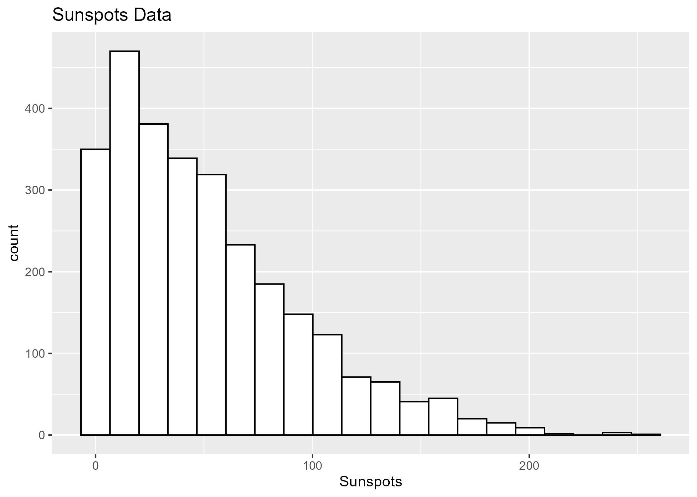

::::: article
## Introduction

Both the goodness-of-fit and the nonparametric two-sample problem have
histories going back a century, with many contributions by some of the
most eminent statisticians. In the goodness-of-fit problem we have a
sample $(x_1,..,x_n)$ drawn from a random variable X. We also have a
probability distribution $F$, possibly with unknown parameters, and we
wish to test $H_0:X\sim F$. In the two-sample problem we also have a
second sample $(y_1,..,y_m)$ drawn from some distribution $G$, and here
we want to test $H_0:F=G$, that is we want to test whether the two data
sets were generated by the same (unspecified) distribution.

The literature on both of these problems is vast and steadily growing.
Detailed discussions can be found in [@agostini1986], [@thas2010],
[@raynor2009]. For an introduction to Statistics and hypothesis testing
in general see [@casella2002] or [@bickel2015].

Some tests such as the Kolmogorov-Smirnov test are already implemented
for both problems in base **R** [@r2021]. Many others can be run through
various existing packages, for example the Anderson-Darling
goodness-of-fit test is available in the **R** package *ADGofTest*
[@adgoftest2011]. There are a number of packages with tests that focus
on a specific distribution, for example the *nortest* [@nortest2015]
package has five tests for composite normality. There are also packages
that allow the user to run several tests, for example the *twosamples*
[@dowd2022], *dgof* [@dgof2009], *EnvStats* [@envstats2017] and
*goftest* [@goftest2007] packages.

However, there are no packages that bring together as many tests as
*R2sample* and *Rgof*. Moreover, some methods do not currently have any
*R* implementations, for example Zhang's test, Lehmann-Rosenblatt, the
Wasserstein p1 test and almost all tests for discrete data.

Both packages have the following features:

-   many methods are implemented for both continuous and discrete data.

-   the methods are implemented using both *Rcpp* [@rcpp2024] and
    parallel programming.

-   the packages include routines to run several test and then find a
    corrected p value for the combination of tests.

-   some of the methods allow for data with weights.

-   the routines allow for a random sample size, assumed to come from a
    Poisson distribution.

-   in the two-sample problem some methods make use of large-sample
    formulas, therefore allowing for very large data sets.

-   the routines can also use any other user-defined tests.

-   the packages include routines to easily carry out power studies and
    draw power graphs.

-   the packages include routines to easily compare the power of a new
    test to those included in the packages.

-   in the two-sample package the user can provide a routine that
    generates new data from a model. This can be used as an alternative
    to the permutation method to find p values.

There are several reasons for including tests for discrete data. In the
context of a computer program this means a finite (and usually fairly
small) number of different values which then repeat many times.

-   Tests for discrete data such as from Binomial or Poisson
    distributions are of interest in their own right.

-   There are currently almost no implementations of either
    goodness-of-fit or two-sample methods for discrete data in *R*.

-   It also makes it possible to apply the tests to very large
    continuous data sets via discretization. While a goodness-of-fit
    test for a continuous data set with (say) 100,000 observations can
    be done in a matter of a few minutes, for larger data sets the
    calculations will be quite time consuming. Data sets with many
    millions of observations are not uncommon today. Binning the data
    and then running the corresponding discrete tests however is quite
    fast.

-   There are also situations where the underlying distribution is
    continuous but the data is collected in binned form. This is for
    example often the case for data from high energy physics experiments
    and from astronomy because of finite detector resolution. In some
    fields this is referred to as histogram data. For the purpose of
    either the goodness-of-fit or two-sample problems standard discrete
    data and histogram data can be treated the same, with the midpoints
    of the bins used as observations where such are needed.

For the two-sample problem p values are found via the permutation
method. If the data sets are large for some of the tests the p values
can be found via large sample approximations. In the goodness-of-fit
case p values are always found via simulation. While large sample
approximations are know for some methods such as Kolmogorov-Smirnov and
Anderson-Darling, there are no known large sample theories for most of
the other tests. Moreover, in the more common situation where the
distribution under the null hypothesis depends on parameters, which have
to be estimated from the data, even those tests no longer have known
large sample theories and one is forced to use simulation to find p
values.

The packages *Rgof* [@rgof2023] and *R2sample* [@r2sample2023] are
available from CRAN.

## Goodness-of-fit / two-sample hybrid problem {#goodness-of-fit-vs-two-sample-problems}

As was mentioned in the abstract, while the goodness-of-fit problem and
the two-sample problem are quite different, they also share certain
features such as methods that exist for both. On a deeper level they are
both hypothesis tests in the Fisherian sense, in that they are tests
without an alternative hypothesis. These tests are usually done for
confirmation, that is in the goodness-of-fit case the researcher wants
to make sure that his assumed probability model is reasonably good,
without any consideration of how it might be wrong.

There is yet another connection between these types of problems.
Sometimes one wants to carry out a goodness-of-fit test. However, the
model under the null hypothesis is quite complex with a large number of
nuisance parameters Therefore calculating values from the distribution
function requires integration in high dimensions and is at present not
feasible. It is however possible to sample from the distribution. So the
problem now changes from a goodness-of-fit to a two-sample problem.

If the null hypothesis in the goodness-of-fit problem does not fully
specify the distribution but just its functional form one can then
estimated the parameters from the data. However, in this situation the
permutation method for estimating the p value fails, it is extremely
conservative. Instead the user can provide a routine to generate new
data, essentially using a parametric bootstrap approach.

## The types of problems

The problems that can be analyzed with these packages are as follows:

-   **Goodness-of-Fit Problem - Continuous Data**: We have a sample $x$
    of size of $n$ drawn from some random variable X. $F$ is a
    continuous probability distribution, which may depend on unknown
    parameters. We want to test $X\sim F$.

-   **Goodness-of-Fit Problem - Discrete Data**: We have a set of values
    *vals* and a vector of counts $x$. $F$ is a discrete probability
    distribution, which may depend on unknown parameters. We want to
    test $X\sim F$.

-   **Two-sample Problem - Continuous Data**: We have a sample $x$ of
    size of $n$, drawn from some unknown continuous probability
    distribution $F$, and a sample $y$ of size $m$, drawn from some
    unknown continuous probability distribution $G$. We want to test
    $F=G$.

-   **Two-sample Problem - Discrete Data**: We have a set of values
    *vals* and vectors of counts $x$ and $y$, drawn from some unknown
    discrete probability distributions $F$ and $G$. We want to test
    $F=G$.

In all of the above problems, the sample size can either be fixed or
follow a Poisson distribution with a known rate. In all cases the data
can be weighted. In all cases the user can provide his/her own testing
method.

## The methods

In the following we list the methods included in the packages. Most are
well known and have been in use for a long time. For their details see
the references. They are:

::: {#tab:T1}
  -------------------- ------------ ---------- ------------ ----------
                             *Rgof*              *R2sample* 

  Method                 Continuous   Discrete   Continuous   Discrete

  Chi-Square Tests              Yes        Yes          Yes        Yes

  Kolomorov-Smirnov             Yes        Yes          Yes        Yes

  Kuiper                        Yes        Yes          Yes        Yes

  Cramer-von Mises              Yes        Yes          Yes        Yes

  Anderson-Darling              Yes        Yes          Yes        Yes

  Zhang's tests                 Yes         No          Yes         No

  Wasserstein                   Yes        Yes          Yes        Yes

  Watson's test                 Yes        Yes           No         No

  Lehmann-Rosenblatt             No         No          Yes        Yes
  -------------------- ------------ ---------- ------------ ----------

  : 
:::

[]{#tab:T1 label="tab:T1"}

There are of course many other tests that could have also been
implemented in the routines. All the tests included share the following
features. They are true omnibus tests, that is not designed with any
specific alternative in mind. For this reason we did not include the
class of Neyman's smooth tests, for example. Moreover they are all tests
that do not depend on some tuning parameters. The exception here are the
chi-square tests, which depend on the choice of the number and shape of
the bins. The chi-square tests are included because they are so well
known and widely used, even so their power often leaves much to be
desired.

We denote the cumulative distribution function (cdf) by $F$, its
empirical distribution function (edf) by $\widehat{F}$. In the case of
the two-sample problem we also have the edf of the second data set
$\widehat{G}$ and the edf of the combined data set $\widehat{H}$.

1.  **Chi-Square Tests**

In the case of continuous data the routines include eight chi-square
tests, with either equal size (ES) or equal probability (EP) bins,
either a large (*nbins[1]*=50) or a small (*nbins[2]*=10) number of
bins and with either the Pearson (P) or the log-likelihood (L) formula.
Here and in what follows *nbins* and similar items are arguments to the
routines that the user can change. So the combination of a large number
of equal size bins and Pearson's chi-square formula is denoted by
*ES-l-P*, etc.

In the case of discrete data the type and the number of classes is
already given, and for a second test these are combined for a total of
*nbins[2]*=10. Again both chi-square formulas are used. So here the
case of a large number of bins and Pearson's formula is denoted by
*l-P*.

In all cases neighboring bins with low counts are joined until all bins
have a count of at least *minexpcount*=5. In all cases the p values are
found using the usual chi-square approximation.

If parameters have to be estimated, this is done via the user-provided
routine $phat$. As long as the method of estimation used is consistent
and efficient and the expected counts are large enough the chi-square
statistic will have a chi-square distribution, as shown by [@fisher1922]
and [@fisher1924].

Alternatively we can use the argument *ChiUsePhat=FALSE*. In that case
the value provided by *phat* is used as a starting point but the
parameters are estimated via the method of minimum chi-square. This
method has the desirable feature that if the null hypothesis is rejected
for this set of values, it will always be rejected for any other as
well. For a discussion of this estimation method see [@berkson1980].

1.  **Kolmogorov-Smirnov (KS)**

This test is based on the largest absolute distance between $F$ and
$\widehat{F}$ in the goodness-of-fit problem and between $\widehat{F}$
and $\widehat{G}$ in the two-sample problem. The tests were first
proposed in [@kolmogorov1933], [@smirnov1939] and are among the most
widely used tests today. There is a known large sample distribution of
the test statistic in the two-sample problem, which is used either if
both sample sizes exceed 10000 or if the argument *UseLargeSample=TRUE*
is set. In the goodness-of-fit case the large sample theory is known
only in the case of a fully specified distribution under the null
hypothesis. Because this is rarely of interest the large sample
approximation is not used.

1.  **Kuiper (K)**

This test is closely related to Kolmogorov-Smirnov, but it uses the sum
of the largest positive and negative differences as a test statistic. It
was first proposed in [@kuiper1960].

1.  **Cramer-vonMises (CvM)**

This test is based on the integrated squared differences:

-   Goodness-of-Fit:
    $\int_{-\infty}^{\infty} \left(F(x)-\widehat{F}(x)\right)^2 dF(x)$

-   Two-Sample:
    $\int_{-\infty}^{\infty} \left(\widehat{F}(x)-\widehat{G}(x)\right)^2 d\widehat{H}(x)$

The goodness-of-fit version is discussed in [@cramer1928] and
[@mises1928]. The two-sample version was proposed in [@anderson1962].

1.  **Anderson-Darling (AD)**

This test is similar to the Cramer-vonMises test but with an integrand
that emphasizes the tails:

-   Goodness-of-Fit:
    $\int_{-\infty}^{\infty} \frac{\left(F(x)-\widehat{F}(x)\right)^2}{F(x)(1-F(x)} dF(x)$

-   Two-Sample:
    $\int_{-\infty}^{\infty} \frac{\left(\widehat{F}(x)-\widehat{G}(x)\right)^2}{\widehat{H}(x)(1-\widehat{H}(x)} d\widehat{H}(x)$

It was first proposed in [@anderson1952]. The two-sample version is
discussed in [@pettitt1976].

1.  **Zhang's tests (ZA, ZK and ZC)**

These tests were proposed in [@zhang2002] and [@zhang2006]. They are
variations of test statistics based on the likelihood ratio and
different weight functions. Note that these tests do not work for
discrete data, that is, they never achieve the correct type I error
rate. They are therefore not run for discrete data.

1.  **Wasserstein p=1 (Wassp1)**

A test using the Wasserstein p=1 metric. It is based on a comparison of
quantiles. In the goodness-of-fit case these are the quantiles of the
data set and the quantiles of the cdf, and in the two-sample problem
they are the quantiles of the individual data sets and the quantiles of
the combined data set. If $n=m$ the test statistic in the continuous
case takes a very simple form: $\frac1n\sum_{i=1}^n |x_i-y_i|$. In the
goodness-of-fit problem for continuous data the user has to supply a
function that calculates the inverse of the cdf under the null
hypothesis. For a discussion of the Wasserstein distance see
[@wasserstein1969].

There are also a number of tests which are only implemented for either
the goodness-of-fit or the two-sample problem:

1.  **Watson's Test (W), Goodness-of-Fit Problem**

This test is closely related to the Cramer-vonMises test. It adjust that
tests statistic via a squared difference of the mean of
$\widehat{F}(x_i)$ and 0.5. It was proposed in [@watson1961].

1.  **Lehmann-Rosenblatt (LR), Two-sample Problem**

Let $r_i$ and $s_i$ be the ranks of x and y in the combined sample, then
the test statistic is given by

$$\frac1{nm(n+m)}\left[n\sum_{i=1}^n(r_i-1)^2+m\sum_{i=1}^m(s_i-1)^2\right]$$

For details see [@lehmann1951] and [@rosenblatt1952].

## Simultaneous inference

As no single test can be relied upon to consistently have good power, it
is reasonable to employ several of them. We would then reject the null
hypothesis if any of the tests does so, that is, if the smallest p value
is less than the desired type I error probability $\alpha$.

This procedure clearly suffers from the problem of simultaneous
inference, and the true type I error probability will be much larger
than $\alpha$. It is however possible to adjust the p value so it does
achieve the nominal type I error. A sketch of the algorithm is as
follows:

-   generate a new data set under the null hypothesis, run the desired
    tests and record the smallest p value.

-   repeat B(=1000) times.

-   use the empirical distribution function $\hat{F}_p$ of the B
    smallest p values to estimate their distribution function.

-   apply $\hat{F}_p$ to the smallest p value of the data set. This is
    essentially the probability integral transform.

Here is an example: say the null hypothesis specifies a uniform $[0,1]$
distribution and a sample size of 250. Next we find the smallest p value
in each run for two selections of four methods. One includes the methods
by Wilson, Anderson-Darling, Zhang's ZC and a chi square test with a
small number of bins and using Pearson's formula. This selection has
good power against a large number of alternatives. As a second selection
we use the methods by Kolmogorov-Smirnov, Kuiper, Anderson-Darling and
Cramer-vonMises. For the case where the null hypothesis specifies a
Uniform $[0,1]$ distribution these tests turn out to be highly
correlated.

Next we find the empirical distribution function for the two sets of p
values and draw their graphs. We also add the curve for the cases of
four identical tests and the case of four independent tests, which of
course is the Bonferroni correction. These are shown in figure 1.

{#fig:fig1}

As one would expect, the two curves for the p values fall between the
extreme cases of total dependence and independence. Moreover, the curve
of our good selection is closer to the curve of independence than the
selection of correlated methods.

Finally we simply have to apply this function to the smallest p value
found for the actual data.

*Rgof::gof_test_adjusted_pvalues* and
*R2sample::twosample_test_adjusted_pvalues* find these adjusted p
values. Their arguments are the same as those of *Rgof::gof_test* and
*R2sample::twosample_test*, see the section Usage
[7](#usage){reference-type="ref" reference="usage"}. For an example that
uses this adjustment method in the context of simultaneous confidence
bands see [@aldor2013].

## Special circumstances

### Random sample size

In some cases the sample size is not determined at the beginning of the
experiment but is a consequence of other factors. As an example, in high
energy physics experiments the sample size is determined by the
luminosity (aka energy) at which the accelerator is run, and by how
long. In such a situation the distributions of the test statistics are
different from the fixed sample size case, and there are no known null
distributions. In the case of the chi-square tests, for example, the bin
counts are now independent according to the theory of marked Poisson
processes, and therefore the degrees of freedom need to be adjusted
accordingly. Often though it is reasonable to assume that the sample
size has a Poisson distribution. If so the routines in *Rgof* and
*R2sample* have an argument *rate* to indicate a random sample size from
a Poisson distribution with rate $\lambda$.

### Weighted samples

Another variation is as follows. Say we have a continuous random
variable $X$ and a weight function $w$. There also exists a random
variable $Y$ such that $E[f(Y)]=E[f(X)w(x)]$ for (almost) any function
$f$. In other words, these are weights as one encounters in importance
sampling. Say we wish to test whether the distribution of $Y$ is $F$ but
using observations from $X$ with their weights. This is done very easily
with the routines by supplying the weights as arguments. These weights
can then be used to find for example the empirical distribution
function, and with it run tests such as Kolmogorov-Smirnov or
Anderson-Darling.

One field were this situation is common is high energy physics. There we
have the Standard Model, the current best model for explaining the
physics of collision experiments in particle accelerators such as the
Large Hadron Collider at CERN. Say we wish to test some specific part of
this theory, that is we want to do a goodness-of-fit test. However, the
Standard Model depends on dozens of parameters. The calculations of the
probabilities needed for a goodness-of-fit test are at present not
feasible. Among other issues they would require integration in very high
dimensions. However, it is possible to generate a Monte Carlo sample
from the Standard Model, so instead we can run a two-sample test,
comparing the data to the Monte Carlo sample. There is however another
problem. The Monte Carlo sampling of the Standard Model is very
computationally expensive. There exist a number of such samples, each
for a specific set of the parameters of the Standard Model. Now if the
test we wish to do requires a sample with a slightly different set of
parameters we can use an existing sample and importance sampling. The
routines in the packages discussed here make this very easy.

## Usage

### Goodness-of-fit problem - testing

The routine to carry out hypothesis tests is *Rgof::gof_test*. It's
arguments are

-   x: a data set, either the continuous outcomes or the counts in the
    discrete case.

-   vals=NA: all possible values of the discrete random variable, or NA
    if data is continuous.

-   pnull: a function to calculate values for the cdf.

-   rnull: a function to generate new data under the null hypothesis.

-   w=function(x) -99: a weight function if weights are present, or -99
    if not.

-   phat=function(x) -99: a function to estimate parameters, or -99 if
    null hypothesis is simple and no parameters are estimated.

-   TS: routine to calculate test statistics other than those included.

-   TSextra: a list passed to TS.

-   nbins=c(50, 10): number of bins to use in chi-square tests.

-   rate=0: rate of Poisson if sample size is random, 0 if sample size
    is fixed.

-   Range=c(-Inf, Inf): range of continuous random variable.

-   B=5000: number of simulation runs.

-   minexpcount=5: required minimal expected counts for chi-square
    tests.

-   maxProcessors=1: number of cores to use for parallel processing, 1
    means no parallel programming.

-   doMethod="all": vector with names of methods, if not all are to be
    included.

The format of the routines pnull, rnull and w has to be as follows. In
the continuous case we will use as an example the normal distribution
and in the discrete case the Binomial distribution with 10 tries.

-   Continuous data, no parameter estimation: a function of one
    variable, the data. For example, pnull=function(x) pnorm(x)

-   Continuous data, with parameter estimation: a function of two
    variables, the data and a vector of parameter estimates. For
    example, pnull=function(x,p) pnorm(x,p[1],p[2])

-   Discrete data, no parameter estimation: a function without
    arguments. For example, pnull=function() pbinom(0:10, 10, 0.5)

-   Discrete data, with parameter estimation: a function of one
    variable, a vector of parameter estimates. For example,
    pnull=function(p) pbinom(0:10, 10, p)

#### Continuous data

As an example we generate $N=1000$ observations from a standard normal
distribution. Then we test to see whether the data comes from a normal
distribution with the mean estimated from the data, so in this case the
null hypothesis is true:

``` r
pnull = function(x, mu=0) pnorm(x, mu) # cdf under null hypothesis
rnull = function(mu=0) rnorm(1000, mu) # generate data under null hypothesis
phat = function(x) mean(x) # estimate parameter 
x = rnull() # data from distribution under the null hypothesis
Rgof::gof_test(x, NA, pnull, rnull, phat=phat)
```

``` r
#> $statistics
#>      KS       K       AD      CvM       W        ZA      ZK      ZC    
#>   0.0208   0.0407   0.6500   0.0926   0.0911   3.2940  1.4780  12.4900    
#>    ES-l-P   ES-s-P   EP-l-P   EP-s-P   ES-l-L   ES-s-L  EP-l-L   EP-s-L 
#>   37.4800   9.6060   51.7300  11.9200  38.5700  9.4030  50.2600  12.4700 
#> 
#> $p.values
#>     KS      K     AD     CvM      W      ZA      ZK      ZC  
#> 0.4712 0.4712   0.2328 0.2546  0.2354  0.6292  0.7692  0.5828 
#> ES-l-P  ES-s-P  EP-l-P  EP-s-P  ES-l-L  ES-s-L  EP-l-L EP-s-L 
#> 0.4011  0.2120  0.3302  0.1550  0.3542  0.2250  0.3840  0.1315
```

If we wish to find an adjusted p value for a combination of tests we can
run

``` r
Rgof::gof_test_adjusted_pvalue(x, NA, pnull, rnull, phat=phat)
```

``` r
#> p values of individual tests:
#> W :  0.128
#> ZC :  0.232
#> AD :  0.08
#> ES-s-P :  0.212
#> adjusted p value of combined tests: 0.2267
```

Next we generate a data set from a t distribution with 5 degrees of
freedom, so now the null hypothesis is false. Here and in the examples
that follow we only show the p values of the tests:

``` r
y = rt(1000, 5) # data where null hypothesis is false
Rgof::gof_test(y, NA, pnull, rnull, phat=phat)[["p.values"]]
```

``` r
#>     KS       K      AD      CvM      W       ZA     ZK     ZC 
#>   0.0106  0.0106  0.0000  0.0048   0.0034  0.0000  0.0000 0.0000     
#>   ES-l-P  ES-s-P  EP-l-P  EP-s-P  ES-l-L  ES-s-L  EP-l-L  EP-s-L 
#>   0.0000  0.0000  0.0000  0.0000  0.0000  0.0000  0.0000  0.0408
```

If the quantile function (aka inverse) of the cdf is known it can be
included. It is then used in some of the chi-square tests and the
Wasserstein test. It can be passed to the routine that finds the test
statistic(s) via the list TSextra:

``` r
TSextra = list(qnull=function(x, mu) qnorm(x, mu))
Rgof::gof_test(x, NA, pnull, rnull, phat=phat, TSextra=TSextra)[["p.values"]]
```

``` r
#>     KS      K      AD      CvM      W      ZA      ZK      ZC    Wassp1  
#>  0.4710  0.4710  0.2288  0.2444  0.2238  0.6198  0.7664  0.5762  0.1760 
#>  ES-l-P  ES-s-P  EP-l-P  EP-s-P  ES-l-L  ES-s-L  EP-l-L  EP-s-L 
#>  0.4011  0.2120  0.5634  0.4413  0.3542  0.2250  0.5182  0.4210
```

A user can also use this routine to run their own test. For example,
let's say we wish to include the Neyman's smooth test from the *DDST* (P
Niecek 2016) package:

``` r
NeymanSmoothTest = function(x, pnull, param) {
  ts=as.numeric(unlist(ddst::ddst.norm.test(x))[1])
  names(ts) = "DDST"
  ts
}
Rgof::gof_test(x, NA, pnull, rnull, phat=phat, TS=NeymanSmoothTest)[["p.values"]]
```

``` r
#>   DDST 
#> 0.5482
```

``` r
Rgof::gof_test(y, NA, pnull, rnull, phat=phat, TS=NeymanSmoothTest)[["p.values"]]
```

``` r
#> DDST 
#>    0
```

The routine has to have the following form:

``` r
newTS(x, pnull, param, TSextra)
```

x is the data set and pnull the distribution function under the null
hypothesis, as described above. param is the estimated parameters in the
case of a composite null hypothesis and is ignored in the case without
parameter estimation. The argument TSextra, a list of items also needed
for calculating the test statistic, is optional.

Next we assume that the sample size was random and drawn from a Poisson
distribution with rate 950. One of the consequences of this is that now
the degrees of freedom of the chi-square tests is the number of bins -
number of estimated parameters rather than number of bins - 1 - number
of estimated parameters.

``` r
Rgof::gof_test(x, NA, pnull, rnull, phat=phat, TSextra=TSextra, rate=950)[["p.values"]]
```

``` r
#>     KS      K      AD     CvM      W       ZA      ZK      ZC    Wassp1 
#>  0.4736  0.4736  0.2406  0.2580  0.2372  0.6206  0.7642  0.5782  0.1904
#>  ES-l-P ES-s-P EP-l-P EP-s-P ES-l-L ES-s-L EP-l-L EP-s-L 
#>  0.2602 0.1210 0.4009 0.2779 0.2936 0.1517 0.4539 0.2957 
```

As an example for the use of importance sampling weights we generate the
data from a mixture of two normal random variables but as above test for
a simple normal distribution with unknown mean.

``` r
rnull = function(mu=0) c(rnorm(500, -1), rnorm(500, 1))
x = rnull()
w=function(x, mu=0) dnorm(x, mu)/(dnorm(x, -1)/2+dnorm(x, 1)/2)
Rgof::gof_test(x, NA, pnull, rnull, w=w, phat=phat)[["p.values"]]
```

``` r
#>     KS      K     CvM      AD 
#>  0.7990  0.7718  0.6330  0.4516
```

``` r
Rgof::gof_test(y, NA, pnull, rnull, w=w, phat=phat)[["p.values"]]
```

``` r
#>     KS      K    CvM     AD 
#>     0       0     0      0
```

#### Discrete data

Here we will consider the following example. The null hypothesis
specifies a binomial distribution with $n=100$ trials and a success
probability $p$, estimated from the data. As an example where the null
hypothesis is false we generate data that is a mixture of a binomial
distribution with $p=0.5$ and a discrete uniform distribution on the
integers from 30 to 70.

``` r
set.seed(1234)
vals = 0:100 # all possible values
pnull = function(p=0.5) pbinom(0:100, 100, p)
rnull = function(p=0.5) table(c(0:100,rbinom(1000, 100, p)))-1  
phat = function(x) mean(0:100*x)/1000
x = rnull()
Rgof::gof_test(x, vals, pnull, rnull, phat=phat)$p.values
```

``` r
#>      KS      K      AD     CvM      W     Wassp1    l-P    s-P    l-L     s-L 
#>   0.2320  0.2752  0.4858  0.3132  0.2460  0.6257  0.1599  0.5592  0.1456 0.1456
```

``` r
y = table(c(0:100, rbinom(900, 100, 0.5), sample(30:70, size=100, replace=TRUE)))-1
Rgof::gof_test(y, vals, pnull, rnull, phat=phat)$p.values
```

``` r
#>     KS      K       AD     CvM      W       l-P    s-P      l-L    s-L 
#>   0.3846  0.3290  0.0000  0.0174  0.0114  0.0000  0.0000  0.0000  0.0000
```

Here we have an example where most tests correctly reject the null
hypothesis but some do not.

Note that the routine *rnull* has to insure that all values of *vals*
are present, even if many have counts of zero.

Again the user can provide his/her own test statistic. The routine has
to be as follows:

``` r
newTS(x, pnull, param, vals, TSextra)
```

Here x is the counts and pnull the distribution function under the null
hypothesis as described above. param is the estimated parameters in the
case of a composite null hypothesis and is ignored in the case without
parameter estimation. vals is the set of values where $P(X=vals)>0$. The
argument TSextra, a list of items also needed for calculating the test
statistic, is optional.

### Goodness-of-fit problem - power estimation

To estimate the power of the various tests we can use the function
*gof_power*. It's arguments are the same as *gof_test*, as well as

-   ralt: a function that generates data under the alternative
    hypothesis.

-   param_alt: a vector of values to be passed to ralt.

-   With.p.value=FALSE: set to TRUE if the new user supplied routine
    calculates p values.

-   alpha=0.05: type I error probability to be used for test.

-   B=1000: number simulation runs.

As an example say we wish to estimate the power of the tests when the
null hypothesis specifies a normal distribution, but the data comes from
a t distribution. We have 500 observations, and both the mean and
standard deviation are estimated from the data. The package also
includes the routine *plot_power*, which has as its argument the output
from the *gof_power* command and draws the power curve. It is shown in
figure 2.

``` r
pnull = function(x, p=c(0,1)) pnorm(x, p[1], p[2]) # cdf under null hypothesis
rnull = function(p=c(0,1)) rnorm(500, p[1], p[2]) # generate data under null hypothesis
phat = function(x) c(mean(x), sd(x)) # estimate parameters
TSextra = list(qnull = function(x, p=c(0,1)) qnorm(x, p[1], p[2])) # quantile function
ralt = function(df) rt(500, df) # generate data under alternative
tmp=Rgof::gof_power(pnull, NA, rnull, ralt, param_alt=4*1:10, phat=phat, TSextra = TSextra)
Rgof::plot_power(tmp, "df", "Standard Normal vs t Distributions")
```

{#fig:fig2}

*plot_power* has the arguments

-   pwr: a matrix, usually the output of the *gof_power* command.

-   xname: name of parameter of ralt.

-   title=\" \": title of graph

-   Smooth=TRUE: should curves be smoothed?

-   span=0.25: parameter for smoothing routine.

Power estimation for discrete data works the same. As an example
consider the following. One data set comes from a Poisson distribution,
restricted to the set of integers from 70 to 140. The second data set is
a 50-50 mixture of Poisson random variables with a rate of 100 and a
rate of $100+\lambda$. The power graph is in figure 3.

``` r
vals=70:140
pnull=function(lambda) (ppois(70:140, lambda)-ppois(69,lambda))/(ppois(140, lambda)-ppois(69,lambda))
rnull=function(lambda) {
  vals=70:140
  x=rpois(1000, lambda)
  x[x<70]=70
  x[x>140]=140
  x=table(c(70:140, x))-1
}
phat=function(x) sum(70:140*x)/1000
ralt=function(lambda) {
  vals=70:140
  x=c(rpois(500, 100), rpois(500, 100+lambda))
  x[x<70]=70
  x[x>140]=140
  x=table(c(70:140, x))-1
}
tmp=Rgof::gof_power(pnull, vals, rnull, ralt, param_alt=2*0:8, phat=phat)
Rgof::plot_power(tmp, "lambda", "Poisson vs Mixture of Poisson Distributions")
```

{#fig:fig3}

### Two-sample problem - testing {#twosample-problem---testing}

p values are generally found using the permutation method. The idea of a
permutation test is simple. Say we have data sets $x_1,..,x_n$ and
$y_1,..,y_m$. They are combined into one large data set
$x_1,..,x_n, y_1,..,y_m$, permuted and split again in sets of size n and
m. Under the null hypothesis these new data sets come from the same
distribution as the actual data. Therefore calculating the tests
statistics for them and repeating many times one can build up the
distributions of the test statistics and find p values from them.

In the case of continuous data the routines also allow for the use of
large sample formulas for some of the tests. In the discrete case none
of the methods (outside of the chi-square tests) has a known large
sample theory.

In the discrete case the permutation method is somewhat more
complicated. Say we have data sets with values $v_1,..,v_k$ and counts
$x_1,..,x_k$, $y_1,..,y_k$. One can then simply expand these to yield a
large data set with $x_1+y_1$ $v_1$'s, $x_2+y_2$ $v_2$'s and so on. Then
this vector is permuted and split as described above. The drawback of
this sampling method is that its calculation speed increases with the
sample size and would be impossible for data sets with very large
counts.

Alternatively *R2sample* provides the following option. One can show
that the distribution of the permuted data sets is as follows: let
$n=\sum x_i$ and $m=\sum y_i$, then

$$P(\pmb{X}=\pmb{a}|\pmb{x},\pmb{y})=\left[\prod_{j=1}^k{{{x_j+y_j}\choose{a_j}}}\right]/{{n+m}\choose{n}}$$

for any $\pmb{a}$ such that $0\le a_i \le x_i; i=1,..,k$ and
$\sum a_i=n$.

It is possible to sample from this distribution as follows: Let $N$ and
$M$ be the sample sizes of the two data sets, respectively. Let
$p=N/(N+M)$ be the proportion of events in the first data set. Say that
in a data set we have $x_1$ observations of the smallest discrete value
$v_1$ in the first data set and $y_1$ in the second. We can then
generate a random sample by drawing an observation from a Binomial with
parameters $x_1+y_1$ and $p$. We repeat this for all values of the
discrete random variable. We also need to insure, though, that the total
number of observations in the first simulated data set is again $N$ and
in the second data set $M$. If this is not so, we randomly choose two
values, giving a higher priority for those with high counts, and
flipping one observation between the two data sets. This is repeated
until the simulated data set has $N$ events total.

The routine is *twosample_test*. It's arguments are

-   x, y: the two data sets, either the observations in the continuous
    case or the counts in the discrete case. x can also be a list with
    elements x and y, and then y is ignored.

-   vals=NA: the possible values of the discrete random variables, or NA
    for continuous data.

-   TS: routine to calculate test statistics other than those included

-   TSextra: a list passed to TS

-   wx = rep(1, length(x)): weights for x data

-   wy = rep(1, length(y)): weights for y data

-   B=5000: number of simulation runs

-   nbins=c(50,10): number of bins to use in chi -quare tests

-   minexpcount=5: required minimal expected counts for chi-square tests

-   maxProcessors: number of cores to use for parallel processing,
    default is 1 less than are detected on computer

-   UseLargeSample: should large sample approximations be used instead
    of permutation?

-   samplingmethod=\"Binomial\": sampling method for discrete data.

-   rnull: a function that generates data from a model, possibly with
    parameter estimation. This is needed in the
    goodness-of-fit/two-sample hybrid problem.

-   doMethod=\"all\": vector with names of methods, if not all are to be
    included.

The arguments match those of *gof_test*, where this makes sense.

#### Continuous data

The $x$ and $y1$ data sets come from a standard normal distribution, and
$y2$ from a normal distribution with mean 1.

``` r
x = rnorm(100)
y1 = rnorm(150)
y2 = rnorm(150, 1)
R2sample::twosample_test(x, y1)[["p.values"]]
```

``` r
#>      KS   Kuiper    CvM     AD       LR      ZA     ZK      ZC 
#>   0.9514  0.8730  0.9242  0.9126  0.8992  0.7480  0.4502  0.7888  
#>   Wassp1 ES large ES small EP large EP small 
#>   0.8580   0.6309   0.2454   0.4334   0.9496
```

``` r
R2sample::twosample_test(x, y2)[["p.values"]]
```

``` r
#>       KS   Kuiper      CvM       AD       LR       ZA       ZK       ZC 
#>        0        0        0        0        0        0        0        0 
#>   Wassp1 ES large ES small EP large EP small 
#>        0        0        0        0        0
```

Again, the user can provide their own test statistic:

``` r
DiffStandardizedMeans = function(x, y) {
   TS = abs(mean(x)/sd(x)-mean(y)/sd(y))
   names(TS) = "DSM"
   TS
}
R2sample::twosample_test(x, y1, TS=DiffStandardizedMeans)[["p.values"]]
```

``` r
#>    DSM 
#>   0.585
```

``` r
R2sample::twosample_test(x, y2, TS=DiffStandardizedMeans)[["p.values"]]
```

``` r
#> DSM 
#>   0
```

The user supplied routine has to be a function of the two data sets x
and y and optionally a list TSextra.

As an example for weighted data, let's say the x data set actually came
from a t distribution with 5 degrees of freedom:

``` r
x = rt(100, 5)
wx = dnorm(x)/dt(x, 5)
R2sample::twosample_test(x, y1, wx=wx)[["p.values"]]
```

``` r
#>       KS   Kuiper    CvM     AD    ES large  ES small  EP large  EP small 
#>    0.2400  0.2354  0.2522  0.2560   0.7627    0.8632    0.3814    0.8636
```

``` r
R2sample::twosample_test(x, y2, wx=wx)[["p.values"]]
```

``` r
#>       KS   Kuiper      CvM       AD ES large ES small EP large EP small 
#>    0.0004   0.0004   0.0000   0.0000   0.0001   0.0000   0.0270   0.0000
```

If the data sets are very large using permutation to derive the null
distribution of the test statistics can be very slow. In this case one
can use the argument *UseLargeSample=TRUE*. This will be done
automatically if both sample sizes are at least 10000.

``` r
x = rnorm(1e5)
y1 = rnorm(1e5)
y2 = rnorm(1e5, 0.02)
R2sample::twosample_test(x, y1)[["p.values"]]
```

``` r
#>      KS   Kuiper    CvM      AD     
#>   0.098  0.1214   0.1602   0.1330   
#>   ES large  ES small   EP large  EP small 
#>    0.2683    0.3347     0.0974    0.1988
```

``` r
R2sample::twosample_test(x, y2)[["p.values"]]
```

``` r
#>     KS    Kuiper      CvM     AD 
#>  0.0112  0.0542    0.0046  0.0013 
#>   ES large  ES small  EP large  EP small 
#>    0.0935     0.0074   0.6170    0.0717
```

#### Discrete data

As an example for the case of discrete data we will use two data sets
from geometric random variables with slightly different rates. x and y
have to have the same length as vals and x+y has to be positive for all
values in vals.

``` r
x = table(rgeom(1000, 0.7))
y = table(rgeom(1000, 0.8))
vals = unique(c(names(x), names(y))) # all values from either x or y
x1 = rep(0, length(vals))
names(x1)=vals
y1 = x1
x1[names(x)]=x
y1[names(y)]=y
vals = as.numeric(vals)
R2sample::twosample_test(x1, y1, vals)[["p.values"]]
```

``` r
#>     KS Kuiper    CvM     AD     LR     ZA Wassp1  large  small 
#>      0      0      0      0      0      0      0      0      0
```

Again the user can supply their own test. The routine has to be a
function of the two data sets x and y and a vector *vals* of possible
values of the discrete random variable. A list TSextra is optional.

### Two-sample problem - power estimation

The package *R2sample* includes the routine *twosample_power*. The
arguments TS, TSextra, B, nbins, minexpcount, UseLargeSample and
maxProcessor are the same as in *twosample_test*. In addition we have

-   f: a function that generates a list with two vectors called x and y
    and (in the case of discrete data) a vector vals. The function can
    have zero, one or two arguments.

-   ... arguments passed to f.

-   With.p.value=FALSE: set to TRUE is user supplied routine calculates
    p values.

-   alpha=0.05: type I error probability for the tests.

As an example for continuous data we again consider the case of normal
vs t distributions. One data set with 10001 observations comes from a
standard normal distribution, the other with 10002 observations from a t
distribution with df degrees of freedom. Because of the large sample
sizes the large sample approximations are used.

``` r
f=function(df) {
  x=rnorm(10001)
  y=rt(10002, df)
  list(x=x, y=y)
}
tmp=R2sample::twosample_power(f, df=seq(5, 100, 5))
R2sample::plot_power(tmp, "df", "Data from Standard Normal vs t Distributions")
```

{#fig:fig4}

For discrete data we again consider the case of a Poisson random
variable vs a 50-50 mixture of Poisson random variables:

``` r
f=function(a) {
  vals=70:140
  x=rpois(1000, 100)
  x[x<70]=70
  x[x>140]=140
  x=table(c(70:140, x))-1
  y=c(rpois(500, 100), rpois(500, 100+a))
  y[y<70]=70
  y[y>140]=140
  y=table(c(70:140, y))-1
  I=seq_along(vals)[x+y>0]
  list(x=x[I], y=y[I], vals=vals[I])
}
tmp=R2sample::twosample_power(f, a=seq(0,5,0.25))
R2sample::plot_power(tmp, "lambda", "Data from Poisson vs Mixture of Poisson Distributions")
```

{#fig:fig5}

## Benchmarking

Say a researcher has developed a new method for the univariate
goodness-of-fit problem and wants to see how it stacks up in comparison
to the standard methods such as the chi-square tests or the
Kolmogorov-Smirnov test. Both *Rgof* and *R2sample* packages include the
routine *run_studies*, which makes this very easy.

As a specific example say we wish to see whether the Kolmogorov-Smirnov
test or the Anderson-Darling test has better power when the null
hypothesis specifies a normal distribution with mean and standard
deviation unspecified, but in reality the data comes from a t
distribution. Say we run the *Rgof::gof_power* command for a sample size
of 500, a t distribution with 8 degrees of freedom and a true type I
error of $5\%$, and we find that the Kolmogorov-Smirnov test has a power
of $43\%$ whereas the Anderson-Darling test has a power of $70\%$. It is
then true that the Anderson-Darling test will also have a higher power
for any other combination of sample size, degrees of freedom and true
type I error. In order to assess the ranking of the methods it therefore
suffices to run each case study with just one combination of n, $\alpha$
and the parameter under the alternative.

### Goodness-of-fit problem

Here the user needs to create a function that finds either the test
statistic or, if possible, the p value of the new test. Its arguments
should be as described previously. Say the routine is called myTS and is
designed for continuous data and calculates the test statistic. Then the
user can run

``` r
run_studies(myTS)
```

This will run 20 different case studies and provide some information on
the relative power of the new method when compared to those included in
*Rgof*. For a list of the case studies see the appendix.

If the routine actually calculates a p value, run instead

``` r
run_studies(myTS, With.p.value=TRUE)
```

This will of course be much faster as it does not require simulation.

The arguments of *run_studies* are

-   TS: the name of the new test routine

-   study: the name of the study to run, or all studies if missing

-   TSextra: a list of additional info passed to TS, if such are needed

-   With.p.value=FALSE: TRUE if routine finds p values

-   BasicComparison=TRUE: if TRUE the values for sample size, type I
    error etc from included studies are used.

-   nsample = 500: desired sample size

-   alpha = 0.05: desired type I error probability

-   param_alt: (list of) parameters for alternative distributions

-   maxProcessor: number of cores to use for parallel programming,
    number of cores - 1 if missing

-   B = 1000: number of simulation runs

As an example we will use the R built-in ks.test to do the
Kolmogorov-Smirnov test:

``` r
myTS=function(x, pnull, param) {
   if(length(formals(pnull))==1) # case studies without parameter estimation
      mypnull=function(x) pnull(x)
   else mypnull=function(x) pnull(x, param) # case studies with parameter estimation
   z=ks.test(x, mypnull)[["p.values"]]
   names(z)="RKS"
   z
}
pwrs=run.studies(myTS, With.p.value = TRUE)
```

``` r
#> Average number of studies a method is close to the best::
#> EP-l-P ES-l-P EP-l-L  RKS   ES-l-L EP-s-P EP-s-L   KS      K  ES-s-P  
#>  5.450  5.9   6.200  6.900  6.950  8.875  9.175  9.400  9.400 10.175  
#>   W      CvM  ES-s-L  ZA      ZK   Wassp1   ZC     AD 
#> 10.525 10.550 10.850 11.625 11.850 12.050 12.300 13.050
```

Note that the performance of RKS is much lower than that of the
Kolmogorov-Smirnov test included in the *Rgof* package. This is due to
the fact the *R* routine ks.test does not actually allow for parameter
estimation.

As another example say the user routine calculates the test statistic
and the user wants to find the power of the methods in the case where
the null hypothesis specifies a normal distribution with mean and
standard deviation estimated from the data, but the true distribution is
a t distributions with df degrees of freedom. He also wants a sample
size of 1000 and a true type I error of 0.1 Then he can run

``` r
run_studies(myTS, "normal.t.est", nsample=1000, alpha=0.1, param_alt=5*1:10)
```

### Two-sample problem

This works in the exact same way as in the goodness-of-fit problem.

### Real data examples

#### R sunspots data

This data set has the monthly mean relative sunspot numbers from 1749 to
1983, collected at Swiss Federal Observatory, Zurich until 1960, then
Tokyo Astronomical Observatory. It is part of the base *R* program. It
is of course a time series, but we will treat it here as if it were
independent data.

A histogram of the data suggests that an exponential model might be a
good fit. However, all the tests in *Rgof* reject that null hypothesis:

``` r
library(ggplot2)
dta=data.frame(Sunspots=c(sunspots))
ggplot(dta, aes(x=Sunspots)) + 
  geom_histogram(color="black", fill="white") + 
  ggtitle("Sunspots Data")
```

{#fig:fig6}

``` r
pnull = function(x, p=1) pexp(x, p)
TSextra=list(qnull= function(x, p=1) qexp(x, p))
rnull = function(p) rexp(N, p)
phat = function(x) 1/mean(x)
Rgof::gof_test(c(sunspots), NA, pnull, rnull, phat=phat, TSextra = TSextra, Range=c(0, Inf))
```

``` r
#> $statistics
#>      KS     K      AD     CvM      W        ZA     ZK       ZC 
#>   0.0631 0.1260  0.000  2.8873  1.8894   0.0000  0.0000  0.0000
#>   Wassp1   ES-l-P   ES-s-P   EP-l-P   EP-s-P   ES-l-L   ES-s-L   EP-l-L 
#>   5.2559 154.7900 100.0300 252.8700  84.6450 170.2800 122.7200 255.0200 
#>   EP-s-L 
#>  84.1610 
#> 
#> $p.values
#>     KS      K     AD    CvM      W     ZA     ZK     ZC Wassp1 ES-l-P ES-s-P 
#>      0      0      0      0      0      0      0      0      0      0      0 
#> EP-l-P EP-s-P ES-l-L ES-s-L EP-l-L EP-s-L 
#>      0      0      0      0      0      0
```

#### Death by horsekicks data

This is the famous data set first discussed in [@bortkewitsch1898] and
analyzed in many statistics text books and articles, see for example
[@preece1988]. It is the number of soldiers in the Prussian army killed
by being kicked by a horse between 1875 to 1894. The data is

::: {#tab:T2}
  --------------------------------
  Number of Deaths     Frequencies
  ------------------ -------------
  0                            109

  1                             65

  2                             22

  3                              3

  4                              1

  5+                             0
  --------------------------------

  : 
:::

[]{#tab:T2 label="tab:T2"}

We will run the tests to see whether a Poisson model might fit this data
set:

``` r
vals=0:5
x=c(109, 65, 22, 3, 1, 0)
pnull = function(lambda=1) c(ppois(0:4,lambda), 1)
rnull = function(lambda=1) {
  x =  rpois(200, lambda)
  x[x>5]=5
  table(c(0:5, x))-1
}  
phat = function(x) sum(0:5*x)/200
Rgof::gof_test(x, vals, pnull, rnull, phat=phat)
```

``` r
#> $statistics
#>     KS      K     AD    CvM      W Wassp1    l-P    s-P    l-L    s-L 
#> 0.5434 0.5481 0.0323 0.0026 4.5350 0.0124 0.0628 0.0628 0.0625 0.0625 
#> 
#> $p.values
#>     KS      K     AD    CvM      W Wassp1    l-P    s-P    l-L    s-L 
#> 0.4830 0.6372 0.9434 0.9412 0.5288 0.9386 0.8021 0.8021 0.8026 0.8026
```

All methods fail to reject the null hypothesis, so the Poisson
distribution is a good model for the horsekick data.

## Conclusion

The R packages *Rgof* and *R2sample* bring together a large number of
methods for the univariate goodness-of-fit problem and the univariate
two-sample problem. The routines make it easy to run these tests
simultaneously. They are implemented for both continuous and discrete
data and can handle a number of different situations such as random
sample sizes and weighted data. The packages also include routines for
power estimation as well as routines for benchmarking new tests.

## Appendix {.appendix}

### Case Studies for Goodness-of-fit Problem

**Without parameter estimation**

1.  uniform.linear U[0,1] vs a linear model on [0,1] with slope s.

2.  uniform.quadratic U[0,1] vs a quadratic model with vertex at 0.5
    and some curvature a.

3.  uniform.bump U[0,1] vs U[0,1]+N(0.5,0.05).

4.  uniform.sine U[0,1] vs U[0,1]+Sine wave

5.  beta22.betaaa Beta(2,2) vs Beta(a,a)

6.  beta22.beta2a Beta(2,2) vs Beta(2,a)

7.  normal.shift N(0,1) vs N($\mu$,1)

8.  normal.stretch N(0,1) vs N(0, $\sigma$)

9.  normal.t N(0,1) vs t(df)

10. normal.outlier1 N(0,1) vs N(0,1)+U[2,3]

11. normal.outlier2 N(0,1) vs N(0,1)+U[-3,-2]+U[2,3]

12. exponential.gamma Exp(1) vs Gamma(1,b)

13. exponential.weibull Exp(1) vs Weibull(1,b)

14. exponential.bump Exp(1) vs Exp(1)+N(0.5,0.05)

15. trunc.exponential.linear Exp(1) vs Linear, on [0,1]

**With parameter estimation**

1.  normal.t.est N($\mu,\sigma$) vs t(df)

2.  exponential.weibull.est Exp($\lambda$) vs Weibull(1,b)

3.  trunc.exponential.linear.est Exp($\lambda$) vs Linear, on [0,1]

4.  exponential.gamma.est Exp($\lambda$) vs Gamma(1,b)

5.  normal.cauchy.est N($\mu$,$\sigma$) vs Cauchy (Breit-Wigner)

### Case Studies for two-sample problem

The first 14 case studies are the same as those of the goodness-of-fit
problem. The others are

15. gamma.normal Gamma($\mu$) vs N($\bar{x}$, sd(x)), here the mean of
    the normal distribution are the sample mean and fsample standard
    deviation of the x data set.

16. normal.normalmixture N(0,1) vs N($-\mu$,1)+N($\mu$,1)

17. uniform.uniformmixture U[0,1]
    vs. $\alpha$U[0,1/2]+(1-$\alpha$)U[1/2,1]

18. uniform.betamixture U[0,1]
    vs. $\alpha$U[0,1/2]+(1-$\alpha$)Beta(2,2)

19. chisquare.noncentral $\chi^2(5)$ vs. $\chi^2(5, \tau)$

20. uniform.triangular U[0,1] vs. triangular
:::::
