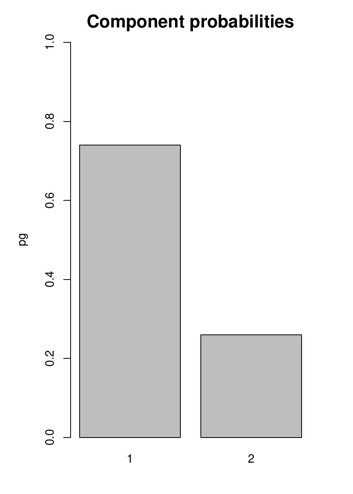
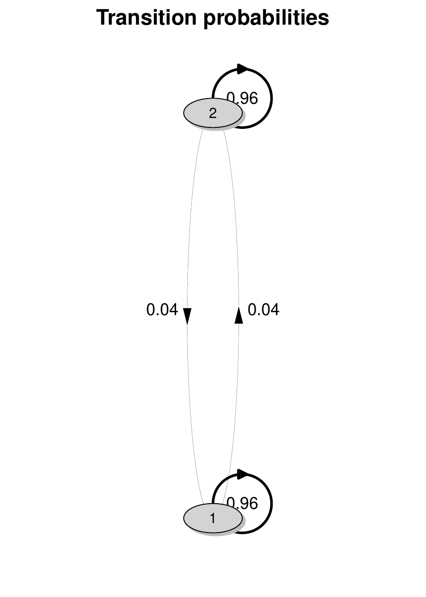

::::: article
# Introduction {#sec:intro}

Quantile regression [@KoenkerBassett1978] has become quite a popular
technique to model the effect of observed covariates on the conditional
quantiles of a continuous response of interest. This represents a
well-established practice for the analysis of data when the focus goes
beyond the conditional mean. Comprehensive reviews on this topic can be
found, among others, in [@koen:hall:01], [@yu:lu:stan:03],
[@Koenker2005], and [@Hao2007].

With longitudinal data, dependence between observations recorded from
the same statistical unit needs to be taken into account to avoid bias
and inefficiency in parameter estimates. Different modeling alternatives
are available in the literature for handling such a dependence. For a
general presentation, see e.g., [@Diggle2002] and [@Fitzmaurice2012],
while for a focus on quantile regression see [@MarinoFarcomeni2015].
Here, we consider quantile regression models that include unit-specific
random coefficients to describe such a dependence; this gives rise to a
conditional model specification which allows one to draw unit-level
inferential conclusions on the effect of covariates on the longitudinal
outcome of interest. In this framework, a standard way of proceeding is
based on specifying a parametric distribution for the random
coefficients, as suggested, e.g., by [@GeraciBottai2007;
@GeraciBottai2014]. An alternative consists in leaving such a
distribution unspecified and estimating it from the observed data, by
using a finite mixture specification. This can arise from discrete,
unit-specific, random coefficients with unspecified distribution that
remains constant or evolves over time according to a hidden Markov
chain, as proposed by [@AlfoRanalliSalvati2016] and [@Farcomeni2010],
respectively. A more flexible specification based on combining both
time-constant (TC) and time-varying (TV), unit-specific, discrete,
random coefficients may also be adopted, as proposed by [@Marino2018].
When compared to fully parametric alternatives, this semi-parametric
approach offers a number of specific advantages, as it helps (*i*) avoid
unverifiable assumptions on the random coefficient distribution; (*ii*)
account for extreme and/or asymmetric departures from the homogeneous
model; (*iii*) avoid integral approximations and, thus, considerably
reduce the computational effort for parameter estimation.

In this paper, we describe the [R]{.sans-serif} package [@Rteam2019]
`lqmix` [@lqmixpack], available from the Comprehensive [R]{.sans-serif}
Archive Network (CRAN) at `https://CRAN.R-project.org/package=lqmix`,
which is intended to provide maximum likelihood (ML) estimates for TC
and/or TV mixtures of linear quantile regression models for longitudinal
data. An indirect estimation approach, based on an extended
Expectation-Maximization algorithm [EM - @Dempster1977] is employed.

The package `lqmix` shares features with some relevant [R]{.sans-serif}
packages available for the analysis of longitudinal data on the CRAN
repository. It is related to packages `lme4` [@lme4Pack] and `lqmm`
[@lqmmPack] tailored, respectively, to the analysis of general clustered
observations via mixed models for the conditional mean and the
conditional quantiles of a response. Here, TC random coefficients
following a parametric distribution are considered to model dependence
between observations and a ML approach is employed to derive parameter
estimates. `lqmix` is also strongly related to the `LMest`
[R]{.sans-serif} package [@LMestPack]. This allows modeling the mean of
longitudinal observations via hidden Markov models [@Zucchini2009;
@BartFarcoPennoni2013]. In this case, TV random coefficients with
unspecified distribution that evolves over time according to a Markov
chain are considered to account for dependence between measures from the
same unit and a ML approach is adopted to derive parameter estimates.
Other [R]{.sans-serif} packages that can be fruitfully related to
`lqmix` are `rqpd` [@rqpdPack], `pqrfe` [@pqrfePack], and `npmlreg`
[@npmlregPack]. The former allows for the estimation of linear quantile
regression models for panel data by considering either a penalized fixed
effect estimation [@Koenker2004] or a correlated random-effect method
[@AbrevayaDahl2008]. In both cases, parameters are estimated by
minimizing an extended quantile loss function. Similarly, `pqrfe` allows
for the estimation of quantile regression models for longitudinal data
based on unit-specific fixed effects; three different estimation methods
are implemented, each based on the minimization of a different loss
function. Last, the `npmlreg` [R]{.sans-serif} package entails mixtures
of (generalized) linear models for clustered observations by employing a
ML approach for parameter estimation. Finally, it is worth mentioning
the `quantreg` [R]{.sans-serif} package [@quantregPack] for estimation
and inference in linear models for conditional quantiles. Comparing
these alternative packages with `lqmix`, it is worth highlighting that
the latter fills in a blank by providing modeling tools not available in
these other packages and ensures greater flexibility thanks to the
non-parametric nature of the random coefficient distribution, which
allows to avoid untestable parametric assumptions. The second benefit of
`lqmix` entails the modeling of quantiles rather than the mean. Quantile
regression allows one to analyze the impact that predictors may have
on different parts of the conditional response distribution, as well as
to deal with outliers and/or heavy tails that make the Gaussian
assumption typically used for continuous data unreliable.

The modeling of longitudinal data via quantile regression is also
possible by considering packages and environments out of the
[R]{.sans-serif} ecosystem. However, none of these alternatives allows
for the inclusion of random coefficients or for modeling them in a
non-parametric and/or dynamic way. The [Stata]{.sans-serif} modules
`xtqreg` [@xtqreg_pack] and `xtmdqr` [@xtmdqr_pack] allow for the
estimation of linear quantile regression models for longitudinal data
based on the use of fixed effects. These modules differ in the way model
parameters are estimated: the former considers the method of moments
introduced by [@MachadoSantosSilva2019], while the latter builds up on
the minimum distance approach described by [@GalvaoWang2015]. The
`qregpd` [Stata]{.sans-serif} module [@qregpd_pack] is also worth
mentioning, as it implements the quantile regression estimator developed
in [@Graham2015] for panel data. Last, the `qreg` [Stata]{.sans-serif}
module [@qreg2_pack] allows for the estimation of linear quantile
regressions under the assumption of independent observations. Similarly
does the `quantreg` [SAS]{.sans-serif} procedure.

The paper is structured as follows. The different proposals available in
the literature on finite mixtures of linear quantile regression models
are described in [Section 2](#sec:models), where the case of TC, TV,
and the combination of TC and TV random coefficients are discussed. ML
estimation is reviewed in [Section 3](#sec:ML), where details on the EM
algorithm and the bootstrap procedure for standard error estimation are
described. The proposed [R]{.sans-serif} package is presented in [Section 4](#sec:proposal), where the analysis of a benchmark dataset is
discussed. Further methods available for the main functions of the
package and not presented in [Section 4](#sec:proposal) are discussed
in [Section 5](#sec:others), while [Section 6](#sec:lqr)
describes the function to estimate linear quantile regression for
independent data. Finally, [Section 7](#sec:conclusions) contains some
concluding remarks.

# Modeling alternatives {#sec:models}

Let us consider the case in which a longitudinal study is planned to
record the value of a continuous response variable $Y$ and a set of
covariates (or predictors or explanatory variables) on a sample of $n$
statistical units, at $T$ different measurement occasions. We assume a
balanced study, with common (at least in unit-time) and equally spaced
occasions, in discrete time. Let $Y_{it}$ denote the value of the
response for unit $i=1, \dots, n,$ at occasion $t = 1, \dots, T,$ and
$y_{it}$ the corresponding realization. Further, let
$\boldsymbol{\mathbf{Y}}_i = (Y_{i1}, \dots, Y_{iT})^\prime$ and
$\boldsymbol{\mathbf{y}}_i = (y_{i1}, \dots, y_{iT})^\prime$ be the
$T$-dimensional vector of responses for unit $i$ and its realization,
respectively. A frequent issue to address when dealing with longitudinal
studies is that of missingness. This may entail both the response and
the covariates. Here, we assume that the latter are fully observed,
while an ignorable missingness [@Rubin1976] may affect the outcome. That
is, some units in the sample may present incomplete response sequences
due to either monotone or non-monotone missing data patterns
[@LittleRubin2002]. In this sense, a varying number of measures $T_i$
may be available for each unit, even though missingness is assumed to be
independent from unobserved responses -- M(C)AR assumption.

Random coefficient models represent a standard approach to analyze the
effect of observed covariates on a response $Y$ that is repeatedly
observed over time. This also holds in the quantile regression
framework, where the interest is in modeling the conditional quantiles
of the response distribution as a function of fixed and random
coefficients. To ensure flexibility and avoid unverifiable parametric
assumptions on the random coefficient distribution, a specification
based on finite mixtures represents a viable strategy to adopt. For this
purpose, we developed the `lqmix` [R]{.sans-serif} package.

In this section, we describe the methodology underlying the proposed
package, and present some alternative formulations of quantile
regression models available in the literature to deal with longitudinal
data. In detail, we consider models based on discrete, unit-specific,
random coefficients with unspecified distribution to capture
unit-specific sources of unobserved heterogeneity due to omitted
covariates. According to the chosen specification, these random
coefficients may remain constant and/or evolve over time, leading to a
model based on TC, TV, or both TC and TV random coefficients,
respectively. The following sections present each of these formulations
in detail.

## Linear quantile mixtures with TC random coefficients {#sec:modelsTC}

For a given quantile level $q \in(0,1)$, let
$\boldsymbol{\mathbf{\beta}}_q$ denote a quantile-dependent,
$p$-dimensional, vector of parameters associated with the (design)
vector
$\boldsymbol{\mathbf{x}}_{it}= (x_{it1}, \dots, x_{itp})^{\prime}$.
Also, let
$\boldsymbol{\mathbf{z}}_{it} = (z_{it1}, \dots, z_{itd})^\prime$ denote
a set of $d \ge 1$ covariates (not included in
$\boldsymbol{\mathbf{x}}_{it}$) associated with a vector of unit- and
quantile-specific random coefficients
$\boldsymbol{\mathbf{b}}_{i,q}=(b_{i1,q}, \dots, b_{id,q})^\prime$. This
latter accounts for unobserved heterogeneity that is not captured by the
elements in $\boldsymbol{\mathbf{x}}_{it}$ and may be used to describe
dependence between repeated measurements from the same unit. In this
sense, conditional on $\boldsymbol{\mathbf{b}}_{i,q}$, the longitudinal
responses $Y_{i1}, \dots, Y_{it}$ are assumed to be independent of each
other (local independence assumption). Moreover, for a given quantile
level $q \in (0,1)$ and conditional on the vector
$\boldsymbol{\mathbf{b}}_{i,q}$, the response $Y_{it}$ is assumed to
follow an Asymmetric Laplace Distribution [ALD - e.g., @YuMoyeed2001],
with density
$$f_{y \mid b} (y_{it} \mid \boldsymbol{\mathbf{b}}_{i,q}; q) = 
\left[\frac{q (1-q)}{ \sigma_q}\right] \exp \left\{ -\rho_q \left[ \frac{ y_{it} - \mu_{it,q}
}
{\sigma_q} \right] \right\}.$$ Here, $\rho_q(\cdot)$ denotes the
quantile asymmetric loss function [@KoenkerBassett1978], while
$q, \sigma_q$, and $\mu_{it,q}$ denote the skewness, the scale, and the
location parameter of the distribution, respectively. The ALD is a
working model that is used to recast estimation of parameters for the
linear quantile regression model in a maximum likelihood framework. The
location parameter of the ALD, $\mu_{it,q}$, is modeled as
$$\label{eq:TCmodel_Par}
\mu_{it,q} = \boldsymbol{\mathbf{x}}_{it}^\prime \boldsymbol{\mathbf{\beta}}_q + \boldsymbol{\mathbf{z}}_{it}^\prime \boldsymbol{\mathbf{b}}_{i,q}.   (\#eq:TCmodel-Par)$$

The modeling structure is completed by the mixing distribution
$f_{b,q}({\boldsymbol{\mathbf{b}}}_{i,q}; {\boldsymbol{\mathbf{\Sigma}}}_{q})$,
i.e., the distribution of the random coefficients
${\boldsymbol{\mathbf{b}}}_{i,q}$, where
$\boldsymbol{\mathbf{\Sigma}}_q$ identifies a (possibly)
quantile-dependent covariance matrix. Rather than specifying such a
distribution parametrically as in, e.g., [@GeraciBottai2014],
[@AlfoRanalliSalvati2016] proposed to leave it unspecified and use a
NonParametric Maximum Likelihood approach [NPML -- @Laird1978;
@Lindsay1983a; @Lindsay1983b] to estimate it directly from the observed
data. This approach is known to lead to the estimation of a
(quantile-specific) discrete mixing distribution defined over the set of
locations
$\{\boldsymbol{\mathbf{\zeta}}_{1,q}, \dots, \boldsymbol{\mathbf{\zeta}}_{G_q,q}\}$,
with mixture probabilities
$\pi_{g,q} = \Pr(\boldsymbol{\mathbf{b}}_{i,q} = \boldsymbol{\mathbf{\zeta}}_{g,q})$,
$i = 1, \dots, n, \, g = 1, \dots, G_q$, and $G_q\leq n$. Under this
approach, for
$\boldsymbol{\mathbf{b}}_{i,q}= \boldsymbol{\mathbf{\zeta}}_{g,q}$, the
location parameter of the ALD in Equation \@ref(eq:TCmodel-Par) becomes
$$%\label{eq:TCmodel}
\mu_{itg,q} = \boldsymbol{\mathbf{x}}_{it}^\prime \boldsymbol{\mathbf{\beta}}_q + \boldsymbol{\mathbf{z}}_{it}^\prime \boldsymbol{\mathbf{\zeta}}_{g,q},   (\#eq:TCmodel)$$
while the model likelihood is defined by the following expression:
$$\label{eq:TClk}
L(\cdot \mid q) =\prod_{i = 1}^{n} \sum_{g = 1}^{G_q} \left[\prod_{t = 1}^{T_i} f_{y\mid b}(y_{it} \mid \boldsymbol{\mathbf{b}}_{i,q} = \boldsymbol{\mathbf{\zeta}}_{g,q}; q)\right] \pi_{g,q}.   (\#eq:TClk)$$
This equation clearly resembles the likelihood of a finite mixture of
linear quantile regression models with TC, discrete, random
coefficients.

## Linear quantile mixtures with TV random coefficients {#sec:modelsTV}

While the model specification introduced in the previous section
accounts for unit-specific omitted covariates, it may fall short in
handling time variations in such unobserved heterogeneity. To address
this limitation [@Farcomeni2010] introduced a linear quantile regression
model with TV, discrete, random intercepts. Rather than allowing the
distribution of these intercepts to vary freely, it is modeled via a
discrete-time Markov chain that ensures parsimony and interpretability.
While such a proposal entails unit-specific intercepts only, a broader
specification with general TV, discrete, random coefficients can also be
considered.

As before, let
$\boldsymbol{\mathbf{x}}_{it}= (x_{it1}, \dots, x_{itp})^{\prime}$
denote a vector of $p$ covariates associated with the vector of
parameters
$\boldsymbol{\mathbf{\beta}}_{q} = (\beta_{1,q}, \dots, \beta_{p,q})^{\prime}$.
Further, let
$\boldsymbol{\mathbf{w}}_{it} = (w_{it1}, \dots, w_{itl})^\prime$ denote
a set of $l\geq 1$ explanatory variables not included in
$\boldsymbol{\mathbf{x}}_{it}$, associated with a vector of unit-,
time-, and quantile-specific random coefficients
$\boldsymbol{\mathbf{\alpha}}_{it,q} = (\alpha_{it1,q}, \dots, \alpha_{itl,q})^\prime$.
These are assumed to evolve over time according to a homogeneous, first
order, hidden Markov chain $\{S_{it,q}\}$ that depends on the specified
quantile level $q$. In detail, $\{S_{it,q}\}$ is defined over the finite
state space $\mathcal{S}_q = \{1, \dots, m_q\}$, with initial and
transition probabilities $\delta_{s_{i1,q},q}$ and
$\gamma_{s_{it,q}|s_{it-1,q},q}$, defined as:
$$\delta_{s_{i1,q},q} = \Pr(S_{i1,q} = s_{i1,q})$$ and
$$\gamma_{s_{it,q}|s_{it-1,q},q} = \Pr(S_{it,q} = s_{it,q}\mid S_{it-1,q} = s_{it-1,q}).$$

As for the model based on TC random coefficients detailed above, local
independence holds, together with the convenient assumption of
conditional ALD for the responses. For a given quantile level
$q \in (0,1)$, the joint conditional distribution of the observed
$T_i$-dimensional response vector
$\boldsymbol{\mathbf{y}}_i = (y_{i1}, \dots, y_{iT_i})^\prime$ is given
by
$$f_{y \mid s} (\boldsymbol{\mathbf{y}}_i \mid \boldsymbol{\mathbf{s}}_{i,q}; q) = f_{y \mid s}(y_{i1} \mid  {s_{i1,q}}; q) \prod_{t = 2}^{T_i} f_{y \mid s}(y_{it} \mid s_{it,q}; q).$$
Here,
$\boldsymbol{\mathbf{s}}_{i,q} = (s_{i1,q}, \dots, s_{iT_i,q})^\prime$
is the vector of states visited by the $i$-th unit and
$f_{y \mid s}(y_{it} \mid  s_{it,q}; q)$ denotes the Asymmetric Laplace
density with skewness $q$, scale $\sigma_q$, and location parameter
$\mu_{its_{it,q}, q}$. This latter is modeled as
$$\mu_{its_{it, q},q} = \boldsymbol{\mathbf{x}}_{it}^\prime \boldsymbol{\mathbf{\beta}}_q + \boldsymbol{\mathbf{w}}_{it}^\prime \boldsymbol{\mathbf{\alpha}}_{s_{it,q},q}.$$
According to the assumptions above, the likelihood function is
$$%\label{eq:TVlk}
L(\cdot \mid q) = \prod_{i = 1}^{n} \sum_{s_{i1,q}=1}^{m_q}\cdots \sum_{s_{iT_i,q}=1}^{m_q} \left[\delta_{s_{i1,q},q} \prod_{t = 2}^{T_i} \gamma_{s_{it,q}|s_{it-1,q},q}\right] \left[\prod_{t = 1}^{T_i} f_{y \mid s}(y_{it} \mid  {s_{it,q}}; q)\right].   (\#eq:TVlk)$$
When looking at the above expression, we may recognize it is a dynamic
extension of Equation \@ref(eq:TClk), as it represents the likelihood of
a dynamic finite mixture of linear quantile regression models with TV,
discrete, random coefficients. These coefficients are here assumed to
vary as a function of the hidden states visited by the units over the
observed time window.

## Linear quantile mixtures with both TC and TV random coefficients {#sec:modelsTCTV}

In some real data applications, both TC and TV sources of unit-specific
unobserved heterogeneity may be present and influence the response
distribution. We report in Figure
[1](#fig:trajectories){reference-type="ref"
reference="fig:trajectories"} the longitudinal trajectories representing
the evolution of a given continuous response measured over (at most) 6
time occasions for a sample of 25 statistical units. From this figure,
it is clear that both TC amnd TV sources of unobserved heterogeneity
affect the response. TC unobserved features may be responsible for
differences between units in terms of baseline levels and systematic
temporal trends; TV unobserved features may instead explain sudden
temporal shocks characterizing individual trajectories. These latter may
be rather difficult to capture via TC random coefficients or
unit-specific random slopes associated with a time variable. In these
situations, the linear quantile mixtures described above are no longer
appropriate, as they may account for one source at a time only. To model
empirical cases where both sources of between and within-unit variation
are present, [@Marino2018] introduced a linear quantile regression model
where TC and TV random coefficients may be jointly present in the linear
predictor.

{#fig:trajectories width="100.0%"
alt="graphic without alt text"}

Let $\boldsymbol{\mathbf{x}}_{it}= (x_{it1}, \dots, x_{itp})^{\prime}$
indicate a $p$-dimensional vector of covariates associated with the
parameters
$\boldsymbol{\mathbf{\beta}}_{q} = (\beta_{1,q}, \dots, \beta_{p,q})^{\prime}$.
Furthermore, let
$\boldsymbol{\mathbf{z}}_{it} = (z_{it1}, \dots, z_{itd})^\prime$ and
$\boldsymbol{\mathbf{w}}_{it} = (w_{it1}, \dots, w_{itl})^\prime$ denote
two disjoint vectors of $d \ge 1$ and $l\geq 1$ explanatory variables
(not included in $\boldsymbol{\mathbf{x}}_{it}$), respectively. The
former is associated with the vector of unit- and quantile-specific
random coefficients
$\boldsymbol{\mathbf{b}}_{i,q}=(b_{i1,q}, \dots, b_{id,q})^\prime$
taking value in the set
$\{\boldsymbol{\mathbf{\zeta}}_{1,q}, \dots, \boldsymbol{\mathbf{\zeta}}_{G_q,q}\}$
with probability
$\pi_{g,q} = \Pr(\boldsymbol{\mathbf{b}}_{i,q} = \boldsymbol{\mathbf{\zeta}}_{g,q}), g = 1, \dots, G_q$.
The latter is associated to the vector of unit-, time-, and
quantile-specific random coefficients
$\boldsymbol{\mathbf{\alpha}}_{it,q} = (\alpha_{it1,q}, \dots, \alpha_{itl,q})^\prime$,
which evolves over time according to a homogeneous, first order,
quantile-dependent, hidden Markov chain $\{S_{it, q}\}$. As before, this
is defined over the finite state space
$\mathcal{S}_q = \{1, \dots, m_q\}$ and is fully described by means of
the initial probability vector
$\boldsymbol{\mathbf{\delta}}_{q} = (\delta_{1,q, \dots, \delta_{m_q,q}})'$
and the transition probability matrix
$\boldsymbol{\mathbf{\Gamma}}_{q}$, with generic element
$\gamma_{s_{it,q} \mid s_{it-1,q},q}.$ The reader must note that, to
ensure identifiability, the intercept term is included in either
$\boldsymbol{\mathbf{z}}_{it}$ or $\boldsymbol{\mathbf{w}}_{it}$ (or in
neither), but never in both. A similar principle applies to
unit-specific, discrete, random slopes in the model, ensuring that
$\boldsymbol{\mathbf{z}}_{it}$ and $\boldsymbol{\mathbf{w}}_{it}$ have
no common elements. Further, random coefficients
$\boldsymbol{{b}}_{i,q}$ and $\boldsymbol{\mathbf{\alpha}}_{it,q}$ are
assumed to be independent.

For a given quantile level $q \in (0,1)$ and conditional on
$\boldsymbol{\mathbf{b}}_{i,q} = \boldsymbol{\mathbf{\zeta}}_{g,q}$ and
$\boldsymbol{\mathbf{\alpha}}_{it,q} = \boldsymbol{\mathbf{\alpha}}_{s_{it,q},q}$,
longitudinal responses recorded from the same unit are assumed to be
independent (local independence) and to follow an ALD with skewness,
scale, and location parameter denoted by $q$, $\sigma_q$, and
$\mu_{itgs_{it,q}, q}$, respectively. This latter parameter is defined
by the following regression model:
$$\mu_{itgs_{it,q}, q} = \boldsymbol{\mathbf{x}}_{it}^\prime \boldsymbol{\mathbf{\beta}}_q + \boldsymbol{\mathbf{z}}_{it}^\prime \boldsymbol{\mathbf{\zeta}}_{g,q} + \boldsymbol{\mathbf{w}}_{it}^\prime \boldsymbol{\mathbf{\alpha}}_{s_{it,q},q}.$$
Based on such assumptions, the likelihood function is 
$$
L(\cdot \mid q) = 
  \prod_{i = 1}^{n} \sum_{g = 1}^{G_q} \sum_{s_{i1,q}=1}^{m_q}\cdots \sum_{s_{iT_i,q}=1}^{m_q} 
   \left[\delta_{s_{i1,q},q} \prod_{t = 2}^{T_i}  \gamma_{s_{it,q} \mid s_{it-1,q},q}\right] 
   \left[\prod_{t = 1}^{T_i}  f_{y \mid b,s}(y_{it} \mid \boldsymbol{\mathbf{b}}_{i,q}
   = \boldsymbol{\mathbf{\zeta}}_{g,q}, {s_{it,q}};q)\right] \pi_{g,q}, 
$$ 
where, as before,
$f_{y \mid b,s}(y_{it} \mid \boldsymbol{\mathbf{b}}_{i,q} = \boldsymbol{\mathbf{\zeta}}_{g,q}, {s_{it,q}};q)$
denotes the density of the ALD. In this framework, unobserved
unit-specific features that remain constant over time are captured by
the random coefficients $\boldsymbol{\mathbf{\zeta}}_{g,q}$; sudden
temporal shocks in the unit-specific profiles, due to TV sources of
unobserved heterogeneity, are captured instead by the random
coefficients $\boldsymbol{\mathbf{\alpha}}_{s_{it,q},q}$.

To conclude this section, it is worth noticing that, when a single
hidden state ($m_{q}=1$) is considered and
$\boldsymbol{\mathbf{b}}_{i,q}= \boldsymbol{\mathbf{\zeta}}_{g,q}$, the
location parameter $\mu_{itgs_{it,q},q}$ simplifies to $\mu_{itg,q}$ and
the model reduces to the linear quantile mixture with TC random
coefficients only. Also, when a single mixture component is considered
($G_{q} = 1$), the location parameter $\mu_{itgs_{it,q},q}$ simplifies
to $\mu_{its_{it,q},q}$ and the model reduces to the dynamic finite
mixture of linear quantile regressions with TV random coefficients only.
Last, when both $G_{q}$ and $m_{q}$ are equal to 1, the model reduces to
a standard linear quantile regression model without random coefficients.
These properties make this latter specification more flexible and
general than the alternatives described so far, at the cost of a higher
computational complexity.

# Model estimation and inference {#sec:ML}

In this section, we describe the algorithm for ML estimation of model
parameters in the linear quantile mixture models detailed in the
previous section. We focus on the specification based on both TC and TV
random coefficients, as the simpler alternatives based on TC or TV
random coefficients only arise as special cases. We provide details of
an EM algorithm for parameter estimation in [Section 3.1](#sec-MLest);
the procedure for deriving standard errors and choosing the optimal
number of mixture components and/or states of the hidden Markov chain is
described in [Section 3.2](#sec-SeModChoice).

## Maximum likelihood estimation {#sec-MLest}

Let $\boldsymbol{\mathbf{\theta}}_{q}$ denote the global set of free
model parameters for a given quantile level $q \in (0,1)$. To derive an
estimate for such a vector, we may rely on indirect maximization of the
likelihood function via an extended version of the EM algorithm
[@Dempster1977]. Let $u_{i,q}(g)$ and $v_{it,q}(h)$ be the indicator
variables for
$\boldsymbol{\mathbf{b}}_{i,q} = \boldsymbol{\mathbf{\zeta}}_{g,q}$ and
$S_{it,q} = h$, respectively, and let
$v_{it,q}(h,k) = v_{it-1,q}(h)\times v_{it,q}(k)$ denote the indicator
variable for unit $i$ moving from state $h$ at occasion $t-1$ to state
$k$ at occasion $t$, with $g = 1, \dots, G_{q},$ and
$h, k = 1, \dots, m_{q}$. For a given $q \in (0,1)$, the EM algorithm
starts from the following complete-data log-likelihood function:
$$\begin{aligned}
\label{eq:completeL}
\ell_c (\boldsymbol{\mathbf{\theta}}_{q} ) &= 
\sum_{i= 1}^n  \left\{
\left[ \sum_{g=1}^{G_q} u_{i,q}(g) \log \pi_{g,q}\right] \right.\\\nonumber 
&+
\left. \left[\sum_{h=1}^{m_q} v_{i1,q}(h)\log \delta_{h,q} +\sum_{t = 2}^{T_i} \sum_{h = 1}^{m_q} \sum_{k = 1}^{m_q} v_{it,q}(h,k) \log \gamma_{k\mid h,q} \right]  \right.\\\nonumber 
&+
\left.\left[\sum_{t = 1}^{T_i} \sum_{g =1}^{G_{q}}\sum_{h=1}^{m_{q}}   u_{i,q}(g) v_{it,q}(h) \log f_{y \mid b,s} (y_{it}\mid \boldsymbol{\mathbf{b}}_{i,q} = \boldsymbol{\mathbf{\zeta}}_{g,q}, S_{it,q} = h)\right] \right\}.
\end{aligned}   (\#eq:completeL)$$ At the $r$-th iteration, the E-step
of the EM algorithm requires the computation of the expected value of
the complete-data log-likelihood in Equation \@ref(eq:completeL),
conditional on the observed data
$\boldsymbol{\mathbf{y}} = (\boldsymbol{\mathbf{y}}_1, \dots, \boldsymbol{\mathbf{y}}_n)^\prime$
and the current parameter estimates
$\hat{\boldsymbol{\mathbf{\theta}}}_q^{(r-1)}$. That is, it requires the
computation of
$$Q(\boldsymbol{\mathbf{\theta}}_q \mid \hat{\boldsymbol{\mathbf{\theta}}}_q^{(r-1)}) = \mathbb{E}\left[\ell_c(\boldsymbol{\mathbf{\theta}}_{q}) \mid \boldsymbol{\mathbf{y}}, \hat{\boldsymbol{\mathbf{\theta}}}_q^{(r-1)}\right].$$
This means computing the posterior expectations of the indicator
variables $u_{i,q}(g)$, $v_{it,q}(h)$, and $v_{it,q}(h,k)$. Regarding
these two latter, a simplification is obtained by considering the
forward and backward probabilities [@Baum1970; @Welch2003] typically
used in the hidden Markov model framework; see [@Marino2018] for further
details. In the M-step of the algorithm, parameter estimates
$\hat{\boldsymbol{\mathbf{\theta}}}_q$ are derived by maximizing
$Q(\boldsymbol{\mathbf{\theta}}_q \mid \hat{\boldsymbol{\mathbf{\theta}}}_q^{(r-1)})$

The E- and the M-step are alternated until convergence, which is defined
as the (relative) difference between two subsequent likelihood values
being lower than a given threshold, $\varepsilon>0.$

## Standard errors and model selection {#sec-SeModChoice}

Following the standard procedure used in the quantile regression
framework, standard errors for model parameter estimates are derived via
a nonparametric bootstrap approach [see e.g., @Buchinsky1995]. In
detail, we employ a block-bootstrap procedure, where a re-sampling of
the statistical units is performed and the corresponding sequence of
observed measurements is retained to preserve within-unit dependence
[@Lahiri1999].

Let $\hat{\boldsymbol{\mathbf{\theta}}}^{(r)}_{q}$ denote the vector of
model parameter estimates obtained in the $r$-th bootstrap sample,
$r = 1, \dots, R$. Estimates of the standard errors for the vector
$\hat{\boldsymbol{\mathbf{\theta}}}_{q}$ correspond to the diagonal
elements of the matrix
$$\widehat{ \textbf V}(\hat{\boldsymbol{\mathbf{\theta}} }_{q}) =
 \sqrt{\frac{1}{R} \sum_{r = 1}^{R} \left( \hat{\boldsymbol{\mathbf{\theta}}}^{(r)}_{q} - \hat {\boldsymbol{\mathbf{\theta}}}_{q} \right) \left( \hat{\boldsymbol{\mathbf{\theta}}}^{(r)}_{q} - \hat {\boldsymbol{\mathbf{\theta}}}_{q} \right)^{\prime}}.$$
A crucial point when dealing with finite mixtures is the choice of the
number of components and/or hidden states. For a fixed quantile level
$q$, a simple and frequently used solution is as follows. Parameter
estimates are computed for varying combinations of the number of
components and states, $[G_q,m_q]$; the model with the best fit,
typically measured via log-likelihood or penalized likelihood criteria
(such as AIC or BIC), is retained. However, given that these criteria
may suffer from early stopping due to lack of progress rather than true
convergence and the log-likelihood may present multiple local maxima,
the EM algorithm is initialized from different starting points and the
model corresponding to the highest likelihood value is retained before
applying the penalization. In this regard, a deterministic start may be
employed alongside a set of random start initializations. Specifically,
the deterministic start is obtained by first estimating a linear
regression model for the mean response using maximum likelihood,
including all covariates -- both those associated with fixed effects and
those assumed to have a TC or TV random effect. The estimated fixed
regression coefficients serve as initial values for the corresponding
parameters. Initial values for TC and/or TV random coefficients are
obtained by adding an appropriate constant to the corresponding fixed
effect estimates from the homogeneous model. Prior component
probabilities and/or initial probabilities for the latent Markov chain
are set uniformly; transition probabilities
$\gamma_{k \mid h,q}, \, k, h = 1, \dots, m_q$ are instead set to
$(1 + w\mathbb I (k = h))/(m_q+ w)$, where $w$ is a proper tuning constant.
Random starting points are generated by randomly perturbing the
deterministic starting values.

While a multi-start strategy may mitigate the risk of local maxima, it
is worth highlighting that the final solution may still lie on the
boundary of the parameter space. This can lead to several issues such as
(*i*) splitting components or latent states into multiple subgroups,
(*ii*) convergence to (near-)identical parameter estimates across
different components or hidden states; (*iii*) inflated standard errors;
or (*iv*) instability in fixed-effect estimates. Therefore, it is
strongly recommended to carefully examine the selected solution and
prefer a simpler model (with a lower number of components and/or states)
whenever there are indications of the above-mentioned issues. To
conclude, note that the selection of the optimal number of components
and/or states ($G_{q}$ and/or $m_{q}$) should be guided by the need of
capturing the unobserved sources of heterogeneity characterizing the
data. In this sense, the primary goal is that of providing a
sufficiently accurate approximation of the true, possibly continuous,
distribution of the random coefficients in the model, rather than
identifying homogeneous clusters of units, as typically done within the
finite mixture framework.

# The `lqmix` [R]{.sans-serif} package {#sec:proposal}

In this section, we introduce the [R]{.sans-serif} package `lqmix`,
developed to deal with linear quantile mixture models for longitudinal
data. We illustrate the main functions for estimation and inference on
the parameters of models described in the previous sections by
considering the application to the labor pain benchmark dataset
[@Davis1991]. Details on this dataset are given in the following.

## Labor pain data {#sec:pain}

Firstly reported by [@Davis1991] and since then analyzed by [@Jung1996]
and [@GeraciBottai2007] among others, labor pain data come from a
randomized clinical trial aiming at analyzing the effectiveness of a
medication for relieving labor pain in women. A total of $n=83$ women
were randomized to a treatment/placebo group, and a response variable
evaluating the self-reported amount of pain measured every $30$ minutes
on a 100-$mm$ line was recorded. Here, 0 corresponds to absence of pain,
while 100 corresponds to extreme pain. The number of available
measurements per woman ranges from a minimum of 1 to a maximum of
$T_i = 6, i = 1, \dots, n$. That is, we are in the presence of an
unbalanced longitudinal design, for which a MAR assumption seems to be
reasonable. A total of $\sum_{i=1}^{83} T_i = 357$ measurements is
available.

Together with the outcome of interest (`meas`), two covariates are
available: `trt` denotes an indicator variable identifying the group
each woman is assigned to (1 = treatment, 0 = placebo), while `time`
identifies the measurement occasion the response was recorded at. Data
are stored in the data frame `pain` included in the `lqmix` package, as
shown below.

``` r
R> head(pain)
```

``` r
  id meas trt time
1  1  0.0   1    1
2  1  0.0   1    2
3  2  0.0   1    1
4  2  0.0   1    2
5  2  0.0   1    3
6  2  2.5   1    4
```

Data are severely skewed, and skewness changes magnitude and sign over
time. In Figure [2](#Figure1){reference-type="ref" reference="Figure1"},
we report some selected diagnostics for a linear mixed model based on
TC, Gaussian, random intercepts, using `trt`, `time`, and their
interaction (`trt:time`) as covariates. The model is estimated by means
of the `lmer` function implemented in the `lme4` [R]{.sans-serif}
package.

``` r
R> outLME = lmer(meas ~ trt + time + trt:time + (1|id), data = pain)
R> par(mfrow = c(1,2))
R> qqnorm(residuals(outLME), main = "")
R> qqline(residuals(outLME))
R> qqnorm(unlist(ranef(outLME)$id), main = "")
R> qqline(unlist(ranef(outLME)$id))
```

In particular, Figure [2](#Figure1){reference-type="ref"
reference="Figure1"} reports the Normal probability plots for model
residuals: the left panel shows unit- and time-specific residuals, while
the right one shows the empirical Bayes estimates of unit-specific
random intercepts. As itcan be easily noticed, both plots indicate the
presence of potentially influential observations in the data, as well as
the violation of the Gaussian assumption for the random intercepts in
the model. Therefore, using linear quantile mixtures seems to be a
reasonable choice for the analysis of such data.

<figure id="Figure1">

::: center
```{=html}

```
:::

<figcaption>Figure 2: [Labor pain data. Linear mixed effect model with
Gaussian random intercepts. Normal probability plot for unit- and
time-specific residuals (left plot) and for empirical Bayes estimates of
unit-specific intercepts (right
plot).]{style="color: black"}</figcaption>

</figure>

## The `lqmix` function {#sec:lqmix}

The main function implemented in the `lqmix` [R]{.sans-serif} package is
`lqmix`. It allows for the estimation of the parameters of a linear
quantile mixture based on either TC, TV, or both types of discrete
random coefficients. The input arguments can be displayed on the
[R]{.sans-serif} console as follows:

``` r
R> args(lqmix)
```

``` r
function (formula, randomTC = NULL, randomTV = NULL, group, time, G = NULL, m = NULL, data, 
  qtl = 0.5, eps = 10^-5, maxit = 1000, se = TRUE, R = 200, start = 0, 
  parInit = list(betaf = NULL, betarTC =  NULL, betarTV = NULL, pg = NULL, 
  delta = NULL, Gamma = NULL, scale = NULL), 
  verbose = TRUE, seed = NULL, parallel = FALSE, ncores = 2) 
```

The first mandatory argument, `formula`, denotes a two-side formula of
the type `(resp`$\sim$`Fexpr)`, where `resp` is the response variable
and `Fexpr` is an expression determining the fixed-coefficient vector,
$\boldsymbol{\mathbf{x}}_{it}$. On the other side, `randomTC` and
`randomTV` are two one-side formulas of the type `(`$\sim$`Rexpr1)` and
`(`$\sim$`Rexpr2)`, where `Rexpr1` and `Rexpr2` identify the columns of
covariates associated with TC and TV random-coefficient vectors,
$\boldsymbol{\mathbf{z}}_{it}$ and $\boldsymbol{\mathbf{w}}_{it}$,
respectively. Note that both these arguments are optional, so that the
user may decide to estimate a linear quantile regression model with
either TC or TV random coefficients, or with a combination of them.
Further, variables reported in `Rexpr1` and `Rexpr2` must not overlap
and, if any of them appears also in the fixed effect formula
(`formula`), the corresponding parameter is estimated as a TC/TV random
coefficient only. The arguments `group` and `time` are strings
indicating the grouping and time variable, respectively. All such
variables are taken from the data frame specified through the
(mandatory) argument `data`. The arguments `G` and `m` are used to
specify the number of mixture components and/or hidden states in the
model, respectively, while `qtl` allows to specify the quantile level
(by default, `qtl = 0.5`). The arguments `se`, `R`, and `start` allow to
specify whether block-bootstrap standard errors should be computed (by
default, `se = TRUE`), the number of bootstrap samples to be used for
this purpose (by default, `R = 200`), and the initialization rule to
consider. As regards this latter, three possible specifications are
allowed: `start = 0` is used for a deterministic start of model
parameters (the default option); `start = 1` is used for a random start
of model parameters; `start = 2` is used to consider a starting rule
based on given model parameters specified via the `parInit` list
argument. The arguments `maxit`, `eps`, and `verbose` identify the
maximum number of iterations for the EM algorithm (by default,
`maxit = 1000`), the corresponding tolerance level (by default
`eps =`$\mathtt{10^{-5}}$), and whether output should be printed (by
default, `verbose = TRUE`), respectively. As for the `seed` argument,
this is devoted to setting a seed for random number generation that is
used for the random starting rule (`start=1`) described so far and for
computing parameters' standard errors. The arguments `parallel` and
`ncores` control parallel computing when standard errors are requested,
with `ncores` defaulting to 2.

### Estimating linear quantile mixtures with TC random coefficients {#sec:lqmixTC}

To explore features of the `lqmix` function, we start by considering a
two-component linear quantile mixture ($\mathtt{G_{q} = 2}$) for the
median ($\mathtt{qtl = 0.5}$) with a TC random intercept for the
analysis of the pain data. This is estimated as follows:

``` r
R> outTC = lqmix(formula = meas ~ time + trt + trt:time, randomTC = ~1, time = "time", 
  group = "id", G = 2, data = pain)
```

``` r
--------|-------|-------|--------|-------------|-------------|
  model |  qtl  |   G   |  iter  |      lk     |   (lk-lko)  |
--------|-------|-------|--------|-------------|-------------|
     TC |   0.5 |     2 |      0 |    -1682.31 |          NA | 
     TC |   0.5 |     2 |      8 |    -1607.11 | 4.64719e-06 | 
--------|-------|-------|--------|-------------|-------------|
Computing standard errors ...
  |========================================================================| 100%
```

The running time for the above command is 5.212 seconds when run on an
Apple M1 architecture (16GB, MacOS: Sequoia 15.6.1). This represents the
architecture used for all the codes illustrated in the paper. In the
following, we report the output of the above call to `lqmix`, which is
an object of class `lqmix`, obtained by using the `print` method of the
`S3` class.

``` r
R> outTC
```

``` r
Model: TC random coefficients with G=2 at qtl=0.5
****************************************************** 

---- Observed process ----

Fixed Coefficients:
    time      trt time.trt 
 11.6669  -2.1659 -10.8335 

Time-Constant Random Coefficients:
      (Intercept)
Comp1      1.3325
Comp2     43.3325

Residual scale parameter: 7.3289 - Residual standard deviation: 20.7294 

---- Latent process ----

Mixture probabilities:
 Comp1  Comp2 
0.6737 0.3263 

Log-likelihood at convergence: -1607.11
Number of observations: 357 - Number of subjects: 83 
```

Looking at the output, we may recognize two separate sections, reporting
estimates for the observed and the latent process, respectively. As
regards the observed process, the estimated fixed coefficients suggest
how self-reported pain increases as time passes by, together with a
positive effect of the treatment under investigation (negative sign for
the `trt` variable), with benefits that increase with time. On the other
side, the estimated random coefficients highlight the presence of two
well-separated groups of women, reporting a low and a medium pain at the
baseline, respectively. In the last part, the estimated scale parameter
and the corresponding error standard deviation are shown. This latter
corresponds to the standard deviation of an ALD. As regards the latent
process, estimates highlight that 67.37% of women belong to the first
mixture component (low-pain level); the remaining 32.63% belong to the
second one (medium-pain level). All estimated parameters are stored in
the object `outTC` as `betaf` (the fixed coefficients), `betarTC` (the
TC random coefficients), `scale` (the scale parameter), `sigma.e` (the
conditional standard deviation of responses), and `pg` (the component
prior probabilities). Further, when leaving the statement `se = TRUE`
(default value), the `outTC` object also contains information on the
estimated standard errors of model parameters obtained via the bootstrap
procedure detailed in Section "*Standard Errors and model selection*".
These standard errors can be accessed by prefixing the corresponding
parameter names with `se.`, as listed above.

The following information is also stored in the the `outTC` object: the
log-likelihood value at convergence (`lk`), the number of model
parameters (`npar`), the values of AIC and BIC (`aic` and `bic`), the
quantile level (`qtl`), the number of mixture components (`G`), the
total number of subjects and observations (`nsbjs` and `nobs`), the
mixture components' posterior probabilities obtained at convergence of
the EM algorithm (`postTC`), the bootstrap variance-covariance matrices
of the regression coefficients (`vcov`), the type of missingness data is
assumed to be affected by (`miss`), the estimated model (`model`), and
the model call (`call`). Last, model matrices associated with fixed and
TC random coefficients are stored in the `outTC` object as `mmf` and
`mmrTC`, respectively.

### Estimating linear quantile mixtures with TV random coefficients {#sec:lqmixTV}

The same `lqmix` function can be used to obtain parameter estimates for
a quantile mixture with TV random coefficients. To analyze the labor
pain data, we consider a linear quantile mixture for the median
($\mathtt{qtl = 0.5}$), with a TV random intercept defined over a
two-state latent space ($\mathtt{m_{q} = 2}$).

``` r
R> outTV = lqmix(formula = meas ~ time + trt + trt:time, randomTV = ~1, time = "time", 
  group = "id", m = 2, data = pain)
```

``` r
--------|-------|-------|--------|-------------|-------------|
  model |  qtl  |   m   |  iter  |      lk     |   (lk-lko)  |
--------|-------|-------|--------|-------------|-------------|
     TV |   0.5 |     2 |      0 |    -1688.99 |          NA | 
     TV |   0.5 |     2 |     10 |    -1576.61 |    0.366345 | 
     TV |   0.5 |     2 |     20 |    -1575.79 | 9.32048e-05 | 
     TV |   0.5 |     2 |     29 |    -1575.79 | 9.43243e-06 | 
--------|-------|-------|--------|-------------|-------------|
Computing standard errors ...
  |======================================================================| 100% 
```

The running time for obtaining results is 11.285 seconds. The output is
given below.

``` r
R> outTV
```

``` r
Model: TV random coefficients with m=2 at qtl=0.5
****************************************************** 

---- Observed process ----

Fixed Coefficients:
    time      trt time.trt 
  6.5012  -0.4923  -6.0013 

Time-Varying Random Coefficients:
    (Intercept)
St1      0.4924
St2     60.9926

Residual scale parameter: 5.8337 - Residual standard deviation: 16.5003 

---- Latent process ----

Initial probabilities:
   St1    St2 
0.7667 0.2333 

Transition probabilities:
         toSt1  toSt2
fromSt1 0.8883 0.1117
fromSt2 0.0271 0.9729

Log-likelihood at convergence: -1575.795
Number of observations: 357 - Number of subjects: 83 
```

Results for the observed process allow us to derive similar conclusions
to those detailed in the previous section, even though the magnitude of
the effects is reduced. As regards the latent layer of the model, the
`print` method shows the estimates for the initial and the transition
probabilities of the hidden Markov chain. Based on such estimates, one
may conclude that 76.67% of women start in the first hidden state which,
based on the estimated time-varying random intercepts, is characterized
by a low pain level. The remaining 23.33% of women start the study with
an intermediate baseline pain level. Looking at the estimated transition
probabilities, we may notice that, regardless of the treatment effect,
labor pain tends to increase as time passes by, with women being in the
*low pain* state moving towards the *medium pain* state with probability
equal to $0.1117$. Estimated parameters are stored in the object `outTV`
as `betaf` (the fixed coefficients), `betarTV` (the TV random
coefficients), `scale` (the scale parameter), `sigma.e` (the conditional
standard deviation of responses derived from an ALD with parameters
`scale` and `qtl`), `delta` (the initial probability vector), and
`Gamma` (the transition probability matrix). As detailed in the previous
section, bootstrap standard errors are stored by using the prefix
"`se.`" to the names of parameters of interest. Last, posterior
probabilities for the latent states of the hidden Markov chain and the
model matrix for the TV random coefficients are stored as `posTV` and
`mmrTV`, respectively, in the `outTV` object.

### Estimating linear quantile mixtures with TC and TV random coefficients {#sec:lqmix_TCTV}

When specifying both the `randomTC` and the `randomTV` formulas, and
therefore both `G` and `m`, the `lqmix` function allows for the
estimation of linear quantile mixtures based on both TC and TV,
discrete, random coefficients. To analyze labor pain data, we consider a
linear quantile mixture for the median (`qtl = 0.5`), with a TV random
intercept, based on $m_{q} = 2$ hidden states, and a TC random slope for
the `time` variable, based on $G_{q} = 2$ components. To estimate such a
model and consider a random start initialization (`start=1`), the
following command can be run:

``` r
R> outTCTV = lqmix(formula = meas ~ trt + time + trt:time, randomTC = ~ time, randomTV = ~1, 
  time = "time", group = "id", m = 2, G = 2, data = pain, se = FALSE, start = 1, seed = 10)
```

``` r
--------|-------|-------|-------|--------|-------------|-------------|
  model |  qtl  |   m   |   G   |  iter  |      lk     |   (lk-lko)  |
--------|-------|-------|-------|--------|-------------|-------------|
   TCTV |   0.5 |     2 |     2 |      0 |    -1723.86 |          NA | 
   TCTV |   0.5 |     2 |     2 |     10 |    -1594.61 |     14.8135 | 
   TCTV |   0.5 |     2 |     2 |     20 |    -1554.41 |     3.47302 | 
   TCTV |   0.5 |     2 |     2 |     30 |    -1541.16 |    0.165982 | 
   TCTV |   0.5 |     2 |     2 |     37 |    -1541.12 | 2.98304e-06 | 
--------|-------|-------|-------|--------|-------------|-------------|
```

This requires a running time of 11.461 seconds. The output of the above
call to `lqmix`, obtained through the `print` method of the `S3` class,
is reported below.

``` r
R> outTCTV
```

``` r
Model: TC and TV random coefficients with m=2 and G=2 at qtl=0.5
****************************************************************** 

---- Observed process ----

Fixed Coefficients:
     trt trt.time 
 -9.2859  -5.0428 

Time-Constant Random Coefficients:
         time
Comp1  5.5428
Comp2 14.9178

Time-Varying Random Coefficients:
    (Intercept)
St1      8.7859
St2     69.7859

Residual scale parameter: 5.1259 - Residual standard deviation: 14.4983 

---- Latent process ----

Mixture probabilities:
 Comp1  Comp2 
0.7381 0.2619 

Initial probabilities:
   St1    St2 
0.8036 0.1964 

Transition probabilities:
         toSt1  toSt2
fromSt1 0.9641 0.0359
fromSt2 0.0434 0.9566

Log-likelihood at convergence: -1541.12
Number of observations: 357 - Number of subjects: 83 
```

As it is clear from the output, the linear quantile mixture with both TC
and TV discrete random coefficients produces more detailed information
when compared to those discussed so far. Also in this case, we may
recognize in the output the two sections entailing the observed and the
latent process, respectively. In the former, estimates for the fixed,
TC, and TV random coefficients are reported. For the latent part, the
output reports information on the mixture, the initial, and the
transition probabilities.

By looking at the results, we conclude again that self-reported pain is
lower for women under medication (negative sign for the `trt` variable)
and that benefits increase with time. Looking at the estimated TC random
coefficients and the corresponding prior probabilities, we may
distinguish two well separated groups of women. They exhibit different
trends in pain levels over time: 73.81% experience a mild increase in
pain levels, whereas 26.19% show a steeper increase. On the other side,
the estimated TV random coefficients identify two groups of women
characterized by a low and a medium baseline labor pain level,
respectively. At the beginning of the observation period, 80.36% of
women belong to the first group, while the remaining 19.64% to the
second. By looking at the estimated transition probability matrix, we
conclude that the group composition remains largely unchanged over time
once controlling for the other effects in the model
($\gamma_{hh,0.5}>0.95, h = 1, 2$).

Estimated parameters are stored in the object `outTCTV`. Now both those
related to the TC finite mixture as well as those related to the hidden
Markov chain are referenced. In detail, `outTCTV` contains `betaf` (the
fixed coefficients), `betarTC` (the TC random coefficients), `betarTV`
(the TV random coefficients), `scale` (the scale parameter), `sigma.e`
(the conditional standard deviation of responses derived from an ALD
with parameters `scale` and `qtl`), `pg` (the component prior
probabilities), `delta` (the initial probabilities), and `Gamma` (the
transition probabilities). Standard errors (if computed), as well as
additional information on the data, the estimated model, posterior
probabilities, and model matrices are stored in the `outTCTV` object.

## The `search_lqmix` function for model selection {#sec:search}

As described in Section "*Standard errors and model selection*", the
number of mixture components $G_q$ and the number of hidden states $m_q$
in the model are unknown quantities that need to be estimated. Moreover,
a multi-start strategy is frequently needed to solve, at least
partially, the potential multimodality of the likelihood surface. Both
issues can be addressed by means of the `search_lqmix()` function. Input
arguments and corresponding default values can be displayed on the
[R]{.sans-serif} console though the `args` function:

``` r
R> args(search_lqmix)
```

``` r
function (formula, randomTC = NULL, randomTV = NULL, group, time, Gv = NULL, mv = NULL, data, 
  method = "bic", nran = 0, qtl = 0.5, eps = 10^-5, maxit = 1000, se = TRUE, R = 200, 
  verbose = TRUE, seed = NULL, parallel = FALSE, ncores = 2) 
```

Most of the arguments of this function correspond to those described so
far. The remaining ones are specified as follows. `Gv` and `mv` denote
vectors identifying the range for the number of mixture components,
$G_q$, and the number of hidden states, $m_q$, to be considered,
respectively, for a fixed quantile level $q \in (0,1)$. When both
arguments are specified, the search of the optimal linear quantile
mixture with TC and TV random coefficients is performed. When only one
out the two arguments is specified, a linear quantile mixture based on
either TC or TV random coefficients is estimated. A linear quantile
regression with no random coefficients is also estimated either when
both `mv` and/or `Gv` include the value 1, or when `Gv` includes 1 and
`mv = NULL`, or when `mv` includes 1 and `Gv = NULL`. In this case, the
function `lqr()` implemented in the `lqmix` [R]{.sans-serif} package and
described in the following is employed.

The argument `method` is used for model selection purposes. One of three
possible values is admitted: "`bic`" (by default), "`aic`", or "`lk`".
The former two identify the optimal model as that providing the minimum
value of the BIC or the AIC index, respectively. The latter, selects the
optimal model as the one corresponding to the maximum log-likelihood
value.

The argument `nran` specifies the number of random starts to be
considered for each value in the range identified by `Gv` and `mv`. This
number is strictly related to the type of model for which the optimal
search is performed. In detail, following a similar strategy as that
suggested by [@LMestPack] for the `LMest` [R]{.sans-serif} package, when
a linear quantile mixture based on TC random coefficients only is
considered, the number of random initializations is set equal to
$\mathtt{nran\times(G_q-1)}$; when only TV random coefficients are
allowed, the number of random initializations is set equal to
$\mathtt{nran\times(m_q-1)}$; last, when both TC and TV random
coefficients are considered, the number of random initializations is set
equal to $\mathtt{nran\times(G_q-1)\times(m_q-1)}$. By default,
$\mathtt{nran = 0}$, so that no random initializations are considered.
The `seed` argument is used to fix a seed and ensure reproducibility of
results when the multi-start strategy based on random initializations is
considered to estimate model parameters, as well as for deriving
standard errors (when requested). Last, `parallel` and `ncores` are used
for parallel computing of the standard errors.

We report below the results of the model selection strategy applied to
the `pain` data, when focusing on a linear quantile mixture with a TV
random intercept and a TC random slope associated to the variable
`time`, for the quantile level $q = 0.5$. The search is done by looking
for the optimal number of components ($G_{q}$) and hidden states
($m_{q}$), both in the set $\{1,2 \}$, by setting $\mathtt{nran = 50}$.
The optimal model is selected according to the BIC index.

``` r
R> sTCTV = search_lqmix(formula = meas ~ trt + time + trt:time, randomTC = ~time, 
  randomTV = ~1, group = "id", time = "time", nran = 50, mv = 1:2, Gv = 1:2, 
  data = pain, seed = 10)
```

``` r
Search the optimal linear quantile mixture model 
************************************************* 
Random start: 0 ... 
--------|-------|--------|-------------|
  model |  qtl  |  iter  |      lk     |
--------|-------|--------|-------------|
    HOM |   0.5 |      0 |    -1707.73 | 
--------|-------|--------|-------------|
Random start: 0 ... 1  ... 2  ... 3  ... 4  ... 5  ... 6  ... 7  ... 8  ... 9  ... 10  ... 11  ... 12  ... 13  ... 14  ... 15  ... 16  ... 17  ... 18  ... 19  ... 20  ... 21  ... 22  ... 23  ... 24  ... 25  ... 26  ... 27  ... 28  ... 29  ... 30  ... 31  ... 32  ... 33  ... 34  ... 35  ... 36  ... 37  ... 38  ... 39  ... 40  ... 41  ... 42  ... 43  ... 44  ... 45  ... 46  ... 47  ... 48  ... 49  ... 50  ... 
--------|-------|-------|--------|-------------|-------------|
  model |  qtl  |   G   |  iter  |      lk     |   (lk-lko)  |
--------|-------|-------|--------|-------------|-------------|
     TC |   0.5 |     2 |      0 |    -1626.59 |          NA | 
     TC |   0.5 |     2 |      1 |    -1626.59 | 6.65801e-07 | 
--------|-------|-------|--------|-------------|-------------|
Random start: 0 ... 1  ... 2  ... 3  ... 4  ... 5  ... 6  ... 7  ... 8  ... 9  ... 10  ... 11  ... 12  ... 13  ... 14  ... 15  ... 16  ... 17  ... 18  ... 19  ... 20  ... 21  ... 22  ... 23  ... 24  ... 25  ... 26  ... 27  ... 28  ... 29  ... 30  ... 31  ... 32  ... 33  ... 34  ... 35  ... 36  ... 37  ... 38  ... 39  ... 40  ... 41  ... 42  ... 43  ... 44  ... 45  ... 46  ... 47  ... 48  ... 49  ... 50  ... 
--------|-------|-------|--------|-------------|-------------|
  model |  qtl  |   G   |  iter  |      lk     |   (lk-lko)  |
--------|-------|-------|--------|-------------|-------------|
     TV |   0.5 |     2 |      0 |    -1575.79 |          NA | 
     TV |   0.5 |     2 |      4 |    -1575.79 | 8.79175e-06 | 
--------|-------|-------|--------|-------------|-------------|
Random start: 0 ... 1  ... 2  ... 3  ... 4  ... 5  ... 6  ... 7  ... 8  ... 9  ... 10  ... 11  ... 12  ... 13  ... 14  ... 15  ... 16  ... 17  ... 18  ... 19  ... 20  ... 21  ... 22  ... 23  ... 24  ... 25  ... 26  ... 27  ... 28  ... 29  ... 30  ... 31  ... 32  ... 33  ... 34  ... 35  ... 36  ... 37  ... 38  ... 39  ... 40  ... 41  ... 42  ... 43  ... 44  ... 45  ... 46  ... 47  ... 48  ... 49  ... 50  ... 
--------|-------|-------|-------|--------|-------------|-------------|
  model |  qtl  |   m   |   G   |  iter  |      lk     |   (lk-lko)  |
--------|-------|-------|-------|--------|-------------|-------------|
   TCTV |   0.5 |     2 |     2 |      0 |    -1538.76 |          NA | 
   TCTV |   0.5 |     2 |     2 |      3 |    -1538.76 | 8.36816e-06 | 
--------|-------|-------|-------|--------|-------------|-------------|
Computing standard errors for the optimal model...
  |===========================================================================| 100%
```

The running time for the above command is 33.332 seconds and the output
is stored in the `sTCTV` object. This can be shown by means of the
`print` method of the class `S3` as follows:

``` r
R>  sTCTV
```

``` r
Opt model: TC and TV random coefficients with m=2 and G=2 at qtl=0.5
********************************************************************* 

---- Observed process ----

Fixed Coefficients:
     trt trt.time 
 -4.3237  -5.0294 

Time-Constant Random Coefficients:
         time
Comp1  5.3294
Comp2 15.6627

Time-Varying Random Coefficients:
    (Intercept)
St1      4.0237
St2     49.1746

Residual scale parameter: 4.7858 - Residual standard deviation: 13.5363 

---- Latent process ----

Mixture probabilities:
 Comp1  Comp2 
0.6351 0.3649 

Initial probabilities:
   St1    St2 
0.7553 0.2447 

Transition probabilities:
         toSt1  toSt2
fromSt1 0.9552 0.0448
fromSt2 0.1497 0.8503

Log-likelihood at convergence: -1538.76
Number of observations: 357 - Number of subjects: 83 
```

As reported in the first output line, the optimal model for the median
(`qtl = 0.50`) according to the BIC criterion (the default option) is
based on $G_{q} = 2$ mixture components and $m_{q} = 2$ hidden states.
Results we obtain are in line with those reported in the previous
section. Differences are due to the model selection strategy that aims
at identifying the global maximum of the likelihood function.

To provide further insights into the analysis of the `pain` data and
look at the potential of the `lqmix R` package, we also search for the
optimal model for a different quantile level. Specifically, we apply the
`search_lqmix` function for `qtl = 0.75` to study the impact of observed
covariates on higher pain levels. When looking at the results reported
below, we may notice that again the optimal specification (according to
the BIC criterion) is obtained for $G_{q}=2$ and $m_{q} = 2$. Further,
pain levels are lower when medication is taken, even though the
estimated effect is lower than before. This result claims a lower
beneficial effect of treatment for those women reporting higher pain
levels. Comparing the estimated TC random coefficients for `qlt = 0.75`
to those from the model for `qtl = 0.50`, we observe now a more
pronounced increase of pain levels over time. The estimated TV random
coefficients identify instead two groups of women declaring again a low
and a medium baseline pain level, respectively. Baseline estimates, as
expected, are now higher than those obtained for `qtl = 0.50`. The
estimated transition probability matrix highlights a very high
persistence in each of the two states; this means that baseline levels
remain pretty constant over time.

``` r
R> sTCTV75 = search_lqmix(formula = meas ~ trt + time + trt:time, randomTC = ~time,
                     randomTV = ~1, nran = 50, group = "id", time = "time", mv = 1:2,
                     Gv = 1:2, data = pain, seed = 10, qtl = 0.75)
```

``` r
R> sTCTV75
```

``` r
Opt model: TC and TV random coefficients with m=2 and G=2 at qtl=0.75
********************************************************************* 

---- Observed process ----

Fixed Coefficients:
     trt trt.time 
 -1.0538  -7.6027 

Time-Constant Random Coefficients:
         time
Comp1  8.5027
Comp2 17.9231

Time-Varying Random Coefficients:
    (Intercept)
St1      5.1538
St2     65.9891

Residual scale parameter: 4.2329 - Residual standard deviation: 17.8476 

---- Latent process ----

Mixture probabilities:
 Comp1  Comp2 
0.6965 0.3035 

Initial probabilities:
   St1    St2 
0.7393 0.2607 

Transition probabilities:
         toSt1  toSt2
fromSt1 0.9761 0.0239
fromSt2 0.0526 0.9474

Log-likelihood at convergence: -1577.189
Number of observations: 357 - Number of subjects: 83
```

## The `summary` method for `lqmix` and `search_lqmix` objects {#sec:summary}

The `summary` method, when applied to objects of class `lqmix` or
`search_lqmix`, generates a summary object that allows for inference on
model parameters. For `search_lqmix` objects, it returns the summary of
the optimal model. In the following, we present the output of the
`summary` method for the `sTCTV` object described so far.

``` r
R> summary(sTCTV)
```

``` r
Opt model: TC and TV random coefficients with m=2 and G=2 at qtl=0.5
*************************************************************************** 

---- Observed process ----

Fixed Coefficients:
         Estimate St.Error z.value P(>|z|)    
trt       -4.3237   2.6423 -1.6363  0.0997 .  
trt.time  -5.0294   0.7494 -6.7108  <2e-16 ***

Time-Constant Random Coefficients:
           Estimate St.Error z.value   P(>|z|)    
time_Comp1   5.3294   0.5207  10.236 < 2.2e-16 ***
time_Comp2  15.6627   0.8050  19.457 < 2.2e-16 ***

Time-Varying Random Coefficients:
                Estimate St.Error z.value P(>|z|)    
(Intercept)_St1   4.0237   1.6985   2.369  0.0175 *  
(Intercept)_St2  49.1746   4.8451  10.149  <2e-16 ***
---
Signif. codes:  0 ‘***’ 0.001 ‘**’ 0.01 ‘*’ 0.05 ‘.’ 0.1 ‘ ’ 1

Residual scale parameter: 4.7858 - Residual standard deviation: 13.5363 

---- Latent process ----

Mixture probabilities:
      Estimate St.Error
Comp1   0.6351   0.0668
Comp2   0.3649   0.0668

Initial probabilities:
    Estimate St.Error
St1   0.7553   0.0507
St2   0.2447   0.0507

Transition probabilities:
             Estimate St.Error
fromSt1toSt1   0.9552   0.0181
fromSt1toSt2   0.0448   0.0181
fromSt2toSt1   0.1497   0.0546
fromSt2toSt2   0.8503   0.0546

Log-likelihood at convergence: -1538.76
Number of observations: 357 - Number of subjects: 83 
```

As before, two different sections may be distinguished. In the former,
estimates, standard errors, test statistics, and corresponding
approximate p-values for assessing significance of model parameters for
the observed process are reported. This information is completed with
the estimates of the scale parameter and the conditional standard
deviation of the error terms. In the latter section of the output,
estimates and standard errors for the parameters characterizing the
latent layer of the model are reported.

# Other methods for `lqmix` and `search_lqmix` objects {#sec:others}

To provide users with a familiar and consistent interface, the `lqmix`
[R]{.sans-serif} package includes basic methods typically available for
regression model objects. Together with the `print` and the `summary`
methods introduced in the previous sections, the `logLik` and `coef`
methods are implemented. These return the maximum log-likelihood value
obtained at convergence of the EM algorithm and the estimated fixed
effect coefficients, respectively. Further, the methods `AIC` and `BIC`
may be used for model selection purposes. When the above methods are
applied to objects of class `search_lqmix`, these refer to the optimal
specification identified via the `search_lqmix` function. The `plot`
method returns graphical representations for the outputs of the `lqmix`
and the `search_lqmix` functions. In detail, a graphical display of the
mixture component probabilities and/or of the transitions across states
of the hidden Markov chain is provided when applied to an `lqmix`
object. A plot reporting the value of the chosen model selection
criterion for varying number of components and/or hidden states (defined
in `Gv` and `mv`, respectively) is also provided when applied to objects
of class `search_lqmix`. We report in Figure
[3](#fig:plot){reference-type="ref" reference="fig:plot"} the results of
such a method applied to the `sTCTV` object detailed in [Section 4.3](#sec:search).

Further methods implemented in the package are `predict`, `residuals`,
and `vcov`. The former two return the conditional predicted values and
the conditional residuals, given the component membership and/or the
state occupied at a given occasion by units in the sample; `vcov`
returns instead the variance-covariance matrix of fixed model parameters
obtained from the block-bootstrap procedure detailed above.

<figure id="fig:plot">




<p></p>

<figcaption>Figure 3: Results from the <code>plot</code>
method</figcaption>

</figure>

# Linear quantile regression for independent data {#sec:lqr}

The package `lqmix` is thought for dealing with longitudinal data.
However, it also implements the function `lqr()` for estimating a
homogeneous linear quantile regression model via a ML approach. This is
obtained by exploiting the parallelism between the ALD and the
asymmetric quantile loss function. Input arguments for the `lqr`
function and corresponding default values are as follows:

``` r
R> args(lqr)
```

``` r
function (formula, data, qtl = 0.5, se = TRUE, R = 100, verbose = TRUE, seed = NULL, 
  parallel = FALSE, ncores = 2) 
```

These arguments are identical to those described above for the functions
that are built to estimate parameters of linear quantile mixtures. As
evident, also in this case the user may specify whether standard errors
need to be computed: a bootstrap approach for independent observations
is employed. By default, `R = 200` re-samples are considered. All
methods described in the previous section and available for `lqmix` and
`search_lqmix` objects are also available for objects of class `lqr`.

# Conclusions {#sec:conclusions}

Quantile regression is a fundamental tool of analysis when (*i*) the
response distribution is skewed, (*ii*) outlying values are present,
(*iii*) interest entails both the center and the tails of the response
distribution. When dealing with longitudinal data, dependence between
observations from the same unit must be properly considered to avoid
biased inference. Thus, linear quantile regression models with
unit-specific random coefficients may be effectively employed.

In this paper, we present the `lqmix` [R]{.sans-serif} package to
estimate mixtures of linear quantile regression models for continuous
longitudinal data, possibly affected by random missingness. Strong and
unverifiable parametric assumptions on the random coefficients are
avoided by considering a finite mixture specification. Either TC or TV
random coefficients, or a combination of both, can be fitted to deal
with different sources of unobserved heterogeneity affecting the
longitudinal process. That is, the package allows us to deal with
unit-specific unobserved features (omitted covariates in the model)
which may vary and/or stay constant over the observational period, while
looking at the quantiles of the conditional response variable.

Three main functions are implemented in the package. A first one,
`lqmix`, allows the estimation of the different model specifications
obtained by considering TC or TV random coefficients only, or a
combination of them. A second function, `search_lqmix`, allows for the
searching of the optimal model specification, based on various model
selection criteria. A third function, `lqr`, is devoted to the
estimation of linear quantile regression models for cross-sectional
data. For a concise understanding, we report in Table
[1](#tab:T1){reference-type="ref" reference="tab:summary"} a description
of the main parameters required by such functions.

::: {#tab:summary}
| Arguments | Description | `lqmix` | `search_lqmix` | `lqr` |
|:--------------|:--------------|:-------------:|:-------------:|:-------------:|
| `formula` | an object of class `formula`: a symbolic description of the model to be fitted of the form `resp`$\sim$`Fexpr` | yes | yes | yes |
| `randomTC` | a one-sided formula of the form $\sim z_{1}+z_{2}+...+z_{r}$ | yes | yes | no |
| `randomTV` | a one-sided formula of the form $\sim w_{1}+w_{2}+...+w_{l}$ | yes | yes | no |
| `group` | a string indicating the grouping variable | yes | yes | no |
| `time` | a string indicating the time variable | yes | yes | no |
| `G` | number of mixture components associated to TC random coefficients | yes | no | no |
| `m` | number of states associated to the TV random coefficients | yes | no | no |
| `Gv` | vector of possible number of mixture components associated to TC random coefficients | no | yes | no |
| `mv` | vector of possible number of states associated to TV random coefficients | no | yes | no |
| `data` | a data frame containing the variables named in `formula`, `randomTC`, `randomTV`, `group`, and `time` | yes | yes | yes |
| `qtl` | quantile to be estimated | yes | yes | yes |
| `eps` | tolerance level for (relative) convergence of the EM algorithm | yes | yes | no |
| `maxit` | maximum number of iterations for the EM algorithm | yes | yes | no |
| `se` | standard error computation for the optimal model | yes | yes | yes |
| `R` | number of bootstrap samples for computing standard errors | yes | yes | yes |
| `nran` | number of repetitions of each random initialization | no | yes | no |

: (#tab:T1) Description of the main arguments for the functions `lqmix`,
`search_lqmix`, and `lqr`.
:::

When looking at the scalability of `lqmix`, the computational effort
increases with the complexity of the model. Linear quantile mixtures of
quantile regressions with TC random coefficients are computationally
less demanding than those with TV random coefficients, which in turn are
more efficient than models incorporating both TC and TV random terms.
Additional factors influencing computational load include the number of
repeated measures and, most significantly, the number of units in the
sample. In our experience, `lqmix` easily handles datasets of small to
moderate size (about 10 thousand units). For larger datasets, the
computational effort increases, particularly in the estimation of
standard errors. In this respect, parallel computing proves beneficial
in managing computation times and maintaining performance.

Another aspect that is important to highlight entails the selection of
the number of bootstrap samples to consider for the estimation of the
standard errors, $R$. Practitioners are always recommended to set `R` to
the value that ensures the stability of results, bearing in mind that
the higher the model complexity the larger $R$ is expected to be.

Further updates of the package will include the possibility to deal with
multivariate responses in the spirit of [@Alfo2021]. Here,
outcome-specific random coefficients are considered to model the
unobserved heterogeneity characterizing each response variable. The
corresponding multivariate distribution is left unspecified and
estimated directly from the data. This proposal can be extended to the
TV setting, as well as to the mixed one (based on both TC and TV random
coefficients) and implemented in the package. The inclusion of observed
covariates on the latent layer of the model (as in mixtures of experts
models) represents a further extension we aim at working on.

# Acknowledgments {#acknowledgments .unnumbered}

The work of Ranalli has been developed under the support of "Fondo
Ricerca di Ateneo, Università degli Studi di Perugia, edition 2021,
project: AIDMIX". The work of Marino has been supported by the
"Department of Excellence" projects, 2018-2022 and 2023-2027, from
Italian Ministry of Education, University and Research. The work of
Salvati has been supported by the grant "PRIN 2025 PNRR Prot.
P2025TB5JF: Quantification in the Context of Dataset Shift (QuaDaSh)"
from Italian Ministry of Education, University and Research. The work of
Alfò has been supported by Sapienza University Grant n. RG124191029C1395
"Latent variable models for complex health data".
:::::
