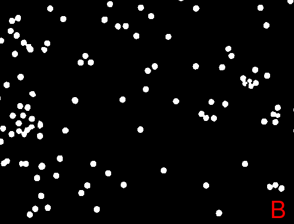
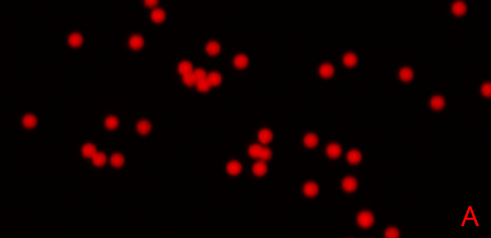
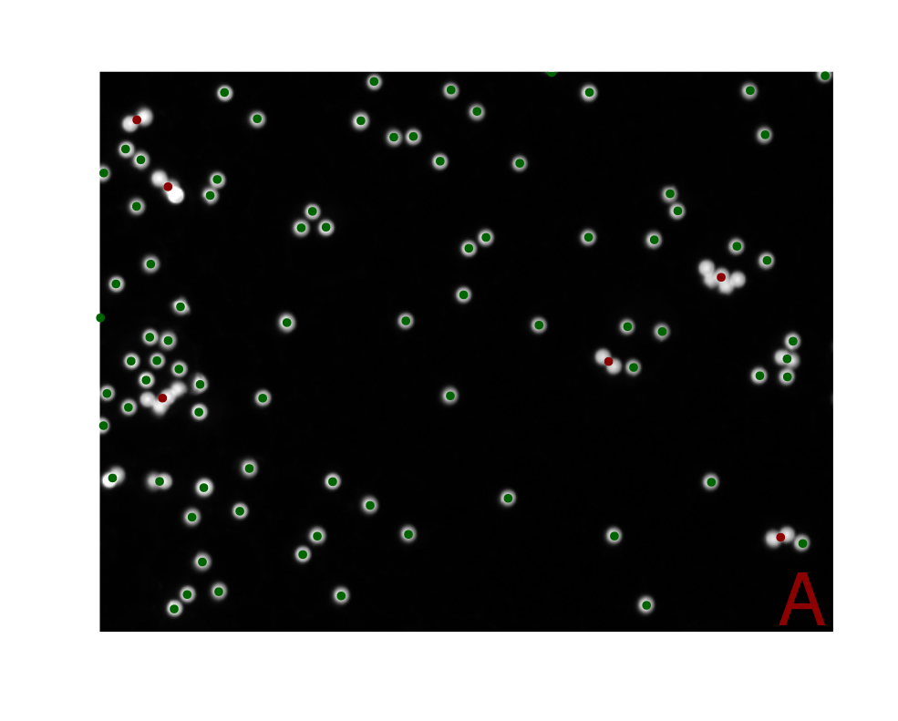
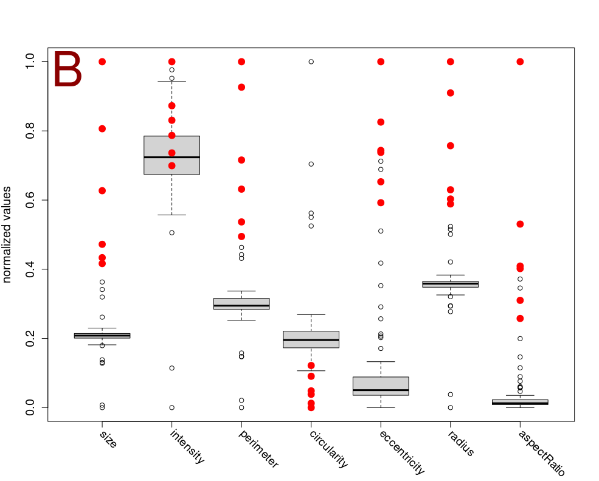

```{r setup2, include=FALSE}
knitr::opts_chunk$set(echo = FALSE)
```

# Dividing to conquer - advanced segmentation strategies {#seg}

Image segmentation is a crucial preliminary step in image analysis and
interpretation. It involves dividing an image into distinct regions by assigning
a label to each pixel. The primary objective is to delineate regions pertinent
to the specific task [@Peng2008; @Ghosh2019; @Niedballa2022]. This process
frequently employs features such as pixel intensity, gradient magnitude, or
texture measures. Based on these features, segmentation techniques can be
classified into three categories: region-based, edge-based, or
classification-based. Classification-based methods assign class labels to pixels
based on their feature values, whereas region-based and edge-based techniques
focus on within-region homogeneity and between-region contrast. One
straightforward method of segmentation is thresholding, which involves comparing
pixel values against one or more intensity thresholds. This process typically
separates the image into foreground and background regions [@Sonka2000;
@Jaehne2002].

Another image segmentation method was proposed by @Ren2003. This approach
integrates a preprocessing step that segments the image into superpixels,
feature extraction based on Gestalt cues, evaluation of the extracted features,
and the training of a linear classifier. Superpixels are clusters of pixels that
are similar with respect to properties such as color and texture, resulting in
larger subregions of the image. The primary objective of this preprocessing step
is to simplify the image and reduce the number of regions considered for
segmentation. Previously, this involved evaluating every single pixel. The
division of the image into regions larger than pixels but smaller than objects
allows for the superpixels to encompass a greater quantity of information,
adhere to the boundaries of natural image objects, reduce the presence of noise and
outliers, and enhance the speed of the subsequent segmentation process. In
summary, this method can be described as segmentation based on low-level pixel
grouping [@Ren2003; @Hossain2019; @OpenImageR].

However, segmentation is not limited to the differentiation of the foreground
and background. Pixel classification plays a critical role in a number of
applications, including visual question answering, object counting, and
tracking. In these applications, classification occurs not just spatially but
also temporally. These applications are diverse, encompassing fields such as
traffic analysis and surveillance, medical imaging, and cell biology
[@Ghosh2019]. While a relatively straightforward technique, thresholding has
inherent limitations in distinguishing between background, noise, and
foreground. Therefore, the next section will offer a more sophisticated approach,
by presenting a package that utilizes deep learning for image segmentation
[@Smith2021].

## `imageseg`: a deep learning package for forest structure analysis

By venturing beyond the traditional laboratory setting, the `imageseg` package
offers a unique approach to analyzing forest structures through deep
learning-based image segmentation, utilizing TensorFlow
(<https://www.tensorflow.org/>). This `R` package employs the power of
convolutional neural networks with the U-Net architecture to streamline image
segmentation tasks [@Niedballa2022]. According to the authors, this `R`
package has been designed to be user-friendly, with pre-trained models that
require only input images, making it accessible even to those without specialist
knowledge. A comprehensive vignette accompanies the package, which provides
detailed instructions on how to set up the software and explains how to utilize
its functions effectively [@imageseg]. Developed primarily for forestry and
ecology applications, `imageseg` includes pre-trained data sets representing
various aspects of forest structure, such as canopy and understory vegetation
density. Its flexibility allows for customization with different training data,
enabling users to develop customized image segmentation workflows for other
fields such as microscopy and cell biology. The package supports both binary and
multiclass segmentation. For image processing within the `R` programming
environment, the `imageseg` package integrates with the `magick` package [@Niedballa2022].

## `EBImage`: specialized segmentation strategy for touching objects

The segmentation of closely adjacent objects, which is particularly prevalent in
cell microscopy, represents a common challenge that is addressed by the
`EBImage` package, which is equipped with a variety of segmentation algorithms.
A typical approach involves the application of either global or adaptive
thresholding, followed by connected set labeling, with the objective of
distinguishing individual objects. To achieve more precise segmentation
of touching objects, techniques such as watershed transformation or Voronoi
segmentation are employed [@Pau2010].

The watershed algorithm is employed to delineate touching microbeads (Figure
\@ref(fig:EBIoriginal)A-C). Initially, the image is transformed into a binary
image by applying a threshold (Figure \@ref(fig:EBIoriginal)B). After utilizing
the watershed function the result is visualized by assigning distinct colors to
the microbeads, effectively illustrating the algorithm's capacity to
differentiate between touching objects (Figure \@ref(fig:EBIoriginal)C).

(ref:EBIoriginal) **Watershed Segmentation in `EBImage`**: **A**) Original image used for watershed segmentation in `EBImage`. **B**) The `thresh()` function was employed to generate a binary image with the objective of effectively separating the foreground from the background. The binary representation of the image facilitates further segmentation processes by simplifying the image. **C**) Presents the result of the watershed segmentation, which is visually represented by the assignment of a distinct color to each object. This technique is particularly effective in differentiating touching objects, as evidenced by the clear separation of microbeads in the image. 

```{r, eval=FALSE, echo=TRUE}
# Load necessary library
library(EBImage)

# Load the image from the specified path
image <- readImage("figures/beads.png")

# Display the original image
EBImage::display(image)

# Apply a threshold to the original image to create a binary image
img_thresh <- thresh(image, offset = 0.05)

# Read the binary image and display it
EBImage::display(img_thresh)

# Perform watershed segmentation on the distance map of the thresholded image
segmented <- EBImage::watershed(distmap(img_thresh))

# Color the labels of the segmented image
segmented_col <- colorLabels(segmented)

# Display the resulting image after watershed segmentation
EBImage::display(segmented_col)
```

```{r, eval=FALSE, echo=FALSE}
# Annotate images with magick
library(magick)

# Save the original image to a temporary file
temp_file <- tempfile(fileext = ".png")
EBImage::writeImage(image, temp_file)

# Read the image from the temporary file using the magick package
magick_image <- image_read(temp_file)

# Annotate the image with the letter 'A' using magick, specify size, color, and location
magick_image <-
  image_annotate(
    magick_image,
    text = "A",
    size = 40,
    color = 'red',
    location = '+452+326'
  )

EBImage::display(as_EBImage(magick_image))

# Apply a threshold to the original image to create a binary image
img_thresh <- thresh(image, offset = 0.05)
EBImage::writeImage(img_thresh, temp_file)

# Read the thresholded image, annotate it, and display
magick_img_thresh <- image_read(temp_file)
magick_img_thresh <-
  image_annotate(
    magick_img_thresh,
    text = "B",
    size = 40,
    color = 'red',
    location = '+452+326'
  )
EBImage::display(as_EBImage(magick_img_thresh))

# Perform watershed segmentation on the distance map of the thresholded image
segmented <- EBImage::watershed(distmap(img_thresh))

# Color the labels of the segmented image
segmented_col <- colorLabels(segmented)
EBImage::writeImage(segmented_col, temp_file)

# Read the colored segmented image, annotate it, and display
magick_segmented <- image_read(temp_file)
magick_segmented <-
  image_annotate(
    magick_segmented,
    text = "C",
    size = 40,
    color = 'red',
    location = '+452+326'
  )
EBImage::display(as_EBImage(magick_segmented))
```

```{r, echo=FALSE}
if(!require(knitr)) {
  install.packages("knitr")
}
```

```{r EBIoriginal, echo=FALSE, out.width="50%", fig.cap="(ref:EBIoriginal)"}
#EBImage::writeImage(as_EBImage(magick_segmented), "figures/EBImage3.png")


knitr::include_graphics("figures/EBImage3.png")
```

# Unveiling the hidden - feature extraction {#extr}

The primary objective of feature extraction is to condense the original data
into significant objects that encapsulate crucial information pertinent to each
specific image [@JudeHemanth2012]. Feature extraction may be applied to a
predefined region of interest (ROI) or may involve the identification of the
ROI, a process often referred to as segmentation, which was reviewed in the
previous sections. Within any given ROI, a multitude of attributes typically exist,
representing different states of the object under analysis. These attributes, or
features, are of vital importance for the interpretation of the detected objects
and can enable applications such as disease diagnosis or the identification of
promising candidates. Features related to individual pixels may include aspects
such as neighborhood relationships, connectivity, and gradients, which are
one-dimensional descriptions. Nevertheless, more intelligible and interpretable
information is frequently derived from descriptions of regions or objects
[@Sonka2000; @Shirazi2018]. Object-level features encompass a range of
characteristics, including size, shape, texture, intensity, and spatial
distribution. Shape features can be further categorized into specific
characteristics, including perimeter, radius, circularity, and area. It is
crucial to acknowledge that the successful extraction of object features is
dependent on the quality and accuracy of the image segmentation process
[@Shirazi2018].

This section is devoted to an examination of `R` packages that enable the
automated extraction of quantitative features. The `biopixR` package offers
automated and interactive object detection strategies. The `pliman` package,
initially developed for the analysis of plant images, has the potential to be
adaptable to a range of different domains. The `FIELDimageR` package is capable
of supporting the analysis of drone-captured images from agricultural field
trials as well as images from pollen, which exhibit similar characteristics to
cellular images. These tools provide novel perspectives for interdisciplinary
research, facilitating the adaptation of methodologies across diverse fields.

## `biopixR`: versatile biological image processing

The `biopixR` package is a comprehensive toolbox developed primarily for
microbead analysis. It encompasses a range of functions, including image
importation, preprocessing, segmentation, feature extraction, and clustering.
The primary objective is to enable the detection of objects and the extraction
of quantitative data, including intensity values, shape, and texture
characteristics. These functionalities are integrated into user-friendly
pipelines that support batch processing, thereby enhancing accessibility. The
preprocessing capabilities include edge restoration and a variety of filter
functions [@biopixR].

To illustrate the feature extraction process, the analysis focuses on a
microbead image (Figure \@ref(fig:biobeads0)A). The image is initially converted to
grayscale. Afterwards the `objectDetection()` function is applied to detect image
objects. The extracted objects are then represented visually by plotting the
highlighted contours of the objects and enumerating the microbeads according to
their cluster IDs, thus distinguishing them as individual entities (Figure
\@ref(fig:biobeads0)B).

```{r, echo=FALSE}
if(!require(biopixR)) {
  install.packages("biopixR")
}
```

```{r, echo=TRUE}
# Loading necessary package
library(biopixR)

# Importing the image
beads <- importImage("figures/beads2.jpg")
```

```{r, echo=TRUE, eval=FALSE}
# Plot original image
beads |> plot(axes = FALSE)
```

```{r, echo=TRUE, eval=FALSE}
# Converting the image to grayscale
beads <- grayscale(beads)

# Detecting objects in the image using edge detection
objects <-
  objectDetection(beads,                # Image to process
                  method = 'edge',      # Method for object detection
                  alpha = 1,            # Threshold adjustment factor
                  sigma = 0)            # Smoothing factor

# Displaying internal visualization of object detection with marked contours 
# and centers
objects$marked_objects |> plot(axes = FALSE)

# Adding text annotations at the centers of detected objects
text(objects$centers$mx,     # x-coordinates of object centers
     objects$centers$my,     # y-coordinates of object centers
     objects$centers$value,  # Text to display (value of the object center)
     col = "green",          # Color of the text
     cex = 1.5)          
```

(ref:biobeads0) **Microbead Detection using `biopixR`**: **A**) The original image shows red fluorescent microbeads, with the majority appearing as isolated, round, spherical objects. Some microbeads are clustered together or overlapping, forming aggregated structures, while others are partially captured within the image frame. **B**) In the grayscale microbead image, edges of the microbeads are highlighted in purple, and the labeling ID (value) is displayed at the center of each object in green.

```{r biobeads0, out.width="66%", fig.cap="(ref:biobeads0)", fig.show='hold', echo=FALSE}

knitr::include_graphics("figures/beads5.png")
```

## `pliman`: an `R` package for plant image analysis

`pliman` is designed to analyze plant images, particularly leaves and seeds, to
help identify disease states, lesion shapes, and quantify objects. It
supports various functions, including image transformation, binarization,
segmentation, and detailed analysis, all facilitated by a detailed
vignette.^[https://tiagoolivoto.github.io/pliman/index.html, accessed
07/11/2024] A key feature of `pliman` is its automation of quantitative feature
extraction (Figure \@ref(fig:pliman1) and \@ref(fig:pliman2)), which
traditionally requires manual, time-consuming, and error-prone methods. The
features of this package are versatile, encompassing a range of segmentation
strategies, the analysis of shape and contour characteristics of leaves and
seeds, the counting of objects, and the quantification of disease states from
leaf images. While the primary focus is on plant imaging, the techniques used
are applicable to other fields such as cellular imaging. This
cross-applicability is further emphasized by the package's batch processing
capabilities, which allow for autonomous analysis of multiple images, critical
for high-throughput phenotyping tasks [@Olivoto2022].

(ref:pliman1) **Preparing Segmentation using `pliman`**: The image comprises two sections. On the left, an image of microbeads is displayed. On the right, a cropped view from the same image illustrates two states for segmentation: the microbead (foreground) in red, and the background is shown in black, emphasizing the clear division needed for segmentation analysis.

```{r, echo=FALSE}
if(!require(EBImage)) {
  if (!require("BiocManager", quietly = TRUE)) {
    install.packages("BiocManager")
  }
  BiocManager::install("EBImage")
}
if(!require(pliman)) {
  install.packages("pliman")
}
```

```{r pliman1, echo=TRUE, error=TRUE, fig.cap="(ref:pliman1)", out.width="49%"}
# Loading necessary package
library(pliman)

# Import requires EBImage:
# Importing the main image
beads <- EBImage::readImage("figures/beads2.jpg")

# Importing additional images for background and foreground
foreground <- EBImage::readImage("figures/foreground.jpg")
background <- EBImage::readImage("figures/background.jpg")

# Displaying the microbead image
EBImage::display(beads)

# Combining the foreground and background images and arranging them in 2 rows
pliman::image_combine(foreground, background, nrow = 2, col = "transparent")
```

(ref:pliman2) **Segmentation Results using `pliman`**: The image depicts the segmentation results obtained via the `pliman` `analyze_objects()` function. It displays the contours of the segmented objects, outlined in yellow. Each distinct object within the segmentation is numbered, facilitating its identification.

```{r pliman2, echo=TRUE, fig.cap="(ref:pliman2)", out.width="69%"}
# Performing segmentation based on provided background and foreground images
analyze_objects(
  img = beads,               # Main image of microbeads
  background = background,   # Background sample image
  foreground = foreground,   # Foreground sample image
  marker = "id",             # Displaying enumeration
  contour_col = "yellow"     # Color for the contour of the segmented objects
)
```

## `FIELDimageR`: an `R` package for the analysis of drone-captured images

The `FIELDimageR` package, is an `R` package designed for the specific purpose
of analyzing drone-captured images from agricultural field trials. The package
offers a variety of functions for ROI selection, the extraction of
foregrounds (Figure \@ref(fig:FIELD1)), watershed segmentation, quantification
and shape analysis [@Matias2020]. The developers have applied this package to
analyze pollen, which visually resembles cells under a microscope. This suggests
that `FIELDimageR` may be applicable for use in microbiological image analysis.
For the spatial analysis, the package utilizes the `terra` package
[@Matias2020].^[https://github.com/OpenDroneMap/FIELDimageR, accessed 05/07/2024]

To showcase the functionalities of the `FIELDimageR` package and its parallels
with biological applications, the same microbead image is subjected to analysis.
The image is initially transformed into a 'SpatRaster' object and then segmented
using an intensity threshold (Figure \@ref(fig:FIELD1)). The microbeads are
correctly identified as the foreground objects by the `fieldMask()` function.
Subsequently, a distinct labeling ID is assigned to each microbead, as
illustrated by a color gradient. Moreover, the contours of each individual
object are displayed (Figure \@ref(fig:FIELD2)). The results of the segmentation
and the extraction of shape-related information are presented in the interactive
`leaflet` interface (Figure \@ref(fig:leafletPDF)). Presenting information like
cluster ID, size, perimeter and width of the detected objects.

(ref:FIELD1) **Displaying the original, background, and foreground Images**: The original image (left) shows the fluorescent microbeads. The middle image displays the background in white (TRUE) and all objects detected by segmentation in black (FALSE). The right image shows only the foreground (microbeads) after detection through segmentation using the `fieldMASK()` function.

```{r, echo=FALSE}
if(!require(FIELDimageR)) {
  # You may need other packages first:
  install.packages(c('terra','mapview','sf','stars','caret','mapedit','devtools',"dplyr","fields","leafem","leafsync","lwgeom","BiocManager","git2r","exactextractr"))

  # FIELDimageR:
  devtools::install_github("OpenDroneMap/FIELDimageR")
  devtools::install_github("filipematias23/FIELDimageR.Extra")
}
```

```{r, echo=TRUE}
# Loading necessary packages
library(FIELDimageR)
library(FIELDimageR.Extra)
library(terra)
library(sf)
library(leafsync)
library(mapview)

# Using the same image as imported in the previous example
# Creating a SpatRaster object using the 'terra' package
EX.P <- rast("figures/beads2.jpg")
EX.P <- imgLAB(EX.P)
```

```{r, echo=FALSE}
EX.P.R1 <-
  fieldMask(
    mosaic = EX.P,    # Input SpatRaster object
    index = "BIM",    # Index representing vegetation
    cropValue = 5,    # Threshold value for the index
    cropAbove = F,    # Indicates to remove values below the threshold
    plot = F
  )
```

```{r echo=TRUE, eval=FALSE}
# Removing background based on a vegetation index
EX.P.R1 <-
  fieldMask(
    mosaic = EX.P,    # Input SpatRaster object
    index = "BIM",    # Index representing vegetation
    cropValue = 5,    # Threshold value for the index
    cropAbove = F     # Indicates to remove values below the threshold
  )

# Displaying the original, background, and foreground images
EX.P.R1$newMosaic
```

```{r FIELD1, echo=FALSE, out.width="100%", fig.cap="(ref:FIELD1)", fig.show='hold'}
knitr::include_graphics("figures/FIELDimageR1_1.png")
```

(ref:FIELD2) **Labeling of Microbeads**: The `fieldCount()` function is used to label individual microbeads. This function utilizes the mask produced in the previous section to identify the objects. The left image displays the labeling with a color gradient indicating distinct objects. On the right, the object contours are shown. The output of the function includes more than just the labeling value (named ID in this package); it also provides information on area, perimeter, width, and geometry of the detected objects.

```{r, echo=TRUE, eval=FALSE}
# Labeling of all microbeads
EX.P.Total <- fieldCount(mosaic = EX.P.R1$mask, plot = T)
```

```{r, echo=FALSE}
# Labeling of all microbeads
EX.P.Total <- fieldCount(mosaic = EX.P.R1$mask, plot = F)
```

```{r FIELD2, out.width="100%", fig.cap="(ref:FIELD2)", fig.show='hold'}
knitr::include_graphics("figures/FIELDimageR2_1.png")
```

```{r leaflet, echo=TRUE, eval=FALSE}
# Combining the 'FIELDimageR.Extra', 'mapview' and 'leafsync' to create an 
# interactive view
m1 <- fieldView(EX.P, r = 1, g = 2, b = 3)
m2 <- mapview(EX.P.Total)
sync(m1, m2)
```

(ref:leafletPDF) **Displaying Results with an Interactive `leaflet` Tool**: The tool displays the original image on the left. For comparison, the cursor is mirrored to the corresponding image (only visible in HTML format). The left image provides detailed information interactively. Hovering over the objects reveals their labeling ID. Performing a left-click opens a detailed window providing information for the individual object, such as area, perimeter, width, and shape. The packages `FIELDimageR.Extra`, `mapview`, and `leafsync` are used to create the interactive display.

```{r leafletPDF, results='asis', echo=FALSE, out.width="100%", fig.cap="(ref:leafletPDF)"}
if (knitr::is_latex_output()) {
  knitr::include_graphics("figures/FIELDimageR_shiny.png")
} else {
  # Combining the `FIELDimageR.Extra`, `mapview` and `leafsync` to create an 
  # interactive view
  m1 <- fieldView(EX.P, r = 1, g = 2, b = 3)
  m2 <- mapview(EX.P.Total)
  sync(m1, m2)
}
```

In summary, packages such as `EBImage` and `biopixR` provide direct pipelines
for the extraction of features from images, including shape, size, radius, and
perimeter, as well as texture information through the calculation of Haralick
texture features [@Haralick1973; @Pau2010; @biopixR]. The `biopixR` package
employs the `imager` and `magick` packages for image processing [@biopixR],
whereas `pliman` and `FIELDimageR` rely on `EBImage` for direct image analysis,
with `FIELDimageR` also utilizing `terra` and `raster` for spatial data
exploration [@Matias2020; @Olivoto2022]. In comparison to the other packages
discussed in this section, `biopixR` facilitates the process of object detection
by eliminating the necessity for the generation of masks or the provision of
representative sample images of the foreground and background. Nevertheless, in
contrast to the other packages, `biopixR` lacks the functionality of watershed
segmentation for the enhanced handling of touching objects (Figure
\@ref(fig:biobeads0)B and Figure \@ref(fig:pliman2)) [@Matias2020; @Olivoto2022;
@biopixR].

# Decoding complexity - clustering, classification and annotation {#clus}

The automation of measuring cellular phenomena and the effects of compounds,
which started in the late 1990s, is now increasingly significant owing to the
progress of machine learning (ML) algorithms and computing power. These
advancements are enhancing the field of bioinformatics' accessibility to these
techniques. Consequently, they are being more commonly employed with the aim of
gaining novel biological insights [@Murphy2014; @Moen2019; @Weiss2022]. One of the latest
methods of image analysis involves comparing the morphological characteristics
of cells from captured images with pre-classified training data that represent
a specific state [@Moen2019]. Bioimage informatics methods aim to generate
fully automated models for biological systems [@Murphy2014].

A major challenge in handling new data sets is the need to label images, which is
critical to assigning meaning to the objects within them. This is particularly
important in medical imaging, where expert knowledge is essential for accurate
labeling [@Boom2012; @Weiss2022]. In ML, two common techniques that can be
used to categorize data into distinct groups are clustering and classification.
Clustering, an unsupervised learning method, is used to discover underlying
structures or patterns in unlabeled data by assessing similarities between data
points [@Mostafa2019]. Classification, a form of supervised learning, involves
building a model from previously labeled training data to make predictions about
new data [@Mostafa2019; @KumarDubey2022]. This requires prior labeling of the
data to determine the characteristics of each group, a process known as
annotation. However, manual annotation is time-consuming and labor-intensive,
requiring significant human effort to identify relevant details in an image
[@Yao2016; @Weiss2022]. Because images often require multi-label annotation - the
assignment of multiple semantic concepts to a single image - there has been a
growing demand for automated image annotation systems that aim to reduce the
burden of manual labeling and increase the efficiency of data processing
[@Nasierding2009].

To effectively analyze complex image data sets, researchers require advanced
pattern recognition techniques that can extract meaningful biological insights
from these images. This enables them to transform visual data into actionable
scientific knowledge [@Behura2021]. Some of the most widely used clustering
algorithms for this purpose include:

  - k-means: is a centroid-based algorithm that partitions n observations into
    *k* clusters by minimizing within-cluster sum of squares. It does require
    specifying the number of clusters beforehand [@Struyf1996].
  - Partitioning Around Medoids (PAM): a k-means relative, seeks to identify *k* 
    representative objects from the data set,
    which are robust representations of the clusters' center and are also
    referred to as medoids. Clusters are formed by assigning each object to its
    nearest medoid, with the objective of optimizing within-cluster similarity
    [@Kaufman1990; @VanderLaan2003].
  - c-means: also known as Fuzzy C-Means (FCM), extends the concept of k-means
    to allow each data point to belong to more than one cluster [@Bezdek1984].
  - Density-Based Spatial Clustering of Applications with Noise (DBSCAN): is a
    density-based clustering algorithm that groups together points that are
    closely packed together and separates them from points that lie alone in
    low-density regions. It does not require specifying the number of clusters
    beforehand [@Ester1996; @Schubert2017].
  - Self-Organizing Maps (SOM): are a type of neural network architecture that
    systematically organizes input features into a spatially coherent
    representation. This method can be utilized for clustering based on various
    object features, thereby facilitating the discovery of patterns within these
    objects [@Kohonen1990; @Kohonen2013].

## `pixelclasser`: a simplified support vector machine approach for pixel classification

The `pixelclasser` package is a tool for classifying image pixels into
user-defined color categories using a simplified version of the Support Vector
Machine (SVM) technique. It includes functions that allow users to visualize
image pixels, define classification rules, classify pixels, and store the
resulting information.^[https://github.com/ropensci/pixelclasser, accessed 07/11/2024] Users must
provide a test set that captures the variation between categories, as the
package requires manual placement of rules for each category - automatic rule
construction methods are not included. In addition, `pixelclasser` provides
quality control of the classifications and comes with a detailed vignette to
facilitate the use of this classification
tool.^[https://cloud.r-project.org/web/packages/pixelclasser/vignettes/pixelclasser.html, accessed 07/11/2024]
The classification on the pixel-level can be used for image segmentation via
pixel clustering.

## `biopixR`: pattern recognition of shape- and texture-related features

The `biopixR` package incorporates two unsupervised ML clustering
algorithms: SOM and PAM. PAM organizes a distance matrix into clusters,
identifying medoids as robust representatives of each cluster, typically
specified with a predefined number of groups (*k*) [@Kaufman1990;
@VanderLaan2003; @Park2009]. This approach clusters Haralick texture features
extracted from multiple images within a directory, thereby enabling image
classification based on these features [@Haralick1973]. The optimal number of
clusters (*k*) is automatically determined using silhouette analysis
[@Rousseeuw1987; @biopixR]. SOM is used to cluster object features related to
object shape and intensity, thereby facilitating the identification of patterns
within these characteristics [@biopixR].

The capacity for pattern recognition within the `biopixR` package is
demonstrated by the clustering of shape-related and pixel-intensity information
from an example image of microbeads (Figure \@ref(fig:shapefeatures)A). The image
depicts both single and aggregated microbeads, wherein the former exhibit a
round, spherical shape, while the latter appear more oval. The extracted
features and the corresponding cluster are depicted in Figure
\@ref(fig:shapefeatures)B, which showcases the identification of patterns within
these objects based on their shape characteristics.

```{r SOM, eval=FALSE, echo=TRUE}
# Load the 'biopixR' package
library(biopixR)

# Import an image from the specified path
img <- importImage("figures/beads.png")

# Set seed for reproducibility
set.seed(123)

# Extract shape features from the image
result <- shapeFeatures(
  img,    
  alpha = 0.8,
  sigma = 0.7,
  xdim = 2,
  ydim = 1,
  SOM = TRUE,
  visualize = FALSE
)

# Define colors for plotting points based on classes
colors <- c("darkgreen", "darkred")

# Plot the image without axes and add colored points representing the classes
img |> plot(axes = FALSE)
with(result,
     points(
       result$x,
       result$y,
       col = colors[factor(result$class)],
       pch = 19,
       cex = 1.2
     ))
text(c(471), c(354), c("A"), col = "darkred", cex = 5)

# Create a data frame with various shape features and the pixel-intensity
df <- data.frame(
  size = result$size,
  intensity = result$intensity,
  perimeter = result$perimeter,
  circularity = result$circularity,
  eccentricity = result$eccentricity,
  radius = result$mean_radius,
  aspectRatio = result$aspect_ratio
)

# Min-Max Normalization Function
min_max_norm <- function(x) {
  (x - min(x)) / (max(x) - min(x))
}

# Applying the function to each column
df_normalized <- as.data.frame(lapply(df, min_max_norm))

# Create a boxplot of the normalized data
boxplot(
  df_normalized,
  ylab = "normalized values",
  xaxt = "n",
  cex.lab = 1.25,
  cex.axis = 1.25
)

# Add axis ticks and diagonal labels
axis(1, at = 1:ncol(df), labels = FALSE)  # Add axis ticks but no labels
text(
  cex = 1.2,
  x = seq_len(ncol(df_normalized)),
  y = -0.07,
  labels = colnames(df_normalized),
  adj = 0,
  srt = -45,
  xpd = TRUE
)

# Highlight specific rows based on class
highlight_rows <-
  which(result$class == 2)  # Example row indices to highlight

# Add points for the specific rows
# Adding points for each column
for (col in 1:ncol(df_normalized)) {
  points(
    rep(col, length(highlight_rows)),
    df_normalized[highlight_rows, col],
    col = "red",
    pch = 19,
    cex = 1.5
  )
}

text(c(0.5),
     c(0.98),
     c("B"),
     col = "darkred",
     cex = 5)
```

(ref:shapefeatures) **Clustering Microbeads Based on Shape and Intensity Features**: **A**) The utilization of Self-Organizing Maps (SOM) enables the clustering of microbeads into two distinct groups based on shape and intensity features extracted using the `shapeFeatures()` function. This method enables the precise clustering of microbeads according to a range of properties, including intensity, area, perimeter, circularity, radius, and aspect ratio. This facilitates a deeper understanding of the morphological variations observed in the microbeads. **B**) The attributes utilized as input for the SOM algorithm are illustrated in this plot. To ensure comparability, the different parameters have been normalized using a min-max normalization procedure. The points highlighted in red represent the microbeads that are also highlighted in red in Figure A. Notably, these highlighted points differ from the most commonly occurring values in all attributes except for the intensity.

```{r shapefeatures, out.width="85%", fig.cap="(ref:shapefeatures)"}


```

# Harmonizing visions - techniques and approaches in image registration

The process of image registration plays a pivotal role in the analysis of
medical images, as it enables the comparison of multiple images representing
different conditions [@Jenkinson2001]. This process, which can be described as
image alignment, entails aligning a series of images within a single coordinate
system, thereby ensuring consistency across images [@Peng2008;
@Rittscher2010]. A variety of techniques are employed in image registration,
including mutual information registration, spline-based elastic registration,
and invariant moment feature-based registration, among others [@Peng2008].
These methods are of particular significance in the field of medical imaging,
where they are employed to enhance the analysis of images obtained by techniques
such as computed tomography (CT) and magnetic resonance imaging (MRI)
[@Sonka2000].

## `RNiftyReg`: interface for the 'NiftyReg' image registration tools

The `RNiftyReg` package provides an interface to the 'NiftyReg' image
registration library, which supports both linear and non-linear registration in
two and three dimensions [@RNiftyReg]. This package has been utilized in
research on brain connectivity [@Clayden2013], and it includes a comprehensive
README that introduces its features and
capabilities.^[https://github.com/jonclayden/RNiftyReg, accessed 07/11/2024]

# Jack of all trades - general purpose `R` packages for broad-spectrum analysis

Five principal image processing packages for `R` offer a broad range of
algorithms and capabilities for complete image analysis, rendering them
suitable as general-purpose tools. These packages are `imager`, `magick`,
`EBImage`, `OpenImageR` and `SimpleITK`. This section will introduce each of
these key packages and their roles in image analysis.

## `imager`: wrapper for the 'CImg' C++ image processing library

The `imager` `R` package, created by @Barthelme2019, integrates the
functionality of the 'CImg' library, developed by David Tschumperlé, into
`R`.^[https://github.com/asgr/imager, accessed 07/11/2024] This allows users
to edit and create images. The package uses two primary data structures: raster
images, known as *cimg*, and pixel sets, referred to as *pixelset*. These
structures, encoded as four-dimensional numeric or logical arrays, permit the
execution of basic `R` functions such as `plot()`, `print()`, or
`as.data.frame()`, as well as the processing of hyperspectral images and videos
[@Barthelme2019]. The 4D arrays encompass two spatial dimensions (width and
height), one temporal or depth dimension, and one color dimension [@imager].
`imager` offers over 100 standard commands for tasks such as loading, saving,
resizing, and denoising of images.^[https://asgr.github.io/imager/, accessed 07/11/2024] 
The `imager` package supports the file formats JPEG, PNG,
and BMP and is available on CRAN [@imager].

## `EBImage`: image processing and analysis for biological imaging data in `R`

The `EBImage` package, established in 2006, is one of the oldest image
processing tools available in `R` and can be accessed via the Bioconductor
repository. It is primarily written in `R` and C/C++ [@AndrzejOles2017].
`EBImage` provides a suite of general tools for image processing and analysis,
particularly excelling in microscopy-based cell assays. It features specialized
commands for cell segmentation and the extraction of quantitative data from
images [@Pau2010]. The package employs the RGB color system for color
detection, which is based on pixel intensities. The incorporation of the
`EBImage` package into the `R` workflow facilitates the automation and objectivity
of the image analysis procedure [@Heineck2019]. Images in `EBImage` are
managed as an extension of `R`'s base `array`, specifically the package-specific
`Image` class. As images are treated as multidimensional arrays, algebraic
operations are possible. This class structure includes various slots, with the
*.data* slot holding the numeric pixel intensity array and the *colorMode* slot
managing the image's color information. Adjusting the *colorMode* setting
changes the image's rendering mode [@AndrzejOles2017; @Heineck2019].
Typically, the first two dimensions of an image carry spatial information, while
additional dimensions are variable and can represent color channels, time
points, replicas, or depth. `EBImage` also features an interactive display
interface through GTK+, and offers a set of functions for
automated image-based phenotyping in biology, including cell segmentation,
feature extraction, statistical analysis, and visualization [@Pau2010]. It
supports a range of file formats, including JPEG, PNG, and TIFF, and can handle
additional formats through integration with the 'ImageMagick' image-processing
library [@Pau2010; @AndrzejOles2017].

## `magick`: advanced image processing in `R` using 'ImageMagick'

This package is built upon 'Magick++', the C++ API for the 'ImageMagick' image
processing library.^[https://imagemagick.org/script/magick++.php,
accessed 07/11/2024] The `R` package provides access to 'ImageMagick'
functionalities, enabling both basic and complex image manipulations directly in
`R`. Notably, images in `magick` are automatically displayed in the RStudio
console, creating a dynamic and interactive editing environment. The wide
variety of functions made available through this package are impressive. The
possibilities range from functions that are rather 'just for fun', such as
implosion or introduction of noise, to more advanced processing techniques,
including different segmentation techniques, edge detection, and a
toolbox for morphology operations. The `magick` package is compatible with a
diverse range of image formats and encompasses the functionalities required for
format conversion. This includes the conversion to the formats supported by the
`EBImage` package. It also handles multiple frames, facilitating the creation
and processing of animated graphics. Each operation in `magick` creates a new,
altered version of the image, preserving the original
[@magick].^[https://www.imagemagick.org/Magick++/ImageDesign.html,
accessed 07/11/2024] Recent developments include the introduction of a `shiny`
application that enables users to interactively perform basic image processing
tasks such as blurring and edge
detection.^[https://georgestagg.github.io/shinymagick/, accessed 07/11/2024]
The `magick` package is compatible with a range of popular file formats,
including PNG, BMP, TIFF, PDF, SVG, and JPEG, and is available through the CRAN
repository [@magick].^[https://imagemagick.org/, accessed 07/11/2024]

## `OpenImageR`: a general-purpose image processing library

`OpenImageR` is a lesser known but highly versatile general-purpose image
processing library that integrates both the `R` and C++ programming languages.
This package offers a comprehensive array of functions for preprocessing,
filtering, and feature extraction. Images are treated as two- or
three-dimensional objects, represented by matrices, data frames, or arrays, with
the third dimension representing color information. The functionalities within
`OpenImageR` are organized into three main categories: basic functions, which
include importing, displaying, cropping, and thresholding; filter functions,
which feature augmentation and various edge detection algorithms; and image
recognition, which incorporates functions from the 'ImageHash' Python library.
In recent updates, a number of new features have been incorporated, including
Gabor feature extraction, which was originally developed in MATLAB and based on
code by @Haghighat2015. The most recent version incorporates image segmentation
techniques that utilize superpixels and clustering. Images can be visualized
through the `shiny` application or the grid package. `OpenImageR` is capable of
handling a multitude of image formats, including PNG, TIFF, and JPG
[@OpenImageR].^[https://github.com/mlampros/OpenImageR, accessed 07/11/2024] ^[https://mlampros.github.io/OpenImageR/index.html, accessed 07/11/2024]

## `SimpleITK`: a streamlined wrapper for ITK in biomedical image analysis

The following section will introduce a prominent tool in biomedical image
analysis, the wrapper for the Insight Segmentation and Registration Toolkit
(ITK), known as `SimpleITK` [@Rittscher2010]. `SimpleITK` represents a
streamlined version of the original ITK, an open-source C++ library that
features a wide array of imaging algorithms and frameworks
[@Lowekamp2013; @Yaniv2017]. This library has been in development for
approximately two decades and is particularly favored in the medical image
analysis community [@Lowekamp2013; @Beare2018].
The objective of `SimpleITK` is to simplify the accessibility of ITK algorithms
by reducing their complexity, thereby making these sophisticated tools more
approachable for a broader audience [@Lowekamp2013]. Adapted for the `R`
programming language through SWIG, `SimpleITK` offers over 250 image processing
algorithms that function across various scripting and prototyping environments
[@Lowekamp2013; @Yaniv2017; @Beare2018]. In contrast to other general-purpose
image processing packages, which treat images as mere arrays, `SimpleITK` treats
images as objects within a physical space, thereby providing a set
of metadata about image and voxel geometry in world coordinates [@Lowekamp2013;
@Yaniv2017; @Beare2018]. This nuanced representation is of particular
importance for specific medical imaging applications. Additionally, `SimpleITK`
incorporates metadata such as the origin, pixel spacing, and a matrix defining
the physical orientation of image axes [@Yaniv2017]. However, the complexity
of the underlying ITK library may impede customization and necessitate
familiarity with C++. Another challenge for `R` developers arises from the fact
that the documentation is also based on C++ [@Beare2018]. To facilitate the
learning process, @Yaniv2017 has developed a series of Jupyter notebooks that
provide an introduction to the package and its capabilities for both Python and
`R` users. These notebooks serve as educational tools and a resource for research,
providing full coverage of the entire spectrum of image analysis
processes
[@Beare2018].^[https://github.com/InsightSoftwareConsortium/SimpleITK-Notebooks, accessed 07/11/2024]
In combination with `R`, `SimpleITK` enables detailed image processing and
facilitates the subsequent statistical evaluation of quantified data. The
software is compatible with a range of digital image formats, including JPEG,
BMP, PNG, and TIFF, and is capable of analyzing 2D and 3D images
[@Beare2018]. The package is obtained through the GitHub
repository.^[https://github.com/SimpleITK/SimpleITKRInstaller, accessed 07/11/2024]

In summary, these packages and their associated libraries offer a vast array of
algorithms that can be accessed in `R`. This includes features from the 'CImg',
'ImageMagick' and ITK libraries, along with the diverse algorithms encoded in the
`EBImage` package. These flexible packages provide the foundation for the
development of numerous tailored applications.
