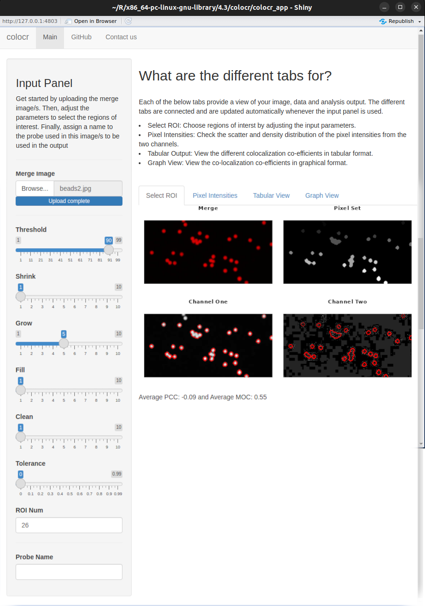

```{r setup3, include=FALSE}
knitr::opts_chunk$set(echo = FALSE)

```

# Exploring the facets of complexity - multiplexed imaging in `R` {#multi}

Multiplexed imaging is a crucial technology for analyzing complex biological
processes at the single-cell level, especially in tissue-based cancers and
autoimmune diseases [@Harris2022]. This technique enables the simultaneous
assessment of multiple protein and DNA molecules, overcoming limitations that
hinder advancements in understanding biological interactions and phenomena
[@Gerdes2013; @Goltsev2018]. Multiplex imaging is the result of a multiplex
experiment, in which multiple species [@Aherne2024], biomolecules
[@Damond2019], or cell types [@Creed2021] are labeled with different probes,
dyes, or antibodies simultaneously. This technique allows for the
differentiation of components within the resulting image [@Eling2020]. In
comparison to standard immunofluorescence experiments, the number of distinct
targets is significantly increased, reaching up to 50 different target molecules
[@Damond2019; @Einhaus2023]. This can be used to distinguish between species
in a biofilm [@Aherne2024], or to obtain an overview of the biomarker
distribution or tissue composition in a sample [@Damond2019; @Yang2020]. The
technique has the capacity to reveal the positions and interactions of
individual cells, provide insight into the activities of biomolecules, and holds
the potential for the reconstruction of the three-dimensional tissue
architecture of a given sample [@Harris2022a; @Cho2023; @Zhao2023]. Several
imaging techniques are used to obtain detailed insights into the spatial
interactions between cells, including Co-Detection by indEXing (CODEX)
[@Goltsev2018], Multiplex Ion Beam Imaging (MIBI) [@Angelo2014], and
Multiplexed Immunofluorescence Imaging (MxIF) [@Gerdes2013; @Harris2022;
@Feng2023]. These methods generate vast amounts of imaging data, often
terabytes across hundreds of slides, which necessitates sophisticated image
analysis pipelines [@Harris2022a].

## `mxnorm`: normalize multiplexed imaging data

Managing technical variability within these pipelines is crucial, and intensity
normalization is one approach to address this issue [@Harris2022a]. The `R`
package `mxnorm` addresses this by providing tools for implementing, evaluating,
and visualizing various normalization techniques [@mxnorm]. These tools aid in
measuring technical variability and evaluating the efficacy of various
normalization methods. They enable users to apply customized methods to improve
image consistency by reducing technical variations while preserving biological
signals. `mxnorm` provides an analysis pipeline for multiplex
images, incorporating normalization algorithms inspired by the ComBat paper,
the `fda` package, and the tidyverse framework [@Harris2022]. For researchers
who want to effectively standardize multiplexed imaging data, these features
make `mxnorm` a powerful resource [@mxnorm].

## `DIMPLE`: manipulation and exploration of multiplex images

To assess patient outcomes, understand disease mechanisms, and develop effective
cancer therapies, the `DIMPLE` `R` package is designed to extract critical
information from the tumor microenvironment (TME). `DIMPLE` facilitates
quantification and visualization of cellular interactions within the TME using
spatial data. It also enables correlation of these interactions and phenotypic
data with patient outcomes through sophisticated statistical modeling. `DIMPLE`
provides researchers with an extensive toolkit to analyze cellular
interactions and transform raw multiplex imaging data into actionable biological
insights, potentially identifying prognostic indicators for cancer research and
therapy development. To support the analysis process, a `shiny` application is
provided [@Masotti2023].^[https://github.com/nateosher/DIMPLE, accessed 07/11/2024]

## `cytomapper`: visualization of multiplex images and cell-level information

The `cytomapper` package is designed to visualize multiplexed read-outs and
cell-level information obtained by multiplex imaging
technologies [@cytomapper]. It offers various
functions to view pixel-level information across multiple channels and display
expression data for individual cells. Additionally, `cytomapper` includes
features to gate cells based on their expression values, enhancing the analysis
of complex data sets. It is compatible with data from various multiplex imaging
technologies and requires single-cell read-outs, multi-channel TIFF stacks,
and segmentation masks. The `cytomapper` package is a versatile tool for
researchers working with advanced imaging data sets to explore cellular behaviors
and properties [@Eling2020].

## `SPIAT`: analyzing spatial properties of tissues

The `SPIAT` package, standing for **Sp**atial **I**mage **A**nalysis of
**T**issues, is among the most comprehensive tools for multiplex image analysis
[@AnnaTrigos2022]. Developed with compatibility for multiplex imaging
technologies like CODEX and MIBI, `SPIAT` facilitates the analysis of spatial
data by using X and Y coordinates of cells, their marker intensities, and
phenotypes. It features six analysis modules that support a variety of functions
including visualization, cell co-localization, distance measurements between cell
types, categorization of the immune microenvironment in relation to tumor areas,
analysis of cellular neighborhoods and clusters, and quantification of spatial
heterogeneity [@Yang2020; @AnnaTrigos2022]. To use `SPIAT`, images must be
pre-segmented and cells phenotyped, typically using external software like HALO
and InForm to prepare the correct input format [@Yang2020]. The package
provides a `shiny` application that assists the user in formatting spatial data
from the aforementioned sources in a manner that ensures compatibility with the
functions of the `SPIAT` package.^[https://github.com/TrigosTeam/SPIAT-shiny, accessed 07/11/2024]
`SPIAT` is designed to be user-friendly, making complex spatial analysis
accessible to researchers with varying computational skills [@Feng2023].

## `Seurat`: spatially resolved transcriptomics (SRT)

Spatially resolved transcriptomics (SRT) is a commonly used approach for the
quantification of gene expression levels in tissue sections while preserving
positional information [@larsson_semla_2023]. The `Seurat` package
[@hao_dictionary_2024] is a package for spatial transcriptomics and multiplexed
imaging analysis. It shares some similarities with the `SPIAT` and `spatialTIME`
packages. For assays with cell segmentation, `Seurat` facilitates the
visualization of individual cell boundaries or centroids, thereby enabling more
precise mapping of molecular signals to cells. In contrast to other reviewed
packages, `Seurat`'s unique feature is its integration of spatial and molecular
data for spatial data analysis. In particular, it enables the joint analysis of
spatially-resolved gene expression data alongside traditional single-cell
RNA-seq, allowing researchers to map cell types and states within their native
tissue context, along with metadata. Notably, `Seurat` supports the analysis and
visualization of spatial omics data at both single-cell and subcellular
resolution. `Seurat` deliberately supports a broad range of spatial
technologies, including the Akoya CODEX/Phenocycler\texttrademark{} platform and
sequencing-based platforms such as Visium Spatial Gene Expression, 10x Genomics
and Slide-seq. To achieve these capabilities, `Seurat` offers statistical
methods to identify genes or features with spatially structured expression
patterns, which facilitate the uncovering of region-specific biological
processes. Since its first publication in 2015 [@satija_spatial_2015], its
functionality has expanded to include support for image-based spatial
transcriptomics (highly multiplexed imaging technologies). `Seurat` uses image
data (e.g., raw, masked, processed images, 10X Genomics Visium Image).

## `spatialTIME`: spatial analysis of Vectra immunofluorescence data

The `spatialTIME` package has been designed for the analysis of
immunofluorescence data with the objective of identifying spatial patterns
within the TME. The package appears to be designed to work with data acquired by
the Vectra Polaris™ imaging
system.^[https://web.archive.org/web/20250125194642/https://www.akoyabio.com/wp-content/uploads/2021/11/Vectra_Polaris_Product_Note_with_MOTiF_Akoya.pdf, accessed 07/14/2025] 
It facilitates the spatial analysis of multiplex
immunofluorescence data, enabling spatial characterization and architectural
reconstruction. Additionally, the package includes a `shiny` application,
`iTIME`, which offers a user-friendly point-and-click interface that mirrors
many of the capabilities found in `spatialTIME`
[@Creed2021].^[https://fridleylab.shinyapps.io/iTIME/, accessed 07/11/2024]
The package also comes with a detailed vignette to help users get started with
its features [@spatialTime].

In summary, `R` offers a range of tools for analyzing multiplex imaging data.
However, it is important to note that these packages, except for the
`cytomapper` package, require image preprocessing and use the resulting data
frames as input for analysis.

# Tracing the dance - `R` packages for analyzing cellular movement dynamics

Cellular migration is essential for various physiological and pathological
functions, including development, immune responses, wound healing, and tumor
progression [@Bise2011; @Yamada2019; @Hossian2020], making it a crucial field
in disciplines such as neuroscience, oncology, and regenerative medicine
[@Kaiser2004; @Hu2023]. To gain insight into these biological processes,
researchers can track cell movement by manually tracing their positions in
sequential images for 2D coordinates or by incorporating the z coordinate for 3D
analysis [@Hu2023]. By studying cell migration at multiple levels - from the
molecular components and the behavior of individual cells to the dynamics of
cell populations - researchers can unravel the complex interactions that
influence the movement of cells [@Maheshwari1998]. Such wide studies
are crucial in advancing our understanding of phenomena such as cancer
metastasis, which could lead to new therapeutic strategies [@Um2017].

## `celltrackR`: analyzing motion in two or three dimensions

The `celltrackR` package is intended for analyzing motion in two or three
dimensions, primarily using data from time-lapse microscopy or x-y-(z)
coordinates. It is useful in both biological settings for tracking cells and in
non-biological contexts for object tracking [@celltrackR]. Additionally, the
package provides a web user interface to facilitate the analysis
process.^[https://github.com/ingewortel/celltrackR, accessed 07/11/2024] The package contains
standard analytical tools, such as mean square displacement and autocorrelation,
as well as algorithms for simulating artificial tracks using various models,
such as Brownian motion and the Beauchemin model of lymphocyte migration
[@celltrackR]. Furthermore, `celltrackR` provides a complete pipeline for
track analysis, including data management, quality control, and methods for
detecting tracking errors, such as track interpolation and drift correction
[@Wortel2021]. The package is well-documented, providing detailed vignettes that
guide users through the migration analysis process [@celltrackR].

# Mapping the unseen - exploring spatial properties in bioimage data

In this section, we explore the use of `R` tools for analyzing spatial
properties in applications such as transcriptomics. One notable package is the
`MoleculeExperiment` package [@noauthor_moleculeexperiment_nodate], which
can be used to analyze molecular data within image-based data sets. This package
builds upon other popular packages like `EBImage`, focusing on raster analysis,
and `terra` [@terra] for handling geographic information systems (GIS) tasks.
Raster or gridded data are spatial data structures that divide regions into
rectangles called cells or pixels, storing one or more values. These grids
contrast with vector data representing points, lines, and polygons in GIS
contexts. Each pixel represents an area on a surface, making color image rasters
unique due to their multiple bands containing reflectance values for specific
colors or light spectra.

The `terra` package (formerly known as `raster/sp`) offers fast operations
through optimized back-end C++ code. Users can perform various raster tasks such
as creating objects, executing spatial/geometric functions like re-projections
and resampling, filtering, and conducting calculations. Functions within the
package facilitate extracting essential statistics from entire SpatRaster
data sets, including mean values, maximum values, value ranges, or counts of NA
cells. In addition to these analytical capabilities, `terra` provides
functionality for visualizing data and interacting with rasters, enhancing user
experience when working with gridded spatial information. This versatility makes
the package an essential tool in analyzing transcriptomic data within
image-based data sets using `R` tools [@Hijmans2020].

# Numbers game - simplifying scientific image data representation

The `R` environment offers multiple additional tools for
the extraction of information from data, with a particular focus on the
extraction of measuring points in scientific diagrams. This task is of
particular significance when data is available exclusively in image format, for
instance from publications or other sources.

## `digitize`: use data from published plots or images

The `digitize` package is a well-established and mature tool that simplifies
importing data from digital images by providing a user-friendly interface for
calibration and point location. It leverages the `readbitmap` package to read
various bitmap formats such as BMP, JPEG, PNG, and TIFF. When reading these
image files, digitize relies on the magic number embedded within each file
rather than solely relying on the file extension. For seamless integration with
JPEG and PNG images, this package depends on external libraries like 'libjpg'
and 'libpng' [@poisot_digitize_2011]. Interestingly, the packages can be
used for other purposes as well. For example, Figure \@ref(fig:digitize)
demonstrates that the `digitize` package can quantify certain structures in
images. This example illustrates how fluorescent objects in an image can be
identified by their position and subsequently quantified by their number.

```{r, eval = FALSE, echo = FALSE, fig.show='hold', fig.align='center'}
library(digitize)
library(imager)

img <- load.image("test3.png")
img |> dim()
plot(img)

digitize("test3.png")
```

(ref:digitize) **Counting using `digitize`**: The figure provided to `digitize`, consists of cells with DNA damage (similar to @Roediger2018). The nucleus is colored with DAPI (blue) and the $\gamma$H2AX histone, a marker for DNA double strand breaks, is stained with a specific antibody. The `digitize` package is used to interactively extract the coordinates (shown in the console) by using the cursor to define the region of interest (blue cross) and tag the objects within it (red circles). In the screenshot it is displayed how `digitize` is invoked in RKWard (0.7.5z+0.7.6+devel3, Linux, TUXEDO OS 2, [@Roediger2012]).

```{r, echo=FALSE}
if(!require(EBImage)) {
  if (!require("BiocManager", quietly = TRUE)) {
    install.packages("BiocManager")
  }
  BiocManager::install("EBImage")
}
```

```{r digitize, echo=FALSE, fig.cap="(ref:digitize)", fig.show='hold', out.width="89%", fig.align='center'}
img <- EBImage::readImage("figures/digitize.png")
EBImage::display(img)
```

## `juicr`: extraction of numerical data from scientific images

`juicr` is a tool designed to automate the extraction of numerical data from
scientific images. It offers users a Tcl/Tk graphical user interface (GUI) that
simplifies point-and-click manual extraction with advanced features such as
image zooming, calibration capabilities, and classification options.
Additionally, `juicr` provides semi-automated tools for fine-tuning extraction
attempts. To ensure optimal performance, this package depends on 
the `EBImage` package, which must be installed and loaded
prior to utilization. Once data is extracted using `juicr`, users can choose to
save their results in various formats including comma-separated values (CSV)
files or postscript (EPS) files for easy import into other software. Moreover,
extractions can also be saved as fully-embedded and standalone HTML files, that
preserve all extraction details, setup configurations, and image modifications.
These HTML files provide a means of storing data while ensuring long-term
accessibility and replicability for future reference and analysis purposes
[@juicr].

## `image2data`: transforming images into data sets

In recent years, the conversion of images into data sets has emerged as an
essential tool in various fields such as computer vision, healthcare, and
geospatial analysis. The `image2data` `R` package provides functionality to
convert images into data sets [@caron_image2data_2022]. The primary function `image2data()` takes
an image file with extensions like .png, .tiff, .jpeg or .bmp as input and
converts it into a data set. Each row of the resulting data set represents a pixel
(or subject), while columns represent variables such as x-coordinate,
y-coordinate, and hex color code. The `image2data()` function offers
methods for reducing data sets, yielding results akin to pixelated images with
adjustable precision values. Higher precision leads to more data points, while
lower precision yields fewer. This example showcases a pixelated representation
of a pixel-based image in PNG format, highlighting its unique visual attributes.
Users have the ability to customize and modify various elements by adjusting
their corresponding hex color codes for precise control over hues, saturation
levels, and brightness.

(ref:img2data) **Application Example of the `image2data` Package**: The image displays nuclei stained with DAPI (blue) and a quantitative marker for DNA double strand breaks, was labeled with a specific antibody (green). The `image2data` package extracted 20% of the pixels from the original image (top), creating a table with x|y coordinates and corresponding hex color codes. This data was then used to reassemble the image using `R`'s base plot (bottom).

```{r, echo=FALSE}
if(!require(image2data)) {
  install.packages("image2data")
}
if(!require(data.table)) {
  install.packages("data.table")
}
```

```{r img2data, eval = TRUE, echo = TRUE, out.width="65%", fig.cap="(ref:img2data)", fig.show='hold'}
# Loading the required packages
library(image2data)
library(data.table)

# Path to the image file
image <- "figures/test3.png"
img <- EBImage::readImage(image)

# Subsampling the image data
beads_subsample <- image2data(
  path = image,                    # Path to the image file
  reduce = .2,                     # Reduction factor for subsampling 
                                   # (20 % of original number of pixels)
  seed = 42,                       # Seed for random number generation by
                                   # return (for reproducibility)
  showplot = FALSE                 # Whether to show a plot of the subsampled data
) |> as.data.table()               # Converting the result to a data.table

# Display a part of the subsampled data
beads_subsample

EBImage::display(img)

# Plotting the subsampled data
plot(beads_subsample$x,            # x-coordinates
     beads_subsample$y,            # y-coordinates
     col = beads_subsample$g,      # Color based on hex code extracted by image2data()
     pch = 19,                     # Plotting character (solid circle)
     xlab = "",
     ylab = "")
```

# Engaging insights - interactive approaches to image analysis {#inter}

The analysis and processing of images to extract useful information can be a
challenging endeavor. Consequently, the implementation of interactive approaches
accompanied by immediate visual feedback regarding parameter alterations
represents a significant aid in simplifying image analysis. Therefore, this 
section will focus on interactive tools and functions from packages that
facilitate the exploration of images and the extraction of useful insights.

## `cytomapper`: a shiny application for hierarchical gating and visualization of multiplex images

The `cytomapper` package, designed for processing multiplex images, includes a
`shiny` application that facilitates the hierarchical gating of cells using
specific markers and allows for the visualization of selected cells. The
graphical user interface (GUI) of this `shiny` application is designed to assist in
the process of cell labeling. Furthermore, the data from the selected cells can
be saved as a *SingleCellExperiment*, thereby enabling various downstream
processing methods [@Eling2020; @cytomapper]. The `cytomapper` package offers
comparable functionality for feature extraction as described in the beginning, 
providing an algorithm for extracting morphological and intensity
features from multiplex images [@cytomapper].

## `colocr`: interactive ROI selection in image analysis through shiny app

The `colocr` package, which facilitates the exploration of fluorescent
microscopic images, features a GUI accessible through a `shiny` app. This GUI
can be invoked locally or accessed online. The process of image analysis
frequently necessitates the input of manual labor, particularly in the selection
of ROIs. This package streamlines the process of selecting ROIs by
semi-automating it, thereby allowing users to review and interactively select
one or more ROIs. Moreover, the app offers the option to interactively adjust
parameters such as threshold, tolerance, denoising, and hole filling, thereby
enhancing user control and precision in image analysis by providing immediate
feedback [@Ahmed2019;
@colocr].^[https://mahshaaban.shinyapps.io/colocr_app2/, accessed 07/11/2024]

(ref:colocrGUI) **Shiny Application of the `colocr` Package**: The figure depicts an interactive image analysis graphical user interface (GUI), invoked locally from the RStudio integrated development environment (IDE). It comprises multiple sliders for real-time parameter adjustments and supports the selection of multiple distinct regions of interest (ROIs). Users can interactively select ROIs and extract characteristics such as pixel intensity. Furthermore, the tool offers functionalities to compute co-localization, providing comprehensive analysis capabilities. Available at: <https://mahshaaban.shinyapps.io/colocr_app2/> or run: `colocr::colocr_app()`.

```{r, echo=FALSE}
if(!require(knitr)) {
  install.packages("knitr")
}
```

```{r colocrGUI, fig.align='center', fig.show='hold', fig.cap="(ref:colocrGUI)", out.width="69%"}

```

## `magick`: shiny and Tcl/Tk tools for interactive image exploration

A basic demo version of an interactive web interface for the `magick` `R` package
is available via a `shiny` app. While it remains a demonstration version and
does not encompass all the functionalities of the full package, it is not
suitable for in-depth analysis of large-scale imaging data. In contrast, the app
provides fundamental tools for image processing, including blurring, imploding,
rotating, and more. This tool is designed to facilitate basic image
processing tasks in an interactive
environment.^[https://github.com/jeroen/shinymagick, accessed 07/11/2024]
Additionally, a distinct package is available that provides the functionality of
`magick` in an interactive manner. This package, called `magickGUI`, was
developed by @magickGUI. The interactive features are based on the Tcl/Tk
wrapper for `R` and include functions for thresholding, edge detection, noise
reduction, and many more.

## `biopixR`: interactive Tcl/Tk function for feature extraction

In the `biopixR` package, the `tcltk` package — which enables Tcl/Tk integration
in `R` — was employed to create an interactive function. This function initiates
the launch of a GUI that streamlines the process of feature extraction by
facilitating object detection and enabling users to select between edge
detection and thresholding for segmentation. The GUI displays the currently
detected edges (when using edge detector) or all detected coordinates (when
using threshold) and the object centers within an image. The application
includes sliders that allow users to adjust parameters and magnify the image.
This interactive function is designed to facilitate the parameter selection
process, as the chosen parameters affect the quality of image segmentation
[@biopixR].

# Tailored tools - specialized `R` packages for image processing

In contrast to the previously mentioned general-purpose tools, some packages
have been designed with a specific focus on particular research areas. These
specialized tools address the unique challenges encountered in those fields and
offer versatile solutions for analyzing the data collected in those domains.
While a complete survey of the available packages is outside the scope of
this article, a concise overview of the most pertinent packages and their
applications will be presented.

## `fslr`: analysis of neuroimage data

The `fslr` package serves as a wrapper for the FSL software, enabling the use
of the 'FMRIB' Software Library within the `R` environment. The
FSL software is a widely utilized tool for the analysis and processing of
neuroimaging data, including MRI. The package employs the use of `NIfTI` images
to facilitate the execution of processing tasks, thereby introducing
capabilities such as brain extraction and tissue segmentation, which were
previously unavailable in `R` [@Muschelli2015; @fslr].

## `colocr`: co-localization analysis of fluorescence microscopy images

A common application derived from fluorescence microscopy, which is extensively
utilized in biological research, is co-localization analysis. This analysis
assesses the distribution of signals across different color channels to
determine whether the positioning of objects is correlated [@Dunn2011;
@Ahmed2019]. The objective of this software is to streamline the analysis 
process by providing tools for loading
images, selecting regions of interest, and calculating co-localization
statistics [@Ahmed2019; @colocr]. It incorporates methods outlined by
@Dunn2011.^[https://github.com/ropensci/colocr, accessed 07/11/2024]

CRAN offers a list of packages tailored to medical image
analysis, accompanied by detailed descriptions of their applications. This list
can be accessed via the following URL:

\phantom{x}\hspace{0.5cm}<https://cran.r-project.org/web/views/MedicalImaging.html>

Moreover, the Bioconductor repository contains a number of packages focused on
single-cell analysis, as detailed by @Amezquita2019. The Bioconductor project is
an initiative dedicated to the collaborative development and the use of scalable
software for computational biology and bioinformatics. Its objective is to
reduce the entry barriers to interdisciplinary research and to improve the
remote reproducibility of scientific findings [@Gentleman2004]. Other packages
identified during the course of our research, though not explored in depth, are
acknowledged in the forthcoming summary:

```{r, echo=FALSE}
if(!require(kableExtra)) {
  install.packages("kableExtra")
}
```

```{r overview1}
library(knitr)
library(kableExtra)

if (knitr::is_latex_output()) {
  data <- read.csv("data/honorable_mentions_pdf.csv")
} else {
  data <- read.csv("data/honorable_mentions_html.csv")
}

kable(
  data,
  format = "markdown",
  booktabs = TRUE,
  caption = "Overview of `R` packages for tailored applications in image processing. This table summarizes key aspects such as general application, repository (Repo) hosting (CRAN, Bioconductor (Bioc), GitLab), linked libraries, and package dependencies. It also includes information on licensing and current status. The current status is divided into the date of first publication on the corresponding repository (*). Active repository status is indicated by a circle, with the date of the latest update (°). Some packages that are no longer maintained are marked as archived (†).",
  col.names = c(
    "",
    "Application",
    "Repo",
    "based on",
    "License",
    "Status"
  ),
  align = "lccccc",
  escape = FALSE
)
```
