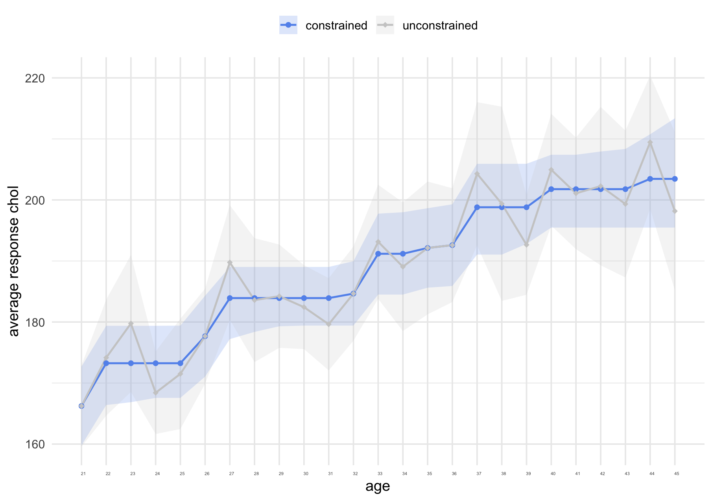
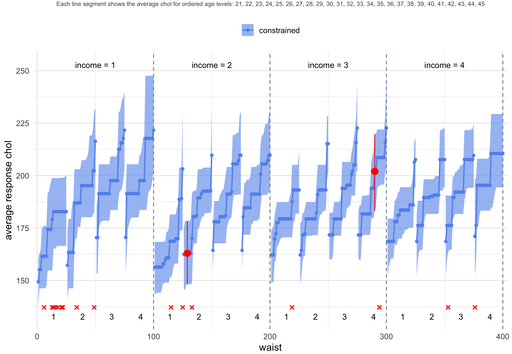
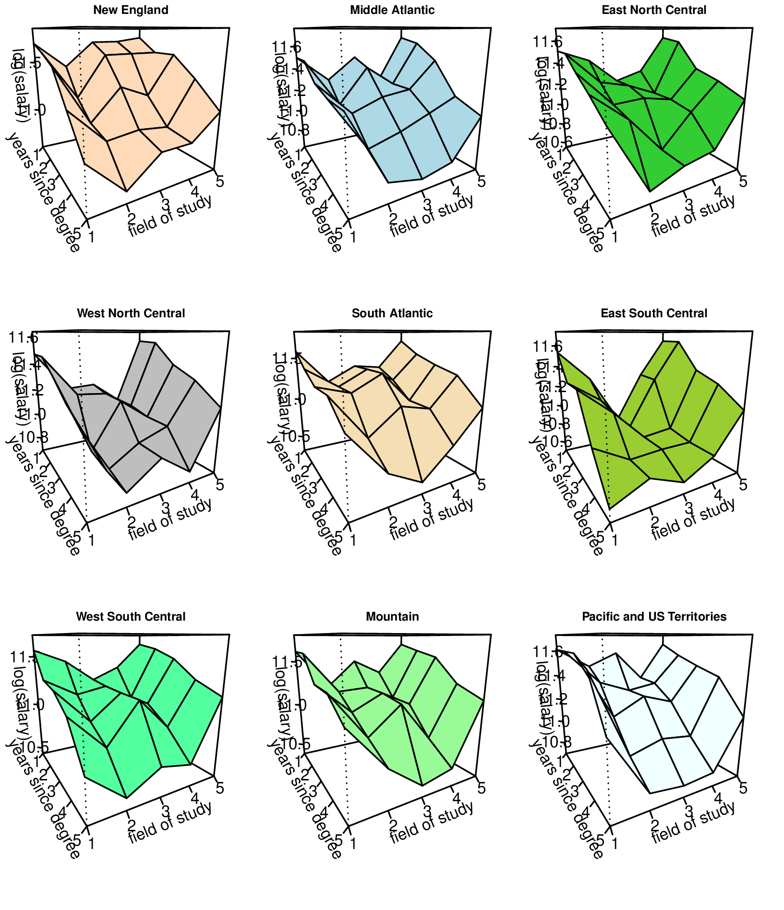
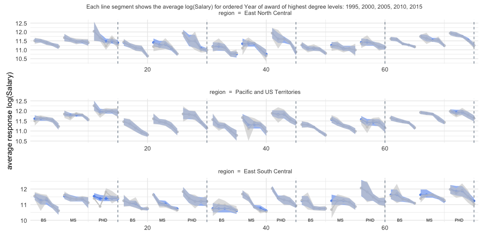
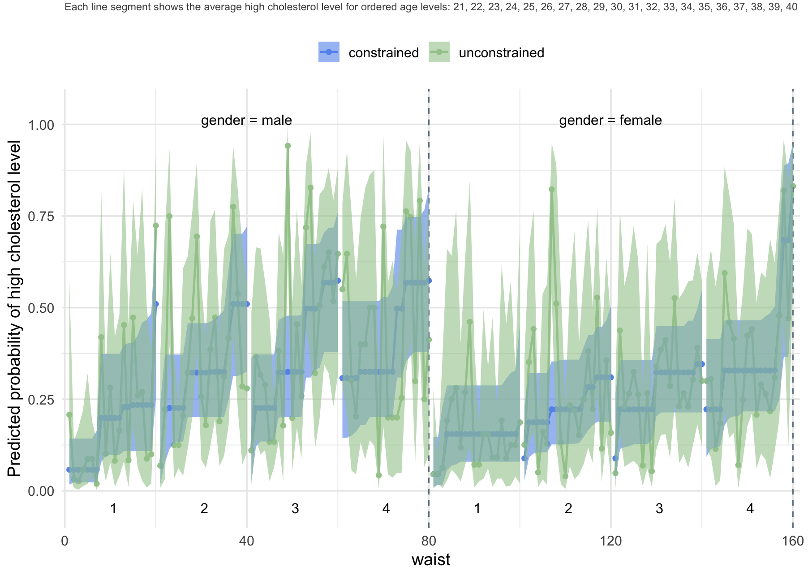

```{r setup, include=FALSE}
knitr::opts_chunk$set(
  echo = TRUE,       # show code by default
  warning = FALSE,   # suppress warnings
  message = FALSE,   # suppress messages
  fig.align = "center",  # center figures
  fig.width = 6,     # default figure width in inches
  fig.height = 4,  # default figure height in inches
  dpi = 300,         # high-res figures for PDF
  out.width = "100%",
  cache = TRUE
)
options(csurvey.multicore = FALSE)
library(Matrix)
library(data.table)
library(coneproj)
#library(foreign)
library(tidyverse)
library(csurvey)
library(MASS)
library(survey)
```

# Introduction

We assume that a finite population is partitioned into a number of domains, and the goal is to estimate the population domain means for the study variable and provide valid inference, such as confidence intervals and hypothesis tests. 

Order constraints are a common type of *a priori* knowledge in survey data analysis.  For example, we might know that salary increases with job rank within job type and location, or average cholesterol in a population increases with age category, or test scores decrease as poverty increases, or that the amount of pollution decreases with distance from the source.  There might be a "block ordering" of salaries by location, where the locations are partitioned into blocks where salaries for all locations in one block (such as major metropolitan areas) are assumed to be higher, on average, than salaries in another block (such as rural areas), without imposing orderings within the blocks. 

The order constraints may be imposed on domain mean estimates, or systematic component estimates if the response variable is not Gaussian but belongs to an exponential family of distributions. For example, if we are estimating the proportion of people with diabetes in a population, the study variable might be binary (whether or not the subject has diabetes), and perhaps we want to assume that diabetes prevalence increases with age, within ethnicity and socio-economic categories. The \CRANpkg{csurvey} package extends the \CRANpkg{survey} \citep{survey} package in that it allows the user to impose linear inequality constraints on the domain means. If the inequality constraints are valid, this leads to improved inference, as well as the ability to estimate means for empty or small-sample domains without additional assumptions. The \CRANpkg{csurvey} package provides constrained estimates of means or proportions, estimated variances of the estimates, and confidence intervals where the upper and lower bounds of the intervals also satisfy the order constraints.

The  \CRANpkg{csurvey} package implements one-sided tests.  Suppose the study variable is salary, and interest is in whether the subject's salary is affected by the level of education of the subject's father, controlling for the subject's education level and field.   The null hypothesis is that there is no difference in salary by the level of father's education.   The one-sided test with alternative hypothesis that the salary increases with father's education has a higher power than the two-sided test with the larger alternative "salary is not the same across the levels of father's education."   

Finally, the \CRANpkg{csurvey} package includes graphical functions for visualizing the order-constrained estimator and comparing it to the unconstrained estimator. Confidence bands can also be displayed to illustrate estimation uncertainty.

This package relies on \CRANpkg{coneproj} \citep{coneproj} and \CRANpkg{survey} for its core computations and handling of complex sampling designs. The domain grid is constructed using the \CRANpkg{data.table} \citep{dtable} package. Additional functionality, such as data filtering, variable transformation, and visualization of model results, leverages functions from \CRANpkg{igraph} \citep{igraph}, \CRANpkg{dplyr} \citep{dplyr}, and \CRANpkg{ggplot2} \citep{ggplot2}. When simulating the mixture covariance matrix and the sampling distribution of the one-sided test statistic, selected functions from \CRANpkg{MASS} \citep{mass} and \CRANpkg{Matrix} \citep{matrix} are employed. 

# Research incorporated in csurvey

The \CRANpkg{csurvey} package provides estimation and inference on population domain variables with order constraints, using recently developed methodology. \citet{wu16} considered a complete ordering on a sequence of domain means. They applied the pooled adjacent violators algorithm \citet{brunk58} for domain mean estimation, and derived asymptotic confidence intervals that have smaller width without sacrificing coverage, compared to the estimators that do not consider the ordering. \citet{oliva20} developed methodology for partial orderings and more general constraints on domains. These include block orderings and orderings on domains arranged in grids by multiple variables of interest. \citet{xu20} refined these methods by proposing variance estimators based on a mixture of covariance matrices, and showed that the mixture covariance estimator improves coverage of confidence intervals while retaining smaller interval lengths. \citet{liao23} showed how to use the order constraints to provide conservative design-based inference in domains with small sample sizes, or even in empty domains, without additional model assumptions. \citet{xu23} developed a test for constant versus increasing domain means, and extended it to one-sided tests for more general orderings. \citet{oliva19} proposed a cone information criterion (CIC) for survey data as a diagnostic method to measure possible departures from the assumed ordering. This criterion is similar to Akaike’s information criterion (AIC) \citep{aic73} and the Bayesian information criterion (BIC) \citep{bic78}, and can be used for model selection. For example, we can use CIC to choose between an unconstrained estimator and an order constrained estimator. The one with a smaller CIC value will be chosen. 

All of the above papers include extensive simulations showing that the methods substantially improve inference when the order restrictions are valid. These methods are easy for users to implement in \CRANpkg{csurvey}, with commands to impose common orderings.  

# How to use csurvey

Statisticians and practitioners working with survey data are familiar with the R package \CRANpkg{survey} (see \citet{survey}) for analysis of complex survey data. Commands in the package allow users to specify the survey design with which their data were collected, then obtain estimation and inference for population variables of interest. The new \CRANpkg{csurvey} package extends the utility of  \CRANpkg{survey} by allowing users to implement order constraints on domains.  

The \CRANpkg{csurvey} package relies on the functions in the \CRANpkg{survey} package such as `svydesign` and `svrepdesign`, which allow users to specify the survey design.  This function produces an object that contains information about the sampling design, allowing the user to specify strata, sampling weights, etc. This object is used in statistical functions in the \CRANpkg{csurvey} package in the same manner as for the \CRANpkg{survey} package. In addition, the mixture covariance matrix in \cite{xu20} is constructed from an initial estimate of covariance obtained from \CRANpkg{survey}.

Consider a finite population with labels \(U = \{1,\ldots,N\}\), partitioned into domains  \(U_d\), \(d=1,\ldots,D\), where \(U_d\) has \(N_d\) elements. For a study variable \(y\), suppose interest is in estimating the population domain means
\[  
\bar{y}_{U_d} = \frac{\sum_{k\in U_d} y_k}{N_d}
\]
for each \(d\), and providing inference such as confidence intervals for each \(\bar{y}_{U_d}\). 
Given a survey design, a sample \(s\subset U\) is chosen, and the unconstrained estimator of the population domain means is a weighted average of the sample observations in each domain. This estimator \(\tilde{\mathbf{y}}_s=(\tilde{y}_{s_1},\ldots, \tilde{y}_{s_D})\) in \cite{hajek71} is provided by the \CRANpkg{survey} package.

The desired orderings are imposed as linear inequality constraints on the domain means, in the form of an \(m\times D\) constraint matrix \(\mathbf{A}\). The \CRANpkg{csurvey} package will find the constrained estimator \(\tilde{\boldsymbol{\theta}}\) by minimizing
$$
\min_{\theta}(\tilde{\mathbf{y}}_s - \boldsymbol{\theta})^{\top}\mathbf{W}_s(\tilde{\mathbf{y}}_s-\boldsymbol{\theta})  \quad \mbox{such that} \hspace{2mm} \mathbf{A}\boldsymbol{\theta}\geq \mathbf{0}
$$
where the weights $\mathbf{W}_s$ are provided by the survey design. (See \cite{oliva20} for details.) For a simple example of a constraint matrix, consider five domains with a simple ordering, where we assume \(\bar{y}_{U_1}\leq \bar{y}_{U_2}\leq \bar{y}_{U_3}\leq \bar{y}_{U_4}\leq \bar{y}_{U_5}\). Perhaps these are average salaries over five job levels. Then the constraint matrix is
\[ \mathbf{A} = \left(\begin{array}{ccccc} -1 & 1 & 0 & 0 & 0 \\0 & -1 & 1 & 0 & 0 \\0 & 0 & -1 & 1 & 0 \\0 &0 &0 & -1 & 1 \end{array}\right).
\]
For simple orderings on \(D\) domains, the constraint matrix is \((D-1) \times D\).
For a block ordering example, suppose we again have five domains, and we know that each of the population means in the first two domains must be smaller than each of the means of the last three domains. The constraint matrix is 
\[ \mathbf{A} = \left(\begin{array}{ccccc} -1 & 0 & 1 & 0 & 0 \\ -1 & 0 & 0 & 1& 0   \\ -1 & 0 & 0 & 0  & 1\\
0 &  -1 & 1 & 0 & 0 \\0 & -1 &  0 & 1& 0   \\ 0 & -1 & 0 & 0  & 1\\
\end{array}\right).
\]
The number of rows for a block ordering with two blocks is \(D_1 \times D_2\), where  \(D_1\) is the number of domains in the first block and  \(D_2\) is the number in the second block. The package also allows users to specify grids of domains with various order constraints along the dimensions of the grid.   The constraint matrices are automatically generated for some standard types of constraints. 

The \CRANpkg{csurvey} package allows users to specify a simple ordering with the symbolic \code{incr} function. For example, suppose \code{y} is the survey variable of interest (say, cholesterol level), and the variable \code{x} takes values \(1\) through \(D\) (age groups for example). Suppose we assume that average cholesterol level is increasing with age in this population, and that the design is specified by the object \code{ds}.  Then

```r
ans <- csvy(y ~ incr(x), design = ds)
```

creates an object containing the estimated population means and confidence intervals. The \code{decr} function is used similarly, to specify decreasing means.

Next, suppose \code{x1} takes values \(1\) through \(D_1\) and \code{x2} takes values \(1\) through \(D_2\) (say, age group and ethnicity), and we wish to estimate the population means over the  \(D_1\times D_2\) grid of values of \code{x1} and \code{x2.}  If we assume that the population domain means are ordered in \code{x1} but there is no ordering in \code{x2}, then the command 

```r
ans <- csvy(y ~ incr(x1) * x2, design = ds)
```

will provide domain mean estimates where the means are non-decreasing in age, within each ethnicity. Note that we don't allow "+" when defining a formula in `csvy()` because we consider all combinations \(D_1\times D_2\) given by \code{x1} and  \code{x2}. 

For an example of a block ordering with three blocks, the command

```r
ans <- csvy(y ~ block.Ord(x, order = c(1,1,1,2,2,2,3,3,3)), design = ds)
```

specifies that the variable \code{x} takes values \(1\) through \(9\), and the domains with values 1, 2, and 3 each have population means not greater than each of the population means in the domains with \code{x} values 4, 5, and 6. The domains with \code{x} values 4, 5, and 6 each have population means not greater than each of the population means in the domains with \code{x} values 7, 8, and 9.  More examples of implementation of constraints will be given below.

Implementing order constraints leads to "pooling" of domains where the order constraints are binding. This naturally leads to smaller confidence intervals as the averaging is over a larger number of observations. The mixture covariance estimator for \(\tilde{\boldsymbol{\theta}}\) that was derived in \cite{xu20} is provided by \CRANpkg{csurvey}. This covariance estimator is constructed by recognizing that for different samples, different constraints are binding, so that different sets of domains are "pooled" to obtain the constrained estimator. The covariance estimator then is a mixture of pooled covariance matrix estimators, with the mixture distribution approximated via simulations. Using this mixture rather than the covariance matrix for the observed pooling provides confidence intervals with coverage that is closer to the target, while retaining the shorter lengths.  The method introduced in \cite{liao23} further pools information across domains to provide upper and lower confidence interval bounds that also satisfy the constraints, effectively reducing the confidence interval length for domains with small sample sizes, and allowing for estimation and inference in empty domains.

The test \(H_0:\mathbf{A}\bar{\mathbf{y}}_U=0\) versus the one-sided \(H_1:\mathbf{A}\bar{\mathbf{y}}_U\geq0\) in \CRANpkg{csurvey} has improved power over the \(F\)-test implemented using the \code{anova} command using the object from \code{svyglm} in the \CRANpkg{survey} package. That \(F\)-test uses the two-sided alternative \(H_2:\mathbf{A}\bar{\mathbf{y}}_U\neq0\). For example, suppose we have measures of amounts of pollutants in samples of water from small lakes in a certain region. We also have measurements of distances from sources, such as factories or waste dumps, that are suspected of contributing to the pollution. The test of the null hypothesis that the amount of pollution does not depend on the distance will have greater power if the alternative is one-sided, that is, that the pollution amount is, on average, larger for smaller distances.

In the following sections, we only show the main part of code used to generate the results. Supplementary or non-essential code is available in the accompanying R script submitted with this manuscript.

# NHANES Example with monotonic domain means {#sec-monotonic}

The National Health and Nutrition Examination Survey (NHANES) combines in-person interviews and physical examinations to produce a comprehensive data set from a probability sample of residents of the U.S. The data are made available to the public at this [CDC NHANES website](https://wwwn.cdc.gov/nchs/nhanes/). The subset used in this example is derived from the 2009–2010 NHANES cycle and is provided in the \CRANpkg{csurvey} package as the \code{nhdat2} data set. We consider the task of estimating the average total cholesterol level (mg/dL), originally recorded as `LBXTC` in the raw NHANES data, by age (in years), corresponding to the original variable `RIDAGEYR`. Focusing on young adults aged 21 to 45, we analyze a sample of $n = 1,933$ participants and specify the survey design using the associated weights and strata available in the data.

```{r}
library(csurvey)
data(nhdat2, package = "csurvey")
dstrat <- svydesign(ids = ~id,  strata = ~str, data = nhdat2,  weight = ~wt)
```

Then, to get the proposed constrained domain mean estimate, we use the \code{csvy} function in the \CRANpkg{csurvey} package. In this function, \code{incr} is a symbolic function used to define that the population domain means of `chol` are increasing with respect to the predictor `age`. 

```{r}
ans <- csvy(chol ~ incr(age), design = dstrat, n.mix = 100)
```

The `n.mix` parameter controls the number of simulations used to estimate the mixture covariance matrix, with a default of `n.mix = 100`. To speed up computation, users can set `n.mix` to be a smaller number, e.g., 10.

We can extract from \code{ans} the CIC value for the constrained estimator as

```{r}
cat("CIC (constrained):", ans$CIC, "\n")
```

and the CIC value for the unconstrained estimator as

```{r}
cat("CIC (unconstrained):", ans$CIC.un, "\n")
```

We see that for this example, the constrained estimator has a smaller CIC value and this implies it is a better fit.

If we want to construct a contrast of domain means and get its standard error, we can use the \code{svycontrast} function, which is inherited from the \CRANpkg{survey} package. Note that in the \CRANpkg{survey} package, it is impossible to get a contrast estimate when there is any empty domain. In the \CRANpkg{csurvey} package, we inherit this feature. For example, suppose we want to compare the average cholesterol for the first thirteen age groups to the last twelve age groups, we can code it as:

```{r}
cat(svycontrast(ans, list(avg = c(rep(-1, 13)/13, rep(1, 12)/12))), "\n")
```

The \code{csvy} function produces both the constrained fit and the corresponding unconstrained fit using methods from the \CRANpkg{survey} package. A visual comparison between the two fits can be easily obtained by applying the \code{plot} method to the resulting \code{csvy} object by specifying the argument `type = "both"`. For illustration, Figure \@ref(fig:nh1big) displays the estimated domain means along with 95% confidence intervals, generated by the following code:

```r 
plot(ans, type = "both")
```

```{r nh1big, fig.cap="Estimates of average cholesterol level for 25 ages, with 95% confidence intervals, for a stratified sample in the R dataset `nhdat2`, $n=1933$.", fig.align='center', echo=FALSE}

```

The \code{confint} function can be used to extract the confidence interval for domain mean. When the response is not Gaussian, then \code{type="link"} produces the confidence interval for the average systematic component over domains, while \code{type="response"} produces the confidence interval for the domain mean. 

For this data set, the sample sizes for each of the twenty-five ages range from 54 to 99, so that none of the domains is "small."  To demonstrate \code{csvy} in the case of small domains, we next provide domain mean estimates and confidence intervals for $400$ domains, arranged in a grid with 25 ages, four waist-size categories, and four income categories. We divide the waist measurement by height to make a relative girth, and split the observations into four groups with variable name `wcat`, which is a 4-level ordinal categorical variable representing waist-to-height ratio categories, computed from `BMXWAIST` (waist circumference in cm) and `BMXHT` (height in cm) in the body measures file `BMX_F.XPT` from NHANES. We have income information for the subjects, in terms of a multiple of the federal poverty level. Our first income category includes those with income that is 75% or less than the poverty line. The second category is .75 through 1.38 times the poverty level (1.38 determines Medicaid eligibility), the third category goes from above 1.38 to 3.5, and finally above 3.5 times the poverty level is the fourth category. These indicators are contained in the variable `icat` (categorized income). We create `icat` by the `INDFMPIR` variable from the file `DEMO_F.XPT` from NHANES. 

The domain sample sizes average only 4.8 observations, and there are 16 empty domains. The sample size for each domain can be checked by `ans$nd`. To estimate the population means we assume average cholesterol level is increasing in both age and waist size, but no ordering is imposed on income categories:

```{r}
set.seed(1)
ans <- csvy(chol ~ incr(age)*incr(wcat)*icat, design = dstrat)
```

To extract estimates and confidence intervals for specific domains defined by the model, the user can use the \code{predict} function as follows:

```{r}
domains <- data.frame(age = c(24, 35), wcat = c(2, 4), icat = c(2, 3))
pans <- predict(ans, newdata = domains, se.fit = TRUE)
cat("Predicted values, confidence intervals and standard errors for specified domains:\n")
print (pans)
```

Figure \@ref(fig:nh2) displays the domain mean estimates along with 95% confidence intervals, highlighting in red the two domains specified in the \code{predict} function. The code to create this plot is as below. The `control` argument is used to let the user adjust the aesthetics of the plot.

```{r nh2, fig.cap="Constrained estimates of population domain means for 400 domains in a 25x4x4 grid. The increasing population domain estimates for the 25 ages are shown within the waist size and income categories. The blue bands indicate 95% confidence intervals for the population domain means, with two specific domains, namely, (age, waist, income) = (24, 2, 2) and (35, 4, 3) marked in red. Empty domains are marked with a red 'x' sign.", fig.align='center', echo=FALSE}

```

```r
ctl <- list(x1lab = "waist", x2lab = "income", subtitle.size = 8)
plot(ans, x1 = "wcat", x2 = "icat", control = ctl, domains = domains)
```

The user can visualize the unconstrained fit by specifying \code{type = "unconstrained"} in the \code{plot} function. The corresponding output is presented in Figure \@ref(fig:nh2un).

```r
plot(ans, x1 = "wcat", x2 = "icat", control = ctl, type="unconstrained")
```

```{r nh2un, fig.cap="Unconstrained estimates of population domain means for 400 domains in a 25x4x4 grid. The population domain estimates for the 25 ages are shown within the waist size and income categories. The green bands indicate 95% confidence intervals for the population domain means. Empty domains are marked with a red 'x' sign.", fig.align='center', echo=FALSE}
knitr::include_graphics("figures/nhanes_grid3_un.png")
```

Without the order constraints, the sample sizes are too small to provide valid estimates and confidence intervals, unless further model assumptions are used, as in some small area estimation methods. With order constraints, design-based estimation and inference are possible for substantially smaller domain sample sizes, compared to the unconstrained design-based estimation.

# Constrained domain means with a block ordering

We consider the 2019 National Survey of College Graduates (NSCG), conducted by the U.S. Census Bureau and sponsored by the National Center for Science and Engineering Statistics (NCSES) within the National Science Foundation. The NSCG provides data on the characteristics of the nation's college graduates, with a focus on those in the science and engineering workforce. The datasets and documentation are available to the public on the [National Survey of College Graduates (NSCF) website](https://www.nsf.gov/statistics/srvygrads). Replicate weights are available separately from NCSES upon request. Because the size of subsets of the NSCG survey used in this paper exceeds the size limit allowed for an R package stored on CRAN, the subsets are not included in the \CRANpkg{csurvey} package. Instead, we provide the link to access the subsets `nscg19.rda` and `nscg19_2.rda` used in this section at this [website](https://github.com/xliaosdsu/csurvey-data). 

<!-- The annual salary is our study variable (denoted by SALARY in the dataset), which is highly skewed in the raw data set. We restricted to observations with an annual salary between \$30,000 and \$600,000. Because of the sparsity of extreme large value, the real range of this variable is between \$30,000 and \$395,000. A log transformation is implemented. Four predictors of salary are considered: -->

The study variable of interest is annual salary (denoted as SALARY in the dataset), which exhibits substantial right-skewness in its raw form. To reduce the influence of outliers and improve model stability, we restricted the analysis to observations with annual salaries between \$30,000 and \$400,000. A logarithmic transformation was applied to the salary variable to address skewness. Four predictors of salary were considered:

- Field of study (`field`, denoted by `NDGMEMG` in the raw dataset): This nominal variable defines the field of study for the highest degree.  There are five levels: (1) Computer and mathematical sciences; (2) Biological, agricultural and environmental life sciences; (3) Physical and related sciences; (4) Social and related sciences; (5) Engineering.  *Block ordering constraint*: given the other predictors, the average annual salary for each of the fields (2) and (4) is less than for the STEM fields (1), (3) and (5).

- Grouped year of award of highest degree (`hd_year_grouped`, denoted by `HDAY5`): This ordinal variable has five levels: (1) 1995 to 1999; (2) 2000 to 2004; (3)  2005 to 2009; (4)  2010 to 2014; (5)  2015 or later. *Isotonic constraint*: given the other predictors, the average annual salary decreases with the year of award of highest degree; i.e., the more experience respondents have, on average, the higher the annual salary.

- Highest degree type (`hd_type`, denoted by DGRDG): The three levels are: (1) Bachelor's; (2) Master's; (3) Doctorate and Professional. *Isotonic constraint*: given the other predictors, the average annual salary increases with respect to the highest degree type. 

- Region code for employer (`region`, denoted by EMRG): This nominal variable defines the regions in which the respondents worked within the U.S. Nine levels are: (1) New England; (2) Middle Atlantic; (3) East North Central; (4) West North Central; (5) South Atlantic; (6) East South Central; (7) West South Central; (8) Mountain; (9) Pacific and US Territories. There is no constraint for this predictor.

This data set contains $n=30,368$ observations in a four-dimensional grid of 675 domains, where the sample size in the domains ranges from one to 491. Here, we specify the shape and order constraints in a similar fashion as we did in previous examples. The symbolic routine \code{block.Ord} is used to impose a block ordering on `field` and the order is specified in the \code{order} argument. The \code{svydesign} specifies a survey design with no clusters. The command \code{svrepdesign} creates a survey design with replicate weights, where the columns named as "RW0001", "RW0002",\ldots,"RW0320" are the 320 NSCG replicate weights and \code{weights( = \textasciitilde w)} denotes the sampling weight. The variance is computed as the sum of squared deviation of the replicates from the mean. The general formula for computing a variance estimate using replicate weights follows:
\[v_{REP}(\hat{\theta})=\sum_{r=1}^{R}c_r(\hat{\theta}_r-\hat{\theta})^2\]
where the estimate \(\hat{\theta}\) is computed based on the final full sample survey weights and the calculation of each replicate estimate \(\hat{\theta}_r\) is according to the \(r\)th set of replicate weights (\(r=1,\cdots, R\)). The replication adjustment factor \(c_r\) is a multiplier for the \(r\)th replicate of squared difference. The \code{scale( = 1)} is an overall multiplier and the \code{rscale( = 0.05)} denotes a vector of replicate-specific multipliers, which are the values of \(c_r\) in above formula.

```r
load("./nscg19.rda")
rds <- svrepdesign(data = nscg, repweights = dplyr::select(nscg, "RW0001":"RW0320"), 
  weights = ~w, combined.weights = TRUE, mse = TRUE, type = "other", scale = 1, rscale = 0.05)
```

Estimates of domain means for the 225 domains for which the highest degree is a Bachelor's are shown in Figure \@ref(fig:surface9), as surfaces connecting the estimates over the grid of field indicators and year of award of highest degree. The block-ordering constraints can be seen in the surfaces, where the fields labeled 2 and 4 have lower means than those labeled 1, 3, and 5. The surfaces are also constrained to be decreasing in year of award of highest degree. 

To improve computational efficiency, the simulations used to estimate the mixture covariance matrix and the sampling distribution of the test statistic can be parallelized. This can be enabled by setting the following R option

```r
options(csurvey.multicore = TRUE)
```

The model is fitted using the following code

```r
ans <- csvy(logSalary~decr(hd_year_grouped)*incr(hd_type)*block.Ord(field, 
      order = c(2, 1, 2, 1, 2))*region, design = rds)
```

The \code{plotpersp} function is used to create Figure \@ref(fig:surface9). It will create a three-dimensional estimated surface plot when there are at least two predictors. In this example, we use \code{plotpersp} to generate a 3D perspective plot of the estimated average log-transformed salary with respect to field and year of award of highest degree. Among the three `hd_type` categories, the Bachelor's degree group has the highest number of observations. The \code{plotpersp} function visualizes the 225 domains corresponding to the most frequently observed level of this fourth predictor. Plot aesthetics are customized via the `control` argument:

```r
ctl <- list(categ = "region", categnm = c("New England", "Middle Atlantic", "East North Central", 
  "West North Central", "South Atlantic", "East South Central", "West South Central", "Mountain", 
  "Pacific and US Territories"), NCOL = 3, th = 60, xlab = "years since degree", 
  ylab = "field of study", zlab = "log(salary)")

plotpersp(ans, x1="hd_year_grouped", x2="field", control = ctl) 
```

```{r surface9, fig.cap="Estimates of average log(salary) by field of study and year of degree, for observations where highest degree is a Bachelor's, for each of the nine regions.", fig.align='center', echo=FALSE, out.width="60%"}

```

<!-- # ```{r surface9_margin, fig.cap="Estimates of average log(salary) for year of award of highest degree levels for each combination of five fields of study and nine regions."} -->
<!-- # knitr::include_graphics("./figures/new_surfaces9_margin.png") -->
<!-- # ``` -->

Estimates and confidence intervals for the 75 domain means associated with three of the regions are shown in Figure \@ref(fig:NEreg). The constrained estimates are shown as blue dots, and the unconstrained means are depicted as grey dots. The confidence intervals are indicated with blue bands for the constrained estimates and grey bands for the unconstrained estimates.

For the Northeast Region, the average length of the constrained confidence intervals is .353, while the average length for the unconstrained confidence intervals is .477. In the domain for those in the math and computer science field, with PhDs obtained in 2000-2004, the unconstrained log-salary estimate for this domain is much below the corresponding constrained estimate, because the latter is forced to be at least that of lower degrees, and that of newer PhDs. If the constraints hold in the population, then the unconstrained confidence interval is unlikely to capture the population value. As seen in the NHANES example in Section <!-- QUARTO TODO: Fix section reference --> `r if(knitr::is_html_output()) "[4](#sec-monotonic)" else "\\@ref(sec-monotonic)"`, the unconstrained estimators are unreliable when the sample domain size is small. The Pacific region has the largest sample sizes, ranging from 12 to 435 observations. With this larger sample size, most of the unconstrained estimates already satisfy the constraints, but the average length for the constrained estimator is .301, while the average length for the unconstrained estimator is .338, showing that the mixture covariance matrix leads to more precision in the confidence intervals. Also shown is the region with the smallest sample sizes: the East South Central region. Here the average length for the unconstrained confidence intervals is .488 while the average length for the constrained confidence intervals is .444.

```{r NEreg, fig.cap="Estimates of average log(salary) for the 75 domains in each of three regions. The blue dots represent the constrained domain mean estimates, while the grey dots represent the unconstrained domain mean estimates. The blue band is the 95% confidence interval for the domains, using the constraints; the grey band is the 95% unconstrained domain mean confidence interval.", fig.align='center', echo=FALSE, out.width="100%"}

```

# One-sided testing

For this example we again use the NCGS data set. But for this example, we use some new variables and make some variable groupings. First, instead of using the grouped year of award of highest degree (`hd_year_grouped`), we use the actual calendar year when the highest degree was awarded (`hd_year`, denoted as `HDACYR` in the raw data set). We conduct the one-sided test for six pairs of consecutive calendar years. Besides, we choose father's education level (`daded`, denoted as `EDDAD`) as the main predictor, and the interest is in determining whether salaries are higher for people whose father has a higher education. In the raw data set, `EDDAD` has seven categories, we group them into five categories for this example: 1 = no high school degree, 2 = high school degree but no college degree, 3 = bachelor's degree, 4 = master's degree, and 5 = PhD or professional degree. We further group `region` (`EMRG`) as: 1 = Northeast, 2 = North Central, 3 = Southeast, 4 = West, 5 = Pacific and Territories, and group `field` (`NDGMEMG`) as: 1 = Computer and Mathematical Sciences, Physical and Related Sciences, Engineering, which can be considered as core STEM fields, 2 = Biological, Agricultural, and Environmental Life Sciences, Social and Related Sciences, which can be considered as life and social sciences, 3 = Science and Engineering-Related Fields, 4 = Non-Science and Engineering Fields, which is Non-STEM. Finally, people's highest degree type (denoted as `DGRDG` in the raw data) is used to limit the study sample to people whose highest degree is a Master's degree. The sample size is $n=25,177$.

It seems reasonable that people whose parents are more educated are more educated themselves, but if we control for the person's level of education, as well as field, region, and year of degree, will the salary still be increasing with level of father's education? For this, the null hypothesis is that within the region, field, and year of degree, the salary is constant over levels of father's education. The one-sided alternative is that salaries increase with father's education level.

The constrained and unconstrained fits to the data under the alternative hypotheses are shown in Figure \@ref(fig:test) for five regions and four fields, for degree years 2016-2017. The dots connected by solid blue lines represent the fit with the one-sided alternative, i.e., constrained to be increasing in father's education. The dots connected by solid red lines represent the fit with the two-sided alternative, i.e., with unconstrained domain means. 

```{r test, fig.cap="Estimates of average log(salary) by father's education level, for each of five regions and four fields, for subjects whose degree was attained in 2016-2017. The solid blue lines connect the estimates where the average salary is constrained to be increasing in father's education, and the solid red lines connect unconstrained estimates of average salary.", fig.align='center', echo=FALSE, out.width="100%"}
knitr::include_graphics("figures/daded.png")
```

The \(p\)-values for the test of the null hypotheses are given in Table \@ref(tab:comppv), where n/a is shown for the two-sided \(p\)-value in the case of an empty domain. The test is conducted for six pairs of consecutive calendar years with the sample sizes to be 2,129, 2,795, 3,069, 2,895, 2,423, and 1,368 respectively. The one-sided test consistently has a small \(p\)-value, indicating that the father's education level is positively associated with salary earned, even after controlling for region, degree type, and field.

```{r comppv, echo=FALSE, results='asis'}
library(knitr)
library(kableExtra)

years <- c("2008-09","2010-11","2012-13","2014-15","2016-17","2018-19")
vals <- matrix(
  c(".008", "n/a",
    "<.001", ".018",
    "<.001", "<.001",
    "<.001", "n/a",
    ".003", ".417",
    "<.001", "n/a"),
  nrow = 1, byrow = TRUE
)
df <- as.data.frame(vals, stringsAsFactors = FALSE)
colnames(df) <- rep(c("one", "two"), length(years))

kable(df, booktabs = TRUE,
      caption = "One-sided and two-sided $p$-values for the test of the null hypothesis that salary is constant in father's education level. The two-sided test results in n/a when the grid has at least one empty domain.",
      escape = TRUE) %>%
  add_header_above(setNames(rep(2, length(years)), years)) %>%
  kable_styling(latex_options = c("hold_position"))
```

The \(p\)-value of the one-sided test is included in the object \code{ans}. For example, to check the  \(p\)-value for the fit for the year 2008 to 2009, we can fit the model and print out its summary table as:

```{r}
load("./nscg19_2.rda")
data <- nscg2 |>
  dplyr::filter(hd_year %in% c(2008, 2009))

rds <- svrepdesign(data = data, repweights = dplyr::select(data, "RW0001":"RW0320"), weights = ~w,
                  combined.weights = TRUE, mse = TRUE, type = "other",
                  scale = 1, rscale = 0.05)

set.seed(1)
ans <- csvy(logSalary ~ incr(daded) * field * region, design = rds, test = TRUE)
```

```{r eval=T}
summary(ans)
```

# Binary outcome

Finally, we use another subset of the NHANES 2009–2010 data to demonstrate how our method applies when the outcome is binary. This subset is included in the \CRANpkg{csurvey} package as `nhdat`. The construction of variables, sampling weights, and strata in this subset closely follows the approach described in Section <!-- QUARTO TODO: Fix section reference --> `r if(knitr::is_html_output()) "[4](#sec-monotonic)" else "\\@ref(sec-monotonic)"`. It contains $n = 1,680$ observations with complete records on total cholesterol, age, height, and waist circumference for adults aged 21–40. The binary outcome indicates whether an individual has high total cholesterol, coded as 1 if total cholesterol exceeds 200 mg/dL, and 0 otherwise. We estimate the population proportion with high cholesterol by age, waist, and gender (1 = male, 2 = female). The waist variable, denoted as `wcat`, is a 4-level categorized ordinal variable representing waist-to-height ratios. 

It is reasonable to assume that, on average, the proportion of individuals with high cholesterol increases with both age and waist. The model is specified using the following code:

```{r}
data(nhdat, package = "csurvey")
dstrat <- svydesign(ids = ~ id,  strata = ~ str, data = nhdat,  weight = ~ wt)
set.seed(1)
ans <- csvy(chol ~ incr(age) * incr(wcat) * gender, design = dstrat,
            family = binomial(link = "logit"), test = TRUE)
```

The CIC of the constrained estimator is smaller than that of the unconstrained estimator, and the one-sided hypothesis test has a $p$-value close to zero.

```{r}
summary(ans)
```

The combination of age, waist, and gender gives 160 domains. This implies that the average sample size for each domain is only around 10. Due to the small sample sizes, the unconstrained estimator shows unlikely jumps as age increases within each waist category. On the other hand, the constrained estimator is more stable and tends to have smaller confidence intervals compared with the unconstrained Hájek estimator.

```{r eval=FALSE, echo=FALSE}
ctl <- list(angle = 0, x1size = 2, x2size = 2, x1lab = "waist", x2_labels = c("male", "female"),
  subtitle.size=6)
plot(ans, x1 = "wcat", x2 = "gender", type="both", control = ctl)
```

```{r nhanesbin, fig.cap="Estimates of probability of high cholesterol level for each combination of age, waist and gender. The blue dots represent the constrained domain mean estimates, while the green dots represent the unconstrained domain mean estimates. The blue band is the 95% confidence interval for the domains, using the constraints; the green band is the 95% unconstrained domain mean confidence interval.", fig.align='center', echo=FALSE}

```

# Discussion

While model-based small area estimators - such as those implemented in the \CRANpkg{sae} package \citep{sae2015} and the \CRANpkg{emdi} package \citep{emdi2019} - are powerful tools for borrowing strength across domains, they rely on parametric assumptions that may be violated in practice. Design-based methods remain essential for official statistical agencies, as they provide transparent and model-free inference that is directly tied to the survey design. Estimation and inference for population domain means with survey data can be substantially improved if constraints based on natural orderings are implemented. The \CRANpkg{csurvey} package (version 1.15) \citep{csurvey2025} allows users to specify orderings on grids of domains, and obtain estimates of and confidence intervals for population domain means. This package also implements the design-based small area estimation method, which allows inference for population domain means for which the sample domain is empty, and further is used to improve estimates for domains with small sample size. The one-sided testing procedure available in \CRANpkg{csurvey} has higher power than the standard two-sided test, and further can be applied in grids with some empty domains. Confidence intervals for domain means have better coverage rate and smaller interval width than what is produced by unconstrained estimation. Finally, the package provides functions to allow the user to easily visualize the data and the fits. The utility of the package has been demonstrated with well-known survey data sets.

**Acknowledgment:** This work was partially funded by NSF MMS-1533804.
