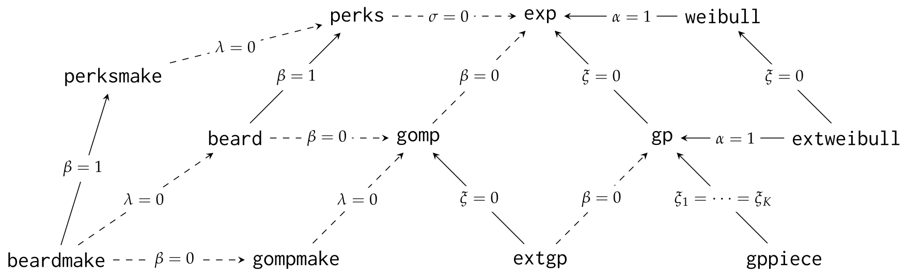

```{r setup, include=FALSE}
knitr::opts_chunk$set(
  collapse = TRUE,
  comment = "#>",
  cache = TRUE
)
par(pch = 20, bty = "l")
```

# Introduction

Many data sets collected by demographers for the analysis of human longevity have unusual features and for which limited software implementations exist. The \CRANpkg{longevity} package was initially built for dealing with human longevity records and data from the International Database on Longevity (IDL), which provides age at death of supercentenarians, i.e., people who died above age 110. Data for the statistical analysis of (human) longevity can take the form of aggregated counts per age at death, or most commonly life trajectory of individuals with both birth and death dates. Such lifetimes are often interval truncated (only age at death of individuals dying between two calendar dates are recorded) or left truncated and right censored (when data of individuals still alive at the end of the collection period are also included). Another frequent format is death counts, aggregated per age band. Censoring and truncation are typically of administrative nature and thus non-informative about death. 

Supercentenarians are extremely rare and records are sparse. The most popular parametric models used by practitioners are justified by asymptotic arguments and have their roots in extreme value theory. Univariate extreme value distributions are well implemented in software and @Belzile.Dutang.Northrop.Opitz:2022 provides a recent review of existing implementations. While there are many standard R packages for the analysis of univariate extremes using likelihood-based inference, such as \CRANpkg{evd} [@evd], \CRANpkg{mev} and \CRANpkg{extRemes} [@extRemes], only the \CRANpkg{evgam} package includes functionalities to fit threshold exceedance models with censoring, as showcased in @evgam with rounded rainfall measurements. Support for survival data for extreme value models is in general wholly lacking, which motivated the development of \CRANpkg{longevity}.

The \CRANpkg{longevity} package also includes several parametric models commonly used in demography. Many existing packages that focus on tools for modelling mortality rates, typically through life tables, are listed in the CRAN Task View \ctv{ActuarialScience} in the Life insurance section. They do not however allow for truncation or more general survival mechanisms, as the aggregated data used are typically complete except for potential right censoring for the oldest age group. The \CRANpkg{survival} package [@survival-book] includes utilities for accelerated failure time models for 10 parametric models. The \CRANpkg{MortCast} package can be used to estimate age-specific mortality rates using the Kannisto and Lee--Carter approaches, among others [@Sevcikova:2016]. The \CRANpkg{demography} package provides forecasting methods for death rates based on constructed life tables using the Lee--Carter or ARIMA models. \CRANpkg{MortalityLaws} includes utilities to download data from the Human Mortality Database (HMD), and fit a total of 27 parametric models for life table data (death counts and population at risk per age group) using Poisson, binomial or alternative loss functions. The \CRANpkg{vitality} package fits the family of vitality models [@Li.Anderson:2009;@Anderson:2000] via maximum likelihood based on empirical survival data. The \CRANpkg{fitdistrplus} [@fitdistrplus-package] allows for generic parametric distributions to be fitted to interval censored data via maximum likelihood, with various S3 methods for model assessment. The package also allows user-specified models, thereby permitting custom definitions for truncated distributions whose truncation bounds are passed as fixed vector parameters. Parameter uncertainty can be obtained via additional functions using nonparametric bootstrap. Many parametric distributions also appear in the \CRANpkg{VGAM} package [@Yee.Wild:1996;@VGAMbook], which allows for vector generalized linear modelling. The \CRANpkg{longevity} package is less general and offers support only for selected parametric distributions, but contrary to the aforementioned packages allows for truncation and general patterns. One strength of \CRANpkg{longevity} is that it also includes model comparison tools that account for non-regular asymptotics and goodness of fit diagnostics. 

Nonparametric methods are popular tools for the analysis of survival data with large samples, owing to their limited set of assumptions. They also serve for the validation of parametric models. Without explanatory variable, a closed-form estimator of the nonparametric maximum likelihood estimator of the survival function can be derived in particular instances, including the product limit estimator [@Kaplan.Meier:1958] for the case of random or non-informative right censoring and an extension allowing for left truncation [@Tsai.Jewell.Wang:1987]. In general, the nonparametric maximum likelihood estimator of the survival function needs to be computed using an expectation-maximization (EM) algorithm [@Turnbull:1976]. Nonparametric estimators only assign probability mass on observed failure times and intervals and so cannot be used for extrapolation beyond the range of the data, limiting its utility in extreme value analysis.

The CRAN Task View on \ctv{Survival} Analysis lists various implementations of nonparametric maximum likelihood estimators of the survival or hazard functions: \CRANpkg{survival} implements the Kaplan--Meier and Nelson--Aalen estimators. Many packages focus on the case of interval censoring [@Groeneboom.Wellner:1992, \S 3.2], including \CRANpkg{prodlim}; @Anderson-Bergman:2017 reviews the performance of the implementations in \CRANpkg{icenReg} [@icensReg] and \BIOpkg{Icens}. The latter uses the incidence matrix as input data. Routines for doubly censored data are provided by \CRANpkg{dblcens}. The \CRANpkg{interval} [@interval] implements Turnbull's EM algorithm for interval censored data. The case of left truncated and right censored data is handled by \CRANpkg{survival}, and \CRANpkg{tranSurv} provides transformation models with the potential to account for truncation dependent on survival times. For interval truncated data, dedicated algorithms that use gradient-based steps [@Efron.Petrosian:1999] or inverse probability weighting [@Shen:2010] exist and can be more efficient than the EM algorithm of @Turnbull:1976. Many of these are implemented in the \CRANpkg{DTDA} package. The \CRANpkg{longevity} package includes a C$^{++}$ implementation of the corrected Turnbull's algorithm [@Turnbull:1976], returning the nonparametric maximum likelihood estimator for arbitrary censoring and truncation patterns, as opposed to the specific existing aforementioned implementations already available which focus on specific subcases. With a small number of observations, it is also relatively straightforward to maximize the log likelihood for the concave program subject to linear constraints using constrained optimization algorithms; \CRANpkg{longevity} relies for this on \CRANpkg{Rsolnp}, which uses augmented Lagrangian methods and sequential quadratic programming [@Ye:1987].

## Motivating examples

To showcase the functionality of the package and particularity for the modelling of threshold exceedances, we consider Dutch and Japanese life lengths. The `dutch` database contains the age at death (in days) of Dutch people who died above age 92 between 1986 and 2015; these data were obtained from Statistics Netherlands and analyzed in @Einmahl:2019 and @ARSIA:2022. Records are interval truncated, as people are included in the database only if they died during the collection period.  In addition, there are 226 interval censored and interval truncated records for which only the month and year of birth and death are known, as opposed to exact dates.

The second database we consider is drawn from @ExceptionalLifespans. The data frame `japanese2` consists of counts of Japanese above age 100 by age band and are stratified by both birth cohort and sex. To illustrate the format of the data, counts for female Japanese are reproduced in Table \@ref(tab:tbl-japanese-women). The data were constructed using the extinct cohort method and are interval censored between $\texttt{age}$ and $\texttt{age} + 1$ and right truncated at the age reached by the oldest individuals of their birth cohort in 2020. The `count` variable lists the number of instances in the contingency table, and serves as a weight for likelihood contributions.

```{r tbl-japanese-women, eval=TRUE, echo=FALSE}
library(longevity)
library(ggplot2)
data(japanese2, package = "longevity")
female_japanese <- japanese2 |>
 dplyr::filter(gender == "female") |>
 dplyr::select(!gender)
knitr::kable(
 tidyr::pivot_wider(female_japanese, 
          names_from = bcohort, 
          values_from = count),
 booktabs = TRUE,
 longtable = FALSE,
 centering = TRUE,
 row.names = FALSE,
 linesep = "",
 caption = "Death count by birth cohort and age band for female Japanese.")
```

# Package functionalities

The \CRANpkg{longevity} package uses the S3 object oriented system and provides a series of functions with common arguments. The syntax used by the \CRANpkg{longevity} package purposely mimics that of the \CRANpkg{survival} package [@survival-book], except that it does not specify models using a formula. Users must provide vectors for the time or age (or bounds in case of intervals) via arguments `time` and `time2`, as well as lower and upper truncation bounds (`ltrunc` and `rtrunc`) if applicable. The integer vector `event` is used to indicate the type of event, where following \CRANpkg{survival} `0` indicates right-censoring, `1` observed events, `2` left-censoring and `3` interval censoring. Together, these five vectors characterize the data and the survival mechanisms at play. Depending on the sampling scheme, not all arguments are required or relevant and they need not be of the same length, but are common to most functions. Users can also specify a named list `args` to pass arguments: as illustrated below, this is convenient to avoid specifying repeatedly the common arguments in each function call. Default values are overridden by elements in `args`, with the exception of those that are passed by the user directly in the call. Relative to \CRANpkg{survival}, functions have additional arguments `ltrunc` and `rtrunc` for left and right truncation limits, as these are also possibly matrices for the case of double interval truncation [@ARSIA:2022], since both censoring and truncation can be present simultaneously. 

We can manipulate the data set to build the time vectors and truncation bounds for the Dutch data. We re-scale observations to years for interpretability and keep only records above age 98 for simplicity. We split the data to handle the observed age at death first: these are treated as observed (uncensored) whenever `time` and `time2` coincide. When exact dates are not available, we compute the range of possible age at which individuals may have died, given their birth and death years and months. The truncation bounds for each individual can be obtained by subtracting from the endpoints of the sampling frame the birth dates, with left and right truncation bounds 
\begin{align*}
\texttt{ltrunc}=\min\{92 \text{ years}, 1986.01.01 - \texttt{bdate}\}, \qquad \texttt{rtrunc} = 2015.12.31- \texttt{bdate}.
\end{align*}
Table \@ref(tab:tbl-dutch-preview) shows a sample of five individuals, two of whom are interval-censored, and the corresponding vectors of arguments along with two covariates, gender (`gender`) and birth year (`byear`).

```{r dutch-setup, eval=TRUE, echo=FALSE, message=FALSE, warning=FALSE}
library(longevity)
library(lubridate)
library(dplyr, warn.conflicts = FALSE)
data(dutch, package = "longevity")
# Extract sampling frame from attributes of data set
yr_samp <- year(attr(x = dutch, which = "sampling_frame"))
# Preprocess data for analysis
dutch1 <- dutch |>
 subset(!is.na(ndays)) |> 
 # Remove interval censored data for the time being
 mutate(time = ndays / 365.25, # age at death
     time2 = time, 
     # min/max age to be included in sampling frame
     ltrunc = ltrunc / 365.25, 
     rtrunc = rtrunc / 365.25,
     event = 1) |> # observed failure time (event=1)
 subset(time > 98) |>
 select(time, time2, ltrunc, rtrunc, event, gender, byear)
# Subset all interval censored, interval truncated records
dutch2 <- dutch |>
 subset(is.na(ndays)) |>
 mutate(time2 = ceiling_date(
  dmy(paste("01-", dmonth, "-", dyear)), unit = "month") - 1 -
      dmy(paste("01-01-", byear)),
     time = dmy(paste("01-", dmonth, "-", dyear)) - 
         dmy(paste("31-12-", byear)),
     ltrunc = dmy(paste("01-01-1986")) - dmy(paste("31-12-", byear)),
     rtrunc = dmy(paste("31-12-2015")) - dmy(paste("01-01-", byear))
     ) |>
 select(time, time2, ltrunc, rtrunc, gender, byear) |>
 # Transform data from days to years for interpretability
 mutate(time = as.numeric(time) / 365.25, # lower censoring limit
     time2 = as.numeric(time2) / 365.25, # upper censoring limit
     ltrunc = as.numeric(ltrunc) / 365.25, # min age to be included
     rtrunc = as.numeric(rtrunc) / 365.25, # max age to be included
     event = 3) |> # interval censoring (event=3)
 subset(time > 98) # subset exceedances above 98 years
# Combine databases
dutch_data <- rbind(dutch1, dutch2)
```

```{r tbl-dutch-preview, eval=TRUE, echo=FALSE}
set.seed(2025)
# Sample some observations
icens_d <- sample(which(dutch_data$event == 1), 3)
obs_d <- sample(which(dutch_data$event == 3), 2)
knitr::kable(
  dutch_data[c(obs_d, icens_d),], 
  digits = 2,
 booktabs = TRUE,
 longtable = FALSE,
 centering = TRUE,
 row.names = FALSE,
 linesep = "",
 caption = "Sample of five Dutch records, formatted so that the inputs match the function arguments used by the package. Columns give the age in years at death (or plausible interval), lower and upper truncation bounds giving minimum and maximum age for inclusion, an integer indicating the type of censoring, gender and birth year.")
```

We can proceed similarly for the Japanese data. Ages of centenarians are rounded down to the nearest year, so all observations are interval censored within one-year intervals. Assuming that the ages at death are independent and identically distributed with distribution function $F(\cdot; \boldsymbol{\theta})$, the log likelihood for exceedances $y_i = \texttt{age}_i - u$ above age $u$ is
\begin{align*}
\ell(\boldsymbol{\theta}) = \sum_{i: \texttt{age}_i > u}n_i \left[\log \{F(y_i+1; \boldsymbol{\theta}) - F(y_i; \boldsymbol{\theta})\} - \log F(r_i - u; \boldsymbol{\theta})\right]
\end{align*}
where $n_i$ is the count of the number of individuals in cell $i$ and $r_i > \texttt{age}_i+1$ is the right truncation limit for that cell, i.e., the maximum age that could have been achieved for that birth cohort by the end of the data collection period.

```{r longevity-setup, echo=TRUE, eval=TRUE}
data(japanese2, package = "longevity")
# Keep only non-empty cells
japanese2 <- japanese2[japanese2$count > 0, ]
# Define arguments that are recycled
japanese2$rtrunc <- 2020 - 
 as.integer(substr(japanese2$bcohort, 1, 4))
# The line above extracts the earliest year of the birth cohort
# Create a list with all arguments common to package functions
args_japan <- with(japanese2, 
       list(
        time = age, # lower censoring bound
        time2 = age + 1L, # upper censoring bound
        event = 3, # define interval censoring
        type = "interval2",
        rtrunc = rtrunc, # right truncation limit
        weights = count)) # counts as weights
```

## Parametric models and maximum likelihood estimation 

Various models are implemented in \CRANpkg{longevity}: their hazard functions are reported in Table \@ref(tab:tbl-parametric-models). Two of those models, labelled `perks` and `beard` are logistic-type hazard functions proposed in @Perks:1932 that have been used by @Beard:1963, and popularized in work of Kannisto and Thatcher; we use the parametrization of @Richards:2012, from which we also adopt the nomenclature. Users can compare the models with those available in \CRANpkg{MortalityLaws}; see `?availableLaws` for the list of hazard functions and parametrizations.

```{r tab-parametric, eval=TRUE, echo=FALSE}
df_parametric_html <- data.frame(rbind(
c("`exp`", "\\(\\sigma^{-1}\\)", "\\(\\sigma > 0\\)"), 
c("`gomp`", "\\(\\sigma^{-1}\\exp(\\beta t/\\sigma)\\)",
"\\(\\sigma > 0, \\beta \\ge 0\\)"), 
c("`gp`", "\\((\\sigma + \\xi t)_{+}^{-1}\\)", "\\(\\sigma > 0, \\xi \\in \\mathbb{R}\\)"), 
c("`weibull`", "\\(\\sigma^{-\\alpha} \\alpha t^{\\alpha-1}\\)", "\\(\\sigma > 0, \\alpha > 0\\)"), 
c("`extgp`", "\\(\\beta\\sigma^{-1}\\exp(\\beta t/\\sigma)[\\beta+\\xi\\{\\exp(\\beta t/\\sigma) -1\\}]^{-1}\\)", "\\(\\sigma > 0, \\beta \\ge 0, \\xi \\in \\mathbb{R}\\)"), 
c("`extweibull`", "\\(\\alpha\\sigma^{-\\alpha}t^{\\alpha-1}\\{1+\\xi(t/\\sigma)^{\\alpha}\\}_{+}\\)", "\\(\\sigma > 0, \\alpha > 0, \\xi \\in \\mathbb{R}\\)"),
c("`perks`", "\\(\\alpha\\exp(\\nu x)/\\{1+\\alpha\\exp(\\nu x)\\}\\)", "\\(\\nu \\ge 0, \\alpha >0\\)"),
c("`beard`", "\\(\\alpha\\exp(\\nu x)/\\{1+\\alpha\\beta\\exp(\\nu x)\\}\\)", "\\(\\nu \\ge 0, \\alpha >0, \\beta \\ge 0\\)"),
c("`gompmake`", "\\(\\lambda + \\sigma^{-1}\\exp(\\beta t/\\sigma)\\)",
"\\(\\lambda \\ge 0, \\sigma > 0, \\beta \\ge 0\\)"),
c("`perksmake`", "\\(\\lambda + \\alpha\\exp(\\nu x)/\\{1+\\alpha\\exp(\\nu x)\\}\\)", "\\(\\lambda \\ge 0, \\nu \\ge 0, \\alpha > 0\\)"),
c("`beardmake`", "\\(\\lambda + \\alpha\\exp(\\nu x)/\\{1+\\alpha\\beta\\exp(\\nu x)\\}\\)", "\\( \\lambda \\ge 0, \\nu \\ge 0, \\alpha > 0, \\beta \\ge 0\\)")
))
colnames(df_parametric_html) <- 
 c("model", "hazard function", "constraints")
df_parametric_tex <- data.frame(rbind(
c("\\texttt{exp}", "\\(\\sigma^{-1}\\)", "\\(\\sigma > 0\\)"), 
c("\\texttt{gomp}", "\\(\\sigma^{-1}\\exp(\\beta t/\\sigma)\\)",
"\\(\\sigma > 0, \\beta \\ge 0\\)"), 
c("\\texttt{gp}", "\\((\\sigma + \\xi t)_{+}^{-1}\\)", "\\(\\sigma > 0, \\xi \\in \\mathbb{R}\\)"), 
c("\\texttt{weibull}", "\\(\\sigma^{-\\alpha} \\alpha t^{\\alpha-1}\\)", "\\(\\sigma > 0, \\alpha > 0\\)"), 
c("\\texttt{extgp}", "\\(\\beta\\sigma^{-1}\\exp(\\beta t/\\sigma)[\\beta+\\xi\\{\\exp(\\beta t/\\sigma) -1\\}]^{-1}\\)", "\\(\\sigma > 0, \\beta \\ge 0, \\xi \\in \\mathbb{R}\\)"), 
c("\\texttt{extweibull}", "\\(\\alpha\\sigma^{-\\alpha}t^{\\alpha-1}\\{1+\\xi(t/\\sigma)^{\\alpha}\\}_{+}\\)", "\\(\\sigma > 0, \\alpha > 0, \\xi \\in \\mathbb{R}\\)"),
c("\\texttt{perks}", "\\(\\alpha\\exp(\\nu x)/\\{1+\\alpha\\exp(\\nu x)\\}\\)", "\\(\\nu \\ge 0, \\alpha >0\\)"),
c("\\texttt{beard}", "\\(\\alpha\\exp(\\nu x)/\\{1+\\alpha\\beta\\exp(\\nu x)\\}\\)", "\\(\\nu \\ge 0, \\alpha >0, \\beta \\ge 0\\)"),
c("\\texttt{gompmake}", "\\(\\lambda + \\sigma^{-1}\\exp(\\beta t/\\sigma)\\)",
"\\(\\lambda \\ge 0, \\sigma > 0, \\beta \\ge 0\\)"),
c("\\texttt{perksmake}", "\\(\\lambda + \\alpha\\exp(\\nu x)/\\{1+\\alpha\\exp(\\nu x)\\}\\)", "\\(\\lambda \\ge 0, \\nu \\ge 0, \\alpha > 0\\)"),
c("\\texttt{beardmake}", "\\(\\lambda + \\alpha\\exp(\\nu x)/\\{1+\\alpha\\beta\\exp(\\nu x)\\}\\)", "\\( \\lambda \\ge 0, \\nu \\ge 0, \\alpha > 0, \\beta \\ge 0\\)")
))
colnames(df_parametric_html) <- 
 colnames(df_parametric_tex) <- 
 c("model", "hazard function", "constraints")
```

```{r tbl-parametric-models, eval=TRUE, echo=FALSE}
if(knitr::is_html_output()){
knitr::kable(df_parametric_html, 
       format = "html", 
       escape = FALSE,
       linesep = "",
       caption = "List of parametric models for excess lifetime supported by the package, with parametrization and hazard functions. The models are expressed in terms of scale parameter $\\sigma$, rate parameters $\\lambda$ or $\\nu$, and shape parameters $\\xi$, $\\alpha$ or $\\beta$.")
} else if(knitr::is_latex_output()){
knitr::kable(df_parametric_tex, 
       format = "latex", 
       caption = "List of parametric models for excess lifetime supported by the package, with parametrization and hazard functions.", 
       escape = FALSE,
       linesep = "",
       booktabs = TRUE) |>
 kableExtra::kable_styling()
}
```  

Many of the models are nested and Figure \@ref(fig:fig-nesting) shows the logical relation between the various families. The function `fit_elife` allows users to fit all of the parametric models of Table \@ref(tab:tbl-parametric-models): the `print` method returns a summary of the sampling mechanism, the number of observations, the maximum log likelihood and parameter estimates with standard errors. Depending on the data, some models may be overparametrized and parameters need not be numerically identifiable. To palliate such issues, the optimization routine, which uses \CRANpkg{Rsolnp}, can try multiple starting values or fit various sub-models to ensure that the parameter values returned are indeed the maximum likelihood estimates. If one tries to compare nested models and the fit of the simpler model is better than the alternative, the `anova` function will return an error message.

The `fit_elife` function handles arbitrary censoring patterns over single intervals, along with single interval truncation and interval censoring. To accommodate the sampling scheme of the International Database on Longevity (IDL), an option also allows for double interval truncation [@ARSIA:2022], whereby observations are included only if the person dies between time intervals, potentially overlapping, which defines the observation window over which dead individuals are recorded.

```{r model-comparison}
thresh <- 108
model0 <- fit_elife(arguments = args_japan,
          thresh = 108, 
          family = "exp")
(model1 <- fit_elife(arguments = args_japan,
           thresh = 108, 
           family = "gomp"))
```

## Model comparisons

Goodness of fit of nested models can be compared using likelihood ratio tests via the `anova` method. Most of the interrelations between models yield non-regular model comparisons since, to recover the simpler model, one must often fix parameters to values that lie on the boundary of the parameter space. For example, if we compare a Gompertz model with the exponential, the limiting null distribution is a mixture of a point mass at zero and a $\chi^2_1$ variable, both with probability half [@Chernoff:1954]. Many authors [e.g., @Camarda:2022] fail to recognize this fact. The case becomes more complicated with more than one boundary constraint: for example, the deviance statistic comparing the Beard--Makeham and the Gompertz model, which constrains two parameters on the boundary of the parameter space, has a null distribution which is a mixture of $\chi^2_2/4 + \chi^2_1/2 + \chi^2_0/4$ [@Self.Liang:1987].

Nonidentifiability impacts testing: for example, if the rate parameter of the Perks--Makeham model (`perksmake`) $\nu \to 0$, the limiting hazard, $\lambda + \exp(\alpha)/\{1+\exp(\alpha)\}$, is constant (exponential model), but neither $\alpha$ nor $\lambda$ is identifiable. The usual asymptotics for the likelihood ratio test break down as the information matrix is singular [@Rotnitzky:2000]. As such, all three families that include a Makeham component cannot be directly compared to the exponential in \CRANpkg{longevity} and the call to `anova` returns an error message.

Users can also access information criteria, `AIC` and `BIC`. The correction factors implemented depend on the number of parameters of the distribution, but do not account for singular fit, non-identifiable parameters or singular models for which the usual corrections $2p$ and $\ln(n)p$ are inadequate [@Watanabe:2010]. 

```{r fig-nesting, eval=TRUE, echo=FALSE, fig.cap="Relationship between parametric models showing nested relations. Dashed arrows represent restrictions that lead to nonregular asymptotic null distribution for comparison of nested models. Comparisons between models with Makeham components and exponential are not permitted by the software because of nonidentifiability issues.", fig.alt="Graph with parametric model names, and arrows indicating the relationship between these. Dashed arrows indicate non-regular comparisons between nested models, and the expression indicates which parameter to fix to obtain the submodel.", fig.align='center', out.width='100%'}
if(knitr::is_latex_output()){
 knitr::include_graphics("fig/nesting_graph.pdf")
} else if(knitr::is_html_output()){
  
}
```

To showcase how hypothesis testing is performed, we consider a simple example with two nested models. We test whether the exponential model is an adequate simplification of the Gompertz model for exceedances above 108 years --- an irregular testing problem since $\beta=0$ is a restriction on the boundary of the parameter space. The drop in log likelihood is quite large, indicating the exponential model is not an adequate simplification of the Gompertz fit. This is also what is suggested by the Bayesian information criterion, which is much lower for the Gompertz model than for the exponential.

```{r, eval=FALSE, echo=TRUE}
# Model comparison
anova(model1, model0)
# Information criteria
c("exponential" = BIC(model0), "Gompertz" = BIC(model1))
```

```{r, eval=TRUE, echo=FALSE}
options(knitr.kable.NA = '')
knitr::kable(anova(model1, model0), booktabs = TRUE, digits=2)
c("exponential" = BIC(model0), "Gompertz" = BIC(model1))
```

## Simulation-based inference

Given the poor finite sample properties of the aforementioned tests, it may be preferable to rely on a parametric bootstrap rather than on the asymptotic distribution of the test statistic [@ARSIA:2022] for model comparison.
Simulation-based inference requires capabilities for drawing new data sets whose features match those of the original one. For example, the [International Database on Longevity](supercentenarians.org) (IDL) [@IDL:2021] features data that are interval truncated above 110 years, but doubly interval truncated since the sampling period for semisupercentenarians (who died age 105 to 110) and supercentenarians (who died above 110) are not always the same [@ARSIA:2022]. The 2018 Istat semisupercentenarians database analyzed by @Barbi:2018 on Italians includes left truncated right censored records. 

To mimic the postulated data generating mechanism while accounting for the sampling scheme, we could use the observed birth dates, or simulate new birth dates (possibly through a kernel estimator of the empirical distribution of birth dates) while keeping the sampling frame with the first and last date of data collection to define the truncation interval. In other settings, one could obtain the nonparametric maximum likelihood estimator of the distribution of the upper truncation bound [@Shen:2010] using an inverse probability weighted estimator, which for fixed data collection windows is equivalent to setting the birth date.

The `samp_elife` function includes multiple `type2` arguments to handle these. For interval truncated data (`type2="ltrt"`), it uses the inversion method (Section 2 of @Devroye:1986): for $F$ an absolutely continuous distribution function and $F^{-1}$ the corresponding quantile function, a random variable distributed according to $F$ truncated on $[a,b]$ is generated as $X \sim F^{-1}[F(a) + U\{F(b)-F(a)\}]$
where $U \sim \mathsf{U}(0,1)$ is standard uniform.

The function `samp_elife` also has an argument `upper` which serves for both right truncation, and right censoring. For the latter, any record simulated that exceeds `upper` is capped at that upper bound and declared partially observed. This is useful for simulating administrative censoring, whereby the birth date and the upper bound of the collection window fully determine whether an observation is right censored or not. An illustrative example is provided in the next section.

<!-- The International Database on Longevity (IDL) which provides validated records of (semi)-supercentenarians who died above age 105 and 110 years, is the foremost source of information for studying lifespan as it is free of age-ascertainment bias due to selective reporting and self-selection inherent to many other data sources. The data are freely available for researchers upon registration and an R [script](https://raw.githubusercontent.com/lbelzile/arsia-longevity/main/idl_preprocessing.R) can be used to transform the raw comma separated-value (CSV) file into a tidy data frame. However, and since these data cannot be shared, we use simulated data that mimic the sampling scheme for illustration purposes. We consider England and Wales supercentenarians from the fourth release of the IDL: the 179 individuals died between 1968 and 2020 based on the metadata, so the latest birth date for an individual reaching 110 years old is December 31st, 1910. The distribution of birth dates prior to this bound is well described (for the purpose of our illustration) by a Gamma distribution with shape 1.615 and scale 9.945 years, truncated above at 55 years. We sample truncated Gamma components and subtract them the latest possible birth date: equipped with these simulated birth dates, we next generate new life lengths from an interval truncated generalized Pareto distribution, enforcing the left and right truncation bounds for the age for them to appear in the observation window. Simulated data are stored in the data frame `ewsim4`. -->

```{r sim-EW, echo=FALSE, eval=FALSE}
nEW <- 179
library(lubridate)
set.seed(2023)
# First observation from 1856, so maximum age for truncation is 55 years
ub <- pgamma(q = 55*365.25, scale = 9.945*365.25, shape = 1.615)
# Sample right truncated record
bdate_EW <- lubridate::ymd("1910-12-31") -
  qgamma(p = runif(n = nEW)*ub,
     scale = 9.945*365.25,
     shape = 1.615)
# Obtain truncation bounds given sampling frame
ltrunc_EW <- pmax(0, (ymd("1968-01-01") - bdate_EW) / 365.25 - 110)
rtrunc_EW <- as.numeric(ymd("2020-12-31") - bdate_EW) / 365.25 - 110
sim_EW <- longevity::samp_elife(
  n = nEW,
  scale = 1.2709, # parameters obtained from fitting IDL data for E&W
  shape = -0.0234,
  lower = ltrunc_EW, # smallest age for left truncation limit
  upper = rtrunc_EW, # maximum age
  family = "gp", # generalized Pareto
  type2 = "ltrt") # left truncated right truncated
ewsim4 <- data.frame(
 time = sim_EW,
 ltrunc = ltrunc_EW,
 rtrunc = rtrunc_EW)
```

The `anova` method call uses the asymptotic null distribution for comparison of nested parametric distributions $\mathcal{F}_0 \subseteq \mathcal{F}_1$. We could use the bootstrap to see how good this approximation to the null distribution is. To mimic as closely as possible the data generating mechanism, which is custom in most scenarios, we condition on the sampling frame and the number of individuals in each birth cohort. The number dying at each age is random, but the right truncation limits will be the same for anyone in that cohort. We simulate excess lifetimes, then interval censor observations by keeping only the corresponding age bracket. Under the null hypothesis, the data are drawn from $\widehat{F}_0 \in \mathcal{F}_0$ and we generate observations from this right truncated distribution using the `samp_elife` utility, which also supports double interval truncation and left truncation right censoring. This must be done within a for loop since we have count attached to each upper bound, but the function is vectorized should we use a single vector containing all of the right truncation limits.

The bootstrap $p$-value for comparing models $M_0 \subset M_1$ would be obtained by repeating the following steps $B$ times and calculating the rank of the observed test statistic among alternatives:

1. Simulate new birth dates $d_i$ $(i=1, \ldots, n)$ (e.g., drawing from a smoothed empirical distribution of birth dates); the latest possible birth date is one which ensures the person reached at least the threshold by the end of the period.
2. Subtract the endpoints of the sampling period, say $c_1$ and $c_2$ to get the minimum (maximum) age at death, $c_1 - d_i$ (respectively $c_2 - d_i$) days, which define the truncation bounds.
3. Use the function `samp_elife` to simulate new observations from a parametric interval truncated distribution from the null model $M_0$
4. Use the optimization procedure in `fit_elife` to fit the model with both $M_1$ and $M_2$ and calculate the deviance, and from them the likelihood ratio statistic.

The algorithm is implemented below for comparing the Gompertz and the exponential model. Since the procedure is computationally intensive, users must trade off between the precision of the bootstrap $p$-value estimate and the number of replications, $B$.

```{r bootstrap-comparison, eval=TRUE, echo=TRUE}
set.seed(2022)
# Count of unique right truncation limit
db_rtrunc <- aggregate(count ~ rtrunc, 
        FUN = "sum", 
        data = japanese2,
        subset = age >= thresh)
B <- 1000L # Number of bootstrap replications
boot_anova <- numeric(length = B)
boot_gof <- numeric(length = B)
for(b in seq_len(B - 1L)){
 boot_samp <-  # Generate bootstrap sample
  do.call(rbind, #merge data frames
   apply(db_rtrunc, 1, function(x){  # for each rtrunc and count
   count <- table( #tabulate count
   floor( #round down
    samp_elife( # sample right truncated exponential
     n = x["count"],   
       scale = model0$par,
       family = "exp", #null model
       upper = x["rtrunc"] - thresh,
       type2 = "ltrt")))
  data.frame(   # return data frame
    count = as.integer(count),
    rtrunc = as.numeric(x["rtrunc"]) - thresh,
    eage = as.integer(names(count)))
 }))
 boot_mod0 <- # Fit null model to bootstrap sample
  with(boot_samp,
     fit_elife(time = eage, 
      time2 = eage + 1L,
      rtrunc = rtrunc,
      type = "interval",
      event = 3,
      family = "exp",
      weights = count))
 boot_mod1 <-  # Fit alternative model to bootstrap sample
  with(boot_samp,
     fit_elife(time = eage, 
      time2 = eage + 1L,
      rtrunc = rtrunc,
      type = "interval",
      event = 3,
      family = "gomp",
      weights = count))
 boot_anova[b] <- deviance(boot_mod0) -
  deviance(boot_mod1)
}
# Add original statistic
boot_anova[B] <- deviance(model1) - deviance(model0)
# Bootstrap p-value
(pval <- rank(boot_anova)[B] / B)
```

The asymptotic approximation is of similar magnitude as the bootstrap $p$-value. Both suggest that the more complex Gompertz model provides a significantly better fit.

## Extreme value analysis

Extreme value theory suggests that, in many instances, the limiting conditional distribution of exceedances of a random variable $Y$ with distribution function $F$ is generalized Pareto, meaning
\begin{align}
\lim_{u \to x^*}\Pr(Y-u > y \mid Y > u)= \begin{cases}
\left(1+\xi y/\sigma\right)_{+}^{-1/\xi}, & \xi \neq 0;\\
\exp(-y/\sigma), & \xi = 0;
\end{cases}
(\#eq:gpd)
\end{align}
with $x_{+} = \max\{x, 0\}$ and $x^*=\sup\{x: F(x) < 1\}$. This justifies the use of Equation \@ref(eq:gpd) for the survival function of threshold exceedances when dealing with rare events. The model has two parameters: a scale $\sigma$ and a shape $\xi$ which determines the behavior of the upper tail. Negative shape parameters correspond to bounded upper tails and a finite right endpoint for the support.

Study of population dynamics and mortality generally requires knowledge of the total population from which observations are drawn to derive rates. By contrast, the peaks over threshold method, by which one models the $k$ largest observations of a sample, is a conditional analysis (e.g., given survival until a certain age), and is therefore free of denominator specification since we only model exceedances above a high threshold $u$. For modelling purposes, we need to pick a threshold $u$ that is smaller than the upper endpoint $x^*$ in order to have sufficient number of observations to estimate parameters. The threshold selection problem is a classical instance of bias-variance trade-off: the parameter estimators are possibly biased if the threshold is too low because the generalized Pareto approximation is not good enough, whereas choosing a larger threshold to ensure we are closer to the asymptotic regime leads to reduced sample size and increased parameter uncertainty. 

To aid threshold selection, users commonly resort to parameter stability plots. These are common visual diagnostics consisting of a plot of estimates of the shape parameter $\widehat{\xi}$ (with confidence or credible intervals) based on sample exceedances over a range of thresholds $u_1, \ldots, u_K$. If the data were drawn from a generalized Pareto distribution,  the conditional distribution above higher threshold $v > u$ is also generalized Pareto with the same shape: this threshold stability property is the basis for extrapolation beyond the range of observed records. Indeed, if the change in estimation of $\xi$ is nearly constant, this provides reassurance that the approximation can be used for extrapolation. The only difference with survival data, relative to the classical setting, is that the likelihood must account for censoring and truncation. Note that, when we use threshold exceedances with a nonzero threshold (argument `thresh`), it however isn't possible to unambiguously determine whether left censored observations are still exceedances: such cases yield errors in the functions.

Theory on penultimate extremes suggests that, for finite levels and general distribution function $F$ for which \@ref(eq:gpd) holds, the shape parameter varies as a function of the threshold $u$, behaving like the derivative of the reciprocal hazard $r(x) = \{1-F(x)\}/f(x)$. We can thus model the shape as piece-wise constant by fitting a piece-wise generalized Pareto model due to @Northrop.Coleman:2014 and adapted in @ARSIA:2022 for survival data. The latter can be viewed as a mixture of generalized Pareto over $K$ disjoint intervals with continuity constraints to ensure a smooth hazard, which reduces to the generalized Pareto if we force the $K+1$ shape parameters to be equal. We can use a likelihood ratio test to compare the model, or a score test if the latter is too computationally intensive, and plot the $p$-values for each of the $K$ thresholds, corresponding to the null hypotheses $\mathrm{H}_k: \xi_k = \cdots = \xi_{K}$ ($k=1, \ldots, K-1$). As the model quickly becomes overparametrized, optimization is difficult and the score test may be a safer option as it only requires estimation of the null model of a single generalized Pareto over the whole range. 

To illustrate these diagnostic tools, Figure \@ref(fig:fig-parameterstab) shows a threshold stability plot, which features a small increase in the shape parameters as the threshold increases, corresponding to a stabilization or even a slight decrease of the hazard at higher ages. We can envision a threshold of 108 years as being reasonable: the Northrop--Coleman diagnostic plot suggests lower thresholds are compatible with a constant shape above 100. Additional goodness-of-fit diagnostics are necessary to determine if the generalized Pareto model fits well.

```{r fig-parameterstab, fig.cap="Threshold diagnostic tools: parameter stability plots for the generalized Pareto model (left) and Northrop--Coleman \\(p\\)-value path (right) for the Japanese centenarian dataset. Both suggest that a threshold as low as 100 may be suitable for peaks-over-threshold analysis.", fig.alt="Threshold stability plots. The left panel shows shape parameter estimates with 95\\% confidence intervals as a function of the threshold value from 100 until 111 years. The right panel shows p-values from a score test for nested models as a function of the same thresholds.", echo=TRUE, fig.show='hold', out.width='100%', fig.width=8.5, fig.height=4, fig.align='center'}
par(mfrow = c(1, 2), mar = c(4, 4, 1, 1)) 
# Threshold sequence
u <- 100:110
# Threshold stability plot
tstab(arguments = args_japan,
      family = "gp",
      method = "profile",
      which.plot = "shape",
      thresh = u)
# Northrop-Coleman diagnostic based on score tests
nu <- length(u) - 1L
nc_score <- nc_test(arguments = c(args_japan, list(thresh = u)))
score_plot <- plot(nc_score)
graphics.off()
```

Each plot in the package can be produced using base R or using \CRANpkg{ggplot2} [@ggplot2], which implements the grammar of graphics. To keep the list of package dependencies lean and adhere to the [`tinyverse` principle](https://cran.r-project.org/web/packages/pacs/vignettes/tinyverse.html), the latter can be obtained by using the argument `plot.type` with the generic S3 method `plot`, or via `autoplot`, provided the \CRANpkg{ggplot2} package is already installed.

## Graphical goodness of fit diagnostics

Determining whether a parametric model fits well to survival data is no easy task due to the difficulty in specifying the null distribution of many goodness of fit statistics, such as the Cramér--von Mises statistic, which differ for survival data. As such, the \CRANpkg{longevity} package relies mostly on visual diagnostic tools. @Waller.Turnbull:1992 discusses how classical visual graphics can be adapted in the presence of censoring. Most notably, only observed failure times are displayed on the $y$-axis against their empirical plotting position on the $x$-axis. Contrary to the independent and identically distributed case, the uniform plotting positions $F_n(y_i)$ are based on the nonparametric maximum likelihood estimator discussed in Section 3. 

The situation is more complicated with truncated data [@ARSIA:2022], since the data are not identically distributed: indeed, the distribution function of observation $Y_i$ truncated on the interval $[a_i, b_i]$ is $F_i(y_i) = \{F(y_i)-F(a_i)\}/\{F(b_i) - F(a_i)\}$, so the data arise from different distributions even if these share common parameters. One way out of this conundrum is using the probability integral transform and the quantile transform to map observations to the uniform scale and back onto the data scale. Taking $\widetilde{F}(y_i) = F_n(y_i)=\mathrm{rank}(y_i)/(n+1)$ to denote the empirical distribution function estimator, a probability-probability plot would show $x_i = \widetilde{F}_{i}(y_i)$ against $y_i = F_i(y_i)$, leading to approximately uniform samples if the parametric distribution $F$ is suitable. Another option is to standardize the observation, taking the collection $\widetilde{y}_i=F^{-1}\{F_i(y_i)\}$ of rescaled exceedances and comparing them to the usual plotting positions $x_{(i)} =\{i/(n+1)\}$. The drawback of the latter approach is that the quantities displayed on the $y$-axis are not raw observations and the ranking of the empirical quantiles may change, a somewhat counter-intuitive feature. However, this means that the sample $\{F_i(y_i)\}$ should be uniform under the null hypothesis, and this allows one to use methods from @Sailynoja.Burkner.Vehtari:2021 to obtain point-wise and simultaneous confidence intervals.

\CRANpkg{longevity} offers users the choice between three types of quantile-quantile plots: regular (Q-Q, `"qq"`), Tukey's mean detrended Q-Q plots (`"tmd"`) and exponential Q-Q plots (`"exp"`). Other options on uniform scale are probability-probability (P-P, `"pp"`) plots and empirically rescaled plots (ERP, `"erp"`) [@Waller.Turnbull:1992], designed to ease interpretation with censored observations by rescaling axes. We illustrate the graphical tools with the `dutch` data above age 105 in Figure \@ref(fig:fig-qqplots). The fit is correct above 110, but there is a notable dip due to excess mortality around 109.

```{r fig-qqplots, fig.cap="Probability-probability and quantile-quantile plots for generalized Pareto model fitted above age 105 years to Dutch data. The plots indicate broadly good agreement with the observation, except for some individuals who died age 109 for which too many have deaths close to their birthdates.", eval=TRUE, echo=TRUE, fig.width=8.5, fig.height=4, out.width='100%', fig.align='center'}
fit_dutch <- fit_elife(
  arguments = dutch_data,
  event = 3,
  type = "interval2",
  family = "gp",
  thresh = 105,
  export = TRUE)
par(mfrow = c(1, 2))
plot(fit_dutch, 
   which.plot = c("pp","qq"))
```

```{r fig-EW-diag-plots, eval=FALSE, echo=FALSE, fig.width=8.5, fig.height=4, fig.align='center', out.width='100%', fig.cap="Probability-probability (left) and generalized Pareto quantile-quantile (right) plots for the simulated England and Wales supercentenarian data."}
fit_EW <- with(ewsim4,
 longevity::fit_elife(
  time = time,
  ltrunc = ltrunc,
  rtrunc = rtrunc,
  family = "gp",
  export = TRUE))
plots <- plot(fit_EW,
   which.plot = c("pp","qq"),
   plot.type = "ggplot",
   plot = FALSE)
library(patchwork)
plots[[1]] + plots[[2]]
```

```{r bootstrap-gof, eval=TRUE, echo=FALSE}
set.seed(2022)
# Create contingency table with observations
# grouping all above ubound
get_observed_table <- 
 function(data, ubound){
  # Generate all combinations
  df_combo <- 
   expand.grid(
    eage = 0:ubound, 
    rtrunc = unique(data$rtrunc)
    )
  df_combo$count <- 0
  # Merge data frame
  # (ensures some empty category appear)
  df_count <- data |>
   dplyr::select(eage, rtrunc, count) |>
   dplyr::full_join(df_combo, 
            by = c("eage", 
               "rtrunc", 
               "count")) |> 
   dplyr::mutate(eage = pmin(eage, ubound)) |>
   # Regroup observations above ubound
   dplyr::count(eage, 
          rtrunc, 
          wt = count,
          name = "count")
 }
# Compute expected counts, conditioning
# on number per right truncation limits
get_expected_count <- 
 function(model, data, ubound){
  data$prob <- 
   (pelife(q = ifelse(data$eage == ubound,
           data$rtrunc,
           data$eage + 1), 
     family = model$family,
     scale = model$par) - 
   pelife(q = data$eage, 
       family = model$family,
       scale = model$par)) /
      pelife(q = data$rtrunc, 
         family = model$family,
         scale = model$par)
  count_rtrunc <- data |> 
   dplyr::group_by(rtrunc) |> 
   dplyr::summarize(tcount = sum(count),
            .groups = "keep")
  merge(data, count_rtrunc, by = "rtrunc") |>
   dplyr::transmute(observed = count, 
            expected = tcount * prob)
  }
# Compute chi-square statistic
chisquare_stat <- function(data){
 with(data, 
    sum((observed - expected)^2/expected))
}
# Upper bound for pooling
ubound <- 5L
boot_gof <- numeric(length = B)
for(b in seq_len(B - 1L)){
 # Generate bootstrap sample
 boot_samp <- 
  do.call(rbind, #merge data frames
   apply(db_rtrunc, 1, function(x){
  # for each rtrunc and count
  count <- table( #tabulate count
   floor( #round down
   # sample right truncated exponential 
   samp_elife(n = x["count"], 
       scale = model0$par,
       family = "exp", #null model
       upper = x["rtrunc"] - thresh,
       type2 = "ltrt")))
  # return data frame
  data.frame(count = as.integer(count),
        rtrunc = as.numeric(x["rtrunc"]) - thresh,
        eage = as.integer(names(count)))
 }))
 # Fit null model to bootstrap sample
 boot_mod0 <- 
  with(boot_samp,
     fit_elife(time = eage, 
      time2 = eage + 1L,
      rtrunc = rtrunc,
      type = "interval",
      event = 3,
      family = "exp",
      weights = count))
 ctab <- get_observed_table(boot_samp, 
               ubound = ubound)
 boot_gof[b] <- 
  chisquare_stat(
   data = get_expected_count(model = boot_mod0,
                 data = ctab,
                 ubound = ubound)
  )
}
# Add original statistic
db_origin <-
 aggregate(count ~ rtrunc + age, 
     FUN = "sum", 
     data = japanese2,
     subset = age >= thresh) |> 
 dplyr::mutate(eage = age - thresh)
ctab <- get_observed_table(db_origin, 
              ubound = ubound)
boot_gof[B] <- 
 chisquare_stat(
  data = get_expected_count(model = model0,
                data = ctab,
                ubound = ubound))
# Bootstrap p-value
boot_gof_pval <- rank(boot_gof)[B] / B
```

Censored observations are used to compute the plotting positions, but are not displayed. As such, we cannot use graphical goodness of fit diagnostics for the Japanese interval censored data. An alternative, given that data are tabulated in a contingency table, is to use a chi-squared test for independence, conditioning on the number of individuals per birth cohort. The expected number in each cell (birth cohort and age band) can be obtained by computing the conditional probability of falling in that age band. The asymptotic null distribution should be $\chi^2$ with $(k-1)(p-1)$ degrees of freedom, where $k$ is the number of age bands and $p$ the number of birth cohorts. In finite samples, the expected count for large excess lifetimes are very low so one can expect the $\chi^2$ approximation to be poor. To mitigate this, we can pool observations and resort to simulation to approximate the null distribution of the test statistic. The bootstrap $p$-value for the exponential model above 108 years, pooling observations with excess lifetime of 5 years and above, is `r sprintf(boot_gof_pval, fmt = "%.3f")`, indicating no evidence that the model is inadequate, but the test here may have low power.

## Stratification

Demographers may suspect differences between individuals of different sex, from different countries or geographic areas, or by birth cohort. All of these are instances of categorical covariates. One possibility is to incorporate these covariates with suitable link function through parameters, but we consider instead stratification. We can split the data by levels of `covariate` (with factors) into sub-data and compare the goodness of fit of the $K$ models relative to that which pools all observations. The `test_elife` function performs likelihood ratio tests for the comparisons. The test statistic is $-2\{\ell(\widehat{\boldsymbol{\theta}}_0) - \ell(\widehat{\boldsymbol{\theta}})\}$, where $\widehat{\boldsymbol{\theta}}_0$ is the maximum likelihood estimator under the null model with common parameters, and $\widehat{\boldsymbol{\theta}}$ is the unrestricted maximum likelihood estimator for the alternative model with the same distribution, but which allows for stratum-specific parameters. We illustrate this with a generalized Pareto model for the excess lifetime. The null hypothesis is $\mathrm{H}_0: \sigma_{\texttt{f}} = \sigma_{\texttt{m}}, \xi_{\texttt{f}}=\xi_{\texttt{m}}$ against the alternative that at least one equality doesn't hold and so the hazard and endpoints are different.

```{r covariate-test, eval=TRUE, echo=TRUE}
print(
  test_elife(
    arguments = args_japan,
    thresh = 110,
    family = "gp",
    covariate = japanese2$gender)
)
```

 In the present example, there is no evidence against any difference in lifetime distribution between male and female; this is unsurprising given the large imbalance between counts for each covariate level, with far fewer males than females.

## Extrapolation

If the maximum likelihood estimator of the shape $\xi$ for the generalized Pareto model is negative, then the distribution has a finite upper endpoint; otherwise, the latter is infinite. With $\xi < 0$, we can look at the profile log likelihood for the endpoint $\eta = -\sigma/\xi$, using the function `prof_gp_endpt`, to draw the curve and obtain confidence intervals. The argument `psi` is used to give a grid of values over which to compute the profile log likelihood. The bounds of the $(1-\alpha)$ confidence intervals are obtained by fitting a cubic smoothing spline for $y=\eta$ as a function of the shifted profile curve $x = 2\{\ell_p(\eta)-\ell_p(\widehat{\eta})\}$ on both sides of the maximum likelihood estimator and predicting the value of $y$ when $x = -\chi^2_1(1-\alpha)$. This technique works well unless the profile is nearly flat or the bounds lie beyond the range of values of `psi` provided; the user may wish to change them if they are too far. If $\widehat{\xi} \approx 0$, then the upper bound of the confidence interval may be infinite and the profile log likelihood may never reach the cutoff value of the asymptotic $\chi^2_1$ distribution.

The profile log likelihood curve for the endpoint, shifted vertically so that its value is zero at the maximum likelihood estimator, highlights the marked asymmetry of the distribution of $\eta$, shown in \@ref(fig:fig-endpoint-confint), with the horizontal dashed lines showing the limits for the 95% profile likelihood confidence intervals. These suggest that the endpoint, or a potential finite lifespan, could lie very much beyond observed records. The routine used to calculate the upper bound computes the cutoff value by fitting a smoothing spline with the role of the $y$ and $x$ axes reversed and by predicting the value of $\eta$ at $y=0$. In this example, the upper confidence limit is extrapolated from the model: more accurate measures can be obtained by specifying a longer and finer sequence of values of `psi` such that the profile log likelihood drops below the $\chi^2_1$ quantile cutoff.

```{r fig-endpoint-confint, eval=TRUE, echo=TRUE, fig.cap="Maximum likelihood estimates with 95\\% confidence intervals as a function of threshold (left) and profile likelihood for exceedances above 110 years (right) for Japanese centenarian data. As the threshold increases, the number of exceedances decreases and the intervals for the upper bound become wider. At 110, the right endpoint of the interval would go until infinity.", fig.width=8.5, fig.height=4, out.width='100%', fig.align='center'}
# Create grid of threshold values
thresholds <- 105:110
# Grid of values at which to evaluate profile
psi <- seq(120, 200, length.out = 101)
# Calculate the profile for the endpoint
# of the generalized Pareto at each threshold
endpt_tstab <- do.call(
  endpoint.tstab,
  args = c(
    args_japan, 
    list(psi = psi, 
         thresh = thresholds,
         plot = FALSE)))
# Compute corresponding confidence intervals
profile <- endpoint.profile(
  arguments = c(args_japan, list(thresh = 110, psi = psi)))
# Plot point estimates and confidence intervals
g1 <- autoplot(endpt_tstab, plot = FALSE, ylab = "lifespan (in years)")
# Plot the profile curve with cutoffs for conf. int. for 110
g2 <- autoplot(profile, plot = FALSE)
patchwork::wrap_plots(g1, g2)
```

Depending on the model, the conclusions about the risk of mortality change drastically: the Gompertz model implies an ever increasing hazard, but no finite endpoint for the distribution of exceedances. The exponential model implies a constant hazard and no endpoint. By contrast, the generalized Pareto can accommodate both finite and infinite endpoints. The marked asymmetry of the distribution of lifespan defined by the generalized Pareto shows that inference obtained using symmetric confidence intervals (i.e., Wald-based) is likely very misleading: the drop in fit from having a zero or positive shape parameter $\xi$ is seemingly smaller than the cutoffs for a 95% confidence interval, suggesting that while the best point estimate is around 128 years, the upper bound is so large (and extrapolated) that everything is possible. The model however also suggests a very high probability of dying in any given year, regardless of whether the hazard is constant, decreasing or increasing. 

## Hazard

The parameters of the models are seldom of interest in themselves: rather, we may be interested in a summary such as the hazard function. At present, \CRANpkg{longevity} does not allow general linear modelling of model parameters or time-varying covariates, but other software implementations can tackle this task. For example, \CRANpkg{casebase} [@casebase] fits flexible hazard models using logistic or multinomial regression with potential inclusion of penalties for the parameters associated to covariates and splines effects. Another alternative is \CRANpkg{flexsurv} [@flexsurv], which offers 10 parametric models and allows for user-specified models. 
The \CRANpkg{bshazard} package [@bshazard] provides nonparametric smoothing via $B$-splines, whereas \CRANpkg{muhaz} handles kernel-based hazard for right censored data; both could be used for validation of the parametric models in the case of right censoring. The \CRANpkg{rstpm2} package [@rstpm2] handles generalized modelling for censoring with the Royston--Parmar model built from natural cubic splines [@Royston.Parmar:2002]. Contrasting with all of the aforementioned approaches, we focus on parametric models: this is partly because there are few observations for the user case we consider and covariates, except perhaps for gender and birth year, are not available.

The hazard changes over time; the only notable exception is the exponential hazard, which is constant. \CRANpkg{longevity} includes utilities for computing the hazard function from a fitted model object and computing point-wise confidence intervals using symmetric Wald intervals or the profile likelihood.
Specifically, the `hazard_elife` function calculates the hazard $h(t; \boldsymbol{\theta})$ point-wise at times $t=$`x`; Wald-based confidence intervals are obtained using the delta-method, whereas profile likelihood intervals are obtained by reparametrizing the model in terms of $h(t)$ for each time $t$. More naturally perhaps, we can consider a Bayesian analysis of the Japanese excess lifetime above 108 years. Using the likelihood and encoded log posterior provided in `logpost_elife`, we obtained independent samples from the posterior of the generalized Pareto parameters $(\sigma, \xi)$ with maximal data information prior using the \CRANpkg{rust} package. Each parameter combination was then fed into `helife` and the hazard evaluated over a range of values. Figure \@ref(fig:fig-hazard) shows the posterior samples and functional boxplots [@Sun.Genton:2011] of the hazard curves, obtained using the \CRANpkg{fda} package. The risk of dying increases with age, but comes with substantial uncertainty, as evidenced by the increasing width of the boxes and interquartile range.

```{r fig-hazard, eval=TRUE, echo=FALSE, fig.width=8.5, fig.height=4, out.width='100%', fig.cap="Left: scatterplot of 1000 independent posterior samples from generalized Pareto model with maximum data information prior; the contour curves give the percentiles of credible intervals, and show approximate normality of the posterior. Right: functional boxplots for the corresponding hazard curves, with increasing width at higher ages."}
par(mfrow = c(1,2), mar = c(4,4,1,1))
threshold <- 108
# Note that we cannot have an argument 'arguments' in 'ru'
post_samp <- rust::ru(
 logf = lpost_elife,
 weights = args_japan$weights,
 rtrunc = args_japan$rtrunc, 
 event= 3, 
 type = "interval2",
 time = args_japan$time,
 time2 = args_japan$time2,
 thresh = threshold,
 family = "gp",
 trans = "BC",
 n = 1000,
 d = 2, 
 init = c(1.67, -0.08),
 lower = c(0, -1))
plot(post_samp, 
   xlab = "scale", 
   ylab = "shape", 
   bty = "l")
age <- threshold + seq(0.1, 10, length.out = 101)
haz_samp <- apply(X = post_samp$sim_vals,
   MARG = 1,
   FUN = function(par){ 
    helife(x = age - threshold, scale = par[1], shape = par[2], family = "gp")
   })
# Functional boxplots
fbox <- fda::fbplot(
 fit = haz_samp, 
 x = age, 
 xlim = range(age),
 ylim = c(0, 2.8),
 xaxs = "i",
 yaxs = "i",
 xlab = "age",
 ylab = "hazard (in years)",
 outliercol = "gray90",
 color = "gray60",
 barcol = "black",
 bty = "l"
)
```

## Nonparametric maximum likelihood estimation {#sec-nonparametric}

The nonparametric maximum likelihood estimator is unique only up to equivalence classes. The data for individual $i$ consists of the tuple $\{L_i, R_i, V_i, U_i\}$, where the censoring interval is $[L_i, R_i]$ and the truncation interval is $[V_i, U_i\}$, with $0 \leq V_i \leq L_i \leq R_i \leq U_i \leq \infty$. @Turnbull:1976 shows how one can build disjoint intervals $C = \bigsqcup_{j=1}^m [a_j, b_j]$ where $a_j \in \mathcal{L} = \{L_1, \ldots, L_n\}$ and $b_j \in \mathcal{R} = \{R_1, \ldots, R_n\}$ satisfy $a_1 \leq b_1 < \cdots < a_m \leq b_m$ and the intervals $[a_j, b_j]$ contain no other members of $L$ or $R$ except at the endpoints. This last condition notably ensures that the intervals created include all observed failure times as singleton sets in the absence of truncation. Other authors [@Lindsey.Ryan:1998] have taken interval censored data as semi-open intervals $(L_i, R_i]$, a convention we adopt here for numerical reasons. For interval censored and truncated data, @Frydman:1994 shows that this construction must be amended by taking instead $a_j \in \mathcal{L} \cup \{U_1, \ldots, U_n\}$ and $b_j \in \mathcal{R} \cup \{V_1, \ldots, V_n\}$.

We assign probability $p_j = F(b_j^{+}) - F(a_j^{-}) \ge 0$ to each of the resulting $m$ intervals under the constraint $\sum_{j=1}^m p_j = 1$ and $p_j \ge 0$ $(j=1, \ldots, m)$. The nonparametric maximum likelihood estimator of the distribution function $F$ is then 
\begin{align*}
\widehat{F}(t) = \begin{cases} 0, & t < a_1;\\
\widehat{p}_1 + \cdots + \widehat{p}_j, & b_j < t < a_{j+1} \quad (1 \leq j \leq m-1);\\ 
1, & t > b_m;
\end{cases}
\end{align*}
and is undefined for $t \in [a_j, b_j]$ $(j=1, \ldots, m)$.

```{r fig-turnbull, echo=FALSE, eval=TRUE, out.width="100%", fig.width=8.5, fig.height=6, fig.align='center', fig.cap="Illustration of the truncation (pale grey) and censoring intervals (dark grey) equivalence classes based on Turnbull's algorithm. Observations must fall within equivalence classes defined by the former."}
library(longevity)
n <- 100L
ltrunc <- runif(n = n, min = 0, max = 1)
rtrunc <- TruncatedNormal::rtnorm(
 n = 1,
 sd = 4,
 mu = 5,
 lb = ltrunc,
 ub = rep(Inf, n))
time <- TruncatedNormal::rtnorm(
 n = 1,
 sd = 2,
 lb = ltrunc,
 ub = rtrunc)
time2 <- ifelse(runif(n) < 0.5,
        time,
        TruncatedNormal::rtnorm(
         n = 1,
         sd = 2,
         mu = (time + rtrunc)/2,
         lb = time,
         ub = rtrunc))
status <- ifelse(time == time2, 1L, 3L)
unex <- turnbull_intervals(time = time,
              time2 = time2,
              status = status,
              ltrunc = ltrunc,
              rtrunc = rtrunc)
dummy_cens <-
 dummy_trunc <-
 matrix(NA,
     nrow = nrow(unex),
     ncol = length(time))
for(i in seq_len(nrow(unex))){
 dummy_cens[i,] <- unex[i,1] >= time & unex[i,2] <= time2
 dummy_trunc[i,] <- unex[i,1] >= ltrunc & unex[i,2] <= rtrunc
}
intervals_cens <- apply(dummy_cens, 2, function(x){range(which(x))})
intervals_trunc <- apply(dummy_trunc, 2, function(x){range(which(x))})
melted_cens <- reshape2::melt(dummy_cens)
melted_trunc <- reshape2::melt(dummy_trunc)
ggplot() +
  geom_tile(data = melted_trunc,
    mapping = aes(x = Var2, y = Var1, fill = factor(ifelse(value, 2L, 0L), 0:2)),
    ) +
 geom_tile(data = melted_cens,
    mapping = aes(x = Var2, y = Var1, fill = factor(ifelse(value, 1L, 0L), 0:2)),
    alpha = 0.5) +
 scale_fill_manual(values = c("white", "black", "grey")) +
 labs(y = "Turnbull's intervals",
    x = "observation identifier") +
 scale_y_continuous(expand = c(0,0)) +
 scale_x_continuous(expand = c(0,0)) +
 theme(legend.position = "none")
```

The procedure of Turnbull can be encoded using $m \times n$ matrices. For censoring, we build $\mathbf{A}$ whose $(i,j)$th entry $\alpha_{ij}=1$ if $[a_j, b_j] \subseteq A_i$ and zero otherwise. Since the intervals forming the set $C$ are disjoint and in increasing order, a more storage efficient manner of keeping track of the intervals is to find the smallest integer $j$ such that $L_i \leq a_j$ and the largest $R_i \ge b_j$ $(j=1, \ldots, m)$ for each observation. The same idea applies for the truncation sets $B_i = (V_i, U_i)$ and matrix $\mathbf{B}$ with $(i,j)$ element $\beta_{ij}$.

The log likelihood function is 
\begin{align*}
\ell(\boldsymbol{p}) = \sum_{i=1}^n w_i \log \left( \sum_{j=1}^m \alpha_{ij}p_j\right) - w_i\log \left( \sum_{j=1}^m \beta_{ij}p_j\right)
\end{align*}

The numerical implementation of the EM is in principle forward: first identify the equivalence classes $C$, next calculate the entries of $A_i$ and $B_i$ (or the vectors of ranges) and finally run the EM algorithm. In the second step, we need to account for potential ties in the presence of (interval) censoring and treat the intervals as open on the left for censored data. For concreteness, consider the toy example $\boldsymbol{T} =(1,1,2)$ and $\boldsymbol{\delta} = (0,1,1)$, where $\delta_i = 1$ if the observation is a failure time and $\delta_i=0$ in case of right censoring. 
The left and right censoring bounds are $\mathcal{L} = \{1, 2\}$ and $\mathcal{R} = \{1, 2, \infty\}$ with $A_1 = (1, \infty)$, $A_2 = \{1\}$ and $A_3 = \{2\}$ and $C_1=\{1\}, C_2=\{2\}$. If we were to treat instead $A_1$ as a semi-closed interval $[1, \infty)$, direct maximization of the log likelihood in eq. 2.2 of @Turnbull:1976 would give probability half to each observed failure time. By contrast, the Kaplan--Meier estimator, under the convention that right censored observations at time $t$ were at risk up to and until $t$, assigns probability 1/3 to the first failure. To retrieve this solution with Turnbull's EM estimator, we need the convention that $C_1 \notin A_1$, but this requires comparing the bound with itself. The numerical tolerance in the implementation is taken to be the square root of the machine epsilon for doubles.

The maximum likelihood estimator (MLE) need not be unique, and the EM algorithm is only guaranteed a local maximum. For interval censored data, @Gentleman.Geyer:1994 consider using the Karush--Kuhn--Tucker conditions to determine whether the probability in some intervals is exactly zero and whether the returned value is indeed the MLE.

Due to data scarcity, statistical inference for human lifespan is best conducted using parametric models supported by asymptotic theory, reserving nonparametric estimators to assess goodness of fit. The empirical cumulative hazard for Japanese is very close to linear from early ages, suggesting that the hazard may not be very far from exponential even if more complex models are likely to be favored given the large sample size.

The function `np_elife` returns a list with Turnbull's intervals $[a_j, b_j]$ and the probability weights assigned to each, provided the latter are positive. It also contains an object of class `stepfun` with a weighting argument that defines a cumulative distribution function. 
<!-- Users have the option to specify the value in the interval as left or right continuous. -->

We can use the nonparametric maximum likelihood estimator of the distribution function to assess a fitted parametric model by comparing the density with a binned distribution, or the cumulative distribution function. The distribution function is defined over equivalence classes, which may be isolated observations or intervals. The data interval over which there is non-zero probability of events is broken down into equispaced bins and the probability of failing in the latter estimated nonparametrically based on the distribution function. Alternatively, users can also provide a set of `breaks`, or the number of bins.

```{r fig-ecdf, eval=TRUE, echo=TRUE, fig.align='center', out.width='100%', fig.width=8.5, fig.height=4, fig.cap="Nonparametric maximum likelihood estimate of the density (bar plot, left) and distribution function (staircase function, right), with superimposed generalized Pareto fit for excess lifetimes above 108 years. Except for the discreteness inherent to the nonparametric estimates, the two representations broadly agree at year marks."}
ecdf <- np_elife(arguments = args_japan, thresh = 108)
# Summary statistics, accounting for censoring
round(summary(ecdf), digits = 2)
# Plots of fitted parametric model and nonparametric CDF
model_gp <- fit_elife(
  arguments = args_japan, 
  thresh = 108, 
  family = "gp",
  export = TRUE)
# ggplot2 plots, wrapped to display side by side
patchwork::wrap_plots(
  autoplot(
    model_gp, # fitted model
    plot = FALSE, # return list of ggplots
    which.plot = c("dens", "cdf"),
    breaks = seq(0L, 8L, by = 1L) # set bins for histogram
  ) 
)
```

# Conclusion

This paper describes the salient features of \CRANpkg{longevity}, explaining the theoretical underpinning of the methods and the design considerations followed when writing the package. While \CRANpkg{longevity} was conceived for modelling lifetimes, the package could be used for applications outside of demography. Survival data in extreme value theory is infrequent yet hardly absent. For example, rainfall observations can be viewed as rounded due to the limited instrumental precision of rain gauges and treated as interval-censored. Some historical records, which are often lower bounds on the real magnitude of natural catastrophes, can be added as right-censored observations in a peaks-over-threshold analysis. In insurance, losses incurred by the company due to liability claims may be right-censored if they exceed the policy cap and are covered by a reinsurance company, or rounded [@Belzile.Neslehova:2025]. In climate science, attribution studies often focus on data just after a record-breaking event, and the stopping rule leads to truncation [@Miralles.Davison:2023], which biases results if ignored. 

The package has features that are interesting in their own right, including adapted quantile-quantile and other visual goodness of fit diagnostics for model validation. The testing procedures correctly handle tests for restrictions lying on the boundary of the parameter space. Parametric bootstrap procedures for such tests are not straightforward to implement given the heavy reliance on the data generating mechanism and the diversity of possible scenarios: this paper however shows how the utilities of the package can be coupled to ease such estimation and the code in the supplementary material illustrates how this can be extended for goodness of fit testing. 

# Acknowledgements {-}

The author thanks four anonymous reviewers for valuable feedback. This research was supported financially by the Natural Sciences and Engineering Research Council of Canada (NSERC) via Discovery Grant RGPIN-2022-05001.
