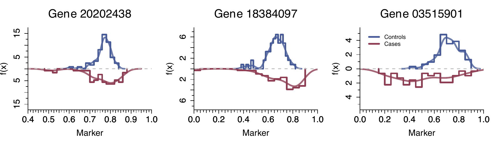
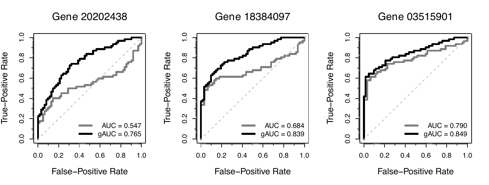
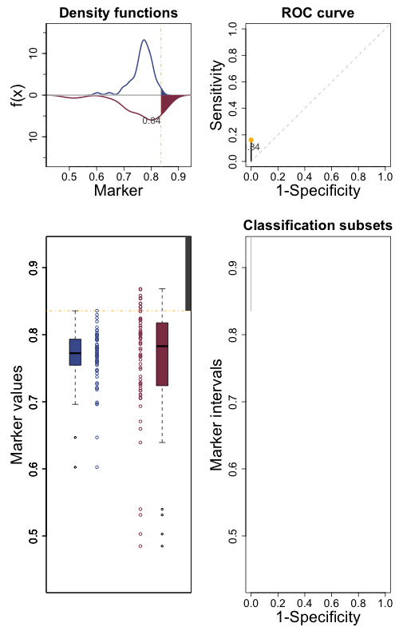
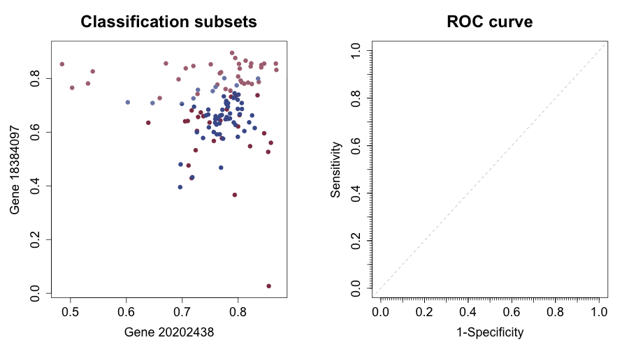
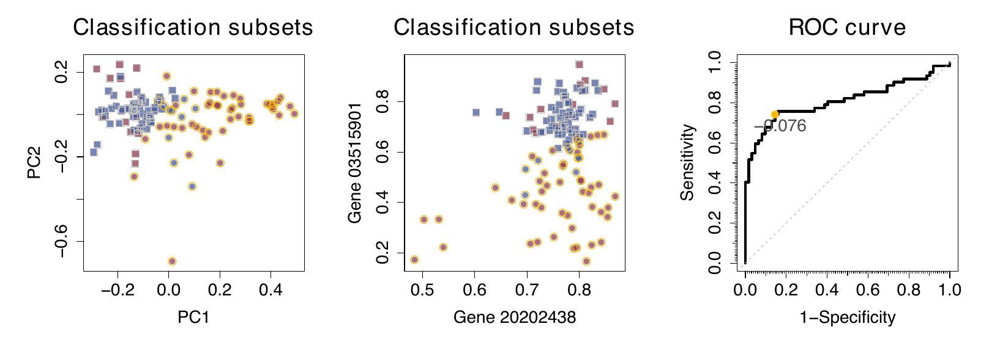
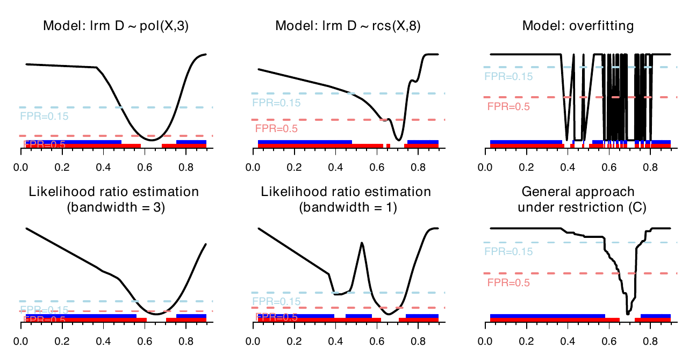

::: article
# Introduction

The use of data to detect a characteristic of interest is a cornerstone
of many disciplines such as medicine (to diagnose a pathology or to
predict a patient outcome), finance (to detect fraud) or machine
learning (to evaluate a classification algorithm), among others.
Continuous markers are surrogate measures for the characteristic under
study, or predictors of a potential subsequent event. They are measured
in subjects, some of whom have the characteristic (_positive_), and some
without it (_negative_). In addition to reliability and feasibility, a
good marker must have two relevant properties: interpretability and
accuracy [@Mayeux2004]. High binary classification _accuracy_ can be
achieved if there exists a strong relationship between the marker and
the _response_. The latter is assessed by a _gold standard_ for the presence
or absence of the characteristic of interest. _Interpretability_ refers to
the _decision rules_ or _subsets_ considered in the classification process.
This piece of research seeks to elucidate both desirable properties for
a marker by the implementation of a graphical tool in R language. We
propose a novel approach involving the generation of videos as a
solution to effectively capture the classification procedure for
univariate and multivariate markers. Graphical analysis plays a pivotal
role in data exploration, interpretation, and communication. Its
burgeoning potential is underscored by the fast pace of technological
advances, which empower the creation of insightful graphical
representations.

A usual practice when the binary classification accuracy of a marker is
of interest involves the representation of the _Receiver Operating
Characteristic (ROC) curve_, summarized by the _Area Under the Curve_ (_AUC_)
[@Hanley1982]. The resulting plot reflects the trade-off between the
sensitivity and the complement of the specificity. _Sensitivity_ and
_specificity_ are probabilities of correctly classifying subjects, either
positive or negative, respectively. Mathematically, let $\xi$ and $\chi$
be the random variables modeling the marker values in the positive and
the negative population, respectively, with $F_\xi(\cdot)$ and
$F_\chi(\cdot)$ their associated cumulative distribution functions.
Assuming that the expected value of the marker is larger in the positive
than in the negative population, the standard ROC curve is based on
_classification subsets_ of the form $s = (c, \infty)$, where $c$ is the
so-called _cut-off value or threshold_ in the support of the marker $X$,
$\mathcal{S}(X)$. One subject is classified as a positive if its marker
value is within this region, and as a negative otherwise. This type of
subsets has two important advantages: first, their interpretability is
clear; second, for each specificity $1-t \in [0,1]$, the corresponding
$s_t = (c_t, \infty)$ is univocally defined by $c_t = F_\chi^{-1}(1-t)$
for absolutely continuous markers.

When differences in marker distribution between the negative and the
positive population are only in location but not in shape, then
$F_\chi(\cdot) < F_\xi(\cdot)$, and the classification is direct by
using these decision rules. However, when this is not the case, the
standard ROC curve may cross the main diagonal, resulting in an
_improper_ curve [@Dorfman1997]. This may be due to three different
scenarios:

i. the behavior of the marker in the two studied populations is
    different but it is not possible to determine the decision rules.
    Notice that the binary classification problem goes further than
    distinction between the two populations: the classification subsets
    should be highly likely in one population and highly unlikely in the
    other one [@Camblor2018a];

ii. there exists a relationship between the marker and the response with
    a potential classification use, but this is not monotone;

iii. there is no relationship between the marker and the response at all
    (main diagonal ROC curve).

In the second case, we have to define classification subsets different
from standard $s_t=(c_t,\infty)$. Therefore, the use of the marker
becomes more complex. With the aim of accommodating scenarios where both
higher and lower values of the marker are associated with a higher risk
of having the characteristic, @Camblor2017a proposed the so-called
_generalized ROC (gROC) curve_. This curve tracks the highest sensitivity
for every specificity in the unit interval resulting from subsets of the
form $s_t=(-\infty, x_t^L] \cup (x_t^U, \infty)$ with
$x_t^L \leq x_t^U \in \mathcal{S}(X)$.

Although final decisions are based on the underlying classification
subsets, they are typically not depicted. This omission is not a
shortcoming in standard cases, as for each specificity $1-t \in [0,1]$,
there is only one rule of the form $s_t = (c_t, \infty)$ with such
specificity. Particularly, $s_t$ is univocally defined by
$c_t = 1 - F_\chi^{-1}(1-t)$; and the same applies if we fix a
sensitivity. Nevertheless, if the gROC curve is taken, there are
infinite subsets of the form $s_t=(-\infty, x_t^L] \cup (x_t^U, \infty)$
resulting in $\mathbb{P}(\chi \in s_t) = t$. This loss of univocity underlines
the importance of reporting (numerically and/or graphically) the
decision rules actually proposed for classifying. This gap is covered in
the presented package.

An alternative approach to assess the classification performance of a
marker involves considering a transformation of it. This transformation
$h(\cdot)$ aims to capture differences in distribution between the two
populations in the ROC sense. Once $h(\cdot)$ is identified, the
standard ROC curve for $h(X)$ is represented, resulting in the _efficient
ROC (eROC) curve_ [@Kauppi2016]. Arguing as before, for a fixed
specificity, the classification subsets $s_t=(c_t, \infty)$ in the
transformed space are univocally defined, where a subject is classified
as positive if $h(x) \in s_t$ and negative otherwise (with $x$
representing its marker value). However, they may have any shape in the
original space, depending on the monotonicity of the functional
transformation $h(\cdot)$ [@Camblor2019a]. Emphasizing the importance of
tracking the decision rules underlying the eROC curve, this monitoring
process enables an assessment of whether the improved accuracy of the
marker justifies the potential loss in interpretability.

The ROC curve is defined for classification accuracy evaluation of
univariate markers. To deal with multivariate markers, the usual
practice is to consider a transformation $\boldsymbol{h}(\cdot)$ to
reduce it to a univariate one, and then to construct the standard ROC
curve. Same considerations as before apply when a functional
transformation is taken. In the proposed R library, we consider methods
from the literature to define and estimate $\boldsymbol{h}(\cdot)$ in
the multivariate case [@Kang2016; @Meisner2021].

Focusing on the classification subsets underlying the decision rules,
the [**movieROC**](https://CRAN.R-project.org/package=movieROC) package
incorporates methods to visualize the construction process of ROC curves
by presenting the classification accuracy of these subsets. For
univariate markers, the library includes both the classical (standard
ROC curve) and the generalized (gROC curve) approach. Besides, it enables
the display of decision rules for various transformations of the marker,
seeking to maximize performance and allowing for flexibility in the final
shape of the subsets (eROC curve). For multidimensional markers, the
proposed tool visualizes the evolution of decision subsets when
different objective functions are employed for optimization, even
imposing restrictions on the underlying regions. In this case,
displaying the decision rules associated with every specificity in a
single static image is no longer feasible. Therefore, _dynamic
representations_ (videos) are implemented, drawing on time as an extra
dimension to capture the variation in specificity.

Much software available in R could be discussed here covering diverse
topics related to ROC curves: the
[**pROC**](https://CRAN.R-project.org/package=pROC) package is a main
reference including tools to visualize, estimate and compare ROC curves
[@pROC2011]; [**ROCnReg**](https://CRAN.R-project.org/package=ROCnReg)
explicitly considers covariate information to estimate the
covariate-specific and the covariate-adjusted ROC curves [@ROCnReg2021];
[**smoothROCtime**](https://CRAN.R-project.org/package=smoothROCtime)
implements smooth estimation of time-dependent ROC curves based on the
bivariate kernel density estimator for $(X, \textit{time-to-event})$
[@DiazCoto2020];
[**OptimalCutpoints**](https://CRAN.R-project.org/package=OptimalCutpoints)
includes point and interval estimation methods for optimal thresholds
[@OptimalCutpoints2014]; and
[**nsROC**](https://CRAN.R-project.org/package=nsROC) performs
non-standard analysis such as gROC estimation [@nsROC2018]; among
others.

This paper introduces and elucidates the diverse functionalities of the
newly developed
[**movieROC**](https://CRAN.R-project.org/package=movieROC) package,
aimed at facilitating the visualization and comprehension of the
decision rules underlying the binary classification process,
encompassing various generalizations. Despite the availability of
numerous R packages implementing related analyses, we have identified
the main gaps covered in this library: tracking the decision rules
underlying the ROC curve, including multivariate markers and
non-standard scenarios (i.e. non-monotonic). The rest of the paper is
structured as follows. In
Section [2](#section:functionality){reference-type="ref"
reference="section:functionality"}, we introduce the main R functions
and objects implemented, and briefly explain the dataset employed
throughout this manuscript to demonstrate the utility of the R library.
Section [3](#section:regularroc){reference-type="ref"
reference="section:regularroc"} is devoted to reconsidering the
definition of the standard ROC curve from the perspective of
classification subsets, including an extension to multivariate
scenarios. Sections [4](#section:groc){reference-type="ref"
reference="section:groc"} and
[5](#section:efficientroc){reference-type="ref"
reference="section:efficientroc"} revisit the gROC curve and the eROC
curve, respectively, covering various methods to capture the potential
classification accuracy of the marker under study. Each of these
sections begins with a state-of-the-art overview, followed by the main
syntax of the corresponding R functions. In addition, examples of
implementation using the dataset presented in Section
[2.3](#subsection:dataset){reference-type="ref"
reference="subsection:dataset"} are provided. Finally, the paper
concludes with a concise summary and computational details regarding the
implemented tool.

# Main functions of the movieROC package and illustrative dataset {#section:functionality}

Sections [2.1](#subsec:functionality){reference-type="ref"
reference="subsec:functionality"} and
[2.2](#subsec:functions){reference-type="ref"
reference="subsec:functions"} provide a detailed description of the main
objectives of the implemented R functions. To reflect the practical
usage of the developed R package, we employ a real dataset throughout
this manuscript, which is introduced in
Section [2.3](#subsection:dataset){reference-type="ref"
reference="subsection:dataset"}.

## Functionality of the movieROC package {#subsec:functionality}

A graphical tool was developed to showcase static and dynamic graphics
displaying the classification subsets derived from maximizing diagnostic
accuracy under certain assumptions, ensuring the preservation of the
interpretability. The R package facilitates the construction of the ROC
curve across various specificities, providing visualizations of the
resulting classification regions. The proposed tool comprises multiple R
functions that generate objects with distinct class attributes (see
function names where red arrows depart from and red nodes in
Figure [1](#figure:functionality){reference-type="ref"
reference="figure:functionality"}, respectively). Once the object of
interest is created, different methods may be used, in order to plot the
underlying regions (`plot_regions()`, `plot_funregions()`), to track the
resulting ROC curve (`plot_buildROC()`, `plot()`), to `predict` decision
rules for a particular specificity, and to `print` relevant information,
among others. The main function of the package, `movieROC()`, produces
videos to exhibit the classification procedure.

```{r functionality, fig.cap="R functions of the movieROC package. The blue nodes include the names of the R functions and the red nodes indicate the different R objects that can be created and worked with. The red arrows depart from those R functions engaged in creating R objects and the black arrows indicate which R functions can be applied to which R objects. The grey dashed arrows show internal dependencies.", out.width="100%", echo=FALSE}
knitr::include_graphics(c("figures/movieROC_mainFunctions.png", "figures/movieROC_extraFunctions.png"))
```


It includes algorithms to visualize the regions that underlie the binary
classification problem, considering different approaches:

-   make the classification subsets flexible in order to cover
    non-standard scenarios, by considering two cut-off values (`gROC()`
    function); explained in
    Section [4](#section:groc){reference-type="ref"
    reference="section:groc"};

-   transform the marker by a proper function $h(\cdot)$ (`hROC()`
    function); introduced in
    Section [5](#section:efficientroc){reference-type="ref"
    reference="section:efficientroc"};

-   when dealing with multivariate markers, consider a functional
    transformation with some fixed or dynamic parameters resulting from
    different methods available in the literature (`multiROC()`
    function); covered in
    Section [3.1](#section:multiroc){reference-type="ref"
    reference="section:multiroc"}.

## Class methods for movieROC objects {#subsec:functions}

By using the `gROC()`, the `multiROC()` or the `hROC()` function, the
user obtains an R object of class '`groc`', '`multiroc`' or '`hroc`',
respectively. These will be called
[**movieROC**](https://CRAN.R-project.org/package=movieROC) objects.
Once the object of interest is created, the implemented package includes
many functions (methods) to pass to it. Some of them are generic methods
(`print()`, `plot()` and `predict()`), commonly used in R language over
different objects according to their class attributes. The rest of the
functions are specific for this library and therefore only applicable to
[**movieROC**](https://CRAN.R-project.org/package=movieROC) objects.
The following outline summarizes all these functions and
provides their target and main syntax (with default input parameters).

### Generic functions

 + **`print()`**: Print some relevant information.
 + **`plot()`**: Plot the ROC curve estimate.
 + **`predict()`**: Print the classification subsets corresponding to a particular false-positive rate (`FPR`) introduced by the user. For a '`groc`' object, the user may specify a cut-off value `C` (for the standard ROC curve) or two cut-off values `XL` and `XU` (for the gROC curve).

### Specific functions

 * **`plot_regions()`**

Applicable to a '`groc`' or a '`hroc`' object. Plot two graphics in the same figure: left, classification subsets for each false-positive rate (grey color by default); right, $90^\circ$ rotated ROC curve.

  _Main syntax:_
```{r eval = FALSE}
  plot_regions(obj, plot.roc = TRUE, plot.auc = FALSE, FPR = 0.15, ...)
```

  If the input parameter `FPR` is specified, the corresponding classification region reporting such false-positive rate and the point in the ROC curve are highlighted in blue color.

 * **`plot_funregions()`**

 Applicable to a '`groc`' or a '`hroc`' object.
Plot the transforming function and the classification subsets reporting the false-positive rate(s) indicated in the input parameter(s) `FPR` and `FPR2`. 

_Main syntax:_ 
```{r eval = FALSE}
plot_funregions(obj, FPR = 0.15, FPR2 = NULL, plot.subsets = TRUE, ...)
```

 * **`plot_buildROC()`**

Applicable to a '`groc`' or a '`multiroc`' object.

  - For a '`groc`' object: Plot four (if input `reduce` is FALSE) or two (if `reduce` is TRUE, only those on the top) graphics in the same figure: top-left, density function estimates for the marker in both populations with the areas corresponding to FPR and TPR colored (blue and red, respectively) for the optional input parameter `FPR`, `C` or `XL, XU`; top-right, the empirical ROC curve estimate; bottom-left, boxplots in both groups; bottom-right, classification subsets for every FPR (grey color).

_Main syntax:_
```{r eval = FALSE}
plot_buildROC(obj, FPR = 0.15, C, XL, XU, h = c(1,1), 
              histogram = FALSE, breaks = 15, reduce = TRUE, 
              build.process = FALSE, completeROC = FALSE,  ...)
```

If `build.process` is FALSE, the whole ROC curve is displayed; otherwise, if `completeROC` is TRUE, the portion of the ROC curve until the fixed FPR is highlighted in black and the rest is shown in gray, while if `completeROC` is FALSE, only the first portion of the curve is displayed.

 - For a '`multiroc`' object: Plot two graphics in the same figure: right, the ROC curve highlighting the point and the threshold for the resulting univariate marker; left, scatterplot with the marker values in both positive (red color) and negative (blue color) subjects. About the left graphic: for $p=2$, over the original/feature bivariate space; for $p>2$, projected over two selected components of the marker (if `display.method = "OV"` with components selection in `displayOV`, `c(1,2)` by default) or the first two principal components from PCA (if `display.method = "PCA"`, default). The classification subset reporting the `FPR` selected by the user (`FPR` $\neq$ `NULL`) is displayed in gold color.

_Main syntax:_

for $p=2$:
```{r eval = FALSE}
plot_buildROC(obj, FPR = 0.15, 
              build.process = FALSE, completeROC = TRUE,  ...)
```

for $p>2$: 
```{r eval = FALSE}
plot_buildROC(obj, FPR = 0.15, 
              display.method = c("PCA","OV"), displayOV = c(1,2), 
              build.process = FALSE, completeROC = TRUE,  ...)
```

If `build.process` is FALSE, the whole ROC curve is displayed; otherwise, if `completeROC` is TRUE, the portion of the ROC curve until the fixed FPR is highlighted in black and the rest is shown in gray, while if `completeROC` is FALSE, only the first portion of the curve is shown.

 * **`movieROC()`**

Applicable to a '`groc`' or a '`multiroc`' object. Save a video as a GIF illustrating the construction of the ROC curve.

 + For a '`groc`' object:

_Main syntax:_
```{r eval = FALSE}
movieROC(obj, fpr = NULL, 
         h = c(1,1), histogram = FALSE, breaks = 15, 
         reduce = TRUE, completeROC = FALSE, videobar = TRUE, 
         file = "animation1.gif", ...)
```

For each element in vector `fpr` (optional input parameter), the function executed is `plot_buildROC(obj, FPR = fpr[i], build.process = TRUE, ...)`. The vector of false-positive rates illustrated in the video is `NULL` by default: if length of output parameter `t` for `gROC()` function is lower than 150, such vector is taken as `fpr`; otherwise, an equally-spaced vector of length 100 covering the range of the marker values is considered.

  + For a '`multiroc`' object:

_Main syntax:_

for $p=2$: 
```{r eval = FALSE}
movieROC(obj, fpr = NULL, 
         file = "animation1.gif", save = TRUE, 
         border = TRUE, completeROC = FALSE, ...)
```

for $p>2$: 
```{r eval = FALSE}
movieROC(obj, fpr = NULL, 
         display.method = c("PCA","OV"), displayOV = c(1,2), 
         file = "animation1.gif", save = TRUE, 
         border = TRUE, completeROC = FALSE, ...)
```

The video is `save`d by default as a GIF with the name indicated in argument `file` (extension `.gif` should be added). A `border` for the classification subsets is drawn by default.

For each element in vector `fpr` (optional input parameter), the function executed is

for $p=2$: 
```{r eval = FALSE}
plot_buildROC(obj, FPR = fpr[i], build.process = TRUE, completeROC, ...)
```

for $p>2$: 
```{r eval = FALSE}
plot_buildROC(obj, FPR = fpr[i], build.process = TRUE, completeROC, 
              display.method, displayOV, ...)
```

Same considerations about the input `fpr` as those for `movieROC()` over a '`groc`' object.

## Illustrative dataset {#subsection:dataset}

In order to illustrate the functionality of our R package, we consider
the `HCC` data. This dataset is derived from gene expression arrays of
tumor and adjacent non-tumor tissues of 62 Taiwanese cases of
hepatocellular carcinoma (HCC). The goal of the original study
[@Shen2012] was to identify, with a genome-wide approach, additional
genes hypermethylated in HCC that could be used for more accurate
analysis of plasma DNA for early diagnosis, by using Illumina
methylation arrays (Illumina, Inc., San Diego, CA) that screen 27,578
autosomal CpG sites. The complete dataset was deposited in NCBI's Gene
Expression Omnibus (GEO) and it is available through series accession
number GSE37988
([www.ncbi.nlm.nih.gov/geo/query/acc.cgi?acc=GSE37988](http://www.ncbi.nlm.nih.gov/geo/query/acc.cgi?acc=GSE37988){.uri}).
It is included in the presented package (`HCC` dataset), selecting 948
genes with complete information.

The following code loads the R package and the `HCC` dataset (see the
[vignette](https://cran.r-project.org/web/packages/movieROC/vignettes/movieROC_vignette.pdf)
for main structure).

``` r
R> library(movieROC)
R> data(HCC)
```

We selected the genes 20202438, 18384097, and 03515901. On the one hand,
we chose the gene 03515901 as an example of a monotone relationship
between the marker and the response, reporting a good ROC curve. On the
other hand, relative gene expression intensities of the genes 20202438
and 18384097 tend to be more extreme in tissues with tumor than in those
without it. These are non-standard cases, so if we limit ourselves to
detect "appropriate" genes on the basis of the standard ROC curve, they
would not be chosen. However, extending the decision rules by means of
the gROC curve, those genes may be considered as potential biomarkers
(locations) to differ between the two groups. The R code estimating and
displaying the density probability function for gene expression
intensities of the selected genes in each group
(Figure [2](#fig:densities){reference-type="ref"
reference="fig:densities"}) is included in the
[vignette](https://cran.r-project.org/web/packages/movieROC/vignettes/movieROC_vignette.pdf).

```{r densities, fig.cap="Density histograms and kernel density estimations (lighter) for gene expression intensities of the genes 20202438, 18384097 and 03515901 in negative (non-tumor) and positive (tumor) tissues.", fig.width=10, fig.height=4, echo=FALSE}

```

# Regular ROC curve {#section:regularroc}

Assuming that there exists a monotone relationship between the marker
and the response, the _regular, right-sided or standard ROC curve_
associated with the marker $X$ considers classification subsets of the
form $s_t=(c_t,\infty)$. For each specificity
$1-t=\mathbb{P}(\chi \notin s_t) \in [0,1]$, also called _true-negative rate_,
there exists only one subset $s_t$ reporting such specificity and thus a
particular sensitivity, also called _true-positive rate_,
$\mathbb{P}(\xi \in s_t)$. This results in a simple correspondence between each
point of the ROC curve
$\mathcal{R}_r(t) = 1-F_\xi \big(F_\chi^{-1}(1-t)\big)$ and its
associated classification region $s_t \in \mathcal{I}_r(t)$, where
$$\mathcal{I}_r(t) = \Big\{ s_t = (c_t, \infty)  :  c_t \in \mathcal{S}(X)  ,  \mathbb{P}(\chi \in s_t) = t \Big\}$$
is the _right-sided family of eligible classification subsets_. The
definition of this family captures the shape of the decision rules and
the target specificity.

If higher values of the marker are associated with a higher probability
of not having the characteristic (see gene 03515901 in
Figure [2](#fig:densities){reference-type="ref"
reference="fig:densities"}), the ROC curve would be defined by the
_left-sided family of eligible classification subsets_ [@Camblor2017a],
$\mathcal{I}_l(t)$, similarly to $\mathcal{I}_r(t)$ but with the form
$s_t = (\infty, c_t]$. It results in
$\mathcal{R}_l(t) = F_\xi \big(F_\chi^{-1}(t) \big)$, $t\in[0,1]$, and
the decision rules are also univocally defined in this case.

The ROC curve and related problems were widely studied in the
literature; interested readers are referred to the monographs of
@Zhou2002, @Pepe2003a, and @Nakas2023, as well as the review by
@Inacio2021. By definition, the ROC curve is confined within the unit
square, with optimal performance achieved when it approaches the
left-upper corner (AUC closer to 1). Conversely, proximity to the main
diagonal (AUC closer to 0.5) means diminished discriminatory ability,
resembling a random classifier.

In practice, let $(\xi_1, \xi_2, \dots, \xi_n)$ and
$(\chi_1, \chi_2, \dots, \chi_m)$ be two independent and identically
distributed (i.i.d.) samples from the positive and the negative
population, respectively. Different estimation procedures are
implemented in the
[**movieROC**](https://CRAN.R-project.org/package=movieROC) package,
such as the empirical estimator [@Hsieh1996] (by default in the `gROC()`
function), accompanied by its summary indices: the AUC and the Youden
index [@Youden1950]. Alternatively, semiparametric approaches based on
kernel density estimation for the involved distributions may be
considered [@Zou1997]. The `plot_densityROC()` function provides plots
for both right- and left-sided ROC curves estimated by this method. On
the other hand, assuming that the marker follows a gaussian distribution
in both populations, that is,
$\xi \sim \mathcal{N}(\mu_\xi, \sigma_\xi)$ and
$\chi \sim \mathcal{N}(\mu_\chi, \sigma_\chi)$, parametric approaches
propose plug-in estimators by estimating the unknown parameters while
using the known distributions [@Hanley1988]. This parametric estimation
is included in the `gROC_param()` function, which works similarly to
`gROC()`.

_Main syntax:_

```{r eval = FALSE}
gROC(X, D, side = "right", ...)
gROC_param(X, D, side = "right", ...)
```

Table 1 in the
[vignette](https://cran.r-project.org/web/packages/movieROC/vignettes/movieROC_vignette.pdf)
provides the main input and output parameters of these R functions,
which estimate the regular ROC curve (right-sided or left-sided with
`side = "right"` or `"left"`, respectively) and associated decision
rules. Its output is an R object of class '`groc`', to which the
functions listed in Section [2.2](#subsec:functions){reference-type="ref"
reference="subsec:functions"} can be applied. Most of them are
visualization tools, but the user may also `print()` summary information
and `predict()` classification regions for a particular specificity.

Figure [3](#fig:roccurves){reference-type="ref"
reference="fig:roccurves"} graphically represents the empirical
estimation of the standard (gray line) and generalized (black line) ROC
curves for each gene in Figure [2](#fig:densities){reference-type="ref"
reference="fig:densities"}. To construct the standard ROC curve for the
first two genes (20202438 and 18384097), the right-sided ROC curve is
considered; and the left-sided curve for the third one (03515901). As
expected following the discussion about
Figure [2](#fig:densities){reference-type="ref"
reference="fig:densities"}, the standard and gROC curves are similar for
the third gene because there exists a monotone relationship between the
marker and the response. However, these curves differ for the first two
genes due to the lack of monotonicity in those scenarios. The empirical
gROC curve estimator is explained in detail in
Section [4](#section:groc){reference-type="ref"
reference="section:groc"}.

Next chunk of code generates the figure, providing an example of the use
of `gROC()` function, `plot()` and how to get access to the AUC.

``` r
R> for(gene in c("20202438", "18384097", "03515901")){
+   roc <- gROC(X = HCC[,paste0("cg",gene)], D = HCC$tumor, 
+               side = ifelse(gene == "03515901", "left", "right"))
+   plot(roc, col = "gray50", main = paste("Gene", gene), lwd = 3)
+   groc <- gROC(X = HCC[,paste0("cg",gene)], D = HCC$tumor, side = "both")
+   plot(groc, new = FALSE, lwd = 3)
+   legend("bottomright", paste(c("AUC =", "gAUC ="), format(c(roc$auc, groc$auc), 
+          digits = 3)), col = c("gray50", "black"), lwd = 3, bty = "n", inset = .01)}
```
```{r roccurves, fig.cap="Standard ROC curve (in gray) and gROC curve (in black) empirical estimation for the capacity of genes 20202438, 18384097 and 03515901 to differ between tumor and non-tumor group.", out.width="100%", echo=FALSE}

```

The following code snippet estimates the standard ROC curve for gene
20202438, prints its basic information, and predicts the classification
region and sensitivity resulting in a specificity of 0.9. It provides an
illustrative example of utilizing the `print()` and `predict()`
functions.

``` r
R> roc_selg1 <- gROC(X = HCC$cg20202438, D = HCC$tumor, side = "right")
R> roc_selg1
```

``` r
Data was encoded with nontumor (controls) and tumor (cases).
It is assumed that larger values of the marker indicate larger confidence that a 
 given subject is a case.
There are 62 controls and 62 cases.
The specificity and sensitivity reported by the Youden index are 0.855 and 0.403, 
 respectively, corresponding to the following classification subset: (0.799, Inf).
The area under the right-sided ROC curve (AUC) is 0.547.
```

``` r
R> predict(roc_selg1, FPR = .1)
```

``` r
$ClassSubsets			$Specificity		$Sensitivity
[1] 0.8063487   Inf		[1] 0.9032258		[1] 0.3064516
```

The following line of code displays the whole construction of the
empirical standard ROC curve for gene 20202438. The video is saved by
default as a GIF with the name provided.

``` r
R> movieROC(roc_selg1, reduce = FALSE, file = "StandardROC_gene20202438.gif")
```
{width=60%}

## Multivariate ROC curve {#section:multiroc}

In practice, many cases may benefit from combining information from
different markers to enhance classification accuracy. Rather than
assessing univariate markers separately, taking the multivariate marker
resulting from merging them can yield relevant gain. However, note that
the ROC curve and related indices are defined only for univariate
markers, as they require the existence of a total order. To address this
limitation, a common approach involves transforming the $p$-dimensional
multivariate marker $\boldsymbol{X}$ into a univariate one through a
functional transformation
$\boldsymbol{h}: \mathbb{R}^p \longrightarrow \mathbb{R}$. This
transformation $\boldsymbol{h}(\cdot)$ seeks to optimize an objective
function related to the classification accuracy, usually the AUC
[@Su1993; @McIntosh2002; @Camblor2019a].

We enumerate the methods included in the proposed R tool by the
`multiROC()` function (with the input parameter `method`), listed
according to the objective function to optimize. Recall that the output
of `multiROC()` is an object of class '`multiroc`', containing
information about the estimation of the ROC curve and subsets for
multivariate scenarios. Table 2 in the
[vignette](https://cran.r-project.org/web/packages/movieROC/vignettes/movieROC_vignette.pdf)
includes the usage of this function.

_Main syntax:_

```{r eval = FALSE}
multiROC(X, D, method = "lrm", 
         formula = 'D ~ X.1 + I(X.1^2) + X.2 + I(X.2^2) + I(X.1*X.2)', ...)
```

1. AUC: Different procedures to estimate the $\boldsymbol{h}(\cdot)$
    maximizing the AUC in the multidimensional case have been studied in
    the literature. Among all families of functions, linear combinations
    ($\mathcal{L}_{\boldsymbol{\beta}}(\boldsymbol{X}) = \beta_1 X_1 + \dots + \beta_p X_p$)
    are widely used due to their simplicity; an extensive review of the
    existing methods was conducted by @Kang2016.

-   Computation: In the `multiROC()` function, fixing input parameters
    `method = "fixedLinear"` and `methodLinear` to one from `"SuLiu"`
    [@Su1993], `"PepeThompson"` [@Pepe2000], or `"minmax"` [@Liu2011].
    The R function also admits quadratic combinations when $p=2$, i.e.
    $\mathcal{Q}_{\boldsymbol{\beta}}(\boldsymbol{X}) = \beta_1 X_1 + \beta_2 X_2 + \beta_3 X_1 X_2 + \beta_4 X_1^2 + \beta_5 X_2^2$,
    by fixing `method = "fixedQuadratic"` for a particular
    `coefQuadratic` $= \boldsymbol{\beta} = (\beta_1, \dots, \beta_5)$.

2. The risk score function
    logit$\left\{ \mathbb{P}(D = 1 \, | \, \boldsymbol{X}) \right\}$: Our
    package allows the user to fit a logistic regression model
    (`method = "lrm"`) considering any family of functions (linear,
    quadratic, whether considering interactions or not\...) by means of
    the input parameter `formula.lrm`. A stepwise regression model is
    fitted if `stepModel = TRUE`. Details are explained in
    Section [5](#section:efficientroc){reference-type="ref"
    reference="section:efficientroc"}.

3. The sensitivity for a particular specificity:

a. Considering the theoretical discussion about the search of the
        optimal transformation $\boldsymbol{h}(\cdot)$ pointed out in
        Section [5](#section:efficientroc){reference-type="ref"
        reference="section:efficientroc"}, @Camblor2021b proposed to
        estimate it by multivariate kernel density estimation for
        positive and negative groups separately.

 -   Computation: The `multiROC()` function integrates the estimation
        procedures for the bandwidth matrix developed by @Duong2007, by
        fixing `method = "kernelOptimal"` and choosing a proper method
        to estimate the bandwidth (`"kernelOptimal.H"`).

b. Mainly linear combinations have been explored to date in the
        scientific literature [@Meisner2021; @PerezFernandez2020]. For a
        fixed specificity $t\in[0,1]$, we seek the linear combination
        $\mathcal{L}_{\boldsymbol{\beta}(t)}(\boldsymbol{X}) = \beta_1(t) X_1 + \dots + \beta_p(t) X_p$
        maximizing the true-positive rate by considering standard
        subsets for the transformed marker. The coefficients
        $\boldsymbol{\beta}(t)$ are called 'dynamic parameters' because
        they may be different for each $t \in [0,1]$.

 -   Computation: Since our objective is to display the ROC curve,
        $\mathcal{L}_{\boldsymbol{\beta}(t)}(\boldsymbol{X})$ is
        estimated for every $t$ in a grid of the unit interval,
        resulting in one $\boldsymbol{\hat{\beta}}(t)$ for each $t$.
        This approach is time-consuming, especially when it is based on
        the plug-in empirical estimators involved
        (`method = "dynamicEmpirical"`, only implemented for $p=2$), and
        may result in overfitting. Instead, @Meisner2021 method is
        recommended (`method = "dynamicMeisner"`).

Once the classification subsets for a multivariate marker are
constructed by the `multiROC()` function, several R methods may be used
for the output object (see Section [2.2](#subsec:functions){reference-type="ref"
reference="subsec:functions"}). They include `print` relevant
information or `plot` the resulting ROC curve. The main contribution of
the package is to plot the construction of the ROC curve together with
the classification subsets in a static figure for a particular FPR
(`plot_buildROC()` function), or in a video for tracking the whole
process (`movieROC()` function).

Figure \@ref(fig:biroc)
illustrates the videos resulting from `movieROC()` function. 
Particularly, classification accuracy of the
bivariate marker `(cg20202438, cg18384097)` was studied by using four
different approaches indicated on the captions, considering linear
combinations (top) and nonlinear transformations (bottom). This figure
was implemented by the code below, integrating `multiROC()` and
`movieROC()` functions. Four videos are saved as GIF files with names
`"PepeTh.gif"` (a), `"Meisner.gif"` (b), `"LRM.gif"` (c), and
`"KernelDens.gif"` (d).

``` r
R> X <- HCC[ ,c("cg20202438", "cg18384097")]; D <- HCC$tumor
R> biroc_12_PT <- multiROC(X, D, method = "fixedLinear", methodLinear = "PepeThompson")
R> biroc_12_Meis <- multiROC(X, D, method = "dynamicMeisner", verbose = TRUE)
R> biroc_12_lrm <- multiROC(X, D)
R> biroc_12_kernel <- multiROC(X, D, method = "kernelOptimal")
R> list_biroc <- list(PepeTh = biroc_12_PT, Meisner = biroc_12_Meis, 
+	     	LRM = biroc_12_lrm, KernelDens = biroc_12_kernel)
R> lapply(names(list_biroc), function(x) movieROC(list_biroc[[x]],  
+           display.method = "OV", xlab = "Gene 20202438", ylab = "Gene 18384097", 
+           cex = 1.2, alpha.points = 1, lwd.curve = 4, file = paste0(x, ".gif")))
```

::: {.figure}

| {width=100%} | {width=100%} |
|:--------------------------------------------------------:|:-----------------------------------------------------:|
| **(a)** Linear combinations with fixed parameters by @Pepe2000.                     | **(b)** Linear combinations with dynamic parameters by @Meisner2021.                       |

| {width=100%}   | {width=100%} |
|:--------------------------------------------------------:|:---------------------------------------------------------:|
| **(c)** Logistic regression model with quadratic formula by default (see `formula.lrm` in Table 2 of the [vignette](https://cran.r-project.org/web/packages/movieROC/vignettes/movieROC_vignette.pdf)).                        | **(d)** Optimal transformation by multivariate kernel density estimation with `"Hbcv"` method by default [@Camblor2021b].                       |
:::

```{r biroc, echo=FALSE, out.width="1px", out.height="1px", fig.cap="Videos (from `movieROC()` function) of the classification procedure and ROC curve for the bivariate marker `cg20202438`, `cg18384097`). Four different methods for classification are displayed."}
knitr::include_graphics("transparent.png")
```

When the marker has a dimension higher than two it is difficult to
visualize the data and the classification regions. Therefore, the
`movieROC()` function offers two options for showing the results, both
on a bidimensional space. On the one hand, to choose two of the
components of the multivariate marker and project the classification
subsets on the plane defined by them
(Figure [5](#fig:multiroccurve){reference-type="ref"
reference="fig:multiroccurve"}, middle). On the other, to project the
classification regions on the plane defined by the two first principal
components (Figure [5](#fig:multiroccurve){reference-type="ref"
reference="fig:multiroccurve"}, left). The R function `prcomp()` from `stats`
is used to perform Principal Components Analysis (PCA) [@Hotelling1933].

Figure [5](#fig:multiroccurve){reference-type="ref"
reference="fig:multiroccurve"} shows the difficulty in displaying the
decision rules when $p>2$ (the 3 genes used along this manuscript), even
with the two options implemented in our package. It was generated using
`multiROC()` and `plot_buildROC()`:

``` r
R> multiroc_PT <- multiROC(X = HCC[ ,c("cg20202438", "cg18384097", "cg03515901")], 
+                 D = HCC$tumor, method = "fixedLinear", methodLinear = "PepeThompson")
R> multiroc_PT
```

``` r
Data was encoded with nontumor (controls) and tumor (cases).
There are 62 controls and 62 cases.
A total of 3 variables have been considered.
A linear combination with fixed parameters estimated by PepeThompson approach has 
 been considered.
The specificity and sensitivity reported by the Youden index are 0.855 and 0.742, 
 respectively, corresponding to the cut-off point -0.0755 for the transformation 
 h(X) =  0.81*cg20202438 - 0.1*cg18384097 - 1*cg03515901.
The area under the ROC curve (AUC) is 0.811.
```

``` r
R> plot_buildROC(multiroc_PT, cex = 1.2, lwd.curve = 4)
R> plot_buildROC(multiroc_PT, display.method = "OV", displayOV = c(1,3), cex = 1.2,
+                xlab = "Gene 20202438", ylab = "Gene 03515901", lwd.curve = 4)
```

```{r multiroccurve, fig.cap="Multivariate ROC curve estimation for the simultaneous diagnostic accuracy of genes 20202438, 18384097 and 03515901. Pepe and Thompson (2000) approach was used to estimate the linear coefficients and classification rules (yellow and gray border for positive and negative class, respectively) for a FPR 0.15 are displayed. Left, projected over the 2 principal components from PCA; middle, over the 1st and the 3rd selected genes.", out.width="100%", echo=FALSE}

```

# Generalized ROC curve {#section:groc}

There are scenarios whose standard ROC curves are not concave (first two
genes in Figure [3](#fig:roccurves){reference-type="ref"
reference="fig:roccurves"}, gray solid line), reflecting that the
standard initial assumption of existence of a monotone relationship
between the marker and the response is misleading. In
Figure [2](#fig:densities){reference-type="ref"
reference="fig:densities"}, we may see that difference in gene 20202438
distribution between those tissues which have the characteristic and those
which do not is mainly in dispersion. To accommodate this common type of
scenarios, @Camblor2017a extended the ROC curve definition to the case
where both extremes for marker values are associated with a higher risk
of having the characteristic of interest, by considering the _both-sided
family of eligible classification subsets_:
$$\mathcal{I}_g(t) = \Big\{ s_t = (-\infty,x_t^L] \cup (x_t^U, \infty)  :  x_t^L \leq x_t^U \in \mathcal{S}(X)  ,  \mathbb{P}(\chi \in s_t) = t \Big\}.$$

It becomes crucial to consider the supremum in the definition of the
generalized ROC curve because the decision rule for each $t \in [0,1]$
is not univocally defined: there exist infinite pairs $x_t^L \leq x_t^U$
reporting a specificity $1-t$ (i.e. $\mathcal{I}_g(t)$ is uncountably
infinite). Computationally, this optimization process incurs a
time-consuming estimation, depending on the number of different marker
values in the sample.

After the introduction of this extension, several studies followed up
regarding estimation of the gROC curve [@Camblor2017a; @Camblor2019b]
and related measures such as its area (gAUC) [@Camblor2021a] and the
Youden index [@Camblor2019c; @Bantis2021a]. By considering this
generalization, another property of the classification subsets may be
lost: the regions may not be self-contained over the increase in
false-positive rate. It may happen that a subject is classified as a
positive for a particular FPR $t_1$, but as a negative for a higher FPR
$t_2$. Therefore, it is natural to establish a restriction *(C)* on the
classification subsets, ensuring that any subject classified as a
positive for a fixed specificity (or sensitivity) will also be
classified as a positive for any classification subset with lower
specificity (higher sensitivity). @PerezFernandez2020 proposed an
algorithm to estimate the gROC curve under restriction *(C)*, included
in the `gROC()` function of the presented R package. See final Section
for computational details about this algorithm implementation.

_Main syntax:_

```{r eval = FALSE}
gROC(X, D, side = "both", ...)
gROC_param(X, D, side = "both", ...)
```

Table 1 in the
[vignette](https://cran.r-project.org/web/packages/movieROC/vignettes/movieROC_vignette.pdf)
collects the input and output parameters of the `gROC()` function, which
estimates the gROC curve, both in the mentioned direction
(`side = "both"`) and in the opposite, i.e. when classification subsets
of the form $s_t=(x_t^L, x_t^U]$ are considered (`side = "both2"`). In
addition, all the particular methods for a '`groc`' object collected in 
Section [2.2](#subsec:functions){reference-type="ref"
reference="subsec:functions"} may be used in this general
scenario.

Following, the gene 20202438 expression intensity diagnostic accuracy is
evaluated by the gROC curve without restrictions (`groc_selg1` object)
and under the restriction *(C)* (`groc_selg1_C` object). The
classification subsets and sensitivity for a specificity of $0.9$ are
displayed with the `predict()` function.

``` r
R> groc_selg1 <- gROC(X = HCC$cg20202438, D = HCC$tumor, side = "both")
R> predict(groc_selg1, FPR = .1)
```

``` r
$ClassSubsets			          $Specificity		$Sensitivity	
          [,1]      [,2]		[1] 0.9032258		[1] 0.4032258	
[1,]      -Inf 0.7180623
[2,] 0.8296072       Inf		
```

``` r
R> groc_selg1_C <- gROC(X = HCC$cg20202438, D = HCC$tumor, side = "both", 
+		       restric = TRUE, optim = TRUE)
```

All the classification regions underlying the standard and the
generalized ROC curves without and with restrictions are represented in
Figure [6](#fig:regionsgroc){reference-type="ref"
reference="fig:regionsgroc"}. The following code was used to generate
the figure, illustrating the usage and output of the `plot_regions()`
function. Besides displaying all the classification regions underlying
every specificity (in gray), the one chosen by the user (FPR = 0.15 by
default) is highlighted in blue. Note that the ROC curves are rotated
$90^\circ$ to the right, in order to use the vertical axis for FPR in
both plots.

``` r
R> plot_regions(roc_selg1, cex.legend = 1.5, plot.auc = TRUE, 
+		main = "Standard right-sided assumption [Classification subsets]")
R> plot_regions(groc_selg1, plot.auc = TRUE, legend = F, 
+		main.plotroc = "gROC curve",
+		main = "General approach [Classification subsets]")
R> plot_regions(groc_selg1_C, plot.auc = TRUE, legend = F, 
+		main.plotroc = "gROC curve",
+		main = "General approach with restriction (C) [Classific. subsets]", 
+		xlab = "Gene 20202438 expression intensity")
```

```{r regionsgroc, fig.cap="Classification regions and the ROC curve (90º rotated) for evaluation of gene 20202438 expression intensity assuming i) standard scenario (top), ii) generalized scenario without restrictions (middle), iii) generalized scenario under restriction (C) over the subsets (bottom).", out.width="100%", echo=FALSE}
knitr::include_graphics(c("figures/plotregions_gene20202438_1.png", "figures/plotregions_gene20202438_2.png", "figures/plotregions_gene20202438_3.png"))
```


It is clear the gain achieved for considering the generalized scenario
for this marker, which fits better its distribution in each group.
Standard estimated AUC is 0.547, while the gAUC increases to 0.765. The
gAUC is not especially affected by imposing the restriction *(C)*,
resulting in 0.762.

# Efficient ROC curve: pursuing an optimal transformation {#section:efficientroc}

By keeping classification subsets of the form $s_t = (c_t, \infty)$, an
alternative approach can be explored: transforming the univariate marker
through a suitable function $h: \mathbb{R} \longrightarrow \mathbb{R}$
to enhance its accuracy. Henceforth, the transformation $h^*(\cdot)$
reporting the dominant ROC curve compared to the one from any other
function (i.e. $\mathcal{R}_{h^*}(\cdot) \geq \mathcal{R}_h(\cdot)$)
will be referred to as _optimal transformation_ (in the ROC sense), and
the resulting ROC curve is called eROC [@Kauppi2016]. Following the
well-known Neyman--Pearson lemma, @McIntosh2002 proved that $h^*(\cdot)$
is the likelihood ratio.

We enumerate the methods included in the proposed R tool by the `hROC()`
function (with the input parameter `type`), listed according to the
procedure considered to estimate $h^*(\cdot)$. The output of this
function is an object of class '`hroc`'. See Table 3 in the
[vignette](https://cran.r-project.org/web/packages/movieROC/vignettes/movieROC_vignette.pdf)
for function usage and output details.

_Main syntax:_ 

```{r eval = FALSE}
hROC(X, D, type = "lrm", formula.lrm = 'D ~ pol(X,3)', ...)
```

1. @Camblor2019a exploited the result proved by @McIntosh2002,
    suggesting to estimate the logit of the risk function by logistic
    regression, since it is a monotone increasing transformation of the
    likelihood ratio.

- Computation: By the proposed R tool, the user can define any
    transformation $h(\cdot)$ for the right-hand side of the logistic
    regression model to be fitted,
    logit$\big\{ \mathbb{P}(D = 1 \, | \, x) \big\} = h(x)$. Particularly, by
    fixing the input parameters: `type = "lrm"` and defining the
    function $h(\cdot)$ as `formula.lrm`.

2. Arguing as in @Camblor2021b for univariate markers instead of
    multivariate, the optimal transformation in the ROC sense is
    equivalent to
    $h^*(\cdot)=f_\xi(\cdot)/\big(f_\xi(\cdot) + f_\chi(\cdot)\big)$,
    where $f(\cdot)$ denotes the density function. In order to estimate
    $h^*(\cdot)$, different estimation procedures for the density
    functions separately may be used, such as the kernel density
    estimator.

- Computation: By the `hROC()` function, the user may fix
    `type = "kernel"` and choose a proper bandwidth for the kernel
    estimation by `kernel.h` in order to compute this method.

3. @Camblor2019a also included the estimation of the _overfitting
    function_, $h_{of}(\cdot)$, defined as the optimal one when no
    restrictions on the shape of $h^*(\cdot)$ are imposed. It takes the
    value 1 for the positive marker values and 0 for the negative ones,
    reporting an estimated AUC of 1, but totally depending on the
    available sample (the resulting rules cannot be extended).

- Computation: $h_{of}(\cdot)$ may be estimated by fixing the input
    parameter `type = "overfitting"`.

The following code and figures study the capacity of improving the
classification performance of the gene 18384097 expression intensity via
the above functional transformations and its impact on the final
decision rules. The first one considers an ordinary cubic polynomial
formula (`hroc_cubic_selg2`), and a linear tail-restricted cubic spline
(`hroc_rcs_selg2`) for the right-hand side of the logistic regression model.
The second one uses two different bandwidths ($h=1$ and $h=3$) for
density function estimation. For a comparative purpose, the last one
estimates the gROC curve under restriction *(C)*.

``` r
R> X <- HCC$cg18384097; D <- HCC$tumor
```

``` r
R> hroc_cubic_selg2 <- hROC(X, D); hroc_cubic_selg2
```

``` r
Data was encoded with nontumor (controls) and tumor (cases).
There are 62 controls and 62 cases.
A logistic regression model of the form D ~ pol(X,3) has been performed.
The estimated parameters of the model are the following:
 Intercept          X        X^2        X^3 
   "1.551"   "32.054" "-120.713"  "100.449" 
The specificity and sensitivity reported by the Youden index are 0.935 and 0.532, 
 respectively, corresponding to the following classification subset: 
 (-Inf, 0.442) U (0.78, Inf).
The area under the ROC curve (AUC) is 0.759.
```

``` r
R> hroc_rcs_selg2 <- hROC(X, D, formula.lrm = "D ~ rcs(X,8)")
R> hroc_lkr1_selg2 <- hROC(X, D, type = "kernel")
R> hroc_lkr3_selg2 <- hROC(X, D, type = "kernel", kernel.h = 3)
R> hroc_overfit_selg2 <- hROC(X, D, type = "overfitting")

R> groc_selg2_C <- gROC(X, D, side = "both", restric = TRUE, optim = TRUE)
```

The following code snippet compares the AUC achieved from each approach
considered above:

``` r
R> list_hroc <- list(Cubic = hroc_cubic_selg2, Splines = hroc_rcs_selg2, 
+	            Overfit = hroc_overfit_selg2, LikRatioEst_h3 = hroc_lkr3_selg2,
+	            LikRatioEst_h1 = hroc_lkr1_selg2, gAUC_restC = groc_selg2_C)
```

``` r
R> AUCs <- sapply(list_hroc, function(x) x$auc)
R> round(AUCs, 3)
```

``` r
Cubic        Splines   Overfit   LikRatioEst_h3    LikRatioEst_h1       gAUC_restC 
0.759          0.807     1.000            0.781             0.799            0.836
```

The shape of the classification regions over the original space
$\mathcal{S}(X)$ depends on the monotonicity of $h^*(\cdot)$, which may
be graphically studied by the `plot_funregions()` function (see
Figure [7](#fig:transformations){reference-type="ref"
reference="fig:transformations"}). These regions can be visualized by
the R function `plot_regions()` (see
Figure [8](#fig:regionshroc){reference-type="ref"
reference="fig:regionshroc"}). Both are explained in
Section [2.2](#subsec:functions){reference-type="ref"
reference="subsec:functions"} and illustrated below. The next chunk of
code produced Figure [7](#fig:transformations){reference-type="ref"
reference="fig:transformations"}, representing the different functional
transformations estimated previously:

``` r
R> lapply(list_hroc, function(x) plot_funregions(x, FPR = .15, FPR2 = .5))
```

```{r transformations, fig.cap="Different functional transformations and resulting classification subsets for gene 18384097. Rules for FPR 0.15 (blue) and 0.50 (red) are remarked. Top, from left to right: cubic polynomial function, restricted cubic splines (with 8 knots), and overfitted transformation. Bottom: likelihood ratio estimation with bandwidths 3 (left) and 1 (middle), and transformation resulting in the gROC curve under restriction (C).", out.width="100%", echo=FALSE}

```


Finally, using the `plot_regions()` function,
Figure [8](#fig:regionshroc){reference-type="ref"
reference="fig:regionshroc"} shows the resulting classification subsets
over the original space for the best two of the six methods above. The first
method (fitting a logistic regression model with restricted cubic
splines with 8 knots) reports an AUC of 0.804 (compared to 0.684 by the
standard ROC curve), but the shape of some classification rules is
complex, such as $s_t=(-\infty,a_t] \cup (b_t,c_t] \cup (d_t,\infty)$.
This area increases to 0.836 by considering subsets of the form
$s_t=(-\infty,x_t^L] \cup (x_t^U,\infty)$, even imposing the restriction
$\textit{(C)}$ to get a functional transformation $h(\cdot)$.

```{r regionshroc, fig.cap="Classification regions and the resulting ROC curve (90º rotated) for the gene 18384097. Top, ROC curve for restricted cubic splines transformation with 8 knots; bottom, gROC curve under restriction (C) for the original marker.", out.width="100%", echo=FALSE}
knitr::include_graphics(c("figures/plotregions_gene18384097_1.png", "figures/plotregions_gene18384097_2.png"))
```


# Summary and conclusion {#section:conclusion}

Conducting binary classification using continuous markers requires
establishment of decision rules. In the standard case, each specificity
$t \in [0,1]$ entails a classification subset of the form
$s_t = (c_t,\infty)$ univocally defined. However, in more complex
situations -- such as where there is a non-monotone relationship between the
marker and the response or in multivariate scenarios -- these become not
clear. Visualization of the decision rules becomes crucial in these
cases. To address this, the
[**movieROC**](https://CRAN.R-project.org/package=movieROC) package
incorporates novel visualization tools complementing the ROC curve
representation.

This R package offers a user-friendly and easily comprehensible software
solution tailored for practical researchers. It implements statistical
techniques to estimate and compare, and finally to graphically represent
different classification procedures. While several R packages address
ROC curve estimation, the proposed one emphasizes the classification
process, tracking the decision rules underlying the studied binary
classification problem. This tool incorporates different considerations
and transformations which may be useful to capture the potential of the
marker to classify in non-standard scenarios. Nevertheless, this library
is also useful in standard cases, as well as when the marker itself
comes from a classification or regression method (such as support vector
machines), because it provides nice visuals and additional information
not usually reported with the ROC curve.

The main function of the package, `movieROC()`, allows users to monitor how
the resulting classification subsets change along different
specificities, thereby building the corresponding ROC curve. Notably, it
introduces time as a third dimension to keep those specificities,
generating informative videos. For interested readers or potential users
of [**movieROC**](https://CRAN.R-project.org/package=movieROC), the
[manual](https://cran.r-project.org/web/packages/movieROC/movieROC.pdf)
available in CRAN provides complete information about the implemented
functions and their parameters. In addition, a
[vignette](https://cran.r-project.org/web/packages/movieROC/vignettes/movieROC_vignette.pdf)
is accessible, including mathematical formalism and details about the
algorithms implemented.

# Computational considerations {#sec:complim .unnumbered}

### Dependencies

Some functions of our package depend on other libraries available on
CRAN:

-   `gROC(X, D, side = "both", restric = TRUE, optim = TRUE, ...)` uses
    the `allShortestPaths()` function in the
    [**e1071**](https://CRAN.R-project.org/package=e1071) package
    [@e1071CRAN2023].

-   `hROC(X, D, type = "lrm", ...)` and
    `multiROC(X, D, method = "lrm", ...)` use the `lrm()` function in
    the [**rms**](https://CRAN.R-project.org/package=rms) package
    [@rmsCRAN2023].

-   `multiROC(X, D, method = "kernelOptimal", ...)` uses the `kde()`
    function in the [**ks**](https://CRAN.R-project.org/package=ks)
    package [@ksCRAN2023].

-   `multiROC(X, D, method = "dynamicMeisner", ...)` uses the `maxTPR()`
    function in the **maxTPR** package [@Meisner2021]. This package was
    removed from the CRAN repository, so we integrated the code of the
    `maxTPR()` function into our package. This function uses
    `Rsolnp::solnp()` and `robustbase::BYlogreg()`.

-   `multiROC(X, D, method = "fixedLinear", methodLinear, ...)` uses the
    R functions included in @Kang2016 (Appendix). We integrated this
    code into our package.

-   `movieROC(obj, save = TRUE, ...)` uses the `saveGIF()` function in
    the [**animation**](https://CRAN.R-project.org/package=animation)
    package [@animationCRAN2021].

### Limitations

Users should be aware of certain limitations while working with this
package:

* Some methods are potentially time-consuming, especially with medium
    to large sample sizes:

  + The estimation of the gROC curve under restriction *(C)* can be
    computationally intensive, especially when considering different FPR
    to locally optimize the search using
    `gROC(X, D, side = "both", restric = TRUE, optim = TRUE, t0max = TRUE)`.
    Note that this method involves a quite exhaustive search of the
    self-contained classification subsets leading to the optimal gROC
    curve estimate. However, even selecting different false-positive
    rates $t_0$ to start from, it may not result in the optimal
    achievable estimate under restriction *(C)*. Input parameters
    `restric`, `optim`, `t0` and `t0max` for `gROC()` function included
    in Table 1 of the
    [vignette](https://cran.r-project.org/web/packages/movieROC/vignettes/movieROC_vignette.pdf)
    serve to control this search.

  + Similarly, it also occurs for multivariate markers when considering
    linear frontiers with dynamic parameters (by using<br>
    `multiROC(X, D, method = "dynamicMeisner" | "dynamicEmpirical")`).

* Most implemented R functions consider empirical estimation for the
    resulting ROC curve, even if the procedure to estimate the decision
    rules is semi-parametric. An exception is the `gROC_param()`
    function, which accommodates the binormal scenario.

* When visualizing classification regions for multivariate markers
    with high dimension (`plot_buildROC()` and `movieROC()` functions
    for a '`multiroc`' object), our package provides some alternatives,
    but additional improvements could provide further aid in
    interpretation.

# Acknowledgements {#acknowledgements .unnumbered}

The authors acknowledge support by the Grants PID2019-104486GB-I00 and
PID2020-118101GB-I00 from Ministerio de Ciencia e Innovación (Spanish
Government), and by a financial Grant for Excellence Mobility for
lecturers and researchers subsidized by the University of Oviedo in
collaboration with Banco Santander.
:::
