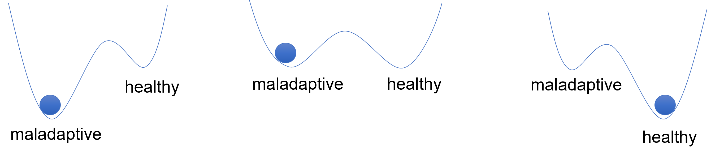
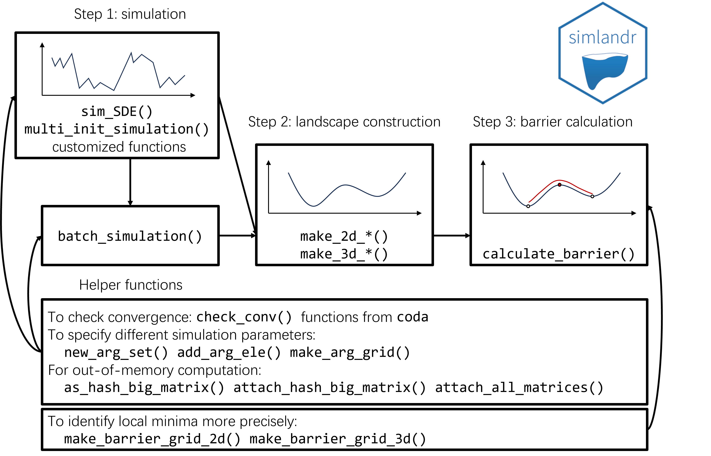
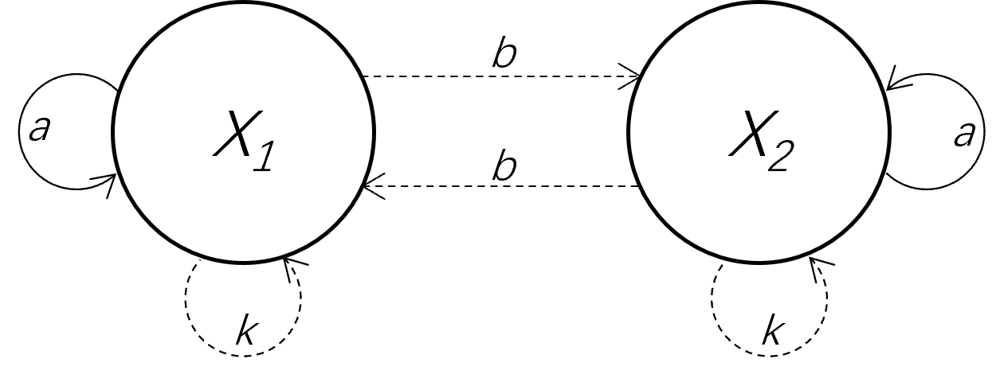
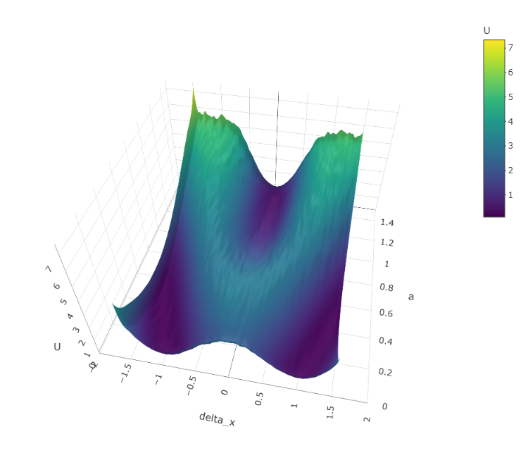
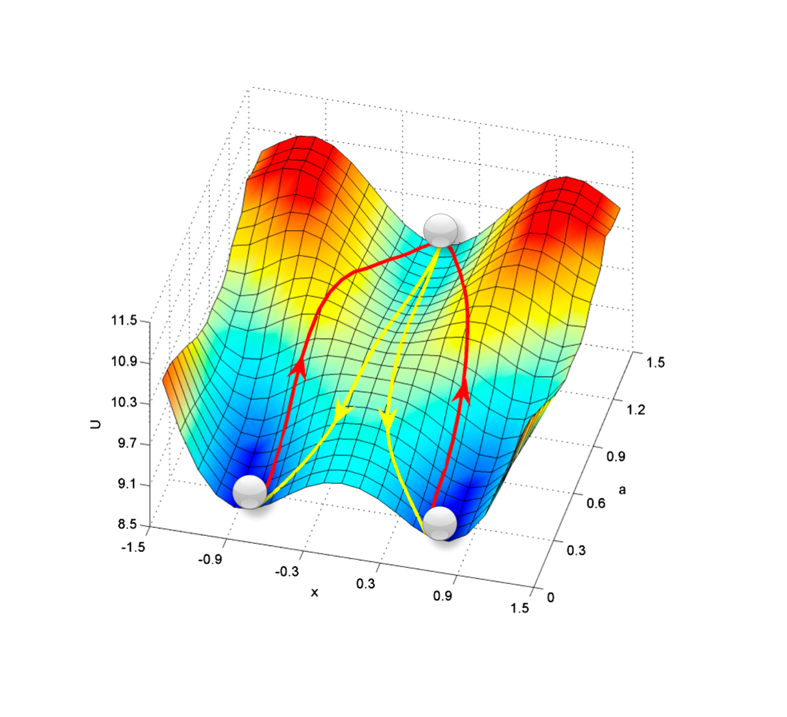
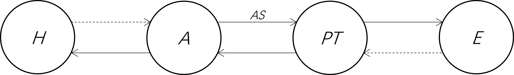

```{r echo=FALSE}
knitr::opts_chunk$set(tidy=TRUE, tidy.opts=list(width.cutoff=70), cache=FALSE)
RNGkind("L'Ecuyer-CMRG")
```

# Introduction {#sec:intro}

To better understand a dynamical system, it is often important to know the stability of different states. The metaphor of a potential landscape consisting of hills and valleys has been used to illustrate differences in stability in many fields, including genetics [@wangQuantifyingWaddingtonLandscape2011; @WaddingtonPrinciplesDevelopmentDifferentiation1966], ecology [@lamotheLinkingBallandcupAnalogy2019], and psychology [@olthofComplexityTheoryPsychopathology2020]. In such a landscape, the stable states of the system correspond to the lowest points (minima) in the valleys of the landscape. Just like a ball that is thrown in such a landscape will eventually gravitate towards such a minimum, the dynamical system is conceptually more likely to visit its stable states in which the system is also more resilient to noise. For example, in the landscape metaphor of psychopathology (Figure \@ref(fig:metaphor)), the valleys represent different mental health states, their relative depth represents the relative stability of the states, and the barriers between valleys represent the difficulty of transitioning between these states [@olthofComplexityTheoryPsychopathology2020,@hayesComplexSystemsApproach2020]. When the healthy state is more stable, the person is more likely to stay mentally healthy, whereas when the maladaptive state is more stable, the person is more likely to suffer from mental disorders.

```{r metaphor, fig.show="hold", out.width="100%", fig.cap="Illustration of the ball-and-landscape metaphor commonly used in the field of psychopathology.",fig.alt='Three landscape plots, each with a ball resting in one of two basins. The left basin is labeled maladaptive, the right basin healthy. In the first plot, the maladaptive basin is deeper; in the second, both basins are equally deep; in the third, the healthy basin is deeper.',echo=FALSE,message=FALSE}

```

Yet, formally quantifying the stability of states is a nontrivial question. Here we present an R package, \CRANpkg{simlandr}, that can quantify the stability of various kinds of systems without many mathematical restrictions.

Dynamical systems are usually modeled by stochastic differential equations, which may depend on the past history (i.e., may be non-Markovian, @StumpfEtAlModelingStemCell2021). They take the general form of
\begin{equation}
\mathrm{d} \boldsymbol{X}_t = \boldsymbol{b}(\boldsymbol{X}_t, \boldsymbol{H}_t){\mathrm{d}t} + \boldsymbol{\sigma}( \boldsymbol{X}_t, \boldsymbol{H}_t)\mathrm{d}\boldsymbol{W},
(\#eq:sde)
\end{equation}
where $\boldsymbol{X}_t$ is the random variable representing the current state of the system and $\boldsymbol{H_t}$ represents the past history of the system $\boldsymbol{H}_t=\{\boldsymbol{X_s} | s \in [0, t)\}$\footnote{The corresponding variable representing positions in the state space is not a random variable, so we use lowercase \(\boldsymbol{x}\) for it. This convention will be followed throughout this article.} The first term on the right-hand side of Eq \@ref(eq:sde) represents the deterministic part of the dynamics, which is a function of the system's current state $\boldsymbol{b}(\boldsymbol{X}_t, \boldsymbol{H}_t)$. The second term represents the stochastic part, which is standard white noise $\mathrm{d}\boldsymbol{W}$ multiplied by the noise strength $\boldsymbol{\sigma}( \boldsymbol{X}_t, \boldsymbol{H}_t)$.

If the dynamical equation (Eq \@ref(eq:sde)) can be written in the following form
\begin{equation}
\mathrm{d} \boldsymbol{X} = - \nabla U {\mathrm{d} t} +\sqrt{2}\mathrm{d}\boldsymbol{W},
(\#eq:canon)
\end{equation}
then $U$ is the potential function of the system.\footnote{Under zero inertia approximation.} However, this is not possible for general dynamical systems. The trajectory of such a system may contain loops which are not possible to be represented by a gradient system (this issue was compared to Escher's stairs by @rodriguez-sanchezClimbingEscherStairs2020). In this case, further generalization is needed. The theoretical background of \CRANpkg{simlandr} is the generalized potential landscape by @wangPotentialLandscapeFlux2008, which is based on the Boltzmann distribution and the steady-state distribution of the system. The Boltzmann distribution is a distribution law in physics, which states the distribution of classical particles depends on the energy level they occupy. When the energy is higher, the particle is exponentially less likely to be in such states
\begin{equation}
P(\boldsymbol{x}) \propto \exp (-U).
(\#eq:Boltzmann)
\end{equation}

This is then linked to dynamical systems by the steady-state distribution. The steady-state distribution of stochastic differential equations is the distribution that does not change over time, denoted by $P_{\mathrm{SS}}$ which satisfies
\begin{equation}
\frac{\partial P_{\mathrm{SS}} (\boldsymbol{x},t)}{\partial t} = 0.
(\#eq:ss)
\end{equation}
The steady-state distribution is important because it extracts time-invariant information from a set of stochastic differential equations. Substituting the steady-state distribution into Eq \@ref(eq:Boltzmann) gives Wang's generalized potential landscape function [@wangPotentialLandscapeFlux2008]
\begin{equation}
U(\boldsymbol{x}) = - \ln P_{\mathrm{SS}}(\boldsymbol{x}).
(\#eq:Wang)
\end{equation}
If the system has ergodicity (i.e., after sufficient time it can travel to all possible states in the state space), the long-term sample distribution can be used to estimate the steady-state distribution, and the generalized potential function can be calculated.

Our approach is not the only possible way for constructing potential landscapes. Many other theoretical approaches are available, including the SDE decomposition method by @AoPotentialStochasticDifferential2004 and the quasi-potential by @FreidlinWentzellRandomPerturbationsDynamical2012. Various strategies to numerically compute these landscapes have been proposed (see @zhouConstructionLandscapeMultistable2016 for a review). However, available realizations are still scarce. To our knowledge, besides \CRANpkg{simlandr}, there are two existing packages specifically for computing potential landscapes: the \CRANpkg{waydown} package [@rodriguez-sanchezPabRodRolldownPostpublication2020] and the \pkg{QPot} package [@MooreEtAlQPotPackageStochastic2016; @dahiyaOrderedLineIntegral2018]. The \CRANpkg{waydown} package uses the skew-symmetric decomposition of the Jacobian, which theoretically produces landscapes that are similar to @wangPotentialLandscapeFlux2008 (but see @CuiEtAlCommentsClimbingEscher2023 for a potential technical issue with this package.). The \pkg{QPot} package uses a path integral method that produces quasi-landscapes following the definition by @FreidlinWentzellRandomPerturbationsDynamical2012. Because of the analytical methods used by \CRANpkg{waydown} and \pkg{QPot}, they both require the dynamic function to be Markovian and differentiable in the whole state space. Moreover, they can only be used for systems of up to two dimensions. \CRANpkg{simlandr}, in contrast, is based on Monte Carlo simulation and the steady-state distribution. It does not have specific requirements for the model. Even for models that are not globally differentiable, have history-dependence, and are defined in a high-dimensional space, \CRANpkg{simlandr} is still applicable (e.g., @CuiEtAlMetaphorComputationConstructing2021). Therefore, \CRANpkg{simlandr} can be applied to a much wider range of dynamical systems, illustrate a big picture of dominated attractors, and investigate how the stability of different attractors may be influenced by model parameters. As a trade-off, \CRANpkg{simlandr} is not designed for rare events sampling in which the noise strength $\boldsymbol{\sigma}(\boldsymbol{X})$ is extremely small, nor for the precise calculation of the tail probability and transition paths. Instead, it is better to view \CRANpkg{simlandr} as a semi-quantitative tool that provides a broad overview of key attractors in dynamic systems, allowing for comparisons of their relative stability and the investigation of system parameter influences. We will show some typical use cases of \CRANpkg{simlandr} in later sections. Some key terms used in this article are summarized in Table \@ref(tab:terms).

| Term | Explanation |
|------|-------------|
| Potential landscape metaphor | A conceptual metaphor representing the stability of a complex dynamic system as an uneven landscape, with a ball on it representing the system's state. This can be quantitatively realized in various ways [@zhouConstructionLandscapeMultistable2016]. |
| Gradient system | A system whose deterministic motion can be described solely by the gradient of a potential function. |
| Non-Markovian system | A system whose future evolution depends not only on its current state but also on its past history. |
| Steady-state distribution | The probability distribution of a dynamic system that remains unchanged over time. |
| Ergodic system | A dynamic system that, given enough time, will eventually pass through all possible states. |
| Minimum energy path (MEP) | A transition path linking two local minima and passing through a saddle point [@WanEtAlFindingTransitionState2024]. It is always parallel to the gradient of the energy landscape, representing an efficient transition route. |

: (#tab:terms) Summary of key terms used in this article.

# Design and implementation

The general workflow of \CRANpkg{simlandr} involves three steps: model simulation, landscape construction, and barrier height computation. See Figure \@ref(fig:diagram) for a summary.

```{r diagram, fig.show="hold", out.width="100%", fig.cap="The structure and workflow of simlandr.", fig.alt='A flow chart showing the analysis steps in simlandr, with functions listed under each step.', echo=FALSE,message=FALSE}

```

## Step 1: model simulation

For the first step, a simulation function should be created by the user. This function should be able to simulate how the dynamical system of interest evolves over time and record its state in every time step. This can often be done with the Euler-Maruyama method. If the SDEs are up to three dimensions and Markovian, a helper function from \CRANpkg{simlandr}, `sim_SDE()`, can also be used. This function is based on the simulation utilities from the \CRANpkg{Sim.DiffProc} [@GuidoumBoukhetalaPerformingParallelMonte2020] and the output can be directly used for later steps. Moreover, the `multi_init_simulation()` function can be used to simulate trajectories from various starting points, thus reducing the possibility for the system to be trapped in a local minimum. The `multi_init_simulation()` function also supports parallel simulation based on the \CRANpkg{future} framework to improve time efficiency @RJ-2021-048.

For Monte Carlo methods, it is important that the simulation *converges*, which means the distribution of the system is roughly stable. The precision of the steady-state distribution estimation, according to Eq \@ref(eq:Wang), determines the precision of the distribution estimation. \CRANpkg{simlandr} provides a visual tool to compare the sample distributions in different stages (`check_conv()`), whereas the \CRANpkg{coda} package [@PlummerEtAlCODAConvergenceDiagnosis2006] can be used for more advanced diagnostics. The output of the `sim_SDE()` and `multi_init_simulation()` functions also uses the classes from the \CRANpkg{coda} package to enable easy convergence diagnosis. To achieve ergodicity in reasonable time, sometimes stronger noises need to be added to the system.

A simulation function is sufficient if the user is only interested in a single model setting. If the model is parameterized and the user wants to investigate the influence of parameters on the stability of the system, then multiple simulations need to be run with different parameter settings. \CRANpkg{simlandr} provides functions to perform batch simulations and store the outputs for landscape construction as one object. This can later be used to compare the stability under different parameter settings or produce animations to show how a model parameter influences the stability of the model.

In many cases, the output of the simulation is so large that it cannot be properly stored in the memory. \CRANpkg{simlandr} provides a hash_big_matrix class, which is a modification of the big.matrix class from the \CRANpkg{bigmemory} package [@KaneEtAlScalableStrategiesComputing2013], that can perform out-of-memory computation and organize the data files in the disk. In an out-of-memory computation, the majority of the data is not loaded into the memory, but only the small subset of data that is used for the current computation step. Therefore, the memory occupation is dramatically reduced. The big.matrix class in the \CRANpkg{bigmemory} package provides a powerful tool for out-of-memory computation. It, however, requires an explicit file name for each matrix, which can be cumbersome if there are many matrices to be handled, and this is likely to be the case in a batch simulation. The `hash_big_matrix` class automatically generates the file names using the md5 values of the matrices with the \CRANpkg{digest} package[@EddelbuettelEtAlPkgdigestCreateCompact2021] and stores it within the object. Therefore, the file links can also be restored automatically.

## Step 2: landscape construction

\CRANpkg{simlandr} provides a set of tools to construct 2D, 3D, and 4D\footnote{In this package, we use the number of dimensions in landscape plots (including \(U\) to define the dimension of landscapes. The x-, y-, z-, and color- axes can all be regarded as a dimension. Therefore, the dimension of a landscape can be one more than the dimension of the kernel smooth function.} landscapes from single or multiple simulation results. The steady-state distribution for selected variables of the system is first estimated using the kernel density estimates (KDE). The density function in R is used for 2D landscapes, whereas the \CRANpkg{ks} package [@ChaconDuongMultivariateKernelSmoothing2018] is used by default for 3D and 4D landscapes because of its higher efficiency. Then the potential function $U$ is calculated from Eq \@ref(eq:Wang). The landscape plots without a z-axis are created with \CRANpkg{ggplot2} [@WickhamGgplot2ElegantGraphics2016], and those with a z-axis are created with \CRANpkg{plotly} [@SievertInteractiveWebbasedData2020]. These plots can be further refined using the standard \CRANpkg{ggplot2} or \CRANpkg{plotly} methods. See Table \@ref(tab:overview) for an overview for the family of landscape functions.

| Type of Input | Function | Dimensions |
|-------------------|-------------------|----------------------------------|
| Single simulation data | `make_2d_static()` | x, **y** |
|  | `make_3d_static()` | $1$ x, y, **z+color**; (2) x, y, **color** |
|  | `make_4d_static()` | x, y, z, **color** |
| Multiple simulation data | `make_2d_matrix()` | x, **y**, *cols*, *(rows)* |
|  | `make_3d_matrix()` | x, y, **z+color**, *cols*, *(rows)* |
|  | `make_3d_animation()` | $1$ x, y, **z+color**, *fr*; (2) x, y, **color**, *fr*; (3) x, y, **z+color**, *cols* |

: (#tab:overview) Overview of various landscape functions provided by `simlandr`. Dimensions in bold represent the potential U calculated by the function. Dimensions in italic represent model parameters. Dimensions in parentheses are optional.

## Step 3: barrier height calculation {#sec:singlel}

An important property of the states in a landscape is their stability, which can be indicated by the barrier height that the system has to overcome when it transitions between one stable state to another adjacent state (see @CuiEtAlMetaphorComputationConstructing2021 for further discussions about different stability indicators). The barrier height is also related to the escape time that the system transitions from one valley to another, which can be tested empirically [@wangPotentialLandscapeFlux2008]. \CRANpkg{simlandr} provides tools to calculate the barrier heights from landscapes. These functions look for the local minima in given regions and try to find the saddle point between two local minima. The potential differences between the saddle point and local minima are calculated as barrier heights.

In 2D cases, there is only one possible path connecting two local minima. The point on the path with the highest $U$ is identified as the saddle point. For 3D landscapes, there are multiple paths between two local minima. If we treat the system *as if* it is a gradient system with Brownian noise, then the most probable path (termed as the *minimum energy path*, MEP) that the system transitions is that it first goes along the steepest *ascent* path from the starting point, and then goes along the steepest *descent* path to the end point [@EVanden-EijndenTransitionpathTheoryPathfinding2010]. We find this path by minimizing the following action using the @dijkstra1959note algorithm [@HeymannVanden-EijndenPathwaysMaximumLikelihood2008]
\begin{equation}
\varphi_{\mathrm{MEP}} = \arg\min_\varphi \int_A^B |\nabla U||\mathrm{d}\varphi|\left( \approx \arg \min_\varphi \Sigma_i |\nabla U_i||\Delta \varphi_i|\right),
(\#eq:optim)
\end{equation}
where $A$ and $B$ are the starting and end points and $\varphi$ is the path starting at $A$ and ending in $B$. After that, the point with the maximum potential value on the MEP is identified as the saddle point. Note that while the barrier height still indicates the stability of local minima, the MEP may not be the true most probable path for a nongradient system to transition between stable states.

# Examples

We use two dynamical systems to illustrate the usage of the \CRANpkg{simlandr} package. The first one is a two-dimensional stochastic non-gradient gene expression model, which was used by @wangQuantifyingWaddingtonLandscape2011 to represent cell development and differentiation. The second example is a dynamic model of panic disorder [@robinaugh2024] which contains many more variables and parameters, non-Markovian property, and non-differentiable formulas. We mainly use the first example to show the agreement of the results from \CRANpkg{simlandr} with previous analytic results, and the second example as a typical use case of a complex dynamic model which is not treatable with other methods (also see @CuiEtAlMetaphorComputationConstructing2021 for more substantive discussions). Note that, both systems include more than two variables, making it impossible to perform the landscape analysis with other available R packages.

## Example 1: the gene expression model

This model is built on the mutual regulations of the expressions of two genes, in which $X_1$ and $X_2$ represent the expression levels of two genes which activate themselves and inhibit each other. A graphical illustration is shown in Figure \@ref(fig:e1) (adapted from @wangQuantifyingWaddingtonLandscape2011). Their dynamic functions can be written as
\begin{align}
\frac {\mathrm{d}X_ {1}}{\mathrm{d}t}  &=  \frac {ax_ {1}^ {n}}{S^ {n}+x_ {1}^ {n}} + \frac {bS^ {n}}{S^ {n}+x_ {2}^ {n}} - kx_ {1}+ \sigma_1 \frac{\mathrm{d}W_1}{\mathrm{d}t},
(\#eq:sim2x1)
\\
\frac {\mathrm{d}X_ {2}}{\mathrm{d}t}  &=  \frac {ax_ {2}^ {n}}{S^ {n}+x_ {2}^ {n}} + \frac {bS^ {n}}{S^ {n}+x_ {1}^ {n}} - kx_ {2}+ \sigma_2 \frac{\mathrm{d}W_2}{\mathrm{d}t},
(\#eq:sim2x2)
\\
\frac {\mathrm{d}a}{\mathrm{d}t} &= -\lambda a+ \sigma_3 \frac{\mathrm{d}W_3}{\mathrm{d}t},
(\#eq:sim2a)
\end{align}
where $a$ represents the strength of self-activation, $b$ represents the strength of mutual-inhibition, and $k$ represents the speed of degradation. The development of an organism is modeled as $a$ decreasing at a certain speed $\lambda$. In the beginning, there is only one possible state for the cell. After a certain milestone, the cell differentiates into one of the two possible states.

```{r e1, fig.show="hold", out.width="50%", fig.cap="A graphical illustration of the relationship between the activation levels of the two genes. Solid arrows represent positive relationships (i.e., activation) and dashed arrows represent negative relationships (i.e., inhibition).", fig.alt='Two large circles labeled X1 and X2. Dashed arrows labeled b connect the circles in both directions. Each circle has a solid self-loop labeled a and a dashed self-loop labeled k.', echo=FALSE,message=FALSE}

```

This model can be simulated using the `sim_SDE()` function in \CRANpkg{simlandr}, with the default parameter setting $b = 1, k = 1, S = 0.5, n = 4, \lambda = 0.01$, and $\sigma_1 = \sigma_2 = \sigma_3 = 0.2$.

```{r}
# Load the package.
library(simlandr)

# Specify the simulation function.
b <- 1
k <- 1
S <- 0.5
n <- 4
lambda <- 0.01

drift_gene <- c(
  rlang::expr(z * x^(!!n) / ((!!S)^(!!n) + x^(!!n)) + (!!b) * (!!S)^(!!n) / ((!!S)^(!!n) + y^(!!n)) - (!!k) * x),
  rlang::expr(z * y^(!!n) / ((!!S)^(!!n) + y^(!!n)) + (!!b) * (!!S)^(!!n) / ((!!S)^(!!n) + x^(!!n)) - (!!k) * y),
  rlang::expr(-(!!lambda) * z)
) |> as.expression()

diffusion_gene <- expression(
  0.2,
  0.2,
  0.2
)
```

```{r eval=FALSE}
# Perform a simulation and save the output.
set.seed(1614)
single_output_gene <- sim_SDE(drift = drift_gene, diffusion = diffusion_gene, N = 1e6, M = 10, Dt = 0.1, x0 = c(0, 0, 1), keep_full = FALSE)
```

```{r echo=FALSE}
# To save time for building the document, we save the output in a file. The same applies to the following examples.
if (!file.exists("data/single_output_gene.RDS")) {
  set.seed(1614)
  single_output_gene <- sim_SDE(drift = drift_gene, diffusion = diffusion_gene, N = 1e6, M = 10, Dt = 0.1, x0 = c(0, 0, 1), keep_full = FALSE)
  saveRDS(single_output_gene, "data/single_output_gene.RDS")
} else {
  single_output_gene <- readRDS("data/single_output_gene.RDS")
}
```

After the simulation, we perform some basic data wrangling to produce a dataset that can be used for further analysis. We create a new variable `delta_x` as the difference between X1 (X) and X2 (Y), and we rename the variable Z as `a`.

```{r}
single_output_gene2 <- do.call(rbind, single_output_gene)
single_output_gene2 <- cbind(single_output_gene2[, "X"] - single_output_gene2[, "Y"], single_output_gene2[, "Z"])
colnames(single_output_gene2) <- c("delta_x", "a")
```

We then perform the convergence check on the simulation result. First, we convert the simulation output to the format for the `coda` package, and thin the output to speed up the convergence check.

```{r}
single_output_gene_mcmc_thin <- as.mcmc.list(lapply(single_output_gene, function(x) x[seq(1, nrow(x), by = 100), ]))
```

We then show the convergence diagnosis plot to check the convergence of the simulation in Figure \@ref(fig:converge-gene). The distribution of the two key variables in different simulation stages are converging, indicating that the simulation is long enough to provide reliable estimation of the steady-state distribution. Other convergence checks can also be readily performed using the \CRANpkg{coda} package.

```{r converge-gene, message=FALSE, warning=FALSE, fig.cap="The convergence check result for the simulation of the gene expression model. The variables in different simulation stages did not show distributional differences, indicating that the simulation is long enough to provide a reliable estimation of the steady-state distribution.", fig.alt='Trace and density plots for variables x, y, and z.', out.width="100%"}
plot(single_output_gene_mcmc_thin)
```

We generated the 3D landscape for this model with `make_3d_single()`. Here, we use `x`, `y` to specify the variables of interest, and use `lims` to specify the limits of the x and y axes for the landscape. The `lims` argument can be left blank, then the limits will be automatically calculated.

```{r warning=FALSE}
l_single_gene_3d <-
  make_3d_single(single_output_gene2,
                 x = "delta_x", y = "a",
                 lims = c(-1.5, 1.5, 0, 1.5),
                 Umax = 8)
```

The resulting landscape is shown in the left panel of Figure \@ref(fig:3dstaticgene). In this plot, the x-axis represents $\Delta x (= x_1-x_2)$, and the y-axis represents $a$. To compare with, the potential landscape obtained analytically by @wangQuantifyingWaddingtonLandscape2011 is shown in the right panel of Figure \@ref(fig:3dstaticgene). The result of \CRANpkg{simlandr} appears to be very close to the result based on the analytical derivation. Note that because different normalization methods were used, the $U$ values of the two landscapes are not directly comparable. Here, we are mainly interested in their relative shape.

```{r eval=FALSE}
plot(l_single_non_grad_3d)
```

```{r echo=FALSE,message=FALSE,warning=FALSE,results='hide'}
if(!file.exists("figures/3dstatic_gene.png")) {
  plotly::orca(plot(l_single_gene_3d) |>
  plotly::layout(scene = list(
    aspectmode = "manual", aspectratio = list(x = 1.1, y = 1.1, z = 0.66),
    xaxis = list(range = list(-2, 2)),
    yaxis = list(range = list(0, 1.5)),
    camera = list(
      eye = list(
        x = 0.3, y = -1.5, z = 1.5
      )
    )
  )), file = "figures/3dstatic_gene.png", height = 650, width = 750)
}
```

```{r 3dstaticgene, fig.show="hold", out.width="50%", fig.cap="The 3D landscape (potential value as z-axis) for the gene expression model. The left panel is the plot produced by simlandr; the right panel is the potential landscape obtained analytically by Wang et al. (2008), reproduced with the permission of the authors and in accordance with the journal policy.", fig.alt='Two similar landscape plots, each with three basins.', echo=FALSE,message=FALSE,warning=FALSE}


```

We then calculate the barrier for the landscape using `calculate_barrier()`. The barrier is calculated by specifying the start and end locations, and the radii of the start and end locations. The height of the barrier from two sides can be calculated with `get_barrier_height()`.

```{r results='markup', fig.show='hide', warning=FALSE}
b_single_gene_3d <- calculate_barrier(l_single_gene_3d,
  start_location_value = c(0, 1.2), end_location_value = c(1, 0.2),
  start_r = 0.3, end_r = 0.3
)

get_barrier_height(b_single_gene_3d)
```

The local minima, the saddle point, and the MEP can be added to the landscape with `autolayer()`, shown in Figure \@ref(fig:bsingle3dgene).

```{r bsingle3dgene, out.width="50%", fig.cap="The landscape for the gene expression model. The local minima are marked as white dots, the saddle points are marked as red dots, and the MEPs are marked as white lines.", fig.alt='A landscape plot with a white line connecting two white dots, passing through a red dot in the middle.', message=FALSE,warning=FALSE}

plot(l_single_gene_3d, 2) + autolayer(b_single_gene_3d)
```

Next, we use multiple simulations to investigate the influence of two parameters, $k$ and $b$, on the stability of the system. As explained above, the parameter $b$ represents the strength of mutual-inhibition between the two genes. Therefore, as $b$ increases, we expect the differentiation is more extreme, that is, the cell is more likely to develop into one of the two cell types with very different gene expression levels. The valleys in the landscape representing the two types will become further apart and the barrier becomes clearer. The parameter $k$ represents the speed of degradation of the gene products. As $k$ increases, the gene products degrade faster, and this effect is more pronounced when the gene products are at high levels. Therefore, the dominant gene will express at a less extreme level, and we expect that the two valleys become closer, and the barrier will become less clear as $k$ increases.

We use the batch simulation functions of \CRANpkg{simlandr}. First, we create the argument set for the batch simulation. This specifies the parameters to be varied. We examined three $b$ values, 0.5, 1, 1.5, and three $k$ values, 0.5, 1, 1.5, which form 9 possible combinations.

```{r}
batch_arg_set_gene <- new_arg_set()
batch_arg_set_gene <- batch_arg_set_gene |>
  add_arg_ele(
    arg_name = "parameter", ele_name = "b",
    start = 0.5, end = 1.5, by = 0.5
  ) |>
  add_arg_ele(
    arg_name = "parameter", ele_name = "k",
    start = 0.5, end = 1.5, by = 0.5
  )
batch_grid_gene <- make_arg_grid(batch_arg_set_gene)
```

We then perform the batch simulation with the `batch_simulation()` function. Here, we specify the simulation function to be used, which is similar to the single simulation we showed above, together with the data wrangling procedure. The simulation function is defined with the `sim_fun` argument. We also use `bigmemory = TRUE` to store the simulation results in the `hash_big_matrix` format, which is more memory-efficient.

```{r eval=FALSE}
batch_output_gene <- batch_simulation(batch_grid_gene,
  sim_fun = function(parameter) {
    b <- parameter[["b"]]
    k <- parameter[["k"]]
    drift_gene <- c(
      rlang::expr(z * x^(!!n) / ((!!S)^(!!n) + x^(!!n)) + (!!b) * (!!S)^(!!n) / ((!!S)^(!!n) + y^(!!n)) - (!!k) * x),
      rlang::expr(z * y^(!!n) / ((!!S)^(!!n) + y^(!!n)) + (!!b) * (!!S)^(!!n) / ((!!S)^(!!n) + x^(!!n)) - (!!k) * y),
      rlang::expr(-(!!lambda) * z)
    ) |> as.expression()
    set.seed(1614)
    single_output_gene <- sim_SDE(drift = drift_gene, diffusion = diffusion_gene, N = 1e6, M = 10, Dt = 0.1, x0 = c(0, 0, 1), keep_full = FALSE)
    single_output_gene2 <- do.call(rbind, single_output_gene)
    single_output_gene2 <- cbind(single_output_gene2[, "X"] - single_output_gene2[, "Y"], single_output_gene2[, "Z"])
    colnames(single_output_gene2) <- c("delta_x", "a")
    single_output_gene2
  },
  bigmemory = TRUE
)
```

If the output is saved in an RDS file, upon next use, it can be read as follows.

```{r eval=FALSE}
saveRDS(batch_output_gene, "batch_output_gene.RDS")
batch_output_gene <- readRDS("batch_output_gene.RDS") |> attach_all_matrices()
```

```{r echo=FALSE}
if (file.exists("data/batch_output_gene.RDS")) {
  batch_output_gene <- readRDS("data/batch_output_gene.RDS") |> attach_all_matrices()} else {
        batch_output_gene <- batch_simulation(batch_grid_gene,
          sim_fun = function(parameter) {
            b <- parameter[["b"]]
            k <- parameter[["k"]]
            drift_gene <- c(
              rlang::expr(z * x^(!!n) / ((!!S)^(!!n) + x^(!!n)) + (!!b) * (!!S)^(!!n) / ((!!S)^(!!n) + y^(!!n)) - (!!k) * x),
              rlang::expr(z * y^(!!n) / ((!!S)^(!!n) + y^(!!n)) + (!!b) * (!!S)^(!!n) / ((!!S)^(!!n) + x^(!!n)) - (!!k) * y),
              rlang::expr(-(!!lambda) * z)
            ) |> as.expression()
            set.seed(1614)
            single_output_gene <- sim_SDE(drift = drift_gene, diffusion = diffusion_gene, N = 1e6, M = 10, Dt = 0.1, x0 = c(0, 0, 1), keep_full = FALSE)
            single_output_gene2 <- do.call(rbind, single_output_gene)
            single_output_gene2 <- cbind(single_output_gene2[, "X"] - single_output_gene2[, "Y"], single_output_gene2[, "Z"])
            colnames(single_output_gene2) <- c("delta_x", "a")
            single_output_gene2
          },
          bigmemory = TRUE
        )
  saveRDS(batch_output_gene, "data/batch_output_gene.RDS")
  }
```

We then make the 3D matrix for the batch output, using `make_3d_matrix()`.

```{r warning=FALSE, message=FALSE}
l_batch_gene_3d <- make_3d_matrix(batch_output_gene,
  x = "delta_x", y = "a", cols = "b", rows = "k",
  lims = c(-5, 5, -0.5, 2), h = 0.005,
  Umax = 8,
  kde_fun = "ks", individual_landscape = TRUE
)
```

For the barrier calculation step, the start and end points of the barrier may be different for each landscape plot. The following code shows how to create a barrier grid for each landscape plot. First, we create a barrier grid template using the function `make_barrier_grid_3d()`. Next, we modify the barrier grid template to create a barrier grid for the landscape plot.

```{r results='markup', fig.show='hide', message=FALSE,warning=FALSE}
make_barrier_grid_3d(batch_grid_gene,
  start_location_value = c(0, 1.5), end_location_value = c(1, -0.5),
  start_r = 1, end_r = 1, print_template = TRUE
)

bg_gene <- make_barrier_grid_3d(batch_grid_gene, df = structure(list(start_location_value = list(c(0, 1.5), c(0, 1.5), c(0, 1.5), c(0, 1.5), c(0, 1.5), c(0, 1.5), c(0, 1.5), c(0, 1.5), c(0, 1.5)), start_r = list(c(0.2, 1), c(0.2, 1), c(0.2, 1), c(0.2, 0.5), c(0.2, 0.5), c(0.2, 0.5), c(0.2, 0.3), c(0.2, 0.3), c(0.2, 0.3)), end_location_value = list(
  c(2, 0), c(2, 0), c(2, 0), c(1, 0), c(1, 0), c(1, 0), c(1, 0), c(1, 0), c(1, 0)
), end_r = list(
  c(1, 1), c(1, 1), c(1, 1), c(1, 1), c(1, 1), c(1, 1), c(1, 1), c(1, 1), c(1, 1)
)), row.names = c(NA, -9L), class = c(
  "arg_grid",
  "data.frame"
)))
```

With the barrier grid template, we can calculate the barrier for each landscape plot.

```{r}
b_batch_gene_3d <- calculate_barrier(l_batch_gene_3d,
  bg = bg_gene
)
```

If the barrier grid was not needed, the following code can be used to calculate the barrier.

```{r eval=FALSE}
b_batch_gene_3d <- calculate_barrier(l_batch_gene_3d, start_location_value = c(0, 1.5), end_location_value = c(1, 0), start_r = 1, end_r = 1)
```

The resulting landscapes and the MEPs between states are shown in Figure \@ref(fig:bbatch3dgene).

```{r bbatch3dgene, out.width="100%", fig.cap="The landscape for the gene expression model of different \\( b \\) and \\( k \\) values. The local minima are marked as white dots, the saddle points are marked as red dots, and the MEPs are marked as white lines.",fig.alt='Nine landscape plots arranged in a 3×3 grid. The x-axis is labeled delta x, the y-axis is labeled a. Rows correspond to k values (0.5, 1, 1.5), and columns to b values (0.5, 1, 1.5).', message=FALSE,warning=FALSE}
plot(l_batch_gene_3d) + autolayer(b_batch_gene_3d)
```

From the landscapes, it is clear that increasing $b$, which represents higher strength of gene mutual prohibition, makes the two differentiated states further apart from each other. Increasing $k$, which represents faster degradation, makes the undifferentiated state disappear earlier, thus makes the differentiation earlier. When $b$ is low enough and $k$ is high enough, there is no differentiation anymore because the two differentiated states merge together and form a more stable state at $\Delta x = 0$. In this case, there is no actual differentiation in the system, but only a one-to-one conversion of cell types. Only when $b$ is high enough and $k$ is low enough is it possible for the cell to differentiate into two types.

## Example 2: panic disorder model

The second example we use is the panic disorder model proposed by @robinaugh2024. The model is implemented in the \pkg{PanicModel} package (<https://github.com/jmbh/PanicModel/>). It contains 12 variables and 33 parameters and also involves history dependency and non-differentiable formula (such as if-else conditions) to model the complex interplay of individual and environmental elements in different time scales. The most important variables of the model are the physical arousal ($A$) of a person (e.g., heart beat, muscle tension, sweating), the person's perceived threat ($PT$, how dangerous the person cognitively evaluates the environment), and the person's tendency to escape from the situation ($E$). The core theoretical idea of the model is that physical arousal and perceived threat of a person may strengthen each other in certain circumstances, leading to sudden increases in both variables, manifesting as panic attacks. The tendency that a person tends to use physical arousal as cognitive evidence of threat is represented by another variable, arousal schema $S$. A comprehensive introduction of the model is beyond the scope of the current article, and we would like to refer interested readers to @robinaugh2024. Here, to simplify the context, we assume that $AS$ does not change over time, and no psychotherapy is being administered. We focus on the influence of $AS$ on the system's stability represented by $A$ and $PT$. A graphical illustration of several core variables of this model is shown in Figure \@ref(fig:e2) (adapted from @CuiEtAlMetaphorComputationConstructing2021).

```{r e2, fig.show="hold", out.width="100%", fig.cap="A graphical illustration of the relationships between several important psychological variables in the panic disorder model. Solid arrows represent positive relationships and dashed arrows represent negative relationships.", fig.alt='Four large circles labeled H, A, PT, and E from left to right. Solid arrows go from A to H, A to PT, PT to A, and PT to E. Dashed arrows go from H to A and from E to PT. The solid arrow from A to PT is labeled AS.', echo=FALSE,message=FALSE}

```

To construct the potential landscapes for this model, we first create a function that performs a simulation using the `simPanic()` function from \pkg{PanicModel}. This is required as we need to modify some default options for illustration.

```{r}
library(PanicModel)

sim_fun_panic <- function(x0, par) {

  # Change several default parameters
  pars <- pars_default
  # Increase the noise strength to improve sampling efficiency
  pars$N$lambda_N <- 200
  # Make S constant through the simulation
  pars$TS$r_S_a <- 0
  pars$TS$r_S_e <- 0

  # Specify the initial values of A and PT according to the format requirement by `multi_init_simulation()`, while the other variables use the default initial values.
  initial <- initial_default
  initial$A <- x0[1]
  initial$PT <- x0[2]

  # Specify the value of S according to the format requirement by `batch_simulation()`.
  initial$S <- par$S

  # Extract the simulation output from the result by simPanic(). Only keep the core variables.
  return(
    as.matrix(
      simPanic(1:5000, initial = initial, parameters = pars)$outmat[, c("A", "PT", "E")]
      )
    )
}
```

We then perform a single simulation from multiple starting points. To speed up the simulation, we use parallel computing.

```{r eval=FALSE}
future::plan("multisession")
set.seed(1614, kind = "L'Ecuyer-CMRG")
single_output_panic <- multi_init_simulation(
  sim_fun = sim_fun_panic,
  range_x0 = c(0, 1, 0, 1),
  R = 4,
  par = list(S = 0.5)
)
```

```{r echo=FALSE}
if (file.exists("data/single_output_panic.RDS")) {
  single_output_panic <- readRDS("data/single_output_panic.RDS")
} else {
  future::plan("multisession")
  set.seed(1614, kind = "L'Ecuyer-CMRG")
  single_output_panic <- multi_init_simulation(
    sim_fun = sim_fun_panic,
    range_x0 = c(0, 1, 0, 1),
    R = 4,
    par = list(S = 0.5)
  )
  saveRDS(single_output_panic, "data/single_output_panic.RDS")
}
```

The convergence check results of the simulation, shown in Figure \@ref(fig:converge-panic), indicate that the time series of the first 100 data points are strongly influenced by the choice of initial value. Therefore, we remove the first 100 data points in the following analysis.

```{r converge-panic, message=FALSE, warning=FALSE, fig.cap="The convergence check result for the simulation of the panic disorder model.", fig.alt='Trace and density plots for variables x, y, and z.', out.width="100%"}
plot(single_output_panic)
```

We then create the 3D landscape for the panic disorder model, shown in Figure \@ref(fig:3dstaticpanic). The landscape shows that the system has two stable states, which are represented by the valleys in the landscape. The system can be trapped in these valleys, leading to different levels of physical arousal and perceived threat. The valley with higher potential value represents a state with higher physical arousal and perceived threat, which corresponds to a panic attack. In contrast, the valley with lower potential value represents a state with lower physical arousal and perceived threat, which corresponds to a healthy state.

```{r 3dstaticpanic, fig.show="hold", out.width="50%", fig.cap="The 3D landscape (potential value as color) for the panic disorder model", fig.alt='A landscape plot with two basins.', echo=FALSE,message=FALSE,warning=FALSE}
l_single_panic_3d <- make_3d_single(
  single_output_panic |> window(start = 100),
  x = "A", y = "PT", h = 0.005, lims = c(-1, 1.5, -0.5, 1.5))
plot(l_single_panic_3d, 2)
```

We now investigate the effect of the parameter $S$ on the potential landscape. This parameter represents the tendency that a person considers physical arousal as a sign of danger. Therefore, we expect that higher $S$ will stabilize the panic state and destabilize the healthy state.

We perform a batch simulation with varying $S$ values to construct the potential landscapes for different $S$ values. This, again, starts with the creation of a grid of parameter values.

```{r}
batch_arg_grid_panic <- new_arg_set() |>
  add_arg_ele(arg_name = "par", ele_name = "S", start = 0, end = 1, by = 0.5) |>
  make_arg_grid()
```

We then perform the batch simulation using parallel computing.

```{r eval=FALSE}
future::plan("multisession")
set.seed(1614, kind = "L'Ecuyer-CMRG")
batch_output_panic <- batch_simulation(
  batch_arg_grid_panic,
  sim_fun = function(par) {
    multi_init_simulation(
      sim_fun_panic,
      range_x0 = c(0, 1, 0, 1),
      R = 4,
      par = par
    ) |> window(start = 100)
  }
)
```

```{r echo=FALSE,message=FALSE}
if (file.exists("data/batch_output_panic.RDS")) {
  batch_output_panic <- readRDS("data/batch_output_panic.RDS")
} else {
  future::plan("multisession")
  set.seed(1614, kind = "L'Ecuyer-CMRG")
  batch_output_panic <- batch_simulation(
    batch_arg_grid_panic,
    sim_fun = function(par) {
      multi_init_simulation(
        sim_fun_panic,
        range_x0 = c(0, 1, 0, 1),
        R = 4,
        par = par
      ) |> window(start = 100)
    }
  )
  saveRDS(batch_output_panic, "data/batch_output_panic.RDS")
}
```

The 3D landscapes for different $S$ values are shown in Figure \@ref(fig:lbatch3dpanic). The landscapes show that the system only has one stable state when $S$ is low, but has two stable states when $S$ is high. The stability of the panic state also increases when $S$ is higher. This indicates that a higher $S$ value corresponds to a higher risk of panic attacks.

```{r lbatch3dpanic, out.width="100%", fig.cap="The landscape for the panic disorder model of different \\( S \\) values. Two landscapes are shown for different variable combinations, \\( A \\) and \\( PT \\), or \\( A \\) and \\( E \\).", fig.alt='Three landscape plots arranged in a row. The x-axis is labeled A, the y-axis is labeled PT. Columns correspond to S values of 0, 0.5, and 1.', message=FALSE,warning=FALSE}
l_batch_panic_3d <- make_3d_matrix(batch_output_panic, x = "A", y = "PT", cols = "S", h = 0.005, lims = c(-1, 1.5, -0.5, 1.5))
plot(l_batch_panic_3d)
```

# Discussion

Potential landscapes can show the stability of states for a dynamical system in an intuitive and quantitative way. They are especially informative for multistable systems. In this article, we illustrated how to construct potential landscapes using \CRANpkg{simlandr}. The potential landscapes generated by \CRANpkg{simlandr} are based on the steady-state distribution of the system, which is in turn estimated using Monte Carlo simulation. Compared to analytic methods, Monte Carlo estimation is more flexible and thus more applicable for complex models. The flexibility comes together with a higher demand for time and storage, which is necessary to make the estimation precise enough. The hash_big_matrix class partly solved this problem by dumping the memory storage to hard disk space. Also, it is important that the simulation function itself is efficient enough. The functions `sim_SDE()` and `multi_init_simulation()` make use of the efficient simulations provided by \CRANpkg{Sim.DiffProc} [@GuidoumBoukhetalaPerformingParallelMonte2020] and the parallel computing with the \CRANpkg{future} framework [@RJ-2021-048]. For customized simulation functions, there are also multiple approaches that can be used to improve the performance, for which we refer interested readers to @WickhamImprovingPerformance2019a. In Supplementary Materials A, we provide a benchmark of the typical time and memory usage of the procedures in \CRANpkg{simlandr}. From there, we can see that time and memory usage are acceptable in most cases on a personal computer. When the transition between attractors is rare, the `multi_init_simulation()` function may help to speed up the convergence, and more advanced sampling methods like importance sampling or rare event sampling may be needed in more complex situations. The detailed ways to implement such methods are highly dependent on the specific model and are beyond the scope of this package. We direct interested readers to @RubinoTuffinRareEventSimulation2009 and @KloekvanDijkBayesianEstimatesEquation1978 for a comprehensive review of rare event simulation methods. Nevertheless, the landscape construction functions in \CRANpkg{simlandr} allow users to provide weights for the simulation results, which can be used to adjust the sampling distribution.

In addition, the length of the simulation and the choice of noise strength may also have an important influence on the results. If the length is too short, the density estimation will be inaccurate, resulting in rugged landscapes. If the length is too long, the simulation part would require more computational resources, which is not always realistic. If the noise is too weak, the system may not be able to converge in a reasonable time, resulting in problems in convergence checks, overly noisy landscapes, or failure to show valleys that are theoretically present. If the noise is too strong, the simulation may be unstable and the boundaries between valleys may be blurry. In Supplementary Materials B, we showed the influence of simulation length and noise strength on the landscape output. With some theoretical expectation of the system's behavior, it is not difficult to spot that the simulation is too short, or the noise level might be unsuitable. In that case, some adjustments are required before the landscape can be well constructed.

All landscape construction and barrier calculation functions in \CRANpkg{simlandr} contain both visual aids and numerical data that can be used for further processing. The html plots based on \CRANpkg{plotly} are more suitable for interactive illustrations, while it is also possible to export them to static plots using `plotly::orca()`. The \CRANpkg{ggplot2} plots are readily usable for flat printing.

We also want to note some limitations of the potential landscape generated by \CRANpkg{simlandr}. First, the generalized potential landscape is not a complete description of all dynamics in a system. It emphasizes the stability of different states by filtering out other dynamical information. Some behaviors are not possible in gradient systems (e.g., oscillations and loops), thus cannot be shown in a potential landscape [@zhouConstructionLandscapeMultistable2016]. Second, since the steady-state distribution is estimated using a kernel smoothing method, which depends on stochastic simulations, the resulting potential function may not be highly accurate. Its accuracy is further affected by the choice of kernel bandwidth and noise strength. This issue is particularly pronounced at valley edges, where fewer samples are available for estimation. Similar limitations apply to MEP calculations, as they are derived from the generalized landscape rather than the original dynamics. Therefore, we do not recommend directly interpreting the potential function or barrier height results for applications requiring high precision. Instead, the potential landscape is best used as a semi-quantitative tool to gain insights into the system's overall behavior, guide further analysis, and compare system behavior under different parameter settings, provided the same simulation and kernel estimation conditions are used. The examples in this article illustrated some typical use cases we recommend.

# Availability and future directions

This package is publicly available from the Comprehensive R Archive Network (CRAN) at \url{https://CRAN.R-project.org/package=simlandr}, under GPL-3 license. The results in the current article were generated with \CRANpkg{simlandr} 0.4.0 version. R script to replicate all the results in this article can be found in the supporting information.

The barrier height data calculated by \CRANpkg{simlandr} can also be further analyzed and visualized. For example, sometimes it is helpful to look into how the barrier height changes with varying parameters (e.g., @CuiEtAlMetaphorComputationConstructing2021). We encourage users to explore other ways of analyzing and visualizing the various results provided by \CRANpkg{simlandr}.

The method we chose for \CRANpkg{simlandr} is not the only possible one. The generalized landscape by @wangPotentialLandscapeFlux2008, which we implemented, is more flexible and emphasizes the possibility that the system is in a specific state, while other methods may have other strengths (e.g., the method by @rodriguez-sanchezPabRodRolldownPostpublication2020 emphasizes the gradient part of the vector field, and the method by @MooreEtAlQPotPackageStochastic2016 emphasizes the possibility of transition processes under small noise). We look forward to future theoretical and methodological developments in this direction.

# Acknowledgments

TL was supported by the NSFC under Grant No. 11825102 and the Beijing Academy of Artificial Intelligence (BAAI). ALA and MO were supported by an NWO VIDI grant, Grant No. VI.Vidi.191.178.
