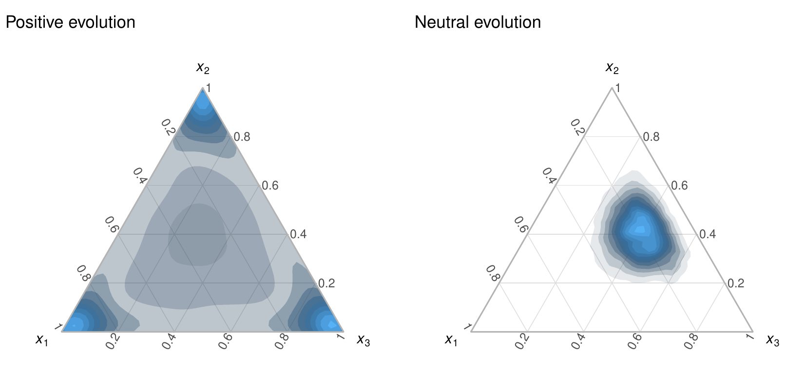
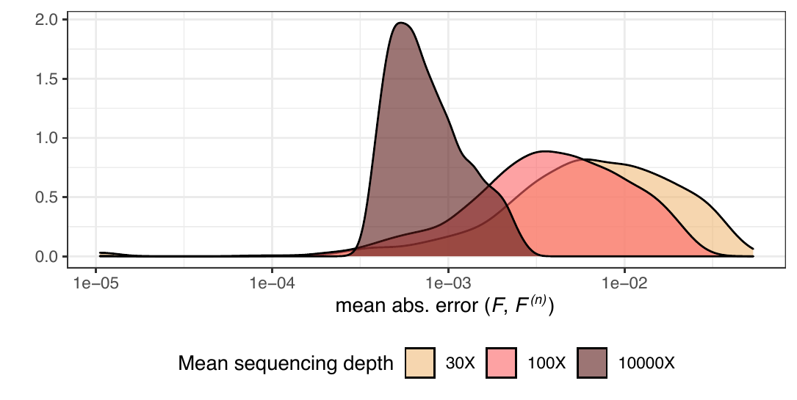
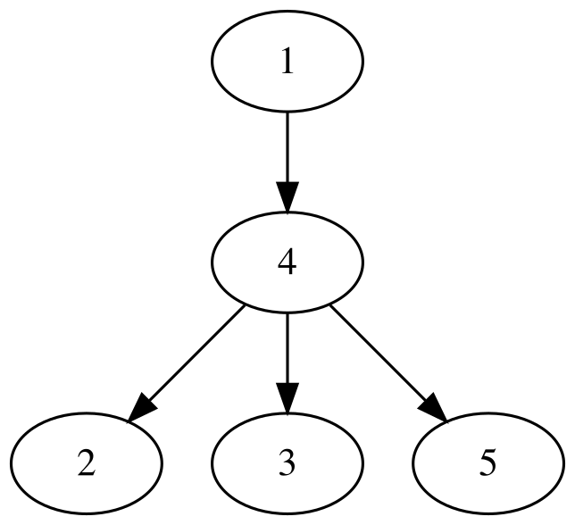
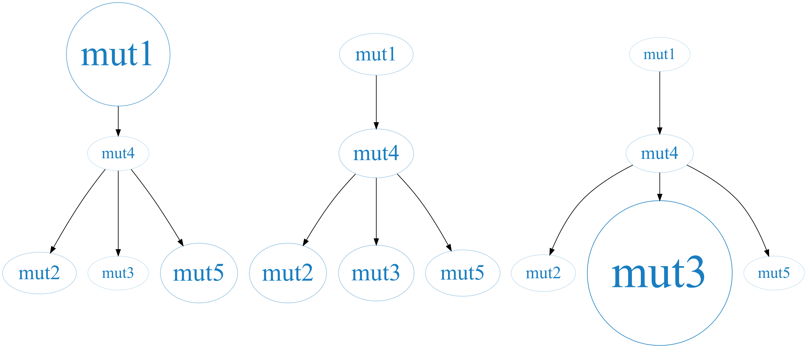
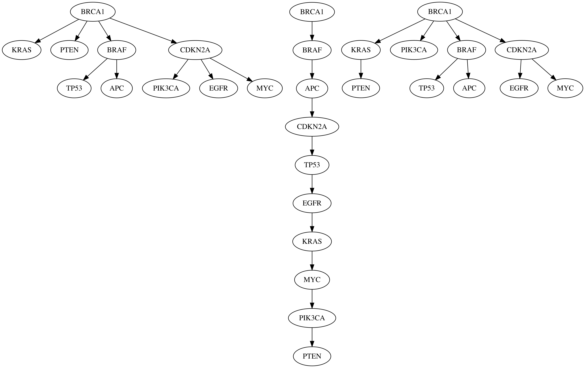
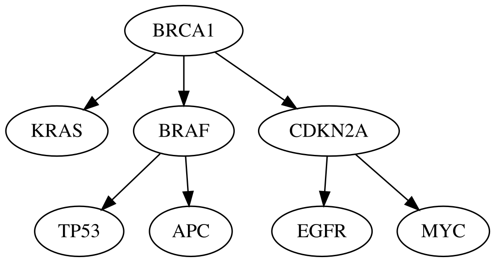
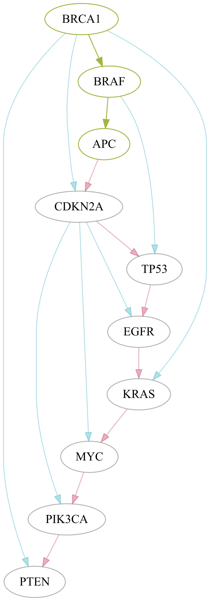

```{r setup, include=FALSE}
knitr::opts_chunk$set(fig.align = "center")
```

:::: article
## Introduction

The development of tumors is a complex and dynamic process characterized
by a succession of events where DNA mutations accumulate over time.
These mutations give rise to genetic diversity within the tumor, leading
to the emergence of distinct clonal subpopulations or, simply, clones
[@nowell1976clonal]. Each of these subpopulations exhibits unique
mutational profiles, resulting in varied phenotypic and behavioral
characteristics among the cancer cells [@1]. This phenomenon, known as
intratumoral heterogeneity (ITH), significantly hinders the design of
effective medical therapies, since different clones within the same
tumor may respond differently to treatments, ultimately leading to
therapy resistance and disease recurrence [@articleeffect]. To address
this challenge, several innovative approaches are being developed to
study the tumor composition in greater detail and to reconstruct its
evolutionary history.

One common approach to studying tumor composition and phylogeny involves
using bulk DNA sequencing data from multiple tumor biopsies. This data
is relatively straightforward to obtain and provides a broad overview of
the genetic alterations within the tumor. However, using bulk sequencing
data in the study of ITH faces the challenge that each sample
potentially contains a mixture of different clonal populations rather
than just one clone. Consequently, the observed mutation
frequencies---measured as variant allele frequencies (VAFs)---do not
directly estimate the fraction of individual clones. Instead, the VAF
values represent a composite signal: the sum of the fractions of all
clones that harbor each mutation in a given sample.

This complexity implies that reconstructing the tumor's evolutionary
history requires deconvolving these clonal admixtures within the
samples. This task is precisely the focus of the Clonal Deconvolution
and Evolution Problem (CDEP) [@trap; @ancestree], which can be
summarized as determining the tumor's clonal structure---that is,
identifying the number, proportion, and mutational composition of clones
in each sample---as well as reconstructing the clonal phylogenetic tree
that leads to the observed clonal mosaic. In this context, one of the
most prominent approaches to addressing the CDEP is the Variant Allele
Frequency Factorization Problem (VAFFP) [@ancestree].

Given $s$ tumor samples and $n$ mutations identified across these
samples, we define a matrix $\boldsymbol{F} \in [0, 1]^{s \times n}$,
where each element $f_{ij}$ represents the variant VAF value, or
equivalently, the fraction of cells that carry mutation $j$ in sample
$i$. The VAFFP seeks to decompose this input matrix $\boldsymbol{F}$
into two matrices: a matrix $\boldsymbol{B} \in \{0, 1\}^{n \times n}$
that represents the clonal phylogeny, and a matrix
$\boldsymbol{U} \in [0, 1]^{s \times n}$ that captures the clone
proportions in each tumor sample:

$$\boldsymbol{F} = \boldsymbol{U} \cdot \boldsymbol{B}
\label{eqF}   (\#eq:eqF)$$

The $\boldsymbol{B}$ matrix is a binary square matrix of size $n$, where
$b_{ij} = 1$ iff clone $i$ contains the mutation $j$ [@gusfield]. The
matrix $\boldsymbol{U}$ is an $s \times n$ matrix where $u_{ij}$ is the
fraction of clone $j$ in sample $i$.

The VAFFP operates under two key assumptions: tumors have a monoclonal
origin, meaning they arise from a single abnormal cell, and the infinite
sites assumption (ISA), which states that mutations occur at most once
and cannot disappear over time [@kimuraISA]. Under these assumptions,
the tumor's clonal structure can be modeled as a perfect phylogeny
[@gusfield]. This model imposes two key constraints: (1) if two clones
share a mutation, they must either be identical or ancestrally related,
and (2) once a clone acquires a mutation, that mutation is inherited by
all its descendants.

Over the years, numerous methods have been developed to solve the CDEP
[@bayclone; @bitphylogeny; @phylowgs; @ancestree; @citup; @lichee; @spruce; @canopy; @mipup; @fu2022reconstructing; @grigoriadis2024conipher],
with recent advancements addressing reformulations of the problem that
incorporate single-cell sequencing-derived information or variants in
metastases, and account for temporal resolution
[@ross2016onconem; @machina; @malikic2019phiscs; @satas2020scarlet; @sollier2023compass].
These methods primarily focus on reconstructing tumor phylogenies and
clonal compositions using both real and simulated data. However, the
simulation tools they employ often have limitations. For instance, while
MiPUP uses simulated data, it allows only basic parameter
adjustments---such as the number of mutations, samples, and reads---and
lacks the flexibility to fine-tune biological parameters. BitPhylogeny
creates highly realistic and complex simulated datasets representing
different modes of evolution, but these simulations are manually crafted
and limited in number, posing scalability issues.

Several tools specifically designed for simulating data for the CDEP
have also been introduced. Pearsim, written in Python, allows control
over parameters like read depth, number of subclones, samples, and
mutations [@pairtree]. OncoLib, a C++ library, facilitates the
simulation of tumor heterogeneity and the reconstruction of NGS
sequencing data of metastatic tumors, offering control over parameters
such as driver mutation probability, per-base sequencing error rate,
migration rate, and mutation rate [@Oncolib]. Machina, also in C++,
provides a framework for simulating metastatic tumors and visualizing
their phylogenetic trees and migration graphs [@machina]. HeteroGenesis,
implemented in Python, simulates heterogeneous tumors at the level of
clone genomes, but it is not specifically tailored for CDEP instances
and requires additional processing to generate suitable datasets
[@tanner2019simulation].

Visualization of tumor phylogenies is another crucial aspect of studying
tumor evolution. Tools like CALDER, Clonevol, SPRUCE, **fishplot**,
ClonArch, and
[**clevRvis**](https://www.bioconductor.org/packages/release/bioc/html/clevRvis.html)
offer solutions for visualizing clonal structures and evolutionary
trajectories
[@calder; @clonevol; @spruce; @fishplot; @clonarch; @clevrvis]. Among
these, **fishplot** and **clevRvis** are available as R packages.
Additionally, methods for generating consensus trees, such as TuELIP and
ConTreeDP, have been developed to summarize multiple phylogenetic trees
into a single representative tree [@tuelip; @contreedp].

Despite the availability of existing tools, there remains a lack of
options in the R programming environment for realistically simulating
tumor evolution in a way that is both flexible and user-friendly, while
also enabling effective visualization and comparison.

In this paper, we introduce
[**GeRnika**](https://CRAN.R-project.org/package=GeRnika), an R package
that provides a comprehensive solution for simulating, visualizing, and
comparing tumor evolution data. Although **GeRnika**'s data simulation
functionality was primarily devised to create instances for solving the
CDEP, the simulated data are not restricted to this purpose and can also
be used for exploring evolutionary dynamics in broader contexts. To
accommodate diverse research needs, we have implemented the procedures
to be highly customizable, allowing users to adjust a wide range of
parameters such as the number of clones, selective pressures, mutation
rates, and sequencing noise levels. Unlike existing tools that may offer
limited customization or are implemented in other programming languages,
**GeRnika** is fully integrated into the R environment, making it easy
to use alongside other bioinformatics packages. By combining simulation
capabilities with visualization and comparison tools in a user-friendly
interface, **GeRnika** offers an accessible and flexible option within
the R ecosystem for researchers studying tumor evolution. It is
important to note that **GeRnika** does not implement algorithms for
inferring clonal composition or reconstructing phylogenies from
experimental datasets. Instead, it provides a controlled framework for
generating, visualizing, and comparing data that can be used to
benchmark such methods.

## Simulation of tumor evolution {#sec:simulation}

The main contribution of this work is the introduction of a novel
approach for simulating biologically plausible instances of the VAFFP
that accounts for several key factors, including the number of clones,
selective pressures, and sequencing noise. In this section, we provide a
detailed description of the approach.

Broadly speaking, each problem instance consists of a matrix
$\boldsymbol{F}$ containing the VAF values of a set of mutations in a
set of samples, as described previously. This matrix is built from a
pair of matrices $\boldsymbol{B}$ and $\boldsymbol{U}$ that represent a
tumor phylogeny fulfilling the ISA and the proportions of the clones in
the samples, respectively, following Equation \@ref(eq:eqF).

In order to simulate the $\boldsymbol{B}$ and $\boldsymbol{U}$ matrices,
we have devised two models: a tumor model that simulates the
evolutionary history and current state of the tumor, and a sampling
model that represents the tumor sampling process. A third model, namely
the sequencing noise model, has been devised to optionally introduce
sequencing noise to the VAF values in the $\boldsymbol{F}$ matrix, if
noisy data is desired. The following subsections describe these models
in detail.

### Tumor model

The tumor model generates a clonal tree $T$ and an associated matrix
$\boldsymbol{B}$, together with the clone proportions $\boldsymbol{c}$
and tumor blend at the moment of sampling. Briefly, for a tumor with a
set of $n$ mutations denoted by $M$, $T$ is a rooted tree on an
$n$-sized vertex set $V_n = \{v_{1}, \dots, v_{n} \}$, where $v_{i}$
represents clone $i$ and simultaneously corresponds to the first clone
containing mutation $M_i$. This one-to-one correspondence between clones
and mutations allows us to refer to them interchangeably. The tree is
further defined by an $(n-1)$-sized edge set $E_T$, where each edge
$e_{ij} \in E_T$ represents a direct ancestral relationship from vertex
$v_{i}$ to vertex $v_{j}$.

In our tumor model, $T$ is iteratively generated with a random topology,
as follows. First, the root node of $T$, $\mathcal R(T)$, is set, and a
random mutation $M_i \in M$ is assigned to it. For each of the remaining
$M_j \in M - \{M_i\}$ mutations, a new node $v_j$ is created and the
mutation $M_j$ is assigned to this node. The node $v_j$ is then attached
as a child to one of the nodes already included in $T$. To adhere to the
ISA model, each newly added node inherits all the mutations present in
its parent node.

The attachment of nodes to the tree is not uniformly random. Instead,
the nodes in the growing tree $T$ have different probabilities of being
selected as parents for the new nodes, depending on the number of
ascendants, $\mathcal A(v_i)$, they have. Specifically,
$\forall v_j \neq \mathcal R(T)$, the parent node of $v_j$ is sampled
from a multinomial distribution where the probabilities are calculated
as:

$$\boldsymbol{p}(v_i; k) = \frac{k^{\frac{|\mathcal{A}(v_i)| + 1}{\delta}}}{\sum_{v_l \in V'} k^{\frac{|\mathcal{A}(v_l)| + 1}{\delta}}}; \quad v_i \in V'$$

Here, $\delta$ represents the depth of the growing tree, i.e., the
number of levels or layers in the tree structure. $k \in (0, +\infty)$
is the topology parameter that determines whether the topology tends to
be branched, with a decreasing probability for increasing numbers of
ascendants ($k$ $<$ 1), or linear, with an increasing probability for
increasing numbers of ascendants ($k$ $>$ 1).

Once $T$ has been generated, it is represented in the form of a
$\boldsymbol{B}$ matrix, constructed by initializing an identity matrix
$B_{n}$ and setting $b_{ji}$ to 1 for each pair of nodes $v_i$ and $v_j$
where node $v_j$ is a descendant of node $v_i$ in $T$.

After obtaining $\boldsymbol{B}$, the proportions of the clones in the
whole tumor, denoted as $\boldsymbol{c} = \{c_{1}, \dots, c_{n} \}$, are
simulated. It is important to note that these proportions are not the
same as those appearing in the $\boldsymbol{U}$ matrix, which represent
the *sampled* clone proportions and depend not only on the global clone
proportions but also on the spatial distribution of the clones and the
sampling sites.

These clone proportions $\boldsymbol{c}$ are calculated by sequentially
sampling a Dirichlet distribution at each multifurcation in $T$,
starting from the root. For instance, for a node $v_i$ with children
$\mathcal K(v_i)$ = {$v_j$, $v_k$}, we draw a sample $(x_i, x_j, x_k)$
that represents the proportions of the parent clone and its two
children, respectively, from a Dirichlet distribution
$Dir(\alpha_i, \alpha_j, \alpha_k)$. When this sampling is performed at
a node $v_i \neq \mathcal R(T)$, these proportions are scaled relative
to the original proportion of the parent clone. This ensures that the
sum rule is met, and that once all multifurcations have been visited,
the proportions of all clones in $T$ sum up to one. While several
approaches can exist to determine these proportions, this method
provides a natural approximation to the problem that can be interpreted
as the distribution of the mass or proportion of each clone between
itself and its descendants.

The parameters of the Dirichlet distribution depend on the tumor's
evolution model. In this work, we consider two fundamental cases:
positive selection-driven evolution and neutral evolution. In positive
selection-driven evolution, certain mutations confer a growth advantage,
while most mutations do not. As a result, the clones carrying these
advantageous mutations outcompete other clones and dominate the tumor.
Consequently, tumors are predominantly composed of a few dominant
clones, with the remaining clones present in too small proportions.
Under neutral evolution, instead, there is no significant number of
mutations that provide a fitness advantage, and clones accumulate solely
due to tumor progression. As a result, all clones are present in similar
proportions [@davis2017tumor].

Based on this, all the parameters for the Dirichlet distribution for
positive selection-driven evolution are set to 0.3. For neutral
evolution, the parameter corresponding to the parent node ($\alpha_{p}$)
is set to 5, and the parameters corresponding to the children node(s)
($\alpha_{c}$) are set to 10. Different alpha values are used for parent
and children nodes in neutral evolution to ensure that clones arising
late in the evolution do not end up with proportions that are too small
solely due to their position in the topology, preventing the deviation
from the expected clone proportion distribution for this type of
evolution model. These values have been chosen empirically, and their
effect is illustrated in Figure \@ref(fig:ternaryplots), which shows how 5,000 random samples from
the mentioned Dirichlet distributions (for the particular case of 3
dimensions, i.e., one parent and two children nodes) are distributed. As
observed, in the case of positive selection
($\alpha_{i} = \alpha_{j} = \alpha_{k} = 0.3$), the $(x_i, x_j, x_k)$
values are equally pushed towards the three corners of the simplex. In
other words, the samples tend to be sparse, with typically one component
having a large value and the rest close to 0. Instead, when neutral
selection is adopted ($\boldsymbol{\alpha}$ = (5, 10, 10)), the
$(x_i, x_j, x_k)$ values concentrate close to the center of the simplex,
but with a tendency to deviate towards those components with larger
$\alpha$ value. This means that samples $(x_i, x_j, x_k)$ are less
sparse in neutral evolution, with larger values for $x_2$ and $x_3$ in
this case, which represent the children nodes.

```{r ternaryplots, echo=FALSE, fig.cap="Ternary density plots of 5,000 samples drawn from two 3-dimensional Dirichlet distributions. The parameters of the Dirichlet distribution on the left are $\\alpha = (0.3, 0.3, 0.3)$ and the distribution is used to represent positive selection-driven evolution. The distribution on the right has parameters $\\alpha = (5, 10, 10)$ and is used to represent neutral evolution. Samples drawn from these distributions (or their generalization to higher spaces) are used to calculate clone proportions in each tree multifurcation."}
 
```

Taking into account that marginalizing the Dirichlet distribution
results in a Beta distribution, the proportion of the clone
$v_i \in V_n \; | \; v_i \neq \mathcal R(T)$ in the tumor, denoted as
$C_i$, follows the distribution:

$$C_i \sim C_{\mathcal P(v_i)} \cdot \Gamma_i \cdot \Gamma_i^\prime$$

where

$$\Gamma_i \sim Beta(\alpha_{c}, \alpha_{p} + \alpha_{c} \cdot (|\mathcal K(\mathcal P(v_i))| - 1))$$

and

$$\begin{aligned}
\Gamma_i^\prime = 1 \quad \text{if } |\mathcal K(v_i)| = 0 \\
\Gamma_i^\prime \sim Beta(\alpha_{p}, \alpha_{c} \cdot |\mathcal K(v_i)|)  \quad \text{if } |\mathcal K(v_i)| \neq 0
\end{aligned}$$

For the case where $v_i = \mathcal R(T)$, the root node, $C_i$, follows:

$$C_i \sim Beta(\alpha_{p}, \alpha_{c} \cdot  |\mathcal K(v_i)|)$$

Here, $\alpha_{p}$ and $\alpha_{c}$ are the parameters of the Dirichlet
distribution assigned to parent and child nodes, respectively.

To complete the tumor model, the tumor blend is simulated, which
represents the degree of physical mixing between the tumor clones. In
order to do this, we simplify the spatial distribution to one dimension
and model the tumor as a Gaussian mixture model with $n$ components,
where each component $G_i$ represents a tumor clone, and the mixture
weights are given by $\boldsymbol{c}$. The variance for all components
is set to 1, while the mean values are random variables.

Specifically, we start by selecting a random clone, and its component's
mean value is set to 0. Then, the mean values of the remaining $n - 1$
components are calculated sequentially by adding $d$ units to the mean
value of the previous component. To introduce variability in the tumor
blend, the value of $d$ is chosen from the set $\{0, 0.1, \ldots, 4\}$.
For $d$ = 0, the two clones are completely mixed, while for $d$ = 4,
they are physically far apart from each other. The choice of the upper
limit for $d$ has been determined empirically, considering that with
this value, the overlapping area between the two clones becomes
negligible.

To ensure the separation between the clones is random and that most of
the time the separation is small, we use an exponential-like
distribution with the form $Beta(\alpha=1, \beta=X)$ to sample the
values of $d$. Specifically, we set $\beta = 5$ to ensure that the
samples obtained from the mixture are not excessively sparse. We can
express this mathematically as:

$$D \sim 4 \cdot Beta(\alpha=1, \beta=5)$$

### Sampling simulation

So far, we have described how the clones of a tumor are modelled by the
tumor model. However, in real practice, there is no easy way of
observing these global properties of a tumor. Instead, we typically have
access to information provided by samples or biopsies. This means that
certain tumor characteristics, such as the real clone proportions
$\boldsymbol{c}$, cannot be directly obtained. Instead, we can only
determine the *sampled* clone proportions, which depend on the specific
sampling procedure employed. Unless there is a perfectly uniform mixture
of the clone cells, their sampled proportions will not match the global
proportions. These sampled clone proportions are, in fact, the
$\boldsymbol{u}_{i}.$ elements in the $\boldsymbol{U}$ matrix.

The sampling simulation we have devised simulates the physical sampling
of the tumor and allows us to construct the $\boldsymbol{U}$ matrix of
the problem. This procedure operates on the data simulated using the
tumor model. Specifically, it simulates a sampling procedure carried out
in a grid manner over the tumor Gaussian mixture model described in the
previous section. Let $G_1$ and $G_n$ be the components with the lowest
and largest mean values, respectively, in the Gaussian mixture model.
The 1^st^ and $m$^th^ sampling points in the grid are always set to
$\mu_{G_1} - 2.8 \cdot \sigma_{G_1}$ and
$\mu_{G_n} + 2.8 \cdot \sigma_{G_n}$, respectively, and the remaining
$m$-2 sampling points are determined by dividing the range between these
two endpoints into $m-1$ equal intervals.

The densities of the Gaussian distributions at each sampling point are
multiplied by the global proportion of the clones sampled from the
Dirichlet distributions, so that for each sampling point $i$, the
fraction of clone $j$, $p_{ij}$, is proportional to their product:

$$p_{ij} \propto c_j \cdot \phi_{ij}
\label{eq:pij_2}   (\#eq:pij-2)$$

where $c_j$ is the global proportion of clone $j$ and $\phi_{ij}$ is the
density of the Gaussian component associated with clone $j$ at sampling
point $i$.

Finally, to account for the effect of cell count in the samples, a
multinomial distribution is used to sample a given number of cells
$n_{c}$ for each tumor sample. In that distribution, the probability of
selecting each clone at sampling site $i$ is given by
$(p_{i1}, \ldots, p_{in})$. The resulting values determine the final
tumor clone composition in sample $i$, which are represented in the
matrix $\boldsymbol{U}$:

$$U_{i.} \sim \frac{M(n = n_{c}, p = (p_{i1}, \ldots, p_{in}))
}{100}$$

Note that selecting a relatively low value for $n$ in the multinomial
distribution can lead to clones with very low frequencies being modeled
as absent in the sample, with composition values equal to 0. This is
indeed more realistic than truly observing them with such low
frequencies.

### Sequencing noise simulation

Up to this point, the $\boldsymbol{B}$ and $\boldsymbol{U}$ matrices of
an instance have been simulated. In case we are simulating noise-free
data, the simulation is complete once Equation \@ref(eq:eqF) is applied
to obtain the $\boldsymbol{F}$ matrix.

As a brief reminder, each element $f_{ij}$ in $\boldsymbol{F}$ denotes
the frequency or VAF of the mutation $M_j$ in sample $i$ or, in other
words, the proportion of sequencing reads that carry the mutation $M_j$
in that particular sample. This also means that the proportion of reads
in that sample that do not observe the mutation but instead contain the
reference nucleotide is 1 - $f_{ij}$.

However, empirical factors can artificially alter the VAF value, leading
it to deviate from the true ratio between the variant and total allele
molecule counts. One of these factors is the noise introduced during the
DNA sequencing process itself, which can arise in two main ways. First,
limitations of the sequencing instrument can lead to incorrect
nucleotide readings of DNA fragments. For example, a position that
actually contains nucleotide A may be read as a T. Second, there can be
a biased number of reads produced for a particular site, which can
result from chemical reaction peculiarities or simply because not all
fragments are sequenced. These limitations can, however, be mitigated to
some extent. For instance, it has been shown that a high depth of
coverage, which refers to the average number of reads that cover each
position, can lead to more accurate VAF values [@depth_error].

In order to incorporate the effect of sequencing noise in the data
instances, we have developed a procedure to simulate sequencing noise.
This procedure introduces noise to the $\boldsymbol{F}$ matrix and
generates a noisy matrix $\boldsymbol{F^{(n)}}$, where
$\boldsymbol{F^{(n)}} \neq \boldsymbol{U} \cdot \boldsymbol{B}$. The
procedure simulates noise at the level of the sequencing reads and
recalculates the new $f^{(n)}_{ij}$ values, as follows.

The sequencing depth $r$ at the genomic position where $M_j$ occurs in
sample $i$ is distributed according to a negative binomial distribution:

$$r_{ij} \sim NB(\mu = \mu_{sd}, \alpha = 5)
\label{eq:r}   (\#eq:r)$$

where $\mu_{sd}$ represents the mean sequencing depth, which is the
average number of reads covering the genomic position of mutation $M_j$
in the sample, and $\alpha$ is the dispersion parameter, which controls
the variability of the sequencing depth around the mean and is fixed at
5.

The number of reads supporting the alternate allele $r^{a}_{ij}$ is then
modeled by a binomial distribution:

$$r^{a}_{ij} \sim B(n = r_{ij}, p = f_{ij})
\label{eq:ra}   (\#eq:ra)$$

In sequencing data, errors can occur due to limitations inherent to the
sequencing methodology. These errors vary depending on the technology
used.

To simulate the effect of these errors on the VAF values, the number of
reads $r^{a\prime}_{ij}$ that, despite originally supporting the
alternate allele, contain a different allele as a result of a sequencing
error, is modeled using a binomial distribution:

$$r^{a\prime}_{ij} \sim B(n = r^{a}_{ij}, p = \varepsilon),$$

where $\varepsilon$ represents the sequencing error rate.

We also need to consider the situation where the reads contain the
reference nucleotide but are read with the alternate allele as a result
of this error. This can be better understood with an example. Let's
imagine that at a certain genomic position, the normal cells have a T,
but in some cells, there is a mutation where the T has changed to an A.
In this case, for the normal cells, with a rate of $\varepsilon$, a
sequencing error may occur, resulting in a read of C, G, or A instead of
T, each with an equal chance. Therefore, in approximately
$\frac{\varepsilon}{3}$ of the cases, reads with the mutation of
interest will arise from normal reads:

$$r^{r\prime}_{ij} \sim B(n = r_{ij} - r^{a}_{ij}, p = \frac{\varepsilon}{3})
\label{eq:ramr}   (\#eq:ramr)$$

Thus, taking all these into consideration, the final noisy VAF values
$f^{(n)}_{ij}$ are simulated as:

$$f^{(n)}_{ij} = \frac{r^{a}_{ij} - r^{a\prime}_{ij} + r^{r\prime}_{ij}}{r_{ij}}
\label{eq:noisyVAF}   (\#eq:noisyVAF)$$

By default, the sequencing error rate $\varepsilon$ is set to 0.001,
following commonly reported values for Illumina data
[@loman2012performance].

As an illustration of the effect of the noise model, in Figure
\@ref(fig:Ferrorplot), we
have depicted the density of the mean absolute error between the
$\boldsymbol{F^{(n)}}$ matrix and its corresponding noise-free
$\boldsymbol{F}$ matrix for a collection of noisy instances. As can be
seen, as $\mu_{sd}$ increases, the error introduced to the
$\boldsymbol{F^{(n)}}$ matrix decreases. This is expected because the
$r^{a}_{ij}$ values follow a binomial distribution as described in
Equation \@ref(eq:ra), where the number of trials is determined by
$\mu_{sd}$ as shown in Equation \@ref(eq:r), and the event probability
corresponds to the $f^{(n)}_{ij}$ value. Therefore, the larger the
number of trials, the closer the noisy VAF value is to the noise-free
VAF value.

```{r Ferrorplot, echo=FALSE, fig.cap="Density of the mean absolute error in noisy $\\boldsymbol{F}$ matrices for different $\\mu_{sd}$ values that correspond to different noise levels."}

```

As a final remark, it is important to note that although our data
simulation procedure follows the ISA, the addition of noise may cause
the resulting data to break this assumption.

## The package {#sec:package}

**GeRnika** provides three main functionalities for studying tumor
evolution data: (I) simulating artificial tumor evolution, (II)
visualizing tumor phylogenies, and (III) comparing tumor phylogenies.
This section explains the functions that support these features.
Additionally, we describe extra data provided by **GeRnika** that users
can use to try the methods in the package.

### Simulation methods

To enable users to simulate tumor evolution data, **GeRnika** provides
various functions inspired by the methods described in
[2](#sec:simulation){reference-type="ref" reference="sec:simulation"}.
GeRnika offers two options: a single method for streamlined simulations
and separate methods for performing each step individually, allowing
users to customize or replace specific parts of the process.

#### create_instance {#create_instance .unnumbered}

The main function for streamlined tumor data simulation is
`create_instance`. This function provides a convenient way to perform
the entire simulation process in a single step. The following command
demonstrates how to use it to generate the artificial data:

::: center
``` r
    create_instance(n, m, k, selection, noisy = TRUE, depth = 30, seed = Sys.time())
```
:::

where each argument of the method is described as follows:

-   `n`: An integer representing the number of clones.

-   `m`: An integer representing the number of samples.

-   `k`: A numeric value that determines the linearity of the tree
    topology. Also referred to as the topology parameter. Increasing
    values of this parameter increase the linearity of the topology.
    When `k` is set to 1, all nodes have equal probabilities of being
    chosen as parents, resulting in a uniformly random topology.

-   `selection`: A character string representing the evolutionary mode
    the tumor follows. This should be either \"positive\" or
    \"neutral\".

-   `noisy`: A logical value (`TRUE` by default) indicating whether to
    add noise to the frequency matrix. If `TRUE`, noise is added to the
    frequency matrix. If `FALSE`, no noise is added.

-   `depth`: A numeric value (30 by default) representing the mean depth
    of sequencing.

-   `seed`: A numeric value (`Sys.time()` by default) used to set the
    seed for the random number generator.

The `create_instance` function returns a list containing the following
components:

-   `F_noisy`: A matrix representing the noisy frequencies of each
    mutation across samples. If the `noisy` parameter is set to `FALSE`,
    this matrix is equal to `F_true`.

-   `B`: A matrix representing the relationships between mutations and
    clones in the tumor.

-   `U`: A matrix representing the frequencies of the clones across the
    set of samples.

-   `F_true`: A matrix representing the noise-free frequencies of each
    mutation across the samples.

As explained, the `create_instance` function generates all matrices
representing frequencies, proportions, and the phylogeny of the
simulated tumor data in a single step. However, **GeRnika** also
provides individual functions for simulating each of these elements
independently, providing users with greater control over the
characteristics of the simulated tumor data.

#### create_B, create_U, create_F and add_noise {#create_b-create_u-create_f-and-add_noise .unnumbered}

These methods provide specialized functions to generate each matrix
involved in representing tumor evolution data. These functions include
the following:

-   `create_B`: This function generates a mutation matrix
    ($\boldsymbol{B}$ matrix) for a tumor phylogenetic tree with a given
    number of nodes and a value `k` determining the linearity of the
    tree topology.

-   `create_U`: This function calculates the $\boldsymbol{U}$ matrix,
    containing the frequencies of each clone in a set of samples, based
    on a $\boldsymbol{B}$ matrix, the number of samples considered, the
    number of cells in each sample, and the evolutionary mode of the
    tumor.

-   `create_F`: This function generates the $\boldsymbol{F}$ matrix,
    which contains mutation frequency values for a series of mutations
    across a collection of tumor biopsies or samples. The matrix is
    computed based on a pair of matrices, $\boldsymbol{U}$ and
    $\boldsymbol{B}$, and considers whether the mutations are
    heterozygous.

-   `add_noise`: This function introduces sequencing noise into the
    noise-free $\boldsymbol{F}$ matrix generated by the `create_F`
    method. Users can specify the mean sequencing depth and the
    overdispersion parameter, which are used to simulate sequencing
    depth based on a negative binomial distribution.

The reader is encouraged to refer to the package documentation for more
information about these functions and their parameters.

### Visualization methods

The following functions enable the visualization of tumor evolution data
by generating phylogenetic trees based on the data under analysis.

#### Phylotree S4 class {#phylotree-s4-class .unnumbered}

To simplify the execution of its functionalities, **GeRnika** utilizes
the `"Phylotree"` class. The `"Phylotree"` S4 class is a data structure
specifically designed to represent phylogenetic trees, facilitating the
use of the package's methods and ensuring their computational
efficiency. The attributes of the `"Phylotree"` class are as follows:

-   `B`: A data.frame containing the square matrix that represents the
    ancestral relationships among the clones in the phylogenetic tree
    ($\boldsymbol{B}$ matrix).

-   `clones`: A vector representing the indices of the clones in the
    $\boldsymbol{B}$ matrix.

-   `genes`: A vector indicating the index of the gene that firstly
    mutated in each clone within the $\boldsymbol{B}$ matrix.

-   `parents`: A vector indicating the parent clones for each clone in
    the phylogenetic tree.

-   `tree`: A `"Node"` class object representing the phylogenetic tree
    (this class is inherited from the
    [**data.tree**](https://CRAN.R-project.org/package=data.tree)
    package).

-   `labels`: A vector containing the gene tags associated with the
    nodes in the phylogenetic tree.

A customized `"Phylotree"` class object can be instantiated with custom
attributes using the `create_instance` method. This method takes all the
attributes according to the `"Phylotree"` class as arguments.
Alternatively, **GeRnika** provides a function that automatically
generates a `"Phylotree"` class object on the basis of a given
$\boldsymbol{B}$.

#### B_to_phylotree {#b_to_phylotree .unnumbered}

In order to instantiate an object of the "`Phylotree`" class, the
following command can be used:

``` r
    B_to_phylotree(B, labels = NA)
```

where each argument of the method is described as follows:

-   `B`: A square $\boldsymbol{B}$ matrix that represents the
    phylogenetic tree.

-   `labels`: An optional vector containing the tags of the genes in the
    phylogenetic tree. `NA` by default.

This function returns an object of the `"Phylotree"` class,
automatically generating its attributes based on `B`, which represents
the phylogenetic tree of the tumor under analysis.

Once instantiated, the phylogenetic tree in a `"Phylotree"` class object
can be visualized using the generic `plot` function, which takes the
`"Phylotree"` object as its argument. The `plot` function also includes
a `labels` argument that can be set to `TRUE` to display node labels on
the phylogenetic tree, using the gene tags stored within the
`"Phylotree"` object.

The **GeRnika** package provides the `plot_proportions` function for
visualizing phylogenetic trees, with node sizes and colors reflecting
the proportions of each clone. This function requires two inputs: a
`"Phylotree"` class object representing the phylogenetic tree and a
numeric vector or matrix specifying clone proportions. If a vector is
provided, a single tree is plotted, with the node sizes and colors
determined by the values in the vector. Instead, if a matrix is
provided, such as the $\boldsymbol{U}$ matrix that represents the
frequencies of clones across samples, the function plots one tree for
each row of the matrix. Each tree is generated based on the clone
proportions specified in the corresponding row. Additionally, users can
enable node labeling by setting the `labels` argument to `TRUE`, which
annotates the tree nodes with gene tags from the `"Phylotree"` object.

### Comparison methods

This section describes the methods included in **GeRnika** that
facilitate the comparison of tumor phylogenies.

A fundamental approach for comparing two phylogenetic trees is to
determine if their evolutionary histories are equivalent. The `equals`
function performs this comparison by accepting two `"Phylotree"` class
objects as arguments. This function returns a boolean value indicating
whether the provided phylogenetic trees are equivalent.

To analyze similarities and differences between two phylogenetic trees,
the `find_common_subtrees` function identifies and plots all maximal
common subtrees between them. In addition to visualizing these subtrees,
the function outputs the number of shared and unique edges (those
present in only one of the trees) and calculates the distance between
the trees, defined as the sum of their unique edges. This method also
includes an option to label the maximal common subtrees with gene tags
by setting `labels = TRUE`.

The `combine_trees` function generates a consensus tree by combining the
nodes and edges of two `"Phylotree"` class objects. The consensus tree
highlights the nodes and edges that form common subtrees between the
original trees, as well as the independent edges unique to each tree,
which are displayed with reduced opacity. This method also allows
labeling the nodes with gene tags by setting `labels = TRUE` and
customizing the colors of the consensus tree by passing a 3-element
hexadecimal vector to the `palette` argument.

### Exported data

**GeRnika** provides various exported data instances to help users
easily explore the package's functionalities. These are as follows:

-   `B_mats`: A list of 10 trios of $\boldsymbol{B}$ matrices. Each trio
    includes a real $\boldsymbol{B}$ matrix and two $\boldsymbol{B}$
    matrices generated using different algorithms that infer
    evolutionary relationships from a given $\boldsymbol{F}$ matrix.
    These matrices serve as illustrative examples for testing and
    exploring the package's functionalities.

-   `palettes`: A data frame containing three predefined palettes for
    use with methods in **GeRnika** that require color palettes.

## Examples

In this section we show examples of the use of the methods explained in
[3](#sec:package){reference-type="ref" reference="sec:package"}. Please
note that in the following examples, we will set the seeds of
non-deterministic methods to a predefined value to ensure
reproducibility.

### Simulating tumor evolution data

The simulation of tumor clonal data involves generating the matrices
$\boldsymbol{B}$, $\boldsymbol{U}$, $\boldsymbol{F}$, and
$\boldsymbol{F^{(n)}}$ associated with a specific instance. For example,
we can simulate a noisy instance of a tumor composed of 5
clones/mutations, which has evolved under neutral evolution with a $k$
value of 0.5, and from which 3 samples have been taken in a single line
of code, as follows:

``` r

> I <- create_instance(n = 5, m = 3, k = 0.5, selection = "neutral", seed = 1)
> I

$F_noisy
         mut1       mut2      mut3      mut4      mut5
sample1 1.000 0.09090909 0.0000000 0.2777778 0.3548387
sample2 1.000 0.20000000 0.2631579 0.8536585 0.2000000
sample3 0.975 0.03846154 1.0000000 1.0000000 0.0000000

$B
       mut1 mut2 mut3 mut4 mut5
clone1    1    0    0    0    0
clone2    1    1    0    1    0
clone3    1    0    1    1    0
clone4    1    0    0    1    0
clone5    1    0    0    1    1

$U
        clone1 clone2 clone3 clone4 clone5
sample1   0.59   0.13   0.00   0.01   0.27
sample2   0.13   0.27   0.24   0.19   0.17
sample3   0.00   0.04   0.89   0.07   0.00

$F_true
        mut1 mut2 mut3 mut4 mut5
sample1    1 0.13 0.00 0.41 0.27
sample2    1 0.27 0.24 0.87 0.17
sample3    1 0.04 0.89 1.00 0.00
```

Using this approach, the previously mentioned four matrices are
simulated. Note that the noise-free $\boldsymbol{F}$ matrix is referred
to as `F_true` in the package's code, while the noisy
$\boldsymbol{F^{(n)}}$ is denoted as `F_noisy`.

The previous method allows users to generate instances easily and
quickly. However, some users may require more precise control over the
data, which can be achieved using the `create_B`, `create_U`,
`create_F`, and `add_noise` methods. For examples on how to use these
methods, please refer to the package documentation.

### Visualizing tumor phylogenies

Once the matrices associated with our tumor instance have been
generated, we can create a `"Phylotree"` class object, as follows:

``` r
> phylotree <- B_to_phylotree(B = I$B)
> phylotree

An object of class "Phylotree"
Slot "B":
       mut1 mut2 mut3 mut4 mut5
clone1    1    0    0    0    0
clone2    1    1    0    1    0
clone3    1    0    1    1    0
clone4    1    0    0    1    0
clone5    1    0    0    1    1

Slot "clones":
mut1 mut2 mut3 mut4 mut5 
   1    2    3    4    5 

Slot "genes":
mut1 mut2 mut3 mut4 mut5 
   1    2    3    4    5 

Slot "parents":
[1] -1  4  4  1  4

Slot "tree":
  levelName
1 1        
2  °--4    
3      ¦--2
4      ¦--3
5      °--5

Slot "labels":
[1] "mut1" "mut4" "mut2" "mut3" "mut5"
```

Since no list of tags is provided to the `labels` parameter, a default
set of labels is automatically assigned to the instantiated
`"Phylotree"` class object.

Afterwards, we can visualize the tumor phylogeny associated to the
simulated $\boldsymbol{B}$ matrix by using the generic `plot` method, as
follows:

``` r
> plot(phylotree)
```

```{r phylotree, fig.cap="Phylogenetic tree associated to the generated 'Phylotree' class object.", out.width="50%", echo=FALSE}

```

The resulting plot is shown in Figure
\@ref(fig:phylotree).
Instead of clone numbers, the user can utilize the predefined tags in
the `"Phylotree"` class object to label the nodes in the tree by setting
the `labels = TRUE` parameter in the `plot` function.

When plotting a `"Phylotree"` class object, its nodes can be resized
according to the proportions of the clones that compose the tumor
samples. To achieve this, we can use the $\boldsymbol{U}$ matrix from
the previously generated instance to determine the proportions of the
clones, as shown below:

``` r
> plot_proportions(phylotree, I$U, labels = TRUE)
```

```{r proportions, fig.cap="Phylogenetic trees associated to the generated 'Phylotree' class object, using the proportions associated to the previously generated $\\boldsymbol{U}$ matrix.", out.width="100%", echo=FALSE}

```

The resulting plot is shown in Figure
\@ref(fig:proportions).
This method plots the proportions of the $\boldsymbol{U}$ matrix, where
each tree represents a sample from the $\boldsymbol{U}$ matrix,
illustrating the proportion of each clone within that specific sample.
In this case, we have set the `labels` parameter to `TRUE` to label the
nodes in the tree using the predefined tags \"mut1\", \"mut4\",
\"mut2\", \"mut3\", and \"mut5\".

### Comparing tumor phylogenies

Now, we present examples showing the use of **GeRnika**'s
functionalities for comparing tumor phylogenies. For this purpose, we
will use the `B_mats` object included in the **GeRnika** package, which
contains 10 $\boldsymbol{B}$ matrix trios. Specifically, we will use the
first trio of matrices, and set a predefined set of tags for the clones
in the trees:

``` r
> B_mats <- GeRnika::B_mats

> B_real <- B_mats[[1]]$B_real
> B_alg1 <- B_mats[[1]]$B_alg1
> B_alg2 <- B_mats[[1]]$B_alg2

> tags <- c("TP53", "KRAS", "PIK3CA", "APC", "EGFR", "BRCA1", "PTEN", "BRAF", 
            "MYC", "CDKN2A")

> phylotree_real <- B_to_phylotree(B = B_real, labels = tags)
> phylotree_alg2 <- B_to_phylotree(B = B_alg2, labels = tags)
> phylotree_alg1 <- B_to_phylotree(B = B_alg1, labels = tags)

> plot(phylotree_real, labels=TRUE)
> plot(phylotree_alg1, labels=TRUE)
> plot(phylotree_alg2, labels=TRUE)
```

The plots of the three instantiated `Phylotree` class objects are
depicted in Figure \@ref(fig:phylocomparison).


```{r phylocomparison, fig.cap="`phylotree_real`, `phylotree_alg1` and `phylotree_alg2`, from the left to the right.", out.width="100%", echo=FALSE}

```


We can check if the phylogenies of two tumors are equivalent using the
`equals` method:

``` r
> equals(phylotree_1 = phylotree_real, phylotree_2 = phylotree_alg1)
[1] FALSE

> equals(phylotree_1 = phylotree_real, phylotree_2 = phylotree_real)
[1] TRUE
```

In this case, `phylotree_real` and `phylotree_alg1` are not identical,
as some edges present in `phylotree_real` are absent in
`phylotree_alg1`, and vice versa. However, a phylogenetic tree will
always be identical to itself, as shown when comparing `phylotree_real`
to itself.

To find the maximal common subtrees between two phylogenetic trees, we
do it using the following command:

``` r
> find_common_subtrees(phylotree_1 = phylotree_real, phylotree_2 = phylotree_alg2, 
                       labels = TRUE)

Independent edges of tree1: 2

Independent edges of tree2: 2

Common edges: 7

Distance: 4
```

```{r commonsubtrees, fig.cap="Maximal common subtrees between `phylotree_real` and `phylotree_alg2` using predefined tags. In this case, there exists a single common subtree, but there may exist more in other cases.", out.width="100%", echo=FALSE}

```

```{r consensus, fig.cap="Consensus tree between `phylotree_real` and `phylotree_alg1` using the *Lancet* palette and predefined tags.", out.width="40%", echo=FALSE}

```


The maximal common subtrees (in this case, one subtree) between
`phylotree_real` and\
`phylotree_alg2` are shown in Figure
\@ref(fig:commonsubtrees). Note that the clones in the maximal
common subtree are represented by the predefined tags in the `Phylotree`
class objects as we have set `labels = TRUE`. Additionally, this method
prints the number of common and independent edges of the trees, along
with the distance between them.

Finally, we generate the consensus tree between two phylogenetic trees
using one of the custom palettes offered by **GeRnika**, specifically
the *Lancet* palette, and the predefined tags for the clones as follows:

``` r
> palette <- GeRnika::palettes$Lancet

> consensus_real_alg1 <- combine_trees(phylotree_1 = phylotree_real, 
                                      phylotree_2 = phylotree_alg1,
                                      labels = TRUE, 
                                      palette = palette)

> DiagrammeR::render_graph(consensus_real_alg1)
```

The consensus tree between `phylotree_real` and `phylotree_alg1` is
depicted in Figure \@ref(fig:consensus). Here, the nodes and the edges that compose
the common subtrees between the original trees are green. In addition,
pink edges denote the independent edges of the tree passed as the first
parameter of the method, while blue edges represent the independent
edges of the second tree. Note that the independent edges of both trees
are presented with translucent colors.

## Conclusions

**GeRnika** is a comprehensive R package designed to address a critical
gap in the tools available for studying tumor evolution within the R
environment. To this end, it provides researchers with an integrated
suite for simulating, visualizing, and comparing tumor phylogenies.
Unlike many existing tools, **GeRnika** is fully implemented in R,
making it particularly accessible for the bioinformatics community,
which widely relies on R for data analysis and visualization.

One of **GeRnika**'s key contributions is providing tools to generate
biologically plausible datasets for studying intratumoral heterogeneity
and clonal dynamics. With varied, easily customizable
parameters---controlling features such as clonal tree topology,
selective pressures, and sequencing noise---**GeRnika** enables
exploration of a wide range of evolutionary patterns and complexities
that provide a valuable resource for testing new methods and hypotheses
in tumor heterogeneity research.

Beyond its core simulation features, **GeRnika** includes tools for
visualizing and comparing tumor phylogenies, offering a unified solution
that eliminates the need for multiple packages or complex data
processing workflows. Future work will focus on enhancing **GeRnika**'s
compatibility with other R packages related to tumor evolution, allowing
for easier integration with existing resources.

Overall, **GeRnika** provides an accessible, user-friendly tool that
supports research into intratumoral heterogeneity, with the potential to
substantially advance tumor phylogeny research. While it does not
perform clonal deconvolution or phylogeny inference from real sequencing
data, **GeRnika** serves as a valuable platform for simulation,
visualization, and benchmarking, supporting the development and
evaluation of such algorithms.

## R software

The R package [**GeRnika**](https://CRAN.R-project.org/package=GeRnika)
is now available on CRAN.
::::
