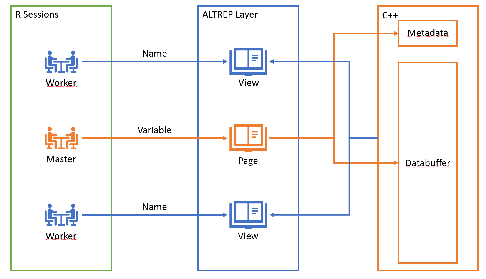
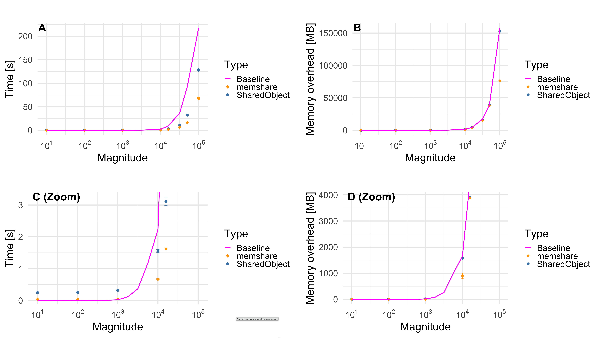
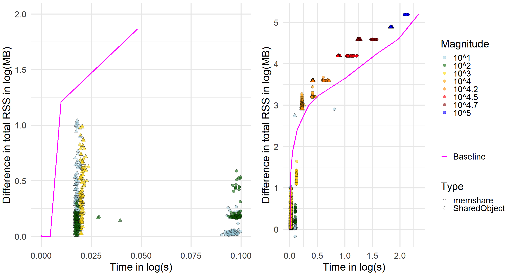
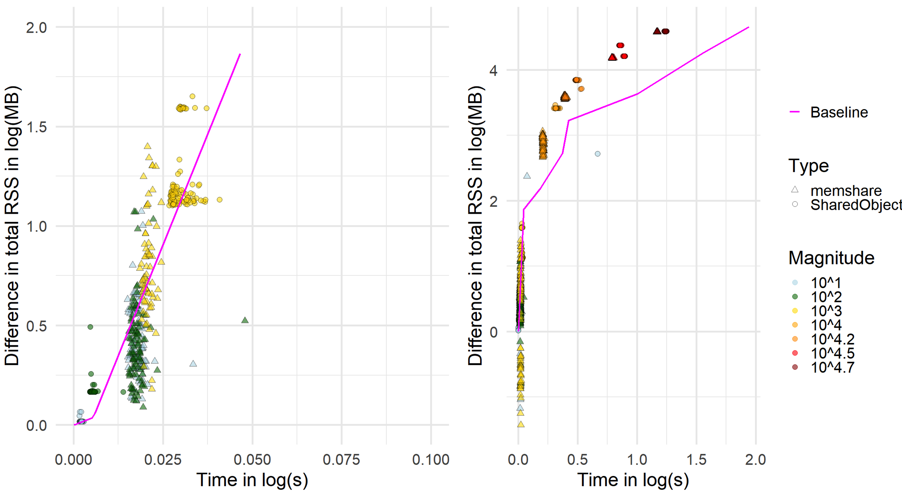
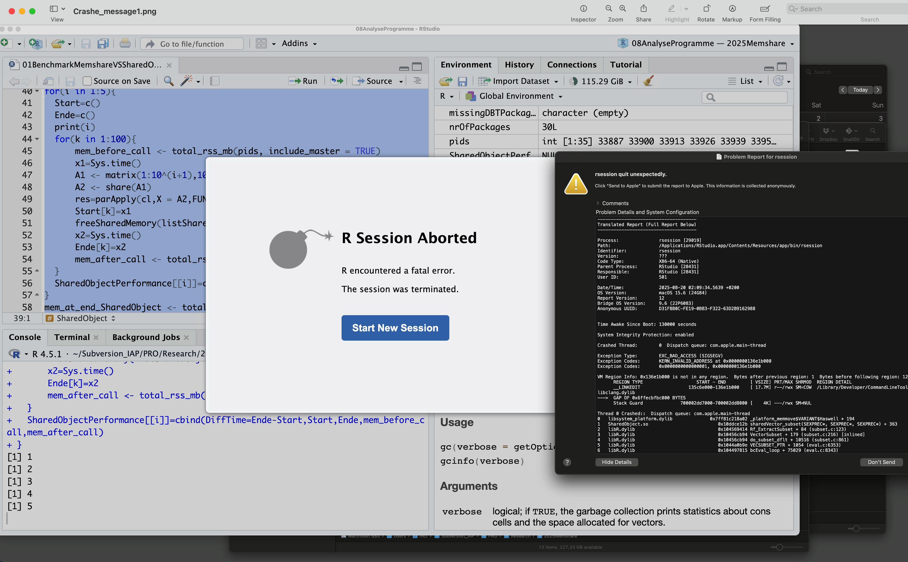

```{r setup, include=FALSE}
knitr::opts_chunk$set(echo = FALSE, warning = FALSE, message = FALSE)
library(ggplot2)
library(kableExtra)

dir <- getwd()
```

# Introduction

Parallel computing in R is usually realized through PSOCK or FORK clusters, where multiple R processes work in parallel [@Rparallel2025], [@doparallel2025]. A practical issue arises immediately: each worker process receives its own private copy of the data. If a matrix consumes several gigabytes in memory, then spawning ten workers results in ten redundant copies, potentially exhausting system memory and severely reducing performance due to paging. This overhead becomes especially prohibitive in genomics or imaging, where matrices of tens of gigabytes are commonplace. Copying also incurs serialization and deserialization costs when transmitting objects to workers, delaying the onset of actual computation.

Shared memory frameworks address this issue by allowing workers to view the same physical memory without duplication. Instead of copying the whole object, only small handles or identifiers are communicated, while the underlying data is stored once in RAM. This enables efficient multicore computation on large datasets that would otherwise be infeasible.

ALTREP (short for ALTernative REPresentations) is a framework in R that allows vectors or matrices to be backed by alternative storage while still behaving like ordinary R objects. Method hooks determine how to access length, data pointers, and duplication, so that package developers can integrate external memory management, including shared memory segments, without changing downstream R code.

A common alternative to in-RAM shared memory is file-backed memory mapping, where binary files on disk are mapped into R and the operating system pages data into memory on demand [@kane2013scalable]. Packages such as `bigmemory` and `bigstatsr` create matrices stored on disk but accessible through R as if they were in memory [@prive2018efficient]. This enables analyses on datasets larger than RAM by working column-wise with a small memory footprint. However, because file-backed matrices rely on disk I/O, they are slower than in-RAM shared memory when a single copy of the data would fit into physical memory, but multiple per-worker copies would not. Therefore, this work focuses on ALTREP-based, in-RAM techniques for data that fit into memory once but not many times.
Our contributions are:

1. A fully independent and user-friendly implementation based on the ALTREP framework.

2. A comparison of `memshare` vs `SharedObject`: data model, safety, copy-on-write, and developer surface showing a runtime up to twice as fast for `memshare` on parallel column operations without extra RSS.

3. A practical template for MI-PDE feature selection on RNA-seq.

# Background

A more detailed description of ALTREP internals and our shared-memory use case is provided in Appendix~B; here we summarize only the concepts needed for the comparison of `memshare` to existing approaches.

## `SharedObject` baseline
Having outlined the general ALTREP and shared-memory mechanism, we now briefly review the `SharedObject` package, which serves as our main existing ALTREP-based shared-memory baseline.

`SharedObject` allocates shared segments and wraps them as ALTREP [@sharedobject2025]. It exposes properties like `copyOnWrite`, `sharedSubset`, and `sharedCopy`; it supports atomic types and (with caveats) character vectors. Developers can map or unmap shared regions and query whether an object is shared. `SharedObject` was among the first implementations that showed how ALTREP can enable multicore parallelism by avoiding data duplication.
`SharedObject` provides `share()` to wrap an R object as a shared ALTREP, with tunables:

- `copyOnWrite` (default TRUE): duplicates on write; setting FALSE enables in‑place edits but is not fully supported and can lead to surprising behavior (e.g., unary minus mutating the source).

- `sharedSubset`: whether slices are also shared; can incur extra duplication in some IDEs; often left `FALSE`.

- `sharedCopy`: whether duplication of a shared object remains shared.
It supports raw, logical, integer, double, or complex and, with restrictions, character (recommended read‑only; new, previously unseen strings cannot be assigned). Developers can also directly allocate, map, unmap, and free shared regions and query `is.shared` or `is.altrep`.

## R’s threading model
`R`’s C API is single‑threaded; package code must not call R from secondary threads. Process‑level parallelism (clusters) remains the primary avenue. Consequently, shared‑memory frameworks must ensure that mutation is either controlled in the main thread or performed at the raw buffer level without touching R internals.

## PDE-based Mutual Information
For feature selection with a discrete response $Y$ and a continuous feature $X$, mutual information can be expressed as: 
\begin{equation} 
I(X;Y) = \sum_{y} p(y) KL(p(x|y) || p(x))
\end{equation}

This formulation requires only univariate densities $p(x)$ and $p(x|y)$ per class. 
This lends itself to Pareto Density Estimation (PDE), a density estimator based on hyperspheres with the Pareto radius chosen by an information-optimal criterion. In PDE, the idea is to select a subset S of the data with relative size $p = |S|/|D|$. The information content is $I(p) = -p \ln(p)$. [@ultsch2005pareto] showed that the optimal set size corresponds to about 20.1%, retrieving roughly 88% of the maximum possible information. The unrealized potential (URP) quantifies deviation from the optimal set size and is minimized when $p\approx 20\%$. For univariate density estimation this yields the Pareto radius $R$, which can be approximated by the 18$\%$ quantile distance in one dimension. PDE thus adapts the neighborhood size following the Pareto rule (80–20 rule) to maximize information content. Empirical studies report that PDE can outperform standard density estimators under default settings [@thrun2020analyzing]. 

With respect to the categorical variable, no density estimation is needed, as the most accurate density estimate in this case is simply the relative label count, $p(y) = \frac{\#\{\omega\in\Omega ~|~ Y(\omega) = y\}}{\#\Omega}$. Here $\Omega$ is the set of cases, $Y$ is the categorical random variable, and $y$ runs over the range of $Y$, $Y(\Omega)$.

# Methods
In idiomatic use, `memshare` coordinates PSOCK clusters (separate processes) that attach to one shared segment. Within workers the relevant shared segments are retrieved and the task is executed on them. The key win is replacing per‑worker duplication of the large matrix with a far cheaper retrieval of a handle to the shared memory segment and subsequent wrapping in an ALTREP instead.

## The `memshare` API

Shared memory pages in `memshare` are handled by unique string identifiers on the OS side. These identifiers can be requested and retrieved via `C`/`C++`. To prevent two master `R` sessions from accidentally accessing each other’s memory space because duplicate allocations can lead to undefined behavior at the OS level, users may define one or more **namespaces** in which the current session operates.
The `memshare` API closely mirrors `C`’s memory ownership model but applies it to `R` sessions. A master (primary) session owns the memory, while worker (secondary) sessions can access it.

## Shared memory semantics

A crucial aspect of `memshare`’s design is how shared memory is managed and exposed through `R`. Three definitions clarify the terminology:

A **namespace** refers to a character string that defines the identifier of the shared memory context. It allows the initialization, retrieval, and release of shared variables under a common label, ensuring that multiple sessions or clusters can coordinate access to the same objects. While this does not provide absolute protection, it makes it the user’s responsibility to avoid assigning the same namespace to multiple master sessions.

**Pages** are variables owned by the current compilation unit of the code, such as the `R` session or terminal that loaded the DLL. Pages are realized as shared memory objects: on Windows via `MapViewOfFile`, and on Unix systems via `shm` in combination with `mmap`.

**Views** are references to variables owned by another or the same compilation unit. Views are always ALTREP wrappers, providing pointers to the shared memory chunk so that R can interact with them as if they were ordinary vectors or matrices.

Together, these concepts enforce a lifecycle: pages represent ownership of memory segments, views represent references to them, and namespaces serve as the coordination mechanism. The combination guarantees both memory efficiency and safety when performing multicore computations across `R` processes.

If the user detaches the `memshare` package, all handles are destroyed. This means that all variables of all namespaces are cleared, provided there is no other `R` thread still using them. In other words, unloading the package cleans up shared memory regions and ensures that no dangling references remain. Other threads still holding a handle to the memory will prevent this cleanup, as it would invalidate the working memory of those threads. The shared memory is then cleared whenever all handles are released.

### Master session

A master session takes ownership of a memory page using:

- `registerVariables(namespace, variableList)`

where `variableList` is a named list of supported types. These are double matrices, double vectors, or lists of these. The names define the memory pages ID through which they can be accessed, while the values of the actual variables define the size and content of the memory page.  

To deallocate memory pages, the master session can call:

- `releaseVariables(namespace, variableNames)`

where `variableNames` is a character vector containing the names of previously shared variables.

`memshare` also allows for releasing all the memory allocated for a given namespace by a memory context, i.e., a parallel cluster with a master session, via the

- `memshare_gc(namespace, cluster)`

function. This first removes every view handle in the context and then releases all pages.

**Note.** Memory pages are not permanently deallocated if another session still holds a view of them. This ensures stability: allowing workers to continue with valid but outdated memory is safer than letting them access invalidated memory. However, releasing variables still in use is always a user error and must be avoided.

### Worker session

Once the master session has shared variables, worker sessions can retrieve them via:

- `retrieveViews(namespace, variableNames)`

This returns a named list of `R` objects. These objects are raw ALTREP objects indistinguishable from the originals (`is.matrix`, `is.numeric`, etc.), and all behave the same.  

When operating on these objects, workers interact directly with the underlying `C` buffer, backed by `mmap` (Unix) or `MapViewOfFile` (Windows). Changes to such objects modify the shared memory for all sessions. In this framework, however, modification is secondary—the main goal is to transfer data from the master to worker sessions.  

For metadata access without retrieving views, workers can call:

- `retrieveMetadata(namespace, variableName)`

which provides information for a single variable.  

After processing, workers must return their views to allow memory release by calling:

- `releaseViews(namespace, variableNames)`

The overall high-level concept is summarized in Figure \@ref(fig:figurememshare).

```{r figurememshare, out.width = "100%", fig.cap = "A schematic about where the memory is located and how different sessions access it."}

```

### Diagnostic tools

To verify correct memory management, two diagnostic functions are available:  

- `pageList()`: lists all variables owned by the current session.  
- `viewList()`: lists all views (handles) currently held by the session.  

The former is stricter, since it identifies ownership, whereas the latter only tracks held views.

### User-friendly wrapper functions for `apply` and `lapply`

Since memory ownership and address sharing are low-level concepts, `memshare` provides wrapper functions that mimic `parallel::parApply` and `parallel::parLapply`.  

- `memApply(X, MARGIN, FUN, NAMESPACE, CLUSTER, VARS, MAX.CORES)`  
  Mimics `parallel::parApply`.  
  - `X`: a double matrix.  
  - `MARGIN`: direction (`1 = row-wise`, `2 = column-wise`).  
  - `FUN`: function applied to rows/columns.  
  - `CLUSTER`: a prepared parallel cluster (variables exported via `parallel::clusterExport`).  
  - `VARS`: additional shared variables (names must match `FUN` arguments).  
  - `MAX.CORES`: only relevant if `CLUSTER` is uninitialized.  

`memApply` automatically manages sharing and cleanup of `X` and `VARS`, ensuring no residual `C`/`C++` buffers remain. Both `X` and `VARS` can also refer to previously allocated shared variables, though in that case the user must manage their lifetime.  

- `memLapply(X, FUN, NAMESPACE, CLUSTER, VARS, MAX.CORES)`  
  Equivalent to `parallel::parLapply`, but within the `memshare` framework.  
  - `X`: a list of double matrices or vectors.  
  - Other arguments behave the same way as in `memApply`.

## Examples of Use
We provide two top-level examples for the use of the `memshare` package: one with `memLapply` and one with `memApply`.

The first example computes the correlation between each column of a matrix and a reference vector using shared memory and `memApply`. The matrix can be provided directly and will be registered automatically, or by name if already registered.

```{r apply, echo = TRUE}
library(memshare)
set.seed(1)
n <- 10000
p <- 2000
# Numeric double matrix (required): n rows (cases) x d columns (features)
X <- matrix(rnorm(n * p), n, p)
# Reference vector to correlate with each column
y <- rnorm(n)
f <- function(v, y) cor(v, y)

ns <- "my_namespace"
res <- memshare::memApply(
X = X, MARGIN = 2,
FUN = f,
NAMESPACE = ns,
VARS = list(y = y),
MAX.CORES = NULL # defaults to detectCores() - 1
)
```

`memApply` parallelizes a row- or column-wise map over a matrix that lives once in shared memory. If `X` is passed as an ordinary `R` matrix, it is registered under a generated name in the namespace `ns`. Additional variables (here `y`) can be provided as a named list; these are registered and retrieved as ALTREP views on the workers. A cluster is created automatically if none is provided. Each worker obtains a cached view of the matrix (and any shared variables), extracts the i-th row or column as a vector `v` according to MARGIN, calls `FUN(v,...)`, and returns the result. Views are released after the computation, and any objects registered by this call are freed. Because workers operate on shared views rather than copies, the total resident memory remains close to a single in-RAM copy of `X`, while runtime scales with the available cores.

As a second example, consider a case where a list of 1000 random matrices is multiplied by a random vector. This task is parallelizable at the element level and demonstrates the use of `memshare::memLapply`, which applies a function across list elements in a shared memory context: 

```{r lapply, echo = TRUE}
  library(memshare)
  list_length <- 1000
  matrix_dim <- 100

  # Create the list of random matrices
  l <- lapply(
      1:list_length,
      function(i) matrix(rnorm(matrix_dim * matrix_dim),
      nrow = matrix_dim, ncol = matrix_dim)
      )

  y <- rnorm(matrix_dim)
  namespace <- "my_namespace"

  res <- memLapply(l, function(el, y) {
    el %*% y
  }, NAMESPACE = namespace, VARS = list(y=y),
  MAX.CORES = 1) #MAX.CORES=1 for simplicity
```

`memLapply()` provides a parallel version of `lapply()` where the list elements and optional auxiliary variables are stored in shared memory. If the input X is an ordinary `R` list, it is first registered in a shared memory namespace. Additional variables can be supplied either as names of existing shared objects or as a named list to be registered. A parallel cluster is created automatically if none is provided, and each worker is initialized with the `memshare` environment.

For each index of the list, the worker retrieves an ALTREP view of the corresponding element (and of any shared variables), applies the user-defined function `FUN` to these objects, and then releases the views to avoid memory leaks. The function enforces that the first argument of `FUN` corresponds to the list element and that the names of shared variables match exactly between the namespace and the function signature. Results are collected with `parLapply`, yielding an ordinary `R` list of the same length as the input.

Because only lightweight references to the shared objects are passed to the workers, no duplication of large data occurs, making the approach memory-efficient. Finally, `memLapply()` includes cleanup routines to release temporary registrations, stop the cluster if it was created internally, and free shared memory, ensuring safe reuse in subsequent computations.

## Benchmark design

We compare `memshare` and `SharedObject` on a column-wise apply task across square matrices of sizes \(10^i \times 10^i\) for \(i = 1,\ldots,5\). We use a PSOCK cluster with 32 cores on an iMac Pro, 256 GB DDR4, 2.3 GHz 18-core Intel Xeon W on macOS Sequoia 16.6.1 (24G90) with R 4.5.1 `x86_64-apple-darwin20`. For each size, we run 100 repetitions and recorded wall-clock times and resident set size (RSS) across all worker PIDs plus the master. The RSS is summed via `ps()` and our helper `total_rss_mb()`. 
We define the memory overhead as the difference in total RSS before and after the call, i.e., we measure the additional memory required by the computation beyond the base process footprint.

For `SharedObject` we create `A2`, `share(A1)`, and `parApply()`; for `memshare` we call `memApply` directly on `A1` with a namespace, so that only ALTREP views are created on the workers. A serial baseline uses `apply()`, and an additional baseline uses `parApply()` without shared memory. A minimally edited version of the full script (setup, PID collection, loops, and data saving) is provided in Appendix~A to ensure reproducibility.

As part of our safety and lifecycle checks, we ensure that views, which keep shared segments alive, are always released in the workers before returning control. Once all work is complete, the corresponding variables are then released in the master. To maintain fairness, we avoid creating incidental copies, such as those introduced by coercions, remove variables with `rm()`, and use R's garbage collection `gc()` after each call.

## RNA-seq dataset via FireBrowse 

FireBrowse [@firebrowse2025] delivers raw counts of gene expression indexed by NCBI identifiers. For each gene identifier \(i\) (from Ensembl or NCBI), we obtain a raw count \(r_i\) that quantifies the observed read abundance. These raw counts represent the number of reads mapped to each gene, without length normalization. To convert raw counts into TPM (transcripts per million) [@li2010rsem], we require gene or transcript lengths \(l_i\). For each gene \(i\), we compute:

\begin{equation} 
\hat{r}_i=\frac{r_i}{l_i}
\end{equation} 

The total sum $R = \sum_i \hat{r}_i$ across all genes is then used to scale values as:

\begin{equation} 
TPM_i=\frac{\hat{r}_i}{R} \times 10^6
\end{equation} 
This transformation allows comparison of expression levels across genes and samples by correcting for gene length and sequencing depth [@li2010rsem]. After transformation, our dataset consists of \(d = 19,637\) gene expressions across \(N = 10,446\) cases spanning 32 diagnoses. It can be found under [@thrun2025genexpressions].

# Results

In the first subsection, the efficiency of `memshare` is compared to `SharedObject`, and in the second subsection the application is presented.

## Performance and Memory

In Figure \@ref(fig:figure1), the results for square matrices of increasing magnitudes are shown as summary plots with variability bars. In these error-bar-style plots the bars indicate median ± AMAD. 
The bottom subfigures (C–D) provide a zoomed view of the first four matrix sizes, while the top subfigures (A–B) display all five magnitudes from \(10^1\) to \(10^5\). 
The x-axis represents the magnitude of the matrix size, and the y-axis shows either runtime in seconds (subfigures A and C) or memory overhead in megabytes (subfigures B and D). Memory overhead is measured as the difference in total RSS. For each magnitude, 100 trials were conducted. The magenta line indicates the performance of the single-threaded R baseline.

Table~\@ref(tab:median-res-tab-static) reports the median runtime and memory overhead, while variability is visualized in Figure~\@ref(fig:figure1-detail) via the scatter of 100 runs and summarized numerically by the robust AMAD dispersion statistic in Table~\@ref(tab:amad-res-tab-static).

`memshare` (orange diamonds) consistently outperforms `SharedObject` (blue circles) in Figure \@ref(fig:figure1). In the scatter plot of the 100 trials in Figure~\@ref(fig:figure1-detail), it is evident that for the first three magnitudes both packages use less memory than the baseline. At \(10^4\), average memory usage is comparable to the baseline, while at \(10^5\), `memshare` slightly exceeds it. `SharedObject`, however, could only be executed at this magnitude from the terminal, but not within RStudio (see Appendix~B).

Considering relative differences [@Ultsch2008], `memshare` achieves computation times that are 90--170\% faster than `SharedObject`. For matrices of size \(10^2\) and larger, memory consumption is reduced by 132--153\% compared to `SharedObject`.

```{r figure1, out.width = "100%", fig.cap = "Matrix size depicted as magnitude vs median runtime (left) and vs memory overhead (MB) during the run relative to idle (right) for `memshare`, `SharedObject` as error-bar style plots with intevals given by the median ± AMAD across 100 runs. In addition, the serial baseline is shown as a line in magenta. The top subfigures present the full range of matrix sizes, and the bottom subfigures zoom in."}

```

Table: (\#tab:median-res-tab-static) The benchmark compares four types: `memshare`, `SharedObject`, a single-threaded baseline, and a parallel baseline. For `memshare` and `SharedObject`, the reported values are the medians over 100 iterations, while the baselines are the result from either a single-threaded R or a simple `parApply` run using one iteration. Magnitude refers to the matrix size. Entries are given as *Time Consumed (Memory Overhead)*, where time is measured in seconds and memory in megabytes (MB); the memory after call is mentioned in Appendix C.

| Type / Magnitude | Baseline                 | Baseline parApply          | SharedObject               | memshare                  |
|-----------------------------|--------------------------|----------------------------|----------------------------|---------------------------|
| 1         | 0.0003 (0.0234)          | 0.0049 (0.9023)            | 0.2492 (0.0801)            | 0.0416 (1.1426)           |
| 2         | 0.0008 (0.1461)          | 0.0034 (0.1461)            | 0.2531 (0.5117)            | 0.0419 (0.3594)           |
| 3         | 0.0231 (15.2656)         | 0.0356 (7.6406)            | 0.3238 (11.6387)           | 0.0481 (1.4688)           |
| 4         | 2.2322 (1664.9727)       | 3.5015 (2627.1133)         | 1.5526 (1570.0566)         | 0.6655 (895.4473)         |
| 4.2       | 9.2883 (4490.4648)       | 12.9872 (6040.4023)        | 3.1147 (3901.5137)         | 1.6223 (3881.7441)        |
| 4.5       | 36.3783 (17206.4688)     | 53.6183 (24983.7852)       | 10.3513 (15391.0020)       | 6.6583 (15285.4258)       |
| 4.7       | 92.0136 (39355.5703)     | 130.6937 (62936.4766)      | 32.3116 (38533.7266)       | 16.3157 (38389.7305)      |
| 5         | 217.4490 (157812.9492)   | --                         | 128.0942 (152967.0273)     | 67.0000 (76311.7402)      |

Table: (\#tab:amad-res-tab-static) AMAD for the benchmark of `SharedObject` vs `memshare`.

| Magnitude | Type | Time Consumed (seconds) | Memory Overhead (MB) | Memory after Call |
|--------------|--------------|-----------|-------------------------|----------------------|
| 1  | SharedObject | 0.01241                 | 0.06400              | 7.47613           |
| 2  | SharedObject | 0.00549                 | 0.05270              | 12.85171          |
| 3  | SharedObject | 0.00743                 | 0.23716              | 109.60844         |
| 4  | SharedObject | 0.05179                 | 9.98323              | 364.98253         |
| 4.2  | SharedObject | 0.13739                 | 9.28681              | 533.72239         |
| 4.5  | SharedObject | 0.63438                 | 14.73392             | 1619.81984        |
| 4.7  | SharedObject | 2.09502                 | 15.81807             | 823.25853         |
| 6  | SharedObject | 4.01802                 | 22.88011             | 555.74045         |
| 1  | memshare     | 0.00198                 | 1.41166              | 51.33531          |
| 2 | memshare     | 0.00251                 | 0.27480              | 17.12808          |
| 3 | memshare     | 0.00228                 | 1.91232              | 78.65743          |
| 4 | memshare     | 0.02038                 | 110.18064            | 5956.56036        |
| 4.2 | memshare     | 0.03206                 | 39.21014             | 2346.06943        |
| 4.5 | memshare     | 0.24571                 | 36.97784             | 1086.58683        |
| 4.7 | memshare     | 0.53134                 | 89.44624             | 4081.05399        |
| 5 | memshare     | 2.48280                 | 31.98623             | 2413.87405        |

## Application to Feature Selection by Mutual Information using Pareto Density Estimation

The computation of mutual information produced values ranging from 0 to 0.54 (Figure \@ref(fig:figure2) ). The QQ-plot shows clear deviation from a straight line, indicating that the distribution is not Gaussian. Both the histogram and the PDE plot provide consistent estimates of the probability density, revealing a bimodal structure. The boxplot further highlights the presence of outliers with values above 0.4.

The analysis required about two hours of computation time and approximately 47 GB of RAM, feasible only through memory sharing. In practice, mutual information values can guide feature selection, either by applying a hard threshold or by using a soft approach via a mixture model, depending on the requirements of the subsequent machine learning task.

```{r figure2,out.width = "100%", fig.cap = "The distribution of mutual information for 19637 gene expressions as a histogram, Pareto Density Estimation (PDE), QQ-plot against normal distribution and boxplot. There are no missing values (NaN).", fig.path='figures/'}
Header <- readLines(file.path(dir,"data/MI_values.lrn"), n = 2)[2]

mi_values <- read.table(file = file.path(dir,"data/MI_values.lrn"),header = TRUE,sep = "\t",skip = 5)

DataVisualizations::InspectVariable(mi_values$MI,Name = "Distribution of Mutual Information")
#length(mi_values$MI)
#Header
``` 

\newpage

# Discussion

On all major platforms, PSOCK clusters execute each worker in a separate R process. Consequently, a call to `parApply(cl, X, MARGIN, FUN, …)` requires R to serialize the matrix to transmit it to each worker, and deserialize it into a full in-memory copy in every process.
As shown in Table \@ref(tab:median-res-tab-static), this replication leads to out-of-memory (OOM) failures once the matrix reaches a size of \(10^5 \times 10^5\), despite the machine providing 256 GB of RAM.
Even for smaller magnitudes, substantial redundant memory allocation occurs: multiple workers may begin materializing private copies of the matrix faster than they can complete their portion of the computation, resulting in transient but significant memory amplification. This behavior, inherent to PSOCK-based parallelization, explains the observed OOM conditions under `parApply`.

Consequently, shared memory becomes a foundational requirement for scalable high-performance computing in `R`, because it avoids redundant data replication and stabilizes memory usage as problem sizes grow.
In our experiments, this advantage is reflected directly in performance: across matrix sizes, `memshare` achieved a two-fold reduction in median computation time compared to `SharedObject` on the column-wise task. For large matrix sizes, both `memshare` and `SharedObject` show a lower total memory overhead than the single-threaded baseline, because `R`’s serial `apply()` implementation creates substantial temporary objects. Each column extraction allocates a full-length numeric vector, and additional intermediates are produced by `FUN`. These private allocations inflate the baseline’s RSS, and memory is not promptly returned to the OS due to R’s garbage-collection strategy. In contrast, `memshare` and `SharedObject` provide ALTREP-backed views into a shared memory segment, eliminating the need to materialize full column vectors.

For matrices of size \(10^2\) and larger, memory overhead was between half and a third of that of `SharedObject`. At the smallest size (\(10^1\)), `memshare` consumed more memory than `SharedObject` because, in R, the metadata must also be shared; this requires a second shared-memory segment whose fixed overhead dominates at small sizes.

The experiments show that `SharedObject` exhibited overhead consistent with copy-on-write materializations and temporary object creation up to size \(10^4\). Its memory usage was approximately an order of magnitude higher on macOS than that of `memshare` or the single thread baseline, as illustrated by the triangles aligning with the single-thread baseline of a higher magnitude in Figure \@ref(fig:figure1-detail). For matrices of size \(10^5\), `SharedObject` caused RStudio to crash (see appendix~D), although results were computable in R via the terminal.

Beyond these synthetic benchmarks, the RNA-seq case study illustrates how this computational behavior translates into a practical high-dimensional analysis pipeline. Biologically, the bimodal structure in Figure~\@ref(fig:figure2) is consistent with a separation between largely uninformative background genes and a smaller subset of diagnosis, or subtype-specific markers. Genes in the lower mode, i.e., with MI values close to zero, show little association with the 32 diagnostic labels and plausibly correspond to broadly expressed housekeeping or pathway genes whose expression varies only weakly across cancer types. In contrast, genes in the upper mode, i.e., MI values in the right-hand peak, exhibit strong dependence on the diagnostic label and are therefore candidates for disease- or tissue-specific markers, including lineage markers and immune-related genes that differ systematically between tumor entities. Although a detailed pathway or gene-set enrichment analysis is beyond the scope of this work, the presence of a distinct high-MI mode indicates that the PDE-based mutual information filter successfully highlights genes whose expression patterns are highly structured with respect to the underlying diagnostic classes and likely reflect underlying molecular subtypes.

At the same time, the fact that this analysis required approximately two hours of computation time and about 47~GB of RAM underscores the central role of memory sharing: without `memshare`, running such a MI-PDE filter on 19,637 genes and 10,446 cases in parallel would be prohibitively memory-intensive on typical multicore hardware. In sum, `memshare` provides a more stable memory-sharing interface, scales more effectively to large matrix sizes, and achieves greater computational efficiency than `SharedObject`.

# Summary

Regardless of the package, `R`'s single-threaded API implies that multi-threaded computation should touch only raw memory and synchronize results at the main thread boundary. Shared mutation requires external synchronization if multiple workers write to overlapping regions. In practice, read-mostly patterns are ideal.

Here, `memshare`'s namespace + view model and memApply wrapper simplify cross-process sharing compared to manual `share()` + cluster wiring. Its explicit releaseViews/Variables lifecycle makes retention and cleanup auditable. `SharedObject`'s fine-grained properties are powerful, but the interaction of copy-on-write and duplication semantics increases cognitive load.

`memshare` combines ALTREP-backed shared memory with a pragmatic parallel API to deliver strong speed and memory efficiency on multicore systems. In analytic pipelines like MI-based feature selection for RNA-seq, this enables simple, scalable patterns---one in-RAM copy of the data, many cores, and no serialization overhead.

# Appendix A: code listing of benchmark

The full code is accessible via [@thrun2025mem_appendixa]. To avoid the crash message for `SharedObject` in Appendix~B, we tried manual garbage collection and performed saves for each iteration without being able to change the outcome. Only by restricting usage to the 'R' terminal console without RStudio were we able to compute all results.

# Appendix B: ALTREP and shared memory in R

In R, ALTREP (short for ALTernate REPresentations) is a framework introduced in version 3.5.0 that allows vectors and other objects to be stored and accessed in non-standard ways while maintaining their usual R interface. Built-in type checks cannot tell the difference between an ALTREP object and its ordinary counterpart, which ensures compatibility.

Instead of relying solely on R's default contiguous in-memory arrays, ALTREP permits objects such as integers, doubles, or strings to be backed by alternative storage mechanisms. Developers can override fundamental methods that govern vector behavior---such as length queries, element access (`DATAPTR`, `DATAPTR_OR_NULL`, etc.), duplication, coercion, and even printing, so that objects can behave normally while drawing data from different sources.

Because these overrides are transparent to R's higher-level functions, ALTREP objects can be passed, transformed, and manipulated like regular vectors, regardless of whether their contents reside in memory, on disk, or are computed lazily.

For package authors, this framework makes it possible to expose objects that look identical to standard R vectors but internally retrieve their data from sources like memory-mapped files, shared memory, compressed formats, or custom C++ buffers. In practice, this enables efficient handling of large datasets and unconventional data representations while keeping existing R code unchanged.

# Appendix C: benchmarking in detail

In Figure \@ref(fig:figure1-detail), the results are presented as scatter plots for square matrices of increasing magnitudes. The left panel shows detailed scatter plots for the first three matrix sizes, while the right panel summarizes all five magnitudes from \(10^1\) to \(10^5\). The x-axis represents computation time (log seconds), and the y-axis represents memory overhead (log megabytes). It is measured as the difference in total RSS. Each point corresponds to one of 100 trials per magnitude. The magenta baseline indicates the performance of a single-threaded R computation.

<!-- \begin{figure} -->
<!-- \includegraphics[width=1\linewidth,height=0.3\textheight]{figures/Figure1_appendix_secs_vs_Resident_Set_Size_mac} \caption{Median runtime (log-scale) vs matrix size for `memshare`, `SharedObject`, and serial baseline; ribbons show IQR across 100 runs. Insets show difference in total RSS in log(MB), i,e., the memory overhead, during the run relative to idle for Mac presenting the details of Figure \ref{fig:figure1}.}\label{fig:figure1-detail} -->
<!-- \end{figure} -->

```{r figure1-detail, out.width = "100%", fig.cap = "Median runtime (log-scale) vs matrix size for `memshare`, `SharedObject`, and serial baseline; ribbons show IQR across 100 runs. Insets show difference in total RSS in log(MB), i,e., the memory overhead, during the run relative to idle for Mac presenting the details of Figure \ref{fig:figure1}."}

```

To compute the results for Figure \@ref(fig:appendix-figure1), we used a PSOCK cluster with 15 workers on a different iMac, namely, 128 GB DDR4, 3.8 GHz 8-Core Intel Xeon W with Windows 10 on Boot Camp, and R 4.5.1. For each size, we run 100 repetitions and record wall-clock times and resident set size (RSS) across all worker PIDs plus the master.
The results of the benchmark on windows are presented in Table \@ref(tab:appendix-res-tab-static) and \@ref(tab:appendix-amad-res-tab-static), and in Figure \@ref(fig:appendix-figure1).

Within macOs Tahoe, for `SharedObject`, the memory after a call increases from about 3062 MB at \(10^1\) to 173,083 MB at exponent \(10^5\), i.e. from roughly 3 GB to 169 GB. 
For `memshare`, the memory after a call grows from about 3490 MB at \(10^1\) to 128,393 MB at \(10^5\), i.e. from roughly 3.5 GB to 125 GB. 
Based on these numbers, `memshare` slightly uses more memory after the call than `SharedObject` for small and medium problem sizes (exponents \(10^1\) to \(10^4.7\), 
but at the largest matrix size \(10^5\) `memshare` requires substantially less overall memory than `SharedObject`. However, within Windows~10 the situation between `SharedObject` and `memshare` changes as depicted in Table \@ref(tab:appendix-res-tab-static).

It is important to emphasize that our benchmark was conducted on a specific and somewhat idiosyncratic hardware, i.e., a 2021 iMac running Windows~10 via Boot Camp. This configuration combines Apple hardware, Apple’s firmware and drivers, and Microsoft’s operating system and memory manager in a way that is not representative of typical server or workstation deployments. As a consequence, low-level aspects that are relevant for shared-memory performance, such as page allocation strategy, memory-mapped file handling, and the interaction between R, BLAS, and the operating system scheduler, may differ substantially on other platforms. We therefore refrain from drawing broader conclusions about absolute performance or cross-platform behavior from this benchmark and instead interpret the results as a comparative case study of `memshare` versus `SharedObject` on this concrete, well-specified environment.

Table: (\#tab:appendix-res-tab-static) Median runtime and memory overhead for the benchmark on Windows 10 via Boot Camp.

| Type             | Magnitude | Time Consumed (seconds) | Memory Overhead (MB) | Memory after Call |
|------------------|-----------|-------------------------|----------------------|-------------------|
| SharedObject     | 1         | 0.0047                  | 0.0391               | 2870.6816         |
| SharedObject     | 2         | 0.0124                  | 0.4648               | 2873.7266         |
| SharedObject     | 3         | 0.0707                  | 13.3691              | 2929.9121         |
| SharedObject     | 4         | 1.0768                  | 2594.9395            | 5799.9766         |
| SharedObject     | 4.2       | 2.0788                  | 7029.2070            | 10131.3750        |
| SharedObject     | 4.5       | 6.1894                  | 23832.9727           | 26923.1855        |
| SharedObject     | 4.7       | 16.2314                 | 38973.7051           | 42078.9980        |
| memshare         | 1         | 0.0417                  | 1.3848               | 1609.0801         |
| memshare         | 2         | 0.0412                  | 1.3145               | 1619.4062         |
| memshare         | 3         | 0.0487                  | 3.3945               | 1675.7246         |
| memshare         | 4         | 0.6164                  | 764.8184             | 2823.6172         |
| memshare         | 4.2       | 1.4858                  | 3841.7480            | 5881.9570         |
| memshare         | 4.5       | 5.1790                  | 15275.3418           | 17298.4473        |
| memshare         | 4.7       | 13.7764                 | 38336.5898           | 40407.6250        |
| Baseline         | 1         | 0.0002                  | 0.0000               | 796.5848          |
| Baseline         | 2         | 0.0008                  | 0.0021               | 796.8240          |
| Baseline         | 3         | 0.0138                  | 0.1461               | 816.7769          |
| Baseline         | 4         | 1.6573                  | 1686.0985            | 2542.8888         |
| Baseline         | 4.2       | 9.1679                  | 4356.6723            | 5234.8967         |
| Baseline         | 4.5       | 34.7380                 | 17936.2663           | 18959.0366        |
| Baseline         | 4.7       | 86.3598                 | 45320.6208           | 46571.1692        |
| Baseline Parallel| 1         | 0.0041                  | 0.9023               | 78916.7539        |
| Baseline Parallel| 2         | 0.0043                  | 0.0000               | 739.4570          |
| Baseline Parallel| 3         | 0.0389                  | 7.1484               | 765.4844          |
| Baseline Parallel| 4         | 1.9595                  | 1053.2031            | 3416.6445         |
| Baseline Parallel| 4.2       | 10.6068                 | 2621.7109            | 6546.7422         |
| Baseline Parallel| 4.5       | 44.0077                 | 23568.1680           | 24471.5742        |
| Baseline Parallel| 4.7       | 108.1856                | 58851.6836           | 59758.3945        |

Table: (\#tab:appendix-amad-res-tab-static) AMAD for the benchmark grid for `SharedObject` and `memshare` on Windows 10 via Boot Camp.

| Type         | Magnitude | Time Consumed (seconds) | Memory Overhead (MB) | Memory after Call |
|--------------|-----------|-------------------------|----------------------|-------------------|
| SharedObject | 1         | 0.00065                 | 0.00000              | 0.38021           |
| SharedObject | 2         | 0.00126                 | 0.00000              | 0.26351           |
| SharedObject | 3         | 0.00855                 | 2.11560              | 1.31002           |
| SharedObject | 4         | 0.02707                 | 5.14219              | 2.51839           |
| SharedObject | 4.2       | 0.02521                 | 18.96512             | 2.62003           |
| SharedObject | 4.5       | 0.06582                 | 43.49404             | 29.24573          |
| SharedObject | 4.7       | 0.22797                 | 186.75258            | 181.13231         |
| memshare     | 1         | 0.00558                 | 0.99004              | 9.55032           |
| memshare     | 2         | 0.00411                 | 1.33637              | 6.46726           |
| memshare     | 3         | 0.00373                 | 6.80983              | 8.52263           |
| memshare     | 4         | 0.01511                 | 304.55616            | 114.84474         |
| memshare     | 4.2       | 0.02341                 | 158.45925            | 99.27513          |
| memshare     | 4.5       | 0.04168                 | 173.53949            | 125.11030         |
| memshare     | 4.7       | 0.09361                 | 148.23133            | 148.96163         |

<!-- \begin{figure} -->
<!-- \includegraphics[width=1\linewidth,height=0.3\textheight]{figures/Figure1_appendix_secs_vs_Resident_Set_Size_win} \caption{Median runtime (log-scale) vs matrix size for `memshare`, `SharedObject`, and serial baseline; ribbons show IQR across 100 runs. Insets show the difference in total RSS in log(MB) (i.e., memory overhead) during the run relative to idle for Windows~10 via Boot Camp.}\label{fig:appendix-figure1} -->
<!-- \end{figure} -->

```{r appendix-figure1, out.width = "100%", fig.cap = "Median runtime (log-scale) vs matrix size for `memshare`, `SharedObject`, and serial baseline; ribbons show IQR across 100 runs. Insets show the difference in total RSS in log(MB) (i.e., memory overhead) during the run relative to idle for Windows~10 via Boot Camp."}

```

# Appendix D: screenshot

Report as screenshots in Figure \@ref(fig:app-a-1) and subsequent after forcing to close RStudio in \@ref(fig:app-a-2) of the crash of RStudio if `SharedObject` is called with a matrix of size \(10^5\).

```{r app-a-1, out.width = "100%", fig.cap = "First Screenshot of ShareObjects Computation."}

```

```{r app-a-2, out.width = "100%", fig.cap = "Second Screenshot of ShareObjects Computation."}
knitr::include_graphics("figures/Crash_message2.png")
```
