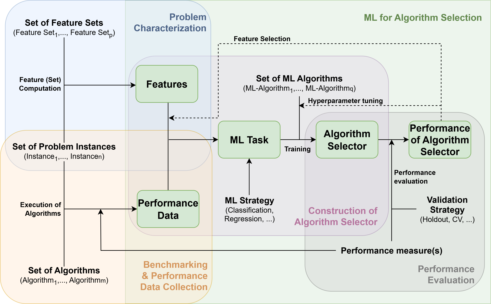
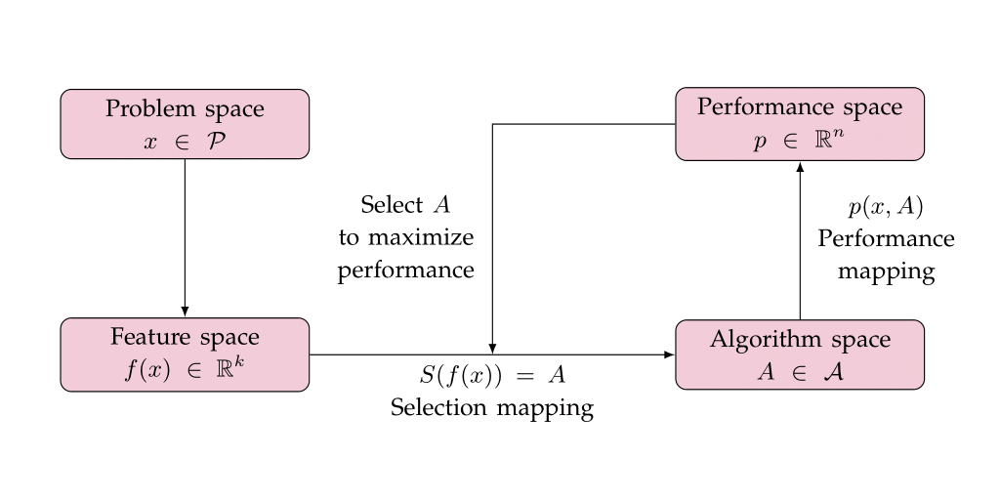

```{r setup, include=FALSE}
knitr::opts_chunk$set(echo = FALSE, warning = FALSE, message = FALSE, fig.path = "figures/", cache = TRUE, fig.align = "center", fig.pos = "ht")
library(ASML)
library(knitr)
library(kableExtra)
library(ggplot2)
library(viridisLite)
library(caret)
library(aslib)
library(llama)
library(rvest)
library(dplyr)
library(reshape2)
set.seed(1234)
```

# Introduction

Selecting from a set of algorithms the most appropriate one for solving a given problem instance (understood as an individual problem case with its own specific characteristics) is a common issue that comes up in many different situations, such as in combinatorial search problems `r knitr::asis_output(ifelse(knitr::is_html_output(), '[@kot16; @dra20]', '\\citep{kot16,dra20}'))`, planning and scheduling problems `r knitr::asis_output(ifelse(knitr::is_html_output(), '[@spe21; @mes14]', '\\citep{spe21,mes14}'))`, or in machine learning (ML), where the multitude of available techniques often makes it challenging to determine the best approach for a particular dataset `r knitr::asis_output(ifelse(knitr::is_html_output(), '[@van19]', '\\citep{van19}'))`. For an extensive survey on automated algorithm selection and application areas, we refer to `r knitr::asis_output(ifelse(knitr::is_html_output(), '@ker19', '\\cite{ker19}'))`. 

Figure `r knitr::asis_output(ifelse(knitr::is_html_output(), '\\@ref(fig:ASkerschke)', '\\@ref(fig:ASkerschke)'))` presents a general scheme, adapted from Figure 1 in `r knitr::asis_output(ifelse(knitr::is_html_output(), '@ker19', '\\cite{ker19}'))`, illustrating the use of ML for algorithm selection. A set of problem instances is given, each described by associated features, together with a portfolio of algorithms that have been evaluated on all instances. The instance features and performance results are then fed into a ML framework, which is trained to produce a selector capable of predicting the best-performing algorithm for an unseen instance. Note that we are restricting attention to *offline* algorithm selection, in which the selector is constructed using a training set of instances and then applied to new problem instances.

```{r, ASkerschke, include=TRUE,  out.width = "100%",fig.align="center",  fig.cap = "Schematic overview of the interplay between problem instance features (top left), algorithm performance data (bottom left), selector construction (center), and the assessment of selector performance (bottom right). Adapted from Kerschke et al. (2019).", echo=FALSE}
if (knitr::is_html_output()) {
  
} else if (knitr::is_latex_output()) {
  knitr::include_graphics("figures/AS_kerschke_drawio.pdf")
}
```

Algorithm selection tools also demonstrate significant potential in the field of optimization, enhancing performance at solving problems where multiple solving strategies are often available. For example, a key factor in the efficiency of state-of-the-art global solvers in mixed integer linear programming and also in nonlinear optimization is the design of branch-and-bound algorithms and, in particular, of their branching rules. There isn't a single branching rule that outperforms all others on every problem instance. Instead, different branching rules exhibit optimal performance on different types of problem instances. Developing methods for the automatic selection of branching rules based on instance features has proven to be an effective strategy toward solving optimization problems more efficiently `r knitr::asis_output(ifelse(knitr::is_html_output(), '[@lod17;@ben21;@gha23]', '\\citep{lod17, ben21, gha23}'))`. 

In algorithm selection, not only do the problem domain to which it applies and the algorithms for addressing problem instances play a crucial role, but also the metrics used to assess algorithm effectiveness ---referred to in this work as Key Performance Indicators (KPIs). KPIs are used in different fields to assess and measure the performance of specific objectives or goals. In a business context, these indicators are quantifiable metrics that provide valuable insights into how well an individual, team, or entire organization is progressing towards achieving its defined targets. In the context of algorithms, KPIs serve as quantifiable measures used to evaluate the effectiveness and efficiency of algorithmic processes. For instance, in the realm of computer science and data analysis, KPIs can include measures like execution time, accuracy, and scalability. Monitoring these KPIs allows for a comprehensive assessment of algorithmic performance, aiding in the selection of the most appropriate algorithm for a given instance and facilitating continuous improvement in algorithmic design and implementation.

Additionally, in many applications, normalizing the KPI to a standardized range like $[0, 1]$ provides a more meaningful basis for comparison. The KPI obtained through this process, which we will refer to as instance-normalized KPI, reflects the performance of each algorithm relative to the best-performing one for each specific instance. For example, if we have multiple algorithms and we are measuring execution time that can vary across instances, normalizing the execution time for each instance relative to the fastest algorithm within that same instance allows for a fairer evaluation. This is particularly important when the values of execution time might not directly reflect the relative performance of the algorithms due to wide variations in the scale of the measurements. Thus, normalizing puts all algorithms on an equal footing, allowing a clearer assessment of their relative efficiency.

Following the general framework illustrated in Figure `r knitr::asis_output(ifelse(knitr::is_html_output(), '\\@ref(fig:ASkerschke)', '\\@ref(fig:ASkerschke)'))`, the R package \CRANpkg{ASML} `r knitr::asis_output(ifelse(knitr::is_html_output(), '[@Rasml]', '\\citep{Rasml}'))` provides a wrapper for ML methods to select from a portfolio of algorithms based on the value of a given KPI. It uses a set of features in a training set to learn a regression model for the instance-normalized KPI value for each algorithm. Then, the instance-normalized KPI is predicted for unseen test instances, and the algorithm with the best predicted value is chosen. As learning techniques for algorithm selection, the user can invoke any regression method from the \CRANpkg{caret} package `r knitr::asis_output(ifelse(knitr::is_html_output(), '[@Rcaret]', '\\citep{Rcaret}'))`  or use a custom function defined by the user.  This makes our package flexible, as it automatically supports new methods when they are added to \CRANpkg{caret}. Although initially designed for selecting branching rules in nonlinear optimization problems, its versatility allows the package to effectively address algorithm selection challenges across a wide range of domains. It can be applied to a broad spectrum of disciplines whenever there is a diverse set of instances within a specific problem domain, a suite of algorithms with varying behaviors across instances, clearly defined metrics for evaluating the performance of the available algorithms, and known features or characteristics of the instances that can be computed and are ideally correlated with algorithm performance. The visualization tools implemented in the package allow for an effective evaluation of the performance of the algorithm selection techniques. A key distinguishing element of \CRANpkg{ASML} is its learning-phase approach, which uses instance-normalized KPI values and trains a separate regression model for each algorithm to predict its normalized KPI on unseen instances.

# Background

<!-- Based on: Algorithm Selection for Combinatorial Search Problems: A Survey-->
The algorithm selection problem was first outlined in the seminal work by `r knitr::asis_output(ifelse(knitr::is_html_output(), '@ric76', '\\cite{ric76}'))` . In simple terms, for a given set of problem instances (problem space) and a set of algorithms (algorithm space), the goal is to determine a selection model that maps each problem instance to the most suitable algorithm for it. By *most suitable*, we mean the best according to a specific metric that associates each combination of instance and algorithm with its respective performance. Formally, let $\mathcal{P}$ denote the problem space or set of problem instances. The algorithm space or set of algorithms is denoted by  $\mathcal{A}$. The metric $p:\mathcal{P}\times\mathcal{A}\rightarrow \mathbb{R}^n$ measures the performance $p(x,A)$  of
any algorithm $A\in \mathcal{A}$ on instance $x\in\mathcal{P}$. The goal is to construct a selector $S:\mathcal{P}\rightarrow \mathcal{A}$ that maps any problem
instance $x\in \mathcal{P}$ to an algorithm $S(x)=A\in \mathcal{A}$  in such a way that its performance is optimal. 

As discussed in the Introduction, many algorithm selection methods in the literature use ML tools to model the relationship between problem instances and algorithm performance, using features derived from these instances. The pivotal step in this process is defining appropriate features that can be readily computed and are likely to impact algorithm performance. That is, given $x\in\mathcal{P}$, we make use of informative features $f (x) = (f_1(x),\ldots,f_k(x))\in \mathbb{R}^k$. In this framework, the selector $S$ maps  the simpler feature space $\mathbb{R}^k$ into the algorithm space $\mathcal{A}$. A scheme of the algorithm selection problem, as described in `r knitr::asis_output(ifelse(knitr::is_html_output(), '@ric76', '\\cite{ric76}'))`,  is shown in Figure `r knitr::asis_output(ifelse(knitr::is_html_output(), '\\@ref(fig:rice)', '\\@ref(fig:rice)'))`.

```{r, rice, include=TRUE,  out.width = "80%",fig.align="center",  fig.cap = "Scheme of the algorithm selection problem by Rice (1976).", echo=FALSE}

```

For the practical derivation of the selection model $S$, we use training data consisting of features $f(x)$ and performances $p(x,A)$, where $x \in \mathcal{P}^\prime \subset \mathcal{P}$ and $A \in \mathcal{A}$. The task is to learn the selector $S$ based on the training data. The model allows us to forecast the performance on unobserved instance problems based on their features and subsequently select the algorithm with the highest predicted performance. A comprehensive discussion of various aspects of algorithm selection techniques can be found in `r knitr::asis_output(ifelse(knitr::is_html_output(), '@kot16', '\\cite{kot16}'))`  and `r knitr::asis_output(ifelse(knitr::is_html_output(), '@pul22', '\\cite{pul22}'))`.

# Algorithm selection tools in R

The task of algorithm selection has seen significant advancements in recent years, with R packages facilitating this process. Here we present some of the existing tools that offer a range of functionalities, including flexible model-building frameworks, automated workflows, and standardized scenario formats, providing valuable resources for both researchers and end-users in algorithm selection. 

The \CRANpkg{llama} package `r knitr::asis_output(ifelse(knitr::is_html_output(), '[@Rllama]', '\\citep{Rllama}'))`  provides a flexible implementation within R for evaluating algorithm portfolios. It simplifies the task of building predictive models to solve algorithm selection scenarios, allowing users to apply ML models effectively. In \CRANpkg{llama}, ML algorithms are defined using the \CRANpkg{mlr} package `r knitr::asis_output(ifelse(knitr::is_html_output(), '[@Rmlr]', '\\citep{Rmlr}'))`, offering a structured approach to model selection. On the other hand, the Algorithm Selection Library (ASlib) `r knitr::asis_output(ifelse(knitr::is_html_output(), '[@bis16]', '\\citep{bis16}'))` proposes a standardized format for representing algorithm selection scenarios and introduces a repository that hosts an expanding collection of datasets from the literature. It serves as a benchmark for evaluating algorithm selection techniques under consistent conditions. It is accessible to R users through the \CRANpkg{aslib} package. This integration simplifies the process for those working within the R environment. Furthermore, \CRANpkg{aslib} interfaces with the \CRANpkg{llama} package, facilitating the analysis of algorithm selection techniques within the benchmark scenarios it provides.

Our \CRANpkg{ASML} package offers an approach to algorithm selection based on the powerful and flexible \CRANpkg{caret} framework. By using \CRANpkg{caret}’s ability to work with many different ML models, along with its model tuning and validation tools, \CRANpkg{ASML} makes the selection process easy and effective, especially for users already familiar with \CRANpkg{caret}. Thus, while \CRANpkg{ASML} shares some conceptual similarities with \CRANpkg{llama}, it distinguishes itself through its interface to the ML models in \CRANpkg{caret} instead of \CRANpkg{mlr}, which is currently considered retired by the mlr-org team, potentially leading to compatibility issues with certain learners, and has been succeeded by the next-generation \CRANpkg{mlr3} `r knitr::asis_output(ifelse(knitr::is_html_output(), '[@Rmlr3]', '\\citep{Rmlr3}'))`. In addition, \CRANpkg{ASML} automates the normalization of KPIs based on the best-performing algorithm for each instance, addressing the challenges that arise when performance metrics vary significantly across instances. \CRANpkg{ASML} further provides new visualization tools that can be useful for understanding the results of the learning process. A comparative overview of the main features and differences between these packages can be seen in Table `r knitr::asis_output('\\@ref(tab:ASMLvsllama)')`.

```{r ASMLvsllama, echo=FALSE, message=FALSE}
library(knitr)
library(kableExtra)

if (knitr::is_latex_output()) {
  check <- "\\ding{51}"
  cross <- "\\ding{55}"
  br <- "\\hspace{4cm}"
} else {
  check <- "&#10003;" # HTML ✓
  cross <- "&#10007;" # HTML ✗
  br <- "<br>" # salto de línea en HTML
}

checklist <- data.frame(
  Aspect = c(
    "Input data",
    "Normalized KPIs",
    "ML backend",
    "Hyperparameter tuning",
    "Parallelization",
    "Results summary",
    "Visualization",
    "Model interpretability tools",
    "ASlib integration",
    "Latest release"
  ),
  ASML = c(
    paste0("features", br, " KPIs", br, "split by families supported"),
    paste0(check),
    paste0("caret"),
    paste0("ASML::AStrain()", br, "supports arguments passed to caret (trainControl(), tuneGrid)"),
    paste0(check, br, " with snow"),
    paste0(
      "Per algorithm", br,
      "Best overall and per instance", br,
      "ML-selected"
    ),
    paste0(
      "Boxplots (per algorithm and ML-selected)", br,
      "Ranking plots", br,
      "Barplots (best vs ML-selected)"
    ),
    paste0(check, br, " with DALEX"),
    paste0("basic support"),
    "CRAN 1.1.0 (2025)"
  ),
  llama = c(
    paste0("features", br, " KPIs", br, "feature costs supported"),
    paste0(cross),
    paste0("mlr"),
    paste0("llama::cvFolds", br, "llama::tuneModel"),
    paste0(check, br, " with parallelMap"),
    paste0(
      "Virtual best and single best per instance", br,
      "Aggregated scores (PAR, count, successes)"
    ),
    paste0("Scatter plots comparing two algorithm selectors"),
    paste0(cross),
    paste0("extended support"),
    "CRAN 0.10.1 (2021)"
  ),
  stringsAsFactors = FALSE
)

is_latex <- knitr::is_latex_output()
if (knitr::is_latex_output()) {
  fs <- 9
} else {
  fs <- NULL
}
tbl <- kbl(
  checklist,
  caption = "Comparative overview of ASML and llama for algorithm selection.",
  escape = FALSE,
  booktabs = TRUE,
  align = "lcc"
)

if (is_latex) {
  tbl %>%
    kable_styling(latex_options = c("hold_position", "striped"), font_size = fs) %>%
    kableExtra::row_spec(0, bold = TRUE) %>%
    column_spec(1, latex_column_spec = ">{\\\\raggedright\\\\arraybackslash}m{3cm}") %>%
    column_spec(2, latex_column_spec = ">{\\\\centering\\\\arraybackslash}m{4.5cm}") %>%
    column_spec(3, latex_column_spec = ">{\\\\centering\\\\arraybackslash}m{4.5cm}")
} else {
  tbl %>%
    kable_styling(
      bootstrap_options = c("striped", "hover", "condensed"),
      full_width = FALSE
    ) %>%
    column_spec(1, width = "25%") %>%
    column_spec(2:3, width = "35%")
}
```

There are also automated approaches that streamline the process of selecting and optimizing ML models within the R environment. Tools like  \CRANpkg{h2o} provide robust functionalities specifically designed for R users, facilitating an end-to-end ML workflow. These frameworks automate various tasks, including algorithm selection, hyperparameter optimization, and feature engineering, thereby simplifying the process for users of all skill levels. By integrating these automated solutions into R, users can efficiently explore a wide range of models and tuning options without needing extensive domain knowledge or manual intervention. This automation not only accelerates the model development process but also improves the overall performance of ML projects by allowing a systematic evaluation of different approaches and configurations. However, while \CRANpkg{h2o} excels at automating the selection of ML models and hyperparameter tuning, it does not perform algorithm selection based on instance-specific features, which is the primary focus of our approach. Instead, it evaluates multiple algorithms in parallel and selects the best-performing one based on predetermined metrics.

# Using the ASML package

```{r preparedata, echo=FALSE, eval=TRUE}
data(branching)
datap <- branching
features.complete <- datap$x
featcol <- c(
  "number_of_variables",
  "percentage_of_variables_degree_one",
  "percentage_of_variables_degree_two",
  "mean_variable_ranges",
  "variance_variable_ranges",
  "q50_variable_ranges",
  "variance_variable_densities_RLT_variables",
  "mean_percentage_of_constraints_and_objfun_in_which_each_variable_appears",
  "variance_percentage_of_constraints_and_objfun_in_which_each_variable_appears",
  "number_of_constraints",
  "number_of_equality_constraints_:_number_of_constraints",
  "number_of_linear_constraints_:_number_of_constraints",
  "number_of_quadratic_constraints_:_number_of_constraints",
  "degree",
  "number_of_monomials",
  "density",
  "number_of_linear_monomials_:_number_of_monomials",
  "number_of_quadratic_monomials_:_number_of_monomials",
  "number_of_linear_rlt_variables_:_number_of_rlt_variables",
  "number_of_quadratic_rlt_variables_:_number_of_rlt_variables",
  "mean_percentage_of_monomials_in_each_constraint_and_objfun",
  "mean_coefficients",
  "variance_coefficients",
  "number_of_variables_:_number_of_constraints_and_objfun",
  "number_of_variables_:_degree",
  "number_of_monomials_:_number_of_constraints_and_objfun",
  "number_of_rlt_variables_:_number_of_constraints_and_objfun",
  "intersection_graph_density",
  "alternative_graph_density",
  "intersection_greedy_max_modularity",
  "alternative_greedy_max_modularity",
  "intersection_graph_treewidth",
  "alternative_graph_treewidth"
)
Description <- c(
  "Number of variables",
  "Pct. of variables not present in any monomial with degree greater than one",
  "Pct. of variables not present in any monomial with degree greater than two",
  "Average  of the ranges of the variables",
  "Variance of the ranges of the variables",
  "Median of the ranges of the variables",
  "Variance of the density of the variables",
  "Average of the no. of appearances of each variable",
  "Variance of the no. of appearances of each variable",
  "Number of constraints",
  "Pct. of equality constraints",
  "Pct. of linear constraints",
  "Pct. of quadratic constraints",
  "Degree",
  "Number of monomials",
  "Density",
  "Pct. of linear monomials",
  "Pct. of quadratic monomials ",
  "Pct. of linear RLT variables",
  "Pct. of quadratic RLT variables",
  "Average pct. of monomials in each constraint and in the objective function",
  "Average of the coefficients",
  "Variance of the coefficients",
  "Number of variables divided by number of constrains",
  "Number of variables divided by degree",
  "Number of monomials divided by number of constrains",
  "Number of RLT variables divided by number of constrains",
  "Density of VIG",
  "Density of  CMIG",
  "Modularity of VIG",
  "Modularity of  CMIG",
  "Treewidth of VIG",
  "Treewidth of  CMIG"
)
features <- features.complete[, which(names(features.complete) %in% featcol)]
```

Here, we illustrate the usage of the \CRANpkg{ASML} package with an example within the context of algorithm selection for spatial branching in polynomial optimization, aligning with the problem discussed in `r knitr::asis_output(ifelse(knitr::is_html_output(), '@gha23', '\\cite{gha23}'))`  and further explored in `r knitr::asis_output(ifelse(knitr::is_html_output(), '@gon24', '\\cite{gon24}'))`. Table `r knitr::asis_output('\\@ref(tab:optsum)')` provides an overview of the problem and a summary of the components that we will discuss in detail below. 

```{r optsum}
aux <- paste(table(branching$x[, 1]), " (", names(table(branching$x[, 1])), ")", sep = "", collapse = ", ")
C1 <- c("Algorithms", "KPI", "Number of instances", "Number of instances per library", "Number of features")
C2 <- c("max, sum, dual, range, eig-VI, eig-CMI", "pace", nrow(features), aux, ncol(features))
df <- data.frame(C1, C2)
df$C2[1:2] <- kableExtra::cell_spec(df$C2[1:2], monospace = TRUE)
colnames(df) <- NULL
if (knitr::is_latex_output()) {
  fs <- 9
} else {
  fs <- NULL
}
kableExtra::kbl(df, escape = FALSE, booktabs = TRUE, caption = "Summary of the branching rule selection problem.") %>%
  kableExtra::row_spec(1, extra_css = "border-top: 1px solid") %>%
  kableExtra::row_spec(nrow(df), extra_css = "border-bottom: 1px solid") %>%
  kableExtra::kable_styling(full_width = FALSE, position = "center", latex_options = "hold_position", font_size = fs)
```

A well-known approach for finding global optima in polynomial optimization problems is based on the use of the Reformation Linearization Technique (RLT) `r knitr::asis_output(ifelse(knitr::is_html_output(), '[@she92]', '\\citep{she92}'))`. Without delving into intricate details, RLT operates by creating a linear relaxation of the original polynomial problem, which is then integrated into a branch-and-bound framework. The branching process involves assigning a score to each variable, based on the violations of the RLT identities it participates in, after solving the corresponding relaxation at each node. Subsequently, the variable with the highest score is selected for branching. The computation of these scores is a  critical aspect and allows for various approaches, leading to distinct branching rules that constitute our algorithm selection portfolio. Specifically, in our example, we will examine six distinct branching rules  (referred to interchangeably as branching rules or algorithms), labeled as `max`, `sum`, `dual`, `range`, `eig-VI`, and `eig-CMI` rules. For the definitions and a comprehensive understanding of the rationale behind these rules, refer to `r knitr::asis_output(ifelse(knitr::is_html_output(), '@gha23', '\\cite{gha23}'))`. 

Measuring the performance of different algorithms in the context of optimization is crucial for evaluating their effectiveness and efficiency. Two common metrics for this evaluation are running time and optimality gap, measured as a function of the lower and upper bounds for the objective function value at the end of the algorithm (a small optimality gap indicates that the algorithm is producing solutions close to the optimal). Both metrics are important and are often considered together to evaluate algorithm performance. For instance, it is meaningful to consider the time required to reduce the optimality gap by one unit as KPI. In our example, and to ensure it is well-defined, we make use of a slightly different metric, which we refer to as pace, defined as the time required to increase the lower bound by one unit. For the pace, a smaller value is preferred, as it indicates better performance.

As depicted in Figure `r knitr::asis_output(ifelse(knitr::is_html_output(), '\\@ref(fig:rice)', '\\@ref(fig:rice)'))`, a crucial aspect of the methodology involves selecting input variables (features) that facilitate the prediction of the KPI for each branching rule. We consider `r ncol(features)` features representing global information of the polynomial optimization problems, such as relevant characteristics of variables, constraints, monomials, coefficients, or other attributes. A detailed description of the considered features can be found in Table `r knitr::asis_output('\\@ref(tab:featsum)')`. Although we won't delve into these aspects, determining appropriate features is often complex, and using feature-selection methods can be beneficial for choosing the most relevant ones.

```{r featsum}
# Filtrar las columnas que están en featcol
filtered_columns <- names(datap$x)[names(datap$x) %in% featcol]
filtered_indices <- which(names(datap$x) %in% filtered_columns)
# Obtener las descripciones en el orden de las columnas de datap$x
filtered_descriptions <- Description[match(filtered_columns, featcol)]
df <- data.frame(filtered_indices, filtered_descriptions)
df[, 1] <- cell_spec(df[, 1], monospace = TRUE)
colnames(df) <- c("Index", "Description")
kableExtra::kbl(df, escape = FALSE, booktabs = TRUE, caption = "Features from the branching dataset.") %>%
  kableExtra::row_spec(0, bold = TRUE) %>%
  kableExtra::kable_styling(full_width = FALSE, position = "center", ) %>%
  kableExtra::footnote(general = "Index refers to columns of branching$x.")
```

To assess the performance of the algorithm selection methods in this context, we have a diverse set of `r nrow(features)` instances from different optimization problems, taken from three well-known benchmarks `r knitr::asis_output(ifelse(knitr::is_html_output(), '[@bus03; @dal16; @fur18]', '\\citep{bus03, dal16, fur18}'))`, corresponding respectively to the MINLPLib, DS, and QPLIB libraries. Details are given in Table `r knitr::asis_output('\\@ref(tab:optsum)')`. The data for this analysis is contained within the `branching` dataset included in the package. We begin by defining two data frames. The `features` data frame includes two initial columns that provide the instance names and the corresponding family (library in our example) for each instance. The remaining columns consist of the features listed in Table `r knitr::asis_output('\\@ref(tab:featsum)')`.

We also define the `KPI` data frame, which is derived from `branching$y`. This data frame contains the pace values for each of the six branching rules considered in this study (specified by the labels in the `lab_rules` vector). These data frames will serve as the input for our subsequent analyses.

```{r ASMLcall, echo = TRUE, tidy=TRUE}
set.seed(1234)
library(ASML)
data(branching)
features <- branching$x
KPI <- branching$y
lab_rules <- c("max", "sum", "dual", "range", "eig-VI", "eig-CMI")
```

## Pre-Processing the data 

As with any analysis, the first step involves preprocessing the data. This includes using the function `partition_and_normalize`, which not only divides the dataset into training and test sets but also normalizes the KPI relative to the best result for each instance. The argument `better_smaller` specifies whether a lower KPI value is preferred (such as in our case where the KPI represents pace, with smaller values indicating better performance) or if a higher value is desired, when larger KPI values are considered more advantageous.

```{r ASMLpre, echo = TRUE, tidy=TRUE}
data <- partition_and_normalize(features, KPI, family_column = 1, split_by_family = TRUE, better_smaller = TRUE)
names(data)
```

When using the function `partition_and_normalize` the resulting object is of class `as_data` and contains several key components essential for our study. Specifically, the object includes `x.train` and `x.test`, representing the feature sets for the training and test datasets, respectively. Additionally, it contains `y.train` and `y.test`, with the instance-normalized KPI corresponding to each dataset, along with their original counterparts, `y.train.original` and `y.test.original`. This structure allows us to retain the original KPI values while working with the instance-normalized data. Furthermore, when the parameter `split_by_family` is set to `TRUE`, as in the example, the object also includes `families.train` and `families.test`, indicating the family affiliation for each observation within the training and test sets. Figure `r knitr::asis_output(ifelse(knitr::is_html_output(), '\\@ref(fig:partitionPLOT)', '\\@ref(fig:partitionPLOT)'))`  illustrates how the split preserves the proportions of instances for each library.

```{r partitionPLOT, echo = FALSE, tidy=TRUE, out.width = ifelse(knitr::is_latex_output(), "70%" , "100%"), fig.cap="Train/Test partition preserving the percentage of instances for each library.", fig.alt = "Train/Test partition preserving the percentage of instances for each library."}
library(ggplot2)
library(viridisLite)
data_plot <- rbind(
  data.frame(
    Family = data$families.train[[1]],
    Dataset = "Train"
  ),
  data.frame(
    Family = data$families.test[[1]],
    Dataset = "Test"
  )
)
data_plot$Dataset <- factor(data_plot$Dataset, levels = c("Train", "Test"))
ggplot(data_plot, aes(x = Dataset, fill = Family)) +
  geom_bar(position = "fill") +
  labs(
    title = "Train/Test Partition",
    y = "Proportion"
  ) +
  scale_fill_viridis_d(name = "Library") +
  theme_minimal() +
  scale_x_discrete(labels = c(
    "Train" = paste0("Train (n=", nrow(data$families.train), ")"),
    "Test" = paste0("Test (n=", nrow(data$families.test), ")")
  ))
```

As a tool for visualizing the performance of the considered algorithms, the `boxplots` function operates on objects of class `as_data` and generates boxplots for the instance-normalized KPI. This visualization facilitates the comparison of performance differences across instances. The function can be applied to both training and test observations and can also group the results by family. Additionally, it accepts common arguments typically used in R functions. Figure `r knitr::asis_output(ifelse(knitr::is_html_output(), '\\@ref(fig:splitPLOT)', '\\@ref(fig:splitPLOT)'))`  shows the instance-normalized KPI of the instances in the train set. What becomes evident from the boxplots is that there is no branching rule that outperforms the others across all instances, and making a wrong choice of criteria in certain problems can lead to very poor performance. 

```{r splitPLOT, echo = TRUE, tidy=TRUE, out.width = ifelse(knitr::is_latex_output(), "70%" , "100%"), fig.cap="Boxplots of instance-normalized KPI for each algorithm across instances in the train set.", fig.alt = "Boxplots of instance-normalized KPI for each algorithm across instances in the train set."}
boxplots(data, test = FALSE, by_families = FALSE, labels = lab_rules)
```

The `ranking` function, specifically designed for the \CRANpkg{ASML} package, is also valuable for visualizing the differing behaviors of the algorithms under investigation, depending on the analyzed instances. After ranking the algorithms for each instance, based on the instance-normalized KPI, the function generates a bar chart for each algorithm, indicating the percentage of times it occupies each ranking position. The numbers displayed within the bars represent the mean value of the instance-normalized KPI for the problems associated with that specific ranking position. Again, the representation can be made both for the training and test sets, as well as by family. In Figure `r knitr::asis_output(ifelse(knitr::is_html_output(), '\\@ref(fig:rank)', '\\@ref(fig:rank)'))`, we present the chart corresponding to the training sample and categorized by family. In particular, it is observed that certain rules, when not the best choice for a given instance, can perform quite poorly in terms of instance-normalized KPI (see, for example, the results on the MINLPLib library). This highlights the importance of not only selecting the best algorithm for each instance but also ensuring that the chosen algorithm does not perform too poorly when it isn’t optimal. In some cases, even if an algorithm isn't the best-performing option, it may still provide reasonably good results, whereas a wrong choice can result in significantly worse outcomes.

```{r rank, echo = TRUE, tidy=TRUE, out.width = ifelse(knitr::is_latex_output(), "70%" , "100%"), fig.cap="Ranking of algorithms based on the instance-normalized KPI for the training sample, categorized by family. The bars represent the percentage of times each algorithm appeared in different ranking positions, with the numbers indicating the mean value of the KPI.", fig.alt = "Ranking of algorithms based on the instance-normalized KPI for the training sample, categorized by family. The bars represent the percentage of times each algorithm appeared in different ranking positions, with the numbers indicating the mean value of the KPI."}
ranking(data, test = FALSE, by_families = TRUE, labels = lab_rules)
```

Additionally, functions from the \CRANpkg{caret} package can be applied if further operations on the predictors are needed. Here we show an example where the Yeo-Johnson transformation is applied to the training set, and the same transformation is subsequently applied to the test set to ensure consistency across both datasets. The flexibility of \CRANpkg{caret} also allows for the inclusion of advanced techniques, such as feature selection and dimensionality reduction, to improve the quality of the algorithm selection process.

```{r precaret, echo = TRUE, tidy=TRUE}
preProcValues <- caret::preProcess(data$x.train, method = "YeoJohnson")
data$x.train <- predict(preProcValues, data$x.train)
data$x.test <- predict(preProcValues, data$x.test)
```

## Training models and predicting the performance of the algorithms

The approach in \CRANpkg{ASML} to algorithm selection is based on building regression models that predict the instance-normalized KPI of each considered algorithm. To this end, users can take advantage of the wide range of ML models available in the \CRANpkg{caret} package, which provides a unified interface for training and tuning various types of models. Models trained with \CRANpkg{caret} can be seamlessly integrated into the \CRANpkg{ASML} workflow using the `AStrain` function from \CRANpkg{ASML}, as shown in the next example. Just for illustrative purposes, we use quantile random forest `r knitr::asis_output(ifelse(knitr::is_html_output(), '[@mei06]', '\\citep{mei06}'))` to model the behavior of the instance-normalized KPI based on the features. This is done with the `qrf` method in the \CRANpkg{caret} package, which relies on the \CRANpkg{quantregForest} package `r knitr::asis_output(ifelse(knitr::is_html_output(), '[@mei24]', '\\citep{mei24}'))`.  

```{r AMSLtrain, echo = TRUE, tidy=TRUE}
library(quantregForest)
tune_grid <- expand.grid(mtry = 10)
training <- AStrain(data, method = "qrf", tuneGrid = tune_grid)
```

Additional arguments for `caret::train` can also be passed directly to `ASML::AStrain`. This allows users to take advantage of the flexibility of the \CRANpkg{caret} package, including specifying control methods (such as cross-validation), tuning parameters, or any other relevant settings provided by `caret::train`. This integration ensures that the \CRANpkg{ASML} workflow can fully make use of the modeling capabilities offered by \CRANpkg{caret}. To make the execution faster (it is not our intention here to delve into the choice of the best model), we use a `tune_grid` that sets a fixed value for `mtry`. This avoids the need for an exhaustive search for this hyperparameter, speeding up the model training process. Other modeling approaches should also be considered, as they may offer better performance depending on the specific characteristics of the data and the problem at hand. For more computationally intensive models or larger datasets, the `ASML::AStrain` function includes the  argument `parallel`, which can be set to TRUE to enable parallel execution using the \CRANpkg{snow} package `r knitr::asis_output(ifelse(knitr::is_html_output(), '[@Rsnow]', '\\citep{Rsnow}'))`. This allows the training step to be distributed across multiple cores, reducing computation time. A detailed example on a larger dataset is provided in the following section, showing the scalability of the workflow and the effect of parallelization on training time.

The function `caret::train` returns a trained model along with performance metrics, predictions, and tuning parameters, providing insights into the model's effectiveness. In a similar manner, `ASML::AStrain` offers the same type of output but for each algorithm under consideration, allowing straightforward comparison within the \CRANpkg{ASML} framework. The `ASML::ASpredict` function generates the predictions for new data by using the models created during the training phase for each algorithm under evaluation. Thus, predictions for the algorithms are obtained simultaneously, facilitating a direct comparison of their performance. By using `ASML::ASpredict` as follows, we obtain a matrix where each row corresponds to an instance from the test set, and each column represents the predicted instance-normalized KPIs for the six branching rules using the `qrf` method. 

```{r AMSLpred, echo = TRUE, tidy=TRUE}
predict_test <- ASpredict(training, newdata = data$x.test)
``` 

## Evaluating and visualizing the results

One of the key strengths of the \CRANpkg{ASML} package lies in its ability to evaluate results collectively and provide intuitive visualizations. This approach not only aids in identifying the most effective algorithms but also contributes to the interpretability of the results, making it easier for users to make informed decisions based on the performance metrics and visual representations provided. For example, the function `KPI_table` returns a table showing the arithmetic and geometric mean of the KPI (both instance-normalized and not normalized) obtained on the test set for each algorithm, as well as for the algorithm selected by the learning model (the one with the largest instance-normalized predicted KPI for each instance). In Table `r knitr::asis_output('\\@ref(tab:AMSLtab2)')`, the results for our case study are shown. It is important to note that larger values are better in the columns for the arithmetic and geometric mean of the instance-normalized KPI (where values close to 1 indicate the best performance). Conversely, in the columns for non-normalized values, lower numbers reflect better outcomes. In all cases, the best results are obtained for the ML algorithm. Note also that in this case, the differences in the performance of the algorithms are likely better reflected by the geometric mean because it gives a better representation of relative differences.

```{r AMSLtab, echo = TRUE, tidy=TRUE, eval=FALSE}
KPI_table(data, predictions = predict_test)
``` 

```{r AMSLtab2, echo = FALSE, tidy=TRUE, eval=TRUE}
KPItab <- KPI_table(data, predictions = predict_test)
KPItab <- round(KPItab, 3)
rownames(KPItab) <- c("ML", "max", "sum", "dual", "range", "eig-VI", "eig-CMI")
rownames(KPItab) <- kableExtra::cell_spec(rownames(KPItab), monospace = TRUE)
# Define column names based on the output format
if (knitr::is_html_output()) {
  col_names <- c("Arithmetic mean\ninst-norm KPI", "Geometric mean\n inst-norm KPI", "Arithmetic mean\nnon-norm KPI", "Geometric mean\nnon-norm KPI")
  wi <- "3.3cm"
} else {
  col_names <- c("Arith. mean\\newline inst-norm KPI", "Geom. mean\\newline inst-norm KPI", "Arith. mean\\newline non-norm KPI", "Geom. mean\\newline non-norm KPI")
  wi <- "2.5cm"
}
if (knitr::is_latex_output()) {
  fs <- 9
} else {
  fs <- NULL
}
kableExtra::kbl(KPItab,
  escape = F, caption = "Arithmetic and geometric mean of the KPI (both instance-normalized and non-normalized) for each algorithm on the test set, along with the results for the algorithm selected by the learning model (first row).",
  col.names = col_names,
  booktabs = TRUE, 
) %>%
  kableExtra::kable_styling(full_width = FALSE, position = "center", latex_options = "hold_position", font_size = fs) %>%
  column_spec(column = 2:5, width = wi)
``` 

Additionally, the function `KPI_summary_table` generates a concise comparative table displaying values for three different choices: single best, ML, and optimal, see Table `r knitr::asis_output('\\@ref(tab:AMSLtabsum2)')`. The single best choice refers to selecting the same algorithm for all instances based on the lowest geometric mean of the non-normalized KPI (in this case the `range` rule). This approach evaluates the performance of each algorithm across all instances and chooses the one that consistently performs best overall, rather than optimizing for individual instances. The ML choice represents the algorithm selected by the quantile random forest model. The optimal choice corresponds to solving each instance with the algorithm that performs best for that specific instance. The ML choice shows promising results, with a mean KPI close to the optimal choice, demonstrating its capability to select algorithms that yield competitive performance.

```{r AMSLtabsum, echo = TRUE, tidy=TRUE, eval=FALSE}
KPI_summary_table(data, predictions = predict_test)
``` 

```{r AMSLtabsum2, echo = FALSE, tidy=TRUE, eval=TRUE}
KPItab <- KPI_summary_table(data, predictions = predict_test)
KPItab <- round(KPItab, 3)
rownames(KPItab) <- c("single best", "ML", "optimal")
rownames(KPItab) <- kableExtra::cell_spec(rownames(KPItab), monospace = TRUE)
# Define column names based on the output format
if (knitr::is_html_output()) {
  col_names <- c("Arithmetic mean\nnon-norm KPI", "Geometric mean\nnon-norm KPI")
  wi <- "3.3cm"
} else {
  col_names <- c("Arith. mean\\newline non-norm KPI", "Geom. mean\\newline non-norm KPI")
  wi <- "2.5cm"
}
if (knitr::is_latex_output()) {
  fs <- 9
} else {
  fs <- NULL
}
kableExtra::kbl(KPItab,
  escape = F, caption = "Arithmetic and geometric mean of the non-normalized KPI for single best choice, ML choice, and optimal choice.",
  col.names = col_names,
  booktabs = TRUE, 
) %>%
  kableExtra::kable_styling(full_width = FALSE, position = "center", latex_options = "hold_position", font_size = fs) %>%
  column_spec(column = 2:3, width = wi)
``` 

The following code generates several visualizations that help us compare how well the algorithms perform according to the response variable (instance-normalized KPI) and also illustrate the behavior of the learning process. These plots give us good insights into how effective the algorithm selection process is and how it behaves in comparison to using the same branching rule for all instances. Figure `r knitr::asis_output(ifelse(knitr::is_html_output(), '\\@ref(fig:ASMLplot1)', '\\@ref(fig:ASMLplot1)'))`  shows the boxplots comparing the performance of each algorithm in terms of the instance-normalized KPI, including the instance-normalized KPI of the rules selected by the ML process for the test set. In Figure `r knitr::asis_output(ifelse(knitr::is_html_output(), '\\@ref(fig:ASMLplot2)', '\\@ref(fig:ASMLplot2)'))`, the performance is presented by family, allowing for a more detailed comparison across the different sets of instances. In Figure `r knitr::asis_output(ifelse(knitr::is_html_output(), '\\@ref(fig:ASMLplot3)', '\\@ref(fig:ASMLplot3)'))`, we show the ranking of algorithms based on the instance-normalized KPI for the test sample, including the ML rule, categorized by family. Finally, in Figure `r knitr::asis_output(ifelse(knitr::is_html_output(), '\\@ref(fig:ASMLplot4)', '\\@ref(fig:ASMLplot4)'))`, the right-side bar in the stacked bar plot (optimal) illustrates the proportion of instances in which each of the original rules is identified as the best-performing option. In contrast, the left-side bar (ML) depicts the frequency with which ML selects each rule as the top choice. Although the rule chosen by ML in each instance doesn’t always match the best one for that case, ML tends to select the different rules in a similar proportion to how often those rules are the best across the test set. This means it does not consistently favor a particular rule or ignore any that are the best a significant percentage of instances.

```{r ASMLplot, echo = TRUE, tidy=TRUE, eval=FALSE}
boxplots(data, predictions = predict_test, labels = c(lab_rules, "ML"))
boxplots(data, predictions = predict_test, labels = c(lab_rules, "ML"), by_families = TRUE)
ranking(data, predictions = predict_test, labels = c("ML", lab_rules), by_families = TRUE)
figure_comparison(data, predictions = predict_test, by_families = FALSE, labels = lab_rules)
```

```{r ASMLplot1, echo = FALSE, tidy=TRUE, out.width = ifelse(knitr::is_latex_output(), "70%" , "100%"), fig.cap="Boxplots of instance-normalized KPI for each algorithm, including the ML algorithm, across instances in the test set.", fig.alt = "Boxplots of instance-normalized KPI for each algorithm, including the ML algorithm, across instances in the test set."}
boxplots(data, predictions = predict_test, labels = c(lab_rules, "ML"))
```

```{r ASMLplot2, echo = FALSE, tidy=TRUE, out.width = ifelse(knitr::is_latex_output(), "70%" , "100%"), fig.cap="Boxplots of instance-normalized KPI for each algorithm, including the ML algorithm, across instances in the test set, categorized by family.", fig.alt = "Boxplots of instance-normalized KPI for each algorithm, including the ML algorithm, across instances in the test set, categorized by family."}
boxplots(data, predictions = predict_test, labels = c(lab_rules, "ML"), by_families = TRUE)
```

```{r ASMLplot3, echo = FALSE, tidy=TRUE, out.width = ifelse(knitr::is_latex_output(), "70%" , "100%"), fig.cap="Ranking of algorithms, including the ML algorithm, based on the instance-normalized KPI for the test sample, categorized by family. The bars represent the percentage of times each algorithm appeared in different ranking positions, with the numbers indicating the mean value of the normalized KPI.", fig.alt = "Ranking of algorithms, including the ML algorithm, based on the instance-normalized KPI for the test sample, categorized by family. The bars represent the percentage of times each algorithm appeared in different ranking positions, with the numbers indicating the mean value of the normalized KPI."}
ranking(data, predictions = predict_test, labels = c("ML", lab_rules), by_families = TRUE)
```

```{r ASMLplot4, echo = FALSE, tidy=TRUE, out.width = ifelse(knitr::is_latex_output(), "70%" , "100%"), fig.cap="Comparison of the best-performing rules: The right stack shows the proportion of times each of the original rules is identified as the best-performing option, while the left stack presents the frequency of selection by ML.", fig.alt = "Comparison of the best-performing rules: The right stack shows the proportion of times each of the original rules is identified as the best-performing option, while the left stack presents the frequency of selection by ML."}
figure_comparison(data, predictions = predict_test, by_families = FALSE, labels = lab_rules)
```

## Custom user-defined methods

While \CRANpkg{caret} provides a range of built-in methods for model training and prediction, there may be situations where researchers want to explore additional methods not directly integrated into the package. Considering alternative methods can improve the analysis and provide greater flexibility in modeling choices. 

In this section, we present an example of how to modify the quantile random forest `qrf` method. The `qrf` implementation in \CRANpkg{caret} does not allow users to specify the conditional quantile to predict, which is set to the median by default. In this case, rather than creating an entirely new method, we only need to adjust the prediction function to include the `what` argument, allowing us to specify the desired conditional quantile for prediction. In this execution example, we base the algorithm selection method on the predictions of the $\alpha$-conditional quantile of the instance-normalized KPI for $\alpha = 0.25$. 

```{r AMSLtrain2, echo = TRUE, tidy=TRUE, eval=FALSE}
qrf_q_predict <- function(modelFit, newdata, what = 0.5, submodels = NULL) {
  out <- predict(modelFit$finalModel, newdata, what = what)
  if (is.matrix(out)) {
    out <- out[, 1]
  }
  out
}

predict_test_Q1 <- ASpredict(training, newdata = data$x.test, f = "qrf_q_predict", what = 0.25)
KPI_summary_table(data, predictions = predict_test_Q1)
```

```{r, inline = TRUE, results='asis'}
if (knitr::is_html_output()) {
  knitr::asis_output("The results are summarized in Table \\@ref(tab:AMSLtabsum22).")
}
```

```{r AMSLtabsum22, echo = FALSE, tidy=TRUE, eval=TRUE}
if (knitr::is_html_output()) {
  .GlobalEnv$qrf_q_predict <- function(modelFit, newdata, what = 0.5, submodels = NULL) {
    out <- predict(modelFit$finalModel, newdata, what = what)
    if (is.matrix(out)) {
      out <- out[, 1]
    }
    out
  }
  predict_test_Q1 <- ASML::ASpredict(training, newdata = data$x.test, f = "qrf_q_predict", what = 0.25)
  KPItab <- KPI_summary_table(data, predictions = predict_test_Q1)
  KPItab <- round(KPItab, 3)
  rownames(KPItab) <- c("single best", "ML", "optimal")
  rownames(KPItab) <- kableExtra::cell_spec(rownames(KPItab), monospace = TRUE)
  # Define column names based on the output format
  if (knitr::is_html_output()) {
    col_names <- c("Arithmetic mean\nnon-norm KPI", "Geometric mean\nnon-norm KPI")
    wi <- "3.3cm"
  } else {
    col_names <- c("Arith. mean\\newline non-norm KPI", "Geom. mean\\newline non-norm KPI")
    wi <- "2.5cm"
  }
  # kableExtra::kbl(KPItab, escape = F, caption=paste0("Arithmetic and geometric mean of the non-normalized KPI #for single best choice, ML choice, and optimal choice. The ML choice  is based on the predictions of the",
  #                                                  bquote(alpha),
  #                                                  "-conditional quantile for ",
  #                                                  bquote(alpha),
  #   "=0.25.") ,
  if (knitr::is_latex_output()) {
    fs <- 9
  } else {
    fs <- NULL
  }
  kableExtra::kbl(KPItab,
    escape = F, caption = "Arithmetic and geometric mean of the non-normalized KPI for single best choice, ML choice, and optimal choice. The ML choice  is based on the predictions of the alpha-conditional quantile for alpha=0.25.",booktabs = TRUE, 
    col.names = col_names
  ) %>%
    kableExtra::kable_styling(full_width = FALSE, position = "center", latex_options = "hold_position", font_size = fs) %>%
    column_spec(column = 2:3, width = wi)
} else {
  cat("")
}
``` 

## Model interpretability

Predictive modeling often relies on flexible but complex methods. These methods typically involve many parameters or hyperparameters, which can make the models difficult to interpret. To address this, interpretable ML techniques provide tools for exploring *black-box* models. \CRANpkg{ASML} integrates seamlessly with the package \CRANpkg{DALEX} (moDel Agnostic Language for Exploration and eXplanation), see `r knitr::asis_output(ifelse(knitr::is_html_output(), '@DALEX', '\\cite{DALEX}'))`. With \CRANpkg{DALEX}, users can obtain model performance metrics, evaluate feature importance, and generate partial dependence plots (PDPs), among other analyses.

To simplify the use of \CRANpkg{DALEX} within our framework, \CRANpkg{ASML} provides the function `ASexplainer`. This function automatically creates \CRANpkg{DALEX} explainers for the models trained with `AStrain` (one for each algorithm in the portfolio). Once the explainers are created, users can easily apply \CRANpkg{DALEX} functions to explore and compare the behavior of each model. The following example shows how to obtain a plot of the reversed empirical cumulative distribution function of the absolute residuals, from the performance metrics computed with `DALEX::model_performance`, see Figure  `r knitr::asis_output(ifelse(knitr::is_html_output(), '\\@ref(fig:DALEX1)', '\\@ref(fig:DALEX1)'))`.

```{r ASML_DALEX, echo = TRUE, tidy=TRUE, eval=FALSE}
# Create DALEX explainers for each trained model
explainers_qrf <- ASexplainer(training, data = data$x.test, y = data$y.test, labels = lab_rules)
# Compute model performance metrics for each explainer
mp_qrf <- lapply(explainers_qrf, DALEX::model_performance)
# Plot the performance metrics
do.call(plot, unname(mp_qrf))
```

```{r DALEX1, echo = FALSE, tidy=TRUE, out.width = ifelse(knitr::is_latex_output(), "70%" , "100%"), fig.cap="Reversed empirical cumulative distribution function of the absolute residuals of the trained models.", fig.alt = "Reversed empirical cumulative distribution function of the absolute residuals of the trained model."}
explainers_qrf <- ASexplainer(training, data = data$x.test, y = data$y.test, labels = lab_rules, verbose = FALSE)
mp_qrf <- lapply(explainers_qrf, DALEX::model_performance)
do.call(plot, unname(mp_qrf))
```
The code below illustrates how to obtain feature importance (via `DALEX::model_parts`) and a PDP for the predictor variable `degree` (via `DALEX::model_profile`). Plots are not displayed in this manuscript, but they can be generated by executing the code.

```{r ASML_DALEX2, echo = TRUE, tidy=TRUE, eval=FALSE}
# Compute feature importance for each model in the explainers list
vi_qrf <- lapply(explainers_qrf, DALEX::model_parts)
# Plot the top 5 most important variables for each model
do.call(plot, c(unname(vi_qrf), list(max_vars = 5)))
# Compute PDP for the variable "degree" for each model
pdp_qrf <- lapply(explainers_qrf, DALEX::model_profile, variable = "degree", type = "partial")
# Plot the PDPs generated
do.call(plot, unname(pdp_qrf))
```

# Example on a larger dataset 
To analyze the scalability of  \CRANpkg{ASML}, we now consider an example of algorithm selection in the field of high-performance computing (HPC), specifically in the context of the automatic selection of the most suitable storage format for sparse matrices on GPUs. This is a well-known problem in HPC, since the storage format has a decisive impact on the performance of many scientific kernels such as the sparse matrix–vector multiplication (SpMV). For this study, we use the dataset introduced by `r knitr::asis_output(ifelse(knitr::is_html_output(), '@pic18', '\\cite{pic18}'))`, which contains 8111 sparse matrices and is available in the \CRANpkg{ASML} package under the name `SpMVformat`. Each matrix is described by a set of nine structural features, and the performance of the single-precision SpMV kernel was measured on a NVIDIA GeForce GTX TITAN GPU, under three storage formats: compressed row storage (CSR), ELLPACK (ELL), and hybrid (HYB). For each matrix and format, performance is expressed as the average GFLOPS (billions of floating-point operations per second), over 1000 SpMV operations. This setup allows us to study how matrix features relate to the most efficient storage format.

The workflow follows the standard  \CRANpkg{ASML} pipeline: data are partitioned and normalized, preprocessed, and models are trained using `ASML::AStrain`. We considered different learning methods available in \CRANpkg{caret} and evaluated execution times both with and without parallel processing, which is controlled via the `parallel` argument in `ASML::AStrain`. The selected methods were run with their default configurations in \CRANpkg{caret}, without additional hyperparameter tuning. All experiments were performed on a machine equipped with a 12th Gen Intel(R) Core(TM) i7-12700 (12 cores), 2.11 GHz processor and 32 GB of RAM. The execution times are summarized in Tables `r knitr::asis_output('\\@ref(tab:AMSLtimes)')` and `r knitr::asis_output('\\@ref(tab:AMSLtimes2)')`.

```{r AMSLtimes, echo = FALSE, tidy=TRUE, eval=TRUE}
library(kableExtra)
set.seed(1234)
# Tabla con valores fijos
general_times <- data.frame(
  Function = c("ASML::partition_and_normalize", "caret::preProcess"),
  Time_sec = c(0.03, 1.55) # valores ya obtenidos
)

# Nombres de columna
col_names <- c("Stage", "Execution time (seconds)")

# Ancho opcional de la columna de tiempo
wi <- "10em"

# Crear tabla elegante
if (knitr::is_latex_output()) {
  fs <- 9
} else {
  fs <- NULL
}
kableExtra::kbl(
  general_times,
  escape = TRUE,
  caption = "Execution times (in seconds) on the SpMVformat  dataset for the main preprocessing stages.",
  col.names = col_names,booktabs = TRUE, 
) %>%
  kableExtra::kable_styling(full_width = FALSE, position = "center", latex_options = "hold_position", font_size = fs) %>%
  kableExtra::column_spec(column = 2, width = wi)
```

```{r AMSLtimes2, echo = FALSE, tidy=TRUE, eval=TRUE}
library(kableExtra)

# Crear tabla con valores fijos
train_times <- data.frame(
  Method = c("nnet", "svmRadial", "rf"),
  `parallel \\= FALSE` = c(236.58, 881.03, 4753.00),
  `parallel \\= TRUE` = c(50.75, 263.60, 1289.68)
)

# Ancho opcional de columnas
wi <- "10em"

# Crear tabla elegante compatible con PDF
if (knitr::is_latex_output()) {
  fs <- 9
} else {
  fs <- NULL
}
kableExtra::kbl(
  train_times,
  escape = TRUE, # ya escapamos manualmente en los nombres
  caption = "Training times (in seconds) on the SpMVformat  dataset for different methods using ASML::AStrain. The first column shows execution without parallelization (parallel = FALSE) and the second column shows execution with parallelization (parallel = TRUE).",
  col.names = c("Method", "parallel = FALSE", "parallel = TRUE"), booktabs = TRUE, 
) %>%
  kableExtra::kable_styling(latex_options = c("hold_position"), font_size = fs) %>%
  kableExtra::column_spec(column = 2:3, width = wi) %>%
  kableExtra::add_header_above(c(" " = 1, "Execution times (in seconds) of ASML::AStrain" = 2))
``` 

The majority of the computational cost is associated with model training, which depends on the learning method in \CRANpkg{caret}. We observe that training times vary across methods: `nnet` (a simple feed-forward neural network), `svmRadial` (support vector machines with radial kernel), and `rf` (random forest). Parallel execution substantially reduces training times for all selected methods, demonstrating that the workflow scales efficiently to larger datasets while keeping preprocessing overhead minimal.

Apart from the execution times, we also take this opportunity to provide a brief commentary on the outcome of the algorithm selection in this application example. In particular, we illustrate the model’s ability to identify the most efficient storage format by reporting the results obtained with the `nnet` method, see Figure `r knitr::asis_output(ifelse(knitr::is_html_output(), '\\@ref(fig:ASMLnnet1)', '\\@ref(fig:ASMLnnet1)'))`. The trained model selects the best-performing format in more than 85% of the test cases, and even when it does not, the chosen format still achieves high performance, with mean value of the normalized KPI (normalized average GFLOPS) around 0.9.

```{r ASMLnnet, echo = TRUE, tidy=TRUE, eval=FALSE}
set.seed(1234)
data(SpMVformat)
features <- SpMVformat$x
KPI <- SpMVformat$y
data <- partition_and_normalize(features, KPI, better_smaller = FALSE)
preProcValues <- caret::preProcess(data$x.train, method = "YeoJohnson")
data$x.train <- predict(preProcValues, data$x.train)
data$x.test <- predict(preProcValues, data$x.test)
training <- AStrain(data, method = "nnet", parallel = TRUE)
pred <- ASpredict(training, newdata = data$x.test)
ranking(data, predictions = pred)
```

```{r ASMLnnet1, echo = FALSE, tidy=TRUE, out.width = ifelse(knitr::is_latex_output(), "70%" , "100%"), fig.cap="Ranking of storage formats, including the ML selected, based on the instance-normalized KPI for the test sample. The bars represent the percentage of times each storage format appeared in different ranking positions, with the numbers indicating the mean value of the normalized KPI.", fig.alt = "Ranking of storage formats, including the ML selected, based on the instance-normalized KPI for the test sample. The bars represent the percentage of times each storage format appeared in different ranking positions, with the numbers indicating the mean value of the normalized KPI."}
data(SpMVformat)
features <- SpMVformat$x
KPI <- SpMVformat$y
data <- partition_and_normalize(features, KPI, better_smaller = FALSE)
preProcValues <- caret::preProcess(data$x.train, method = "YeoJohnson")
data$x.train <- predict(preProcValues, data$x.train)
data$x.test <- predict(preProcValues, data$x.test)
training <- AStrain(data, method = "nnet", parallel = TRUE)
pred <- ASpredict(training, newdata = data$x.test)
ranking(data, predictions = pred)
```

# Using ASML for algorithm selection on ASlib scenarios

While the primary purpose of the \CRANpkg{ASML} package is not to systematically conduct algorithm selection studies like those found in ASlib (an area for which the \CRANpkg{llama} toolkit is especially helpful), it does offer a complementary approach for reproducing results from the ASlib benchmark (https://coseal.github.io/aslib-r/scenario-pages/index.html). Our method allows for a comparative analysis using instance-normalized KPIs, which, as demonstrated in the following example, can sometimes yield improved performance results. Additionally, it can be useful for evaluating algorithm selection approaches based on methods that are not available in the \CRANpkg{mlr} package used by \CRANpkg{llama} but are accessible in \CRANpkg{caret}.

## Data download and preparation

First, we identify the specific scenario from ASlib we are interested in, in this case, `CPMP-2015`. Using the scenario name, we construct a URL that points to the corresponding page on the ASlib website. Then, we fetch the HTML content of the page and create a local directory to store the downloaded files^[A more direct approach would be to use the `getCosealASScenario` function from the \CRANpkg{aslib} package; however, this function seems to be currently not working, likely due to changes in the directory structure of the scenarios.].

```{r echo = TRUE, tidy=TRUE, eval=TRUE}
set.seed(1234)
library(tidyverse)
library(rvest)
scen <- "CPMP-2015"
url <- paste0("https://coseal.github.io/aslib-r/scenario-pages/", scen, "/data_files")
page <- read_html(paste0(url, ".html"))
file_links <- page %>%
  html_nodes("a") %>%
  html_attr("href")

# Create directory for downloaded files
dir_data <- paste0(scen, "_data")
dir.create(dir_data, showWarnings = FALSE)

# Download files
for (link in file_links) {
  full_link <- ifelse(grepl("^http", link), link, paste0(url, "/", link))
  file_name <- basename(link)
  dest_file <- file.path(dir_data, file_name)
  if (!is.na(full_link)) {
    download.file(full_link, dest_file, mode = "wb", quiet = TRUE)
  }
}
```

## Data preparation with aslib 

Now, we use the \CRANpkg{aslib} package to parse the scenario data and extract the relevant features and performance metrics. The `parseASScenario`  function  from \CRANpkg{aslib} creates a structured object `ASScen` that contains information regarding the algorithms and instances being evaluated. We then transform this data into cross-validation folds using the `cvFolds` function from \CRANpkg{llama}. This conversion facilitates a fair evaluation of algorithm performance across different scenarios, allowing us to compare the results with those published `r if (knitr::is_html_output()) {
  '^[Available at: https://coseal.github.io/aslib-r/scenario-pages/CPMP-2015/llama.html (Accessed October 25, 2024).]'
} else {
  '\\footnote{\\label{foot}Available at: https://coseal.github.io/aslib-r/scenario-pages/CPMP-2015/llama.html (Accessed October 25, 2024).}'
}`.

```{r echo = TRUE, tidy=TRUE, eval=TRUE}
library(aslib)
ASScen <- aslib::parseASScenario(dir_data)
llamaScen <- aslib::convertToLlama(ASScen)
folds <- llama::cvFolds(llamaScen)
```

Then we extract the key performance indicator (KPI) and features from the folds object. In this case, `KPI` refers to runtime. As described in the ASlib documentation, `KPI_pen` measures the penalized runtime. If an instance is solved within the timeout (`cutoff`) by the selected algorithm, the actual runtime is used. However, if a timeout occurs, the timeout value is multiplied by 10 to penalize the algorithm's performance. We also define `nins` as the number of instances and `ID` as unique identifiers for each instance.

```{r echo = TRUE, tidy=TRUE, eval=TRUE}
KPI <- folds$data[, folds$performance]
features <- folds$data[, folds$features]
cutoff <- ASScen$desc$algorithm_cutoff_time
is.timeout <- ASScen$algo.runstatus[, -c(1, 2)] != "ok"
KPI_pen <- KPI * ifelse(is.timeout, 10, 1)
nins <- length(getInstanceNames(ASScen))
ID <- 1:nins
```

##  Quantile random forest using ASML on instance-normalized KPI

We use the \CRANpkg{ASML} package to perform quantile random forest on instance-normalized KPI. We have already established the folds beforehand, and we want to use those partitions to maintain consistency with the original ASlib scenario design. Therefore, we provide `x.test` and `y.test` as arguments directly to the `partition_and_normalize` function. 

```{r echo = TRUE, tidy=TRUE, eval=TRUE}
data <- partition_and_normalize(x = features, y = KPI, x.test = features, y.test = KPI, better_smaller = TRUE)
train_control <- caret::trainControl(index = folds$train, savePredictions = "final")
training <- AStrain(data, method = "qrf", trControl = train_control)
```

In this code block, we process the predictions made by the models trained using \CRANpkg{ASML} and calculate the same performance metrics used in ASlib, namely, the percentage of solved instances (`succ`), penalized average runtime (`par10`), and misclassification penalty (`mcp`), as detailed in the ASlib documentation `r knitr::asis_output(ifelse(knitr::is_html_output(), '[@bis16]', '\\citep{bis16}'))`.

```{r echo = TRUE, tidy=TRUE, eval=TRUE}
pred_list <- lapply(training, function(model) {
  model$pred %>%
    arrange(rowIndex) %>%
    pull(pred)
})

pred <- do.call(cbind, pred_list)
alg_sel <- apply(pred, 1, which.max)

succ <- mean(!is.timeout[cbind(ID, alg_sel)])
par10 <- mean(KPI_pen[cbind(ID, alg_sel)])
mcp <- mean(KPI[cbind(ID, alg_sel)] - apply(KPI, 1, min))
```

In Table `r knitr::asis_output('\\@ref(tab:AMSLtabASLIB)')`, we present the results. We observe that, in this example, using instance-normalized KPI along with the quantile random forest model offers an alternative modeling option in addition to the standard regression models employed in the original ASlib study (linear model, regression trees and regression random forest), resulting in improved performance outcomes.

```{r AMSLtabASLIB, echo = FALSE, tidy=TRUE, eval=TRUE}
results_table <- data.frame(Model = "ASML qrf", succ = format(succ, nsmall = 3, digits = 3), par10 = format(par10, nsmall = 3, digits = 3), mcp = format(mcp, nsmall = 3, digits = 3))

# Add manually defined rows
manual_rows <- data.frame(
  Model = c("baseline vbs", "baseline singleBest", "regr.lm", "regr.rpart", "regr.randomForest"),
  succ = format(c(1.000, 0.812, 0.843, 0.843, 0.846), nsmall = 3, digits = 3),
  par10 = format(c(227.605, 7002.907, 5887.326, 5916.120, 5748.065), nsmall = 3, digits = 3),
  mcp = format(c(0.000, 688.774, 556.875, 585.669, 540.574), nsmall = 3, digits = 3)
)

# Combine with the results table
results_table <- rbind(manual_rows, results_table)

# Update column names if necessary
colnames(results_table) <- kableExtra::cell_spec(colnames(results_table), monospace = TRUE)

# Create the table
if (knitr::is_latex_output()) {
  fs <- 9
} else {
  fs <- NULL
}
if (knitr::is_html_output()) {
  results_table %>%
    kableExtra::kbl(
      escape = FALSE, caption = "Performance results of various models on the CPMP-2015 dataset. The last row represents the performance of the quantile random forest model based on instance-normalized KPI using the \\CRANpkg{ASML} package.
                The preceding rows detail the results (all taken from original ASlib study^[Available at: https://coseal.github.io/aslib-r/scenario-pages/CPMP-2015/llama.html (Accessed October 25, 2024).]) of the virtual best solver (vbs), single best solver (singleBest), and the considered regression methods (linear model, regression trees and regression random forest).",
      align = "lrrr"
    ) %>%
    kableExtra::kable_styling(full_width = FALSE, position = "center", latex_options = "hold_position", font_size = fs) %>%
    kableExtra::row_spec(0, bold = TRUE) %>% # Encabezado en negrita
    kableExtra::row_spec(c(1, 2), background = "#E6F2FA") %>% # Color para la primera fila
    kableExtra::row_spec(3:5, background = "#B3D8E5") %>% # Color para la segunda fila
    kableExtra::row_spec(nrow(results_table), background = "#99C4DE") # Color para la última fila
} else {
  results_table %>%
    kableExtra::kbl(
      escape = FALSE, caption = "Performance results of various models on the CPMP-2015 dataset. The last row represents the performance of the quantile random forest model based on instance-normalized KPI using the \\CRANpkg{ASML} package.
                The preceding rows detail the results (all taken from original ASlib study) of the virtual best solver (vbs), single best solver (singleBest), and the considered regression methods (linear model, regression trees and regression random forest).", booktabs = TRUE, 
      align = "lrrr"
    ) %>%
    kableExtra::kable_styling(full_width = FALSE, position = "center", latex_options = "hold_position", font_size = fs) %>%
    kableExtra::row_spec(0, bold = TRUE)
}
``` 

```{r AMSLtabASLIB_OLD, echo = FALSE, tidy=TRUE, eval=FALSE}
results_table <- cbind(succ, par10, mcp)
colnames(results_table) <- kableExtra::cell_spec(colnames(results_table), monospace = TRUE)
if (knitr::is_latex_output()) {
  fs <- 9
} else {
  fs <- NULL
}
kableExtra::kbl(results_table, escape = F, booktabs = TRUE, caption = "Performance results of quantile random forest on the CPMP-2015 dataset based on instance-normalized KPI.") %>%
  kableExtra::kable_styling(full_width = FALSE, position = "center", latex_options = "hold_position", font_size = fs)
``` 

It's important to note that this is merely an example of execution and there are other scenarios in ASlib where replication may not be feasible in the same manner, due to factors not considered in \CRANpkg{ASML} (for more robust behavior across the ASlib benchmark, we refer to  \CRANpkg{llama}). Despite these limitations,  \CRANpkg{ASML} provides a flexible framework that allows researchers to explore various methodologies, including those not directly applicable with \CRANpkg{llama} through \CRANpkg{mlr}, and improve algorithm selection processes across different scenarios, ultimately contributing to improve understanding and performance in algorithm selection tasks.

# Summary and discussion

In this work, we present \CRANpkg{ASML}, an R package to select the best algorithm from a portfolio of candidates based on a chosen KPI. \CRANpkg{ASML} uses instance-specific features and historical performance data to estimate, via a model selected by the user, including any regression method from the \CRANpkg{caret} package or a custom function, how well each algorithm is likely to perform on new instances. This helps the automatic selection of the most suitable one. The use of instance-normalized KPIs for algorithm selection is a novel aspect of this package, allowing a unified comparison across different algorithms and problem instances.

While the motivation and examples presented in this work focus on optimization problems, particularly the automatic selection of branching rules and decision strategies in polynomial optimization, the \CRANpkg{ASML} framework is inherently flexible and can be applied more broadly. In particular, in the context of ML, selecting the right algorithm is a crucial factor for the success of ML applications. Traditionally, this process involves empirically assessing potential algorithms with the available data, which can be resource-intensive. In contrast, in the so-called Meta-Learning, the aim is to predict the performance of ML algorithms based on features of the learning problems (meta-examples). Each meta-example contains details about a previously solved learning problem, including features, and the performance achieved by the candidate algorithms on that problem. A common Meta-Learning approach involves using regression algorithms to forecast the value of a selected performance metric (such as classification error) for the candidate algorithms based on the problem features. This method is commonly referred to as Meta-Regression in the literature. Thus, \CRANpkg{ASML} could also be used in this context, providing a flexible tool for algorithm selection across a variety of domains.

# Acknowledgments

The authors would like to thank María Caseiro-Arias, Antonio Fariña-Elorza and Manuel Timiraos-López  for their contributions to the development of the \CRANpkg{ASML}  package.
This work is part of the R\&D projects PID2024-158017NB-I00, PID2020-116587GB-I00 and PID2021-124030NB-C32 granted by MICIU/AEI/10.13039/501100011033. This research was also funded by Grupos de Referencia Competitiva ED431C-2021/24 and ED431C 2025/03 from the Consellería de Educación, Ciencia, Universidades e Formación Profesional, Xunta de Galicia. Brais González-Rodríguez acknowledges the support from MICIU, through grant BG23/00155. 
