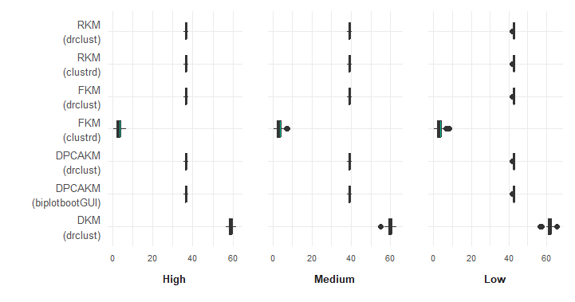
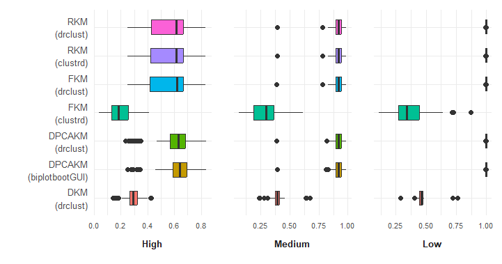
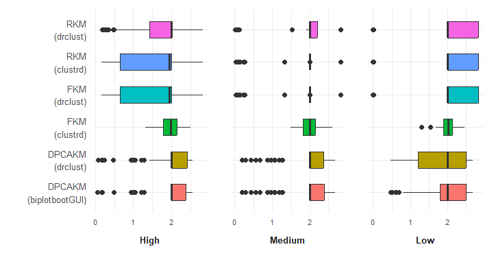
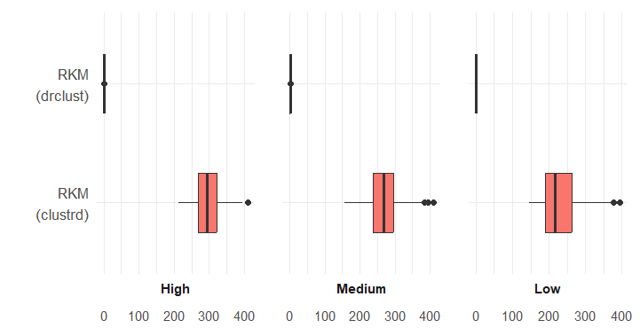
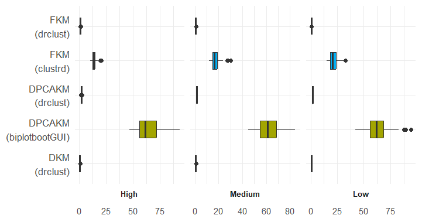
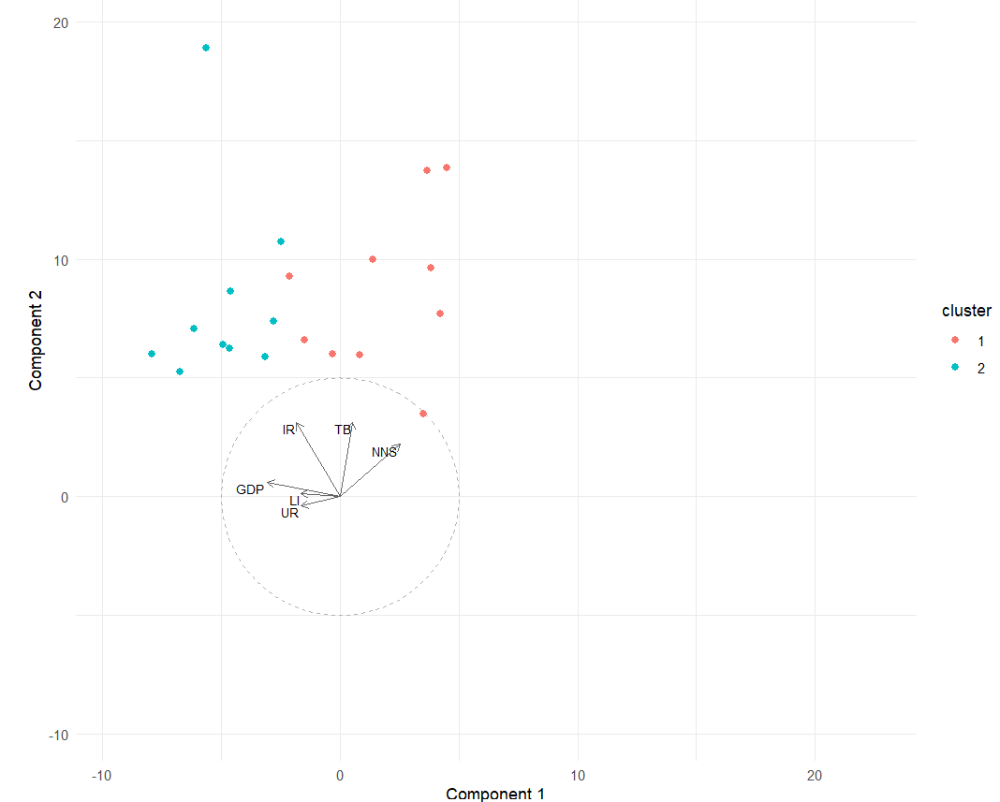

::::::::: article
## Introduction {#Introduction}

Cluster analysis is the process of identifying homogeneous groups of
units in the data so that those within clusters are perceived with a low
degree of dissimilarity with each other. In contrast, units in different
clusters are perceived as dissimilar, i.e., with a high degree of
dissimilarity. When dealing with large or extremely large data matrices,
often referred to as Big Data, the task of assessing these
dissimilarities becomes computationally intensive due to the sheer
volume of units and variables involved. To manage this vast amount of
information, it is essential to employ statistical techniques that
synthesize and highlight the most significant aspects of the data.
Typically, this involves dimensionality reduction for both units and
variables to efficiently summarize the data.

While cluster analysis synthesizes information across the rows of the
data matrix, variable reduction operates on the columns, aiming to
summarize the features and, ideally, facilitate their interpretation.
This key process involves extracting a subspace from the full space
spanned by the manifest variables, maintaining the principal informative
content. The process allows for the synthesis of common information
mainly among subsets of manifest variables, which represent concepts not
directly observable. As a result, subspace-based variable reduction
identifies a few uncorrelated latent variables that mainly capture
common relationships within these subsets. When using techniques like
Factor Analysis (FA) or Principal Component Analysis (PCA) for this
purpose, interpreting the resulting factors or components can be
challenging, particularly when variables significantly load onto
multiple factors, a situation known as *cross-loading*. Therefore, a
simpler structure in the loading matrix, focusing on the primary
relationship between each variable and its related factor, becomes
desirable for clarity and ease of interpretation. Furthermore, the
latent variables derived from PCA or FA do not provide a unique
solution. An equivalent model fit can be achieved by applying an
orthogonal rotation to the component axes. This aspect of non-uniqueness
is often exploited in practice through Varimax rotation, which is
designed to improve the interpretability of latent variables, without
affecting the fit of the analysis. The rotation promotes a simpler
structure in the loading matrix, however, the rotations do not always
ensure enhanced interpretability. An alternative approach has been
proposed by (Vichi and Saporta 2009) and (Vichi 2017), with Disjoint
Principal Component (DPCA) and Disjoint FA (DFA), suggesting to
construct each component/factor from a distinct subset of manifest
variables rather than using all available variables, still optimizing
the same estimation as in PCA and FA, respectively.

It is important to note that data matrix reduction for both rows and
columns is often performed without specialized methodologies by
employing a \"tandem analysis.\" This involves sequentially applying two
methods, such as using PCA or FA for variable reduction, followed by
Cluster Analysis using KM on the resulting factors. Alternatively, one
could start with Cluster Analysis and then proceed to variable
reduction. The outcomes of these two tandem analyses differ since each
approach optimizes distinct objective functions, one before the other.
For instance, when PCA is applied first, the components maximize the
total variance of the manifest variables. However, if the manifest
variables include high-variance variables that lack a clustering
structure, these will be included in the components, even though they
are not necessary for KM, which focuses on explaining only the variance
between clusters. As a result, sequentially optimizing two different
objectives may lead to sub-optimal solutions. In contrast, when
combining KM with PCA or FA in a simultaneous approach, a single
integrated objective function is utilized. This function aims to
optimize both the clustering partition and the subspace simultaneously.
The optimization is typically carried out using an Alternating Least
Squares (ALS) algorithm, which updates the partition for the current
subspace in one step and the subspace for the current partition in the
next. This iterative process ensures convergence to a solution that
represents at least a local minimum of the integrated objective
function. In comparison, tandem analysis, which follows a sequential
approach (e.g., PCA followed by KM), does not guarantee joint
optimization. One potential limitation of this sequential method is that
the initial optimization through PCA may obscure relevant information
for the subsequent step of Cluster Analysis or emphasize irrelevant
patterns, ultimately leading to sub-optimal solutions, as mentioned by
(DeSarbo et al. 1990). Indeed, the simultaneous strategy has been shown
to be effective in various studies, like (De Soete and Carroll 1994),
(Vichi and Kiers 2001), (Vichi 2001), (Vichi and Saporta 2009), (Rocci
and Vichi 2008), (Timmerman et al. 2010), (Yamamoto and Hwang 2014).

In order to spread access to these techniques and their use, software
implementations are needed. Within the R Core Team (2015) environment,
there are different libraries available to perform dimensionality
reduction techniques. Indeed, the plain version of KM, PCA, and FA are
available in the built-in package stats, namely: `princomp`, `factanal`,
`kmeans`. Furthermore, some packages allow to go beyond the plain
estimation and output of such algorithms. Indeed, one of the most rich
libraries in R is [**psych**](https://CRAN.R-project.org/package=psych)
(W. R. Revelle 2017), which provides functions that allow to easily
simulate data according to different schemes, testing routines,
calculation of various estimates, as well as multiple estimation
methods. [**ade4**](https://CRAN.R-project.org/package=ade4) (Dray and
Dufour 2007) allows for dimensionality reduction in the presence of
different types of variables, along with many graphical instruments. The
[**FactoMineR**](https://CRAN.R-project.org/package=FactoMineR) (Lê et
al. 2008) package allows for unit-clustering and extraction of latent
variables, also in the presence of mixed variables.
[**FactoClass**](https://CRAN.R-project.org/package=FactoClass) (Pardo
and Del Campo 2007) implements functions for PCA, Correspondence
Analysis (CA) as well as clustering, including the tandem approach.
[**factoextra**](https://CRAN.R-project.org/package=factoextra)
(Kassambara 2022) instead, provides visualization of the results, aiding
their assessment in terms of choice of the number of latent variables,
elegant dendrograms, screeplots and more. More focused on the choice of
the number of clusters is
[**NbClust**](https://CRAN.R-project.org/package=NbClust) (Charrad et
al. 2014), offering 30 indices for determining the number of clusters,
proposing the best method by trying not only different numbers of groups
but also different distance measures and clustering methods, going
beyond the partitioning ones.

More closely related to the library here presented, to the knowledge of
the authors, there are two packages that implement a subset of the
techniques proposed within
[**drclust**](https://CRAN.R-project.org/package=drclust).
[**clustrd**](https://CRAN.R-project.org/package=clustrd) (Markos et al.
2019) implements simultaneous methods of clustering and dimensionality
reduction. Besides offering functions for continuous data, they also
allow for categorical (or mixed) variables. Even more, they formulate,
at least for the continuous case, an implementation aligned with the
objective function proposed by Yamamoto and Hwang (2014), based on which
the reduced KM (RKM) and factorial KM (FKM) become special cases as
results of a tuning parameter.

Finally, there is
[**biplotbootGUI**](https://CRAN.R-project.org/package=biplotbootGUI)
(Nieto Librero and Freitas 2023), offering a GUI allowing to interact
with graphical tools, aiding in the choice of the number of components
and clusters. Furthermore, it implements KM with disjoint PCA (DPCA), as
described in (Vichi and Saporta 2009). Even more, they propose an
optimization algorithm for the choice of the initial starting point from
which the estimation process for the parameters begins.

Like [**clustrd**](https://CRAN.R-project.org/package=clustrd), the
[**drclust**](https://CRAN.R-project.org/package=drclust) package
provides implementations of FKM and RKM. However, while
[**clustrd**](https://CRAN.R-project.org/package=clustrd) also supports
categorical and mixed-type variables, our implementation currently
handles only continuous variables. That said, appropriate pre-processing
of categorical variables, as suggested in Vichi et al. (2019), can make
them compatible with the proposed methods. In extreme essence, one
should dummy-encode all the qualitative variables. In terms of
performance, [**drclust**](https://CRAN.R-project.org/package=drclust)
offers significantly faster execution. Moreover, regarding FKM, our
proposal demonstrates superior results in both empirical applications
and simulations, in terms of model fit and the Adjusted Rand Index
(ARI). Another alternative,
[**biplotbootGUI**](https://CRAN.R-project.org/package=biplotbootGUI),
implements KM with DPCA and includes built-in plotting functions and a
SDP-based initialization of parameters. However, our implementation
remains considerably faster and allows users to specify which variables
should be grouped together within the same (or different) principal
components. This capability enables a partially or fully confirmatory
approach to variable reduction. Beyond speed and the confirmatory
option, [**drclust**](https://CRAN.R-project.org/package=drclust) offers
three methods not currently available in other `R` packages: DPCA and
DFA, both designed for pure dimensionality reduction, and double KM
(DKM), which performs simultaneous clustering and variable reduction via
KM. All methods are implemented in C++ for computational efficiency.
Table [2](#tab:T2){reference-type="ref" reference="tab:stat_models"}
summarizes the similarities and differences between `drclust` and
existing alternatives

The package presented within this work aims to facilitate the access to
and usability of some techniques that fall in two main branches, which
overlap. In order to do so, some statistical background is first
recalled.

## Notation and theoretical background

The main pillars of
[**drclust**](https://CRAN.R-project.org/package=drclust) fall in two
main categories: dimensionality reduction and (partitioning) cluster
analysis. The former may be carried out individually or blended with the
latter. Because both rely on the language of linear algebra, Table
[1](#tab:T1){reference-type="ref" reference="tab:notation"} contains,
for the convenience of the reader, the mathematical notation needed for
this context. Then some theoretical background is reported.

::: {#tab:notation}
  --------------------------------------------------------------------------------------------------------------------------------------------------------------------------
  Symbol                      Description
  --------------------------- ----------------------------------------------------------------------------------------------------------------------------------------------
  *n*, *J*, *K*, *Q*          number of: units, manifest variables, unit-clusters, latent factors

  $\mathbf{X}$                *n* x *J* data matrix, where the generic element $x_{ij}$ is the real observation on the *i*-th unit within the *j*-th variable

  $\mathbf{x}_i$              *J* x 1 vector representing the generic row of $\mathbf{X}$

  $\mathbf{U}$                *n* x *K* unit-cluster membership matrix, binary and row stochastic, with $u_{ik}$ being the generic element

  $\mathbf{V}$                *J* x *Q* variable-cluster membership matrix, binary and row stochastic, with $v_{jq}$ as the generic element

  $\mathbf{B}$                *J* x *J* variable-weighting diagonal matrix

  $\mathbf{Y}$                *n* x *Q* component/factor score matrix defined on the reduced subspace

  $\mathbf{y}_i$              *Q* x 1 vector representing the generic row of **Y**

  $\mathbf{A}$                *J* x *Q* variables - factors, \"plain\", loading matrix

  $\mathbf{C}^+$              Moore-Penrose pseudo-inverse of a matrix **C**. $\mathbf{C}^+ = (\mathbf{C'C})^{-1}\mathbf{C'}$

  $\bar{\textbf{X}}$          *K* x *J* centroid matrix in the original feature space, i.e., $\bar{\textbf{X}} = \textbf{U}^{+} \textbf{X}$

  $\bar{\mathbf{Y}}$          *K* x *Q* centroid matrix projected in the reduced subspace, i.e., $\bar{\mathbf{Y}} = \bar{\mathbf{X}}\mathbf{A}$

  $\mathbf{H}_{\mathbf{C}}$   Projector operator $\mathbf{H}_\mathbf{C} = \mathbf{C}(\mathbf{C}'\mathbf{C})^{-1}\mathbf{C}'$ spanned by the columns of matrix $\mathbf{C}$

  $\mathbf{E}$                *n* x *J* Error term matrix

  $||\cdot||$                 Frobenius norm
  --------------------------------------------------------------------------------------------------------------------------------------------------------------------------

  : (#tab:T1) Notation
:::

### Latent variables with simple-structure loading matrix

Classical methods of PCA (Pearson 1901) or FA (Cattell 1965; Lawley and
Maxwell 1962) build each latent factor from combination of *all* the
manifest variables. As a consequence, the loading matrix, describing the
relations between manifest and latent variables, is usually not
immediately interpretable. Ideally, it is desirable to have variables
that are associated to a single factor. This is typically called *simple
structure*, which induces subsets of variables characterizing factors
and frequently the partition of the variables. While factor rotation
techniques go in this direction (especially Varimax), even if not
exactly, they do not guarantee the result. Alternative solutions have
been proposed. (Zou et al. 2006), by framing the PCA problem as a
regression one, introducing an elastic-net penalty, aiming for a sparse
solution of the loading matrix **A**. For the present work, we consider
two techniques for this purpose: DPCA and DFA, implemented in the
proposed package.

#### Disjoint principal component analysis

Vichi and Saporta (2009) propose an alternative solution, DPCA, which
leads to the simplest possible structure on **A**, while still
maximizing the explained variance. Such a result is obtained by building
each latent factor from a subset of variables instead of allowing all
the variables to contribute to all the components. This means that it
provides *J* non-zero loadings instead of having *JQ* of them. To obtain
this setting, variables are grouped in such a way that they form a
partition of the initial set. The model can be described as a
constrained PCA, where the matrix $\mathbf{A}$ is restricted to be
reparametrized into the product $\mathbf{A}=\mathbf{BV}$. Thus, the
model is described as:

$$\begin{equation}
\label{dpca1}
    \mathbf{X} = \mathbf{X}\mathbf{A}\mathbf{A}' + \mathbf{E}= \mathbf{X}\mathbf{B}\mathbf{V}\mathbf{V}'\mathbf{B} + \mathbf{E},
\end{equation}   (\#eq:dpca1)$$
subject to
$$\begin{equation}
\label{dpca2}
    \mathbf{V} = [v_{jq} \in \{0,1\}] \ \ \ \ \ (binarity),
\end{equation}   (\#eq:dpca2)$$

$$\begin{equation}
\label{dpca3}
    \mathbf{V}\mathbf{1}_{Q} = \mathbf{1}_{J} \ \ \ (row-stochasticity),
\end{equation}   (\#eq:dpca3)$$

$$\begin{equation}
\label{dpca4}
\mathbf{V}'\mathbf{B}\mathbf{B}'\mathbf{V} = \mathbf{I}_{Q} \ \ \ \ \ (orthonormality),
\end{equation}   (\#eq:dpca4)$$

$$\begin{equation}
\label{dpca5}
    \mathbf{B} =  diag(b_1, \dots, b_J) \ \ \ \ (diagonality).
\end{equation}   (\#eq:dpca5)$$
The estimation of the parameters $\mathbf{B}$ and $\mathbf{V}$ is
carried out via least squares (LS) and, by solving the minimization
problem,
$$\begin{equation}
\label{dpca6}
    RSS_{DPCA}(\mathbf{B}, \mathbf{V}) = ||\mathbf{X} - \mathbf{X}\mathbf{B}\mathbf{V}\mathbf{V}'\mathbf{B}||^2
\end{equation}   (\#eq:dpca6)$$
subject to the the constraints (\@ref(eq:dpca2), \@ref(eq:dpca3),
\@ref(eq:dpca4), \@ref(eq:dpca5)). An ALS algorithm is employed,
guaranteeing at least a local optimum. In order to (at least partially)
overcome this downside, multiple random starts are needed, and the best
solution is retained.

Therefore, the DPCA method is subject to more structural constraints
than standard PCA. Specifically, standard PCA does not enforce the
reparameterization $\mathbf{A}=\mathbf{BV}$, meaning its loading matrix
$\mathbf{A}$ is free to vary among orthonormal matrices. In contrast,
DPCA still requires an orthonormal matrix $\mathbf{A}$ but also needs
that each principal component is associated with a disjoint subset of
variables that most reconstruct the data. This implies that each
variable contributes to only one component, resulting in a sparse and
block-diagonal loading matrix. In essence, DPCA fits *Q* separate PCAs
on the *Q* disjoint subsets of variables, and from each, extracts the
eigenvector associated with the largest eigenvalue. In general, the
total variance explained by DPCA is slightly lower, and the residual of
the objective function is larger compared to PCA. This trade-off is made
in exchange for the added constraint that clearly enhances
interpretability. The extent of the reduction depends on the true
underlying structure of the latent factors, specifically on whether they
are truly uncorrelated. When the observed correlation matrix is block
diagonal, with variables within blocks being highly correlated and
variables between blocks being uncorrelated, DPCA can explain almost the
same amount of variance of PCA, with the advantage to simplify
interpretation.\
It is important to note that, as DPCA is implemented, it allows for a
blend of exploratory and confirmatory approaches. In the confirmatory
framework, users can specify a priori which variables should
collectively contribute to a factor using the `constr` argument,
available for the last three functions in Table
[2](#tab:T2){reference-type="ref" reference="tab:stat_models"}. The
algorithm assigns the remaining manifest variables, for which no
constraint has been specified, to the *Q* factors in a way that ensures
the latent variables best reconstruct the manifest ones, capturing the
maximum variance. This is accomplished by minimizing the loss function
(\@ref(eq:dpca6)). Although each of the *Q* latent variables is derived
from a different subset of variables, which involves the spectral
decomposition of multiple covariance matrices, their smaller size,
combined with the implementation in C++, enables very rapid execution of
the routine.

A very positive side effect of the additional constraint in DPCA
compared to standard PCA is the uniqueness of the solution, which
eliminates the need for factor rotation in DPCA.

#### Disjoint factor analysis

Proposed by Vichi (2017), this technique is the model-based counterpart
of the DPCA model. It pursues a similar goal in terms of building *Q*
factors from *J* variables, imposing a simple structure on the loading
matrix. However, the means by which the goal is pursued are different.
Unlike DPCA, the estimation method adopted for DFA is Maximum Likelihood
and the model requires additional statistical assumptions compared to
DPCA. The model can be formulated in a matrix form as,
$$\begin{equation}
\label{dfa1}
    \mathbf{X} = \mathbf{Y}\mathbf{A}'+\mathbf{E},
\end{equation}   (\#eq:dfa1)$$
where $\mathbf{X}$ is centered, meaning that the mean vector
$\boldsymbol{\mu}$ has been subtracted from each multivariate unit
$\mathbf{x}_{i}$. Therefore, for a multivariate, centered, unit, the
previous model can be expressed as
$$\begin{equation}
\label{dfa2}
    \mathbf{x}_i = \mathbf{A}\mathbf{y}_i + \mathbf{e}_i, \ \ i = 1, \dots, n.
\end{equation}   (\#eq:dfa2)$$
where $\mathbf{y}_i$ is the *i*-th row of $\mathbf{Y}$ and
$\mathbf{x}_i$, $\mathbf{e}_i$ are, respectively, the $i$-th rows of
$\mathbf{X}$ and $\mathbf{E}$, with a multivariate normal distribution
on the $J$-dimensional space,
$$\begin{equation}
\label{FAassumptions1}
    \mathbf{x}_i \sim \mathcal{N}(\boldsymbol{0}, \boldsymbol{\Sigma_X}), \ \ \  \mathbf{e}_i \sim \mathcal{N}(\boldsymbol{0}, \mathbf{\Psi})
\end{equation}   (\#eq:FAassumptions1)$$
The covariance structure of the FA model can be written,
$$\begin{equation}
    Cov(\mathbf{x}_i) = \mathbf{\Sigma_X} = \mathbf{AA'} + \mathbf{\Psi},
\end{equation}$$
[]{#dfa6 label="dfa6"} where additional, assumptions are needed,
$$\begin{equation}
\label{dfa4}
    Cov(\mathbf{y}_{i}) = \mathbf{\Sigma}_{\mathbf{Y}} = \mathbf{I}_Q,
\end{equation}   (\#eq:dfa4)$$

$$\begin{equation}
\label{dfa5}
    Cov(\mathbf{e}_i) = \mathbf{\Sigma}_{\mathbf{E}} = \mathbf{\Psi}, \ \ \ \mathbf{\Psi} = diag(\psi_{1},\dots,\psi_{Q} : \psi_{q}>0)' , \ \  j = 1, \dots, J
\end{equation}   (\#eq:dfa5)$$

$$\begin{equation}
  Cov(\mathbf{e}_{i}, \mathbf{y}_{i}) = \mathbf{\Sigma}_{\mathbf{EY}} = 0 
\label{dfa5b}
\end{equation}   (\#eq:dfa5b)$$

$$\begin{equation}
\mathbf{A} = \mathbf{BV}
\label{dfa6b}
\end{equation}   (\#eq:dfa6b)$$
The objective function can be formulated as the maximization of the
Likelihood function or as the minimization of the following discrepancy:
$$\begin{align*}
    D_{DFA}(\mathbf{B},\mathbf{V}, \mathbf{\Psi}) 
    & = |\text{ln}(\mathbf{B}\mathbf{V}\mathbf{V}'\mathbf{B} + \mathbf{\Psi})| - \text{ln}|\mathbf{S}| + \text{tr}((\mathbf{B}\mathbf{V}\mathbf{V}'\mathbf{B} + \mathbf{\Psi})^{-1}\mathbf{S}) - \textit{J}, \\
    & \qquad j = 1, \dots, \textit{J}, \ q = 1, \dots, \textit{Q},\\
    &  \qquad s.t.: \mathbf{V} = [v_{jq}], \ v_{jq} \in \{0,1\}, \ \sum_q{v_{jq}} = 1,
\end{align*}$$
whose parameters are optimized by means of a coordinate descent
algorithm.

Apart from the methodological distinctions between DPCA and DFA, the
latter exhibits the scale equivariance property. The optimization of the
Likelihood function implies a higher computational load, thus, a longer
(compared to the DPCA) execution time.

As in the DPCA case, under the constraint $\mathbf{A}=\mathbf{BV}$, the
solution provided by the model is, also in this case, unique.

### Joint clustering and variable reduction

The four clustering methods discussed all follow the $K$-means
framework, working to partition units. However, they differ primarily in
how they handle variable reduction.

Double KM (DKM) employs a symmetric approach, clustering both the units
(rows) and the variables (columns) of the data matrix at the same time.
This leads to the simultaneous identification of mean profiles for both
dimensions. DKM is particularly suitable for data matrices where both
rows and columns represent units. Examples of such matrices include
document-by-term matrices used in Text Analysis, product-by-customer
matrices in Marketing, and gene-by-sample matrices in Biology.

In contrast, the other three clustering methods adopt an asymmetric
approach. They treat rows and columns differently, focusing on means
profiles and clustering for rows, while employing components or factors
for the variables (columns). These methods are more appropriate for
typical units-by-variable matrices, where it's beneficial to synthesize
variables using components or factors. At the same time, they emphasize
clustering and the mean profiles of the clusters specifically for the
rows. The methodologies that fall into this category are RKM, FKM, and
DPCAKM.

The estimation is carried out by the LS method, while the computation of
the estimates is performed via ALS.

#### Double k-means (DKM)

Proposed by Vichi (2001), DKM is one of the first introduced
bi-clustering methods that provides a simultaneous partition of the
units and variables, resulting in a two-way extension of the plain KM
(McQueen 1967). The model is described by the following equation,
$$\begin{equation}
\label{dkm1}
    \mathbf{X} = \mathbf{U}\bar{\mathbf{Y}}\mathbf{V}' + \mathbf{E}
\end{equation}   (\#eq:dkm1)$$
where $\bar{\mathbf{Y}}$ is the centroid matrix in the reduced space for
the rows and columns, enabling a comprehensive summarization of units
and variables. By optimizing a single objective function, the DKM method
captures valuable information from both dimensions of the dataset
simultaneously.

This bi-clustering approach can be applied in several impactful ways.
One key application is in the realm of Big Data. DKM can effectively
compress expansive datasets that includes a vast number of units and
variables into a compressed more manageable and robust data matrix
$\bar{\mathbf{Y}}$. This compressed matrix, formed by mean profiles both
for rows and columns, can then be explored and analyzed using a variety
of subsequent statistical techniques, thus facilitating efficient data
handling and analysis of Big Data. The algorithm similarly to the
well-known KM is very fast and converges quickly to a solution, which is
at least a local minimum of the problem.

Another significant application of DKM is its capability to achieve
optimal clustering for both rows and columns. This dual clustering
ability is particularly advantageous in situations where it is essential
to discern meaningful patterns and relationships within complex
datasets, highlighting the utility of DKM in diverse fields and
scenarios.

The Least Squares estimation of the parameters $\mathbf{U}$,
$\mathbf{V}$ and $\bar{\mathbf{Y}}$ leads to the minimization of the
problem
$$\begin{equation}
\label{dkm2}
    RSS_{\textit{DKM}}(\mathbf{U}, \mathbf{V}, \bar{\mathbf{Y}}) = {||\mathbf{X} - \mathbf{U}\bar{\mathbf{Y}}\mathbf{V}'||^2},
\end{equation}   (\#eq:dkm2)$$

$$\begin{equation}
\label{dkm3}
    s.t.:  u_{ik} \in \{0,1\}, \ \ \sum_{k} u_{ik} = 1, \ \  i = 1 ,\dots, N, \ \ k = 1 ,\dots, K,
\end{equation}   (\#eq:dkm3)$$

$$\begin{equation}
\label{dkm4}
    \ \ \ \ \ \ \ v_{jq} \in \{0,1\}, \ \ \sum_{q} v_{jq} = 1, \ \ j = 1, \dots, J, \ \ q = 1, \dots, Q.
\end{equation}   (\#eq:dkm4)$$
Since $\mathbf{\bar{Y}} = \mathbf{U}^{+}\mathbf{X}\mathbf{V}^{+'}$, then
(\@ref(eq:dkm2)) can be framed in terms of projector operators, thus:
$$\begin{equation}
\label{dkm5}
RSS_{\textit{DKM}}(\mathbf{U}, \mathbf{V}) = ||\mathbf{X} - \mathbf{H}_\mathbf{U}\mathbf{X}\mathbf{H}_\mathbf{V}||^2.
\end{equation}   (\#eq:dkm5)$$
Minimizing in both cases the sum of squared-residuals (or, equivalently,
the within deviances associated to the *K* unit-clusters and *Q*
variable-clusters). In this way, one obtains a (hard) classification of
both units and variables. The optimization of \[\@ref(eq:dkm5)\] is done
via ALS, alternating, in essence, two assignment problems for rows and
columns similar to KM steps.

#### Reduced k-means (RKM)

Proposed by De Soete and Carroll (1994), RKM performs the reduction of
the variables by projecting the *J*-dimensional centroid matrix into a
*Q*-dimensional subspace ($\textit{Q} \leq$ *J*), spanned by the columns
of the loading matrix $\mathbf{A}$, such that it best reconstructs
$\mathbf{X}$ by using the orthogonal projector matrix
$\mathbf{A}\mathbf{A}'$. Therefore, the model is described by the
following equation,
$$\begin{equation}
\label{rkm1}
    \mathbf{X} = \mathbf{U}\bar{\mathbf{X}}\mathbf{A}\mathbf{A}' + \mathbf{E}.
\end{equation}   (\#eq:rkm1)$$
The estimation of **U** and **A** can be done via LS, minimizing the
following equation,
$$\begin{equation}
\label{rkm2}
    RSS_{\textit{RKM}}(\mathbf{U}, \mathbf{A})={||\mathbf{X} - \mathbf{U}\bar{\mathbf{X}}\mathbf{A}\mathbf{A}'||^2},
\end{equation}   (\#eq:rkm2)$$

$$\begin{equation}
\label{rkm3}
    s.t.: \ \ \  u_{ik} \in \{0,1\}, \ \ \sum_{k} u_{ik} = 1, \ \ \mathbf{A}'\mathbf{A} = \mathbf{I}.
\end{equation}   (\#eq:rkm3)$$
which can be optimized, once again, via ALS. In essence, the model
alternates a KM step assigning each original unit $\mathbf{x}_i$ to the
closest centroid in the reduced space and a PCA step based on the
spectral decomposition of $\mathbf{X}'\mathbf{H}_\mathbf{U}\mathbf{X}$,
conditioned on the results of the previous iteration. The iterations
continue until when the difference between two subsequent objective
functions is smaller than a small arbitrary chosen constant
$\epsilon > 0$.

#### Factorial k-means (FKM)

Proposed by Vichi and Kiers (2001), FKM produces a dimension reduction
both of the units and centroids differently from RKM. Its goal is to
reconstruct the data in the reduced subspace, $\mathbf{Y}$, by means of
the centroids in the reduced space. The FKM model can be obtained by
considering the RKM model and post-multiplying the right- and left-hand
side of it in equation (\@ref(eq:rkm1)), and rewriting the new error as
$\mathbf{E}$,
$$\begin{equation}
    \mathbf{X}\mathbf{A} = \mathbf{U}\bar{\mathbf{X}}\mathbf{A} + \mathbf{E}.
\end{equation}$$
Its estimation via LS results in the optimization of the following
equation,
$$\begin{equation}
\label{fkm1}
    RSS_{\textit{FKM}}(\mathbf{U}, \mathbf{A}, \bar{\mathbf{X}})={||\mathbf{X}\mathbf{A} - \mathbf{U}\bar{\mathbf{X}}\mathbf{A}||^2},
\end{equation}   (\#eq:fkm1)$$

$$\begin{equation}
    s.t.: \ \ \  u_{ik} \in \{0,1\}, \ \ \sum_{k} u_{ik} = 1, \ \ \mathbf{A}'\mathbf{A} = \mathbf{I}.
\end{equation}$$
Although the connection with the RKM model appears straightforward, it
can be shown that the loss function of the former is always equal or
smaller compared to the latter. Practically, the KM step is applied on
$\mathbf{X}\mathbf{A}$, instead of just $\mathbf{X}$, as it happens in
the DKM and RKM. In essence, FKM works better when the data and
centroids are lying in the reduced subspace, and not just the centroids
as in RKM.

In order to decide when RKM or FKM can be properly applied, it is
important to recall that two types of residuals can be defined in
dimensionality reduction: *subspace residuals*, lying on the subspace
spanned by the columns of $\mathbf{A}$ and *complement residuals*, lying
on the complement of this subspace, i.e., those residual lying on the
subspace spanned by the columns of $\mathbf{A}^\perp$, with
$\mathbf{A}^\perp$ a column-wise orthonormal matrix of order
$J \times (J-Q)$ such that
$\mathbf{A}^\perp \mathbf{A}^{\perp ^\prime} = \mathbf{O}_{J-Q}$, where
$\mathbf{O}_{J-Q}$ is the matrix of zeroes of order $Q \times (J-Q)$.
FKM is more effective when there is significant residual variance in the
subspace orthogonal to the clustering subspace. In other words, the
complement residuals typically represent the error given by those
observed variables that scarcely contribute to the clustering subspace
to be identified. FKM tends to recover the subspace and clustering
structure more accurately when the data contains variables with
substantial variance that does not reflect the clustering structure and
therefore mask it. FKM can better ignore these variables and focus on
the relevant clustering subspace. On the other hand, RKM performs better
when the data has significant residual variance within the clustering
subspace itself. This means that when the variables within the subspace
show considerable variance, RKM can more effectively capture the
clustering structure.

In essence, when most of the variables in the dataset reflect the
clustering structure, RKM is more likely to provide a good solution. If
this is not the case, FKM may be preferred.

#### Disjoint principal component analysis k-means (DPCAKM)

Starting from the FKM model, the goal here, beside the partition of the
units, is to have a parsimonious representation of the relationships
between latent and manifest variables, provided by the loading matrix
**A**. Vichi and Saporta (2009) propose for FKM the parametrization of
**A** = **BV**, that allows the simplest structure and thus simplifies
the interpretation of the factors,
$$\begin{equation}
\label{cdpca1}
    \mathbf{X} = \mathbf{U}\bar{\mathbf{X}}\mathbf{B}\mathbf{V}\mathbf{V}'\mathbf{B} + \mathbf{E}.
\end{equation}   (\#eq:cdpca1)$$
By estimating $\mathbf{U}$, $\mathbf{B}$, $\mathbf{V}$ and
$\bar{\mathbf{X}}$ via LS, the loss function of the proposed method
becomes:
$$\begin{equation}
\label{cdpca2}
    RSS_{DPCAKM}(\mathbf{U}, \mathbf{B}, \mathbf{V}, \bar{\mathbf{X}}) = ||\mathbf{X} - \mathbf{U}\bar{\mathbf{X}}\mathbf{B}\mathbf{V}\mathbf{V}'\mathbf{B}||^2,
\end{equation}   (\#eq:cdpca2)$$

$$\begin{equation}
\label{cdpca3}
    s.t.:  u_{ik} \in \{0,1\}, \ \ \sum_{k} u_{ik} = 1, \ \  i = 1 ,\dots, N, \ \ k = 1 ,\dots, K,
\end{equation}   (\#eq:cdpca3)$$

$$\begin{equation}
\label{cdpca4}
    \ \ \ \ \ \ \ v_{jq} \in \{0,1\}, \ \ \sum_{q} v_{jq} = 1, \ \ j = 1, \dots, J, \ \ q = 1, \dots, Q,
\end{equation}   (\#eq:cdpca4)$$

$$\begin{equation}
\label{cdpca5}
    \ \ \ \ \ \ \ \mathbf{V}'\mathbf{B}\mathbf{B}\mathbf{V} = \mathbf{I}, \ \  \mathbf{B} =  diag(b_1, \dots, b_J).
\end{equation}   (\#eq:cdpca5)$$
In practice, this model has traits of the DPCA given the projection on
the reduced subspace and the partitioning of the units, resulting in a
sparse loading matrix, but also of the DKM, given the presence of both
**U** and **V**. Thus, DPCAKM can be considered a bi-clustering
methodology with an asymmetric treatment of the rows and columns of
**X**. By inheriting the constraint on **A**, the overall fit of the
model compared with the FKM for example, is generally worse although it
offers an easier interpretation of the principal components.
Nevertheless, it is potentially able to identify a better partition of
the units. Like in the DPCA case, the difference is negligible when the
true latent variables are really disjoint. As implemented, the
assignment step is carried out by minimizing the unit-centroid
squared-Euclidean distance in the reduced subspace.

## The package

The library offers the implementation of all the models mentioned in the
previous section. Each one of them corresponds to a specific function
implemented using [**Rcpp**](https://CRAN.R-project.org/package=Rcpp)
(Eddelbuettel and Francois 2011) and
[**RcppArmadillo**](https://CRAN.R-project.org/package=RcppArmadillo)
(Eddelbuettel and Sanderson 2014).

::: {#tab:stat_models}
  -----------------------------------------------------------------------------------------------------------------------------------------------------
  Function     Model                         Previous\                                 Main differences\
                                             Implementations                           in `drclust`
  ------------ ----------------------------- ----------------------------------------- ----------------------------------------------------------------
  `doublekm`   DKM\                          None                                      Short runtime (C++);
               (Vichi 2001)                                                            

  `redkm`      RKM\                          in `clusterd`;\                           \>50x faster (C++);\
               (De Soete and Carroll 1994)   Mixed variables;                          Continuous variables;

  `factkm`     FKM\                          in `clustrd`;\                            \>20x faster (C++);\
               (Vichi and Kiers 2001)        Mixed variables                           Continuous variables;\
                                                                                       Better fit and classification;

  `dpcakm`     DPCAKM\                       in `biplotbootGUI`;\                      \>10x faster (C++);\
               (Vichi and Saporta 2009)      Continuous variables;\                    Constraint on variable allocation within principal components;
                                             SDP-based initialization of parameters;   

  `dispca`     DPCA\                         None                                      Short runtime (C++);\
               (Vichi and Saporta 2009)                                                Constraint on variable allocation within principal components;

  `disfa`      DFA\                          None                                      Short runtime (C++);\
               (Vichi 2017)                                                            Constraint on variable allocation within factors;
  -----------------------------------------------------------------------------------------------------------------------------------------------------

  : (#tab:T2) Statistical methods available in the `drclust` package
:::

Some additional functions have been made available for the user. Most of
them are intended to aid the user in evaluating the quality of the
results, or in the choice of the hyper-parameters.

::: {#tab:aux_methods}
  -------------------------------------------------------------------------------------------------------------------------------------------------------------------------------------------------------------------------------------------------------------------------
  **Function**      **Technique**                 **Description**                                                                                                                                                                         **Goal**
  ----------------- ----------------------------- --------------------------------------------------------------------------------------------------------------------------------------------------------------------------------------- ---------------------------------
  `apseudoF`        \"relaxed\" pseudoF           \"Relaxed\" version of Caliński and Harabasz (1974). Selects the second largest pseudoF value if the difference with the first is less than a fraction.                                 Parameter tuning

  `dpseudoF`        DKM-pseudoF                   Adaptation of the pseudoF criterion proposed by Rocci and Vichi (2008) to bi-clustering.                                                                                                Parameter tuning

  `kaiserCrit`      Kaiser criterion              Kaiser rule for selecting the number of principal components (Kaiser 1960).                                                                                                             Parameter tuning

  `centree`         Dendrogram of the centroids   Graphical tool showing how close the centroids of a partition are.                                                                                                                      Visualization

  `silhouette`      Silhouette                    Imported from [**cluster**](https://CRAN.R-project.org/package=cluster) (Maechler et al. 2023) and [**factoextra**](https://CRAN.R-project.org/package=factoextra) (Kassambara 2022).   Visualization, parameter tuning

  `heatm`           Heatmap                       Heatmap of distance-ordered units within distance-ordered clusters, adapted from [**pheatmap**](https://CRAN.R-project.org/package=pheatmap) (Kolde 2019).                              Visualization

  `CronbachAlpha`   Cronbach Alpha Index          Proposed by Cronbach (1951). Assesses the unidimensionality of a dataset.                                                                                                               Assessment

  `mrand`           ARI                           Assesses clustering quality based on the confusion matrix (Rand 1971).                                                                                                                  Assessment

  `cluster`         Membership vector             Returns a multinomial 1 × *n* membership vector from a binary, row-stochastic *n* × *K* membership matrix; mimics `kmeans$cluster`.                                                     Encoding
  -------------------------------------------------------------------------------------------------------------------------------------------------------------------------------------------------------------------------------------------------------------------------

  : (#tab:T3) Auxiliary functions available in the library
:::

With regard to the auxiliary functions (Table
[3](#tab:T3){reference-type="ref" reference="tab:aux_methods"}), they
have all been implemented in the `R` language, building on top of
packages already available on CRAN, such as
[**cluster**](https://CRAN.R-project.org/package=cluster) by (Maechler
et al. 2023),
[**factoextra**](https://CRAN.R-project.org/package=factoextra) by
(Kassambara 2022),
[**pheatmap**](https://CRAN.R-project.org/package=pheatmap) by (Kolde
2019), which allowed for an easier implementation. One of the main goals
of the proposed package, besides spreading the availability and
usability of the statistical methods considered, is the speed of
computation. By doing so (if the memory is sufficient), the results,
also for large data matrices, can be obtained in a reasonable amount of
time. A first mean adopted to pursue such a goal is the full
implementation of the statistical methods in the C++ language. The
libraries used are [**Rcpp**](https://CRAN.R-project.org/package=Rcpp)
(Eddelbuettel and Francois 2011) and
[**RcppArmadillo**](https://CRAN.R-project.org/package=RcppArmadillo)
(Eddelbuettel and Sanderson 2014), which significantly reduced the
required runtime.

A practical issue that happens very often in crisp (hard) clustering,
such as KM, is the presence of empty clusters after the assignment step.
When this happens, a column of $\mathbf{U}$ has all elements equal to
zero, which can be proved to be a local minimum solution, and impedes
obtaining a solution for $(\mathbf{U}'\mathbf{U})^{-1}$. This typically
happens even more often when the number of clusters *K* specified by the
user is larger than the true one or in the case of a sub-optimal
solution. Among the possible solutions addressing this issue, the one
implemented here consists in splitting the cluster with higher
within-deviance. In practice, a KM with $\textit{K} = 2$ is applied to
it, assigning to the empty cluster one of the two clusters obtained by
the procedure, which is iterated until all the empty clusters are
filled. Such a strategy guarantees that the monotonicity of the ALS
algorithm is preserved, although it is the most time-consuming one.

Among all the six implementations of the statistical techniques, there
are some arguments that are set to a default value. Table
[4](#tab:T4){reference-type="ref" reference="tab:defaultarguments"}
describes all the arguments that have a default value. In particular,
`print`, which displays a descriptive summary of the results, is set to
zero (so the user should explicitly require to the function such
output). `Rndstart` is set as default to 20, so that the algorithm is
run 20 times until convergence. In order to have more confidence (not
certainty) that the obtained solution is a global optimum, a higher
value for this argument can be provided. With particular regard to
`redkm` and `factkm`, the argument `rot`, which performs a Varimax
rotation on the loading matrix, is set by default to 0. If the user
would like to have this performed, it must be set equal to 1. Finally,
the `constr` argument, which is available for `dpcakm` and `dispca`, is
set by default to a vector (of length *J*) of zeros, so that each
variable is selected to contribute to the most appropriate latent
variable, according to the logic of the model.

::: {#tab:defaultarguments}
  ---------------------------------------------------------------------------------------------------------------------------------------------------------------------------------------------------------------------------------------------------------------------------------------------------------------------------------------------------------------------------------------------
  **Argument**   **Used In**                                                  **Description**                                                                                                                                                                                                                                                                               **Default Value**
  -------------- ------------------------------------------------------------ --------------------------------------------------------------------------------------------------------------------------------------------------------------------------------------------------------------------------------------------------------------------------------------------- -------------------
  `Rndstart`     `doublekm`, `redkm`, `factkm`, `dpcakm`, `dispca`, `disfa`   Number of times the model is run until convergence.                                                                                                                                                                                                                                           20

  `verbose`      `doublekm`, `redkm`, `factkm`, `dpcakm`, `dispca`, `disfa`   Outputs basic summary statistics regarding each random start (1 = enabled; 0 = disabled).                                                                                                                                                                                                     0

  `maxiter`      `doublekm`, `redkm`, `factkm`, `dpcakm`, `dispca`, `disfa`   Maximum number of iterations allowed for each random start (if convergence is not yet reached)                                                                                                                                                                                                100

  `tol`          `doublekm`, `redkm`, `factkm`, `dpcakm`, `dispca`, `disfa`   Tolerance threshold (maximum difference between the values of the objective function of two consecutive iterations such that convergence is assumed                                                                                                                                           $10^{-6}$

  `tol`          `apseudoF`                                                   Approximation value. It is half of the length of the interval put for each pF value. 0 \<= `tol` \< 1                                                                                                                                                                                         0.05

  `rot`          `redkm`, `factkm`                                            performs varimax rotation of axes obtained via PCA (0 = `False`; 1 = `True`)                                                                                                                                                                                                                  0

  `prep`         `doublekm`, `redkm`, `factkm`, `dpcakm`, `dispca`, `disfa`   Pre-processing of the data. 1 performs the *z*-score transform; 2 performs the min-max transform; 0 leaves the data un-pre-processed                                                                                                                                                          1

  `print`        `doublekm`, `redkm`, `factkm`, `dpcakm`, `dispca`, `disfa`   Final summary statistics of the performed method (1 = enabled; 0 = disabled).                                                                                                                                                                                                                 0

  `constr`       `dpcakm`, `dispca`, `disfa`                                  Vector of length $J$ (number of variables) specifying variable-to-cluster assignments. Each element can be an integer from 0 to $Q$ (number of variable-clusters or components), indicating a fixed assignment, or 0 to leave the variable unconstrained (i.e., assigned by the algorithm).   `rep(0,J)`
  ---------------------------------------------------------------------------------------------------------------------------------------------------------------------------------------------------------------------------------------------------------------------------------------------------------------------------------------------------------------------------------------------

  : (#tab:T4) Arguments accepted by functions in the `drclust`
  package with default values
:::

By offering a fast execution time, all the implemented models allow to
run multiple random starts of the algorithm in a reasonable amount of
time. This feature comes particularly useful given the absence of
guarantees of global optima for the ALS algorithm, which has an ad-hoc
implementation for all the models. Table
[5](#tab:T5){reference-type="ref" reference="tab:comparison"} shows
that, compared to the two packages which implement 3 of the 6 models in
[**drclust**](https://CRAN.R-project.org/package=drclust), our proposal
is much faster than the corresponding versions implemented in `R` (Table
[5](#tab:T5){reference-type="ref" reference="tab:comparison"}),
providing, nevertheless, compelling results.

The iris dataset has been used in order to measure the performance in
terms of fit, runtime, and ARI (Rand 1971). The *z*-transform has been
applied on all the variables of the dataset. This implies that all the
variables, post-transformation, have mean equal to 0 and variance equal
to 1, by subtracting the mean to each variable and dividing the result
by the standard deviation. The same result is typically obtained by the
`scale(X) R` function.

$$\begin{equation}
\label{eq:ztransform}
\mathbf{Z}_{\cdot j} = \frac{\mathbf{X}_{\cdot j} - \mu_j \mathbf{1_\textit{n}}}{\sigma_j}
\end{equation}   (\#eq:ztransform)$$
where $\mu_j$ is the mean of the *j*-th variable and $\sigma_\textit{j}$
its standard deviation. The subscript .*j* refers to the whole *j*-th
column of the matrix. This operation avoids the measurement scale to
have impact on the final result (and is used by default, unless
otherwise specified by the user, within all the techniques implemented
by `drclust`. In order to avoid the comparison between potentially
different objective functions, the between deviance (intended as
described by the authors in the articles where the methods have been
proposed) has been used as a fit measure and computed based on the
output provided by the functions, aiming at having homogeneity in the
evaluation metric. *K=3* and *Q=2* have been used for the clustering
algorithms, maintaining, for the two-dimensionality reduction
techniques, just *Q* = 2.

For each method, 100 runs have been performed and the best solution has
been picked. For each run, the maximum allowed number of iterations =
100, with a tolerance error (i.e., precision) equal to $10^{-6}$.

::: {#tab:comparison}
  ------------------------------------------------------------------------------------------------------
  Library         Technique   Runtime   Fit     ARI     Fit Measure
  --------------- ----------- --------- ------- ------- ------------------------------------------------
  clustrd         RKM         0.73      21.38   0.620   $||\mathbf{U}\bar{\mathbf{Y}}\mathbf{A}'||^2$

  drclust         RKM         0.01      21.78   0.620   $||\mathbf{U}\bar{\mathbf{Y}}\mathbf{A}'||^2$

  clustrd         FKM         1.89      4.48    0.098   $||\mathbf{U}\bar{\mathbf{Y}}||^2$

  drclust         FKM         0.03      21.89   0.620   $||\mathbf{U}\bar{\mathbf{Y}}||^2$

  biplotbootGUI   CDPCA       2.83      21.32   0.676   $||\mathbf{U}\bar{\mathbf{Y}}\mathbf{A}'||^2$

  drclust         CDPCA       0.05      21.34   0.676   $||\mathbf{U}\bar{\mathbf{Y}}\mathbf{A}'||^2$

  drclust         DKM         0.03      21.29   0.652   $||\mathbf{U}\bar{\mathbf{X}}\mathbf{H_V}||^2$

  drclust         DPCA        \<0.01    23.70   \-      $||\mathbf{Y}\mathbf{A}'||^2$

  drclust         DFA         1.11      55.91   \-      $||\mathbf{Y}\mathbf{A}'||^2$
  ------------------------------------------------------------------------------------------------------

  : (#tab:T5) Performance of the variable reduction and joint
  clustering-variable reduction models
:::

The results of table [5](#tab:T5){reference-type="ref"
reference="tab:comparison"} are visually represented in figure
[1](#fig:iriscomparison){reference-type="ref"
reference="fig:iriscomparison"}.

<figure id="fig:iriscomparison" data-latex-placement="h">

<figcaption>Figure 1: ARI, Fit, Runtime for the available
implementations</figcaption>
</figure>

Although the runtime heavily depends on the hardware characteristics,
they have been reported within Table [5](#tab:T5){reference-type="ref"
reference="tab:comparison"} for a relative comparison purpose only,
having run all the techniques with the same one hardware. For all the
computations within the present work, the specifics of the machine used
are: Intel(R) Core(TM) i7-8550U CPU @ 1.80GHz 2.00 GHz.

Besides the already mentioned difference between DPCA and DFA, it is
worth mentioning that, in terms of implementation, they retrieve the
latent variables differently. Indeed, while the DPCA relies on the
eigendecomposition, the DFA uses an implementation of the power method
(Hotelling 1933).

In essence, the implementation of our proposal, while being very fast,
exhibits a goodness of fit very close (sometimes better, compared) to
the available alternatives.

## Simulation study

To better understand the capabilities of the proposed methodologies and
evaluate the performance of the drclust package, a simulation study was
conducted. In this study, we assume that the number of clusters (K) and
the number of factors (Q) are known, and we examine how results vary
across the DKM, RKM, FKM, and DPCAKM methods.

### Data generation process

The performance of these algorithms is tested on synthetic data
generated through a specific procedure. Initially, centroids are created
using eigendecomposition on a transformed distance matrix, resulting in
three equidistant centroids in a reduced two-dimensional space. To model
the variances and covariances among the generated units within each
cluster and to introduce heterogeneity among the units, a
variance-covariance matrix ($\Sigma_O$) is derived from samples taken
from a zero-mean Gaussian distribution, with a specified standard
deviation ($\sigma_u$).

Membership for the 1,000 units is determined based on a (K × 1) vector
of prior probabilities, utilizing a multinomial distribution with (0.2,
0.3, 0.5) probabilities. For each unit, a sample is drawn from a
multivariate Gaussian distribution centered around its corresponding
centroid, using the previously generated covariance matrix ($\Sigma_O$).
Additionally, four masking variables, which do not exhibit any
clustering structure, are generated from a zero-mean multivariate
Gaussian and scaled by a standard deviation of $\sigma$=6. These masking
variables are added to the 2 variables that form the clustering
structure of the dataset. Then, the final sample dataset is
standardized.

It is important to note that the standard deviation $\sigma_u$ controls
the amount of variance in the reduced space, thus influencing the level
of subspace residuals. Conversely, $\sigma_m$ regulates the variance of
the masking variables, impacting the complement residuals.

This study considers various scenarios where there are $J$ = 6
variables, $n$ = 1,000 units, $K$ = 3 clusters and $Q$ = 2 factors. We
explore high, medium, and low variance $\sigma_u$ of the heterogeneity
within clusters with values of 0.8, 0.55, and 0.3. For each combination
of these parameters, $s$=100 samples are generated. Since the design is
fully crossed, a total of 300 datasets are produced. Examples of the
generated samples are illustrated in Figure
[2](#fig:sim123){reference-type="ref" reference="fig:sim123"}, which
shows that as the level of within-cluster variance increases, the
variables with a clustering structure tend to create overlapping
clusters. It is worthy to inform that the two techniques dedicated
solely to variable reduction, namely DPCA and DFA, were not included in
the simulation study. This is because the study's primary focus is on
clustering and dimension reduction and the comparison with competing
implementations. However, it is worth noting that these methods are
inherently quick, as can be observed from the speed of methodologies
that combine clustering with DPCA or DFA dimension reduction methods.

### Performance evaluation

The performance of the proposed methods was assessed through a
simulation study. To evaluate the accuracy in recovering the true
cluster membership of the units (**U**), the ARI (Hubert and Arabie
1985) was employed. The ARI quantifies the similarity between the hard
partitions generated by the estimated classification matrices and those
defined by the true partition. It considers both the reference partition
and the one produced by the algorithm under evaluation. The ARI
typically ranges from 0 to 1, where 0 indicates a level of agreement
expected by random chance, and 1 denotes a perfect match. Negative
values may also occur, indicating agreement worse than what would be
expected by chance. In order to assess the models' ability to
reconstruct the underlying data structure, the between deviance, denoted
by $f$---, was computed. This measure is defined in the original works
proposing the evaluated methods and is reported in the second column
(Fit Measure) of Table [6](#tab:T6){reference-type="ref"
reference="tab:simulation"}. For comparison, the true between deviance
$f^{*}$, calculated from the known true, known, values of **U** and
**A**, was also computed. The difference $f - f^{*}$ was considered,
where negative values suggest potential overfitting. Furthermore, the
squared Frobenius norm $||\mathbf{A}^* - \mathbf{A}||^2$ was computed to
assess how accurately each model estimated the true loading matrix
$\mathbf{A}^*$. This evaluation was not applicable to the DKM method, as
it does not provide estimates of the loading matrix. For each
performance metric presented in Table [6](#tab:T6){reference-type="ref"
reference="tab:simulation"}, the median value across $s$ = 100
replicates, for each level of error (within deviance), is reported.

It is important to note that fit and ARI reflect distinct objectives.
While fit measures the variance explained by the model, the ARI assesses
clustering accuracy. As such, the two metrics may diverge. A model may
achieve high fit by capturing subtle variation or even noise, which may
not correspond to well-separated clusters, leading to a lower ARI.
Conversely, a method focused on maximizing cluster separation may yield
high ARI while explaining less overall variance. This trade-off is
particularly relevant in unsupervised settings, where there is no
external supervision to guide the balance between reconstruction and
partitioning. For this reason, we report both metrics to provide a more
comprehensive assessment of model performance.

### Algorithms performances and comparison with the competing implementations

For each sample, the algorithms DKM, RKM, FKM, and DPCAKM are applied
using 100 random start solutions, selecting the best one. This
significantly reduces the impact of local minima in the clustering and
dimension reduction process. Figure
[2](#fig:sim123){reference-type="ref" reference="fig:sim123"} depicts
the typical situation for each scenario (low, medium, high
within-cluster variance).

<figure id="fig:sim123" data-latex-placement="h!">

<figcaption>Figure 2: Within-cluster variance of the simulated data (in
order: low, medium, high)</figcaption>
</figure>

::: {#tab:simulation}
+-----------+---------------------------------------------------------+---------------+-------------+---------+---------+-----------+-----------------------------------+
| Technique | Fit Measure                                             | Library       | Runtime (s) | Fit     | ARI     | $f^* - f$ | $||\mathbf{A}^* - \mathbf{A}||^2$ |
+:==========+:========================================================+:==============+:============+:========+:========+:==========+:==================================+
| **Low**                                                                                                                                                               |
+-----------+---------------------------------------------------------+---------------+-------------+---------+---------+-----------+-----------------------------------+
| RKM       | $||\mathbf{U}\bar{\mathbf{X}}\mathbf{A}\mathbf{A}'||^2$ | clustrd       | 164.03      | 42.76   | 1.00    | 0.00      | 2.00                              |
+-----------+---------------------------------------------------------+---------------+-------------+---------+---------+-----------+-----------------------------------+
| RKM       | $||\mathbf{U}\bar{\mathbf{X}}\mathbf{A}\mathbf{A}'||^2$ | drclust       | 0.48        | 42.76   | 1.00    | 0.00      | 2.00                              |
+-----------+---------------------------------------------------------+---------------+-------------+---------+---------+-----------+-----------------------------------+
| FKM       | $||\mathbf{U}\bar{\mathbf{X}}\mathbf{A}||^2$            | clustrd       | 15.48       | 2.89    | 0.35    | 39.77     | 1.99                              |
+-----------+---------------------------------------------------------+---------------+-------------+---------+---------+-----------+-----------------------------------+
| FKM       | $||\mathbf{U}\bar{\mathbf{X}}\mathbf{A}||^2$            | drclust       | 0.52        | 42.76   | 1.00    | 0.00      | 2.00                              |
+-----------+---------------------------------------------------------+---------------+-------------+---------+---------+-----------+-----------------------------------+
| DPCAKM    | $||\mathbf{U}\bar{\mathbf{X}}\mathbf{A}||^2$            | biplotbootGUI | 41.70       | 42.74   | 1.00    | 0.01      | 2.00                              |
+-----------+---------------------------------------------------------+---------------+-------------+---------+---------+-----------+-----------------------------------+
| DPCAKM    | $||\mathbf{U}\bar{\mathbf{X}}\mathbf{A}||^2$            | drclust       | 1.37        | 42.74   | 1.00    | 0.01      | 2.00                              |
+-----------+---------------------------------------------------------+---------------+-------------+---------+---------+-----------+-----------------------------------+
| DKM       | $||\mathbf{U}\bar{\mathbf{X}}\mathbf{V}||^2$            | drclust       | 0.78        | 61.55   | 0.46    | -18.94    | \-                                |
+-----------+---------------------------------------------------------+---------------+-------------+---------+---------+-----------+-----------------------------------+
| **Medium**                                                                                                                                                            |
+-----------+---------------------------------------------------------+---------------+-------------+---------+---------+-----------+-----------------------------------+
| RKM       | $||\mathbf{U}\bar{\mathbf{X}}\mathbf{A}\mathbf{A}'||^2$ | clustrd       | 230.31      | 39.18   | 0.92    | -0.27     | 2.00                              |
+-----------+---------------------------------------------------------+---------------+-------------+---------+---------+-----------+-----------------------------------+
| RKM       | $||\mathbf{U}\bar{\mathbf{X}}\mathbf{A}\mathbf{A}'||^2$ | drclust       | 0.70        | 39.18   | 0.92    | -0.27     | 2.00                              |
+-----------+---------------------------------------------------------+---------------+-------------+---------+---------+-----------+-----------------------------------+
| FKM       | $||\mathbf{U}\bar{\mathbf{X}}\mathbf{A}||^2$            | clustrd       | 14.31       | 2.85    | 0.28    | 36.09     | 1.99                              |
+-----------+---------------------------------------------------------+---------------+-------------+---------+---------+-----------+-----------------------------------+
| FKM       | $||\mathbf{U}\bar{\mathbf{X}}\mathbf{A}||^2$            | drclust       | 0.76        | 39.18   | 0.92    | -0.27     | 2                                 |
+-----------+---------------------------------------------------------+---------------+-------------+---------+---------+-----------+-----------------------------------+
| DPCAKM    | $||\mathbf{U}\bar{\mathbf{X}}\mathbf{A}||^2$            | biplotbootGUI | 47.76       | 39.15   | 0.92    | -0.25     | 2.00                              |
+-----------+---------------------------------------------------------+---------------+-------------+---------+---------+-----------+-----------------------------------+
| DPCAKM    | $||\mathbf{U}\bar{\mathbf{X}}\mathbf{A}||^2$            | drclust       | 1.64        | 39.15   | 0.92    | -0.25     | 2.00                              |
+-----------+---------------------------------------------------------+---------------+-------------+---------+---------+-----------+-----------------------------------+
| DKM       | $||\mathbf{U}\bar{\mathbf{Y}}\mathbf{V}||^2$            | drclust       | 0.81        | 5.93    | 0.39    | -21.00    | \-                                |
+-----------+---------------------------------------------------------+---------------+-------------+---------+---------+-----------+-----------------------------------+
| **High**                                                                                                                                                              |
+-----------+---------------------------------------------------------+---------------+-------------+---------+---------+-----------+-----------------------------------+
| RKM       | $||\mathbf{U}\bar{\mathbf{X}}\mathbf{A}\mathbf{A}'||^2$ | clustrd       | 314.89      | 36.61   | 0.62    | -2.11     | 2.00                              |
+-----------+---------------------------------------------------------+---------------+-------------+---------+---------+-----------+-----------------------------------+
| RKM       | $||\mathbf{U}\bar{\mathbf{X}}\mathbf{A}\mathbf{A}'||^2$ | drclust       | 0.94        | 36.61   | 0.61    | -2.11     | 2.00                              |
+-----------+---------------------------------------------------------+---------------+-------------+---------+---------+-----------+-----------------------------------+
| FKM       | $||\mathbf{U}\bar{\mathbf{X}}\mathbf{A}||^2$            | clustrd       | 13.87       | 2.90    | 0.19    | 31.55     | 2.00                              |
+-----------+---------------------------------------------------------+---------------+-------------+---------+---------+-----------+-----------------------------------+
| FKM       | $||\mathbf{U}\bar{\mathbf{X}}\mathbf{A}||^2$            | drclust       | 1.02        | 36.61   | 0.61    | -2.11     | 2.00                              |
+-----------+---------------------------------------------------------+---------------+-------------+---------+---------+-----------+-----------------------------------+
| DPCAKM    | $||\mathbf{U}\bar{\mathbf{X}}\mathbf{A}||^2$            | biplotbootGUI | 55.49       | 36.53   | 0.64    | -1.99     | 2.00                              |
+-----------+---------------------------------------------------------+---------------+-------------+---------+---------+-----------+-----------------------------------+
| DPCAKM    | $||\mathbf{U}\bar{\mathbf{X}}\mathbf{A}||^2$            | drclust       | 2.06        | 36.53   | 0.63    | -2.01     | 2.00                              |
+-----------+---------------------------------------------------------+---------------+-------------+---------+---------+-----------+-----------------------------------+
| DKM       | $||\mathbf{U}\bar{\mathbf{X}}\mathbf{V}||^2$            | drclust       | 0.84        | 58.97   | 0.29    | -24.37    | \-                                |
+-----------+---------------------------------------------------------+---------------+-------------+---------+---------+-----------+-----------------------------------+

: (#tab:T6) Comparison of joint clustering-variable reduction
methods on simulated data
:::

For the three scenarios, the results are reported in
[6](#tab:T6){reference-type="ref" reference="tab:simulation"}.

<figure id="fig:simboxplots1" data-latex-placement="h!!">

<figcaption>Figure 3: Boxplots of the Fit results in Table <a
href="#tab:T6" data-reference-type="ref"
data-reference="tab:simulation">6</a></figcaption>
</figure>

<figure id="fig:simboxplots2" data-latex-placement="h!!">

<figcaption>Figure 4: Boxplots of the ARI results in Table <a
href="#tab:T6" data-reference-type="ref"
data-reference="tab:simulation">6</a></figcaption>
</figure>

<figure id="fig:simboxplots3" data-latex-placement="h!">

<figcaption>Figure 5: Boxplots of the <span
class="math inline"><em>f</em><sup>*</sup> − <em>f</em></span> results
in Table <a href="#tab:T6" data-reference-type="ref"
data-reference="tab:simulation">6</a></figcaption>
</figure>

<figure id="fig:simboxplots4" data-latex-placement="h!!">

<figcaption>Figure 6: Boxplots of the <span
class="math inline">∥<strong>A</strong> <strong>−</strong> <strong>A</strong><sup><strong>*</strong></sup>∥<sup>2</sup></span>
metric results in Table <a href="#tab:T6" data-reference-type="ref"
data-reference="tab:simulation">6</a></figcaption>
</figure>

<figure id="fig:simboxplots5" data-latex-placement="h!!">

<figcaption>Figure 7: Boxplots of the runtime results in Table <a
href="#tab:T6" data-reference-type="ref"
data-reference="tab:simulation">6</a>, for the RKM</figcaption>
</figure>

<figure id="fig:simboxplots6" data-latex-placement="h!!">

<figcaption>Figure 8: Boxplots of the runtime metric results in Table <a
href="#tab:T6" data-reference-type="ref"
data-reference="tab:simulation">6</a>, for DKM, DPCAKM, FKM</figcaption>
</figure>

Regarding the RKM, the
[**drclust**](https://CRAN.R-project.org/package=drclust) and
[**clustrd**](https://CRAN.R-project.org/package=clustrd) performance is
very close, both in terms of the ability to recover the data (fit) and
in terms of identifying the true classification of the objects.

The FKM appears to be performing way better in the
[**drclust**](https://CRAN.R-project.org/package=drclust) case in terms
of fit and ARI. Considering both ARI and fit for the CDPCA algorithm,
the difference between the present proposal and the one of
[**biplotbootGUI**](https://CRAN.R-project.org/package=biplotbootGUI) is
almost absent. Referring to the CPU runtime, all of the models proposed
are significantly faster compared to the previously available ones (RKM,
FKM and KM with DPCA). For the architecture used for the experiments,
the order of magnitude for such differences are specified in the last
column of Table [2](#tab:T2){reference-type="ref"
reference="tab:stat_models"}.

In general, the
[**drclust**](https://CRAN.R-project.org/package=drclust) shows a slight
overfit, while there is no evident difference in the ability to recover
the true **A**. There is no alternative implementation for the DKM, so
no comparison can be made. However, except for the ARI which is lower
than the other techniques, its fit is very close, showing a compelling
ability to reconstruct the data. In general, except for the FKM, where
our proposal outperforms the one in
[**clustrd**](https://CRAN.R-project.org/package=clustrd), our proposal
is equivalent in terms of fit and ARI. However, our versions outperform
every alternative in terms of runtime. Figures
([3](#fig:simboxplots1){reference-type="ref"
reference="fig:simboxplots1"} -
[8](#fig:simboxplots6){reference-type="ref"
reference="fig:simboxplots6"}) visually depict the situation in
[6](#tab:T6){reference-type="ref" reference="tab:simulation"}, showing
also the variability for each scenario, among 100 replicates. In
general, with the exception of the FKM method, where our proposed
approach outperforms the implementation available in
[**clustrd**](https://CRAN.R-project.org/package=clustrd), the methods
are comparable in terms of both fit and ARI. Nevertheless, our
implementations consistently outperform all alternatives in terms of
runtime.

Figure ([3](#fig:simboxplots1){reference-type="ref"
reference="fig:simboxplots1"} -
[8](#fig:simboxplots6){reference-type="ref"
reference="fig:simboxplots6"}) provide a visual summary of the results
reported in Table [6](#tab:T6){reference-type="ref"
reference="tab:simulation"}, illustrating not only the central
tendencies but also the variability across the 100 simulation replicates
for each scenario.

## Application on real data

The six statistical models implemented (Table
[2](#tab:T2){reference-type="ref" reference="tab:stat_models"}) have a
binary argument `print` which, if set to one, displays at the end of the
execution the main statistics. In the following examples, such results
are shown, using as dataset the same used by Vichi and Kiers (2001) and
made available in
[**clustrd**](https://CRAN.R-project.org/package=clustrd) (Markos et al.
2019) and named `macro`, which has been standardized by setting the
argument `prep=1`, which is done by default by all the techniques.
Moreover, the commands reported in each example do not specify all the
arguments available for the function, for which the default values have
been kept.

The first example refers to the DKM (Vichi 2001). As shown, the output
contains the fit expressed as the percentage of the total deviance
(i.e., $||\mathbf{X}||^2$) captured by the between deviance of the
model, implementing the fit measures in (Table
[5](#tab:T5){reference-type="ref" reference="tab:comparison"}). The
second output is the centroid matrix $\bar{\mathbf{Y}}$, which describes
the *K* centroids in the *Q*-dimensional space induced by the partition
of the variables and its related variable-means. What follows are the
sizes and within deviances of each unit cluster and each variable
cluster. Finally, it shows the pseudoF (Caliński and Harabasz 1974)
index, which is always computed for the partition of the units. Please
note that the data matrix provided to each function implemented in the
package needs to be in matrix format.

``` r
# Macro dataset (Vichi & Kiers, 2001)
library(clustrd)
data(macro)
macro <- as.matrix(macro)
# DKM
> dkm <- doublekm(X = macro, K = 5, Q = 3, print = 1)

>> Variance Explained by the DKM (% BSS / TSS):  44.1039

>> Centroid Matrix (Unit-centroids x Variable-centroids):

           V-Clust 1   V-Clust 2  V-Clust 3
U-Clust 1  0.1282052 -0.31086968 -0.4224182
U-Clust 2  0.0406931 -0.08362029  0.9046692
U-Clust 3  1.4321347  0.51191282 -0.7813761
U-Clust 4 -0.9372541  0.22627768  0.1175189
U-Clust 5  1.2221058 -2.59078258 -0.1660691

>> Unit-clusters: 

         U-Clust 1 U-Clust 2 U-Clust 3 U-Clust 4 U-Clust 5
Size     8         4         4         3         1 
Deviance 23.934373 31.737865 5.878199  4.844466  0.680442 
         


>> Variable-clusters: 
 
         V-Clust 1 V-Clust 2 V-Clust 3
Size     3         2         1        
Deviance 40.832173 23.024249 3.218923 

>> pseudoF Statistic (Calinski-Harabasz): 2.23941
```

The second example shows as output the main quantities computed for the
`redkm` (De Soete and Carroll 1994). Differently from the DKM where the
variable reduction is operated via averages, the RKM does this via PCA
leading to a better overall fit altering also the final unit-partition,
as observable from the sizes or deviances.

Additionally from the DKM example, the RKM also provides the loading
matrix which projects the *J*-dimensional centroids in the
*Q*-dimensional subspace. Another important difference is the summary of
the latent factors: this table shows the information captured by the
principal components with respect to the original data. In this sense,
the output allows to distinguish between the loss due to the variable
reduction (accounted in this table) and the overall loss of the
algorithm (which accounts for the loss in the reduction of the units and
the one due to the reduction of the variables, reported in the first
line of the output).

``` r
# RKM
> rkm <- redkm(X = macro, K = 5, Q = 3, print = 1)

>> Variance Explained by the RKM (% BSS / TSS): 55.0935

>> Matrix of Centroids (Unit-centroids x Principal Components):

              PC 1       PC 2       PC 3
Clust 1 -1.3372534 -1.1457414 -0.6150841
Clust 2  1.8834878 -0.0853912 -0.8907303
Clust 3  0.5759906  0.4187003  0.3739608
Clust 4 -0.9538864  1.2392976  0.3454186
Clust 5  1.0417952 -2.2197178  3.0414445

>> Unit-clusters: 
         Clust 1   Clust 2  Clust 3   Clust 4  Clust 5 
Size     5         5        5         4        1       
Deviance 26.204374 9.921313 11.231563 6.112386 0.418161

>> Loading Matrix (Manifest Variables x Latent Variables):
 
          PC 1        PC 2        PC 3
GDP -0.5144915 -0.04436269  0.08985135
LI  -0.2346937 -0.01773811 -0.86115069
UR  -0.3529363  0.53044730  0.28002534
IR  -0.4065339 -0.42022401 -0.17016203
TB   0.1975072  0.69145440 -0.36710245
NNS  0.5927684 -0.24828525 -0.09062404

>> Summary of the latent factors:

     Explained Variance Expl. Var. (%) Cumulated Var. Cum. Var (%)
PC 1 1.699343           28.322378      1.699343       28.322378   
PC 2 1.39612            23.268663      3.095462       51.591041   
PC 3 1.182372           19.706208      4.277835       71.297249   

>> pseudoF Statistic (Calinski-Harabasz): 4.29923
```

The `factkm` (Vichi and Kiers 2001) has the same output structure of the
`redkm`. It exhibits, for the same data and hyperparameters, a similar
fit (overall and variable-wise). However, the unit-partition, as well as
the latent variables are different. This difference can be (at least)
partially justified by the difference in the objective function, which
is most evident in the assignment step.

``` r
# factorial KM
> fkm <- factkm(X = macro, K = 5, Q = 3, print = 1, rot = 1)

>> Variance Explained by the FKM (% BSS / TSS): 55.7048

>> Matrix of Centroids (Unit-centroids x Principal Components):

              PC 1        PC 2        PC 3
Clust 1 -0.7614810  2.16045496 -1.21025666
Clust 2  1.1707159 -0.08840133 -0.29876729
Clust 3 -0.9602731 -1.33141866  0.02370092
Clust 4  1.0782934  1.17952330  3.59632116
Clust 5 -1.7634699  0.65075735  0.46486440

>> Unit-clusters: 
         Clust 1  Clust 2  Clust 3  Clust 4  Clust 5
Size     9        5        3        2        1      
Deviance 6.390576 2.827047 5.018935 3.215995 0      

>> Loading Matrix (Manifest Variables x Latent Variables):
 
          PC 1       PC 2        PC 3
GDP -0.6515084 -0.1780021  0.37482509
LI  -0.3164139  0.1809559 -0.68284917
UR  -0.2944864 -0.5235492  0.01561022
IR  -0.3316254  0.5884434 -0.22101070
TB   0.1848264 -0.5367239 -0.57166730
NNS  0.4945307  0.1647067  0.13164438

>> Summary of the latent factors:

     Explained Variance Expl. Var. (%) Cumulated Var. Cum. Var (%)
PC 1 1.68496            28.082675      1.68496        28.082675   
PC 2 1.450395           24.173243      3.135355       52.255917   
PC 3 1.079558           17.992635      4.214913       70.248552   

>> pseudoF Statistic (Calinski-Harabasz): 4.26936
```

`dpcakm` (Vichi and Saporta 2009) shows the same output as RKM and FKM.
The partition of the variables, described by the $\mathbf{V}$ term in
(\@ref(eq:cdpca4)) - (\@ref(eq:cdpca5)), is readable within the loading
matrix, considering a $1$ for each non-zero value. For the `iris`
dataset, the additional constraint $\mathbf{A} = \mathbf{B}\mathbf{V}$
does not cause a significant decrease in the objective function. The
clusters, however, differ from the previous cases as well.

``` r
# K-means DPCA
> cdpca <- dpcakm(X = macro, K = 5, Q = 3, print = 1)

>> Variance Explained by the DPCAKM (% BSS / TSS): 54.468

>> Matrix of Centroids (Unit-centroids x Principal Components):

              PC 1        PC 2       PC 3
Clust 1  0.6717536  0.01042978 -2.7309458
Clust 2  3.7343724 -1.18771685  0.6320673
Clust 3 -0.6729575 -1.80822745  0.7239541
Clust 4 -0.2496002  1.54537904  0.5263009
Clust 5 -0.1269212 -0.12464388 -0.1748282

>> Unit-clusters: 
         Clust 1  Clust 2  Clust 3 Clust 4 Clust 5
Size     7        6        4       2       1      
Deviance 3.816917 2.369948 1.14249 4.90759 0      

>> Loading Matrix (Manifest Variables x Latent Variables):
 
          PC 1      PC 2 PC 3
GDP  0.5567605 0.0000000    0
LI   0.0000000 0.7071068    0
UR   0.5711396 0.0000000    0
IR   0.0000000 0.0000000    1
TB   0.0000000 0.7071068    0
NNS -0.6031727 0.0000000    0

>> Summary of the latent factors:
     Explained Variance Expl. Var. (%) Cumulated Var. Cum. Var (%)
PC 1 1                  16.666667      1              16.666667   
PC 2 1.703964           28.399406      2.703964       45.066073   
PC 3 1.175965           19.599421      3.87993        64.665494   

>> pseudoF Statistic (Calinski-Harabasz): 3.26423
```

For the `dispca` (Vichi and Saporta 2009), the output is mostly similar
(except for the part of unit-clustering) to the ones already shown.
Nevertheless, because the focus here is exclusively on the variable
reduction process, some additional information is reported in the
summary of the latent factors. Indeed, because a single principal
component summarises a subset of manifest variables, the variance of the
second component related to each of the subsets, along with the Cronbach
(1951) Alpha index is computed, in order for the user to know when the
evidence supports such strategy of dimensionality reduction. As
mentioned, this function, like in the DPCAKM case, as well as the DFA
case, it allows to constrain a subset of the *J* variables to belong to
the same cluster. In the example that follows, the first two manifest
variables are constrained to contribute to the same principal component
(which is confirmed by the output `A`). Note that the manifest variables
that have indices (colum-position in the data matrix) in correspondence
of the zeros in `constr` remain unconstrained.

``` r
# DPCA
# Impose GDP and LI to be in the same cluster
> out <- dispca(X = macro, Q = 3, print = 1, constr = c(1,1,0,0,0,0))

>> Variance explained by the DPCA (% BSS / TSS)= 63.9645

>> Loading Matrix (Manifest Variables x Latent variables) 

          PC 1       PC 2      PC 3
GDP  0.0000000  0.0000000 0.7071068
LI   0.0000000  0.0000000 0.7071068
UR  -0.7071068  0.0000000 0.0000000
IR   0.0000000 -0.7071068 0.0000000
TB   0.0000000  0.7071068 0.0000000
NNS  0.7071068  0.0000000 0.0000000

>> Summary of the latent factors:
     Explained Variance Expl. Var. (%) Cumulated Var.
PC 1           1.388294       23.13824       1.388294
PC 2           1.364232       22.73721       2.752527
PC 3           1.085341       18.08902       3.837868
     Cum. Var (%) Var. 2nd component Cronbach's Alpha
PC 1     23.13824          0.6117058        -1.269545
PC 2     45.87544          0.6357675        -1.145804
PC 3     63.96447          0.9146585         0.157262
```

The `disfa` (Vichi 2017), by assuming a probabilistic underlying model,
allows additional evaluation metrics and statistics as well. The overall
objective function is not directly comparable with the other ones, and
is expressed in absolute (not relative, like in the previous cases)
terms. The $\chi^2$ (`X2`), along with `BIC`, `AIC` and `RMSEA` allow a
robust evaluation of the results in terms of fit/parsimony. Additionally
to the DPCA case, for each variable, the function displays the
commonality with the factors, providing a standard error, as well as an
associated *p*-value for the estimate.

It is possible to assess by comparing the loading matrix in the DPCA
case with the DFA one, the similarity in terms of latent variables. Part
of the difference can be justified (besides the well-known distinctions
between PCA and FA) with the method used to compute each factor. While
in all the previous cases, the eigendecomposition has been employed for
this purpose, the DFA makes use of the power iteration method for the
computation of the loading matrix (Hotelling 1933).

``` r
# disjoint FA
> out <- disfa(X = macro, Q = 3, print = 1)
>> Discrepancy of DFA: 0.296499

>> Summary statistics:

  Unknown Parameters Chi-square Degrees of Freedom BIC       
  9                  4.447531   12                 174.048102
  AIC        RMSEA   
  165.086511 0.157189

>> Loading Matrix (Manifest Variables x Latent Variables) 

      Factor 1 Factor 2   Factor 3
GDP  0.5318618        0  0.0000000
LI   0.0000000        1  0.0000000
UR   0.5668542        0  0.0000000
IR   0.0000000        0  0.6035160
TB   0.0000000        0 -0.6035152
NNS -0.6849942        0  0.0000000

>> Summary of the latent factors:

         Explained Variance Expl. Var. (%) Cum. Var Cum. Var (%)
Factor 1          1.0734177       17.89029 1.073418     17.89029
Factor 2          1.0000000       16.66667 2.073418     34.55696
Factor 3          0.7284622       12.14104 2.801880     46.69800
         Var. 2nd component Cronbach's Alpha
Factor 1          0.7001954       -0.6451803
Factor 2          0.0000000        1.0000000
Factor 3          0.6357675       -1.1458039

>> Detailed Manifest-variable - Latent-factor relationships

    Associated Factor Corr. Coeff. Std. Error    Pr(p>|Z|)
GDP                 1    0.5318618  0.1893572 0.0157923335
LI                  2    1.0000000  0.0000000 0.0000000000
UR                  1    0.5668542  0.1842113 0.0091557523
IR                  3    0.6035160  0.1782931 0.0048411219
TB                  3   -0.6035152  0.1782932 0.0048411997
NNS                 1   -0.6849942  0.1629084 0.0008606488
    Var. Error Communality
GDP  0.7171230   0.2828770
LI   0.0000000   1.0000000
UR   0.6786764   0.3213236
IR   0.6357684   0.3642316
TB   0.6357695   0.3642305
NNS  0.5307830   0.4692170
```

In practice, usually the `K` and `Q` hyper-parameters are not known a
priori. In such case, a possible tool that allows to investigate
plausible values for `Q` is the Kaiser criterion (Kaiser 1960), in `R`,
`kaiserCrit`), takes as a single argument the dataset and outputs a
message, as well as a scalar output indicating the number of the optimal
components based on this rule.

``` r
# Kaiser criterion for the choice of Q, the number of latent components
> kaiserCrit(X = macro)

The number of components suggested by the Kaiser criterion is:  3 
```

For selecting the number of clusters, `K`, one of the most commonly used
indices is the *pseudoF* statistic, which, however, tends to
underestimate the optimal number of clusters. To address this
limitation, a \"relaxed\" version, referred to as `apseudoF`, has been
implemented. The `apseudoF` procedure computes the standard `pseudoF`
index over a range of possible values up to `maxK`. If a higher value of
`K` yields a pseudoF that is less than `tol` $\cdot$ pseudoF (compared
to the maximum value suggested by the plain pseudoF), then `apseudoF`
selects this alternative `K` as the optimal number of clusters.
Additionally, it generates a plot of the pseudoF values computed across
the specified *K* range. Given the hybrid nature of the proposed
methods, the function also requires specifying the clustering model to
be used: 1 = `doublekm`, 2 = `redkm`, 3 = `factkm`, 4 = `dpcakm`.
Furthermore, the number of components, `Q`, must be provided, as it also
influences the final quality of the resulting partition.

``` r
> apseudoF(X = macro, maxK=10, tol = 0.05, model = 2, Q = 3)
The optimal number of clusters based on the pseudoF criterion is: 5
```

<figure id="fig:pF fkm" data-latex-placement="h!">

<figcaption>Figure 9: Interval-pseudoF polygonal chain</figcaption>
</figure>

While this index has been thought for one-mode clustering methods,
(Rocci and Vichi 2008) extended it for two-mode clustering methods,
allowing to apply it for methods like the `doublekm`. The `dpseudoF`
function implements it and, besides the dataset, one provides the
maximum `K` and `Q` values.

``` r
> dpseudoF(X = macro, maxK = 10, maxQ = 5)
           Q = 2     Q = 3     Q = 4     Q = 5
K = 2  38.666667 22.800000 16.000000 12.222222
K = 3  22.800000 13.875000  9.818182  7.500000
K = 4  16.000000  9.818182  6.933333  5.263158
K = 5  12.222222  7.500000  5.263158  3.958333
K = 6   9.818182  6.000000  4.173913  3.103448
K = 7   8.153846  4.950000  3.407407  2.500000
K = 8   6.933333  4.173913  2.838710  2.051282
K = 9   6.000000  3.576923  2.400000  1.704545
K = 10  5.263158  3.103448  2.051282  1.428571
```

Here, the indices of the maximum value within the matrix are chosen as
the best `Q` and `K` values.

Just by providing the centroid matrix, one can check how those are
related. Such information is usually not provided by partitive
clustering methods, but rather for the hierarchical ones. Nevertheless,
it is always possible to construct a distance matrix based on the
centroids and represent it via a dendrogram, using an arbitrary
distance. The `centree` function does exactly this, using the the Ward
(1963) distance, which corresponds to the squared Euclidean one. In
practice, one provides as an argument the output of one of the 4 methods
performing clustering.

``` r
> out <- factkm(X = macro, K = 10, Q = 3)
> centree(drclust_out = out)
```

<figure id="fig:centree dpca10m" data-latex-placement="h">

<figcaption>Figure 10: Dendrogram of a 10-centroids </figcaption>
</figure>

If, instead, one wants to assess visually the quality of the obtained
partition, there are another instrument typically used for this purpose.
The silhouette (Rousseeuw 1987), besides summarizing this numerically,
allows to also graphically represent it. By employing
[**cluster**](https://CRAN.R-project.org/package=cluster) for the
computational part and
[**factoextra**](https://CRAN.R-project.org/package=factoextra) for the
graphical part, `silhouette` takes as argument the output of one of the
four [**drclust**](https://CRAN.R-project.org/package=drclust)
clustering methods and the dataset, returning the results of the two
functions with just one command.

``` r
# Note: The same data must be provided to dpcakm and silhouette 
> out <- dpcakm(X = macro, K = 5, Q = 3)
> silhouette(X = macro, drclust_out = out)   
```

<figure id="silhouette dpcakm" data-latex-placement="h!">

<figcaption>Figure 11: Silhouette of a DPCA KM solution</figcaption>
</figure>

As can be seen in Figure [11](#silhouette dpcakm){reference-type="ref"
reference="silhouette dpcakm"}, the average silhouette width is also
displayed as a scalar above the plot.

A purely graphical tool used to assess the dis/homogeneity of the groups
is the `heatmap`. By employing the
[**pheatmap**](https://CRAN.R-project.org/package=pheatmap) library
(Kolde 2019) and the result of `doublekm`, `redkm`, `factkm` or
`dpcakm`, the function orders each cluster of observations in ascending
order with regard to the distance between observation and cluster to
which it has been assigned. After doing so for each group, groups are
sorted based on the distance between their centroid and the grand mean
(i.e., the mean of all observations). The `heatm` function allows to
obtain such result. Figure [11](#silhouette dpcakm){reference-type="ref"
reference="silhouette dpcakm"} represents its graphical output.

``` r
# Note: The same data must be provided to dpcakm and silhouette 
> out <- doublekm(X = macro, K = 5, Q = 3)
> heatm(X = macro, drclust_out = out)
```

<figure id="fig:heatmap dkm" data-latex-placement="h!">

<figcaption>Figure 12: heatmap of a double-KM solution</figcaption>
</figure>

Biplots and parallel coordinates plots can be obtained based on the
output of the techniques in the proposed package by means of few
instructions, using libraries available on `CRAN`, such as:
[**ggplot2**](https://CRAN.R-project.org/package=ggplot2) (Wickham et
al. 2024), `grid` (which now became a base package,
[**dplyr**](https://CRAN.R-project.org/package=dplyr) (Wickham et al.
2023) and [**GGally**](https://CRAN.R-project.org/package=GGally) by
(Schloerke et al. 2024). Therefore, the user can easily visualize the
subspaces provided by the statistical techniques. In future versions of
the package, the two functions will be available as built-in. Currently,
for the biplot, we have:

``` r
library(ggplot2)
library(grid)
library(dplyr)

out <- factkm(macro, K = 2, Q = 2, Rndstart = 100)

# Prepare data
Y <- as.data.frame(macro%*%out$A); colnames(Y) <- c("Dim1", "Dim2")
Y$cluster <- as.factor(cluster(out$U))

arrow_scale <- 5
A <- as.data.frame(out$A)[, 1:2] * arrow_scale
colnames(A) <- c("PC1", "PC2")
A$var <- colnames(macro)

# Axis limits
lims <- range(c(Y$Dim1, Y$Dim2, A$PC1, A$PC2)) * 1.2

# Circle
circle <- data.frame(x = cos(seq(0, 2*pi, length.out = 200)) * arrow_scale,
                     y = sin(seq(0, 2*pi, length.out = 200)) * arrow_scale)

ggplot(Y, aes(x = Dim1, y = Dim2, color = cluster)) +
  geom_point(size = 2) +
  geom_segment(
    data = A, aes(x = 0, y = 0, xend = PC1, yend = PC2),
    arrow = arrow(length = unit(0.2, "cm")), inherit.aes = FALSE, color = "gray40"
  ) +
  geom_text(
    data = A, aes(x = PC1, y = PC2, label = colnames(macro)), inherit.aes = FALSE,
    hjust = 1.1, vjust = 1.1, size = 3
  ) +
  geom_path(data = circle, aes(x = x, y = y), inherit.aes = FALSE,
            linetype = "dashed", color = "gray70") +
  coord_fixed(xlim = lims, ylim = lims) +
  labs(x = "Component 1", y = "Component 2", title = "Biplot") +
  theme_minimal()
```

which leads to the result shown in Figure
[13](#boxplot1){reference-type="ref" reference="boxplot1"}.

<figure id="boxplot1" data-latex-placement="h!">

<figcaption>Figure 13: Biplot of a FKM solution</figcaption>
</figure>

By using essential information in the output provided by `factkm`, we
are able to see the cluster of each observation, represented in the
estimated subspace induced by $\mathbf{A}$, as well as the relationships
between observed and latent variables via the arrows.

In order to obtain the parallel coordinates plot, a single instruction
is sufficient, based on the same output as a starting point.

``` r
library(GGally)
out <- factkm(macro, K = 3, Q = 2, Rndstart = 100)
ggparcoord(
    data = Y, columns = 1:(ncol(Y)-1),     
    groupColumn = "cluster", scale = "uniminmax", 
    showPoints = FALSE, alphaLines = 0.5
) + 
    theme_minimal() + 
    labs(title = "Parallel Coordinate Plot", 
      x = "Variables",  y = "Normalized Value")
```

For FKM applied on `macro` dataset, the output is reported in figure
[14](#parcoord){reference-type="ref" reference="parcoord"}.

<figure id="parcoord" data-latex-placement="h">

<figcaption>Figure 14: Parallel coordinates plot of a FKM
solution</figcaption>
</figure>

## Conclusions {#Conclusions}

This work presents an R library that implements techniques of joint
dimensionality reduction and clustering. Some of them are already
implemented by other packages. In general, the performance between the
proposed implementations and the earlier ones is very close, except for
the FKM, where the new one is always better for the metrics considered
here. As an element of novelty, the empty cluster(s) issue that may
occur in the estimation process has been addressed by applying 2-means
on the cluster with the highest deviance, preserving the monotonicity of
the algorithm and providing slightly better results, at a higher
computational costs.

The implementation of the two dimensionality reduction methods, `dispca`
and `disfa`, as well as `doublekm` offered by our library are novel in
the sense that they do not find previous implementation in R. Besides
the methodological difference between these last two, the latent
variables are computed differently: the former uses the well-known
eigendecomposition, while the latter adopts the power method. In
general, by implementing all the models in C/C++, the speed advantage
has been shown to be remarkable compared to all the existing
comparisons. These improvements allow the application of the techniques
on datasets that are relatively large, to obtain results in reasonable
amounts of time. Some additional functions have been implemented for the
purpose of helping in the choice process for the values of the
hyperparameters. Additionally, they can also be used as an assessment
tool in order to evaluate the quality of the results provided by the
implementations.
:::::::::

:::::::::::::::::::::::::::::::::::::::::: {#refs .references .csl-bib-body .hanging-indent}
::: {#ref-calinski1974 .csl-entry}
Caliński, T., and J. Harabasz. 1974. "A Dendrite Method for Cluster
Analysis." *Communications in Statistics* 3 (1): 1--27.
<https://doi.org/10.1080/03610927408827101>.
:::

::: {#ref-cattell1965 .csl-entry}
Cattell, R. B. 1965. "Factor Analysis: An Introduction to Essentials i.
The Purpose and Underlying Models." *Biometrics* 21 (1): 190--215.
<https://doi.org/10.2307/2528364>.
:::

::: {#ref-charrad2014 .csl-entry}
Charrad, M., N. Ghazzali, V. Boiteau, and A. Niknafs. 2014. "NbClust: An
R Package for Determining the Relevant Number of Clusters in a Data
Set." *Journal of Statistical Software* 61 (6): 1--36.
<https://doi.org/10.18637/jss.v061.i06>.
:::

::: {#ref-cronbach1951 .csl-entry}
Cronbach, Lee J. 1951. "Coefficient Alpha and the Internal Structure of
Tests." *Psychometrika* 16 (3): 297--334.
<https://doi.org/10.1007/BF02310555>.
:::

::: {#ref-desoete1994 .csl-entry}
De Soete, G., and J. D. Carroll. 1994. "K-Means Clustering in a
Low-Dimensional Euclidean Space." Chap. 24 in *New Approaches in
Classification and Data Analysis*, edited by E. Diday, Y. Lechevallier,
M. Schader, P. Bertrand, and B. Burtschy. Springer.
<https://doi.org/10.1007/978-3-642-51175-2_24>.
:::

::: {#ref-desarbo1990 .csl-entry}
DeSarbo, W. S., K. Jedidi, K. Cool, and D. Schendel. 1990. "Simultaneous
Multidimensional Unfolding and Cluster Analysis: An Investigation of
Strategic Groups." *Marketing Letters* 2: 129--46.
<https://doi.org/10.1007/BF00436033>.
:::

::: {#ref-dray2007 .csl-entry}
Dray, S., and A.-B. Dufour. 2007. "The Ade4 Package: Implementing the
Duality Diagram for Ecologists." *Journal of Statistical Software* 22
(4): 1--20. <https://doi.org/10.18637/jss.v022.i04>.
:::

::: {#ref-eddelbuettel2011 .csl-entry}
Eddelbuettel, D., and R. Francois. 2011. "Rcpp: Seamless R and C++
Integration." *Journal of Statistical Software* 40 (8): 1--18.
<https://doi.org/10.18637/jss.v040.i08>.
:::

::: {#ref-eddelbuettel2014 .csl-entry}
Eddelbuettel, D., and C. Sanderson. 2014. "RcppArmadillo: Accelerating R
with High-Performance C++ Linear Algebra." *Computational Statistics and
Data Analysis* 71: 1054--63.
<https://doi.org/10.1016/j.csda.2013.02.005>.
:::

::: {#ref-hotelling1933 .csl-entry}
Hotelling, H. 1933. "Analysis of a Complex of Statistical Variables into
Principal Components." *Journal of Educational Psychology* 24: 417--41,
and 498--520. <https://doi.org/10.1037/h0071325>.
:::

::: {#ref-HubertArabie .csl-entry}
Hubert, L., and P. Arabie. 1985. "Comparing Partitions." *Journal of
Classification* 2 (1): 193--218. <https://doi.org/10.1007/BF01908075>.
:::

::: {#ref-kaiser1960 .csl-entry}
Kaiser, Henry F. 1960. "The Application of Electronic Computers to
Factor Analysis." *Educational and Psychological Measurement* 20 (1):
141--51. <https://doi.org/10.1177/001316446002000116>.
:::

::: {#ref-kassambara2022 .csl-entry}
Kassambara, A. 2022. *Factoextra: Extract and Visualize the Results of
Multivariate Data Analyses*. R package version 1.0.7.
<https://cran.r-project.org/package=factoextra>.
:::

::: {#ref-kolde2019 .csl-entry}
Kolde, R. 2019. *Pheatmap: Pretty Heatmaps*. R package 1.0.12.
<https://cran.r-project.org/package=pheatmap>.
:::

::: {#ref-lawley1962 .csl-entry}
Lawley, D. N., and A. E. Maxwell. 1962. "Factor Analysis as a
Statistical Method." *Journal of the Royal Statistical Society. Series D
(The Statistician)* 12 (3): 209--29. <https://doi.org/10.2307/2986915>.
:::

::: {#ref-le2008 .csl-entry}
Lê, S., J. Josse, and F. Husson. 2008. "FactoMineR: An R Package for
Multivariate Analysis." *Journal of Statistical Software* 25 (1): 1--18.
<https://doi.org/10.18637/jss.v025.i01>.
:::

::: {#ref-maechler2023 .csl-entry}
Maechler, M., P. Rousseeuw, A. Struyf, M. Hubert, and K. Hornik. 2023.
*Cluster: Cluster Analysis Basics and Extensions*. R package version
2.1.6. <https://CRAN.R-project.org/package=cluster>.
:::

::: {#ref-markos2019 .csl-entry}
Markos, A., A. I. D'Enza, and M. van de Velden. 2019. "Beyond Tandem
Analysis: Joint Dimension Reduction and Clustering in R." *Journal of
Statistical Software* 91 (10): 1--24.
<https://doi.org/10.18637/jss.v091.i10>.
:::

::: {#ref-mcqueen1967 .csl-entry}
McQueen, J. 1967. "Some Methods for Classification and Analysis of
Multivariate Observations." *Computer and Chemistry* 4: 257--72.
<https://www.cs.cmu.edu/~bhiksha/courses/mlsp.fall2010/class14/macqueen.pdf>.
:::

::: {#ref-nietolibreiro2023 .csl-entry}
Nieto Librero, A. B., and A. Freitas. 2023. *biplotbootGUI: Bootstrap on
Classical Biplots and Clustering Disjoint Biplot*.
<https://cran.r-project.org/web/packages/biplotbootGUI/index.html>.
:::

::: {#ref-pardo2007 .csl-entry}
Pardo, C. E., and P. C. Del Campo. 2007. "Combination of Factorial
Methods and Cluster Analysis in R: The Package FactoClass." *Revista
Colombiana de Estadística* 30 (2): 231--45.
<https://revistas.unal.edu.co/index.php/estad/article/view/29478>.
:::

::: {#ref-pearson1901 .csl-entry}
Pearson, K. 1901. "On Lines and Planes of Closest Fit to Systems of
Points in Space." *The London, Edinburgh, and Dublin Philosophical
Magazine and Journal of Science* 2 (11): 559--72.
<https://doi.org/10.1080/14786440109462720>.
:::

::: {#ref-R .csl-entry}
R Core Team. 2015. *R: A Language and Environment for Statistical
Computing*. R Foundation for Statistical Computing.
<http://www.R-project.org/>.
:::

::: {#ref-rand1971 .csl-entry}
Rand, W. M. 1971. "Objective Criteria for the Evaluation of Clustering
Methods." *Journal of the American Statistical Association* 66 (336):
846--50. <https://doi.org/10.2307/2284239>.
:::

::: {#ref-rocci2008 .csl-entry}
Rocci, R., and M. Vichi. 2008. "Two-Mode Multi-Partitioning."
*Computational Statistics & Data Analysis* 52 (4): 1984--2003.
<https://doi.org/10.1016/j.csda.2007.06.025>.
:::

::: {#ref-ROUSSEEUW198753 .csl-entry}
Rousseeuw, Peter J. 1987. "Silhouettes: A Graphical Aid to the
Interpretation and Validation of Cluster Analysis." *Journal of
Computational and Applied Mathematics* 20: 53--65.
<https://doi.org/10.1016/0377-0427(87)90125-7>.
:::

::: {#ref-ggally .csl-entry}
Schloerke, B., D. Cook, H. Hofmann, et al. 2024. *GGally: Extension to
'Ggplot2'*. R package version 2.1.2.
<https://CRAN.R-project.org/package=GGally>.
:::

::: {#ref-timmerman2010 .csl-entry}
Timmerman, Marieke E., Eva Ceulemans, Henk A. L. Kiers, and Maurizio
Vichi. 2010. "Factorial and Reduced k-Means Reconsidered."
*Computational Statistics & Data Analysis* 54 (7): 1858--71.
<https://doi.org/10.1016/j.csda.2010.02.009>.
:::

::: {#ref-maurizio2001a .csl-entry}
Vichi, M. 2001. "Double k-Means Clustering for Simultaneous
Classification of Objects and Variables." Chap. 6 in *Advances in
Classification and Data Analysis*, edited by S. Borra, R. Rocci, M.
Vichi, and M. Schader. Springer.
<https://doi.org/10.1007/978-3-642-59471-7_6>.
:::

::: {#ref-vichi2017 .csl-entry}
Vichi, M. 2017. "Disjoint Factor Analysis with Cross-Loadings."
*Advances in Data Analysis and Classification* 11 (4): 563--91.
<https://doi.org/10.1007/s11634-016-0263-9>.
:::

::: {#ref-vichi2001a .csl-entry}
Vichi, Maurizio, and Henk A. L. Kiers. 2001. "Factorial k-Means Analysis
for Two-Way Data." *Computational Statistics & Data Analysis* 37 (1):
49--64. <https://doi.org/10.1016/S0167-9473(00)00064-5>.
:::

::: {#ref-vichi2009 .csl-entry}
Vichi, Maurizio, and Gilbert Saporta. 2009. "Clustering and Disjoint
Principal Component Analysis." *Computational Statistics & Data
Analysis* 53 (8): 3194--208.
<https://doi.org/10.1016/j.csda.2008.05.028>.
:::

::: {#ref-VichiVicariKiers .csl-entry}
Vichi, M., D. Vicari, and Henk A. L. Kiers. 2019. "Clustering and
Dimension Reduction for Mixed Variables." *Behaviormetrika*, 243--69.
<https://doi.org/10.1007/s41237-018-0068-6>.
:::

::: {#ref-revelle2017 .csl-entry}
W. R. Revelle. 2017. *Psych: Procedures for Personality and
Psychological Research*.
<https://cran.r-project.org/web/packages/psych/index.html>.
:::

::: {#ref-ward1963 .csl-entry}
Ward, J. H. 1963. "Hierarchical Grouping to Optimize an Objective
Function." *Journal of the American Statistical Association* 58 (301):
236--44. <https://doi.org/10.1080/01621459.1963.10500845>.
:::

::: {#ref-ggplot2 .csl-entry}
Wickham, H., W. Chang, L. Henry, et al. 2024. *Ggplot2: Elegant Graphics
for Data Analysis*. R package version 3.4.4.
<https://CRAN.R-project.org/package=ggplot2>.
:::

::: {#ref-dplyr .csl-entry}
Wickham, H., R. François, L. Henry, and K. Müller. 2023. *Dplyr: A
Grammar of Data Manipulation*. R package version 1.1.4.
<https://CRAN.R-project.org/package=dplyr>.
:::

::: {#ref-yamamoto2014 .csl-entry}
Yamamoto, M., and H. Hwang. 2014. "A General Formulation of Cluster
Analysis with Dimension Reduction and Subspace Separation."
*Behaviormetrika* 41: 115--29. <https://doi.org/10.2333/bhmk.41.115>.
:::

::: {#ref-zou2006 .csl-entry}
Zou, H., T. Hastie, and R. Tibshirani. 2006. "Sparse Principal Component
Analysis." *Journal of Computational and Graphical Statistics* 15 (2):
265--86. https://doi.org/<https://doi.org/10.1198/106186006X113430>.
:::
::::::::::::::::::::::::::::::::::::::::::
