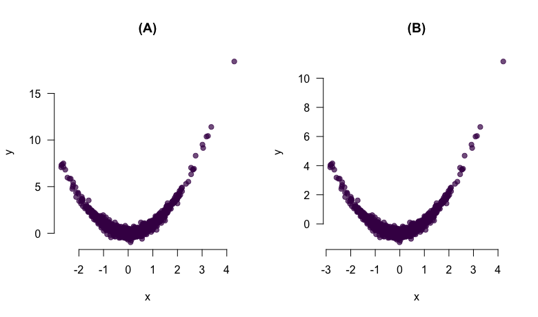
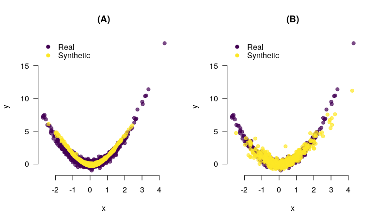
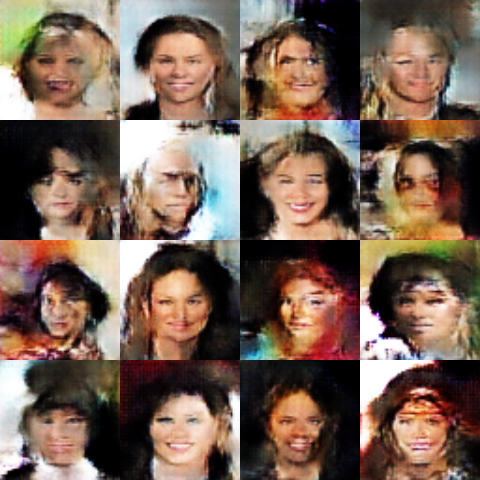

```{r setup, include=FALSE}
knitr::opts_chunk$set(echo = FALSE, warning = FALSE, message = FALSE)
library(RGAN)
library(torch)
library(torchvision)
```

# Introduction {#sec:intro}

On July 28, 2016, Yann LeCun, Deep Learning pioneer and Chief Artificial Intelligence Scientist at Facebook, was asked "What are some recent and potentially upcoming breakthroughs in deep learning?" in a Public Quora Q&A session.^[As of March 3, 2023, you can find the session here: https://www.quora.com/q/quorasessionwithyannlecun.] He answered: "The most important one, in my opinion, is adversarial training (also called GAN for Generative Adversarial Networks). [...]"

So what is a Generative Adversarial Network (GAN)? As indicated in the quote above, GANs were first introduced by @Goodfellow2014. They illustrate the idea with the following example: "The generative model can be thought of as analogous to a team of counterfeiters, trying to produce fake currency and use it without detection, while the discriminative model is analogous to the police, trying to detect the counterfeit currency. Competition in this game drives both teams to improve their methods until the counterfeits are indistinguishable from the genuine articles" [@Goodfellow2014 p. 1].

In short, a GAN is a model that tries to learn an arbitrary joint distribution by comparison. It samples data from a proposal distribution and compares them to samples from the true distribution. Comparing the two samples (samples from the proposal distribution and samples from the true distribution) improves the model for the proposal distribution such that it generates more and more realistic samples. The basic idea of a GAN is surprisingly intuitive. At its core, a GAN is a minimax game with two competing actors: a generator that produces realistic synthetic samples from random noise and a discriminator (or critic)[^2] trying to tell real from synthetic samples.

In GANs, the team of counterfeiters, the generator, is a neural network trained to produce realistic synthetic data examples from random noise. And the police, the discriminator, is a neural network to classify fake and real data. The generator network is trained to fool the discriminator network and uses the feedback of the discriminator to generate increasingly realistic fake data that should eventually be indistinguishable from the real data. At the same time, the discriminator is constantly adapting to the improving generator. Thus, the threshold where the discriminator is fooled increases along with the faking capabilities of the generator. This goes on until (in theory) an equilibrium is reached. At the equilibrium, the discriminator can no longer distinguish between real and fake samples. The generator can achieve this goal by sampling from the underlying distribution of the real data.[^3]

I bring these neural networks to R with the \CRANpkg{RGAN} package. The goal of the package is to facilitate experimentation with GANs for an audience primarily working with R. This way, GANs can be included in existing workflows, for example, for data synthesizing.

\CRANpkg{RGAN} is a lightweight package that only relies on \CRANpkg{torch} [@torch]. The \CRANpkg{torch} package provides R users with native access to libtorch, the C++ backend that powers PyTorch, enabling tensor computation and deep learning capabilities directly in R without requiring Python or the \CRANpkg{reticulate} [@reticulate] package. This design choice makes \CRANpkg{RGAN} particularly efficient, as \CRANpkg{torch} offers automatic differentiation, GPU acceleration when available, and a comprehensive set of neural network modules, all with an R-native interface. By building on \CRANpkg{torch}'s foundation, \CRANpkg{RGAN} users benefit from fast tensor operations and seamless GPU support while maintaining a familiar R workflow, avoiding the overhead and complexity of cross-language dependencies. For applications, the focus of \CRANpkg{RGAN} is on tabular data, yet it is easy to implement GANs for image data. Both use cases are demonstrated in section [4](#sec:illustrations){reference-type="ref" reference="sec:illustrations"}.

In python, software libraries like CTGAN [@Xu2019], TF-GAN, which is part of tensorflow [@tensorflow2015-whitepaper], torchgan [@Pal2021], or mimicry [@mimicry] can serve a similar purpose as \CRANpkg{RGAN}. Most of these libraries focus on image data.

In R, \CRANpkg{ganGenerativeData} [@ganGenerativeData] makes it possible to synthesize tabular data with a GAN through \CRANpkg{reticulate} and \CRANpkg{tensorflow}. The focus of \CRANpkg{ganGenerativeData} is on producing synthetic data with one specific, pre-configured GAN architecture optimized for tabular data generation. This contrasts with \CRANpkg{RGAN}, which emphasizes flexibility and experimentation with GAN architectures. 

Specifically, \CRANpkg{RGAN} extends the functionality available in R in several key ways:

- **Native R implementation**: \CRANpkg{RGAN} runs directly in R via \CRANpkg{torch}, eliminating the Python dependency and \CRANpkg{reticulate} overhead required by \CRANpkg{ganGenerativeData}
- **Architectural flexibility**: While \CRANpkg{ganGenerativeData} provides a fixed architecture, \CRANpkg{RGAN} allows users to customize network architectures, create custom neural networks, and switch between architectures (e.g., fully connected for tabular data, DCGAN for images)
- **Multiple value functions**: \CRANpkg{RGAN} implements multiple GAN variants (original, WGAN, f-WGAN) and supports custom value functions, whereas \CRANpkg{ganGenerativeData} uses only the original GAN value function
- **Broader data support**: \CRANpkg{RGAN} handles both tabular and image data, while \CRANpkg{ganGenerativeData} focuses exclusively on tabular data
- **Research-oriented features**: \CRANpkg{RGAN} provides extensive hyperparameter control, post-processing methods (DRS, PGB), and experimental features like dropout during generation

Among the Python libraries mentioned, `CTGAN` is most similar to \CRANpkg{ganGenerativeData} in focusing on tabular data synthesis with specific architectural choices. Libraries like `TF-GAN`, `torchgan`, and `mimicry` offer similar flexibility to \CRANpkg{RGAN} in terms of customizable architectures and multiple GAN variants, but are Python-exclusive. \CRANpkg{RGAN} essentially brings this Python-level flexibility to R users in a native R environment.

The rest of the paper is organized as follows: In the following section [A Brief Introduction to GANs](#sec:GANintro){reference-type="ref" reference="sec:GANintro"}, I give a more detailed introduction to GANs. In the section [Designing a GAN](#sec:design){reference-type="ref" reference="sec:design"}, I introduce the different design decisions a researcher faces when developing a GAN and show how \CRANpkg{RGAN} facilitates experimentation with these design choices. The section [Illustrations](#sec:illustrations){reference-type="ref" reference="sec:illustrations"} offers two working examples with code: The example in  [Synthesizing tabular data with default settings](#sec:tabular_data){reference-type="ref" reference="sec:tabular_data"} shows how to get started with the synthesization of tabular data quickly. The example in [Synthesizing images with a DCGAN architecture](#sec:image_data){reference-type="ref" reference="sec:image_data"} generates fake images with a customized neural network architecture in \CRANpkg{RGAN}. The [Summary and Outlook](#sec:summary){reference-type="ref" reference="sec:summary"} section provides an outlook on potential extensions of \CRANpkg{RGAN}.

# A brief introduction to GANs {#sec:GANintro}

A GAN model tries to learn an arbitrary joint distribution by comparison. Specifically, the GAN learns the joint distribution of all variables in the training data. For a dataset with variables $(x_1, x_2, \ldots, x_p)$, the GAN approximates $p(x_1, x_2, \ldots, x_p)$. For conditional GANs, this extends to learning the joint distribution of target variables given predictor variables. The GAN samples data from a proposal distribution and compares them to samples from the true distribution. Comparing the difference between the two samples improves the proposal distribution model, generating more realistic samples.

In GANs, the proposal distribution (fake data) is typically generated by a deep neural network, the generator ($G$). The comparison of fake and real data is made by a second deep neural network, the discriminator ($D$). The generator is trained to produce realistic synthetic data examples from random noise. At the same time, the discriminator has the goal of correctly distinguishing fake from real data.[^4]

The generator is trained to fool the discriminator network and uses the feedback of the discriminator to generate increasingly realistic fake data that should eventually be indistinguishable from the real data. At the same time, the discriminator is constantly adapting to the improving generating abilities of the generator. Thus, the threshold where the discriminator is fooled increases along with the faking capabilities of the generator. This goes on until (in theory) an equilibrium is reached. In the classical GAN, described by the value function $V$ in equation [1](#eq:originalGAN){reference-type="ref" reference="eq:originalGAN"}, an optimal discriminator at the equilibrium would be assigning $0.5$ probability to both real and fake samples. This is where the discriminator can no longer distinguish between real and fake samples.

GANs turn a typical unsupervised learning task (learning a joint
density) into a supervised learning problem (learning to distinguish
between fake and real data), using the observation that it is easier to
sample from $p$ than to learn the distribution explicitly.

Formally, this two-player minimax game can be written as:
\begin{equation}\label{eq:originalGAN}
\min_{G} \max_{D} V(D,G) = \min_{G} \max_{D} \mathbb{E}_{x \sim p_{\rm data}(x)}\Big[ \log D(x)\Big] + \mathbb{E}_{z \sim p_{\rm z}(z)}\Big[\log (1-D(G(z)))\Big]
\end{equation}

where $p_{data}(x)$ is the joint distribution of the real data, $x$ is a sample from $p_{data}(x)$. The generator network $G(z)$ takes as an input $z$ from $p_z(z)$, where $z$ is a random sample from a probability distribution $p_z(z)$. This sample is also called a noise sample. Usually, GANs are set up to either sample $z$ from uniform or Gaussian distributions.[^5] Passing the noise sample $z$ through $G$ generates a sample of synthetic data, which is then fed into the discriminator $D$. The discriminator takes as input a set of labeled data, either real examples from $p_{data}(x)$ or generated examples from $G(z)$, and is trained to distinguish between real data and fake data. In the original GAN setup [@Goodfellow2014], this is a standard binary classification problem.[^6]

$D$ is trained to maximize the probability of assigning the correct label to training examples and samples from $G(z)$. $G$ is trained to minimize $\log(1 - D(G(z)))$. Thus, the goal of the discriminator is to maximize function $V$, whereas the generator's goal is to minimize it. In practice, this is achieved by iteratively updating the two networks, holding the weights of the other network constant.

The equilibrium point for a GAN is achieved when $G$ produces samples that come from the true underlying data distribution $p_{data}(x)$ and $D$ is uncertain about the origin of the samples.

# Designing a GAN {#sec:design}

So far, many different GAN architectures have been proposed. Many of these GAN models are named, e.g., WGAN [@arjovsky2017], WGAN-GP [@gulrajani2017], KL-WGAN [@song2020bridging], DCGAN [@radford2016], CGAN [@mirza2014conditional], CTGAN [@Xu2019], StyleGAN [@Karras_2019_CVPR], CycleGAN [@Zhu_2017_ICCV] or DiscoGAN [@Kim2017] to name a few. Typically, these new GAN models address some areas for improvement in prior models, where most of the development focuses on generating more and more realistic images.

In this section, I first introduce the basic functionality of the RGAN package. Then, I briefly overview some of these design decisions researchers face when developing a GAN for their application. Some of these design decisions are similar to those when designing neural network models (or other machine learning models).[^7]

Other decisions are unique to the setup of GAN models.[^8] Generally, the interaction of all these design choices still needs to be better understood and is an active research area. Table 1 gives an overview of the most important hyperparameters and design choices supported by \CRANpkg{RGAN}. 

+-------------------------+--------------------------+------------------------------+--------------------------------+----------------------------------------+
| Hyperparameter          | Default in \CRANpkg{RGAN}| Available Options            | Use Cases & Advantages         | Practical Tuning Implications          |
+=========================+==========================+==============================+================================+========================================+
| **Value Function**      | "original"               | • "original": Binary         | • Original: Simple             | Affects gradient stability;\           |
|                         |                          |   cross-entropy\             |   classification, intuitive\   | Wasserstein often more stable but      |
|                         |                          | • "wasserstein": WGAN\       | • Wasserstein: Addresses       | requires weight clipping;\             |
|                         |                          | • "f-wgan": KL-WGAN\         |   vanishing gradients\         | original may suffer from mode collapse |
|                         |                          | • Custom functions           | • F-WGAN: Better empirical     |                                        |
|                         |                          |                              |   results\                     |                                        |
|                         |                          |                              | • Custom: Research             |                                        |
|                         |                          |                              |   experimentation              |                                        |
+-------------------------+--------------------------+------------------------------+--------------------------------+----------------------------------------+
| **Network\              | Fully connected\         | • Fully connected            | • FC: Tabular data, quick      | Deeper networks = more capacity but    |
| Architecture**          | (2 layers,               |   (customizable)\            |   prototyping\                 | slower training;\                      |
|                         | 128 neurons each         | • DCGAN (for images)\        | • DCGAN: Image synthesis\      | width affects representation power;\   |
|                         |                          | • Custom `torch::nn_module`  | • Custom: Domain-specific      | architecture should match data type    |
|                         |                          |   objects                    |   requirements                 |                                        |
+-------------------------+--------------------------+------------------------------+--------------------------------+----------------------------------------+
| **Dimension of Noise**  | 2                        | Any positive integer         |  • Small: fewer latent         | Affects generator's ability to learn   |
|                         |                          |                              | dimensions\                    | target distribution;                   |
|                         |                          |                              |  • Large: more latent          | should match intrinsic dimension of    |
|                         |                          |                              | dimensions                     | data                                   |
+-------------------------+--------------------------+------------------------------+--------------------------------+----------------------------------------+
| **Noise\                | "normal"                 | • "normal": Standard         | • Normal: General purpose\     | Affects generator's ability to match   |
| Distribution**          |                          |   Gaussian\                  | • Uniform: DCGAN standard\     | target distribution;\                  |
|                         |                          | • "uniform": [-1, 1]\        | • Pareto: Heavy-tailed         | Pareto better for skewed data          |
|                         |                          | • Custom functions           |   real data                    |                                        |
|                         |                          |   (e.g., Pareto)             |                                |                                        |
+-------------------------+--------------------------+------------------------------+--------------------------------+----------------------------------------+
| **Optimizer**           | Adam\                    | • Any torch optimizer\       | • Adam: Good default,          | Higher lr = faster but unstable;\      |
|                         | (`base_lr=0.0001`)\      | • Separate G/D               |   adaptive\                    | TTUR factor >1 slows discriminator,    |
|                         | `ttur_factor = 4`        |   optimizers\                | • SGD: More control,           | preventing overfitting                 |
|                         |                          | • TTUR (different            |   simpler\                     |                                        |
|                         |                          |   learning rates for G and D)| • TTUR: Stabilizes training    |                                        |
+-------------------------+--------------------------+------------------------------+--------------------------------+----------------------------------------+
| **Dropout**             | 0.5 (training)\          | • Rate: 0.0-1.0\             | • Training: Regularization\    | Higher dropout = more regularization   |
|                         | FALSE (generation)       | • eval_dropout:              | • Generation with dropout      | but may underfit;\                     |
|                         |                          |   TRUE/FALSE                 |   increases diversity\         | eval dropout trades consistency        |
|                         |                          |                              | • No dropout: More             | for diversity                          |
|                         |                          |                              |   consistent outputs           |                                        |
+-------------------------+--------------------------+------------------------------+--------------------------------+----------------------------------------+
| **Post-processing**     | None                     | • DRS (Discriminator         | • DRS: Quality filtering\      | DRS reduces sample size but improves   |
|                         |                          |   Rejection)\                | • PGB: Ensemble improvement\   | quality;\                              |
|                         |                          | • PGB (Post-GAN              | • None: Fastest, direct        | PGB requires multiple generators       |
|                         |                          |   Boosting)\                 |   output                       |                                        |
|                         |                          | • None                       |                                |                                        |
+-------------------------+--------------------------+------------------------------+--------------------------------+----------------------------------------+
| **Batch Size**          | 50                       | Any positive integer         | • Small (10-50): More          | Larger = more stable gradients but     |
|                         |                          |                              |   updates, noisy gradients\    | slower convergence;\                   |
|                         |                          |                              | • Large (128+): Stable,        | memory constraints on GPU              |
|                         |                          |                              |   fewer updates                |                                        |
+-------------------------+--------------------------+------------------------------+--------------------------------+----------------------------------------+
| **Epochs**              | 150                      | Any positive integer         | • Few (10-50): Quick           | More epochs $\neq$ always better (can  |
|                         |                          |                              |   experiments\                 | overfit discriminator);\               |
|                         |                          |                              | • Many (150+): Better          | monitor convergence                    |
|                         |                          |                              |   convergence                  |                                        |
+-------------------------+--------------------------+------------------------------+--------------------------------+----------------------------------------+

: Overview of Hyperparameters and Design choices and their default values in \CRANpkg{RGAN}.

In the following, I briefly describe the design choices to be made, how \CRANpkg{RGAN} implements default options, and how \CRANpkg{RGAN} can be used to customize all these design choices to facilitate experimentation.

## The general RGAN workflow {#sec:workflow}
Before discussing the various design choices and default values available when implementing a GAN and how to implement them, I first introduce the main functions and a typical workflow with the \CRANpkg{RGAN} package.

#### The `gan_trainer()` function

The core function in \CRANpkg{RGAN} is `gan_trainer()`, which orchestrates the entire GAN training process. This function accepts the following key arguments:

```{r gan_trainer_overview, echo = TRUE, eval = FALSE}
gan_trainer(
  data,
  noise_dim = 2,
  noise_distribution = "normal",
  value_function = "original",
  data_type = "tabular",
  generator = NULL,
  generator_optimizer = NULL,
  discriminator = NULL,
  discriminator_optimizer = NULL,
  base_lr = 1e-04,
  ttur_factor = 4,
  weight_clipper = NULL,
  batch_size = 50,
  epochs = 150,
  plot_progress = FALSE,
  plot_interval = "epoch",
  eval_dropout = FALSE,
  synthetic_examples = 500,
  plot_dimensions = c(1, 2),
  device = "cpu"
)
```

#### A typical \CRANpkg{RGAN} workflow

Assuming tabular data that is available as a `matrix` or `data.frame` object with the name `data` in the R Session, a standard \CRANpkg{RGAN} workflow consists of three main steps:

1. Data Preparation: Transform and standardize (i.e., z-standardize numerical columns and one-hot encode categorical columns) input data. The \CRANpkg{RGAN} package provides the `data_transformer` class for easy transformation and back-transformation.

```{r data_preparation, echo = TRUE, eval = FALSE}
transformer <- data_transformer$new()
transformer$fit(data)
transformed_data <- transformer$transform(data)
```

2. GAN Training: Train the GAN with desired hyperparameters by calling the `gan_trainer()` function (here all hyperparameters and choices are set to default values).

```{r gan_training, echo = TRUE, eval = FALSE}
trained_gan <- gan_trainer(transformed_data)
```

3. Synthetic Data Generation: Generate and transform synthetic samples

```{r synthetic_data_generation, echo = TRUE, eval = FALSE}
synthetic_data <- sample_synthetic_data(trained_gan, 
                                          transformer)
```

## Choosing a value function {#sec:value}

#### Description of the design choices.

An important design decision is the choice of the value function $V$. In the original GAN by @Goodfellow2014 and described by the value function in equation [1](#eq:originalGAN){reference-type="ref" reference="eq:originalGAN"}, the value function was motivated by turning the unsupervised learning task into a binary classification problem. After all, the original GAN value function is just binary-cross entropy loss.[^9]

While this is an intuitive formulation, if the discriminator is very good at distinguishing between real and fake data, it is tough to learn (i.e., update the network weights) due to vanishing gradients. This means that the gradient values are close to $0$ and cannot provide meaningful information to update the weights during backpropagation.

To address this weakness, @arjovsky2017 proposed an alternative value function based on the Wasserstein distance. They use the observation that the original GAN value function essentially minimizes the Jensen-Shannon divergence between encoded fake and real data and note that using the Wasserstein distance instead has some desirable properties. This leads to the following value function:

\begin{equation}\label{eq:wgan}
V(D,G)_{||D||_L\leq1} = \mathbb{E}_{x \sim p_{\rm data}(x)}\Big[ D(x)\Big] + \mathbb{E}_{z \sim p_{\rm z}(z)}\Big[(1-D(G(z)))\Big]
\end{equation}

This is the value function for the so-called Wasserstein GAN or short WGAN as defined in [@arjovsky2017]. Note that for the Wasserstein value function, the discriminator must be continuous with a Lipschitz constant $\leq 1$, indicated by the constraint $||D||_L\leq1$ in equation [2](#eq:wgan){reference-type="ref" reference="eq:wgan"}. The Lipschitz constraint means that the discriminator function cannot change too rapidly; formally, there exists a constant $L \leq 1$ such that $|D(x_1) - D(x_2)| \leq L \cdot |x_1 - x_2|$ for all inputs $x_1, x_2$. This constraint is typically enforced by clipping the discriminator's weights to a pre-specified range, e.g., $[-0.01, 0.01]$.

Work by @song2020bridging shows that f-divergences and Wasserstein GANs can be bridged. They propose a novel GAN value function that leads to better empirical results on many tasks.

A more general formulation for the value function is therefore given by

\begin{equation}\label{eq:general}
V(D,G) = \mathbb{E}_{x \sim p_{\rm data}(x)}\Big[f_1( D(x))\Big] + \mathbb{E}_{z \sim p_{\rm z}(z)}\Big[f_2(1-D(G(z)))\Big]
\end{equation}

Where in the original GAN $f_1(a) = f_2(a) = \log(a)$, in the
Wasserstein GAN $f_1(a) = f_2(a) = a$ and for the GAN value function
proposed by @song2020bridging $f_1(a) = a$ and $f_2(a) = wa$, where $w$
is a weight for the discriminator scores on fake examples, calculated as
$w = \exp(a)/\mathbb{E}\Big[\exp(a)\Big]$ (using the exponential function $\exp(\cdot)$).

#### Implementation of default design choices in \CRANpkg{RGAN}.

In \CRANpkg{RGAN}, these three value functions are readily implemented (`original`, `wasserstein` and `f-wgan`) and can be chosen as an option, e.g., `gan_trainer(..., value_function = "wasserstein")`, the default value function is `original`.

#### Further customization with \CRANpkg{RGAN}.

Users can also provide custom value functions to work with the \CRANpkg{RGAN} `gan_trainer()` function. The only requirements are that the value function takes as inputs the discriminator scores of real and fake data, works on and with \CRANpkg{torch} data types, and outputs a named list with the entries `d_loss` and `g_loss`. For example, this is
what the original GAN value function looks like in code:

```{r custom-value-function, echo = TRUE, eval = FALSE}
GAN_value_fct <- function(real_scores, fake_scores) {
  # Compute log(1 - fake_scores) once and reuse
  log_one_minus_fake <- torch::torch_log(1 - fake_scores)

  d_loss <-
    torch::torch_log(real_scores) + log_one_minus_fake

  d_loss <- -d_loss$mean()

  g_loss <- log_one_minus_fake$mean()

  return(list(d_loss = d_loss,
              g_loss = g_loss))

}
```

When a custom value function is passed to `gan_trainer()`, it is called at each training iteration within the training loop. The training loop follows this flow: (1) sample a minibatch of real data; (2) generate fake data by passing noise through the generator; (3) compute discriminator scores for both real and fake data (`real_scores` and `fake_scores`); (4) call the value function with these scores to obtain `d_loss` and `g_loss`; (5) backpropagate `d_loss` to update discriminator weights; (6) backpropagate `g_loss` to update generator weights. This design allows users to experiment with arbitrary training objectives while \CRANpkg{RGAN} handles the data loading, network updates, and training orchestration.

## Choosing and customizing network architectures {#sec:architecture}

#### Description of the design choices.

Parts of the network architecture, specifically the
discriminator (or critic) network architecture, depend on the chosen value function.
For the original GAN value function, the discriminator acts as a binary classifier outputting a probability that a sample is real. Therefore, the output layer must return values between $0$ and $1$, achieved by using the sigmoid activation function $\sigma(x) = 1/(1+\exp(-x))$.[^10]
In contrast, for WGAN the discriminator (called a "critic" in this context) does not output a probability but rather a score measuring how "real" a sample appears. Since this score represents a distance measure rather than a probability, the output does not need to be restricted to $[0,1]$. Therefore, a linear output layer (no activation function) is used.[^11]

In general, the discriminator must have enough capacity, that is, the network's ability to represent complex functions, which is determined by factors such as the number of parameters, depth (number of layers), and width (neurons per layer).
What constitutes "enough capacity" depends on the application.
For image synthesization, convolutional neural network architectures
achieve the best results. For time series, recurrent neural network
architectures are sensible choices. For tabular data, simpler, fully
connected network architectures are usually sufficient.

#### Implementation of default design choices in \CRANpkg{RGAN}.

In \CRANpkg{RGAN}, some commonly used architectures are already implemented, e.g., 
DCGAN[^12] [@radford2016] for image data and a GAN with fully connected
neural networks for tabular data. If no networks are specified in a call
to `gan_trainer` it defaults to fully connected networks for both the generator and
discriminator, with two hidden layers, 128 neurons in each layer, and a dropout rate of $0.5$.

#### Further customization with \CRANpkg{RGAN}.

The included fully connected network architecture can easily be customized. For example, if users want to customize the number of layers and neurons per layer, they can create custom neural networks with a call to

```{r custom-generator, echo = TRUE, eval = FALSE}
generator <- Generator(noise_dim = 2, 
                       data_dim = 2, 
                       hidden_units = list(256, 128, 64))
```

and 

```{r custom-discriminator, echo = TRUE, eval = FALSE}
discriminator <- Discriminator(data_dim = 2, 
                               hidden_units = list(256, 128, 64), 
                               sigmoid = TRUE)
```

respectively. These networks can then be fed to `gan_trainer(..., generator = generator, discriminator = discriminator)`. Where `data_dim` needs to match the number of columns in the input dataset and `noise_dim` needs to match the dimensions of the noise distribution (more in section [3.3](#sec:noise){reference-type="ref" reference="sec:noise"}). The list passed to`hidden_units` specifies both the depth of the neural network and the width of each layer. For example, `list(256, 128, 64)` means that the network will have three hidden layers (determined by the length of the list), where the first hidden layer will contain 256 neurons, the second hidden layer 128, and the third hidden layer 64. For the discriminator network, users can also specify whether the output layer should have a sigmoid activation function or be a linear output layer. This choice depends on the value function chosen for a specific GAN (see section [3.1](#sec:value){reference-type="ref" reference="sec:value"}).

If users want to synthesize images and use the DCGAN architecture included in \CRANpkg{RGAN}, they can achieve this by setting up the DCGAN networks by calling `generator <- DCGAN_Generator()` and `discriminator <- DCGAN_Discriminator()`.[^13] Again, these networks can be included in the call to `gan_trainer(..., generator = generator, discriminator = discriminator)`. I describe a complete working example with the DCGAN architecture and loading images from a user-specified folder in section [4](#sec:illustrations){reference-type="ref" reference="sec:illustrations"}.

Furthermore, users can provide custom network architectures for the discriminator and generator networks by passing a suitable `torch::nn_module` object to the `gan_trainer` function. For the generator, that means the input to the `torch::nn_module` needs to match the dimensions of the chosen noise distribution, and the output needs to line up with the dimensions of the real data. The input must match the dimensions of the real data for the discriminator, and the output needs to be just a 1-dimensional vector with the discriminator scores.

The number of hidden layers, the depth and width of these layers, and their activation functions are hyperparameters that should be optimized for a particular application. In \CRANpkg{RGAN}, it is easy to experiment with these hyperparameters and tailor them for a specific application.

## Choosing the noise distribution {#sec:noise}

#### Description of the design choices.

In most GAN applications, the noise distribution for the generator $p(z)$ is typically a standard normal distribution or a uniform distribution on the interval $(-1,1)$.

However, @huster21a show that the choice of noise distribution influences the behavior of GAN training. For example, learning skewed distributions[^14] with standard noise distributions is hard. Other noise distributions, such as sampling from a Pareto distribution, could have preferable properties for different applications.

#### Implementation of default design choices in \CRANpkg{RGAN}.

This is an active area of research, and \CRANpkg{RGAN} makes it easy to implement custom prior distributions. Users can easily choose between a `normal` distribution and a `uniform` distribution when specifying the options of `gan_trainer`.

#### Further customization with \CRANpkg{RGAN}.

On top of these default options, users can also provide their functions. For example, this is how sampling from the normal distribution is implemented:

```{r custom-noise-function, echo = TRUE, eval = FALSE}
normal_noise <- torch::torch_randn
```

and this function would be used as follows `gan_trainer(..., noise_distribution = normal_noise)` for training a GAN.

## Choosing optimization algorithms {#sec:optimizer}

#### Description of the design choices.

The optimization of GANs is notoriously hard. Research on the optimization of GANs shows [see, e.g.,  @heusel2017; @schaefer2019] that gradient ascent descent (i.e., iteratively training the generator and discriminator with the same optimizer) might not be the best option.

In particular, @heusel2017 have shown that using two different learning rates for the optimization of the discriminator and generator (they call this scheme "two time-scale update rule") improves GAN training. Besides the learning rate, the concrete choice of an optimizer can also influence GAN training. The batch size, how many examples are sampled from the training data per iteration, and potentially further hyperparameters of standard optimizers (typically momentum hyperparameters) influence how quickly a GAN can learn.

#### Implementation of default design choices in \CRANpkg{RGAN}.

In \CRANpkg{RGAN}, it is easy to put the optimizers for the generator and discriminator on two separate time scales by setting the `ttur_factor` in `gan_trainer()`. The `ttur_factor` is a multiplier for the provided `base_lr`, so the generator will be updated with the `base_lr` and the discriminator with `ttur_factor*base_lr`. By default, \CRANpkg{RGAN} uses the Adam optimizer [@adam] as implemented in `torch::optim_adam`, and the default minibatch size is set to 50 examples per iteration.

#### Further customization with \CRANpkg{RGAN}.

\CRANpkg{RGAN} facilitates experimentation with different optimizers and hyperparameter settings. Users can directly pass any \CRANpkg{torch} optimizer with any self-chosen hyperparameter settings to `gan_trainer`, e.g., 

```{r custom-optimizer, echo = TRUE, eval = FALSE}
gan_trainer(..., 
            generator_optimizer = torch::optim_sgd(g_net$parameters, lr = 0.1))
```
.

## Choosing dropout during training and data generation {#sec:dropout}

#### Description of the design choices.

In neural network architectures, so-called dropout layers [@srivastava2014dropout] can be used to regularize network training and prevent overfitting. In each training iteration, a dropout layer randomly sets a pre-specified percentage of all neurons to 0. A helpful side effect of such dropout layers in classical neural networks is that dropout can also be used to estimate the model uncertainty of neural networks [@gal2016dropout].

Anecdotal evidence shows that dropout layers might also help train GANs.[^15] Furthermore, @Isola2016 argue that dropout in the generator during data generation provides stochasticity for the synthetic data that promotes the diversity of the generated data.

Yet, a systematic evaluation of the effect of dropout in GANs on the produced synthetic data, especially on the statistical utility of tabular synthetic data, still needs to be included and warrants more research.

#### Implementation of default design choices in \CRANpkg{RGAN}.

By making it easy to experiment with dropout layers in discriminator and generator networks, \CRANpkg{RGAN} can facilitate such research. When working with the default networks in `gan_trainer`, the dropout rate is set to $0.5$ in both the discriminator and generator networks. By default, dropout is disabled during synthetic data generation but can be enabled by setting `gan_trainer(..., eval_dropout = TRUE)`.

#### Further customization with \CRANpkg{RGAN}.

By providing custom networks, the dropout rate during training can be adjusted. In section [4](#sec:illustrations){reference-type="ref" reference="sec:illustrations"} I provide a simple example of an experiment of synthetic data generated with and without dropout during data generation.

## Post-Processing GAN samples {#sec:post-process}

#### Description of the design choices.

Since convergence to equilibrium cannot be guaranteed, the samples produced after the last update need not be the best. However, several methods have been proposed to boost the samples' fidelity by sampling from multiple generators.[^16] These post-processing methods leverage two empirical observations. First, the learned discriminator can assess the quality of generated examples [@azadi2018discriminator]. And second, while an arbitrary generator (for example, the last generator) can produce an inadequate representation of the underlying data distribution, a mixture distribution of samples from multiple generators can improve the quality of generated examples [see, e.g., @medical; @neunhoeffer2021private]. Methods include Discriminator Rejection Sampling (DRS) [@azadi2018discriminator], Metropolis-Hastings GAN (MH) [@turner2019], or Post-GAN Boosting (PGB) [@neunhoeffer2021private].

#### Implementation of default design choices in \CRANpkg{RGAN}.

DRS and PGB are currently implemented as part of \CRANpkg{RGAN}.

# Illustrations {#sec:illustrations}

In this section, I provide two illustrations of how \CRANpkg{RGAN} can be used. The first example shows how to quickly train a first GAN on tabular data with the default settings of \CRANpkg{RGAN}, including a simple experiment of what dropout during synthetic data generation does. The second example shows that \CRANpkg{RGAN} can also synthesize image data and serves as a tutorial on providing custom neural network architectures and optimizers to `gan_trainer`.

Note on training times: For the tabular data example with 1,000 samples and default settings (150 epochs, batch size 50), training completes in approximately 1--2 minutes on a modern CPU. The image synthesis example using the CelebA dataset trains for approximately 17 minutes per epoch on a GPU (e.g., GeForce RTX 2070), or approximately 7 hours per epoch on CPU.[^timing] Training times will vary depending on hardware, dataset size, network architecture, and hyperparameter choices.

[^timing]: These timings are approximate and intended as rough guidance. Actual performance depends on system configuration.

## Synthesizing tabular data with default settings {#sec:tabular_data}

As a simple illustration to get started with \CRANpkg{RGAN}, I show how to generate synthetic copies of a simple tabular data set. First, I create some toy data[^17] and transform it (for numeric data, this means standardizing the data) to facilitate training.

```{r ex1-setup, echo = TRUE, eval = TRUE}
data <- sample_toydata()
transformer <- data_transformer$new()
transformer$fit(data)
transformed_data <-  transformer$transform(data)
```

The real data for this example is displayed in panel (A) of
figure \@ref(fig:gan-data). $x$ on the x-axis is drawn from a standard normal distribution, and $y$ on the y-axis is $x^2 + \mathcal{N}(0, 0.3)$. Panel (B) of figure \@ref(fig:gan-data) shows the data after transformation. The `data_transformer` applies z-standardization to numeric columns, subtracting the mean and dividing by the standard deviation. Since $x$ is already standard normal, its scale changes minimally; $y$ undergoes more noticeable rescaling but retains a similar visual range because the original variance was relatively small ($\approx 0.3^2$ around the quadratic mean).

```{r gan-data, fig.cap = "The real data before training the GAN. Panel (A) shows the data on the original scale and panel (B) shows the data after applying the data transformer.", out.width= "100%", echo = FALSE}

```

Now the `gan_trainer()` can train a GAN to generate synthetic data from `transformed_data`.[^18] By default, `gan_trainer` shows a simple progress bar to monitor training and estimate how long training will take.[^19]

```{r ex1-training, echo = TRUE, eval = TRUE}
trained_gan <- gan_trainer(transformed_data)
```

This will set up the necessary generator, discriminator, and respective optimizers. The default value function is set to the original GAN value function described in equation [1](#eq:originalGAN){reference-type="ref" reference="eq:originalGAN"}. Then, the `gan_trainer` trains the GAN for $150$ epochs using mini-batches of $50$ real examples ($m = 50$) at each update step.

With the trained networks (which will be collected as part of the output of class `trained_RGAN` in the object `trained_gan`), it is then easy to sample synthetic data from the last generator using the function `sample_synthetic_data`. Note that to transform the synthetic data back to the original scale of the data, I pass the `transformer` to the `sample_synthetic_data` function. Both can be passed to the function `GAN_update_plot` to see the data alongside the synthetic data. This produces the plot in panel (A) of figure \@ref(fig:gan-synthetic).

```{r ex1-plotting-a, echo = TRUE, eval = FALSE}
synthetic_data <- sample_synthetic_data(trained_gan, transformer)

GAN_update_plot(
  data = data,
  synth_data = synthetic_data,
  main = "(A)"
  )
```

```{r gan-synthetic, fig.cap = "The synthetic data after training the GAN. Panel (A) shows the generated data without dropout during generation on the original scale. Panel (B) shows the generated data with dropout during data generation.", out.width= "100%", echo = FALSE}

```

Looking at the generated examples in panel (A) of figure \@ref(fig:gan-synthetic) shows that while the GAN seems to approximate the functional form of the underlying data well, the produced examples have a smaller variance than the original data.

As a simple experiment, I also produce synthetic data from the same generator but with dropout during data generation. I do this by setting the `eval_dropout` setting of `trained_gan` to `TRUE`. This produces the plot in panel (B) of figure \@ref(fig:gan-synthetic).

```{r ex1-plotting-b, echo = TRUE, eval = FALSE}
trained_gan$settings$eval_dropout <- TRUE

synthetic_data <- sample_synthetic_data(trained_gan, transformer)

GAN_update_plot(
  data = data,
  synth_data = synthetic_data,
  main = "(B)"
  )
```

Now the generated synthetic data in yellow looks more like the underlying real data in purple. How good the data is could be assessed using several utility metrics for synthetic data [see, e.g., @pmse]. Note that these utility metrics are not included in \CRANpkg{RGAN} itself. Common approaches include: (1) comparing summary statistics (means, variances, correlations) between real and synthetic data; (2) the propensity mean squared error (pMSE), which measures how well a classifier can distinguish real from synthetic data (lower values indicate better utility); and (3) downstream task performance, where models trained on synthetic data are evaluated on real test data. In R, packages such as \CRANpkg{synthpop} [@synthpop] provide functions for computing utility metrics. Each approach has trade-offs: summary statistics are easy to interpret but may miss complex dependencies; pMSE provides a single aggregate measure but requires training additional models; downstream evaluation is task-specific and computationally intensive but most directly measures practical utility.

## The effect of different design choices/hyperparameters on GAN training {#sec:hyperparameters}

Training GANs requires careful tuning of hyperparameters, as the interplay between generator and discriminator optimization is inherently unstable. Table 1 summarizes the key hyperparameters in \CRANpkg{RGAN}, but understanding their practical implications helps guide experimentation:

**Learning rate**: The learning rate controls how much network weights change at each update. A learning rate that is too high can cause training instability or oscillation, while one that is too low leads to slow convergence. GANs often benefit from separate learning rates for the generator and discriminator. In \CRANpkg{RGAN}, the `ttur_factor` multiplies the base learning rate for the discriminator, implementing the "two time-scale update rule" [@heusel2017]. A `ttur_factor > 1` (default is 4) slows down the discriminator relative to the generator, which can prevent the discriminator from becoming too strong too quickly, a common cause of vanishing gradients for the generator.

**Batch size**: Larger batch sizes provide more stable gradient estimates but fewer weight updates per epoch. Smaller batch sizes (e.g., 10--50) produce noisier gradients that can help escape local minima but may lead to unstable training. For tabular data, the default batch size of 50 works well for most applications. For image data, larger batch sizes (64--128) are common, though memory constraints on GPUs may limit this choice.

**Network architecture**: Deeper and wider networks have more capacity to represent complex distributions, but also require more data and are prone to overfitting. For tabular data with a modest number of features, two hidden layers with 128 neurons each (the \CRANpkg{RGAN} default) is often sufficient. More complex data may benefit from additional layers or wider layers. The `hidden_units` parameter in `Generator()` and `Discriminator()` allows easy experimentation: `list(256, 128, 64)` creates three layers with decreasing width, which can help the network learn hierarchical representations.

**Value function**: The choice of value function affects gradient dynamics. The original GAN can suffer from vanishing gradients when the discriminator is too strong. The Wasserstein value function provides more informative gradients throughout training but requires weight clipping or gradient penalties. The f-WGAN value function often provides a good balance. Users should experiment with different value functions for their specific application.

## Synthesizing images with a DCGAN architecture {#sec:image_data}

To showcase the \CRANpkg{RGAN} customization options, this illustration generates synthetic images using a DCGAN [@radford2016] architecture. The training data for this example is the CelebA dataset [@liu2015faceattributes][^20] that contains $202,599$ images[^21] of celebrities' faces.[^22]

First, I use \CRANpkg{torchvision} to make images in a folder on my hard drive available for training the networks with \CRANpkg{torch}. Furthermore, the DCGAN architecture expects input images to be of size $64\times64$ pixels. To ensure that the loaded images have the expected format, I apply some standard
transformations to the raw images.

```{r ex2-data-preparation, echo = TRUE, eval = FALSE}
dataset <- torchvision::image_folder_dataset(root = "path/to/celeba",
 transform = function(x) {
 x = torchvision::transform_to_tensor(x)
 x = torchvision::transform_resize(x, size = c(64, 64))
 x = torchvision::transform_center_crop(x, c(64, 64))
 x = torchvision::transform_normalize(x, c(0.5, 0.5, 0.5), c(0.5, 0.5, 0.5))
 return(x)
 })
```

Next, I load the `DCGAN_Generator` and `DCGAN_Discriminator`, and make them available on the GPU by passing them to the `"cuda"` device.[^23] The `noise_dim` (the number of input features for the generator network) is set to $100$.

```{r ex2-setup-1, echo = TRUE, eval = FALSE}
device <- "cuda"

g_net <- DCGAN_Generator(dropout_rate = 0, noise_dim = 100)$to(device = device)

d_net <- DCGAN_Discriminator(dropout_rate = 0, sigmoid = FALSE)$to(device = device)
```

Next, the optimizers for both networks can be set up. I use the same
optimizers and hyperparameters as @radford2016 in the original DCGAN
paper.

```{r ex2-setup-2, echo = TRUE, eval = FALSE}
g_optim <- torch::optim_adam(g_net$parameters, lr = 0.0002, betas = c(0.5, 0.999))

d_optim <- torch::optim_adam(d_net$parameters, lr = 0.0002, betas = c(0.5, 0.999))
```

Now, these objects and a couple of additional options can be passed to `gan_trainer`. The DCGAN architecture expects the noise samples
to be in a three-dimensional tensor (`noise_dim = c(100, 1, 1)`, even though the second and third dimensions are only length 1). Another important option is to set `data_type = "image"` to ensure the `gan_trainer` produces the output in the correct format.

```{r ex2-training, echo = TRUE, eval = FALSE}
trained_gan <- gan_trainer(
  data = dataset,
  noise_dim = c(100, 1, 1),
  noise_distribution = "uniform",
  data_type = "image",
  value_function = "wasserstein",
  generator = g_net,
  generator_optimizer = g_optim,
  discriminator = d_net,
  discriminator_optimizer = d_optim,
  plot_progress = TRUE,
  plot_interval = 10,
  batch_size = 128,
  synthetic_examples = 16,
  device = device,
  eval_dropout = FALSE,
  epochs = 1
  )
```

I set `plot_progress = TRUE` and `plot_interval = 10` to observe the training progress. This means 16 images[^24] will be shown after every tenth update step.

In figure \@ref(fig:faces), I show 16 examples of generated faces after just one epoch of training the DCGAN with the settings as in the code above. I do not expect to generate state-of-the-art fake images after training just for one epoch with a relatively small and simple DCGAN architecture. However, even after a few update steps with the settings described above, it should be possible to make out the outlines of faces in the generated images.

With \CRANpkg{RGAN}, more elaborate network architectures could be provided, and training could be optimized.[^25]

```{r faces, fig.cap = "Generated faces after one epoch of training the DCGAN with the parameters specified in the main text.", out.width= "100%", echo = FALSE}

```

# Summary and outlook {#sec:summary}

With \CRANpkg{RGAN}, I introduce a package to facilitate training and experimentation with GANs in R. The goal is to open up this powerful neural net framework to users that primarily work in R, especially to facilitate experimentation with synthetic data from GANs from a statistical perspective.

I provide two illustrations of how \CRANpkg{RGAN} can be used. The first illustration shows the basic functionality of \CRANpkg{RGAN} and how to synthesize tabular data quickly. The second illustration shows that training GANs with \CRANpkg{RGAN} is easy to customize and synthesize images with a DCGAN architecture.

GANs have broad applications beyond the examples shown here. In statistics and data science, GANs can address class imbalance problems by generating synthetic samples of underrepresented classes, improving classifier performance on imbalanced datasets. In medical and health research, GANs enable sharing of realistic synthetic patient data for collaborative research while preserving patient privacy. This is particularly valuable in cancer research and clinical trials where real data is sensitive and scarce. The post-processing methods in \CRANpkg{RGAN} (DRS and PGB) can help ensure that synthetic samples maintain high fidelity to real data characteristics.

Future iterations of \CRANpkg{RGAN} will include different network architectures, for example, a CTGAN [@Xu2019] inspired architecture to make the generation of mixed tabular data (i.e., data with real-valued and categorical columns) easier. Recurrent neural network (RNN) architectures could extend \CRANpkg{RGAN} to time series data, where GANs can learn temporal dependencies. Conditional GANs [@mirza2014conditional] would allow generation of data conditioned on specific attributes, enabling targeted data augmentation. Another development area will focus on making the opacus [@opacus] python library available in \CRANpkg{RGAN} to train GANs with formal differential privacy guarantees, providing mathematical bounds on the privacy risk of synthetic data.

The latest stable version of \CRANpkg{RGAN} is available from CRAN; development versions can be found on <https://github.com/mneunhoe/RGAN>.[^dev]

[^dev]: The development version (0.2.0) on GitHub includes several additional features: differentially private GAN training via `dp_gan_trainer()` using OpenDP [@opendp] for formal privacy guarantees; CTGAN-style mode-specific normalization in the `data_transformer` for handling multi-modal distributions; enhanced post-GAN boosting with model checkpointing; and built-in evaluation metrics for assessing synthetic data quality including statistical divergence measures and privacy risk scores.

# Computational details {#computational-details .unnumbered}

The results in this paper were obtained using R 4.5.2 with the \CRANpkg{RGAN} 0.1.1 package, the \CRANpkg{torch} 0.16.3 package, and the \CRANpkg{torchvision} 0.8.0 [@torchvision] package to load images into \CRANpkg{torch}. I used the \CRANpkg{viridis} 0.6.5 [@viridis] package for the color palettes in the visualizations. R itself and all packages used are available from the Comprehensive Archive Network (CRAN) at <https://CRAN.R-project.org/>.

# Acknowledgments {#acknowledgments .unnumbered}

::: {.leftbar}
I am grateful to Thomas Gschwend, Christian Arnold, Pia Kürzdörfer,
Guido Ropers, Oliver Rittmann, and Oke Bahnsen for feedback on earlier
versions of this manuscript.
:::

[^2]: More on the difference between a discriminator and a critic can be
    found in section 3.

[^3]: A GAN is, therefore, a dynamic system where the optimization
    process is seeking not a minimum (or maximum) but an equilibrium.

[^4]: It wants to discriminate between fake and real data, hence the
    name. However, novel architectures don't necessarily use classifiers
    to compare fake and real data. In these GANs, the second network is
    usually named a critic network.

[^5]: Research suggests that other
    prior distributions might be preferable depending on the application. @huster21a show that a Pareto distribution performs
    better than a normal distribution for skewed and heavy-tailed real data.

[^6]: Thus, the output layer of the discriminator uses a sigmoid
    function as the activation function and the standard binary
    cross-entropy loss can be used.

[^7]: For example, data pre-processing, the choice of the network
    architecture(s), or the choice of an optimizer with its related
    hyperparameters.

[^8]: For example, the choice of the noise distribution $p(z)$ or the
    GAN value function.

[^9]: Note that this is the same as the negative log-likelihood of the
    Bernoulli distribution.

[^10]: This is one of the reasons for the vanishing gradients.

[^11]: For WGAN to work, however, restrictions on the discriminator weights must be imposed, either by weight clipping or a
    gradient penalty (e.g., in the WGAN-GP implementation
    [@gulrajani2017]).

[^12]: Short for Deep Convolutional GAN.

[^13]: If no options are specified, this will initialize the default
    DCGAN architecture with a `noise_dim = 100` and a linear output layer for the
    discriminator.

[^14]: A typical social science example for such skewed distributions
    could be the distribution of income.

[^15]: For example, this <https://github.com/soumith/ganhacks> list of
    tips for GAN training by some of the authors of influential GAN
    papers [@arjovsky2017; @radford2016; @Denton2015; @Zhao2016]
    mentions dropout in the generator as a means to stabilize GAN
    training.

[^16]: There are many ways to sample from multiple generators. E.g., each
    update step during training produces a slightly different generator,
    so the sequence of generators can be thought of as a distribution of
    generators. Or when using dropout in the generator during the
    generation of synthetic examples and repeating this step multiple
    times, this will also produce a distribution of generators.
    Furthermore, methods that train multiple generators in parallel
    also exist [e.g., @mixgan; @hoang2018mgan].

[^17]: The default in `sample_toydata` is $N = 1000$.

[^18]: Similarly, data could be used directly. A first experiment could
    be to assess the convergence of the GAN when using the original data
    instead of the transformed data.

[^19]: The `gan_trainer` also provides the option to observe the intermediary output of the generator during training. If users set the option `plot_progress = TRUE`, a plot of real and synthetic data will be produced after each epoch. For cases where an epoch might take too long, or it is sufficient to look at the intermediary output in a longer interval, users can input the number of steps after which a new plot should be produced to the option `plot_interval`.

[^20]: The images can be obtained from the authors' website:
    <https://mmlab.ie.cuhk.edu.hk/projects/CelebA.html>. Last accessed:
    February 03, 2026.

[^21]: With a batch size of $128$, as in the DCGAN paper, this means the
    GAN is updated for $1,582$ steps per epoch.

[^22]: Training this model on a machine with a GPU (here a GeForce RTX
    2070) takes about 17 minutes per epoch. On a notebook without a GPU,
    one epoch takes about 7 hours.

[^23]: If no GPU is available, the device should be set to `"cpu"`. If you use
    Apple Silicon you can also set the device to `"mps"` which would use the 
    Apple GPU.

[^24]: 16 is an arbitrary number, but it is easy to show these images in
    a $4\times4$ grid.

[^25]: Yet, achieving state-of-the-art performance can be prohibitively
    expensive. For example, the developers of StyleGAN2
    [@Karras_2020_CVPR], a GAN that produces high definition real
    looking images, transparently states the computing resources that
    went into the project: "The entire project, including all
    exploration, consumed 132 MWh of electricity, of which 0.68 MWh went
    into training the final FFHQ model. In total, we used about 51
    single-GPU years of computation (Volta class GPU)" (8). A large
    amount of computing time, especially from the perspective of a
    statistician or social scientist. At the time of writing, the price
    for such a GPU, e.g., an Nvidia Tesla V100 GPU, is around $\$9000$,
    i.e., to get all the experiments done in one year, you would need at
    least $\$459000$ to buy the GPUs. Using cloud computing, e.g.,
    through Amazon Web Services (AWS), you can access a computer with
    eight such GPUs for $\$12.24$ per hour. To run all the experiments
    that [@Karras_2020_CVPR] did, you would need $55845$ hours of such a
    server, totaling $\approx \$685000$.
