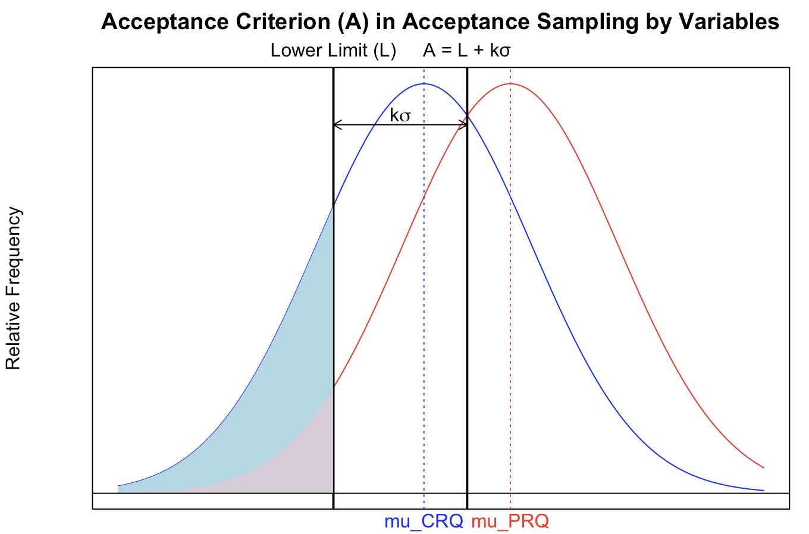

```{r setup, include=FALSE}
knitr::opts_chunk$set(echo = FALSE, warning = FALSE, message = FALSE)
library(kableExtra)
library(knitr)
library(dplyr)
library(plotly)
library(ggplot2)
library(AccSamplingDesign)
library(AcceptanceSampling) # use this to compare some results
```

# Introduction {#sec-introduction}

Acceptance sampling (AS) is a statistical quality control method used to decide 
whether to accept or reject a lot based on a sample, aiming to minimize inspection 
effort while controlling producer’s and consumer’s risks [@juran1988quality]. 
AS procedures are traditionally divided into two categories: attributes sampling 
and variables sampling [@schilling2012acceptance]. 
**Attributes sampling** classifies items as conforming or nonconforming, 
with decisions based on the number of defectives in the sample [@iso2859]. 
While simple to apply, it discards measurement detail and typically requires 
sample sizes around 50\% larger than those needed for variables-based methods 
[@mittag1997measurement]. In contrast, **variables sampling** uses 
continuous measurements such as weight, concentration, or dimension 
[@iso3951], leading to more efficient decision-making.
However, variables sampling plans typically assume normality, which limits their 
effectiveness for skewed or bounded data [@brown1985acceptance]. 
**Beta-based AS plans** address this limitation by accommodating asymmetry, 
especially near the bounds of 0 and 1, and often require smaller sample sizes 
[@govindaraju2015sampling]. Despite these benefits, Beta-based methods 
remain underused in practice due to limited software support. 

**Optimal design in AS** is crucial for efficient quality control, since it 
minimizes sample size while controlling error risks, directly reducing inspection 
time and cost. Existing tools like \CRANpkg{AcceptanceSampling} 
[@kiermeier2008visualizing] and the methods introduced by @cano2015quality focus 
on traditional distributions and use fixed tables or grid search for plan selection.
Although nonlinear programming (NLP) has been proven to optimize Normal-based AS 
plans more effectively than grid search [@duarte2013optimal], its practical
adoption remains limited. Meanwhile, several packages listed in the 
\ctv{ExperimentalDesign} Task View—such as \CRANpkg{OptimalDesign} 
[@OptimalDesign] and \CRANpkg{AlgDesign} [@AlgDesign]—incorporate NLP or heuristic 
methods for optimizing experimental designs, they do not directly support AS or 
the specification of risk-based design criteria. 

To address this gap, we developed the \CRANpkg{AccSamplingDesign} package 
[@AccSamplingDesign], the first R package to support AS plans based on the Beta 
distribution. It leverages NLP to efficiently generate statistically optimal 
sampling plans under both Normal and Beta assumptions, offering a lightweight and 
user-friendly solution for risk-controlled design across practical constraints. 
The statistical foundations of this package are based on the methodologies 
presented in @schilling2012acceptance, @wilrich2004single, and 
@govindaraju2015sampling. This paper outlines the AS framework and models for 
computing the probability of acceptance, then focuses on optimization methods,
the R implementation, and practical applications.

# Acceptance sampling framework {#sec:as_framework}

AS assesses whether the **true quality level \(p\)** of the inspected lot
meets required standards. Since \(p\) is unknown, decisions are based on a sample, 
and the **probability of acceptance** (\(P_a\)) represents the chance that the 
sample leads to acceptance under a given plan. A sampling plan controls two 
decision errors: the **producer’s risk** (Type I error)—rejecting a 
good-quality lot—and the **consumer’s risk** (Type II error)—accepting a 
poor-quality lot. These are bounded by tolerances: the 
**producer’s risk tolerance** (\(\alpha\)) is the maximum acceptable 
probability of rejecting a lot at the 
**producer’s risk quality** (PRQ)\footnote{PRQ corresponds to the acceptance 
quality limit (AQL); see ISO 2859-1:1999.}, and the **consumer’s risk tolerance** 
(\(\beta\)) is the maximum acceptable probability of accepting a lot at the 
**consumer’s risk quality** (CRQ)\footnote{CRQ corresponds to the limiting 
quality (LQ); see ISO 3951-1:2022.}. PRQ reflects an acceptable low defect level, 
while CRQ represents an unacceptable high level [@ISO3534-2], [@CXG50-2004].

An AS plan is defined by a sample size (\(n\)) and either an acceptance number 
(\(c\)) or an acceptability constant (\(k\)). In attributes sampling, \(c\) sets 
the maximum number of nonconforming units allowed in the sample. In variables 
sampling, \(k\) is used to compute the **acceptance criterion** (\(A\)), a 
threshold based on the specification limit (\(SL\)), such as a lower 
(\(LSL\) or \(L\)) or upper limit (\(USL\) or \(U\)) 
(see Figure \@ref(fig:density-2points-estimation)).

```{r density-2points-estimation, echo=FALSE, out.width='80%', fig.align='center', fig.cap = "Visualization of the acceptance criterion (A) in variables sampling, defined relative to the lower specification limit L. The plot illustrates two process means (PRQ and CRQ), with shaded areas showing nonconforming proportions. A serves as the threshold for deciding lot acceptance based on the sample mean.", fig.alt = "Diagram showing two normal distributions relative to the lower specification limit L. Vertical lines mark the acceptance criterion A. Shaded areas under the tails represent the proportions nonconforming at PRQ and CRQ."}
 
```

The performance of a plan is summarized by the **operating characteristic (OC) curves** 
[@dodge1944sampling], which show \(P_a\) as a function of the true quality level, 
such as the nonconforming proportion (or proportion defective - \(pd\)) 
(see Figure \@ref(fig:OC-2points-estimation)).

```{r OC-2points-estimation, echo=FALSE, out.width='100%', fig.width=6, fig.height=4, fig.align='center', fig.cap = "OC curve showing the probability of lot acceptance as a function of the nonconforming proportion. The curve includes two key points used to define the sampling plan: a 95% acceptance probability at PRQ = 0.01 and a 10% acceptance probability at CRQ = 0.05, indicating the defined producer's and consumer’s risk control.", fig.alt = "Line plot showing the OC curve for an AS plan. The x-axis is the proportion nonconforming; the y-axis is the probability of acceptance. The curve includes markers showing a 5% acceptance probability at PRQ = 0.01 and a 90% acceptance probability at CRQ = 0.05, indicating the defined producer's and consumer’s risks."}

# Find AS plan and OC data
AS_plan <- optPlan(PRQ = 0.01, CRQ = 0.05, alpha = 0.05, beta = 0.10)
p <- seq(0.001, 0.06, by = 0.0015)
oc_data <- as.data.frame(OCdata(AS_plan, pd = p))
# Add points to mark PRQ and CRQ
key_points <- data.frame(pd = c(0.01, 0.05), paccept = c(0.95, 0.10))

# Plot OC curve
OCplot <- ggplot(oc_data, aes(x = pd, y = paccept)) +
  geom_line(color = "black", linewidth = 1) +
  geom_point(data = key_points, aes(x = pd, y = paccept), 
             shape = 21, fill = "red", size = 2, stroke = 1) +
  geom_vline(xintercept = c(0.01, 0.05), linetype = "dashed", color = "blue") +
  geom_hline(yintercept = c(0.95, 0.10), linetype = "dashed", color = "red") +
  annotate("text", x = 0.0015, y = 0.91, label = "PRQ (1%)", color = "blue", hjust = 0) +
  annotate("text", x = 0.046, y = 0.05, label = "CRQ (5%)", color = "blue", hjust = 1) +
  annotate("text", x = 0.017, y = 0.98, label = "1 - alpha = 95%", color = "red") +
  annotate("text", x = 0.057, y = 0.13, label = "beta = 10%", color = "red") +
  labs(x = "Nonconforming proportion (pd)", y = "Probability of Acceptance (Pa)",
       title = "OC Curve with Producer and Consumer Risks") +
  scale_x_continuous(limits = c(0, 0.06), breaks = seq(0, 0.06, 0.01)) +
  scale_y_continuous(breaks = seq(0, 1, 0.1)) +
  theme_minimal()

# Output: static for PDF, interactive for HTML
if (knitr::is_html_output()) ggplotly(OCplot) else OCplot
```

**The goal of AS design** is to identify a sampling plan that satisfies 
specified levels of producer’s risk \(\alpha\) and consumer’s risk \(\beta\). 
This is achieved using the two-point estimation method at PRQ and CRQ:

\begin{equation}
P_a(\text{PRQ}) \geq 1 - \alpha \quad \text{and} \quad P_a(\text{CRQ}) \leq \beta. 
  (\#eq:balance-PR-CR-condition)
\end{equation}

This condition ensures that good-quality lots are accepted with high probability, 
and poor-quality lots are rejected with high probability. The probability of 
acceptance \(P_a\) depends on the sampling methods and the assumed distribution 
of the data.

# Probability of acceptance models {#sec:pa_models}

This section presents the derivation of \(P_a\) under different distributional 
assumptions. For variables sampling, we consider both Normal and Beta 
distributions, each under two scenarios—known and unknown standard deviation—as 
classified by @lieberman1955matter.

## Attributes sampling plans - Binomial and Poisson distributions

Attributes sampling is used to determine whether a lot should be accepted or 
rejected based on the number of nonconforming items.
The number of nonconforming 
items \( X \) is modeled by either Binomial or Poisson distribution, depending on 
the application context. 
\newline
For **Binomial model**, let 
\( X \sim \text{Bin}(n, p) \), the probability of acceptance is:  
\begin{equation}
Pa(p) = P(X \leq c) = \sum_{i=0}^c \binom{n}{i} p^i (1-p)^{n-i}. 
  (\#eq:pa-binomial)
\end{equation}
For **Poisson model**, let \( X \sim \text{Poisson}(\lambda = n p) \), the 
probability of acceptance is: 
\begin{equation}
Pa(p) = P(X \leq c) = \sum_{i=0}^c \frac{(n p)^i e^{-n p}}{i!}. 
  (\#eq:pa-poisson)
\end{equation}

Here, \( n \) is the sample size, \( c \) is the acceptance number, and \( p \) 
is the probability that a randomly selected item is defective. 
See @schilling2012acceptance for more details.

## Variables sampling plans - Normal distribution with known \( \sigma \) 

Let the quality characteristic \(X\) follow a normal distribution: 
\(X \sim N(\mu, \sigma^2)\), where \(\mu\) is the process mean and \(\sigma^2\) is 
the process variance. The sample mean \(\overline{X}\) for a sample size 
\(n_{\sigma}\) is then distributed as 
\(\overline{X} \sim N(\mu, \sigma^2 / n_{\sigma})\). Let \(k_{\sigma}\) denote 
the acceptability constant. To evaluate the lot for a one-sided upper specification 
limit \( (USL) \), we use the test statistic:
\begin{equation}
Z_{\sigma} = \overline{X} + k_{\sigma}\sigma. 
  (\#eq:normal-known-sigma-test-statistic)
\end{equation}
The lot is accepted if \( Z_{\sigma} \leq USL \).
The probability of lot acceptance is given by:
\begin{equation}
Pa(p) = P(Z_{\sigma} \leq USL) = \Phi\left(\sqrt{n_{\sigma}} \left( \Phi^{-1}(1 - p) - k_{\sigma} \right) \right), 
  (\#eq:normal-known-sigma-pa)
\end{equation}
where \(n_{\sigma}\) is the sample size, \(p\) is the true nonconforming proportion 
and \(\Phi(\cdot)\) is the standard normal cumulative distribution function (CDF). 
See @wilrich2004single for derivation.

## Variables sampling plans - Normal distribution with unknown \( \sigma \)

When \(\sigma\) is unknown, the sample standard deviation \(S\) estimates \(\sigma\). 
The test statistic \@ref(eq:normal-known-sigma-test-statistic) becomes: 
\(
Z_s = \overline{X} + k_s S
\)
and the distribution of \(Z_s\) follows a **non-central t-distribution**. 
Then, the probability of acceptance \(P_a(p)\) is given by:
\begin{equation}
P_a(p) = P(Z_s \leq USL) = 1 - \text{F}_t\left(k_s \sqrt{n_s}, n_s - 1, -\Phi^{-1}(p) \sqrt{n_s}\right), 
  (\#eq:normal-unknown-sigma-pa)
\end{equation}
where \(n_s\) is the sample size, \(k_s \) is the acceptability constant, 
\(p\) is the proportion of nonconforming and \(\text{F}_t(\cdot)\) is the CDF of 
the non-central t-distribution with \(n_s - 1\) degrees of freedom [@wilrich2004single].

## Variables sampling plans - Beta distribution with known \( \theta \)

For compositional data modeled as \( X \sim \text{Beta}(a, b) \), 
@govindaraju2015sampling used a re-parameterization of the form:
\begin{equation}
\mu = \frac{a}{a + b}, \quad \theta = a + b, \quad \sigma^2 = \frac{\mu\left(1 - \mu\right)}{\theta + 1} \approx \frac{\mu\left(1 - \mu\right)}{\theta} \quad (\text{for large } \theta),
  (\#eq:beta-re-parameterizing)
\end{equation}
where \( \theta \) controls the precision of the distribution. A larger \( \theta \) 
implies smaller variance. Thus, \( X \sim \text{Beta}\left(\theta \mu, \theta(1 - \mu)\right) \).
The nonconforming proportion \(p\) is fully determined by the Beta parameters 
\(\mu\) and \(\theta\); for example, \(p = \Pr(X < L \mid \mu, \theta)\) for an 
LSL and \(p = \Pr(X > U \mid \mu, \theta)\) for a USL.
Consider an AS plan with sample size \( n \), the lot is accepted if:
\begin{equation}
\begin{cases}
\overline{X} - k\hat{\sigma} \geq L, & \text{(case of LSL)} \\
\overline{X} + k\hat{\sigma} \leq U, & \text{(case of USL)}
\end{cases}
  (\#eq:beta-sample-acceptance-criterion)
\end{equation}
where \(\overline{X}\) is the sample mean, \(k\) is the acceptability constant 
and 
\(
\hat{\sigma} \approx \sqrt \frac{\overline{X}(1-\overline{X})}{\theta}.
\)
In both LSL and USL cases, rearranging \@ref(eq:beta-sample-acceptance-criterion) 
yields the same quadratic inequality:
\begin{equation}
\left(\theta + k^2\right)\overline{X}^2 - \left(2\theta L + k^2\right)\overline{X} + \theta L^2 \geq 0. 
  (\#eq:beta-quadratic-inequality)
\end{equation}
Solving this quadratic yields the roots:
\begin{equation}
z_1 = \frac{2\theta L + k^2 - \sqrt{\Delta}}{2\left(\theta + k^2\right)}, \quad
z_2 = \frac{2\theta L + k^2 + \sqrt{\Delta}}{2\left(\theta + k^2\right)}, 
  (\#eq:beta-quadratic-roots)
\end{equation}
where the discriminant is: 
\(
  \Delta = \left(2\theta L + k^2\right)^2 - 4\left(\theta + k^2\right)\left(\theta L^2\right). 
\)
Let \(F_b(z)\) denote the CDF of the Beta distribution. Using Equation 
\@ref(eq:beta-sample-acceptance-criterion), the probability of acceptance \(P_a(p)\) 
can then be calculated as follows:
\begin{equation}
P_a(p) =
\begin{cases}
P(\overline{X} - k\hat{\sigma} \ge L) = 1 - F_b(z_2), & \text{(for LSL case)} \\
P(\overline{X} + k\hat{\sigma} \le U) = F_b(z_1), & \text{(for USL case)}
\end{cases}
  (\#eq:beta-pa-known)
\end{equation}

# Optimization methods for sampling plan design

This section presents AS design and optimization methods based on the 
\(P_a(\cdot)\) functions derived earlier. Given producer’s risk \(\alpha\) and 
consumer’s risk \(\beta\), the goal is to find a sampling plan that meets the 
risk conditions in Equation \@ref(eq:balance-PR-CR-condition) while minimizing 
sample size. While closed-form solutions and search methods are available in some 
cases (e.g., for attributes sampling or Normal-based plans with known \(\sigma\)), 
NLP provides an effective and flexible solution when such formulas are unavailable 
or intractable.

**For Normal-based variables sampling and when \( \sigma \) is known**, a closed-form 
solution exists for the optimal plan \((n_\sigma, k_\sigma)\). The acceptance 
probability is defined in Equation \@ref(eq:normal-known-sigma-pa), and the risk 
conditions in \@ref(eq:balance-PR-CR-condition) lead to the following expressions 
[@wilrich2004single]:

\begin{equation}
n_{\sigma} = \left( \frac{\Phi^{-1}(1 - \alpha) + \Phi^{-1}(1 - \beta)}{\Phi^{-1}(1 - \text{PRQ}) - \Phi^{-1}(1 - \text{CRQ})} \right)^2, 
  (\#eq:normal-known-sigma-opt-n)
\end{equation}
\begin{equation}
k_{\sigma} = \frac{\Phi^{-1}(1 - \text{PRQ}) \cdot \Phi^{-1}(\beta) + \Phi^{-1}(1 - \text{CRQ}) \cdot \Phi^{-1}(1 - \alpha)}{\Phi^{-1}(1 - \alpha) + \Phi^{-1}(\beta)}. 
  (\#eq:normal-known-sigma-opt-k)
\end{equation}

**For Normal-based variables sampling and when \( \sigma \) is unknown**, the 
acceptance probability \(P_a(\cdot)\) is defined using a non-central 
\(t\)-distribution, as in Equation \@ref(eq:normal-unknown-sigma-pa). 
Since no closed-form solution exists for this case (though an approximation is 
available from @wilrich2004single), we formulate a nonlinear optimization 
problem to determine the optimal sample size \(n_s\) and acceptability constant 
\(k_s\):
\begin{equation}
\text{Objective} = \min_{n_s, k_s} \left( 
\left| \text{PR} - \alpha \right| + 
\left| \text{CR} - \beta \right| 
\right). 
  (\#eq:normal-unknown-objective-func)
\end{equation}
Here, the producer's risk is defined as \(PR = 1 - P_a(\text{PRQ})\), where
\(\text{PRQ}\) is the quality level at which producer's risk is evaluated.
Similarly, the consumer's risk is \(CR = P_a(\text{CRQ})\), with
\(\text{CRQ}\) as the corresponding quality level.
The optimization is performed using the derivative-free method from @nelder1965simplex 
via the `optim()` function in R. Although numerous advanced NLP solvers are 
available in the \ctv{Optimization} task view, `optim()` was adequate for this 
setting for several reasons: First, the 2-dimensional problem (\(n_s, k_s\)) is 
well suited to derivative-free methods. Second, the objective function contains 
absolute value operations and involves non-central \(t\)-distribution computations 
that can introduce numerical non-smoothness. Third, initializing from the 
Normal-known-\(\sigma\) solution provides a warm start near the optimum, reducing 
concerns about local minima. Finally, using base R’s `optim()` avoids external 
dependencies while providing adequate performance for this application.

**For Beta-based variables sampling and when \( \theta \) is known**, 
the optimal sampling parameters \((n_\theta, k_\theta)\) are found by solving the 
risk conditions in \@ref(eq:balance-PR-CR-condition), using the \(P_a\) function 
from \@ref(eq:beta-pa-known). To enable efficient search, we reformulate the task 
as a NLP problem with a penalized objective function:
\begin{equation}
\text{Objective} = \min_{n_\theta,\, k_\theta} \left[ 
n_\theta + \lambda \cdot 
\left( \max\left(\text{PR} - \alpha,\, 0\right)^2 + \max\left(\text{CR} - \beta,\, 0\right)^2 
\right) \right],
  (\#eq:non-linear-objective-theta)
\end{equation}
where \( \text{PR} = 1 - P_a(\text{PRQ}) \) and 
\( \text{CR} = P_a(\text{CRQ}) \). A penalty coefficient
\(\lambda\) (i.e., \(\lambda = 1e4\)) is introduced to enforce these constraints
by penalizing violations in the objective function.
The implementation of \@ref(eq:non-linear-objective-theta) used the `optim()`
function in R with the L-BFGS-B method [@byrd1995limited]. 
Initial values for \((n_\theta, k_\theta)\) are taken from Equations \@ref(eq:normal-known-sigma-opt-n) and 
\@ref(eq:normal-known-sigma-opt-k), placing the search close to the optimum and 
reducing the risk of slow convergence or suboptimal solutions. Practical search ranges 
for the parameters are defined around these initial values, and L-BFGS-B naturally 
enforces the box constraints, which improves stability and avoids unrealistic proposals. 

**When \(\theta\) is unknown,** both the sample mean \(\overline{X}\) and 
\(\theta\) must be estimated—e.g., via the `betaff()` function from the 
\CRANpkg{VGAM} package [@Yee2025VGAM]—introducing additional uncertainty into 
the plan. To account for this, the adjusted sample size \(n_\text{adj}\) is computed as:
\begin{equation}
n_\text{adj} = \left(1 + \rho \cdot k_\theta^2 \right) n_\theta, 
  (\#eq:beta-unknown-m-approximated)
\end{equation}
where \((n_\theta, k_\theta)\) are the optimal parameters from Equation 
\@ref(eq:non-linear-objective-theta), and \(\rho\) reflects the added variability 
from estimating \(\theta\). This adjustment is similar in form to the Normal-based 
approximation by @wilrich2004single. Based on simulation by @govindaraju2015sampling, 
a conservative value \(\rho \approx 0.85\) is recommended to adjust the sample 
size when \(\theta\) is estimated.

# Package overview {#sec:pkg_overview}

The \CRANpkg{AccSamplingDesign} package supports attributes sampling using the 
Binomial or Poisson distributions, as well as variables sampling based on Normal 
or Beta distributions. It centers on two core classes: `AttrPlan` for attributes 
sampling and `VarPlan` for variables sampling. The unified interface `optPlan()` 
selects `optAttrPlan()` or `optVarPlan()` based on the chosen distribution. The 
package also provides S3 methods for summary and visualization, and functions for 
generating OC data to compare manual and optimal designs (Table 
\@ref(tab:`r ifelse(knitr::is_html_output(), 'plan-methods-html', 'plan-methods-pdf')`)). 

```{r plan-methods-table-data, echo=FALSE}
plan_methods <- data.frame(
  Method = c("\\code{optPlan()}", "\\code{optAttrPlan()}", "\\code{optVarPlan()}",
             "\\code{manualPlan()}", "\\code{OCdata()}", "\\code{summary()}", "\\code{plot()}"),
  Description = c(
    "Unified entry point; automatically selects between attributes or variables sampling based on inputs.",
    "Designs attributes sampling plans using the Binomial or Poisson distribution.",
    "Designs variables sampling plans for Normal or Beta distributions. Supports known/unknown standard deviation and one-sided limits.",
    "Manually generate attribute or variable sampling plans based on user-specified parameters, typically used for evaluation or comparison.",
    "Generates data for OC curves based on an optimal or manual plan.",
    "Summarizes a sampling plan object, including key values such as sample size and risk levels.",
    "Visualizes sampling plans or OC curve data. Adapts content and axis labeling based on the input object."
  )
)
caption = "Summary of sampling plan methods and utilities provided by the package."
```

```{r plan-methods-html, eval=knitr::is_html_output(), echo=FALSE}
plan_methods$Method <- c("`optPlan()`", "`optAttrPlan()`", "`optVarPlan()`", 
                         "`manualPlan()`", "`OCdata()`", "`summary()`", "`plot()`")
kable(plan_methods, caption = caption) 
```

```{r plan-methods-pdf, eval=knitr::is_latex_output(), echo=FALSE}
kable(plan_methods, format = "latex", booktabs = TRUE, 
      escape = FALSE, caption = caption) %>%
  column_spec(1, width = "2cm") %>%
  column_spec(2, width = "11 cm") %>%
  row_spec(0, bold = TRUE)
```

This R package is available on CRAN under the GPL-3 license. The released version  
can be installed as follows:

```r
install.packages("AccSamplingDesign")
```

The development version is maintained at [GitHub repository](https://github.com/vietha/AccSamplingDesign)
and can be installed through the \CRANpkg{devtools} package [@wickham2022devtools] as follows:

```r
devtools::install_github("vietha/AccSamplingDesign")
```

## Method `optPlan()` as the primary interface

The `optPlan()` function serves as the primary entry point for users to 
design optimal AS plans across a range of classical distributions. It provides a 
unified interface that automatically dispatches to either `optAttrPlan()` 
or `optVarPlan()`, depending on whether the specified distribution and 
parameters correspond to an attributes or variables plan.
This design simplifies usage for most users, abstracting the underlying logic 
while still allowing advanced users to call lower-level methods directly for 
finer control. The function supports Binomial, Poisson, Normal, and Beta 
distributions, enabling both attributes-based and variables-based sampling schemes.

For attributes sampling, the optimal plan \((n, c)\) is obtained by evaluating the 
Binomial case in Equation \@ref(eq:pa-binomial) or the Poisson case in Equation 
\@ref(eq:pa-poisson), followed by a discrete search over feasible
\((n, c)\) pairs to find the smallest sample size satisfying the risk
constraints in \@ref(eq:balance-PR-CR-condition). 
For Normal-based variables sampling and \( \sigma \) is known, the optimal plan 
\((n, k)\) is computed using closed-form formulas in 
Equation \@ref(eq:normal-known-sigma-opt-n) and 
\@ref(eq:normal-known-sigma-opt-k). When \( \sigma \) is unknown, the plan is 
obtained by minimizing the objective in 
Equation \@ref(eq:normal-unknown-objective-func) via a NLP method. For Beta-based 
variables sampling, when the precision parameter \( \theta \) is known, 
the optimal plan is obtained by minimizing the objective function in 
Equation \@ref(eq:non-linear-objective-theta) using NLP. When \( \theta \) is 
unknown, the approach relies on the approximation described in 
Equation \@ref(eq:beta-unknown-m-approximated).

This flexible design allows users to specify target quality thresholds—PRQ and 
CRQ—along with the associated risks \( \alpha \) and \( \beta \), and specification 
limits such as the LSL or USL for variables plans. Internally, the function manages 
distribution selection, parameter validation, and optimization, returning an
object of class `AttrPlan` or `VarPlan`, ready for further evaluation 
or visualization. By streamlining the modeling workflow while supporting advanced 
configurations, `optPlan()` facilitates efficient design of AS plans across 
diverse quality control and compliance settings.

## Generating operating characteristic curves with `OCdata()`

The `OCdata()` function facilitates the generation of OC curve data from 
either optimized sampling plans—such as those produced by `optPlan()` or 
user-defined parameters via `manualPlan()`. It accommodates both attributes 
and variables sampling plans by adapting calculations to the specified distribution, 
and computes acceptance probabilities across a specified range of nonconforming 
proportions.
The output is a structured `OCdata` object that encapsulates key vectors 
such as `pd` (nonconforming proportions), `paccept` (acceptance probabilities), 
and, for variables sampling plans, `process_means` along with sample size and 
plan-specific parameters. This organization facilitates seamless downstream 
visualization and analysis.

## Visualizing Sampling Plans with `plot()`

Visualization of sampling plans and their corresponding OC curves is supported 
via a unified S3 `plot()` method. The method adapts automatically based on the 
class of the input object—`AttrPlan`, `VarPlan`, or `OCdata`—and sets appropriate 
axis labels, reference lines, and graphical elements for each context.
The x-axis scale can be controlled using the `by` argument, allowing users to 
plot against the proportion nonconforming or, where applicable, the process mean. 
The function uses base R graphics and supports further customization through 
standard graphical parameters.

# Practical examples {#sec:prac_examples}

This section demonstrates how to use the \CRANpkg{AccSamplingDesign} package in 
R to design AS plans. Examples cover both attributes and variables 
sampling plans. We also compare user-defined and optimal plans, evaluate the 
performance of Normal vs. Beta-based AS methods, and demonstrate how to use 
`OCdata()` to create custom plans and plot OC curves by nonconforming 
proportion (\(pd\)) or process mean. Before running the examples, ensure the 
package is loaded into the R environment.

```r
library(AccSamplingDesign) 
```

## Sampling plan design for defective rates in packaged goods {#subsec:packaged_goods_exp}

This example illustrates an attributes sampling plan for a packaged goods 
manufacturer aiming to control the defect rate. Because the data are discrete 
(e.g., counts of defective units), a Binomial distribution assumption is 
appropriate. The plan is designed to ensure a low probability of rejecting 
acceptable batches with a defect rate of 1\% (PRQ = 0.01)—reflecting the 
producer's risk—and a low probability of accepting unacceptable batches with a 
defect rate of 5\% (CRQ = 0.05)—reflecting the consumer's risk. The risk 
constraints are set to \(\alpha = 0.02\) and \(\beta = 0.15\). The optimal plan 
is obtained using the generic `optPlan()` function.

```{r, echo=TRUE}
optPlan(distribution = "binomial", PRQ = 0.01, CRQ = 0.05, alpha = 0.02, beta = 0.15)
```

This plan recommends inspecting 144 items from each batch and accepting the batch 
if no more than 4 defective items are found. It balances the producer’s and 
consumer’s risks, offering a practical guideline for quality control in production.
Users can explore the plan further using `summary()`, `plot()`, or 
`OCdata()` to evaluate performance under other defect rates or to create 
customized visualizations.

## Sampling plan for moisture composition in milk products {#subsec:moisture_exp}

This example illustrates a variables sampling plan for monitoring moisture content 
in milk products, where the data are continuous and represent proportions. Such 
fractional data can be modeled using either a Normal or a Beta distribution. We 
use this example to compare the performance of both approaches. The upper 
specification limit (USL) is set at 0.05. The plan targets acceptance of 
high-quality batches with a defect rate below 0.5\% (PRQ = 0.005), and rejection 
of low-quality batches with a defect rate above 3\% (CRQ = 0.03), while 
controlling producer's risk at \(\alpha = 0.05\) and consumer's risk at 
\(\beta = 0.10\). We first design a Normal-based plan, followed by a Beta-based 
plan assuming a known precision parameter \(\theta = 500\).

```{r, echo=TRUE}
normal_plan <- optPlan(PRQ = 0.005, CRQ = 0.03, alpha = 0.05, beta = 0.10, 
                       distribution = "normal", sigma_type = "known")
summary(normal_plan)
```
<!-- Next, we find the optimal Beta-based AS plan. -->
```{r, echo=TRUE}
beta_plan <- optPlan(PRQ = 0.005, CRQ = 0.03, alpha = 0.05, beta = 0.10, USL = 0.05,
                     distribution = "beta", theta = 500, theta_type = "known")
summary(beta_plan)
```

It is worth noting that, in this case, the Beta-based sampling plan requires a 
smaller sample size (\(n = `r beta_plan$sample_size`\)) compared to the Normal-based sampling plan 
(\(n = `r normal_plan$sample_size`\)). This aligns with the findings of @govindaraju2015sampling.

## Sampling plan for Vitamin-A in a food product  {#subsec:vitA_exp}

This example designs a variables sampling plan for Vitamin-A content, where data 
are heavily skewed and close to zero—characteristics well handled by the Beta 
distribution. Using a known precision parameter \(\theta = 6.6 \times 10^8\) and 
a lower specification limit (LSL) of \(5.65 \times 10^{-6}\), the plan controls 
producer’s risk at \(\alpha = 0.05\) for a preferred quality level (PRQ = 2.5\%) 
and consumer’s risk at \(\beta = 0.10\) for a worse quality level (CRQ = 10\%). 
We begin by computing the optimal Beta-based sampling plan under these conditions:

```{r, echo=TRUE}
vitA_plan <- optPlan(PRQ = 0.025, CRQ = 0.10, alpha = 0.05, beta = 0.10, 
                     distribution = "beta", theta_type = "known", 
                     theta = 6.6e8 , LSL = 5.65e-6)
summary(vitA_plan)
```

The `plot()` method visualizes Beta-based AS plans. By default, it shows the 
acceptance probability against the nonconforming proportion \(pd\) (Figure \@ref(fig:fig-vitA-OC)). 

```{r fig-vitA-OC, echo=TRUE, fig.align = 'center', fig.cap = "OC curve for Vitamin A Beta-based sampling showing the probability of acceptance across proportions nonconforming. Vertical dashed lines mark the producer’s risk quality (PRQ = 2.5\\%) and consumer’s risk quality (CRQ = 10\\%) levels. Horizontal dashed lines represent the corresponding acceptance probability constraints: at least 95\\% at PRQ (producer’s risk \\(\\leq\\) 5\\%) and at most 10\\% at CRQ (consumer’s risk \\(\\leq\\) 10\\%).", fig.alt = "Operating characteristic curve for Vitamin A Beta-based sampling. The curve slopes downward, showing decreasing probability of acceptance as the proportion nonconforming increases. Vertical dashed lines are drawn at 2.5% and 10% to indicate PRQ and CRQ levels. Horizontal dashed lines at 95% and 10% indicate the producer’s and consumer’s risk probability constraints.", out.width = if (knitr::is_latex_output()) "0.8\\linewidth" else "80%"}
plot(vitA_plan)
```

Setting `by = "mean"` changes the x-axis to the process mean (Figure \@ref(fig:fig-vitA-OC-mean)).

```{r fig-vitA-OC-mean, echo=TRUE, fig.align = 'center', fig.cap="OC curve for Vitamin A Beta-based sampling plotted against the process mean, showing the probability of acceptance across different process mean values. Vertical dashed lines mark the mean levels corresponding to the producer’s risk quality (PRQ) and consumer’s risk quality (CRQ). Horizontal dashed lines represent the corresponding acceptance probability constraints: at least 95\\% at PRQ (producer’s risk \\(\\leq\\) 5\\%) and at most 10\\% at CRQ (consumer’s risk \\(\\leq\\) 10\\%).", fig.alt="Line plot of the operating characteristic curve for Vitamin A Beta-based sampling, illustrating how the probability of acceptance changes as the process mean varies. Vertical dashed lines mark the mean levels corresponding to the producer’s risk quality and consumer’s risk quality. Horizontal dashed lines at 95% and 10% indicate the producer’s and consumer’s risk probability constraints.", out.width = if (knitr::is_latex_output()) "0.8\\linewidth" else "80%"}
plot(vitA_plan, by = "mean")
```

**Sensitivity analysis** can be performed by varying the sample size \(n\) or the 
acceptability constant \(k\) using `manualPlan()` and `OCdata()`, based on the 
optimal plan generated by `optPlan()`. The evaluated plans are then compared to 
the optimal plan using OC curves. The visualization was produced using \CRANpkg{ggplot2} 
[@R-ggplot2], and the interactive version was generated with \CRANpkg{plotly} [@R-plotly]
(see Figure \@ref(fig:fig-vitA-compare-plans)).

```{r, echo=TRUE}
# Sequence of defect rates for OC curve
pd <- seq(0, 0.2, by = 0.001) 
# Create manual plans to compare 
plan_n_up <- manualPlan(n = vitA_plan$sample_size + 10, k = vitA_plan$k,
                        distribution = "beta", LSL = 5.65e-6, theta = 6.6e8)
plan_k_up <- manualPlan(n = vitA_plan$sample_size, k = vitA_plan$k + 0.1,
                        distribution = "beta", LSL = 5.65e-6, theta = 6.6e8)
# Combine OC data into a data frame
oc_df <- bind_rows(
  as.data.frame(OCdata(vitA_plan, pd = pd) ) |> mutate(Plan = "Optimal"),
  as.data.frame(OCdata(plan_n_up, pd = pd)) |> mutate(Plan = "n + 10"),
  as.data.frame(OCdata(plan_k_up, pd = pd)) |> mutate(Plan = "k + 0.1")
) |> mutate(Plan = factor(Plan, levels = c("Optimal", "n + 10", "k + 0.1")))
# Plot OC curves
plt_plan_compare <- ggplot(oc_df, aes(x = pd, y = paccept, color = Plan)) +
  geom_line(linewidth = 1) +
  geom_vline(xintercept = c(0.025, 0.10), linetype = "dotted", color = "gray50") +
  geom_hline(yintercept = c(0.95, 0.10), linetype = "dotted", color = "gray50") +
  labs(title = "Vitamin A OC Curves – Optimal vs Evaluated Plans",
       x = "Proportion Nonconforming", y = "P(accept)") + 
  theme_minimal(base_size = 12) + theme(legend.position = "bottom")
```

```{r fig-vitA-compare-plans, echo=FALSE, out.width="100%", fig.width=6, fig.height=4, layout="l-body", fig.align = 'center', fig.cap = "OC curves for Vitamin A Beta-based acceptance sampling. The optimal plan is compared with two evaluated plans: one with increased sample size (n + 10) and another with a higher acceptability constant (k + 0.1). The plot illustrates how changes in n or k affect the shape and slope of the curve, thereby influencing the producer’s and consumer’s risks.", fig.alt = "Line plot of OC curves showing probability of acceptance versus proportion nonconforming. The optimal plan is compared with plans using n + 10 and k + 0.1. The plot highlights how changes in n or k affect the slope and shape of the curve, impacting producer’s and consumer’s risks."}

# Output: static for PDF, interactive for HTML
if (knitr::is_html_output()) ggplotly(plt_plan_compare) else plt_plan_compare
```

**For case of unknown theta,** the sampling plan is designed with the following commands:

```{r, echo=TRUE}
vitA_plan2 <- optPlan(PRQ = 0.025, CRQ = 0.10, alpha = 0.05, beta = 0.10, 
                      distribution = "beta", LSL = 5.65e-6,
                      theta = 6.6e8, theta_type = "unknown")
summary(vitA_plan2)
```

# Computational performance and benchmarking

All computations were performed in R version 4.5.1 [@R-base] on a Mac system 
with an Apple M2 chip, 8 GB RAM, and macOS 15.4.1.
To assess computational efficiency, we benchmarked \CRANpkg{AccSamplingDesign} 
version 0.0.8 against existing tools for designing variables AS plans, focusing 
on models based on the Normal and Beta distributions. 

For Normal-based AS plans with unknown standard deviation, we reanalyzed the 
`r if (knitr::is_html_output()) '[moisture sampling plan](#subsec:moisture_exp)' else '\\hyperref[subsec:moisture_exp]{moisture sampling plan}'` example and compared results between our NLP-based method, implemented in 
\CRANpkg{AccSamplingDesign}, and the grid search approach used by the 
\CRANpkg{AcceptanceSampling} package (version 1.0-10), across varying PRQ values 
(see Table \@ref(tab:`r ifelse(knitr::is_html_output(), 'compare-pkg-table-html', 'compare-pkg-table-pdf')`)). 
As shown by @duarte2013optimal, NLP outperforms grid search in both feasibility 
and efficiency. Our findings support this observation: while both approaches 
produced nearly identical plans (n,k), the NLP method was significantly faster, 
with speed improvements of approximately 50× when PRQ approached CRQ. It also 
demonstrated consistent processing time and precision across repeated runs, 
regardless of the PRQ value
(see Figure \@ref(fig:`r ifelse(knitr::is_html_output(), 'compare-pkg-plot-html', 'compare-pkg-plot-pdf')`)). 

```{r compare-normal-unknown-sigma, message=FALSE, results='asis'}

# Helper to extract plan from AcceptanceSampling
get_plan_AcceptanceSampling <- function(PRQ, CRQ, alpha, beta) {
  out <- AcceptanceSampling::find.plan(
    c(PRQ, 1 - alpha), 
    c(CRQ, beta),
    type = "normal", 
    s.type = "unknown"
  )
  list(n = out$n, k = round(out$k, 4))
}

# Helper to extract plan from AccSamplingDesign
get_plan_AccSamplingDesign <- function(PRQ, CRQ, alpha, beta) {
  out <- AccSamplingDesign::optPlan(
    PRQ = PRQ, CRQ = CRQ, 
    alpha = alpha, beta = beta, 
    distribution = "normal", 
    sigma_type = "unknown"
  )
  list(n = out$n, k = round(out$k, 4))
}

# Define test cases
PRQ_values <- seq(0.005, 0.020, by = 0.0025)
CRQ <- 0.03
alpha <- 0.05
beta <- 0.10
cases <- lapply(PRQ_values, function(PRQ) {
  list(PRQ = PRQ, CRQ = CRQ, alpha = alpha, beta = beta)
})

# Initialize empty list to collect results
results <- list()

# Run benchmarks and collect results
for (case in cases) {
  PRQ <- case$PRQ
  CRQ <- case$CRQ
  alpha <- case$alpha
  beta <- case$beta

  result <- bench::mark(
    AccSamplingDesign  = get_plan_AccSamplingDesign(PRQ, CRQ, alpha, beta),
    AcceptanceSampling = get_plan_AcceptanceSampling(PRQ, CRQ, alpha, beta),
    iterations = 5,
    check = FALSE
  )

  # Extract time in ms accurately
  acc_time <- as.numeric(result$median[1]) * 1000
  accept_time <- as.numeric(result$median[2]) * 1000

  plan_acc <- get_plan_AccSamplingDesign(PRQ, CRQ, alpha, beta)
  plan_accept <- get_plan_AcceptanceSampling(PRQ, CRQ, alpha, beta)

  results <- append(results, list(
    list(PRQ = PRQ, CRQ = CRQ, Package = "AccSamplingDesign", 
         `Time(ms)` = round(acc_time, 2), 
         n = ceiling(plan_acc$n), k = round(plan_acc$k, 3)),
    list(PRQ = PRQ, CRQ = CRQ, Package = "AcceptanceSampling", 
         `Time(ms)` = round(accept_time, 2), 
         n = round(plan_accept$n, 2), k = round(plan_accept$k, 3))
  ))
}

# Convert list to table data
table_data <- do.call(rbind, lapply(results, as.data.frame))
names(table_data)[names(table_data) == "Time.ms."] <- "Time (ms)"
```

```{r compare-pkg-table-html, eval=knitr::is_html_output(), echo=FALSE}
knitr::kable(
  table_data,
  caption = "Comparison of AS plans under the Normal model with unknown standard deviation. For each PRQ/CRQ pair, the table reports AS plan (n, k), and computation time from two R packages: AccSamplingDesign (using NLP) and AcceptanceSampling (grid search). The sample size (n) is rounded up to the next integer for practical application."
)
```

```{r compare-pkg-table-pdf, eval=knitr::is_latex_output(), echo=FALSE}
knitr::kable(
  table_data,
  format   = "latex",
  booktabs = TRUE,
  caption = "Comparison of AS plans under the Normal model with unknown standard deviation. For each PRQ/CRQ pair, the table reports AS plan (n, k), and computation time from two R packages: AccSamplingDesign (using NLP) and AcceptanceSampling (grid search). The sample size (n) is rounded up to the next integer for practical application."
)
```

```{r compare-normal-unknown-sigma-plot-data, message=FALSE}

fig_cap_comp <- "Computation time comparison between AccSamplingDesign and AcceptanceSampling for the Normal model with unknown standard deviation, as the CRQ–PRQ gap narrows (harder cases on the right). AccSamplingDesign is consistently faster and maintains stable performance, while AcceptanceSampling slows down."

fig_alt_comp <- "The plot compares computation times of the AccSamplingDesign and AcceptanceSampling packages across various CRQ - PRQ gaps. AccSamplingDesign is consistently faster and shows stable performance regardless of gap size."

# Prepare data for plotting
plot_data <- table_data %>%
  filter(Package != "") %>%
  mutate(
    `CRQ - PRQ` = as.numeric(CRQ) - as.numeric(PRQ),
    `Time (ms)` = as.numeric(`Time (ms)`)
  )

# Create ggplot
plt_pkg_compare <- ggplot(plot_data, aes(x = `CRQ - PRQ`, y = `Time (ms)`, color = Package)) +
  geom_point(size = 3) +
  geom_line(aes(group = Package), linewidth = 1) +
  labs(
    title = "Computation Time vs Gap between CRQ and PRQ",
    x = "Gap between CRQ and PRQ",
    y = "Computation Time (ms)"
  ) +
  scale_x_reverse() + 
  theme_minimal() +
  theme(legend.position = "bottom")
```

```{r compare-pkg-plot-pdf, message=FALSE, results='asis', eval=knitr::is_latex_output(), out.width="100%", layout="l-body", fig.align='center', fig.cap = fig_cap_comp, fig.alt = fig_alt_comp}
# Output: static for PDF, interactive for HTML
plt_pkg_compare
```

```{r compare-pkg-plot-html, message=FALSE, results='asis', eval=knitr::is_html_output(), out.width="100%", layout="l-body", fig.align='center', fig.cap = fig_cap_comp, fig.alt = fig_alt_comp}
# interactive for HTML
ggplotly(plt_pkg_compare)
```

To the best of our knowledge, no existing R package provides automated support 
for the design of Beta-based AS plans. We evaluated the performance of 
\CRANpkg{AccSamplingDesign} against the original R scripts developed by 
@govindaraju2015sampling. In the case study on 
`r if (knitr::is_html_output()) '[vitamin A sampling](#subsec:vitA_exp)' else '\\hyperref[subsec:vitA_exp]{vitamin A sampling}'`, 
their grid search procedure required over 20 seconds to identify an optimal plan, 
whereas our implementation achieved the same result in under 0.02 seconds, 
operating over 1000 times faster and with substantially reduced memory usage. 
Benchmarking was performed using the \CRANpkg{bench} package [@R-bench]. Complete 
results and reproducible code are provided in the supplementary materials 
(see `beta_plans_benchmarking.Rmd`).

# Conclusion

The \CRANpkg{AccSamplingDesign} package makes several important contributions to 
AS design and evaluation within R.
First, it introduces support for Beta-based variables sampling plans, which are 
particularly well suited for bounded quality characteristics such as proportions 
and concentrations commonly encountered in food, pharmaceutical, and biomedical 
industries. Compared to Normal-based plans under equivalent settings, Beta-based 
plans typically require smaller sample sizes, thereby enhancing inspection 
efficiency. Second, it uses a closed-form expression for the acceptance 
probability, avoiding computationally intensive Monte Carlo simulation 
[@govindaraju2015sampling], and successfully applies NLP for AS plan optimization. 
This approach outperforms traditional grid search for both Normal- and Beta-based 
plans, achieving over 1000-fold speed gains for Beta-based plans, making them 
feasible for real-time use in interactive tools, dashboards, and automated 
quality control pipelines. Third, the package supports ISO standards and 
offers a user-friendly design that facilitates practical application of AS plan 
development in industry settings. It includes functions for visualizing and 
comparing OC curves, helping users evaluate and communicate plan performance 
effectively.

Overall, \CRANpkg{AccSamplingDesign} fills a notable gap in the R ecosystem by 
offering a flexible, risk-based framework for AS plan design that aligns with 
ISO standards. It caters to statisticians, quality control practitioners, and 
industry users, promoting accessibility and practical adoption. Future 
development plans include extending the package to support multivariate sampling 
plans and measurement error adjustment for compositional data, thereby expanding 
its utility in advanced quality control settings.
