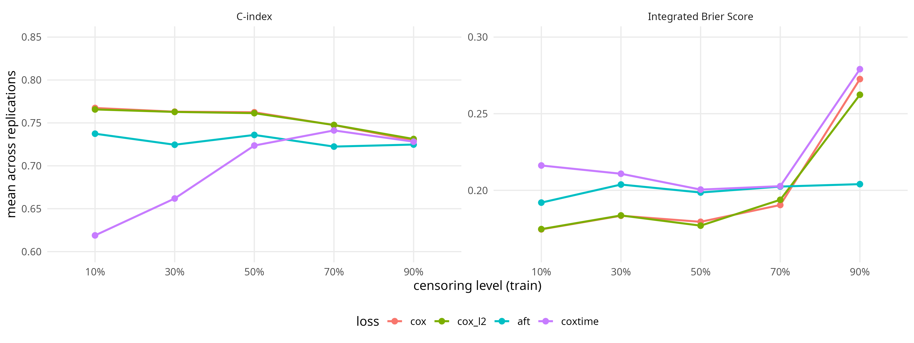
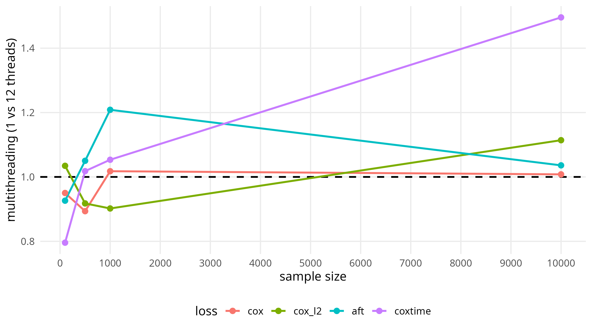

```{r setup, include=FALSE}
knitr::opts_chunk$set(warning = FALSE, message = FALSE)
set.seed(123)
```

# Introduction

## Background and motivation

Survival analysis is a foundational methodology in biomedical and clinical research, constituting the methodological groundwork for applications such as oncology prognosis, cardiovascular risk stratification, and reliability engineering [@wiegrebe2024deep]. Classical statistical models, most notably the Cox proportional hazards (PH) model, have long been favored for their interpretability and solid theoretical foundation [@cox1972regression]. However, these models impose restrictive assumptions, including linear covariate effects and PH, which are frequently violated in real-world applications [@heagerty2005survival; @batson2016review].

To address these limitations, machine learning algorithms have been increasingly adopted as flexible modeling approaches that relax restrictive assumptions and often yield improved predictive accuracy. Among these methods, deep learning has emerged as a particularly powerful paradigm, capable of capturing complex non-linear relationships and high-dimensional feature interactions that are difficult to capture with classical approaches [@wiegrebe2024deep; @bengio2021deep].

## Advances in deep survival models

The evolution of deep survival models began with early efforts such as that of Faraggi and Simon [@faraggi1995neural], who replaced the linear component of Cox regression with a shallow neural network. However, these early models failed to consistently outperform classical models in terms of discrimination [@xiang2000comparison; @sargent2001comparison]. A significant advancement came with `DeepSurv` [@katzman2018deepsurv], which introduced modern neural optimization techniques to improve predictive accuracy under the PH setting.

Recent deep learning methods have achieved state-of-the-art performance in survival analysis, particularly through models such as `DeepSurv`, `DeepHit` [@lee2018deephit], and `Cox-Time` [@kvamme2019time], which have been successfully applied to real-world clinical datasets. These methods are summarized in recent reviews [@wiegrebe2024deep].

To model non-PH and flexible survival distributions, `DeepHit` [@lee2018deephit] introduced a discrete-time neural approach with time-varying, non-linear effects. The `pycox` library unified `DeepSurv`, `DeepHit`, and `Cox-Time` using `PyTorch` [@paszke2019pytorch], while `TorchSurv` [@monod2024torchsurv] more recently offered a lower-level API for neural Cox and AFT models with customizable losses.

## Statement of need

Despite the growing adoption of deep learning methods for survival analysis, the R ecosystem lacks native tools for training and deploying deep survival models. Existing solutions, such as the \CRANpkg{survivalmodels} package [@survivalmodels2020], rely on Python backends accessed via \CRANpkg{reticulate} [@reticulate2017], which introduces installation complexity and versioning issues. This dependency has limited the accessibility of deep survival modeling for biostatisticians and clinical researchers who rely primarily on R.

## Contribution

To address this gap, we developed \CRANpkg{survdnn}, a fully native R package for deep neural network-based survival analysis. Built on the \CRANpkg{torch} backend [@falbel2024torch], \CRANpkg{survdnn} provides a high-level formula interface, supports multiple loss functions including Cox, Cox-L2, AFT, and Cox-Time, and integrates seamlessly with modern R workflows. The package includes training and prediction utilities, built-in evaluation metrics such as the concordance index (C-index), time-dependent Brier score, and Integrated Brier Score (IBS), as well as functions for cross-validation, hyperparameter tuning, and regularization mechanisms including dropout, batch normalization, and early-stopping callbacks. \CRANpkg{survdnn} complements the rich foundational survival modeling tools in R by extending them into the deep learning era without leaving the R ecosystem.

# Implementation

## Package overview

At its core, \CRANpkg{survdnn} is built around the `survdnn()` function, which fits a deep neural network for right-censored survival data using R's formula interface. Users specify the network architecture through an integer vector of hidden layer sizes and select the activation function from a set of supported options, including `"relu"`, `"leaky_relu"`, `"tanh"`, `"sigmoid"`, `"gelu"`, `"elu"`, and `"softplus"`. The training objective is defined via the `loss` argument, with support for `"cox"`, `"cox_l2"`, `"aft"`, and `"coxtime"`, while core hyperparameters such as the learning rate and number of epochs remain fully user-configurable. The training pipeline further incorporates regularization and optimization mechanisms such as dropout, batch normalization, and user-defined callbacks (including early stopping based on training loss dynamics) to improve stability and generalization.

Model predictions are computed using `predict.survdnn()`, which supports three output types: the raw linear predictor (`"lp"`), survival probabilities at specified time points (`"survival"`), and cumulative risk at a given time (`"risk"`). Predictions can be returned either as numeric vectors or as data frames with one column per evaluation time.

The package includes built-in utilities for evaluation and resampling. The `evaluate_survdnn()` function computes common and built-in performance metrics. The `cv_survdnn()` function performs stratified k-fold cross-validation to preserve event censoring balance across folds, with results summarized using `summarize_cv_survdnn()`.

Hyperparameter tuning is supported through two complementary functions. The `tune_survdnn()` function performs k-fold cross-validation over a user-defined hyperparameter grid and selects the best configuration according to a chosen evaluation metric (the first metric is used for selection), optionally refitting the final model on the full dataset. In contrast, `gridsearch_survdnn()` evaluates the same type of hyperparameter grid under a fixed training-validation split: each candidate model is fitted on the training set and assessed on a user-supplied validation set, without internal resampling or automatic refitting.

Missing data are handled explicitly through a user-controlled policy (`na_action = "omit"` or `"fail"`), with informative reporting of excluded observations when applicable.

Finally, `plot.survdnn()` provides a visualization method for predicted survival curves using `ggplot2` style \citep{wickham2026ggplot2}, with options to group curves by a categorical variable and to display either individual or averaged curves.

## Model architecture

The model architecture in \CRANpkg{survdnn} is defined as a sequence of $k$ transformation layers applied to the input features $\mathbf{x}$:

$$
f_\theta(\mathbf{x}) = L_k \circ \phi_{k-1} \circ \cdots \circ \phi_1 \circ L_1(\mathbf{x})
$$

Each stage consists of a linear transformation followed by non-linear activation and regularization components. The linear transformation at layer $k$ is expressed as:

$$
L_k(\cdot) = W_k \mathbf{h}^{(k-1)} + b_k
$$

where $W_k$ is the weight matrix and $b_k$ the bias vector. The transformed output is then passed through a composition of non-linear operations. Specifically, each layer includes an activation function $\phi$, batch normalization to stabilize learning, and dropout to prevent overfitting. Together, a hidden layer is computed as:

$$
\mathbf{h}^{(k)} = \text{Dropout} \left( \phi \left( \text{BatchNorm} \left( W_k \mathbf{h}^{(k-1)} + b_k \right) \right) \right)
$$

The final layer outputs a scalar prediction $f_\theta(\mathbf{x})$, interpreted based on the selected loss function: as log-risk under Cox-based losses, log-event time under the AFT loss, or time-dependent log-risk under the Cox-Time loss.

Before training, a model matrix is created from the user-specified formula interface. This step expands factor variables into dummy indicators and extracts the design matrix.

## Loss functions 

In survival machine learning, the loss function defines the model's training objective and dictates how it handles censoring, time-to-event outcomes, and individual risk dynamics [@wiegrebe2024deep]. This choice critically influences convergence, calibration, and generalization [@katzman2018deepsurv].

The \CRANpkg{survdnn} package implements four core loss functions tailored for right-censored survival data, covering both PH and non-PH settings:

**Cox Partial Likelihood Loss (`"cox"`)**: The standard Cox loss implements the partial likelihood from the Cox PH model [@cox1972regression]. It is the basis of classical methods and modern neural-based implementations like `DeepSurv` [@katzman2018deepsurv] and `pycox` [@kvamme2019time].

The model assumes a multiplicative hazard function:

$$
\lambda(t \mid \mathbf{x}) = \lambda_0(t) \cdot \exp(f_\theta(\mathbf{x})) = \lambda_0(t) \cdot e^\eta
$$

where $f_\theta(\mathbf{x}) = \eta$ is a learned log-risk score and $\lambda_0(t)$ is an unspecified baseline hazard.

To avoid estimating $\lambda_0(t)$, Cox proposed the partial likelihood:

$$
\mathcal{L}_{\text{cox}}(\theta) = \prod_{i:\delta_i = 1} \frac{e^{\eta_i}}{\sum_{j \in \mathcal{R}(t_i)} e^{\eta_j}}
$$

The negative log of this expression is minimized during training. In \CRANpkg{survdnn}, this is implemented using `torch_logcumsumexp()` to ensure numerical stability and efficient batch-wise computation.

The Cox loss learns relative risks, not calibrated survival probabilities. However, post-processing via Breslow estimation is performed to obtain full survival curve estimates [@breslow1972contribution].

**L2-Regularized Cox Loss (`"cox_l2"`)**: This variant augments the Cox loss with an L2 penalty applied directly to the predicted log-risk scores:

$$
\mathcal{L}_{\text{cox-l2}}(\theta)
=
\mathcal{L}_{\text{cox}}(\theta)
+
\lambda \cdot \frac{1}{n} \sum_{i=1}^n \eta_i^2
$$

This ridge-type regularization stabilizes optimization and reduces overfitting, particularly in small-sample or high-dimensional settings [@friedman2010regularization].

Unlike classical weight decay, the penalty acts on model outputs rather than internal parameters, preserving architectural flexibility while directly constraining extreme risk predictions.

**Accelerated Failure Time Loss (`"aft"`)**: The AFT option in \CRANpkg{survdnn} implements a log-normal AFT model with right-censoring, trained by minimizing the censored negative log-likelihood:

$$
\log(T_i) = \mu_i + \sigma Z_i,\qquad Z_i \sim \mathcal{N}(0,1)
$$

where $\mu_i = f_\theta(\mathbf{x}_i) + \mathrm{aft\_loc}$ is a subject-specific location parameter predicted by the neural network, $\sigma > 0$ is a global scale parameter, and `aft_loc` is an optional centering constant used to improve numerical stability.

For an observed time $t_i$ and event indicator $\delta_i$, the contribution to the negative log-likelihood is:

$$
\ell_i(\theta) =
\begin{cases}
\log t_i + \log \sigma + \tfrac{1}{2} z_i^2 & \delta_i = 1 \\
-\log S(z_i) & \delta_i = 0
\end{cases}
$$

where

$$
z_i = \frac{\log t_i - \mathrm{aft\_loc} - f_\theta(\mathbf{x}_i)}{\sigma},
\quad
S(z) = 1 - \Phi(z)
$$

and $\Phi(\cdot)$ denotes the standard normal cumulative distribution function.

The overall loss minimized during training is the average censored negative log-likelihood:

$$
\mathcal{L}_{\text{aft}}(\theta) = \frac{1}{n} \sum_{i=1}^n \ell_i(\theta)
$$

In \CRANpkg{survdnn}, the scale parameter $\sigma$ can either be fixed or learned jointly with network parameters through a differentiable reparameterization ($\sigma = \exp(\log\sigma)$). This formulation enables the AFT model to fully use both event and censored observations while preserving the direct time-scale interpretation of AFT models.

**Cox-Time Loss (`"coxtime"`)**: The Cox-Time model extends the Cox framework by allowing covariate effects to vary with time [@kvamme2019time]. The log-relative hazard is modeled as:

$$
g_\theta(t,\mathbf{x})
=
\log\!\left(\frac{h(t \mid \mathbf{x})}{h_0(t)}\right)
$$

yielding the hazard:

$$
h(t\mid\mathbf{x}) = h_0(t)\exp(g_\theta(t,\mathbf{x}))
$$

The corresponding loss is the time-dependent Cox partial likelihood:

$$
\mathcal{L}_{\text{coxtime}}(\theta)
= - \sum_{i:\,\delta_i = 1}
\left[
g_\theta(t_i, \mathbf{x}_i)
-
\log \sum_{j \in \mathcal{R}(t_i)}
\exp\!\bigl(g_\theta(t_i, \mathbf{x}_j)\bigr)
\right]
$$

In \CRANpkg{survdnn}, this loss is implemented using batched evaluation over event times and risk sets. While Cox-Time offers the greatest modeling flexibility among the available losses, it is also the most computationally demanding due to repeated evaluation of risk sets across time.

## Prediction interface

Once a \CRANpkg{survdnn} model has been trained, predictions can be obtained using the generic `predict()` method. This function supports multiple output types to serve different goals in survival analysis:

* *Linear predictors* (`type = "lp"`): returns the log-risk score $\eta = f_\theta(\mathbf{x})$, used for risk ranking and concordance index evaluation.

* *Survival probabilities* (`type = "survival"`): returns $\hat{S}(t \mid \mathbf{x})$, the estimated survival function evaluated at user-specified time points.

* *Cumulative risk* (`type = "risk"`): returns the cumulative incidence $\hat{F}(t) = 1 - \hat{S}(t)$, the probability of experiencing the event by time $t$. 

Predictions are returned either as numeric vectors for single time points or as data frames with one column per evaluation time.

The underlying computation depends on the loss function used during training. For models trained with `"cox"` and `"cox_l2"`, the baseline cumulative hazard $\hat{H}_0(t)$ is estimated using the Breslow estimator. 

Survival probabilities are then computed as:

$$
\hat{S}(t \mid \mathbf{x})
=
\exp\!\left(-\hat{H}_0(t)\exp(\eta)\right)
$$

For `"aft"`, predictions are based on the fitted log-normal accelerated failure time model, using the estimated scale parameter $\hat{\sigma}$:

$$
\hat{S}(t \mid \mathbf{x})
= 1 - \Phi\!\left(
\frac{\log t - f_\theta(\mathbf{x})}{\hat{\sigma}}
\right)
$$

where $\Phi$ denotes the standard normal cumulative distribution function.

For `"coxtime"`, predictions follow the approach proposed by [@kvamme2019time], using a time-dependent neural log-risk function $g(t,\mathbf{x})$. Survival probabilities are obtained by accumulating predicted hazards over a discrete time grid:

$$
\hat{S}(t \mid \mathbf{x})
= \prod_{s \le t}
\exp\!\left(-\hat{\lambda}(s \mid \mathbf{x})\right)
$$

Survival prediction under Cox-Time requires numerical integration of the time-dependent hazard over a user-defined time grid. While training relies only on observed event times, prediction involves evaluating the neural risk function across grid points for each individual, which can become computationally expensive for large datasets or fine time grids. 

## Training workflow

The `survdnn()` function implements a complete training workflow for deep neural networks on right-censored survival data. It relies on R's formula interface to construct design matrices, applies Z-score standardization for numerical stability, and converts inputs into `torch_tensor()` objects for efficient automatic differentiation using the \CRANpkg{torch} backend [@keydana2023deep].

Model architectures are defined via `build_dnn()`, which constructs a fully connected multilayer perceptron with user-configurable depth and width. Each hidden layer may optionally include batch normalization and dropout, enabling regularization and improved optimization stability. Non-linear activations are applied uniformly across layers and selected from a predefined set of commonly used functions.

The training objective is specified via the `loss` argument (`"cox"`, `"cox_l2"`, `"aft"`, or `"coxtime"`), each implemented as a differentiable loss function compatible with backpropagation. Optimization is performed using full-batch gradient descent with a choice of optimizers, including Adam, AdamW, SGD, RMSprop, and Adagrad, all exposed through a unified interface.

The empirical risk minimized during training is given by:

$$
\mathcal{L}(\theta)
= \frac{1}{n}
\sum_{i=1}^n
\ell\!\left(f_\theta(\tilde{\mathbf{x}}_i), t_i, \delta_i\right)
$$

where $\ell(\cdot)$ denotes the selected survival loss and $\tilde{\mathbf{x}}_i$ are standardized covariates.

To improve training robustness and prevent overfitting, \CRANpkg{survdnn} supports user-defined callback functions, including early stopping based on the training loss trajectory. Callbacks are evaluated at each epoch and may interrupt training once predefined criteria are met. Reproducibility is ensured by a unified `.seed` argument that synchronizes R and \CRANpkg{torch} random number generators.

The fitted model is returned as an S3 object of class `"survdnn"`, containing the trained neural network, preprocessing metadata, optimizer configuration, and the full loss history. This object integrates seamlessly with the `predict()` method to compute predictions. 

## Evaluation metrics

\CRANpkg{survdnn} supports standard survival metrics for assessing both discrimination and calibration at user-defined evaluation time points. Discrimination is evaluated using the C-index [@harrell1982evaluating], which measures the model's ability to correctly rank individuals by risk and is maximized during evaluation and hyperparameter tuning.

Calibration is assessed using the time-dependent Brier score [@graf1999assessment] and the IBS, both computed with inverse probability of censoring weighting to account for right-censoring [@zhou2023survmetrics]. These metrics quantify the accuracy of predicted survival probabilities and are minimized during evaluation and hyperparameter tuning.

## Cross-validation

Cross-validation is performed using the `cv_survdnn()` function, which implements stratified $k$-fold partitioning based on the event indicator to preserve the proportion of observed events and censored observations across folds. Time-to-event values are not stratified, in accordance with standard practice in survival resampling.

Within each fold, models are trained using `survdnn()` on the training split and evaluated on the held-out data using `evaluate_survdnn()` at user-specified time points and metrics. Results are returned in a tidy tabular format, enabling transparent benchmarking, hyperparameter selection, and performance comparison while reducing optimistic bias [@varma2006bias].

## Tuning

Hyperparameter tuning is crucial in deep survival modeling, where censoring can destabilize optimization and introduce noisy gradients, and small datasets with few events further increase overfitting risk [@gensheimer2019scalable].

\CRANpkg{survdnn} provides `tune_survdnn()` to perform grid-based $k$-fold cross-validation across key hyperparameters, including:

- **Architecture**: hidden layer sizes (`hidden`)

- **Activation**: `"relu"`, `"leaky_relu"`, `"tanh"`, `"sigmoid"`, `"gelu"`, `"elu"`, `"softplus"`

- **Optimization**: learning rate (`lr`), number of epochs (`epochs`)

- **Loss function**: `"cox"`, `"cox_l2"`, `"aft"`, `"coxtime"`

This design follows best practices in regularized learning [@friedman2010regularization] and deep neural optimization [@bengio2012practical]. An optional `refit = TRUE` automatically retrains the best configuration and fits the model on the full dataset in an AutoML style.

## Sensitivity to censoring

Because censoring directly affects the effective sample size and the information available for risk estimation, we investigated the sensitivity of \CRANpkg{survdnn} models to increasing levels of right censoring. Using a controlled simulation design, we evaluated predictive discrimination (C-index) and calibration (IBS) across censoring rates ranging from 10%  to 90%. 

```{r fig-censoring, echo=FALSE, fig.cap="Censoring sensitivity analysis. C-index and IBS of survdn models across increasing right-censoring rates (10-90%) for the four implemented loss functions.", out.width="100%", fig.align="center", fig.pos="htbp"}

```

Across losses, discrimination (C-index) decreases only moderately with increasing censoring, whereas calibration (IBS) is most affected at extreme censoring (Figure \@ref(fig:fig-censoring)). Cox-based losses (`"cox"` and `"cox_l2"`) show stable C-index up to $\approx 50\%$ censoring, followed by a gradual decline, while IBS remains low up to $\approx 70\%$ but increases sharply at 90% censoring. The AFT loss exhibits comparatively stable performance across censoring levels for both C-index and IBS, and yields the lowest IBS under very high censoring (90%). In contrast, the Cox-Time loss shows poor discrimination at low censoring but improves markedly up to $\approx 70\%$, while maintaining higher IBS than the other losses and deteriorating strongly at 90% censoring, consistent with increased variance under limited effective sample size.

These results suggest that, in practice, Cox-based losses are preferable under low to moderate censoring, offering a favorable balance between discrimination and calibration. The AFT loss demonstrates robust calibration across censoring levels, including under very high censoring, but yields comparatively lower discrimination, indicating that its use should be guided by the relative importance of ranking versus probability accuracy. Highly flexible models such as Cox-Time require larger effective sample sizes and careful calibration assessment, as their apparent gains in discrimination at moderate censoring are offset by substantially poorer calibration under extreme censoring.

## Computation backend

Since \CRANpkg{survdnn} is built on the \CRANpkg{torch} backend, it supports both CPU and GPU execution. The computation device can be selected via `.device = c("auto", "cpu", "cuda")`, where `"auto"` uses CUDA when available and otherwise falls back to CPU. On CPU, performance benefits from multithreaded linear algebra provided by the underlying BLAS/LAPACK implementation.

```{r fig-speedup, echo=FALSE, fig.cap="CPU multithreading speedup across loss functions. Relative training-time speedup comparing multi-threaded and single-thread CPU execution as a function of sample size for Cox, Cox-L2, AFT, and Cox-Time losses.", out.width="100%", fig.align="center", fig.pos="htbp"}

```

To characterize computational behavior, we evaluated training time across increasing sample sizes and compared single-thread and multi-thread CPU execution for different loss functions (Figure \@ref(fig:fig-speedup)). Multithreading benefits vary markedly across losses and depend strongly on sample size. Cox-based losses exhibit little to no speedup, with performance remaining close to single-thread execution even at large sample sizes, reflecting the dominance of global, sequential risk-set operations. The AFT loss shows moderate speedup already at small to moderate sample sizes, but scaling gains diminish as sample size increases, consistent with dense likelihood computations that limit parallel efficiency. In contrast, the Cox-Time loss demonstrates substantial and increasing speedup with sample size, achieving the largest gains under multithreading, indicating favorable parallelization of its time-dependent risk evaluations despite higher overhead at small sample sizes.

## Reproducibility

Reproducibility in \CRANpkg{survdnn} requires controlling both R-level and \CRANpkg{torch}-level sources of randomness. While `set.seed()` controls randomness in R, neural network training relies on \CRANpkg{torch}, which maintains its own random number generator for operations such as weight initialization and dropout.

To simplify reproducible workflows, \CRANpkg{survdnn} exposes a `.seed` argument in its main fitting and resampling functions (including `survdnn()`, `cv_survdnn()`, and `tune_survdnn()`). When provided, this argument internally synchronizes both R and \CRANpkg{torch} random number generators to ensure fully reproducible model training and evaluation.

# Usage examples

We illustrate the use of \CRANpkg{survdnn} through two case studies: a complete modeling pipeline on the veteran’s lung cancer dataset and a benchmark on the real-world METABRIC breast cancer dataset. 

## Example 1: API demonstration

This example uses the Veteran’s lung cancer dataset from the \CRANpkg{survival} package [@survival-book] to illustrate a typical \CRANpkg{survdnn} workflow: fit a model, inspect the training configuration, compute survival predictions at user‑defined time points, evaluate with standard metrics (C‑index, IBS, Brier), perform cross‑validation, tune hyperparameters, and visualize training dynamics and survival curves.

First, we fit a Cox‑loss model with a modest multilayer architecture:

```{r}
pacman::p_load(survdnn, survival, dplyr, ggplot2, tibble, randomForestSRC, partykit, party, pec, rsample, purrr)

veteran <- survival::veteran

mod <- survdnn(
  Surv(time, status) ~ age + karno + celltype,
  data = veteran,
  hidden = c(32, 16),
  epochs = 300,
  loss = "cox",
  verbose = TRUE,
  .seed  = 123
  )
```

We can summarise the model to inspect the architecture, preprocessing, and training setup:

```{r}
summary(mod)
```

Next, we can obtain survival probabilities at clinically meaningful horizons (30, 90, 180 days):

```{r}
times_eval <- c(30, 90, 180)
pred_surv <- predict(mod, newdata = veteran, type = "survival", times = times_eval)
head(pred_surv)
```

Model performance can be assessed via the C-index and the IBS:

```{r}
eval_res <- evaluate_survdnn(mod, metrics = c("cindex", "ibs"), times = times_eval)
print(eval_res)
```

The Brier score can also be computed at specific time points (or over a grid, if desired):

```{r}
times_eval <- seq(min(veteran$time), max(veteran$time), 10)
eval_res <- evaluate_survdnn(mod, metrics = "brier", times = times_eval)
print(eval_res)
```

To assess stability, we can run $k$‑fold cross‑validation with predefined metrics and time points:

```{r}
cv_results <- cv_survdnn(
  Surv(time, status) ~ age + karno + celltype, data = veteran,
  times = c(30, 90, 180),
  metrics = c("ibs"),
  folds = 3,
  hidden = c(16, 8),
  loss = "cox",
  epochs = 100,
  .seed  = 123
  )
print(cv_results)
```

Hyperparameter tuning can be automated over a small grid. Below we vary architecture, optimiser settings, and loss:

```{r, message=FALSE, warning=FALSE}
grid <- list(
  hidden     = list(c(16, 32, 64, 16)),
  lr         = c(1e-3),
  activation = c("relu", "softplus"),
  epochs     = c(100),
  loss       = c("cox_l2", "aft")
)

tune_res <- tune_survdnn(
  Surv(time, status) ~ age + karno + celltype,
  data = veteran,
  times = c(30, 90, 180),
  metrics = "cindex",
  param_grid = grid,
  folds = 3,
  refit = FALSE,
  return = "all"
  )

benchmark_results <- summarize_tune_survdnn(tune_res, by_time = TRUE)

tuning_results_clean <- benchmark_results %>%
  mutate(
    hidden = sapply(hidden, function(x) paste(x, collapse = "-")),
    across(where(is.numeric), ~ round(.x, 3))
  )

tuning_results_clean
```

Training dynamics can be visualised using the built-in `plot_loss()` helper:

```{r}
plot_loss(mod, smooth = TRUE)
```

Finally, we visualise survival curves by cancer cell type, showing both individual and mean summaries: 

```{r}
plot(mod, group_by = "celltype", times = 1:900) +
  ggtitle("Survival Curves by Celltype")
```

```{r}
plot(mod, group_by = "celltype", times = 1:300, plot_mean_only = TRUE) +
  ggtitle("Mean Survival Curves by Celltype")
```

## Example 2: METABRIC benchmark

Here we benchmark \CRANpkg{survdnn} against Cox PH, Random Survival Forests (RSF), and Conditional Inference Forests (CForest) using five‑fold cross‑validation on the METABRIC breast cancer dataset [@mukherjee2018associations]. All models are trained on identical splits and evaluated with the C‑index at predefined time points.

```{r, echo = FALSE}
# load and preprocess METABRIC
metabric <- read.csv("data/metabric.csv")
vars <- c(
  "overall_survival_months", "overall_survival",
  "age_at_diagnosis", "tumor_size", "lymph_nodes_examined_positive",
  "nottingham_prognostic_index", "tumor_stage", "neoplasm_histologic_grade",
  "chemotherapy", "hormone_therapy", "radio_therapy",
  "er_status", "her2_status", "pr_status"
)

df <- metabric[, vars] |>
  na.omit() |>
  mutate(across(where(is.character), as.factor))

form <- Surv(overall_survival_months, overall_survival) ~
  age_at_diagnosis + tumor_size + lymph_nodes_examined_positive +
  nottingham_prognostic_index + tumor_stage + neoplasm_histologic_grade +
  chemotherapy + hormone_therapy + radio_therapy +
  er_status + her2_status + pr_status

# always use sorted times (pec + downstream formatting expects monotone grid)
times <- sort(seq(1, max(df$overall_survival_months), by = 12))

benchmark_cv_metabric <- function(data, formula, times, folds = 5, seed = 123) {
  set.seed(seed)

  ## Freeze factor levels globally (dataset-agnostic CV safety
  fac_cols <- names(data)[vapply(data, is.factor, logical(1))]
  xlevels  <- lapply(data[fac_cols], levels)

  align_levels <- function(dat) {
    for (nm in names(xlevels)) {
      if (nm %in% names(dat)) dat[[nm]] <- factor(dat[[nm]], levels = xlevels[[nm]])
    }
    dat
  }

  splits <- vfold_cv(data, v = folds, strata = overall_survival)

  map_dfr(seq_len(nrow(splits)), function(i) {
    split <- splits$splits[[i]]
    train <- analysis(split)
    test  <- assessment(split)

    ## apply the global levels to each fold
    train <- align_levels(train)
    test  <- align_levels(test)

    if (nrow(train) < 50 || nrow(test) < 20) return(NULL)

    safe_run <- safely(function() {
      mod_cox <- coxph(formula, data = train, x = TRUE, y = TRUE)
      mod_rsf <- rfsrc(formula, data = train, ntree = 500)
      mod_cf  <- pecCforest(formula = formula, data = train,
                            controls = cforest_unbiased(ntree = 500))
      mod_dnn <- survdnn(formula = formula, data = train, loss = "cox",
                         epochs = 500, hidden = c(16, 64, 32),
                         activation = "gelu", lr = 1e-3, verbose = FALSE, .seed = 321)

      fix <- function(mat) {
        stopifnot(ncol(mat) == length(times))
        colnames(mat) <- paste0("t=", times)
        as.data.frame(mat)
      }

      y_test <- Surv(test$overall_survival_months, test$overall_survival)

      tibble(
        fold = i,
        model = c("CoxPH", "RSF", "CForest", "SurvDNN"),
        cindex = c(
          cindex_survmat(y_test, fix(predictSurvProb(mod_cox, test, times))),
          cindex_survmat(y_test, fix(predictSurvProb(mod_rsf, test, times))),
          cindex_survmat(y_test, fix(predictSurvProb(mod_cf,  test, times))),
          cindex_survmat(y_test, fix(predict(mod_dnn, test, times = times, type = "survival")))
        )
      )
    })

    res <- safe_run()
    if (!is.null(res$error)) {
      warning(paste("Error in fold", i, ":", res$error$message))
      return(NULL)
    } else {
      return(res$result)
    }
  })
}

bench_results <- benchmark_cv_metabric(df, form, times, folds = 5)

summary <- bench_results |>
  group_by(model) |>
  summarise(
    mean_cindex = round(mean(cindex), 3),
    sd_cindex   = round(sd(cindex), 3),
    .groups = "drop"
    ) |> 
  arrange(desc(mean_cindex))

print(summary)

```

# Discussion

The \CRANpkg{survdnn} package fills an important gap in the R ecosystem by providing a fully native, \CRANpkg{torch}-based framework for deep survival modeling [@falbel2024torch], without relying on Python backends. This design choice improves installation reliability and facilitates seamless integration with established R workflows for statistical modeling and reproducible research.

Across multiple benchmarks and sensitivity analyses, \CRANpkg{survdnn} demonstrates competitive predictive performance relative to established survival models, including Cox PH models [@cox1972regression], RSF [@ishwaran2008random], and CForest [@hothorn2006survival]. The availability of multiple likelihood-based loss functions enables analysts to adapt modeling assumptions to PH, non-PH, non-linear covariate effects, and time-varying effects within a unified deep learning framework. All implemented losses explicitly account for right-censoring through either partial likelihoods (Cox, L2-penalised Cox, Cox-Time) or fully specified censored likelihoods (AFT).

Additional investigations highlight practical trade-offs in both statistical robustness and computational behavior. Sensitivity analyses across increasing censoring levels (Figure \@ref(fig:fig-censoring)) show that discrimination and calibration degrade as expected with reduced effective sample size, with differences across loss functions. Complementary runtime experiments (Figure \@ref(fig:fig-speedup)) demonstrate that computational behavior varies substantially by loss function: Cox-based losses exhibit low computational overhead but derive little benefit from multithreaded execution, Cox-Time incurs higher per-iteration cost due to repeated evaluation of time-dependent risk scores yet scales efficiently with parallel execution at larger sample sizes, and AFT likelihoods involve dense computations that benefit from parallelism at moderate sizes but show limited scalability as sample size increases.

The current scope of \CRANpkg{survdnn} is intentionally focused on tabular data, using multilayer perceptron architectures [@bengio2021deep] that are well aligned with the structure of most survival analysis applications. This design choice prioritizes stability and compatibility with classical survival modeling workflows. Training is performed using full-batch optimization, which favors reproducibility and stable convergence but may limit scalability to very large datasets.

Ongoing work maps \CRANpkg{survdnn} to the `mlr3` ecosystem [@mlr3] via a dedicated survival learner, providing users with additional access to standardized benchmarking, resampling, and tuning workflows.

Planned developments include expanded support for time-dependent evaluation metrics [@uno2007evaluating; @blanche2013estimating] and the incorporation of additional survival loss functions. These directions aim to broaden the applicability of \CRANpkg{survdnn} while preserving its core emphasis on transparent and statistically principled modeling.

Overall, \CRANpkg{survdnn} provides a practical and extensible foundation for deep survival modeling in R, combining modern deep learning methodology with the transparency and reproducibility expected in statistical computing environments.

# Acknowledgements

The author thanks the anonymous referees for their valuable comments and suggestions, which substantially improved the quality and clarity of this manuscript.
