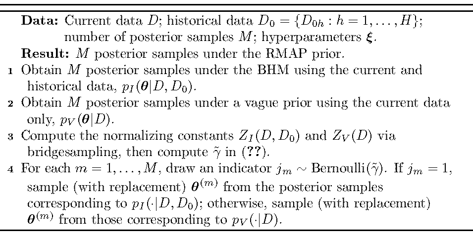
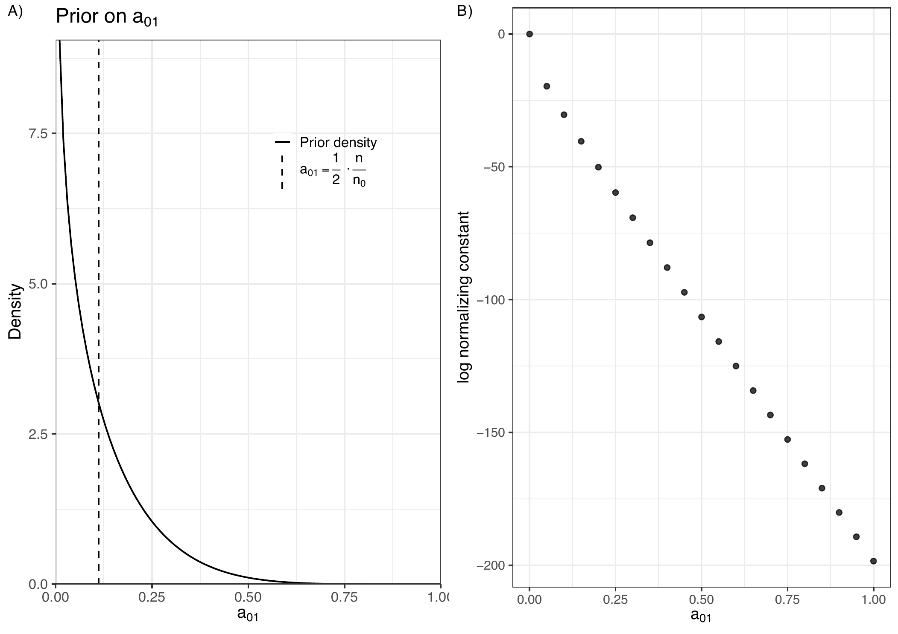
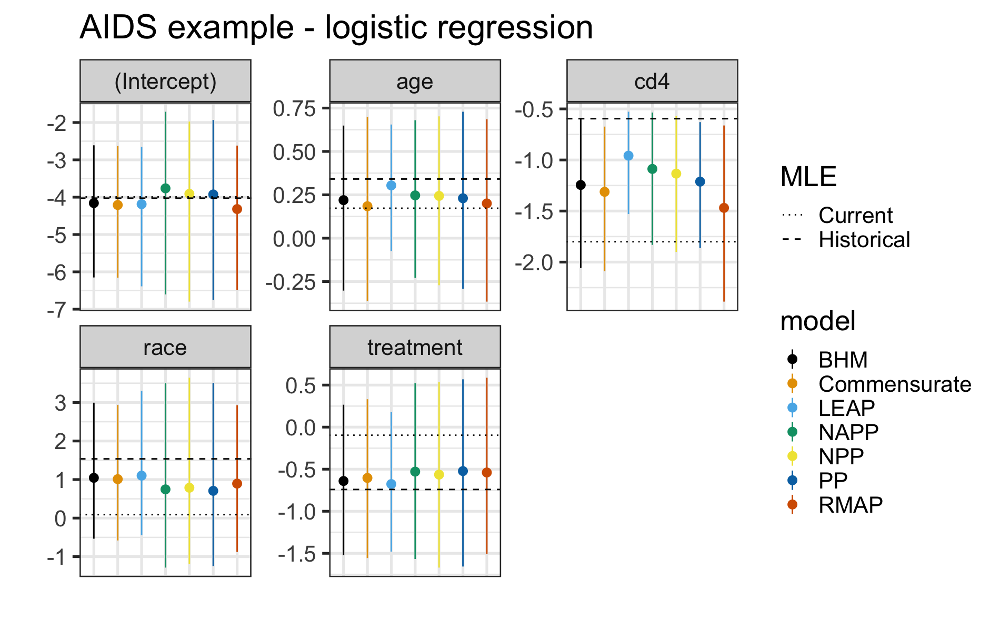
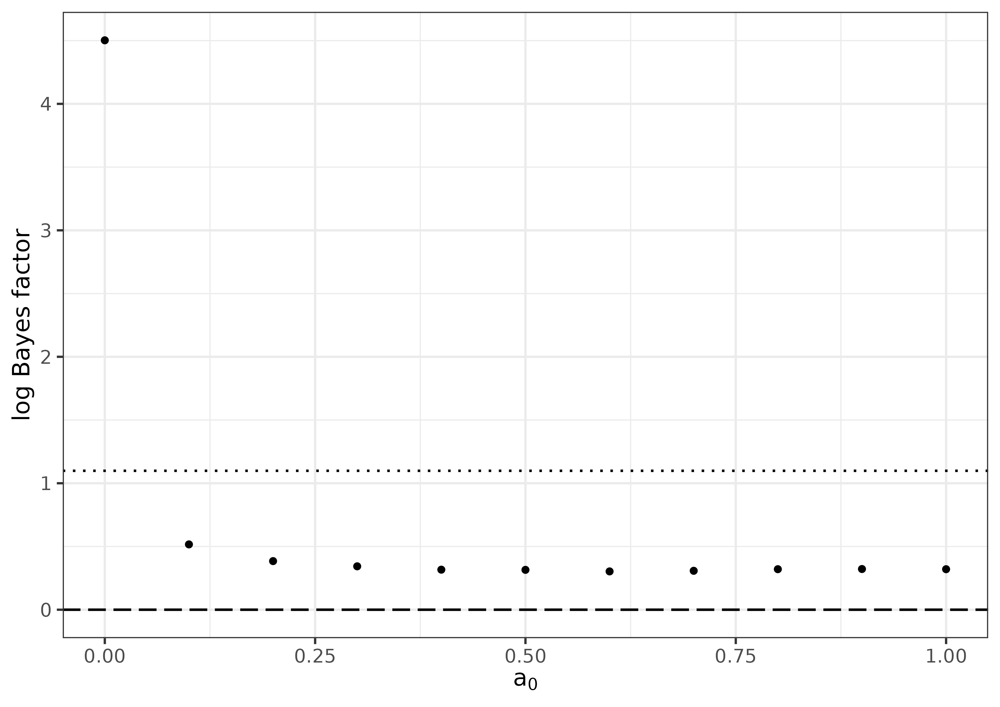

:::: article
## Introduction

A common occurrence in practical applications of Bayesian modeling is
the use of historical data to inform the prior for the analysis of the
data set at hand, which we refer to as the current data. For example, in
clinical trials, one may be in possession of a Phase III data set in
addition to the Phase II trial already completed. In such cases, it is
often desirable to elicit an informative prior for the regression
coefficients based on the historical data.

Many methods for incorporating historical data have been proposed,
including the power prior (Ibrahim and Chen 2000), the normalized power
prior (Duan et al. 2006; Carvalho and Ibrahim 2021), the Bayesian
hierarchical model, commensurate priors (Hobbs et al. 2012), and robust
meta-analytic predictive priors (Schmidli et al. 2014). Unfortunately,
software implementations of these methods may be difficult to come
across. Where they do exist, the implementations can differ so
substantially that it becomes troublesome to utilize multiple packages
to compare methods. For example, the
[**RBesT**](https://CRAN.R-project.org/package=RBesT) package (Weber et
al. 2021), which implements the robust meta-analytic predictive prior,
accepts data in an aggregate format where each row represents a study or
group and uses a single function that accommodates Gaussian, binomial,
and Poisson models. In contrast, the
[**NPP**](https://CRAN.R-project.org/package=NPP) package (Han et al.
2021), which implements the normalized power prior, provides separate
functions for different outcome types, each requiring a distinct data
format. For instance, `NPP::LMNPP_MCMC()` requires users to provide
vectors of individual-level responses for the current and historical
data, whereas `NPP::BerNPP_MCMC()` requires a vector of two elements
(number of trials and number of successes) for each data set.
Furthermore, many existing implementations rely on Metropolis-type
samplers, which can be difficult to tune.

The R package [**hdbayes**](https://CRAN.R-project.org/package=hdbayes)
aims to fill this gap. In particular,
[**hdbayes**](https://CRAN.R-project.org/package=hdbayes) offers
user-friendly R functions to conduct Bayesian analysis for generalized
linear models (GLMs) using historical data, with consistent syntax
across methods. The backbone of the package is written in the Stan
programming language (Carpenter et al. 2017), implemented in the
[**cmdstanr**](https://CRAN.R-project.org/package=cmdstanr) package
(Gabry et al. 2024). Although
[**cmdstanr**](https://CRAN.R-project.org/package=cmdstanr) is not
available on CRAN,
[**hdbayes**](https://CRAN.R-project.org/package=hdbayes) uses the
[**instantiate**](https://CRAN.R-project.org/package=instantiate)
package (Landau 2024), which depends on
[**cmdstanr**](https://CRAN.R-project.org/package=cmdstanr), to create
pre-compiled code. Stan utilizes a highly efficient Markov chain Monte
Carlo (MCMC) method known as Hamiltonian Monte Carlo (HMC), which
requires little-to-no tuning from the user's perspective. In particular,
Stan implements a highly optimized variant of the No U-Turn Sampler
(NUTS) algorithm ([Hoffman et al.]{.nocase} 2014).

### 1.1 Installation

The package [**hdbayes**](https://CRAN.R-project.org/package=hdbayes) is
available on CRAN. By default, R installs binary builds on Windows and
macOS. In these cases, the Stan models included with the package are not
compiled during installation, and users may encounter a
`“model not compiled”` error when using
[**hdbayes**](https://CRAN.R-project.org/package=hdbayes). To ensure
compilation, we recommend installation from source:

``` r
    install.packages("hdbayes", type = "source")
```

Using [**hdbayes**](https://CRAN.R-project.org/package=hdbayes) also
requires the package
[**cmdstanr**](https://CRAN.R-project.org/package=cmdstanr) and CmdStan
(the command-line interface to Stan). Detailed instructions for
installing both are provided in the
[**cmdstanr**](https://CRAN.R-project.org/package=cmdstanr)
documentation.

The remainder of this paper proceeds as follows. In Section
[2](#sec:priorelicit), we review methods for prior elicitation using
historical data that are implemented in the
[**hdbayes**](https://CRAN.R-project.org/package=hdbayes) package,
indicating any existing publicly available implementations for each
prior. We provide methodology and code examples for model selection via
marginal likelihoods in Section [3](#sec:normconst). In Section
[4](#sec:dataanalysis), we illustrate the utility of our package via
analyses of real data sets in AIDS clinical trials, comparing posterior
results across all implemented priors in
[**hdbayes**](https://CRAN.R-project.org/package=hdbayes). We close with
some discussion in Section [5](#sec:discussion).

## Prior elicitation with historical data {#sec:priorelicit}

In this section, we review the priors implemented in the
[**hdbayes**](https://CRAN.R-project.org/package=hdbayes) package. Where
applicable, we also discuss existing software implementations for each
prior. We focus on prior elicitation for generalized linear models
(GLMs) (McCullagh and Nelder 1989), whose likelihood function is given
by
$$\begin{align}
    L(\boldsymbol{\mathbf{\beta}}, \phi | \boldsymbol{\mathbf{y}}, \boldsymbol{\mathbf{X}}) \propto \prod_{i=1}^n \exp\left\{ \frac{1}{a_i(\phi)}\left[ y_i \theta_i - b(\theta_i) \right] + c(y_i, \phi) \right\},
    %
    \label{eq:glm_likelihood}
\end{align}   (\#eq:glm-likelihood)$$
where
$\theta_i = \theta(\boldsymbol{\mathbf{x}}_i'\boldsymbol{\mathbf{\beta}})$,
$\theta(\cdot)$ is referred to as the $\theta$-link function, and
$b(\cdot)$ and $c(\cdot, \phi)$ are determined by the underlying
probability distribution. The vector $\boldsymbol{\mathbf{\beta}}$ is a
$p$-dimensional vector of regression coefficients corresponding to the
$p \times 1$ vector of covariates $\boldsymbol{\mathbf{x}}_i$ (with
$\boldsymbol{\mathbf{X}} = (\boldsymbol{\mathbf{x}}_1, \ldots, \boldsymbol{\mathbf{x}}_n)'$),
both of which may include an intercept. The response variable is denoted
by $y_i$ (and $\boldsymbol{\mathbf{y}} = (y_1, \ldots, y_n)'$), and
$\phi > 0$ is a dispersion parameter, which is known and equal to $1$
for binomial and Poisson models. For ease of exposition, we assume
$a_i(\phi) = \phi$. Note that GLMs are sometimes parameterized in terms
of the mean of the $i^{th}$ observation, $\mu_i$, using the $\mu$-link
function
$g(\mu_i) = \boldsymbol{\mathbf{x}}_i'\boldsymbol{\mathbf{\beta}}$. In
this case, $\theta(\cdot) = (\dot{b}^{-1} \circ g^{-1})(\cdot)$, where
$\dot{f}$ denotes the first derivative of the function $f$. When
$a_i(\phi) = \phi$, the likelihood in \@ref(eq:glm-likelihood) can be
expressed in matrix form as
$$\begin{align}
    L(\boldsymbol{\mathbf{\beta}}, \phi | \boldsymbol{\mathbf{y}}, \boldsymbol{\mathbf{X}}) \propto
         \exp\left\{ \frac{1}{\phi} \left[ \boldsymbol{\mathbf{y}}'\theta(\boldsymbol{\mathbf{X}} \boldsymbol{\mathbf{\beta}}) - \boldsymbol{\mathbf{1}}_n' b(\theta(\boldsymbol{\mathbf{X}}\boldsymbol{\mathbf{\beta}})) \right]
         + \boldsymbol{\mathbf{1}}_n' c(\boldsymbol{\mathbf{y}}, \phi)
         \right\},
         %
         \label{eq:glm_likelihood_matrix}
\end{align}   (\#eq:glm-likelihood-matrix)$$
where $\boldsymbol{\mathbf{1}}_n = (1, \ldots, 1)'$ is an $n\times 1$
vector of ones, and the functions $\theta(\cdot)$, $b(\cdot)$, and
$c(\cdot, \phi)$ are evaluated elementwise.

Let the current data set be denoted by
$D = \{ (y_i, \boldsymbol{\mathbf{x}}_i): i = 1, \ldots, n \}$, where
$n$ is the sample size of the current data. Suppose we have $H$
historical data sets, with the $h^{th}$ historical data set denoted by
$D_{0h} = \{ (y_{0hi}, \boldsymbol{\mathbf{x}}_{0hi}): i = 1, \ldots, n_{0h} \}$
for $h = 1, \ldots, H$, where $n_{0h}$ is the corresponding sample size.
Let $D_0 = \{D_{01}, \ldots, D_{0H}\}$ denote the collection of all
historical data sets. In what follows, we describe the priors
implemented in [**hdbayes**](https://CRAN.R-project.org/package=hdbayes)
and compare them with several other R packages that provide related
functionality for incorporating historical data.

### 2.1 Basic syntax

The [**hdbayes**](https://CRAN.R-project.org/package=hdbayes) package is
designed to enable users familiar with the `R` programming language (R
Core Team 2024), particularly its `glm()` function in the
[**stats**](https://CRAN.R-project.org/package=stats) package, to apply
historical data borrowing priors in a unified and user-friendly manner.
To this end, [**hdbayes**](https://CRAN.R-project.org/package=hdbayes)
provides a basic syntax that is common across all implemented priors. In
particular, each prior takes the form
`glm.prior(formula, family, data.list, prior.args, ...)`, where
`formula` is a two-sided formula object, `family` is a family object
containing a distribution-link function pair, and `data.list` is a list
of `data.frame`s, with the first element corresponding to the current
data set and the remaining elements treated as historical data sets. The
argument `prior.args` serves as a placeholder for prior-specific
arguments (e.g., hyperparameters), and the ellipsis (`...`) passes
additional arguments to the sampler in
[**cmdstanr**](https://CRAN.R-project.org/package=cmdstanr) (e.g.,
number of chains, warm-up iterations, etc.). Note that the first two
arguments of `glm.prior()` are identical to those of `stats::glm()`,
while the third argument differs: `glm.prior()` takes a list of data
frames, whereas `stats::glm()` uses a single data frame. Each
implemented prior in
[**hdbayes**](https://CRAN.R-project.org/package=hdbayes) also provides
sensible default values for `prior.args`, making it easy for users to
apply the methods. A summary of the functionality of
[**hdbayes**](https://CRAN.R-project.org/package=hdbayes) compared to
other packages is presented in Table [1](#tab:T1){reference-type="ref"
reference="tab:comparison"}. Our comparison is restricted to packages
that implement GLMs, although some of them also support survival
analysis functionality.

::: {#tab:comparison}
+----------------+-----------------------------------------------------------------------------------------------------------------------------------------------------------------------------------------------------------------------------------------------------------------------------------------------------+
|                | **Package Name**                                                                                                                                                                                                                                                                                    |
+:===============+:=========================================================:+:=================================================:+:===========================================================:+:=============================================================:+:=====================================================:+
|                | [**hdbayes**](https://CRAN.R-project.org/package=hdbayes) | [**NPP**](https://CRAN.R-project.org/package=NPP) | [**BayesPPD**](https://CRAN.R-project.org/package=BayesPPD) | [**psborrow2**](https://CRAN.R-project.org/package=psborrow2) | [**RBesT**](https://CRAN.R-project.org/package=RBesT) |
+----------------+-----------------------------------------------------------+---------------------------------------------------+-------------------------------------------------------------+---------------------------------------------------------------+-------------------------------------------------------+
| Power prior    | X                                                         |                                                   |                                                             |                                                               |                                                       |
+----------------+-----------------------------------------------------------+---------------------------------------------------+-------------------------------------------------------------+---------------------------------------------------------------+-------------------------------------------------------+
| Normalized     | X                                                         | X                                                 | X                                                           |                                                               |                                                       |
| power prior    |                                                           |                                                   |                                                             |                                                               |                                                       |
+----------------+-----------------------------------------------------------+---------------------------------------------------+-------------------------------------------------------------+---------------------------------------------------------------+-------------------------------------------------------+
| Normalized     | X                                                         |                                                   |                                                             |                                                               |                                                       |
| asymptotic     |                                                           |                                                   |                                                             |                                                               |                                                       |
| power prior    |                                                           |                                                   |                                                             |                                                               |                                                       |
+----------------+-----------------------------------------------------------+---------------------------------------------------+-------------------------------------------------------------+---------------------------------------------------------------+-------------------------------------------------------+
| Robust         | X                                                         |                                                   |                                                             |                                                               | X                                                     |
| meta-analytic  |                                                           |                                                   |                                                             |                                                               |                                                       |
| predictive     |                                                           |                                                   |                                                             |                                                               |                                                       |
| prior          |                                                           |                                                   |                                                             |                                                               |                                                       |
+----------------+-----------------------------------------------------------+---------------------------------------------------+-------------------------------------------------------------+---------------------------------------------------------------+-------------------------------------------------------+
| Bayesian       | X                                                         |                                                   |                                                             |                                                               | X                                                     |
| hierarchical   |                                                           |                                                   |                                                             |                                                               |                                                       |
| model          |                                                           |                                                   |                                                             |                                                               |                                                       |
+----------------+-----------------------------------------------------------+---------------------------------------------------+-------------------------------------------------------------+---------------------------------------------------------------+-------------------------------------------------------+
| Commensurate   | X                                                         |                                                   |                                                             | X                                                             |                                                       |
| prior          |                                                           |                                                   |                                                             |                                                               |                                                       |
+----------------+-----------------------------------------------------------+---------------------------------------------------+-------------------------------------------------------------+---------------------------------------------------------------+-------------------------------------------------------+
| LEAP           | X                                                         |                                                   |                                                             |                                                               |                                                       |
+----------------+-----------------------------------------------------------+---------------------------------------------------+-------------------------------------------------------------+---------------------------------------------------------------+-------------------------------------------------------+
| All models in  | X                                                         |                                                   |                                                             |                                                               |                                                       |
| `stats::glm()` |                                                           |                                                   |                                                             |                                                               |                                                       |
+----------------+-----------------------------------------------------------+---------------------------------------------------+-------------------------------------------------------------+---------------------------------------------------------------+-------------------------------------------------------+
| $>1$           | X                                                         | X                                                 | X                                                           |                                                               | X                                                     |
| historical     |                                                           |                                                   |                                                             |                                                               |                                                       |
| data set       |                                                           |                                                   |                                                             |                                                               |                                                       |
+----------------+-----------------------------------------------------------+---------------------------------------------------+-------------------------------------------------------------+---------------------------------------------------------------+-------------------------------------------------------+
| Marginal       | X                                                         |                                                   |                                                             |                                                               |                                                       |
| likelihood     |                                                           |                                                   |                                                             |                                                               |                                                       |
| calculation    |                                                           |                                                   |                                                             |                                                               |                                                       |
+----------------+-----------------------------------------------------------+---------------------------------------------------+-------------------------------------------------------------+---------------------------------------------------------------+-------------------------------------------------------+
| Survival       | X                                                         |                                                   |                                                             | X                                                             |                                                       |
| capabilities   |                                                           |                                                   |                                                             |                                                               |                                                       |
+----------------+-----------------------------------------------------------+---------------------------------------------------+-------------------------------------------------------------+---------------------------------------------------------------+-------------------------------------------------------+

: (#tab:T1) Features present in various R packages providing support
for prior elicitation on the basis of historical data.
:::

### 2.2 Power prior {#sec:pp}

The power prior (PP) of Ibrahim and Chen (2000), developed for settings
with a single historical data set, involves discounting the likelihood
of the historical data by a value $a_{01} \in [0, 1]$ (often referred to
as the *discounting parameter*) along with eliciting an initial prior
$\pi_0$. We may express this mathematically as
$$\begin{align}
    \pi_{\text{PP}}(\boldsymbol{\mathbf{\beta}}, \phi | D_{01}, a_{01}, \pi_0) 
    = \frac{L(\boldsymbol{\mathbf{\beta}}, \phi | D_{01})^{a_{01}} \pi_0(\boldsymbol{\mathbf{\beta}}, \phi)}{Z(a_{01})}
    \propto L(\boldsymbol{\mathbf{\beta}}, \phi | D_{01})^{a_{01}} \pi_0(\boldsymbol{\mathbf{\beta}}, \phi),
    %
    \label{eq:pp_fixeda0_singledataset}
\end{align}   (\#eq:pp-fixeda0-singledataset)$$
where
$Z(a_{01}) = \int_{\mathbb{R}^p} \int_{0}^{\infty} L(\boldsymbol{\mathbf{\beta}}, \phi | D_{01})^{a_{01}} \pi_0(\boldsymbol{\mathbf{\beta}}, \phi) d\phi ~d\boldsymbol{\mathbf{\beta}}$
is a normalizing constant, whose exact value is unimportant when
$a_{01}$ is fixed.

For fixed $a_{01}$, the effective sample size of the PP (i.e., the
number of observations that the prior is "worth") is given by
$a_{01} n_{01}$, which is easy to compute. The initial prior $\pi_0$ is
typically chosen to be non-informative, since the goal is for the prior
to be primarily informed by the historical data. When $a_{01} = 0$, the
PP reduces to the initial prior, and when $a_{01} = 1$ the PP is the
posterior of the historical data. The PP thus provides a flexible way to
incorporate historical information and quantify the informativeness of
the prior. Ibrahim et al. (2015) provides an overview of how to select
$a_{01}$. In general, it is recommended to try several values of
$a_{01}$ to see how sensitive the posterior is to the choice of
$a_{01}$.

In [**hdbayes**](https://CRAN.R-project.org/package=hdbayes), we extend
the traditional PP to accommodate multiple historical data sets by
allowing users to specify a vector of discounting parameters
$\boldsymbol{\mathbf{a}}_0 = (a_{01}, \ldots, a_{0H}) \in [0,1]^H$.
Mathematically, we may express this PP as
$$\begin{align}
    \pi_{\text{PP}}(\boldsymbol{\mathbf{\beta}}, \phi | D_0, \boldsymbol{\mathbf{a}}_0, \pi_0) \propto \left[\prod_{h = 1}^{H} L(\boldsymbol{\mathbf{\beta}}, \phi | D_{0h})^{a_{0h}}\right] \pi_0(\boldsymbol{\mathbf{\beta}}, \phi),
    %
    \label{eq:pp_fixeda0}
\end{align}   (\#eq:pp-fixeda0)$$
where the initial prior is specified as
$$\begin{align}
    \beta_j &\sim N(\mu_{0j},  \sigma_{0j}^2) \text{ for } j = 1, \ldots, p, \notag \\
    \phi &\sim N^{+}(\alpha_0, \gamma_0^2),
    \label{eq:pp_fixeda0_initialprior}
\end{align}   (\#eq:pp-fixeda0-initialprior)$$
and $N^{+}(\mu, \sigma^2)$ denotes a normal distribution with mean $\mu$
and variance $\sigma^2$, truncated from below at zero. The half-normal
distribution is the special case when $\mu = 0$. This specification
assumes independence between $\boldsymbol{\mathbf{\beta}}$ and $\phi$ in
the initial prior, while dependence is induced through the historical
data whenever at least one $a_{0h} > 0$.

The hyperparameters
$\boldsymbol{\mathbf{\mu}}_0 = (\mu_{01}, \ldots, \mu_{0p})'$,
$\boldsymbol{\mathbf{\sigma}}_0 = (\sigma_{01}, \ldots, \sigma_{0p})'$,
$\alpha_0$, and $\gamma_0$ can be elicited by the user, though
[**hdbayes**](https://CRAN.R-project.org/package=hdbayes) provides
non-informative defaults. In particular, the defaults are,
$\boldsymbol{\mathbf{\mu}}_0 = \boldsymbol{\mathbf{0}}_p$,
$\boldsymbol{\mathbf{\sigma}}_0 = 10 \cdot \boldsymbol{\mathbf{1}}_p$,
$\alpha_0 = 0$, and $\gamma_0 = 10$, where $\boldsymbol{\mathbf{0}}_q$
denotes the $q$-dimensional vector of zeros. This corresponds to
independent normal initial priors for the components of
$\boldsymbol{\mathbf{\beta}}$ with mean 0 and variance 100, and a
half-normal initial prior for $\phi$, i.e.,
$\pi_0(\phi) \propto \varphi(\phi | 0, 100) \cdot 1\{ \phi > 0 \}$,
where $\varphi(\cdot | \mu, \sigma^2)$ denotes the normal density with
mean $\mu$ and standard deviation $\sigma$, and $1\{ A \}$ is the
indicator function taking value 1 if $A$ is true and $0$ otherwise.

The PP is also implemented in the
[**BayesPPD**](https://CRAN.R-project.org/package=BayesPPD) package
(Shen et al. 2023) via the function `glm.fixed.a0()`.
[**BayesPPD**](https://CRAN.R-project.org/package=BayesPPD) uses Gibbs
sampling where feasible (e.g., the normal linear model) and slice
sampling (Neal 2003) otherwise. Slice samplers are easier to tune than
Metropolis-type samplers, but it is difficult to implement multivariate
versions of slice samplers. As a result, most practical implementations
conduct slice sampling on the full conditional distributions.
Unfortunately, these samplers can be slow to converge and exhibit poor
mixing in high-dimensional or strongly correlated settings (Neal 2003;
Murray et al. 2010; Bloem-Reddy and Cunningham 2016).

The [**BayesPPD**](https://CRAN.R-project.org/package=BayesPPD)
implementation supports binomial models with the number of trials
exceeding 1, which is not currently supported by the
[**hdbayes**](https://CRAN.R-project.org/package=hdbayes) implementation
`glm.pp()` (although one could always de-collapse the data). Both
[**BayesPPD**](https://CRAN.R-project.org/package=BayesPPD) and
[**hdbayes**](https://CRAN.R-project.org/package=hdbayes) allow for
multiple historical data sets. However,
[**BayesPPD**](https://CRAN.R-project.org/package=BayesPPD) does not
support inverse-Gaussian or gamma outcomes and therefore does not cover
all GLMs. In addition, the syntax of `BayesPPD::glm.fixed.a0()` is less
user-friendly for the novice R user, as it does not utilize the
`formula` class to construct the response variable and design matrix nor
does it use the convenient `family` class to provide the distribution
and link function. Finally, the link functions in
[**BayesPPD**](https://CRAN.R-project.org/package=BayesPPD) are not as
exhaustive as those offered in the `link-glm` class (e.g., the `cauchit`
link is not available).

A second package by the same authors as
[**BayesPPD**](https://CRAN.R-project.org/package=BayesPPD),
[**BayesPPDSurv**](https://CRAN.R-project.org/package=BayesPPDSurv),
implements the normalized power prior for time-to-event outcomes in both
the analysis and design of clinical trials, using a proportional hazards
model with piecewise constant baseline hazards (referred to as the PWEPH
model). However, its syntax closely follows that of
[**BayesPPD**](https://CRAN.R-project.org/package=BayesPPD). The current
version of [**hdbayes**](https://CRAN.R-project.org/package=hdbayes)
does not provide functionality for trial designs but supports several
survival models for data analysis, including the PWEPH model,
accelerated failure time (AFT) models, and a mixture cure rate model.

### 2.3 Normalized power prior {#sec:npp}

The PP in (\@ref(eq:pp-fixeda0)) can be sensitive to the choice of
$\boldsymbol{\mathbf{a}}_0$. Because we are generally uncertain about
what values $\boldsymbol{\mathbf{a}}_0$ should take, one way to mitigate
this sensitivity is to treat $\boldsymbol{\mathbf{a}}_0$ as random.
However, when $\boldsymbol{\mathbf{a}}_0$ is treated as random, a
normalizing constant must be estimated; otherwise, the resulting
posterior violates the likelihood principle (Duan et al. 2006;
Neuenschwander et al. 2009). This leads to the normalized power prior
(NPP), which, for multiple historical data sets, is given by
$$\begin{align}
    \pi_{\text{NPP}}(\boldsymbol{\mathbf{\beta}}, \phi, \boldsymbol{\mathbf{a}}_0 | D_0, \pi_0)
    %
    &= \prod_{h=1}^H \pi_{\text{PP}}\left(\boldsymbol{\mathbf{\beta}}, \phi | D_{0h}, a_{0h}, \pi_{0}^{1/H}\right)
    \pi(a_{0h})
    %
    ,\notag \\
    &= \prod_{h=1}^H
    \frac{ L(\boldsymbol{\mathbf{\beta}}, \phi | D_{0h})^{a_{0h}}
    \pi_0(\boldsymbol{\mathbf{\beta}}, \phi)^{1/H}}
    {Z_h(a_{0h})} \pi(a_{0h})
    %
    ,\notag\\
    &= \left[\prod_{h = 1}^{H} 
        \frac{L(\boldsymbol{\mathbf{\beta}}, \phi | D_{0h})^{a_{0h}}
        }{Z_h(a_{0h})}
        \pi(a_{0h})
    \right]
    \pi_0(\boldsymbol{\mathbf{\beta}}, \phi)
    %
    \label{eq:npp}
\end{align}   (\#eq:npp)$$
where
$Z_h(a_{0h}) = \int_{\mathbb{R}^p} \int_{0}^{\infty} L(\boldsymbol{\mathbf{\beta}}, \phi | D_{0h}) \pi_0(\boldsymbol{\mathbf{\beta}}, \phi)^{1/H} d\phi ~d\boldsymbol{\mathbf{\beta}}$
is a normalizing constant, $\pi(a_{0h})$ is a prior on $a_{0h}$
(implemented as a Beta prior), and the remaining notation follows that
of Section [2.2](#sec:pp). In most cases, the function $Z_h(\cdot)$ is
analytically intractable and must be estimated numerically.

The approach taken in the
[**hdbayes**](https://CRAN.R-project.org/package=hdbayes) package is a
simplified version of the two-step approach described by (Carvalho and
Ibrahim 2021). The procedure is summarized in Algorithm
[1](#alg:npp){reference-type="ref" reference="alg:npp"}. Bridge sampling
in Algorithm [1](#alg:npp){reference-type="ref" reference="alg:npp"} is
conducted using the
[**bridgesampling**](https://CRAN.R-project.org/package=bridgesampling)
package (Gronau et al. 2020). Because bridge sampling cannot be directly
implemented in Stan, a grid of discounting parameter values
$\boldsymbol{\mathbf{\alpha}} = \{ 0 = \alpha_1 < \alpha_2 < \ldots < \alpha_T = 1 \}$
and the corresponding estimated normalizing constants
$\widehat{Z_h(\alpha_1)}, \ldots, \widehat{Z_h(\alpha_T)}$ are passed to
Stan as data. Linear interpolation is then performed within Stan to
approximate $Z_h(a)$ for arbitrary $a \in [0, 1]$. This piecewise linear
approximation makes gradient evaluation feasible, which is required for
HMC methods.

{#alg:npp width="100%"
alt="graphic without alt text"}

The function `glm.npp.lognc()` in the
[**hdbayes**](https://CRAN.R-project.org/package=hdbayes) package
estimates the logarithm of the normalizing constant for a single value
$\alpha_{t}$ of the discounting parameter, with syntax similar to
`stats::glm()` function. Specifically, sampling from
(\@ref(eq:pp-fixeda0)) is conducted via
[**cmdstanr**](https://CRAN.R-project.org/package=cmdstanr) and then the
logarithm of the normalizing constant, $\log Z_h(\alpha_{t})$ is
estimated using the
[**bridgesampling**](https://CRAN.R-project.org/package=bridgesampling)
package. We note that one may utilize parallel computing in order to
obtain the estimated normalizing constants faster by using the
[**parallel**](https://CRAN.R-project.org/package=parallel) package,
which is included with base R. After estimating the normalizing
constants $Z_h(\alpha_{t})$ over a grid of discounting parameter values,
posterior samples under the NPP (\@ref(eq:npp)) can be obtained using
the `glm.npp()` function. The syntax for this function is nearly
identical to that of `glm.pp()` described in Section [2.2](#sec:pp),
except that users must supply values for the arguments `a0.lognc` (the
grid points) and `lognc` (the estimated logarithm of the normalizing
constants) obtained as described above.

The package [**NPP**](https://CRAN.R-project.org/package=NPP) offers an
implementation of the NPP for GLMs.
[**NPP**](https://CRAN.R-project.org/package=NPP) uses independence or
random-walk Metropolis-Hastings proposals for posterior sampling of the
discounting parameters, which are fast but can be difficult to tune,
often resulting in highly correlated samples (Roberts and Rosenthal
2001). Moreover, the [**NPP**](https://CRAN.R-project.org/package=NPP)
package uses a Laplace approximation (Tierney and Kadane 1986) to
estimate the normalizing constant, which is faster than the bridge
sampling approach in
[**hdbayes**](https://CRAN.R-project.org/package=hdbayes) but can be
inaccurate in small-sample or high-dimensional settings (Shun and
McCullagh 1995). Finally, each distribution in the exponential family
corresponds to a separate function in
[**NPP**](https://CRAN.R-project.org/package=NPP), making the syntax
less streamlined and somewhat cumbersome to use.

The aforementioned
[**BayesPPD**](https://CRAN.R-project.org/package=BayesPPD) package also
offers an implementation of the NPP. The approach is a two-step approach
similar to the algorithm above. The main difference between
[**BayesPPD**](https://CRAN.R-project.org/package=BayesPPD) and
[**hdbayes**](https://CRAN.R-project.org/package=hdbayes) besides those
mentioned in Section [2.2](#sec:pp) is that
[**BayesPPD**](https://CRAN.R-project.org/package=BayesPPD) conducts
slice sampling to sample from the prior density (\@ref(eq:pp-fixeda0)),
while [**hdbayes**](https://CRAN.R-project.org/package=hdbayes) relies
on HMC.

It is worth noting that under a conjugate (multivariate
normal--inverse-gamma) initial prior, the normalizing constant of the PP
for the normal linear model is known and does not need to be estimated.
When users call `glm.npp()` with `family = gaussian(’identity’)`, the
function requires them to input a grid of estimated normalizing
constants. Alternatively,
[**hdbayes**](https://CRAN.R-project.org/package=hdbayes) provides the
`lm.npp()` function to sample from the posterior of a normal linear
model under the NPP, which is a one-step approach that does *not*
require estimation of the normalizing constant before posterior
sampling.

### 2.4 Normalized asymptotic power prior {#sec:napp}

Ibrahim and Chen (2000) showed that, under large samples of the
historical data set, the PP in \@ref(eq:pp-fixeda0-singledataset)
converges to a multivariate normal density, i.e.,
$$\begin{align}
  \pi_{\text{PP}}(\boldsymbol{\mathbf{\beta}}, \phi | D_{0h}, a_{0h}, \pi_0) \overset{n_{0h} \to \infty}{\to} \varphi\left( \boldsymbol{\mathbf{\beta}}, \phi \left| (\hat{\boldsymbol{\mathbf{\beta}}}_{0h}', \hat{\phi}_{0h})', ~a_{0h}^{-1} \left[ I(\hat{\boldsymbol{\mathbf{\beta}}}_{0h}, \hat{\phi}_{0h} | D_{0h} ) \right]^{-1} \right) \right.,
  %
  \label{eq:app}
\end{align}   (\#eq:app)$$
where
$\varphi(\cdot | \boldsymbol{\mathbf{\mu}}, \boldsymbol{\mathbf{\Sigma}})$
is the multivariate normal density function with mean
$\boldsymbol{\mathbf{\mu}}$ and covariance matrix
$\boldsymbol{\mathbf{\Sigma}}$. Here,
$\hat{\boldsymbol{\mathbf{\beta}}}_{0h}$ and $\hat{\phi}_{0h}$ are the
maximum likelihood estimates (MLEs) of
$(\boldsymbol{\mathbf{\beta}}, \phi)$ under the historical data
$D_{0h}$, and $I(\cdot | D_{0h})$ is the Fisher information matrix
(i.e., the expectation of the negative Hessian matrix of the
log-likelihood) based on the GLM likelihood for historical data
$D_{0h}$. The right-hand side of (\@ref(eq:app)) has been referred to as
the "asymptotic power prior" (Ibrahim et al. 2015)

Because the right-hand side of (\@ref(eq:app)) is properly normalized,
there is no need to estimate a normalizing constant if we treat $a_{0h}$
as random. However, since the dispersion parameter $\phi$ is restricted
to be positive, the normal approximation may require a large historical
sample size to perform well due to potential skewness. To improve the
approximation, we take the transformation $\tau = \log \phi$. By the
invariance property of MLEs, $\hat{\tau}_{0h} = \log \hat{\phi}_{0h}$,
and the Jacobian matrix of this transformation is given by
$$J(\boldsymbol{\mathbf{\beta}}, \tau) = \begin{pmatrix}
     \pdv{\boldsymbol{\mathbf{\beta}}}{\boldsymbol{\mathbf{\beta}}'} & \pdv{\boldsymbol{\mathbf{\beta}}}{\tau} \\
     \pdv{\phi}{\boldsymbol{\mathbf{\beta}}'}       & \pdv{\phi}{\tau}
  \end{pmatrix}
  %
  = \begin{pmatrix}
     \boldsymbol{\mathbf{I}}  & \boldsymbol{\mathbf{0}}_p \\
     \boldsymbol{\mathbf{0}}_p' & \exp{\tau}
  \end{pmatrix},$$
so that the Fisher information for historical data $D_{0h}$ is
$I(\boldsymbol{\mathbf{\beta}}, \tau) = J(\boldsymbol{\mathbf{\beta}}, \tau)' I(\boldsymbol{\mathbf{\beta}}, \exp\{\tau\} | D_{0h}) J(\boldsymbol{\mathbf{\beta}}, \tau)$.

The [**hdbayes**](https://CRAN.R-project.org/package=hdbayes) package
offers an implementation of what we call the normalized asymptotic power
prior (NAPP) using this transformation $\tau = \log \phi$. Let
$\boldsymbol{\mathbf{\theta}} = (\boldsymbol{\mathbf{\beta}}', \tau)'$
and
$\hat{\boldsymbol{\mathbf{\theta}}}_{0h} = (\hat{\boldsymbol{\mathbf{\beta}}}_{0h}', \hat{\tau}_{0h})'$.
The NAPP is given by
$$\pi_{\text{NAPP}}(\boldsymbol{\mathbf{\theta}}, \boldsymbol{\mathbf{a}}_0 | D_0) = \prod_{h=1}^H \varphi\left( \boldsymbol{\mathbf{\theta}} \left| \hat{\boldsymbol{\mathbf{\theta}}}_{0h}, ~a_{0h}^{-1} [I(\hat{\boldsymbol{\mathbf{\theta}}}_{0h} | D_{0h})]^{-1}\right) \right. \pi(a_{0h}),$$
where we take an independent Beta prior for each
$a_{0h}, h = 1, \ldots, H$. The primary advantage of the NAPP over the
NPP is that there is no need to estimate a normalizing constant, so that
the implementation is a one-step approach. However, when a normal
distribution is a poor approximation to the likelihood function, the
NAPP might be overly informative. Posterior samples under the NAPP can
be obtained using the `glm.napp()` function, which only requires a
`formula`, `family`, and a list of `data.frame`s giving the current and
historical data sets. To our knowledge, there are no other R packages
that implement the NAPP.

### 2.5 Bayesian hierarchical model {#sec:bhm}

The Bayesian hierarchical model (BHM) is arguably the most widely used
Bayesian model for informative prior elicitation. The BHM assumes that
the parameters for the current and historical data sets are different
but come from the same distribution whose hyperparameters themselves are
treated as random.

Let $(\boldsymbol{\mathbf{\beta}}', \phi)'$ denote the GLM parameters
for the current data set, where
$\boldsymbol{\mathbf{\beta}} = (\beta_1, \ldots, \beta_p)'$. Let
$(\boldsymbol{\mathbf{\beta}}_{0h}', \phi_{0h})'$ denote the GLM
parameters for the historical data set $D_{0h}$, $h = 1, \ldots, H$,
where
$\boldsymbol{\mathbf{\beta}}_{0h} = (\beta_{0h1}, \ldots, \beta_{0hp})'$.
The BHM as implemented in
[**hdbayes**](https://CRAN.R-project.org/package=hdbayes) may be
expressed hierarchically as
$$\begin{align}
    %% META-ANALYTIC MEAN
    \mu_j | \mu_{0j}, \sigma_{0j} &\sim N(\mu_{0j}, \sigma_{0j}^2)
        , \ \ j = 1, \ldots, p
    %
    ,\notag \\
    %% GLOBAL STDEV
    \sigma_j | m_j, s_j &\sim N^+(m_j, s_j^2)
        , \ \ j = 1, \ldots, p
    % PRIORS FOR REGRESSION COEFFICIENTS
    ,\notag \\
    \beta_j, \beta_{0hj} | \mu_j, \sigma_j &\overset{\text{i.i.d.}}{\sim} N(\mu_j, \sigma_j^2)
        , \ \ h = 1, \ldots, H
        , \ \ j = 1, \ldots, p
    % PRIORS FOR DISPERSION PARAMETERS
    ,\notag \\
    \phi | m_0, s_0 &\sim N^{+}(m_0, s_0^2)
        , \notag \\
    \phi_{0h} | m_{0h}, s_{0h} &\sim N^{+}(m_{0h}, s_{0h}^2)
        , \ \  h = 1, \ldots, H
    % LIKELIHOOD FOR CURRENT
    ,\notag \\
    y_i    | \boldsymbol{\mathbf{\beta}}, \phi &\sim f(y_i | \boldsymbol{\mathbf{\beta}}, \phi)
        , \ \ i = 1, \ldots, n
    % LIKELIHOOD FOR HISTORICAL
    , \notag \\
    y_{0hi} | \boldsymbol{\mathbf{\beta}}_{0h}, \phi_{0h} &\sim f(y_{0hi} | \boldsymbol{\mathbf{\beta}}_{0h}, \phi_{0h}), 
        \ \ h = 1, \ldots, H, 
        \ \ i = 1, \ldots, n_{0h}, 
    \label{eq:bhm}
\end{align}   (\#eq:bhm)$$
where $f(\cdot | \boldsymbol{\mathbf{\beta}}, \phi)$ is the density (or
mass) function corresponding to the GLM likelihood in
\@ref(eq:glm-likelihood). Here, $\mu_j$ is referred to as the global (or
meta-analytic) mean, $\sigma_j$ is the global standard deviation (which
measures the heterogeneity of parameters across data sets), and
$\boldsymbol{\mathbf{\xi}} = ( m_0, s_0, \{(m_{0h}, s_{0h}): h = 1, \ldots, H \}, \{ (\mu_{0j}, \sigma_{0j}, m_j, s_j): j = 1, \ldots, p \} )$
denotes the collection of elicited hyperparameters. The hyperparameters
$s_j$ are the most crucial ones, as they must often be chosen to be
somewhat subjective and reflect most of the borrowing properties under
the BHM.

Let $\boldsymbol{\mathbf{\theta}}$ denote all parameters to be sampled
in \@ref(eq:bhm). The posterior density of \@ref(eq:bhm) can be
expressed as
$$\begin{align}
    p_{\text{BHM}}(\boldsymbol{\mathbf{\theta}} | D, D_0, \boldsymbol{\mathbf{\xi}}) \propto
    L(\boldsymbol{\mathbf{\beta}}, \phi | D)
    \left[
        \prod_{h=1}^H L(\boldsymbol{\mathbf{\beta}}_{0h}, \phi_{0h} | D_{0h})
    \right]
    \pi_{\text{BHM}}(\boldsymbol{\mathbf{\theta}})
    %
    ,
    \label{eq:bhm_post}
\end{align}   (\#eq:bhm-post)$$
where
$$\begin{align}
    \pi_{\text{BHM}}(\boldsymbol{\mathbf{\theta}}) &=
    \varphi^+(\phi | m_0, s_0^2)
    \left[ \prod_{h=1}^H \varphi^+(\phi_{0h} | m_{0h}, s_{0h}^2) \right] \cdot \notag \\
    &~~~~~ \left\{
    \prod_{j=1}^p 
    \left[ \varphi(\mu_j | \mu_{0j}, \sigma_{0j}^2) \varphi^+(\sigma_j | m_j, s_j^2)
    \varphi(\beta_j | \mu_j, \sigma_j^2) \prod_{h=1}^H \varphi(\beta_{0hj} | \mu_j, \sigma_j^2)
    \right]
    \right\},
    %
    \label{eq:bhm_prior}
\end{align}   (\#eq:bhm-prior)$$
and $\varphi^+(\cdot | a, b^2)$ denotes the density of a truncated
normal distribution $N^{+}(a, b^2)$.

In [**hdbayes**](https://CRAN.R-project.org/package=hdbayes), posterior
inference under the BHM can be conducted using the `glm.bhm()` function.
The default hyperparameters values are $\mu_{0j} = 0$,
$\sigma_{0j} = 10$, $m_j = 0$, $s_j = 1$, $m_0 = m_{0h} = 0$,
$s_0 = s_{0h} = 10$ for $j = 1, \ldots, p$ and $h = 1, \ldots, H$. The
value $s_j = 1$ is moderately informative but is designed to encourage
information borrowing. In general, $s_j$ cannot be chosen to be large
unless there are many ($e.g. \ge 10$) historical data sets, which is
rarely the case.

Several R packages provide related functionality for hierarchical
modeling. The R package
[**historicalborrow**](https://CRAN.R-project.org/package=historicalborrow)
implements hierarchical models for borrowing information from historical
studies. However, it assumes continuous (normal) outcomes and focuses on
borrowing information only on the mean outcome of the control arm,
whereas [**hdbayes**](https://CRAN.R-project.org/package=hdbayes)
supports a broad class of GLMs and enables leveraging information on
both control and treatment arms as well as on covariate effects. A BHM
similar to that implemented in
[**hdbayes**](https://CRAN.R-project.org/package=hdbayes) can also be
fitted using the `gMAP()` function in the
[**RBesT**](https://CRAN.R-project.org/package=RBesT) package. Although
the documentation and vignettes of
[**RBesT**](https://CRAN.R-project.org/package=RBesT) primarily
illustrate `gMAP()` for deriving a prior from historical data, the same
function can, in principle, be used to obtain posterior inference from a
BHM by including the current trial as an additional study within the
hierarchical model.
[**RBesT**](https://CRAN.R-project.org/package=RBesT) supports GLMs for
normal, binomial, and Poisson outcomes, but it is designed for aggregate
(study-level) data and does not directly accommodate covariate
adjustment. In contrast,
[**hdbayes**](https://CRAN.R-project.org/package=hdbayes) accommodates
individual-level data and naturally incorporates covariates as in
`stats::glm()` function.

### 2.6 Robust meta-analytic predictive prior {#sec:RMAP}

The *robust* meta-analytic predictive (RMAP) prior (Schmidli et al.
2014) extends the BHM framework introduced in Section [2.5](#sec:bhm) by
incorporating a vague (non-informative) component to mitigate
prior--data conflict. As shown by Schmidli et al. (2014), the BHM in
\@ref(eq:bhm-post) induces a prior for the regression coefficients of
the current study, referred to as the meta-analytic predictive (MAP)
prior, which is given by
$$\begin{align}
    \pi_{\text{MAP}}(\boldsymbol{\mathbf{\beta}} | D_0)
        &= \int \int \left[\prod_{j=1}^p \varphi(\beta_j | \mu_j, \sigma_j^2) \right] \pi(\boldsymbol{\mathbf{\mu}}, \boldsymbol{\mathbf{\sigma}} | D_0) d\boldsymbol{\mathbf{\mu}} d\boldsymbol{\mathbf{\sigma}},
        %
        \label{eq:map}
\end{align}   (\#eq:map)$$
where $\boldsymbol{\mathbf{\mu}} = (\mu_1, \ldots, \mu_p)$,
$\boldsymbol{\mathbf{\sigma}} = (\sigma_1, \ldots, \sigma_p)$, and
$\pi(\boldsymbol{\mathbf{\mu}}, \boldsymbol{\mathbf{\sigma}} | D_0)$ is
the posterior density of
$(\boldsymbol{\mathbf{\mu}}, \boldsymbol{\mathbf{\sigma}})$ obtained by
fitting a BHM to the historical data only, i.e.,
$$\begin{align}
    \pi(\boldsymbol{\mathbf{\mu}}, \boldsymbol{\mathbf{\sigma}} | D_0) &= 
    \int \int p_{\text{BHM}}(\boldsymbol{\mathbf{\mu}}, \boldsymbol{\mathbf{\sigma}}, \boldsymbol{\mathbf{\beta}}_0, \boldsymbol{\mathbf{\phi}}_0 | D_0) d\boldsymbol{\mathbf{\beta}}_0 d\boldsymbol{\mathbf{\phi}}_0
    ,\notag \\
    &\propto \int \int \left\{\prod_{h=1}^H L(\boldsymbol{\mathbf{\beta}}_{0h}, \phi_{0h} | D_{0h}) \varphi^+(\phi_{0h} | m_{0h}, s_{0h}^2) \prod_{j=1}^p \varphi(\beta_{0hj} | \mu_j, \sigma_j^2)
    \right\}
    \notag\\
    &\qquad\qquad \cdot
    \left\{\prod_{j=1}^p
      \varphi(\mu_j | \mu_{0j}, \sigma_{0j}^2)\,
      \varphi^+(\sigma_j | m_j, s_j^2)
    \right\} d\boldsymbol{\mathbf{\beta}}_0\, d\boldsymbol{\mathbf{\phi}}_0,
    %
    \label{eq:map_mean_sd}
\end{align}   (\#eq:map-mean-sd)$$
where $p_{\text{BHM}}(\cdot | D_0)$ denotes the posterior density of the
BHM for the historical data given in \@ref(eq:bhm-post),
$\boldsymbol{\mathbf{\beta}}_0 = (\boldsymbol{\mathbf{\beta}}_{01}', \ldots, \boldsymbol{\mathbf{\beta}}_{0H}')'$,
and $\boldsymbol{\mathbf{\phi}}_0 = (\phi_{01}, \ldots, \phi_{0H})'$.

The RMAP prior is constructed as a two-component mixture of the MAP
prior and a vague prior. For an arbitrary parameter vector
$\boldsymbol{\mathbf{\theta}}$, the RMAP prior is defined as
$$\pi_{\text{RMAP}}(\boldsymbol{\mathbf{\theta}} | D_0, \gamma) = \gamma \pi_{\text{MAP}}(\boldsymbol{\mathbf{\theta}} | D_0) + (1 - \gamma) \pi_{v}(\boldsymbol{\mathbf{\theta}}),$$
where $\gamma \in [0, 1]$ is an elicited hyperparameter that controls
the degree of borrowing from the historical data, and $\pi_v$ denotes
the vague prior. When $\gamma = 0$, the RMAP prior reduces to the vague
prior, whereas when $\gamma = 1$, it is identical to the MAP prior,
yielding the same posterior distribution as the BHM when combined with
the current data likelihood.

Although (Schmidli et al. 2014) recommends approximating the MAP prior
using a finite mixture of conjugate priors, it can be difficult and
time-consuming to identify an appropriate approximation. The
[**RBesT**](https://CRAN.R-project.org/package=RBesT) package implements
this approach using the expectation--maximization (EM) algorithm, which
enables fast analytic posterior computation and facilitates the
evaluation of operating characteristics in trial designs based on the
RMAP prior. In contrast,
[**hdbayes**](https://CRAN.R-project.org/package=hdbayes) does not rely
on finite-mixture approximations. Instead, it computes the posterior
under the RMAP prior by directly evaluating the marginal likelihoods of
the vague and MAP priors. Specifically, the posterior under the RMAP
prior is given by
$$\begin{align}
    p_{\text{RMAP}}(\boldsymbol{\mathbf{\beta}}, \phi | D, D_0, \gamma) &= 
    \frac{
    L(\boldsymbol{\mathbf{\beta}}, \phi | D) \left[ \gamma \pi_I(\boldsymbol{\mathbf{\beta}}, \phi | D_0) + (1 - \gamma) \pi_V(\boldsymbol{\mathbf{\beta}}, \phi) \right]
    }{
        \int \int
        L(\boldsymbol{\mathbf{\beta}}^*, \phi^* | D) \left[ \gamma \pi_I( \boldsymbol{\mathbf{\beta}}^* \phi^* | D_0) + (1 - \gamma) \pi_V( \boldsymbol{\mathbf{\beta}}^*, \phi^* ) \right] 
        d\boldsymbol{\mathbf{\beta}}^*, d\phi^*
    }
    ,
    \notag \\
    &= \tilde{\gamma} p_I(\boldsymbol{\mathbf{\beta}}, \phi | D, D_0) + (1 - \tilde{\gamma}) p_V(\boldsymbol{\mathbf{\beta}}, \phi | D),
\end{align}$$
where
$p_I(\boldsymbol{\mathbf{\beta}}, \phi | D, D_0) = L(\boldsymbol{\mathbf{\beta}}, \phi | D) \pi_I(\boldsymbol{\mathbf{\beta}}, \phi | D_0) / Z_I(D, D_0)$
is the posterior density under the informative (MAP) prior,
$p_V(\boldsymbol{\mathbf{\beta}}, \phi | D) = L(\boldsymbol{\mathbf{\beta}}, \phi | D) \pi_V(\boldsymbol{\mathbf{\beta}}, \phi) / Z_V(D)$
is the posterior density under the vague prior, and
$$\begin{align}
    \tilde{\gamma} = \frac{ \gamma Z_I(D, D_0) }{ \gamma Z_I(D, D_0) + (1 - \gamma) Z_V(D) }
    %
    \label{eq:rmap_weight}
\end{align}   (\#eq:rmap-weight)$$
is the updated mixture weight. The normalizing constants $Z_I(D, D_0)$
and $Z_V(D)$ are estimated via the
[**bridgesampling**](https://CRAN.R-project.org/package=bridgesampling)
package within
[**hdbayes**](https://CRAN.R-project.org/package=hdbayes). This approach
obviates the need for finite-mixture approximations of the MAP prior and
is often more computationally convenient. Details for computing the
normalizing constants are provided in Section [3](#sec:normconst). The
procedure for obtaining posterior samples under the RMAP prior is
summarized in Algorithm [2](#alg:rmap){reference-type="ref"
reference="alg:rmap"}.

<figure id="alg:rmap">


<figcaption>Algorithm 2: Posterior Sampling under the Robust
Meta-Analytic Predictive Prior</figcaption>
</figure>

### 2.7 Commensurate prior {#sec:cp}

The commensurate prior (CP) of (Hobbs et al. 2012) is a hierarchical
prior. In the traditional CP, the current data regression coefficients,
$\boldsymbol{\mathbf{\beta}} = (\beta_1, \ldots, \beta_p)'$, are assumed
to follow normal distributions centered at the historical data
regression coefficients,
$\boldsymbol{\mathbf{\beta}}_0 = (\beta_{01}, \ldots, \beta_{0p})'$,
with hierarchical precision parameters. Specifically, the CP assumes
$\beta_j \sim N(\beta_{0j}, \tau_j^{-1})$, where $\tau_j$ is referred to
as the "commensurability parameter" for the $j^{th}$ regression
coefficient. The parameter $\tau_j$ measures how compatible the current
and historical data are based on the $j^{th}$ covariate, with larger
values indicating a higher degree of commensurability.

To our knowledge, a CP for multiple historical data sets has not yet
been formally developed. In
[**hdbayes**](https://CRAN.R-project.org/package=hdbayes), we implement
the CP by assuming that all historical data sets share the same
regression coefficients (but may have different dispersion parameters,
if applicable). Expressed hierarchically, the CP as implemented in
[**hdbayes**](https://CRAN.R-project.org/package=hdbayes) is given by
$$\begin{align}
    %
   &\beta_{0j} | \mu_{0j}, \sigma_{0j} \sim N(\mu_{0j}, \sigma_{0j}^2), \ \ j = 1, \ldots, p
   %
   , \notag \\
   &\phi | m_0, s_0 \sim N^+(m_0, s_0^2)
   %
   ,\notag \\
   &\phi_{0h} | m_{0h}, s_{0h} \sim N^+(m_{0h}, s_{0h}^2), \ \ h = 1, \ldots, H 
   %
   ,\notag \\
   %\tau_j | \eta_{0j}, \omega_{0j} &\sim N^+(\eta_{0j}, \omega_{0j}^2), \ \ j = 1, \ldots, p
   %, \notag \\
   &\beta_j | \beta_{0j}, \tau_j \sim N\left( \beta_{0j}, \tau_j^{-1} \right),
        \ \ j = 1, \ldots, p
    %
    ,\notag \\
    &\tau_j | p_{\text{spike}}, \mu_{\text{spike}}, \sigma_{\text{spike}}, \mu_{\text{slab}}, \sigma_{\text{slab}} \sim 
    p_{\text{spike}} N^+(\mu_\text{spike}, \sigma_{\text{spike}}^2)
    + (1 - p_{\text{spike}}) N^+(\mu_{\text{slab}}, \sigma_{\text{slab}}^2)
    %
    , \notag \\
    &y_i    | \boldsymbol{\mathbf{\beta}}, \phi \sim f(y_i | \boldsymbol{\mathbf{\beta}}, \phi), \ \  i = 1, \ldots, n
    %
    , \notag \\
    &y_{0hi} | \boldsymbol{\mathbf{\beta}}_0, \phi_{0h} \sim f(y_{0hi} | \boldsymbol{\mathbf{\beta}}_0, \phi_{0h}), \ \ h = 1, \ldots, H, \ \  i = 1, \ldots, n_{0h}.
    %
    \label{eq:comm_hm}
\end{align}   (\#eq:comm-hm)$$
Following Hobbs et al. (2012), we elicit a spike-and-slab prior on the
commensurability parameters $\tau_j$. When there is only one historical
data set ($H = 1$), the CP implemented in
[**hdbayes**](https://CRAN.R-project.org/package=hdbayes) corresponds to
the traditional CP of Hobbs et al. (2012).

The CP is implemented in
[**hdbayes**](https://CRAN.R-project.org/package=hdbayes) via the
function `glm.commensurate()`. The default hyperparameters are
$$\begin{align*}
    \mu_{0j} &= 0, \ \ j = 1, \ldots, p
    ,\\
    \sigma_{0j} &= 10, \ \ j = 1, \ldots, p
    ,\\
    m_0 &= m_{0h} = 0, \ \ h = 1, \ldots, H
    , \\
    s_0 &= s_{0h} = 10, \ \ h = 1, \ldots, H
    , \\
    p_{\text{spike}} &= 0.1
    ,\\
     \mu_{\text{spike}} &= 200
    ,\\
    \sigma_{\text{spike}} &= 0.1
    , \\
    \mu_{\text{slab}} &= 0
    , \\
    \sigma_{\text{slab}} &= 5.
\end{align*}$$
The default "spike" component approximates a point mass at
$\tau_j = 200$, encouraging a high degree of borrowing, whereas the
default "slab" component is a half-normal distribution with scale 5,
which places most of its mass on smaller values of $\tau_j$, allowing a
smaller amount of borrowing. In general, eliciting hyperparameters for
the spike-and-slab prior on the $\tau_j$'s is problem specific.

The R packages
[**psborrow**](https://CRAN.R-project.org/package=psborrow) (Gower-Page
et al. 2025) and
[**psborrow2**](https://CRAN.R-project.org/package=psborrow2) (Secrest
and Gravestock 2025) provide propensity score-based implementations of
the CP, with the former relying on
[**rjags**](https://CRAN.R-project.org/package=rjags) to conduct MCMC
sampling and the latter relying on
[**cmdstanr**](https://CRAN.R-project.org/package=cmdstanr) (as does
[**hdbayes**](https://CRAN.R-project.org/package=hdbayes)). The
[**psborrow2**](https://CRAN.R-project.org/package=psborrow2) package
offers more flexibility in specifying initial priors than
[**hdbayes**](https://CRAN.R-project.org/package=hdbayes). However,
since initial priors are usually taken to be non-informative, the class
of prior distributions has little impact on the analysis results in the
vast majority of applications. Moreover, this increased flexibility
comes at the cost of a more complicated syntax, while the syntax in
[**hdbayes**](https://CRAN.R-project.org/package=hdbayes) is similar to
the `glm` function in the
[**stats**](https://CRAN.R-project.org/package=stats) package.

### 2.8 Latent exchangeability prior {#sec:LEAP}

The latent exchangeability prior (LEAP), developed by Alt et al. (2024),
assumes that the historical data are generated from a finite mixture
model consisting of $K \ge 2$ components, with the current data
generated from one component of this mixture (taken to be the first
component, without loss of generality). For a single historical data
set, the posterior under the LEAP can be expressed hierarchically as
$$\begin{align}
    \boldsymbol{\mathbf{\gamma}} &\sim \text{Dirichlet}(\boldsymbol{\mathbf{\alpha}}_0)
    ,\notag \\
    %
    \boldsymbol{\mathbf{\beta}}, \boldsymbol{\mathbf{\beta}}_{0k} 
        &\overset{\text{i.i.d.}}{\sim}
        N(\boldsymbol{\mathbf{\mu}}_0, \boldsymbol{\mathbf{\Sigma}}_0)
    , \ \ k = 2, \ldots, K
    ,\notag \\
    %
    \phi, \phi_{0k}
        &\overset{\text{i.i.d.}}{\sim}
        N^+(m_0, s_0^2)
    , \ \ k = 2, \ldots, K
    ,\notag \\
    %
    y_i | \boldsymbol{\mathbf{\beta}}, \phi &\sim f(\cdot | \boldsymbol{\mathbf{\beta}}, \phi)
    , \ \  i = 1, \ldots, n
    , \notag \\
    %
    y_{0i} | \boldsymbol{\mathbf{\beta}}, \boldsymbol{\mathbf{\beta}}_0, \phi, \boldsymbol{\mathbf{\phi}}_0, \boldsymbol{\mathbf{\gamma}} &\sim \gamma_1 f(\cdot | \boldsymbol{\mathbf{\beta}}, \phi) + \sum_{k=2}^K \gamma_k f(\cdot | \boldsymbol{\mathbf{\beta}}_{0k}, \phi_{0k}), 
    , \ \ i = 1, \ldots, n_0,
    %
    \label{eq:leap}
\end{align}   (\#eq:leap)$$
where $\boldsymbol{\mathbf{\gamma}} = (\gamma_1, \ldots, \gamma_K)$ are
the mixing probabilities, and
$\boldsymbol{\mathbf{\alpha}}_0 = (\alpha_{01}, \ldots, \alpha_{0K})'$
is the concentration hyperparameter of the Dirichlet prior. The prior
mean and covariance for the $K$ regression coefficients are denoted by
$\boldsymbol{\mathbf{\mu}}_0$ and $\boldsymbol{\mathbf{\Sigma}}_0$,
respectively, while $m_0$ and $s_0$ are the location and scale
parameters of the truncated normal prior on the $K$ dispersion
parameters. The default hyperparameters in
[**hdbayes**](https://CRAN.R-project.org/package=hdbayes) are $K = 2$,
$\boldsymbol{\mathbf{\alpha}}_0 = \boldsymbol{\mathbf{1}}_K$,
$\boldsymbol{\mathbf{\mu}}_0 = \boldsymbol{\mathbf{0}}_p$,
$\boldsymbol{\mathbf{\Sigma}}_0 = \text{diag}\{ \sigma_{0j}^2, j = 1, \ldots p \}$
with $\sigma_{0j} = 10$, corresponding to non-informative initial
priors.

Unlike the priors described above, which conduct blanket discounting of
the historical data, the LEAP conducts discounting at the individual
level of the historical data. Since the LEAP has not been developed for
multiple historical data sets, the approach taken by
[**hdbayes**](https://CRAN.R-project.org/package=hdbayes) is to stack
all $H$ historical data sets into a single combined data set $D_0$ with
$n_0 = \sum_{h=1}^H n_{0h}$ observations. The LEAP is implemented via
the `glm.leap()` function in
[**hdbayes**](https://CRAN.R-project.org/package=hdbayes), which
provides the first implementation of the LEAP in a publicly available R
package.

## Model selection via marginal likelihoods {#sec:normconst}

Canonical Bayesian model selection proceeds by calculating the marginal
likelihood (also referred to as the "evidence"). For example, suppose
the model space $\mathcal{M} = \{M_1, M_2\}$ consists of two candidate
models. (Kass and Raftery 1995) shows that the preference of $M_2$ over
$M_1$ can be expressed in terms of the Bayes factor, given by
$$\begin{align}
    \text{BF}(D) = \frac{Z_2(D)}{Z_1(D)} = \frac{ \int L_2(\boldsymbol{\mathbf{\theta}}_2 | D) \pi_2(\boldsymbol{\mathbf{\theta}}_2) d\boldsymbol{\mathbf{\theta}}_2 }{ \int L_1(\boldsymbol{\mathbf{\theta}}_1 | D) \pi_1(\boldsymbol{\mathbf{\theta}}_1) d\boldsymbol{\mathbf{\theta}}_1 },
\end{align}$$
where $L_j(\cdot | D)$ is the likelihood corresponding to model $M_j$
with parameters $\boldsymbol{\mathbf{\theta}}_j$ and prior $\pi_j$, and
$Z_j(D)$ is the normalizing constant of the posterior for model $M_j$
and prior $\pi_j$ (i.e., the marginal likelihood for model $M_j$).

In [**hdbayes**](https://CRAN.R-project.org/package=hdbayes), many of
the implemented priors are not normalized. While this does not present
an issue for accurate MCMC sampling, it generally leads to marginal
likelihoods that are only accurate up to a constant of proportionality.
When comparing models with different priors, regression coefficients,
etc., this can result in incorrect Bayes factors. Let
$\pi(\boldsymbol{\mathbf{\theta}}) = \tilde{\pi}(\boldsymbol{\mathbf{\theta}}) / C$
denote a prior for $\boldsymbol{\mathbf{\theta}}$, where $\tilde{\pi}$
is the unnormalized prior, and
$C = \int \tilde{\pi}(\boldsymbol{\mathbf{\theta}}) d\boldsymbol{\mathbf{\theta}}$
is its normalizing constant. The marginal likelihood may be computed as
$$\begin{align}
    Z(D) &= \int L(\boldsymbol{\mathbf{\theta}} | D) \pi(\boldsymbol{\mathbf{\theta}}) d\boldsymbol{\mathbf{\theta}}
    %
    = \frac{ \int L(\boldsymbol{\mathbf{\theta}} | D) \tilde{\pi}(\boldsymbol{\mathbf{\theta}}) d\boldsymbol{\mathbf{\theta}} }{ \int \tilde{\pi}(\boldsymbol{\mathbf{\theta}}^*) d\boldsymbol{\mathbf{\theta}}^* }
    %
    = \frac{\tilde{Z}(D)}{C},
    %
    \label{eq:normconst}
\end{align}   (\#eq:normconst)$$
where
$\tilde{Z}(D) = \int L(\boldsymbol{\mathbf{\theta}} | D) \tilde{\pi}(\boldsymbol{\mathbf{\theta}}) d\boldsymbol{\mathbf{\theta}}$.

It follows that the marginal likelihood can be computed in a two-step
process. First, the normalizing constant of the unnormalized prior is
estimated, for example, via bridge sampling using MCMC samples from the
prior. Second, MCMC samples are drawn from the posterior under
$\tilde{\pi}$, and the normalizing constant of the posterior is then
estimated, again via bridge sampling. The ratio of these two estimates
gives the marginal likelihood $Z(D)$.

We give an example of these techniques in Appendix
[A](#sec:app_link_selection), where we illustrate how to select between
the logit and probit link functions for the HIV data set (see
Section [4.1](#sec:dataanalysis_logistic)) under the PP using the
marginal likelihood functionality in
[**hdbayes**](https://CRAN.R-project.org/package=hdbayes).

### 3.1 Example: LEAP

To illustrate our approach, consider the LEAP. Let
$L(\boldsymbol{\mathbf{\theta}}_1 | D)$ denote the likelihood for the
current data, and let
$L_0(\boldsymbol{\mathbf{\theta}}, \boldsymbol{\mathbf{\gamma}} | D_0)$
denote the likelihood pertaining to the mixture model for the historical
data, where
$\boldsymbol{\mathbf{\theta}} = (\boldsymbol{\mathbf{\theta}}_1', \ldots, \boldsymbol{\mathbf{\theta}}_K')'$
and $\boldsymbol{\mathbf{\gamma}} = (\gamma_1, \ldots, \gamma_K)'$.
Also, let
$\pi_0(\boldsymbol{\mathbf{\theta}}, \boldsymbol{\mathbf{\gamma}})$
denote the initial prior. The marginal likelihood under the LEAP can be
expressed as
$$\begin{align}
    Z(D) &= \int L(\boldsymbol{\mathbf{\theta}}_1 | D) \pi_\text{LEAP}(\boldsymbol{\mathbf{\theta}}_1 | D_0) d\boldsymbol{\mathbf{\theta}}_1, \notag \\
    % %
    % = \int \int L(\mathbf{\theta}_1 | D) \pi_\text{LEAP}( \mathbf{\theta}, \mathbf{\gamma} | D_0) d\mathbf{\theta} d\mathbf{\gamma}
    %
    % ,\notag \\ &
    &= \int \int L(\boldsymbol{\mathbf{\theta}}_1 | D) \frac{ L_0(\boldsymbol{\mathbf{\theta}}, \boldsymbol{\mathbf{\gamma}} | D_0)) \pi_0(\boldsymbol{\mathbf{\theta}}, \boldsymbol{\mathbf{\gamma}})  }{ \int \int L_0(\boldsymbol{\mathbf{\theta}}^*, \boldsymbol{\mathbf{\gamma}}^* | D_0) d\boldsymbol{\mathbf{\theta}}^* d\boldsymbol{\mathbf{\gamma}}^* } d\boldsymbol{\mathbf{\theta}} d\boldsymbol{\mathbf{\gamma}}
    %
    ,\notag \\ 
    &= \frac{ \int \int L(\boldsymbol{\mathbf{\theta}}_1 | D) L_0(\boldsymbol{\mathbf{\theta}}, \boldsymbol{\mathbf{\gamma}} | D_0) \pi_0(\boldsymbol{\mathbf{\theta}}, \boldsymbol{\mathbf{\gamma}}) d\boldsymbol{\mathbf{\theta}} d\boldsymbol{\mathbf{\gamma}} }
    {\int \int L_0(\boldsymbol{\mathbf{\theta}}^*, \boldsymbol{\mathbf{\gamma}}^* | D_0) d\boldsymbol{\mathbf{\theta}}^* d\boldsymbol{\mathbf{\gamma}}^*},
    %
    \label{eq:normconst_leap}
\end{align}   (\#eq:normconst-leap)$$
which takes the same form as \@ref(eq:normconst). To estimate the
marginal likelihood under the LEAP in
[**hdbayes**](https://CRAN.R-project.org/package=hdbayes), users first
fit the LEAP using the `glm.leap()` function. The resulting fitted
object is then passed to `glm.logml.leap()`, which internally performs
two bridge-sampling steps. First, it draws MCMC samples from the prior
and computes the normalizing constant of the prior (the denominator in
\@ref(eq:normconst-leap)). Then, it estimates the normalizing constant
of the posterior (the numerator in \@ref(eq:normconst-leap)). The ratio
of these two quantities provides the marginal likelihood $Z(D)$ under
the LEAP.

The function can be called as

``` r
    glm.logml.leap(post.samples, bridge.args, ...)
```

where `post.samples` is the fitted object returned by `glm.leap()`,
`bridge.args` is a list of arguments passed to
`bridgesampling::bridge_sampler()`, and `...` includes additional
arguments for the
[**cmdstanr**](https://CRAN.R-project.org/package=cmdstanr) sampler used
to draw prior samples for estimating the denominator in
\@ref(eq:normconst-leap).

Analogous functions for other priors are available in
[**hdbayes**](https://CRAN.R-project.org/package=hdbayes), including
`glm.logml.pp()` (PP), `glm.logml.npp()` (NPP), `glm.logml.napp()`
(NAPP), and `glm.logml.map()` (BHM). For the NPP and NAPP, the priors
are already normalized, so no estimation of the prior normalizing
constant is required. A separate function for the RMAP prior is not
provided, but its marginal likelihood can be easily computed using the
updated mixture weight in \@ref(eq:rmap-weight) (included in the output
of `glm.rmap()`) and the marginal likelihoods under the MAP and vague
priors.

## Data analyses {#sec:dataanalysis}

### 4.1 Logistic regression example {#sec:dataanalysis_logistic}

We now illustrate the functionality in
[**hdbayes**](https://CRAN.R-project.org/package=hdbayes) by analyzing
the data on two clinical trials presented in Section 4.2 of Chen et al.
(1999) using logistic regression to model progression to HIV in a cohort
of patients treated with zidovudine (AZT). More details and full output
can be found in the vignette "AIDS-Progression" that accompanies
[**hdbayes**](https://CRAN.R-project.org/package=hdbayes). The
historical data come from the ACTG019 study ([Volberding et
al.]{.nocase} 1990), which was a double-blind placebo-controlled
clinical trial comparing AZT with a placebo in people with CD4 cell
counts below 500. The sample size of complete observations for this
study was $n_0 = 822$. The response variable (`outcome`) is binary,
taking the value 1 for death, development of AIDS or AIDS-related
complex (ARC) and 0 otherwise. The covariates considered are CD4 cell
count (`cd4`), `age`, `treatment` and `race`.

Our goal is to analyze data from a more recent study, ACTG036 (Merigan
et al. 1991), which includes $n=183$ observations. We use the methods
implemented in [**hdbayes**](https://CRAN.R-project.org/package=hdbayes)
to construct informative priors based on the ACTG019 study (historical
data) and apply them to the analysis of ACTG036, using the same set of
covariates. To facilitate computation, we center and scale the
continuous covariates (`age` and `cd4`). In general, we recommend this
preprocessing step in order to keep regression coefficients on roughly
the same scale and thus avoid difficult posterior geometries for the
Stan dynamic Hamiltonian Monte Carlo (dHMC) procedure to explore. The
data preparation can be accomplished by calling

``` r
library(hdbayes)
library(posterior)
library(dplyr)
library(parallel)

data(actg019)
data(actg036)
age_stats <- with(actg036,
                  c('mean' = mean(age), 'sd' = sd(age)))
cd4_stats <- with(actg036,
                  c('mean' = mean(cd4), 'sd' = sd(cd4)))
actg036$age <- ( actg036$age - age_stats['mean'] ) / age_stats['sd']
actg019$age <- ( actg019$age - age_stats['mean'] ) / age_stats['sd']
actg036$cd4 <- ( actg036$cd4 - cd4_stats['mean'] ) / cd4_stats['sd']
actg019$cd4 <- ( actg019$cd4 - cd4_stats['mean'] ) / cd4_stats['sd']
```

Now, we set up the analysis by creating a formula and (GLM) family, as
well as obtaining the maximum likelihood estimates (MLEs) of the
regression coefficients in both current and historical data models using
`stats::glm()`. We also specify a list of data sets, with the first
element being the current data and the second element being the
historical data. In
[**hdbayes**](https://CRAN.R-project.org/package=hdbayes), we assume
that the first specified data set in the list is the current data set,
and any other data sets are historical.

``` r
formula <- outcome ~  age + race + treatment + cd4
p       <- length(attr(terms(formula), "term.labels")) ## number of predictors
family  <- binomial('logit')

fit.mle.cur  <- glm(formula, family, actg036)
fit.mle.hist <- glm(formula, family, actg019)

the.data <- list(actg036, actg019)
```

We can now briefly inspect the confidence intervals for the coefficients
in the historical data (ACTG019) model:

``` r
round(confint(fit.mle.hist), 3)

             2.5 % 97.5 %
(Intercept) -6.901 -2.440
age          0.114  0.870
race        -0.026  4.424
treatment   -1.357 -0.158
cd4         -1.031 -0.396
```

and for the coefficients in the current data (ACTG036) model:

``` r
round(confint(fit.mle.cur), 3)

             2.5 % 97.5 %
(Intercept) -7.237 -1.840
age         -0.513  0.813
race        -1.932  3.141
treatment   -1.575  1.317
cd4         -2.913 -0.926
```

From these confidence intervals, we observe (i) substantial uncertainty
in the coefficient estimates from the current data model and (ii)
notable discrepancies between the estimates from the current and
historical data models, particularly for `treatment`, which is of
primary interest. This motivates the use of informative priors that
leverage historical data while accommodating potential prior-data
conflict by allowing for discounting.

Next, we set up the computational specifications for our analysis, in
which we will run four parallel Markov chains, each with 2,500 posterior
samples following a burn-in period of 1,000 iterations (yielding a total
of 10,000 post-burn-in samples):

``` r
ncores        <- 4
nchains       <- 4 ## number of Markov chains
iter_warmup   <- 1000 ## warmup per chain for MCMC sampling
iter_sampling <- 2500 ## number of samples post warmup per chain
```

We are now prepared to fit the BHM (Section [2.5](#sec:bhm)), which can
be achieved by simply calling its dedicated function, `glm.bhm()`:

``` r
fit.bhm <- glm.bhm(
  formula, family, the.data,
  meta.mean.mean = 0, meta.mean.sd = 10,
  meta.sd.mean = 0, meta.sd.sd = 0.5,
  iter_warmup = iter_warmup, iter_sampling = iter_sampling,
  chains = nchains, parallel_chains = ncores,
  refresh = 0
)
```

The output from `glm.bhm()` is a `draws_df` object derived from the
[**posterior**](https://CRAN.R-project.org/package=posterior) package
(Bürkner et al. 2025). One may utilize functions in the
[**posterior**](https://CRAN.R-project.org/package=posterior) package,
like `summarise_draws()`, to acquire posterior inference and MCMC
diagnostics. For instance, one can obtain posterior mean, standard
deviation, and quantiles for both current and historical data regression
coefficients as follows:

``` r
## function to pull out the summaries in a convenient form
## function to pull out the posterior summaries in a convenient form
get_summaries <- function(fit, pars.interest, digits = 3) {
    fit %>%
      select(all_of(pars.interest)) %>%
      summarise_draws(mean, sd, ~quantile(.x, probs = c(0.025, 0.5, 0.975)),
                      .num_args = list(digits = digits))
}
## names of current and historical regression: coefficients
base.pars      <- c("(Intercept)", "age", "race", "treatment", "cd4")
base.pars.hist <- paste(base.pars, "hist", "1", sep="_")
get_summaries(fit = fit.bhm, pars.interest = c(base.pars, base.pars.hist))

# A tibble: 10 × 6
   variable             mean    sd `2.5%`  `50%` `97.5%`
   <chr>               <dbl> <dbl>  <dbl>  <dbl>   <dbl>
 1 (Intercept)        -4.130 0.906 -6.151 -4.049  -2.601
 2 age                 0.262 0.261 -0.307  0.283   0.729
 3 race                1.012 0.903 -0.593  0.958   2.956
 4 treatment          -0.644 0.430 -1.496 -0.648   0.231
 5 cd4                -1.247 0.369 -2.066 -1.214  -0.645
 6 (Intercept)_hist_1 -3.917 0.828 -5.791 -3.841  -2.527
 7 age_hist_1          0.456 0.185  0.097  0.455   0.822
 8 race_hist_1         1.383 0.826  0.006  1.309   3.267
 9 treatment_hist_1   -0.706 0.291 -1.287 -0.700  -0.139
10 cd4_hist_1         -0.776 0.164 -1.098 -0.777  -0.450
```

Although not shown above, the `posterior::summarise_draws()` function
can also be used to compute common MCMC convergence and efficiency
diagnostics, such as the R-hat statistic, bulk effective sample size
(bulk-ESS), and tail effective sample size (tail-ESS). For example,

``` r
posterior::summarise_draws(fit.bhm, rhat, ess_bulk, ess_tail)
```

All model-fitting functions in
[**hdbayes**](https://CRAN.R-project.org/package=hdbayes) (e.g.,
`glm.bhm()`, `glm.pp()`, `glm.leap()`) return objects of class
`draws_df`, which can be directly passed to functions in the
[**bayesplot**](https://CRAN.R-project.org/package=bayesplot) package
(Gabry and Mahr 2024) to visualize MCMC diagnostics, such as trace plots
and autocorrelation (ACF) plots. This feature allows users to leverage
existing tools to assess MCMC convergence and mixing without the need
for additional diagnostic functions within
[**hdbayes**](https://CRAN.R-project.org/package=hdbayes). For example,
one can generate trace plots for selected coefficients using

``` r
    bayesplot::mcmc_trace(fit.bhm, pars = c("age", "race", "treatment", "cd4"))
```

and ACF plots using

``` r
    bayesplot::mcmc_acf(fit.bhm, pars = c("age", "race", "treatment", "cd4"))
```

Together, the functions in
[**posterior**](https://CRAN.R-project.org/package=posterior) and
[**bayesplot**](https://CRAN.R-project.org/package=bayesplot) provide a
straightforward and comprehensive approach for conducting MCMC
diagnostics for all models implemented in
[**hdbayes**](https://CRAN.R-project.org/package=hdbayes).

Having used the BHM as an example of the type of output that can be
obtained from functions available in
[**hdbayes**](https://CRAN.R-project.org/package=hdbayes), we now
illustrate how to fit the other models introduced in
Section [2](#sec:priorelicit) to enable later comparison of their
results. To fit the CP (Section [2.7](#sec:cp)), one can simply call
`glm.commensurate()`. Posterior inference for the current and historical
data regression coefficients can then be obtained in the same manner as
in the BHM example.

``` r
fit.commensurate <- glm.commensurate(
  formula = formula, family = family, data.list = the.data,
  p.spike = 0.1, spike.mean = 200, spike.sd = 0.1,
  slab.mean = 0, slab.sd = 5,
  iter_warmup = iter_warmup, iter_sampling = iter_sampling,
  chains = nchains, parallel_chains = ncores,
  refresh = 0
)
base.pars.hist <- paste(base.pars, "hist", sep="_")
get_summaries(fit = fit.commensurate, pars.interest = c(base.pars, base.pars.hist))

# A tibble: 10 × 6
   variable           mean    sd `2.5%`  `50%` `97.5%`
   <chr>             <dbl> <dbl>  <dbl>  <dbl>   <dbl>
 1 (Intercept)      -4.197 0.902 -6.164 -4.121  -2.643
 2 age               0.223 0.276 -0.332  0.224   0.748
 3 race              0.980 0.892 -0.585  0.917   2.917
 4 treatment        -0.605 0.472 -1.542 -0.602   0.325
 5 cd4              -1.326 0.345 -2.046 -1.308  -0.704
 6 (Intercept)_hist -3.944 0.827 -5.783 -3.855  -2.553
 7 age_hist          0.476 0.185  0.113  0.476   0.841
 8 race_hist         1.403 0.822  0.031  1.324   3.235
 9 treatment_hist   -0.706 0.294 -1.291 -0.702  -0.137
10 cd4_hist         -0.765 0.162 -1.084 -0.765  -0.445
```

Notice that here we specify a spike-and-slab prior on the
commensurability parameters ($\tau_j$'s).

Fitting the RMAP prior (Section [2.6](#sec:RMAP)) involves setting the
hyperparameter $\gamma$ (denoted as `w` in the function `glm.rmap()`),
which controls the amount of borrowing from the historical data. The
default value in
[**hdbayes**](https://CRAN.R-project.org/package=hdbayes) is
$\gamma=0.1$. To sample from the posterior distribution under the RMAP
prior, we implement Algorithm [2](#alg:rmap){reference-type="ref"
reference="alg:rmap"} described in Section [2.6](#sec:RMAP) as follows:

``` r
## fit RMAP
res.rmap <- glm.rmap(
  formula = formula, family = family, data.list = the.data,
  w = 0.1,
  iter_warmup = iter_warmup, iter_sampling = iter_sampling,
  chains = nchains, parallel_chains = ncores,
  refresh = 0
)
fit.rmap <- res.rmap[["post.samples"]]
get_summaries(fit.rmap, pars.interest = base.pars)

# A tibble: 5 × 6
  variable      mean    sd `2.5%`  `50%` `97.5%`
  <chr>        <dbl> <dbl>  <dbl>  <dbl>   <dbl>
1 (Intercept) -4.283 0.995 -6.517 -4.208  -2.595
2 age          0.236 0.286 -0.355  0.255   0.746
3 race         0.847 0.979 -1.003  0.802   2.936
4 treatment   -0.540 0.527 -1.556 -0.556   0.566
5 cd4         -1.472 0.438 -2.420 -1.445  -0.724
```

While the argument `w` could be omitted, we write it explicitly and
encourage users to test different values. A similar situation occurs
when using the PP discussed in Section [2.2](#sec:pp), but here we need
to set the discounting parameter $a_{01}$, for which no default value is
provided in [**hdbayes**](https://CRAN.R-project.org/package=hdbayes).
In the present analysis, we set
$a_{01} = \frac{1}{2}\frac{n}{n_0} \approx 0.11$. The rationale for this
choice is that when historical and current data sets have similar sample
sizes, we typically set $a_{01} = 0.5$. However, when the current study
has a much smaller sample size than the historical data, we discourage
borrowing so as to avoid overwhelming the information contained in the
current data.

``` r
n0      <- nrow(actg019)
n       <- nrow(actg036)
a0.star <- (n/n0) * 1/2
fit.pp  <- glm.pp(
  formula = formula, family = family, data.list = the.data,
  a0 = a0.star, ## discounting parameter
  iter_warmup = iter_warmup, iter_sampling = iter_sampling,
  chains = nchains, parallel_chains = ncores,
  refresh = 0
)
get_summaries(fit.pp, pars.interest = base.pars)

# A tibble: 5 × 6
  variable      mean    sd `2.5%`  `50%` `97.5%`
  <chr>        <dbl> <dbl>  <dbl>  <dbl>   <dbl>
1 (Intercept) -3.875 1.240 -6.745 -3.721  -1.884
2 age          0.249 0.281 -0.303  0.249   0.793
3 race         0.718 1.223 -1.258  0.578   3.509
4 treatment   -0.482 0.564 -1.624 -0.471   0.593
5 cd4         -1.280 0.326 -1.945 -1.275  -0.672
```

For the NPP (Section [2.3](#sec:npp)), it is necessary to specify a
prior distribution for $a_{01}$. Following the same rationale as before,
we elicit a Beta prior with parameters $\alpha$ and $\beta$ such that
the mean satisfies $\alpha/(\alpha + \beta) = (1/2)(n/n_0)$ and the
coefficient of variation equals $1$. This gives $\alpha \approx 0.77$
and $\beta \approx 6.21$. The resulting prior distribution is shown in
Figure [1](#fig:a0_prior_and_normconst){reference-type="ref"
reference="fig:a0_prior_and_normconst"}A.

<figure id="fig:a0_prior_and_normconst" data-latex-placement="ht">

<figcaption>Figure 1: <span id="fig:a0_prior_and_normconst"
data-label="fig:a0_prior_and_normconst"></span> <strong>Beta prior
distribution for <span
class="math inline"><em>a</em><sub>01</sub></span> and estimated
log-normalizing constants as a function of <span
class="math inline"><em>a</em><sub>01</sub></span> for the AIDS
progression logistic regression model.</strong> In panel A, the vertical
dotted line marks the mean value <span
class="math inline">1/2(<em>n</em>/<em>n</em><sub>0</sub>)</span>. Panel
B shows the estimated log-normalizing constant obtained using
Algorithm <a href="#alg:npp" data-reference-type="ref"
data-reference="alg:npp">1</a>. Note that <span
class="math inline">log <em>Z</em><sub><em>h</em></sub>(0) = 0</span>
for all <span class="math inline"><em>h</em></span>. </figcaption>
</figure>

As discussed in Section [2.3](#sec:npp), implementing the NPP also
requires estimating the normalizing constant $Z_1(a_{01})$ at several
values of $a_{01}$ in order to approximately sample from the joint
posterior of $a_{01}$ and $\boldsymbol{\theta}$, the model parameters.
Fortunately, this task can be accomplished in parallel using the
[**parallel**](https://CRAN.R-project.org/package=parallel) package:

``` r
a0       <- seq(0, 1, length.out = 21)
histdata <- the.data[[2]]
## wrapper to obtain log normalizing constant in parallel package
logncfun <- function(a0, ...){
  hdbayes::glm.npp.lognc(
    formula = formula, family = family, histdata = histdata, a0 = a0, ...
  )
}
cl <- makeCluster(10)
clusterSetRNGStream(cl, 123)
clusterExport(cl, varlist = c('formula', 'family', 'histdata'))
## call created function
a0.lognc <- parLapply(
  cl = cl, X = a0, fun = logncfun, iter_warmup = 2*iter_warmup,
  iter_sampling = 2*iter_sampling, chains = nchains, refresh = 0
)
stopCluster(cl)
```

Here, we specify a longer warm-up period to improve convergence for
small values of $a_{01}$, which can lead to flatter posteriors that are
more challenging to sample from. The resulting `data.frame` includes the
values of $a_{01}$, the corresponding estimated log-normalizing
constants, and MCMC diagnostics, allowing users to assess the
reliability of the results.

``` r
a0.lognc <- data.frame( do.call(rbind, a0.lognc) )
head(a0.lognc) %>%
    mutate(across(where(is.numeric), round, 3))

    a0   lognc min_ess_bulk max_Rhat
1 0.00   0.000    10492.866    1.001
2 0.05 -19.658     7016.144    1.001
3 0.10 -30.372     6495.816    1.001
4 0.15 -40.382     5753.908    1.001
5 0.20 -50.115     6753.503    1.001
6 0.25 -59.686     6865.135    1.001
```

Figure [1](#fig:a0_prior_and_normconst){reference-type="ref"
reference="fig:a0_prior_and_normconst"}B displays the estimated
log-normalizing constants evaluated at a grid of 21 equally-spaced
values of $a_{01} \in [0, 1]$. We are now ready to fit the NPP using the
computations stored in `a0.lognc`.

``` r
fit.npp <- glm.npp(
  formula = formula, family = family, data.list = the.data,
  a0.lognc = a0.lognc$a0,
  lognc = matrix(a0.lognc$lognc, ncol = 1),
  a0.shape1 = beta.pars$a, a0.shape2 = beta.pars$b, ## Beta prior on a_{01}
  iter_warmup = iter_warmup, iter_sampling = iter_sampling,
  chains = nchains, parallel_chains = ncores,
  refresh = 0
)
get_summaries(fit = fit.npp, pars.interest = c(base.pars, "a0_hist_1"))

# A tibble: 6 × 6
  variable      mean    sd `2.5%`  `50%` `97.5%`
  <chr>        <dbl> <dbl>  <dbl>  <dbl>   <dbl>
1 (Intercept) -3.836 1.179 -6.546 -3.709  -1.932
2 age          0.278 0.265 -0.251  0.279   0.781
3 race         0.802 1.170 -1.166  0.690   3.437
4 treatment   -0.539 0.534 -1.594 -0.546   0.529
5 cd4         -1.193 0.339 -1.944 -1.158  -0.615
6 a0_hist_1    0.187 0.115  0.050  0.158   0.478  
```

The NAPP (Section [2.4](#sec:napp)) can be fitted using very similar
syntax:

``` r
fit.napp <- glm.napp(
  formula = formula, family = family, data.list = the.data,
  a0.shape1 = beta.pars$a, a0.shape2 = beta.pars$b,
  iter_warmup = iter_warmup, iter_sampling = iter_sampling,
  chains = nchains, parallel_chains = ncores,
  refresh = 0
)
get_summaries(fit = fit.napp, pars.interest = c(base.pars, "a0_hist_1"))

# A tibble: 6 × 6
  variable      mean    sd `2.5%`  `50%` `97.5%`
  <chr>        <dbl> <dbl>  <dbl>  <dbl>   <dbl>
1 (Intercept) -3.644 1.173 -6.204 -3.541  -1.645
2 age          0.302 0.252 -0.202  0.306   0.780
3 race         0.729 1.167 -1.288  0.632   3.234
4 treatment   -0.543 0.503 -1.530 -0.547   0.468
5 cd4         -1.113 0.322 -1.840 -1.081  -0.568
6 a0_hist_1    0.188 0.128  0.026  0.158   0.502
```

Note that no reference to `a0.lognc` or `lognc` is necessary, as the
normalizing constant for the NAPP is known in closed form.

As described in Section [2.8](#sec:LEAP), fitting the LEAP requires
specifying the hyperparameters $K$ and $\boldsymbol{\mathbf{\alpha}}_0$,
corresponding to the arguments `K` and `prob.conc` in the `glm.leap()`
function. Posterior samples under the LEAP can be obtained as follows:

``` r
fit.leap <- glm.leap(
  formula = formula, family = family, data.list = the.data,
  K = 2, prob.conc = rep(1, 2),
  iter_warmup = iter_warmup, iter_sampling = iter_sampling,
  chains = nchains, parallel_chains = ncores,
  refresh = 0
)
get_summaries(fit = fit.leap, pars.interest = c(base.pars, "gamma"))

# A tibble: 6 × 6
  variable      mean    sd `2.5%`  `50%` `97.5%`
  <chr>        <dbl> <dbl>  <dbl>  <dbl>   <dbl>
1 (Intercept) -4.206 1.025 -6.432 -4.083  -2.643 
2 age          0.300 0.183 -0.077  0.305   0.645 
3 race         1.154 1.021 -0.415  1.038   3.434
4 treatment   -0.668 0.425 -1.507 -0.680   0.228
5 cd4         -0.941 0.256 -1.507 -0.916  -0.514 
6 gamma        0.948 0.059  0.763  0.966  0.997
```

In the output above, `gamma` represents the posterior probability that
an individual in the historical data set is exchangeable with those in
the current data, which corresponds to $\gamma_1$ in \@ref(eq:leap). The
posterior mean of `gamma` suggests a high degree of exchangeability
between the current and historical data sets.

We are now ready to compare the performance of all methods investigated
here. A graphical summary of the posterior estimates is presented in
Figure [2](#fig:models){reference-type="ref" reference="fig:models"}. As
shown in Figure [2](#fig:models){reference-type="ref"
reference="fig:models"}, there is considerable variation in the
coefficient estimates across different methods. For instance, both the
BHM and the RMAP prior pull the estimated treatment effect more strongly
towards the historical MLE than the NAPP and PP do; however, the
opposite pattern occurs for the estimated coefficient of `cd4`. For all
covariates, the coefficients estimated under the LEAP are the closest to
the historical MLEs. We note, however, that we did not limit the amount
of borrowing for the LEAP, which could, in principle, be controlled by
imposing a truncated prior on $\gamma_1$ in \@ref(eq:leap). While some
methods, such as the PP, lead to more uncertain estimates of the
treatment effect, the BHM and LEAP yield smaller uncertainties.
Importantly, all credible intervals include zero, indicating that
despite incorporating information from a historical study with a
significant treatment effect, the analysis of the current data suggests
that the treatment effect could be null.

<figure id="fig:models" data-latex-placement="!ht">

<figcaption>Figure 2: <span id="fig:models"
data-label="fig:models"></span> <strong>Coefficient estimates for the
AIDS progression logistic regression model</strong>. For each
coefficient (vertical panels), we show the posterior mean (dot) and the
<span class="math inline">95%</span> equal-tailed credible interval
(solid vertical line) for each of the models considered. Horizontal
lines (dotted: ACTG036; dashed: ACTG019) indicate the MLE for each
coefficient.</figcaption>
</figure>

## Discussion {#sec:discussion}

The package [**hdbayes**](https://CRAN.R-project.org/package=hdbayes)
provides a cohesive and user-friendly framework for implementing
commonly used priors that incorporate historical data within GLMs. In
addition, [**hdbayes**](https://CRAN.R-project.org/package=hdbayes)
supports several survival models, including the PWEPH model, AFT models,
and a mixture cure rate model, although we primarily focus on analyses
using GLMs in this paper. The full suite of GLMs and link functions
available in the [**stats**](https://CRAN.R-project.org/package=stats)
package is supported in
[**hdbayes**](https://CRAN.R-project.org/package=hdbayes), addressing an
important gap in existing statistical software.

In the future, we aim to make several extensions to the
[**hdbayes**](https://CRAN.R-project.org/package=hdbayes) package. For
example, more complex data types (e.g., longitudinal data) could be
included. Moreover, we aim to accommodate more flexible types of
borrowing, such as partial borrowing techniques and methods for handling
missing data. Finally, other types of historical data priors, such as
propensity score-integrated priors, could be included to provide a
comprehensive suite of tools for Bayesian dynamic borrowing within a
single package.

##  A. Link selection in binary regression with the power prior {#sec:app_link_selection .unnumbered}

When employing GLMs, the choice of link function can be crucial, as it
controls the degree of non-linearity between the conditional mean and
the linear predictor. Here we illustrate how to use
[**hdbayes**](https://CRAN.R-project.org/package=hdbayes) to compute
marginal likelihoods (and thus Bayes factors) under the PP, comparing
the logit and probit links in a binary regression model.

Let $\boldsymbol{y}_0$ and $\boldsymbol{y}$ denote the historical and
current binary response vectors, respectively. We compare the following
logistic and probit models for the probability $\mu_i$ that $y_i = 1$:
$$\begin{align}
\mathcal{M}_1&: \mu_i = \frac{\exp\left(\boldsymbol{\mathbf{x}}_i'\boldsymbol{\mathbf{\beta}}\right)}{1 + \exp\left(\boldsymbol{\mathbf{x}}_i'\boldsymbol{\mathbf{\beta}}\right)},\\
\mathcal{M}_2&:  \mu_i = \Phi\left(\boldsymbol{\mathbf{x}}_i'\boldsymbol{\mathbf{\beta}}\right),
\end{align}$$
where $\Phi$ is the cumulative distribution function of a standard
normal random variable. We use the PP with a fixed discounting parameter
$a_0$ to elicit priors for both models and employ bridge sampling to
approximate the marginal likelihoods for $i = 1, 2$:
$$\begin{align}
    \label{eq:posterior_mal}
    m_i(a_0) &:=  \int_{\mathbb{R}^p} L_i(\boldsymbol{\mathbf{\beta}} | D) \pi_{\text{PP}}(\boldsymbol{\mathbf{\beta}} | D_{0}, a_{0}, \pi_0, \mathcal{M}_i) ~d\boldsymbol{\mathbf{\beta}},\\
    \label{eq:prior_mal}
    \pi_{\text{PP}}(\boldsymbol{\mathbf{\beta}} | D_{0}, a_{0}, \pi_0, \mathcal{M}_i) &:= \frac{L_i(\boldsymbol{\mathbf{\beta}} | D_0)^{a_0}\pi_0(\boldsymbol{\mathbf{\beta}})}{ \int_{\mathbb{R}^p} L_i(\boldsymbol{\mathbf{\beta}} | D_0)^{a_0}\pi_0(\boldsymbol{\mathbf{\beta}}) ~d\boldsymbol{\mathbf{\beta}}},
\end{align}   (\#eq:posterior-mal)$$
where $D_0 = (\boldsymbol{\mathbf{y}}_0, \boldsymbol{\mathbf{x}}_0)$ and
$D = (\boldsymbol{\mathbf{y}}, \boldsymbol{\mathbf{x}})$ denote the
historical and current data sets, respectively, and $L_i$ and
$\pi_{\text{PP}}(\cdot | \ldots, \mathcal{M}_i)$ are the likelihood and
PP under model $\mathcal{M}_i$. For simplicity, we specify the same
initial prior for the regression coefficients
$\boldsymbol{\mathbf{\beta}}$ in both models, assigning independent
$N(0, 10^2)$ distributions, which correspond to the default prior in the
PP implementation of
[**hdbayes**](https://CRAN.R-project.org/package=hdbayes).

Notice that this computation necessitates two passes of the bridge
sampling algorithm: one to estimate the PP normalizing constant in
\@ref(eq:posterior-mal), and another to estimate the normalizing constant of
the posterior. The Bayes factor is then given by
$\text{BF}_{12}(a_0) = m_1(a_0)/m_2(a_0)$. It is interesting to
understand how this quantity changes with different values of $a_0$
using the HIV data in Section [4.1](#sec:dataanalysis_logistic).

We show the results in
Figure [3](#fig:link_selection){reference-type="ref"
reference="fig:link_selection"}, where the logarithm of
$\text{BF}_{12}(a_0)$ is plotted over a regular grid of discounting
parameter values ranging from $a_0 = 0$ to $a_0 = 1$ in increments of
$0.1$ is shown. Following (Kass and Raftery 1995), we mark the
$\text{BF}_{12}(a_0) \geq 1$ (dashed) and $\text{BF}_{12}(a_0) \geq 3$
(dotted) which correspond to weak and substantial evidence, respectively
(see Section 3.2 therein). It is clear that the logit link is generally
preferred over the probit link. However, the relative support is not
very strong, as evidenced by the fact that $\text{BF}_{12}(a_0) \geq 3$
is observed only for $a_0 < 0.1$. This suggests that one would need to
introduce very little borrowing in order to observe strong support for
the logit link.

<figure id="fig:link_selection" data-latex-placement="ht">

<figcaption>Figure 3: <span id="fig:link_selection"
data-label="fig:link_selection"></span> <strong>Log Bayes factor
comparing logit (Model 1, <span
class="math inline">ℳ<sub>1</sub></span>) and probit (<span
class="math inline">ℳ<sub>2</sub></span>) links for various values of
the discounting parameter <span
class="math inline"><em>a</em><sub>0</sub></span></strong>. We show
<span
class="math inline">log (<em>m</em><sub>1</sub>(<em>a</em><sub>0</sub>)/<em>m</em><sub>2</sub>(<em>a</em><sub>0</sub>))</span>.
Horizontal lines mark the <span
class="math inline">log BF<sub>12</sub> ≥ 0</span> (dashed) and <span
class="math inline">log BF<sub>12</sub> ≥ log (3)</span> (dotted)
thresholds. </figcaption>
</figure>
::::

::::::::::::::::::::::::::::::::::: {#refs .references .csl-bib-body .hanging-indent}
::: {#ref-alt2023leap .csl-entry}
Alt, Ethan M, Xiuya Chang, Xun Jiang, et al. 2024. "LEAP: The Latent
Exchangeability Prior for Borrowing Information from Historical Data."
*Biometrics* 80 (3): ujae083. <https://doi.org/10.1093/biomtc/ujae083>.
:::

::: {#ref-bloem-reddySliceSamplingHamiltonian2016 .csl-entry}
Bloem-Reddy, Benjamin, and John Cunningham. 2016. "Slice Sampling on
Hamiltonian Trajectories." *Proceedings of The 33rd International
Conference on Machine Learning* 48: 3050--58.
<https://proceedings.mlr.press/v48/bloem-reddy16.html>.
:::

::: {#ref-posterior_pkg .csl-entry}
Bürkner, Paul-Christian, Jonah Gabry, Matthew Kay, and Aki Vehtari.
2025. *Posterior: Tools for Working with Posterior Distributions*.
<https://mc-stan.org/posterior/>.
:::

::: {#ref-carpenter2017stan .csl-entry}
Carpenter, Bob, Andrew Gelman, Matthew D Hoffman, et al. 2017. "Stan: A
Probabilistic Programming Language." *Journal of Statistical Software*
76 (1). <https://doi.org/10.18637/jss.v076.i01>.
:::

::: {#ref-carvalho2021normalized .csl-entry}
Carvalho, Luiz Max, and Joseph G Ibrahim. 2021. "On the Normalized Power
Prior." *Statistics in Medicine* 40 (24): 5251--75.
<https://doi.org/10.1002/sim.9124>.
:::

::: {#ref-chen1999prior .csl-entry}
Chen, M-H, Joseph G Ibrahim, and Constantin Yiannoutsos. 1999. "Prior
Elicitation, Variable Selection and Bayesian Computation for Logistic
Regression Models." *Journal of the Royal Statistical Society: Series B
(Statistical Methodology)* 61 (1): 223--42.
<https://doi.org/10.1111/1467-9868.00173>.
:::

::: {#ref-duan2006evaluating .csl-entry}
Duan, Yuyan, Keying Ye, and Eric P Smith. 2006. "Evaluating Water
Quality Using Power Priors to Incorporate Historical Information."
*Environmetrics: The Official Journal of the International
Environmetrics Society* 17 (1): 95--106.
<https://doi.org/10.1002/env.752>.
:::

::: {#ref-cmdstanr_pkg .csl-entry}
Gabry, Jonah, Rok Češnovar, Andrew Johnson, and Steve Bronder. 2024.
*Cmdstanr: R Interface to "CmdStan"*. <https://mc-stan.org/cmdstanr/>.
:::

::: {#ref-bayesplot_pkg .csl-entry}
Gabry, Jonah, and Tristan Mahr. 2024. *Bayesplot: Plotting for Bayesian
Models*. <https://mc-stan.org/bayesplot/>.
:::

::: {#ref-psborrow_pkg .csl-entry}
Gower-Page, Craig, Yichen Lu, and Aijing Lin. 2025. *Psborrow: Bayesian
Dynamic Borrowing with Propensity Score*.
<https://CRAN.R-project.org/package=psborrow>.
:::

::: {#ref-Gronau2020 .csl-entry}
Gronau, Quentin F, Henrik Singmann, and Eric-Jan Wagenmakers. 2020.
"[bridgesampling]{.nocase}: An R Package for Estimating Normalizing
Constants." *Journal of Statistical Software* 92 (10): 1--29.
<https://doi.org/10.18637/jss.v092.i10>.
:::

::: {#ref-han2021npp .csl-entry}
Han, Zifei, Tianyu Bai, and Keying Ye. 2021. *NPP: Normalized Power
Prior Bayesian Analysis*. <https://CRAN.R-project.org/package=NPP>.
:::

::: {#ref-hobbs2012commensurate .csl-entry}
Hobbs, Brian P, Daniel J Sargent, and Bradley P Carlin. 2012.
"Commensurate Priors for Incorporating Historical Information in
Clinical Trials Using General and Generalized Linear Models." *Bayesian
Analysis (Online)* 7 (3): 639. <https://doi.org/10.1214/12-BA722>.
:::

::: {#ref-hoffman2014no .csl-entry}
[Hoffman, Matthew D, Andrew Gelman, et al.]{.nocase} 2014. "The
No-U-Turn Sampler: Adaptively Setting Path Lengths in Hamiltonian Monte
Carlo." *J. Mach. Learn. Res.* 15 (1): 1593--623.
<http://jmlr.org/papers/v15/hoffman14a.html>.
:::

::: {#ref-ibrahim2000power .csl-entry}
Ibrahim, Joseph G, and Ming-Hui Chen. 2000. "Power Prior Distributions
for Regression Models." *Statistical Science*, 46--60.
<https://doi.org/10.1214/ss/1009212673>.
:::

::: {#ref-ibrahim2015power .csl-entry}
Ibrahim, Joseph G, Ming-Hui Chen, Yeongjin Gwon, and Fang Chen. 2015.
"The Power Prior: Theory and Applications." *Statistics in Medicine* 34
(28): 3724--49. <https://doi.org/10.1002/sim.6728>.
:::

::: {#ref-kass1995bayes .csl-entry}
Kass, Robert E, and Adrian E Raftery. 1995. "Bayes Factors." *Journal of
the American Statistical Association* 90 (430): 773--95.
<https://doi.org/10.1080/01621459.1995.10476572>.
:::

::: {#ref-landau2023instantiate .csl-entry}
Landau, William Michael. 2024. *Instantiate: Pre-Compiled "CmdStan"
Models in R Packages*. <https://CRAN.R-project.org/package=instantiate>.
:::

::: {#ref-mccullagh1989generalized .csl-entry}
McCullagh, Peter, and John A Nelder. 1989. *Generalized Linear Models*.
Chapman & Hall.
:::

::: {#ref-Merigan1991 .csl-entry}
Merigan, TC, DA Amato, J Balsley, et al. 1991. "Placebo-Controlled Trial
to Evaluate Zidovudine in Treatment of Human Immunodeficiency Virus
Infection in Asymptomatic Patients with Hemophilia. NHF-ACTG 036 Study
Group." *Blood* 78 (4): 900--906.
<https://doi.org/10.1182/blood.V78.4.900.900>.
:::

::: {#ref-murrayEllipticalSliceSampling2010 .csl-entry}
Murray, Iain, Ryan Adams, and David MacKay. 2010. "Elliptical Slice
Sampling." *Proceedings of the Thirteenth International Conference on
Artificial Intelligence and Statistics* 9: 541--48.
<https://proceedings.mlr.press/v9/murray10a.html>.
:::

::: {#ref-neal2003slice .csl-entry}
Neal, Radford M. 2003. "Slice Sampling." *The Annals of Statistics* 31
(3): 705--67. <https://doi.org/10.1214/aos/1056562461>.
:::

::: {#ref-neuenschwander2009note .csl-entry}
Neuenschwander, Beat, Michael Branson, and David J Spiegelhalter. 2009.
"A Note on the Power Prior." *Statistics in Medicine* 28 (28): 3562--66.
<https://doi.org/10.1002/sim.3722>.
:::

::: {#ref-rlanguage .csl-entry}
R Core Team. 2024. *R: A Language and Environment for Statistical
Computing*. R Foundation for Statistical Computing.
<https://www.R-project.org/>.
:::

::: {#ref-robertsOptimalScalingVarious2001 .csl-entry}
Roberts, Gareth O., and Jeffrey S. Rosenthal. 2001. "Optimal Scaling for
Various Metropolis-Hastings Algorithms." *Statistical Science* 16 (4):
351--67. <https://doi.org/10.1214/ss/1015346320>.
:::

::: {#ref-schmidli2014robust .csl-entry}
Schmidli, Heinz, Sandro Gsteiger, Satrajit Roychoudhury, Anthony
O'Hagan, David Spiegelhalter, and Beat Neuenschwander. 2014. "Robust
Meta-Analytic-Predictive Priors in Clinical Trials with Historical
Control Information." *Biometrics* 70 (4): 1023--32.
<https://doi.org/10.1111/biom.12242>.
:::

::: {#ref-psborrow2_pkg .csl-entry}
Secrest, Matt, and Isaac Gravestock. 2025. *Psborrow2: Bayesian Dynamic
Borrowing Analysis and Simulation*.
<https://CRAN.R-project.org/package=psborrow2>.
:::

::: {#ref-shen2022bayesppd .csl-entry}
Shen, Yueqi, Matthew A. Psioda, and Joseph G. Ibrahim. 2023. *BayesPPD:
Bayesian Power Prior Design*.
<https://CRAN.R-project.org/package=BayesPPD>.
:::

::: {#ref-shunLaplaceApproximationHigh1995 .csl-entry}
Shun, Zhenming, and Peter McCullagh. 1995. "Laplace Approximation of
High Dimensional Integrals." *Journal of the Royal Statistical Society:
Series B (Methodological)* 57 (4): 749--60.
<https://doi.org/10.1111/j.2517-6161.1995.tb02060.x>.
:::

::: {#ref-tierney1986accurate .csl-entry}
Tierney, Luke, and Joseph B Kadane. 1986. "Accurate Approximations for
Posterior Moments and Marginal Densities." *Journal of the American
Statistical Association* 81 (393): 82--86.
<https://doi.org/10.1080/01621459.1986.10478240>.
:::

::: {#ref-Volberding1990 .csl-entry}
[Volberding, Paul A, Stephen W Lagakos, Matthew A Koch, et al.]{.nocase}
1990. "Zidovudine in Asymptomatic Human Immunodeficiency Virus
Infection: A Controlled Trial in Persons with Fewer Than 500
CD4-Positive Cells Per Cubic Millimeter." *New England Journal of
Medicine* 322 (14): 941--49.
<https://doi.org/10.1056/NEJM199004053221401>.
:::

::: {#ref-weberApplyingMetaAnalyticPredictivePriors2021 .csl-entry}
Weber, Sebastian, Yue Li, John W. Seaman, Tomoyuki Kakizume, and Heinz
Schmidli. 2021. "Applying Meta-Analytic-Predictive Priors with the R
Bayesian Evidence Synthesis Tools." *Journal of Statistical Software*
100 (19): 1--32. <https://doi.org/10.18637/jss.v100.i19>.
:::
:::::::::::::::::::::::::::::::::::

[^1]: The first two authors contributed equally to this manuscript.
