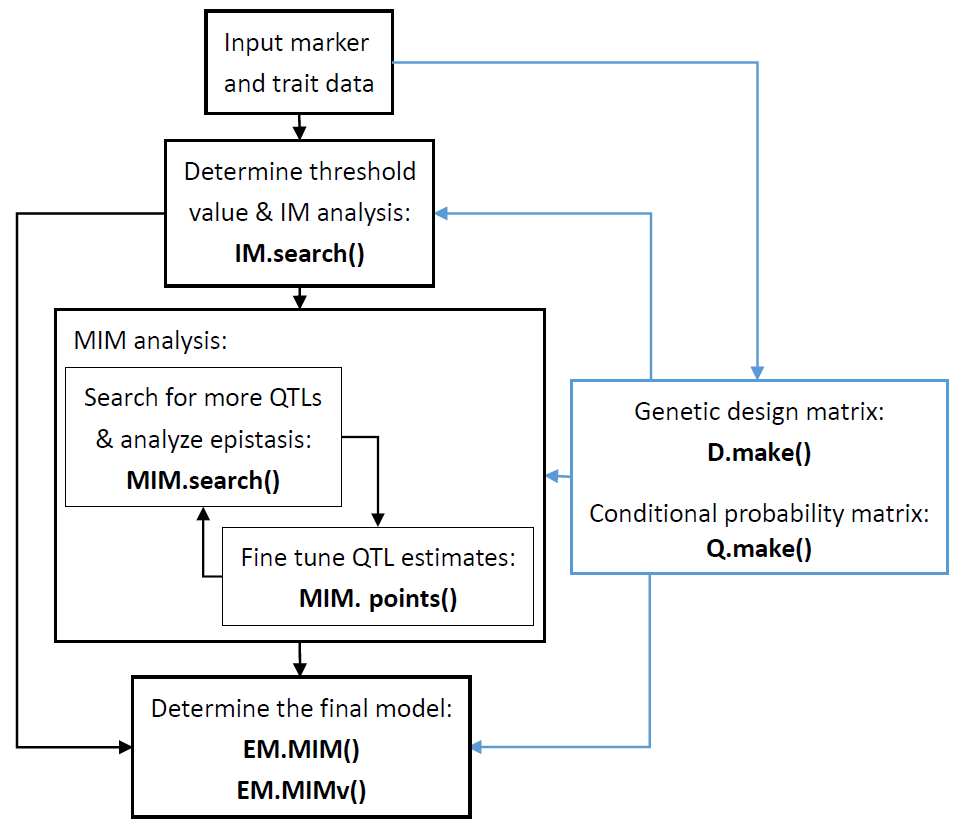
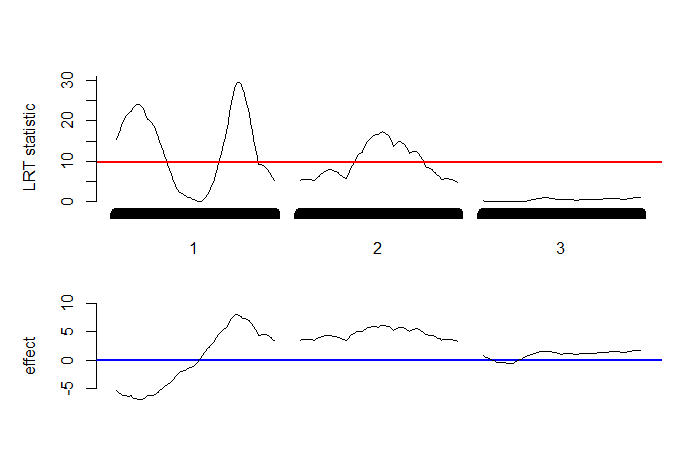
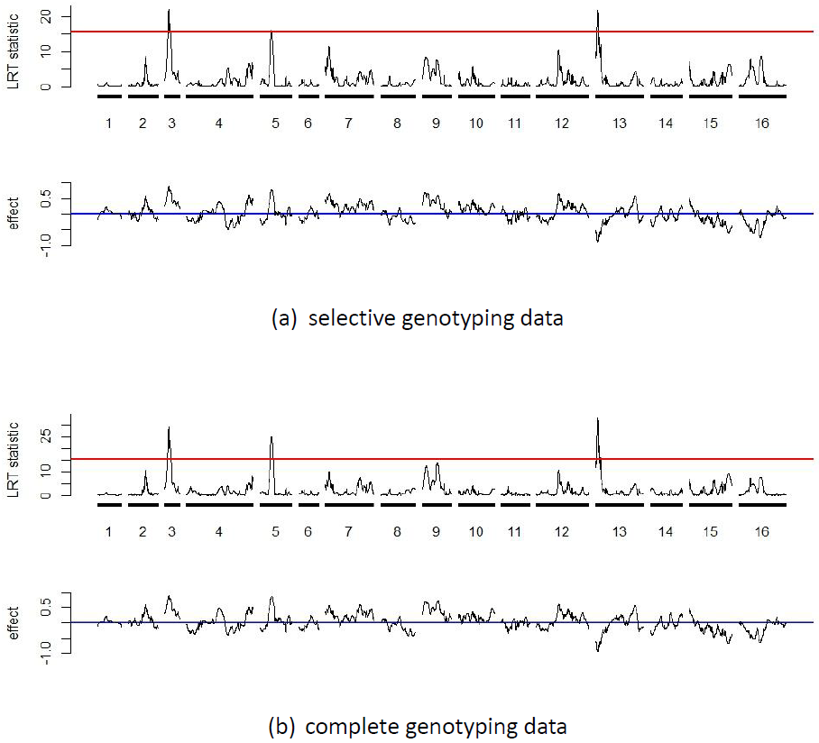
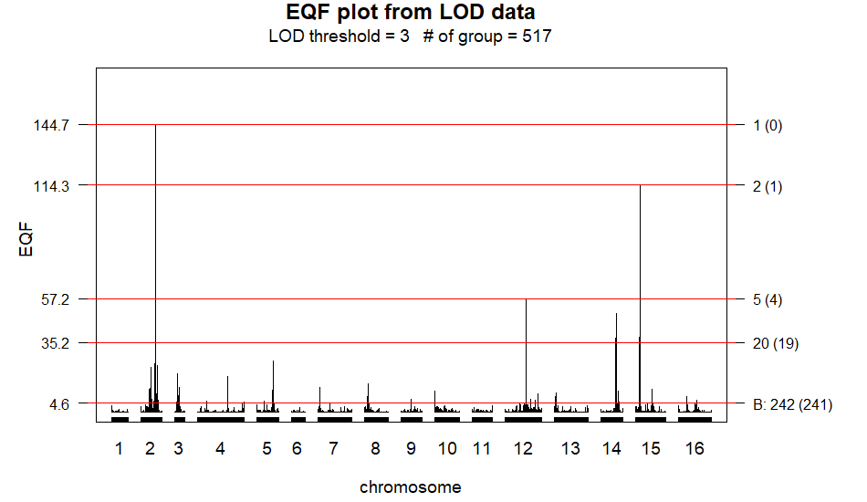
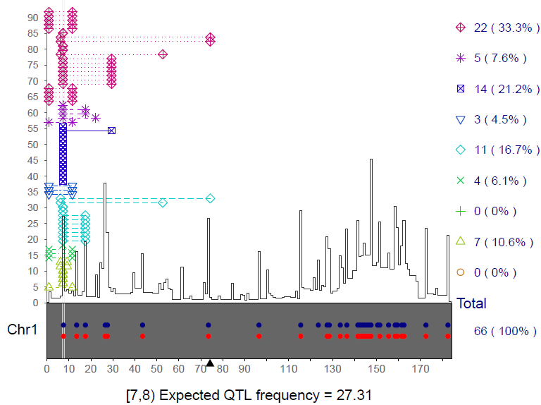
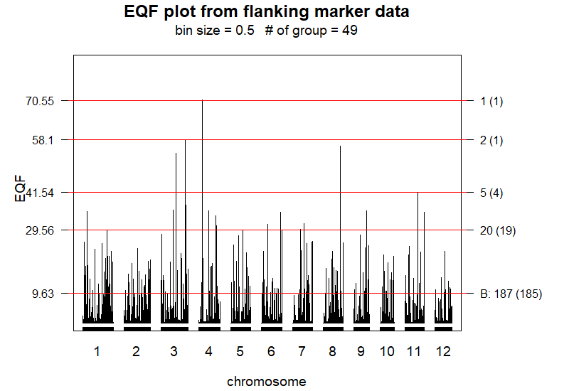

:::::::::::: article
## Introduction

Many biologically and economically important traits in organisms are
quantitative rather than qualitative. These include traditional traits
(such as yields and quality in rice, weight and body fat percentage in
animals, and diabetes and hypertension in humans) and molecular traits
(such as gene expression and protein levels). Quantitative traits
typically exhibit continuous variation in a population, so there is no
easy way to categorize them. They are likely to be affected by numerous
genes each with modest effects and easily affected by environmental
factors (Falconer and Mackay 1996). Consequently, traditional methods
such as the Mendelian segregation ratio analysis, mean and variance
analyses, covariance studies, and the examination of familial
correlations are very difficult for detecting the individual genes
contributing to these traits. The genes responsible for quantitative
traits are referred to as quantitative trait loci (QTL). For a long
time, researchers have tried to obtain individual QTL information for
exploring the genetic mechanisms underlying quantitative traits and
further to manipulate them for improving the traits. With the
availability of fine-scale genetic marker data along the genomes for
various organisms, it has become possible to systematically map for and
detect individual QTL (QTL mapping) by using more sophisticated
statistical methods. Understanding the genetic mechanisms of
quantitative traits using QTL mapping remains a major challenge and
considerable issue in broad areas of biological studies (Chen et al.
2021; Kumar et al. 2024; [Meng et al.]{.nocase} 2024; Mackay and Anholt
2024).

Statistical methods for QTL mapping have been well established (Lander
and Botstein 1989; Haley and Knott 1992; Zeng 1993, 1994; Jansen 1993;
Xu and Atchley 1995; Kao et al. 1999; Kao 2000, 2004, 2006; Sen and
Churchill 2001; Broman et al. 2003; Kao and Zeng 2002; Verbyla et al.
2007; Li et al. 2008; Kao and Zeng 2009, 2010; Kao and Ho 2012; Lee et
al. 2014; Wang et al. 2016). These methods analyze the marker and trait
data from well-designed experimental populations to estimate the QTL
parameters, including the numbers, positions, various gene effects
(additive, dominance, and interactive), variance components,
heritabilities, etc. The experimental populations include the most
commonly used populations, such as the backcross and $F_2$ populations,
and other more advanced populations, such as recombinant inbred (RI)
populations, advanced intercross (AI) populations, intermated
recombinant inbred (IRI) populations, and immortalized $F_2$ populations
(Kao and Zeng 2009). The statistical methods are applied to analyze the
QTL mapping data and tackle several central issues, including the
estimation of QTL parameters, determination of threshold values and
selective genotyping, in the QTL mapping studies. These studies have
provided important insights into the genetic mechanisms governing
quantitative traits in various organisms, such as rice, maize, alfalfa,
Atlantic salmon, trout, etc. (Vaughan et al. 2007; Chen et al. 2021;
Kumar et al. 2024; [Meng et al.]{.nocase} 2024; Mackay and Anholt 2024).

QTL hotspots, characterized by genomic locations enriched in QTL,
represent a common and notable feature when collecting numerous QTL for
various traits in various biological studies (Chardon et al. 2004; West
et al. 2007; [Breitling et al.]{.nocase} 2008; [Wu et al.]{.nocase}
2008; Yang et al. 2019; [Meng et al.]{.nocase} 2024). These hotspots are
significant and appealing due to their high informativeness and
potential harboring for genes related to quantitative traits. Presently,
both the data containing original marker genotypes and numerous
molecular traits for each individual (referred to as individual-level
data hereafter) from genetical genomics experiments and the summarized
QTL data from public QTL databases can provide the data sets with
numerous QTL for hotspot analysis. Statistical methods using either type
of data for detecting QTL hotspots have been proposed, and they are
mainly based on the permutation test approach ([Wu et al.]{.nocase}
2008; Li et al. 2010; [Breitling et al.]{.nocase} 2008; Neto et al.
2012; Yang et al. 2019; Wu et al. 2021). Among these methods, the
statistical framework outlined by Yang et al. (2019) and Wu et al.
(2021) has the notable features of being able to handle both types of
data, addresses several challenges and saves computational cost in the
process of QTL hotspot detection.

Statistical QTL mapping software packages such as MapMaker/QTL (Lincoln
et al. 1993), WinQTLCart (Wang 2000),
R/[**qtl**](https://CRAN.R-project.org/package=qtl) (Broman et al.
2003), QTLNetwork (Yang et al. 2008; Taylor and Verbyla 2011; Verbyla et
al. 2012), QTL.gCIMapping.GUI (Zhang et al. 2020) have been developed
and documented in the literature. Among them, while most packages
consider fixed effect models, the
R/[**wgaim**](https://CRAN.R-project.org/package=wgaim) package
developed in the R system offers linear mixed effects and random effects
models, respectively, for QTL mapping in the backcross, DH and RIL
populations. It has the feature of being able to simultaneously
incorporate the whole genome into the model, and hence is relatively
simple in selecting and detecting QTL during the analysis (Taylor and
Verbyla 2011). Notably,
R/[**qtl**](https://CRAN.R-project.org/package=qtl) is a free and
powerful R package that provides a broad range of methods, which include
single-marker analysis, interval mapping (Lander and Botstein 1989),
regression interval mapping (Haley and Knott 1992), multiple QTL mapping
(Jansen 1993), composite interval mapping (Zeng 1994) for a wide variety
of experimental populations for QTL mapping. Permutation test (Churchill
and Doerge 1994) is used to determine significance thresholds for QTL
mapping in R/[**qtl**](https://CRAN.R-project.org/package=qtl). Here, we
introduce an R package
[**QTLEMM**](https://CRAN.R-project.org/package=QTLEMM) (QTL EM
algorithm mapping) that implements commonly used and popular statistical
methods for both QTL mapping and QTL hotspot detection. For QTL mapping
analysis, in addition to providing most of the methods in
R/[**qtl**](https://CRAN.R-project.org/package=qtl),
[**QTLEMM**](https://CRAN.R-project.org/package=QTLEMM) also offers
multiple interval mapping (Kao et al. 1999) to fit multiple QTL directly
in the model for a wide range of experimental populations. Furthermore,
[**QTLEMM**](https://CRAN.R-project.org/package=QTLEMM) can perform
novel tasks that the existing R packages lack such as simulating and
handling the complete or selective genotyping data, computing the
significance threshold values based on Gaussian stochastic process, and
providing the asymptotic variance-covariance matrix for the QTL
estimates (Kao and Zeng 1997; Kao and Ho 2012; Lee et al. 2014).
[**QTLEMM**](https://CRAN.R-project.org/package=QTLEMM) also
distinguishes itself by uniquely offering the statistical framework of
Yang et al. (2019) and Wu et al. (2021) using either the
individual-level data or summarized data to proceed with the QTL hotspot
detection analysis. We provide a comprehensive overview of the primary R
functions in the [**QTLEMM**](https://CRAN.R-project.org/package=QTLEMM)
package. Results from analyses are presented through numerical and
graphical outputs, facilitating interpretation and visualization of
findings. The [**QTLEMM**](https://CRAN.R-project.org/package=QTLEMM)
package provides researchers with statistical tools to find more
significant results in exploring the network among expression of genes,
QTL hotspots, and quantitative traits in genes, genomes, and genetics
studies.

## Statistical methods

Identifying individual QTL (QTL mapping) is a crucial endeavor aimed at
understanding the genetic basis and architecture of quantitative traits,
thereby facilitating trait manipulation and improvement. Since the
specific locations of QTLs are unknown prior to mapping and they could
potentially be located anywhere along the genome, the primary objectives
of statistical methods are centered around searching for individual QTLs
and subsequently fitting them all into statistical model for the
estimation of QTL parameters.

### QTL mapping models

Lander and Botstein (1989) were the first to propose a QTL mapping
procedure known as interval mapping, which systematically searches the
entire genome for QTLs. The interval mapping approach utilizes one
marker interval (one flanking marker pair) at a time to establish a
putative QTL at a specific position. It models the relationship between
a quantitative trait and the putative QTL at that position, subsequently
testing for the presence of the QTL. For a putative QTL, denoted as Q,
at a specific fixed position x along the genome, the statistical model
for individual $i$ with a phenotypic trait value $y_{i}$ can be
expressed as follows:

$$\begin{equation}
	y_{i} = G_{i} + \varepsilon_{i} \label{eq:e1}
\end{equation}   (\#eq:e1)$$

where $G_{i}$ represents the genotypic value of individual $i$, and
$\varepsilon_{i}$ is a residual assumed to follow a normal distribution
with mean $0$ and variance $\sigma ^{2}$. For the individuals in a
population derived from two inbred lines, such as the $F_2$ population,
the genotypes of their Q can be one of the three possible genotypes,
$P_{1}$ homozygote ($QQ$), heterozygote ($Qq$) or $P_{2}$ homozygote
($qq$). Several different genetic models have been proposed to
characterize the relationship between genotypic values and gene effects
(Cockerham 1954; Van Der Veen 1959; Weir and Cockerham 1977; Kao and
Zeng 2002). According to Cockerham's model (Kao and Zeng 2002), the
relationship between the three genotypic values and the QTL effects can
be modeled as $G_{QQ}=\mu+a-d/2$, $G_{Qq}=\mu+d/2$ and
$G_{qq}=\mu-a-d/2$, respectively, where $\mu$ is the mean genotypic
value, $a$ and $d$ represent the additive and dominance effects of the
QTL, respectively. We then can construct an equivalent model of equation
\@ref(eq:e1) for individual $i$ as follows:

$$\begin{equation}
	y_{i}=\mu+ax_{i}+dz_{i}+\varepsilon_{i} \label{eq:e2}
\end{equation}   (\#eq:e2)$$

where $\left(x_{i},z_{i}\right)=\left(1,-1/2\right)$,
$\left(0,1/2\right)$ or $\left(-1,-1/2\right)$ if the QTL genotype of
individual $i$ is $QQ$, $Qq$ or $qq$. Equation \@ref(eq:e2) builds the
relationship between the genotypic values and QTL genotypes. If the
putative QTL is located at the marker, the model is a regression model.
However, if the putative QTL is positioned at $x$ within the marker
interval (M,N), the genotypes of the QTL are not directly observable and
must be inferred from its flanking markers M and N. In this scenario,
the statistical model typically becomes a normal mixture model and is
called interval mapping (IM) model. Given data with $n$ individuals, the
likelihood function of the IM model for
$\theta=\left(\mu,a,d,\sigma^{2}\right)$ can be expressed as follows:

$$\begin{equation}
	L\left(\theta|Y,X\right)=\prod_{i=1}^{n}\left[\sum_{j=1}^{3}p_{ij}\times f\left(y_{i}|\mu_{j},\sigma^{2}\right)\right] \label{eq:e3}
\end{equation}   (\#eq:e3)$$

where $f\left(y_{i}|\mu_{j},\sigma^{2}\right)$ represents a normal
probability density function with mean $\mu_{j}$ and variance
$\sigma^{2}$. The $\mu_{j}$'s correspond to the genotypic values of the
three different QTL genotypes
($\mu_{1}=G_{QQ}$,$\mu_{2}=G_{Qq}$,$\mu_{3}=G_{qq}$), while $p_{ij}$'s
denote the mixing proportions (conditional probabilities) of the three
QTL genotypes inferred from the two flanking markers (refer to Kao and
Zeng 2009, for obtaining $p_{ij}$'s in various experimental
populations). By treating the normal mixture model as an incomplete-data
problem, the EM algorithm (Dempster et al. 1977) can be readily
implemented to obtain the maximum likelihood estimates (MLE) of the
parameters. Subsequently, a likelihood ratio test (LRT) can be performed
to test the null hypothesis of no QTL ($H_{0}$ : $a=0$ and $d=0$) at the
position x. With a fine-scale genetic marker map throughout the genome,
the IM model can be conducted at all positions covered by markers to
produce a continuous LRT statistic profile along chromosomes. By setting
a predetermined LRT threshold, the position with the significantly
largest LRT statistic in a chromosome region is considered the estimated
QTL location. This method enables the systematic search and
identification of QTLs at the genome-wide level, thereby facilitating
the estimation of QTL parameters. However, since the search process for
QTL needs to be performed at every position of the genome, the iterative
expectation-maximization (EM) algorithm can become computationally
expensive for QTL mapping (Haley and Knott 1992; Kao 2000). Haley and
Knott (1992) introduced regression interval mapping (REG IM) as an
approximation to the IM model, aimed at reducing computational costs. In
REG IM, the quantitative trait value is regressed on the conditional
expected genotypic value, providing a computationally efficient
alternative to IM (Haley and Knott 1992), although the approximation may
not be satisfactory in all cases (Kao 2000; Sen and Churchill 2001).

The approach of IM model focuses on one putative QTL at a time within
the model. However, it may introduce bias in the identification and
estimation of QTLs when multiple QTLs are present in the same linkage
group (Lander and Botstein 1989; Haley and Knott 1992; Zeng 1994). To
address this issue, composite interval mapping (CIM, Zeng 1994) and
multiple QTL mapping (MQM) model (Jansen 1993), which combines interval
mapping with multiple regression analysis, was proposed. During the test
for a putative QTL, they both involve using other markers as covariates
to mitigate the interference of other QTLs and reduce residual variance,
thereby improving the accuracy of the test. The
[**QTLEMM**](https://CRAN.R-project.org/package=QTLEMM) package provides
the IM, REG IM, CIM and MQM models for the interval mapping QTL
analysis. To further enhance QTL mapping, Kao et al. (1999) introduced
the multiple interval mapping (MIM) approach. The MIM approach aims to
leverage multiple marker intervals concurrently to incorporate multiple
putative QTLs into the model for QTL mapping. For instance, considering
$m$ putative QTLs, Q$_{1}$, Q$_{2}$,\..., and Q$_{m}$, located at given
positions within $m$ separate marker intervals, ($M_{1}$,$N_{1}$),
()$M_{2}$,$N_{2}$),\..., and ($M_{m}$,$N_{m}$), respectively, the
statistical model fitted these $m$ putative QTLs can be expressed as
follows:

$$\begin{equation}
	y_{i}=\mu+\sum_{j=1}^{m}\left(a_{j}x_{ij}+d_{j}z_{ij}\right)+\varepsilon_{i} \label{eq:e4}
\end{equation}   (\#eq:e4)$$

For $m$ putative QTLs in the model, there are $3^{m}$ possible QTL
genotypes, and the likelihood of the model for
$\theta=\left(\mu,a_{1},d_{1},a_{2},d_{2},...,a_{m},d_{m},\sigma^{2}\right)$
becomes a mixture of $3^{m}$ normal

$$\begin{equation}
	L\left(\theta|Y,X\right)=\prod_{i=1}^{n}\left[\sum_{j=1}^{3^{m}}p_{ij}\times f\left(y_{i}|\mu_{j},\sigma^{2}\right)\right] \label{eq:e5}
\end{equation}   (\#eq:e5)$$

under the normal assumption, where $p_{ij}$'s are the conditional
probabilities of the $3^{m}$ possible QTL genotypes given the flanking
marker genotypes. The statistical model (equation \@ref(eq:e4)) with
normal mixture likelihood (equation \@ref(eq:e5)) is called MIM model.
The general formulas by Kao and Zeng (1997), formulated based on the EM
algorithm, can be used to estimate the parameters of the MIM model. To
avoid using the iterative EM algorithm, alternative approximate methods
considering multiple QTLs in the model include REG IM (Haley and Knott
1992) and multiple imputation by Sen and Churchill (2001). While the two
approximate methods offer faster computational speeds, their differences
compared to the MIM model in the QTL analysis can be significant in
certain situations, as discussed by Kao (2000) and Sen and Churchill
(2001), and demonstrated through empirical examples (not shown). The
R/[**qtl**](https://CRAN.R-project.org/package=qtl) package provides
these two approximate methods for QTL mapping. Subsequently, Kao (2004),
Kao (2006) and Kao and Zeng (2009) extended the MIM model to a wide
range of advanced populations for QTL mapping, considering specific
genome structures present in advanced populations. In addition, Lee et
al. (2014) further developed the MIM model for the selective genotyping
design, a topic we discuss below. The MIM approach indeed offers
enhanced precision and power in QTL mapping. Also, it enables the
analysis and estimation of epistasis between QTL, more accurate
prediction of genotypic values of individuals, and estimation of
heritabilities of quantitative traits. The
[**QTLEMM**](https://CRAN.R-project.org/package=QTLEMM) package provides
the MIM model and the REG IM method (considering multiple QTLs) to deal
with the situations of multiple QTLs in the QTL mapping analysis.

#### Determination of threshold values

In the interval mapping procedure, a series of null hypotheses, both
correlated and uncorrelated, are tested using LRT statistics across all
genomic positions. Given the multiplicity of tests, controlling
genome-wide error rates is crucial when determining threshold values for
claiming significant QTL detection. It has been recognized that various
factors, such as the number and size of intervals, population genome
structures, and marker density, are involved and should be considered in
determining the threshold value of QTL detection. To address this
challenge, several analytical, empirical, and numerical approaches have
been proposed to obtain the threshold values. These include methods like
Bonferroni adjustment, Ornstein-Uhlenbeck process, numerical simulation,
permutation test, and Gaussian process. Each offers unique insights and
advantages in obtaining threshold values tailored to the specific
characteristics of the QTL mapping study (Lander and Botstein 1989;
Churchill and Doerge 1994; Rebai et al. 1994; Piepho 2001; Zou 2004;
Chang et al. 2009; Guo 2011; Kao and Ho 2012). It has been known that
numerical methods like permutation tests or numerical simulations are
computationally intensive, and analytical methods like Gaussian
processes offer a more efficient alternative with lower computational
costs. The Gaussian process approaches by Chang et al. (2009), Guo
(2011) and Kao and Ho (2012) can stand out as particularly efficient, as
it is much faster than the permutation test in obtaining thresholds.
This significant feature in computational speed makes the Gaussian
process method a highly practical and attractive option as far as the
computational efficiency is concerned in determining the threshold
values for QTL detection.

Chang et al. (2009) showed that the asymptotic distribution of the score
test statistics, denoted as $u(x_{i})$ for $i=1,2,...,k$, at all the $k$
sequential positions in the genome, follows a Gaussian stochastic
process. Furthermore, as the squared score statistic $u^{2}(x)$ is
asymptotically equivalent to the LRT statistic (Cox and Hinkley 1979;
Chang et al. 2009), the distribution of the supremum of $u^{2}(x)$ along
the genome under the null hypothesis can be used to assess the threshold
value of the LRT statistic in QTL mapping. Based upon this concept, Guo
(2011) and Kao and Ho (2012) extended Chang et al. (2009)'s methodology
by deriving more general score test statistics and Gaussian processes
tailored for evaluating threshold values in the backcross, $F_2$, RI
$F_t$ and AI $F_t$ populations. These advancements provide researchers
with statistical tools to determine the significance thresholds for QTL
mapping analyses in diverse experimental populations. In the scenario of
the $F_2$ population, each of the $k$ positions is linked with two score
test statistics: one for the additive effect and the other for the
dominance effect. Let $U$ represent a vector whose components are the
score test statistics at the $k$ genomic positions. Therefore, the
vector $U$ has length of $2k$. The asymptotic distribution of $U$
follows a Gaussian stochastic process, denoted as
$U\sim N(\boldsymbol{\mu},\Sigma)$, which is a multivariate normal
distribution. The variance-covariance matrix $\Sigma$ captures the
variability and correlations among the score test statistics across
different genomic positions. If the QTL are located at markers, the
genotypic distributions of one and two genes are needed to compute their
variances and covariances. If the QTL are located in the marker
intervals, the genotypic distributions of two, three and four genes are
required to obtain their variances and covariances (see Kao and Ho
(2012) for details). The transition equations proposed by Haldane and
Waddington (1931), Geiringer (1944), and Kao and Zeng (2010) provide
valuable tools for deriving genotypic frequencies of two, three, and
four genes, facilitating the construction of the variance-covariance
matrix. These equations offer insights into the genotypic distribution
of a wide variety of experimental populations, enabling a deeper
understanding of variance-covariance structures between genes. The
general frameworks of the score test statistics and Gaussian processes
introduced by Guo (2011) and Kao and Ho (2012) can be used to obtain the
threshold values of QTL mapping for genomes with different sizes and
marker densities in the backcross, $F_2$, RI $F_t$ and AI $F_t$
populations.

The permutation test has been an appealing approach to obtain the
thresholds because it is robust to departures from distributional
assumptions and can reflect the peculiarity of the data at hand. To
justify the Gaussian process approaches, we perform the permutation
tests using R/[**qtl**](https://CRAN.R-project.org/package=qtl) to
compute the thresholds at $\alpha=0.05$ level for different numbers of
equally spaced markers on a 100-cM chromosome in the backcross, $F_2$
and RIL populations. These thresholds are then compared with those
obtained from the same set-up by using the numerical simulations and
Gaussian processes in Guo (2011) and Kao and Ho (2012). The three sets
of threshold values are tabulated and compared in
Table [1](#tab:T1){reference-type="ref" reference="t0"}. In general, it
shows that the threshold values obtained by the three approaches are
similar to each other in each population, although the thresholds from
the permutation tests tend to be slightly larger as compared to those
from the other two approaches in the RIL population. Also, the
thresholds are higher in denser marker maps as expected. Besides, we
also apply the permutation test and Gaussian process to obtain the
thresholds for the two simulated and real examples (Sections
[3.2.2](#3.2.2) and [3.3.2](#3.3.2)), showing that the two sets of
threshold values are also close to each other. The different approaches
yield similar thresholds mainly because the normality assumption is met
for the data. The above investigations justify the Gaussian process in
the computation of the threshold values. Moreover, we found that the
Gaussian process is approximately 16,800 times faster than the
permutation test (without parallel computing) in obtaining thresholds.
The computation cost of Gaussian process is much cheaper than the
permutation test and numerical simulation. The
R/[**qtl**](https://CRAN.R-project.org/package=qtl) uses parallel
computing techniques to perform the permutation tests so as to be
significantly quicker in obtaining the thresholds. Even so, note that
the issue of computational cost still remains in the permutation tests.
Importantly, the Gaussian process methods have very low computational
costs, making them practical for large-scale analyses. In practice, when
given a specific significance level and genome size, threshold values
should be adjusted to account for denser marker maps and more advanced
populations. This adjustment ensures that the statistical analysis
appropriately controls for multiple testing and accounts for the
complexities inherent in different genetic backgrounds and experimental
designs. The [**QTLEMM**](https://CRAN.R-project.org/package=QTLEMM)
package implements the Gaussian processes derived by Guo (2011) and Kao
and Ho (2012) for computing significant thresholds of QTL mapping.

::::: threeparttable
::: {#t0}
+:------------+:--------:+:--------:+:--------:+:--------:+:--------:+:--------:+:--------:+
|             | No. of markers                                                             |
+-------------+----------+----------+----------+----------+----------+----------+----------+
| Threshold   | 2        | 3        | 6        | 11       | 21       | 51       | 101      |
+-------------+----------+----------+----------+----------+----------+----------+----------+
|             | Backcross population                                                       |
+-------------+----------+----------+----------+----------+----------+----------+----------+
| Simulation  | 5.54     | 6.13     | 6.48     | 7.45     | 7.80     | 8.21     | 8.28     |
+-------------+----------+----------+----------+----------+----------+----------+----------+
| Gaussian p. | 5.48     | 6.79     | 7.27     | 7.64     | 7.96     | 8.23     | 8.36     |
+-------------+----------+----------+----------+----------+----------+----------+----------+
| Permutation | 5.12     | 5.56     | 6.75     | 7.26     | 7.75     | 8.43     | 8.91     |
+-------------+----------+----------+----------+----------+----------+----------+----------+
|             | $F_2$ population                                                           |
+-------------+----------+----------+----------+----------+----------+----------+----------+
| Simulation  | 8.13     | 8.98     | 10.00    | 10.48    | 11.20    | 11.75    | 12.32    |
+-------------+----------+----------+----------+----------+----------+----------+----------+
| Gaussian p. | 8.10     | 8.97     | 9.85     | 10.97    | 11.15    | 11.73    | 11.96    |
+-------------+----------+----------+----------+----------+----------+----------+----------+
| Permutation | 7.36     | 8.10     | 9.72     | 10.26    | 11.01    | 11.61    | 12.68    |
+-------------+----------+----------+----------+----------+----------+----------+----------+
|             | RIL population                                                             |
+-------------+----------+----------+----------+----------+----------+----------+----------+
| Simulation  | 5.74     | 6.41     | 7.31     | 7.87     | 8.64     | 9.21     | 9.53     |
+-------------+----------+----------+----------+----------+----------+----------+----------+
| Gaussian p. | 5.56     | 6.30     | 6.96     | 7.93     | 8.56     | 9.10     | 9.32     |
+-------------+----------+----------+----------+----------+----------+----------+----------+
| Permutation | 6.34     | 6.97     | 7.50     | 8.14     | 8.95     | 9.80     | 10.54    |
+-------------+----------+----------+----------+----------+----------+----------+----------+

: (#tab:T1) Comparison of the threshold values at level
$\alpha=0.05$ obtained using numerical simulation, Gaussian process and
permutation test in the backcross, $F_2$ and RIL populations.
:::

::: tablenotes
Markers are evenly placed on a 100-cM Chromosome. The $F_2$ population
considers both additive and dominance effects.
R/[**qtl**](https://CRAN.R-project.org/package=qtl) is used to perform
the permutations tests.

based on 10,000 simulated data sets each containing 200 individuals from
the null distribution.

based on 10,000 simulations (Guo 2011).

based on 10,000 simulations (Kao and Ho 2012).

based on 1000 permutations of one simulated data set containing 200
individuals.
:::
:::::

#### Selective genotyping

The cost of conducting QTL mapping experiments includes both phenotyping
and genotyping expenses. In situations where budget constraints are not
a primary concern, researchers usually choose complete genotyping,
wherein all individuals in the sample undergo both genotyping and
phenotyping procedures. However, despite recent reductions in genotyping
costs, researchers frequently encounter insufficient budgets that
prevent them from fully covering the expenses of complete genotyping. In
situations where budgets are insufficient, researchers may explore
alternative cost-saving approaches. Selective genotyping has been known
as a cost-saving strategy to reduce genotyping work and can still
maintain nearly equivalent efficiency to complete genotyping in QTL
mapping (Lebowitz et al. 1987; Lander and Botstein 1989; Xu and Vogl
2000; Lee et al. 2014). This method involves selecting individuals from
the high and low extremes of the trait distribution for genotyping,
while leaving the remaining individuals ungenotyped within the entire
sample. By focusing genotyping on individuals with extreme trait values,
researchers can still capture most of the genetic variation in the
sample to maintain efficiency. Overall, selective genotyping allows
researchers to balance between budget constraints and mapping efficiency
in QTL detection analysis.

Suppose that the sample consists of $n$ individuals, out of which
$n_{s}$ individuals with extreme trait values ($n_{s}⁄2$ each from the
upper and lower extremes) are selected for marker genotyping. The
remaining $n_{u}=n-n_{s}$ individuals are not genotyped. Statistical QTL
mapping methods for analyzing selective genotyping data can either
consider all the $n$ individuals (full data) or consider just the
$n_{s}$ genotyped individuals (genotyping data) in their models for QTL
detection. If only the genotyping data are utilized in the analysis,
data of this sort are called centrally truncated data. Xu and Vogl
(2000) and Lee et al. (2014) introduced the truncated model within the
mixture framework of interval mapping procedure, presenting a truncated
normal mixture model for QTL analysis. For $n_{s}$ genotyped
individuals, the likelihood function for $\theta$ in the $m$ QTL model
can be expressed as follows:

$$\begin{equation}
	L\left(\theta|Y,X\right)=\prod_{i=1}^{n_{s}}\left[\sum_{j=1}^{3^{m}}p_{ij}\times\frac{f\left(y_{si}|\mu_{j},\sigma^{2}\right)}{U_{j}}\right]  \label{eq:e7}
\end{equation}   (\#eq:e7)$$

where $y_{si}$ is the trait value of the $i$th genotyped individual, and

$$\begin{equation}
	U_{j}=\int_{-\infty }^{T_{L}}f\left(y_{si}|\mu_{j},\sigma^{2}\right)dy_{si}+\int_{T_{R}}^{\infty}f\left(y_{si}|\mu_{j},\sigma^{2}\right)dy_{si} \label{eq:e8}
\end{equation}   (\#eq:e8)$$

is the cumulative density with trait values greater than $T_{R}$ (right
truncated point) and lower than $T_{L}$ (left truncated point), such
that $P\left(y_{si}>T_{R}\right)=P\left(y_{si}<T_{L}\right)=n_s⁄2n$.
Further details on the EM algorithm for obtaining the MLE of the
parameters in the truncated normal mixture model are provided in Lee et
al. (2014). If the full data are fitted into the statistical model for
QTL analysis, the model likelihood can be expressed as follows:

$$\begin{equation}
	L\left(\theta|Y,X\right)=\prod_{i=1}^{n_{s}}\left[\sum_{j=1}^{3^{m}}p_{ij}\times f\left(y_{si}|\mu_{j},\sigma^{2}\right)\right]\times\prod_{i=1}^{n_{u}}\left[\sum_{j=1}^{3^{m}}q_{j}\times f\left(y_{ui}|\mu_{j},\sigma^{2}\right)\right] \label{eq:e9}
\end{equation}   (\#eq:e9)$$

where the first term represents the likelihood for the $n_{s}$ genotyped
individuals, while the second term accounts for the $n_{u}$ ungenotyped
individuals, and $y_{ui}$ is the trait value of $i$th ungenotyped
individual.

In equation \@ref(eq:e9), note that $p_{ij}$'s are derived from the
conditional probabilities of the QTL genotypes given their flanking
marker genotypes, and $q_{j}$'s represent the proportions of QTL
genotypes in the ungenotyped individuals (Lee et al. 2014). In the
parameter estimation, the same EM algorithm employed for complete
genotyping (Kao and Zeng 1997) can be directly applied to obtain the
MLE. Studies have indicated that the analysis utilizing full data by the
model in equation \@ref(eq:e9) outperforms that utilizing only
genotyping data by the model in equation \@ref(eq:e7) because additional
information from the ungenotyped individuals is incorporated into the
analysis (Xu and Vogl 2000; Lee et al. 2014). Additionally, selective
genotyping using larger genotyping proportions, such as $n_{s}⁄n=0.5$,
may maintain roughly equivalent power to complete genotyping, whereas
using smaller genotyping proportions presents difficulties in achieving
the same level of power (Lee et al. 2014). These current selective
genotyping methods mainly focus on the backcross and $F_2$ populations.
Herein, we have substantially extended and modified the MIM models in
equations \@ref(eq:e7) and \@ref(eq:e9) for selective genotyping in
other advanced populations by considering their specific population
genome structures. The
[**QTLEMM**](https://CRAN.R-project.org/package=QTLEMM) package provides
the MIM models to deal with the selective genotyping data (full or
genotyping data) from the $F_2$ population and the more advanced
populations.

### QTL hotspot detection

Genome-wide QTL hotspot detection typically requires datasets containing
numerous QTL to proceed with the analysis. Currently, genetical genomics
experiments and public QTL databases serve as two feasible sources of
such data. These two data sources have different structures. Genetical
genomics experiments provide individual-level data, enabling the
detection of thousands of QTLs in a single experiment. On the other
hand, public databases such as GRAMENE, Q-TARO, Rice TOGO browser,
PeanutBase, and MaizeGDB curate thousands of summarized QTL data. These
databases curate the information from numerous independent QTL
experiments across various traditional traits, and contain detected QTL,
trait names, and reference sources but lack individual-level data.
Utilizing both individual-level data from genetical genomics experiments
or summarized QTL data from public databases, several statistical
methods, primarily based on permutation tests, have been proposed to
detect QTL hotspots. West et al. (2007), [Wu et al.]{.nocase} (2008), Li
et al. (2010), [Breitling et al.]{.nocase} (2008) and Neto et al. (2012)
have developed statistical methods to detect QTL hotspots for genetical
genomics experiments. These methods for detecting QTL hotspots may
suffer from several problems, including ignoring the correlation
structure among traits, neglecting the magnitude of LOD scores of the
QTLs, or incurring a very high computational cost. These problems often
lead to the detection of excessive spurious hotspots, failure to
discover biologically interesting hotspots composed of a small to
moderate number of QTLs with strong LOD scores, and computational
intractability, respectively, during the detection process. Solving
these problems is crucial for improving the accuracy and efficiency of
QTL hotspot detection.

The statistical framework developed by Yang et al. (2019) and Wu et al.
(2021) can accommodate both individual-level data and summarized data,
and it can also address the aforementioned problems at a time in QTL
hotspot detection. The statistical framework first summarizes the QTL
for all traits using an EQF (expected QTL frequency) matrix. The EQF
matrix has column dimension equivalent to the genome size and row
dimension corresponding to the number of traits. As the statistical
framework directly operates on the EQF matrix, it has a very cheap
computational cost. Then it lets $\gamma_{t,\alpha}$ represent the EQF
threshold for assessing at least $t$ spurious hotspots at level $\alpha$
in the EQF matrix. Two special devices, trait grouping and top
$\gamma_{t,\alpha}$ threshold, are deployed to handle the remaining
problems. The trait grouping groups the tightly linked and/or
pleiotropic traits together to account for the correlation structure
among traits, and then can be used as an option to obtain much stricter
EQF thresholds and to dismiss spurious QTL hotspots. The top
$\gamma_{t,\alpha}$ threshold is defined as the highest EQF threshold
(with the smallest $t$) necessary for a genomic position to be
significant as a QTL hotspot in the EQF matrix, and can be used to
outline the LOD-score pattern of QTL in a hotspot across the different
EQF matrices. The pattern of the top $\gamma_{t,\alpha}$ thresholds of a
QTL hotspot across the different EQF matrices can profile its relative
significance status as compared to other hotspots, so as to have the
ability to identify the small and moderate hotspots with strong LOD
scores in detecting QTL hotspots. The statistical framework of Yang et
al. (2019) and Wu et al. (2021) has a very low computational cost and
hence is particularly suitable for obtaining the QTL hotspot
architectures for all the transcriptions within a reasonable time and
cost frame in the genetical genomics experiments as compared to the
approaches by permuting the individual-level data. Please refer to Yang
et al. (2019) and Wu et al. (2021) for further details on the
statistical framework. The
[**QTLEMM**](https://CRAN.R-project.org/package=QTLEMM) package provides
their proposed statistical framework for QTL hotspot detection.

## Using QTLEMM for QTL mapping analysis

The functions for the QTL mapping analysis in the
[**QTLEMM**](https://CRAN.R-project.org/package=QTLEMM) package are
capable of handling the data from backcross, $F_2$, AI, RI, IRI and
immortalized $F_2$ populations. For each population, the package
considers both complete genotyping data and selective genotyping data
for the QTL mapping analysis. The functions within the package enable
the utilization of several methods including linear regression, IM, REG
IM, CIM and MQM and MIM models for QTL mapping analysis, and they are
outlined in Table [2](#tab:T2){reference-type="ref" reference="t1"}. The
`progeny()` function generates simulated trait and genotype data for
diverse experimental populations. These data are then input into the
`IM.search()` function to search the genome for potential QTLs.
Additionally, the `MIM.search()` function can search for an additional
QTL given other identified QTLs. The best position can be further
obtained by using the `MIM.points()` function. Subsequently, the
`D.make()` and `Q.make()` functions are employed to create the genetic
design matrix of the QTL effects and the conditional probability matrix
of the QTL genotypes, respectively. These two matrices are then utilized
in the `EM.MIM()` function to estimate the parameters in the MIM model.
Figure [1](#f0){reference-type="ref" reference="f0"} is the flow chart
of using the above functions for the QTL mapping analysis. Below, we
demonstrate the application of these QTL mapping functions using both
simulated and real examples.

### Inputs

The QTL mapping data typically consist of two components: phenotypic
trait values and marker genotypes observed in the individuals under
study. To initiate QTL mapping analysis using the
[**QTLEMM**](https://CRAN.R-project.org/package=QTLEMM) package, four
essential arguments are required: markers (`marker`), genotypes
(`geno`), phenotypes (`y`) and QTL (`QTL`). The `marker` argument is a
$k\times2$ matrix containing marker information, where $k$ is the number
of markers. In the `marker` argument, the first column labels the
chromosomes where the markers are located, while the second column
indicates the marker positions in Morgan (M) or centimorgan (cM).
Table [3](#tab:T3){reference-type="ref" reference="t2"} provides an
example of the `marker` argument, displaying that the first three
markers of the first chromosome are positioned at 0, 24, and 40 cM,
respectively. The `QTL` argument is a $q\times2$ matrix containing QTL
information, where $q$ is the number of QTLs. Its format is the same as
that of the `marker` argument. The `geno` argument is an $n\times k$
matrix containing the marker genotypes of $n$ individuals. Genotypes for
$P_{1}$ homozygote ($MM$), heterozygote ($Mm$) and $P_{2}$ homozygote
($mm$) are encoded as 2, 1 and 0, respectively, while missing genotypes
are coded as NA. Table [4](#tab:T4){reference-type="ref"
reference="t3"}' provides an example of the `geno` matrix, where each
row represents the genotypes of the $k$ markers of an individual. The
`y` argument is an $n\times1$ vector containing the trait values of $n$
individuals.

::: {#t1}
  ------------------------------------------------------------------------------------------------------------------------------------------
  Function         Description
  ---------------- -------------------------------------------------------------------------------------------------------------------------
  Major function   

  `EM.MIM()`       MIM to estimate the parameters.

  `EM.MIMv()`      MIM to estimate the parameters and their variances.

  `IM.search()`    IM to search for the possible QTL.

  `MIM.search()`   MIM to search for one additional QTL given the identified QTLs in the model.

  `MIM.points()`   MIM to fine tune the QTL parameters by a multidimensional search around the regions of the identified QTL in the model.

  Minor function   

  `progeny()`      Generate the simulated phenotype and genotype data.

  `D.make()`       Generate the genetic design matrix.

  `Q.make()`       Generate the conditional probability matrix.

  `LRTthre()`      The LRT threshold for QTL detection based on Gaussian stochastic process.
  ------------------------------------------------------------------------------------------------------------------------------------------

  : (#tab:T2) List of the functions for QTL mapping in the QTLEMM
  package
:::

<figure id="f0" data-latex-placement="htbp">

<figcaption>Figure 1: Flowchart of using the QTL mapping functions in
the QTLEMM package.</figcaption>
</figure>

::: {#t2}
  --------------------------
  chromosome   position_cM
  ------------ -------------
  1            0

  1            24

  1            40

  \...         \...

  12           72

  2            126
  --------------------------

  : (#tab:T3) The format example of marker/QTL information data
:::

::: {#t3}
  ----------------------------------------------------------------------------------------------
             $marker_1$   $marker_2$   $marker_3$   $marker_4$   $marker_5$   \...   $marker_k$
  --------- ------------ ------------ ------------ ------------ ------------ ------ ------------
  $ind_1$        2            1            1            2            0        \...       2

  $ind_2$        2            1            0            0            1        \...       1

  $ind_3$        2            2            NA           1            1        \...       0

  $ind_4$        0            0            1            0            NA       \...       2

  \...          \...         \...         \...         \...         \...      \...      \...

  $ind_n$        1            1            0            0            1        \...       0
  ----------------------------------------------------------------------------------------------

  : (#tab:T4) The format example of genotype data
:::

### Simulation examples

Below a simulation example is presented to demonstrate the usage of the
[**QTLEMM**](https://CRAN.R-project.org/package=QTLEMM) package.
Initially, it is necessary to install and load the
[**QTLEMM**](https://CRAN.R-project.org/package=QTLEMM) package and set
an arbitrary random number seed, such as 8000, for data simulation in
the R environment. Below are the codes.

``` r
> install.packages("QTLEMM")
> library(QTLEMM)
> set.seed(8000)
> options(digits = 3)
```

#### Data generation

The `progeny()` function can simulate marker genotype and phenotype
(trait) data from experimental populations for QTL mapping analysis.
This function accepts several key arguments: the `E.vector` argument
represents the effects of the QTL; the `ng` argument specifies the
generation number; the `h2` argument sets the heritability; the `size`
argument contains the sample size; the `type` argument is used to
specify the population type, which includes backcross (`type="BC"`),
advanced intercross population (`type="AI"`), and recombinant inbred
population (`type="RI"`). Now consider the scenario that a simulated
dataset consists of 200 $F_2$ individuals with three chromosomes, each
with eleven 10-cM equally spaced markers. Three QTLs are positioned at
\[1,23\] (the 23 cM of the $1^{st}$ chromosome), \[1,77\] and \[2,55\],
respectively, and their effects are assumed to be -10, 12, and 8,
respectively. The $1^{st}$ and $3^{rd}$ QTLs have an
additive-by-additive effect of 1. The heritability is set at 0.5. Below
are the commands used to generate such a dataset. The command of
defining the QTL effects is as follows:

``` r
> eff <- c("a1" = -10, "a2" = 12, "a3" = 8, "a1:a3" = 1)
```

If other effects, such as dominance effect of 3 for the $2^{nd}$ QTL and
additive-by-dominance effect of 2 for the $1^{st}$ and $2^{nd}$ QTLs,
are considered, the arguments in the command is `d2=3` and `a2:d1=2`.
Please refer to the
[**QTLEMM**](https://CRAN.R-project.org/package=QTLEMM) document in CRAN
for more detailed instructions. The commands for setting the specified
positions of QTLs and markers are as follows:

``` r
> marker <- cbind(rep(1:3,each = 11), rep(seq(0, 100, 10), 3))
> QTL <- cbind(c(1, 1, 2), c(23, 77, 55))
```

<figure id="f1" data-latex-placement="th">

<figcaption>Figure 2: The graphical output generated by the
<code>IM.search()</code> function. The upper plot shows the profile of
LRT statistics, while the lower plot exhibits the profile of effects.
The red line represents the threshold value of 9.62 obtained by using
Gaussian process.</figcaption>
</figure>

Then, the `progeny()` function can use the above commands to generate
the QTL mapping data of 200 $F_2$ individuals with heritability 0.5.

``` r
> testdata <- progeny(QTL, marker, type = "RI", ng = 2, E.vector = eff, h2 = 0.5, 
  size = 200)
> names(testdata)
[1] "phe" "E.vector" "marker.prog" "QTL.prog" "genetic.value" "VG" "VE"
```

``` r
> y <- testdata$phe
> geno <- testdata$marker.prog
```

The `progeny()` function outputs a dataset into the object named
`testdata`. This file contains four parts: phenotypes (`phe`), QTL
effects (`E.vector`), marker genotypes (`marker.prog`), and QTL
genotypes (`QTL.prog`). The markers and trait values of the 200
individuals in the `testdata` file are further extracted and organized
into the `geno` matrix and `y` vector for QTL mapping analysis.

#### Interval mapping {#3.2.2}

The `IM.search()` function is designed to implement the IM model for the
QTL mapping analysis. Its arguments include: the `type` argument
specifies the population type (`BC`, `AI`, and `RI` population); the
`ng` argument represents the generation number; the speed argument
determines the walking speed of the IM analysis (in cM); the `d.eff`
argument indicates if the dominant effect will be considered or not (for
AI or RI); the `QTLdist` argument specifies the minimum distance (in cM)
between the detected QTL; the `plot.all` and `plot.chr` arguments
indicate whether plots of the LRT statistic profile will be generated or
not. Below are the codes of using the `IM.search()` function to perform
the IM analysis on the simulated dataset without considering any
dominance effect.

``` r
> IMtest <- IM.search(marker, geno, y, type = "RI", ng = 2, speed = 1, d.eff = FALSE, 
  QTLdist = 15, plot.all = TRUE, plot.chr = FALSE, console = FALSE)
> names(IMtest)
[1] "effect" "LRT.threshold" "detect.QTL" "model" "inputdata"  
```

``` r
> IMtest$LRT.threshold
 95%
9.62
```

The outputs of the `IM.search()` function (`IMtest`) include: estimated
effects at all positions (`effect`); LRT threshold (`LRT.threshold`)
obtained using Gaussian process; numerical results of the detected QTLs
(`detect.QTL`); graphical outputs. The `IM.search()` function can also
perform the REG IM model for the QTL mapping analysis by setting the
argument `method=”REG”` (default `method=”EM”`).
Figure [2](#f1){reference-type="ref" reference="f1"} is the graphical
output of the `IM.search()` function. It illustrates the profiles of the
LRT statistics and effects across the three chromosomes. The LRT profile
shows three significant peaks, indicating three QTLs are detected, on
two of the three chromosomes. For this dataset, the LRT threshold of
considering both additive and dominance effects for assessing the
significance of QTL detection is 12.58 (12.15) by using Gaussian process
(permutation test in
R/[**qtl**](https://CRAN.R-project.org/package=qtl)). The LRT threshold
value of considering only additive effect is 9.62 (9.82) by using
Gaussian process (using our own permutation program, as
R/[**qtl**](https://CRAN.R-project.org/package=qtl) does not provide the
option of considering only additive effect in the F2 population). The
numerical results of the detected QTLs can be listed using the following
commands.

``` r
> detQTL <- IMtest$detect.QTL
> detQTL
   chr cM    a1  LRT     R2
14   1 14 -7.00 24.1 0.1064
77   1 77  8.03 29.6 0.1324
153  2 53  6.14 17.3 0.0787
```

The IM analysis concludes that the three QTLs are detected at \[1,14\],
\[1,77\] and \[2,53\] with effects of -7.00, 8.03 and 6.14,
respectively. They contribute approximately 10.64%, 13.24%, and 7.87% of
the trait variation, respectively.

#### Multiple interval mapping

The analysis of the IM model can be further improved using the MIM
approach by jointly fitting the three QTL into the model so as to obtain
more precise and accurate estimates of QTL parameters. The `EM.MIM()`
function is designed to perform the MIM model analysis. Before
conducting the `EM.MIM()` function, two matrices, the genetic design
matrix (`D.matrix`) and the conditional probability matrix
(`cp.matrix`), must be constructed first. The `D.make()` and `Q.make()`
functions are utilized to generate the two matrices, respectively. The
commands in the `D.make()`, `Q.make()` and `EM.MIM()` functions for the
MIM model fitting the three QTL at \[1,14\], \[1,77\] and \[2,53\] with
an additive by additive effect (between the QTLs at \[1,14\] and
\[2,53\]) are given below respectively.

``` r
> dQTL <- detQTL[,1:2]
> D.matrix <- D.make(nQTL = 3, type = "RI", a = TRUE, d = 0, aa = c(1, 3))
```

The first argument of the `D.make()` function is the number of QTL in
the MIM model and is `nQTL=3` in this case; the second argument
specifies the population type and is `type="RI"`; the arguments `a` and
`d` indicate if additive or dominance effects will be considered and
they are `a=TRUE` and `d=0` since only the additive effects are
considered; the arguments `aa`, `dd`, and `ad` specify the epistatic
effects between QTLs and is `aa=c(1, 3)` since the additive by additive
effect between the $1^{st}$ and $3^{rd}$ QTLs is considered. The
dimension of `D.matrix` matrix for this three-QTL MIM model is
$27\times 4$, and the elements of first six rows are shown below.

``` r
> dim(D.matrix)
[1] 27 4
```

``` r
> head(D.matrix)
    a1 a2 a3 a1:a3
222  1  1  1     1
221  1  1  0     0
220  1  1 -1    -1
212  1  0  1     1
211  1  0  0     0
210  1  0 -1    -1
```

The arguments in the `Q.make()` function for generating the conditional
probability matrix of the three-QTL MIM model in this case are shown
below. The dimension of the `cp.matrix` matrix for this three-QTL MIM
model is $200\times 27$.

``` r
> cp.matrix <- Q.make(dQTL, marker, geno, type = "RI", ng = 2)$cp.matrix
> dim(cp.matrix)
[1] 200 27
```

Three inputs are required for driving the `EM.MIM()` function to perform
the MIM analysis: the genetic design matrix (`D.matrix`); the
conditional probability matrix (`cp.matrix`); the phenotypic values
(`y`). The outputs from the `EM.MIM()` function include a vector
containing the estimated QTL effects (`E.vector`), the mean (`beta`),
the residual variance (`variance`), the posterior probabilities matrix
(`PI.matrix`), the log likelihood value (`log.likelihood`), the LRT
statistics (`LRT`), the coefficient of determination (`R2`), the
estimated trait values (`y.hat`), and the iteration time
(`iteration.time`) as shown below.

``` r
> MIMtest <- EM.MIM(D.matrix = D.matrix, cp.matrix = cp.matrix, y = y, console = FALSE)
> names(MIMtest)
[1] "QTL" "E.vector" "beta" "variance" "PI.matrix" "log.likelihood" "LRT" "R2"              
[9] "y.hat" "yu.hat" "iteration.number" "model"
```

``` r
> MIMtest$E.vector
   a1    a2   a3 a1:a3
-9.61 10.29 6.35  1.66
```

``` r
> c(MIMtest$log.likelihood, MIMtest$LRT, MIMtest$R2)
[1] -772.192  145.114  0.411
```

The log likelihood of the MIM model fitting the three QTL with epistasis
is approximately -772. The estimated QTL effects are approximately
-9.61, 10.29 and 6.35 (true values being -10, 12, and 8), respectively,
and the estimated epistatic effect is approximately 1.66. The estimated
heritability (`R2`) is 0.411, while the true heritability is 0.50. The
above MIM-related functions can also perform the REG IM model (multiple
QTL version) by setting the argument `method=”REG”`. Besides using the
original marker and trait data, note especially that all the MIM-related
functions can utilize the results from the analysis of IM or MIM
functions, such as the `IM.search()`, `MIM.search()`, and `MIM.points()`
functions, as input to conduct the analysis. Also, the marker and trait
data and the detected QTL information in the previous analysis can be
used in the subsequent analysis. Below are the codes of using the
results from the IM analysis (`IMtest`) to conduct the `EM.MIM()`
function..

``` r
> MIMtest_ <- EM.MIM(D.matrix = D.matrix, IMresult = IMtest, console = FALSE)
> MIMtest_$E.vector
   a1    a2   a3 a1:a3
-9.61 10.29 6.35  1.66
```

The `EM.MIMv()` function can provide the asymptotic variance-covariance
matrix of the QTL estimates. The inputs in the `EM.MIMv()` function
include: QTL information about the QTL effects and positions (`QTL`);
marker information (`marker`); genotypes (`geno`); genetic design matrix
(`D.matrix`); conditional probability matrix (`cp.matrix`); phenotypic
values (`y`). If the argument `cp.matrix` is set to `NULL`, the
conditional probability matrix is constructed from the input QTL
information and marker information. If the estimated QTL positions
coincide with markers, the asymptotic variance-covariance matrix is not
available. Below are the arguments of the `EM.MIMv()` function using the
marker and trait data to produce the variance-covariance matrix for the
MIM model fitting the three detected QTLs at \[1,14\], \[1,77\], and
\[2,53\].

``` r
> MIMv <- EM.MIMv(dQTL, marker, geno, D.matrix, cp.matrix = NULL, y, console = FALSE) 
> # MIMv <- EM.MIMv(D.matrix = D.matrix, IMresult = IMtest, console = FALSE)
> names(MIMv)
[1] "E.vector" "beta" "variance" "PI.matrix" "log.likelihood" "LRT" "R2" "y.hat"
[9] "iteration.number" "avc.matrix" "EMvar"
```

The `avc.matrix` is the asymptotic variance-covariance matrix, and the
`EMvar` contains the asymptotic variances of the estimates. They are
listed below.

``` r
> round(MIMv$avc.matrix, 3)
           QTL1   QTL2   QTL3     a1     a2     a3  a1:a3 residual.var     mu
QTL1      0.015  0.017  0.013 -0.003  0.000  0.014  0.076       -0.073 -0.003
QTL2      0.017  0.004 -0.006 -0.023  0.021 -0.003  0.041       -0.191  0.002
QTL3      0.013 -0.006  0.065 -0.034  0.035  0.036  0.134       -0.688  0.009
a1       -0.003 -0.023 -0.034  1.417 -0.354 -0.091  0.038        1.775  0.006
a2        0.000  0.021  0.035 -0.354  1.585 -0.039  0.154       -2.462 -0.096
a3        0.014 -0.003  0.036 -0.091 -0.039  1.463  0.257       -1.185 -0.034
a1:a3     0.076  0.041  0.134  0.038  0.154  0.257  3.724       -2.787 -0.096
variance -0.073 -0.191 -0.688  1.775 -2.462 -1.185 -2.787      179.411  0.030
X1       -0.003  0.002  0.009  0.006 -0.096 -0.034 -0.096        0.030  0.650
```

``` r
> round(MIMv$EMvar, 3)
 QTL1  QTL2  QTL3    a1    a2    a3  a1:a3 residual.var     mu
0.015 0.004 0.065 1.417 1.585 1.463  3.724      179.411  0.650
```

The asymptotic variances of the estimated QTL positions and effects are
0.015, 0.004, 0.065, 1.417, 1.585, 1.463 and 3.724, respectively. The
asymptotic variances of the estimated mean and residual variance are
0.650 and 179.411, respectively.

The `MIM.search()` function is devised to fit the detected QTLs into the
model to search the genome for other possible QTL. The arguments in the
`MIM.search()` function include the detected QTL (denoted by `dQTL2` in
this example), `marker` (for marker information), `geno` (for
genotypes), `y` (for phenotypes), `type` (for population type), `ng`
(for the generation number), `D.matrix` (for the genetic design matrix),
`speed` (for the walking speed in cM), `QTLdist` (for the minimum
distance between detected QTLs). The outputs of the `MIM.search()`
function include information about the estimates of all search positions
(`effect`), the best QTL positions with the largest log likelihood
(`QTL.best`), and the estimated QTL effects at the best QTL positions
(`effect.best`). For demonstration purposes, assume that the two
detected QTLs located at \[1,14\] and \[1,77\] are fitted into the MIM
model to search for the next (third) QTL considering the additive by
additive effect (the design matrix will be the same as that in the above
`EM.MIM()` function). Below are the commands of the `MIM.search()`
function to conduct the search for the third QTL given the two detected
QTLs:

``` r
> dQTL2 <- cbind(c(1, 1), c(14, 77))
> MIMs <- MIM.search(dQTL2, marker, geno, y, type = "RI", ng = 2, D.matrix = D.matrix,
  speed = 1, QTLdist = 15, console = FALSE)
> names(MIMs)
[1] "effect" "QTL.best" "effect.best" "model" "inputdata"  
```

``` r
> MIMs$QTL.best
        chromosome position(cM)
QTL 1            1           14
QTL 2            1           77
QTL new          2           54
```

``` r
> MIMs$effect.best
    a1     a2    a3  a1:a3     LRT log.likelihood    R2
-9.619 10.302 6.385  1.806 145.876       -772.129 0.412
```

The third QTL is detected at the position \[2,54\] with an estimated
effect of approximately 6.385. The log likelihood of the MIM model is
about -772.129. The LRT statistic for testing the significance of the
effects jointly is about 145.876.

Another function related to the MIM analysis is the `MIM.points()`
function, which is used to fine tune the estimation of QTL parameters by
multidimensional search around the detected QTLs. The fine-tuning ranges
around the detected QTLs are defined using the scope argument, while the
other arguments are the same as those in the `MIM.search()` function.
Below is the command of the `MIM.search()` function for performing a
three-dimensional search on the 10-cM range on both sides of the three
QTL at \[1,14\], \[1,77\] and \[2,54\] (with additive by additive
effect).

``` r
> MIMp <- MIM.points(dQTL, marker, geno, y, type = "RI", ng = 2, D.matrix = D.matrix, 
  speed = 2, scope = 10, console = FALSE)
> # MIMp <- MIM.points(D.matrix = D.matrix, speed = 2, scope = 10, IMresult = IMtest,
  console = FALSE)
> names(MIMp)
[1] "effect" "QTL.best" "effect.best" "model" "inputdata"  
```

``` r
> MIMp$QTL.best
     chromosome position(cM)
[1,]          1           24
[2,]          1           75
[3,]          2           53
```

``` r
> MIMp$effect.best
     a1     a2    a3  a1:a3     LRT log.likelihood    R2
-10.846 11.994 6.503  3.725 181.130       -765.371 0.464
```

The results show that the largest model log likelihood becomes -765.371,
and the estimated heritability is 0.464. After fine-tuning, the detected
positions are closer to the true positions \[1,23\], \[1,77\] and
\[2,55\], compared to the estimated positions \[1,14\], \[1,77\] and
\[2,53\] before fine-tuning. With these estimates, other composite
genetic parameters such as heritability and variance components of a
quantitative trait can be estimated. Additionally, the response to
selection can be predicted based on these estimates.

### The yeast dataset example

The yeast dataset (Brem et al. 2005) consists of 112 backcross
individuals with 5740 traits and 1072 markers. The raw data are
reprocessed into a new dataset called 'yeast.process', which can be
loaded from [**QTLEMM**](https://CRAN.R-project.org/package=QTLEMM)
package using the following command:

``` r
> load(system.file("extdata", "yeast.process.RDATA", package = "QTLEMM"))
```

The `yeast.process` dataset comprises three lists: the list of marker
genotypes (`yeast.process$geno`) that contains the marker genotypes of
the 112 individuals; the list of trait values (`yeast.process$pheno`)
that contains the trait values of the 112 individuals; the list of
marker information (`yeast.process$marker`) that includes the marker map
(distances) of the 1072 markers on the 16 chromosomes.

``` r
> geno <- yeast.process$geno
> marker <- yeast.process$marker
> pheno <- yeast.process$pheno
```

#### Selective genotyping data

For the demonstration of analyzing selective genotyping data, we
selected the $3590^{th}$ trait from the dataset and intentionally
deleted the marker genotypes of the individuals with medium trait values
to produce selective genotyping data for QTL mapping analysis.
Specifically, one half of the individuals with extreme trait values
(comprising one quarter each from the upper and lower extremes) are
chosen to keep their marker genotypes and trait values, and the marker
genotypes of the remaining individuals are deleted and ignored in the
analysis. Below are the codes for generating the selective genotyping
dataset.

``` r
> y0 <- pheno[, 3590]
> y <- y0[y0>quantile(y0)[4] | y0<quantile(y0)[2]]
> yu <- y0[y0 >= quantile(y0)[2] & y0 <= quantile(y0)[4]]
> geno.s <- geno[y0 > quantile(y0)[4] | y0 < quantile(y0)[2],]
```

<figure id="f2" data-latex-placement="htbp">

<figcaption>Figure 3: The profiles of the LRT statistics and estimated
effects along the genome by using the <code>IM.search2()</code> function
to analyze the selective genotyping data of the <span
class="math inline">3590<sup><em>t</em><em>h</em></sup></span> trait
(part a), and using the <code>IM.search()</code> function to analyze the
complete genotyping data (part b). The red line indicates the LRT
threshold obtained by using Gaussian process for assessing the
significance of QTL detection.</figcaption>
</figure>

The vector `y` contains the trait values of the individuals with marker
genotypes (the upper and lower 25% individuals), and the `geno.s`
argument consists of their marker genotypes. The vector `yu` contains
the trait values of individuals without marker genotypes. The
`IM.search()` function can also perform several selective genotyping QTL
mapping methods, which encompass the Lee et al. (2014) model
(`sele.g="f"`), the truncated model (`sele.g="t"`), and the population
frequency-based model (`sele.g="p"`), to analyze the selective
genotyping dataset (see Lee et al. (2014) (2014) for details). If
`sele.g="n"`, the function is used to analyze the complete genotyping
data.

#### Selective genotyping IM and MIM analysis {#3.3.2}

The followings are the codes of the `IM.search()` function to analyze
the selective genotyping data of the $3590^{th}$ trait. The random
number seed 8000 is used to set up the Gaussian process to compute
threshold values for assessing the significance of QTLs.

``` r
> library(QTLEMM) 
> set.seed(8000)
> IMtest2 <- IM.search(marker, geno.s, y, yu, sele.g = "f", type = "BC", ng = 1, 
  plot.all = TRUE, plot.chr = FALSE, console = FALSE)
> IMtest2$detect.QTL
     chr  cM     a1  LRT     R2
626    3  53  0.893 22.0 0.1128
1579   5 112  0.753 16.0 0.0749
4523  13  22 -0.882 21.7 0.1048
> IMtest2$LRT.threshold
 95% 
15.4 
```

Figure [3](#f2){reference-type="ref" reference="f2"}(a) presents the
profiles of the LRT statistics and estimated effects along the genome.
It shows that three QTL are detected at \[3,53\], \[5,112\] and
\[13,22\], respectively. The LRT threshold value is 15.40 (15.36) by the
Gaussian process (permutation test in
R/[**qtl**](https://CRAN.R-project.org/package=qtl)). For comparison, we
use the `IM.search()` function to conduct complete genotyping analysis
for the $3590^{th}$ trait.

``` r
> IMcon <- IM.search(marker, geno, y0, type = "BC", ng = 1, LRT.thre = 15.4,
  plot.all = TRUE, plot.chr = FALSE, console = FALSE)
> IMcon$detect.QTL
     chr  cM     a1  LRT    R2
624    3  53  0.904 29.0 0.210
1580   5 117  0.877 25.0 0.171
4511  13  22 -0.945 33.1 0.231
```

The profiles of the LRT statistics and estimated effects along the
genomes are presented in Figure [3](#f2){reference-type="ref"
reference="f2"}(b). It shows that three QTL are detected at \[3,53\],
\[5,115\] and \[13,22\], respectively. Both the selective and complete
genotyping IM analyses produce similar LRT statistic profiles and
estimates of positions and effects. For each detected QTL, the complete
genotyping data analysis produces larger LRT statistics and $R^{2}$'s as
compared to the selective genotyping analysis.

Using the `IM.search()` function, the estimates of QTL effects and
positions, model likelihoods and model $R^{2}$ values were obtained
individually. Certainly, we would like to further fit these detected
QTLs simultaneously into a multiple-QTL model (the MIM Model). This
allows the QTLs to be jointly fitted and controlled in the model to
explain more genetic variation of the quantitative traits and obtain
more precise estimates. Below are the commands of the `EM.MIM()`
function to perform the selective genotyping MIM model analysis that
considers the three detected QTLs and their all possible epistasis.

``` r
> D.matrix <- D.make(3, type = "BC", aa = TRUE)
> MIMtest2 <- EM.MIM(D.matrix = D.matrix, IMresult = IMtest2, console = FALSE)
> MIMtest2$E.vector
   a1    a2     a3  a1:a2  a1:a3  a2:a3
0.818 0.744 -0.954 -0.641  0.371 -0.423
```

``` r
> c(MIMtest2$log.likelihood, MIMtest2$LRT, MIMtest2$R2)
[1] -115.253  79.117  0.512
```

The model $R^{2}$ and likelihood are 0.512 and -115.41, respectively.
The estimated marginal and epistatic QTL effects are 0.818, 0.744,
-0.954, -0.641, 0.371 and -0.423, respectively. The `MIM.points()`
function can be further used to perform a multi-dimensional search
around the 5-cM regions of the detected QTL positions (at \[3,53\],
\[5,112\] and \[13,22\]) to fine-tune the QTL estimates (using the
argument of `scope=5`). Below are the codes of the `MIM.points()`
function to perform the multi-dimensional search and the fine-tuning
results.

``` r
> MIMp <- MIM.points(D.matrix = D.matrix, scope = 5, IMresult = IMtest2, console = FALSE)
> MIMp$QTL.best
     chromosome position(cM)
[1,]          3           58
[2,]          5          111
[3,]         13           21
```

``` r
> MIMp$effect.best
   a1    a2     a3  a1:a2  a1:a3  a2:a3    LRT log.likelihood    R2
0.678 0.758 -0.964 -0.866  0.673 -0.499 82.214       -113.705 0.524
```

The model with the largest log likelihood (-113.705) occurs at positions
\[3,58\], \[5,111\] and \[13,21\], and the estimated effects are 0.678,
0.758, -0.964, -0.866, 0.673, -0.499, respectively. The model $R^{2}$
(estimated heritability) improves from 0.512 to 0.524.

## Using QTLEMM for QTL hotspot detection

The analysis of QTL hotspot detection has been a pivotal step towards
unraveling the genetic architectures of quantitative traits in the study
of genes, genomes and genetics ([Breitling et al.]{.nocase} 2008; [Fu et
al.]{.nocase} 2009; Neto et al. 2012; Wang et al. 2014; Yang et al.
2019; Wu et al. 2021). The genetical genomics experiments and public QTL
databases are two feasible sources to provide data with many QTLs for
the detection of QTL hotspots. The statistical framework of QTL hotspot
detection proposed by Yang et al. (2019) and Wu et al. (2021) is capable
of accommodating both types of data. The framework addresses various
challenges, including handling the correlation structure among traits,
identifying different types of hotspots, and ensuring computational
efficiency, thereby making it practical for QTL hotspot detection. The
[**QTLEMM**](https://CRAN.R-project.org/package=QTLEMM) package offers
the statistical framework by Yang et al. (2019) and Wu et al. (2021) for
the detection of QTL hotspots. The functions for detecting QTL hotspots
using the framework are summarized in
Table [5](#tab:T5){reference-type="ref" reference="t4"}. Below, we
present the analyses of two real examples, the yeast genetic genomics
dataset and the GRAMENE rice database, as demonstration of using these
functions for detecting QTL hotspots.

### The yeast genetic genomics dataset example

There are 5740 molecular traits in the yeast dataset (Brem et al. 2005).
The QTL mapping procedure employed for the $3590^{th}$ trait using the
`IM.search()` function can be applied to analyze the remaining 5739
traits, obtaining their LRT statistics at all positions along the
genome. These LRT statistics can then be converted into LOD scores using
the formula $LOD = LRT / 4.6$. Subsequently, the LOD scores are
organized into a LOD matrix for QTL hotspot detection, following the
methods outlined by Yang et al. (2019) and Wu et al. (2021). The
`LOD.QTLdetect()` function is constructed to detect QTL hotspots. It
requires two input datasets: the LOD matrix and the bin information on
the chromosomes. The LOD matrix is a $t\times p$ matrix, where $t$ and
$p$ are the numbers of traits and numbers of bins on the chromosomes,
respectively. The LOD matrix contains the LOD scores of all bins for all
traits (refer to Table [6](#tab:T6){reference-type="ref"
reference="t5"}). The bin information is an $n\times2$ matrix, where $n$
is the number of chromosomes, and it contains the information about the
bin number on each chromosome. The first column denotes the chromosomes,
and the second column denotes the numbers of bins on the chromosomes
(refer to Table [7](#tab:T7){reference-type="ref" reference="t6"}).

::: {#t4}
  ----------------------------------------------------------------------------------------------------------------------------------
  Function            Description
  ------------------- --------------------------------------------------------------------------------------------------------------
  `LOD.QTLdetect()`   Detect QTL by LOD matrix.

  `EQF.permu()`       EQF matrix cluster permutation process for QTL hotspot detection.

  `EQF.plot()`        Depict the EQF plot by the result of permutation process.

  `Qhot()`            This function generates both numerical and graphical summaries of the QTL hotspot detection in the genomes.

  `Qhot.EQF()`        Convert the QTL flanking marker data to EQF matrix and carry out the EQF matrix cluster permutation process.
  ----------------------------------------------------------------------------------------------------------------------------------

  : (#tab:T5) List of the functions for QTL hotspot detection in the
  QTLEMM package
:::

::: {#t5}
  ------------------------------------------------------------------------------
               $bin_1$   $bin_2$   $bin_3$   $bin_4$   $bin_5$   \...   $bin_n$
  ----------- --------- --------- --------- --------- --------- ------ ---------
  $trait_1$     0.047     0.116     0.209     0.313     0.342    \...    0.358

  $trait_2$     0.095     0.176     0.274     0.376     0.301    \...    0.342

  $trait_3$     0.798     0.67      0.533     0.394     0.342    \...    0.284

  $trait_4$     0.363     0.321     0.272     0.219     0.192    \...    0.149

  $trait_5$     0.017     0.01      0.005     0.002     0.001    \...      0

  ..            \...      \...      \...      \...      \...     \...    \...

  $trait_t$     0.683     0.593     0.471     0.336     0.304    \...    0.271
  ------------------------------------------------------------------------------

  : (#tab:T6) The format of LOD matrix
:::

::: {#t6}
  ----------------------------
  chromosome   number_of_bin
  ------------ ---------------
  1            256

  2            324

  3            160

  4            723

  \...         \...

  5            463

  16           513
  ----------------------------

  : (#tab:T7) The format example of bin information
:::

The LOD matrix of the yeast data can be downloaded from GitHub using the
commands below. Users can combine the four files (`yeast.LOD.1.RDATA`,
`yeast.LOD.2.RDATA`, `yeast.LOD.3.RDATA`, `yeast.LOD.4.RDATA`) to obtain
the complete LOD matrix.

``` r
> load(url("https://github.com/py-chung/QTLEMM/raw/main/inst/extdata/yeast.LOD.1.RDATA"))
> load(url("https://github.com/py-chung/QTLEMM/raw/main/inst/extdata/yeast.LOD.2.RDATA"))
> load(url("https://github.com/py-chung/QTLEMM/raw/main/inst/extdata/yeast.LOD.3.RDATA"))
> load(url("https://github.com/py-chung/QTLEMM/raw/main/inst/extdata/yeast.LOD.4.RDATA"))
> load(url("https://github.com/py-chung/QTLEMM/raw/main/inst/extdata/yeast.LOD.bin.RDATA"))
> LOD <- rbind(yeast.LOD.1, yeast.LOD.2, yeast.LOD.3, yeast.LOD.4)
> bin <- yeast.LOD.bin
```

Once the LOD matrix is available, the `LOD.QTLdetect()` function can be
applied to detect QTL hotspots. The function's arguments include `LOD`
for the LOD matrix (refer to Table [6](#tab:T6){reference-type="ref"
reference="t5"}), `bin` for the numbers of bins on each chromosome
(refer to Table [7](#tab:T7){reference-type="ref" reference="t6"}),
`thre` for the threshold value (in terms of LOD) of QTL detection, and
`QTLdist` for specifying the minimum distance (cM) between the detected
QTL. The numerical results of this function will be output to the
`LOD.QTLdetect.result` file.

``` r
> library(QTLEMM)
> set.seed(8000)
> LOD.QTLdetect.result <- LOD.QTLdetect(LOD, bin, thre = 3, QTLdist = 20, console = FALSE)
> names(LOD.QTLdetect.result)
[1] "detect.QTL.number" "QTL.matrix" "EQF.matrix" "linkage.QTL.number"
[5] "LOD.threshold" "bin"
```

The `LOD.QTLdetect.result` file is a data list comprising several
components: `detect.QTL.number` contains the number of detected QTL of
each trait; `QTL.matrix` holds the QTL positions, where elements marked
as 1 represent the QTL positions, elements marked as 0 represent bins
with LOD scores under the LOD threshold, and other positions are
designated as NA; `EQF.matrix` contains the EQF value of each bin;
`linkage.QTL.number` indicates the number of linked QTL among all
detected QTLs; `LOD.threshold` and `bin` remain the same as those in the
input data. With these information, the `EQF.permu()` function embedding
the permutation analysis (with trait grouping; Wu et al. 2021) can be
applied to detect QTL hotspots. The arguments in the `EQF.permu()`
function involve inputting the output data from `LOD.QTLdetect()`,
specifying the permutation time (`npermu`), and using the genome-wide
error rate (GWER) of a given level $\alpha$ to carry out the permutation
analysis. Additionally, the `Q=TRUE` argument is to perform permutation
analysis without trait grouping.

``` r
> EQF.permu.result <- EQF.permu(LOD.QTLdetect.result, npermu = 1000, alpha = 0.05, 
  Q = TRUE, console = FALSE)
> names(EQF.permu.result)
[1] "EQF.matrix" "bin" "LOD.threshold" "cluster.number" "cluster.id" "cluster.matrix"
[7] "permu.matrix.cluster" "permu.matrix.Q" "EQF.threshold"
```

The output of the `EQF.permu()` function includes several components.
The `EQF.matrix`, `bin`, and `LOD.threshold` lists represent the EQF
matrix, bin information matrix, and the LOD threshold respectively,
which are the same as those in the input data. The `cluster.number`
contains the number of QTLs in each trait group. The `cluster.id`
contains the serial number of traits in each trait group. The
`cluster.matrix` includes the reduced EQF matrix after trait grouping.
The `permu.matrix.cluster` contains the result of permutation with trait
grouping, sorted by order. Similarly, the `permu.matrix.Q` contains the
result of the permutation without trait grouping, also sorted by order.
The `EQF.threshold` represents the EQF threshold calculated from the
permutation analysis. Moreover, the `EQF.plot()` function is designed to
plot the figure of the EQF architecture of the genome (see
Figure [4](#f3){reference-type="ref" reference="f3"}) using the output
of the `EQF.permu()` function. Below are the codes.

``` r
> EQF.plot(EQF.permu.result, plot.all = TRUE, plot.chr = FALSE)
```

The command of `plot.all = TRUE` is to draw the EQF architecture of the
entire genome (16 chromosomes) in a single figure
(Figure [4](#f3){reference-type="ref" reference="f3"}). If
`plot.chr = TRUE`, the EQF architectures of genome is drawn separately
by chromosomes in different figures.

### The GRAMENE rice database example

The `Qhot()` function manages summarized QTL data collected from public
QTL databases to detect QTL hotspots. Below, we demonstrate the use of
the `Qhot()` function to detect QTL hotspots using the public GRAMENE
rice database. First the QTL data in the GRAMENE rice database can be
loaded from [**QTLEMM**](https://CRAN.R-project.org/package=QTLEMM)
package using the following command:

``` r
> load(system.file("extdata", "gramene.chr.RDATA", package = "QTLEMM"))
> load(system.file("extdata", "gramene.QTL.RDATA", package = "QTLEMM"))
> head(gramene.chr)
  CHR Center.cM. Length.cM.
1   1      74.2         184
2   2      55.5         161
3   3      84.3         166
4   4      19.7         133
5   5      51.8         121
6   6      66.8         127
```

<figure id="f3" data-latex-placement="htbp">

<figcaption>Figure 4: The 3-LOD EQF architecture of the yeast 16
chromosomes and the hotspots detected under different EQF thresholds at
GWER of 5% by using the <code>EQF.plot()</code> function with the output
of the <code>EQF.permu()</code> function. The EQF architecture are
constructed by the uniform method with bin size of 0.5 cM.</figcaption>
</figure>

<figure id="f4" data-latex-placement="htbp">

<figcaption>Figure 5: The plot of EQF architecture of the 1st chromosome
and breakdown of QTL composition at bin [7,8) in the PDF file produced
by using the <code>Qhot()</code> function with
<code>save.pdf=TRUE</code>. The x-axis denotes the <span
class="math inline">1<sup><em>s</em><em>t</em></sup></span> chromosome,
the y-axis denotes the EQF values. The black triangle denotes the
position of centromere. The blue (red) dots denote the QTL hotspots
detected by the <span class="citation" data-cites="Yang-2019">Yang et
al. (2019)</span> method (the Q method). The 9 different colored symbols
denote the QTLs responsible for the 9 different trait categories <span
class="citation" data-cites="Yang-2019">(see Yang et al. 2019)</span>.
The dotted lines denote the lengths of the marker intervals flanking the
QTLs (QTL intervals). In total, 66 QTLs contribute probabilities to the
EQF value of 27.31 at bin [7,8). The numbers of contributive QTLs of the
9 different trait categories are 22, 5, 14, 3, 11, 4, 0, 7, and 0,
respectively.</figcaption>
</figure>

<figure id="f5" data-latex-placement="htbp">

<figcaption>Figure 6: The EQF architectures of the rice 12 chromosomes
and the hotspots detected under different EQF thresholds at GWER of 5%
by using the EQF.plot() function with the output of the
<code>Qhot.EQF()</code> function. The EQF architecture are constructed
by the uniform method with bin size of 0.5 cM.</figcaption>
</figure>

``` r
> head(gramene.QTL) # 9 trait categories in the second column
  X       Trait chr     L     R
1 1 Biochemical   1  54.1  54.1
2 2       Vigor   1 147.4 147.4
3 3       Vigor   1 147.4 147.4
4 4       Vigor   1 147.4 147.4
5 5       Vigor   1 147.4 158.6
6 6       Vigor   1  54.1  54.1
```

The `gramene.chr` is a data frame containing the information about the
chromosomes, including their numbers, midpoint positions (in cM), and
lengths. The `gramene.QTL` is a data frame for the information about
QTLs, including their serial numbers, trait names, the chromosomes on
which they are located, and positions of their flanking markers (in cM).
Then the `Qhot()` function can utilize the information about chromosomes
and QTLs to detect the QTL hotspots and output the analysis results.
Below are the codes.

``` r
> library(QTLEMM)
> Qhot.result <- Qhot(gramene.QTL, gramene.chr, save.pdf = TRUE)
> names(Qhot.result)
[1] "EQF" "P.threshold" "Q.threshold" "nHot"
```

The analysis results include the EQF values at every bin of chromosomes
(`EQF`), EQF thresholds obtained by the citeauthorYang-2019 method
(`P.threshold`), EQF thresholds obtained using the Q method
(`Q.threshold`), and the numbers of detected hotspots in each chromosome
by the citeauthorYang-2019 method and Q method (`nHot‘`). The
`save.pdf=T` command is to generate a PDF file that contains the plots
of QTL composition at every bin. Figure [5](#f4){reference-type="ref"
reference="f4"} shows the plot of QTL composition at bin \[7,8) of the
first chromosome. It outlines the EQF architecture of the $1^{st}$
chromosome, the QTL intervals, and the composition of QTLs responsible
for different traits in the hotspot at bin \[7,8). The `Qhot.EQF()`
function is designed to draw the EQF architecture of the genome. The
inputs of the `Qhot.EQF()` function include the information about
chromosomes, QTLs and traits. Below are the codes of the `Qhot.EQF()`
and `EQF.plot()` functions to draw the EQF architecture of the rice
genome.

``` r
> load(system.file("extdata", "gramene.trait.RDATA", package = "QTLEMM"))
> head(gramene.trait) # 236 traits in the second column
  X                 Trait chr     L     R
1 1 leaf nitrogen content   1  54.1  54.1
2 2       root dry weight   1 147.4 147.4
3 3       root dry weight   1 147.4 147.4
4 4         tiller number   1 147.4 147.4
5 5         tiller number   1 147.4 158.6
6 6           root number   1  54.1  54.1
```

``` r
> set.seed(8000)
> Qhot.EQF.result <- Qhot.EQF(gramene.trait, gramene.chr[,3], bin.size = 0.5, 
  permu = TRUE, npermu = 1000, alpha = 0.05, Q = TRUE, console = FALSE)
> names(Qhot.EQF.result)
[1] "EQF.matrix" "bin" "bin.size" "EQF.trait" "EQF.detect" "EQF.nondetect"
[7] "cluster.matrix" "permu.matrix.cluster" "permu.matrix.Q" "EQF.threshold"
```

``` r
> EQF.plot(Qhot.EQF.result, plot.all = TRUE, plot.chr = FALSE)
```

The `EQF.plot()` function uses the output of the `Qhot.EQF()` function
to draw the figure of the EQF architecture (see
Figure [6](#f5){reference-type="ref" reference="f5"}).

## Conclusion and discussion

In this paper we introduce the R package called
[**QTLEMM**](https://CRAN.R-project.org/package=QTLEMM) for the analysis
of QTL mapping and QTL hotspot detection, and attempt to provide a
comprehensive overview of the functions in the package by analyzing the
examples of both simulated and real data sets. The package offers
several novel features and advantages:

- [**QTLEMM**](https://CRAN.R-project.org/package=QTLEMM) is designed to
  accommodate a wide range of experimental populations, including
  backcross, $F_2$, AI $F_t$, RI $F_t$, IRI and immortalized $F_2$
  populations. This versatility enables comprehensive QTL mapping
  analysis across different genetic backgrounds and breeding designs.

- Users can employ single-QTL or multiple-QTL models to estimate QTL
  parameters. It can accommodate a host of statistical models to be
  fitted and compared for QTL detection. The thresholds for claiming the
  QTL detection can be also determined in the backcross, $F_2$ and more
  advanced AI $F_t$ and RI $F_t$ populations.

- [**QTLEMM**](https://CRAN.R-project.org/package=QTLEMM) is unique in
  providing the asymptotic variance-covariance matrix for the estimates
  of QTL parameters.

- [**QTLEMM**](https://CRAN.R-project.org/package=QTLEMM) is unique in
  being able to handle both complete genotyping and selective genotyping
  data from diverse experimental populations in QTL mapping analysis.

- Results from QTL mapping and hotspot detection analyses are presented
  through numerical and graphical outputs, facilitating interpretation
  and visualization of findings.

The process of QTL mapping and hotspot detection usually involves the
analysis of a large number of positions along the genomes. At each
position, statistical models are applied to the estimation and testing
for making decision, causing the process to be often time-consuming and
computationally intensive in the analysis. We attempt to reduce the
computational cost and speed up the analysis by eliminating unnecessary
loops in writing the functions in this package. The
[**QTLEMM**](https://CRAN.R-project.org/package=QTLEMM) package offers
mature, effective, and commonly used statistical methods for QTL mapping
and hotspot detection in the analysis of genetic architecture of
quantitative traits. We envision the
[**QTLEMM**](https://CRAN.R-project.org/package=QTLEMM) package will be
valuable for finding more significant results in exploring the networks
among genes, QTL hotspots and quantitative traits in broad areas of
biological studies.

## Availability

- The [**QTLEMM**](https://CRAN.R-project.org/package=QTLEMM) package is
  freely available from the Comprehensive R Archive Network at
  <https://cran.r-project.org/web/packages/QTLEMM/index.html>.

- The development website is available at
  <https://github.com/py-chung/QTLEMM>.

## Acknowledgements

The authors thank the associate editor and four anonymous reviewers for
helpful comments on this article and the software. This study was
supported partly by grant MSTC 111-2118-M-001-005 from National Science
and Technology Council, Taiwan, Republic of China.
::::::::::::

:::::::::::::::::::::::::::::::::::::::::::::::::::::::::::::: {#refs .references .csl-bib-body .hanging-indent}
::: {#ref-Breitling-2008 .csl-entry}
[Breitling, Rainer, Yang Li, Bruno M Tesson, et al.]{.nocase} 2008.
"Genetical Genomics: Spotlight on QTL Hotspots." *PLoS Genetics* 4 (10):
e1000232. <https://doi.org/10.1371/journal.pgen.1000232>.
:::

::: {#ref-Brem-2005 .csl-entry}
Brem, Rachel B, John D Storey, Jacqueline Whittle, and Leonid Kruglyak.
2005. "Genetic Interactions Between Polymorphisms That Affect Gene
Expression in Yeast." *Nature* 436 (7051): 701--3.
<https://doi.org/10.1038/nature03865>.
:::

::: {#ref-Broman-2003 .csl-entry}
Broman, Karl W, Hao Wu, Śaunak Sen, and Gary A Churchill. 2003.
"[R/qtl]{.nocase}: QTL Mapping in Experimental Crosses."
*Bioinformatics* 19 (7): 889--90.
<https://doi.org/10.1093/bioinformatics/btg112>.
:::

::: {#ref-Chang-2009 .csl-entry}
Chang, Myron N, Rongling Wu, Samuel S Wu, and George Casella. 2009.
"Score Statistics for Mapping Quantitative Trait Loci." *Statistical
Applications in Genetics and Molecular Biology* 8 (1).
<https://doi.org/10.2202/1544-6115.1386>.
:::

::: {#ref-Chardon-2004 .csl-entry}
Chardon, Fabien, Bérangere Virlon, Laurence Moreau, et al. 2004.
"Genetic Architecture of Flowering Time in Maize as Inferred from
Quantitative Trait Loci Meta-Analysis and Synteny Conservation with the
Rice Genome." *Genetics* 168 (4): 2169--85.
<https://doi.org/10.1534/genetics.104.032375>.
:::

::: {#ref-Chen-2020 .csl-entry}
Chen, Jing, Lindsey Leach, Jixuan Yang, et al. 2021. "A Tetrasomic
Inheritance Model and Likelihood-Based Method for Mapping Quantitative
Trait Loci in Autotetraploid Species." *New Phytologist* 230 (1):
387--98. <https://doi.org/10.1111/nph.16413>.
:::

::: {#ref-Churchill-1994 .csl-entry}
Churchill, Gary A, and RW1206241 Doerge. 1994. "Empirical Threshold
Values for Quantitative Trait Mapping." *Genetics* 138 (3): 963--71.
<https://doi.org/10.1093/genetics/138.3.963>.
:::

::: {#ref-Cockerham-1954 .csl-entry}
Cockerham, C Clark. 1954. "An Extension of the Concept of Partitioning
Hereditary Variance for Analysis of Covariances Among Relatives When
Epistasis Is Present." *Genetics* 39 (6): 859.
<https://doi.org/10.1093/genetics/39.6.859>.
:::

::: {#ref-Cox-1979 .csl-entry}
Cox, David Roxbee, and David Victor Hinkley. 1979. *Theoretical
Statistics*. CRC Press.
<https://www.google.com/books?hl=zh-TW&lr=&id=ppoujo-BInsC&oi=fnd&pg=PP11&dq=Theoretical+statistics&ots=yS7Q5aRcB3&sig=Cr-o-TYVTMPodX4_QHFedZEwKq0>.
:::

::: {#ref-Dempster-1977 .csl-entry}
Dempster, Arthur P, Nan M Laird, and Donald B Rubin. 1977. "Maximum
Likelihood from Incomplete Data via the EM Algorithm." *Journal of the
Royal Statistical Society: Series B (Methodological)* 39 (1): 1--22.
<https://doi.org/10.1111/j.2517-6161.1977.tb01600>.
:::

::: {#ref-Falconer-1996 .csl-entry}
Falconer, DS, and FC Mackay. 1996. *Introdutction to Quantitative
Genetics*.
<https://pesquisa.bvsalud.org/portal/resource/pt/biblio-934993>.
:::

::: {#ref-Fu-2009 .csl-entry}
[Fu, Jingyuan, Joost JB Keurentjes, Harro Bouwmeester, et al.]{.nocase}
2009. "System-Wide Molecular Evidence for Phenotypic Buffering in
Arabidopsis." *Nature Genetics* 41 (2): 166--67.
<https://doi.org/10.1038/ng.308>.
:::

::: {#ref-Geiringer-1944 .csl-entry}
Geiringer, Hilda. 1944. "On the Probability Theory of Linkage in
Mendelian Heredity." *The Annals of Mathematical Statistics* 15 (1):
25--57. <https://doi.org/10.1214/aoms/1177731313>.
:::

::: {#ref-Guo-2011 .csl-entry}
Guo, You-Tsz. 2011. "A Study of Assessing Genome-Wise Statistical
Significance of QTL Mapping in the Advanced Backcross Populations."
Master's thesis, National Taiwan University.
<https://doi.org/doi.org/10.6342/NTU.201.1.03012>.
:::

::: {#ref-Haldane-1931 .csl-entry}
Haldane, JBS, and CH Waddington. 1931. "Inbreeding and Linkage."
*Genetics* 16 (4): 357. <https://doi.org/10.1093/genetics/16.4.357>.
:::

::: {#ref-Haley-1992 .csl-entry}
Haley, Chris S, and Sarah A Knott. 1992. "A Simple Regression Method for
Mapping Quantitative Trait Loci in Line Crosses Using Flanking Markers."
*Heredity* 69 (4): 315--24. <https://doi.org/10.1038/hdy.1992.131>.
:::

::: {#ref-Jansen-1993 .csl-entry}
Jansen, Ritsert C. 1993. "Interval Mapping of Multiple Quantitative
Trait Loci." *Genetics* 135 (1): 205--11.
<https://doi.org/10.1093/genetics/135.1.205>.
:::

::: {#ref-Kao-2000 .csl-entry}
Kao, Chen-Hung. 2000. "On the Differences Between Maximum Likelihood and
Regression Interval Mapping in the Analysis of Quantitative Trait Loci."
*Genetics* 156 (2): 855--65.
<https://doi.org/10.1093/genetics/156.2.855>.
:::

::: {#ref-Kao-2004 .csl-entry}
Kao, Chen-Hung. 2004. "Multiple-Interval Mapping for Quantitative Trait
Loci Controlling Endosperm Traits." *Genetics* 167 (4): 1987--2002.
<https://doi.org/10.1534/genetics.103.021642>.
:::

::: {#ref-Kao-2006 .csl-entry}
Kao, Chen-Hung. 2006. "Mapping Quantitative Trait Loci Using the
Experimental Designs of Recombinant Inbred Populations." *Genetics* 174
(3): 1373--86. <https://doi.org/10.1534/genetics.106.056416>.
:::

::: {#ref-Kao-2012 .csl-entry}
Kao, Chen-Hung, and Hsiang-An Ho. 2012. "A Score-Statistic Approach for
Determining Threshold Values in QTL Mapping." *Front. Biosci. E* 4:
2670--82. <https://doi.org/10.2741/e582>.
:::

::: {#ref-Kao-2009 .csl-entry}
Kao, Chen-Hung, and Miao-Hui Zeng. 2009. "A Study on the Mapping of
Quantitative Trait Loci in Advanced Populations Derived from Two Inbred
Lines." *Genetics Research* 91 (2): 85--99.
<https://doi.org/10.1017/S0016672309000081>.
:::

::: {#ref-Kao-2010 .csl-entry}
Kao, Chen-Hung, and Miao-Hui Zeng. 2010. "An Investigation of the Power
for Separating Closely Linked QTL in Experimental Populations."
*Genetics Research* 92 (4): 283--94.
<https://doi.org/10.1017/S0016672310000273>.
:::

::: {#ref-Kao-1997 .csl-entry}
Kao, Chen-Hung, and Zhao-Bang Zeng. 1997. "General Formulas for
Obtaining the MLEs and the Asymptotic Variance-Covariance Matrix in
Mapping Quantitative Trait Loci When Using the EM Algorithm."
*Biometrics* 53 (2): 653--65. <https://doi.org/10.2307/2533965>.
:::

::: {#ref-Kao-2002 .csl-entry}
Kao, Chen-Hung, and Zhao-Bang Zeng. 2002. "Modeling Epistasis of
Quantitative Trait Loci Using Cockerham's Model." *Genetics* 160 (3):
1243--61. <https://doi.org/10.1093/genetics/160.3.1243>.
:::

::: {#ref-Kao-1999 .csl-entry}
Kao, Chen-Hung, Zhao-Bang Zeng, and Robert D Teasdale. 1999. "Multiple
Interval Mapping for Quantitative Trait Loci." *Genetics* 152 (3):
1203--16. <https://doi.org/10.1093/genetics/152.3.1203>.
:::

::: {#ref-Kumar-2024 .csl-entry}
Kumar, Pardeep, Ningthai Longmei, Mukesh Choudhary, et al. 2024.
"Enhancement of Nutritional Quality in Maize Grain Through QTL-Based
Approach." *Cereal Research Communications* 52 (1): 39--55.
<https://doi.org/10.1007/s42976-023-00378-2>.
:::

::: {#ref-Lander-1989 .csl-entry}
Lander, Eric S, and David Botstein. 1989. "Mapping Mendelian Factors
Underlying Quantitative Traits Using RFLP Linkage Maps." *Genetics* 121
(1): 185--99. <https://doi.org/10.1093/genetics/121.1.185>.
:::

::: {#ref-Lebowitz-1987 .csl-entry}
Lebowitz, RJ, M Soller, and JS Beckmann. 1987. "Trait-Based Analyses for
the Detection of Linkage Between Marker Loci and Quantitative Trait Loci
in Crosses Between Inbred Lines." *Theoretical and Applied Genetics* 73:
556--62. <https://doi.org/10.1007/BF00289194>.
:::

::: {#ref-Lee-2014 .csl-entry}
Lee, Hsin-I, Hsiang-An Ho, and Chen-Hung Kao. 2014. "A New Simple Method
for Improving QTL Mapping Under Selective Genotyping." *Genetics* 198
(4): 1685--98. <https://doi.org/10.1534/genetics.114.168385>.
:::

::: {#ref-Li-2008 .csl-entry}
Li, Huihui, Jean-Marcel Ribaut, Zhonglai Li, and Jiankang Wang. 2008.
"Inclusive Composite Interval Mapping (ICIM) for Digenic Epistasis of
Quantitative Traits in Biparental Populations." *Theoretical and Applied
Genetics* 116: 243--60. <https://doi.org/10.1007/s00122-007-0663-5>.
:::

::: {#ref-Li-2010 .csl-entry}
Li, Shaoyu, Qing Lu, and Yuehua Cui. 2010. "A Systems Biology Approach
for Identifying Novel Pathway Regulators in [eQTL]{.nocase} Mapping."
*Journal of Biopharmaceutical Statistics* 20 (2): 373--400.
<https://doi.org/10.1080/10543400903572803>.
:::

::: {#ref-Lincoln-1993 .csl-entry}
Lincoln, SE, MJ Daly, and ES Lander. 1993. "Mapping Genes Controlling
Quantitative Traits Using Mapmaker/Qtl Version 1.1: A Tutorial and
Reference Manual. Whitehead Institute." *Cambridge, Mass*.
<https://home.cc.umanitoba.ca/~psgendb/doc/mapmaker/mapmakerQTL.tutorial.pdf>.
:::

::: {#ref-Mackay-2024 .csl-entry}
Mackay, Trudy FC, and Robert RH Anholt. 2024. "Pleiotropy, Epistasis and
the Genetic Architecture of Quantitative Traits." *Nature Reviews
Genetics*, 1--19. <https://doi.org/10.1038/s41576-024-00711-3>.
:::

::: {#ref-Meng-2024 .csl-entry}
[Meng, Qing-Lin, Cheng-Gen Qiang, Ji-Long Li, et al.]{.nocase} 2024.
"Genetic Architecture of Ecological Divergence Between [Oryza
rufipogon]{.nocase} and [Oryza nivara]{.nocase}." *Molecular Ecology*,
e17268. <https://doi.org/10.1111/mec.17268>.
:::

::: {#ref-Neto-2012 .csl-entry}
Neto, Elias Chaibub, Mark P Keller, Andrew F Broman, et al. 2012.
"Quantile-Based Permutation Thresholds for Quantitative Trait Loci
Hotspots." *Genetics* 191 (4): 1355--65.
<https://doi.org/10.1534/genetics.112.139451>.
:::

::: {#ref-Piepho-2001 .csl-entry}
Piepho, Hans-Peter. 2001. "A Quick Method for Computing Approximate
Thresholds for Quantitative Trait Loci Detection." *Genetics* 157 (1):
425--32. <https://doi.org/10.1093/genetics/157.1.425>.
:::

::: {#ref-Rebai-1994 .csl-entry}
Rebai, Ahmed, Bruno Goffinet, and Brigitte Mangin. 1994. "Approximate
Thresholds of Interval Mapping Tests for QTL Detection." *Genetics* 138
(1): 235--40. <https://doi.org/10.1093/genetics/138.1.235>.
:::

::: {#ref-Sen-2001 .csl-entry}
Sen, Śaunak, and Gary A Churchill. 2001. "A Statistical Framework for
Quantitative Trait Mapping." *Genetics* 159 (1): 371--87.
<https://doi.org/10.1093/genetics/159.1.371>.
:::

::: {#ref-Taylor-2011 .csl-entry}
Taylor, Julian, and Arunas Verbyla. 2011. "R Package [wgaim]{.nocase}:
QTL Analysis in Bi-Parental Populations Using Linear Mixed Models."
*Journal of Statistical Software* 40: 1--18.
<https://doi.org/10.18637/jss.v040.i07>.
:::

::: {#ref-van-1959 .csl-entry}
Van Der Veen, JH. 1959. "Tests of Non-Allelic Interaction and Linkage
for Quantitative Characters in Generations Derived from Two Diploid Pure
Lines." *Genetica* 30: 201--32. <https://doi.org/10.1007/BF01535675>.
:::

::: {#ref-Vaughan-2007 .csl-entry}
Vaughan, DA, E Balazs, and JS Heslop-Harrison. 2007. "From Crop
Domestication to Super-Domestication." *Annals of Botany* 100 (5):
893--901. <https://doi.org/10.1093/aob/mcm224>.
:::

::: {#ref-Verbyla-2007 .csl-entry}
Verbyla, Arūnas P, Brian R Cullis, and Robin Thompson. 2007. "The
Analysis of QTL by Simultaneous Use of the Full Linkage Map."
*Theoretical and Applied Genetics* 116 (1): 95--111.
<https://doi.org/10.1007/s00122-007-0650-x>.
:::

::: {#ref-Verbyla-2012 .csl-entry}
Verbyla, Arūnas P, Julian D Taylor, and Klara L Verbyla. 2012. "RWGAIM:
An Efficient High-Dimensional Random Whole Genome Average (QTL) Interval
Mapping Approach." *Genetics Research* 94 (6): 291--306.
<https://doi.org/10.1017/S0016672312000493>.
:::

::: {#ref-Wang-2014 .csl-entry}
Wang, Jia, Huihui Yu, Xiaoyu Weng, et al. 2014. "An Expression
Quantitative Trait Loci-Guided Co-Expression Analysis for Constructing
Regulatory Network Using a Rice Recombinant Inbred Line Population."
*Journal of Experimental Botany* 65 (4): 1069--79.
<https://doi.org/10.1093/jxb/ert464>.
:::

::: {#ref-Wang-2000 .csl-entry}
Wang, SHENGCHU. 2000. "Simulation Study on the Methods for Mapping
Quantitative Trait Loci in Inbred Line Crosses." *Hangzhou, Zhejiang,
China*.
<https://brcwebportal.cos.ncsu.edu/zeng/Wang-Shengchu-Thesis.pdf>.
:::

::: {#ref-Wang-2016 .csl-entry}
Wang, Shi-Bo, Yang-Jun Wen, Wen-Long Ren, et al. 2016. "Mapping
Small-Effect and Linked Quantitative Trait Loci for Complex Traits in
Backcross or DH Populations via a Multi-Locus GWAS Methodology."
*Scientific Reports* 6 (1): 29951. <https://doi.org/10.1038/srep29951>.
:::

::: {#ref-Weir-1977 .csl-entry}
Weir, BS, and C Clark Cockerham. 1977. *Two-Locus Theory in Quantitative
Genetics.*
<https://www.cabidigitallibrary.org/doi/full/10.5555/19780134831>.
:::

::: {#ref-West-2007 .csl-entry}
West, Marilyn AL, Kyunga Kim, Daniel J Kliebenstein, et al. 2007.
"Global [eQTL]{.nocase} Mapping Reveals the Complex Genetic Architecture
of Transcript-Level Variation in Arabidopsis." *Genetics* 175 (3):
1441--50. <https://doi.org/10.1534/genetics.106.064972>.
:::

::: {#ref-Wu-2008 .csl-entry}
[Wu, Chunlei, David L Delano, Nico Mitro, et al.]{.nocase} 2008. "Gene
Set Enrichment in [eQTL]{.nocase} Data Identifies Novel Annotations and
Pathway Regulators." *PLoS Genetics* 4 (5): e1000070.
<https://doi.org/10.1371/journal.pgen.1000070>.
:::

::: {#ref-Wu-2021 .csl-entry}
Wu, Po-Ya, Man-Hsia Yang, and Chen-Hung Kao. 2021. "A Statistical
Framework for QTL Hotspot Detection." *G3* 11 (4): jkab056.
<https://doi.org/10.1093/g3journal/jkab056>.
:::

::: {#ref-Xu-1995 .csl-entry}
Xu, Shizhong, and William R Atchley. 1995. "A Random Model Approach to
Interval Mapping of Quantitative Trait Loci." *Genetics* 141 (3):
1189--97. <https://doi.org/10.1093/genetics/141.3.1189>.
:::

::: {#ref-Xu-2000 .csl-entry}
Xu, Shizhong, and Claus Vogl. 2000. "Maximum Likelihood Analysis of
Quantitative Trait Loci Under Selective Genotyping." *Heredity* 84 (5):
525--37. <https://doi.org/10.1046/j.1365-2540.2000.00653>.
:::

::: {#ref-Yang-2008 .csl-entry}
Yang, Jian, Chengcheng Hu, Han Hu, et al. 2008. "QTLNetwork: Mapping and
Visualizing Genetic Architecture of Complex Traits in Experimental
Populations." *Bioinformatics* 24 (5): 721--23.
<https://doi.org/10.1093/bioinformatics/btm494>.
:::

::: {#ref-Yang-2019 .csl-entry}
Yang, Man-Hsia, Dong-Hong Wu, and Chen-Hung Kao. 2019. "A Statistical
Procedure for Genome-Wide Detection of QTL Hotspots Using Public
Databases with Application to Rice." *G3: Genes, Genomes, Genetics* 9
(2): 439--52. <https://doi.org/10.1534/g3.118.200922>.
:::

::: {#ref-Zeng-1993 .csl-entry}
Zeng, Zhao-Bang. 1993. "Theoretical Basis for Separation of Multiple
Linked Gene Effects in Mapping Quantitative Trait Loci." *Proceedings of
the National Academy of Sciences* 90 (23): 10972--76.
<https://doi.org/10.1073/pnas.90.23.10972>.
:::

::: {#ref-Zeng-1994 .csl-entry}
Zeng, Zhao-Bang. 1994. "Precision Mapping of Quantitative Trait Loci."
*Genetics* 136 (4): 1457--68.
<https://doi.org/10.1093/genetics/136.4.1457>.
:::

::: {#ref-Zhang-2020 .csl-entry}
Zhang, Ya-Wen, Yang-Jun Wen, Jim M Dunwell, and Yuan-Ming Zhang. 2020.
"QTL. [gCIMapping]{.nocase}. GUI V2. 0: An R Software for Detecting
Small-Effect and Linked QTLs for Quantitative Traits in Bi-Parental
Segregation Populations." *Computational and Structural Biotechnology
Journal* 18: 59--65. <https://doi.org/10.1016/j.csbj.2019.11.005>.
:::

::: {#ref-Zou-2004 .csl-entry}
Zou, Guangyong. 2004. "A Modified Poisson Regression Approach to
Prospective Studies with Binary Data." *American Journal of
Epidemiology* 159 (7): 702--6. <https://doi.org/10.1093/aje/kwh090>.
:::
::::::::::::::::::::::::::::::::::::::::::::::::::::::::::::::
