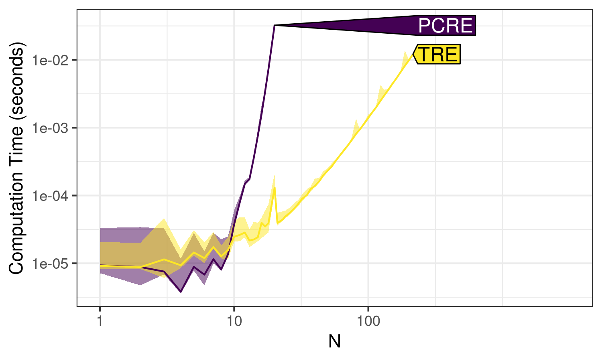
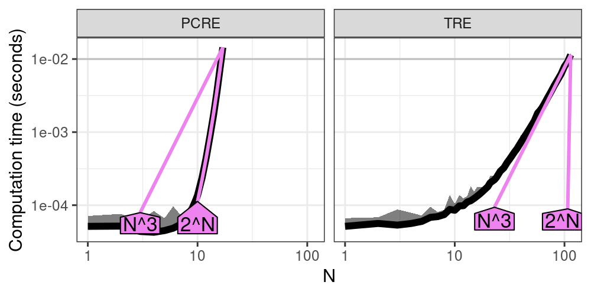
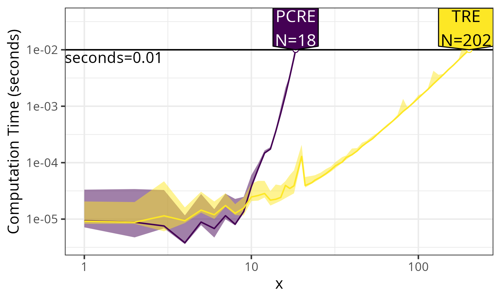
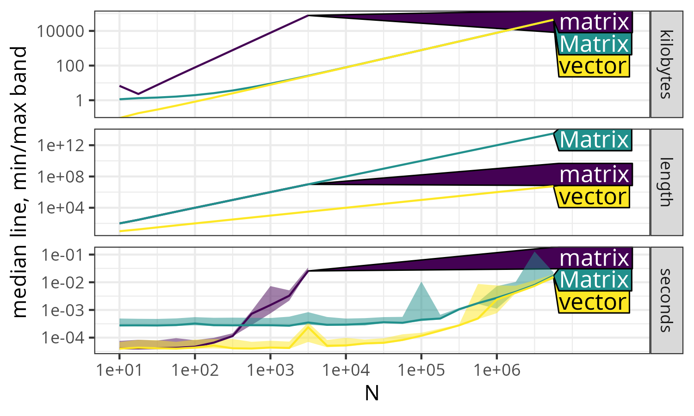
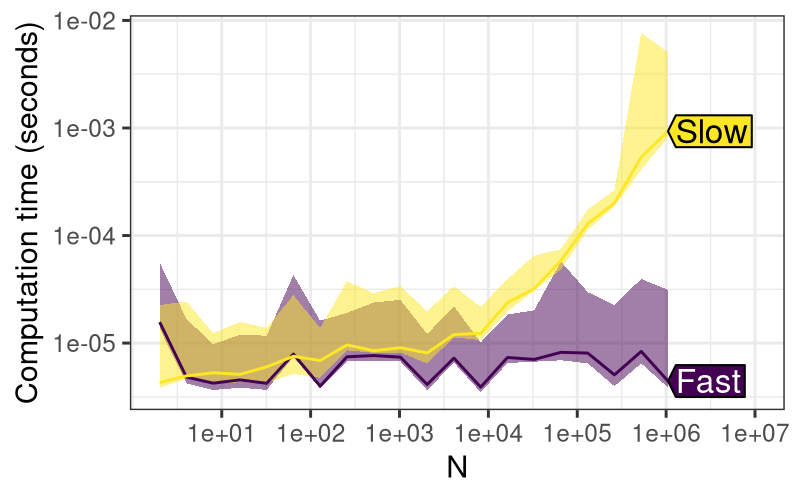
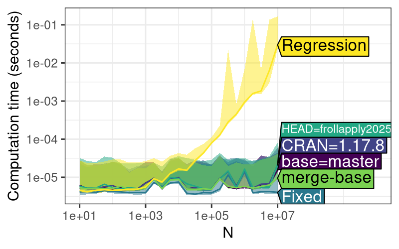
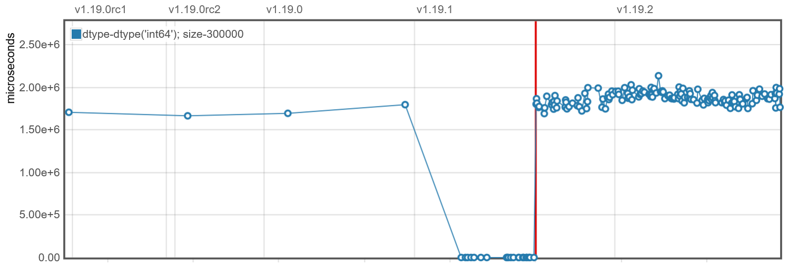
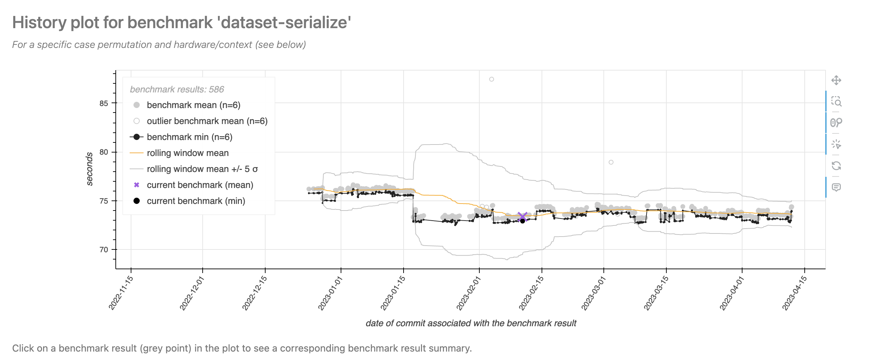

::::::: article
Time and memory efficiency are important features of statistical
software. When multiple implementations of a given algorithm are
available, benchmarking can be used to determine which one is most
efficient for a specific task. Typical benchmarking tools provide
support for comparing time/memory usage of different computations for a
data set of a given size N. In this paper, we present the atime package,
which provides asymptotic benchmarking, meaning that time and memory (as
well as other quantities) can be easily measured for a sequence of
increasing data sizes. Asymptotic measurement allows the estimation of
complexity classes (big-O notation) and provides a robust new method for
testing the performance of R packages. This paper provides a detailed
comparison of atime with similar packages, and a discussion of how atime
has been used to improve efficiency in base R and data.table.

## Introduction

Computational efficiency, measured in terms of time and memory usage, is
a critical attribute of statistical software. As the scale and
complexity of data continue to grow, optimized code and algorithms
become more important. For example, the task of writing a large CSV file
can be accomplished by various functions, each with different
performance characteristics. In R, the `base::write.csv()` function is a
standard approach for writing CSV files (R Core Team 2022). The R
package [**data.table**](https://CRAN.R-project.org/package=data.table)
offers a highly efficient `fwrite()` function, optimized for speed and
large datasets (Dowle and Srinivasan 2021). The `readr::write_csv()`
from the **readr** package is another CSV writing function (Wickham and
Hester 2018). In Python, there are other functions for CSV writing, such
as `pandas.DataFrame.to_csv()` and `dask.dataframe.to_csv()` ([McKinney
et al.]{.nocase} 2010; [dask contributors]{.nocase} 2016). To compare
the performance of these functions, common practice is to use packages
like
[**microbenchmark**](https://CRAN.R-project.org/package=microbenchmark)
(Mersmann 2024) or [**bench**](https://CRAN.R-project.org/package=bench)
(Hester and Vaughan 2024), which can run each function on a dataset of
fixed size $N$, and then report metrics such as execution time and
memory usage.

However, running time and memory benchmarks using a single data size $N$
can be misleading, because the chosen data size $N$ may not be
representative of typical use cases. Since most real-world use cases
involve large data sizes $N$, we propose an asymptotic benchmarking
system, where the same code is measured across varying data sizes. For
example, instead of benchmarking functions only for writing a CSV file
with $N = 100$ rows, we can also run them with $N = 1000$ rows, and so
on. This type of analysis makes it possible to estimate asymptotic
complexity classes (big-O notation), which tells us how the time or
memory usage grows as a function of data size $N$. This paper discusses
various complexity classes, such as linear, $O(N)$; quadratic, $O(N^2)$;
etc. The big-O notation gives an upper bound on the growth rate of a
function, which in the context of benchmarking is typically the time or
memory usage, as a function of data size $N$. For a more complete
introduction to big-O notation, the textbook of Cormen et al. (2009) is
a good reference.

In this article, we focus on two kinds of analyses: comparative
benchmarking and performance testing, which we define below.

##### Definition of comparative benchmarking.

We use the term "comparative benchmarking" for efforts that aim to
compare the performance (typically time and memory usage) of different
functions that do the same computation (for example, different functions
for writing CSV files). By comparing the performance of these different
functions, the aim is to help users make informed choices about what
software is most efficient for a particular data manipulation or
analysis operation.

##### Definition of performance testing.

We use the term "performance testing" for efforts that aim to ensure
that the software stays efficient when the code is updated (for example,
changing the source code of a function for writing CSV files). Note that
performance testing is a special case of comparative benchmarking, where
the different functions to compare are different versions (before and
after updating the function's code). The goal is for package developers
to be able to see if their code updates affect performance (time or
memory usage). We use the term "continuous performance testing" for the
automated and ongoing assessment of performance (time and memory usage),
as part of the development workflow. Another term is "continuous
benchmarking," a synonym used by Bencher---a web application that
provides a graphical user interface for visualizing historical results
(Bencher web site authors 2024). We propose a system based on GitHub
Actions, where performance testing is run for each commit of a Pull
Request, and results can be used to avoid performance regressions before
merging each Pull Request.

In this paper, we present a detailed comparison of
[**atime**](https://CRAN.R-project.org/package=atime) with existing
benchmarking tools, demonstrating how it can be used to improve
performance in R packages like
[**data.table**](https://CRAN.R-project.org/package=data.table).

## Related work

In this section, we summarize several related software tools for
comparative benchmarking and performance testing
(Table [1](#tab:T1){reference-type="ref" reference="tab:comparison"}).

### Previous software for comparative benchmarking

Several software packages provide comparative benchmarking
functionalities. Base R's `system.time()` provides a quick way to
measure the execution time of one piece of R code, for one data size (R
Core Team 2022).
[**rbenchmark**](https://CRAN.R-project.org/package=rbenchmark) wraps
`system.time()` to evaluate multiple expressions in a specified
environment (Kusnierczyk 2024).
[**microbenchmark**](https://CRAN.R-project.org/package=microbenchmark)
provides nanosecond-precision timing of multiple R expressions (Mersmann
2024), with controls such as randomization of execution order (but
without memory measurement).
[**bench**](https://CRAN.R-project.org/package=bench) measures time and
memory usage of several pieces of code (Hester and Vaughan 2024), for a
single data size (and this is what our proposed
[**atime**](https://CRAN.R-project.org/package=atime) package uses
internally). While `bench::press()` could be used to measure time/memory
usage for different data sizes, the proposed
[**atime**](https://CRAN.R-project.org/package=atime) package provides a
similar method with two advantages. First,
[**atime**](https://CRAN.R-project.org/package=atime) offers a faster
approach, which stops measurement if the median time exceeds a certain
threshold. Second, sometimes it is desirable to save the results of each
expression (for example, to check if the results are consistent). In
that case, `bench::mark(check=TRUE)` can be used to automatically stop
with an error if any pair of results is not equal. In contrast, the
proposed `atime(result=TRUE)` saves results but does not stop
automatically, so the user can implement their own checks, which is more
flexible.

There are a few examples of previous software for estimating asymptotic
complexity classes (big-O notation) from empirical data. For the case
when the asymptotic class is known, Scutari and Malvestio (2023) suggest
using linear least squares to estimate the coefficients. This is similar
to
[**testComplexity**](https://CRAN.R-project.org/package=testComplexity)
(Chetia 2025), which is an R package that uses linear models to predict
a complexity class (constant, log, linear, log-linear, quadratic) for an
empirical time or memory curve. A drawback of the linear modeling
approach is that all data sizes are equally weighted in the estimation
of coefficients, but for asymptotic complexity class estimation, only
large data sizes are relevant (time and memory measurements for small
data sizes are typically dominated by constant overhead, which does not
depend on data size). Therefore, the proposed
[**atime**](https://CRAN.R-project.org/package=atime) package estimates
the best fit asymptotic complexity class by aligning reference curves to
the two largest data sizes, as explained below in the section
"Asymptotic complexity class estimation."

### Previous software for performance testing

Several other software packages provide functionality for performance
testing (Table [1](#tab:T1){reference-type="ref"
reference="tab:comparison"}). [**airspeed
velocity**](https://CRAN.R-project.org/package=airspeed velocity) is a
Python library for performance testing (Droettboom et al. 2024), which
is used by the numpy and pandas projects (NumPy Developers 2023;
[McKinney et al.]{.nocase} 2010). Different tests are run for a given
code version and data size, and then the results are saved to disk,
creating a historical result. Performance is tested by comparing the
results for the current code with the historical results. This approach
can be useful if the data size is definitely relevant, and the results
are always computed on the same computer. However, the usefulness of
this approach can be limited because of two factors. First, different
data sizes are relevant for testing on different computers, so some
benchmarks could be irrelevant on a given computer (if the size is too
small). Second, each version of the code to test is typically run on a
different job under continuous integration services such as GitHub
Actions. With such a setup, it is rarely possible to guarantee access to
the same computer, which means that important variations in code
versions can be mistaken for insignificant variations over multiple
different servers. This type of performance testing system, therefore,
results in a high level of false positives (the system says there is a
performance regression, but there was just noise due to using different
servers). Other similar tools include
[**conbench**](https://CRAN.R-project.org/package=conbench) (Conbench
authors 2024), and
[**bencher**](https://CRAN.R-project.org/package=bencher) (Bencher web
site authors 2024).

Bruynooghe and Contributors (2024) proposed
[**pytest-benchmark**](https://CRAN.R-project.org/package=pytest-benchmark),
which integrates [**airspeed
velocity**](https://CRAN.R-project.org/package=airspeed velocity)
benchmarking into
[**pytest**](https://CRAN.R-project.org/package=pytest), which is a
framework for unit testing. Typically, unit tests are defined for small
data sets, which are not relevant to performance testing, so the
usefulness of this approach is limited.

In contrast, we propose a performance testing method that overcomes the
drawbacks of the previous approaches. To overcome the first drawback
(fixed data size), we propose to define each test as a piece of code
that is a function of the data size, `N`. The code is run for increasing
data sizes until the median time taken is greater than some threshold
(default 0.01 seconds), which can be used to ensure that the largest
data sizes are relevant for performance testing. To overcome the second
drawback (historical runs of different versions on different servers),
we propose to keep a historical database of known fast/slow versions.
Instead of running each test using only the current version of the code
(HEAD in git terms), we additionally propose to run each test using the
known fast/slow versions, along with any other versions that are
relevant in the context of a pull request (CRAN, base, merge-base). The
advantage is that this approach eliminates most false positives, since
all measurements are computed on a single computer, in the same R
session. False positives are, of course, still possible, for example,
because of "noisy neighbors" on shared virtual machines where the tests
are run (but these issues also affect other testing software deployed on
virtual machines). The drawback of our proposed approach is that it
requires more computation time during each run to install and test
several versions of the code (instead of just the most recent version).
Our proposed method is similar to the "relative continuous benchmarking"
concept on [**bencher**](https://CRAN.R-project.org/package=bencher)
(Bencher web site authors 2024), which is limited to testing a single
data size, using two code versions (main and feature branch); this
concept is also implemented in
[**touchstone**](https://CRAN.R-project.org/package=touchstone) (Walthert
and Wujciak-Jens 2024).

::: {#tab:comparison}
  ---------------------------------------------------------------------------------------------------------------------------
                          **Language**   **Notable Users**       **Result Display**      **Comp. Bench.**   **Perf. Test.**
  ----------------------- -------------- ----------------------- ----------------------- ------------------ -----------------
  **atime** (proposed)    R              **data.table**          PR comments             yes                yes

  **bench**               R              no                      no                      yes                no

  **microbenchmark**      R              no                      no                      yes                no

  `system.time()`         R              no                      no                      yes                no

  **rbenchmark**          R              no                      no                      yes                no

  **airspeed velocity**   Python         **numpy**, **pandas**   web page                no                 yes

  **conbench**            any            **arrow**, **velox**    web page, PR comments   no                 yes

  **touchstone**          R              **styler**              PR comments             no                 yes
  ---------------------------------------------------------------------------------------------------------------------------

  : (#tab:T1) Comparison of software for Comparative Benchmarking
  (Comp. Bench.) and Performance Testing (Perf. Test.).
:::

## Example of comparative benchmarking using `atime`

In this section, we demonstrate how
[**atime**](https://CRAN.R-project.org/package=atime) can be used for
comparative benchmarking. We use the example of benchmarking R code for
text processing using regular expressions (regex), using either `PCRE`
(version 2) or `TRE`, which are two C libraries that provide similar
regex functionality. [Philip Hazel et al.]{.nocase} (1997) introduced
`PCRE`, which stands for Perl-Compatible Regular Expressions, and Ville
Laurikari (2001) proposed `TRE`, which is an approximate regular
expression matching library. With base R functions like `regexpr()`,
`PCRE` is used when `perl=TRUE` and `TRE` is used when `perl=FALSE`. We
can compare the performance of these two libraries using
[**atime**](https://CRAN.R-project.org/package=atime), and the first
step is to define a vector of data sizes, as in the code below.

``` r
> (subject.size.vec <- unique(as.integer(10^seq(0, 3, l=100))))
```

``` r
 [1]    1    2    3    4    5    6    7    8    9   10   11   12   13   14   15
[16]   16   17   18   20   21   23   24   26   28   30   32   35   37   40   43
[31]   46   49   53   57   61   65   70   75   81   86   93  100  107  114  123
[46]  132  141  151  162  174  187  200  215  231  247  265  284  305  327  351
[61]  376  403  432  464  497  533  572  613  657  705  756  811  869  932 1000
```

In the code above, we created a sequence of integer values that will be
used to define different data sizes to test with each library. Using a
grid of values on the log scale (`10^seq`) is recommended for studying
asymptotic time/memory usage. Using `as.integer()` converts each value
in the sequence to an integer, and `unique()` ensures that there are no
duplicates. For each of the data sizes above, we will create a subject
and pattern using the function below.

``` r
> create_subject_pattern <- function(N) list(
+   subject = paste(rep("a", N), collapse = ""),
+   pattern = paste(rep(c("a?", "a"), each = N), collapse = ""))
> str(create_subject_pattern(3))
List of 2
 $ subject: chr "aaa"
 $ pattern: chr "a?a?a?aaa"
```

The `create_subject_pattern()` function above generates a list with two
elements, `subject` and `pattern`, based on the input parameter `N`. The
`subject` element is a string formed by repeating the letter `"a"`, and
`pattern` is constructed by repeating the regex patterns `"a?"` and
`"a"`. In the code below, we use this function in the `setup` argument
to create the data required to run the comparative benchmark. We
additionally provide the `PCRE` and `TRE` arguments, which are R
expressions that will be evaluated for each data size defined in the `N`
argument. Ten independent runs are used by default to estimate
computation time, and this can be configured by providing the `times`
argument.

``` r
> atime.list <- atime::atime(
+   N = subject.size.vec,
+   setup = {
+     N.list <- create_subject_pattern(N)
+   },
+   PCRE = with(N.list, regexpr(pattern, subject, perl = TRUE)),
+   TRE = with(N.list, regexpr(pattern, subject, perl = FALSE)))
> atime.list
```

``` r
atime list with 61 measurements for
PCRE(N=1 to 17)
TRE(N=1 to 114) 
```

The output above shows the min and max $N$ values that were run for each
of the expressions: `PCRE` went up to 17, and `TRE` went up to 114.
These data sizes exceeded the time limit (default 0.01 seconds), so
`atime()` does not run the corresponding expression for any larger data
sizes. Therefore, `atime()` is almost always much faster than running a
simple loop over data sizes. This is especially true when the different
expressions have different asymptotic time complexity classes, as in
this case (PCRE is much slower than TRE). In the code below, we use the
plot method, which results in
Figure [1](#fig:plot-atime-PCRE-TRE){reference-type="ref"
reference="fig:plot-atime-PCRE-TRE"}.

``` r
> atime.list$unit.col.vec <- c(seconds = "median")
> plot(atime.list) + ggplot2::facet_null() +
+   ggplot2::scale_y_log10("Computation time (seconds)")
```

<figure id="fig:plot-atime-PCRE-TRE" data-latex-placement="t">

<figcaption>Figure 1: Comparing the computation time for using PCRE and
TRE for regex matching with subjects and patterns of size
<code>N</code>. Line shows the median, and the shaded band shows
min/max, over 10 timings.</figcaption>
</figure>

Note in the code above that the plot method returns a ggplot object,
which we modify by adding null facets and a different y scale. By
default, [**atime**](https://CRAN.R-project.org/package=atime) measures
memory in kilobytes, as well as computation time in seconds. To simplify
the discussion of this first example, we set the `unit.col.vec` element
in the code above, which ensures that only the computation time is
displayed (median line and min/max band over 10 timings). See
Figure [4](#fig:vector-matrix-length-seconds-kilobytes){reference-type="ref"
reference="fig:vector-matrix-length-seconds-kilobytes"} for a more
complicated example that also shows memory usage.
Figure [1](#fig:plot-atime-PCRE-TRE){reference-type="ref"
reference="fig:plot-atime-PCRE-TRE"} shows the computation time for
`PCRE` and `TRE`, making it easy to see the ranking of these libraries
(TRE is faster than PCRE).

### Asymptotic complexity class estimation

To estimate the asymptotic complexity class of each expression, we use
the code below:

``` r
> (best.list <- atime::references_best(atime.list))
```

``` r
references_best list with 61 measurements, best fit complexity:
PCRE (2^N seconds)
TRE (N^3 seconds)
```

The code above fits an asymptotic reference curve for each of several
complexity classes to each empirical timing curve. The complexity
classes that are implemented by default include linear $O(N)$, log
$O(\log N)$, quadratic $O(N^2)$, exponential $O(2^N)$, etc. The user can
define complexity classes to use if the defaults are not sufficient. An
asymptotic reference curve is fit for each complexity class by aligning
it with the empirical curve for the largest $N$ value. The output is the
best fit asymptotic reference curve for each empirical curve, which is
defined as the reference curve that is closest to the empirical curve,
for the second to largest $N$ value. To visualize the results, we use
the code below.

``` r
> plot(best.list) + ggplot2::facet_grid(. ~ expr.name) +
+   ggplot2::scale_y_log10("Computation time (seconds)")
```

<figure id="fig:plot-best-list-PCRE-TRE" data-latex-placement="t">

<figcaption>Figure 2: Computation time (seconds) as a function of input
size <span class="math inline"><em>N</em></span> for PCRE and TRE.
Empirical timings are shown in black (median line and min/max band over
10 timings), while violet curves show reference asymptotic growth rates:
exponential <span
class="math inline"><em>O</em>(2<sup><em>N</em></sup>)</span> is the
best fit for PCRE, and cubic <span
class="math inline"><em>O</em>(<em>N</em><sup>3</sup>)</span> is the
best fit for TRE.</figcaption>
</figure>

Figure [2](#fig:plot-best-list-PCRE-TRE){reference-type="ref"
reference="fig:plot-best-list-PCRE-TRE"} shows the timings of each
expression as a function of data size $N$ (black), as well as two
asymptotic reference curves (violet, closest reference curve that is
smaller/larger, with text labels that can be interpreted in terms of big
O notation). Since we have chosen $N$ and the time limit appropriately,
we are able to observe the following. For small values of $N$, the
timings are dominated by the overhead, resulting in a nearly constant
curve (especially for PCRE). As $N$ increases, the PCRE curve becomes
super-linear, indicating exponential complexity, as shown by the
increasing slope in the log-log plot, and the almost perfect alignment
between the black empirical curve and the violet exponential $O(2^N)$
reference curve. Note that this example is a worst case for the PCRE
library, which is actually quite fast for other, more typical subjects
and patterns. The worst case is due to a pathological pattern and
subject that induces catastrophic backtracking. For `TRE`, two
references are shown: cubic $O(N^3)$ appears to be the best fit, whereas
exponential $O(2^N)$ is the closest reference that is slower. Note that
all polynomial references, including cubic $O(N^3)$, appear as linear
asymptotic trends on the log-log plot. Overall,
Figure [2](#fig:plot-best-list-PCRE-TRE){reference-type="ref"
reference="fig:plot-best-list-PCRE-TRE"} shows the empirical timings,
along with best fit asymptotic reference curves, which indicate that
PCRE is exponential time, and TRE is polynomial time, as a function of
the size of the subject/pattern $N$.

### Comparing latency and throughput

When comparing algorithms in terms of computational resources, we can
either compare the time/memory required for a given data size $N$
(latency), or show the data size $N$ possible for a given time/memory
budget (throughput). To compare latency for a given data size, we can
simply subset the data table of empirical measurements, as below:

``` r
> atime.list$measurements[N==15, .(expr.name, seconds=median)]
```

``` r
   expr.name      seconds
1:      PCRE 0.0034745010
2:       TRE 0.0001235669
```

The output above shows that TRE is more than ten times faster than PCRE,
at the given data size. To compare throughput, we use the code below.

``` r
> (pred.list <- predict(best.list))
```

``` r
atime_prediction object
      unit expr.name unit.value        N
1: seconds      PCRE       0.01  16.4573
2: seconds       TRE       0.01 109.7062
```

The output above shows a table with one row per expression. It shows
that at the default time limit (0.01 seconds), TRE has a much larger
estimated throughput than PCRE (`N` column). The throughput is estimated
using linear interpolation on the log-log plot. The `atime_prediction`
object has a plot method, which can be used to compare throughput, as in
the code below.

``` r
> plot(pred.list) + ggplot2::facet_null() +
+   ggplot2::scale_y_log10("Computation time (seconds)", limits=c(NA, 5e-2))
```

<figure id="fig:plot-pred-list-PCRE-TRE" data-latex-placement="t">

<figcaption>Figure 3: Computation time (seconds) versus data size (<span
class="math inline"><em>N</em>=</span> regex subject/pattern size),
highlighting the largest data size <span
class="math inline"><em>N</em></span> that can be processed within the
default time limit of 0.01 seconds. Lines show median, and shaded bands
show min/max, over 10 timings.</figcaption>
</figure>

Figure [3](#fig:plot-pred-list-PCRE-TRE){reference-type="ref"
reference="fig:plot-pred-list-PCRE-TRE"} shows the throughput, which is
the data size N that can be handled in a given amount of time. It is
clear that the `TRE` can handle about 10x larger N for the given time
limit.

## Analyzing different units as a function of data size

In this section, we explain how
[**atime**](https://CRAN.R-project.org/package=atime) can be used to
analyze asymptotic properties of other units, in addition to computation
time. We consider the example of creating vectors and matrices of size
$N$. In R, dense matrices are created using `matrix()`, whereas sparse
matrices are created using `Matrix()`. The advantage of using a sparse
matrix is that when the number of non-zeros is sub-quadratic, then the
memory usage should also be sub-quadratic (whereas memory usage with a
dense matrix would be quadratic). In the code below, we use
[**atime**](https://CRAN.R-project.org/package=atime) to verify these
properties, and we also compare with a one-dimensional `numeric()`
vector (linear memory usage). Finally, the code below demonstrates usage
of the `result` argument, which is a function applied to the result of
each expression. Because this function returns a data frame with one
row, the column in that data frame (`length`) is interpreted as another
unit to analyze (in addition to default units, time in `seconds` and
memory in `kilobytes`).

``` r
> library(Matrix)
> vec.mat.result <- atime::atime(
+   N = 10^seq(1, 7, by=0.25),  
+   vector = numeric(N),
+   matrix = matrix(0, N, N),
+   Matrix = Matrix(0, N, N),
+   result = function(x)data.frame(length = length(x)))
> plot(vec.mat.result)
```

<figure id="fig:vector-matrix-length-seconds-kilobytes"
data-latex-placement="t">

<figcaption>Figure 4: Asymptotic comparison of memory usage (kilobytes),
object length, and execution time (seconds), for creating an <span
class="math inline"><em>N</em></span>-vector, an <span
class="math inline"><em>N</em> × <em>N</em></span> dense matrix, and an
<span class="math inline"><em>N</em> × <em>N</em></span> sparse Matrix.
The second panel shows median lines and min/max bands over 10 timings.
Other panels show a line for the single measurement.</figcaption>
</figure>

The code above creates
Figure [4](#fig:vector-matrix-length-seconds-kilobytes){reference-type="ref"
reference="fig:vector-matrix-length-seconds-kilobytes"}, in which there
are three panels, each representing a different unit of measurement, as
a function of data size $N$.

Kilobytes:

:   This panel shows memory usage. The $N\times N$ sparse `Matrix` and
    $N$-`vector` both exhibit linear $O(N)$ asymptotic memory usage,
    while $N\times N$ dense `matrix` requires quadratic $O(N^2)$ memory,
    as shown by the greater slope in the log-log plot.

Length:

:   This panel represents the output of the `length` function. Both
    `matrix` and `Matrix` structures have the same quadratic $O(N^2)$
    length values, whereas `vector` has a smaller linear $O(N)$ length
    asymptotically, as shown by its smaller slope on the log-log plot.

Seconds:

:   This panel displays execution time. For small values of `N`,
    `Matrix` is slower than both `vector` and `matrix` due to a small
    constant overhead. However, as `N` increases, `Matrix` and `vector`
    converge to the same linear $O(N)$ asymptotic time complexity, much
    faster than the quadratic $O(N^2)$ time `matrix` for large `N`.

As in the previous section, `references_best()` can be used to estimate
asymptotic complexity classes, for each of the expressions (`matrix`,
`Matrix`, `vector`), and each of the units (kilobytes, length, and
seconds). Additionally, the `predict()` method can be used to estimate
the throughput of each expression, for a given limit of seconds,
kilobytes, and/or length.

Finally, we note that
Figure [4](#fig:vector-matrix-length-seconds-kilobytes){reference-type="ref"
reference="fig:vector-matrix-length-seconds-kilobytes"} is a great
example of the benefits of asymptotic measurement (as a function of N).
In this example, we obtain different conclusions for different values of
N:

N=10 to 100

:   `Matrix` is significantly slower than `matrix`, which is about the
    same as `vector`. But this observation is not indicative of
    performance in large data, because all methods are in the
    non-asymptotic regime (timings are dominated by constant overhead
    operations, which do not depend on the data). Also note the small
    spike for `matrix` at N=10, which may be attributed to garbage
    collection, and can be safely ignored since we are more concerned
    with performance for large N.

N=1,000 to 100,000

:   `matrix` is significantly slower than `Matrix`, which is
    significantly slower than `vector`. Again, this observation is not
    indicative of performance in large data, because `Matrix` and
    `vector` are in the non-asymptotic regime (but `matrix` is).

N=1,000,000 and more

:   `matrix` is significantly slower than `Matrix`, which is about the
    same as `vector`. This observation is indicative of performance in
    large data, because all methods are in the asymptotic regime
    (timings increase with data size).

The observations above highlight how the conclusions about which method
is fastest depend on the data size `N`. Asymptotic analyses like
Figure [4](#fig:vector-matrix-length-seconds-kilobytes){reference-type="ref"
reference="fig:vector-matrix-length-seconds-kilobytes"} are
advantageous, because they allow the reader to immediately see if each
method is in the asymptotic regime (which is desirable for comparing
performance in large data).

## Performance testing using **atime**

The [**atime**](https://CRAN.R-project.org/package=atime) package also
provides functionality for performance testing R packages that are
versioned using git. For performance testing an R package, we compute
asymptotic time and memory usage for different git versions, and
visualize the results to ensure that package code modifications do not
result in performance regressions. In the context of our paper, a
*performance regression* is a significant increase in execution time or
memory usage for a particular test case. In this section, we explain how
**atime** has been used to implement performance testing for
[**data.table**](https://CRAN.R-project.org/package=data.table), an R
package with users that depend on its impressive performance.

The [**atime**](https://CRAN.R-project.org/package=atime) package
provides functions for prototyping test cases, defining test cases in an
R package, and then running the test cases. The first step of
performance testing is typically prototyping, which means experimenting
with different test code, package versions, and data sizes until
significant differences in performance can be observed. Prototyping is
done using `atime_versions()`, which runs a given piece of R code, for
several data sizes `N`, and for several package versions (defined using
git SHA1 hashes). After prototyping, the arguments used with
`atime_versions()` can be reused with `atime_test()`, which is used to
define test cases in an R package. Finally, `atime_pkg()` can be used to
run all test cases in an R package, or `atime_pkg_test_info()` can be
used to extract test metadata and run one test at a time.

### Prototyping performance tests using `atime_versions()`

The first step of performance testing is typically using
`atime_versions()` for prototyping. Some arguments of `atime_versions()`
are the same as `atime()`: `N` is a sequence of data sizes, and `setup`
is an expression to create data for use in the test. The different
package versions are specified as named arguments (`Fast` and `Slow` in
the code below) whose values should be SHA1 hashes of the desired git
versions. Additionally, `pkg.path` is the path to a local clone of a git
repository containing the R package, and `expr` is an expression to time
for each different package version. Note that this expression must
contain a double or triple colon reference to the package name, such as
`data.table:::shallow()` in the code below. This is necessary because
the package name is replaced with an edited package name. Testing the
different versions is implemented by installing different versions of
the package to the same R package library. The different package
versions have different names, so they can be loaded and run in the same
R session. The names of the different R packages are created by
appending the SHA1 hash to the package name, for example
`data.table.c4a2085e35689a108d67dacb2f8261e4964d7e12`. The
`pkg.edit.fun` argument is a function to edit the package, so that it
can be installed and loaded using the versioned package name. A default
`pkg.edit.fun` is provided that works with most R packages, including
packages that use the
[**Rcpp**](https://CRAN.R-project.org/package=Rcpp) interface of
Eddelbuettel and François (2011). The default editing function finds
instances of the package name in source code and metadata files (such as
DESCRIPTION, NAMESPACE, RcppExports.cpp), and replaces the package name
with the edited package name. Because
[**data.table**](https://CRAN.R-project.org/package=data.table) has some
special configuration and build files, it requires creating a custom
function, `edit.data.table()`, see GitHub repository for details,
<https://github.com/Rdatatable/data.table/blob/master/.ci/atime/tests.R>.
We consider the example usage in the code below.

``` r
atime::atime_versions(
  pkg.path = "~/data.table",
  pkg.edit.fun = edit.data.table, 
  setup = {
    set.seed(1L)
    dt <- data.table(a = sample.int(N))
    setindexv(dt, "a")
  },
  expr = data.table:::shallow(dt),
  Slow = "b1b1832b0d2d4032b46477d9fe6efb15006664f4", 
  Fast = "9d3b9202fddb980345025a4f6ac451ed26a423be")
```

The code above runs a performance test on two different versions of the
[**data.table**](https://CRAN.R-project.org/package=data.table) package
(Fast and Slow), involving computing a shallow copy of an indexed table
with a variable number of rows $N$. It is expected that this operation
should be constant $O(1)$ time, independent of the number of rows $N$.
When we use the `plot` method
(Figure [5](#fig:plot-perf-test-fast-slow){reference-type="ref"
reference="fig:plot-perf-test-fast-slow"}, left), we see that the Slow
version time is increasing with $N$, whereas the Fast version time is
constant. Results like this, where significant differences can be
observed between package versions, indicate that the code is a good
candidate for a performance test. To summarize this section,
[**atime**](https://CRAN.R-project.org/package=atime) provides the
`atime_versions()` function, which can be used to compare the asymptotic
performance of two git versions of an R package.

<figure id="fig:plot-perf-test-fast-slow" data-latex-placement="t">


<figcaption>Figure 5: <strong>Left:</strong> <code>plot()</code> method
for <code>atime_versions()</code> shows the asymptotic time taken for
<code>shallow()</code>, which performs a shallow copy of a data table
with <span class="math inline"><em>N</em></span> rows, an operation
which is expected to be constant time (as in Fast version, but not Slow
version). <strong>Right:</strong> the same test case ran in the context
of a Pull Request on GitHub, resulting in three additional versions
(CRAN, HEAD, base). It is clear that all versions other than
Slow/Regression are about the same speed as Fast/Fixed, which indicates
that HEAD is OK to merge into the base.</figcaption>
</figure>

### Defining performance tests in an R package

After having used `atime_versions()` to prototype a performance test,
the next step is to move the test code into the R package. We propose
defining performance test cases in the object named `test.list` defined
in the `pkg/.ci/atime/tests.R` file, in a git repository `pkg` that
contains an R package. Each element of the list should have an
informative name for the test case, which will be used to display the
results. Each value should be a list of named arguments to pass to
`atime_versions()`, such as `setup`, `expr`, `Fast`, and `Slow`. Each
test case is typically created based on a historical regression or
performance improvement. For example, the R code below defines the test
case involving `shallow()`, as discussed in the previous section.

``` r
test.list <- atime::atime_test_list(
  N = as.integer(10^seq(1, 7, by=0.25)),
  pkg.edit.fun = edit.data.table,
  "shallow speed improved in #4440" = atime::atime_test(
    setup = {
      set.seed(1L)
      dt <- data.table(a = sample.int(N))
      setindexv(dt, "a")
    },
    expr = data.table:::shallow(dt),
    Slow = "b1b1832b0d2d4032b46477d9fe6efb15006664f4", 
    Fast = "9d3b9202fddb980345025a4f6ac451ed26a423be"
  )
)
```

The code above uses the helper functions `atime_test_list()` and
`atime_test()` to define the test case. Both functions are wrappers
around `list()`, with non-standard evaluation for special arguments like
`setup` and `expr` (un-evaluated expressions to pass to
`atime_versions`). The arguments `N` and `pkg.edit.fun` are special
names that are recognized by `atime_test_list`, and shared across all of
the test cases in the list (only one test case shown above; see
[**data.table**](https://CRAN.R-project.org/package=data.table)
repository for more). In addition to the code above, it is recommended
to add names and/or comments that explain the origin of the test case.
For example, the test case name `"shallow speed improved in #4440"`
references the PR number, which resulted in the performance improvement.
Also, for each SHA1 hash, we recommend a comment such as the following,
which was used to document the origin of the Slow commit:
`Parent of the first commit (`[`https://github.com/Rdatatable/data.table/commit/0f0e7127b880df8459b0ed064dc841acd22f5b73`](https://github.com/Rdatatable/data.table/commit/0f0e7127b880df8459b0ed064dc841acd22f5b73){.uri}`) in the PR (`[`https://github.com/Rdatatable/data.table/pull/4440/commits`](https://github.com/Rdatatable/data.table/pull/4440/commits){.uri}`) that improves speed`.
Such comments are useful because they can be used to double-check the
validity of the SHA1 commit IDs. In this example, on the PR4440 web
page, it can be seen that 0f0e712 is the first commit, and on that
commit page, it can be seen that b1b1832 is indeed its parent (which is
a good choice for a historical Slow reference because it occurred before
the PR that introduced the performance improvement).

### Running performance tests locally and on GitHub Actions

##### Running performance tests locally.

After having defined test cases as above, all the test cases in the
package can be run locally by using `atime_pkg("path/to/pkg")`. It runs
`atime_versions()` using the arguments provided in each test case, and
then saves the results (RDS file), along with summary PNG figure files,
to the directory `pkg/.ci/atime`. Alternatively, to run and visualize
the results for a single test case, the code below can be used.

``` r
pkg.info <- atime::atime_pkg_test_info("~/R/data.table")
one.call <- pkg.info$test.call[["shallow regression fixed in #4440"]] 
one.result <- eval(one.call) 
plot(one.result)
```

The `atime_pkg_test_info()` function returns a list of information about
the performance test cases, without actually running them yet. The
`pkg.info$test.call` object is a list of un-evaluated expressions, each
of which calls `atime_versions()` for a given test case. The code
`eval(one.call)` runs one performance test, and the plot method can be
used to visualize the results
(Figure [5](#fig:plot-perf-test-fast-slow){reference-type="ref"
reference="fig:plot-perf-test-fast-slow"}, right). Running the test case
locally adds three versions (Table [2](#tab:T2){reference-type="ref"
reference="tab:version-labels"}): HEAD (current git version in local
clone), base (`GITHUB_BASE_REF` or master), and CRAN (current release).
The performance of these versions can be compared to the historical
commits (Fast and Slow) to evaluate the performance of the current code.

##### Running performance tests on GitHub Actions.

GitHub Actions is a continuous integration service that can run
arbitrary code after every push to a git repository. A GitHub Action was
created to facilitate performance testing of the changes that are
introduced in a Pull Request (PR). The primary motivation behind this
was to help ensure that
[**data.table**](https://CRAN.R-project.org/package=data.table)
maintains its code efficiency as PRs are merged. The GitHub Action for
performance testing can be enabled by creating a YAML file in
`pkg/.github/workflows` (see atime web page for details). The GitHub
Action first runs `atime_pkg()` after each push to a branch involved in
a PR. The GitHub Action then creates a comment in the PR, with the
summary figure that shows the result from the most recent performance
test. The comment gets updated after each push to avoid cluttering the
PR. The plot shows a column for each test case, with time and memory
trends across different `data.table` versions
(Table [2](#tab:T2){reference-type="ref"
reference="tab:version-labels"}). In addition, the comment contains a
link to download all the `atime`-generated result files (figure PNG
files and RDS).

Several versions are provided automatically by atime, based on the
context of the PR (base, HEAD, merge-base, CRAN). Other versions can be
provided by the user based on what is relevant for each test case
(Before, Regression, Fixed, Fast, Slow). For test cases that involve a
regression, we recommend the version names Before, Regression, and
Fixed, to indicate versions relative to the regression (Before and Fixed
should be more efficient than Regression). For test cases that involve a
performance improvement (or no known regression), we recommend using the
version names Fast and Slow.

::: {#tab:version-labels}
  -------------------------------------------------------------------------------------------------------------------------
  **Version name**   **Defined?**   **Version description**
  ------------------ -------------- ---------------------------------------------------------------------------------------
  Fast               user           An efficient commit

  Slow               user           An inefficient commit

  Before             user           An efficient commit before a performance regression

  Regression         user           An inefficient commit affected by a performance regression

  Fixed              user           An efficient commit after fixing a performance regression

  CRAN               local          Latest version on CRAN

  HEAD               local          Most recent commit in current branch

  base               GitHub         Target branch of PR (typically main or master), if current branch is involved in a PR

  merge-base         GitHub         The common ancestor between base and HEAD
  -------------------------------------------------------------------------------------------------------------------------

  : (#tab:T2) Version names recognized by atime performance testing.
:::

## Comparisons between textttatime and other software

### Features of [**atime**](https://CRAN.R-project.org/package=atime) and [**touchstone**](https://CRAN.R-project.org/package=touchstone) for performance testing

In terms of performance testing functionality, the most similar R
package to [**atime**](https://CRAN.R-project.org/package=atime) is
[**touchstone**](https://CRAN.R-project.org/package=touchstone), which
also provides functions for performance testing, but without asymptotic
measurement as a function of several data sizes.

Both [**touchstone**](https://CRAN.R-project.org/package=touchstone) and
[**atime**](https://CRAN.R-project.org/package=atime) use relative
performance testing, meaning that each test case is run using different
versions of the R package. Touchstone allows specifying two branches,
corresponding to the HEAD of a PR and its base branch. In addition to
those branches, [**atime**](https://CRAN.R-project.org/package=atime)
supports other branches that are important in the context of a PR
(merge-base and CRAN), as well as user-defined commits that represent
historical Fast/Slow versions.

`touchstone::branch_install()` installs each branch to a separate
library, and uses [**callr**](https://CRAN.R-project.org/package=callr)
to run each branch in a separate R process. In contrast,
`atime::atime_versions()` installs each package version to the same
library (using a different package name for each version). Therefore,
[**atime**](https://CRAN.R-project.org/package=atime) allows the
different R package versions to be loaded into the same R session, for
more direct comparison (reduced noise).

### Comparative benchmarking using `atime::atime()` and `bench::press()`

In terms of comparative benchmarking functionality, the function most
similar to `atime::atime()` is `bench::press()`, which allows the user
to specify several parameters to vary (not only data size `N`). The main
advantage of [**atime**](https://CRAN.R-project.org/package=atime) is
that it provides convenient features for benchmarking code that scales
with data size, $N$. For parameters other than `N`, the `atime_grid()`
function can be used, as explained below.

##### Simple example with small data size $N$, for which bench and atime work equally well.

The [**bench**](https://CRAN.R-project.org/package=bench) package can be
used for asymptotic benchmarking, as long as the max data size $N$ is
chosen to yield a reasonable computation time for all expressions. For
example, [**bench**](https://CRAN.R-project.org/package=bench) can be
used to do a small-scale asymptotic comparison of PCRE and TRE, via the
code below.

``` r
bench::press(
  N = 1:20,
  perl = c(TRUE, FALSE),
  with(create_subject_pattern(N), bench::mark(
    iterations = 10,
    regexpr(pattern, subject, perl = perl))))
```

The code above is an attempt to replicate
Figure [1](#fig:plot-atime-PCRE-TRE){reference-type="ref"
reference="fig:plot-atime-PCRE-TRE"}, but with smaller data sizes
(max=20 instead of 1000, which would be too slow to compute using PCRE).
In the code above, we use the `bench::press()` function to perform
benchmarking across multiple parameter combinations (`N` and `perl`).
For each combination, it uses `create_subject_pattern(N)` to generate a
`subject` and `pattern`, and subsequently measures the performance of
the `regexpr` function using `bench::mark()`. The `regexpr` function
performs regular expression matching with the generated `pattern` on the
`subject`, using the current value of `perl` to toggle Perl-compatible
regex. The benchmarking process is repeated `iterations = 10` times for
each parameter combination. Below we show the analogous
[**atime**](https://CRAN.R-project.org/package=atime) code.

``` r
atime::atime(
  N = 1:20,
  setup = N.data <- create_subject_pattern(N),
  expr.list = atime::atime_grid(
    list(perl = c(TRUE, FALSE)),
    regexpr = regexpr(N.data$pattern, N.data$subject, perl = perl)))
```

The code above uses the `expr.list` argument, which is a list of
expressions to be benchmarked, constructed using `atime::atime_grid`,
which defines a grid of parameter combinations, similar to
`bench::press()`. In this case, the grid includes one parameter, `perl`,
with values `TRUE` or `FALSE`. Overall, we see from this example that
the [**atime**](https://CRAN.R-project.org/package=atime) and
[**bench**](https://CRAN.R-project.org/package=bench) code is very
similar, for the case where the max data size $N$ is small enough to be
computable by all expressions.

##### More complex example showing the advantage of atime.

An example that is more difficult to handle using `bench::press()` would
be the analysis presented in
Figure [4](#fig:vector-matrix-length-seconds-kilobytes){reference-type="ref"
reference="fig:vector-matrix-length-seconds-kilobytes"}, which shows an
extra unit (length, in addition to seconds and kilobytes), and involves
very different time/memory scales (dense `matrix` is orders of magnitude
less efficient than sparse `Matrix`). That analysis requires two useful
features that are provided by `atime()`.

- To measure quantities other than seconds and kilobytes as a function
  of N (such as length in
  Figure [4](#fig:vector-matrix-length-seconds-kilobytes){reference-type="ref"
  reference="fig:vector-matrix-length-seconds-kilobytes"}), a custom for
  loop is required with `bench::press()`.

- If an expression takes longer than the time limit (default 0.01
  seconds), then custom code is required for `bench::press()` to not be
  run for any larger N values. And in the case of
  Figure [4](#fig:vector-matrix-length-seconds-kilobytes){reference-type="ref"
  reference="fig:vector-matrix-length-seconds-kilobytes"}, it is also
  important to avoid running the large N values, to avoid running out of
  memory.

The 28 lines of code below can be used to achieve these two features
using `bench::press()`, but it is complicated relative to the
corresponding 6 lines of `atime` code that was used to create
Figure [4](#fig:vector-matrix-length-seconds-kilobytes){reference-type="ref"
reference="fig:vector-matrix-length-seconds-kilobytes"} (see previous
section).

``` r
seconds.limit <- 0.01
done.vec <- NULL
measure.vars <- c("seconds","kilobytes","length")
press_result <- bench::press(N = N_seq, {
  exprs <- function(...)as.list(match.call()[-1])
  elist <- exprs(
    vector=numeric(N),
    matrix=matrix(0, N, N),
    Matrix=Matrix(0, N, N))
  elist[names(done.vec)] <- NA #Don't run exprs which already exceeded limit.
  mark.args <- c(elist, list(iterations=10, check=FALSE))
  mark.result <- do.call(bench::mark, mark.args)
  desc.vec <- attr(mark.result$expression, "description")
  mark.result$description <- desc.vec
  mark.result$seconds <- as.numeric(mark.result$median)
  mark.result$kilobytes <- as.numeric(mark.result$mem_alloc/1024)
  mark.result$length <- NA
  for(desc.i in seq_along(desc.vec)){
    description <- desc.vec[[desc.i]]
    result <- eval(elist[[description]])
    mark.result$length[desc.i] <- length(result)
  }
  mark.result[desc.vec %in% names(done.vec), measure.vars] <- NA
  over.limit <- mark.result$seconds > seconds.limit
  over.desc <- desc.vec[is.finite(mark.result$seconds) & over.limit]
  done.vec[over.desc] <<- TRUE
  mark.result
})
```

The code above uses entries of `done.vec` to keep track of which
expressions have already gone over the time limit. It also uses a for
loop to evaluate each expression and save the length of the result to
analyze as a function of N. Overall, the code is substantially more
complex than the corresponding
[**atime**](https://CRAN.R-project.org/package=atime) code, because it
has to re-implement two features that
[**atime**](https://CRAN.R-project.org/package=atime) provides.

To conclude this section, we have discussed the use of
[**bench**](https://CRAN.R-project.org/package=bench) and
[**atime**](https://CRAN.R-project.org/package=atime) packages for
comparative benchmarking in R. Both methods can be used for comparative
benchmarking across different parameter configurations. However,
`atime::atime()` provides two key features which are not present in
`bench::press()`: measurement of arbitrary units (other than time and
memory), and stopping evaluation for expressions that go over a time
limit.

### Comparing overall time using different benchmarking packages

In this section, we provide an empirical comparison between
[**atime**](https://CRAN.R-project.org/package=atime) and
[**bench**](https://CRAN.R-project.org/package=bench), in terms of how
much time it takes overall to compute benchmark results. Our goal is to
demonstrate an advantage of the proposed asymptotic approach implemented
in [**atime**](https://CRAN.R-project.org/package=atime): we can gather
a larger range of measurements in a comparable or smaller amount of
time.

First, we considered the regular expression example in
Figure [1](#fig:plot-atime-PCRE-TRE){reference-type="ref"
reference="fig:plot-atime-PCRE-TRE"}. The overall time taken by
[**atime**](https://CRAN.R-project.org/package=atime) to compute the
data for this benchmark was 1.7 seconds, and it resulted in a range of
measurements (N=1 to 18 for PCRE, and N=1 to 151 for TRE). For
comparison, we ran [**bench**](https://CRAN.R-project.org/package=bench)
with various data sizes from N=19 to N=23, and we show the timings in
Table [3](#tab:T3){reference-type="ref" reference="tab:PCRE-TRE"}. The
most comparable amount of time for
[**bench**](https://CRAN.R-project.org/package=bench) was 1.69 seconds
for data size N=21, which is slightly larger than the largest data size
for PCRE with [**atime**](https://CRAN.R-project.org/package=atime)
(N=18), but significantly smaller than the largest data size for TRE
with [**atime**](https://CRAN.R-project.org/package=atime) (N=151).
Smaller data sizes were faster (0.42 seconds for N=19), and larger data
sizes were slower (6.95 seconds for N=23).

Second, we considered the sparse matrix example in
Figure [4](#fig:vector-matrix-length-seconds-kilobytes){reference-type="ref"
reference="fig:vector-matrix-length-seconds-kilobytes"}. The overall
time taken by [**atime**](https://CRAN.R-project.org/package=atime) to
compute the data for this benchmark was 2.21 seconds, and it resulted in
a range of measurements (N=10 to 3,000,000 for Matrix, N=10 to 3,000 for
matrix, N=10 to 10,000,000 for vector). For comparison, we ran
[**bench**](https://CRAN.R-project.org/package=bench) with various data
sizes from N=5,000 to N=100,000, and we show the timings in
Table [4](#tab:T4){reference-type="ref" reference="tab:matrix-vector"}.
The most comparable amount of time for
[**bench**](https://CRAN.R-project.org/package=bench) was 3.22 seconds
for data size N=10,000, which is slightly larger than the largest data
size for the matrix with
[**atime**](https://CRAN.R-project.org/package=atime) (N=3,000), but
significantly smaller than the largest data size for the other
[**atime**](https://CRAN.R-project.org/package=atime) measurements
(millions for Matrix and vector). Smaller data sizes were faster (0.66
seconds for N=5,000), and larger data sizes were either slower (11.53
seconds for N=20,000) or did not run (not enough memory to run the
matrix for N=100,000).

Overall, the comparisons in this section have shown the advantages of
the [**atime**](https://CRAN.R-project.org/package=atime) approach,
which computes measurements for a range of data sizes until the median
time exceeds a limit (default 0.01 seconds). The
[**atime**](https://CRAN.R-project.org/package=atime) approach can be
faster overall, for more informative results (measurements for a range
of data sizes, not just one data size).

::: {#tab:PCRE-TRE}
  ------------------------------------------------------
  package     seconds   PCRE data sizes   TRE data sizes
  --------- --------- ----------------- ----------------
  bench          0.42                19               19

  bench          0.81                20               20

  bench          1.69                21               21

  atime          1.70             1--18           1--151

  bench          3.40                22               22

  bench          6.95                23               23
  ------------------------------------------------------

  : (#tab:T3) Overall time required to compute regular expression
  benchmarks, as in
  Figure [1](#fig:plot-atime-PCRE-TRE){reference-type="ref"
  reference="fig:plot-atime-PCRE-TRE"}, using either **bench** (with
  various data sizes from 19 to 23) or **atime** (with the default time
  limit of 0.01 seconds, which results in a range of data sizes).
:::

::: {#tab:matrix-vector}
  -------------------------------------------------------------------------------------
  package           seconds   Matrix data sizes   matrix data sizes   vector data sizes
  --------- --------------- ------------------- ------------------- -------------------
  bench                0.66                5000                5000                5000

  atime                2.21        1e+01--3e+06        1e+01--3e+03        1e+01--1e+07

  bench                3.22               10000               10000               10000

  bench               11.53               20000               20000               20000

  bench       out of memory               1e+05               1e+05               1e+05
  -------------------------------------------------------------------------------------

  : (#tab:T4) Overall time required to compute sparse/dense matrix
  benchmarks, as in
  Figure [4](#fig:vector-matrix-length-seconds-kilobytes){reference-type="ref"
  reference="fig:vector-matrix-length-seconds-kilobytes"}, using either
  [**bench**](https://CRAN.R-project.org/package=bench) (with various
  data sizes from 5000 to 100,000) or
  [**atime**](https://CRAN.R-project.org/package=atime) (with the
  default time limit of 0.01 seconds, which results in a range of data
  sizes).
:::

### Comparison with Python continuous benchmarking

Python continuous benchmarking software includes [**airspeed
velocity**](https://CRAN.R-project.org/package=airspeed velocity) and
[**conbench**](https://CRAN.R-project.org/package=conbench). Whereas the
proposed [**atime**](https://CRAN.R-project.org/package=atime) method
keeps a historical database of commits which are known to be Fast or
Slow, these packages keep a historical database of timings for all
commits (each timing computed once for that commit and then saved to
compare with timings computed for other commits). Another major
difference is that each
[**atime**](https://CRAN.R-project.org/package=atime) test results in
several measurements for a set of increasing data sizes, whereas these
other tools use a fixed data size (which may not be relevant on
different computer hardware). Assuming a relevant data size is used,
these alternative approaches could be very useful, as performance
regressions could be visualized as abrupt increases in computation time
over the history of commits. Examples of web pages that are generated by
these packages are shown in
Figure [6](#fig:python-results){reference-type="ref"
reference="fig:python-results"}, which show results taken from
<https://pv.github.io/numpy-bench/#bench_trim_zeros.TrimZeros.time_trim_zeros>
and <https://conbench.github.io/conbench/pages/lookback_zscore.html>.
The limitation of this approach is that it requires careful control of
the underlying hardware that was used to compute the benchmark timings
for each commit. If there are variations in the hardware over time, that
can result in false positive changes in benchmark computation time,
which makes it more difficult to detect real performance regressions due
to changes in the code.
[**atime**](https://CRAN.R-project.org/package=atime) does not suffer
from this drawback, because it computes timings for each data size and
code version at test time on the same machine
(Table [2](#tab:T2){reference-type="ref"
reference="tab:version-labels"}), so it does not need to keep a database
of historical benchmarks. Instead of presenting the user a time series
plot with different code versions on the X axis,
[**atime**](https://CRAN.R-project.org/package=atime) presents data size
on the X axis
(Figure [5](#fig:plot-perf-test-fast-slow){reference-type="ref"
reference="fig:plot-perf-test-fast-slow"}), with different code versions
represented as different colored empirical timing curves. False
positives are, of course, still possible with
[**atime**](https://CRAN.R-project.org/package=atime), for example,
because of "noisy neighbors" on shared virtual machines, or random
garbage collection events, but these issues also affect other testing
software.

<figure id="fig:python-results">


<figcaption>Figure 6: Comparison with other continuous benchmarking
software. Air Speed Velocity (top) and Conbench (bottom) are
measurements of computation time for a fixed data size (Y axis), shown
as a function of the commit history (X axis). The main drawback of this
method is that it results in false positive changes up and down, as can
be seen in these figures. </figcaption>
</figure>

## Discussion and conclusions

In this paper, we presented the
[**atime**](https://CRAN.R-project.org/package=atime) package for
comparative benchmarking of R code and performance testing in R
packages. The unique feature of
[**atime**](https://CRAN.R-project.org/package=atime) is asymptotic
measurement of time and memory (as a function of data size), which makes
it easy to see when the code performance is in the asymptotic regime
(dependent on data size). The
[**atime**](https://CRAN.R-project.org/package=atime) package enables
users to compute and visualize asymptotic timings, including comparing
empirical timings with theoretical references and estimating throughput.
Several examples illustrated how
[**atime**](https://CRAN.R-project.org/package=atime) can be applied for
comparative benchmarking of different R functions that perform similar
computations (but with different performance characteristics). Using
[**data.table**](https://CRAN.R-project.org/package=data.table) as an
example, we explained how
[**atime**](https://CRAN.R-project.org/package=atime) can be used for
performance testing of R packages across multiple git versions.

Additionally, we compared
[**atime**](https://CRAN.R-project.org/package=atime)'s syntax and
functionality with other tools used for performance testing and
benchmarking. Compared to other benchmarking tools (which support only a
single data size), the unique feature of
[**atime**](https://CRAN.R-project.org/package=atime) is support for
sequences of data sizes. We showed that it is technically possible to
use `bench::press()` for asymptotic analysis across a sequence of small
data sizes, but [**atime**](https://CRAN.R-project.org/package=atime) is
preferable because it supports convenience features such as stopping if
a timing exceeds a time limit. Another similar package is
[**touchstone**](https://CRAN.R-project.org/package=touchstone), which
provides a GitHub Action for performance testing based on comparing
HEAD/base versions, but does not support asymptotic analysis (varying
data sizes).

##### Limitations and future development.

A limitation of [**atime**](https://CRAN.R-project.org/package=atime)
comes from the fact that it uses `bench::mark()` to measure time/memory
for each data size. This dependency means that
[**atime**](https://CRAN.R-project.org/package=atime) inherits both the
strengths and limitations of `bench::mark()`. Because this method uses
`Rprofmem()`, it is limited to measuring R memory allocations (and can
not measure other C memory allocations). Also, this method runs timings
for each expression several times, without re-running the `setup`
expression. This makes it difficult to run timings on functions that
alter their inputs by reference. For example, `data.table::setkey(DT)`
alters `DT` by reference (sort in place); the first execution for memory
measurement will sort the data, and subsequent executions for time
measurement will do a linear scan to verify the data is sorted (faster).
Future versions of [**atime**](https://CRAN.R-project.org/package=atime)
could overcome this limitation by removing the dependency on
[**bench**](https://CRAN.R-project.org/package=bench) and implementing a
time/memory measurement procedure that runs the `setup` expression
before each measurement.

##### Current use cases.

We note that [**atime**](https://CRAN.R-project.org/package=atime) is
currently being used for continuous performance testing of
[**data.table**](https://CRAN.R-project.org/package=data.table), with 16
test cases currently implemented, and running for every pull request on
GitHub. The [**atime**](https://CRAN.R-project.org/package=atime)
methodology has also been used to uncover and fix asymptotic performance
issues in base R. For example, asymptotic analysis of `write.csv()`
revealed that it was quadratic $O(N^2)$ in the number of columns $N$,
whereas the expected complexity was linear $O(N)$. Sebastian Meyer
realized this issue was related to another issue with replacing columns
via `[.data.frame`, which was observed to be super-linear, but expected
to be linear. The fix for these two issues appeared in 2023 with R
version 4.3.0. As mentioned in the introduction,
[**atime**](https://CRAN.R-project.org/package=atime) has also been used
for comparative benchmarking of CSV reading and writing functions (for
details, see <https://tdhock.github.io/blog/2023/dt-atime-figures/> and
<https://tdhock.github.io/blog/2024/pandas-dt/>). Another improvement to
base R was in `substring()`, which was expected to be linear $O(N)$ time
in the number of outputs $N$, and `gregexpr()`, which was expected to be
linear $O(N)$ time in the number of characters $N$ in the subject. Our
asymptotic analysis revealed that both operations were quadratic
$O(N^2)$ time, and Tomas Kalibera merged the proposed fixes into R
version 3.6.0 (2019). Overall, we have shown how
[**atime**](https://CRAN.R-project.org/package=atime) simplifies such
asymptotic analysis, and we expect that it will be a useful tool for
future analyses of other R functions.

**Reproducible research statement:** The following repositories contain
all the code for reproducing the figures in this paper:

<https://github.com/tdhock/atime-article>\
<https://doi.org/10.5281/zenodo.14796684>
:::::::

::::::::::::::::::::::: {#refs .references .csl-bib-body .hanging-indent}
::: {#ref-bencher .csl-entry}
Bencher web site authors. 2024. "What Is Continuous Benchmarking?"
Unpublished manuscript.
:::

::: {#ref-pytest_benchmark .csl-entry}
Bruynooghe, Floris, and the pytest-benchmark Contributors. 2024.
"Pytest-Benchmark V5.1.0: Pytest Fixture for Benchmarking Code."
Unpublished manuscript.
:::

::: {#ref-testComplexity .csl-entry}
Chetia, Anirban. 2025. *testComplexity: Asymptotic Complexity Testing
Framework*. <https://github.com/Anirban166/testComplexity>.
:::

::: {#ref-conbench .csl-entry}
Conbench authors. 2024. "Conbench: Language-Independent Continuous
Benchmarking (CB) Framework." Unpublished manuscript.
:::

::: {#ref-cormen2009introduction .csl-entry}
Cormen, Thomas H., Charles E. Leiserson, Ronald L. Rivest, and Clifford
Stein. 2009. "Introduction to Algorithms." *Journal of Algorithms* 45
(2): 78--102.
:::

::: {#ref-dask .csl-entry}
[dask contributors]{.nocase}. 2016. *Dask: Parallel Computing with Task
Scheduling*. <https://dask.org>.
:::

::: {#ref-data.table .csl-entry}
Dowle, Matt, and Arun Srinivasan. 2021. *Data.table: Extension of
'Data.frame'*.
:::

::: {#ref-airspeed_velocity .csl-entry}
Droettboom, Michael, Pauli Virtanen, and asv Developers. 2024. "Airspeed
Velocity." Unpublished manuscript.
:::

::: {#ref-Rcpp .csl-entry}
Eddelbuettel, Dirk, and Romain François. 2011. "Rcpp: Seamless R and C++
Integration." *Journal of Statistical Software* 40 (8): 1--18.
<https://doi.org/10.18637/jss.v040.i08>.
:::

::: {#ref-bench .csl-entry}
Hester, Jim, and Davis Vaughan. 2024. *Bench: High Precision Timing of R
Expressions*. <https://CRAN.R-project.org/package=bench>.
:::

::: {#ref-rbenchmark .csl-entry}
Kusnierczyk, Wacek. 2024. *Rbenchmark: Benchmarking Routine for R*.
<https://CRAN.R-project.org/package=rbenchmark>.
:::

::: {#ref-pandas .csl-entry}
[McKinney, Wes et al.]{.nocase} 2010. *Pandas: Powerful Data Structures
for Data Analysis in Python*.
:::

::: {#ref-microbenchmark .csl-entry}
Mersmann, Olaf. 2024. *Microbenchmark: Accurate Timing Functions*.
<https://CRAN.R-project.org/package=microbenchmark>.
:::

::: {#ref-numpy .csl-entry}
NumPy Developers. 2023. *NumPy: The Fundamental Package for Scientific
Computing with Python*.
:::

::: {#ref-PCRE .csl-entry}
[Philip Hazel, Zoltan Herczeg, and contributors]{.nocase}. 1997.
*PCRE2 - Perl Compatible Regular Expressions Version 2*. University of
Cambridge.
:::

::: {#ref-baseR .csl-entry}
R Core Team. 2022. *R: A Language and Environment for Statistical
Computing*. R Foundation for Statistical Computing.
<https://www.R-project.org/>.
:::

::: {#ref-scutari2023pragmatic .csl-entry}
Scutari, Marco, and Mauro Malvestio. 2023. *The Pragmatic Programmer for
Machine Learning: Engineering Analytics and Data Science Solutions*.
Chapman; Hall/CRC.
:::

::: {#ref-TRE .csl-entry}
Ville Laurikari. 2001. *TRE - Approximate Regex Matching Library*.
Department of Computer Science; Engineering, Helsinki University of
Technology.
:::

::: {#ref-touchstone .csl-entry}
Walthert, Lorenz, and Jacob Wujciak-Jens. 2024. *Touchstone: Continuous
Benchmarking with Statistical Confidence Based on 'Git' Branches*.
<https://github.com/lorenzwalthert/touchstone>.
:::

::: {#ref-readr .csl-entry}
Wickham, Hadley, and Jim Hester. 2018. *Readr: Read Rectangular Text
Data*.
:::
:::::::::::::::::::::::
