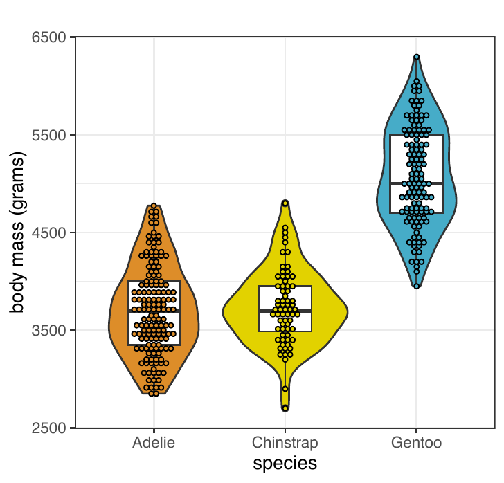
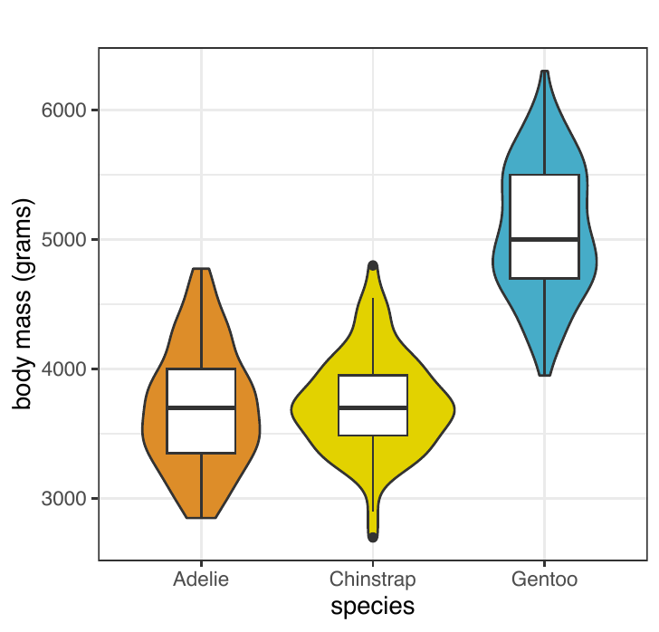
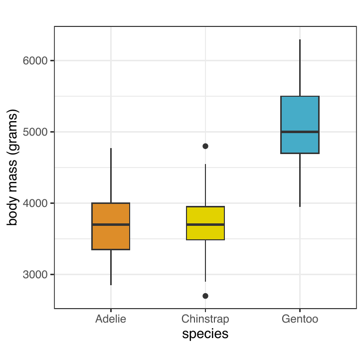
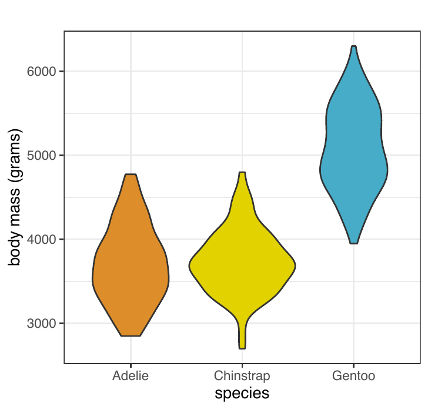
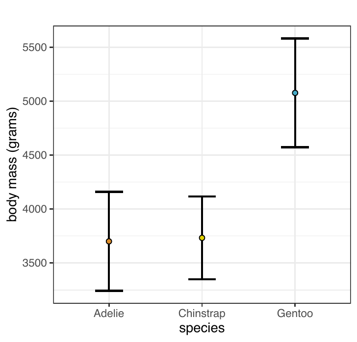
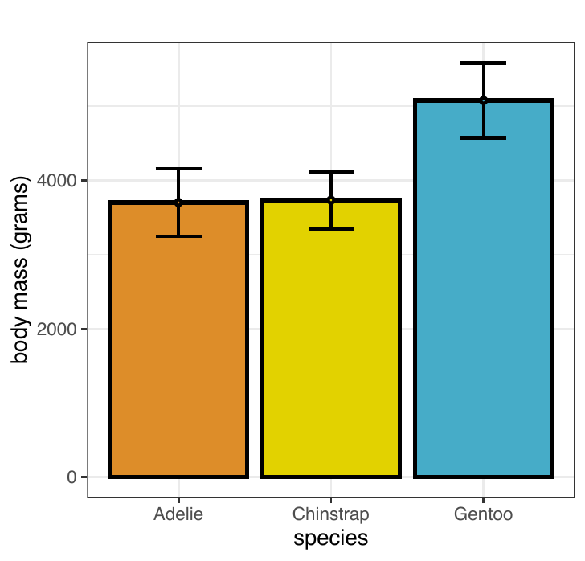
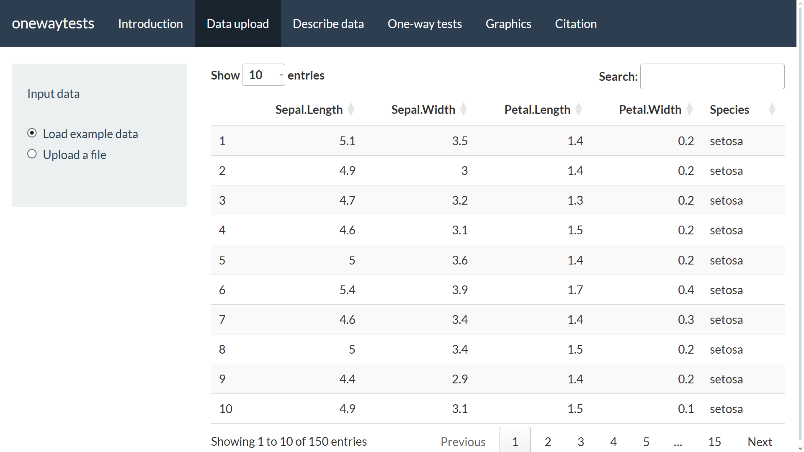
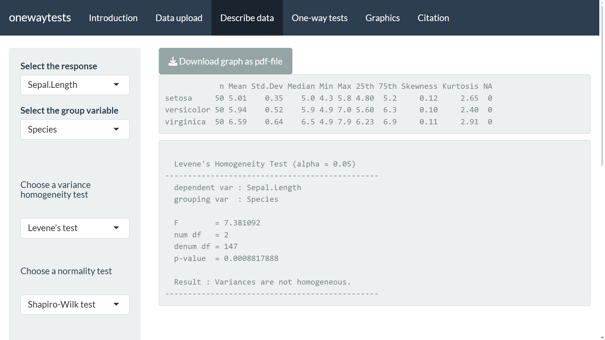
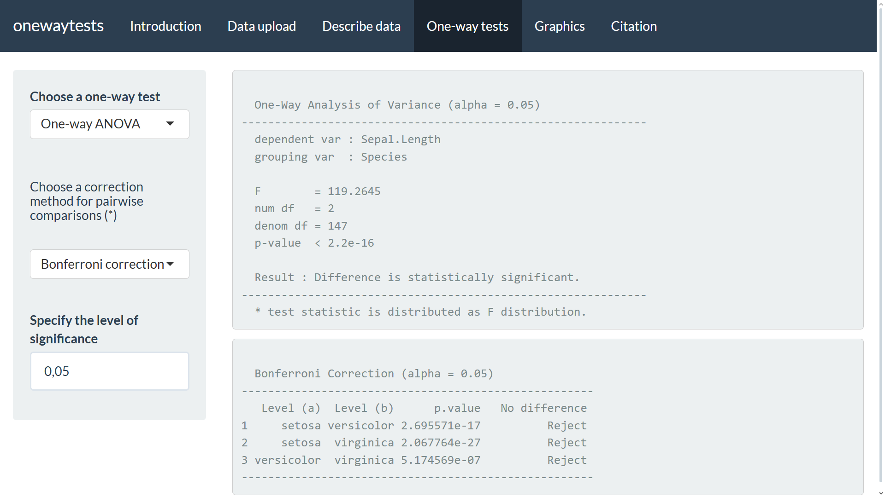
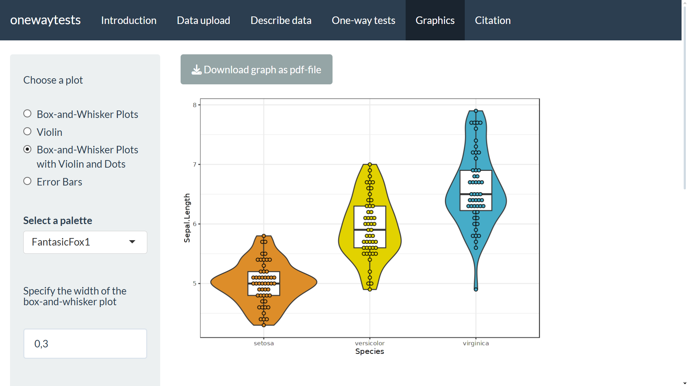

:::: article
## Introduction

One-way independent groups designs are fundamental and widely used
designs in observational and experimental research. One-way fixed effect
analysis of variance (ANOVA) is the most common test used in these
designs. One-way ANOVA is a parametric method based on comparing the
means of independent groups. The assumptions of normality in each
independent group and homogeneity of variance between groups must be
satisfied to perform one-way ANOVA. However, it is often not possible to
find datasets that meet both of these assumptions in practice.
Therefore, there are a great number of alternative tests to one-way
ANOVA for analyzing one-way independent groups designs. Among these
tests, Welch's heteroscedastic *F* test (Welch 1951), Welch's
heteroscedastic *F* test with trimmed means and Winsorized variances
(Welch 1951), Alexander-Govern test (Alexander and Govern, n.d.), James
second order test (James 1951), Brown-Forsythe test (Brown and Forsythe
1974b, 1974a) and Kruskal-Wallis test (Kruskal and Wallis 1952) are
provided in package version 1.5 (Dag et al. 2017). The package is
compact and comprehensive since it provides descriptive statistics,
assessment of the assumptions, and summarizes results using various
graphics in addition to performing statistical analysis. This helps
researchers evaluate their data from multiple angles.

In this paper, we present the upgraded version of package, 3. This
version includes Alvandi's *F* test (Sadooghi-Alvandi et al. 2012),
Alvandi's generalized p-value test (Sadooghi-Alvandi et al. 2012),
approximate *F* test (Asiribo and Gurland 1990), adjusted Welch's
heteroscedastic *F* test (Welch 1951), B square test (Özdemir and Kurt
2006), Box *F* test (Box 1954), Cochran *F* test (Cochran 1937),
generalized test equivalent to parametric bootstrap test (Weerahandi and
Krishnamoorthy 2019), generalized test equivalent to fiducial test
(Weerahandi and Krishnamoorthy 2019), Johansen *F* test (Johansen 1980),
modified Brown-Forsythe test (Mehrotra 1997), permutation *F* test
(Berry et al. 2002), Scott-Smith *F* test (Scott and Smith 1971),
Welch-Aspin test (Aspin 1948), and Weerahandi's generalized *F* test
(Weerahandi 1995) in addition to the tests in version 1.5. Along with
the newly added 15 tests, there are a total of 22 tests for one-way
independent groups designs in this extended version. Additionally, two
independent samples tests including Student's t-test, Welch's t-test,
and Mann-Whitney U test are added to the package.

The graphical approaches in the package are restructured from scratch to
enhance the functionality and customization options of the graphical
approaches. We add new features and enhancements providing even more
flexibility in visualizing data while maintaining the core
functionality. With these updates and improvements, the new version of
the package offers a more comprehensive and versatile set of tools for
data visualization, empowering users to create visually compelling and
informative graphics effortlessly.

There is a user-friendly web application based on package. This web-tool
is updated with the addition of 15 one-way independent groups tests,
along with graphical improvements. Also, web-tool is made compatible
with mobile devices. The web-tool is freely available at
[http://www.softmed.hacettepe.edu.tr/onewaytests](url).

The paper is organized as follows. First, one-way tests in independent
groups designs with theoretical backgrounds are presented. Second, an
extensive application of 3 package is demonstrated by using a real
dataset. Third, the upgraded web application is introduced. At last,
general conclusions and further research are provided.

## One-way tests in independent groups designs {#method}

In this section, the statistical tests that are used to test the
equality of several populations in the one-way independent groups
designs are explained. Among these tests, Alvandi's *F* test
(Sadooghi-Alvandi et al. 2012), Alexander-Govern test (Alexander and
Govern, n.d.), Alvandi's generalized p-value test (Sadooghi-Alvandi et
al. 2012), ANOVA, approximate *F* test (Asiribo and Gurland 1990),
adjusted Welch's heteroscedastic *F* test (Welch 1951), B square test
(Özdemir and Kurt 2006), Brown-Forsythe test (Brown and Forsythe 1974b,
1974a), Box *F* test (Lix and Keselman 1998), Cochran *F* test (Cochran
1937), Weerahandi's generalized *F* test (Weerahandi 1995), James second
order test (James 1951, 1954), Johansen *F* test (Johansen 1980),
Modified Brown-Forsythe test (Mehrotra 1997), Permutation *F* test
(Berry et al. 2002), Scott Smith *F* test (Scott and Smith 1971),
Welch-Aspin test (Aspin 1948), Welch's heteroscedastic *F* test (Welch
1951), generalized test equivalent to parametric bootstrap test
(Weerahandi and Krishnamoorthy 2019), and generalized test equivalent to
fiducial test (Weerahandi and Krishnamoorthy 2019) test the null
hypothesis $H_0: \mu_1=\mu_2= \ldots =\mu_k$ versus alternative $H_1:$
at least one $\mu_j$ ($j=1,2,\ldots, k$) is different. All of these
tests are parametric, with the exception of Permutation *F* test.
Permutation *F* test evaluates mean differences without depending on the
theoretical F distribution. Rather, it relies on an empirical F
distribution produced using permutations. Therefore, this test does not
require the assumption of normality (Winkler et al. 2014). Welch's
heteroscedastic *F* test with trimmed means and Winsorized variances
(Welch 1951) tests the equality of population trimmed means,
$H_0: \mu_{t1}=\mu_{t2}= \ldots =\mu_{tk}$ versus alternative $H_1:$ at
least one $\mu_{tj}$ is different, where $\mu_{tj}$ represents the
trimmed mean of the *j*th population ($j=1,2,\ldots, k$). Kruskal-Wallis
test (Kruskal and Wallis 1952) tests the null hypothesis
$H_0: \theta_1=\theta_2= \ldots =\theta_k$ versus alternative $H_1:$ at
least one $\theta_j$ ($j=1,2,\ldots, k$) is different. For
Kruskal-Wallis test, $\theta_j$ represents sum of the ranks of the *j*th
population. One-way independent tests that are used in this study are
shown in Table [\[tbl:Table1\]](#tbl:Table1){reference-type="ref"
reference="tbl:Table1"}.

::: {#oneway22tests}
  ------------------------------------------------------------------------ --------------- ---------- ----------------------
  Name                                                                     Function        Method\*   Test Type^$\dagger$^

  One-way ANOVA                                                            aov.test        aov        **$Param$**

  Welch's heteroscedastic *F* test                                         welch.test      welch      **$Param$**

  Welch's heteroscedastic *F* test with trimmed and Winsorized Variances   welch.test      welch_tw   **$Param$**

  Brown-Forsythe test                                                      bf.test         bf         **$Param$**

  Alexander-Govern test                                                    ag.test         ag         **$Param$**

  James Second Order test                                                  james.test      james      **$Param$**

  Kruskal-Wallis test                                                      kw.test         kw         **$NonParam$**

                                                                                                      

  Name                                                                     Function        Method\*   Test Type^$\dagger$^

  Alvandi's *F* test                                                       af.test         af         **$Param$**

  Alvandi's generalized p-value test                                       agp.test        agp        **$Param$**

  Approximate *F* test                                                     ap.test         ap         **$Param$**

  Adjusted Welch's heteroscedastic *F* test                                aw.test         aw         **$Param$**

  B square test                                                            b2.test         b2         **$Param$**

  Box *F* test                                                             box.test        box        **$Param$**

  Cochran *F* test                                                         cochran.test    cochran    **$Param$**

  Generalized test equivalent to Param bootstrap test                      gp.test         gtb        **$Param$**

  Generalized test equivalent to fiducial test                             gp.test         gtf        **$Param$**

  Johansen *F* Test                                                        johansen.test   johansen   **$Param$**

  Modified Brown-Forsythe test                                             mbf.test        mbf        **$Param$**

  Permutation *F* test (PF)                                                pf.test         pf         **$NonParam$**

  Scott-Smith test                                                         ss.test         ss         **$Param$**

  Welch-Aspin test                                                         wa.test         wa         **$Param$**

  Weerahandi's generalized *F* test                                        wgf.test        wgf        **$Param$**
  ------------------------------------------------------------------------ --------------- ---------- ----------------------

  : (#tab:T1) One-way independent tests. Method is the argument
  available in `onewaytests()` function to specify the desired one-way
  test.^$\dagger$^ Parametric tests are indicated as **$Param$**, and
  nonparametric tests as **$NonParam$**.
:::

[]{#oneway22tests label="oneway22tests"}

###  Alvandi's *F* test

Sadooghi-Alvandi et al. (2012) presented a practical test that can be
used when the group variances are heterogeneous. The test statistic for
Alvandi's *F* test is
$$\begin{equation}
F_{AF}=\displaystyle\sum\limits_{j=1}^k (n_j/S_j^2)(\bar{X}_{j}-\bar{X}_{w})^2,
\end{equation}$$
where
$$\begin{equation}
\label{eq:Xw}
 \bar{X}_{w}=\displaystyle\sum\limits_{j=1}^k (n_j/S_j^2)\bar{X_j}/\displaystyle\sum\limits_{j=1}^k (n_j/S_j^2).
\end{equation}   (\#eq:Xw)$$
The weights for each group are
$ w_j=({n_j/S_j^2})/{\displaystyle\sum\limits_{j=1}^k (n_j/S_j^2)}$. The
null hypothesis is rejected when $ F_{AF}\geqslant(k-1) F_{k-1, r}$
where r is obtained with $ r={2m_T}/({m_T-(k-1)})$ and
$ m_T={\sum\limits_{j=1}^k (1-w_j)(n_{j}-1)/(n_j-3)}$.

### Alexander-Govern test

Alexander and Govern (n.d.) proposed the following test statistic as an
alternative to ANOVA when group variances are not homogeneous:

$$\begin{equation}
\label{AG}
\chi_{AG}^2 = \sum_{j=1}^{k} z_j^2.
\end{equation}   (\#eq:AG)$$
In Equation (\@ref(eq:AG)),
$$\begin{equation*}
z_j = c+\frac{(c^3+3c)}{b}-\frac{(4c^7+33c^5+240c^3+855c)}{(10b^2+8bc^4+1000b)},
\end{equation*}$$
where $c=[\alpha \times ln (1+t_j^2/v_j)] ^{1/2}$, $b=48\alpha^2$,
$\alpha =v_j-0.5$ and $v_j = (n_j - 1)$. The *t* statistic for each
group is

$$\begin{equation}
\label{t}
t_j=\frac{\bar{X}_{j}-X^+}{S_j^{'}}.
\end{equation}   (\#eq:t)$$
The variance-weighted mean is $X^+=\sum_{j=1}^{k}w_j\bar{X}_{j}$, the
standard error for the *j*th group is
$S_j^{'}=\left[{\sum_{i=1}^{n_j}(X_{ij}-\bar{X}_{j})^2}/{n_j (n_j-1)}\right]^{1/2}$
and weights for each group are
$$\begin{equation}
\label{eq:wj}
{w}_{j}={(1/S_j^{'2})/}{\sum_{j=1}^{k}(1/S_j^{'2})}.
\end{equation}   (\#eq:wj)$$
The null hypothesis is rejected when
$ \chi_{AG}^2 \geqslant \chi_{k-1}^2$.

### Alvandi's generalized p-value test

Sadooghi-Alvandi et al. (2012) presented a generalized p-value test.
Alvandi's generalized p-value can be computed by simulation according to
the following two steps ([Cavus et al.]{.nocase} 2021). The first step
is computing $T_w$ value (observed value of Cochran's statistic)
$$\begin{equation}
T_w=\displaystyle\sum\limits_{j=1}^k (n_j/S_j^2)(\bar{X}_{j}-\bar{X}_{w})^2,
\end{equation}$$
where $\bar{X}_{w}$ is calculated as Equation \@ref(eq:Xw). Second step
starts with generating independent variables $x_j$ from N(0,1) and $U_j$
from $\chi^2_{n_j-1}$ (j=1,2,\...,k). Then T value is calculated as
follows:
$$\begin{equation}
T=\displaystyle\sum\limits_{j=1}^n \frac{n_j-1}{U_j}[X_j-q_j\tilde{X}]^2.
\end{equation}$$
$\tilde{X}$ in the equation can be computed as
$ \displaystyle\sum\limits_{j=1}^k q_jx_j$ where
$$\begin{equation}
q_j=\sqrt[]{{(n_j/S_j^2)}/{\displaystyle\sum\limits_{j=1}^k (n_j/S_j^2)}}.
\end{equation}$$
The second step repeats a large number of times (${M}$). Let ${M(t)}$ be
the number of times that $ T \geqslant {T_w}$, then Alvandi's
generalized p-value is obtained as ${M(t)}/{M}$.

### ANOVA

The one-way fixed effects analysis of variance (ANOVA) is a powerful
test if the assumptions of normality and variance homogeneity are met.
The test statistic for ANOVA is
$$\begin{equation}
\label{anova}
F=\frac{\sum\limits_{j=1}^k(n_j)(\bar{X}_{j}-\bar{X}_{..})^2/(k-1)}{\sum\limits_{i=1}^n\sum\limits_{j=1}^k(X_{ij}-\bar{X}_{j})^2/(n-k)}.
\end{equation}   (\#eq:anova)$$
In Equation \@ref(eq:anova), $n$ is the total number of observations and
$\bar{X}_{..}$ is the overall mean, where
$\bar{X}_{..}=\displaystyle\sum_{j}^{k} n_j(\bar{X}_{j})/n$. The null
hypothesis is rejected when $ F \geqslant F_{k-1, \ n-k}$.

### Approximate *F* test

(Asiribo and Gurland 1990) proposed the following test statistic that
has approximately F distribution with $f_{1}$ and $f_{2}$ degrees of
freedom:
$$\begin{equation}
U_{0}=\frac{{n}{-k}}{k-1}\frac{{\displaystyle\sum\limits_{j=1}^k {n_{j}{(\bar{X}_{j}-\bar{X}_{..})^2}}}{}}{{\displaystyle\sum\limits_{j=1}^k f_jS_j^2}},
\end{equation}$$

$$\begin{equation*}
f_1=\frac{(\displaystyle\sum\limits_{j=1}^k 1-\frac{n_j}{n} )\sigma_j^2)^2}{\frac{1}{n^2}(\displaystyle\sum\limits_{j=1}^k n_j\sigma_j^2)^2+\displaystyle\sum\limits_{j=1}^k (1-\frac{2n_j}{n})\sigma_j^4}  , \         f_2=\frac{(\displaystyle\sum\limits_{j=1}^k f_j\sigma_j^2)^2}{\displaystyle\sum\limits_{j=1}^k f_j\sigma_j^4}.
\end{equation*}$$
The null hypothesis is rejected when $ U_{0}>\hat{b}F_{f_{1},\ f_{2}}$
where
$b=\frac{{n}{-k}}{n(k-1)}({\displaystyle\sum\limits_{j=1}^k (n-n_j)\sigma_j^2})/({\displaystyle\sum\limits_{j=1}^k f_j\sigma_j^2}).$

### Adjusted Welch's heteroscedastic *F* test

Welch (1951) proposed a heteroscedastic alternative to ANOVA that is
robust to the violation of variance homogeneity assumption. The test
statistic for adjusted Welch's heteroscedastic *F* test is calculated as
follows ([Cavus et al.]{.nocase} 2021):
$$\begin{equation}
\label{welch}	
F_w=\frac{\displaystyle\sum_{j=1}^kw_{j}(\bar{X}_{j}-\sum_{j=1}^kh_{j}\bar{X}_{j})^2}{(k-1)+2(k-2)(1/(k+1))\displaystyle\sum_{j=1}^k(1/n_{j}-1)(1-h_{j})^2}.
\end{equation}   (\#eq:welch)$$
In Equation (\@ref(eq:welch)), $w_{j}=n_{j}/((n_{j}-1)/(n_{j}-3)s_j^2)$,
and $h_{j}=w_{j}/\displaystyle\sum_{j=1}^kw_{j}$. The null hypothesis is
rejected when $F_w$ \> $F_{{k-1},  1/ \nu}$ where $\nu$ is obtained with
$v=\frac{(k^2-1)/3}{\displaystyle\sum_{j=1}^k(1-h_{j})^2/(n_{j}-1)}$.

### B square test

(Özdemir and Kurt 2006) developed a new and simple approximation
procedure which intends to create an easy and applicable alternative to
ANOVA. The test statistic is
$$\begin{equation}
B^2=\displaystyle\sum\limits_{j=1}^k[c \lbrace log (1+\frac{(\frac{\bar{X}_j{-X^+}}{S_{\bar{X}_j}})^2}{v_j})\rbrace^\frac 1 2]^2 ,
\end{equation}$$
where
$c=({4v_j^2+({5(2z_c^2+3)})/{24}})/({4v_j^2+v_j+({4z_c^2+9})/{12}})v_j^\frac1 2$,
$X^+=\displaystyle\sum\limits_{j=1}^k w_j\bar{X}_j$, the weights are
$w_j={({1}/{S_{\bar{X}_j}^2}})/({\displaystyle\sum\limits_{j=1}^k ({1}/{S_{\bar{X}_j}^2})})$
and $v_j=n_j-1$. The null hypothesis is rejected when
$ B^2>\chi_{k-1}^2$.

### Brown-Forsythe test

Brown and Forsythe (1974b, 1974a) proposed the following test statistic
as a modification of ANOVA:
$$\begin{equation}
F_{BF}=\frac{\displaystyle\sum_{j=1}^{k} n_{j}(\bar{X}_{j}-\bar{X}_{..})^2}{\displaystyle\sum_{j=1}^{k}(1-n_j/n)S_j^2}.
\end{equation}$$
The null hypothesis is rejected when $ F_{BF}>F_{k-1, f}$. The degrees
of freedom for denominator is calculated as
$\left(\displaystyle\sum_{j=1}^{k}c_j^2/(n_j-1)\right)^{-1}$ where
$c_j=({(1-n_j/n)S_j^2})/{\left[ \displaystyle\sum_{j=1}^{k} (1-n_j/n)S_j^2\right ]}$.

### Box *F* test

Box *F* test statistic was presented by (Box 1954) as follows:

$$\begin{equation}
F_{BOX}=\frac{\displaystyle\sum\limits_{j=1}^kn_j(\bar{X}_{j}-\bar{X}_{})^2}{\displaystyle\sum\limits_{i=1}^k (1-\frac{n_j}{n})S_j^2}.
\end{equation}$$

The null hypothesis is rejected when $ F_{BOX}>F_{v_1, v_2}$ where
$v_1={[\displaystyle\sum\limits_{j=1}^k (n-n_{j})S_j^2]^2}/({\displaystyle\sum\limits_{j=1}^k n_{j}S_j^2
)^2+n\displaystyle\sum\limits_{j=1}^k (n-2n_{j})S_j^4})$ and
$v_2={[\displaystyle\sum\limits_{j=1}^k (n_{j}-1)S_j^2]^2}/{\displaystyle\sum\limits_{j=1}^k (n_{j}-1)S_j^4}$.

### Cochran *F* test

Cochran (1937) proposed the following test statistic:
$$\begin{equation}
\label{eq:Cochran}
T_{Cochran}={\displaystyle\sum\limits_{j=1}^k ({n_j}/{S_j^2})}(\bar{X}_j-\bar{X}_w)^2,
\end{equation}   (\#eq:Cochran)$$
where $\bar{X}_{w}$ is calculated as Equation \@ref(eq:Xw). The null
hypothesis is rejected when $ T_{Cochran}>\chi_{k-1}^2$.

### Generalized test equivalent to parametric bootstrap test

(Weerahandi and Krishnamoorthy 2019) showed that the parametric
bootstrap test presented by (Krishnamoorthy et al. 2007) is a regular
generalized test. The test is carried out as follows. The null
hypothesis is rejected when the generalized p-value given by the
following formula is less than the desired nominal level, say 0.05:

$$\begin{equation}
 \label{Pval}
p=Pr \left( \sum_{j=1}^k  \frac{r_j {Z_j}^2}{U_j}  
- \frac {  \displaystyle\sum_{j=1}^k \frac{ n_j r_j } {s_j^2 U_j}  \left(
\frac{s_j Z_j}{\sqrt{n_j}} \right)  }
{ \sum_{j=1}^k \frac{ n_j r _j } {s_j^2 U_j} } 
\geq \sum_{j=1}^k \frac{n_j \left(\bar{x}_j - \bar{x}_s \right)^2 }{s_j^2}  \right) ,
\end{equation}   (\#eq:Pval)$$
where $Z_i \sim N(0,1)$, $U_i \sim \chi_{r_i}^2$, $r_j = n_j -1$,
$\bar{x}_j$ and $s_j^2$ are the observed sample mean and the observed
sample variance from the $j^{th}$ population, and $\bar{x}_s$ is the
overall weighted sample mean.

### Generalized test equivalent to fiducial test

(Weerahandi and Krishnamoorthy 2019) also showed that the fiducial test
developed by (Li et al. 2011) is also a regular generalized test. The
null hypothesis is rejected when the generalized p-value given by the
formula below is less than the desired nominal level:

$$\begin{equation}
 \label{Pval2}
p=Pr \left(\sum_{j=1}^k  T_j^2 
-  \frac{ (\sum_{j=1}^k T_j \sqrt[]{n_j} /s_j )^2}
{\sum_{j=1}^k n_j/s_j^2}  \geq \sum_{j=1}^k \frac{n_j \left(\bar{x}_j - \bar{x}_s \right)^2 }{s_j^2}  \right) ,
\end{equation}   (\#eq:Pval2)$$
where $T_j \sim t_{r_j}$.

### James second order test

James (1951) presented an alternative test to ANOVA. This test statistic
is
$$\begin{equation}
J=\sum_{j}t_j^2,
\end{equation}$$
where $t_j$ is given in Equation (\@ref(eq:t)). The test statistic, *J*,
is compared to a critical value, $h(\alpha)$, where
$$\begin{equation*}
\begin{split}
h(\alpha)& =r+\frac{1}{2}(3\chi_4+\chi_2) T + \frac{1}{16}(3\chi_4+\chi_2)^2 \left(1-\frac{k-3}{r}\right)T^2\\
&+\frac{1}{2}(3\chi_4+\chi_2) (8R_{23}-10R_{22}+4R_{21}-6R_{12}^2+8R_{12}R_{11}-4R_{11}^2)  \\
&+(2R_{23}-4R_{22}+2R_{21}-2R_{12}^2+4R_{12}R_{11}-2R_{11}^2)(\chi_2-1)\\
&+\frac{1}{4}(-R_{12}^2+4R_{12}R_{11}-2R_{12}R_{10}-4R_{11}^2+4R_{11}R_{10}-R_{10}^2)(3\chi_4-2\chi_2-1)\\
&+(R_{23}-3R_{22}+3R_{21}-R_{20})(5\chi_6+2\chi_4+\chi_2)\\
&+\frac{3}{16}(R_{12}^2-4R_{23}+6R_{22}-4R_{21}+R_{20})(35\chi_8+15\chi_6+9\chi_4+5\chi_2)\\
&+\frac{1}{16}(-2R_{22}+4R_{21}-R_{20}+2R_{12}R_{10}-4R_{11}R_{10}+R_{10}^2)(9\chi_8-3\chi_6-5\chi_4-\chi_2)\\
&+\frac{1}{4}(-R_{22}+R_{11}^2)(27\chi_8+3\chi_6+\chi_4+\chi_2)+\frac{1}{4}(R_{23}-R_{12}R_{11})(45\chi_8+9\chi_6+7\chi_4+3\chi_2).
\end{split}
\end{equation*}$$
For any integers *s* and *t*, $R_{st}=\sum_{j}(n_j-1)^{-s}w_j^t$,
$\chi_{2s}=r^s/\left[ \right (k-1)(k+1)\ldots(k+2s-3)]$ where *r* is the
$(1-\alpha)$ centile of a $\chi^2$ distribution with $k-1$ degrees of
freedom, $T=\sum_j(1-w_j)^2/(n_j-1)$ and $w_j$ is defined in Equation
\@ref(eq:wj). The null hypothesis is rejected when
$J \geqslant h(\alpha)$.

### Johansen *F* test

(Johansen 1980) proposed the following test statistics:
$$\begin{equation}
    T_{JF}=\frac{\sum_{j=1}^k(w_j(\bar{x}_j-\sum_{j=1}^k(h_j\bar{x}_j))^{2})}{c},
\end{equation}$$
where $ w_j=n_j/\sigma_j$, $ h_j=w_j/\sum\limits_{j=1}^k(w_j)$,
$ c=(k-1)+2A-6A/(k+1)$ and
$    A=\displaystyle\sum\limits_{j=1}^k({(1-h_j)^{2}}/{(n_j-1})$. The
null hypothesis is rejected when $ T_{JF} \geqslant F_{v_{1},v_{2}}$
where $ v_1=k-1$ and $ v_2=k-1(k+1)/3A$.

### Kruskal-Wallis test

Kruskal and Wallis (1952) presented the nonparametric alternative to
ANOVA. The test statistics is

$$\begin{equation}
\label{KW}
\chi_{KW}^2=\frac{1}{S^2}\left(\sum_{j=1}^k \frac{R_j^2}{n_j}-\frac{n(n+1)^2}{4}\right),
\end{equation}   (\#eq:KW)$$

where $r_{ij}$ denote the rank of $X_{ij}$ when $n=n_1+ \ldots +n_k$
observations are ranked from smallest to largest.
$R_j=\sum_{i=1}^{n_j} r_{ij}$ is the sum of ranks assigned to the
observations in the *j*th group and $\bar{R}_j=R_j/n_j$ is the average
rank for these observations and

$$\begin{equation*}
S^2=\frac{1}{n-1}\left(\sum_{j=1}^k \sum_{i=1}^{n_j} r_{ij}^2 - \frac{n(n+1)^2}{4}\right).
\end{equation*}$$
The null hypothesis is rejected when $\chi_{KW}^2\geq \chi_{k-1}^{2}$.

### Modified Brown-Forsythe test

(Mehrotra 1997) proposed a modification of Brown-Forsythe test to
overcome the problem of higher than acceptable rate of false positives.
The test statistics is
$$\begin{equation}
F_{MBF}=\frac{\displaystyle\sum\limits_{j=1}^kn_{j}(\bar{X}_{j}-\bar{X}_{..})^2}{\displaystyle\sum\limits_{j=1}^k (1-\frac{n_j}{n})s_j^2}.
\end{equation}$$
The null hypothesis is rejected when $F_{MBF}>F_{f_1,f_2}$.
$$\begin{equation}
\label{mbf_df}
f_1=\frac{(\displaystyle\sum\limits_{j=1}^k \sigma_j^2-{\displaystyle\sum\limits_{j=1}^k n_j\sigma_j^2}/{n})^2}{\displaystyle\sum\limits_{j=1}^k \sigma_j^4+({\displaystyle\sum\limits_{j=1}^kn_j\sigma_j^2}/{n})^2-2{\displaystyle\sum\limits_{j=1}^kn_j\sigma_j^4}/{n}}, \
f_2=\frac{[\displaystyle\sum\limits_{j=1}^k (1-{n_j}/{n})\sigma_j^2]^2}{{\displaystyle\sum\limits_{j=1}^k {(1-{n_j}/{n})^2\sigma_i^4}/{(n_j-1)}}}.
\end{equation}   (\#eq:mbf-df)$$
The degrees of freedom of the test statistic can be calculated by using
the Equation \@ref(eq:mbf-df).

### Permutation *F* test

(Berry et al. 2002) presented a permutational test as an alternative to
ANOVA. The test statistics is

$$\begin{equation}
F_{PF}=\frac{{T-n\bar{\bar{x}}^2}/{(k-1)}}{{V-T}/{(n-k)}},
\end{equation}$$
where $T=\displaystyle\sum\limits_{j=1}^kn_j\bar{x}_j^2$,
$V=\displaystyle\sum\limits_{j=1}^k \displaystyle\sum\limits_{i=1}^{n_j} x_{ij}^2$
and $\bar{\bar{x}}=\frac 1 n \displaystyle\sum\limits_{j=1}^k n_jx_j$.
The null hypothesis is rejected when $ F_{PF}>F_{k-1, n-k}$.

### Scott Smith *F* test

(Scott and Smith 1971) proposed the following test statistic where group
variances are not homogeneous:

$$\begin{equation}
F_{SS}=\displaystyle\sum\limits_{j=1}^k\frac{n_j(\bar{X_j}-\bar{X})^2}{S_j^{*2}},
\end{equation}$$
where $S_j^{*2}=(n_j-1)/(n_j-3)S_j^{2}$. The null hypothesis is rejected
when $ F_{SS}>\chi_{k}$.

### Welch-Aspin test

Aspin (1948) presented a modification of Welch test. The test statistic
is
$$\begin{equation}
F_{WA}=\frac{\displaystyle\sum\limits_{j=1}^k(\bar{X}_{j}-{X^+})^2/S_j^2}{(k-1)[1+\frac{2k-2}{k^2-1}\Lambda},
\end{equation}$$
where $\Lambda=\Sigma[(1-w_j)^2/v_j]$,
$w_j={1/S_j^2}/{\displaystyle\sum\limits_{j=1}^k1/S_j^2}$ and $ X^+$ is
the overall mean. The null hypothesis is rejected when
$F_{WA}> F_{v_1,v_2}$ where $ v_1=k-1$ and $ v_2=(k^2-1)/(3\Lambda)$.

### Welch's heteroscedastic *F* test

Welch (1951) proposed a robust test that can be used when homogeneity of
variance is not met. The test statistic is

$$\begin{equation}
\label{welch}	
F_w=\frac{\sum_{j}w_j(\bar{X}_{.j}-X_{..}^{'})^2/(k-1)}{\left[1+\frac{2}{3}((k-2)\nu) \right ]},
\end{equation}   (\#eq:welch)$$

where $w_j=n_j/S_j^2$, $S_j^2=\sum_{i}(X_{ij}-\bar{X}_{.j})^2/(n_j-1)$,
$X_{..}^{'} ={\sum_{j}w_j\bar{X}_{.j}}/{\sum_{j}w_j},$ and
$$\begin{equation*}
\nu =\frac{3\sum_{j}\left[\left(1-\frac{w_j}{\sum_{j}w_j}\right)^2/(n_{j}-1)\right]}{k^2-1}.
\end{equation*}$$

The test statistics follow an *F* distribution with degrees of freedom
$k-1$ and $1/ \nu$.

### Welch's heteroscedastic *F* test with trimmed means and Winsorized variances

(Welch 1951) presented a robust procedure for independent groups design
by replacing the usual means and variances with trimmed means and
Winsorized variances. Let
$X_{(1)j}\leq X_{(2)j}\leq \ldots  \leq X_{(n_j)j}$ be the ordered
observations in the *j*th group and $g_j= \|\epsilon n_j \|$, $\epsilon$
is the proportion to be trimmed in each tail of the distribution. After
trimming, the effective sample size for the *j*th group becomes
$h_j=n_j-2g_j$. Then *j*th sample trimmed mean is
$$\begin{equation*}
\bar{X}_{tj}=\frac{1}{h_j}\sum_{i=g_j+1}^{n_j-g_j}X_{(i)j},
\end{equation*}$$

and *j*th sample Winsorized mean is

$$\begin{equation*}
\bar{X}_{wj}=\frac{1}{n_j}\sum_{i=1}^{n_j}Y_{ij},
\end{equation*}$$
where
$$\begin{equation*}
Y_{ij} =
\begin{cases}
X_{(g_{j}+1)j} & \text{if  X_{ij}  \leq X_{(g_j+1)j} },\\
X_{ij} & \text{if X_{(g_j+1)j}< X_{ij}< X_{(n_j-g_j)j},}\\
X_{(n_j-g_j)j} & \text{if X_{ij}\geq X_{(n_j-g_j)j}.}
\end{cases}
\end{equation*}$$
The sample Winsorized variance is
$$\begin{equation*}
s_{wj}^2=\frac{1}{(n_j-1)}\sum_{i=1}^{n_j}(Y_{ij}-\bar{X}_{wj})^2,
\end{equation*}$$
where $q_j={(n_j-1)s_{wj}^2}/{h_j(h_j-1)}$, $w_j=\frac{1}{q_j},$,
$U=\sum_{j}w_j,$, $\tilde{X}=\frac{1}{U}\sum_{j}w_j\bar{X}_{tj},$. The
test statistic is
$$\begin{equation}
\label{Welch2}
F_{WT}=\frac{A}{B+1},
\end{equation}   (\#eq:Welch2)$$
where $A=\frac{1}{k-1}\sum_{j}w_j(\bar{X}_{tj}-\tilde{X})^2,$
$B=\frac{2(k-2)}{k^2-1}\sum_{j}\frac{(1-w_j/U)^2}{h_j-1}$. The null
hypothesis is rejected when $ F_{WT}>F_{k-1,\nu'}$ where
$\nu' =\left(\frac{3}{k^2-1}\sum_j \frac{(1-w_j/U)^2}{h_j-1}  \right)^{-1}.$

### Weerahandi's generalized *F* test

(Weerahandi 1995) provided an extension of the classical F-test for the
case of unequal variances. The generalized p value of that test is
obtained by using the following formula involving an expected value of
the form $EG_{k'} ()$, where $G_{k'}$ is the cdf of the chi-squared
distribution with $k'$ degrees of freedom, and $k'=k-1$.

$$\begin{equation}
    p = 1 - EG_{k'} (s_B \left(\frac{n_1 s_1^2}{Y_1},
\frac{n_2 s_2^2}{Y_2}, ..., \frac{n_k s_k^2}{Y_k} , 
    \right)
\end{equation}$$
where $Y_j \sim \chi_{r_j}^2$ and
$$s_B (w_1,...,w_k) = \sum_{j=1}^{k} w_j \left( \bar{x}_j  -\bar{x}_B\right)^2$$
is the weighted between group sum of squares, $w_j$ is the $j^{th}$
weight, and $\bar{x}_B$, is the overall weighted sample mean based on
the same weights.

## Implementation of R package {#Rpackage}

The package is a comprehensive collection of functions specifically
designed for analyzing data from one-way independent groups designs.
This versatile package provides a wide range of tools to facilitate
statistical analysis and exploration of such designs. The package
includes 22 one-way tests for independent groups designs. In addition to
the one-way tests, the package offers functions for generating
descriptive statistics, conducting goodness-of-fit tests to check the
fundamental assumptions, performing pairwise comparisons, and employing
graphical approaches to enhance data interpretation.

In this section, we work on penguins data set, originally published in
the work done by (Gorman et al. 2014), available in the package (Horst
et al. 2020). For implementation of the package, we utilize body mass as
a response variable and species as a grouping variable.

After successfully installing and loading the package, researchers have
access to a wide range of functions specifically designed for analyzing
one-way independent groups designs. These functions are incredibly
useful when researchers compare k populations with respect to continuous
outcomes. The one-way tests provided by this package not only calculate
the test statistics and p-values, but they also provide the pairwise
comparisons for valuable insights by evaluating the hypothesis of the
statistical process. With the package, researchers can easily conduct
thorough and in-depth analyses of their one-way independent groups
designs, gaining valuable insights and making well-informed conclusions.

In this part, we use the functions, originally developed in our
previously published work (Dag et al. 2018) to describe data and assess
the main assumptions, variance homogeneity and normality.

The functions return the output involving sample size, mean, standard
deviation, median, minimum value, maximum value, 25th percentile, 75th
percentile, skewness, kurtosis and number of missing values (NA) for
one-way layout.

``` r
R> library(onewaytests)
R> library(palmerpenguins) 
R> describe(body_mass_g ~ species, data = penguins)
            n     Mean  Std.Dev Median  Min  Max   25th 75th   Skewness Kurtosis NA
Adelie    151 3700.662 458.5661   3700 2850 4775 3350.0 4000 0.28249381 2.405611  0
Chinstrap  68 3733.088 384.3351   3700 2700 4800 3487.5 3950 0.24194125 3.463681  0
Gentoo    123 5076.016 504.1162   5000 3950 6300 4700.0 5500 0.06878276 2.257871  0
```

Researchers perform variance homogeneity tests with the function. It
offers three variance homogeneity tests; Levene, Bartlett, and
Fligner-Killeen tests.

``` r
R> homog.test(body_mass_g ~ species, data = penguins, method = "Levene")

 Levene's Homogeneity Test (alpha = 0.05) 
----------------------------------------------- 
  dependent var : body_mass_g 
  grouping var  : species 

  F        = 5.335495 
  num df   = 2 
  denum df = 339 
  p-value  = 0.005230535 

  Result : Variances are not homogeneous. 
----------------------------------------------- 
```

Levene's homogeneity test results reveal that the variances between
penguin species are not homogeneous (F = 5.335495, p-value =
0.005230535).

Researchers can assess normality using the function. This function
offers six normality tests: Shapiro-Wilk, Shapiro-Francia, Lilliefors
(also known as Kolmogorov-Smirnov test), Anderson-Darling, Cramer-von
Mises, and Pearson Chi-square tests.

``` r
R> nor.test(body_mass_g ~ species, data = penguins, method = "SW")

  Shapiro-Wilk Normality Test (alpha = 0.05) 
-------------------------------------------------- 
  data : body_mass_g and species 

      Level Statistic    p.value   Normality
1    Adelie 0.9807079 0.03239702      Reject
2 Chinstrap 0.9844938 0.56050824  Not reject
3    Gentoo 0.9859276 0.23361649  Not reject
--------------------------------------------------
```

Shapiro-Wilk normality test results state that body masses of chinstrap
and gentoo species are normally distributed since the associated
p-values (0.56050824 and 0.23361649, respectively) are greater than
0.05. On the other hand, there is enough evidence to reject the
normality of body mass for adelie group (p-value = 0.03239702).

In the package, the first argument is specified as a formula where the
left-hand side represents sample values and the right-hand side
represents groups. The formula must have one variable on each side, with
the left side being numeric and the right side being a factor.
Otherwise, an error message is returned by each function.

### One-way tests in independent groups designs: onewaytests(\...) {#onewaytests_imp}

In our previously published paper (Dag et al. 2018), we introduced this
package that included seven one-way tests. In this latest version of the
package, we have expanded its capabilities by adding 15 new functions
specifically designed for one-way independent groups designs. These
additional functions provide users with a wider range of options for
conducting their analyses. The complete list of all the one-way tests,
their corresponding functions, and the method name of the function can
be found in Table [1](#tab:T1){reference-type="ref"
reference="oneway22tests"}.

In this section, we introduce a generic function called that encompasses
a total of 22 one-way tests. By utilizing this function, researchers can
conveniently apply any of the available one-way tests. To specify the
desired method, researchers simply need to provide the method argument
within the function. The list of all methods is provided under Method in
Table [1](#tab:T1){reference-type="ref" reference="oneway22tests"}.

All one-way tests can be utilized with separate functions, offering
flexibility and versatility. To facilitate ease of use and
accessibility, we have meticulously gathered all methods for
researchers' convenience. The function provides four different types of
output. We present each of four kinds to introduce the outputs. As an
example, we have incorporated Alvandi's *F* test, Scott-Smith test,
Weerahandi's generalized *F* test, and James second order test, which
can also be applied using , , , functions, respectively, to demonstrate
the practical usage of the function. The test results can be displayed
by setting the verbose argument to TRUE. The results are returned as an
object of class .

``` r
R> out <- onewaytests(body_mass_g ~ species, data = penguins, method = "af")

	Alvandi's F Test

data:  body_mass_g and species
F = 318.69, num df = 2.000, denom df = 97.832, p-value < 2.2e-16
```

For more comprehensive results, the function can be used, as
demonstrated in the example below.

``` r
R> summary(out)

  Alvandi's F Test (alpha = 0.05) 
------------------------------------------------------- 
  dependent var : body_mass_g 
  grouping var  : species 

  F        = 318.6896 
  num df   = 2 
  denom df = 97.83241 
  p-value  < 2.2e-16

  Result : Difference is statistically significant. 
-------------------------------------------------------
  * statistic is distributed as F distribution.
```

Here, Alvandi's test statistic is distributed as F with the degrees of
freedom for numerator () and denominator (). Also, is the significance
value of the test statistic. Since the p-value is lower than 0.05, there
is enough evidence to conclude that the difference between the penguin
species in terms of body mass is statistically significant (F =
318.6896, p-value \< 2.2$\times 10^{-16}$).

``` r
R> out <- onewaytests(body_mass_g ~ species, data = penguins, method = "ss", 
                      verbose = FALSE)
R> summary(out)

  Scott-Smith Test (alpha = 0.05) 
------------------------------------------------------------- 
  dependent var : body_mass_g 
  grouping var  : species 

  X-squared = 639.8695 
  df        = 3 
  p-value   < 2.2e-16

  Result : Difference is statistically significant. 
------------------------------------------------------------- 
  * statistic is distributed as chi-squared distribution. 
```

In the output, Scott-Smith test statistic is distributed as $\chi^2$
with the degrees of freedom (). Also, is the significance value of the
test statistic. Since the p-value is lower than 0.05, one can conclude
that the difference between the species is statistically significant
($\chi_{AG}^2$ = 639.8695, p \< 2.2$\times 10^{-16}$).

``` r
R> out <- onewaytests(body_mass_g ~ species, data = penguins, method = "wgf", 
                      verbose = FALSE)
R> summary(out)

  Weerahandi's Generalized F Test (alpha = 0.05) 
---------------------------------------------------------- 
  dependent var : body_mass_g 
  grouping var  : species 

  p-value < 2.2e-16

  Result : Difference is statistically significant. 
---------------------------------------------------------- 
  * p-value is obtained using Monte Carlo simulation. 
```

Here, is the significance value of the test statistic. Since the p-value
is lower than 0.05, there is sufficient evidence to conclude that the
difference between the penguin species in terms of body mass is
statistically significant.

``` r
R> out <- onewaytests(body_mass_g ~ species, data = penguins, method = "james", 
                      verbose = FALSE)
R> summary(out)

  James Second Order Test (alpha = 0.05) 
----------------------------------------------------------------------------------- 
  dependent var : body_mass_g 
  grouping var  : species 

  Jtest         = 637.3792 
  CriticalValue = 6.108713 

  Result : Difference is statistically significant. 
----------------------------------------------------------------------------------- 
  * test statistic is sum of the squared standardized differences and compared to a 
  critical value. 
```

In the output, is the James second order test statistic (*J*), is the
critical value ($h(\alpha)$) associated to the significance level
($\alpha$). The null hypothesis is rejected when *J* exceeds
$h(\alpha)$. We conclude that there is a statistically significant
difference between the penguin species since $\textit{J} = 637.3792$ is
larger than $h(\alpha) = 6.108713$.

The package provides the capability to perform pairwise comparisons when
a statistically significant difference is observed. It offers several
options for controlling the type I error rate, including `bonferroni`,
`holm` (Holm 1979), `hochberg` (Hochberg 1988), `hommel` (Hommel 1988),
`BH` (Benjamini and Hochberg 1995), `BY` (Benjamini and Yekutieli 2001),
and `none` in function. The default is set to \"`bonferroni`\". The
development of function is extensively placed in the article work done
by (Dag et al. 2018). The function is capable of recognizing the output
of the function. In this part, we include the pairwise comparison
following to Alvandi's *F* test to protect the compactness of the paper.

``` r
R> out <- onewaytests(body_mass_g ~ species, data = penguins, method = "af", 
                      verbose = FALSE)
R> paircomp(out, adjust.method = "bonferroni")

  Bonferroni Correction (alpha = 0.05) 
----------------------------------------------------- 
  Level (a) Level (b)      p.value   No difference
1    Adelie Chinstrap 1.000000e+00      Not reject
2    Adelie    Gentoo 2.765295e-48          Reject
3 Chinstrap    Gentoo 1.639844e-34          Reject
----------------------------------------------------- 
```

According to the result obtained by adjusting with Bonferroni method,
Gentoo group has statistically greater body mass than Adelie and
Chinstrap groups.

### Graphical approaches based on ggplot2 package {#graphs}

In this part, we rewrite the function from scratch. The function offers
different graphic types, box-and-whisker plot, violin plot,
box-and-whisker plot with violin lines and error bars. These options can
be selected in the argument with \"boxplot\", \"violin\",
\"boxplot-violin\", and \"errorbar\", respectively. There exists width
argument involving three numeric values. These numeric values specify
the widths for the boxes of box-and-whisker plots (defaults to 0.3),
violin plots (defaults to 1.0), and the little lines at the tops and
bottoms of the error bars (defaults to 0.2), respectively. Also, there
exists the argument to draw observations on the plots. The argument
offers to change the size of dots. Users can change the colors of the
plots with argument. Moreover, researchers can set color palette using
function available in package (FantasticFox1 palette is used as a
default). Additionally, the theme of plot can be changed with argument.
The list of all theme is available with function available in package
(Wickham 2016). We use the classic dark-on-light ggplot2 theme as a
default theme by setting to argument. Researchers can use standard
deviation or standard error with argument while drawing error bars.
Also, researchers can add mean bar to error bars with argument.
Additionally, the labels of x and y axes and title can be changed with ,
, and arguments, respectively.

In this part, we draw some graphic types to illustrate the usage of
function. These graphics involve box-and-whisker plot with violin line
and dots (Figure [\[graph:a\]](#graph:a){reference-type="ref"
reference="graph:a"}), box-and-whisker plot with violin line (Figure
[\[graph:b\]](#graph:b){reference-type="ref" reference="graph:b"}),
box-and-whisker plot (Figure
[\[graph:c\]](#graph:c){reference-type="ref" reference="graph:c"}),
violin plot (Figure [\[graph:d\]](#graph:d){reference-type="ref"
reference="graph:d"}), mean $\pm$ standard deviation graph (Figure
[\[graph:e\]](#graph:e){reference-type="ref" reference="graph:e"}), and
mean $\pm$ standard deviation graph with mean bar (Figure
[\[graph:f\]](#graph:f){reference-type="ref" reference="graph:f"}).
These graphics can be obtained via following codes:

``` r

# Box-and-whisker plot with violin lines and dots
R> gplot(body_mass_g ~ species, data = penguins, type = "boxplot-violin", 
width = c(0.4, 0.95, NA), binwidth = 50, ylab = "body mass (grams)")

# Box-and-whisker plot with violin lines
R> gplot(body_mass_g ~ species, data = penguins, type = "boxplot-violin", 
width = c(0.4, 0.95, NA), dots = FALSE, ylab = "body mass (grams)")

# Box-and-whisker plot
R> gplot(body_mass_g ~ species, data = penguins, type = "boxplot", 
width = c(0.4, NA, NA), dots = FALSE, ylab = "body mass (grams)")

# Violin plot
R> gplot(body_mass_g ~ species, data = penguins, type = "violin",
width = c(NA, 0.95, NA), dots = FALSE, ylab = "body mass (grams)")

# Error bar (mean +- standard deviation)
R> gplot(body_mass_g ~ species, data = penguins, type = "errorbar", 
width = c(NA, NA, 0.3), binwidth = 50, ylab = "body mass (grams)", 
option = "sd")

# Error bar (mean +- standard deviation) with mean bar
R> gplot(body_mass_g ~ species, data = penguins, type = "errorbar",
width = c(NA, NA, 0.3), binwidth = 50, ylab = "body mass (grams)", 
option = "sd", bar = TRUE)
```

<figure id="graph:graphics" data-latex-placement="H">






<figcaption>Figure 1: Graphical approaches for one-way layout:
Box-and-whisker plot with violin lines and dots, Box-and-whisker plot
with violin lines, Box-and-whisker plot, Violin plot, Error bar (mean
<span class="math inline">±</span> standard deviation), Error bar (mean
<span class="math inline">±</span> standard deviation) with mean
bar,</figcaption>
</figure>

## Web-based tool {#Web-based}

There is an easy-to-use web application available for users, which is
built upon the package, providing a convenient and accessible way to
perform statistical analysis. This web-tool has recently undergone
significant updates and enhancements. One of the major improvements is
the addition of 15 one-way independent groups tests, allowing users to
conduct a wide range of statistical comparisons. Furthermore, the
web-tool now features enhanced graphics, providing users with clear and
visually appealing representations of their data. Moreover, we have made
the web-tool compatible with a mobile phone application due to the
growing popularity of mobile devices. This means that users can
conveniently access and utilize the web-tool on their smartphones or
tablets, making statistical analysis more accessible and convenient than
ever before. Researchers can freely access the web application by
visiting the following link,
[http://www.softmed.hacettepe.edu.tr/onewaytests](url).

We utilize the package (Chang et al. 2017) to create the web-interface
of the package. This tool is specifically designed to cater to the needs
of new R users who may not have extensive programming experience, as
well as applied researchers who require a straightforward interface for
conducting their analyses. Our web tool aims to simplify the process of
performing one-way tests and empower users to efficiently explore and
interpret their data by harnessing the power of the package. There is an
example well-known data set called iris data collected by (Anderson
1935) placed in the web-tool, also available in R, to help users learn
the usage of the tool.

<figure id="fig:webtool" data-latex-placement="H">




<figcaption>Figure 2: Data analysis interfaces of onewaytests web-tool:
Data upload, Describe data, One-way tests, Graphics.</figcaption>
</figure>

Researchers can obtain descriptive statistics using the \"Describe
data\" tab (Figure [\[webtool2\]](#webtool2){reference-type="ref"
reference="webtool2"}). In this tab, the assumptions of variance
homogeneity and normality can be assessed. This tab provides Levene's
test, Bartlett's test, and Fligner-Killeen test to check for variance
homogeneity. It also offers various normality tests (Shapiro-Wilk,
Cramer-von Mises, Lilliefors (Kolmogorov-Smirnov), Shapiro-Francia,
Anderson-Darling, Pearson Chi-Square tests) and plots (Q-Q plot and
Histogram with normal curve) to assess the normality of data in each
subgroup.

Users can perform 22 one-way tests (Scott-Smith test, Box *F* test,
Johansen *F* test, Generalized tests equivalent to Parametric Bootstrap
and Fiducial tests, Alvandi's *F* test, Alvandi's generalized p-value,
approximate *F* test, B square test, Cochran test, Weerahandi's
generalized *F* test, modified Brown-Forsythe test, adjusted Welch's
heteroscedastic *F* test, Welch-Aspin test, Permutation *F* test,
one-way analysis of variance, Welch's heteroscedastic *F* test, Welch's
heteroscedastic *F* test with trimmed means and Winsorized variances,
Brown-Forsythe test, Alexander-Govern test, James second order test,
Kruskal-Wallis test) using the \"One-way tests\" tab (Figure
[\[webtool3\]](#webtool3){reference-type="ref" reference="webtool3"}).
This tab also allows users to make pairwise comparisons (Bonferroni,
Holm, Hochberg, Hommel, Benjamini-Hochberg, Benjamini-Yekutieli, no
corrections) to investigate the group(s) leading to the differences.

Additionally, researchers can summarize their research findings using
well-designed graphics (box-and-whisker plot, violin plot, and error
bars) in the \"Graphics\" tab (Figure
[\[webtool4\]](#webtool4){reference-type="ref" reference="webtool4"}).
The web tool is freely available at
http://www.softmed.hacettepe.edu.tr/onewaytests.

## Conclusion

One-way tests in independent groups designs are highly popular and
extensively utilized statistical techniques in a multitude of fields.
These fields encompass medical sciences, engineering, social sciences,
economics, psychology, and biology. These techniques allow the
researchers for the identification of potential differences among
groups, which can further enhance the scientific knowledge and
contribute to the advancement of various disciplines.

In this paper, we present the latest version of , which provides a
variety of tools for one-way independent groups designs. We make
significant enhancements to the package by introducing 15 new one-way
tests (Scott-Smith test, Box *F* test, Johansen *F* test, Generalized
tests equivalent to Parametric Bootstrap and Fiducial tests, Alvandi's
*F* test, Alvandi's generalized p-value, approximate *F* test, B square
test, Cochran test, Weerahandi's generalized *F* test, modified
Brown-Forsythe test, adjusted Welch's heteroscedastic *F* test,
Welch-Aspin test, Permutation *F* test) in addition to the existing
seven tests (one-way analysis of variance, Welch's heteroscedastic *F*
test, Welch's heteroscedastic *F* test with trimmed means and Winsorized
variances, Brown-Forsythe test, Alexander-Govern test, James second
order test, Kruskal-Wallis test) in the work done by (Dag et al. 2018).
Users now have a total of 22 tests available for comprehensive
assessments.

In order to enhance the functionality and customization options of the
graphical approaches, we undertake a complete overhaul of their
function. Through this process, we not only add new features and
enhancements, but also ensure that the core functionality of the
function remains intact. This comprehensive revision allows us to fully
optimize the graphical approaches, resulting in a more versatile tool
for the users.

In this study, we improve the web tool of package, ensuring its
compatibility with a wide range of mobile devices. This significant
update allows users to effortlessly access and utilize the web tool on
their smartphones or tablets. This mobile compatibility opens up a world
of possibilities, enabling researchers and statisticians to seamlessly
integrate statistical analysis into their daily routines, regardless of
their location or device.

The package also provides additional capabilities to enhance your data
analysis which involve generating descriptive statistics, examining the
homogeneity of variances and normality of data in each group using a
variety of tests and plots. Also, it has capability to perform two
sample tests. Furthermore, the package offers functionality for
conducting pairwise comparison methods after the statistically
significant difference among groups is obtained. These features allow
users to explore their data from multiple angles in a compact manner and
draw more accurate conclusions.

Currently, the package provides a comprehensive set of tools for
conducting analysis on one-way independent groups designs. These tools
include conducting one-way tests, performing pairwise comparisons,
obtaining descriptive statistics, conducting two-sample tests, utilizing
graphical approaches, and assessing variance homogeneity and normality
through the use of tests and plots. Additionally, it is worth noting
that the package and its associated web-tool will be regularly updated
to ensure that users have access to the latest features and
improvements.
::::

::::::::::::::::::::::::::::::::::::::: {#refs .references .csl-bib-body .hanging-indent}
::: {#ref-alexander1994 .csl-entry}
Alexander, Ralph A, and Diane M Govern. n.d. "A New and Simpler
Approximation for ANOVA Under Variance Heterogeneity." *Journal of
Educational and Behavioral Statistics*, no. 2: 91--101.
:::

::: {#ref-anderson1935irises .csl-entry}
Anderson, Edgar. 1935. "[The irises of the Gaspe Peninsula]{.nocase}."
*Bulletin of the American Iris Society* 59: 2--5.
:::

::: {#ref-asiribo1990coping .csl-entry}
Asiribo, Osebekwin, and John Gurland. 1990. "Coping with Variance
Heterogeneity." *Communications in Statistics-Theory and Methods* 19
(11): 4029--48. <https://doi.org/10.1080/03610929008830427>.
:::

::: {#ref-aspin1948 .csl-entry}
Aspin, Alice A. 1948. "An Examination and Further Development of a
Formula Arising in the Problem of Comparing Two Mean Values."
*Biometrika* 35 (1/2): 88--96. <https://doi.org/10.2307/2332631>.
:::

::: {#ref-benjamini1995 .csl-entry}
Benjamini, Yoav, and Yosef Hochberg. 1995. "[Controlling the false
discovery rate: a practical and powerful approach to multiple
testing]{.nocase}." *Journal of the Royal Statistical Society. Series B
(Methodological)*, 289--300.
<https://doi.org/10.1111/j.2517-6161.1995.tb02031.x>.
:::

::: {#ref-benjamini2001 .csl-entry}
Benjamini, Yoav, and Daniel Yekutieli. 2001. "The Control of the False
Discovery Rate in Multiple Testing Under Dependency." *Annals of
Statistics*, 1165--88. <https://doi.org/10.1214/aos/1013699998>.
:::

::: {#ref-berry2002fisher .csl-entry}
Berry, Kenneth J, Paul W Mielke Jr, and Howard W Mielke. 2002. "The
Fisher-Pitman Permutation Test: An Attractive Alternative to the F
Test." *Psychological Reports* 90 (2): 495--502.
<https://doi.org/10.2466/pr0.2002.90.2.495>.
:::

::: {#ref-box1954some .csl-entry}
Box, George EP. 1954. "Some Theorems on Quadratic Forms Applied in the
Study of Analysis of Variance Problems, I. Effect of Inequality of
Variance in the One-Way Classification." *The Annals of Mathematical
Statistics*, 290--302. <https://www.jstor.org/stable/2236731>.
:::

::: {#ref-brown1974b .csl-entry}
Brown, Morton B, and Alan B Forsythe. 1974a. "[Robust tests for the
equality of variances]{.nocase}." *Journal of the American Statistical
Association* 69 (346): 364--67.
<https://doi.org/10.1080/01621459.1974.10482955>.
:::

::: {#ref-brown1974a .csl-entry}
Brown, Morton B, and Alan B Forsythe. 1974b. "[The small sample behavior
of some statistics which test the equality of several means]{.nocase}."
*Technometrics* 16 (1): 129--32.
<https://doi.org/10.1080/00401706.1974.10489158>.
:::

::: {#ref-cavus2021testing .csl-entry}
[Cavus, Mustafa et al.]{.nocase} 2021. "Testing the Equality of Normal
Distributed and Independent Groups' Means Under Unequal Variances by
Doex Package." *The R Journal* 12 (2): 134--54.
<https://doi.org/10.32614/RJ-2021-008>.
:::

::: {#ref-Chang2017shiny .csl-entry}
Chang, Winston, Joe Cheng, JJ Allaire, Yihui Xie, and Jonathan
McPherson. 2017. *[shiny: web application framework for R]{.nocase}*.
:::

::: {#ref-cochran1937 .csl-entry}
Cochran, William G. 1937. "Problems Arising in the Analysis of a Series
of Similar Experiments." *Supplement to the Journal of the Royal
Statistical Society* 4 (1): 102--18.
<https://www.jstor.org/stable/2984123>.
:::

::: {#ref-Dag2017onewaytests .csl-entry}
Dag, Osman, Anil Dolgun, and N. Meric Konar. 2017. *Onewaytests: One-Way
Tests in Independent Groups Designs*.
:::

::: {#ref-dag2018onewaytests .csl-entry}
Dag, Osman, Anil Dolgun, and Naime Meric Konar. 2018. "Onewaytests: An R
Package for One-Way Tests in Independent Groups Designs." *R Journal* 10
(1): 175--99. <https://doi.org/10.32614/RJ-2018-022>.
:::

::: {#ref-gorman2014ecological .csl-entry}
Gorman, Kristen B, Tony D Williams, and William R Fraser. 2014.
"Ecological Sexual Dimorphism and Environmental Variability Within a
Community of Antarctic Penguins (Genus Pygoscelis)." *PloS One* 9 (3):
e90081. <https://doi.org/10.1371/journal.pone.0090081>.
:::

::: {#ref-hochberg1988 .csl-entry}
Hochberg, Yosef. 1988. "[A sharper Bonferroni procedure for multiple
tests of significance]{.nocase}." *Biometrika* 75 (4): 800--802.
<https://doi.org/10.1093/biomet/75.4.800>.
:::

::: {#ref-holm1979 .csl-entry}
Holm, Sture. 1979. "A Simple Sequentially Rejective Multiple Test
Procedure." *Scandinavian Journal of Statistics*, 65--70.
<https://www.jstor.org/stable/4615733>.
:::

::: {#ref-hommel1988 .csl-entry}
Hommel, Gerhard. 1988. "[A stagewise rejective multiple test procedure
based on a modified Bonferroni test]{.nocase}." *Biometrika* 75 (2):
383--86. <https://doi.org/10.1093/biomet/75.2.383>.
:::

::: {#ref-Horst2020palmerpenguins .csl-entry}
Horst, Allison Marie, Alison Presmanes Hill, and Kristen B Gorman. 2020.
*Palmerpenguins: Palmer Archipelago (Antarctica) Penguin Data*.
<https://doi.org/10.5281/zenodo.3960218>.
:::

::: {#ref-JAMES:1951 .csl-entry}
James, G. S. 1951. "THE COMPARISON OF SEVERAL GROUPS OF OBSERVATIONS
WHEN THE RATIOS OF THE POPULATION VARIANCES ARE UNKNOWN." *Biometrika*
(UNIV COLLEGE LONDON GOWER ST-BIOMETRIKA OFFICE, LONDON WC1E 6BT,
ENGLAND) 38 (3-4): 324--29. <https://www.jstor.org/stable/2332578>.
:::

::: {#ref-JAMES:1954 .csl-entry}
James, G. S. 1954. "TESTS OF LINEAR HYPOTHESES IN UNIVARIATE AND
MULTIVARIATE ANALYSIS WHEN THE RATIOS OF THE POPULATION VARIANCES ARE
UNKNOWN." *Biometrika* (UNIV COLLEGE LONDON GOWER ST-BIOMETRIKA OFFICE,
LONDON WC1E 6BT, ENGLAND) 41 (1-2): 19--43.
<https://www.jstor.org/stable/2333003>.
:::

::: {#ref-johansen1980welch .csl-entry}
Johansen, Søren. 1980. "The Welch-James Approximation to the
Distribution of the Residual Sum of Squares in a Weighted Linear
Regression." *Biometrika* 67 (1): 85--92.
<https://doi.org/10.1093/biomet/67.1.85>.
:::

::: {#ref-krishnamoorthy2007 .csl-entry}
Krishnamoorthy, Kalimuthu, Fei Lu, and Thomas Mathew. 2007. "A
Parametric Bootstrap Approach for ANOVA with Unequal Variances: Fixed
and Random Models." *Computational Statistics & Data Analysis* 51 (12):
5731--42. <https://doi.org/10.1016/j.csda.2006.09.039>.
:::

::: {#ref-kruskal1952 .csl-entry}
Kruskal, William H, and W Allen Wallis. 1952. "[Use of ranks in
one-criterion variance analysis]{.nocase}." *Journal of the American
Statistical Association* 47 (260): 583--621.
<https://doi.org/10.1080/01621459.1952.10483441>.
:::

::: {#ref-li2011 .csl-entry}
Li, Xinmin, Juan Wang, and Hua Liang. 2011. "Comparison of Several
Means: A Fiducial Based Approach." *Computational Statistics & Data
Analysis* 55 (5): 1993--2002.
<https://doi.org/10.1016/j.csda.2010.12.009>.
:::

::: {#ref-lix1998trim .csl-entry}
Lix, Lisa M, and HJ Keselman. 1998. "To Trim or Not to Trim: Tests of
Location Equality Under Heteroscedasticityand Nonnormality."
*Educational and Psychological Measurement* 58 (3): 409--29.
<https://doi.org/10.1177/0013164498058003004>.
:::

::: {#ref-mehrotra1997improving .csl-entry}
Mehrotra, Devan V. 1997. "Improving the Brown-Forsythe Solution to the
Generalized Behrens-Fisher Problem." *Communications in
Statistics-Simulation and Computation* 26 (3): 1139--45.
<https://doi.org/10.1080/03610919708813431>.
:::

::: {#ref-ozdemir2006one .csl-entry}
Özdemir, A Fırat, and Serdar Kurt. 2006. "One Way Fixed Effect Analysis
of Variance Under Variance Heterogeneity and a Solution Proposal."
*Selcuk Journal of Applied Mathematics* 7 (2): 81--90.
:::

::: {#ref-sadooghi2012 .csl-entry}
Sadooghi-Alvandi, SM, AA Jafari, and HA Mardani-Fard. 2012. "One-Way
ANOVA with Unequal Variances." *Communications in Statistics-Theory and
Methods* 41 (22): 4200--4221.
<https://doi.org/10.1080/03610926.2011.573160>.
:::

::: {#ref-scott1971interval .csl-entry}
Scott, AJ, and TMF Smith. 1971. "Interval Estimates for Linear
Combinations of Means." *Journal of the Royal Statistical Society:
Series C (Applied Statistics)* 20 (3): 276--85.
<https://doi.org/10.2307/2346757>.
:::

::: {#ref-weerahandi1995 .csl-entry}
Weerahandi, Samaradasa. 1995. "ANOVA Under Unequal Error Variances."
*Biometrics*, 589--99. <https://www.jstor.org/stable/2532947>.
:::

::: {#ref-weerahandi2019 .csl-entry}
Weerahandi, S, and K Krishnamoorthy. 2019. "A Note Reconciling ANOVA
Tests Under Unequal Error Variances." *Communications in
Statistics-Theory and Methods* 48 (3): 689--93.
<https://doi.org/10.1080/03610926.2017.1419264>.
:::

::: {#ref-WELCH:1951 .csl-entry}
Welch, B. L. 1951. "ON THE COMPARISON OF SEVERAL MEAN VALUES - AN
ALTERNATIVE APPROACH." *Biometrika* (UNIV COLLEGE LONDON GOWER
ST-BIOMETRIKA OFFICE, LONDON WC1E 6BT, ENGLAND) 38 (3-4): 330--36.
<https://www.jstor.org/stable/2332579>.
:::

::: {#ref-Wickham2016ggplot2 .csl-entry}
Wickham, Hadley. 2016. *Ggplot2: [Elegant Graphics for Data
Analysis]{.nocase}*. Springer-Verlag New York.
<https://ggplot2.tidyverse.org>.
:::

::: {#ref-winkler2014 .csl-entry}
Winkler, Anderson M, Gerard R Ridgway, Matthew A Webster, Stephen M
Smith, and Thomas E Nichols. 2014. "Permutation Inference for the
General Linear Model." *Neuroimage* 92: 381--97.
<https://doi.org/10.1016/j.neuroimage.2014.01.060>.
:::
:::::::::::::::::::::::::::::::::::::::
