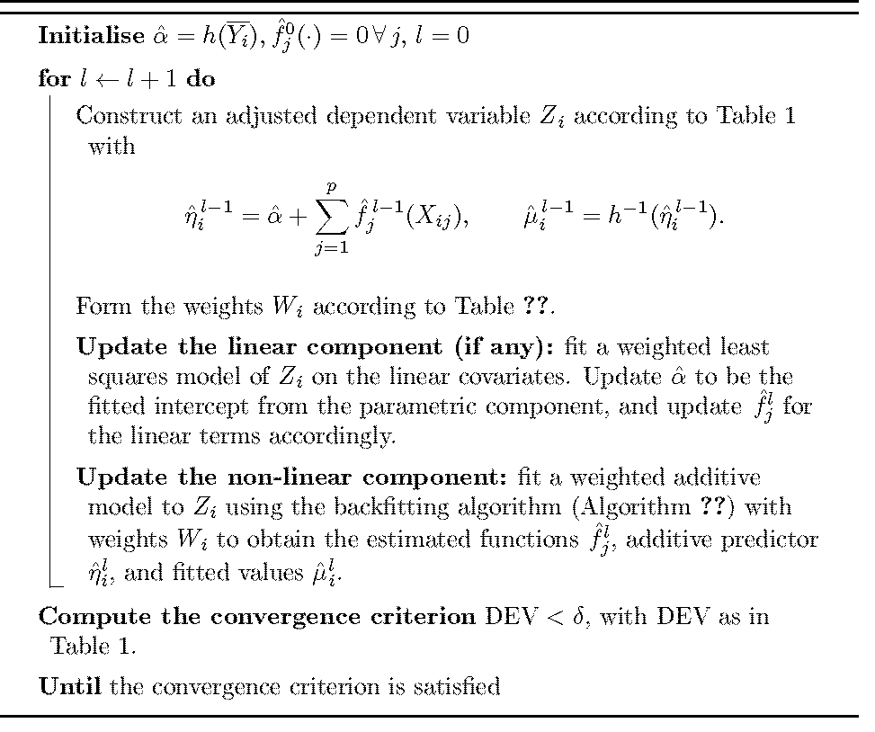
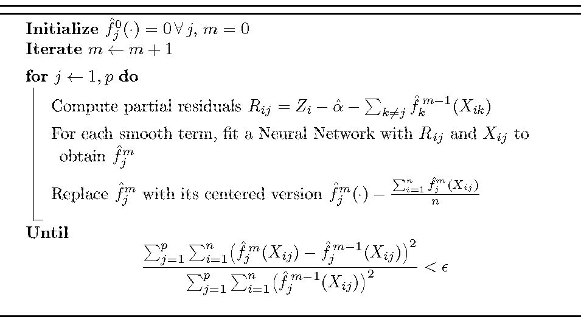
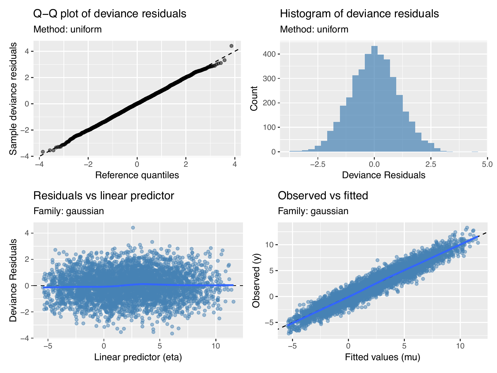
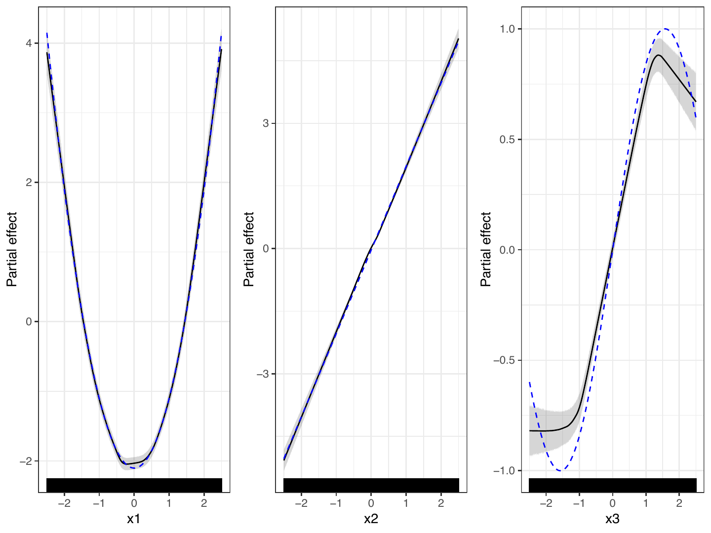
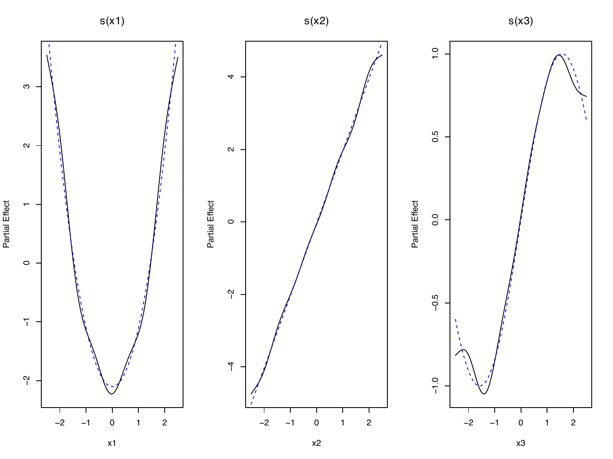
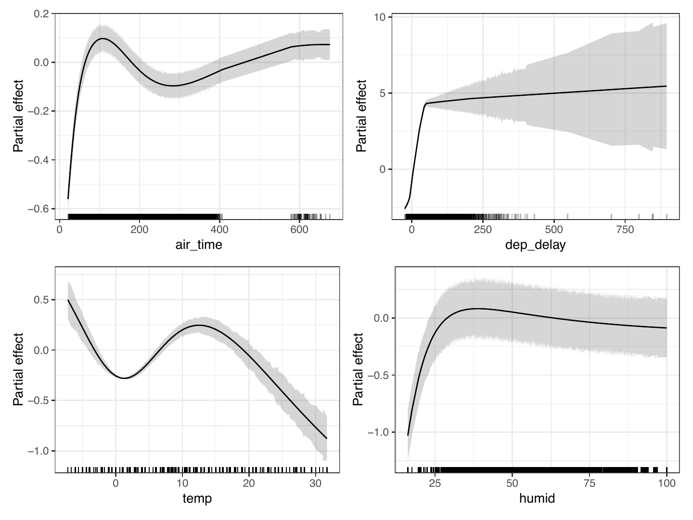
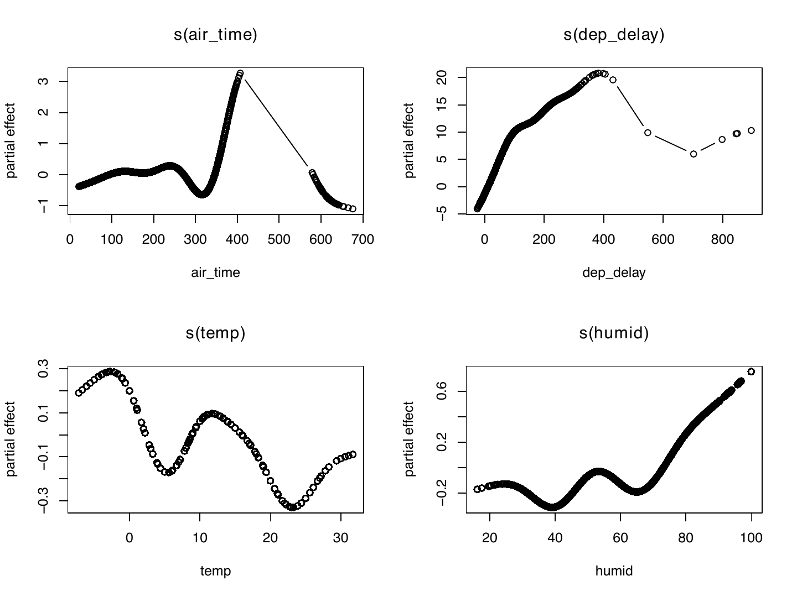

::::::::::::: article
## Introduction

Neural networks (NN) are currently among the most widely used predictive
modeling techniques, demonstrating superior performance across a broad
range of tasks. Despite their success, a well-known shortcoming of
neural networks is that they often function as "black-box" models. In
most practical applications, it can be challenging to understand
precisely *how* the network processes information and reaches a
particular prediction (Szegedy et al. 2013). In recent years, there has
been a growing research focus on enhancing trust in AI systems by
improving their interpretability. Broadly, interpretability methods can
be categorized into *post-hoc* and *ante-hoc* approaches (Došilović et
al. 2018). *Post-hoc* methods aim to explain a trained black-box model
(like a typical Neural Network) using an external, intrinsically
interpretable ("white-box") model to approximate or interpret the
black-box decisions. In contrast, *ante-hoc* methods aim to build and
train inherently interpretable ("white-box") models that balance high
predictive accuracy with transparency.

Following this *ante-hoc* approach, several approaches in the literature
have been proposed to combine the interpretability of GAMs with the
flexibility of neural networks, yielding the family of Generalized
Additive Neural Networks (GANNs). Early approaches, such as the model by
Potts (1999), used univariate multi-layer perceptrons without
backpropagation and required manual tuning. Subsequent approaches, like
that of Brás-Geraldes et al. (2019), improved flexibility with
parametric link functions and bootstrap-based confidence intervals but
remained constrained to shallow architectures. More recent methods
implemented in Python take advantage of deep learning techniques: Neural
Additive Models (NAMs) (Agarwal et al. 2021) train feature-specific
subnetworks jointly with backpropagation but can suffer from overfitting
due to sharp activation functions. GAMI-Net (Yang et al. 2021) extends
this by allowing pairwise interactions and incorporating sparsity and
marginal clarity constraints, but with an increased computational cost.
Finally, IGANN (Kraus et al. 2023) introduces a GANN based on gradient
boosting techniques with sparsified shallow networks, assuming initially
linear effects and avoiding deep architectures.

The development of the
[**neuralGAM**](https://CRAN.R-project.org/package=neuralGAM) package
has been motivated by recent contributions in the development of GANNs,
in particular, the method proposed by Ortega-Fernandez et al. (2024) to
train a GANN using independent neural networks using the local scoring
(LS) and backfitting (BF) algorithms.

Specifically,
[**neuralGAM**](https://CRAN.R-project.org/package=neuralGAM) trains an
ensemble of independent neural networks (one per feature) to learn each
feature's contribution to the response. By enforcing an additive
decomposition via backfitting and local scoring, it prioritizes
interpretability over the flexibility of unconstrained deep networks:
the aim is not to match their full expressive power but to strike a
practical balance, delivering competitive predictive performance while
maintaining the GAM-style additivity that supports clear feature-level
interpretation.

Regarding other R packages that combine additive models with neural
networks, the
[**deepregression**](https://CRAN.R-project.org/package=deepregression)
package (Rügamer et al. 2023) implements distributional regression
models for mean, scale, and shape parameters using deep neural networks,
extending the GAM framework by embedding spline terms directly into a
neural network architecture. Smooth functions are pre-processed using
[**mgcv**](https://CRAN.R-project.org/package=mgcv) (Wood 2011), which
generates the spline basis and penalty matrices; these are then
represented as structured layers within a deep neural network model and
regularized through a TensorFlow's loss function.

The [**bamlss**](https://CRAN.R-project.org/package=bamlss)
package(Umlauf et al. 2018), in contrast, provides a more general
Bayesian framework for additive models that can incorporate neural
network terms. Estimation in this context is performed through Bayesian
sampling or variational inference, which naturally provides posterior
uncertainty quantification at the expense of higher computational costs.
These packages illustrate complementary methodological directions:
[**deepregression**](https://CRAN.R-project.org/package=deepregression)
extends GAMs toward distributional regression with deep learning
components, [**bamlss**](https://CRAN.R-project.org/package=bamlss)
offers a Bayesian approach with uncertainty quantification, and
[**neuralGAM**](https://CRAN.R-project.org/package=neuralGAM) provides a
dedicated white-box GANN implementation through independent deep neural
networks. In this regard,
[**neuralGAM**](https://CRAN.R-project.org/package=neuralGAM)
complements existing [R]{.sans-serif} software and, to the best of our
knowledge, provides the only available GANN implementation in
[R]{.sans-serif} that leverages fully independent deep Neural Networks
per feature and estimates the additive model through local scoring and
backfitting. This design offers both interpretability and the
characteristic deep learning flexibility within the [R]{.sans-serif}
ecosystem.

At last, beyond GANN-specific packages, several [R]{.sans-serif}
packages provide model-agnostic tools for explainability. The
[**NeuralNetTools**](https://CRAN.R-project.org/package=NeuralNetTools)
package (Beck 2018), for instance, offers visualizations and sensitivity
analyses tailored to neural networks. More general frameworks such as
[**iml**](https://CRAN.R-project.org/package=iml) (Molnar et al. 2018)
and [**DALEX**](https://CRAN.R-project.org/package=DALEX) (Biecek 2018)
implement techniques such as feature importance, partial dependence, and
Shapley values, supporting both local and global interpretability. While
[**iml**](https://CRAN.R-project.org/package=iml) and
[**DALEX**](https://CRAN.R-project.org/package=DALEX) are
model-agnostic,
[**NeuralNetTools**](https://CRAN.R-project.org/package=NeuralNetTools)
is specifically designed for neural networks.

In this paper, we demostrate how neural networks can be used to fit
Generalized Additive Models using the
[**neuralGAM**](https://CRAN.R-project.org/package=neuralGAM) package.
This is illustrated through a simulated scenario with a Gaussian
response, as well as a real-life application related to flight delay
prediction based on weather and flight conditions' data.

The remainder of the paper is structured as follows: in
Section [2](#sec:models){reference-type="ref" reference="sec:models"} we
briefly review the estimation procedures and explain the use of the main
functions and methods of
[**neuralGAM**](https://CRAN.R-project.org/package=neuralGAM);
Section [3](#sec:illustrations){reference-type="ref"
reference="sec:illustrations"} gives an illustration of the practical
application of the package using simulated and real data; and finally,
Section [4](#sec:summary){reference-type="ref" reference="sec:summary"}
concludes with a discussion and possible future extensions of the
package.

## Models and software {#sec:models}

### An overview of the methodology

The most common way to model the relationship between the response
variable and the covariates is by using the multiple linear regression
model, where the response variable ($Y$) is assumed to be normally
distributed, and the covariates ($X_j$, $j =1, \ldots, p$) are assumed
to have a linear effect on the response. However, the response variable
may not be normally distributed and, in such cases, Generalized Linear
Models (Nelder and Wedderburn 1972) allow the use of other distribution
families, e.g. Binomial, Poisson, etc. Additionally, in some cases, the
assumption of linearity in the effects of covariates can be too
restrictive and not supported by the available data. In this setting,
nonparametric regression techniques emerge, allowing us to model this
dependence between the response and the covariates without specifying in
advance the function that links them. This leads to the Generalized
Additive Models (Hastie and Tibshirani 1990) defined by
$$\begin{equation}
   E[Y\mid \textbf{X}] = m(\textbf{X}) = h^{-1}(\alpha + \sum_{j=1}^p f_j(X_j)),
\label{GAM}
\end{equation}   (\#eq:GAM)$$
where $h(\cdot)$ is a monotonic known function (the link function) and
$f_1, ..., f_p$ are smooth and unknown functions. To ensure the
identifiability of the model (the ability to uniquely determine the
parameters of the model based on the observed data), a constant denoted
by $\alpha$ is introduced in the model and the partial functions must
satisfy the condition $E[f_j(X_j)] = 0$ where $j = 1, \dots, p$. This
implies that $E[Y] = \alpha$, a crucial condition to ensure that the
model's predictions remain unchanged even if we add a constant value to
$f_1$ while subtracting the same constant value from $f_2$ (Hastie and
Tibshirani 1990).

As we mentioned, GAMs are widely used for their ability to capture
complex relationships between covariates and response variables without
requiring the shape of these relationships to be specified in advance.
This flexibility makes GAMs a powerful and effective class of regression
models. They also offer the advantage of being fully nonparametric while
allowing certain covariates---such as categorical features---to enter
the model linearly, resulting in a semi-parametric framework. Thanks to
this versatility, GAMs are particularly well-suited for tackling
real-world problems.

::: {#dist-link}
  -----------------------------------------------------------------------------------------------------------------------------------------------------
    **Distribution**     **Link**                   $Z_i$                         $W_i$                         $DEV_i(Y_i,\hat\mu_i)$
  --------------------- ---------- --------------------------------------- ------------------- --------------------------------------------------------
        Gaussian         identity                   $Y_i$                          $1$                         $(Y_i - \hat{\mu}_i)^2$

   Binomial $(s, \mu)$    logit     $\eta_i + (Y_i-\mu_i)s\mu_i(1-\mu_i)$   $s\mu_i(1-\mu_i)$    $-2(Y_i\log\hat{\mu}_i + (1-Y_i)\log(1-\hat{\mu}_i)$

         Poisson           log          $\eta_i + (Y_i-\mu_i)/\mu_i$             $\mu_i$        $Y_i\log\frac{Y_i}{\hat{\mu}_i} - (Y_i - \hat{\mu}_i)$
  -----------------------------------------------------------------------------------------------------------------------------------------------------

  : (#tab:T1) Adjusted dependent variable $Z_i$, weights $W_i$, and
  deviance $DEV_i(Y_i,\hat\mu_i)$, at the local scoring algorithm for
  Gaussian, binomial and Poisson distributions (Hastie and Tibshirani
  1990).
:::

To fit the previous model in (\@ref(eq:GAM)), from an independent random
sample $\{\boldsymbol{X}_i, Y_i\}_{i=1}^n$, where each
$\boldsymbol{X}_i = (X_{i1}, \ldots, X_{ip})$ is a realization of the
$p-$dimensional random vector $\mathbf{X} = (X_1, \ldots, X_p)$, we use
a combination of the local scoring algorithm (see Algorithm
[1](#local-scoring){reference-type="ref" reference="local-scoring"}) and
the backfitting algorithm (see Algorithm
[2](#backfitting){reference-type="ref" reference="backfitting"}).

In practice, some covariates may enter the model linearly while others
are represented by smooth functions. In this case, for the model in
(\@ref(eq:GAM)), each $f_j$ may either be a smooth, nonparametric
function fitted using a neural network or a parametric linear effect of
the form $f_j(x_j)=x_j^\top \beta_j$, leading to a semiparametric model.

Particularly, the estimation of the additive predictor
$\eta = \alpha + \sum_{j=1}^{p} f_j (\cdot)$ is obtained by fitting a
weighted additive model where each $f_j$ is either a smooth function
(estimated by a neural network) or a linear effect, yielding a
Generalized Additive Neural Network. For each smooth $f_j$, the
backfitting algorithm iteratively estimates the effect of each covariate
$X_1, \ldots, X_p$, with weights $W_i$, on the adjusted dependent
variable $Z_i$, updated at each step of the local scoring algorithm.

<figure id="local-scoring" data-latex-placement="ht!">


<figcaption>Algorithm 1: Local scoring algorithm</figcaption>
</figure>

Note that if the link function is the identity and the error
distribution is Gaussian, then $Z_i = Y_i$ and the weights do not
change, thus the procedure is simply an additive fit. In any other case,
the dependent variable $Z_i$ and the weights $W_i$ are updated at each
iteration $l$ of the local scoring algorithm. This process is repeated
until the convergence criterion is satisfied (see last step of Algorithm
[1](#local-scoring){reference-type="ref" reference="local-scoring"}).
Note that we use the deviance because it is an appropriate measure of
the discrepancy between observed and fitted values.

<figure id="backfitting" data-latex-placement="ht!">



<figcaption>Algorithm 2: Backfitting Algorithm with neural
networks</figcaption>
</figure>

Particularly, given the fitted mean response
$\hat{\mu}_i = \hat E[Y_i \mid \textbf{X}_i]$, the deviance is defined
as

$$DEV = \frac{\sum_{i=1}^n DEV_i(Y_i, \hat \mu_i^{l-1}) - DEV_i(Y_i, \hat \mu_i^{l})}{\sum_{j=1}^n DEV_i(Y_i, \hat \mu_i^{l-1})},$$

with $\text{DEV}_i$ depending on the link (see Table
[1](#tab:T1){reference-type="ref" reference="dist-link"}). Several
approaches have been described in the literature to estimate the
regression model in (\@ref(eq:GAM)), such as Bayesian approaches (Lang
and Brezger 2004), local polynomial kernel smoothers (Wand and Jones
1994; Copeland 1997) or regression splines (De Boor et al. 1978). Unlike
these quite common techniques, we propose to use independent neural
networks ---which are universal function estimators (Hornik et al.
1989)--- to learn the contribution of each covariate to the dependent
variable, i.e., at each iteration of the backfitting algorithm, we train
a feed-forward Neural Network for each covariate $X_j$ with the entire
set of training data for one epoch. The fits are improved at each epoch
as the learned adjusted dependent variable $Z_i$ approaches $Y_i$ at
each iteration of the local scoring algorithm.
Algorithms [1](#local-scoring){reference-type="ref"
reference="local-scoring"} and [2](#backfitting){reference-type="ref"
reference="backfitting"} summarize the core idea.

#### Uncertainty estimation {#sec:uncertainty}

To quantify epistemic uncertainty, we leverage Monte Carlo (MC) Dropout
(Gal and Ghahramani 2016), a widely used technique for estimating model
uncertainty in neural networks by interpreting dropout as a Bayesian
approximation. In
[**neuralGAM**](https://CRAN.R-project.org/package=neuralGAM), dropout
layers are inserted into the neural networks used to estimate the smooth
functions $f_j$. During training, dropout layers randomly "drop" (set to
zero) a fraction of the units in each layer of the network, acting as a
regularizer to prevent overfitting. At inference time, rather than being
deactivated as in standard practice, dropout remains active to generate
stochasticity. The network is then evaluated repeatedly through $B$
stochastic forward passes, producing a distribution of predictions that
can be used to quantify epistemic uncertainty for each individual term
and for the additive predictor in the link and response scales.

##### Per-term uncertainty.

For each smooth term $f_j$, the use of MC Dropout during inference
yields $B$ draws
$$\hat f_j^{(b)}(x_j)_{b=1}^B.$$

To guarantee the identifiability of the model, these smooth dropout
predictions are re-centered by subtracting each term's training-time
centering constant, so that for every $j$
$$\frac{1}{n}\sum_{i=1}^n \hat f_j^{(b)}(x_{ij}) = 0.$$

The epistemic variance of each nonparametric component is therefore
defined as
$$\widehat{\mathrm{Var}}_{\text{np}}\bigl[f_j(x_j)\bigr] = \widehat{\mathrm{Var}}_b\bigl(\hat f_j^{(b)}(x_j)\bigr),$$
where $\hat f_j^{(b)}(x_j)$ denotes the prediction of the $j$-th
component in the $b$-th simulation or dropout pass, and
$\widehat{\mathrm{Var}}_b$ indicates the empirical variance over these
$B$ realizations.

For models including a linear (parametric) component
$f_j(x_j)= x_j^\top \beta_j$, the uncertainty is obtained from the
fitted linear model (using weighted least squares) via the standard
errors of the predicted values, $\widehat{SE}_p(f_j(x_j))$. In practice,
we use the standard errors reported by the
`stats::predict(..., se.fit=TRUE)` function in [R]{.sans-serif}, which
are based on the variance--covariance matrix of the estimated
coefficients $\hat\beta$. These quantify the sampling variability of the
estimated coefficients $\hat\beta$ under the classical linear model
assumptions.

The corresponding epistemic variance for the parametric component is
then defined as:
$$\widehat{\mathrm{Var}}_p(f_j(x_j)) = \left[ \widehat{SE}_p(\hat f_j(x_j)) \right]^2$$

To provide a unified notation, we define the epistemic variance of any
model component $f_j(x_j)$ as

$$\widehat{\mathrm{Var}}_{\mathrm{epi}}\!\bigl[f_j(x_j)\bigr] =
\begin{cases}
\widehat{\mathrm{Var}}_{\mathrm{np}}\!\bigl[f_j(x_j)\bigr], & \text{if f_j is a smooth term},\\[6pt]
\widehat{\mathrm{Var}}_{\mathrm{p}}\!\bigl[f_j(x_j)\bigr], & \text{if f_j is a linear term.}
\end{cases}$$

Since both the dropout-based and the standard error-based variances
quantify epistemic uncertainty in their respective components, per-term
confidence intervals at level $1-\alpha$ can be expressed in a unified
form as
$$\hat f_j(x_j)\;\pm\;
z_{1-\alpha/2}\,
\sqrt{\widehat{\mathrm{Var}}_{\mathrm{epi}}\!\bigl[f_j(x_j)\bigr]}.$$

##### Uncertainty for the additive predictor on the link scale.

Moving from individual terms to the full model, to obtain uncertainty
bands for the full additive predictor $\eta(\mathbf{x})$ on the link
scale, we combine the uncertainty from the nonparametric and parametric
components.

For covariates fitted using a neural network, nonparametric epistemic
variability is captured by evaluating all smooth networks jointly under
dropout. At each dropout pass $b$, define the smooth-only predictor
$$\eta_{np}^{(b)}(\mathbf{x}) = \sum_{j\in\mathcal{S}} \hat f_j^{(b)}(x_j),$$
where $\mathcal{S}$ denotes the set of smooth terms, so that the dropout
variance across the $B$ passes captures epistemic uncertainty and
cross-term covariance among smooths:

$$\widehat{\mathrm{Var}}_{np} \left[{\eta(\mathbf{x})} \right] = \mathrm{Var}\!\bigl\{\eta_{np}^{(b)}(\mathbf{x})\bigr\},$$
where $\widehat{\mathrm{Var}}_{np}$ denotes the empirical variance
computed over the $B$ dropout realizations.

When the model includes a parametric linear component
$x_j^\top \hat\beta$, its variance is obtained from the standard errors
of the linear predictor:
$$\widehat{\mathrm{Var}}_p\left[\eta(\mathbf{x})\right] = \left[ \widehat{SE_p}(\hat f(\mathbf{x})) \right]^2$$

Assuming independence between the linear and smooth parts, the total
epistemic variance on the link scale is then
$$\widehat{\mathrm{Var}}_{\text{epi}}\{\eta(\mathbf{x})\}
\;=\; \mathrm{Var}_{np}\{\eta(\mathbf{x})\} \;+\; \mathrm{Var}_p\{\eta(\mathbf{x})\},$$
and the $(1-\alpha)$ confidence interval on the link scale is
$$\hat\eta(\mathbf{x}) \pm z_{1-\alpha/2} \sqrt{\widehat{\mathrm{Var}}_{\mathrm{epi}}\!\bigl[\eta(\mathbf{x})\bigr]}.$$

##### Uncertainty for the additive predictor on the response scale.

Finally, uncertainty on the response scale is obtained by applying the
delta method. The fitted mean is related to the additive predictor
through the inverse link function, $\mu = h^{-1}(\eta)$. Since
uncertainty is first quantified on the link scale, we need to translate
it into the scale of $\mu$. The delta method provides a simple rule: the
variance of $\mu$ can be approximated by multiplying the variance of
$\eta$ by the squared slope of the transformation. Formally,
$$\widehat{\mathrm{Var}} \{\mu(\mathbf{x}) \} \approx \bigl((h^{-1})'(\hat\eta(\mathbf{x}))\bigr)^2 \widehat{\mathrm{Var}}_{epi}\{\eta(\mathbf{x})\},$$
where $(h^{-1})'(\eta) = \tfrac{d}{d\eta}h^{-1}(\eta)$ is the derivative
of the inverse link. The corresponding standard error of the fitted mean
on the response scale is therefore
$$\widehat{SE}_\mu(\mathbf{x})
= \bigl|(h^{-1})'(\hat\eta(\mathbf{x}))\bigr|\;
\sqrt{\widehat{\mathrm{Var}}_{\text{epi}}\{\eta(\mathbf{x})\}},$$
and the $(1-\alpha)$ confidence interval can be obtained as
$$\hat\mu (\mathbf{x}) \pm z_{1-\alpha/2}\,\widehat{SE}_\mu(\mathbf{x}).$$

This procedure ensures that uncertainty bands respect the chosen link
function: with the identity link (Gaussian models) the derivative is $1$
and the intervals are unchanged, while with non-identity links (such as
the logit or log links), the intervals are automatically rescaled
according to the applied transformation.

### Package structure and functionality {#package_struc}

The [**neuralGAM**](https://CRAN.R-project.org/package=neuralGAM)
package introduces a new methodology for fitting Generalized Additive
Models, with Gaussian, binary, or Poisson responses, based on
independent neural networks. It is composed of several functions that
enable users to fit the models with the methods described above.
[**neuralGAM**](https://CRAN.R-project.org/package=neuralGAM) relies on
[**keras**](https://CRAN.R-project.org/package=keras) ([Chollet et
al.]{.nocase} 2015) and
[**TensorFlow**](https://CRAN.R-project.org/package=TensorFlow) (Abadi
et al. 2015), high-level APIs for the implementation of neural networks
well-known for their simplicity, flexibility, and ease of use.
[**neuralGAM**](https://CRAN.R-project.org/package=neuralGAM) also
relies on other [R]{.sans-serif} packages for visualization
([**ggplot2**](https://CRAN.R-project.org/package=ggplot2)) and
numerical utilities.

:::: small
::: {#pkg:fun}
  -----------------------------------------------------------------------------------------------------------------------------------------------------------------------------------------------------------------------------------------------------------------------------------------------------------------------------------------
  Function               Description
  ---------------------- ------------------------------------------------------------------------------------------------------------------------------------------------------------------------------------------------------------------------------------------------------------------------------------------------------------------
  `neuralGAM`            Main function to fit a `neuralGAM` model. Fits per-feature neural networks with user-specified architectures, and combines them using backfitting and local scoring. Supports uncertainty quantification through Monte Carlo dropout.

  `summary.neuralGAM`    Method for the generic `summary` function, providing numerical summaries of fitted models.

  `print.neuralGAM`      Method for the generic `print` function, showing key model components.

  `plot.neuralGAM`       Visualization of smooth and linear terms using base [R]{.sans-serif} graphics.

  `autoplot.neuralGAM`   Visualization of fitted components and prediction/confidence intervals using [**ggplot2**](https://CRAN.R-project.org/package=ggplot2) (Wickham 2016), returning a `ggplot` object, with support for confidence and prediction intervals.

  `predict.neuralGAM`    Prediction method with options for link, response, or term-level contributions. Supports standard errors and confidence intervals.

  `diagnose`             Diagnostic plots for model evaluation, including residuals and Quantile-Quantile plots. For Gaussian models, these plots diagnose symmetry, tail behavior, and mean/variance misfit. For discrete data (binomial, Poisson), randomized Quantile residuals are available, which often yield smoother QQ behavior.

  `plot_history`         Visualization of the training and validation loss history for each term-specific network, across backfitting iterations.

  `install_neuralGAM`    Creates a `conda` environment (installing `miniconda` if required) and sets up the Python requirements to run neuralGAM (TensorFlow and Keras, version 2.15).
  -----------------------------------------------------------------------------------------------------------------------------------------------------------------------------------------------------------------------------------------------------------------------------------------------------------------------------------------

  : (#tab:T2) Summary of functions in the
  [**neuralGAM**](https://CRAN.R-project.org/package=neuralGAM) package.
:::
::::

The package is designed along lines similar to those of other
[R]{.sans-serif} regression packages. The functions within
[**neuralGAM**](https://CRAN.R-project.org/package=neuralGAM) are
briefly described in Table [2](#tab:T2){reference-type="ref"
reference="pkg:fun"}. The main function of the package is `neuralGAM`,
which fits a Generalized Additive Neural Network to estimate the
contribution of each smooth function to the response. The arguments of
this function are shown in Table [3](#tab:T3){reference-type="ref"
reference="pkg:arg"}. Note that through the argument `formula` users can
decide to fit a model with neural networks(`s(x)`), linear, or factor
terms (`x`), and using the argument `family` it is possible to select
the conditional distribution of the response variable. So far, the user
can select between Gaussian, binomial, and Poisson.

Beyond specifying network architecture (`num_units`, `activation`,
initializers, regularizers, losses, etc.),
[**neuralGAM**](https://CRAN.R-project.org/package=neuralGAM) implements
uncertainty estimation via the `uncertainty_method` argument, allowing
the computation of epistemic uncertainty. Additional arguments such as
`alpha`, `forward_passes`, `dropout_rate`, provide fine control over
uncertainty estimation.

Cross-validation support during neural network training is implemented
via the `validation_split` argument. Users can also visualize how the
training and validation loss evolves after each backfitting iteration
using the `plot_history` function.

Numerical and graphical summaries of the fitted object can be obtained
by using the `print`, `summary`, `plot`, `autoplot`, `plot_history` and
`diagnose` methods implemented for `neuralGAM` objects. Another of these
methods is available for the `predict` function, which takes a fitted
model of the `neuralGAM` class and, given a new data set of values of
the covariates by means of the argument `newdata`, produces predictions,
including uncertainty estimates in the form of confidence intervals.
Diagnostic checks can be performed with the `diagnose` function, which
produces residual plots and QQ-plots under different reference
distributions. At last, we provide a helper function
`install_neuralGAM()` to assist the user in installing the required
Python dependencies in a custom `conda` environment. Once the
dependencies are installed using `install_neuralGAM()`, the user must
reload the library again using `library(neuralGAM)` for the changes to
take effect. Note that the first time the package is used after
installing and setting up the dependencies, the process of loading the
required Python packages might take some time.

:::: small
::: {#pkg:arg}
  ----------------------------------------------------------------------------------------------------------------------------------------------------------------------------------------------------------------------------------------------------------------------------------------------------------
                           `neuralGAM()` arguments
  ------------------------ ---------------------------------------------------------------------------------------------------------------------------------------------------------------------------------------------------------------------------------------------------------------------------------
  `formula`                An object of class "formula": a description of the model to be fitted. Smooth neural network terms can be included using `s()` while plain variables are linear/factor terms.

  `data`                   A data frame containing the model response variable and covariates required by the formula. Additional terms not present in the formula will be ignored.

  `family`                 A string specifying the distribution and link to use for fitting. By default, `"gaussian"`, also `"binomial"` and `"poisson"` for logistic and poisson regression.

  `num_units`              Defines the number of units at each Dense layer of a Neural Network. If a scalar value is provided, a single hidden layer is used. If a vector or list is provided, a deep architecture is fitted with corresponding hidden units.

  `learning_rate`          Learning rate for the optimizer.

  `activation`             Activation function to use on every layer of the Neural Network. Defaults to `"relu"`.

  `kernel_initializer`     Kernel initializer for the Dense layers. Defaults to Xavier initializer `"glorot_normal"` (Glorot and Bengio 2010).

  `kernel_regularizer`     Optional regularizer applied to the kernel weights.

  `bias_regularizer`       Optional regularizer applied to the bias vector.

  `bias_initializer`       Optional initializer for the bias vector (default `"zeros"`).

  `activity_regularizer`   Optional regularizer applied to the output of the layer.

  `loss`                   Loss function for training. Defaults to `"mse"`, and can be any Keras built-in (e.g., `mse`, `mae`, `logcosh`, etc.) or a custom function. See [2.2.5](#per-term-arch){reference-type="ref" reference="per-term-arch"} for more details on how to define custom loss functions.

  `uncertainty_method`     Type of predictive inference: one of `"none"` or `"epistemic"`. Enables uncertainty quantification with MC-dropout (see Section [2.2.3](#uncertainty-est-imp){reference-type="ref" reference="uncertainty-est-imp"}).

  `alpha`                  Significance level for interval estimation (default `0.05`).

  `forward_passes`         Number of Monte Carlo forward passes when computing epistemic uncertainty. Default `100`.

  `dropout_rate`           Dropout probability for MC-dropout estimation. Default `0.1`.

  `validation_split`       Fraction of data used as validation set during training. By default `NULL`.

  `w_train`                Optional sample weights.

  `bf_threshold`           Convergence criterion of the backfitting algorithm. Defaults to `0.001`.

  `ls_threshold`           Convergence criterion of the local scoring algorithm. Defaults to `0.1`.

  `max_iter_backfitting`   Maximum number of iterations of the backfitting algorithm. Defaults to `10`.

  `max_iter_ls`            Maximum number of iterations of the local scoring algorithm. Defaults to `10`.

  `seed`                   Random number generator seed for reproducibility.

  `verbose`                Verbosity mode (0 = silent, 1 = print messages). Defaults to `1`.

  `…`                      Other arguments to pass on to the Adam optimizer (Kingma and Ba 2014).
  ----------------------------------------------------------------------------------------------------------------------------------------------------------------------------------------------------------------------------------------------------------------------------------------------------------

  : (#tab:T3) Arguments of `neuralGAM()` function.
:::
::::

#### Installing and setting up the package

Since [**neuralGAM**](https://CRAN.R-project.org/package=neuralGAM)
relies on [**keras**](https://CRAN.R-project.org/package=keras) for
fitting the underlying neural network models, the package requires a
working installation of Python (version $3.10$) with
[**keras**](https://CRAN.R-project.org/package=keras) and its TensorFlow
backend (version $2.15$). The setup can be performed directly from
within [**neuralGAM**](https://CRAN.R-project.org/package=neuralGAM),
ensuring that all necessary dependencies are installed before using the
package.

To ease this process, we provide the `install_neuralGAM()` to automate
the Python setup required to run
[**neuralGAM**](https://CRAN.R-project.org/package=neuralGAM), which
also creates a custom `conda` environment to isolate the package
requirements for
[**neuralGAM**](https://CRAN.R-project.org/package=neuralGAM). This
ensures no conflict with previous installations or dependencies from
other [R]{.sans-serif} packages.

From the user's perspective, installation of all Python dependencies
requires only a single call:

``` r
library(neuralGAM)
# one-time setup of Python dependencies
install_neuralGAM()
# reload neuralGAM to activate environment
library(neuralGAM)  
```

After running the function (and restarting the [R]{.sans-serif}
session), the user can immediately fit neural additive models with
[**neuralGAM**](https://CRAN.R-project.org/package=neuralGAM) without
needing to manually install Python, TensorFlow, or Keras.

#### Basic functionality

An example of the use of
[**neuralGAM**](https://CRAN.R-project.org/package=neuralGAM),
illustrating its basic features, is given in the following example of
code. [**neuralGAM**](https://CRAN.R-project.org/package=neuralGAM) is
configured to fit a Deep Neural Network with `64` units on each of its
three deep layers (`num_units`). In this example, the linear predictor
is composed of a linear term in $x$ and neural network fitted terms for
$z$ and $w$, and the response is assumed to follow a Gaussian
distribution (`family`):

``` r
neuralGAM(y ~ x + s(z) + s(w), data = data, num_units = c(64, 64, 64),
    family = "gaussian", learning_rate = 0.001, activation = "relu",
    kernel_initializer = "glorot_normal", loss = "mse", 
    kernel_regularizer = NULL, bias_regularizer = NULL,
    uncertainty_method = "none",
    bias_initializer = 'zeros', activity_regularizer = NULL,
    bf_threshold = 0.001, ls_threshold = 0.1, max_iter_backfitting = 10,
    max_iter_ls = 10, seed = NULL, verbose = 0, ...)
```

Other arguments of
[**neuralGAM**](https://CRAN.R-project.org/package=neuralGAM) will be
familiar to [**keras**](https://CRAN.R-project.org/package=keras) users:
`activation` defines the activation function for the Dense layers of
each fitted Neural Network (defaults to `relu`).
[**neuralGAM**](https://CRAN.R-project.org/package=neuralGAM) uses Adam
(Kingma and Ba 2014) as an optimizer for stochastic gradient descent,
whose behaviour can be customized using the `loss`, `activation`,
`learning_rate`, `kernel_initializer`, `kernel_regularizer`,
`bias_regularizer`, `bias_initializer`, and `activity_regularizer`
arguments.

The backfitting and local scoring algorithms used to fit the GAM model
can be configured using the `bf_threshold` and `ls_threshold` arguments
which adjust the convergence criterion of both algorithms, while
`max_iter_backfitting` and `max_iter_ls` adjust the maximum number of
iterations of each algorithm. Finally, `seed` specifies an optional
random number generator seed for algorithms dependent on randomization,
`verbose` sets the verbosity of the printed outputs, while the `…`
argument allows setting other arguments available for the Adam
implementation in `keras` such as the exponential decay rate for the 1st
and 2nd-moment estimates.

The `summary` method returns a summary of the fit where it is possible
to observe the model architecture for both the neural networks and the
linear terms (if working in a semi-parametric setting) and the per-term
network configuration (units at each layer, activation function, and
training parameters and settings) and network layer configuration (such
as layer type or regularization and initialization configurations). When
using `uncertainty_method = "epistemic"`, dropout layers are included in
the model architecture. These dropout layers are not only used during
training for regularization, but also at prediction time (through Monte
Carlo dropout) to quantify epistemic uncertainty and construct
confidence intervals. At last, the `summary` function provides a summary
of the model training history, including information about the evolution
of the model fit for each covariate, allowing the monitoring of both the
training loss (in this case, the Mean Squared Error `mse`), the deviance
explained by the model, and the elapsed time on each training epoch. The
training loss per-term and backfitting iteration can also be visualized
using the `plot_history()` function.

Creating efficient and appropriate data visualizations becomes
increasingly important as the complexity of the data increases.
[**neuralGAM**](https://CRAN.R-project.org/package=neuralGAM) provides
two different methods for plotting data: one based on [R]{.sans-serif}'s
standard plotting function (`plot.default`) in which the `plot` function
inherits all arguments from `graphics` package and can be set as usual,
and one based on `ggplot2` (Wickham 2016). With this latter plot method,
the `autoplot` function creates a `ggplot` object that can be modified
later by the user just using the functionality provided in the `ggplot2`
package. The following excerpt of code shows analogous plots using the
two methods implemented:

``` r
plot(ngam, main = "My plot")
library(ggplot2)
autoplot(ngam, which = "terms", term = "z") + ggtitle("My plot")
```

The `predict` method for a fitted `neuralGAM` produces predictions on
the link, response, or per-term scales via the `type` argument (default
`"link"`). If `newdata` is omitted, the cached training data are used:

``` r
pred_link <- predict(ngam, test, type = "link")
```

We can also obtain the prediction on the response scale:

``` r
pred_resp <- predict(ngam, test, type = "response")
```

At last, a subset of per-term contributions can be selected with the
`terms` argument when `type = "terms"` (the intercept is never
included):

``` r
terms <- predict(ngam, newdata = test, type = "terms")
terms <- predict(ngam, newdata = test, type = "terms", terms = c("z", "w"))
```

#### Uncertainty estimation and visualization {#uncertainty-est-imp}

Uncertainty estimates can be obtained directly through the `predict()`
and `autoplot()` methods. For example, by setting
`uncertainty_method = "epistemic"` during the fitting of the model, the
user can request confidence intervals (CIs) for the conditional mean
based on MC-Dropout. As noted in Table [3](#tab:T3){reference-type="ref"
reference="pkg:arg"}, `alpha` is the significance level, `dropout_rate`
controls the Dropout probability, and `forward_passes` defines the
number of stochastic passes to be run:

``` r
ngam <- neuralGAM(
  y ~ x + s(z) + s(w),
  data = data,
  num_units = c(64,64,64),
  uncertainty_method = "epistemic",
  alpha = 0.05, dropout_rate = 0.01, 
  forward_passes = 500
)
```

To obtain the uncertainty in predictions, the argument `se.fit = TRUE`
enables the computation of standard errors for the fitted mean. These
errors capture only the *epistemic* uncertainty, estimated through the
MC-Dropout procedure. When `type = "response"` is specified, the
standard errors are mapped from the link scale to the response scale
using the delta method. In addition to standard errors, the `predict`
method also returns the lower and upper CIs at level $1-\alpha$:

``` r
# obtain predictions with confidence intervals
pred <- predict(ngam, 
                which = "response", 
                se.fit = TRUE, 
                interval = "confidence", 
                alpha = 0.05)

# visualize epistemic uncertainty
autoplot(ngam, 
        which = "terms", 
        term terms = "w", 
        interval = "confidence")
```

#### Validation on a hold-out set

A common concern when training neural networks is the risk of
overfitting if the training hyperparameters are not properly tuned.
[**neuralGAM**](https://CRAN.R-project.org/package=neuralGAM) includes
cross-validation and hold-out splits via the `validation_split`
argument, which reserves a user-specified fraction of the training data
for validation purposes at each backfitting iteration. During model
training, both training and validation losses are stored for every
term-specific network and at every iteration, and can be visualized
using the `plot_history()` function. This enables the user to monitor
overfitting, adjust early stopping, and tune hyperparameters (such as
`num_units`, `dropout_rate`, or `learning_rate`) in an informed way.

For more advanced evaluation using cross-validation, users can combine
[**neuralGAM**](https://CRAN.R-project.org/package=neuralGAM) with
standard resampling approaches in [R]{.sans-serif}, such as
[**caret**](https://CRAN.R-project.org/package=caret) or
[**rsample**](https://CRAN.R-project.org/package=rsample), by looping
over training/validation folds and fitting multiple `neuralGAM` models:

``` r
if(!require("rsample")) install.packages("rsample")
library(rsample)

# Assuming dat is a data.frame with x1, x2 and response y

# 5-fold cross-validation
cv_folds <- vfold_cv(dat, v = 5)

cv_results <- lapply(cv_folds$splits, function(split) {
  train <- analysis(split)
  test  <- assessment(split)

  # Fit neuralGAM with a validation split
  ngam <- neuralGAM(
    y ~ s(x1) + x2,
    data = train,
    family = "gaussian",
    num_units = c(64, 64),
    validation_split = 0.2,
    uncertainty_method = "epistemic", forward_passes = 50
  )

  # Predict on test set
  preds <- predict(ngam, newdata = test, type = "response")

  # Compute RMSE for this fold
  sqrt(mean((test$y - preds)^2))
})

mean_rmse <- mean(unlist(cv_results))
print(mean_rmse)
```

#### Per-term architecture and custom loss definition {#per-term-arch}

As previously introduced, beyond global hyperparameters,
[**neuralGAM**](https://CRAN.R-project.org/package=neuralGAM) allows the
user to specify architectural choices individually for each smooth term.
For example:

``` r
y ~ s(x1, num_units = c(256,128), activation = "tanh") +
    s(x2, num_units = 64, kernel_regularizer = ::regularizer_l2(1e-4)) +
    x3
```

In this example, the smooth effect of `x1` is estimated with a two-layer
network of sizes 256 and 128 using `tanh` activations, while `x2` is
modeled with a smaller single-layer network with $L_2$ regularization.
Terms not explicitly specified inherit the global defaults given in the
main function call. This per-term flexibility allows customizing the
training of complex covariates while keeping simpler covariates modeled
with lightweight networks, which can improve both predictive performance
and interpretability.

Additionally,
[**neuralGAM**](https://CRAN.R-project.org/package=neuralGAM) allows the
user to fit the model with any custom-built loss function, in addition
to the standard losses provided by
[**keras**](https://CRAN.R-project.org/package=keras). The loss can be
passed as a `keras` or `tensorflow` loss object, or defined directly by
the user as an [R]{.sans-serif} function returning a valid tensor
operation. This feature enables advanced use cases such as optimizing
alternative objectives (e.g. Huber loss for robustness) or incorporating
problem-specific penalties (e.g. monotonicity penalties):

``` r
huber_delta <- function(delta = 0.3) {
  function(y_true, y_pred) {
    tensorflow::tf$keras$losses$Huber(delta = delta)(y_true, y_pred)
  }
}

fit_ng <- neuralGAM(
  formula = y ~ s(x1) + s(x2) + s(x3),
  data = df,
  num_units = c(32, 32),
  activation = "relu",
  learning_rate = 1e-3,
  uncertainty_method = "epistemic",
  alpha = 0.95,
  # Use custom loss
  loss = huber_delta(0.3)
)
```

#### Diagnosis tools for model validation

When fitting any machine learning model, it is essential to verify
whether model assumptions still hold. The function `diagnose()` provides
a compact $2\times2$ grid of diagnostic plots (see
Figure [\[fig:diagnose-example\]](#fig:diagnose-example){reference-type="ref"
reference="fig:diagnose-example"}) summarizing key aspects of model fit:
a Q--Q plot, residual histogram, residuals versus linear predictor, and
observed versus fitted values. Residuals may be computed as deviance,
Pearson, or quantile residuals by means of the `residual_type` argument,
allowing users to focus on distributional fit, or smooth normal
diagnostics for discrete families. The Q--Q plot supports multiple
strategies for generating theoretical quantiles by means of the
`qq_method` argument, including uniform and simulation-based methods
that respect the fitted response distribution, as well as a normal
reference option.

<figure id="fig:placeholder" data-latex-placement="H">

<figcaption>Figure 1: Example output from the <code>diagnose</code>
function for a Gaussian model</figcaption>
</figure>

These four diagnostic plots provide an easy-to-use and interpretable
summary to verify model assumptions in
[**neuralGAM**](https://CRAN.R-project.org/package=neuralGAM), allowing
users to assess whether residual distributions are consistent with model
assumptions, detect potential problems such as heteroskedasticity,
nonlinearity, or overdispersion, and to evaluate the adequacy of the
link functions.

## Illustrative examples {#sec:illustrations}

In this section, the use of the
[**neuralGAM**](https://CRAN.R-project.org/package=neuralGAM) package is
illustrated using both simulated and real data. We consider examples for
different conditional distributions of the response variable, i.e., both
Gaussian and binary. To contextualize the performance and
interpretability of
[**neuralGAM**](https://CRAN.R-project.org/package=neuralGAM), we also
include a comparative analysis with the
[**deepregression**](https://CRAN.R-project.org/package=deepregression)
package in both the simulated and real data scenarios, highlighting the
differences in modeling flexibility, smoothness of the recovered partial
functions, and predictive performance between the two approaches. In the
application to real data, we also compare the predictive performance of
[**neuralGAM**](https://CRAN.R-project.org/package=neuralGAM) and
[**deepregression**](https://CRAN.R-project.org/package=deepregression)
to a black-box neural network implemented in
[**keras**](https://CRAN.R-project.org/package=keras). The complete code
for the generation of the simulated data and to reproduce the results
from this section is publicly available at GitHub[^1].

### Application to simulated data

This subsection illustrates the capabilities of the
[**neuralGAM**](https://CRAN.R-project.org/package=neuralGAM) package in
a controlled simulation study. We generated a dataset of size
$n = 30625$, split into 80% for training and 20% for testing. We
consider the following predictor
$$\begin{equation*}
   \eta = \alpha + \sum_{j=1}^3 f_j(X_j),
\end{equation*}$$
with
$$\begin{equation*}
    f_j(X_j) = 
    \begin{cases}
    X_j^2  \text{ if } j=1, \\ 
    2X_j  \text{ if } j=2, \\ 
    \sin{X_j}  \text{ if } j=3,
    \end{cases}
\end{equation*}$$
$\alpha = 2$, and covariates $X_j$ drawn from an uniform distribution
$U\left[-2.5, 2.5\right]$. The response follows a Gaussian distribution
with $Y = \eta + \epsilon$, where $\epsilon$ is the error distributed in
accordance to a $N(0, \sigma(x))$ in a homoscedastic situation with
$\sigma(x) = 0.25$. Additional simulation scenarios including different
response types and conditions on the variance of the error term
$\epsilon$ are available at Ortega-Fernandez et al. (2024).

::: {#tab:sim-config}
  -------------------------------------------------------------------------------------------------------------------------------------------------------------------------------------------------------------------------------------------------------------------
                           **[**neuralGAM**](https://CRAN.R-project.org/package=neuralGAM)**                                               **[**deepregression**](https://CRAN.R-project.org/package=deepregression)**
  ------------------------ --------------------------------------------------------------------------------------------------------------- --------------------------------------------------------------------------------------------------------------------------
  **Model type**           Additive neural GAM, one independent NN per predictor (backfitting + local scoring)                             Distributional regression with additive predictor, spline bases from [**mgcv**](https://CRAN.R-project.org/package=mgcv)

  **Hidden layers**        1 per term network                                                                                              1 spline basis layer

  **Units per layer**      1024                                                                                                            Number of spline basis functions per smooth (thin plate regression splines, default $k=10$)

  **Act. func.**           ReLU (hidden layers), linear output                                                                             Linear (basis representation)

  **Regularization**       Dropout (0.1) per hidden layer                                                                                  Quadratic penalties on spline coefficients (via [**mgcv**](https://CRAN.R-project.org/package=mgcv) penalty matrices)

  **Optimization**         Backpropagation with Adam optimizer (learning rate 0.001), trained jointly across subnetworks via backfitting   Penalized likelihood optimization in TensorFlow/Keras, initialized from spline bases

  **Uncertainty Quant.**   Epistemic CIs via MC-Dropout (150 forward passes, Dropout rate $0.1$)                                           No dropout-based epistemic uncertainty. CIs can be obtained via model ensembles

  **Training epochs**      Maximum 10 iterations of backfitting algorithm (threshold $0.001$)                                              100 epochs, early stopping with patience = 5
  -------------------------------------------------------------------------------------------------------------------------------------------------------------------------------------------------------------------------------------------------------------------

  : (#tab:T4) Model architecture and configuration for
  [**neuralGAM**](https://CRAN.R-project.org/package=neuralGAM) and
  [**deepregression**](https://CRAN.R-project.org/package=deepregression)
  in the simulated study.
:::

Both [**neuralGAM**](https://CRAN.R-project.org/package=neuralGAM) and
[**deepregression**](https://CRAN.R-project.org/package=deepregression)
were applied to this dataset, using smooth terms for each covariate.
Performance was assessed in terms of mean squared error (MSE) on the
training and test sets, and deviance explained on the training data.
Table [5](#tab:T5){reference-type="ref" reference="tab:sim-results"}
summarizes the results, while Table [4](#tab:T4){reference-type="ref"
reference="tab:sim-config"} shows the architecture and configuration of
each neural network.

::: {#tab:sim-results}
  -------------------------------------------------------------------------------------------------------------------------
                                                                             MSE (Train)   MSE (Test)   Deviance Explained
  ------------------------------------------------------------------------- ------------- ------------ --------------------
  [**neuralGAM**](https://CRAN.R-project.org/package=neuralGAM)                 1.033        1.018            92.50%

  [**deepregression**](https://CRAN.R-project.org/package=deepregression)       1.055        1.047            92.34%
  -------------------------------------------------------------------------------------------------------------------------

  : (#tab:T5) Model performance on simulated Gaussian data.
:::

In terms of predictive accuracy, both approaches generalize well from
training to testing data, with nearly identical error rates, with
[**neuralGAM**](https://CRAN.R-project.org/package=neuralGAM) achieving
slightly better results across all metrics. The deviance explained is
above 90% in both cases, highlighting that both methods are adequate for
this problem.

Beyond predictive metrics, we compare the obtained partial effects,
comparing them to the known true functions.
Figures \@ref(fig:figneural-model-plots)
and \@ref(fig:figdeepreg-model-plots) show the estimated partial effects
for each covariate for
[**neuralGAM**](https://CRAN.R-project.org/package=neuralGAM) and
[**deepregression**](https://CRAN.R-project.org/package=deepregression),
respectively. The true shape of each function is overlaid in blue for
reference. Overall, both models recover the true nonlinear effects in
$X_1$ and $X_3$, as well as the linear effect in $X_2$. Both methods
recover the overall patterns, but neuralGAM more closely matches the
true functional form for $X_1$ and $X_2$ where
[**deepregression**](https://CRAN.R-project.org/package=deepregression)
deviates more.

<figure id="fig:compare_models" data-latex-placement="h!">
<figure id="fig:neural_model_plots">

<figcaption>Figure 2: <a
href="https://CRAN.R-project.org/package=neuralGAM"><strong>neuralGAM</strong></a></figcaption>
</figure>
<figure id="fig:deepreg_model_plots">

<figcaption>Figure 3: <a
href="https://CRAN.R-project.org/package=deepregression"><strong>deepregression</strong></a></figcaption>
</figure>
<figcaption>Figure 4: Estimated functions from both approaches. Black
lines indicate estimated effects, blue dashed lines show the true
functions. <a
href="https://CRAN.R-project.org/package=neuralGAM"><strong>neuralGAM</strong></a>
includes 95% epistemic confidence intervals obtained via MC
Dropout.</figcaption>
</figure>

The [**neuralGAM**](https://CRAN.R-project.org/package=neuralGAM)
approach provides the added benefit of direct confidence interval
estimation via epistemic uncertainty quantification using MC Dropout.
Unlike [**neuralGAM**](https://CRAN.R-project.org/package=neuralGAM),
[**deepregression**](https://CRAN.R-project.org/package=deepregression)
does not natively offer epistemic uncertainty through this mechanism.
Instead, users must rely on model ensembles, where multiple
independently trained models are combined to capture variability in the
estimated functions. In this setup, ensemble predictions are obtained
from the expected response conditional on a covariate grid and reference
values for the other covariates. These curves reflect the full
conditional mean, which includes the intercept and all other model
terms, and therefore live on the outcome scale. By contrast, the
plotting method for smooth terms shown in
Figure\@ref(fig:figdeepreg-model-plots) displays centered partial
effects, which isolates the contribution of a single smooth and makes
the scale directly comparable to the true generative functions.
Consequently, ensemble uncertainty bands are not on the same vertical
scale as the centered smooth effects, although the shapes of the
functions remain comparable.

.
Black lines indicate the ensemble mean prediction, while shaded areas
show epistemic uncertainty obtained from the variability across 10
independently trained
models.](figures/deepreg_uncertainty_estimation.png){#fig:ensemble-deepregression
width="50%"}

Figure \@ref(fig:figensemble-deepregression) highlights this difference
in the uncertainty estimation approach: while
[**neuralGAM**](https://CRAN.R-project.org/package=neuralGAM) produces
per-term confidence intervals via MC-Dropout
(Figure \@ref(fig:figneural-model-plots)),
[**deepregression**](https://CRAN.R-project.org/package=deepregression)
requires ensembles to approximate epistemic uncertainty, resulting in
outcome-scale bands that are not directly comparable to centered smooth
effects. From a computational point of view, MC Dropout concentrates
cost at *inference* time, whereas ensembles multiply cost at *training*
time. Let $T$ be the time to train one model and $P$ the time for a
single forward pass over the prediction set. With 150 MC--Dropout draws,
total cost is approximately $T + 150P$ and model storage is $1\times$;
with a 10-member ensemble, total cost is about $10T + 10P$ and storage
is $10\times$. Since in most applications $T \gg P$, MC Dropout is
typically far cheaper (one trained model, $P$ inference runs), at the
expense of a larger prediction-time loop when uncertainty estimates are
requested. Moreover, MC Dropout is efficient in terms of memory cost
(only need to maintain one set of weights) and simplifies deployment,
while ensembles can exploit hardware parallelism (training/predicting
members in parallel) but require managing multiple models. In our
configuration (150 draws vs. 10 members), MC Dropout trades $\approx150$
inference passes for avoiding $\approx9$ extra full trainings, which is
usually a favorable exchange whenever predictions are not orders of
magnitude more expensive than training.

While both models recover the overall quadratic, linear, and sinusoidal
effects, the shapes obtained with
[**neuralGAM**](https://CRAN.R-project.org/package=neuralGAM) are
smoother and more closely aligned with the true functions. By contrast,
the
[**deepregression**](https://CRAN.R-project.org/package=deepregression)
ensemble estimates show greater variability and wider uncertainty bands,
especially at the boundaries, which makes their interpretation less
straightforward compared to the centered partial effects provided by
[**neuralGAM**](https://CRAN.R-project.org/package=neuralGAM).

### Application to real data

We illustrate the capabilities of the
[**neuralGAM**](https://CRAN.R-project.org/package=neuralGAM) package
with another data set. Particularly, this section details an example of
its application to real data taken from the NYC Flights 13 data set from
the `nycflights13` package (Wickham 2022). The data set includes airline
on-time data for flights departing from all the airports in New York
City during 2013. It also includes useful metadata on airlines,
airports, weather conditions at different airports, and plane
information.

We aim to predict whether a flight will be delayed (upon arrival) given
departure flight information and certain weather conditions. With this
in mind, firstly, we load the required data from the `nycflights13`
package. We join the flights and weather data to obtain the weather
conditions at a given airport (`origin`) and time (`time_hour`). We will
focus on flights departing from Newark Liberty International Airport
(`origin == "EWR"`) in October, November, and December
(`month %in% c(10,11,12)`), convert the temperature `temp` from
Fahrenheit to Celsius, and construct a binary response variable `delay`
which describes if the flight was delayed on arrival. The resulting
class balance in the dataset is described in
Table [6](#tab:T6){reference-type="ref"
reference="tab:flights-balance"}.

The following block of code shows how to load the required libraries and
generate the EWR Oct--Dec subset and train/test splits from the
`nycflights13` dataset:

``` r
if (!require("dplyr")) install.packages("dplyr", quiet = TRUE)
if (!require("nycflights13")) install.packages("nycflights13", quiet = TRUE)

suppressMessages(library(dplyr))
suppressMessages(library(nycflights13))

seed <- 1234
set.seed(seed)

dat <- flights %>%
  filter(origin == "EWR" & month %in% c(10, 11, 12)) %>%
  left_join(weather, by = c("origin", "time_hour")) %>%
  select(arr_delay, dep_delay, air_time, temp, humid) %>%
  data.frame()

dat$temp <- (dat$temp - 32) / 1.8
dat$delay <- ifelse(dat$arr_delay > 0, 1, 0)
dat <- dat[!rowSums(is.na(dat)),]

sample <- sample(nrow(dat), 0.8 * nrow(dat))
train <- dat[sample, ]; test <- dat[-sample, ]
```

::: {#tab:flights-balance}
  -----------------------------------
  Class            Count   Proportion
  ------------- -------- ------------
  On time (0)     16,215        56.8%

  Delayed (1)     12,358        43.2%
  -----------------------------------

  : (#tab:T6) Class balance summary for the EWR Oct--Dec subset.
:::

In this scenario, we will compare three approaches: (i)
[**neuralGAM**](https://CRAN.R-project.org/package=neuralGAM) (binomial
neural additive model with per-term subnetworks and MC--Dropout for
epistemic CIs), (ii) a distributional deep regression model fitted with
[**deepregression**](https://CRAN.R-project.org/package=deepregression),
and (iii) a fully-connected, black-box neural network (Multi-Layer
Perceptron, MLP) implemented in
[**keras**](https://CRAN.R-project.org/package=keras). All models use
the same four covariates and are evaluated by AUC--ROC on the test set.
In addition, we also report the deviance explained on the training set,
and perform a comparison in terms of the interpretability provided by
analyzing the partial effect plots.
Table [4](#tab:T4){reference-type="ref" reference="tab:sim-config"}
summarizes the architecture and hyperparameters of each method.

::: {#tab:sim-config}
  ------------------------------------------------------------------------------------------------------------------------------------------------------------------------------------------------------------------------------------------------------------------------------------
                                                                           [**neuralGAM**](https://CRAN.R-project.org/package=neuralGAM)   [**deepregression**](https://CRAN.R-project.org/package=deepregression)   **MLP** ([**keras**](https://CRAN.R-project.org/package=keras))
  ------------------------------------------------------------------------ --------------------------------------------------------------- ------------------------------------------------------------------------- -----------------------------------------------------------------
  **Model type**                                                                                                                                                                                                     

  binomial family                                                                                                                                                                                                    

  additive predictor;                                                                                                                                                                                                

  spline bases from [**mgcv**](https://CRAN.R-project.org/package=mgcv);                                                                                                                                             

  Bernoulli                                                                                                                                                                                                          

  **Hidden layers**                                                                                                                                                                                                  

  *air_time*: 2 layers;                                                                                                                                                                                              

  others: 1 layer                                                                                                                                                                                                    

  "layer" per smooth                                                                                                                                                                                                 

  hidden layers                                                                                                                                                                                                      

  **Units/layer**                                                                                                                                                                                                    

  others: 128                                                                                                                                                                                                        

  (TPRS, default $k=10$)                                                                                                                                                                                             

  output: 1                                                                                                                                                                                                          

  **Activation**                                                                                                                                                                                                     

  tanh (*humid*)                                                                                                                                                                                                     

  (basis representation)                                                                                                                                                                                             

  sigmoid (output)                                                                                                                                                                                                   

  **Regularization**                                                                                                                                                                                                 

  per hidden layer                                                                                                                                                                                                   

  spline coefficients                                                                                                                                                                                                

  early stopping                                                                                                                                                                                                     

  **Optimization**                                                                                                                                                                                                   

  Adam (LR $0.001$);                                                                                                                                                                                                 

  bf $10^{-2}$, ls $0.01$;                                                                                                                                                                                           

  loss: MSE                                                                                                                                                                                                          

  TensorFlow initialized                                                                                                                                                                                             

  from spline bases                                                                                                                                                                                                  

  binary cross-entropy;                                                                                                                                                                                              

  batch size $128$                                                                                                                                                                                                   

  **Uncertainty**                                                                                                                                                                                                    

  300 passes;                                                                                                                                                                                                        

  rate $0.01$, $\alpha=0.05$                                                                                                                                                                                         

  **Training**                                                                                                                                                                                                       

  until convergence                                                                                                                                                                                                  

  early stopping                                                                                                                                                                                                     

  $\text{patience} = 5$                                                                                                                                                                                              

  early stopping                                                                                                                                                                                                     

  $\text{patience} = 5$                                                                                                                                                                                              
  ------------------------------------------------------------------------------------------------------------------------------------------------------------------------------------------------------------------------------------------------------------------------------------

  : 
:::

<figure id="fig:comparison_flights" data-latex-placement="h!">
<figure id="fig:neural_model_flights">

<figcaption>Figure 6: <a
href="https://CRAN.R-project.org/package=neuralGAM"><strong>neuralGAM</strong></a>:
partial effects for each covariate with 95% epistemic CIs obtained with
<code>autoplot()</code>.</figcaption>
</figure>
<figure id="fig:deepreg_airtime_binomial">

<figcaption>Figure 7: <a
href="https://CRAN.R-project.org/package=deepregression"><strong>deepregression</strong></a>:
partial effects for each covariate obtained via
<code>plot()</code>.</figcaption>
</figure>
<figcaption>Figure 8: Estimated partial effects for the four
covariates.</figcaption>
</figure>

In this case, we showcase how
[**neuralGAM**](https://CRAN.R-project.org/package=neuralGAM) can be
personalized to use custom neural network architectures for each
covariate for greater flexibility. For instance, the integration of
[**neuralGAM**](https://CRAN.R-project.org/package=neuralGAM) with
[**keras**](https://CRAN.R-project.org/package=keras) enables the direct
use of different activation and loss functions. In this case, we
showcase how to use *Swish* (Ramachandran et al. 2017), a
self-regularization, non-monotonic activation function that has
demonstrated stronger performance than ReLu across a number of
challenging datasets, to model the `air_time` and `temp` covariates:

``` r
ngam_bin <- neuralGAM(
  delay ~ s(air_time, activation = "swish", num_units = c(256,128)) +
    s(dep_delay) +
    s(temp, activation = "swish") +
    s(humid, activation = "tanh" ),
  data = train, family = "binomial",
  num_units = 128, loss = "mse",
  bf_threshold = 1e-2, ls_threshold = 0.01, alpha = 0.05,
  uncertainty_method = "epistemic", forward_passes = 300,
  dropout_rate = 0.01,
  seed = seed, verbose = 1
)
```

In the case of
[**deepregression**](https://CRAN.R-project.org/package=deepregression),
we specify smooth functions for all covariates to model the mean
distribution and `family = "bernoulli"` to indicate a logistic
regression model. We fit the model for 100 epochs (with early stopping),
and compute the MSE and deviance explained by the model:

``` r
deepreg_mod_bin <- deepregression::deepregression(
  y = train$delay, data = train,
  list_of_formulas = list(
    loc = ~ 1 + s(air_time) + s(dep_delay) + s(temp) + s(humid)
  ),
  list_of_deep_models = NULL, family = "bernoulli"
)

deepreg_mod_bin %>% fit(
  epochs = 100, view_metrics = FALSE, early_stopping = TRUE, patience = 5
)
```

At last, to compare the performance of the neural-network based GAMs
with a classic, black-box deep neural network, we fit an analogous
neural network model using
[**keras**](https://CRAN.R-project.org/package=keras):

``` r
x_train <- as.matrix(train[, c("air_time","dep_delay","temp","humid")])
y_train <- train$delay
x_test  <- as.matrix(test[, c("air_time","dep_delay","temp","humid")])
y_test  <- test$delay

keras_model <- keras_model_sequential() %>%
               layer_dense(units = 256, activation = "swish", input_shape = ncol(x_train)) %>%
               layer_dense(units = 128, activation = "swish") %>%
               layer_dense(units = 1, activation = "sigmoid")

keras_model %>% compile(
  optimizer = optimizer_adam(learning_rate = 0.001),
  loss = "binary_crossentropy", metrics = c("accuracy")
)

keras_model %>% fit(x_train, 
                    y_train, 
                    epochs = 100, 
                    batch_size = 128, 
                    verbose = 1, 
                    shuffle = FALSE,
                    view_metrics = FALSE, 
                    callbacks = list(callback_early_stopping(monitor = "accuracy", patience = 5)))
```

::: {#tab:comparison_realdata}
  ------------------------------------------------------------------------------------------------------------------------
  Model                                                                      AUC--ROC (Test)   Deviance Explained (Train)
  ------------------------------------------------------------------------- ----------------- ----------------------------
  [**neuralGAM**](https://CRAN.R-project.org/package=neuralGAM)                   0.819                  30.89%

  [**deepregression**](https://CRAN.R-project.org/package=deepregression)         0.838                  34.09%

  [**keras**](https://CRAN.R-project.org/package=keras)                           0.838                  34.02%
  ------------------------------------------------------------------------------------------------------------------------

  : (#tab:T7) Predictive performance on the flight delay task.
:::

Table [7](#tab:T7){reference-type="ref"
reference="tab:comparison_realdata"} shows the obtained MSE in the test
set and the deviance explained by each of the trained models. We can
observe how the deviance explained by
[**deepregression**](https://CRAN.R-project.org/package=deepregression)
($34.09\%$) is similar to that obtained by
[**neuralGAM**](https://CRAN.R-project.org/package=neuralGAM)
($30.89\%$). Regarding performance on the test set, the AUC-ROC achieved
by
[**deepregression**](https://CRAN.R-project.org/package=deepregression)
was $0.838$, slightly higher than the value of $0.817$ achieved by
[**neuralGAM**](https://CRAN.R-project.org/package=neuralGAM) and
comparable to the black-box neural network ($0.830$).

Black-box NNs can provide slightly higher predictive performance,
achieving an AUC-ROC of $0.838$ but offer no interpretability regarding
the contribution of individual covariates. In contrast,
[**neuralGAM**](https://CRAN.R-project.org/package=neuralGAM) and
[**deepregression**](https://CRAN.R-project.org/package=deepregression)
achieve comparable performance while enabling visualization of partial
effects and uncertainty estimates. The black-box neural network, trained
with two dense swish layers and a sigmoid output, learns a fully
non-additive mapping between predictors and the outcome. This
unconstrained approach allows it to capture interactions that additive
models inherently miss and can sometimes improve predictive accuracy.
However, it lacks the interpretability of
[**neuralGAM**](https://CRAN.R-project.org/package=neuralGAM) or
[**deepregression**](https://CRAN.R-project.org/package=deepregression):
no individual partial effects can be directly visualized, and it
provides no intrinsic uncertainty quantification.

At last, focusing on the interpretability provided by the GAM-style
methods, Figure \@ref(fig:figcomparison-flights) compares the estimated
partial effects of
[**neuralGAM**](https://CRAN.R-project.org/package=neuralGAM) and
[**deepregression**](https://CRAN.R-project.org/package=deepregression)
for the four covariates in the flight delay model. Again, it is worth
mentioning that
[**deepregression**](https://CRAN.R-project.org/package=deepregression)
does not provide CI estimates directly, and must be obtained through
computationally expensive model ensembles.

First, focusing on the partial effect of `air_time`
[**neuralGAM**](https://CRAN.R-project.org/package=neuralGAM) shows a
smooth non-monotonic, non-linear pattern that increases steeply for
short flights (up to about 100 minutes), reaches a modest peak, and then
gradually decreases for longer flights up to 400 minutes, and the delay
probability increases again for flights with air time $>600$ minutes.
The model captures this relationship with smooth transitions and stable
uncertainty, reflected by the relatively narrow confidence bands even at
the extreme tail (beyond 600 minutes). In contrast,
[**deepregression**](https://CRAN.R-project.org/package=deepregression)
displays a more irregular curve for `s(air_time)` with sharper
oscillations: the shape fluctuates more abruptly, suggesting that the
spline-based estimation may be more sensitive to local variations or
noise. While this can offer flexibility, it comes at the cost of
interpretability and stability, particularly in regions with limited
data.

In the case of `dep_delay`, both models agree that higher departure
delays increase the probability of arrival delay. For
[**neuralGAM**](https://CRAN.R-project.org/package=neuralGAM), the
effect rises sharply up to approximately 100 minutes of departure delay
and then flattens, showing a saturation effect. The narrow confidence
interval in the main data region (0--300 minutes) demonstrates strong
certainty and robust estimation, but the band widens beyond $\sim 300$
minutes, where data become sparse. In the case of
[**deepregression**](https://CRAN.R-project.org/package=deepregression),
the effect of `dep_delay` appears almost linear across the range, with a
continuous increase up to 400 min.

The temperature effect estimated by
[**neuralGAM**](https://CRAN.R-project.org/package=neuralGAM) shows a
smooth, nonlinear pattern in which flight delays are most likely at very
cold temperatures (around --5ºC), then decrease sharply as conditions
warm. The delay probability rises again between 5 °C and 10 °C, possibly
reflecting transitional weather effects such as fog or humidity, and
then declines steadily beyond 15ºC, indicating that moderate
temperatures are generally most favorable for on-time departures.
Overall, the curve captures a complex relationship where both extremely
low and moderately cool temperatures elevate delay risk, while warm,
stable conditions correspond to smoother flight operations. The
confidence interval around the estimated curve remains relatively narrow
across most of the temperature range, implying that the model's
uncertainty is low and the estimated effect is stable. Only at the
extreme ends of the temperature distribution the interval is wider,
which reflects data sparsity in those regions. Meanwhile,
[**deepregression**](https://CRAN.R-project.org/package=deepregression)
learns a more wiggly pattern with several local extrema across the
range, including more oscillations between 10--30ºC. These small
fluctuations suggest overfitting to local noise, particularly where data
density is lower.

At last, for the effect of `humid`, both models suggest that higher
humidity implies a higher probability of delay. In
[**neuralGAM**](https://CRAN.R-project.org/package=neuralGAM), this
pattern is monotonic and smooth, with an initially steep rise that
levels off beyond 50% humidity. The narrow confidence bands indicate a
stable and well-regularized estimate. By contrast,
[**deepregression**](https://CRAN.R-project.org/package=deepregression)
shows a wigglier response, with alternating increases and decreases
before ultimately trending upward.

Overall, the
[**neuralGAM**](https://CRAN.R-project.org/package=neuralGAM) results
exhibit smooth, stable, and interpretable effects due to its neural
network based regularization. Moreover, the Monte Carlo Dropout based
intervals are coherent and narrow in data-dense regions, indicating
reliable uncertainty quantification. In contrast,
[**deepregression**](https://CRAN.R-project.org/package=deepregression),
while grounded in the spline framework from
[**mgcv**](https://CRAN.R-project.org/package=mgcv), tends to produce
more irregular and wiggly smooths, especially in sparse data regions.
This flexibility allows it to capture more complex shapes but also makes
it more susceptible to overfitting and harder to interpret.

## Summary and discussion {#sec:summary}

In this paper, we introduced
[**neuralGAM**](https://CRAN.R-project.org/package=neuralGAM), an
[R]{.sans-serif} package for fitting Generalized Additive Neural
Networks (GANNs) which combines the interpretability of additive models
with the flexibility of neural networks. The proposed methodology
extends the classical Generalized Additive Model (GAM) framework by
using independent neural networks to estimate the contribution of each
covariate to the response, ensuring additivity through the local scoring
and backfitting algorithms. This white-box modeling approach enables the
visualization and interpretation of each feature's partial effect while
maintaining the ability to learn complex, non-linear patterns from data.

To contextualize the contribution of
[**neuralGAM**](https://CRAN.R-project.org/package=neuralGAM), we
compare it against
[**deepregression**](https://CRAN.R-project.org/package=deepregression),
a package that embeds
[**mgcv**](https://CRAN.R-project.org/package=mgcv)-style spline bases
and associated penalty matrices into deep learning architectures. Both
approaches combine additive modeling with neural networks, but they
differ substantially in scope and estimation strategy.
[**deepregression**](https://CRAN.R-project.org/package=deepregression)
is designed for distributional regression, allowing simultaneous
modeling of mean, scale, and shape parameters, with smooth terms
regularized through penalized likelihood optimization in
TensorFlow/Keras. In contrast,
[**neuralGAM**](https://CRAN.R-project.org/package=neuralGAM) focuses on
interpretable additive predictors for the mean response, fitting one
independent neural network per predictor via local scoring and
backfitting.

Through comprehensive examples on both simulated and real data, we
demonstrated the ability of
[**neuralGAM**](https://CRAN.R-project.org/package=neuralGAM) to recover
smooth effect estimates comparable to those obtained using other methods
such as
[**deepregression**](https://CRAN.R-project.org/package=deepregression)
and generalize well in predictive tasks, while offering high
flexibility, particularly in modeling sharp nonlinearities and capturing
complex patterns in sparse regions. Importantly,
[**neuralGAM**](https://CRAN.R-project.org/package=neuralGAM) is, to the
best of our knowledge, the only [R]{.sans-serif}-based implementation of
a GANN using independently-fitted (deep) neural networks, positioning it
as a valuable tool for researchers seeking interpretable neural network
implementations.

Overall, [**neuralGAM**](https://CRAN.R-project.org/package=neuralGAM)
offers a strong compromise between interpretability and the flexibility
provided by neural network-based estimation, producing stable, smooth,
and easily interpretable effect estimates with uncertainty
quantification.
[**deepregression**](https://CRAN.R-project.org/package=deepregression)
remains a valuable benchmark for highly flexible spline-based additive
modeling, but our initial experiments show that it can be more prone to
overfitting and less stable in sparse regions. The Keras black-box
neural network represents the opposite end of the spectrum: a powerful,
unconstrained model focused on predictive performance but with limited
transparency. These three approaches illustrate the trade-offs between
interpretability, flexibility, and predictive power that need to be
balanced in modern statistical learning.

The current version of the package supports Gaussian, binomial, and
Poisson response distributions, making it suitable for multiple
applications. As future work, several research directions have been
identified to further extend the proposed algorithm. A first venue
concerns the generalization of the model to allow multinomial logistic
regression, thereby enabling its application to multi-class
classification problems.

A second line of extension concerns the incorporation of interaction
terms, allowing the model to capture joint effects between covariates.
The local scoring algorithm can be adapted to estimate such terms,
enabling the model to learn not only the marginal contributions of
individual predictors but also their potential interactions.

At last, we also foresee the incorporation of support for automatic
feature selection procedures, support for cyclic and spatial features,
and the inclusion of additional uncertainty estimation methods,
including conformal prediction (Karimi and Samavi 2023), bootstrap-based
methods, or the use of empirical quantiles to obtain confidence
intervals from MC Dropout.

In terms of future software-development improvements, we foresee the
support for additional deep learning backends and APIs beyond Keras and
Tensorflow.

These additions will further enhance the interpretability, flexibility,
and applicability of the model across a broader range of statistical and
machine learning problems.

## Computational details {#computational-details .unnumbered}

The results in this paper were obtained using [R]{.sans-serif} 4.4.1
(2024-06-14 ucrt) with the
[**neuralGAM**](https://CRAN.R-project.org/package=neuralGAM) 2.0.1
package. [R]{.sans-serif} itself and all packages used are available
from the [Comprehensive [R]{.sans-serif} Archive Network
(CRAN)](https://CRAN.R-project.org/).

## Acknowledgments {#acknowledgments .unnumbered}

This work was supported by the project "FAIR", financed by the "European
Union NextGeneration-EU"
([https://next-generation-eu.europa. eu/index_es](https://next-generation-eu.europa. eu/index_es){.uri}),
the Recovery Plan, Transformation and Resilience
(<https://planderecuperacion.gob.es/>), through Spanish National
Cybersecurity Institute (INCIBE) (<https://www.incibe.es/>)" program
under the fourth CPI call (CPI-2023) and the Xunta de Galicia (Centro
singular de investigación de Galicia accreditation 2019-2022) and the
European Union (European Regional Development Fund - ERDF); and the
Grant PID2023-148811NB-I00 (MINECO/AEI/FEDER, UE).
:::::::::::::

::::::::::::::::::::::::::::::::: {#refs .references .csl-bib-body .hanging-indent}
::: {#ref-tensorflow2015-whitepaper .csl-entry}
Abadi, Martín, Ashish Agarwal, Paul Barham, et al. 2015. *TensorFlow:
Large-Scale Machine Learning on Heterogeneous Systems*.
<https://www.tensorflow.org/>.
:::

::: {#ref-NEURIPS2021_251bd044 .csl-entry}
Agarwal, Rishabh, Levi Melnick, Nicholas Frosst, et al. 2021. "[Neural
additive models: Interpretable machine learning with neural
nets]{.nocase}." *[Advances in Neural Information Processing
Systems]{.nocase}* 34.
:::

::: {#ref-beck2018neuralnettools .csl-entry}
Beck, Marcus W. 2018. "[NeuralNetTools: Visualization and analysis tools
for neural networks]{.nocase}." *Journal of Statistical Software* 85
(11): 1.
:::

::: {#ref-dalex .csl-entry}
Biecek, Przemysław. 2018. "[DALEX: Explainers for complex predictive
models in R]{.nocase}." *[The Journal of Machine Learning
Research]{.nocase}* 19 (1): 3245--49.
:::

::: {#ref-Bras-Geraldes2019 .csl-entry}
Brás-Geraldes, Carlos, Ana Papoila, and Patricia Xufre. 2019.
"[Generalized additive neural network with flexible parametric link
function: model estimation using simulated and real clinical
data]{.nocase}." *Neural Computing and Applications* 31 (3): 719--36.
<https://doi.org/10.1007/s00521-017-3105-6>.
:::

::: {#ref-chollet2015keras .csl-entry}
[Chollet, François et al.]{.nocase} 2015. *Keras*.
[Https://keras.io](https://keras.io){.uri}.
:::

::: {#ref-copeland1997local .csl-entry}
Copeland, Karen A. F. 1997. *Local Polynomial Modelling and Its
Applications*. Taylor & Francis.
:::

::: {#ref-de1978practical .csl-entry}
De Boor, Carl, Carl De Boor, Etats-Unis Mathématicien, Carl De Boor, and
Carl De Boor. 1978. *[A practical guide to splines]{.nocase}*. Vol. 27.
Springer-Verlag New York.
:::

::: {#ref-dovsilovic2018explainable .csl-entry}
Došilović, Filip Karlo, Mario Brčić, and Nikica Hlupić. 2018.
"[Explainable artificial intelligence: A survey]{.nocase}." *[2018 41st
International convention on information and communication technology,
electronics and microelectronics (MIPRO)]{.nocase}*, 0210--15.
:::

::: {#ref-gal2016dropout .csl-entry}
Gal, Yarin, and Zoubin Ghahramani. 2016. "[Dropout as a bayesian
approximation: Representing model uncertainty in deep
learning]{.nocase}." *[International Conference on Machine
Learning]{.nocase}*, 1050--59.
:::

::: {#ref-pmlr-v9-glorot10a .csl-entry}
Glorot, Xavier, and Yoshua Bengio. 2010. "[Understanding the difficulty
of training deep feedforward neural networks]{.nocase}." In
*[Proceedings of the Thirteenth International Conference on Artificial
Intelligence and Statistics]{.nocase}*, edited by Yee Whye Teh and Mike
Titterington, vol. 9. Proceedings of Machine Learning Research. PMLR.
<https://proceedings.mlr.press/v9/glorot10a.html>.
:::

::: {#ref-hastie1990tibshirani .csl-entry}
Hastie, Trevor, and Robert Tibshirani. 1990. "Generalized Additive
Models." *London: Chapman and Hall* 1931 (11): 683--741.
:::

::: {#ref-hornik1989multilayer .csl-entry}
Hornik, Kurt, Maxwell Stinchcombe, and Halbert White. 1989. "Multilayer
Feedforward Networks Are Universal Approximators." *Neural Networks* 2
(5): 359--66.
https://doi.org/<https://doi.org/10.1016/0893-6080(89)90020-8>.
:::

::: {#ref-karimi2023quantifying .csl-entry}
Karimi, Hamed, and Reza Samavi. 2023. "[Quantifying deep learning model
uncertainty in conformal prediction]{.nocase}." *[Proceedings of the
AAAI Symposium Series]{.nocase}* 1: 142--48.
:::

::: {#ref-kingma2014adam .csl-entry}
Kingma, Diederik P, and Jimmy Ba. 2014. "[Adam: a method for stochastic
optimization]{.nocase}." *arXiv Preprint arXiv:1412.6980*.
:::

::: {#ref-kraus2023interpretable .csl-entry}
Kraus, Mathias, Daniel Tschernutter, Sven Weinzierl, and Patrick
Zschech. 2023. "Interpretable Generalized Additive Neural Networks."
*[European Journal of Operational Research]{.nocase}*.
:::

::: {#ref-lang2004bayesian .csl-entry}
Lang, Stefan, and Andreas Brezger. 2004. "[Bayesian
P-splines]{.nocase}." *Journal of Computational and Graphical
Statistics* 13 (1): 183--212.
:::

::: {#ref-iml .csl-entry}
Molnar, Christoph, Giuseppe Casalicchio, and Bernd Bischl. 2018. "[iml:
An R package for interpretable machine learning]{.nocase}." *[Journal of
Open Source Software]{.nocase}* 3 (26): 786.
:::

::: {#ref-nelder1972generalized .csl-entry}
Nelder, John Ashworth, and Robert WM Wedderburn. 1972. "[Generalized
linear models]{.nocase}." *Journal of the Royal Statistical Society
Series A: Statistics in Society* 135 (3): 370--84.
:::

::: {#ref-neuralGAM .csl-entry}
Ortega-Fernandez, Ines, Marta Sestelo, and Nora M. Villanueva. 2024.
"Explainable Generalized Additive Neural Networks with Independent
Neural Network Training." *[Statistics and Computing]{.nocase}* 34 (1):
6. <https://doi.org/10.1007/s11222-023-10320-5>.
:::

::: {#ref-GNAM .csl-entry}
Potts, William J. E. 1999. "Generalized Additive Neural Networks."
*[Proceedings of the Fifth ACM SIGKDD International Conference on
Knowledge Discovery and Data Mining]{.nocase}* (New York, NY, USA), KDD
'99, 194--200. <https://doi.org/10.1145/312129.312228>.
:::

::: {#ref-ramachandran2017searching .csl-entry}
Ramachandran, Prajit, Barret Zoph, and Quoc V Le. 2017. "[Searching for
activation functions]{.nocase}." *arXiv Preprint arXiv:1710.05941*.
:::

::: {#ref-deepregression .csl-entry}
Rügamer, David, Chris Kolb, Cornelius Fritz, et al. 2023.
"[deepregression]{.nocase}: A Flexible Neural Network Framework for
Semi-Structured Deep Distributional Regression." *Journal of Statistical
Software* 105 (2): 1--31. <https://doi.org/10.18637/jss.v105.i02>.
:::

::: {#ref-szegedy2013intriguing .csl-entry}
Szegedy, Christian, Wojciech Zaremba, Ilya Sutskever, et al. 2013.
"[Intriguing properties of neural networks]{.nocase}." *arXiv Preprint
arXiv:1312.6199*. <https://arxiv.org/abs/1312.6199>.
:::

::: {#ref-bamlss .csl-entry}
Umlauf, Nikolaus, Nadja Klein, and Achim Zeileis. 2018. "BAMLSS:
Bayesian Additive Models for Location, Scale and Shape (and Beyond)."
*Journal of Computational and Graphical Statistics* 27 (3): 612--27.
<https://doi.org/10.1080/10618600.2017.1407325>.
:::

::: {#ref-wand1994kernel .csl-entry}
Wand, Matt P, and M Chris Jones. 1994. *[Kernel smoothing]{.nocase}*.
CRC press.
:::

::: {#ref-ggplot2 .csl-entry}
Wickham, Hadley. 2016. *[ggplot2: Elegant Graphics for Data
Analysis]{.nocase}*. Springer-Verlag New York.
<https://ggplot2.tidyverse.org>.
:::

::: {#ref-nycflights13 .csl-entry}
Wickham, Hadley. 2022. *[nycflights13: Flights that Departed NYC in
2013]{.nocase}*. <https://github.com/hadley/nycflights13>.
:::

::: {#ref-mgcv .csl-entry}
Wood, S. N. 2011. "[Fast stable restricted maximum likelihood and
marginal likelihood estimation of semiparametric generalized linear
models]{.nocase}." *[Journal of the Royal Statistical Society
(B)]{.nocase}* 73 (1): 3--36.
<https://doi.org/10.1111/j.1467-9868.2010.00749.x>.
:::

::: {#ref-yang2021gami .csl-entry}
Yang, Zebin, Aijun Zhang, and Agus Sudjianto. 2021. "[GAMI-Net: An
explainable neural network based on generalized additive models with
structured interactions]{.nocase}." *Pattern Recognition* 120: 108192.
:::
:::::::::::::::::::::::::::::::::

[^1]: <https://github.com/inesortega/neuralGAM/blob/main/examples.R>
