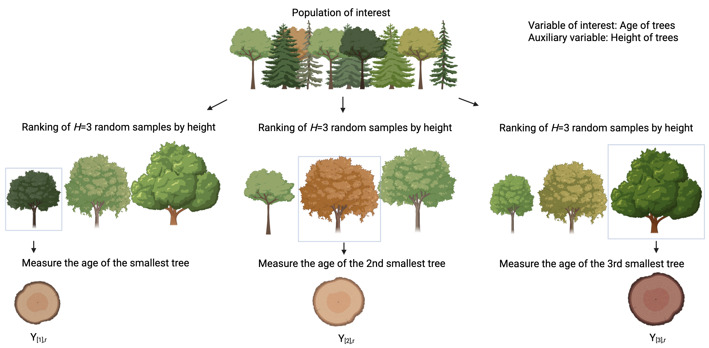

::::::: article
## Introduction {#sec:intro}

Randomized experiments are fundamental to modern scientific discovery
and typically depend on simple random sampling (SRS) to select units.
While increasing the sample size can enhance the efficiency of such
experiments, this approach may be impractical under resource
constraints. Ranked set sampling (RSS), first introduced by (McIntyre
1952), offers a cost-effective alternative. RSS is a stratified sampling
method that utilizes auxiliary ranking information to create strata
(Stokes and Sager 1988). When each rank stratum includes an equal number
of samples, it is called balanced RSS (BRSS). In contrast, unbalanced
RSS (URSS) occurs when the number of samples differs across strata.

RSS has a rich history of research and development (Chen et al. 2004;
Wolfe 2012, and references therein). Research has shown that BRSS
consistently outperforms SRS with an equivalent sample size in
estimation precision, as demonstrated by (Takahashi and Wakimoto 1968).
Numerous studies have explored the efficiency of RSS estimators (Dell
and Clutter 1972; David and Levine 1972; Stokes 1980). For skewed
distributions, URSS estimators can achieve even greater efficiency than
BRSS and SRS counterparts (Ahn et al. 2017; Ahn et al. 2024; Bocci et
al. 2010; Chen and Bai 2000; Ozturk and Wolfe 2000). However, the
performance of URSS depends heavily on the allocation of replicates
among strata. Improper allocation can lead to inefficiencies, sometimes
even worse than SRS. To address this, several studies (Bhoj and Chandra
2020; Chen and Bai 2000; McIntyre 1952; Wang et al. 2004) have proposed
appropriate allocation rules, with Neyman allocation being the most
widely used due to its optimal variance-minimizing properties when
estimating the population mean. As a result, most of the existing
literature on URSS has focused on this allocation strategy (Chen et al.
2004; Takahashi and Wakimoto 1968; Wang et al. 2017). Recently, (Ahn,
Wang, and Lim 2022) defined a sufficient set of allocation schemes to
ensure that URSS achieves greater efficiency in population mean
estimation compared to BRSS. They also introduced two practical
allocation adjustments to enhance the efficiency of URSS designs beyond
that of BRSS.

Several R packages are available for RSS, including
[**RSSampling**](https://CRAN.R-project.org/package=RSSampling) (Sevinc
et al. 2018), [**NSM3**](https://CRAN.R-project.org/package=NSM3)
(Schneider et al. 2024),
[**RSStest**](https://CRAN.R-project.org/package=RSStest) (Gökpınar et
al. 2023), and
[**RankedSetSampling**](https://CRAN.R-project.org/package=RankedSetSampling)
(Ozturk et al. 2021).
[**RSSampling**](https://CRAN.R-project.org/package=RSSampling) supports
a wide range of RSS extensions, offering both sampling tools and
statistical inference.
[**NSM3**](https://CRAN.R-project.org/package=NSM3) includes only
classical RSS as a sampling procedure and provides critical value
calculations for nonparametric inference.
[**RSStest**](https://CRAN.R-project.org/package=RSStest) focuses on
sampling and mean testing for RSS and MRSS and includes simulation tools
under normal distributions. Finally,
[**RankedSetSampling**](https://CRAN.R-project.org/package=RankedSetSampling)
extends its scope to joint probability sampling (JPS) and offers mean
and variance estimation for RSS. However, these packages are generally
limited to balanced RSS designs, restricting their applicability for
both sampling and inference in scenarios that require more flexibility.

BRSS designs are commonly implemented due to their simplicity and ease
of implementation. However, in real-world survey studies, missing data
often result in URSS scenarios, where BRSS methodologies become
impractical. URSS offers a flexible alternative by allowing unequal
allocation across strata, making it particularly effective for skewed
distributions where unequal allocation can significantly improve
estimation efficiency. Despite its advantages, implementing URSS has
been challenging due to the lack of accessible tools in existing
software packages.

R package
[**generalRSS**](https://CRAN.R-project.org/package=generalRSS) (Ahn and
Moon 2025) was developed to address these limitations by fully
supporting URSS while maintaining compatibility with BRSS. It provides
parametric and nonparametric inference tools for population means,
medians, AUCs, and proportions. Additionally, it offers functions for
generating ranked set samples with specified allocations and optimizing
allocation strategies to improve the efficiency of URSS designs. The
flexibility of URSS allows users to tailor sampling designs to
real-world constraints, making it particularly valuable when balanced
designs are impractical. By treating BRSS as a special case of URSS with
equal allocation across strata,
[**generalRSS**](https://CRAN.R-project.org/package=generalRSS) extends
the applicability of RSS beyond BRSS methods. This versatility makes it
a practical tool for a wide range of applications, including
environmental or medical studies, where flexible sampling strategies are
essential.

The rest of this paper is organized as follows. Section 2 provides an
overview of ranked set sampling, with Section 2.1 covering BRSS and
Section 2.2 discussing URSS, including their respective procedures.
Section 3 describes the analysis approaches and functions available in
[**generalRSS**](https://CRAN.R-project.org/package=generalRSS) and
compares them with existing R packages. Section 4 evaluates the
performance of RSS relative to SRS in two inference problems using data
from the US National Health and Nutrition Examination Survey (NHANES)
(Pruim 2015; Centers for Disease Control and Prevention 2023). Finally,
Section 5 summarizes the capabilities of
[**generalRSS**](https://CRAN.R-project.org/package=generalRSS), its
applications in inference problems, and future directions for inference
methods and sampling designs.

## Ranked set sampling {#sec:rss}

In this section, we illustrate the sampling procedure of RSS by
detailing its design and associated notations. An RSS dataset of size
$n$ can be represented as
$$\begin{equation}
\label{eqn:rss}
  \{(y_i, h_i, r_i), i=1,2,\cdots, n\},
\end{equation}   (\#eq:eqnrss)$$
where $y_i$ denotes the $i$-th observation, $h_i$ represents its rank
among $r_i$ independent observations, and $r_i$ denotes the set size.
Typically, RSS assumes a fixed set size, i.e., $r_i=H$ for all
$i=1,2,\cdots,n$, and $h_i$ takes values in $\{1,\cdots, H\}$. The
number of observations assigned to rank $h$ is given by
$n_h=\sum_{i=1}^n I(h_i=h)$, where $I(\cdot)$ denotes the indicator
function. The total sample size of the RSS data is then given by
$n=\sum_{h=1}^H n_h$. These notations define the structure of RSS data
and its implementation in
[**generalRSS**](https://CRAN.R-project.org/package=generalRSS).

RSS data can also be represented using the notation $Y_{[h],r}$ denoting
the $r$-th observation assigned to rank $h$, with $h=1,\cdots,H$ and
$r=1,\cdots,n_h$. The RSS sampling process consists of the following
steps:\
Step 1: Draw an i.i.d. sample of size $H$ from the target population.\
Step 2: Rank the $H$ sampled units using an auxiliary variable without
measuring the variable of primary interest.\
Step 3: Measure the unit ranked as the $h$-th smallest and discard the
remaining units.\
Step 4: Repeat Steps 1-3 for each rank $h$ up to $H$.\
These steps define one cycle of RSS, as illustrated in
Figure [1](#fig:cycle){reference-type="ref" reference="fig:cycle"}. In
each cycle, an i.i.d. random sample of size $H$ is selected, ranked, and
one unit is measured per stratum, yielding a sample consisting of $H$
strata with one observed unit. In
[**generalRSS**](https://CRAN.R-project.org/package=generalRSS), we
adopt the infinite population framework, where independently repeating
the cycles (i.e., with replacement across cycles) yields multiple
observations within each stratum and ultimately forms the final ranked
set sample.

<figure id="fig:cycle" data-latex-placement="!ht">

<figcaption>Figure 1: Example of a cycle <span
class="math inline"><em>r</em></span> of RSS of a set size of <span
class="math inline"><em>H</em> = 3</span> and ranked set samples. The
variable of interest (Y) is tree age and the auxiliary variable (X) is
tree height.</figcaption>
</figure>

### Balanced RSS

BRSS assumes equal allocation across strata, meaning that each rank $h$
is assigned the same number of observations, i.e., $n_h=m$ for every
$h=1,2,\cdots, H$. To obtain this, the RSS sampling cycle is repeated
$m$ times, resulting in a BRSS design with the sample allocation
$(m, m, \cdots, m)$. For $H=3$, followed by (Chen et al. 2004), a BRSS
procedure with $m$ cycles can be represented as:
$$\begin{aligned}
\textbf{Cycle r=1} \\
{\bf X}_{[1]11} \leq X_{[2]11} \leq X_{[3]11} &\implies Y_{[1],1} \\
X_{[1]21} \leq {\bf X}_{[2]21} \leq X_{[3]21} &\implies Y_{[2],1} \\
X_{[1]31} \leq X_{[2]31} \leq {\bf X}_{[3]31} &\implies Y_{[3],1} \\
\\
\textbf{Cycle r=2} \\
{\bf X}_{[1]12} \leq X_{[2]12} \leq X_{[3]12} &\implies Y_{[1],2} \\
X_{[1]22} \leq {\bf X}_{[2]22} \leq X_{[3]22} &\implies Y_{[2],2} \\
X_{[1]32} \leq X_{[2]32} \leq {\bf X}_{[3]32} &\implies Y_{[3],2} \\
\\
\cdots \cdots \cdots \cdots \cdots \cdots \cdots \cdots & \cdots \cdots \cdots
\\
\textbf{Cycle r=m} \\
{\bf X}_{[1]1m} \leq X_{[2]1m} \leq X_{[3]1m} &\implies Y_{[1],m} \\
X_{[1]2m} \leq {\bf X}_{[2]2m} \leq X_{[3]2m} &\implies Y_{[2],m} \\
X_{[1]3m} \leq X_{[2]3m} \leq {\bf X}_{[3]3m} &\implies Y_{[3],m} \\
\end{aligned}$$
where $X_{[h]ir}$ denotes the $h$-th smallest auxiliary variable of the
$i$-th SRS of size $H$, selected in the $r$-th cycle. The resulting BRSS
dataset is given by:
$$\{Y_{[1],1},\cdots, Y_{[1],m}, Y_{[2],1}, \cdots, Y_{[2],m}, \cdots, Y_{[H],1},\cdots, Y_{[H],m}\}.$$

### Unbalanced RSS

While BRSS assumes equal allocation across strata, real-world
applications often involve scenarios where such a balance is
impractical. For instance, skewed data, missing observations, or
resource constraints can result in an unbalanced design. URSS allows for
greater flexibility by permitting unequal allocations across strata,
enabling more efficient sampling when strata exhibit higher variability
or measurement difficulty. For example, if the population of interest
has strata with differing levels of variability in measurements,
allocating more samples to strata with higher variability can improve
estimation efficiency, which BRSS cannot achieve.

Unlike BRSS, which completes a full cycle by selecting one sample for
each stratum in every iteration, URSS follows an incomplete cycle
structure, where strata exit the sampling process once they reach their
allocated sample sizes $n_h$. This means that different strata complete
different numbers of iterations, leading to an unbalanced design. In
Step 4 of the URSS procedure, Steps 1-3 are repeated only for strata
that have not yet reached $n_h$, ensuring that each stratum meets its
predefined sample allocation.

For $H=3$, without loss of generality, we may assume an allocation such
that $n_1 \leq n_2 \leq n_3$. Then, a URSS with sample allocation
($n_1, n_2, n_3$) is obtained as:
$$\begin{aligned}
\textbf{Cycle r=1,\cdots,} &\textbf{n_1} \\
{\bf X}_{[1]1r} \leq X_{[2]1r} \leq X_{[3]1r} &\implies Y_{[1],r} \\
X_{[1]2r} \leq {\bf X}_{[2]2r} \leq X_{[3]2r} &\implies Y_{[2],r} \\
X_{[1]3r} \leq X_{[2]3r} \leq {\bf X}_{[3]3r} &\implies Y_{[3],r} \\
\\
\textbf{Cycle r=n_1+1,\cdots,} & \textbf{n_2} \\
X_{[1]2r} \leq {\bf X}_{[2]2r} \leq X_{[3]2r} &\implies Y_{[2],r} \\
X_{[1]3r} \leq X_{[2]3r} \leq {\bf X}_{[3]3r} &\implies Y_{[3],r} \\
\\
\textbf{Cycle r=n_2+1,\cdots,} &\textbf{n_3} \\
X_{[1]3r} \leq X_{[2]3r} \leq {\bf X}_{[3]3r} &\implies Y_{[3],r} \\
\end{aligned}$$

For a general $H$, the resulting URSS data can be represented as:
$$\{Y_{[1],1},\cdots, Y_{[1],n_1}, Y_{[2],1}, \cdots, Y_{[2],n_2}, \cdots, Y_{[H],1},\cdots, Y_{[H],n_H}\}.$$
In practice, missing values during the sampling process in BRSS often
lead to a URSS design. This highlights the importance of methodologies
that can accommodate both balanced and unbalanced designs seamlessly.

## [**generalRSS**](https://CRAN.R-project.org/package=generalRSS) package

In Section [2](#sec:rss){reference-type="ref" reference="sec:rss"}, we
introduced the RSS procedure, which involves selecting samples from a
population and ranking them based on an auxiliary variable. In this
section, we demonstrate how the
[**generalRSS**](https://CRAN.R-project.org/package=generalRSS) package
facilitates the implementation of RSS methodologies, enabling efficient
sampling and accurate inference of population parameters.

The [**generalRSS**](https://CRAN.R-project.org/package=generalRSS)
package, available on CRAN at
<https://cran.r-project.org/package=generalRSS>, can be installed and
loaded using the following commands:

``` r
install.packages("generalRSS")
library("generalRSS")
```

The package incorporates some functions from R packages
[**emplik**](https://CRAN.R-project.org/package=emplik) (Zhou et al.
2024) and [**rootSolve**](https://CRAN.R-project.org/package=rootSolve)
(Soetaert and Soetaert 2023) for solving empirical likelihood problems.
It is designed to address both sampling and inference problems in RSS
with a focus on unbalanced designs. The package comprises two main
components: (i) functions for sampling and sample allocation and (ii)
functions for statistical inference.

### Sampling and allocation design

The [**generalRSS**](https://CRAN.R-project.org/package=generalRSS)
package introduces two sampling functions to facilitate RSS procedures
as well as a design function to calculate efficient sample allocations
for URSS as summarized in Table [1](#tab:T1){reference-type="ref"
reference="tab:sampling"}.

::: {#tab:sampling}
  -----------------------------------------------------------------------------
  Function                Description
  ----------------------- -----------------------------------------------------
  `rss.sampling`          Generate ranked set samples

  `rss.simulation`        Generate example ranked set samples

  `rss.prop.sampling`     Generate ranked set samples for proportions

  `rss.prop.simulation`   Generate example ranked set samples for proportions

  `rss.design`            Calculate efficient sample allocations for RSS
  -----------------------------------------------------------------------------

  : (#tab:T1) Functions for the sampling and allocation design in
  the [**generalRSS**](https://CRAN.R-project.org/package=generalRSS)
  package.
:::

The function `rss.sampling` generates ranked set samples directly from a
population dataset containing an auxiliary variable ($X$) and,
optionally, a variable of interest ($Y$). Internally, the function
repeatedly draws sets of size $H$, ranks them by $X$, and selects the
unit of rank $h$ in each set, following the RSS procedure described in
Section [2](#sec:rss){reference-type="ref" reference="sec:rss"}. This
process is iterated across strata until the user-specified allocation
$(n_1,\ldots,n_H)$ is satisfied. When the auxiliary variable coincides
with the variable of interest (e.g., $X=Y$), perfect ranking is assumed.
If the variable of interest ($Y$) is not provided, the function selects
sample IDs based on $X$, returning a data frame containing IDs and ranks
($r_i$). If $Y$ is provided, the function directly returns RSS data with
observation ($y_i$). For illustration, we use the `iris` dataset as the
population, treating `Sepal.Length` as the outcome variable ($Y$) and
`Petal.Length` as the auxiliary variable ($X$), with a set size $H=3$
and sample allocations $(n_1=2, n_2=2, n_3=2)$:

``` r
data("iris")
id = 1:nrow(iris)
rss.data = rss.sampling(ID = id, Y = NULL, X = iris$Petal.Length, H = 3, 
+  nsamp = c(2,2,2))
head(rss.data)
```

``` r
rank  ID
1    1  80
2    1  34
3    2  91
4    2 121
5    3 106
6    3 122
```

Since $Y$ was not provided, the function returns only the selected IDs
and ranks. The actual measurement of $Y$ must be collected for these
selected samples to complete the dataset. When $Y$ is included in the
population dataset, the function automatically extracts the
corresponding values and returns a data frame containing ranks ($r_i$),
IDs, and observations ($y_i$).

``` r
rss.data = rss.sampling(ID = id, Y = iris$Sepal.Length, X = iris$Petal.Length, H = 3, 
                        nsamp = c(2,2,2))
head(rss.data)
```

``` r
  rank  ID   y
1    1  80 5.7
2    1  34 5.5
3    2  91 5.5
4    2 121 6.9
5    3 106 7.6
6    3 122 5.6
```

The `nsamp` parameter specifies the number of cycles ($n_h$) for each
stratum. When $n_h=m$ for all $h$, the output is BRSS data. If $n_h$
varies across strata, the design corresponds to a URSS scheme.

The function `rss.simulation` generates ranked set samples by simulating
data from selected probability distributions, including normal, t, and
lognormal distributions, for illustrative purposes. Users can specify
the set size ($H$), the number of cycles ($n_h$), and ranking accuracy
($\rho$) through the `rho` parameter, and a mean shift through `delta`,
enabling the simulation of populations with group-specific differences.
The key feature is that $\rho$ directly controls the quality of ranking,
from perfect ranking $\rho=1$ (i.e., no ranking errors) to increasingly
noisy ranking as $\rho$ decreases.

The ranking accuracy in the simulated data is controlled through a
linear ranking model defined as $X_i=Y_i+\epsilon_i$ for
$i=1,2,\cdots,n$, where $\epsilon_i$ represents independent normal
random variables with mean zero and variance chosen to achieve a
specific correlation $\rho=Corr(X, Y)$. The `rho` parameter determines
the correlation between the outcome variable ($Y$) and the auxiliary
variable ($X$). The outcome variable $Y$ is drawn from one of three
fixed shapes: $N(0,1)$, $t_{5}/\sqrt{5/3}$, or
$\text{Lognormal}(0,\sqrt{0.481})-1.27$. Thus, in all cases $Y$ has
approximately mean 0 and variance 1. This standardization ensures that
simulation results reflect distributional shape and $\rho$, rather than
arbitrary parameters. The function is intended as an illustrative tool
and therefore does not allow user-specified distributional parameters
such as degrees of freedom or scale. The `dist` parameter determines the
underlying distribution shape. The function returns a data frame
containing ranks ($r_i$) and outcomes ($y_i$). For example, the
following code generates RSS data from a normal distribution with a mean
shift of $\delta=0$ and a ranking quality of $\rho=0.8$:

``` r
rss.simulation(H=3, nsamp=c(2,2,2), dist="normal", rho=0.8, delta=0)
```

The functions `rss.prop.sampling` and `rss.prop.simulation` are the
sampling and simulation functions for proportions. The variable of
interest $(Y)$ is a binary variable of 0 and 1, corresponding to failure
and success, respectively. We assume the perfect ranking $(X=Y)$ for
proportions. For illustration, we use the `iris` dataset as the
population, defining both the outcome and the auxiliary variable ($X=Y$)
as a binary indicator of whether `Sepal.Length` is less than 5.8:

``` r
data(iris)
id = 1:nrow(iris)
X = ifelse(iris$Sepal.Length < 5.8,0,1)
head(X)
```

``` r
0 0 0 0 0 0
```

Once the binary variable is defined, we apply `rss.prop.sampling` to
generate RSS data with a set size of $H=3$ and sample allocations
$(n_1=2, n_2=2, n_3=2)$:

``` r
rss.prop.data = rss.prop.sampling(ID = id, X = X, H = 3, nsamp = c(2,2,2))
rss.prop.data
```

``` r
  rank ID
1    1 14
2    1 43
3    2 91
4    2 92
5    3 72
6    3 78
```

The `rss.prop.simulation` function generates ranked set samples for
proportions by simulating data based on a true population proportion
$p$. The `p` parameter represents the true proportion of successes and
serves as the success probability in a binomial distribution of $Y$. For
example, the following code generates RSS data with a proportion of
$p=0.6$:

``` r
rss.prop.data = rss.prop.simulation(H = 3, nsamp = c(2,2,2), p = 0.6)
rss.prop.data
```

``` r
  rank  y
1    1  0
2    1  0
3    2  1
4    2  1
5    3  1
6    3  1
```

The `rss.design` function evaluates the efficiency of a current URSS
design for mean or proportion estimation based on either an initial RSS
dataset or predefined sample allocation. If the design is inefficient
compared to SRS or BRSS, the function calculates improved sample
allocations to enhance efficiency. The function offers three allocations
for estimating a population mean: integer Neyman allocation (Wright
2012), local ratio consistent (LRC) allocation (Ahn, Wang, and Lim
2022), and adjusted Neyman (AN) allocation (Ahn, Wang, and Lim 2022).

Let ${\bf n}=(n_1,\cdots,n_H)$ with total $n=\sum_{h=1}^H n_h$, and let
$\sigma_h^2$ be the variance of the $h$-th rank stratum. The Neyman
allocation
$\tilde{\bf{n}}=(\tilde{n}_1, \tilde{n}_2, \cdots, \tilde{n}_H)$
minimizes the variance of the RSS mean estimator with
$$\tilde{n}_h=\frac{\sigma_{h}}{\sum_{l=1}^H \sigma_l}\cdot n,~~h=1,\cdots,H.$$
Since $\tilde{n}_h$ is generally noninteger, the function `rss.design`
implements the integer allocation proposed by (Wright 2012), which
applies the method of equal proportions to the noninteger Neyman
allocation. This procedure allocates one unit to each stratum and then
distributes the remaining $(n-H)$ units according to priority values
$\sigma_h/\sqrt{k(k+1)}$ $(k=1,2,\ldots)$, thereby yielding integer
Neyman allocations $(n_1,\ldots,n_H)$ that sum exactly to $n$.

Ahn, Wang, and Lim (2022) proposed the allocation set
$${\mathcal N}=\left\{{\bf n}: 1 \le \frac{n_{h+1}}{n_h} \le \frac{\sigma_{h+1}^2}{\sigma_h^2},~~ h=1,\cdots, H-1\right\}$$
and showed that this set provides a sufficient condition for efficiency.
Whenever ${\bf n}\in\mathcal N$, the URSS estimator is guaranteed to be
at least as efficient as the BRSS estimator, that is,
$\mathrm{Var}(\hat\mu_{URSS}) \le \mathrm{Var}(\hat\mu_{BRSS})$. The LRC
allocation is obtained by an adjustment procedure that moves a given
allocation into $\mathcal N$ with minimal changes. Specifically, if the
upper ratio condition $n_{h+1}/n_h \le \sigma_{h+1}^2/\sigma_h^2$ is
violated, one unit is added to the smaller stratum $n_h$; if the lower
condition $n_{h+1}/n_h \ge 1$ is violated, one unit is added to the
larger stratum $n_{h+1}$. These updates are repeated until all local
ratio conditions hold, producing an allocation that lies in
$\mathcal N$.

The AN allocation raises each stratum to at least its Neyman level,
$$n_h^{AN}=\max(n_h^N, n_h),~~h=1,\cdots,H,$$
so that ${\bf n}^{AN}$ is closer to Neyman and typically more efficient
than the initial $\bf n$ because it uses more samples and moves toward
the Neyman allocation, even though it is not guaranteed to lie in
$\mathcal N$.

These methods ensure greater efficiency with minimal additional samples
compared to the original URSS design. For example, we consider a
simulated URSS dataset with an initial allocation of $(3,10,5)$. The
function calculates optimized allocations as follows:

``` r
rss.data = rss.simulation(H = 3, nsamp = c(3,10,5), dist = "t", rho = 1, delta = 0)
rss.design(rss.data)
```

``` r
$original.n
n1 n2 n3 
 3 10  5 

$Integer.Neyman
n1 n2 n3 
 4  5  9 

$Adj.Neyman
n1 n2 n3 
 4 10  9 

$LRC.allocation
n1 n2 n3 
 6 10 10 
```

In this example, the function first computes the integer Neyman
allocation ($n_1=4, n_2=5, n_3=9$) and then recommends adding 1 sample
to the first stratum and 4 samples to the third stratum, resulting in an
adjusted Neyman allocation ($n_1=4, n_2=10, n_3=9$). Similarly, it
computes the LRC allocation ($n_1=6, n_2=10, n_3=10$) by adding 3
samples to the first stratum and 5 samples to the third stratum. These
adjusted allocations improve the efficiency of the original URSS design.

The `rss.design` function also computes the optimal Neyman allocation
for estimating a population proportion under perfect rankings (Chen et
al. 2006). Let $p_h$ denote the success probability in the $h$-th
stratum. The variance of the URSS proportion estimator is minimized with
the Neyman allocation for proportions given by
$${\tilde n}_h = n \frac{\sqrt{p_h(1-p_h)}}{\sum_{l=1}^H \sqrt{p_l(1-p_l)}},~~h=1,\cdots,H.$$
The following example compares an initial URSS allocation
$(n_1=10,n_2=15,n_3=20)$ to the computed Neyman allocation:

``` r
rss.prop.data = rss.prop.simulation(H = 3, nsamp = c(10,15,20), p = 0.5)
rss.design(rss.prop.data, prop = TRUE)
```

``` r
$original.n
n1 n2 n3 
10 15 20 

$Neyman.proportion
      n1       n2       n3 
12.45017 19.36741 13.18242 
```

Here, the computed Neyman allocation aligns more closely to the true
Neyman allocation $(n_1=12.814, n_2=19.373, n_3=12.814)$, as suggested
by (Chen et al. 2006), compared to the initial URSS design.

### Statistical inference

The [**generalRSS**](https://CRAN.R-project.org/package=generalRSS)
provides six statistical inference functions for estimating and testing
the population means, medians, proportions, and AUCs using RSS data.
These functions include both parametric and nonparametric methods, as
summarized in Table [2](#tab:T2){reference-type="ref"
reference="tab:inference"}.

::: {#tab:inference}
  -------------------------------------------------------------------------------
  Function          Description
  ----------------- -------------------------------------------------------------
  `rss.z.test`      RSS z-test for one-sample and two-sample problems

  `rss.t.test`      RSS t-test for one-sample and two-sample problems

  `rss.ELR.test`    RSS empirical likelihood ratio test for one-sample problems

  `rss.sign.test`   RSS Sign test for one-sample problems

  `rss.prop.test`   RSS proportion test for one-sample problems

  `rss.AUC.test`    RSS empirical likelihood ratio test for two-sample problems
  -------------------------------------------------------------------------------

  : (#tab:T2) Statistical inference functions in the
  [**generalRSS**](https://CRAN.R-project.org/package=generalRSS)
  package.
:::

The `rss.z.test` function provides point estimation, confidence
intervals (CIs), and hypothesis testing for the population mean using a
normal approximation for RSS data (Chen et al. 2004; Ahn et al. 2024).
It uses the asymptotic pivotal method to test $H_0:\mu=\mu_0$, where the
test statistic is:
$$\begin{equation}
    \frac{\widehat{\mu}_{\rm RSS}-\mu_{0}}{\widehat{\sigma}_{\widehat{\mu}_{\rm RSS}}} \overset{d}{\longrightarrow}N(0,1)
    \label{eq:pivot}
\end{equation}   (\#eq:pivot)$$
where
$\widehat{\mu}_{\rm RSS}=\frac{1}{H}\sum_{h=1}^H \frac{1}{n_h}\sum_{r=1}^{n_h} Y_{[h],r}$,
$\widehat{\sigma}^2_{\widehat{\mu}_{\rm RSS}}=\frac{1}{H^2}\sum_{h=1}^H\frac{1}{n_h(n_h-1)}\sum_{r=1}^{n_h}\left(Y_{[h],r}-\bar{Y}_{[h]}\right)^2$,
and $\bar{Y}_{[h]}=\sum_{r=1}^{n_h} Y_{[h],r}/n_{h}$.

Similarly, the `rss.t.test` function performs mean inference using a
t-distribution approximation of the pivot statistics in
equation (\@ref(eq:pivot)) (Ahn et al. 2014). It supports two methods
for estimating degrees of freedom: (i) `sample` applies a Welch-type
approximation replacing the in-stratum variances with their sample
estimates and (ii) `naive` uses $n-H$. The choice is controlled by the
`method` parameter. In practice, we recommend `naive` for BRSS due to
its simplicity, except for small-sample skewed data where `sample`
performs better. For URSS, the sample-based estimator `sample` is
generally preferred. Both `rss.z.test` and `rss.t.test` functions handle
one-sample and two-sample problems using the same pivotal statistics but
differ in their approximation methods. The following example
demonstrates the `rss.t.test` function for a two-sample problem, testing
the hypothesis that the population mean difference is 0:

``` r
rss.data1 = rss.simulation(H = 3, nsamp = c(6,6,6), dist = "normal", 
                           rho = 0.8, delta = 0)
rss.data2 = rss.simulation(H = 3, nsamp = c(6,8,10), dist = "normal", 
                        rho = 0.8, delta = 0.5)
rss.t.test(data1 = rss.data1, data2 = rss.data2, alpha = 0.05, 
           alternative = "two.sided", mu0 = 0, method = "naive")
```

``` r
$RSS_mean
[1] -0.05269583  0.59074771

$CI
[1] -0.9032096 -0.3836775

$t
[1] -5.023613

$df
[1] 36

$p.value
[1] 1.397776e-05
```

The `rss.ELR.test` function provides a semi-parametric one-sample mean
test using an empirical likelihood ratio (ELR) test (Ahn et al. 2024).
This method offers a flexible alternative to traditional parametric
approaches, particularly when normality assumptions are not appropriate.
`rss.ELR.test` uses the empirical likelihood function which is defined
as:
$$\begin{equation}
\nonumber
L(\mu_0)=\sup \left\{\prod_{h=1}^H\prod_{r=1}^{n_h}  p_{h,r}: \sum_{r=1}^{n_h} p_{h,r}=\frac{1}{H} ~~and~~ \sum_{r=1}^{n_h} p_{h,r} Y_{[h],r}=\mu_0 \right\},
\end{equation}$$
where $p_{h,r}$ is a mass probability on $Y_{[h],r}$. The test statistic
is the empirical likelihood ratio $-2\log LR(\mu_0)$, which
asymptotically follows a chi-square distribution with one degree of
freedom. The following example demonstrates how to test the hypothesis
$H_0: \mu=0$ using `rss.ELR.test`:

``` r
rss.ELR.test(data = rss.data1, alpha = 0.05, mu0 = 0)
```

``` r
$RSS_mean
[1] -0.05269583

$CI
[1] -0.3153479  0.2204137

$`-2*log.LR`
[1] 0.1488371

$p.value
[1] 0.6996491
```

The `rss.sign.test` function performs a nonparametric one-sample sign
test, providing median estimation, CIs, and hypothesis testing. For
BRSS, the function follows the method of (Hettmansperger 1995) whereas
it implements the approach of (Barabesi 2001) for URSS. Under the null
hypothesis $H_0:M=M_0$, the test statistic for BRSS is:
$$\begin{equation}
 \nonumber 
n^{-1/2}\left(S_{{\rm RSS}}^{+}-\frac{n}{2}\right)
 \overset{d}{\longrightarrow}N\left(0,~\frac{\eta^{2}}{4}\right),
\end{equation}$$
where $S_{{\rm RSS}}^{+}=\sum_{i=1}^{n}{\rm I}\big( y_{i}-M_{0}>0\big)$,
$\eta^{2}=1-\frac{4}{H}\sum_{h=1}^{H}\left\{ B\left(h,H-h+1,\frac{1}{2}\right)-\frac{1}{2}\right\} ^{2}$,
and $B(h,s,q)$ is the cumulative distribution function of the beta
distribution with parameters $h$ and $s$ for $0 \le q \le 1$. For URSS,
the test statistic follows:
$$\begin{equation}
 \nonumber
\left(S_{{\rm RSS}}^{+}- \sum_{h=1}^H n_h (1-\beta_h) \right)
 \overset{d}{\longrightarrow}N\left(0,\sum_{h=1}^H n_h \beta_h (1-\beta_h)\right),
\end{equation}$$
where $\beta_h= B\left(h, H-h+1,\frac{1}{2}\right)$. Thus, the function
automatically applies the appropriate statistic depending on whether the
input design is balanced or unbalanced. The following example
demonstrates how to test whether the population median is 0 using
`rss.sign.test`:

``` r
rss.sign.test(data = rss.data1, alpha = 0.05, alternative = "two.sided", median0 = 0)
```

``` r
$RSS_median
[1] -0.09226903

$sign
[1] 12

$CI
[1] -0.3059627  0.3796395

$z
[1] -0.7745967

$p.value
[1] 0.438578
```

The `rss.prop.test` function offers proportion estimation, CIs, and
hypothesis testing for binary outcome variables ($Y$). The unbiased RSS
estimator for $p$ is
$\hat{p}=\frac{1}{H}\sum_{h=1}^H\frac{1}{n_h}\sum_{r=1}^{n_h}Y_{[h]r}$
and its variance is
$\text{Var}(\hat{p})=\frac{1}{H^2}\sum_{h=1}^{H}\frac{1}{n_h}\hat{p}(1-\hat{p})$.
Under perfect rankings, we can use a normal approximation for
proportions of RSS data (Chen et al. 2006; Ahn, Wang, Wang, et al.
2022):
$$\begin{equation}
 \nonumber 
\hat{p}-p \overset{d}{\longrightarrow}N\left(0,\frac{1}{H} \sum_{l=H-h+1}^H \binom{H}{l}p^l(1-p)^{H-l} \right).
\end{equation}$$
We extend the CI method proposed by (Zamanzade and Mahdizadeh 2020) for
BRSS to URSS by
$\hat{p} \pm z_{1-\frac{\alpha}{2}}\sqrt{\frac{1}{H^2}\sum_{h=1}^H \frac{1}{n_h}\hat{p}_h(1-\hat{p}_h)}$
where
$\hat{p}_h=\sum_{l=H-h+1}^H \binom{H}{l}\hat{p}^l(1-\hat{p})^{H-l}$. The
following example illustrates how to use `rss.prop.test` to test the
null hypothesis $H_0: p=0.2$ when the true population proportion is
$p=0.6$.

``` r
rss.prop.data = rss.prop.simulation(H = 3, nsamp = c(12,9,6), p = 0.6)
rss.prop.test(data = rss.prop.data, alpha = 0.05, alternative = "two.sided", p0 = 0.2)
```

``` r
$RSS_prop
[1] 0.4907407

$CI
[1] 0.3367646 0.6447169

$pstat
[1] 3.700841

$p.value
[1] 0.0002148859
```

Additionally, the `rss.AUC.test` function conducts a semi-parametric ELR
test for comparing the AUC between two groups based on RSS data (Moon et
al. 2022). The AUC can be interpreted as the probability that a randomly
chosen observation from one group exceeds a randomly chosen observation
from the other group. This test is equivalent to the Mann-Whitney U
test, which assesses whether there is a significant difference in the
distributions between the two groups. It provides AUC estimation, CIs,
and hypothesis testing. For example, the `rss.AUC.test` can be used to
test the null hypothesis of no difference in AUC between two groups
($H_0: AUC=\delta_0=0.5$):

``` r
rss.AUC.test(data1 = rss.data1, data2 = rss.data2, alpha = 0.05, delta0 = 0.5)
```

``` r
$RSS_AUC
[1] 0.7123457

$CI
[1] 0.5586732 0.8156125

$`-2*log.LR`
[1] 6.63908

$p.value
[1] 0.009976544
```

### Comparison with existing packages

To our knowledge, the existing R packages that support RSS include
[**RSSampling**](https://CRAN.R-project.org/package=RSSampling),
[**NSM3**](https://CRAN.R-project.org/package=NSM3),
[**RSStest**](https://CRAN.R-project.org/package=RSStest), and
[**RankedSetSampling**](https://CRAN.R-project.org/package=RankedSetSampling).
While all these packages support RSS from population data using
auxiliary variables for imperfect ranking - a standard feature in RSS
methodologies - they vary in their scope and additional functionalities,
with most focusing primarily on BRSS.

[**RSSampling**](https://CRAN.R-project.org/package=RSSampling) provides
sampling functions for both classical RSS and several modified RSS
variants, such as Median RSS (MRSS), Percentile RSS (PRSS), Extreme RSS
(ERSS), and Double RSS (DRSS). Additionally, it includes statistical
inference methods for classical RSS, assuming balanced designs for both
sampling and inference.
[**NSM3**](https://CRAN.R-project.org/package=NSM3) includes only the
classical RSS procedure as a sampling tool, along with critical value
calculations for a nonparametric test.
[**RSStest**](https://CRAN.R-project.org/package=RSStest) primarily
focuses on mean testing for RSS and MRSS and generating RSS data under a
normal distribution. Lastly,
[**RankedSetSampling**](https://CRAN.R-project.org/package=RankedSetSampling)
incorporates Judgment Post-Stratified Sampling (JPS) and RSS, offering
sampling, mean estimation, and variance calculation, but it is limited
to balanced designs.

The [**generalRSS**](https://CRAN.R-project.org/package=generalRSS)
package distinguishes itself by fully supporting both BRSS and URSS,
offering advanced tools for flexible sampling and efficient sample
allocation in URSS. Additionally, it includes parametric and
nonparametric inference procedures for population means, medians,
proportions, and AUC, along with simulation tools under predefined
distributions (Normal, t, and Log-normal), leveraging a linear ranking
model to incorporate imperfect ranking. Unlike other packages, it
provides methods to calculate efficient sample allocations for URSS,
improving estimation efficiency for both continuous and binary data.

For BRSS, the methods implemented in
[**generalRSS**](https://CRAN.R-project.org/package=generalRSS) align
with the standard approaches available in other packages and are
therefore not explicitly compared here. Instead, the focus is on the
unique features of
[**generalRSS**](https://CRAN.R-project.org/package=generalRSS) for URSS
and its broader applicability.
Table [\[tab:comparison\]](#tab:comparison){reference-type="ref"
reference="tab:comparison"} summarizes the capabilities of
[**generalRSS**](https://CRAN.R-project.org/package=generalRSS) compared
to other existing packages.

## Applications

In this section, we consider two inference problems comparing two
sampling methods: RSS and SRS. The first problem involves a one-sample
mean inference, and the second involves a two-sample AUC inference. The
goal is to estimate the population mean and AUC and compare the
efficiency of RSS and SRS in terms of the CI length of each estimator.

### One-sample problem {#sec:app-one}

We demonstrate the RSS sampling and inference procedures by estimating
the mean body mass index (`BMI`) and testing the hypothesis
$H_0: \mu=\mu_0$. BMI is a widely used indicator of body fat based on
weight and height, commonly employed to assess an individual's health
status.

For this analysis, we use the US National Health and Nutrition
Examination Survey (NHANES) dataset, available in the R package
[**NHANES**](https://CRAN.R-project.org/package=NHANES) (Pruim 2015).
NHANES provides comprehensive health-related measurements collected from
individuals across the United States. In this study, we focus on two key
variables in the NHANES dataset: `BMI` as the outcome of interest ($Y$)
and `weight` as the auxiliary variable ($X$) in RSS.

The NHANES dataset originally contains BMI records for approximately
10,000 subjects. However, due to duplicated entries, only the first
observation per subject is retained, resulting in a final dataset of
6,779 unique individuals. We treat this pre-processed dataset as the
underlying population for our analysis.

We note that NHANES data are used strictly for illustrative purposes to
demonstrate the functionality and flexibility of the generalRSS package,
rather than to produce population-level estimates. The NHANES dataset is
derived from a stratified, multi-stage, unequal probability cluster
sampling design. Consequently, the results presented should not be
interpreted as valid inferences about the U.S. population without
applying appropriate survey-weighted methods and design-based variance
estimation techniques.

We load the NHANES dataset from the R package
[**NHANES**](https://CRAN.R-project.org/package=NHANES) as follows:

``` r
library("NHANES")
```

The duplicated data are pre-processed by running:

``` r
library(dplyr)
dat = NHANES |> distinct(ID, .keep_all = TRUE) |> select(ID, BMI, Weight)
mu0 = mean(dat$BMI,na.rm=T)
mu0
```

``` r
[1] 26.48768
```

``` r
cor(na.omit(cbind(dat$BMI, dat$Weight)))
```

``` r
             BMI    Weight
BMI    1.0000000 0.9027414
Weight 0.9027414 1.0000000
```

The true mean of `BMI` is 26.488 and the correlation between the
auxiliary variable `Weight` and the outcome variable `BMI` is 0.903,
indicating high-ranking quality. The histogram of the `BMI` in
Figure [2](#fig:bmi_hist){reference-type="ref" reference="fig:bmi_hist"}
shows a skewed distribution, suggesting that URSS may be more efficient
than SRS.

{#fig:bmi_hist width="60%"}

Using the NHANES data as the underlying population, we start with a BRSS
design, using a set size of $H=3$ and a total sample size of $n=30$,
resulting in a balanced allocation of $n_h=10$ for each stratum
($h=1, 2, 3$). However, missing data in the outcome variable can lead to
a URSS design. In such cases, we apply `rss.design` to evaluate the
efficiency of the initial sample allocation. If the allocation is deemed
inefficient, adjusted allocations are calculated, and additional
sampling is performed to obtain the final RSS data. Inference methods
are then applied to the final RSS data.

In practice, we first generate BRSS data using the auxiliary variable
(`Weight`) to rank and select samples without measuring BMI. The outcome
variable is then measured for the selected samples as described in
Section [2](#sec:rss){reference-type="ref" reference="sec:rss"}.

``` r
org.nsamp = c(10,10,10)
rss.dat = rss.sampling(ID=dat$ID, X=dat$Weight, H=3, nsamp=org.nsamp)
ind<- match(rss.dat$ID,dat$ID)
rss.dat$y = dat$BMI[ind]
head(rss.dat)
```

``` r
  rank    ID     y
1    1 64759 24.80
2    1 58179 16.93
3    1 54775 18.84
4    1 63972 19.90
5    1 52695 28.04
6    1 64076    NA
```

Here, we observe missing values in the outcome `y`, resulting in a URSS
sample allocation $(n_1=9, n_2=10, n_3=10)$ and total sample size $n=29$
as shown below:

``` r
rss.dat = na.omit(rss.dat)
org.nsamp = table(rss.dat$rank)
print(org.nsamp)
```

``` r
 1  2  3 
 9 10  10 
```

Using this original URSS data, we test the null hypothesis
$H_0:\mu=\mu_0$ using a t-test with `rss.t.test` and the `sample`
method.

``` r
org.t = rss.t.test(data1 = rss.dat,mu0 = mu0, method = "sample")
print(org.t)
```

``` r
$RSS_mean
[1] 27.02993

$CI
[1] 24.90905 29.15080

$t
[1] 0.5323651

$df
[1] 20.57505

$p.value
[1] 0.6001757
```

``` r
diff(org.t$CI) 
```

``` r
[1] 4.241756
```

In Figure [2](#fig:bmi_hist){reference-type="ref"
reference="fig:bmi_hist"}, the outcome variable shows a skewed
distribution and URSS may offer improved efficiency, but the current
sample allocation `org.nsamp` ($n_1=9, n_2=10, n_3=10$) is not
guaranteed to be optimal. To address this, we use `rss.design` to
evaluate sample efficiency and adjust allocations accordingly:

``` r
alloc = RSS.design(data = rss.dat[,c("rank","y")])
add.samp = alloc$Adj.Neyman - org.nsamp
add.samp
```

``` r
1 2 3 
0 0 3
```

We adopt the adjusted Neyman allocation `Adj.Neyman` and identify the
need for three additional samples in the third stratum. From the
remaining population, except for the pre-selected samples, we sample
again using the auxiliary variable without measuring the outcome. Then,
we measure the outcome for the three newly selected samples:

``` r
add.dat = rss.sampling(ID=dat$ID, X=dat$Weight, H=3, nsamp=add.samp)
add.ind = match(add.dat$ID, dat$ID)
add.dat$y = dat$BMI[add.ind]
```

By merging the additional data with the original data, we obtain
efficient URSS data.

``` r
update.dat = rbind(rss.dat, add.dat)
table(update.dat$rank) 
```

``` r
 1  2  3 
 9 10 13
```

Using this updated RSS data, we reapply the t-test with `rss.t.test`:

``` r
update.t = rss.t.test(data1 = update.dat, mu0 = mu0, method = "sample")
print(update.t)
```

``` r
$RSS_mean
[1] 26.59152

$CI
[1] 24.59261 28.59042

$t
[1] 0.1067613

$df
[1] 26.07755

$p.value
[1] 0.9157954
```

``` r
diff(update.t$CI) 
```

``` r
[1] 3.997811
```

When we compare the results before and after adding extra samples, we
observe that the CI length decreases from 4.242 to 3.998 for RSS data.

We repeated the following procedure for 500 replicates to compare the
performance of the original URSS, updated RSS, and SRS. For a fair
comparison, SRS was assigned the same total sample size as the updated
RSS. To generate the original URSS in each replicate, we introduced 10%
missing values into a BRSS dataset with $n_h=m = 10$, resulting in a
URSS design. For the updated allocations, we selected the sample
allocation provided by the `rss.design` function that required the
smallest number of additional samples.
Table [3](#tab:T3){reference-type="ref" reference="tab:mucomparison"}
presents the average sample size, coverage probability, and 95% CI over
500 replicates. Compared to the original URSS, the updated RSS achieves
a significant reduction in CI length while maintaining a coverage
probability close to the nominal 95% level. Additionally, compared to
SRS, the updated RSS demonstrates superior performance, achieving both a
higher coverage probability and a shorter CI length. These findings
underscore the efficiency of updated RSS in handling missing data and
enhancing estimation precision.

::: {#tab:mucomparison}
  ----------------------------------------------------------------
  Sampling         Sample size   Coverage Probability   CI Length
  --------------- ------------- ---------------------- -----------
  Original URSS       25.72             0.948             4.981

  Updated RSS         27.15             0.950             4.686

  SRS                 27.15             0.942             5.924
  ----------------------------------------------------------------

  : (#tab:T3) Comparison of mean inference results from RSS and SRS
  over 500 replicates.
:::

### Two-sample problem {#sec:app-two}

We demonstrate the RSS sampling and inference procedures by comparing
fasting plasma glucose (FPG) levels between two groups with and without
diabetes through the estimation of the AUC ($\delta$). The FPG test
determines whether blood sugar levels stay elevated after an extended
fasting period, signaling potential issues with sugar metabolism
(American Diabetes Association 2022). However, the FPG test may
sometimes be inconvenient because it requires a fasting period of at
least 8 hours. The HbA1c test, also called glycohemoglobin or hemoglobin
A1c, is another valuable tool for diagnosing diabetes. It provides an
average of blood sugar levels over the past 2-3 months and does not
require any prior preparation, unlike the FPG test (American Diabetes
Association 2022). In this application, we set the FPG as the outcome
variable ($Y$) and glycohemoglobin as the auxiliary variable ($X$).

AUC represents the probability that a randomly selected individual from
the diabetes group has a higher FPG than a randomly selected individual
from the non-diabetes group. For example, under $H_0: \delta=0.5$, the
two distributions are identical, indicating no discriminatory ability
between the groups based on FPG.

We analyze the NHANES dataset collected between 2021 and 2023, focusing
on 3,540 subjects with data on FPG (`LBXGLU`), glycohemoglobin
(`LBXGH`), and diabetes-related information (`DIQ010`) (Centers for
Disease Control and Prevention 2023). These variables are provided in
the supplementary file `diabetesAUC.RData`. We first separate the data
into two groups by diabetes status.

``` r
load("diabetesAUC.RData") # load data
grp1 = data |> filter(DIQ010 == 0) # non-diabetic
grp2 = data |> filter(DIQ010 == 1) # diabetic
mean(grp1$LBXGLU)
```

``` r
[1] 100.4777
```

``` r
mean(grp2$LBXGLU)
```

``` r
[1] 156.5644
```

``` r
cor(data$LBXGH, data$LBXGLU)
```

``` r
[1] 0.813826
```

The true mean FPG levels are 100.478 for non-diabetes and 156.564 for
diabetes populations, respectively. The histograms of FPG by diabetes
status in Figure [3](#fig:hist-two){reference-type="ref"
reference="fig:hist-two"} highlight that the FPG distribution in the
diabetes group is shifted towards higher values compared to the
non-diabetes group. Also, the correlation between the outcome and
auxiliary variables (i.e., FPG and glycohemoglobin) is 0.814, confirming
strong ranking quality.

{#fig:hist-two width="60%"}

Using R package [**pROC**](https://CRAN.R-project.org/package=pROC), we
calculate the true AUC:

``` r
library(pROC)
delta0 = roc(data$DIQ010, data$LBXGLU, direction = c("<"), levels = c(0,1))$auc
delta0
```

``` r
Area under the curve: 0.8861
```

In this section, we assume that the FPG level ($Y$) of the population is
given, compared to Section [4.1](#sec:app-one){reference-type="ref"
reference="sec:app-one"}. We use a set size of $H=3$ and a total sample
size of $n=30$, a balanced allocation of $n_h=10$ for each stratum
($h=1, 2, 3$). Samples are ranked by the glycohemoglobin ($X$) and
measure the outcome ($Y$) simultaneously for each group with a BRSS
design:

``` r
org.nsamp1 = c(10,10,10)
org.nsamp2 = c(10,10,10)
H = length(org.nsamp1)
brss.grp1 = rss.sampling(ID = grp1$SEQN, X = grp1$LBXGH, Y = grp1$LBXGLU, H = H,
                         nsamp=org.nsamp1)
brss.grp2 = rss.sampling(ID = grp2$SEQN, X = grp2$LBXGH, Y = grp2$LBXGLU, H = H, 
                         nsamp = org.nsamp2)
```

We then apply `rss.AUC.test` to these two RSS datasets to test the null
hypothesis $H_0: AUC=0.8861$.

``` r
brss.auc = rss.AUC.test(data1 = brss.grp1, data2 = brss.grp2, alpha = 0.05, 
                        delta0 = delta0)
brss.auc
```

``` r
$RSS_AUC
[1] 0.8477778

$CI
[1] 0.7046560 0.9178329

$`-2*log.LR`
[1] 0.818453

$p.value
[1] 0.3656329
```

`rss.AUC.test` returns the RSS AUC point estimate, CI, the ELR test
statistics, and the $p$ value for the test.

We can improve the efficiency of RSS sampling using URSS design compared
to BRSS. If AUC is expected to be high, the smallest rank group in the
non-diabetic group and the largest rank group in the diabetic group
provide limited information in AUC inference because the FPG levels are
expected to be too small and too large, respectively. Therefore, a more
precise inference is possible if we could have a larger number of
samples from the largest rank group in the non-diabetic group and a
larger number of samples from the smallest rank group in the diabetes
group. To illustrate this, we set $(n_1=5, n_2=10, n_3=15)$ for the
non-diabetic group and $(n_1=15, n_2=10, n_3=5)$ for the diabetic group.
The URSS sampling and AUC inference can be done:

``` r
org.nsamp1 = c(5,10,15)
org.nsamp2 = c(15,10,5)
H = length(org.nsamp1)
urss.grp1 = rss.sampling(ID = grp1$SEQN, X = grp1$LBXGH, Y = grp1$LBXGLU, H = H,
                         nsamp=org.nsamp1)
urss.grp2 = rss.sampling(ID = grp2$SEQN, X = grp2$LBXGH, Y = grp2$LBXGLU, H = H, 
                         nsamp=org.nsamp2)
urss.auc = rss.AUC.test(data1 = urss.grp1, data2 = urss.grp2, alpha = 0.05, 
                        delta0 = delta0)
urss.auc
```

``` r
$RSS_AUC
[1] 0.8977778

$CI
[1] 0.7933407 0.9450542

$`-2*log.LR`
[1] 0.09911326

$p.value
[1] 0.7528964
```

Using URSS, we estimate AUC as 0.898 with a CI length of 0.152, which is
shorter compared to the CI length of 0.213 from BRSS data.

``` r
diff(brss.auc$CI)
```

``` r
[1] 0.2131769
```

``` r
diff(urss.auc$CI)
```

``` r
[1] 0.1517134
```

We repeat the following procedure for 500 different samples and compare
URSS and BRSS. We also compare the efficiency with SRS data. We sample
two SRS data with the same total sample size of $n=30$ from the
non-diabetes and the diabetes group, respectively, and estimate the AUC
and its CI, followed by (Moon et al. 2022).
Table [4](#tab:T4){reference-type="ref" reference="tab:AUCcomparison"}
shows the average coverage probability and the length of 95% CI. URSS
yields the highest coverage probability with CI length comparable to
BRSS and shorter than SRS.

::: {#tab:AUCcomparison}
  ---------------------------------------------
  Sampling    Coverage Probability   CI Length
  ---------- ---------------------- -----------
  URSS               0.944             0.175

  BRSS               0.926             0.175

  SRS                0.916             0.181
  ---------------------------------------------

  : (#tab:T4) Comparison of AUC inference results from RSS and SRS
  over 500 replicates.
:::

## Conclusion {#sec:con}

The [**generalRSS**](https://CRAN.R-project.org/package=generalRSS)
package provides a comprehensive framework for ranked set sampling
(RSS), addressing challenges such as missing data, skewed population
distributions, and binary data. Unlike traditional tools, it supports
both balanced (BRSS) and unbalanced (URSS) designs, offering functions
for flexible sampling, efficient sample allocation, and statistical
inference for means, medians, proportions, and AUCs.

This paper compares
[**generalRSS**](https://CRAN.R-project.org/package=generalRSS) with
existing RSS packages
(Table [\[tab:comparison\]](#tab:comparison){reference-type="ref"
reference="tab:comparison"}) and demonstrates its application through
real-world medical case studies. In the one-sample problem, an initial
BRSS design became unbalanced due to missing data. By applying the
`rss.design` function, we optimized the URSS allocation, reducing CI
lengths while maintaining coverage probability. In the two-sample
problem, URSS was applied to AUC inference by designing the sample
allocations based on the distributions of the two groups. Simulations
confirmed that URSS improved estimation efficiency over both SRS and
BRSS.

These findings highlight the advantages of unbalanced designs in
RSS-based studies, particularly when missing data or skewed
distributions limit traditional methods. The case studies illustrate the
effectiveness of
[**generalRSS**](https://CRAN.R-project.org/package=generalRSS) in
applied research and its broader applicability to inference problems
beyond medical studies. Future work will focus on expanding inferential
methods and refining sampling strategies to further enhance
[**generalRSS**](https://CRAN.R-project.org/package=generalRSS) as a
tool for RSS-based analysis.

## Computational details {#computational-details .unnumbered}

The results in this paper were obtained using R 4.3.1 with the following
packages:
[**generalRSS**](https://CRAN.R-project.org/package=generalRSS) 0.2.0,
[**MASS**](https://CRAN.R-project.org/package=MASS) 7.3-60,
[**dplyr**](https://CRAN.R-project.org/package=dplyr) 1.1.4,
[**ggplot2**](https://CRAN.R-project.org/package=ggplot2) 3.5.1,
[**pROC**](https://CRAN.R-project.org/package=pROC) 1.18.5,
[**tidyverse**](https://CRAN.R-project.org/package=tidyverse) 2.0.0,
[**haven**](https://CRAN.R-project.org/package=haven) 2.5.4,
[**rootSolve**](https://CRAN.R-project.org/package=rootSolve) 1.8.2.4,
[**emplik**](https://CRAN.R-project.org/package=emplik) 1.3-1, and
[**NHANES**](https://CRAN.R-project.org/package=NHANES) 2.1.0.

All computations were carried out on a 64-bit Windows 11 Pro system
(version 24H2) with a 13th Gen Intel(R) Core(TM) i7-13700 2.10GHz
processor and 32 GB of RAM.

## Acknowledgments {#acknowledgments .unnumbered}

This research was supported by the Learning & Academic research
institution for Master's·PhD students, and Postdocs (LAMP) Program of
the National Research Foundation of Korea (NRF) grant funded by the
Ministry of Education (No. RS-2023-00285390) and Basic Science Research
Program through the National Research Foundation of Korea (NRF) grant
funded by the Ministry of Education (NRF-2021R1A6A1A10044950).
:::::::

:::::::::::::::::::::::::::::::::::::: {#refs .references .csl-bib-body .hanging-indent}
::: {#ref-Ahn:2014 .csl-entry}
Ahn, S., J. Lim, and X. Wang. 2014. "The Student's $t$ Approximation to
Distributions of Pivotal Statistics from Ranked Set Samples." *Journal
of the Korean Statistical Society* 43: 643--52.
:::

::: {#ref-generalRSS .csl-entry}
Ahn, Soohyun, and Chul Moon. 2025. *[generalRSS]{.nocase}: Statistical
Tools for Balanced and Unbalanced Ranked Set Sampling*.
<https://CRAN.R-project.org/package=generalRSS>.
:::

::: {#ref-ahn2017unbalanced .csl-entry}
Ahn, Soohyun, Xinlei Wang, and Johan Lim. 2017. "On Unbalanced Group
Sizes in Cluster Randomized Designs Using Balanced Ranked Set Sampling."
*Statistics & Probability Letters* 123: 210--17.
:::

::: {#ref-Ahn:2022 .csl-entry}
Ahn, Soohyun, Xinlei Wang, and Johan Lim. 2022. "Efficient Sample
Allocation by Local Adjustment for Unbalanced Ranked Set Sampling." In
*Recent Advances on Sampling Methods and Educational Statistics: In
Honor of s. Lynne Stokes*. Springer.
:::

::: {#ref-ahn2022continuity .csl-entry}
Ahn, Soohyun, Xinlei Wang, Mumu Wang, and Johan Lim. 2022. "On
Continuity Correction for RSS-Structured Cluster Randomized Designs with
Binary Outcomes." *Metron* 80 (3): 383--97.
:::

::: {#ref-Ahn:2024 .csl-entry}
Ahn, S., X. Wang, C. Moon, and J. Lim. 2024. "New Scheme of Empirical
Likelihood Method for Ranked Set Sampling: Applications to Two One
Sample Problems." *Internation Statistical Review*, ahead of print.
<https://doi.org/10.1111/insr.12589>.
:::

::: {#ref-american2022standards .csl-entry}
American Diabetes Association. 2022. "Standards of Medical Care in
Diabetes---2022 Abridged for Primary Care Providers." *Clinical
Diabetes* 40 (1): 10--38.
:::

::: {#ref-Barabesi:2001 .csl-entry}
Barabesi, L. 2001. "The Unbalanced Ranked-Set Sample Sign Test."
*Journal of Nonparametric Statistics* 13 (2): 279--89.
:::

::: {#ref-bhoj2020simple .csl-entry}
Bhoj, Dinesh, and Girish Chandra. 2020. "Simple Unequal Allocation
Procedure for Ranked Set Sampling with Skew Distributions." *Journal of
Modern Applied Statistical Methods* 18 (2): 22.
:::

::: {#ref-bocci2010ranked .csl-entry}
Bocci, Chiara, Alessandra Petrucci, and Emilia Rocco. 2010. "Ranked Set
Sampling Allocation Models for Multiple Skewed Variables: An Application
to Agricultural Data." *Environmental and Ecological Statistics* 17 (3):
333--45.
:::

::: {#ref-centers2023national .csl-entry}
Centers for Disease Control and Prevention. 2023. "National Health and
Nutrition Examination Survey Data." *Hyattsville, MD: US Department of
Health and Human Services, Centers for Disease Control and Prevention*.
<https://wwwn.cdc.gov/nchs/nhanes/continuousnhanes/default.aspx?Cycle=2021-2023>.
:::

::: {#ref-chen2006unbalanced .csl-entry}
Chen, Haiying, Elizabeth A Stasny, and Douglas A Wolfe. 2006.
"Unbalanced Ranked Set Sampling for Estimating a Population Proportion."
*Biometrics* 62 (1): 150--58.
:::

::: {#ref-Chen:2000 .csl-entry}
Chen, Z., and Z. Bai. 2000. "The Optimal Ranked-Set Sampling Scheme for
Parametric Families." *Sankhya: The Indian Journal of Statistics, Series
A* 62 (2): 178--92.
:::

::: {#ref-ChenBS:2006 .csl-entry}
Chen, Z., Z. Bai, and B. K. Sinha. 2004. *Ranked Set Sampling: Theory
and Applications*. Springer.
:::

::: {#ref-david1972ranked .csl-entry}
David, HA, and DN Levine. 1972. "Ranked Set Sampling in the Presence of
Judgment Error." *Biometrics* 28: 553--55.
:::

::: {#ref-dell1972ranked .csl-entry}
Dell, TR, and JL Clutter. 1972. "Ranked Set Sampling Theory with Order
Statistics Background." *Biometrics* 28 (2): 545--55.
:::

::: {#ref-RSStest .csl-entry}
Gökpınar, Fikri, Meral Ebegil, Yaprak Arzu Özdemir, and Esra Gökpınar.
2023. *`\pkg{RSStest}`{=latex}: Testing the Equality of Two Means Using
RSS and MRSS*. <https://CRAN.R-project.org/package=RSStest>.
:::

::: {#ref-hettmansperger1995ranked .csl-entry}
Hettmansperger, Thomas P. 1995. "The Ranked-Set Sample Sign Test."
*Journal of Nonparametric Statistics* 4 (3): 263--70.
:::

::: {#ref-mcintyre1952method .csl-entry}
McIntyre, GA. 1952. "A Method for Unbiased Selective Sampling, Using
Ranked Sets." *Australian Journal of Agricultural Research* 3 (4):
385--90.
:::

::: {#ref-Moon:2022 .csl-entry}
Moon, C., X. Wang, and J. Lim. 2022. "Empirical Likelihood Inference for
Area Under the Receiver Operating Characteristic Curve Using Ranked Set
Samples." *Pharmaceutical Statistics* 21 (6): 1219--45.
:::

::: {#ref-RankedSetSampling .csl-entry}
Ozturk, Omer, Sam Rogers, Olena Kravchuk, and Peter Kasprzak. 2021.
*`\pkg{RankedSetSampling}`{=latex}: Easing the Application of Ranked Set
Sampling in Practice*.
<https://biometryhub.github.io/RankedSetSampling/>.
:::

::: {#ref-Ozturk:2004 .csl-entry}
Ozturk, O, and D. A. Wolfe. 2000. "Optimal Allocation Procedure in
Ranked Set Sampling for Unimodal and Multi-Modal Distributions."
*Environmental and Ecological Statistics* 7: 343--56.
:::

::: {#ref-NHANES .csl-entry}
Pruim, Randall. 2015. *`\pkg{NHANES}`{=latex}: Data from the US National
Health and Nutrition Examination Study*.
<https://CRAN.R-project.org/package=NHANES>.
:::

::: {#ref-NSM3 .csl-entry}
Schneider, Grant, Eric Chicken, and Rachel Becvarik. 2024.
*`\pkg{NSM3}`{=latex}: Functions and Datasets to Accompany Hollander,
Wolfe, and Chicken - Nonparametric Statistical Methods, Third Edition*.
<https://CRAN.R-project.org/package=NSM3>.
:::

::: {#ref-RSSampling .csl-entry}
Sevinc, Busra, Bekir Cetintav, Melek Esemen, and Selma Gurler. 2018.
*`\pkg{RSSampling}`{=latex}: Ranked Set Sampling*.
<https://CRAN.R-project.org/package=RSSampling>.
:::

::: {#ref-rootSolve .csl-entry}
Soetaert, Karline, and Maintainer Karline Soetaert. 2023.
*`\pkg{rootSolve}`{=latex}: Nonlinear Root Finding, Equilibrium and
Steady-State Analysis of Ordinary Differential Equations*.
<https://CRAN.R-project.org/package=rootSolve>.
:::

::: {#ref-stokes1980inferences .csl-entry}
Stokes, S Lynne. 1980. "Inferences on the Correlation Coefficient in
Bivariate Normal Populations from Ranked Set Samples." *Journal of the
American Statistical Association* 75 (372): 989--95.
:::

::: {#ref-StokesS:1988 .csl-entry}
Stokes, S Lynne, and Thomas W Sager. 1988. "Characterization of a
Ranked-Set Sample with Application to Estimating Distribution
Functions." *Journal of the American Statistical Association* 83 (402):
374--81.
:::

::: {#ref-Takahashi:1968 .csl-entry}
Takahashi, K., and K. Wakimoto. 1968. "On the Unbiased Estimates of the
Population Mean Based on the Sample Stratified by Means of Ordering."
*Annals of Institute of Statistical Mathematics* 20 (1): 1--31.
:::

::: {#ref-wang2017unbalanced .csl-entry}
Wang, Xinlei, Soohyun Ahn, and Johan Lim. 2017. "Unbalanced Ranked Set
Sampling in Cluster Randomized Studies." *Journal of Statistical
Planning and Inference* 187: 1--16.
:::

::: {#ref-Wang:2004 .csl-entry}
Wang, Y. G., Z. Chen, and J. Liu. 2004. "General Ranked Set Sampling
with Cost Considerations." *Biometrics* 60 (2): 556--61.
:::

::: {#ref-Wolfe:2012 .csl-entry}
Wolfe, Douglas A. 2012. "Ranked Set Sampling: Its Relevance and Impact
on Statistical Inference." *International Scholarly Research Notices*
2012 (1): 568385.
:::

::: {#ref-wright2012equivalence .csl-entry}
Wright, Tommy. 2012. "The Equivalence of Neyman Optimum Allocation for
Sampling and Equal Proportions for Apportioning the US House of
Representatives." *The American Statistician* 66 (4): 217--24.
:::

::: {#ref-zamanzade2020using .csl-entry}
Zamanzade, Ehsan, and M Mahdizadeh. 2020. "Using Ranked Set Sampling
with Extreme Ranks in Estimating the Population Proportion."
*Statistical Methods in Medical Research* 29 (1): 165--77.
:::

::: {#ref-emplik .csl-entry}
Zhou, Mai, Yifan Yang, and Art Owen. 2024. *`\pkg{emplik}`{=latex}:
Empirical Likelihood Ratio for Censored/Truncated Data*.
<https://CRAN.R-project.org/package=emplik>.
:::
::::::::::::::::::::::::::::::::::::::
