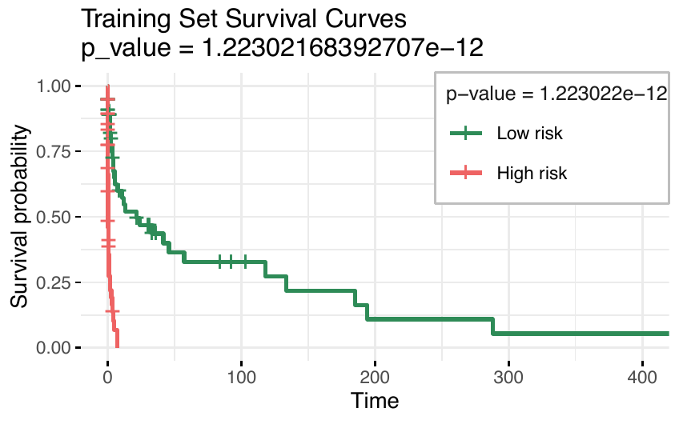
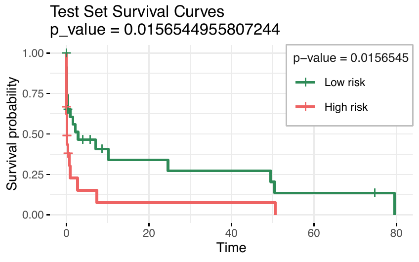

::::::: article
::: {#Introduction}
## Introduction {#sec:intro}
:::

In the field of high-dimensional omics data analysis, regularisation
techniques have become essential due to their ability to simultaneously
select variables and estimate models, particularly when the number of
explanatory variables greatly exceeds the sample size. A variety of
computational packages have been developed to implement these techniques
effectively, addressing a range of research needs in omics studies.

The least absolute shrinkage and selection operator (lasso) (Tibshirani
1996) is a popular method for regression that uses an $\ell_1$ penalty
to achieve a sparse solution. This idea has been broadly applied, for
example, to generalized linear models (Tibshirani 1996) and Cox
proportional hazard models for survival data. (Tibshirani 1997).

While the lasso excels at promoting sparsity, it does not account for
feature ordering or structure, a limitation particularly pronounced in
high-dimensional omics data. To overcome this, extensions such as the
fused lasso (Tibshirani et al. 2005) incorporate penalties that
encourage smoothness along ordered features. In contrast, the adaptive
lasso (Zou 2006) dynamically adjusts penalties to improve variable
selection. These methods are integrated into specialised packages, such
as [**SQOPT**](https://CRAN.R-project.org/package=SQOPT) (Arnold et al.
2022) and [**adalasso**](https://CRAN.R-project.org/package=adalasso).

Despite its success in many applications, the lasso method struggles
with variable selection when features are highly correlated, as it tends
to select only one variable from a group, a limitation in applications
such as microarray data analysis, where genes often interact in
networks. To address this issue, (Zou and Hastie 2005) proposed the
elastic net penalty, which is a weighted sum of the $\ell_1$ norm and
the square of the $\ell_2$ norm of the coefficient vector
$\boldsymbol{\mathbf{\beta}}$. The first term enforces the sparsity of
the solution, whereas the second term encourages a more balanced
selection of correlated variables.

The [**glmnet**](https://CRAN.R-project.org/package=glmnet) package, one
of the most popular implementations in R and Python, provides a robust,
widely used framework for applying lasso, elastic net, and related
techniques. Details may be found in (Friedman et al. 2010), (Simon et
al. 2011), (Tibshirani et al. 2012). The
[**glmnet**](https://CRAN.R-project.org/package=glmnet) R package
(Friedman et al. 2010) contains efficient functions for computing the
elastic net solution for a complete path-wise optimisation. The
minimisation problems are solved via cyclic coordinate descent (Van der
Kooij 2007), with the core routines programmed in Fortran for
computational efficiency. Earlier versions of the package contained
specialised Fortran subroutines for a handful of popular GLMs and the
Cox model for right-censored survival data. The package includes
functions for performing K-fold cross-validation (CV) for hyperparameter
optimisation, plotting coefficient paths and CV errors, and predicting
on future data. The package can also accept the predictor matrix in
sparse matrix format: this is especially useful in certain applications
where the predictor matrix is both large and sparse. In particular, this
means that we can fit unpenalised GLMs with sparse design matrices,
something that the [**glm**](https://CRAN.R-project.org/package=glm)
function from the package
[**stats**](https://CRAN.R-project.org/package=stats) does not support.

Version 4.0 and later of
[**glmnet**](https://CRAN.R-project.org/package=glmnet) ([Friedman et
al.]{.nocase} 2023) represent a significant release that expands the
package's capabilities for survival modelling. It supports multiple
events per subject, delayed entry, time-dependent covariates and/or
strata, and other extensions, through the (start, stop\] formulation of
the survival data that specifies the start and end of each time
interval. Additionally, it includes sparse $X$ inputs, and the
much-requested `survival:survfit` method. The package computes the
elastic net regularisation path for all GLMs, Cox models with (start,
stop\] data and strata, and includes a simplified implementation of the
relaxed lasso (Hastie et al. 2020), providing greater flexibility for
high-dimensional data analysis.

To address the instability often observed in methods based on the
elastic net, adaptive strategies have been incorporated into
regularisation frameworks. One such approach is the Adaptive Elastic Net
(AENet), implemented in the R package
[**msaenet**](https://CRAN.R-project.org/package=msaenet). AENet refines
the elastic net regularisation method to enhance feature selection and
model performance, particularly in high-dimensional settings or in the
presence of multicollinearity among predictors. Unlike the standard
elastic net, which applies the same penalty to all coefficients, AENet
introduces adaptive weighting to penalise features differently based on
their importance (Zou and Zhang 2009).

In the era of multi-omics research, integrating data across multiple
omics layers is crucial for harnessing the complementary information
from diverse biological systems. Single-data-type models often fail to
capture the full complexity of underlying biological processes. Recent
advances have underscored the importance of combining high-dimensional
omics data, including clinical information, gene expression, methylation
profiles, and other omics layers, to improve predictive modelling
frameworks (Huang et al. 2017).

Using multi-omics data in prediction models is promising because each
omics type offers unique and valuable information for predicting
phenotypic outcomes. However, effectively integrating various types of
omics data presents several challenges. First, there is an overlap in
the predictive information each data type provides. Second, the levels
of predictive details differ between the 'blocks' of variables (which
can correspond to the type of data, e.g., the block of clinical
variables or the block of gene expression variables) and depend on the
particular outcome considered (Zhao et al. 2015). Third, the
interactions between variables of different data types must be
considered (Huang et al. 2017). In recent years, different methods have
been proposed to address this topic. (Simon et al. 2013) presented the
sparse group lasso, a prediction method for grouped covariate data that
automatically removes non-informative covariate groups and performs
lasso-type variable selection for the remaining covariate groups. The
[**SGL**](https://CRAN.R-project.org/package=SGL) package (Simon et al.
2018) in R is a notable implementation that combines the strengths of
group lasso and lasso for sparse solutions at both the group and
individual variable levels.

One limitation of using sparse lasso in multi-omics data applications is
that it does not adequately account for the varying levels of predictive
information across different data blocks. In contrast, the IPF-LASSO
(Boulesteix et al. 2017), a lasso-type regression method for multi-omics
data, addresses this by assigning individual penalty parameters to
different omics data types, allowing incorporation of prior biological
knowledge or practical constraints. One common issue for all variations
of LASSO, including IPF-LASSO, is instability. Even small modifications
to the dataset can significantly change the selected model. The
IPF-LASSO method addresses the unique challenges of multi-omics data
integration, particularly the differing levels of predictive information
across data blocks. The
[**ipflasso**](https://CRAN.R-project.org/package=ipflasso) package
(Boulesteix and Fuchs 2015) has been developed to implement this method,
offering a tailored approach to multi-omics data analysis.

Building on the idea of representing each omics dataset as a block,
([Klau et al.]{.nocase} 2018) introduced the Priority-Lasso method,
implemented in the
[**prioritylasso**](https://CRAN.R-project.org/package=prioritylasso)
package, as a lasso-based approach designed explicitly for multi-omics
data analysis. This method emphasises practical usability by allowing
users to assign priority rankings to data blocks based on cost or
relevance.

The package
[**prioritylasso**](https://CRAN.R-project.org/package=prioritylasso),
developed for applications involving continuous, binary, and survival
outcomes, was initially released on CRAN as version 0.2.4, as documented
in (Klau et al. 2017). Available from the CRAN repository, the package
builds on the lasso regression implementation in
[**glmnet**](https://CRAN.R-project.org/package=glmnet) (Friedman et al.
2010). The Cox-Lasso model employs the regularisation method described
by (Simon et al. 2011). In version 0.3.1, functionality was added to
address blockwise missing data. This means that for some observations,
not all blocks are observed. To address this type of missingness,
[**prioritylasso**](https://CRAN.R-project.org/package=prioritylasso)
offers several options for fitting a model in datasets with missing
values. Nevertheless, priority-lasso struggles with multicollinearity,
often arbitrarily selecting one variable from correlated groups while
excluding others, resulting in unstable models. This approach applies
block prioritisation to manage overlapping predictive information,
ensuring that lower-priority blocks are not excluded but adjusted for
previously explained variance. Although Priority-Lasso effectively
promotes sparsity, it may lack stability, particularly in datasets with
highly correlated variables or variable groupings of varying sizes.
Furthermore, its sequential prioritisation framework does not fully
exploit the hierarchical or grouped structures common in omics data,
potentially limiting its applicability.

To address some of the limitations highlighted in the literature and
summarised above, the Priority Elastic net method was proposed by (Musib
et al. 2024) as an enhancement of the Priority-Lasso approach introduced
by ([Klau et al.]{.nocase} 2018). By integrating the elastic net
penalty, which balances $\ell_1$ and $\ell_2$ regularisation, Priority
Elastic Net effectively mitigates issues related to multicollinearity
and model instability. This method enhances the retention of predictive
features from lower-priority blocks, providing greater flexibility for
handling complex, high-dimensional datasets.

The
[**priorityelasticnet**](https://CRAN.R-project.org/package=priorityelasticnet)
package (Musib et al. 2025) is available on the Comprehensive R Archive
Network (CRAN) at
<http://CRAN.R-project.org/package=priorityelasticnet>.

## Priority elastic net {#sec:models}

A growing number of studies have utilised multi-omics data for various
precision medicine-related machine learning tasks, including disease
diagnosis, patient sub-phenotyping, and predicting disease or mortality
risk. However, data from different omics modalities can be heterogeneous
and noisy, with various underlying distributions and scales (Huang et
al. 2017). Thus, the way these data are integrated significantly impacts
subsequent analyses and interpretations.

The Priority Elastic Net (Musib et al. 2025) builds upon the
Priority-Lasso framework ([Klau et al.]{.nocase} 2018), incorporating
elastic net principles to address limitations in handling highly
correlated predictors. The implementation of the
[**priorityelasticnet**](https://CRAN.R-project.org/package=priorityelasticnet)
package adapts several functions from the
[**prioritylasso**](https://CRAN.R-project.org/package=prioritylasso)
package ([Klau et al.]{.nocase} 2018; Klau et al. 2017). While
Priority-Lasso introduced a hierarchical structure to effectively
integrate multi-omics data into regression models, it struggles with
datasets containing strongly correlated variables. By combining the
strengths of $\ell_1$ and $\ell_2$ regularisation (Zou and Hastie 2005),
the Priority Elastic Net promotes a grouping effect, ensuring that
correlated predictors are retained within the model. This enhancement
enables the Priority Elastic Net to deliver improved robustness,
interpretability, and accuracy, making it particularly suited to
high-dimensional and complex omics datasets.

In the following subsections, we outline the theoretical foundations and
computational implementation of Priority Elastic Net optimisation across
Gaussian, multinomial, binomial, and Cox regression frameworks,
demonstrating its potential in enhancing variable selection. We
introduce the main functions of the
[**priorityelasticnet**](https://CRAN.R-project.org/package=priorityelasticnet)
package, which address essential data characteristics, such as handling
missing values, and include cross-validation methods. Illustrative
examples, primarily based on the Gaussian distribution, are provided to
demonstrate their usage. Finally, we introduce the Priority-Adaptive
Elastic Net, which further improves model performance by dynamically
adjusting variable priorities during optimisation.

### Priority elastic net for a gaussian family {#sub:Gaussian}

We consider the standard setup for linear regression, where the response
variable $Y \in \mathbb{R}$ is continuous. Let $x_{ij}$ be the
independent variable $j$ of individual $i$, where $i = 1, \ldots, n$ ,
$j = 1, \ldots, p$ with $n$ being the total number of individuals and
$p$ the number of independent variables. The vector
$\boldsymbol{\mathbf{x}}_i = (x_{i1}, x_{i2}, \ldots, x_{ip})^T$
represents the set of independent variables for the individual $i$. For
simplicity, the predictor variables $x_{ij}$ are transformed to
z-scores.

In high-dimensional settings, where the number of predictors $(p)$ may
exceed the number of observations $(n)$, or where the predictors exhibit
strong correlations, traditional linear regression methods often
struggle. Issues such as overfitting and multicollinearity reduce the
reliability and interpretability of the estimated regression
coefficients. To address these challenges, regularisation methods, such
as the elastic net, have been developed. The standard elastic net method
(Zou and Hastie 2005) estimates the regression coefficients
$\beta_{1}, \ldots ,\beta_{p}$ associated with the $p$ regressors by
minimizing the expression:

$$\begin{equation}
 \label{eq: elastic net}
\hat{\boldsymbol{\mathbf{\beta}}}_{EN}=\arg \min_{\boldsymbol{\mathbf{\beta}}} \Bigg[ \frac{1}{n}\sum\limits_{i=1}^{n}\bigg(y_i- \beta_{0}- \sum\limits_{j=1}^{p}x_{ij}\beta_j\bigg)^2 +\lambda\sum_{j=1}^p \left(\alpha |\beta_j| + \frac{(1 - \alpha)}{2}  \beta_j^2\right)\Bigg],
\end{equation}   (\#eq:-elastic-net)$$

where $\lambda \geq 0$ is a tuning parameter, and $\alpha \in [0, 1]$ is
a higher-level hyperparameter that controls the balance between the
lasso and ridge penalties. A sequence of models is typically fitted
across a range of $\lambda$ values, while the value of $\alpha$ is
predetermined based on the desired characteristics of the prediction
model. For example, ridge regression (**Hoerl1970ridge?**) is defined
with $\alpha = 0$, while lasso regression (Tibshirani 1996) is defined
with $\alpha = 1$.

The final value of $\lambda$ is usually chosen via cross-validation: we
select the coefficients corresponding to the $\lambda$ value that
minimises the cross-validated error as the final model.

Coordinate descent solves the optimisation problem by iteratively
optimising each coefficient $\beta_j$ while keeping the others fixed
(Friedman et al. 2010). The formula for updating $\beta_j$ is given by:\

$$\hat{\beta}_j = S\left(\frac{1}{n} \sum_{i=1}^n x_{ij} \left( y_i - \hat{y}_i^{(j)} \right), \lambda \alpha \right)  \frac{1}{1 + \lambda (1 - \alpha)},$$
where
$$\hat{y}_i^{(j)} = \hat{\beta}_0 + \sum_{\ell \neq j} x_{i\ell} \hat{\beta}_\ell,$$
and the soft-thresholding operator $S(z, \gamma)$ is defined as:
$$S(z, \gamma) = \text{sign}(z) \max(|z| - \gamma, 0).$$
In this context, the notation is adapted to address the case of grouped
variables, as considered in this work. The model partitions the
predictors into $B$ blocks, with the observations of the $p_{b}$
variables from block $b$ for subject $i$ being represented as
$(x_{i1}^{(b)}, . . . , x_{ip_{b}}^{(b)} )$, for $i=1,...,n$ and for
$b = 1, . . . , B$. This block structure reflects the natural
organisation of multi-omics data, where each omics layer (e.g.,
transcriptomics, proteomics, methylation) typically forms a separate
block, often combined with a clinical block. More generally, it can also
represent other meaningful groupings, such as biological pathways or
categories of clinical variables. Just as $x^{(b)}_{ij}$ is defined,
$\beta^{(b)}_{j}$ is the regression coefficient of the $j^{th}$ variable
from block $b$, with $j$ ranging from 1 to $p_b$. Accordingly,
$\hat{\beta}^{(b)}_{j}$ denotes the respective estimated value.

Consider $\boldsymbol{\mathbf{\pi}} = (\pi_1, \ldots, \pi_B)$ as a
reordering of the sequence $(1, \ldots, B)$, signifying the priority
order of blocks, where $\pi_1$ represents the index of the block with
highest significance and $\pi_B$ denotes the one of least priority.
Subsequently, a hierarchical method is employed to construct the
predictive model, adhering to this established order of block
importance. The first step is to estimate the $\beta_j^{(\pi_1)}$
coefficients, by minimising:
$$\begin{equation}
 \label{eq:elstic_block1}
 l(\boldsymbol{\mathbf{\beta}}^{(\pi_1)}) = \sum\limits_{i=1}^{n}\bigg(y_i- \beta_0^{(\pi_1)}-\sum\limits_{j=1}^{p_{\pi_1}}x_{ij}^{(\pi_1)}\beta_j^{(\pi_1)}\bigg)^2 + \lambda^{(\pi_1)} \sum\limits_{j=1}^{p_{\pi_1}} \Big( \alpha \lvert \beta_j^{(\pi_1)} \rvert + \frac{(1 - \alpha)}{2}(\beta_j^{(\pi_1)})^2 \Big).
\end{equation}   (\#eq:elstic-block1)$$
The fitted linear predictor,
$\hat{\eta}_{1,i}(\boldsymbol{\mathbf{\pi}})$, in this step is given as:
$$\begin{equation}
\hat{\eta}_{1,i}(\boldsymbol{\mathbf{\pi}})= 
\hat{\beta}^{(\pi_1)}_0+
\hat{\beta}_1^{(\pi_1)}x_{i1}^{(\pi_1)} + . . . + \hat{\beta}_{p_{\pi_1}}^{(\pi_1)} 
x_{ip_{\pi_1}}^{(\pi_1)}.
\end{equation}$$
Next, the elastic net method is applied to the block of predictors with
the second highest priority, incorporating the fitted linear predictor
from the first step as an offset. The goal is to determine the values of
$\hat{\beta}_{1}^{(\pi_2)}, \ldots, \hat{\beta}_{p_{\pi_2}}^{(\pi_2)},$
which are the coefficients corresponding to the predictors within the
second priority block, $\pi_2$. These coefficients are determined by
minimising a specific criterion, outlined as follows:
$$\begin{equation}
 l(\boldsymbol{\mathbf{\beta}}^{(\pi_2)}) = \sum\limits_{i=1}^{n}\bigg(y_i- \hat{\eta}_{1,i}(\boldsymbol{\mathbf{\pi}})-\beta_0^{(\pi_2)}-\sum\limits_{j=1}^{p_{\pi_2}}x_{ij}^{(\pi_2)}\beta_j^{(\pi_2)}\bigg)^2 + \lambda^{(\pi_2)} \sum\limits_{j=1}^{p_{\pi_2}} \Big( \alpha \lvert \beta_j^{(\pi_2)} \rvert + \frac{(1 - \alpha)}{2}(\beta_j^{(\pi_2)})^2 \Bigg\}.
\end{equation}$$

The linear predictor for the second step,
$\hat{\eta}_{2,i}(\boldsymbol{\mathbf{\pi}})$, is derived by adding the
offset obtained from the first step,
$\hat{\eta}_{1,i}(\boldsymbol{\mathbf{\pi}})$, with the linear
combination of the predictors in the second priority block and their
respective estimated coefficients, $\hat{\beta}^{(\pi_2)}$. This
relationship can be represented as:

$$\begin{equation}
\hat{\eta}_{2,i}(\boldsymbol{\mathbf{\pi}}) =\hat{\eta}_{1,i}(\boldsymbol{\mathbf{\pi}}) + 
\hat{\beta}_0^{(\pi_2)}+
\hat{\beta}_1^{(\pi_2)}x_{i1}^{(\pi_2)} + . . . + \hat{\beta}_{p_{\pi_2}}^{(\pi_2)}x_{ip_{\pi_2}}^{(\pi_2)}.
\end{equation}$$

Then, similarly, the model is fitted to the block with the third highest
priority, using the linear score from the second step as an offset. All
remaining blocks are treated in the same manner,
$$\begin{equation}
\hat{\eta}_{b,i}(\boldsymbol{\mathbf{\pi}}) = \hat{\eta}_{b-1,i}(\boldsymbol{\mathbf{\pi}}) + 
\hat{\beta}_0^{(\pi_b)}+
\hat{\beta}_{ 1}^{(\pi_b)} x_{i1}^{(\pi_b)} + \ldots + \hat{\beta}_{ p_{\pi_b}}^{(\pi_b)} x_{ip_{\pi_b}}^{(\pi_b)},
\end{equation}$$
where $\hat{\eta}_{0,i}(\boldsymbol{\mathbf{\pi}}) = 0$ and
$b = 1, \ldots, B$.

The fitting procedure is carried out sequentially through the blocks up
to $\pi_B$, yielding the set of coefficient estimates
$\hat{\beta}^{(\pi_b)}$ for $b = 1, \ldots, B$. The final fitted linear
predictor becomes
$$\begin{equation}
\hat{\eta}_{i}(\boldsymbol{\mathbf{\pi}}) = 
\sum_{b=1}^{B} 
  \hat{\beta}_0^{(\pi_b)}+
\sum_{b=1}^{B} \sum_{j=1}^{p_{\pi_b}} \hat{\beta}^{(\pi_b)}_j x^{(\pi_b)}_{ij}.
\end{equation}$$

As previously discussed, Priority Elastic Net assigns a priority order
to blocks, allowing the model to incorporate prior knowledge. However,
this hierarchical structure may negatively affect predictive accuracy by
underestimating the influence of predictors in lower-priority blocks and
potentially discarding informative variables. This issue occurs because
the linear score in each block,
$\hat{\eta}_{b,i}(\boldsymbol{\mathbf{\pi}})$, tends to overfit the
contribution of predictors in the $b$-th block to the response $y_i$.
Specifically, the estimation of
$\hat{\eta}_{b,i}(\boldsymbol{\mathbf{\pi}})$ tends to overfit the
effects of predictors in the $b$-th block on the response $y_i$. This
overfitting arises because the coefficients
$\hat{\beta}_1^{(\pi_b)}, \ldots, \hat{\beta}_{p\pi_b}^{(\pi_b)}$ are
estimated using data that includes $y_i$, the response being predicted.
Consequently, the overfitted score
$\hat{\eta}_{b,i}(\boldsymbol{\mathbf{\pi}})$ captures variability in
$y_i$ that might better be explained by predictors in subsequent blocks.
When this overfitted estimate is used as an offset, it limits
lower-priority blocks' ability to account for unexplained variability in
$y_i$, thereby undermining the model's overall predictive accuracy.

To mitigate this overfitting problem, cross-validated offsets,
$\hat{\eta}_{b,i}(\pi)_\text{CV}$, previously introduced in the Priority
Lasso framework, are also applied in the Priority Elastic Net to improve
generalisation. In this approach, a dataset $S$ is partitioned using
$K$-fold cross-validation, and the cross-validated offsets are
determined to effectively address the identified overfitting issues. The
cross-validated offsets are computed iteratively as follows:
$$\begin{equation}
        \hat{\eta}_{b,i}(\boldsymbol{\mathbf{\pi}})_\text{CV} = \hat{\eta}_{b-1,i}(\boldsymbol{\mathbf{\pi}})_\text{CV} +
        \hat{\beta}^{(\pi_b)}_{S \setminus S_{k,0}}
        + \hat{\beta}^{(\pi_b)}_{S \setminus S_{k,1}}x_{i1}^{(\pi_b)}
        + \ldots 
        + \hat{\beta}^{(\pi_b)}_{S \setminus S_{k,p_{\pi_b}}}x_{ip_{\pi_b}}^{(\pi_b)},  \, \, \,  b = 1, . . . , B
\end{equation}$$
where the process starts with the initial condition:     
$\hat{\eta}_{0,i}(\boldsymbol{\mathbf{\pi}})_\text{CV} = 0$.

Priority Elastic Net is implemented in the
[**priorityelasticnet**](https://CRAN.R-project.org/package=priorityelasticnet)
function in our R package of the same name. This function includes the
option `cvoffset`, which allows users to choose between cross-validated
offsets and standard offsets estimated without cross-validation, as
outlined in the algorithm presented in this section.

To illustrate the implementation of Priority Elastic Net for the
Gaussian family, a synthetic dataset was simulated to mimic the
high-dimensional characteristics typical of multi-omics studies. In this
example, $n=100$ observations and $p=500$ predictors are generated, with
only the first 10 predictors contributing to the response variable.

``` r
set.seed(123)
n <- 100  
p <- 500  
X <- matrix(rnorm(n * p), n, p)
beta <- rnorm(10) 
Y <- X[, 1:10] %*% beta + rnorm(n)
```

Before applying Priority Elastic Net, the user must first specify a
block structure for the covariates, where each covariate belongs to
exactly one of the $B$ blocks, and second, a priority order for these
blocks. In this framework, three blocks of continuous predictor
variables were analysed, all of which are subject to penalisation, while
adapting our notation to account for variables forming groups as
considered in this work. The first entry in the `blocks` list specifies
the indices of the variables that belong to the block assigned the
highest priority (priority 1), which is the first block included in the
model. As an example, if `blocks = list(1:10, 11:30, 31:500)`, the first
priority block contains the first 10 variables in the data matrix.
Similarly, the block assigned priority 2 includes variables 11-30,
whereas the block assigned priority 3 comprises variables 31-500.

``` r
    blocks <- list(block1 = 1:10, block2 = 11:30, block3 = 31:500)
```

The `priorityelasticnet` function fits a hierarchical elastic net model
across multiple blocks of variables. In this example, the model is
fitted with `family="gaussian"` for continuous response variables, with
the `block1.penalization` parameter controlling how the first block
(priority 1) is treated during model fitting.

``` r
fit_gaussian <- priorityelasticnet(
  X = X, Y = Y, family = "gaussian", blocks = blocks,
  block1.penalization = TRUE, standardize = TRUE,
  lambda.type = "lambda.min", max.coef = c(Inf, Inf, Inf),
  nfolds = 10, type.measure = "mse", alpha = 0.6,
  cvoffset = TRUE, cvoffsetnfolds = 10,
  adaptive = FALSE, initial_global_weight = FALSE
)
```

When `block1.penalization = TRUE`, the function applies a standard
elastic net model to the first block, treating it similarly to other
blocks. The predictions from this first block are then used as offsets
in the elastic net fitting of the subsequent blocks, following their
priority order. Conversely, when `block1.penalization = FALSE`, the
function fits the first block without penalisation, making this setting
appropriate for scenarios where clinical predictors (with $p<n$) are
included. Clinical predictors in the first block are not penalised to
preserve their established relevance. In this case, the unpenalized
predictions serve as offsets for the subsequent elastic net fits for
lower-priority blocks.

The `standardize = TRUE` leads to a standardisation of the predictor
variables. In case of an unpenalized first block, the predictor
variables for the first block are not standardised. Please note that the
returned coefficients are rescaled to the original scale of the
predictor variables as provided in $\mathbf{X}$. Therefore, new data in
`predict.priorityelasticnet` should be on the same scale as
$\mathbf{X}$.

The `nfolds` and `lambda.type` are options referring to the
cross-validation procedure in `cv.glmnet`. The `nfolds` specifies the
number of folds in the procedure, while `lambda.type` handles the amount
of cross-validation error. It can be set to either `lambda.min`, which
is also the default, or `lambda.1se`. The `lambda.min` gives the result
with minimum mean cross-validation error, whereas `lambda.1se` gives the
result such that the cross-validation error is within one standard error
of the minimum, and thus leads to more sparse results. Note that the
latter can only be chosen in combination with no restrictions in
`max.coef`.

The function used for every Priority Elastic net fit is
[**glmnet**](https://CRAN.R-project.org/package=glmnet), which creates a
sequence of lambda values. The lambda which is chosen according to
`lambda.type` is the lambda on position `lambda.ind` of the sequence and
its value is stored in `lambda.min`. In general, the lower the value of
`lambda.ind`, the higher the `lambda.min` and thus the penalisation.
This leads to more sparse models. The number of lambda values can be
chosen with an optional argument.

The values of lambda are automatically generated in each call of
[**glmnet**](https://CRAN.R-project.org/package=glmnet), based on the
input data and model parameters, and may therefore differ between runs.
Consequently, $\lambda$ values from separate model fits cannot be
directly compared unless a common sequence is explicitly defined. The
corresponding mean cross-validated error is stored in the list
`min.cvm`. The interpretation of its values depends on the argument
`type.measure`.

The `type.measure` is the accuracy/error measure computed in
cross-validation. It should be \"class\" (classification error) or
\"auc\" (area under the ROC curve) if `family="binomial"`, \"mse\" (mean
squared error) if `family="gaussian"` and \"deviance\" if
`family="cox"`, which uses the partial-likelihood.

The `cvoffset` parameter is a logical flag that determines whether
cross-validation (CV) should be used to estimate offsets during elastic
net fitting. By default, its value is set to FALSE, meaning no CV is
performed for offset estimation unless explicitly specified. If
`cvoffset` is set to TRUE, the `cvoffsetnfolds` parameter becomes
relevant, allowing the user to specify the number of folds for the CV
procedure used in estimating the offsets. The default value for
`cvoffsetnfolds` is 10, which means the data will be split into 10 folds
during the CV process.

The `adaptive` argument in
[**priorityelasticnet**](https://CRAN.R-project.org/package=priorityelasticnet)
introduces an advanced layer of flexibility by enabling the adaptive
elastic net, which enhances the standard elastic net through the use of
data-driven adaptive weights. This methodology is explained in detail in
Section [2.4](#subsec:PAD-E){reference-type="ref"
reference="subsec:PAD-E"}. Additionally, the `initial_global_weight`
option allows for further customisation by enabling users to apply a
global weight across all predictors before fitting the adaptive elastic
net. This argument is also discussed in detail in
Section [2.4](#subsec:PAD-E){reference-type="ref"
reference="subsec:PAD-E"}.

The main results of the fitted model from the
[**priorityelasticnet**](https://CRAN.R-project.org/package=priorityelasticnet)
are stored in an object returned by the functions provided by the
package, which includes the coefficient estimates, tuning parameters,
and related outputs. The estimated model parameters can be extracted
using the `coef.priorityelasticnet` function, a method of the generic
`coef()` function specifically designed to retrieve the coefficients
from the fitted model object. It represents the relationship between the
predictors and the response variable. Understanding these coefficients
is essential for gaining insights into how each predictor influences the
outcome, particularly in the context of penalised regression models
where some coefficients may be shrunk towards zero or set to zero due to
regularisation.

The
[**priorityelasticnet**](https://CRAN.R-project.org/package=priorityelasticnet)
package was developed under the assumption that practitioners have prior
knowledge of the data, enabling them to specify the priorities. However,
it may be that, especially in the presence of several blocks, it is not
clear which block order is best. For this reason,
`cvm_priorityelasticnet` was implemented. This function allows the user
to define multiple possible lists of blocks. The function selects the
optimal block order based on the mean cross-validated error. Similarly,
several vectors with maximal coefficients can be specified in
`max.coef.list`. The following example demonstrates how to use the
`cvm priorityelasticnet` function to evaluate and compare different
block configurations.

``` r
fit_cvm <- cvm_priorityelasticnet(
  X = X, Y = Y, weights = rep(1, n),
  foldid = sample(rep(1:10, length.out = n)),
  family = "gaussian", type.measure = "mse",
  blocks.list = list(list(bp1 = 1:10, bp2 = 11:30, bp3 = 31:500),
                list(bp1 = 1:10, bp2 = 31:500, bp3 = 11:30)),
  max.coef.list = list(c(Inf, Inf, Inf), c(Inf, 100, Inf)),
  block1.penalization = TRUE,
  lambda.type = "lambda.min",
  standardize = TRUE,
  nfolds = 10,
  cvoffset = TRUE,
  cvoffsetnfolds = 10,
  alpha = 0.6,
  adaptive = FALSE,
  initial_global_weight = FALSE)
```

In this example, two distinct block configurations, `blocks.list`, are
defined and passed to the `cvm_priorityelasticnet` function. This
function performs cross-validation on each configuration, calculating
the mean squared error (MSE) for each model. Comparing these MSE values
enables the identification of the block configuration that yields the
best predictive performance. The output from `fit_cvm` provides detailed
information regarding the performance of each block configuration,
including cross-validated MSE values, the optimal lambda for each
configuration, and the number of non-zero coefficients selected by the
model. The elements contained in the R object `fit_cvm` can be
summarised as follows:

- `fit_cvm$best.blocks`: provides the block configuration that achieves
  the best cross-validated performance in terms of MSE;

- `fit_cvm$best.blocks.indices`: provides the position (index) of the
  block configuration that achieves the best cross-validated result;

- `fit_cvm$best.max.coef`: provides the blockwise maximum number of
  non-zero coefficients allowed in the selected optimal configuration.

Handling missing data is crucial for constructing robust models,
particularly when working with real-world datasets that include missing
values. The
[**priorityelasticnet**](https://CRAN.R-project.org/package=priorityelasticnet)
package provides several options for handling missing data, allowing
users to select the most suitable strategy based on the dataset's
characteristics and analysis goals.

The `mcontrol` argument in
[**priorityelasticnet**](https://CRAN.R-project.org/package=priorityelasticnet)
allows for specifying how missing data should be handled. This
flexibility ensures the model can be effectively fitted, even with
incomplete data, which might otherwise result in biased estimates or
diminished predictive power.

The
[**priorityelasticnet**](https://CRAN.R-project.org/package=priorityelasticnet)
package provides methods to handle blockwise missing data, which can be
specified through the `mcontrol` argument using the `missing.control()`
function:

``` r
missing.control(handle.missingdata = c("none", "ignore", "impute.offset"),
  offset.firstblock = c("zero", "intercept"),
  impute.offset.cases = c("complete.cases", "available.cases"),
  nfolds.imputation = 10,
  lambda.imputation = c("lambda.min", "lambda.1se"),
  perc.comp.cases.warning = 0.3,
  threshold.available.cases = 30,
  select.available.cases = c("maximise.blocks", "max"))
```

`handle.missingdata`: how blockwise missing data should be treated. The
default is \"none\", meaning that no action is taken and missing values
remain as provided, \"ignore\" ignores the observations with missing
data for the current block, \"impute.offset\" imputes the offset for the
missing values.

When `handle.missingdata="ignore"`, the elastic net is fitted to each
block using only the observations without missing values in that block.
This approach avoids data imputation and ensures all available data is
utilised. However, for observations with missing values in the current
block, no offset can be computed for the next block. To address this
issue, the following strategies are implemented:

- If observations are missing in the current block, the offset
  (including the intercept) from the previous block is carried forward.

- If observations are missing in the first block, the offset for the
  second block is set either to $0$ or to the estimated intercept of the
  first block.

The offset of a block $b$ for an observation $i$ is denoted as
$\delta_{b,i}$, and is formally defined as:
$$\delta_{1,i} =
\begin{cases} 
    0 & \text{if } x^{(1)}_{i1}, \dots, x^{(1)}_{ip_1} \text{ are missing} \\
    \hat{\eta}_{1,i} \text{ or } \hat{\beta}^{(1)}_0 & \text{if } x^{(1)}_{i1}, \dots, x^{(1)}_{ip_1} \text{ are not missing}
\end{cases}  \quad \quad \quad \quad \quad \quad \quad \quad \ \$$


$$\delta_{b,i} =
\begin{cases} 
    \delta_{b-1,i} & \text{if } x^{(b-1)}_{i1}, \dots, x^{(b-1)}_{ip_{b-1}} \text{are missing}\\
    \hat{\eta}_{b-1,i} & \text{if } x^{(b-1)}_{i1}, \dots, x^{(b-1)}_{ip_{b-1}} \text{are not missing}
\end{cases}, \quad \text{for} \ b = 3, \dots, B,$$

where $\hat{\eta}_{b,i}$ is the prediction from block $b$ for the $i$-th
observation. `offset.firstblock`: determines if the offset of the first
block for missing observations is zero or the intercept of the observed
values for `handle.missingdata = "ignore"`.

For `handle.missingdata="impute.offset"`, it is similar to the previous
method; the elastic net models applied to the individual blocks utilise
only the available data, and no covariates are imputed. However, unlike
the previous approach, the offset for observations with missing values
is not retained from the earlier block; instead, it is imputed. This
approach offers the benefit of imputing only a single value, rather than
potentially a very large number of covariates. The concept behind this
method is inspired by Hieke et al. (2016), which only imputes an offset.
In their work, they utilise just three blocks, resulting in a fixed
configuration for the imputation model. Here, we extend this idea into a
generalised framework, introducing two distinct strategies for selecting
which blocks to use. As Priority Elastic Net is an elastic net-based
method, the imputation model uses an elastic net as well. Generally, any
model that can predict a continuous outcome can be used as the
imputation model. In the following sections, this is represented by only
referencing a general regression model $F(\cdot)$. Let $F(\cdot)$ be a
general regression model that can be trained by providing the dependent
variable and the independent variables.

The argument `impute.offset.cases` defines which observations are used
to construct the imputation model for missing offsets. Supported options
are `complete.cases`, which limits the imputation to fully observed
cases (with the additional constraint that each observation may contain
at most one missing block), and `all.available.cases`, which uses all
observations for which data are available in the current block.

The first approach (`impute.offset.cases="complete.cases"`) utilises all
blocks except the current one to impute the offset derived from the
current block. For this method to work, the dataset must include some
observations without missing values (complete cases). A reasonable lower
limit for the number of complete cases must be established. Based on the
work of Hieke et al. (2016), who used 26 complete cases, the default
threshold is set to 30 cases. Another limitation of this approach is
that each observation with missing data can have at most one missing
block, as all other blocks are required for the imputation model. A more
formal description is provided below.

If only the complete cases are used for the imputation model and
$I = \{1, \ldots, n\}$ is the set of observation indices, the
observations used for the imputation model are defined as:
$$I_{\text{comp,imp}} = \{i \in I \mid x^{(b)}_{i1}, \ldots, x^{(b)}_{ip_b} \text{ are not missing } \forall b\},$$
where $x^{(b)}_{i1}, \ldots, x^{(b)}_{ip_b}$ are the covariates of the
$b$-th block of the $i$-th observation. Let $F(\cdot)$ be a general
regression model that can be trained by providing the dependent variable
and the independent variables. Then $\tilde{F}(\cdot)$ represents a
trained regression model that returns its prediction when provided with
the independent variables.

The algorithm below describes how, for an observation $j$ with a missing
block $b$, the corresponding linear predictor (offset) is imputed as
$\hat{\kappa}_{\text{comp},b,j}$.

1.  Identify the set of complete cases $I_{\text{comp,imp}}$, as defined
    above.

2.  For all observations $i \in I_{\text{comp,imp}}$, compute the offset
    (linear predictor) for block $b$, denoted by
    $\hat{\kappa}_{\text{comp},b,i}$.

3.  Train the regression model $\tilde{F}(\cdot)$ using the complete
    cases $I_{\text{comp,imp}}$, where the dependent variable is the
    offset $\hat{\kappa}_{\text{comp},b,i}$, and the covariates are the
    predictors from all other observed blocks, collectively denoted by
    $x^{(-b)}_i$ (that is, all blocks except the one currently missing
    block $b$).

4.  For the observation $j$ with missing block $b$, use the trained
    regression model $\tilde{F}(\cdot)$ to predict the value of the
    missing offset $\hat{\kappa}_{\text{comp},b,j}$.

The offset for a given observation $i$ in block $b$ is defined as:
$$\delta_{1,i} = 0,$$

$$\begin{equation*}
\delta_{b,i} =
\begin{cases} 
    \hat{\eta}_{b-1,i}, & \text{if } x^{(b-1)}_{i1}, \dots, x^{(b-1)}_{ip_{b-1}} \text{ are observed}, \\
    \hat{\kappa}_{\text{comp},b-1,i}, & \text{if } x^{(b-1)}_{i1}, \dots, x^{(b-1)}_{ip_{b-1}} \text{ are missing},
\end{cases}
\end{equation*}$$

$$\begin{equation*}
\text{for } b = 2, \dots, B, \quad \forall i \text{ such that each observation } i 
\text{ contains at most one missing block } b.
\end{equation*}$$

where:

- $\delta_{b,i}$ denotes the offset for block $b$ and observation $i$;

- $\hat{\eta}_{b-1,i}$ is the prediction obtained from block $b-1$ for
  observation $i$;

- $\hat{\kappa}_{\text{comp},b-1,i}$ represents the predicted
  (compensatory) offset used when predictors in block $b-1$ are missing.

The previous approach consistently relies on all other blocks to impute
the offset for a missing block. However, in many datasets, there may be
no observations with complete cases, or observations may have more than
one block missing. To address these situations, a more adaptable method
was developed (`impute.offset.cases="all.available.cases"`). This
approach segments the observations into different subsets based on their
missingness patterns. A missingness pattern indicates which specific
combination of blocks is missing for a particular observation. For each
unique pattern, a separate imputation model is constructed and fitted.
$$\delta_{1,i} = 0$$

$$\delta_{b,i} =
\begin{cases} 
    \hat{\eta}_{b-1,i}, & \text{if } x^{(b-1)}_{i1}, \dots, x^{(b-1)}_{ip_{b-1}} \text{ are not missing}, \\
    \hat{\kappa}^{\text{comp}}_{b-1,i}, & \text{if } x^{(b-1)}_{i1}, \dots, x^{(b-1)}_{ip_{b-1}} \text{ are missing},
\end{cases}$$

$$\text{for } b = 2, \dots, B, \quad \forall i \quad \text{such that every observation } i \text{ misses at most 1 block } b.$$

The remaining arguments of the `missing.control` function are described
below:

- `nfolds.imputation `: nfolds for the glmnet of the imputation model;

- `lambda.imputation `: which lambda-value should be used for predicting
  the imputed offsets in `cv.glmnet`;

- `perc.comp.cases.warning`: percentage of complete cases when a warning
  is issued of too few cases for the imputation model.

- `threshold.available.cases`: if the number of available cases for
  `impute.offset.cases = available.cases` is below this threshold,
  `priorityelasticnet` tries to reduce the number of blocks included in
  the imputation model to increase the number of observations used for
  imputation;

- `select.available.cases`: determines how the blocks which are used for
  the imputation model are selected when
  `impute.offset.cases = available.cases`. max selects the blocks that
  maximise the number of observations, `maximise.blocks` tries to
  include as many blocks as possible, starting with the highest-priority
  ones.

Below, we demonstrate how to configure the `mcontrol` argument to handle
missing data by imputing offsets.

In this example, the `handle.missingdata = "impute.offset"` option,
which is part of the missing data handling mechanism, enables the
[**priorityelasticnet**](https://CRAN.R-project.org/package=priorityelasticnet)
function to impute missing values using an offset approach. This method
is particularly advantageous for handling sporadic missing data, as it
allows the model to utilise all available information without discarding
incomplete observations.

``` r
mcontrol <- missing.control(handle.missingdata = "impute.offset",nfolds.imputation = 10)

fit_missing <- priorityelasticnet(
  X, Y,
  family = "gaussian",
  type.measure = "mse",
  blocks = blocks,
  mcontrol = mcontrol)
```

The output includes details on how the missing data was handled, the
imputation models employed (if applicable), and the overall model fit.

The `predict.priorityelasticnet` function is used to generate
predictions from a fitted model. This function can produce different
types of predictions depending on the specified type parameter,
including linear predictors, fitted values, or class probabilities (for
classification models). The `handle.missingtestdata` parameter manages
missing values in test data, with options such as `"none"`,
`"omit.prediction"`, `"set.zero"`, or `"impute.block"`. In the next
section, each of these options is explained in detail, including their
functionality and the scenarios in which they are most appropriate. The
`include.allintercepts` parameter determines whether intercepts from all
blocks are included in the prediction (`TRUE`) or only from the first
block (`FALSE` by default). The `use.blocks` parameter allows
customising the blocks used for prediction, defaulting to `"all"` but
allowing specification of block numbers. Additional customisation can be
achieved through further arguments, making the function versatile for
various prediction scenarios, including handling missing data and
tailoring block selection to specific needs.

### Priority elastic net for a multinomial logistic regression {#sub:multinomial}

Regularised multinomial logistic regression models are widely used in
multi-class classification, particularly in high-dimensional data
settings. They are instrumental in applications such as bioinformatics
and cancer research, where sparsity and interpretability are critical.
However, existing regularisation methods often fail to incorporate
domain-specific priorities among predictors. To address this, the
Priority Elastic Net method, initially developed for binary logistic
regression (Musib et al. 2024), is extended to multinomial logistic
regression. This novel extension enables the classification of multiple
classes by iteratively fitting blocks of predictors with specific
priorities. Grounded in well-established logistic regression principles,
the multinomial model reduces to standard logistic regression in the
binary case ($K=2$), where the logit function models the probability of
the first class relative to the second. By preserving the
block-prioritised variable selection structure, this method provides a
flexible and interpretable framework for multiclass problems, making it
particularly suited for high-dimensional applications.

Let $\mathbf{ X}$, the predictor matrix, be an $n \times p$ matrix,
where $\mathbf{x}_i = ( x_{i1}, x_{i2}, \dots, x_{ip} )^T$ is the $i$th
row of $\mathbf{ X}$, i.e., the $i$th observation. The response vector
$\mathbf{Y} = ( Y_1, Y_2, \dots, Y_n )^T$ is an $n \times 1$ vector,
where the response $Y_i$ is categorical, taking a value
$y_i \in \{1, 2, \dots, K\}$ for $K \geq 3$. This concept has been
effectively modelled in previous research, including the works of (Zhu
and Hastie 2004) and (Friedman et al. 2010), with
$$\begin{equation}
P(Y_i = \ell \mid \mathbf{x}_i) = \frac{\exp \left(\beta_{0,\ell} + \mathbf{x}_i^T \boldsymbol{\beta}_{ \ell} \right)}{\sum_{k=1}^{K} 
\exp \left(\beta_{0,k} + \mathbf{x}_i^T\boldsymbol{\beta}_{k}\right)}, \quad \ell = 1, \dots, K,\,\,\,i=1,\ldots, n.
\end{equation}$$
where
$\boldsymbol{\beta}_{\ell} = (\beta_{1\ell}, . . . , \beta_{p\ell})^T$
are coefficients estimated by minimizing the following negative
log-likelihood function for observations
$\{ (\mathbf{x}_i, y_i) \}_{i=1}^{n}$, where each $y_i$ is encoded as
$\mathbf{y}_i = (y_{i1}, \dots, y_{iK})^T$ with $y_{ik} = 1_{y_i = k}$:
$$\begin{equation}
\label{regularizedmultinomial}
\ell(\boldsymbol{\beta}) = -\frac{1}{n} \sum_{i=1}^{n} \log P(Y_i = y_i \mid \mathbf{x}_i) + \lambda F_{\alpha}(\boldsymbol{\beta})
\end{equation}   (\#eq:regularizedmultinomial)$$

where $\boldsymbol{\beta}$ denotes the matrix of dimension
$(p + 1) \times K$, with the parameters $\beta_{0,\ell}$ and
$\boldsymbol{\beta}_{\ell}$ in its columns.

In Eq. \@ref(eq:regularizedmultinomial), $y_{i}$ represents the observed
level of the variable $Y_i$ and the last term represents the penalty
function, i.e., the term ensuring sparsity in the model, controlled by
the regularisation parameter $\lambda$.

$$\begin{equation}
\label{eq:elastic_net_regularization}
F_{\alpha}(\boldsymbol{\beta}) = \sum_{\ell=1}^{K} \left( \alpha \|\boldsymbol{\beta}_{\ell}\|_1 + \frac{1 - \alpha}{2} \|\boldsymbol{\beta}_{\ell}\|_2^2 \right),
\end{equation}   (\#eq:elastic-net-regularization)$$

where $\lambda > 0$ is a user-specified regularization parameter.

The penalised log-likelihood equation for the elastic-net penalty
([Friedman et al.]{.nocase} 2023) is given by

$$\begin{equation}
\label{eq:multinomial_elastic}
\begin{split}
\tilde{\ell}(\boldsymbol{\beta}, \lambda, \alpha) =& -\frac{1}{n} \sum_{i=1}^{n} \left( \sum_{k=1}^{K} y_{ik} \left( \beta_{0,k} + \mathbf{x}_i^T \boldsymbol{\beta}_k \right) - \log \left( \sum_{k=1}^{K} \exp(\beta_{0,k} + \mathbf{x}_i^T \boldsymbol{\beta}_k) \right) \right)\\
&+ \lambda \sum_{\ell=1}^{K} \left( \alpha \|\boldsymbol{\beta}_{\ell}\|_1 + \frac{1 - \alpha}{2} \|\boldsymbol{\beta}_{\ell}\|_2^2 \right),
\end{split}
\end{equation}   (\#eq:multinomial-elastic)$$

where the response $y_{ik}$ is given by an indicator function,
$$y_{ik} = I(y_i = k) = \begin{cases} 
1, & \text{if } y_i = k \\
0, & \text{otherwise}
\end{cases}.$$

The elastic net or lasso estimate
$\hat{\boldsymbol{\beta}}(\lambda, \alpha)$ can be computed in R using
the [**glmnet**](https://CRAN.R-project.org/package=glmnet) package
([Friedman et al.]{.nocase} 2023), which uses coordinate descent to
minimise the penalised negative log-likelihood.

The coordinate descent method is used to obtain the coefficient
estimates in regularised multinomial regression. Following Friedman et
al. (2010), the optimisation procedure employs partial Newton steps,
obtained by forming a partial quadratic approximation, together with the
coordinate descent method.

The [**glmnet**](https://CRAN.R-project.org/package=glmnet) package
addresses the challenges introduced by regularisation in traditional
multinomial logistic regression using a symmetric representation. In
traditional models, coefficients for categories are modelled relative to
an arbitrary base category, a choice that does not affect fitted
probabilities but can lead to sensitivity under regularisation due to
penalisation effects. By avoiding reliance on a specific base category,
[**glmnet**](https://CRAN.R-project.org/package=glmnet) ensures robust
and stable coefficient estimation, eliminating asymmetries arising from
base-category selection. This symmetric approach is particularly
valuable for methods like the Priority Elastic Net, which incorporate
additional structure into the regularisation process. Adopting a
symmetric representation in such methods can enhance interpretability
and maintain model consistency.

Building upon these principles, the Priority Elastic Net method, an
extension of the priority-lasso approach developed by [Klau et
al.]{.nocase} (2018), applies elastic net regularisation iteratively
across ordered blocks of variables, fitting each block while using the
results of higher-priority blocks as offsets.

The iterative fitting of the multinomial regression model follows the
same procedure as described in the previous section for the Gaussian
family. Once the fitting has been carried out for all $B$ blocks under
consideration, we obtain the set of coefficient estimates
$\hat{\boldsymbol{\beta}}^{(\pi_b)}$ for $b = 1, \ldots, B$ and the
final fitted linear predictor becomes
$$\begin{equation}
\hat{\eta}_{i}^{(k)}(\boldsymbol{\mathbf{\pi}}) = \sum_{b=1}^{B} 
  \hat{\beta}_{0,k}^{(\pi_b)}+
\sum_{b=1}^{B} \sum_{j=1}^{p_{\pi_b}} \hat{\beta}^{(\pi_b)}_{j,k} x^{(\pi_b)}_{ij}, \ \ k=1, \ldots, K.
\end{equation}$$

The final Priority Elastic Net multinomial logistic regression model,
after processing all $B$ blocks, models the probability of the outcome
$Y_{i}$ belonging to class $k$ as:
$$\begin{equation}
P(Y_i = k | \boldsymbol{\mathbf{x}}_i) = \frac{\exp\left( \sum_{b=1}^{B} \hat{\eta}_{b,i}^{(k)}(\boldsymbol{\mathbf{\pi}}) \right)}{\sum_{l=1}^{K} \exp\left( \sum_{b=1}^{B} \hat{\eta}_{b,i}^{(l)}(\boldsymbol{\mathbf{\pi}}) \right)}.
\end{equation}$$

However, the linear score
$\hat{\eta}_{1,i}^{(k)}(\boldsymbol{\mathbf{\pi}})$ tends to be
over-optimistic with respect to the information usable for predicting
$Y_{i}$ that is contained in block $\pi_1$. The reason for this is that
$Y_{i}$ was part of the data used for obtaining the estimates
$\hat{\beta}_{j,k}^{(\pi_1)}$ for $j = 1, \ldots, p_{\pi_1}$, which are
then used to calculate
$\hat{\eta}_{1,i}^{(k)}(\boldsymbol{\mathbf{\pi}})$.

When using this over-optimistic estimate
$\hat{\eta}_{1,i}^{(k)}(\boldsymbol{\mathbf{\pi}})$ as an offset in the
second step, the influence of block $\pi_2$ conditional on the influence
of block $\pi_1$ will tend to be underestimated. The reason for this is
that by considering the over-optimistic estimate
$\hat{\eta}_{1,i}^{(k)}(\boldsymbol{\mathbf{\pi}})$ as an offset, a part
of the variability in $Y_{i}$ is removed that is actually not
explainable by block $\pi_1$ but would possibly be explained by block
$\pi_2$. As noted above, this problem results from the fact that $Y_{i}$
is contained in the training data used for estimating
$\hat{\beta}_{j,k}^{(\pi_1)}$ for $j = 1, \ldots, p_{\pi_1}$. As a
solution to this problem we suggest estimating the offsets
$\hat{\eta}_{1,i}^{(k)}(\boldsymbol{\mathbf{\pi}})$ using
cross-validation.
$$\begin{equation}
\hat{\eta}_{b,i}^{(k)}(\boldsymbol{\mathbf{\pi}})_{CV} = \hat{\eta}_{b-1,i}^{(k)}(\pi)_{CV} 
+ \hat{\beta}_{0,k}^{(\pi_b)}
+ \hat{\beta}_{ 1,k}^{(\pi_b)} x_{i1}^{(\pi_b)} + \ldots + \hat{\beta}_{ p_{\pi_b,k}}^{(\pi_b)} x_{ip_{\pi_b}}^{(\pi_b)}\,\,\,\,\, ,\,\,\,  k = 1, \ldots, K,
\end{equation}$$
where $\hat{\eta}_{0,i}^{(k)}(\boldsymbol{\mathbf{\pi}})_{CV} = 0$ and
$b = 1, \ldots, B$.

In the following analysis, we address the challenge of fitting a
multinomial regression model with predictors organised into distinct
blocks. To this end, we employ the Priority Elastic Net, which
adaptively tunes block-specific penalties to balance sparsity and model
accuracy by combining ridge and lasso regularisation.

The process began with the simulation of synthetic data comprising 100
observations, 500 predictors, and a categorical response variable with
three classes. To reflect a realistic scenario, the predictors were
divided into three blocks, where block-specific penalties could be
applied. This setting is particularly well suited for investigating the
joint influence of groups of predictors, each containing a large number
of variables, on the response variable.

``` r
set.seed(123)
n <- 100   # Number of observations
p <- 500   # Number of predictors
k <- 3     # Number of classes

# Simulate a matrix of predictors
x <- matrix(rnorm(n * p), n, p)

# Simulate a response vector with three classes
y <- factor(sample(1:k, n, replace = TRUE))

# Define predictor blocks
blocks <- list(block1 = 1:10, block2 = 11:30, block3 = 31:500)

# Fit a multinomial model using priorityelasticnet
fit_multinom <- priorityelasticnet(
  X = x, Y = y,
  family = "multinomial",
  alpha = 0.5,
  type.measure = "class",
  blocks = blocks,
  block1.penalization = TRUE,
  lambda.type = "lambda.min",
  standardize = TRUE,
  nfolds = 10,
  adaptive = FALSE,
  initial_global_weight = FALSE)
```

### Priority elastic net for a Cox regression

Survival analysis studies the time until an event of interest occurs and
is applied in various fields of science, especially in medical research.
It provides statistical methods for investigating the time until an
event occurs, such as death, disease recurrence, or the length of stay,
defined as the time spent in the hospital during a single admission
episode. However, not all event times are observed within the study
period, leading to censored observations.

Let $\boldsymbol{\mathbf{y}} = (y_1, \dots, y_n)$ represent the observed
survival times, and
$\boldsymbol{\mathbf{\delta}} = (\delta_1, \dots, \delta_n)$ indicate
the censoring indicator, where $\delta_i = 1$ if the event of interest
occurs for subject $i$ and $\delta_i = 0$ if the observation is
censored. Let $\mathbf{ X}$ be the $n \times p$ design matrix, where $p$
is the number of features, each row represents observations on one
subject, and each column represents values of one feature across the $n$
subjects. Our goal is to develop a predictive model for the survival
times, $\boldsymbol{\mathbf{y}}$, based on the design matrix
$\mathbf{ X}$.

The Cox regression model (Cox 1972) is widely used to analyse survival
data, mainly because of its flexibility in handling censored
observations and its semi-parametric nature, which does not require
specifying the form of the baseline hazard function. The hazard function
$h(t)$ at time $t$ for the $i$th patient is defined as:
$$\begin{equation}
h(t, \boldsymbol{X}_i) = h_0(t) \exp(\boldsymbol{X}_i^T \boldsymbol{\beta}),
\end{equation}$$

where $h(t, \boldsymbol{X}_i)$ is the hazard for the $i$th observation
at time $t$, $h_0(t)$ is an unspecified baseline hazard function, and
$\boldsymbol{\beta} = (\beta_1, \beta_2, \dots, \beta_p)^T \in \mathbb{R}^p$
is the vector of the regression coefficients to be estimated (Gui and Li
2005).

Based on the available sample data, Cox's partial likelihood (Cox 1972)
can be written as
$$\begin{equation}
\label{lik_cox}
L(\boldsymbol{\beta}) = \prod_{i=1}^{n} \left[ \frac{\exp(\boldsymbol{X}_i^T \boldsymbol{\beta})}{\sum_{j \in R(t_i)} \exp(\boldsymbol{X}_j^T \boldsymbol{\beta})} \right]^{\delta_i},
\end{equation}   (\#eq:lik-cox)$$
where $\delta_i$ is an indicator for censoring, $t_{i}$ is the survival
time (observed or censored) of the $i$-th sample and
$R(t_i) = \{ j : t_j \geq t \}$ denotes the set of individuals at risk
at time $t_{i}$ (Simon et al. 2011). To estimate the regression
coefficients $\boldsymbol{\beta}$ in Eq. \@ref(eq:lik-cox), we need to
maximise its log partial likelihood function,
$$\begin{equation}
\label{eq:log_likelihood}
l(\boldsymbol{\beta} ) = \log L(\boldsymbol{\beta} ) =
\sum_{i=1}^n \delta_i \left\{ \mathbf{X}_i^T \boldsymbol{\beta} - \log \left[ \sum_{j \in R(t_i)} \exp{\left( \mathbf{X}_j^T \boldsymbol{\beta} \right)} \right] \right\}
\end{equation}   (\#eq:log-likelihood)$$

In the [**glmnet**](https://CRAN.R-project.org/package=glmnet) package,
the negative log of the partial likelihood is penalised using an elastic
net regularisation term.

By adding the regularization term $P(\boldsymbol{\beta}; \lambda)$ to
the negative of Eq. \@ref(eq:log-likelihood) and minimising the
resulting sum, we obtain the regularised Cox proportional hazards model:
$$\begin{equation}
\tilde{\ell}(\boldsymbol{\beta})= 
\arg \min_{\boldsymbol{\mathbf{\beta}}}
\left[ -l(\boldsymbol{\beta} ) + P(\boldsymbol{\beta}; \lambda) \right],
\label{eq:Cox_pro_hazards}
\end{equation}   (\#eq:Cox-pro-hazards)$$
where $P(\boldsymbol{\beta}; \lambda)$ is the loss function and
$\lambda$ is the tuning parameter.

The model in Eq. \@ref(eq:Cox-pro-hazards) performs variable selection
and coefficient estimation simultaneously by shrinking some components
of the regression coefficient vector $\boldsymbol{\beta}$ towards zero,
with some coefficients that may be set exactly to zero.

Therefore, the penalised negative log of the partial likelihood is given
by:
$$\begin{equation}
\tilde{\ell}(\boldsymbol{\beta}) = -\sum_{i=1}^{n} \delta_i \left\{ \mathbf{X}_i^T \boldsymbol{\beta} - \log \left[ \sum_{j \in R(t_i)} \exp{\left( \mathbf{X}_j^T \boldsymbol{\beta} \right)} \right] \right\} + \lambda \mathcal{P}(\boldsymbol{\beta}),
\end{equation}$$
where,
$$\begin{equation*}
\mathcal{P}(\boldsymbol{\beta}) = \alpha \|\beta\|_1 + \frac{(1 - \alpha)}{2} \|\beta\|_2^2.
\end{equation*}$$

Building on regularised Cox regression, the method applies an elastic
net penalty that allows variable- or group-specific weighting to account
for their relative importance during penalisation.

In time-to-event analyses, variables can often be grouped by shared
biological, clinical, or measurement characteristics. Accounting for
this hierarchical structure is particularly valuable in survival models,
where relationships with the outcome may vary across groups. The
Priority Elastic Net accommodates such structures by assigning
group-level weights, enabling blockwise prioritisation and shrinkage
while maintaining within-group flexibility. This hierarchical approach
aligns the model with the data's natural organisation, enhancing
interpretability and predictive performance.

The detailed procedure for implementing the Priority Elastic Net for Cox
regression, including the penalisation steps and coefficient selection,
is provided in Algorithm
[1](#alg:priority_elastic_net){reference-type="ref"
reference="alg:priority_elastic_net"}. This algorithm outlines the
step-by-step approach to ensure accurate feature selection and model
fitting.

As before, a simulation of synthetic data considering $n=200$ and
$p=600$ using
[**priorityelasticnet**](https://CRAN.R-project.org/package=priorityelasticnet)
package for the Cox regression is illustrated. In the example, the data
was split into training and test sets to provide a more realistic
evaluation of model performance and to reduce overoptimism that may
occur when assessing the model on the same data used for fitting.

``` r
library(survival)
n <- 200 
p <- 600  
nzc <- trunc(p / 10)

x <- matrix(rnorm(n * p), n, p)
beta <- rnorm(nzc)
fx <- x[, seq(nzc)] %*% beta / 3
hx <- exp(fx)
ty <- rexp(n, hx)
tcens <- rbinom(n = n, prob = .3, size = 1)
y <- Surv(ty, 1 - tcens)

train_index <- sample(1:n, size = n * 0.7)
x_train <- x[train_index, ]
x_test <- x[-train_index, ]
y_train <- y[train_index]
y_test <- y[-train_index]

blocks <- list(bp1 = 1:20, bp2 = 21:300, bp3 = 301:600)

fit_cox <- priorityelasticnet(
  x_train, y_train, 
  family = "cox", 
  alpha = 0.5, 
  type.measure = "deviance", 
  blocks = blocks,
  block1.penalization = TRUE,
  lambda.type = "lambda.min",
  standardize = TRUE,
  nfolds = 10,
  adaptive = FALSE,
  initial_global_weight = FALSE,
  cvoffset = TRUE)
```

<figure id="alg:priority_elastic_net" data-latex-placement="htbp">

<div class="algorithmic">
<p>Let <span
class="math inline"><em>x</em><sub><em>i</em><em>j</em></sub></span> be
predictor <span class="math inline"><em>j</em></span> for subject <span
class="math inline"><em>i</em></span>; <span
class="math inline"><em>y</em><sub><em>i</em></sub> = (<em>t</em><sub><em>i</em></sub>, <em>δ</em><sub><em>i</em></sub>)</span>
the survival outcome, <span
class="math inline"><em>i</em> = 1, …, <em>n</em></span>. Partition
predictors into <span class="math inline"><em>B</em></span> ordered
blocks according to priority <span
class="math inline"><strong>π</strong> = (<em>π</em><sub>1</sub>, …, <em>π</em><sub><em>B</em></sub>)</span>.
Choose elastic net mixing parameter <span
class="math inline"><em>α</em> ∈ [0, 1]</span> and number of folds <span
class="math inline"><em>K</em></span>. Construct a decreasing
regularisation path <span
class="math inline"><em>λ</em><sub>1</sub> &gt; ⋯ &gt; <em>λ</em><sub><em>m</em></sub></span>.
Split <span class="math inline">{1, …, <em>n</em>}</span> into folds
<span
class="math inline">{<em>S</em><sub><em>k</em></sub>}<sub><em>k</em> = 1</sub><sup><em>K</em></sup></span>
and initialise <span
class="math inline"><em>η̂</em><sub>0, <em>i</em></sub>(<strong>π</strong>)<sub>CV</sub> = 0</span>.</p>
<p>Let <span
class="math inline"><em>g</em> = <em>π</em><sub><em>b</em></sub></span>
denote the active block with predictors <span
class="math inline"><em>X</em><sup>(<em>g</em>)</sup></span>.</p>
<p>For each fold <span class="math inline"><em>k</em></span>, fit the
penalised Cox model on <span
class="math inline"><em>S</em> \ <em>S</em><sub><em>k</em></sub></span>
<span class="math display">$$\hat{\beta}^{(g)}_{-k}(\lambda_\ell)
        =
        \arg\min_{\beta^{(g)}}
        \left\{
        -\ell_{\mathrm{Cox}}^{S\setminus
S_k}\!\big(\hat{\eta}_{b-1}(\boldsymbol{\mathbf{\pi}})_{\mathrm{CV}} +
X^{(g)}\beta^{(g)}\big)
        +
        \lambda_\ell \sum_{j\in
g}\!\left(\tfrac{1-\alpha}{2}\beta_j^2+\alpha|\beta_j|\right)
        \right\}.$$</span>
</p>
<p>Using observations in fold <span
class="math inline"><em>S</em><sub><em>k</em></sub></span>, compute the
cross-validated deviance <span
class="math inline">CV<sub><em>b</em></sub>(<em>λ</em><sub><em>ℓ</em></sub>)</span>.</p>
<p>Select the block-specific tuning parameter
<span
class="math display"><em>λ</em><sub><em>b</em>, min </sub> = arg min<sub><em>λ</em><sub><em>ℓ</em></sub></sub>CV<sub><em>b</em></sub>(<em>λ</em><sub><em>ℓ</em></sub>).</span>
</p>
<p>Update cross-validated offsets for all subjects
<span
class="math display">$$\hat{\eta}_{b,i}(\boldsymbol{\mathbf{\pi}})_{\mathrm{CV}}
    =
    \hat{\eta}_{b-1,i}(\boldsymbol{\mathbf{\pi}})_{\mathrm{CV}}
    +
    \sum_{j=1}^{p_g}
x^{(g)}_{ij}\,\hat{\beta}^{(g)}_{-k(i),j}(\lambda_{b,\min}),$$</span>
where <span class="math inline"><em>k</em>(<em>i</em>)</span> is the
fold containing subject <span class="math inline"><em>i</em></span>.</p>
<p>Final linear predictor: <span
class="math inline"><em>η̂</em><sub><em>B</em>, <em>i</em></sub>(<strong>π</strong>)<sub>CV</sub></span>.
Estimate the hazard function for all subjects:
<span
class="math display"><em>ĥ</em><sub><em>i</em></sub>(<em>t</em>) = <em>h</em><sub>0</sub>(<em>t</em>)exp  (<em>η̂</em><sub><em>B</em>, <em>i</em></sub>(<strong>π</strong>)<sub>CV</sub>), <em>i</em> = 1, …, <em>n</em>.</span>
</p>
</div>
<figcaption>Algorithm 1: Fitting Cox regression with Priority Elastic
Net penalty</figcaption>
</figure>

In this example, Kaplan--Meier curves were used to visualise and compare
the survival probabilities of two distinct risk groups---High-Risk and
Low-Risk--- in both training and test sets (Figure
[1](#fig:SURVIVALCURVE){reference-type="ref"
reference="fig:SURVIVALCURVE"}). These groups are determined based on
the results of the Priority Elastic Net Cox proportional hazards model,
which incorporates variable prioritisation to enhance the
interpretability and accuracy of survival predictions.

The grouping and visualisation process is facilitated through the
[**separate2GroupsCox**](https://CRAN.R-project.org/package=separate2GroupsCox)
function from the
[**glmSparseNet**](https://CRAN.R-project.org/package=glmSparseNet)
package (Veríssimo et al. 2018). This function uses the linear predictor
(risk score) from the fitted Cox model to divide individuals into two
risk categories, typically using the median risk score as the cutoff. It
then provides a graphical comparison of survival probabilities between
the resulting high- and low-risk groups, thereby illustrating the impact
of the identified risk factors on survival.

``` r
library(glmSparseNet)
y_train_df <- data.frame(time = ty[train_index],status = 1 - tcens[train_index])

# Group patients and plot Kaplan-Meier survival curves for the training set
separate2GroupsCox(
  chosen.btas = fit_cox$coefficients,
  xdata = x_train, ydata = y_train_df,                
  probs = c(0.4, 0.6),               
  no.plot = FALSE,                   
  plot.title = "Training Set Survival Curves",
  xlim = NULL, 
  ylim = NULL, 
  expand.yzero = FALSE, 
  legend.outside = FALSE)

# Prediction on the test set
pred_test <- predict(fit_cox, newx = x_test, type = "link")
y_test_df <- data.frame(time = ty[-train_index], status = 1 - tcens[-train_index])

# Group patients and plot Kaplan-Meier survival curves for the test set
separate2GroupsCox(
  chosen.btas = fit_cox$coefficients,
  xdata = x_test, ydata = y_test_df,
  probs = c(0.4, 0.6),
  no.plot = FALSE,
  plot.title = "Test Set Survival Curves",
  xlim = NULL, 
  ylim = NULL, 
  expand.yzero = FALSE, 
  legend.outside = FALSE)
```

<figure id="fig:SURVIVALCURVE" data-latex-placement="ht">
<div class="minipage">

</div>
<div class="minipage">

</div>
<figcaption>Figure 1: The Kaplan-Meier curves in this example are used
to visualize and compare survival probabilities, for the train set
(left) and for the for test set (right), between two risk groups (High
Risk and Low Risk) identified using the Priority Elastic Net Cox
proportional hazards model and using function
<code>separate2GroupsCox</code> from <a
href="https://CRAN.R-project.org/package=glmSparseNet"><strong>glmSparseNet</strong></a>
package.</figcaption>
</figure>

### Priority-Adaptive elastic net {#subsec:PAD-E}

The potential inconsistency of the lasso method in specific scenarios
has been explicitly highlighted, as demonstrated by (Zou and Hastie
2005). In response, (Zou 2006) proposed a modified version of lasso,
known as the adaptive lasso and explicitly proved its consistency in
terms of oracle properties asymptotically. Similar ideas are explored in
many other papers, namely Zhang and Lu (2007) and Wang et al. (2007).
Apart from lack of consistency, lasso has other drawbacks as discussed
in Zou and Hastie (2005), for example, (a) lasso does not encourage
grouped selection in case of high pairwise correlation among covariates
and (b) for $p>n$ case, lasso can select at most n covariates. To
overcome the above drawbacks, they introduced the elastic net, which
combines both ridge $\ell_2$ and lasso $\ell_1$ penalties. However, the
elastic net is not an oracle procedure. Notably, to solve the original
elastic net problem Zou and Hastie (2005), transform the elastic net
into an ordinary lasso-type problem in some augmented space by some
algebraic manipulation. Since this is a one-to-one mapping, whenever the
lasso is inconsistent in the augmented space, so is the underlying
elastic net. For a more detailed discussion on this topic, please refer
to Jia and Yu (2010), which states an explicit condition for the
inconsistency of the elastic net. Instead of combining the ordinary
lasso penalty, the adaptive lasso penalty was integrated with the ridge
penalty. This doubly regularised approach, referred to as the adaptive
elastic net, aims to leverage the strengths of both penalties.

Another direction for improvement is to correct bias in estimation by
adding a weight $w_j$ for each $\beta_j$, corresponding to different
amounts of shrinkage, to the regression coefficients. The adaptive
elastic net was introduced by Zou and Zhang (2009) and Ghosh (2011),
combining the $\ell2$ norm regularisation with adaptive weights to
enhance estimation accuracy.

In this context, the elastic net estimates
$\hat{\boldsymbol{\mathbf{\beta}}}_{EN}$ are first computed as defined
in \@ref(eq:-elastic-net), and then adaptive weights are constructed as
follows:
$$\begin{equation}
\label{eq:weights}
\hat{w_{j}}=(|\hat{\boldsymbol{\mathbf{\beta}}}_{EN}|)^{-\gamma}\;\;\;,\;\;\;
 j = 1, 2,  \ldots, p
\end{equation}   (\#eq:weights)$$
where $\gamma$ is a positive constant. Using $\gamma=1$ for calculating
adaptive weights in the Adaptive-Elastic net is a common and effective
choice because it provides a balance between penalising weak predictors
and retaining strong ones. Since the elastic net naturally adopts a
sparse representation, the weights can also be computed a
$\hat{w}_j = \left( |\hat{\beta}_{j(\text{EN})}| + \frac{1}{n} \right)^{-\gamma}$
to avoid division by zero (Zou and Zhang 2009).
$$\begin{equation}
\label{eq: adaptive elastic net}
\hat{\boldsymbol{\mathbf{\beta}}}_{(AENet)} = \arg \min_{\boldsymbol{\mathbf{\beta}}} \Bigg[ \frac{1}{n}\sum\limits_{i=1}^{n}\bigg(y_i- \beta_{0}- \sum\limits_{j=1}^{p}x_{ij}\beta_j\bigg)^2 +\lambda\sum_{j=1}^p \hat{w_{j}}|\beta{_j}| + \frac{(1 - \alpha)}{2} \sum_{j=1}^{p} \beta_{j}^{2} 
\Bigg].
\end{equation}   (\#eq:-adaptive-elastic-net)$$

Building upon the expression in Equation
\@ref(eq:-adaptive-elastic-net), the framework for the Priority-Adaptive
Elastic Net is established by calculating the adaptive weights for the
variables based on the assigned priority of the block. Initially, the
adaptive weights, denoted as $\hat{w_j}^{(\boldsymbol{\mathbf{\pi}})}$
and introduced earlier in \@ref(eq:weights), are computed for each
variable based on the specified priority of the block. In estimating
coefficients with the priority-Adaptive Elastic Net, the adaptive
weights $\hat{w_j}^{(\pi_1)}$ for the first priority block are
incorporated into the $\ell_1$ penalty.

The priority-Adaptive Elastic Net model is formulated by minimising the
following objective function for the first block priority:
$$\begin{equation}
\label{eq:Priority-Elastic}
l(\boldsymbol{\mathbf{\beta}}^{(\pi_1)}) = \sum_{i=1}^{n}\bigg(y_i - \sum_{j=1}^{p_{\pi_1}}x_{ij}^{(\pi_1)}\beta_j^{(\pi_1)}\bigg)^2 
+ \lambda^{(\pi_1)} \left(\alpha \sum_{j=1}^{p_{\pi_1}} \hat{w_j}^{(\pi_1)}|\beta^{(\pi_1)}_j| 
+ \frac{(1 - \alpha)}{2} \sum_{j=1}^{p_{\pi_1}} \beta_{j}^{2 (\pi_1)} \right).
\end{equation}   (\#eq:Priority-Elastic)$$
Here, the objective function combines a weighted lasso penalty,
controlled by $\alpha$ and the adaptive weights $\hat{w_j}^{(\pi_1)}$,
with a ridge penalty, balancing sparsity and regularisation.

Using the fitted values from this step as an offset to fit a model
considering the covariates in the block with the second highest
priority:
$$\begin{equation}
\hat{\eta}_{1,i}(\boldsymbol{\mathbf{\pi}})= \hat{\beta}_1^{(\pi_1)}x_{i1}^{(\pi_1)} + . . . + \hat{\beta}_{p_{\pi_1}}^{(\pi_1)} 
x_{ip_{\pi_1}}^{(\pi_1)}.
\end{equation}$$

For $b = 2, \dots, B$ (where $B$ is the number of blocks), the model
fitting proceeds iteratively. Using the fitted values from Step $b-1$ as
an offset, the priority-adaptive elastic net model is then fitted to the
covariates in the block with the $b$-th highest priority.

The implementation of the priority-Adaptive Elastic Net model can be
performed using the
[**priorityelasticnet**](https://CRAN.R-project.org/package=priorityelasticnet)
function, as demonstrated in the following code chunk. In this example,
the model is applied to Gaussian data with the specified parameters:

``` r
fit_gaussian <- priorityelasticnet(
  X = X,  Y = Y,
  family = "gaussian",
  blocks = blocks,
  block1.penalization = TRUE,
  standardize = TRUE,
  lambda.type = "lambda.min",
  max.coef = c(Inf, Inf, Inf),
  nfolds = 10,
  adaptive = TRUE,
  type.measure = "mse",
  initial_global_weight = FALSE,
  alpha = 0.6,
  cvoffset = TRUE,
  cvoffsetnfolds = 10)
```

In the `priorityelasticnet` and `cvm_priorityelasticnet` functions, with
the latter presented below, the `adaptive` argument controls whether
adaptive weights are computed for each block of variables based on their
assigned priorities and the estimated coefficient magnitudes. When
`adaptive = TRUE`, the penalty term becomes data-driven, allowing
stronger penalisation of less influential variables and thereby
improving variable selection stability and model interpretability.
Conversely, when `adaptive = FALSE`, all variables within a block are
penalised equally, and the model applies fixed, non-data-dependent
penalties.

The `initial_global_weight` argument determines whether global weights
across all variables are computed before applying block-specific
priorities. Setting `initial_global_weight = TRUE` enables this global
assessment step, which is advantageous in most applications because it
first derives global weights across all variables and then refines them
according to block-specific priorities, capturing both overall and
block-level relevance. However, when blocks differ substantially in
scale or variability, setting `initial_global_weight = FALSE` may be
preferable, allowing weights to be computed independently within each
block and avoiding potential distortion from global weighting. An
example of this situation arises when fitting a model that combines
clinical, imaging, and genomic data, where it may be important for each
block to determine its own internal importance independently of global
patterns dominated by larger blocks.

In summary, when both arguments are set to `TRUE`, the refinement
proceeds in two steps: global adaptive weights are first computed across
all variables and are then rescaled according to the block-specific
priorities. This two-stage adjustment ensures that both global relevance
and block-level importance are reflected in the final regularisation
process.

``` r
cvm_priorityelasticnet(
  X = matrix(rnorm(100 * 500), 100, 500),
  Y = rnorm(100),
  family = "gaussian",
  alpha = 0.6,
  type.measure = "mse",
  lambda.type = "lambda.min",
  nfolds = 10,
  block1.penalization = TRUE,
  adaptive = TRUE,
  initial_global_weight = FALSE,
  standardize = TRUE,
  cvoffset = TRUE,
  cvoffsetnfolds = 10,
  blocks.list = list(list(bp1 = 1:10, bp2 = 11:30, bp3 = 31:500),
                list(bp1 = 1:10, bp2 = 31:500, bp3 = 11:30)),
  max.coef.list = list(c(Inf, Inf, Inf), c(Inf, 100, Inf)))
```

After running the function with the specified parameters, the resulting
object contains several key outputs, including the best block
configuration determined during cross-validation, which differs from the
Priority Elastic Net results.

::: {#Summary}
## Summary
:::

Priority Elastic Net is designed to address certain limitations of the
Priority-Lasso. Although Priority-Lasso is effective at promoting
sparsity, it can perform poorly in the presence of multicollinearity, as
it tends to select a single predictor from a set of correlated
variables, thereby reducing model stability. The prioritisation
framework implemented in Priority Elastic Net allows different block
orderings to be evaluated, thereby enabling the contribution of
lower-priority predictor groups to be assessed.

The proposed Priority Elastic Net framework (Musib et al. 2025)
incorporates the elastic net penalty, balancing $\ell_1$ and $\ell_2$
regularisation. The package also includes the adaptive elastic net
formulation that improves variable selection, stable coefficient
estimation, and robust performance in high-dimensional, correlated
datasets. Thus, the Priority-adaptive Elastic Net may provide a useful
approach for addressing the challenges of modern, complex datasets, with
applications in genomics, proteomics, and large-scale predictive
modelling. We have thoroughly discussed in (Musib et al. 2024) the
advantages of the Priority Elastic Net framework for binary logistic
regression.

The sequential fitting procedure of the [**Priority Elastic
Net**](https://CRAN.R-project.org/package=Priority Elastic Net) can be
computationally demanding, particularly when cross-validated offsets are
used (`cvoffset = TRUE`). Although the current implementation runs
sequentially, future versions of the
[**priorityelasticnet**](https://CRAN.R-project.org/package=priorityelasticnet)
package will incorporate parallel execution of cross-validation folds
and explore more efficient cross-validation strategies to enhance
scalability in high-dimensional, multi-block settings.

In addition, the novel offset imputation strategy, used to enable
cross-validation within the sequential block-fitting procedure, may
introduce statistical bias that has not yet been formally assessed. As
the imputed offsets replace model predictions from higher-priority
blocks, any systematic deviation between the imputed and true offsets
could propagate through subsequent steps, potentially influencing
coefficient estimation or model selection. This aspect will be
investigated in future methodological work, both theoretically and
through simulation studies. A comprehensive vignette included in the R
package provides a detailed walkthrough of the main functions, examples,
and use cases, helping users apply the method to their own data.

Further research will also focus on developing simulation studies to
systematically compare the predictive accuracy and variable selection
stability of the Priority Elastic Net, the Priority Lasso, and the
standard Elastic Net across the regression contexts considered in this
paper. Real-world applications will also be explored to assess the
relative performance of the Priority Elastic Net in practice.

Methodological extensions under consideration include incorporating
additional penalisation options, such as SCAD (Smoothly Clipped Absolute
Deviation), MCP (Minimax Concave Penalty), and other non-convex
penalties, to enhance flexibility and applicability across diverse
datasets. These advanced regularisation techniques can mitigate some
limitations of convex penalties, offering improved variable selection
and estimation in complex scenarios. Finally, extending the package to
support multi-response regression models will enable the simultaneous
prediction of multiple dependent variables---a valuable feature for
applications in genomics, proteomics, and other domains involving
high-dimensional, multi-output data. Collectively, these developments
aim to broaden the scope and practical utility of the package for
researchers working with modern, multifaceted datasets.


## Acknowledgments {#acknowledgments .unnumbered}

This work is funded by national funds through FCT -- Fundação para a
Ciência e a Tecnologia, I.P., under CEAUL Research Unit, UID/00006/2025,
DOI: https://doi.org/10.54499/UID/00006/2025, and from the FCT Tenure
program, with reference 2023.15441.TENURE.033/CP00003/CT00010.\
The authors acknowledge the developers of the
[**prioritylasso**](https://CRAN.R-project.org/package=prioritylasso)
package ([Klau et al.]{.nocase} 2018; Klau et al. 2017), whose
implementation served as the basis for several functions included in the
[**priorityelasticnet**](https://CRAN.R-project.org/package=priorityelasticnet)
package.


::::::::::::::::::::::::::::::::::: {#refs .references .csl-bib-body .hanging-indent}
::: {#ref-arnold2022package .csl-entry}
Arnold, Taylor B, Ryan J Tibshirani, Maintainer Taylor Arnold, and TRUE
ByteCompile. 2022. "Package 'Genlasso'." *Statistics* 39 (3): 1335--71.
<https://doi.org/10.32614/CRAN.package.genlasso>.
:::

::: {#ref-boulesteix2015ipflasso .csl-entry}
Boulesteix, AL, and M Fuchs. 2015. "Ipflasso: Integrative Lasso with
Penalty Factors." *R Package Version 0.1.*
<https://CRAN.R-project.org/package=ipflasso>.
:::

::: {#ref-BoulesteixIPF-LASSO .csl-entry}
Boulesteix, Anne-Laure, Riccardo De Bin, Xiaoyu Jiang, and Mathias
Fuchs. 2017. "IPF-LASSO: Integrative L1-Penalized Regression with
Penalty Factors for Prediction Based on Multi-Omics Data."
*Computational and Mathematical Methods in Medicine* 2017 (1): 7691937.
<https://doi.org/10.1155/2017/7691937>.
:::

::: {#ref-cox1972regression .csl-entry}
Cox, David R. 1972. "Regression Models and Life-Tables." *Journal of the
Royal Statistical Society: Series B (Methodological)* 34 (2): 187--202.
<https://doi.org/10.1111/j.2517-6161.1972.tb00899.x>.
:::

::: {#ref-friedman2010regularization .csl-entry}
Friedman, Jerome, Trevor Hastie, and Rob Tibshirani. 2010.
"Regularization Paths for Generalized Linear Models via Coordinate
Descent." *Journal of Statistical Software* 33 (1): 22.
<https://doi.org/10.18637/jss.v033.i01>.
:::

::: {#ref-friedman2023glmnet .csl-entry}
[Friedman, Jerome, Trevor Hastie, Rob Tibshirani, Balasubramanian
Narasimhan, and et al.]{.nocase} 2023. "[glmnet]{.nocase}: Lasso and
Elastic-Net Regularized Generalized Linear Models." *Astrophysics Source
Code Library*, ascl--2308. <https://cran.r-project.org/package=glmnet>.
:::

::: {#ref-Ghoshadaptiveelastic .csl-entry}
Ghosh, Samiran. 2011. "On the Grouped Selection and Model Complexity of
the Adaptive Elastic Net." *Statistics and Computing* 21: 451--62.
:::

::: {#ref-gui2005penalized .csl-entry}
Gui, Jiang, and Hongzhe Li. 2005. "Penalized Cox Regression Analysis in
the High-Dimensional and Low-Sample Size Settings, with Applications to
Microarray Gene Expression Data." *Bioinformatics* 21 (13): 3001--8.
<https://doi.org/10.1093/bioinformatics/bti422>.
:::

::: {#ref-hastie2020best .csl-entry}
Hastie, Trevor, Robert Tibshirani, and Ryan Tibshirani. 2020. "Best
Subset, Forward Stepwise or Lasso? Analysis and Recommendations Based on
Extensive Comparisons." *Statistical Science* 35 (4): 579--92.
:::

::: {#ref-hieke2016integrating .csl-entry}
Hieke, Stefanie, Axel Benner, Richard F Schlenl, Martin Schumacher, Lars
Bullinger, and Harald Binder. 2016. "Integrating Multiple Molecular
Sources into a Clinical Risk Prediction Signature by Extracting
Complementary Information." *BMC Bioinformatics* 17: 1--13.
<https://doi.org/10.1186/s12859-016-1183-6>.
:::

::: {#ref-huang2017more .csl-entry}
Huang, Sijia, Kumardeep Chaudhary, and Lana X Garmire. 2017. "More Is
Better: Recent Progress in Multi-Omics Data Integration Methods."
*Frontiers in Genetics* 8: 84.
<https://doi.org/10.3389/fgene.2017.00084>.
:::

::: {#ref-jia2010model .csl-entry}
Jia, Jinzhu, and Bin Yu. 2010. "On Model Selection Consistency of the
Elastic Net When $p \ggg n$." *Statistica Sinica*, 595--611.
:::

::: {#ref-klau2017prioritylasso .csl-entry}
Klau, S, R Hornung, A Bauer, and J Hagenberg. 2017. *Prioritylasso:
Analyzing Multiple Omics Data with an Offset Approach. R Package Version
0.3. 1*. <https://doi.org/10.32614/CRAN.package.prioritylasso>.
:::

::: {#ref-Klau2018prioritylasso .csl-entry}
[Klau, Simon, Vindi Jurinovic, and et al.]{.nocase} 2018.
"Priority-Lasso: A Simple Hierarchical Approach to the Prediction of
Clinical Outcome Using Multi-Omics Data." *BMC Bioinformatics* 19:
1--14. <https://doi.org/10.1186/s12859-018-2344-6>.
:::

::: {#ref-musib2024priority .csl-entry}
Musib, Laila, Roberta Coletti, Marta B Lopes, Helena Mouriño, and Eunice
Carrasquinha. 2024. "Priority-Elastic Net for Binary Disease Outcome
Prediction Based on Multi-Omics Data." *BioData Mining* 17: 45.
<https://doi.org/10.1186/s13040-024-00401-0>.
:::

::: {#ref-musib2025priorityelasticnet .csl-entry}
Musib, Laila, Helena Mouriño, and Eunice Carrasquinha. 2025.
*Comprehensive Analysis of Multi-Omics Data Using an Offset-Based
Method*. <https://doi.org/10.32614/CRAN.package.priorityelasticnet>.
:::

::: {#ref-simon2011regularization .csl-entry}
Simon, Noah, Jerome Friedman, Trevor Hastie, and Rob Tibshirani. 2011.
"Regularization Paths for Cox's Proportional Hazards Model via
Coordinate Descent." *Journal of Statistical Software* 39 (5): 1.
<https://doi.org/10.18637/jss.v039.i05>.
:::

::: {#ref-Simonsparse-group .csl-entry}
Simon, Noah, Jerome Friedman, Trevor Hastie, and Robert Tibshirani.
2013. "A Sparse-Group Lasso." *Journal of Computational and Graphical
Statistics* 22 (2): 231--45.
<https://doi.org/10.1080/10618600.2012.681250>.
:::

::: {#ref-simon2018package .csl-entry}
Simon, Noah, Jerome Friedman, Trevor Hastie, Rob Tibshirani, and
Maintainer Noah Simon. 2018. "Package 'Sgl'." *CRAN Documentation*,
ahead of print. <https://doi.org/10.32614/CRAN.package.SGL>.
:::

::: {#ref-tibshirani1996regression .csl-entry}
Tibshirani, Robert. 1996. "Regression Shrinkage and Selection via the
Lasso." *Journal of the Royal Statistical Society Series B: Statistical
Methodology* 58 (1): 267--88.
<https://doi.org/10.1111/j.2517-6161.1996.tb02080.x>.
:::

::: {#ref-tibshirani1997lasso .csl-entry}
Tibshirani, Robert. 1997. "The Lasso Method for Variable Selection in
the Cox Model." *Statistics in Medicine* 16 (4): 385--95.
:::

::: {#ref-tibshirani2012strong .csl-entry}
Tibshirani, Robert, Jacob Bien, Jerome Friedman, et al. 2012. "Strong
Rules for Discarding Predictors in Lasso-Type Problems." *Journal of the
Royal Statistical Society Series B: Statistical Methodology* 74 (2):
245--66. <https://doi.org/10.1111/j.1467-9868.2011.01004.x>.
:::

::: {#ref-Tibshiranifusedlasso .csl-entry}
Tibshirani, Robert, Michael Saunders, Saharon Rosset, Ji Zhu, and Keith
Knight. 2005. "Sparsity and Smoothness via the Fused Lasso." *Journal of
the Royal Statistical Society Series B: Statistical Methodology* 67 (1):
91--108.
:::

::: {#ref-van2007prediction .csl-entry}
Van der Kooij, Anita J. 2007. *Prediction Accuracy and Stability of
Regression with Optimal Scaling Transformations*. Leiden University.
:::

::: {#ref-Veríssimo2018glmSparseNet .csl-entry}
Veríssimo, A, E Carrasquinha, MB Lopes, AL Oliveira, M Sagot, and S
Vinga. 2018. *Network Centrality Metrics for Elastic-Net Regularized
Models*. <https://doi.org/doi:10.18129/B9.bioc.glmSparseNet>.
:::

::: {#ref-wang2007regression .csl-entry}
Wang, Hansheng, Guodong Li, and Chih-Ling Tsai. 2007. "Regression
Coefficient and Autoregressive Order Shrinkage and Selection via the
Lasso." *Journal of the Royal Statistical Society Series B: Statistical
Methodology* 69 (1): 63--78.
:::

::: {#ref-zhang2007adaptive .csl-entry}
Zhang, Hao Helen, and Wenbin Lu. 2007. "Adaptive Lasso for Cox's
Proportional Hazards Model." *Biometrika* 94 (3): 691--703.
<https://doi.org/10.1093/biomet/asm037>.
:::

::: {#ref-QingZhaoCombinmultidimensional .csl-entry}
Zhao, Qing, Xingjie Shi, Yang Xie, Jian Huang, BenChang Shia, and
Shuangge Ma. 2015. "Combining Multidimensional Genomic Measurements for
Predicting Cancer Prognosis: Observations from TCGA." *Brief Bioinform*
16 (2): 291--303. <https://doi.org/10.1093/bib/bbu003>.
:::

::: {#ref-zhu2004classification .csl-entry}
Zhu, Ji, and Trevor Hastie. 2004. "Classification of Gene Microarrays by
Penalized Logistic Regression." *Biostatistics* 5 (3): 427--43.
<https://doi.org/10.1093/biostatistics/kxg046>.
:::

::: {#ref-Zouadaptivelasso .csl-entry}
Zou, Hui. 2006. "The Adaptive Lasso and Its Oracle Properties." *Journal
of the American Statistical Association* 101 (476): 1418--29.
<https://doi.org/10.1198/016214506000000735>.
:::

::: {#ref-Zou2005elasticnet .csl-entry}
Zou, Hui, and Trevor Hastie. 2005. "Regularization and Variable
Selection via the Elastic Net." *Journal of the Royal Statistical
Society Series B: Statistical Methodology* 67 (2): 301--20.
<https://doi.org/10.1111/j.1467-9868.2005.00503.x>.
:::

::: {#ref-zou2009adaptive .csl-entry}
Zou, Hui, and Hao Helen Zhang. 2009. "On the Adaptive Elastic-Net with a
Diverging Number of Parameters." *Annals of Statistics* 37 (4): 1733.
<https://doi.org/10.1214/08-AOS625>.
:::
:::::::::::::::::::::::::::::::::::
