```{r setup, include = FALSE}
knitr::opts_chunk$set(echo = FALSE, warning = FALSE, message = FALSE)
library(rPAex)
library(ggplot2)
library(kableExtra)
```

# Introduction

The image processing of an agricultural field forms the basis for precision agriculture (PA) [@srinivasan2006handbook], and georegistration and data acquisition through images over time are necessary in any experimental study during crop development. One of the fundamentals of image processing is the automatic detection of field status, e.g., furrow detection for efficient and robust operation of robotic equipment [@utstumo2018robotic] and crop–weed separation [@montalvo2012automatic]. Data collected from the trials are recorded in field books, which are documents used by researchers to report analysis and hypothesis statements [@tripp1982data]. The experimental unit (EU) is the minimum unit of the material to which a treatment is applied [@bailey2008design]. So, it is necessary to identify them in the multispectral image of the experiment to relate the spectral data over time with the EUs in the field book.

Identifying the EUs is a fundamental activity in any experimental design in PA. It is essential because it allows us to discriminate spectral responses such as vegetation indices [@bendig2015combining], differentiate healthy potato plants from diseased ones [@griffel2018using], count cotton bolls[@jung2018unmanned], etc. Nonetheless, EU identification is vulnerable to errors because its coverage may exceed the EU when the crop expands, generating unreliable information. Image processing in R can be conducted through various functions and tools. The X Window System enables the creation of graphical interfaces for image visualization and analysis. The rast function [@terra2023] allows reading images in multiple formats, while the locator function captures georeferenced coordinates directly from images. This capability remains time-invariant for .tif formats, facilitating the analysis of crop development over time [@lee2020intra].

Once the images have been processed and the geospatial data extracted, the \CRANpkg{agricolae} package can be used to support the experimental design phase. Its design functions automatically generate field sketches and field books for different layout configurations, ensuring consistency between the analytical and experimental stages. However, the detection of EUs is not automated [@bendig2015combining], possibly causing confusion in the assignment of pixels to the EUs, which, in turn, produces errors in the data and results and the information integrated with the field book and the study treatments.

In this study, we introduce a tool named \pkg{rPAex} designed to automatically determine the shape and size of EUs, along with their specifications, such as edges, furrows, and spacing within an experimental area. This involves generating a spatial field book that incorporates images and assigns treatments to the experimental units based on the experimental design. The spatial field book integrates spectral information and coordinates with the experimental design, along with the variables measured in the field. rPAex has been implemented in R and is seamlessly integrated with the \CRANpkg{terra} and \CRANpkg{agricolae} packages.

This registration method facilitates regular flights once the unit is located, streamlining measurements over time and enabling the collection of spectral and physical data. By the end of the trial, researchers will have comprehensive information for experimental analysis. Furthermore, this approach enhances image data organization and minimizes errors that may arise in handling EU images.

The rest of this article is organized as follows: Section 2 provides a background of EU detection in PA. Section 3 details the structure of the package in image processing and its use in experimental designs in multispectral images. Section 4 describes the development of the cassava crop through the data recorded in rPAex.

The following sections provide a discussion of the use of rPAex, a summary of its structure and importance, and acknowledgments about the data that were useful for the functionality of rPAex.

# Background

Many packages are available in R to deal with the field map and its utility for an agricultural experiment; \CRANpkg{agricolae} package performs the experimental design and provides the distribution of treatments for different experiment models but does not relate the space, size, and coordinates of the field. The \CRANpkg{desplot} package [@desplot2021] shows a field map in which different parts of the design are colored to map the experiment. Likewise, other R packages do not use the spectral information of the EU for analyzing the experiment.

Experiments with crops require an experimental design still in use under the current basic principles of experimentation [@leclerg1963field]. The EUs form the basis of the experiment in these designs. These designs have evolved with technology and currently use the geographic information system and remote sensing in what is now known as PA.

In the agronomic experiments, data are recorded on the plot dimension, corresponding to the shape, size, and number of the EUs, and the information of interest for the study, such as the number of plants, plant cover, and yield  \@ref(fig:fig1)a). Additionally, remote sensing images containing spectral information obtained from remote sensors are added in PA. The spectral band values are recorded by each pixel of the image (Figure \@ref(fig:fig1)b) [@Loayza2018].

```{r fig1, out.width = "48%", out.height = "20%", fig.show = 'hold', fig.align = 'center', fig.cap = "Experimental units(EUs): a) visible image; b) spectral image", fig.alt="A picture . "}
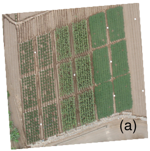
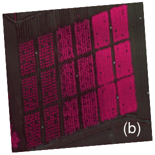
```

Figure  \@ref(fig:fig1)a shows the distribution of 18 plots grouped for three crops (cassava, maize, and sweet potato), covering a total area of 35 m× 45 mm. \@ref(fig:fig1)b shows the corresponding spectral image, with information on three bands: near-infrared (NIR) and red and green spectral bands in 18 plots with an average of 17135 pixels in 5 cm each. These bands contain information for identifying the EUs, their coordinates, and their spectral value.

Remote sensors and computer programming are widely applied in PA. One important package in R is FIELDimageR [@matias2020fieldimager]. The functionalities of the FIELDimageR package are aimed at treating plants in the agricultural field with spectral images. These functions allow the extraction of crop information, such as the number of plants and leaves on the plant and the quantification of the area and agricultural production.

Very few studies have explored the automation of EU detection in PA. Some studies explored the automation of EU identification, for example, the study of @willers2008defining, which proposes a method to define EUs in a commercial agricultural field, and the works of  @montalvo2012automatic, @guerrero2013automatic, @perez2015semi, @basso2020uav and @zhang2018automated for the automatic detection of furrows.

The objectives of the rPAex package are as follows:

-   Automate the distribution and spacing of the EUs while maintaining the shape and size of each EU  constant, integrating spectral data and pixel coordinates to obtain a flat file with spectral information and EU identification.
-   Generate an experimental design from the field design in an image and link the spectral information with the field book.
-   Rectify the position of the EUs in the images captured over time; this correction is necessary  when the EUs show a small deviation due to continuous flights.
-   Determine the pixels of the plot edge using spectral information.
-   Locate an EU and generate subplots.

To fulfill all its purposes, \pkg{rPAex} contains seven functions: imageField, designRaster, borderPoint, EUsPoint, and movePlot supported by fourPoint and fixedPoint. The package is organized into three layers (Figure \@ref(fig:fig2)). The first one corresponds to the five aims of the package, the second one to the seven functions, and the third one to the \CRANpkg{terra} and \CRANpkg{agricolae} packages, which are required by  \pkg{rPAex} to complete its functionality.

```{r fig2, out.width = "90%", out.height = "20%", fig.cap = "Package structure of rPAex"}
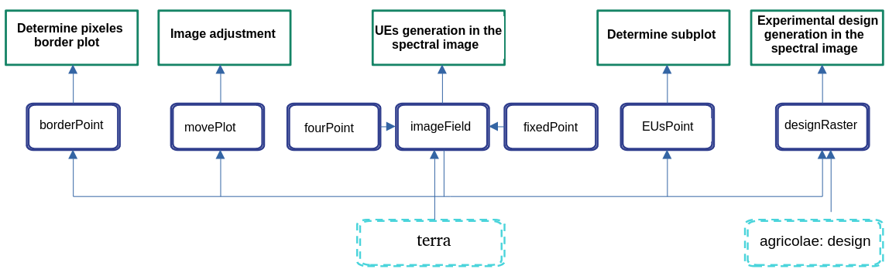
```

# Description of functions

Each function of rPAex, as well as their purpose, rationale, and syntax are described as follows. For a better understanding, we provide an example for each function.

**Example Case**

In the experimental station of the International Potato Center, three crops were studied in a 35 m × 45 m area. To illustrate the purposes of using rPAex, the cassava crop was considered. All crops were planted in December 2014 with different biological cycles—the cassava crop lasted eight and a half months. In all, 38 spectral images of cassava are available in the repository in three bands, namely, the near-infrared (NIR), red, and green spectral bands [@Loayza2018]. The vegetation indices were built based on the spectral bands; thus, the normalized difference vegetation index (NDVI), defined as the ratio of the difference between near-infrared and red reflectance to their sum (NIR-Red)/(NIR+Red), was used to evaluate vegetation
vigor [@WojWojPie2016].

The following statements in R allow the initialization of variables and constants for the execution of the examples presented in the article.

```
library(rPAex)
library(ggplot2)
data(cassava)
vi <- with(cassava, (L1 - L2)/(L1 + L2))  
vi <- data.frame(cassava[, 1:2], vi)  
ndvi <- terra::rast(vi, type = 'xyz')  
e <- terra::ext(287688, 287708, 8664196, 8664216)  
r1 <- terra::crop(ndvi, e)  
ndvi_1 <- r1
```

The Cassava database contains the variables $x$, $y$, $l_1$, $l_2$, and $l_3$.

where $x$ and $y$ are the pixel coordinates.

and $L_1$, $L_2$, and $L_3$ are the spectral bands for NIR, red, and green, respectively.

```{r, echo = FALSE, results = 'hide', comment = NA}
data(cassava)
vi <- with(cassava, (L1 - L2)/(L1 + L2))
vi <- data.frame(cassava[, 1:2], vi)
ndvi <- terra::rast(vi, type = 'xyz')
e <- terra::ext(287688, 287708, 8664196, 8664216)
r1 <- terra::crop(ndvi, e)
ndvi_1 <- r1
```

The open database CIP DATAVERSE contains the images used in this article by @Loayza2018. The file “TC_0559_georeferenced.tif” corresponds to week 11 of the three crops (See Figure \@ref(fig:fig1)a). The image of the cassava crop is shown (See Figure \@ref(fig:fig3)).

An image is plotted by using the following instructions in R:

The CIP DATAVERSE open database contains the images used in this article @Loayza2018, the file "TC\_0559\_georeferenced.tif" corresponds to week 11 of the 3 crops (See Figure \@ref(fig:fig1)a), where the image of the cassava is given (See Figure \@ref(fig:fig3)).

An image is plotted by using the following instructions in R:

```
op <- par(mar = c(0, 0, 0, 0))
terra::image(ndvi_1, col = hcl.colors(12, "Greens 3", rev = TRUE), axes = FALSE)
par(op)
```

```{r fig3, out.width = "40%", out.height = "10%", fig.cap = "NDVI image Cassava crop", fig.align = 'center'}
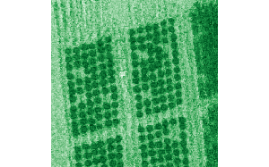
```

## fourPoint()

This function aims to determine the four points defining a study area delimited by a parallelogram. For this, in the x11 environment, it is sufficient to hover over three of the four extreme points (coordinates) of the image. The first point is the upper left corner of the area to be delimited, while the second and third points correspond to the other corners in the clockwise direction, and the fourth point is determined by the fourPoint(). Once the points are fixed, the locator() obtains the coordinates.

**Syntax:**

fourPoint($P$)

where $P$ is a list of three points obtained by the locator(3).

The fourth point is constructed as follows. Given the three points $(x_1, y_1), (x_2, y_2)$ and $(x_3, y_3)$, the fourth point $(x_4, y_4)$ is determined by using the slopes  $(m_1, m_2)$. See equations  \@ref(eq:eq2), \@ref(eq:eq3), \@ref(eq:eq4) and \@ref(eq:eq5):

\begin{align}
m_1 & = (y_2 - y_1)/(x_2 - x_1) (\#eq:eq2)\\ 
m_2 & = (y_3 - y_2)/(x_3 - x_2) (\#eq:eq3)\\
x_4 & = (y_3 - y_2 - m_1 x_3 + m_2 x_1)/(m_2 - m_1) (\#eq:eq4)\\
y_4 & = y_3 - m_1(x_3 - x_4)) (\#eq:eq5)   
\end{align}

**Example**

Considering the three points of the study area, taken clockwise (Figure \@ref(fig:fig4), interactive), we wish to determine the fourth point. To this end, point Q = fourPoint($P$) is taken as shown in the following instructions, corresponding to the location of the study area.

In R:

```
P <- list(x = c(287689.5, 287702.8, 287706.2), y = c(8664210.3, 8664214.2, 8664179))
Q <- fourPoint(P)
print(Q)
```

```{r, echo = FALSE, comment = NA}
P <- list(x = c(287689.5, 287702.8, 287706.2), y = c(8664210.3, 8664214.2, 8664179))
Q <- fourPoint(P)
print(Q)
```

Q matrix includes the spatial coordinates (x, y) of the points used to delineate the experimental plot presented in Figure \@ref(fig:fig4). These coordinates were obtained from the georeferenced image and define the plot boundaries used in subsequent analyses.

The generated Q points can be applied to terra::image(r) as follows:

```{r, echo = FALSE, comment = NA}
r <- terra::rast(cassava, type = "xyz")
```

```
op <- par(mfrow = c(1, 2), mar = c(4, 5, 0, 1))
r <- terra::rast(cassava, type = "xyz")
terra::image(r, main = "", xlab = "(a)", ylab = "", cex = 2.5, bty = "l", las = 1)
text(Q[1:3, ], paste("Q", 1:3, sep = ""), col = "blue")
text(Q[4, 1], Q[4, 2], "Q4", col = "red")
par(mar = c(4, 1, 0, 5))
terra::image(r, axes = FALSE, main = "", xlab = "(b)", ylab = "", cex = 2.5)
axis(1)
rownames(Q) <- paste("Q", 1:4, sep = "")
polygon(Q, lty = 2, lwd = 2)
par(op)
```

```{r fig4, out.width = "60%", out.height = "15%", fig.cap = "Image processed with the fourPoint(): a) image with 4 points and b) plot area.", fig.align = 'center'}
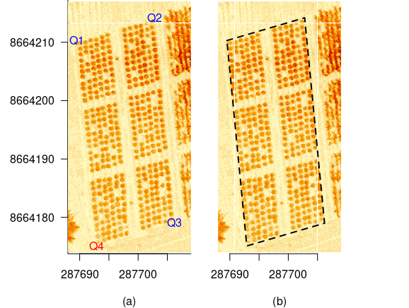
```

## fixedPoint()

This function divides a single side segment into $n$ segments for $n$ individual EUs, where each segment is of length $w$.

**Syntax:**

fixedPoint(($x_1$, $y_1$), ($x_n$, $y_n$), $n$, $w$))

where ($x_1$, $y_1$) and ($x_n$, $y_n$) are the extreme points of one side of the field, $n$ is the number of segments, and $w$, is their length. 

let $n$ be the number of segments and $P$ is the matrix of points ($x$, $y$) of the segments of length $w$ corresponding to one side of the plot. The endpoints correspond to ($x_1$, $y_1$) and ($x_n$, $y_n$).

Equation \@ref(eq:eq6) shows the length $L$ of the side of the plot:

\begin{equation} 
    L = \sqrt{(x_n - x_1)^2 + (y_n - y_1)^2} (\#eq:eq6)
\end{equation}

Further, $s$ is the distance between the starting points of each segment:

  $$s = (L - nw)/n - 1)$$

The difference between endpoints is as shown in equation:

$$d = (x_n - x_1, y_n - y_1)$$

Further, $d$ is a vector of elements ($d_1$, $d_2$) and the distance between the initial points of the segments is given by:

$$\delta = (w + s)d/\|d\|$$

where $\|d\| = \sqrt{d_1^2 + d_2^2}$

and then the points of each segment is determined by:

$$(x_k, y_k) = (x_{k-2}, y_{k-2})+\delta,\text{   for } k = 3, 5, ..., n-1 $$

$$(x_k, y_k) = (x_{k+2}, y_{k+2})-\delta,\text{   for } k = n-2, n-4, ..., 2$$   

**Example:**

Using points Q of the plot in Figure \@ref(fig:fig5), we want to determine the coordinate matrix of two segments of the side of the plot given by points Q[1] and Q[2], of length 6 m. Therefore, the following statement is run:

```
op <- par(mar = c(0, 0, 0, 0), cex = 0.8)
r1 <- terra::crop(r, e)
terra::image(r1, main = " ", axes = FALSE)
s <- fixedPoint(Q[1, ], Q[2, ], 2, 6)
arrows(s[1, 1], s[1, 2], s[2, 1], s[2, 2], col = "blue", code = 3, length = 0.1)
arrows(s[3, 1], s[3, 2], s[4, 1], s[4, 2], col = "blue", code = 3, length = 0.1)
par(op)
```

```{r fig5, out.width = "40%", out.height = "20%", fig.cap = "Image processed with the fixedPoint()", fig.align = 'center'}
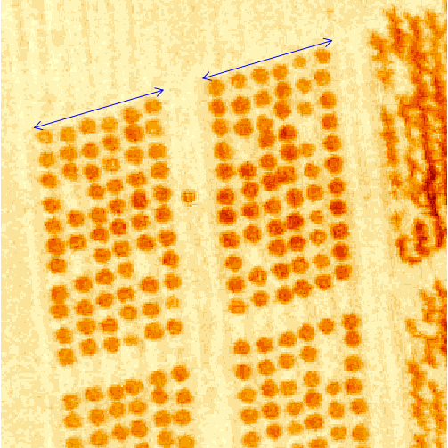
r1 <- terra::crop(r, e)
s <- fixedPoint(Q[1, ], Q[2, ], 2, 6)
```

## imageField()

The purpose of this function is to distribute the EUs in an orthomosaic image according to the shape and size of the EUs under the experiment considerations defined in the field. The georeferenced pixels of the image are related to the EUs to generate a table with correct information to identify the EU, as well as the pixel coordinates and multispectral registration $(L_1, L_2, ...)$, regardless of the number of spectral bands considered.

The image coordinates are essential if the image contains the actual georegistration of the image.

**Syntax:**

imageField(r, $Q$, $n_y$, $n_x$, $d_y$, $d_x$, plotting = TRUE, ...)

Where: 

> r: orthomosaic image  
> Q: coordinate matrix of dimension (4, 2) defining the plot.  
> $n_y$: number of EUs in the direction Q[2, .] and Q[3, .]  
> $n_x$: number of EUs in the direction Q[1, .] and Q[2, .]  
> $d_y$: length of EU in direction Q[2, .] and Q[3, .]  
> $d_x$: length of EU in direction Q[1, .] and Q[2, .]  
> plotting: = TRUE for the distribution of the EUs on the image  
> ...: graph arguments of the R plot function.  

The imageField process can be summarized in four steps. In step 1, the sides of the parallelogram are fixed in terms of $Q = (Q[1, .], Q[2, .], Q[3, .], Q[4, .])$. In step 2, the endpoints of $ny$ segments on the sides parallel to the straight line are determined $Q[2, .]–Q[3, .]$, indicated in red in Figure \@ref(fig:fig6). In step 3, the endpoints of $nx$ segments in the direction $Q[1, .]$, $Q[2, .]$ are determined for each pair of points generated in the previous step, i.e., a total of $ny$ × $nx$ points are generated (blue color). In step 4, using the points generated in step 3, the EUs are defined, and their pixels are assigned. Thus, a table of spectral information for the EUs is generated. The result is shown in the right panel of Figure \@ref(fig:fig6).

The following code complements figure \@ref(fig:fig6). 

``` 
op <- par(mar = c(0, 0, 2, 0), cex = 0.8)
terra::image(r, axes = FALSE, main = "Result with imageField", cex.main = 1.5)
Rbook <- imageField(r, Q, ny = 3, nx = 2, dy = 11, dx = 6, plotting = TRUE)
center <- agricolae::tapply.stat(Rbook$Qbase[, 2:3], Rbook$Qbase[, 1])
edge <- Rbook$coordinates.EU
text(center$x, center$y, paste("EU", center[, 1], sep = "-"), cex = 1.5)
text(287699.5, 8664175, "(b)", cex = 2.2)
par(op)
```

```{r fig6, echo = FALSE, out.width = "80%", fig.height = 7, fig.show = 'hold', fig.align = 'center', fig.cap = "a) Sequence of the imageField process: (Step 1) Define plot; (Step 2) Determine edge points; (Step 3) Determine interior points; (Step 4) Determine EUs. b) Output in 6 plots (EUs) with imageField()"} 
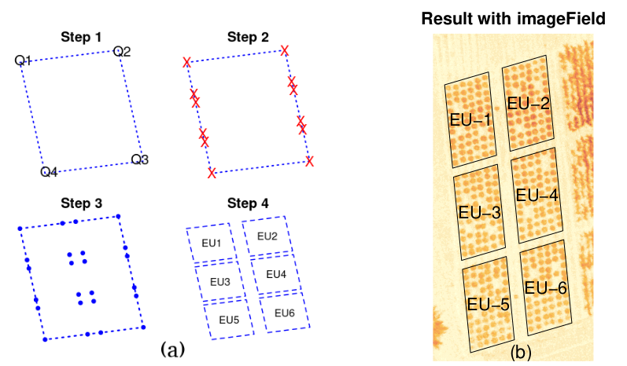
```

```{r, echo = FALSE, comment = NA} 
Rbook <- imageField(r, Q, ny = 3, nx = 2, dy = 11, dx = 6, plotting = FALSE)
center <- agricolae::tapply.stat(Rbook$Qbase[, 2:3], Rbook$Qbase[, 1])
edge <- Rbook$coordinates.EU
```

**Example:**

Consider the image of the six cassava plots (3 $\times$ 2), with ends of plot $Q = (Q[1,.], Q[2,.], Q[3,.], Q[4,.])$. We want to determine the three plots between points $Q[2, .]$ and $Q[3, .]$ and two plots between points $Q[1, .]$ and $Q[2, ]$, with sides of 11 m and 6 m per plot. For this purpose, we apply imageField(r, $Q$, $ny = 3$, $nx = 2$, $dy = 11$, $dx = 6$, plotting = TRUE), which provides the image shown in step 4 in Figure \@ref(fig:fig6), the matrix of the coordinates of all the plots and their information matrix (including the coordinates), and the wavelength in reflectance percentage $(L_1, L_2, L_3)$ as given in Table `r knitr::asis_output(ifelse(knitr::is_html_output(), '\\@ref(tab:EU2)', '\\@ref(tab:EU2-rPAex)'))`, “Qbase” object, which is the output of the of the imageField().

```{r EU2, eval = knitr::is_html_output(), layout = "l-body-outset"}
head(Rbook$Qbase)%>%
kableExtra::kbl(caption = "First 6 records of Plot 1") %>%
kableExtra::kable_paper("hover", full_width = F)
```

```{r EU2-rPAex, eval = knitr::is_latex_output()}
knitr::kable(Rbook$Qbase[1:6,], format = "latex", caption = "First 6 records of Plot 1", booktabs = TRUE) 
``` 

## designRaster()

This function aims to relate an image to the experimental design to allow us to fix the experimental area and identify EUs in a design image.

**Syntax:**

designRaster(R, book)

Where: 

> R: "Qbase" output object of the imageField().  
> book: output object of an experimental designs function of the \CRANpkg{agricolae}.  

Considering that “R” and “book” are flat tables identified by rows and columns, where each EU has its identification code in the “book” and sequential (1, 2, ... ) in “R,” there exists an unequivocal correspondence between the information in the two tables through the identification code of the EUs. This relationship is used to implement the designRaster(). designRaster() outputs two tables the first containing the EU identification of the image and design and the second the coordinates of the EUs in the field.

**Example:**

Consider that in the third cassava plot, we plan to test a complete randomized design with four treatments, A, B, C, and D, with replicates 4, 5, 5, and 4, respectively, where the EU is one cassava plant in the plot. For this purpose, the plot is delimited into units of 10 × 6 m, with new coordinates of Q. The dimensions of each EU net are 0.8 × 0.9 m. For design purposes, 66 (11 × 6) plots are available, as shown in Figure \@ref(fig:fig7), and only 18 EU will be used; therefore, 48 plots will not be used, and an empty treatment is assigned to these plots.

First, the EUs in the image are generated using imageField(r,$Q$, $n_y = 11$, $n_x = 6$, $d_y$, $d_x$, plotting = TRUE). This function outputs the Qbase table assigned to “R.” Second, the design is generated with the function design.crd(trt = c(A, B, C, D, ” “), r = c(4, 5, 5, 4, 48), seed = 8) of the \CRANpkg{agricolae} package, where the value seed = 8 is assigned to reproduce the design. This function generates the book table containing the design. Finally, both tables are linked by the function designRaster(R, book) (See \@ref(fig:fig7)c and Table  \@ref(tab:EU3)).

Using the image “r” previously found and by the manual determination of points “p1 = locator(2)” (See \@ref(fig:fig7)a) to crop the image and “p2 = locator(4)” (See Figure \@ref(fig:fig7)b) to determine the vertices of the experimental area, the design in the spectral image (See Figure \@ref(fig:fig7)c) is generated using the following code in R:

```{r fig7, echo = FALSE, out.width = "70%", fig.cap = "a) image with locator(2), b) image with locator(4) and c) EUs in the field and Completely Randomized Design generated by designRaster()", fig.align = 'center'}
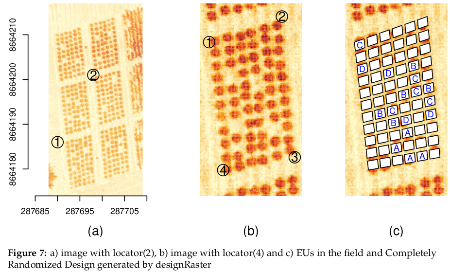
p1 <- list(x = c(287690, 287698), y = c(8664186, 8664201))
e <- terra::ext(unlist(p1)) 
rc <- terra::crop(r, e)
p2 <- list(x = c(287690.7, 287696.4, 287697.4, 287691.8),
           y = c(8664198, 8664200, 8664189, 8664188) )
Q2 <- fourPoint(p2)
out <- imageField(r, Q2, 11, 6, 0.8, 0.9, col = "white", plotting = FALSE)
trt <- c(LETTERS[1:4], " ")
k <- c(4, 5, 5, 4, 48)
plan1 <- agricolae::design.crd(trt, r = k, seed = 8)$book
plan2 <- designRaster(R = out$Qbase, book = plan1)
xx <- plan2$design 
yy <- plan2$rasterField
design <- xx[xx$trt != " ",]
spectral <- yy[yy$trt != " ",]
```

```
op <- par(mfrow = c(1, 3), mar = c(4, 2, 0, 0))
terra::image(r, main = "", xlab = "(a)", ylab = "", cex.lab = 1.5, axes = FALSE)
axis(1)
axis(2)
p1 <- list(x = c(287690, 287698), y = c(8664186, 8664201))
points(p1, cex = 3)
text(p1, c("1", "2"), cex = 1.5)
e <- terra::ext(unlist(p1)) 
rc <- terra::crop(r, e)
terra::image(rc, main = "", xlab = "(b)", ylab = "", cex.lab = 1.5, axes = FALSE)
p2 <- list(x = c(287690.7, 287696.4, 287697.4, 287691.8),
         y = c(8664198, 8664200, 8664189, 8664188) )
Q2 <- fourPoint(p2)
points(Q2, cex = 3)
text(Q2, c("1", "2", "3", "4"), cex = 1.5)
par(mar = c(4, 2, 0, 0))
terra::image(rc, main = "", xlab = "(c)", ylab = "", cex.lab = 1.5, axes = FALSE)
out <- imageField(r, Q2, ny = 11, nx = 6, dy = 0.8, dx = 0.9, col = "white")
trt <- c(LETTERS[1:4], " ")
k <- c(4, 5, 5, 4, 48)
plan1 <- agricolae::design.crd(trt, r = k, seed = 8)$book
plan2 <- designRaster(R = out$Qbase, book = plan1)
xx <- plan2$design
yy <- plan2$rasterField
design <- xx[xx$trt != " ", ]
spectral <- yy[yy$trt != " ", ]
text(design[, 4], design[, 5], design[, 3], cex = 1, col = "blue")
par(op)
```

```{r EU3}
df1 <- design[, -1]
rownames(df1) <- design[, 1]
df2 <- spectral[1:6, -1]
rownames(df2) <- 1:6
x <- knitr::kable(df1, booktabs = TRUE) |> add_header_above(c("Spatial field book" = 5))
y <- knitr::kable(df2, booktabs = TRUE) |> add_header_above(c("Spectral data of the experimental area (First 6 records)" = 8))
knitr::kables(list(x, y), caption = "Output designRaster()")
```

## movePlot()

The objective of this function is to rectify the coordinates and the direction of the study plot to reduce errors when obtaining the coordinates of the images over time. To do this, the plot coordinates are rotated and translated.

**Syntax:**

movePlot(Q, q)

Where:    

> Q: the 4 points of the plot (initial image)  
> q: vector with two points, where the first one corresponds to the new location of the plot, and the second one is used to obtain the direction.  

$Q = [Q[1,.], Q[2,.], Q[3,.], Q[4,.]$, and $q = [q[1,.], q[2,.]]$ described in \@ref(eq:eq12) allows the calculation of the rotation angle, as shown in \@ref(eq:eq13). Using \@ref(eq:eq14), the rotation matrix $P$ can be determined to obtain the new rotated $Q$ matrix

\begin{equation}
Q = \left ( \begin{array}{cc}
Q_{1, 1} & Q_{1, 2}\\
Q_{2, 1} & Q_{2, 2}\\
Q_{3, 1} & Q_{3, 2}\\
Q_{4, 1} & Q_{4, 2}\end{array}\right)
,~~~q = \left ( \begin{array}{cc} q_{1, 1} & q_{1, 2}\\
q_{2, 1} & q_{2, 2}\end{array}\right) (\#eq:eq12)
\end{equation}

\begin{equation}
m_1 = \frac{Q_{2, 2} - Q_{1, 2}}{Q_{2, 1} - Q_{1, 1}}
,~~~~m_2 = \frac{q_{2, 2} - q_{1, 2}}{q_{2, 1} - q_{1, 1}}
,~~~~\theta = \arctan(m_2) - \arctan(m_1) (\#eq:eq13)
\end{equation}

\begin{equation}
P = \left ( \begin{array}{cc}
\cos(\theta) & \sin(\theta)\\
-\sin(\theta) & \cos(\theta) \end{array}\right), ~~~~~~ Q = Q.P (\#eq:eq14)
\end{equation}

The translation of matrix Q to the new location is obtained using \@ref(eq:eq15).

\begin{equation}
\delta_j = Q_{1, j} - q_{1, j}, ~~ j = 1, 2
~~~~~~~ Q_{i, j} = Q_{i, j} - \delta_j, ~~ i = 1, 2, 3, 4 ~~~ j = 1, 2 (\#eq:eq15)
\end{equation}    

Example. Consider the image of flight 2 shown in Figure \@ref(fig:fig6)a and EU_3 and its point matrix Q (Q1, Q2, Q3, Q4) that limits it. In flight 11, you have the same plot, but with a small deviation as shown in Figure \@ref(fig:fig6)b. Q has to be corrected for use in flight 11. To rectify Q, we consider a new location and orientation given by vector q(x, y), x = (287690.7, 287696.6), y = (8664198.3, 8664200.1). To obtain the new Q, the function movePlot(Q, q) is applied to obtain new distribution of subplots, without altering the dimensions. The new Q is now used in flight 11 (See Figure \@ref(fig:fig8)c and the values of Q in Table  `\@ref(tab:EU4)).

In R, for flight 2, data cropTime and terra package are used:

```
data(cropTime)
ax1 <- seq(287688, 287700, 4)
ay1 <- seq(8664184, 8664202, 4)
by1 <- c(8664185.9, 8664201.8)
ny <- 11
nx <- 6
dy <- 0.8
dx <- 0.9
f2 <- subset(cropTime, Flight == 2)
r2 <- terra::rast(f2[, -1], type = "xyz")
P2 <- list(x = c(287690.68, 287696.43, 287697.46), y = c(8664198.11, 8664199.87, 8664189.01))
Q2 <- fourPoint(P2)
```

```{r, echo = FALSE, comment = NA}
data(cropTime)
ax1 <- seq(287688, 287700, 4)
ay1 <- seq(8664184, 8664202, 4)
by1 <- c(8664185.9, 8664201.8)
ny <- 11
nx <- 6
dy <- 0.8
dx <- 0.9
f2 <- subset(cropTime, Flight == 2)
r2 <- terra::rast(f2[, -1], type="xyz")
P2 <- list(x = c(287690.68, 287696.43, 287697.46), y = c(8664198.11, 8664199.87, 8664189.01))
Q2 <- fourPoint(P2)
```

For flight 11, data cassava, imageField(), and terra package are used:

```
ex <- list(x = range(f2$x), y = range(f2$y))
e <- terra::ext(unlist(ex))
rc <- terra::crop(r, e)
```

```{r, echo = FALSE, comment = NA}
ex <- list(x = range(f2$x), y = range(f2$y))
e <- terra::ext(unlist(ex))
rc <- terra::crop(r, e)
```

For rectified flight 11, movePlot(), imageField(), and terra package are used:

```
q <- list(x = c( 287690.7, 287696.6), y = c(8664198.3, 8664200.1))
Qnew <- movePlot(Q2, q)
```

```{r, echo = FALSE, comment = NA}
q <- list(x = c( 287690.7, 287696.6), y = c(8664198.3, 8664200.1))
Qnew <- movePlot(Q2, q)
```

```{r fig8, echo = FALSE, out.width = "80%", fig.cap = "Cassava in plot 3, a) cropTime data with Q, b) cassava data with Q new", fig.align = 'center'}
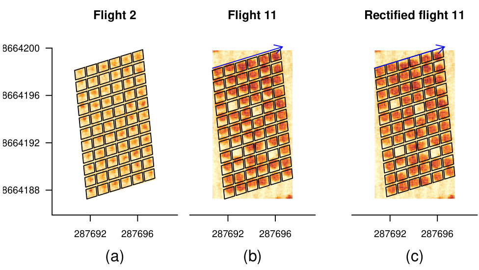
```

```
op <- par(mfrow = c(1, 3), mar = c(4, 4, 2, 0), cex = 0.7)
main1 <- "Flight 2"
main2 <- "Flight 11"
main3 <- "Rectified flight 11"
terra::image(r2, axes = FALSE, main = main1, ylim = by1, xlab = "(a)", cex.lab = 1.5)
axis(1, ax1)
axis(2, ay1, las = 1)
plan <- imageField(r2, Q2, ny, nx, dy, dx)
par(mar = c(4, 1, 2, 3), cex = 0.7)
terra::image(rc, main = main2, xlab = "(b)", ylab = "", cex.lab = 1.5, axes = FALSE, ylim = by1)
axis(1, ax1)
plan <- imageField(rc, Q2, ny, nx, dy, dx)
arrows(q$x[1], q$y[1], q$x[2], q$y[2], col = "blue", length = 0.1)
par(mar = c(4, 0, 2, 4), cex = 0.7)
terra::image(rc, axes = FALSE, main = main3, xlab = "(c)", ylab = "", cex.lab = 1.5, ylim = by1)
axis(1, ax1)
plan <- imageField(rc, Qnew, ny, nx, dy, dx)
arrows(q$x[1], q$y[1], q$x[2], q$y[2], col = "blue", length = 0.1)
par(op)
```

```{r, echo = FALSE, comment = NA}
options(digits = 16)
df1 <- Q2
colnames(df1) <- c("x", "y")
rownames(df1) <- paste("Q", 1:4, sep = "")
df2 <- Qnew
colnames(df2) <- c("x", "y")
x <- knitr::kable(df1, booktabs = TRUE) |> add_header_above(c("Q coordinates image 2" = 3)) 
y <- knitr::kable(df2, booktabs = TRUE) |> add_header_above(c("rectified Q coordinates" = 2)) 
```

```{r EU4}
options(digits = 16)
df1<-Q2
colnames(df1)<-c("x","y")
rownames(df1)<-paste("Q",1:4,sep="")
df2<-Qnew
colnames(df2)<-c("x","y")
x <- knitr::kable(df1, booktabs=TRUE) |> add_header_above(c("Q coordinates image 2"=3))
y <- knitr::kable(df2, booktabs=TRUE) |> add_header_above(c("rectified Q coordinates"=2))
knitr::kables(list(x, y), caption = "Coordinate rectification with movePlot(Q,q)")
```

The images obtained successively from the same field on different dates are rectified; hence, the same plotting structure is applied to all images. However, some differences may arise, and it is necessary to rectify the position of the pixels.

## borderPoint()

The objective of this function is to obtain the spectral information of the edge of the EUs, i.e., the information around it. This allows us to explore the edge effects on the study plot.

**Syntax:**

borderPoint(r, Rbook, distance, plotting = TRUE, ...)

Where:

> r: is the spectral image of the field that includes the experimental plot.  
> Rbook:  plot with the EUs, generated by imageField().  
> distance: longitude of the border to the plot.  
> plotting = TRUE: display the image of the border effect around the EUs.  
> ...: plot parameter to document the image as main, axis, etc.

To obtain the spectral information of the EU edges, a new plot is constructed considering the vertices of the initial plot ($Q$) in Rbook, which is extended to new vertices by adding a set distance ($d$) and maintaining its direction. The imageField() is then applied to the new plot to determine the EUs in it, keeping their coordinates. Finally, the edge is obtained by removing all information of the EUs from the new plot.

**Example** 

Consider the image shown in Figure \@ref(fig:fig4). We need to obtain the spectral information of the edge of the EUs of this image at a distance of 1 m that encloses the experimental area. To this, we can apply borderPoint(r, Rbook, distance = 1) (its results are shown in Figure \@ref(fig:fig9)) and the matrix of the spectral information of the edge (a part of it is given in Table \@ref(tab:EU5)).

``` 
op <- par(mfrow = c(1, 2), mar = c(0, 0, 2, 0))
terra::image(r, main = "Image crop", axes = FALSE)
text(287700, 8664175.5, "(a)", cex.lab = 1.5)
Rbook <- imageField(r, Q, ny = 3, nx = 2, dy = 11, dx = 6, plotting = TRUE)
out <- borderPoint(r, Rbook, distance = 1, main = "Border effect", axes = FALSE)
text(287700, 8664175, "(b)", cex.lab = 1.5)
par(op)
```

```{r fig9, out.width = "50%", fig.show = 'hold', fig.align = 'center', fig.cap = "borderPoint() application: a) Image of the field; b) Border of EUs"} 
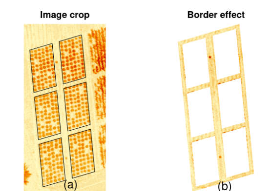
Rbook <- imageField(r, Q, ny = 3, nx = 2, dy = 11, dx = 6, plotting = FALSE)
out <- borderPoint(r, Rbook, distance = 1, main = "Border effect", axes = FALSE, plotting = FALSE)
```

```{r EU5}
options(digits = 10)
df1 <- out$Qborder
colnames(df1) <- c("x", "y")
df2 <- head(out$Border)
x <- knitr::kable(df1, booktabs = TRUE) |> add_header_above(c("Four points of the border area" = 2))
y <- knitr::kable(df2, booktabs = TRUE) |> add_header_above(c("Spectral data of the experimental edge\ (First 6 records)" = 5))
knitr::kables(list(x, y), caption = "Output borderPoint()")
```

## EUsPoint()

This function determines the vertices of a specific EU from an experimental area that was already segmented with the imageField().

**Syntax:**

EUsPoint(Rbook, EU)

Where:

> Rbook: List of objects generated by imageField().  
> EU: integer value that identifies the EU of interest.  

The vertices matrix of the EUs is an object in Rbook, and it contains all the coordinate points ($x$, $y$), which are the boundaries of the EUs. The coordinate points are in correlative order, as shown in Figure 10a\@ref(fig:fig10)a.

Given $nx$ and $ny$, the position of each point of the EUs is determined by using the following code corresponding to the EUsPoint():

```
nx <- 2
ny <- 3
a <- c(1, 2, 2*(nx+1), 2*nx+1)
A <- NULL
for(j in 1:ny){ 
  for(i in seq(0, 2*(nx-1), 2)){
  A <- rbind(A, a+i)
  }
  a <- a+4*nx 
}
```

```{r, echo = FALSE, comment = NA}
nx <- 2
ny <- 3
a <- c(1, 2, 2*(nx+1), 2*nx+1)
A <- NULL
for(j in 1:ny){ 
  for(i in seq(0, 2*(nx-1), 2)){
  A <- rbind(A, a+i)
  }
  a <- a+4*nx 
}
```

For example, with $nx = 2$ and $ny = 3$, a matrix $A$ is generated. This matrix contains the sequence of points corresponding to the vertices of the EUs (See Table `r knitr::asis_output(ifelse(knitr::is_html_output(), '\\@ref(tab:EU6)', '\\@ref(tab:EU6-rPAex)'))` and Figure \@ref(fig:fig10)a).

Considering EU = 3 as the EU, the coordinates of the vertices correspond to {9, 10, 14, 13} (See Figure \@ref(fig:fig10)a).

```{r, echo = FALSE, comment = NA}
rownames(A) <- paste("EU", 1:6, sep = "")
colnames(A) <- paste("Q", 1:4, sep = "")
```

```{r EU6, eval = knitr::is_html_output(), layout = "l-body-outset"}
A%>%
kableExtra::kbl(caption = "Numbering of the vertices of the EUs") %>%
kableExtra::kable_paper("hover", full_width = F)
```

```{r EU6-rPAex, eval = knitr::is_latex_output()}
knitr::kable(A, format = "latex", caption = "Numbering of the vertices of the EUs", booktabs = TRUE)  
```

**Example**

We determine 66 subplots (11 $\times$ 6) with length $dy = 0.8 m$ and width $dx = 0.9 m$ on the third EU (EU_3) in Figure \@ref(fig:fig6). To do this, first, EUsPoint(Rbook, EU = 3) is applied to get the vertices $P_3$ of EU_3; then, imageField(r, $P_3$, $ny = 11$, $nx = 6$, $dy = 0.8$, $dx = 0.9$) is applied. Thus, the image shown in Figure \@ref(fig:fig10)b is obtained. The information matrix of the subplots in EU_3 (Table `r knitr::asis_output(ifelse(knitr::is_html_output(), '\\@ref(tab:EU7)', '\\@ref(tab:EU7-rPAex)'))`) prints at the first few rows of the cassava:

The following instructions in R present the vertices of the plots and generate the subplots of EU_3:

```
op <- par(mfrow = c(1, 2), mar = c(4, 5, 3, 0), cex = 0.8)
XYcenter <- apply(cassava[, 1:2], 2, mean)
xArista <- range(cassava[, 1])
yArista <- range(cassava[, 2])
plot(XYcenter[1], XYcenter[2], xlim = xArista, ylim = yArista, bty = "l",
     xlab = "(a)", ylab = "", cex = 0, las = 1, cex.lab = 1.5)
Rbook <- imageField(r, Q, ny = 3, nx = 2, dy = 11, dx = 6, col = colors()[15], border = "white")
arista <- Rbook$coordinates.EU
text(arista, cex = 1, col = "blue")
terra::image(r, axes = FALSE, main = "Subplot EU_3",
              xlab = "(b)", ylab = "", cex.lab = 1.5, cex.main = 1.5)
Rbook <- imageField(r, Q, ny = 3, nx = 2, dy = 11, dx = 6, plotting = FALSE)
P_3 <- EUsPoint(Rbook, EU = 3)
Rbook3 <- imageField(r, P_3, ny = 11, nx = 6, dy = 0.8, dx = 0.9, plotting = TRUE)$Qbase
names(Rbook3)[1] <- "SubPlot"
par(op)
```

```{r fig10, echo = FALSE, out.width = "60%", fig.show = 'hold', fig.align = 'center', fig.cap = "Effect of the EUsPoint(): a) Location of the edges, b) Generation of subplots in unit 3"}
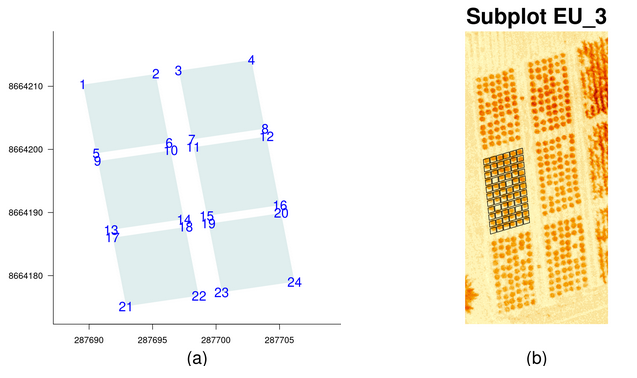
XYcenter <- apply(cassava[, 1:2], 2, mean)
xArista <- range(cassava[, 1])
yArista <- range(cassava[, 2])
Rbook <- imageField(r, Q, ny = 3, nx = 2, dy = 11, dx = 6, col = colors()[15], border = "white", plotting = FALSE)
arista <- Rbook$coordinates.EU
Rbook <- imageField(r, Q, ny = 3, nx = 2, dy = 11, dx = 6, plotting = FALSE)
P_3 <- EUsPoint(Rbook, EU = 3)
Rbook3 <- imageField(r, P_3, ny = 11, nx = 6, dy = 0.8, dx = 0.9, plotting = FALSE)$Qbase
names(Rbook3)[1] <- "SubPlot"
```

```{r EU7, eval = knitr::is_html_output(), layout = "l-body-outset"}
head(Rbook3)%>%
kableExtra::kbl(caption = "First 6 records of EU_3") %>%
kableExtra::kable_paper("hover", full_width = F)
```

```{r EU7-rPAex, eval = knitr::is_latex_output()}
knitr::kable(head(Rbook3), format = "latex", caption = "First 6 records of EU-3", booktabs = TRUE)  
``` 

# Application in crop development

The most important use of rPAex is to provide spectral information, such as vegetation indices, from images of PA experiments. In this example, rPAex shows the development of the cassava crop on nine evaluation dates used in the case study. In this study, the vegetation index (NDVI) and red spectral band representing the low vegetation and high soil presence were considered.

The rPAex database contains multispectral data of nine images obtained in the course of 38 flights (cropTime) for a CIP experimental field (Table \@ref(tab:EU8)). The cropTime database was obtained from the CIP DATAVERSE repository, the images.RAR file contains all images, one per flight. For example, flight 11 contains the file “TTC_0559_georeferenced.tif” from the folder “2015_02_26.”

After downloading the file “TTC_0559_georeferenced.tif,” the following code can be applied in R:

```
r <- terra::rast("TTC_0559_georeferenced.tif")  
base <- imageField(r, P_3, ny = 1, nx = 1, dy = 0, dx = 0, plotting = FALSE)$Qbase 
head(base)
```

The images of flights 1, 2, 6, 11, 20, 23, 30, 36, and 38 for plot 3 were extracted from each image using the definition of plot P_3 (See Figure \@ref(fig:fig10)b) from the example of the EUsPoint(). The code in R extracts the data from plot 3. The parameters $nx = 1$, $ny = 1$ because a single plot is considered. Since the plot is not further divided, the parameters dy and dx are zero. The accumulated data of each image are used to generate the cropTime object.

```{r, echo = FALSE}
dates <- c( "2014-12-18", "2015-01-06", "2015-01-29", "2015-02-26", "2015-03-30",
          "2015-04-22", "2015-06-09", "2015-07-24", "2015-08-06")
pixels <- table(cropTime$Flight)
df1 <- as.data.frame(pixels, dates)
xx <- as.character(df1$Var1)
df1$Var1 <- as.numeric(xx)
names(df1) <- c("Flight", "Pixels")
df2 <- cropTime[1:6,]
```

```{r EU8}
x <- knitr::kable(df1, booktabs = TRUE) |> add_header_above(c("Flight dates and dimension" = 3))
y <- knitr::kable(round(df2, 2), booktabs = TRUE) |> add_header_above(c("Spectral data experimental area (First 6 records)" = 6))
knitr::kables(list(x, y), caption = "Description of the data 'cropTime'")
```

To illustrate the development of the cassava crop, during the nine flights, a color value is assigned to the NDVI to simulate the presence of canopy covers during crop growth (Figure  \@ref(fig:fig11)a) using the trends of the NDVI and the red spectral band. The following code in R allows the following calculations:

```
ndvi <- with(cropTime, (L1 - L2)/(L1 + L2))
cropTime <- data.frame(cropTime, ndvi)
FLIGHT <- c(1, 2, 6, 11, 20, 23, 30, 36, 38)
Flight <- cropTime$Flight
f1 <- function(x) mean(x, na.rm = TRUE)
trend <- agricolae::tapply.stat(cropTime[, 2:7], Flight, f1)
ylim1 <- c(8664183.5, 8664200)
```

Each image i = 1 to 9, can be displayed and the trend of the spectral indices with "trend" data, where L1 = NIR, L2 = Red and L3 = Green.

```
par(mfrow = c(2, 5), mar = c(0, 0, 1, 0), cex = 0.9)
for(i in 1:9){
  P <- cropTime[cropTime$Flight == FLIGHT[i], ]
  P$ndvi <- (P$L1 - P$L2)/(P$L1 + P$L2)
  I <- terra::rast(P[, c(2, 3, 7)], type = "xyz")
  xcolor <-  hcl.colors(12, "Greens 3", rev = TRUE)
  xmain <- paste("fligth:", FLIGHT[i])
  terra::image(I, col = xcolor, axes = FALSE, main = xmain, ylim = ylim1, cex.main = 1.5)
  if(i == 8) text(287695, 8664184.8, "(a)", cex = 2)
}
par(mfrow = c(1, 1), cex = 1.2)
ggplot(data = trend) +
  theme(text = element_text(size = 15)) +
  geom_line(mapping = aes(y = ndvi, x =  Flight, colour = "NDVI"), linewidth = 1) +
  geom_line(mapping = aes(y = L2/60, x =  Flight, colour = "red /60"), linewidth = 1) +
  scale_linewidth(range = c(0.2, 0.8)) +
  scale_color_manual(name = "Spectral\nindex", 
                     values = c("NDVI" = colors()[81], "red /60" = "red")) +
  ggtitle("The spectral response of the crop over time") +
  labs(x = "Weeks", y = "", cex.lab = 0.9) +
  theme(axis.title.x = element_text(size = 25), 
        axis.title.y = element_text(size = 20)) +
  annotate("text", x = 37,  y = 0.25, label = "(b)", size = 8)
```

```{r fig11, echo = FALSE, out.width = "80%", fig.show = 'hold', fig.align = 'center', fig.cap = "a) Canopy cover of the cassava crop. b) NDVI and Red spectral band during cassava growth"}
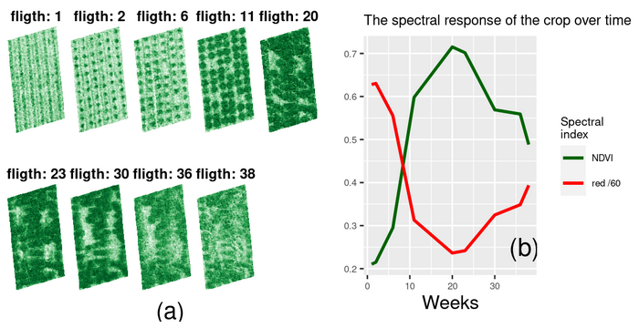
```

# Discussion

Unlike other packages, such as terra, which facilitates and supports the treatment of remote sensing images in field studies, no packages are available in R to treat images with the design of experiments. In this sense, the purpose of rPaex is to link spectral images to experimental designs by identifying the EUs, facilitating the use of spectral information, and their edges to complement the information already gathered via experimental analyses. The focus was on studying experimental designs with images to analyze vegetation indices and spectral and agronomic measurements and to compare treatments. When identifying the EUs of the experimental design using rPAex, the spectral measurements and vegetation indices become the new variables. Moreover, rPAex supports longitudinal study as the design structure remains the same throughout the experiment.

As with any process subjected to environmental factors and involving manually operated data acquisition devices, the effectiveness of rPAex depends on the accuracy and precision of the imaging instruments.

From the consecutive images obtained in an experiment, the effect of treatments on the spectral measurement may be inferred, and comparative analysis with any field measurement may be conducted. In this sense, rPAex facilitates the organization of the spectral data in the EUs. This package is available on the R platform and is free to use; hence, suggestions will allow continuous improvement of the package. Given the importance of longitudinal studies, which can be adequately treated by functional data analysis, it is necessary to include this type of analysis in rPAex.

When integrated with the \CRANpkg{agricolae} package, rPAex allows the spatial linking of the image and spectral information with any experimental design generated before its application, assuming that the experimental plan is developed before setting up the experiment. rPAex strengthens the initial stage of experimentation with multispectral data to guide the researcher and facilitate site planning for the experiment installation. Spectral information collected before, during, and at the end of trials will aid crop evaluation.

The integration of multispectral information with field measurements for each EU enables the study of crop phenology, statistical analysis of the experiment, and functional data analysis of EUs over time, subject to the evaluation of the study treatments. Further, regarding the limitation to fields with uniform spaces, the EUs may not necessarily have a regular shape and may have different sizes as defined by points within the area (3–4 points) and by applying the fourPoint(). However, this is not recommended since the EUs in the experiment have uniform shape and size.

# Summary

The rPAex package was introduced in R. It contains seven functions to support the experimental design in PA with multispectral images by generating the EUs and their borders and vertices and by adjusting the plot frame by the calibration effect.

The imageField() integrates a spectral image with the EUs; in terms of georegistration, the pixels are labeled with the EUs. It outputs three objects, namely, the parameters of the size of the study plot, the spectral information of the EUs, and the georeference of each EU. The outputs of the function allow us to relate the experimental design created by the \CRANpkg{agricolae} package to the field image using the designRaster(). The designRaster() creates a spectral field book and identifies the image pixels with the design characteristics for analysis. Likewise, the spectral information of the edge is obtained by the borderPoint(); this information allows us to study the effect in the experiment. The coordinates of a specific unit are obtained by the EUsPoint() to create new subplots of the unit.

# Acknowledgments

The authors appreciate the access to DATAVERSE and repository, provided by the International Potato Center (CIP), as well as its support with the use of images in agricultural experimentation.
