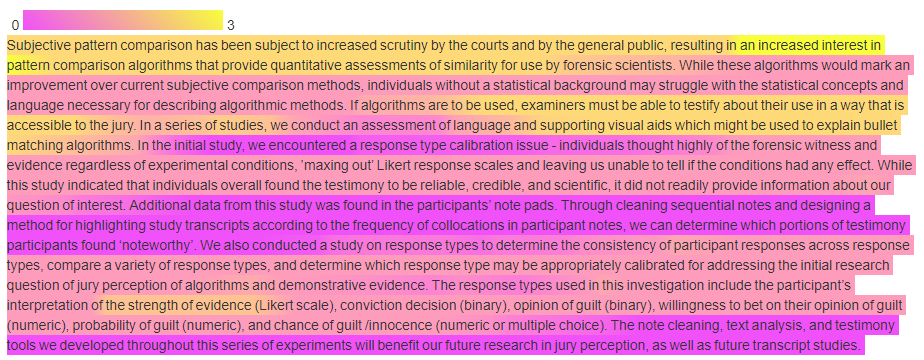
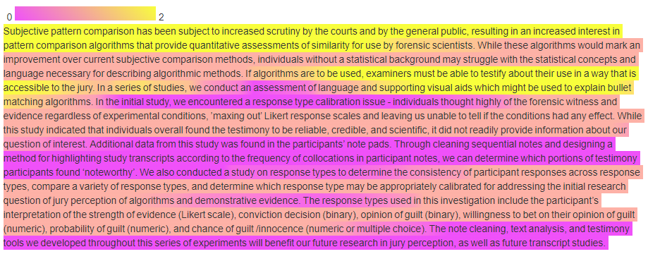
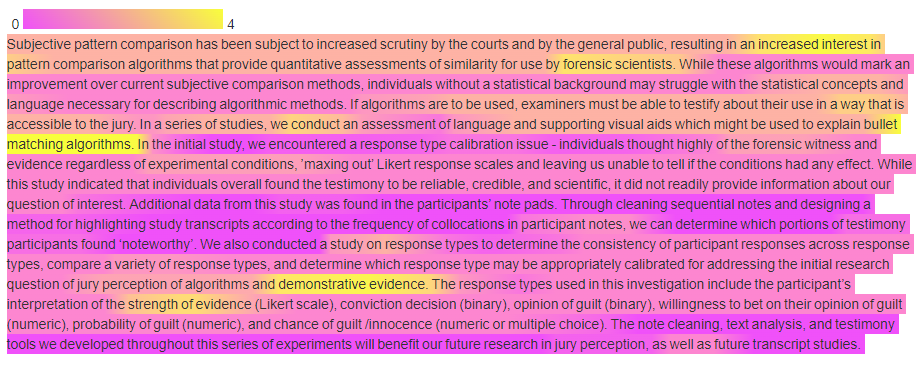
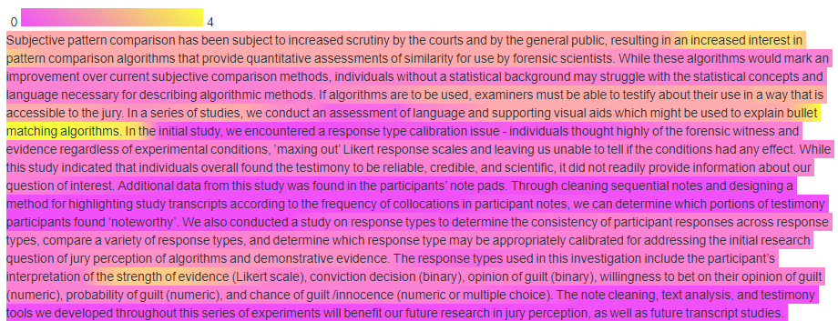
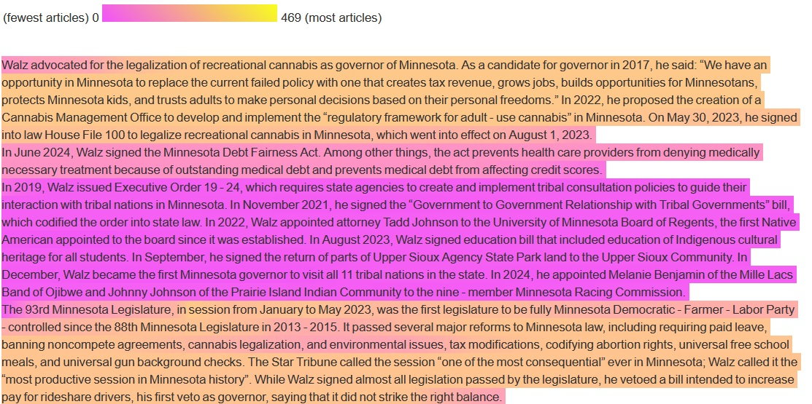
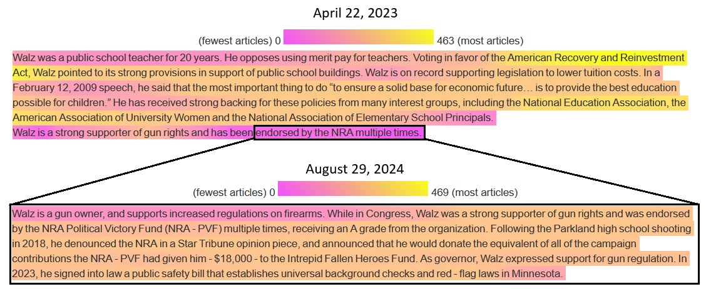

```{r setup, include=FALSE}
knitr::opts_chunk$set(echo = FALSE, warning = FALSE, message = FALSE)
library(ggplot2)
library(highlightr)
library(readr)
library(dplyr)
library(stringr)
library(DiagrammeR)
library(gt)
library(pander)
library(plotly)
library(webshot2)
library(patchwork)
```

# Introduction

An individual’s notes can provide valuable insight into their process when learning new information.
Comparing note sheets with the presented information allows researchers to determine which areas participants found worth recording.
This process is particularly important when conducting studies of how jurors interpret legal arguments, using legal transcripts instead of more costly mock-trial videos. 
The \CRANpkg{highlightr} package [@highlightr] provides a set of functions developed for analyzing and visualizing participant notes to indicate which portions of the transcript were most informative. 

The analysis methods in \pkg{highlightr} are useful well beyond the legal transcript study for which they were developed.
The same methods can also be used to compare other documents which have a similar source, such as abstracts for conference presentations and journal papers on the same topic, or sequential edits to a Wikipedia page.
In this paper, we demonstrate the use of the \pkg{highlightr} package across a number of different document comparison problems, discussing the design and function of the package as well as the adjustments which must be made as we take on problems with different source-document relationships. 

By establishing similarity to the source text, we can determine which portions of the document were judged to be important and use this information to create visualizations highlighting important sections of the document based on users' notes.
This similarity is based on finding the occurrence of phrases from the source document in the derivative documents; the higher the number of occurrences, the more intense the highlighting.

# Related work

Single document forms of text visualization include the construction of word clouds, where a cluster of frequently used words are shown, with larger words indicating more frequent occurrence. 
In R, word clouds can be implemented using \CRANpkg{wordcloud} [@wordcloud].
Similarly, frequency values can be shown directly in a barplot [@shibuya_mining_2015].
While word clouds and frequency barplots provide useful information about the individual frequency of words in a collection of texts, the surrounding sentence context is not taken into account.
@silge_she_nodate visualize gendered verbs used in film scripts through digrams, or sequences of two words, where the first word consisted of a pronoun ("he" or "she") and the second word was a screen direction.
They then plotted the frequency of each word by gendered pronoun in a diverging barplot using \CRANpkg{ggplot2} [@ggplot2].
This text visualization has added context in the form of pronouns, when compared to word clouds.
It provides a useful visualization of gender differences present in film scripts.
In a more general sense, bigrams can also be visualized (and analyzed) in a graphical network, where segments indicate that two words form a bigram [@shibuya_mining_2015].
When evaluating a text as a whole, @shibuya_mining_2015 also use dispersion plots to depict the locations of n-grams, or phrases of length n, throughout a text.
In a dispersion plot, one axis corresponds to the word count, and a line is drawn at the point that the n-gram appears, resulting in a barcode-like appearance that indicates the locations of the specified n-gram.

The goal of \pkg{highlightr} is not to summarize a single document, but to visualize the relationship between a source document and its derivatives.
This comparison of source and derivative documents is similar to the work of Ben Fry, who compared various editions of Charles Darwin's *On the Origin of Species* [@fryTracingOrigin2018].
In this work, @fryTracingOrigin2018 uses color to denote additions and animates deletions between six editions of Darwin's work, and notes how the language and structure change over time.

Similarly, @janicke_visualizations_2014 utilize visualization tools in JavaScript to compare versions of the Bible for text reuse at a sentence level.
Pairwise document comparisons are accomplished through a grid format, where a document is presented along each axis in sequential sections and similarities are shown in a heatmap form.
They also provide an alternative visualization at the sentence-level in Dot Plot form, where a dot's location on the graph indicates a sentence pair.
Alternatively, when viewing two texts side by side, similarities are connected in a parallel coordinate plot format, where a line is drawn between similar sentences.
@janicke_visualizations_2014 also perform sentence-level comparisons between multiple texts using sentence alignment flow, where a base sentence is depicted with variations connected via lines.

Comparison between multiple documents also bears some resemblance to plagiarism detection, where portions of texts are compared with references to determine if the text was copied.
Parker and Hamblen [@parker] describe an algorithm that uses the character differences to compare similarities in computer programs, as well as other code-specific features.

@piao_tool_2003 describes the TESAS algorithm, used for detecting relationships between two documents at the sentence level, with a focus on applications in journalism.
This algorithm relied on shared strings, stems and synonyms for evaluating similarity between sentences in order to produce a score.
The accompanying tool provided side-by-side comparisons of source and derivative sentences.
Similarly, @olsen_something_2011 describe the application of sequence alignment algorithms, traditionally used in bioinformatics, to compare passages of text.
To visualize the correspondences between texts, @olsen_something_2011 place texts side-by-side with color-coded similarities.

Visualizations for source and derivative text comparisons usually consist of texts placed next to each other, with color to indicate similarities and differences [@olsen_something_2011;@fryTracingOrigin2018;@piao_tool_2003].
This type of data display uses the method of juxtaposition, which requires individuals to remember the content of the first document when comparing to the second document [@gleicher_visual_2011].
These displays are limited in the number of texts that can be compared, as well as the length of texts, given the mental resources necessary for more complex comparisons.
In contrast, the \pkg{highlightr} method focuses on a single "source" text, where similarities to derivative documents are directly mapped.
This method relies on explicit encoding [@gleicher_visual_2011], since the relationship of interest is directly mapped in the visualization.
While this reduces the amount of information displayed, in that all derivative documents are not presented alongside the source document, the method provides a simpler display of similarity.

This display method borrows from the methods seen in single-document text analysis. 
Similar to wordclouds and barplots, the output of interest is frequency.
Instead of considering the frequency of words, the method considers the frequency of n-grams and the location of these n-grams throughout the document, much like dispersion plots [@shibuya_mining_2015].
However, this visualization differs in that its function is to visualize an entire document, and the frequency of this source document's n-grams in derivative documents, in order to provide a cohesive picture of the most borrowed phrases.

The collocation approach used in \pkg{highlightr} is similar to the shingling approach, where overlapping sequences of words (or 'shingles') are compared across documents [@olsen_something_2011;@smith_infectious_2013].
Unlike longest common substring approaches [@amir_longest_2018;@crochemore_longest_2017], where the longest common string of characters between two texts is identified, the shingle (and collocation) approach focuses on finding matches in a source text of phrases of a set length.
This allows for source text visualizations to be created based on the frequency for all phrases (or collocations) in a document, providing a view of the document as a whole.

While the word "collocation" traditionally refers to words that occur more frequently together - such as "white house" [@definition], tools for collocation analysis helpfully provide the frequency of occurrence for strings of a specified length.
This method allows us to calculate the frequency of word sequences (or n-grams) in derivative documents, and map these word frequencies back to the corresponding word sequence in the source document.
When the word sequences of the derivative documents do not directly correspond to the source document, fuzzy matching can be used to find the closest matching source document sequence. 
This approximate string matching allows for the inclusion of inexact strings [@zoomerjoin].

# Highlightr
## Collocations
Collocation analysis calculates the frequency of sequentially-appearing word strings (n-grams) to identify words that tend to 'stick together'.
This process has been used to assist in identifying common multi-word phrases with a set meaning, such as "ice cream".
In this analysis, the collocation function of \CRANpkg{quanteda} [@quanteda] is used to consider longer strings [@schweinberger].
Each set of words, or collocation, is found for the source document, then located in the derivative documents to calculate a frequency for each phrase.

Once sequences of words from derivative documents have been mapped to the source document, the average frequency is taken per word.
When a collocation appears multiple times in the same source document, the derivative document frequency is divided by the number of appearances in the source document.
To create a continuous highlighting effect (without breaks between words), each word is weighted by the collocations containing that word.
Initially, each word is assigned a single color using \pkg{ggplot2} color scale mappings from frequency to hue. 
Then, HTML gradient boxes are created for each word, where the left color corresponds to the frequency of the previous word, while the right color corresponds to the frequency of the current word, producing a smooth visual transition between each word.    

The process for creating highlighted text is depicted in Figure \@ref(fig:flowchart).
The `collocation_frequency()` function performs the following operations: tokenizes the derivative and source documents; summarizes collocation frequencies in reference to the tokenized source document; maps collocation frequencies to the fully formatted source document and averages the collocation count for each word.
Collocation frequencies are calculated by either using only direct matches or including indirect matches with `fuzzy=TRUE`.
This function provides the averaged frequency values for each word, which lends itself to further analysis and visualization methods.
For example, frequency values can be graphed in the order that they appear in the text to provide an overview of the document, as seen in Figures \@ref(fig:`r ifelse(knitr::is_html_output(), 'tuning-interactive1', 'tuning-static1')`) and \@ref(fig:`r ifelse(knitr::is_html_output(), 'tuning-interactive2', 'tuning-static2')`), which compare the effect of tuning parameter values.
When used interactively, this visualization method can make it easy to detect phrases with extreme frequency.
However, the entirety of the text is not easily included in the visualization.
For this purpose, the frequencies must be transformed into a gradient and mapped onto the source document.

The `collocation_frequency()` object is then used by `collocation_plot()` to create a plot object with corresponding highlight colors.
Other objects that include a column for the desired text, word order, and value of interest can also be inputted into `collocation_plot()` to generate color values for each word.
The final step is to input this object into `highlighted_text()` to appropriately format the html tags to create the highlighting effect.
This output can then be viewed through .Rmd by including the object outside of a code chunk, or through outputting the object as an .html file.

```{r flowchart, echo=FALSE, warning=FALSE, message=FALSE, eval = TRUE, out.width="100%", dev='png', fig.cap="A flowchart of highlightr functions used to generate highlighted html output. Arrows indicate inputs.", fig.alt = "Flowchart connects token functions to collocation function options, which in turn lead to the transcript frequency function, then the collocation plot function, then the highlighted text function. Two arrows indicate possible outputs as in an Rmd file or saving as an html."}

# DiagrammeR::grViz("digraph flowchart {
#   graph [overlap=true, fontsize = 12]
#   
#   
#   node [shape = rectangle]        
#   rec1 [label = 'token_comments()']
#   rec2 [label = 'token_transcript()']
#   rec11 [label = 'token_comments()']
#   rec22 [label = 'token_transcript()']
#   rec3 [label =  'Option 1: collocate_comments()']
#   rec4 [label = 'Option 2: collocate_comments_fuzzy()']
#   rec5 [label = 'transcript_frequency()']
#   rec6 [label = 'collocation_plot()']
#   rec7 [label = 'highlighted_text()']
#   rec8 [label = 'Knit .Rmd file']
#   rec9 [label = 'Save as .html']
#   
#   # edge definitions with the node IDs
#   rec1 -> rec3
#   rec2 -> rec3 
#   rec11 -> rec4
#   rec22 -> rec4
#   rec3 -> rec5
#   rec4 -> rec5
#   rec5 -> rec6
#   rec6 -> rec7
#   rec7 -> rec8
#   rec7 -> rec9
#   }")

DiagrammeR::grViz("digraph flowchart {
rankdir = LR
  graph [fontsize = 12]

  node [shape = rectangle]        
  rec5 [label = 'collocation_frequency()']
  rec6 [label = 'collocation_plot()']
  rec7 [label = 'highlighted_text()']
  rec8 [label = 'Knit .Rmd file']
  rec9 [label = 'Save as .html']
  # rec10 [label = 'Frequency dataframe']
  # 
  # rec5 -> rec10
  # rec7 -> rec8
  # rec7 -> rec9

  # {rank=same
  # edge [constraint=false]
  rec5 -> rec6
  rec6 -> rec7
  # }

  rec7 -> rec8
  rec7 -> rec9

  }", width="100%")

```

The visualization generated from this output follows common visualization design principles, such as strategic use of color, simplicity in design, and careful consideration of *what* the visualization is meant to convey [@midway_principles_2020].
In contrast to using a table to represent frequencies, this visualization allows for the comparison of values [@gelman_lets_2002] within a source document, which provides the audience with a whole-of-document perspective of the data.
This focus on the source document's entirety with reference to several derivative documents simultaneously directly informs the visualization method implemented.
Additionally, the use of semantically-resonant colors has been shown to increase performance in graphical evaluations [@lin_selecting_2013].
Therefore, the color yellow is used to represent higher frequency counts, as it is associated with traditional highlighters.

## Fuzzy matching

The \CRANpkg{zoomerjoin} package [@zoomerjoin] facilitates fuzzy matching on the indirect collocations - participant edits such as spelling errors, abbreviated words, or otherwise minor changes within a sentence.
Leveraging fuzzy matching allows these minor changes to be matched back to their source using Jaccard similarity as approximated through the MinHash algorithm [@zoomerjoin].
Two parameters, `n_bands` and `band_width`, are used in \pkg{zoomerjoin} to control the number of bands used and the width of the bands in the MinHash algorithm when computing fuzzy matches.
These parameters can be passed to \pkg{zoomerjoin} through specifications in `collocation_frequency()` in order to adjust the comparison coverage of the algorithm.

Jaccard similarity is the intersection of two sets divided by the union of the sets [@wu_review_2022].
In this application, each collocation is considered a set.
The units of interest are specified as n-grams in \pkg{zoomerjoin}.
@zoomerjoin recommend to set a size of 2 or 3 for names, and a size of 5 or 6 for sentences.
Because collocation length is usually longer than a name but shorter than a sentence, the default for fuzzy matching in \pkg{highlightr} has been set at 4 characters.
This means that a subset of 4 characters in the two strings being compared will be counted in the intersection if they are identical.

For example, take the two following strings: "rabbit" and "rabid".
With a three-character n-gram width, the similarity between the two words can be visualized as Table \@ref(tab:jaccard-example).
Here, there is a single common 3-gram ('rab'), and a total of six 3-grams between the two words.
This would result in a Jaccard distance of $\frac{1}{6}=0.167$, indicating that the similarity between the two words is low.

```{r jaccard-example, echo=FALSE, warning=FALSE,message=FALSE, alt.text = "Table shows 3-grams in the words rabbit and rabid. These include 'rab', 'abb', 'bbi', 'bit', 'abi', and 'bid'. Rows indicate intersection and unions between the two words. 'rab' is indicated as in the intersection, while all 3-grams are indicated as in the union."}

jaccard.df <- data.frame(Relationship=c("Intersection", "Union"), rab=c(1,1), abb=c(0,1), bbi=c(0,1), bit=c(0,1),
                         abi=c(0,1), bid=c(0,1))

jaccard.df %>% 
    gt() %>%
  opt_table_font(size="12px") %>%
  opt_stylize(style = 1, color="gray") %>%
  tab_caption("Similarities and differences between 'rabbit' and 'rabid' using n-grams of length 3")

```

Because the intent of the derivative document is clearer with simple typos (such as a single letter change) than with larger differences (such as changing multiple words), the count for these fuzzily matched observations are weighted by the Jaccard similarity value.
A Jaccard similarity value of 1 would indicate identical strings, while a Jaccard similarity value of 0 would indicate no similarity between strings.
The default threshold to be considered a match in \pkg{highlightr} is 0.7, corresponding to the default threshold used in \pkg{zoomerjoin} [@zoomerjoin].

Another factor in the calculation is the number of closest matches per 'misspelled' collocation.
Some derivative collocations may have the same Jaccard similarity value for multiple source document collocations.
In these cases, the frequency of the 'misspelled' derivative collocations are split evenly between the closest source document collocations, resulting in a total fuzzy frequency per source document collocation of:

  \begin{equation}
f_{i}(x) = \sum_{i=1}^n\frac{x_i*d_i}{n_i}
(\#eq:fuzzyeq)
  \end{equation}
where $x_i$ is the count for derivative document collocation $i$, $d_i$ is the Jaccard similarity value between the source document collocation and the 'misspelled' derivative document collocation $i$, and $n_i$ is the number of closest source document collocation matches for derivative document collocation $i$.
This quantity is then added to the total of direct collocation matches, before dividing by the number of times the collocation appears in the source document.

The Jaccard method is implemented due to simplicity and interpretability. 
This method is meant to capture misspellings, and provides a built-in method of weighting indirect matches in a way that is easy to explain and add to direct match frequency values.
Other methods for detecting semantic similarity, such as the \CRANpkg{word2vec} package [@word2vec] or Bidirectional Encoder Representations from Transformers (BERT) [@devlin-etal-2019-bert], may be considered in conjunction with this method.
However, the interpretability of the output would be less clear-cut than the 0-1 similarity value output of the Jaccard method.

## Optimizing collocation length

The default collocation length in \pkg{highlightr} is 5.
This length was chosen as a default to balance two considerations: the frequency with which a phrase may appear in the source document, and the number of sequential words that may appear in derivative documents.
If the phrase is too short, a phrase may appear multiple times throughout the source document, which would complicate mapping the phrase back to a specific portion of source document.
For example, setting the collocation length to 2 would pick up phrases such as "in the", which may occur multiple times in a single document.
On the other hand, it is unlikely that a large amount of derivative documents would have an exact 10-word phrase, especially if the documents represent notes or abbreviations.
In a newspaper article matching scenario, @smith_infectious_2013 utilize a collocation length between 5 and 7 for their shingling approach, and discuss the tradeoff between allowing flexibility in textual variation through a shorter length and detection of fixed phrases.

The appropriate collocation length may differ based on the length of the source document, the number of derivative documents, and the type of derivation; notes, subsequent versions, and other types of derivatives may have different expected collocation lengths.

We use the following equation in order to measure the smoothness of transitions between words: 
  \begin{equation}
S(f)=\frac{\sum_{i=1}^{m-1}(w_i-w_{i+1})^2}{(m-1)*k}
(\#eq:smootheq)
  \end{equation}

Here, $w_i$ is the average collocation frequency for word $i$ of the source document collocation (where frequency is computed either using the fuzzy matching shown in Equation \@ref(eq:fuzzyeq), or using non-fuzzy matches), $m$ is the number of words in the source document, and $k$ is the number of derivative documents.
By computing the sum of squared distance between the frequencies of consecutive words, we can evaluate the smoothness of transitions between words in the document on the whole. 
Dividing by $m-1$ and $k$ provides a form of standardization, as we would expect a larger sum of squares when there are more words and when the frequency values are higher (e.g. there are more derivative documents).

If the collocation length is too long, the smoothness parameter will approach 0, meaning that the entire document will be the same color, which limits the utility of visualizing collocations. 
However, when collocation length is short, there are large differences in the collocation counts of sequential words, indicating that whole phrases are not being recognized. 

Equation \@ref(eq:smootheq) produces an L-shaped curve resembling exponential decay, where the shortest collocation graphed (length 2) has a high value that quickly decreases.
The goal is to find a collocation of minimum length that results in 'smooth transitions'; functionally, as with many parameter optimization problems, this means identifying an 'elbow' in the curve where both collocation length and variation between collocation counts are acceptably low.
This 'elbow' or 'knee' approach is often used in k-means clustering [@schubert_stop_2023] and operations research [@thomas_knee_1999].
It can be defined as the location where the slope of the curve changes from large to small [@thomas_knee_1999].
While the best method for identifying the elbow of a curve is contested [@schubert_stop_2023], visualization provides a "useful clue" [@thomas_knee_1999] for collocation length values that can be more thoroughly explored.

# Practical applications of \pkg{highlightr}

## Abstract comparison

In the first example, we compare the abstract from the author's dissertation [@diss] (source document) to conference presentations given on portions of the same material (derivative documents). 
Since the presentation abstracts cover portions of the same content as the dissertation, we would expect to see some overlap between the subjects and wording.
This comparison provides a concise example of how \pkg{highlightr} functions, since abstracts are generally limited to less than 200 words.
In this case, since we do not expect an exact match between the wording in different summaries, we use fuzzy matching to include indirect matches.

The `collocation_frequency()` function compares the source and derivative documents.
It is assumed that both the source and derivative texts are located in a single data frame.
The row corresponding to the source document, as well as the column containing the text to be compared, must be specified in the function.
The function first tokenizes the source and derivative documents, a process of splitting the text in the document into words, allowing for a comparison across documents.
Next, the tokenized source and derivative documents are compared using collocations.

```{r echo=TRUE}

# Read in data
abstract <- readr::read_csv("data/abstracts.csv")

# Calculate collocation frequency using fuzzy matching and map to source document

collocation_abstract <- 
  collocation_frequency(abstract, 
                        source_row=which(abstract$Conference=="Dissertation"), 
                        text_column = "page_notes", fuzzy=TRUE)

```

Table \@ref(tab:collocation-table) shows the fuzzy collocation results for a collocation of length 5 (the default collocation length).
These results are organized by the first word of the collocation.
The "Word Location in Collocation" identifies the word's place in the collocation frequency calculated.
The "1st" column provides the collocation frequency for the collocation that begins with the word in the "Word" column (shown as the "First Collocation").
Note that the first word of the source document ("Subjective") only appears in a single collocation, resulting in empty values for the remaining "Word Location in Collocation" columns.
Similarly, the second word of the source document ("pattern") appears in two collocations, resulting in two collocation values.
The first frequency value corresponds to the collocation where "pattern" is the first word: "pattern comparison has been subject", while the second frequency value corresponds to the collocation where "pattern" is the second word: "Subjective pattern comparison has been".
This pattern continues for the rest of words in the source document.
The "Frequency" column is the average of the collocations that a word appears in - this is the value used when assigning color to the text.

```{r collocation-table, echo=FALSE, message=FALSE, warning=FALSE, alt.text = "Table of collocations and their frequency counts, where each row represents a word. The location of the word in the collocation is indicated as five columns (for collocation of length 5), and rows are the frequency values for these collocations. The first column includes the word of interst, the seventh column shows the first collocation, and the final column includes the collocation that the word begins."}

head(collocation_abstract, n=6) %>% select(!c(to_merge, word_num)) %>% 
  rename_with(~c("Word","1st","2nd","3rd", "4th","5th","First Collocation", "Frequency")) %>%
  gt() %>% fmt_number(decimals=0) %>%
  opt_table_font(size="12px") %>%
  cols_width('First Collocation' ~ px(200))%>%
  opt_stylize(style = 1, color="gray") %>%
  tab_spanner(label = "Word Location in Collocation", columns = 2:6) %>%
  tab_caption("Dissertation Collocations of Length 5")
```

This collocation process is outlined in the flowchart in Figure \@ref(fig:collocateflowchart), corresponding to the word 'interest' in the first sentence of the source document abstract: "Subjective pattern comparison has been subject to increased scrutiny by the courts and by the general public, resulting in an increased **interest** in pattern comparison algorithms that provide quantitative assessments of similarity for use by forensic scientists." 
Because the collocation is of length 5 and the word is not at the beginning of the document, there are five collocations that contain this instance of the word 'interest'. 
While most of these collocations have a frequency of 2, meaning that they appeared in approximately two derivative documents (while accounting for indirect matches), we can see that the phrase "increased interest in pattern comparison" has a higher frequency count, when fuzzy matches are included, for a value of approximately 5.198.
This higher frequency count would affect all words contained in the collocation, creating a more yellow highlight around the phrase.
The values for collocations containing the word 'interest' are averaged together to provide the number used in the highlighting effect: 2.64.

```{r collocateflowchart, echo=FALSE, warning=FALSE, message=FALSE, eval = TRUE, out.width="100%", dev='png', fig.cap="A flowchart of the collocation process for the word 'interest' with collocation length 5.", fig.alt = "Flowchart of average collocation calculation process. The single word 'interest' has arrows indicating its presence in 5 collocations. These collocations each lead to a single frequency value, which then connect to the average value."}

DiagrammeR::grViz("digraph flowchart {
rankdir = LR
  graph [fontsize = 12]

  # subgraph cluster_one {
  # 
  #     label = 'word of interest';
  #     style = dashed;
  #     fontname = 'helvetica-bold';
  #     rank = same;
  #     fixedsize = TRUE;
  #     height = 6;
  #     width = 6;
  #     imagescale = 'false';

  node [shape = rectangle]        
  rec11 [label = 'interest']

  # }

    subgraph cluster_two {

      label = 'length 5 collocations containing word';
      style = dashed;
      fontname = 'helvetica-bold';
      rank = same;

  node [shape = rectangle]        

  rec21 [label = <resulting in an increased <u>interest</u>>]
  rec22 [label = <in an increased <u>interest</u> in>]
  rec23 [label = <an increased <u>interest</u> in pattern>]
  rec24 [label =  <increased <u>interest</u> in pattern comparison>]
  rec25 [label = <<u>interest</u> in pattern comparison algorithms>]

    }

    subgraph cluster_three {

      label = 'Frequency of collocation';
      style = dashed;
      fontname = 'helvetica-bold';
      rank = same;

  node [shape = rectangle]    

  rec31 [label = '2']
  rec32 [label = '2']
  rec33 [label = '2']
  rec34 [label = '5.198']
  rec35 [label = '2']

    }

  # subgraph cluster_four {
  # 
  #     label = 'Average of frequencies';
  #     style = dashed;
  #     fontname = 'helvetica-bold';
  #     rank = same;
  # 
  # node [shape = rectangle]    

  rec41 [label = 'Average: 2.64']

  # }

  # edge definitions with the node IDs
  rec11 -> rec21
  rec11 -> rec22 
  rec11 -> rec23
  rec11 -> rec24
  rec11 -> rec25
  rec21 -> rec31
  rec22 -> rec32
  rec23 -> rec33
  rec24 -> rec34
  rec25 -> rec35
  rec31 -> rec41
  rec32 -> rec41
  rec33 -> rec41
  rec34 -> rec41
  rec35 -> rec41
  }", width="100%")

```

This data is then assigned a gradient corresponding to the frequency through \pkg{ggplot2} using `collocation_plot()`, and the gradient is converted into html tags using `highlighted_text()`:

```{r echo=TRUE}

freq_plot <- collocation_plot(collocation_abstract)
page_highlight <- highlighted_text(freq_plot)

```

```{r abstract-5, out.width = "100%", fig.cap = "Source Document with Collocation Length 5 using Fuzzy Matching and Default n-gram Width of 4", fig.alt="An image of the source document highlighted with collocation length 5 using fuzzy matching and default n-gram width of 4. Highlighting uses a gradient from purple (low frequency) to yellow (high frequency)."}

```

This results in the output shown in Figure \@ref(fig:abstract-5).
Here, the highest weighted frequency is around 3, with particular emphasis on the phrase "an increased interest in".
Two tuning adjustments that can be made in the case of fuzzy matching are a change in n-gram width (specified through `n_gram_width`) and a change in the threshold of what is considered a match (specified through `threshold`). 
The default parameter for n-gram width is 4, meaning that the fuzzy matching process considers sequences of 4 characters when computing Jaccard similarity.
The default parameter for threshold is 0.7, meaning that a Jaccard value of 0.7 or higher is necessary to be considered a 'match'.

```{r, echo=FALSE}

ngram <- readr::read_csv("data/abstract_ngram_frequency.csv")
threshold <- readr::read_csv("data/abstract_threshold_frequency.csv")

collocation_abstract <- 
  collocation_frequency(abstract, 
                        source_row=which(abstract$Conference=="Dissertation"), 
                        text_column = "page_notes", fuzzy=TRUE, n_gram_width = 2)

```

```{r tuning-static1, eval=knitr::is_latex_output(), out.width = "100%", fig.show='hold', fig.cap = "Graph of Frequency Values by Word for Thresholds from 0.5 to 0.95 with Collocation Length 5 using Fuzzy Matching.", fig.alt="A line plot, where each line indicates a threshold. Sequential words are on the x axis, and frequency is on the y axis. The plot is zoomed to show the phrase 'algorithms and demonstrative evidence'"}

word_label <- threshold %>% select(word_num, words) %>% distinct()

colplot <- ggplot(threshold,
                  aes(x=word_num, y=Freq, color=threshold,
                      group=threshold, key=words))+
        geom_rect(xmin=269, xmax = 276, ymin=-Inf, ymax=Inf, alpha=0.05,
              fill="#FCFBCA")+
  geom_line()+
  scale_color_continuous(palette=c("grey80", "black"))+
  theme_bw()+
  geom_line(data=filter(threshold, threshold==0.7),
            aes(x=word_num, y=Freq), color="red")+
  xlim(1,max(threshold$word_num))+
  xlab("Text")+ylab("Frequency")+
  theme(axis.line = element_line(color='black'),
    plot.background = element_blank(),
    panel.grid.major = element_blank(),
    panel.grid.minor = element_blank(),
    panel.border = element_blank(), legend.position="none",
    axis.text.x=element_blank(),
        axis.ticks.x=element_blank())

sublabel <- word_label %>% filter(word_num >= 269 & word_num <= 276)
subset <- threshold %>% filter(word_num >= 269 & word_num <= 276)
colsubplot <- ggplot(subset,
                  aes(x=as.factor(word_num), y=Freq, color=threshold,
                      group=threshold, key=words,
                      label=words))+geom_line()+
  scale_color_continuous(palette=c("grey80", "black"))+
  theme_bw()+
  geom_line(data=filter(subset, threshold==0.7),
            aes(x=as.factor(word_num), y=Freq), color="red")+
  xlim(269,max(subset$word_num))+
  scale_x_discrete(labels=word_label$words, breaks=word_label$word_num, guide = guide_axis(check.overlap = TRUE), expand = c(0,0.5))+
  xlab("Text")+ylab("Frequency")+
  theme(axis.line = element_line(color='black'),
    plot.background = element_blank(),
    panel.grid.major = element_blank(),
    panel.grid.minor = element_blank(),
    panel.border = element_blank(),
    panel.background = element_rect(fill = '#FCFBCA', alpha=0.05),
    legend.position = "bottom")

colplot/colsubplot

```

```{r tuning-static2, eval=knitr::is_latex_output(), out.width = "100%", fig.show='hold', fig.cap = "Graph of Frequency Values by Word for N-Gram Widths from 2 to 10 with Collocation Length 5 using Fuzzy Matching.", fig.alt="A line plot, where each line indicates a ngram value. Sequential words are on the x axis, and frequency is on the y axis. The plot is zoomed to show the phrase 'algorithms and demonstrative evidence'"}

word_label <- ngram %>% select(word_num, words) %>% distinct()

ngplot <- ggplot(ngram,
                  aes(x=word_num, y=Freq, color=ngram,
                      group=ngram, key=words))+
        geom_rect(xmin=269, xmax = 276, ymin=-Inf, ymax=Inf, alpha=0.05,
              fill="#FCFBCA")+
  geom_line()+
  scale_color_continuous(palette=c("grey80", "black"))+
  theme_bw()+
  geom_line(data=filter(ngram, ngram==4),
            aes(x=word_num, y=Freq), color="red")+
  xlim(1,max(ngram$word_num))+
  xlab("Text")+ylab("Frequency")+
  theme(axis.line = element_line(color='black'),
    plot.background = element_blank(),
    panel.grid.major = element_blank(),
    panel.grid.minor = element_blank(),
    panel.border = element_blank(), legend.position="none",
    axis.text.x=element_blank(),
        axis.ticks.x=element_blank())

sublabel <- word_label %>% filter(word_num >= 269 & word_num <= 276)
ngsubset <- ngram %>% filter(word_num >= 269 & word_num <= 276)
ngsubplot <- ggplot(ngsubset,
                  aes(x=as.factor(word_num), y=Freq, color=ngram,
                      group=ngram, key=words,
                      label=words))+geom_line()+
  scale_color_continuous(palette=c("grey80", "black"))+
  theme_bw()+
  geom_line(data=filter(ngsubset, ngram==4),
            aes(x=as.factor(word_num), y=Freq), color="red")+
  xlim(269,max(ngsubset$word_num))+
  scale_x_discrete(labels=sublabel$words, breaks=sublabel$word_num, guide = guide_axis(check.overlap = TRUE), expand = c(0,0.5))+
  xlab("Text")+ylab("Frequency")+
  theme(axis.line = element_line(color='black'),
    plot.background = element_blank(),
    panel.grid.major = element_blank(),
    panel.grid.minor = element_blank(),
    panel.border = element_blank(),
    panel.background = element_rect(fill = '#FCFBCA', alpha=0.05),
    legend.position = "bottom")

ngplot/ngsubplot

```

```{r tuning-interactive1, eval=knitr::is_html_output(), out.width = "100%", fig.cap = "Graph of Frequency Values by Word for Thresholds from 0.5 to 0.95 with Collocation Length 5 using Fuzzy Matching.", fig.alt="A line plot, where each line indicates a threshold. Sequential words are on the x axis, and frequency is on the y axis. The plot is zoomed to show the phrase 'algorithms and demonstrative evidence'"}

# word_label <- threshold %>% select(word_num, words) %>% distinct()
# 
# colplot <- ggplot(filter(threshold),
#                   aes(x=as.factor(word_num), y=Freq, color=threshold,
#                       group=threshold, key=words))+geom_line()+
#   scale_color_continuous(palette=c("grey80", "black"))+
#   theme_bw()+
#   geom_line(data=filter(threshold, threshold==0.7),
#             aes(x=word_num, y=Freq), color="red")+
#   xlim(1,max(threshold$word_num))+
#   scale_x_discrete(labels=word_label$words, breaks=word_label$word_num, guide = guide_axis(check.overlap = TRUE))+
#   xlab("Text")+ylab("Frequency")
# 
# thresh <- ggplotly(colplot) %>% layout(dragmode = "pan") %>%
#   rangeslider(start=269, end=276)
# 
# htmlwidgets::saveWidget(widget = thresh, file = "thresh.html")
# webshot2::webshot(url = "thresh.html", file = "thresh.png")

knitr::include_url("figures/thresh.html")

```

```{r tuning-interactive2, eval=knitr::is_html_output(), out.width = "100%", fig.cap = "Graph of Frequency Values by Word for N-Gram Widths from 2 to 10 with Collocation Length 5 using Fuzzy Matching.", fig.alt="A line plot, where each line indicates a threshold. Sequential words are on the x axis, and frequency is on the y axis. The plot is zoomed to show the phrase 'algorithms and demonstrative evidence'"}

# word_label <- ngram %>% select(word_num, words) %>% distinct()
# 
# colplot <- ggplot(ngram,
#                   aes(x=as.factor(word_num), y=Freq, color=ngram,
#                       group=ngram, key=words))+geom_line()+
#   scale_color_continuous(palette=c("grey80", "black"))+
#   theme_bw()+
#   geom_line(data=filter(ngram, ngram==4),
#             aes(x=word_num, y=Freq), color="red")+
#   xlim(1,max(ngram$word_num))+
#   scale_x_discrete(labels=word_label$words, breaks=word_label$word_num, guide = guide_axis(check.overlap = TRUE))+
#   xlab("Text")+ylab("Frequency")
# 
# ngramp <- ggplotly(colplot) %>% layout(dragmode = "pan") %>%
#   rangeslider(start=269, end=276)
# 
# htmlwidgets::saveWidget(widget = ngramp, file = "ngram.html")
# webshot2::webshot(url = "ngram.html", file = "ngram.png")

knitr::include_url("figures/ngram.html")

```

A comparison of frequency values for thresholds ranging from 0.5 to 0.95 and n-gram widths ranging from 2 to 10 are shown in Figures \@ref(fig:`r ifelse(knitr::is_html_output(), 'tuning-interactive1', 'tuning-static1')`) and \@ref(fig:`r ifelse(knitr::is_html_output(), 'tuning-interactive2', 'tuning-static2')`), respectively.
Frequency values for the default settings are shown in red.
In both cases, frequency values are similar across tuning parameters, with most settings following similar trends.
There is some divergence in both cases around the phrase "algorithms and demonstrative evidence" (as shown in Figures \@ref(fig:`r ifelse(knitr::is_html_output(), 'tuning-interactive1', 'tuning-static1')`) and \@ref(fig:`r ifelse(knitr::is_html_output(), 'tuning-interactive2', 'tuning-static2')`)), where lower set values demonstrate slightly higher frequencies.
There is also a high peak around the phrase "bullet matching algorithms" for smaller set values, indicating that relaxing 'match' qualifications results in higher frequency values for this phrase.
While the overall trend is similar, different values chosen for these tuning parameters can result in different emphasis for specific phrases.
These options of n-gram width and threshold are only available in the case of fuzzy matching, as it determines the computation of the Jaccard similarity.

Alternatively, non-fuzzy matching can also be used by excluding the `fuzzy=TRUE` argument from `collocation_frequency()`, as follows:

```{r echo=TRUE}
collocation_abstract <- 
  collocation_frequency(abstract, 
                        source_row=which(abstract$Conference=="Dissertation"), 
                        text_column = "page_notes")

```

This provides a document that only includes direct matches between collocations, shown in Figure \@ref(fig:nonfuzzyabstract-5).
When indirect matches are excluded, the maximum value on the scale decreases from four to two, and there is an equal highlighting throughout most of the initial sentence.
While the removal of fuzzy matches results in the exclusion of close phrases, the nonfuzzy document has a clearer interpretation. 
The count directly represents the average number of times the collocations associated with a word appeared in derivative documents, whereas fuzzy match counts are the average of a weighted collocation frequency.

```{r nonfuzzyabstract-5, out.width = "100%", fig.cap = "Source Document with Collocation Length 5 without Fuzzy Matching", fig.alt="An image of the source document highlighted with collocation length 5 without fuzzy matching. Highlighting uses a gradient from purple (low frequency) to yellow (high frequency). "}

freq_plot <- collocation_plot(collocation_abstract)
page_highlight <- highlighted_text(freq_plot)


```

```{r abstract-smooth, out.width = "100%", fig.cap = "Smoothness of Summary Highlighting in Abstract Example", fig.alt="A plot of smoothness by collocation length. Y axis shows the sum of adjacent word frequency distance squared, while x shows the collocation length."}

collocate_distance_abstract<- read.csv("data/abstract_collocation_comparison.csv")
ggplot(collocate_distance_abstract, 
       aes(x=collocate_length,
           y = distance/((sum(collocation_abstract$to_merge != "")-1)*7),
           label=collocate_length))+
  geom_point()+
  geom_line()+
  geom_text(hjust=0,vjust=-0.5)+
  geom_vline(xintercept=5, color="red")+
  annotate("text", x=4.7, y=0.07, label="Default Collocation Length", angle=90, color="red")+
  theme_bw()+
  labs(x="Collocation Length", y="Sum of Adjacent Word Frequency Distance Squared",
       title=element_blank())

```

We compare the collocation smoothness curve to the text itself in order to find a collocation length that is acceptably smooth.
Figure \@ref(fig:abstract-smooth) shows the relationship between collocation length and smoothness, where 5 is marked as the default collocation length.
As this graph demonstrates, smoothness values quickly decrease as the collocation length increases, with values approaching 0.
In this case, a collocation of length 5 does not appear to be ill-suited to the graph.
One limitation of this example is the small sample size - we only have 7 derivative documents. 
This results in the small smoothness values on the y-axis, as shown in Figure \@ref(fig:abstract-smooth).

Figure \@ref(fig:abstract-3) shows the dissertation abstract when the collocation length is 3.
In this case, it is difficult to pick out main passages from the document - "increased interest",  "matching algorithms", and "demonstrative evidence" appear to be commonly repeated, but this provides a limited view of the document as a whole.
While the maximum count here is 4, this information seems like it could have been better represented as a table of collocations and frequencies.

```{r abstract-3, out.width = "100%", fig.cap = "Source Document with Collocation Length 3 using Fuzzy Matching", fig.alt="An image of the source document highlighted with collocation length 3. Highlighting uses a gradient from purple (low frequency) to yellow (high frequency)."}

```

Increasing the collocation length to 4 results in Figure \@ref(fig:abstract-4).
This graphic resembles Figure \@ref(fig:abstract-3), but features less emphasis on short phrases such as "demonstrative evidence" and "forensic scientists".
The emphasis on "bullet matching algorithms", however, is still strong.

```{r abstract-4, out.width = "100%", fig.cap = "Source Document with Collocation Length 4 using Fuzzy Matching", fig.alt="An image of the document highlighted with collocation length 4. Highlighting uses a gradient from purple (low frequency) to yellow (high frequency)."}

```

By further increasing the collocation length to 5, shown in Figure \@ref(fig:abstract-5), there are smoother transitions and more focus on phrases than was seen in Figure \@ref(fig:abstract-4).
Smoother transitions are particularly evident in the first sentence of the document, which is similar across several documents.
We can begin to see overall themes of the work which were highlighted in different conference presentations - pattern comparison, jury accessibility, and strength of evidence. 
Phrases that were not replicated in derivative documents are also clearer: 'response type calibration', 'cleaning sequential notes', and 'future research in jury perception'.

Based on these images, a collocation of length 5 balances the smoothness needed for fluid interpretation of this data and the short length necessary to capture as many observations as possible.
This length is also located in the elbow of the distribution.
While a collocation of length 5 is shown as a good fit for this application of the function, other applications may benefit from the selection of a different collocation length.
The optimization method described above can be applied to explore collocation values in other applications, and tuning plot comparisons such as Figures \@ref(fig:`r ifelse(knitr::is_html_output(), 'tuning-interactive1', 'tuning-static1')`) and \@ref(fig:`r ifelse(knitr::is_html_output(), 'tuning-interactive2', 'tuning-static2')`) can be created to visualize differences in parameter values.

## Wikipedia edits: Tim Walz

\pkg{highlightr} can also be applied to analyze Wikipedia edit history.
Often, political candidates' pages will be cleaned up as they announce their entry into a race; this edit frequency can sometimes be informative when US presidential candidates announce their selection of a vice president. 
Here, we demonstrate the use of \pkg{highlightr} to examine former Vice Presidential Candidate Tim Walz's Wikipedia page [@TimWalz2024], comparing Wikipedia edits from approximately August 15, 2024 to August 29, 2024 to edits from before he was nominated as a vice presidential candidate.
We scraped the 150 most recent versions of Tim Walz's Wikipedia article on August 29, 2024 (resulting in articles dating back to August 18, 2024), as well as 150 articles from before he was nominated (with a start date of July 31, 2024, and an end date of April 22, 2023).
Due to the large amount of edits around Walz's nomination, these edits were not included in this analysis.

In this analysis, we aim to determine how his article was "cleaned up" for the presidential election, and whether information was added or removed to improve his public profile.
Figure \@ref(fig:walz-freq) shows the frequency of edits to Walz's article by date.
There are many more edits in the later part of 2024 than in earlier time periods.
This is especially noticeable after Walz was nominated.

```{r walz-freq, echo=FALSE, message=FALSE, warning=FALSE, out.width="100%", fig.cap="Number of Edits between April 22, 2023 and August 29, 2024. Sample 1, corresponding to articles before nomination, ranges from April 21, 2023 to July 31, 2024. Sample 2, corresponding to articles after nomination, ranges from August 18, 2024 to August 29, 2024. The red line indicates the date Walz's nomination was announced (August 6, 2024).", fig.alt = "Histogram of edit count between April 22, 2023 and August 29, 2024. Colored bars below the histogram indicate the date ranges used in analysis, and a vertical line indicates the date of the nomination announcement."}

all_dates <- read.csv("data/walz_all_dates.csv")

all_dates <- tidyr::separate(all_dates, x, into=c("time", "date"), sep=",")

all_dates$date_object <- as.Date(all_dates$date, "%d %b %Y")

Group <- data.frame()

ggplot(all_dates, aes(x=date_object))+
    geom_rect(aes(fill="Sample 1 \n(April 21, 2023 - July 31, 2024)"),xmin = as.Date("04/22/2023", "%m/%d/%Y"), xmax = as.Date("07/31/2024", "%m/%d/%Y"), ymin = -Inf, ymax = 0, color = NA) +
      geom_rect(aes(fill="Sample 2 \n(August 18, 2024 - August 29, 2024)"),xmin = as.Date("08/18/2024", "%m/%d/%Y"), xmax = as.Date("08/29/2024", "%m/%d/%Y"), ymin = -Inf, ymax = 0, color = NA) +
  scale_fill_manual('Articles used in Analysis',
                      values = c('#ffe9c2','#bb92d1'))+
   geom_histogram(bins=80)+
  geom_vline(xintercept=as.Date("08/06/2024", "%m/%d/%Y"), color="red", size=0.5)+
  annotate("text", x=as.Date("07/20/2024", "%m/%d/%Y"), y=300, label="Nomination Announcement", angle=90, color="red")+
  # geom_density(aes(y = after_stat(count)))+
  theme_bw()+xlab("Edit Date")+
  # ylim(c(-1,Inf))+
  scale_x_date(date_breaks = "3 months", date_labels =  "%b %Y",
               limits = as.Date(c("04/22/2023",NA), "%m/%d/%Y")) +
  ylab("Number of Edits")
```

The most recent article and the oldest article in record are both used as source documents for this comparison.
The highlighted versions of these documents are shown in Figure \@ref(fig:walz-articles).
As this figure demonstrates, the length of Walz's Wikipedia article has doubled.
Through the use of \pkg{highlightr}, we can see that this increase in length is due not only to recent news in the 18-month period between the newest and the oldest article, but also to the inclusion of older events as well as elaboration on previously mentioned topics.

```{r walz-articles, out.width = "31%", fig.cap = "The highlighted versions of the most recent (left) and oldest (right) articles about Tim Walz used in this analysis.", fig.alt = "Images of the oldest and newest versions of Walz articles in the dataset with highlighting.", fig.show='hold',fig.align='center'}
knitr::include_graphics(c("figures/walz_newest_article.png","figures/walz_oldest_article.png"))
```

```{r walz-presidents, out.width = "100%", fig.cap = "Newer additions to Walz's Wikipedia page relating to former presidents. The purple highlighting indicates less frequent mentions", fig.alt = "Highlighted image of exerpts relating to former presidents. Highlighting uses a gradient from purple (low frequency) to yellow (high frequency).", fig.show='hold',fig.align='center'}
knitr::include_graphics(c("figures/walz_presidential.png"))
```

In the most recent article, we can see that Walz's endorsement of President Obama's candidacy in 2008, as well as President Trump appointing Walz to "the bipartisan Council of Governors", are relatively recent additions.
These additions are shown in Figure \@ref(fig:walz-presidents).
Neither former president was mentioned in the oldest article scraped.
Another section has also been added regarding Walz's actions related to tribal nations.
These items were not referenced in the oldest article scraped (from April 22, 2023), despite most of these actions predating the article.
This paragraph is shown in Figure \@ref(fig:walz-tribal).

```{r walz-tribal, out.width = "100%", fig.cap = "Highlighted comparison with the August 19, 2024 Wikipedia page as the source document. The purple indicates that this paragraph appeared in fewer previous articles than the surrounding paragraphs.", fig.alt = "Image of highlighted paragraph regarding tribal nations. Highlighting uses a gradient from purple (low frequency) to yellow (high frequency)."}

```

The most notable phrase that is not commonly repeated from the oldest article in the database is that Walz "has been endorsed by the NRA multiple times."
In comparing with the August 29, 2024 article, we can see that more detail has been added, stating that Walz later denounced the NRA and believes in gun regulation.
This comparison can be seen in Figure \@ref(fig:walz-nra).

```{r walz-nra, out.width = "100%", fig.cap = "A Comparison between how Walz's NRA support was described on Wikipedia in April 2023 versus August 2024. Purple indicates a lower frequency, while yellow indicates a higher frequency.", fig.alt = "Image comparing passages between articles. The top paragraph is from the oldest article, and the bottom paragraph is from the newest article. Lines indicate the expansion of content regarding the NRA connect the old article to the new article. Highlighting uses a gradient from purple (low frequency) to yellow (high frequency)."}

```

# Conclusion

The package \pkg{highlightr} has diverse applications that can help researchers synthesize text data to evaluate changes, assess similarities, and highlight common information across documents.
This package works by evaluating the frequency with which collocations from a source document appear in derivative documents, mapping this frequency to a color scale, and creating a gradient output of these frequencies to form a highlighting effect in HTML outputs.
These applications have been demonstrated on the author's submitted abstracts, as well as the Wikipedia article for Tim Walz.

While originally developed to compare participant notes to an online transcript, this package can generally be used to compare texts.
In an extension of the abstract comparison, this method can be used to compare revised articles to earlier iterations, demonstrating which portions are consistent across edits as well as which portions have been updated.
This visualization method has applications in visualizing borrowed phrases in literature and newspapers, as described by @smith_infectious_2013 and @olsen_something_2011.
Similarly, this method can be applied to differing versions of the same text, such as @fryTracingOrigin2018's analysis of *On the Origin of Species*, to visualize the passages from the first version that were retained, or @janicke_visualizations_2014's analysis of Bible passages.
This form of literature analysis can also extend to versions of fairy tales in order to visualize changes over time.
With some modifications to the string division method, this visualization method would also have applications in bioinformatics.
This method provides a new way to visualize an entire document with regards to several derivative documents by mapping average phrase frequency directly onto the source document through a color gradient.
Popular and unpopular phrases are instantly identifiable through color indicators, while the overall document view provides context.

# Acknowledgements

This work was funded (or partially funded) by the Center for Statistics and Applications in Forensic Evidence (CSAFE) through Cooperative Agreements 70NANB15H176 and 70NANB20H019 between NIST and Iowa State University, which includes activities carried out at Carnegie Mellon University, Duke University, University of California Irvine, University of Virginia, West Virginia University, University of Pennsylvania, Swarthmore College and University of Nebraska, Lincoln.

This paper and corresponding examples used R [@base] and the following packages: \CRANpkg{DiagrammeR} [@DiagrammeR], \CRANpkg{gt} [@gt], \CRANpkg{highlightr} [@highlightr], \CRANpkg{imager} [@imager], \CRANpkg{knitr} [@knitr2025], \CRANpkg{pander} [@pander], \CRANpkg{patchwork} [@patchwork], \CRANpkg{plotly} [@plotly], \CRANpkg{purrr} [@purrr], \CRANpkg{rjtools} [@rjtools], \CRANpkg{rmarkdown} [@rmarkdown2025], \CRANpkg{rvest} [@rvest], \CRANpkg{stringr} [@stringr], \CRANpkg{tidyverse} [@tidyverse], and \CRANpkg{webshot2} [@webshot2].
