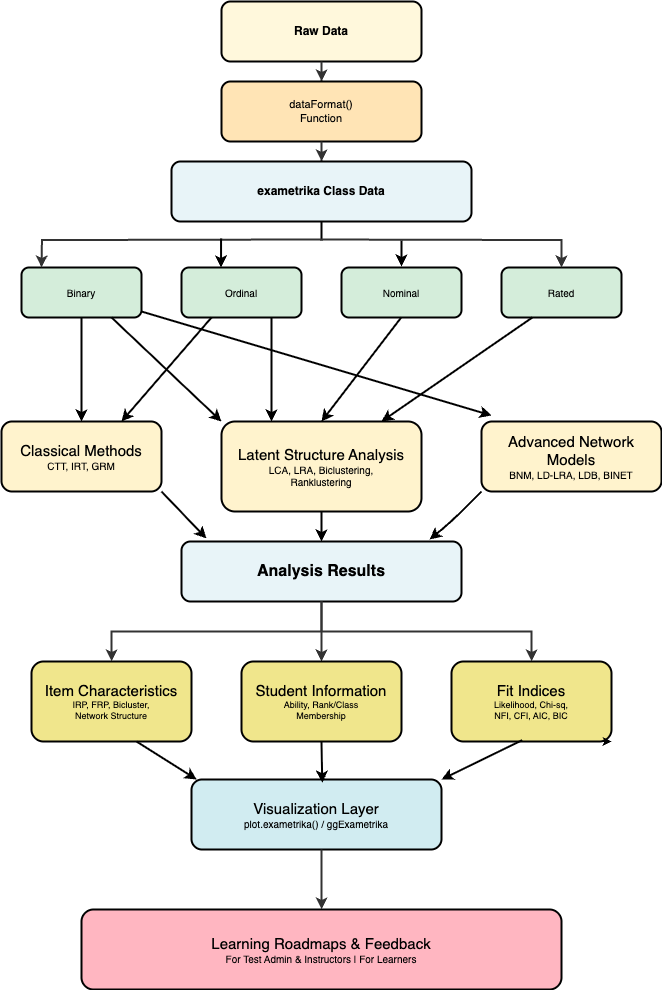

```{=latex}
\newcommand{\pandocbounded}[1]{#1}
```

```{r setup, include=FALSE}
knitr::opts_chunk$set(echo = TRUE, warning = FALSE, message = FALSE)
library(exametrika)
library(kableExtra)
```

# Introduction

Educational testing plays a crucial role in contemporary society, with significant social implications. In Japan, for instance, the National Center Test for University Admissions is taken by nearly 500,000 examinees annually, serving as a critical gateway to higher education. Standardized tests are employed across various domains: in schools, they measure educational effectiveness and student progress; in corporate settings, they assess candidate qualifications for employment; in professional certification programs, they validate specialized knowledge and skills; and in educational research, they provide data for evaluating teaching methodologies. The impact of these test results extends beyond scores, influencing educational policies, career opportunities, and professional development. This underscores the importance of developing robust and meaningful testing methodologies.

Test theory has evolved from classical test theory to modern approaches as a scientific discipline. Item response theory (IRT) has enabled detailed estimation of item characteristics and examinee abilities. While IRT provides valuable precision for many psychometric applications, this level of detail raises questions about practical significance in certain educational contexts. For example, although IRT can estimate ability parameters with high precision, the practical relevance of minute score differences (e.g., 0.01 point changes) may be limited for providing actionable feedback to learners. University grading systems typically use a 0-4 scale, which proves sufficient for most practical purposes. Moreover, such precise measurements often fail to provide actionable feedback to examinees regarding specific learning needs or improvement strategies.

Our `exametrika` package provides a new test data analysis method. In addition to classical test data analysis methods, the package includes latent structure models such as latent class analysis, latent rank analysis, biclustering, and Ranklustering, which combines rank-based ordering with clustering. Furthermore, it provides network models to illustrate learning roadmaps, including the Bayesian network model, locally independent latent rank model, locally independent biclustering, and bicluster network model. We developed the exametrika package based on @shojima's theoretical framework in "Test Data Engineering", originally designed for binary data analysis, with subsequent extensions to support ordinal and nominal response formats as the models have evolved.

For latent structure models, research related to LRA includes @croon1990latent's ordered latent class analysis (LCA), modeling of performance level setting by @torres2015modeling, and research on construct-level representation in psychometric models by @diakow2014construct. Moreover, diverse theoretical approaches exist in the field of biclustering, such as the sparse singular value decomposition approach by @lee2010biclustering, the probabilistic latent block model by @govaert2010latent, the bipartite spectral graph partitioning method by @dhillon2001co, and biclustering models for ordinal data by @matechou2016biclustering.

For network models, Bayesian networks have been widely applied across diverse fields, including engineering, marketing, behavioral sciences, and cognitive psychology [@pearl1988probabilistic; @jensen2007bayesian; @darwiche2009modeling; @koski2009bayesian; @scutari2014bayesian]. In educational measurement, @almond2015bayesian applied the model to assessment design, and @culbertson2016bayesian and @reichenberg2018dynamic provided comprehensive reviews of its applications. Network models are particularly well-suited for representing learning pathways that examinees should follow, and discovering these pathways from test data holds significant educational value.

The `exametrika` package integrates these methodological traditions into a unified system for educational measurement. While all models in the package offer valuable analytical capabilities, the Ranklustering model serves as the conceptual core, introducing an ordering constraint on examinee clusters in the probabilistic biclustering framework. The package's ordered clustering approach and various visualization capabilities enable the provision of clear learning roadmaps for both test administrators and examinees.

Beyond mere ability estimation and item analysis, the primary aim of this package is to provide specific, actionable guidance on what each examinee should learn next. While traditional approaches focus on measurement precision, `exametrika` prioritizes practicality in educational settings, offering test administrators the ability to develop effective instructional strategies and examinees the opportunity to understand their learning progress clearly. This approach transforms test assessment from a mere evaluation tool into a powerful educational resource that promotes learning.

The remainder of this paper is organized as follows. Section 2 provides an overview of the package's capabilities and workflow. Section 3 presents the latent structure models in detail with R code and examples. Section 4 describes the network models with practical demonstrations. Finally, Section 5 offers a discussion of the package's contributions and future directions.

# Package overview

The `exametrika` package implements a comprehensive suite of statistical models for test data engineering, supporting both exploratory and confirmatory approaches to educational test data analysis. Additionally, several models accommodate not only binary test data but also polytomous response formats. This section provides an overview of the package's functions, organized into three major categories: classical measurement methods, latent structure analysis models, and advanced network approaches.

## Available models

The package integrates classical psychometric approaches with modern latent structure analysis and network models, as shown in Table 1.

```{r table1, echo=FALSE}
table1 <- data.frame(
  Category = c("Classical Methods", "", "",
               "Latent Structure Analysis", "", "",
               "Advanced Network Models", "", "", ""),
  Model = c("Classical Test Theory", "Item Response Theory", "Graded Response Model",
            "Latent Class Analysis", "Latent Rank Analysis", "Biclustering / Ranklustering",
            "Bayesian Network Model", "Latent Dependence LRA", "Local Dependence Biclustering", "Bicluster Network Model"),
  `Main Function` = c("CTT()", "IRT()", "GRM()", "LCA()", "LRA()", "Biclustering()",
               "BNM()", "LD_LRA()", "LDB()", "BINET()"),
  `Data Types` = c("Binary", "Binary", "Ordinal",
                   "Binary, Ordinal, Nominal", "Binary, Ordinal, Rated", "Binary, Ordinal, Nominal",
                   "Binary", "Binary", "Binary", "Binary"),
  `Primary Outputs` = c("Item statistics, reliability", "Item parameters, ability estimates", "Item parameters, ability estimates",
                        "Class membership, conditional probabilities", "Rank membership, item response profiles", "Item & examinee clusters, response patterns",
                        "Network structure, conditional dependencies", "LRA with local dependencies", "Biclustering with local dependencies", "Integrated biclustering + network"),
  check.names = FALSE
)
knitr::kable(table1, caption = "Main Analysis Models in exametrika", booktabs = TRUE) |>
  kableExtra::kable_styling(latex_options = c("scale_down", "hold_position"))
```

Classical methods include basic test and item statistics, along with CTT and IRT. Test statistics refer to the distribution of total test scores, including mean, standard error, variance, standard deviation, skewness, kurtosis, minimum, maximum, range, quartile deviation, IQR, and stanine scores. Item statistics output pass rates, item odds, item thresholds, entropy, and item-total correlations. For CTT, Cronbach's alpha coefficient and McDonald's omega coefficient are computed. The `Dimensionality()` function outputs eigenvalues of the correlation matrix and scree plots to verify unidimensionality. IRT implements logistic models, including 2-parameter, 3-parameter, and 4-parameter models. Estimated item parameters, item-level fit indices, and overall test fit indices are output, and examinee ability parameters are estimated simultaneously. Furthermore, the `plot()` function can draw item characteristic curves (ICC), test characteristic curves (TCC), and information functions (IIF, TIF). The GRM model works similarly for ordinal data.

Latent structure analysis includes four models: latent class analysis (LCA), latent rank analysis (LRA), biclustering, and Ranklustering. Unlike IRT, LCA does not estimate continuous examinee parameters but classifies examinees into latent classes based solely on observed response patterns. LRA extends LCA by assuming ordinality among the latent classes. Both models output expected correct response rates for each class/rank as their primary output, allowing users to understand the characteristics of each class/rank. Item-level model fit indices, overall test fit indices, and examinees' class/rank membership probabilities are also available. Visualization of these results is possible with the `plot()` function. Biclustering simultaneously clusters both examinees and items. Item clusters are called fields, and examinee clusters are called classes. A model that assumes ordinality for classes is specifically called Ranklustering. The primary output is expected correct response rates for each class/rank by field, allowing users to understand which class of examinees tends to score higher in which field (item domain). It also reveals which fields an examinee at a given rank should strengthen to advance to the next rank.

Network models represent the correlation structure among items as a network. Specifically, connections between items are represented as a DAG (Directed Acyclic Graph), revealing influence relationships among items. Based on the given network structure, conditional correct response rates are estimated, and item-level fit indices and overall test fit indices are available. By analyzing these conditional correct response rates by LRA rank or by Ranklustering field-rank combinations rather than by individual items, learning pathways for each rank can be revealed. The BINET model, which combines biclustering and network models, provides a learning roadmap showing which fields examinees at each rank should strengthen to advance to higher ranks.

For latent structure analysis and advanced network models, the number of latent classes/ranks, fields, or the DAG structure must be specified externally. However, auxiliary functions for exploring these structures also exist, as shown in Table 2.

```{r table2, echo=FALSE}
table2 <- data.frame(
  Category = c("Latent Structure Analysis", "", "Advanced Network Models", "", ""),
  Function = c("GridSearch()", "Biclustering_IRM()", "BNM_GA()", "BNM_PBIL()", "LDLRA_PBIL()"),
  Description = c("Explore optimal class/rank and field numbers for LCA, LRA, Biclustering",
                  "Explore Ranklustering structure via Infinite Relational Model",
                  "Learn BNM network structure via Genetic Algorithm",
                  "Learn BNM network structure via PBIL",
                  "Learn LD-LRA network structure via PBIL")
)
knitr::kable(table2, caption = "Structure Exploration Tools", booktabs = TRUE) |>
  kableExtra::kable_styling(latex_options = c("scale_down", "hold_position"))
```

All models output item-level and overall model fit indices through unified functions. From the model likelihood, null model likelihood, and saturated model likelihood, model chi-square and null model chi-square are calculated, which are then transformed to output NFI, RFI, IFI, TLI, CFI, RMSEA, AIC, CAIC, and BIC. For latent structure models, the `GridSearch()` function exhaustively searches for optimal numbers of ranks/classes and fields based on these fit indices. Ranklustering can also search for the optimal number of ranks using the Infinite Relational Model via `Biclustering_IRM()`. For advanced network models, functions are provided to search for DAG structures based on genetic algorithms. Using these auxiliary functions, users can find optimal model structures and perform more accurate analyses. However, exploratory structure approaches often yield results that are difficult to interpret in practice, and in the domain of educational test data, practitioners typically have some prior knowledge about inter-item and inter-field structures. Therefore, it is recommended to construct DAGs utilizing expert domain knowledge rather than relying solely on data-driven exploration.

## Data preparation and workflow

The `dataFormat()` function serves as the primary data gateway for all analyses in exametrika. It takes raw data matrices as input, validates the data, and produces a standardized exametrika class object. The function signature is:

```
dataFormat(data, na = NULL, id = 1, Z = NULL, w = NULL,
           response.type = NULL, CA = NULL)
```

The `na` argument specifies values to treat as missing, `id` indicates the column containing examinee IDs (default is 1), `Z` is an optional missing indicator matrix, and `w` is an item weight vector. The `response.type` argument specifies the data type: "binary" for dichotomous responses, "ordinal" for ordered polytomous data, "nominal" for unordered categories, or "rated" for polytomous data with correct answers (requiring the `CA` argument). If `response.type` is NULL (default), the type is automatically detected: data containing only 0/1 values is classified as binary, data with three or more ordered categories as ordinal, and data with a `CA` specification as rated.

The function also handles labeling automatically. For examinee IDs, if the first column contains character strings or factor values, it is treated as the ID column; otherwise, row names are used if available, or sequential IDs ("Student1", "Student2", ...) are generated. Item labels are taken from column names, or generated as "Item1", "Item2", ... if not provided. For polytomous data, category labels are preserved from factor levels if the input uses factors; otherwise, they are generated automatically based on the observed values. Most models assume binary data, while latent structure models (LCA, LRA, and Biclustering) accommodate polytomous responses.

Figure 1 presents the typical data analysis workflow. The workflow begins with raw data preparation using `dataFormat()`, which creates exametrika class objects. Users then select an appropriate main analysis model based on their research questions. Optional structure exploration tools can automatically discover optimal model parameters. The resulting analysis objects contain membership probabilities, response profiles, and fit indices, which are visualized and interpreted to generate learning roadmaps.

{width=75%}

For visualization, the package inherits the base R `plot()` function, providing standard diagnostic plots for every model. Standard graphical parameters can be supplied through the `...` argument of `plot()` and are forwarded consistently to all plot types, including to the manually drawn axes. Users can therefore customize point symbols (`pch`), axis-label orientation (`las`), text sizes (`cex`), colors, and line types, and can override the default axis labels and titles. For example, `plot(result.LRA, type = "IRP", items = 1:4, nc = 2, nr = 2, las = 2, pch = 16)` rotates the axis labels and changes the plotting symbol. In addition, the package returns all the information needed for visualization within its result objects, so users who prefer a ggplot2-based grammar can build fully custom plots; the companion `ggExametrika` package, available on CRAN, provides ggplot2-based renderings of these visualizations. This design keeps the computational core lightweight while still offering the customization flexibility expected of base R graphics.

# Latent structure models

This section presents the latent structure models implemented in the `exametrika` package. These models classify examinees into discrete ability groups rather than estimating continuous ability parameters, providing more interpretable results for educational practice.

## Latent class analysis and latent rank analysis

### Model

Latent class analysis (LCA) and latent rank analysis (LRA) both handle examinee ability as discrete classes. However, they differ significantly in their approach to ability scales: LCA handles ability as a nominal scale, whereas LRA handles it as an ordinal scale. In LCA, classes have no inherent order and represent different ability patterns. In contrast, LRA establishes a clear ordinal relationship between classes (ranks), where higher ranks indicate higher ability levels.

We position LRA as a nonparametric IRT model because it does not define the relationship between ability and response probability using specific mathematical functions (such as logistic or normal distribution functions). Traditional IRT models estimate these functions' parameters (e.g., discrimination and difficulty), whereas LRA directly estimates the probability of correct responses for items at each rank. This characteristic allows LRA to flexibly adapt to data characteristics without requiring assumptions about specific functional forms.

This nonparametric nature has important practical implications. The extremely fine-grained measurement provided by traditional IRT models' continuous ability scales may not always be practical. For instance, in a 100-point test, it is uncommon to have precisely one examinee at each possible score point. Similarly, with binary scoring, the observed response patterns typically do not cover all possible combinations (the total number of possible patterns being 2 to the power of the number of items). Fine-grained measurement on a continuous ability scale may lack substantive meaning in such situations.

Such fine resolution is often unnecessary, particularly in diagnostic tests. Instead, it is important to clearly indicate which items are achievable at each ability level and utilize this information as a learning roadmap. Continuous scores can be inconvenient from the perspectives of feedback to examinees and practical application in educational settings. LRA addresses these practical needs by providing ordered ability levels, enabling more practical educational assessment.

Furthermore, LRA's item reference profile (IRP) reveals the probability of correct responses for each rank, providing concrete information about which items examinees at each ability level can answer correctly. This approach offers a more intuitive understanding of learning achievement, rather than only numerical scores. Test administrators can utilize these ordered ability levels to develop teaching plans and provide specific learning advice to examinees.

Let us define the basic notations. Let $J$ be the number of items, $S$ be the number of examinees, and $R$ be the number of ranks. The observed data matrix $\mathbf{U}$ can be defined as follows:

$$
\mathbf{U} = \{u_{sj}\}, \quad u_{sj} \in \{0,1\},
$$

\noindent where $u_{sj}$ represents the binary response of examinee $s$ to item $j$ (1 for correct, 0 for incorrect). We also define a missing value indicator matrix $\mathbf{Z}$ of the same size as $\mathbf{U}$:

$$
\mathbf{Z} = \{z_{sj}\}, \quad z_{sj} \in \{0,1\},
$$

\noindent where $z_{sj} = 1$ indicates that the response of examinee $s$ to item $j$ is observed, and $z_{sj} = 0$ indicates a missing value.

The rank reference matrix $\boldsymbol{\Pi}_R$ can be defined as follows:

$$
\boldsymbol{\Pi}_R=\left[\begin{array}{ccc}
\pi_{11} & \cdots & \pi_{1 R} \\
\vdots & \ddots & \vdots \\
\pi_{J 1} & \cdots & \pi_{J R}
\end{array}\right]=\left\{\pi_{j r}\right\},
$$

\noindent where each element $\pi_{jr} (0 \le \pi_{jr} \le 1)$ represents the probability of correct response to item $j$ at rank $r$.

The rank membership matrix $\mathbf{M}_R$ is defined as:

$$
\mathbf{M}_R=\left[\begin{array}{ccc}
m_{11} & \cdots & m_{1 R} \\
\vdots & \ddots & \vdots \\
m_{S 1} & \cdots & m_{S R}
\end{array}\right],
$$

\noindent where each row $\mathbf{m}_s$ represents the rank membership profile of examinee $s$, satisfying $\mathbf{1}_R^{\prime} \mathbf{m}_s=1$.

Given these definitions, the likelihood of the observed data is:

$$
l\left(\mathbf{U} \mid \boldsymbol{\Pi} \right)=\prod_{s=1}^S\prod_{j=1}^J\prod_{r=1}^R\left\{\left(\pi_{jr}\right)^{u_{sj}}\left(1-\pi_{jr}\right)^{1-u_{sj}}\right\}^{z_{sj}}
$$

The EM algorithm maximizes this likelihood to estimate the model parameters.

### Algorithm

The algorithm involves three key matrices:

- $\mathbf{M}_R$: The rank membership matrix representing the probability of each examinee belonging to each rank.
- $\mathbf{F}$: The filter matrix that imposes ordinal structure through smoothing.
- $\mathbf{S}$: The smoothed rank membership matrix, obtained by applying $\mathbf{F}$ to $\mathbf{M}_R$.

The relationship between these matrices is defined as $\mathbf{S} = \mathbf{M}_R \mathbf{F}$.

The EM algorithm iteratively updates these matrices through the following cycle:

1. **Initialization**: Set initial values for $\boldsymbol{\Pi}_R^{(0)}$.
2. **Repeat until convergence**:
   - 2-1. **E-step**: Calculate the rank membership matrix $\mathbf{M}_R^{(t)}$ using the current parameter estimates.
   - 2-2. **Smoothing**: Obtain the smoothed rank membership matrix $\mathbf{S}^{(t)}$ by applying the filter matrix $\mathbf{F}$ to $\mathbf{M}_R^{(t)}$.
   - 2-3. **M-step**: Update the rank reference matrix $\boldsymbol{\Pi}_R^{(t)}$ using $\mathbf{S}^{(t)}$.
   - 2-4. **Ordering**: For each item $j$, sort $\boldsymbol{\pi}_j^{(t)}$ to maintain the ordinal constraint.

The smoothing process is crucial for maintaining the ordinal structure of ranks. The filter matrix $\mathbf{F}$ assigns weights primarily to the current rank and slightly to the $L$ ranks before and after, ensuring a stepwise progression. Our method constructs the filter matrix using a kernel of size $2L+1$ that gradually decreases from the center $f_0$ to $L$ ranks on both sides:

$$
\mathbf{F}^* = \begin{bmatrix}
f_0 & \cdots & f_L & & & & \\
\vdots & \ddots & \vdots & \ddots & & & \\
f_L & \ddots & f_0 & \ddots & f_L & & \\
& \ddots & \vdots & \ddots & \vdots & \ddots & \\
& & f_L & \ddots & f_0 & \ddots & f_L \\
& & & & \vdots & \ddots & \vdots \\
& & & & f_L & \cdots & f_0
\end{bmatrix},
$$

$$
\mathbf{F} = \mathbf{F}^* \oslash \left\{ \mathbf{1}_{R} (\mathbf{1}_{R}' \mathbf{F}^*) \right\}
$$

\noindent where $\oslash$ represents element-wise division.

In this package, we used a kernel $\mathbf{f}$ of size $L=3$, with its magnitude adjusted according to the number of ranks as follows:

$$
f_0 =
\begin{cases}
1.05 - 0.05 R & (1 \leq R \leq 5) \\
1.00 - 0.04 R & (5 < R \leq 10) \\
0.80 - 0.02 R & (10 < R \leq 20)
\end{cases}
$$

These coefficient values are defined in @shojima based on practical experience and empirical analysis rather than theoretical derivation. The smoothing strength is adjusted according to the number of ranks: fewer ranks require stronger smoothing to maintain clear ordinal distinctions, while more ranks benefit from weaker smoothing to allow finer differentiation between adjacent ranks. Without this smoothing process, the model becomes latent class analysis due to the absence of ordinal constraints.

In the M-step, we update $\boldsymbol{\Pi}_R^{(t)}$. The rank reference matrix is updated as follows:

$$
\pi_{j r}^{(t)} = \frac{S_{1 j r}^{(t)} + \beta_1 - 1}{S_{1 j r}^{(t)} + S_{0 j r}^{(t)} + \beta_1 + \beta_0 - 2}
$$

Here, we assume a beta distribution $B(\beta_0,\beta_1)$ as the prior distribution for $\pi_{j r}^{(t)}$. Furthermore, $S_{1 j r}^{(t)}$ and $S_{0 j r}^{(t)}$ are elements of the $J \times R$ matrices $\mathbf{S}_1$ and $\mathbf{S}_0$:

$$
\mathbf{S}_1^{(t)} = (\mathbf{Z} \odot \mathbf{U})' \mathbf{S}^{(t)}, \quad
\mathbf{S}_0^{(t)} = \left\{ \mathbf{Z} \odot (\mathbf{1}_S \mathbf{1}_J' - \mathbf{U}) \right\}' \mathbf{S}^{(t)}
$$

By default, the package uses $B(\beta_0,\beta_1) = (1,1)$, which corresponds to a uniform (noninformative) prior distribution. This design choice reflects a deliberate philosophy: noninformative priors allow data characteristics to speak for themselves without imposing external assumptions, supporting exploratory analysis of test data patterns. With this default, the MAP estimate and MLE become identical, yielding $\pi_{j r}^{(t)} = S_{1jr}^{(t)}/(S_{0jr}^{(t)} + S_{1jr}^{(t)})$. For users who wish to incorporate prior knowledge or regularization, alternative priors can be specified via the `beta1` and `beta2` arguments in the `LRA()` function.

The convergence criterion checks whether the change in expected log-likelihood is less than a threshold value $c = 10^{-4}$.

### Example

The `exametrika` package enables users to perform this analysis by specifying a test dataset and the number of ranks. Here, we demonstrate an example using the binary sample data `J15S500`. This dataset has 15 items and 500 samples in binary format. The LRA function runs when users specify the number of ranks.

The returned object contains the IRP, representing the relationship between items and ranks as the transpose of $\boldsymbol{\Pi}_R$.

```{r LRA example, echo=TRUE}
result.LRA <- LRA(J15S500, nrank = 6)
result.LRA$IRP
```

The IRP (Item Reference Profile) is a rank $\times$ item matrix showing the expected probability of correct response for each item at each rank. Each row represents a rank (from lowest to highest ability), and each column represents an item. Values should increase monotonically from lower to higher ranks, reflecting that higher-ability examinees are more likely to answer correctly. From the IRP, test administrators can identify two key item characteristics: (1) the rank where an item's correct response probability is closest to 0.5 indicates the ability level at which the item is most informative (analogous to the location parameter in IRT), and (2) the maximum change in correct response probability between adjacent ranks indicates how well an item discriminates between ability levels (analogous to the discrimination parameter in IRT).

Additionally, the package calculates the model's fit indices using a saturated model where the number of ranks equals the number of unique response patterns and a null model where all examinees are assigned to a single rank.

```{r LRA FitIndices}
result.LRA$TestFitIndices
```

We determined the appropriate number of ranks for the administered test by referring to these fit indices. For each examinee, a rank membership profile ($\mathbf{S}$) is also output, and the system identifies the rank with the highest probability for each individual as an estimated value. The package presents the ease of rank movement as rank-up and rank-down odds.

The plots provided by this package offer rich information for test administrators. The IRP plot shows the expected correct response probability for each item across ranks as line graphs, which should be monotonically increasing.

```{r LRAplot, echo=TRUE, fig.cap='IRP plots', fig.width=5, fig.height=4, out.width='70%'}
plot(result.LRA, type = "IRP", items = 1:4, nc = 2, nr = 2)
```

The RMP (Rank Membership Profile) represents each examinee's probability of belonging to each rank. For each examinee, the profile shows a probability distribution across all ranks, with probabilities summing to 1. Examinees with probability concentrated in a single rank have clear ability classification, while those with probability spread across adjacent ranks (e.g., ranks 3 and 4) are in transitional stages between ability levels. The rank with the highest probability becomes the estimated rank for that examinee.

```{r LRAplot2, echo=TRUE, fig.cap='RMP plots', fig.width=5, fig.height=4, out.width='70%'}
plot(result.LRA, type = "RMP", students = 1:4, nc = 2, nr = 2)
```

## Biclustering and ranklustering

### Model

LRA focuses on classifying examinees; however, certain cases exist where we prefer to classify items from the test administrator's perspective, such as by content area or difficulty level.

Biclustering is a method that simultaneously clusters the data matrix (examinees $\times$ items) in both horizontal (examinees) and vertical (items) directions. Examinees are classified into latent classes (nominal clusters), whereas items are classified into latent fields (nominal clusters). LCA performs one-way clustering of examinees, latent field analysis performs one-way clustering of items, whereas biclustering performs two-way simultaneous clustering (two-mode clustering).

In biclustering, examinees are classified into latent classes (nominal clusters). However, applying a filter matrix similar to LRA to this class membership profile can transform them into latent ranks with an ordinal structure. This method is called "Ranklustering," a term that reflects its unique approach to rank-based clustering. Ranklustering can be achieved by simply adding one step of smoothing the class membership profile to the biclustering estimation procedure.

To formalize the biclustering model, let $C$ be the number of latent classes/ranks and $F$ be the number of latent fields. The bicluster reference matrix $\boldsymbol{\Pi}_B$ is defined as follows:

$$
\boldsymbol{\Pi}_B=\left[\begin{array}{ccc}
\pi_{11} & \cdots & \pi_{1F} \\
\vdots & \ddots & \vdots \\
\pi_{C1} & \cdots & \pi_{CF}
\end{array}\right]=\left\{\pi_{fc}\right\},
$$

\noindent where each element $\pi_{fc}$ represents the probability of correct responses from examinees in class/rank $c$ to items in field $f$.

The class membership matrix $\mathbf{M}_C$ and field membership matrix $\mathbf{M}_F$ are defined as follows:

$$
\mathbf{M}_C=\left[\begin{array}{ccc}
m_{11} & \cdots & m_{1C} \\
\vdots & \ddots & \vdots \\
m_{S1} & \cdots & m_{SC}
\end{array}\right], \quad
\mathbf{M}_F=\left[\begin{array}{ccc}
m_{11} & \cdots & m_{1F} \\
\vdots & \ddots & \vdots \\
m_{J1} & \cdots & m_{JF}
\end{array}\right].
$$

For ranklustering, the rank membership matrix $\mathbf{M}_R$ is obtained by filtering the class membership matrix: $\mathbf{M}_R = \mathbf{M}_C \mathbf{F}$.

The likelihood function is:

$$
l(\mathbf{U}\mid \boldsymbol{\Pi}_B) = \prod_{s=1}^S\prod_{j=1}^J\prod_{f=1}^F\prod_{c=1}^C \left(\pi_{fc}^{u_{sj}} (1-\pi_{fc})^{1-u_{sj}}\right)^{z_{sj} m_{sc} m_{jf}}
$$

### Algorithm

The biclustering algorithm uses the EM algorithm to estimate three key matrices. The estimation procedure proceeds as follows:

1. **Initialization**: Set initial values for $\mathbf{M}_F^{(0)}$ and $\boldsymbol{\Pi}_B^{(0)}$
2. **Iteration**:
   - **E-step**: Estimate $\mathbf{M}_C^{(t)}$ from $\mathbf{U}$, $\boldsymbol{\Pi}_B^{(t-1)}$, and $\mathbf{M}_F^{(t-1)}$
   - **Smoothing**: For ranklustering, transform $\mathbf{M}_C^{(t)}$ into $\mathbf{M}_R^{(t)} = \mathbf{M}_C^{(t)}\mathbf{F}$
   - **E-step**: Estimate $\mathbf{M}_F^{(t)}$ from $\mathbf{U}$, $\boldsymbol{\Pi}_B^{(t-1)}$, and $\mathbf{M}_R^{(t)}$
   - **M-step**: Estimate $\boldsymbol{\Pi}_B^{(t)}$ from $\mathbf{U}$, $\mathbf{M}_R^{(t)}$, and $\mathbf{M}_F^{(t)}$
   - Check convergence criterion

The E-step calculates class membership probability for examinee $s$:

$$
m_{s c}^{(t)}=\frac{l\left(\mathbf{u}_s \mid \boldsymbol{\pi}_c^{(t-1)}\right) \pi_c}{\sum_{c^{\prime}=1}^C l\left(\mathbf{u}_s \mid \boldsymbol{\pi}_{c^{\prime}}^{(t-1)}\right) \pi_{c^{\prime}}}
$$

where $\pi_c$ represents the prior distribution (uniform in the package). Similarly, field membership probability for item $j$:

$$
m_{j f}^{(t)}=\frac{l\left(\mathbf{u}_j \mid \boldsymbol{\pi}_f^{(t-1)}\right) \pi_f}{\sum_{f^{\prime}=1}^F l\left(\mathbf{u}_j \mid \boldsymbol{\pi}_{f^{\prime}}^{(t-1)}\right) \pi_{f^{\prime}}}
$$

In the M-step, we update $\pi_{fc}$ using a beta distribution as the conjugate prior:

$$
\pi_{f c}^{(t)}=\frac{U_{1 f c}^{(t)}+\beta_1-1}{U_{0 f c}^{(t)}+U_{1 f c}^{(t)}+\beta_0+\beta_1-2}
$$

Because we set $B(\beta_0, \beta_1)=(1,1)$ as the prior distribution, MAP and MLE become identical. Users can specify alternative priors via the `beta1` and `beta2` arguments. The convergence criterion is that the change in expected log-likelihood be less than $c = 10^{-4}$.

For further details on the mathematical formulation and implementation, see @shojima.

### Example

The `exametrika` package enables users to perform biclustering with minimal specification. We only need to specify the data, the number of fields, and the number of classes. By setting the `method` argument to `R`, ranklustering is performed; by setting it to `B`, standard biclustering is performed.

```{r Biclustering example}
result.Ranklustering <- Biclustering(J35S515, nfld = 5, ncls = 6, method = "R")
```

The array plot is an important tool for visually evaluating the results. In this plot, correct responses (1) are displayed in black and incorrect responses (0) in white. The left panel shows the original response data, while the right panel shows the data reorganized by ranklustering.

```{r BiclusteringArray_plot, echo=TRUE, fig.cap='Array plot comparing original response patterns (left) and reorganized patterns after ranklustering (right). Black cells indicate correct responses and white cells indicate incorrect responses.'}
plot(result.Ranklustering, type = "Array")
```

In the right panel, examinees are sorted by estimated rank (lower ranks at the top, higher ranks at the bottom) and items are arranged by estimated field. The ordinal structure of ranks is visually confirmed by the decreasing black areas from bottom to top, and the field arrangement reveals difficulty differences across fields.

```{r Biclustering FitIndices, echo=TRUE}
result.Ranklustering$TestFitIndices
```

$\boldsymbol{\Pi}_B$ represents the biclustering result and is output as the field-rank profile (FRP), which shows the correspondence between fields and ranks. The FRP is a rank $\times$ field matrix where each cell value $\pi_{fc}$ represents the expected probability that an examinee belonging to rank $c$ will correctly answer items belonging to field $f$. When examined row-wise (by rank), a pattern of increasing correct response rates as ranks rise confirms that the ordinal structure is functioning properly. When examined column-wise (by field), differences in difficulty across fields become apparent---for example, if a particular field shows low correct response rates across all ranks, this indicates that the field consists of generally difficult items. Test administrators can use the FRP to make interpretations such as "examinees at rank 3 have nearly mastered fields 1 and 2, but fields 4 and 5 remain challenging," forming the foundation for creating learning roadmaps.

```{r Biclustering output, echo=TRUE}
result.Ranklustering$FRP
```

The field membership matrix $\mathbf{M}_F$ shows the relationship between items and fields. This is an item $\times$ field probability matrix indicating how likely each item belongs to each field. For each row (item), the field with the highest probability becomes that item's estimated field assignment. Items with probability concentrated in a single field have clear membership, while items with probability distributed across multiple fields have boundary characteristics and may relate to multiple content areas. Test administrators can reference the FieldMembership to confirm item groupings and assign meaningful names to fields based on domain knowledge (e.g., "basic calculations," "applied problems," "word problems"), enabling specific feedback to examinees.

```{r Biclustering Item analysis, echo=TRUE}
result.Ranklustering$FieldMembership
```

By combining the FRP and FieldMembership information, test administrators can create a can-do chart showing "which areas and items need to be mastered to advance to the next rank," providing learners with a concrete roadmap for learning. When we output the rank membership matrix $\mathbf{S}$ for examinees, the rank-up odds and rank-down odds are also provided, indicating how close each examinee is to advancing or declining in rank.

```{r Biclustering plot, echo=TRUE, fig.cap='Rank Membership Profile (RMP) for examinees'}
head(result.Ranklustering$Students)
```

# Advanced network models

## Model

The probability that an examinee who correctly answers item A will also correctly answer item B can be expressed as a conditional probability. By arranging items in order of their pass rates, the learning pathway becomes visible. Bayesian network models, which represent these conditional probabilities as directed acyclic graphs (DAGs), can be applied to test data analysis.

The `exametrika` package implements several network-based models with different structural assumptions. The basic Bayesian Network Model (BNM) represents conditional probabilities between items in a network format; given an externally specified DAG structure, the model estimates conditional correct response rates based on the graph.

Building on this foundation, Latent Dependence LRA (LD-LRA) and Local Dependence Biclustering (LDB) combine latent structure analysis with Bayesian network modeling. In these models, nodes represent items, and a separate network structure is specified for each latent rank---reflecting the idea that item dependencies may differ across developmental stages. For example, in early learning stages, mastering one concept may have strong dependencies on other foundational concepts, while in advanced stages, items may become more independent as learners have integrated the material.

The Bicluster Network Model (BINET) takes a fundamentally different approach: instead of items as nodes, BINET uses latent classes (ranks) as nodes. The network structure is specified for each field (locus), representing how examinees transition between latent classes within content areas. BINET requires two inputs: (1) a field configuration vector (`conf`) specifying which field each item belongs to, and (2) an adjacency file or list defining parent-child relationships among classes at each field. This configuration is typically provided via a CSV file containing three columns: parent class, child class, and the field where the relationship holds.

These network models involve complex structures, and at present they support only binary data (extension to polytomous data remains a future development goal). The package documentation [@kosugitti] provides detailed examples for LD-LRA, LDB, and BINET, including sample adjacency file formats. This paper presents only a basic example of BNM execution; readers interested in the more advanced models are referred to @shojima and the package documentation.

## Example

The following example demonstrates BNM execution using the sample data `J5S10`, which contains 5 items and 10 examinees.

First, we define the DAG structure as an edge list specifying parent-child relationships between items. In this example, Item01 is the root node, Item02 has Item01 as its parent, Items 03 and 04 each have Item02 as their parent, and Item05 has both Item03 and Item04 as parents.

From these node relationships, we construct the Parent Item Response Pattern (PIRP). The PIRP represents all possible combinations of parent node responses. For an item with $k$ parent nodes, there are $2^k$ possible patterns. In this example, Item01 is the root with no parents (1 pattern), Items 02, 03, and 04 each have one parent (2 patterns each), and Item05 has two parents (4 patterns).

```{r BNM DAG, echo=TRUE}
DAG <- matrix(c("Item01", "Item02",
                "Item02", "Item03",
                "Item02", "Item04",
                "Item03", "Item05",
                "Item04", "Item05"), ncol = 2, byrow = TRUE)
g <- igraph::graph_from_data_frame(DAG)
adj_mat <- as.matrix(igraph::get.adjacency(g))
```

The code above constructs the DAG structure using the `igraph` package. The edge list is defined as a matrix specifying parent-child pairs, then converted to a graph object and finally to an adjacency matrix. Alternatively, the DAG structure can be read from a CSV file containing the edge list, which is convenient for larger networks.

With the adjacency matrix defined, we can now fit the Bayesian Network Model:

```{r BNM_example, echo=TRUE, fig.width=5, fig.height=5, out.width='50%', fig.align='center'}
result.BNM <- BNM(J5S10, adj_matrix = adj_mat)
result.BNM
```

The output shows conditional correct response rates calculated from the data. The section labeled "Conditional Correct Response Rate" displays these probabilities for each item given the response patterns of its parent nodes. Item01, as the root node with no parents, simply shows its marginal pass rate. Item02 has Item01 as its parent, showing conditional pass rates of 0.25 when Item01 is answered correctly and 0.50 when Item01 is answered incorrectly. Similarly, Item05 has two parent nodes (Item03 and Item04), and its conditional pass rates vary by the four possible parent response patterns: 0.00 when both parents are incorrect (00), NA when the pattern 01 does not exist in the data, 0.33 when the pattern is 10, and 0.67 when both parents are correct (11). The "Parameter Learning" and "Conditional Correct Response Rate" sections contain the same information, with the latter providing more detailed output.

Below the conditional probabilities, model fit indices are displayed, allowing evaluation of how well the specified network structure fits the observed data.

## Exploratory learning of network structures

These models require the network structure between items to be specified externally, but it is also possible to discover structures exploratively from the data. However, searching all possible combinations of adjacency matrices causes exponential combinatorial explosion as the number of items increases. In test theory, item pass rates flow from higher to lower, so items can be arranged by pass rate order to construct a Directed Acyclic Graph (DAG). This allows only the upper triangular portion of the item-by-item adjacency matrix to be the estimation target, significantly reducing the search space.

The BNM_GA() function shown in Table 2 uses a genetic algorithm to learn network structures. Additionally, BNM_PBIL() uses the Population-Based Incremental Learning (PBIL) method [@Baluja1994; @Fukuda2014]. In PBIL, multiple realizations of adjacency matrices (with elements of 0 or 1) are first generated randomly from a generational Gene (an adjacency matrix with values between 0 and 1). The model is executed for each realization, and they are ranked based on fitness indices. Similar to genetic algorithms, selection is performed and the generational Gene is updated. By repeating this process, an adjacency matrix Gene that survives across generations is obtained. The final adjacency matrix is determined by rounding the Gene values or similar methods.

However, as with biclustering and ranklustering, it is often more practical and meaningful for test administrators to explicitly specify models based on domain knowledge rather than relying solely on exploratory analysis using fitness indices.

# Discussion

This article presents the `exametrika` package, which is specifically designed for educational test data analysis, providing valuable information for both test administrators and examinees. A key design philosophy of the package is the recognition that continuous and highly precise numerical measurements are not always necessary or even desirable in educational settings. While IRT provides ability estimates with many decimal places, such precision rarely translates into actionable educational guidance. Teachers and learners benefit more from knowing which learning stage an examinee has reached and what steps are needed to advance to the next stage. The latent structure models in `exametrika` are designed to meet this need. In practice, when analyzing test data, even large-scale tests typically require only a dozen or so classes/ranks for adequate model fit. The resolution of examinees achievable through testing---at least from the perspective of statistical fit---is of this order, and practically speaking, there are few situations requiring finer granularity.

Item classification is also an important concern in educational tests and psychological scales. Many tests and scales are designed to measure multiple subdomains, and understanding how items group together is crucial for evaluating test structure and validity. In `exametrika`, biclustering and ranklustering models address this need by simultaneously classifying both items and examinees, providing insights into the content structure of the test and examinees' ability profiles. The Field Reference Profile provided by these models---representing expected correct response rates for each class/rank within each field---offers concrete information about which content areas examinees have mastered and which require further study, enabling the construction of practical learning roadmaps. These models also provide field membership probabilities and class/rank membership probabilities, indicating the degree to which each item belongs to each field and each examinee belongs to each class/rank. Visualizing these probabilities reveals whether examinees are clearly classified into specific classes/ranks or span multiple categories. Of course, this can also be expressed numerically through rank-up and rank-down odds, providing feedback that is understandable and valuable for examinees. For test administrators, examining how items decompose into fields provides information for evaluating the content structure of the test and revising it as needed. While the default approach performs exploratory item clustering, confirmatory biclustering and ranklustering are also available when item groupings are known in advance.

Furthermore, `exametrika` provides a flexible and interpretable analytical approach to test data through Bayesian network models (BNM, BINET). These models can capture complex dependencies among examinee response patterns, offering insights into latent structures inherent in test data. Unlike traditional latent variable models, BNM and BINET focus on relationships among observed variables, providing a new perspective for test data analysis. These models help examinees understand their response patterns and provide learning roadmaps, while giving test administrators information useful for designing educational steps. LD-LRA and LDB, which construct rank-specific network models, can capture different network structures based on examinees' ability ranks, providing powerful tools for understanding relationships among items at different ability levels; these structures can also be learned exploratively using genetic algorithms. BINET provides an overall learning course for the test set, showing which fields students at a given rank should study to advance to higher ranks. In this way, the Bayesian network models in `exametrika` provide a flexible and interpretable approach to test data analysis, offering valuable insights to both examinees and test administrators.

The extension of `exametrika` to polytomous data types opens significant possibilities beyond traditional educational testing. For ordinal data such as Likert scales commonly used in psychological measurement, the package offers an alternative analytical framework that does not rely on factor-analytic assumptions. Recent discussions in psychological measurement, led by @Borsboom2005, have raised fundamental questions about whether latent factors represent substantive psychological entities or are merely statistical summaries. Traditional psychometric models assume that observed responses are caused by underlying latent traits, but this causal interpretation remains contentious for many psychological constructs. The clustering approach in `exametrika` sidesteps this debate entirely---it classifies response patterns and item groupings without making claims about underlying psychological processes. This descriptive, pattern-based approach may prove valuable for scale development and validation, particularly when the existence of continuous latent traits is questionable. Furthermore, the network-based models in `exametrika` (BNM, BINET) align with the growing interest in psychological network analysis [@Borsboom2005; @Hood2009; @Marsman2018], which focuses on relationships among observed variables rather than latent constructs.

While `exametrika` offers flexible, data-driven analytical tools, users should be mindful of certain operational considerations. The nonparametric nature of many models in the package means they are highly adaptive to the specific dataset at hand, which can be both a strength and a limitation. Models optimized for one dataset may not generalize well to new samples, particularly when sample sizes are small. Domain knowledge plays a crucial role in obtaining meaningful results---rather than relying solely on exploratory structure learning algorithms (such as GA or PBIL for network discovery), practitioners should consider specifying models based on theoretical understanding of the content domain. When designing tests or scales intended for analysis with `exametrika`, it is beneficial to plan the item structure in advance, considering how items group into fields and how response patterns should reflect developmental stages. The package's emphasis on providing interpretable feedback to examinees represents a distinctive advantage over purely statistical approaches; the outputs are designed not just for researchers but for practical educational application. Readers interested in technical details are encouraged to consult @shojima and the package website [@kosugitti], which includes comprehensive documentation and example analyses.

# Conclusion

The `exametrika` package represents a significant advancement in educational test data analysis by providing a comprehensive framework that surpasses traditional approaches. By focusing on meaningful learning roadmaps rather than precise numerical measurements, the package offers practical insights for test administrators and examinees. Integrating LRA, biclustering, and the Bayesian network model provides a flexible and interpretable approach to analyzing test data. In contrast, extending nominal and ordinal data types opens new possibilities for psychological measurement.

The package's emphasis on ordered clustering and its rich visualization capabilities make it particularly valuable for educational practice. Providing clear learning pathways and diagnostic information helps bridge the gap between test results and actionable educational interventions. As educational measurement continues to evolve, the `exametrika` package offers a promising direction for rendering test data analysis more meaningful and valuable in real educational settings.

# Acknowledgments

This research was supported by the Domestic Research Fellowship Program of Senshu University in 2023 (Reiwa 5).
