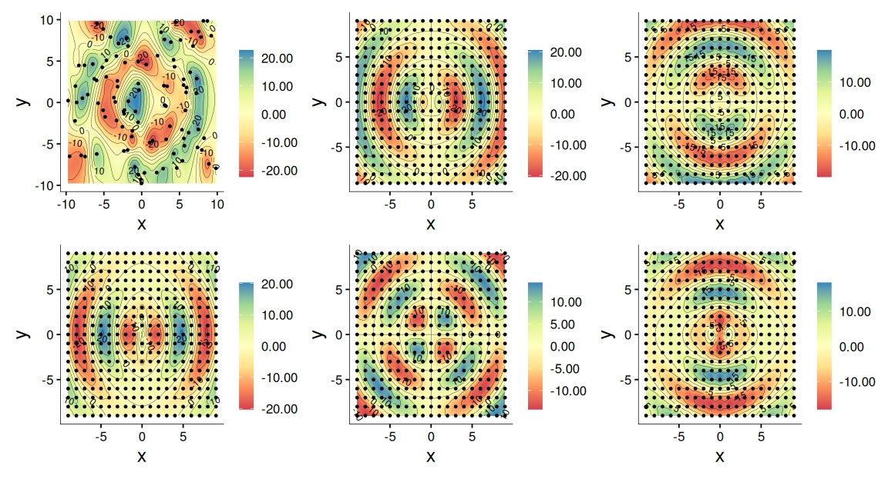
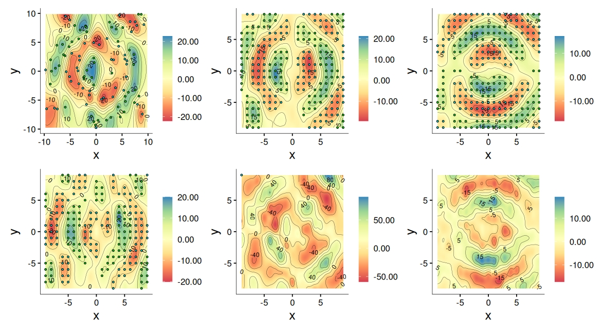
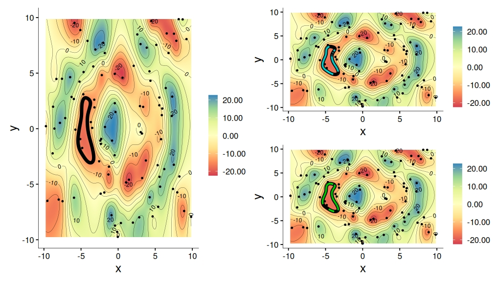
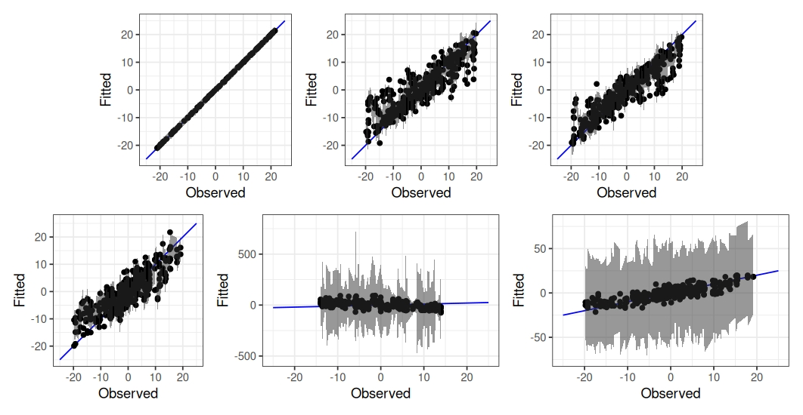
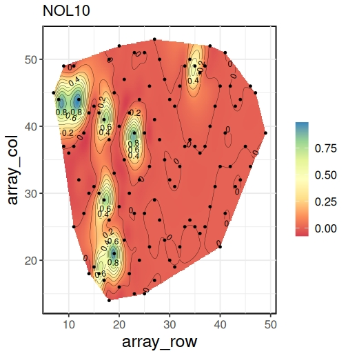
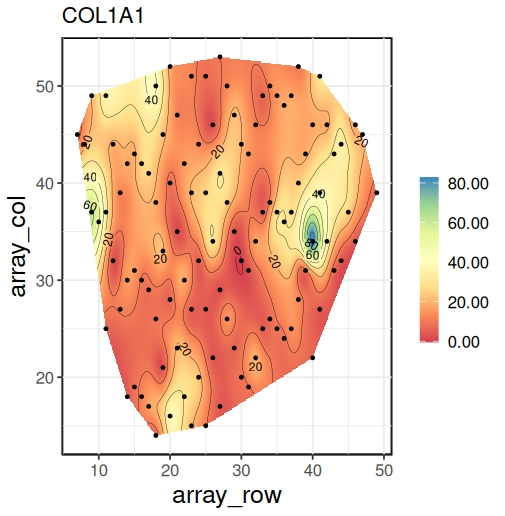
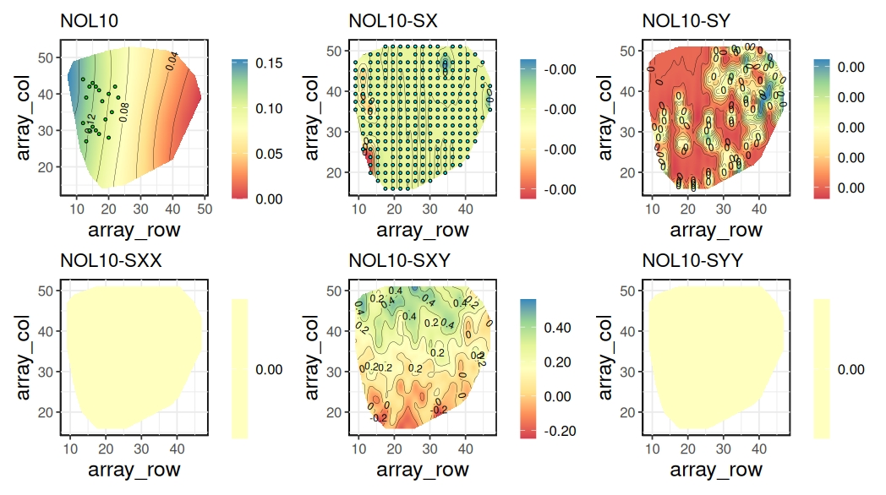
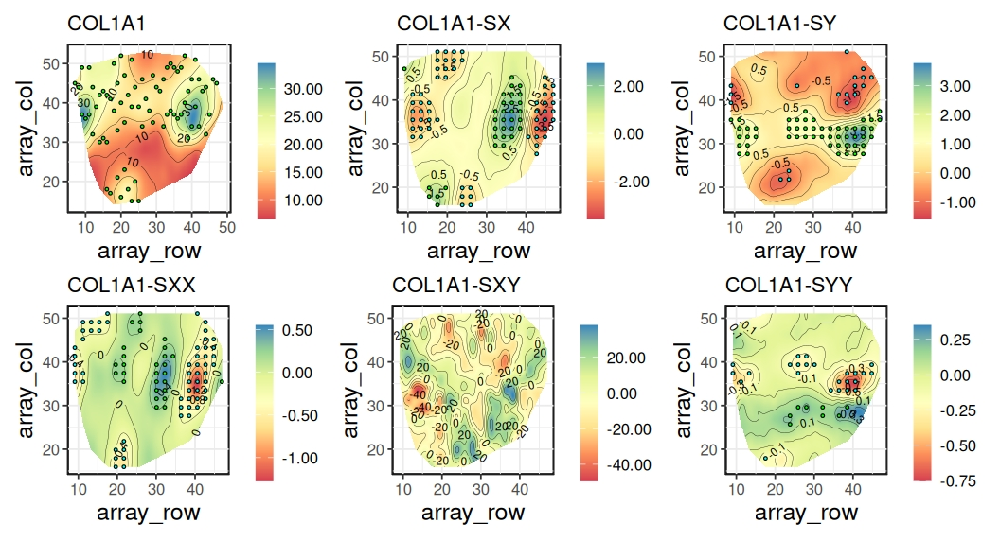
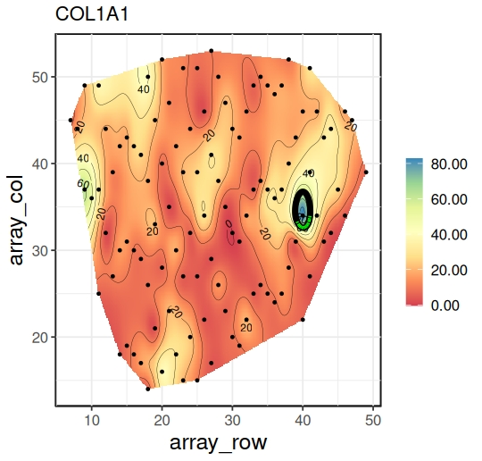
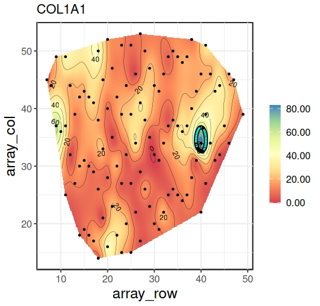

:::: article
## Introduction {#sec:intro}

Detecting regions of rapid change is an important exercise in spatial
data science as they harbor effects not easily explained by predictors
incorporated into a spatial regression model for point-referenced
spatial data. For example, environmental health scientists are often
keen on identifying regions where exposure levels display rapid change
or sharp gradients. Formal statistical detection of such regions can
lead to data-driven discoveries of latent risk factors and other
predictors that drive the rapid change in exposure surfaces. This
exercise is referred to as wombling (Womble 1951; Gleyze et al. 2001;
Banerjee 2010). Wombling results in curves that track regions of
interest. Identifying such regions serves as crucial guides for
interventions. For example, to determine whether natural features such
as rivers or mountain ranges represent significant zones of rapid change
in weather patterns; to identify significant boundaries (over geographic
areas) in disease rates, such as cancer, or to track variations in
access to health care across geographical regions. Measurement scales of
the spatial data usually dictate the methods required for wombling. For
areal data, boundaries delineate neighboring regions (see, e.g. Gao et
al. 2023; Wu and Banerjee 2025). Predictive inference is sought for
*smooth* curves. We evaluate spatial gradients along a curve while
assessing its candidacy for a boundary (see, e.g., Banerjee and Gelfand
2006; Qu et al. 2021; Halder et al. 2024), which requires specifying the
smoothness of the spatial process (see, e.g. Kent 1989; Banerjee et al.
2003).

In this software package, we are concerned with point-referenced
wombling. Developing an easily accessible software that implements
Bayesian wombling for use by the wider scientific community is faced
with several challenges, perhaps the most severe being the need for
two-dimensional quadrature to enable posterior inference. Our
contributions here lie in the use of analytic closed forms for
posteriors that require at most one-dimensional quadrature, greatly
easing the computational burden and enabling efficient Bayesian
inference for hierarchical spatial models (see, e.g. Banerjee et al.
2014) via [**nimble**](https://CRAN.R-project.org/package=nimble)
(Valpine et al. 2017) within the **R** (R Core Team 2021) statistical
environment.

Several **R** packages exist for point-referenced spatial modeling, with
[**spBayes**](https://CRAN.R-project.org/package=spBayes) (Finley et al.
2007) and **R-INLA** (Lindgren and Rue 2015) being more widely used.
However, they do not address boundary analysis, or wombling, in any
capacity. In recent years,
[**nimble**](https://CRAN.R-project.org/package=nimble) has found
increased use in Bayesian modeling applications (see, e.g. Turek et al.
2016; Ponisio et al. 2020; Goldstein and Valpine 2022). Notable
**R**-packages that use nimble include
[**BayesNSGP**](https://CRAN.R-project.org/package=BayesNSGP) (Risser
and Turek 2020) and [
**nimbleEcology**](https://CRAN.R-project.org/package= nimbleEcology)
(Goldstein et al. 2024). The Bayesian hierarchical framework in
[**nimblewomble**](https://CRAN.R-project.org/package=nimblewomble) is
similar to [**spBayes**](https://CRAN.R-project.org/package=spBayes). We
take advantage of the *one-line call and execute* feature of **nimble**
to develop Markov Chain Monte Carlo (MCMC) algorithms for fitting
Gaussian processes (GPs). This makes the underlying code for
[**nimblewomble**](https://CRAN.R-project.org/package=nimblewomble)
easily accessible and customizable for wider use.

We demonstrate our developments using the Matérn class of covariance
kernels (see, e.g., Abramowitz et al. 1988). They are a popular choice
in the literature for GPs (see, e.g., Rasmussen and Williams 2005). They
feature a fractal parameter that provides explicit control over process
smoothness. Our package offers three choices for the fractal parameter,
allowing for flexible process specification. Gradient estimation is done
on a grid. We show an example of generating an equally spaced grid.
Users can also specify a grid of their choice. Wombling requires a
curve; we use contours for that purpose. We demonstrate the procedure
for obtaining contours using the
[**raster**](https://CRAN.R-project.org/package=raster) package.
Alternatively, a curve of choice can also be used. Our vignettes show an
example that uses the `locator()` function. The user annotates points on
the interpolated surface and a smooth Bézier curve is generated for use.
Finally, posterior samples from models in
[**spBayes**](https://CRAN.R-project.org/package=spBayes) can also be
used for wombling with
[**nimblewomble**](https://CRAN.R-project.org/package=nimblewomble). The
same kernel needs to be used in both packages to ensure valid inference.

The ensuing discussion describes the necessary methodological details in
brief. We begin with a general overview of the functions within
[**nimblewomble**](https://CRAN.R-project.org/package=nimblewomble). Section 
[6](#sec:sim){reference-type="ref" reference="sec:sim"} contains
worked-out examples to demonstrate the workflow.
Section [8](#sec:omics){reference-type="ref" reference="sec:omics"} houses an
application of the package to perform boundary analysis on a spatial
transcriptomics dataset.

## General Package Overview

The [**nimblewomble**](https://CRAN.R-project.org/package=nimblewomble)
package is available for download on the Comprehensive R Archive Network
(CRAN). It contains functions that are required to perform wombling.
These functions are described in [1](#tab:T1){reference-type="ref"
reference="tab:package_main_functions"}. The main functions can broadly
be classified into four categories: covariance kernels, model fitting,
inference on rates of change and line integrals, and graphical displays.
All functions, with the exception of plotting, are scripted as
`nimbleFunction`s with wrapper functions that are callable through
**R**. This enables fast execution using their compiled `C++`
counterparts. We generate spatial graphics using
[**ggplot2**](https://CRAN.R-project.org/package=ggplot2) (Wickham 2011)
and [**MBA**](https://CRAN.R-project.org/package=MBA) (Finley 2024).
Other internal helper functions within the package serve specific
computational purposes, for example, the incomplete Gamma integral is
computed by `gamma_int`. They are primarily for internal use and are
described under the internal type (row subsections) within
[1](#tab:T1){reference-type="ref"
reference="tab:package_main_functions"}.

::: {#tab:package_main_functions}
+------+-----------------------+--------------------+-------------------------------------------------------------------------------------------------------------------------------+
| Type | Function              | Purpose            | Description                                                                                                                   |
+:=====+:======================+:===================+:==============================================================================================================================+
| Main | `materncov1`          | covariance kernel  | Matérn covariance with $\nu = \frac{3}{2}, \frac{5}{2}$ and $\infty$ (squared exponential kernel)                             |
|      | `materncov2`          |                    |                                                                                                                               |
|      | `gaussian`            |                    |                                                                                                                               |
|      +-----------------------+--------------------+-------------------------------------------------------------------------------------------------------------------------------+
|      | `gp_fit`              | model fitting      | Fits a Gaussian Process with non-informative priors. Produces posterior samples for                                           |
|      |                       |                    | ${\boldsymbol{\mathbf{\theta}}}$                                                                    |
|      +-----------------------+--------------------+-------------------------------------------------------------------------------------------------------------------------------+
|      | `zbeta_samples`       | model fitting      | Posterior samples for $Z({\boldsymbol{\mathbf{s}}})$ and                                                 |
|      |                       |                    | ${\boldsymbol{\mathbf{\beta}}}$                                                                      |
|      +-----------------------+--------------------+-------------------------------------------------------------------------------------------------------------------------------+
|      | `sprates`             | inference          | Posterior samples for                                                                                                         |
|      |                       |                    | ${\boldsymbol{\mathbf{\partial}}} Z({\boldsymbol{\mathbf{s}}})$ and          |
|      |                       |                    | $\widetilde{{\boldsymbol{\mathbf{\partial}}}}^2Z({\boldsymbol{\mathbf{s}}})$ |
|      +-----------------------+--------------------+-------------------------------------------------------------------------------------------------------------------------------+
|      | `spwombling`          | inference          | Posterior samples for ${\boldsymbol{\mathbf{\Gamma}}}(C)$                                           |
|      +-----------------------+--------------------+-------------------------------------------------------------------------------------------------------------------------------+
|      | `sp_ggplot`           | plotting           | Interpolated spatial surface plots                                                                                            |
|      +-----------------------+--------------------+-------------------------------------------------------------------------------------------------------------------------------+
|      | `significance`        | --                 | Determines significance for posterior estimates                                                                               |
|      +-----------------------+--------------------+-------------------------------------------------------------------------------------------------------------------------------+
|      | `pnorm_nimble`        | --                 | Computes the Cumulative Distribution Function (CDF) for the standard Gaussian probability distribution                        |
|      +-----------------------+--------------------+-------------------------------------------------------------------------------------------------------------------------------+
|      | `gamma_int`           | --                 | Incomplete Gamma Function                                                                                                     |
|      +-----------------------+--------------------+-------------------------------------------------------------------------------------------------------------------------------+
|      | `gamma1.mcov1`        | --                 | Cross-covariance terms for the posterior distribution of wombling measures                                                    |
|      | `gamma1n2.gauss`      |                    |                                                                                                                               |
|      | `gamma1n2.mcov2`      |                    |                                                                                                                               |
+------+-----------------------+--------------------+-------------------------------------------------------------------------------------------------------------------------------+
|      | `gradients_matern1`   | --                 | Posterior samples of rates of change (gradients and curvatures) for various kernels                                           |
|      | `curvatures_matern2`  |                    |                                                                                                                               |
|      | `curvatures_gaussian` |                    |                                                                                                                               |
+------+-----------------------+--------------------+-------------------------------------------------------------------------------------------------------------------------------+
|      | `wombling_matern1`    | --                 | Posterior samples for wombling measures for various kernels                                                                   |
|      | `wombling_matern2`    |                    |                                                                                                                               |
|      | `wombling_gaussian`   |                    |                                                                                                                               |
+------+-----------------------+--------------------+-------------------------------------------------------------------------------------------------------------------------------+
|      | `zbeta_matern1`       | --                 | Posterior samples of spatial effects and intercept for various kernels                                                        |
|      | `zbeta_matern2`       |                    |                                                                                                                               |
|      | `zbeta_gaussian`      |                    |                                                                                                                               |
+------+-----------------------+--------------------+-------------------------------------------------------------------------------------------------------------------------------+
|      | `zXbeta`              | --                 | Posterior samples of spatial effects and intercept in the presence of covariates                                              |
+------+-----------------------+--------------------+-------------------------------------------------------------------------------------------------------------------------------+

: (#tab:T1) Summary of functions that are required for wombling
using `nimblewomble`.
:::

## Spatial Processes for Rates of Change {#sec:spatial_rates_of_change}

We consider
$\{Y({\boldsymbol{\mathbf{s}}}): {\boldsymbol{\mathbf{s}}}\in\mathscr{S}\subseteq\mathfrak{R}^2\}$
to be a univariate weakly stationary random field with zero mean and a
positive definite covariance
$K({\boldsymbol{\mathbf{s}}}, {\boldsymbol{\mathbf{s}}}')= {\rm Cov}(Y({\boldsymbol{\mathbf{s}}}), Y({\boldsymbol{\mathbf{s}}}'))$
for locations
${\boldsymbol{\mathbf{s}}}, {\boldsymbol{\mathbf{s}}}'\in \mathfrak{R}^2$.
Mean square smoothness (see, e.g., Stein 1999) at an arbitrary location
${\boldsymbol{\mathbf{s}}}_0$ requires
$Y({\boldsymbol{\mathbf{s}}}_0+h{\boldsymbol{\mathbf{u}}}) = Y({\boldsymbol{\mathbf{s}}}_0)+h{\boldsymbol{\mathbf{u}}}^{\mathrm{\scriptscriptstyle T} }{\boldsymbol{\mathbf{\partial}}} Y({\boldsymbol{\mathbf{s}}}_0) + h^2 {{\boldsymbol{\mathbf{u}}}^{\otimes 2}}^{\mathrm{\scriptscriptstyle T} }{\boldsymbol{\mathbf{\partial}}}^{\otimes 2}Y({\boldsymbol{\mathbf{s}}}_0) + o(h^3||{\boldsymbol{\mathbf{u}}}||^3)$,
where,
${\boldsymbol{\mathbf{u}}}=(u_1,u_2)^{\mathrm{\scriptscriptstyle T} }\in \mathfrak{R}^2$
is an arbitrary vector of directions,
${\boldsymbol{\mathbf{\partial}}}$ is the
gradient operator,
${\boldsymbol{\mathbf{\partial}}} Y({\boldsymbol{\mathbf{s}}}_0) = \left(\frac{\partial}{\partial s_x}Y({\boldsymbol{\mathbf{s}}}_0),\frac{\partial}{\partial s_y}Y({\boldsymbol{\mathbf{s}}}_0)\right)^{\mathrm{\scriptscriptstyle T} }=(\partial_xY({\boldsymbol{\mathbf{s}}}_0), \partial_yY({\boldsymbol{\mathbf{s}}}_0))^{\mathrm{\scriptscriptstyle T} }$,
$\otimes$ is the Kronecker vector product. Hence,
${\boldsymbol{\mathbf{u}}}^{\otimes 2}= \left(u_1^2, u_1u_2, u_2u_1, u_2^2\right)^{\mathrm{\scriptscriptstyle T} }$
and
${\boldsymbol{\mathbf{\partial}}}^{\otimes 2} = {\boldsymbol{\mathbf{\partial}}}\otimes {\boldsymbol{\mathbf{\partial}}}$.
Note that
${\boldsymbol{\mathbf{\partial}}}^{\otimes 2} Y({\boldsymbol{\mathbf{s}}}_0)$
is the vectorized Hessian. The processes
${\boldsymbol{\mathbf{\partial}}} Y({\boldsymbol{\mathbf{s}}}_0)$
and
${\boldsymbol{\mathbf{\partial}}}^{\otimes 2}Y({\boldsymbol{\mathbf{s}}}_0)$
govern rates of change in
$Y({\boldsymbol{\mathbf{s}}}_0)$. The *gradient*,
or first-order rate of change, is captured by
${\boldsymbol{\mathbf{\partial}}} Y({\boldsymbol{\mathbf{s}}}_0)$
while *curvature* is captured by
${\boldsymbol{\mathbf{\partial}}}^{\otimes 2}Y({\boldsymbol{\mathbf{s}}}_0)$.
*Mean square differentiability* (see Banerjee and Gelfand 2003) of the
first and second order for
$Y({\boldsymbol{\mathbf{s}}}_0)$ guarantees that
${\boldsymbol{\mathbf{u}}}^{\mathrm{\scriptscriptstyle T} }{\boldsymbol{\mathbf{\partial}}} Y({\boldsymbol{\mathbf{s}}}_0)$
and
$({\boldsymbol{\mathbf{u}}}\otimes{\boldsymbol{\mathbf{v}}})^{\mathrm{\scriptscriptstyle T} }{\boldsymbol{\mathbf{\partial}}}^{\otimes 2}Y({\boldsymbol{\mathbf{s}}}_0)$
are well-defined respectively, for any set of direction vectors
${\boldsymbol{\mathbf{u}}}, {\boldsymbol{\mathbf{v}}}\in \mathfrak{R}^2$.
We note that the entries of
${\boldsymbol{\mathbf{\partial}}}^{\otimes 2}Y({\boldsymbol{\mathbf{s}}}_0)$
contain duplicates, both
$\partial^2_{xy}Y({\boldsymbol{\mathbf{s}}}_0)=\frac{\partial^2}{\partial s_x\partial s_y}Y({\boldsymbol{\mathbf{s}}}_0)$
and $\partial^2_{yx}Y({\boldsymbol{\mathbf{s}}}_0)$
are included. To avoid singularities that arise from duplication, we
work with
$\widetilde{{\boldsymbol{\mathbf{\partial}}}}^{\otimes 2}Y({\boldsymbol{\mathbf{s}}}_0)=\left(\partial_{xx}^2Y({\boldsymbol{\mathbf{s}}}_0),\partial_{xy}^2Y({\boldsymbol{\mathbf{s}}}_0), \partial_{yy}^2Y({\boldsymbol{\mathbf{s}}}_0)\right)^{\mathrm{\scriptscriptstyle T} }$
comprised of only unique derivatives.

Statistical inference is devised for the joint process,
${\boldsymbol{\mathbf{\mathcal{L}}}}^*Y({\boldsymbol{\mathbf{s}}}) = \left(Y({\boldsymbol{\mathbf{s}}}), {\boldsymbol{\mathbf{\partial}}} Y({\boldsymbol{\mathbf{s}}})^{\mathrm{\scriptscriptstyle T} }, \widetilde{{\boldsymbol{\mathbf{\partial}}}}^{\otimes 2}Y({\boldsymbol{\mathbf{s}}})^{\mathrm{\scriptscriptstyle T} }\right)^{\mathrm{\scriptscriptstyle T} }$.
Note that in $\mathfrak{R}^2$,
${\boldsymbol{\mathbf{\partial}}} Y({\boldsymbol{\mathbf{s}}})$
and
$\widetilde{{\boldsymbol{\mathbf{\partial}}}}^{\otimes 2}Y({\boldsymbol{\mathbf{s}}})$
are $2\times 1$ and $3\times 1$ vectors respectively. Validity of the
inference is considered at length in (Banerjee et al. 2003; Halder et
al. 2024). The process
${\boldsymbol{\mathbf{\mathcal{L}}}}^*Y({\boldsymbol{\mathbf{s}}})$
is also weakly stationary with a cross-covariance matrix of order
$6\times 6$ given by,

$$\begin{equation}
\label{eq:cross-cov}
    {\boldsymbol{\mathbf{\mathrm{V}}}}_{{\boldsymbol{\mathbf{\mathcal{L}}}}^*}({\boldsymbol{\mathbf{\Delta}}}) =\left(\begin{array}{ccc}
        K({\boldsymbol{\mathbf{\Delta}}}) &  {\boldsymbol{\mathbf{\partial}}} K({\boldsymbol{\mathbf{\Delta}}})^{\mathrm{\scriptscriptstyle T} } & \widetilde{{\boldsymbol{\mathbf{\partial}}}}^2 K({\boldsymbol{\mathbf{\Delta}}})^{\mathrm{\scriptscriptstyle T} } \\
         -{\boldsymbol{\mathbf{\partial}}} K({\boldsymbol{\mathbf{\Delta}}}) & -{\boldsymbol{\mathbf{\partial}}}^2K({\boldsymbol{\mathbf{\Delta}}}) & -\widetilde{{\boldsymbol{\mathbf{\partial}}}}^3K({\boldsymbol{\mathbf{\Delta}}})^{\mathrm{\scriptscriptstyle T} }\\
         \widetilde{{\boldsymbol{\mathbf{\partial}}}}^{2}K({\boldsymbol{\mathbf{\Delta}}}) & \widetilde{{\boldsymbol{\mathbf{\partial}}}}^3K({\boldsymbol{\mathbf{\Delta}}}) & \widetilde{{\boldsymbol{\mathbf{\partial}}}}^4K({\boldsymbol{\mathbf{\Delta}}})
    \end{array}\right),
\end{equation}   (\#eq:cross-cov)$$
where
${\boldsymbol{\mathbf{\Delta}}}= {\boldsymbol{\mathbf{s}}}-{\boldsymbol{\mathbf{s}}}'$,
${\boldsymbol{\mathbf{\partial}}} K({\boldsymbol{\mathbf{\Delta}}})$
is a $2\times 1$ vector of gradients,
$\widetilde{{\boldsymbol{\mathbf{\partial}}}}^2K({\boldsymbol{\mathbf{\Delta}}})$
is a $3\times 1$ vector of unique curvatures,
$\widetilde{{\boldsymbol{\mathbf{\partial}}}}^3K({\boldsymbol{\mathbf{\Delta}}})$
is a $3\times 2$ matrix of third derivatives,
${\boldsymbol{\mathbf{\partial}}}^2K({\boldsymbol{\mathbf{\Delta}}})$
is the $2\times 2$ Hessian and
$\widetilde{{\boldsymbol{\mathbf{\partial}}}}^4K({\boldsymbol{\mathbf{\Delta}}})$
is a $3\times 3$ matrix of fourth-order derivatives. Evidently, for
${\boldsymbol{\mathbf{\mathrm{V}}}}_{{\boldsymbol{\mathbf{\mathcal{L}}}}^*}({\boldsymbol{\mathbf{\Delta}}})$
in \@ref(eq:cross-cov) to be valid all entries need to be well-defined.

Let
$Y({\boldsymbol{\mathbf{s}}})\sim GP(0, K(\cdot;{\boldsymbol{\mathbf{\theta}}}))$
denote a Gaussian process (GP) where
$K({\boldsymbol{\mathbf{\Delta}}};{\boldsymbol{\mathbf{\theta}}})= {\rm Cov}(Y({\boldsymbol{\mathbf{s}}}), Y({\boldsymbol{\mathbf{s}}}'))$
with process parameters
${\boldsymbol{\mathbf{\theta}}}= \{\sigma^2, \phi\}$.
We will denote
$K({\boldsymbol{\mathbf{\Delta}}};{\boldsymbol{\mathbf{\theta}}})=K({\boldsymbol{\mathbf{\Delta}}})$
to ease notation. The covariance function satisfies
$\sum_{i=1}^{N}\sum_{j=1}^{N}a_ia_jK({\boldsymbol{\mathbf{\Delta}}}_{ij})>0$
for any collection of coordinates
$\{{\boldsymbol{\mathbf{s}}}_i:i = 1,\ldots,N\}$.
Under isotropy we have
$K({\boldsymbol{\mathbf{\Delta}}})=\widetilde{K}(||{\boldsymbol{\mathbf{\Delta}}}||)$.
Let
${\boldsymbol{\mathbf{\mathcal{Y}}}}= \left(y({\boldsymbol{\mathbf{s}}}_1), \ldots, y({\boldsymbol{\mathbf{s}}}_N)\right)^{\mathrm{\scriptscriptstyle T} }$
be the observed realization over $\mathscr{S}$,
$\Sigma_{\boldsymbol{\mathbf{\mathcal{Y}}}}$
be the $N\times N$ covariance matrix with entries
$K({\boldsymbol{\mathbf{s}}}_i,{\boldsymbol{\mathbf{s}}}_j)$,
$i, j = 1, \ldots, N$ and
${\boldsymbol{\mathbf{s}}}_0$ an arbitrary location
of interest. The joint distribution is as follows:

$$\begin{equation}
\label{eq:joint}
   {\boldsymbol{\mathbf{\mathcal{Y}}}}, {\boldsymbol{\mathbf{\partial}}} Y({\boldsymbol{\mathbf{s}}}_0), \widetilde{{\boldsymbol{\mathbf{\partial}}}}^2Y({\boldsymbol{\mathbf{s}}}_0)\, | \;{\boldsymbol{\mathbf{\theta}}}\sim  \mathcal{N}_{N+5}\left({\boldsymbol{\mathbf{0}}}_{N+5},\left(\begin{array}{ccc}
         \Sigma_{\boldsymbol{\mathbf{\mathcal{Y}}}}& {\boldsymbol{\mathbf{\mathrm{K}}}}_1 & {\boldsymbol{\mathbf{\mathrm{K}}}}_2\\
         -{\boldsymbol{\mathbf{\mathrm{K}}}}_1^{\mathrm{\scriptscriptstyle T} } & -{\boldsymbol{\mathbf{\partial}}}^2 K({\boldsymbol{\mathbf{0}}}) & -\widetilde{{\boldsymbol{\mathbf{\partial}}}}^3K({\boldsymbol{\mathbf{0}}})^{\mathrm{\scriptscriptstyle T} }\\
         {\boldsymbol{\mathbf{\mathrm{K}}}}_2^{\mathrm{\scriptscriptstyle T} } & \widetilde{{\boldsymbol{\mathbf{\partial}}}}^3K({\boldsymbol{\mathbf{0}}}) & \widetilde{{\boldsymbol{\mathbf{\partial}}}}^4K({\boldsymbol{\mathbf{0}}})
    \end{array}\right)\right),
\end{equation}   (\#eq:joint)$$
where, $\mathcal{N}_d$ denotes the $d$-variate Gaussian distribution,
${\boldsymbol{\mathbf{\mathrm{K}}}}_1 = \left({\boldsymbol{\mathbf{\partial}}} K(\delta_{10})^{\mathrm{\scriptscriptstyle T} },\ldots,{\boldsymbol{\mathbf{\partial}}} K(\delta_{N0})^{\mathrm{\scriptscriptstyle T} }\right)^{\mathrm{\scriptscriptstyle T} }$,
${\boldsymbol{\mathbf{\mathrm{K}}}}_2 = \left(\widetilde{{\boldsymbol{\mathbf{\partial}}}}^2 K(\delta_{10})^{\mathrm{\scriptscriptstyle T} },\ldots,\widetilde{{\boldsymbol{\mathbf{\partial}}}}^2 K(\delta_{N0})^{\mathrm{\scriptscriptstyle T} }\right)^{\mathrm{\scriptscriptstyle T} }$
and
$\delta_{i0} ={\boldsymbol{\mathbf{s}}}_i-{\boldsymbol{\mathbf{s}}}_0$,
$i = 1, \ldots, N$. The resulting posterior predictive distribution for
rates of change at ${\boldsymbol{\mathbf{s}}}_0$ is
$P({\boldsymbol{\mathbf{\partial}}} Y({\boldsymbol{\mathbf{s}}}_0),\widetilde{{\boldsymbol{\mathbf{\partial}}}}^2Y({\boldsymbol{\mathbf{s}}}_0)\, | \;{\boldsymbol{\mathbf{\mathcal{Y}}}}) = \int P({\boldsymbol{\mathbf{\partial}}} Y({\boldsymbol{\mathbf{s}}}_0),\widetilde{{\boldsymbol{\mathbf{\partial}}}}^2Y({\boldsymbol{\mathbf{s}}}_0)\, | \;{\boldsymbol{\mathbf{\mathcal{Y}}}},{\boldsymbol{\mathbf{\theta}}})\; P({\boldsymbol{\mathbf{\theta}}}\, | \;{\boldsymbol{\mathbf{\mathcal{Y}}}})\;d{\boldsymbol{\mathbf{\theta}}}$.
Posterior sampling proceeds in a one-for-one fashion corresponding to
posterior samples of
${\boldsymbol{\mathbf{\theta}}}$. From
\@ref(eq:joint) the resulting full conditional distribution is obtained
as follows:
$$\begin{equation}
\label{eq:posterior_gradient}
    \left(\begin{array}{c}
         {\boldsymbol{\mathbf{\partial}}} Y({\boldsymbol{\mathbf{s}}}_0) \\
         \widetilde{{\boldsymbol{\mathbf{\partial}}}}^2Y({\boldsymbol{\mathbf{s}}}_0) 
    \end{array}\right)\, | \;{\boldsymbol{\mathbf{\mathcal{Y}}}}\sim\mathcal{N}_5\left(-\left(\begin{array}{c}
         {\boldsymbol{\mathbf{\mathrm{K}}}}_1 \\
         {\boldsymbol{\mathbf{\mathrm{K}}}}_2 
    \end{array}\right)^{\mathrm{\scriptscriptstyle T} }\Sigma_{\boldsymbol{\mathbf{\mathcal{Y}}}}^{-1}{\boldsymbol{\mathbf{\mathcal{Y}}}}, \left(\begin{array}{cc}
         -{\boldsymbol{\mathbf{\partial}}}^2 K({\boldsymbol{\mathbf{0}}}) & -\widetilde{{\boldsymbol{\mathbf{\partial}}}}^3K({\boldsymbol{\mathbf{0}}})^{\mathrm{\scriptscriptstyle T} } \\
         \widetilde{{\boldsymbol{\mathbf{\partial}}}}^3K({\boldsymbol{\mathbf{0}}}) & \widetilde{{\boldsymbol{\mathbf{\partial}}}}^4K({\boldsymbol{\mathbf{0}}}) 
    \end{array}\right)-\left(\begin{array}{c}
         {\boldsymbol{\mathbf{\mathrm{K}}}}_1 \\
         {\boldsymbol{\mathbf{\mathrm{K}}}}_2 
    \end{array}\right)^{\mathrm{\scriptscriptstyle T} }\Sigma_{\boldsymbol{\mathbf{\mathcal{Y}}}}^{-1}\left(\begin{array}{c}
         {\boldsymbol{\mathbf{\mathrm{K}}}}_1 \\
         {\boldsymbol{\mathbf{\mathrm{K}}}}_2 
    \end{array}\right)\right).
\end{equation}   (\#eq:posterior-gradient)$$
We use the Matérn class of kernels,
$K(||{\boldsymbol{\mathbf{\Delta}}}||,{\boldsymbol{\mathbf{\theta}}}) = \sigma^2\Gamma(\nu)^{-1}2^{1-\nu}\left(\sqrt{2\nu}\phi||{\boldsymbol{\mathbf{\Delta}}}||\right)^\nu K_\nu\left(\sqrt{2\nu}\phi||{\boldsymbol{\mathbf{\Delta}}}||\right)$,
where $K_\nu(\cdot)$ is the modified Bessel function of the second kind
(Abramowitz et al. 1988) featuring a fractal parameter $\nu$ that
controls process smoothness, a spatial range parameter $\phi$ and an
overall variance parameter $\sigma^2$.

## Spatial Wombling {#sec:spatial_wombling}

The wombling exercise seeks posterior predictive inference on line
integrals
$$\begin{equation}
\label{eq:wombling_measures}
    {\boldsymbol{\mathbf{\Gamma}}}(C) = \left(\int_C {\boldsymbol{\mathbf{u}}}^{\mathrm{\scriptscriptstyle T} }{\boldsymbol{\mathbf{\partial}}} Y({\boldsymbol{\mathbf{s}}})\;d{\boldsymbol{\mathbf{s}}}, \int_C{{\boldsymbol{\mathbf{u}}}^{\otimes 2}}^{\mathrm{\scriptscriptstyle T} }{\boldsymbol{\mathbf{\partial}}}^{\otimes 2} Y({\boldsymbol{\mathbf{s}}})\;d{\boldsymbol{\mathbf{s}}}\right)^{\mathrm{\scriptscriptstyle T} },
\end{equation}   (\#eq:wombling-measures)$$
where $C$ is a curve of interest to the investigator. Average wombling
measures are defined as
$\overline{{\boldsymbol{\mathbf{\Gamma}}}}(C) = {\boldsymbol{\mathbf{\Gamma}}}(C)/\ell(C)$,
where $\ell$ is the arc-length measure. For closed curves we replace
$\int$ with $\oint$ in \@ref(eq:wombling-measures). The choice of
direction is crucial when measuring rates of change. The curve $C$
typically tracks a region of rapid change in the reference domain and
hence, the direction normal to $C$ is naturally of interest. We denote
the normal to $C$ at ${\boldsymbol{\mathbf{s}}}$ by
${\boldsymbol{\mathbf{n}}}({\boldsymbol{\mathbf{s}}})$
and set
${\boldsymbol{\mathbf{u}}}= {\boldsymbol{\mathbf{n}}}({\boldsymbol{\mathbf{s}}})$
in the line integrals of \@ref(eq:wombling-measures). The curve $C$ is
deemed to be a *wombling boundary* if any entry of
${\boldsymbol{\mathbf{\Gamma}}}(C)$ is large.
Focusing on the choices for $C$, not all curves ensure the existence of
${\boldsymbol{\mathbf{n}}}({\boldsymbol{\mathbf{s}}})$
at every ${\boldsymbol{\mathbf{s}}}$. Parametric
smooth curves offer some respite in that regard. We work with
$C = \{{\boldsymbol{\mathbf{s}}}(t) = (s_1(t), s_2(t)):t \in\mathcal{I}\subset \mathfrak{R}\}$.
As $t$ varies over $\mathcal{I}$,
${\boldsymbol{\mathbf{s}}}(t)$ traces out $C$. We
assume $||{\boldsymbol{\mathbf{s}}}'(t)||\ne0$
which ensures
${\boldsymbol{\mathbf{n}}}({\boldsymbol{\mathbf{s}}})=||{\boldsymbol{\mathbf{s}}}'(t)||^{-1}\left(s_2'(t), -s_1'(t)\right)^{\mathrm{\scriptscriptstyle T} }$
is well-defined.

The arc-length,
$\ell(C) = \int_\mathcal{I}||{\boldsymbol{\mathbf{s}}}'(t)||\;dt$.
For parametric curves
${\boldsymbol{\mathbf{\Gamma}}}(C)$ can be
expressed as,
${\boldsymbol{\mathbf{\Gamma}}}(C) = \left(\int_\mathcal{I}{\boldsymbol{\mathbf{n}}}({\boldsymbol{\mathbf{s}}}(t))^{\mathrm{\scriptscriptstyle T} }{\boldsymbol{\mathbf{\partial}}} Y({\boldsymbol{\mathbf{s}}}(t))||{\boldsymbol{\mathbf{s}}}'(t)||\;dt, \int_\mathcal{I}{{\boldsymbol{\mathbf{n}}}({\boldsymbol{\mathbf{s}}}(t))^{\otimes 2}}^{\mathrm{\scriptscriptstyle T} }{\boldsymbol{\mathbf{\partial}}}^{\otimes 2} Y({\boldsymbol{\mathbf{s}}}(t))||{\boldsymbol{\mathbf{s}}}'(t)||\;dt\right)^{\mathrm{\scriptscriptstyle T} }$.
Let $\mathcal{I}= [0,t^*]$, and the curve traced out over $\mathcal{I}$
be denoted as $C_{t^*}$. Statistical inference for
${\boldsymbol{\mathbf{\Gamma}}}(C_{t^*})$
follows from
${\boldsymbol{\mathbf{\partial}}} Y({\boldsymbol{\mathbf{s}}})$
and
$\widetilde{{\boldsymbol{\mathbf{\partial}}}}^2Y({\boldsymbol{\mathbf{s}}})$
being GPs, as seen in \@ref(eq:posterior-gradient),
${\boldsymbol{\mathbf{\Gamma}}}(C_{t^*})\sim\mathcal{N}_2({\boldsymbol{\mathbf{0}}}_2, {\boldsymbol{\mathbf{\mathrm{K}}}}_{\boldsymbol{\mathbf{\Gamma}}}(t^*,t^*))$,
where
${\boldsymbol{\mathbf{\mathrm{K}}}}_{\boldsymbol{\mathbf{\Gamma}}}(t^*,t^*)$
is a $2\times 2$ matrix with entries
$$\begin{equation}
\label{eq:variance_wm}
    k_{ij}(t^*,t^*)= (-1)^i\int_0^{t^*}\int_0^{t^*}{\boldsymbol{\mathbf{a}}}_i(t_1)^{\mathrm{\scriptscriptstyle T} }\;{\boldsymbol{\mathbf{\partial}}}^{i+j}K({\boldsymbol{\mathbf{\Delta}}}(t_1,t_2))\;{\boldsymbol{\mathbf{a}}}_j(t_2)\;||{\boldsymbol{\mathbf{s}}}'(t_1)||\;||{\boldsymbol{\mathbf{s}}}'(t_2)||\;dt_1\;dt_2,
\end{equation}   (\#eq:variance-wm)$$
where
${\boldsymbol{\mathbf{a}}}_1(t)={\boldsymbol{\mathbf{n}}}({\boldsymbol{\mathbf{s}}}(t))$,
${\boldsymbol{\mathbf{a}}}_2(t)=\mathcal{E}_2\;{\boldsymbol{\mathbf{n}}}({\boldsymbol{\mathbf{s}}}(t))^{\otimes 2}$,
with $\mathcal{E}_2= \left(\begin{smallmatrix}
        1 & & & \\ & 1 & 1 & \\ & & & 1
    \end{smallmatrix}\right)$ being an elimination matrix and
${\boldsymbol{\mathbf{\Delta}}}(t_1,t_2)={\boldsymbol{\mathbf{s}}}_2(t)-{\boldsymbol{\mathbf{s}}}_1(t)$
for $i,j = 1,2$. Predictive inference on
${\boldsymbol{\mathbf{\Gamma}}}(C)$ requires
$$\begin{equation}
\label{eq:joint-wm}
   {\boldsymbol{\mathbf{\mathcal{Y}}}}, {\boldsymbol{\mathbf{\Gamma}}}(C_{t^*})\, | \;{\boldsymbol{\mathbf{\theta}}}\sim  \mathcal{N}_{N+2}\left({\boldsymbol{\mathbf{0}}}_{N+2},\left(\begin{array}{cc}
         \Sigma_{\boldsymbol{\mathbf{\mathcal{Y}}}}& {\boldsymbol{\mathbf{\mathscr{G}}}}_{\boldsymbol{\mathbf{\Gamma}}}(t^*)^{\mathrm{\scriptscriptstyle T} } \\
         {\boldsymbol{\mathbf{\mathscr{G}}}}_{\boldsymbol{\mathbf{\Gamma}}}(t^*) & {\boldsymbol{\mathbf{\mathrm{K}}}}_{\boldsymbol{\mathbf{\Gamma}}}(t^*, t^*)
    \end{array}\right)\right),
\end{equation}   (\#eq:joint-wm)$$
where
${\boldsymbol{\mathbf{\mathscr{G}}}}_{\boldsymbol{\mathbf{\Gamma}}}(t^*)^{\mathrm{\scriptscriptstyle T} }=\left(\begin{smallmatrix}{\boldsymbol{\mathbf{\gamma}}}_1(t^*)^{\mathrm{\scriptscriptstyle T} } \\ \vdots \\{\boldsymbol{\mathbf{\gamma}}}_N(t^*)^{\mathrm{\scriptscriptstyle T} }\end{smallmatrix}\right)$
is an $N\times 2$ matrix with entries
$$\begin{equation}
\label{eq:cross-cov-wm}
    \gamma_i(t^*)=\left(\int_0^{t^*}{\boldsymbol{\mathbf{n}}}({\boldsymbol{\mathbf{s}}}(t))^{\mathrm{\scriptscriptstyle T} } {\boldsymbol{\mathbf{\partial}}} K({\boldsymbol{\mathbf{\Delta}}}_j(t))\;||{\boldsymbol{\mathbf{s}}}'(t)||\;dt, \int_0^{t^*}{{\boldsymbol{\mathbf{n}}}({\boldsymbol{\mathbf{s}}}(t))^{\otimes 2}}^{\mathrm{\scriptscriptstyle T} } {\boldsymbol{\mathbf{\partial}}}^{\otimes 2} K({\boldsymbol{\mathbf{\Delta}}}_j(t))\;||{\boldsymbol{\mathbf{s}}}'(t)||\;dt\right)^{\mathrm{\scriptscriptstyle T} },
\end{equation}   (\#eq:cross-cov-wm)$$
where
${\boldsymbol{\mathbf{\Delta}}}_j(t) =  {\boldsymbol{\mathbf{s}}}(t) - {\boldsymbol{\mathbf{s}}}_j$.
Posterior predictive inference proceeds one-for-one (similar to
\@ref(eq:posterior-gradient)) using
${\boldsymbol{\mathbf{\Gamma}}}(C_{t^*})\, | \;{\boldsymbol{\mathbf{\mathcal{Y}}}}\sim \mathcal{N}_2\left(-{\boldsymbol{\mathbf{\mathscr{G}}}}_{\boldsymbol{\mathbf{\Gamma}}}(t^*)\Sigma_{\boldsymbol{\mathbf{\mathcal{Y}}}}^{-1}{\boldsymbol{\mathbf{\mathcal{Y}}}}, {\boldsymbol{\mathbf{\mathrm{K}}}}_{\boldsymbol{\mathbf{\Gamma}}}(t^*, t^*) - {\boldsymbol{\mathbf{\mathscr{G}}}}_{\boldsymbol{\mathbf{\Gamma}}}(t^*)\Sigma_{\boldsymbol{\mathbf{\mathcal{Y}}}}^{-1}{\boldsymbol{\mathbf{\mathscr{G}}}}_{\boldsymbol{\mathbf{\Gamma}}}(t^*)^{\mathrm{\scriptscriptstyle T} }\right)$.

In practice, modern computing environments store curves as a set of
points. As a result, it suffices to demonstrate wombling for rectilinear
approximations to smooth curves where predictive inference is performed
iteratively on segments. We show the inference for one generic segment.
Let
$C =\{{\boldsymbol{\mathbf{s}}}(t_0), {\boldsymbol{\mathbf{s}}}(t_1), \ldots, {\boldsymbol{\mathbf{s}}}(t_{n_p})\}$,
then the $i$-th segment,
$C_{t_i}=\{{\boldsymbol{\mathbf{s}}}(t) = {\boldsymbol{\mathbf{s}}}(t_{i-1})+t{\boldsymbol{\mathbf{u}}}_i:t\in[0,t_i]\}$,
$t_i = ||{\boldsymbol{\mathbf{s}}}(t_i)-{\boldsymbol{\mathbf{s}}}(t_{i-1})||$
and
${\boldsymbol{\mathbf{u}}}_i = t_i^{-1}({\boldsymbol{\mathbf{s}}}(t_i)-{\boldsymbol{\mathbf{s}}}(t_{i-1}))$.
Clearly, $||{\boldsymbol{\mathbf{u}}}_i||=1$,
$||{\boldsymbol{\mathbf{s}}}'(t)||=1$ and the
normal to $C_{t_i}$ is
${\boldsymbol{\mathbf{u}}}_i^{\perp}=(u_{i2},-u_{i1})^{\mathrm{\scriptscriptstyle T} }$.
For predictive inference on
${\boldsymbol{\mathbf{\Gamma}}}(C_{t_i})$,
note that we need
${\boldsymbol{\mathbf{\Delta}}}(t_1, t_2)=(t_2-t_1){\boldsymbol{\mathbf{u}}}_i$
in \@ref(eq:variance-wm) and
${\boldsymbol{\mathbf{\Delta}}}_j(t)={\boldsymbol{\mathbf{\Delta}}}_{i-1,j}+t{\boldsymbol{\mathbf{u}}}_i=({\boldsymbol{\mathbf{s}}}_{i-1}-{\boldsymbol{\mathbf{s}}}_j) + t{\boldsymbol{\mathbf{u}}}_{i-1}$
in \@ref(eq:cross-cov-wm).

### Wombling with Closed Forms

We acknowledge that \@ref(eq:variance-wm) requires 2-dimensional
quadrature, which is computationally expensive to evaluate. We work with
the Matérn kernel for which closed-form analytic expressions exist for
the entries of
${\boldsymbol{\mathbf{\mathrm{K}}}}_{\boldsymbol{\mathbf{\Gamma}}}(t^*,t^*)$
improving on (Banerjee and Gelfand 2006; Halder et al. 2024) (see
Theorems 1 & 2 in the Supplement). Apart from reduced computation time
resulting from the reduction of a surface integral to closed-form
expressions, the Matérn class is uniquely suited for wombling, featuring
a dedicated fractal parameter that controls process smoothness and
thereby guaranteeing validity of posterior inference on derivatives and
line integrals (see, e.g., Halder et al. 2024). Our `R`-package,
`nimblewomble` features Matérn kernels with
$\nu = \frac{3}{2}, \frac{5}{2}$ and $\infty$ (squared exponential).

<figure id="fig:true_patterns" data-latex-placement="t">

<figcaption>Figure 1: Patterned data used for experiments. Top row:
(left) simulated process (middle) <span
class="math inline">∂<sub><em>x</em></sub></span> (right) <span
class="math inline">∂<sub><em>y</em></sub></span>. Bottom row: (left)
<span
class="math inline">∂<sub><em>x</em><em>x</em></sub><sup>2</sup></span>
(middle) <span
class="math inline">∂<sub><em>x</em><em>y</em></sub><sup>2</sup></span>
(right) <span
class="math inline">∂<sub><em>y</em><em>y</em></sub><sup>2</sup></span>.
The grid used is overlaid on the plots.</figcaption>
</figure>

## Bayesian Hierarchical Models {#sec:review_bhm}

A Bayesian hierarchical model is specified as follows:
$$\begin{equation}
\label{eq:bhm}
        Y({\boldsymbol{\mathbf{s}}}) = \mu({\boldsymbol{\mathbf{s}}}, {\boldsymbol{\mathbf{\beta}}})+Z({\boldsymbol{\mathbf{s}}})+\epsilon({\boldsymbol{\mathbf{s}}}),
\end{equation}   (\#eq:bhm)$$
where
$\mu({\boldsymbol{\mathbf{s}}},{\boldsymbol{\mathbf{\beta}}})={\boldsymbol{\mathbf{x}}}({\boldsymbol{\mathbf{s}}})^{\mathrm{\scriptscriptstyle T} }{\boldsymbol{\mathbf{\beta}}}$,
$Z({\boldsymbol{\mathbf{s}}})\sim GP(0,K(\cdot;\sigma^2,\phi))$
and $\epsilon({\boldsymbol{\mathbf{s}}})$ is a
white noise process (i.e.,
$\epsilon({\boldsymbol{\mathbf{s}}}_i) \overset{iid}{\sim} N(0, \tau^2)$
over any finite collection of locations). The process parameters are
${\boldsymbol{\mathbf{\theta}}}=\{\sigma^2, \phi, \tau^2\}$.
Predictive inference for
${\boldsymbol{\mathbf{\mathcal{L}}}}^*Z({\boldsymbol{\mathbf{s}}})$
evaluates
$P({\boldsymbol{\mathbf{\partial}}} Z({\boldsymbol{\mathbf{s}}})^{\mathrm{\scriptscriptstyle T} }, \widetilde{{\boldsymbol{\mathbf{\partial}}}}^2Z({\boldsymbol{\mathbf{s}}})^{\mathrm{\scriptscriptstyle T} }\, | \;{\boldsymbol{\mathbf{\mathcal{Y}}}})=\int P({\boldsymbol{\mathbf{\partial}}} Z({\boldsymbol{\mathbf{s}}})^{\mathrm{\scriptscriptstyle T} }, \widetilde{{\boldsymbol{\mathbf{\partial}}}}^2Z({\boldsymbol{\mathbf{s}}})^{\mathrm{\scriptscriptstyle T} }\, | \;{\boldsymbol{\mathbf{\mathcal{Z}}}},{\boldsymbol{\mathbf{\theta}}})\; P({\boldsymbol{\mathbf{\mathcal{Z}}}}\, | \;{\boldsymbol{\mathbf{\mathcal{Y}}}},{\boldsymbol{\mathbf{\theta}}})\; P({\boldsymbol{\mathbf{\theta}}}\, | \;{\boldsymbol{\mathbf{\mathcal{Y}}}})\;d{\boldsymbol{\mathbf{\theta}}}\;d{\boldsymbol{\mathbf{\mathcal{Z}}}}$.
Similarly for the wombling measures,
$P({\boldsymbol{\mathbf{\Gamma}}}_{\boldsymbol{\mathbf{\mathcal{Z}}}}(C_{t^*})\, | \;{\boldsymbol{\mathbf{\mathcal{Y}}}})=\int P({\boldsymbol{\mathbf{\Gamma}}}_{\boldsymbol{\mathbf{\mathcal{Z}}}}(C_{t^*})\, | \;{\boldsymbol{\mathbf{\mathcal{Z}}}},{\boldsymbol{\mathbf{\theta}}})\;P({\boldsymbol{\mathbf{\mathcal{Z}}}}\, | \;{\boldsymbol{\mathbf{\mathcal{Y}}}},{\boldsymbol{\mathbf{\theta}}})\;P({\boldsymbol{\mathbf{\theta}}}\, | \;{\boldsymbol{\mathbf{\mathcal{Y}}}})\;d{\boldsymbol{\mathbf{\theta}}}\;d{\boldsymbol{\mathbf{\mathcal{Z}}}}$.
A customary *collapsed* posterior, that is generated by marginalizing
${\boldsymbol{\mathbf{\mathcal{Z}}}}$
from the likelihood (see, e.g. Finley et al. 2019), for
${\boldsymbol{\mathbf{\theta}}}$ is specified
as follows:
$$\begin{equation}
\label{eq:full_posterior}
        P({\boldsymbol{\mathbf{\theta}}}\, | \;{\boldsymbol{\mathbf{\mathcal{Y}}}})\propto U(\phi\, | \;a_\phi,b_\phi)\times IG(\sigma^2\, | \;a_\sigma,b_\sigma)\times IG(\tau^2\, | \;a_\tau,b_\tau)\times \mathcal{N}_N({\boldsymbol{\mathbf{\mathcal{Y}}}}\, | \;{\boldsymbol{\mathbf{\mathrm{X}}}}{\boldsymbol{\mathbf{\beta}}}, \Sigma +\tau^2{\boldsymbol{\mathbf{\mathrm{I}}}}_N),
\end{equation}   (\#eq:full-posterior)$$
where
$\Sigma = \sigma^2{\boldsymbol{\mathbf{\mathrm{R}}}}_{\boldsymbol{\mathbf{\mathcal{Z}}}}(\phi)$,
with
${\boldsymbol{\mathbf{\mathrm{R}}}}_{\boldsymbol{\mathbf{\mathcal{Z}}}}(\phi)$
being the correlation matrix corresponding to $K(\cdot;\sigma^2,\phi)$,
$U(\cdot\, | \;)$ is the uniform distribution and $IG(\cdot\, | \;)$ is
the inverse-gamma distribution. Hyper-parameters are chosen such that a
weakly informative prior is specified on
${\boldsymbol{\mathbf{\theta}}}$. Posterior
samples for
${\boldsymbol{\mathbf{\mathcal{Z}}}}$ and
${\boldsymbol{\mathbf{\beta}}}$ are generated
one-for-one corresponding to posterior samples of
${\boldsymbol{\mathbf{\theta}}}$ using a Gibbs
sampling scheme.

Posterior sampling in \@ref(eq:full-posterior) is straightforward in
`nimbleCode` as seen in the code for `gp_model` below, which forms the
core of our `gp_fit` function (see [1](#tab:T1){reference-type="ref"
reference="tab:package_main_functions"}). We use hyper-parameter
settings that result in weakly informative inverse gamma priors for
$\sigma^2$ and $\tau^2$. We take advantage of the *one-line call and
execute* feature of `nimble` using the `buildMCMC` and `runMCMC`
functions to obtain posterior samples from \@ref(eq:full-posterior)
thereby, fitting \@ref(eq:bhm).

``` r
    #################################
    # Collapsed Metropolis-Hastings #
    #  for covariance parameters    #
    #################################

    gp_model <- nimbleCode({
      # Priors #
      phi ~ dunif(0, 10)
      sigma2 ~ dinvgamma(shape = 1, rate = 1)
      tau2 ~ dinvgamma(shape = 2, rate = 1)

      # Initialization #
      mu[1:N] <- zeros[1:N] # vector of 0s
      cov[1:N, 1:N] <- kernel(dists[1:N, 1:N], phi, sigma2, tau2)

      # Likelihood #
      y[1:N] ~ dmnorm(mu[1:N], cov = cov[1:N, 1:N])
    })
```

Note that for different choices `kernel` is replaced with the
corresponding kernel choice in [1](#tab:T1){reference-type="ref"
reference="tab:package_main_functions"}.

## Workflow of `nimblewomble` {#sec:sim}

<figure id="fig:est_patterns" data-latex-placement="t">

<figcaption>Figure 2: Estimated patterns with highlighted significant
locations: positive (<span> green</span>) negative (<span>
cyan</span>).</figcaption>
</figure>

We detail the workflow for `nimblewomble` using simulated data. We
produce data using patterns that yield closed-form expressions for rates
of change. This helps calibrate the predictive performance of
`nimblewomble`. We generate $N=100$ observations over
$[-10, 10] \times[-10, 10]\subseteq \mathfrak{R}^2$ arising from,
$y({\boldsymbol{\mathbf{s}}})\sim \mathcal{N}_1\left(\mu_0({\boldsymbol{\mathbf{s}}}) = 20\sin||{\boldsymbol{\mathbf{s}}}||, \tau^2\right)$.
We set $\tau^2 = 1$. Here, the true values of gradients are available in
closed form. For example,
$\partial_x \mu_0({\boldsymbol{\mathbf{s}}}_G)=20\cos||{\boldsymbol{\mathbf{s}}}_G||\;s_{x,G}\;||{\boldsymbol{\mathbf{s}}}_G||^{-1}$,
where
${\boldsymbol{\mathbf{s}}}_G =(s_{x,G}, s_{y,G})$
lies on a grid overlaid on the domain of reference (in this case:
$[-10,10]\times[-10, 10]$). Other gradient and curvature processes are
computed similarly by differentiating
$\mu_0({\boldsymbol{\mathbf{s}}})$. Running the
following code generates the simulated data and produces plots in
[1](#fig:true_patterns){reference-type="ref"
reference="fig:true_patterns"}.

``` r
set.seed(1)
# Generating Simulated Data
N = 1e2
tau = 1
coords = matrix(runif(2 * N, -10, 10), ncol = 2); colnames(coords) = c("x", "y")
y = rnorm(N, mean = 20 * sin(sqrt(coords[, 1]^2  + coords[, 2]^2)), sd = tau)

# Create equally spaced grid of points
xsplit = ysplit = seq(-10, 10, by = 1)[-c(1, 21)]
grid = as.matrix(expand.grid(xsplit, ysplit), ncol = 2)
colnames(grid) = c("x", "y")

####################################
# Process for True Rates of Change #
####################################
# Gradient along x
true_sx = round(20 * cos(sqrt(grid[,1]^2 + grid[,2]^2)) * 
                  grid[,1]/sqrt(grid[,1]^2 + grid[,2]^2), 3)
# Gradient along y
true_sy = round(20 * cos(sqrt(grid[,1]^2 + grid[,2]^2)) * 
                  grid[,2]/sqrt(grid[,1]^2 + grid[,2]^2), 3)
# Plotting
sp_ggplot(data_frame = data.frame(coords, z = y))
sp_ggplot(data_frame = data.frame(grid[-which(is.nan(true_sx)),], 
                                  z = true_sx[-which(is.nan(true_sx))]))
```

We fit the model in \@ref(eq:bhm) using `gp_fit` and a Matérn kernel
with $\nu=\frac{5}{2}$ to the simulated data. This allows for inference
on gradients and curvatures. Running the code below first generates
posterior samples of
${\boldsymbol{\mathbf{\theta}}}$ from
\@ref(eq:full-posterior) followed by posterior samples for
$Z({\boldsymbol{\mathbf{s}}})$ and
${\boldsymbol{\mathbf{\beta}}}$ one-for-one
with ${\boldsymbol{\mathbf{\theta}}}$. The
`mc_sp` object is a `list` comprised of (a) MCMC samples for
${\boldsymbol{\mathbf{\theta}}}$ stored in
`mc_sp$mcmc` and (b) the estimates: median and 95% confidence intervals
(CIs) stored in `mc_sp$estimates`. Posterior samples for
$Z({\boldsymbol{\mathbf{s}}})$ and
${\boldsymbol{\mathbf{\beta}}}$ are obtained
using `zbeta_samples` as seen below. The `model` object contains samples
for ${\boldsymbol{\mathbf{\theta}}}$,
${\boldsymbol{\mathbf{\mathcal{Z}}}}$ and
${\boldsymbol{\mathbf{\beta}}}$.

<figure id="fig:wombling" data-latex-placement="t">

<figcaption>Figure 3: (Left) Curve chosen for wombling, (Right-top)
gradient wombling measure for line segments, (Right-bottom) curvature
wombling measure for line segments. Significant segments are
highlighted: positive (<span> green</span>) negative (<span>
cyan</span>).</figcaption>
</figure>

``` r
require(nimble)
require(nimblewomble)

##########################
# Fit a Gaussian Process #
##########################
# Posterior samples for theta
mc_sp = gp_fit(coords = coords, y = y, kernel = "matern2")
# Posterior samples for Z(s) and beta
model = zbeta_samples(y = y, coords = coords,
                      model = mc_sp$mcmc,
                      kernel = "matern2")
```

Next, we estimate gradients and curvatures using the posterior samples
of $\phi$, $\sigma^2$ and
${\boldsymbol{\mathbf{\mathcal{Z}}}}$
using the `sprates` function. The output stored in `gradients` contains
posterior samples and estimates: median and 95% CIs for gradients and
curvatures required to produce the plots in
[2](#fig:est_patterns){reference-type="ref"
reference="fig:est_patterns"}. Posterior sampling is done one-for-one
for samples of $\phi$, $\sigma^2$ and
${\boldsymbol{\mathbf{\mathcal{Z}}}}$.

``` r
###################
# Rates of Change #
###################
gradients = sprates(grid = grid,
                    coords = coords,
                    model = model,
                    kernel = "matern2")
# Plot estimated gardients along x
sp_ggplot(data_frame = data.frame(grid,
                                  z = gradients$estimate.sx[,"50%"],
                                  sig = gradients$estimate.sx$sig))    
```

The wombling exercise requires a curve. The easiest choice of curves is
contours. In **R**, a rasterized surface using the
[**raster**](https://CRAN.R-project.org/package=raster) package can be
used to lift contours from the interpolated surface (as seen in the plot
[1](#fig:true_patterns){reference-type="ref"
reference="fig:true_patterns"} top row left). The code below shows an
example. The curve is shown in [3](#fig:wombling){reference-type="ref"
reference="fig:wombling"}.

``` r
require(MBA)
require(raster)
# Rasterized Surface
surf <- raster(mba.surf(data.frame(cbind(coords, z = y)),
                        no.X = 300,
                        no.Y = 300,
                        h = 5,
                        m = 2,
                        extend = TRUE, sp = FALSE)$xyz.est)
# convert raster surface to contours
x = rasterToContour(surf, nlevel = 10)

x.levels <- as.numeric(as.character(x$level))
# Curve from a region of relatively low values
curves.pm.subset = subset(x, level == -15)
```

Wombling is performed on this curve using the `spwombling` function.
Posterior samples of
${\boldsymbol{\mathbf{\Gamma}}}(C)$, where $C$
is the chosen curve, are generated one-for-one with $\sigma^2$, $\phi$
and
${\boldsymbol{\mathbf{\mathcal{Z}}}}$.
The code below provides an example. The output is comprised of posterior
samples (`wm$wm.mcmc`) of
${\boldsymbol{\mathbf{\Gamma}}}(C)$ and
estimates: median and 95% CI (`wm$estimate.wm`). It also produces the
plots in [3](#fig:wombling){reference-type="ref"
reference="fig:wombling"}.

<figure id="fig:obs_v_fit" data-latex-placement="t">

<figcaption>Figure 4: Diagnostics assessing quality of fit using
observed vs. fitted values for (Top) (left) response (center) <span
class="math inline">∂<sub><em>x</em></sub></span> (right) <span
class="math inline">∂<sub><em>y</em></sub></span> (Bottom) (left) <span
class="math inline">∂<sub><em>x</em><em>x</em></sub><sup>2</sup></span>
(center) <span
class="math inline">∂<sub><em>x</em><em>y</em></sub><sup>2</sup></span>
(right) <span
class="math inline">∂<sub><em>y</em><em>y</em></sub><sup>2</sup></span>
with 95% credible bands.</figcaption>
</figure>

<figure id="fig:hvg" data-latex-placement="t">
<figure id="fig:lvg">
<p><span>-0.6cm</span> </p>
<figcaption>Figure 5: Low varying gene</figcaption>
</figure>
<figure id="fig:hvg">

<figcaption>Figure 6: Spatially varying gene</figcaption>
</figure>
<figcaption>Figure 7: Surfaces for gene expression of a low varying gene
and a spatially varying gene.</figcaption>
</figure>

``` r
require(patchwork)
############
# Wombling #
############
wm = spwombling(coords = coords,
                curve = curve,
                model = model,
                kernel = "matern2")
# Total wombling measure for gradient
colSums(wm$estimate.wm.1[,-4])
# Total wombling measure for curvature
colSums(wm$estimate.wm.2[,-4])

# Color code line segments based on significance
# of gardient based wombling measure
col.pts.1 = sapply(wm$estimate.wm.1$sig, function(x){
  if(x == 1) return("green")
  else if(x == -1) return("cyan")
  else return(NA)
})
# Color code line segments based on significance
# of curvature based wombling measure
col.pts.2 = sapply(wm$estimate.wm.2$sig, function(x){
  if(x == 1) return("green")
  else if(x == -1) return("cyan")
  else return(NA)
})
######################
# Plots for Wombling #
######################
p1 = sp_ggplot(data_frame = data.frame(coords, y))
# Plot in Figure 3 (left)
p2 = p1 + geom_path(curve, mapping = aes(x, y), linewidth = 2)
# Plot in Figure 3 (top-right): gradient
p3 = p1 + geom_path(curve, mapping = aes(x, y), linewidth = 2) +
  geom_path(curve, mapping = aes(x, y), 
            colour = c(col.pts.1, NA), linewidth = 1, na.rm = TRUE)
# Plot in Figure 3 (bottom-right): curvature
p4 = p1 + geom_path(curve, mapping = aes(x, y), linewidth = 2) +
  geom_path(curve, mapping = aes(x, y), 
            colour = c(col.pts.2, NA), linewidth = 1, na.rm = TRUE)

p2 + (p3/p4) # generates Fig. 3
```

We conclude the workflow with some brief comments on assessing the
quality of fit. The default setting of `gp_fit` generates $10,000$
posterior samples, with a $5,000$ burn-in. The model fit was
satisfactory: $\widehat{\tau}^2 = 0.384\;(0.145,1.433)$ containing the
true value of 1, $\widehat{\sigma}^2 = 344.680\;(194.292, 687.247)$ and
$\widehat{\phi}=0.380\;(0.302, 0.489)$ which can be obtained from
`mc_sp$estimates`. We achieved $\approx96\%$ coverage for the estimated
rates of change and wombling measures at the line segment level. For the
wombling measure,
$\widehat{{\boldsymbol{\mathbf{\Gamma}}}(C)}=(-108.765, 154.565)^{\mathrm{\scriptscriptstyle T} }$,
with 95% CIs being $(-182.098, -36.290)$ and $(69.053, 241.664)$
respectively, containing the true values
${\boldsymbol{\mathbf{\Gamma}}}(C)=(-131.149, 144.010)^{\mathrm{\scriptscriptstyle T} }$.
They are obtained from `wm$estimate.wm.1` and `wm$estimate.wm.2`. The
curve $C$ forms a *wombling boundary*.
[4](#fig:obs_v_fit){reference-type="ref" reference="fig:obs_v_fit"}
shows further diagnostics for model fit.

## Further Computational Details

We provide further details about sensitivity to prior choices,
convergence and scalability that affect computational aspects that may
arise in practical applications for our package.

**Alternative prior choices and sensitivity** Although there are
numerous precedents for our prior choices (see, for e.g., Banerjee and
Gelfand 2006; Loro et al. 2023; Halder et al. 2024), alternative priors
are available for use to the interested investigator (see, for e.g.,
Gelman 2006). In reference to the code snippet and discussion in
[5](#sec:review_bhm){reference-type="ref" reference="sec:review_bhm"}
there are several alternative choices available for $\sigma$, for
example, the half Cauchy, the uniform and the folded-noncentral-$t$
distributions. Within `NIMBLE`, the uniform and half Cauchy
distributions are easily implemented
(`sigma `$\sim$` dcauchy(0, 1) T(0, )`, where the `T(0,)` truncates the
Cauchy) while, the folded-noncentral-$t$ requires some effort (using
`dt_nonstandard()`). The resulting posterior is robust to these
alternative choices. The algorithm for posterior sampling under these
complex priors is *automatically determined* by `NIMBLE` once the model
is specified. Under such complex non-conjugate priors a Metropolis
Hastings algorithm is usually chosen by `NIMBLE`, which is shown in the
console when fitting the model. The inference for gradients remains
unaffected since it is done one-for-one using the posterior samples for
$\sigma^2$, $\tau^2$ and $\phi$.

**Convergence diagnostics** The posterior MCMC samples are stored as an
`mcmc` object that communicates well with the `R`-package
[**coda**](https://CRAN.R-project.org/package=coda). Running
`traceplot(mc_sp)` produces trace plots to assess convergence. The
`gp_fit()` function also contains a `nchains` argument which defaults to
1; increasing this to $\geq2$ allows for computing $\widehat{R}$ using
the `gelman.diag()` function for further assessment. We checked
posterior convergence using trace plots, which showed satisfactory
evidence for convergence.

**Scalability** Addressing scalability for the package, we repeated the
model fit under increasing sample sizes. The model fit takes: 18.37
secs. for $N=100$, 2.52 mins. for $N=500$ and 16.39 mins. for $N=10^3$.
Setting $N=100$, for a grid of size 400, generating posterior samples
for gradients takes 10.02 mins. and for a curve containing 257 points,
posterior samples for wombling measures take 32.12 mins. Using a coarser
representation of grids and curves (fewer points) improves the runtime
when working with larger $N$. These computations were performed on a
12$^{\rm th}$ Gen. Intel ®Corei9-12.9K processor with 24 cores running
Ubuntu OS and 96GB of RAM.

## `nimblewomble` in Action: Spatial Omics {#sec:omics}

<figure id="fig:rates" data-latex-placement="t">


<figcaption>Figure 8: Plots comparing gradients for the two genes. First
two rows are for the low varying gene. Bottom two rows are for the high
varying gene. Significant grid locations are highlighted.</figcaption>
</figure>

We demonstrate the workflow of `nimblewomble` on a spatial omics dataset
which is also supplied with the package. The data is an abridged version
of what can be found in the Gene Expression Omnibus (accession number
[GSE144239](https://www.ncbi.nlm.nih.gov/geo/query/acc.cgi?acc=GSE144239))
(see, e.g., Ji et al. 2020). It consists of gene expressions with tumor
sampling locations for human squamous cell carcinoma, commonly known as
*skin cancer*. Detecting variation in gene expression is key to
identifying genetic pathways specific to the cancer type. This has led
to a large body of research that focuses on identifying spatially
varying genes (SVGs) (see, e.g., Svensson et al. 2018; Sun et al. 2020;
Weber et al. 2023; Chen et al. 2024). We use rates of change to
investigate differences between a SVG (`COL1A1`) and a low variance gene
(`NOL10`).

``` r
#################
# Load the Data #
#################
load("genes.RData")
coords = genes[, 1:2]
y = genes[, 4]; gene = "COL1A1"
N = length(y)
# Make a spatial plot of the genetic expresion
sp_ggplot(data_frame = data.frame(coords, z = y), 
          extend = FALSE, title = gene)
```

The data can be loaded into the **R** console by running the above code.
Running `sp_ggplot` produces an interpolated spatial plot of the raw
gene expression counts as seen in [7](#fig:hvg){reference-type="ref"
reference="fig:hvg"}. Using `genes[,3]` and running the same code
produces [5](#fig:lvg){reference-type="ref" reference="fig:lvg"}.
Comparing the ranges for the two plots, the differences in expression
are immediate.

We begin by fitting the GP model to individual gene expressions using
`gp_fit`. For `COL1A1`: $\widehat{\tau}^2=120.667\;(68.168, 198.105)$,
$\widehat{\sigma}^2=225.652\;(78.750,529.670)$;
$\widehat{\phi}=0.118\;(0.015,0.217)$, while for `NOL10`:
$\widehat{\tau}^2=0.081\;(0.063, 0.017)$,
$\widehat{\sigma}^2=0.676\;(0.191,6.211)$;
$\widehat{\phi}=0.004\;(0.001,0.016)$. These can be accessed by running
`$estimates` on the object that stores `gp_fit`. We use a Matérn kernel
with $\nu=\frac{5}{2}$.

Following up with gradient and curvature estimation using `sprates`, the
resulting plots are shown in [8](#fig:rates){reference-type="ref"
reference="fig:rates"}. The top two rows are for `NOL10`, while the
bottom two rows are for `COL1A1`, which is an SVG. In each set, the
first plot shows the fitted process followed by the gradients:`-SX`,
`-SY` and the curvatures: `-SXX`, `-SXY` and `-SYY`. Comparing the
magnitude of corresponding gradients and curvatures, we see more
significant grid locations show up for rates of change for the SVG as
compared to `NOL10`. This provides a more detailed picture of the
manifestation of variation in expression in the SVG rather than
comparing estimates of overall variance.

Finally, we pick a curve within the expression surface of `COL1A1` that
tracks a region of high expression (see
[7](#fig:hvg){reference-type="ref" reference="fig:hvg"}) and performed
wombling using `spwombling`. The results for the gradient-based wombling
measure and the curvature-based wombling measure are shown in
[9](#fig:grad){reference-type="ref" reference="fig:grad"} and
[11](#fig:curv){reference-type="ref" reference="fig:curv"} respectively;
$\widehat{{\boldsymbol{\mathbf{\Gamma}}}}(C)=(18.176, -8.976)^{\mathrm{\scriptscriptstyle T} }$
with corresponding 95% CI being $(-5.353, 55.965)$ for the gradient
measure and $(-27.904, -0.073)$ for the curvature measure, indicating
that $C$ forms a *curvature boundary*. Curves like $C$ provide a deeper
look into the tumor micro-environment.

<figure id="fig:curv" data-latex-placement="t">
<figure id="fig:grad">
<p><span>-0.6cm</span> </p>
<figcaption>Figure 9: </figcaption>
</figure>
<figure id="fig:curv">

<figcaption>Figure 10: </figcaption>
</figure>
<figcaption>Figure 11: Line segment level inference for (a) gradient and
(b) curvature wombling measures.</figcaption>
</figure>

## Summary

We have developed an easy-to-use software for boundary analysis, or
wombling, under a Bayesian framework. We hope that it will find use in
many applications; for example, see (Banerjee and Gelfand 2006; Halder
et al. 2024). The `sp_ggplot` function also features an option to supply
shape-files for more mainstream geostatistical applications. Further
examples are available in the GitHub repository:
[arh926/nimblewomble/](https://github.com/arh926/nimblewomble/).
Boundary analysis requires the investigator to pre-select curves.
Identifying such curves in context of the application often proves
crucial for detecting differential behavior in the response variable.
`Nimble` facilitates an accessible MCMC framework that is immensely
helpful in developing the statistical inference for rates of change and
boundary analysis.

Future developments can proceed along many directions. We hope to expand
the software to include spatiotemporal wombling (see, e.g., Halder et
al. 2024). Similar frameworks can be developed for generalized linear
models, particularly focusing on zero-inflated models (see, e.g. Finley
et al. 2011; Halder et al. 2021) which provide a more realistic setting
for analyzing raw gene-expression counts. We also plan to include code
for inference on directional data considering Bayesian inference for the
direction of maximum gradient and curvature (see, e.g., Wang and Gelfand
2014; Wang et al. 2018). Finally, developments in wombling have relied
on the assumption of stationarity and isotropy. In hindsight, the
assumptions yielded simplified mathematical expressions. Smoothness for
nonstationary processes can be developed (see, e.g. Paciorek and
Schervish 2006) depending on the smoothness of location specific
covariances. Investigations for process smoothness can also be
considered for (geometrically) anisotropic processes (see, e.g., Allard
et al. 2016)--we now define $K(||\Delta||)=\widetilde{K}(r)$, where
$r=\sqrt{\Delta^{\mathrm{\scriptscriptstyle T} }A\Delta}$, with a
positive definite matrix, $A$ corresponding to rotations and
translations. The derivatives are then taken with respect to the radial
profile, $r$.

## Acknowledgements

AH acknowledges funding from the National Science Foundation, Division of Mathematical Sciences (DMS 2515897), the National Institutes of Health, National Institute of Environmental Health Sciences (R56 ES036250, R21 CA305033), and institutional funds at the Dornsife School of Public Health and the Urban Health Collaborative at Drexel University. SB acknowledges funding from the National Science Foundation, Division of Mathematical Sciences (DMS 2515898), and the National Institute of Health, National Institute of General Medical Sciences (R01 GM148761)

::::

::::::::::::::::::::::::::::::::::::::::::: {#refs .references .csl-bib-body .hanging-indent}
::: {#ref-abramowitz1988handbook .csl-entry}
Abramowitz, Milton, Irene A Stegun, and Robert H Romer. 1988. *Handbook
Of Mathematical Functions With Formulas, Graphs, and Mathematical
Tables*. American Association of Physics Teachers.
:::

::: {#ref-allard2016anisotropy .csl-entry}
Allard, Denis, Rachid Senoussi, and Emilio Porcu. 2016. "Anisotropy
Models for Spatial Data." *Mathematical Geosciences* 48 (3): 305--28.
:::

::: {#ref-banerjee_smoothness_2003 .csl-entry}
Banerjee, S., and A. E. Gelfand. 2003. "On Smoothness Properties of
Spatial Processes." *Journal of Multivariate Analysis* 84 (1): 85--100.
:::

::: {#ref-banerjee2010handbook .csl-entry}
Banerjee, Sudipto. 2010. "Spatial Gradients and Wombling." In *Handbook
of Spatial Statistics*, edited by Alan E. Gelfand, Peter Diggle, Peter
Guttorp, and Montserrat Fuentes. Taylor & Francis.
<https://doi.org/10.1201/9781420072884-c31>.
:::

::: {#ref-banerjee_hierarchical_2014 .csl-entry}
Banerjee, Sudipto, Bradley P. Carlin, and Alan E. Gelfand. 2014.
*Hierarchical Modeling and Analysis for Spatial Data*. 2nd ed. Chapman;
Hall/CRC.
:::

::: {#ref-banerjee2006bayesian .csl-entry}
Banerjee, Sudipto, and Alan E Gelfand. 2006. "Bayesian Wombling:
Curvilinear Gradient Assessment Under Spatial Process Models." *Journal
of the American Statistical Association* 101 (476): 1487--501.
:::

::: {#ref-banerjee_directional_2003 .csl-entry}
Banerjee, Sudipto, Alan E Gelfand, and C. F Sirmans. 2003. "Directional
Rates of Change Under Spatial Process Models." *Journal of the American
Statistical Association* 98 (464): 946--54.
:::

::: {#ref-chen_investigating_2024 .csl-entry}
Chen, Jiawen, Caiwei Xiong, Quan Sun, et al. 2024. *Investigating
Spatial Dynamics in Spatial Omics Data with StarTrail*. bioRxiv.
:::

::: {#ref-MBA .csl-entry}
Finley, Andrew O. 2024. *MBA: Multilevel B-Spline Approximation*.
:::

::: {#ref-finley_spbayes_2007 .csl-entry}
Finley, Andrew O., Sudipto Banerjee, and Bradley P. Carlin. 2007.
"[spBayes]{.nocase}: An R Package for Univariate and Multivariate
Hierarchical Point-Referenced Spatial Models." *Journal of Statistical
Software* 19 (April): 1--24.
:::

::: {#ref-finley_hierarchical_2011 .csl-entry}
Finley, Andrew O., Sudipto Banerjee, and David W. MacFarlane. 2011. "[A
Hierarchical Model for Quantifying Forest Variables Over Large
Heterogeneous Landscapes With Uncertain Forest
Areas](https://www.ncbi.nlm.nih.gov/pubmed/26139950)." *Journal of the
American Statistical Association* 106 (493): 31--48.
:::

::: {#ref-finley2019efficient .csl-entry}
Finley, Andrew O, Abhirup Datta, Bruce D Cook, Douglas C Morton, Hans E
Andersen, and Sudipto Banerjee. 2019. "Efficient Algorithms for Bayesian
Nearest Neighbor Gaussian [p]{.nocase}rocesses." *Journal of
Computational and Graphical Statistics* 28 (2): 401--14.
:::

::: {#ref-gao_spatial_2023 .csl-entry}
Gao, Leiwen, Sudipto Banerjee, and Beate Ritz. 2023. "Spatial Difference
Boundary Detection for Multiple Outcomes Using Bayesian Disease
Mapping." *Biostatistics* 24 (4): 922--44.
:::

::: {#ref-gelman2006prior .csl-entry}
Gelman, Andrew. 2006. "[Prior distributions for variance parameters in
hierarchical models (comment on article by Browne and
Draper)]{.nocase}." *Bayesian Analysis* 1 (3): 515--34.
:::

::: {#ref-gleyze2001wombling .csl-entry}
Gleyze, J. F., J. N. Bacro, and D. Allard. 2001. "Detecting Regions of
Abrupt Change: Wombling Procedure and Statistical Significance." In
*geoENV III --- Geostatistics For Environmental Applications*, edited by
Pascal Monestiez, Denis Allard, and Roland Froidevaux. Springer
Netherlands.
:::

::: {#ref-goldstein_comparing_2022 .csl-entry}
Goldstein, B. R., and P. de Valpine. 2022. "Comparing
[N-mixture]{.nocase} Models and GLMMs for Relative Abundance Estimation
in a Citizen Science Dataset." *Scientific Reports* 12: 12276.
:::

::: {#ref-nimbleEcology_2024 .csl-entry}
Goldstein, Benjamin R., Daniel Turek, Lauren Ponisio, and Perry de
Valpine. 2024. *[nimbleEcology]{.nocase}: Distributions for Ecological
Models in [nimble]{.nocase}*. Version 0.5.0.
<https://cran.r-project.org/package=nimbleEcology>.
:::

::: {#ref-halder2024bayesian .csl-entry}
Halder, Aritra, Sudipto Banerjee, and Dipak K. Dey. 2024. "Bayesian
Modeling with Spatial Curvature Processes." *Journal of the American
Statistical Association* 119 (546): 1155--67.
<https://doi.org/10.1080/01621459.2023.2177166>.
:::

::: {#ref-halder2021spatial .csl-entry}
Halder, Aritra, Shariq Mohammed, Kun Chen, and Dipak K Dey. 2021.
"Spatial Tweedie Exponential Dispersion Models: An Application
[to]{.nocase} Insurance Rate-Making." *Scandinavian Actuarial Journal*
2021 (10): 1017--36.
:::

::: {#ref-ji_multimodal_2020 .csl-entry}
Ji, Andrew L., Adam J. Rubin, Kim Thrane, et al. 2020. "[Multimodal
Analysis of Composition and Spatial Architecture in Human Squamous Cell
Carcinoma](https://www.ncbi.nlm.nih.gov/pmc/articles/PMC7391009)."
*Cell* 182 (2): 497--514.e22.
:::

::: {#ref-kent_continuity_1989 .csl-entry}
Kent, John T. 1989. "Continuity Properties for Random Fields." *The
Annals of Probability* 17 (4): 1432--40.
:::

::: {#ref-lindgren_bayesian_2015 .csl-entry}
Lindgren, Finn, and Håvard Rue. 2015. "Bayesian Spatial Modelling with
R-INLA." *Journal of Statistical Software* 63 (February): 1--25.
:::

::: {#ref-loro_bayesian_2023 .csl-entry}
Loro, Pierfrancesco Alaimo Di, Marco Mingione, Jonah Lipsitt, Christina
M. Batteate, Michael Jerrett, and Sudipto Banerjee. 2023. "Bayesian
Hierarchical Modeling and Analysis for Actigraph Data from Wearable
Devices." *The Annals of Applied Statistics* 17 (4): 2865--86.
<https://doi.org/10.1214/23-AOAS1742>.
:::

::: {#ref-paciorek2006spatial .csl-entry}
Paciorek, Christopher J., and Mark J. Schervish. 2006. "Spatial
Modelling Using a New Class of Nonstationary Covariance Functions."
*Environmetrics* 17 (5): 483--506. <https://doi.org/10.1002/env.785>.
:::

::: {#ref-ponisio_one_2020 .csl-entry}
Ponisio, L., P. de Valpine, N. Michaud, and D. Turek. 2020. "One Size
Does Not Fit All: Customizing MCMC Methods for Hierarchical Models Using
NIMBLE." *Ecology and Evolution* 10: 2385--416.
:::

::: {#ref-qu_boundary_2021 .csl-entry}
Qu, Kai, Jonathan R. Bradley, and Xufeng Niu. 2021. "Boundary Detection
Using a Bayesian Hierarchical Model for Multiscale Spatial Data."
*Technometrics* 63 (1): 64--76.
:::

::: {#ref-r_core_team_2021 .csl-entry}
R Core Team. 2021. *R: A Language and Environment for Statistical
Computing*. R Foundation for Statistical Computing.
:::

::: {#ref-rasmussen_gaussian_2005 .csl-entry}
Rasmussen, Carl Edward, and Christopher K. I. Williams. 2005. *Gaussian
Processes for Machine Learning*. The MIT Press.
:::

::: {#ref-risser_bayesian_2020 .csl-entry}
Risser, Mark D., and Daniel Turek. 2020. "Bayesian Inference for
High-Dimensional Nonstationary Gaussian Processes." *Journal of
Statistical Computation and Simulation* 90 (16): 2902--28.
:::

::: {#ref-stein_interpolation_1999 .csl-entry}
Stein, Michael L. 1999. *Interpolation of Spatial Data*. Springer Series
in Statistics. Springer.
:::

::: {#ref-sun_statistical_2020 .csl-entry}
Sun, Shiquan, Jiaqiang Zhu, and Xiang Zhou. 2020. "Statistical Analysis
of Spatial Expression Patterns for Spatially Resolved Transcriptomic
Studies." *Nature Methods* 17 (2): 193--200.
:::

::: {#ref-svensson_spatialde_2018 .csl-entry}
Svensson, Valentine, Sarah A. Teichmann, and Oliver Stegle. 2018.
"SpatialDE: Identification of Spatially Variable Genes." *Nature
Methods* 15 (5): 343--46.
:::

::: {#ref-turek_efficient_2016 .csl-entry}
Turek, D., P. de Valpine, and C. J. Paciorek. 2016. "Efficient Markov
Chain Monte Carlo Sampling for Hierarchical Hidden Markov Models."
*Environmental and Ecological Statistics* 23: 549--64.
:::

::: {#ref-de_valpine_programming_2017 .csl-entry}
Valpine, Perry de, Daniel Turek, Christopher J. Paciorek, Clifford
Anderson-Bergman, Duncan Temple Lang, and Rastislav Bodik. 2017.
"Programming With Models: Writing Statistical Algorithms for General
Model Structures With NIMBLE." *Journal of Computational and Graphical
Statistics* 26 (2): 403--13.
:::

::: {#ref-wang_process_2018 .csl-entry}
Wang, Fangpo, Anirban Bhattacharya, and Alan E. Gelfand. 2018. "Process
Modeling for Slope and Aspect with Application to Elevation Data Maps."
*TEST* 27 (4): 749--72.
:::

::: {#ref-wang2014projected .csl-entry}
Wang, Fangpo, and Alan E. Gelfand. 2014. "Modeling Space and Space-Time
Directional Data Using Projected Gaussian Processes." *Journal of the
American Statistical Association* 109 (508): 1565--80.
:::

::: {#ref-weber_nnsvg_2023 .csl-entry}
Weber, Lukas M., Arkajyoti Saha, Abhirup Datta, Kasper D. Hansen, and
Stephanie C. Hicks. 2023. "[nnSVG]{.nocase} for the Scalable
Identification of Spatially Variable Genes Using Nearest-Neighbor
Gaussian Processes." *Nature Communications* 14 (1): 4059.
:::

::: {#ref-wickham2011ggplot2 .csl-entry}
Wickham, Hadley. 2011. "Ggplot2." *Wiley Interdisciplinary Reviews:
Computational Statistics* 3 (2): 180--85.
:::

::: {#ref-womble_differential_1951 .csl-entry}
Womble, William H. 1951. "Differential Systematics." *Science* 114
(2961): 315--22.
:::

::: {#ref-wu_assessing_2025 .csl-entry}
Wu, Kyle Lin, and Sudipto Banerjee. 2025. *Assessing Spatial
Disparities: A Bayesian Linear Regression Approach*. *Biostatistics* 26 (1)
:::
:::::::::::::::::::::::::::::::::::::::::::
