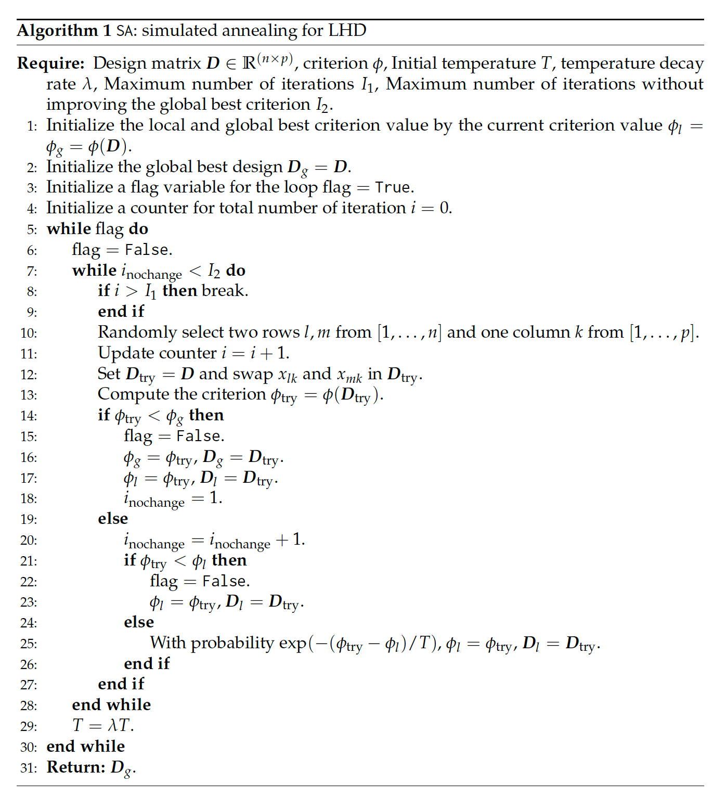
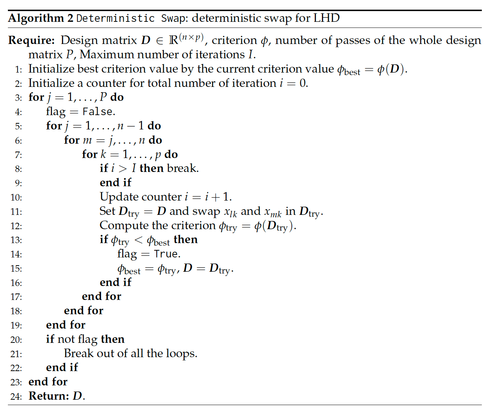
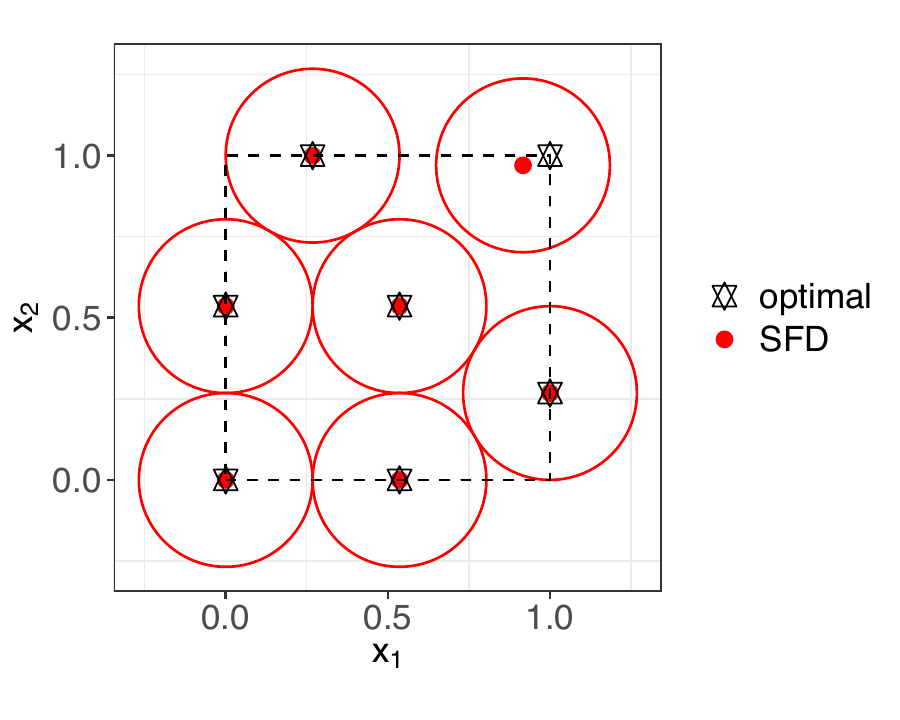
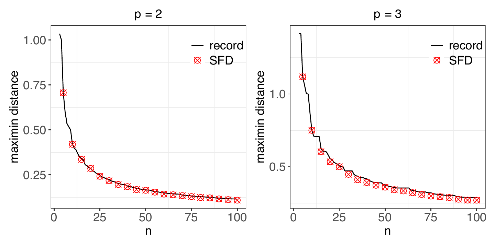
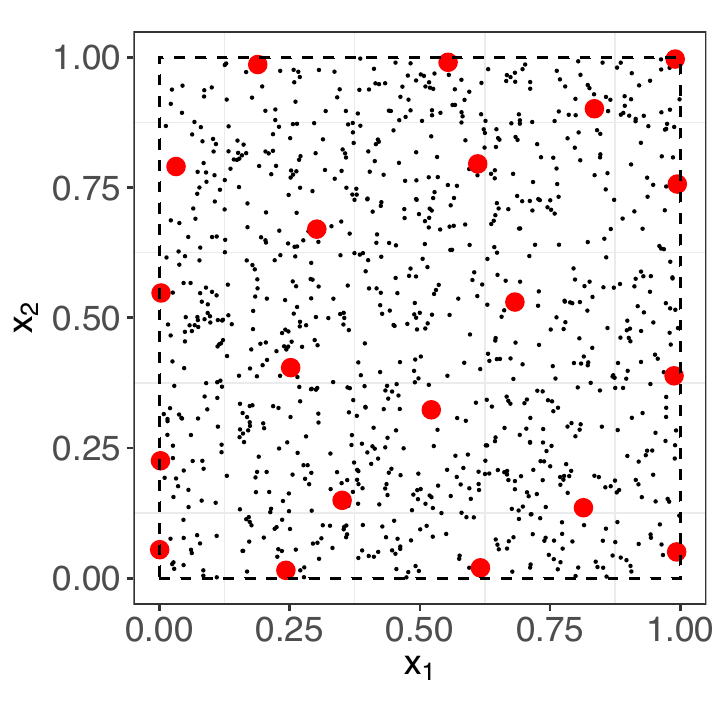
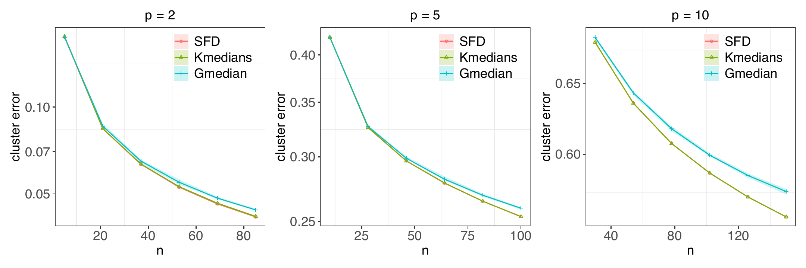
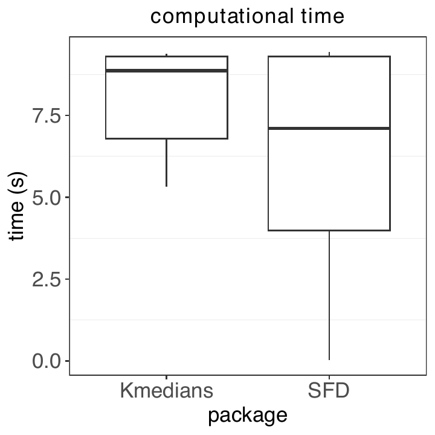

::::: article
## Introduction {#sec:intro}

Space-filling designs are a class of experimental designs for
deterministic computer experiments, which are widely used in science and
engineering applications (Joseph 2026). They ensure that the design
points are spread evenly throughout the experimental region, minimizing
gaps such that no region is left unexplored.

The motivation behind space-filling designs arises from the need to
build accurate surrogate models, such as Gaussian process (or kriging)
models for computer simulations (Santner et al. 2018; Gramacy 2020). A
good experimental design should place points strategically in the
experimental region to capture variations of the response surface while
avoiding unnecessary clustering. There are two general strategies for
constructing designs: model-based designs and space-filling designs.
Model-based designs, such as the maximum entropy design (Currin et al.
1991) and the integrated mean squared prediction design (Sacks et al.
1989), are often limited in practice due to their dependence on unknown
correlation parameters in the Gaussian process model. In contrast,
space-filling designs offer a model-free approach, providing a more
robust framework for model fitting.

There are several space-filling criteria for assessing the quality of a
design (Joseph 2016). Among them, the minimax and maximin criteria are
widely adopted geometric measures, both of which have asymptotic
optimality justification for Gaussian process modeling (Johnson et al.
1990). However, in high-dimensional spaces, designs optimized using
these criteria often exhibit poor projections in lower-dimensional
subspaces. Latin hypercube design (LHD) addresses this issue by
constraining that each factor of the design is evenly spaced throughout
its range (McKay et al. 1979). It is often combined with the
aforementioned minimax or maximin criteria to achieve both good coverage
and projection property (Morris and Mitchell 1995; Dam 2008). Maximum
projection (MaxPro) designs further improve over maximinLHD, which
ensures better projection properties across all subsets of factors.
Uniformity is another desirable property for designs, particularly when
the objective is integration or uncertainty quantification (Fang et al.
2005).

Several open-source packages are available to construct space-filling
designs, especially Latin hypercube designs. The
[**lhs**](https://CRAN.R-project.org/package=lhs) package provides
functionalities to generate random LHD and options to optimize the
design based on various criteria such as maximin, S-optimality, etc.
(Carnell 2024). The
[**DiceDesign**](https://CRAN.R-project.org/package=DiceDesign) package
provides a comprehensive suite of design choices, including model-based
designs via exchange algorithms or stochastic processes, as well as
optimized LHDs using genetic algorithms or simulated annealing (Dupuy et
al. 2015). [**SLHD**](https://CRAN.R-project.org/package=SLHD) package
(Ba 2015) uses simulated annealing to generate maximin LHD, which can
also accommodate categorical factors using sliced LHD. The
[**maximin**](https://CRAN.R-project.org/package=maximin) package deals
with maximin design (Sun and Gramacy 2024). It improves an existing
design by swapping out or optimizing the row with the minimum distance.
For minimax designs, the
[**minimaxdesign**](https://CRAN.R-project.org/package=minimaxdesign)
package employs clustering algorithms combined with particle swarm
optimization to achieve globally optimal designs (Mak 2021). For MaxPro
design, the [**MaxPro**](https://CRAN.R-project.org/package=MaxPro)
package provides functionality to generate LHDs optimized for the MaxPro
criterion, with further refinement made possible through continuous
optimization (Ba and Joseph 2018). In this article, we introduce the
[**SFDesign**](https://CRAN.R-project.org/package=SFDesign) package
(Wang and Joseph 2025) which offers considerable improvements over
existing packages for generating maximin designs, MaxPro designs,
uniform designs, and minimax designs. We also include a function to
generate clustering-based designs, which is not available in other
packages. A list of the major functions is presented in Table
[1](#tab:T1){reference-type="ref" reference="tab:funcs"}.

::: {#tab:funcs}
  -----------------------------------------------------------------------------
        **Name**                          **Description**                    
  --------------------- ---------------------------------------------------- --
     `maximin.crit`                       maximin criteria                   

      `maxpro.crit`                 maximum projection criteria              

     `uniform.crit`                   wrap-around discrepancy                

     `cluster.error`                      clustering error                   

       `randomLHD`                           random LHD                      

      `maximinLHD`               LHD optimized for maximin criteria          

       `maxproLHD`               LHD optimized for MaxPro criteria           

      `uniformLHD`           LHD optimized for wrap-around discrepancy       

       `customLHD`           LHD optimized for a user-defined criteria       

   `clustering.design`        designs generated by clustring algorithm       

     `maximin.optim`     a continuous optimizer for maximin-distance design  

     `maxpro.optim`           a continuous optimizer for MaxPro design       

     `uniform.optim`         a continuous optimizer for uniform design       

   `continuous.optim`     a continuous optimizer for user-defined criteria   
  -----------------------------------------------------------------------------

  : (#tab:T1) Major functions of the
  [**SFDesign**](https://CRAN.R-project.org/package=SFDesign) package
:::

## Review of space-filling design {#sec:review}

In this section, we introduce the notation and formally define various
space-filling criteria. Let $\mathcal{X}\subset\mathbb R^p$ denote the
experimental region of interest, which is typically assumed to be the
unit hypercube $\mathcal{X} = [0, 1]^p$. Denote a design of size $n$ by
the design matrix
$\boldsymbol{\mathbf{D}}_n= [\boldsymbol{\mathbf{x}}_1, \cdots, \boldsymbol{\mathbf{x}}_n]^T$,
where $\boldsymbol{\mathbf{x}}^T_i$ represents the $i$th design point.

A maximin design aims to maximize the minimum pairwise distance between
design points, ensuring that points are spread as far apart as possible.
It can be obtained by maximizing
$$\begin{equation}
\label{eq:maximin}
    \phi_{\text{Mm}}(\boldsymbol{\mathbf{D}}_n) = \min_{i\neq j} \|\boldsymbol{\mathbf{x}}_i-\boldsymbol{\mathbf{x}}_j\|_2,
\end{equation}   (\#eq:maximin)$$
where $\|\cdot\|_2$ denotes the Euclidean norm. On the other hand,
minimax designs focus on reducing the largest gap within the design
space $\mathcal{X}$ by minimizing:
$$\begin{equation}
    \phi_{\text{mM}}(\boldsymbol{\mathbf{D}}_n) = \max_{\boldsymbol{\mathbf{x}}\in\mathcal{X}} \min_{i} \|\boldsymbol{\mathbf{x}}-\boldsymbol{\mathbf{x}}_i\|_2.
\end{equation}$$
This criterion ensures that the maximum distance from any point in the
experimental region $\mathcal{X}$ to the nearest design point is
minimized, effectively reducing the largest uncovered region in the
space.

Factor sparsity is commonly observed in real physical systems; that is,
only a few factors out of the numerous factors in the system may affect
the response. Therefore, in deterministic simulations, we do not want
replications when we project points to a lower subspace. A Latin
hypercube design (LHD) ensures good one-dimensional projections (McKay
et al. 1979). In an LHD, each column of $\boldsymbol{\mathbf{D}}_n$ is a
permutation of $\left[0.5/n, 1.5/n, \dots, (n-0.5)/n\right]$, which
guarantees that the projections of the points in each dimension are
evenly distributed. For an $n$-point design with $p$ factors, there are
$n^p$ possible LHD configurations; however, not all of them are
space-filling. To enhance the space-filling properties of LHDs, we can
optimize them with respect to the maximin criterion (Morris and Mitchell
1995). The optimization is usually done by minimizing a reciprocal
distance criterion
$$\begin{equation}
\label{eq:MmLHD}
    \phi_{\text{rec}}(\boldsymbol{\mathbf{D}}_n) = \left\{\frac{1}{{n\choose 2}}\sum_{i=1}^{n-1}\sum_{j=i+1}^{n}\frac{1}{\|\boldsymbol{\mathbf{x}}_i-\boldsymbol{\mathbf{x}}_j\|_2^r} \right\}^{1/r},
\end{equation}   (\#eq:MmLHD)$$
which is proportional to $1/\phi_{\text{Mm}}(\boldsymbol{\mathbf{D}}_n)$
for large enough $r$.

Although maximin LHDs ensure good one-dimensional and full-dimensional
space-filling properties, they may not be good when projected onto other
subspaces. To improve the projection properties of a design for all
possible subspaces, maximum projection (MaxPro) design was proposed
(Joseph et al. 2015). It minimizes :
$$\begin{equation}
\label{eq:maxpro}
    \phi_{\text{maxpro}}(\boldsymbol{\mathbf{D}}_n) = \left\{\frac{1}{{n\choose 2}}\sum_{i=1}^{n-1}\sum_{j=i+1}^{n}\frac{1}{\prod_{l=1}^p(x_{il}-x_{jl})^2}\right\}^{1/p}.
\end{equation}   (\#eq:maxpro)$$
Compared to \@ref(eq:MmLHD), the only difference is that the Euclidean
distance in the denominator is replaced by a "product distance", but
this small change ensures good projections to all subspaces.

Uniformity of the points in the experimental region is another important
property of space-filling designs, particularly in the context of mean
estimation of a model output. Let
$F_n(\boldsymbol{\mathbf{x}}) = 1/n \sum_{i=1}^n I(\boldsymbol{\mathbf{x}}_i\leq\boldsymbol{\mathbf{x}})$
be the empirical distribution of the design points, where $I$ is the
indicator function in which the comparison is done component-wise. Let
$f:\mathcal{X}\to \mathbb R$ denote the computer code. In order for the
mean estimation error
$|\mathbb E(f)- \sum_{i=1}^{n}f(\boldsymbol{\mathbf{x}}_i)/n|$ to be
small for *any* $f$, it is ideal for $F_n(\boldsymbol{\mathbf{x}})$ to
closely approximate the uniform distribution. Several discrepancies have
been proposed, such as star $L_p$-discrepancy and modified
$L_p$-discrepancy, to measure the uniformity of designs (Fang et al.
2000). In this package, we utilize the wrap-around discrepancy because
of its computational simplicity and nice projection properties
(Hickernell 1998):
$$\begin{equation}
\label{eq:wa}
    \phi_{\text{wa}}(\boldsymbol{\mathbf{D}}_n) = -\left(\frac{4}{3}\right)^p + \frac{1}{n^2}\sum_{i,j=1}^n\prod_{k=1}^p\left[\frac{3}{2} - |x_{ik}-x_{jk}|(1-|x_{ik}-x_{jk}|)\right].
\end{equation}   (\#eq:wa)$$
Finally, we introduce clustering-based designs, which is justified as a
way to minimize an upper bound of the integrated prediction error of a
Gaussian process. The clustering criterion is:
$$\begin{equation}
\label{eq:cluster}
    \phi_{\text{cluster}}(\boldsymbol{\mathbf{D}}_n) = \sum_{i=1}^n \int_{V_i}\|\boldsymbol{\mathbf{x}}-\boldsymbol{\mathbf{x}}_i\|^{\alpha}d\boldsymbol{\mathbf{x}}.
\end{equation}   (\#eq:cluster)$$
where $V_i, i=1,\dots,n$ are the Voronoi regions. For $\alpha=1$, the
criterion is the same as $K$-median problem. For $\alpha$ large enough,
the criterion can serve as a surrogate criterion for the minimax design
(Mak and Joseph 2018).

## Optimization algorithms

In this section, we present the optimization algorithms employed in this
package and illustrate their effectiveness through comparisons with
existing packages.

### Designs based on pairwise distance

Many of the criteria reviewed in Section
[2](#sec:review){reference-type="ref" reference="sec:review"}, such as
maximin criterion, MaxPro, and wrap-around discrepancy, are functions of
the pairwise distances among design points. Motivated by this
observation, we propose a general optimization framework for improving
such criteria, with and without constraints to Latin hypercube designs.

For Latin hypercube designs, the optimization framework consists of two
stages: an initial optimization phase using simulated annealing
(Algorithm [1](#alg:sa){reference-type="ref" reference="alg:sa"},
(Morris and Mitchell 1995)), followed by a deterministic local search
refinement (Algorithm [2](#alg:det){reference-type="ref"
reference="alg:det"}). Both stages iteratively enhance the design by
swapping coordinates between selected pairs of design points.

In the first stage, design point pairs are randomly selected, and swaps
are accepted with a certain probability, even if they do not immediately
improve the criterion. This probabilistic acceptance helps prevent the
algorithm from getting trapped in local optima, enabling more effective
exploration of the design space.

In the second stage, a deterministic local search is performed by
systematically scanning the design matrix. Every coordinate of each pair
of design points is swapped, but the swap is only accepted if it leads
to an improvement in the criterion. This greedy approach efficiently
refines the design, converging towards a local optimum.

For designs that are not restricted to Latin hypercubes, the
optimization process begins with the optimized LHD obtained through the
above process or some initial design provided by the user and then
transitions to continuous optimization using the low-storage BFGS
algorithm from the NLopt package (Liu and Nocedal 1989; Johnson 2008).
If a surrogate objective function is used, such as in maximin designs,
an additional simulated annealing step can be applied at the end to
directly optimize the original criterion.

We present three specific designs implemented in the packages as
follows.

<figure id="alg:sa">

<!---
<div class="algorithmic">
<p>Design matrix <span
class="math inline"><strong>D</strong> ∈ ℝ<sup>(<em>n</em> × <em>p</em>)</sup></span>,
criterion <span class="math inline"><em>ϕ</em></span>, Initial
temperature <span class="math inline"><em>T</em></span>, temperature
decay rate <span class="math inline"><em>λ</em></span>, Maximum number
of iterations <span class="math inline"><em>I</em><sub>1</sub></span>,
Maximum number of iterations without improving the global best criterion
<span class="math inline"><em>I</em><sub>2</sub></span>. Initialize the
local and global best criterion value by the current criterion value
<span
class="math inline"><em>ϕ</em><sub><em>l</em></sub> = <em>ϕ</em><sub><em>g</em></sub> = <em>ϕ</em>(<strong>D</strong>)</span>.
Initialize the global best design <span
class="math inline"><strong>D</strong><sub><em>g</em></sub> = <strong>D</strong></span>.
Initialize a flag variable for the loop <span
class="math inline">flag = <code>True</code></span>. Initialize a
counter for total number of iteration <span
class="math inline"><em>i</em> = 0</span>. <span
class="math inline">flag = <code>False</code></span>. break. Randomly
select two rows <span class="math inline"><em>l</em>, <em>m</em></span>
from <span class="math inline">[1, …, <em>n</em>]</span> and one column
<span class="math inline"><em>k</em></span> from <span
class="math inline">[1, …, <em>p</em>]</span>. Update counter <span
class="math inline"><em>i</em> = <em>i</em> + 1</span>. Set <span
class="math inline"><strong>D</strong><sub>try</sub> = <strong>D</strong></span>
and swap <span
class="math inline"><em>x</em><sub><em>l</em><em>k</em></sub></span> and
<span
class="math inline"><em>x</em><sub><em>m</em><em>k</em></sub></span> in
<span class="math inline"><strong>D</strong><sub>try</sub></span>.
Compute the criterion <span
class="math inline"><em>ϕ</em><sub>try</sub> = <em>ϕ</em>(<strong>D</strong><sub>try</sub>)</span>.
<span class="math inline">flag = <code>False</code></span>. <span
class="math inline"><em>ϕ</em><sub><em>g</em></sub> = <em>ϕ</em><sub>try</sub></span>,
<span
class="math inline"><strong>D</strong><sub><em>g</em></sub> = <strong>D</strong><sub>try</sub></span>.
<span
class="math inline"><em>ϕ</em><sub><em>l</em></sub> = <em>ϕ</em><sub>try</sub></span>,
<span
class="math inline"><strong>D</strong><sub><em>l</em></sub> = <strong>D</strong><sub>try</sub></span>.
<span class="math inline"><em>i</em><sub>nochange</sub> = 1</span>.
<span
class="math inline"><em>i</em><sub>nochange</sub> = <em>i</em><sub>nochange</sub> + 1</span>.
<span class="math inline">flag = <code>False</code></span>. <span
class="math inline"><em>ϕ</em><sub><em>l</em></sub> = <em>ϕ</em><sub>try</sub></span>,
<span
class="math inline"><strong>D</strong><sub><em>l</em></sub> = <strong>D</strong><sub>try</sub></span>.
With probability <span
class="math inline">exp (−(<em>ϕ</em><sub>try</sub> − <em>ϕ</em><sub><em>l</em></sub>)/<em>T</em>)</span>,
<span
class="math inline"><em>ϕ</em><sub><em>l</em></sub> = <em>ϕ</em><sub>try</sub></span>,
<span
class="math inline"><strong>D</strong><sub><em>l</em></sub> = <strong>D</strong><sub>try</sub></span>.
<span class="math inline"><em>T</em> = <em>λ</em><em>T</em></span>.
<strong>Return:</strong> <span
class="math inline"><strong>D</strong><sub><em>g</em></sub></span>.</p>
</div>
---->

<figcaption>Algorithm 1: <code>SA</code>: simulated annealing for
LHD</figcaption>
</figure>

#### Maximin design

Instead of directly optimizing the maximin criterion, we start by
minimizing the average reciprocal distance in \@ref(eq:MmLHD). The
advantage of this criterion is that it helps differentiate between
designs that have the same maximin measure. The reciprocal distance
criterion is equivalent to the maximin criterion for large enough $r$.
Motivated by the choice in (Joseph et al. 2015), we use $r=2p$ as the
default setting in our package.

The gradient of $\phi^r_{\text{rec}}$ with each element in
$\boldsymbol{\mathbf{D}}_n$ is:
$$\begin{equation}
    \frac{\partial \phi^r_{\text{rec}}}{\partial x_{ik}} = \frac{-2r}{n(n-1)}\sum_{j\neq i}\frac{x_{ik}-x_{jk}}{\|\boldsymbol{\mathbf{x}}_i-\boldsymbol{\mathbf{x}}_j\|_2^{r+2}},
\end{equation}$$
which can be used for gradient-based continuous optimization of maximin
design.

<figure id="alg:det">

<!----
<div class="algorithmic">
<p>Design matrix <span
class="math inline"><strong>D</strong> ∈ ℝ<sup>(<em>n</em> × <em>p</em>)</sup></span>,
criterion <span class="math inline"><em>ϕ</em></span>, number of passes
of the whole design matrix <span class="math inline"><em>P</em></span>,
Maximum number of iterations <span
class="math inline"><em>I</em></span>. Initialize best criterion value
by the current criterion value <span
class="math inline"><em>ϕ</em><sub>best</sub> = <em>ϕ</em>(<strong>D</strong>)</span>.
Initialize a counter for total number of iteration <span
class="math inline"><em>i</em> = 0</span>. <span
class="math inline">flag = <code>False</code></span>. break. Update
counter <span class="math inline"><em>i</em> = <em>i</em> + 1</span>.
Set <span
class="math inline"><strong>D</strong><sub>try</sub> = <strong>D</strong></span>
and swap <span
class="math inline"><em>x</em><sub><em>l</em><em>k</em></sub></span> and
<span
class="math inline"><em>x</em><sub><em>m</em><em>k</em></sub></span> in
<span class="math inline"><strong>D</strong><sub>try</sub></span>.
Compute the criterion <span
class="math inline"><em>ϕ</em><sub>try</sub> = <em>ϕ</em>(<strong>D</strong><sub>try</sub>)</span>.
<span class="math inline">flag = <code>True</code></span>. <span
class="math inline"><em>ϕ</em><sub>best</sub> = <em>ϕ</em><sub>try</sub></span>,
<span
class="math inline"><strong>D</strong> = <strong>D</strong><sub>try</sub></span>.
Break out of all the loops. <strong>Return:</strong> <span
class="math inline"><strong>D</strong></span>.</p>
</div>
--->
<figcaption>Algorithm 2: <code>Deterministic Swap</code>: deterministic
swap for LHD</figcaption>
</figure>

The following codes generate a two-dimensional seven-point maximin LHD:

``` r
R> n <- 7
R> p <- 2 
R> D <- maximinLHD(n, p)$design
```

By default, it will go through the two-stage optimization. To perform
continuous optimization with a simulated annealing (SA) step at the end,
the following code can be used:

``` r
R> D <- maximin.optim(D, sa = TRUE)
```

Figure [1](#fig:maximin_7points){reference-type="ref"
reference="fig:maximin_7points"} presents the generated seven-point
maximin design by the above code (denoted as SFD) alongside with the
optimal solution. The design points with the smallest pairwise distance
nearly coincide with the optimal points, with the exception of the
top-right point, which deviates slightly. This deviation occurs because
its placement has minimal impact on the maximin criterion. Maximin
designs are closely related to the sphere packing problem (Conway and
Sloane 2013). A comparison of the maximin criterion of the design
generated by this package with the best sphere packing solution recorded
in the literature (<http://hydra.nat.uni-magdeburg.de/packing/>, denoted
as record) is shown in
Figure [2](#fig:maximin_record){reference-type="ref"
reference="fig:maximin_record"}. It can be seen that the designs
generated by [**SFDesign**](https://CRAN.R-project.org/package=SFDesign)
are almost optimal. Note that the best sphere packing solutions are
available for only two- or three-dimensional problems, whereas our
package can be used for any number of dimensions making it useful for
computer experiments.

<figure id="fig:maximin_record">
<figure>
<figcaption> (a)</figcaption> 
</figure>
<figure>
<figcaption> (b)</figcaption>
</figure>
<figcaption>Figure 1: (a) Seven-point maximin design in two dimension
generated by <a
href="https://CRAN.R-project.org/package=SFDesign"><strong>SFDesign</strong></a>.
Red circles are centered at the design points and the radius is half the
maximin distance. The stars are the optimal design; (b) Comparison of
the maximin design for two and three dimension generated by <a
href="https://CRAN.R-project.org/package=SFDesign"><strong>SFDesign</strong></a>
(denoted as SFD) with the recorded optimal sphere packing solution
(denoted as record). The larger, the better.</figcaption>
</figure>

In the above example, we use maximin LHD as the initial design for the
`maximin.optim` function. However, if our final goal is to generate a
maximin design without LHD constraints, optimizing over an initial
maximin LHD may be inefficient, especially for high dimensions where
maximin design points should usually be located at corners. To address
this issue, the `maximin.optim` has an option to set
`find.best.ini = TRUE`. In this case, in addition to the user-supplied
initial design, new initial designs are generated internally for
optimization. Given the size of the design $n$, the function will first
construct the closest full factorial design. If the number of points in
this design is less than $n$, additional points are added sequentially
to augment the design; otherwise, points are removed sequentially to
reach the desired size. Initial designs constructed this way typically
yield a smaller reciprocal distance criterion after continuous
optimization.

We present a comparison with the `maximinSLHD` function from the
[**SLHD**](https://CRAN.R-project.org/package=SLHD) package (Ba 2015)
and the `maximin` function from the
[**maximin**](https://CRAN.R-project.org/package=maximin) package (Sun
and Gramacy 2024) in
Figure [4](#fig:maximin_compare){reference-type="ref"
reference="fig:maximin_compare"}. In the figure, SLHD denotes the
maximin LHD generated by
[**SLHD**](https://CRAN.R-project.org/package=SLHD); SFD.LHD refers to
the LHD obtained after deterministic swap
(Algorithm [2](#alg:det){reference-type="ref" reference="alg:det"}); SFD
is the result of applying continuous optimization to SFD.LHD, with the
setting `find.best.ini = TRUE, sa = FALSE`; maximin denotes the designs
produced by the
[**maximin**](https://CRAN.R-project.org/package=maximin) package and it
directly minimizes the maximin criterion (Equation \@ref(eq:maximin))
instead of the reciprocal distance.

For Latin hypercube designs, a considerable improvement is observed
following the deterministic swap given by our package. When the LHD
constraint is removed, further enhancement is achieved through
continuous optimization, and the result is always better than
[**maximin**](https://CRAN.R-project.org/package=maximin). In higher
dimensions (e.g., p = 10), it should be noted that almost all SFD
designs came from the internal generation of full factorial-based
initial designs rather than the maximin LHD-based initial designs.

We highlight here the efficiency of the deterministic swap algorithm for
improving maximin Latin hypercube designs, as illustrated in the left
panel of Figure [4](#fig:complexity){reference-type="ref"
reference="fig:complexity"}. For a fair comparison, the total number of
swaps is fixed at 15,000. In our implementation, 7,500 swaps are
allocated to the simulated annealing stage and 7,500 to the
deterministic swapping stage. Before the onset of deterministic
swapping, our method exhibits performance similar to
[**SLHD**](https://CRAN.R-project.org/package=SLHD), since both methods
employ the same algorithmic framework during the SA stage. Once the
algorithm transitions to deterministic swapping, the criterion value
decreases faster than
[**SLHD**](https://CRAN.R-project.org/package=SLHD).

![Figure 2: Trajectory of the criterion value with respect to the number
of swaps performed by the algorithm. The gray dashed lines indicate when
the deterministic swap stage starts. The solid lines represent the mean
$\bar{m}$ over 100 experiments
$\boldsymbol{\mathbf{m}}=(m_1, \dots, m_{100})$, and the error bars mark
$[\bar{m} - 1.96 std(\boldsymbol{\mathbf{m}})/\sqrt{100},\; \bar{m} + 1.96 std(\boldsymbol{\mathbf{m}})/\sqrt{100}]$.
Left:Maximin design, Right: Maximum projection design. SFD represents
the `SFDesign` package, MaxPro represents the `MaxPro` package and SLHD
represents the `SLHD`
package.](fig/complexity_comparison.png){#fig:complexity width="100%"}

Besides generating Latin hypercube design and optimizing designs with
the continuous optimizer `maximin.optim`,
[**SFDesign**](https://CRAN.R-project.org/package=SFDesign) provides the
function `maximin.remove` for users to generate maximin designs from a
large pool of candidate points. In
Figure [5](#fig:discrete_maximin){reference-type="ref"
reference="fig:discrete_maximin"} we show an example of generating a
maximin of size 20 from 1000 candidates.

<figure id="fig:discrete_maximin" data-latex-placement="H">

<figcaption>Figure 3: A maximin design of size 20 generated by
<code>maximin.remove</code> from 1000 candidate points. Red points
denote the design and the black dots are the candidates.</figcaption>
</figure>

 and
[**SFDesign**](https://CRAN.R-project.org/package=SFDesign),
respectively; Bottom row: maximin and SFD denote the maximin designs
without LHD constraints generated by
[**maximin**](https://CRAN.R-project.org/package=maximin) and
[**SFDesign**](https://CRAN.R-project.org/package=SFDesign),
respectively. Lines represent the median over 10 repetitions and the
shaded bands mark the 5th and 95th quantiles. Solid and dashed lines
represent designs with and without LHD restrictions,
respectively.](fig/Maximin_compare.png){#fig:maximin_compare
width="100%"}

#### Maximum projection design

The major difference of
[**SFDesign**](https://CRAN.R-project.org/package=SFDesign) and the
existing [**MaxPro**](https://CRAN.R-project.org/package=MaxPro) package
(Ba and Joseph 2018) is the addition of the deterministic swap
refinements. Here, we demonstrate how to generate a MaxPro LHD using
only the SA step:

``` r
R> n = 50
R> p = 5
R> D <- maxproLHD(n, p, method='sa')$design
```

This is equivalent to the `MaxProLHD` function in the
[**MaxPro**](https://CRAN.R-project.org/package=MaxPro) package.
However, a deterministic swap of any LHD can be performed by the
[**SFDesign**](https://CRAN.R-project.org/package=SFDesign) package to
improve the MaxPro criterion:

``` r
R> D <- maxproLHD(D, method='deterministic')$design
```

The two steps can be grouped together by the following code:

``` r
R> result <- maxproLHD(n, p, method='full')
```

The trajectory of the criterion during optimization can be visualized by
plotting `result$crit.hist`, as shown in
Figure [5](#fig:maxpro_traj){reference-type="ref"
reference="fig:maxpro_traj"}. This graph is particularly useful for
selecting an appropriate initial temperature for the SA step, especially
for user-defined criteria discussed in
Section [3.1.4](#sec:custom){reference-type="ref"
reference="sec:custom"}, as their initial temperature is not computed
automatically.

{#fig:maxpro_traj width="100%"}

A follow-up continuous optimization can be performed to generate a
design without LHD constraints:

``` r
R> D <- maxpro.optim(D)
```

The improvement achieved by deterministic swap is significant, as
illustrated in Figure [6](#fig:maxpro_compare){reference-type="ref"
reference="fig:maxpro_compare"}. In the figure, solid lines represent
results for LHD and dashed lines correspond to designs without LHD
constraints. For low-dimensional designs, the improvement is moderate;
however, in higher dimensions (e.g., $p = 10$), the deterministic swap
step can, in some cases, enhance the LHD to even outperform designs
without LHD constraints generated by the
[**MaxPro**](https://CRAN.R-project.org/package=MaxPro) package.

 and
[**SFDesign**](https://CRAN.R-project.org/package=SFDesign). MaxPro.LHD
and MaxPro are generated by the
[**MaxPro**](https://CRAN.R-project.org/package=MaxPro) package, with
and without Latin hypercube (LHD) constraints, respectively. Similarly,
SFD.LHD and SFD are designs generated by
[**SFDesign**](https://CRAN.R-project.org/package=SFDesign) with and
without LHD constraints. Lines represent the median over 10 repetitions
and the shaded bands mark the 5th and 95th
quantiles.](fig/MaxPro_compare.png){#fig:maxpro_compare width="100%"}

Similar to the maximin LHD, the deterministic swap algorithm can improve
the MaxPro LHD efficiently for the same number of swaps, as shown in the
right panel in Figure [4](#fig:complexity){reference-type="ref"
reference="fig:complexity"}. The total number of swaps is fixed at
60,000 for both [**MaxPro**](https://CRAN.R-project.org/package=MaxPro)
and [**SFDesign**](https://CRAN.R-project.org/package=SFDesign). In our
implementation, the number of swaps is fixed at 30,000 in the SA stage
and 30,000 in the deterministic swapping stage. Once the algorithm
enters the deterministic swapping stage, the MaxPro criterion clearly
decreases faster for
[**SFDesign**](https://CRAN.R-project.org/package=SFDesign).

#### Uniform design

For uniform design, we optimize the wrap-around discrepancy
(Equation \@ref(eq:wa)). To generate an LHD with low discrepancy, the
following code can be used:

``` r
R> D <- uniformLHD(n, p)$design
```

For continuous optimization, the gradient of wrap-around discrepancy
with respect to each element in $\boldsymbol{\mathbf{D}}_n$ can be
derived as follows:
$$\begin{equation}
    \frac{\partial \phi_{\text{wa}}}{\partial x_{ik}} = \frac{2}{n^2}\sum_{j\neq i} \prod_{t\neq k}^p\left[\frac{3}{2} - |x_{it}-x_{jt}|(1-|x_{it}-x_{jt}|)\right] \left(-\text{sign}(x_{ik}-x_{jk}) + 2(x_{ik}-x_{jk})\right).
\end{equation}$$
The following code carries out the continuous optimization:

``` r
R> D <- uniform.optim(D)$design
```

Figure [9](#fig:uniform_compare){reference-type="ref"
reference="fig:uniform_compare"} presents a comparison with
[**DiceDesign**](https://CRAN.R-project.org/package=DiceDesign). The
improvement is evident, particularly for high-dimensional designs.
However, continuous optimization yields only marginal enhancements over
the LHD version.

 and
[**SFDesign**](https://CRAN.R-project.org/package=SFDesign). Dice.LHD
denotes uniform LHDs generated by
[**DiceDesign**](https://CRAN.R-project.org/package=DiceDesign), and
SFD.LHD and SFD are generated by
[**SFDesign**](https://CRAN.R-project.org/package=SFDesign), with and
without LHD constraint, respectively. Lines represent the median over 10
repetitions and the shaded bands mark the 5th and 95th
quantiles.](fig/uniform_compare.png){#fig:uniform_compare width="100%"}

Besides Latin hyper cube design, we provide the functionality to
generate a design of discrete factors with different number of levels.
For example, suppose that we want to generate a design of size 9 on four
factors with levels 3.

``` r
R> D = uniform.discrete(t = 3, p = 4, levels = rep(3, 4))
```

The generated design is shown in Table [2](#tab:T2){reference-type="ref"
reference="tab:oa_design"}, which actually is an orthogonal array
$OA(9,3^4)$ (Wu and Hamada 2021). Although this need not be the case for
larger designs, the generated designs can be close to optimal.

::: {#tab:oa_design}
  -------------------------------
   $x_1$   $x_2$   $x_3$   $x_4$
  ------- ------- ------- -------
     2       3       3       3

     2       1       1       2

     1       3       1       1

     3       2       1       3

     1       2       3       2

     2       2       2       1

     1       1       2       3

     3       1       3       1

     3       3       2       2
  -------------------------------

  : (#tab:T2) Design generated by `uniform.discrete`.
:::

#### User-defined criteria {#sec:custom}

The [**SFDesign**](https://CRAN.R-project.org/package=SFDesign) provides
the option to create an LHD based on a user-defined criterion.

``` r
R> D <- customLHD(compute.distance.matrix, compute.criterion, 
update.distance.matrix, temp, n, p)
```

The user should specify three functions: `compute.distance.matrix` which
computes the distance of each pair of design points, `compute.criterion`
which computes the user defined criterion from the distance matrix, and
`update.distance.matrix` which will update the distance matrix after
swapping one column of two rows of the design matrix. If simulated
annealing algorithm is used in the optimization, a reasonable initial
temperature `temp` should be specified as well so that the algorithm has
a balance of exploration and exploitation.

Continuous optimization can also be performed once the user specify the
initial design `D.ini` and the objective `objective` to minimize and the
gradient `gradient` with respect to the design matrix.

``` r
R> D <- continuous.optim(D.ini, objective, gradient)
```

### Clustering-based design

Clustering-based designs tend to minimize the integrated prediction
error of a Gaussian process model. Let
$R(\boldsymbol{\mathbf{x}})=\exp\left(-\|\boldsymbol{\mathbf{x}}\|^2/\theta^2\right)$
be the Gaussian correlation function and
$\boldsymbol{\mathbf{r}}(\boldsymbol{\mathbf{x}}) = (R(\boldsymbol{\mathbf{x}}-\boldsymbol{\mathbf{x}}_1),dots,R(\boldsymbol{\mathbf{x}}-\boldsymbol{\mathbf{x}}_n))'$.
Then the root mean squared error for a new point is
$\text{RMSE}(x) = \sqrt{1-\boldsymbol{\mathbf{r}}(\boldsymbol{\mathbf{x}})'\boldsymbol{\mathbf{R}}^{-1}\boldsymbol{\mathbf{r}}(\boldsymbol{\mathbf{x}})}$.
Let $\mathcal{X}=V_1\cup\dots\cup V_n$ be a Voronoi diagram based on the
design points. The integrated root mean squared error (IRMSE) of a
design $\boldsymbol{\mathbf{D}}_n$ can be bounded as follows (Joseph
2026, Ch. 4):
$$\begin{align*}
    \text{IRMSE}(\boldsymbol{\mathbf{D}}_n) &= \int_\mathcal{X} \sqrt{1-\boldsymbol{\mathbf{r}}(\boldsymbol{\mathbf{x}})'\boldsymbol{\mathbf{R}}^{-1}\boldsymbol{\mathbf{r}}(\boldsymbol{\mathbf{x}})} d\boldsymbol{\mathbf{x}}\\
    &\leq \sum_{i=1}^n \int_{V_i}\sqrt{1-R^2(\boldsymbol{\mathbf{x}}-\boldsymbol{\mathbf{x}}_i)} d\boldsymbol{\mathbf{x}}\\
    &=\sum_{i=1}^n \int_{V_i}\sqrt{1-\exp(-2\|\boldsymbol{\mathbf{x}}-\boldsymbol{\mathbf{x}}_i\|^2/\theta^2)} d\boldsymbol{\mathbf{x}}\\
    &\approx \sum_{i=1}^n \int_{V_i}\sqrt{\|\boldsymbol{\mathbf{x}}-\boldsymbol{\mathbf{x}}_i\|^2/\theta^2} d\boldsymbol{\mathbf{x}} \quad (\text{assume}\; \|\boldsymbol{\mathbf{x}}-\boldsymbol{\mathbf{x}}_i\|\ll\theta)\\
    &= \frac{\sqrt{2}}{\theta} \sum_{i=1}^n \int_{V_i}\|\boldsymbol{\mathbf{x}}-\boldsymbol{\mathbf{x}}_i\| d\boldsymbol{\mathbf{x}}.
\end{align*}$$
Minimizing this bound is equivalent to the $K$-median clustering
problem. A generalization of this criteria is the clustering criterion
$\phi_{\text{cluster}}$ in (\@ref(eq:cluster)). For example, when
$\alpha=2$, the clustering criterion is an upper bound for integrated
mean square error
$\text{IMSE}(\boldsymbol{\mathbf{D}}_n) = \int_\mathcal{X} \{1-\boldsymbol{\mathbf{r}}(\boldsymbol{\mathbf{x}})'\boldsymbol{\mathbf{R}}^{-1}\boldsymbol{\mathbf{r}}(\boldsymbol{\mathbf{x}})\} d\boldsymbol{\mathbf{x}}$.
This package provides the option to generate designs based on the
clustering criterion for any $\alpha > 0$, which is a functionality not
provided by the existing packages. The design space is approximated
using a large sample of Sobol points, $\boldsymbol{\mathbf{S}}$. We
implement Lloyd's algorithm to generate cluster centers as design
points, which iteratively refines an initial set of cluster centers by
alternating between partitioning the design space into new Voronoi
regions and updating the centers accordingly.

For $\alpha \leq 2$, we update each center by Weiszfeld's algorithm. Let
$\boldsymbol{\mathbf{x}}^{(0)}_i=\boldsymbol{\mathbf{x}}_i$ denote the
initial position of the $i$th center and and let
$\boldsymbol{\mathbf{S}}_i$ represent the points within its Voronoi
cell. The center is then updated as:
$$\begin{equation*}
    \boldsymbol{\mathbf{x}}^{(k+1)}_i = \left.\left(\sum_{\boldsymbol{\mathbf{s}}\in\boldsymbol{\mathbf{S}}_i}\frac{\boldsymbol{\mathbf{s}}}{\|\boldsymbol{\mathbf{s}}-\boldsymbol{\mathbf{x}}^{(k)}_i\|_2^{2-\alpha}}\right)\middle/ \left(\sum_{\boldsymbol{\mathbf{s}}\in\boldsymbol{\mathbf{S}}_i}\frac{1}{\|\boldsymbol{\mathbf{s}}-\boldsymbol{\mathbf{x}}^{(k)}_i\|_2^{2-\alpha}}\right)\right. \quad \text{for } k=0, 1, \dots.
\end{equation*}$$
For $\alpha > 2$, the centers are updated by accelerated gradient
descent, similar to computing $C_q$-center in (Mak and Joseph 2018).

Here, we mainly focus on $\alpha=1$, which corresponds to minimizing the
IRMSE.

``` r
R> D <- cluster.based.design(n, p, alpha=1)
```

Figure [8a](#fig:cluster_compare){reference-type="ref"
reference="fig:cluster_compare"} shows a comparison with
[**Kmedians**](https://CRAN.R-project.org/package=Kmedians)
(Godichon-Baggioni and Surendran 2023) and
[**Gmedian**](https://CRAN.R-project.org/package=Gmedian) (Cardot 2022).
Since [**SFDesign**](https://CRAN.R-project.org/package=SFDesign)
employs the same algorithm as
[**Kmedians**](https://CRAN.R-project.org/package=Kmedians), both
exhibit similar performance, and both outperform
[**Gmedian**](https://CRAN.R-project.org/package=Gmedian). However, the
`C++` implementation makes
[**SFDesign**](https://CRAN.R-project.org/package=SFDesign) more
efficient, as shown in
Figure [8b](#fig:cluster_time_b){reference-type="ref"
reference="fig:cluster_time"}. Moreover,
[**SFDesign**](https://CRAN.R-project.org/package=SFDesign) enjoys the
flexibility of different $\alpha$. For example, choosing $\alpha=10$ can
lead to an approximate minimax design. The
[**Gmedian**](https://CRAN.R-project.org/package=Gmedian) package, which
implements an averaged stochastic gradient algorithm, is designed to
handle large samples in high-dimensional spaces efficiently (Cardot et
al. 2012). When the design dimension is extremely high, using
[**Gmedian**](https://CRAN.R-project.org/package=Gmedian) may be
advantageous.

<figure id="fig:cluster_time" data-latex-placement="!h">
<figure id="fig:cluster_compare">

<figcaption>(a) </figcaption>
</figure>
<figure id="fig:cluster_time_b">

<figcaption>(b) </figcaption>
</figure>
<figcaption>Figure 8: (a) Comparison of the clustering error of designs
generated by <a
href="https://CRAN.R-project.org/package=Gmedian"><strong>Gmedian</strong></a>,
<a
href="https://CRAN.R-project.org/package=Kmedians"><strong>Kmedians</strong></a>
and <a
href="https://CRAN.R-project.org/package=SFDesign"><strong>SFDesign</strong></a>
(denoted as SFD). The smaller the better. Lines represent the median
over 10 repetitions and the shaded bands mark the 5th and 95th
quantiles; (b) Comparison of computational time for generating
fifty-point designs of 5 dimension. Boxplots are generated from 20
experiments.</figcaption>
</figure>

## Case studies

### Surrogate modeling

Here we consider the computer model for computing the midpoint voltage
$V_m$ of an output transformerless (OTL) push-pull circuit (Ben-Ari and
Steinberg 2007). There are six input variables: resistance b1 (K-Ohms)
$R_{b1}$, resistance b2 (K-Ohms) $R_{b2}$, resistance f (K-Ohms) $R_f$,
resistance c1 (K-Ohms) $R_{c1}$, resistance c2 $R_{c2}$(K-Ohms) and
current gain (Amperes) $\beta$.
$$V_m(\mathbf{x}) =
\frac{(V_{b1} + 0.74)\beta(R_{c2} + 9)}{\beta(R_{c2} + 9) + R_f}
+ \frac{11.35 R_f}{\beta(R_{c2} + 9) + R_f}
+ \frac{0.74 R_f \beta (R_{c2} + 9)}{(\beta(R_{c2} + 9) + R_f) R_{c1}}, \quad \text{where}$$

$$V_{b1} = \frac{12 R_{b2}}{R_{b1} + R_{b2}}$$
Four inert input variables are added in order to show the importance of
projection properties of designs. We tried two types of design with a
design size of fifty: maximin LHD and MaxPro LHD.
Figure [9](#fig:surrogate_design){reference-type="ref"
reference="fig:surrogate_design"} shows the six active variables (scaled
to the unique hypercube) of MaxPro LHD generated by `SFDesign`.

{#fig:surrogate_design width="100%"}

Given the design and corresponding responses, we fit an ordinary kriging
model using the
[**rkriging**](https://CRAN.R-project.org/package=rkriging) package
(Huang and Joseph 2024). To evaluate the model's performance, we
generate $10^6$ Sobol points as the test dataset. The left panel of
Figure [10](#fig:case_surrogate){reference-type="ref"
reference="fig:case_surrogate"} compares the MaxPro criterion for
designs generated by `MaxPro` and `SFDesign`. Consistent with
Figure [6](#fig:maxpro_compare){reference-type="ref"
reference="fig:maxpro_compare"}, `SFDesign` demonstrates a notable
improvement over `MaxPro`. Additionally, we compare the prediction root
mean square error (RMSE) of the kriging models. The results indicate
that ordinary kriging models fitted on MaxPro LHDs achieve lower
prediction errors, with `SFDesign` providing more consistent
improvements.

{#fig:case_surrogate width="100%"}

### Uncertainty quantification

When the objective is to quantify the uncertainty of a computer code,
uniform designs are desired. Here we consider a simulation of the piston
motion within a cylinder (Kenett and Zacks 1998). The cycle time in
seconds is given by
$$C(\mathbf{x}) = 2\pi \sqrt{\frac{M}{k + S^2 \frac{P_0 V_0}{T_0} \frac{T_a}{V^2}}}, \quad \text{where}$$

$$V = \frac{S}{2k} \left( \sqrt{A^2 + 4k \frac{P_0 V_0}{T_0} T_a} - A \right)$$

$$A = P_0 S + 19.62 M - \frac{kV_0}{S}$$
where the piston weight $M \in [30, 60]$ kg, the piston surface area
$S \in [0.005, 0.020]$ m$^2$, initial gas volume
$V_0 \in [0.002, 0.010]$ m$^3$, spring coefficient $k \in [1000, 5000]$
N/m, the atmospheric pressure $P_0 \in [90,000, 110,000]$ N/m$^2$,
ambient temperature$T_a \in [290, 296]$ K, and filling gas temperature
$T_0 \in [340, 360]$ K.

We are interested in computing the mean and variance of the cycle time
when the inputs are uniformly distributed within their respective
ranges. Figure [11](#fig:case_uq){reference-type="ref"
reference="fig:case_uq"} shows that the wrap-around discrepancy of
uniform designs generated by `SFDesign` is lower, leading to more
accurate mean and variance estimations that are closer to the true
values.


and [**SFDesign**](https://CRAN.R-project.org/package=SFDesign), and the
mean and variance estimation based on the corresponding experimental
responses. The red line is the true mean and variance of the response.
The result is generated from 20 random
experiments.](fig/case_uq.png){#fig:case_uq width="100%"}

## Conclusion

In this paper, we introduce the
[**SFDesign**](https://CRAN.R-project.org/package=SFDesign) package, a
comprehensive set of functions for constructing space-filling designs
based on several widely used criteria. Through a combination of
algorithmic advancements and software optimizations, our package
achieves substantial improvements over existing packages, offering more
efficient and effective design generation. In addition to supporting
established space-filling criteria such as maximin, MaxPro, and
uniformity-based discrepancy measures, the package provides a framework
for incorporating customized criteria, enabling researchers and
practitioners to adapt the design methodology to domain-specific
applications. Future extensions may include support for additional
criteria beyond those based on pairwise distance or clustering,
expanding the scope of design optimization to accommodate alternative
space-filling measures.

This work is supported by U.S. National Science Foundation grant
DMS-2310637.
:::::

::::::::::::::::::::::::::::::::::: {#refs .references .csl-bib-body .hanging-indent}
::: {#ref-SLHD .csl-entry}
Ba, Shan. 2015. *SLHD: Maximin-Distance (Sliced) Latin Hypercube
Designs*.
:::

::: {#ref-maxpro .csl-entry}
Ba, Shan, and V Roshan Joseph. 2018. *MaxPro: Maximum Projection
Designs*.
:::

::: {#ref-ben2007modeling .csl-entry}
Ben-Ari, Einat Neumann, and David M Steinberg. 2007. "Modeling Data from
Computer Experiments: An Empirical Comparison of Kriging with MARS and
Projection Pursuit Regression." *Quality Engineering* 19 (4): 327--38.
:::

::: {#ref-Gmedian .csl-entry}
Cardot, Herve. 2022. *Gmedian: Geometric Median, k-Medians Clustering
and Robust Median PCA*.
:::

::: {#ref-cardot2012fast .csl-entry}
Cardot, Hervé, Peggy Cénac, and Jean-Marie Monnez. 2012. "A Fast and
Recursive Algorithm for Clustering Large Datasets with k-Medians."
*Computational Statistics & Data Analysis* 56 (6): 1434--49.
:::

::: {#ref-Carnell2024 .csl-entry}
Carnell, Rob. 2024. *Lhs: Latin Hypercube Samples*.
:::

::: {#ref-conway2013sphere .csl-entry}
Conway, John Horton, and Neil James Alexander Sloane. 2013. *Sphere
Packings, Lattices and Groups*. Vol. 290. Springer Science & Business
Media.
:::

::: {#ref-currin1991bayesian .csl-entry}
Currin, Carla, Toby Mitchell, Max Morris, and Don Ylvisaker. 1991.
"Bayesian Prediction of Deterministic Functions, with Applications to
the Design and Analysis of Computer Experiments." *Journal of the
American Statistical Association* 86 (416): 953--63.
:::

::: {#ref-van2008two .csl-entry}
Dam, Edwin R van. 2008. "Two-Dimensional Minimax Latin Hypercube
Designs." *Discrete Applied Mathematics* 156 (18): 3483--93.
:::

::: {#ref-dupuy2015dicedesign .csl-entry}
Dupuy, Delphine, Céline Helbert, and Jessica Franco. 2015. "DiceDesign
and DiceEval: Two R Packages for Design and Analysis of Computer
Experiments." *Journal of Statistical Software* 65: 1--38.
:::

::: {#ref-fang2005design .csl-entry}
Fang, Kai-Tai, Runze Li, and Agus Sudjianto. 2005. *Design and Modeling
for Computer Experiments*. Chapman; Hall/CRC.
:::

::: {#ref-fang2000uniform .csl-entry}
Fang, Kai-Tai, Dennis KJ Lin, Peter Winker, and Yong Zhang. 2000.
"Uniform Design: Theory and Application." *Technometrics* 42 (3):
237--48.
:::

::: {#ref-kmedians .csl-entry}
Godichon-Baggioni, Antoine, and Sobihan Surendran. 2023. *Kmedians:
K-Medians*.
:::

::: {#ref-gramacy2020surrogates .csl-entry}
Gramacy, Robert B. 2020. *Surrogates: Gaussian Process Modeling, Design,
and Optimization for the Applied Sciences*. Chapman; Hall/CRC.
:::

::: {#ref-hickernell1998generalized .csl-entry}
Hickernell, Fred. 1998. "A Generalized Discrepancy and Quadrature Error
Bound." *Mathematics of Computation* 67 (221): 299--322.
:::

::: {#ref-rkriging .csl-entry}
Huang, Chaofan, and V Roshan Joseph. 2024. *Rkriging: Kriging Modeling*.
:::

::: {#ref-johnson1990minimax .csl-entry}
Johnson, Mark E, Leslie M Moore, and Donald Ylvisaker. 1990. "Minimax
and Maximin Distance Designs." *Journal of Statistical Planning and
Inference* 26 (2): 131--48.
:::

::: {#ref-nloptr .csl-entry}
Johnson, Steven G. 2008. *The NLopt Nonlinear-Optimization Package*.
:::

::: {#ref-joseph2016space .csl-entry}
Joseph, V Roshan. 2016. "Space-Filling Designs for Computer Experiments:
A Review (with Discussions)." *Quality Engineering* 28 (1): 28--44.
:::

::: {#ref-joseph2025 .csl-entry}
Joseph, V Roshan. 2026. *Experimental Design for Data Science and
Engineering*. Chapman & Hall/CRC Press, ISBN: 9781041117520.
:::

::: {#ref-joseph2015maximum .csl-entry}
Joseph, V Roshan, Evren Gul, and Shan Ba. 2015. "Maximum Projection
Designs for Computer Experiments." *Biometrika* 102 (2): 371--80.
:::

::: {#ref-kenett1998modern .csl-entry}
Kenett, Ron, and Shelemyahu Zacks. 1998. *Modern Industrial Statistics:
Design and Control of Quality and Reliability*. Duxbury Press.
:::

::: {#ref-liu1989limited .csl-entry}
Liu, Dong C, and Jorge Nocedal. 1989. "On the Limited Memory BFGS Method
for Large Scale Optimization." *Mathematical Programming* 45 (1):
503--28.
:::

::: {#ref-mak2021minimax .csl-entry}
Mak, Simon. 2021. *Minimaxdesign: Minimax and Minimax Projection
Designs*. <https://CRAN.R-project.org/package=minimaxdesign>.
:::

::: {#ref-mak2018minimax .csl-entry}
Mak, Simon, and V Roshan Joseph. 2018. "Minimax and Minimax Projection
Designs Using Clustering." *Journal of Computational and Graphical
Statistics* 27 (1): 166--78.
:::

::: {#ref-mckay1979comparison .csl-entry}
McKay, Michael D, Richard J Beckman, and William J Conover. 1979. "A
Comparison of Three Methods for Selecting Values of Input Variables in
the Analysis of Output from a Computer Code." *Technometrics* 21 (2):
239--45.
:::

::: {#ref-morris1995exploratory .csl-entry}
Morris, Max D, and Toby J Mitchell. 1995. "Exploratory Designs for
Computational Experiments." *Journal of Statistical Planning and
Inference* 43 (3): 381--402.
:::

::: {#ref-sacks1989designs .csl-entry}
Sacks, Jerome, Susannah B Schiller, and William J Welch. 1989. "Designs
for Computer Experiments." *Technometrics* 31 (1): 41--47.
:::

::: {#ref-santner2019design .csl-entry}
Santner, Thomas J, Brian J Williams, and William I Notz. 2018. *The
Design and Analysis of Computer Experiments*. Springer.
:::

::: {#ref-maximin .csl-entry}
Sun, Furong, and Robert B. Gramacy. 2024. *Maximin: Space-Filling Design
Under Maximin Distance*.
:::

::: {#ref-sfdesign .csl-entry}
Wang, Shangkun, and V Roshan Joseph. 2025. *SFDesign: Space-Filling
Designs*.
:::

::: {#ref-wu2021experiments .csl-entry}
Wu, C F Jeff, and Michael S Hamada. 2021. *Experiments: Planning,
Analysis, and Optimization*. John Wiley & Sons.
:::
:::::::::::::::::::::::::::::::::::
