::::: article
## Introduction {#intro}

One of the key components of insurance practice is maintaining
sufficient financial reserves to cover the future claim payments; in
non-life insurance, those are often spread into several installments
spanning multiple time units (e.g., years). The possibility that an
insurance company could default on its payments because of an insolvency
caused by business failures is utterly unacceptable; this aspect is
closely watched not only by the companies themselves, but also by their
regulatory bodies. The companies have to abide by the rules set by the
latter, and maintain sufficient funds to cover payments for past and
future claims. An example of such a regulatory directive in the European
Union is European Parliament and Council (2009), widely known as
\"Solvency II\".

The insurance environment being inherently stochastic, an important task
of actuarial science is to devise stochastic prediction techniques of
such loss reserves. An important class of these methods works with
aggregated data, organized into a structure known in actuarial science
as a run-off triangle. Methods that could be in this context called
classical are either quite simple, using so-called development factors
((Mack 1993; Renshaw and Verrall 1998; Clark 2003; Verdonck and Debruyne
2011)), or rely on parametric assumptions justifying various regression
models (Verrall 1996; Maciak et al. 2021). There is a growing interest
in novel methods, offering better predictive performance, transparency,
and robustness; an R package \CRANpkg{ProfileLadder}, available from CRAN and introduced in
this paper, chose to implement those proposed by Maciak et al. (2022).

Our motivation was and is to create and introduce the R package \CRANpkg{ProfileLadder} as an
extension and complement of other packages devoted to claims
reserving---most importantly the ground-breaking package \CRANpkg{ChainLadder} (Gesmann et al.
2025), featuring methods for non-life loss reserving that can be
considered classical (Mack chain ladder, over-dispersed Poisson and
other GLM models, Bornhuetter-Ferguson, etc.). Parametric reserving
methods beyond those contained in \CRANpkg{ChainLadder} can be found also in the package \CRANpkg{NetSimR} (Parizas 2025). On the other hand, our focus is rather nonparametric,
inspired by functional data analysis; also, distributional predictions
(which are generally considered compulsory, for instance by Solvency II)
are done in this vein: via permutation bootstrap, an original technique
introduced by Maciak et al. (2022). Classical techniques typically rely
on parametric distributional assumptions, which we are determined to
avoid; and our permutation bootstrap technique is applicable also to the
classical methods of point prediction (which on the R level means that 
our `permuteReserve()` method can be applied also to the objects generated by the \CRANpkg{ChainLadder}).

Certainly, R is not new to actuarial science: various other topics are
covered by packages \CRANpkg{actuaryr} (Chmielewska 2025, actuarial reporting); \CRANpkg{lifecontingencies} (Spedicato
2013, life contingencies); and \CRANpkg{actuar} and \CRANpkg{actuaRE} (Dutang et al. 2008; Campo 2025,
credibility models); and others. While \CRANpkg{ProfileLadder} is specifically designed to meet
practical needs of actuaries, the methods implemented therein can also
be applied in other areas---for instance, to model the spread of
infectious diseases, operational risks, or other data where incomplete
functional profiles arise. The main methodological outcome, the
nonparametric reconstruction of missing fragments of the data, here
particularly suited to the structured missingness in run-off triangles,
is adaptable also to other domains such as price curves (Liebl and
Rameseder 2019), growth curves (Delaigle and Hall 2013, 2016), medical
data (Galmiche 2016), and geological or seismic activity profiles (Bauer
et al. 2021).

The paper is organized as follows.
Section [2](#theory){reference-type="ref" reference="theory"} gives a
brief summary of the implemented methods, including also some
developments that were not available when Maciak et al. (2022) was
published. In particular, these contributions beyond Maciak et al.
(2022), are: a) theoretical---which includes a methodological approach
for a run-off triangle exploratory, adaptation of the MACRAME algorithm
beyond its data-driven version, methods for constructing one-year-ahead
predictions (a new running diagonal) based on nonparametric approaches
and, also, the permutation bootstrap applicable for other than just the
functional based prediction methods; and b) practical---mainly in terms
of new actuarial datasets with much longer developments than typical and
explicit utilization of the proposed methods beyond insurance
applications. Section [3](#Rpackage){reference-type="ref"
reference="Rpackage"} describes the main features and implementation
details of the package, in the context of the sample session(s)
featuring the main algorithms. Computational efficiency of the
functional-based algorithms is illustrated and some comparisons with the
classical parametric methods are also given there. Finally,
Section [4](#beyondSection){reference-type="ref"
reference="beyondSection"} provides a summary and some outlook for
possible applications beyond the actuarial context.

## Description of the algorithms {#theory}

The principal data structure used by claims reserving methods is the
so-called run-off triangle. Formally, a *cumulative run-off triangle* is
a dataset $\{Y_{i,j};~i = 1, \dots, n, j = 1, \dots, n + 1 - i\}$, where
$i \in \{1, \dots, n\}$ corresponds to the *occurrence year* (when the
insurance event happens) and $j \in \{1, \dots, n + 1 - i\}$ to the
*development years* (when the ensuing claims are paid). An example is
shown in the left-hand panel of Figure [1](#fig1){reference-type="ref"
reference="fig1"}. The gray area exhibits figures which an actuary knows
(observes) at a given moment of time; the dots in the white area
represent the unknown future, which has to be predicted---the triangle
is to be "completed". It is assumed that the number of development years
in each line is definitive; in particular, the first line of a triangle
is already "completed"---no future payments are expected there.

At times, it is also useful to rephrase the same data in terms of an
*incremental run-off triangle*
$\{X_{i, j};~i = 1, \dots, n; j = 1, \dots, n + 1 - i\}$, with
$X_{i, j} = Y_{i, j} - Y_{i, j - 1}$, considering $Y_{i, 0} = 0$). In
what follows, random variables denoted by $Y_{i,j}$'s refer to
cumulative run-off triangle(s) and random variables denoted by
$X_{i,j}$'s to incremental run-off triangle(s).

The principal starting point of the algorithms proposed by Maciak et
al. (2022) is the closely related concept of functional development
profiles derived from aggregated data or run-off triangles
respectively---the concept also known as the "*patterns of loss
emergence*" (see Clark 2003). Its graphical rendition can be seen in the
right-hand panel of Figure [1](#fig1){reference-type="ref"
reference="fig1"}. Each point-prediction algorithm provides a prediction
of the overall reserve, the overall future losses/payments, by
completing missing fragments within these observed patterns. Given that
the structure of the missing values in the run-off triangle is
predetermined by its specific form, standard imputation methods assuming
missing completely at random (MCAR) situation do not apply (as was
theoretically justified by Maciak et al., 2022).

<figure id="fig1" data-latex-placement="!t">
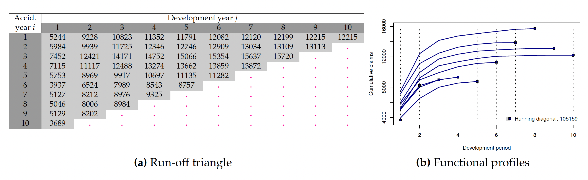</img>
<figcaption>Figure 1: The cumulative run-off triangle (left) of an
illustrative portfolio and its incomplete functional development
profiles (right). The data, belonging to the Cameron Mutual Insurance
Company, are taken from the National Association of Insurance
Commissioners (NAIC) database <span class="citation"
data-cites="NAIC2011">(Meyers and Shi 2011)</span>. The gray area
figures are available to an actuary; the unknown future represented by
dots is to be predicted. </figcaption>
</figure>

### [PARALLAX (**PARALL**el **A**ppro**X**imation of missing fragments)]{#theory_parallax label="theory_parallax"} 

The idea of the first algorithm is to impute the missing parts of the run-off
triangle by the most similar segments---triangle rows that can be found
among the already observed development profiles. The name reflects the
fact that in the functional development profiles, the imputation of the
missing segments is always performed in a parallel way.

As described in Algorithm 1 scheme below, each step of the
algorithm---the estimation of one unknown/unobserved quantity $Y_{i,j}$
respectively the imputation of one missing linear fragment between the
points $[j - 1, Y_{i, j - 1}]$ and $[j, Y_{i,j}]$ for $i = 2, \dots, n$
and $j = n - i + 2, \dots, n$, is performed via the minimization problem
in [(1)]{#alg1}. The overall
reserve prediction of the true (but unknown) reserve $\mathcal{R}$ (the
principal output of the algorithm at the point prediction stage) is

$\widehat{\mathcal{R}} = \sum_{i = 2}^n \widehat{Y}_{i,n} - \sum_{i = 2}^n Y_{i, n + 1 - i}$,

which is the difference between the (predicted) ultimate claim payments
$\sum_{i = 1}^n \widehat{Y}_{i,j}$ and the claim payments being already
settled, the paid amount given by $\sum_{i = 1}^n Y_{i,n + 1 - i}$ (the
first row of the run-off triangle is typically assumed to be fully
developed and, thus, $Y_{1, n} = \widehat{Y}_{1, n}$). Besides the
reserve estimate $\widehat{\mathcal{R}}$, the algorithm also provides
a full completion of the triangle into an $n \times n$ square---which
can be used for a detailed inspection of the overall performance of the
algorithm, but, more importantly, it is further needed for the
estimation of the whole reserve distribution in terms of the permutation
bootstrap resampling, as described in Section ["Distributional predictions: Resampling via permutation bootstrap"](#bootstrap).
Note the notation: the $Y_{i,j}$ stand for the observed quantities and
$\widehat{Y}_{i,j}$ for the predicted ones. The algorithm is implemented
in the R function `parallelReserve()`; key features and certain implementation details are
described in Section ["PARALLAX and REACT"](#R_parallaxreact).

<figure id="alg1" data-latex-placement="!htb">
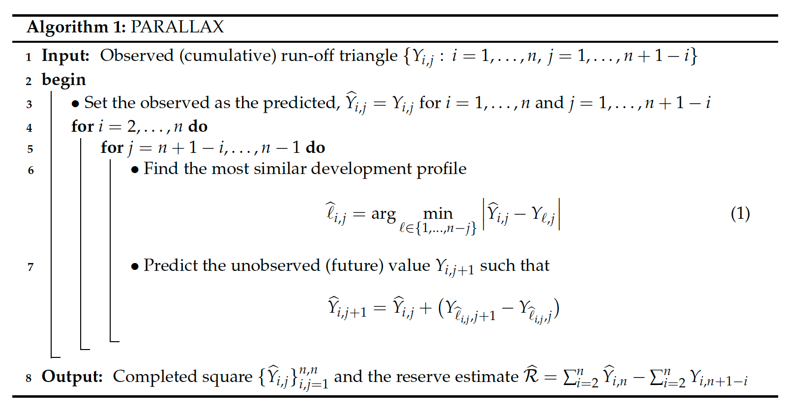
</figure>

### REACT (approximation by the most **RE**cent **AC**ciden**T** year) []{#theory_react label="theory_react"} 
This algorithm can be viewed as a simplified version of PARALLAX: instead of
looking for the most similar parallel fragment among all existing
fragments of the run-off triangle, the REACT algorithm relies---in the
spirit of the classical development factors chain ladder methods---on
the most recent segment in terms of the previous development year (which
is, given the structure of the actuarial data, already observed). Formal
description is given in Algorithm [2](#alg2){reference-type="ref"
reference="alg2"}. Note that unlike
Algorithm [1](#alg1){reference-type="ref" reference="alg1"}, the future
payment prediction in Algorithm [2](#alg2){reference-type="ref"
reference="alg2"} is not defined in terms of any minimization problem
any more. Therefore, the REACT algorithm is more straightforward and
slightly easier to implement; due to evident similarities, both PARALLAX
and REACT are implemented within the same R function `parallelReserve()`. See
Section ["PARALLAX and REACT"](#R_parallaxreact){reference-type="ref"
reference="R_parallaxreact"}. A comprehensive discussion of various
aspects of PARALLAX and REACT, addressing the pros and cons of both
algorithms can be found in Maciak et al. (2022), as well as practical
user recommendations and guidelines.

<figure id="alg2" data-latex-placement="!htb">
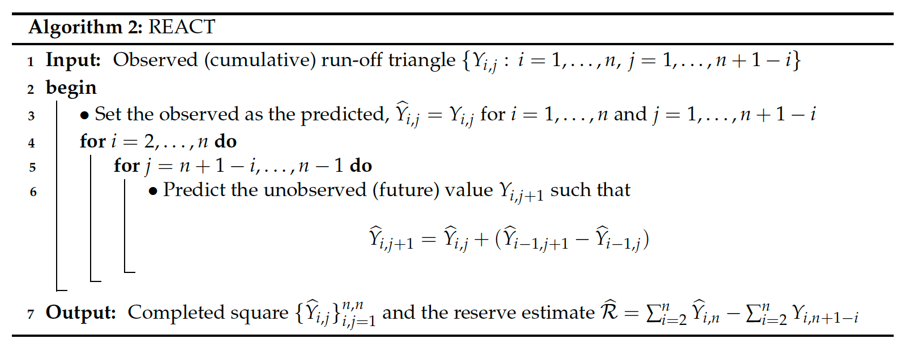
</figure>

Note that for certain run-off triangles, triangles such that
$(Y_{i,j} - Y_{i -1, j}) < (Y_{i, j} - Y_{k, j})$ for all
$i = 3, \dots, n$, $j = n + 1 - i, \dots, n - 1$, and
$k = 1, \dots, i - 2$, both algorithms, PARALLAX and REACT, provide the
same reserve prediction and the same completion of the missing
fragments: both algorithms are equivalent in such situations.

### MACRAME (**MA**rkov **C**hain f**RA**g**ME**nt approximation) []{#theory_macrame label="theory_macrame"} 

The idea of this algorithm is to utilize a homogeneous Markov chain (MC) model to
obtain the reserve prediction. This strategy is slightly different and
more complex than the previous two; despite its additional mathematical
complexity, however, it is quite intuitive and can be seen as a complex
but rigorous generalization of the previous two algorithms described
above. The underlying stochastic model invites additional user-defined
adjustments and practically oriented modifications; unlike the MACRAME
algorithm described in Maciak et al. (2022), where only a constrained
and rather limited version of the algorithm was proposed, the present
implementation in the R function `mcReserve()` in \CRANpkg{ProfileLadder} allows for all this fine tuning and
adaptations. See Section ["MACRAME"](#Rmacrame){reference-type="ref"
reference="Rmacrame"} details.

Firstly, unlike the previous two algorithms, MACRAME is based on the
incremental run-off triangle
$\{X_{i,j};~i = 1, \dots, n; j = 1, \dots, n + 1 - i\}$. Let us recall
that $X_{i,j} = Y_{i,j} - Y_{i, j - 1}$ and $Y_{i, 0} = 0$ for all
$i = 1, \dots, n$. In the first step, the algorithm transforms the
incremental payments
$\{X_{i,j}; i = 1, \dots, n; j = 1, \dots, n + 1 - i\}$ into a finite
set of states of a homogeneous Markov chain,
$\mathcal{S} = \{s_1, \dots, s_m\}$, and the observed run-off triangle
is used to estimate the matrix of the corresponding transition
probabilities
$\mathbb{P} = \big(p(s_{\iota_1}, s_{\iota_2})\big)_{\iota_1 = 1, \iota_2 = 1}^{|\mathcal{S}|, |\mathcal{S}|}$,
for
$p(s_{\iota_1}, s_{\iota_2}) = \mathsf{P}[U_{i, j + 1} = s_{\iota_2} | U_{i, j} = s_{\iota_1}]$
where the increment $X_{i, j}$ is represented by the Markov state which
is taken by $U_{i,j}$. Thus, each row $i \in \{1, \dots, n\}$ is assumed
to be governed by an underlying Markov chain process
$\{U_{i, j};~j \in \mathbb{N}\}_i$ and these processes are assumed to be
independent for $i \in \mathbb{N}$.

The assignment of the observed increments $X_{i,j}$'s into the states in
$\mathcal{S}$ is performed via *break points (breaks)*
$- \infty = g_0 < g_1 < \dots < g_{m - 1} < g_m = \infty$; each interval
defined by the two adjacent grid points is represented by exactly one
state $s_k$ from $\mathcal{S}$). The transformation of the increments
$X_{i,j}$'s into the Markov states is then straightforward: if
$X_{i, j} \in [g_{k - 1}, g_{k})$ for some $k \in \{1, \dots, m\}$ then
$U_{i, j} = s_k$ where $s_{k} \in \mathcal{S}$ and, also,
$s_{k} \in [g_{k - 1}, g_{k})$.

A fully data-driven method for finding appropriate break points
$\{g_k\}_{k = 0}^m$ and the corresponding set of Markov states
$\mathcal{S} = \{s_1, \dots, s_m\}$ was proposed in Maciak et al.
(2022), and it is set as the default option for the `mcReserve()` function in the
\CRANpkg{ProfileLadder} package. The data-driven method is based on three crucial arguments:

i. to ensure a 1--1 transformation in time and the incremental amounts,
  the default number of Markov states is the same as the number of the
  development periods, $m = n$;
ii. the run-off triangle increments (excluding, by default, the first
  column of the run-off triangle) denoted as
  $\{x_{(i+j-3)(i+j-2)/2+i}:=X_{i,j}:\,j>1;\,i+j\leq n+1\}$ are ordered
  and split into $m$ bins by using the set of grid points
  $\{g_m\}_{m = 0}^m$, where
  $g_k:=x_{\left(\left\lceil \frac{kn(n-1)}{2m}\right\rceil+1\right)}$,
  for $k=1,\ldots,m-1$; and, in addition, $g_0 = - \infty$ and
  $g_m = \infty$;
iii. the corresponding Markov states $\mathcal{S} = \{s_1, \dots, s_m\}$
  are taken as medians of the increments belonging to each bin, i.e.,
  $\mathcal{S}:=\big\{s_k:=\mbox{median}(X_{i,j}\in[g_{k-1},g_k):\,j>1,i+j\leq n+1),\,k=1,\ldots,m\big\}$,
  where the median of an empty set is omitted (and such bin is not
  considered).

For an illustration of this data-driven principle, consider a small
$4 \times 4$ triangle formed from the portfolio in
Figure [1](#fig1){reference-type="ref" reference="fig1"}. The cumulative
triangle is converted into an incremental one and all increments (except
the first column) are ordered. The third, fourth, and the sixth
increments are used to define the break points $g_1, g_2$, and $g_3$ as
illustrated in the scheme below:

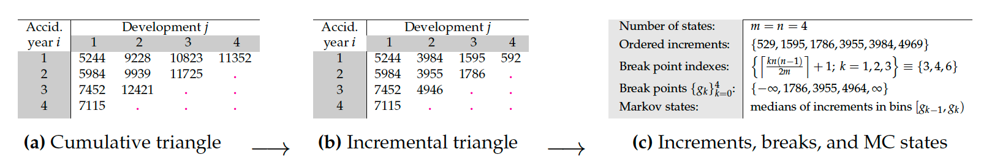{width="100%"}

Thus, the resulting Markov states are: $s_1 = 1062$ (i.e., the median of the first two increments, $\{529, 1595\}$, from the first bin, $[-\infty, 1786)$; $s_2 = 1786$ (which is the only increment in the second bin being $[1786, 3955)$); 
$s_3 = 3970$ (again the median of two increments, $\{3955, 3984\}$, from the third bin); and, finally, $s_4 = 4969$ which is the only increment in the last bin---the interval $[g_{3}, \infty)$. The transition matrix is estimated directly by counting the transitions between these four states.


<figure id="alg3" data-latex-placement="!htb">
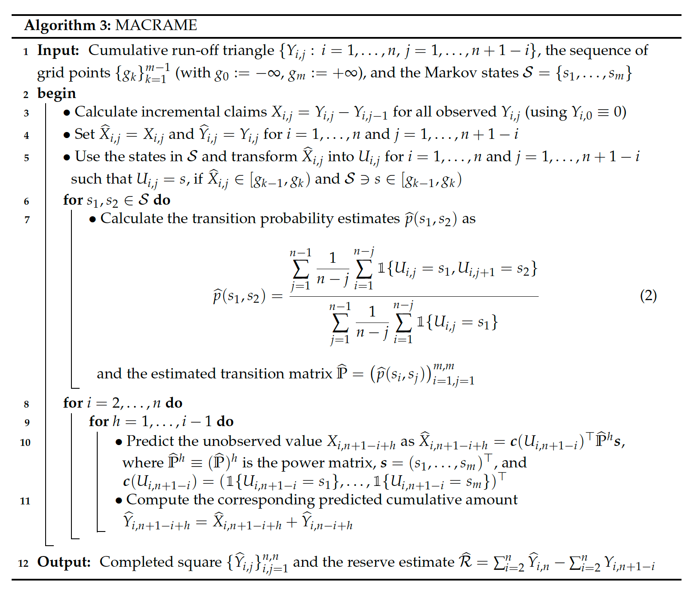
</figure>

However, a user can specify the set of states
$\mathcal{S} = \{s_1, \dots, s_m\}$ and the breaks $\{g_k\}_{k = 0}^m$
also differently; such alternative settings that lead to various
user-defined modifications of the underlying Markov chain process are
facilitated via the `mcReserve()` function and related functions. There are various
reasons why such modifications could be of interest in practice. For
atypical portfolios, standard parametric methods often do not apply:
While functional-based techniques are able to handle those, the reserve
prediction for portfolios with many zeros and small increments, for
instance, would underestimate the true reserve if, particularly, some
sudden claim amount increase is expected by actuarial experts (or vice
versa). Thus, alternative settings provide useful tuning options for
modeling rather atypical situations while also combining them with real
expectations.

Given the set of the Markov chain states in $\mathcal{S}$ one can use
the above formula in [(2)](alg3){reference-type="eqref"
reference="eq_probs"} to construct the empirical estimate
$\widehat{\mathbb{P}}$ for the unknown theoretical transition
probability matrix $\mathbb{P}$. In some situations (e.g., run-off
triangles with extremely short developments---typical for certain
portfolios related to material damages, for instance) it may be
convenient to exaggerate the state in which the run-off triangle is
already fully developed (i.e., there are only zero increments following
after some development period). To this end, a transition probability
matrix defined as a convex combination
$\widetilde{\mathbb{P}}:=(1-\delta_n)\widehat{\mathbb{P}}+\delta_n\mathbb{I}_0$
can be used; $\widehat{\mathbb{P}}$ is the estimated transition matrix
and $\mathbb{I}_0$ is either a stochastic matrix with the column
corresponding to the state $0\in\mathcal{S}$ consisting of all ones and
the remaining entries are zeros (if $0\in\mathcal{S}$), or it is a zero
matrix otherwise. The data-driven mixing coefficient is defined to be
$\delta_n:= 
\frac{1}{n}\sum_{s\in\mathcal{S}}\widehat{p}(s,0)$ if $0\in \mathcal{S}$
and set to zero if $0\notin \mathcal{S}$.

Note that for triangles with not fully developed pay-off profiles
(non-zero increments and thus $0 \notin \mathcal{S}$, a common case
in practice), $\delta_n=0$ and therefore the estimate of the transition
probability matrix $\widehat{\mathbb{P}}$ in terms
of [(2)](#alg3) is used to drive the reserve estimation by the
MACRAME algorithm.

<figure id="alg4" data-latex-placement="!tb">
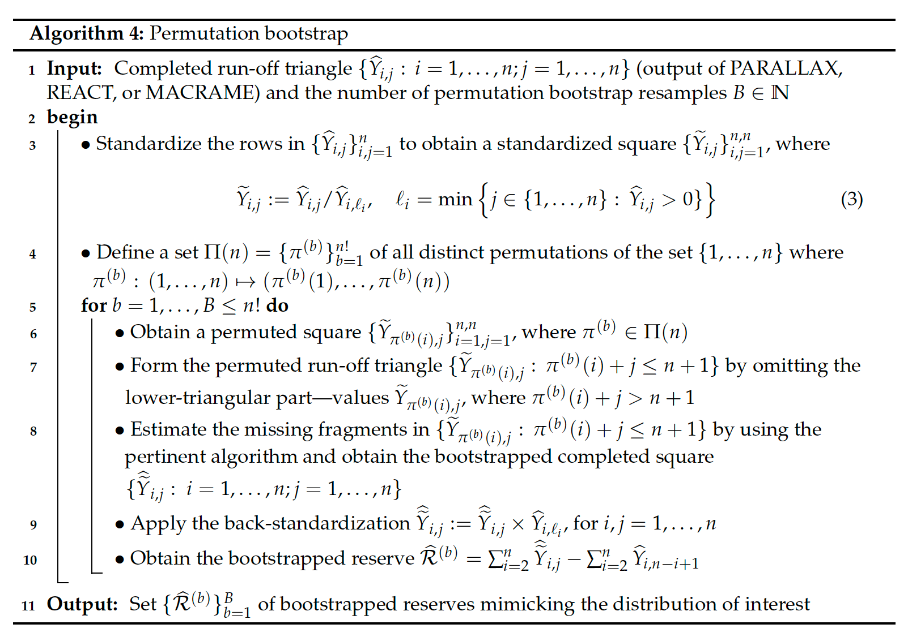
</figure>

### [Distributional predictions: Resampling via permutation bootstrap]{#bootstrap} 

The reserve prediction $\widehat{\mathcal{R}}$ for the unknown claims reserve
$\mathcal{R}$ provides only partial information in the entire loss
reserving problem. In practice, a prediction of the whole reserve
distribution is required too (for instance, by risk reserving assessment
guidelines like Solvency II).

Classical techniques employ a residual (parametric or semiparametric)
bootstrap approach (typically based on the back-fitted residuals) to
emulate the distribution of interest---see, for instance, England and
Verrall (1999), Pinheiro et al. (2003), or Maciak et al. (2022). However,
for the functional-based claims reserving Maciak et al. (2022) proposed
and theoretically justified a different strategy: permutation bootstrap.
The prediction of the reserve distribution is still obtained via
bootstrap resampling, but the algorithm avoids the use of residuals by
resampling (permuting) the whole functional profiles. The rows of the
completed run-off triangle produced by a certain algorithm---by each of
those described above, but also any of the classical parametric
reserving models implemented in the \CRANpkg{ChainLadder} package---are treated as independent
functional profiles. The completed triangle, the data matrix
$\{\widehat{Y}_{i,j}\}_{i,j=1}^{n,n}$, can be standardized: each row is
divided by the first positive value within the row (considered from the
left---which is, very likely, the first incremental payment in each
row), as indicated in
formula [(3)](#alg4)
in the description of Algorithm 4. The standardization step was proposed
by Maciak et al. (2022) on the grounds that it is very typical in
practice that the claims amounts paid in the first development period
substantially increase over the years (possibly the effect of economical
growth, inflation, more advanced or more expensive technology, etc.).
The standardization is set as a default, but the user can suppress it if
desiring so.

The resulting (standardized) square
$\{\widetilde{Y}_{i,j}\}_{i=1,j=1}^{n,n}$ is then resampled *without
replacement*, in the row-wise manner. Formally speaking, for every
permutation
$\pi^{(b)}:\,(1\ldots,n)\mapsto(\pi^{(b)}(1),\ldots,\pi^{(b)}(n))$,
where $b=1,\ldots,B$ such that $\pi^{(b)}\neq\pi^{(s)}$ if $b\neq s$,
there is a new permuted square
$\{\widetilde{Y}_{\pi^{(b)}(i),j}\}_{i=1,j=1}^{n,n}$ and the initial
estimation algorithm is applied again to the permuted run-off triangle
$\{\widetilde{Y}_{\pi^{(b)}(i),j}:\,\pi^{(b)}(i)+j\leq n+1\}$. After a
possible back-standardization, the permuted bootstrap reserve
$\widehat{\mathcal{R}}^{(b)}$ is obtained and the set
$\{\widehat{\mathcal{R}}^{(b)}\}_{b = 1}^{B}$ is used to estimate the
overall reserve distribution. See
Algorithm [4](#alg4){reference-type="ref" reference="alg4"}.

##  package for R {#Rpackage}

The package provides a toolbox for nonparametric reserving
techniques---the reserve point prediction algorithms PARALLAX, REACT,
and MACRAME, and the permutation bootstrap algorithm for the prediction
of the overall reserve distribution---together with a whole set of tools
for handling and preprocessing the data, exploratory analysis, or
confirmatory statistical inference. A list of key functions is given in
Table [1](#tab:functionslist); apart from those listed there, the package
contains functions (such as `plot()`, `print()`, or `summary()`) corresponding to the (rather
standard generic) S3 methods implemented in the package. An integral
part of the package are numerous datasets---run-off triangles from
actuarial practice, suitable for illustration, validation, and
back-testing purposes. Some of the datasets are unique in this aspect:
dataset `GFCIB`, provided by the Guarantee Fund of the Czech Insurers' Bureau
(GFCIB) and datasets `CZ.casco`, `CZ.liability`, and `CZ.property` provided by a major and market-leading
insurance company in the Czech Republic contain relatively large
(compared to other publicly available actuarial data) run-off triangles
(for example, `GFCIP` from the mandatory car insurance in the Czech Republic
contains $60$ origins/quarters and $60$ development periods---quarters
again). The triangles represent the claims developments from the
beginning of 2008 (1Q) up to the end of 2022 (4Q) while distinguishing
four different lines of business---i.e., four portfolios: bodily
injuries, material damages, provision payments, and annuities. On the
other hand, the datasets `CZ.casco`, `CZ.liability`, and `CZ.property` provide separate run-off triangles for
gross paid amounts and RBNS reserves (all with the dimensions
$18 \times 18$). For a complete overview refer to the package reference
manual available on CRAN.

| Function name | Function description |
|:--------------|:---------------------|
| `as.profileLadder()` | function for defining an extended R class `profileLadder` to make work with the functional development profiles easier and more straightforward |
| `parallelReserve()` | function that implements two nonparametric, functional-based reserve prediction algorithms, PARALLAX and REACT |
| `mcReserve()` | implements the MACRAME algorithm while also allowing for various user-based modifications and explicitly defined Markov Chain process |
| `permuteReserve()` | function for estimating the overall reserve distribution in terms of the permutation bootstrap (for parametric and nonparametric reserving) |
| `incrExplor()` | provides an exploratory analysis of the run-off triangle increments in order to set the Markov chain states and breaks for `mcReserve()` |
| `mcBreaks()` | function to access the break points $\{g_k\}_{k = 0}^m$ used to define the bins for the run-off triangle increments in the `mcReserve()` function |
| `mcStates()` | function to access the Markov chain states $\mathcal{S} = \{s_1, \dots, s_m\}$ representing the bins with the run-off triangle increments in the `mcReserve()` function |
| `mcTrans()` | function to access the estimated transition probability matrix $\widehat{\mathbb{P}}$ used by the MACRAME algorithm implemented in `mcReserve()` |


Table: (\#tab:functionslist) Brief descriptions of the key functions in the R package \CRANpkg{ProfileLadder}. More detailed information can be obtained using the R help system for each function (e.g., `help("as.profileLadder")`). Generic functions such as `plot()`, `predict()`, `print()`, and `summary()` for specific S3 method classes are not included.

### [PARALLAX and REACT]{#R_parallaxreact label="R_parallaxreact"}

Algorithms PARALLAX and REACT are similar and relatively
straightforward. The same also applies for the `parallelReserve()` function that implements
both these algorithms. Using the illustrative data from
Figure [1](#fig1){reference-type="ref" reference="fig1"}, the reserve
prediction provided by the PARALLAX or REACT algorithm can be obtained
by the R commands

``` r
R> library("profileLadder")
R> data(CameronMutual, package = "profileLadder")

R> parallax <- parallelReserve(CameronMutual, method = "parallax")
R> react <- parallelReserve(CameronMutual, method = "react", residuals = TRUE)
```

The PARALLAX algorithm is used as the default option in  `parallelReserve()` and, therefore,
no specification in terms of `method = "parallax"` is actually needed. The output of the `parallelReserve()`
function is a list (of the S3 method class `profileLadder`) with a few different
elements (for a comprehensive description of all items we refer to the R
help session that can be obtained in a standard way by typing `help("parallelReserve")`).
Nevertheless, the most important part of the output is the predicted
reserve $\widehat{\mathcal{R}}$ (the list element `$reserve`) and the full
completed run-off triangle---contained in the list element `$FullTriangle` (note the
analogy with the \CRANpkg{ChainLadder} package). Both pieces of information are automatically
provided by the `print()` method as the output:

``` r
R> parallax 

    PARALLAX Reserving 
       Estimated Reserve   Estimated Ultimate   Paid Amount   True Reserve 
                    8540               113699        105159           7963
```
  [PARALLAX method (functional profile completion)</span>
<pre>
           dev
    origin    1     2     3     4     5     6     7     8     9    10
        1  5244  9228 10823 11352 11791 12082 12120 12199 12215 12215
        2  5984  9939 11725 12346 12746 12909 13034 13109 13113 <span style="color:magenta">13113</span>
        3  7452 12421 14171 14752 15066 15354 15637 15720 <span style="color:magenta">15724 15724</span>
        4  7115 11117 12488 13274 13662 13859 13872 <span style="color:magenta">13947 13951 13951</span>
        5  5753  8969  9917 10697 11135 11282 <span style="color:magenta">11320 11399 11415 11415</span>
        6  3937  6524  7989  8543  8757  <span style="color:magenta">8904  8942  9021  9037  9037</span>
        7  5127  8212  8976  9325  <span style="color:magenta">9539  9686  9724  9803  9819  9819</span>
        8  5046  8006  8984  <span style="color:magenta">9333  9547  9694  9732  9811  9827  9827</span>
        9  5129  8202  <span style="color:magenta">8966  9315  9529  9676  9714  9793  9809  9809</span>
        10 3689  <span style="color:magenta">6276  7741  8295  8509  8656  8694  8773  8789  8789</span>      
</pre>

A fancy version of the print method is used by default which is
particularly convenient when working with the run-off triangle shaped
data---for instance, compare the following (outputs omitted)

``` r
R> print(as.profileLadder(observed(CameronMutual)), fancy.print = TRUE)
R> print(as.profileLadder(observed(CameronMutual)), fancy.print = FALSE)
```

but this option can be either altered by the command `set.fancy.print()`---for which we
only refer to the R help session for more details---or it can be fully
suppressed by using global options by calling the command

``` r
R> options(profileLadder.fancy = FALSE)
```

The overall (predicted) reserve, reported as `Estimated Reserve`, can be also obtained
directly from the completed run-off triangle (in the output above) as
$\widehat{\mathcal{R}} = \sum_{i = 2}^n \widehat{Y}_{i,n} - \sum_{i = 2}^n Y_{i, n + 1 - i}$.
Some additional quantitative characteristics are also provided: `Estimated Ultimate`
represents the sum of the last column---the ultimate cumulative payment
developments $\sum_{i = 1}^{n} \widehat{Y}_{i, n}$; `Paid Amount` gives the amount
that was already settled by the insurance company---i.e., the sum of the
last running diagonal, $\sum_{i = 1}^{n} Y_{i, n + 1 - i}$; Finally, the
true reserve (provided only in situations in which a fully observed
run-off triangle is available as an input) is reported as `True Reserve`. Analogous
output, however with different predicted reserve (which is $8358$) and
different completed profiles, is obtained for the REACT algorithm
(explicit output is, for brevity, omitted). For a comparison, the `CameronMutual`
reserve prediction for the run-off triangle provided by the standard
(parametric) over-dispersed Poisson model (ODP) implemented in the R
function `glmReserve()` from the package \CRANpkg{ChainLadder} is $8601$. Thus, just in terms of the
prediction accuracy, both nonparametric methods outperform the classical
(benchmark) actuarial approach.

However, note that the REACT algorithm above is fitted with the
additional parameter option `residuals = TRUE` (which works regardless of the `method` choice). This
provides a set of residuals in the output. There are actually two sets
of residuals that can be provided in the output (however, not
simultaneously) depending on the input triangle type. Standard
(incremental) residuals, defined as $X_{i,j} - \widehat{X}_{i,j}$ for
$i = 2, \dots, n$ and $j = n - i + 2, \dots, n$, where $X_{i, j}$ is the
"future" increment (if known) and $\widehat{X}_{i,j}$ is the predicted
counterpart, are provided if a full triangle (data matrix) is available
as the input (thus, the "future" payments are supposed to be known). On
the other hand, if there is a standard run-off triangle provided as the
input, the so-called "back-fitted" residuals are calculated using
an approach that is well-known in the actuarial and finance circles as
a *back-fitting* approach (see, for instance, Popescu and Suciu (2020)
or Maciak et al. (2022) for further details). The main idea behind the
back-fitted residuals is to use a flipped[^1] completed triangle as
an input and to back-predict the run-off triangle by applying the same
estimation procedure in a reverse manner so to say. Both sets of
residuals can be used in a straightforward way for some further
empirical inspection and analysis (which is typically performed and
often also required by regulators when applying classical parametric
methods).

The summary method applied to an R object of the class `profileLadder` ---the output
from the `parallelReserve()` function for instance---provides a complex overview (by
adopting an analogous layout as the one already used in the main
actuarial R package \CRANpkg{ChainLadder}.

``` r
R> summary(react)

REACT reserve prediction (by origins)
          First Latest Dev.To.Date Ultimate IBNR
    2      5984  13113   1.0000000    13113    0
    3      7452  15720   0.9997456    15724    4
    4      7115  13872   0.9937675    13959   87
    5      5753  11282   0.9912142    11382  100
    6      3937   8757   0.9725677     9004  247
    7      5127   9325   0.9528919     9786  461
    8      5046   8984   0.9172963     9794  810
    9      5129   8202   0.8210210     9990 1788
    10     3689   3689   0.4314620     8550 4861
    total 49232  92944   0.9174942   101302 8358
```
[Overall reserve summary]{style="color:magenta;"}
```r
    Est.Reserve    Est.Ultimate     Paid Amount    True Reserve        Reserve% 
        8358.00       113517.00       105159.00         7963.00            4.96 
```
[Residual summary (standard incremental residuals)]{style="color:magenta;"}
```r
     Min   1st Q.   Median     Mean   3rd Q.      Max  Std.Er. 
    -719      -49       -1       -9       34      300      143 

Total number of residuals: 45,  Total number of unique residuals: 41
Suspicious residuals (using 2sigma rule): 2,  Outliers (3sigma rule): 1
```

The first part of the output is basically an analogy of the output
provided by the `summary()` function when being applied to an output of some
estimation method implemented in the R package \CRANpkg{ChainLadder} (the Over-dispersed
Poisson model in `glmReserve()` for instance). It provides a detailed overview of the
ultimate payments and the corresponding reserves by origins.

``` r
R> library("ChainLadder")
R> summary(glmReserve(observed(CameronMutual)))

      Latest Dev.To.Date Ultimate IBNR          S.E        CV
2      13113   1.0000000    13113    0   0.01035287       Inf
3      15720   0.9992372    15732   12  29.38975320 2.4491461
4      13872   0.9934116    13964   92  73.46098788 0.7984890
5      11282   0.9850694    11453  171  96.26787355 0.5629700
6       8757   0.9688019     9039  282 120.58781735 0.4276164
7       9325   0.9397360     9923  598 177.57019068 0.2969401
8       8984   0.8905630    10088 1104 246.00693847 0.2228324
9       8202   0.7789914    10529 2327 379.54811405 0.1631062
10      3689   0.4788422     7704 4015 622.22022041 0.1549739
total  92944   0.9152986   101545 8601 880.66723938 0.1023913
```

The function `observed()` used above (implemented in the package \CRANpkg{ProfileLadder}) transforms the
full data matrix `CameronMutual` into a run-off triangle with the lower-right triangular
part containing `NA` values only (as required by the `glmReserve()` function). Note that
unlike PARALLAX and REACT the ODP model in `glmReserve()` imposes a distributional
assumption and, therefore, the estimated standard errors (`S.E.`) and
coefficients of variation (`CV`) can be provided in the output. On the other
hand, the summary of the enriched `profileLadder` class object provides, in addition,
the first cumulative payments in the first column which is often used by
practitioners to assess the over-time stability of the given portfolio
(and, as already mentioned above, it may play some role in the following
permutation bootstrap resampling).

The second part of `summary(react)` above provides the same quantitative information
about the estimated reserve as before (`Estimated Reserve`, `Estimated Ultimate`, `Paid Amount` and `True Reserve`) but, in addition, there
is also a quantification of the prediction precision in terms of `Reserve%` defined
in Maciak et al. (2022) as
$$\texttt{Reserve\%} = 100 \times \Big| \frac{\widehat{\mathcal{R}}}{\mathcal{R}} - 1 \Big|.$$
Note that the value can be provided only in situations when the true
reserve---the lower triangular part---is available. The last part of the
summary output refers to (standard or backfitted) residuals---if the
residuals are asked for in the output. Analogous summary is also
provided for back-fitted residuals that are calculated in situations
where only the run-off triangle itself is given as the input---which can
be achieved by the `observed()` function as

``` r
R> summary(parallelReserve(observed(CameronMutual), method="react", residuals=TRUE))
```

The `summary()` function can be also used to plot a histogram of the residuals
(using the parameter `plotOption = TRUE`) supplemented with a nonparametric estimate of the
underlying density. A simple barplot of the paid amount, estimated
ultimate, estimated reserve, and the true reserve is plotted if no
residuals are available.

The R object of the class `profileLadder` can be visualized with a generic `plot()` function.
Moreover, if the run-off triangle itself is also of the class `profileLadder` the `plot()`
function can be also used to plot the functional profiles of the run-off
triangle itself. The R code

``` r
R> plot(as.profileLadder(CameronMutual))
R> plot(parallelReserve(CameronMutual))
```

provides both plots in Figure [2](#fig2). The same functionality of both generic R functions (`summary()`
and `plot()`) is, of course, provided regardless of the prediction method that
is used (PARALLAX or REACT) when calling the `parallelReserve()` function or the MACRAME
algorithm implemented in the `mcReserve()` function---see below.

<figure id="fig2">
<figure>
{width="100%"}
<figcaption>(a) `plot(as.profileLadder(CameronMutual))`</figcaption>
</figure>
<figure>
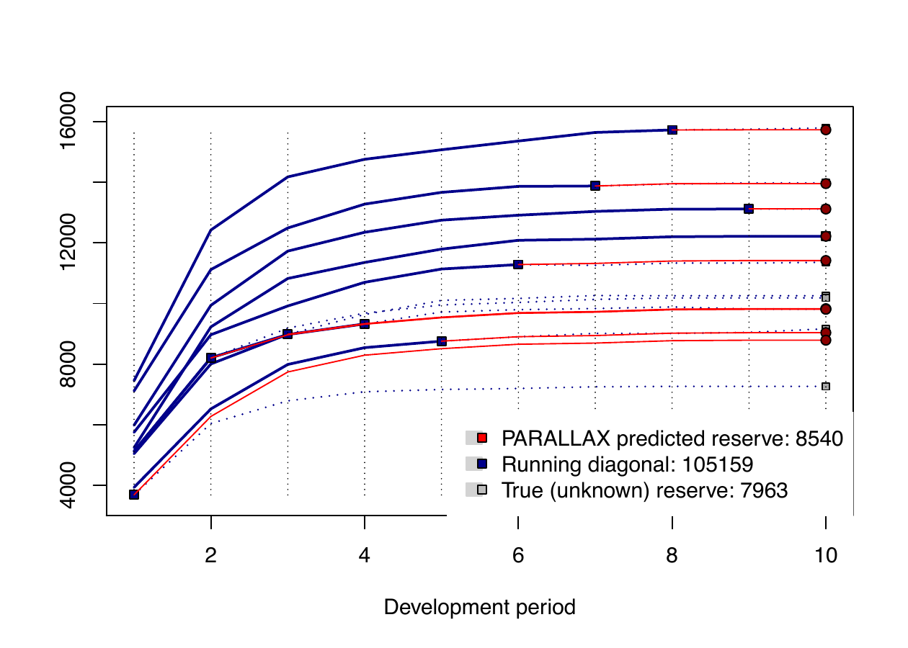{width="100%"}
<figcaption>(b) `plot(parallelReserve(CameronMutual))`</figcaption>
</figure>
<figcaption>
Figure 2: The observed functional development profiles (blue solid lines) plotted with the  R method `plot()` applied to the object of the class `profileLadder`. For a 
    "completed" triangle (data matrix), the function also plots the future "unobserved"  fragments (blue dotted lines) and true "unknown" reserve. The predicted functional profiles (red solid lines in the right panel) are provided if `plot()` is applied to the output of some `parallelReserve()` or `mcReserve()`.
</figcaption>
</figure>

### [MACRAME]{#Rmacrame label="Rmacrame"} 

Let us recall
that the MACRAME algorithm---as proposed in Maciak et al.
(2022)---utilizes an underlying Markov chain mechanism to drive the
prediction of the overall reserve $\mathcal{R}$. Due to the data
availability (typically there are only 10 -- 15 origin years available
in run-off triangles in practice which means that there are only about
55 -- 120 incremental payments in total), the underlying Markov chain is
assumed to be a homogeneous stochastic process. However, there are still
relatively many different parameters which need to be properly defined
(e.g., the set of the increments, the states of the Markov chain, or the
transition probability matrix) and some user-based interference can be
of some interest here. The MACRAME algorithm, as originally proposed in
Maciak et al. (2022), utilizes a fully automatic (data driven) approach
to define the set of the Markov chain states
$\mathcal{S} = \{s_1, \dots, s_m\}$ and the corresponding break points
$\{g_k\}_{k = 0}^m$. Nevertheless, the implementation of the algorithm
in the R function `mcReserve()` provides users with various options---starting with a
pre-specified number of the Markov states to be required, selecting the
method how the run-off triangle increments are summarized into the
states, or even providing a fully manual specification of the states
$\mathcal{S} = \{s_1, \dots, s_m\}$, breaks $\{g_k\}_{k = 0}^m$, or a
subset of increments to be considered. These options are all summarized
in Table [2](#tab:macramesetting).
The default performance of the `mcReserve()` function corresponds with the data-driven
selection of the states and breaks---in line with the original MACRAME
algorithm proposed in Maciak et al. (2022). Considering again the
`CameronMutual` dataset, the MACRAME predicted reserve is obtained by

``` r
R> macrame <- mcReserve(CameronMutual)
```

The output of the `mcReserve()` function is again the R object of the class `ProfileLadder` and it is
analogous to the output of the `parallelReserve()` function already described before. For
brevity, we omit repeating the same details again. However, specific
information related to the underlying Markov chain in the MACRAME
algorithm can be also obtained by using various Markov chain (mc)
accessor functions (`mcBreaks()`, `mcStates()`, or `mcTrans()`). For instance,

``` r
R> mcBreaks(macrame)
  [1]   -Inf   75  147  288  388  554  780 1465 2587 3955  Inf
```

provides the (default) set of break points $\{g_k\}_{k = 0}^m$ and

``` r
R> mcStates(macrame)
  [1]   13.0   81.0  197.0  302.5  438.0  601.0  948.0 1672.5 3073.0 3993.0
```

gives the (default) set of the corresponding Markov chain states
$\mathcal{S} = \{s_1, \dots, s_m\}$ such that exactly one state lies
between two consecutive break points. The estimate of the transition
matrix $\widehat{\mathbb{P}}$ can be obtained by

``` r
R> mcTrans(macrame)
         [,1]   [,2]   [,3]   [,4] [,5] [,6] [,7] [,8] [,9] [,10]
  [1,] 0.5000 0.5000 0.0000 0.0000 0.00 0.00 0.00 0.00    0     0
  [2,] 0.6667 0.3333 0.0000 0.0000 0.00 0.00 0.00 0.00    0     0
  [3,] 0.3333 0.6667 0.0000 0.0000 0.00 0.00 0.00 0.00    0     0
  [4,] 0.3333 0.0000 0.3333 0.3333 0.00 0.00 0.00 0.00    0     0
  [5,] 0.0000 0.0000 0.6000 0.2000 0.20 0.00 0.00 0.00    0     0
  [6,] 0.0000 0.0000 0.2500 0.5000 0.25 0.00 0.00 0.00    0     0
  [7,] 0.0000 0.0000 0.0000 0.0000 0.50 0.00 0.50 0.00    0     0
  [8,] 0.0000 0.0000 0.0000 0.0000 0.25 0.75 0.00 0.00    0     0
  [9,] 0.0000 0.0000 0.0000 0.0000 0.00 0.25 0.50 0.25    0     0
 [10,] 0.0000 0.0000 0.0000 0.0000 0.00 0.00 0.25 0.75    0     0
```

Generic functions `plot()` and `summary()` can be both applied to the output in the same way as it was done in case of the `parallelReserve()` function.  


In order to provide some useful insight into the structure of the incremental run-off triangle and to offer some visual inspection for various user-based modifications of the underlying Markov chain in the `mcReserve()` function, 
there is another software tool implemented in the \CRANpkg{ProfileLadder} package. The R function `incrExplor()` takes the run-off triangle as an input (fully observed or not, incremental or cumulative) and returns a complex empirical exploration of the incremental payments.
Recall that the original MACRAME algorithm (as proposed in Maciak et al. (2022) does not take into account the first year payments, values $X_{i,1}$ for $i = 1, \dots, n$, when defining the  grid points $\{g_k\}_{k = 0}^m$ and the corresponding  Markov states in $\mathcal{S}$. The  reason is that most run-off triangles occurring in the real-world actuarial practice have substantially decreasing incremental payment profiles over the consecutive development periods (meaning that $X_{i,j} \to 0$ as $j \to \infty$) and, in order to achieve efficient reserve prediction, it is  more substantial to model 
the tail increments within each row rather than capturing relatively large amounts of the first year (origin) payments.
This can be changed by a user. 

A default functionality of the `incrExplor()` function is to provide the data-driven set of bins (the break points respectively) and the corresponding Markov states for the underlying run-off triangle. The first year payments are not considered (i.e., `out = 1` is used by default). Taking the `CameronMutual` dataset again, the function provides the following output: 

``` r
R> print(runoff.exploratory <- incrExplor(CameronMutual, out = 1))
```
[Data-driven (default) setting of the Markov Chain in MACRAME]{style="color:magenta;"}
```r
  MC States: 13 81 197 302.5 438 601 948 1672.5 3073 3993
```
[Corresponding bins for the run-off triangle increments]{style="color:magenta;"}
```r
  [1] "[-Inf, 75)"   "[75, 147)"    "[147, 288)"   "[288, 388)"   "[388, 554)"   
  [6] "[554, 780)"   "[780, 1465)"  "[1465, 2587)" "[2587, 3955)" "[3955, Inf)"  
```

Note that all Markov states and also the bins for incremental payments correspond  with the Markov states and the breaks already obtained by `mcStates()` and `mcBreaks()` from the output of the function `mcReserve()`. However, the output from the `incrExplor()` function is a complex object of the S3 class `mcSetup`. For more details we again refer to the R help session. 
Nevertheless, the summary method applied to the object of the class `mcSetup`---the output from `incrExplor()` provides the following details: 

``` r
R> summary(runoff.exploratory)
```
[Input triangle type: Cumulative]{style="color:magenta;"}
``` r
Summary of the increments
                Min   1st Q.   Median      Mean   3rd Q.  Max   Std.Er.
Raw increments    0 197.0000 529.0000 1126.0000 1595.000 4969 1340.0000
Std. increments   0   0.0396   0.1065    0.2267    0.321    1    0.2697

Total number of increments: 45,  Total number of unique increments: 45
Number of suspicious increments (using 2sigma rule): 8,  Outliers (3sigma rule): 1

Data-driven bins for the run-off triangle increments
  [1] "[-Inf, 75)"   "[75, 147)"    "[147, 288)"   "[288, 388)"   "[388, 554)"   
  [6] "[554, 780)"   "[780, 1465)"  "[1465, 2587)" "[2587, 3955)" "[3955, Inf)" 

Markov Chain states (medians of the increments within each bin)
  [1]   13.0   81.0  197.0  302.5  438.0  601.0  948.0 1672.5 3073.0 3993.0
```

Graphical visualization is provided in a standard way using the `plot()`
function. Both panels in Figure [3](#incrExplor1){reference-type="ref"
reference="incrExplor1"} are produced by the R command

``` r
R> plot(runoff.exploratory)
```

<figure id="incrExplor1" data-latex-placement="!t">
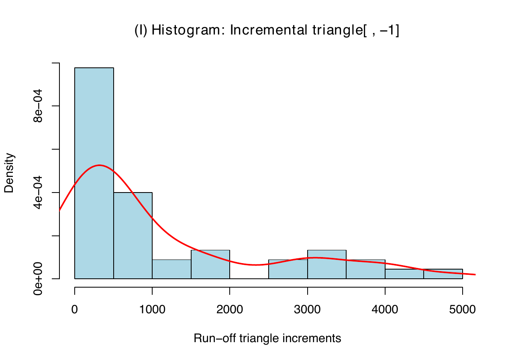
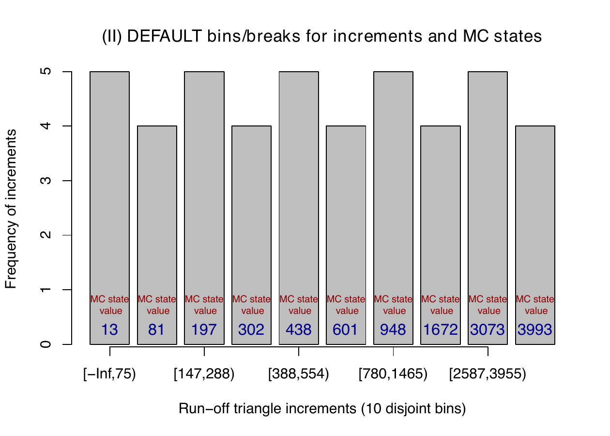
<p>. <span id="incrExplor1" data-label="incrExplor1"></span></p>
<figcaption>Figure 3: Visualization of the output of the function when
applied to the dataset. The left-hand panel shows a standard histogram
of the run-off triangle increments, values <span
class="math inline"><em>X</em><sub><em>i</em>, <em>j</em></sub></span>,
for <span class="math inline"><em>i</em> = 1, …, <em>n</em> − 1</span>
and <span
class="math inline"><em>j</em> = 2, …, <em>n</em> + 1 − <em>i</em></span>.
Note that the first year payments <span
class="math inline">{<em>X</em><sub><em>i</em>, 1</sub>}<sub><em>i</em> = 1</sub><sup><em>n</em></sup></span>
are not included. The right-hand panel shows the barplot of the run-off
triangle increments distributed across disjoint bins defined by the
break points <span
class="math inline">{<em>g</em><sub><em>k</em></sub>}<sub><em>k</em> = 0</sub><sup><em>m</em></sup></span>,
where <span class="math inline"><em>g</em><sub>0</sub> = −∞</span> and
<span class="math inline"><em>g</em><sub><em>m</em></sub> = ∞</span>.
Each bin is represented by the corresponding Markov chain state—blue
bold values within the bars.</figcaption>
</figure>

If there is a specific interest to also include the first year payments when defining the Markov chain states and the corresponding break points (or, alternatively, to exclude some other columns with the incremental payments), an additional parameter `out = 1` can be changed correspondingly---the DEFAULT  value (one) stands for the first year increments 
that are typically not considered; the choice `out = 0` uses all available increments $X_{i,j}$, for $i = 1, \dots, n$ and $j = 1, \dots, n + 1 - i$; in order to exclude, for example, first three columns, the parameter can be specified as `out = c(1,2,3)`.  The change of this parameter is also reflected by the output of `incrExplor()` which, in addition, contains analogous information as before, however, for a user-modified subset of the incremental payments.

``` r
R> print(runoff.exploratory.all <- incrExplor(CameronMutual, out = 0))
```
[Data-driven (default) setting of the Markov Chain in MACRAME]{style="color:magenta;"}
```r
    MC States: 13 81 197 302.5 438 601 948 1672.5 3073 3993

    Corresponding bins for the run-off triangle increments
      [1] "[-Inf, 75)"   "[75, 147)"    "[147, 288)"   "[288, 388)"   "[388, 554)"   
      [6] "[554, 780)"   "[780, 1465)"  "[1465, 2587)" "[2587, 3955)" "[3955, Inf)" 
```
[User-modified MC setting]{style="color:magenta;"}
```r
    MC States: 14.5 125 285.5 400 601 978 2186.5 3689 5007.5 5984

    Corresponding bins for the run-off triangle increments
      [1] "[-Inf, 79)"   "[79, 197)"    "[197, 349)"   "[349, 529)"   "[529, 786)"   
      [6] "[786, 1595)"  "[1595, 3085)" "[3085, 3984)" "[3984, 5244)" "[5244, Inf)" 

    Development periods (run-off triangle columns) not considered: 0
    Method selected to summarize the increments within each bin: DEFAULT (median)
```

The `summary()` function applied on the  `runoff.exploratory.all` object returns analogous information as before but the output  refers to the user-defined subset of increments rather than the default set.  For illustration,
Figure [4](#incrExplor2){reference-type="ref" reference="incrExplor2"}
is obtained for all run-off triangle increments
$\{X_{i,j};~i = 1, \dots n, j = 1, \dots, n + 1 - i\}$, using the R
command

``` r
R> plot(runoff.exploratory.all)
```

<figure id="incrExplor2" data-latex-placement="!t">
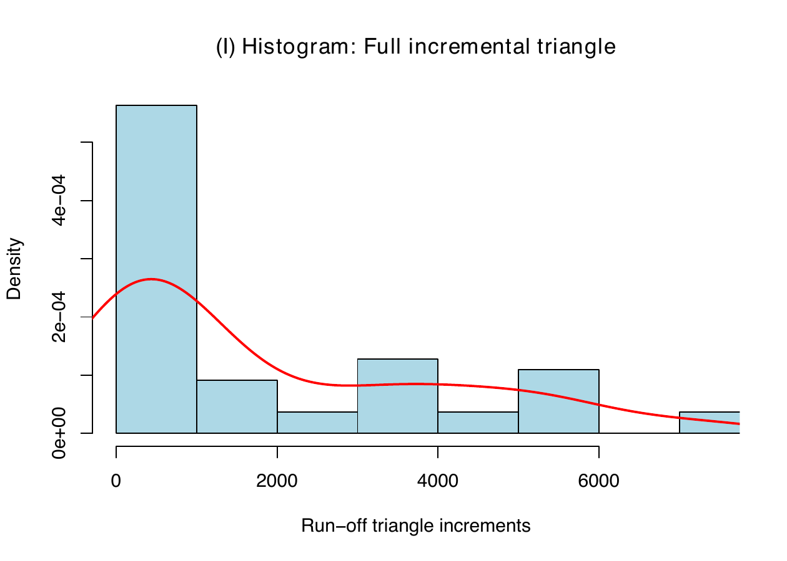
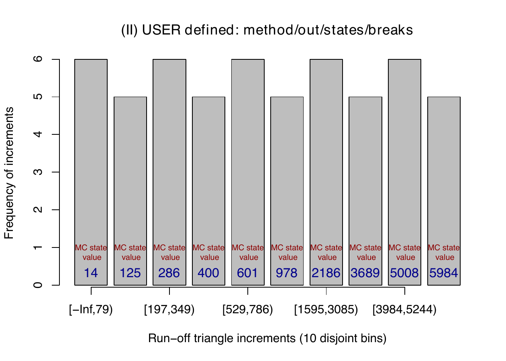
<figcaption>Figure 4: Visualization of the output of the function when
applied to the dataset using the additional parameter . Instead of the
default subset of 45 incremental payments summarized in the panels there
are all 55 increments summarized in the same manner.</figcaption>
</figure>

Note that the Markov chain states and the corresponding break points are
also affected by the choice `out = 0` and this change is reflected now in
Panel (II) in Figure [4](#incrExplor2){reference-type="ref"
reference="incrExplor2"} (compare with the same panel in
Figure [3](#incrExplor1){reference-type="ref" reference="incrExplor1"}).
The corresponding data-driven Markov states and the breaks are directly
accessible by using the accessor methods

``` r
R> mcBreaks(runoff.exploratory.all)
      [1]   -Inf   79  197  349  529  786 1595 3085 3984 5244  Inf

R> mcStates(runoff.exploratory.all)
      [1]   14.5  125.0  285.5  400.0  601.0  978.0 2186.5 3689.0 5007.5 5984.0
```

Three other parameters can be specified by a user in the `incrExplor()` function. The first one is the `method` parameter which defines the way how the increments within each bin are summarized to obtain the final Markov state values. By default, the Markov states are calculated as the medians of the increments within each bin (`method = "median"`). The method can be changed to the average (`method = "mean"`), the minimum increment from the bin (`method = "min"`), or the maximum increment respectively (`method = "max"`). 


Another parameter that can be used to modify the underlying setting of the Markov chain behind the MACRAME prediction is the parameter `states` (which is set to `NULL` by default). This parameter sets the Markov states either by 
providing some specific integer value for the number of states (e.g., `states = 5`, as in Example 1) while everything else is determined in a data-driven manner proposed in Maciak et al. (2022) or an explicit vector of states can be given instead (e.g., `states = c(500, 1000, 1500, 2000, 2500)` in Example 2) to enforce not only five states but also their explicit values (with the corresponding break points being the midpoints between the provided states). 


Finally, the last parameter that can be used within the `incrExplor()` function  is the `breaks` parameter (set to `NULL` by default). This parameter can either take the default value `NULL` or it can be a vector of explicit break points $\{g_k\}_{k = 0}^m$. Different combinations of the values of these parameters (`states` and `breaks` in particular) result in different performance of the `incrExplor()` function and, consequently, also the `mcReserve()` function. For clarity, a complex description is provided in Table [2](#tab:macramesetting). The same functionality of the parameters `method`, `states`, and `breaks` also applies when calling the `mcReserve()` function to predict the reserve by the MACRAME algorithm. 


| MACRAME: USER based setting | `states = ...` | `breaks = ...` | performance: `incrExplor()` & `mcReserve()` |
|:----------------------------|:---------------|:----------------|:--------------------------------|
|  | `NULL` | `NULL` | **DEFAULT** (fully data-driven) |
| **1.** | `numeric` | any value for `breaks` is ignored | same as DEFAULT (data-driven) but the number of states is enforced |
| **2.** | `c( ... )` | `NULL` | Markov chain states explicitly defined by `states = c( ... )` while the corresponding *bins for the run-off increments are set as the midpoints between the user-provided states* |
| **3.** | `NULL` | `c( ... )` | explicit breaks in `breaks = c( ... )` are used to form the bins for the increments and the states are obtained by summarizing the increments within each bin by using the `method` option |
| **4.** | `c( ... )` | `c( ... )` | Markov chain states explicitly defined by `states = c( ... )` with the *bins for the run-off increments being also user-defined by* `breaks = c( ...)` (each bin in `breaks` must contain one state) |


Table: (\#tab:macramesetting) User-based modifications for the `incrExplor()` and `mcReserve()` functions provided by specifying certain values for additional parameters `states` and `breaks`. Any combination of these two parameters can be further used with one of four methods for summarizing the run-off triangle increments within the bins---the default method `“median”` or any of `“mean”`, `“min”`, and `“max”` respectively. The modifications 1--4 are illustrated in Examples 1--4. 

In practice, the `incrExplor()` function is supposed  to be used to perform a detailed exploratory of various settings of the underlying Markov chain required by the `mcReserve()` function. Once the set of breaks  is established and the corresponding Markov states are derived, the output from the `incrExplor()` function can be directly forwarded as a~part of the input  for the `mcReserve()` function. For illustration, the default performance of the MACRAME algorithm obtained by

``` r
R> mcReserve(CameronMutual)
```

and somehow more complex and more explicit specification of the states
and breaks---however, all by using the default data-driven approach in
the `incrExplor()` function---in terms of

``` r
R> user.states <- mcStates(incrExplor(CameronMutual))
R> user.breaks <- mcBreaks(incrExplor(CameronMutual))
```

and directly supplemented into the `mcReserve()` function by using the additional parameters `states` and `breaks` as

``` r
R> mcReserve(CameronMutual, states = user.states, breaks = user.breaks)
```

  provide two identical outputs and the same reserve prediction $\widehat{\mathcal{R}}$. For some more detailed illustration of different settings of the `incrExplor()` function and, consequently, the `mcReserve()` function there are four specific examples provided below together with the corresponding graphical outputs.

##### Example 1

Let us start with the simplest modification that can be used for both
the `incrExplor()` and `mcReserve()`  functions (Case 1 in Table [2](#tab:macramesetting)). The number of the Markov chain states (by
default, the number of states $m \in \mathbb{N}$ is equal to the number
of origins, $n \in \mathbb{N}$) can be changed by the parameter `states`. In the
R code below, there are five Markov chain states specified, the
parameter `breaks` is ignored, and the break points and states are derived in a
data-driven manner. The following code

``` r
R> plot(incrExplor(CameronMutual, states = 5))
R> plot(mcReserve(CameronMutual, states = 5))
```

performs the exploratory analysis of the run-off triangle increments (in
terms of the standard output already described above) including the
graphical visualization---see Figure [5](#fig5a){reference-type="ref"
reference="fig5a"}---and, consequently, the reserve is obtained by the
`mcReserve()` function while using the same five states---see
Figure [5b](#fig5b){reference-type="ref" reference="fig5b"} for the
corresponding completed profiles. Note that five Markov chain states are
enforced but, otherwise, the run-off triangle increments are summarized
analogously---they are split uniformly into five bins and the
corresponding Markov states are obtained by using the median values of
the increments within each bin (default method). The predicted reserve
is slightly worse than the one obtained by the default setup of the
MACRAME algorithm (which gives the predicted reserve roughly
$\widehat{\mathcal{R}} = 8082$ while the prediction with only five
Markov states produces $\widehat{\mathcal{R}} = 8620$ with the true
"unknown" reserve being $\mathcal{R} = 7963$). Nevertheless, it can be
sometimes useful to manually control (and lower) the amount of the
Markov states that are used for the prediction.

<figure id="fig5" data-latex-placement="!t">
<figure id="fig5a">
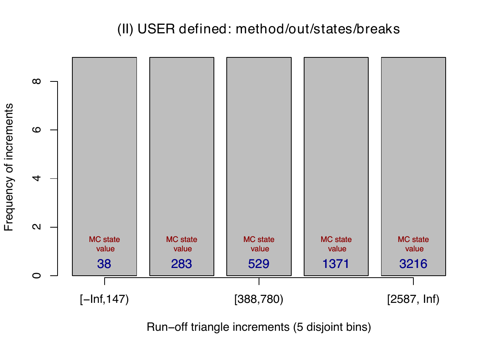
<figcaption> (a) `plot(incrExplor(CameronMutual, states = 5))`</figcaption>
</figure>
<figure id="fig5b">
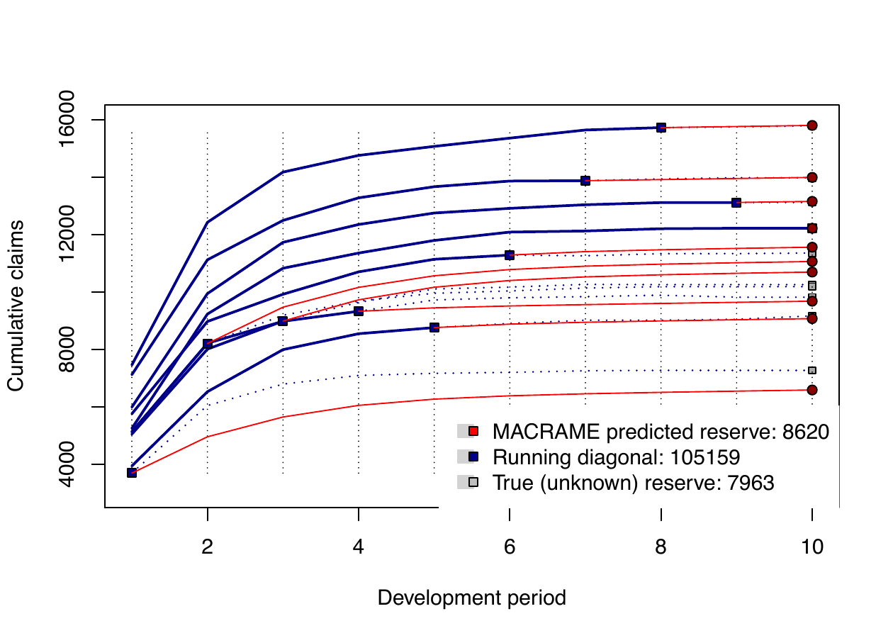
<figcaption> (b) `plot(mcReseve(CameronMutual, states = 5))`</figcaption>
</figure>
<figcaption>Figure 5: Partial plot of the output from (panel on the
left) when applied to the dataset with the parameter choice (requiring
five Markov states to be used). The run-off triangle increments are
uniformly distributed into five bins and the corresponding Markov chain
states are obtained by the default method—the medians of the increments
within each bin are considered. The right panel shows the completed
functional profiles provided by MACRAME with five Markov states used.
The figure provides the observed, “unknown” future, and completed
functional profiles. The predicted reserve, <span
class="math inline">$\widehat{\mathcal{R}} = 8620$</span>, is explicitly
reported in the default legend (together with the paid amount and the
target “unknown” reserve).</figcaption>
</figure>

##### Example 2

The parameter `states` also allows for an explicit definition of the Markov
states for both `incrExplor()` and `mcReserve()`. In such case (Scenario 2 in
Table [2](#tab:macramesetting)),
the corresponding break points $\{g_{k}\}_{k = 1}^{m - 1}$ are defined
as the mid-points between the specified state values (which must be all
unique). In addition, it holds that $g_0  = - \infty$ and
$g_m = \infty$. Similarly as in Example 1, the R code below provides the
exploratory analysis of the run-off triangle increments, but instead of
specifying just the number of states to be used, explicit Markov chain
states are enforced by using `states = c(500, 1000, 1500, 2000, 2500)`. The MACRAME algorithm uses the same set
of states (and breaks) for the consequent reserve prediction. Note that
as far as the explicit states are provided, any option of the parameter
`method = "..."` in the  `incrExplor()` function is irrelevant and, therefore, ignored. Analogous
graphical outputs provided in Figure [6](#fig6){reference-type="ref"
reference="fig6"} are produced by the R commands

``` r
R> user.states <- c(500, 1000, 1500, 2000, 2500)
R> plot(incrExplor(CameronMutual, states = user.states))
R> plot(mcReserve(CameronMutual, states = user.states))
```

Comparing Figure [5a](#fig5a){reference-type="ref" reference="fig5a"} (with `states = 5`
) and Figure [6a](#fig6a){reference-type="ref" reference="fig6a"} (with `states = c(500, 1000, 1500, 2000, 2500)`),
it is quite obvious that the numeric specification of the number of
states preserves a uniform allocation of the increments in the bins (if
possible). However, with the explicit states specification (and the
break points $\{g_k\}_{k = 1}^{m - 1}$ being determined as the
mid-points between the states) such uniform distribution is not
(generally) possible any more and, therefore, relatively large variation
is observed among the bars in Figure [6a](#fig6a){reference-type="ref"
reference="fig6a"}.

<figure id="fig6" data-latex-placement="!t">
<figure id="fig6a">
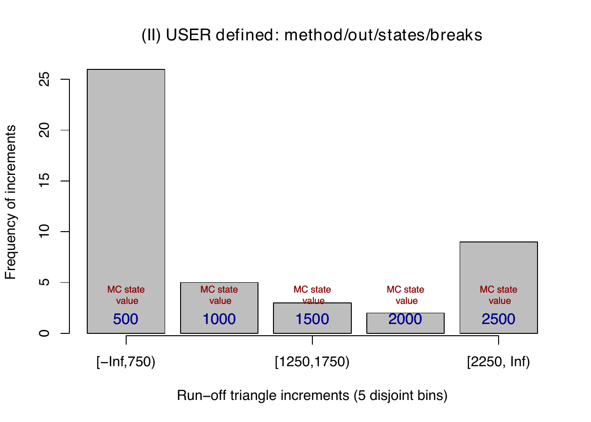
<figcaption>(a) `plot(incrExplor(CameronMutual, states = user.states))`</figcaption>
</figure>
<figure id="fig6b">
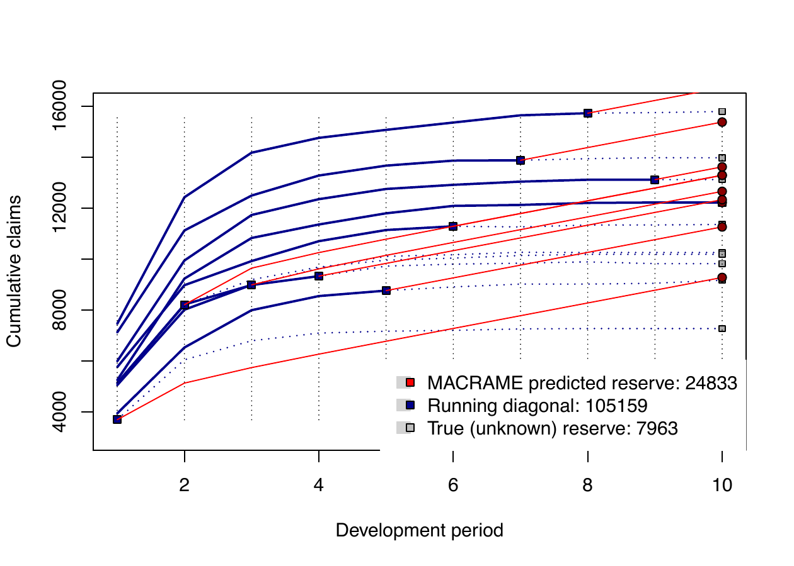
<figcaption>(b) `plot(mcReseve(CameronMutual, states = user.states))`</figcaption>
</figure>
<figcaption>Figure 6: Partial plot of the output from the function
(left) when applied to the dataset with an explicit specification of the
states—. The increments are not distributed uniformly across the bins
any more and relatively poor performance of the MACRAME algorithm is
also observed in the completed profiles on the right (the predicted
reserve heavily overestimates the true reserve due to almost no Markov
chain states that would properly model the development
tails).</figcaption>
</figure>

The Markov chain states in Figure [6a](#fig6a){reference-type="ref"
reference="fig6a"} (blue bold values within the bars) indeed correspond
with the declaration of the states provided by `states = c(500, 1000, 1500, 2000, 2500)`. Thus, there are again
five bins for the run-off triangle increments but the bins are now more
restricted. As a result, the development tails of the run-off triangle
are approximated very roughly (note that there are more than 25
increments in the first bin) and, therefore, the reserve is (not
surprisingly) heavily overestimated (compare
Figure [6b](#fig6b){reference-type="ref" reference="fig6b"} with
Figure [5b](#fig5b){reference-type="ref" reference="fig5b"}).

##### Example 3

Instead of enforcing the Markov chain states one can also pre-specify
the set of breaks $\{g_k\}_{k = 0}^m$ that are used to form the bins for
the run-off triangle increments (Case 3 in
Table [2](#tab:macramesetting)).
The corresponding states are obtained by summarizing the increments
within the bins (either by using the default median method or by
specifying other options with the `method` parameter). The following R code uses
again five bins defined by four grid points and the corresponding Markov
states are obtained as the medians of the increments within the bins.

``` r
R> user.breaks <- c(500, 1000, 1500, 2000)
R> plot(incrExplor(CameronMutual, breaks = user.breaks))
R> plot(mcReserve(CameronMutual, breaks = user.breaks))
```

Both plots are provided in Figure [7](#fig7){reference-type="ref"
reference="fig7"}. It is also worth mentioning that if the specified
break points $\{g_k\}_{k = 1}^{m - 1}$ define some empty bin with no
increment within the bin, then two neighboring bins are automatically
merged in a way that each bin contains at least one increment. More
formally, if there is no increment in the bin $[g_k, g_{k + 1})$ for
some $k \in \{1, \dots, m - 1\}$ then a new bin defined as
$[g_{k - 1}, g_{k + 1})$ is used instead. Similarly, if there is no
increment in the first bin $(g_0, g_1)$, where $g_0 = -\infty$, then the
first bin is re-defined as $(-\infty, g)$, where
$g = min_{\{2 \leq k \leq m\}}\{g_k;~g_k > min{\{X_{i,j}:~ 1 \leq i \leq n, 2 \leq j \leq n - i + 1\}}\}$.
Thus, it is also possible, for some rather atypical run-off triangles,
that there is only one bin used for all (typically zero) increments (no
matter what is specified by `states` or `breaks`) and the underlying Markov chain process
has only one (typically zero) state, i.e.,
$|\mathcal{S}| = |\{s\}| = 1$.

<figure id="fig7" data-latex-placement="!t">
<figure id="fig7a">
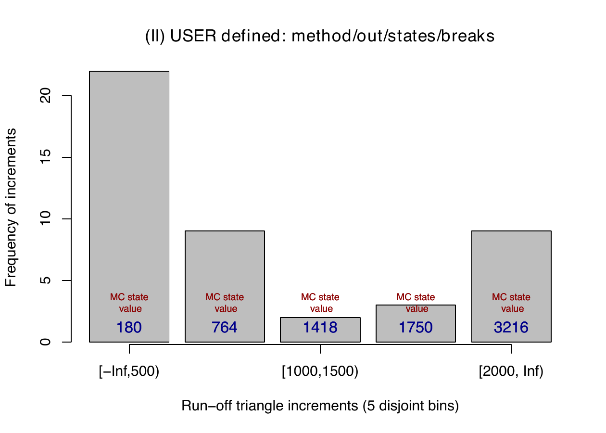
<figcaption>(a) `plot(incrExplor(CameronMutual, breaks = user.breaks))`</figcaption>
</figure>
<figure id="fig7b">
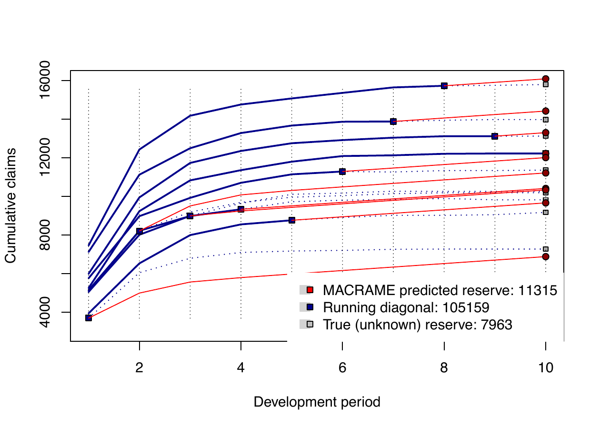
<figcaption>(b) `plot(mcReseve(CameronMutual, breaks = user.breaks))`</figcaption>
</figure>
<figcaption>Figure 7: Partial plot of the output from the function
(left) when applied to the `CameronMutual` dataset with an explicit specification of the
breaks by using `breaks = c(500, 1000, 1500, 2000)`. The corresponding completed profiles are on the
right-hand side. The predicted reserve is <span
class="math inline">$\widehat{\mathcal{R}} = 11315$</span>.</figcaption>
</figure>

##### Example 4

Finally, we briefly address one more important modification of the
underlying Markov chain. Note that the choice of the summary method
(i.e., `method = c("median", "mean", "min", "max")`) is only applicable for the `incrExplor()` function. The `mcReserve()` function only allows
one to specify the set of breaks and the set of states. This is however
not limiting in practice.

The R code below specifies the user-based choice for breaks (i.e., `breaks = c(500, 1000, 1500, 2000)`)
and, also, the user selected method how the increments within each bin
are supposed to be summarized (i.e., `method = "min"`). The corresponding Markov chain
states are calculated by the `incrExplor()` function and, together with the
pre-specified breaks, they can be both forwarded to the `mcReserve()` function by
using the `mcStates()` accessor and both parameters `breaks` and `states` (Case 4 in
Table [2](#tab:macramesetting)).

``` r
R> user.breaks <- c(500, 1000, 1500, 2000)
R> user.method <- incrExplor(CameronMutual, breaks = user.breaks, method = "min")

R> final.states <- mcStates(user.method)
R> mcReserve(CameronMutual, breaks = user.breaks,  states = final.states)
```

The explicit outputs and plots are omitted for brevity. Note that if
functions `incrExplor()` and `mcReserve()` are used with an explicit specification of both---the set
of breaks[^2] $\{g_k\}_{k = 1}^{m - 1}$ and the set of states
$\mathcal{S} = \{s_1, \dots, s_m\}$ then the Markov states provided in `states = c( ... )` 
must represent a valid sequence of unique values such that exactly one
state value belongs to exactly one bin determined by the break points
$-\infty = g_0 < g_1 < \dots < g_{m - 1} < g_m = \infty$.

### Permutation bootstrap 

The third key function implemented in the \CRANpkg{ProfileLadder} package---providing the overall reserve distribution
for functional-based reserving methods but also for traditional
parametric approaches already available in the \CRANpkg{ChainLadder} package---is the `permuteReserve()` 
function. The function performs the permutation bootstrap for all
possible reserving algorithms (e.g., Mack model, Tweedie model, GLM
based reserving, PARALLAX, REACT, or MACRAME) with no explicit need to
specify which algorithm should be used. The input for the `permuteReserve()` function is an
output of some reserving algorithm implemented in R and it can be an
object of different classes (for instance, `glmReserve`, `tweedieReserve`, `MackChainLadder`, or `profileLadder`). The output from
the `permuteReserve()` function is always the object of the S3 class `permutedReserve`.

For illustration, the overall reserve distribution for the `CameronMutual` dataset---provided by the MACRAME algorithm with $500$ permutation
bootstrap resamples can be obtained as

``` r
R> print(distribution.macrame <- permuteReserve(mcReserve(CameronMutual)))
      |>>>>>>>>>>>>>>>>>>>>>>>>>>>>>>>>>>>>>>>>>>>| 100% elapsed=04s
```
[MACRAME based reserving]{style="color:magenta;"}
```r
       Est.Reserve    Est.Ultimate     Paid Amount    True Reserve 
          8081.963      113240.963      105159.000        7963.000 
```          
[Permutation bootstrap (B = 500)]{style="color:magenta;"}
```r
         Boot.Mean         Std.Er.        BootCov%     BootVar.995 
          9422.290        1457.072          15.464           1.471 
```

Two sets of values are listed in the output. The first part corresponds
to the point prediction of the overall reserve (also discussed before)
and the second part of the output summarizes the overall reserve
distribution. The first two values in the second part of the
output---the average (`Boot.Mean`) over $B \in \mathbb{N}$ bootstrap reserves
$\{\widehat{\mathcal{R}}^{(b)}\}_{b = 1}^B$ and the corresponding
standard error (`Std.Er.`)---provide some basic characterization of the location
and shape of the estimated reserve distribution. In addition, two
qualitative measures proposed in Maciak et al. (2022) are provided for
some practical assessment of the resampling performance. The value of `BootCov%`
expresses (in percentages) the coefficient of variation of the bootstrap
distribution and the value of `BootVar.995` gives the $99.5\%$ quantile (by default)
of the distribution relative to the bootstrap mean (other choice of the
quantile can be applied by changing the parameter `quantile = 0.995`). Both these
quantities were defined, explained, and consequently also used for the
empirical comparisons in Maciak et al. (2022) and more detailed
discussion can be also found there. Note that the default quantile level
of $0.995$ is explicitly required by the Solvency II principle.

In general, the `permuteReserve()` function returns a complex object of the class `permutedReserve` and
standard generic methods (such as the `summary()` function or the `plot()` function) can be
applied to assess more specific details from the object. The summary
method provides the following output:

``` r
R> summary(distribution.macrame)

    MACRAME based reserve prediction (with B = 500 bootstrap permutations)
              First Latest Dev.To.Date   Ultimate       IBNR        S.E        CV
        2      5984  13113   0.9964286  13160.000   47.00000   19.04960 0.4053106
        3      7452  15720   0.9950067  15798.889   78.88889   49.20912 0.6237776
        4      7115  13872   0.9906724  14002.611  130.61111  125.80444 0.9631986
        5      5753  11282   0.9840866  11464.438  182.43827  117.91093 0.6463059
        6      3937   8757   0.9749940   8981.594  224.59362  165.04382 0.7348553
        7      5127   9325   0.9535135   9779.620  454.61986  256.95086 0.5651994
        8      5046   8984   0.8241040  10901.537 1917.53724  495.52130 0.2584155
        9      5129   8202   0.7664369  10701.468 2499.46806  698.02698 0.2792702
        10     3689   3689   0.5915835   6235.806 2546.80632  613.02222 0.2407023
        total 49232  92944   0.9200011 101025.963 8081.96337 1457.07250 0.1802869
```
[Overall reserve distribution]{style="color:magenta;"}
```r
         Boot.Mean        Std.Er.       BootCov%    BootVar.995 
       9422.289972    1457.072499      15.464102       1.471458

    The MACRAME predicted reserve represents the 15.37% quantile of the distribution
    Bootstrap simulated reserves beyond 2sigma rule: 20 (out of 500)
```

In a correspondence with the classical parametric methods, the summary
output above now also provides standard errors (`S.E`) and coefficients of
variation (`CV`). The graphical visualization is also analogous with the
classical parametric reserving methods implemented in the package.
Figure [8](#fig10){reference-type="ref" reference="fig10"} is
obtained by the R command

``` r
R> plot(distribution.macrame)
```

<figure id="fig10">
<figure>
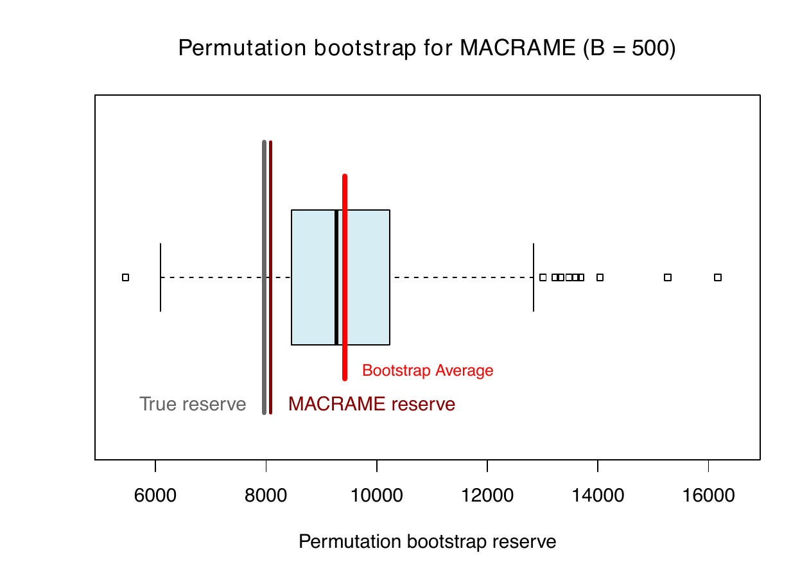{#fig10a width="80%"} 
<figcaption>(a) Boxplot of $\{\widehat{\mathcal{R}}^{(b)}\}_{b = 1}^{100}$ values</figcaption>
</figure>
<figure>
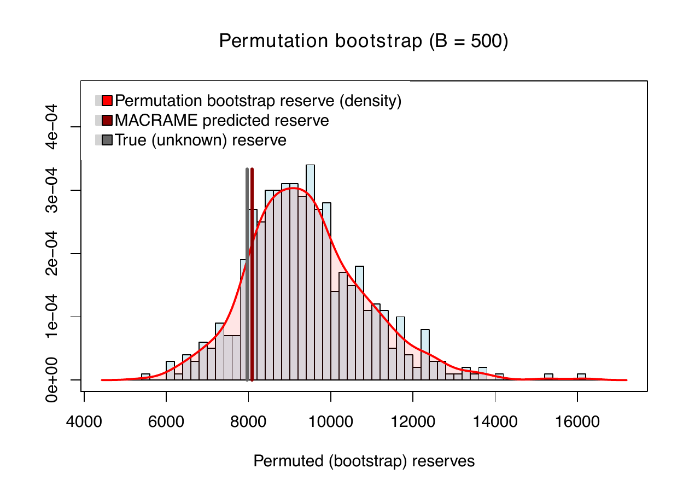{#fig10b width="80%"}
<figcaption>(b) Histogram and the estimated density</figcaption>
</figure>
<figure>
 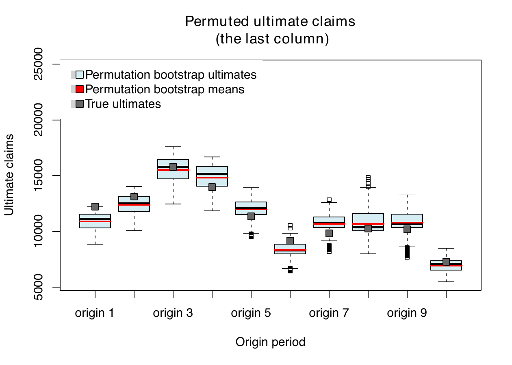{#fig10c width="80%"}
<figcaption>(c) Simulated ultimate claims</figcaption>
</figure>
<figure>
 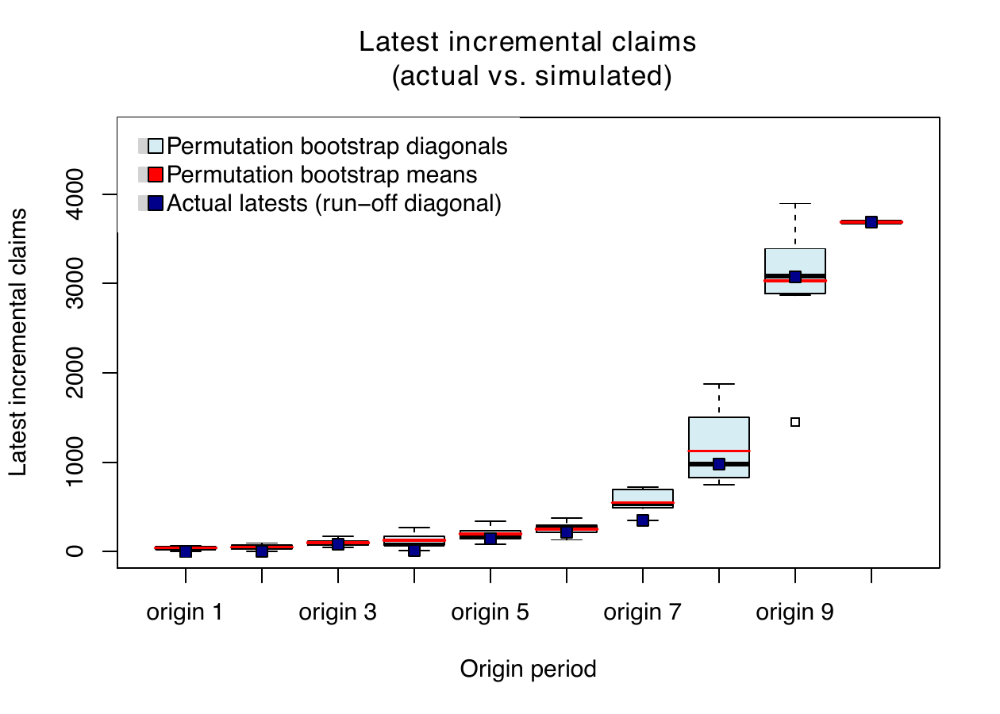{#fig10d width="80%"}
<figcaption>(d) Simulated run-off diagonals</figcaption>
</figure>
<figcaption>
Figure 8: Graphical output of the `permuteReserve()` function when applied to the `CameronMutual` run-off triangle using the MACRAME  algorithm and $B = 500$ permutation bootstrap resamples. Four panels are provided in an analogous way as if the `plot()` function is applied to the output of some parametric estimation method implemented in the \CRANpkg{ChainLadder} package (see, for instance, `glmReserve()` or `MackChainLadder()`). 
</figcaption>
</figure>

The `permuteReserve()` function can also automatically inherit the user-based settings of
the Markov chain process (parameters `breaks` and `states` in the `mcReserve()` function in particular)
or some user-specified settings needed for the parametric reserving
methods (for instance, the link function used for the GLM based
reserving or the Tweedie model). In case of the MACRAME algorithm,
either the set of states and breaks is automatically adjusted for each
permuted run-off triangle (parameter `adjustMC = TRUE` which is the default option) or the
same set of states and breaks is used for each permuted run-off triangle
(`adjustMC = FALSE`) and, in addition, no standardization step defined in
[(3)](#alg4) is
applied in such situation. The `permuteReserve()` function can be used analogously also for
classical parametric methods---for instance, the permutation bootstrap
applied to the Over-dispersed Poisson model implemented in `glmReserve()` from the \CRANpkg{ChainLadder} 
package can be obtained as

``` r
R> (distribution.glm <- permuteReserve(glmReserve(observed(CameronMutual))))
      |>>>>>>>>>>>>>>>>>>>>>>>>>>>>>>>>>>>>>>>>>>>| 100% elapsed=08s
```
[MACRAME based reserving]{style="color:magenta;"}
```r
       Est.Reserve    Est.Ultimate     Paid Amount    True Reserve 
          8601          113760          105159              NA 
```
[Permutation bootstrap (B = 500)]{style="color:magenta;"}
```r
         Boot.Mean         Std.Er.        BootCov%     BootVar.995 
          10889.391       1249.785         11.477          1.254 
```

### [Computational efficiency and limitations]{#efficiency label="efficiency"} 

The proposed functional-based
reserving methods (including the permutation bootstrap algorithm) are
computationally very effective---particularly when compared with some
classical reserving techniques and standard residual bootstrap
implemented in the \CRANpkg{ChainLadder} package. To illustrate this efficiency and to compare
the performance of the nonparametric methods (i.e., PARALLAX, REACT, and
MACRAME) with parametric ones (in particular: the chainladder method
implemented in `chainladder()`; Mack model from `MackChainLadder()`; over-dispersed Poisson model in `glmReserve()`; and
Tweedie model implemented in `tweedieReserve()`) we used three large ($60 \times 60$)
run-off triangles from the `GFCIB` dataset (the fourth run-off triangle---the
annuities---cannot be used with the chainladder method and the Mack
model due to some fully zero rows) and the point predictions were
obtained together with the distributional predictions (using the
permutation bootstrap for each method and the residual based bootstrap
implemented in \CRANpkg{ChainLadder} for the ODP model (`glmReserve(..., mse.method = "bootstrap")`) and the Tweedie model (`tweedieReserve(..., bootstrap = 1)`). The number
of bootstrap resamples was always set to $B = 1000$ and MacOS
Architecture with 12 Apple M2 Pro chips (8 for performance and 4 for
efficiency) with 32GB memory was used to get the results summarized in
Table [3](#tab:efficiencycomparisons).


| **Prediction method** | **Point prediction** | **Permutation bootstrap** | **Residual bootstrap** |
|:----------------------|:---------------------|:--------------------------|:-----------------------|
| PARALLAX | $0.03s.$ (0.006) | $15.01s.$ (0.341) | ✗ |
| REACT | $0.01s.$ (0.001) | $9.04s.$ (0.116) | ✗ |
| MACRAME | $0.04s.$ (0.012) | $48.75s.$ (11.51) | ✗ |
| Chainladder | $0.03s.$ (0.008) | $31.70s.$ (0.276) | ✗ |
| Mack model | $0.04s.$ (0.002) | $42.10s.$ (0.650) | ✗ |
| ODP model | $3.86s.$ (0.043) | $63.37m.$ (0.148) | $~~~\infty~m.$ (NA$^{*}$) |
| Tweedie formula | $0.24s.$ (0.026) | $4.19m.$ (0.307) | $3.69m.$ (0.252) |

Table: (\#tab:efficiencycomparisons) Computational efficiency in terms of the running times for different prediction algorithms from the \CRANpkg{ProfileLadder} and \CRANpkg{ChainLadder} package. Point predictions together with distributional predictions obtained by the proposed permutation bootstrap and the classical residual bootstrap (applied only to some (available) methods from the \CRANpkg{ChainLadder} package) are compared (using $1000$ bootstrap replicates). Three run-off triangles of the dimensions $60 \times 60$ from the dataset `GFCIB` from \CRANpkg{ProfileLadder} are used and the running times (given either in seconds $[s.]$ or minutes $[m.]$ for brevity) are averaged (with the corresponding standard errors in brackets).  
$^{*}$ The residual bootstrap for the ODP model was terminated after six days of running without any results. 


The limitations of the proposed methods are, on the other hand, mostly
determined by the \CRANpkg{ChainLadder} package rather than the functions from \CRANpkg{ProfileLadder} themselves. In
principle, there is no theoretical limitation for PARALLAX, REACT, or
MACRAME to handle as minimal run-off triangles as $2 \times 2$. However,
unlike `parallelReserve()` which indeed handles such cases, `mcReserve()` does not (and the minimum
dimensions required are $3 \times 3$). This is caused by the internal
implementation of the `cum2incr()` function from the \CRANpkg{ChainLadder} package which transforms
cumulative triangles into incremental ones. On the other hand, there are
no formal limitations for the maximum allowed dimensions that we would
be aware of.

### [Other features of the R package]{#Raddons label="Raddons"} 

The main core of the R package \CRANpkg{ProfileLadder} consists of three key
functions---`parallelReserve()` for applying the PARALLAX or REACT algorithm, `mcReserve()` implementing
the MACRAME algorithm, and `permutedReserve()` providing the permutation bootstrap add-on.
Other generic functions (for the R objects of the class `profileLadder`, `profilePredict`, `mcSetup`, and `permutedReserve`) are
also implemented to facilitate a well structured summary of the outputs
and graphical visualizations of the results. In addition, there are a
few other helpful functions implemented in \CRANpkg{ProfileLadder}. For a complex description
and illustrative examples, we refer to the R help session by using the
standard `help()` command. Below, we only provide a brief description of the
three most relevant functions that in some sense interconnect our
package \CRANpkg{ProfileLadder} with the core actuarial package \CRANpkg{ChainLadder} and some typical insurance
standards.

- `as.profileLadder()` For the run-off triangle data type there is already an R class `triangle` 
  implemented in the R package \CRANpkg{ChainLadder} by Gesmann et al. (2025) with the
  corresponding R function `as.triangle()`. This is a generic S3 class method that
  eases the work with the triangle shaped matrix data. However, the
  generic summary and plot methods do not allow distinguishing the
  observed functional profiles and the unknown "future" segments when
  using this R class. Therefore, we introduce an enhanced run-off
  triangle class `profileLadder` that provides more appropriate organization suitable
  for the nonparametric functional-based reserving techniques. For
  illustration, compare the following R code that produces two plots in
  Figure [9](#fig9){reference-type="ref" reference="fig9"}.

  ``` r
      ### S3 class 'triangle' from the ChainLadder pkg
  R> plot(as.triangle(CameronMutual))

      ### S3 class 'profileLadder' from the ProfileLadder pkg
  R> plot(as.profileLadder(CameronMutual))
  ```

  The new R class `ProfileLadder` also provides some additional information about the
  underlying run-off triangle (for instance, the true reserve amount if
  available, the triangle type--cumulative or incremental---and way
  more) and it also adapts various information provided by the
  functional-based algorithms (PARALLAX, REACT, or MACRAME);

<figure id="fig9">
<figure>
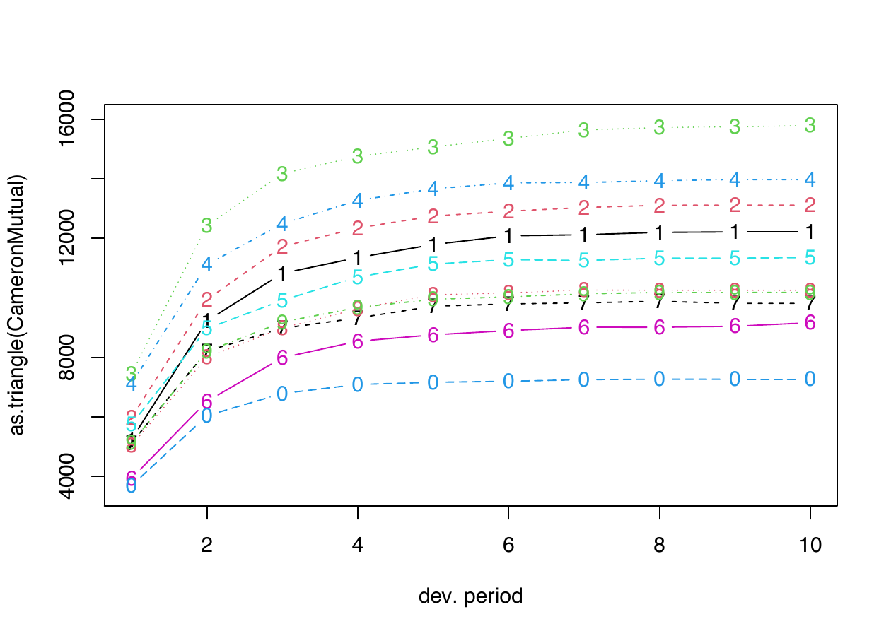{width="80%"}
<figcaption>(a) `plot(as.triangle(CameronMutual))`</figcaption>
</figure>
<figure>
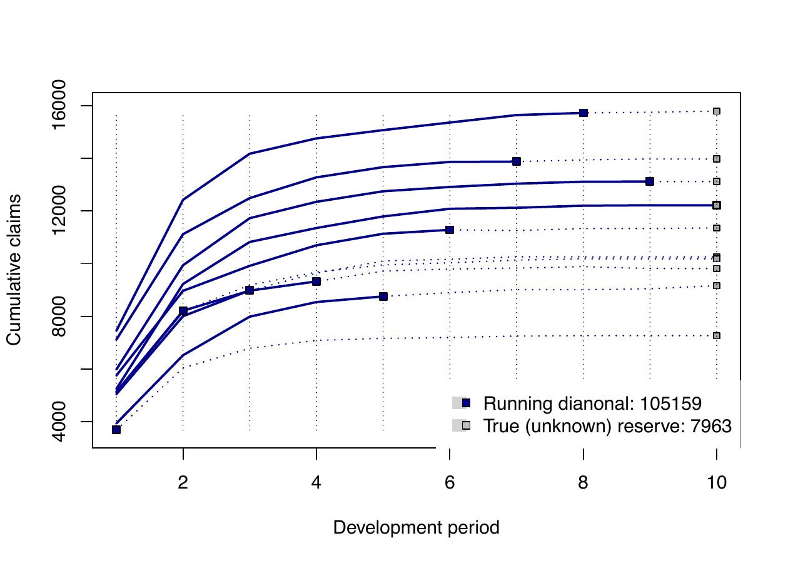{width="80%"}
<figcaption>(b) `plot(as.profileLadder(CameronMutual))`</figcaption>
</figure>
<figcaption>Figure 9: Graphical comparison of the performance of the generic R method `plot()` when applied to the same data set (`CameronMutual`) represented by different R classes. The left-hand panel shows the result for the `triangle` class defined in the package \CRANpkg{ChainLadder}; the result for the `profileLadder` class is shown on the right-hand side.</figcaption>
</figure>


- `observed()` This function provides practical layouts (of different types) to
  distinguish observed and un­ob­served functional profiles in the run-off
  triangle (mainly in situations when the triangle is provided in terms
  of a full data matrix). This R function also allows for an application
  of classical reserving approaches from the \CRANpkg{ChainLadder} package (such as the `glmReserve()`, `tweedieReserve()`, or `MackChainLadder()`
  ) to be easily used with the fully observed run-off triangles
  supplemented in the \CRANpkg{ProfileLadder} package. The run-off triangles included as example
  datasets in the package are (mostly) given in terms of full (squared)
  matrices (with the "unknown" future development profiles being also
  provided for an ex-post performance evaluation) while the parametric
  methods implemented in the \CRANpkg{ChainLadder} package rely solely on the input data in
  form of the run-off triangle---meaning that
  $Y_{i,j} = X_{i,j} = \textrm{NA}$ for all $i + j > n + 1$.
  Compare, for instance, the following (where the first command results
  in an error message while the latter already works properly):

  ``` r
  R> glmReserve(CameronMutual)
  R> glmReserve(observed(CameronMutual))
  ```

  The same reasoning also applies for other parametric reserving methods
  from the \CRANpkg{ChainLadder} package (`tweedieModel()` and `MackChainLadder()` functions in particular).

- `predict()` A generic S3 class method applicable to the outputs of the `parallelReserve()` function
  and the `mcReserve()` function---the objects of the class `profileLadder`. For internal purposes of
  insurance companies, actuaries are at times interested in
  a one-step-ahead prediction only (typically a 1-year-ahead prediction
  say). Instead of completing the run-off triangle into a full square,
  the focus is then on predicting the so-called *next running diagonal*.
  The S3 method `predict.profileLadder()` performs this as

  ``` r
  R> predict(parallelReserve(CameronMutual))
  ```

  Unlike the standard run-off triangle completion where the output of `parallelReserve()` or `mcReserve()`
  is a matrix of the dimensions $n \times n$, the output of the `predict()` method
  is actually a new run-off triangle of the dimensions
  $n \times (n + 1)$ (the output is omitted for brevity).

## Concluding remarks and summary {#beyondSection}

The \CRANpkg{ProfileLadder} package is particularly developed to implement nonparametric methods
into the actuarial risk assessment process performed by insurance
companies (typically on a yearly or quarterly basis). Nevertheless, the
underlying run-off triangle can be formally also represented in terms of
an incomplete panel data scheme that is generally well known among
statisticians and all types of practitioners. The statistical techniques
and specific functions implemented in the R package \CRANpkg{ProfileLadder} can be also used for
such data. Some explicit datasets (briefly described below) are included
in the package to illustrate possible applications beyond the actuarial
domain.

- **Health care & epidemiology** Triangular data, similar to run-off
  triangles, are common in tracking medical claims and receipts until
  resolution. Another example is epidemiological monitoring, such as
  tracking disease spread by new cases in specific cohorts over time.
  The dataset `covid19CZ` (see `help("covid19CZ")`) captures the spread of Covid-19 in Czechia over the
  first eight weeks using weekly cohort data by counties (grouped by the
  week of the first case occurrence). We use also this data to
  demonstrate the functionality of the `predict()` method mentioned at the end of
  the previous section. This function is not only useful for the
  actuaries, but it also has important practical utilization in any type
  of risk modeling. The S3 method `predict()` is implemented for the objects of the
  R class `profileLadder` that are created by the `parallelReserve()` function or the `mcReserve()` function (for details,
  we refer to the help session obtained by `help("predict.profileLadder")`).

  Instead of completing the run-off triangle into a full square (by one
  of the algorithms PARALLAX, REACT, or MACRAME), the `predict()` method only
  returns the prediction of the next running diagonal (also called a
  *1-step-ahead prediction*). The same algorithms are used for the
  diagonal prediction, only the output is not a completed square but
  rather a new (extended) run-off triangle of the dimensions
  $n \times (n + 1)$.

  For illustration, the `predict()` method is applied below to the run-off triangle
  formed from the dataset `covid19CZ`, using all four cohorts (rows) and weeks 3 to
  6 (i.e., columns 3 to 6), to allow for an ex post comparison between
  the diagonal prediction and the actual true outcome (the next running
  diagonal in `covid19CZ`). The output from the `predict()` method is another object of the R
  class `profilePredict` with the corresponding plot method, which provides a graphical
  illustration---see the R code and
  Figure [10](#fig:covid19){reference-type="ref"
  reference="fig:covid19"} below.

  <figure id="fig:covid19" data-latex-placement="htbp">
  <div class="minipage">
  <div class="sourceCode" id="cb1" data-commandchars="\\\{\}"><pre
  class="sourceCode r"><code class="sourceCode r"><span id="cb1-1"><a href="#cb1-1" aria-hidden="true" tabindex="-1"></a></span>
  <span id="cb1-2"><a href="#cb1-2" aria-hidden="true" tabindex="-1"></a>R<span class="sc">&gt;</span> diagonal <span class="ot">&lt;-</span> <span class="fu">predict</span>(<span class="fu">mcReserve</span>(covid19CZ[,<span class="dv">3</span><span class="sc">:</span><span class="dv">6</span>]))</span>
  <span id="cb1-3"><a href="#cb1-3" aria-hidden="true" tabindex="-1"></a>R<span class="sc">&gt;</span> <span class="fu">print</span>(diagonal)</span>
  <span id="cb1-4"><a href="#cb1-4" aria-hidden="true" tabindex="-1"></a></span>
  <span id="cb1-5"><a href="#cb1-5" aria-hidden="true" tabindex="-1"></a>  <span class="dv">01</span><span class="sc">/</span><span class="dv">03</span> <span class="sc">-</span> <span class="dv">07</span><span class="sc">/</span><span class="dv">03</span>     <span class="dv">392</span>   <span class="dv">676</span>  <span class="dv">1158</span>  <span class="dv">1366</span>  \textcolor{magenta}{<span class="dv">1396</span>} 	</span>
  <span id="cb1-6"><a href="#cb1-6" aria-hidden="true" tabindex="-1"></a>  <span class="dv">08</span><span class="sc">/</span><span class="dv">03</span> <span class="sc">-</span> <span class="dv">14</span><span class="sc">/</span><span class="dv">03</span>    <span class="dv">1126</span>  <span class="dv">1702</span>  <span class="dv">2058</span>  \textcolor{magenta}{<span class="dv">2264</span>     .}</span>
  <span id="cb1-7"><a href="#cb1-7" aria-hidden="true" tabindex="-1"></a>  <span class="dv">15</span><span class="sc">/</span><span class="dv">03</span> <span class="sc">-</span> <span class="dv">21</span><span class="sc">/</span><span class="dv">03</span>     <span class="dv">970</span>  <span class="dv">1173</span>  \textcolor{magenta}{<span class="dv">1173</span>     .     .}	</span>
  <span id="cb1-8"><a href="#cb1-8" aria-hidden="true" tabindex="-1"></a>  <span class="dv">22</span><span class="sc">/</span><span class="dv">03</span> <span class="sc">-</span> <span class="dv">28</span><span class="sc">/</span><span class="dv">03</span>     <span class="dv">164</span>   \textcolor{magenta}{<span class="dv">164</span>     .     .     .}</span>
  <span id="cb1-9"><a href="#cb1-9" aria-hidden="true" tabindex="-1"></a></span>
  <span id="cb1-10"><a href="#cb1-10" aria-hidden="true" tabindex="-1"></a>R<span class="sc">&gt;</span> <span class="fu">plot</span>(diagonal, <span class="at">trueProfiles =</span> covid19CZ[,<span class="dv">1</span><span class="sc">:</span><span class="dv">7</span>])</span></code></pre></div>
  </div>
  <div class="minipage">
  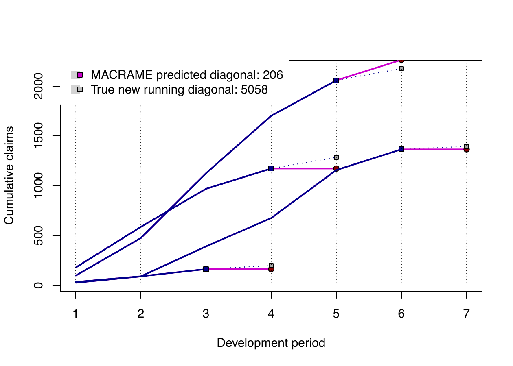
  </div>
  <figcaption>Figure 10: 1-step-ahead prediction</figcaption>
  </figure>

  Moreover, the S3 method `predict()` can be applied repeatedly to predict other
  consecutive diagonals as the output of the `predict()` function is a run-off
  triangle (although of a rectangular shape with dimensions
  $n \times (n + 1)$), and, thus, it can be forwarded again as the input
  for `parallelReserve()` or `mcReserve()` (considering all $n$ rows but only last $n$ columns).

- **Accounting & auditing** Tracking unpaid invoices or tax adjustments
  based on past years is common in business and government, and such
  data often form a triangle structure too. The dataset `xNetSubscribe` (see `help("xNetSubscribe")`)
  illustrates this with monthly income from a local internet provider,
  using cohorts of new subscribers by month;

- **Operational risk & banking** In general, the occurrence and
  development of events like fraud, IT failures, or compliance breaches
  can be viewed through the lens of operational risk. Such events are
  often tracked using development triangles, with rows indicating
  occurrence time and columns showing development periods;

- **Manufacturing & quality control** Triangular data also arise in
  various production processes. The triangular schemes are typically
  generated when tracking defects and failures within specific
  production batches in order to predict failure rates and to manage
  maintenance schedules.

From the overall point of view, the nonparametric point prediction
methods implemented in the R package \CRANpkg{ProfileLadder} (the algorithms PARALLAX, REACT,
and MACRAME) are, despite the fact that all were developed specifically
for the claims reserving purposes, widely applicable to any triangular
data schemes arising in real-life applications. There are three core
functions in the package: the first one, `parallelReserve()`, implements the PARALLAX
algorithm and the REACT algorithm; the second one, `mcReserve()`, incorporates a more
complex Markov chain prediction mechanism with a whole variety of
user-based options; the third function, `permuteReserve()`, estimates for the overall
reserve distribution---not exclusively for the proposed functional-based
methods, but also for classical parametric reserving approaches. This
function may thus serve as a practical alternative to a parametric
(residual) bootstrap. Auxiliary R functions are also implemented to make
the work with the triangular shaped data easier and more straightforward
especially when interacting with the actuarial package \CRANpkg{ChainLadder}. Finally, unique
illustrative datasets from the actuarial practice and other practical
real-world areas are featured as well.

**Acknowledgment** The work of Maciak, Mizera, and Pešta was supported
by the Czech Science Foundation grant GAČR 23--06461K. The work of Matúš
was supported by MSD Czech Republic. The authors express sincere thanks
to Kurt Hornik for his insight and some useful pieces of advice
regarding the \CRANpkg{ProfileLadder} package. The authors are also grateful to Petr Jedlička
from the Czech Insurers' Bureau and Pavel Koudelka from Generali Česká
pojišťovna for providing complex data from real-life insurance
practice---not only for internal evaluation purposes but also for public
access within the R package \CRANpkg{ProfileLadder}. Last but not least, the authors appreciate
the insight and help of Rob Hyndman and two anonymous
reviewers---particularly for their suggestions and comments that helped
to improve the overall quality of the package and the manuscript. The
authors declare no conflict of interest.

**Matúš Maciak**, **Ivan Mizera**, **Michal Pešta**\
Charles University, Faculty of Mathematics and Physics\
Sokolovská 49/83, Prague, 186 00\
Czech Republic\

**Rastislav Matúš**\
Merck Sharp & Dohme s.r.o.\
Na Valentince 3336/4, Prague, 150 00\
Czech Republic\


:::::::::::::::::::::::::: {#refs .references .csl-bib-body .hanging-indent}
::: {#ref-bauer2021 .csl-entry}
Bauer, Alexander, Fabian Scheipl, Helmut Küchenhoff, and Alice-Agnes
Gabriel. 2021. *Registration for Incomplete Non-Gaussian Functional
Data*. <https://doi.org/10.48550/arXiv.2108.05634>.
:::

::: {#ref-actuaRE .csl-entry}
Campo, B. D. C. 2025. *The [Actua]{.sans-serif}[RE]{.sans-serif}
Package: Handling Hierarchically Structured Risk Factors Using Random
Effects Models*. <https://CRAN.R-project.org/package=actuaRE>.
:::

::: {#ref-actuaryr .csl-entry}
Chmielewska, Z. 2025. *[Actuaryr]{.sans-serif}: Develop Actuarial
Models*. <https://CRAN.R-project.org/package=actuaryr>.
:::

::: {#ref-Clark2003 .csl-entry}
Clark, David R. 2003. "LDF Curve-Fitting and Stochastic Reserving: A
Maximum Likelihood Approach." *Casualty Actuarial Society*, 41--92.
<https://www.casact.org/sites/default/files/database/forum_03fforum_03ff041.pdf>.
:::

::: {#ref-delaigle2013 .csl-entry}
Delaigle, Aurore, and Peter Hall. 2013. "Classification Using Censored
Functional Data." *Journal of the American Statistical Association* 108
(504): 1269--83. <https://doi.org/10.1080/01621459.2013.824893>.
:::

::: {#ref-delaigle2016 .csl-entry}
Delaigle, Aurore, and Peter Hall. 2016. "Approximating Fragmented
Functional Data by Segments of Markov Chains." *Biometrika* 103 (4):
779--99. <https://doi.org/10.1093/biomet/asw040>.
:::

::: {#ref-JSSv025i07 .csl-entry}
Dutang, Christophe, Vincent Goulet, and Mathieu Pigeon. 2008.
"[Actuar]{.sans-serif}: An R Package for Actuarial Science." *Journal of
Statistical Software* 25 (7): 1--37.
<https://www.jstatsoft.org/index.php/jss/article/view/v025i07>.
:::

::: {#ref-EV1999 .csl-entry}
England, P. D., and R. J. Verrall. 1999. "Analytic and Bootstrap
Estimates of Prediction Errors in Claims Reserving." *Insurance:
Mathematics and Economics* (Philadelphia, PA) 25 (3): 281--93.
<https://doi.org/10.1016/S0167-6687(99)00016-5>.
:::

::: {#ref-solvency2 .csl-entry}
European Parliament and Council. 2009. "Directive 2009/138/EC of the
European Parliament and of the Council of 25 November 2009 on the
Taking-up and Pursuit of the Business of Insurance and Reinsurance
(Solvency II)." *Official Journal of the European Union* 52 (L 335):
1--155. <https://eur-lex.europa.eu/eli/dir/2009/138/oj/eng>.
:::

::: {#ref-galmiche2016 .csl-entry}
Galmiche, Julien Pierre Olivier. 2016. *Fragmented Functional Data*.
Master Thesis, Politecnico di Milano, Italy.
<https://www.politesi.polimi.it/handle/10589/135829>.
:::

::: {#ref-Rchainladder .csl-entry}
Gesmann, M, D Murphy, Y Zhang, et al. 2025. *[ChainLadder]{.sans-serif}:
Statistical Methods and Models for Claims Reserving in General
Insurance*.
<https://cran.rstudio.com/web/packages/ChainLadder/vignettes/ChainLadder.html>.
:::

::: {#ref-LieblRameseder .csl-entry}
Liebl, Dominik, and Stefan Rameseder. 2019. "Partially Observed
Functional Data: The Case of Systematically Missing Parts."
*Computational Statistics and Data Analysis* 131: 104--15.
<https://doi.org/10.1016/j.csda.2018.08.011>.
:::

::: {#ref-MMP2022 .csl-entry}
Maciak, Matúš, Ivan Mizera, and Michal Pešta. 2022. "Functional Profile
Techniques for Claims Reserving." *ASTIN Bulletin* 52 (2): 449--82.
<https://doi.org/10.1017/asb.2022.4>.
:::

::: {#ref-MPO2021 .csl-entry}
Maciak, M, M Pešta, and O Okhrin. 2021. "Infinitely Stochastic Micro
Reserving." *Insurance: Mathematics and Economics* 100: 30--58.
<https://doi.org/10.1016/j.insmatheco.2021.04.007>.
:::

::: {#ref-Mack1993 .csl-entry}
Mack, Thomas. 1993. "Distribution-Free Calculation of the Standard Error
of Chain Ladder Reserve Estimates." *ASTIN Bulletin* 23 (2): 213--25.
<https://doi.org/10.2143/AST.23.2.2005092>.
:::

::: {#ref-NAIC2011 .csl-entry}
Meyers, Glenn G., and Peng Shi. 2011. *Loss Reserving Data Pulled from
NAIC Schedule P*. Edited by Casualty Actuarial Society.
<https://www.casact.org/publications-research/research/research-resources/loss-reserving-data-pulled-naic-schedule-p>.
:::

::: {#ref-NetSimR .csl-entry}
Parizas, Y. 2025. *[Net]{.sans-serif}[sim]{.sans-serif}[r]{.sans-serif}:
Actuarial Functions for Non-Life Insurance Modelling*.
<https://CRAN.R-project.org/package=NetSimR>.
:::

::: {#ref-P2003 .csl-entry}
Pinheiro, P. J. R., J. M. Andrade e Silva, and M. De Lourdes Centeno.
2003. "Bootstrap Methodology in Claim Reserving." *Journal of Risk and
Insurance* 70 (4): 701--14.
<https://doi.org/10.1046/j.0022-4367.2003.00071.x>.
:::

::: {#ref-popescu_suciu .csl-entry}
Popescu, R., and D. Suciu. 2020. "Glancing Back." *The Actuary* 2020
(July): 20--22. <https://www.theactuary.com/issues/2020/07/july-2020>.
:::

::: {#ref-Renshaw1998 .csl-entry}
Renshaw, A. E., and R. J. Verrall. 1998. "A Stochastic Model Underlying
the Chain-Ladder Technique." *British Actuarial Journal* 4: 903--23.
<https://doi.org/10.1017/S1357321700000222>.
:::

::: {#ref-JSSv055i10 .csl-entry}
Spedicato, Giorgio Alfredo. 2013. "The [Lifecontingencies]{.sans-serif}
Package: Performing Financial and Actuarial Mathematics Calculations in
R." *Journal of Statistical Software* 55 (10): 1--36.
<https://doi.org/10.18637/jss.v055.i10>.
:::

::: {#ref-VD2011 .csl-entry}
Verdonck, T., and M. Debruyne. 2011. "The Influence of Individual Claims
on the Chain-Ladder Estimates: Analysis and Diagnostic Tool."
*Insurance: Mathematics and Economics* 48 (1): 85--98.
<https://doi.org/10.1016/j.insmatheco.2010.10.001>.
:::

::: {#ref-Verrall1996 .csl-entry}
Verrall, Richard J. 1996. "Claims Reserving and Generalised Additive
Models." *Insurance: Mathematics and Economics* 19 (1): 31--43.
<https://doi.org/10.1016/S0167-6687(96)00000-5>.
:::
::::::::::::::::::::::::::

[^1]: The flipped run-off triangle is analogous to a transposition.
    However, unlike the matrix transposition performed with respect to
    the main diagonal, the flipped matrix is transposed with respect to
    the second diagonal---mathematically expressed, for a completed
    square $\{Y_{i,j};~i = 1, \dots, n; j = 1, \dots, n\}$, the "flipped
    triangle" is the square
    $\{\widetilde{Y}_{i,j};~i= 1, \dots, n; j = 1, \dots, n\}$, where
    $\widetilde{Y}_{i,j} = Y_{n + 1 - i, n + 1 - j}$.

[^2]: The set of breaks $\{g_k\}_{k = 1}^{m - 1}$ can be specified
    differently but for a proper functionality of the MACRAME algorithm
    it is important that $g_0 = -\infty$ and $g_m = \infty$. The user
    can however either specify a sequence of breaks in a form
    $-\infty \neq g_1 < \dots < g_{m - 1} \neq \infty$ and boundary
    values $g_0 = -\infty$ and $g_m = \infty$ are filled in
    automatically. Alternatively, the sequence of break points with one
    or both boundary points can be supplied.
