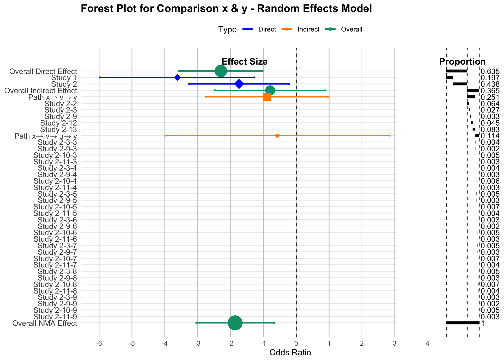
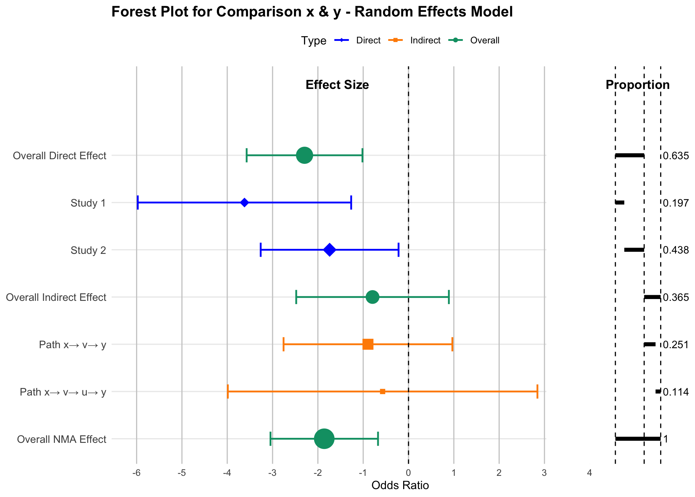
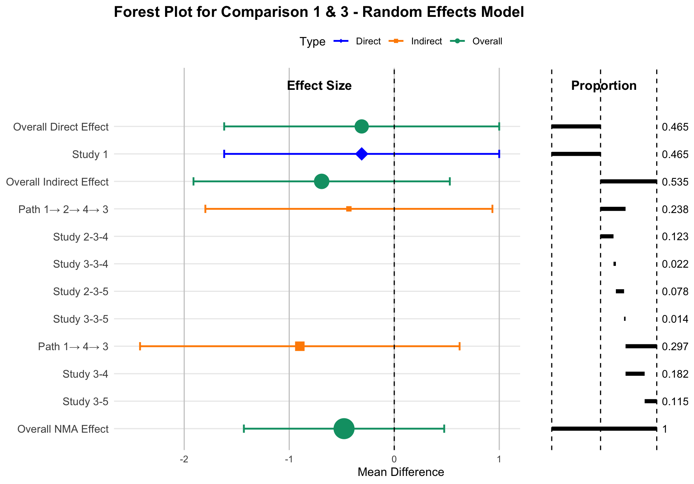
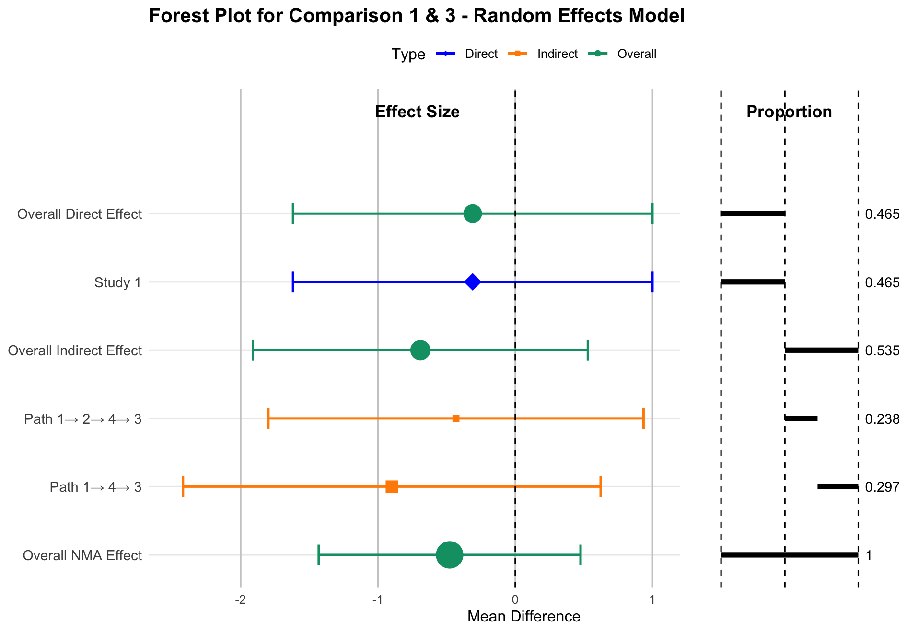

::: article
## Introduction

Network meta-analysis (NMA) extends pairwise meta-analysis by allowing
simultaneous comparisons among multiple treatments, even in the absence
of head-to-head comparisons. This framework has become essential in
comparative effectiveness research across disciplines such as clinical
medicine, epidemiology, and public health, where evidence networks are
often sparse or partially connected.

While NMA enables indirect estimations and an approach to combining
direct and indirect evidence, it also introduces substantial complexity
in interpreting how treatment effect estimates are derived.
Specifically, each estimate typically combines direct evidence from
studies that directly compared the treatments and indirect evidence
accumulated via intermediate comparisons across the network.
Understanding this composition is crucial for evaluating the robustness
of conclusions, detecting influential studies or comparisons, and
assessing the consistency between direct and indirect evidence.

One approach to quantifying evidence contribution is the projection
matrix (commonly referred to as the Hat matrix), which arises from the
linear model formulation of NMA introduced by Lu et al. (2011). This
approach formalizes the combination of evidence and enables estimation
of both treatment effects and their associated uncertainty. Building
upon this, König et al. (2013) demonstrated how the Hat matrix can be
interpreted in terms of evidence flow, assigning proportions of each
treatment effect estimate to different direct comparisons. More
recently, Papakonstantinou et al. (2018) extended this interpretation by
introducing the concept of evidence streams: directed paths through the
treatment network that quantify how evidence propagates indirectly
between treatments. Their algorithms use flow decomposition to allocate
contributions from direct comparisons across all paths in a way that is
consistent with the underlying model assumptions.

Despite this theoretical progress, practical tools for decomposing and
visualizing evidence contributions remain limited. For example, the
popular `netmeta` R package (Rücker et al. 2023) implements frequentist
NMA and computes Hat matrices but does not provide built-in methods to
enumerate evidence paths or produce contribution-aware forest plots.
General-purpose visualization tools, such as the R package
[**forestplot**](https://CRAN.R-project.org/package=forestplot) (Gordon
2023), are designed only for plotting and do not perform statistical
calculations or differentiate between sources or relative contributions
of evidence. This lack of transparency can limit interpretability and
hinder effective communication of NMA results to stakeholders.

To address these challenges, we introduce the
[**NMAforest**](https://CRAN.R-project.org/package=NMAforest) package,
which integrates statistical estimates, evidence flow decomposition, and
contribution visualization in a unified workflow. By combining network
structure and Hat matrix-based proportions with standard forest plot
representations,
[**NMAforest**](https://CRAN.R-project.org/package=NMAforest) enables
researchers to generate richly annotated plots that clearly delineate
the origins of each estimate and the influence of each study and path
within the network. The
[**NMAforest**](https://CRAN.R-project.org/package=NMAforest) package is
available from CRAN at <https://CRAN.R-project.org/package=NMAforest>.

## Motivation

The motivation for developing
[**NMAforest**](https://CRAN.R-project.org/package=NMAforest) stems from
the practical challenges faced by researchers and decision-makers who
need to interpret and communicate NMA results. Pairwise meta-analysis
and corresponding forest plots are effective for presenting treatment
effect estimates and their uncertainty. Pairwise meta-analysis and
forest plots also provide the weight that individual studies provide to
treatment effect estimates. However, NMA is limited in the detail it
conveys about where the evidence comes from. In practice, this often
leads to questions such as: How much of the estimated effect relies on
direct comparisons? Which indirect paths contribute the most
information? Could the result be dominated by a small subset of studies?

These questions are particularly important in applications where
evidence transparency and reproducibility are critical. For example,
health technology assessments, guideline development, and policy
decisions often require a clear audit trail showing how each piece of
evidence informs the final estimate. While the Hat matrix and evidence
stream decomposition methods provide a rigorous statistical basis for
such attribution, extracting and interpreting these contributions
typically requires multiple manual steps and specialized code.

[**NMAforest**](https://CRAN.R-project.org/package=NMAforest) was
designed to fill this gap by offering an integrated set of tools that
connect statistical estimation with intuitive visualization. The package
builds directly upon the outputs of `netmeta`, leveraging its estimates
and Hat matrix computations to break down treatment comparisons into
three main components: direct estimates derived from head-to-head
studies, indirect estimates based on evidence propagating through
specific paths in the network, and the overall NMA estimate that
combines all available evidence.

Beyond estimating and displaying these components,
[**NMAforest**](https://CRAN.R-project.org/package=NMAforest) provides a
structured approach to display them graphically. In each forest plot,
the effect size estimates for the direct, indirect, and NMA components
are aligned with horizontal bars that represent the relative
contribution of each evidence path. This combination of quantitative and
visual decomposition improves transparency, facilitates critical
appraisal, and supports sensitivity analyses by making the influence of
each evidence path explicit.

In this way, the package aims to make advanced evidence attribution
methods accessible to a broader audience and to support a more informed
interpretation of complex NMA results.

## Functionality

The main function provided by the package is:

- `NMAforest()`: Creates a forest plot that decomposes evidence
  contributions for a specified treatment comparison. The function also
  returns a structured statistical output containing study labels,
  treatment effect estimates for direct, indirect, and NMA comparisons,
  together with their standard errors, confidence intervals, and
  relative weights. Importantly, the output also includes proportion
  values that attribute contributions across overall estimates, paths,
  and individual studies.

This function supports the following arguments:

`data`

:   \- A data frame in long format containing the input data. Required
    columns include `study` (study label), `t` (treatment), and
    appropriate outcome data:

    - For binary outcomes: `r` (events) and `N` (sample size)

    - For continuous outcomes: `y` (mean), `sd` (standard deviation),
      and `N` (sample size)

`sm`

:   \- Summary measure for the treatment effect. Supported values
    include `"OR"` (odds ratio), `"RR"` (risk ratio), `"MD"` (mean
    difference), and `"SMD"` (standardized mean difference), etc.

`reference`

:   \- The reference treatment against which others are compared.

`model`

:   \- Type of NMA model to use. The options are `"random"` or
    `"fixed"`.

`comparison`

:   \- A character vector of length two, indicating the pair of
    treatments to be compared.

`study`

:   \- Column name identifying the study label.

`treat`

:   \- Column name for treatment assignment.

`event`

:   \- Column name for event counts (used for binary outcomes).

`N`

:   \- Column name for total sample size (used for binary outcomes and
    continuous outcomes).

`mean`

:   \- Column name for mean values (used for continuous outcomes).

`sd`

:   \- Column name for standard deviations (used for continuous
    outcomes).

`study_id`

:   \- Column name used to uniquely identify each study arm (default =
    \"`study_id`\"). If the column is not present in the original
    dataset, the updated data frame will be returned with this column
    added.

`study_path`

:   \- Logical argument. If `TRUE`, the function decomposes indirect
    path contributions further into study-level components. If `FALSE`,
    only the overall indirect effect and its individual paths are shown,
    without breaking them down to individual study combinations. For
    large or highly connected networks, setting `study_path` = `FALSE`
    is recommended to suppress study-level path decomposition and
    generate a cleaner, more interpretable summary plot.

## Method

The [**NMAforest**](https://CRAN.R-project.org/package=NMAforest)
package implements a structured approach to quantify and visualize the
evidence contributing to network meta-analysis (NMA) estimates. It
decomposes each comparison into direct and indirect evidence, identifies
study-level contributions, and displays these as aligned effect
estimates and proportion bars. The following subsections describe the
computations used to generate each component of the plot.

All computations implemented in the
[**NMAforest**](https://CRAN.R-project.org/package=NMAforest) package
are based on the standard frequentist network meta-analysis model as
implemented in
[**netmeta**](https://CRAN.R-project.org/package=netmeta). Consequently,
the proposed decomposition and visualization of evidence rely on the
assumptions of **transitivity** and **consistency** (Ahn and Kang 2021).
Transitivity assumes that studies comparing different treatment pairs
are sufficiently comparable with respect to effect-modifying factors,
while consistency assumes agreement between direct and indirect evidence
for the same treatment contrast.

### Overall Direct Effect and Study-Level Contributions

The overall direct effect for a given treatment comparison (e.g., `x`
vs. `y`) is estimated using the `netmeta()` function. This produces an
effect estimate $\hat{\theta}^{\mathrm{D}}_{xy}$ with an associated
standard error and a 95% confidence interval. The superscript notation
is used to distinguish direct effect estimates from indirect
($\hat{\theta}^{\mathrm{I}}_{xy}$) estimates considered elsewhere.

To determine how much each study contributes to the direct estimate, we
use the **hat matrix** $H$, derived from the linear projection of NMA
comparisons onto the space of observed direct effects:

$$H = Y (X^\top (V^D)^{-1} X)^{-1} X^\top (V^D)^{-1}$$

where:

- $X$ is a $D \times (T - 1)$ matrix describing observed direct
  comparisons, where:

  - $D$ is the number of treatment comparisons informed by direct
    evidence,

  - $T$ is the total number of treatments in the network.

- $Y$ is a $\binom{T}{2} \times (T - 1)$ matrix for all treatment
  contrasts,

- $V^D$ is a $D \times D$ covariance matrix of direct estimates.

The total contribution (flow) of the $xy$ direct comparison to the
overall NMA estimate is captured by the corresponding diagonal entry of
the hat matrix, denoted as $\left| H^{xy}_{xy} \right|$
(Papakonstantinou et al. 2018).

In a **random-effects model**, between-study variability is captured
using the heterogeneity parameter $\tau^2$ (tau-squared). This
represents the variance of true treatment effects across studies.

Each study $i$ contributing to the $xy$ direct comparison receives a
weight:

$$w^{xy}_{i} = \frac{1}{\left( \mathrm{SE}_i^{xy} \right)^2
 + \tau^2}$$

The proportional contribution of study $i$ to the overall direct
estimate for the comparison $x$ vs. $y$ is then (Riley et al. 2018):

$$\text{Proportion}_i^{xy} = 
\frac{w_i^{xy}}{\sum\limits_{i' \in S_{xy}} w_{i'}^{xy}} 
\cdot \left| H^{xy}_{xy} \right|$$

where:

- $S_{xy}$ is the set of studies with direct data on the $xy$
  comparison,

- $\text{Proportion}_i^{xy}$ is the contribution of study $i$ to the NMA
  estimate via the $xy$ direct comparison.

### Indirect Paths and Study-Combination Contributions

Indirect evidence for comparison $x$ vs. $y$ arises via intermediate
treatments. All indirect paths (e.g., $x \rightarrow v \rightarrow y$)
are identified using `igraph::all_simple_paths()` (Csárdi and Nepusz
2006; Csárdi et al. 2025). Each path is treated as a sequence of direct
comparisons, and the indirect estimate for one certain path is
calculated as:

$$\hat{\theta}^{\mathrm{I}}_{xy} = \hat{\theta}^{\mathrm{D}}_{xv} + \hat{\theta}^{\mathrm{D}}_{vy}$$

The variance of this estimate accounts for the variances of the
contributing comparisons and their covariance. If any two comparisons
along the path originate from the same study, the covariance between
them is approximated using a constant correlation approach:

$$\mathrm{Cov}(\hat{\theta}^{\mathrm{D}}_{xv}, \hat{\theta}^{\mathrm{D}}_{vy}) = \rho \cdot \mathrm{SE}^{xv}_i \cdot \mathrm{SE}^{vy}_j$$
where $\rho = 0.5$ by default. If no study includes both comparisons,
the covariance term is set to zero.

In multi-arm trials, treatment comparisons within the same study are
statistically correlated and require specification of within-study
correlations to construct the variance--covariance matrix. Following
standard practice in
[**netmeta**](https://CRAN.R-project.org/package=netmeta), we adopt a
constant-correlation assumption with $\rho = 0.5$ (Lu and Ades 2006).
This assumption affects the estimated variances and covariances of
treatment effects and therefore influences the width of confidence
intervals, while leaving point estimates unchanged.

The total variance of the indirect estimate is then:

$$\mathrm{Var}(\hat{\theta}^{\mathrm{I}}_{xy}) = \mathrm{Var}(\hat{\theta}^{\mathrm{D}}_{xv}) + \mathrm{Var}(\hat{\theta}^{\mathrm{D}}_{vy}) + 2 \cdot \mathrm{Cov}(\hat{\theta}^{\mathrm{D}}_{xv}, \hat{\theta}^{\mathrm{D}}_{vy})$$

Each indirect path is assigned a **flow value** $\mathrm{Flow}^{xy}_k$,
which quantifies the contribution of that specific indirect path to the
overall NMA estimate. These flow values are computed using an adapted
`comparisonStreams()` function originally developed by Papakonstantinou
et al. (2018). These flow values satisfy the constraint:

$$\sum_{\text{indirect paths } k} \mathrm{Flow}^{xy}_k = 1 - \left| H^{xy}_{xy} \right|$$

Within each path, we identify contributing study combination $(i, j)$,
where:

- $i$ is a study contributing to comparison $xv$,

- $j$ is a study contributing to comparison $vy$.

The weights for these studies are defined as:

$$w_i^{xv} = \frac{1}{\left( \mathrm{SE}_i^{xv} \right)^2 + \tau^2}, \quad
w_j^{vy} = \frac{1}{\left( \mathrm{SE}_j^{vy} \right)^2 + \tau^2}$$

Then, the proportional contribution of study combination $(i, j)$ to the
indirect path is:

$$\text{Proportion}_{(i,j)}^{xy} =
\left( \frac{w_i^{xv}}{\sum_{i' \in S_{xv}} w_{i'}^{xv}} \right)
\cdot
\left( \frac{w_j^{vy}}{\sum_{j' \in S_{vy}} w_{j'}^{vy}} \right)
\cdot \mathrm{Flow}^{xy}_k$$
where:

- $S_{xv}$ is the set of studies with direct data on the $xv$
  comparison,

- $S_{vy}$ is the set of studies with direct data on the $vy$
  comparison,

- $\text{Proportion}_{(i,j)}^{xy}$ is the contribution of study
  combination $(i, j)$ to the NMA estimate via the $xy$ direct
  comparison.

These combination-level contributions appear as individual rows under
each path in the expanded forest plot, along with their corresponding
effect estimates and proportion bars.

### Evidence Flow Algorithm

This subsection briefly describes how indirect evidence is represented
and partitioned across paths using the adapted `comparisonStreams()`
procedure implemented in
[**NMAforest**](https://CRAN.R-project.org/package=NMAforest). For a
target comparison (e.g., $x$ vs. $y$), the procedure starts from the hat
matrix obtained from the
[**netmeta**](https://CRAN.R-project.org/package=netmeta) model, which
quantifies the contribution of each observed direct comparison to the
network estimate.

Indirect evidence is represented through paths that connect $x$ to $y$
via one or more intermediate treatments. Each indirect path is defined
as an ordered sequence of direct comparisons (for example,
$x \rightarrow v \rightarrow y$). The absolute values of the
corresponding hat-matrix entries are treated as available contribution
along each direct comparison involved in the path.

The algorithm iteratively identifies admissible indirect paths from $x$
to $y$ and assigns each path a contribution determined by the smallest
remaining contribution among the direct comparisons forming that path.
Once a path-level contribution is assigned, it is removed from the
available contribution of all comparisons along the path. This ensures
that indirect evidence is allocated across paths without double
counting.

The final output is a collection of indirect paths, each associated with
a nonnegative contribution weight. These path-level contributions are
used by [**NMAforest**](https://CRAN.R-project.org/package=NMAforest) to
display indirect evidence in the forest plot, allowing indirect
information to be interpreted in terms of specific treatment sequences.

### Overall NMA Effect and Evidence Attribution

The overall NMA effect $\hat{\theta}^{\mathrm{NMA}}_{xy}$ and its
confidence interval are computed using `netmeta()`, combining all direct
and indirect evidence for comparison $x$ vs. $y$.

The contribution bar displayed in the NMA effect row represents a full
decomposition of all sources of evidence. It is constructed by summing
the proportion contributed by the direct comparison and the proportions
from all indirect paths, which ensures that 100% of the evidence
contributing to the NMA estimate is accounted for. As a result, users
can interpret the overall estimate in terms of clearly attributed
contributions from specific direct studies and indirect study
combinations, facilitating transparent and interpretable visualizations.

## Usage

### Required data format

The `NMAforest()` function expects the input data to be in long format,
with one row per study arm. The following columns are required, either
using the default names listed below or specified explicitly via
function arguments:

- `treat`: treatment label for each arm;

- `study`: study identifier or label;

- `n`: sample size for each arm;

- `event`: number of events per arm (for binary outcomes);

- `mean`, `sd`: mean and standard deviation (for continuous outcomes).

An optional column `study_id` may be provided to uniquely identify
studies. If `study_id` is not supplied, `NMAforest()` automatically
generates this column and returns the updated data frame as part of the
output.

### Output Structure

The `NMAforest()` function returns a structured list that includes both
a contribution-annotated forest plot and numerical outputs summarizing
treatment effects and evidence contributions. The first element of this
list is a `ggplot2` object named `$plot`, which visualizes the
decomposition of evidence. The forest plot consists of two aligned
panels:

- **Effect Size Panel (Left)**: Displays point estimates and 95%
  confidence intervals for:

  - The overall direct effect;

  - Individual study-level direct comparisons;

  - The overall indirect effect;

  - Each indirect path;

  - Optional: study combinations within indirect paths;

  - The overall NMA effect estimate.

  - **Visual weighting**: The size of each point estimate is scaled in
    proportion to its corresponding `proportion` value, so that larger
    contributions appear as larger points.

- **Proportion Panel (Right)**: Displays horizontal bars aligned with
  each effect size row, representing the relative contribution
  (proportion) of each evidence source:

  - Direct proportions are computed using the Hat matrix (`H`);

  - Indirect proportions are derived from the `comparisonStreams()`
    function Papakonstantinou et al. (2018), adapted from the
    `flow_contribution` package;

  - When `study_path = TRUE`, the function further disaggregates flow
    across combinations of studies along each path.

In addition to the plot, `NMAforest()` returns the following components
as part of the output list:

- `$output`: A data frame containing study label names, treatment effect
  estimates for direct, indirect, and NMA comparisons, along with
  standard errors, confidence intervals, relative weights, and
  proportion values for overall estimates, paths, and studies;

- `$updated_df`: The input data frame with a unique `study_id` column
  added (if not already present), used for internal processing and
  traceability.

These outputs allow users not only to visualize the structure and
sources of evidence but also to extract, inspect, and reuse the
underlying quantitative components in downstream analyses.

### Example Case

``` r
# Example 1: Binary outcome data
data(example_data)

NMAforest(
  data = example_data,
  sm = "OR",
  reference = "x",
  model = "random",
  comparison = c("x", "y"),
  study = "study",
  treat = "t",
  event = "r",
  N = "n",
  study_id = "id",
  study_path = TRUE
)

# Example 2: Continuous outcome data
data("parkinson", package = "pcnetmeta")

NMAforest(
  data = parkinson,
  sm = "MD",
  reference = "1",
  model = "random",
  comparison = c("1", "3"),
  study = "s.id",
  treat = "t.id",
  mean = "mean",
  sd = "sd",
  N = "n",
  study_path = TRUE
)
```

### Example Datasets

To demonstrate that
[**NMAforest**](https://CRAN.R-project.org/package=NMAforest) operates
consistently across different outcome types, we present two example
datasets in arm-level format: one with binary outcomes and one with
continuous outcomes. In both cases, each row corresponds to a study arm
and provides the quantities required by
[**NMAforest**](https://CRAN.R-project.org/package=NMAforest) to perform
network meta-analysis and visualize evidence decomposition.

The first example dataset contains binary outcome data from 13 clinical
trials comparing four treatments: `x`, `y`, `u`, and `v`. Each row
records the study label (`study`), treatment label (`t`), number of
events (`r`), total sample size (`n`), and a study identifier (`id`).
These variables correspond directly to the arguments `study`, `treat`,
`event`, `N`, and `study_id` used in
[**NMAforest**](https://CRAN.R-project.org/package=NMAforest).

The second example dataset uses the `parkinson` data from the
[**pcnetmeta**](https://CRAN.R-project.org/package=pcnetmeta) package
and contains continuous outcome summary statistics from 7 clinical
trials comparing five treatments labeled `1`--`5`. Each row includes the
study identifier (`s.id`), treatment identifier (`t.id`), arm-level
sample mean (`mean`), standard deviation (`sd`), and sample size (`n`).
These correspond to the arguments `study`, `treat`, `mean`, `sd`, and
`N` required for continuous outcomes.

In both examples, the treatment networks are connected and include
multi-arm studies, allowing the target comparisons to be informed by
both direct and indirect evidence.

### Binary Data Example Plot and Output

<figure id="fig:forestplot1" data-latex-placement="htbp">

<figcaption>Figure 1: Expanded forest plot for comparison x vs. y,
displaying direct, indirect, and overall effects with study-level
decomposition of direct and indirect evidence
contributions.</figcaption>
</figure>

``` r

$output
                     Label EffectSize LowerCI UpperCI     SE weight proportion
1    Overall Direct Effect     -2.294  -3.572  -1.017  0.652  2.353      0.635
2                  Study 1      -3.62  -5.974  -1.265  1.201  0.693      0.197
3                  Study 2     -1.741  -3.262  -0.22   0.776  1.66       0.438
4  Overall Indirect Effect     -0.794  -2.478   0.89   0.859  1.354      0.365
5             Path x→ v→ y     -0.895  -2.757   0.967   0.95  1.108      0.251
6                Study 2-2                                               0.064
7                Study 2-3                                               0.027
8                Study 2-9                                               0.033
9               Study 2-12                                               0.045
10              Study 2-13                                               0.083
11         Path x→ v→ u→ y     -0.571  -3.987   2.845  1.743  0.329      0.114
12             Study 2-3-3                                               0.004
13             Study 2-9-3                                               0.002
14            Study 2-10-3                                               0.005
15            Study 2-11-3                                               0.003
16             Study 2-3-4                                               0.004
17             Study 2-9-4                                               0.003
18            Study 2-10-4                                               0.006
19            Study 2-11-4                                               0.003
20             Study 2-3-5                                               0.005
21             Study 2-9-5                                               0.003
22            Study 2-10-5                                               0.007
23            Study 2-11-5                                               0.004
24             Study 2-3-6                                               0.003
25             Study 2-9-6                                               0.002
26            Study 2-10-6                                               0.005
27            Study 2-11-6                                               0.003
28             Study 2-3-7                                               0.005
29             Study 2-9-7                                               0.003
30            Study 2-10-7                                               0.007
31            Study 2-11-7                                               0.004
32             Study 2-3-8                                               0.005
33             Study 2-9-8                                               0.003
34            Study 2-10-8                                               0.007
35            Study 2-11-8                                               0.004
36             Study 2-3-9                                               0.003
37             Study 2-9-9                                               0.002
38            Study 2-10-9                                               0.005
39            Study 2-11-9                                               0.003
40      Overall NMA Effect     -1.859  -3.046  -0.673  0.605  2.729      1.000
```

<figure id="fig:forestplot2" data-latex-placement="htbp">

<figcaption>Figure 2: Summary forest plot for comparison x vs. y,
displaying direct, indirect, and overall effects without
study-combination decomposition. This summary plot corresponds to
setting <code>study_path</code> = <code>FALSE</code> and is particularly
useful for large networks where displaying study-combination–level
contributions may result in overly dense visualizations. </figcaption>
</figure>

``` r
$output
                    Label EffectSize LowerCI UpperCI     SE weight proportion
1   Overall Direct Effect     -2.294  -3.572  -1.017  0.652  2.353      0.635
2                 Study 1     -3.620  -5.974  -1.265  1.201  0.693      0.197
3                 Study 2     -1.741  -3.262  -0.220  0.776  1.660      0.438
4 Overall Indirect Effect     -0.794  -2.478   0.89   0.859  1.354      0.365
5            Path x→ v→ y     -0.895  -2.757   0.967  0.950  1.108      0.251
6         Path x→ v→ u→ y     -0.571  -3.987   2.845  1.743  0.329      0.114
7      Overall NMA Effect     -1.859  -3.046  -0.673  0.605  2.729      1.000
```

##### Note

For binary outcomes, the summary measure is specified as the odds ratio
(`sm = "OR"` in
[**netmeta**](https://CRAN.R-project.org/package=netmeta)). However,
estimation is performed on the log-odds ratio scale. Accordingly, effect
estimates and confidence intervals displayed in the output tables and
forest plots are presented on the log scale.

### Continuous Data Example Plot and Output

<figure id="fig:forestplot3" data-latex-placement="htbp">

<figcaption>Figure 3: Expanded forest plot for comparison 1 vs. 3,
displaying direct, indirect, and overall effects with study-level
decomposition of direct and indirect evidence
contributions.</figcaption>
</figure>

``` r
$output
                     Label EffectSize LowerCI UpperCI     SE weight proportion
1    Overall Direct Effect      -0.31  -1.619   0.999  0.668  2.241      0.465
2                  Study 1      -0.31  -1.619   0.999  0.668   2.24      0.465
3  Overall Indirect Effect     -0.691  -1.912   0.529  0.623  2.579      0.535
4          Path 1→ 2→ 4→ 3     -0.432  -1.799   0.935  0.697  2.057      0.238
5              Study 2-3-4                                               0.123
6              Study 3-3-4                                               0.022
7              Study 2-3-5                                               0.078
8              Study 3-3-5                                               0.014
9             Path 1→ 4→ 3     -0.899  -2.421   0.622  0.776   1.66      0.297
10               Study 3-4                                               0.182
11               Study 3-5                                               0.115
12      Overall NMA Effect     -0.478  -1.432   0.476  0.487  4.223      1.000
```

<figure id="fig:forestplot4" data-latex-placement="htbp">

<figcaption>Figure 4: Summary forest plot for comparison 1 vs. 3,
displaying direct, indirect, and overall effects without
study-combination decomposition. This summary plot corresponds to
setting <code>study_path</code> = <code>FALSE</code> and is particularly
useful for large networks where displaying study-combination–level
contributions may result in overly dense visualizations. </figcaption>
</figure>

``` r
$output
                    Label EffectSize LowerCI UpperCI     SE weight proportion
1   Overall Direct Effect     -0.310  -1.619   0.999  0.668  2.241      0.465
2                 Study 1     -0.310  -1.619   0.999  0.668  2.240      0.465
3 Overall Indirect Effect     -0.691  -1.912   0.529  0.623  2.579      0.535
4         Path 1→ 2→ 4→ 3     -0.432  -1.799   0.935  0.697  2.057      0.238
5            Path 1→ 4→ 3     -0.899  -2.421   0.622  0.776  1.660      0.297
6      Overall NMA Effect     -0.478  -1.432   0.476  0.487  4.223      1.000
```

##### Computational details

All analyses and example figures reported in this article were generated
using [R]{.sans-serif} version 4.4.1. The following main packages were
used: [**netmeta**](https://CRAN.R-project.org/package=netmeta)
(version 3.2.0), [**igraph**](https://CRAN.R-project.org/package=igraph)
(version 2.1.4), and
[**NMAforest**](https://CRAN.R-project.org/package=NMAforest)
(version 0.1.3).

### Visualizing Decomposition of Evidence

The [**NMAforest**](https://CRAN.R-project.org/package=NMAforest)
package provides two styles of forest plots to visualize the composition
of treatment effect estimates in a network meta-analysis: an **expanded
version** with full study-level breakdown and a **summary version** with
aggregate-level detail. Both plots help clarify how direct and indirect
evidence combine to form the final NMA effect, and how much each
evidence component contributes to the result.

The first plot (Figure [1](#fig:forestplot1){reference-type="ref"
reference="fig:forestplot1"}) illustrates a detailed breakdown for the
comparison between treatments `x` and `y`. It displays:

- **Overall direct effect estimate** with 95% confidence interval (CI);

- **Study-level direct effect estimates** with 95% CIs that contribute
  to the overall direct effect;

- **Overall indirect effect estimate** with 95% CI;

- **Path-specific indirect effect estimates** with 95% CIs (e.g.,
  `x` $\rightarrow$ `v` $\rightarrow$ `y`,
  `x` $\rightarrow$ `v` $\rightarrow$ `u` $\rightarrow$ `y`);

- **Study-combination contribution rows** under each path
  (proportion-only; they share the path's effect estimate, so SE/CI are
  omitted);

- **Right-panel proportion bars** indicating the relative contribution
  of each study, path, or overall component to the effect estimate in
  the same row.

This expanded visualization is especially useful for understanding how
indirect comparisons are constructed and which studies dominate specific
routes of evidence. Within each indirect path, all study combinations
inherit the same path-level effect estimate and uncertainty; therefore,
individual effect sizes and confidence intervals are not displayed at
the study-combination level.

The second plot (Figure [2](#fig:forestplot2){reference-type="ref"
reference="fig:forestplot2"}) is designed for contexts where clarity and
brevity are prioritized. It retains the essential decomposition
structure---distinguishing between direct, indirect, and overall NMA
effect estimates---while omitting study-level details. It includes:

- **Overall direct effect estimate** with 95% CI;

- **Study-level direct effect estimates** with 95% CIs contributing to
  the overall direct effect;

- **Overall indirect effect estimate** with 95% CI, with each indirect
  path displayed as a single row, without further decomposition into
  study-combination rows;

- **Overall NMA effect estimate** with 95% CI;

- **Right-panel proportion bars** aligned with each overall, path-, or
  study-level estimate, without displaying study-combination
  contributions.

This summary plot is more compact and is well-suited for presentations
where space is limited but key decomposition information still needs to
be shown, especially in cases where study-level decomposition would be
too dense or overwhelming to display in full. In such cases, users are
encouraged to set `study_path` = `FALSE`, which suppresses study-level
path detail and focuses visualization on aggregated indirect paths,
improving clarity without sacrificing key decomposition information.

Both visualizations use color-coded point estimates (blue for
study-level direct effect, orange for indirect path effect, and green
for overall effect) and horizontal proportion bars. This dual-panel
format enables clear interpretation of both statistical magnitude and
structural evidence contributions.

## Discussion

The [**NMAforest**](https://CRAN.R-project.org/package=NMAforest)
package provides a structured and transparent framework for decomposing
evidence contributions in network meta-analysis. By combining
frequentist estimation outputs from `netmeta` with graph-based
decomposition of indirect evidence flows, it fills a critical gap left
by existing tools, which often summarize effect estimates without
revealing their sources. This detailed attribution supports users in
assessing the robustness and interpretability of treatment comparisons,
especially in networks where indirect evidence constitutes a substantial
proportion of the overall information.

While the package offers an additional perspective beyond conventional
forest plots, several limitations merit consideration. First, the
current implementation relies on a constant correlation coefficient to
approximate covariance between indirect path segments, which may
oversimplify dependencies, particularly in the presence of multi-arm
studies or sparse evidence structures. Second, although the
visualization of study combinations within indirect paths provides a
high level of granularity, it can result in complex or crowded displays
when networks are large. To address this, the package includes an option
that allows users to suppress the study-combination detail and display
only the aggregated contributions of each indirect path, thereby
balancing interpretability and comprehensiveness according to the needs
of the analysis.

Future enhancements could further improve flexibility by exploring
alternative methods for covariance estimation, incorporating Bayesian
models of network meta-analysis, and developing interactive
visualization features that allow users to filter, collapse, or
highlight specific evidence contributions dynamically.

## Conclusion

[**NMAforest**](https://CRAN.R-project.org/package=NMAforest) package
provides a clear and practical approach for linking treatment effect
estimates with their contributing studies and indirect evidence paths in
network meta-analysis. By offering contribution-aware visualizations
alongside standard effect summaries, the package supports more
transparent reporting and helps users interpret the origins of their
results with greater confidence. We believe this approach will
facilitate clearer communication of evidence synthesis findings across
research and applied decision-making contexts.

:::

::::::::::::: {#refs .references .csl-bib-body .hanging-indent}
::: {#ref-Ahn2021NMA .csl-entry}
Ahn, Eunji, and Hyun Kang. 2021. "Concepts and Emerging Issues of
Network Meta-Analysis." *Korean Journal of Anesthesiology* 74 (5):
371--82. <https://doi.org/10.4097/kja.21358>.
:::

::: {#ref-igraph2006 .csl-entry}
Csárdi, Gábor, and Tamás Nepusz. 2006. "The Igraph Software Package for
Complex Network Research." *InterJournal, Complex Systems* 1695.
<https://igraph.org>.
:::

::: {#ref-igraph2025 .csl-entry}
Csárdi, Gábor, Tamás Nepusz, Vincent Traag, et al. 2025. *Igraph:
Network Analysis and Visualization in r*.
<https://doi.org/10.5281/zenodo.7682609>.
:::

::: {#ref-forestplot-pkg .csl-entry}
Gordon, Max. 2023. *Forestplot: Advanced Forest Plot Using 'Grid'
Graphics*.
[Https://CRAN.R-project.org/package=forestplot](https://CRAN.R-project.org/package=forestplot){.uri}.
:::

::: {#ref-Konig2013 .csl-entry}
König, Jochem, Ulrich Krahn, and Holger Binder. 2013. "Visualizing the
Flow of Evidence in Network Meta-Analysis and Characterizing Mixed
Treatment Comparisons." *Statistics in Medicine* 32 (30): 5414--29.
<https://doi.org/10.1002/sim.6001>.
:::

::: {#ref-LuAdes2006 .csl-entry}
Lu, Guobing, and A. E. Ades. 2006. "Assessing Evidence Inconsistency in
Mixed Treatment Comparisons." *Journal of the American Statistical
Association* 101 (474): 447--59.
<https://doi.org/10.1198/016214505000001302>.
:::

::: {#ref-Lu2011 .csl-entry}
Lu, Guobing, Nicky J. Welton, Julian P. T. Higgins, Alex J. Sutton,
Simon G. Thompson, and A. E. Ades. 2011. "Linear Inference for Mixed
Treatment Comparison Meta-Analysis: A Two-Stage Approach." *Research
Synthesis Methods* 2 (1): 43--60. <https://doi.org/10.1002/jrsm.34>.
:::

::: {#ref-Papakonstantinou2018 .csl-entry}
Papakonstantinou, Theodoros, Adriani Nikolakopoulou, Guido Schwarzer,
Gerta Rücker, and Georgia Salanti. 2018. *Estimating the Contribution of
Studies in Network Meta-Analysis: Paths, Flows and Streams*. Vol. 7.
F1000Research. <https://doi.org/10.12688/f1000research.14770.3>.
:::

::: {#ref-Riley2018 .csl-entry}
Riley, Richard D., Joie Ensor, Dan Jackson, and Danielle L. Burke. 2018.
"Deriving Percentage Study Weights in Multi-Parameter Meta-Analysis
Models: With Application to Meta-Regression, Network Meta-Analysis and
One-Stage Individual Participant Data Models." *Statistical Methods in
Medical Research* 27 (10): 2885--905.
<https://doi.org/10.1177/0962280216688033>.
:::

::: {#ref-netmeta-jss .csl-entry}
Rücker, Gerta, Guido Schwarzer, Thomas Rücker, and Jan Beyersmann. 2023.
"Netmeta: Network Meta-Analysis Using Frequentist Methods." *Journal of
Statistical Software* 106 (2): 1--40.
<https://doi.org/10.18637/jss.v106.i02>.
:::
:::::::::::::
