:::::::: article
## Introduction

For a stationary time series $X(j)$, $j = 0, 1, \dots,$ the
autocovariance function is used to measure dependencies between
observations separated by a lag $h.$ This function appears in various
theoretical results and statistical applications. For example, in the
Gaussian case, the mean function and autocovariance function describe
the time series entirely. Furthermore, the autocovariance function is
used in the estimation of parameters for an autoregressive time series
(Brockwell and Davis, 1991, Chapter 8.1), model identification, and Kriging
(Cressie, 1993, Chapter 3.2). It is also utilised in various non-statistical
fields such as digital signal processing, image analysis (Bull and Zhang,
2021, Chapter 3.2), and quality assessment (Massart et al., 2003), just to name a
few. Therefore, accurate estimation of the autocovariance function is an
important problem in numerous statistical and data science applications.

Surprisingly, despite several other approaches in the literature, the
classical standard estimator of the autocovariance function remains the
predominant choice among practitioners. Many of them are unaware of its
limitations or of more accurate alternatives developed in the recent
literature. This is evident in statistical software, where the majority
of R and Python packages only provide a wrapper function for the
classical estimator. For example, the classical autocovariance estimator
realised by the **`stats::acf`** function in R, is used by
[**TSA**](https://CRAN.R-project.org/package=TSA) (Chan and Ripley, 2022 and Cryer and Chan, 2008),
[**astsa**](https://CRAN.R-project.org/package=astsa) (Stoffer and
Poison, 2024, and Shumway and Stoffer, 2025),
[**sarima**](https://CRAN.R-project.org/package=sarima) (Boshnakov and
Halliday, 2025) and
[**forecast**](https://CRAN.R-project.org/package=forecast) (Hyndman and
Khandakar, 2008). The package
[**forecast**](https://CRAN.R-project.org/package=forecast) also
contains a tapered autocovariance estimator, `taperedacf()`, which is
based on the results in McMurry and Politis (2010); Hyndman (2015).

The motivation for the package
[**CovEsts**](https://CRAN.R-project.org/package=CovEsts) (Bilchouris
and Olenko, 2025a) was that many nonparametric autocovariance
estimators appeared only in research papers with no R or Python code for
their computation. Also, as will be discussed in
Section [2](#sec:nonparametric), different estimators have different
theoretical properties, which influence when they should be used. We
have not found any packages dealing with potential issues regarding
estimation and their corrections, apart from
[**ncf**](https://CRAN.R-project.org/package=ncf) (Bjornstad, 2022)
implementing the positive-definite adjustment from Hall et al. (1994).
Further, no existing packages provide a unified interface and consistent
data/output structure across various autocovariance estimators.

Nonparametric autocovariance estimators are particularly important due
to their minimal reliance on distributional assumptions, offering
greater flexibility compared to parametric approaches. Additionally,
they are often used as a preliminary step in parametric modelling, where
a restricted set of predefined autocovariance models is fitted to a
nonparametric estimate. For example,
[**gstat**](https://CRAN.R-project.org/package=gstat) (Gräler et al.,
2016) does this for the (semi-)variogram. Parametric estimation was not
included in [**CovEsts**](https://CRAN.R-project.org/package=CovEsts),
as this functionality for specific parametric models is already provided
by existing packages.

We intend this package to be used by practitioners working with time
series and spatial statistics, with applications in areas such as
finance, signal processing, and climate research. We assume basic
knowledge of `R` for using the functional interface of the package.
However, more specialised `R` knowledge may be required for advanced
inference and working with user-defined objects.

In the article, we will interchangeably use the terms random process and
time series, where the former is for samples at arbitrary time
locations, and the latter is used when sampled values are on a uniform
sampling grid.

The paper is structured as follows. Section [2](#sec:nonparametric)
introduces the nonparametric autocovariance estimators and some general
approaches for modifying autocovariance estimators. It discusses the
theoretical properties of the estimators and the drawbacks one should be
aware of. Section [3](#sec:overview) presents the structure of the
package and selected main functions. Section [4](#sec:examples) provides
applications to three data examples: a simulated Gaussian process,
yearly sunspot counts, and unemployment data, sourced from the US Bureau
of Labor Statistics. Example 4 empirically studies the computational
complexity of the estimators by comparing their memory and time usage.

## Nonparametric estimators of autocovariance functions {#sec:nonparametric}

There are several nonparametric autocovariance function estimators in
the literature, see the reviews in Cressie (1993, Chapter 2.4), Hall et al.
(1994), Cuevas et al. (2013), Dürre et al. (2015) and Bilchouris and
Olenko (2025b). This section briefly introduces the estimators that were
implemented in the package and mentions some of the theoretical
drawbacks to deal with when applying them.

For a weakly stationary real-valued time series $X(j)$,
$j = 1, 2, \dots ,$ the autocovariance function is defined as
$$\text{C}(h) := \text{E}\left[\left(X(j) - \overline{X}\right)\left(X(j + h) - \overline{X}\right)\right].$$
and the corresponding autocorrelation at lag $h$ is
$\rho(h):=C(h)/C(0).$

Another related function used in the analysis of dependencies is the
semivariogram. It uses the second-order moments of increments,
$$\gamma(h) := \frac{1}{2} \text{Var}\left[X(j) - X(j + h) \right]  ,$$
The package [**CovEsts**](https://CRAN.R-project.org/package=CovEsts)
mainly focuses on estimating $C(\cdot)$ as, under the assumption of weak
stationarity, the semivariogram can be determined using the
autocovariance function through the following relation
$$\begin{equation}
 \label{eqn:variogram}
    \gamma(h) = C(0) - C(h).
\end{equation}   (\#eq:eqnvariogram)$$
This relation is not necessarily true when considering the estimated
functions or if the semivariogram is unbounded (Chilès and Delfiner, 2012 and Bilchouris and Olenko, 2025b).

Another function used in time series analysis is the partial
autocorrelation function, $\phi_{h,h}.$ Unlike the autocorrelation
function, it measures the dependencies between observations $X(t)$ and
$X(t+h)$ after removing the effects of the intermediary lags. The
partial autocorrelation function at lag $h$ can be computed using the
Durbin-Levinson algorithm (Durbin, 1960)
$$\begin{equation}
 \label{eq:durbin}
    \phi_{h, h} := \frac{\rho(h) - \sum_{k=1}^{h-1} \phi_{h - 1, k} \rho(h - j)}{1 - \sum_{k=1}^{h-1} \phi_{h - 1, k} \rho(k)}
\end{equation}   (\#eq:durbin)$$
where $\phi_{h, k} := \phi_{h - 1, k} - \phi_{h, h} \phi_{h - 1, h - k}$
for $k = 1, 2, \dots, h - 1,$ and $\phi_{1, 1} := \rho(1)$. Unlike the
autocorrelation function, there is no zero lag for the partial
autocorrelation function. In **stats::pacf**, the formula
(\@ref(eq:durbin)) uses the classical autocorrelation estimator, but any
autocorrelation estimate can be supplied in the package
[**CovEsts**](https://CRAN.R-project.org/package=CovEsts).

### Standard estimators

The first two estimators implemented in
[**CovEsts**](https://CRAN.R-project.org/package=CovEsts) are well-known
and the most widely used. They differ only by the normalising constants:
$$\begin{equation}
 \label{eq:std_est}
\widehat{C}^{*}(h) := \frac{1}{N-h} \sum_{j=1}^{N - h} \left(X(j) - \overline{X}\right) \left(X(j+h) - \overline{X}\right)
\end{equation}   (\#eq:std-est)$$
and
$$\begin{equation}
 \label{eq:std_est_pd}
\widehat{C}^{**}(h) := \frac{1}{N} \sum_{j=1}^{N - h} \left(X(j) - \overline{X}\right) \left(X(j+h) - \overline{X}\right) ,
\end{equation}   (\#eq:std-est-pd)$$
where $X(j)$ represents values of an observed time series,
$\overline{X}$ is the sample mean of the time series, $N$ is the length
of the observation period and $0 \leq h \leq N-1$ is the lag for which
the autocovariance function is estimated at (Yaglom, 1987, sec. 3.17).
These estimators are typically used for equally sampled values at
integer time moments or those with a constant time difference.

Even for these classical estimators, there are several issues that are
not expected when applying autocovariance functions in theoretical
statistical inference. The first estimator \@ref(eq:std-est) is unbiased
if the mean $\text{E}[X(j)]$ is known and used instead of
$\overline{X},$ but is biased otherwise (Brockwell and Davis, 2016). This
estimator is not positive-definite. The estimator \@ref(eq:std-est-pd)
is biased but is positive-definite. This means that the second estimator
gives a true autocovariance function, whilst the first only gives an
estimate of a function similar to an autocovariance function.

Another, less-known drawback is that when considering the sum over all
lags for the estimated autocorrelations in \@ref(eq:std-est-pd), the sum
is always equal to $-1/2$, regardless of the sampled values, see
Hassani (2009), Hassani et al. (2012) and Bilchouris and Olenko (2025b).
This causes a problem, especially when considering estimation over long
time intervals or modelling long-range dependence, as the sum of
estimated autocorrelation values is always equal to $-1/2$. Even though
the estimators have desirable theoretical properties for a fixed $h,$
when $N  \rightarrow \infty ,$ the constant sum necessitates substantial
departure of the estimates from the true autocovariance values if a
large range of $h$ is considered for a fixed $N.$

### Kernel regression estimators

The next estimator, proposed in Hall and Patil (1994) and Hall et al.
(1994), applies the kernel regression of pairwise autocovariances to
estimate the autocovariance function,
$$\begin{equation}
 \label{eq:hall_est}
\widehat{C}_{H}(t) := \frac{\displaystyle \sum_{i=1}^{N} \sum_{j=1}^{N}  \check{X}_{ij} K\left( \left(t - \left(t_{i} - t_{j}\right)\right) / b \right) }{\displaystyle \sum_{i=1}^{N} \sum_{j=1}^{N}  K\left( \left(t - \left(t_{i} - t_{j}\right)\right) / b \right) },
\end{equation}   (\#eq:hall-est)$$
where $t, t_{i}, t_{j} \in \mathbb{R},$
$\check{X}_{ij} := \left(X(t_{i}) - \overline{X}\right) \left(X(t_{j}) - \overline{X}\right)$,
$i, j = 1, \dots, N,$ $K(\cdot)$ is a kernel which has the properties of
a symmetric probability density and $b > 0$ is some bandwidth. A variant
of this estimator, proposed in (Hall et al. 1994), brings the initial
estimator down to zero linearly between time moments $T_{1} > 0$ and
$T_{2} > T_{1},$
$$\begin{equation}
 \label{eq:hall_trunc}
    \widehat{C}_{1}(t): =
	\begin{cases}
		\widehat{C}_{H}(t), & 0 \leq t \leq T_{1} \\
		\widehat{C}_{H}\left(T_{1}\right) \left(T_{2} - t\right) \left(T_{2} - T_{1}\right)^{-1}, &  T_{1} < t \leq T_{2} \\
		0 , & t > T_{2} .
	\end{cases}
\end{equation}   (\#eq:hall-trunc)$$
This estimator cannot be used for long-memory time series as it vanishes
at $T_{2}$, but is a better choice when estimating a short-range
dependent autocovariance function, as the estimate will go to zero.
Unlike estimators \@ref(eq:std-est) and \@ref(eq:std-est-pd), these
estimators can be applied for arbitrary observation grids and lags.

The estimators given by \@ref(eq:hall-est) and \@ref(eq:hall-trunc) are
not necessarily positive-definite, and thus not valid autocovariance
functions. Two corrections to make them positive-definite were proposed
in Hall and Patil (1994) and Hall et al. (1994).

i. []{#make_pos_def_1 label="make_pos_def_1"} The first correction method
  computes the Fourier transform of \@ref(eq:hall-est) to obtain the
  corresponding spectral density. Then, it makes any negative values in
  the spectral density equal to zero, and performs the inverse Fourier
  transform to obtain a positive-definite estimate of the autocovariance
  function. The modification of the spectral density that corresponds to
  $\widehat{C}_{H}(\cdot)$ can be expressed as
  $\widetilde{\mathcal{F}}(\theta) := \max(\widehat{\mathcal{F}}(\theta), 0)$
  for every frequency $\theta ,$ where $\widehat{\mathcal{F}}( \cdot )$
  and $\widetilde{\mathcal{F}} ( \cdot )$ denote the original and
  modified spectral densities.

ii. []{#make_pos_def_2 label="make_pos_def_2"} The second correction
  method considers manipulating the Fourier transform again. However, it
  finds the smallest frequency corresponding to a negative value in the
  spectral density. Then, it sets all values in the spectrum to zero
  whose corresponding frequencies are larger than the smallest
  frequency. Then, the inverse Fourier transform is taken. The process
  of selecting the frequency and modifying the spectrum is as follows.
  Let
  $\widehat{\theta} := \inf \left\{ \theta > 0 : \widehat{\mathcal{F}} \left( \theta \right) < 0 \right\}.$
  Then the spectral density is modified as follows,
  $\widetilde{\mathcal{F}}(\theta) := \widehat{\mathcal{F}}(
  \theta)\boldsymbol{\mathbf{1}}\left(\theta < \widehat{\theta}\right),$
  where $\boldsymbol{\mathbf{1}}(A)$ is the indicator function of a set
  $A.$ The drawback is that this correction can fail to produce a
  meaningful result if $\widehat{\theta}$ is a small frequency, as the
  modified estimator of the autocovariance function consists of a sum of
  only a few cosines. Both of these correction methods can be applied to
  any estimator of the autocovariance function, one is not restricted to
  just estimators \@ref(eq:hall-est) and \@ref(eq:hall-trunc).

### Tapered estimators

The following estimator, proposed in Dahlhaus and Künsch (1987), takes
the edge effect into account. The edge effect reflects the situation
that points closer to the boundaries of an observation region can have
neighbouring observations that are outside of the study region. Thus,
some dependencies may not be properly reflected, which can introduce
bias. To deal with this, the estimator assigns weights for each location
depending on how close it is to the boundary, where lower weights are
given to locations closer to the boundaries:
$$\begin{equation}
 \label{eq:tapered_est}
    	\widehat{C}^{a}_{N}(h) := \frac{\displaystyle \sum_{j = 1}^{N - h} \left( X(j) - \overline{X}\right) \left( X(j + h) - \overline{X} \right) a\left( (j - 1/2)/N; \rho \right) \; a \left( (j + h - 1/2)/N; \rho \right) }
        {\displaystyle H_{2, N}(0) },
\end{equation}   (\#eq:tapered-est)$$
where the normalising factor is
$$H_{2, N}(0) := \sum_{s=1}^{N} a ( (s - 1/2)/N; \rho )^{2} ,$$
$a(\cdot; \cdot)$ is a taper function on the interval $[0, 1]$ with the
smoothness parameter $\rho \in (0, 1],$
$$a(u; \rho) := 
\begin{cases}
		w(2u/\rho) ,& 0 \leq u < \frac{1}{2}\rho, \\
		1 ,& \frac{1}{2} \rho \leq u \leq \frac{1}{2}, \\
		a(1-u; \rho) ,& \frac{1}{2} < u \leq 1,
\end{cases}$$
and $w(\cdot)$ is a continuous nondecreasing function on $[0, 1]$ with
$w(0)=0$ and $w(1)=1.$ We will refer to $w(\cdot)$ as a window function.
The estimator \@ref(eq:tapered-est) is positive-definite and biased, but
the bias is negligible asymptotically. This estimator is applied to
observations on an integer grid.

### Splines estimators

Unlike the other estimators, the following estimator does not use
observations directly. It is based on an approximation of
$\widehat{C}(\cdot)$ by completely monotone basis functions proposed in
Choi et al. (2013)\

$$\begin{equation}
 \label{eq:splines_est}
    \widehat{C}^{B}(h) := \sum_{j=1}^{m + p} \beta_{j} f_{j}^{(p - 1)} \left(h^{2}\right) ,
\end{equation}   (\#eq:splines-est)$$
where $\beta_{j} \geq 0$,
$f_{j}^{(l)} (x) := \int_{0}^{1} (m + 1) t^{x} B_{j + 1}^{(l)} (t) \text{d} t,$
$B_{j}^{(l)}(\cdot)$ is the $j^{\text{th}}$ B-spline of order $l$ and
$j = 1, 2, \dots , m + p$. The constants $\beta_{j}$ are chosen via
weighted least squares, where the objective function is
$$\sum_{i = 1}^{L} w_{i} \left( \widehat{C}(h_{i}) - \sum_{j=1}^{m + p} \beta_{j} f_{j}^{(p - 1)} \left(h_{i}^{2}\right) \right)^{2} ,$$
$\widehat{C}(\cdot)$ is an autocovariance function estimator,
$\{ h_{1} , \dots , h_{L} \}$ is a set of lags and
$\{ w_{1}, \dots , w_{L} \}$ is a set of weights. (Choi et al. 2013)
uses \@ref(eq:std-est) as $\widehat{C}(\cdot)$, however, one can use any
autocovariance estimator. For the choice of weights
$w_{i} = \left(N-h_{i}\right) / \left(1 - \widehat{C}(h_{i})\right)^{2}$
was proposed in (Cressie 1985).

This estimator can calculate the estimated autocovariance at an
arbitrary lag once the fitting process is done. However, the lags used
during the fitting process should be chosen such that they are the same
as in $\widehat{C}(\cdot).$ As estimator \@ref(eq:splines-est) is
constructed using completely monotone basis functions, and
$\beta_{j} \geq 0,$ it is nonnegative. This estimator is a
positive-definite function. Further, it is also bounded from below by
zero, meaning this estimator cannot be used when the autocovariance is
below zero, and due to the monotonicity, it cannot be used if
cyclicality is present.

### Kernel correction estimators

The next estimator is simply a modification of any estimator. It was
proposed to remove estimation wave artefacts (Yaglom, 1987, sec. 3.17).
The waves are present in various estimated autocovariance functions and
are more prominent as the estimation lag increases, as fewer points are
available to compute the autocovariance function. This estimator also
helps to reduce constant summation effects, which were discussed earlier
for estimators \@ref(eq:std-est) and \@ref(eq:std-est-pd). It is defined
as
$$\begin{equation}
 \label{eqn:kernel_correction}
    \widehat{C}_{T}^{(a)}(h) := a_{T}(h) \widehat{C}(h) ,
\end{equation}   (\#eq:eqnkernel-correction)$$
where $a_{T}(\cdot)$ is a kernel function, which approaches zero as
$\left| h \right|$ increases and $\widehat{C}(\cdot)$ is any
autocovariance estimator (Yaglom 1987, sec. 3.17). Typically,
$a_{T}(h) := a(h / N_{T})$, where $N_{T}$ is some constant,
usually 10% of the number of observations. If $a_{T}(\cdot)$ is chosen
as positive-definite and $\widehat{C}(\cdot)$ is positive-definite, then
$\widehat{C}_{T}^{(a)}$ will also be positive-definite.

A combination of \@ref(eq:std-est-pd) and \@ref(eq:eqnkernel-correction)
can also be used to reduce the waves in the estimate and guarantee a
finite range of dependencies:
$$\begin{equation}
 \label{eqn:kernel_correction_std_pd}
    \widehat{C}_{T}^{**}(h) = a_{T}(h) \widehat{C}^{**}(h) .
\end{equation}   (\#eq:eqnkernel-correction-std-pd)$$

### Linear shrinking

A linear shrinkage correction method, introduced by Devlin et al.
(1975), adjusts the estimated autocorrelation matrix
$\boldsymbol{\mathbf{R}}$ through the following transformation
$$\begin{equation}
 \label{eqn:linear_shrinking}
    \widetilde{\boldsymbol{\mathbf{R}}} := \lambda \boldsymbol{\mathbf{R}} + (1 - \lambda)\boldsymbol{\mathbf{I}}_{p} ,
\end{equation}   (\#eq:eqnlinear-shrinking)$$
where $\widetilde{\boldsymbol{\mathbf{R}}}$ is the shrunken
autocorrelation matrix, $\lambda \in [0, 1]$ is the shrinking
coefficient and $\boldsymbol{\mathbf{I}}_{p}$ is the $p \times p$
identity matrix, often called the shrinkage target (Rousseeuw and
Molenberghs, 1993). $\lambda$ is chosen as the maximal value for which
$\widetilde{\boldsymbol{\mathbf{R}}}$ remains positive-definite.

### Block bootstrap

The moving block bootstrap, independently developed by Künsch (1989) and
Liu and Singh (1992), allows for the resampling of time series data with
dependencies without relying on any parametric assumptions (Lahiri 2003,
Chapter 2.5). For a time series $X(1), \dots , X(n)$, first, construct
$n - \ell + 1$ blocks of length $\ell,$
$\mathcal{B}_{i} = \left( X(i), \dots , X(i + \ell - 1) \right),$ for
$i = 1, \dots , n - \ell + 1.$ Then, the blocks are sampled in the
following way. Let $I_{1}, \dots, I_{k}$ be $k$ independent and
identically sampled values, from the discrete uniform distribution on
$\left\{ 1,\dots, n - \ell + 1 \right\},$ which are the block indices,
that is $\mathcal{B}_{I_{i}}.$ To construct a bootstrapped time series,
join the randomly sampled blocks
$\mathcal{B}_{I_{1}}^{*}, \dots, \mathcal{B}_{I_{k}}^{*},$ resulting in
the time series $X^{*}(1), \dots, X^{*}(k\ell),$ where $*$ denotes the
sampled versions of the blocks and time series (Lahiri 2003, Chapter 2.5). If
$k\ell>n,$ the moving block sampled time series is truncated at $n.$

The moving block bootstrap suffers from a boundary effect, where lesser
weights are given to observations at the beginning and end of the
sampled time series (Lahiri 2003, Chapter 2.7). A modified method to construct
bootstrap samples is the circular bootstrap, proposed by Politis and
Romano (1992), which addresses this issue. Instead of the time series
$X(1) , \dots , X(n)$ being observed on the line, it is considered to be
observed on the circle. This results in the observation $X(n + k)$ being
the same as $X(k)$ for $k = 1, \dots , n.$ For $i = 1, \dots , n ,$
blocks are constructed in a similar, but circular fashion. For example,
the block
$\mathcal{B}_{n - \ell + 2} = \left(X(n - \ell + 2) , \dots , X(n), X(n + 1) \right)$
is the same as $\left(X(n - \ell + 2) , \dots , X(n), X(1) \right) .$
The procedure to construct a circular bootstrap time series is the same
as for the moving block bootstrap. However, the block indices are
instead sampled from $\{1, \dots , n\}$.

The block length parameter choice is flexible, although some guidelines
exist, see Hall et al. (1995), Politis and White (2004) and Arteche
(2024). For example, a block length $\ell \sim C n^{1/k}, k = 3, 4, 5,$
is recommended in (Hall et al. 1995). For a time series with long
memory, the block bootstrap may give inconsistent results, see Lahiri
(1993). In such cases, a larger block size should be chosen to capture
the dependency structure.

In the context of autocovariance estimation in this paper, first, a
block bootstrap method is used to sample multiple time series. Then, a
specified autocovariance estimation method is applied to compute the
estimated autocovariance for each sampled time series. The bootstrap
estimate is the average of all individual estimators, and the
corresponding bootstrap confidence region is constructed from the
bootstrap confidence intervals at each lag $t$ of the considered
autocovariance estimate.

Table [1](#tab:T1){reference-type="ref" reference="tab:tab_summary"}
summarises some properties of the estimators presented in this section,
including their input requirements, assumptions of grid regularity,
positive-definiteness, computational efficiency, suitability for
long-memory processes, and disadvantages that applied users should be
aware of.

Additional theoretical results and formulas will be introduced later
when needed.

::: {#tab:tab_summary}
| Estimator | Input | Grid | P.d. | Computational<br>efficiency | Suitable for<br>long memory | Disadvantages |
|:----------|:------|:-----|:----:|:---------------------------:|:---------------------------:|:--------------|
| Standard (3) | Data | Regular | No | Fast | No | Constant Cov.est.<br>summation |
| Standard (4) | Data | Regular | Yes | Fast | No | Constant Cov.est.<br>summation |
| Hall's (5) | Data | Both | No | Slow/unstable | Yes | Slow for long<br>time series |
| Hall's Truncated (6) | Data | Both | No | Slow/unstable | No | Slow for long<br>time series |
| Hall's Correction (i) | Cov.est. | Regular | Yes | Fast | No | Inflates est.variance |
| Hall's Correction (ii) | Cov.est. | Regular | Yes | Fast | No | May degenerate<br>to few cosines |
| Tapered (7) | Data | Regular | Yes | Fast | Yes | Tapering may<br>cause bias |
| Splines (8) | Data &<br>Cov.est. | From Cov.est. | Yes | Slow/unstable | No | Cov.est. is always<br>nonnegative |
| Kernel Correction (9) | Cov.est. | Regular | No | Fast | No | Removes long<br>memory nature |
| Kernel Correction (10) | Cov.est. | Regular | No | Fast | No | Removes long<br>memory nature |
| Shrinkage Correction (11) | Data | Regular | No | From Cov.est. | Target<br>dependent | High bias if<br>wrong target |
| Moving block<br>bootstrap average | Data | From Cov.est. | No | From Cov.est. | From Cov.est. | Weighting<br>boundary effect |
| Circular bootstrap<br>average | Data | From Cov.est. | No | From Cov.est. | From Cov.est. | Duplicated<br>information,<br>Edge jumps |

  : (#tab:T1) Summary of selected properties of the estimators
:::

## Package structure and function overview {#sec:overview}

This section provides a high-level overview of the package, including
the types of functions and their relations, function structures, and the
parameters of selected functions.

### Package interface and S3 objects overview

The package [**CovEsts**](https://CRAN.R-project.org/package=CovEsts)
consists of several functions to compute the autocovariance estimators
discussed in the previous section. For the
[**CovEsts**](https://CRAN.R-project.org/package=CovEsts) package, we
deliberately aimed to keep the number of package dependencies minimal,
so it only uses packages that come with base R, **stats** for `acf`,
`optim` and `fft`, **graphics** for `legend`, `lines` and `polygon`, and
**parallel** for `parLapply`, `makePSOCKcluster`, `clusterExport` and
`stopCluster`. This was done to make the package self-contained.

Figure [1](#fig:functions_group){reference-type="ref"
reference="fig:functions_group"} groups the main functions depending on
their functionality and relations to the autocovariance estimation
functions. The main group, *Autocovariance Estimators*, consists of the
autocovariance function estimators discussed in
Section [2](#sec:nonparametric), whilst the remaining groups are used
for intermediary and complementary calculations, except those that
compare autocovariance estimates. Note that this figure does not include
all functions in the package. In particular, non-user-facing functions
are omitted.

In the main group, there are nine functions that estimate the
autocovariance function or its modifications. As the parameters are
often shared or similar between the estimator functions, to avoid
repetition, only one set of parameters is shown in
Table [2](#tab:T2){reference-type="ref"
reference="tab:truncated_est_params"}. As can be seen from the table,
the functions are vectorised.

<figure id="fig:functions_group" data-latex-placement="htb!">
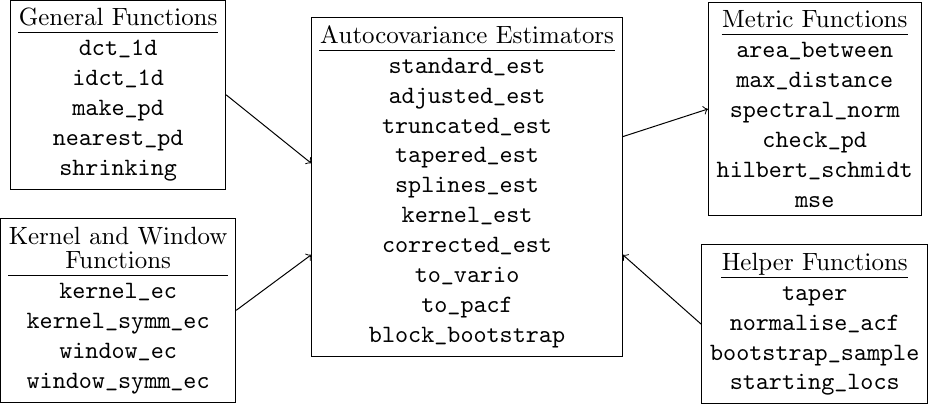
<figcaption>Figure 1: Types and links between main package
functions.</figcaption>
</figure>

::: {#tab:truncated_est_params}
  ------------------------------------------------------------------------
  Parameter         Explanation
  ----------------- ------------------------------------------------------
  `X`               A vector representing observed values of the time
                    series.

  `x`               A vector of lags.

  `t`               The arguments at which the autocovariance function is
                    calculated.

  `T1`              The first truncation point, $T_{1} > 0.$

  `T2`              The second truncation point, $T_{2} > T_{1} > 0.$

  `b`               Bandwidth parameter, greater than 0.

  `kernel_name`     The name of the symmetric kernel function to be used.
                    Possible values are: gaussian, wave,
                    rational_quadratic, and bessel_j. Alternatively, a
                    custom kernel function can be provided.

  `kernel_params`   A vector of parameters of the kernel function.

  `custom_kernel`   If a custom kernel is to be used or not. Defaults to
                    `FALSE`.

  `pd`              Whether a positive-definite estimate should be used.
                    Defaults to `TRUE`.

  `type`            Compute either the 'autocovariance' or
                    'autocorrelation'. Defaults to 'autocovariance'.

  `meanX`           The average value of `X`. Defaults to `mean(X)`.

  `parallel`        Whether or not the computations should be done in
                    parallel or not. Defaults to `FALSE`.

  `ncores`          The number of cores to be used in the parallel
                    computations. Defaults to the number cores - 1
                    (threads if hyperthreading is available), calculated
                    from `parallel::detectCores() - 1`.

  `cl_export`       A vector of any additional functions or variables to
                    export for parallel computations. This may be required
                    if `estimator` is not within the package. Defaults to
                    `NULL`.

  `cl`              An optional cluster object created by
                    `parallel::makeCluster`. Defaults to `NULL`, which
                    creates a temporary PSOCK cluster.

  Return            A CovEsts S3 object containing the truncated kernel
                    regression estimates, the lags, the estimated type and
                    the estimator used.
  ------------------------------------------------------------------------

  : (#tab:T2) Example of parameters for `truncated_est`
:::

```{css, echo = FALSE}
#tab\:kernel table tbody tr:last-child td , #tab\:truncated_est_params table tbody tr:last-child td {
  border-top: 2px solid rgba(0, 0, 0, 0.2)!important;
}
```

The estimator functions are called through a single function, accepting
a time series as the first argument, and additional arguments depending
on the estimation method. As the first argument is the time series, the
pipe operator `|>` can be used for all estimators, for example,
`X |> truncated_est(other arguments)`. All autocovariance estimator
functions return a **`CovEsts`** S3 object. These S3 objects are lists
containing four elements,

- `acf`: the estimated autocovariance/autocorrelation/partial
  autocorrelation values,

- `lags`: the lag indices used to compute the estimates on,

- `est_type`: the type of estimate, namely 'autocorrelation',
  'autocovariance' or 'partial',

- `est_used`: the estimator function used.

In addition to the **`CovEsts`** S3 objects, there are also the
**`VarioEsts`** and **`BootEsts`** S3 objects for variograms computed
using `to_vario` and for block bootstrap estimates. The **`VarioEsts`**
object has the following elements,

- `acf`: the estimated variogram values,

- `lags`: the lag indices used to compute the estimates on,

- `est_type`: 'to_vario'.

The **`BootEsts`** has several more elements,

- `avg_acf`: the average bootstrap autocovariance/autocorrelation
  function estimate,

- `lags`: the lag indices used to compute the estimates on,

- `acf_orig`: the nonbootstrapped autocovariance/autocorrelation
  estimate,

- `acf_mat`: a matrix of all of the bootstrap estimates,

- `conf_lower`: the lower bounds for the estimated pointwise confidence
  interval,

- `conf_upper`: the upper bounds for the estimated pointwise confidence
  interval,

- `est_type`: the type of estimate, namely 'autocorrelation',
  'autocovariance',

- `est_used`: the estimator function used,

- `boot_type` is either 'moving' or 'circular' depending on the type of
  block bootstrap used,

- `alpha` is the $\alpha$ value used to compute the confidence
  intervals.

All these S3 objects have `print`, `plot` and `lines` methods. The
`lines` method allows easy comparison between the obtained estimates.
For **`CovEsts`** and **`VarioEsts`** it overlays a line directly on the
plot. The `lines` method for **`BootEsts`** plots a single averaged
estimate across all bootstrap samples, rather than displaying the
individual estimates corresponding to each bootstrap sample.

S3 objects were chosen over S4 and R6 due to their simplicity, both
internally and in terms of user-facing flexibility. Namely, they allow
plotting and printing the obtained estimates as ordinary `R` objects,
without requiring inspection of the underlying list structure. This is
particularly useful when plotting multiple results together, enabling an
easy comparison. Further, if a user wishes to extract the estimated
values or any other elements, this can be done straightforwardly.

### Main estimators

To compute the standard estimator \@ref(eq:std-est), one uses the
function

``` r
standard_est(X, pd = TRUE, maxLag = length(X) - 1, x = 0:length(X),
        type = c("autocovariance", "autocorrelation"), meanX = mean(X)) ,
```

where `maxLag` $\leq N - 1$ is the maximum lag for which the estimated
autocovariance function is computed and `x` are the indices for which
the time series was observed on. To obtain the
estimate \@ref(eq:std-est-pd), `pd = TRUE` should be used instead. As
can be seen, this function assumes the basic case of equally spaced
observations on a consecutive grid of points, such as the integers or
those with a constant difference of the observation period. This
function, along with all other estimator functions with the \"`_est`\"
suffix, returns a **`CovEsts`** S3 object.

To provide examples of other function calls, we consider
estimators \@ref(eq:hall-est) and \@ref(eq:hall-trunc) that can be
computed through the commands

``` r
adjusted_est(X, x, t, b,
        kernel_name = c("gaussian", "wave", "rational_quadratic", "bessel_j"),
        kernel_params=c(), pd = TRUE, type = c("autocovariance", "autocorrelation"),
        meanX = mean(X), custom_kernel = FALSE, parallel = FALSE,
        ncores = parallel::detectCores() - 1, cl_export = NULL, cl = NULL) 

truncated_est(X, x, t, T1, T2, b,
        kernel_name = c("gaussian", "wave", "rational_quadratic", "bessel_j"),
        kernel_params = c(), pd = TRUE, type = c("autocovariance", autocorrelation"),
        meanX = mean(X), custom_kernel = FALSE, parallel = FALSE,
        ncores = parallel::detectCores() - 1, cl_export = NULL, cl = NULL) .
```

These estimators can use sampled values on an arbitrary grid and set of
lags. For the parameters for these two estimators, refer to
Table [2](#tab:T2){reference-type="ref"
reference="tab:truncated_est_params"}.

As several estimators include options for kernel smoothing and
adjustment, a list of possible symmetric kernels can be found in the
discussion of the kernels and window functions later in this section and
in Table [3](#tab:T3){reference-type="ref" reference="tab:kernels"}. For
the considered estimators, if a custom kernel is chosen, it must have
the properties of a symmetric probability density.

These two functions also allow for parallelism. The other estimators
either do not support parallelisation or do not benefit from it, as the
call-based R functions are sufficiently fast. Parallelisation is done
over the argument `t`, which represents the lags. The user can pass
their own cluster, otherwise, a temporary PSOCK cluster is created. This
can be useful if the user is on an operating system that supports
`fork()`, allowing a cluster created using `parallel::makeForkCluster`
to be used instead.

Another example, the splines estimator, defined by
\@ref(eq:splines-est), is called as

``` r
splines_est(X, x, estCov, p, m, maxLag = length(X) - 1,
        type = c("autocovariance", "autocorrelation"), initial_pars = c(),
        control = list('maxit' = 1000)) ,
```

where `estCov` is an estimated autocovariance function used during the
fitting process, which can either be a numeric vector or a **`CovEsts`**
S3 object generated by one of the other autocovariance function
estimators. The parameter `p` is the order of the splines, `m` is the
number of nonboundary knots, `initial_pars` and `control` are optional
parameters used during the optimisation process (see **`stats::optim`**
for `control`), where `initial_pars` is an $\texttt{m} + \texttt{p}$
vector whose default values are 0.5. This estimator can fail to produce
an output if neither optimisation algorithm converges. The optimisation
algorithms used are Nelder-Mead and L-BFGS-B.

Many of the estimators considered in this package require non-trivial
multistep calculations. As an example, the high-level structure of the
function `splines_est` and the steps required to compute it are shown in
Figure [2](#fig:splines_est){reference-type="ref"
reference="fig:splines_est"}. Arrows represent function calls to other
functions for obtaining values from them. The function calls for `optim`
are repeated as it is called twice using different optimisation
algorithms, where the one with the lowest error is selected. A whole
number placed near an arrow indicates the corresponding step of the
computation in which the function operates. The number after the whole
number is the order in which a function is called by the level preceding
it.

<figure id="fig:splines_est" data-latex-placement="htbp">
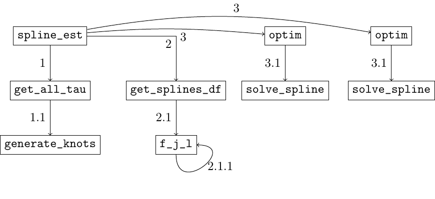
<figcaption>Figure 2: Example of a high-level structure of
<code>spline_est</code> and the functions it calls.</figcaption>
</figure>

The semivariogram estimate can be computed from an autocovariance
function estimate `estCov`, either a numeric vector or a **`CovEsts`**
S3 object, as per \@ref(eq:eqnvariogram), using the command

``` r
to_vario(estCov) .
```

The partial autocorrelation for any estimated autocovariance or
autocorrelation function `estCov`, either a numeric vector or a
**`CovEsts`** S3 object, can be computed using

``` r
to_pacf(estCov) .
```

Block bootstrap can be performed using the following command

``` r
block_bootstrap(X, maxLag, x = 0:length(X), n_bootstrap = 100,
        l = ceiling(length(X)^(1/3)), estimator = standard_est,
        type = c("autocovariance", "autocorrelation"), alpha = 0.05,
        boot_type = c("moving", "circular"), parallel = FALSE,
        ncores = parallel::detectCores() - 1, cl_export = NULL,
        boot_seed = NULL, cl = NULL, ...) ,
```

where `n_bootstrap` is the number of times to run block bootstrap, `l`
is the block length, `estimator` is the estimator function one wishes to
use, where estimator \@ref(eq:std-est-pd) is chosen by default, `alpha`
is the level of significance for the pointwise confidence intervals,
`boot_type` is either `’moving’` or `’circular’`. This function supports
parallelism, see Table [2](#tab:T2){reference-type="ref"
reference="tab:truncated_est_params"} for the relevant parameters.
\"`...`\" are any other parameters that are to be passed into
`estimator`. The parallelism is performed over `n_bootstrap` iterations.

### Kernels, windows and associated estimators

Several standard kernels, symmetric kernels and window functions
available in the literature are realised in the package. We also
provided the option for user-defined kernels, symmetric kernels, window
functions and symmetric window functions.
Tables [3](#tab:T3){reference-type="ref" reference="tab:kernels"} and
[4](#tab:T4){reference-type="ref" reference="tab:windows"} provide lists
of the main available kernels and window functions in the package. The
symmetric kernels and symmetric window functions will be mentioned only
briefly, as they are modifications of the main kernels.

::: {#tab:kernels}
  ----------------------------------------------------------------------------------------------------------------------------------------------------------------------------------------------------------------------------------------------------
  Kernel Name            Equation $a(x; \theta, \nu, d, \alpha, \beta)$                                                                                                                                            Constraints
  ---------------------- ----------------------------------------------------------------------------------------------------------------------------------------------------------------------------------------- -----------------------------------
  `gaussian`             $\exp(-x^{2} / \theta)$                                                                                                                                                                   

  `exponential`          $\exp(-x / \theta)$                                                                                                                                                                       

  `wave`                 $\begin{cases} \frac{\theta}{x} \sin(x / \theta), & x \neq 0 \\ 0, & x = 0 \end{cases}$                                                                                                   

  `rational_quadratic`   $1 - {x^{2}}/{(x^{2} + \theta)}$                                                                                                                                                          

  `spherical`            $\begin{cases} 1 - {3x}/{(2\theta)} + \left( {x}/{\theta} \right)^{3}/2, & x < \theta \\ 0, & \text{otherwise} \end{cases}$                                                               

  `circular`             $\begin{cases} \frac{2}{\pi}\arccos\left( {x}/{\theta} \right) - \frac{2x}{\pi\theta} \sqrt{ 1 - \left( {x}/{\theta} \right)^{2} }, &  x < \theta \\ 0, & \text{otherwise} \end{cases}$   

  `matern`               $\left(\sqrt{2\nu} {x}/{\theta}\right)^{\nu} \left(2^{\nu - 1}  \Gamma(\nu)\right)^{-1} K_{\nu}(\sqrt{2\nu} {x}/{\theta})$                                                                $\nu > 0$

  `bessel_j`             $2^{\nu} \Gamma(\nu + 1) J_{\nu}(x / \theta) (x / \theta)^{-\nu}$                                                                                                                         $\nu \geq d/2  -1$

  `cauchy`               $(1 + (x / \theta)^{\alpha})^{-(\beta / \alpha)}$                                                                                                                                         $\alpha \in (0, 2], \beta \geq 0$
  ----------------------------------------------------------------------------------------------------------------------------------------------------------------------------------------------------------------------------------------------------

  : (#tab:T3) List of main kernels
:::

The kernel and window functions are called through

``` r
kernel_ec(x, name = c("gaussian", "exponential", "wave", "rational_quadratic",
        "spherical", "circular", "bessel_j", "matern", "cauchy"), params=c(1)) ,
kernel_symm_ec(x, name = c("gaussian", "wave", "rational_quadratic", "bessel_j"),
        params=c(1)) ,
window_ec(x, name = c("tukey", "triangular", "sine", "power_sine", "blackman",
        "hann_poisson", "welch"), params=c(1)) ,
window_symm_ec(x, name = c("tukey", "triangular", "sine", "power_sine", "blackman",
        "hann_poisson", "welch"), params=c(1)) ,
```

where the parameters are given in the formulas in
Tables [3](#tab:T3){reference-type="ref" reference="tab:kernels"} and
[4](#tab:T4){reference-type="ref" reference="tab:windows"}.

The symmetric kernels (`gaussian`, `wave`, `rational_quadratic` and
`bessel_j`) are symmetric versions of the kernels in
Table [3](#tab:T3){reference-type="ref" reference="tab:kernels"}, but
they are standardised so that their area is 1. For the symmetric window
functions, all options are the same as the window functions, however,
they are defined as $1 - w(\left|x\right|;a)$ for $x \in [-1, 1]$ and
$0$ elsewhere, where $w(x;a)$ is a window function. For `kernel_ec`, its
argument `x` is nonnegative, for `kernel_symm_ec` and `window_symm_ec`,
their arguments `x` can be negative, and for `window_ec`, it must be
within 0 and 1.

::: {#tab:windows}
  ----------------------------------------------------------------------------------------------------------------------
  Kernel Name      Equation $w(x; a)$                                                       Constraints
  ---------------- ------------------------------------------------------------------------ ----------------------------
  `tukey`          $\frac{1}{2} - \frac{1}{2} \cos(\pi x)$                                  

  `triangular`     $x$                                                                      

  `sine`           $\sin(\pi x / 2)$                                                        

  `power_sine`     $\sin^{a}(\pi x / 2)$                                                    $a > 0$

  `blackman`       $( (1 - a) / 2) - \frac{1}{2} \cos(\pi x) + \frac{a}{2} \cos(2 \pi x)$   $\left|a\right| \leq 0.25$

  `hann_poisson`   $(1/2) (1 - \cos(\pi x)) \exp( - (a \left|1 - x \right|) )$              $a \in \mathbb{R}$

  `welch`          $1 - (x - 1)^2$                                                          
  ----------------------------------------------------------------------------------------------------------------------

  : (#tab:T4) List of main window functions, where $x \in [0, 1]$
:::

The package offers several functions to deal with the potential issues
in the estimated autocovariance functions, which were discussed in
Section [2](#sec:nonparametric). These corrections can be applied to any
given autocovariance estimate. A general method to correct any estimator
is provided by \@ref(eq:eqnkernel-correction) and is called as

``` r
kernel_est(estCov, kernel_name = c("gaussian", "exponential", "wave",
        "rational_quadratic", "spherical", "circular", "bessel_j", "matern", "cauchy"),
        kernel_params = c(), N_T = 0.1 * length(estCov), maxLag = length(estCov) - 1,
        x = 0:length(X), type = c("autocovariance", "autocorrelation"),
        custom_kernel = FALSE) ,
```

where `kernel_name` and `kernel_params` are given in
Table [5](#tab:T5){reference-type="ref" reference="tab:kernel"}, `N_T`
is the rate at which the kernel function vanishes and is recommended to
be of order $0.1 N$ when considering all lags (Yaglom 1987, sec. 3.17).
As with `splines_est`, `estCov` can be a numeric vector or a
**`CovEsts`** S3 object, obtained from another autocovariance estimator.

::: {#tab:kernel}
  ----------------------------------------------------------------------
  Parameter   Explanation
  ----------- ----------------------------------------------------------
  `x`         A vector or matrix of arguments of at least length 1.

  `name`      The name of the kernel. Options are: gaussian,
              exponential, wave, rational_quadratic, spherical,
              circular, bessel_j, matern, and cauchy.

  `params`    A vector of parameters for the kernel. See
              Table [3](#tab:T3){reference-type="ref"
              reference="tab:kernels"} for the position of the
              parameters. All kernels will have a scale parameter as the
              first value in the vector.
  
  Return      A vector of values.
  ----------------------------------------------------------------------

  : (#tab:T5) Example of parameters for kernel functions

:::

In addition to this, kernel-corrected versions of \@ref(eq:std-est) and
\@ref(eq:std-est-pd) are provided, called by

``` r
corrected_est(X, kernel_name = c("gaussian", "exponential", "wave",
        "rational_quadratic", "spherical", "circular", "bessel_j", "matern", "cauchy"),
        kernel_params = c(), N_T = 0.1 * length(X), pd = TRUE, maxLag = length(X) - 1,
        x = 0:(maxLag - 1), type = c("autocovariance", "autocorrelation"),
        meanX = mean(X), custom_kernel = FALSE) ,
```

where the parameters are the same as for `kernel_corrected_est` with the
addition of having a positive-definite estimator. If a custom kernel is
used that is not positive-definite, then the estimator will no longer be
positive-definite. For both kernel correction estimators, unlike the
kernel regression estimators (recall estimators \@ref(eq:hall-est) and
\@ref(eq:hall-trunc)), the custom kernel is not required to have the
properties of a symmetric probability density.

The function that computes the taper corrected
estimator \@ref(eq:tapered-est) is called as

``` r
tapered_est(X, rho, window_name = c("tukey", "triangular", "sine", "power_sine",
        "blackman", "hann_poisson", "welch"), window_params = c(1),
        maxLag = length(X) - 1, x = 0:length(X),
        type = c("autocovariance", "autocorrelation"), meanX = mean(X),
        custom_window = FALSE) ,
```

where $\texttt{rho} \in (0, 1]$ is a scale parameter, `window_ec` and
`window_params` are given in Table [4](#tab:T4){reference-type="ref"
reference="tab:windows"}, and the option `custom_window` serves the same
purpose as `custom_kernel`. For the custom window function, it should be
a nondecreasing function on $[0, 1]$ with $w(0) = 0$ and $w(1) = 1.$

### Estimator adjustment/modification

The remaining groups in
Figure [1](#fig:functions_group){reference-type="ref"
reference="fig:functions_group"} fall into two categories, helper
functions and *Metric Functions*. Helper functions are used during
autocovariance function estimation, whilst metric functions are used to
compare estimated autocovariance functions, which will be discussed in
the next subsection.

The helper functions are further split into two categories, *Helper
Functions* and *General Functions*. The discussion of the *Helper
Functions* is omitted as these functions exist only for auxiliary
calculations. *General Functions* can also be useful for other
applications, for example, the forward and inverse type-II discrete
cosine transforms can be called the following functions

``` r
dct_1d(X) ,
idct_1d(X) ,
```

where `X` is a vector of values for which the discrete cosine transform
is being computed.

Also, one can make any estimator positive-definite by using the
positive-definite corrections from Section 2. In the package, the first
correction method (see Section 2 [(i)](#make_pos_def_1)) can be called
by the function

``` r
make_pd(x, method.1 = TRUE) ,
```

where `x` can be either a numeric vector of estimated autocovariance
values or a **`CovEsts`** S3 object generated by one of the other
autocovariance functions. If the second correction (see Section
2 [(ii)](#make_pos_def_2)) is to be done, `method.1 = FALSE` is used
instead.

Another method to make an estimated autocorrelation function
positive-definite is to use linear shrinking, recall
\@ref(eq:eqnlinear-shrinking), which can be computed using

``` r
shrinking(estCov, return_matrix = FALSE, target = NULL) ,
```

where `estCov` is an estimated autocovariance or autocorrelation
function, either a numeric vector or a **`CovEst`** S3 object,
`return_matrix` is a boolean, determining if the shrunken matrix is to
be returned or not. The default value returns a shrunken autocorrelation
function instead of an autocorrelation matrix. `target` is the target
matrix, which defaults to the identity matrix.

For a matrix $\boldsymbol{\mathbf{A}}$ that is not necessarily
positive-definite, the following procedure can be used to find the
nearest positive-definite matrix (Higham 1988, Th. 2.1). First, a new
matrix is constructed,
$\boldsymbol{\mathbf{B}} = \left(\boldsymbol{\mathbf{A}} + \boldsymbol{\mathbf{A}}^{T} \right)$
and then compute the polar decomposition
$\boldsymbol{\mathbf{B}} = \boldsymbol{\mathbf{U}} \boldsymbol{\mathbf{H}},$
where $\boldsymbol{\mathbf{U}}$ is an orthogonal matrix and
$\boldsymbol{\mathbf{H}}$ is a positive-definite matrix. The nearest
positive-definite matrix to $\boldsymbol{\mathbf{A}}$ is then
$\boldsymbol{\mathbf{A}}_{F} = \left(\boldsymbol{\mathbf{B}} + \boldsymbol{\mathbf{H}}\right) / 2 .$
The function that computes this matrix is called using

``` r
nearest_pd(X, return_matrix = FALSE) ,
```

where `X` is either a numeric vector, a numeric square matrix or a
**`CovEsts`** S3 object. If a numeric vector or **`CovEsts`** is
supplied, a matrix similar to \@ref(eq:matspec-norm) will be constructed
where $D(\cdot)$ is replaced by `X` or the autocovariance values within
the **`CovEsts`** object.

### Metrics

Six *Metric Functions* are provided in the package to compare different
autocovariance estimates.

For two continuous autocovariance function estimates,
$\widehat{C}_{1}(\cdot)$ and $\widehat{C}_{2}(\cdot)$, the area between
them can be expressed as
$\int_{0}^{h_{n}} \left| D(h) \right| \, \text{d}h ,$ where
$D(h) = \widehat{C}_{1}(h) - \widehat{C}_{2}(h)$ and $h_{n}$ denotes the
maximum lag at which the functions are estimated up to. However, as the
estimates are computed on a discrete grid, the integral is approximated
using the trapezoid rule, that is,
$$\int_{0}^{h_{n}} \left| D(h) \right| \, \text{d}h 
\approx \sum_{i = 1}^{n} \frac{\left| D(h_{i - 1}) \right| + \left| D(h_{i}) \right|}{2} (h_{i} - h_{i-1}) ,$$
where the estimates are given over the set of lags
$\{h_{0} , h_{1} , \dots , h_{N - 1}, h_{n} \},$ and $h_{0}$ is assumed
to be 0.

The area between two estimated autocovariance functions can be
calculated as

``` r
    area_between(estCov1, estCov2, lags = c(), plot = FALSE) ,
```

where `estCov1` and `estCov2` are estimated values of autocovariance
functions given over the same set of lags, either numeric vectors or
**`CovEsts`** S3 objects. The parameter `lags` is optional and defaults
to a vector starting at 0, increasing by 1 until `length(estCov1)`.
Another optional parameter, `plot`, determines whether a plot should be
created showing the area between the two estimated autocovariance
functions (for example, see
Figure [9](#fig:hall_area){reference-type="ref"
reference="fig:hall_area"}).

The maximum distance can be expressed as follows,
$\sup_{h \in [0, h_{n}]} \left| D(h) \right| ,$ where $\sup$ is replaced
by $\max$ over the set of lags in the discrete case.

The spectral norm is the largest eigenvalue of the matrix

$$\begin{equation}
\begin{bmatrix} \label{mat:spec_norm}
D(h_{0})     & D(h_{1})     & \cdots & D(h_{n - 1}) & D(h_{n})     \\
D(h_{1})     & D(h_{0})     & \cdots & D(h_{n - 2}) & D(h_{n - 1}) \\
\vdots       & \vdots       & \ddots & \vdots       & \vdots       \\
D(h_{n - 1}) & D(h_{n - 2}) & \cdots & D(h_{0})     & D(h_{1})     \\
D(h_{n})     & D(h_{n - 1}) & \cdots & D(h_{1})     & D(h_{0})     \\
\end{bmatrix}  .
\end{equation}   (\#eq:matspec-norm)$$

The maximum vertical distance and spectral norm have similar arguments
to `area_between` and are called as

``` r
max_distance(est1, est2, lags = c(), plot = FALSE) ,
spectral_norm(est1, est2) ,
```

where the plot for the maximum distance shows the magnitude of the
vertical distances for each lag, see an example in
Figure [10](#fig:hall_dist){reference-type="ref"
reference="fig:hall_dist"}. Like with `area_between`, `estCov1` and
`estCov2` are estimated values of autocovariance functions given over
the same set of lags, either numeric vectors or **`CovEsts`** S3
objects, which is the case for all metric functions.

The Hilbert-Schmidt metric for the matrix \@ref(eq:matspec-norm) is
defined as $\sqrt{\sum_{i,j= 1}^{n} d_{i,j}^{2}}$ and can be called as

``` r
hilbert_schmidt(est1, est2) .
```

The closely related mean-square error/difference (MSE) between two
estimated autocovariance functions is given by
$n^{-1} \sum_{i = 0}^{n} D(h_{i})^{2} .$ If the estimate is to be
compared against a theoretical model, $\widehat{C}_{2}(\cdot)$ can be
replaced with the corresponding theoretical autocovariance function. The
MSE can be called as

``` r
mse(est1, est2) .
```

To check that the autocovariance function estimate is positive-definite,
first one can construct a covariance matrix that is similar to
\@ref(eq:matspec-norm), where $\widehat{C}(\cdot)$ replaces $D(\cdot).$
Then, if all eigenvalues of this matrix are positive, the estimate is
positive-definite. This can be checked by using the function

``` r
check_pd(est) ,
```

where `est` is a vector of numeric values of an estimated autocovariance
function or a **`CovEsts`** S3 object.

## Examples {#sec:examples}

This section provides an example utilisation of some main functions and
computational time and memory usage analysis. It will demonstrate
applications of the estimators to a simulated data set, the
`sunspot.year` data set in the **datasets** package and unemployment
data from the US Bureau of Labor Statistics.

The typical usage of the kernel and window functions, defined only for
nonnegative values of their argument `x` (in the `window_ec` case, it is
further restricted to the interval $[0, 1]$) is as follows:

``` r
library(CovEsts)
x <- c(0.2, 0.4, 0.6)
theta <- 0.9
kernel_ec(x, "gaussian", c(theta))
[1] 0.9565287 0.8371284 0.6703200
nu <- 1
dim <- 1
kernel_ec(x, "bessel_j", c(theta, nu, dim))
[1] 0.9938398 0.9755110 0.9454638

window_ec(x, "tukey")
[1] 0.0954915 0.3454915 0.6545085
window_ec(x, "blackman", c(0.16))
[1] 0.04021286 0.20077014 0.50978714
```

When using the `bessel_j` option, the dimension `dim` is passed, and the
function additionally verifies that the kernel is valid for the
specified dimension and parameters. For the Blackman window function,
one should use $\left| a \right| \leq 0.25$ to ensure that it is
nondecreasing on $[0, 1].$

`kernel_symm_ec` and `window_symm_ec` are called in a similar way to
`kernel_ec` and `window_ec`, but can be applied to negative values of
`x`, for example,

``` r
x <- c(-0.4, -0.2, 0, 0.2, 0.4)
kernel_symm_ec(x, "gaussian", c(theta))
[1] 0.4978470 0.5688553 0.5947080 0.5688553 0.4978470

window_symm_ec(x, "blackman", c(0.16))
[1] 0.7992299 0.9597871 1.0000000 0.9597871 0.7992299
```

Figures [3](#fig:kernels){reference-type="ref"
reference="fig:kernels"}, [4](#fig:kernels_symm){reference-type="ref"
reference="fig:kernels_symm"},
[5](#fig:windows){reference-type="ref"
reference="fig:windows"} and [6](#fig:windows_symm){reference-type="ref"
reference="fig:windows_symm"} plot examples of the main available
kernels, symmetric kernels, window functions, and symmetric window
functions, respectively.

<figure id="fig:kernels">
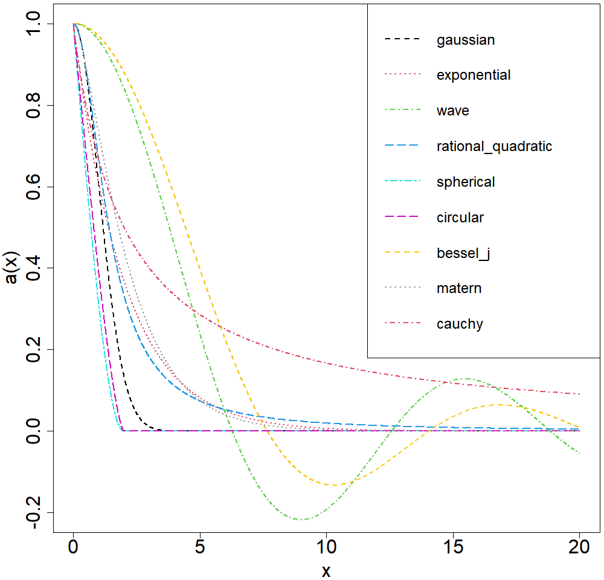
<figcaption>
Figure 3: Examples of main available kernels where $\theta = 2, \nu = d = \alpha = \beta = 1$.
</figcaption>
</figure>
<figure id="fig:kernels_symm">
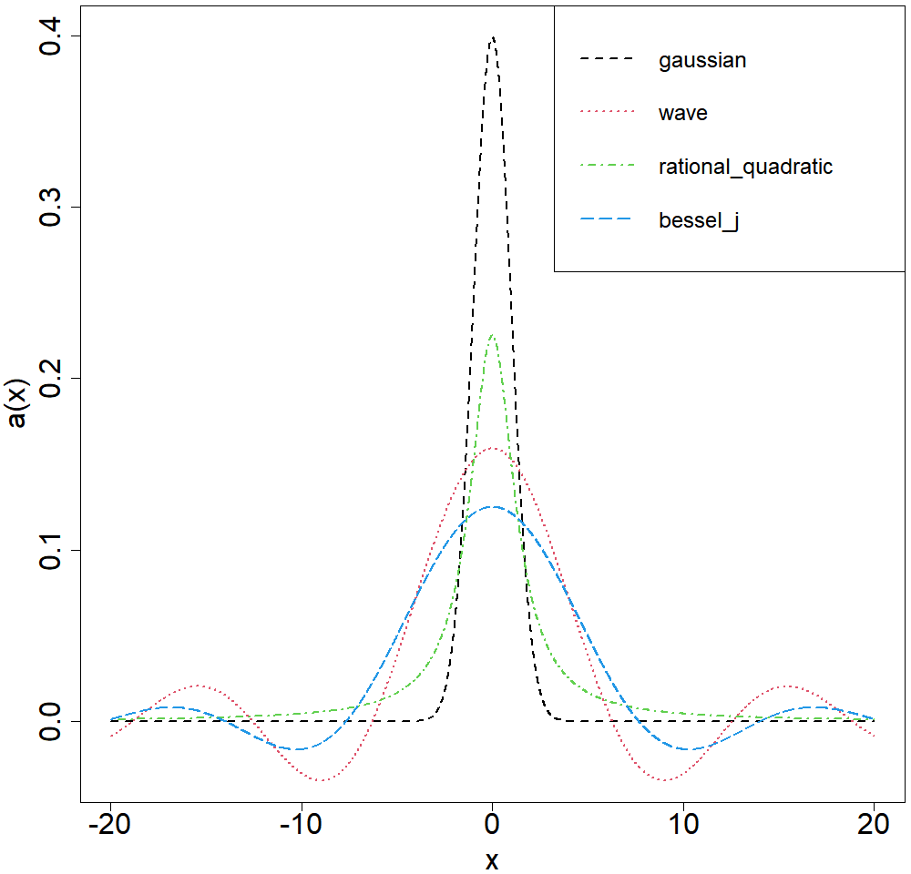
<figcaption>Figure 4: Examples of main available symmetric kernels where $\theta = 2, \nu = d = \alpha = \beta = 1$.
</figcaption>
</figure>
<figure id="fig:windows" data-latex-placement="!htb">
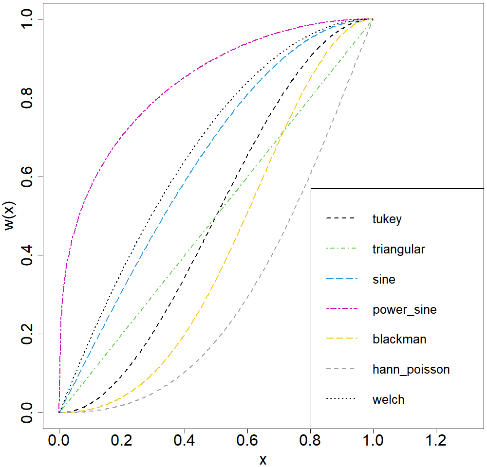
<figcaption>Figure 5: Examples of main available window functions where $a = 0.3, 0.16, 1$ for the power sine, Blackman and Hann-Poisson window functions, respectively.</figcaption>
</figure>
<figure id="fig:windows_symm" data-latex-placement="!htb">
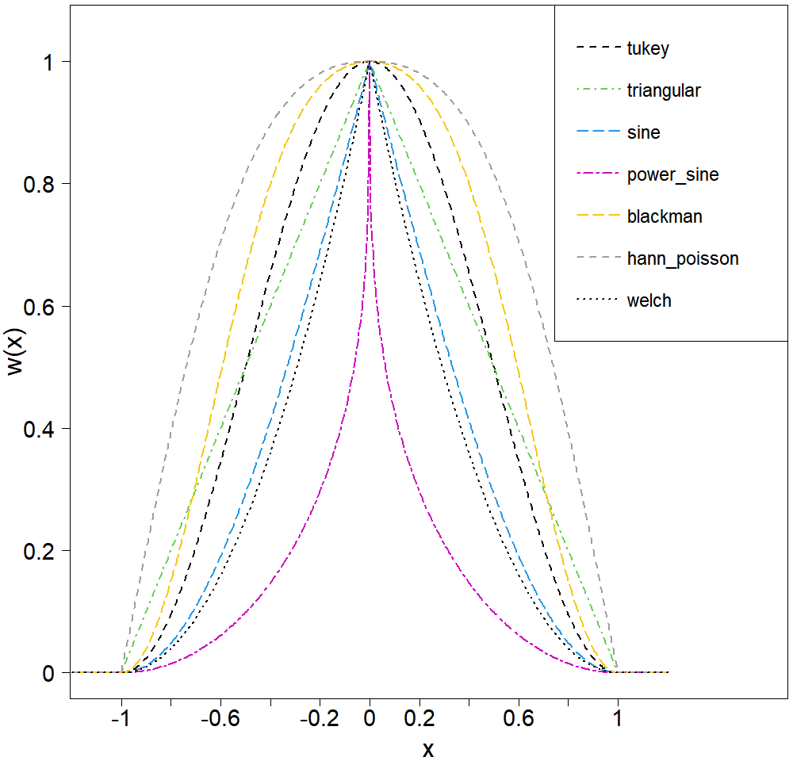
<figcaption>Figure 6: Examples of main available symmetric window functions where $a = 0.3, 0.16, 1$ for the power sine, Blackman and Hann-Poisson window functions, respectively.</figcaption>
</figure>

### Example 1 {#sec:example_1}

To illustrate the application of the estimators and their accuracy, we
will consider a simulated Gaussian time series on a uniform grid on
$[0, 40]$ with a spacing of $0.02,$ having a short-range dependent
Gaussian autocovariance model, $\exp(-x^2)$. We will only estimate the
autocovariance function to a lag of 5, to use the recommended 10-20% of
total samples (Yaglom 1987, sec. 3.17).

The realisations were generated using the approach based on
eigendecomposition of the autocovariance matrix. Below is the code to
simulate the process and obtain the estimates based on the realisation
in
Figure [7](#fig:gaussian_realisation){reference-type="ref"
reference="fig:gaussian_realisation"}, which are then plotted in
Figure [8](#fig:gaussian){reference-type="ref"
reference="fig:gaussian"}.

``` r
set.seed(135)
N <- 2001
x <- seq(0, 40, length.out = N)
Z <- rnorm(N)
dist_mat <- abs(outer(x, x, '-'))
cov_mat <- exp(- (dist_mat^2))
eig <- eigen(cov_mat)
X <- as.vector((eig$vectors %*% sqrt(diag(zapsmall(eig$values)))) %*% Z)

maxLag <- 251
t <- x[1:maxLag]

# standard estimators
Cs <- standard_est(X, maxLag = maxLag - 1, pd = FALSE, x = x)
Css <- standard_est(X, maxLag = maxLag - 1, pd = TRUE, x = x,
        type = "autocorrelation")

# Hall's estimators
hall_1 <- adjusted_est(X, x, t, 0.1, "gaussian", type = "autocorrelation")
hall_2 <- truncated_est(X, x, t, 3, 4, 0.1, "gaussian", type = "autocorrelation")

# tapered
tapered <- tapered_est(X, 1, "tukey", maxLag = maxLag - 1, x = x,
        type = "autocorrelation")

# splines
splines <- splines_est(X, x, Cs, 3, 2, maxLag = maxLag - 1, type = "autocorrelation")
Cs <- normalise_acf(Cs)

# Correction
corrected <- corrected_est(X, "gaussian", N_T=5*length(X), maxLag = maxLag - 1, x = x,
        type = "autocorrelation")

# Plot
par(mar=c(4,5.25,0.25,0.25)+.1)
plot(x[1:maxLag], exp(-x[1:maxLag]^2), type='l', lwd=2, ylim=c(-0.3, 1),
        xlab=expression(h), ylab=expression(hat(rho)*'(h)'), cex.axis=2,
        cex.lab=2)
lines(Cs, lwd=3, lty=2, col=2)
lines(Css, lwd=3, lty=3, col=3)
lines(hall_1, lwd=3, lty=4, col=4)
lines(hall_2, lwd=3, lty=5, col=6)
lines(tapered, lwd=3, lty=6, col=7)
lines(splines, lwd=3, lty=7, col=8)
lines(corrected, lwd=3, lty=8, col=13)

legend('topright', c('True', expression(hat('C')^'*'*'(h)'),
        expression(hat('C')^'**'*'(h)'), expression(hat('C')[H]*'(h)'),
        expression(hat('C')[1]*'(h)'), expression(hat('C')[N]^'a'*'(h)'),
        expression(hat('C')^'B'*('h')), expression('C'[T]^'(a)'*'(h)')),
        col=c(1, 2, 3, 4, 6, 7, 8, 13), lty=c(1, 2, 3, 4, 5, 6, 7, 8),
        lwd=c(2, rep(3, 7)), y.intersp=1, cex=2, ncol = 2)
```

<figure id="fig:gaussian_realisation" data-latex-placement="!tbp">
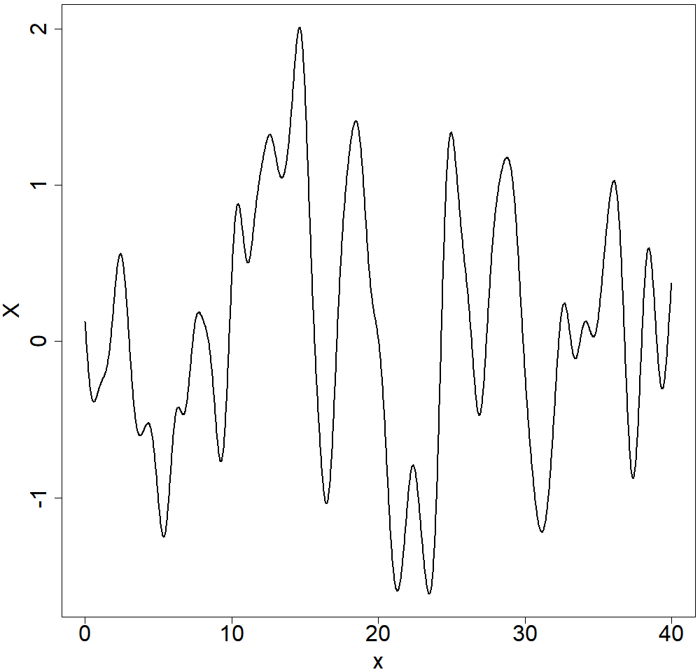
<figcaption>Figure 7: Realisation of short-range dependent Gaussian time series.</figcaption>
</figure>
<figure id="fig:gaussian">
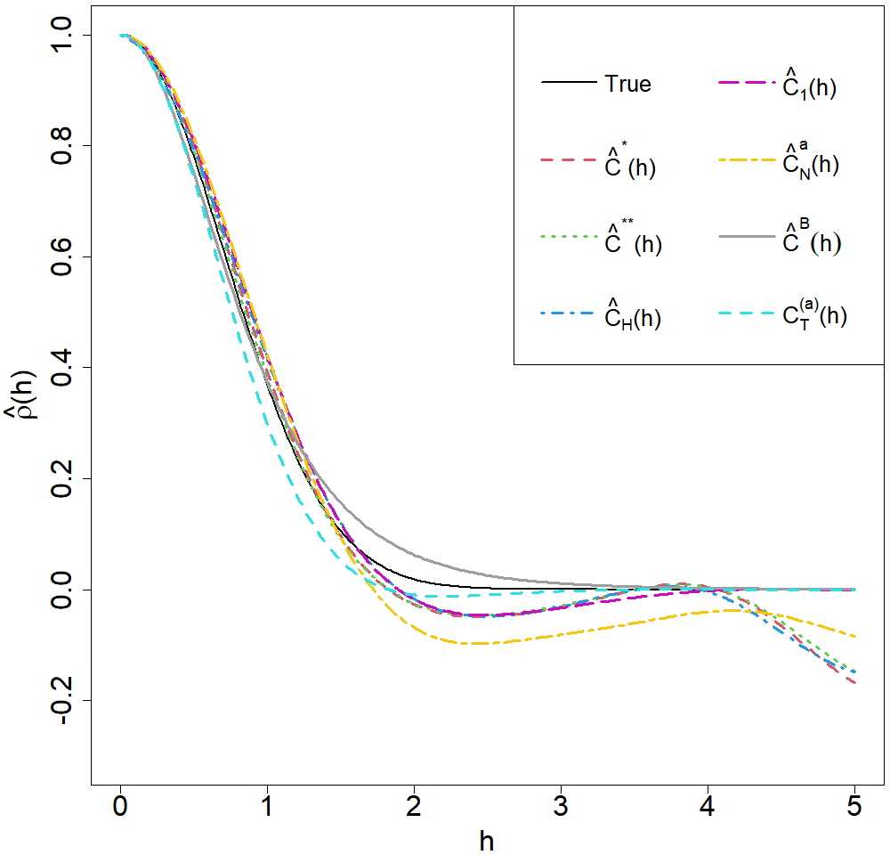
</div>
<figcaption>Figure 8: Estimated autocorrelation functions for a
short-range dependent time series.</figcaption>
</figure>

Whilst for short distances, the majority of the estimated
autocorrelation functions are consistent and adequately reflect the true
autocorrelation function, it is clear that for increasing distances the
waves start to overwhelm the estimators, seen in
Figure [8](#fig:gaussian){reference-type="ref"
reference="fig:gaussian"}. The waves are eliminated when applying the
estimators $\widehat{C}_{1}(h)$ and $C_{T}^{(a)}(h),$ given by
\@ref(eq:hall-trunc) and \@ref(eq:eqnkernel-correction-std-pd),
respectively.

For this and the following examples, we consider the estimated
autocorrelation functions instead of the estimated autocovariance
functions to allow for easier comparison.

Figure [9](#fig:hall_area){reference-type="ref"
reference="fig:hall_area"} plots the area (in grey) between estimators
given by \@ref(eq:hall-est) (red) and \@ref(eq:hall-trunc) (green). As
the green curve is forced to zero after $h=4,$ the area between the two
estimates increases after that point. The estimated area between them is
approximately 0.061. This difference can also be seen in the plot of
distances between the two estimates in
Figure [10](#fig:hall_dist){reference-type="ref"
reference="fig:hall_dist"}. For $h < 3,$ the estimates are rather close.
However, the distance starts to increase after this point dramatically.
The maximum distance between the two estimates is 0.1. These values and
plots can be produced as follows:

``` r
area_between(hall_1, hall_2, plot=T)
max_distance(hall_1, hall_2, plot=T)
```

<figure id="fig:hall_area" data-latex-placement="!htb">
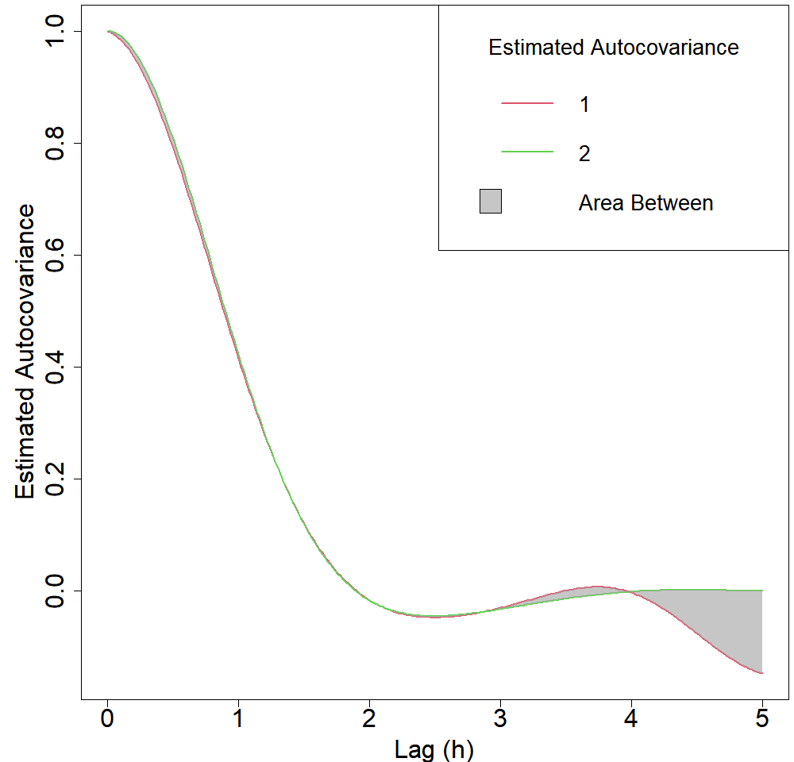
<figcaption>Figure 9: Area between estimated autocovariance functions.</figcaption>
</figure>
<figure id="fig:hall_dist">
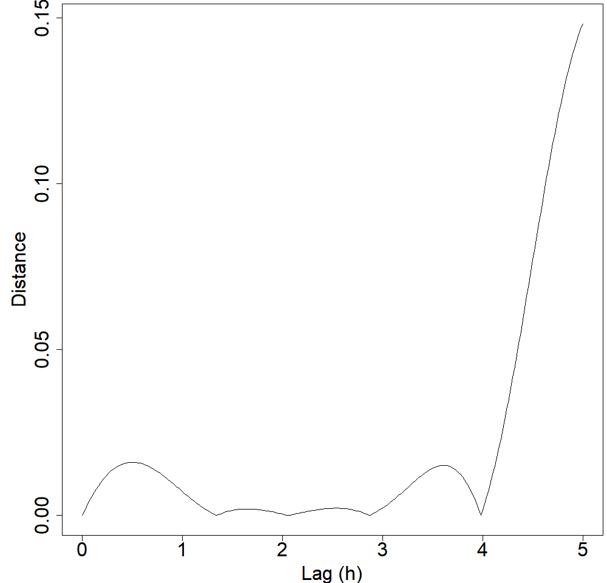
<figcaption>Figure 10: Distances between estimated autocovariance
functions.</figcaption>
</figure>

To compute the moving block and circular bootstrap for
estimator \@ref(eq:std-est-pd), one can use the following commands

``` r
plot(block_bootstrap(X, maxLag, x, l = maxLag), ylim=c(-0.25, 1), cex.axis=2, cex.lab=2)
plot(block_bootstrap(X, maxLag, x, l = maxLag, boot_type = 'circular'),
        ylim=c(-0.25, 1), cex.axis=2, cex.lab=2)
```

Figures [11](#fig:moving_boot){reference-type="ref"
reference="fig:moving_boot"} and
[12](#fig:circular_boot){reference-type="ref"
reference="fig:circular_boot"} show graphical outputs from the
`block_boostrap` function, where the autocovariance functions are
plotted. The solid black line is the estimated autocovariance function,
the red dashed line is the average bootstrap autocovariance function,
and the grey shaded bootstrap 95% confidence region is calculated
pointwise for each lag. Both bootstrap estimates give similar results,
with the bootstrap estimate lessening constant summation effects,
compared to the original estimate that dips after lag 4.

<figure id="fig:moving_boot" data-latex-placement="!htb">
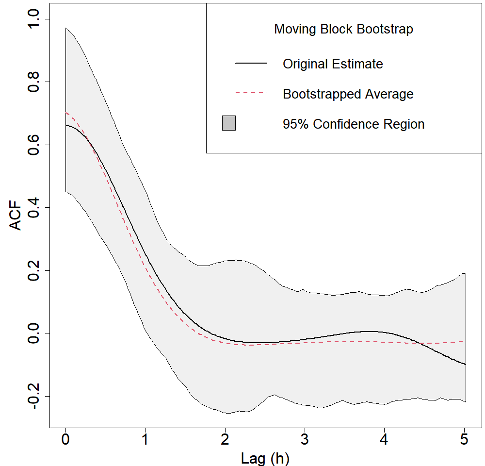
<figcaption>Figure 11: Moving block bootstrap estimates and confidence region.</figcaption>
</figure>
<figure id="fig:circular_boot">
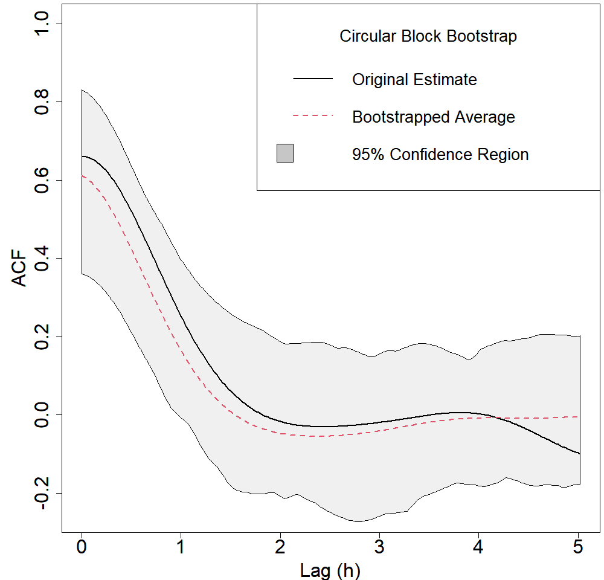
<figcaption>Figure 12: Circular block bootstrap estimates and confidence
region.</figcaption>
</figure>

### Example 2

This example uses the classical yearly sunspot count data from 1700 to
1988, `sunspot.year`, available in the **datasets** R package. This data
gives the number of observed yearly sunspots, seen in
Figure [13](#fig:sunspots_data){reference-type="ref"
reference="fig:sunspots_data"}. It has been shown that the number of
sunspots exhibits long-range dependent and cyclic behaviours, see
Gil-Alana (2009) and Hu et al. (2009), with an approximate 11-year
cycle. So, one should expect to see periodicity in the autocovariance
estimate at multiples of lag 11. The example demonstrates that
estimator \@ref(eq:hall-trunc) has potential issues as its Fourier
transform at the corresponding second nonzero frequency takes a negative
value. So, only one nonzero frequency can be used to obtain the
corrected estimates. Thus, this positive-definite adjustment will not
produce any useful result and is not reported. Instead, it is replaced
with the non-positive-definite version of estimator \@ref(eq:hall-est),
denoted by $\widehat{C}_{H}^{1}(h)$ in the legend of
Figure [15](#fig:sunspots){reference-type="ref"
reference="fig:sunspots"}. The splines estimator will also be omitted as
it does not capture the cyclicality in the autocovariance function.

<figure id="fig:sunspots_data" data-latex-placement="!htb">
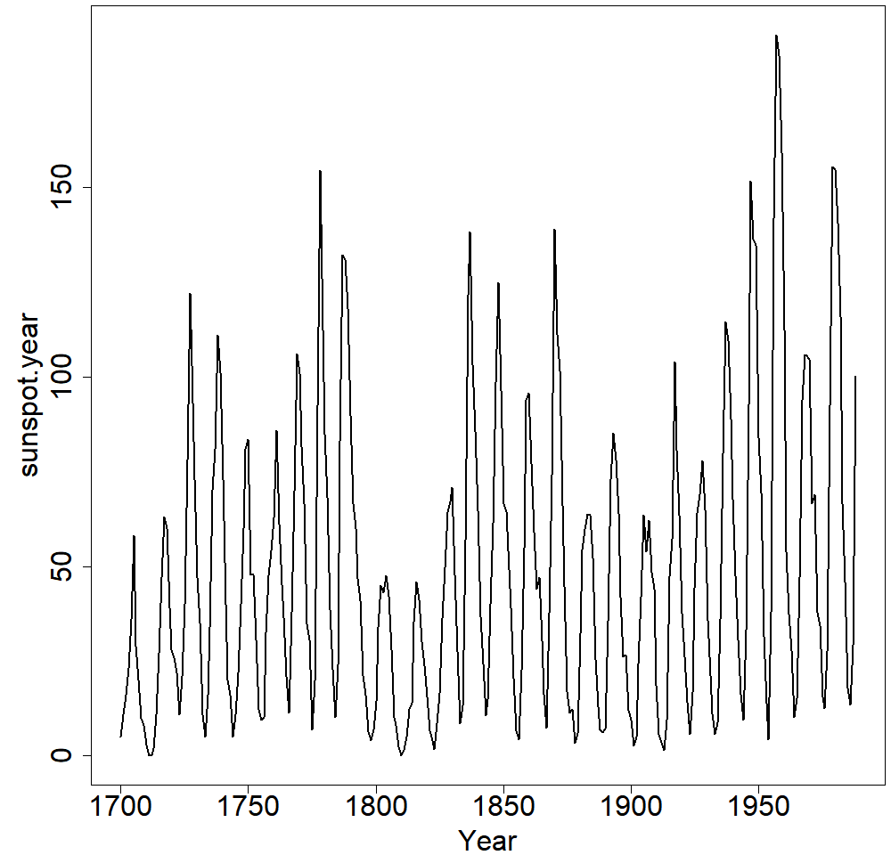
<figcaption>Figure 13: Yearly sunspots count data, from 1700 to 1988.</figcaption>
</figure>
<figure id="fig:bls_series" data-latex-placement="!htb">
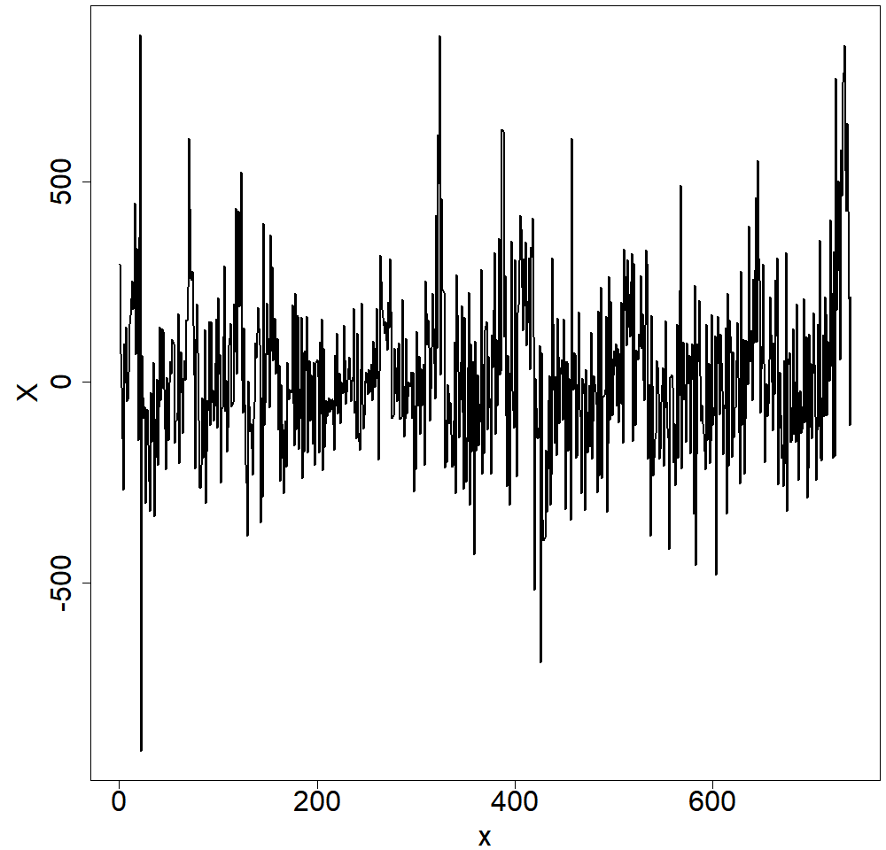
<figcaption>Figure 14: Increments of US unemployment count
data.</figcaption>
</figure>

<figure id="fig:sunspots" data-latex-placement="!htb">
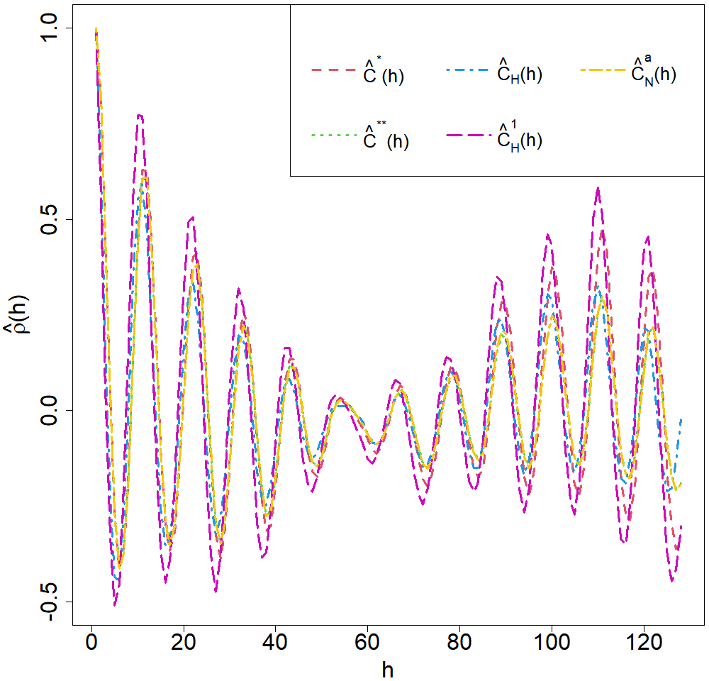
<figcaption>Figure 15: Estimated autocorrelation functions for the sunspots data.</figcaption>
</figure>
<figure id="fig:smooth_sunspot">
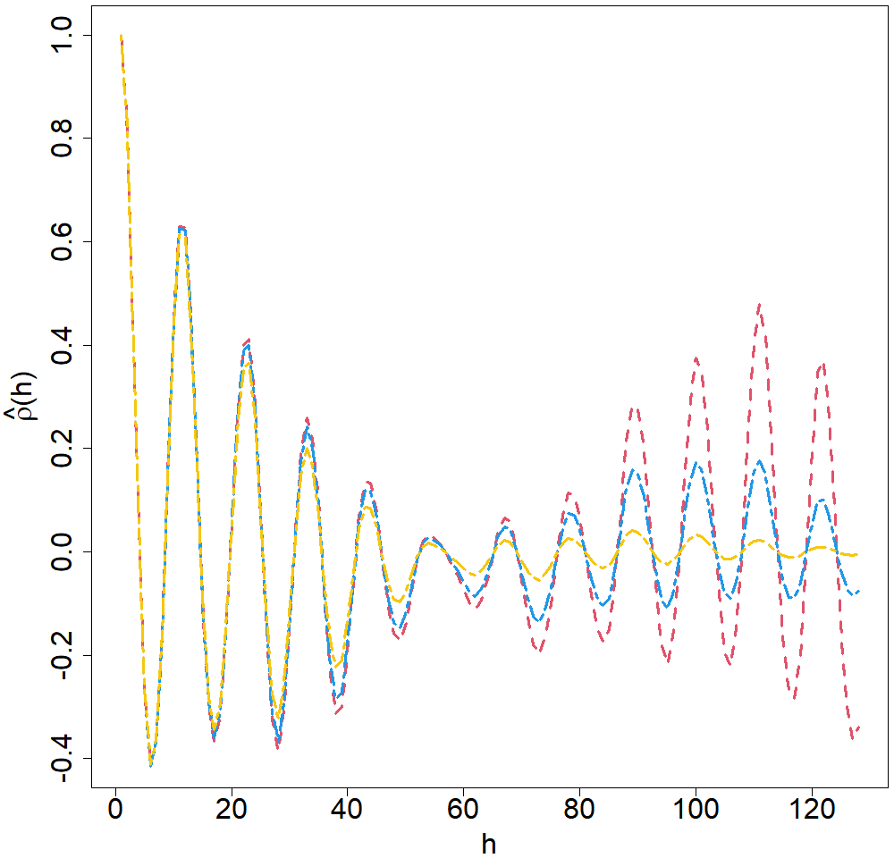
<figcaption>Figure 16: Smoothing of $C^{*}(h)$ autocorrelation estimate.</figcaption>
</figure>

``` r
X <- as.vector(sunspot.year)
x <- 1:length(X)
maxLag <- 128

# standard estimators
Cs <- standard_est(X, maxLag = maxLag - 1, pd = FALSE, meanX = mean(X), x = x,
        type = "autocorrelation")
Css <- standard_est(X, maxLag = maxLag - 1, pd = TRUE, meanX = mean(X), x = x,
        type = "autocorrelation")

# Hall's estimators
hall_1 <- adjusted_est(X, x, x[1:maxLag], b = 0.1, kernel_name = "wave",
        type = "autocorrelation")
hall_2 <- adjusted_est(X, x, x[1:maxLag], b = 0.1, kernel_name = "wave", pd = FALSE,
        type = "autocorrelation")

# tapered
tapered <- tapered_est(X, 0.01, "tukey", maxLag = maxLag - 1, x = x,
        type = "autocorrelation")

par(mar=c(4,5.25,0.25,0.25)+.1)

plot(Cs, lwd=3, lty=2, col=2, type='l', ylim=c(-0.5, 1), xlab=expression(h),
        ylab=expression(hat(rho)*'(h)'), cex.axis=2, cex.lab=2)
lines(Css, lwd=3, lty=3, col=3)
lines(hall_1, lwd=3, lty=4, col=4)
lines(hall_2, lwd=3, lty=5, col=6)
lines(tapered, lwd=3, lty=6, col=7)

legend('topright', c(expression(hat('C')^'*'*'(h)'), expression(hat('C')^'**'*'(h)'),
        expression(hat('C')[H]*'(h)'), expression(hat('C')[H]^'1'*'(h)'),
        expression(hat('C')[N]^'a'*'(h)')), col=c(2, 3, 4, 6, 7),
        lty=c(2, 3, 4, 5, 6), lwd=c(rep(3, 5)), y.intersp=1, cex=1.7, ncol=3)
```

As shown in
Figure [15](#fig:sunspots){reference-type="ref"
reference="fig:sunspots"}, the estimators provide consistent results.
However, since no seasonal adjustment or transformation was applied, the
estimates may not correspond to the optimal model specification for
these data.

We have provided an example of how waves can be reduced and eliminated
from the estimates in
Figure [16](#fig:smooth_sunspot){reference-type="ref"
reference="fig:smooth_sunspot"}. The red line, the original estimate
(computed using estimator \@ref(eq:std-est)), behaves cyclically and has
waves of larger amplitude as the estimation lag increases. The blue and
yellow lines show the smoothing results by using the wave (with
$\theta = 50)$) and Gaussian (with $\theta = 4000$) kernels,
respectively. Such kernels were chosen to lessen constant summation and
other unwanted effects and to bring the estimator to zero. The latter
correction may be appropriate when short-range dependence is expected.

### Example 3

We use monthly changes in U.S. unemployment counts data studied by
Artiach and Arteche (2011) and sourced from the U.S. Bureau of Labor
Statistics <https://www.bls.gov/>. There are 739 months of observations
in the time series plotted in
Figure [14](#fig:bls_series){reference-type="ref"
reference="fig:bls_series"}. We estimated the autocovariance function up
to a lag of 144, representing a maximum difference of 12 years between
observations. In Artiach and Arteche (2011), the periodogram of this
time series has a nonzero singularity indicating cyclic long-memory,
see Ayache et al. (2022), where each cycle is roughly 5.5 years. So, we
should expect some cyclicality in the estimated autocovariance
functions.

<figure id="fig:bls" data-latex-placement="!htb">
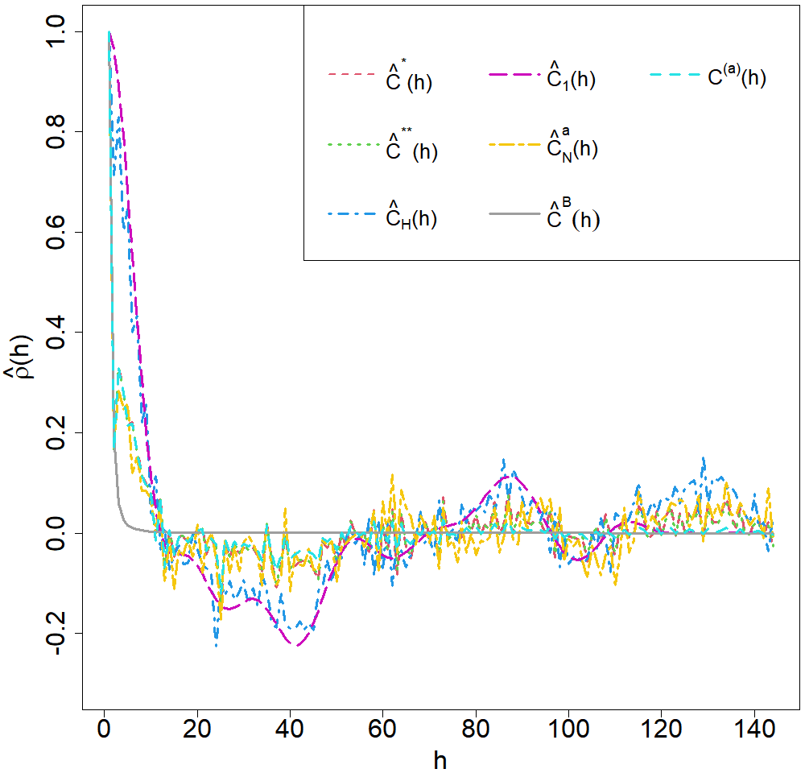
<figcaption>Figure 17: Estimated autocorrelation functions for unemployment increments data.</figcaption>
</figure>
<figure id="fig:smooth_bls">
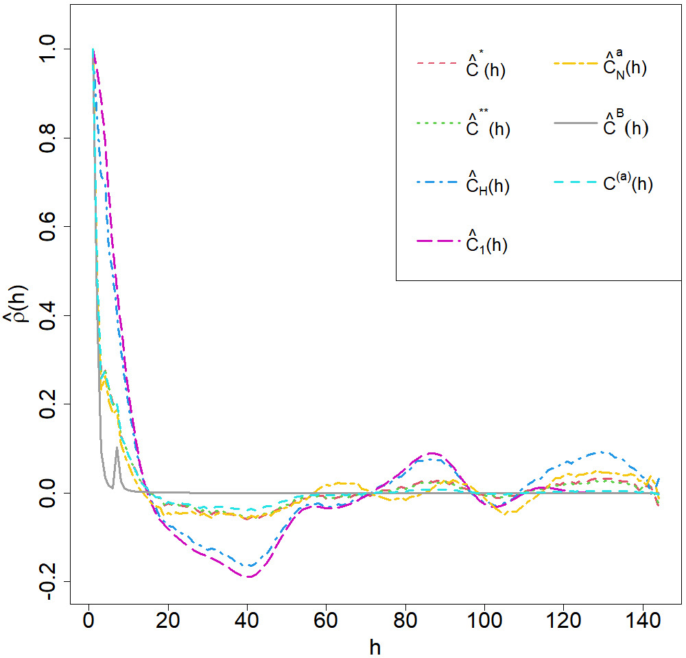
<figcaption>Figure 18: Smoothing of estimates for the unemployment
increments data.</figcaption>
</figure>

The following code produces the estimated autocorrelations plotted in
Figure [17](#fig:bls){reference-type="ref"
reference="fig:bls"}.

``` r
maxLag <- 144
X <- X_bls
x <- 1:length(X)

# standard estimators
Cs <- standard_est(X, maxLag = maxLag - 1, pd = FALSE, x = x)
Css <- standard_est(X, maxLag = maxLag - 1, pd = TRUE, x = x,
        type = "autocorrelation")

# Hall's estimators
hall_1 <- adjusted_est(X, x, x[1:maxLag], b = 0.1, kernel_name = "rational_quadratic",
        type = "autocorrelation")
hall_2 <- truncated_est(X, x, x[1:maxLag], 110, 120, b = 0.1,
        kernel_name = "rational_quadratic", type = "autocorrelation")

# tapered
tapered <- tapered_est(X, 1, "tukey", maxLag = maxLag - 1, x = x,
        type = "autocorrelation")

# splines
splines <- splines_est(X, x, Cs, 3, 2, maxLag = maxLag - 1, type = "autocorrelation")
Cs <- normalise_acf(Cs)

# Correction
corrected <- corrected_est(X, "rational_quadratic", N_T = 5*length(X), maxLag = maxLag - 1,
        x = x, type = "autocorrelation")

colours <- c(2, 3, 4, 6, 7, 8, 13)
ltys <- c(2, 3, 4, 5, 6, 7, 8)
par(mar=c(4,5.25,0.25,0.25)+.1)
plot(Cs, lwd=3, lty=2, col=2, type='l', ylim=c(-0.3, 1), xlab=expression(h),
        ylab=expression(hat(rho)*'(h)'), cex.axis=2, cex.lab=2)
lines(Css, lwd=3, lty=3, col=3)
lines(hall_1, lwd=3, lty=4, col=4)
lines(hall_2, lwd=3, lty=5, col=6)
lines(tapered, lwd=3, lty=6, col=7)
lines(splines, lwd=3, lty=7, col=8)
lines(corrected, lwd=3, lty=8, col=13)

legend('topright', c(expression(hat('C')^'*'*'(h)'), expression(hat('C')^'**'*'(h)'),
        expression(hat('C')[H]*'(h)'), expression(hat('C')[1]*'(h)'),
        expression(hat('C')[N]^'a'*'(h)'), expression(hat('C')^'B'*('h')),
        expression('C'^'(a)'*'(h)')), col=colours, lty=ltys, lwd=c(2, rep(3, 6)),
        y.intersp=1.2, cex=1.8, ncol=3)
```

As can be seen from Figure [17](#fig:bls){reference-type="ref"
reference="fig:bls"}, the estimates have local chaotic fluctuations. To
better see the main pattern of the estimates,
Figure [18](#fig:smooth_bls){reference-type="ref"
reference="fig:smooth_bls"} shows the application of a moving average to
each of the estimators in
Figure [17](#fig:bls){reference-type="ref"
reference="fig:bls"}. After this smoothing, two estimators,
\@ref(eq:hall-est) and \@ref(eq:hall-trunc), exhibit cyclicality
expected for this data.

### Example 4

This example empirically investigates the computational complexity of
the methods by evaluating the runtime and memory usage of the
estimators. Autocovariance function estimates were computed for a
sequence of simulated time series with Gaussian autocovariance, similar
to [Example 1](#sec:example_1). The realisations of the time series were
simulated on uniform grids over $[0, 40]$ with lengths
$N=101, 151, \dots, 951, 1001$. This process was repeated 100 times, and
the results presented are the medians.

Figure [19](#fig:time_all){reference-type="ref"
reference="fig:time_all"} shows the log10-time of the computed
estimators. The log scale was used due to the large difference between
estimators. For example, estimator \@ref(eq:std-est-pd) was computed in
0.000781015 seconds, on average, for a time series of length $N = 1001,$
whilst estimator \@ref(eq:hall-est) was computed in 8.45674 seconds. It
is clear that all estimators \@ref(eq:std-est), \@ref(eq:std-est-pd),
\@ref(eq:tapered-est), and \@ref(eq:eqnkernel-correction-std-pd) perform
similarly in terms of time, whilst Hall's estimators \@ref(eq:hall-est)
and \@ref(eq:hall-trunc) exhibit significant growth in computational
time. The splines estimator \@ref(eq:splines-est) shows a consistent
time usage across all estimates, exhibiting minimal growth as $N$
increases.

<figure id="fig:time_all" data-latex-placement="!htbp">
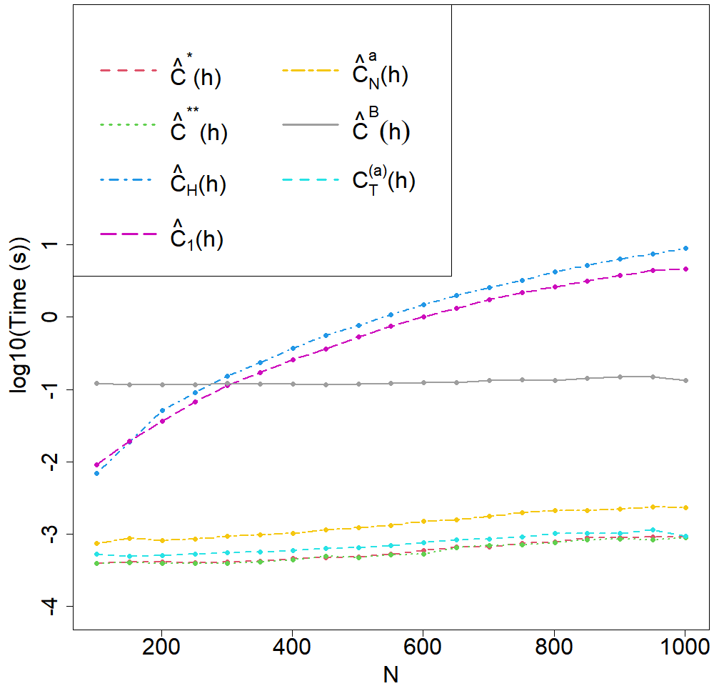
<figcaption>Figure 19: Log-scale computational time (s) for estimates for time series of varying length.</figcaption>
</figure>
<figure id="fig:memory_all">
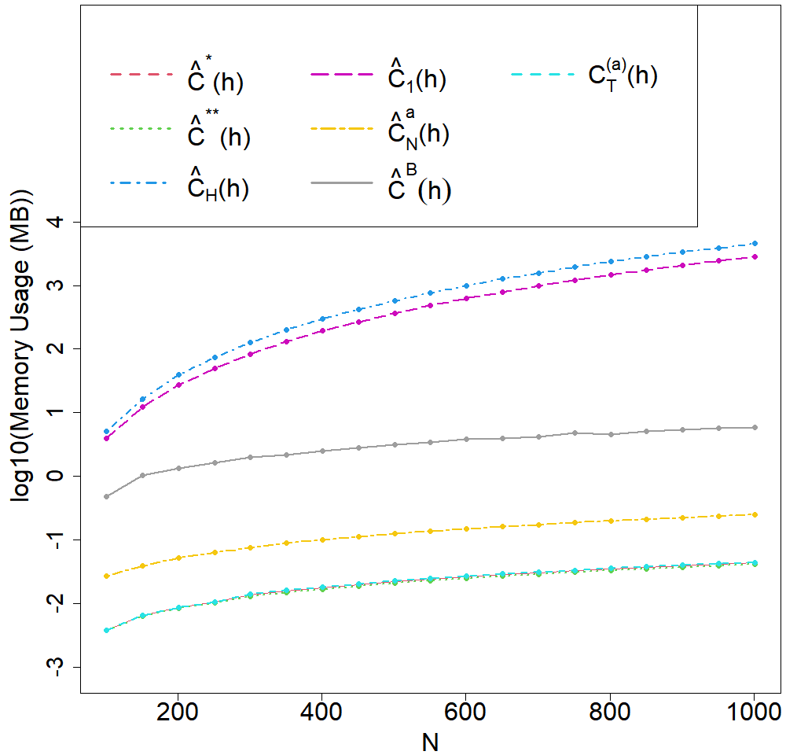
<figcaption>Figure 20: Log-scale memory usage (MB) for estimates for
time series of varying length.</figcaption>
</figure>

Figure [20](#fig:memory_all){reference-type="ref"
reference="fig:memory_all"} shows the log10-memory usage, where the
log-scale was chosen for the same reasons as the time case. The
estimators \@ref(eq:std-est), \@ref(eq:std-est-pd), and
\@ref(eq:eqnkernel-correction-std-pd) all effectively used the same
memory. The estimator \@ref(eq:tapered-est) is quite close, particularly
in terms of growth; however, it is shifted upward. Again, Hall's
estimators \@ref(eq:hall-est) and \@ref(eq:hall-trunc) exhibit
significantly greater memory usage growth than the other estimators. The
splines estimator \@ref(eq:splines-est) is stable in terms of growth, as
in the time case.

It is clear that Hall's estimators, \@ref(eq:hall-est) and
\@ref(eq:hall-trunc), require significantly more computational time and
memory usage compared to other estimators. Thus, these estimators may
not be appropriate in the case of Big Data. The other estimators are
computed relatively quickly and require significantly less memory, even
for large values of $N.$ Further, these limitations should be considered
when performing block bootstrap or other statistical procedures
involving repeated computation of estimated covariances (e.g., moving
window analysis, model diagnostics, Kriging/Gaussian process prediction
and interpolation), as the estimator must be called many times. In such
cases, using parallelism options, as implemented in the package for
bootstrap, may substantially reduce computational time.

## Summary

The article introduced the package
[**CovEsts**](https://CRAN.R-project.org/package=CovEsts), which
provides several nonparametric autocovariance function estimators
available in the literature. The package offers a set of functions that
allow users to easily apply the different estimators, as shown in the
examples. The autocovariance estimator functions have a high level of
flexibility with various options that the user can control, such as a
custom kernel, selecting the sampling grid, and controlling the
positive-definiteness of estimators, among others. Several functions are
provided to generate bootstrap autocovariance confidence regions and to
address potential issues in autocovariance estimation. In addition,
various metrics are included to compare the performance of the
estimators. In the future, the package is planned to be extended to work
with similar nonparametric estimators for spatial data.

## Computation details

R version 4.5 was used to develop, test the package, and produce all
outputs in this article.

## Acknowledgement

This research was partially supported by the Australian Research Council
Discovery Projects funding scheme (project DP220101680). Andriy Olenko
was also partially supported by La Trobe University's SCEMS CaRE and
Beyond grant. The authors are grateful to Professors N. Cressie, N.
Leonenko, and E. Porcu for their feedback on certain approaches to the
nonparametric estimation of covariance functions. We also thank the
editor, Prof. R. J. Hyndman, and anonymous reviewers for their comments
that helped to improve the package and the paper.
::::::::

::::::::::::::::::::::::::::::::::::::::::::::: {#refs .references .csl-bib-body .hanging-indent}
::: {#ref-Arteche2024 .csl-entry}
Arteche, Josu. 2024. "Bootstrapping Long Memory Time Series: Application
in Low Frequency Estimators." *Econometrics and Statistics* 29: 1--15.
<https://doi.org/10.1016/j.ecosta.2021.06.002>.
:::

::: {#ref-Artiach2011 .csl-entry}
Artiach, Miguel, and Josu Arteche. 2011. "Estimation of the Frequency in
Cyclical Long-Memory Series." *Journal of Statistical Computation and
Simulation* 81 (11): 1627--39.
<https://doi.org/10.1080/00949655.2010.496728>.
:::

::: {#ref-Olenko2022 .csl-entry}
Ayache, Antoine, Myriam Fradon, Ravindi Nanayakkara, and Andriy Olenko.
2022. "Asymptotic Normality of Simultaneous Estimators of Cyclic
Long-Memory Processes." *Electronic Journal of Statistics* 16 (1):
84--115. <https://doi.org/10.1214/21-EJS1953>.
:::

::: {#ref-CovEsts_2025 .csl-entry}
Bilchouris, Adam, and Andriy Olenko. 2025a. *CovEsts: Nonparametric
Estimators for Covariance Functions*.
<https://CRAN.R-project.org/package=CovEsts>.
:::

::: {#ref-Bilchouris_Olenko_2025 .csl-entry}
Bilchouris, Adam, and Andriy Olenko. 2025b. "On Nonparametric Estimation
of Covariogram." *Austrian Journal of Statistics* 54 (1): 112--37.
<https://doi.org/10.17713/ajs.v54i1.1975>.
:::

::: {#ref-ncf .csl-entry}
Bjornstad, Ottar N. 2022. *Ncf: Spatial Covariance Functions*.
<https://CRAN.R-project.org/package=ncf>.
:::

::: {#ref-sarima_2024 .csl-entry}
Boshnakov, Georgi N., and Jamie Halliday. 2025. *Sarima: Simulation and
Prediction with Seasonal ARIMA Models*.
<https://CRAN.R-project.org/package=sarima>.
:::

::: {#ref-Brockwell1991 .csl-entry}
Brockwell, Peter J., and Richard A. Davis. 1991. *Time Series: Theory
and Methods*. Springer New York.
<https://doi.org/10.1007/978-1-4419-0320-4>.
:::

::: {#ref-Brockwell2016 .csl-entry}
Brockwell, Peter J., and Richard A. Davis. 2016. *Introduction to Time
Series and Forecasting*. Springer International Publishing.
<https://doi.org/10.1007/978-3-319-29854-2>.
:::

::: {#ref-Bull2021 .csl-entry}
Bull, D. R., and F. Zhang. 2021. *Intelligent Image and Video
Compression: Communicating Pictures*. 2nd ed. Academic Press.
<https://doi.org/10.1016/C2019-0-00641-3>.
:::

::: {#ref-TSA_2022 .csl-entry}
Chan, Kung-Sik, and Brian Ripley. 2022. *TSA: Time Series Analysis*.
<https://CRAN.R-project.org/package=TSA>.
:::

::: {#ref-Chils2012 .csl-entry}
Chilès, Jean‐Paul, and Pierre Delfiner. 2012. *Geostatistics: Modeling
Spatial Uncertainty*. John Wiley & Sons.
<https://doi.org/10.1002/9781118136188>.
:::

::: {#ref-Choi2013 .csl-entry}
Choi, InKyung, Bo Li, and Xiao Wang. 2013. "Nonparametric Estimation of
Spatial and Space-Time Covariance Function." *Journal of Agricultural,
Biological, and Environmental Statistics* 18 (4): 611--30.
<https://doi.org/10.1007/s13253-013-0152-z>.
:::

::: {#ref-Cressie1993 .csl-entry}
Cressie, N. 1993. *Statistics for Spatial Data*. Wiley.
<https://doi.org/10.1002/9781119115151>.
:::

::: {#ref-Cressie1985 .csl-entry}
Cressie, Noel. 1985. "Fitting Variogram Models by Weighted Least
Squares." *Journal of the International Association for Mathematical
Geology* 17 (5): 563--86. <https://doi.org/10.1007/bf01032109>.
:::

::: {#ref-Cryer2008 .csl-entry}
Cryer, Jonathan D., and Kung-Sik Chan. 2008. *Time Series Analysis*.
Springer. <https://doi.org/10.1007/978-0-387-75959-3>.
:::

::: {#ref-cuevas2013study .csl-entry}
Cuevas, Francisco, Emilio Porcu, and Ronny Vallejos. 2013. "Study of
Spatial Relationships Between Two Sets of Variables: A Nonparametric
Approach." *Journal of Nonparametric Statistics* 25 (3): 695--714.
<https://doi.org/10.1080/10485252.2013.797091>.
:::

::: {#ref-Dahlhaus1987 .csl-entry}
Dahlhaus, R., and H. Künsch. 1987. "Edge Effects and Efficient Parameter
Estimation for Stationary Random Fields." *Biometrika* 74 (4): 877--82.
<https://doi.org/10.1093/biomet/74.4.877>.
:::

::: {#ref-Devlin1975 .csl-entry}
Devlin, S. J., R. Gnanadesikan, and J. R. Kettenring. 1975. "Robust
Estimation and Outlier Detection with Correlation Coefficients."
*Biometrika* 62 (3): 531--45. <https://doi.org/10.1093/biomet/62.3.531>.
:::

::: {#ref-Durbin1960 .csl-entry}
Durbin, J. 1960. "The Fitting of Time-Series Models." *Review of the
International Statistical Institute* 28 (3): 233--44.
<https://doi.org/10.2307/1401322>.
:::

::: {#ref-Durre2015 .csl-entry}
Dürre, Alexander, Roland Fried, and Tobias Liboschik. 2015. "Robust
Estimation of (Partial) Autocorrelation." *WIREs Computational
Statistics* 7 (3): 205--22. <https://doi.org/10.1002/wics.1351>.
:::

::: {#ref-GilAlana2009 .csl-entry}
Gil-Alana, Luis A. 2009. "Time Series Modeling of Sunspot Numbers Using
Long-Range Cyclical Dependence." *Solar Physics* 257 (2): 371--81.
<https://doi.org/10.1007/s11207-009-9390-1>.
:::

::: {#ref-gstat2016 .csl-entry}
Gräler, Benedikt, Edzer Pebesma, and Gerard Heuvelink. 2016.
"Spatio-Temporal Interpolation Using Gstat." *The R Journal* 8 (1):
204--18. <https://doi.org/10.32614/RJ-2016-014>.
:::

::: {#ref-hall1994_2 .csl-entry}
Hall, P., N. I. Fisher, and B. Hoffmann. 1994. "On the Nonparametric
Estimation of Covariance Functions." *Annals of Statistics* 22 (4):
2115--34. <https://doi.org/10.1214/aos/1176325774>.
:::

::: {#ref-Hall1995 .csl-entry}
Hall, P., J. L. Horowitz, and Bing-Yi Jing. 1995. "On Blocking Rules for
the Bootstrap with Dependent Data." *Biometrika* 82 (3): 561--74.
<https://doi.org/10.1093/biomet/82.3.561>.
:::

::: {#ref-hall1994 .csl-entry}
Hall, P., and P. Patil. 1994. "Properties of Nonparametric Estimators of
Autocovariance for Stationary Random Fields." *Probability Theory and
Related Fields* 99 (3): 399--424. <https://doi.org/10.1007/BF01199899>.
:::

::: {#ref-Hassani2009 .csl-entry}
Hassani, Hossein. 2009. "Sum of the Sample Autocorrelation Function."
*Random Operators and Stochastic Equations* 17 (2): 125--30.
<https://doi.org/10.1515/ROSE.2009.008>.
:::

::: {#ref-Hassani2012 .csl-entry}
Hassani, Hossein, Nikolai Leonenko, and Kerry Patterson. 2012. "The
Sample Autocorrelation Function and the Detection of Long-Memory
Processes." *Physica A: Statistical Mechanics and Its Applications* 391
(24): 6367--79. <https://doi.org/10.1016/j.physa.2012.07.062>.
:::

::: {#ref-Higham1988 .csl-entry}
Higham, Nicholas J. 1988. "Computing a Nearest Symmetric Positive
Semidefinite Matrix." *Linear Algebra and Its Applications* 103:
103--18. <https://doi.org/10.1016/0024-3795(88)90223-6>.
:::

::: {#ref-Hu2009 .csl-entry}
Hu, Jing, Jianbo Gao, and Xingsong Wang. 2009. "Multifractal Analysis of
Sunspot Time Series: The Effects of the 11-Year Cycle and Fourier
Truncation." *Journal of Statistical Mechanics: Theory and Experiment*
2009 (02): P02066. <https://doi.org/10.1088/1742-5468/2009/02/p02066>.
:::

::: {#ref-Hyndman2015 .csl-entry}
Hyndman, Rob J. 2015. "Discussion of 'High-Dimensional Autocovariance
Matrices and Optimal Linear Prediction'." *Electronic Journal of
Statistics* 9 (1). <https://doi.org/10.1214/14-EJS953>.
:::

::: {#ref-Hyndman2008 .csl-entry}
Hyndman, Rob J., and Yeasmin Khandakar. 2008. "Automatic Time Series
Forecasting: The Forecast Package for R." *Journal of Statistical
Software* 27 (3): 1--22. <https://doi.org/10.18637/jss.v027.i03>.
:::

::: {#ref-Kunsch1989 .csl-entry}
Künsch, Hans R. 1989. "The Jackknife and the Bootstrap for General
Stationary Observations." *The Annals of Statistics* 17 (3): 1217--41.
<https://doi.org/10.1214/aos/1176347265>.
:::

::: {#ref-Lahiri1993 .csl-entry}
Lahiri, S. N. 1993. "On the Moving Block Bootstrap Under Long Range
Dependence." *Statistics & Probability Letters* 18 (5): 405--13.
<https://doi.org/10.1016/0167-7152(93)90035-h>.
:::

::: {#ref-Lahiri2003 .csl-entry}
Lahiri, S. N. 2003. *Resampling Methods for Dependent Data*. Springer.
<https://doi.org/10.1007/978-1-4757-3803-2>.
:::

::: {#ref-Liu1992 .csl-entry}
Liu, R. Y., and K. Singh. 1992. "Moving Blocks Jackknife and Bootstrap
Capture Weak Dependence." *R. LePage and l. Billard, Eds, Exploring the
Limits of Bootstrap*, 225--48.
<https://www.wiley.com/en-us/Exploring+the+Limits+of+Bootstrap-p-9780471536314>.
:::

::: {#ref-chemo2003 .csl-entry}
Massart, D. L., B. G. M. Vandeginste, S. N. Deming, Y. Michotte, and L.
Kaufman. 2003. "Chapter 14 - Correlation Methods." In *Chemometrics: A
Textbook*, vol. 2. Data Handling in Science and Technology. Elsevier.
<https://doi.org/10.1016/S0922-3487(08)70227-2>.
:::

::: {#ref-McMurry2010 .csl-entry}
McMurry, Timothy L., and Dimitris N. Politis. 2010. "Banded and Tapered
Estimates for Autocovariance Matrices and the Linear Process Bootstrap."
*Journal of Time Series Analysis* 31 (6): 471--82.
<https://doi.org/10.1111/j.1467-9892.2010.00679.x>.
:::

::: {#ref-Politis1992 .csl-entry}
Politis, D. N., and J. P. Romano. 1992. "A Circular Block-Resampling
Procedure for Stationary Data." *R. LePage and l. Billard, Eds,
Exploring the Limits of Bootstrap*, 263--70.
<https://www.wiley.com/en-us/Exploring+the+Limits+of+Bootstrap-p-9780471536314>.
:::

::: {#ref-Politis2004 .csl-entry}
Politis, Dimitris N., and Halbert White. 2004. "Automatic Block-Length
Selection for the Dependent Bootstrap." *Econometric Reviews* 23 (1):
53--70. <https://doi.org/10.1081/ETC-120028836>.
:::

::: {#ref-Rousseeuw1993 .csl-entry}
Rousseeuw, Peter J., and Geert Molenberghs. 1993. "Transformation of Non
Positive Semidefinite Correlation Matrices." *Communications in
Statistics - Theory and Methods* 22 (4): 965--84.
<https://doi.org/10.1080/03610928308831068>.
:::

::: {#ref-Shumway2025 .csl-entry}
Shumway, Robert H., and David S. Stoffer. 2025. *Time Series Analysis
and Its Applications: With R Examples*. Springer.
<https://doi.org/10.1007/978-3-031-70584-7>.
:::

::: {#ref-astsa_2024 .csl-entry}
Stoffer, David, and Nicky Poison. 2024. *Astsa: Applied Statistical Time
Series Analysis*. <https://CRAN.R-project.org/package=astsa>.
:::

::: {#ref-Yaglom1987 .csl-entry}
Yaglom, A. M. 1987. *Correlation Theory of Stationary and Related Random
Functions*. I: Basic Results. Springer.
<https://doi.org/10.1007/978-1-4612-4628-2>.
:::
:::::::::::::::::::::::::::::::::::::::::::::::
