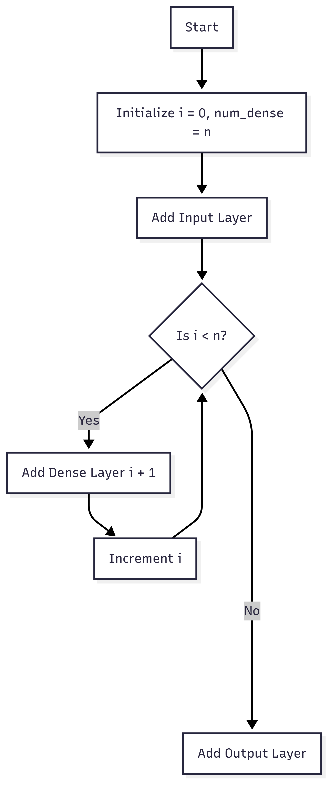
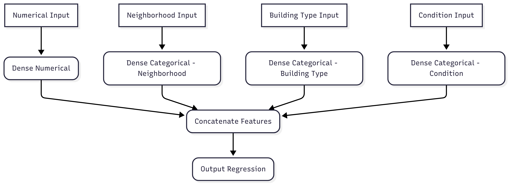

```{r}
#| label: setup
#| include: false

knitr::opts_chunk$set(echo = TRUE, warning = FALSE, message = FALSE)
set.seed(123)
library(crosstalk)
library(kableExtra)
library(keras3)
library(kerasnip)
library(plotly)
library(tidymodels)
```

# Introduction

Deep learning [@Goodfellow-et-al-2016] has reshaped applied machine learning, and Keras [@\CRANpkg{keras3}; @chollet2015keras] remains one of the most popular APIs for composing modern neural networks. In R, the \CRANpkg{keras3} package faithfully mirrors the Keras experience, while the \CRANpkg{tidymodels} framework [@tidymodels] has become the de facto standard interface for preprocessing, tuning, and evaluating models. Although \CRANpkg{parsnip} (a \CRANpkg{tidymodels} component) ships with a basic Keras engine, it only covers a handful of predefined multilayer perceptron templates.

The difficulty emerges when practitioners need to move beyond those templates. Keras models are constructed by freely composing layers, whereas \CRANpkg{parsnip} specifications expect a fixed set of hyperparameters that map directly to arguments. This mismatch prevents R users from expressing arbitrary Keras architectures, repeating blocks, or wiring multi-branch graphs inside a \CRANpkg{tidymodels} workflow.

\CRANpkg{kerasnip} addresses this impedance mismatch by generating \CRANpkg{parsnip} specifications on the fly from user-defined Keras blocks. The package surfaces the entire \CRANpkg{tidymodels} toolchain—\CRANpkg{recipes}, \CRANpkg{tune}, \CRANpkg{workflows}, and \CRANpkg{workflowsets}—for any model that can be described with the Keras sequential or functional APIs. Functional pipelines leverage the `inp_spec()` helper to declare connections explicitly, keeping even complex graphs readable. The package name itself blends **keras** and **parsnip**, underscoring this bridging goal.

The remainder of the paper is structured as follows. Section 2 positions \CRANpkg{kerasnip} relative to existing tooling and summarizes its main advantages. Section 3 details the code generation approach that connects Keras blocks with \CRANpkg{parsnip}. Section 4 walks through a quick-start example, and Section 5 presents a full case study on the Ames Housing data. The paper concludes by outlining the current limitations and near-term roadmap.

# Ecosystem context and advantages

## Related Work

The \CRANpkg{kerasnip} package builds upon a rich ecosystem of packages for deep learning and machine learning in R. This section provides an overview of the most relevant packages and positions \CRANpkg{kerasnip} in relation to them.

**\CRANpkg{reticulate}:** The \CRANpkg{reticulate} package [@reticulate] is the foundation for R-Python interoperability. It allows R users to call Python code from R, and it is the package that the \CRANpkg{keras3} package uses to interface with the Python Keras library. While \CRANpkg{reticulate} is essential for using \CRANpkg{keras3} in R, it does not provide any direct integration with the \CRANpkg{tidymodels} framework.

**\CRANpkg{keras3}:** The \CRANpkg{keras3} package [@\CRANpkg{keras3}] provides a direct R interface to the Keras library, allowing R users to define and train Keras models using a familiar R syntax. While \CRANpkg{parsnip} offers a basic Keras engine, the \CRANpkg{keras3} package itself does not provide a native mechanism for integrating custom or dynamically defined Keras architectures into \CRANpkg{tidymodels} workflows, which is the specific challenge \CRANpkg{kerasnip} addresses. Keras offers a high-level, user-friendly API, widespread adoption, and multi-backend support (TensorFlow [@tensorflow2015-whitepaper], JAX [@jax2018github], PyTorch [@NEURIPS2019_9015]), making it a powerful and versatile choice. \CRANpkg{kerasnip} thus serves as a valuable bridge for users preferring the Keras ecosystem.

**\CRANpkg{luz} and \CRANpkg{brulee}:** The \CRANpkg{luz} [@luz] and \CRANpkg{brulee} packages provide a \CRANpkg{tidymodels}-like interface for the \CRANpkg{torch} deep learning framework. They are excellent tools for R users who want to use \CRANpkg{torch} with \CRANpkg{tidymodels}. \CRANpkg{kerasnip} works by extending the existing \CRANpkg{parsnip} `keras` engine, enabling a similar level of integration and flexibility for models built with the **\CRANpkg{keras3} R package** as \CRANpkg{luz} and \CRANpkg{brulee} do for \CRANpkg{torch} models.

While both \CRANpkg{kerasnip} and \CRANpkg{luz}/\CRANpkg{brulee} integrate deep learning frameworks with \CRANpkg{tidymodels}, they cater to different backends and user preferences. \CRANpkg{luz} and \CRANpkg{brulee} offer an R-native experience with \CRANpkg{torch}, potentially providing lower overhead and direct control. In contrast, \CRANpkg{kerasnip} leverages the high-level Keras API, built on optimized backends (TensorFlow, JAX, PyTorch), offering user-friendliness and rapid prototyping for those familiar with Keras. While \CRANpkg{luz}/\CRANpkg{brulee} might offer more granular control, \CRANpkg{kerasnip} prioritizes abstraction and ease of use. Crucially, \CRANpkg{kerasnip} uniquely enables dynamic definition and architectural tuning of Keras models directly within \CRANpkg{tidymodels}, a capability not fully offered by other existing solutions.

A key design divergence in \CRANpkg{kerasnip} compared to \CRANpkg{luz}/\CRANpkg{brulee} is its emphasis on dynamic model generation through user-defined `layer_blocks` and the `inp_spec()` helper. While \CRANpkg{luz}/\CRANpkg{brulee} provide a \CRANpkg{tidymodels}-like interface for predefined \CRANpkg{torch} modules, \CRANpkg{kerasnip} empowers users to construct arbitrary Keras architectures on the fly, directly within the \CRANpkg{parsnip} specification. This architectural flexibility, particularly the ability to tune the *number* of layers or define complex functional connections via `inp_spec()`, is a deliberate choice to leverage Keras's compositional nature and extend \CRANpkg{tidymodels}' tuning capabilities beyond just hyperparameters to the model's very structure. This approach allows for a more comprehensive architectural search within the \CRANpkg{tidymodels} framework, which is a unique offering of \CRANpkg{kerasnip}.

\CRANpkg{kerasnip} extends the \CRANpkg{parsnip} ecosystem not by adding a new engine, but by enabling the creation of dynamic \CRANpkg{parsnip} model specifications that use the existing `keras` engine. This is important to distinguish from \CRANpkg{parsnip}'s default Keras integration, such as `parsnip::keras_mlp()`, which offers limited architectural flexibility. While `keras_mlp()` is convenient for predefined MLP architectures, \CRANpkg{kerasnip}'s core strength is its ability to dynamically generate specifications from user-defined `layer_blocks`. This allows users to integrate custom and complex model architectures into \CRANpkg{tidymodels} workflows and enables comprehensive architectural search and tuning (e.g., varying the number of layers or defining complex functional connections), making it powerful for optimizing the very structure of a Keras model, not just its hyperparameters.

In summary, while several packages provide access to deep learning libraries from R, \CRANpkg{kerasnip} is unique in its focus on providing a dedicated, flexible, and \CRANpkg{tidymodels}-native solution for \CRANpkg{keras3} models. It is designed to be a lightweight and intuitive bridge that allows R users to seamlessly integrate the power of \CRANpkg{keras3} into their \CRANpkg{tidymodels} workflows, particularly benefiting those already invested in the Keras ecosystem or requiring Keras-specific features not available in other frameworks. Its block-based architecture empowers users to define and tune complex deep learning models with minimal boilerplate, making advanced deep learning techniques more accessible within the familiar \CRANpkg{tidymodels} paradigm.

## Key Advantages of \CRANpkg{kerasnip}

\CRANpkg{kerasnip} offers several practitioner-oriented advantages that complement the ecosystem context above:

-   **Reduced boilerplate and full workflow parity:** dynamically generated \CRANpkg{parsnip} specifications eliminate bespoke wrappers. Any generated model can immediately plug into \CRANpkg{recipes}, \CRANpkg{tune}, \CRANpkg{workflows}, or \CRANpkg{workflowsets}, so Keras users receive the exact same ergonomics that \CRANpkg{tidymodels} users expect for glmnet, xgboost, or torch engines.
-   **Architectural tuning, not just hyperparameters:** arguments of the form `num_{block_name}` control how many times a block is repeated, enabling structural search in addition to parameter search. Figure "Conceptual diagram illustrating num block tuning" visualizes how varying `num_dense` alters the network depth, and the accompanying code sample shows how to expose `num_dense` to `tune()`. Repeated blocks intentionally share the same hyperparameters; to tune each hidden layer independently, users can register separate block functions (e.g., `dense_head`, `dense_tail`) and assign distinct tuning parameters to each.
-   **Extensibility to advanced architectures:** because layer blocks can wrap any Keras layer, the current release already supports CNNs, RNNs, Transformers, or residual graphs—users simply describe the building blocks they need. Future work will focus on shipping higher-level templates and validation helpers for these architectures, not on unlocking the underlying capability.
-   **Enhanced reproducibility and performance:** encapsulating the architecture definition in R functions makes it straightforward to version-control both data preprocessing and network topology, while the heavy computation is still executed by optimized TensorFlow, JAX, or PyTorch backends.
-   **Debugging support:** helpers such as `compile_keras_grid()` summarize the dynamically generated graphs, and every fitted specification can expose the underlying Keras model for inspection via `summary()` or `plot()`.

```{r out.height="50%", out.width="50%"}
#| label: fig-num-block-diagram
#| echo: false
#| fig-cap: Conceptual diagram illustrating num block tuning


```

```{r}
#| eval: false

# Define a tunable model specification
tune_spec <- tunable_mlp(
  num_dense = tune(),
  dense_units = tune(),
  fit_epochs = 10
) |>
  set_engine("keras")

# Define the tuning grid
params <- extract_parameter_set_dials(tune_spec) |>
  update(
    num_dense = dials::num_terms(c(1, 3)),
    dense_units = dials::hidden_units(c(8, 64))
  )
grid <- grid_regular(params, levels = 3)

# Run the tuning
# ...
```

# Bridging the gap: The kerasnip architecture

The core of \CRANpkg{kerasnip} is a code generation engine that bridges the gap between the flexible, layer-based definition of \CRANpkg{keras3} models and the structured, argument-based definition of \CRANpkg{parsnip} models. It achieves this by dynamically creating a new \CRANpkg{parsnip} model specification from a set of user-defined "layer blocks".

When a user calls `create_keras_sequential_spec()` to create a Keras model using the sequential API or `create_keras_functional_spec()` to create a model using the functional API, \CRANpkg{kerasnip} inspects the functions provided in the `layer_blocks` argument to identify their formal arguments. It then generates a new function that represents the \CRANpkg{parsnip} model specification. This new function has a unified set of arguments that can be used to control the architecture and hyperparameters of the \CRANpkg{keras3} model.

To illustrate this, let's consider a simplified example of the code that \CRANpkg{kerasnip} generates for a sequential MLP. When you call `create_keras_sequential_spec("my_mlp", ...)` with `input`, `dense`, and `output` layer blocks, \CRANpkg{kerasnip} generates a function similar to this:

```{r}
my_mlp <- function(mode = "regression", num_dense = 1, dense_units = 8, ...) {
  args <- list(
    num_dense = num_dense,
    dense_units = dense_units,
    ...
  )
  new_model_spec(
    "my_mlp",
    args = args,
    eng_args = NULL,
    mode = mode,
    engine = "keras"
  )
}
```

This generated function, `my_mlp()`, is a \CRANpkg{parsnip} model specification. It has arguments to control the number of dense layers (`num_dense`) and the number of units in each dense layer (`dense_units`). When you call this function, it returns a \CRANpkg{parsnip} model specification that can be used in a \CRANpkg{tidymodels} workflow.

\CRANpkg{kerasnip} uses a simple naming convention to map the arguments of the generated function to the arguments of the layer blocks. For example, an argument named `dense_units` in the `my_mlp()` function is mapped to the `units` argument of the `dense_block` function. This allows for a flexible and intuitive way to control the architecture of the \CRANpkg{keras3} model from the \CRANpkg{parsnip} model specification.

For functional API models, \CRANpkg{kerasnip} provides the `inp_spec()` helper function to define the connections between layers. You use it to specify which layer outputs (tensors) should be fed into which arguments of the next layer's function. This explicit mapping is crucial for building non-linear, multi-input/multi-output architectures where the flow of data is not a simple sequential chain.

## Using `inp_spec()`

The `inp_spec()` function takes two main arguments:

1. The layer block function to be called (e.g., `concat_block`).
2. A character vector specifying the inputs. The **names** of the vector must match the argument names of the layer block function (e.g., `a` and `b` in `concat_block`), and each value refers to the upstream layer block whose tensor should be supplied to that argument (e.g., `input_a` and `input_b`).

To illustrate, consider a simple functional model with two inputs that are concatenated and then passed to a dense layer:

```{r}
input_a_block <- function(input_shape) {
  layer_input(shape = input_shape, name = "input_a")
}
input_b_block <- function(input_shape) {
  layer_input(shape = input_shape, name = "input_b")
}
concat_block <- function(a, b) {
  layer_concatenate(list(a, b))
}
output_block <- function(tensor) {
  layer_dense(tensor, units = 1)
}
create_keras_functional_spec(
  "my_functional_model",
  list(
    input_a = input_a_block,
    input_b = input_b_block,
    concatenated = inp_spec(concat_block, c(a = "input_a", b = "input_b")),
    output = inp_spec(output_block, "concatenated")
  )
)
```

In this example:

- `inp_spec(concat_block, c(a = "input_a", b = "input_b"))` specifies that the `concat_block` function should be called.
- The output of the `input_a` block will be passed to the `a` argument of `concat_block`.
- The output of the `input_b` block will be passed to the `b` argument of `concat_block`.
- If the input is a single tensor, you can simply provide the name of the upstream block as a character string, as in `inp_spec(output_block, "concatenated")`.

This explicit way of defining connections allows for the creation of complex, non-linear model architectures.

### Clarity on `inp_spec()` for Complex Scenarios

`inp_spec()` is essential for creating complex functional Keras models, enabling intricate data flows like parallel branches or residual connections (e.g., in ResNets). For a residual connection, `inp_spec()` directs tensors from both the main path and a skip connection into a subsequent block, such as one using `layer_add()`. This explicit mapping of outputs to inputs grants fine-grained control, facilitating highly customized and complex network topologies.

Internally, \CRANpkg{kerasnip} parses the `inp_spec()` calls to understand the intended data flow and connections between layer blocks. It then leverages `rlang::exec()` and the `!!!` operator for dynamic function execution, enabling the flexible construction of Keras models from user-defined blocks, effectively translating the `inp_spec()` graph into the Keras functional API.

# A quick start example

To quickly illustrate the core functionality of \CRANpkg{kerasnip}, a simple example of a sequential model for classifying the `iris` dataset is presented.

First, the layer blocks for the model are defined:

```{r}
# Define layer blocks for a simple sequential model
input_block <- function(model, input_shape) {
  keras_model_sequential(input_shape = input_shape)
}
hidden_block <- function(model, units = 32) {
  model |> layer_dense(units = units, activation = "relu")
}
output_block <- function(model, num_classes) {
  model |> layer_dense(units = num_classes, activation = "softmax")
}
```

Next, the \CRANpkg{parsnip} model specification is created using `create_keras_sequential_spec()`:

```{r}
# Create the model specification
create_keras_sequential_spec(
  model_name = "my_iris_mlp",
  layer_blocks = list(
    input = input_block,
    hidden = hidden_block,
    output = output_block
  ),
  mode = "classification"
)
```

The `my_iris_mlp()` function can now be used as a \CRANpkg{parsnip} model.

```{r, eval = FALSE}
# Define the model and fit it
iris_fit <- my_iris_mlp(
  num_hidden = 2,
  hidden_units = 16,
  fit_epochs = 10
) |>
  set_engine("keras") |>
  fit(Species ~ ., data = iris)
```

This simple example demonstrates how \CRANpkg{kerasnip} can be used to quickly create and train a \CRANpkg{keras3} model within the \CRANpkg{tidymodels} framework.

# Case study: Predicting house prices with a multi-input functional model

To demonstrate the capabilities of \CRANpkg{kerasnip}, the Ames Housing dataset will be used to predict house prices. This case study highlights a complete \CRANpkg{tidymodels} workflow for a regression task using a \CRANpkg{keras3} functional model with multiple inputs, where numerical and categorical features are processed through separate input branches.

## Data Preparation

First, the necessary packages are loaded and the data prepared. The Ames Housing dataset from the \CRANpkg{modeldata} package will be used, relevant columns selected, and the data split into training and testing sets.

```{r}
#| label: load-packages

library(kerasnip)
library(tidymodels)
library(keras3)
library(dplyr) # For data manipulation
library(ggplot2) # For plotting
library(finetune) # For racing
library(workflowsets) # For comparing models
```

```{r}
#| label: data-prep

# Select relevant columns and remove rows with missing values
ames_df <- ames |>
  select(
    Sale_Price,
    Gr_Liv_Area,
    Year_Built,
    Neighborhood,
    Bldg_Type,
    Overall_Cond,
    Total_Bsmt_SF,
    contains("SF")
  ) |>
  na.omit()

# Split data into training and testing sets
set.seed(123)
ames_split <- initial_split(ames_df, prop = 0.8, strata = Sale_Price)
ames_train <- training(ames_split)
ames_test <- testing(ames_split)

# Create cross-validation folds for tuning
ames_folds <- vfold_cv(ames_train, v = 5, strata = Sale_Price)
```

To gain initial insights into the dataset, `r if (knitr::is_html_output()) "Figure \\@ref(fig:data-exploration-plots-interactive)" else "Figure \\@ref(fig:data-exploration-plots-static)"` scatters `Sale_Price` against `Gr_Liv_Area`, illustrating the relationship between these key variables.

```{r}
#| label: data-exploration-plots-interactive
#| fig-cap: Data Exploration Plot for Ames Housing Dataset
#| echo: false
#| eval: !expr knitr::is_html_output()

# Scatter plot of Sale_Price vs. Gr_Liv_Area
p <- ames_train |>
  ggplot(aes(x = Gr_Liv_Area, y = Sale_Price)) +
  geom_point(alpha = 0.5) +
  geom_smooth(
    method = "lm",
    se = FALSE,
    color = "red"
  ) +
  labs(
    title = "Sale Price vs. Living Area",
    x = "Gross Living Area (sq ft)",
    y = "Sale Price"
  )
plotly::ggplotly(p)
```

```{r out.height="7.68cm", out.width="10.66cm"}
#| label: data-exploration-plots-static
#| fig-cap: Data Exploration Plot for Ames Housing Dataset
#| echo: false
#| eval: !expr knitr::is_latex_output()

# Scatter plot of Sale_Price vs. Gr_Liv_Area
ames_train |>
  ggplot(aes(x = Gr_Liv_Area, y = Sale_Price)) +
  geom_point(alpha = 0.5) +
  geom_smooth(
    method = "lm",
    se = FALSE,
    color = "red"
  ) +
  labs(
    title = "Sale Price vs. Living Area",
    x = "Gross Living Area (sq ft)",
    y = "Sale Price"
  ) +
  theme_minimal(base_size = 10)
```

## Recipe for Preprocessing

A \CRANpkg{recipes} object is created to normalize numerical predictors, one-hot encode categorical predictors, and then collapse each group of predictors (e.g., all dummy variables associated with a factor) into a single matrix column via `step_collapse()`. This preparation is crucial for multi-input \CRANpkg{keras3} models because every branch in the functional API expects a single tensor as input.

```{r}
#| label: create-recipe

ames_recipe <- recipe(Sale_Price ~ ., data = ames_train) |>
  step_normalize(all_numeric_predictors()) |>
  step_collapse(
    all_numeric_predictors(),
    new_col = "numerical_input"
  ) |>
  step_dummy(Neighborhood) |>
  step_collapse(
    starts_with("Neighborhood"),
    new_col = "neighborhood_input"
  ) |>
  step_dummy(Bldg_Type) |>
  step_collapse(
    starts_with("Bldg_Type"),
    new_col = "bldg_input"
  ) |>
  step_dummy(Overall_Cond) |>
  step_collapse(
    starts_with("Overall_Cond"),
    new_col = "condition_input"
  )
```

## Define Keras Functional Model with \CRANpkg{kerasnip}

Next, the Keras functional model is defined using \CRANpkg{kerasnip}'s layer blocks. This model will have four distinct input layers: one for numerical features and three for categorical features. These branches will be processed separately and then concatenated before the final output layer.

Define input layer blocks:

```{r}
#| label: define-kerasnip-model-inputs

# Define input layer blocks for multi-input functional model.
# Each function represents an input block in the Keras model graph.
input_numerical <- function(input_shape) {
  layer_input(shape = input_shape, name = "numerical_input")
}
input_neighborhood <- function(input_shape) {
  layer_input(shape = input_shape, name = "neighborhood_input")
}
input_bldg <- function(input_shape) {
  layer_input(shape = input_shape, name = "bldg_input")
}
input_condition <- function(input_shape) {
  layer_input(shape = input_shape, name = "condition_input")
}
```

Then, the dense layer blocks that will process the numerical and categorical inputs are defined:

```{r}
#| label: define-kerasnip-model-processing

# Define dense layer blocks for processing numerical and categorical inputs.
dense_numerical <- function(tensor, units = 32, activation = "relu") {
  tensor |>
    layer_dense(units = units, activation = activation)
}
dense_categorical <- function(tensor, units = 16, activation = "relu") {
  tensor |>
    layer_dense(units = units, activation = activation)
}
```

Finally, the concatenation layer block to combine the processed features and the output layer block for regression are defined:

```{r}
#| label: define-kerasnip-model-output

# Define concatenation and output layer blocks.
concatenate_features <- function(numeric, neighborhood, bldg, condition) {
  layer_concatenate(list(numeric, neighborhood, bldg, condition))
}
dense_combined <- function(
    tensor,
    units = 64,
    activation = "relu",
    dropout = 0.2) {
  tensor |>
    layer_dense(units = units, activation = activation) |>
    layer_dropout(rate = dropout)
}
output_regression <- function(tensor) {
  layer_dense(tensor, units = 1, name = "output")
}
```

Note that `concatenate_features()` is merely a thin wrapper around `layer_concatenate()`. The helper collects the four upstream tensors into a list because `layer_concatenate()` expects a single `inputs` argument; wrapping it keeps the `layer_blocks` definition explicit while still allowing any built-in Keras layer to be used directly when its signature already matches the desired inputs.

With all the individual layer blocks defined, the \CRANpkg{kerasnip} functional model specification is created. This specification ties together the input, processing, and output blocks, defining the flow of data through the model:

```{r}
#| label: create-kerasnip-spec

# Create the kerasnip model specification function.
# This function will generate a new parsnip model called
# `ames_functional_mlp`.
create_keras_functional_spec(
  model_name = "ames_functional_mlp",
  layer_blocks = list(
    # Define the four input layers of the model.
    numerical_input = input_numerical,
    neighborhood_input = input_neighborhood,
    bldg_input = input_bldg,
    condition_input = input_condition,
    # Process each input branch with a dense layer.
    # `inp_spec()` defines the input tensor for each block.
    processed_numerical = inp_spec(dense_numerical, "numerical_input"),
    processed_neighborhood = inp_spec(
      dense_categorical,
      "neighborhood_input"
    ),
    processed_bldg = inp_spec(dense_categorical, "bldg_input"),
    processed_condition = inp_spec(dense_categorical, "condition_input"),
    # Concatenate the processed branches.
    # The named character vector in `inp_spec()` lists the argument names of
    # `concatenate_features` and assigns each to the upstream block that
    # supplies its tensor.
    combined_features = inp_spec(
      concatenate_features,
      c(
        numeric = "processed_numerical",
        neighborhood = "processed_neighborhood",
        bldg = "processed_bldg",
        condition = "processed_condition"
      )
    ),
    # Add a dense layer after concatenation
    processed_combined = inp_spec(dense_combined, "combined_features"),
    # Define the final output layer.
    output = inp_spec(output_regression, "processed_combined")
  ),
  mode = "regression"
)
```

`r if (knitr::is_html_output()) "Figure \\@ref(fig:functional-model-diagram-interactive)" else "Figure \\@ref(fig:functional-model-diagram-static)"` visualizes the resulting graph:

```{r}
#| label: functional-model-diagram-interactive
#| echo: false
#| fig-cap: Functional Model Architecture for Ames Housing Dataset
#| fig-width: 6
#| eval: !expr knitr::is_html_output()


```

```{r out.height="4.191cm", out.width="11.52cm"}
#| label: functional-model-diagram-static
#| echo: false
#| fig-cap: Functional Model Architecture for Ames Housing Dataset
#| eval: !expr knitr::is_latex_output()


```

## Model Specification and Workflow

The `ames_functional_mlp` model specification is defined, setting some hyperparameters to `tune()`. Then a `workflow` that combines the recipe and the model specification is created.

```{r}
#| label: define-tune-spec

# Define the tunable model specification.
# The `ames_functional_mlp()` function that was created is used.
# The arguments of the layer blocks can be tuned by prefixing them with the
# block name (e.g., `processed_numerical_units`).
functional_mlp_spec <- ames_functional_mlp(
  processed_numerical_units = tune(id = "numerical_units"),
  processed_neighborhood_units = 256,
  processed_bldg_units = 256,
  processed_condition_units = 256,
  num_processed_combined = tune(id = "num_combined_layers"),
  processed_combined_units = tune(id = "combined_units"),
  processed_combined_dropout = tune(id = "combined_dropout"),
  # compile and fit arguments can also be passed for the \CRANpkg{keras3} model.
  compile_loss = "mean_squared_error",
  compile_optimizer = tune(),
  compile_metrics = c("mean_absolute_error"),
  learn_rate = tune(),
  fit_epochs = 100,
  fit_batch_size = 32,
  fit_validation_split = 0.2,
  fit_callbacks = list(
    callback_early_stopping(monitor = "val_loss", patience = 10)
  )
) |>
  set_engine("keras")

# Create a workflow with the recipe and the model specification.
ames_wf <- workflow() |>
  add_recipe(ames_recipe) |>
  add_model(functional_mlp_spec)
```

## Tune Model

A tuning grid is defined and `tune_race_anova()` is used to perform cross-validation and find the best hyperparameters.

```{r}
#| label: create-tuning-grid

# Define the tuning grid
params <- extract_parameter_set_dials(ames_wf) |>
  update(
    numerical_units = hidden_units(range = c(64, 128)),
    num_combined_layers = num_terms(range = c(3, 5)),
    combined_units = hidden_units(range = c(64, 256)),
    combined_dropout = dropout(range = c(0.1, 0.5)),
    learn_rate = learn_rate(range = c(0.01, 0.05), trans = NULL),
    compile_optimizer = optimizer_function(
      values = c("adam", "rmsprop")
    )
  )

functional_mlp_grid <- grid_regular(params, levels = 2)
```

```{r}
#| label: tune-model
#| cache: true
#| results: hide

ames_tune_results <- tune_race_anova(
  ames_wf,
  resamples = ames_folds,
  grid = functional_mlp_grid,
  metrics = metric_set(rmse, mae, rsq),
  control = control_race(save_pred = TRUE, save_workflow = TRUE)
)
```

## Visualizing Tuning Results

`r if (knitr::is_html_output()) {"Figure \\@ref(fig:tuning-results-interactive) contrasts the learning rate, optimizer, and number of combined layers across the racing candidates."} else {"Table \\@ref(tab:tuning-results-static) reports the learning rate, optimizer, and number of combined layers for the best-performing configurations."}`

```{css, echo=FALSE, eval=knitr::is_html_output()}
.crosstalk-input > .selectize-input {
  font-size: 12px;
}
.crosstalk-input > label {
  font-size: 12px;
}
```

```{r tuning-results-interactive, fig.cap="Tuning Results - RMSE across Hyperparameter Combinations", echo=FALSE, eval=knitr::is_html_output()}
plot_data <- ames_tune_results |>
  collect_metrics() |>
  filter(.metric == "rmse")

shared_data <- SharedData$new(plot_data)

p <- ggplot(shared_data, aes(x = learn_rate, y = mean, color = compile_optimizer, shape = as.factor(num_combined_layers))) +
  geom_point(size = 3, alpha = 0.8) +
  labs(
    title = "Tuning Results for Ames Functional MLP (RMSE)",
    x = "Learning Rate",
    y = "Mean RMSE",
    color = "Optimizer",
    shape = "Num Combined Layers"
  ) +
  theme_minimal(base_size = 10) +
  theme(legend.position = "bottom")

widget <- bscols(
  widths = c(2, 10),
  list(
    filter_select("numerical_units", "Numerical Units:", shared_data, ~numerical_units, multiple = FALSE),
    filter_select("combined_units", "Combined Units:", shared_data, ~combined_units, multiple = FALSE),
    filter_select("combined_dropout", "Combined Dropout:", shared_data, ~combined_dropout, multiple = FALSE)
  ),
  ggplotly(p, height = 500)
)
# WORKAROUND: Add htmlwidget class so bookdown recognizes it for caption/numbering
# See: https://github.com/rstudio/bookdown/issues/1443
class(widget) <- c(class(widget), "htmlwidget")
widget
```

```{r tuning-results-static, echo=FALSE, eval=knitr::is_latex_output()}
ames_tune_results |>
  collect_metrics() |>
  filter(.metric == "rmse") |>
  select(
    learn_rate,
    compile_optimizer,
    numerical_units,
    num_combined_layers,
    combined_units,
    combined_dropout,
    mean
  ) |>
  rename(
    learning_rate = learn_rate,
    optimizer = compile_optimizer,
    num_units = numerical_units,
    combined_layers = num_combined_layers,
    comb_units = combined_units,
    comb_dropout = combined_dropout,
    rmse = mean
  ) |>
  arrange(learning_rate, optimizer, num_units, combined_layers, comb_units, comb_dropout) |>
  knitr::kable(format = "latex", booktabs = TRUE, caption = "Tuning Results Summary (Top RMSE Candidates)") |>
  kableExtra::kable_styling(font_size = 7) |>
  kableExtra::collapse_rows(columns = 1:2, latex_hline = "major")
```

## Comparing Models with \CRANpkg{workflowsets}

To demonstrate the flexibility of \CRANpkg{kerasnip} within the broader \CRANpkg{tidymodels} ecosystem, `ames_functional_mlp` can be compared with a traditional statistical model using \CRANpkg{workflowsets}. This allows for a systematic comparison of different modeling approaches on the same dataset.

First, a simple linear regression model and a corresponding recipe are defined.

```{r}
#| label: define-comparison-model

# Define a linear regression model for comparison
linear_reg_spec <- linear_reg() |>
  set_engine("lm")

# Create a simpler recipe for the linear regression model
# (without step_collapse, as it's not needed for single-input models)
linear_reg_recipe <- recipe(Sale_Price ~ ., data = ames_train) |>
  step_normalize(all_numeric_predictors()) |>
  step_dummy(all_nominal_predictors())
```

Next, a `workflowset` containing both the \CRANpkg{kerasnip} workflow and the linear regression workflow is created.

```{r}
#| label: create-workflowset

ames_workflowset <- workflow_set(
  preproc = list(
    kerasnip = ames_recipe,
    linear_reg = linear_reg_recipe
  ),
  models = list(
    kerasnip_mlp = functional_mlp_spec,
    linear_model = linear_reg_spec
  )
)

# Combine the workflows into a workflowset
ames_workflowset <- ames_workflowset |>
  filter(
    wflow_id %in% c("kerasnip_kerasnip_mlp", "linear_reg_linear_model")
  ) |>
  option_add(grid = functional_mlp_grid, id = "kerasnip_kerasnip_mlp") |>
  option_add(grid = 10, id = "linear_reg_linear_model")
```

Now, the `workflowset` can be tuned using `workflow_map()`.

```{r}
#| label: tune-workflowset
#| cache: true
#| results: hide

ames_workflowset_results <- ames_workflowset |>
  workflow_map(
    "tune_race_anova",
    resamples = ames_folds,
    metrics = metric_set(rmse, mae, rsq),
    control = control_race(save_pred = TRUE, save_workflow = TRUE)
  )
```

`r if (knitr::is_html_output()) "Figure \\@ref(fig:workflowset-results-plot-interactive)" else "Figure \\@ref(fig:workflowset-results-plot-static)"` visualizes the `workflowset` comparison so the relative performance of the baseline linear model and the functional MLP can be assessed side by side.

```{r}
#| label: workflowset-results-plot-interactive
#| fig-cap: Workflowset Results - RMSE across Different Models
#| echo: false
#| eval: !expr knitr::is_html_output()

p <- autoplot(ames_workflowset_results, metric = "rmse") +
  labs(
    title = "Comparison of Models using Workflowsets",
    color = "Preprocessor",
    shape = "Model"
  )
plotly::ggplotly(p)
```

```{r out.height="9.984cm", out.width="13.858cm"}
#| label: workflowset-results-plot-static
#| fig-cap: Workflowset Results - RMSE across Different Models
#| echo: false
#| eval: !expr knitr::is_latex_output()

autoplot(ames_workflowset_results, metric = "rmse") +
  labs(
    title = "Comparison of Models using Workflowsets",
    color = "Preprocessor",
    shape = "Model"
  )
```

```{r}
#| label: workflowset-results-table-interactive
#| tbl-cap: Ranked Results from Workflowset Tuning
#| echo: false
#| eval: !expr knitr::is_html_output()
#| include: !expr knitr::is_html_output()

rank_results(ames_workflowset_results, rank_metric = "rmse") |>
  filter(.metric == "rmse") |>
  select(wflow_id, .metric, mean, std_err, .config) |>
  arrange(mean) |>
  knitr::kable(format = "html")
```

```{r}
#| label: workflowset-results-table-static
#| tbl-cap: Ranked Results from Workflowset Tuning
#| echo: false
#| eval: !expr knitr::is_latex_output()
#| include: !expr knitr::is_latex_output()

rank_results(ames_workflowset_results, rank_metric = "rmse") |>
  filter(.metric == "rmse") |>
  select(wflow_id, .metric, mean, std_err, .config) |>
  arrange(mean) |>
  knitr::kable(format = "latex", booktabs = TRUE) |>
  kableExtra::kable_styling(font_size = 7)
```

## Finalize Workflow and Evaluate

```{r}
#| label: finalize-fit-and-evaluate
#| results: hide
#| cache: true

best_functional_mlp_params <- select_best(ames_tune_results, metric = "rmse")

final_ames_wf <- finalize_workflow(ames_wf, best_functional_mlp_params)

final_ames_fit <- fit(final_ames_wf, data = ames_train)

ames_test_pred <- predict(
  final_ames_fit,
  new_data = ames_test
)
```

The performance of the final model on the test set is shown in the following table.

```{r}
#| label: workflowset-results-on-test-interactive
#| tbl-cap: Performance Metrics of the Final Tuned Model on the Test Set
#| echo: false
#| eval: !expr knitr::is_html_output()
#| include: !expr knitr::is_html_output()

ames_results <- tibble::tibble(
  Sale_Price = ames_test$Sale_Price,
  .pred = ames_test_pred$.pred
)

metrics_results <- metric_set(
  rmse,
  mae,
  rsq
)(
  ames_results,
  truth = Sale_Price,
  estimate = .pred
)

knitr::kable(
  metrics_results,
  format = "html"
)
```

```{r}
#| label: workflowset-results-on-test-static
#| tbl-cap: Performance Metrics of the Final Tuned Model on the Test Set
#| echo: false
#| eval: !expr knitr::is_latex_output()
#| include: !expr knitr::is_latex_output()

ames_results <- tibble::tibble(
  Sale_Price = ames_test$Sale_Price,
  .pred = ames_test_pred$.pred
)

metrics_results <- metric_set(
  rmse,
  mae,
  rsq
)(
  ames_results,
  truth = Sale_Price,
  estimate = .pred
)

knitr::kable(
  metrics_results,
  format = "latex",
  booktabs = TRUE
) |>
  kableExtra::kable_styling(font_size = 7)
```

## Visualizing Model Performance

`r if (knitr::is_html_output()) "Figure \\@ref(fig:predictions-interactive)" else "Figure \\@ref(fig:predictions-static)"` contrasts predictions with observed prices to illustrate how well the tuned workflow generalizes to unseen data.

```{r}
#| label: predictions-interactive
#| fig-cap: Predicted vs. Actual Sale Prices on the Test Set (Interactive)
#| echo: false
#| eval: !expr knitr::is_html_output()

p <- ames_results |>
  ggplot(aes(x = Sale_Price, y = .pred)) +
  geom_point(alpha = 0.5) +
  geom_abline(lty = 2, color = "red") +
  labs(
    title = "Predicted vs. Actual Sale Prices",
    x = "Actual Sale Price",
    y = "Predicted Sale Price"
  ) +
  coord_fixed()
plotly::ggplotly(p)
```

```{r out.height="7.68cm", out.width="10.66cm"}
#| label: predictions-static
#| fig-cap: Predicted vs. Actual Sale Prices on the Test Set
#| echo: false
#| eval: !expr knitr::is_latex_output()

ames_results |>
  ggplot(aes(x = Sale_Price, y = .pred)) +
  geom_point(alpha = 0.5) +
  geom_abline(lty = 2, color = "red") +
  labs(
    title = "Predicted vs. Actual Sale Prices",
    x = "Actual Sale Price",
    y = "Predicted Sale Price"
  ) +
  coord_fixed()
```

```{r}
#| label: show-best-results-interactive
#| tbl-cap: Best Tuning Results by RMSE
#| output: asis
#| echo: false
#| eval: !expr knitr::is_html_output()
#| include: !expr knitr::is_html_output()

df <- show_best(ames_tune_results, metric = "rmse") |>
  rowwise() |>
  mutate(
    `units nu|com` = paste(
      numerical_units,
      combined_units,
      sep = " | "
    )
  ) |>
  ungroup() |>
  select(
    compile_optimizer,
    learn_rate,
    `units nu|com`,
    combined_dropout,
    num_combined_layers,
    mean,
    std_err
  )

num_cols <- ncol(df)

df |>
  knitr::kable(format = "html") |>
  kable_styling(full_width = FALSE) |>
  column_spec(1:num_cols, extra_css = "white-space: nowrap;") |>
  row_spec(0, bold = TRUE, extra_css = "white-space: nowrap;")
```

```{r}
#| label: show-best-results-static
#| tbl-cap: Best Tuning Results by RMSE
#| output: asis
#| echo: false
#| eval: !expr knitr::is_latex_output()
#| include: !expr knitr::is_latex_output()

show_best(ames_tune_results, metric = "rmse") |>
  rowwise() |>
  mutate(
    `units nu|com` = paste(
      numerical_units,
      combined_units,
      sep = " | "
    )
  ) |>
  ungroup() |>
  select(
    compile_optimizer,
    learn_rate,
    `units nu|com`,
    combined_dropout,
    num_combined_layers,
    mean,
    std_err
  ) |>
  knitr::kable(format = "latex", booktabs = TRUE) |>
  kableExtra::kable_styling(font_size = 7)
```

This case study demonstrates how \CRANpkg{kerasnip} can be used to define, tune, and evaluate a complex, multi-input \CRANpkg{keras3} model within a standard \CRANpkg{tidymodels} workflow. The ability to seamlessly integrate such models opens up new possibilities for tackling complex machine learning problems in R.

# Conclusion {#sec:conclusion}

In this paper, \CRANpkg{kerasnip} was introduced as an R package that bridges \CRANpkg{keras3} and \CRANpkg{tidymodels}. The examples and the Ames Housing case study demonstrated how practitioners can define, preprocess, tune, and evaluate complex \CRANpkg{keras3} models inside reproducible \CRANpkg{tidymodels} workflows. \CRANpkg{kerasnip}'s core innovation lies in dynamic code generation, enabling architectural tuning and democratizing deep learning access in R while remaining faithful to \CRANpkg{tidyverse} design principles. Future work will focus on shipping higher-level helpers for popular architectures (e.g., CNN templates, Transformer scaffolds), enhancing \CRANpkg{tfdatasets} integration, and smoothing workflows for fine-tuning pre-trained \CRANpkg{keras3} applications—capabilities that build on top of, rather than unlock, the flexible building blocks already present. \CRANpkg{kerasnip} is envisioned as a cornerstone for the R deep learning community, fostering innovation.
