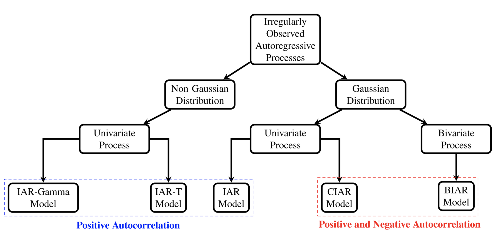

```{r setup, include=FALSE}
knitr::opts_chunk$set(echo = FALSE, cache = TRUE)
library(iAR)
library(ggplot2)
library(microbenchmark)
library(growth)
library(Rdrw)
library(gridExtra)
library(bookdown)
library(tinytex)
set.seed(6713)
```

# Introduction {#sec:intro}

Time series analysis is typically performed on data observed at regular intervals, under the assumption of evenly spaced discrete time points (see, for instance, @BoxJenkins1970; @BrockwellDavis1991; @HyndmanAthanasopoulos2021). When the data are recorded at irregular time intervals, two main strategies are commonly adopted: modeling the series in continuous time, or transforming it to a regularly spaced sequence through interpolation (see @Rehfeld2011).

Continuous-time models rely on the assumption that consecutive observations are closely spaced. However, this condition is not always met, especially in applications with sparse or unevenly sampled data. The package introduced in this paper addresses this challenge by providing discrete-time models specifically designed for unequally spaced observations.

Although several general-purpose time series packages are available in R, most notably those described in @HyndmanAthanasopoulosBergmeirCaceresChhayOHaraWildPetropoulosRazbashWangYasmeen2026 and @HyndmanKhandakar2008, which provide a comprehensive framework for modeling, forecasting, and evaluating regularly observed time series, there are currently few tools available for modeling irregularly observed time series. For instance, two notable packages that implement Continuous ARMA (CARMA) models are \CRANpkg{growth} and \CRANpkg{yuima} [@Yuima_2014]. The main distinction is that \CRANpkg{growth} allows incorporating fixed effects into the CARMA specification, whereas this is not supported in \CRANpkg{yuima}. An extension of the CARMA model allowing a Hurst parameter $H$ to represent long-term memory is implemented in the \CRANpkg{carfima} package.

CARMA models can also be estimated through more general frameworks for stochastic differential equations with irregular time points, such as the \CRANpkg{sde} [@sde_2008] and ctsmr [@ctsmr_2016] packages. These packages use maximum likelihood estimation combined with Kalman filtering techniques.

Multivariate irregular time series can be modeled using \CRANpkg{Rdrw} and \CRANpkg{ctsem}, which implement damped random walk processes. Additionally, several other packages in R are designed for specific tasks on irregular data. 
For instance, the \CRANpkg{lomb} package [@Lomb] implements the Lomb–Scargle periodogram, while the \CRANpkg{RobPer} package [@RobPer] allows the estimation of its extension, known as the Generalized Lomb–Scargle (GLS) periodogram [@GLS], both of which are used for period estimation in irregularly observed time series.

Another example is the sour package [@sour] which allows one to obtain the Discrete Correlation Function (DCF) with which one can obtain an estimator of the autocorrelation function under irregular sampling. Moreover, the package \CRANpkg{BINCOR} [@PolancoMedinaMartinGoniMudelsee2019] addresses the problem of estimating the correlation (and cross-correlation) between two series that are unevenly spaced — and possibly sampled at different timepoints — by using a “binned correlation” approach which resamples the irregular series into regular bins (taking into account persistence/autocorrelation) and then computes correlations or cross-correlations.

This paper presents \CRANpkg{iAR}, a new R package that introduces novel discrete-time models to fit irregularly observed time series. Unlike the packages mentioned above, which primarily rely on continuous-time formulations, \CRANpkg{iAR} adopts a discrete-time perspective, offering greater flexibility in the modeling and estimation process.

The models implemented in \CRANpkg{iAR} include the irregular autoregressive (iAR) process, its complex-valued extension (CiAR), and a bivariate version (BiAR). Additionally, the package provides tools to handle non-Gaussian data through extensions of the iAR model for $t$ and Gamma-distributed observations. These models allow for the estimation of negative autocorrelation, which cannot be captured by CARMA-based approaches.

\CRANpkg{iAR} offers a range of functionalities for irregularly spaced data, including: (i) random generation of observation times; (ii) simulation of the irregular autoregressive processes; (iii) estimation of autocorrelation; (iv) model fitting via maximum likelihood; and (v) interpolation of missing values and forecasting. Furthermore, all models implemented in \CRANpkg{iAR} are also compatible with regularly spaced stationary series, such as standard AR processes.

The package is built using the S7 object-oriented system [@VaughanHesterKalinowskiLandauLawrenceMaechlerTierneyWickham2024], which provides a robust and modular framework for class and method definitions. Compared to earlier systems like S3 and S4, S7 enforces a clearer separation between class specification and method implementation, supports formal validation, and ensures consistent method dispatch. This structure improves code clarity, extensibility, and integration with other object-oriented tools in R. Internally, the package relies on the \CRANpkg{zoo} package [@ZeileisGrothendieck2005] to manage indexed irregular time series efficiently, supporting multiple time representations, including numeric time scales,
calendar-based indices (e.g., `Date` and `POSIXct`), and user-defined irregular sampling schemes.

The remainder of this paper is organized as follows:
Section [2](#models) introduces the modeling framework for irregularly observed autoregressive processes and discusses their applicability.
Section [3](#sec:estimation) presents the procedures to obtain the maximum likelihood estimators for each of the models available in the \CRANpkg{iAR} package.
Section [4](#sec:usage) describes the structure and methods implemented in the package through examples using simulated data.
Section [5](#sec:cpu) reports the computational times of the estimation procedures and compares them with similar functions available in other packages.
Section [6](#sec:applications) presents applications of the \CRANpkg{iAR} package to astronomical data.
Finally, Section [7](#sec:discussion) concludes the paper with a discussion.

# Irregularly observed autoregressive models {#models}

The five models available in the \CRANpkg{iAR} package are presented in this section and are depicted in Figure \@ref(fig:Models). The choice of each model depends on the type of time series to be fitted. For example, if the data available are non-Gaussian distributed or not positively autocorrelated the appropriate model to fit the data may vary. In the following, each of the five models is briefly described.

```{r Models, out.width = "100%", out.height = "30%", fig.cap = "Flowchart of Irregularly Observed Autoregressive Processes.", fig.alt="Flowchart of Irregularly Observed Autoregressive Processes."}

```

## iAR Model

The irregular Autoregressive (iAR) model was introduced by @Eyheramendy_2018. We present here a brief description of the model. Let $\{t_j\}$ be the irregular observational times for $j=1,\ldots,n$. It is assumed that in general $t_j-t_{j-1}$ are not equal for $j=2,\ldots,n$. The iAR model is defined by,

\begin{equation}
y_{t_j}=\phi^{t_j-t_{j-1}} \, y_{t_{j-1}} + \sigma \, \sqrt{1-\phi^{2(t_j-t_{j-1})}}  \, \varepsilon_{t_j}, 
(\#eq:IAR)
\end{equation} 

where $\varepsilon_{t_j}$ is a white noise sequence with zero mean and unit variance, $\sigma$ is the standard deviation of the sequence of observations $y_{t_j}$. Note that $\phi$ is the parameter that describes the autocorrelation of the process. The iAR model can be represented in a state-space system as follows,

\begin{equation}
X_{t_j} =  \phi^{t_j-t_{j-1}} X_{t_{j-1}}  + \epsilon_{t_j} 
(\#eq:IARSS)
\end{equation} 
\begin{equation}
y_{t_j} =  X_{t_j}  + \omega_{y_{t_j}}
(\#eq:IARSS1)
\end{equation} 

Note that, in this representation the transition matrix of dimension $1\times1$ is defined as $F_{t_j} = \phi^{t_j-t_{j-1}}$. On the other hand, the observation matrix is defined by $G_{t_j} = 1$. The measurement error of $y_{t_j}$ is defined by $\omega_{y_{t_j}}$ with known variance $\delta^2_{t_j}$ and the error of the transition equation is $\epsilon_{t_j}$ with variance $Q_{t_j} =\sigma^2(1-\phi^{2(t_j-t_{j-1})}$). 

Assuming Gaussian errors $\varepsilon_{t_j}$, i.e. $\varepsilon_{t_j}\sim N(0,1)$, the iAR model is equivalent to the CARMA(1,0) or CAR(1) model. However, the iAR model can be extended to allow for non-Gaussian distributed data. The extensions implemented in the iAR package assume that the conditional moments of the iAR process follow either a Gamma or Student-t distribution. These two models are described next.

## iAR-Gamma Model

The conditional mean and variance of the iAR model are:

\begin{eqnarray*}
\mathbb{E}(y_{t_j}|y_{t_{j-1}})&=& \mu + \phi^{t_j-t_{j-1}} \, y_{t_{j-1}}\\
\mathbb{V}(y_{t_j}|y_{t_{j-1}})&=& \sigma^2 \left(1-\phi^{2(t_j-t_{j-1})}\right)\\
\end{eqnarray*}

respectively. If $y_{t_j}|y_{t_{j-1}} \sim$ Gamma$(\alpha_{t_j},\beta_{t_j})$, where $\alpha_{t_j}$ and $\beta_{t_j}$ are the shape and scale parameters respectively, then $y_{t_j}$ will be an iAR-Gamma process if $\alpha_{t_j}$ and $\beta_{t_j}$ are such that the following two equations are satisfied,

\begin{equation}
\begin{split}
\alpha_{t_j}\beta_{t_j} &= \mu + \phi^{t_j-t_{j-1}} \, y_{t_{j-1}}\\
\alpha_{t_j}\beta_{t_j}^2 &= \sigma^2 \left(1-\phi^{2(t_j-t_{j-1})}\right)\\
\end{split}
(\#eq:IARGamma)
\end{equation}

## iAR-T Model

A similar approach can be used to define an iAR-T model. Suppose that $y_{t_j}|y_{t_{j-1}} \sim t_{\nu}(\lambda_{t_j},\tau_{t_j}^2)$ is a non-standardized Student-T distribution with mean $\lambda_{t_j}$, variance $\tau_{t_j}^2$ and degrees of freedom $\nu$. Then $y_{t_j}$ will be an iAR-T process if $\lambda_{t_j}$ and $\tau_{t_j}^2$ are defined by,

\begin{equation}
\begin{split}
\lambda_{t_j} &= \mu + \phi^{t_j-t_{j-1}} \, y_{t_{j-1}}\\
\tau_{t_j}^2 &= \frac{\nu-2}{\nu}\sigma^2 \left(1-\phi^{2(t_j-t_{j-1})}\right).\\
\end{split}
(\#eq:IART)
\end{equation}

## CiAR Model

For irregularly observed time series, the models described above are well defined for positive values of the autocorrelation parameter $\phi$. The reason for this is that the time gap $\Delta_j = t_j-t_{j-1}$ can take any positive real value. Consequently, the $\phi$ parameter must be greater than zero since the result of a negative $\phi$ to the power of a real number, in general, is a complex number.

In order to address this issue, equation \@ref(eq:IAR) can be extended to a complex process which allows for negative values of the autocorrelation of the process. This extension of the iAR model is called the Complex irregular Autoregressive (CiAR) model [@Elorrieta_2019]. The CiAR process is characterized by a complex autocorrelation parameter defined by $\phi= \phi^R + i \phi^I$. The CiAR model can be represented by the following state space system, 

\begin{equation}
\left(\begin{array}{c} y_{t_j}^{*} \\  z_{t_j}^{*} \end{array} \right)= \left(\begin{array}{cc} \alpha_{t_j}  & -\beta_{t_j} \\ \beta_{t_j} & \alpha_{t_j} \end{array} \right)\left(\begin{array}{c} y_{t_{j-1}}^{*} \\  z_{t_{j-1}}^{*} \end{array} \right) + \sigma \sqrt{1-\left|\phi^{t_j-t_{j-1}}\right|^2} \left(\begin{array}{c} \varepsilon_{y_{t_j}} \\ \varepsilon_{z_{t_j}} \end{array} \right)
(\#eq:CIARSS)
\end{equation}
\begin{equation}
y_{t_j}  = \left(\begin{array}{cc} 1 & 0 \end{array} \right) \left(\begin{array}{c} y_{t_j}^{*}  \\  z_{t_j}^{*}  \end{array} \right) +  \omega_{y_{t_j}}
(\#eq:CIARSS2)
\end{equation}

In this case, the transition equation is two-dimensional with a transition matrix $F_{t_j} = \left(\begin{array}{cc} \alpha_{t_j} & -\beta_{t_j} \\ \beta_{t_j} & \alpha_{t_j} \end{array} \right)$. In addition, the observation matrix is defined by $G_{t_j}=\left(\begin{array}{cc} 1 & 0 \end{array} \right)$. $\alpha_{t_j}$ and $\beta_{t_j}$ are the reparameterized coefficients of the model, given by $\alpha_{t_j} = |\phi|^{\delta_{j}} \cos(\delta_{j} \psi)$ and $\beta_{t_j} = |\phi|^{\delta_{j}} \sin(\delta_{j} \psi)$ respectively, where $\delta_{j} = t_j-t_{j-1}$ and $\psi = \arccos\left( \frac{\phi^{R}}{|\phi|}\right)$. The variance of the errors of the transition and observations equation are defined by $Q_{t_j} = \sigma^2(1-\left|\phi^{t_j-t_{j-1}}\right|^2)$ and $\delta^2_{t_j}$ respectively. As in the iAR model, $\sigma^2$ denotes the marginal variance of the process.

## BiAR Model

We propose a bivariate extension of the CiAR model which we called the bivariate irregular autoregressive (BiAR) [@Elorrieta_2021] model. Unlike the CiAR model, the BiAR model is defined by a two-dimensional observation equation. The state space representation of the BiAR model is defined as,

\begin{equation}
\left(\begin{array}{c} y_{t_j}^{*} \\  z_{t_j}^{*} \end{array} \right)= \left(\begin{array}{cc} \alpha_{t_j}  & -\beta_{t_j} \\ \beta_{t_j} & \alpha_{t_j} \end{array} \right)\left(\begin{array}{c} y_{t_{j-1}}^{*} \\  z_{t_{j-1}}^{*} \end{array} \right) + \left(\begin{array}{c} \varepsilon_{y_{t_j}} \\ \varepsilon_{z_{t_j}} \end{array} \right)
(\#eq:BIARSS)
\end{equation}
\begin{equation}
\left(\begin{array}{c} y_{t_j} \\  z_{t_j} \end{array} \right)  = \left(\begin{array}{cc} 1 & 0 \\ 0 & 1 \end{array} \right) \left(\begin{array}{c} y_{t_j}^{*}  \\  z_{t_j}^{*}  \end{array} \right) +  \left(\begin{array}{c} \omega_{y_{t_j}} \\ \omega_{z_{t_j}} \end{array} \right)
(\#eq:BIARSS2)
\end{equation}  

where $\varepsilon_{t_{j}} =  \left(\begin{array}{c} \varepsilon_{y_{t_j}} \\ \varepsilon_{z_{t_j}} \end{array} \right)$ can be decomposed as $\varepsilon_{t_{j}} = L_{t_{j}} \xi_{t_j}$, where $L_{t_j}$ is a lower triangular matrix obtained by the Cholesky decomposition of the covariance matrix of $\varepsilon_{t_{j}}$ and $\xi_{t_j}$ is a bivariate normal random variable with zero mean and variance $\Sigma_{\xi} = \left(\begin{array}{cc}1 & \rho_{\xi} \\ \rho_{\xi} & 1 \end{array} \right)$. As in the CiAR model, $\alpha_{t_j}$ and $\beta_{t_j}$ are a reparameterization of the parameters $\phi^R$ and $\phi^I$. Note that, the BiAR model is defined by three parameters $\phi^R$,$\phi^I$ and $\rho_{\xi}$ which can be interpreted as the autocorrelation parameter $\phi^R$, the cross correlation parameter $\phi^I$ and the contemporary correlation parameter $\rho_{\xi}$.

## Considerations

All irregularly observed time series models implemented in this package depend on the observational gaps through both the autoregressive coefficient and the innovation variance. This may lead to some edge cases. For instance, when two consecutive observation times are identical ($\Delta_j = 0$), the autoregressive coefficient satisfies $\phi^{\Delta_j}=1$ and the innovation variance becomes zero. In practice, this may lead to numerical instability during estimation procedures. On the other hand, for very large time gaps, the autoregressive coefficient tends to zero, implying that consecutive observations become approximately independent.

# Estimation algorithms {#sec:estimation}

## Likelihood of the processes

Assume that the $y_{t_j}$ sequence follows an iAR model, if we further assume a Gaussian distribution, the negative log-likelihood of the $y_{t_j}$ sequence is given by,

\begin{equation}
\ell(\theta)=\frac{n}{2}\log (2\pi)+\frac{1}{2}\sum_{j=1}^n \log \nu_{t_j} + \frac{1}{2}\sum_{j=1}^n \frac{e_{t_j}^2}{\nu_{t_j}},
(\#eq:IARloglik)
\end{equation} 

where $\theta = (\phi, \sigma^2)$ is the vector of the parameters of the model. The initial values are defined by $e_{t_1}=y_{t_1}$, $\nu_{t_1}=\sigma^2 + \delta_{t_1}^2$ and $\hat{y}_{t_1}=0$, while $\hat{y}_{t_j} = \hat{\phi}^{t_j-t_{j-1}}\, y_{t_{j-1}}$,  $e_{t_j}=y_{t_j}-\hat{y}_{t_j}$ and $\nu_{t_j}=\sigma^2 (1-\phi^{2(t_j-t_{j-1})}) + \delta_{t_j}^2$ for $j=2,\ldots,n$.

For the iAR-Gamma model, the log-likelihood of the conditional distribution of $y_{t_j}|y_{t_{j-1}}$ can be written as,

\begin{equation}
\ell(\theta) = - \left(\alpha_{t_j}\right) \log \beta_{t_j} - \log \Gamma \left(\alpha_{t_j}\right) - \frac{1}{\beta_{t_j}}y_{t_j} + \left(\alpha_{t_j}-1\right) \log y_{t_j} 
(\#eq:IARGammaloglik)
\end{equation} 

where $\theta = (\alpha_{t_j}, \beta_{t_j})$ is the vector of the parameters of the model. Note from equation \@ref(eq:IARGamma) that $\alpha_{t_j}$ and $\beta_{t_j}$ depend on the parameters $\phi$, $\sigma^2$ and $\mu$. The initial value is defined as having a Gamma distribution with shape and scale parameters equal to one, i.e. $y_{t_1} \sim {\rm Gamma}(1,1)$.

For the iAR-T model, the log-likelihood of the conditional distribution of $y_{t_j}|y_{t_{j-1}}$ can be written as,

\begin{equation}
\ell(\theta) = - \frac{1}{2}  \log \tau_{t_j}^2 -\frac{\nu+1}{2}  \log    \left( 1 + \frac{1}{\nu} \left(\frac{y_{t_j}-\lambda_{t_j}}{\tau_{t_j}} \right)^2 \right)
(\#eq:IARTloglik)
\end{equation} 

where $\theta = (\nu, \tau_{t_j}, \lambda_{t_j})$ is the vector of the parameters of the model. Note from equation \@ref(eq:IART) that $\tau_{t_j}$ and $\lambda_{t_j}$ depend on the parameters $\phi$, $\sigma^2$. The initial value is defined by $y_{t_1} \sim N(0,1)$.

## Kalman recursions

The state-space representations of the models described in Section [2](#models) allow one to obtain the maximum likelihood estimators of the parameters of the models using the Kalman recursions. Given the transition matrix $F_{t_j}$, the observation matrix $G_{t_j}$, the transition error variance $Q_{t_j}$ and the observation error variance $R_{t_j}$ the Kalman recursions can be obtained as,

\begin{equation} 
\begin{split}
\Lambda_{t_j} &= G \Omega_{t_j} G' + R_{t_j} \\
\Theta_{t_j} &= F_{t_j}\Omega_{t_j} G' \\
\Omega_{t_{j+1}} &= F_{t_j} \Omega_{t_j} F_{t_j}' + Q_{t_j}  - \Theta_{t_j} \Lambda_{t_j}^{-1} \Theta_{t_j}' \\
\nu_{t_j}  &= X_{t_j} - G \hat{X}_{t_j}\\
\hat{X}_{t_{j+1}}  &= F_{t_j} \hat{X}_{t_j} +  \Theta_{t_j} \Lambda_{t_j}^{-1} \nu_{t_j}
\end{split}
(\#eq:Kalman)
\end{equation} 

Using the Kalman recursions parameters, we can obtain the maximum likelihood estimator from the log-likelihood function defined as,

\begin{equation}
\ell(\phi) \propto  - \frac{1}{2} \mathop{\sum}\limits_{j=1}^n \left( \log (|\Lambda_{t_j}|) + \nu_{t_j}' \Lambda_{t_j}^{-1} \nu_{t_j} \right)
\end{equation}

# Structure and usage of the \CRANpkg{iAR} package {#sec:usage}

## Object-oriented system

The iAR package is structured using the S7 object-oriented system, which provides a formal and modular framework for defining classes and methods. This design enables a coherent and consistent internal organization across the different autoregressive models implemented in the package: iAR, CiAR, and BiAR.

Each model class provides a standardized set of methods for tasks such as maximum likelihood estimation, computation of fitted values, forecasting, and interpolation. The implementation of S7 ensures that these methods are defined uniformly across models, while still allowing for model-specific behavior when needed. Also, extensive validations have been implemented within the package functions to ensure robust behavior under a variety of input scenarios and model configurations.

For handling irregular time indices, the package leverages the \CRANpkg{zoo} package, which offers flexible and efficient tools for managing time-based data in R. This integration allows for seamless manipulation and alignment of time series with irregular observational times, a fundamental feature for the models supported by the package.

## The R interface

Our package can be installed and loaded in R by the usual commands:

```
install.packages("iAR")
library("iAR")
```

The classes and methods implemented in the \CRANpkg{iAR} package are summarized in Table\@ref(tab:coreR). Each class—iAR, CiAR, and BiAR—includes a core set of methods for simulating time series (sim), estimating parameters via maximum likelihood (kalman), computing fitted values (fit), summarizing fitted models (summary),  interpolating missing observations (interpolation), forecasting future values (forecast), and visualizing results through various plotting functions (plot, plot\_fit, plot\_forecast). The iAR class additionally includes loglik for computing the log-likelihood directly.

Table: (\#tab:coreR) Classes and methods of the iAR package.

| Class        | Method        | Description |
|:-------------|:--------------|:------------------|
| iAR          | sim                 | Sampling from an iAR model |
|              | loglik              | MLE estimation of iAR model |
|              | kalman              | MLE estimation of iAR model |
|              | fit                 | Fitted values of iAR model |
|              | summary             | Summary of the iAR model |
|              | interpolation       | Interpolation from the iAR model |
|              | forecast            | Forecast from iAR model |
|              | plot                | Plot of the series |
|              | plot_fit            | Plot of the fitted values |
|              | plot_forecast       | Plot of the forecasted values |
| CiAR         | sim                 | Sampling from a CiAR model |
|              | kalman              | MLE estimation of CiAR model |
|              | fit                 | Fitted values of CiAR model |
|              | summary             | Summary of the CiAR model |
|              | interpolation       | Interpolation from the CiAR model |
|              | forecast            | Forecast from CiAR model |
|              | plot                | Plot of the series |
|              | plot_fit            | Plot of the fitted values |
|              | plot_forecast       | Plot of the forecasted values |
| BiAR         | sim                 | Sampling from a BiAR model |
|              | kalman              | MLE estimation of BiAR model |
|              | fit                 | Fitted values of BiAR model |
|              | summary             | Summary of the BiAR model |
|              | interpolation       | Interpolation from the BiAR model |
|              | forecast            | Forecast from BiAR model |
|              | plot                | Plot of the series |
|              | plot_fit            | Plot of the fitted values |
|              | plot_forecast       | Plot of the forecasted values |
| utilities    | gentime             | Generating time points based on a statistical distribution |
|              | pairingits          | Pairing the observational times of two time series |
|              | phase               | Computing phased time series |
|              | harmonicfit         | Harmonic fit to time series |

Most methods are consistently available across the three main classes, with the only exception being the loglik method. This method is implemented exclusively for the iAR class, while parameter estimation for the CiAR and BiAR classes relies entirely on the Kalman filtering framework. Furthermore, since the same methods are used for the Gaussian and non-Gaussian versions of the iAR model (e.g., iAR-Gamma and iAR-T), the underlying distributional assumptions are controlled via arguments passed to these functions. This unified interface simplifies the application of various models to irregularly observed time series.

Additionally, the utilities class provides support functions that enhance the modeling workflow. The gentime method generates irregular time points based on a statistical distribution, which is useful when the time slot is not provided by the user. The pairingits method allows pairing observational times from two irregularly observed time series, facilitating multivariate modeling with the BiAR class. The phase method computes phased time series, which is particularly useful for visualizing periodic behaviors in irregularly observed data. Finally, the harmonicfit method performs harmonic fitting on time series, providing a flexible tool for removing dominant periodic components before autoregressive modeling.

To improve computational efficiency, several functions in the methods were implemented in C++ using the package \CRANpkg{Rcpp} [@Rcpp]. In particular, we use the C++ linear algebra library Armadillo, accessed via the \CRANpkg{RcppArmadillo} package [@RcppArmadillo].

## Examples

The sim method allows the user to generate realizations from any of the five models available in this package. To simulate a standard iAR process, we first create an object of class iAR as follows:

```{r iARclass,echo=TRUE}
model_norm <- iAR(family = "norm", coef = 0.9) 
```

Here, the model is defined by specifying the distribution family and the autoregressive coefficient. To simulate an iAR process, the argument coef, which corresponds to the model autoregressive parameter, must take a value between 0 and 1.

The time points can be specified by the user when the iAR object is defined. However, if the times argument is left empty, the sim method will automatically generate a time array of length n, using a random distribution defined by the gentime method from the utilities class. By default, an array of size n=100 is generated from a mixture of two exponential distributions with rate parameters lambda1 = 130 and lambda2 = 6.5, and weights p1 = 0.15 and p2 = 0.85, respectively.

Once the model is defined, the process can be simulated using the sim method as follows:

```{r sim,echo=TRUE}
model_norm <- sim(model_norm) 
```

To visualize the simulated process, the plot method from the iAR package can be used:

```{r iAR, echo = TRUE, fig.width = 6, fig.cap="Simulated Irregularly Observed Autoregressive process.", fig.alt = "Simulated Irregularly Observed Autoregressive process."}
plot(model_norm, main = "", ylab = "Values", xlab = "Time", ylim = c(-3, 3),type = "o",pch=20)
```

The simulated iAR process is shown in Figure \@ref(fig:iAR). In this figure, the irregular time gaps and the stationary behavior of the process can be observed. To estimate the parameter phi, the kalman method is available in our package. This method uses Kalman recursions to obtain the maximum likelihood estimator based on the state-space representation of the iAR model. Applying this method to the previously simulated process yields the following result:

```{r kalmaniAR,echo=TRUE}
model <- kalman(model_norm)  
print(model@coef)
print(model@kalmanlik)
```

Another option for estimating the phi parameter of the iAR model is to use the loglik method. This method computes the maximum likelihood estimator based on the full likelihood function. The loglik method can be applied as follows:

```{r loglikiAR,echo=TRUE}
model <- loglik(model_norm)  
print(model@coef)
print(model@loglik)
```

To assess whether the parameter $\phi$ is significantly different from zero, the summary method can be used. This method returns the p-value of the t-test associated with this parameter. To use it properly, the hessian slot must be set to TRUE in the iAR object beforehand. If the p-value returned by this function is less than a given significance level, we can conclude that the parameter is significantly greater than zero. Furthermore, the summary method also provides additional information about the fitted model, including information criteria and residual diagnostics. The usage of this method is as follows:

```{r summaryiAR,echo=TRUE}
model_norm@hessian=TRUE
model <- loglik(model_norm)  
summary(model)
```

As shown in this example, the obtained p-value is very small. Consequently, the parameter is significantly greater than zero. Furthermore, the diagnostics of the fitted model suggest no remaining autocorrelation in the residuals, supporting the whiteness of the errors.

For the remaining models available in this package, the methods are structured similarly to the previous example (as shown in Table \@ref(tab:coreR)). Thus, the procedure for generating a non-Gaussian iAR model begins by creating an object of the iAR object with either a gamma or t distribution. Below, we illustrate the simulation of an iAR-Gamma process.

```{r iARgammaclass,echo=TRUE}
model_gamma <- iAR(family = "gamma", coef = 0.9, variance=1, mean=1, hessian=TRUE)
model_gamma <- iAR::sim(model_gamma)
```

where the additional parameters mean and variance, representing the mean and variance of the simulated process, respectively, must be defined. Figure \@ref(fig:iARg) shows a simulated iAR-Gamma process with the distribution of the simulated data. 

```{r iARg, echo = TRUE, fig.height=3,fig.width = 6, fig.cap="Simulated iAR-Gamma process. Figure a) shows the simulated irregularly observed time series. Figure b) shows the histogram of the values of the simulated process.", fig.alt = "Simulated iAR-Gamma process. Figure a) shows the simulated irregularly observed time series. Figure b) shows the histogram of the values of the simulated process."}
par(mfrow=c(1,2))
plot(model_gamma,main="(a)",ylab="Values",xlab="Time",type = "o",pch=20)
hist(model_gamma@series,breaks=25,main="(b)",xlab="Values")
```

Note in Figure \@ref(fig:iARg)-b that the simulated values have a left-skewed distribution typical of the gamma family. To estimate the parameters of the iAR-Gamma process, the loglik method can be used as follows:

```{r IARgammaloglik,echo=TRUE}
model_gamma <- loglik(model_gamma)
summary(model_gamma,diagnostic=FALSE)
```

In this example, the estimated values for the three parameters are close to their true values, indicating that the estimation procedure performs well. Additionally, the near-zero p-values confirm the statistical significance of the parameter estimates. Note that we use diagnostic = FALSE in the summary method, which suppresses the residual diagnostics to simplify the presentation of the output.

To generate a heavy-tailed iAR process, the method sim can be applied to an iAR object of the family t. The family t requires the additional argument df which specifies the degrees of freedom of the conditional Student's t distribution. The procedure to generate an iAR-t process is as follows:

```{r iARtclass,echo=TRUE}
model_t <- iAR(family = "t", coef = 0.9, sigma=1, df=3, hessian=TRUE)
model_t <- iAR::sim(model_t)
```

```{r iARt, echo = TRUE, fig.height=3,fig.width = 6, fig.cap="Simulated iAR-T process. Figure a) shows the simulated irregularly observed time series. Figure b) shows the histogram of the values of the simulated process.", fig.alt = "Simulated iAR-T process. Figure a) shows the simulated irregularly observed time series. Figure b) shows the histogram of the values of the simulated process."}
par(mfrow=c(1,2))
plot(model_t,main="(a)",ylab="Values",xlab="Time",type = "o",pch=20)
hist(model_t@series,breaks=25,main="(b)",xlab="Values")
```

Note in Figure \@ref(fig:iARt) that the simulated process exhibits a heavy tail distribution. In order to estimate the parameters of this process via maximum likelihood, the method loglik must be used as follows:

```{r IARtloglik,echo=TRUE}
model_t <- loglik(model_t)
summary(model_t,diagnostic=FALSE)
```

This method allows estimation of the parameters phi and sigma from the iAR-T model. The standard errors and p-values indicate that the estimates are statistically significant.

To generate a CiAR process, a CiAR class object must first be created. The argument coef, which corresponds to a vector containing the coefficients of the CiAR model must be defined. Finally, the sim method is used to simulate the CiAR process. Note that in the first examples, the observational times are not provided, and are therefore generated by default. To illustrate how observational times can be specified by the user, the gentime function is manually used to generate them. In this case, a mixture of two exponential distributions is considered with means lambda1 = 15 and lambda2 = 2.5, and weights p1 = 0.15 and p2 = 0.85, respectively, as follows:

```{r CIARclass,echo=TRUE}
times<-gentime(n=200, distribution = "expmixture", lambda1 = 15, lambda2 = 2.5,
               p1 = 0.15, p2 = 0.85)
model_CiAR <- CiAR(coef = c(0.9, 0.0),times=times@times)
model_CiAR <- sim(model_CiAR)
```

To estimate the parameters of the CiAR model, the kalman method must be used. If the argument hessian = TRUE is specified, the significance of the estimated parameters can also be obtained, as shown below:

```{r CIARkalman,echo=TRUE}
model_CiAR@hessian=TRUE
model_CiAR <- kalman(model_CiAR)
summary(model_CiAR,diagnostic=FALSE)
```

As shown, this method provides both the parameter estimates and the reduced negative log-likelihood evaluated at the coefficients phiR and phiI. The estimates obtained are accurate for both parameters.

Additionally, to obtain the fitted values from the CiAR model, the fit method must be applied. This method returns the fitted values of a time series observed at irregular time points, given the parameters phiR and phiI, as follows:

```{r CIARfit, echo = TRUE, fig.height=3,fig.width = 6, fig.cap="Simulated Complex Irregularly Observed Autoregressive process. The blue line corresponds to the fitted values estimated with the Kalman recursions.", fig.alt = "Simulated Complex Irregularly Observed Autoregressive process. The red line corresponds to the fitted values estimated with the Kalman recursions."}
model_CiAR <- fit(model_CiAR)
plot_fit(model_CiAR,type = "o",pch=20,ylab="Values",xlab="Time")
```

Figure \@ref(fig:CIARfit) shows the fitted values estimated with the method fit over the simulated CiAR process. The method forecast applied on a CiAR object allows forecasting from the CiAR model given the coefficients and the tAhead which corresponds to the time gap in which the forecast is made. In the following example, a forecast 1.5 days in the future is performed:

```{r CIARforecast,echo=TRUE}
forCIAR <- forecast(model_CiAR, tAhead=1.5)
forCIAR@forecast
```

It is important to notice that the forecast predictor of the CiAR process (as well as for any autoregressive process) converges to the mean for large prediction horizons.

The sim method applied on a CiAR object also allows one to generate an irregularly observed autoregressive process with negative autocorrelation as follows:

```{r CIARneg, echo = TRUE, fig.height=3, fig.width = 6, fig.cap="Simulated Complex Irregularly Observed Autoregressive processes with positive autocorrelation of order one (Figure (a)) and negative autocorrelation of order one (Figure (b)).", fig.alt = "Simulated Complex Irregularly Observed Autoregressive processes with positive autocorrelation of order one (Figure (a)) and negative autocorrelation of order one (Figure (b))."}
par(mfrow=c(1,2))
model_CiAR <- CiAR(times = times@times,coef = c(0.9, 0))
model_CiAR <- sim(model_CiAR)
plot(model_CiAR,ylab="Values",xlab="Time",main="(a)",type = "o",pch=20)
model_CiAR <- CiAR(times = times@times,coef = c(-0.9, 0))
model_CiAR <- sim(model_CiAR)
plot(model_CiAR,ylab="Values",xlab="Time",main="(b)",type = "o",pch=20)
```

Figure \@ref(fig:CIARneg) shows the CiAR process simulated with both positive and negative autocorrelation. Note that the time series with negative autocorrelation shows more frequent oscillations around zero, while the positively correlated process exhibits a more persistent behavior.

The last model implemented in this package is the BiAR process. The BiAR class provides functionality for working with this model. To simulate a BiAR process, the argument coef must be defined as a vector of length two, corresponding to the model coefficients. As we mentioned for the previous examples, the time points can be provided by the user or automatically generated  by a random distribution. Additionally, a parameter rho can be specified to indicate the correlation between the two components of the bivariate process. The use of the sim method in this class is as follows:

```{r BiARclass,echo=TRUE}
model_BiAR <- BiAR(coef = c(0.9, 0.3), rho = 0.9)
model_BiAR <- sim(model_BiAR)
```

```{r BIAR, echo = TRUE, fig.width = 6, fig.height= 5,fig.cap="Simulated Bivariate Irregularly Observed Autoregressive process.", fig.alt = "Simulated Bivariate Irregularly Observed Autoregressive process."}
par(mfrow=c(2,1))
plot(model_BiAR@times,model_BiAR@series[,1],main="(a)",xlab="Time",ylab="Values",
     type = "o",pch=20)
plot(model_BiAR@times,model_BiAR@series[,2],main="(b)",xlab="Time",ylab="Values",
     type = "o",pch=20)
```

Figure \@ref(fig:BIAR) shows the simulated BiAR process. As expected, the two time series display similar behavior due to the value of the contemporary correlation parameter $\rho=0.9$. To estimate the parameters of the BiAR model and assess their significance, the method kalman should be used with the argument hessian = TRUE, as shown below:

```{r BIARkalman,echo=TRUE}
model_BiAR@hessian=TRUE
model_BiAR <- kalman(model_BiAR, niter = 20)
summary(model_BiAR,diagnostic=FALSE)
```

In addition, the method fit allows estimation of the contemporary correlation parameter rho. The usage of this method is the following:

```{r BIARfit,echo=TRUE}
model_BiAR <- fit(model_BiAR)
model_BiAR@rho
```

These results show accurate estimation of the three parameters of the BiAR model.

# CPU Performance {#sec:cpu}

In this section, we evaluate the computational performance of the functions implemented in the \CRANpkg{iAR} package for R. First, the computational times are compared with respect to other functions available in R for fitting irregularly spaced time series models. The functions included in the comparison are the following: carma function from the \CRANpkg{growth} package, drw function from the \CRANpkg{Rdrw} package and the loglik method from the iAR class of our \CRANpkg{iAR} package.

The microbenchmark function from the package of the same name is used for the comparison of the computational times of the functions mentioned above. 
For this experiment, an irregularly observed time series of length 200 was generated. Each function was executed 100 times on the generated time series. The distribution of execution times (in microseconds) is presented in Figure \@ref(fig:Benchmark). Note that the loglik method from our package estimates the model parameters in significantly less time than the other functions analyzed.

```{r Benchmark, echo = FALSE, message = FALSE, warning = FALSE, fig.width=7, fig.height=4.5, out.width="100%", fig.cap="Distribution of the computation times (in microseconds) of the functions carma (growth package), drw (Rdrw package) and the loglik method (iAR package)."}
n=200
set.seed(6714)
o6<-gentime(n=200, distribution = "expmixture", lambda1 = 130, lambda2 = 6.5,p1 = 0.15, p2 = 0.85)
st<-o6@times
x <- iAR(family = "norm", times = st, coef = 0.9)
x <- iAR::sim(x)
y=x@series
y1=y/sd(y)
x@series=y1
mb_res <- microbenchmark(
  loglik(x),
  carma(as.numeric(y1),times=st,arma = c(1,0,0),parma=0.9),
  drw(data1 = cbind(st,y1,0.0000001), n.datasets = 1, method = "mle"),
  times = 100L
)
#Change names
levels(mb_res$expr)[match("loglik(x)",levels(mb_res$expr))] <- "iAR Model iAR Package"
levels(mb_res$expr)[match("carma(as.numeric(y1), times = st, arma = c(1, 0, 0), parma = 0.9)",levels(mb_res$expr))] <- "CAR(1) Model growth package"
levels(mb_res$expr)[match("drw(data1 = cbind(st, y1, 1e-07), n.datasets = 1, method = \"mle\")",levels(mb_res$expr))] <- "CAR(1) Model Rdrw package"
p <- ggplot2::autoplot(mb_res) +
  labs(
    title = "Benchmark Comparison",
    x = "Time (microseconds)",
    y = "Method"
  ) +
  theme(
    axis.text.y = element_text(size = 12, face = "bold"),
    axis.text.x = element_text(size = 12, face = "bold"),
    axis.title  = element_text(size = 12, face = "bold")
  ) +
  xlab("Time (microseconds)")
print(p)
```

In a second experiment, we assessed how the computational time of the estimation methods implemented in our package scales with the sample size of simulated time series. Figure \@ref(fig:Computation) shows the mean computation times of the \texttt{loglik} and \texttt{kalman} methods from the \texttt{iAR} class, and the \texttt{kalman} method from the \texttt{CiAR} and \texttt{BiAR} classes, for sample sizes ranging from 50 to 1000 observations, after 100 repetitions. The results show an approximately linear growth of computation time with sample size. As expected, the estimation methods for the \texttt{iAR} model are considerably faster than those for the \texttt{CiAR} and \texttt{BiAR} models, reflecting their lower computational complexity.

```{r Computation, echo = FALSE, fig.width = 6, fig.cap="Mean computation time (in seconds) of the estimation methods in the iAR package.", fig.alt = "Mean computation time (in seconds) of the estimation methods in the iAR  package."}
set.seed(1234)
n=c(50,100,250,500,1000)
m=100
finiar  = matrix(0,length(n),5)
finiar2 = matrix(0,length(n),5)
finciar = matrix(0,length(n),5)
finbiar = matrix(0,length(n),5)
for(j in 1:length(n))
{
  times<-gentime(n=n[j], distribution="expmixture",
                 lambda1=130, lambda2=6.5, p1=0.15, p2=0.85)
  model_norm <- iAR(family="norm", coef=0.9, times=times@times)
  model_norm <- sim(model_norm)
  model_CiAR <- CiAR(coef=c(0.9,0.0), times=times@times)
  model_CiAR <- sim(model_CiAR)
  model_BiAR <- BiAR(coef=c(0.9,0.3), rho=0.9, times=times@times)
  model_BiAR <- sim(model_BiAR)
  timebiar=rep(0,m)
  timeciar=rep(0,m)
  timeiar=rep(0,m)
  timeiar2=rep(0,m)
  for(i in 1:m)
  {
    timeiar[i]=system.time(loglik(model_norm))[3]
    timeiar2[i]=system.time(kalman(model_norm))[3]
    timeciar[i]=system.time(kalman(model_CiAR))[3]
    timebiar[i]=system.time(kalman(model_BiAR))[3]
  }
  finiar[j,]=c(n[j], mean(timeiar), median(timeiar), sd(timeiar),
               quantile(timeiar,0.75)-quantile(timeiar,0.25))
  finiar2[j,]=c(n[j], mean(timeiar2), median(timeiar2), sd(timeiar2),
                quantile(timeiar2,0.75)-quantile(timeiar2,0.25))
  finciar[j,]=c(n[j], mean(timeciar), median(timeciar), sd(timeciar),
                quantile(timeciar,0.75)-quantile(timeciar,0.25))
  finbiar[j,]=c(n[j], mean(timebiar), median(timebiar), sd(timebiar),
                quantile(timebiar,0.75)-quantile(timebiar,0.25))
j  
}
par(mfrow=c(1,2))
plot(n, finiar2[,2],type = "o",col = "red",pch = 19, xlab = "Sample Size",
     ylab = "Mean Computation Time",main = "",ylim=c(0,max(finiar2[,2]))) 
lines(n, finiar[,2], type = "o", col = "blue", pch = 19)

legend("topleft",
       legend = c("kalman (iAR)", "loglik (iAR)"),
       col = c("red","blue"),pch = 19,lwd = 1, cex = 0.6,bty = "n", bg = "transparent",text.font = 2) 

plot(n, finbiar[,2],type = "o",col = "blue",pch = 19, xlab = "Sample Size",
     ylab = "Mean Computation Time",main = "",ylim=c(0,max(finbiar[,2])))
lines(n, finciar[,2], type = "o", col = "red", pch = 19)

legend("topleft",
       legend = c("kalman (CiAR)", "kalman (BiAR)"),
       col = c("red","blue"),pch = 19,lwd = 1, cex = 0.6,bty = "n", bg = "transparent",text.font = 2)
iAR50   <- round(finiar2[1,2],4)
iAR1000 <- round(finiar2[5,2],4)

CiAR50   <- round(finciar[1,2],4)
CiAR1000 <- round(finciar[5,2],4)

BiAR50   <- round(finbiar[1,2],4)
BiAR1000 <- round(finbiar[5,2],4)
```

In addition, Table \@ref(tab:timestable) reports the mean CPU times (in seconds). For example, the iAR model increases from `r iAR50` seconds (n = 50) to `r iAR1000` seconds (n = 1000), while the CiAR and BiAR models increase from `r CiAR50` to `r CiAR1000` and from `r BiAR50` to `r BiAR1000` seconds, respectively. These results are consistent with the approximately linear growth observed in the previous figure. In particular, when n increases by a factor of 20, the computation time increases by a factor of about 20 for CiAR and BiAR, and by a factor of about 5 for iAR.

```{r timestable, echo=FALSE}
tab <- data.frame(
  n = n,
  iAR = round(finiar2[,2],4),
  CiAR = round(finciar[,2],4),
  BiAR = round(finbiar[,2],4)
)
knitr::kable(tab, caption = "Mean computation time (in seconds) of the estimation methods in the iAR package")
```

# Applications of the \CRANpkg{iAR} package on real datasets {#sec:applications}

## Identification of Multiperiodic time series

In astronomy, there are surveys where finding irregular time series with periodical behavior is not rare. Furthermore, some astronomical objects can have more than one significant period. Generally, this happens in  specific types of variable stars, which are called multi-periodic variable stars. In the \CRANpkg{iAR} package an example of this type of irregular time series can be found. This dataset is called dmcep and corresponds to the time series of the magnitude of the brightness of a double mode cepheid (DMCEP) variable star observed by the OGLE survey [@OGLE]. This time series has been irregularly observed and each observation has associated an observational error. The dataset contains 191 observations and three attributes: the observational times (t), the brightness magnitudes (m), and the known variance of the measurement errors (merr). The dominant frequency of this time series is 0.741, while the second frequency is 0.543. Figure \@ref(fig:dmcep) (a) shows the raw time series of this DMCEP variable star. In addition, we folded this time series by its first period, using the method phase of this package. The folded time series is presented in the Figure \@ref(fig:dmcep) (b) and reflects the periodical behavior of the brightness of this astronomical object.

Due to the periodic behavior of this irregular time series, a harmonic model must be fitted to it. For this purpose the harmonicfit method of the iAR package can be used. This function requires specifying the number of harmonic components (nham) to include in the model. In this application, the default value nham=4 was used. Later, we fitted an iAR model to the residuals of the harmonic model to verify if the whole time dependence structure of this time series was explained by this model. The parameter estimated by the iAR model was $\hat{\phi} = 0.02$ , with an associated p-value of 0.42, suggesting no significant autocorrelation after the harmonic fit.

```{r harmonicfit,echo=TRUE}
data(dmcep)
f1=0.741
o1<-harmonicfit(data=dmcep,f1=f1)
y=o1@residuals
y=y/sd(y)
merr=dmcep$merr/sd(y)
x <- iAR(family = "norm", times = dmcep[,1], series = y, series_esd = merr, hessian=TRUE)
x = loglik(x)
summary(x)
```

However, the residual diagnostics indicate some remaining dependence structure. This result is further confirmed by fitting the CiAR model to the residuals of the harmonic model, which yields an estimated autocorrelation parameter of $-0.63$. This result indicates the presence of negative autocorrelation in the residuals, which explains why it is captured by the CiAR model.

Figure \@ref(fig:dmcep) (d) shows that the residuals of the harmonic fit folded using the second period of this variable star exhibit a clear serial correlation. Later, this serial correlation can be modeled using a new harmonic model that considers the second period.

```{r dmcep, echo = FALSE, fig.width = 6, fig.cap="Figure a) shows the raw DMCEP time series and Figure b) shows this time series folded by the first period of the variable star. Figure c) shows the residuals of the harmonic fit and Figure d) shows this residuals folded by the second period of the variable star.", fig.alt = "Figure a) shows the raw DMCEP time series and Figure b) shows this time series folded by the first period of the variable star. Figure c) shows the residuals of the harmonic fit and Figure d) shows this residuals folded by the second period of the variable star."}
df=data.frame("t"=dmcep$t,"m"=dmcep$m,"merr"=dmcep$merr)
o1<-phase(o1,data=df,f1=f1,twop=TRUE)
out <- ggplot(dmcep, aes(x = t, y = m)) + geom_errorbar(aes(ymin = m - merr, ymax = m + merr), width = 0.01, col = "red") + geom_point() + scale_y_reverse() + xlab("Time (in Julian Date)") + ylab("Magnitude") + theme_bw() + ggtitle("(a)")+theme(plot.title = element_text(face = "bold", size = 10,hjust = 0.5), panel.grid.major = element_blank(), panel.grid.minor = element_blank(),panel.background = element_blank())
fold=data.frame(o1@times_phased,o1@series_phased,o1@series_esd_phased)
names(fold)=c("phase","series","series_esd")
out2 <- ggplot(fold, aes(x = phase, y = series)) + geom_errorbar(aes(ymin = series - series_esd, ymax = series + series_esd), width = 0.01, col = "red") + geom_point() + scale_y_reverse() + xlab("Time (in Julian Date)") + ylab("Magnitude") + theme_bw() + ggtitle("(b)")+theme(plot.title = element_text(face = "bold", size = 10,hjust = 0.5), panel.grid.major = element_blank(), panel.grid.minor = element_blank(),panel.background = element_blank())
o1<-harmonicfit(o1,data=dmcep,f1=f1)
fit<-o1@fitted_values
y=o1@residuals
y=y/sd(y)
merr=dmcep$merr/sd(y)
x <- iAR(family = "norm", times = dmcep[,1], series = y, series_esd = merr, hessian=T)
x = loglik(x)
phi=x@coef
x1 <- CiAR(times = dmcep[,1], series = y, series_esd = merr,hessian=T)
x1 = kalman(x1)
f2=0.543
df=data.frame("t"=dmcep$t,"m"=o1@residuals,"merr"=dmcep$merr)
o2<-phase(data=df,f1=f2,twop=TRUE)
out3 <- ggplot(df, aes(x = t, y = m)) + geom_errorbar(aes(ymin = m - merr, ymax = m + merr), width = 0.01, col = "red") + geom_point() + scale_y_reverse() + xlab("Time (in Julian Date)") + ylab("Residuals") + theme_bw() + ggtitle("(c)")+theme(plot.title = element_text(face = "bold", size = 10,hjust = 0.5), panel.grid.major = element_blank(), panel.grid.minor = element_blank(),panel.background = element_blank())
fold=data.frame(o2@times_phased,o2@series_phased,o2@series_esd_phased)
names(fold)=c("phase","series","series_esd")
out4 <- ggplot(fold, aes(x = phase, y = series)) + geom_errorbar(aes(ymin = series - series_esd, ymax = series + series_esd), width = 0.01, col = "red") + geom_point() + scale_y_reverse() + xlab("Time (in Julian Date)") + ylab("Magnitude") + theme_bw() + ggtitle("(d)")+theme(plot.title = element_text(face = "bold", size = 10,hjust = 0.5), panel.grid.major = element_blank(), panel.grid.minor = element_blank(),panel.background = element_blank())
grid.arrange(out,out2,out3,out4,ncol=2,nrow=2)
```

## Pairing two astronomical time series

Among the models available in the \CRANpkg{iAR} package, the BiAR model allows two time series to be modeled jointly. However, this model assumes that two time series are measured at the same times. This assumption is not necessarily satisfied. For example, in astronomy an object can be observed with multiple filters, producing distinct time series of brightness that are not perfectly synchronized. To address this problem, a two-step procedure is proposed. The first step consists of pairing two time series by their observational times, in order to pair the measurements taken at the same time. In the case that for a given time there is a measurement in only one time series, a missing value is assigned in the remaining one. In the second step these missing values are imputed with an interpolation procedure.

To illustrate this procedure, we use two time series available in the \CRANpkg{iAR} package. These time series, called cvnovag and cvnovar, correspond to the brightness magnitude of a cataclysmic variable object observed both in the g and r filters of the ZTF survey respectively and processed by the ALeRCE broker [@Forster_2021]. Prior to pairing, a smooth trend is removed from each series using the `loess` function in order to obtain a stationary time series. This choice is not restrictive, and other smoothing or detrending methods available in R could be used instead (see, for instance, `smooth.spline` in base R, or functions available in packages such as \CRANpkg{mgcv} (@Wood2001,@Wood2017) and \CRANpkg{forecast} [@HyndmanKhandakar2008]). To pair these two time series, we use the method `pairingits` from the \CRANpkg{iAR} package as follows:

```{r pairingits,echo=TRUE}
data(cvnovag)
data(cvnovar)
lo.g <- loess(m ~ t, cvnovag)
lo.r <- loess(m ~ t, cvnovar)
datag=cvnovag
datar=cvnovar
datag$m=datag$m-lo.g$fitted
datar$m=datar$m-lo.r$fitted
o1<-pairingits(datag,datar,tol=0.1)
pargr1=na.omit(o1@paired)
```

This function causes that the datasets cvnovag and cvnovar of 67 and 65 observations respectively, to be merged into a single dataset with 97 observations which contains the measurements of both time series. Out of the total 97 observations in the merged dataset, 35 were matched based on their observation times, while in the remaining 62 observations there is a missing value in any of the two time series.

In order to fill these missing values we use the method interpolation. To implement this function we fit the BiAR model using the 35 observational times in which we have measures in the two time series as follows:

```{r BIARnova,echo=TRUE}
st=apply(pargr1[,c(1,4)],1,mean)
model_BiAR <- BiAR(times = st,series=pargr1[,c(2,5)],series_esd=pargr1[,c(3,6)])
model_BiAR@hessian=T
model_BiAR <- kalman(model_BiAR, niter = 20)
summary(model_BiAR,diagnostic=FALSE)
model_BiAR <- fit(model_BiAR)
print(model_BiAR@rho)
```

Note that the contemporary correlation between both time series estimated by the BiAR model is very high (rho=0.98). Using the estimated parameters by the BiAR model (phiR= 0.929 and phiI= 0.004), we estimate each missing value recursively, so that only one missing value is estimated per iteration. Note that by using the bivariate model to perform the smoothing, we achieve that the time series that has an observation at a given time helps the imputation of the time series that has the missing value at the same time. This is particularly useful for highly correlated series such as the one presented in this example.

Figures \@ref(fig:cvnova) a and \@ref(fig:cvnova) b show both time series after the pairing procedure, and Figures \@ref(fig:cvnova) c and \@ref(fig:cvnova) d show both time series after the smoothing procedure. Note that due to the high correlation between the raw time series, the imputed time series become very similar.

```{r cvnova, echo = FALSE, fig.width = 6, fig.cap="Figures a) and b) shows the time series cvnovag (green) and cvnovar (red) respectively. The vertical dotted lines show the observation times where a value must be imputed. The black dots are the estimated values at each of these observational times. Figures c) y d) shows both time series after the smoothing procedure.", fig.alt = "Figures a) and b) shows the time series cvnovag (green) and cvnovar (red) respectively. The vertical dotted lines show the observation times where a value must be imputed. The black dots are the estimated values at each of these observational times. Figures c) y d) shows both time series after the smoothing procedure."}
st=apply(o1@paired[,c(1,4)],1,function(x){mean(na.omit(x))})
model_BiAR <- BiAR(times = st,series=o1@paired[,c(2,5)],series_esd=o1@paired[,c(3,6)])
model_BiAR <- interpolation(model_BiAR)
isna=apply(model_BiAR@series,2,function(x){which(is.na(x))})
issmooth=matrix(0,nrow=dim(model_BiAR@series)[1],ncol=2)
issmooth[isna[[1]],1]=1
issmooth[isna[[2]],2]=1

par(mfrow=c(2,2))
plot(datag[,1],datag[,2],type="l",col="green",xlab="Time",ylab="Magnitude",xlim=c(min(st)-10,max(st)+10),main="(a)")
abline(v=st,lty=3,col=issmooth[,1],lwd=0.5)
points(datag[,1],datag[,2],pch=20,col="green")
points(st,model_BiAR@interpolated_series[,1],col="green",pch=20)
points(st,model_BiAR@interpolated_values[,1],col=issmooth[,1],pch=20)

plot(st,model_BiAR@interpolated_series[,1],type="l",col="green",xlab="Time",ylab="Magnitude",xlim=c(min(st)-10,max(st)+10),main="(b)")
points(st,model_BiAR@interpolated_series[,1],col="green",pch=20)

plot(datar[,1],datar[,2],type="l",col="red",xlab="Time",ylab="Magnitude",xlim=c(min(st)-10,max(st)+10),main="(c)")
abline(v=st,lty=3,col=issmooth[,2],lwd=0.5)
points(datar[,1],datar[,2],pch=20,col="red")
points(st,model_BiAR@interpolated_series[,2],col="red",pch=20)
points(st,model_BiAR@interpolated_values[,2],col=issmooth[,2],pch=20)

plot(st,model_BiAR@interpolated_series[,2],type="l",col="red",xlab="Time",ylab="Magnitude",xlim=c(min(st)-10,max(st)+10),,main="(d)")
points(st,model_BiAR@interpolated_series[,2],col="red",pch=20)
```

# Summary and discussion {#sec:discussion}

A new R package called \CRANpkg{iAR} is presented in this article. This package provides a flexible and consistent framework for modeling autoregressive processes with irregularly observed data. Its implementation using the S7 object-oriented system ensures a modular and extensible architecture, where each model class supports common methods for estimation, prediction, and interpolation. The use of S7 facilitates a coherent internal organization and simplifies future extensions to higher-dimensional models to be incorporated naturally.

This package implements novel models to fit irregularly observed time series. The methods implemented are the iAR, iAR-Gamma, iAR-T, CiAR and BiAR models. These models allow fitting a wide variety of autoregressive irregularly observed time series, some of which cannot be properly explained by models that assume regular or continuous time. For example, the CiAR model can fit irregularly observed time series with negative autocorrelation. Another feature is the ability to fit non-Gaussian data. The contexts in which each of these models is suitable are described throughout the article.

In the real-data applications presented in this paper, we showed that the models implemented in \CRANpkg{iAR} are able to detect autoregressive dependence structures in irregularly observed time series and to generate interpolations in a model-based way. In this sense, the package provides an alternative to approaches that focus on interpolation of missing values, such as those implemented in \CRANpkg{imputeTS} [@imputeTS], by explicitly modeling the underlying dependence structure rather than treating interpolation as a preprocessing step.

From a computational perspective, the current implementation is not parallelized, but the estimation procedures scale approximately linearly with the length of the time series. Empirical results show that the implemented functions allow estimating model parameters in less computational time than other R packages commonly used for this type of data.

The interface and functionality of \CRANpkg{iAR} were developed with data analysts working with irregularly observed time series in mind, rather than exclusively with expert R programmers. Such data frequently arise in fields such as astronomy, remote sensing, climatology, finance, and medical studies, where observation times may be limited by external constraints. The proposed models are designed for stationary time series whose dependency structure is adequately described by the assumed autoregressive formulation, which is a natural limitation of the current framework.

Furthermore, an interactive application developed using the \CRANpkg{shiny} package [@shiny] allows users to fit the models implemented in \CRANpkg{iAR} to their own data through a graphical interface. The application is publicly available at: <https://iargem.shinyapps.io/iarFit/>.

Overall, this package contributes novel methodological tools to the analysis of irregularly observed time series, a setting for which dedicated statistical software remains relatively scarce in the R ecosystem, despite its relevance across a wide range of applied disciplines (see, for instance, @OjedaPalmaEyheramendyElorrieta2023a; @OjedaPalmaEyheramendyElorrieta2023b; @GodoyOjeda2025).

# Computational details

The results in this paper were obtained using R~4.4.2 and the following packages: \CRANpkg{ggplot2}~4.0.0, \CRANpkg{zoo}~1.8-12, \CRANpkg{S7}~0.2.0, \CRANpkg{Rcpp}~1.1.0, \CRANpkg{Rdpack}~2.6.2. R itself and all packages used are available from the Comprehensive R Archive Network (CRAN) at <https://CRAN.R-project.org/>.

# Acknowledgments {-}

The authors were supported by the ANID Millennium Science Initiative ICN12\_009, awarded to the Millennium Institute of Astrophysics. F.E acknowledges the support of the ANID grant Fondecyt Iniciacion 11200590 and the CIRAS-AI Project code FIUF137139-USACH.

```{=latex}
\renewcommand{\refname}{References}
% \section*{References}
```
