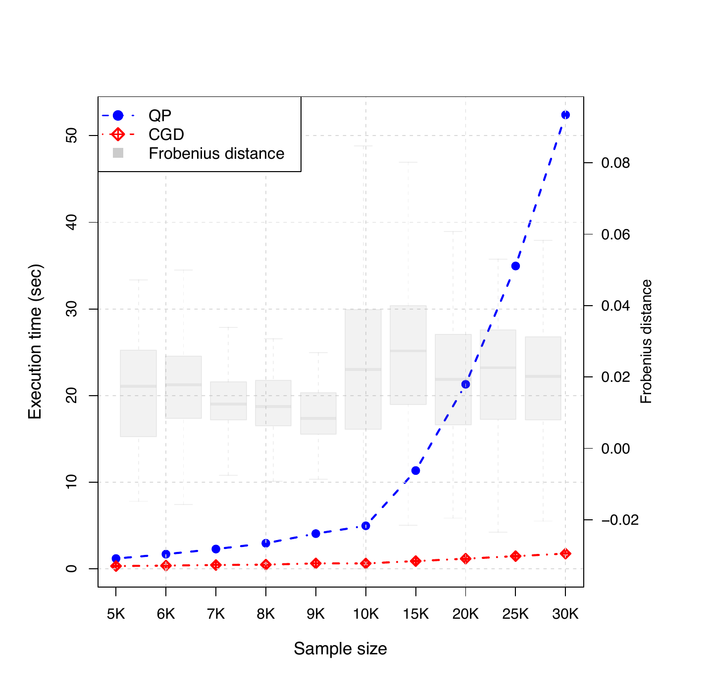
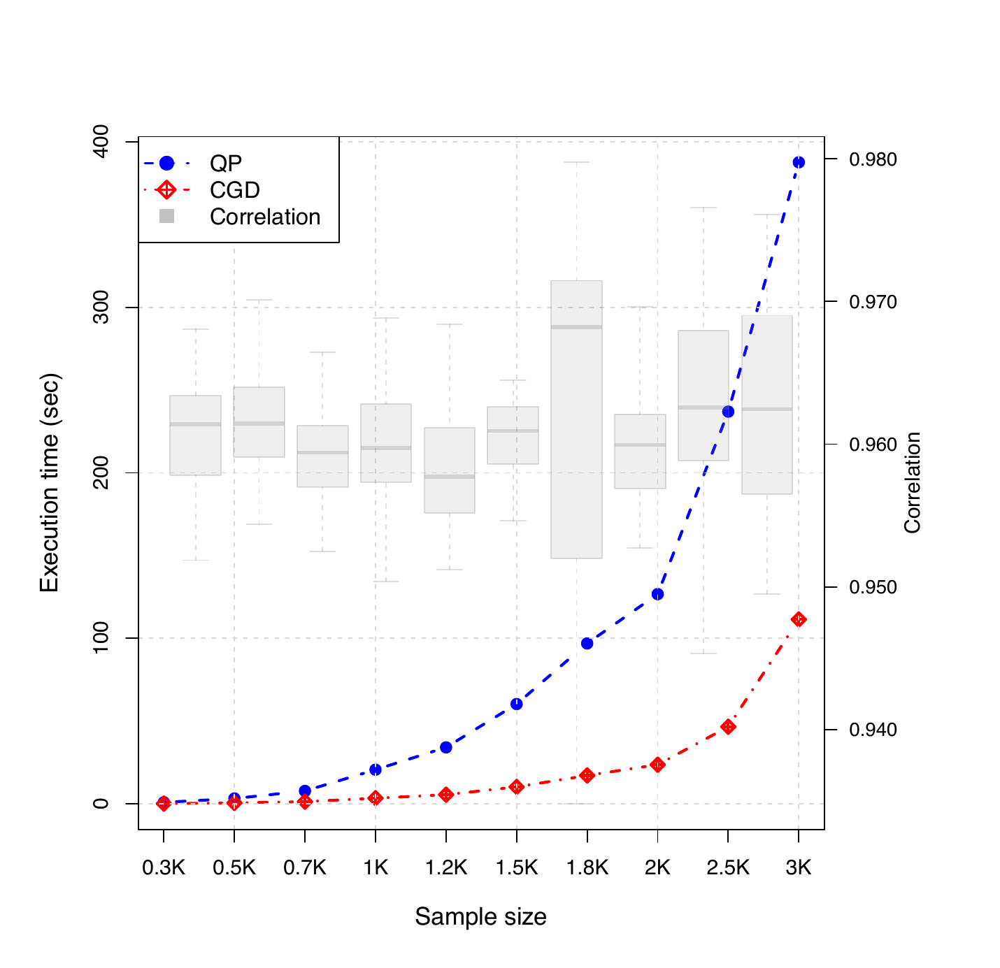
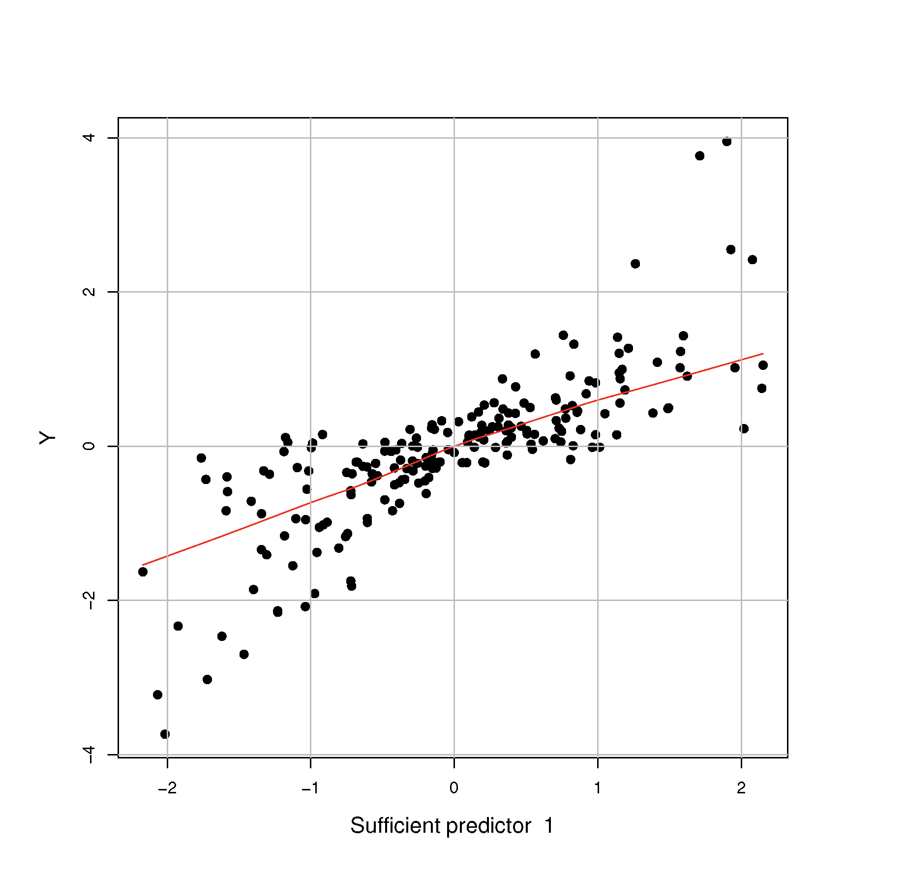
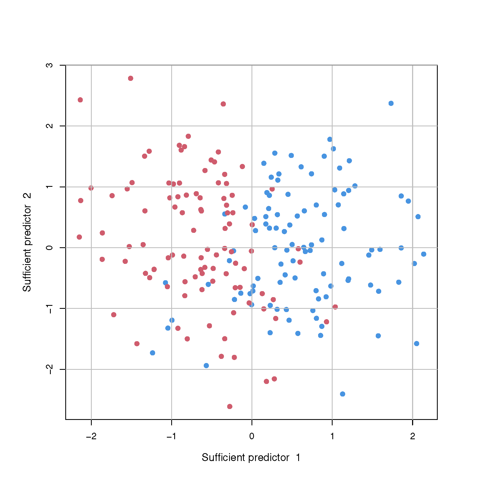
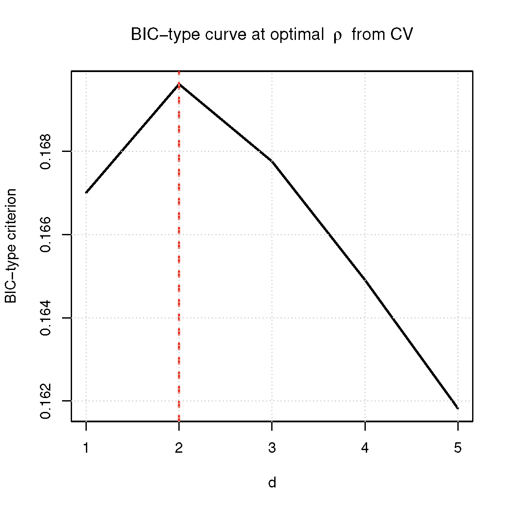
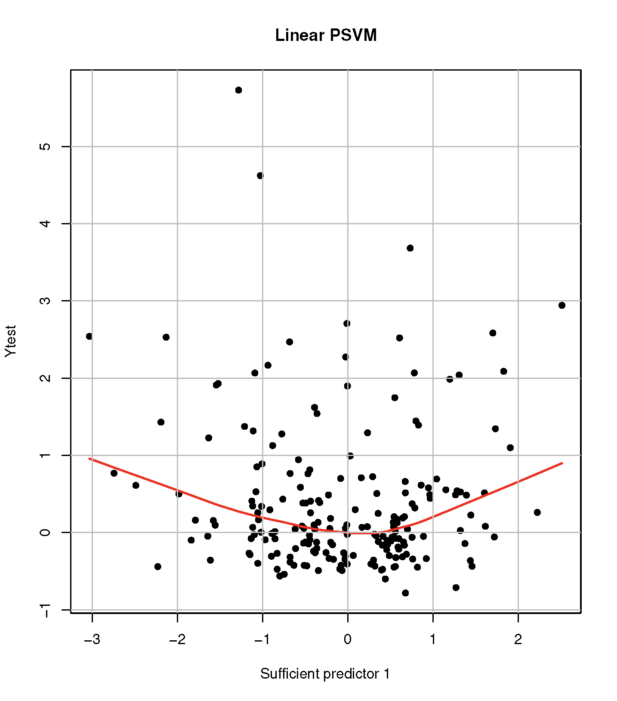
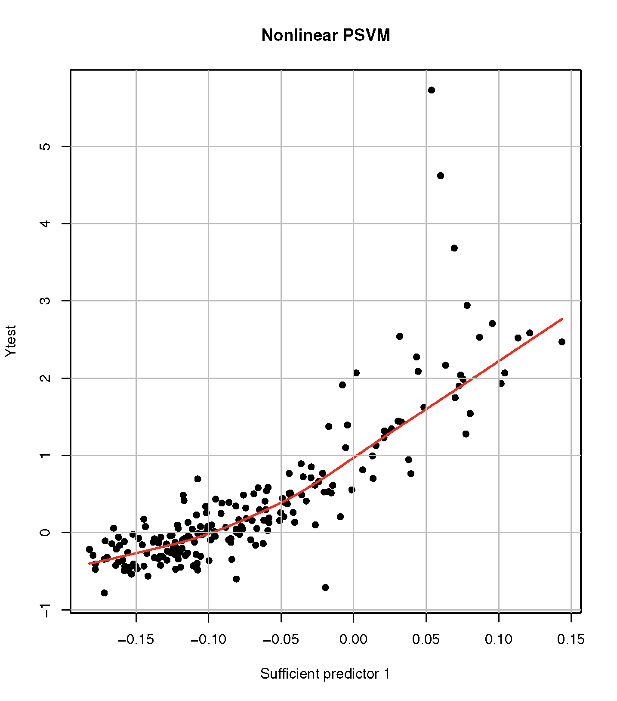
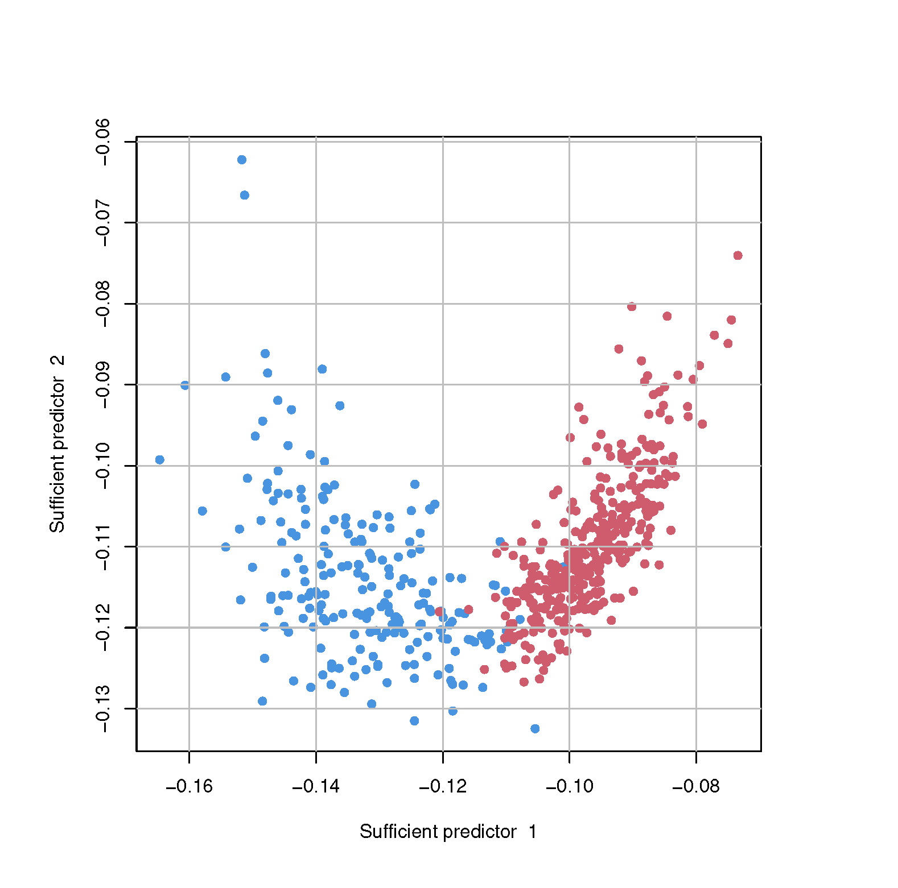
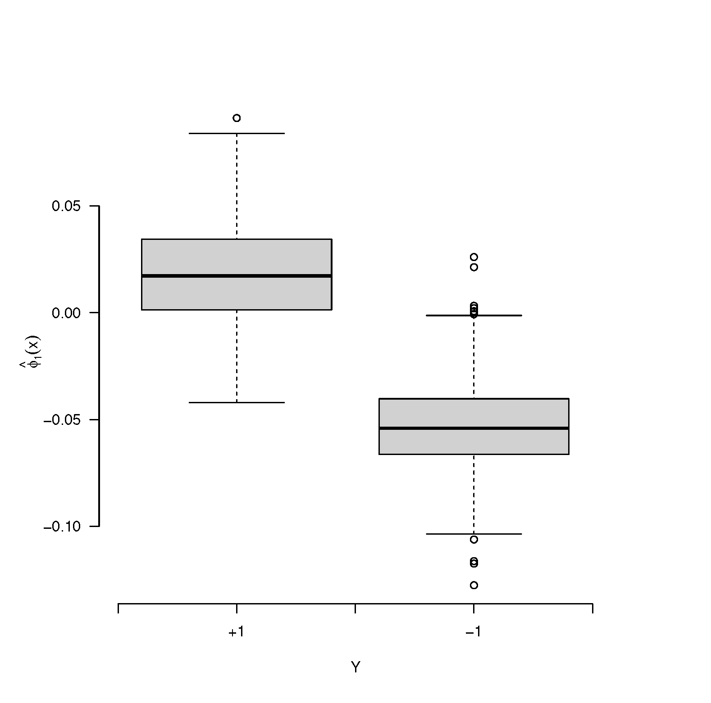

::::: article
## Introduction {#sec:INTRO}

Dimension reduction is essential in modern applications in statistics
and machine learning as the data size grows. In this regard, the
**sufficient dimension reduction** (SDR, Li, 1991; Cook, 1998) has gained
great popularity in supervised learning problems. For a given pair of
univariate response $Y$ and $p$-dimensional predictor $\mathbf{X}$, SDR
assumes
$$\begin{equation}
 \label{eqn:linear_model}
Y \perp \mathbf{X} \mid \mathbf{B}^{\top} \mathbf{X},
\end{equation}   (\#eq:eqnlinear-model)$$
where $\perp$ denotes statistical independence. Under
\@ref(eq:eqnlinear-model), SDR seeks the minimal space spanned by
$\mathbf{B}\in \mathbb{R}^{p \times d}$, called the central subspace,
and denoted by $\mathcal{S}_{Y\mid \mathbf{X}}$ that contains complete
regression information of $Y$ on $\mathbf{X}$. We assume
$\mathcal{S}_{Y\mid \mathbf{X}}= \text{span}\{\mathbf{B}\}$ in
\@ref(eq:eqnlinear-model). The dimension of
$\mathcal{S}_{Y\mid \mathbf{X}}$, $d$ is also an important quantity to
be estimated from the data.

There are numerous SDR estimators to estimate
$\mathcal{S}_{Y\mid \mathbf{X}}$. Earliest proposals are based on an
inverse moment, such as sliced inverse regression (SIR, Li, 1991) and
sliced average variance estimates (SAVE, Cook and Weisberg, 1991). Other
methods are based on forward regression models, including principal
Hessian directions (pHd, Li, 1992) and minimum average variance
estimation (MAVE, Xia et al., 2002). Several R packages are available for
the practical implementation of these classical SDR methods. The
[**dr**](https://CRAN.R-project.org/package=dr) package (Weisberg, 2015),
for instance, concisely implements many of these techniques (e.g., SIR,
SAVE, pHd). Other packages such as
[**itdr**](https://CRAN.R-project.org/package=itdr) (De Alwis et al.,
2024) and [**orthoDr**](https://CRAN.R-project.org/package=orthoDr) (Zhu
et al., 2019) also provide functions for various SDR approaches.

The assumption \@ref(eq:eqnlinear-model) is often called a linear SDR.
Cook (2007) generalized \@ref(eq:eqnlinear-model), and proposed a
nonlinear SDR that pursues a function
$\phi: \mathbb{R}^p \rightarrow \mathbb{R}^d$ satisfying
$$\begin{equation}
\label{eqn:nonlinear_model}
Y \perp \mathbf{X} \mid \phi(\mathbf{X}).
\end{equation}   (\#eq:eqnnonlinear-model)$$
Nonlinear SDR methods have been developed by directly extending the
classical inverse methods to Reproducing Kernel Hilbert Space (RKHS,
Aronszajn, 1950). However, there is no hands-on R package that implements
them.

Meanwhile, Li et al. (2011) proposed the principal support vector
machine (PSVM), a unified framework for both linear and nonlinear SDR,
by connecting the SDR problem to the support vector machine (SVM, Vapnik, 
1999). More importantly, PSVM can be easily generalized to other
supervised machine learning approaches other than the SVM with the hinge
loss. We call the class of SDR methods that generalizes the PSVM the
**principal machine** (PM, Shin and Shin 2024). The PM methods, such as
PSVM as well as principal quantile regression (PQR, Wang et al., 2018),
principal least squares SVM (PLSSVM, Artemiou et al., 2021), and
principal asymmetric $L_2$ regression (PALS, Soale and Dong 2022), have
reportedly outperformed classical SDR approaches.

In this article, we develop an R package
[**psvmSDR**](https://CRAN.R-project.org/package=psvmSDR) that renders a
simple gradient descent algorithm to compute a wide variety of the PMs
in a unified framework. The package offers two main functions `psdr()`
and `npsdr()` that compute a wide variety of PMs for linear and
nonlinear SDR, respectively. In addition, it also has a function
`rtpsdr()` that executes the realtime SDR estimation for streamed data.

We highlight the main advantages of the package
[**psvmSDR**](https://CRAN.R-project.org/package=psvmSDR) in the
following.

- It can solve both linear and nonlinear SDR problems in a unified
  framework using a simple and efficient gradient descent algorithm.

- It can be applied to a binary classification, where most
  inverse-moment-based approaches suffer.

- It can compute a PM estimator with a user-specified arbitrary convex
  loss, adding flexibility to the methods.

- It can handle streamed data by directly updating the SDR estimator
  without storing the entire data.

The package is now available from CRAN at
<https://cran.r-project.org/web/packages/psvmSDR> and can be installed
from R with the following command:

``` r
 > install.packages("psvmSDR")
```

The rest of the article is organized as follows. In Section
[2](#sec:PSDR){reference-type="ref" reference="sec:PSDR"}, we introduce
the principal machine (PM) under a linear, nonlinear, and realtime SDR
framework along with the corresponding functions `psdr()`, `npsdr()`,
and `rtpsdr()`. In Section [3](#sec:optim){reference-type="ref"
reference="sec:optim"}, we describe computational details about the
package, and its efficiencies are investigated. In Section
[4](#sec:overview){reference-type="ref" reference="sec:overview"}, we
overview the package structure and explain how to implement the
functions with examples. We conclude with a summary and discussion in
Section [6](#sec:CON){reference-type="ref" reference="sec:CON"}.

## Principal machines: generalization of PSVM {#sec:PSDR}

We start by introducing the PSVM (Li et al. 2011). For a given sequence
of $c_1 < c_2 < \cdots < c_h$, the PSVM minimizes the following
objective function in the population level:
$$\begin{equation}
 \label{eqn:model}
    (\alpha_{k}, \boldsymbol{\beta}_{k}) = \mathop{\rm argmin}_{\alpha, \boldsymbol{\beta}} \boldsymbol{\beta}^{\top} \boldsymbol{\Sigma}\boldsymbol{\beta}+ \lambda \mathbb{E}\left[\tilde{Y}_k \{\alpha + \boldsymbol{\beta}^{\top} (\mathbf{X}- \boldsymbol{\mu})\}\right]_+, \quad k = 1, 2, \cdots, h,
\end{equation}   (\#eq:eqnmodel)$$
where $\boldsymbol{\mu}= \mathbb{E}(\mathbf{X})$,
$\boldsymbol{\Sigma}= \text{cov}(\mathbf{X})$, and $[u]_+ = \max\{0, u\}$.
Here $\tilde{Y}_{k}$ is a pseudo-binary response, taking 1 if $Y < c_k$
and $-1$ otherwise, and a positive constant $\lambda$ is a cost
parameter whose choice is not overly sensitive for estimating
$\mathcal{S}_{Y\mid \mathbf{X}}$. Li et al. (2011) showed the
unbiasedness of $\boldsymbol{\beta}_{k}$, i.e.,
$\boldsymbol{\beta}_{k} \in \mathcal{S}_{Y\mid \mathbf{X}}, \forall k = 1, 2, \cdots, h$.

It is important to note that convexity of the objective function in
\@ref(eq:eqnmodel) is the only requirement for the PSVM to be unbiased,
and this naturally leads to a generalized version of the PSVM, which we
call the PM. We can categorize the PM into two types: one is
response-based PM (RPM), and the other is loss-based PM (LPM). The RPM
obtains multiple solutions by perturbing the pseudo-response
$\tilde Y_k$, while the loss function remains unchanged. The PSVM
belongs to this category. On the other hand, the LPM calculates multiple
solutions by changing the loss functions, while the pseudo-response
$Y_k$ is fixed as $Y$ for all $k$. The principal weighted support vector
machine (PWSVM, Shin et al., 2017) and the principal quantile regression
(PQR, Wang et al., 2018) are the earliest proposals of the LPM.

### 2.1 Linear principal machines {#sec:LPSDR}

The linear PM solves
$$\begin{align}
 \label{eqn:pm}
(\alpha_{k}, \boldsymbol{\beta}_k) = \mathop{\rm argmin}_{\alpha, \boldsymbol{\beta}} \boldsymbol{\beta}^\top \boldsymbol{\Sigma}\boldsymbol{\beta}+ \lambda \mathbb{E}\left[L_{k} \left\{\tilde Y_k, f(\mathbf{X})\right\} \right], \qquad k = 1, 2, \cdots h,
\end{align}   (\#eq:eqnpm)$$
where
$f(\mathbf{X}) = \alpha + \boldsymbol{\beta}^\top (\mathbf{X}- \boldsymbol{\mu})$
and $L_k(y, f)$ denotes a convex loss function of a margin, $yf$ for a
binary $y \in \{-1, 1\}$ or residual $y - f$ for a continuous
$y \in \mathbb{R}$. The RPM solves \@ref(eq:eqnpm) for different values
of $\tilde Y_k$ over $k$ to obtain multiple solutions while keeping
$L_k$ fixed as, say, $L$. On the other hand, the LPM solves it with
different loss functions $L_k$ while a pseudo-response $\tilde Y_k$
remains fixed as the original response $Y$. For instance, PWSVM, the
first proposal under the LPM framework, solves \@ref(eq:eqnpm) using the
loss function $L_k(y, f) = \pi_k(y)[1 - yf]_+$, where $\pi_k(y) = c_k$
if $y = 1$, and $\pi_k(y) = 1 - c_k$ otherwise, for a given
$c_k \in (0,1)$ while $\tilde Y$ is fixed as $Y \in \{-1, 1\}$. The
PWSVM is proposed for SDR in binary classification problems, addressing
the limitations of PSVM when the dimensionality $d > 1$.

Given $(y_i, \mathbf{x}_i), i = 1, 2, \cdots, n$, the sample counter
part of \@ref(eq:eqnpm) is

$$\begin{equation}
(\hat{\alpha}_k, \hat{\boldsymbol{\beta}}_k) = \mathop{\rm argmin}_{\alpha, \boldsymbol{\beta}} \boldsymbol{\beta}^{\top} \hat{\boldsymbol{\Sigma}}\boldsymbol{\beta}+ \frac{\lambda}{n} \sum_{i=1}^{n}L_k\left(\tilde y_{k,i}, \alpha + \boldsymbol{\beta}^\top \mathbf{z}_i \right), \qquad k = 1, 2, \cdots h,
\end{equation}   (\#eq:eqnsample-model)$$
where $\mathbf{z}_i = \mathbf{x}_i - \sum_{i=1}^{n}\mathbf{x}_i/n$ and
$\hat{\boldsymbol{\Sigma}}= n^{-1}\sum_{i=1}^{n}\mathbf{z}_i \mathbf{z}_i^\top$
denotes a sample covariance matrix. The PM working matrix is then
$$\begin{equation}
\hat{\mathbf{M}} = \sum_{k=1}^h \hat{\boldsymbol{\beta}}_{k} \hat{\boldsymbol{\beta}}_{k}^{\top},
\end{equation}   (\#eq:eqnworking-matrix)$$
and its first $d$ eigenvectors of $\hat{\mathbf{M}}$ estimate
$\mathbf{B}$ under \@ref(eq:eqnlinear-model), where $d$ denotes the
dimension of $\mathcal{S}_{Y\mid \mathbf{X}}$, often called the
structural dimension. The
[**psvmSDR**](https://CRAN.R-project.org/package=psvmSDR) package offers
`psdr()` function to compute the linear PM estimates with a given loss
function.

In the linear SDR, it is also crucial to estimate the structural
dimension $d$. The linear PM employs the following BIC-type criterion
proposed by Li et al. (2011) to estimate $d$:
$$\begin{equation}
\label{eqn:structure dimension}
\hat{d}=\underset{d \in\{1, \cdots, p\}}{\operatorname{argmax}} \sum_{j=1}^{d} v_{j}-\rho \frac{d \log n}{\sqrt{n}} v_{1},
\end{equation}   (\#eq:eqnstructure-dimension)$$
where $v_{1} \geq \cdots \geq v_{p} (p > d)$ are eigenvalues of
$\hat{\mathbf{M}}$ in \@ref(eq:eqnworking-matrix), with $\rho$ being a
hyperparameter that can be chosen in a data-adaptive manner. The
[**psvmSDR**](https://CRAN.R-project.org/package=psvmSDR) package
contains `psdr_bic()` function for estimating $d$ based on
\@ref(eq:eqnstructure-dimension).

There are numerous PMs by employing a variety of convex loss functions
in supervised learning problems. For RPMs, the principal logistic
regression with negative log-likelihood loss (PLR, Shin and Artemiou,
2017), the principal $L_q$-SVM with $L_q$ hinge loss ($L_q$-PSVM,
Artemiou and Dong 2016), and the principal least square SVM with the
squared loss (PLSSVM, Artemiou et al., 2021) are proposed. For LPMs, Wang
et al. (2018) suggested the principal quantile regression (PQR) with the
check loss, Kim and Shin (2019) proposed the principal weighted logistic
regression (PWLR), Soale and Dong (2022) introduced the principal
asymmetric least square regression (PALSR) with the asymmetric least
square loss, and Jang et al. (2023) proposed the principal weighted
least square SVM (PWLSSVM).

Table [1](#tab:loss){reference-type="ref"
reference="tab:loss"} provides a complete list of PMs implemented in
[**psvmSDR**](https://CRAN.R-project.org/package=psvmSDR) with the
corresponding loss functions.

| Type | Method | Response | Margin (Residual) | Loss | `loss` |
|:-----|:-------|:---------|:------------------|:-----|:-------|
| RPM | SVM | $Y \in \mathbb{R}$| $m_k = \tilde Y_k f$ | ${[1-m_k]}_+$ | `svm` |
|  | Logistic |  $\tilde{Y}_k = \mathbb{1}\{Y \ge c_k\}$ |  | $\log(1 + e^{-m_k})^{-1}$ | `logit` |
|  | $L_2$-SVM | $\quad~~ - \mathbb{1}\{Y < c_k\}$ |  | $\{[1-m_k]_+\}^2$ | `l2svm` |
|  | LS-SVM |  |  | $[1-m_k]^{2}$ | `lssvm` |
| LPM | WSVM | ${Y = \tilde Y_k \in \{-1,1\}}$ | $m = Yf$ | $\pi_{k}(Y)[1-m]_+$ | `wsvm` |
|  | Wlogistic |  |  | $\pi_{k}(Y)\log(1 + e^{-m})^{-1}$ | `wlogit` |
|  | W$L_2$-SVM |  |  | $\pi_{k}(Y)\{[1-m]_+\}^2$ | `wl2svm` |
|  | WLS-SVM |  |  | $\pi_{k}(Y)[1-m]^{2}$ | `wlssvm` |
|  | Quantile | ${Y = \tilde Y_k \in \mathbb{R}}$ | $r = Y - f$ | $r \{c_k - I(r<0)\}$ | `qr` |
|  | Asym. LS |  |  | $r^2 \{c_k - I(r<0)\}$ | `asls` |


Table: (\#tab:loss) Different types of the convex loss functions available in the package \CRANpkg{psvmSDR}. The column `loss` indicates a specific syntax of the argument that is passed to `psdr()` and `npsdr()` to implement the corresponding methods. 


### 2.2 Kernel principal machines for nonlinear SDR {#sec:NLPSDR}

A nonlinear generalization of \@ref(eq:eqnpm) under
\@ref(eq:eqnnonlinear-model) is
$$\begin{equation}
\label{model:non_pm_population}
(\alpha_{0,k}, g_{0,k}) = \mathop{\rm argmin}_{\alpha \in \mathbb{R}, g \in \mathcal{H}} \text{var} \{\psi(\mathbf{X})\}+\lambda \mathbb{E}\left[ {L}_k \left\{ \tilde{Y}_{k}, f(\mathbf{X}) \right\} \right], \qquad k = 1, 2, \cdots, h,
\end{equation}   (\#eq:modelnon-pm-population)$$
where $f(\mathbf{X})=\alpha+g(\mathbf{X})-\mathbb{E}\{g(\mathbf{X})\}$
with $g$ being a function in a Hilbert space $\mathcal{H}$ of functions
of $\mathbf{X}$. Let $(\alpha_{0,k}, g_{0,k})$ be the minimizer of
\@ref(eq:modelnon-pm-population), then $g_{0,k}(\mathbf{X})$ is
necessarily a function of the sufficient predictor $\phi(\mathbf{X})$ in
\@ref(eq:eqnnonlinear-model) and its unbiasedness for the nonlinear SDR
is established by Li et al. (2011).

Employing the reproducing kernel Hilbert space (RKHS) generated by a
positive definite kernel $K(\cdot, \cdot)$ for the space of $g$, we have
the following finite-dimensional basis representation of $g$:
$$\begin{align}
g(\mathbf{x}) = \sum_{j=1}^b \beta_j \left\{\psi_{j}(\mathbf{x})- \bar{\psi}_j \right\}
\end{align}   (\#eq:eqnfx)$$
with
$$\begin{align}
\psi_j(\mathbf{x})=\left\{\mathbf{k}(\mathbf{x})\right\}^{\top} \mathbf{q}_j / \lambda_j, \quad j=1, \cdots b, \qquad and \qquad \bar{\psi}_j = \sum_{i=1}^{n}\psi_{j}\left(\mathbf{x}_{i}\right)/n,
\end{align}   (\#eq:eqnpsi-gen)$$
where
$\mathbf{k}(\cdot)=\{K(\cdot, \mathbf{x}_i) : i=1,\ldots,n\}^{\top}$,
and $\mathbf{q}_j$ and $\lambda_j$ are the $j$th leading eigenvector and
eigenvalue of the centered kernel matrix
$\mathbf{K} = \{K_{ij}\} \in \mathbb{R}^{n\times n}$ with
$K_{ij} = K(\mathbf{x}_i, \mathbf{x}_j) - \sum_{k = 1}^n K(\mathbf{x}_k, \mathbf{x}_j)/n$.
We refer Section 6 of Li et al. (2011) for the theoretical justification
for \@ref(eq:eqnfx) and \@ref(eq:eqnpsi-gen). In
[**psvmSDR**](https://CRAN.R-project.org/package=psvmSDR), we employ the
radial/Gaussian kernel and set $b = n/3$ as recommended by Li et al.
(2011).

By employing \@ref(eq:eqnfx), the sample counter part of
\@ref(eq:modelnon-pm-population) is
$$\begin{equation}
(\hat{\alpha}_k, \hat{\boldsymbol{\beta}}_k) = \mathop{\rm argmin}_{\alpha, \boldsymbol{\beta}} {\boldsymbol{\beta}}^{\top} \hat{\boldsymbol{\Sigma}}{\boldsymbol{\beta}}+\frac{\lambda}{n} 
   \sum_{i=1}^{n} L_{k} \left( \tilde{y}_{k,i}, \alpha + {\boldsymbol{\beta}}^{\top} \mathbf{z}_{i} \right), \qquad k = 1, 2, \cdots, h,
\end{equation}   (\#eq:eqnsample-nonlinear-pm)$$
where $\mathbf{z}_i = \sum_{j=1}^b \psi_{j}(\mathbf{x}_i)- \bar \psi_j$
and
$\hat{\boldsymbol{\Sigma}}= n^{-1} \sum_{i=1}^{n}\boldsymbol{\mathbf{z}}_i \boldsymbol{\mathbf{z}}_i^{\top}$.
We note that this kernel PM in \@ref(eq:eqnsample-nonlinear-pm) is also
linear in the parameter, exactly the same as the linear PM
\@ref(eq:eqnsample-model). For a given $\mathbf{x}$, one can compute the
sufficient predictors,
$\hat{\phi}(\mathbf{x})=\hat{\mathbf{V}}^{\top}\left\{ \psi_1(\mathbf{x}), \ldots,  \psi_b(\mathbf{x})\right\}^{\top}$,
where $\hat{\mathbf{V}}$ denotes the $d$-leading eigenvectors of
$\sum_{k=1}^h \hat{\boldsymbol{\beta}}_{k} \hat{\boldsymbol{\beta}}_{k}^{\top}$.
The [**psvmSDR**](https://CRAN.R-project.org/package=psvmSDR) package
offers `npsdr()` function to compute the nonlinear PM estimates.

### 2.3 Principal least square machines for realtime SDR {#sec:rtPSDR}

When data is collected in a streamed fashion, it is prohibitive to use
all data to compute the SDR estimator due to memory constraints.
Therefore, it is important to develop real-time SDR algorithms that
directly update the SDR estimators without storing the entire data. In
this regard, Artemiou et al. (2021) proposed PLSSVM which solves
\@ref(eq:eqnpm) with the squared loss
$L(\tilde y, f) = (1 - \tilde y f)^2$.

Let's consider the following scenario. In addition to the currently
available (old) data
$\mathbb{D}_{\texttt{O}} = (y_i, \mathbf{x}_i), i = 1, 2, \cdots, n$,
suppose $m$ additional (new) data
$\mathbb{D}_{\texttt{N}} = (y_i, \mathbf{x}_i), i = n+1, \cdots, n+m$
arrives. Let
$\mathbb{D}_{\texttt{W}} = \mathbb{D}_{\texttt{O}} \cup \mathbb{D}_{\texttt{N}}$
denote the whole data. The subscripts $\texttt{O}, \texttt{N}$, and
$\texttt{W}$ are used to denote the quantities related to old, new, and
whole data, respectively. Artemiou et al. (2021) showed that the PLSSVM
solution for the whole data,
${\mathbf{r}}_{\texttt{W}} = (\hat{\alpha}_{\texttt{W}},\hat {\boldsymbol{\beta}}_{\texttt{W}}^\top)^\top\in \mathbb{R}^{p+1}$,
is given by
$$\begin{align}
\label{eqn:rtpsdr_coef}
\mathbf{r}_{\texttt{W}} = \{\mathbf{I}- \mathbf{A}_{\texttt{O}}^{-1} \mathbf{B}_{\texttt{N}} (\mathbf{I}+ \mathbf{A}_{\texttt{O}}^{-1} \mathbf{B}_{\texttt{N}})^{-1} \} ( \mathbf{r}_{\texttt{O}} + \mathbf{A}_{\texttt{O}}^{-1}\mathbf{c}_{\texttt{N}} ),
\end{align}   (\#eq:eqnrtpsdr-coef)$$
where $\mathbf{r}_{\texttt{O}}$ is the solution for
$\mathbb{D}_{\texttt{O}}$, and
$\mathbf{A}_{\texttt{O}}^{-1} \in \mathbb{R}^{{(p+1)}\times {(p+1)}}$ is
also computable from $\mathbb{D}_{\texttt{O}}$, while
$\mathbf{B}_{\texttt{N}} \in \mathbb{R}^{{(p+1)}\times {(p+1)}}$ and
$\mathbf{c}_{\texttt{N}} \in \mathbb{R}^{p+1}$ are computable from
$\mathbb{D}_{\texttt{N}}$. That is, one can directly update
$\mathbf{r}_{\texttt{W}}$ from $\mathbf{r}_{\texttt{O}}$ without storing
the entire $\mathbb{D}_{\texttt{O}}$, but $\mathbf{A}_{\texttt{O}}$
only. We remark that $\mathbf{A}_{\texttt{W}}$ can be directly updated
from $\mathbf{A}_{\texttt{O}}$ and the new data, and its computational
complexity does not depend on the size of $\mathbb{D}_\texttt{O}$. We
refer Section 3 of Artemiou et al. (2021) for the exact forms of these
quantities.

The [**psvmSDR**](https://CRAN.R-project.org/package=psvmSDR) package
offers `rtpsdr()` that implements the realtime SDR using PLSSVM for a
continuous response as well as PWLSSVM by Jang et al. (2023) for a
binary response.

## Computation {#sec:optim}

In this section, we describe computational details about `psdr()` and
`npsdr()` in [**psvmSDR**](https://CRAN.R-project.org/package=psvmSDR).
Slightly abusing notation as
$\boldsymbol{\beta}^\top = \left(\alpha, \boldsymbol{\beta}^\top\right)$
and $\mathbf{z}_i^\top = \left(1, \mathbf{z}_{i}^\top \right)$, the
objective functions \@ref(eq:eqnsample-model) and
\@ref(eq:eqnsample-nonlinear-pm) are then rewritten as
$$\begin{align}
L(\boldsymbol{\beta}) = \boldsymbol{\beta}^\top Diag\left\{0, \hat{\boldsymbol{\Sigma}}\right\} \boldsymbol{\beta}+ \frac{\lambda}{n}\sum_{i=1}^{n}L_k\left(\tilde{y}_{k,i}, \boldsymbol{\beta}^\top \mathbf{z}_i \right).
\end{align}   (\#eq:eqnobj)$$
We propose the coordinatewise gradient descent (CGD) algorithm to
minimize $L(\boldsymbol{\beta})$ in \@ref(eq:eqnobj), which updates
$\boldsymbol{\beta}$ coordinatewisely as follows until converge:
$$\begin{align*}
\beta_j & \leftarrow \beta_j - \eta \frac{\partial L(\boldsymbol{\beta})}{\partial{\beta_j}}, ~~ j= 0, 1, 2, \cdots, p,
\end{align*}$$
where $\eta > 0$ denotes a learning rate determined by the user. We
remark that some loss functions, such as the hinge loss and check loss
are not theoretically differentiable at most finite number of points
while numerically differentiable. In practice, the CGD implementation
ensures stable updates for non-smooth functions by employing analytical
subgradients for built-in losses (e.g., hinge, quantile) and numerical
approximations for user-defined losses. The two main functions `psdr()`
and `npsdr()` in
[**psvmSDR**](https://CRAN.R-project.org/package=psvmSDR) solve linear
and nonlinear PMs via this CGD algorithm, respectively, and cover a wide
variety of PM estimators by simply changing the loss functions (via
`‘loss’` argument) as listed in Table
[1](#tab:loss){reference-type="ref" reference="tab:loss"}.
The CGD algorithm is easily extended to any user-defined convex loss
function, since the corresponding derivative can be readily evaluated
numerically. Both functions can take the name of the user-defined-loss
function object as the `loss` argument which brings further flexibility
to the PM estimators.

<figure id="fig:comparison_methods" data-latex-placement="!t" style="display:inline-block;">
<figure id="fig:linear_time" style="width:49.0%;display:inline-block;">

<figcaption>(a) Linear PSVM</figcaption>
</figure> <figure id="fig:nonlinear_time" style="width:49.0%;display:inline-block;">

<figcaption>(b) Kernel PSVM</figcaption>
</figure>
<figcaption>Figure 1: Average computing times of the QP and CGD
algorithms over 100 repetitions are shown. The left and right panels
correspond to the linear and kernel PSVM results, respectively. The blue
and red dashed lines denote QP and CGD, respectively, illustrating the
superior scalability of CGD. Overlaid gray boxplots depict estimation
agreement measured by Frobenius distance for the linear case and
prediction correlation for the nonlinear case.</figcaption>
</figure>

Each CGD iteration costs $\mathcal{O}(np)$ for the linear PM (`psdr()`)
and $\mathcal{O}(nb)$ for the nonlinear PM (`npsdr()`), where $p$ is the
data dimension and $b$ is the number of kernel basis functions used for
the RKHS expansion in \@ref(eq:eqnpsi-gen) (Luo and Tseng 1992; Friedman
et al. 2007). Following the empirical recommendation of Li et al.
(2011), we set $b$ between $n/3$ and $2n/3$ in practice. In contrast,
quadratic programming (QP) approaches for SVM-like objectives (e.g.,
[**kernlab**](https://CRAN.R-project.org/package=kernlab)) have
worst-case polynomial time $\mathcal{O}(n^{3}p^{3})$ (or
$\mathcal{O}(n^{3}b^{3})$ for kernel PMs) (Platt 1998; Cristianini and
Shawe-Taylor 2000), which scale less favorably as $n$ grows.

To evaluate the computational efficiency of the proposed CGD algorithm,
we compare its computing times for both linear and nonlinear (kernel)
PSVM estimators to `ipop()` function in
[**kernlab**](https://CRAN.R-project.org/package=kernlab), a standard QP
solver for the SVM over 100 independent repetitions. A toy data is
generated from the following regression model:
$$\begin{align}
\label{model_regression_1}
y_i = x_{i1} / \left\{0.5+\left(x_{i2} + 1\right)^2\right\} + 0.2\epsilon_i,
\end{align}   (\#eq:model-regression-1)$$
where both $x_{ij}$ and $\epsilon_i$ are i.i.d. random samples from
$N(0,1)$ for $i = 1, \cdots, n$ and $j = 1, 2, \cdots, 5$. Different
sample sizes $n$ are considered from $5,000$ to $30,000$ for linear PSVM
while from $300$ to $3,000$ for the kernel PSVM where the parameter
dimension depends on $n$.

Figure [3](#fig:comparison_methods){reference-type="ref"
reference="fig:comparison_methods"} highlights the computational
advantage of the CGD implementation, which achieves substantially lower
runtimes than QP. In addition to runtime, we assessed estimation
agreement. For the linear PSVM, we measured subspace similarity via the
Frobenius distance between projection matrices,
$|{\mathbf{P}}_{\mathrm{CGD}} - {\mathbf{P}}_{\mathrm{QP}}|_F$, where
${\mathbf{P}} = \hat{\mathbf{B}}(\hat{\mathbf{B}}^{\top}\hat{\mathbf{B}})^{-1}\hat{\mathbf{B}}^{\top}$.
For the kernel PSVM, predictive agreement is quantified by the
correlation between fitted test responses,
$\mathrm{cor}(\hat{y}_{\mathrm{QP}}, \hat{y}_{\mathrm{CGD}})$, where
$\hat{y}_{\mathrm{QP}}$ and $\hat{y}_{\mathrm{CGD}}$ are obtained from
regressions of $y$ on the estimated sufficient predictors
$\hat{\phi}_{\mathrm{QP}}(\mathbf{X})$ and
$\hat{\phi}_{\mathrm{CGD}}(\mathbf{X})$. Across all sample sizes, the
Frobenius distance remained near zero and the correlation close to one,
confirming that CGD achieves accuracy indistinguishable from QP while
being substantially faster.

## Package overview and implementation {#sec:overview}

### 4.1 Overview of the package [**psvmSDR**](https://CRAN.R-project.org/package=psvmSDR)

The [**psvmSDR**](https://CRAN.R-project.org/package=psvmSDR) package is
organized to allow users to run different types of PM methods in a
unified fashion by calling just a few interface functions. Several
auxiliary codes are then internally called to perform computations
according to the options specified in those interface functions. The
overall design of
[**psvmSDR**](https://CRAN.R-project.org/package=psvmSDR) adopts the
functional object-oriented programming approach (Chambers 2014) with
`S3` classes and methods. Every function in the package is either a
wrapper that creates a single instance of an object or a method that can
be applied to a class object.

The package can be installed and loaded in an R session via:

``` r
 > install.packages("psvmSDR")
 > library("psvmSDR")
```

The main functions in the package are `psdr()` and `npsdr()`. These are
designed to be analogous to linear and nonlinear principal sufficient
dimension reduction methods, respectively. Each function returns an `S3`
object, `‘psdr’` and `‘npsdr’`, respectively. Also, compatible `S3`
methods `plot()` and `print()` let the users enjoy the result of
dimension reduction through familiar generic functions. Moreover, some
explicit methods of which are related to the main functions are also
provided, such as `psdr_bic()` and `npsdr_x()`.

A function `rtpsdr()` implements the PLSSVM in a realtime fashion
(Artemiou et al. 2021; Jang et al. 2023) discussed in
Section [2.3](#sec:rtPSDR){reference-type="ref" reference="sec:rtPSDR"}.
Table [2](#tab:ftlist){reference-type="ref"
reference="tab:ftlist"} summarizes the main functions along with their
compatible methods. In the following subsections, we demonstrate the
general usage of the main functions and methods of
[**psvmSDR**](https://CRAN.R-project.org/package=psvmSDR) by the `S3`
class of the function.

| Function | Description | Class | Compatible methods |
|:---------|:------------|:------|:--------------------|
| `psdr()` | Basic function for applying linear PMs with various loss functions | `psdr` | `psdr_bic()`<br>`plot.psdr()`<br>`print.psdr()`<br>`summary.psdr()` |
| `rtpsdr()` | Real-time sufficient dimension reduction through principal (weighted) least squares SVM |  |  |
| `npsdr()` | Basic function for applying kernel PMs with various loss functions | `npsdr` | `npsdr_x()`<br>`plot.npsdr()`<br>`print.npsdr()`<br>`summary.npsdr()` |


Table: (\#tab:ftlist) Main functions and compatible methods in the \CRANpkg{psvmSDR} package. 

### 4.2 Functions for `S3` class '`psdr`' {#sec:class_psdr}

A function `psdr`() provides a unified interface for all linear PMs
solved by the CGD algorithm. The following arguments are used (some are
mandatory) when calling `psdr`() function and they must be provided in
the order that follows:

``` r
> psdr <- function(x, y, loss = "svm", h = 10, lambda = 1, eps = 1e-5, max.iter = 100, 
                   eta = 0.1, mtype = "m", plot = FALSE) 
```

- `x`: input matrix; each row is an observation vector. `x` should have
  2 or more columns.

- `y`: response vector, either can be continuous or $\{1, -1\}$-coded
  binary variable.

- `loss`: name of loss function objects listed in Table
  [1](#tab:loss){reference-type="ref" reference="tab:loss"},
  or the name of a user-defined (convex) loss function object.

- `h`: unified control for slicing or weighting; either a positive
  integer (number of slices/weights) or a numeric vector of cutpoints in
  $(0,1)$.

- `lambda`: cost parameter.

- `eps`: stopping criterion of the CGD algorithm.

- `max.iter`: maximum iteration number of the CGD algorithm.

- `eta`: learning rate for the CGD algorithm.

- `mtype`: a margin type, which is either margin (`"m"`) or residual
  (`"r"`) (See, Table [1](#tab:loss){reference-type="ref"
  reference="tab:loss"}). Only needed when a user-defined loss is used.
  The default is \"m\".

- `plot`: boolean. If `TRUE`, scatter plots of $Y$ and sufficient
  predictors will be presented.

The main function `psdr()` returns an object with `S3` class `’psdr’`
including

- `evalues`: eigenvalues of the estimated working matrix
  \@ref(eq:eqnworking-matrix).

- `evectors`: eigenvectors of the estimated working matrix
  \@ref(eq:eqnworking-matrix).

- `fit`: metadata (n, p, hyperparameters, per-slice
  iteration/convergence info, etc.).

To further illustrate how to use function `psdr()`, we reuse the toy
example which is formulated in \@ref(eq:model-regression-1) with
$n=200$.

``` r
 > set.seed(100) 
 > n <- 200; p <- 5 
 > x <- matrix(rnorm(n*p, 0, 1), n, p) 
 > y <- x[,1]/(0.5 + (x[,2] + 1)^2) + 0.2 * rnorm(n)   
```

We then can apply the PSVM (Li et al. 2011) using function `psdr()` with
calling the argument `loss = "svm"` (default value) as below:

``` r
 > obj <- psdr(x, y)
 > summary(obj)
 === Summary of psdr Object ===
 Loss function: svm 
 Sample size (n): 200  | Variables (p): 5  | Response type: continuous 
 Lambda: 1  | Eta: 0.1  | Eps: 1e-05  | Max.iter: 100 

 --- Eigen Decomposition of Working Matrix (M) ---
 Top eigenvalues (up to 10):
 [1] 0.7803 0.0451 0.0070 0.0013 0.0002

 Estimated Eigenvectors (columns = central subspace basis):
         [,1]    [,2]    [,3]    [,4]    [,5]
 [1,]  0.9963  0.0003 -0.0069  0.0792  0.0328
 [2,]  0.0020 -0.9578  0.1250 -0.1082  0.2352
 [3,] -0.0189 -0.2385  0.1258  0.5707 -0.7754
 [4,] -0.0451  0.1507  0.7675  0.4600  0.4178
 [5,]  0.0708  0.0553  0.6159 -0.6669 -0.4096

 --- Per-slice diagnostics ---
   slice iter converged          obj
 1     1   46      TRUE 6.468460e-06
 2     2   46      TRUE 6.112350e-06
 3     3   45      TRUE 5.661422e-06
 4     4   46      TRUE 4.309816e-06
 5     5   45      TRUE 4.690990e-06
 6     6   45      TRUE 5.603063e-06
 7     7   45      TRUE 6.321184e-06
 8     8   46      TRUE 5.886324e-06
 9     9   46      TRUE 6.368887e-06

 Convergence summary:
   Total iterations: 410  | All slices converged: TRUE 
```

The output eigenvectors correctly estimate the true basis vectors
$\left(1, 0, 0, 0, 0\right)^{\top}$ and
$\left(0, 1, 0, 0, 0\right)^{\top}$. The `summary()` function returns a
summary of a `psdr` object. More detailed usage of the function and its
arguments is provided in the package manual. The method `plot.psdr()`
creates the scatter plots between response and the $j$-th sufficient
predictors.

``` r
 > plot(obj, d=1, lowess=TRUE)
```

<figure id="fig:ex1_psdr" data-latex-placement="!t">

<figcaption>Figure 2: Scatter plots of $Y$ versus the first sufficient predictor $\hat{B}_{1}^{\top} \mathbf{X}$ from the generic method `plot.psdr()`.</figcaption>
</figure>

The argument `obj` is the object from the function `psdr()` which
contains information on estimated $\mathcal{S}_{Y\mid \mathbf{X}}$. The
number of sufficient predictors to be plotted is specified by the
argument `d` whose default value is 1. By default, a locally weighted
scatterplot smoothing (LOWESS) curve is plotted, unless `lowess=FALSE`
is specified. The argument `"`$\ldots$`"` allows for additional
arguments to be passed to generic `plot()` function such as `main`,
`cex`, `col`, `lty`, and etc.

Now, we generate binary response $\tilde y_i = \operatorname{sign}(y_i)$
from \@ref(eq:model-regression-1) to illustrate the PWSVM (Shin et al.
2017), an example of the LPM. One can apply PWSVM by letting
`loss = "wsvm"`.

``` r
 > y.binary <- sign(y)
 > obj_wsvm <- psdr(x, y.binary, loss = "wsvm")
 > print(obj_wsvm)
 > plot(obj_wsvm)
```

``` r
 --- Principal Sufficient Dimension Reduction (linear) ---
 Loss: wsvm  | n: 200  p: 5  | Response: binary 
 Lambda: 1  | Eta: 0.1  | Max.iter: 100  | Converged: TRUE 

 Eigenvalues (first 5):  0.3864, 0, 0, 0, 0 

 Eigenvectors (columns are SDR directions):
         [,1]    [,2]    [,3]    [,4]    [,5]
 [1,]  0.9938 -0.0392  0.0572  0.0000  0.0869
 [2,]  0.0590  0.8544 -0.0892 -0.4531 -0.2308
 [3,] -0.0181 -0.4386 -0.2064 -0.8624  0.1449
 [4,]  0.0201  0.1295 -0.8786  0.2124  0.4071
 [5,]  0.0903 -0.2437 -0.4174  0.0762 -0.8674
```

Figure [3](#fig:ex1_wsvm){reference-type="ref" reference="fig:ex1_wsvm"}
visualizes the classification performance with only two sufficient
predictors estimated by PWSVM. With only two sufficient predictors, the
two classes are well separated.

<figure id="fig:ex1_wsvm" data-latex-placement="!t">

<figcaption>Figure 3: A scatter plot of the predicted projections on the first and second sufficient predictors, i.e., $\hat{b}_1^{T}\mathrm{X}$, $\hat{b}_2^{T}\mathrm{X}$, respectively, estimated by PWSVM with `loss="wsvm"`.
</figcaption>
</figure>

One of many advantages of `psdr()` is that it can adopt any convex
user-defined loss function in addition to existing choices listed in
Table [1](#tab:loss){reference-type="ref"
reference="tab:loss"}. A basic syntax of the arbitrary loss function
follows:

``` r
 loss_name <- function(u, ...){ body of a function }
```

Argument `u` is a variable of a function (any character is possible) and
any additional parameters of the loss function can be specified via
`...` argument. For example, one can define \"`mylogistic`\" and apply
it to the function `psdr()` by specifying `loss="mylogistic"`.

``` r
 > mylogistic <- function(u) log(1+exp(-u))
 > obj_mylogistic <- psdr(x, y, loss="mylogistic")
 > print(obj_mylogistic)
```

``` r
 --- Principal Sufficient Dimension Reduction (linear) ---
 Loss: mylogistic  | n: 200  p: 5  | Response: continuous 
 Lambda: 1  | Eta: 0.1  | Max.iter: 100  | Converged: TRUE 

 Eigenvalues (first 5):  0.0337, 0.0011, 3e-04, 1e-04, 0 

 Eigenvectors (columns are SDR directions):
         [,1]    [,2]    [,3]    [,4]    [,5]
 [1,]  0.9948 -0.0845  0.0499  0.0214 -0.0143
 [2,] -0.0910 -0.9651  0.1157  0.0039 -0.2165
 [3,] -0.0001 -0.2001  0.0673 -0.3248  0.9219
 [4,] -0.0444  0.1015  0.9337  0.3331  0.0712
 [5,] -0.0070 -0.1054 -0.3285  0.8849  0.3128
```

As aforementioned,
[**psvmSDR**](https://CRAN.R-project.org/package=psvmSDR) provides a
function `psdr_bic()` that implements the BIC-type criterion in
\@ref(eq:eqnstructure-dimension). Here, $\rho$ serves as a tuning
parameter. To determine its optimal value, `psdr_bic` employs a $K$-fold
cross-validation procedure that selects the $\rho$ yielding the most
stable dimension estimates across folds.

Following arguments are mandatory when calling the `psdr_bic()`:

``` r
psdr_bic <- function(obj, rho_grid = seq(0.001, 0.05, length = 10), cv_folds = 5,
                      plot = TRUE, seed = 123, ...)
```

- `obj`: the output object from the main function `psdr()`

- `rho_grid`: numeric vector of candidate $\rho$ values; the default is
  `seq(0.001, 0.05, length = 10)`.

- `cv_folds`: number of cross-validation folds used for stability
  evaluation (default = 5).

- `plot`: Boolean. If `TRUE`, the plot of BIC values is depicted.

- `seed`: random seed for reproducibility.

- $\cdots$: additional arguments to be passed to generic `plot()`.

The function `psdr_bic()` returns an object with S3 class `’psdr_bic’`
containing

- `rho_star`: the selected tuning parameter $\rho$ that minimizes the
  cross-validated variation of dimension estimates.

- `d_hat`: the estimated structural dimension corresponding to
  `rho_star`.

- `G_values`: a matrix of BIC-type criterion values evaluated over
  candidate $\rho$ values.

- `cv_variation`: the variation (variance) of estimated dimensions
  across CV folds, used as a stability measure.

- `fold_dhat`: the estimated dimensions obtained from each CV fold.

The following code demonstrates the use of `psdr_bic()`, which by
default visualizes the BIC-type criterion curves as shown in
Figure [4](#fig:plot-Gn){reference-type="ref"
reference="fig:plot-Gn"}.

``` r
 > d.hat <- psdr_bic(obj, rho_grid=seq(0.05, 0.1, length=5), cv_folds=5)
 > print(d.hat)
 $rho_star
 [1] 0.05

 $d_hat
 [1] 2

 $G_values
           [,1]      [,2]      [,3]      [,4]      [,5]
 [1,] 0.1670058 0.1662087 0.1654117 0.1646147 0.1638176
 [2,] 0.1696176 0.1680236 0.1664295 0.1648354 0.1632414
 [3,] 0.1677601 0.1653690 0.1629779 0.1605868 0.1581957
 [4,] 0.1649097 0.1617216 0.1585334 0.1553453 0.1521572
 [5,] 0.1618201 0.1578349 0.1538497 0.1498645 0.1458794

 $cv_variation
 rho=0.0500 rho=0.0625 rho=0.0750 rho=0.0875 rho=0.1000 
        0.0        0.2        0.3        0.3        0.0 

 $fold_dhat
      rho=0.0500 rho=0.0625 rho=0.0750 rho=0.0875 rho=0.1000
 [1,]          2          2          2          2          1
 [2,]          2          2          2          2          1
 [3,]          2          1          1          1          1
 [4,]          2          2          1          1          1
 [5,]          2          2          2          1          1

 attr(,"class")
 [1] "psdr_bic"
```

<figure id="fig:plot-Gn" data-latex-placement="!t">

<figcaption>Figure 4: BIC-type criterion values computed from
<code>psdr_bic()</code> with <code>plot = TRUE</code>.</figcaption>
</figure>

### 4.3 Functions for `S3` class `‘npsdr’` {#sec:class_npsdr}

The function `npsdr()` is a nonlinear version of `psdr` that implements
kernel PMs. A function `npsdr()` receives the following arguments:

``` r
 > npsdr(x, y, loss="svm", h = 10, lambda = 1, b = floor(n/3), eps = 1.0e-5, mtype="m",
         max.iter = 100)
```

All input arguments are identical to those for `psdr()` except `b` which
denotes the number of basis functions on RKHS in \@ref(eq:eqnpsi-gen).
The function `npsdr()` returns an object with `S3` class `"npsdr"` that
contains the following.

- `evalues`: eigenvalues of the estimated working matrix in
  \@ref(eq:eqnworking-matrix).

- `evectors`: eigenvectors of the estimated working matrix in
  \@ref(eq:eqnworking-matrix).

The kernel information is stored internally and is not explicitly
returned unless forced to print the object named `obj.psi`.

To further illustrate how to use function `npsdr()`, we use the
following model used in (Li et al. 2011):
$$\begin{align}
\label{model_regression_2}
y_i =  0.5\left(x_{i1}^2 + x_{i2}^2 \right)^{1/2}   \log\left(x_{i1}^2 + x_{i2}^2 \right) + 0.2\epsilon_i, \quad i=1,\ldots,200.
\end{align}   (\#eq:model-regression-2)$$
Following code is for demonstrating kernel PSVM using function
`npsdr()`.

``` r
 > set.seed(100)
 > n <- 200; p <- 5
 > x <- matrix(rnorm(n*p, 0, 1), n, p)
 > y <- 0.5*sqrt((x[,1]^2+x[,2]^2))*(log(x[,1]^2+x[,2]^2))+ 0.2*rnorm(n)
 > obj_kernel <- npsdr(x, y, max.iter = 200, eta = 0.8, plot = FALSE)
 > print(obj_kernel)
```

``` r
 $evalues
 [1] 1.724557e+02  2.108836e+01  7.665943e+00  3.202983e+00  2.171408e+00
 [6] 1.608822e+00  1.029958e+00  ...
 $evectors
         [,1]         [,2]          [,3]          [,4]       ...     ...     
 [1,] -0.0068922070 -0.0373206692 -0.180768482 -0.031654139   ...     ...
 [2,] 0.1642382375 -0.0793322112 -0.084408595 -0.190419815   ...     ... 
       ...            ...            ...           ...      ...     ...
  [ reached getOption("max.print") -- omitted 51 rows ]
```

Beside the main function, `npsdr_x()` computes the estimated sufficient
predictors
$\hat{\phi}(\mathbf{x})=\hat{\mathbf{V}}_n^{\top}\left\{ \psi_1(\mathbf{x}), \ldots,  \psi_b(\mathbf{x})\right\}^{\top}$
in \@ref(eq:eqnnonlinear-model) for a given $\mathbf{x}$. The usage of a
function `npsdr_x()` is given below.

``` r
 > set.seed(200)
 > new.x <- matrix(rnorm(n*p, 0, 1), n, p)
 > new.y <- 0.5*sqrt((new.x[,1]^2+new.x[,2]^2))*(log(new.x[,1]^2+new.x[,2]^2))
 +          + 0.2*rnorm(n)
 > reduced_data <- npsdr_x(object = obj_kernel, newdata = new.x, d = 2) 
```

The arguments `object` is the object from the result of `npsdr()`, and
`newdata` is a new data matrix. The argument `d` is for the number of
sufficient predictors and its default value is 2. In the final line of
the code above, `npsdr_x()` computes $\hat\phi(\mathbf{x})$, the
nonlinear dimension reduction of `new.x` under
\@ref(eq:eqnnonlinear-model) using kernel PSVM estimates.

Note that the regression function \@ref(eq:model-regression-2) is
symmetric about the origin. In such a scenario, linear PMs do not work
and the kernel PM would be an attractive alternative.
Figure [5](#fig:nonlinear){reference-type="ref"
reference="fig:nonlinear"} depicts the scatter plots of the response and
the first sufficient predictor estimated by (a) the linear PSVM and (b)
the kernel PSVM. As expected, the linear PSVM fails to find the central
subspace when the regression function is symmetric about the origin,
while the nonlinear PSVM still efficiently identifies sufficient
predictors and captures the linear trend.

<figure id="fig:nonlinear" data-latex-placement="!t">
<figure style="width:49%;display:inline-block;">

<figcaption>(a) Linear PSVM</figcaption>
</figure>
<figure style="width:49%;display:inline-block;">

<figcaption>(b) Kernel PSVM</figcaption>
</figure>
<figcaption>Figure 5: Scatter plots of the response and the first
sufficient predictor estimated by (a) the linear PSVM and (b) the kernel
PSVM.</figcaption>
</figure>

### 4.4 Functions for `‘rtpsdr’` {#sec:class_rtpsdr}

The package [**psvmSDR**](https://CRAN.R-project.org/package=psvmSDR)
also provides `rtpsdr()` for the realtime SDR using squared loss
(Artemiou et al. 2021; Jang et al. 2023), and its usage is given below.

``` r
 > rtpsdr(x, y, obj = NULL, h = 10, lambda = 1)
```

- `x`: covariate matrix of a new data.

- `y`: response vector of a new data.

- `obj`: the output object from `rtpsdr()` for the old data that
  contains the PM solutions and matrices for the old data. If it is not
  given, `psdr()` with the squared loss (PLSSVM) is to be applied to the
  given data, `y` and `x` to obtain the PM solutions and the matrices.
  The PWLSSVM is applied if `y` is binary.

- `h`: unified control for slicing or weighting; either a positive
  integer (number of slices/weights) or a numeric vector of cutpoints in
  $(0,1)$.

- `lambda` hyperparameter for the loss function. The default is set to
  0.1.

`rtpsdr()` returns an object `S3` class `‘psdr’` that includes

- `evalues`: eigenvalues of the estimated working matrix in
  \@ref(eq:eqnworking-matrix).

- `evectors`: eigenvectors of the estimated working matrix in
  \@ref(eq:eqnworking-matrix).

- `r`: the PLSSVM/PWLSSVM solutions ${\mathbf{r}}$ given in
  \@ref(eq:eqnrtpsdr-coef).

- `A`: updated matrix $\mathbf{A}$ for the realtime update in
  \@ref(eq:eqnrtpsdr-coef).

A returned object from `rtpsdr()` stores the state of the algorithm at
each iteration $t$. This object is passed to the function as an argument
and is returned at each iteration $t+1$ containing the state of the
model parameters at that step.

The following command is an example of `rtpsdr()` under the streamed
data scenario. The data are collected in a batch-wise manner with the
batch size of $m = 500$.

``` r
 > set.seed(1234)
 > p <- 5
 > m <- 500 # batch size
 > N <- 10  # number of batches
 > obj <- NULL
 > for (iter in 1:N){
 + 	x <- matrix(rnorm(m*p), m, p)
 + 	y <-  x[,1]/(0.5 + (x[,2] + 1)^2) + 0.2 * rnorm(m)
 + 	obj <- rtpsdr(x = x, y = y, obj = obj)} # Real time Update
 > round(obj$evectors, 3)
           [,1]     [,2]      [,3]      [,4]      [,5]
 [1,]  1.000  0.005 -0.005 -0.007  0.007
 [2,]  0.005 -0.999  0.037  0.011  0.013
 [3,] -0.006 -0.003 -0.474  0.323  0.819
 [4,] -0.006 -0.038 -0.768 -0.606 -0.206
 [5,]  0.006 -0.014 -0.430  0.727 -0.535
```

For binary classification, `rtpsdr()` computes PWLSSVM solution (Jang et
al. 2023). We note that `rtpsdr()` returns `psdr` object and thus
`print.psdr()` and `plot.psdr()` are applicable.

## Real data application {#sec:realdata}

This section presents a more in-depth data analysis using the package
[**psvmSDR**](https://CRAN.R-project.org/package=psvmSDR). We
demonstrate the application of the `psdr`() and `npsdr`() functions on
two publicly available datasets: the Boston housing data and the
Wisconsin diagnostic breast cancer data.

### 5.1 Boston housing data {#sec:realdata_boston}

We apply the proposed methods to Boston housing data (Harrison Jr and
Rubinfeld 1978), which is available on the R package
[**mlbench**](https://CRAN.R-project.org/package=mlbench). There are 13
predictors along with 506 observations, and the response variable $Y$ ()
is the median of owner occupied homes in the Boston Standard
Metropolitan Statistical Areas in $\$1,000$. Some predictors are
explained below: per capita crime rate by town (), the proportion of
residential land zoned for lots over 25,000sq.ft (), nitricoxides
concentration (), etc. Two categorical variables are removed, both and .
Previous research on the data (Chen and Li 1998) claimed to remove
observations corresponding to a crime rate greater than 3.2 for the
purpose of building a better model. In the end, we used 374
observations. We excluded $X_4$ in the following analysis, which
represents houses with tract bounds the Charles River. The data
dimension ends up to
$(Y, \mathbf{X})={\mathbf{\mathbb{R}}} \times {\mathbf{\mathbb{R}}}^{12}$.

We can load data `BostonHousing` as follows:

``` r
 > data("BostonHousing", package = "mlbench")
 > attach(BostonHousing)
 > BostonHousing <- BostonHousing[BostonHousing$crim < 3.2 , -c(4,9)]
 > X <- as.matrix(BostonHousing[,-12])
 > Y <- BostonHousing[,"medv"]
```

Then, we apply PSVM to the data as follows:

``` r
 > set.seed(1)
 > rslt <- psdr(X, Y)
```

After fitting the data, we visualize regression relationships between
response and predictors projected onto the estimated
$\mathcal{S}_{Y\mid \mathbf{X}}$.

``` r
 > lsvm <- rslt$evectors
 > x.lsvm <- X %*% lsvm
 > plot(x.lsvm[,1], Y, type = "p", xlab = expression(hat(b)[1]^T*X), ylab="medv")
 > lines(lowess( x.lsvm[,1], Y), col="red", lwd=2)
 > plot(x.lsvm[,2], Y, type = "p", xlab = expression(hat(b)[2]^T*X), ylab="medv")
 > lines(lowess(x.lsvm[,2], Y), col="blue", lwd=2)
```

<figure id="fig:BostonHousing" data-latex-placement="!t">
<figure id="fig:Boston_x1" style="width:49%;display:inline-block;">
<embed src="fig_boston_psvm_d1-eps-converted-to.png" style="width:100.0%"
alt="graphic without alt text" />
<figcaption>(a) A scatter plot with lowess curve of medv versus estimated $\hat{b}_{1}^{\top}\mathrm{X}$.</figcaption>
</figure>
<figure id="fig:Boston_x2"  style="width:49%;display:inline-block;">
<embed src="fig_boston_psvm_d2-eps-converted-to.png" style="width:100.0%"
alt="graphic without alt text" />
<figcaption>(b) A scatter plot with lowess curve of medv versus estimated $\hat{b}_{2}^{\top}\mathrm{X}$.</figcaption>
</figure>
<figcaption>Figure 6: Plots of the reduction of the predictors against
the response of the Boston housing data using PSVM method via
<code>psdr</code>() function.</figcaption>
</figure>

Through PSVM, the original 12-dimensional data is reduced to
two-dimensional data via linear transformation through
$\hat{\mathbf{B}}$. In Figure
[6](#fig:BostonHousing){reference-type="eqref"
reference="fig:BostonHousing"}, we are able to claim that the
relationships between 1st and 2nd sufficient predictors and $Y$ look
almost linear.

Then, we can apply `psdr_bic`() function to determine the structural
dimension $d$.

``` r
> bic_boston <- psdr_bic(rslt, rho_grid=seq(0.005, 0.05, length=5), cv_folds=5)
> print(bic_boston$rho_star)
[1] 0.01625
> print(bic_boston$d_hat)
[1] 2
```

### 5.2 Wisconsin diagnostic breast cancer data {#sec:realdata_wisc}

We use the Wisconsin Diagnostic Breast Cancer (WDBC) data which is
available on UCI Machine Learning Repository
(<https://archive.ics.uci.edu/dataset/17/breast+cancer+wisconsin+diagnostic>).
The dataset contains diagnoses of breast cancer for 569 patients with 32
predictors. We assume ${d} =2$ for the purpose of visualization. We
analyze both linear and nonlinear SDR cases via `psdr()` and `npsdr()`,
respectively. We first load data from the repository as follows:

``` r
 > wisc <- read.table("http://archive.ics.uci.edu/ml/machine-learning-databases/
                     breast-cancer-wisconsin/wdbc.data", sep = ",")
 > x.wisc <- matrix(unlist(wisc[,-c(1,2)]), ncol = 30)
 > y.wisc <- 2*as.numeric(as.factor(unlist(wisc[,2]))) - 3
```

First, we apply principal weighted logistic regression (PWLR) for the
binary response by setting `loss = "wlogit"`. Specifying `plot = TRUE`
generates a scatterplot of sufficient predictors that are projected onto
the estimated $\mathcal{S}_{Y\mid \mathbf{X}}$.

``` r
 > psdr(x.wisc, y.wisc, loss = "wlogit", h = 20, lambda = 0.1, eta = 0.5, plot = TRUE)
```

Figure [7a](#fig:wisc1){reference-type="ref" reference="fig:wisc1"}
displays that two classes are well separated in the estimated
$\mathcal{S}_{Y\mid \mathbf{X}}$ which has only 2 dimensions.

Second, as a nonlinear approach, we apply the WDBC data to kernel PWLR
(Shin et al. 2017) using `npsdr`() function with `loss=‘wlogit’`. We
employ a Gaussian kernel, with the bandwidth determined by the median of
the pairwise Euclidean distances between predictors. The number of
slices which is the same as `h` is set to 20. The number of basis
functions for a kernel trick is set to `k=floor(length(y)/3)`.

``` r
 > nonlinear.obj <- npsdr(x.wisc, y.wisc, loss = "wlogit", h = 20, lambda = 5, eta = 1,
                           max.iter = 30, plot = FALSE)
```

In the code below, `npsdr_x()` computes $\hat\phi(\mathbf{x})$ under
\@ref(eq:eqnnonlinear-model) using `nonlinear.obj` estimates.

``` r
 > x.nsvm <- npsdr_x(nonlinear.obj, newdata = x.wisc, d = 2)
```

We illustrate how the two classes are well classified by the first
sufficient predictor, $\hat{\phi}_1(\mathbf{x})$, using boxplots.

``` r
 > boxplot(x.nsvm[y.wisc == 1,1], x.nsvm[y.wisc != 1,1], xlab = "Y", axes = F,
          ylab = expression(hat(phi)[1](x)))
 > axis(1, seq(0.5, 2.5, by = 0.5), c(NA, "+1", NA, "-1", NA)); axis(2, las = 1)
```

The kernel PWLR performs well, as shown in
Figure [7b](#fig:wisc2){reference-type="ref" reference="fig:wisc2"},
where the two classes are clearly separated by
$\hat{\phi}_1(\mathbf{x})$.

<figure id="fig:real_wdbc" data-latex-placement="!t">
<figure id="fig:wisc1" style="width:49%;display:inline-block;">

<figcaption>(a) A scatter plot of the predicted projections, $\hat{b}_1^{T}\mathrm{X}$, $\hat{b}_2^{T}\mathrm{X}$  estimated by PWLR with the WDBC dataset. With only 2 sufficient predictors, the two classes are well separated.</figcaption>
</figure>
<figure id="fig:wisc2" style="width:49%;display:inline-block;">

<figcaption>(b) Displays boxplots of classification result using kernel PWLR. Two classes are well classified with a sole nonlinear mapping $\hat{\phi}(\mathrm{x})$.
</figcaption>
</figure>
<figcaption>Figure 7: WDBC dimension reduction result.</figcaption>
</figure>

## Conclusion {#sec:CON}

In this article, we introduced and tutored the R software package
[**psvmSDR**](https://CRAN.R-project.org/package=psvmSDR), by unifying
linear and nonlinear SDR under the principal machine (PM) framework. The
package emphasizes its practical and convenient utilities through simple
and user-friendly code syntax and access to various PMs. The use of
gradient descent for computation ensures efficiency and scalability,
particularly beneficial in large-scale datasets. Moreover, the package
offers a realtime update scheme for batch-wise data collection
scenarios. The [**psvmSDR**](https://CRAN.R-project.org/package=psvmSDR)
invites researchers and practitioners in R communities to explore and
use the powerful tools for the principal sufficient dimension reduction
in their work.

## Computational Details {#computational-details .unnumbered}

The results in this paper were obtained using R 4.4.1 with the package
[**psvmSDR 3.0.1**](https://CRAN.R-project.org/package=psvmSDR 3.0.1).
It is possible to have different simulation results depending on which
linear algebra package is installed and which version of R is used.

## Acknowledgments {#acknowledgments .unnumbered}

Seung Jun Shin is supported by the National Research Foundation of Korea
grants (2022M3J6A1063595 and 2023R1A2C1006587) funded by the Korea
government (MSIT), and by Korea University (K2521221). Seung Jun Shin is
a corresponding author.


::::::::::::::::::::::::::::::: {#refs .references .csl-bib-body .hanging-indent}
::: {#ref-aronszajn1950theory .csl-entry}
Aronszajn, Nachman. 1950. "Theory of Reproducing Kernels." *Transactions
of the American Mathematical Society* 68 (3): 337--404.
<https://doi.org/10.1090/S0002-9947-1950-0051437-7>.
:::

::: {#ref-artemiou2016sufficient .csl-entry}
Artemiou, Andreas, and Yuexiao Dong. 2016. "Sufficient Dimension
Reduction via Principal L $q$ Support Vector Machine." *Electronic
Journal of Statistics* 10 (1): 783--805.
<https://doi.org/10.1214/16-EJS1122>.
:::

::: {#ref-artemiou2021real .csl-entry}
Artemiou, Andreas, Yuexiao Dong, and Seung Jun Shin. 2021. "Real-Time
Sufficient Dimension Reduction Through Principal Least Squares Support
Vector Machines." *Pattern Recognition* 112: 107768.
<https://doi.org/10.1016/j.patcog.2020.107768>.
:::

::: {#ref-chambers2014::R .csl-entry}
Chambers, John M. 2014. "Object-Oriented Programming, Functional
Programming and R." *Statistical Science* 29 (2): 167--80.
<https://doi.org/10.1214/13-STS452>.
:::

::: {#ref-chen1998can .csl-entry}
Chen, Chun-Houh, and Ker-Chau Li. 1998. "Can SIR Be as Popular as
Multiple Linear Regression?" *Statistica Sinica*, 289--316.
<https://www.jstor.org/stable/24306494>.
:::

::: {#ref-Cook1998::regr .csl-entry}
Cook, R. Dennis. 1998. *Regression Graphics: Ideas for Studying
Regressions Through Graphics*. Wiley, New York.
<https://doi.org/10.1002/9780470316931>.
:::

::: {#ref-Cook2007::nonlinear .csl-entry}
Cook, R. Dennis. 2007. "Fisher Lecture: Dimension Reduction in
Regression." *Statistical Science* 22: 1--26.
<https://doi.org/10.1214/088342306000000682>.
:::

::: {#ref-Cook1991::save .csl-entry}
Cook, R. Dennis, and S. Weisberg. 1991. "Discussion of 'Sliced Inverse
Regression for Dimension Reduction'." *Journal of the American
Statistical Association* 86: 28--33. <https://doi.org/10.2307/2290564>.
:::

::: {#ref-cristianini2000introduction .csl-entry}
Cristianini, Nello, and John Shawe-Taylor. 2000. *An Introduction to
Support Vector Machines and Other Kernel-Based Learning Methods*.
Cambridge university press. <https://doi.org/10.1017/CBO9780511801389>.
:::

::: {#ref-itdr_package .csl-entry}
De Alwis, Tharindu P., S. Yaser Samadi, and Jiaying Weng. 2024. *Itdr:
Integral Transformation Methods for SDR in Regression*.
<https://CRAN.R-project.org/package=itdr>.
:::

::: {#ref-tibshirani2007cd .csl-entry}
Friedman, Jerome, Trevor Hastie, Holger Höfling, and Robert Tibshirani.
2007. "Pathwise Coordinate Optimization." *The Annals of Applied
Statistics* 1 (2): 302--32. <https://doi.org/10.1214/07-AOAS131>.
:::

::: {#ref-harrison1978hedonic .csl-entry}
Harrison Jr, David, and Daniel L Rubinfeld. 1978. "Hedonic Housing
Prices and the Demand for Clean Air." *Journal of Environmental
Economics and Management* 5 (1): 81--102.
<https://doi.org/10.1016/0095-0696(78)90006-2>.
:::

::: {#ref-jang2023principal .csl-entry}
Jang, Hyun Jung, Seung Jun Shin, and Andreas Artemiou. 2023. "Principal
Weighted Least Square Support Vector Machine: An Online
Dimension-Reduction Tool for Binary Classification." *Computational
Statistics & Data Analysis* 187: 107818.
<https://doi.org/10.1016/j.csda.2023.107818>.
:::

::: {#ref-kim2019principal .csl-entry}
Kim, Boyoung, and Seung Jun Shin. 2019. "Principal Weighted Logistic
Regression for Sufficient Dimension Reduction in Binary Classification."
*Journal of the Korean Statistical Society* 48 (2): 194--206.
<https://doi.org/10.1016/j.jkss.2018.11.001>.
:::

::: {#ref-Li2011::psvm .csl-entry}
Li, Bing, Andreas Artemiou, and Lexin Li. 2011. "Principal Support
Vector Machines for Linear and Nonlinear Sufficient Dimension
Reduction." *Annals of Statistics* 39 (6): 3182--210.
<https://doi.org/10.1214/11-AOS932>.
:::

::: {#ref-Li1992::phd .csl-entry}
Li, K-C. 1992. "On Principal Hessian Directions for Data Visualization
and Dimension Reduction: Another Application of [Stein's]{.nocase}
Lemma." *Journal of the American Statistical Association* 87: 1025--39.
<https://doi.org/10.2307/2290640>.
:::

::: {#ref-Li1991::sir .csl-entry}
Li, K.-C. 1991. "Sliced Inverse Regression for Dimension Reduction (with
Discussion)." *Journal of the American Statistical Association* 86:
316--42. <https://doi.org/10.2307/2290563>.
:::

::: {#ref-luo1992convergence .csl-entry}
Luo, Zhi-Quan, and Paul Tseng. 1992. "On the Convergence of the
Coordinate Descent Method for Convex Differentiable Minimization."
*Journal of Optimization Theory and Applications* 72 (1): 7--35.
<https://doi.org/10.1007/BF00939948>.
:::

::: {#ref-platt1998sequential .csl-entry}
Platt, John. 1998. *Sequential Minimal Optimization: A Fast Algorithm
for Training Support Vector Machines*. MSR-TR-98-14. Microsoft.
<https://citeseerx.ist.psu.edu/document?repid=rep1&type=pdf&doi=1f1c4b7041112940e21e19855771d12f005090b4>.
:::

::: {#ref-shin2024concise .csl-entry}
Shin, Jungmin, and Seung Jun Shin. 2024. "A Concise Overview of
Principal Support Vector Machines and Its Generalization."
*Communications for Statistical Applications and Methods* 31 (2):
235--46. <https://doi.org/10.29220/CSAM.2024.31.2.235>.
:::

::: {#ref-shin2017penalized .csl-entry}
Shin, Seung Jun, and Andreas Artemiou. 2017. "Penalized Principal
Logistic Regression for Sparse Sufficient Dimension Reduction."
*Computational Statistics & Data Analysis* 111: 48--58.
<https://doi.org/10.1016/j.csda.2016.12.003>.
:::

::: {#ref-shin2017principal .csl-entry}
Shin, Seung Jun, Yichao Wu, Hao Helen Zhang, and Yufeng Liu. 2017.
"Principal Weighted Support Vector Machines for Sufficient Dimension
Reduction in Binary Classification." *Biometrika* 104 (1): 67--81.
<https://www.jstor.org/stable/26363643>.
:::

::: {#ref-soale2022sufficient .csl-entry}
Soale, Abdul-Nasah, and Yuexiao Dong. 2022. "On Sufficient Dimension
Reduction via Principal Asymmetric Least Squares." *Journal of
Nonparametric Statistics* 34 (1): 77--94.
<https://doi.org/10.1080/10485252.2021.2025237>.
:::

::: {#ref-vapnik1999nature .csl-entry}
Vapnik, Vladimir. 1999. *The Nature of Statistical Learning Theory*.
Springer science & business media.
<https://doi.org/10.1007/978-1-4757-3264-1>.
:::

::: {#ref-wang2018principal .csl-entry}
Wang, Chong, Seung Jun Shin, and Yichao Wu. 2018. "Principal Quantile
Regression for Sufficient Dimension Reduction with Heteroscedasticity."
*Electronic Journal of Statistics* 12 (2): 2114--40.
<https://doi.org/10.1214/18-EJS1432>.
:::

::: {#ref-weisberg2015dr .csl-entry}
Weisberg, S. 2015. "Dimension Reduction Regression in R." *Journal of
Statistical Software* 7 (1): 1--22.
<https://cran.r-project.org/web/packages/dr>.
:::

::: {#ref-xia2002adaptive .csl-entry}
Xia, Yingcun, Howell Tong, Wai Keung Li, and Li-Xing Zhu. 2002. "An
Adaptive Estimation of Dimension Reduction Space." *Journal of the Royal
Statistical Society Series B: Statistical Methodology* 64 (3): 363--410.
:::

::: {#ref-orthoDr_paper .csl-entry}
Zhu, Ruoqing, Jiyang Zhang, Ruilin Zhao, Peng Xu, Wenzhuo Zhou, and Xin
Zhang. 2019. "OrthoDr: Semiparametric Dimension Reduction via
Orthogonality Constrained Optimization." *The R Journal* 11 (2): 24--37.
<https://doi.org/10.32614/RJ-2019-006>.
:::
:::::::::::::::::::::::::::::::
