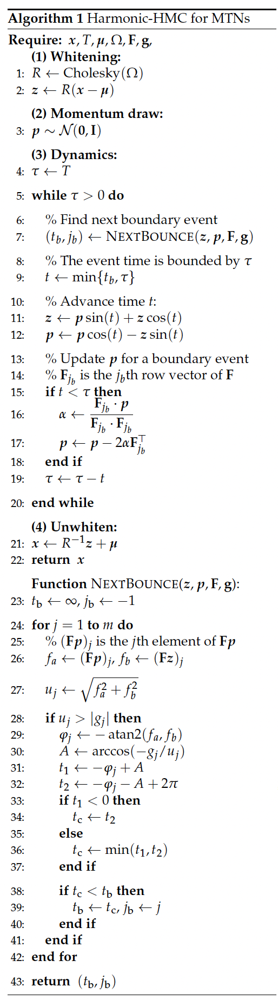
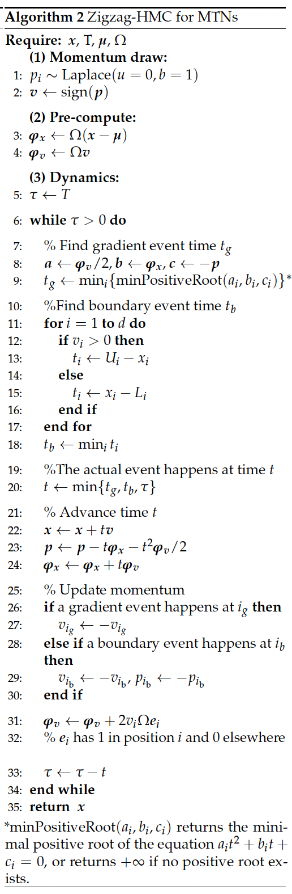
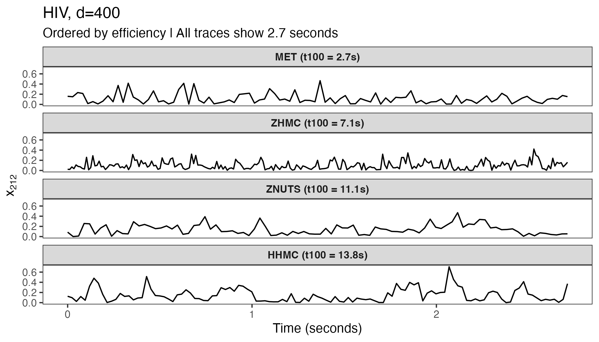
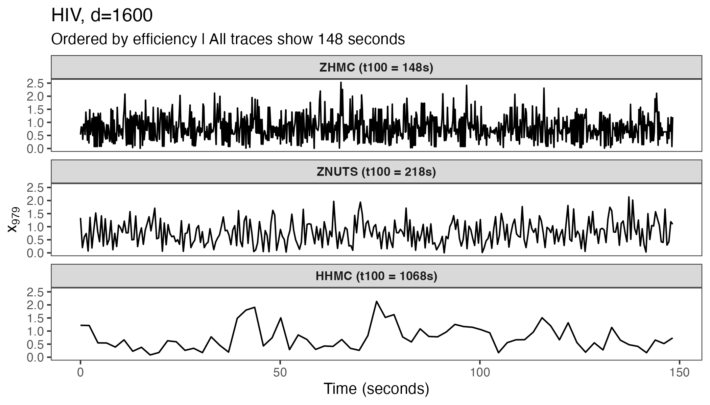
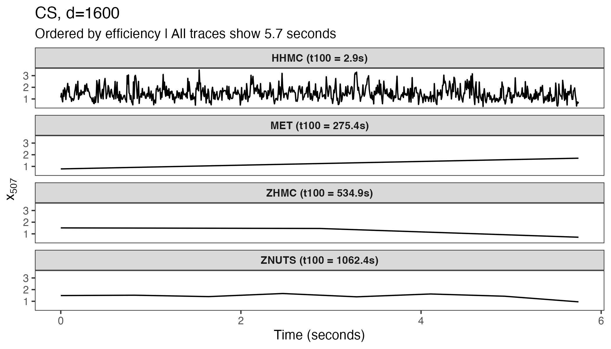
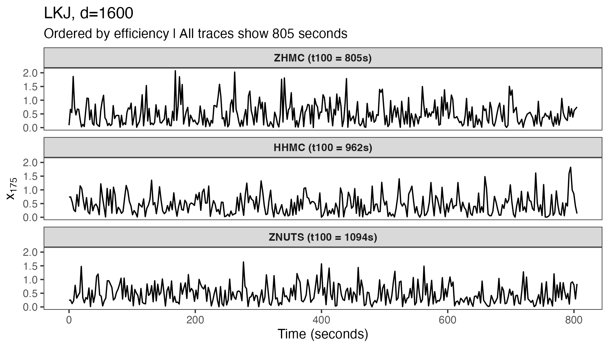

:::::::: article
## Introduction

Sampling from a multivariate truncated normal (MTN) distribution is a
recurring problem in many statistical applications. The MTN distribution
of a $d$-dimensional random vector
$\boldsymbol{\mathbf{x}} \in \mathbb{R}^{d}$ has the form
$$\begin{equation}
	\boldsymbol{\mathbf{x}} \sim {\cal N}\left( \boldsymbol{\mathbf{\mu}}, \Sigma\right) \text{ with } \left(\mathbf{F}\boldsymbol{\mathbf{x}}+ \mathbf{g}\right)_i \geq 0 \text{ for } i = 1, \dots, m,
\end{equation}$$
where $\boldsymbol{\mathbf{\mu}}$ and $\Sigma$ are the mean vector and
covariance matrix, the $m\times d$ matrix $\mathbf{F}$ and
$m$-dimensional vector $\mathbf{g}$ specify the $m$ linear constraints
and $\left(\cdot\right)_i$ denotes the $i$th vector element (Pakman and
Paninski 2014). MTNs arise in various contexts including probit and
tobit models (Albert and Chib 1993; Tobin 1958), latent Gaussian models
(Bolin and Lindgren 2015), copula regression (Pitt et al. 2006), spatial
models (Tsionas and Michaelides 2016; Baltagi et al. 2018; Zareifard and
Khaledi 2021), Bayesian metabolic flux analysis (Heinonen et al. 2019),
and many others. When the dimension $d$ is small, a standard rejection
sampler (Geweke 1991; Kotecha and Djuric 1999) works well and is a
common choice. However, simulation from a larger MTN with hundreds or
thousands of correlated dimensions remains a computational challenge.
Work towards this goal includes harmonic Hamiltonian Monte Carlo (Pakman
and Paninski 2014, Harmonic-HMC), rejection sampling based on minimax
(saddle point) exponential tilting (Botev 2017, MET), and the most
recent Zigzag Hamiltonian Monte Carlo (Nishimura et al. 2020; Nishimura
et al. 2025, Zigzag-HMC) methods.

The MET method provides independent samples but can suffer from low
acceptance rates and becomes impractical with $d> 100$, except in
special cases like when the MTN has a strongly positive correlation
structure (Botev 2017). Both Harmonic-HMC and Zigzag-HMC are Markov
chain Monte Carlo (MCMC) approaches that generate correlated samples,
but can nonetheless be highly efficient and scale to thousands or more
dimensions. To our knowledge, however, there is no general-purpose
implementation of either method; the **tmg** package provided by Pakman
and Paninski (2014) is no longer available on CRAN, and Zhang et al.
(2023) implement Zigzag-HMC for their phylogenetics applications in the
specialized software BEAST (Suchard et al. 2018). Therefore, we have
developed the [**hdtg**](https://CRAN.R-project.org/package=hdtg) R
package for efficient MTN simulation. The package implements tuning-free
Zigzag-HMC and Harmonic-HMC. We provide performance comparisons among
these two methods and a MET implementation from the
[**TruncatedNormal**](https://CRAN.R-project.org/package=TruncatedNormal)
package (Botev and Belzile 2021). In most of the test cases with
$d> 100$, Harmonic-HMC and Zigzag-HMC outperform MET. We then conclude
with some empirical guidance on which method to use in different
scenarios.

## Algorithm {#sec:algorithm}

We begin by briefly introducing Harmonic-HMC and Zigzag-HMC, both of
which are variants of HMC, an effective proposal generation mechanism
exploiting the properties of Hamiltonian dynamics (Neal 2011).
Harmonic-HMC and Zigzag-HMC follow the same general framework. To sample
$\boldsymbol{\mathbf{x}}= \left(x_1, \dots, x_d\right) \in \mathbb{R}^{d}$
from the target distribution
$\pi_X\left(\boldsymbol{\mathbf{x}}\right)$, the HMC variants introduce
an auxiliary *momentum* variable $\boldsymbol{\mathbf{p}}$ and define an
augmented target distribution
$\pi(\boldsymbol{\mathbf{x}}, \boldsymbol{\mathbf{p}}) = \pi_X\left(\boldsymbol{\mathbf{x}}\right) \pi_P\left(\boldsymbol{\mathbf{p}}\right)$
in the joint space. They then propose the next state by first
re-sampling the momentum variable from its marginal and then simulating
the solution of Hamiltonian dynamics governed by the differential
equations
$$\begin{equation}
\label{eq:hamilton}
\frac{\, {\rm d}\boldsymbol{\mathbf{x}}}{\, {\rm d}t}
= \nabla K(\boldsymbol{\mathbf{p}}), \quad
\frac{\, {\rm d}\boldsymbol{\mathbf{p}}}{\, {\rm d}t}
= - \nabla U(\boldsymbol{\mathbf{x}}),
\end{equation}   (\#eq:hamilton)$$
where
$U(\boldsymbol{\mathbf{x}})=- \log \pi_X\left(\boldsymbol{\mathbf{x}}\right)$
and
$K(\boldsymbol{\mathbf{p}}) = - \log \pi_P\left(\boldsymbol{\mathbf{p}}\right)$
are referred to as *potential* and *kinetic* energies. The dynamics are
simulated for a pre-set time duration $T$ and the end state constitutes
a valid Metropolis proposal to be accepted or rejected according to the
standard formula (Metropolis et al. 1953; Hastings 1970).

The most common versions of HMC use the momentum distribution
$\pi_P\left(\boldsymbol{\mathbf{p}}\right) \sim \mathcal{N}(\boldsymbol{\mathbf{0}}, \mathbf{I})$
and rely on the leapfrog integrator to numerically solve
\@ref(eq:hamilton), as its solutions are analytically intractable in
general settings. Harmonic-HMC takes advantage of the fact that
\@ref(eq:hamilton) admits analytical solutions when the target
$\pi_X\left(\boldsymbol{\mathbf{x}}\right)$ is an MTN. The solution
follows independent harmonic oscillations along the principal components
of the covariance/precision matrix (Pakman and Paninski 2014); we thus
refer to the algorithm as Harmonic-HMC. Truncation boundaries are
handled via elastic "bounces" against hard potential energy walls (Neal
2011). Algorithm [1](#alg:hhmc){reference-type="ref"
reference="alg:hhmc"} provides pseudo-code for Harmonic-HMC following
Pakman and Paninski (2014).

Zigzag-HMC differs from the common HMC versions in that it deploys a
Laplace momentum (Nishimura et al. 2020, 2025)
$$\begin{equation}
			\pi_P\left(\boldsymbol{\mathbf{p}}\right) \propto \prod_{i=1}^d\exp\left(-|p_i|\right).
\end{equation}$$
The Hamiltonian dynamics then become
$$\begin{equation}
\label{eq:hzz_equation}
\frac{{\rm d} \boldsymbol{\mathbf{x}}}{{\rm d} t}
=   \text{sign}\left(\boldsymbol{\mathbf{p}}\right), \quad
\frac{{\rm d} \boldsymbol{\mathbf{p}}}{{\rm d} t} = - \nabla U(\boldsymbol{\mathbf{x}}),
\end{equation}   (\#eq:hzz-equation)$$
where $\text{sign}\left(p_i\right)$ returns 1 if $p_i$ is positive and
-1 otherwise. Because the velocity
$\, {\rm d}\boldsymbol{\mathbf{x}}/ \, {\rm d}t \in \{\pm 1\}^d$ remains
constant until one of the $p_i$ flips its sign, the trajectory of these
Hamiltonian dynamics has a zigzag pattern, hence the name Zigzag-HMC.
The zigzag dynamics also admit analytical solutions under an MTN target
and can handle the truncation in the same manner as in Harmonic-HMC.
Algorithm [2](#alg:zhmc){reference-type="ref" reference="alg:zhmc"}
provides pseudo-code for Zigzag-HMC. Our current Zigzag-HMC
implementation is limited to the coordinate-wise bounds
$\boldsymbol{\mathbf{l}}\leq \boldsymbol{\mathbf{x}} \leq \boldsymbol{\mathbf{u}}$.
We refer interested readers to Nishimura et al. (2025) and Zhang et al.
(2023) for more details.

The simulation duration $T$, i.e. how long Hamiltonian dynamics is
simulated for each proposal generation, critically affects efficiencies
of both Harmonic and Zigzag-HMC. For Harmonic-HMC, Pakman and Paninski
(2014) suggest setting $T= \pi/2$; when using this fixed $T$, however,
we observe inefficiencies in some of our examples in
Section [4](#sec:efficiency_comparison){reference-type="ref"
reference="sec:efficiency_comparison"} due to Hamiltonian dynamics'
periodic behaviors (Neal 2011). We therefore randomize the duration $T$,
as recommended by Neal (2011), and draw it from a uniform distribution
on $\left[\pi/8,\pi/2\right]$. For Zigzag-HMC, we adopt the choice
$T=  \sqrt{2} \lambda_{\text{min}}^{-1/2}$ based on the heuristics of
(Nishimura et al. 2025), where $\lambda_{\text{min}}$ is the minimal
eigenvalue of the precision matrix $\Omega= \Sigma^{-1}$. We compute
$\lambda_{\text{min}}$ using the Lanczos algorithm (Demmel 1997) as in
the [**mgcv**](https://CRAN.R-project.org/package=mgcv) package (Wood
2017). We further implement the no-U-turn sampler (NUTS) of Hoffman and
Gelman (2014) to automatically determine the integration time. With
NUTS, we only need to pick a base integration time $\Delta T$ which we
set to $0.1 \lambda_{\text{min}}^{-1/2}$ as recommended by Nishimura et
al. (2025).


<figure data-latex-placement="H">
 
</figure>


The algorithmic divergence between the two methods stems from their
momentum distributions. Harmonic-HMC employs Gaussian momentum,
generating harmonic oscillatory dynamics via trigonometric functions. In
contrast, Zigzag-HMC uses Laplace momentum, producing piecewise-linear
trajectories with constant velocity updates. This distinction leads to
differences in event detection: Harmonic-HMC computes boundary bounce
times using trigonometric relationships, while Zigzag-HMC solves
quadratic equations for gradient events and checks coordinate distances
for boundary events (Algorithm [1](#alg:hhmc){reference-type="ref"
reference="alg:hhmc"} and [2](#alg:zhmc){reference-type="ref"
reference="alg:zhmc"} ). These algorithmic differences lead to varying
opportunities for implementation optimization, as summarized in Table
[1](#tab:T1){reference-type="ref"
reference="tab:implementation-comparison"}. The piecewise-linear
dynamics of Zigzag-HMC, consisting primarily of vector additions and
multiplications, map well to single instruction multiple data (SIMD)
instructions, which can process multiple values simultaneously within a
single CPU core. In contrast, Harmonic-HMC's trigonometric operations
(sin, cos, atan2, arccos) are inherently less SIMD-friendly due to their
transcendental nature. While both samplers are implemented in optimized
C++ with Eigen for linear algebra, Zigzag-HMC's algorithmic structure is
inherently more amenable to the low-level hardware optimizations (SIMD
and aligned memory) that yield performance gains on modern processors.
When examining the computational performance benchmarks in
Section [4](#sec:efficiency_comparison){reference-type="ref"
reference="sec:efficiency_comparison"}, it is important to recognize
that the observed speed differences stem from both algorithmic
efficiencies and the hardware-specific optimizations detailed here.

::: {#tab:implementation-comparison}
  -----------------------------------------------------------------
  **Optimization**          **Harmonic-HMC**   **Zigzag-HMC**
  ------------------------- ------------------ --------------------
  **Language**              C++ via Rcpp       C++ via Rcpp

  **Linear algebra**        Eigen library      Eigen library

  **RNG^1^**                `std::mt19937`     `std::mt19937`

  **SIMD^2^**               No                 Yes (SSE/AVX)

  **Memory optimization**   Standard Eigen     Aligned allocation
  -----------------------------------------------------------------

  : (#tab:T1) Comparison of implementation optimizations between
  Harmonic-HMC and Zigzag-HMC
:::

::: {#tab:implementation-comparison}
  -----------------------------------------------------------------------------
  ^1^RNG: random number generator. ^2^SIMD: single instruction multiple data.

  -----------------------------------------------------------------------------

  : 
:::

In addition to Harmonic-HMC and Zigzag-HMC, the
[**hdtg**](https://CRAN.R-project.org/package=hdtg) package also
implements the Markovian-zigzag sampler (Bierkens et al. 2019) for MTNs.
The Markovian-zigzag belongs to another emerging class of MCMC
algorithms that are based on piecewise deterministic Markov processes
(PDMP) (Fearnhead et al. 2018). As established by (Nishimura et al.
2025), Markovian-zigzag is a close cousin of the Hamiltonian-based
Zigzag-HMC, with the key difference being the amount of retained
momentum information during sampling. Markovian-zigzag exhibited lower
sampling efficiency compared to Harmonic-HMC and Zigzag-HMC,
particularly on targets with correlated parameters (Nishimura et al.
2025). Therefore, we do not include Markovian-zigzag in our performance
comparisons of Section
[4](#sec:efficiency_comparison){reference-type="ref"
reference="sec:efficiency_comparison"}. The Markovian-zigzag function is
nevertheless available in the package for users who wish to experiment
with it.

## Using hdtg {#sec:pkg}

The [**hdtg**](https://CRAN.R-project.org/package=hdtg) package allows
users to draw MCMC samples from an MTN. As an example, one may use the
following code to generate 1,000 samples from a 10-dimensional MTN with
zero mean and an identity covariance matrix truncated to the positive
orthant:

``` r
# set the random seed
set.seed(1)
# draw MTN samples using Zigzag-HMC 
samplesZHMC <- zigzagHMC(nSample = 1000, mean = rep(0, 10), prec = diag(10), 
                         init = rep(0.1, 10), lowerBounds = rep(0, 10), 
                         upperBounds = rep(Inf, 10))
# draw MTN samples using Harmonic-HMC 
samplesHHMC <- harmonicHMC(nSample = 1000, mean = rep(0, 10), choleskyFactor = diag(10),
		           precFlg = TRUE, init = rep(0.1, 10), 
		           constrainDirec = diag(10), constrainBound = rep(0, 10))
```

The arguments are:

- `nSample`: number of samples.

- `mean`: a $d$-dimensional mean vector.

- `prec`: the precision matrix.

- `init`: a vector of the initial value that must satisfy all
  constraints.

- `lowerBounds`: a $d$-dimensional vector specifying the lower bounds.

- `upperBounds`: a $d$-dimensional vector specifying the upper bounds.

- `choleskyFactor`: upper triangular matrix $\mathbf{U}$ from Cholesky
  decomposition of precision or covariance matrix into
  $\mathbf{U}^T\mathbf{U}$.

- `precFlg`: whether `choleskyFactor` is from precision (`TRUE`) or
  covariance matrix (`FALSE`).

- `constrainDirec`: the $\mathbf{F}$ matrix.

- `constrainBound`: the $\mathbf{g}$ vector.

In addition to applications with fixed $\boldsymbol{\mathbf{\mu}}$ and
$\Omega$, hierarchical modeling may require sampling these parameters
from their respective conditional distributions, such as the
phylogenetics example (Zhang et al. 2023) where their posterior
distributions are of scientific interest. In such "random
$\boldsymbol{\mathbf{\mu}}$ or $\Omega$" settings, one may call
`zigzagHMC` or `harmonicHMC` inside an MCMC loop, with
$\boldsymbol{\mathbf{\mu}}$ and $\Omega$ updated at each iteration. For
Zigzag-HMC, a more efficient approach is to reuse the existing C`++`
engine object which already stores the truncation boundaries and SIMD
configuration and simply pass the updated $\boldsymbol{\mathbf{\mu}}$
and $\Omega$ to the sampler. The example below illustrates the
10-dimensional MTN case with a random mean and precision. Note that the
stationary distribution of this toy example is the joint distribution of
both the MTN parameters (`m`, `prec`) and the truncated MTN variable
itself. While the conditional distributions are standard (normal for
`m`, Wishart for `prec`, MTN for the variable), their joint distribution
is not a standard named distribution and does not admit a closed-form
expression.

``` r
set.seed(1)
n <- 1000 
d <- 10
samples <- array(0, c(n, d))
# initialize MTN mean and precision
m <- rnorm(d, 0, 1)
prec <- rWishart(n = 1, df = d, Sigma = diag(d))[,,1]

# call createEngine once
engine <- createEngine(dimension = d, lowerBounds = rep(0, d),
upperBounds = rep(Inf, d), seed = 1, mean = m, precision = prec)

HZZtime <- sqrt(2) / sqrt(min(mgcv::slanczos(A = prec, k = 1, 
			  kl = 1)[['values']]))

currentSample <- rep(0.1, d)
for (i in 1:n) {
   m <- rnorm(d, 0, 1)
   prec <- rWishart(n = 1, df = d, Sigma = diag(d))[,,1]
   setMean(engine = engine, mean = m)
   setPrecision(engine = engine, precision = prec)
   currentSample <- getZigzagSample(position = currentSample, nutsFlg = F,
	   		         engine = engine, stepSize = HZZtime)
   samples[i, ] <- currentSample
}
```

## Efficiency comparison and method choice {#sec:efficiency_comparison}

To assess the performance of Harmonic-HMC, Zigzag-HMC and MET, we
compare them on MTNs with a variety of correlation structures. The three
examples are: 1) MTNs with its covariance matrix $\Sigma$ drawn from the
uniform LKJ distribution (Lewandowski et al. 2009) as implemented in the
`rlkjcorr` function from package
[**trialr**](https://CRAN.R-project.org/package=trialr) (Brock 2020); 2)
MTNs with a compound symmetric covariance matrix such that
$\Sigma_{i,i} = 1$ and $\Sigma_{i,j} =  0.9$ for $i \neq j$; and 3) a
real-world MTN that arises as a posterior conditional distribution in a
statistical phylogenetics model of HIV evolution (Zhang et al. 2021,
2023). For simplicity, we assume the truncation $x_i > 0$ for
$i = 1, \dots, d$ in the first two examples. For the HIV example, the
truncation is determined by the signs of observed binary biological
features.

We now specify our comparison criteria and the rationale behind them. A
more efficient MCMC algorithm takes shorter time to achieve a certain
effective sample size (ESS). For all three samplers considered, we
compare their run-time to obtain the first 1, 100, or 1000 effectively
independent samples ($t_{1}, t_{100}, t_{1000}$). We include all three
metrics because $t_{100}$ and $t_{1000}$ reflect a practical run-time
for simulation from a fixed MTN and $t_{1}$ better captures the
pre-processing overhead that remains relevant in cases where $\Sigma$ is
random. Recall that the main pre-processing costs are the Cholesky
decomposition of $\Sigma$ or $\Omega$ (Harmonic-HMC), calculating the
minimal precision matrix eigenvalue $\lambda_{\text{min}}$ (Zigzag-HMC),
and solving the minimax optimization problem (MET). Therefore we have
$$\begin{equation}
\label{eq:time}
\begin{split}
t_{1}& = t_{0}+ c, \\
t_{100}& =  t_{0}+ 100c, \\
\text{and } t_{1000}& =  t_{0}+ 1000c, 
\end{split}
\end{equation}   (\#eq:time)$$
where $t_{0}$ and $c$ are the pre-processing time required for each
$\Sigma$ update and the average run-time per one effective sample. For
simulation from a fixed MTN, $t_{0}$ is a one-time cost and so $t_{100}$
or $t_{1000}$ serve as better efficiency criteria. When $\Sigma$ is
random (e.g. the second example in Section
[3](#sec:pkg){reference-type="ref" reference="sec:pkg"}), if $\Sigma$
changes its value $k$ times, the total run-time to obtain one effective
sample for each $\Sigma$ is $k t_{1}$ and so the $t_{1}$ criterion would
be more informative.

For Harmonic-HMC and Zigzag-HMC, we estimate the ESS using the
[**coda**](https://CRAN.R-project.org/package=coda) package (Plummer et
al. 2006) and define $n_1$ as the average number of MCMC iterations
required for one effectively independent sample. We approximate $n_1$ by
$L/ \text{ESS}_{\text{min}}$, where $\text{ESS}_{\text{min}}$ is the
minimal ESS across all dimensions and $L$ is the chain length. We fix
$n_1= 1$ for MET as it generates independent samples. Therefore $c$ in
Equation \@ref(eq:time) equals the average time to complete $n_1$
iterations after pre-processing. Table [2](#tab:T2){reference-type="ref"
reference="tb:All"} reports our efficiency comparison in terms of
$t_{1}$, $t_{100}$, and $t_{1000}$. We run each test on an Apple M1 Pro
equipped machine with 16GB of memory. Code and data to reproduce the
results are available on Zenodo at
<https://doi.org/10.5281/zenodo.18618209>.

::: {#tb:All}
+-------------------------------+--------------------------------------------+------------------------------------+-----------------------------------+---+---+
|                               | $d=100$                                    | $400$                              | $1600$                            |   |   |
+:==============:+:============:+==================:+==========:+===========:+==========:+==========:+===========:+=========:+==========:+===========:+==:+==:+
|                |              | $t_{1}$           | $t_{100}$ | $t_{1000}$ | $t_{1}$   | $t_{100}$ | $t_{1000}$ | $t_{1}$  | $t_{100}$ | $t_{1000}$ |   |   |
+----------------+--------------+-------------------+-----------+------------+-----------+-----------+------------+----------+-----------+------------+---+---+
| LKJ            | Harmonic-HMC | **0.004**         | **0.21**  | **2.1**    | **0.11**  | 11        | 107        | **8.0**  | 962       | 9680       |   |   |
+----------------+--------------+-------------------+-----------+------------+-----------+-----------+------------+----------+-----------+------------+---+---+
|                | Zigzag-HMC   | 0.017             | 0.66      | 6.6        | 0.27      | **9.3**   | **92**     | 9.9      | **805**   | **8015**   |   |   |
+----------------+--------------+-------------------+-----------+------------+-----------+-----------+------------+----------+-----------+------------+---+---+
|                | Zigzag-NUTS  | 0.014             | 0.60      | 6.1        | 0.29      | 10        | 102        | 13       | 1094      | 10891      |   |   |
+----------------+--------------+-------------------+-----------+------------+-----------+-----------+------------+----------+-----------+------------+---+---+
|                | MET          | 1.9               | 19        | 101        | --        | --        | --         | --       | --        | --         |   |   |
+----------------+--------------+-------------------+-----------+------------+-----------+-----------+------------+----------+-----------+------------+---+---+
|CS<sub>0.9</sub>| Harmonic-HMC | $\mathbf{<0.001}$ | **0.014** | **0.15**   | **0.007** | **0.086** | **0.83**   | **0.42** | **2.9**   | **25**     |   |   |
+----------------+--------------+-------------------+-----------+------------+-----------+-----------+------------+----------+-----------+------------+---+---+
|                | Zigzag-HMC   | 0.006             | 0.39      | 3.9        | 0.21      | 18        | 180        | 6.3      | 535       | 5317       |   |   |
+----------------+--------------+-------------------+-----------+------------+-----------+-----------+------------+----------+-----------+------------+---+---+
|                | Zigzag-NUTS  | 0.013             | 1.1       | 12         | 1.0       | 102       | 1014       | 13       | 1062      | 10610      |   |   |
+----------------+--------------+-------------------+-----------+------------+-----------+-----------+------------+----------+-----------+------------+---+---+
|                | MET          | 0.087             | 0.12      | 0.33       | 4.4       | 4.9       | 7.2        | 272      | 275       | 313        |   |   |
+----------------+--------------+-------------------+-----------+------------+-----------+-----------+------------+----------+-----------+------------+---+---+
| HIV            | Harmonic-HMC | **0.003**         | 0.32      | 3.4        | 0.17      | 14        | 138        | 10.7     | 1068      | 10968      |   |   |
+----------------+--------------+-------------------+-----------+------------+-----------+-----------+------------+----------+-----------+------------+---+---+
|                | Zigzag-HMC   | 0.009             | 0.35      | 3.4        | **0.14**  | 7.1       | 71         | **2.8**  | **148**   | **1480**   |   |   |
+----------------+--------------+-------------------+-----------+------------+-----------+-----------+------------+----------+-----------+------------+---+---+
|                | Zigzag-NUTS  | 0.013             | 0.66      | 6.5        | 0.17      | 11        | 109        | 4.3      | 218       | 2261       |   |   |
+----------------+--------------+-------------------+-----------+------------+-----------+-----------+------------+----------+-----------+------------+---+---+
|                | MET          | 0.040             | **0.056** | **0.19**   | 2.3       | **2.7**   | **5.1**    | --       | --        | --         |   |   |
+----------------+--------------+-------------------+-----------+------------+-----------+-----------+------------+----------+-----------+------------+---+---+
| Dashes (--) indicate the method required hours for 100 samples.                                                                                     |   |   |
+-----------------------------------------------------------------------------------------------------------------------------------------------------+---+---+

: (#tab:T2) Efficiency comparison of Harmonic-HMC, Zigzag-HMC,
Zigzag-HMC with NUTS (Zigzag-NUTS), and MET sampling approaches across
three example correlation structures. We report $t_{1}$, $t_{100}$, and
$t_{1000}$ (in seconds) --- the run-times to obtain 1, 100, and 1000
effective samples, respectively. LKJ and HIV cases where MET takes more
than two hours to generate 100 samples are omitted. We benchmark each
test for three replications using
[**rbenchmark**](https://CRAN.R-project.org/package=rbenchmark)
(Kusnierczyk 2012) and report the average run-time. Bold numbers are
column minimums in each test.
:::

The efficiency of all three methods strongly depends on the correlation
structure. MET fails to generate 100 effectively independent samples
within two hours in a few higher dimensional tests, while Harmonic-HMC
and Zigzag-HMC/NUTS enjoy a $t_{100}< 3600$ seconds across all tests. In
the LKJ example, Zigzag-HMC/NUTS achieves comparable performance to
Harmonic-HMC when $d$ reaches $400$. For high-dimensional LKJ and HIV
($d= 1600$) tests, Zigzag-HMC outperforms competing methods. Zigzag-NUTS
is no more efficient than Zigzag-HMC across the tested examples. On the
other hand, when $\Sigma$ is compound symmetric with a high correlation
of 0.9, Harmonic-HMC consistently outperforms the other methods. For
MET, since solving the initial minimax optimization dominates its
run-time, the cost scales sub-linearly with sample count
($t_{100}< 100t_{1}$ and $t_{1000}< 1000t_{1}$). This makes MET the
preferred method when many effective samples are desired (as in HIV
$d=100,400$ examples).

<figure id="fig:traceplots_all" data-latex-placement="htbp">
<figure id="fig:sub1" style="width:49.0%;display:inline-block;">

<figcaption>(a) HIV, $d = 400 </figcaption>
</figure>
<figure id="fig:sub2" style="width:49.0%;display:inline-block;">

<figcaption>(b) HIV, $d = 1600$</figcaption>
</figure>
<figure id="fig:sub3" style="width:49.0%;display:inline-block;">

<figcaption>(c) CS, $d = 1600$</figcaption>
</figure>
<figure id="fig:sub4" style="width:49.0%;display:inline-block;">

<figcaption>(d) LKJ, $d = 1600$</figcaption>
</figure>
<figcaption>Figure 1: Time-normalized traceplots for four target MTNs
using <a
href="https://CRAN.R-project.org/package=ggplot2"><strong>ggplot2</strong></a>
<span class="citation" data-cites="ggplot">(Wickham 2016)</span>. The
y-axis shows a randomly selected dimension.</figcaption>
</figure>

Figure [1](#fig:traceplots_all){reference-type="ref"
reference="fig:traceplots_all"} shows traceplots for four target MTNs
from Table [2](#tab:T2){reference-type="ref" reference="tb:All"}.
Different methods excel on different targets, highlighting the
importance of target-specific algorithm selection. In practice, we
recommend running a quick efficiency comparison to decide which method
to use. Nevertheless we provide some general guidance on method choice
for high-dimensional MTN simulation:

- If $d\leq 100$ or the correlation structure is strongly positive, use
  MET or Harmonic-HMC. Harmonic-HMC may run faster but MET has the
  advantage of generating independent samples.

- For $d> 1000$, Zigzag-HMC/NUTS is presumably more efficient, though
  Harmonic-HMC may still outperform under strongly positive
  correlations.

- It is always worth trying MET which is free of MCMC convergence
  concerns. Since our simulation only examines a few correlation
  structures, it is possible that MET can handle other large MTNs.

A final point that needs consideration is that Zigzag-HMC/NUTS requires
$\Omega$ and if only $\Sigma$ is available, the method first inverts
$\Sigma$. This is a one-time operation and likely negligible cost when
$\Sigma$ is constant. The approach does become expensive if $\Sigma$ is
random, as the ${\cal O}\left( d^3 \right)$ inversion is necessary for
each value of $\Sigma$. In practice, statistical models may be
parameterized in terms of $\Sigma$ (Lachaab et al. 2006; Molstad et al.
2021) or $\Omega$ (Baltagi et al. 2018; Lehnert et al. 2019; Li et al.
2020). Harmonic-HMC carries a similar limitation since it requires a
${\cal O}\left( d^3 \right)$ Cholesky decomposition of $\Sigma$ or
$\Omega$, whichever is provided. Therefore, when $d$ is large and the
target MTN has a random correlation structure, one may favor
Zigzag-HMC/NUTS over Harmonic-HMC especially if a closed-form $\Omega$
is at hand.

## Conclusion

This article introduces the
[**hdtg**](https://CRAN.R-project.org/package=hdtg) package oriented for
efficient MTN simulation. In most of our high-dimensional tests the
implemented Harmonic-HMC and Zigzag-HMC algorithms outperform the
current best approach available in the
[**TruncatedNormal**](https://CRAN.R-project.org/package=TruncatedNormal)
package. To our best knowledge,
[**hdtg**](https://CRAN.R-project.org/package=hdtg) is the first tool
that can generate samples from an arbitrary MTN with thousands of
dimensions. We discuss the usage of functions and provide practical
suggestions on method choice. We expect to see future large-scale
statistical applications utilizing the efficiency of
[**hdtg**](https://CRAN.R-project.org/package=hdtg).

## Acknowledgment

The [**hdtg**](https://CRAN.R-project.org/package=hdtg) package itself
leverages several R infrastructure packages including
[**Rcpp**](https://CRAN.R-project.org/package=Rcpp) (Eddelbuettel and
Balamuta 2018),
[**RcppEigen**](https://CRAN.R-project.org/package=RcppEigen) (Bates and
Eddelbuettel 2013),
[**RcppParallel**](https://CRAN.R-project.org/package=RcppParallel)(Allaire
et al. 2016), and [**mgcv**](https://CRAN.R-project.org/package=mgcv)
(Wood 2017) for efficient computation. It also incorporates external
header-only libraries: `sse2neon.h` (DLTcollab and contributors 2020)
for ARM support and `span.h` (Brindle 2018) for memory-safe array views.
This work was partially supported through National Institutes of Health
grant R01 AI153044.


::::::::::::::::::::::::::::::::::::::::::: {#refs .references .csl-bib-body .hanging-indent}
::: {#ref-albert1993bayesian .csl-entry}
Albert, James H, and Siddhartha Chib. 1993. "Bayesian Analysis of Binary
and Polychotomous Response Data." *Journal of the American Statistical
Association* 88 (422): 669--79.
:::

::: {#ref-parallelpkg .csl-entry}
Allaire, JJ, Romain Francois, Kevin Ushey, G Vandenbrouck, Marcus
Geelnard, and HS Badr. 2016. "Rcppparallel: Parallel Programming Tools
for 'RCPP'." *R Package Version* 4: 20.
:::

::: {#ref-baltagi2018generalized .csl-entry}
Baltagi, Badi H, Peter H Egger, and Michaela Kesina. 2018. "Generalized
Spatial Autocorrelation in a Panel-Probit Model with an Application to
Exporting in China." *Empirical Economics* 55 (1): 193--211.
:::

::: {#ref-eigenpkg .csl-entry}
Bates, Douglas, and Dirk Eddelbuettel. 2013. "Fast and Elegant Numerical
Linear Algebra Using the RcppEigen Package." *Journal of Statistical
Software* 52 (5): 1--24. <https://doi.org/10.18637/jss.v052.i05>.
:::

::: {#ref-bierkens2019ergodicity .csl-entry}
Bierkens, Joris, Gareth O Roberts, and Pierre-André Zitt. 2019.
"Ergodicity of the Zigzag Process." *The Annals of Applied Probability*
29 (4): 2266--301.
:::

::: {#ref-bolin2015excursion .csl-entry}
Bolin, David, and Finn Lindgren. 2015. "Excursion and Contour
Uncertainty Regions for Latent Gaussian Models." *Journal of the Royal
Statistical Society: Series B (Statistical Methodology)* 77 (1):
85--106.
:::

::: {#ref-botev2017normal .csl-entry}
Botev, Zdravko I. 2017. "The Normal Law Under Linear Restrictions:
Simulation and Estimation via Minimax Tilting." *Journal of the Royal
Statistical Society: Series B (Statistical Methodology)* 79 (1):
125--48.
:::

::: {#ref-tnpkg .csl-entry}
Botev, Zdravko, and Leo Belzile. 2021. *TruncatedNormal: Truncated
Multivariate Normal and Student Distributions*.
<https://CRAN.R-project.org/package=TruncatedNormal>.
:::

::: {#ref-span2020 .csl-entry}
Brindle, Tristan. 2018. *An Implementation of c++20's Std::span*.
<https://github.com/tcbrindle/span>.
:::

::: {#ref-trialrpkg .csl-entry}
Brock, Kristian. 2020. *Trialr: Clinical Trial Designs in 'Rstan'*.
<https://CRAN.R-project.org/package=trialr>.
:::

::: {#ref-demmel1997applied .csl-entry}
Demmel, James W. 1997. *Applied Numerical Linear Algebra*. SIAM.
:::

::: {#ref-sse2neon2020 .csl-entry}
DLTcollab and contributors. 2020. *Sse2neon: SSE to NEON Intrinsics
Translator*. <https://github.com/DLTcollab/sse2neon>.
:::

::: {#ref-rcpppkg .csl-entry}
Eddelbuettel, Dirk, and James Joseph Balamuta. 2018. "[Extending R with
C++: A Brief Introduction to Rcpp]{.nocase}." *The American
Statistician* 72 (1): 28--36.
<https://doi.org/10.1080/00031305.2017.1375990>.
:::

::: {#ref-fearnhead2018piecewise .csl-entry}
Fearnhead, Paul, Joris Bierkens, Murray Pollock, and Gareth O Roberts.
2018. "Piecewise Deterministic Markov Processes for Continuous-Time
Monte Carlo." *Statistical Science* 33 (3): 386--412.
:::

::: {#ref-geweke1991efficient .csl-entry}
Geweke, John. 1991. "Efficient Simulation from the Multivariate Normal
and Student-t Distributions Subject to Linear Constraints and the
Evaluation of Constraint Probabilities." *Computing Science and
Statistics: Proceedings of the 23rd Symposium on the Interface*,
571--78.
:::

::: {#ref-hastings1970monte .csl-entry}
Hastings, W Keith. 1970. "Monte Carlo Sampling Methods Using Markov
Chains and Their Applications." *Biometrika*.
:::

::: {#ref-heinonen2019bayesian .csl-entry}
Heinonen, Markus, Maria Osmala, Henrik Mannerström, et al. 2019.
"Bayesian Metabolic Flux Analysis Reveals Intracellular Flux Couplings."
*Bioinformatics* 35 (14): i548--57.
:::

::: {#ref-hoffman2014nuts .csl-entry}
Hoffman, Matthew D, and Andrew Gelman. 2014. "The No-U-Turn Sampler:
Adaptively Setting Path Lengths in Hamiltonian Monte Carlo." *Journal of
Machine Learning Research* 15 (1): 1593--623.
:::

::: {#ref-kotecha1999gibbs .csl-entry}
Kotecha, Jayesh H, and Petar M Djuric. 1999. "Gibbs Sampling Approach
for Generation of Truncated Multivariate Gaussian Random Variables."
*1999 IEEE International Conference on Acoustics, Speech, and Signal
Processing. Proceedings. ICASSP99 (Cat. No. 99CH36258)* 3: 1757--60.
:::

::: {#ref-rbenchmark .csl-entry}
Kusnierczyk, Wacek. 2012. *[rbenchmark]{.nocase}: Benchmarking Routine
for r*. <https://CRAN.R-project.org/package=rbenchmark>.
:::

::: {#ref-lachaab2006modeling .csl-entry}
Lachaab, Mohamed, Asim Ansari, Kamel Jedidi, and Abdelwahed Trabelsi.
2006. "Modeling Preference Evolution in Discrete Choice Models: A
Bayesian State-Space Approach." *Quantitative Marketing and Economics* 4
(1): 57--81.
:::

::: {#ref-lehnert2019large .csl-entry}
Lehnert, Judith, Christoph Kolbitsch, Gerd Wübbeler, Amedeo Chiribiri,
Tobias Schaeffter, and Clemens Elster. 2019. "[Large-scale Bayesian
spatial-temporal regression with application to cardiac MR-perfusion
imaging]{.nocase}." *SIAM Journal on Imaging Sciences* 12 (4): 2035--62.
:::

::: {#ref-lewandowski2009generating .csl-entry}
Lewandowski, Daniel, Dorota Kurowicka, and Harry Joe. 2009. "Generating
Random Correlation Matrices Based on Vines and Extended Onion Method."
*Journal of Multivariate Analysis* 100 (9): 1989--2001.
:::

::: {#ref-li2020using .csl-entry}
Li, Zehang Richard, Tyler H McComick, and Samuel J Clark. 2020. "[Using
Bayesian latent Gaussian graphical models to infer symptom associations
in verbal autopsies]{.nocase}." *Bayesian Analysis* 15 (3): 781.
:::

::: {#ref-metropolis53 .csl-entry}
Metropolis, Nicholas, Arianna W. Rosenbluth, Marshall N. Rosenbluth,
Augusta H. Teller, and Edward Teller. 1953. "Equation of State
Calculations by Fast Computing Machines." *Journal of Chemical Physics*
21 (6): 1087--92.
:::

::: {#ref-molstad2021gaussian .csl-entry}
Molstad, Aaron J, Li Hsu, and Wei Sun. 2021. "Gaussian Process
Regression for Survival Time Prediction with Genome-Wide Gene
Expression." *Biostatistics* 22 (1): 164--80.
:::

::: {#ref-hmcneal .csl-entry}
Neal, Radford M. 2011. "MCMC Using Hamiltonian Dynamics." In *Handbook
of Markov Chain Monte Carlo*, edited by Steve Brooks, Andrew Gelman,
Galin L. Jones, and Xiao-Li Meng, vol. 2. CRC Press New York, NY.
:::

::: {#ref-nishimura2020discontinuous .csl-entry}
Nishimura, Akihiko, David B Dunson, and Jianfeng Lu. 2020.
"Discontinuous Hamiltonian Monte Carlo for Discrete Parameters and
Discontinuous Likelihoods." *Biometrika* 107 (2): 365--80.
:::

::: {#ref-nishimura2024zigzag .csl-entry}
Nishimura, Akihiko, Zhenyu Zhang, and Marc A Suchard. 2025. "Zigzag Path
Connects Two Monte Carlo Samplers: Hamiltonian Counterpart to a
Piecewise Deterministic Markov Process." *Journal of the American
Statistical Association* 120 (550): 1077--89.
:::

::: {#ref-pakman2014exact .csl-entry}
Pakman, Ari, and Liam Paninski. 2014. "Exact Hamiltonian Monte Carlo for
Truncated Multivariate Gaussians." *Journal of Computational and
Graphical Statistics* 23 (2): 518--42.
:::

::: {#ref-pitt2006efficient .csl-entry}
Pitt, Michael, David Chan, and Robert Kohn. 2006. "Efficient Bayesian
Inference for Gaussian Copula Regression Models." *Biometrika* 93 (3):
537--54.
:::

::: {#ref-codapkg .csl-entry}
Plummer, Martyn, Nicky Best, Kate Cowles, and Karen Vines. 2006. "CODA:
Convergence Diagnosis and Output Analysis for MCMC." *R News* 6 (1):
7--11. <https://journal.r-project.org/archive/>.
:::

::: {#ref-beast2018 .csl-entry}
Suchard, Marc A, Philippe Lemey, Guy Baele, Daniel L Ayres, Alexei J
Drummond, and Andrew Rambaut. 2018. "Bayesian Phylogenetic and
Phylodynamic Data Integration Using BEAST 1.10." *Virus Evolution* 4
(1): vey016. <https://doi.org/10.1093/ve/vey016>.
:::

::: {#ref-tobin1958estimation .csl-entry}
Tobin, James. 1958. "Estimation of Relationships for Limited Dependent
Variables." *Econometrica: Journal of the Econometric Society*, 24--36.
:::

::: {#ref-tsionas2016spatial .csl-entry}
Tsionas, Efthymios G, and Panayotis G Michaelides. 2016. "A Spatial
Stochastic Frontier Model with Spillovers: Evidence for Italian
Regions." *Scottish Journal of Political Economy* 63 (3): 243--57.
:::

::: {#ref-ggplot .csl-entry}
Wickham, Hadley. 2016. *Ggplot2: Elegant Graphics for Data Analysis*.
Springer-Verlag New York. <https://ggplot2.tidyverse.org>.
:::

::: {#ref-mgcvcite .csl-entry}
Wood, S. N. 2017. *Generalized Additive Models: An Introduction with r*.
2nd ed. Chapman; Hall/CRC.
:::

::: {#ref-zareifard2021heterogeneous .csl-entry}
Zareifard, Hamid, and Majid Jafari Khaledi. 2021. "[A heterogeneous
Bayesian regression model for skewed spatial data]{.nocase}." *Spatial
Statistics* 46: 100545.
:::

::: {#ref-zhang2021large .csl-entry}
Zhang, Zhenyu, Akihiko Nishimura, Paul Bastide, et al. 2021.
"Large-Scale Inference of Correlation Among Mixed-Type Biological Traits
with Phylogenetic Multivariate Probit Models." *The Annals of Applied
Statistics* 15 (1): 230--51.
:::

::: {#ref-zhang2023accelerating .csl-entry}
Zhang, Zhenyu, Akihiko Nishimura, Nı́dia S Trovão, et al. 2023.
"Accelerating Bayesian Inference of Dependency Between Mixed-Type
Biological Traits." *PLoS Computational Biology* 19 (8): e1011419.
:::
:::::::::::::::::::::::::::::::::::::::::::
