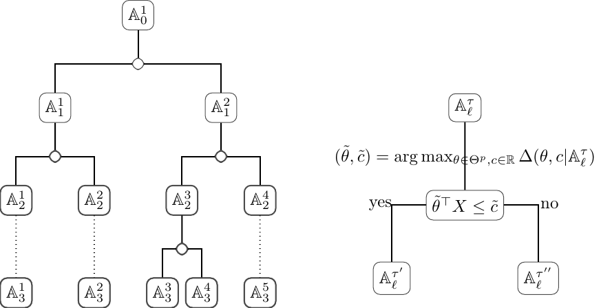
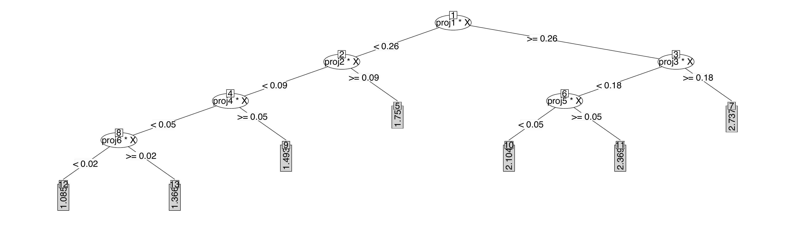
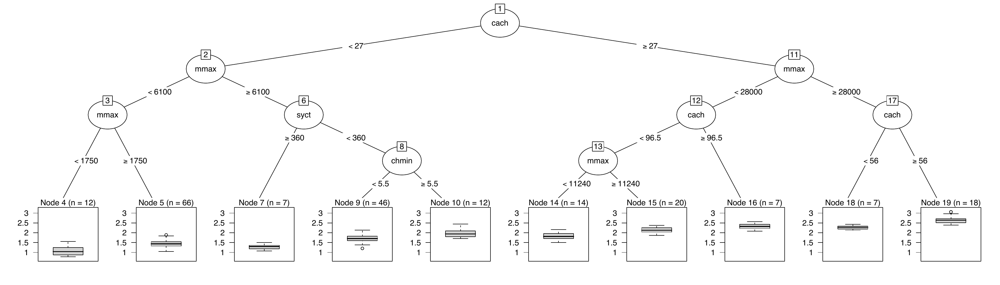

::::::::: article
## Introduction {#sec:intro}

The Classification and Regression Tree (CART) proposed by Professor Leo
Breiman (Breiman et al. 1984) has attracted a great deal of attention
from statisticians and data analysts of other disciplines. The method is
widely used because it is easy to train and the resulting tree makes the
analysis results easy to visualize and interpret (Johnson and Tong
2014). On the other hand, much attention has been paid to the algorithm
and many improvements have been proposed. Classification and regression
trees (Quinlan 1987, CART) and C4.5 (Quinlan 1993) are perhaps the most
commonly used decision trees. There is a long list of other decision
trees, including the Evolutionary Learning of Globally Optimal
Classification and Regression Trees (Grubinger et al. 2014, EVT),
Conditional Inference Trees (Hothorn et al. 2006, CT), Extremely
randomized trees (Geurts et al. 2006, ERT), Model-Based Recursive
Partitioning (Zeileis and Hothorn 2015, MOB), Bayesian additive
regression trees (Maia et al. 2022(BART) ) and generalized linear
mixed-model trees (Fokkema et al. 2020, glmertree). The Random Forests
(Breiman 2001, RF), which is an ensemble of trees by either feature
bagging or boosting, is arguably one of the most efficient machine
learning methods, especially for the tabular data (Grinsztajn et al.
2022). Again, there are many ensemble methods that are based on
different decision trees, for example, Conditional Random Forests
(Hothorn et al. 2006, cforest), Learning Nonlinear Functions Using
Regularized Greedy Forest (Johnson and Tong 2014, RGF) and Generalized
Random Forest (Athey et al. 2019, GRF).

One of the most appealing extensions to CART is the use of linear
combinations of the predictors as splitting variables that is known as
the Oblique Decision Tree (Heath et al. 1993, ODT). Recently, Zhan et
al. (2025) proved the consistency of ODT and its random forest (ODRF)
for very general regression functions as long as they are continuous,
while CART or RF are consistent mainly for regressions with special
structures such as additive models. Again, ensemble can be made based on
ODT, resulting in the Oblique-type Random Forests, including Random
Rotation Random Forest (RotRF) of (Blaser and Fryzlewicz 2016), Random
Projection Forests (RPFs) of Lee et al. (2015) and Sparse Projection
Oblique Randomer Forests (SPORF) of ([Tomita et al.]{.nocase} 2020).
Another type of random forests is the model-based oblique decision
forest, including mainly Canonical Correlation Forests (CCF) with
classic correlation analysis (Rainforth and Wood 2015), projection
pursuit forest (PPF) with linear discriminant analysis (Silva et al.
2021), oblique random forests (ORF) with ridge regression (Menze et al.
2011), oblique random survival forests (Jaeger et al. 2022, ORSF) and
Heterogeneous oblique random forest (Katuwal et al. 2020, HORF).
However, a primary limitation of these oblique methods lies in their
computational intensity. To address this issue, Wickramarachchi et al.
(2016) introduced a novel algorithm named "HHCART", which utilizes
Householder matrices to reflect training data at non-terminal nodes.
Subsequently, Wickramarachchi et al. (2019) developed an accompanying R
package [**hhcartr**](https://CRAN.R-project.org/package=hhcartr) for
both classification and regression tasks.

In parallel with these developments, Gradient Boosting Trees (GBT) have
emerged as another powerful machine learning paradigm. The GBT algorithm
was first introduced by (Friedman 2001), establishing a powerful
framework for supervised learning by sequentially fitting weak learners
(typically decision trees) to the residuals of previous models. To
address overfitting, (Friedman 2002) later proposed stochastic gradient
boosting, which incorporates regularization by subsampling both
observations and features. Further enhancements tailored to tree-based
models were introduced through modern implementations such as XGBoost
(Chen and Guestrin 2016), LightGBM (Ke et al. 2017), and CatBoost
(Prokhorenkova et al. 2018). These frameworks optimize tree growth
strategies, efficiently handle categorical variables, and significantly
improve computational scalability. Traditionally, boosting algorithms
employed axis-aligned splits (as in CART-style trees). However, recent
research has explored Oblique Decision Trees (ODT) within boosting
frameworks, resulting in Boosting Oblique Decision Trees (BODT).
Integrating BODT with randomization techniques, such as random
projections (Lee et al. 2015), further enhances robustness and
generalizability. Notably, our recent work demonstrated that ensembles
based on BODT achieve consistency for general continuous regression
functions, in contrast to traditional CART-based ensembles that require
additive or structured assumptions.

Although the theoretical advantages of oblique decision trees and their
random forests have been well understood, the existing packages
implementing those extensions only show their better numerical
performance in some special cases, and thus have not commonly received
and have not got much popularity as the methods deserve. As a
consequence, the conventional packages
[**rpart**](https://CRAN.R-project.org/package=rpart) (Therneau and
Atkinson 2022) of (Therneau and Atkinson 2000) for CART and
[**randomForest**](https://CRAN.R-project.org/package=randomForest)
(Liaw and Wiener 2002a) of (Liaw and Wiener 2002b) for RF are still the
most commonly used packages. The main difficulty in implementing ODT or
ODRF is the estimation of the coefficient, $\theta$, for the linear
combinations, which is also one of the main differences amongst all the
existing packages. The estimation methods of $\theta$ include random
projection, logistic regression, dimension reduction and many others.
For example, package [**rerf**](https://CRAN.R-project.org/package=rerf)
(Browne and Tomita 2019) of ([Tomita et al.]{.nocase} 2020) uses random
projections; package
[**PPforest**](https://CRAN.R-project.org/package=PPforest) ([da Silva
et al.]{.nocase} 2025) of (Silva et al. 2021) uses linear discriminant
and penalized discriminant analysis; package
[**obliqueRF**](https://CRAN.R-project.org/package=obliqueRF) (Menze and
Splitthoff 2012) of (Menze et al. 2011) uses the partial least squares
regression, logistic regression, and random projection to find the
projections. On the other hand, most of the existing R packages for such
types of random forests can only be used for classification. Some of the
R packages have been removed from the Comprehensive R Archive Network
(CRAN) at <https://CRAN.R-project.org/>. For comprehensive details, see
Table [1](#tab:T1){reference-type="ref" reference="Rpackage"}, which
presents a comparative analysis of nine R packages implementing oblique
tree methods. The evaluation assesses their support for six specific
functionalities and determines whether they remain available on CRAN.

Our package, called **ODRF**, is written based on the above-mentioned
packages and the recent work of Zhan et al. (2025). In **ODRF**, the
projection pursuit regression (Friedman and Stuetzle 1981) is used to
find $\theta$; the details will be stated in the following section.
Other options for the estimations of projections are also provided in
the package. Compared with the existing random forests, the advantages
of **ODRF** are as follows.

- **ODRF** can be used for both classification and regression, while
  most existing packages of oblique-type trees or forests can only be
  used for classification.

- Both the tree (`ODT`) and random forests (`ODRF`) of **ODRF** have
  better overall accuracy than existing trees and forests, including
  traditional CART and RF and other oblique trees or forests.

- **ODRF** allows users to define their own functions to find the
  projections at each node, which is essential to the performance of the
  forests.

- **ODRF** provides an `online` class of functions that facilitate the
  application to streaming data, enabling continuous updates and
  improvements to existing trees or random forests.

- **ODRF** develops a new ensemble method (ODBT), which builds random
  forests of ODT-based boosting trees and outperforms traditional
  boosting trees and random forests in both classification and
  regression tasks.

- **ODRF** proposes an innovative approach for constructing linear model
  trees by incorporating LASSO regularization, while distinctly
  separating the sets of variables used for node splitting and model
  fitting.

:::: minipage
::: {#Rpackage}
  ---------------- ---------------- ------------ --------- ---------- -------- ---------- ------
                    classification   regression   forests   boosting   custom    online    CRAN

                                                                       splits   updating  

  oblique.tree                                                                            

  pptreeviz                                                                               

  PPtreereg                                                                               

  rotationForest                                                                          

  rerf                                                                                    

  PPforest                                                                                

  obliqueRF                                                                               

  aorsf                                                                                   

  ODRF                                                                                    
  ---------------- ---------------- ------------ --------- ---------- -------- ---------- ------

  : (#tab:T1) A comprehensive overview of the R package for oblique
  tree methods
:::
::::

The remainder of this paper is organized as follows: Section
[2](#sec:models){reference-type="ref" reference="sec:models"} describes
the model or methods of the main functions in **ODRF**. Section
[3](#sec:functions){reference-type="ref" reference="sec:functions"}
provides the usage of the main functions in **ODRF** package. Section
[4](#sec:examples){reference-type="ref" reference="sec:examples"}
showcases the specific application of **ODRF** to analyze two data sets
with continuous and categorical responses respectively, and compares the
predictive accuracy in classification and regression with other R
packages using 43 datasets. A conclusion is made in Section
[5](#sec:conclusion){reference-type="ref" reference="sec:conclusion"}.

## Statistical methods {#sec:models}

Suppose $Y = (y_1, ..., y_K)$ is the response vector of interest and
$X = (x_1, ..., x_p)^\top : p \times 1$ is the vector of predictors. We
allow $Y$ to be multiple to accommodate the categorical response. That
is, if $Y$ has $K$ classes, then it is represented by $K$ dummy
variables, with each taking values 0 and 1. Generally, we need to
estimate the regression functions:
$$m(x) = (m_1(x), ..., m_K(x)) = (E(y_1|X=x), ..., E(y_K|X=x)).$$

### Create an ODT

With observations $\mathbb{A}^0_0 = \{(X_i, Y_i), i = 1, ...., n \}$,
where $Y_i = (y_{i1}, ..., y_{iK})$ and $X_i = (x_{i1}, ..., x_{ip})$,
an ODT is illustrated by the following diagram in Figure
[1](#figg1){reference-type="ref" reference="figg1"}. For ease of
exposition, even if a node is not split further, we still rewrite it in
the next layer (by a dashed line in the diagram). For any node
$\mathbb{A}_\ell^\tau$, where the subscript $\ell$ represents the layer
and superscript the number of nodes in the layer, the splitting is as
follows. Given any $p$-dimensional vector $\theta$ and a splitting value
$c$, define the daughter nodes by
$$\mathbb{A}_{\ell+1}^{\tau'} = \{ X_i: X_i \in \mathbb{A}_{\ell}^\tau, \ \theta^\top X_i \le c\}, \quad
	\mathbb{A}_{\ell+1}^{\tau''} = \{ X_i: X_i \in \mathbb{A}_{\ell}^\tau, \ \theta^\top X_i > c\},$$
and loss function
$$\Delta(c| \mathbb{A}_\ell^\tau, \theta)=  \sum_{k=1}^K \sum_{X_i \in \mathbb{A}_{\ell+1}^{\tau'}} (y_{ik} - \bar y_k(\mathbb{A}_{\ell+1}^{\tau'}))^2  + \sum_{k=1}^K \sum_{X_i \in \mathbb{A}_{\ell+1}^{\tau''}} (y_{ik} - \bar y_k(\mathbb{A}_{\ell+1}^{\tau''}))^2,$$
where
$\bar y_k(\mathbb{A}) = \sum_{X_i \in \mathbb{A}} y_{ik} /\#\mathbb{A}$
and $\#\mathbb{A}$ denotes the cardinality of set $\mathbb{A}$. When
$\theta$ is given, the splitting value $c$ should minimize
$\Delta(c|\theta,  \mathbb{A}_\ell^\tau)$. If $Y$ is a univariate
quantitative response, then $\Delta(c|\theta,  \mathbb{A}_\ell^\tau)$ is
the residual sum of squares for regression that is used as the criterion
of CART. If $Y$ is categorical, then
$\bar y_k(\mathbb{A})  =  \hat p_k(\mathbb{A})$, the ratio of category
$k$ in $\mathbb{A}_{\ell+1}^{\tau'}$, and
$$\sum_{X_i \in \mathbb{A}} (y_{ik} -  \bar y_k(\mathbb{A}))^2  = \#( \mathbb{A}) \times  (1- \hat  p_k(\mathbb{A}))  \hat p_k(\mathbb{A}).$$
Thus, $\Delta(c|\theta, \mathbb{A}_\ell^\tau)$ is also the Gini impurity
but multiplied by the number of observations in the node, which thus is
also the criterion used by CART for classification.

To determine whether a split is necessary, the cross-validation (CV)
method is used as follows. For any set $\mathbb{A}$, the CV value is
defined as a scaled residual sum of squares:
$$CV(\mathbb{A}) = \Big(\frac{\#\mathbb{A}}{\#\mathbb{A} -\lambda}\Big)^2 \sum_{k=1}^K \sum_{X_i \in  \mathbb{A}} ( y_{ik} - \bar y_k(\mathbb{A}))^2,$$
Note that if $\lambda = 1$, then $CV(\mathbb{A})$ is the leave-one-out
CV. We can show that $\lambda = \log(\#\mathbb{A})$ also gives a
consistent stopping time. In our package, if
$$CV(\mathbb{A}_\ell^\tau ) \le CV(\mathbb{A}_{\ell+1}^{\tau'}) + CV(\mathbb{A}_{\ell+1}^{\tau''}),$$
then $\mathbb{A}_\ell^\tau$ is a leaf and no longer needs to be split;
otherwise, it will be split to daughter nodes
$\mathbb{A}_{\ell+1}^{\tau'}$ and $\mathbb{A}_{\ell+1}^{\tau''}$; see
the first equation of this section.

<figure id="figg1" data-latex-placement="t!">

<figcaption>Figure 1: A diagram of the oblique decision tree
</figcaption>
</figure>

Let $\{\mathbb{A}_L^j\}_{j=1}^{t_n}$ be all the leaves (i.e. the nodes
in the last layer) of the generated tree. Then, $m(x)$ is estimated by
$$m_{n}(x)=\sum_{j=1}^{t_n}\mathbb{I}(x\in \mathbb{A}_L^j)\times  (\bar y_1(\mathbb{A}_L^j), ..., \bar y_K(\mathbb{A}_L^j)).$$
Note that if $Y$ is categorical, $m_{n}(x)$ is the vector of
probabilities of each class.

It can be seen that the main step in ODT is the estimation of the
projection $\theta$, i.e. the coefficients of the linear combinations.
Although many methods have been proposed as mentioned in the
Introduction section, we find the projection pursuit regression
(Friedman and Stuetzle 1981) is still the most efficient and is used in
**ODRF**. The estimation is as follows. In any node
$\mathbb{A}_\ell^\tau$, define a loss function
$$\Delta(\theta) =  \sum_{k=1}^K \sum_{X_i \in \mathbb{A}_\ell^\tau} \Big\{y_{ik} - m_k(\theta^\top X_i)\Big\}^2,$$
where $m_k$ is a nonparametric smoothing of the regression function that
minimizes
$\sum_{X_i \in \mathbb{A}_\ell^\tau} \Big\{y_{ik} - m_k(\theta^\top X_i)\Big\}^2$
with $\theta$ given. The nonparametric smoothing can be either a spline
representation, kernel smoothing, or a super smoother of Friedman
(1984). Projection $\theta$ is estimated as
$$\theta = \arg \min_\theta \Delta(\theta).$$
Our package also allows users to define their own methods of estimating
$\theta$; see Section [3.5](#user-defined){reference-type="ref"
reference="user-defined"}.

### Build an ODRF {#sec:ODRF}

**ODRF** builds the random forest slightly differently from the existing
forests, but its basic idea is still the feature bagging (Ho 1998). The
detail is as follows. Denote by $X_{[q]} = (x_1', ..., x_q')$ a random
subset of predictors $X  = (x_1, ..., x_p)$, where $q < p$ and
$\{x_1', ..., x_q'\} \subset \{x_1, ..., x_p\}$, and thus by
$X_{[q], r},\ r=1, 2, ...,$ we mean a sequence of such subsets that may
differ from one another. In other words, with the same $q$ and $r$, set
$X_{[q], r}$ changes from place to place but has the same cardinality.
The ODRF is implemented as follows.

- Create a random ODT tree, labeled as $b$, using the idea of feature
  bagging as follows.

  - For each node $\mathbb{A}_k^\tau$, randomly select $q$, for example
    $q = \lfloor p/3\rfloor$ or $q = \lfloor\sqrt{p}\rfloor$, variables
    $X_{[q], r} = (x_1', ..., x_q') \subset X$, where $r = 1, ..., R$
    denotes $R$ random sets of variables. In **ODRF**,
    $R \ge \lfloor p/q\rfloor$ is used as default.

  - For each $X_{[q], r}$, find
    $$\tilde \theta_{r} = \arg \min_{\theta} \sum_{k=1}^K \sum_{X_i \in \mathbb{A}} \Big\{y_{ik} - m_k(\theta^\top X_{[q],r, i})\Big\}^2,$$
    where $X_{[q],r, i} = (x_{i1}', ..., x_{iq}')^\top$.

  - Define
    $$\mathbb{A}_{k,r}^{\tau'} = \{ X_i: X_i \in \mathbb{A}_k^\tau, \  \theta_{(q)}^\top X_{[q],r, i} \le c_{(q)}\}, \quad
    		\mathbb{A}_{k,r}^{\tau''} = \{ X_i: X_i \in \mathbb{A}_k^\tau, \ \theta_{(q)}^\top X_{[q],r, i} > c_{(q)}\}.$$

  - Calculate
    $$(\tilde c_{(q)}, \tilde r) = \arg \min_{c, r=1,..., R} \Big\{ \sum_{k=1}^K \sum_{X_i \in \mathbb{A}_{\ell,r}^{\tau'}} (y_{ik} - \bar y_{.k})^2  + \sum_{k=1}^K \sum_{X_i \in \mathbb{A}_{\ell, r}^{\tau''}} (y_{ik} - \bar y_{.k})^2\Big\}.$$

  - Split the node with
    $(\tilde \theta_{\tilde r}, \tilde c_{\tilde r}, \tilde r)$ to
    produce daughter nodes

    ::: center
    $\mathbb{A}_{\ell+1}^{\tau'} = \mathbb{A}_{\ell+1,\tilde r}^{\tau'}$
     and
     $\mathbb{A}_{\ell+1}^{\tau''} = \mathbb{A}_{\ell+1,\tilde r}^{\tau''}$.
    :::

    If
    $CV(\mathbb{A}_k^\tau) < CV(\mathbb{A}_{\ell+1}^{\tau'}) + CV(\mathbb{A}_{\ell+1}^{\tau''})$,
    we discard the two daughter nodes, and make $\mathbb{A}_k^\tau$ as a
    leaf; otherwise, we continue to split the nodes.

  - Each tree produces one estimator
    $\hat m^b (x) = (\hat m_{1}^b (x), ..., \hat m_{K}^b (x))$.

- An Oblique Decision Random forest (ODRF) estimator is then
  $$\hat m_{ODRF}(x) = B^{-1} \sum_{b=1}^B \hat m_{n}^b (x).$$

### Build an ODBT

Building upon the foundational gradient boosting framework established
by Friedman (2001), the boosting process constructs trees sequentially.
Specifically, the $k$-th tree is trained using the predictors and
residuals derived from the previous $k-1$ trees. Consequently, the
estimator $m^{(k)}(x)$ at step $k$ is expressed as a linear combination
of the first $k$ trees. In this work, we propose using Oblique Decision
Trees (ODT) as base learners within the boosting framework. The
resulting ODT-based boosting algorithm (BODT) proceeds according to the
following key steps:

- Step 1. Initialize $k=1$, training set
  $\mathcal{D}_n^1 = \mathbb{A}^0_0$, residuals $r_{0,i} = Y_i$ for
  $i=1,\ldots,n$, and estimator $m_{t,0}^r = 0$.

- Step 2. Train the $k$-th ODT using data
  $\mathcal{D}_n^k = \{(X_i, r_{k-1,i})\}_{i=1}^n$. Denote the resulting
  tree as $m_{t,k}^r(x)$. (Note that for $k=1$, $m_{t,1}^r$ is simply
  the ODT trained on $\mathcal{D}_n$.)

- Step 3. Update the estimator of $m(x)$ at step $k$ by:
  $$\begin{equation}
  \label{eq:boost_estimator}
  		m_{k,\text{boost}}(x) := \sum_{j=1}^k a_{k,j}^* m_{t,j}^r(x),
  \end{equation}   (\#eq:boost-estimator)$$
  where the coefficients $(a_{k,1}^*, a_{k,2}^*, \ldots, a_{k,k}^*)$ are
  obtained by solving:
  $$\begin{equation}
  \label{eq:boost_coef}
  		(a_{k,1}^*,\ldots,a_{k,k}^*) := \mathop{\mathrm{arg\,min}}_{(a_{k,1},\ldots,a_{k,k}) \in \mathbb{R}^k} \sum_{i=1}^n \left(Y_i - \sum_{j=1}^k a_{k,j} m_{t,j}^r(X_i)\right)^2.
  \end{equation}   (\#eq:boost-coef)$$

- Step 4. Update the residuals as
  $r_{k,i} = Y_i - m_{k,\text{boost}}(X_i)$ and the training data as
  $\mathcal{D}_n^{k+1} = \{(X_i, r_{k,i})\}_{i=1}^n$.

- Step 5. Set $k \leftarrow k+1$ and return to Step 2.

To further improve the stability and predictive accuracy of the boosting
trees, we incorporate a bagging step by replacing each deterministic ODT
with a randomly constructed ODT. For simplicity, we set $a_n = n$,
meaning the full dataset $\mathcal{D}_n$ is used at every boosting
iteration. During the construction of each random ODT, independent
random seeds (as defined at the beginning of Section
[2.2](#sec:ODRF){reference-type="ref" reference="sec:ODRF"}) are
employed. By a slight abuse of notation, we continue to denote the
resulting estimator as $m_{k,\text{boost}}(x)$. Running the BODT
procedure independently $B$ times, each with its own set of random ODTs,
produces an ensemble estimator, referred to as ODBT, defined by
$$m_{k,\text{boost}}^{\text{ens}}(x) := \frac{1}{B} \sum_{b=1}^B m_{k,\text{boost}}^{b}(x),$$
where $m_{k,\text{boost}}^{b}(x)$ corresponds to the boosting estimator
from the $b$-th independent run.

For a comprehensive discussion of the technical details and theoretical
properties of ODBT, we refer the reader to our parallel work.

### Online training with batches of data {#sec:online}

The package allows for easy model updating (for ODT or ODRF) when new
data is available. Essentially, we achieve this by splitting a leaf node
upon the arrival of new data. The specifics of this process vary based
on the amount of available data. To keep things simple, we focus on
classification trees that use Gini impurity as the splitting criterion.

Suppose the trained ODT has leaves $A_L^j, j = 1, ..., J$. When the new
data comes, we can simply fit the new data into the leaves of the
trained tree. Suppose $D_L^j  =\{ (X'_i, y'_i), i=1, ..., n'_j \}$ fall
into $A_L^j$, where $y_i' = (y_{i,1}', ..., y'_{i,K})$, thus the data in
the leaf becomes $A_L^j \cup  D_L^j$. Next, we discuss whether we need
to split $A_L^j \cup  D_L^j$ in different scenarios of data
availability.

- If the full data for the original trained model is known, that is, the
  data in $A_L^j \cup D_L^j$ is fully known, we can use the method of
  ODT to split the data.

- If only the impurity is known, i.e. $n_j = \# A_L^j$ and
  $(\hat p^j_{L,1}, ..., \hat p^j_{L,K})$ are kept for the leaf, which
  is indeed the case for many existing packages of trees. Here,
  $\hat p^j_{L,k}$ is the probability of class $k$ in the leaf $A_L^j$.
  The impurity of $A_L^j$ and $A_L^j \cup  D_L^j$ can be calculated
  respectively as
  $$G^j_L =     \sum_{k=1}^K \hat p_k (1- \hat p_k)$$
  and
  $$\tilde  G^j_L =   \sum_{k=1}^K \tilde p_k (1- \tilde p_k),$$
  where
  $$\tilde  p_k = (n_j \hat p^j_{L,k} + n_j' \check p^j_{L,k})/(n_j + n_j')$$
  and $n_j' = \# D_L^j$ and
  $\check p^j_{L,k} = \sum_{X_i' \in D_L^j} y'_{i, k}/n_j'$. If
  $\hat G_L^j \le \tilde G_L^j$, we don't need to split. Otherwise, we
  first split $D_L^j$ in the same way as ODT does, and denote the
  daughter nodes by $A_L^{j, l}$ and $A_L^{j, r}$. We assume that the
  original data in the leaf are also proportionally split into the two
  daughter nodes. Thus, their impurities are
  $$G( A_\ell^{j, l}) =  \sum_{k=1}^K \hat p_k^l (1- \hat p^l_k), \quad 
  	G( A_\ell^{j, r}) =  \sum_{k=1}^K \hat p^r_k (1- \hat p^r_k),$$
  where $n_j^l = \tau n_j + \# A_L^{j, l}$ and
  $n_j^r = (1-\tau) n_j + \# A_L^{j, r}$,
  $\hat p_k^l = (\tau n_j \hat p^j_{L,k} + 
  	\sum_{X'_i \in A_L^{j, l}} y_{i,k}')/ n_j^l)$ and
  $\hat p_k^r = ((1-\tau) n_j \hat p^j_{L,k} + 
  	\sum_{X'_i \in A_L^{j, r}} y_{i,k}')/n_j^r$, and
  $\tau = \# A_\ell^{j, l}/n_j'$. Following the same rule as ODT in the
  splitting, if
  $$\left(\frac{n_j+n_j'}{n_j+n_j' -\lambda}\right)^2(n_j+n_j')\tilde G_j \le
  	\left(\frac{n_j^l}{n_j^l -\lambda}\right)^2 n_j^l G( A_\ell^{j, l})
  	+  \left(\frac{  n_j^r}{ n_j^r -\lambda}\right)^2 n_j^r G( A_\ell^{j, r}),$$
  then we split the leaf, and continue to split its daughter nodes if
  necessary; otherwise, $A_L^j$ is not split and remains as a leaf.

The above procedure is a combination of the batches of data in the
leaves. In **ODRF**, the second scenario is used as we believe most
trees have the data required.

## Overview of ODRF functions {#sec:functions}

ODRF is written in **Rcpp** (Eddelbuettel and François 2011) package and
functions of R's S3, including the base R functions `print()`,
`predict()`, and `plot()` in the `base` package, the conversion function
`as.party()` in package
[**partykit**](https://CRAN.R-project.org/package=partykit) (Hothorn and
Zeileis 2015). Next, we introduce the main functions of **ODRF**
package, including:

- `ODT()` constructs a single oblique decision tree for classification
  and regression tasks, where each node split is determined by a linear
  combination of predictors. Returns an ODT S3 object compatible with
  `plot()`, `predict()`, and `print()` methods.

- `ODRF()` implements oblique random forest ensembles for classification
  and regression, extending the random forest framework through
  ODT-based construction while encompassing standard random forest as a
  special case. Returns an ODRF S3 object and supports the

- `ODBT()` implements boosted oblique trees by applying feature bagging
  during ODT-based boosting training to ensemble multiple models. It
  accepts training and test data sets as input and directly outputs
  fitted values and predictions.

- `online()` supports incremental learning scenarios and is applicable
  to ODT and ODRF S3 objects.

- `VarImp()` computes variable importance measures and is compatible
  with ODT and ODRF S3 objects.

Finally, we demonstrate the implementation of user-defined projection
estimation functions through customizable template components, enabling
researchers to tailor hyperplane optimization strategies to specific
problem domains.

### Print the tree structure of `ODT` and `ODRF`

`ODT()`, `ODRF()`, and `ODBT()` are the three main functions of **ODRF**
package. They can be used for classification and regression and are
similar in usage to packages **rpart** and **randomForest**
respectively.

We provide two ways of data input following the `S3` methods as follows.

``` r
## S3 method for class 'formula'
ODT(formula, data = NULL, split = "auto", NodeRotateFun = "RotMatPPO", ...)
ODRF(formula, data = NULL, split = "auto", NodeRotateFun = "RotMatPPO", ...)
ODBT(formula, data = NULL, Xnew = NULL, split = "auto", model = "ODT", ...)
```

``` r
## Default S3 method:
ODT(X, y, split = "auto", NodeRotateFun = "RotMatPPO", ...)
ODRF(X, y, split = "auto", NodeRotateFun = "RotMatPPO", ...)
ODBT(X, y, Xnew, split = "auto", model = "ODT", ...)
```

The `formula` and `data` are standard formats in R, so do the remaining
arguments such as `subset`, `na.action`, and `weights`. For additional
information on setting the values of arguments that are not introduced
here, please refer to the documentation for the functions `ODT` and
`ODRF` using commands `?ODT`, `?ODRF`, and `?ODBT`. However, in most
cases, the default values work well.

`print()` can be used to display the trained tree and structure of each
node of `ODT` in detail. Here is one example.

``` r
set.seed(38)
data(iris, package = "datasets")
tree <- ODT(Species ~ ., data = iris)
print(tree)
```

``` r
============================================================= 
Oblique Classification Tree structure 
=============================================================

1) root
node2)# proj1*X < 0.29 -(leaf1 = setosa)
node3)  proj1*X >= 0.29
node4)# proj2*X < 0.88 -(leaf2 = versicolor)
node5)# proj2*X >= 0.88 -(leaf3 = virginica)
```

``` r
party.tree <- as.party(tree, data = iris)
print(party.tree)
```

``` r
Model formula:
Species ~ Sepal.Length + Sepal.Width + Petal.Length + Petal.Width

Fitted party:
[1] root
|   [2] proj1*X >= 0.29167
|   |   [3] proj2*X >= 0.88395: virginica (n = 53, err = 5.7%)
|   |   [4] proj2*X < 0.88395: versicolor (n = 47, err = 0.0%)
|   [5] proj1*X < 0.29167: setosa (n = 50, err = 0.0%)

Number of inner nodes:    2
Number of terminal nodes: 3
```

In addition, we can also use function `print()` to print the model
fitted error for `ODRF`.

``` r
set.seed(38)
forest <- ODRF(Species ~ ., data = iris, parallel = FALSE)
print(forest)
```

``` r
Call:
ODRF.formula(formula = Species ~ ., data = data, parallel = FALSE) 
Type of oblique decision random forest: classification
Number of trees: 100
OOB estimate of error rate: 5.33\%
Confusion matrix:
          setosa versicolor virginica class_error
setosa        50          0         0    0.0000000
versicolor     0         47         5    0.0961537
virginica      0          3        45    0.0625000
```

Beyond its core functionality, the `ODT` implementation can also perform
linear model trees (LMT) with LASSO regularization as proposed by Craig
et al. (2024). This approach differs fundamentally from standard ODT in
its data partitioning: the splitting variables and linear modeling
variables are trained on distinct datasets. We demonstrate this
functionality through the following illustrative case, where we use "Z"
as the splitting variable to build a linear model tree for "X" and "y".

``` r
set.seed(10); cutpoint <- 50; mu <- rep(0, 100)
X <- matrix(rnorm(100 * 10), 100, 10)
age <- sample(seq(20, 80), 100, replace = TRUE)
height <- sample(seq(50, 200), 100, replace = TRUE)
weight <- sample(seq(5, 150), 100, replace = TRUE)
Z <- cbind(age = age, height = height, weight = weight)
mu[age <= cutpoint] <- X[age <= cutpoint, 1] + X[age <= cutpoint, 2]
mu[age > cutpoint] <- X[age > cutpoint, 1] + X[age > cutpoint, 3]
y <- mu + rnorm(100)
my.tree <- ODT(X = X, y = y, Xsplit = Z, split = "linear", lambda = 0, NodeRotateFun = 
"RotMatRF", glmnetParList = list(lambda = 0, family = "gaussian"))
pred <- predict(my.tree, X, Xsplit = Z)
mean((pred - y)^2)
[1] 0.9035932
```

### Classification and regression using functions `ODT()`, `ODRF()`, and `ODBT()`

`predict()` is the standard `S3` method to predict new data for various
objects of classes. We defined the functions `predict.ODT()` and
`predict.ODRF()` to predict `Xnew` for classes `ODT()` and `ODRF()`
respectively. The default output of `predict()` is `response` which is
the predicted values of the new data. Use `?predict.ODT` and
`?predict.ODRF` to see the detail of the prediction.

The standard usage is as follows.

``` r
## S3 method for class 'ODT'
predict(object, Xnew,  ...)
## S3 method for class 'ODRF'
predict(object, Xnew, type = "response", ...)
```

Examples of classification and regression using `ODT()`, `ODRF()`, and
`ODBT()` are as follows.

``` r
data(body_fat, package = "ODRF")
train <- sample(1:252, 200)
bodyfat_train <- data.frame(body_fat[train, ])
bodyfat_test <- data.frame(body_fat[-train, ])
tree <- ODT(Density ~ ., bodyfat_train, split = "mse")
pred <- predict(tree, bodyfat_test[, -1])
(e.tree <- mean((pred - bodyfat_test[, 1])^2))
[1] 4.775053e-05
```

``` r
set.seed(12)
data(seeds, package = "ODRF")
train <- sample(1:209, 150)
seeds_train <- data.frame(seeds[train, ])
seeds_test <- data.frame(seeds[-train, ])
forest <- ODRF(varieties_of_wheat ~ ., seeds_train, split = "gini", parallel = FALSE)
pred <- predict(forest, seeds_test[, -8])
(e.forest <- mean(pred != seeds_test[, 8]))
[1] 0.01694915
```

``` r
forest <- ODBT(varieties_of_wheat ~ ., seeds_train, seeds_test[, -8], model = "rpart",
 type = "class", max.terms = 10, parallel = FALSE, NodeRotateFun = "RotMatRF")
pred <- forest$results$prediction
(mean(pred != seeds_test[, 8]))
[1] 0.01694915
```

### Online updating

**ODRF** provides online training for sequential data with function
`online()` and update existing `ODT` and `ODRF` using batches of data.

The usage is as follows.

``` r
## S3 method for class 'ODT' and 'ODRF'
online(obj, X = NULL, y = NULL, ...)
```

In the following example, the training data are available in two
batches. The first batch is used to train `ODT` and `ODRF`, and the
second batch is used to update the trained model.

``` r
set.seed(17)
index <- sample(nrow(seeds_train), floor(nrow(seeds_train) / 2))
forest1 <- ODRF(varieties_of_wheat ~ ., seeds_train[index, ], split = "gini", 
  parallel = FALSE)
pred <- predict(forest1, seeds_test[, -8])
(e.forest.1 <- mean(pred != seeds_test[, 8]))
```

``` r
[1] 0.03389831
```

``` r
forest2 <- online(forest1, seeds_train[-index, -8], seeds_train[-index, 8])
pred <- predict(forest2, seeds_test[, -8])
(e.forest.online <- mean(pred != seeds_test[, 8]))
```

``` r
[1] 0.01694915
```

``` r
index <- seq(floor(nrow(bodyfat_train) / 2))
tree1 <- ODT(Density ~ ., bodyfat_train[index, ], split = "mse")
pred <- predict(tree1, bodyfat_test[, -1])
(e.tree.1 <- mean((pred - bodyfat_test[, 1])^2))
```

``` r
[1] 6.37745e-05
```

``` r
tree2 <- online(tree1, bodyfat_train[-index, -1], bodyfat_train[-index, 1])
pred <- predict(tree2, bodyfat_test[, -1])
(e.tree.online <- mean((pred - bodyfat_test[, 1])^2))
```

``` r
[1] 5.659303e-05
```

It can be seen that the errors after updating are notably smaller than
those resulting from using a single batch of data alone.

### Visualization of `ODT` and `ODRF` and importance of variables

**ODRF** provides several plot functions to visualize ODT and ODRF.
`plot.ODT()` plots the oblique decision tree structure based on package
**PPtreeViz**. We can convert the class `ODT` to class `party` by
`as.party()` and then use `plot()` to draw the tree structure.

Suppose x or obj is an object of class ODT. The standard usage is as
follows.

``` r
## S3 method for class 'ODT'
plot(x, font.size = 17, width.size = 1, ...)
## S3 method for class 'ODT'
as.party(obj, data, ...)
```

<figure id="fig:tree.structure" data-latex-placement="h!">

<figcaption> <span id="fig:tree.structure"
data-label="fig:tree.structure"></span>Two types of the tree
structure.</figcaption>
</figure>

Below is one example, while the two types of tree plots are shown in
Figure [2](#fig:tree.structure){reference-type="ref"
reference="fig:tree.structure"}.

``` r
set.seed(0308)
tree <- ODT(Species ~ ., data = iris, split = "gini")
plot(tree, main = "")
party.tree <- as.party(tree, data = iris)
plot(party.tree)
```

For `ODRF()`, we provide functions `Accuracy()` to calculate the fitting
accuracy and `plot.Accuracy()` to plot the fitting errors. Hereafter, we
refer to errors as misclassification rate (MR) for classification or
mean squared error (MSE) for regression. Functions `VarImp()` and
`plot.VarImp()` measure the variable importance and plot the dotchart of
variable importance, respectively, where the variable importance is
similarly calculated as `importance()` in **randomForest** package. Our
implementation uses impurity-based and permutation-based methods to
measure the variable importance. It should be emphasized that our
impurity-based method inherently incorporates these projection
coefficients into the importance ranking. Specifically, for each
splitting node, we randomly select $q$ projection variables from the $p$
predictor variables and define the variable importance measure as:
$$V_k = D \cdot \left| Q_k \right|, \quad k = j_1, j_2, \cdots, j_q$$
where $D$ represents the total decrease in node impurities from
splitting on the variable, and $Q_k$ denotes the coefficient of the
$k$-th projection. Consequently, $V_k$ constitutes a comprehensive
metric for variable importance that integrates both impurity reduction
and projection coefficient information.

``` r
## S3 method for class 'VarImp'
varimp = VarImp(obj, X, y)
plot(varimp, nvar, digits = NULL, ...)

## S3 method for class 'Accuracy'
accuracy = Accuracy(obj, data, newdata = NULL)
plot(accuracy, lty = 1, digits = NULL, main = NULL, ...)
```

Below is an example.

``` r
set.seed(3)
data(breast_cancer, package = "ODRF")
train <- sample(1:569, 300)
train_data <- breast_cancer[train, -1]
test_data <- breast_cancer[-train, -1]
forest <- ODRF(diagnosis ~ ., train_data,split = "gini", parallel = FALSE)
error <- Accuracy(forest, train_data, test_data)
plot(error)
varimp <- VarImp(forest, train_data[, -1], train_data[, 1])
plot(varimp, nvar = 10)
```

<figure id="fig:forest.error" data-latex-placement="h!">

<figcaption> <span id="fig:forest.error"
data-label="fig:forest.error"></span> The error of ODRF for
classification and variable’s importance.</figcaption>
</figure>

The plots are shown in
Figure [3](#fig:forest.error){reference-type="ref"
reference="fig:forest.error"}. The left panel is the plot of errors of
ODRF against the number of trees. It can be seen that the errors of OOB
and test data decrease with the number of trees and that the error of
test data is bigger than the training data. The right panel is the
dotchart of variable importance, the horizontal axis is the error of
ODRF after removing one variable; the larger the error increases, the
more important the variable is.

### Create a rotation matrix with `RotMat*` and custom functions {#user-defined}

**ODRF** provides many ways to select the rotation directions $\theta$
in each nodes, including `RotMatPPO()`, `RotMatRand()` and `RotMatRF()`.
The generated rotation matrix has three columns, the first column
(`Variable`) is variables to be projected, the second column (`Number`)
is the index of a projection, and the third column (`Coefficient`) is
the coefficient of the projection for the variable. Details can be found
by `?ODT` and `?ODRF`.

The default method for the projection of `RotMatPPO()` is
`model = "PPR"`, projection pursuit regression from `ppr()` in `stats`
package (Friedman and Stuetzle 1981). Standard usage is as follows.

``` r
RotMatPPO(X, y, model = "PPR", dimProj, numProj, ...)
RotMatMake(X = NULL,y = NULL,RotMatFun = "RotMatPPO",PPFun = "PPO", ...)
```

Here is one example.

``` r
set.seed(14)
X <- matrix(rnorm(1000), 200, 5)
y <- (X[,1]+X[,2])^2 + X[,4]-X[,5] +  runif(200)
tree <- ODT(X, y, split = "mse", NodeRotateFun = "RotMatPPO",
  paramList = list(model = "PPR", dimProj = 5, numProj = 1))
round(tree[["projections"]],2)
```

``` r
         X1    X2    X3   X4    X5
proj1  0.20  0.29 -0.09 0.63 -0.69
proj2 -0.69 -0.68  0.02 0.19 -0.16
proj3 -0.06 -0.09  0.16 0.72 -0.67
proj4 -0.57 -0.70  0.03 0.31 -0.29
```

It can be seen that the projections are roughly parallel to those in the
model, i.e. (1, 1, 0, 0, 0) and (0, 0, 0, 1, -1).

It is worth mentioning that the package allows users to define their
rotation matrix functions and link them with the function `RotMatMake()`
in the package. The first function, named, for example, `makeRotMat()`,
is to select the variables to be projected, with a specified format of
output, including the projection dimensions and the number of
projections (the first two columns of the rotation matrix):

``` r
makeRotMat <- function(dimX, dimProj, numProj, ...) {
  RotMat <- matrix(1, dimProj * numProj, 3)
  for (np in seq(numProj)) {
    RotMat[(dimProj * (np - 1) + 1):(dimProj * np), 1] <-
    sample(1:dimX, dimProj, replace = FALSE)
    RotMat[(dimProj * (np - 1) + 1):(dimProj * np), 2] <- np
    RotMat[(dimProj * (np - 1) + 1):(dimProj * np), 3] <- 
    sample(c(1L, -1L), dimProj, replace = TRUE, prob = c(0.5, 0.5))
  }
  return(RotMat)
}
set.seed(35)
RotMat1 <- makeRotMat(dimX = 5, dimProj = 3, numProj = 2)
RotMat1
```

``` r
     [,1] [,2] [,3]
[1,]    2    1   -1
[2,]    5    1   -1
[3,]    1    1   -1
[4,]    5    2    1
[5,]    2    2    1
[6,]    4    2   -1
```

The second function, named as, for example, `makePP()`, is defined to
estimate the projection coefficients (the third column of the rotation
matrix):

``` r
makePP <- function(X, y, ...) {
  LM <- lm(y ~ ., data = data.frame(X,y=y))
  theta <- as.matrix(LM[["coefficients"]])[-1, , drop = FALSE]
  theta <- theta / sqrt(sum(theta^2))
  return(theta)
}
set.seed(35)
RotMat3 <- RotMatMake(X = X, y = y, RotMatFun = "makeRotMat", PPFun = "makePP", 
  paramList = list(dimX = 5, dimProj = 3, numProj = 2))
RotMat3
```

``` r
     Variable Number Coefficient
[1,]        2      1   0.4297059
[2,]        5      1  -0.9007557
[3,]        1      1   0.0631821
[4,]        5      2  -0.7227304
[5,]        2      2   0.2141932
[6,]        4      2   0.6571012
```

Then, we put these functions as augments of `NodeRotateFun` and `PPFun`
respectively as follows.

``` r
set.seed(23)
tree <- ODT(X, y, split = "mse", NodeRotateFun = "RotMatMake", paramList = 
  list(RotMatFun = "makeRotMat", PPFun = "makePP", dimX = 5, dimProj = 5, numProj = 1))
round(tree[["projections"]], 2)
```

``` r
         X1    X2    X3   X4    X5
proj1  0.08  0.21 -0.11 0.69 -0.68
proj2  0.22  0.39 -0.16 0.69 -0.55
proj3 -0.27 -0.03  0.05 0.68 -0.68
```

## Real examples {#sec:examples}

In this section, we first use `ODT()` to analyze two data sets and see
how it improves the analysis of CART, in terms of model complexity,
model fitting and variable importance. In the second example, we compare
the prediction performance of ODT and ODRF in **ODRF** with the other
popular methods using 43 real data sets, including 20 continuous
responses, 8 multinomial responses and 15 binary responses. All real
data analyses were conducted in R version 4.2.2 on a Windows 11
Operating System with AMD Ryzen 7 5800H with Radeon Graphics (16 CPUs),
 3.2 GHz with 16 GB of memory.

### Two data sets for complexity analysis

The first dataset is the kyphosis data, which has 81 observations. The
data (`kyphosis`) are available at **rpart**. The response is $kyphosis$
with values 'absent' or 'present', indicating whether kyphosis (a type
of deformity) was present after surgery. The three predictors are (1)
$age$: the age of the child in months; (2) $number$: the number of
vertebrae involved; (3) $start$: the number of the first (uppermost)
vertebra operated on. Below is the code and analysis.

<figure id="fig:tree of kyphosis" data-latex-placement="h!">

<figcaption> <span id="fig:tree of kyphosis"
data-label="fig:tree of kyphosis"></span> The tree structure of kyphosis
of ODT and the conventional CART respectively.</figcaption>
</figure>

We first fit the data to ODT and CART, and calculate the fitted errors.

``` r
data(kyphosis, package = "rpart")
odt <- ODT(Kyphosis ~ Age + Number + Start, data = kyphosis, split = "gini", 
  paramList = list(model = "PPR", numProj = 1))
tree <- rpart(Kyphosis ~ Age + Number + Start, data = kyphosis, method = "class")
pred <- predict(odt, kyphosis[, -1])
e.odt <- mean(pred != kyphosis[, 1])
pred <- predict(tree, kyphosis, type = "class")
e.tree <- mean(pred != kyphosis[, 1])
print(c(e.odt = e.odt, e.tree = e.tree))
```

``` r
    e.ODT    e.CART 
0.1604938 0.1604938
```

``` r
print(round(odt[["projections"]], 3))
```

``` r
       Age Number  Start
proj1 0.31  0.596 -0.741
```

The trees of ODT and CART are shown in Figure
[4](#fig:tree of kyphosis){reference-type="ref"
reference="fig:tree of kyphosis"}. We can see from the trees that ODT
has a much smaller complexity, i.e. 2 leaves, than CART which has 5
leaves, but has the same fitted error as CART. There is only one
projection for ODT with splitting variable
$0.310 \times \text{Age} + 0.596 \times \text{Number} - 0.74 \times \text{Start}$,
which determines whether kyphosis will present or not after an
operation.

The second data set is about the relative performance and
characteristics of 209 CPUs. This dataset contains the following
variables: $syct$ (cycle time in nanoseconds), $mmin$ (minimum main
memory in kilobytes), $mmax$ (maximum main memory in kilobytes), $catch$
(cache size in kilobytes), $chmin$ ( minimum number of channels),
$chmax$ (maximum number of channels), $perf$ (published performance on a
benchmark mix relative to an IBM 370/158-3), and $estperf$ (estimated
performance by Ein-Dor & Feldmesser). This data (`cpus`) is available in
[**MASS**](https://CRAN.R-project.org/package=MASS). The interest is to
predict the $perf$ using $syct$, $mmin$, $mmax$, $cach$, $chmin$ and
$chmax$. The logarithm transformation is made to $perf$.

<figure id="fig:ODT of cpus" data-latex-placement="h!">

<figcaption>Figure 2: <span id="fig:ODT of cpus"
data-label="fig:ODT of cpus"></span> ODT tree structure of
cpus</figcaption>
</figure>

``` r
data(cpus, package = "MASS")
odt <- ODT(log10(perf) ~ syct + mmin + mmax + cach + chmin + chmax, data = cpus, 
  lambda = log(nrow(cpus)), split = "mse", paramList = list(model = "PPR", numProj = 1))
pred <- predict(odt, cpus[, 2:7])
e.odt <- mean((pred - log10(cpus[, 8]))^2)
tree <- rpart(log10(perf) ~ syct + mmin + mmax + cach + chmin + chmax,   data = cpus)
pred <- predict(tree, cpus)
e.tree <- mean((pred - log10(cpus[, 8]))^2)
print(c(e.ODT = e.odt, e.CART = e.tree))
```

``` r
     e.ODT     e.CART 
0.02297886 0.03034244 
```

``` r
print(round(odt[["projections"]], 3))
```

``` r
	syct   mmin  mmax   cach chmin  chmax
proj1 -0.047  0.546 0.586  0.553 0.206  0.094
proj2 -0.021  0.298 0.505  0.744 0.319  0.014
proj3 -0.963  0.125 0.181  0.121 0.010  0.101
proj4 -0.034  0.751 0.419  0.407 0.302  0.051
proj5 -0.982 -0.002 0.126  0.070 0.000  0.125
proj6 -0.012 -0.351 0.920 -0.156 0.061 -0.049
```

The ODT and CART trees are depicted in Figure
[5](#fig:ODT of cpus){reference-type="ref" reference="fig:ODT of cpus"}
and Figure [6](#fig:rpart of cpus){reference-type="ref"
reference="fig:rpart of cpus"}, respectively. Once again, it is evident
that ODT has fewer leaves and a lower fitting error than CART.
Interestingly, the first, second, and fourth projections primarily
relate to a computer's memory and the time required to fetch data from
main memory or disk storage (represented by $mmin$, $mmax$, $catch$,
$chmin$), as their coefficients have larger absolute values. Another
group of projections, specifically the third and fifth, are associated
with $syct$, the time it takes a computer to complete one clock cycle,
which can contribute to faster processing speeds and improved
performance. In some special cases, $mmax$ plays a role,
i.e. projection 6, possibly when the data set is large. These
projections correspond to the common understanding of the performance of
a computer and its hardware settings. These examples show that ODT has
better interpretability than CART.

<figure id="fig:rpart of cpus" data-latex-placement="h!">

<figcaption>Figure 3: <span id="fig:rpart of cpus"
data-label="fig:rpart of cpus"></span> The conventional tree structure
of cpus using <strong>rpart</strong>.</figcaption>
</figure>

<figure id="fig:var.imp.mtcars" data-latex-placement="h!">

<figcaption> <span id="fig:var.imp.mtcars"
data-label="fig:var.imp.mtcars"></span> Plots of the importance of
variables for data “mtcars” using three methods.</figcaption>
</figure>

### Analysis of the importance of variables

The data was extracted from the 1974 Motor Trend US magazine, and
comprises fuel consumption and 10 aspects of automobile design,
including mpg: Miles/(US) gallon, cyl: Number of cylinders, disp:
Displacement (cu.in.), hp: Gross horsepower, drat: Rear axle ratio, wt:
Weight (1000 lbs), qsec: 1/4 mile time, vs: Engine (0 = V-shaped, 1 =
straight), am: Transmission (0 = automatic, 1 = manual), gear: Number of
forward gears, and carb: Number of carburetors, and performance, which
is measured by the fuel consumption (mpg). This data (`mtcars`) is
available in `datasets` (Henderson and Velleman 1981). Our interest is
to explore which aspects of automotive design affect the performance
(mpg).

ODRF measures variable importance using a similar permutation method as
RF. We will compare the rank of importance of ODRF with RF. In addition,
LASSO is a popular variable selection method, so we use it as a
benchmark. Figure [7](#fig:var.imp.mtcars){reference-type="ref"
reference="fig:var.imp.mtcars"} shows that ODRF ranks Weight (wt) as the
most important factor affecting fuel consumption, which is consistent
with the LASSO results. RF ranks Displacement (disp) as an important
influencing factor, while the LASSO results show Displacement as the
least influencing factor. Further comparison of the other variable
rankings shows that our ODRF rankings of variable importance are
generally consistent with LASSO, while RF differs more.

::: minipage
:::

### Prediction performance

Next, we show the performance of `ODT` and `ODRF` as well. We use 20
real data sets with continuous responses and 23 data sets with
categorical responses for regression and classification respectively.
Our data are mainly obtained from the UCI machine learning database (A)
<https://archive.ics.uci.edu/ml/datasets>, the Kaggle database (B)
<https://www.kaggle.com>, and the Collection of Datasets of (Rainforth
and Wood 2015) (C) <https://github.com/twgr/ccfs/>. All data can also be
obtained directly from <https://github.com/liuyu-star/RJ_ODRF_Codes>. If
there are any missing values in the data, the corresponding observations
are removed from the data. We scale the predictors individually before
performing the calculation. Although this makes no theoretical
difference, it sometimes enhances computational stability and
facilitates variable importance ranking.

The estimation methods of the coefficients of these projections include
random projection, logistic regression, dimension reduction and many
others. However, our experiments suggest that these estimations actually
make little difference in the results. In our calculation, instead of
using one single projection or linear combination, we provide a number
of projections, each of which is for the projection of a set of randomly
selected predictors, and then use Gini impurity or residual sum of
squares to choose one combination as splitting variable and splitting
point. The logistic regression function is used to find projections for
each combination of predictors, but other alternatives are also provided
in the package.

::: minipage
:::

We compare two different random rotation oblique tree methods: the
Random Rotation Random Forest (RotRF) proposed by (Blaser and Fryzlewicz
2016), and Sparse Projection Oblique Randomer Forests (SPORF) proposed
by ([Tomita et al.]{.nocase} 2020). Note that the trees in SPORF and
RotRF are all random, but we still use one of the trees, denoted by RotT
and SPOT respectively, for the comparison of different trees. In
addition, there are two oblique decision tree methods used for
classification: projection pursuit classification and regression trees
(PPT) of (Lee 2018; Cho and Lee 2021) with
[**PPtreeViz**](https://CRAN.R-project.org/package=PPtreeViz) and
[**PPtreereg**](https://CRAN.R-project.org/package=PPtreereg) packages;
and Oblique Trees for Classification Data (OT) of (Truong 2009) with
function `oblique.tree()` in
[**oblique.tree**](https://CRAN.R-project.org/package=oblique.tree)
package. We also compare four axis-aligned tree methods, including CART
with function `rpart()` in
[**rpart**](https://CRAN.R-project.org/package=rpart) package, ERT with
function `RLT()` in [**RLT**](https://CRAN.R-project.org/package=RLT)
package, EVT with function `evtree()` in
[**evtree**](https://CRAN.R-project.org/package=evtree) package, and CT
with function `ctree()` in
[**partykit**](https://CRAN.R-project.org/package=partykit) package. For
all the R functions, their default values of tuning parameters are used.
Note that we only report the classification results because OT cannot be
used for regression. For the forests, the competitors include RotRF with
function `rotationForest()` in
[**rotationForest**](https://CRAN.R-project.org/package=rotationForest)
package, SPORF with function `RerF()` in
[**rerf**](https://CRAN.R-project.org/package=rerf) package, RF with
function `randomForest()` in
[**randomForest**](https://CRAN.R-project.org/package=randomForest)
package, GRF with functions `regression_forest()` and
`Classification_forest()` in package
[**grf**](https://CRAN.R-project.org/package=grf), extreme gradient
boosting (XGB) of (Chen and Guestrin 2016) with function `xgboost()` in
[**xgboost**](https://CRAN.R-project.org/package=xgboost) package, ORF
with function `obliqueRF()` in
[**obliqueRF**](https://CRAN.R-project.org/package=obliqueRF) package,
ORSF with function `orsf()` in
[**aorsf**](https://CRAN.R-project.org/package=aorsf) package, and PPF
with function `PPforest()` in
[**PPforest**](https://CRAN.R-project.org/package=PPforest) package. We
used the default tuning parameter values for all packages; however, we
used 100 trees for the ensemble methods. All datasets and codes used in
the paper are publicly accessible at
<https://github.com/liuyu-star/RJ_ODRF_Codes>. The results presented in
the paper can be reproduced by running R script `"ODRF.R"`.

For each data set, we randomly partition it into a training set and a
test set. The training set consists of
$n=\min(\lfloor 2N/3\rfloor ,1000)$ randomly selected observations,
where $N$ is the number of observations in the original data sets, and
the remaining observations form the test set. For regression, the
relative prediction error defined as
$$RPE=\sum_{i\in \text{test set}}(\hat{y}_i-y_i)^2/\sum_{i\in \text{test set}}(\bar{y}_{\text{train}}-y_i)^2,$$
where $\bar{y}_{\text{train}}$ is a naive prediction based on the
average of $y$ in the training sets, is used to measure the performance
of a method. For classification, the misclassification rate, defined as
$$MR=\sum_{i\in \text{test set}} 1(\hat{y}_i \neq y_i) /(N-n),$$
is used to measure the performance. For each data set, the random
partition is repeated 100 times, and averages of the RPEs or MRs are
calculated using different methods. The calculation results are listed
in Table [\[Table1\]](#Table1){reference-type="ref" reference="Table1"}
and Table [\[Table2\]](#Table2){reference-type="ref"
reference="Table2"}. The smallest RPE or MR for each data set is
highlighted in font.

By comparing prediction errors across tasks, our Oblique Decision Tree
(ODT) method shows strong performance in regression, with generally
lower Relative Prediction Error (RPE) than competing methods. For
classification tasks, ODT achieves competitive misclassification rates
(MR) on certain datasets, though its performance varies relative to
other approaches such as PPT. ODT consistently demonstrates stability
across all data sets, as shown in Table
[\[Table1\]](#Table1){reference-type="ref" reference="Table1"} and Table
[\[Table2\]](#Table2){reference-type="ref" reference="Table2"}. In
contrast, other oblique trees may fail; for instance, RotT and SPOT fail
in the body fat data and Paris housing price data, while all other
oblique trees fail in the Hill Valley data. The efficacy of ODT is
further supported by having the lowest average RPEs (or MRs) across all
data sets among all methods. Here, the term \"no. of bests\" refers to
the number of data sets in which a particular method outperforms all
competitors.

::: minipage
:::

We also provide a comprehensive summary of three performance aspects for
all competing methods: prediction error (MR for classification tasks or
RPE for regression tasks), calculation time (Time), and the number of
terminal nodes (Complexity). For $n$ training samples and $p$
predictors, the ODT algorithm demonstrates higher computational
complexity in the training phase compared to CART (which typically has
$O(p \cdot n \log n)$ complexity) due to the overhead of linear
optimizations, such as covariance matrix estimation and eigenvalue
decomposition, though heuristic approaches like depth constraints can
mitigate this cost. In the prediction phase, ODT requires
$O(p \cdot \log n)$ time per sample, as each node involves a linear
combination computation, whereas CART achieves $O(\log n)$ time by
relying on single-variable splits without linear operations.

Due to rotationForest and obliqueRF packages only supporting binary
classification problems, Table
[\[tab:camp\]](#tab:camp){reference-type="ref" reference="tab:camp"}
presents the average values for these three aspects based on 15 binary
classification datasets and 20 regression datasets. As shown in Table
[\[tab:camp\]](#tab:camp){reference-type="ref" reference="tab:camp"},
after removing the five multinomial datasets, our ODT and ODRF generally
exhibit smaller errors compared to their competitors. For ODT, its
complexity and calculation time are approximately average among the
other methods, yet it demonstrates reduced errors. ODRF significantly
reduces prediction error compared to its competitors, as well as other
oblique forests including ODT. However, the calculation time for ODRF is
considerably longer than that of traditional random forests, while being
comparable to other oblique forests.

Finally, we evaluated the performance of ODRF and other methods under
three noise conditions using six classification datasets, followed by a
comparative analysis without noise conditions. Specifically: irrelevant
features noise was applied to the Iris and Penguin datasets; label noise
was applied to the Patient and Retinopathy datasets; correlated features
noise was applied to the QSAR and Musk datasets. The three noise
conditions are defined as follows:

- **Add label noise** Let $y \in \{0,1\}^n$ be a binary label vector,
  and $\epsilon \in [0,1]$ be the noise rate (In the computation, it is
  set to 0.1). Randomly select a subset of indices
  $S \subseteq \{1, 2, \dots, n\}$ of size
  $m = \lfloor n \epsilon \rfloor$. Then, the noisy label vector $y'$ is
  defined as:
  $$y'_i = \begin{cases} 
  		1 - y_i & \text{if } i \in S \\
  		y_i & \text{otherwise}
  	\end{cases}$$
  where $S$ is uniformly randomly sampled from $\{1, \dots, n\}$ and
  $|S| = m$.

- **Add irrelevant features noise.** Let $X \in \mathbb{R}^{n \times p}$
  be the original feature matrix. Add $q \in \mathbb{N}$ (In the
  computation, it is set to 10) irrelevant features by generating a
  random matrix $Z \in \mathbb{R}^{n \times q}$, where each element
  $Z_{ij} \sim \mathcal{N}(0, 1)$ is independently and identically
  distributed (i.i.d.). The augmented feature matrix is:
  $$X' = \begin{bmatrix} X & Z \end{bmatrix}$$

- **Add correlated features noise.** Let $X \in \mathbb{R}^{n \times p}$
  be the original feature matrix, and $x^{(k)} \in \mathbb{R}^n$ be its
  $k$-th column vector. Given a target correlation coefficient
  $\rho \in [-1,1]$ (In the computation, $k=1$ and $\rho=0.9$), add a
  new feature $z \in \mathbb{R}^n$ such that:
  $$z = \rho x^{(k)} + \delta, \quad \delta \sim \mathcal{N}(0, \sigma^2), \quad \sigma^2 = 1 - \rho^2$$
  where $\delta$ is independent of $x^{(k)}$. The augmented feature
  matrix is:
  $$X' = \begin{bmatrix} X & z \end{bmatrix}$$
  In our computational experiments, noise was introduced to only one
  correlated feature. Alternatively, the introduction of noise to
  multiple correlated features could be considered for further analysis.

We have computed the corresponding results as detailed in
Table [\[Table3\]](#Table3){reference-type="ref" reference="Table3"}. It
can be observed that our ODRF is less sensitive to noisy data compared
to other methods and even demonstrates enhanced performance in the
presence of noise, as illustrated by the Patient and QSAR datasets.

::: minipage
:::

## Conclusion {#sec:conclusion}

The Oblique Decision Tree (ODT) has been touted as superior to the
conventional CART, but it has lacked theoretical justification, and its
numerical benefits have not been supported by existing packages. Our
recent work (Zhan et al. 2025) provides the first theoretical proof of
ODT's superiority over CART for a wider range of regression functions,
as long as they are continuous, ensuring consistency; similarly, ODRF
demonstrates advantages over conventional Random Forests. Building on
this theoretical insight, we developed the **ODRF** package and found
that, as demonstrated in this paper, ODT and ODRF indeed deliver more
accurate predictions with fewer leaves, resulting in lower model
complexity and enhanced interpretability for data analysis. Furthermore,
we propose an enhanced ODT-based boosting ensemble (ODBT) whose
performance parallels ODRF, with detailed computational proofs available
in our recent work.

Despite these advantages, ODRF and ODT may not perform optimally in
certain scenarios. For instance, they can struggle with small datasets
due to insufficient data for effective oblique splits, exhibit reduced
efficiency with highly redundant features that dilute the impact of
linear combinations, and face challenges with special data structures
(e.g., highly imbalanced classes or non-linear relationships not
captured by oblique projections). Additionally, we acknowledge
limitations in the current implementation. The package experiences
performance bottlenecks with large-scale datasets due to the
computational overhead of oblique splits, and dependency management
requires refinement to ensure robust installation across different
environments. The current work also lacks certain preprocessing
capabilities and needs expansion to handle diverse data types, such as
automated feature engineering or support for complex data formats.
Future work will address these limitations by optimizing computational
efficiency, enhancing preprocessing features, and extending support for
challenging data conditions.

## Acknowledgments

We are grateful to the Editor-in-Chief, Executive Editor and three
referees for their meticulous review and valuable comments. Yu Liu is
supported by the National Natural Science Foundation of China (12501377)
and Sichuan Science and Technology Program (2026NSFSC0788). Yingcun Xia
is supported by the National Natural Science Foundation of China
(72033002 and 12271081).
:::::::::

:::::::::::::::::::::::::::::::::::::::::::::::::: {#refs .references .csl-bib-body .hanging-indent}
::: {#ref-athey2019generalized .csl-entry}
Athey, Susan, Julie Tibshirani, and Stefan Wager. 2019. "Generalized
Random Forests." *The Annals of Statistics* 47 (2): 1148--78.
:::

::: {#ref-blaser2016random .csl-entry}
Blaser, Rico, and Piotr Fryzlewicz. 2016. "Random Rotation Ensembles."
*The Journal of Machine Learning Research* 17 (1): 126--51.
:::

::: {#ref-breiman2001random .csl-entry}
Breiman, Leo. 2001. "Random Forests." *Machine Learning* 45 (1): 5--32.
:::

::: {#ref-1984Classification .csl-entry}
Breiman, Leo, Jerome H. Friedman, Richard A. Olshen, and Charles J.
Stone. 1984. *Classification and Regression Trees*. Taylor & Francis.
:::

::: {#ref-rerf .csl-entry}
Browne, James, and Tyler Tomita. 2019. *Rerf: Randomer Forest*.
<https://doi.org/10.32614/CRAN.package.rerf>.
:::

::: {#ref-chen2016xgboost .csl-entry}
Chen, Tianqi, and Carlos Guestrin. 2016. "Xgboost: A Scalable Tree
Boosting System." *Proceedings of the 22nd Acm Sigkdd International
Conference on Knowledge Discovery and Data Mining*, 785--94.
:::

::: {#ref-PPTreg .csl-entry}
Cho, Hyunsun, and Eun-Kyung Lee. 2021. "Tree-Structured Regression Model
Using a Projection Pursuit Approach." *Applied Sciences* 11 (21).
:::

::: {#ref-ptLASSO .csl-entry}
Craig, Erin, Mert Pilanci, Thomas Le Menestrel, et al. 2024.
"Pretraining and the Lasso." *arXiv Preprint arXiv:2401.12911*.
:::

::: {#ref-PPforest .csl-entry}
[da Silva, Natalia, Dianne Cook, and Eun-Kyung Lee]{.nocase}. 2025.
*PPforest: Projection Pursuit Classification Forest*.
<https://doi.org/10.32614/CRAN.package.PPforest>.
:::

::: {#ref-Rcpp .csl-entry}
Eddelbuettel, Dirk, and Romain François. 2011. "Rcpp: Seamless R and C++
Integration." *Journal of Statistical Software* 40 (8): 1--18.
:::

::: {#ref-2020Generalized .csl-entry}
Fokkema, Marjolein, Julian Edbrooke-Childs, and Miranda Wolpert. 2020.
"Generalized Linear Mixed-Model (GLMM) Trees: A Flexible Decision-Tree
Method for Multilevel and Longitudinal Data." *Psychotherapy Research* 1
(22): 1--13.
:::

::: {#ref-friedman1984variable .csl-entry}
Friedman, Jerome H. 1984. *A Variable Span Smoother*. Stanford Univ CA
lab for computational statistics.
:::

::: {#ref-friedman2001greedy .csl-entry}
Friedman, Jerome H. 2001. "[Greedy function approximation: A gradient
boosting machine.]{.nocase}" *The Annals of Statistics* 29 (5):
1189--232.
:::

::: {#ref-friedman2002stochastic .csl-entry}
Friedman, Jerome H. 2002. "Stochastic Gradient Boosting." *Computational
Statistics & Data Analysis* 38 (4): 367--78.
:::

::: {#ref-friedman1981projection .csl-entry}
Friedman, Jerome H, and Werner Stuetzle. 1981. "Projection Pursuit
Regression." *Journal of the American Statistical Association* 76 (376):
817--23.
:::

::: {#ref-2006Extremely .csl-entry}
Geurts, P., D. Ernst, and L. Wehenkel. 2006. "Extremely Randomized
Trees." *Machine Learning* 63 (1): 3--42.
:::

::: {#ref-tabularDATA .csl-entry}
Grinsztajn, Léo, Edouard Oyallon, and Gaël Varoquaux. 2022. *Why Do
Tree-Based Models Still Outperform Deep Learning on Tabular Data?* arXiv
preprint arXiv:2207.08815.
:::

::: {#ref-Grubinger2014ectree .csl-entry}
Grubinger, Zeileis, Pfeiffer, and KP. 2014. "[evtree]{.nocase}:
Evolutionary Learning of Globally Optimal Classification and Regression
Trees in R." *Journal of Statistical Software*.
:::

::: {#ref-Heath93inductionof .csl-entry}
Heath, David, Simon Kasif, and Steven Salzberg. 1993. "Induction of
Oblique Decision Trees." *Journal of Artificial Intelligence Research* 2
(2): 1--32.
:::

::: {#ref-henderson1981building .csl-entry}
Henderson, Harold V, and Paul F Velleman. 1981. "Building Multiple
Regression Models Interactively." *Biometrics*, 391--411.
:::

::: {#ref-ho1998random .csl-entry}
Ho, Tin Kam. 1998. "The Random Subspace Method for Constructing Decision
Forests." *IEEE Transactions on Pattern Analysis and Machine
Intelligence* 20 (8): 832--44.
:::

::: {#ref-hothorn2006unbiased .csl-entry}
Hothorn, Torsten, Kurt Hornik, and Achim Zeileis. 2006. "Unbiased
Recursive Partitioning: A Conditional Inference Framework." *Journal of
Computational and Graphical Statistics* 15 (3): 651--74.
:::

::: {#ref-2015Partykit .csl-entry}
Hothorn, T., and A. Zeileis. 2015. "Partykit: A Modular Toolkit for
Recursive Partytioning in R." *The Journal of Machine Learning
Research*.
:::

::: {#ref-jaeger2022accelerated .csl-entry}
Jaeger, Byron C, Sawyer Welden, Kristin Lenoir, et al. 2022.
"Accelerated and Interpretable Oblique Random Survival Forests." *arXiv
Preprint arXiv:2208.01129*.
:::

::: {#ref-2014Learning .csl-entry}
Johnson, R., and Z. Tong. 2014. "Learning Nonlinear Functions Using
Regularized Greedy Forest." *IEEE Trans Pattern Anal Mach Intell* 36
(5): 942--54.
:::

::: {#ref-katuwal2020heterogeneous .csl-entry}
Katuwal, Rakesh, Ponnuthurai Nagaratnam Suganthan, and Le Zhang. 2020.
"Heterogeneous Oblique Random Forest." *Pattern Recognition* 99: 107078.
:::

::: {#ref-ke2017lightgbm .csl-entry}
Ke, Guolin, Qi Meng, Thomas Finley, et al. 2017. "LightGBM: A Highly
Efficient Gradient Boosting Decision Tree." *Proceedings of the 31st
International Conference on Neural Information Processing Systems* (Long
Beach, California, USA), NIPS'17, 3149--57.
:::

::: {#ref-lee2015fast .csl-entry}
Lee, Donghoon, Ming-Hsuan Yang, and Songhwai Oh. 2015. "Fast and
Accurate Head Pose Estimation via Random Projection Forests."
*Proceedings of the IEEE International Conference on Computer Vision*,
1958--66.
:::

::: {#ref-lee2018pptreeviz .csl-entry}
Lee, Eun-Kyung. 2018. "PPtreeViz: An r Package for Visualizing
Projection Pursuit Classification Trees." *Journal of Statistical
Software* 83: 1--30.
:::

::: {#ref-randomForest .csl-entry}
Liaw, Andy, and Matthew Wiener. 2002b. "Classification and Regression by
randomForest." *R News* 2 (3): 18--22.
:::

::: {#ref-RF .csl-entry}
Liaw, Andy, and Matthew Wiener. 2002a. "Classification and Regression by
randomForest." *R News* 2 (3): 18--22.
<https://CRAN.R-project.org/doc/Rnews/>.
:::

::: {#ref-maia2022gp .csl-entry}
Maia, Mateus, Keefe Murphy, and Andrew C Parnell. 2022. "GP-BART: A
Novel Bayesian Additive Regression Trees Approach Using Gaussian
Processes." *arXiv Preprint arXiv:2204.02112*.
:::

::: {#ref-menze2011oblique .csl-entry}
Menze, Bjoern H, B Michael Kelm, Daniel N Splitthoff, Ullrich Koethe,
and Fred A Hamprecht. 2011. "On Oblique Random Forests." *Joint European
Conference on Machine Learning and Knowledge Discovery in Databases*,
453--69.
:::

::: {#ref-obliqueRF .csl-entry}
Menze, Bjoern, and Nico Splitthoff. 2012. *obliqueRF: Oblique Random
Forests from Recursive Linear Model Splits*.
<https://doi.org/10.32614/CRAN.package.obliqueRF>.
:::

::: {#ref-prokhorenkova2018catboost .csl-entry}
Prokhorenkova, Liudmila, Gleb Gusev, Aleksandr Vorobev, Anna Veronika
Dorogush, and Andrey Gulin. 2018. "CatBoost: Unbiased Boosting with
Categorical Features." *Advances in Neural Information Processing
Systems* 31.
:::

::: {#ref-quinlan1987decision .csl-entry}
Quinlan, J Ross. 1987. "Decision Trees as Probabilistic Classifiers."
*Proceedings of the Fourth International Workshop on Machine Learning*,
31--37.
:::

::: {#ref-quinlan1993program .csl-entry}
Quinlan, J Ross. 1993. "Program for Machine Learning." C4. 5.
:::

::: {#ref-rainforth2015canonical .csl-entry}
Rainforth, Tom, and Frank Wood. 2015. "Canonical Correlation Forests."
*arXiv Preprint arXiv:1507.05444*.
:::

::: {#ref-silva2021projection .csl-entry}
Silva, Natalia da, Dianne Cook, and Eun-Kyung Lee. 2021. "A Projection
Pursuit Forest Algorithm for Supervised Classification." *Journal of
Computational and Graphical Statistics* 30 (4): 1168--80.
:::

::: {#ref-2000Therneau .csl-entry}
Therneau, Terry M., and Elizabeth J. Atkinson. 2000. "An Introduction to
Recursive Partitioning Using the RPART Routines." *Rochester Mayo
Foundation*.
:::

::: {#ref-rpart .csl-entry}
Therneau, Terry, and Beth Atkinson. 2022. *Rpart: Recursive Partitioning
and Regression Trees*. <https://doi.org/10.32614/CRAN.package.rpart>.
:::

::: {#ref-tomita2020sparse .csl-entry}
[Tomita, Tyler M, James Browne, Cencheng Shen, et al.]{.nocase} 2020.
"Sparse Projection Oblique Randomer Forests." *Journal of Machine
Learning Research* 21 (104).
:::

::: {#ref-truong2009fast .csl-entry}
Truong, Alfred Kar Yin. 2009. "Fast Growing and Interpretable Oblique
Trees via Logistic Regression Models." PhD thesis, Oxford University,
UK.
:::

::: {#ref-HHCART .csl-entry}
Wickramarachchi, D. C., B. L. Robertson, M. Reale, C. J. Price, and J.
Brown. 2016. "HHCART: An Oblique Decision Tree." *Computational
Statistics & Data Analysis* 96: 12--23.
:::

::: {#ref-HHCARTR .csl-entry}
Wickramarachchi, D. C., B. L. Robertson, M. Reale, C. J. Price, and J.
A. Brown. 2019. "A Reflected Feature Space for CART." *Australian & New
Zealand Journal of Statistics* 61 (3): 380--91.
:::

::: {#ref-zeileis2015parties .csl-entry}
Zeileis, Achim, and Torsten Hothorn. 2015. *Parties, Models, Mobsters: A
New Implementation of Model-Based Recursive Partitioning in R*.
Retrieved 2019-10-15, from https://cran. rstudio.
org/web/packages/partykit ....
:::

::: {#ref-zhan2022consistency .csl-entry}
Zhan, Haoran, Yu Liu, and Yingcun Xia. 2025. "Consistency of Oblique
Decision Tree and Its Boosting and Random Forest." *Bernoulli*.
:::
::::::::::::::::::::::::::::::::::::::::::::::::::
