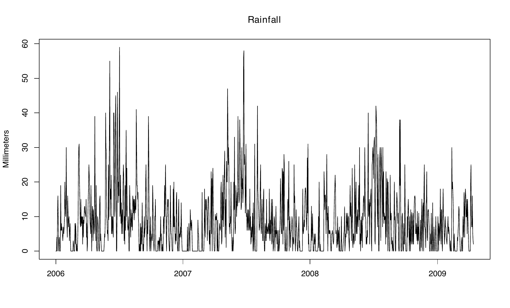
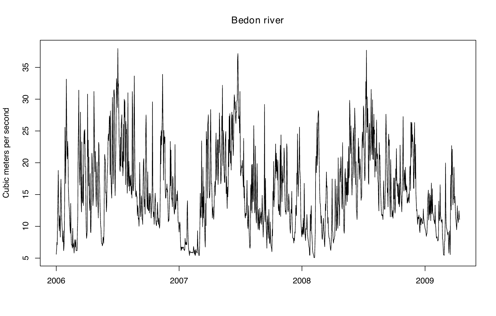
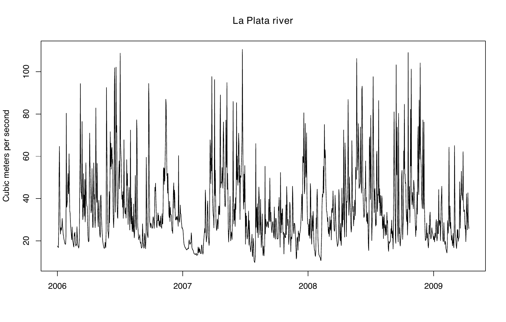
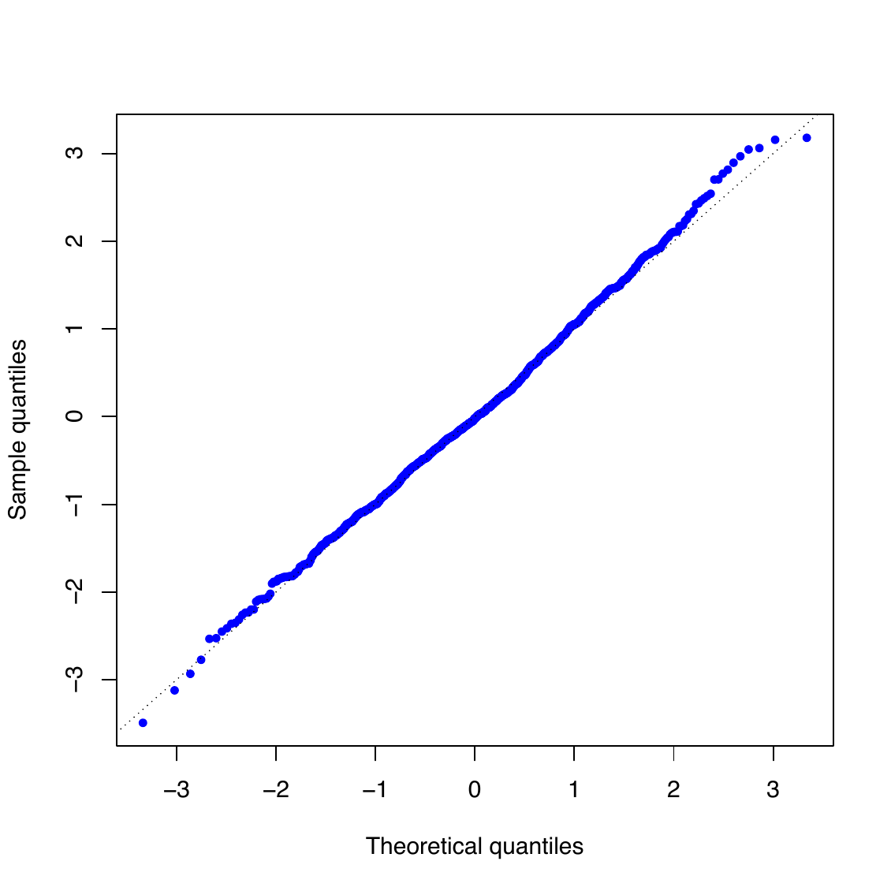
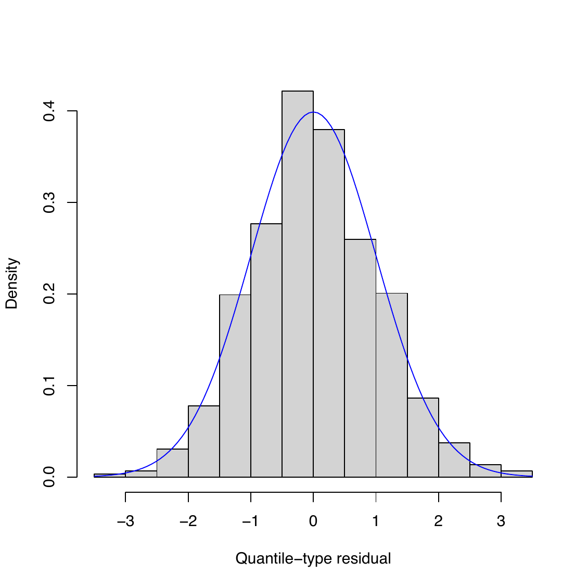
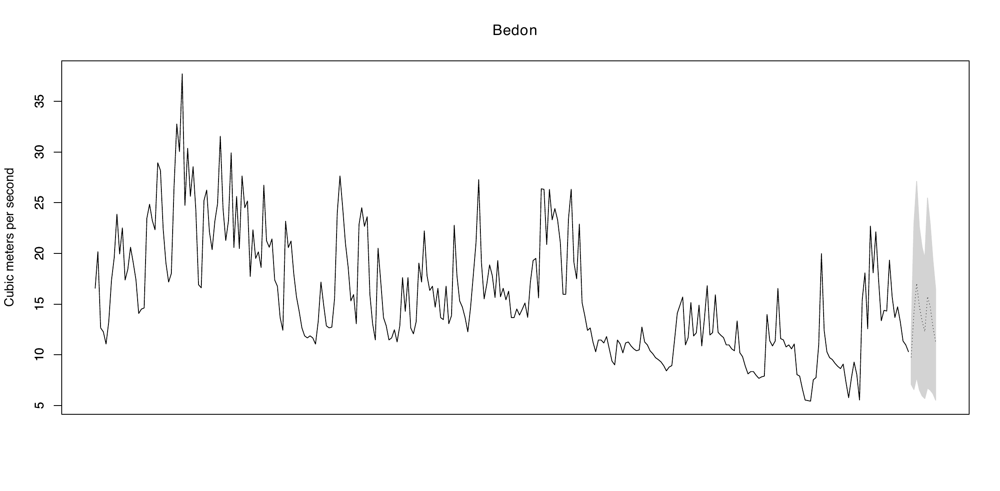
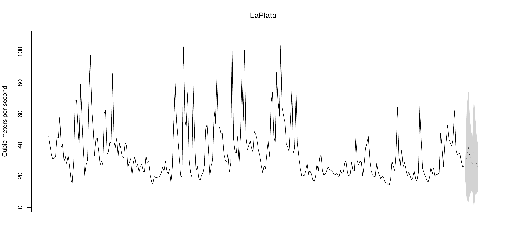

::::::::: article
## Introduction

Threshold Autoregressive (TAR) models were originally introduced by
(Tong 1978, 1983) and have become one of the most widely used frameworks
for modeling nonlinear dynamics in time series. By allowing the
autoregressive structure to vary across regimes defined by threshold
variables, TAR models can effectively capture structural changes,
asymmetric adjustments, and regime-switching behavior. In contrast,
linear autoregressive (AR) models---obtained as a special case of a TAR
model with a single regime---are generally unable to adequately
represent such features. Owing to their flexibility, TAR models have
been successfully applied in a wide range of fields. In economics, they
have been used to model gross national product (GNP) growth,
unemployment, and inflation rates; in finance, to analyze stock returns
and insurance pricing; in hydrology, to describe river flow dynamics;
and in ecology, to study annual records of lynx trapping, among many
other applications (see (Tong 1990, 2011, 2015; Hansen 2011; Chen et al.
2011)).

Within the TAR family, several important extensions have been developed.
In the univariate setting, these include the incorporation of moving
average components through Threshold Autoregressive Moving Average
(TARMA) models (Tong 1990), the introduction of conditional
heteroscedasticity via Threshold Autoregressive Conditional
Heteroscedastic (TAR-ARCH) models (Liu et al. 1997), and recent advances
in testing for threshold effects based on supremum Lagrange multiplier
procedures (Goracci et al. 2023; Giannerini et al. 2024). In the
multivariate context, (Tsay 1998) introduced the Multivariate Threshold
Autoregressive (MTAR) model, which was subsequently extended to the
Threshold Vector Autoregressive Moving Average (TVARMA) framework by
(Niglio and Vitale 2015). More recently, (Vanegas et al. 2025) further
generalized the TAR models by allowing for non-Gaussian error
distributions.

Despite the theoretical importance and wide applicability of TAR-type
models, their statistical implementation in `R` remains relatively
limited. For example, the package
[**tsDyn**](https://CRAN.R-project.org/package=tsDyn) (Stigler 2018)
provides a well-established framework for nonlinear time series
analysis, including Self-Exciting Threshold Autoregressive (SETAR)
models. Estimation is based on conditional least squares, a frequentist
approach that typically assumes Gaussian innovations and determines
threshold values through grid-search optimization, which can become
computationally demanding in the presence of multiple thresholds or
high-dimensional settings. Likewise, the package
[**NTS**](https://CRAN.R-project.org/package=NTS) (Liu et al. 2020)
supports the estimation of multivariate TAR models and includes tools
for simulation, prediction, and model identification. However, its
methodology is also rooted in a frequentist framework, relies on
Gaussian innovation assumptions, and offers limited flexibility for
accommodating alternative error distributions. More recently, the
package
[**tseriesTARMA**](https://CRAN.R-project.org/package=tseriesTARMA)
(Giannerini and Goracci 2024) expanded the range of available nonlinear
time series tools by implementing threshold ARMA models under a
frequentist paradigm. In contrast, the package
[**BAYSTAR**](https://CRAN.R-project.org/package=BAYSTAR) (Chen et al.
2022) adopts a Bayesian perspective, providing inference for univariate
TAR models with flexible prior specifications. Nevertheless, its scope
is restricted to the univariate case.

However, existing software solutions remain fragmented, typically
focusing exclusively on either univariate or multivariate time series.
Moreover, most available implementations are restricted to two-regime
models and do not naturally accommodate more complex multi-regime
structures. To the best of our knowledge, the
[**NTS**](https://CRAN.R-project.org/package=NTS) package currently
provides the most comprehensive framework for handling both univariate
and multivariate TAR models with multiple regimes. However, its
inferential procedures are limited by Gaussian innovation assumptions
and do not support the broad class of non-Gaussian error distributions
frequently encountered in practice. Such distributions arise naturally
in applications involving financial returns, river flows, unemployment
rates, and many other phenomena characterized by nonlinear and
regime-dependent dynamics. As a result, there is a growing demand for a
unified statistical framework that can simultaneously accommodate
univariate and multivariate TAR models, allow for multiple regimes, and
provide the flexibility to model non-Gaussian innovations. Such a
framework would be particularly valuable in fields such as finance,
economics, hydrology, and other disciplines where departures from
normality and regime-switching behavior are common.

To address these limitations, we introduce
[**mtarm**](https://CRAN.R-project.org/package=mtarm), a new `R` package
for the Bayesian analysis of multivariate TAR-type models. The package
is built upon the methodology developed by (Vanegas et al. 2025) and
extends the current `R` ecosystem by providing a flexible and unified
framework for Bayesian inference in TAR models. Specifically,
[**mtarm**](https://CRAN.R-project.org/package=mtarm) contributes in the
following ways:

- **Unified modeling framework.** The package supports the estimation of
  multivariate TAR models and several important special cases, including
  Self-Exciting Threshold Autoregressive (SETAR) models and Vector
  Autoregressive (VAR) models, together with their univariate
  counterparts. This unified framework facilitates model comparison and
  allows users to seamlessly transition between linear and nonlinear
  specifications.

- **Flexible innovation distributions.** In contrast to most existing
  implementations, which are restricted to Gaussian innovations,
  [**mtarm**](https://CRAN.R-project.org/package=mtarm) accommodates a
  broad class of multivariate distributions, including the Student-$t$,
  slash, symmetric hyperbolic, Laplace, contaminated normal,
  skew-normal, and skew-$t$ distributions. These distributions provide
  increased robustness to heavy tails, skewness, and other forms of
  non-normality commonly observed in real-world applications.

- **Bayesian inference and forecasting.** All aspects of estimation,
  inference, and prediction are carried out within a Bayesian framework.
  Model parameters are estimated jointly through a Markov chain Monte
  Carlo (MCMC) algorithm, eliminating the need for the sequential
  grid-search procedures commonly employed in frequentist approaches.
  This strategy yields a coherent quantification of uncertainty through
  posterior distributions and naturally supports probabilistic
  forecasting. The package supports both standard $m$-step-ahead
  forecasting from a single model fit and rolling-origin forecast
  evaluation without repeated model re-estimation.

The remainder of the paper is organized as follows. Section 2 presents
the statistical framework for multivariate TAR models and summarizes the
Bayesian methodology implemented in
[**mtarm**](https://CRAN.R-project.org/package=mtarm). Section 3
describes the package architecture and its main functionalities through
an empirical application involving rainfall and the flows of two rivers
in Colombia. Section 4 further illustrates the use of the package
through a second empirical application involving precipitation,
temperature, and the flows of two rivers in Iceland.

## Theoretical framework

### Model formulation {#mf}

Let $\{\boldsymbol{\mathbf{Y}}_t\}_{t\geq 1}$ be the $k$-dimensional
time series of interest (output),
$\{\boldsymbol{\mathbf{X}}_t\}_{t\geq 1}$ the $r$-dimensional time
series of exogenous covariates, and $\{Z_t\}_{t\geq 1}$ the
one-dimensional threshold time series. We say that
$\{\boldsymbol{\mathbf{Y}}_t\}_{t\geq 1}$ follows a multivariate
Threshold Autoregressive (TAR) model with $l$ regimes, denoted
$\text{TAR}(l;\boldsymbol{\mathbf{p}},\boldsymbol{\mathbf{q}},\boldsymbol{\mathbf{d}})$,
if
$$\begin{equation}
\label{mtar}
\boldsymbol{\mathbf{Y}}_t=\sum_{j=1}^l I(Z_{t-h}\in(c_{j-1},c_j])\Big(\!\boldsymbol{\mathbf{\phi}}_0^{^{(j)}}\!\boldsymbol{\mathbf{D}}_t
+\sum_{i=1}^{p_j}\boldsymbol{\mathbf{\phi}}_i^{^{(j)}}\boldsymbol{\mathbf{Y}}_{t-i}
+\sum_{i=1}^{q_j}\boldsymbol{\mathbf{\beta}}_i^{^{(j)}}\boldsymbol{\mathbf{X}}_{t-i}
+\sum_{i=1}^{d_j}\boldsymbol{\mathbf{\delta}}_i^{^{(j)}}Z_{t-i}
+\boldsymbol{\mathbf{\epsilon}}_{t_j}\!\Big),
\end{equation}   (\#eq:mtar)$$
where $\boldsymbol{\mathbf{p}}=(p_1,\ldots,p_l)$,
$\boldsymbol{\mathbf{q}}=(q_1,\ldots,q_l)$ and
$\boldsymbol{\mathbf{d}}=(d_1,\ldots,d_l)$ are vectors of non-negative
integers specifying the regime-dependent lag orders. Specifically, in
Regime $j$, $p_j$ denotes the autoregressive order of the output series
$\{\boldsymbol{\mathbf{Y}}_t\}_{t\geq 1}$, $q_j$ denotes the maximum lag
of the exogenous series $\{\boldsymbol{\mathbf{X}}_t\}_{t\geq 1}$, and
$d_j$ denotes the maximum lag of the threshold series
$\{Z_t\}_{t\geq 1}$. The parameter $h\geq 0$ is the delay parameter,
while $\boldsymbol{\mathbf{c}}=(c_1,\ldots,c_{l-1})$ is the vector of
threshold values satisfying
$-\infty=c_0 < c_1 < \cdots < c_{l-1}< c_l=\infty$. For each regime
($j=1,\ldots,l$), $\boldsymbol{\mathbf{\phi}}_0^{^{(j)}}$ is the
coefficient matrix associated with the deterministic component of the
model, which can include an intercept, a linear or quadratic time trend,
and seasonal effects. The matrices
$\boldsymbol{\mathbf{\phi}}_i^{^{(j)}}$,
$\boldsymbol{\mathbf{\beta}}_i^{^{(j)}}$, and
$\boldsymbol{\mathbf{\delta}}_i^{^{(j)}}$ denote the coefficients
associated with the $i$-th lag of the response process
$\{\boldsymbol{\mathbf{Y}}_t\}_{t\geq 1}$, the exogenous process
$\{\boldsymbol{\mathbf{X}}_t\}_{t\geq 1}$, and the threshold process
$\{Z_t\}_{t\geq 1}$, respectively. The vector of deterministic
regressors is given by
$\boldsymbol{\mathbf{D}}_t = (1,a(t),b(t))^{\!\top}$, where $a(t) = t$
for a linear time trend and $a(t)=(t,t^2)$ for a quadratic time trend.
The seasonal component $b(t)$ corresponds to the
$((t~\text{mod}~n_s)+1)$-th row of
$\tilde{\boldsymbol{\mathbf{I}}}_{n_s}$, where $n_s \ge 2$ denotes the
number of seasonal periods, $a~\text{mod}~b$ is the remainder obtained
when dividing the integer $a$ by the integer $b$, and
$\tilde{\boldsymbol{\mathbf{I}}}_{n_s}$ is the $n_s \times n_s$ identity
matrix with its first column removed. Finally, for $t=1,2,\ldots$ and
$j=1,\ldots,l$, the innovation vectors
$\boldsymbol{\mathbf{\epsilon}}_{t_j}$ are assumed to be independent
$k$-dimensional random variables with location parameter
$\boldsymbol{\mathbf{0}}$, regime-specific scale matrix
$\boldsymbol{\mathbf{\Sigma}}_j$, and, depending on the chosen
distribution, additional unknown parameters that are common across
regimes and time. Furthermore, the innovations are assumed to be
mutually independent and independent of both the exogenous process
$\{\boldsymbol{\mathbf{X}}_t\}_{t\geq 1}$ and the threshold process
$\{Z_t\}_{t\geq 1}$.

From the perspective of nonlinear dynamical systems, a multivariate TAR
model can be interpreted as a stochastic piecewise-linear approximation
to an unknown nonlinear vector process. Within each regime, the dynamics
are governed by a linear VAR specification with regime-specific
coefficients and innovation covariance matrices. However, the governing
dynamics change whenever the threshold variable crosses a regime
boundary, producing a globally nonlinear process in the sense of Tong's
threshold dynamical-systems framework (Tong 1990). This regime-dependent
structure enables TAR models to capture features that are difficult to
represent within a conventional linear VAR framework, including
state-dependent persistence, regime-specific volatility patterns,
asymmetric responses to shocks, and nonlinear impulse-response behavior.
Moreover, threshold dynamics can generate richer forms of temporal
dependence, such as limit cycles, time irreversibility, and
non-Gaussian---potentially multimodal---stationary distributions. The
flexibility of TAR models has led to their successful application in a
wide range of fields. In economics, they have been used to study
business-cycle asymmetries and nonlinear output dynamics (Potter 1995);
in finance, to model nonlinear behavior in monetary and asset-price
processes, including speculative bubble dynamics (Tsay 1998; Grynkiv and
Stentoft 2018); and in environmental sciences, to characterize complex
hydrological processes such as river-flow dynamics. These applications
highlight the value of TAR models as a flexible framework for
representing nonlinear and regime-dependent behavior in multivariate
systems.

When the autoregressive order of
$\{\boldsymbol{\mathbf{Y}}_t\}_{_{t\geq 1}}$ and the maximum lags orders
of $\{\boldsymbol{\mathbf{X}}_t\}_{_{t\geq 1}}$ and
$\{Z_t\}_{_{t\geq 1}}$ are unknown, model selection can be performed
using the Stochastic Search Variable Selection (SSVS) methodology of
(George and McCulloch 1993, 1995, 1997). Under this approach, a vector
of binary inclusion indicators,
$\boldsymbol{\mathbf{\zeta}}_j=(\zeta_{j,1},\ldots,\zeta_{j,p_j},\zeta_{j,p_j+1},\ldots,\zeta_{j,p_j+q_j},\zeta_{j,p_j+q_j+1},\ldots,\zeta_{j,p_j+q_j+d_j})$,
is introduced for each regime, where $\zeta_{j,i}\in\{0,1\}$ for each
$j=1,\ldots,l$ and
$i=1,\ldots,p_j,p_j+1,\ldots,p_j+q_j,p_j+q_j+1,\ldots,p_j+q_j+d_j$. The
indicators determine whether the corresponding lagged effects are
included in the model. For the autoregressive component, $\zeta_{j,i}=0$
implies that $\boldsymbol{\mathbf{\phi}}_i^{^{(j)}}=\mathbf{0}$, and
therefore the $i$-th lag of $\{\boldsymbol{\mathbf{Y}}_t\}_{t\geq 1}$ is
excluded from Regime $j$. Conversely, $\zeta_{j,i}=1$ implies that
$\boldsymbol{\mathbf{\phi}}_i^{^{(j)}}$ is unrestricted and estimated as
part of the MCMC algorithm. Analogously, for the exogenous component,
$\zeta_{j,p_j+i}=0$ implies
$\boldsymbol{\mathbf{\beta}}_i^{^{(j)}}=\mathbf{0}$, whereas
$\zeta_{j,p_j+i}=1$ allows $\boldsymbol{\mathbf{\beta}}_i^{^{(j)}}$ to
be estimated. Likewise, for the threshold component,
$\zeta_{j,p_j+q_j+i}=0$ implies
$\boldsymbol{\mathbf{\delta}}_i^{^{(j)}}=\mathbf{0}$, while
$\zeta_{j,p_j+q_j+i}=1$ permits
$\boldsymbol{\mathbf{\delta}}_i^{^{(j)}}$ to vary freely within the
posterior sampling scheme. Consequently, the posterior distribution of
$\boldsymbol{\mathbf{\zeta}}_j$ provides a mechanism for identifying the
relevant lagged effects of the response, exogenous, and threshold
processes within each regime. In this way, the SSVS procedure
simultaneously performs parameter estimation and regime-specific lag
selection within the Bayesian framework.

Special cases of the model \@ref(eq:mtar) include multivariate
Self-Exciting Threshold Autoregressive (SETAR) models when $h>0$ and
$Z_t \equiv Y_{m,t}$ for some $m\in\{1,\ldots,k\}$ and all $t$, where
$Y_{m,t}$ represents the $m$-th component of
$\boldsymbol{\mathbf{Y}}_t=(Y_{1,t},\ldots,Y_{k,t})^{\!\top}$; and
Vector Autoregressive (VAR) models when $l=1$.

### Noise process distribution {#npd}

This section presents two representative innovation distributions
implemented in [**mtarm**](https://CRAN.R-project.org/package=mtarm) for
modeling the error process in model \@ref(eq:mtar); the remaining
distributions are described in
Appendix [5](#Appen_Noise){reference-type="ref"
reference="Appen_Noise"}. Throughout this section,
$\boldsymbol{\mathbf{\mu}}=(\mu_1,\ldots,\mu_k)^{\!\top}$ and
$\boldsymbol{\mathbf{\Sigma}}$ denote the location vector and the
positive-definite $k\times k$ scale matrix, respectively. Most of the
innovation distributions implemented in
[**mtarm**](https://CRAN.R-project.org/package=mtarm) belong to the
class of Gaussian scale mixtures (McNeil et al. 2015, sec. 6.2), a broad
family that includes the Gaussian distribution as a special (degenerate)
case. Relative to the Gaussian model, these distributions are capable of
accommodating heavier tails and, in some cases, a greater concentration
of probability mass around the center of the distribution. Consequently,
they offer increased robustness to outliers and extreme observations
while preserving a convenient hierarchical structure that facilitates
Bayesian estimation and posterior computation.

- **Student-$t$ distribution**. If
  $\boldsymbol{\mathbf{Y}}\sim\text{Student-}t_k(\boldsymbol{\mathbf{\mu}},\boldsymbol{\mathbf{\Sigma}},\nu)$
  then its probability density function is given by (McNeil et al.
  (2015, example 6.7); Fang et al. (2018, 85))
  $$\begin{equation*}
  f_{Y}(\boldsymbol{\mathbf{y}}|\boldsymbol{\mathbf{\mu}},\boldsymbol{\mathbf{\Sigma}},\nu)=
  \dfrac{\Gamma(\frac{\nu+k}{2})}{\Gamma(\frac{\nu}{2})(\nu\pi)^{\frac{k}{2}}|\boldsymbol{\mathbf{\Sigma}}|^{\frac{1}{2}}}\!\left(\!\!1+\frac{1}{\nu}(\boldsymbol{\mathbf{y}}-\boldsymbol{\mathbf{\mu}})^{\!\top}\boldsymbol{\mathbf{\Sigma}}^{-1}(\boldsymbol{\mathbf{y}}-\boldsymbol{\mathbf{\mu}})\!\!\right)^{\!\!-\frac{\nu+k}{2}},\qquad \nu>0.
  \end{equation*}$$

  The multivariate Student-$t$ distribution provides a flexible
  alternative to the Gaussian specification for modeling innovations in
  multivariate time series. Owing to its heavy-tailed nature, it can
  accommodate extreme observations more effectively than the Gaussian
  model, reducing the influence of outliers and improving robustness to
  departures from distributional assumptions (Lange et al. 1989;
  Abanto-Valle et al. 2010). The degree of robustness is governed by the
  degrees-of-freedom parameter, which controls tail heaviness and
  induces a smooth transition to the Gaussian distribution as its value
  increases (Kotz and Nadarajah 2004). In addition to its robustness
  properties, the multivariate Student-$t$ distribution retains many of
  the attractive features of the multivariate normal distribution,
  including closure under linear transformations and a convenient
  hierarchical representation that facilitates Bayesian inference. At
  the same time, it offers greater flexibility for capturing
  heavy-tailed behavior and other forms of non-Gaussian dependence
  commonly encountered in practice (Abanto-Valle et al. 2012). These
  characteristics make the multivariate Student-$t$ distribution
  particularly appealing for multivariate TAR models and other nonlinear
  regime-switching frameworks, where deviations from normality are often
  present.

- **Skew-$t$ distribution**. If
  $\boldsymbol{\mathbf{Y}}\sim\text{S}t_k(\boldsymbol{\mathbf{\mu}},\boldsymbol{\mathbf{\Sigma}},\boldsymbol{\mathbf{\lambda}},\nu)$
  then its probability density function is given by (Sahu et al.
  2003, 136)
  $$f_{Y}(\boldsymbol{\mathbf{y}}|\boldsymbol{\mathbf{\mu}},\boldsymbol{\mathbf{\Sigma}},\boldsymbol{\mathbf{\lambda}},\nu)=2^k\dfrac{\Gamma\Big(\dfrac{\nu+k}{2}\Big)}{\Gamma\Big(\dfrac{\nu}{2}\Big)(\nu\pi)^{\!\frac{k}{2}}|\boldsymbol{\mathbf{\Sigma}}+\boldsymbol{\mathbf{D}}_{_{\!\!(\lambda)}}^2|^{\frac{1}{2}}} \!\bigg(\!\!1 + \dfrac{(\boldsymbol{\mathbf{y}}-\boldsymbol{\mathbf{\mu}})^{\!\top}\!(\boldsymbol{\mathbf{\Sigma}}+\boldsymbol{\mathbf{D}}_{_{\!\!(\lambda)}}^2)^{-1}\!(\boldsymbol{\mathbf{y}}-\boldsymbol{\mathbf{\mu}})}{\nu}\!\bigg)^{\!\!-\frac{\nu+k}{2}}{\rm Pr}(\boldsymbol{\mathbf{V}}>0),$$
  where
  $$\boldsymbol{\mathbf{V}}\! \sim\! \text{Student-}t_k\!\Big(\!\boldsymbol{\mathbf{D}}_{_{\!\!(\lambda)}}\!(\boldsymbol{\mathbf{\Sigma}}+\boldsymbol{\mathbf{D}}_{_{\!\!(\lambda)}}^2\!)^{-1}\!(\boldsymbol{\mathbf{y}}-\boldsymbol{\mathbf{\mu}}),\!\dfrac{\nu\!+\!(\boldsymbol{\mathbf{y}}-\boldsymbol{\mathbf{\mu}})^{\!\top}\!(\boldsymbol{\mathbf{\Sigma}}\!+\!\boldsymbol{\mathbf{D}}_{_{\!\!(\lambda)}}^2\!)^{-1}\!(\boldsymbol{\mathbf{y}}-\boldsymbol{\mathbf{\mu}})}{\nu+k}\!\big(\boldsymbol{\mathbf{I}}_k\!-\!\boldsymbol{\mathbf{D}}_{_{\!\!(\lambda)}}\!(\boldsymbol{\mathbf{\Sigma}}+\boldsymbol{\mathbf{D}}_{_{\!\!(\lambda)}}^2\!)^{-1}\!\boldsymbol{\mathbf{D}}_{_{\!\!(\lambda)}}\!\big),\nu+k\!\Big).$$

In this parametrization, the vector
$\boldsymbol{\mathbf{\lambda}} = (\lambda_1,\ldots,\lambda_k)^{\top}$
acts as a directional skewness parameter that determines both the
magnitude and orientation of departures from symmetry, while the
degrees-of-freedom parameter ($\nu>0$) controls tail heaviness. When
$\boldsymbol{\mathbf{\lambda}}={\bf 0}$, the distribution reduces to the
multivariate Student-$t$ distribution with $\nu$ degrees of freedom;
conversely, as $\nu\to\infty$, it converges to the multivariate
skew-normal distribution (Sahu et al. 2003, 133). The multivariate
skew-$t$ distribution may therefore be viewed as a flexible extension of
both the Student-$t$ and skew-normal families, combining heavy-tailed
behavior with directional asymmetry. The parameter
$\boldsymbol{\mathbf{\lambda}}$ allows the distribution to capture
systematic departures from symmetry, while $\nu$ regulates the
probability of extreme observations. This dual capacity to model
skewness and heavy tails makes the skew-$t$ distribution particularly
attractive for time-series applications in which innovations exhibit
asymmetric behavior and occasional large shocks. Such features are
frequently encountered in financial, economic, and environmental data,
as well as in stochastic-volatility models and Bayesian VAR frameworks
with non-Gaussian innovations (Abanto-Valle et al. 2015; Karlsson et al.
2023).

### Prior distributions {#pd}

The value of $l$ is assumed to be known. The model parameters are $h$,
$\boldsymbol{\mathbf{c}}=(c_1,\ldots,c_{l-1})$,
$\boldsymbol{\mathbf{\theta}}_1,\ldots,\boldsymbol{\mathbf{\theta}}_l$,
$\boldsymbol{\mathbf{\Sigma}}_1,\ldots,\boldsymbol{\mathbf{\Sigma}}_l$,
$\boldsymbol{\mathbf{\zeta}}_1,\ldots,\boldsymbol{\mathbf{\zeta}}_l$,
$\boldsymbol{\mathbf{\lambda}}$ and $\nu$, where
$\boldsymbol{\mathbf{\theta}}_j=(\boldsymbol{\mathbf{\phi}}_0^{^{(j)}},\boldsymbol{\mathbf{\phi}}_1^{^{(j)}},\ldots,\boldsymbol{\mathbf{\phi}}_{p_j}^{^{(j)}},\boldsymbol{\mathbf{\beta}}_1^{^{(j)}},\ldots,\boldsymbol{\mathbf{\beta}}_{q_j}^{^{(j)}},{\delta}_1^{^{(j)}},\ldots,{\delta}_{d_j}^{^{(j)}})^{\!\top}$
is the regression parameter matrix in Regime $j$, whose dimension is
$s_j\times k$, in which $s_j=1 + (p_j\times k) + (q_j\times r) + d_j$.
Henceforth, we will refer to
$\boldsymbol{\mathbf{\theta}}_1,\ldots,\boldsymbol{\mathbf{\theta}}_l$
and
$\boldsymbol{\mathbf{\Sigma}}_1,\ldots,\boldsymbol{\mathbf{\Sigma}}_l$
as location and scale parameters, respectively. The prior distribution
is the following
$$\pi(h,\boldsymbol{\mathbf{c}},\boldsymbol{\mathbf{\theta}}_1,\ldots,\boldsymbol{\mathbf{\theta}}_l,\boldsymbol{\mathbf{\Sigma}}_1,\ldots,\boldsymbol{\mathbf{\Sigma}}_l,\boldsymbol{\mathbf{\zeta}}_1,\ldots,\boldsymbol{\mathbf{\zeta}}_l,\boldsymbol{\mathbf{\lambda}},\nu)=\pi(h)\pi(\boldsymbol{\mathbf{c}})\pi(\nu)\pi(\boldsymbol{\mathbf{\lambda}})\prod\limits_{j=1}^l
\pi(\boldsymbol{\mathbf{\theta}}_j|\boldsymbol{\mathbf{\Sigma}}_j,\boldsymbol{\mathbf{\zeta}}_j)\pi(\boldsymbol{\mathbf{\Sigma}}_j)\pi(\boldsymbol{\mathbf{\zeta}}_j),$$
where

1.  For the threshold vector we take
    $$\pi(\boldsymbol{\mathbf{c}})\propto 
    \begin{cases}
    1 &\text{\rm if}\quad q_z(\alpha_0)<c_1<\ldots<c_{l-1}<q_z(\alpha_1),\\[2mm]
    0 &\text{\rm otherwise},
    \end{cases}$$
    in which $q_z(\alpha)$ represents the $100(\alpha)\%$ percentile of
    the realization of $\{Z_t\}_{t\geq 1}$, and
    $0\leq \alpha_0<\alpha_1\leq 1$. This prior is uniform over ordered
    thresholds constrained to lie between percentiles of the threshold
    variable, thereby ensuring that the regime boundaries remain within
    a data-relevant region while excluding implausible configurations
    corresponding to extreme or nearly empty regimes;

2.  For the delay parameter we take
    $$\pi(h)\propto I\{h_{\rm min},\ldots,h_{\rm max}\},$$
    in which $h_{\rm min}$ and $h_{\rm max}$ are integer values such
    that $0\leq h_{\rm min}\leq h_{\rm max}$. This specification induces
    a discrete uniform prior over a restricted set of plausible delays,
    assigning equal prior probability to all candidate values within the
    range while excluding lag lengths that are empirically unrealistic
    or theoretically implausible;

3.  For the regime-specific scale matrices we assume
    $$\pi(\boldsymbol{\mathbf{\Sigma}}_j) = {\rm W}^{-1}(\boldsymbol{\mathbf{\Omega}}_{0j},\tau_{0j}), \qquad j=1,\ldots,l,$$
    in which ${\rm W}^{-1}(\boldsymbol{\mathbf{\Omega}},\tau)$
    represents the inverse Wishart distribution (see, for instance,
    Gupta and Nagar (1999, sec. 3.4)), with
    $\boldsymbol{\mathbf{\Omega}}$ a $k\times k$ positive-definite
    matrix and $\tau> k-1$. This prior regularizes the regime-specific
    covariance matrices by shrinking $\boldsymbol{\mathbf{\Sigma}}_j$
    toward $\boldsymbol{\mathbf{\Omega}}_{0j}/(\tau_{0j}-k-1)$, so that
    $\boldsymbol{\mathbf{\Omega}}_{0j}$ encodes a plausible
    volatility--correlation structure for Regime $j$, while $\tau_{0j}$
    determines the strength of the shrinkage. Moreover, the
    specification preserves conjugacy with the likelihood, thereby
    facilitating posterior simulation of
    $\boldsymbol{\mathbf{\Sigma}}_j$ and contributing to computational
    efficiency;

4.  For the vector of inclusion indicators in Regime $j$,
    $\boldsymbol{\mathbf{\zeta}}_j = (\zeta_{j,1},\ldots,\zeta_{j,p_j+q_j+d_j})^\top$,
    we assume
    $$\pi(\boldsymbol{\mathbf{\zeta}}_j)
    = \prod_{i=1}^{p_j+q_j+d_j}\rho_{0j}^{\zeta_{j,i}}(1-\rho_{0j})^{1-\zeta_{j,i}},
    \qquad j=1,\ldots,l,$$
    with $\rho_{0j}\in(0,1)$. This specification corresponds to
    independent Bernoulli priors with a common inclusion probability
    $\rho_{0j}$, so that $\rho_{0j}$ directly governs the expected
    proportion of active coefficients, and thus the overall sparsity
    level in Regime $j$;

5.  $\pi(\boldsymbol{\mathbf{\theta}}_j\mid\boldsymbol{\mathbf{\Sigma}}_j,\boldsymbol{\mathbf{\zeta}}_j)$
    is
    ${\rm MN}_{s_{j\zeta},k}(\boldsymbol{\mathbf{\mu}}_{0j\zeta},\boldsymbol{\mathbf{\Delta}}_{0j\zeta},\boldsymbol{\mathbf{\Sigma}}_j)$
    for $j=1,\ldots,l$, in which
    $$s_{j\zeta}
    = 1 
      + k\sum_{i=1}^{p_j}\zeta_{j,i} 
      + r\sum_{i=1}^{q_j}\zeta_{j,p_j+i}
      + \sum_{i=1}^{d_j}\zeta_{j,p_j+q_j+i},$$
    and
    ${\rm MN}_{s,k}(\boldsymbol{\mathbf{\mu}},\boldsymbol{\mathbf{\Delta}},\boldsymbol{\mathbf{\Sigma}})$
    represents the matrix Gaussian distribution (see, for instance,
    Gupta and Nagar (1999, chap. 2)), with $\boldsymbol{\mathbf{\mu}}$
    ($s\times k$) as its location parameter matrix, and the
    positive-definite matrices $\boldsymbol{\mathbf{\Delta}}$
    ($s\times s$) and $\boldsymbol{\mathbf{\Sigma}}$ ($k\times k$) as
    its scale parameters. This matrix-normal prior jointly regularizes
    the active coefficients in Regime $j$ towards
    $\boldsymbol{\mathbf{\mu}}_{0j\zeta}$, with
    $\boldsymbol{\mathbf{\Delta}}_{0j\zeta}$ governing their prior
    dependence. The dependence on $\boldsymbol{\mathbf{\Sigma}}_j$
    ensures scale invariance across equations and preserves conjugacy
    with the likelihood, thereby streamlining posterior simulation;

6.  For the skew-normal and skew-$t$ cases, the skewness vector
    $\boldsymbol{\mathbf{\lambda}}$ is assigned the prior
    $\pi(\boldsymbol{\mathbf{\lambda}}) = {\rm Normal}_k(\boldsymbol{0},\boldsymbol{\Lambda}_0)$,
    where $\boldsymbol{\mathbf{\Lambda}}_0$ is a positive-definite
    $k\times k$ matrix. This prior centres the innovations at symmetry
    ($\boldsymbol{\mathbf{\lambda}}=\boldsymbol{\mathbf{0}}$) while
    $\boldsymbol{\mathbf{\Lambda}}_0$ controls how strongly we shrink
    towards symmetry and how large skewness is allowed a priori; and

7.  Note that this prior depends on the assumed error distribution:
    $\pi(\nu)$ is

    - for the Student-$t$, symmetric hyperbolic, and skew-$t$ cases,
      ${\rm Uniform}(\gamma_{0},\eta_{0})$;

    - for the Slash case, ${\rm Gamma}(\gamma_{0},\eta_{0})$, that is,
      $\pi(\nu)\propto\nu^{\gamma_{0}-1}\exp(-\eta_{0}\nu)I_{\nu}(0,\infty)$;
      and

    - for the contaminated normal case, $\pi(\nu_1)\pi(\nu_2)$, in which
      $\pi(\nu_1)$ is ${\rm Beta}(\gamma_{01},\eta_{01})$, that is,
      $\pi(\nu_1)\propto \nu_1^{\gamma_{01}-1}(1-\nu_1)^{\eta_{01}-1}I_{\nu_1}(0,1)$
      and $\pi(\nu_2)$ is
      $\text{Truncated\,Gamma}(\gamma_{02},\eta_{02};(0,1))$, that is,
      $\pi(\nu_2)\propto\nu_2^{\gamma_{02}-1}\exp(-\eta_{02}\nu_2)I_{\nu_2}(0,1)$.

    These priors keep the parameters on their natural support and in
    plausible ranges, and they control the degree of tail thickness and
    hence the robustness of the innovations to extreme observations.

The package [**mtarm**](https://CRAN.R-project.org/package=mtarm) adopts
the following simplified specification of the prior distributions. For
each $j=1,\ldots,l$:
$\boldsymbol{\mathbf{\Omega}}_{0j}={\bf I}_{k}\otimes\omega_0$,
$\tau_{0j}=\tau_{0}$,
$\boldsymbol{\mathbf{\mu}}_{0j\zeta}={\bf 1}_{s_{j\zeta},k}\otimes \mu_0$,
$\boldsymbol{\mathbf{\Delta}}_{0j\zeta}={\bf I}_{s_{j\zeta}}\otimes\delta_{0}^{s_j/s_{j\zeta}}$
and $\rho_{0j}=\rho_0$. Moreover,
$\boldsymbol{\mathbf{\Lambda}}_0={\bf I}_{k}\otimes\lambda_{0}$, where
${\bf 1}_{m,n}$ denotes the $m\times n$ matrix of ones and $\otimes$
denotes Kronecker product.

## Main routines in the package [**mtarm**](https://CRAN.R-project.org/package=mtarm)

This section demonstrates the main capabilities of
[**mtarm**](https://CRAN.R-project.org/package=mtarm) through a case
study based on the bivariate time series contained in the `riverflows`
dataset (see Table [1](#tab:T1){reference-type="ref" reference="td"}).
The dataset was previously analyzed by (Calderón and Nieto 2017) and
(Vanegas et al. 2025), making it a useful benchmark for illustrating the
package's methodology and workflow. Throughout this section, the
analysis is presented in a step-by-step manner, showing how the core
functions of [**mtarm**](https://CRAN.R-project.org/package=mtarm) can
be combined to perform model specification, estimation, model
comparison, diagnostic assessment, and forecasting within a unified
Bayesian framework. The objective is to study the dynamic relationship
between rainfall and river flows over the period from January 1, 2006,
to April 14, 2009. Rainfall, measured in millimeters ($mm$), was
recorded at the San Juan meteorological station and is denoted by
($Z_t$). River flows, measured in cubic meters per second ($m^3\!/\!s$),
were recorded at two hydrological stations: the Bedon River flow
($Y_{1,t}$) at El Trebol station and the La Plata River flow ($Y_{2,t}$)
at Villalosada station. The San Juan station is located at an elevation
of 2400 meters above sea level, whereas the El Trebol and Villalosada
stations are situated at 1720 and 1300 meters, respectively. All
stations are located in a dry equatorial region of Colombia, where
hydrological and meteorological conditions are relatively stable,
allowing for a clearer assessment of the nonlinear dynamic relationships
captured by TAR models. The data were provided by the Colombian
Institute of Hydrology, Meteorology and Environmental Studies (IDEAM).
Missing observations were imputed using the methodology proposed by
(Calderón and Nieto 2017).

<figure id="inputYout" data-latex-placement="!ht">
<p><br />
<br />
</p>
<figcaption>Figure 1: Time series plots of rainfall (a), Bedon River
flow (b), and La Plata River flow (c).</figcaption>
</figure>

:::: center
::: {#td}
  ------------------------------------------------------------------------------------------
  Column       Role                                    Description
  ------------ --------------------------------------- -------------------------------------
  `Date`       Labels for time points                  Dates when measurements were taken

  `Rainfall`   Threshold series                        Rainfall, in $mm$

  `Bedon`      First component of the output series    Bedon river flow, in $m^3\!/\!s$

  `LaPlata`    Second component of the output series   La Plata river flow, in $m^3\!/\!s$
  ------------------------------------------------------------------------------------------

  : (#tab:T1) Description of the variables in the `riverflows`
  dataset included in the
  [**mtarm**](https://CRAN.R-project.org/package=mtarm) package.
:::
::::

Figure [1](#inputYout){reference-type="ref" reference="inputYout"}
displays the three time series described above. A clear association can
be observed between rainfall and river flows: periods of elevated
precipitation tend to coincide with increased river discharge,
particularly in the Bedon River, whereas periods of low rainfall are
generally associated with reduced flow levels. This relationship appears
less pronounced for the La Plata River, suggesting that the hydrological
response to precipitation may differ between the two river systems.
Overall, these patterns indicate a strong dependence of river discharge
on rainfall and suggest that the underlying dynamics may vary across
hydrological conditions. Such behavior is consistent with the presence
of threshold effects in the river-flow dynamics. In particular, the
relationship between rainfall and river discharge may change when
precipitation exceeds or falls below certain critical levels, giving
rise to distinct dynamic regimes. This possibility motivates the use of
a regime-switching framework. The multivariate TAR model is especially
well suited to this setting, as it allows the joint dynamics of the
Bedon and La Plata river flows to evolve differently across rainfall
regimes. To reproduce this exploratory analysis, the following code can
be used to generate the corresponding plots:

``` r
> data(riverflows)
> str(riverflows)
Classes ‘tbl_df’, ‘tbl’ and 'data.frame':   1200 obs. of  4 variables:
 $ Date    : Date, format: "2006-01-01" "2006-01-02" ...
 $ Bedon   : num  5.6 6.36 7.5 7.11 12.39 ...
 $ LaPlata : num  17.6 17.3 17.1 16.8 28.5 ...
 $ Rainfall: num  0 0 0 4 0 ...
>
> dev.new()
> par(mfrow=c(3,1))
> with(riverflows,{plot(Date, Rainfall, type="l", lty=1, col="black", xlab="", 
+                       ylab="Millimeters", main="Rainfall")
+                  plot(Date, Bedon, type="l", lty=1, col="black", xlab="", 
+                       ylab="Cubic meters per second", main="Bedon river")
+                  plot(Date, LaPlata, type="l", lty=1, col="black", xlab="", 
+                       ylab="Cubic meters per second", main="La Plata river")})
```

### Fitting a TAR model

``` r
> args(mtar)
function(formula, data, subset, Intercept=TRUE, trend=c("none","linear","quad"), 
         nseason=NULL, ars=ars(), row.names, dist=dist=c("Gaussian","Student-t",
         "Hyperbolic","Laplace","Slash","Contaminated normal","Skew-Student-t",
         "Skew-normal"), prior=list(), n.sim=500, n.burnin=100, n.thin=1, 
         ssvs=FALSE, setar=NULL, progress=TRUE, ...)
```

The routine `mtar()` performs Bayesian estimation in multivariate TAR
models, including SETAR and VAR models, and their univariate versions,
as described by (Vanegas et al. 2025). In that routine, the user can
specify several features of both the TAR model to be fitted to the data
and the MCMC algorithm to be used to draw a sample from the posterior
distribution of the model parameters. Some of those features are the
following: $(i)$ components of the model, that is, the output time
series, the threshold time series, and the exogenous time series; $(ii)$
number of regimes; $(iii)$ the autoregressive order for
$\{\boldsymbol{\mathbf{Y}}_t\}_{_{t\geq 1}}$ and the maximum lags for
$\{\boldsymbol{\mathbf{X}}_t\}_{_{t\geq 1}}$ and $\{Z_t\}_{_{t\geq 1}}$
within each regime; $(iv)$ noise process distribution; $(v)$
hyperparameter values; and $(vi)$ chain size, thinning interval and
burn-in period for the MCMC algorithm. The main arguments in the routine
`mtar()` are the following:

- [**formula**]{.underline}. This Formula-type argument allows us to
  specify the output time series, the threshold time series (if any),
  and the exogenous time series (if any). Formula-type objects provided
  by the package `Formula` (Zeileis and Croissant (2010)) extend the
  base class `formula` by allowing for multiple responses and multiple
  parts of regressors. For example,
  `formula = `$\sim$` y1 + y2 + y3 | z | x1 + x2` indicates the
  following: $(i)$ the output time series,
  $\{\boldsymbol{\mathbf{Y}}_t\}_{_{t\geq 1}}$, is tridimensional and
  its realization is composed of the columns named `y1`, `y2` and `y3`;
  $(ii)$ the realization of the threshold time series,
  $\{Z_t\}_{_{t\geq 1}}$, is the column named `z`; and $(iii)$ the
  exogenous time series, $\{\boldsymbol{\mathbf{X}}_t\}_{_{t\geq 1}}$,
  is bidimensional and its realization is composed of the columns named
  `x1` and `x2`. The columns named `y1`, `y2`, `y3`, `z`, `x1` and `x2`
  are assumed to be included in the data.frame specified in the argument
  `data` in the call to the routine `mtar()`. Indeed, if the
  data.frame-type object specified in the argument `data` contains only
  the variables comprising the output time series, a `VAR(p)` model can
  be specified by `formula  =  `$\sim .$

- [**ars**]{.underline}. This list-type argument allows us to specify
  values for $l$ (number of regimes),
  $\boldsymbol{\mathbf{p}}=(p_1,\ldots,p_l)$,
  $\boldsymbol{\mathbf{q}}=(q_1,\ldots,q_l)$ and
  $\boldsymbol{\mathbf{d}}=(d_1,\ldots,d_l)$. The helper function
  `ars()` simplifies the model setup specification in `ars`. For
  example, `ars(nregim=3,p=2)` sets a TAR model with 3 regimes and an
  autoregressive order of 2 within each regime. Similarly,
  `ars(nregim=3,p=2,q=3)` sets a TAR model with 3 regimes, an
  autoregressive order of 2 within each regime, and a maximum lag of 3
  for the exogenous time series within each regime. Moreover,
  `ars(nregim=3, p=c(1,2,1),``q=c(2,` `0,3), d=c(1,1))` indicates the
  following: $(i)$ the number of regimes is $3$; $(ii)$ the
  autoregressive order in the first, second and third regimes is $1$,
  $2$ and $1$, respectively; $(iii)$ the maximum lag for the exogenous
  time series in the first, second and third regimes is $2$, $0$ and
  $3$, respectively; $(iv)$ the maximum lag for the threshold time
  series in the first, second and third regimes is $1$, $1$ and $0$,
  respectively. The inclusion of `p` in `ars()` is mandatory, whereas
  `q` and `d` are optional. Indeed, when a threshold series is specified
  in the argument `formula`, the inclusion of `d` becomes relevant, but
  it is not necessary. In addition, if `q`/`d` is missing, then `ars()`
  assumes that the maximum lag for the exogenous/threshold series is $0$
  in all regimes.

- [**data**]{.underline}. A data.frame-type object with rows
  representing time points, arranged ascendingly according to the time
  and containing at least the following columns: $(i)$ all those used to
  specify the TAR model in the argument `formula`, that is, those
  composing the output time series, the threshold time series (if any),
  and the exogenous time series (if any); $(ii)$ that specified in the
  optional argument `row.names` to label the time points; $(iii)$ those
  utilized in the optional argument `subset` to choose a subset of the
  rows of the data.frame to be used in the fitting process. If the
  argument `data` is missing, then the columns are taken from
  `environment(formula)`, typically the environment from which the
  routine `mtar()` is called.

- [**Intercept**]{.underline}. This logical-type argument allows us to
  specify whether there are intercept terms in the model, that is, if
  there are $\phi_0^{^{(j)}}\neq 0$ for $j=1,\ldots,l$. By default,
  `Intercept` is set to `TRUE`.

- [**trend**]{.underline}. This character string allows users to specify
  the degree of a deterministic time trend to be included in each
  regime. The available options are: linear trend ("linear"), quadratic
  trend ("quadratic"), and no time trend ("none"). By default, `trend`
  is set to "none".

- [**nseason**]{.underline}. This integer value allows us to specify the
  number of seasonal periods. If `nseason` is specified then `nseason`-1
  seasonal dummies are added to the regressors within each regime. As
  described in section [2.1](#mf){reference-type="ref" reference="mf"},
  those seasonal dummies are obtained by vertically stacking several
  `nseason`$\times$ `nseason` identity matrices with their first column
  removed.

- [**dist**]{.underline}. A character-type argument that allows us to
  specify a multivariate distribution to describe the noise process
  behavior. Available options are: Gaussian (`“Gaussian”`), Student-$t$
  (`“Student-t”`), Slash (`‘‘Slash’’`), symmetric Hyperbolic
  (`‘‘Hyperbolic’’`), contaminated normal (`‘‘Contaminated normal’’`),
  Laplace (`‘‘Laplace’’`), skew-normal (`‘‘Skew-normal’’`) and Skew-$t$
  (`‘‘Skew-Student-t’’`). By default, `dist` is set to `‘‘Gaussian’’`.

- [**prior**]{.underline}. A list-type argument that allows us to
  specify the hyperparameter values described in section
  [2.3](#pd){reference-type="ref" reference="pd"}. By default, they are
  set to the following values, which ensure non-informative prior
  distributions: $h_{\rm min}=0$, $h_{\rm max}=3$, $\alpha_0=0$,
  $\alpha_1=1$, $\omega_0=10^{-9}$, $\tau_0=k$, $\mu_0=0$,
  $\delta_0=10^9$, $\rho_0=0.5$, $\lambda_0=10^9$, and

  - for the Student-$t$ and skew-$t$ cases, $\gamma_{0}=1$ and
    $\eta_{0}=100$;

  - for the Slash case, $\gamma_{0}=10^{-9}$ and $\eta_{0}=10^{-9}$;

  - for the contaminated normal case, $\gamma_{01}=10^{-9}$,
    $\eta_{01}=10^{-9}$, $\gamma_{02}=10^{-9}$ and $\eta_{02}=10^{-9}$;

  - for the symmetric hyperbolic case, $\gamma_{0}=0.1$ and
    $\eta_{0}=4$.

  For example,
  `prior=list(hmin=0,hmax=3,theta0=0,delta0=1e+09,omega0=1e-09,tau0=k)`
  indicates that $h_{\rm min}$, $h_{\rm max}$, $\theta_0$, $\delta_0$,
  $\omega_0$ and $\tau_0$ are set to $0$, $3$, $0$, $10^9$, $10^{-9}$
  and $k$, respectively, while the other hyperparameters are set to
  their default values. Similarly, `prior=list(hmax=5)` indicates that
  $h_{\rm max}$ is set to $5$, whereas the other hyperparameters are set
  to their default values. Finally, `prior=list(hmin=3,hmax=3)`
  indicates that the delay parameter $h$ is known and equal to $3$. The
  routine `mtar()` uses the helper function `priors()` to validate the
  argument `prior`. Practical guidance on selecting the hyperparameters
  that determine the bounds of the delay and threshold parameters has
  been added to Appendix [6](#priors){reference-type="ref"
  reference="priors"}.

- [**n.burnin, n.sim, n.thin**]{.underline}. These integer-type
  arguments allow us to specify the number of iterations that the
  MCMC-type algorithm must perform, where `n.sim`, `n.thin` and
  `n.burnin` represent, respectively, the chain size, the thinning
  interval, and the length of the burn-in period. Hence, the MCMC-type
  algorithm performs `n.burnin`   +   `n.sim` $\times$ `n.thin`
  iterations, from which `n.sim` iterations are returned, so that
  `n.burnin`   +   `n.sim` $\times$ (`n.thin`  -  1) are discarded. The
  `n.sim` iterations that the routine `mtar()` returns correspond to
  those at the following positions:

  ::: center
    --------- -----------------------------------------------------------
        1     `n.burnin`  +  1,

        2     `n.burnin`  +  1  +  (1 $\times$ `n.thin`),

        3     `n.burnin`  +  1  +  (2 $\times$ `n.thin`),

        ⋮     ⋮

     `n.sim`  `n.burnin`  +  1  +  ((`n.sim`  -  1) $\times$ `n.thin`).
    --------- -----------------------------------------------------------

    : 
  :::

- [**ssvs**]{.underline}. If `ssvs=TRUE` is specified, then the
  Stochastic Search Variable Selection (SSVS) procedure is applied to
  identify relevant lags of the output, exogenous (if any), and
  threshold (if any) series. As a consequence, the components of
  $\boldsymbol{\mathbf{\zeta}}_1,\ldots,\boldsymbol{\mathbf{\zeta}}_l$
  are estimated as part of the MCMC-type algorithm. The length and
  structure of each $\boldsymbol{\mathbf{\zeta}}_j$ depends on the
  argument `ars`. Specifically, for $j=1,...,l$,
  $\boldsymbol{\mathbf{\zeta}}_j$ is a vector combining three blocks:
  $(\zeta_{j,1},...,\zeta_{j,p_j})$,
  $(\zeta_{j,p_j+1},...,\zeta_{j,p_j+q_j})$, and
  $(\zeta_{j,p_j+q_j+1},\ldots,\zeta_{j,p_j+q_j+d_j})$, so that
  $\boldsymbol{\mathbf{\zeta}}_j = (\zeta_{j,1},...,\zeta_{j,p_j}, \zeta_{j,p_j+1},...,\zeta_{j,p_j+q_j}, \zeta_{j,p_j+q_j+1},...,\zeta_{j,p_j+q_j+d_j})$.
  If `ssvs=FALSE` then
  $\boldsymbol{\mathbf{\zeta}}_1,\dots,\boldsymbol{\mathbf{\zeta}}_l$
  are assumed to be known and set to vectors of ones. By default, `ssvs`
  is set to `FALSE`.

- [**setar**]{.underline}. If `setar = m` is specified, a SETAR model is
  fitted, where `m` identifies the component of the multivariate time
  series used as the threshold variable. In this case, the
  hyperparameter $h_{\rm min}$ is automatically set to `1` (instead of
  its default value, `0`), since the delay parameter in a SETAR model
  must be positive. By default, `setar = NULL`, indicating that a
  general TAR model, rather than a SETAR model, is fitted.

- [**progress**]{.underline}. If `progress=TRUE` is specified, then a
  progress bar is displayed during the execution of the MCMC-type
  algorithm. By default, `progress` is set to `TRUE`.

To demonstrate the use of this routine, we fit a bivariate
$\text{TAR}(2; p=(5,5), d=(5,5))$ model to the original data, following
the specification considered by (Calderón and Nieto 2017). As a linear
benchmark, we also estimate a standard $\text{VAR}(5)$ model with
Gaussian innovations. In the TAR specification, rainfall serves both as
the threshold variable and as an exogenous predictor. A notable feature
of this analysis is the use of the Stochastic Search Variable Selection
(SSVS) procedure implemented in `mtar()`, which enables automatic
identification of the relevant lag structures within the Bayesian
estimation framework. Although SSVS methods are available for linear
models in packages such as `bvartools`, extending Bayesian lag selection
to multivariate threshold autoregressive models constitutes an important
feature of [**mtarm**](https://CRAN.R-project.org/package=mtarm). For
the empirical analysis, observations from January 1, 2006, to April 4,
2009, are used for model estimation, while the final 10 observations are
reserved for out-of-sample forecast evaluation. Posterior inference is
based on an MCMC algorithm with 9000 iterations. The first 3000
iterations are discarded as burn-in, and a thinning factor of 2 is
applied to the remaining draws, resulting in a posterior sample of 3000
observations. The models can be estimated using the following code:

``` r
> set.seed(2000)
> model_TAR <- mtar(~ Bedon + LaPlata | Rainfall, row.names=Date, dist="Gaussian", 
+                   data=riverflows, subset={Date<="2009-04-04"}, ssvs=TRUE,
+                   ars=ars(nregim=2,p=5,d=5), n.burnin=3000, n.sim=3000, n.thin=2)
> model_VAR <- update(model_TAR, ars=ars(nregim=1,p=5))
```

The `mtar()` function returns an object of class `mtar`, for which a
range of standard methods are available, including `print()`,
`summary()`, `coef()`, `vcov()`, `model.matrix()`, `fitted()`, `plot()`,
`predict()`, and `residuals()`. In addition, fitted models can be
compared using model assessment criteria such as the Deviance
Information Criterion (DIC) (Spiegelhalter et al. 2002, 2014) and the
Watanabe--Akaike Information Criterion (WAIC) (Watanabe 2010), which are
implemented in [**mtarm**](https://CRAN.R-project.org/package=mtarm)
through the functions `DIC()` and `WAIC()`, respectively. To compare the
in-sample performance of the fitted models and assess whether the
additional flexibility of the nonlinear specification is supported by
the data, we compute the DIC and WAIC for both estimated models as
follows:

``` r
> DIC(model_TAR, model_VAR)
                DIC
model_TAR  14186.12
model_VAR  15654.09
>
> WAIC(model_TAR, model_VAR)
               WAIC
model_TAR  14369.19
model_VAR  15793.80
```

Both information criteria favor the TAR specification (`model_MTAR`)
over the linear benchmark (`model_VAR`), as indicated by the lower DIC
and WAIC values obtained for the former model. This result suggests that
the additional flexibility introduced by the threshold structure is
supported by the observed data and leads to an improved in-sample fit.
From a modeling perspective, these findings provide evidence that
allowing the dynamics to vary across rainfall regimes captures important
features of the river-flow processes that are not adequately represented
by a conventional linear VAR model. Consequently, the results support
the use of a threshold autoregressive framework for describing the
nonlinear relationship between rainfall and river discharge in this
application.

### Residual analysis

Next, we examine the residuals of the fitted multivariate TAR model to
assess the adequacy of the Gaussian innovation assumption. Specifically,
we compute the quantile-type residuals (Dunn and Smyth 1996), including
the joint residuals $r_t^{^{\!(2)}}$ for $t=1,\ldots,T$ and the
componentwise residuals $r_{m,t}^{^{\!(1)}}$ for $m=1,2$ and
$t=1,\ldots,T$. These residuals are obtained using the following code
and stored in the list object `res`. The element `full` contains the
joint residuals $r_t^{^{\!(2)}}$, whereas `by.component` stores the
componentwise residuals $r_{m,t}^{^{\!(1)}}$. The residual diagnostics
can then be performed as follows:

``` r
> set.seed(0202)
> res_model_TAR <- residuals(model_TAR)
> plot(res_model_TAR, col="blue")
```

Figure [2](#Resdiagnostic){reference-type="ref"
reference="Resdiagnostic"} displays the normal Q-Q plot and histogram of
the quantile-type residuals. Since quantile-type residuals are expected
to behave as a random sample from the standard normal distribution when
the fitted model is correctly specified, these results provide
additional evidence supporting the adequacy of the selected models. The
diagnostic plots indicate noticeable departures from normality,
particularly in the tails of the distribution, where several extreme
observations are apparent. Such patterns suggest that the Gaussian
innovation assumption may not adequately describe the residual behavior
and motivate the consideration of more flexible distributions, such as
the Student-$t$, Laplace, or skew-$t$ families. The residual diagnostics
are readily obtained through the tools implemented in
[**mtarm**](https://CRAN.R-project.org/package=mtarm), which facilitate
the computation and extraction of quantile-type residuals for
multivariate TAR models. These diagnostics provide a useful basis for
evaluating distributional assumptions and guiding the selection of
alternative innovation distributions when warranted by the data.

{#Resdiagnostic
width="100%" alt="graphic without alt text"}

To systematically explore candidate models with different innovation
distributions, numbers of regimes, and lag structures,
[**mtarm**](https://CRAN.R-project.org/package=mtarm) provides the
function `mtar_grid()`. This routine serves as a wrapper around
`mtar()`, automatically fitting a collection of models defined over a
user-specified grid of configurations. In particular, it evaluates
combinations of: $(i)$ the innovation distribution specified through
`dist`; $(ii)$ the number of regimes, ranging from `nregim.min` to
`nregim.max`; $(iii)$ the autoregressive order within each regime,
ranging from `p.min` to `p.max`; $(iv)$ the maximum lag of the exogenous
series, ranging from `q.min` to `q.max`; and $(v)$ the maximum lag of
the threshold series, ranging from `d.min` to `d.max`. The arguments
`dist`, `nregim.min`, `nregim.max`, `p.min`, `p.max`, `q.min`, `q.max`,
`d.min`, and `d.max` therefore define the model search space explored by
`mtar_grid()`. The function returns a list whose elements are objects of
class `mtar`, each corresponding to a distinct model specification. This
facilitates systematic model comparison and selection within a unified
framework. As with any flexible threshold autoregressive model,
increasing the number of regimes improves model flexibility but also
increases the number of parameters to be estimated. Consequently,
regimes containing relatively few observations may lead to weakly
identified parameters and greater posterior uncertainty. In practice,
potential identifiability issues can be investigated using the
convergence diagnostics available in
[**mtarm**](https://CRAN.R-project.org/package=mtarm), such as Geweke's
diagnostic and effective sample size, together with posterior summaries
including High Posterior Density (HPD) intervals. Unusually wide HPD
intervals may indicate that a model is overly complex relative to the
information available in the data. Users should also be aware of the
computational trade-offs associated with richer model specifications. In
particular, heavy-tailed innovation distributions typically require the
introduction of latent variables within the MCMC algorithm, increasing
computational cost per iteration. A practical strategy is to conduct an
initial grid search using relatively short MCMC runs to eliminate
clearly inferior specifications before refitting a smaller set of
promising candidates using longer chains. In addition, fitted models can
be compared using out-of-sample predictive performance measures,
including the Absolute Error (AE), Absolute Percentage Error (APE),
Squared Error (SE), log-score (Good 1952), Energy Score (Gneiting et al.
2008)---a multivariate generalization of the Continuous Ranked
Probability Score (CRPS) (Matheson and Winkler 1976; Grimit et al.
2006)---, and other forecasting metrics available through the
`out_of_sample()` function. Finally, the `plan_strategy` argument of
`mtar_grid()` enables parallel computation through the packages
[**future**](https://CRAN.R-project.org/package=future) (Bengtsson
2024a) and
[**future.apply**](https://CRAN.R-project.org/package=future.apply)
(Bengtsson 2024b), substantially reducing computation times when a large
number of candidate models are considered.

### Improving the fit: exploration of alternative models

To improve model fit and assess the impact of model complexity, a total
of 20 candidate models are fitted to the data. Specifically, we consider
the families ${\rm VAR}(p^*)$,
$\text{TAR}(2;\boldsymbol{\mathbf{p}}=(p^*,p^*))$,
$\text{TAR}(3;\boldsymbol{\mathbf{p}}=(p^*,p^*,p^*))$, and
$\text{TAR}(4;\boldsymbol{\mathbf{p}}=(p^*,p^*,p^*,p^*))$, with
$p^*=1,\ldots,5$. This model set allows us to jointly evaluate the
effects of autoregressive order and the number of regimes on predictive
performance and goodness of fit. To accommodate the outliers identified
in the residual diagnostics, the innovation process
$\boldsymbol{\mathbf{\epsilon}}_{t_j}$ is assumed to follow a
multivariate Laplace distribution. This heavy-tailed specification
provides increased robustness to extreme observations and departures
from normality. More generally, one of the key strengths of
[**mtarm**](https://CRAN.R-project.org/package=mtarm) is its ability to
estimate multivariate TAR models under a broad range of non-Gaussian
innovation distributions, thereby extending the scope of existing
software for threshold autoregressive modeling in `R`. The candidate
models considered in this analysis can be expressed as follows:
$$\boldsymbol{\mathbf{Y}}_t=\sum\limits_{j=1}^{l} I(Z_{t-h}\in(c_{j-1},c_j])\!\Big(\!\boldsymbol{\mathbf{\phi}}_0^{^{(j)}}+\sum\limits_{i=1}^{p^*}\boldsymbol{\mathbf{\phi}}_i^{^{(j)}}\boldsymbol{\mathbf{Y}}_{t-i}+\boldsymbol{\mathbf{\epsilon}}_{t_j}\!\Big),$$
where
$\boldsymbol{\mathbf{\epsilon}}_{t_j} \mathrel{\stackrel{\tiny \text{ind}}{\sim}}\text{Laplace}(\boldsymbol{\mathbf{0}},\boldsymbol{\mathbf{\Sigma}}_j)$.
Meaningful comparisons across fitted models require that all models be
estimated using the same effective sample period. In autoregressive
settings, however, the first $m$ observations of the observed series
cannot be used for estimation because they are needed to construct the
lagged predictors. Consequently, the effective sample size is $T-m$,
where $T$ denotes the length of the observed series. For
$\text{VAR}(p^*)$ models (i.e., a single-regime specification), $m=p^*$.
For threshold autoregressive models with two or more regimes, the
effective sample offset is given by $m = \text{max}(p^*, h_{\rm max})$,
where $h_{\max}$ denotes the upper bound of the prior support for the
delay parameter $h$, whose default value in
[**mtarm**](https://CRAN.R-project.org/package=mtarm) is 3. The
`mtar_grid()` function automatically adjusts the effective sample period
for each fitted model, ensuring that all model comparisons are based on
the same set of observations.

#### Model estimation

The following code uses the wrapper function `mtar_grid()` to
systematically fit a collection of candidate models by repeatedly
calling `mtar()` over all combinations of the number of regimes
($l=1,\ldots,4$) and autoregressive orders ($p^*=1,\ldots,5$). The
resulting fitted models are stored in the list object `models`, whose
elements are named `Laplace.`$l.p^*$, corresponding to the model with
$l$ regimes and autoregressive order $p^*$. For each candidate model,
`mtar()` is configured as follows: $(i)$ relevant lagged effects of
$\{\boldsymbol{\mathbf{Y}}_t\}_{t\geq 1}$ are identified separately
within each regime using the Stochastic Search Variable Selection (SSVS)
procedure (`ssvs=TRUE`); $(ii)$ default hyperparameter values are
employed, yielding non-informative prior distributions for all model
parameters; $(iii)$ posterior inference is based on an MCMC algorithm
with 9000 iterations, of which the first 3000 are discarded as burn-in
and the remaining draws are thinned by retaining every second sample;
$(iv)$ the estimation period spans January 6, 2006, to April 4, 2009;
$(v)$ the last ten observations (April 5, 2009, to April 14, 2009) are
reserved for out-of-sample forecast evaluation; and $(vi)$ observation
dates are provided through the `Date` column of the `riverflows` data
frame. To reduce the overall computation time, `mtar_grid()` is
instructed to fit the candidate models in parallel by specifying
`plan_strategy = "multisession"`.

``` r
> set.seed(0220)
> models <- mtar_grid(~ Bedon + LaPlata | Rainfall, row.names=Date, dist="Laplace",
                      data=riverflows, subset={Date<="2009-04-04"}, nregim.min=1, 
                      nregim.max=4, p.min=1, p.max=5, n.burnin=3000, n.sim=3000, 
                      n.thin=2, ssvs=TRUE, plan_strategy="multisession")
> models

Sample size          : 1185 time points (2006-01-06 to 2009-04-04)
Output Series        : Bedon    |    LaPlata
Threshold Series     : Rainfall
Error Distribution   : Laplace
Number of regimes    : 1 to 4
Deterministics       : Intercept  
Autoregressive orders: 1 to 5
```

#### Model selection

The fitted models are then compared using adjusted within-sample
predictive accuracy measures, such as DIC and WAIC. According to the
following code, a first matrix, named `DICs`, stores the values of the
DIC criterion for the twenty fitted models, whereas a second matrix,
named `WAICs`, stores the values of the WAIC criterion for the twenty
fitted models. In both cases, the rows represent the different values of
$p^*$, whereas the columns represent the different values of the number
of regimes $l$.

``` r
> DICs <- matrix(DIC(models),5,4)
> rownames(DICs) <- paste0("p*=",1:5)
> colnames(DICs) <- c("VAR(p*)","TAR(2;p*,p*)","TAR(3;p*,p*,p*)","TAR(4;p*,p*,p*,p*)")
> round(DICs,2)
      VAR(p*) TAR(2;p*,p*) TAR(3;p*,p*,p*) TAR(4;p*,p*,p*,p*)
p*=1 14490.90     13757.46        13573.22           13500.45
p*=2 14423.63     13726.43        13572.99           13519.93
p*=3 14422.83     13681.53        13568.18           13458.78
p*=4 14421.12     13680.52        13525.78           13447.31
p*=5 14385.23     13637.01        13504.93           13433.73
>
> WAICs <- matrix(WAIC(models),5,4)
> rownames(WAICs) <- rownames(DICs)
> colnames(WAICs) <- colnames(DICs)
> round(WAICs,2)
      VAR(p*) TAR(2;p*,p*) TAR(3;p*,p*,p*) TAR(4;p*,p*,p*,p*)
p*=1 14494.80     13765.46        13585.76           13540.82
p*=2 14428.96     13737.65        13587.31           13545.79
p*=3 14429.75     13695.53        13591.64           13479.35
p*=4 14429.73     13694.27        13564.89           13482.35
p*=5 14391.72     13737.57        13531.97           13499.51
```

Compared with linear specifications (i.e., VAR models), nonlinear
alternatives, namely TAR models with two, three, and four regimes,
exhibit superior performance under both criteria. For a fixed
autoregressive order $p^*$, models with four regimes consistently yield
the lowest DIC and WAIC values, whereas single-regime models perform
worst. Likewise, for a fixed number of regimes $l$, models of order 5
generally attain the lowest DIC and WAIC values, while order 1 models
tend to have the highest. According to the DIC, the preferred
specification is $\text{TAR}(3;\boldsymbol{\mathbf{p}}=(3,3,3))$,
whereas the WAIC favors
$\text{TAR}(4;\boldsymbol{\mathbf{p}}=(3,3,3,3))$. To complement the
in-sample model assessment, several out-of-sample predictive accuracy
measures are also evaluated. Specifically, we consider the average
log-score (LS), the average Energy Score (ES) and the Mean Absolute
Percentage Error (MAPE) for each component of the multivariate response
series. The following code computes these measures using the hold-out
observations reserved for forecast evaluation. The resulting values are
then aggregated using the function supplied through the `FUN` argument,
which by default is set to `mean()`. This allows users to summarize
predictive performance according to alternative criteria if desired. The
resulting values are stored in the matrices `LSs`, `ESs`, `APE.1s`, and
`APE.2s`. In each matrix, rows correspond to different autoregressive
orders $p^*$, whereas columns correspond to different numbers of regimes
$l$.

``` r
> set.seed(0220)
> future.obs <- subset(riverflows, Date>"2009-04-04")                  
> oos <- out_of_sample(models, newdata=future.obs, n.ahead=nrow(future.obs), FUN=mean)
> 
> LSs <- matrix(oos[,1],nrow=5,ncol=4)
> rownames(LSs) <- rownames(DICs)
> colnames(LSs) <- colnames(DICs)
> round(LSs,2)
     VAR(p*) TAR(2;p*,p*) TAR(3;p*,p*,p*) TAR(4;p*,p*,p*,p*)
p*=1    6.27         6.14            5.96               6.02
p*=2    6.21         6.02            5.94               5.98
p*=3    6.22         5.99            5.94               5.97
p*=4    6.21         5.98            5.90               5.97
p*=5    6.10         5.98            5.80               5.92
> 
> ESs <- matrix(oos[,2],nrow=5,ncol=4)
> rownames(ESs) <- rownames(DICs)
> colnames(ESs) <- colnames(DICs)
> round(ESs,2)
     VAR(p*) TAR(2;p*,p*) TAR(3;p*,p*,p*) TAR(4;p*,p*,p*,p*)
p*=1   12.56         9.76            8.24               8.46
p*=2   12.45         9.62            8.19               8.40
p*=3   12.44         9.51            8.25               8.15
p*=4   12.43         9.49            8.12               8.13
p*=5   11.80         9.35            7.95               8.10
>
> APEs.1 <- matrix(oos[,5],nrow=5,ncol=4)
> rownames(APEs.1) <- rownames(DICs)
> colnames(APEs.1) <- colnames(DICs)
> round(APEs.1,2)
     VAR(p*) TAR(2;p*,p*) TAR(3;p*,p*,p*) TAR(4;p*,p*,p*,p*)
p*=1   21.76        25.31           24.15              26.41
p*=2   23.16        22.41           23.23              25.97
p*=3   23.29        21.76           23.33              25.07
p*=4   22.33        21.33           22.33              24.85
p*=5   19.98        21.29           20.10              23.52
>
> APEs.2 <- matrix(oos[,6],nrow=5,ncol=4)
> rownames(APEs.2) <- rownames(DICs)
> colnames(APEs.2) <- colnames(DICs)
> round(APEs.2,2)
     VAR(p*) TAR(2;p*,p*) TAR(3;p*,p*,p*) TAR(4;p*,p*,p*,p*)
p*=1   33.61        13.94           11.30              11.06
p*=2   34.59        13.85           11.15              11.27
p*=3   33.91        13.19           11.16              10.28
p*=4   33.60        13.28           11.45              10.46
p*=5   31.75        13.82           11.23              10.56
```

In contrast to the conclusions suggested by the DIC and WAIC, the
out-of-sample predictive measures favor models with three regimes over
those with four regimes. For a fixed autoregressive order $p^*$, the
three-regime specifications generally achieve the lowest average
log-score (LS) and average Energy Score (ES) values, whereas the
single-regime model consistently exhibits the weakest predictive
performance. Similarly, for a fixed number of regimes $l$, models with
$p^*=5$ tend to outperform those with lower autoregressive orders, while
models with $p^*=1$ typically perform the worst. Regarding point
forecast accuracy, the benefits of introducing TAR-type nonlinearity
appear to differ across the two components of the response series. For
the Bedon River flow, TAR models with two, three, and four regimes
provide only little improvements relative to the corresponding VAR
models. For the La Plata River flow, however, the gains are considerably
more pronounced, with all TAR specifications substantially outperforming
their linear VAR counterparts. Moreover, the average LS, average ES, and
MAPE associated with the first response component (the Bedon River flow)
consistently identify the
$\text{TAR}(3;\boldsymbol{\mathbf{p}}=(5,5,5))$ model as the most
competitive specification. Taken together, these results suggest that
the additional flexibility provided by a three-regime structure yields
meaningful gains in predictive performance, while further increasing the
number of regimes offers little benefit. This discrepancy between
within-sample and out-of-sample criteria illustrates an important
practical consideration in time-series modeling. Information criteria
such as DIC and WAIC balance model fit and complexity and are computed
using the data employed for model estimation. As a result, they may
favor more flexible specifications, such as the four-regime model in
this application. In contrast, out-of-sample predictive measures
evaluate forecasting performance on observations that were not used
during estimation and therefore provide a direct assessment of
predictive generalization. For practitioners, this example highlights
the importance of considering multiple model-selection criteria jointly
rather than relying on a single measure. Although the four-regime
specification achieved slightly better DIC and WAIC values, the
three-regime model consistently outperformed it according to the
out-of-sample predictive measures considered. Since forecasting is the
primary objective of this application, we selected the three-regime
model. More generally, this example illustrates that additional model
complexity is not always accompanied by improved predictive performance,
and that parsimonious specifications may be preferable when they provide
comparable fit while yielding superior forecasts. Consequently, the
$\text{TAR}(3;\boldsymbol{\mathbf{p}}=(5,5,5))$ model is selected as the
preferred specification for subsequent analysis.

#### Overview of the chosen model

The following code requests a summary of the fitted
$\text{TAR}(3;\boldsymbol{\mathbf{p}}=(5,5,5))$ Laplace model, where the
argument `credible`, which by default is set to $0.95$, allows the user
to specify the required level for the credible intervals of the model
parameters.

``` r
> summary(models[["Laplace.3.5"]], credible=0.95)

Sample size          : 1185 time points (2006-01-06 to 2009-04-04)
Output Series (OS)   : Bedon    |    LaPlata
Threshold Series     : Rainfall with a estimated delay equal to 0
Error Distribution   : Laplace
Number of regimes    : 3
Deterministics       : Intercept  
Autoregressive orders: 5 in each regime

Thresholds (Mean, HDI_low, HDI_high)
Regime 1     (-Inf,3.4337]     (-Inf,3.08834]     (-Inf,3.98057]
Regime 2 (3.4337,10.00928] (3.08834,10.00268] (3.98057,10.01671]
Regime 3    (10.00928,Inf)     (10.00268,Inf)     (10.01671,Inf)

Regime1:
     OS.lag(1) OS.lag(2) OS.lag(3) OS.lag(4) OS.lag(5)
SSVS         1         0         0         0         1

Autoregressive coefficients
                  Mean  2(1-PD) HDI.Lower HDI.Upper     Mean  2(1-PD) HDI.Lower HDI.Upper
(Intercept)     1.28929 0.00001  1.08328  1.51231  |  3.59625 0.00001  2.91502  4.30655
Bedon.lag(1)    0.63936 0.00001  0.58745  0.69628  |  0.09655 0.17600 -0.05574  0.22998
LaPlata.lag(1)  0.02471 0.02600  0.00255  0.04455  |  0.61940 0.00001  0.55499  0.68540
Bedon.lag(5)    0.11205 0.00001  0.07241  0.15627  |  0.09219 0.04600  0.00395  0.18634
LaPlata.lag(5) -0.01256 0.02533 -0.02487 -0.00141  |  0.03783 0.03267  0.00244  0.06995

Scale parameter (Mean, HDI.Lower, HDI.Upper)
          Bedon LaPlata        Bedon LaPlata        Bedon LaPlata
Bedon   0.33997 0.37479    . 0.27289 0.25739    . 0.40063 0.49272
LaPlata 0.37479 2.49280    . 0.25739 2.04113    . 0.49272 2.98511

Regime2:
     OS.lag(1) OS.lag(2) OS.lag(3) OS.lag(4) OS.lag(5)
SSVS         1         0         0      0.08      0.88

Autoregressive coefficients
                  Mean  2(1-PD) HDI.Lower HDI.Upper     Mean  2(1-PD) HDI.Lower HDI.Upper
(Intercept)     2.23360 0.00001  1.41838  3.14468  |  6.92708 0.00001  4.63591  8.94865
Bedon.lag(1)    0.64825 0.00001  0.55580  0.72742  |  0.21746 0.03800  0.02686  0.40818
LaPlata.lag(1)  0.00696 0.54667 -0.01773  0.02968  |  0.54337 0.00001  0.46861  0.61895
Bedon.lag(5)    0.09064 0.00200  0.02886  0.15241  | -0.19322 0.01600 -0.33803 -0.04437
LaPlata.lag(5)  0.00784 0.49800 -0.01506  0.03163  |  0.13070 0.00001  0.05150  0.18953

Scale parameter (Mean, HDI.Lower, HDI.Upper)
          Bedon LaPlata        Bedon LaPlata        Bedon LaPlata
Bedon   1.14169 1.33062    . 0.92934 0.94279    . 1.37166 1.70368
LaPlata 1.33062 6.62753    . 0.94279 5.43417    . 1.70368 7.95012


Regime3:
     OS.lag(1) OS.lag(2) OS.lag(3) OS.lag(4) OS.lag(5)
SSVS         1      0.01      0.01         0      0.01

Autoregressive coefficients
                  Mean  2(1-PD) HDI.Lower HDI.Upper    Mean   2(1-PD) HDI.Lower HDI.Upper
(Intercept)     7.36682 0.00001  5.93633  8.74479  | 20.44985 0.00001 14.90725 26.53765
Bedon.lag(1)    0.64983 0.00001  0.55891  0.75016  |  0.37278 0.05267  0.01207  0.75264
LaPlata.lag(1)  0.01369 0.38000 -0.01968  0.04457  |  0.38793 0.00001  0.27306  0.51174

Scale parameter (Mean, HDI.Lower, HDI.Upper)
          Bedon  LaPlata        Bedon  LaPlata        Bedon  LaPlata
Bedon   3.02402  7.69892    . 2.40927  5.87866    . 3.62148  9.61347
LaPlata 7.69892 47.89816    . 5.87866 38.77202    . 9.61347 57.99085
```

Each model parameter is summarized by its posterior mean and a 95%
credible interval, except for the delay parameter $h$ and the by-regime
selection indicators $\boldsymbol{\mathbf{\zeta}}_1$,
$\boldsymbol{\mathbf{\zeta}}_2$, and $\boldsymbol{\mathbf{\zeta}}_3$,
for which only posterior means are reported. For the location
parameters, the summary also includes the quantity $2(1-{\rm PD})$,
which can be interpreted as a Bayesian analogue of the frequentist
$p$-value (Makowski, Ben-Shachar, Chen, et al. 2019; Makowski,
Ben-Shachar, and Lüdecke 2019). Here, PD denotes the Probability of
Direction, defined as the proportion of the posterior distribution
sharing the sign of its median. The columns labeled "Mean" in the
summary for the location parameters correspond to the posterior means of
the components of
$(\boldsymbol{\mathbf{\phi}}_0^{^{(1)}}, \boldsymbol{\mathbf{\phi}}_1^{^{(1)}}, \boldsymbol{\mathbf{\phi}}_5^{^{(1)}})^{\!\top}$,
$(\boldsymbol{\mathbf{\phi}}_0^{^{(2)}}, \boldsymbol{\mathbf{\phi}}_1^{^{(2)}}, \boldsymbol{\mathbf{\phi}}_5^{^{(2)}})^{\!\top}$,
and
$(\boldsymbol{\mathbf{\phi}}_0^{^{(3)}}, \boldsymbol{\mathbf{\phi}}_1^{^{(3)}})^{\!\top}$
for regimes 1, 2, and 3, respectively. For example, the posterior mean
of the location and scale parameters in the first regime are the
following:
$$\boldsymbol{\mathbf{\phi}}_0^{^{(1)}}\!\!=\!\!
\begin{bmatrix}
1.28929\\ 3.59625
\end{bmatrix}\!,\,
\boldsymbol{\mathbf{\phi}}_1^{^{(1)}}\!\!=\!\!
\begin{bmatrix}
0.63936 & 0.02471\\
0.09655 & 0.61940
\end{bmatrix}\!,\,
\boldsymbol{\mathbf{\phi}}_5^{^{(1)}}\!\!=\!\!
\begin{bmatrix}
0.11205 &\hfill-0.01256\\
0.09219       &0.03783
\end{bmatrix}
\quad\!\!\!\text{and}\!\!\!\quad 
\boldsymbol{\mathbf{\Sigma}}_1\!\!=\!\!
\begin{bmatrix}
0.33997  &0.37479\\
0.37479  &2.49280
\end{bmatrix}$$
The extractor function `coef()` allows the user to compute summary
statistics such as the mean, median, standard deviation, minimum,
maximum, or any other from the posterior samples of the model
parameters. For instance, the code
`posMED <-   coef(models[["Laplace.3.5"]], FUN=median)` requests the
posterior medians, which are stored in a list object named `posMED`.
This object contains three sublists, one for each regime: `posMED[[1]]`,
`posMED[[2]]`, and `posMED[[3]]`. Each regime-specific sublist consists
of two matrices. In particular, `posMED[[1]]$location` contains the
posterior medians of the location parameters
$(\boldsymbol{\mathbf{\phi}}_0^{^{(1)}}, \boldsymbol{\mathbf{\phi}}_1^{^{(1)}}, \boldsymbol{\mathbf{\phi}}_5^{^{(1)}})^{\!\top}$,
while `posMED[[1]]$scale` stores the posterior median of the
corresponding scale matrix $\boldsymbol{\mathbf{\Sigma}}_1$.
Analogously, `posMED[[2]]` and `posMED[[3]]` summarize the posterior
medians for regimes 2 and 3, respectively. Finally, the elements
`posMED[["delay"]]` and `posMED[["thresholds"]]` provide the posterior
medians of the delay parameter and the threshold values, respectively.
The extraction function `vcov(models[["Laplace.3.5"]],FUN)` behaves
similarly to `coef()` but is restricted to the scale parameters.

The fitted $\text{TAR}(3;\boldsymbol{\mathbf{p}}=(5,5,5))$ Laplace
model, represented by
$$\sum\limits_{j=1}^{3} I(z_{t-\hat{h}}\in(\hat{c}_{j-1},\hat{c}_j])\!\Big(\!\hat{\boldsymbol{\mathbf{\phi}}}_0^{^{(j)}}+\sum\limits_{i=1}^{5}\hat{\boldsymbol{\mathbf{\phi}}}_i^{^{(j)}}\boldsymbol{\mathbf{y}}_{t-i}\!\Big),$$
where $\hat{h}$, $\hat{c}_{1}$, $\hat{c}_{2}$,
$\hat{\boldsymbol{\mathbf{\phi}}}_0^{^{(1)}}$,
$\hat{\boldsymbol{\mathbf{\phi}}}_0^{^{(2)}}$,
$\hat{\boldsymbol{\mathbf{\phi}}}_0^{^{(3)}}$,
$\hat{\boldsymbol{\mathbf{\phi}}}_i^{^{(1)}}$,
$\hat{\boldsymbol{\mathbf{\phi}}}_i^{^{(2)}}$ and
$\hat{\boldsymbol{\mathbf{\phi}}}_i^{^{(3)}}$ denote the posterior means
of ${h}$, ${c}_{1}$, ${c}_{2}$, $\boldsymbol{\mathbf{\phi}}_0^{^{(1)}}$,
$\boldsymbol{\mathbf{\phi}}_0^{^{(2)}}$,
$\boldsymbol{\mathbf{\phi}}_0^{^{(3)}}$,
${\boldsymbol{\mathbf{\phi}}}_i^{^{(1)}}$,
${\boldsymbol{\mathbf{\phi}}}_i^{^{(2)}}$ and
${\boldsymbol{\mathbf{\phi}}}_i^{^{(3)}}$, respectively, can be
graphically compared with the observed output series for the last 250
observations using the following code. The choice of 250 observations is
made solely for illustrative purposes; users may select any number of
observations according to their visualization needs.

``` r
> a <- fitted(models[["Laplace.3.5"]])
> plot(a, observed=list(type="b",pch=20,col="black",lty=3), last=250,
+         fitted=list(type="l",col="blue",lty=3,ylab=rep("Cubic meters per second",2)))
```

#### Integration with [**coda**](https://CRAN.R-project.org/package=coda)

The tools provided by the package
[**coda**](https://CRAN.R-project.org/package=coda) (Plummer et al.
2006) can be used to summarize and visualize the MCMC chains obtained
from the fitted $\text{TAR}(3;\boldsymbol{\mathbf{p}}=(5,5,5))$ model
with Laplace innovations. Specifically, the function `as.mcmc()`
constructs a list of `mcmc` objects corresponding to the chains of the
thresholds, location, and scale parameters generated by the fitting
process. Subsequently, the `summary()` and `plot()` methods from
[**coda**](https://CRAN.R-project.org/package=coda) are applied to each
element of this list in order to summarize posterior samples. Similarly,
the function `HPDinterval()` in
[**coda**](https://CRAN.R-project.org/package=coda) can be applied to
calculate the Highest Posterior Density (HPD) intervals for thresholds,
location and scale parameters resulting from the fitted
$\text{TAR}(3;\boldsymbol{\mathbf{p}}=(5,5,5))$ Laplace model.

#### Residual analysis

To evaluate the adequacy of the selected multivariate TAR model with
Laplace innovations, we perform a residual analysis. In particular, we
investigate whether the departures from normality observed in the
preliminary model have been satisfactorily accommodated by the more
flexible specification. The residuals are extracted using the following
code:

``` r
> set.seed(0220)
> res <- residuals(models[["Laplace.3.5"]])
```

The following code builds a histogram with superimposed standard normal
density and a normal Q-Q plot of quantile-type residuals (Figure
[3](#qq){reference-type="ref" reference="qq"}).

``` r
> plot(res, col="blue")
```

The histogram shows a close agreement between the empirical distribution
of the residuals and the standard normal distribution. Likewise, the Q-Q
plot closely follows a straight line with near-zero intercept and unit
slope, indicating that the fitted model provides an adequate description
of the observed data.

<figure id="qq">


<figcaption>Figure 3: Diagnostic plots of the quantile-type residuals
for the <span
class="math inline">TAR(3; <strong>p</strong> = (5, 5, 5))</span> model
with Laplace innovations: Normal Q-Q plot (a) and histogram
(b).</figcaption>
</figure>

The autocorrelation and partial autocorrelation functions of the
quantile-type residuals can easily be obtained using
`acf(res[["full"]])` and `pacf(res[["full"]])`, respectively. The
selected TAR model, characterized by three regimes and Laplace
innovations, extends the specification previously considered by
(Calderón and Nieto 2017). This result illustrates the advantages of the
[**mtarm**](https://CRAN.R-project.org/package=mtarm) framework, which
enables the joint exploration of alternative regime structures and
non-Gaussian innovation distributions. In this application, the
additional modeling flexibility leads to a specification that achieves
superior empirical performance while providing a richer characterization
of the underlying hydrological dynamics.

#### Convergence diagnostics

Geweke's convergence diagnostic, implemented in the routine
`geweke_diag()` of the package
[**coda**](https://CRAN.R-project.org/package=coda), was originally
proposed by (Geweke 1992). The following code uses the wrapper function
`geweke_diagTAR()` provided by
[**mtarm**](https://CRAN.R-project.org/package=mtarm) to apply
`geweke_diag()` to each MCMC chain obtained from the fitted
$\text{TAR}(3;\boldsymbol{\mathbf{p}}=(5,5,5))$ Laplace model. This
procedure yields the corresponding $z$-scores that form the basis of
Geweke's convergence assessment.

``` r
> geweke_diagTAR(models[["Laplace.3.5"]])

Fraction in 1st window = 0.1
Fraction in 2nd window = 0.5

Thresholds:
Threshold.1 Threshold.2 
    -1.0652     -1.9642 

Regime 1

Autoregressive coefficients:
                  Bedon  LaPlata
(Intercept)    -1.08629 -0.14971
Bedon.lag(1)   -0.50880  0.70745
LaPlata.lag(1)  0.33666 -0.40158
Bedon.lag(5)    0.90577 -0.74717
LaPlata.lag(5) -0.46920  0.45755

Scale parameter:
           Bedon   LaPlata
Bedon   0.684164  0.059843
LaPlata 0.059843 -0.544754


Regime 2

Autoregressive coefficients:
                  Bedon  LaPlata
(Intercept)    -0.90517 -0.24451
Bedon.lag(1)    0.81444  2.10698
LaPlata.lag(1) -1.27630 -1.97840
Bedon.lag(5)    1.46737 -0.12233
LaPlata.lag(5)  1.17324  1.13680

Scale parameter:
           Bedon  LaPlata
Bedon    0.42967 -0.45240
LaPlata -0.45240  0.38793


Regime 3

Autoregressive coefficients:
                  Bedon  LaPlata
(Intercept)    -0.22473  1.48287
Bedon.lag(1)   -1.88483 -0.51478
LaPlata.lag(1)  1.97141 -0.93629

Scale parameter:
         Bedon LaPlata
Bedon   1.1593 1.51684
LaPlata 1.5168 0.80106
```

In most cases, the absolute values of the resulting $z$-scores are small
relative to the $99.5\%$ quantile of the standard normal distribution.
Consequently, at the $1\%$ significance level, Geweke's diagnostic
provides not enough evidence against the convergence of the Markov
chains. In addition, the
[**mtarm**](https://CRAN.R-project.org/package=mtarm) package provides
the wrapper function `geweke_plotTAR()`, which applies `geweke.plot()`
from the [**coda**](https://CRAN.R-project.org/package=coda) package to
each MCMC chain generated for the fitted
$\text{TAR}(3;\boldsymbol{\mathbf{p}}=(5,5,5))$ model with Laplace
innovations, thereby providing a graphical assessment of convergence for
all model parameters.

``` r
> geweke_plotTAR(models[["Laplace.3.5"]])
```

To assess the mixing and sampling efficiency of the MCMC algorithm, the
`effectiveSize_TAR()` function computes the effective sample size (ESS)
for all parameters estimated in an `mtar` object. The ESS measures the
amount of independent information contained in the posterior sample
after accounting for autocorrelation, making it a useful diagnostic for
evaluating MCMC efficiency. The following code computes this diagnostic:

``` r
> effectiveSize_TAR(models[["Laplace.3.5"]])

Thresholds:
Threshold.1 Threshold.2 
     8.8078     38.5229 

Regime 1
Autoregressive coefficients:
                 Bedon LaPlata
(Intercept)    1718.53  1126.2
Bedon.lag(1)   1043.34  1301.9
LaPlata.lag(1) 1352.69  1159.9
Bedon.lag(5)    908.21  1431.4
LaPlata.lag(5) 1240.61  1224.7

Scale parameter:
         Bedon LaPlata
Bedon   1785.1  2029.6
LaPlata 2029.6  1758.3

Regime 2
Autoregressive coefficients:
                 Bedon  LaPlata
(Intercept)    324.056  709.963
Bedon.lag(1)   240.927  138.885
LaPlata.lag(1) 506.795  144.089
Bedon.lag(5)    65.441 1309.136
LaPlata.lag(5) 365.276   42.178

Scale parameter:
         Bedon LaPlata
Bedon   1620.0  2059.3
LaPlata 2059.3  1752.9


Regime 3
Autoregressive coefficients:
                 Bedon LaPlata
(Intercept)    1101.19  1099.7
Bedon.lag(1)    634.62  1185.8
LaPlata.lag(1) 1022.89  1294.8

Scale parameter:
         Bedon LaPlata
Bedon   1719.5  1940.2
LaPlata 1940.2  1777.4
```

The output provides a useful summary of the sampling efficiency achieved
by the MCMC algorithm. The scale parameters and most autoregressive
coefficients---particularly those associated with Regimes 1 and
3---exhibit relatively large effective sample sizes, often exceeding
1000 draws, indicating good posterior exploration and satisfactory
mixing. In contrast, the threshold parameters and a small number of
coefficients in Regime 2 (e.g., `Bedon.lag(5)` and `LaPlata.lag(5)`)
display comparatively lower ESS values. Such behavior is not unexpected
in threshold autoregressive models, as threshold parameters are
typically more challenging to estimate due to the regime-switching
nature of the likelihood function (Vanegas et al. 2025). Nevertheless,
the ESS diagnostic provides valuable information for assessing the
quality of the posterior sample and identifying parameters that may
require additional simulation effort. In practice, if higher precision
is desired for the slower-mixing components, the user may consider
increasing the MCMC chain length or modifying the thinning strategy.

#### Forecasting

The following code generates forecasts of the river flows and their
corresponding $90\%$ prediction intervals for the period from April 5,
2009, to April 14, 2009, conditional on the observed rainfall values
over the same horizon.

``` r
> set.seed(0220)
> out <- predict(models[["Laplace.3.5"]], newdata=future.obs, n.ahead=nrow(future.obs), 
+                credible=0.9, row.names=Date)
> round(cbind(out[["summary"]][,c(1:3)], Bedon=future.obs[,"Bedon"]),2)

           Bedon.Mean Bedon.Lower Bedon.Upper Bedon
2009-04-05       9.79        7.08       12.30  9.46
2009-04-06      14.11        6.57       22.91 10.40
2009-04-07      17.04        7.77       27.12 13.24
2009-04-08      14.78        6.54       22.59 11.36
2009-04-09      13.33        5.95       20.63 11.17
2009-04-10      12.29        5.69       19.51 10.59
2009-04-11      15.75        6.72       25.47 11.46
2009-04-12      14.72        6.52       22.86 12.45
2009-04-13      12.73        6.17       19.30 11.46
2009-04-14      11.26        5.52       16.44 11.07
>
> round(cbind(out[["summary"]][,c(4:6)], LaPlata=future.obs[,"LaPlata"]),2)

           LaPlata.Mean LaPlata.Lower LaPlata.Upper LaPlata
2009-04-05        24.15         16.80         31.22   19.60
2009-04-06        34.33          4.94         64.76   25.26
2009-04-07        38.69          3.82         74.13   42.28
2009-04-08        32.97          8.36         55.74   33.45
2009-04-09        29.68         10.32         48.07   32.40
2009-04-10        27.51         10.66         43.71   25.17
2009-04-11        35.73          1.42         67.58   42.73
2009-04-12        31.80          8.48         55.34   29.27
2009-04-13        27.20          9.02         44.12   27.38
2009-04-14        24.20         10.99         38.26   25.82
```

The river flow forecasts closely track the observed values, and all true
observations lie within the associated $90\%$ prediction intervals.
Figure [4](#fore){reference-type="ref" reference="fore"} displays the
last 300 observations of the Bedon and La Plata river flows, shown as
solid black lines. Ten-step-ahead forecasts are indicated by dashed
black lines, while the corresponding $90\%$ prediction intervals are
represented by light gray shaded bands. The following code produces this
figure.

``` r
> plot(out,last=300,
+          historical=list(type="l",col="black",lty=1),
+          forecasts=list(type="l",col="black",lty=3,ylab=rep("Cubic meters per second",2)),
+          forecasts.PI=list(col="light gray",border=NULL))
```

<figure id="fore" data-latex-placement="!h">
<p><br />
</p>
<figcaption>Figure 4: Observed and forecasted Bedon River flow (a) and
La Plata River flow (b). The last 300 observations are shown together
with 10-step-ahead forecasts and their associated <span
class="math inline">90%</span> prediction intervals.</figcaption>
</figure>

The `predict()` method for `mtar` objects generates point forecasts and
predictive intervals for the multivariate response series. These
forecasts are obtained from the posterior predictive distribution,
thereby incorporating parameter uncertainty into the prediction process.
Those forecasts are obtained from known or previously forecasted values
for the input time series (if there is one in the fitted model) and the
exogenous time series (if there is one in the fitted model) for the time
points at which forecasts of the output time series are requested. This
method can also be used to evaluate the out-of-sample predictive
performance of a fitted model. For this purpose, it computes several
forecast accuracy measures, including the Absolute Error (AE), Absolute
Percentage Error (APE), and Squared Error (SE), which assess point
forecast accuracy, as well as the log-score and Energy Score, which
evaluate the quality of the predictive distribution. The main arguments
of the `predict()` method are as follows:

- [**object**]{.underline}. An `mtar`-type object resulting from a call
  to the routine `mtar()`, that is, an object in which the results of a
  fitted TAR model are stored.

- [**newdata**]{.underline}. A `data.frame`-type object with rows
  representing time points, arranged in ascending order with respect to
  time, which includes the future values for the threshold time series
  (if there is one in the fitted model) and the exogenous time series
  (if there is one in the fitted model). The columns composing those
  series must be named equal to those used to call the routine `mtar()`.

- [**n.ahead**]{.underline}. It is an integer value specifying the
  number of desired forecast steps.

- [**row.names**]{.underline}. It is an optional column in `newdata`
  with the labels for the time points for which the forecast is
  requested.

- [**credible**]{.underline}. The credible level for the prediction
  intervals. By default, `credible` is set to $0.95$.

- [**out.of.sample**]{.underline}. It is a logical type argument. If
  `TRUE` then the AE, APE, SE, log-score and Energy Score values are
  computed for each requested forecast step. Therefore, the
  `data.frame`-type object specified in the argument `newdata` must
  include the actual values of the output time series stored in columns
  whose names are equal to those used to call the routine `mtar()`.

- [**rolling**]{.underline}. A positive integer specifying the size of
  the rolling window used for out-of-sample forecasting with fixed model
  parameters when `out.of.sample = TRUE`. By default, `rolling = NULL`,
  indicating that forecasts are generated without updating the
  estimation window.

The method `predict()` returns a list-type object that includes the
following objects: $(i)$ `summary`, a matrix with the forecasts and
their associated prediction intervals; and $(ii)$ the objects `LS`,
`ES`, `AE`, `APE`, `SE`, `Width` and `CR` provided that
`out.of.sample=TRUE`.

#### Simulating from a TAR model

To illustrate the full flexibility of the simulation framework, we next
describe the complete syntax of the `simtar()` function and present
several alternative simulation settings.

``` r
> args(simtar)
function(n, k=2, ars=ars(), Intercept=TRUE, trend=c("none","linear","quadratic"), 
         nseason=NULL, parms, delay=0, thresholds=NULL, t.series=NULL, 
         ex.series=NULL, dist=c("Gaussian","Student-t","Hyperbolic","Laplace",
         "Slash","Contaminated normal","Skew-Student-t","Skew-normal"), 
         skewness=NULL, extra=NULL, setar=NULL, Verbose=TRUE)
```

The function `simtar()` simulates multivariate time series whose
behavior follows a pre-specified TAR model. As shown in
Table [2](#tab:T2){reference-type="ref" reference="simtar"}, the routine
is sufficiently flexible to also accommodate special cases such as SETAR
and VAR models. In addition, it includes an optional logical argument
that controls whether a summary description of the simulated TAR model
is printed.

:::: center
::: {#simtar}
+-----------------------------------------------------------------------------------------------------------------------------------------+--------------+--------------------------+-----------------+
|                                                                                                                                         | Argument     | Type                     | Description     |
+:========================================================================================================================================+:=============+:=========================+:================+
| $T$                                                                                                                                     | `n`          | Integer                  | Length of the   |
|                                                                                                                                         |              |                          | time series     |
+-----------------------------------------------------------------------------------------------------------------------------------------+--------------+--------------------------+-----------------+
| $k$                                                                                                                                     | `k`          | Integer                  | Dimension of    |
|                                                                                                                                         |              |                          | the output      |
|                                                                                                                                         |              |                          | series          |
+-----------------------------------------------------------------------------------------------------------------------------------------+--------------+--------------------------+-----------------+
| $l$                                                                                                                                     | `ars`        | List                     | Same as the     |
|                                                                                                                                         |              |                          | argument `ars`  |
|                                                                                                                                         |              |                          | of `mtar()`     |
+-----------------------------------------------------------------------------------------------------------------------------------------+              |                          |                 |
| $\boldsymbol{\mathbf{p}}\!=\!(p_1,\ldots,p_l)$                                                                                          |              |                          |                 |
+-----------------------------------------------------------------------------------------------------------------------------------------+              |                          |                 |
| $\boldsymbol{\mathbf{q}}\!=\!(q_1,\ldots,q_l)$                                                                                          |              |                          |                 |
+-----------------------------------------------------------------------------------------------------------------------------------------+              |                          |                 |
| $\boldsymbol{\mathbf{d}}\!=\!(d_1,\ldots,d_l)$                                                                                          |              |                          |                 |
+-----------------------------------------------------------------------------------------------------------------------------------------+--------------+--------------------------+-----------------+
| $h$                                                                                                                                     | `delay`      | Non-negative integer     | Delay parameter |
+-----------------------------------------------------------------------------------------------------------------------------------------+--------------+--------------------------+-----------------+
| $\boldsymbol{\mathbf{c}}\!=\!(\!c_1,\ldots,c_{l-1}\!)$                                                                                  | `thresholds` | Vector of size $l-1$     | Threshold       |
|                                                                                                                                         |              |                          | values for the  |
|                                                                                                                                         |              |                          | input series    |
+-----------------------------------------------------------------------------------------------------------------------------------------+--------------+--------------------------+-----------------+
|                                                                                                                                         | `setar`      | Integer in               | Same as the     |
|                                                                                                                                         |              | $\{1,\ldots,k\}$         | argument        |
|                                                                                                                                         |              |                          | `setar` of      |
|                                                                                                                                         |              |                          | `mtar()`        |
+-----------------------------------------------------------------------------------------------------------------------------------------+--------------+--------------------------+-----------------+
| $z_t$                                                                                                                                   | `t.series`   | Matrix of size           | Threshold       |
|                                                                                                                                         |              | $T^*\!\times 1\,\dagger$ | series          |
+-----------------------------------------------------------------------------------------------------------------------------------------+--------------+--------------------------+-----------------+
| $\boldsymbol{\mathbf{x}}_t$                                                                                                             | `ex.series`  | Matrix of size           | Exogenous       |
|                                                                                                                                         |              | $T^*\!\times r\,\dagger$ | series          |
+-----------------------------------------------------------------------------------------------------------------------------------------+--------------+--------------------------+-----------------+
| $\boldsymbol{\mathbf{\epsilon}}_t \mathrel{\stackrel{\tiny \text{ind}}{\sim}}$                                       | `dist`       | Character                | Same as the     |
|                                                                                                                                         |              |                          | argument `dist` |
|                                                                                                                                         |              |                          | of `mtar()`     |
+-----------------------------------------------------------------------------------------------------------------------------------------+--------------+--------------------------+-----------------+
| $\boldsymbol{\mathbf{\lambda}}=(\lambda_1,\ldots,\lambda_k)^{\!\top}$                                                                   | `skewness`   | Vector of size $k$       | Skewness        |
|                                                                                                                                         |              |                          | parameter       |
+-----------------------------------------------------------------------------------------------------------------------------------------+--------------+--------------------------+-----------------+
| $\nu$                                                                                                                                   | `extra`      | Numeric                  | Extra parameter |
|                                                                                                                                         |              |                          | value           |
+-----------------------------------------------------------------------------------------------------------------------------------------+--------------+--------------------------+-----------------+
| $\boldsymbol{\mathbf{\phi}}_0^{^{(j)}}\!,\,j=1,\ldots,l$                                                                                | `Intercept`  | Logical                  | Same as the     |
|                                                                                                                                         |              |                          | argument        |
|                                                                                                                                         |              |                          | `Intercept` of  |
|                                                                                                                                         |              |                          | `mtar()`        |
|                                                                                                                                         +--------------+--------------------------+-----------------+
|                                                                                                                                         | `trend`      | Character                | Same as the     |
|                                                                                                                                         |              |                          | argument        |
|                                                                                                                                         |              |                          | `trend` of      |
|                                                                                                                                         |              |                          | `mtar()`        |
|                                                                                                                                         +--------------+--------------------------+-----------------+
|                                                                                                                                         | `nseason`    | Integer                  | Same as the     |
|                                                                                                                                         |              |                          | argument        |
|                                                                                                                                         |              |                          | `nseason` of    |
|                                                                                                                                         |              |                          | `mtar()`        |
+-----------------------------------------------------------------------------------------------------------------------------------------+--------------+--------------------------+-----------------+
| $\boldsymbol{\mathbf{\phi}}_0^{^{(j)}}\!,\boldsymbol{\mathbf{\phi}}_1^{^{(j)}}\!,\ldots,\boldsymbol{\mathbf{\phi}}_{p_j}^{^{(j)}},$     | `parms`      | List composed of $l$     | Location and    |
|                                                                                                                                         |              | lists$\,\ddagger$        | scale parameter |
|                                                                                                                                         |              |                          | values          |
+-----------------------------------------------------------------------------------------------------------------------------------------+              |                          |                 |
| $\boldsymbol{\mathbf{\beta}}_1^{^{(j)}}\!,\ldots,\boldsymbol{\mathbf{\beta}}_{q_j}^{^{(j)}},\boldsymbol{\mathbf{\delta}}_1^{^{(j)}}\!,$ |              |                          |                 |
+-----------------------------------------------------------------------------------------------------------------------------------------+              |                          |                 |
| $\ldots,\boldsymbol{\mathbf{\delta}}_{d_j}^{^{(j)}}$ and $\boldsymbol{\mathbf{\Sigma}}_j$                                               |              |                          |                 |
+-----------------------------------------------------------------------------------------------------------------------------------------+              |                          |                 |
| for $j=1,\ldots,l$                                                                                                                      |              |                          |                 |
+-----------------------------------------------------------------------------------------------------------------------------------------+--------------+--------------------------+-----------------+

: (#tab:T2) Arguments of the `simtar()` function.
:::
::::

$\dagger$ 
$T^*=T+{\rm max}\{p_1,\ldots,p_{l},q_1,\ldots,q_{l},d_1,\ldots,d_{l},h\}$\
$\ddagger$  The $j$-th list, named `j`, is composed of 2 matrices. The
first one, named `location`, stores the location parameters, that is,
$(\boldsymbol{\mathbf{\phi}}_0^{^{(j)}},\boldsymbol{\mathbf{\phi}}_1^{^{(j)}},\ldots,\boldsymbol{\mathbf{\phi}}_{p_j}^{^{(j)}},\boldsymbol{\mathbf{\beta}}_1^{^{(j)}},\ldots,\boldsymbol{\mathbf{\beta}}_{q_j}^{^{(j)}},
\boldsymbol{\mathbf{\delta}}_1^{^{(j)}},\ldots,\boldsymbol{\mathbf{\delta}}_{d_j}^{^{(j)}})^{\!\top}$.
The second matrix, named `scale`, stores the scale parameters, that is,
$\boldsymbol{\mathbf{\Sigma}}_j$.

For example, the following code simulates a bivariate time series of
size 2000 whose behavior follows a ${\rm VAR}(2)$ model with a linear
time trend, four seasonal periods and a multivariate Laplace
distribution describing the noise process. In addition, the elements of
the matrix of location parameters (i.e.,
$(\boldsymbol{\mathbf{\phi}}_0,\boldsymbol{\mathbf{\phi}}_1,\boldsymbol{\mathbf{\phi}}_2)^{\!\top}$)
are randomly generated from $(1-2W)\times V$, where
$W\sim {\rm Bernoulli}(0.5)$ and $V\sim{\rm Beta}(4,16)$ are independent
random variables, whereas the scale parameter (i.e.,
$\boldsymbol{\mathbf{\Sigma}}$) is set as a diagonal matrix with
elements randomly generated from the ${\rm Exponential}(1)$.

``` r
> set.seed(0220)
> n <- 2000
> k <- 2
> myars <- ars(nregim=1, p=2)
> Intercept <- TRUE
> trend <- "linear"
> nseason <- 4
> dist <- "Laplace"
> deterministic <- Intercept + switch(trend,"linear"=1,"quadratic"=2,"none"=0) + 
+                              ifelse(is.null(nseason),0,nseason-1)
> parms <- list()
> parms[[1]] <- list()
> np <- deterministic + myars$p*k
> parms[[1]]$location <- ifelse(runif(np*k)<=0.5,1,-1)*rbeta(np*k,shape1=4,shape2=16)
> parms[[1]]$location <- matrix(parms[[1]]$location,np,k)
> parms[[1]]$scale    <- rexp(k,rate=1)*diag(k)
>
> myVAR <- simtar(n=n, k=k, ars=myars, dist=dist, Intercept=Intercept, trend=trend, 
+                 nseason=nseason, parms=parms, Verbose=TRUE)

Sample size          : 2000  time points
Output Series        : Y1 | Y2
Error Distribution   : Laplace
Number of regimes    : 1
Deterministics       : Intercept + a linear time trend + 4 seasonal periods
Autoregressive orders: 2 in each regime

Regime  1 :

Autoregressive coefficients
     Intercept     linear   season.2  season.3   season.4        phi_1                   phi_2
Y1  0.10794066 -0.2298236 -0.2158606 0.2096798  0.1300396 | -0.4496798 -0.1437272 | 0.23212132
Y2 -0.06531457  0.1238318 -0.3082912 0.2128472 -0.3215392 | -0.2693481  0.1936919 | 0.06750432

Y1 0.06180898 |
Y2 0.20084720 |

Scale parameter
         Y1        Y2
Y1 2.856245 0.0000000
Y2 0.000000 0.6909536

> str(myVAR)
'data.frame':   2002 obs. of  3 variables:
 $ Y1    : num  -0.652 1.943 -14.48 5.515 -12.308 ...
 $ Y2    : num  0.694 -0.424 -4.698 4.514 -4.043 ...
 $ Regime: num  NA NA 1 1 1 1 1 1 1 1 ...
```

The model can be fitted to the simulated time series using the following
instructions.

``` r
> fit <- mtar( ~ Y1 + Y2, data=myVAR, ars=myars, Intercept=Intercept, trend=trend, 
+                nseason=nseason, dist=dist, n.burnin=2000, n.sim=3000, n.thin=2)
```

Similarly, the following code simulates a bivariate series
$\{\boldsymbol{\mathbf{Y}}_t\}_{_{t\geq 1}}$, where
$\boldsymbol{\mathbf{Y}}_t=(Y_{1,t},Y_{2,t})^{\!\top}$, according to a
SETAR model with the following characteristics: $(i)$ there are 2
regimes; $(ii)$ the location parameter of the conditional distribution
of $\boldsymbol{\mathbf{Y}}_t$ is
$\boldsymbol{\mathbf{\phi}}_0^{^{(1)}} + \boldsymbol{\mathbf{\phi}}_1^{^{(1)}}y_{t-1}$
in Regime 1, and
$\boldsymbol{\mathbf{\phi}}_0^{^{(2)}} + \boldsymbol{\mathbf{\phi}}_1^{^{(2)}}y_{t-1} + \boldsymbol{\mathbf{\phi}}_2^{^{(2)}}y_{t-2}$
in Regime 2; $(iii)$ the threshold time series corresponds to the second
component of $\boldsymbol{\mathbf{Y}}_t$, that is, $Y_{2,t}$; $(iv)$ the
threshold value is 0.3 and the delay parameter $h$ is $1$, so that
$\boldsymbol{\mathbf{Y}}_t$ is in Regime 1 if $Y_{2,t-1}\leq 0.3$, and
it is in Regime 2 if $Y_{2,t-1} > 0.3$; $(v)$ the noise process
distribution is Student-$t$ with $4$ degrees of freedom, that is,
$\boldsymbol{\mathbf{\epsilon}}_t \mathrel{\stackrel{\tiny \text{ind}}{\sim}}\text{Student-}t({\bf 0},\boldsymbol{\mathbf{I}},4)$,
so that its mean and variance-covariance matrix are finite, which
implies that both the conditional mean and the conditional
variance-covariance matrix of $\boldsymbol{\mathbf{Y}}_t$ are also
finite; and $(vi)$ the length of the series is $2000$. The values of the
location parameters of the first (i.e.,
$(\boldsymbol{\mathbf{\phi}}_0^{^{(1)}},\boldsymbol{\mathbf{\phi}}_1^{^{(1)}})^{\!\top}$)
and second (i.e.,
$(\boldsymbol{\mathbf{\phi}}_0^{^{(2)}},\boldsymbol{\mathbf{\phi}}_1^{^{(2)}},\boldsymbol{\mathbf{\phi}}_2^{^{(2)}})^{\!\top}$)
regimes are stored in matrices named `parms[[1]]$location` and
`parms[[2]]$location`, respectively. Similarly, the values of the scale
parameters of the first (i.e., $\boldsymbol{\mathbf{\Sigma}}_1$) and
second (i.e., $\boldsymbol{\mathbf{\Sigma}}_2$) regimes are stored in
matrices named `parms[[1]]$scale` and `parms[[2]]$scale`, respectively.

``` r
> set.seed(0220)
> n <- 2000
> k <- 2
> myars <- ars(nregim=2, p=c(1,2))
> setar <- 2
> thresholds <- 0.3
> delay <- 1
> Intercept <- TRUE
> dist <- "Student-t"
> extra <- 4
> parms <- list()
> for(j in 1:myars$nregim){
+     np <- Intercept + myars$p[j]*k
+     parms[[j]] <- list()
+     parms[[j]]$location <- ifelse(runif(np*k)<=0.5,1,-1)*rbeta(np*k,shape1=4,shape2=16)
+     parms[[j]]$location <- matrix(parms[[j]]$location,np,k)
+     parms[[j]]$scale    <- rexp(k,rate=1)*diag(k)
> }
> mySETAR <- simtar(n=n, k=k, ars=myars, Intercept=Intercept, setar=setar, parms=parms, 
+              thresholds=thresholds, delay=delay, dist=dist, extra=extra, Verbose=TRUE)

Sample size          : 2000  time points
Output Series        : Y1 | Y2
Threshold Series     : Y2 with a delay equal to 1
Error Distribution   : Student-t(4)
Number of regimes    : 2
Deterministics       : Intercept
Autoregressive orders: 1, 2

Thresholds                   
Regime 1 (-Inf,0.3]
Regime 2  (0.3,Inf)

Regime  1 :
Autoregressive coefficients
   Intercept        phi_1             
Y1 0.3391083 | -0.1423164 -0.1146139 |
Y2 0.2180902 |  0.1641546 -0.1079407 |

Scale parameter
         Y1        Y2
Y1 3.774202 0.0000000
Y2 0.000000 0.3872779

Regime  2 :
Autoregressive coefficients
    Intercept        phi_1                  phi_2             
Y1 -0.1898829 | -0.2227718  0.2326686 | 0.1879023 0.09084321 |
Y2 -0.1567592 |  0.3272486 -0.1928849 | 0.2885574 0.29326418 |

Scale parameter
          Y1        Y2
Y1 0.6175893 0.0000000
Y2 0.0000000 0.7249159

> str(mySETAR)
'data.frame':   2002 obs. of  3 variables:
 $ Y1    : num  0.505 0.307 1.911 -1.652 0.468 ...
 $ Y2    : num  -2.357 0.188 0.452 -1.218 -1.021 ...
 $ Regime: num  NA NA 1 2 1 1 1 1 1 1 ...
```

The simulated time series is stored in a `data-frame` named `mySETAR`.
The ${\rm SETAR}(\boldsymbol{\mathbf{p}}=(1,2))$ Student-$t$ model can
be fitted to the simulated time series using the following instructions.

``` r
> fit <- mtar( ~ Y1 + Y2, data=mySETAR, ars=myars, setar=setar, dist=dist, 
+              n.burnin=2000, n.sim=3000, n.thin=2)
```

## River flows in Iceland

The data consist of two daily river flow series from Iceland, originally
reported by (Tong 1990), and are available in the `iceland.rf` dataset
included in [**mtarm**](https://CRAN.R-project.org/package=mtarm). The
corresponding variables are summarized in
Table [3](#tab:T3){reference-type="ref" reference="td2"}. While (Tong
1990) described the geographical and meteorological characteristics of
the rivers and analyzed each series separately, (Tsay 1998) later
adopted a multivariate perspective by jointly modeling both river flow
series. The response vector
$\boldsymbol{\mathbf{Y}}_t=(Y_{1,t},Y_{2,t})^{\!\top}$ consists of the
daily flows of the Eystri $(Y_{1,t})$ and Vatnsdalsá $(Y_{2,t})$ rivers,
measured in cubic meters per second $(m^3/s)$, over the period from
January 1, 1972, to December 31, 1974, yielding a total of 1096
observations. The explanatory variables include daily precipitation
$(X_t)$, measured in millimeters $(mm)$, and daily temperature $(Z_t)$,
measured in degrees Celsius $(^{\circ}\mathrm{C})$, both recorded at the
Hveravellir meteorological station. Precipitation values correspond to
the total rainfall accumulated during the preceding 24 hours and
recorded at 9:00 A.M. Given the subarctic climate of the region, river
flow dynamics are expected to be strongly influenced by
temperature-dependent processes such as snow accumulation and snowmelt.
Consequently, temperature $(Z_t)$ is a natural choice for the threshold
variable in a multivariate TAR model, allowing the relationship between
river flows and meteorological conditions to vary across distinct
thermal regimes. To assess the benefits of incorporating such
nonlinearities, standard VAR models are also considered as linear
benchmark specifications. Model comparison is based on both in-sample
fit criteria and out-of-sample predictive performance, thereby providing
a comprehensive evaluation of the competing models.

:::: center
::: {#td2}
  ----------------------------------------------------------------------------------------------------------------
  Column            Role                                    Description
  ----------------- --------------------------------------- ------------------------------------------------------
  `Date`            Labels for time points                  Dates when measurements were taken

  `Jokulsa`         First component of the output series    Eystri river flow, in $m^3\!/\!s$

  `Vatnsdalsa`      Second component of the output series   Vatnsdalsá river flow, in $m^3\!/\!s$

  `Precipitation`   Exogenous series                        Rainfall, in $mm$

  `Temperature`     Threshold series                        Temperature, in degrees Celsius ($^{\circ}\text{C}$)
  ----------------------------------------------------------------------------------------------------------------

  : (#tab:T3) Description of the variables in the `iceland.rf`
  dataset included in the
  [**mtarm**](https://CRAN.R-project.org/package=mtarm) package.
:::
::::

Similar to (Tsay 1998), the observed series are analyzed here using a
TAR$(2;p=(15,15),q=(4,4),d=(2,2))$ model, that is,
$$\boldsymbol{\mathbf{Y}}_t=\sum\limits_{j=1}^2 I(Z_{t-h}\in(c_{j-1},c_j])\Big(\!\boldsymbol{\mathbf{\phi}}_0^{^{(j)}}+\sum\limits_{i=1}^{15}\boldsymbol{\mathbf{\phi}}_i^{^{(j)}}\boldsymbol{\mathbf{Y}}_{t-i}+\sum\limits_{i=1}^{4}\boldsymbol{\mathbf{\beta}}_i^{^{(j)}}\!X_{t-i}+\sum\limits_{i=1}^{2}\boldsymbol{\mathbf{\delta}}_i^{^{(j)}}\!Z_{t-i}+\boldsymbol{\mathbf{\epsilon}}_{t_j}\!\Big).$$

### Model estimation

The following code fits a
TAR$(2; \boldsymbol{\mathbf{p}}=(15,15), \boldsymbol{\mathbf{q}}=(4,4), \boldsymbol{\mathbf{d}}=(2,2))$
model to the output series under four alternative assumptions for the
noise process distribution: Gaussian, Student-$t$, skew-normal, and
skew-$t$. In each specification, the relevant lags of the output series
$\{\boldsymbol{\mathbf{Y}}_t\}_{t\geq 1}$, the exogenous series
$\{X_t\}_{t\geq 1}$, and the threshold series $\{Z_t\}_{t\geq 1}$ are
selected using the Stochastic Search Variable Selection (SSVS)
procedure. Furthermore, the last 10 observations of the sample period
(from December 22, 1974, to December 31, 1974) are excluded from the
estimation stage, as they are subsequently used to evaluate
out-of-sample predictive performance.

``` r
> data(iceland.rf)
> str(iceland.rf)
'data.frame':   1096 obs. of  5 variables:
 $ Vatnsdalsa   : num  16.1 19.2 14.5 11 13.6 12.5 10.5 10.1 9.68 9.02 ...
 $ Jokulsa      : num  30.2 29 28.4 27.8 27.8 27.8 27.8 27.8 27.8 27.3 ...
 $ Precipitation: num  8.1 4.4 7 0 0 0 1.9 1.2 0 0.1 ...
 $ Temperature  : num  0.9 1.6 0.1 0.6 2 0.8 1.4 1.3 2.2 0.1 ...
 $ Date         : Date, format: "1972-01-01" "1972-01-02" "1972-01-03" ...
>
> set.seed(0220)
> models <- mtar_grid(~ Jokulsa + Vatnsdalsa | Temperature | Precipitation, data=iceland.rf, 
+                     subset={Date<="1974-12-21"}, row.names=Date, dist=c("Gaussian",
+                     "Student-t","Skew-normal","Skew-Student-t"), nregim.min=2, nregim.max=2,
+                     p.min=15, p.max=15, q.min=4, q.max=4, d.min=2, d.max=2, n.burnin=5000, 
+                     n.sim=4000, n.thin=2, ssvs=TRUE, plan_strategy="multisession")
>
> models

Sample size          : 1071 time points (1972-01-16 to 1974-12-21)
Output Series        : Jokulsa    |    Vatnsdalsa
Threshold Series (TS): Temperature
Exogenous Series (ES): Precipitation
Error Distribution   : Gaussian, Skew-normal, Skew-Student-t, Student-t
Number of regimes    : 2
Deterministics       : Intercept  
Autoregressive order : 15
Maximum lag for ES   : 4
Maximum lag for TS   : 2
```

### Model selection

For each fitted model, both in-sample and out-of-sample predictive
performance measures are computed. The in-sample measures include the
DIC and WAIC, whereas the out-of-sample measures consist of the average
log-score, the average Energy Score, the empirical coverage rate, and
the average width of the $95\%$ prediction intervals.

``` r
> DICs <- DIC(models)
> WAICs <- WAIC(models)
>
> round(cbind(DICs,WAICs),2)
                             DIC     WAIC
Gaussian.2.15.4.2       10263.25 10489.02
Skew-normal.2.15.4.2     9530.98  9747.58
Skew-Student-t.2.15.4.2  7660.34  7687.53
Student-t.2.15.4.2       7627.35  7724.44

> future.obs <- subset(iceland.rf, Date>"1974-12-21") 
> set.seed(0220)
> oos <- out_of_sample(models, credible=0.95, newdata=future.obs, 
+                      n.ahead=nrow(future.obs), FUN=mean)
>
> round(oos[,c(1,2,9:12)], 2)           
                    Log.Score Energy.Score Jokulsa.Width Vatnsdalsa.Width Jokulsa.CR Vatnsdalsa.CR
Gaussian.2.15.4.2        3.02         1.69          9.63             6.08          1             1
Skew-normal.2.15.4.2     2.56         1.15          6.46             3.91          1             1
Skew-Student-t.2.15.4.2  3.96         1.95         11.28             9.09          1             1
Student-t.2.15.4.2       2.61         1.70         10.33             8.29          1             1
```

The competing models exhibit some variation in their rankings across the
evaluation criteria. According to the DIC and WAIC, the specification
with skew-Student-$t$/Student-$t$ innovations provides the best overall
fit, with the Student-$t$/skew-Student-$t$ model performing nearly as
well. In contrast, both the average log-score and the average Energy
Score favor the specification with skew-normal innovations, while the
Student-$t$ model consistently ranks second. The comparison based on the
$95\%$ prediction intervals is less informative because all models
achieve complete empirical coverage. Nevertheless, the skew-normal
specification produces substantially narrower prediction intervals on
average, indicating greater predictive sharpness without compromising
calibration. Overall, the results reveal a trade-off between in-sample
fit and out-of-sample predictive performance. Although the
skew-Student-$t$ and Student-$t$ specifications are preferred according
to the information criteria, the skew-normal specification yields
superior predictive accuracy together with more precise prediction
intervals. Given the emphasis on forecasting performance, the
skew-normal specification is selected for the subsequent analysis.

### Overview of the chosen model

The preferred model is summarized below.

``` r
> summary(models[["Skew-normal.2.15.4.2"]])

Sample size          : 1071 time points (1972-01-16 to 1974-12-21)
Output Series (OS)   : Jokulsa    |    Vatnsdalsa
Threshold Series (TS): Temperature with a estimated delay equal to 0
Exogenous Series (ES): Precipitation
Error Distribution   : Skew-normal
Number of regimes    : 2
Deterministics       : Intercept  
Autoregressive orders: 15 in each regime
Maximum lags for ES  : 4 in each regime
Maximum lags for TS  : 2 in each regime

Thresholds (Mean, HDI.Lower, HDI.Upper)
Regime 1 (-Inf,-0.45131] (-Inf,-0.4994] (-Inf,-0.40566]
Regime 2  (-0.45131,Inf)  (-0.4994,Inf)  (-0.40566,Inf)


Regime1:
     OS.lag(1)  OS.lag(2)  OS.lag(3)  OS.lag(4)  OS.lag(5)  OS.lag(6)  OS.lag(7) OS.lag(8) 
SSVS        1          1          1          0          0          0          0         0 
     OS.lag(9) OS.lag(10) OS.lag(11) OS.lag(12) OS.lag(13) OS.lag(14) OS.lag(15) ES.lag(1)
            0          0          1          0          0          0          0         0 
     ES.lag(2)  ES.lag(3)  ES.lag(4)  TS.lag(1)  TS.lag(2)
         0.02          0          0          0          0

Autoregressive coefficients
                      Mean  2(1-PD) HDI.Lower HDI.Upper    Mean  2(1-PD) HDI.Lower HDI.Upper
(Intercept)         7.82970 0.00001  7.05110  8.60872 |  2.16764 0.00001  1.85504  2.53065
Jokulsa.lag( 1)     0.51454 0.00001  0.43375  0.59311 | -0.05485 0.00001 -0.08455 -0.02651
Vatnsdalsa.lag( 1)  0.41706 0.00001  0.29846  0.53476 |  0.87652 0.00001  0.81374  0.93883
Jokulsa.lag( 2)     0.00961 0.82000 -0.06125  0.08595 |  0.02573 0.13150 -0.00644  0.06288
Vatnsdalsa.lag( 2) -0.20241 0.00200 -0.33230 -0.06691 | -0.20115 0.00001 -0.26561 -0.13553
Jokulsa.lag( 3)     0.12441 0.00001  0.07372  0.17434 |  0.00598 0.63100 -0.01854  0.03100
Vatnsdalsa.lag( 3) -0.08044 0.07800 -0.17010  0.01040 |  0.09105 0.00100  0.04060  0.14201
Jokulsa.lag(11)     0.05987 0.00001  0.03537  0.08581 |  0.00537 0.42750 -0.00744  0.01843
Vatnsdalsa.lag(11) -0.04732 0.01400 -0.08295 -0.01176 |  0.05106 0.00001  0.02942  0.06887

Scale parameter (Mean, HDI.Lower, HDI.Upper)
           Jokulsa Vatnsdalsa      Jokulsa Vatnsdalsa      Jokulsa Vatnsdalsa
Jokulsa    1.29030    0.15385    . 0.98590    0.07924    . 1.57325    0.23292
Vatnsdalsa 0.15385    0.20602    . 0.07924    0.14868    . 0.23292    0.26663

Regime2:
     OS.lag(1)  OS.lag(2)  OS.lag(3)  OS.lag(4)  OS.lag(5)  OS.lag(6)  OS.lag(7) OS.lag(8) 
SSVS        1          1        0.3        0.7          0          0          0         0  
     OS.lag(9) OS.lag(10) OS.lag(11) OS.lag(12) OS.lag(13) OS.lag(14) OS.lag(15) ES.lag(1) 
            0          0          0          0          0          0          0      0.01  
     ES.lag(2)  ES.lag(3)  ES.lag(4)  TS.lag(1)  TS.lag(2)
            0          0          0          1          1

Autoregressive coefficients
                      Mean  2(1-PD) HDI.Lower HDI.Upper    Mean  2(1-PD) HDI.Lower HDI.Upper
(Intercept)         3.61496 0.00001  1.74559  5.40196 |  2.43909 0.00001  1.84246  3.04396
Jokulsa.lag( 1)     1.04322 0.00001  0.95892  1.13108 |  0.00106 0.94150 -0.02486  0.02917
Vatnsdalsa.lag( 1)  0.79057 0.00001  0.50879  1.05482 |  1.21472 0.00001  1.11489  1.32856
Jokulsa.lag( 2)    -0.22844 0.00001 -0.38460 -0.10183 | -0.01011 0.53900 -0.04316  0.02164
Vatnsdalsa.lag( 2) -0.99689 0.00001 -1.42281 -0.58657 | -0.53671 0.00001 -0.76564 -0.37173
Jokulsa.lag( 4)    -0.02972 0.22750 -0.06799  0.02291 | -0.02065 0.02300 -0.03485 -0.00411
Vatnsdalsa.lag( 4)  0.52088 0.00001  0.36035  0.72024 |  0.26715 0.00001  0.20760  0.32753
Temperature.lag(1)  1.71978 0.00001  1.34312  2.08671 |  0.11227 0.07350 -0.00177  0.24110
Temperature.lag(2) -0.87721 0.00001 -1.22428 -0.57624 | -0.12042 0.02200 -0.22141 -0.01141

Scale parameter (Mean, HDI.Lower, HDI.Upper)
           Jokulsa Vatnsdalsa       Jokulsa Vatnsdalsa       Jokulsa Vatnsdalsa
Jokulsa    60.1243    5.01920    . 53.21215    3.37068    . 66.85740    6.81176
Vatnsdalsa  5.0192    6.34542    .  3.37068    5.62933    .  6.81176    7.14503

Skewness parameter
                        Mean    2(1-PD)  HDI.Lower HDI.Upper
lambda1              -1.13231   0.00150  -1.48391  -0.75087
lambda2              -0.86829   0.00001  -0.99011  -0.73948
```

The posterior mean estimates of the delay and threshold parameters for
the selected model are $0$ and $-0.45$, respectively. These estimates
suggest that the dynamics of the daily river flows depend on
contemporaneous temperature values and on whether the temperature lies
below or above the threshold of $-0.45 \,^{\circ}\text{C}$. Accordingly,
Regime 1 corresponds to days with temperatures not exceeding
$-0.45\,^{\circ}\text{C}$, whereas Regime 2 corresponds to days with
temperatures above this level. The observations are distributed almost
evenly across the two regimes, with 470 observations assigned to Regime
1 and 601 to Regime 2. Examination of the posterior means of the
variable-selection indicators $\boldsymbol{\mathbf{\zeta}}_1$ and
$\boldsymbol{\mathbf{\zeta}}_2$ reveals notable differences in the
dynamic structure across regimes. In Regime 1, only the first, second
and eleventh lags of $\{\boldsymbol{\mathbf{Y}}_t\}_{t\geq 1}$ are
selected, indicating that the current river flows are primarily
explained by their recent past values. In contrast, Regime 2 exhibits a
richer dependence structure: in addition to the first, second and fourth
lags of $\{\boldsymbol{\mathbf{Y}}_t\}_{t\geq 1}$, the first and second
lags of the temperature series $\{Z_t\}_{t\geq 1}$ are also selected.
Furthermore, the posterior means and corresponding $95\%$ credible
intervals of the skewness parameters $\lambda_1$ and $\lambda_2$ provide
evidence of negative skewness in the marginal conditional distributions
of both river-flow series, thereby supporting the use of a skewed
innovation distribution. Overall, while river flows in the colder regime
are primarily driven by their own persistence, the warmer regime
reflects a more complex interplay between hydrological and
meteorological factors, together with distributional asymmetries in the
flow process.

### Forecasting

The following code allows us to obtain point and by-interval forecasts
of the output time series for the 10 time points excluded from the
estimation stage.

``` r
> set.seed(0220)
> out <- predict(models[["Skew-normal.2.15.4.2"]], newdata=future.obs, credible=0.95,
+                n.ahead=nrow(future.obs), row.names=Date)
> round(cbind(out[["summary"]][,1:3], Jokulsa=future.obs[,"Jokulsa"]),2)

           Jokulsa.Median Jokulsa.Lower Jokulsa.Upper Jokulsa
1974-12-22          24.73         21.94         27.21    24.6
1974-12-23          24.88         21.78         27.83    24.6
1974-12-24          25.03         21.85         28.10    24.6
1974-12-25          25.10         21.55         28.25    24.6
1974-12-26          25.13         21.89         28.62    24.6
1974-12-27          25.17         21.78         28.48    24.6
1974-12-28          25.19         21.74         28.36    24.6
1974-12-29          25.24         21.85         28.61    24.6
1974-12-30          25.22         21.73         28.57    24.6
1974-12-31          25.25         21.86         28.54    25.7
>
> round(cbind(out[["summary"]][,4:6], Vatnsdalsa=future.obs[,"Vatnsdalsa"]),2)

           Vatnsdalsa.Median Vatnsdalsa.Lower Vatnsdalsa.Upper Vatnsdalsa
1974-12-22              4.87             3.45             6.09       5.16
1974-12-23              5.07             3.16             6.67       5.16
1974-12-24              5.15             3.10             6.99       5.16
1974-12-25              5.16             3.09             7.22       5.16
1974-12-26              5.27             3.12             7.28       5.16
1974-12-27              5.33             3.16             7.36       5.16
1974-12-28              5.37             3.21             7.45       5.16
1974-12-29              5.44             3.31             7.61       5.16
1974-12-30              5.46             3.32             7.48       5.34
1974-12-31              5.48             3.40             7.55       5.34
```

## Conclusions {#conclusions .unnumbered}

We have introduced
[**mtarm**](https://CRAN.R-project.org/package=mtarm), an `R` package
for Bayesian estimation, inference, simulation, and forecasting in
multivariate Threshold Autoregressive (TAR) models, including
multivariate SETAR and VAR specifications as special cases. The package
supports a broad range of innovation distributions beyond the Gaussian
assumption, including Student-$t$, slash, symmetric hyperbolic, Laplace,
contaminated normal, skew-normal, and skew-$t$ distributions. It also
provides tools for posterior predictive forecasting, model simulation,
and model evaluation through a variety of in-sample and out-of-sample
predictive criteria, including DIC, WAIC, AE, APE, SE, log-score, and
Energy Score. Model parameters, with the exception of the number of
regimes, are estimated within a Bayesian framework using an MCMC
algorithm. The resulting posterior samples can be readily analyzed using
functions available in
[**mtarm**](https://CRAN.R-project.org/package=mtarm) as well as
diagnostic and summary tools from
[**coda**](https://CRAN.R-project.org/package=coda). By combining
multivariate threshold structures, Bayesian inference, flexible
innovation distributions, and a unified set of procedures for
estimation, model comparison, diagnostics, and forecasting,
[**mtarm**](https://CRAN.R-project.org/package=mtarm) extends the range
of tools available for nonlinear time-series analysis in `R`. The
package's capabilities were illustrated through two empirical
applications involving multivariate hydrological time series. These
examples demonstrate how threshold effects and flexible innovation
distributions can provide a richer characterization of complex dynamic
processes and, in some cases, lead to improved predictive performance
relative to more restrictive model specifications.

## Acknowledgements {#acknowledgements .unnumbered}

The author would like to thank the Associate Editor and the anonymous
reviewers for their valuable comments and suggestions. Their careful
assessment of the manuscript and constructive feedback substantially
improved both the paper and the
[**mtarm**](https://CRAN.R-project.org/package=mtarm) package.

## Appendix: Noise distribution {#Appen_Noise}

- **Slash distribution**. If
  $\boldsymbol{\mathbf{Y}}\sim\text{Slash}_k(\boldsymbol{\mathbf{\mu}},\boldsymbol{\mathbf{\Sigma}},\nu)$
  then its probability density function is given by (Wang and Genton
  2006; Ghayour Moradi et al. 2017)
  $$f_{Y}(\boldsymbol{\mathbf{y}}|\boldsymbol{\mathbf{\mu}},\boldsymbol{\mathbf{\Sigma}},\nu)=
  \begin{cases}
  \dfrac{\nu}{(2\pi)^{\frac{k}{2}}|\boldsymbol{\mathbf{\Sigma}}|^{\frac{1}{2}}(\nu+k)} \qquad &\text{if}\quad \boldsymbol{\mathbf{y}}=\boldsymbol{\mathbf{\mu}}\\
  \\
  \dfrac{\frac{\nu}{2}\gamma(\frac{k+\nu}{2},\frac{1}{2}(\boldsymbol{\mathbf{y}}-\boldsymbol{\mathbf{\mu}})^{\!\top}\boldsymbol{\mathbf{\Sigma}}^{-1}(\boldsymbol{\mathbf{y}}-\boldsymbol{\mathbf{\mu}}))}{(2\pi)^{\frac{k}{2}}|\boldsymbol{\mathbf{\Sigma}}|^{\frac{1}{2}}\!\left[\frac{1}{2}(\boldsymbol{\mathbf{y}}-\boldsymbol{\mathbf{\mu}})^{\!\top}\boldsymbol{\mathbf{\Sigma}}^{-1}(\boldsymbol{\mathbf{y}}-\boldsymbol{\mathbf{\mu}})\right]^{\frac{k+\nu}{2}}} \qquad &\text{if}\quad \boldsymbol{\mathbf{y}}\neq\boldsymbol{\mathbf{\mu}}, \\
  \end{cases}$$
  where $\nu>0$ and $\gamma(a,b)=\int\limits_{0}^b t^{a-1}\exp(-t)dt$
  represents the lower incomplete gamma function. The multivariate Slash
  distribution can be expressed as a scale mixture of a multivariate
  normal distribution with an independent Beta mixing variable, which
  induces an elliptically contoured density with substantially heavier
  tails than the Gaussian case. While the distribution remains
  approximately normal around its centre, the mixing mechanism generates
  pronounced tail thickness and very high kurtosis, occasionally
  approaching tail behaviour comparable to that of the multivariate
  Cauchy distribution. This combination of local Gaussian behaviour and
  extreme tail flexibility allows the multivariate Slash distribution to
  accommodate infrequent but severe joint shocks, making it particularly
  appealing as an error specification in models exhibiting impulsive
  dynamics or sporadic extreme events. Empirical and Bayesian studies
  have shown that, in such settings, Slash-type innovations can provide
  greater robustness than both Gaussian and Student-$t$ errors,
  especially when extreme observations occur with low frequency but
  large magnitude.

- **Contaminated Gaussian distribution**. If
  $\boldsymbol{\mathbf{Y}}\sim\text{CG}_k(\boldsymbol{\mathbf{\mu}},\boldsymbol{\mathbf{\Sigma}},\nu_1,\nu_2)$
  then its probability density function is given by (Tukey 1960; Punzo
  and Tortora 2021)
  $$\begin{align*}
  f_{Y}(\boldsymbol{\mathbf{y}}|\boldsymbol{\mathbf{\mu}},\boldsymbol{\mathbf{\Sigma}},\nu_1,\nu_2)=\nu_1&\dfrac{\nu_2^{\frac{k}{2}}}{(2\pi)^{\frac{k}{2}}|\boldsymbol{\mathbf{\Sigma}}|^{\frac{1}{2}}}\exp\!\bigg(\!\!-\!\frac{\nu_2}{2}(\boldsymbol{\mathbf{y}}-\boldsymbol{\mathbf{\mu}})^{\!\top}\boldsymbol{\mathbf{\Sigma}}^{-1}(\boldsymbol{\mathbf{y}}-\boldsymbol{\mathbf{\mu}})\!\bigg) +\\ (1-\nu_1)&\dfrac{1}{(2\pi)^{\frac{k}{2}}|\boldsymbol{\mathbf{\Sigma}}|^{\frac{1}{2}}}\exp\!\left(\!-\frac{1}{2}(\boldsymbol{\mathbf{y}}-\boldsymbol{\mathbf{\mu}})^{\!\top}\boldsymbol{\mathbf{\Sigma}}^{-1}(\boldsymbol{\mathbf{y}}-\boldsymbol{\mathbf{\mu}})\!\right),
  \end{align*}$$
  where $\nu_1,\nu_2\in (0,1)$. The contaminated multivariate normal
  distribution is an elliptically contoured extension of the
  multivariate normal obtained by mixing a "good" component,
  $\text{Normal}_k(\boldsymbol{\mathbf{\mu}},\boldsymbol{\mathbf{\Sigma}})$,
  with a small proportion of "bad" observations drawn from a more
  dispersed component,
  $\text{Normal}_k(\boldsymbol{\mathbf{\mu}},\frac{1}{\nu_2}\boldsymbol{\mathbf{\Sigma}})$,
  where $\nu_2\in (0,1)$. Under this parametrization, $1-\nu_1$ for
  $\nu_1\in (0,1)$, represents the approximate proportion of clean data,
  $\nu_1$ the proportion of contaminated observations, and $1/\nu_2$ the
  degree of variance inflation in the contaminated component (Tukey
  1960; Punzo and Tortora 2021). Intuitively, the model behaves almost
  like a multivariate normal for the bulk of the data, while
  automatically down-weighting suspicious observations through the
  inflated-variance component. This makes it a convenient error
  specification in time-series settings where one anticipates occasional
  mild outliers rather than extremely heavy-tailed behaviour, and where
  robust inference is desired without departing dramatically from
  Gaussian assumptions (Wang et al. 2009; Abanto-Valle et al. 2011,
  2012; Punzo and Tortora 2021).

- **Symmetric hyperbolic distribution**. If
  $\boldsymbol{\mathbf{Y}}\sim\text{SH}_k(\boldsymbol{\mathbf{\mu}},\boldsymbol{\mathbf{\Sigma}},\nu)$
  then its distribution is a special case of the multivariate symmetric
  generalized hyperbolic distribution described in McNeil et al. (2015,
  example 6.8), and its probability density function is given by
  $$\begin{equation*}
  f_{Y}(\boldsymbol{\mathbf{y}}|\boldsymbol{\mathbf{\mu}},\boldsymbol{\mathbf{\Sigma}},\nu)=\dfrac{\nu^{\frac{k}{2}} K_{\frac{2-k}{2}}\!\!\left(\!\nu\sqrt{1 + (\boldsymbol{\mathbf{y}}-\boldsymbol{\mathbf{\mu}})^{\!\top}\boldsymbol{\mathbf{\Sigma}}^{-1}(\boldsymbol{\mathbf{y}}-\boldsymbol{\mathbf{\mu}})}\right) \left(\!\!\sqrt{1+(\boldsymbol{\mathbf{y}}-\boldsymbol{\mathbf{\mu}})^{\!\top}\boldsymbol{\mathbf{\Sigma}}^{-1}(y-\mu)}\right)^{\!\!\frac{2-k}{2}}}{K_{1}(\nu)(2\pi)^{\frac{k}{2}}|\boldsymbol{\mathbf{\Sigma}}|^{\frac{1}{2}}},
  \end{equation*}$$
  where $\nu>0$ and
  $K_{a}(b)=\int\limits_{0}^{\infty}x^{a-1}\exp\!\!\left(\!-\frac{b}{2}(x+x^{-1})\!\right)d x$
  is the modified Bessel function of third-order and index $a$ (see, for
  example, Abramowitz and Stegun (1965, sec. 9.6)). Under this
  construction, the random vector $\boldsymbol{\mathbf{Y}}$ belongs to
  the (generalized) hyperbolic family originally introduced by
  Barndorff-Nielsen (1977), which arises as a normal mean--variance
  mixture with a generalized inverse Gaussian mixing variable (McNeil et
  al. 2015, chap. 6). This representation yields an elliptically
  contoured distribution whose log-density exhibits approximately
  hyperbolic decay in the tails. The shape parameter $\nu>0$ provides
  direct control over excess kurtosis relative to the multivariate
  normal, allowing for heavier tails while preserving a unimodal,
  bell-shaped density (Barndorff-Nielsen 1977; Barndorff-Nielsen and
  Blæsild 1983). In practical terms, the symmetric hyperbolic
  distribution behaves similarly to a multivariate Gaussian near the
  centre of the distribution but assigns substantially higher
  probability to moderate-to-large joint deviations. This added
  flexibility has been shown to produce markedly improved fits for
  financial returns and other economic time series characterized by
  pronounced kurtosis and tail risk (Eberlein and Keller 1995; Bibby and
  Sørensen 2003).

- **Laplace distribution**. If
  $\boldsymbol{\mathbf{Y}}\sim\text{Laplace}_k(\boldsymbol{\mathbf{\mu}},\boldsymbol{\mathbf{\Sigma}})$
  then its probability density function is given by (Kotz et al.
  2001, 234)
  $$\begin{equation*}
  f_{Y}(\boldsymbol{\mathbf{y}}|\boldsymbol{\mathbf{\mu}},\boldsymbol{\mathbf{\Sigma}})=\dfrac{1}{2^{k+1}\pi^{\frac{k}{2}}|\boldsymbol{\mathbf{\Sigma}}|^{\frac{1}{2}}}\!
  \left(\!\sqrt{(\boldsymbol{\mathbf{y}}-\boldsymbol{\mathbf{\mu}})^{\!\top}\boldsymbol{\mathbf{\Sigma}}^{-1}(\boldsymbol{\mathbf{y}}-\boldsymbol{\mathbf{\mu}})}\right)^{\!\!\frac{2-k}{2}}\!
  K_{\frac{2-k}{2}}\!\!\left(\!\frac{1}{2}\sqrt{(\boldsymbol{\mathbf{y}}-\boldsymbol{\mathbf{\mu}})^{\!\top}\boldsymbol{\mathbf{\Sigma}}^{-1}(\boldsymbol{\mathbf{y}}-\boldsymbol{\mathbf{\mu}})}\right),\qquad \boldsymbol{\mathbf{y}}\neq \boldsymbol{\mathbf{\mu}}.
  \end{equation*}$$

  The multivariate Laplace distribution admits a convenient
  representation as a normal variance mixture, obtained by scaling a
  multivariate Gaussian vector by an independent exponential random
  variable (Andrews and Mallows 1974; Eltoft et al. 2006). This
  construction yields an elliptically contoured distribution with finite
  second moments and a covariance matrix proportional to the scale
  matrix $\boldsymbol{\mathbf{\Sigma}}$, while exhibiting substantially
  heavier tails than the multivariate normal distribution (Eltoft et al.
  2006, sec. II.A). When standardized to unit variance, the symmetric
  Laplace law is characterized by a sharper central peak and pronounced
  leptokurtosis relative to the Gaussian case, reflecting its greater
  concentration of probability mass both near the mean and in the tails
  (Kotz et al. 2001, Ch. 2, Sec. 2.1.3.4). From a time-series
  perspective, these features make Laplace innovations particularly
  attractive in robust modeling frameworks, as they naturally
  accommodate occasional jumps or double-exponential--type disturbances.
  Such specifications have been shown to provide improved empirical
  performance in ARMA and related models when the data exhibit impulsive
  behavior or outliers (Damsleth and El-Shaarawi 1989; Kotz et al.
  2001).

- **Skew-normal distribution**. If
  $\boldsymbol{\mathbf{Y}}\sim\text{SN}_k(\boldsymbol{\mathbf{\mu}},\boldsymbol{\mathbf{\Sigma}},\boldsymbol{\mathbf{\lambda}})$
  then its probability density function is given by (Sahu et al.
  2003, 133)
  $$f_{Y}(\boldsymbol{\mathbf{y}}|\boldsymbol{\mathbf{\mu}},\boldsymbol{\mathbf{\Sigma}},\boldsymbol{\mathbf{\lambda}})=2^k\dfrac{\exp\!\!\big(\!-\frac{1}{2}\!(\boldsymbol{\mathbf{y}}-\boldsymbol{\mathbf{\mu}})^{\!\!\top}\!(\boldsymbol{\mathbf{\Sigma}}+\boldsymbol{\mathbf{D}}_{_{\!\!(\lambda)}}^2)^{-1}\!(\boldsymbol{\mathbf{y}}-\boldsymbol{\mathbf{\mu}})\!\big)}{(2\pi)^{\frac{k}{2}}|\boldsymbol{\mathbf{\Sigma}}+\boldsymbol{\mathbf{D}}_{_{\!\!(\lambda)}}^2|^{\frac{1}{2}}}{\rm Pr}(\boldsymbol{\mathbf{V}}>0),$$
  where
  $\boldsymbol{\mathbf{V}} \sim \text{Normal}_k\big(\!\boldsymbol{\mathbf{D}}_{_{\!\!(\lambda)}}(\boldsymbol{\mathbf{\Sigma}}+\boldsymbol{\mathbf{D}}_{_{\!\!(\lambda)}}^2)^{-1}(\boldsymbol{\mathbf{y}}-\boldsymbol{\mathbf{\mu}}),\boldsymbol{\mathbf{I}}_k-\boldsymbol{\mathbf{D}}_{_{\!\!(\lambda)}}\!(\boldsymbol{\mathbf{\Sigma}}+\boldsymbol{\mathbf{D}}_{_{\!\!(\lambda)}}^2)^{-1}\boldsymbol{\mathbf{D}}_{_{\!\!(\lambda)}}\!\big)$,
  with
  $\boldsymbol{\mathbf{D}}_{_{\!\!(\lambda)}}\!=\text{diag}(\boldsymbol{\mathbf{\lambda}})$
  and
  $\boldsymbol{\mathbf{\lambda}}=(\lambda_1,\ldots,\lambda_k)^{\!\top}$.
  In this parametrization, the shape vector
  $\boldsymbol{\mathbf{\lambda}}$ governs both the direction and
  magnitude of skewness in the distribution. When
  $\boldsymbol{\mathbf{\lambda}} = \mathbf{0}$, one obtains
  $\boldsymbol{\mathbf{D}}_{(\lambda)} = \mathbf{0}$ and
  $\Pr(\boldsymbol{\mathbf{V}} > 0) = 2^{-k}$, so that the model reduces
  to the multivariate normal distribution. From a constructive
  perspective, the multivariate skew-normal distribution can be
  interpreted as starting from an elliptically contoured Gaussian kernel
  with covariance matrix $\boldsymbol{\mathbf{\Sigma}}$ and then tilting
  its probability mass along the direction induced by
  $\boldsymbol{\mathbf{\lambda}}$ (Azzalini 2013). This transformation
  preserves light, Gaussian-type tail behaviour while introducing
  asymmetry, thereby increasing the likelihood of moderate and large
  realizations on one side of the distribution without inducing heavy
  tails. Such flexibility is particularly appealing in time-series
  applications where residuals exhibit mild but statistically
  significant departures from symmetry, yet do not display extreme
  kurtosis, as in autoregressive or ARMA models with skew-normal
  innovations (Pourahmadi 2007; Azzalini 2013).

## Appendix: Hyperparameters {#priors}

**Practical note on hyperparameter specification.** The hyperparameters
controlling the threshold and delay search spaces can influence both
estimation stability and computational performance. In particular, the
percentile bounds $\alpha_0$ and $\alpha_1$ determine the range of
admissible threshold values. By default, $\alpha_0 = 0$ and
$\alpha_1 = 1$, allowing the threshold parameter to be explored over the
full range of observed values of the threshold variable. While this
choice maximizes flexibility, it may occasionally produce extreme
regimes containing relatively few observations, especially in small
samples or when the threshold variable exhibits outlying values. In such
situations, users may consider restricting the threshold search space by
selecting more conservative percentile bounds. Similarly, the delay
bounds $h_{\min}$ and $h_{\max}$ determine the set of candidate delay
values considered during estimation. The default values, $h_{\min}=0$
and $h_{\max}=3$, provide a moderate search range while preserving a
sufficiently large effective sample size. Increasing $h_{\max}$ enlarges
the search space and may improve the ability to detect longer delay
effects, but it also increases computational cost and reduces the number
of observations available for estimation. Consequently, whenever
substantive knowledge or exploratory analyses suggest a plausible range
of delays, users may benefit from restricting the search accordingly.
More generally, as with the choice of the number of regimes, broader
search spaces increase model flexibility but may also lead to higher
computational costs and greater uncertainty in parameter estimation.
:::::::::

:::::::::::::::::::::::::::::::::::::::::::::::::::::::::::::::::::: {#refs .references .csl-bib-body .hanging-indent}
::: {#ref-AbantoValle2010 .csl-entry}
Abanto-Valle, C. A., D. Bandyopadhyay, V. H. Lachos, and I. Enriquez.
2010. "Robust Bayesian Analysis of Heavy-Tailed Stochastic Volatility
Models Using Scale Mixtures of Normal Distributions." *Computational
Statistics & Data Analysis* 54 (12): 2883--98.
<https://doi.org/10.1016/j.csda.2009.06.011>.
:::

::: {#ref-ABANTOVALLE2011 .csl-entry}
Abanto-Valle, C. A., H. S. Migon, and V. H. Lachos. 2011. "Stochastic
Volatility in Mean Models with Scale Mixtures of Normal Distributions
and Correlated Errors: A Bayesian Approach." *Journal of Statistical
Planning and Inference* 141 (5): 1875--87.
https://doi.org/<https://doi.org/10.1016/j.jspi.2010.11.039>.
:::

::: {#ref-AbantoValle2012 .csl-entry}
Abanto-Valle, C. A., H. S. Migon, and V. H. Lachos. 2012. "Stochastic
Volatility in Mean Models with Heavy-Tailed Distributions." *Brazilian
Journal of Probability and Statistics* 26 (4): 402--22.
<https://doi.org/10.1214/11-BJPS169>.
:::

::: {#ref-AbantoValleLachosDey2015 .csl-entry}
Abanto-Valle, Carlos A., Victor H. Lachos, and Dipak K. Dey. 2015.
"Bayesian Estimation of a Skew-Student-*t* Stochastic Volatility Model."
*Methodology and Computing in Applied Probability* 17 (3): 721--38.
<https://doi.org/10.1007/s11009-013-9389-9>.
:::

::: {#ref-AS65 .csl-entry}
Abramowitz, M., and I. A. Stegun. 1965. *Handbook of Mathematical
Functions: With Formulas, Graphs, and Mathematical Tables*. Applied
Mathematics Series. Dover Publications.
<https://books.google.com.co/books?id=MtU8uP7XMvoC>.
:::

::: {#ref-AndrewsMallows1974 .csl-entry}
Andrews, D. F., and C. L. Mallows. 1974. "Scale Mixtures of Normal
Distributions." *Journal of the Royal Statistical Society: Series B
(Methodological)* 36 (1): 99--102.
<https://doi.org/10.1111/j.2517-6161.1974.tb00989.x>.
:::

::: {#ref-Azzalini_2013 .csl-entry}
Azzalini, Adelchi. 2013. *The Skew-Normal and Related Families*.
Institute of Mathematical Statistics Monographs. Cambridge University
Press.
:::

::: {#ref-BarndorffNielsen1977 .csl-entry}
Barndorff-Nielsen, Ole Eiler. 1977. "Exponentially Decreasing
Distributions for the Logarithm of Particle Size." *Proceedings of the
Royal Society A: Mathematical, Physical and Engineering Sciences* 353
(1674): 401--19. <https://doi.org/10.1098/rspa.1977.0041>.
:::

::: {#ref-BarndorffNielsenBlaesild1983 .csl-entry}
Barndorff-Nielsen, Ole Eiler, and Preben Blæsild. 1983. "Hyperbolic
Distributions and Ramifications: Contributions to Theory and
Application." In *Statistical Distributions in Scientific Work*, edited
by C. Taillie, G. P. Patil, and B. A. Baldessari, vol. 4. Reidel.
:::

::: {#ref-future .csl-entry}
Bengtsson, Henrik. 2024a. *Future: Unified Parallel and Distributed
Processing in r for Everyone*.
<https://CRAN.R-project.org/package=future>.
:::

::: {#ref-future.apply .csl-entry}
Bengtsson, Henrik. 2024b. *Future.apply: Apply Functionals to Futures*.
<https://CRAN.R-project.org/package=future.apply>.
:::

::: {#ref-BibbySorensen2003 .csl-entry}
Bibby, Bo Martin, and Michael Sørensen. 2003. "Hyperbolic Processes in
Finance." In *Handbook of Heavy Tailed Distributions in Finance*, edited
by Svetlozar T. Rachev. Elsevier.
:::

::: {#ref-CN17 .csl-entry}
Calderón, Sergio A., and Fabio H. Nieto. 2017. "Bayesian Analysis of
Multivariate Threshold Autoregressive Models with Missing Data."
*Communications in Statistics - Theory and Methods* 46 (1): 296--318.
:::

::: {#ref-Chen2011 .csl-entry}
Chen, C. W. S., M. K. P So, and Feng-Chi Liu. 2011. "A Review of
Threshold Time Series Models in Finance." *Statistics and Its Interface*
4 (2): 167--81. <https://doi.org/10.4310/SII.2011.v4.n2.a12>.
:::

::: {#ref-BAYSTAR .csl-entry}
Chen, Cathy W. S., Edward M. H. Lin, F. C. Liu, and Richard Gerlach.
2022. *BAYSTAR: On Bayesian Analysis of Threshold Autoregressive
Models*. <https://doi.org/10.32614/CRAN.package.BAYSTAR>.
:::

::: {#ref-DamslethElShaarawi1989 .csl-entry}
Damsleth, Eivind, and A. H. El-Shaarawi. 1989. "ARMA Models with
Double-Exponentially Distributed Noise." *Journal of the Royal
Statistical Society: Series B (Methodological)* 51 (1): 61--69.
<https://doi.org/10.1111/j.2517-6161.1989.tb01748.x>.
:::

::: {#ref-dunn1996randomized .csl-entry}
Dunn, Peter K., and Gordon K. Smyth. 1996. "Randomized Quantile
Residuals." *Journal of Computational and Graphical Statistics* 5 (3):
236--44. <https://doi.org/10.2307/1390802>.
:::

::: {#ref-EberleinKeller1995 .csl-entry}
Eberlein, Ernst, and Ulrich Keller. 1995. "Hyperbolic Distributions in
Finance." *Bernoulli* 1 (3): 281--99.
<https://doi.org/10.3150/bj/1193667819>.
:::

::: {#ref-EltoftKimLee2006 .csl-entry}
Eltoft, Torbjørn, Taesu Kim, and Te-Won Lee. 2006. "On the Multivariate
Laplace Distribution." *IEEE Signal Processing Letters* 13 (5):
300--303. <https://doi.org/10.1109/LSP.2006.870353>.
:::

::: {#ref-FKN18 .csl-entry}
Fang, K.-T., Samuel Kotz, and K. W. NG. 2018. *Symmetric Multivariate
and Related Distributions*. CRC Press.
:::

::: {#ref-GM93 .csl-entry}
George, Edward I., and Robert E. McCulloch. 1993. "Variable Selection
via Gibbs Sampling." *Journal of the American Statistical Association*
88 (423): 881--89.
:::

::: {#ref-GM95 .csl-entry}
George, Edward I., and Robert E. McCulloch. 1995. "Stochastic Search
Variable Selection." In *Markov Chain Monte Carlo in Practice*, edited
by W. R. Gilks, S. Richardson, and D. Spiegelhalter. Chapman & Hall/CRC
Interdisciplinary Statistics. CRC Press.
:::

::: {#ref-GM97 .csl-entry}
George, Edward I., and Robert E. McCulloch. 1997. "Approaches for
Bayesian Variable Selection." *Statistica Sinica* 7 (2): 339--73.
:::

::: {#ref-G92 .csl-entry}
Geweke, J. 1992. "[Evaluating the Accuracy of Sampling-Based Approaches
to the Calculation of Posterior Moments]{.nocase}." In *[Bayesian
Statistics 4: Proceedings of the Fourth Valencia International Meeting,
Dedicated to the memory of Morris H. DeGroot, 1931--1989]{.nocase}*.
Oxford University Press.
:::

::: {#ref-MAAI17 .csl-entry}
Ghayour Moradi, Z., M. Arashi, O. Arslan, and Anis Iranmanesh. 2017. "A
New Family of Multivariate Slash Distributions." *Communications in
Statistics - Theory and Methods* 46: 3264--75.
:::

::: {#ref-tseriesTARMA .csl-entry}
Giannerini, Simone, and Greta Goracci. 2024. *tseriesTARMA: Analysis of
Nonlinear Time Series Through Threshold Autoregressive Moving Average
Models*. <https://doi.org/10.32614/CRAN.package.tseriesTARMA>.
:::

::: {#ref-GIANNERINI2024105379 .csl-entry}
Giannerini, Simone, Greta Goracci, and Anders Rahbek. 2024. "The
Validity of Bootstrap Testing for Threshold Autoregression." *Journal of
Econometrics* 239 (1): 105379.
https://doi.org/<https://doi.org/10.1016/j.jeconom.2023.01.004>.
:::

::: {#ref-GneitingEtAl2008TEST .csl-entry}
Gneiting, Tilmann, Laura I. Stanberry, Eric P. Grimit, Leonhard Held,
and Nicholas A. Johnson. 2008. "Assessing Probabilistic Forecasts of
Multivariate Quantities, with an Application to Ensemble Predictions of
Surface Winds." *TEST* 17 (2): 211--35.
<https://doi.org/10.1007/s11749-008-0114-x>.
:::

::: {#ref-Good1952 .csl-entry}
Good, I. J. 1952. "Rational Decisions." *Journal of the Royal
Statistical Society: Series B (Methodological)* 14 (1): 107--14.
:::

::: {#ref-Goracci2023 .csl-entry}
Goracci, Greta, Simone Giannerini, Chan Kung-Sik Chan, and Tong Howell.
2023. "Testing for Threshold Effects in the TARMA Framework."
*Statistica Sinica* 33 (3): 1879--901.
<https://doi.org/doi:10.5705/ss.202021.0120>.
:::

::: {#ref-GrimitGneitingBerrocalJohnson2006 .csl-entry}
Grimit, Eric P., Tilmann Gneiting, Veronica J. Berrocal, and Nicholas A.
Johnson. 2006. "The Continuous Ranked Probability Score for Circular
Variables and Its Application to Mesoscale Forecast Ensemble
Verification." *Quarterly Journal of the Royal Meteorological Society*
132 (621C): 2925--42. <https://doi.org/10.1256/qj.05.235>.
:::

::: {#ref-GrynkivStentoft2018 .csl-entry}
Grynkiv, Galyna, and Lars Stentoft. 2018. "Stationary Threshold Vector
Autoregressive Models." *Journal of Risk and Financial Management* 11
(3): 45. <https://doi.org/10.3390/jrfm11030045>.
:::

::: {#ref-GN99 .csl-entry}
Gupta, A. K., and D. K. Nagar. 1999. *Matrix Variate Distributions*.
Monographs and Surveys in Pure and Applied Mathematics. Taylor &
Francis. <https://books.google.com.co/books?id=PQOYnT7P1loC>.
:::

::: {#ref-hansen2011threshold .csl-entry}
Hansen, Bruce E. 2011. "Threshold Autoregression in Economics."
*Statistics and Its Interface* 4 (2): 123--27.
:::

::: {#ref-KarlssonMazurNguyen2023 .csl-entry}
Karlsson, Sune, Stepan Mazur, and Hoang Nguyen. 2023. "Vector
Autoregression Models with Skewness and Heavy Tails." *Journal of
Economic Dynamics and Control* 146: 104605.
<https://doi.org/10.1016/j.jedc.2022.104605>.
:::

::: {#ref-KKP01 .csl-entry}
Kotz, Samuel, Tomaz J. Kozubowski, and Krzysztof Podgórski. 2001. *The
Laplace Distribution and Generalizations: A Revisit with Applications to
Communications, Economics, Engineering, and Finance*. Birkhäuser Basel.
:::

::: {#ref-Kotz2004 .csl-entry}
Kotz, Samuel, and Saralees Nadarajah. 2004. *Multivariate
t-Distributions and Their Applications*. Cambridge University Press.
:::

::: {#ref-Lange1989 .csl-entry}
Lange, Kenneth L., Roderick J. A. Little, and Jeremy M. G. Taylor. 1989.
"Robust Statistical Modeling Using the t Distribution." *Journal of the
American Statistical Association* 84 (408): 881--96.
<http://www.jstor.org/stable/2290063>.
:::

::: {#ref-LIU1997279 .csl-entry}
Liu, J., W. K. Li, and C. W. Li. 1997. "On a Threshold Autoregression
with Conditional Heteroscedastic Variances." *Journal of Statistical
Planning and Inference* 62 (2): 279--300.
https://doi.org/<https://doi.org/10.1016/S0378-3758(96)00196-6>.
:::

::: {#ref-liu2020nts .csl-entry}
Liu, Xialu, Rong Chen, and Ruey Tsay. 2020. "NTS: An r Package for
Nonlinear Time Series Analysis." *The R Journal* 12 (2): 1--18.
<https://doi.org/10.32614/rj-2021-016>.
:::

::: {#ref-MBCL19 .csl-entry}
Makowski, D., M. S. Ben-Shachar, S. H. Annabel Chen, and D. Lüdecke.
2019. "Indices of Effect Existence and Significance in the Bayesian
Framework." *Frontiers in Psychology* 10.
:::

::: {#ref-MBL19 .csl-entry}
Makowski, D., M. S. Ben-Shachar, and D. Lüdecke. 2019. "bayestestR:
Describing Effects and Their Uncertainty, Existence and Significance
Within the Bayesian Framework." *Journal of Open Source Software* 4
(40): 1541.
:::

::: {#ref-MathesonWinkler1976 .csl-entry}
Matheson, James E., and Robert L. Winkler. 1976. "Scoring Rules for
Continuous Probability Distributions." *Management Science* 22 (10):
1087--96. <https://doi.org/10.1287/mnsc.22.10.1087>.
:::

::: {#ref-MFE05 .csl-entry}
McNeil, A. J., R. Frey, and P. Embrechts. 2015. *Quantitative Risk
Management, Concepts, Techniques and Tools*. Princeton University Press.
:::

::: {#ref-Niglio2015 .csl-entry}
Niglio, Marcella, and Cosimo Damiano Vitale. 2015. "Threshold Vector
Arma Models." *Communications in Statistics - Theory and Methods* 44
(14): 2911--23. <https://doi.org/10.1080/03610926.2013.814785>.
:::

::: {#ref-PBCV06 .csl-entry}
Plummer, Martyn., N. and Best, K. Cowles, and K. Vines. 2006. "CODA:
Convergence Diagnosis and Output Analysis for MCMC." *R News* 6 (1):
7--11. <https://journal.r-project.org/archive/>.
:::

::: {#ref-Potter1995 .csl-entry}
Potter, Simon M. 1995. "A Nonlinear Approach to US GNP." *Journal of
Applied Econometrics* 10 (2): 109--25.
<https://doi.org/10.1002/jae.3950100203>.
:::

::: {#ref-Pourahmadi2007SNTS .csl-entry}
Pourahmadi, Mohsen. 2007. "Skew-Normal ARMA Models with Nonlinear
Heteroscedastic Predictors." *Communications in Statistics -- Theory and
Methods* 36 (9): 1803--19. <https://doi.org/10.1080/03610920601126274>.
:::

::: {#ref-PT21 .csl-entry}
Punzo, A., and Cristina Tortora. 2021. "Multiple Scaled Contaminated
Normal Distribution and Its Application in Clustering." *Statistical
Modelling* 21: 332\--358.
:::

::: {#ref-SDB03 .csl-entry}
Sahu, Sujit K., Dipak K. Dey, and Marcia D. Branco. 2003. "A New Class
of Multivariate Skew Distributions with Applications to Bayesian
Regression Models." *The Canadian Journal of Statistics* 31 (2):
129--50.
:::

::: {#ref-spiegelhalter14 .csl-entry}
Spiegelhalter, D. J., N. G. Best, B. P. Carlin, and A. Van Der Linde.
2014. "[The Deviance Information Criterion: 12 Years on]{.nocase}."
*Journal of the Royal Statistical Society Series B: (Statistical
Methodology)* 76 (3): 485--93.
:::

::: {#ref-spiegelhalter02 .csl-entry}
Spiegelhalter, D. J., N. G Best, B. P. Carlin, and A. Van Der Linde.
2002. "Bayesian Measures of Model Complexity and Fit." *Journal of the
Royal Statistical Society: Series B (Statistical Methodology)* 64 (4):
583--639.
:::

::: {#ref-stigler2018tsdyn .csl-entry}
Stigler, Matthew. 2018. *tsDyn: Nonlinear Time Series Models with Regime
Switching*. <https://CRAN.R-project.org/package=tsDyn>.
:::

::: {#ref-tong1978threshold .csl-entry}
Tong, Howell. 1978. "On a Threshold Model." *Proceedings of the
Symposium on the Statistical Analysis of Time Series*, 573--88.
:::

::: {#ref-tong1983threshold .csl-entry}
Tong, Howell. 1983. *Threshold Models in Non-Linear Time Series
Analysis*. Vol. 21. Lecture Notes in Statistics. Springer.
:::

::: {#ref-T90 .csl-entry}
Tong, Howell. 1990. *Non‑linear Time Series: A Dynamical System
Approach*. Oxford Statistical Science Series. Oxford University Press.
:::

::: {#ref-TONG2011 .csl-entry}
Tong, Howell. 2011. "Threshold Models in Time Series Analysis---30 Years
On." *Statistics and Its Interface* 4 (2): 107--18.
<https://doi.org/10.4310/SII.2011.v4.n2.a1>.
:::

::: {#ref-TONG2015 .csl-entry}
Tong, Howell. 2015. "Threshold Models in Time Series Analysis---Some
Reflections." *Journal of Econometrics* 189 (2): 485--91.
https://doi.org/<https://doi.org/10.1016/j.jeconom.2015.03.039>.
:::

::: {#ref-T98 .csl-entry}
Tsay, Ruey S. 1998. "Testing and Modeling Multivariate Threshold
Models." *Journal of the American Statistical Association* 93 (443):
1188--202. <https://doi.org/10.1080/01621459.1998.10473779>.
:::

::: {#ref-Tukey60 .csl-entry}
Tukey, John W. 1960. "A Survey of Sampling from Contaminated
Distributions."
:::

::: {#ref-VANEGAS2025 .csl-entry}
Vanegas, L. H., S. A. Calderón V, and L. M. Rondón. 2025. "Bayesian
Estimation of a Multivariate TAR Model When the Noise Process
Distribution Belongs to the Class of Gaussian Variance Mixtures."
*International Journal of Forecasting*, ahead of print.
https://doi.org/<https://doi.org/10.1016/j.ijforecast.2025.08.001>.
:::

::: {#ref-WG2006 .csl-entry}
Wang, Jing, and Marc G. Genton. 2006. "The Multivariate Skew-Slash
Distribution." *Journal of Statistical Planning and Inference* 136:
209--20.
:::

::: {#ref-WangEtAl2009RobustTS .csl-entry}
Wang, Qiong, Leonard A. Stefanski, Marc G. Genton, and Dennis D. Boos.
2009. "Robust Time Series Analysis via Measurement Error Modeling."
*Statistica Sinica* 19 (3): 1263--80.
:::

::: {#ref-w10 .csl-entry}
Watanabe, S. 2010. "Asymptotic Equivalence of Bayes Cross Validation and
Widely Applicable Information Criterion in Singular Learning Theory."
*The Journal of Machine Learning Research* 11: 3571--94.
:::

::: {#ref-ZC10 .csl-entry}
Zeileis, Achim, and Yves Croissant. 2010. "Extended Model Formulas in R:
Multiple Parts and Multiple Responses." *Journal of Statistical
Software* 34 (1): 1--13. <https://doi.org/10.18637/jss.v034.i01>.
:::
::::::::::::::::::::::::::::::::::::::::::::::::::::::::::::::::::::
