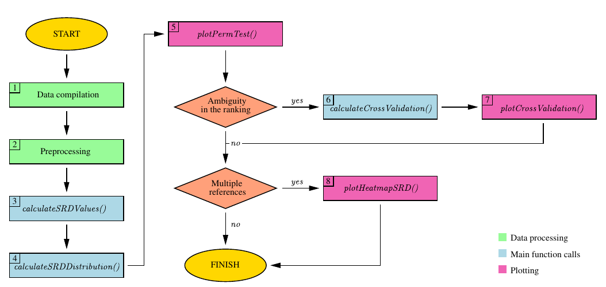
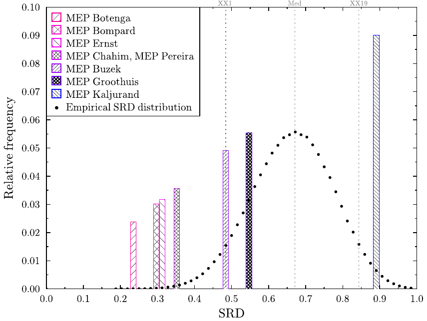
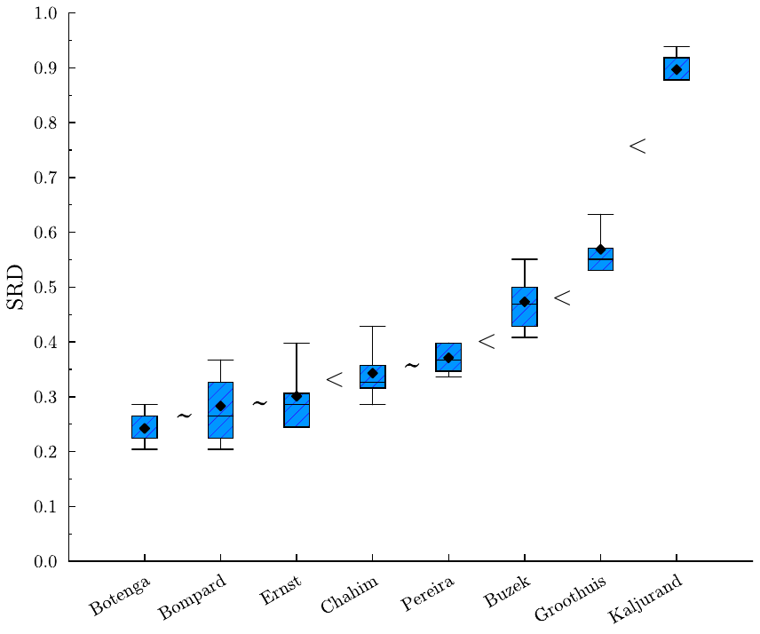
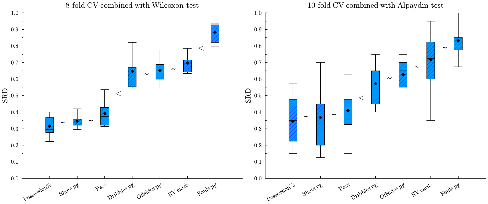
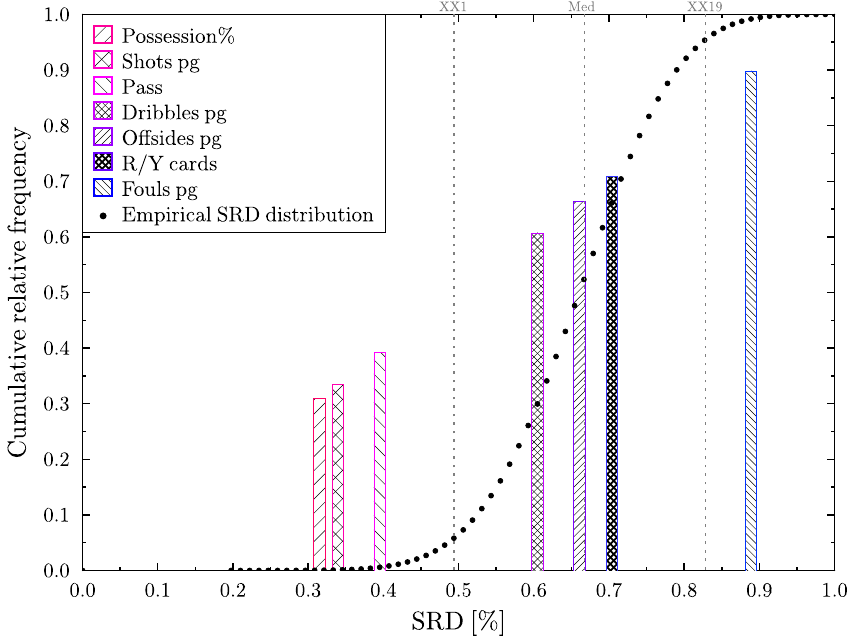
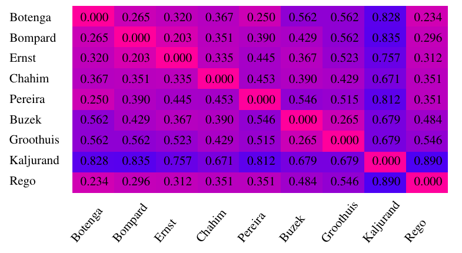
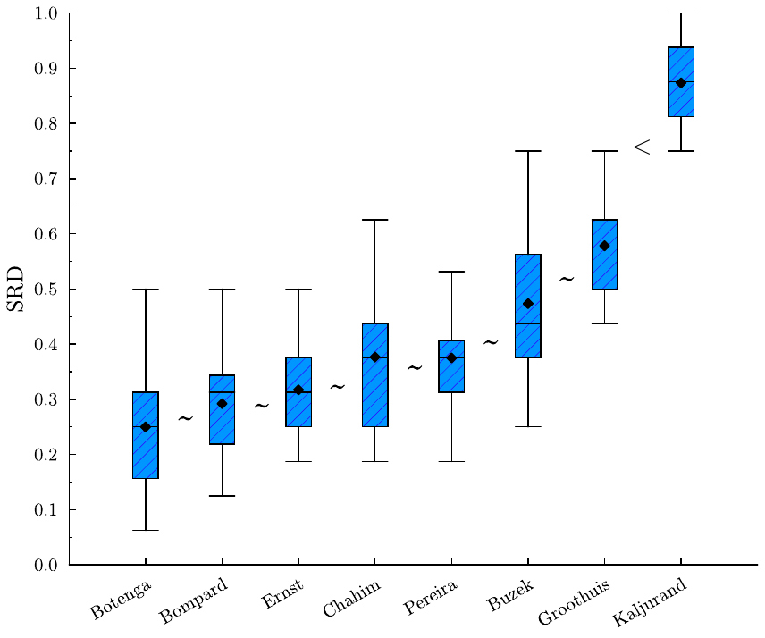
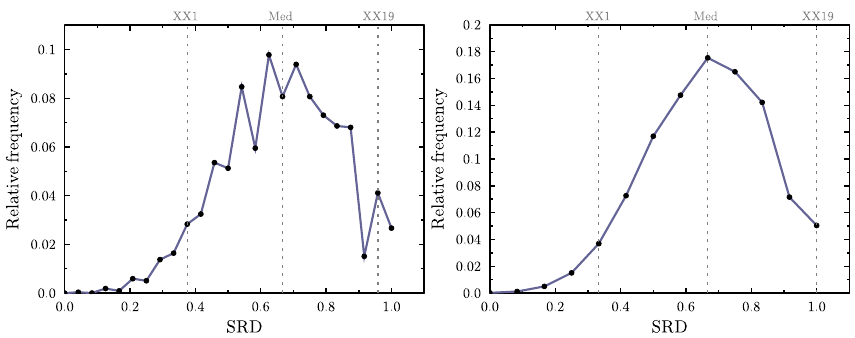

:::::::: article
## Introduction {#sec:intro}

Sum of Ranking Differences first appeared in the field of analytical
chemistry (Héberger 2010; Kollár-Hunek and Héberger 2013). In
chemometrics, comparing methods or models via a reference is quite
natural, as materials are often tested against some industry standard, a
benchmark provided by some accredited laboratory, or some known
theoretical value.

The idea caught on quickly, as the use of references is also common in
other fields. Recommendation systems utilize consumers' preferences to
generate content. In choice modeling, the consensus ranking or ground
truth is considered the ideal or true ranking of the evaluated items. In
web searches, a queried image can serve as a reference. A predefined set
of features also plays a role in pattern recognition and computer
vision. Consequently, SRD has a wide range of applications, from machine
learning (Moorthy et al. 2017) and multi-criteria decision-making
(Petchrompo et al. 2022) to network science (Sziklai and Lengyel 2024),
outlier detection (Brownfield and Kalivas 2017), pharmacology (Vajna et
al. 2012), political science (Sziklai and Héberger 2020), ecology
(Wątróbski et al. 2022), and even sports (West 2018; Gere et al. 2022).

The test statistics of SRD is computed as follows. A rank transformation
is performed on the input, which is a numerical table. Both in the
solution vectors and in the reference, values are replaced by ranks. The
smallest value of each vector obtains a rank of 1, while the largest $n$
(the size of the input). Ties are resolved by fractional ranking, that
is, tied values are replaced by the arithmetic mean of their
corresponding ranks. After rank transformation, the distances between
the solutions and the reference are computed. SRD uses the $L_1$-norm.
We discuss the advantage of this distance metric as well as possible
alternatives in [Section 2](#sec:lit_distance).

SRD values are normalized by the largest possible difference between two
rankings of size $n$. In this way, SRD values of different problems can
be compared with each other. The obtained values already rank the
solutions---the one with the smallest SRD score is the closest to the
reference, hence the best. However, the real benefit comes from the
validation options.

SRD values are validated in two ways. The first option is the Comparison
of Ranks with Random Numbers (CRRN). Informally, it is a
permutation-test measuring the probability that a distance between a
random ranking and the reference is as extreme as the solution's SRD
score. By convention, we accept solutions (i.e. reject $H_0$) below the
5% significance threshold. Between 5-95% solutions might have only
artificial resemblance to the reference, but in fact they are not
distinguishable from a random ranking. Above 95% the solutions seem to
rank the objects in a reverse order---again $H_0$ is rejected with 5%
significance, although the solution is not accepted since it is closer
to the exact opposite of the reference. Thus, SRD can detect significant
similarity as well as dissimilarity.

The difficulty of this option is that there is more than one way to
assign a distribution to the SRD values. If neither the solution nor the
reference ranking contains ties and the number of elements is
sufficiently high, the distribution is asymptotically normal. Should any
of these criteria (no ties, high $n$) not be met, the distribution can
change substantially. Unfortunately, ties are quite common in
applications and so is a small sample size. The derivation of thresholds
can only be achieved by simulating the empirical distribution, since in
such cases, the SRD values do not follow any widely recognized
distribution.

The second validation option is cross-validation combined with
statistical testing. Although the SRD values rank the solutions, it is
unclear what equal or similar SRD scores signify. Just because two
solutions are of the same distance from the reference it doesn't mean
they are close to each other. During cross-validation we take random
samples from the rows and calculate the SRD scores for each sample.
Then, with the help of a statistical test (e.g. Wilcoxon, Alpaydin or
Dietterich-test) we can determine whether the two rankings induced by
the solution vectors come from the same distribution, and if not, which
one should be ranked lower in the SRD ranking. The choice of statistical
test has a huge impact on type 1 and type 2 errors. Given the trade-off
between the two error rates, ultimately only the practitioner can decide
which one is best suited for her use case.

Due to the popularity of the procedure there are various software
implementations available. Dávid Bajusz published a python based
application uploaded to github[^1], see also (Gere et al. 2021). John
Kalivas' homepage offers a MATLAB code[^2]. Attila Gere implemented a
platform independent shiny application[^3]. Finally, Klára Kollárné
Hunek and Károly Héberger developed an MS Excel macro[^4]. While these
existing packages are undoubtedly valuable, they often lack thorough
documentation, and none of them provide the comprehensive toolset found
in rSRD. Our package excels in various aspects, offering a broad range
of features for data preprocessing, SRD computation, validation, and
plotting. As a result, the rSRD package emerges as a much-needed
solution, bridging the gap for users of this statistical test. In the
following, we formally introduce the SRD test, describe the functions
featured in the package, and demonstrate their use through examples.

## Related literature {#sec:Literature}

In this section, we review the literature based on the three components
of SRD analysis: rank transformation, reference ranking, and distance
measures employed in testing. In addition, we briefly present the
theoretical work that has been done related to SRD's validation options.

### Ranking transformation in statistical testing

Sum of Ranking Differences is conceptually similar to Kendall's Tau
(Kendall 1938) and Spearman's Rank Correlation Coefficient (Spearman
1904), both of which measure ordinal associations between variables.
However, there are a few notable differences.

Firstly, SRD uses a fixed reference, whereas Kendall's Tau or Spearman's
Rho are typically employed in either pairwise or multivariate
comparisons. SRD is a proper distance metric, where 0 indicates perfect
positive concordance, and 1 represents perfect negative concordance. In
contrast, both Kendall's Tau and Spearman's Rho range from $-1$ to 1,
where the scales are opposite, with $-1$ signifying the largest possible
discrepancy and 1 representing perfect correlation.

The most significant difference lies in how the statistics are computed.
In the case of SRD, distance is measured in the $L_1$-norm, while
Kendall's Tau uses the number of inversions (also called Kemeny-distance
or Kendall Tau distance), and Spearman's Rho computes the product-moment
correlation coefficient. In the absence of ties, this coefficient
resembles the Euclidean distance between rankings, in the sense that it
uses the squares of rank differences in its computation.

Robustness can be enhanced by applying ranking transformation,
especially when the data may not meet the assumptions of parametric
methods. Ranking helps mitigate the impact of outliers and skewed
distributions, making the analysis more robust. For a comprehensive
mathematical discussion the reader is referred to (Kendall 1970).

### Reference values in statistical testing

The use of reference comes natural in many applications. In econometrics
there is often a base period or control group to which data is compared.
In recommendation systems, user preferences (Bhowmik and Ghosh 2017),
while in web searches, the queried subject (Dwork et al. 2001) can serve
as a reference. Sometimes a reference is not given externally but is
drawn from data. This happens, for instance, in marketing and
advertisement research where consumer preferences are aggregated to
create the ideal ranking (Lin 2010; Haghani et al. 2021; Schuster et al.
2024). The most popular statistical models are the Mallows (Mallows
1957), the Thurstone (Thurstone 1927) and Plackett-Luce (Luce 1959;
Plackett 1975).

The Thurstone model was developed in experimental psychology to handle
cases when subjects have to arrange a series of stimuli in absolute rank
order according to the sensation it prompted. The distribution of
sensations from a particular stimulus is assumed to be normal.
Furthermore, it assumes equal standard deviations of sensations
corresponding to stimuli and equal correlations between pairs of stimuli
sensations (Mosteller 1951).

The Plackett-Luce model is a probabilistic model used to represent the
likelihood of observed rankings. Plackett was originally motivated by a
problem of calculating the odds of racehorses, in particular the
probability of whether a horse finishes in the top 3 (Plackett 1975).
Holman and Marley proved that if the underlying random variables in
Thurstone's approach have an extreme value distribution, the resulting
choice probabilities are given by the Plackett-Luce model as well
(Diaconis 1988).

Finally, in the Mallows model, there is a central ranking $\pi_0$ and a
scale parameter $\lambda$. The highest probability is assigned to
$\pi_0$, with probabilities diminishing geometrically as the distance
from $\pi_0$ increases. A higher value of $\lambda$ leads to a
distribution that is increasingly peaked around $\pi_0$. Mallows
initially focused on two specific distance metrics: Spearman's rho
distance and Kendall's tau distance.

Mallows, Plackett-Luce, and Thurstone are burdened by both assumptions
about the distribution of the underlying data and computational
difficulties. In the Thurstone model, non-linear least squares approach
is used to estimate the means of the normal distributions, while the
standard deviations are assumed to be unit (Lin 2010). In the Mallows
model finding the Maximum Likelihood Estimate of $\pi_0$ is the Kemeny's
consensus ranking problem, known to be NP-hard (Tang 2019).

Fortunately, there are excellent software packages available to address
these issues. The *PlackettLuce* package provides functions for
preparing ranking data to fit the Plackett-Luce model or Plackett-Luce
trees (Turner et al. 2023). *BayesMallows* offers a Bayesian version of
the Mallows rank model (Sorensen et al. 2024). The *rankdist* package
serves as a general platform for distance-based ranking models,
including Mallows' (Qian and Yu 2019). In addition, the *hyper2* package
provides parametrized Plackett-Luce likelihood functions for
Bradley-Terry strengths (Hankin 2017, 2024).

Finally, it's important to note that the shared feature among these
ranking models is the assumption of a reference ranking. However, the
objectives of the Mallows, Plackett-Luce, and Thurstone models differ
considerably from those of the Sum of Ranking Differences. Consequently,
they cannot serve as substitutes for SRD and *vice versa*. Recently,
however, Héberger (2026) proposed distance-based tests that also use a
reference but do not require a ranking transformation.

### Distance metrics in ranking {#sec:lit_distance}

A commonly used distance metric is Kendall tau, quantifying the number
of inversions between two rankings. In simpler terms, it measures the
number of adjacent transpositions required to transform one ranking into
another. The attractiveness of this metric lies in its inherent
connection to rankings; it does not make sense with real valued arrays.
Both the Mallows model and, unsurprisingly, the Kendall Tau Rank
Correlation test uses the Kendall Tau measure.

The $L_1$-norm, sometimes also referred to as Manhattan-distance, was
also proposed early on. Following Spearman's work, the $L_1$-norm of
rankings, in the absence of tied values, is commonly referred to as
Spearman's footrule. A comprehensive exploration of the statistical
properties of the footrule is provided by (Diaconis and Graham 1977).
Empirical evidence suggests that $L_1$-norm is a sensible choice,
comparable to other commonly used distance metrics. Héberger and Škrbić
(2012) found that SRD (which uses the $L_1$-norm) is slightly stricter
than Spearman rho and Kendall tau, that is, it rejects more models.
Sipos et al. (2018) on the other hand compared SRD, Kendall tau, Caley
distance, and a combination of Caley and SRD, and found that SRD and
Kendall tau gives virtually the same results.

In various applications, such as sports or information retrieval, the
top of a ranking often carries more significance than the bottom.
Arguably, the accuracy of the first page of search results is far more
critical for a search engine than the accuracy of subsequent pages.
Similarly, sports enthusiasts tend to prioritize the top three positions
over the last three. Consequently, distance metrics considering the
top-$k$ positions have been developed for rank aggregation purposes
(Fagin et al. 2003). Another solution that takes position into
consideration without discarding some parts of the ranking, is
weighting. Weighted distance-metrics for rankings are considered for
instance in refs. (Gere et al. 2022; Chatterjee et al. 2018) and
(Sziklai et al. 2022). However, imposing a weighting always adds a
subjective element to the analysis as different weightings will benefit
different solutions. Moreover, the weighting will deteriorate the power
of statistical tests. Thus, weighted distances should be adopted with
care. Finally, incomplete rankings and their aggregation are also
studied (Rodrigo et al. 2024).

### SRD validation {#sec:lit_distrib}

Comparison of Ranks with Random Numbers (CRRN) is a type of permutation
test. The latter is a test where the $p$-value is the proportion of data
configurations yielding a test statistic as extreme as the value
observed in the research results (Edgington and Onghena 2007). In our
case, this translates to the proportion of permutations that are at most
as far from the reference as the solution's ranking.

If there are no ties in the ranks, the $L_1$-norm is commonly referred
to as Spearman's footrule. Initially dismissed by (Kendall 1970) due to
a lack of known statistical properties, later research by (Diaconis and
Graham 1977) proved that the distribution composed of footrule distances
is asymptotically normal. In combinatorics, this distance is known as
the total displacement of a permutation, and its distribution is of
independent interest. Generating the exact distribution is
computationally intractable, as the problem is equivalent to counting
weighted Motzkin paths of a given area (Guay-Paquet and Petersen 2014).
The distribution for $n \leq 50$ is available in the On-Line
Encyclopedia of Integer Sequences (OEIS Foundation Inc. 2024). However,
if ties are present SRD scores do not follow any special distribution
and its density curve becomes jagged.

CRRN enables the grouping of solutions, distinguishing acceptable
methods similar to the reference from those that are not. The second
validation option in SRD is cross-validation, aiding in identifying the
true order of solutions with the same or very close SRD scores.
Originally, Kollár-Hunek and Héberger (2013) proposed the Wilcoxon
signed-rank test for cross-validation purposes. The rSRD package
implements two additional statistical tests: the Dietterich
${\mathit{t}}$-test (Dietterich 1998) and Alpaydin's
$\mathcal{F}$-test (Alpaydin 1999), both popular cross-validation tools
in machine learning. Sziklai et al. (Sziklai et al. 2024) compared the
performance of all three tests on synthetic and real data under various
parameterizations and input sizes. The best-performing method was the
Wilcoxon test with 8 folds, which is the default method of the package.
Nevertheless, rSRD provides all three tests as they drastically differ
in type I and type II error rates. Although the Wilcoxon-test proved to
be a bit too sensitive in type I scenarios, it is the only method that
performed well in type II situations. On real data, the advantage of
Alpaydin and Dietterich methods in type I cases diminishes.

## SRD {#sec:SRD}

### Getting and installing rSRD {#sec:SRD_inst}

The rSRD package is downloadable from the Comprehensive R Archive
Network (CRAN) at <https://CRAN.R-project.org/package=rSRD> with this
paper referring to package version 0.2.0. For efficiency,
computationally intensive tasks are implemented in [C++]{.sans-serif}.
This reduces overhead associated with repeated calls and memory
management in [R]{.sans-serif}. In particular, the main functionalities
(`calculateSRDValues, calculateSRDDistribution` and
`calculateCrossValidation`) as well as one of the utility functions
(`utilsRankingMatrix`) are programmed in [C++]{.sans-serif}. The
[C++]{.sans-serif} code is interfaced to R using the established package
Rcpp by Dirk Eddelbuettel (Eddelbuettel 2013). This setup implies that
Windows users need to have Rtools with a version greater than or equal
to 4.5 installed to build rSRD from source. Furthermore, rSRD imports
functionality from the R packages dplyr, ggplot2, ggrepel, gplots,
janitor, rlang, stringr and tibble.

### Mathematical description of SRD {#sec:SRD_math}

The input of the SRD-test is an $n\times m$ matrix $A=[a_{ij}]$. The
first $m-1$ columns represent the models or methods (*solutions*) that
we would like to compare, while rows represent measurements or features
(*objects*). The last column has a special role, it contains the
reference values for each row. This can be an external reference: a gold
standard, a benchmark value, or a previous measurement. In the absence
of a known gold standard, the reference can be extracted from the data.
This step is referred sometimes to as data fusion or preference
aggregation depending on the field. A common solution is to create a new
column by taking the average of the row values for each row. The
underlying idea is that the random errors of the measurements follow
normal distribution and cancel each other out. In the presence of
outliers, the row median is also a sensible choice. Furthermore, if the
row medians form a ranking then it is the ranking that minimizes the
total distance from the solution rankings in $L_1$-norm (Dwork et al.
2002), in other words, it is the ranking closest to the solutions.
Depending on the use cases, the row minimum or maximum can also serve as
a reference.

After the reference is fixed, a ranking transformation is performed on
the input matrix. Values in each column are replaced by ranks. The
smallest value receives a rank of 1, the second smallest gets a rank of
2, and so forth. The largest value is replaced by $n$. Ties are resolved
by fractional ranking, tied values are replaced by the arithmetic mean
of their corresponding ranks. For instance, if $m_{ij}=m_{kj}$ are tied
for the 6th and 7th places, they are each replaced by a rank of 6.5. Let
us denote the rank-transformed matrix by $R=[r_{ij}]$. The SRD score of
the $j$th solution is the distance between the $j$th column and the
reference column in $L_1$-norm

$$SRD_j=\sum_{i=1}^n |r_{ij} - r_{im}|.$$

SRD values are normalized by the maximum distance between rankings of
size $n$, which has the following explicit formula

$$\begin{gather}
f(n) = \left\lfloor\frac{n^2}{2}\right\rfloor =
\begin{cases}
\frac{n^2}{2} & if  n  is even \label{eq:normalization}\\
\frac{n^2-1}{2} & if  n  is odd
\end{cases}
\end{gather}   (\#eq:normalization)$$

Normalized SRD, denoted by $\underline{SRD}_j= SRD_j/f(n)$ is a number
between 0 and 1, where 0 means that the solution produces the same
ranking as the reference, while 1 means the solution ranks the objects
in reverse order. Table [1](#tab:T1){reference-type="ref"
reference="tab:tox_example"} features a small example that demonstrates
the ranking transformation and the SRD calculation.

::: {#tab:tox_example}
  ------------------------------------------------------------------------------------------------------
  A   B    C   ref                                                            A     B      C       ref
  --- ---- --- ----- ------------------- ---------------- ------------------- ----- ------ ------- -----
  2   5    6   6     $\longrightarrow$                    $\longrightarrow$   1     2      4       3

  5   1    3   1     $\longrightarrow$         rank       $\longrightarrow$   2     1      2.5     1

  7   6    2   5     $\longrightarrow$    transformation  $\longrightarrow$   3     3      1       2

  8   10   3   7     $\longrightarrow$                    $\longrightarrow$   4     4      2.5     4

                                                          $SRD$               4     2      5       

                                                          $\underline{SRD}$   0.5   0.25   0.625   
  ------------------------------------------------------------------------------------------------------

  : (#tab:T1) Example SRD computation with three solution columns
  (A,B,C) and a reference. Left: input table; Right: the computation of
  absolute and normalized SRD values after the rank transformation.
:::

### Validation options

SRD scores already establish a ranking between the solutions. With the
validation steps, we are able to extract more information.

One immediate question is whether there are unsuitable solutions. In
many applications, the objective is not solely to identify the single
best option but rather to have the flexibility to select from a set of
solutions that meet certain criteria or requirements. In other
scenarios, solutions may represent possible underlying factors of the
reference ranking, and our goal is to identify the relevant ones. In
such cases, we are interested in distinguishing the good solutions from
the bad ones---those that have no significant connection to the
reference. Comparison of Ranks with Random Numbers (CRRN) aims to
address this issue.

Another interesting question is how reliable the SRD ranking is or how
to group the solutions. If there is a huge gap between the SRD scores of
the two solutions, by all likelihood their order is correct. But what
happens if the SRD values fall close to each other? In particular, what
should we do with tied values? To determine whether two rankings are
essentially the same or not cross-validation is applied combined with
statistical testing (CVST).

#### CRRN

One validation option of SRD is Comparison of Ranks with Random Numbers
(CRRN), where SRD scores of the solutions are compared with those of
random rankings. The permutation test, a standard technique in
statistics, helps determine whether the results occurred by chance. By
analogy, consider two binary sequences, $A = 0000000000$ and
$B = 1010100011$. While binary sequences of the same length have an
equal probability of emerging as a result of a random coin toss, we
might still intuitively feel that sequence $A$ is less random than $B$.
From a statistical standpoint, our intuition is not entirely unfounded.
Coin tosses with very few heads are rare, and the longer the sequence,
the rarer they become. For instance, the probability of a ten-bit long
sequence containing less than 3 heads is around 0.055, slightly higher
than the usual significance threshold. In this example, a person would
rightfully be cautious about accepting sequence $A$ as a result of fair
coin tosses.

The concept behind CRRN is that a solution closely related to the
reference will rank the objects more or less the same way. The less
association they have, the less likely they are to rank objects
similarly. To illustrate, consider a preference elicitation setting
where users rate products or services (e.g. movies). Two users may have
similar tastes but different evaluation habits; for instance, one may be
stricter than the other. Despite having a large absolute difference in
item scores, they might still rank items in the exact same way.
Discordant tastes will result in different rankings. If the tastes have
no relation to each other, we expect the corresponding ranking to show
no pattern. Therefore, the distance between the solution and the
reference ranking should be comparable to that of a random ranking and
the reference ranking. This can be formulated as a null-hypothesis:\
$H_0$: *The distance between a solution ranking and the reference
ranking is not different from the distance between a random ranking and
the reference ranking.*\
A valuable feature of SRD is that it measures both similarity and
dissimilarity. Consequently, we can reject $H_0$ in two occasions. A
normalized SRD score close to 0 implies that the solution is similar to
the reference---it is improbable that the resemblance happened by
chance. On the other hand if the score is almost 1 then the solution
vector ranks the components in a reverse order compared to the
reference, which is equally unlikely.

Note that the SRD distribution depends heavily on the size of the input
$n$ and the number of ties occurring in the solutions and the reference.
Also, there is more than one meaningful way to derive the SRD
distribution.

(Diaconis and Graham 1977) provided a characterization for the SRD
distribution when ties are not present. Let $S_n$ be the set of
permutations of the first $n$ natural numbers and let $p, r \in S_n$ be
chosen independently and uniformly. Furthermore let $D(p,r)$ be the
random variable corresponding to the distance between $p$ and $r$ in
$L_1$-norm. Then the following is true.

::: theorem
**Theorem 1**. *(Diaconis and Graham 1977)\
If $n$ tends to infinity*

*$$\begin{gather}
    \mathbb{E}\left(D(p,r)\right)=\frac{1}{3}n^2+\mathcal{O}(n) \notag\\
    var\left(D(p,r)\right)=\frac{2}{45}n^3+\mathcal{O}(n^2) \notag
\end{gather}$$
and $D(p,r)$ follows asymptotically normal distribution.*
:::

This implies that when there are no ties, the expected value of a
normalized SRD score of two random rankings is around $\frac{2}{3}$
(cf. Eq. \@ref(eq:normalization)). There are a few caveats here. The
theorem does not help us when $n$ is small. In practice, the
approximation error becomes sufficiently small when $n>13$. For smaller
$n$ the exact distribution can be calculated by considering every
permutation of length $n$. However, the presence of ties spoils the
normality property and produces a deformed (zigzagged) probability
density function (see [Section 5](#sec:small_data)).

In addition, it is not clear how the ties should be handled in the
empirical SRD distribution. Should we fix the reference ranking and only
generate random rankings representing the solutions? Should the number
of ties in the random ranking follow the frequency of ties in the
reference or the frequency of ties in the solution vectors? If there is
one solution that has many ties, while the others do not, should this
affect the CRRN test of all solutions or just the one which exhibits
many ties? There is no universally correct answer to these questions.
The rSRD package is specifically designed to accommodate such
situations, allowing the practitioner to have control over how to handle
them. It provides the flexibility for the practitioner to choose a
distribution that best describes their specific use case, enabling them
to make informed decisions based on their requirements and preferences.

#### CVST

It is not always straightforward to rank the solutions based on their
distance from the reference. Solutions with the same or very close SRD
scores are not necessarily similar to each other. Rankings can differ
from the reference in different sections and still be of the same
distance. Cross-Validation combined with Statistical Testing (CVST) is
designed to determine whether two solutions are inherently the same or
not. Consequently, the null-hypothesis is formulated as follows. Let
$r^i$ and $r^j$ be two rankings corresponding to solution $i$ and $j$,
in other words $r^j$ is the $j$th column vector of $R$.\
$H_0$: *$r^i$ and $r^j$ come from the same distribution.*\
Since it is impossible to draw a statistical conclusion by comparing two
single SRD values, a sample is created using cross-validation. Randomly
selected rows are discarded, and the SRD values are re-calculated on the
remaining table. The SRD scores vary a bit depending on whether the
omitted section agrees with the reference or not. In this way, we can
assign a set of SRD values to the solutions and infer their relationship
by comparing the samples. Solutions are ranked based on the median of
the computed SRD scores with ties broken sequentially using the first
quartile, third quartile, minimum, and finally maximum values.

Ranking the solutions is a delicate issue as we have to strike a balance
between type 1 and type 2 errors. The literature suggests a sample size
between 5 and 10 (Hastie et al. 2009). Increasing the sample size
(*i.e.* the number of folds), above 10 will increase the bias but lower
the variance[^5].

The rSRD package features the three most widely used statistical tests
that are coupled with cross-validation: Wilcoxon, Dietterich, and
Alpaydin. The reason why three different tests are provided is that they
handle type 1 and type 2 situations drastically differently (Sziklai et
al. 2024). Wilcoxon excels in type 2 scenarios but it is inefficient in
type 1 situations. In other words, it effectively identifies when
solutions come from different distributions, but sometimes
differentiates between solutions that come from the same distribution.
Dietterich and Alpaydin perform quite well in type 1 cases but fail
badly in type 2 scenarios. Ultimately only the practitioner knows which
type of error is more costly to her, hence we implemented all three
tests in the package.

Describing the exact mathematical formulation of the three statistical
tests as well as discussing their performance on various data structures
goes well beyond the scope of the manuscript. A detailed description can
be found in ref. (Sziklai et al. 2024).

### Typical workflow

{#fig:workflow
width="100%"}

Figure [1](#fig:workflow){reference-type="ref" reference="fig:workflow"}
illustrates the typical workflow of an SRD analysis. The rSRD package
expects a data frame as input. Once the data have been compiled into the
appropriate format (step 1), the user must decide how to preprocess the
data (step 2). Standardization is not necessary---although the package
provides tools for this purpose---because the statistical procedure
involves a ranking transformation anyway. For more information on when
standardization is useful, see [Section 4](#sec:preprocessing).

The distances from the reference establish a ranking of the solutions
(step 3). Generating a distribution of random distances allows
statistical significance to be assessed (step 4). Plotting the result of
the permutation test helps visualize the obtained ranking (step 5). If
there is any ambiguity, such as similar or tied SRD scores,
cross-validation can help clarify the ranking (step 6). A
box-and-whisker plot provides a visual summary of the cross-validation
results (step 7). Finally, if more than one column qualifies as a
reference, a heatmap can help compare the resulting distances and assist
in choosing the right reference (step 8).

### Demonstrative example

In this section, we present a small case study to demonstrate SRD and
its validation options. The data is courtesy of
[Eulytix](https://eulytix.eu). For presentational reasons, figures were
re-created and enhanced by Graphics Layout Engine (Pugmire et al. 2022).

The major part of the EU's legislative work is done in the European
Parliament's Committees. Members of the European Parliament (MEPs) draw
up, amend, and adopt legislative proposals and work out reports to be
presented to the plenary assembly. To boost the chance of acceptance,
MEPs routinely approach their fellow members to co-sponsor their
initiative. EP Committees suffer from partisanship much less than
national assemblies. This allows MEPs to draw supporters from a wider
pool, quite possibly from parties not belonging to the same ideological
family. One way to identify potential allies is to analyze the language
they are using. In the following example, the texts of the amendments of
the Committee on Industry, Research and Energy (ITRE) are analyzed in
the 2014-2019 legislative term to profile MEPs. Expressions are
classified into 16 categories (climate, infrastructure, security, etc.)
and counted how many times an MEP used an expression belonging to a
certain category in the amendments she co-sponsored. This reveals which
areas the MEP deems important. Our assumption is that MEPs that have a
similar profile are the most probable allies.

::: {#tab:itre_input}
<table >

<caption>(\#tab:T2) Profiles of the Members of the European Parliament
(MEP). Breakdown of the number of expressions used by MEPs in amendments
they co-sponsored by categories. MEP Sira Rego’s profile serves as a
reference. The last row displays the derived SRD scores.</caption>
<thead>
<tr>
<th style="text-align: left;"></th>
<th style="text-align: left;">Botenga</th>
<th style="text-align: left;">Bompard</th>
<th style="text-align: left;">Ernst</th>
<th style="text-align: left;">Chahim</th>
<th style="text-align: left;">Pereira</th>
<th style="text-align: left;">Buzek</th>
<th style="text-align: left;">Groothuis</th>
<th style="text-align: left;">Kaljurand</th>
<th style="text-align: left;">Rego</th>
</tr>
</thead>
<tbody>
<td style="text-align: left;">Budget/Costs</td>
<td style="text-align: left;">12</td>
<td style="text-align: left;">20</td>
<td style="text-align: left;">17</td>
<td style="text-align: left;">0</td>
<td style="text-align: left;">7</td>
<td style="text-align: left;">17</td>
<td style="text-align: left;">8</td>
<td style="text-align: left;">1</td>
<td style="text-align: left;">13</td>
</tr>
<tr>
<td style="text-align: left;">Climate/Environment</td>
<td style="text-align: left;">137</td>
<td style="text-align: left;">293</td>
<td style="text-align: left;">232</td>
<td style="text-align: left;">43</td>
<td style="text-align: left;">44</td>
<td style="text-align: left;">136</td>
<td style="text-align: left;">82</td>
<td style="text-align: left;">0</td>
<td style="text-align: left;">174</td>
</tr>
<tr>
<td style="text-align: left;">Economy</td>
<td style="text-align: left;">48</td>
<td style="text-align: left;">79</td>
<td style="text-align: left;">46</td>
<td style="text-align: left;">14</td>
<td style="text-align: left;">14</td>
<td style="text-align: left;">35</td>
<td style="text-align: left;">54</td>
<td style="text-align: left;">13</td>
<td style="text-align: left;">20</td>
</tr>
<tr>
<td style="text-align: left;">Energy</td>
<td style="text-align: left;">121</td>
<td style="text-align: left;">244</td>
<td style="text-align: left;">169</td>
<td style="text-align: left;">48</td>
<td style="text-align: left;">68</td>
<td style="text-align: left;">204</td>
<td style="text-align: left;">153</td>
<td style="text-align: left;">0</td>
<td style="text-align: left;">145</td>
</tr>
<tr>
<td style="text-align: left;">Enterprise</td>
<td style="text-align: left;">79</td>
<td style="text-align: left;">71</td>
<td style="text-align: left;">79</td>
<td style="text-align: left;">12</td>
<td style="text-align: left;">82</td>
<td style="text-align: left;">80</td>
<td style="text-align: left;">164</td>
<td style="text-align: left;">8</td>
<td style="text-align: left;">82</td>
</tr>
<tr>
<td style="text-align: left;">Future</td>
<td style="text-align: left;">17</td>
<td style="text-align: left;">66</td>
<td style="text-align: left;">65</td>
<td style="text-align: left;">4</td>
<td style="text-align: left;">11</td>
<td style="text-align: left;">35</td>
<td style="text-align: left;">75</td>
<td style="text-align: left;">40</td>
<td style="text-align: left;">16</td>
</tr>
<tr>
<td style="text-align: left;">Geography</td>
<td style="text-align: left;">53</td>
<td style="text-align: left;">121</td>
<td style="text-align: left;">85</td>
<td style="text-align: left;">13</td>
<td style="text-align: left;">28</td>
<td style="text-align: left;">49</td>
<td style="text-align: left;">39</td>
<td style="text-align: left;">13</td>
<td style="text-align: left;">44</td>
</tr>
<tr>
<td style="text-align: left;">Health</td>
<td style="text-align: left;">135</td>
<td style="text-align: left;">168</td>
<td style="text-align: left;">39</td>
<td style="text-align: left;">1</td>
<td style="text-align: left;">52</td>
<td style="text-align: left;">0</td>
<td style="text-align: left;">6</td>
<td style="text-align: left;">0</td>
<td style="text-align: left;">107</td>
</tr>
<tr>
<td style="text-align: left;">Industry</td>
<td style="text-align: left;">99</td>
<td style="text-align: left;">211</td>
<td style="text-align: left;">105</td>
<td style="text-align: left;">25</td>
<td style="text-align: left;">47</td>
<td style="text-align: left;">75</td>
<td style="text-align: left;">63</td>
<td style="text-align: left;">4</td>
<td style="text-align: left;">107</td>
</tr>
<tr>
<td style="text-align: left;">Infrastructure</td>
<td style="text-align: left;">14</td>
<td style="text-align: left;">50</td>
<td style="text-align: left;">32</td>
<td style="text-align: left;">10</td>
<td style="text-align: left;">17</td>
<td style="text-align: left;">54</td>
<td style="text-align: left;">83</td>
<td style="text-align: left;">5</td>
<td style="text-align: left;">24</td>
</tr>
<tr>
<td style="text-align: left;">Labour</td>
<td style="text-align: left;">66</td>
<td style="text-align: left;">111</td>
<td style="text-align: left;">84</td>
<td style="text-align: left;">9</td>
<td style="text-align: left;">40</td>
<td style="text-align: left;">3</td>
<td style="text-align: left;">5</td>
<td style="text-align: left;">2</td>
<td style="text-align: left;">40</td>
</tr>
<tr>
<td style="text-align: left;">Mining/Resources</td>
<td style="text-align: left;">27</td>
<td style="text-align: left;">155</td>
<td style="text-align: left;">138</td>
<td style="text-align: left;">11</td>
<td style="text-align: left;">0</td>
<td style="text-align: left;">112</td>
<td style="text-align: left;">50</td>
<td style="text-align: left;">0</td>
<td style="text-align: left;">115</td>
</tr>
<tr>
<td style="text-align: left;">Mode of conduct</td>
<td style="text-align: left;">35</td>
<td style="text-align: left;">48</td>
<td style="text-align: left;">34</td>
<td style="text-align: left;">9</td>
<td style="text-align: left;">6</td>
<td style="text-align: left;">7</td>
<td style="text-align: left;">16</td>
<td style="text-align: left;">13</td>
<td style="text-align: left;">28</td>
</tr>
<tr>
<td style="text-align: left;">Science</td>
<td style="text-align: left;">47</td>
<td style="text-align: left;">59</td>
<td style="text-align: left;">28</td>
<td style="text-align: left;">6</td>
<td style="text-align: left;">21</td>
<td style="text-align: left;">13</td>
<td style="text-align: left;">30</td>
<td style="text-align: left;">0</td>
<td style="text-align: left;">46</td>
</tr>
<tr>
<td style="text-align: left;">Security</td>
<td style="text-align: left;">18</td>
<td style="text-align: left;">67</td>
<td style="text-align: left;">39</td>
<td style="text-align: left;">1</td>
<td style="text-align: left;">5</td>
<td style="text-align: left;">18</td>
<td style="text-align: left;">27</td>
<td style="text-align: left;">76</td>
<td style="text-align: left;">20</td>
</tr>
<tr>
<td style="text-align: left;">Social</td>
<td style="text-align: left;">65</td>
<td style="text-align: left;">74</td>
<td style="text-align: left;">80</td>
<td style="text-align: left;">16</td>
<td style="text-align: left;">37</td>
<td style="text-align: left;">16</td>
<td style="text-align: left;">13</td>
<td style="text-align: left;">4</td>
<td style="text-align: left;">49</td>
</tr>
<tr>
<td style="text-align: left;"><span
class="math inline">$\underline{SRD}_i$</span></td>
<td style="text-align: left;">0.234</td>
<td style="text-align: left;">0.297</td>
<td style="text-align: left;">0.312</td>
<td style="text-align: left;">0.352</td>
<td style="text-align: left;">0.352</td>
<td style="text-align: left;">0.484</td>
<td style="text-align: left;">0.547</td>
<td style="text-align: left;">0.891</td>
<td style="text-align: left;">0</td>
</tr>
</tbody>
</table>
:::

Table [2](#tab:T2){reference-type="ref" reference="tab:itre_input"}
compiles the language profile of 9 MEPs of the ITRE Committee. The last
column shows the number of expressions the MEP Sira Rego used in the
amendments she co-sponsored. The last row shows the normalized SRD
scores. MEP Botenga's profile is the closest to the reference, which is
MEP Rego's language-pattern. Both of them find Climate/Environment the
most important while contribute to Budget/Costs category the least
relatively to other topics. In general, they rank the topics the same
way, which suggests that they might be ideologically close.

Figure [2](#fig:itre_crrn){reference-type="ref"
reference="fig:itre_crrn"} shows the result of the CRRN test. For sake
of simplicity, SRD distribution was generated by assuming there are no
ties, although this is not true. Both the reference and the solution
vectors contain tied values. Six MEPs, Botenga, Bompard, Ernst, Chahim,
Pereira, and Buzek pass the test, meaning the SRD value corresponding to
their profile is below the 5% significance threshold, marked by the
first dashed line labeled XX1.

<figure id="fig:itre_crrn" data-latex-placement="t">

<figcaption>Figure 2: CRRN test: The colored bars from left to right
follow the same order as the legend from top to bottom, and their
heights are equal to their normalized SRD values, hence expressing the
distance from zero. The further they fall from the origin, the less they
resemble the reference. The vertical lines, XX1 and XX19 correspond to
the 5% and 95% threshold respectively.</figcaption>
</figure>

There are a few things worth noting. First, MEP Buzek's SRD value falls
exactly on the 5% threshold. Had we considered the ties when generating
the SRD distribution, Buzek's profile would have fallen to the right of
the threshold[^6]. Second, MEP Kaljurand's profile is so different from
Rego's, that it cannot even be considered random, but rather Rego's
exact opposite. Reverse orderings are always revelatory, in our case it
probably indicates that Kaljurand's and Rego's worldview is not
compatible. This should be taken with a grain of salt as we have much
fewer observations for Kaljurand, than for other MEPs. Groothuis' SRD
score falls between the 5% and 95% significance thresholds meaning it
cannot be distinguished from a random ranking. That suggests, that
Groothuis is neither a probable ally nor an adversary of Rego. Finally,
MEPs Chahim and Pereira's rankings are of the same distance from the
reference and Bompard's and Ernst's SRD scores are also very close. This
calls for cross-validation.

<figure id="fig:itre_boxplot" data-latex-placement="t">

<figcaption>Figure 3: Cross-validation combined with Wilcoxon test: Box
whisker plot representing the SRD values calculated on the different
folds. The <span class="math inline">&lt;</span> symbol denotes
significant difference between the values, while <span
class="math inline">∼</span> marks that the null-hypothesis could not be
rejected. </figcaption>
</figure>

Figure [3](#fig:itre_boxplot){reference-type="ref"
reference="fig:itre_boxplot"} displays the result of the
cross-validation coupled with an 8-fold Wilcoxon test. We took 8 samples
from the input matrix, by repeatedly removing two random rows,
calculated the SRD values on all the samples, then ordered the solutions
(*i.e.* the MEPs) by the median of the SRDs, finally performed a
Wilcoxon test between the adjacent solution-pairs. The box-and-whisker
plot provides a visual summary of the SRD values obtained during
cross-validation. Non-overlapping boxes may suggest that the
corresponding SRD distributions differ substantially. The test found
that there is no significant difference between Bompard and Ernst and
Chahim and Pereira. The choice of the test matters. Wilcoxon is much
more sensitive than Alpaydin or the Dietterich test. A 10-fold
Alpaydin-test finds only the last difference (between Groothuis and
Kaljurand) significant, while a 10-fold Dietterich finds no significant
difference between the *consecutive* solution-pairs.

## Package features

In this section, we review the features of the package through examples.
The functions of rSRD are divided into three categories. Core functions
that relate to SRD computation and validation are given a name that
starts with the '`calculate`' prefix. Plot generating functions start
with the '`plot`', while utility functions start with the '`utils`'
prefix.

Throughout this section, we will demonstrate package features using the
MEP profiles we introduced in the previous section and a football
dataset compiled from <https://www.whoscored.com/>.
Table [3](#tab:T3){reference-type="ref" reference="tab:bundesliga"}
presents various game statistics aggregated over the 2020/21 season of
the Bundesliga. The last column displays the points gathered by the
teams. The final position in the league table is a natural reference
that encompasses how strongly a team performed during the season. Some
game statistics closely follow, while others seem to be independent of
this ranking. With an SRD analysis we can uncover the style of play in
the Bundesliga and explore which game elements dominate and which ones
are not pertinent to the success of the teams. In the following, we will
use '`mep_profiles.csv`' and '`bundesliga20_21.csv`' to demonstrate
package features. Both files are accessible from the package.

``` r
R> path <- system.file("extdata", "mep_profiles.csv", package = "rSRD")
R> profiles_df <- read.csv(path, header = TRUE, sep = ";", row.names = 1)
R> path <- system.file("extdata", "bundesliga20_21.csv", package = "rSRD")
R> bundesliga_df <- read.csv(path, header = TRUE, sep = ";", row.names = 1, check.names = FALSE)
```

::: {#tab:bundesliga}
+------------+----------+----------+-------------+------+-------------+-------------+----------+-----+
| Teams      | Shots pg | RY cards | Possession% | Pass | Dribbles pg | Offsides pg | Fouls pg | pts |
+:===========+:========:+:========:+:===========:+:====:+:===========:+:===========:+:========:+:===:+
| Bayern     | 19.8     | 38       | 64.8        | 86   | 14.5        | 2.2         | 9        | 77  |
+------------+          |          |             |      |             |             |          |     |
| Muenchen   |          |          |             |      |             |             |          |     |
+------------+----------+----------+-------------+------+-------------+-------------+----------+-----+
| Bayer      | 13.5     | 66       | 53.7        | 81.8 | 11.8        | 1.9         | 10.7     | 64  |
+------------+          |          |             |      |             |             |          |     |
| Leverkusen |          |          |             |      |             |             |          |     |
+------------+----------+----------+-------------+------+-------------+-------------+----------+-----+
| Borussia   | 13.3     | 62       | 59.4        | 84   | 10.4        | 2.1         | 10.6     | 69  |
+------------+          |          |             |      |             |             |          |     |
| Dortmund   |          |          |             |      |             |             |          |     |
+------------+----------+----------+-------------+------+-------------+-------------+----------+-----+
| RB Leipzig | 12.9     | 49       | 56.5        | 83.1 | 10.2        | 1.9         | 10.6     | 58  |
+------------+----------+----------+-------------+------+-------------+-------------+----------+-----+
| SC         | 13.6     | 34       | 48.6        | 76.2 | 6.6         | 1.7         | 11.5     | 55  |
| Freiburg   |          |          |             |      |             |             |          |     |
+------------+----------+----------+-------------+------+-------------+-------------+----------+-----+
| Borussia   | 14.8     | 67       | 54.1        | 82   | 10.9        | 2.2         | 10.6     | 45  |
+------------+          |          |             |      |             |             |          |     |
| M.Gladbach |          |          |             |      |             |             |          |     |
+------------+----------+----------+-------------+------+-------------+-------------+----------+-----+
| 1. FC      | 13.8     | 67       | 54.8        | 77.4 | 7.4         | 2           | 12.3     | 52  |
| Koeln      |          |          |             |      |             |             |          |     |
+------------+----------+----------+-------------+------+-------------+-------------+----------+-----+
| FSV Mainz  | 13.8     | 62       | 46          | 74.1 | 7.9         | 1.9         | 14.6     | 46  |
| 05         |          |          |             |      |             |             |          |     |
+------------+----------+----------+-------------+------+-------------+-------------+----------+-----+
| VfL        | 12.4     | 61       | 50.2        | 78.6 | 9.4         | 2.2         | 12.1     | 42  |
| Wolfsburg  |          |          |             |      |             |             |          |     |
+------------+----------+----------+-------------+------+-------------+-------------+----------+-----+
| VfB        | 13.3     | 64       | 50.4        | 80.7 | 11          | 1.6         | 10.9     | 33  |
| Stuttgart  |          |          |             |      |             |             |          |     |
+------------+----------+----------+-------------+------+-------------+-------------+----------+-----+
| Union      | 12.1     | 62       | 43.3        | 73.6 | 7.2         | 1.9         | 12.4     | 57  |
+------------+          |          |             |      |             |             |          |     |
| Berlin     |          |          |             |      |             |             |          |     |
+------------+----------+----------+-------------+------+-------------+-------------+----------+-----+
| Eintracht  | 13.2     | 60       | 49.4        | 76.2 | 8.4         | 1.6         | 12.4     | 42  |
+------------+          |          |             |      |             |             |          |     |
| Frankfurt  |          |          |             |      |             |             |          |     |
+------------+----------+----------+-------------+------+-------------+-------------+----------+-----+
| TSG        | 13.3     | 75       | 53.2        | 80.7 | 7.4         | 2.1         | 12.6     | 46  |
| Hoffenheim |          |          |             |      |             |             |          |     |
+------------+----------+----------+-------------+------+-------------+-------------+----------+-----+
| VfL Bochum | 12.1     | 55       | 44.5        | 72.1 | 6.8         | 2.2         | 12.5     | 42  |
+------------+----------+----------+-------------+------+-------------+-------------+----------+-----+
| FC         | 10.8     | 74       | 40.6        | 72   | 7.7         | 2.1         | 13.2     | 38  |
| Augsburg   |          |          |             |      |             |             |          |     |
+------------+----------+----------+-------------+------+-------------+-------------+----------+-----+
| Arminia    | 10.7     | 55       | 39.9        | 71.7 | 8.4         | 1.6         | 12.7     | 28  |
+------------+          |          |             |      |             |             |          |     |
| Bielefeld  |          |          |             |      |             |             |          |     |
+------------+----------+----------+-------------+------+-------------+-------------+----------+-----+
| Hertha BSC | 10.8     | 64       | 43.2        | 74.7 | 8.3         | 2.1         | 12.4     | 33  |
+------------+          |          |             |      |             |             |          |     |
| Berlin     |          |          |             |      |             |             |          |     |
+------------+----------+----------+-------------+------+-------------+-------------+----------+-----+
| Greuther   | 9.2      | 61       | 43          | 74.8 | 7.8         | 2           | 12.9     | 18  |
+------------+          |          |             |      |             |             |          |     |
| Fuerth     |          |          |             |      |             |             |          |     |
+------------+----------+----------+-------------+------+-------------+-------------+----------+-----+

: (#tab:T3) Game statistics of Bundesliga teams aggregated over the
season 2020/21 (pg stands for 'per game', RY abbreviates red and
yellow).
:::

### Preprocessing {#sec:preprocessing}

The rSRD package offers a variety of utility functions. The Sum of
Ranking Differences relies on the existence of a reference vector. One
issue that often comes up in applications is the need for creating a
reference. If an external reference (e.g. industry standard, known
theoretical value) is not readily available, we might still be able to
extract one from the data. For instance, if the solutions represent
independent measurements then taking the average of the columns
(*i.e.* the average of the row values for each row) may work as a
reference as the random errors cancel out. The median is often preferred
in the presence of outliers. If objects represent performance properties
that the solution needs to optimize, then row minimum or maximum might
be a good choice. Yet sometimes we have a mix of these: some rows
correspond to measurements, while other rows are performance traits.

In such cases, there are two issues we need to resolve. The first issue
is that objects are not necessarily of the same kind; hence, their
values do not fall on the same scale. For instance, the source data for
the football leagues dataset measured the number of red and yellow cards
in bulk for the whole season, while the number of offsides was averaged
over the number of games. Even if the objects are on the same scale, it
might be beneficial to standardize the values. For instance, in the MEP
profiles, not every representative was equally productive. MEPs who
submitted more amendments inevitably generated more phrases in each
category, thus the absolute numbers are a bit misleading.

For the sake of convenience, rSRD includes standardization functions.
Four methods are implemented: `scale_to_unit, standardize, range_scale`
and `scale_to_max` to meet the different needs.

`scale_to_unit`

:   transforms each column vector into a vector of length 1.

`standardize`

:   converts the values of each column vector into a standard normal
    scale.

`range_scale`

:   casts the values of each column vector into the $[0,1]$ interval.

`scale_to_max`

:   divides each column vector by the maximum value of that column.

For instance, the practitioner may prefer to use `standardize` if there
are both positive and negative values present in the data, or use
`range_scale` if she wants to enforce each column into the same
interval. Note that `utilsPreprocessDF()` transforms the columns. If the
user would like to standardize the rows, the data frame should be
transposed first.

``` r
R> utilsPreprocessDF(profiles_df, method="range_scale")
```

After range scaling the MEP profiles, it is immediately clear what topic
is the most important for each representative. In the case of MEP
Chahim, it is Energy, while the value $0.25$ under Enterprise indicates
that Chahim expressed a quarter of the amount of energy-related phrases
about enterprises.

It is important to note, that each data preprocessing method is strictly
monotonic. Hence, if we already have a fixed reference, the ranking
transformation of SRD makes preprocessing *by columns* redundant,
meaning we will obtain the same SRD values with or without using
preprocessing. However, if we normalize the rows, or we obtain the
reference values as a function of the columns then normalization alters
the outcome, and different normalization processes may lead to different
SRD scores.

The second issue is the extraction of a reference when the rows
correspond to different properties. The rSRD package makes reference
creation a flexible process. The `utilsCreateReference()` method appends
a new column at the end of the data frame. The `method` parameter
describes the aggregation process. Five possibilities are available:
`max, min, median, mean` and `mixed`. In the case of the first four, the
row maximum, row minimum, row median, or row mean value is appended
respectively.

``` r
R> SRD_input <- data.frame(
  A=c(2, 5, 7, 8),
  B=c(5, 1, 6, 10),
  C=c(6, 3, 2, 3))
```

``` r
R> utilsCreateReference(SRD_input, method = "mean")
```

``` r
  A  B C  refCol
1 2  5 6   4.33
2 5  1 3   3.00
3 7  6 2   5.00
4 8 10 3   7.00
```

If the method is set to `mixed`, then we can specify an aggregation
process for each row separately. For instance,

``` r
R> ref <- c("max","min","mean","mean")
R> utilsCreateReference(SRD_input, method = "mixed", ref)
```

``` r
  A  B C refCol
1 2  5 6    6
2 5  1 3    1
3 7  6 2    5
4 8 10 3    7
```

creates a reference for `SRD_input` by taking the maximum of the first
row, the minimum of the second, and the mean of the last two. The size
of the `ref` vector must match the size of the input. The need for such
a composite reference may arise when the objects or variables are not
all of the same type. For instance, if the rows represent performance
indicators, the average may be a sensible reference for some indicators,
whereas the best or worst observed performance may be more appropriate
for others. Note that the function does not change the input, only
returns with a new matrix.

rSRD provides a function for detailed SRD calculation, displaying the
ranking transformation, the distance calculation, and the raw
(unnormalized) SRD scores.

``` r
R> SRD_input = utilsCreateReference(SRD_input, method = "mixed", ref)
R> utilsDetailedSRD(SRD_input)
```

``` r
  A  A_Rank A_Dist  B B_Rank B_Dist  C  C_Rank C_Dist  refCol refCol_Rank
1 2     1     2     5      2     1   6      4    1.0      6        3
2 5     2     1     1      1     0   3    2.5    1.5      1        1
3 7     3     1     6      3     1   2      1    1.0      5        2
4 8     4     0    10      4     0   3    2.5    1.5      7        4
5 -     -     4     -      -     2   -      -    5.0      -        -
```

This utility serves multiple purposes---it allows users to visually
check which part of the solution differs from the reference.
Additionally, it is beneficial for pedagogical reasons, enabling users
to quickly comprehend how the statistics are computed. Since the output
of this function displays unnormalized SRD values, the user can promptly
query the normalizing factor by calling

``` r
R> utilsMaxSRD(4)
```

``` r
8
```

which just returns the result of Eq. \@ref(eq:normalization). The rSRD
package also allows to perform the ranking transformation without the
SRD calculation. This option was built in to ensure compatibility with
other ranking-based packages. In this way, the user can export the
ranking matrix without the need to format the output.

``` r
R> utilsRankingMatrix(SRD_input)
```

``` r
  A B   C
1 1 2  4.0
2 2 1  2.5
3 3 3  1.0
4 4 4  2.5
```

### Core functions

There are three core functions, one corresponding to the SRD calculation
and the other two for the validation steps. Each function is capable of
exporting the results to a CSV file. First, let us look at the SRD
values of the Bundesliga data.

``` r
R> calculateSRDValues(bundesliga_df)
```

``` r
[1] 0.3395062 0.7037037 0.3148148 0.3950617 0.6049383 0.6604938 0.8888889
```

The output follows the order of the columns in the input, in this case
the column order of Table [3](#tab:T3){reference-type="ref"
reference="tab:bundesliga"}. The scores range over almost the entire
$[0,1]$ interval. The number of shots is a good indicator of the final
position in the league table, as it ranks the football teams similarly
as the obtained points. On the other hand, fouls committed per game seem
to rank the teams in reverse order: worse teams tend to have more fouls.
Which of these scores are significant?

``` r
R> calculateSRDDistribution(bundesliga_df, option = "f", seed = 42)
```

``` r
SRD_Distribution
    SRD_value   relative_frequency
1      0.0000        0.000000
2      0.1728        0.000001
3      0.1975        0.000002
4      0.2099        0.000001
...
127    0.9877        0.000025
128    0.9938        0.000005
129    1.0000        0.000018

xx1
[1] 0.4938
q1
[1] 0.5926
median
[1] 0.6667
q3
[1] 0.7346
xx19
[1] 0.8272
avg
[1] 0.6630454
std_dev
[1] 0.1021337
```

The XX1 and XX19 values specify the 5% and 95% significance thresholds.
Thus, the number of shots, ball possession, successful passes, and fouls
committed are statistically significant. The first three rank the teams
similarly to the reference $(\underline{SRD}_i<XX1)$, while fouls rank
teams in reverse order $(\underline{SRD}_i\ge XX19)$. The function
`calculateSRDDistribution` has five parameters, of which only the first,
the input dataframe, is compulsory. The second parameter specifies how
the SRD distribution should be generated. The available options are the
following:

'n'

:   There are no ties for the solution vectors, the reference vector is
    fixed.

'r'

:   There are no ties. Both the column vector and the reference are
    generated randomly.

't'

:   Ties occur with a fixed probability specified by the user for both
    the solution vectors and the reference vector.

'p'

:   Ties occur with a fixed probability specified by the user for the
    solution vectors, the reference vector is fixed.

'd'

:   Tie distribution reflects the tie frequencies displayed by the
    solution vectors, the reference vector is fixed.

'f' (default)

:   Tie distribution reflects the tie frequencies displayed in the
    reference, the reference vector is fixed.

In each case, one million data points are produced by generating (either
randomly or deterministically) solution and reference vectors and
calculating their corresponding SRD scores. The third parameter,
'`tie_probability`' only plays a role if either options 't' or 'p' were
chosen, in which case they specify the tie frequencies occurring in the
generated vectors. The package offers a utility function to check the
number of ties present in a vector.

``` r
R> solution <- c(1,3,3,3,2,2,4,3)
R> utilsTieProbability(solution)
```

``` r
[1] 0.5714286
```

Note that in an $n$-long vector, ties can occur in $n-1$ places. In the
above example, the values are ordered first to create a ranking. Hence,
4 out of the 7 places were tied and the result is 4/7 = 0.5714286. If
option 'r' is chosen, then both the solution and the reference are
generated randomly without ties. In this case, the empirical
distribution follows the Spearman's footrule distribution.

Since generating the distribution is a stochastic process, the function
is equipped with a `seed` parameter, which allows the user to seed the
random number generator and make the calculations reproducible. The user
can also save the computation by setting the `output_to_file` parameter
to TRUE.

The choice of how to generate the distribution can have a huge impact on
its probability density function. Although the values of XX1 and XX19
are more robust, small changes can mean that solutions falling near the
significance threshold can gain or lose significance based on the
selected method of generation[^7]. Therefore, the prudent way to design
a hypothesis test is to select the generating method *before*
calculating the SRD values. Consequently, it is worthwhile to
contemplate which option is suitable for which circumstances.

If the reference is based on observations like in the case of MEP
profiles or the points obtained by football teams during a season, then
its realization is prone to change with repeated measurements. The
number of observed ties would vary with each measurement, thus there is
no reason to treat the reference during the distribution generation
fixed (see options 'r' or 't'). If, however, the reference is derived
from established behavior, like for instance from theoretical properties
of a substance, then the distribution should reflect the fact that the
reference will not be changing (options 'n', 'p', 'd' or 'f').

If the compared solutions come from the same distribution or their
distributions are highly similar, we are not committing a significant
error by generating the solutions in the same way. However, if the
solutions display highly different tie frequencies, we introduce a
slight bias when comparing them under the same distribution. The
question is how we prefer to represent the underlying solution space.
Suppose there are two solutions with tie frequencies $x$ and $y$, where
$x<<y$. Then we may consider generating a solution using the fixed tie
probability $\frac{x+y}{2}$ (options 't' or 'p'). However, if the
distance between $x$ and $y$ is too large, there is a chance that none
of the generated vectors display a tie frequency as low as $x$ and as
large as $y$. Another option would be to generate half the solutions
with a tie frequency $x$ and the other half with a tie frequency $y$
(option 'd'), although in such cases we will end up with a hybrid
distribution. If we have reason to believe that the solutions
approximate or converge to the reference, using the same tie frequency
for the solutions as for the reference is an adequate approach (default
option). In such way, we will have an accurate estimation of the
significance of solutions that have very low or very high SRD values.
The point is, that we are not really interested in the solutions that
behave randomly compared to the reference and exhibit an SRD value close
to the expected value of the distribution.

Note that a fixed tie frequency does not mean that each vector is
generated with the same number of ties. It simply means that each
consecutive element in the vector is tied with the given probability.
Finally, let us stress that these are recommendations and ultimately
only the practitioner can decide which distribution fits best to her use
case.

To take a closer look at the cross-validation function of the package,
let us consider again the Bundesliga dataframe. The number of shots,
ball possession, and the ratio of successful passes are all
statistically significant elements with relatively close SRD values.
Ball possession seems to be the most significant factor, followed by the
number of shots and successful passes. Can we be definitive about their
order? From a statistical point of view, the answer is no, at least
without increasing the data size. However, we can extract more
information from the existing data by examining how the ordering behaves
under resampling. Let us compare the solutions based on the results of
the Wilcoxon and Alpaydin tests.

``` r
R> cv_Wilc <- calculateCrossValidation(bundesliga_df, seed = 137)
R> plotCrossValidation(cv_Wilc)
R> cv_Alp <- calculateCrossValidation(bundesliga_df, method =
   "Alpaydin", number_of_folds = 10, seed = 33)
R> plotCrossValidation(cv_Alp)
```

By default, the `calculateCrossValidation` function employs an 8-fold
cross-validation combined with the Wilcoxon-test. Using the `method` and
the `number_of_folds` parameters we can change the type of test and the
number of folds used in the cross-validation.
Figure [4](#fig:bliga_boxplot){reference-type="ref"
reference="fig:bliga_boxplot"} displays the box-whiskers plot created
from the SRD scores of the different folds. Note that the SRD values
vary much more under the Alpaydin-test than under the Wilcoxon-test. The
reason stems from how the test performs cross-validation. Under Wilcoxon
with $k$-fold cross-validation $\lceil\frac{n}{k}\rceil$ rows are
removed in each fold, while under Alpaydin (and under Dietterich too)
half the rows are removed in each fold.

<figure id="fig:bliga_boxplot" data-latex-placement="H">

<figcaption>Figure 4: CVST. Comparing the 8-fold Wilcoxon test with the
10-fold Alpaydin test. </figcaption>
</figure>

There are a couple of things worth noting. First, the result of the
cross-validation is stochastic. Each time the function is run, new
random rows are selected for each fold. To ensure reproducibility this
function is also equipped with `seed` parameter. In addition, the
function automatically saves not only the results but also the whole
computation, including the selected rows. This feature can be disabled
by setting the `output_to_file` parameter to FALSE. Some information is
only saved to the CSV file, the function does not return the number and
indices of the removed rows. Secondly, the function orders solution
based on the median of the computed SRD scores, with ties broken by Q1,
Q3, min and finally the max values. Thus, RY cards, which was the second
column of our dataframe, was relayed as the penultimate column, while
the number of shots switched places with ball possession. Only
consecutive column pairs are tested. Thus, ball possession does not
significantly differ from the number of shots, and the number of shots
does not significantly differ from successful passes, but the
relationship between ball possession and successful passes is not
tested. Finally, significance is classified into three categories:
`n.s.` (not significant), $(p<0.1)$ and $(p<0.05*)$.

``` r
R> cv_Wilc
```

``` r
new_column_order_based_on_folds
[1] 3 1 4 5 6 2 7

test_statistics
[1] 19 24 36 2 20 36

statistical_significance
[1] "n.s."  "n.s."  "(p<0.05*)"  "n.s."  "n.s."  "(p<0.05*)"

(the rest of the report can be found in the Appendix)
```

### Plotting

The package allows plotting the results of the permutation test under
the chosen SRD distribution. In the previous section, we discussed the
available distributions and their advantages. Here, we simply note that
the package enables the user to choose between plotting the probability
density function and the cumulative distribution function. If the
`densityToDistr` parameter is set to true, then the SRD values are
compared to the cdf (cf. Figure [5](#fig:bliga){reference-type="ref"
reference="fig:bliga"}). Naturally, this does not affect the thresholds
in any way.

<figure id="fig:bliga" data-latex-placement="t">

<figcaption>Figure 5: CRRN test: SRD values are compared to the
cumulative distribution of random rankings generated by method
’r’.</figcaption>
</figure>

<figure id="fig:heatmap" data-latex-placement="h">

<figcaption>Figure 6: Pairwise SRD distances.</figcaption>
</figure>

``` r
R> dist_r <- calculateSRDDistribution(bundesliga_df, option = 'r')
R> plotPermTest(bundesliga_df, dist_r, densityToDistr = TRUE)
```

In a multiple comparison setting, each solution might serve as a
potential reference. In such cases, we are often interested in seeing
how far the solutions deviate from each other. For instance, in the MEP
profiles dataset, we might be interested in generating recommendations
not only for MEP Sira Rego but for every representative. Setting each
solution as the reference manually is a cumbersome task; thus, the
package offers a way to do it in one step. The `plotHeatmapSRD` function
not only calculates the pairwise distances and exports them to a CSV
file, but also illustrates the distance matrix using a color palette.
The package offers a built-in palette where a shade of red corresponds
to an SRD score of 0, while a shade of blue corresponds to an SRD score
of 1.

``` r
R> plotHeatmapSRD(profiles_df, output_to_file = TRUE, color =   utilsColorPalette)
```

The color palette can be easily customized. The size of the palette
indicates how many categories the $[0,1]$ interval is divided. For
instance, the following code changes the color range from orange to
green.

``` r
R> myPalette <- c("#eb9c34", "#ebba34", "#ebd634", "#ebe534",
                  "#d9eb34", "#b7eb34", "#99eb34", "#6beb34")
R> plotHeatmapSRD(profiles_df, color = myPalette)
```

Finally, the `plotCrossValidation` function produces a standard
box-whisker plot (see
Figure [7](#fig:mep_boxplot_d){reference-type="ref"
reference="fig:mep_boxplot_d"}), where the whiskers mark the minimum and
maximum of the SRD values calculated on the different folds. The box
represents the first and third quartiles, the horizontal line inside the
box is the median, while the crossmark/diamond symbol indicates the
average.

``` r
cv <- calculateCrossValidation(profiles_df, method = "Dietterich",
      number_of_folds = 10, seed = 137)
plotCrossValidation(cv)
```

<figure id="fig:mep_boxplot_d" data-latex-placement="t">

<figcaption>Figure 7: CVST. Dietterich test on the MEP profiles. The
<span class="math inline">&lt;</span> symbol denotes significant
difference between the values, while <span class="math inline">∼</span>
marks that the null-hypothesis could not be rejected. </figcaption>
</figure>

## Robustness and scalability analysis

In this section, we discuss how the package behaves for untypical input.

### Sensitivity to sample size and the presence of ties {#sec:small_data}

The SRD distribution is asymptotically normal if the number of rows is
sufficiently large ($n>13$) and there are no ties. In practice, smaller
data sets are common and so are tied values. Thus, it is worth to
explore what happens under suboptimal data size. Let us return to the
demonstrative example described in
Table [2](#tab:T2){reference-type="ref" reference="tab:itre_input"}.

Suppose we only consider categories where the total number of
expressions exceed 400. In this way, Climate and Environment, Energy,
Enterprise, Geography, Health, Industry and Labour remains in our data
frame---altogether seven rows from the original 16. In addition, there
are quite a few tied values: the reference has two and the column of
Kaljurand now features four.

``` r
R> small_df <- profiles_df[rowSums(profiles_df) >= 400, ]
R> View(small_df)
R> dist_d <- calculateSRDDistribution(small_df, option = 'd', seed = 137)
R> plotPermTest(small_df, dist_d)
R> dist_r <- calculateSRDDistribution(small_df, option = 'r', seed = 137)
R> plotPermTest(small_df, dist_r)
```

The SRD distribution is asymmetric, its left tail is longer than its
right, at least for small $n$. In case of ties, it also becomes less
smooth. Figure [8](#fig:SRD_small){reference-type="ref"
reference="fig:SRD_small"} illustrates how the distribution looks like
for options 'd' and 'r'. The 'd' option considers ties both for the
solution vectors and the reference. First a probability is drawn
uniformly from the set of tie probabilities featured in the solution
vectors. Then a random ranking is generated with the selected tie
probability. Finally, the distance between the generated ranking and the
reference ranking is calculated. In contrast, option 'r' generates two
random rankings of size $n$ without ties and calculates their distance.
It follows, that the range of possible distance values is smaller for
option 'r' than for option 'd'.

As with any other statistical test, a low sample size is problematic
because it makes it difficult to separate a real effect from random
noise. The $p$-values become unstable, and the test becomes highly
sensitive to outliers. The asymmetry of the SRD distribution is also
reflected in the uneven positions of the XX1 and XX19 thresholds: a
significantly small distance can occur in various ways, but for a
distance to be significantly large, it has to be near the maximum.
Changing the type of SRD distribution from option 'd' to option 'r' also
shifts the position of XX19 from 0.9583 to 1.

<figure id="fig:SRD_small" data-latex-placement="t">

<figcaption>Figure 8: SRD distribution on the filtered MEP profiles with
ties (on the left) and without ties (on the right). To help
visualization the discrete relative frequencies were connected with line
segments.</figcaption>
</figure>

### Performance scaling

Due to the fact that computationally demanding calculations are
implemented in [C++]{.sans-serif} most functions scale well with the
data size. Table [4](#tab:T4){reference-type="ref"
reference="tab:performance"} summarizes the result of an experiment
aimed to uncover how running time and peak RAM consumption changes while
scaling the date size. For the experiment, we borrowed a social network
dataset (Sziklai and Lengyel 2022). The influence of the users (nodes of
the network) was measured by various centrality measures. Fixing any of
them as the reference, we can compare whether the other measures rank
the users similarly. We took different sized samples from this data to
simulate SRD calculation.

::: {#tab:performance}
+--------------------------+-----------+----------------------------------------------+
|                          |           | Data Size (rows)                             |
+:=========================+:==========+========:+========:+======:+=======:+========:+
| Function                 | Metric    | 10      | 100     | 1 000 | 10 000 | 100 000 |
+--------------------------+-----------+---------+---------+-------+--------+---------+
| calculateSRDValues       | Time (s)  | \<0.001 | \<0.001 | 0.04  | 2.74   | 136.64  |
+--------------------------+-----------+---------+---------+-------+--------+---------+
| calculateSRDDistribution | Time (s)  | 2.32    | 3.14    | 10.50 | 76.73  | 1184.30 |
+--------------------------+-----------+---------+---------+-------+--------+---------+
| calculateCrossValidation | Time (s)  | \<0.001 | \<0.001 | 0.05  | 2.65   | 162.67  |
+--------------------------+-----------+---------+---------+-------+--------+---------+
| calculateSRDValues       | RAM (MiB) | 0.10    | 0.70    | 57.50 | 96.0   | 90.50   |
+--------------------------+-----------+---------+---------+-------+--------+---------+
| calculateSRDDistribution | RAM (MiB) | \<0.001 | 0.30    | 23.1  | 95.90  | 90.10   |
+--------------------------+-----------+---------+---------+-------+--------+---------+
| calculateCrossValidation | RAM (MiB) | 0.20    | 0.40    | 23.20 | 95.80  | 90.10   |
+--------------------------+-----------+---------+---------+-------+--------+---------+

: (#tab:T4) Running time and Peak RAM consumption under different
data sizes.
:::

All benchmarks were performed on a laptop equipped with an AMD Ryzen 9
8940HX processor and 32 Gb RAM running Windows 11 Pro. The data frame
had 10 columns. The longest running time in our experiment occurred when
we calculated the SRD distribution of 100 000 data points. One way to
decrease this time would be to adjust the sample size for estimating the
distribution, which is currently a hardcoded parameter.

### Edge cases

The package is equipped with unit tests to ensure that updates do not
break existing functionality or alter previously validated results.
Nevertheless, it is worth exploring the behavior of the package in a few
edge cases.

- Missing values generate an error message and break the function call.

- Choosing a non-existing option for `calculateSRDDistribution`
  (e.g. `option = ’x’`) triggers the default option.

- If the number of folds, $f$ does not fall into the $[5,10]$ interval
  `calculateCrossValidation` does not display statistical significance,
  although the $p$-values are still determined for any fold number $f>1$
  (fractional fold numbers are rounded down).

- `calculateCrossValidation` throws an error if the CV output file from
  a previous run is still open.

- If the data frame contains constant columns `calculateSRDValues`,
  `calculateSRDDistribution`, `calculateCrossValidation` and
  `utilsRankingMatrix` stop with an informative error message. Note,
  however, that constant columns can produce missing or non-finite
  values when the "standardize" or "range_scale" preprocessing options
  are applied.

## Summary and discussion {#sec:summary}

Comparing solutions through a reference is a common task that appears in
various fields of science, from marketing through sports to machine
learning and material science. Sum of Ranking Differences is a
conceptually simple, non-parametric statistical procedure that, besides
ranking the solutions, can also separate the statistically significant
ones. The popularity of this comparative analytical tool stems from the
fact that it was designed especially for comparing in the presence of a
reference.

The rSRD package offers a comprehensive toolkit that encompasses data
preprocessing, SRD computation, validation, and plotting features. Among
the reviewed functions, validation is by far the most complex and
demands the most consideration from the practitioner. The package
features a variety of ways to compute the SRD distribution for the
permutation test, and thus, can aid the practitioner in designing their
hypothesis test. The choice may affect significance thresholds, so
careful consideration is needed.

Since the validation options contain stochastic elements, they were
designed to allow seeding. In addition the calculations can be exported,
which allows for full reproducibility. Apart from simplifying the
validation process, the package also offers plotting features. In the
future, the package will be updated based on user feedback. In
particular, radar plots are planned to highlight how the SRD scores vary
between different datasets. Another useful idea is to indicate
statistically significant differences in the boxplot, in a manner
similar to that used in this paper; see, for example
Figs. [3](#fig:itre_boxplot){reference-type="ref"
reference="fig:itre_boxplot"},
[4](#fig:bliga_boxplot){reference-type="ref"
reference="fig:bliga_boxplot"}, and
[7](#fig:mep_boxplot_d){reference-type="ref"
reference="fig:mep_boxplot_d"}.

Further updates aim to include an option to adjust the default sample
size used for generating random rankings during the empirical
distribution process. Currently, one million data points are generated,
yielding precise results for all the examples tested so far. However,
for very large $n$, the empirical distribution might be slightly
inaccurate. Conversely, for smaller cases, generating one million data
points is excessive, and reducing the sample size could speed up
computation without sacrificing accuracy.

Another potential update pertains to cross-validation. Presently,
cross-validation folds are generated by randomly discarding rows from
the input table. In time-series analysis, it is common practice to
exclude consecutive blocks rather than random rows. Incorporating block
cross-validation, including predefined row sets, could be a
straightforward and beneficial improvement.

## Acknowledgement {#acknowledgement .unnumbered}

The authors are sincerely grateful to the reviewers for their expert
comments, which substantially improved the paper, and to the editor for
the exceptional care and attention she devoted to the review process.
This work was supported by the Ministry of Innovation and Technology of
Hungary from the National Research, Development and Innovation Fund,
financed under the K type funding scheme, K 134260 (Héberger), K 146320
(Sziklai) and the FK funding scheme 137577 (Gere). The last author
thanks the Bavarian State Ministry of Science and Arts for partial
funding.

## Appendix {#appendix .unnumbered}

``` r
R> cv_Wilc

$new_column_order_based_on_folds
[1] 3 1 4 5 6 2 7

$test_statistics
[1] 19 24 36  2 20 36

$statistical_significance
[1] "n.s."  "n.s."  "(p<0.05*)"  "n.s."  "n.s."  "(p<0.05*)"

$SRD_values_of_different_folds
       Possession% Shots pg   Pass      Dribbles pg Offsides pg RY cards Fouls pg
fold_1   0.2857143 0.3214286 0.3125000   0.5535714   0.6875000 0.7410714 0.9285714
fold_2   0.2232143 0.2946429 0.3214286   0.5446429   0.5982143 0.6964286 0.9107143
fold_3   0.4017857 0.3214286 0.5357143   0.8214286   0.6785714 0.6517857 0.7946429
fold_4   0.3035714 0.3839286 0.3303571   0.5535714   0.5446429 0.7142857 0.9375000
fold_5   0.2946429 0.3392857 0.3750000   0.6071429   0.7767857 0.6339286 0.9285714
fold_6   0.2767857 0.3214286 0.3839286   0.6696429   0.6428571 0.7857143 0.8839286
fold_7   0.3750000 0.3571429 0.4285714   0.6607143   0.5982143 0.6428571 0.8571429
fold_8   0.3660714 0.4196429 0.4464286   0.7678571   0.6875000 0.7142857 0.8214286

$boxplot_values
       Possession% Shots pg   Pass      Dribbles pg Offsides pg RY cards Fouls pg
min         0.2232   0.2946 0.3125      0.5446      0.5446   0.6339   0.7946
xx1         0.2232   0.2946 0.3125      0.5446      0.5446   0.6339   0.7946
q1          0.2768   0.3214 0.3214      0.5536      0.5982   0.6429   0.8214
median      0.2946   0.3214 0.3750      0.6071      0.6429   0.6964   0.8839
q3          0.3661   0.3571 0.4286      0.6696      0.6875   0.7143   0.9286
xx19        0.4018   0.4196 0.5357      0.8214      0.7768   0.7857   0.9375
max         0.4018   0.4196 0.5357      0.8214      0.7768   0.7857   0.9375				
```
::::::::

:::::::::::::::::::::::::::::::::::::::::::::::::::::::: {#refs .references .csl-bib-body .hanging-indent}
::: {#ref-alpaydinCombinedCvTest1999 .csl-entry}
Alpaydin, Ethem. 1999. "Combined 5`\texttimes2`{=latex} Cv F Test for
Comparing Supervised Classification Learning Algorithms." *Neural
Computation* 11: 1885--92.
:::

::: {#ref-Berrar2022 .csl-entry}
Berrar, Daniel. 2022. "Using p-Values for the Comparison of Classifiers:
Pitfalls and Alternatives." *Data Mining and Knowledge Discovery* 36
(3): 1102--39.
:::

::: {#ref-Bhowmik2017 .csl-entry}
Bhowmik, Avradeep, and Joydeep Ghosh. 2017. "LETOR Methods for
Unsupervised Rank Aggregation." *Proceedings of the 26th International
Conference on World Wide Web* (Republic; Canton of Geneva, CHE), WWW
'17, 1331--40.
:::

::: {#ref-brownfield2017consensus .csl-entry}
Brownfield, Brett, and John H. Kalivas. 2017. "Consensus Outlier
Detection Using Sum of Ranking Differences of Common and New Outlier
Measures Without Tuning Parameter Selections." *Anal Chem* 89 (9):
5087--94.
:::

::: {#ref-CHATTERJEE201847 .csl-entry}
Chatterjee, Sujoy, Anirban Mukhopadhyay, and Malay Bhattacharyya. 2018.
"A Weighted Rank Aggregation Approach Towards Crowd Opinion Analysis."
*Knowledge-Based Systems* 149: 47--60.
:::

::: {#ref-Diaconis1988 .csl-entry}
Diaconis, Persi. 1988. *Group Representations in Probability and
Statistics*. In *Lecture Notes-Monograph Series*, vol. 11. Institute of
Mathematical Statistics.
:::

::: {#ref-Diaconis_Graham_1977 .csl-entry}
Diaconis, Persi, and R. L. Graham. 1977. "Spearman's Footrule as a
Measure of Disarray." *Journal of the Royal Statistical Society: Series
B (Methodological)* 39 (2): 262--68.
:::

::: {#ref-dietterichApproximateStatisticalTests1998 .csl-entry}
Dietterich, Thomas G. 1998. "Approximate Statistical Tests for Comparing
Supervised Classification Learning Algorithms." *Neural Computation* 10
(7): 1895--923.
:::

::: {#ref-Dwork2001 .csl-entry}
Dwork, Cynthia, Ravi Kumar, Moni Naor, and D. Sivakumar. 2001. "Rank
Aggregation Methods for the Web." *Proceedings of the 10th International
Conference on World Wide Web* (New York, NY, USA), WWW '01, 613--22.
<https://doi.org/10.1145/371920.372165>.
:::

::: {#ref-Dwork2002 .csl-entry}
Dwork, Cynthia, Ravi Kumar, Moni Naor, and Dandapani Sivakumar. 2002.
"Rank Aggregation Revisited."
<http://www.eecs.harvard.edu/~michaelm/CS222/rank2.pdf>.
:::

::: {#ref-eddelbuettel2013seamless .csl-entry}
Eddelbuettel, Dirk. 2013. *Seamless r and c++ Integration with Rcpp*.
Springer.
:::

::: {#ref-edgington2007randomization .csl-entry}
Edgington, Eugene, and Patrick Onghena. 2007. *Randomization Tests*. 4th
ed. Chapman; Hall/CRC.
:::

::: {#ref-Fagin2003 .csl-entry}
Fagin, Ronald, Ravi Kumar, and D. Sivakumar. 2003. "Comparing Top k
Lists." *SIAM Journal on Discrete Mathematics* 17 (1): 134--60.
:::

::: {#ref-GERE2021 .csl-entry}
Gere, Attila, Anita Rácz, Dávid Bajusz, and Károly Héberger. 2021.
"Multicriteria Decision Making for Evergreen Problems in Food Science by
Sum of Ranking Differences." *Food Chemistry* 344: 128617.
:::

::: {#ref-Gere2022 .csl-entry}
Gere, Attila, Dorina Szakál, and Károly Héberger. 2022. "Multiobject
Optimization of National Football League Drafts: Comparison of Teams and
Experts." *Applied Sciences* 12 (13).
:::

::: {#ref-Guay_Paquet_2014 .csl-entry}
Guay-Paquet, Mathieu, and Kyle Petersen. 2014. "The Generating Function
for Total Displacement." *Electronic Journal of Combinatorics* 21:
3--37.
:::

::: {#ref-Haghani2021 .csl-entry}
Haghani, Milad, Michiel C. J. Bliemer, and David A. Hensher. 2021. "The
Landscape of Econometric Discrete Choice Modelling Research." *Journal
of Choice Modelling* 40: 100303.
:::

::: {#ref-Hankin2017 .csl-entry}
Hankin, Robin K. S. 2017. "Partial Rank Data with the Hyper2 Package:
Likelihood Functions for Generalized Bradley-Terry Models." *The R
Journal* 9: 429--39. <https://doi.org/10.32614/RJ-2017-061>.
:::

::: {#ref-Hankin2024 .csl-entry}
Hankin, Robin K. S. 2024. "Generalized Plackett-Luce Likelihoods."
*Journal of Statistical Software* 109 (8): 1--17.
<https://doi.org/10.18637/jss.v109.i08>.
:::

::: {#ref-Hastie2009 .csl-entry}
Hastie, T., R. Tibshirani, and JH. Friedman. 2009. *The Elements of
Statistical Learning: Data Mining, Inference, and Prediction*. 2nd ed.
Springer Series in Statistics. Springer New York.
:::

::: {#ref-hebergerSumRankingDifferences2010 .csl-entry}
Héberger, Károly. 2010. "Sum of Ranking Differences Compares Methods or
Models Fairly." *TrAC Trends in Analytical Chemistry* 29 (1): 101--9.
:::

::: {#ref-HEBERGER2026 .csl-entry}
Héberger, Károly. 2026. "Sum of Euclidean Distance Differences and Sum
of Absolute Manhattan Distance Differences: Multicriteria Decision
Making Tools for Small Data Tables." *Analytica Chimica Acta* 1381:
344649.
:::

::: {#ref-HEBERGER2012 .csl-entry}
Héberger, Károly, and Biljana Škrbić. 2012. "Ranking and Similarity for
Quantitative Structure--Retention Relationship Models in Predicting Lee
Retention Indices of Polycyclic Aromatic Hydrocarbons." *Analytica
Chimica Acta* 716: 92--100.
:::

::: {#ref-Kendall_1938 .csl-entry}
Kendall, M. G. 1938. "A New Measure of Rank Correlation." *Biometrika*
30 (1/2): 81--93.
:::

::: {#ref-kendall1970rank .csl-entry}
Kendall, M. G. 1970. *Rank Correlation Methods*. Griffin.
:::

::: {#ref-KOLLARHUNEK2013139 .csl-entry}
Kollár-Hunek, Klára, and Károly Héberger. 2013. "Method and Model
Comparison by Sum of Ranking Differences in Cases of Repeated
Observations (Ties)." *Chemometrics and Intelligent Laboratory Systems*
127: 139--46.
:::

::: {#ref-Lin2010 .csl-entry}
Lin, Shili. 2010. "Rank Aggregation Methods." *WIREs Computational
Statistics* 2 (5): 555--70.
:::

::: {#ref-luce1959individual .csl-entry}
Luce, R. Duncan. 1959. *Individual Choice Behavior: A Theoretical
Analysis*. Wiley.
:::

::: {#ref-mallowsNONNULLRANKINGMODELS1957 .csl-entry}
Mallows, C. L. 1957. "NON-NULL RANKING MODELS. I." *Biometrika* 44
(1-2): 114--30.
:::

::: {#ref-Moorthy2017 .csl-entry}
Moorthy, N. S Hari Narayana, Surendra Kumar, and Vasanthanathan
Poongavanam. 2017. "Classification of Carcinogenic and Mutagenic
Properties Using Machine Learning Method." *Computational Toxicology* 3:
33--43.
:::

::: {#ref-Mosteller1951 .csl-entry}
Mosteller, Frederick. 1951. "Remarks on the Method of Paired
Comparisons: I. The Least Squares Solution Assuming Equal Standard
Deviations and Equal Correlations." *Psychometrika* 16 (1): 3--9.
:::

::: {#ref-oeis2024 .csl-entry}
OEIS Foundation Inc. 2024. "The Total Displacement of a Permutation."
*The On-Line Encyclopedia of Integer Sequences*.
<https://oeis.org/A062869>.
:::

::: {#ref-PETCHROMPO2022 .csl-entry}
Petchrompo, Sanyapong, David W. Coit, Alexandra Brintrup, Anupong
Wannakrairot, and Ajith Kumar Parlikad. 2022. "A Review of Pareto
Pruning Methods for Multi-Objective Optimization." *Computers &
Industrial Engineering* 167: 108022.
:::

::: {#ref-Plackett1975 .csl-entry}
Plackett, R. L. 1975. "The Analysis of Permutations." *Journal of the
Royal Statistical Society. Series C (Applied Statistics)* 24 (2):
193--202.
:::

::: {#ref-GLE_2022 .csl-entry}
Pugmire, C., St. M. Mundt, V. P. LaBella, and J. Struyf. 2022. *Graphics
Layout Engine (GLE) 4.3.4 User Manual*. <https://glx.sourceforge.io/>.
:::

::: {#ref-Qian2019 .csl-entry}
Qian, Zhaozhi, and Philip L. H. Yu. 2019. "Weighted Distance-Based
Models for Ranking Data Using the r Package Rankdist." *Journal of
Statistical Software* 90 (5): 1--31.
:::

::: {#ref-RODRIGO2024111882 .csl-entry}
Rodrigo, Enrique G., Juan C. Alfaro, Juan A. Aledo, and José A. Gámez.
2024. "Label Ranking Oblique Trees." *Knowledge-Based Systems* 296:
111882.
:::

::: {#ref-Schuster2024 .csl-entry}
Schuster, Anne L. R., Norah L. Crossnohere, Nicola B. Campoamor, Ilene
L. Hollin, and John F. P. Bridges. 2024. "The Rise of Best-Worst Scaling
for Prioritization: A Transdisciplinary Literature Review." *Journal of
Choice Modelling* 50: 100466.
:::

::: {#ref-Sipos2018 .csl-entry}
Sipos, László, Attila Gere, József Popp, and Sándor Kovács. 2018. "A
Novel Ranking Distance Measure Combining Cayley and Spearman Footrule
Metrics." *Journal of Chemometrics* 32 (4): e3011.
:::

::: {#ref-BayesMallows_vgn .csl-entry}
Sorensen, Oystein, Waldir Leoncio, Valeria Vitelli, et al. 2024.
*BayesMallows: Bayesian Preference Learning with the Mallows Rank
Model*. The Comprehensive R Archive Network (CRAN).
:::

::: {#ref-Spearman1904 .csl-entry}
Spearman, C. 1904. "The Proof and Measurement of Association Between Two
Things." *The American Journal of Psychology* 15 (1): 72--101.
:::

::: {#ref-Sziklai2024 .csl-entry}
Sziklai, Balázs R., Máté Baranyi, and Károly Héberger. 2024. "Does
Cross-Validation Work in Telling Rankings Apart?" *Central European
Journal of Operations Research*, August 29.
:::

::: {#ref-sziklai2022efficacy .csl-entry}
Sziklai, Balázs R., Péter Biró, and László Csató. 2022. "The Efficacy of
Tournament Designs." *Computers & Operations Research*, 105821.
:::

::: {#ref-sziklaiApportionmentDistrictingSum2020 .csl-entry}
Sziklai, Balázs R., and Károly Héberger. 2020. "Apportionment and
Districting by Sum of Ranking Differences." *PLOS ONE* 15 (3): e0229209.
:::

::: {#ref-Sziklai2022b .csl-entry}
Sziklai, Balázs R., and Balázs Lengyel. 2022. "Finding Early Adopters of
Innovation in Social Networks." *Social Network Analysis and Mining* 13
(1): 4. <https://doi.org/10.1007/s13278-022-01012-5>.
:::

::: {#ref-sziklai_lengyel_2024 .csl-entry}
Sziklai, Balázs R., and Balázs Lengyel. 2024. "Audience Selection for
Maximizing Social Influence." *Network Science*, 1--23.
:::

::: {#ref-tang2019mallows .csl-entry}
Tang, Wenpin. 2019. "Mallows Ranking Models: Maximum Likelihood Estimate
and Regeneration." *Proceedings of the 36th International Conference on
Machine Learning*, Proceedings of machine learning research, vol. 97:
6125--34.
:::

::: {#ref-thurstone1927law .csl-entry}
Thurstone, Louis L. 1927. "A Law of Comparative Judgment."
*Psychological Review* 34: 273--86.
:::

::: {#ref-PlackettLuce_vgn .csl-entry}
Turner, Heather, Ioannis Kosmidis, David Firth, and Jacob van Etten.
2023. *PlackettLuce: Plackett-Luce Models for Rankings*. The
Comprehensive R Archive Network (CRAN).
:::

::: {#ref-Vajna2012 .csl-entry}
Vajna, Balázs, Attila Farkas, Hajnalka Pataki, Zsolt Zsigmond, Tamás
Igricz, and György Marosi. 2012. "Testing the Performance of Pure
Spectrum Resolution from Raman Hyperspectral Images of Differently
Manufactured Pharmaceutical Tablets." *Analytica Chimica Acta* 712:
45--55.
:::

::: {#ref-Wasserstein2016 .csl-entry}
Wasserstein, Ronald L., and Nicole A. Lazar. 2016. "The ASA Statement on
p-Values: Context, Process, and Purpose." *The American Statistician* 70
(2): 129--33.
:::

::: {#ref-WATROBSKI20221 .csl-entry}
Wątróbski, Jarosław, Aleksandra Bączkiewicz, Robert Król, and Wojciech
Sałabun. 2022. "Green Electricity Generation Assessment Using the
CODAS-COMET Method." *Ecological Indicators* 143: 109391.
:::

::: {#ref-West2018 .csl-entry}
West, Caroline. 2018. "Statistics for Analysts Who Hate Statistics, Part
VII: Sum of Ranking Differences (SRD)s." *LCGC North America* 36: 2--6.
:::
::::::::::::::::::::::::::::::::::::::::::::::::::::::::

[^1]: <https://github.com/davidbajusz/srdpy>

[^2]: <https://www.isu.edu/chem/faculty/staffdirectoryentries/name-22144-en.html>

[^3]: [ https://attilagere.shinyapps.io/srdonline/]( https://attilagere.shinyapps.io/srdonline/){.uri}

[^4]: <http://aki.ttk.mta.hu/srd>

[^5]: Note that (Hastie et al. 2009)'s results relate to a slightly
    different setting. In our framework, the rows discarded in different
    cross-validation folds might partially overlap, hence the validation
    process resembles to bootstrapping. Moreover, although CV is
    conventionally used in predictive analyses, here its purpose is
    closer to a resampling-based stability analysis.

[^6]: Technically, this makes no difference as we cannot reject the null
    hypothesis on either case. However, it shows that with enough data,
    some bound to fall near to the threshold, and a change in the
    distribution could mean pushing a solution over the threshold.

[^7]: Although many authors warn that placing too much emphasis on the
    threshold is unreasonable and that one should simply report the
    $p$-value (Wasserstein and Lazar 2016; Berrar 2022), the economic
    literature continues the practice of only accepting an effect when
    the corresponding variable is statistically significant.
