## Introduction {#sec.introduction}

Contemporary applied statistics faces growing complexity in domains such
as social sciences, quality of life assessment, environmental
monitoring, and gender inequality research. Analysts increasingly
encounter datasets of mixed-type that combine quantitative, binary, and
multiclass categorical variables, reflecting multifaceted phenomena in
the real world. Traditional statistical models frequently rely on
assumptions of distributional homogeneity and well-behaved data
structures that rarely hold in practice. These limitations are
compounded by challenges including influential outliers, measurement
inconsistencies, and the curse of dimensionality, which collectively
undermine the efficacy of classical approaches in extracting meaningful
insights from complex datasets.

The analysis of mixed-type variables presents substantial methodological
hurdles. Conventional multivariate techniques, such as principal
components analysis and multivariate analysis of variance, are
fundamentally designed for continuous data and often yield biased or
uninterpretable results when applied to categorical or binary variables.
Their sensitivity to anomalous observations further distorts both
parametric estimation and graphical representations. Perhaps most
critically, the absence of a standardized framework for quantifying
dissimilarity across diverse variable types creates significant
obstacles for both exploratory data examination and confirmatory
statistical inference, necessitating specialized methodological
approaches.

DB methodologies offer a promising alternative by reducing multivariate
complexity to pairwise dissimilarity computations. While established
measures exist for homogeneous data (e.g., Euclidean and Mahalanobis
distances for continuous variables; Jaccard and Sokal similarity
coefficients for binary data), the Gower similarity coefficient provides
a unified approach for mixed-type variables. However, conventional
distance measures often lack robustness against data contamination.
Recent advances have introduced more robust and adaptive formulations,
but their implementation remains fragmented across statistical
ecosystems, limiting accessibility for applied researchers.

This work addresses these challenges through the development and
comprehensive documentation of
[**dbrobust**](https://CRAN.R-project.org/package=dbrobust) [@dbrobust],
a novel R package [@R] designed for robust DB analysis. It pursues five
core objectives: (1) Unified distance computation; (2) Novel robust
methodologies; (3) Enhanced visualization capabilities; (4) Contextual
analysis framework; (5) Seamless interoperability with
[**dbstats**](https://CRAN.R-project.org/package=dbstats) [@dbstats] and
other R packages, including
[**vegan**](https://CRAN.R-project.org/package=vegan) [@vegan],
[**cluster**](https://CRAN.R-project.org/package=cluster)
[@clusterpackage], [**proxy**](https://CRAN.R-project.org/package=proxy)
[@proxy], [**qgraph**](https://CRAN.R-project.org/package=qgraph)
[@qgraph], and [**ggplot2**](https://CRAN.R-project.org/package=ggplot2)
[@ggplot2].

The [**dbrobust**](https://CRAN.R-project.org/package=dbrobust) package
aims to bridge the gap between methodological innovation and practical
implementation, providing social scientists and applied researchers with
accessible tools for robust analysis of complex modern datasets.

The paper proceeds as follows. In Section 2 we provide a brief summary
of common distance measures and similarity coefficients, and a review of
the general formulation that enables the computation of the novel family
of hybrid distance measures. In Section 3 we explain the core functions
of the [**dbrobust**](https://CRAN.R-project.org/package=dbrobust)
package. Section 4 contains examples to illustrate the methodology, and
we conclude in Section 5.

## Methodology {#sec.methodology}

The notion of distance between elements (objects, units or individuals)
within a set $\Omega$ underlies numerous classical multivariate
statistical methods. By defining such distances, we can represent the
elements as points in a suitable metric space, enabling a geometric
interpretation of these procedures. This geometric perspective is not
restricted to cases involving only quantitative variables; it becomes
even more valuable when any kind of proximity or similarity can be
quantified between the units in $\Omega$.

### Preliminary notation

Let $\Omega = \left\{ 1, \dots, n \right\}$ denote a set of units. In
what follows we review the definitions of distance, dissimilarity and
similarity and related concepts.

#### Definitions of dissimilarity and distance {#sec.def.dist}

A mapping $\delta : \Omega \times \Omega \rightarrow \mathbb{R}$ is
called a dissimilarity if it satisfies the following properties:

1.  Non-negativity:
    $\delta_{ij} \geq 0 \quad \forall\, i, j \in \Omega$,

2.  Identity of indiscernibles:
    $\delta_{ii} = 0 \quad \forall\, i \in \Omega$,

3.  Symmetry:
    $\delta_{ij} = \delta_{ji} \quad \forall\, i, j \in \Omega$.

A dissimilarity is called a semi-metric if it satisfies the following
additional property:

1.  Triangular inequality:
    $\delta_{ij} \leq \delta_{ik} + \delta_{kj} \quad \forall\, i, j, k \in \Omega$.

A semi-metric is called a metric if the following additional condition
is fulfilled:

1.  Definiteness:
    $\delta_{ij} = 0 \iff i = j \quad \forall\, i, j \in \Omega$.

In general, the term distance may refer to either a metric or a
semi-metric, depending on the context. In this work, those matrices
containing either pairwise distances or pairwise dissimilarities will be
referred to as distance matrices.

#### Definition of similarity

In many practical contexts, it is more informative to work with
similarities rather than distances. A similarity quantifies the degree
of proximity or likeness between two units, serving as the dual concept
of a distance. More formally, a mapping
$s : \Omega \times \Omega \longrightarrow \mathbb{R}$ is called a
similarity if it satisfies:

1.  Boundedness and normalization[^1]:
    $0 \leq s_{ij} \leq s_{ii} = 1 \quad \forall\, i, j \in \Omega$,

2.  Symmetry: $s_{ij} = s_{ji} \quad \forall\, i, j \in \Omega$.

It is straightforward to derive a dissimilarity from a similarity, and
vice versa. There are several transformations available, like
$\delta_{ij}=1-s_{ij}$ or $\delta_{ij}=\sqrt{1-s_{ij}}$, among others
[@gower1986metric]. In this work, we use the general transformation
given by [@GowerJ.C.1966SDPo]:
$$\delta^2_{ij} = s_{ii} + s_{jj} - 2s_{ij},$$
where $s_{ij}$ is the similarity between units $i$ and $j$, since this
general transformation yields a positive distance measure even when
$s_{ij}$ does not lie within the $[0,1]$-interval, or when
$s_{ii} \neq 1$.

#### The weighted Gram matrix and the geometric variability of a distance

Let $\delta_{ij}$ be a dissimilarity measure defined for each pair of
units $i,j \in \Omega$, and consider the matrix of pairwise squared
distances
$\mathbf{\Delta} = \left ( \delta_{ij}^{2}\right)_{1 \leq i,j \leq n}$.

For each individual in $\Omega$, consider a constant positive weight
$w_i \in \left ( 0,1 \right )$, and let
$\mathbf{w} = \left ( w_1,\dots,w_n \right )^\top$ be the $n \times 1$
weight vector, such that $\mathbf{1}^\top \cdot \mathbf{w} = 1$, where
$\mathbf{1}$ represents the $n \times 1$ vector of ones. We define, on
the one hand, the weighted Gram matrix as:
$$\label{eq:Gram}
\mathbf{G_w} = -\frac{1}{2} \mathbf{J_w} \cdot \mathbf{\Delta} \cdot \mathbf{J_w}^\top,   (\#eq:Gram)$$
where $\mathbf{J_w} = \mathbf{I_n}- \mathbf{1} \cdot \mathbf{w}^\top$ is
the weighted centering matrix, with $\mathbf{I_n}$ the identity matrix
of size $n \times n$, and on the other hand, its standardized version
as:
$$\label{eq:standardGram}
    \mathbf{F_w} = \mathbf{D_w}^{1/2} \cdot \mathbf{G_w} \cdot \mathbf{D_w}^{1/2},   (\#eq:standardGram)$$
where $\mathbf{D_w} = \text{diag($\mathbf{w}$)}$ is a diagonal matrix
whose diagonal entries are the individual weights in $\mathbf{w}$. If
all weights are equal (i.e., $w_i = \frac{1}{n}, \; \forall i$), the
weighted concepts coincide with the classical definitions in
[@borg2005modern].

A key element in both the comparison and combination of different
dissimilarities is the geometric variability of a distance matrix
$\mathbf{\Delta}$. It was introduced by [@cuadras1995continuous] as a
generalization of the concept of total variation, and within the
weighted framework, it is computed as:
$$\label{eq:geomvar}
    V_\mathbf{\Delta} = \text{tr}(\mathbf{F_w}) = \frac{1}{2} \mathbf{w}^\top \cdot \mathbf{\Delta} \cdot \mathbf{w}.   (\#eq:geomvar)$$
In this work, the concept of geometric variability is used to ensure the
commensurability of all distance matrices to be combined.

#### The Euclidean property {#sec:Euclidean}

Once the concepts of distance, dissimilarity, and similarity are
established, it becomes essential to determine whether a given
dissimilarity allows a geometric representation in a Euclidean space.
This condition, known as the *Euclidean property* or *Euclideanarity*, a
neologism coined by John Gower when he described that property in
[@gower1986metric], is fundamental in multivariate analysis, as it
enables the visualization and interpretation of data through classical
techniques such as metric MDS. MDS provides a geometric representation
of a distance matrix in a low-dimensional Euclidean space, typically two
or three dimensions. Its objective is to place observations as points in
a Euclidean space so that the distances between points reproduce, as
closely as possible, the original dissimilarities. As a result,
observations that are similar are displayed close together, whereas
observations that are more dissimilar appear farther apart, facilitating
the visual exploration of the data structure. When the distance matrix
fulfills the Euclidean property, MDS provides an exact geometric
representation of the observations. Euclideanarity is a useful property
because it ensures that the MDS representation will produce point
coordinates that can be entirely represented in Euclidean space, without
production of negative eigenvalues and complex point coordinates. In any
case, this property prevents imaginary dimensions in the final metric.

A dissimilarity is said to satisfy the Euclidean property when it is
possible to embed the set of units into a finite-dimensional Euclidean
space such that the pairwise dissimilarity between units in the original
space corresponds to the $\ell^2$-distance between units in the
Euclidean space. More specifically, a dissimilarity fulfills the
Euclidean property if and only if the associated weighted Gram matrix
$\mathbf{G_w}$ is positive semi-definite [@boj2010distance].

When this condition is not met, it is necessary to apply certain
transformations to $\mathbf{\Delta}$ in order to satisfy this
requirement, as described in [@borg2005modern]. In particular, in the
[**dbrobust**](https://CRAN.R-project.org/package=dbrobust) package, the
following transformation is implemented in function `make_euclidean`.
For a given matrix of pairwise squared distances $\mathbf{\Delta}$, the
transformation consists of computing the associated weighted Gram matrix
$\mathbf{G_w}$ defined in \@ref(eq:Gram), and check for its positive
semi-definiteness. If $\mathbf{G_w}$ contains negative eigenvalues, then
$\mathbf{\Delta}$ is corrected by an additive constant shift
[@lingoes1971some; @mardia1978some]:
$$\mathbf{\Delta}_{\text{new}} = \mathbf{\Delta} + 2c\, \mathbf{1} \cdot \mathbf{1}^{\top} - 2c\, \mathbf{I},$$
where $c \geq |\lambda_{\text{min}}|$ and $\lambda_{\text{min}}$ is the
smallest eigenvalue of $\mathbf{G_w}$. In the implementation provided by
the `make_euclidean()` function in `dbrobust` (see Section 3.2 for
details), the constant is taken as $c=|\lambda_{\text{min}}|$,
corresponding to the minimum correction required to ensure that the
weighted Gram matrix is positive semi-definite. This is the value used
throughout the package. This correction ensures that the updated Gram
matrix becomes positive semi-definite, and the modified dissimilarities
fulfill the Euclidean requirement.

### Overview of common dissimilarity measures and similarity coefficients

There is a wide variety of dissimilarity measures and similarity
coefficients used in multivariate analysis, each with its own
mathematical properties and assumptions. They differ based on several
key characteristics:

-   Metric properties: Whether the measure satisfies the properties of a
    true metric (non-negativity, identity of indiscernibles, symmetry,
    and the triangle inequality),

-   Sensitivity to scaling and translation: Whether it is affected by
    changes in the scale or location, and

-   Type of data handled: Whether the measure is suitable for
    quantitative, multiclass categorical, binary, or mixed-type data.

The choice of the dissimilarity depends heavily on the nature of the
data and the specific objectives of the analysis. For example, Euclidean
and Mahalanobis distances are typically used for continuous variables,
while similarity measures such as Jaccard or Dice are more appropriate
for binary data. In the case of mixed-type data, hybrid measures like
Gower distance are recommended.

Despite this theoretical diversity, the practical implementation of
these measures in R remains fragmented and inconsistent. The base
function `dist` from the
[**stats**](https://CRAN.R-project.org/package=stats) package supports
only quantitative data, while other packages such as
[**ade4**](https://CRAN.R-project.org/package=ade4) [@ade4],
[**StatMatch**](https://CRAN.R-project.org/package=StatMatch)
[@StatMatch], [**cluster**](https://CRAN.R-project.org/package=cluster)
[@clusterpackage], or
[**gower**](https://CRAN.R-project.org/package=gower) [@gowerpackage]
address binary, categorical, or mixed data types, each with distinct
syntax and assumptions.

Although several functions are available in R, the incorporation of
robustness is not consistently supported across implementations. In many
cases, users must rely on external procedures for robust covariance
estimation when resistance to outliers is required. Moreover, existing
approaches do not incorporate observation weights in the covariance
estimation process. This situation complicates the creation of unified
analytical pipelines across data types and limits accessibility for
non-expert users.

Observation weights are typically determined by the application rather
than selected or tuned by the analyst. For example, in aggregated
datasets or survey data, weights often reflect the number of individuals
represented by each observation. In such settings, incorporating weights
into the distance computation is important because they directly affect
the estimation of the covariance and association matrices and,
consequently, the Mahalanobis-type distances themselves. This
consideration was one of the main motivations for the development of the
weighted robust covariance estimators implemented in
[**dbrobust**](https://CRAN.R-project.org/package=dbrobust). While
several R packages provide robust covariance estimators, we were not
able to identify implementations that simultaneously account for
robustness and observation weights in covariance estimation. The
proposed DB-trimming estimator [@boj2024robustification] and the
weighted Minimum Covariance Determinant (wMCD) estimator [@Boj2026] were
developed to address this gap.

Given the extensive range of existing dissimilarity functions, in what
follows we summarize and present the most commonly used and widely
accepted ones.

#### Distances for quantitative data

Let $\mathbf{z}_{i} = (z_{i1}, \dots, z_{ip})^{\top}$, and
$\mathbf{z}_{j} = (z_{j1}, \dots, z_{jp})^{\top}$ represent the observed
values for $p$ quantitative variables $Z_1, \dots, Z_p$ corresponding to
two different individuals $i,j \in \Omega$.
Table [1](#tab:T1){reference-type="ref" reference="tab.dist.numerical"}
contains a summary of the most widely used distance measures for
quantitative data.

::: {#tab.dist.numerical}
  -------------------------------------------------------------------------------------------------------------------------------------------------------------------------------------------------------------------------------------------------------------------------------------------------------------------------------------------------------------
  **Name**                                                        **Formula**                                                                                                                **Considerations**                                                                                                                          **Scale invariance**
  --------------------------------------------------------------- -------------------------------------------------------------------------------------------------------------------------- ------------------------------------------------------------------------------------------------------------------------------------------- ----------------------
  Manhattan ($\ell^1$)                                            $\delta_1(i,j) = \sum_{k=1}^{p} |z_{ik} - z_{jk}|$                                                                         Metric. Less sensitive to outliers than $\ell^2$.                                                                                           No

  Euclidean ($\ell^2$)                                            $\delta_E(i,j) = \left[  (\mathbf{z}_i - \mathbf{z}_j)^{\top}(\mathbf{z}_i - \mathbf{z}_j) \right]^{1/2}$                  Appropriate when variables are uncorrelated and have unit variance. Common default in software.                                             No

  Minkowski ($\ell^q$)                                            $\delta_q(i,j) = \left[ \sum_{k=1}^{p} |z_{ik} - z_{jk}|^q \right]^{1/q}$, $q \ge 1$                                       Generalization of Euclidean. Euclidean property preserved only for $q = 2$.                                                                 No

  Chebyshev ($\ell^\infty$)                                       $\delta_\infty(i,j) = \max_k |z_{ik} - z_{jk}|$                                                                            Metric. Reflects maximum feature deviation.                                                                                                 No

  Canberra                                                        $\delta_C(i,j) = \sum_{k=1}^{p} \frac{|z_{ik} - z_{jk}|}{|z_{ik}| + |z_{jk}|}$                                             Sensitive to small values. Convention: $\frac{0}{0} := 0$.                                                                                  Yes

  Standardized Euclidean                                          $\delta_K(i,j) = \left[ \sum_{k=1}^{p} \frac{(z_{ik} - z_{jk})^2}{s_k^2} \right]^{1/2}$                                    Weights variables by inverse variance, $s_{k}^2=var(Z_k)$. Assumes uncorrelated features.                                                   Yes

  Mahalanobis                                                     $\delta_M(i,j) = \left[ (\mathbf{z}_i - \mathbf{z}_j)^{\top} \mathbf{S}^{-1}(\mathbf{z}_i - \mathbf{z}_j) \right]^{1/2}$   Accounts for variable correlations ($\mathbf{S}$ covariance matrix of the dataset). Particularly suitable for multivariate Gaussian data.   Yes

  Range Normalized Manhattan                                      $\delta_G(i,j) = \sum_{k=1}^{p} \frac{|z_{ik} - z_{jk}|}{\max(Z_k) - \min(Z_k)}$                                           Normalizes by range of each variable across all observations. Used in Gower's distance for numeric variables.                               Yes

  Source: Adapted from [@gower1986metric] and [@CUADRAS1989459]                                                                                                                                                                                                                                                                          
  -------------------------------------------------------------------------------------------------------------------------------------------------------------------------------------------------------------------------------------------------------------------------------------------------------------------------------------------------------------

  : (#tab:T1) Distance measures for quantitative data
:::

A variety of R functions are available for distance computation, each
with its own scope and specific characteristics. Although the following
list is not intended to be exhaustive, it includes some of the most
commonly used functions for computing distances on quantitative data.
The base function `dist()` in package
[**stats**](https://CRAN.R-project.org/package=stats) supports
Euclidean, Minkowski, Manhattan, and Canberra distances, whereas
`cluster::daisy()` provides similar functionality with slightly
different syntax for Euclidean and Manhattan distances.

For Mahalanobis distance, `stats::mahalanobis()` computes the squared
distance of each observation from a reference center, whereas
`StatMatch::mahalanobis.dist()` computes pairwise distances between
observations and directly returns a distance matrix. In addition, by
setting the argument `rob.vc = TRUE`, `StatMatch::mahalanobis.dist()`
estimates a robust covariance matrix using the function `cov.rob()` from
package [**MASS**](https://CRAN.R-project.org/package=MASS)
[@Venables2002], providing a robust alternative for distance
computation.

Robust covariance estimation is available in several R packages. The
function `cov.rob()` from package
[**MASS**](https://CRAN.R-project.org/package=MASS) provides robust
estimates of location and covariance, whereas `covMcd()` from package
[**robustbase**](https://CRAN.R-project.org/package=robustbase)
[@robustbase] implements the Minimum Covariance Determinant (MCD)
estimator. Package [**rrcov**](https://CRAN.R-project.org/package=rrcov)
[@rrcov] offers similar functionality through `CovMcd()`, together with
a broader collection of robust multivariate estimators. The resulting
covariance matrices can be employed to compute robust Mahalanobis
distances.

A limitation of these approaches is that none of them incorporates
observation weights in the estimation of the covariance matrix. To
address this issue, package
[**dbrobust**](https://CRAN.R-project.org/package=dbrobust) implements
two alternative approaches for the computation of weighted robust
covariance matrices: a DB-trimming estimator and a wMCD estimator. These
approaches extend the available robust covariance estimation framework
by explicitly incorporating observation weights in the estimation
process, which in turn enables the computation of weighted robust
Mahalanobis distances.

The interaction between observation weights and robust trimming
procedures deserves further investigation. In particular, the extent to
which highly weighted observations may be retained or excluded by a
robust procedure depends on both the weighting scheme and the structure
of the data. A comprehensive study of this interaction is beyond the
scope of the present paper and represents an interesting avenue for
future research.

#### Similarities for binary data

In this case, for each unit in $\Omega$ a vector of $p$ binary variables
taking values in $\{0,1\}$ is observed. The similarity $s_{ij}$ between
each pair of units $i$ and $j$ in $\Omega$ is often quantified through
pairwise similarity coefficients. In particular, the $s_{ij}$'s are
computed as functions of four well-known coefficients, namely $a,b,c,d$,
each of which depends on each pair of units $i$ and $j$, although we do
not explicit this dependence for ease of notation. They are defined as
follows: *a*: It is the frequency of variables with response 1 in both
units; *b*: It is the frequency of variables with response 0 in unit
$i$, and response 1 in unit $j$; *c*: It is the frequency of variables
with response 1 in unit $i$, and response 0 in unit $j$; *d*: It is the
frequency of variables with response 0 in both units. As an important
consideration, $a+b+c+d = p$, since each variable falls into exactly one
of these four categories. More formally,
$$\begin{aligned} a &= \#\{k \in \{1,\ldots,p\}: z_{ik}=1,\; z_{jk}=1\},\\ b &= \#\{k \in \{1,\ldots,p\}: z_{ik}=0,\; z_{jk}=1\},\\ c &= \#\{k \in \{1,\ldots,p\}: z_{ik}=1,\; z_{jk}=0\},\\ d &= \#\{k \in \{1,\ldots,p\}: z_{ik}=0,\; z_{jk}=0\}, \end{aligned}$$
where $\#$ denotes set cardinality. By construction, $a+b+c+d=p$.

Many different similarity coefficients exist and in
Table [2](#tab:T2){reference-type="ref" reference="tab.dist.binary"} we
reproduce the most widely used.

::: {#tab.dist.binary}
  -------------------------------------------------------------------------------------------------------------------------------------------------------------------------------------------
  **Name**                                                        **Formula**                                                                             **Euclidean**   **Range**
  --------------------------------------------------------------- --------------------------------------------------------------------------------------- --------------- -------------------
  Sokal-Michener                                                  $\displaystyle s_{ij} = \frac{a + d}{a + b + c + d}$                                    Yes             $[0,1]$

  Ochiai (Cosine)                                                 $\displaystyle s_{ij} = \frac{a}{\sqrt{(a + b)(a + c)}}$                                Yes             $[0,1]$

  Jaccard                                                         $\displaystyle s_{ij} = \frac{a}{a + b + c}$                                            Yes             $[0,1]$

  Dice                                                            $\displaystyle s_{ij} = \frac{2a}{2a + b + c}$                                          Yes             $[0,\frac{2}{p}]$

  Russell-Rao                                                     $\displaystyle s_{ij} = \frac{a}{a + b + c + d}$                                        Yes             $[0,1]$

  Kulczynski                                                      $\displaystyle s_{ij} = \frac{1}{2} \left( \frac{a}{a + b} + \frac{a}{a + c} \right)$   No              $[0,1]$

  Sokal-Sneath                                                    $\displaystyle s_{ij} = \frac{a}{a + \frac{1}{2} (b + c)}$                              Yes             $[0,1]$

  Source: Adapted from [@gower1986metric] and [@CUADRAS1989459]                                                                                                           
  -------------------------------------------------------------------------------------------------------------------------------------------------------------------------------------------

  : (#tab:T2) Similarity coefficients for binary data, their
  Euclidean property and value ranges
:::

Among existing libraries, the
[**ade4**](https://CRAN.R-project.org/package=ade4) package offers the
broadest coverage through the function `ade4::dist.binary()`, which
supports most classical coefficients such as Jaccard, Dice, Ochiai, and
Sokal--Sneath. However, it does not implement the Kulczynski distance,
and all dissimilarities are computed as $\delta = \sqrt{1 - s}$. Robust
or weighted extensions are not natively available.

#### Similarities for multiclass categorical data

In this case, for each unit in $\Omega$ a vector of $p$ multiclass
categorical variables are observed, each of which may have a different
number of possible categories. For a given pair of units $i$, and $j$,
denote by $\alpha_{ij}$ the number of agreements (or matches) along the
$p$ variables, and by $p-\alpha_{ij}$ the number of disagreements (or
mismatches).

The most famous similarity coefficient for multiclass categorical data
is the matching coefficient, defined as:
$$\label{eq:matching}
    m_{ij} = \frac{\alpha_{ij}}{p}.   (\#eq:matching)$$

The coefficient has a bounded range between 0 and 1, and meets the
requirements to be considered a Euclidean similarity. Moreover, when
dealing with binary variables, the count of agreements
$\alpha_{ij}=a + d$, meaning that the similarity coefficient introduced
in equation \@ref(eq:matching), is equivalent to Sokal-Michener's
coefficient.

The distance associated with this similarity coefficient is known as the
Hamming distance, which simply counts the number of mismatches between
two categorical vectors and is defined as:
$$\label{Hamming.dist}
    \delta_H(i,j) = 1 - m_{ij},   (\#eq:Hamming-dist)$$
and lies in the interval $[0,1]$. Thus, the matching coefficient and the
normalized Hamming distance are complementary measures, with one
expressing similarity and the other dissimilarity between the same pair
of units. In the context of multiclass categorical data, the matching
coefficient remains the most prominent and commonly applied similarity
measure. While alternative coefficients do exist, they are infrequently
cited, even within academic literature, and their practical utility is
typically confined to highly specific cases.

R implementation for multiclass similarity coefficients is less
extensive than for quantitative data. The matching coefficient,
equivalent to Sokal-Michener for binary variables, is implemented in the
function `sm()` from the
[**nomclust**](https://CRAN.R-project.org/package=nomclust) package
[@nomclust], which computes and stores results in a `dist` object.

Additionally, the latest version of
[**dbrobust**](https://CRAN.R-project.org/package=dbrobust) incorporates
the distance measure for categorical variables recently proposed by
[@Grane2026], available through `calculate_distances()` using
`method = "cramer"`. This novel Mahalanobis-type distance explicitly
accounts for the association structure among categorical variables,
extending the package's capabilities for the analysis of categorical and
mixed data. It is based on Cramér's $V$ association coefficient, and it
allows the use of weighted observations. Given two units $i$ and $j$ for
which $p$ categorical variables have been observed, the Cramér-based
distance (in squared value) is defined as
$$\label{Cramer.dist}
\delta_{C}^2(i,j)=\delta_{H}(i,j)\,\mathbf{A}^{-1}\,\delta_{H}(i,j),   (\#eq:Cramer-dist)$$
where $\mathbf{A}$ is a $p \times p$ matrix that contains the pair-wise
Cramér's $V$ association coefficients for the $p$ categorical variables
and $\delta_{H}$ is the Hamming distance defined in
\@ref(eq:Hamming-dist). A shrinkage scheme is applied (when needed)
inside `method = "cramer"`, as well as the Euclideanarity check, to
asses both for the positive definiteness of $\mathbf{A}$ (see
[@Grane2026] for the details) and the semi-metric requirement
[@gower1986metric].

#### Distances for mixed-type data {#sec:mixed_type_distances}

To start this section, we consider that the set $\Omega$ is composed by
$n$ units for which a total of $p$ variables of mixed-type are measured,
$Z_1, \dots, Z_p$, and let
$\mathbf{z}_{i} = (z_{i1}, \dots, z_{ip})^{\top}$, and
$\mathbf{z}_{j} = (z_{j1}, \dots, z_{jp})^{\top}$ represent the observed
values for two different individuals $i,j \in \Omega$. In particular, we
observe $p_1$ quantitative variables, $p_2$ binary variables, and $p_3$
categorical variables, such that $p=p_1+p_2+p_3$. This case has been
extensively studied over time. Notably, [@estabrook1966general]
contributed to the field, and [@gower1971general] introduced several
methods, among which the most renowned is Gower's similarity
coefficient:
$$\label{eq:gower}
    s_{ij} = \frac{\sum_{h=1}^{p_1} \left ( 1-\frac{|z_{ih}-z_{jh}|}{G_{h}} \right ) +a + \alpha_{ij}}{p_1 +(p_2 - d)+ p_3}, \quad \text{where} \quad 0 \leq s_{ij} \leq 1,   (\#eq:gower)$$
in which $a$ and $d$ denote the counts of $(1,1)$ and $(0,0)$ matches in
the $p_2$ binary variables, respectively, $\alpha_{ij}$ represents the
number of agreements along the $p_3$ multiclass categorical variables,
and $G_h$ corresponds to the range of the $h$-th quantitative variable.
According to [@gower1971general], the similarity matrix associated with
this coefficient is positive semi-definite (except possibly in the
presence of missing values), which guarantees a multidimensional
Euclidean representation of the sample. And the well-known Gower's
distance is obtained from equation \@ref(eq:gower) as
$\delta_{ij} =\sqrt{1 - s_{ij}}$.

For mixed-type data, Gower's coefficient remains the most established
approach. Its computation in R can be achieved through several
functions: the `daisy()` function from the
[**cluster**](https://CRAN.R-project.org/package=cluster) package
[@clusterpackage] supports multiple variable types but does not allow
for variable weighting or parallelization. The
[**gower**](https://CRAN.R-project.org/package=gower) package
[@gowerpackage] offers `gower::gower_dist()`, which provides
variable-wise weights, column matching, and multi-threaded computation.
Finally, `StatMatch::gower.dist()` extends Gower's method by
accommodating variable weights, robust options for outliers, and
advanced treatment of ordinal and continuous variables following
[@alma991002953269704213]. Despite these improvements, none of these
implementations include correlation-aware or robust variants, nor do
they support individual weights or automatic Euclidean corrections,
which are often required for techniques such as MDS or clustering.

Although Gower's distance is a relevant improvement for managing data of
mixed-type, when dealing with modern datasets, there are some drawbacks
that need to be mentioned. Gower's distance (in squared values) is the
simple mean of three distinct dissimilarity measures: the
range-normalized Manhattan distance for quantitative variables, a
distance associated to Jaccard's similarity coefficient for binary
variables, and the Hamming distance for categorical multiclass
variables.

In computational terms, Gower's distance has a low computational cost,
which is considered its main advantage. Nonetheless, it is also
important to know some of the disadvantages. First, it neglects variable
dependencies: The metric's reliance on Pythagorean addition assumes
independence between variable groups, disregarding potential
correlations among quantitative features [@krzanowski1994ordination] and
this may introduce redundancy in distance estimation. Second, the
sensitivity to outliers in continuous variables: Empirical analyses
demonstrate that MDS embeddings based on Gower's distance exhibit
instability in the presence of atypical observations, compromising
robustness
[@gower1986metric; @albarran2015profile; @grane2018visualizing; @grane2021robust; @boj2024robustification].
Finally, the imbalance weighting of categorical variables: The
formulation disproportionately emphasizes categorical differences, which
might dominate the distance measure in mixed-data applications
[@podani1999extending].

### A new family of hybrid distances via Related Metric Scaling {#sec:RelMS_space_construction}

[@cuadras1998visualizing] introduced a general method called the Related
Metric Scaling (RelMS), which constructs a joint metric from multiple
distance matrices obtained from the same set of units $\Omega$. The
RelMS approach was first used in [@albarran2015profile] for the case of
three sources of information, corresponding to quantitative, binary, and
multiclass categorical variables to address the limitations of classical
Gower's distance.

Conceptually, the RelMS procedure can be understood as a strategy for
constructing a hybrid distance from multiple distance matrices, each
derived from distinct sources of information. The best point of this
methodology is that this approach allows for scalable integration of
multiple data types in tasks such as clustering
[@grane2021robust; @grane2021smart], MDS
[@albarran2015profile; @Grane2026], or even DB prediction models
[@boj2010distance; @boj2016global; @boj2024robustification; @dbstats].

Consider $m$ sources of information (or variables of $m$ different
kinds), for each of which it is possible to compute a matrix of pairwise
squared distances $\mathbf{\Delta}_\ell$, for $\ell = 1,\dots, m$. These
sources may include, for instance, numerical, binary, multiclass
categorical data, functional data, compositional data, etc. The process
is structured around the following key steps:

1.  Commensurability check: Ensuring all $\mathbf{\Delta}_\ell$ share
    equal geometric variability (see formula \@ref(eq:geomvar),
    achieved by rescaling each matrix appropriately.

2.  Gram matrix calculation: For each $\mathbf{\Delta}_\ell$ compute the
    associated weighted Gram matrix $\mathbf{G}_{\mathbf{w},\ell}$, and
    its standardized version $\mathbf{F}_{\mathbf{w},\ell}$ (see
    equations \@ref(eq:Gram) and \@ref(eq:standardGram), a key step
    for embedding distances in Euclidean space.

3.  Euclideanarity check: Each $\mathbf{G}_{\mathbf{w},\ell}$ must be
    positive semi-definite. If this is not the case, the additive
    transformation is applied to $\mathbf{\Delta}_\ell$ and the
    associated Gram matrix (and its standardized version) are
    conveniently updated.

4.  Final hybrid distance construction:
    $$\mathbf{\Delta} = \mathbf{1} \cdot \mathbf{g}_{\mathbf{w}}^{J} + \left ( \mathbf{g}_{\mathbf{w}}^{J} \right )^\top \cdot \mathbf{1}^\top - 2\mathbf{G}_{\mathbf{w}}^{J},$$
    where
    $\mathbf{G}_{\mathbf{w}}^{J} = \mathbf{D}_{\mathbf{w}}^{-1/2} \cdot \mathbf{F}_{\mathbf{w}}^{J} \cdot \mathbf{D}_{\mathbf{w}}^{-1/2}$
    is the joint weighted Gram matrix, $\mathbf{g}_{\mathbf{w}}^{J}$ is
    the row vector containing the diagonal elements of
    $\mathbf{G}_{\mathbf{w}}^{J}$, $\mathbf{1}$ is a column vector of
    ones, $\mathbf{D_w} = \text{diag($\mathbf{w}$)}$ is a diagonal
    matrix whose diagonal entries are the individual weights in
    $\mathbf{w}$, and
    $$\label{eq:combination_standardized_gram_matrices}
    \mathbf{F}_\mathbf{w}^J = \sum_{\ell = 1}^{m} \mathbf{F}_{\mathbf{w}, \ell} - \frac{1}{m} \sum_{\substack{\ell, r = 1 \\ \ell \ne r}}^{m} \mathbf{F}_{\mathbf{w}, \ell}^{1/2} \cdot \mathbf{F}_{\mathbf{w}, r}^{1/2},   (\#eq:combination-standardized-gram-matrices)$$
    where $\mathbf{F}_{\mathbf{w}, \ell}^{1/2}$ denotes the square root
    of $\mathbf{F}_{\mathbf{w}, \ell}$, which can be obtained through
    the singular value decomposition of $\mathbf{F}_{\mathbf{w}, \ell}$.
    The first term in \@ref(eq:combination-standardized-gram-matrices)
    accumulates all the relevant information from the individual
    sources, while the second term penalizes redundancy by subtracting
    all possible first-order interactions between different sources of
    information. In case two sources of information are not redundant,
    their Euclidean configurations generate orthogonal subspaces and
    their first-order interaction is null. See [@albarran2015profile],
    for the mathematical proofs.

The hybrid metric obtained via RelMS has the following properties: (i)
Preservation of the individual metrics when others vanish or are
identical; (ii) Orthogonality of contributions in the embedded space;
(iii) Positive semi-definiteness guaranteed under Euclidean assumptions
[@albarran2015profile]. To sum up, this joint metric construction offers
a rigorous and flexible approach for combining heterogeneous distance
measures. By addressing key limitations of simpler additive approaches,
such as Gower's metric, it enhances the robustness and interpretability
of multivariate analyses with mixed data types. The full workflow is
illustrated in
Figure [1](#fig:relms-workflow-general-weighted){reference-type="ref"
reference="fig:relms-workflow-general-weighted"}.

{#fig:relms-workflow-general-weighted
width="100%" alt="graphic without alt text"}

RelMS thus enables the integration of diverse data types into a unified
metric framework suitable for visualization and clustering, though a
higher computational cost. This is the reason why in [@grane2021robust]
a simplified version of the above procedure was proposed, called
generalized Gower distance (G-Gower), by considering only the first
addend of formula \@ref(eq:combination-standardized-gram-matrices),
which mirrors Gower's formula of simply summing over the distance
matrices (here in terms of the standardized Gram matrices). The
construction of a hybrid distance is implemented in function
`robust_distances()` (see Section 3.3 for details) which enables the
methods `relms` or `ggower`, for the simplified version.

### Adding robustness to the hybrid metric {#adding-robustness-to-the-hybrid-metric .unnumbered}

As outlined in Section \"Distances for mixed-type data\", Gower's
distance is particularly useful for handling mixed-type data
(quantitative, binary and multiclass categorical data). However, it also
presents some notable limitations, most importantly, its inability to
account for correlations among continuous variables and its lack of
robustness, which makes it highly sensitive to outliers.

To overcome these limitations, in [@boj2024robustification], a new
robust distance was proposed for quantitative variables, which can be
incorporated into either G-Gower's distance or the RelMS approach, and
is implemented in function `robust_distances()`. This new robust
approach increases the resistance of the metric to outliers and enhances
reliability when integrating mixed-type variables with
observation-specific weights.

Specifically, the quantitative component of the hybrid metric is
computed as a robust Mahalanobis distance by means of a DB-trimming
estimator, introduced in [@grane2021robust] for outlier detection in
complex datasets, and adapted for weighted data in
[@boj2024robustification]. It should be noted that robustness in the
current framework is introduced through the continuous component of the
mixed-data dissimilarities, using robust Mahalanobis-type distances.
Binary and categorical variables are handled through classical
similarity and dissimilarity measures.

In particular, let $\Omega = \{1, \ldots n\}$ be the set of units for
which the values of $p$ variables are observed,
$\mathbf{z}_1, \dots, \mathbf{z}_n \in \mathbb{R}^p$, and form the rows
of the data matrix $\mathbf{Z}_{n \times p}$. Consider a distance
measure $\delta$ and for all pairs of units in $\Omega$ compute the
matrix of squared distances
$\mathbf{\Delta} =  \left ( \delta^{2} \left(\mathbf{z}_i, \mathbf{z}_j \right) \right)_{1 \leq i,j \leq n}$.
Then, given a new unit $i_0\notin \Omega$, with observed values
$\mathbf{z}_0\in \mathbb{R}^p$, the proximity of $i_0$ to the
individuals in $\Omega$ is defined as:
$$\label{eq:proximity_function}
  \phi(\mathbf{z}_0) = \sum_{i = 1}^{n} w_i \cdot \delta^2 (\mathbf{z}_0, \mathbf{z}_i) - \mathbf{V_\Delta},   (\#eq:proximity-function)$$
where $w_i$ denotes the weight associated with unit $i$, and
$\mathbf{V_\Delta}$ is the geometric variability of the distance matrix
$\mathbf{\Delta}$, as defined in equation \@ref(eq:geomvar).

The proximity function \@ref(eq:proximity-function) is used as a
trimming estimator to exclude a fixed proportion $\alpha$ of the most
outlying observations according to distance $\delta$. Although equation
\@ref(eq:proximity-function) is defined for a new observation
$\mathbf{z}_{0}$, in practice the proximity function is also evaluated
for observations belonging to the reference sample. In this case, no
leave-one-out procedure is performed; the computation uses the
previously obtained distance matrix and the corresponding geometric
variability measures. Therefore, when $\mathbf{z}_{0}=\mathbf{z}_i$ for
some $i_0 \in \Omega$, the self-distance is equal to zero and is
naturally included in the calculation.

With the trimmed sample, the covariance matrix for the quantitative
variables is estimated and plugged into the Mahalanobis distance
formula. The steps to compute the DB robust estimate of the covariance
matrix for the quantitative variables are described in
Figure [2](#fig:robust-mahalanobis-workflow){reference-type="ref"
reference="fig:robust-mahalanobis-workflow"}, where $\mathbf{Z}^{p_1}$
denotes the $n \times p_1$ data matrix with the observations for the
quantitative variables, and $\alpha$ is the trimming parameter.

{#fig:robust-mahalanobis-workflow
width="100%" alt="graphic without alt text"}

The latest version of
[**dbrobust**](https://CRAN.R-project.org/package=dbrobust) includes the
wMCD estimator proposed in [@Boj2026] as an alternative to the
DB-trimming estimator for robust covariance estimation. The wMCD
estimator extends the classical Minimum Covariance Determinant (MCD)
methodology to the weighted setting and provides a robust covariance
estimator that explicitly incorporates sampling weights. Its inclusion
is mainly motivated by computational considerations, as it was designed
to substantially reduce the computation time required to estimate the
covariance matrix, particularly in high-dimensional and large-scale data
sets. The robust covariance estimator used within `robust_distances()`
is specified through the `cov_method` argument, where `"gv"` (the
default option) corresponds to the DB-trimming estimator, whereas
`"mcd"` corresponds to the wMCD estimator.

Furthermore, when only continuous variables are present, robust G-Gower
reduces to a robust Mahalanobis distance, providing a robust weighted
distance measure in its own right. This constitutes a novel contribution
of [**dbrobust**](https://CRAN.R-project.org/package=dbrobust), since no
other R implementation currently provides robust Mahalanobis distances
based on robust covariance estimators that explicitly accommodate
sampling weights. Both DB-trimming and wMCD allow the computation of
robust weighted Mahalanobis distances, with wMCD offering improved
scalability for big data applications.

## Software implementation: Core functions {#sec.software}

Although R is a powerful and flexible language for statistical
computing, it presents notable limitations in DB multivariate analysis.
In particular, when working with weighted mixed-type data, we identify
several gaps: fragmented distance computation, lack of robust methods
and Euclidean corrections, and underdeveloped visualization tools, each
hindering effective multivariate analysis. These limitations highlight
the need for a unified
[**dbrobust**](https://CRAN.R-project.org/package=dbrobust) package that
consolidates and enhances existing tools.

### Computing dissimilarities and similarities

One of the central functions in the
[**dbrobust**](https://CRAN.R-project.org/package=dbrobust) package is
`calculate_distances()`, which provides a unified interface for
computing pairwise distance or similarity matrices from a data frame or
matrix. The function supports a wide range of data types, including
binary, categorical, continuous, and mixed-type data, and offers
compatibility with multiple well-known distance or similarity measures.

The primary objective of `calculate_distances()` is to simplify the
computation of distances in datasets of mixed-type by providing a
flexible and consistent function. Internally, it delegates computation
to specialized functions depending on the selected method, while
ensuring a standardized value structure. The internal and logical
modular structure of `calculate_distances()` can be found in Section 1
of the Appendix.

Supported methods include:

-   Binary data: Jaccard, Dice, Sokal-Michener, Russell-Rao,
    Sokal-Sneath, Kulczynski, and Hamming.

-   Categorical data: Matching coefficient, Cramér-based.

-   Continuous data: Euclidean, Standardized Euclidean, Manhattan,
    Minkowski, Canberra, Maximum, Cosine, Correlation, and Mahalanobis.

-   Mixed-type data: Gower.

Note that Gower is a generalized (aggregated) distance that combines
continuous, binary, and categorical variables into a single
dissimilarity measure. Although conceptually different from purely
numeric or purely binary distances, in `calculate_distances()` it is
included alongside the other methods to provide a unified interface for
the user.

A notable feature is the ability to convert distance matrices into
similarity matrices (when applicable), and to optionally square the
pairwise distances. The function is also designed with flexibility in
its output: users can request either a condensed `dist` object, a full
numeric distance matrix, or a similarity matrix. Moreover, users can
select the Minkowski power only if the `minkowski` method is chosen, via
the `p` argument.

The `calculate_distances()` function is a core component of the
[**dbrobust**](https://CRAN.R-project.org/package=dbrobust) package,
providing essential support for subsequent operations. At the same time,
its general-purpose nature makes it valuable beyond the scope of the
package itself, allowing users to compute versatile distance or
similarity matrices that can serve as input for a wide range of external
analytical tasks.

The usage of the `calculate_distances()` function is:

``` r
calculate_distances(x, method = "gower", output_format = "dist",
                    squared = FALSE, q = NULL, 
                    similarity_transform = "linear", 
                    type = list(),weights = NULL)
```

where:

x:

:   A matrix or data.frame. Each row represents an observation.

method:

:   A string specifying the distance/similarity method. Supported
    options are:

    -   Binary: `"jaccard"`, `"dice"`, `"sokal_michener"`,
        `"russell_rao"`, `"sokal_sneath"`, `"kulczynski"`, `"hamming"`.

    -   Categorical: `"matching_coefficient"`, `"cramer"`.

    -   Continuous: `"euclidean"`, `"euclidean_standardized"`,
        `"manhattan"`, `"minkowski"`, `"canberra"`, `"maximum"`,
        `"cosine"`, `"correlation"`, `"mahalanobis"`.

    -   Mixed: `"gower"`.

output_format:

:   Output format: `"dist"` (distance object), `"matrix"` (numeric
    matrix), or `"similarity"` (only for binary/categorical/mixed
    methods). squared Logical; if `TRUE`, returns squared distances (not
    applied to similarities).

squared:

:   Logical; if `TRUE`, returns squared distances (not applied to
    similarities).

q:

:   Numeric; the power parameter for the Minkowski distance (required if
    `method = "minkowski"`); ignored otherwise.

similarity_transform:

:   Character string; if`output_format = "similarity"`, this specifies
    the formula to convert distances to similarity scores. Supported:
    `"linear"` (default), $s_{ij} = 1-\delta_{ij}$, or `"sqrt"`,
    $s_{ij} = 1-\delta_{ij}^{2}$.

type

:   Optional list specifying variable types for Gower distance (passed
    directly to `cluster::daisy`). Arguments can be `symm`, `asymm`,
    `ordratio`, or `logratio`.

weights

:   Optional numeric vector containing weights. Its interpretation
    depends on the chosen method:

    For Gower distance (`method = "gower"`):

    :   A vector of length `ncol(x)` to weight the *variables*
        (columns).

    For Cramér's V distance (`method = "cramer"`):

    :   A vector of length `nrow(x)` to weight the *observations*
        (rows), useful for handling class imbalance or stratified
        sampling.

While `calculate_distances()` computes distances for various data types,
it does not guarantee that the resulting matrices fulfill the Euclidean
property. The next section presents `make_euclidean()`, a function
designed to verify and, if required, correct squared distance matrices
to ensure their Euclidean validity.

### Ensuring Euclideanarity of matrices of pairwise squared distances

The `make_euclidean()` function is designed to verify and, if necessary,
transform a matrix of pairwise *squared* distances into a matrix of
pairwise squared distances that fulfills the Euclidean property. This
correction is important because some analytical methods, such as
classical or metric MDS, require the distance values to satisfy this
property. Numerical imprecision or certain data transformations may lead
to small violations of this condition, which `make_euclidean()` can
automatically detect and fix.

The function works by computing the weighted Gram matrix
$\mathbf{G}_{\mathbf{w}} = -\frac{1}{2} \mathbf{J}_{\mathbf{w}} \cdot \mathbf{\Delta} \cdot \mathbf{J_\mathbf{w}}^{\top},$
where $\mathbf{\Delta}$ is the matrix of pairwise squared distances,
$\mathbf{w}$ is the user-supplied weight vector, and
$\mathbf{J_\mathbf{w}} = \mathbf{I_n} - \mathbf{1} \cdot \mathbf{w}^\top$
is the centering matrix defined by the normalized weights. It then
checks the eigenvalues of $\mathbf{G}_{\mathbf{w}}$. If the smallest
eigenvalue $\lambda_{\min}$ is smaller than a negative tolerance, the
function adds a constant shift to all pairwise distances following the
method of [@lingoes1971some] and [@mardia1978some], ensuring positive
semi-definiteness of the Gram matrix.

The usage of the `make_euclidean()` function is:

``` r
make_euclidean(D, w = NULL, tol = 1e-10)
```

where:

D:

:   Square matrix of pairwise *squared* distances.

w:

:   Numeric vector of weights, with length equal to the number of
    observations. Defaults to a vector of ones.

tol:

:   Numeric tolerance for detecting negative eigenvalues.

The function returns a list of values containing four main components.
The element `D_euc` contains the corrected squared distance values,
guaranteed to satisfy Euclidean properties after the procedure. The
elements `eigvals_before` and `eigvals_after` provide the eigenvalues of
the weighted Gram matrix $\mathbf{G}_{\mathbf{w}}$ before and after
correction, respectively, allowing users to assess the magnitude and
necessity of the adjustment. Finally, the element `transformed` is a
logical value indicating whether any correction was applied, or if the
matrix argument `D` already fulfilled the Euclidean conditions presented
in Section \"The Euclidean property\". The internal and logical modular
structure of function `make_euclidean()` can be found in Section 2 of
the Appendix.

Using `make_euclidean()` offers several advantages. It ensures that
squared distance values are compatible with algorithms relying on
Euclidean geometry, thereby preventing failures or distortions in the
resulting embeddings. The correction is deliberately minimal (applied
only when violation is detected and using the smallest possible shift),
thus preserving the original distance structure as much as possible. It
is important to note that the function expects squared distances as
argument; if only raw distances are available, they should be squared
before calling the function. In this context, the `disttoD2()` function
from the [**dbstats**](https://CRAN.R-project.org/package=dbstats)
package can be used to conveniently convert a `dist` object into a
matrix of pairwise squared distances $\mathbf{\Delta}$ before applying
`make_euclidean()`.

### Computing robust distances

The `robust_distances()` function is a core component of the
[**dbrobust**](https://CRAN.R-project.org/package=dbrobust) package,
designed to compute robust squared (or simple) distance values between
individuals in a weighted dataset containing quantitative, binary, and
multiclass categorical variables. It supports two robust distance
measures, G-Gower and RelMs described in Section 2.3, and incorporates a
DB-trimming procedure for estimating robust covariance matrices in the
continuous subspace as was detailed in
Figure [2](#fig:robust-mahalanobis-workflow){reference-type="ref"
reference="fig:robust-mahalanobis-workflow"}.

The usage of the `robust_distances()` function is:

``` r
robust_distances(data = NULL, cont_vars = NULL, bin_vars = NULL, 
                 cat_vars = NULL, w = NULL, p = NULL, 
                 method = c("ggower", "relms"), 
                 cov_method = c("gv", "mcd"), 
                 robust_cov = NULL, 
                 alpha = 0.1, niter = 40,
                 nstart = 20, return_dist = FALSE)
```

where:

data:

:   Matrix or data frame containing the data.

cont_vars, bin_vars, cat_vars:

:   Character vectors of variable names for continuous, binary and
    categorical respectively (if p is not provided).

w:

:   Numeric vector of observation weights. If `NULL`, uniform weights
    are used.

p:

:   Integer vector of length 3 with the number of continuous, binary,
    and multiclass categorical variables (only if columns are sorted in
    this order).

method:

:   Aggregation method: `"ggower"` for robust G-Gower distance values
    and `"relms"` for robust RelMS distance values. Defaults to
    `"ggower"`.

cov_method:

:   Character string specifying the robust covariance method for
    continuous variables: either `"gv"` (Geometric Variability) for the
    DB-trimming or `"mcd"` (Minimum Covariance Determinant) for the wMCD
    trimming algorithm. Default is \"gv\".

robust_cov:

:   Optional precomputed robust covariance matrix for quantitative
    variables.

alpha:

:   Trimming proportion for robust covariance estimation in quantitative
    variables. Defaults to `0.1`.

niter:

:   Integer specifying the number of concentration steps (C-steps) per
    start. Only used if `cov_method = "mcd"`. Defaults to `40`.

nstart:

:   Integer specifying the number of random initializations. Only used
    if `cov_method = "mcd"`. Defaults to `20`.

return_dist:

:   Logical. If `TRUE`, returns the distance matrices $\mathbf{D}$ as
    `dist` objects; if `FALSE`, returns squared distance matrices
    $\mathbf{\Delta}$ as `D2` objects. Defaults to `FALSE`.

The internal and logical modular structure of function
`robust_distances()` can be found in Section 3 of the Appendix.

This function is the most critical component of
[**dbrobust**](https://CRAN.R-project.org/package=dbrobust), as it
operationalizes the novel concepts introduced in
[@boj2024robustification] and [@Boj2026], which underpin the
methodological framework of our current research line. By implementing
these ideas within a robust and flexible mixed-data framework,
`robust_distances()` bridges recent theoretical advances with practical
computational tools, enabling their direct application.

### Aggregating dissimilarities

The `merge_distances()` function is a core component of the
[**dbrobust**](https://CRAN.R-project.org/package=dbrobust) package,
designed to combine multiple distance matrices into a single consensus
distance matrix that fulfills the Euclidean property. The aggregation
can be performed either through a direct weighted combination of
distances based on a Pythagorean sum (Gower-like approach) or through
RelMS, which accounts for redundancy among sources (see
Figure [1](#fig:relms-workflow-general-weighted){reference-type="ref"
reference="fig:relms-workflow-general-weighted"}). The procedure
accommodates both source-specific weights, controlling the contribution
of each distance matrix to the consensus solution, and sampling weights
associated with the observations. In all cases, input and output
distance matrices are enforced to fulfill the Euclidean requirement
through `make_euclidean()`.

The usage of the `merge_distances()` function is:

``` r
merge_distances(distance_list, matrix_weights = NULL,  w = NULL,
                squared = FALSE, RelMS = TRUE, tol = 1e-10 ) 
```

where:

distance_list:

:   A list of distance matrices or `dist` objects. All distance matrices
    must be square ($n \times n$) and correspond to distances that
    fulfill the Euclidean property.

matrix_weights:

:   Numeric vector of weights associated with the distance matrices in
    `distance_list`. Weights must be strictly positive and sum to one.
    If `NULL`, all matrices receive equal weight.

w:

:   Optional numeric vector of observation weights. Weights must be
    strictly positive and are normalized to sum to one. If `NULL`,
    uniform weights are assumed.

squared:

:   Logical value indicating whether the input matrices contain squared
    distances. If `FALSE` (default), distances are squared internally
    during the aggregation process. If `TRUE`, inputs are treated as
    already squared.

RelMS:

:   Logical value indicating the aggregation method. If `TRUE`
    (default), aggregation is performed using RelMS, which penalizes
    redundancy among distance matrices. If `FALSE`, a direct weighted
    combination based on a Pythagorean sum is computed.

tol:

:   Numeric tolerance used by `make_euclidean()` when enforcing the
    Euclidean property through eigenvalue decomposition. Defaults to
    `1e-10`.

In the latest version of
[**dbrobust**](https://CRAN.R-project.org/package=dbrobust), the
`merge_distances()` function has been added as a general framework for
distance aggregation. Besides enabling the application of RelMS to the
classical Gower approach for mixed data, it allows the combination of
any set of distance matrices, whether derived from different variable
blocks, different distance measures, or externally provided
dissimilarity data, providing a flexible and widely applicable distance
integration strategy.

The details of the modular structure can be found in Section 4 of the
Appendix.

### Visualizing distances and similarities

Visualizing relationships in distance matrices remains limited in R.
Tools such as `qgraph()` from the
[**qgraph**](https://CRAN.R-project.org/package=qgraph) package
[@qgraph] and `ggpairs()` from the
[**GGally**](https://CRAN.R-project.org/package=GGally) package
[@GGally] offer partial solutions, but lack integration with MDS
configurations, scale poorly with mixed-type data, and provide limited
customization for grouped or weighted analyses. In particular,
conditional visualizations, faceted MDS plots, and DB heatmaps or
network representations are not natively supported in a cohesive and
user-friendly manner.

The functions `cmdscale()` and `wcmdscale()`, which perform classical
and weighted MDS respectively, do not internally verify whether the
distance matrix passed as an argument fulfills the Euclidean
requirement. In particular, they do not check the positive
semi-definiteness of the associated Gram matrix constructed via double
centering of the squared distances. If the Gram matrix is not positive
semi-definite, the distance matrix does not fulfill the Euclidean
property, and the MDS embedding may produce invalid or complex
(imaginary) coordinates.

The `visualize_distances()` function in the
[**dbrobust**](https://CRAN.R-project.org/package=dbrobust) package
provides a versatile interface to explore and display distances or
similarities through various visualization techniques. It supports
multiple plotting methods including classical and weighted MDS,
heatmaps, and network graphs.

This function accepts distance matrices in either `dist` objects or
symmetric square matrices `D2`, performing argument validation to ensure
correctness. It offers flexibility in the number of dimensions for MDS
(parameter `k`), optional weighting schemes, and grouping variables to
color or annotate observations. Supported visualization methods include:

-   Classic MDS: Classic MDS from `R` base function `cmdscale`,

-   Weighted MDS: Weighted MDS variant implemented using the
    `wcmdscale()` function from the
    [**vegan**](https://CRAN.R-project.org/package=vegan) package,

-   Heatmap: Displays pairwise distances as a colored matrix with
    optional grouping and clustering, and

-   Network graph: Visualizes relationships as a network using the
    [**qgraph**](https://CRAN.R-project.org/package=qgraph) package.

The usage of the `visualize_distances()` function is:

``` r
visualize_distances(dist_mat, method = c("mds_classic", "mds_weighted", 
                    "heatmap", "qgraph"), k = 3, weights = NULL, 
                    group = NULL, group_colors = NULL,
                    main_title = NULL, tol = 1e-10, ...)
```

where:

dist_mat:

:   Square distance matrix (numeric) or a `dist` object containing
    pairwise distances between individuals.

method:

:   Character string specifying the visualization method:
    `"mds_classic"`, `"mds_weighted"`, `"heatmap"`, or `"qgraph"`.
    Defaults to `"mds_classic"`.

k:

:   Integer. Number of dimensions for MDS (default `3`). Must satisfy
    $1 \le k \le \min(4, n_{\text{obs}}-1)$.

weights:

:   Optional numeric vector of weights for weighted MDS. The dimension
    must match the number of observations. Defaults to a vector of ones.

group:

:   Optional factor or vector indicating group membership for coloring
    or annotating observations.

group_colors:

:   Optional character vector of custom colors for the groups. If
    `NULL`, a predefined custom palette is used.

main_title:

:   Optional character string specifying the main plot title.

tol:

:   Numeric tolerance for checking approximate symmetry and Euclidean
    property. Defaults to `1e-10`.

...

:   Additional arguments passed to internal plotting functions
    (`plot_mds`, `plot_heatmap`, or `plot_qgraph`), such as clustering
    method, palette, max nodes, edge thresholds, etc.

The modular design makes `visualize_distances()` maintainable,
extensible, and easy to understand. By delegating specific tasks to
helper functions, each visualization method is implemented
independently, which simplifies future extensions and maintenance. The
details of the modular structure can be found in Section 5 of the
Appendix.

The function `visualize_distances` does not automatically enforce
Euclidean geometry. However, users who need a Euclidean embedding can
preprocess their distance matrix using the function `make_euclidean`,
which inspects the Gram matrix and optionally applies an eigenvalue
correction (as detailed in Section 2.3). This ensures that the resulting
MDS embedding is valid and interpretable in a Euclidean space.

### Interoperability with the R ecosystem

Beyond its compatibility with the
[**dbstats**](https://CRAN.R-project.org/package=dbstats) package, the
dissimilarities computed by
[**dbrobust**](https://CRAN.R-project.org/package=dbrobust), which can
be represented as `dist` objects, can be directly employed by a broad
range of DB procedures available in R. These include hierarchical and
partitioning clustering methods such as `hclust()` from
[**stats**](https://CRAN.R-project.org/package=stats) and `agnes()`,
`diana()`, `pam()`, `fanny()`, and `clara()` from
[**cluster**](https://CRAN.R-project.org/package=cluster). They can also
be used in ordination techniques, including classical multidimensional
scaling via `cmdscale()` from
[**stats**](https://CRAN.R-project.org/package=stats), non-metric
multidimensional scaling via `isoMDS()` from
[**MASS**](https://CRAN.R-project.org/package=MASS) and `metaMDS()` from
[**vegan**](https://CRAN.R-project.org/package=vegan), and principal
coordinates analysis via `pcoa()` from
[**ape**](https://CRAN.R-project.org/package=ape) [@ape]. Furthermore,
the resulting dissimilarities can serve as input for inferential
procedures such as PERMANOVA through `adonis2()`, ANOSIM through
`anosim()`, Mantel tests through `mantel()`, and DB redundancy analysis
through `capscale()`, all available in
[**vegan**](https://CRAN.R-project.org/package=vegan). Additional
examples are summarized in Table [3](#tab:T3){reference-type="ref"
reference="tab:interoperability"}, which highlights the breadth of DB
methods that can directly operate on dissimilarities generated by
[**dbrobust**](https://CRAN.R-project.org/package=dbrobust).
Consequently,
[**dbrobust**](https://CRAN.R-project.org/package=dbrobust) may be
viewed not only as a tool for robust distance computation but also as a
general-purpose provider of dissimilarity measures that can be readily
integrated into a wide variety of statistical learning, exploratory data
analysis, and DB modelling workflows within the R ecosystem.

::: {#tab:interoperability}
  ---------------------------------------------------------------------------------------------------------------------------------------------------------------------------------------------------------------------------------------------------------------------------------------------------------
  Method category           Package                                                                                                                                                                                                                Functions
  ------------------------- ---------------------------------------------------------------------------------------------------------------------------------------------------------------------------------------------------------------------- --------------------------------------------------------
  Hierarchical clustering   [**stats**](https://CRAN.R-project.org/package=stats), [**cluster**](https://CRAN.R-project.org/package=cluster)                                                                                                       `hclust()`, `agnes()`, `diana()`

  Partitioning clustering   [**cluster**](https://CRAN.R-project.org/package=cluster)                                                                                                                                                              `pam()`, `fanny()`, `clara()`

  Ordination                [**stats**](https://CRAN.R-project.org/package=stats), [**MASS**](https://CRAN.R-project.org/package=MASS), [**vegan**](https://CRAN.R-project.org/package=vegan), [**ape**](https://CRAN.R-project.org/package=ape)   `cmdscale()`, `isoMDS()`, `metaMDS()`, `pcoa()`

  DB inference              [**vegan**](https://CRAN.R-project.org/package=vegan)                                                                                                                                                                  `adonis2()`, `anosim()`, `mantel()`, `capscale()`

  DB modelling              [**dbstats**](https://CRAN.R-project.org/package=dbstats)                                                                                                                                                              `dblm()`, `dbglm()`, `dbplsr()`, `ldblm()`, `ldbglm()`
  ---------------------------------------------------------------------------------------------------------------------------------------------------------------------------------------------------------------------------------------------------------------------------------------------------------

  : (#tab:T3) Examples of downstream methods accepting `dist`
  objects generated from
  [**dbrobust**](https://CRAN.R-project.org/package=dbrobust).
:::

## Examples {#sec.examples}

In this section, we analyze two mixed-type datasets to illustrate
different functionalities of the
[**dbrobust**](https://CRAN.R-project.org/package=dbrobust) package. The
simulated dataset is used to highlight the behavior of the proposed
methodologies under controlled contamination settings, whereas the
real-data application serves as a practical vignette illustrating the
package workflow and its main functions. In both cases, we start by
computing three different metrics: classical Gower, robust G-Gower and
robust RelMS, by means of functions `calculate_distances()` using
`method = "gower"` (the default option) and `robust_distances()` with
`method = "ggower"` or `method = "relms"`. For the robust metrics, the
sample covariance matrix required in the Mahalanobis distance is
estimated using DB-trimming (`cov_method = "gv"`, the default option)
with a trimming parameter of `alpha = 0.1` (the default value). The next
step is to assess the Euclideanarity condition, and for that purpose
function `make_euclidean()` is applied to the three distance matrices.
Finally, we proceed by comparing their Euclidean configurations with
multiple MDS plots, as well as a direct comparison by means of network
representations. For that purpose, the `visualize_distances()` function
is used as a powerful tool for uncovering patterns and anomalous data
through the visual inspection of dissimilarities between units.

### Simulated data

The package `dbrobust` contains four sets of simulated data called
`Data_HC_no_contamination`, `Data_HC_contamination`,
`Data_MC_no_contamination` and `Data_MC_contamination`. All of them were
generated from multivariate normal distributions with $p = 9$
components, and different patterns of underlying correlation
(high/moderate). The first four components were retained in the
continuous form, while the remaining dimensions were later discretized
into binary or multiclass categorical variables using percentile-based
thresholds. Finally, a 5%-outlying contamination was added to some of
the continuous components (see [@boj2024robustification] for the
details).

In addition to the original variables, each dataset incorporates a
weighting variable containing the weights for each observation,
specifically constructed to illustrate the methodology with weights. To
create the weighting variable, a proportional frequency-based approach
derived from the joint distribution of the first multiclass and the
first binary variables was adopted.

In this section, we focus on the dataset `Data_MC_contamination` to
illustrate some of the functionalities of the `dbrobust` package. In
particular, this dataset is composed of 525 observations and 9 variables
of mixed type (4 continuous, 3 multiclass categorical, and 2 binary),
with an underlying moderate correlation structure ($\rho = 0.6$) as well
as the weights. The last 25 rows correspond to contaminated observations
created by adding perturbations equal to three times the standard
deviation of each quantitative variable to a subset of the 500 original
units.

We present a comparative study of three distance metrics: the classical
Gower and two robust alternatives, G-Gower and RelMS. The goal of this
comparison is to evaluate the effectiveness of robust methods under
realistic conditions involving data contamination.

The analysis begins with a qualitative exploration using classical MDS
configurations to visualize how each metric captures the underlying data
structure (see Figure [3](#fig:all_visuals2){reference-type="ref"
reference="fig:all_visuals2"}, where option `"mds_classic"` was used to
produce the conditional multiple MDS plot and outlying units were
identified with the `"group"` option). The classical Gower metric
(panel [3](#fig:all_visuals2){reference-type="ref"
reference="fig:all_visuals2"}a) exhibits a pronounced artifact caused by
binary and categorical variables, which severely degrades the
visualization. This discretization leads to an artificial stratification
of the data into three distinct bands, obscuring the underlying
continuous relationships among observations. In contrast, both robust
metrics, G-Gower (panel [3](#fig:all_visuals2){reference-type="ref"
reference="fig:all_visuals2"}b) and RelMS
(panel [3](#fig:all_visuals2){reference-type="ref"
reference="fig:all_visuals2"}c), successfully separate the outlying
observations from the main data cloud, placing them clearly apart from
the bulk of the data. This effect results from the robust Mahalanobis
distance used for continuous predictors in G-Gower and the combined
treatment of variable types in RelMS, which integrates robust
Mahalanobis, Jaccard and Hamming distances for continuous, binary, and
multiclass predictors, respectively.

Panels [3](#fig:all_visuals2){reference-type="ref"
reference="fig:all_visuals2"}b--[3](#fig:all_visuals2){reference-type="ref"
reference="fig:all_visuals2"}c show the true outliers (known from the
data generation process) for comparison. The visual agreement between
outliers detected in the trimming step
(panels [3](#fig:all_visuals2){reference-type="ref"
reference="fig:all_visuals2"}d--[3](#fig:all_visuals2){reference-type="ref"
reference="fig:all_visuals2"}e) and true outliers confirms the good
sensitivity of the robust methods. Overall, the robust configurations
reveal not only a better isolation of anomalous units but also a clearer
depiction of the underlying clustered structure among regular
observations, an effect that is masked under the classical Gower metric.

<figure id="fig:all_visuals2">
<table>
<caption> </caption>
<tbody>
<tr>
<td style="text-align: center;">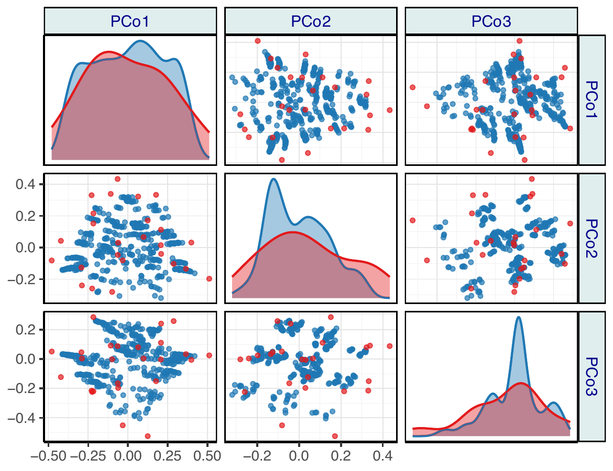</td>
<td style="text-align: center;">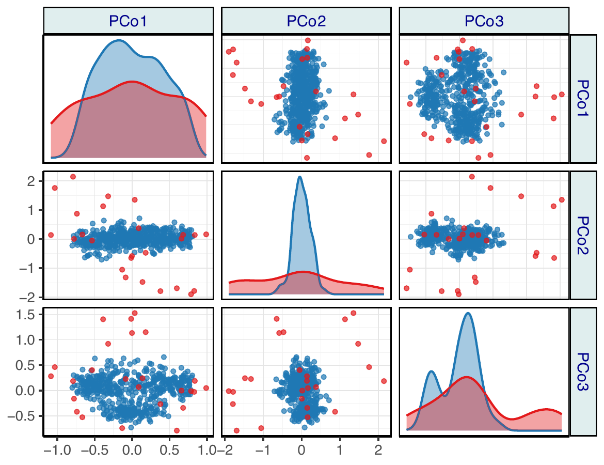</td>
<td style="text-align: center;">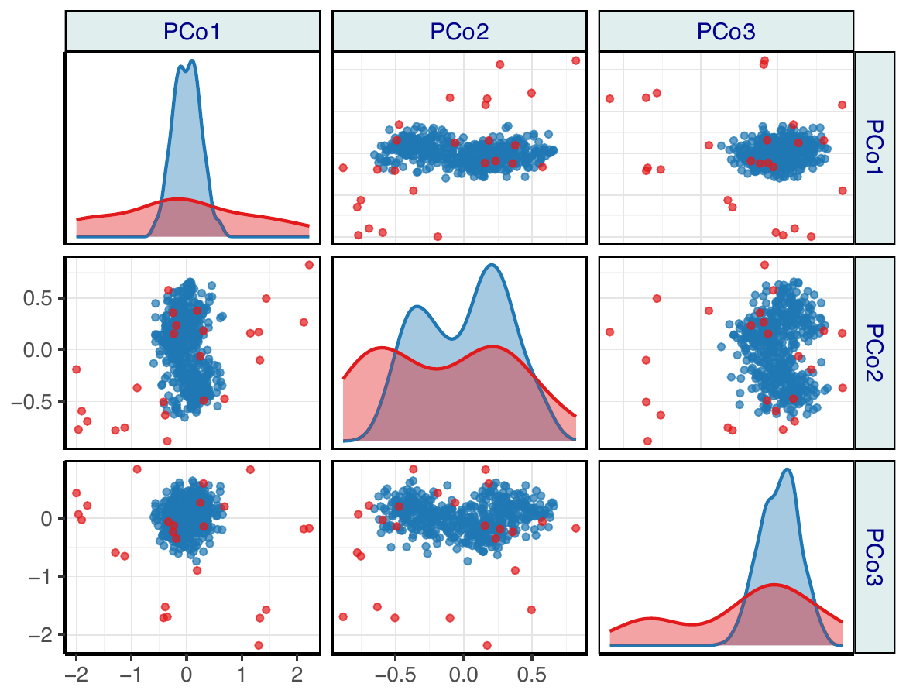</td>
</tr>
<tr>
<td style="text-align: center;">(a) <span>Gower (outlying
units)</span><span id="fig:gower_mc"
data-label="fig:gower_mc"></span></td>
<td style="text-align: center;">(b) <span>G-Gower (outlying
units)</span><span id="fig:ggower_mc_to"
data-label="fig:ggower_mc_to"></span></td>
<td style="text-align: center;">(c) <span>RelMS (outlying
units)</span><span id="fig:relms_mc_to"
data-label="fig:relms_mc_to"></span></td>
</tr>
<tr>
<td style="text-align: center;">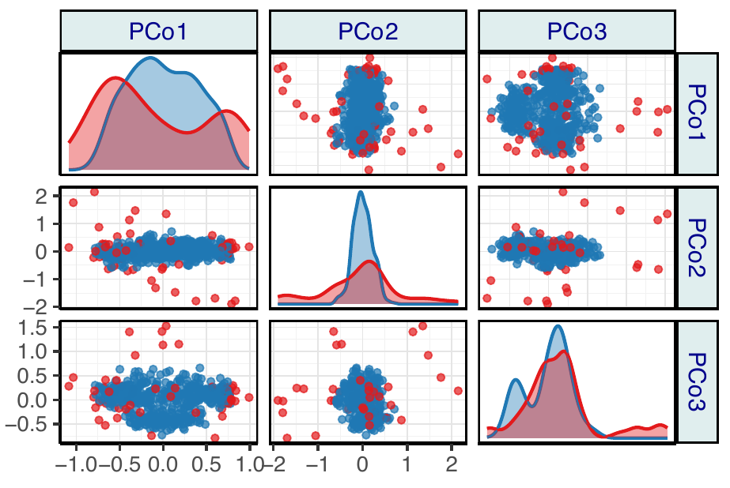</td>
<td style="text-align: center;">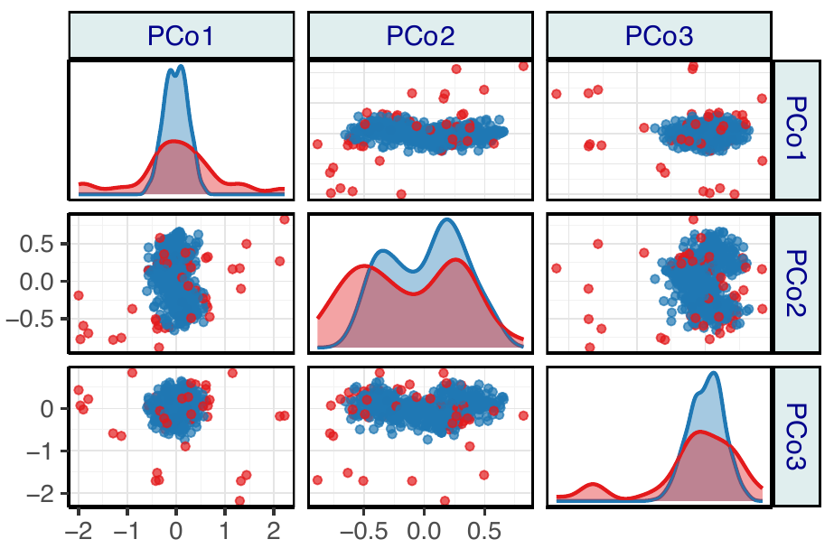</td>
<td style="text-align: center;"></td>
</tr>
<tr>
<td style="text-align: center;">(d) <span>G-Gower (trimmed
units)</span><span id="fig:ggower_mc"
data-label="fig:ggower_mc"></span></td>
<td style="text-align: center;">(e) <span>RelMS (trimmed
units)</span><span id="fig:relms_mc"
data-label="fig:relms_mc"></span></td>
<td style="text-align: center;"></td>
</tr>
</tbody>
</table>
<figcaption>Figure 3: MDS configurations for the
<code>Data_MC_contamination</code> dataset. Panels (a)–(c) display the
configurations obtained using the Gower, G-Gower, and RelMS distances,
respectively, where red points correspond to the true outliers
introduced in the data generation process. In panels (d)–(e) highlighted
points indicate the trimmed units to estimate the covariance matrix in
Mahalanobis distance.</figcaption>
</figure>

The analysis is followed by an examination of similarity networks to
provide a more detailed view of the relationships among observations.
Figure [4](#fig:qgraphs_mc){reference-type="ref"
reference="fig:qgraphs_mc"} displays the similarity networks (produced
with `"qgraph"` option of function `visualize_distances()`), where each
node represents an observation, and spatial proximity between nodes
reflects pairwise similarity (obtained as $1-\delta$, where $\delta$ is
the distance measure): nodes positioned closer together correspond to
more similar observations, while those farther apart are more
dissimilar. For visualization purposes, the graphs show randomly
selected stratified subsamples of $100$ observations, preserving the
target outlier proportions. Outlying units are colored red.

<figure id="fig:qgraphs_mc">
<table>
<caption> </caption>
<tbody>
<tr>
<td style="text-align: center;">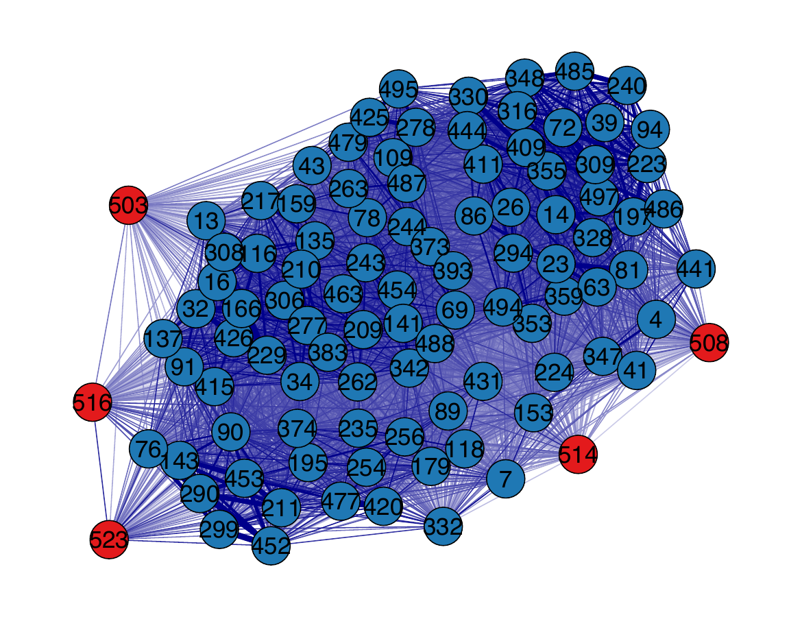</td>
<td style="text-align: center;">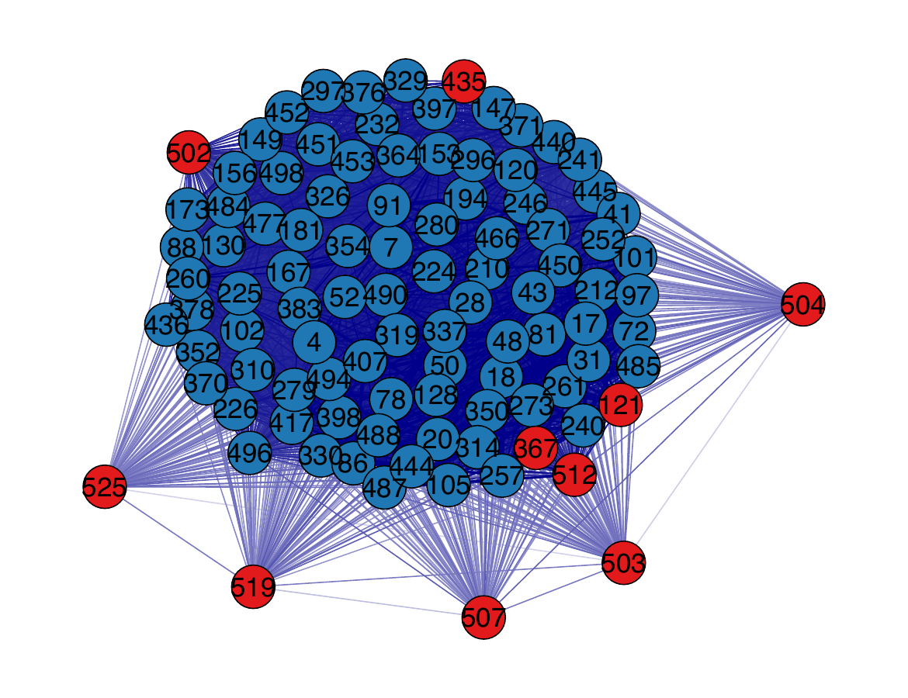</td>
<td style="text-align: center;">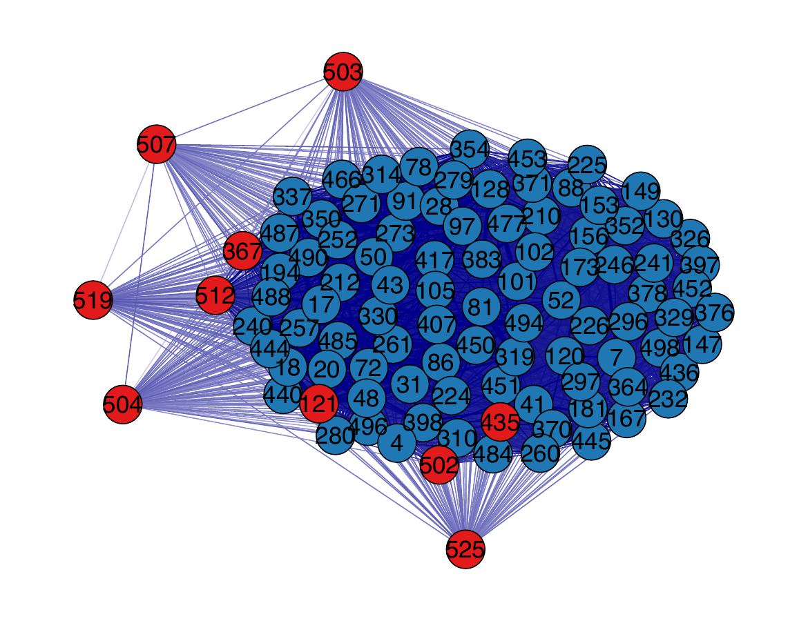</td>
</tr>
<tr>
<td style="text-align: center;">(a) <span>Gower (outlying
units)</span><span id="fig:qgraph_gower_mc"
data-label="fig:qgraph_gower_mc"></span></td>
<td style="text-align: center;">(b) <span>G-Gower (trimmed
units)</span><span id="fig:qgraph_ggower_mc"
data-label="fig:qgraph_ggower_mc"></span></td>
<td style="text-align: center;">(c) <span>RelMS (trimmed
units)</span><span id="fig:qgraph_relms_mc"
data-label="fig:qgraph_relms_mc"></span></td>
</tr>
<tr>
<td style="text-align: center;">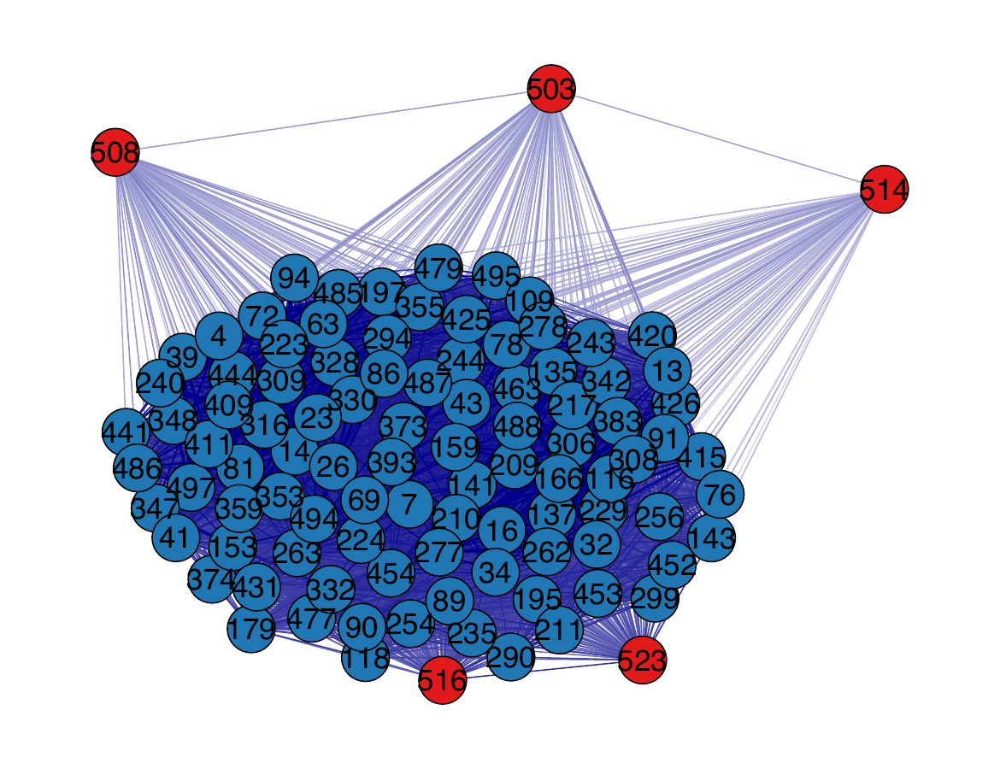</td>
<td style="text-align: center;">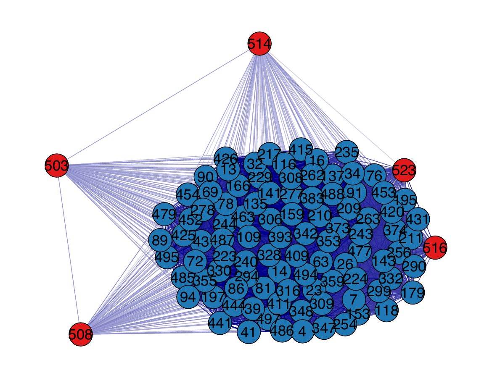</td>
<td style="text-align: center;"></td>
</tr>
<tr>
<td style="text-align: center;">(d) <span>G-Gower (outlying
units)</span><span id="fig:qgraph_ggower_mc_to"
data-label="fig:qgraph_ggower_mc_to"></span></td>
<td style="text-align: center;">(e) <span>RelMS (outlying
units)</span><span id="fig:qgraph_relms_mc_to"
data-label="fig:qgraph_relms_mc_to"></span></td>
<td style="text-align: center;"></td>
</tr>
</tbody>
</table>
<figcaption>Figure 4: Similarity networks (qgraphs) for the
<code>Data_MC_contamination</code> dataset. Panels (a)–(c) display the
connectivity structure of the observations under the Gower, G-Gower, and
RelMS distance measures, respectively. In panel (a), red nodes
correspond to the true outliers introduced during data generation,
whereas in panels (b) and (c), red nodes indicate the outliers detected
by the trimming procedure. Panels (d)–(e) show the true outliers for
G-Gower and RelMS, respectively, to facilitate comparison between
detected and actual anomalous units.</figcaption>
</figure>

A clear visual pattern emerges: many red nodes are either clustered
together or separated from the main cloud of blue nodes (non-outliers).
Even when red nodes are not distinctly isolated, they tend to appear on
the periphery of the blue cloud and are often connected to other red
nodes. Furthermore, since the true outliers were placed as the last
observations (indices $>500$), visual inspection reveals that many of
the trimmed nodes correspond to this upper-index region, confirming that
the trimming procedure effectively captures a substantial proportion of
the true outliers.

It is worth emphasizing, however, that the trimming step implemented in
the robust distances is not primarily intended as an outlier detection
procedure. Its goal is to robustify the distance estimation by reducing
the influence of observations that lie far from the bulk of the data,
rather than to explicitly identify or label them as anomalous. The fact
that many trimmed units coincide with the true outliers illustrates the
effectiveness of this robustification process: by downweighting or
excluding extreme observations, the robust distances recover a more
faithful representation of the underlying data geometry.

Overall, the visual evidence provided by the MDS configurations and
similarity networks generated using the `visualize_distances()` function
from the `dbrobust` package suggests that the robust metrics are
effective in isolating anomalous observations while preserving the
structure of the regular data, thereby achieving a more reliable
foundation for subsequent modeling or clustering tasks.

### World development indicators

To illustrate the performance of the robust distance measures in a
real-world setting, we analyze a dataset derived from the *World
Development Indicators* (World Bank), available at
<https://www.kaggle.com/datasets/hn4ever/world-development-indicators-bycountries>.
The dataset comprises a set of socioeconomic indicators that capture
diverse dimensions of national development with a sample size of 97
countries worldwide. Specifically, we use the observations corresponding
to the year 2021, which is the latest year consistently available for
the selected indicators. The numerical variables include the homicide
rate (`Hom`, number of homicides per 100,000 inhabitants), the
proportion of the population living on less than \$3.20 per day adjusted
for purchasing power parity (`B320`), life expectancy at birth (`LEx`),
infant mortality rate (`IMo`, number of children dying before age one
per 1,000 live births), the percentage of the population suffering from
insufficient nutrition (`INu`), government expenditure on education as a
percentage of GDP (`GEE`), and the proportion of arable land suitable
for cultivation (`ArL`). Three binary variables describe key aspects of
infrastructure and public services: the adequacy of the health system
(`HSy`, with categories 1 = Adequate, 2 = Inadequate), access to
electricity (`Ele`, with categories 1 = High, 2 = Low) and the poverty
indicator (`Pov`, with two categories: 1 = High and 2 = Low) that
classifies countries according to their general poverty status. In
addition, two categorical variables provide contextual information: the
continent of each country (`Con`, with five categories: Africa,
Americas, Asia, Europe, and Oceania) and the pollution level (`Pol`,
with three categories: 1 = High, 2 = Medium, 3 = Low).

It is important to note that the variables `Con` (Continent) and `Pov`
(Poverty) were not included in the distance computation, as they were
used exclusively for conditioning and interpretative purposes in the
subsequent analyses.

Additionally, to account for the relative importance of each
observation, a weighting variable was incorporated into the dataset
based on national population size. Specifically, total population data
for the most recent available year (2022) were retrieved from the
DataHub repository (sourced from the World Bank). The resulting
population figures were merged with the main dataset by country name,
and normalized to create observation-specific weights. These weights
reflect the demographic scale of each country and are employed in
subsequent analyses to ensure that larger populations exert
proportionally greater influence while preserving comparability among
units.

To analyze this mixed-type dataset, we proceed as in the previous
application. We start by computing the three distances, namely Gower,
robust G-Gower and robust RelMS, and before their comparison, we include
a heatmap representation for robust G-Gower metric (produced with
`"heatmap"` option) for illustrative purposes (see
Figure [5](#fig:heatmap.ggower){reference-type="ref"
reference="fig:heatmap.ggower"}).

{#fig:heatmap.ggower
width="100%" alt="graphic without alt text"}

To illustrate the performance of the three distances, we present a
comparative study whose main goal is to assess the behavior of the
classical and robust approaches under realistic socioeconomic data
conditions, where heterogeneity across countries and potential data
irregularities (e.g., extreme values or nonlinear dependencies) may
distort the analysis.

To further illustrate these aspects,
Figure [6](#fig:mds_worlddata){reference-type="ref"
reference="fig:mds_worlddata"} presents the multiple MDS plots with the
classical MDS configurations obtained from the three distance matrices,
with variable `Pov` (Poverty) as the conditioning factor.

<figure id="fig:mds_worlddata">
<table>
<caption> </caption>
<tbody>
<tr>
<td style="text-align: center;">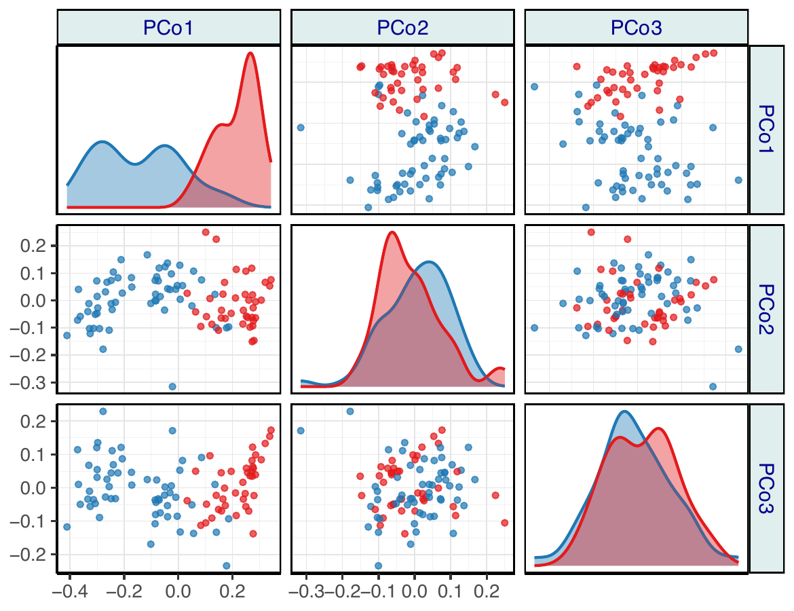</td>
<td style="text-align: center;">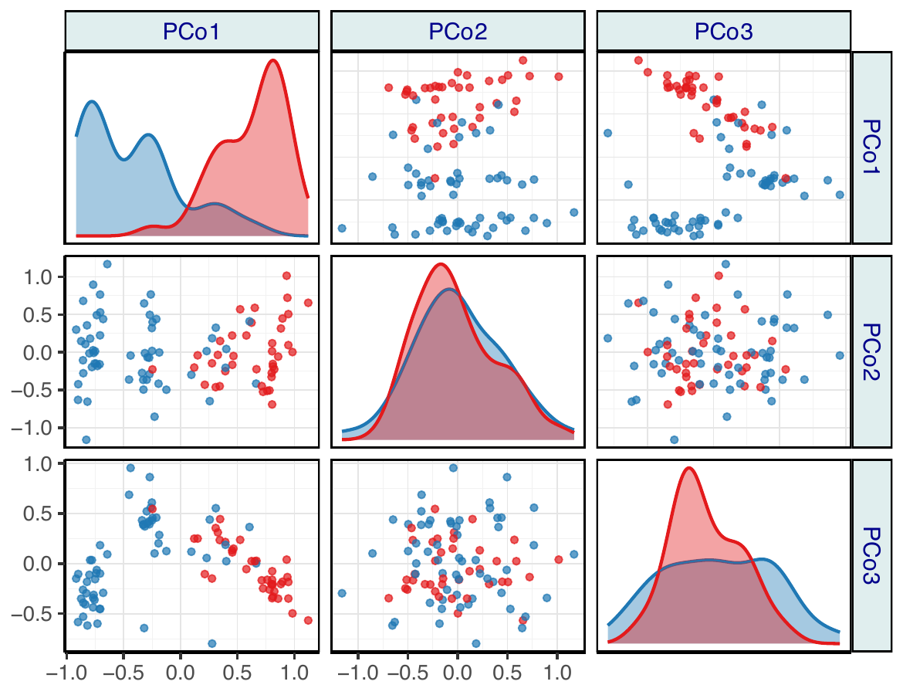</td>
<td style="text-align: center;">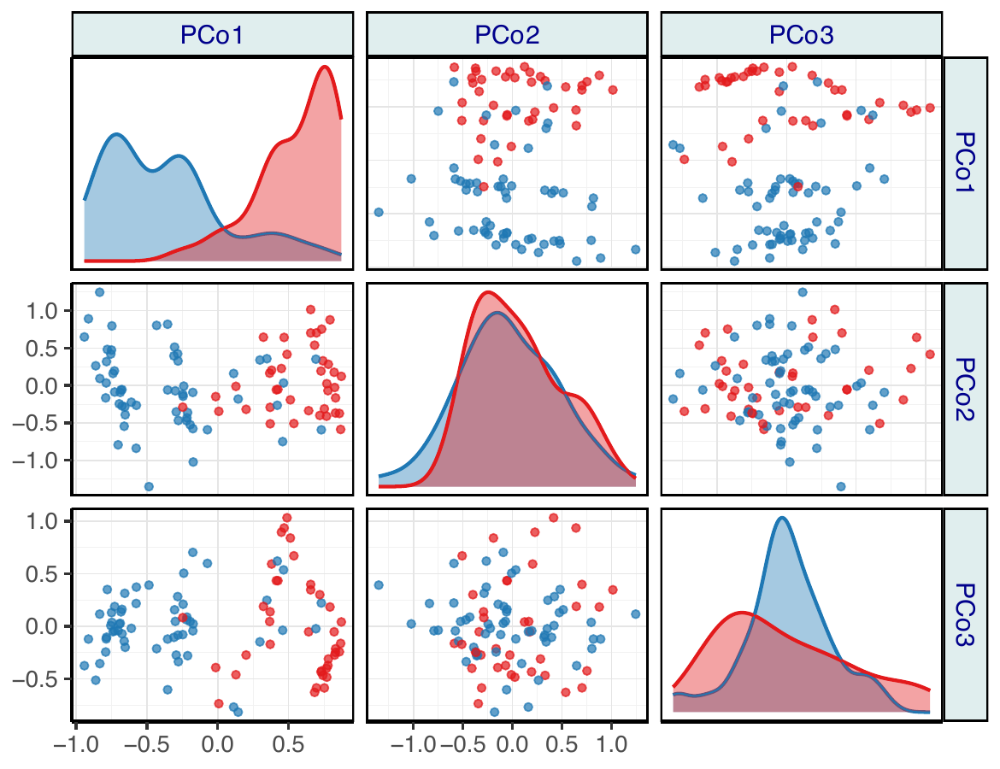</td>
</tr>
<tr>
<td style="text-align: center;">(a) Gower<span id="fig:mds_gower"
data-label="fig:mds_gower"></span></td>
<td style="text-align: center;">(b) G-Gower<span id="fig:mds_ggower"
data-label="fig:mds_ggower"></span></td>
<td style="text-align: center;">(c) RelMS<span id="fig:mds_relms"
data-label="fig:mds_relms"></span></td>
</tr>
</tbody>
</table>
<figcaption>Figure 6: Multiple MDS configurations for the World
Development Indicators dataset under three distance measures. Each panel
displays the two-dimensional projection of 97 countries, colored by
poverty level (<code>Pov</code>; Blue = High poverty level, Red = Low
poverty level).</figcaption>
</figure>

The MDS configurations in
Figure [6](#fig:mds_worlddata){reference-type="ref"
reference="fig:mds_worlddata"} display the spatial arrangement of
countries according to their socioeconomic similarity, grouped by
poverty level (`Pov`). Under the classical Gower distance (a), two
well-defined clusters emerge, corresponding to the high- and low-poverty
groups, with only a few countries lying in intermediate positions. The
same general structure is preserved under the robust G-Gower and RelMS
distances (b)--(c), indicating that the dataset exhibits
low-contamination conditions.

To gain further insight into the global development patterns,
Figure [7](#fig:mds_worlddata_continent){reference-type="ref"
reference="fig:mds_worlddata_continent"} displays the multiple MDS plots
with the classical MDS configurations obtained from the three distance
matrices, using the variable `Con` (Continent) as the conditioning
factor. Coloring the countries by continent allows us to assess whether
geographic or regional factors are reflected in the latent similarity
structure captured by each distance measure.

<figure id="fig:mds_worlddata_continent">
<table>
<caption> </caption>
<tbody>
<tr>
<td style="text-align: center;">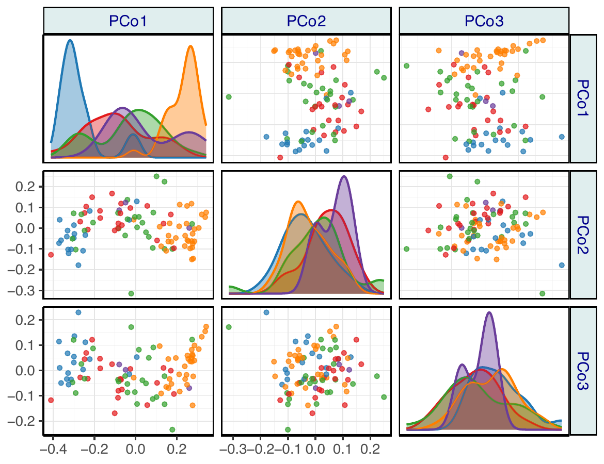</td>
<td style="text-align: center;">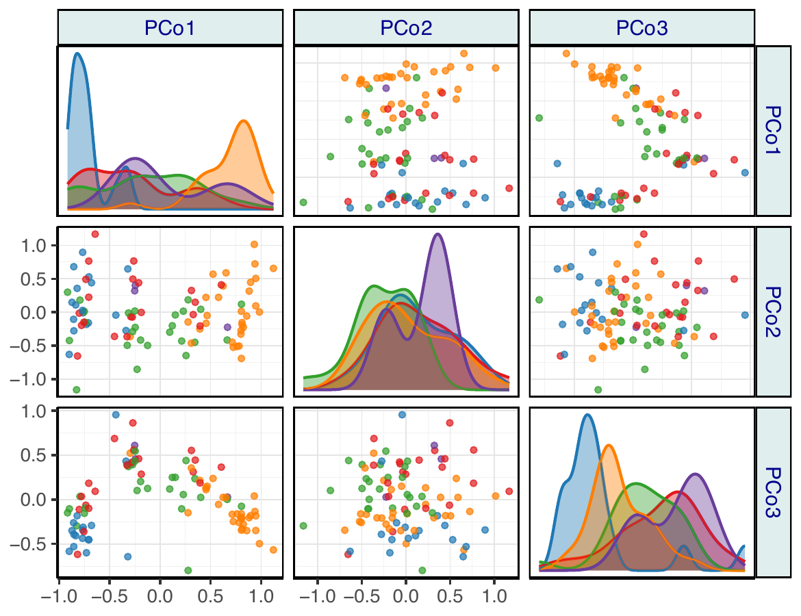</td>
<td style="text-align: center;">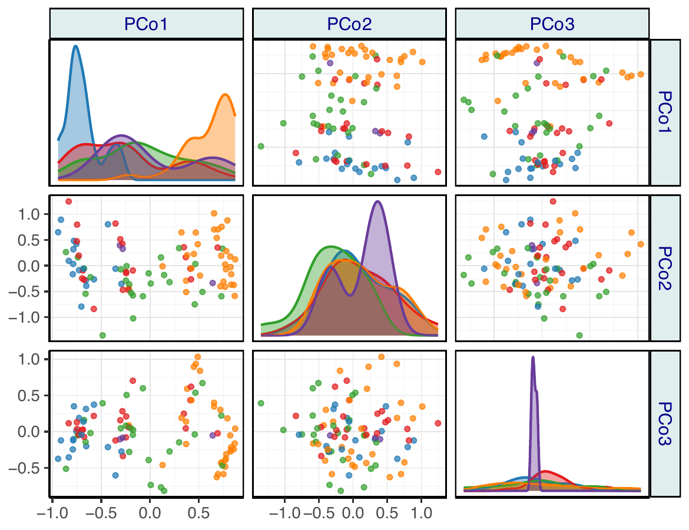</td>
</tr>
<tr>
<td style="text-align: center;">(a) Gower<span id="fig:mds_gower_con"
data-label="fig:mds_gower_con"></span></td>
<td style="text-align: center;">(b) G-Gower<span id="fig:mds_ggower_con"
data-label="fig:mds_ggower_con"></span></td>
<td style="text-align: center;">(c) RelMS<span id="fig:mds_relms_con"
data-label="fig:mds_relms_con"></span></td>
</tr>
</tbody>
</table>
<figcaption>Figure 7: Multiple MDS configurations for the World
Development Indicators dataset under three distance measures. Each panel
displays the two-dimensional projection of 97 countries, colored by
continent (<code>Con</code>; Blue = Africa, Red = America, Green = Asia,
Orange = Europe, Purple = Oceania).</figcaption>
</figure>

The MDS configurations in
Figure [7](#fig:mds_worlddata_continent){reference-type="ref"
reference="fig:mds_worlddata_continent"} reveal a clear regional
structure in the World Development Indicators dataset. Under the
classical Gower distance (a), European and American countries form
compact clusters, whereas African and Asian nations appear more
dispersed, suggesting greater internal heterogeneity in their
socioeconomic indicators. When the robust G-Gower and RelMS distances
are applied (b)-(c), the global configuration becomes smoother and less
dominated by extreme countries. The robust methods attenuate the
influence of highly unbalanced indicators such as homicide rate or
access to electricity, allowing a more balanced representation of
intercontinental relationships. For example, countries from Asia and the
Americas overlap more consistently, reflecting intermediate development
profiles, while African countries remain more distinct but less isolated
than in the classical solution.

To complement the MDS representations,
Figure [8](#fig:qgraph_worlddata_pov){reference-type="ref"
reference="fig:qgraph_worlddata_pov"} displays the network structures
derived from the three distance matrices using the `"qgraph"`
visualization method, with countries grouped by their poverty level
(`Pov`). In these networks, edges represent the strongest inter-country
similarities, while node proximity and color reflect the degree of
connectedness within and across poverty groups.

<figure id="fig:qgraph_worlddata_pov">
<table>
<caption> </caption>
<tbody>
<tr>
<td style="text-align: center;">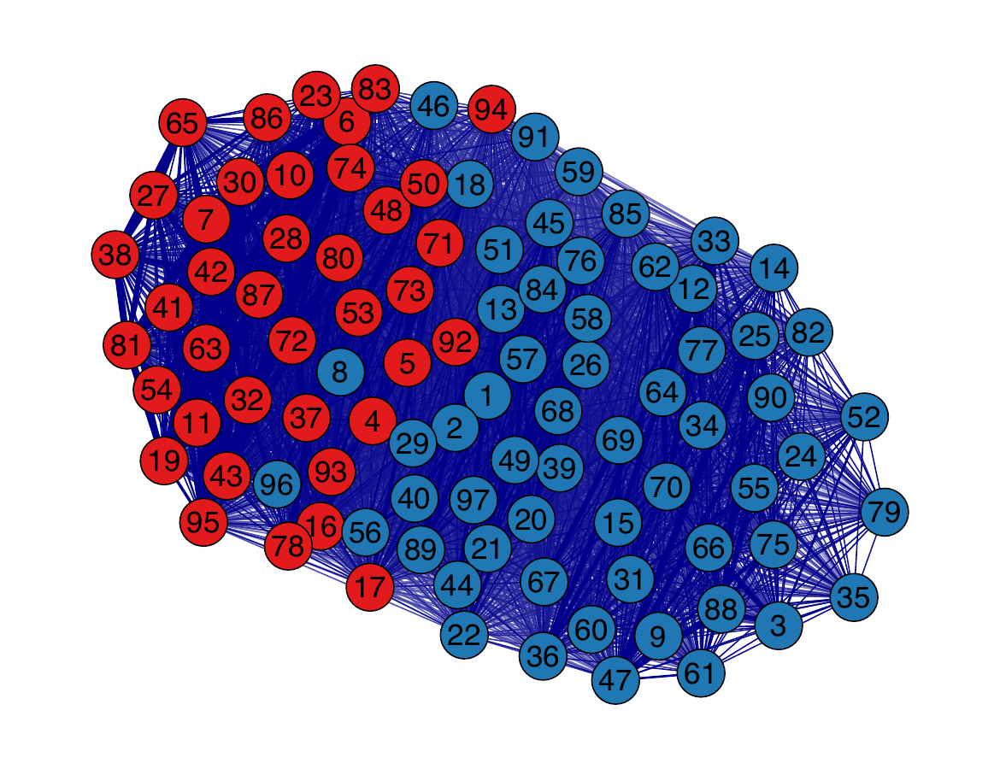</td>
<td style="text-align: center;">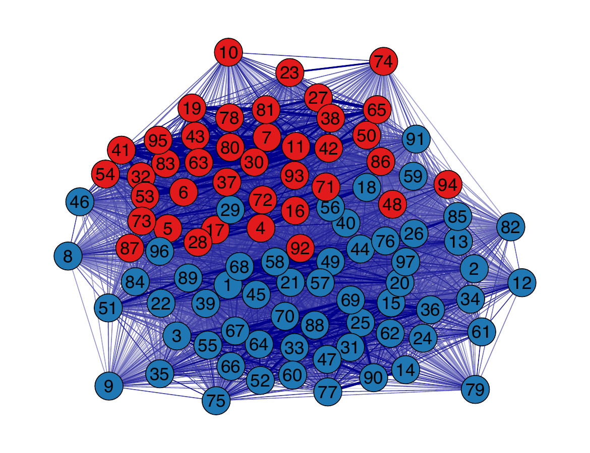</td>
<td style="text-align: center;">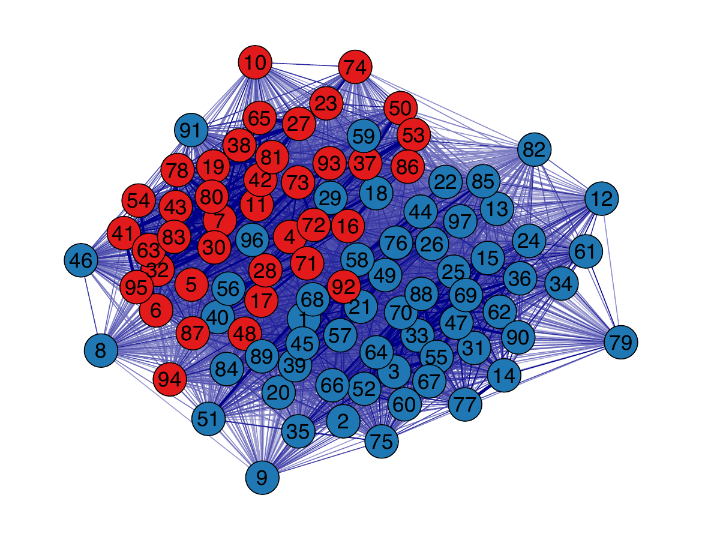</td>
</tr>
<tr>
<td style="text-align: center;">(a) Gower<span id="fig:qgraph_gower_pov"
data-label="fig:qgraph_gower_pov"></span></td>
<td style="text-align: center;">(b) G-Gower<span
id="fig:qgraph_ggower_pov"
data-label="fig:qgraph_ggower_pov"></span></td>
<td style="text-align: center;">(c) RelMS<span id="fig:qgraph_relms_pov"
data-label="fig:qgraph_relms_pov"></span></td>
</tr>
</tbody>
</table>
<figcaption>Figure 8: Network visualizations (<code>qgraph</code>) of
the World Development Indicators dataset under three distance measures,
with nodes colored by poverty level (<code>Pov</code>; Blue = High
poverty level, Red = Low poverty level).</figcaption>
</figure>

In the network representations of
Figure [8](#fig:qgraph_worlddata_pov){reference-type="ref"
reference="fig:qgraph_worlddata_pov"}, countries are grouped by poverty
level. The classical Gower graph (a) displays two well-established
clusters with a few overlapped observations, the same for G-Gower (b)
and RelMS (c) demonstrating that the data present low-contamination
conditions. When contamination is absent, robust methods perform
comparably to classical ones.

Similarly, Figure [9](#fig:qgraph_worlddata_con){reference-type="ref"
reference="fig:qgraph_worlddata_con"} presents the `"qgraph"`
representations for the same three distance measures, this time grouping
countries by continent (`Con`). These network structures highlight
regional cohesion and cross-continental linkages based on socioeconomic
similarity.

<figure id="fig:qgraph_worlddata_con">
<table>
<caption> </caption>
<tbody>
<tr>
<td style="text-align: center;">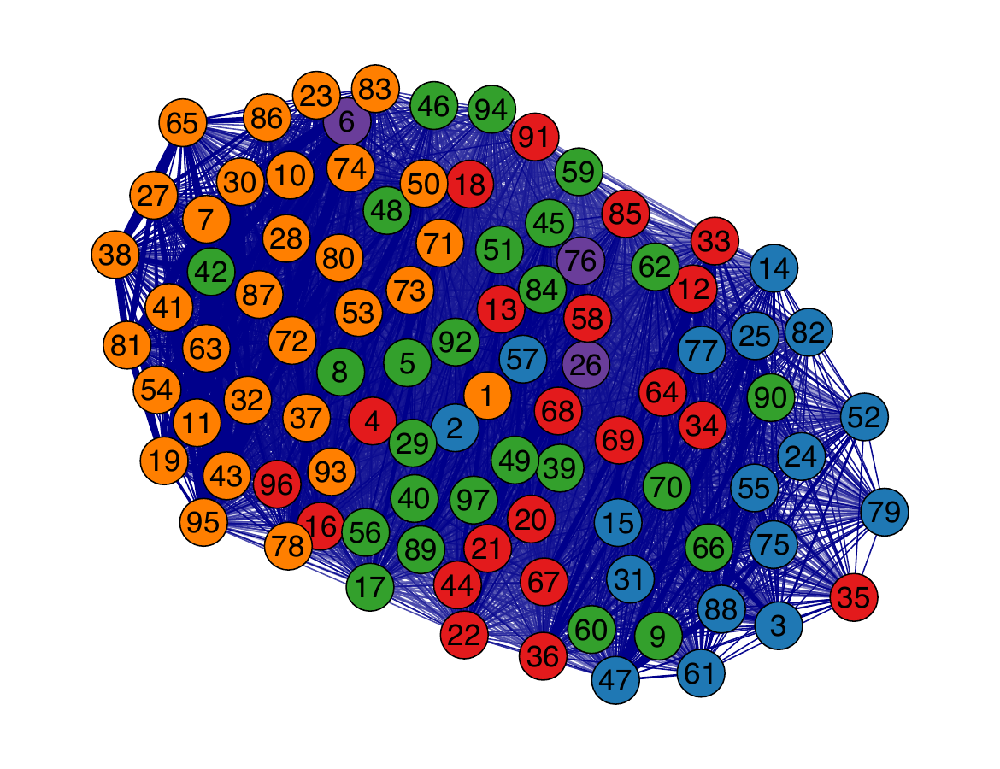</td>
<td style="text-align: center;">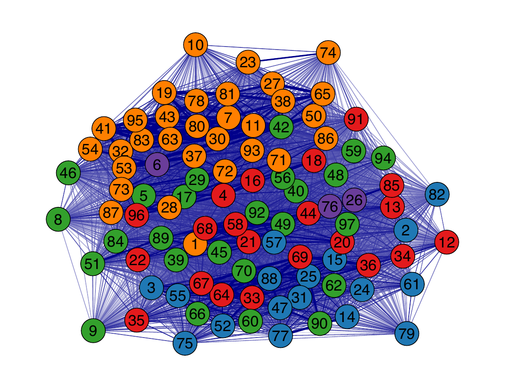</td>
<td style="text-align: center;">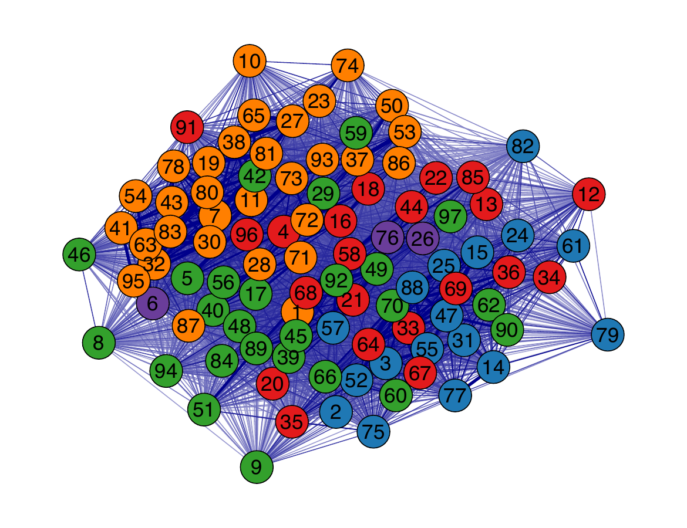</td>
</tr>
<tr>
<td style="text-align: center;">(a) Gower<span id="fig:qgraph_gower_con"
data-label="fig:qgraph_gower_con"></span></td>
<td style="text-align: center;">(b) G-Gower<span
id="fig:qgraph_ggower_con"
data-label="fig:qgraph_ggower_con"></span></td>
<td style="text-align: center;">(c) RelMS<span id="fig:qgraph_relms_con"
data-label="fig:qgraph_relms_con"></span></td>
</tr>
</tbody>
</table>
<figcaption>Figure 9: Network visualizations (<code>qgraph</code>) of
the World Development Indicators dataset under three distance measures,
with nodes colored by continent (<code>Con</code>; Blue = Africa, Red =
America, Green = Asia, Orange = Europe, Purple = Oceania).</figcaption>
</figure>

The network visualizations in
Figure [9](#fig:qgraph_worlddata_con){reference-type="ref"
reference="fig:qgraph_worlddata_con"} show that the three distance
measures produce very similar connectivity patterns. In all cases Europe
appears as a relatively compact and well-defined cluster, indicating
homogeneous socioeconomic profiles among European countries in the
dataset. The other continents (Africa, Asia and the Americas) display
greater internal variability and, in some areas, partially overlapping
connections; this overlapping is present across the Gower, G-Gower and
RelMS graphs and is not visibly reduced by the robust alternatives. In
short, the robust distances do not produce a markedly different network
topology here, a finding consistent with a dataset that lacks strong
influential outliers: when contamination is absent or weak,
robustification yields configurations comparable to the classical
measure rather than "improvements" in network structure.

Overall, the empirical results obtained in this application indicate
that the robust distance measures, G-Gower and RelMS, do not outperform
the classical Gower distance in either the MDS or network
representations. This outcome is conceptually consistent with the
theoretical rationale of robust methods: their purpose is not to enhance
performance under regular data conditions, but to ensure stability and
resilience in the presence of contamination, extreme observations, or
structural imbalance. In this dataset, characterized by moderate
variability and limited influence of atypical cases, the classical and
robust approaches converge toward similar configurations. Rather than
aiming to highlight the superiority of robust measures, this application
was intended to demonstrate the practical implementation and versatility
of the `dbrobust` package, illustrating how it can be applied to
complex, real-world socioeconomic data.

## Conclusion {#sec.conclusions}

This work introduces
[**dbrobust**](https://CRAN.R-project.org/package=dbrobust), a
comprehensive R package designed to address the methodological and
practical challenges of robust DB analysis in datasets of mixed-type.
Through a unified framework, the package enables the computation and
visualization of classical and robust distances across mixed variable
types, offering tools that are both accessible and extensible for
applied researchers.

The proposed methodology demonstrates advantages in handling data
contamination, preserving structural patterns, and enhancing
interpretability. By integrating novel robust formulations and advanced
visualization techniques,
[**dbrobust**](https://CRAN.R-project.org/package=dbrobust) facilitates
exploratory and confirmatory analyses that are resilient to outliers and
adaptable to diverse research contexts. In the current framework,
robustness is primarily introduced through the continuous component of
the mixed-data dissimilarities, whereas binary and categorical variables
are handled through classical similarity and dissimilarity measures.
Importantly, the package bridges the gap between theoretical innovation
and practical implementation, supporting seamless interoperability with
existing R tools and workflows. Its utility is particularly relevant in
fields such as social sciences, quality of life research, and gender
inequality studies, where weighted complex data structures and
robustness requirements are common.

The development of
[**dbrobust**](https://CRAN.R-project.org/package=dbrobust) represents a
significant contribution to the statistical ecosystem, empowering
analysts to extract meaningful insights from complex, real-world
datasets through robust and interpretable DB methods. Future research
may extend the current framework by incorporating robust alternatives
for binary and categorical variables, further broadening the scope of
robust mixed-data analysis. Its seamless compatibility with the
[**dbstats**](https://CRAN.R-project.org/package=dbstats) package for DB
regression modeling, as well as with other widely used R packages that
rely on distance inputs, such as those for clustering and
classification, ensures its integration into existing analytical
workflows and reinforces its practical value for applied research.

## CRediT authorship contribution statement {#credit-authorship-contribution-statement .unnumbered}

**Marcos Álvarez:** Software, Writing -- Original draft preparation,
Investigation. **Eva Boj:** Conceptualization, Methodology, Software,
Writing -- Original draft preparation, Reviewing and Editing,
Investigation, Supervision. **Aurea Grané:** Conceptualization,
Methodology, Software, Writing -- Original draft preparation, Reviewing
and Editing, Investigation, Supervision.

## Funding {#funding .unnumbered}

The authors gratefully acknowledge the support of grants
PID2021-123592OB-I00 and TED2021-129316B-I00 funded by
MCIN/AEI/10.13039/501100011033 and by "ERDF A way of making Europe" and
"European Union NextGenerationEU/PRTR".

**Appendix: Internal and logical modular structure of functions in
dbrobust**

## Internal and logical modular structure of function for computing dissimilarities and similarities {#AppCalculateDistances}

The `calculate_distances` function is designed following a modular
architecture, which delegates specific tasks to helper functions
depending on the data type and distance method.
Table [4](#tab:T4){reference-type="ref"
reference="tab:modular-structure"} summarizes each internal component
and its role.

::: {#tab:modular-structure}
  --------------------------------------------------------------------------------------------------------------------------------------------------------------------------------------------------------------------------------------------------------------------------------------------------------------------------------------------------------------------------------------------------------------------------------------------------------------------------------------------------------------------------------------------------------
  **Function**            **Description**
  ----------------------- --------------------------------------------------------------------------------------------------------------------------------------------------------------------------------------------------------------------------------------------------------------------------------------------------------------------------------------------------------------------------------------------------------------------------------------------------------------------------------------------------------------------------------
  `calculate_distances`   Main entry point and wrapper function. Validates arguments, selects method category, delegates computation to specialized helper functions, and formats values.

  `distBinary`            Computes pairwise distances for binary data using standard measures such as Jaccard, Dice, and Sokal-Michener. Uses [**ade4**](https://CRAN.R-project.org/package=ade4) where appropriate.

  `distCategorical`       Computes distances for categorical variables using the matching coefficient (proportion of attribute matches) or the Cramér-based distance which accounts for the pair-wise association between variables.

  `distContinuous`        Handles numerical data using measures such as Euclidean, Minkowski, Mahalanobis, Cosine, and Correlation. Uses base R and [**proxy**](https://CRAN.R-project.org/package=proxy) where appropriate.

  `distMixed`             Implements Gower's distance for mixed-type data. Continuous variables are scaled by range; binary variables can be treated as symmetric or asymmetric (controlled by `binaryAsym`; only 1/1 counts as a match); categorical variables are compared by exact match. Users can optionally specify which columns are continuous, binary, or categorical using the arguments `continuousCols`, `binaryCols`, and `categoricalCols`. Similarities are converted to distances ($d = 1 - s$), yielding a symmetric matrix in \[0,1\].

  `formatOutput`          Converts distance matrix into the desired value format: `dist`, full matrix, or similarity matrix using selected transformation.

  `convertToDist`         Utility function to coerce similarity matrices into `dist` objects. Supports linear and square-root transformations.
  --------------------------------------------------------------------------------------------------------------------------------------------------------------------------------------------------------------------------------------------------------------------------------------------------------------------------------------------------------------------------------------------------------------------------------------------------------------------------------------------------------------------------------------------------------

  : (#tab:T4) Modular structure of function for computing
  dissimilarities and similarities.
:::

Modularizing the `calculate_distances()` function is crucial for
maintaining clarity, flexibility, and ease of maintenance. By breaking
down the computation into specialized helper functions based on data
type and distance measure, the function becomes more organized and
easier to extend or debug. This approach also promotes code reuse and
separation of concerns, allowing each component to focus on a specific
task. Furthermore, leveraging established external libraries such as
[**proxy**](https://CRAN.R-project.org/package=proxy) or
[**ade4**](https://CRAN.R-project.org/package=ade4) whenever possible
ensures efficient implementations of complex distance calculations,
reduces development time, and benefits from community-tested and
optimized algorithms, ultimately enhancing the reliability and
performance of the values returned by the function.

The function `calculate_distances()` might be intricate and modular, yet
its logic can be broken down into a series of conceptual steps, which
are outlined in Table [5](#tab:T5){reference-type="ref"
reference="tab:modular-structure-calculate-distances"}.

::: {#tab:modular-structure-calculate-distances}
  --------------------------------------------------------------------------------------------------------------------------------------------------------------------------------
  **Step**                   **Description**
  -------------------------- -----------------------------------------------------------------------------------------------------------------------------------------------------
  Argument validation        Check `x` type, `outputFormat`, and `p` for Minkowski.

  Normalize method           Standardize method string (lowercase, underscores).

  Select distance function   Choose appropriate function based on method category (binary, categorical, continuous, mixed). This acts as a wrapper for the specialized routines.

  Compute distances          Call `distBinary`, `distCategorical`, `distContinuous`, or `distMixed`.

  Optional transformations   Square distances if requested; convert to similarity using linear or sqrt transformation.

  Return values              Return values as `dist` object, numeric matrix, or similarity matrix.
  --------------------------------------------------------------------------------------------------------------------------------------------------------------------------------

  : (#tab:T5) Internal logical structure of function for computing
  dissimilarities and similarities and helper functions
:::

## Internal and logical modular structure of function for ensuring the Euclideanarity of matrices of pairwise squared distances {#AppMakeEuclidean}

While `make_euclidean()` is implemented as a single function, its logic
can be decomposed into conceptual steps, summarized in
Table [6](#tab:T6){reference-type="ref"
reference="tab:modular-structure-euclidean"}.

::: {#tab:modular-structure-euclidean}
  ----------------------------------------------------------------------------------------------------------------------------------------------------
  **Step**                       **Description**
  ------------------------------ ---------------------------------------------------------------------------------------------------------------------
  Argument validation            Ensure the matrix argument `D` is a square matrix, and the weight vector `w` has matching length.

  Weight normalization           Normalize `w` to sum to 1.

  Compute weighted Gram matrix   Apply centering matrix $\mathbf{J}_w$ to $\mathbf{D}$ to obtain $\mathbf{G}_w$.

  Eigenvalue analysis            Extract eigenvalues of $\mathbf{G}_w$ and check smallest value against `tol`.

  Correction step                If $\lambda_{\min} < -$`tol`, shift $\mathbf{D}$ by $2\,|\lambda_{\min}|$ off-diagonal.

  Recompute eigenvalues          Compute eigenvalues of corrected $\mathbf{G}_w$ to verify positive semi-definiteness.

  Return values                  Return a list containing the corrected $\mathbf{\Delta}$ matrix, eigenvalues before/after, and transformation flag.
  ----------------------------------------------------------------------------------------------------------------------------------------------------

  : (#tab:T6) Internal logical structure of function for ensuring
  Euclideanarity of matrices of pairwise squared distances
:::

## Internal and logical modular structure of internal and logical modular structure of function for computing robust distances {#AppRobustDistances}

[]{#ref:table8 label="ref:table8"}

::: {#ref:table8}
  ----------------------------------------------------------------------------------------------------------------------------------------------------------------------------------------------------------------------------------------------------------------------------------------------------------------------------------------------------------------------------------------------------------------------------------------------------------------------------------------------------------------------------------------------------------------------------------------------------------------------------------------------------------------------------------------------------------------------------------------------------------------------------------------------------------------------
  **Step**                       **Description**
  ------------------------------ ---------------------------------------------------------------------------------------------------------------------------------------------------------------------------------------------------------------------------------------------------------------------------------------------------------------------------------------------------------------------------------------------------------------------------------------------------------------------------------------------------------------------------------------------------------------------------------------------------------------------------------------------------------------------------------------------------------------------------------------------------------------------------------------
  Argument validation            Ensures that either `p` or all variable groups are provided, checks for missing variables, and forbids `NA` values in the selected columns.

  Data preparation               Reorders variables, converts factors/characters to numeric codes, and assembles the data matrix in \[cont, bin, cat\] order.

  Weight handling                Sets equal weights if `w` is `NULL`; otherwise, normalizes and validates the user-supplied weights argument.

  Robust covariance estimation   If continuous variables are present and no covariance matrix is supplied by the user via the argument `robust_cov`, a robust covariance estimator is computed according to the argument `cov_method`. The option `"gv"` calls `robust_covariance_gv`, which estimates the covariance matrix using the geometric variability trimming approach controlled by the trimming proportion `alpha`. Alternatively, `"mcd"` calls `robust_covariance_mcd`, which computes a weighted Minimum Covariance Determinant (wMCD) estimator using an iterative C-step algorithm with multiple random initializations. Both estimators return the robust covariance matrix together with the corresponding diagnostic information (central observations, detected outliers, and trimming statistics).

  Squared distance computation   Depending on `method`, calls either `robust_ggower` or `robust_RelMS` to combine distances from each variable type.

  Attach diagnostics             If trimming was performed, attaches indices of central and outlier units, the $\phi$ proximity values, and trimming quantile `q` as attributes of the result.

  Return values formatting       Returns either squared distances `D2` or converts to a `dist` object with `D2toDist` if `return_dist = TRUE`.
  ----------------------------------------------------------------------------------------------------------------------------------------------------------------------------------------------------------------------------------------------------------------------------------------------------------------------------------------------------------------------------------------------------------------------------------------------------------------------------------------------------------------------------------------------------------------------------------------------------------------------------------------------------------------------------------------------------------------------------------------------------------------------------------------------------------------------

  : (#tab:T7) Internal logical structure of function for computing
  robust distances
:::

The `robust_distances()` function is designed following a modular
architecture as well as `calculate_distances()`, which delegates
specific tasks to helper functions depending on the robust distance
construction method. Tables [7](#tab:T7){reference-type="ref"
reference="ref:table8"}--[8](#tab:T8){reference-type="ref"
reference="tab:robust-functions"} summarize each internal and modular
component and its role.

::: {#tab:robust-functions}
  -----------------------------------------------------------------------------------------------------------------------------------------------------------------------------------------------------------------------------------------------------------------------------------------------------------------------------------------------------------------------------------------------------------------------------------------------------------------------------------------------------------------------------------------------------------------------
  **Function**              **Description**
  ------------------------- ---------------------------------------------------------------------------------------------------------------------------------------------------------------------------------------------------------------------------------------------------------------------------------------------------------------------------------------------------------------------------------------------------------------------------------------------------------------------------------------------------------------------------------------------
  `robust_covariance_gv`    Computes a robust covariance matrix for continuous variables using the weighted Mahalanobis distance approach summarized in Figure [2](#fig:robust-mahalanobis-workflow){reference-type="ref" reference="fig:robust-mahalanobis-workflow"} (see Section 3. Identifies central observations via a trimming procedure controlled by `alpha`, excluding outliers from the covariance estimation. Returns the covariance matrix, indices of central and outlier observations, the proximity measure ($\phi$), and the trimming threshold (`q`).

  `robust_covariance_mcd`   Computes a weighted Minimum Covariance Determinant (wMCD) estimator for the continuous variables. This estimator provides a highly robust covariance matrix by identifying a subset of observations with minimum covariance determinant, while allowing observation weights. The resulting covariance matrix can subsequently be used by both `robust_ggower` and `robust_RelMS`.

  `robust_ggower`           Computes a robust G-Gower distance for mixed data by replacing the normalized city-block distance for continuous variables with a robust Mahalanobis distance using trimming to mitigate outliers. Keeps classical definitions for binary and categorical variables and combines all three types by simple weighted summation. Purpose: robustify distances in presence of continuous outliers without altering the classical fusion scheme.

  `robust_RelMS`            Extends `robust_ggower` by integrating continuous, binary, and categorical sources through RelMS. Uses double-centering and interaction terms to reduce redundancy across variable types. Employs robust covariance and trimming for continuous data as before. Purpose: provide a more structured, robust, and less redundant joint metric for multitype data.
  -----------------------------------------------------------------------------------------------------------------------------------------------------------------------------------------------------------------------------------------------------------------------------------------------------------------------------------------------------------------------------------------------------------------------------------------------------------------------------------------------------------------------------------------------------------------------

  : (#tab:T8) Modular structure of function for computing robust
  distances and helper functions
:::

The robust aggregated distances computed by `robust_distances()` provide
a solid foundation for subsequent multivariate analyses in mixed-type
data settings. These robust metrics can be seamlessly integrated, for
instance, with the
[**dbstats**](https://CRAN.R-project.org/package=dbstats) package,
enabling robust DB regression models. This compatibility arises from the
fact that `robust_distances()` can return its results either as `D2`
objects or as `dist` objects, two of the accepted argument formats for
functions such as `dblm` or `dbglm` in
[**dbstats**](https://CRAN.R-project.org/package=dbstats).

## Internal and logical modular structure of function for merging distances {#AppMergeDistances}

The internal workflow of `merge_distances()`, including argument
validation, Euclidean correction, weighted aggregation, and consensus
distance reconstruction, is summarized in
Tables [9](#tab:T9){reference-type="ref"
reference="tab:merge-logical-structure"}--[10](#tab:T10){reference-type="ref"
reference="tab:merge-functions"}. The modular design facilitates the
integration of heterogeneous distance sources while ensuring
computational consistency and preserving Euclidean properties throughout
the merging process.

::: {#tab:merge-logical-structure}
  ----------------------------------------------------------------------------------------------------------------------------------------------------------------------------------------------------------------------------------------------------------------------
  **Step**                             **Description**
  ------------------------------------ ---------------------------------------------------------------------------------------------------------------------------------------------------------------------------------------------------------------------------------
  Argument validation                  Checks that at least two distance matrices are supplied, converts `dist` objects into matrices, verifies that all matrices are square with identical dimensions, and ensures that all distances are non-negative.

  Weight handling                      Validates and normalizes both the observation weights (`w`) and the matrix weights (`matrix_weights`). When either argument is omitted, equal weights are assigned before normalization.

  Euclidean preprocessing              Converts the input distance matrices into squared distances when necessary and applies `make_euclidean()` to each matrix to guarantee Euclidean properties before fusion.

  Gram matrix extraction               Computes the weighted Gram matrices and their square-root decompositions for each distance source using weighted double-centering.

  Source weighting                     Incorporates the user-defined matrix weights into both the Gram matrices and their square-root representations.

  Consensus Gram matrix construction   Depending on the value of `RelMS`, either computes a direct weighted aggregation of the Gram matrices or subtracts cross-source interaction terms computed by `relms_compute_cross_terms()` to reduce redundancy among sources.

  Distance reconstruction              Reconstructs the consensus squared distance matrix from the joint Gram matrix and removes possible numerical negative values.

  Output formatting                    Applies a final Euclidean correction using `make_euclidean()` and returns either the consensus squared distance matrix or a `dist` object according to the value of the argument `squared`.
  ----------------------------------------------------------------------------------------------------------------------------------------------------------------------------------------------------------------------------------------------------------------------

  : (#tab:T9) Internal logical structure of function for merging
  distances
:::

::: {#tab:merge-functions}
  -------------------------------------------------------------------------------------------------------------------------------------------------------------------------------------------------------------------------------------------------------------------------------------------------------------------------
  **Function**                  **Description**
  ----------------------------- -------------------------------------------------------------------------------------------------------------------------------------------------------------------------------------------------------------------------------------------------------------------------------------------
  `make_euclidean`              Transforms non-Euclidean distance matrices into Euclidean ones using the Lingoes correction, ensuring that all input and output distance matrices satisfy Euclidean properties.

  `relms_compute_cross_terms`   Computes the cross-interaction terms between weighted Gram matrix square roots using a C++ implementation based on [**RcppArmadillo**](https://CRAN.R-project.org/package=RcppArmadillo). These interaction terms are used by RelMS to reduce redundancy among multiple distance sources.

  `merge_distances`             Combines multiple distance matrices into a consensus distance matrix by either direct weighted aggregation or Related Metric Scaling (RelMS), returning the result either as a squared distance matrix or as a `dist` object.
  -------------------------------------------------------------------------------------------------------------------------------------------------------------------------------------------------------------------------------------------------------------------------------------------------------------------------

  : (#tab:T10) Modular structure of function for merging distances
  and helper functions
:::

The `merge_distances()` function provides a flexible framework for
integrating multiple distance matrices into a single consensus
representation. By supporting both direct weighted aggregation and the
Related Metric Scaling (RelMS) methodology, the function allows users to
combine complementary sources of information while reducing redundancy
among them when the RelMS option is selected. The resulting consensus
distance matrix can be directly employed in subsequent visualization,
clustering, multidimensional scaling, or distance-based statistical
analyses available in
[**dbrobust**](https://CRAN.R-project.org/package=dbrobust) and
compatible packages such as
[**dbstats**](https://CRAN.R-project.org/package=dbstats).

## Internal and logical modular structure of function for visualizing distances and similarities {#AppVisualizeDistances}

The internal workflow of `visualize_distances()`, including argument
validation, method selection, data preparation, and execution of the
plotting routines, is summarized in
Tables [11](#tab:T11){reference-type="ref"
reference="tab:viz-logical-structure"}--[12](#tab:T12){reference-type="ref"
reference="tab:viz-functions"}. From version `1.1.0`, the visualization
framework has been extended to support user-defined group color schemes
through the `group_colors` argument. When no custom colors are provided,
the internal helper function `get_custom_palette()` automatically
generates a palette of visually distinct colors.

::: {#tab:viz-logical-structure}
  ---------------------------------------------------------------------------------------------------------------------------------------------------------------------------------------------------------------------------------------
  **Step**                  **Description**
  ------------------------- -------------------------------------------------------------------------------------------------------------------------------------------------------------------------------------------------------------
  Argument validation       Checks that `dist_mat` is square and symmetric, and validates the arguments `k`, `weights`, `group`, and the optional `group_colors`.

  Method selection          Matches the `method` argument and directs execution to the corresponding plotting routine.

  Data preparation          Converts distance matrices to the appropriate format, applies weights if relevant, assigns group labels, and prepares either user-defined or automatically generated color schemes for visualization.

  Visualization execution   Calls the internal plotting functions (`plot_mds`, `plot_heatmap`, and `plot_qgraph`) according to the selected `method`.

  Return values             Returns the corresponding plotting object or produces the graphical output, depending on the selected visualization method (`ggmatrix` for MDS, `pheatmap` for heatmaps, and direct plotting for `qgraph`).
  ---------------------------------------------------------------------------------------------------------------------------------------------------------------------------------------------------------------------------------------

  : (#tab:T11) Internal logical structure of function for
  visualizing distances and similarities
:::

::: {#tab:viz-functions}
  --------------------------------------------------------------------------------------------------------------------------------------------------------------------------------------------------------------------------------------------------------------------------------------------------------------------------------------------------------------
  **Function**            **Description**
  ----------------------- --------------------------------------------------------------------------------------------------------------------------------------------------------------------------------------------------------------------------------------------------------------------------------------------------------------------------------------
  `visualize_distances`   Main interface for visualizing distance matrices. Validates that the matrix is square, symmetric, and has zero diagonals. Handles optional arguments such as `k`, `weights`, `group`, `group_colors`, and `main_title`. Delegates plotting tasks to `plot_mds`, `plot_heatmap`, or `plot_qgraph` according to the selected `method`.

  `plot_mds`              Performs classical (`cmdscale`) or weighted (`wcmdscale`) multidimensional scaling. Generates pairwise scatterplot matrices with density plots on the diagonal and supports group-based coloring to facilitate the interpretation of the projected observations.

  `plot_heatmap`          Plots a heatmap from a distance matrix, with hierarchical clustering and optional group annotations. Supports subsampling, color palette customization, and annotation colors for categorical group variables.

  `plot_qgraph`           Constructs a network graph from a distance matrix using [**qgraph**](https://CRAN.R-project.org/package=qgraph). Converts distances to similarities, applies edge thresholding, supports group coloring, and limits the number of displayed nodes.

  `get_custom_palette`    Generates a palette of visually distinct colors for group annotations. Returns a predefined set of colors or interpolates additional colors when more groups are present, providing the default color scheme whenever `group_colors` is not specified.
  --------------------------------------------------------------------------------------------------------------------------------------------------------------------------------------------------------------------------------------------------------------------------------------------------------------------------------------------------------------

  : (#tab:T12) Modular structure of function for visualizing
  distances and similarities and helper functions.
:::

The `visualize_distances()` function provides a unified interface for
exploring distance matrices through complementary graphical
representations. By combining multidimensional scaling, heatmaps, and
network visualizations within a common workflow, it facilitates the
interpretation of complex distance structures while allowing users to
incorporate grouping information through customizable visual
annotations.

[^1]: Although this is the most accepted general definition, there are
    similarity coefficients that do not lie within the $[0,1]$-interval,
    or that $s_{ii} \neq 1$.
