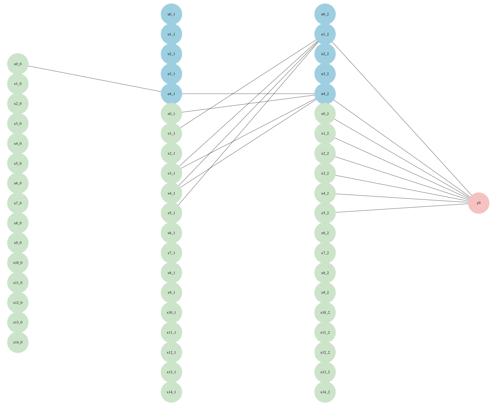
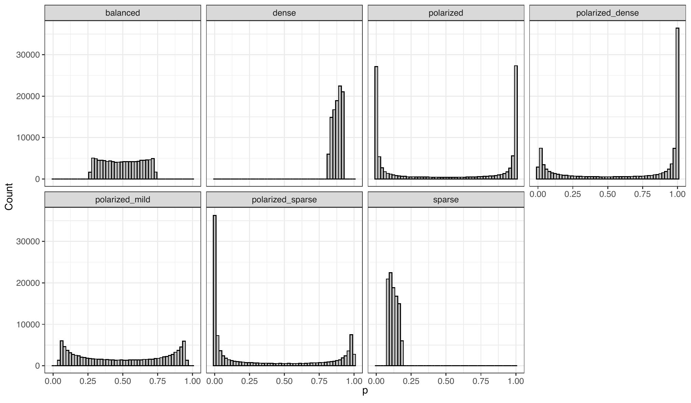
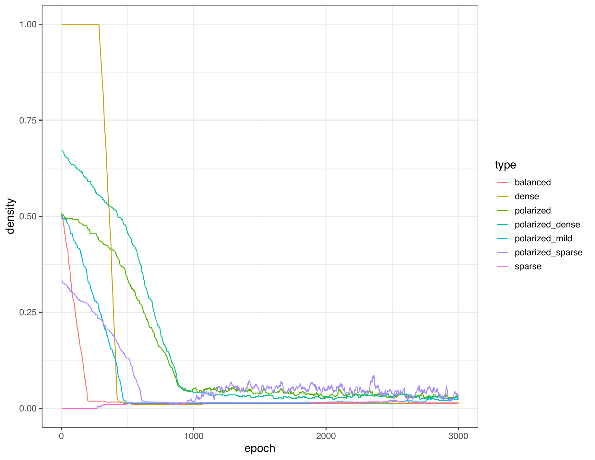
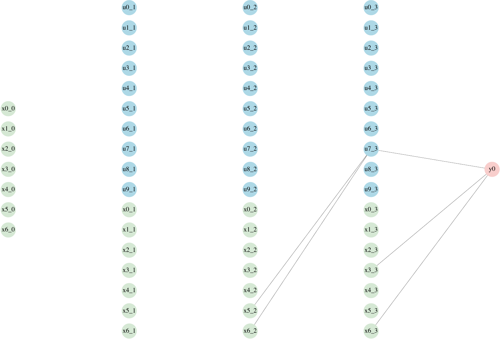
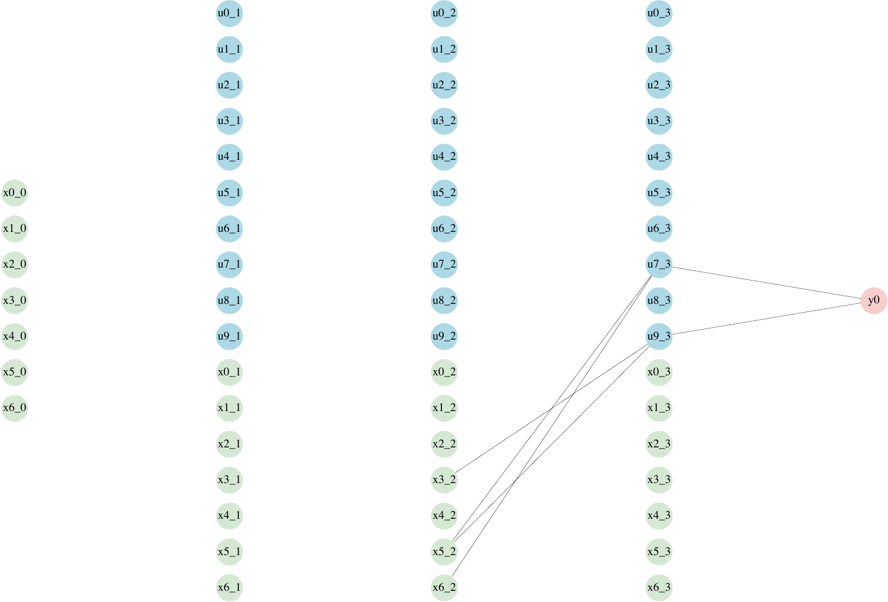
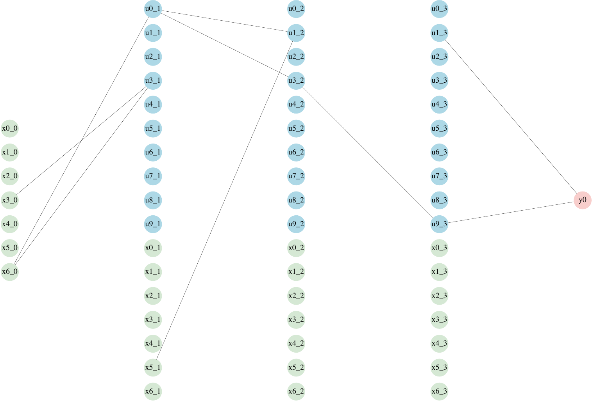
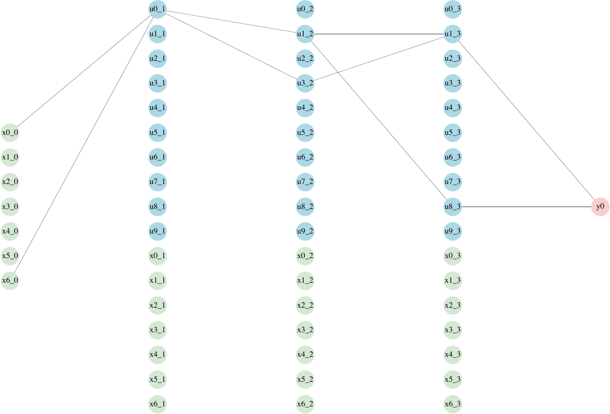
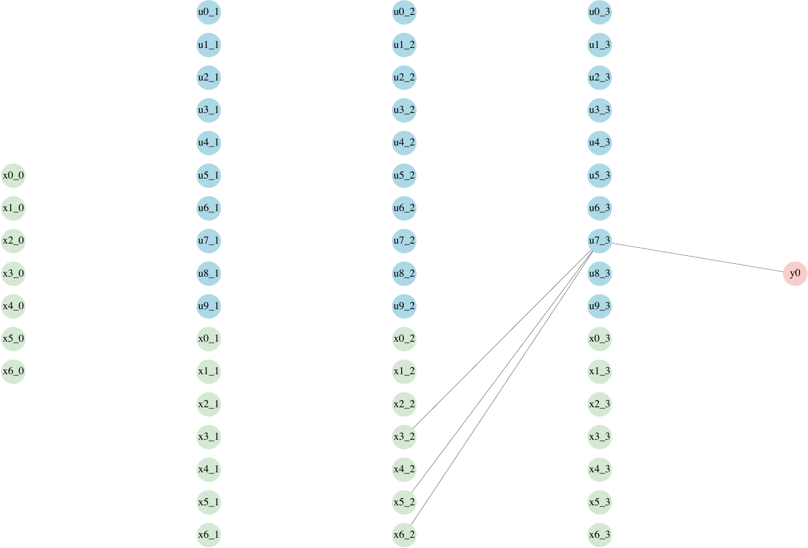
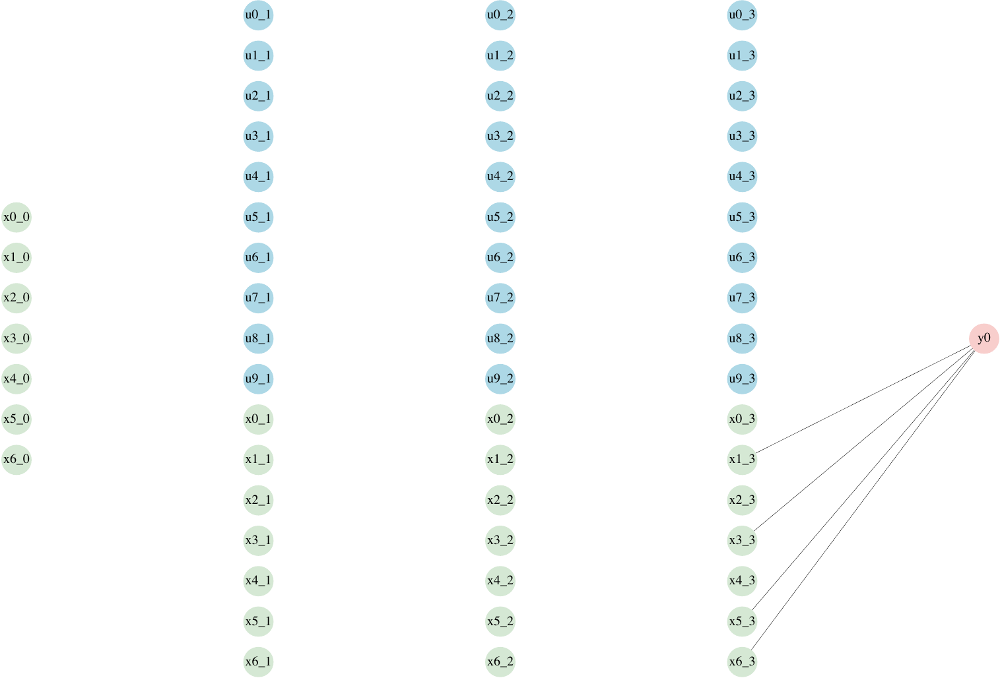
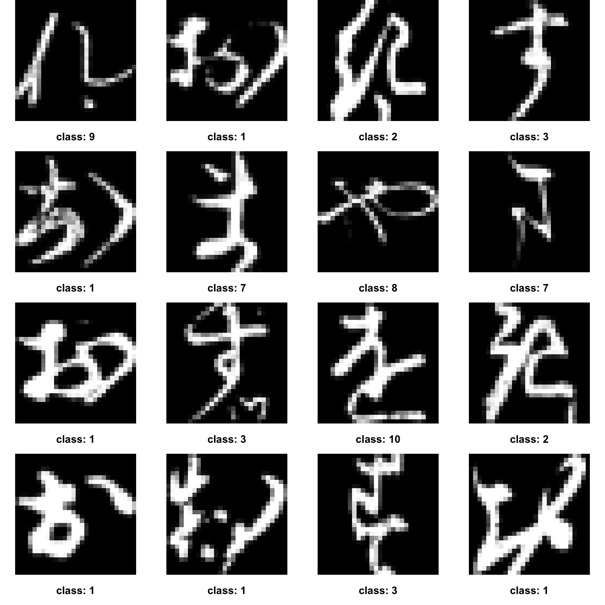

::: article
## Introduction

Modern deep learning architectures are typically parameterized by
billions of parameters, in addition to being black box, and not offering
uncertainty quantification, which makes them problematic to use in
highly sensitive domains. Bayesian neural networks (BNN) alleviate the
latter issue by having uncertainty quantification easily accessible by
treating the model parameters as random variables. Further, the
development of Latent Binary Bayesian Neural Networks (LBBNN) (Hubin and
Storvik 2024) allows for a scalable Bayesian approach to sparse neural
network learning, by including a Bernoulli inclusion indicator variable
for each weight. This allows using model uncertainty to reduce a network
to a fraction of its initial size, while maintaining all the other
advantages of doing Bayesian inference. In the frequentist setting,
sparsification is usually obtained by more ad hoc procedures (see e.g.
(Frankle and Carbin 2018)).

Two limitations of LBBNNs as defined in (Hubin and Storvik 2024) are
addressed in (Skaaret-Lund et al. 2024). The first is that while LBBNNs
are sparser than BNNs during inference, they are still computationally
expensive during training, since one has to sample *two* large matrices,
one for the weights and one for the inclusion parameters for each layer
in the network during forward propagation. The second issue is the
mean-field posterior, which can only model the weights as independent
random variables. The first issue is improved on by utilizing the local
reparametrization trick (LRT) (Kingma et al. 2015), which makes it
possible to sample the (approximate) Gaussian activations directly,
rather than the weights and the inclusion variables. Secondly, by
including normalizing flows (Rezende and Mohamed 2015), the variational
distribution can model more complex (and dependent) distributions
instead of the simple mean-field Gaussian. However, this comes at the
cost of having the additional flow parameters to optimize.

In addition to the aforementioned LBBNN models, the package also aims to
include perhaps the most important recent development, namely input-skip
LBBNNs (Høyheim et al. 2026). Input-skip refers to the design of a
network such that the input is concatenated at each hidden layer. This,
in addition to inclusion variables for these inputs, results in a
network which could potentially include only linear functions, when the
only non-zero inclusion variables will be from the inputs that have been
concatenated at the last hidden layer, whereas standard networks must
include all hidden layers. This is potentially very powerful, as
traditional learning methods typically rely on selecting the model a
priori, whereas in this case we can let the data decide the type of
function to learn. In (Høyheim et al. 2026), an experiment with
synthetic data demonstrates the ability to select the correct function
based on the data. The experiment shows that even though we start off
dense (i.e. all connections from all layers are included), the network
reduces to a simple linear function when the data is generated that way,
or a more complicated non-linear one when that is required. In addition,
input-skip LBBNNs also generally give even sparser networks than
standard LBBNNs on standard benchmark datasets such as MNIST. Finally,
input-skip LBBNNs also introduce a novel approach to obtaining global
and local explanations of predictions, important in domains where
understanding the contributions of individual variables is desirable.

The latest stable release of the package can be installed from CRAN in
an R session by running `install.packages("LBBNN")`.

## Related work

Bayesian neural networks have been around since the early 1990s. They
were popularized by (Neal 1995) in his PhD-thesis, where inference was
done using Hamiltonian Monte Carlo (HMC) (Duane et al. 1987) to sample
from the posterior distribution of the neural network weights. HMC is
considered an improvement on traditional MCMC techniques, as it uses
Hamiltonian dynamics to explore the parameter space more efficiently.
However, HMC does not scale well with large datasets, and very
high-dimensional parameter spaces such as neural network posteriors, as
we typically see in modern applications. In addition, deep and
overparameterized neural network posteriors are typically highly
multi-modal, another area where HMC struggles.

An alternative method that is more scalable is Variational Inference
(VI) (Jordan et al. 1999). Rather than trying to sample from the true
posterior distribution, VI defines a parameterized approximate posterior
distribution, $q$, where the goal is to adjust the parameters of $q$ to
minimize the discrepancy from the true posterior distribution, where the
latter is typically measured by the KL-divergence. This optimization
based approach is often preferred in practice (given finite
computational budget) over HMC's asymptotically exact posterior samples,
as one can utilize stochastic gradient descent and mini-batching of the
data, using high performance parallel computing on modern GPU devices.
Additionally, the objective function of VI is easy to monitor, avoiding
the challenges of assessing HMC convergence in multi-modal settings.

Recent work on scalable VI such as Improved Variational Online Newton
(IVON) ([Shen et al.]{.nocase} 2024) uses an implicit mean-field
Gaussian approximation over the weights, where the mean and variance are
updated with online second order curvature estimates of the loss,
achieving a computational cost comparable to Adam, enabling scaling to
large neural network architectures. While such methods improve the
scalability of variational inference, recent work has also focused on
improvements in sampling based inference, such as Microcanonical
Langevin Ensembles (MILE) (Sommer et al. 2025), which uses deep
ensembles to initialize short MCLMC (Robnik and Seljak 2023) chains.
This achieves substantial computational gains over the No-U-Turn Sampler
(NUTS) ([Hoffman et al.]{.nocase} 2014) algorithm, at the cost of no
longer guaranteeing asymptotic exactness of posterior sampling due to
(deliberately) omitting the Metropolis step to correct the
discretization bias.

Today, Python is the dominant programming language when implementing
Bayesian (deep) neural networks. This is due to the availability of deep
learning frameworks such as PyTorch (Paszke et al. 2019) and TensorFlow
(Abadi et al. 2015), providing key features like high performance GPU
computation and automatic differentiation. While it is possible to
implement Bayesian neural networks directly using these frameworks, both
ecosystems provide probabilistic programming libraries such as Pyro
(Bingham et al. 2019) (for PyTorch) and TensorFlow Probability (Dillon
et al. 2017) which facilitate Bayesian modeling by providing
abstractions for probabilistic models and inference algorithms.

More recently, the Python ecosystem has grown to include `BlackJAX`
(Cabezas et al. 2024), providing efficient, accelerator-agnostic
implementations of MCMC algorithms including NUTS and HMC. In addition,
the `bde` (Arvanitis et al. 2026) library combines scikit-learn
compatibility with JAX-based training and uncertainty quantification for
Bayesian deep ensembles, in particular an implementation of MILE.
Another approach is the `posteriors` package (Duffield et al. 2024),
providing scalable Bayesian deep learning built directly on top of
PyTorch.

While the above mentioned Python based tools can be accessed in R via
the `reticulate` (Ushey et al. 2026) package, this requires a properly
configured Python/PyTorch environment alongside the R environment, which
can introduce additional installation and dependency management
considerations. In contrast, the R native `torch` (Falbel and Luraschi
2026) package builds directly on libtorch, the backend C++ library that
also powers PyTorch.

To the best of our knowledge, there is no R package that provides BNNs
built on top of `torch`. The only R package we could find that offers
GPU-accelerated variational inference for BNNs is `BayesFluxR` (Wegner
2023) (itself a wrapper around a Julia backend), while the others ---
`bnns` (Chatterjee 2025), `BNN` (Liang et al. 2018), `BLNN` (Sharaf et
al. 2020), `BoomSpikeSlab` (Steven L. Scott 2025), and `selectnn`
(McInerney and Burke 2025) rely on some form of MCMC. For a detailed
comparison of these packages, see Table
[1](#table:Rpackages){reference-type="ref" reference="table:Rpackages"}.

Building on this gap, our `LBBNN` package offers a user friendly
implementation of sparse BNNs (LBBNN) in R, built natively on the
`torch` package, incorporating input-skip connections and supporting
efficient optimization on modern high-performance hardware.

  ----------------------------------------------------------------------------------------------------------------------------------------
  **Package**       **Description**                               **Backend**                      **Inference**            **Hardware**
  ----------------- --------------------------------------------- -------------------------------- ------------------------ --------------
  `LBBNN`           BNNs with input-skip                          LibTorch / C++                   VI + normalizing flows   CPU + GPU

  `bnns`            Multi-layer feed forward BNN                  Stan / rstan                     MCMC (NUTS/HMC)          CPU

  `BayesFluxR`      BNNs in Julia                                 Julia (BayesFlux.jl + Flux.jl)   MCMC, VI                 CPU + GPU

  `BNN`             One hidden layer BNN + shortcut connections   C                                MCMC                     CPU

  `BLNN`            One hidden layer BNN                          R                                MCMC (HMC/NUTS)          CPU

  `BoomSpikeSlab`   spike and slab regression                     R / C++                          MCMC                     CPU

  `selectnn`        Neural network model selection                R                                MLE + BIC                CPU
  ----------------------------------------------------------------------------------------------------------------------------------------

  : (#tab:T1) Comparing our package LBBNN to other R packages
  implementing Bayesian neural networks. {#table:Rpackages}

[]{#table:Rpackages label="table:Rpackages"}

## Models

Given input variables, $\boldsymbol{x} \in \mathbb{R}^n$, and a response
variable $\boldsymbol{y} \in \mathbb{R}^m$, a neural network models
their relationship through a probability distribution $f$ parameterized
by the vector $\boldsymbol{\eta}(\boldsymbol{x})$,
$$\begin{equation*}
\begin{split}
    \boldsymbol{y} &\sim f(\cdot;\boldsymbol{\eta}(\boldsymbol{x})),
    \end{split}
\end{equation*}$$
with $f$ being a suitable distribution, e.g. for binary classification,
$\boldsymbol{\eta}_i$ would be a vector of probabilities of success for
the Bernoulli distribution. For LBBNNs, the vector of parameters
$\boldsymbol{\eta}(\boldsymbol{x})$ is attained through a composition of
semi-affine transformations:
$$\begin{equation}
\label{eq:u.act}
    u_{j}^{(l)} = \sigma^{(l)}\bigg(\sum\limits_{i=1}^{n^{(l-1)}} u_i^{(l-1)}\gamma_{ij}^{(l)}w_{ij}^{(l)} + \gamma_j^{(l)}b_j^{(l)}\bigg), j = 1,\ldots,n^{(l)}, l = 1,\ldots,L,
\end{equation}   (\#eq:u-act)$$
where $\eta_{j}(\boldsymbol{x}) = u_{j}^{(L)}$. Additionally,
$\boldsymbol u^{(l-1)}$ are the inputs from the previous layer (with
$\boldsymbol u^0=\boldsymbol x$). The $w_{ij}^{(l)}$'s are the weights
and $b_j^{(l)}$'s -- the bias terms. For each layer $l$ of a total $L$
layers, $n^{(l)}$ denotes the number of neurons, with $n^{(0)} = n$ the
number of input variables. Furthermore, we have elementwise non-linear
activation functions $\sigma^{(l)}$. Finally, $\gamma_{ij}^{(l)}$ and
$\gamma_{j}^{(l)}\in\{0,1\}$ are the binary inclusion variables for
their corresponding weights and bias respectively. When all
$\gamma_{ij}^{(l)} =1$, equation \@ref(eq:u-act) reduces to a standard
BNN. In this case, we typically use independent Gaussians for the prior
distribution of the weights and biases:
$$\begin{align}
\label{eq:BNNprior}
    p(w_{ij}^{(l)}) &= \mathcal{N}(w_{ij};0,\sigma_w^{2(l)});\\
    p(b_j^{(l)}) &= \mathcal{N}(b_j^{(l)};0,\sigma_b^{2(l)}).
\end{align}   (\#eq:BNNprior)$$
To take into account uncertainty in both weights, and the structure of
the network, we use the spike-and-slab prior for our LBBNNs:
$$\begin{equation*}
    \begin{split}
    p(w^{(l)}_{ij}|\gamma^{(l)}_{ij}) &= \gamma^{(l)}_{ij}\mathcal{N}(w^{(l)}_{ij};0,\sigma_w^{2(l)})+(1 - \gamma^{(l)}_{ij})\delta(w^{(l)}_{ij}); \\
    p(\gamma^{(l)}_{ij}) &= \text{Bernoulli}(\gamma^{(l)}_{ij};\alpha_w^{(l)}),
    \end{split}
\end{equation*}$$
and similarly for the biases. In the above, $\delta(\cdot)$ is the Dirac
delta function, considered zero everywhere except at 0, where it has a
spike. $\sigma^2$'s and $\alpha$'s denote the prior variances and
inclusion probabilities for the weights (or biases). In our
implementation, we allow for different values across layers, but within
each layer they all have the same value. This is done for convenience
but it is not strictly necessary. In principle each weight in the neural
network could have a different prior inclusion and variance parameter.

Lastly, with input-skip connections enabled, we concatenate the input to
the hidden layers as follows:
$$\begin{equation}
    \boldsymbol{u}^{(l-1)} = \left[u_1^{(l-1)},\dots,u_{n^{(l-1)}}^{(l-1)},x_0,\dots,x_n\right],l = 2,\dots,L.
\end{equation}$$
For a graphical illustration of the differences between these methods,
see Figure [1](#fig:model_comparison){reference-type="ref"
reference="fig:model_comparison"}.

To implement the LBBNNs, we will follow Skaaret-Lund et al. (2024) and
use LRT and normalizing flows. LRT allows for faster computations during
training and inference, but assumes independent Gaussian distributions
for the weights. Normalizing flows allow us to learn more complex
variational posterior distributions as they account for dependencies
between weights within a layer. Normalizing flows are implemented with
RNVP (Dinh et al. 2016) with the numerical stable updates presented in
Kingma et al. (2016). For a more detailed overview of computational
costs related to both LRT and normalizing flows, please see Appendix A
in Skaaret-Lund et al. (2024).

{#fig:model_comparison width="100%"
alt="graphic without alt text"}

## Package description

{#fig:package_diagram width="100%"
alt="graphic without alt text"}

The main goal of LBBNN is to provide a framework to train Latent Binary
Bayesian Neural Networks in R, using the `torch` package for high
performance computation, while providing a user-friendly interface. For
an overview of the workflow of the package, see Figure
[2](#fig:package_diagram){reference-type="ref"
reference="fig:package_diagram"}. We implement many of the generic R
functions such as `summary()`, `coef()` and `plot()` to facilitate clear
and understandable output. These utility functions support both standard
LBBNN architectures, and LBBNN with input-skip. We hope to make LBBNNs
available for both statisticians and applied researchers, who work on
problems where data might be high dimensional and non-linear in nature,
and where the domain dictates that reliable uncertainty calibration and
explainability is desirable. Below we demonstrate five detailed examples
of how to use the package in practice.

The first two deal with synthetic data, while the last three use real
world data. The first tutorial is self-contained, whereas for the
remaining tutorials we only report the most central details and refer
the reader to the supplementary material for the full code needed to
reproduce the examples.

### Tutorial 1: Simulation study with linear effects

In the first example, we generate data in the following way:
$$\begin{align*}
    x_{ij}&\sim \mathcal{N}(0,1)\\ 
    y_i &= 0.6x_{i0}-0.4x_{i1} +0.5x_{i2} + \mathcal{N}(0,0.1),
\end{align*}$$
with $i = 1000$ and $j = 15$. The goal is to check if the model is able
to remove the non-relevant variables, in addition to recovering the true
linear effects. The data is generated as follows:

``` r
library(LBBNN)
i <- 1000
j <- 15
set.seed(42)
torch::torch_manual_seed(42)
X <- matrix(rnorm(i * j, mean = 0, sd = 1), ncol = j)
y_base <-  0.6 * X[, 1] - 0.4 * X[, 2] + 0.5 * X[, 3] + rnorm(n = i, sd = 0.1)
sim_data <- as.data.frame(X)
sim_data <- cbind(sim_data, y_base)
```

##### Data preprocessing.

In `torch`, it is common to use `torch::dataloader` objects to
automatically handle mini-batching[^1], shuffling and parallel loading
of the data when training the model. To avoid users having to interface
directly with this, we provide a wrapper, the `get_dataloaders()`
function:

``` r
loaders <- get_dataloaders(sim_data, train_proportion = 0.9,
                           train_batch_size = 450, test_batch_size = 100,
                           standardize = FALSE)
train_loader <- loaders$train_loader
test_loader  <- loaders$test_loader
```

The function returns one loader with training data and one with test
data. In addition, `sim_data` is a `data.frame` object with 1000 rows
and 16 columns (the last being the target). In this example, we randomly
select 900 samples for the training data, divided into two batches, and
the remaining 100 as test samples.

##### Model setup.

Further, we define the following hyperparameters:

``` r
problem <- "regression"
sizes <- c(j, 5, 5, 1) # 2 hidden layers, 5 neurons in each
incl_priors <- c(0.5, 0.5, 0.5) #prior inclusion probability
stds <- c(1, 1, 1) #prior for the standard deviation of the weights
incl_inits <- matrix(rep(c(-10, 10), 3), nrow = 2, ncol = 3) #inclusion inits
device <- "cpu" #can also be 'gpu' or 'mps'
```

In the above, `inclinits` refers to the initialization of the parameters
of the Bernoulli distribution governing weight inclusion, an important
hyperparameter, as it controls the initial density of the network. In
Tutorial 4, we go into more detail on different initialization
strategies. The initial inclusion probabilities are computed with the
logistic function,
$\alpha_{\texttt{inits}} = \texttt{sigmoid(incl\_inits)}$, which in the
example above will give inclusion probabilities between
$4.54\cdot10^{-5}$ and $0.99995$. These hyperparameters are then used
when defining an `lbbnnnet` object:

``` r
model_linear <- lbbnn_net(problem_type = problem, sizes = sizes,
                              prior = incl_priors, inclusion_inits = incl_inits,
                              std = stds, input_skip = TRUE, flow = FALSE,
                              num_transforms = 2, dims = c(10, 10, 10),
                              raw_output = FALSE, custom_act = NULL,
                              link = NULL, nll = NULL,
                              bias_inclusion_prob = FALSE, device = device)
```

The optional argument `input_skip` controls whether to use input_skip.
Further, `flow` is for using normalizing flows with variational
inference, where `num_transforms` and `dims` mean the number of
transformations for the flow, and the dimensions of the hidden layers of
the neural networks used in those transformations, respectively.
`raw_output` gives the outputs of the last layer before any
sigmoid/softmax transformation. Additionally, `link` and `nll` are for
the user to supply their own link and likelihood function.
`bias_inclusion_prob` determines whether the bias parameters should be
associated with inclusion indicators. Lastly, `device` gives the option
to move the training process to either `mps` or `gpu` devices.

##### Statistical inference.

For training, we use the function `trainlbbnn`, where we pass the
dataloader object defined earlier. In addition, `epochs` refers to the
number of epochs to train for, where one epoch is a complete pass
through the training dataset. `lr` defines the learning rate for the
optimizer:

``` r
train_lbbnn(epochs = 300, LBBNN = model_linear,
            lr = 0.05, train_dl = train_loader, device = device)
```

The training process can be monitored on the console:

``` r
Epoch 1, training: loss = 827.28314, density = 0.47692 
Epoch 2, training: loss = 711.41266, density = 0.46667 
Epoch 3, training: loss = 618.56586, density = 0.46154 
...
Epoch 299, training: loss = 29.64363, density = 0.04615 
Epoch 300, training: loss = 29.75975, density = 0.04615 
```

Showing the loss and density (proportion of weights with inclusion
probabilities greater than 0.5) at each epoch. Using `verbose = FALSE`
in the `trainlbbnn` functions avoids printing to the console during
training. Furthermore, we use `validate_lbbnn` to validate the results
on unseen data:

``` r
validate_lbbnn(LBBNN = model_linear, num_samples = 10, test_dl = test_loader,
              device = device)
```

Here, `num_samples` refers to the number of samples from the variational
posterior distribution of the parameters. The output is then averaged
before making predictions. This typically improves performance compared
to using the posterior mean of the parameters. `validatelbbnn` returns
the following output:

``` r
$validation_error
[1] 0.1127498

$validation_error_sparse
[1] 0.1108399

$density
[1] 0.04615385

$density_active_path
[1] 0.01538462
```

Where `validation_error` is the root mean squared error (RMSE) for the
full model (no pruning). `validation_error_sparse` is the RMSE for the
model where we have pruned away all the weights that are not included in
active paths, where active paths are defined as paths that connect an
input variable (directly, or via one or more hidden nodes) to the output
node. See (Høyheim et al. 2026) for a more formal definition of active
paths. `density` refers to the proportion of weights in the whole
network with a corresponding posterior inclusion probability larger than
0.5, whereas `density_active_path` only considers the weights included
in active paths. The densities are quite low, which makes sense as we do
not need many connections to represent the true data generative
mechanism in this example.

##### Results.

To further inspect the results, we can use `summary()`, which gives
information about which variables are included in active paths, and from
what layer. It also gives the average inclusion probabilities for each
layer, and overall:

``` r
summary(model_linear)
```

Giving the following output:

``` r
Summary of lbbnn_net object:
-----------------------------------
Shows the number of times each variable was included from each layer
-----------------------------------
Then the average inclusion probability for each input from each layer
-----------------------------------
The final column shows the average inclusion probability across all layers
-----------------------------------
    L0 L1 L2    a0    a1    a2 a_avg
x0   0  0  1 0.404 0.391 0.999 0.452
x1   0  0  1 0.500 0.408 0.999 0.504
x2   0  0  1 0.405 0.430 1.000 0.470
x3   0  0  0 0.402 0.464 0.022 0.396
x4   0  0  0 0.496 0.451 0.020 0.432
x5   0  0  0 0.405 0.384 0.023 0.361
x6   0  0  0 0.139 0.404 0.025 0.249
x7   0  0  0 0.414 0.482 0.023 0.409
x8   0  0  0 0.500 0.500 0.028 0.457
x9   0  0  0 0.435 0.309 0.022 0.340
x10  0  0  0 0.500 0.311 0.027 0.371
x11  0  0  0 0.323 0.322 0.027 0.296
x12  0  0  0 0.486 0.366 0.023 0.390
x13  0  0  0 0.404 0.308 0.027 0.326
x14  0  0  0 0.501 0.405 0.025 0.414
The model took 9.9429999999702 seconds to train, using cpu
```

As we can see, only the first three variables are included in active
paths (once each). This can also be visualized using the `plot()`
function, with the argument `type = "global"`, to specify that we want
the global explanation:

``` r
plot(model_linear, type = "global", vertex_size = 7,
     edge_width = 0.4, label_size = 0.4)
```

{#fig:global_linear_explanation
width="90.0%" alt="graphic without alt text"}

The plot can be seen in Figure
[3](#fig:global_linear_explanation){reference-type="ref"
reference="fig:global_linear_explanation"}. All connections are removed
aside from the linear connections from the three data generating
variables. To check if we recovered the true effects, we can obtain
local explanations of predictions for some data samples of interest,
using our version of `coef()` as follows:

``` r
coef(model_linear, dataset = train_loader, inds = NULL,
     output_neuron = 1, num_data = 5, num_samples = 10)
```

The `dataset` argument refers to which dataset to use, it could be
either a `torch::dataloader` object as in this case, or a user defined
dataset. If the user wants to select specific samples from the dataset,
then `inds` can be used to supply a vector of integers corresponding to
the indices. If we have more than one output neuron (as in the case of
multiclass classification), we get explanations for each output,
`output_neuron` controls which one to select. Further, `num_data` refers
to how many samples to select (randomly) from the given dataset, if no
indices are provided. Lastly, `num_samples` refers to how many samples
to use for model averaging over the weights in active paths. We report
the mean, and 95% confidence/credible intervals for the explanations. If
only one sample is used, the mean explanation and credible interval is
given from model averaging over the weights. If multiple samples are
selected, the overall mean explanation and confidence interval are
derived from the individual mean explanations of each individual data
sample.

For our example we obtain the following output:

``` r
     lower      mean        upper
x0   0.5947226  0.6046016  0.6130178
x1  -0.4096843 -0.4018597 -0.3905376
x2   0.4884034  0.4964451  0.5038068
x3   0.0000000  0.0000000  0.0000000
...
x14  0.0000000  0.0000000   0.0000000
```

The coefficients are very close to the true data generative ones, with
only the first three variables included, as we wanted. If we only want
to explain one specific sample, and also obtain the corresponding
output, we can visualize this through the `plot()` function as follows:

``` r
x <- train_loader$dataset$tensors[[1]] #grab the dataset
y <- train_loader$dataset$tensors[[2]] 
ind <- 42
data <- x[ind, ] #plot this specific data-point
output <- y[ind]
print(output$item()) #get the true y
[1] -0.8379451
plot(model_linear, type = "local", data = data)
```

The resulting plot can be seen in Figure
[4](#fig:linear_explanation){reference-type="ref"
reference="fig:linear_explanation"}.

{#fig:linear_explanation
width="100.0%" alt="graphic without alt text"}

For a quick overview of the model and its parameters, `print()` is
useful:

``` r
    print(model_linear)

========================================
          LBBNN Model Summary           
========================================

Module Overview:
  - An `nn_module` containing 607 parameters.

---------------- Submodules ----------------
  - layers               : nn_module_list  # 545 parameters
  - layers.0             : lbbnn_linear    # 235 parameters
  - layers.1             : lbbnn_linear    # 310 parameters
  - act                  : nn_leaky_relu   # 0 parameters
  - out_layer            : lbbnn_linear    # 62 parameters
  - out                  : nn_identity     # 0 parameters
  - loss_fn              : nn_mse_loss     # 0 parameters

Model Configuration:
  - LBBNN with input-skip 
  - Optimized using variational inference without normalizing flows 

Priors:
  - Prior inclusion probabilities per layer:  0.5, 0.5, 0.5 
  - Prior std dev for weights per layer:     1, 1, 1 

=================================================================
```

### Tutorial 2: Simulation study with non-linear effects

The data is generated in the following way:
$$\begin{align*}
    x_{ij}&\sim U(0,0.5)\\ \eta(\boldsymbol{x}_{i}) &= -3 +0.1\log(x_{i0})+3\cos(x_{i1}) +2x_{i2}x_{i3} +x_{i4} -x_{i5}^2 + \mathcal{N}(0,0.1),
\end{align*}$$
With $i = 1000$ and $j = 15$. In this case, we further transform the
output into a binary variable:
$$\begin{align*}
   {y_i} = 
    \begin{cases}
        0, \quad \eta(x_i) < \text{median}(\eta(x_i)) \\
        1, \quad \eta(x_i) \geq \text{median}(\eta(x_i)).
    \end{cases}
\end{align*}$$
Otherwise we use mostly the same hyperparameters as in the previous
example, however since we now have a binary output, we specify:

``` r
problem <- "binary classification"
```

In addition, we use normalizing flows, setting the argument
`flow = TRUE` when initializing the model object. Training, otherwise,
is done in exactly the same way as in the previous example. To check the
results we again start with `validate_lbbnn`:

``` r
validate_lbbnn(LBBNN = model_nl, num_samples = 100, test_dl = test_loader_nl,
               device = device)
$accuracy_full_model
[1] 0.87

$accuracy_sparse
[1] 0.86

$density
[1] 0.1384615

$density_active_path
[1] 0.08717949
```

We get around 86% accuracy with what appears to be a sparse network. To
investigate the global structure of the network, we can use the `plot()`
function again, specifying that we are interested in the global
explanation:

``` r
plot(model_nl, type = "global", vertex_size = 9,
     edge_width = 0.4, label_size = 0.4)
```

The results are displayed in Figure
[5](#fig:simulation_ex){reference-type="ref"
reference="fig:simulation_ex"}. From this, we see that all weights
related to the irrelevant variables $x_6 -x_{14}$ have been pruned away,
leaving us with a very sparse representation of effects for
data-generating covariates.

<figure id="fig:simulation_ex" data-latex-placement="htb">

<figcaption>Figure 5: The structure of the network in the non-linear
simulation example after removing weights that are not included in
active paths.</figcaption>
</figure>

### Tutorial 3: Real data classification experiment

For this experiment, we use the Gallstone dataset (Esen et al. 2024)
from the UCI machine learning repository. It consists of data from 319
individuals, where 161 were diagnosed with gallstone disease. It
contains a mix of demographic, bioimpedance and laboratory covariates.
The workflow is the same as in the previous example, so we skip the
detailed description.

For this problem, we use two hidden layers with three neurons in each,
and train for 1000 epochs. We split the data 70/30 for training and
validation, in line with the experiment described in (Esen et al. 2024),
although we do not know the exact indices for the split, so the results
may vary. In (Esen et al. 2024), the best result (85.42 $\%$) is
obtained using gradient boosting. Our sparse input-skip model obtained
an accuracy of $83.33\%$, using only roughly 5$\%$ of the total weights.

The sparse structure is shown in Figure
[6](#fig:gallstone_example){reference-type="ref"
reference="fig:gallstone_example"}. We see that the entire first hidden
layer has been pruned away, and only two of the three nodes in the last
hidden layer are used. Additionally, many variables only have
connections from the last layer.

{#fig:gallstone_example
width="80.0%" alt="graphic without alt text"}

Our package includes a few more standard R functions such as `predict()`
and `residuals()` that we would like to demonstrate in this example.
Below we show how to use the former:

``` r
predictions_gs <- predict(model_gs, newdata = test_loader_gs,
                       draws = 100, mpm = TRUE)
```

Where `newdata` is the dataset to predict, `draws` refers to the number
of posterior samples, and `mpm` refers to using the median probability
model. The output of `predict` is the raw network outputs before sigmoid
or softmax (or other link function) is applied. It is a
three-dimensional tensor:

``` r
dim(predictions_gs)
[1] 100  96   1
```

where the axes correspond to draws, data points, and output units,
respectively. For our case, the resulting tensor looks as:

``` r
print(predictions_gs)
torch_tensor
(1,.,.) = 
-2.6755
0.2434
-3.2979
...
-1.3697
-0.3062
-1.5818
... [the output was truncated (use n=-1 to disable)]
[ CPUFloatType{100,96,1} ]
```

### Tutorial 4: Varying initializations on the raisin dataset

Results (accuracy, final network structure) can be sensitive to some
hyperparameters such as number of epochs, or the initializations of the
probability of the inclusion parameters. More generally, LBBNNs (with or
without input-skip) can present optimization challenges, as the joint
optimization over weights and inclusion parameters may lead to unstable
training dynamics. The commonly used Adam optimizer, which we employ,
was not designed for this type of problem. In future work, we aim to
develop optimization strategies specifically tailored to LBBNNs.

This example will go into more detail on initialization strategies for
the inclusion probabilities, and will present the user with different
options. As mentioned previously, they are initialized as follows:
$$\begin{align*}
    U &\sim\texttt{Uniform(a,b)} \\
    \alpha_{\texttt{init}}&=\texttt{sigmoid}(U).
\end{align*}$$
As an alternative to providing the values for `a` and `b`, we allow the
user to also submit the keywords found in Table
[2](#bernoulli_inits){reference-type="ref" reference="bernoulli_inits"}.
Figure [7](#fig:inits){reference-type="ref" reference="fig:inits"}
provides a visualization of the initial distribution of the resulting
Bernoulli probabilities, $\alpha_{\texttt{init}}$.

  -----------------------------------------------------------------------------------------------------------------------------------------------------------------------
  Keyword                                     balanced   dense                  polarized            polarized_dense   polarized_mild           polarized_sparse   sparse
  ----------------------------------------- ---------- ------- -------------------------- -------------------------- ---------------- -------------------------- --------
  a                                                 -1     1.5                        -10                         -5               -3                        -10     -2.5

  b                                                  1     2.5                         10                         10                3                          5     -1.5

  a $\rightarrow \alpha_{\texttt{lower}}$         0.27    0.82   $\sim$`<!-- -->`{=html}0                       0.01             0.05   $\sim$`<!-- -->`{=html}0     0.08

  b $\rightarrow \alpha_{\texttt{upper}}$         0.73    0.92   $\sim$`<!-- -->`{=html}1   $\sim$`<!-- -->`{=html}1             0.95                       0.99     0.18
  -----------------------------------------------------------------------------------------------------------------------------------------------------------------------

  : (#tab:T2) Initialization ranges for the logits of the Bernoulli
  probabilities. {#bernoulli_inits}

<figure id="fig:inits" data-latex-placement="htb">

<figcaption>Figure 7: Empirical distributions of initial inclusion
probabilities for different initialization schemes.</figcaption>
</figure>

In the following experiment, we use the raisin dataset (Çinar et al.
2020), consisting of 900 samples, where the goal is to classify two
types of raisins based on 7 morphological features. We use a network
with 3 hidden layers, each consisting of 10 neurons. Of the 900 samples,
720 are used for training and 180 for validation. We compare results
with different initialization, where the model is now defined as:

``` r
model_raisins <- lbbnn_net(problem_type = problem,sizes = sizes,
                           prior = inclusion_priors, 
                           inclusion_inits = 'balanced',input_skip = TRUE,
                           std = stds, flow = FALSE, device = device)
```

<figure id="fig:density" data-latex-placement="htb">

<figcaption>Figure 8: Density across epochs with different
initializations.</figcaption>
</figure>

Figure [8](#fig:density){reference-type="ref" reference="fig:density"}
displays the densities during training for the different
initializations. In the dense case, the density is 1 for around 300
epochs, before it quickly approaches something close to 0. We see that
the polarized options take longer to converge to low sparsities, but in
the end, all initializations lead to very sparse networks after training
for 3000 epochs. As a very low density may not be desirable in all
situations, we include a tuning parameter for the minimum allowed
density, such that training is terminated if this value is reached. It
can be done using the `min_density` keyword inside the `train_lbbnn`
function:

``` r
results_raisins <- train_lbbnn(epochs = 3000,LBBNN = model_raisins, lr = 0.005,
                               train_dl = train_loader_raisin, device = device,
                               min_density = NULL)
```

For this example, we did not use a minimum density, but trained for 3000
epochs, to ensure convergence. The results on the validation data can be
seen in Table [3](#raisin_results){reference-type="ref"
reference="raisin_results"}. We see that the resulting networks are very
sparse, using around $1-2\%$ of the weights. Despite this, accuracy is
good and comparable to the results reported in the original paper (Çinar
et al. 2020), 0.8633 accuracy using a frequentist neural network. In
Figure [9](#fig:raisins_global){reference-type="ref"
reference="fig:raisins_global"} the global structures with the different
initializations are shown.

  --------------------------------------------------------------------------------
  Initialization       accuracy   sparse accuracy   density   density active paths
  ------------------ ---------- ----------------- --------- ----------------------
  balanced               0.8556            0.8556    0.0118                 0.0118

  dense                  0.8611            0.8667    0.0141                 0.0141

  polarized              0.8667            0.8722    0.0351                 0.0258

  polarized_dense        0.8556            0.8556    0.0234                 0.0211

  polarized_mild         0.8611            0.8611    0.0258                 0.0141

  polarized_sparse       0.8556            0.8556    0.0281                 0.0094

  sparse                 0.8722            0.8611    0.0141                 0.0094
  --------------------------------------------------------------------------------

  : (#tab:T3) Performance and sparsity metrics on validation data on
  the raisins dataset. {#raisin_results}

<figure id="fig:raisins_global" data-latex-placement="htbp">
<figure>

<figcaption>Figure 9: balanced</figcaption>
</figure>
<figure>

<figcaption>Figure 10: dense</figcaption>
</figure>
<figure>

<figcaption>Figure 11: polarized</figcaption>
</figure>
<figure>

<figcaption>Figure 12: polarized_dense</figcaption>
</figure>
<figure>

<figcaption>Figure 13: polarized_mild</figcaption>
</figure>
<figure>

<figcaption>Figure 14: polarized_sparse</figcaption>
</figure>
<figure>

<figcaption>Figure 15: sparse</figcaption>
</figure>
<figcaption>Figure 16: Comparison of the global structure of the
networks after training with different initializations on the raisin
dataset.</figcaption>
</figure>

### Tutorial 5: Extending the LBBNN to a convolutional architecture

In this tutorial, we demonstrate an example on how to extend LBBNN. The
specific extension is a Bayesian convolutional neural network (CNN),
using `lbbnn_linear` and `lbbnn_conv2d` for feed-forward and
convolutional LBBNN layers respectively. We have previously used
`lbbnn_linear` layers internally when defining `lbbnn_net` objects, but
here we will go into more details about how to explicitly define the
layers needed in a CNN architecture. We do not use input-skip in this
example, for simplicity.

We use the KMNIST dataset (Clanuwat et al. 2018), consisting of 70,000
grayscale images (28x28 pixels) of handwritten Japanese Hiragana
characters, with 10 different classes, providing a much larger and
higher dimensional dataset than the previous examples. KMNIST is
considered a more challenging alternative to the classical MNIST
dataset, commonly used to benchmark novel machine learning methods. Some
examples of what these images look like can be seen in Figure
[10](#fig:kmnist_grid){reference-type="ref"
reference="fig:kmnist_grid"}.

<figure id="fig:kmnist_grid" data-latex-placement="htb">

<figcaption>Figure 17: Random 4×4 grid of KMNIST images with class
labels.</figcaption>
</figure>

To begin, we download the dataset using the `torchvision` package, and
create dataloaders, this time using `torch` directly:

``` r
torch::torch_manual_seed(42)

dir <- "./dataset/kmnist"
train_ds <- torchvision::kmnist_dataset(
   dir,
   download = TRUE,
   transform = torchvision::transform_to_tensor)

test_ds <- torchvision::kmnist_dataset(
  dir,
  train = FALSE,
  transform = torchvision::transform_to_tensor)

# define dataloaders 
train_loader_kmnist <- torch::dataloader(train_ds, batch_size = 100, shuffle = TRUE)
test_loader_kmnist <- torch::dataloader(test_ds, batch_size = 100)
```

The dataset is split into 60,000 training samples and 10,000 test
samples, loaded into the corresponding dataloaders. For the CNN
architecture, we use two convolutional layers, and then two fully
connected layers. The convolutional layers are defined as follows:

``` r
device <- "cpu"
conv_layer_1 <- lbbnn_conv2d(in_channels = 1, out_channels = 32, kernel_size = 5,
                             prior_inclusion = 0.5, standard_prior = 1,
                             density_init = c(-10, 10), num_transforms = 2,
                             flow = FALSE, hidden_dims = c(200, 200),
                             device = device)
conv_layer_2 <- lbbnn_conv2d(in_channels = 32, out_channels = 64, kernel_size = 5,
                             prior_inclusion = 0.5, standard_prior = 1,
                             density_init = c(-10, 15), num_transforms = 2,
                             flow = FALSE, hidden_dims = c(200, 200),
                             device = device)
```

Here, we used `’cpu’` device for compatibility across platforms, however
for this example to run faster, we recommend using `’gpu’` or `’mps’`
devices upon availability [^2]. Further, `in_channels` refers to the
number of input channels to the layer, which is 1 for grayscale images
such as KMNIST. `out_channels` refers to the number of channels or
feature maps produced by the convolutional layer. `kernel_size`
specifies the dimensions of the convolutional filter applied to the
input. For example, a `kernel_size` of 5 corresponds to a 5x5 filter.
The rest of the arguments are the same as those used to define
`lbbnn_net` objects in previous examples. Further, we define the
following fully-connected layers:

``` r
linear_layer_1 <- lbbnn_linear(in_features = 1024, out_features = 300,
                         prior_inclusion = 0.5, standard_prior = 1,
                         density_init = c(-10, 10), num_transforms = 2,
                         flow = FALSE, hidden_dims = c(200, 200), device = device,
                         bias_inclusion_prob = FALSE, conv_net = TRUE)

linear_layer_2 <- lbbnn_linear(in_features = 300, out_features = 10,
                         prior_inclusion = 0.5, standard_prior = 1,
                         density_init = c(-5, 15),num_transforms = 2,
                         flow = FALSE, hidden_dims = c(200, 200), device = device,
                         bias_inclusion_prob = FALSE, conv_net = TRUE)
```

After pooling each convolutional layer and flattening the output of the
final layer, we obtain 1,024 input features to the first layer, where
`out_features` refers to the number of hidden neurons in that layer. For
the final layer, we have $10$ `out_features`, as there are 10 possible
classes. The argument `conv_net` is used to skip the computation of
active paths. The model class is defined as follows:

``` r
LBBNN_ConvNet <- torch::nn_module(
  "LBBNN_ConvNet",

  initialize = function(conv1, conv2, fc1 ,fc2 ,device = device) {
    self$problem_type <- "multiclass classification"
    self$input_skip <- FALSE
    self$conv1 <- conv1
    self$conv2 <- conv2
    self$fc1 <- fc1
    self$fc2 <- fc2

    self$pool <- torch::nn_max_pool2d(2)
    self$act <- torch::nn_leaky_relu()
    self$out <- torch::nn_log_softmax(dim = 2)
    self$pout <- torch::nn_softmax(dim = 2)
    self$loss_fn <- torch::nn_nll_loss(reduction = "sum")
  },

  forward = function(x, MPM = FALSE, predict = FALSE) {
    x = self$act(self$conv1(x, MPM))
    x = self$pool(x)
    x = self$act(self$conv2(x, MPM))
    x = self$pool(x)
    x = torch::torch_flatten(x,start_dim = 2)
    x = self$act(self$fc1(x, MPM))
    if(!predict)
      x = self$out(self$fc2(x ,MPM))
    else
      x = self$pout(self$fc2(x ,MPM))
  },
  kl_div = function(){
    kl <- self$conv1$kl_div() + self$conv2$kl_div() +
      self$fc1$kl_div() + self$fc2$kl_div()
    return(kl)
  },
  density = function(){
    alphas <- NULL
    l1 <- self$conv1$lambda_l$clone()$detach()
    l2 <- self$conv1$lambda_l$clone()$detach()
    l3 <- self$fc1$lambda_l$clone()$detach()
    l4 <- self$fc2$lambda_l$clone()$detach()
    alphas <- c(as.numeric(torch::torch_sigmoid(l1)),
                as.numeric(torch::torch_sigmoid(l2)),
                as.numeric(torch::torch_sigmoid(l3)), 
                as.numeric(torch::torch_sigmoid(l4)))
    return(mean(alphas > 0.5))
  },
  compute_paths = function(){
    NULL
  },
  density_active_path = function(){
    NA
  }
)
```

The `initialize` method runs automatically each time an instance of
`LBBNN_ConvNet` is created, setting up the network layers and additional
parameters. As well as the layers mentioned, we also define the pooling
layer, output layer, activation function and loss function here. The
method `forward` applies two convolutional layers, each followed by a
LeakyReLU activation function and max-pooling. The resulting feature
maps are flattened and passed through a fully connected layer with
LeakyReLU, and then through a final output layer. The argument `MPM`
refers to the median probability model. When `TRUE`, only weights with a
corresponding inclusion probability greater than 0.5 are used. `predict`
refers to whether the forward pass is used in the prediction mode,
returning class probabilities. Further, `kl_div` is used to compute the
KL-divergence of the network, which is the sum of the individual
KL-divergences between the prior and posterior (variational)
distribution of the weights and inclusion parameters for each
independent layer. This is added to the loss function of the network. To
compute the density (proportion of weights in the network with inclusion
probability larger than 0.5) we use the `density` method. Lastly,
`compute_paths` and `density_active_path` need to be defined (but not do
anything) so that the same training and validation functions as in
previous examples can be used. We can now define an instance of the
model and move it to the device:

``` r
model_kmnist <- LBBNN_ConvNet(conv_layer_1, conv_layer_2, linear_layer_1,
                       linear_layer_2, device)
model_kmnist$to(device = device)
```

We now use `train_lbbnn`, training for $20$ epochs with a learning rate
of $0.001$:

``` r
train_lbbnn(epochs = 20, LBBNN = model_kmnist, lr = 0.001, train_dl = train_loader_kmnist,
            device = device)
```

During training, the loss, accuracy and density can be monitored just as
in the standard LBBNN:

``` r
Epoch 1, training: loss = 2861.02612, acc = 0.84528, density = 0.47281
Epoch 2, training: loss = 2516.05835, acc = 0.95975, density = 0.44291
Epoch 3, training: loss = 2209.72510, acc = 0.97410, density = 0.40780
...
Epoch 20, training: loss = 233.06529, acc = 0.95875, density = 0.03716
```

Finally, we validate the network on the unseen test data, with 10
samples for model averaging:

``` r
validate_lbbnn(model_kmnist, num_samples = 10, test_dl = test_loader_kmnist, device = device)
```

Giving the following output:

``` r
$accuracy_full_model
[1] 0.9355

$accuracy_sparse
[1] 0.9259

$density
[1] 0.03715523

$density_active_path
[1] NA
```

The accuracy is lower than during training, as one can expect. It could
be improved by training for longer, or using normalizing flows as shown
in (Skaaret-Lund et al. 2024), but the purpose here is not to obtain the
best possible results, but rather demonstrate how a simple convolutional
LBBNN can be created. We note that convolutional LBBNNs can also be very
sparse without sacrificing too much predictive power in this case.
Active paths are not defined for convolutional architectures, hence
density within them is not available for this example.

As we now are working with a different object than the standard
`lbbnn_net` object used earlier, our versions of generic R functions
such as `summary()` and `coef()` will not work. We can still use
`print()`, as this will use the `torch` version, and `LBBNN_ConvNet` is
a `torch::nn_module` object. Below is the output:

``` r
print(model_kmnist)
An `nn_module` containing 1,087,412 parameters.
--Modules --------------------------------
• conv1: <lbbnn_conv2d> #2,464 parameters
• conv2: <lbbnn_conv2d> #153,728 parameters
• fc1: <lbbnn_linear> #922,200 parameters
• fc2: <lbbnn_linear> #9,020 parameters
• pool: <nn_max_pool2d> #0 parameters
• act: <nn_leaky_relu> #0 parameters
• out: <nn_log_softmax> #0 parameters
• loss_fn: <nn_nll_loss> #0 parameters
```

The prediction function is not per default available for a convolutional
network class, so we have to make predictions manually (or wrap it in a
separate function). Below we show how to perform predictions manually:

``` r
draws <- 20 # how many samples from posterior to use
out_dim <- 10 # dimensionality of the output
mpm <- TRUE # if to use the MPM
model_kmnist$eval() # to avoid gradient computations
predictions_kmnist <- NULL
torch::with_no_grad({ 
  coro::loop(for (b in test_loader_kmnist)# go through all data
  { 
    outputs <- torch::torch_zeros(draws,dim(b[[1]])[1],out_dim)$to(device=device)
    for(i in 1:draws)# go through all draws 
    {
      data <- b[[1]]$to(device = device)
      outputs[i]<- model_kmnist(data, MPM = mpm, predict = TRUE)
    }
    predictions_kmnist <- torch::torch_cat(c(predictions_kmnist, outputs), dim = 2) #combine all

  })  
})
```

Here we used 20 draws from the posterior per sample and we have 10
classes in the response. So, the dimension of the responses is

``` r
dim(predictions_kmnist)
[1]    20 10000    10
```

And we can take a look into the first 5 draws of the 255th[^3] predicted
image posteriors:

``` r
idx1 <- min(255, dim(predictions_kmnist)[2])
print(torch::torch_round(predictions_kmnist[1:5, idx1, ], 4))

torch_tensor
 0.0096  0.0183  0.6126  0.0018  0.0215  0.0228  0.0546  0.2543  0.0028  0.0016
 0.0006  0.0002  0.9166  0.0020  0.0218  0.0180  0.0367  0.0020  0.0017  0.0002
 0.0018  0.0108  0.2626  0.0058  0.2404  0.3693  0.0863  0.0215  0.0003  0.0014
 0.0056  0.0463  0.1627  0.0050  0.0088  0.2112  0.2470  0.3102  0.0029  0.0003
 0.0001  0.0003  0.6468  0.0008  0.0056  0.3341  0.0116  0.0003  0.0004  0.0000
[ CPUFloatType{5,10} ]
```

In this specific case we see some uncertainty between different classes.
If we look at the first 5 draws of the 258th predicted image posteriors,
we see significant confidence in class 5:

``` r
idx2 <- min(258, dim(predictions_kmnist)[2])
print(torch::torch_round(predictions_kmnist[1:5, idx2, ], 4))

torch_tensor
 0.0001  0.0001  0.0000  0.0000  0.9993  0.0000  0.0000  0.0003  0.0000  0.0001
 0.0017  0.0000  0.0001  0.0000  0.9947  0.0001  0.0003  0.0007  0.0002  0.0022
 0.0041  0.0035  0.0001  0.0005  0.7902  0.0021  0.0004  0.0136  0.0000  0.1854
 0.0001  0.0000  0.0000  0.0000  0.9987  0.0000  0.0010  0.0002  0.0000  0.0000
 0.0010  0.0005  0.0000  0.0001  0.9948  0.0001  0.0000  0.0024  0.0009  0.0002
[ CPUFloatType{5,10} ]
```

## Summary

We have created a package that implements LBBNNs in R. It offers the
possibility to use normalizing flows for a more flexible variational
posterior distribution than the mean-field Gaussian. In addition,
input-skip allows for a more flexible architecture where the concept of
active paths can lead to very sparse representation, and thus obtaining
global interpretability. While local explanations are further available
and proven to be exact for piecewise linear activations. Our package is
the first R package implementing LBBNNs using `torch`, facilitating GPU
acceleration using the `LibTorch` backend.

In our examples, we demonstrate how to use our package, both on toy data
and real-world datasets. On the latter, our LBBNN model with input-skip
obtains high accuracy with sparse networks, while also providing local
explanations with uncertainty, easily accessible either through `coef()`
(with the possibility of aggregating multiple samples) or for
visualization of a single sample through `plot()`. Additional
information about the model can be obtained through `summary()`, showing
how many paths included each input variable from each layer, in addition
to the average inclusion probability for each layer, and overall. The
structure of the model and the number of total parameters can be seen
through `print()`. We further provided an example on how to extend the
package to work with convolutional architectures with image
classification applications, demonstrating that our package can also
handle high dimensional data. Further, the fundamental building blocks
used in that example could also be used to create much deeper
architectures, such as residual networks like ResNet-18, however, this
would come at the cost of significantly more parameters compared to the
roughly 1 million in our example.

Future work will focus on extending the LBBNN package to support deeper
and more complex architectures like residual networks or transformers,
explore alternative transformations for the normalizing flows, and, most
importantly, develop novel LBBNN specific optimizers that can better
handle model selection and the input-skip architecture in
high-dimensional parameter settings.
:::

:::::::::::::::::::::::::::::::::::: {#refs .references .csl-bib-body .hanging-indent}
::: {#ref-tensorflow2015-whitepaper .csl-entry}
Abadi, Martín, Ashish Agarwal, Paul Barham, et al. 2015. *TensorFlow:
Large-Scale Machine Learning on Heterogeneous Systems*.
<https://www.tensorflow.org/>.
:::

::: {#ref-arvanitis2026bde .csl-entry}
Arvanitis, Vyron, Angelos Aslanidis, Emanuel Sommer, and David Rügamer.
2026. "[bde: A python package for Bayesian deep ensembles via
MILE]{.nocase}." *arXiv Preprint arXiv:2605.14146*.
<https://arxiv.org/abs/2605.14146>.
:::

::: {#ref-bingham2019pyro .csl-entry}
Bingham, Eli, Jonathan P. Chen, Martin Jankowiak, et al. 2019. "Pyro:
Deep Universal Probabilistic Programming." *J. Mach. Learn. Res.* 20:
28:1--6. <http://jmlr.org/papers/v20/18-403.html>.
:::

::: {#ref-cabezas2024blackjax .csl-entry}
Cabezas, Alberto, Adrien Corenflos, Junpeng Lao, and Rémi Louf. 2024.
*BlackJAX: Composable Bayesian Inference in JAX*.
<https://arxiv.org/abs/2402.10797>.
:::

::: {#ref-bnns .csl-entry}
Chatterjee, Swarnendu. 2025. *[bnns: Bayesian neural network with
'Stan']{.nocase}*. <https://CRAN.R-project.org/package=bnns>.
:::

::: {#ref-ccinar2020classification .csl-entry}
Çinar, İlkay, Murat Koklu, and Şakir Taşdemir. 2020. "Classification of
Raisin Grains Using Machine Vision and Artificial Intelligence Methods."
*Gazi Mühendislik Bilimleri Dergisi* 6 (3): 200--209.
<https://dx.doi.org/10.30855/gmbd.2020.03.03>.
:::

::: {#ref-clanuwat2018deep .csl-entry}
Clanuwat, Tarin, Mikel Bober-Irizar, Asanobu Kitamoto, Alex Lamb,
Kazuaki Yamamoto, and David Ha. 2018. "Deep Learning for Classical
Japanese Literature." *arXiv Preprint arXiv:1812.01718*.
<https://arxiv.org/abs/1812.01718>.
:::

::: {#ref-dillon2017tensorflow .csl-entry}
Dillon, Joshua V, Ian Langmore, Dustin Tran, et al. 2017. "TensorFlow
Distributions." *arXiv Preprint arXiv:1711.10604*.
<https://arxiv.org/abs/1711.10604>.
:::

::: {#ref-dinh2016density .csl-entry}
Dinh, Laurent, Jascha Sohl-Dickstein, and Samy Bengio. 2016. "[Density
estimation using real NVP]{.nocase}." *arXiv Preprint arXiv:1605.08803*.
<https://arxiv.org/abs/1605.08803>.
:::

::: {#ref-duane1987hybrid .csl-entry}
Duane, Simon, Anthony D Kennedy, Brian J Pendleton, and Duncan Roweth.
1987. "Hybrid Monte Carlo." *Physics Letters B* 195 (2): 216--22.
<https://doi.org/10.1016/0370-2693(87)91197-X>.
:::

::: {#ref-duffield2024scalable .csl-entry}
Duffield, Samuel, Kaelan Donatella, Johnathan Chiu, Phoebe Klett, and
Daniel Simpson. 2024. "[Scalable Bayesian learning with
posteriors]{.nocase}." *arXiv Preprint arXiv:2406.00104*.
<https://arxiv.org/abs/2406.00104>.
:::

::: {#ref-gallstone_1150 .csl-entry}
Esen, Irfan, Hilal Arslan, Gülşen Aktürk Selin, Nimet Mervenur Kültekin,
and Oğuzhan Özdemir. 2024. *Gallstone*. UCI Machine Learning
Repository.[
https://doi.org/10.1097/md.0000000000037258]( https://doi.org/10.1097/md.0000000000037258).
:::

::: {#ref-torchR .csl-entry}
Falbel, Daniel, and Javier Luraschi. 2026. *Torch: Tensors and Neural
Networks with 'GPU' Acceleration*. <https://torch.mlverse.org/docs>.
:::

::: {#ref-frankle2018lottery .csl-entry}
Frankle, Jonathan, and Michael Carbin. 2018. "The Lottery Ticket
Hypothesis: Finding Sparse, Trainable Neural Networks." *arXiv Preprint
arXiv:1803.03635*. <https://arxiv.org/abs/1803.03635>.
:::

::: {#ref-hoffman2014no .csl-entry}
[Hoffman, Matthew D, Andrew Gelman, et al.]{.nocase} 2014. "[The
No-U-Turn sampler: adaptively setting path lengths in Hamiltonian Monte
Carlo.]{.nocase}" *J. Mach. Learn. Res.* 15 (1): 1593--623.
<http://jmlr.org/papers/v15/hoffman14a.html>.
:::

::: {#ref-hoyheim2026explainable .csl-entry}
Høyheim, Eirik, Lars Skaaret-Lund, Solve Sæbø, and Aliaksandr Hubin.
2026. "[Explainable Bayesian deep learning through input-skip Latent
Binary Bayesian Neural Networks]{.nocase}." *Journal of Artificial
Intelligence Research* 86 (16). <https://doi.org/10.1613/jair.1.20433>.
:::

::: {#ref-hubin2024sparse .csl-entry}
Hubin, Aliaksandr, and Geir Storvik. 2024. "Sparse Bayesian Neural
Networks: Bridging Model and Parameter Uncertainty Through Scalable
Variational Inference." *Mathematics* 12 (6): 788.
<https://doi.org/10.3390/math12060788>.
:::

::: {#ref-jordan1999introduction .csl-entry}
Jordan, Michael I, Zoubin Ghahramani, Tommi S Jaakkola, and Lawrence K
Saul. 1999. "An Introduction to Variational Methods for Graphical
Models." *Machine Learning* 37 (2): 183--233.
<https://doi.org/10.1023/A:1007665907178>.
:::

::: {#ref-kingma2016improved .csl-entry}
Kingma, Durk P, Tim Salimans, Rafal Jozefowicz, Xi Chen, Ilya Sutskever,
and Max Welling. 2016. "Improved Variational Inference with Inverse
Autoregressive Flow." *Advances in Neural Information Processing
Systems* 29.
<https://proceedings.neurips.cc/paper/2016/hash/ddeebdeefdb7e7e7a697e1c3e3d8ef54-Abstract.html>.
:::

::: {#ref-kingma2015variational .csl-entry}
Kingma, Durk P, Tim Salimans, and Max Welling. 2015. "Variational
Dropout and the Local Reparameterization Trick." *Advances in Neural
Information Processing Systems* 28.
<https://papers.nips.cc/paper/2015/hash/bc7316929fe1545bf0b98d114ee3ecb8-Abstract.html>.
:::

::: {#ref-liang2018bayesian .csl-entry}
Liang, Faming, Qizhai Li, and Lei Zhou. 2018. "[Bayesian neural networks
for selection of drug sensitive genes]{.nocase}." *Journal of the
American Statistical Association* 113 (523): 955--72.
<https://doi.org/10.1080/01621459.2017.1409122>.
:::

::: {#ref-mcinerney2025statistical .csl-entry}
McInerney, Andrew, and Kevin Burke. 2025. "A Statistical Modelling
Approach to Feedforward Neural Network Model Selection." *Statistical
Modelling* 25 (4): 323--42. <https://doi.org/10.1177/1471082X241258261>.
:::

::: {#ref-neal1995bayesian .csl-entry}
Neal, Radford M. 1995. "Bayesian Learning for Neural Networks." PhD
thesis, University of Toronto.
<http://www.cs.toronto.edu/pub/radford/thesis.pdf>.
:::

::: {#ref-paszke2019pytorch .csl-entry}
Paszke, Adam, Sam Gross, Francisco Massa, et al. 2019. "PyTorch: An
Imperative Style, High-Performance Deep Learning Library." *Advances in
Neural Information Processing Systems 32*, 8024--35.
<https://proceedings.neurips.cc/paper/2019/hash/bdbca288fee7f92f2bfa9f7012727740-Abstract.html>.
:::

::: {#ref-rezende2015variational .csl-entry}
Rezende, Danilo, and Shakir Mohamed. 2015. "Variational Inference with
Normalizing Flows." *International Conference on Machine Learning*,
1530--38. <https://proceedings.mlr.press/v37/rezende15.html>.
:::

::: {#ref-robnik2023fluctuation .csl-entry}
Robnik, Jakob, and Uroš Seljak. 2023. "[Fluctuation without dissipation:
Microcanonical langevin Monte Carlo]{.nocase}." *arXiv Preprint
arXiv:2303.18221*. <https://arxiv.org/abs/2303.18221>.
:::

::: {#ref-sharaf2020blnn .csl-entry}
Sharaf, Taysseer, Theren Williams, Abdallah Chehade, and Keshav Pokhrel.
2020. "[BLNN: An R package for training neural networks using Bayesian
inference]{.nocase}." *SoftwareX* 11: 100432.
<https://doi.org/10.1016/j.softx.2020.100432>.
:::

::: {#ref-shen2024variational .csl-entry}
[Shen, Yuesong, Nico Daheim, Bai Cong, et al.]{.nocase} 2024.
"Variational Learning Is Effective for Large Deep Networks." *arXiv
Preprint arXiv:2402.17641*. <https://arxiv.org/abs/2402.17641>.
:::

::: {#ref-skaaret-lund2024sparsifying .csl-entry}
Skaaret-Lund, Lars, Geir Storvik, and Aliaksandr Hubin. 2024.
"[Sparsifying Bayesian neural networks with latent binary variables and
normalizing flows]{.nocase}." *Transactions on Machine Learning
Research*. <https://openreview.net/forum?id=d6kqUKzG3V>.
:::

::: {#ref-sommer2025microcanonicallangevinensemblesadvancing .csl-entry}
Sommer, Emanuel, Jakob Robnik, Giorgi Nozadze, Uros Seljak, and David
Rügamer. 2025. *[Microcanonical Langevin ensembles: Advancing the
sampling of Bayesian neural networks]{.nocase}*.
<https://arxiv.org/abs/2502.06335>.
:::

::: {#ref-boomspikeslab .csl-entry}
Steven L. Scott. 2025. *[BoomSpikeSlab: MCMC for Spike and Slab
Regression]{.nocase}*.
<https://CRAN.R-project.org/package=BoomSpikeSlab>.
:::

::: {#ref-reticulate .csl-entry}
Ushey, Kevin, JJ Allaire, and Yuan Tang. 2026. *Reticulate: Interface to
'Python'*. <https://rstudio.github.io/reticulate/>.
:::

::: {#ref-bayesfluxr .csl-entry}
Wegner, Enrico. 2023. *[BayesFluxR: Implementation of Bayesian neural
networks]{.nocase}*. <https://CRAN.R-project.org/package=BayesFluxR>.
:::
::::::::::::::::::::::::::::::::::::

[^1]: We will not give here an introduction to `torch` but rather refer
    the reader to detailed tutorials here
    <https://skeydan.github.io/Deep-Learning-and-Scientific-Computing-with-R-torch>.

[^2]: For this specific example we achieved 1.7x speedup on a NVIDIA RTX
    6000 Ada Generation 48GB GPU versus an Intel® Xeon® E5-2680 v4 @
    2.40GHz (56 threads) CPU, and when increasing batch size to 512 we
    got 2.1x speedup.

[^3]: indexes are shuffled in torch data_loaders, so results might
    differ on a different seed.
