```{r setup, include=FALSE}
knitr::opts_chunk$set(echo = FALSE,
                      warning = FALSE, 
                      message = FALSE,
                      out.width = "100%",
                      fig.align = "center")

library(sugarglider)
library(knitr)
library(ggplot2)
library(sf)
library(tidyverse)
library(grid)
library(viridis)
library(gridExtra)
library(ozmaps)
library(ggthemes)
library(kableExtra)
library(usmap)
library(ggiraph)
library(leaflet)
library(tinytex)
```

# Introduction 

Spatiotemporal data visualisation allows users to explore events and interactions across space and time. This approach enables the discovery of temporal patterns, anomalies, and relationships within the data. As  @kim2017data explains, a natural way to analyze spatiotemporal data is by plotting it on a map and incorporating animation controls or small multiple views to visualize each time step. This method helps analysts gain insights into the spatial distribution of the data and the patterns or correlations that emerge over time within these distributions.

One method for visualising spatiotemporal data is `glyph maps`. Glyph maps are specialized visual tools that condense multivariate data into a single graphical element positioned at a specific location on the map. Each glyph comprises two main structural components: spatial coordinates and data values. This visualisation allows for the simultaneous viewing of local patterns (specific to individual locations) and global patterns (across all locations). A variation of the glyph map is the Line Glyph. However, one limitation of this type of plot is that it can only display changes over time and does not effectively capture different data components.

To address this limitation, the `sugarglider` package was developed, enhancing glyph maps with the addition of ribbon and segment glyphs specifically designed for exploring variations and seasonal components in spatiotemporal data. This package includes two core functions: `geom_glyph_ribbon()` and `geom_glyph_segment()`, which enable the creation of ribbon and segment glyph maps, respectively. The `geom_glyph_ribbon()` function visualizes intervals between two values, making it perfect for depicting ranges or uncertainties. Meanwhile, the `geom_glyph_segment()` function connects data points to showcase trends and transitions.

`sugarglider` offers extensive customization features such as adjustable glyph aspect ratios, global or individual scaling, and custom rescaling, allowing users to tailor their visualisations to specific analytical needs. This versatility makes `sugarglider` a valuable tool for researchers and analysts working with spatiotemporal datasets across various fields, including transportation and climate, as discussed in the application section of this paper.

The following sections will explore how `sugarglider` enables users to visualize spatiotemporal data effectively, providing practical examples and highlighting the package’s flexibility in creating insightful and customizable glyph maps.

# Literature Review 

## Spatiotemporal visualisation 

Data visualisation is often seen as converting unstructured raw data into structured representations that enhance interpretation. As @spence2001information argues, visualisation involves creating a mental model or image. In this sense, the general workflow for data visualisation consists of four fundamental stages: collecting and storing data, preprocessing data into a desirable format, rendering displays through hardware and algorithms, and  interpreting these visualisations through the human perceptual system (@waddell2004introduction). 

Spatiotemporal visualisations offer a global view of activities, enabling the detection of trends and evolution, making them indispensable tools for spatial and temporal analysis and decision-making (@zhong2012spatiotemporal). Various techniques are used in spatiotemporal data visualisation, such as multiple maps representing different time moments, dynamic maps with user control, change maps highlighting differences between two time points, and the space-time cube, a 3D visualisation integrating geographical space and time (@andrienko2003exploratory). 

## Glyph-maps 

Glyph maps are specialized forms of multivariate glyph plots that represent each spatial location with a glyph, summarizing data collected over time at that location. As detailed in the paper by @wickham2012glyph, each spatial location is represented by a single glyph that encapsulates temporal data collected at that point, helping uncover both local and global patterns, with particular emphasis on temporal relationships.

The construction of a glyph map involves a transformation technique that uses linear algebra to convert temporal coordinates (minor coordinates) into spatial coordinates (major coordinates). This transformation is implemented in packages such as `GGally` by @GGally and `cubble` by @JSSv110i07, which support a more integrated approach to spatiotemporal data visualisation.

Although `GGally` and `cubble` perform coordinate transformations as a preprocessing step and provide tools for creating glyph maps, both packages depict each glyph solely as a time series. Neither, however, includes a geom for encoding intervals, which is crucial for visualising uncertainty or data ranges. To address this limitation, `sugarglider` introduces Glyph Ribbons and Glyph Segments, allowing users to visualize uncertainties and seasonal patterns in spatiotemporal data. These features are described in more detail in a later section.

For a plot to be effective in a specific data analysis task, it should make key comparisons easy to see. Position mapping is among the most intuitively perceived visual properties (@f076b642-1914-3749-af10-4b3bcbdaef52). Glyph maps reveal changes in slope, trend, average value, and variance over time, arranging graphical elements to support temporal comparisons. However, when glyph maps use linear trends as icons, they can be influenced by the Zöllner Illusion, which may distort the appearance of straight lines. Thus, to ensure accurate perception of change, implementing reference frames and proper scaling is essential (@wickham2012glyph). Recent developments, such as those in `sugarglider`, address this challenge by using reference lines as visual anchors to reduce perceptual distortion and enhance the interpretability of glyph maps, an approach discussed in more detail later.

## `ggplot2` extensions

The architecture of `ggplot2` is based on the `ggproto` object-oriented programming system. Initially, `ggplot2` relied on the proto system for object-oriented tasks, an S3 subclass of the R environment class. Proto objects are manipulated using the `proto()` function, which sets the parent environment, evaluates expressions, and manages lazy evaluation of arguments (@proto).

The `sugarglider` package is implemented as a `ggproto` extension of `ggplot2`, the same mechanism used by `cubble` to build `geom_glyph()` (@JSSv110i07). This approach was chosen over defining a new geom from scratch because `ggproto` allows the necessary coordinate transformation and other data processing to be handled internally within the geom, keeping `sugarglider`'s functions compatible with standard ggplot2 layer syntax and consistent with the existing glyph-map ecosystem. 

# Software

The `sugarglider` package extends the capabilities of `ggplot2` by introducing functions designed explicitly for visualising seasonal patterns in spatiotemporal data. It includes `geom_glyph_ribbon()` and `geom_glyph_segment()`, which visualise measurements recorded over time at specific locations using glyph maps. These functions enable explicit depictions of seasonal trends by leveraging the combination of *x_major* and *y_major* coordinates. 

Both `geom_glyph_ribbon()` and `geom_glyph_segment()` require the same data structure, combining spatial (longitude and latitude) and temporal elements with minimum and maximum values to establish the lower and upper bounds of the ribbon or segment. These functions share the same input structure, each offering distinct advantages while accommodating both continuous ranges and discrete start–end values.

These geometries enable users to visualize uncertainty and seasonal trends in time series plots. `geom_glyph_ribbon()` is particularly suitable for visualising uncertainty because it draws continuous lines, whereas `geom_glyph_segment()` is useful for detecting NA values along the x_major axis. Since `geom_glyph_ribbon()` is built upon ggplot2's `geom_ribbon()`, it connects the end of a previous segment to the beginning of the next when NA values are present. In contrast, `geom_glyph_segment()` leaves a gap that makes missing values easy to identify. During data preprocessing, the package automatically removes rows with missing values. Users are notified through warning messages printed to the console.

The structure of glyph maps in `sugarglider` consists of four main layers: the base map, glyph boxes, reference lines, and ribbon or segment glyphs. Additionally, users can create a legend, adding an extra layer to the glyph maps. In addition to the base map, `sugarglider` provides functionality to generate all the elements of a comprehensive glyph map, as illustrated in the figure below.

```{r, fig.cap="The diagram depicts the structure of a glyph map. The first layer represents the base map. Subsequent layers comprise glyph boxes and reference lines. The fourth layer encompasses the glyph itself, allowing users to depict ribbon glyphs. The legend layer is optional. It enables users to display a legend—a magnified version of one of the glyphs.", out.width="60%"}
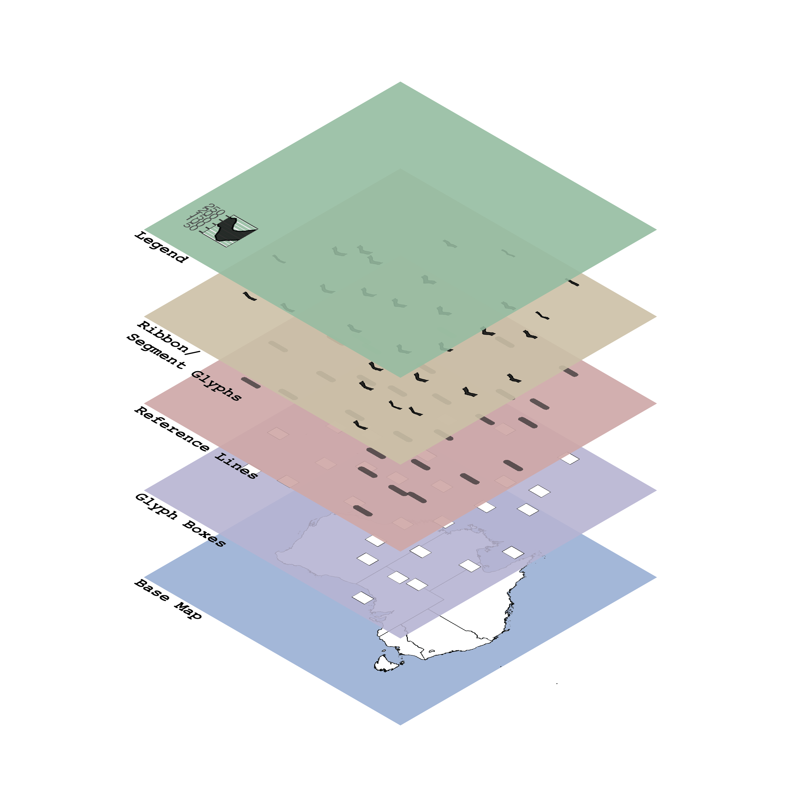
```

Each layer can be plotted independently, and the package supports creating glyph maps using ribbon and segment geometries. The core functionality includes:

* `geom_glyph_ribbon()`:  Displays an interval on the y-axis for each *x_minor* value, with the bounds defined by *ymin_minor* and *ymax_minor*. This function draws  ribbon geometry using the `geom_ribbon()` function from `ggplot2`. Each glyph is plotted by combining *x_major* and *y_major* coordinates. This functionality is handy for visualising data ranges or uncertainties.

* `geom_glyph_segment()`: Connects *y_minor* to *yend_minor* with a straight line using `geom_segment()` from `ggplot2`, resulting in segment glyphs. Each glyph is plotted by combining *x_major* and *y_major* coordinates.

In addition to these two functions, `sugarglider` offers several other features that enhance the aesthetic and interpretability of glyph maps. The `add_glyph_boxes()` function introduces reference boxes that visually frame individual glyphs, helping to define boundaries and distinguish them from one another. The `add_ref_lines()` function draws a horizontal midpoint for each glyph, facilitating comparisons across data points and serving as a visual anchor to reduce perceptual distortion as a result of the Zöllner illusion and improve the accuracy of interpreting glyph maps. The `add_glyph_legend()` displays an enlarged version of a randomly chosen glyph in the bottom-left corner of the panel, enabling users to visualize the data range. Lastly, the `theme_glyph()` function provides a customized theme for glyph maps, built on top of `theme_map()` from `ggthemes`. It adjusts the plot's appearance, including the legend position, text styles, and background settings, to create a clean, visually consistent layout for glyph maps.

```{r, eval = FALSE, echo=TRUE}
library(ggplot2)
library(tidyverse)
library(sugarglider)
library(ozmaps)
library(gridExtra)

# Define a color palette
color_palette <- c("deepskyblue4", "coral3")

# Filter the data to three weather stations
vic_temp <- aus_temp |>
  filter(id %in% c("ASN00026021", "ASN00085291", "ASN00084143"))

# Ribbon glyph
p1 <- vic_temp |>
  ggplot(aes(x_major = long,
             y_major = lat,
             x_minor = month,
             ymin_minor = tmin,
             ymax_minor = tmax)) +
  geom_sf(data = abs_ste |> filter(NAME == "Victoria"),
          fill = "antiquewhite", color = "white", inherit.aes = FALSE)  +
  # Customize the size of each glyph box using the width and height parameters.
  add_glyph_boxes(width = rel(2.5), height = rel(1.5),
                  color = color_palette[1]) +
  add_ref_lines(width = rel(2.5), height = rel(1.5),
                color = color_palette[1]) +
  geom_glyph_ribbon(width = rel(2.5), height = rel(1.5),
                    color = color_palette[1], fill = color_palette[1]) +
  # Theme and aesthetic
  theme_glyph() +
  labs(title = "geom_glyph_ribbon()") +
  theme(plot.title = element_text(hjust = 0.5),
        title = element_text(color = color_palette[1],
                             family  = "mono"))

# Segment glyph
p2 <- vic_temp |>
  ggplot(aes(x_major = long,
             y_major = lat,
             x_minor = month,
             y_minor = tmin,
             yend_minor = tmax)) +
  geom_sf(data = abs_ste |> filter(NAME == "Victoria"),
          fill = "antiquewhite", color = "white", inherit.aes = FALSE)  +
  # Customize the size of each glyph box using the width and height parameters.
  add_glyph_boxes(width = rel(2.5), height = rel(1.5),
                  color = color_palette[2]) +
  add_ref_lines(width = rel(2.5), height = rel(1.5),
                color = color_palette[2]) +
  geom_glyph_segment(width = rel(2.5), height = rel(1.5),
                     color = color_palette[2]) +
  # Theme and aesthetic
  theme_glyph() +
  labs(title = "geom_glyph_segment()") +
  theme(plot.title = element_text(hjust = 0.5),
        title = element_text(color = color_palette[2]))

grid.arrange(p1, p2, ncol = 2)
```

```{r comparisonPlot, fig.cap = "Comparison of ribbon and segment glyph maps using the dataset from the `sugarglider` package. Glyph boxes and reference lines are added to improve interpretation of the glyph structure. Glyph dimensions are customised using the width and height arguments."}

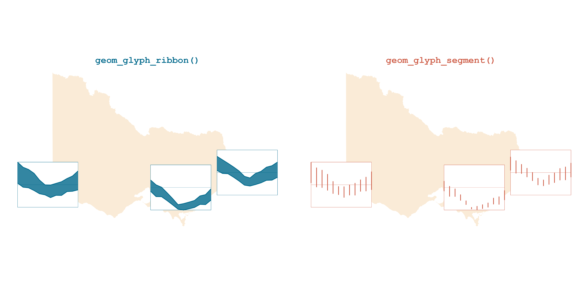
```

The computational performance of glyph maps depends on both the number of locations and dataset size. Rendering glyph maps with hundreds of locations or high-frequency time series may result in slower plotting times. For large datasets, users are encouraged to aggregate the data to a monthly or yearly level before plotting. Currently, `sugarglider` produces static glyph maps, which can become overcrowded when visualising high-density spatial data. To mitigate this issue, users are encouraged to display only a limited number of locations or integrate `leaflet` to provide an interactive visualisation. A more detailed discussion of these limitations and potential solutions is presented in the Conclusion. 

The `sugarglider` package provides various customization options for more flexible visualisation. It includes features such as the `global_rescale` argument, which allows users to choose between global or individual glyph scaling. Users can also adjust the scaling of minor values within grid cells and the overall width and height of glyphs. This ensures that the glyph map can be finely tuned to meet specific data visualisation needs. The following section will explore these features in greater detail and provide practical examples illustrating their application within different visualisation contexts.

## Aesthetics  

The functions in `sugarglider` expect spatial coordinates as the major axis and temporal data, along with some measurements, as minor axes. For minor axes, `sugarglider` adopts the same aesthetics as `ggplot2::geom_ribbon()` and `ggplot2::geom_segment()`, appending `_minor` to each aesthetic name for use in `geom_glyph_ribbon()` and `geom_glyph_segment()`. To incorporate a variable into the glyph plot, define it explicitly as an aesthetic. To produce glyph maps, the following aesthetics are required:

|Aesthetics          | Description
|--------------- | ------------------------------------------------
|  `x_major`, `y_major`         | Spatial coordinates that define the position of glyphs.
|  `x_minor`         | Represents temporal data associated with each glyph.
|  `ymin_minor`, `ymax_minor`       | Used by `geom_glyph_ribbon()` to establish the lower and upper bounds of the ribbon geometry within each glyph.
|  `y_minor`, `yend_minor`       | Used by `geom_glyph_segment()` to set the start and end points of the segment geometry within each glyph.

The functions `add_glyph_boxes()`, `add_ref_lines()`, and `add_glyph_legend()` are compatible with either *ymin_minor*, *ymax_minor*, or *y_minor*, *yend_minor*. Additionally, `sugarglider` introduces several customizable options to tailor the visual aspects further:

|Option          | Default      | Description
|--------------- | ------------ | ------------------------------------------------
| `colour`         | `"black"`         | Sets the color for line segments and borders.
|`linewidth`      | `0.5`          | Specifies the width of the line for borders.
|`linetype`         | `1`          | Defines the style of the line for borders.
|`fill`     | `"black"`     | Determines the color of the interior area of the geometries.
|`alpha`      | `0.8`        | Controls the transparency level of the glyphs.

## Options  

Options within the `sugarglider` package let you tailor your visualisations to the specific needs of your analysis. The *global_rescale* argument controls whether rescaling is applied globally to all data points or individually for each glyph. The effects of these two approaches are as follows:

* Local Rescale (global_rescale = FALSE): Each glyph is rescaled independently using its own data range, emphasising the variation and temporal patterns within each location.
* Global Rescale (global_rescale = TRUE): All glyphs are rescaled using a common data range, preserving magnitude differences across locations and enabling direct comparisons between glyphs.

`sugarglider` also offers customizable features to enhance the flexibility and precision of visualisations. For example, it facilitates the scaling of minor values within the glyph along the x- and y-axes. Users can specify their rescale function by replacing *"identity"* with a custom function in *x_scale* and *y_scale*. If a user wishes to modify the rescaling function on only one axis, they can replace the corresponding parameter with their chosen function and retain "identity" for the other. In this package, "identity" rescales the minor axes to an interval of [-1,1]. The impact of rescaling on glyphs and its implications for visual interpretation will be discussed in the upcoming section.

Additionally, the *width* and *height* of glyphs are fully adjustable, allowing users to customise their appearance to suit the dimensions and scale of the data being visualised. By default, both dimensions are determined by the smallest distance between two consecutive coordinates. Depending on the proximity of locations, this behaviour may produce glyphs that are either too small or too large. Users can therefore override the default values by specifying the *width* and *height* arguments to achieve an appropriate glyph size. An example is shown in Figure 2, where the glyph dimensions were customised using these arguments in the `add_glyph_boxes()` function. For high-density datasets, users may also choose to display only a subset of locations or combine `sugarglider` with Leaflet to create an interactive map that displays all locations. These customisation options enable sugarglider to adapt to a wide range of datasets and visualisation requirements, making it a versatile tool for seasonal spatiotemporal data visualisation.

|Option          | Default      | Description
|--------------- | ------------ | ------------------------------------------------
| `x_scale`         | `"identity"`         | This function scales each set of minor values within a grid cell along the x-dimension.
|`y_scale`      | `"identity"`          | This function scales each set of minor values within a grid cell along the y-dimension.
|`width`         | `"default"`          |  The width of each glyph. The `default` is set to the smallest distance between two consecutive coordinates, converted from meters to degrees of latitude using the Haversine method. This default behaviour can be freely overridden by specifying a custom value.
|`height`     | `"default"`     | The height of each glyph. The `default` is calculated using the ratio (1:1.618) relative to the `width`, to maintain a consistent aspect ratio. This default behaviour can be freely overridden by specifying a custom value.
|`global_rescale`      | `TRUE`        | Controls whether the minor-axis values are rescaled using a common range across all glyphs (*TRUE*) or independently within each glyph (*FALSE*).

## Data structure 

When using the `sugarglider` package to create glyph plots, the first step is to ensure that your data is in the correct format. Per @JSSv110i07, there are two data structures to consider, and `sugarglider` is compatible with one of them. The package supports data structured in an extended format with temporal and spatial elements.

The package includes a dataset named `aus_temp`, sourced from the National Oceanic and Atmospheric Administration (NOAA). This dataset provides comprehensive climate data for 2020 from 29 stations across Australia. It includes crucial climate variables such as precipitation and temperature, along with key spatial elements (longitude and latitude), temporal elements (month), and temperature ranges. These temperature ranges are crucial for determining the widths of the ribbon and segment plots in glyph maps.

```{r, echo = TRUE}
glimpse(aus_temp)
```

Datasets may not always include both spatial and temporal elements. Analysts often start with station data that provides geographic locations, recorded variables, and time periods. To extract relevant data, they can query temporal variables for specific stations of interest. When starting with purely spatial or purely temporal data, they first need additional elements to transform it into a spatiotemporal format.

For these situations, the `cubble` package offers functions such as `make_cubble()` to help users structure their data into `cubble` objects, optimised for glyph maps. This structuring facilitates detailed, insightful spatiotemporal visualisations and seamless integration into the `sugarglider` package.

## Rescale

In `sugarglider`, rescaling is a crucial preprocessing step applied to the minor axes, the data used to plot individual glyphs. Before a glyph can be positioned on a map, its time-series data must first be normalised into a common scale. Normalising the data ensures that glyphs are comparable across locations and provides a consistent input for the spatial-temporal transformation described in the following section. The rescaling mechanism is governed by two parameters: *x_scale* and *y_scale*. *x_scale* adjusts the minor values along the x-dimension within each glyph, while *y_scale* modifies them along the y-dimension.

By default, the rescaling function is set to "identity", which adjusts the minor axes to fit within the interval [-1, 1]. However, users can customize the rescaling function by replacing the default *x_scale* and *y_scale* settings with functions. For example, the following code demonstrates a custom rescale function that maps values to the interval [0, 1]. When this custom rescale is applied, the resulting ribbon in the plot appears significantly thinner than in the previous example, which used the default rescaling settings.

```{r, eval=FALSE, echo=TRUE}
# Default rescale 
nsw_temp |>
   ggplot(aes(x_major = long,
              y_major = lat,
              x_minor = month,
              ymin_minor = tmin,
              ymax_minor = tmax)) +
  geom_glyph_ribbon() +
  theme_glyph() 

# Custom rescale 
custom_rescale <- function(dx) {
  rng <- range(dx, na.rm = TRUE)
  # Rescale dx to [0,1]
  rescaled <- (dx - rng[1]) / (rng[2] - rng[1])
}

nsw_temp |>
   ggplot(aes(x_major = long,
              y_major = lat,
              x_minor = month,
              ymin_minor = tmin,
              ymax_minor = tmax)) +
  geom_glyph_ribbon(x_scale = custom_rescale,
                    y_scale = custom_rescale) +
  theme_glyph() 
```

```{r defaultRescale,fig.cap="The figure illustrates the effect of rescaling on ribbon glyphs. With the default rescaling, all minor axes are adjusted to fit within the interval [-1, 1], whereas the custom rescale function adjusts the minor axes to the interval [0, 1]. Additional code is required to plot the base map alongside the rescaled glyphs."}

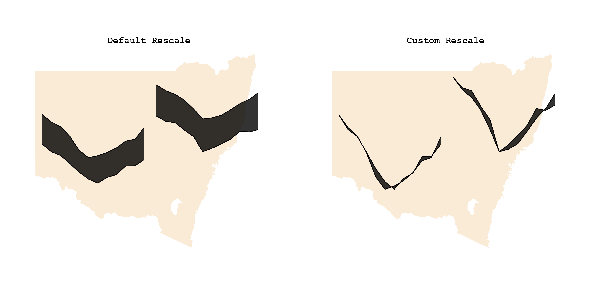
```

To fully grasp the impact of rescaling on mapping temporal data to glyphs, it's important to consider how this process applies to both `geom_glyph_ribbon()` and `geom_glyph_segment()`. The transformation of spatiotemporal data into visual representations will be explored in greater detail in the next section.

Additionally, `sugarglider` allows users to choose whether rescaling is applied globally across all glyphs or individually for each glyph. This behaviour is controlled by the `global_rescale` parameter, which defaults to *TRUE*. When `global_rescale` is set to *FALSE*, users can implement local rescaling, allowing each glyph to be scaled independently. The difference between global and local rescaling is evident in the following example: 

```{r, eval=FALSE, echo=TRUE}
# Global rescale
aus_temp |>
  ggplot(aes(
    x_major = long, 
    y_major = lat, 
    x_minor = month, 
    y_minor = tmin, 
    yend_minor = tmax)) +
  add_glyph_boxes() +
  add_ref_lines() +
  geom_glyph_segment(global_rescale = TRUE) +
  theme_glyph()

# Local Rescale
aus_temp |>
  ggplot(aes(
    x_major = long, 
    y_major = lat, 
    x_minor = month, 
    y_minor = tmin, 
    yend_minor = tmax)) +
  add_glyph_boxes() +
  add_ref_lines() +
  geom_glyph_segment(global_rescale = FALSE) +
  theme_glyph()
```

```{r, fig.cap="The figure highlights the impact of global and local rescaling on segment glyphs. With global rescaling, the temperature range is uniform across all glyphs, allowing users to compare variations in temperature between stations across Australia. In contrast, with local rescaling, the temperature range varies between glyphs, enabling more detailed insights into the temperature distribution at individual stations. Additional code is required to plot the base map and specify the xlim for the sf coordinates."}

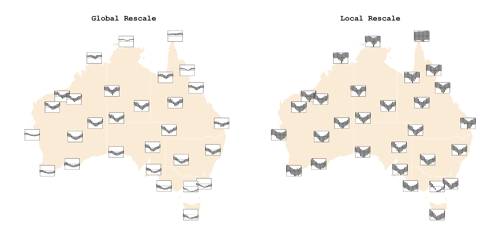

```

The rescaling process in `sugarglider` involves several steps. First, the function checks for custom scaling based on the `x_scale` and `y_scale` parameters. It then groups the data based on the designated grouping variable to ensure each glyph is drawn as a distinct path. If `global_rescale` is set to *TRUE*, the data is ungrouped before rescaling the minor axes, ensuring consistent scaling across all glyphs. Conversely, if `global_rescale` is set to *FALSE*, the data remains grouped, resulting in local scaling for each glyph.

For both `geom_glyph_ribbon()` and `geom_glyph_segment()`, rescaling is applied separately to the `ymin_minor` and `ymax_minor` values or the `y_minor` and `yend_minor` values, respectively. This ensures that the lower and upper bounds are adjusted independently to fit within the specified scale, maintaining accuracy in the rescaled value.

## Spatial-temporal transformation

```{r , echo=FALSE, fig.cap="The diagram highlights how spatial data (geographical location) combines temporal data (measurements over time) to create a spatiotemporal visualisation. In sugarglider, the transformation maps each station's temporal measurements into a visual glyph, allowing users to see patterns across different spatial locations over time.", out.width="90%"}
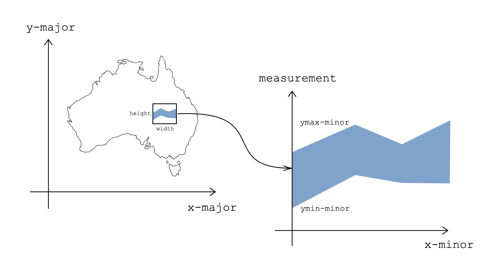
```

After rescaling, the normalised minor-axis values are converted to spatial coordinates to position each glyph on the base map. The construction of a glyph map, as described in @wickham2012glyph, involves a linear combination of two key structural components: spatial location and data values. In this context, the major axes represent the spatial coordinates, latitude ($y_{major}$) and longitude ($x_{major}$). In contrast, the minor axes correspond to time ($x_{minor}$) and a measurement of interest ($ymax_{minor}$ and $ymin_{minor}$). For segment glyphs, the measurement is represented by $y_{minor}$ and $yend_{minor}$.

Once the minor axes are rescaled to the interval [-1, 1], the final coordinates for the ribbon glyph are determined through a linear transformation as follows:

\begin{align}
\text{x} &= \text{x}_{\text{major}} + \frac{\text{width}}{2} \cdot \text{x}_{\text{minor}} \\
\text{ymin} &= \text{y}_{\text{major}} + \frac{\text{height}}{2} \cdot \text{ymin}_{\text{minor}} \\
\text{ymax} &= \text{y}_{\text{major}} + \frac{\text{height}}{2} \cdot \text{ymax}_{\text{minor}}
\end{align}

Similarly, the coordinates for the segment glyph are computed as:

\begin{align}
\text{x} &= \text{x}_{\text{major}} + \frac{\text{width}}{2} \cdot \text{x}_{\text{minor}} \\
\text{y} &= \text{y}_{\text{major}} + \frac{\text{height}}{2} \cdot \text{y}_{\text{minor}} \\
\text{yend} &= \text{y}_{\text{major}} + \frac{\text{height}}{2} \cdot \text{yend}_{\text{minor}}
\end{align}

This linear transformation ensures that the temporal and data components are appropriately aligned with the spatial coordinates, enabling a clear and accurate visualisation of spatiotemporal data. 

## Examples

The `aus_temp` dataset is used to demonstrate the functionality of the `sugarglider` package. Using the default rescaling parameters, we can visualize temperature data with `geom_glyph_segment()` alongside `geom_point()` that marks the location of each weather station. Each segment glyph represents local climate data, providing an intuitive way to explore temperature variations across Australia.

```{r, echo=TRUE, eval=FALSE}
aus_temp |>
  ggplot(aes(
    x_major = long, 
    y_major = lat, 
    x_minor = month, 
    y_minor = tmin, 
    yend_minor = tmax)) +
  add_glyph_boxes() +
  geom_point(aes(x = long, y = lat)) +
  geom_glyph_segment() +
  theme_glyph()
```

```{r ,fig.cap="Daily temperature variations across Australian weather stations are visualized using segment glyphs and geom points to mark the locations of the stations on the map. Additional coding is needed to integrate a base map into the visualisation. This detailed view reveals that the temperature variation in central Australia is more pronounced than in the coastal regions. Additionally, temperatures in the southeastern areas, such as Victoria and Tasmania, are generally lower than those in the northern regions, highlighting regional climate differences across Australia."}

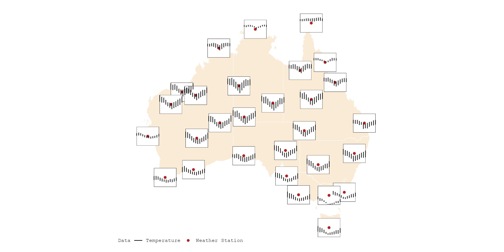
```

Building on the analysis, precipitation data across Australia can be visualized using `geom_glyph_ribbon()`. The glyphs are colour-coded to represent different rainfall levels. In contrast, reference lines and glyph boxes are added to improve clarity and facilitate easy comparisons of precipitation levels across the country.

```{r, echo=TRUE, eval=FALSE}
aus_temp |>
   group_by(id) |>
   mutate(prcp = mean(prcp, na.rm = TRUE)) |>
   ggplot(aes(x_major = long, y_major = lat,
              x_minor = month, ymin_minor = tmin,
              ymax_minor = tmax, 
              fill = prcp, color = prcp)) +
   add_glyph_boxes() +
   add_ref_lines() +
   geom_glyph_ribbon() +
   theme_glyph()
```

```{r, fig.cap="Precipitation and Temperature Ranges Across Australia. This visualisation uses color-coded glyphs to depict variations in precipitation levels, with sky blue representing the lowest and navy blue the highest levels. Additional code is required to incorporate a base map and customize the theme further. From the plot, it is evident that coastal areas receive more rainfall than the central regions."}

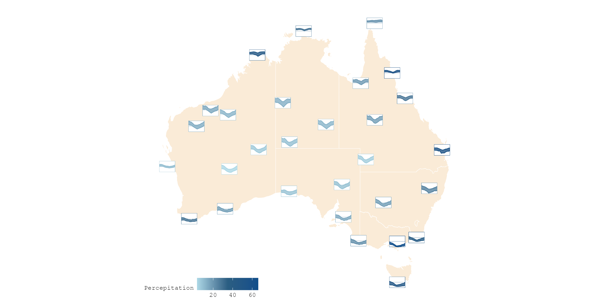
```

The following example uses the `historical_temp` dataset included in the `sugarglider` package. This dataset contains aggregated monthly average minimum and maximum temperatures, along with precipitation, for selected Australian weather stations during 2021 and 2022.

```{r, echo = TRUE}
glimpse(historical_temp)
```

To compare temperature trends across different years for specific regions in Victoria, `geom_glyph_ribbon()` offers an effective way to visualize how temperatures have evolved. Each year is distinguished by a different colour, making the trends clear and easy to interpret. 

```{r, echo=TRUE, eval=FALSE}
historical_temp |> 
  filter(id %in% c("ASN00026021", "ASN00085291", "ASN00084143")) |>
   ggplot(aes(color = factor(year), fill = factor(year),
              group = interaction(year,id),
              x_major = long, y_major = lat,
              x_minor = month, ymin_minor = tmin, 
              ymax_minor = tmax)) +
   add_glyph_boxes() +
   add_ref_lines() +
   geom_glyph_ribbon() +
   theme_glyph()
```

```{r, fig.cap="Temperature Trends in Selected Victorian Weather Stations. Additional coding is required for the base map, title, and theme customization. In both years, a noticeable seasonal pattern in temperature is evident, with peaks occurring in the summer months and troughs in the winter."}

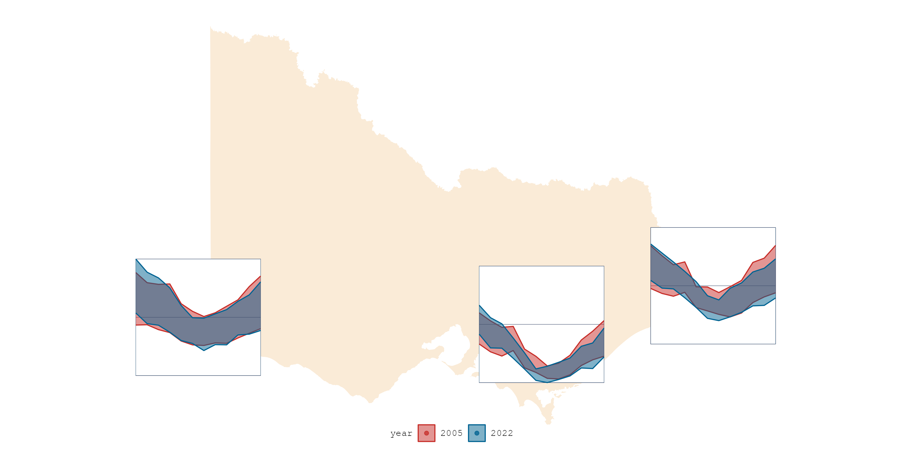
```

To further improve map readability, the `add_glyph_legend()` function integrates an enlarged version of one of the glyphs in the bottom left corner of the plot. This legend helps users interpret the data scale more effectively.

In the example below, a ribbon glyph map is created using `geom_glyph_ribbon()` and overlaid on a base map to depict daily temperature variations across Australian weather stations. A legend is added via `add_glyph_legend()`, allowing users to easily interpret the range of daily temperature values based on a randomly selected weather station. Since the legend data is drawn from a single, randomly chosen station, it is essential to set a seed for reproducibility to ensure consistent results.

```{r, echo=TRUE, eval=FALSE}
set.seed(28493)
aus_temp |>
   ggplot(aes(x_major = long, y_major = lat,
              x_minor = month, ymin_minor = tmin,
              ymax_minor = tmax)) +
  add_glyph_boxes() +
  add_ref_lines() +
  add_glyph_legend() +
  geom_glyph_ribbon() +
  theme_glyph() 
```

```{r, fig.cap="Temperature Ranges Across Australia with Glyph Legend. Additional coding is required for the base map and further theme customization. In this example, the glyphs are uniformly scaled, representing a temperature range from approximately 5.0 to 35.0 degrees Celsius. Temperature values are stored in tenths of a degree Celsius, following the NOAA data convention."}

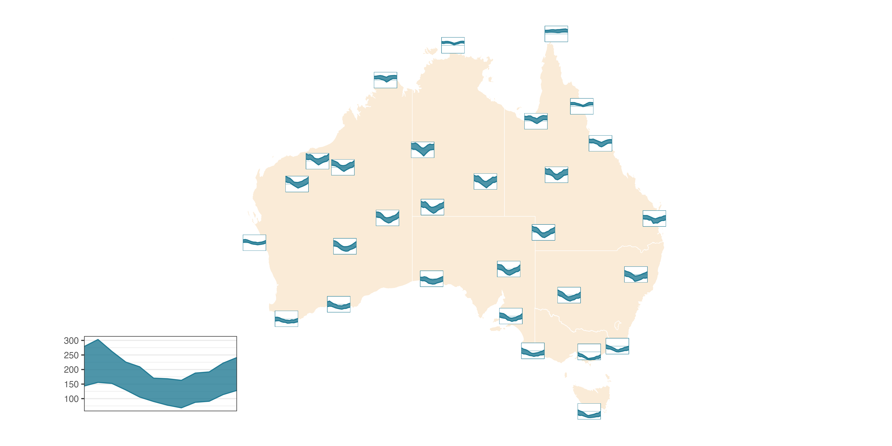
```

# Application 

This section presents four examples showcasing the applications of the `sugarglider` package. The first two examples use the `Train Service Passenger Counts data` from `DataVic`. The first example demonstrates how to create ribbon glyph maps with Leaflet to explore variations in train service passenger counts. The second uses segment glyphs to analyse daily variations in passenger counts on train services in Melbourne City LGA.
The remaining two examples are based on the `Airline Flight Delay and Cancellation` data from `Kaggle`. The third features interactive segment glyphs, developed with `ggiraph`, to analyse flight variations at the top 10 US airports with high cancellation rates. Finally, the fourth uses ribbon glyphs to compare flight variations between the western and southern regions.

## Train service passenger counts

The `Train Service Passenger Counts` dataset, published by `DataVic`, provides estimated numbers of passengers boarding and alighting from Metro Train and Regional Train services for the 2023-2024 period. These estimates include all individuals aged five and over, excluding train drivers and station staff. For this analysis, the data have been aggregated to the hourly level and categorized into maximum and minimum passenger counts for weekdays, weekends, and holidays (including public and school holidays).

### Victorian train station patronage

Interactive graphics are particularly useful for spatiotemporal data, enabling users to explore it from multiple perspectives. The `cubble` package exemplifies this by creating linked interactive plots using `crosswalk::bscols()` (@JSSv110i07). This paper demonstrates how to create interactive glyph maps using Leaflet.

Making a glyph map with Leaflet is helpful for high-density data where many observations are clustered or overlap, as is the case with the Victorian Train data. The main payoff is that Leaflet's ability to pan in and out lets us display all glyphs, regardless of how close they are to each other. 

To create interactive glyph maps with Leaflet, we need to save each glyph as an image and add these to the Leaflet base map as icons. The process begins by creating a list of all unique train stations that service the Metro and Vline. We then iterate over each station and generate ribbon glyphs using `geom_glyph_ribbon()`. Each glyph is saved as an image, and the file paths for all the images are stored in an object for the next step.

The workflow begins by identifying unique train stations and generating ribbon glyphs to represent the daily passenger traffic patterns at each location. These glyphs are saved as image files and linked to their respective stations. An interactive base map is then constructed using Leaflet, onto which the glyph images are added as custom markers at each station’s geospatial coordinates. 

```{r, fig.cap="Screenshot of the hourly train station traffic in Melbourne. Each glyph represents hourly traffic, with peaks occurring during typical commuting hours (morning and evening rush hours)"}
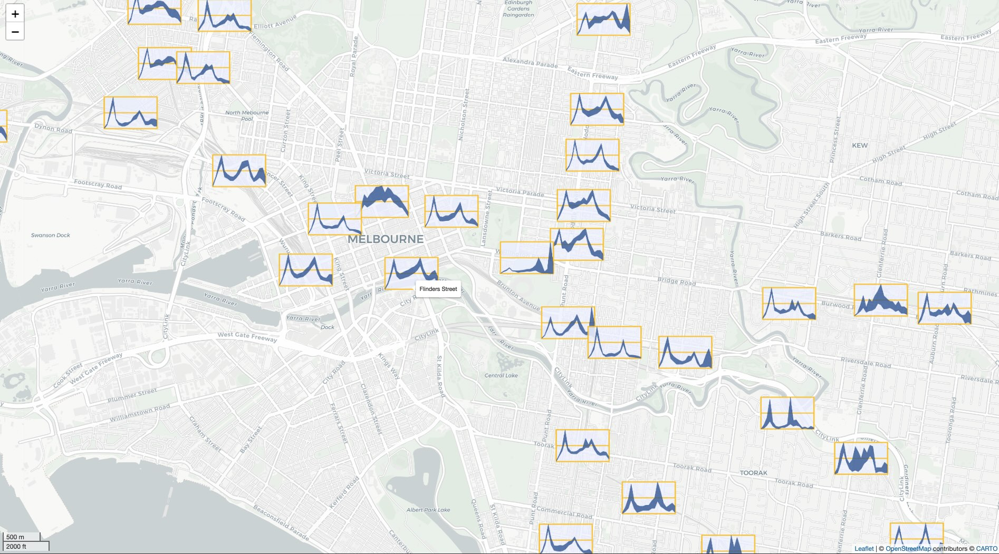
```

The resulting plot visualizes hourly train traffic across various stations in Victoria. Each glyph represents a train station and depicts fluctuations in train traffic at that location throughout the day.

In central Melbourne, especially around major hubs like Melbourne Central Station, traffic varies significantly, with peaks in the middle of the day. This indicates a substantial influx of people, highlighting the central business district (CBD) as the city's primary transit hub.

Some Eastern and South Eastern train stations exhibit pronounced peaks, indicating that they are key transit corridors for residents commuting into the city centre. These stations are situated along major rail lines, such as the `Cranbourne/Pakenham` and `Lilydale/Belgrave` lines, which cater to large suburban populations.

Moving away from the city centre and major rail lines, the glyphs illustrate smaller peaks and greater fluctuations in traffic levels. This suggests that train services are either less frequent or used less in the outer suburbs than in central areas.

### Daily train passenger variations in Melbourne City LGA

```{r, eval=FALSE, echo=TRUE}
weekday <- station |>
  group_by(station_name) |>
  ggplot(aes(x_major = long, y_major = lat,
             x_minor = hour, y_minor = min_weekday,
             yend_minor = max_weekday,
             color = services, fill = services)) +
  add_glyph_boxes() +
  add_ref_lines() +
  geom_glyph_segment(global_rescale = FALSE) +
  theme_glyph() +
  labs(title = "Weekday Patronage") 

weekend <- station |>
  group_by(station_name) |>
  ggplot(aes(x_major = long, y_major = lat,
             x_minor = hour, y_minor = min_weekend,
             yend_minor = max_weekend,
             fill = services, color = services)) +
  add_glyph_boxes() +
  add_ref_lines() +
  geom_glyph_segment(global_rescale = FALSE) +
  theme_glyph() +
  labs(title = "Weekend Patronage") 
```

```{r, fig.cap="Patronage at various train stations in Melbourne City LGA on weekdays versus weekends. Each glyph is colour-coded by the number of train services at each station. Additional code is required to construct the base map and customize the plot further. The plot illustrates the behavioral patterns of train patrons, showing high demand during rush hours on weekdays and consistent, elevated demand throughout the weekend."}
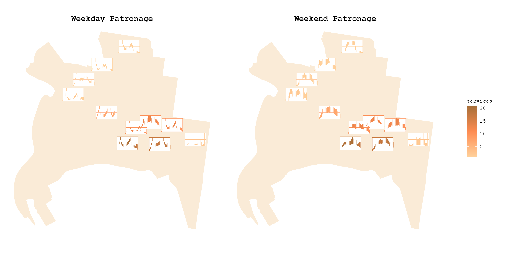
```

The plot provides insightful observations into train service traffic within the Melbourne City LGA, highlighting differences between weekday and weekend patronage. A significant volume of train services is apparent in the city loop, where major connecting hubs such as Flinders Street Station are situated. These stations are depicted with darker shades of brown, indicating up to 20 services, starkly contrasting with the lighter color gradients that signify lower train services.

The analysis further reveals a discrepancy in traffic between weekdays and weekends. At most train stations, there is a greater variation in patronage on weekends than on weekdays. This pattern is consistent across all stations, regardless of the number of train lines each station accommodates. Additionally, there are fewer pronounced peaks on weekends, as traffic is high but consistent throughout the day. In contrast, on weekdays, rush hours see significant spikes due to large numbers of people boarding trains in the morning and evening for school and work, with fewer patrons in between the peaks. This trend underscores the reliance on public transport at certain times of day and could be pivotal for future decisions on scheduling and resource allocation within the transit system.

## Flight Delay and Cancellation 

The U.S. Department of Transportation (DOT) Bureau of Transportation Statistics monitors the on-time performance of domestic flights operated by major U.S. carriers. The DOT publishes the Air Travel Consumer Report monthly, which summarizes data on on-time, delayed, canceled, and diverted flights.

This dataset, sourced from Kaggle's `Airline Flight Delay and Cancellation` data, has been processed and aggregated to focus on the minimum and maximum number of flights originating from the top 10 U.S. airports with the highest cancellation rates.

### Monthly Flight Variation in US Airport with High Cancellation

This example demonstrates the functionality of `geom_glyph_segment()`, which shows the monthly flight range for each airport and provides insights into how flight numbers change over time. Additionally, `geom_glyph_ribbon()` visualizes the variation in the minimum and maximum number of flights per airport, providing a clear depiction of the spread in flight activity.

Users can generate interactive glyphs with `ggiraph::girafe()` using `sugarglider`. First, users need to specify tooltips, which appear when hovering over glyphs. In this example, the tooltips include the station ID, month, minimum, and maximum temperatures across all months.

Tooltips must be provided in the `tooltip` argument's aesthetic. The user can then plot their desired glyph map and save it as a ggplot object. This ggplot object is converted into an interactive glyph map using the `girafe()` function. 

```{r, echo=TRUE, eval=FALSE}
# Specify tooltip for ggiraph 
flights <- flights |>
  mutate(tooltip = paste("origin: ",origin,
                         "\nmonth: ", month,
                         "\nmin_flights: ", min_flights,
                         "\nmax_flights: ", max_flights))

fl <- flights |> 
  ggplot(aes(x_major = long, y_major = lat,
             x_minor = month, y_minor = min_flights,
             yend_minor = max_flights, group = origin,
             tooltip = tooltip)) + 
  add_glyph_boxes() +
  add_ref_lines() +
  geom_glyph_segment() +
  theme_glyph()

# Interactive plot using ggiraph
girafe(ggobj = fl)
```

```{r, eval= knitr::is_latex_output(), fig.cap="Monthly Flight Variability Based on the top 10 US airports with high cancellation rates. Additional codes are needed for the base map and additional theme customization. The graph highlights that airports in certain regions experience more variability than others. Each line segment represents the gap between the minimum and maximum flights. A longer segment indicates more significant month-to-month fluctuations in flight operations."}
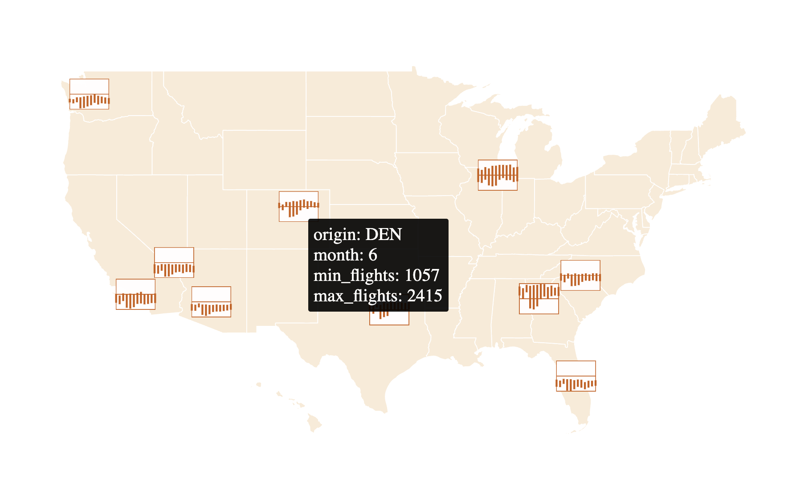
```

```{r, eval = knitr::is_html_output(), fig.cap="Monthly Flight Variability Based on the top 10 US airports with high cancellation rates. Additional codes are needed for the base map and additional theme customization. The graph highlights that airports in certain regions experience more variability than others. Each line segment represents the gap between the minimum and maximum flights. A longer segment indicates more significant month-to-month fluctuations in flight operations." }
USmap <- us_map(regions = "state") |>
  filter(full != "Alaska")

# Specify tooltip for ggiraph
flights <- flights |>
  mutate(tooltip = paste("origin: ",origin,
                         "\nmonth: ", month,
                         "\nmin_flights: ", min_flights,
                         "\nmax_flights: ", max_flights))

fl <- flights |>
  ggplot(aes(x_major = long, y_major = lat,
             x_minor = month, y_minor = min_flights,
             yend_minor = max_flights, group = origin, tooltip = tooltip)) +
  geom_sf(data = USmap, color = "white",
          fill = "antiquewhite", inherit.aes = FALSE) +
  coord_sf(crs = st_crs(4326)) +
  add_glyph_boxes(color = "#CD5C08") +
  add_ref_lines(color = "#CD5C08") +
  geom_glyph_segment(color = "#CD5C08") +
  theme_glyph()

# Interactive plot using ggiraph
girafe(ggobj = fl)
```

This visualisation shows the range of departing flights from each airport on a map. Each line represents a flight range for one airport, with line length showing variation in flight numbers across locations. Airports like ATL and ORD generally handle more departing flights than airports such as MCO and PHX. Airport traffic fluctuates throughout the year, with broader intervals in the middle of the year and narrower ones during the holiday season at year-end.

### Flight Pattern Between Western and Southern Region

```{r, echo=TRUE, eval=FALSE}
# South Region
flights |> 
  filter(origin %in% c("ATL", "CLT", "MCO", "DFW")) |>
  ggplot(aes(x_major = long, y_major = lat,
             x_minor = month, ymin_minor = min_flights,
             ymax_minor = max_flights)) + 
  add_glyph_boxes() +
  add_ref_lines() +
  geom_glyph_ribbon() +
  theme_glyph()

# West region
flights |> 
  filter(origin %in% c("PHX", "LAS", "LAX", "SEA")) |>
  ggplot(aes(x_major = long, y_major = lat,
             x_minor = month, ymin_minor = min_flights,
             ymax_minor = max_flights)) + 
  add_glyph_boxes() +
  add_ref_lines() +
  geom_glyph_ribbon() +
  theme_glyph()
```

```{r, fig.cap="Comparison of flight patterns between the western and southern regions. Additional codes are needed for the base map and additional theme customization."}

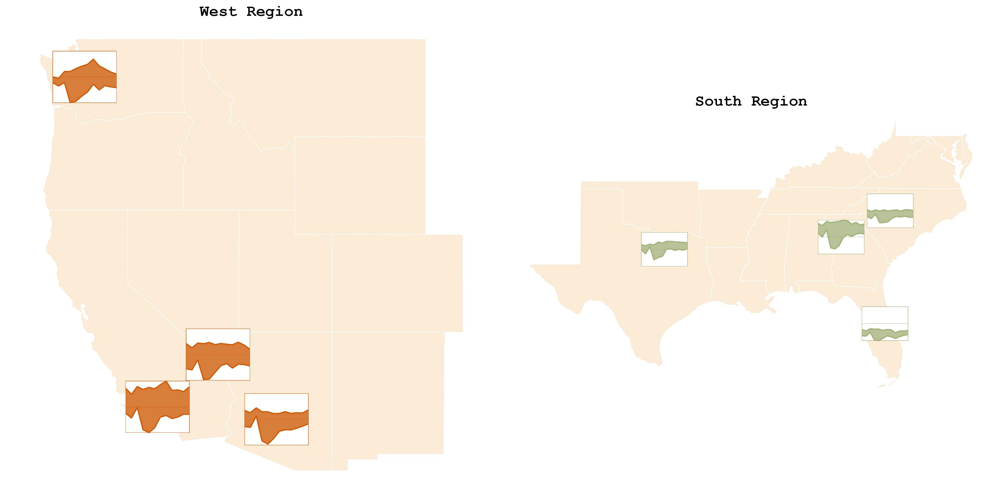
```

`geom_glyph_ribbon()` highlights the disparities in flight volume between regions. The Western region exhibits a more significant variation in the number of flights than the Southern region, as evidenced by the thicker ribbons. Notably, both regions display a significant increase in flight volume discrepancies during the mid-year, reinforcing the findings observed with `geom_glyph_segment()`.

# Conclusion

This paper introduced `sugarglider`, an R package that extends glyph maps with ribbon and segment geometries for exploring spatiotemporal data. Across two applications—Victorian train patronage and flight delays and cancellations—the package demonstrated how ribbon and segment glyph maps can effectively visualise multivariate temporal patterns across numerous spatial locations simultaneously. 

Two potential directions for future development include handling different data types and improving the glyph overlap handling. Currently, `sugarglider` expects data in a tidy format, but expanding its functionality to work with lists of vectors or matrices would enhance its usability. Additionally, static maps can become overcrowded when too many glyphs are plotted, making it difficult to interpret the visualisations. A possible solution is to collapse overlapping glyphs into a single glyph, with an accompanying data summary for all the collapsed glyphs. Another approach is to repel glyphs away from each other to prevent overlap. These improvements would increase the flexibility and scalability of `sugarglider` for a broader range of data visualisation tasks.

## Acknowledgements

This work is funded by Google Summer of Code in affiliation with the R Project for Statistical Computing. This article is created using the R packages `knitr` (@knitr) and `rjtools` (@rjtools). The source code for reproducing this paper is available in the supplementary files and also on Github at https://github.com/maliny12/paper-sugarglider. Additionally, the `sugarglider` package is available on CRAN, with its source code available at https://github.com/maliny12/sugarglider . 

## CRAN Packages Dependencies

|Type          | Dependency      
|------------ | ------------ 
|Imports          |  [ggplot2](https://cran.r-project.org/web/packages/ggplot2/index.html), [dplyr](https://cran.r-project.org/web/packages/dplyr/index.html), [ggplotify](https://cran.r-project.org/web/packages/ggplotify/index.html), [ggthemes](https://cran.r-project.org/web/packages/ggthemes/index.html) 
|Suggests          | [cubble](https://cran.r-project.org/web/packages/cubble/index.html), [testthat](https://cran.r-project.org/web/packages/testthat/index.html), [tidyr](https://cran.r-project.org/web/packages/tidyr/index.html), grid, [lubridate](https://cran.r-project.org/web/packages/lubridate/index.html), [knitr](https://cran.r-project.org/web/packages/knitr/index.html), [rmarkdown](https://cran.r-project.org/web/packages/rmarkdown/index.html), [gridExtra](https://cran.r-project.org/web/packages/gridExtra/index.html), [ozmaps](https://cran.r-project.org/web/packages/ozmaps/index.html), [sf](https://cran.r-project.org/web/packages/sf/index.html), [tidyverse](https://cran.r-project.org/web/packages/tidyverse/index.html), [viridis](https://cran.r-project.org/web/packages/viridis/index.html), [vdiffr](https://cran.r-project.org/web/packages/vdiffr/index.html), [kableExtra](https://cran.r-project.org/web/packages/kableExtra/index.html), [ggiraph](https://cran.r-project.org/web/packages/ggiraph/index.html), [jsonlite](https://cran.r-project.org/web/packages/jsonlite/index.html), [httr](https://cran.r-project.org/web/packages/httr/index.html), [usmap](https://cran.r-project.org/web/packages/usmap/index.html), [geosphere](https://cran.r-project.org/web/packages/geosphere/index.html), [purrr](https://cran.r-project.org/web/packages/purrr/index.html)
